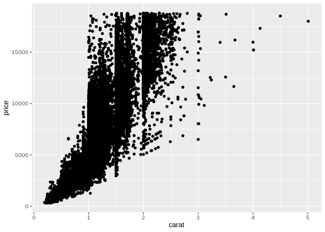
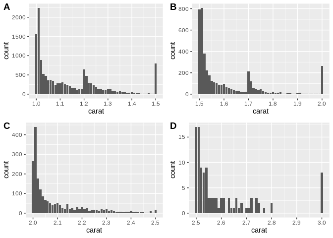
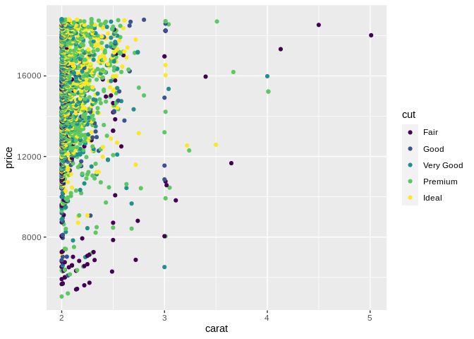
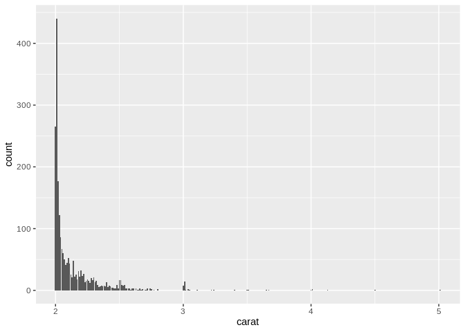

Getting Started: Diamonds
================
(Your name here)
2020-

  - [Grading Rubric](#grading-rubric)
      - [Individual](#individual)
      - [Team](#team)
      - [Due Date](#due-date)
  - [Data Exploration](#data-exploration)
  - [Communication](#communication)

*Purpose*: Throughout this course, you’ll complete a large number of
*exercises* and *challenges*. Exercises are meant to introduce content
with easy-to-solve problems, while challenges are meant to make you
think more deeply about and apply the content. The challenges will start
out highly-scaffolded, and become progressively open-ended.

In this challenge, you will go through the process of exploring,
documenting, and sharing an analysis of a dataset. We will use these
skills again and again in each challenge.

<!-- include-rubric -->

# Grading Rubric

<!-- -------------------------------------------------- -->

Unlike exercises, **challenges will be graded**. The following rubrics
define how you will be graded, both on an individual and team basis.

## Individual

<!-- ------------------------- -->

| Category    | Unsatisfactory                                                                   | Satisfactory                                                               |
| ----------- | -------------------------------------------------------------------------------- | -------------------------------------------------------------------------- |
| Effort      | Some task **q**’s left unattempted                                               | All task **q**’s attempted                                                 |
| Observed    | Did not document observations                                                    | Documented observations based on analysis                                  |
| Supported   | Some observations not supported by analysis                                      | All observations supported by analysis (table, graph, etc.)                |
| Code Styled | Violations of the [style guide](https://style.tidyverse.org/) hinder readability | Code sufficiently close to the [style guide](https://style.tidyverse.org/) |

## Team

<!-- ------------------------- -->

| Category   | Unsatisfactory                                                                                   | Satisfactory                                       |
| ---------- | ------------------------------------------------------------------------------------------------ | -------------------------------------------------- |
| Documented | No team contributions to Wiki                                                                    | Team contributed to Wiki                           |
| Referenced | No team references in Wiki                                                                       | At least one reference in Wiki to member report(s) |
| Relevant   | References unrelated to assertion, or difficult to find related analysis based on reference text | Reference text clearly points to relevant analysis |

## Due Date

<!-- ------------------------- -->

All the deliverables stated in the rubrics above are due on the day of
the class discussion of that exercise. See the
[Syllabus](https://docs.google.com/document/d/1jJTh2DH8nVJd2eyMMoyNGroReo0BKcJrz1eONi3rPSc/edit?usp=sharing)
for more information.

``` r
library(tidyverse)
```

    ## ── Attaching packages ───────────────────────────────────────────────────────────────────────────────────────────────────────── tidyverse 1.3.0 ──

    ## ✓ ggplot2 3.3.2     ✓ purrr   0.3.4
    ## ✓ tibble  3.0.3     ✓ dplyr   1.0.0
    ## ✓ tidyr   1.1.0     ✓ stringr 1.4.0
    ## ✓ readr   1.3.1     ✓ forcats 0.5.0

    ## ── Conflicts ──────────────────────────────────────────────────────────────────────────────────────────────────────────── tidyverse_conflicts() ──
    ## x dplyr::filter() masks stats::filter()
    ## x dplyr::lag()    masks stats::lag()

# Data Exploration

<!-- -------------------------------------------------- -->

In this first stage, you will explore the `diamonds` dataset and
document your observations.

**q1** Create a plot of `price` vs `carat` of the `diamonds` dataset
below. Document your observations from the visual.

*Hint*: We learned how to do this in `e-vis00-basics`\!

``` r
## TASK: Plot `price` vs `carat` below
## Your code here!
library(cowplot)
```

    ## 
    ## ********************************************************

    ## Note: As of version 1.0.0, cowplot does not change the

    ##   default ggplot2 theme anymore. To recover the previous

    ##   behavior, execute:
    ##   theme_set(theme_cowplot())

    ## ********************************************************

``` r
glimpse(diamonds)
```

    ## Rows: 53,940
    ## Columns: 10
    ## $ carat   <dbl> 0.23, 0.21, 0.23, 0.29, 0.31, 0.24, 0.24, 0.26, 0.22, 0.23, 0…
    ## $ cut     <ord> Ideal, Premium, Good, Premium, Good, Very Good, Very Good, Ve…
    ## $ color   <ord> E, E, E, I, J, J, I, H, E, H, J, J, F, J, E, E, I, J, J, J, I…
    ## $ clarity <ord> SI2, SI1, VS1, VS2, SI2, VVS2, VVS1, SI1, VS2, VS1, SI1, VS1,…
    ## $ depth   <dbl> 61.5, 59.8, 56.9, 62.4, 63.3, 62.8, 62.3, 61.9, 65.1, 59.4, 6…
    ## $ table   <dbl> 55, 61, 65, 58, 58, 57, 57, 55, 61, 61, 55, 56, 61, 54, 62, 5…
    ## $ price   <int> 326, 326, 327, 334, 335, 336, 336, 337, 337, 338, 339, 340, 3…
    ## $ x       <dbl> 3.95, 3.89, 4.05, 4.20, 4.34, 3.94, 3.95, 4.07, 3.87, 4.00, 4…
    ## $ y       <dbl> 3.98, 3.84, 4.07, 4.23, 4.35, 3.96, 3.98, 4.11, 3.78, 4.05, 4…
    ## $ z       <dbl> 2.43, 2.31, 2.31, 2.63, 2.75, 2.48, 2.47, 2.53, 2.49, 2.39, 2…

``` r
ggplot(diamonds)+
  geom_point(aes(x=carat, y=price))
```

<!-- -->

``` r
mod_diamond_carat1 = diamonds[diamonds$carat <= 1.5 & diamonds$carat >= 1.0, ] 
carat1 <- mod_diamond_carat1 %>%
  ggplot(aes(carat)) +
    geom_bar()

mod_diamond_carat2 = diamonds[diamonds$carat <= 2.0 & diamonds$carat >= 1.5, ] 
carat2 <- mod_diamond_carat2 %>%
  ggplot(aes(carat)) +
    geom_bar()

mod_diamond_carat3 = diamonds[diamonds$carat <= 2.5 & diamonds$carat >= 2.0, ] 
carat3 <- mod_diamond_carat3 %>%
  ggplot(aes(carat)) +
    geom_bar()

mod_diamond_carat4 = diamonds[diamonds$carat <= 3.0 & diamonds$carat >= 2.5, ] 
carat4 <- mod_diamond_carat4 %>%
  ggplot(aes(carat)) +
    geom_bar()

plot_grid(carat1, carat2, carat3, carat4, labels = "AUTO")
```

<!-- -->

**Observations**:

After Angela made a note on how carats are measured, I was interested in
exploring the hard lines in the first graph, which seemed anomalous,
especially when considering the logarithmic evidenced by the sub \<1
carat range. I broke down the set based on carat ranges (1-1.5, 1.5-2,
2-2.5, 2.5-3) and then made a histogram plot from those ranges which
seems to highlight this phenomena on the data. You can see this effect
even in the most basic carat v. price graph. I think it is a fair
statement to make that the distribution of carats should be purely
random, but within the specified ranges there is a clear bias towards
“clean” numbers, with a logarithmic decay within each of those sets.

**q2** Create a visualization showing variables `carat`, `price`, and
`cut` simultaneously. Experiment with which variable you assign to which
aesthetic (`x`, `y`, etc.) to find an effective visual.

``` r
## TASK: Plot `price`, `carat`, and `cut` below
## Your code here!
library(cowplot)

mod_diamond_carat1 = diamonds[diamonds$carat <= 1.5 & diamonds$carat >= 1.0, ] 
cpc1 <- ggplot(mod_diamond_carat1)+
  geom_point(aes(x=carat, y=price, color=cut))
carat1 <- mod_diamond_carat1 %>%
  ggplot(aes(carat)) +
    geom_bar()

mod_diamond_carat2 = diamonds[diamonds$carat <= 2.0 & diamonds$carat >= 1.5, ] 
cpc2 <- ggplot(mod_diamond_carat2)+
  geom_point(aes(x=carat, y=price, color=cut))
carat2 <- mod_diamond_carat2 %>%
  ggplot(aes(carat)) +
    geom_bar()

mod_diamond_carat3 = diamonds[diamonds$carat <= 2.5 & diamonds$carat >= 2.0, ] 
cpc3 <- ggplot(mod_diamond_carat3)+
  geom_point(aes(x=carat, y=price, color=cut))
carat3 <- mod_diamond_carat3 %>%
  ggplot(aes(carat)) +
    geom_bar()

mod_diamond_carat4 = diamonds[diamonds$carat <= 3.0 & diamonds$carat >= 2.5, ] 
cpc4 <- ggplot(mod_diamond_carat4)+
  geom_point(aes(x=carat, y=price, color=cut))
carat4 <- mod_diamond_carat4 %>%
  ggplot(aes(carat)) +
    geom_bar()

mod_diamond_carat5 = diamonds[diamonds$carat >= 2.0, ]
ggplot(mod_diamond_carat5)+
  geom_point(aes(x=carat, y=price, color=cut))
```

<!-- -->

``` r
mod_diamond_carat5 %>%
  ggplot(aes(carat)) +
    geom_bar()
```

<!-- -->

``` r
#plot_grid(carat1, carat2, carat3, carat4, labels = "AUTO")
```

**Observations**:

As I was slicing and dicing the data I noticed something interesting at
2.8+ carats. There are very few ideal cuts in this range which is
actually somewhat counter-intuitive. My hypothesis from this is that at
this range the primary purpose is to maximize weight (carats) so
therefore reducing the weight to improve the cut is not preferred

# Communication

<!-- -------------------------------------------------- -->

In this next stage, you will render your data exploration, push it to
GitHub to share with others, and link your observations within our [Data
Science
Wiki](https://olin-data-science.fandom.com/wiki/Olin_Data_Science_Wiki).

**q3** *Knit* your document in order to create a report.

You can do this by clicking the “Knit” button at the top of your
document in RStudio.


This will create a local `.md` file, and RStudio will automatically open
a preview window so you can view your knitted document.

**q4** *Push* your knitted document to GitHub.


You will need to stage both the `.md` file, as well as the `_files`
folder. Note that the `_files` folder, when staged, will expand to
include all the files under that directory.


**q5** *Document* your findings in our
[Wiki](https://olin-data-science.fandom.com/wiki/Olin_Data_Science_Wiki).
Work with your learning team to come to consensus on your findings.

The [Datasets](https://olin-data-science.fandom.com/wiki/Datasets) page
contains lists all the datasets we’ve analyzed together.

**q6** *Prepare* to present your team’s findings\!

**q7** Add a link to your personal data-science repository on the
[Repositories](https://olin-data-science.fandom.com/wiki/Repositories)
page. Make sure to file it under your team name\!
