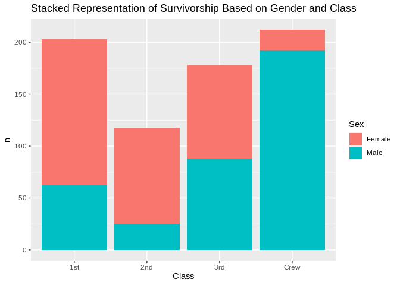
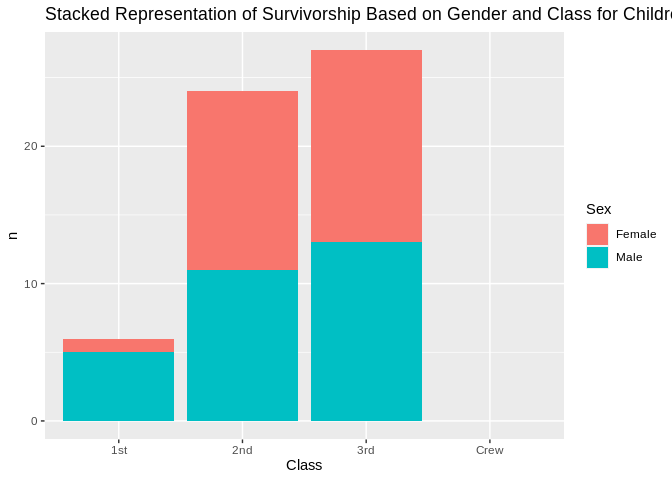

RMS Titanic
================
(Your name here)
2020-

  - [Grading Rubric](#grading-rubric)
      - [Individual](#individual)
      - [Team](#team)
      - [Due Date](#due-date)
  - [First Look](#first-look)
  - [Deeper Look](#deeper-look)
  - [Notes](#notes)

*Purpose*: Most datasets have at least a few variables. Part of our task
in analyzing a dataset is to understand trends as they vary across these
different variables. Unless we’re careful and thorough, we can easily
miss these patterns. In this challenge you’ll analyze a dataset with a
small number of categorical variables and try to find differences among
the groups.

*Reading*: (Optional) [Wikipedia
article](https://en.wikipedia.org/wiki/RMS_Titanic) on the RMS Titanic.

<!-- include-rubric -->

# Grading Rubric

<!-- -------------------------------------------------- -->

Unlike exercises, **challenges will be graded**. The following rubrics
define how you will be graded, both on an individual and team basis.

## Individual

<!-- ------------------------- -->

| Category    | Unsatisfactory                                                                   | Satisfactory                                                               |
| ----------- | -------------------------------------------------------------------------------- | -------------------------------------------------------------------------- |
| Effort      | Some task **q**’s left unattempted                                               | All task **q**’s attempted                                                 |
| Observed    | Did not document observations                                                    | Documented observations based on analysis                                  |
| Supported   | Some observations not supported by analysis                                      | All observations supported by analysis (table, graph, etc.)                |
| Code Styled | Violations of the [style guide](https://style.tidyverse.org/) hinder readability | Code sufficiently close to the [style guide](https://style.tidyverse.org/) |

## Team

<!-- ------------------------- -->

| Category   | Unsatisfactory                                                                                   | Satisfactory                                       |
| ---------- | ------------------------------------------------------------------------------------------------ | -------------------------------------------------- |
| Documented | No team contributions to Wiki                                                                    | Team contributed to Wiki                           |
| Referenced | No team references in Wiki                                                                       | At least one reference in Wiki to member report(s) |
| Relevant   | References unrelated to assertion, or difficult to find related analysis based on reference text | Reference text clearly points to relevant analysis |

## Due Date

<!-- ------------------------- -->

All the deliverables stated in the rubrics above are due on the day of
the class discussion of that exercise. See the
[Syllabus](https://docs.google.com/document/d/1jJTh2DH8nVJd2eyMMoyNGroReo0BKcJrz1eONi3rPSc/edit?usp=sharing)
for more information.

``` r
library(tidyverse)
```

    ## ── Attaching packages ─────────────────────────────────────── tidyverse 1.3.0 ──

    ## ✓ ggplot2 3.3.2     ✓ purrr   0.3.4
    ## ✓ tibble  3.0.3     ✓ dplyr   1.0.0
    ## ✓ tidyr   1.1.0     ✓ stringr 1.4.0
    ## ✓ readr   1.3.1     ✓ forcats 0.5.0

    ## ── Conflicts ────────────────────────────────────────── tidyverse_conflicts() ──
    ## x dplyr::filter() masks stats::filter()
    ## x dplyr::lag()    masks stats::lag()

``` r
library(ggplot2)
library(dplyr)

df_titanic <- as_tibble(Titanic)
```

*Background*: The RMS Titanic sank on its maiden voyage in 1912; about
67% of its passengers died.

# First Look

<!-- -------------------------------------------------- -->

**q1** Perform a glimpse of `df_titanic`. What variables are in this
dataset?

``` r
## TASK: Perform a `glimpse` of df_titanic
glimpse(df_titanic)
```

    ## Rows: 32
    ## Columns: 5
    ## $ Class    <chr> "1st", "2nd", "3rd", "Crew", "1st", "2nd", "3rd", "Crew", "1…
    ## $ Sex      <chr> "Male", "Male", "Male", "Male", "Female", "Female", "Female"…
    ## $ Age      <chr> "Child", "Child", "Child", "Child", "Child", "Child", "Child…
    ## $ Survived <chr> "No", "No", "No", "No", "No", "No", "No", "No", "No", "No", …
    ## $ n        <dbl> 0, 0, 35, 0, 0, 0, 17, 0, 118, 154, 387, 670, 4, 13, 89, 3, …

**Observations**:

  - List the variables here class (4 options) /sex (binary -
    male/female/age(binary - child/adult)/survived(binary - yes/no)

**q2** Skim the [Wikipedia
article](https://en.wikipedia.org/wiki/RMS_Titanic) on the RMS Titanic,
and look for a total count of passengers. Compare against the total
computed below. Are there any differences? Are those differences large
or small? What might account for those differences?

``` r
## NOTE: No need to edit! We'll cover how to
## do this calculation in a later exercise.
df_titanic %>% summarize(total = sum(n))
```

    ## # A tibble: 1 x 1
    ##   total
    ##   <dbl>
    ## 1  2201

Passengers: 1,316 Crew: 908 Total:2,224 Total from dataset - 2201

Dataset is short 23, which is pretty good given the age of the ship’s
manifest. It is not clear what is missing from the dataset, though my
teammate Ingrid made an interseting note that the Captain is not counted
among the crew, as he is the “owner” of the ship.

**q3** Create a plot showing the count of passengers who *did* survive,
along with aesthetics for `Class` and `Sex`. Document your observations
below.

*Note*: There are many ways to do this.

``` r
## TASK: Visualize counts against `Class` and `Sex`

# create a dataset
 survivors <-
  df_titanic %>%
  filter(
    Survived == "Yes"
  )
 
# Grouped
survivors %>%
  ggplot() +
  geom_col(mapping = aes(x = Class, y = n, fill = Sex), position = "stack") +
  labs(title = "Stacked Representation of Survivorship Based on Gender and Class")
```

<!-- -->

``` r
 child_survivors <-
  df_titanic %>%
  filter(
    Survived == "Yes",
    Age == "Child"
  )

# Grouped
child_survivors %>%
  ggplot() +
  geom_col(mapping = aes(x = Class, y = n, fill = Sex), position = "stack") +
  labs(title = "Stacked Representation of Survivorship Based on Gender and Class for Children")
```

<!-- -->

The mentality of “women and children” first definitely seems to apply
here, as evidenced by the high proportion of female survivors.

# Deeper Look

<!-- -------------------------------------------------- -->

Raw counts give us a sense of totals, but they are not as useful for
understanding differences between groups. This is because the
differences we see in counts could be due to either the relative size of
the group OR differences in outcomes for those groups. To make
comparisons between groups, we should also consider *proportions*.\[1\]

The following code computes proportions within each `Class, Sex, Age`
group.

``` r
## NOTE: No need to edit! We'll cover how to
## do this calculation in a later exercise.
df_prop <-
  df_titanic %>%
  group_by(Class, Sex, Age) %>%
  mutate(
    Total = sum(n),
    Prop = n / Total
  ) %>%
  ungroup()
df_prop
```

    ## # A tibble: 32 x 7
    ##    Class Sex    Age   Survived     n Total    Prop
    ##    <chr> <chr>  <chr> <chr>    <dbl> <dbl>   <dbl>
    ##  1 1st   Male   Child No           0     5   0    
    ##  2 2nd   Male   Child No           0    11   0    
    ##  3 3rd   Male   Child No          35    48   0.729
    ##  4 Crew  Male   Child No           0     0 NaN    
    ##  5 1st   Female Child No           0     1   0    
    ##  6 2nd   Female Child No           0    13   0    
    ##  7 3rd   Female Child No          17    31   0.548
    ##  8 Crew  Female Child No           0     0 NaN    
    ##  9 1st   Male   Adult No         118   175   0.674
    ## 10 2nd   Male   Adult No         154   168   0.917
    ## # … with 22 more rows

**q4** Replicate your visual from q3, but display `Prop` in place of
`n`. Document your observations, and note any new/different observations
you make in comparison with q3.

``` r
# create a dataset
 prop_survivors <-
  df_prop %>%
  filter(
    Survived == "Yes"
  )
 
# Class
prop_survivors %>%
  ggplot() +
  geom_col(mapping = aes(x = Class, y = Prop, fill = Age), position = "dodge") +
  labs(title = "Proportional Representation of Survivorship Based on Class")
```

    ## Warning: Removed 2 rows containing missing values (geom_col).

<!-- -->

**Observations**:

The stark drop in survivorship in 3rd class, for both children and
adults, has reinforced in me the desire to never fly economy again. In
our team discussions we did note that low surivorship for children in
3rd class may have been influenced by the time of the accident, the ship
began sinking at 2 AM, and the labyrinthine route needed to reach the
surface from the lower tiers.

**q5** Create a plot showing the group-proportion of passengers who
*did* survive, along with aesthetics for `Class`, `Sex`, *and* `Age`.
Document your observations below.

*Hint*: Don’t forget that you can use `facet_grid` to help consider
additional variables\!

``` r
ggplot() + 
  geom_col(data = prop_survivors, aes(Class, Prop))+
  labs(title = "Survivors by Proportion",
       y="Proportional",
       x="Class")+
  facet_grid(Sex ~ Age)
```

    ## Warning: Removed 2 rows containing missing values (position_stack).

<!-- -->

**Observations**:

I really enjoyed using facet grid to increase the informational density
of the graph. I started by plotting the raw counts vs. the proportional
survivorship results, but kept only the proportional graph because
looking at just raw counts less edifying With the proportional results
we can quickly see that all children were saved regardless of gender, in
both the first and second classes. Sadly, the third class children fared
far worse, with a bias towards females.

# Notes

<!-- -------------------------------------------------- -->

\[1\] This is basically the same idea as [Dimensional
Analysis](https://en.wikipedia.org/wiki/Dimensional_analysis); computing
proportions is akin to non-dimensionalizing a quantity.
