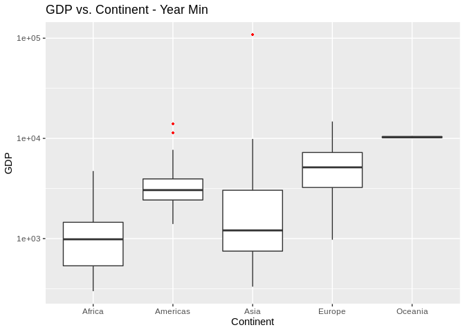
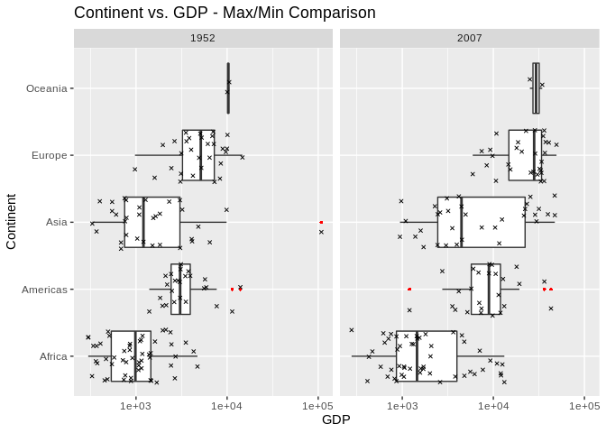
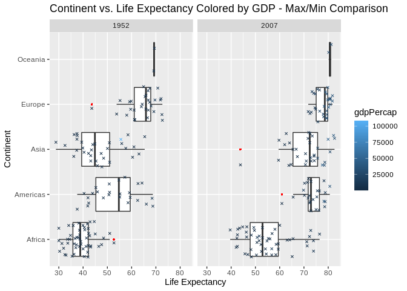
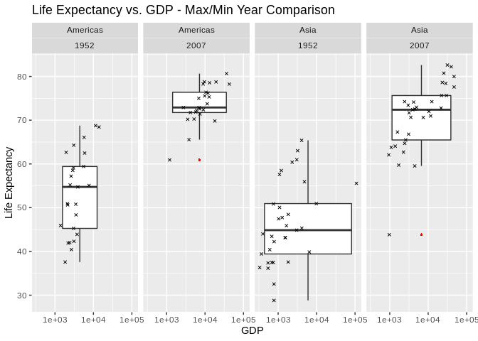
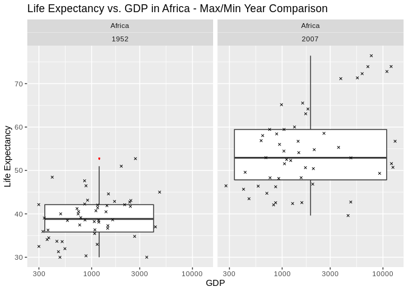

Gapminder
================
(Your name here)
2020-

  - [Grading Rubric](#grading-rubric)
      - [Individual](#individual)
      - [Team](#team)
      - [Due Date](#due-date)
  - [Guided EDA](#guided-eda)
  - [Your Own EDA](#your-own-eda)

*Purpose*: Learning to do EDA well takes practice\! In this challenge
you’ll further practice EDA by first completing a guided exploration,
then by conducting your own investigation. This challenge will also give
you a chance to use the wide variety of visual tools we’ve been
learning.

<!-- include-rubric -->

# Grading Rubric

<!-- -------------------------------------------------- -->

Unlike exercises, **challenges will be graded**. The following rubrics
define how you will be graded, both on an individual and team basis.

## Individual

<!-- ------------------------- -->

| Category    | Unsatisfactory                                                                   | Satisfactory                                                               |
| ----------- | -------------------------------------------------------------------------------- | -------------------------------------------------------------------------- |
| Effort      | Some task **q**’s left unattempted                                               | All task **q**’s attempted                                                 |
| Observed    | Did not document observations                                                    | Documented observations based on analysis                                  |
| Supported   | Some observations not supported by analysis                                      | All observations supported by analysis (table, graph, etc.)                |
| Code Styled | Violations of the [style guide](https://style.tidyverse.org/) hinder readability | Code sufficiently close to the [style guide](https://style.tidyverse.org/) |

## Team

<!-- ------------------------- -->

| Category   | Unsatisfactory                                                                                   | Satisfactory                                       |
| ---------- | ------------------------------------------------------------------------------------------------ | -------------------------------------------------- |
| Documented | No team contributions to Wiki                                                                    | Team contributed to Wiki                           |
| Referenced | No team references in Wiki                                                                       | At least one reference in Wiki to member report(s) |
| Relevant   | References unrelated to assertion, or difficult to find related analysis based on reference text | Reference text clearly points to relevant analysis |

## Due Date

<!-- ------------------------- -->

All the deliverables stated in the rubrics above are due on the day of
the class discussion of that exercise. See the
[Syllabus](https://docs.google.com/document/d/1jJTh2DH8nVJd2eyMMoyNGroReo0BKcJrz1eONi3rPSc/edit?usp=sharing)
for more information.

``` r
library(tidyverse)
```

    ## ── Attaching packages ───────────────────────────────────────────────────────────────────────────────────────────────────────── tidyverse 1.3.0 ──

    ## ✓ ggplot2 3.3.2     ✓ purrr   0.3.4
    ## ✓ tibble  3.0.3     ✓ dplyr   1.0.0
    ## ✓ tidyr   1.1.0     ✓ stringr 1.4.0
    ## ✓ readr   1.3.1     ✓ forcats 0.5.0

    ## ── Conflicts ──────────────────────────────────────────────────────────────────────────────────────────────────────────── tidyverse_conflicts() ──
    ## x dplyr::filter() masks stats::filter()
    ## x dplyr::lag()    masks stats::lag()

``` r
library(gapminder)
```

*Background*: [Gapminder](https://www.gapminder.org/about-gapminder/) is
an independent organization that seeks to education people about the
state of the world. They promote a “fact-based worldview” by focusing on
data. The dataset we’ll study in this challenge is from Gapminder.

# Guided EDA

<!-- -------------------------------------------------- -->

First, we’ll go through a round of *guided EDA*. Try to pay attention to
the high-level process we’re going through—after this guided round
you’ll be responsible for doing another cycle of EDA on your own\!

**q0** Perform your “first checks” on the dataset. What variables are in
this dataset?

``` r
## TASK: Do your "first checks" here!
glimpse(gapminder)
```

    ## Rows: 1,704
    ## Columns: 6
    ## $ country   <fct> Afghanistan, Afghanistan, Afghanistan, Afghanistan, Afghani…
    ## $ continent <fct> Asia, Asia, Asia, Asia, Asia, Asia, Asia, Asia, Asia, Asia,…
    ## $ year      <int> 1952, 1957, 1962, 1967, 1972, 1977, 1982, 1987, 1992, 1997,…
    ## $ lifeExp   <dbl> 28.801, 30.332, 31.997, 34.020, 36.088, 38.438, 39.854, 40.…
    ## $ pop       <int> 8425333, 9240934, 10267083, 11537966, 13079460, 14880372, 1…
    ## $ gdpPercap <dbl> 779.4453, 820.8530, 853.1007, 836.1971, 739.9811, 786.1134,…

**Observations**:

Country, continent, year(born), lifeExp, pop, gdpPercap

**q1** Determine the most and least recent years in the `gapminder`
dataset.

``` r
## TASK: Find the largest and smallest values of `year` in `gapminder`
year_min <- summarise(gapminder, min(year))
year_max <- summarise(gapminder, max(year))

year_min
```

    ## # A tibble: 1 x 1
    ##   `min(year)`
    ##         <int>
    ## 1        1952

``` r
year_max
```

    ## # A tibble: 1 x 1
    ##   `max(year)`
    ##         <int>
    ## 1        2007

Use the following test to check your work.

``` r
## NOTE: No need to change this
assertthat::assert_that(year_max %% 7 == 5)
```

    ## [1] TRUE

``` r
assertthat::assert_that(year_max %% 3 == 0)
```

    ## [1] TRUE

``` r
assertthat::assert_that(year_min %% 7 == 6)
```

    ## [1] TRUE

``` r
assertthat::assert_that(year_min %% 3 == 2)
```

    ## [1] TRUE

``` r
print("Nice!")
```

    ## [1] "Nice!"

**q2** Filter on years matching `year_min`, and make a plot of the GDE
per capita against continent. Choose an appropriate `geom_` to visualize
the data. What observations can you make?

You may encounter difficulties in visualizing these data; if so document
your challenges and attempt to produce the most informative visual you
can.

``` r
## TASK: Create a visual of gdpPercap vs continent
gapminder %>%
  filter(year == 1952) %>%
  ggplot(aes(x = continent, y = gdpPercap)) +
  geom_boxplot(outlier.colour="red", outlier.shape=16,
                outlier.size=1) +
  scale_y_log10() +
  labs(title = "GDP vs. Continent - Year Min",
       x="Continent",
       y="GDP") 
```

<!-- -->

**Observations**:

Asia has the worst inequality. Oceania has the least inequality and the
highest median GDP per capita.

It would be interesting to map the data skew against Gini coefficient.

**Difficulties & Approaches**:

**q3** You should have found at least three outliers in q2. Identify
those outliers (figure out which countries they are).

``` r
## TASK: Identify the outliers from q2
min_outliers <- gapminder %>%
  filter(year == 1952) %>%
  group_by(continent) %>%
  mutate(
    "lowerbound" = quantile(gdpPercap, 0.25) - IQR(gdpPercap)*1.5, 
    "upperbound" = quantile(gdpPercap, 0.75) + IQR(gdpPercap)*1.5
  ) %>%
  filter(gdpPercap < lowerbound | gdpPercap > upperbound)

min_outliers
```

    ## # A tibble: 9 x 8
    ## # Groups:   continent [4]
    ##   country       continent  year lifeExp      pop gdpPercap lowerbound upperbound
    ##   <fct>         <fct>     <int>   <dbl>    <int>     <dbl>      <dbl>      <dbl>
    ## 1 Angola        Africa     1952    30.0   4.23e6     3521.      -845.      2835.
    ## 2 Bahrain       Asia       1952    50.9   1.20e5     9867.     -2679.      6464.
    ## 3 Canada        Americas   1952    68.8   1.48e7    11367.       161.      6208.
    ## 4 Gabon         Africa     1952    37.0   4.21e5     4293.      -845.      2835.
    ## 5 Kuwait        Asia       1952    55.6   1.60e5   108382.     -2679.      6464.
    ## 6 South Africa  Africa     1952    45.0   1.43e7     4725.      -845.      2835.
    ## 7 Switzerland   Europe     1952    69.6   4.82e6    14734.     -2752.     13230.
    ## 8 United States Americas   1952    68.4   1.58e8    13990.       161.      6208.
    ## 9 Venezuela     Americas   1952    55.1   5.44e6     7690.       161.      6208.

**q4** Create a plot similar to yours from q2 studying both `year_min`
and `year_max`. Find a way to highlight the outliers from q3 on your
plot. Compare the patterns between `year_min` and `year_max`.

*Hint*: We’ve learned a lot of different ways to show multiple
variables; think about using different aesthetics or facets.

``` r
## TASK: Create a visual of gdpPercap vs continent
gapminder %>%
  filter(year == 1952 | year == 2007) %>%
  ggplot(aes(x = gdpPercap, y = continent)) +
  geom_boxplot(outlier.colour="red", outlier.shape=16,
                outlier.size=1, notch=FALSE) +
  geom_jitter(shape=4, size=1) +
  scale_x_log10() +
  labs(title = "Continent vs. Continent - Max/Min Comparison",
       x="GDP",
       y="Continent") +
  facet_grid(~ year)
```

<!-- -->

**Observations**:

  - Write your observations here

# Your Own EDA

<!-- -------------------------------------------------- -->

Now it’s your turn\! We just went through guided EDA considering the GDP
per capita at two time points. You can continue looking at outliers,
consider different years, repeat the exercise with `lifeExp`, consider
the relationship between variables, or something else entirely.

**q5** Create *at least* three new figures below. With each figure, try
to pose new questions about the data.

``` r
## TASK: Your first graph
gapminder %>%
  filter(year == 1952 | year == 2007) %>%
  ggplot(aes(x = lifeExp, y = continent, color=gdpPercap)) +
  geom_boxplot(outlier.colour="red", outlier.shape=16,
                outlier.size=1, notch=FALSE) +
  geom_jitter(shape=4, size=1) +
  labs(title = "Continent vs. Life Expectancy Colored by GDP - Max/Min Comparison",
       x="Life Expectancy",
       y="Continent") +
  facet_grid(~ year)
```

<!-- -->

I am interested in how life expectancy changes based on geographic
location and GDP over time.

``` r
## TASK: Your second graph
gapminder %>%
  filter(continent == "Asia" | continent == "Americas") %>%
  filter(year == 1952 | year == 2007) %>%
  ggplot(aes(group = continent, x = gdpPercap, y = lifeExp)) +
  geom_boxplot(outlier.colour="red", outlier.shape=16,
                outlier.size=1, notch=FALSE) +
  geom_jitter(shape=4, size=1) +
  scale_x_log10() +
  labs(title = "Life Expectancy vs. GDP - Max/Min Year Comparison",
       x="GDP",
       y="Life Expectancy") +
  facet_grid(~ continent + year)
```

<!-- -->

Comparing the change in Americas and Asia. The Americas tighten up and
jumps significantly, while the spread in Asia is still significant.

``` r
## TASK: Your third graph

gapminder %>%
  filter(continent == "Africa") %>%
  filter(year == 1952 | year == 2007) %>%
  ggplot(aes(group = continent, x = gdpPercap, y = lifeExp)) +
  geom_boxplot(outlier.colour="red", outlier.shape=16,
                outlier.size=1, notch=FALSE) +
  geom_jitter(shape=4, size=1) +
  scale_x_log10() +
  labs(title = "Life Expectancy vs. GDP in Africa - Max/Min Year Comparison",
       x="GDP",
       y="Life Expectancy") +
  facet_grid(~ continent + year)
```

<!-- -->

There is a significant jump in the median life expectancy which is good,
but the spread in GDP widens significantly as well.
