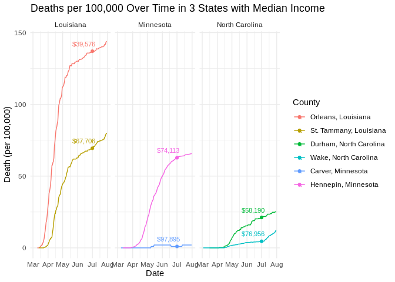
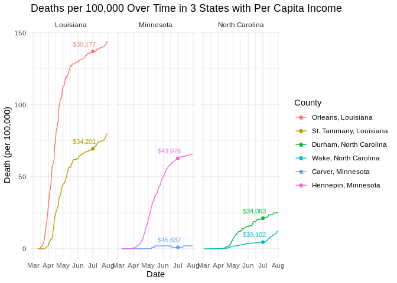
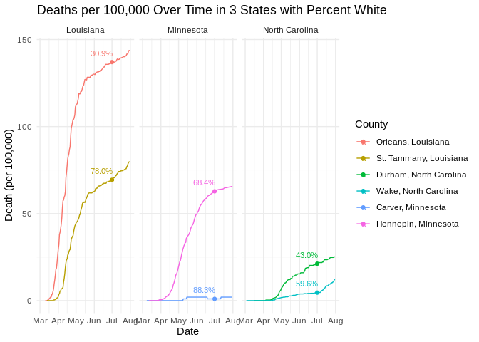
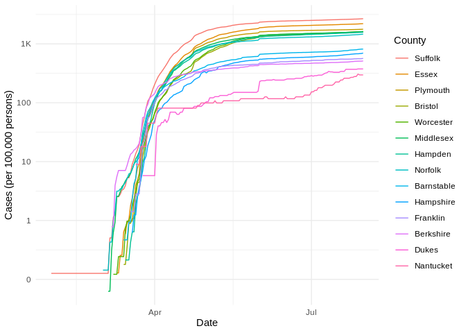

COVID-19
================
(Your name here)
2020-

  - [Grading Rubric](#grading-rubric)
      - [Individual](#individual)
      - [Team](#team)
      - [Due Date](#due-date)
  - [The Big Picture](#the-big-picture)
  - [Get the Data](#get-the-data)
      - [Navigating the Census Bureau](#navigating-the-census-bureau)
      - [Automated Download of NYT
        Data](#automated-download-of-nyt-data)
  - [Join the Data](#join-the-data)
  - [Analyze](#analyze)
      - [Normalize](#normalize)
      - [Guided EDA](#guided-eda)
      - [Self-directed EDA](#self-directed-eda)
          - [Ideas](#ideas)
          - [Aside: Some visualization
            tricks](#aside-some-visualization-tricks)
          - [Geographic exceptions](#geographic-exceptions)
  - [Notes](#notes)

*Purpose*: We can’t *possibly* do a class on data science and *not* look
at covid-19. Come on.

In this challenge, you’ll learn how to navigate the U.S. Census Bureau
website, programmatically download data from the internet, and perform a
county-level population-weighted analysis of current covid-19 trends.
Get excited\!

<!-- include-rubric -->

# Grading Rubric

<!-- -------------------------------------------------- -->

Unlike exercises, **challenges will be graded**. The following rubrics
define how you will be graded, both on an individual and team basis.

## Individual

<!-- ------------------------- -->

| Category    | Unsatisfactory                                                                   | Satisfactory                                                               |
| ----------- | -------------------------------------------------------------------------------- | -------------------------------------------------------------------------- |
| Effort      | Some task **q**’s left unattempted                                               | All task **q**’s attempted                                                 |
| Observed    | Did not document observations                                                    | Documented observations based on analysis                                  |
| Supported   | Some observations not supported by analysis                                      | All observations supported by analysis (table, graph, etc.)                |
| Code Styled | Violations of the [style guide](https://style.tidyverse.org/) hinder readability | Code sufficiently close to the [style guide](https://style.tidyverse.org/) |

## Team

<!-- ------------------------- -->

| Category   | Unsatisfactory                                                                                   | Satisfactory                                       |
| ---------- | ------------------------------------------------------------------------------------------------ | -------------------------------------------------- |
| Documented | No team contributions to Wiki                                                                    | Team contributed to Wiki                           |
| Referenced | No team references in Wiki                                                                       | At least one reference in Wiki to member report(s) |
| Relevant   | References unrelated to assertion, or difficult to find related analysis based on reference text | Reference text clearly points to relevant analysis |

## Due Date

<!-- ------------------------- -->

All the deliverables stated in the rubrics above are due on the day of
the class discussion of that exercise. See the
[Syllabus](https://docs.google.com/document/d/1jJTh2DH8nVJd2eyMMoyNGroReo0BKcJrz1eONi3rPSc/edit?usp=sharing)
for more information.

``` r
library(tidyverse)
```

    ## ── Attaching packages ────────────────────────────────────────────────────────────────────────────────────────────────────── tidyverse 1.3.0 ──

    ## ✓ ggplot2 3.3.2     ✓ purrr   0.3.4
    ## ✓ tibble  3.0.3     ✓ dplyr   1.0.0
    ## ✓ tidyr   1.1.0     ✓ stringr 1.4.0
    ## ✓ readr   1.3.1     ✓ forcats 0.5.0

    ## ── Conflicts ───────────────────────────────────────────────────────────────────────────────────────────────────────── tidyverse_conflicts() ──
    ## x dplyr::filter() masks stats::filter()
    ## x dplyr::lag()    masks stats::lag()

``` r
library(stringr)
library(readr)
```

*Background*:
[COVID-19](https://en.wikipedia.org/wiki/Coronavirus_disease_2019) is
the disease caused by the virus SARS-CoV-2. In 2020 it became a global
pandemic, leading to huge loss of life and tremendous disruption to
society. The New York Times published up-to-date data on the progression
of the pandemic across the United States—we will study these data in
this challenge.

# The Big Picture

<!-- -------------------------------------------------- -->

We’re about to go through *a lot* of weird steps, so let’s first fix the
big picture firmly in mind:

We want to study COVID-19 in terms of data: both case counts (number of
infections) and deaths. We’re going to do a county-level analysis in
order to get a high-resolution view of the pandemic. Since US counties
can vary widely in terms of their population, we’ll need population
estimates in order to compute infection rates (think back to the
`Titanic` challenge).

That’s the high-level view; now let’s dig into the details.

# Get the Data

<!-- -------------------------------------------------- -->

1.  County-level population estimates (Census Bureau)
2.  County-level COVID-19 counts (New York Times)

## Navigating the Census Bureau

<!-- ------------------------- -->

**Steps**: Our objective is to find the 2018 American Community
Survey\[1\] (ACS) Total Population estimates, disaggregated by counties.
To check your results, this is Table `B01003`.

1.  Go to [data.census.gov](data.census.gov).
2.  Scroll down and click `View Tables`.
3.  Apply filters to find the ACS Total Population estimates,
    disaggregated by counties. I used the filters:

<!-- end list -->

  - `Topics > Populations and People > Counts, Estimates, and
    Projections > Population Total`
  - `Geography > County > All counties in United States`

<!-- end list -->

5.  Click the `Download` button to download the data; make sure to
    select the 2018 y-year estimates.
6.  Unzip and move the data to your `challenges/data` folder.

<!-- end list -->

  - Note that the data will have the crazy-long filename
    `ACSDT5Y2018.B01003_data_with_overlays_2020-06-30T102151.csv`.
    That’s because metadata is stored in the filename, such as the
    year of the estimate (`Y2018`) and my access date (`2020-06-30`).

**q1** Load Table `B01003` into the following tibble. Make sure the
column names are `id, Geographic Area Name, Estimate!!Total, Margin of
Error!!Total`.

*Hint*: You will need to use the `skip` keyword when loading these
data\!

``` r
## TASK: Load the census bureau data with the following tibble name.
df_pop <- read_csv(file = './data/ACSST5Y2018.S0101_data_with_overlays_2020-07-27T201632.csv', skip = 1)[ ,1:3]
```

    ## Parsed with column specification:
    ## cols(
    ##   .default = col_double(),
    ##   id = col_character(),
    ##   `Geographic Area Name` = col_character(),
    ##   `Margin of Error!!Total MOE!!Total population` = col_character(),
    ##   `Estimate!!Percent!!Total population` = col_character(),
    ##   `Margin of Error!!Percent MOE!!Total population` = col_character(),
    ##   `Margin of Error!!Male MOE!!Total population` = col_character(),
    ##   `Estimate!!Percent Male!!Total population` = col_character(),
    ##   `Margin of Error!!Percent Male MOE!!Total population` = col_character(),
    ##   `Margin of Error!!Female MOE!!Total population` = col_character(),
    ##   `Estimate!!Percent Female!!Total population` = col_character(),
    ##   `Margin of Error!!Percent Female MOE!!Total population` = col_character(),
    ##   `Margin of Error!!Total MOE!!Total population!!AGE!!Under 5 years` = col_character(),
    ##   `Margin of Error!!Percent MOE!!Total population!!AGE!!Under 5 years` = col_character(),
    ##   `Margin of Error!!Male MOE!!Total population!!AGE!!Under 5 years` = col_character(),
    ##   `Margin of Error!!Percent Male MOE!!Total population!!AGE!!Under 5 years` = col_character(),
    ##   `Margin of Error!!Female MOE!!Total population!!AGE!!Under 5 years` = col_character(),
    ##   `Margin of Error!!Percent Female MOE!!Total population!!AGE!!Under 5 years` = col_character(),
    ##   `Margin of Error!!Total MOE!!Total population!!AGE!!15 to 19 years` = col_character(),
    ##   `Margin of Error!!Percent MOE!!Total population!!AGE!!15 to 19 years` = col_character(),
    ##   `Margin of Error!!Male MOE!!Total population!!AGE!!15 to 19 years` = col_character()
    ##   # ... with 153 more columns
    ## )

    ## See spec(...) for full column specifications.

*Note*: You can find information on 1-year, 3-year, and 5-year estimates
[here](https://www.census.gov/programs-surveys/acs/guidance/estimates.html).
The punchline is that 5-year estimates are more reliable but less
current.

## Automated Download of NYT Data

<!-- ------------------------- -->

ACS 5-year estimates don’t change all that often, but the COVID-19 data
are changing rapidly. To that end, it would be nice to be able to
*programmatically* download the most recent data for analysis; that way
we can update our analysis whenever we want simply by re-running our
notebook. This next problem will have you set up such a pipeline.

The New York Times is publishing up-to-date data on COVID-19 on
[GitHub](https://github.com/nytimes/covid-19-data).

**q2** Visit the NYT [GitHub](https://github.com/nytimes/covid-19-data)
repo and find the URL for the **raw** US County-level data. Assign that
URL as a string to the variable below.

``` r
## TASK: Find the URL for the NYT covid-19 county-level data
#url_counties <- read_csv(filename_nyt)
```

Once you have the url, the following code will download a local copy of
the data, then load the data into R.

``` r
## NOTE: No need to change this; just execute
## Set the filename of the data to download
filename_nyt <- "./data/nyt_counties.csv"

## Download the data locally
curl::curl_download(
        'https://raw.githubusercontent.com/nytimes/covid-19-data/master/us-counties.csv',
        destfile = filename_nyt
      )

## Loads the downloaded csv
df_covid <- read_csv(filename_nyt)
```

    ## Parsed with column specification:
    ## cols(
    ##   date = col_date(format = ""),
    ##   county = col_character(),
    ##   state = col_character(),
    ##   fips = col_character(),
    ##   cases = col_double(),
    ##   deaths = col_double()
    ## )

You can now re-run the chunk above (or the entire notebook) to pull the
most recent version of the data. Thus you can periodically re-run this
notebook to check in on the pandemic as it evolves.

*Note*: You should feel free to copy-paste the code above for your own
future projects\!

# Join the Data

<!-- -------------------------------------------------- -->

To get a sense of our task, let’s take a glimpse at our two data
sources.

``` r
## NOTE: No need to change this; just execute
df_pop %>% glimpse
```

    ## Rows: 3,220
    ## Columns: 3
    ## $ id                                  <chr> "0500000US01001", "0500000US01003…
    ## $ `Geographic Area Name`              <chr> "Autauga County, Alabama", "Baldw…
    ## $ `Estimate!!Total!!Total population` <dbl> 55200, 208107, 25782, 22527, 5764…

``` r
df_covid %>% glimpse
```

    ## Rows: 389,202
    ## Columns: 6
    ## $ date   <date> 2020-01-21, 2020-01-22, 2020-01-23, 2020-01-24, 2020-01-24, 2…
    ## $ county <chr> "Snohomish", "Snohomish", "Snohomish", "Cook", "Snohomish", "O…
    ## $ state  <chr> "Washington", "Washington", "Washington", "Illinois", "Washing…
    ## $ fips   <chr> "53061", "53061", "53061", "17031", "53061", "06059", "17031",…
    ## $ cases  <dbl> 1, 1, 1, 1, 1, 1, 1, 1, 1, 1, 1, 1, 1, 1, 1, 1, 1, 1, 1, 1, 1,…
    ## $ deaths <dbl> 0, 0, 0, 0, 0, 0, 0, 0, 0, 0, 0, 0, 0, 0, 0, 0, 0, 0, 0, 0, 0,…

To join these datasets, we’ll need to use [FIPS county
codes](https://en.wikipedia.org/wiki/FIPS_county_code).\[2\] The last
`5` digits of the `id` column in `df_pop` is the FIPS county code, while
the NYT data `df_covid` already contains the `fips`.

**q3** Process the `id` column of `df_pop` to create a `fips` column.

``` r
## TASK: Create a `fips` column by extracting the county code
df_q3 <- df_pop %>%
  mutate('fips' = str_extract( id, "[^US]+$"))

glimpse(df_q3)
```

    ## Rows: 3,220
    ## Columns: 4
    ## $ id                                  <chr> "0500000US01001", "0500000US01003…
    ## $ `Geographic Area Name`              <chr> "Autauga County, Alabama", "Baldw…
    ## $ `Estimate!!Total!!Total population` <dbl> 55200, 208107, 25782, 22527, 5764…
    ## $ fips                                <chr> "01001", "01003", "01005", "01007…

Use the following test to check your answer.

``` r
## NOTE: No need to change this
## Check known county
assertthat::assert_that(
              (df_q3 %>%
              filter(str_detect(`Geographic Area Name`, "Autauga County")) %>%
              pull(fips)) == "01001"
            )
```

    ## [1] TRUE

``` r
print("Very good!")
```

    ## [1] "Very good!"

Once

**q4** Join `df_covid` with `df_q3` by the `fips` column. Use the proper
type of join to preserve all rows in `df_covid`.

``` r
## TASK: Join df_covid and df_q3 by fips.
df_q4 <- merge(df_covid,df_q3,by="fips")
```

For convenience, I down-select some columns and produce more convenient
column names.

``` r
## NOTE: No need to change; run this to produce a more convenient tibble
df_data <-
  df_q4 %>%
  select(
    date,
    county,
    state,
    fips,
    cases,
    deaths,
    population = `Estimate!!Total!!Total population`
  )

glimpse(df_data)
```

    ## Rows: 384,910
    ## Columns: 7
    ## $ date       <date> 2020-07-13, 2020-06-10, 2020-07-07, 2020-07-06, 2020-05-2…
    ## $ county     <chr> "Autauga", "Autauga", "Autauga", "Autauga", "Autauga", "Au…
    ## $ state      <chr> "Alabama", "Alabama", "Alabama", "Alabama", "Alabama", "Al…
    ## $ fips       <chr> "01001", "01001", "01001", "01001", "01001", "01001", "010…
    ## $ cases      <dbl> 728, 296, 644, 618, 192, 316, 189, 469, 12, 17, 537, 886, …
    ## $ deaths     <dbl> 16, 6, 13, 13, 3, 6, 3, 11, 1, 1, 12, 21, 12, 9, 1, 5, 3, …
    ## $ population <dbl> 55200, 55200, 55200, 55200, 55200, 55200, 55200, 55200, 55…

# Analyze

<!-- -------------------------------------------------- -->

Now that we’ve done the hard work of loading and wrangling the data, we
can finally start our analysis. Our first step will be to produce county
population-normalized cases and death counts. Then we will explore the
data.

## Normalize

<!-- ------------------------- -->

**q5** Use the `population` estimates in `df_data` to normalize `cases`
and `deaths` to produce per 100,000 counts.\[3\] Store these values in
the columns `cases_perk` and `deaths_perk`.

``` r
## TASK: Normalize cases and deaths
df_normalized <-
  df_data %>%
  mutate(
    'cases_perk' = cases/population * 100000,
    'deaths_perk' = deaths/population * 100000,
  ) %>%
  unite(col = "location", county, state, sep = ", ", remove = FALSE)

glimpse(df_normalized)
```

    ## Rows: 384,910
    ## Columns: 10
    ## $ date        <date> 2020-07-13, 2020-06-10, 2020-07-07, 2020-07-06, 2020-05-…
    ## $ location    <chr> "Autauga, Alabama", "Autauga, Alabama", "Autauga, Alabama…
    ## $ county      <chr> "Autauga", "Autauga", "Autauga", "Autauga", "Autauga", "A…
    ## $ state       <chr> "Alabama", "Alabama", "Alabama", "Alabama", "Alabama", "A…
    ## $ fips        <chr> "01001", "01001", "01001", "01001", "01001", "01001", "01…
    ## $ cases       <dbl> 728, 296, 644, 618, 192, 316, 189, 469, 12, 17, 537, 886,…
    ## $ deaths      <dbl> 16, 6, 13, 13, 3, 6, 3, 11, 1, 1, 12, 21, 12, 9, 1, 5, 3,…
    ## $ population  <dbl> 55200, 55200, 55200, 55200, 55200, 55200, 55200, 55200, 5…
    ## $ cases_perk  <dbl> 1318.84058, 536.23188, 1166.66667, 1119.56522, 347.82609,…
    ## $ deaths_perk <dbl> 28.985507, 10.869565, 23.550725, 23.550725, 5.434783, 10.…

You may use the following test to check your work.

``` r
## NOTE: No need to change this
## Check known county data
assertthat::assert_that(
              abs(df_normalized %>%
               filter(
                 str_detect(county, "Snohomish"),
                 date == "2020-01-21"
               ) %>%
              pull(cases_perk) - 0.127) < 1e-3
            )
```

    ## [1] TRUE

``` r
assertthat::assert_that(
              abs(df_normalized %>%
               filter(
                 str_detect(county, "Snohomish"),
                 date == "2020-01-21"
               ) %>%
              pull(deaths_perk) - 0) < 1e-3
            )
```

    ## [1] TRUE

``` r
print("Excellent!")
```

    ## [1] "Excellent!"

## Guided EDA

<!-- ------------------------- -->

Before turning you loose, let’s complete a couple guided EDA tasks.

**q6** Compute the mean and standard deviation for `cases_perk` and
`deaths_perk`.

``` r
## TASK: Compute mean and sd for cases_perk and deaths_perk
mean(df_normalized$cases_perk)
```

    ## [1] 365.9374

``` r
mean(df_normalized$deaths_perk)
```

    ## [1] 11.7613

``` r
sd(df_normalized$cases_perk)
```

    ## [1] 674.8841

``` r
sd(df_normalized$deaths_perk)
```

    ## [1] 26.87395

**q7** Find the top 10 counties in terms of `cases_perk`, and the top 10
in terms of `deaths_perk`. Report the population of each county along
with the per-100,000 counts. Compare the counts against the mean values
you found in q6. Note any observations. Does New York City show up in
the top? Why or why not?

``` r
## TASK: Find the top 10 max cases_perk counties; report populations as well
df_normalized %>%
  arrange(-cases_perk) %>%
  top_n(cases_perk, 10)
```

    ## Warning in if (n > 0) {: the condition has length > 1 and only the first element
    ## will be used

    ##            date                        location               county
    ## 1    2020-07-31            Trousdale, Tennessee            Trousdale
    ## 2    2020-07-30            Trousdale, Tennessee            Trousdale
    ## 3    2020-07-28            Trousdale, Tennessee            Trousdale
    ## 4    2020-07-29            Trousdale, Tennessee            Trousdale
    ## 5    2020-07-27            Trousdale, Tennessee            Trousdale
    ## 6    2020-07-24            Trousdale, Tennessee            Trousdale
    ## 7    2020-07-25            Trousdale, Tennessee            Trousdale
    ## 8    2020-07-26            Trousdale, Tennessee            Trousdale
    ## 9    2020-07-23            Trousdale, Tennessee            Trousdale
    ## 10   2020-07-22            Trousdale, Tennessee            Trousdale
    ## 11   2020-07-21            Trousdale, Tennessee            Trousdale
    ## 12   2020-07-19            Trousdale, Tennessee            Trousdale
    ## 13   2020-07-20            Trousdale, Tennessee            Trousdale
    ## 14   2020-07-18            Trousdale, Tennessee            Trousdale
    ## 15   2020-07-17            Trousdale, Tennessee            Trousdale
    ## 16   2020-07-16            Trousdale, Tennessee            Trousdale
    ## 17   2020-07-15            Trousdale, Tennessee            Trousdale
    ## 18   2020-07-14            Trousdale, Tennessee            Trousdale
    ## 19   2020-07-13            Trousdale, Tennessee            Trousdale
    ## 20   2020-07-12            Trousdale, Tennessee            Trousdale
    ## 21   2020-07-11            Trousdale, Tennessee            Trousdale
    ## 22   2020-07-10            Trousdale, Tennessee            Trousdale
    ## 23   2020-07-09            Trousdale, Tennessee            Trousdale
    ## 24   2020-07-07            Trousdale, Tennessee            Trousdale
    ## 25   2020-07-08            Trousdale, Tennessee            Trousdale
    ## 26   2020-07-05            Trousdale, Tennessee            Trousdale
    ## 27   2020-07-06            Trousdale, Tennessee            Trousdale
    ## 28   2020-07-04            Trousdale, Tennessee            Trousdale
    ## 29   2020-07-03            Trousdale, Tennessee            Trousdale
    ## 30   2020-07-02            Trousdale, Tennessee            Trousdale
    ## 31   2020-07-01            Trousdale, Tennessee            Trousdale
    ## 32   2020-06-30            Trousdale, Tennessee            Trousdale
    ## 33   2020-06-29            Trousdale, Tennessee            Trousdale
    ## 34   2020-06-27            Trousdale, Tennessee            Trousdale
    ## 35   2020-06-28            Trousdale, Tennessee            Trousdale
    ## 36   2020-06-26            Trousdale, Tennessee            Trousdale
    ## 37   2020-06-25            Trousdale, Tennessee            Trousdale
    ## 38   2020-06-24            Trousdale, Tennessee            Trousdale
    ## 39   2020-06-23            Trousdale, Tennessee            Trousdale
    ## 40   2020-06-22            Trousdale, Tennessee            Trousdale
    ## 41   2020-06-21            Trousdale, Tennessee            Trousdale
    ## 42   2020-06-20            Trousdale, Tennessee            Trousdale
    ## 43   2020-06-18            Trousdale, Tennessee            Trousdale
    ## 44   2020-06-19            Trousdale, Tennessee            Trousdale
    ## 45   2020-06-16            Trousdale, Tennessee            Trousdale
    ## 46   2020-06-17            Trousdale, Tennessee            Trousdale
    ## 47   2020-06-12            Trousdale, Tennessee            Trousdale
    ## 48   2020-06-15            Trousdale, Tennessee            Trousdale
    ## 49   2020-06-14            Trousdale, Tennessee            Trousdale
    ## 50   2020-06-13            Trousdale, Tennessee            Trousdale
    ## 51   2020-06-11            Trousdale, Tennessee            Trousdale
    ## 52   2020-06-10            Trousdale, Tennessee            Trousdale
    ## 53   2020-06-09            Trousdale, Tennessee            Trousdale
    ## 54   2020-06-08            Trousdale, Tennessee            Trousdale
    ## 55   2020-06-02            Trousdale, Tennessee            Trousdale
    ## 56   2020-06-03            Trousdale, Tennessee            Trousdale
    ## 57   2020-06-04            Trousdale, Tennessee            Trousdale
    ## 58   2020-06-07            Trousdale, Tennessee            Trousdale
    ## 59   2020-06-06            Trousdale, Tennessee            Trousdale
    ## 60   2020-06-05            Trousdale, Tennessee            Trousdale
    ## 61   2020-05-24            Trousdale, Tennessee            Trousdale
    ## 62   2020-05-28            Trousdale, Tennessee            Trousdale
    ## 63   2020-05-29            Trousdale, Tennessee            Trousdale
    ## 64   2020-05-25            Trousdale, Tennessee            Trousdale
    ## 65   2020-06-01            Trousdale, Tennessee            Trousdale
    ## 66   2020-05-30            Trousdale, Tennessee            Trousdale
    ## 67   2020-05-26            Trousdale, Tennessee            Trousdale
    ## 68   2020-05-31            Trousdale, Tennessee            Trousdale
    ## 69   2020-05-27            Trousdale, Tennessee            Trousdale
    ## 70   2020-05-22            Trousdale, Tennessee            Trousdale
    ## 71   2020-05-23            Trousdale, Tennessee            Trousdale
    ## 72   2020-05-21            Trousdale, Tennessee            Trousdale
    ## 73   2020-05-20            Trousdale, Tennessee            Trousdale
    ## 74   2020-05-19            Trousdale, Tennessee            Trousdale
    ## 75   2020-05-17            Trousdale, Tennessee            Trousdale
    ## 76   2020-05-18            Trousdale, Tennessee            Trousdale
    ## 77   2020-05-14            Trousdale, Tennessee            Trousdale
    ## 78   2020-05-15            Trousdale, Tennessee            Trousdale
    ## 79   2020-05-16            Trousdale, Tennessee            Trousdale
    ## 80   2020-05-13            Trousdale, Tennessee            Trousdale
    ## 81   2020-05-12            Trousdale, Tennessee            Trousdale
    ## 82   2020-05-11            Trousdale, Tennessee            Trousdale
    ## 83   2020-05-09            Trousdale, Tennessee            Trousdale
    ## 84   2020-05-10            Trousdale, Tennessee            Trousdale
    ## 85   2020-05-07            Trousdale, Tennessee            Trousdale
    ## 86   2020-05-06            Trousdale, Tennessee            Trousdale
    ## 87   2020-05-08            Trousdale, Tennessee            Trousdale
    ## 88   2020-05-05            Trousdale, Tennessee            Trousdale
    ## 89   2020-05-04            Trousdale, Tennessee            Trousdale
    ## 90   2020-05-03            Trousdale, Tennessee            Trousdale
    ## 91   2020-05-02            Trousdale, Tennessee            Trousdale
    ## 92   2020-06-03                 Lake, Tennessee                 Lake
    ## 93   2020-05-01            Trousdale, Tennessee            Trousdale
    ## 94   2020-06-04                 Lake, Tennessee                 Lake
    ## 95   2020-06-02                 Lake, Tennessee                 Lake
    ## 96   2020-07-31                 Lake, Tennessee                 Lake
    ## 97   2020-06-09                 Lake, Tennessee                 Lake
    ## 98   2020-07-30                 Lake, Tennessee                 Lake
    ## 99   2020-06-05                 Lake, Tennessee                 Lake
    ## 100  2020-06-07                 Lake, Tennessee                 Lake
    ## 101  2020-06-06                 Lake, Tennessee                 Lake
    ## 102  2020-06-08                 Lake, Tennessee                 Lake
    ## 103  2020-07-29                 Lake, Tennessee                 Lake
    ## 104  2020-07-28                 Lake, Tennessee                 Lake
    ## 105  2020-07-27                 Lake, Tennessee                 Lake
    ## 106  2020-06-10                 Lake, Tennessee                 Lake
    ## 107  2020-07-26                 Lake, Tennessee                 Lake
    ## 108  2020-07-31                   Lee, Arkansas                  Lee
    ## 109  2020-07-25                 Lake, Tennessee                 Lake
    ## 110  2020-07-31                Dakota, Nebraska               Dakota
    ## 111  2020-07-24                 Lake, Tennessee                 Lake
    ## 112  2020-07-30                   Lee, Arkansas                  Lee
    ## 113  2020-07-29                   Lee, Arkansas                  Lee
    ## 114  2020-07-23                 Lake, Tennessee                 Lake
    ## 115  2020-07-30                Dakota, Nebraska               Dakota
    ## 116  2020-07-20                 Lake, Tennessee                 Lake
    ## 117  2020-07-22                 Lake, Tennessee                 Lake
    ## 118  2020-07-21                 Lake, Tennessee                 Lake
    ## 119  2020-07-27                   Lee, Arkansas                  Lee
    ## 120  2020-07-28                   Lee, Arkansas                  Lee
    ## 121  2020-07-26                   Lee, Arkansas                  Lee
    ## 122  2020-07-28                Dakota, Nebraska               Dakota
    ## 123  2020-07-29                Dakota, Nebraska               Dakota
    ## 124  2020-07-27                Dakota, Nebraska               Dakota
    ## 125  2020-07-19                 Lake, Tennessee                 Lake
    ## 126  2020-07-18                 Lake, Tennessee                 Lake
    ## 127  2020-07-17                 Lake, Tennessee                 Lake
    ## 128  2020-07-26                Dakota, Nebraska               Dakota
    ## 129  2020-07-25                Dakota, Nebraska               Dakota
    ## 130  2020-07-15                 Lake, Tennessee                 Lake
    ## 131  2020-07-16                 Lake, Tennessee                 Lake
    ## 132  2020-07-25                   Lee, Arkansas                  Lee
    ## 133  2020-07-09                 Lake, Tennessee                 Lake
    ## 134  2020-07-11                 Lake, Tennessee                 Lake
    ## 135  2020-07-24                Dakota, Nebraska               Dakota
    ## 136  2020-07-23                Dakota, Nebraska               Dakota
    ## 137  2020-07-14                 Lake, Tennessee                 Lake
    ## 138  2020-07-08                 Lake, Tennessee                 Lake
    ## 139  2020-07-10                 Lake, Tennessee                 Lake
    ## 140  2020-07-13                 Lake, Tennessee                 Lake
    ## 141  2020-07-12                 Lake, Tennessee                 Lake
    ## 142  2020-07-24                   Lee, Arkansas                  Lee
    ## 143  2020-07-22                Dakota, Nebraska               Dakota
    ## 144  2020-07-23                   Lee, Arkansas                  Lee
    ## 145  2020-07-22                   Lee, Arkansas                  Lee
    ## 146  2020-07-06                 Lake, Tennessee                 Lake
    ## 147  2020-07-07                 Lake, Tennessee                 Lake
    ## 148  2020-07-21                Dakota, Nebraska               Dakota
    ## 149  2020-07-20                Dakota, Nebraska               Dakota
    ## 150  2020-07-21                   Lee, Arkansas                  Lee
    ## 151  2020-07-19                Dakota, Nebraska               Dakota
    ## 152  2020-07-20                   Lee, Arkansas                  Lee
    ## 153  2020-07-18                Dakota, Nebraska               Dakota
    ## 154  2020-07-05                 Lake, Tennessee                 Lake
    ## 155  2020-06-27                 Lake, Tennessee                 Lake
    ## 156  2020-06-29                 Lake, Tennessee                 Lake
    ## 157  2020-06-12                 Lake, Tennessee                 Lake
    ## 158  2020-06-28                 Lake, Tennessee                 Lake
    ## 159  2020-07-03                 Lake, Tennessee                 Lake
    ## 160  2020-07-04                 Lake, Tennessee                 Lake
    ## 161  2020-06-26                 Lake, Tennessee                 Lake
    ## 162  2020-07-17                Dakota, Nebraska               Dakota
    ## 163  2020-07-16                Dakota, Nebraska               Dakota
    ## 164  2020-06-14                 Lake, Tennessee                 Lake
    ## 165  2020-06-24                 Lake, Tennessee                 Lake
    ## 166  2020-06-25                 Lake, Tennessee                 Lake
    ## 167  2020-07-01                 Lake, Tennessee                 Lake
    ## 168  2020-07-02                 Lake, Tennessee                 Lake
    ## 169  2020-06-15                 Lake, Tennessee                 Lake
    ## 170  2020-06-30                 Lake, Tennessee                 Lake
    ## 171  2020-06-13                 Lake, Tennessee                 Lake
    ## 172  2020-07-19                   Lee, Arkansas                  Lee
    ## 173  2020-07-15                Dakota, Nebraska               Dakota
    ## 174  2020-06-19                 Lake, Tennessee                 Lake
    ## 175  2020-06-23                 Lake, Tennessee                 Lake
    ## 176  2020-06-18                 Lake, Tennessee                 Lake
    ## 177  2020-06-17                 Lake, Tennessee                 Lake
    ## 178  2020-06-21                 Lake, Tennessee                 Lake
    ## 179  2020-06-22                 Lake, Tennessee                 Lake
    ## 180  2020-06-20                 Lake, Tennessee                 Lake
    ## 181  2020-06-16                 Lake, Tennessee                 Lake
    ## 182  2020-07-14                Dakota, Nebraska               Dakota
    ## 183  2020-06-11                 Lake, Tennessee                 Lake
    ## 184  2020-07-18                   Lee, Arkansas                  Lee
    ## 185  2020-07-17                   Lee, Arkansas                  Lee
    ## 186  2020-07-16                   Lee, Arkansas                  Lee
    ## 187  2020-07-15                   Lee, Arkansas                  Lee
    ## 188  2020-07-14                   Lee, Arkansas                  Lee
    ## 189  2020-07-13                Dakota, Nebraska               Dakota
    ## 190  2020-07-10                Dakota, Nebraska               Dakota
    ## 191  2020-07-11                Dakota, Nebraska               Dakota
    ## 192  2020-07-12                Dakota, Nebraska               Dakota
    ## 193  2020-07-09                Dakota, Nebraska               Dakota
    ## 194  2020-07-08                Dakota, Nebraska               Dakota
    ## 195  2020-07-07                Dakota, Nebraska               Dakota
    ## 196  2020-07-06                Dakota, Nebraska               Dakota
    ## 197  2020-07-13                   Lee, Arkansas                  Lee
    ## 198  2020-07-04                Dakota, Nebraska               Dakota
    ## 199  2020-07-05                Dakota, Nebraska               Dakota
    ## 200  2020-07-03                Dakota, Nebraska               Dakota
    ## 201  2020-07-12                   Lee, Arkansas                  Lee
    ## 202  2020-07-30               Buena Vista, Iowa          Buena Vista
    ## 203  2020-07-31               Buena Vista, Iowa          Buena Vista
    ## 204  2020-07-02                Dakota, Nebraska               Dakota
    ## 205  2020-07-29               Buena Vista, Iowa          Buena Vista
    ## 206  2020-07-11                   Lee, Arkansas                  Lee
    ## 207  2020-07-28               Buena Vista, Iowa          Buena Vista
    ## 208  2020-06-30                Dakota, Nebraska               Dakota
    ## 209  2020-07-01                Dakota, Nebraska               Dakota
    ## 210  2020-07-27               Buena Vista, Iowa          Buena Vista
    ## 211  2020-07-26               Buena Vista, Iowa          Buena Vista
    ## 212  2020-07-25               Buena Vista, Iowa          Buena Vista
    ## 213  2020-06-29                Dakota, Nebraska               Dakota
    ## 214  2020-07-24               Buena Vista, Iowa          Buena Vista
    ## 215  2020-07-23               Buena Vista, Iowa          Buena Vista
    ## 216  2020-07-10                   Lee, Arkansas                  Lee
    ## 217  2020-07-09                   Lee, Arkansas                  Lee
    ## 218  2020-07-22               Buena Vista, Iowa          Buena Vista
    ## 219  2020-06-28                Dakota, Nebraska               Dakota
    ## 220  2020-06-27                Dakota, Nebraska               Dakota
    ## 221  2020-06-26                Dakota, Nebraska               Dakota
    ## 222  2020-07-21               Buena Vista, Iowa          Buena Vista
    ## 223  2020-07-20               Buena Vista, Iowa          Buena Vista
    ## 224  2020-07-08                   Lee, Arkansas                  Lee
    ## 225  2020-06-25                Dakota, Nebraska               Dakota
    ## 226  2020-07-19               Buena Vista, Iowa          Buena Vista
    ## 227  2020-06-24                Dakota, Nebraska               Dakota
    ## 228  2020-06-23                Dakota, Nebraska               Dakota
    ## 229  2020-07-18               Buena Vista, Iowa          Buena Vista
    ## 230  2020-07-17               Buena Vista, Iowa          Buena Vista
    ## 231  2020-06-22                Dakota, Nebraska               Dakota
    ## 232  2020-06-20                Dakota, Nebraska               Dakota
    ## 233  2020-06-21                Dakota, Nebraska               Dakota
    ## 234  2020-06-19                Dakota, Nebraska               Dakota
    ## 235  2020-07-16               Buena Vista, Iowa          Buena Vista
    ## 236  2020-06-18                Dakota, Nebraska               Dakota
    ## 237  2020-07-15               Buena Vista, Iowa          Buena Vista
    ## 238  2020-06-17                Dakota, Nebraska               Dakota
    ## 239  2020-07-14               Buena Vista, Iowa          Buena Vista
    ## 240  2020-07-13               Buena Vista, Iowa          Buena Vista
    ## 241  2020-07-12               Buena Vista, Iowa          Buena Vista
    ## 242  2020-06-16                Dakota, Nebraska               Dakota
    ## 243  2020-07-11               Buena Vista, Iowa          Buena Vista
    ## 244  2020-06-15                Dakota, Nebraska               Dakota
    ## 245  2020-07-07                   Lee, Arkansas                  Lee
    ## 246  2020-06-14                Dakota, Nebraska               Dakota
    ## 247  2020-06-13                Dakota, Nebraska               Dakota
    ## 248  2020-07-10               Buena Vista, Iowa          Buena Vista
    ## 249  2020-07-06                   Lee, Arkansas                  Lee
    ## 250  2020-07-05                   Lee, Arkansas                  Lee
    ## 251  2020-07-09               Buena Vista, Iowa          Buena Vista
    ## 252  2020-06-12                Dakota, Nebraska               Dakota
    ## 253  2020-06-11                Dakota, Nebraska               Dakota
    ## 254  2020-07-08               Buena Vista, Iowa          Buena Vista
    ## 255  2020-07-31               Lincoln, Arkansas              Lincoln
    ## 256  2020-07-04                   Lee, Arkansas                  Lee
    ## 257  2020-07-07               Buena Vista, Iowa          Buena Vista
    ## 258  2020-07-30               Lincoln, Arkansas              Lincoln
    ## 259  2020-06-10                Dakota, Nebraska               Dakota
    ## 260  2020-06-09                Dakota, Nebraska               Dakota
    ## 261  2020-06-08                Dakota, Nebraska               Dakota
    ## 262  2020-07-06               Buena Vista, Iowa          Buena Vista
    ## 263  2020-07-05               Buena Vista, Iowa          Buena Vista
    ## 264  2020-07-04               Buena Vista, Iowa          Buena Vista
    ## 265  2020-07-03               Buena Vista, Iowa          Buena Vista
    ## 266  2020-07-28               Lincoln, Arkansas              Lincoln
    ## 267  2020-07-29               Lincoln, Arkansas              Lincoln
    ## 268  2020-06-07                Dakota, Nebraska               Dakota
    ## 269  2020-07-02               Buena Vista, Iowa          Buena Vista
    ## 270  2020-07-27               Lincoln, Arkansas              Lincoln
    ## 271  2020-06-05                Dakota, Nebraska               Dakota
    ## 272  2020-06-06                Dakota, Nebraska               Dakota
    ## 273  2020-07-01               Buena Vista, Iowa          Buena Vista
    ## 274  2020-07-26               Lincoln, Arkansas              Lincoln
    ## 275  2020-06-30               Buena Vista, Iowa          Buena Vista
    ## 276  2020-06-29               Buena Vista, Iowa          Buena Vista
    ## 277  2020-06-28               Buena Vista, Iowa          Buena Vista
    ## 278  2020-06-04                Dakota, Nebraska               Dakota
    ## 279  2020-07-25               Lincoln, Arkansas              Lincoln
    ## 280  2020-06-27               Buena Vista, Iowa          Buena Vista
    ## 281  2020-07-24               Lincoln, Arkansas              Lincoln
    ## 282  2020-06-26               Buena Vista, Iowa          Buena Vista
    ## 283  2020-06-03                Dakota, Nebraska               Dakota
    ## 284  2020-07-23               Lincoln, Arkansas              Lincoln
    ## 285  2020-06-02                Dakota, Nebraska               Dakota
    ## 286  2020-06-25               Buena Vista, Iowa          Buena Vista
    ## 287  2020-06-01                Dakota, Nebraska               Dakota
    ## 288  2020-06-24               Buena Vista, Iowa          Buena Vista
    ## 289  2020-07-21               Lincoln, Arkansas              Lincoln
    ## 290  2020-07-22               Lincoln, Arkansas              Lincoln
    ## 291  2020-06-23               Buena Vista, Iowa          Buena Vista
    ## 292  2020-06-22               Buena Vista, Iowa          Buena Vista
    ## 293  2020-06-21               Buena Vista, Iowa          Buena Vista
    ## 294  2020-05-31                Dakota, Nebraska               Dakota
    ## 295  2020-07-20               Lincoln, Arkansas              Lincoln
    ## 296  2020-05-30                Dakota, Nebraska               Dakota
    ## 297  2020-07-19               Lincoln, Arkansas              Lincoln
    ## 298  2020-07-18               Lincoln, Arkansas              Lincoln
    ## 299  2020-07-17               Lincoln, Arkansas              Lincoln
    ## 300  2020-05-29                Dakota, Nebraska               Dakota
    ## 301  2020-06-20               Buena Vista, Iowa          Buena Vista
    ## 302  2020-05-28                Dakota, Nebraska               Dakota
    ## 303  2020-05-27                Dakota, Nebraska               Dakota
    ## 304  2020-05-26                Dakota, Nebraska               Dakota
    ## 305  2020-07-03                   Lee, Arkansas                  Lee
    ## 306  2020-06-19               Buena Vista, Iowa          Buena Vista
    ## 307  2020-07-16               Lincoln, Arkansas              Lincoln
    ## 308  2020-07-02                   Lee, Arkansas                  Lee
    ## 309  2020-06-18               Buena Vista, Iowa          Buena Vista
    ## 310  2020-06-17               Buena Vista, Iowa          Buena Vista
    ## 311  2020-05-25                Dakota, Nebraska               Dakota
    ## 312  2020-07-31               Nobles, Minnesota               Nobles
    ## 313  2020-07-30               Nobles, Minnesota               Nobles
    ## 314  2020-07-29               Nobles, Minnesota               Nobles
    ## 315  2020-07-01                   Lee, Arkansas                  Lee
    ## 316  2020-07-27               Nobles, Minnesota               Nobles
    ## 317  2020-07-28               Nobles, Minnesota               Nobles
    ## 318  2020-07-26               Nobles, Minnesota               Nobles
    ## 319  2020-06-16               Buena Vista, Iowa          Buena Vista
    ## 320  2020-07-25               Nobles, Minnesota               Nobles
    ## 321  2020-07-24               Nobles, Minnesota               Nobles
    ## 322  2020-06-15               Buena Vista, Iowa          Buena Vista
    ## 323  2020-05-24                Dakota, Nebraska               Dakota
    ## 324  2020-07-23               Nobles, Minnesota               Nobles
    ## 325  2020-07-22               Nobles, Minnesota               Nobles
    ## 326  2020-06-14               Buena Vista, Iowa          Buena Vista
    ## 327  2020-07-21               Nobles, Minnesota               Nobles
    ## 328  2020-07-19               Nobles, Minnesota               Nobles
    ## 329  2020-07-20               Nobles, Minnesota               Nobles
    ## 330  2020-07-18               Nobles, Minnesota               Nobles
    ## 331  2020-05-22                Dakota, Nebraska               Dakota
    ## 332  2020-05-23                Dakota, Nebraska               Dakota
    ## 333  2020-07-17               Nobles, Minnesota               Nobles
    ## 334  2020-07-16               Nobles, Minnesota               Nobles
    ## 335  2020-07-15               Nobles, Minnesota               Nobles
    ## 336  2020-05-21                Dakota, Nebraska               Dakota
    ## 337  2020-07-14               Nobles, Minnesota               Nobles
    ## 338  2020-05-20                Dakota, Nebraska               Dakota
    ## 339  2020-07-13               Nobles, Minnesota               Nobles
    ## 340  2020-06-13               Buena Vista, Iowa          Buena Vista
    ## 341  2020-07-12               Nobles, Minnesota               Nobles
    ## 342  2020-07-11               Nobles, Minnesota               Nobles
    ## 343  2020-05-19                Dakota, Nebraska               Dakota
    ## 344  2020-05-18                Dakota, Nebraska               Dakota
    ## 345  2020-07-15               Lincoln, Arkansas              Lincoln
    ## 346  2020-07-14               Lincoln, Arkansas              Lincoln
    ## 347  2020-07-09               Nobles, Minnesota               Nobles
    ## 348  2020-07-10               Nobles, Minnesota               Nobles
    ## 349  2020-07-07               Nobles, Minnesota               Nobles
    ## 350  2020-07-08               Nobles, Minnesota               Nobles
    ## 351  2020-07-12               Lincoln, Arkansas              Lincoln
    ## 352  2020-07-13               Lincoln, Arkansas              Lincoln
    ## 353  2020-07-10               Lincoln, Arkansas              Lincoln
    ## 354  2020-07-11               Lincoln, Arkansas              Lincoln
    ## 355  2020-07-06               Nobles, Minnesota               Nobles
    ## 356  2020-07-09               Lincoln, Arkansas              Lincoln
    ## 357  2020-07-05               Nobles, Minnesota               Nobles
    ## 358  2020-07-08               Lincoln, Arkansas              Lincoln
    ## 359  2020-07-07               Lincoln, Arkansas              Lincoln
    ## 360  2020-07-05               Lincoln, Arkansas              Lincoln
    ## 361  2020-07-06               Lincoln, Arkansas              Lincoln
    ## 362  2020-07-03               Nobles, Minnesota               Nobles
    ## 363  2020-07-04               Nobles, Minnesota               Nobles
    ## 364  2020-07-02               Nobles, Minnesota               Nobles
    ## 365  2020-07-04               Lincoln, Arkansas              Lincoln
    ## 366  2020-07-02               Lincoln, Arkansas              Lincoln
    ## 367  2020-07-03               Lincoln, Arkansas              Lincoln
    ## 368  2020-07-01               Lincoln, Arkansas              Lincoln
    ## 369  2020-06-29               Lincoln, Arkansas              Lincoln
    ## 370  2020-06-30               Lincoln, Arkansas              Lincoln
    ## 371  2020-07-01               Nobles, Minnesota               Nobles
    ## 372  2020-06-28               Lincoln, Arkansas              Lincoln
    ## 373  2020-06-22               Lincoln, Arkansas              Lincoln
    ## 374  2020-06-26               Lincoln, Arkansas              Lincoln
    ## 375  2020-06-27               Lincoln, Arkansas              Lincoln
    ## 376  2020-06-25               Lincoln, Arkansas              Lincoln
    ## 377  2020-06-23               Lincoln, Arkansas              Lincoln
    ## 378  2020-06-21               Lincoln, Arkansas              Lincoln
    ## 379  2020-06-24               Lincoln, Arkansas              Lincoln
    ## 380  2020-06-20               Lincoln, Arkansas              Lincoln
    ## 381  2020-06-30               Nobles, Minnesota               Nobles
    ## 382  2020-06-29               Nobles, Minnesota               Nobles
    ## 383  2020-06-28               Nobles, Minnesota               Nobles
    ## 384  2020-06-27               Nobles, Minnesota               Nobles
    ## 385  2020-06-26               Nobles, Minnesota               Nobles
    ## 386  2020-06-25               Nobles, Minnesota               Nobles
    ## 387  2020-06-24               Nobles, Minnesota               Nobles
    ## 388  2020-06-23               Nobles, Minnesota               Nobles
    ## 389  2020-06-22               Nobles, Minnesota               Nobles
    ## 390  2020-06-19               Lincoln, Arkansas              Lincoln
    ## 391  2020-06-21               Nobles, Minnesota               Nobles
    ## 392  2020-06-20               Nobles, Minnesota               Nobles
    ## 393  2020-06-19               Nobles, Minnesota               Nobles
    ## 394  2020-05-17                Dakota, Nebraska               Dakota
    ## 395  2020-05-16                Dakota, Nebraska               Dakota
    ## 396  2020-06-18               Nobles, Minnesota               Nobles
    ## 397  2020-06-16               Nobles, Minnesota               Nobles
    ## 398  2020-06-14               Nobles, Minnesota               Nobles
    ## 399  2020-06-17               Nobles, Minnesota               Nobles
    ## 400  2020-06-15               Nobles, Minnesota               Nobles
    ## 401  2020-06-13               Nobles, Minnesota               Nobles
    ## 402  2020-06-12               Nobles, Minnesota               Nobles
    ## 403  2020-06-12               Buena Vista, Iowa          Buena Vista
    ## 404  2020-05-14                Dakota, Nebraska               Dakota
    ## 405  2020-05-15                Dakota, Nebraska               Dakota
    ## 406  2020-06-11               Nobles, Minnesota               Nobles
    ## 407  2020-06-10               Nobles, Minnesota               Nobles
    ## 408  2020-06-09               Nobles, Minnesota               Nobles
    ## 409  2020-06-08               Nobles, Minnesota               Nobles
    ## 410  2020-06-07               Nobles, Minnesota               Nobles
    ## 411  2020-06-15               Lincoln, Arkansas              Lincoln
    ## 412  2020-06-18               Lincoln, Arkansas              Lincoln
    ## 413  2020-06-17               Lincoln, Arkansas              Lincoln
    ## 414  2020-06-16               Lincoln, Arkansas              Lincoln
    ## 415  2020-06-14               Lincoln, Arkansas              Lincoln
    ## 416  2020-06-06               Nobles, Minnesota               Nobles
    ## 417  2020-06-05               Nobles, Minnesota               Nobles
    ## 418  2020-06-13               Lincoln, Arkansas              Lincoln
    ## 419  2020-06-11               Lincoln, Arkansas              Lincoln
    ## 420  2020-06-12               Lincoln, Arkansas              Lincoln
    ## 421  2020-06-05               Lincoln, Arkansas              Lincoln
    ## 422  2020-06-04               Lincoln, Arkansas              Lincoln
    ## 423  2020-06-09               Lincoln, Arkansas              Lincoln
    ## 424  2020-06-07               Lincoln, Arkansas              Lincoln
    ## 425  2020-06-06               Lincoln, Arkansas              Lincoln
    ## 426  2020-06-10               Lincoln, Arkansas              Lincoln
    ## 427  2020-06-08               Lincoln, Arkansas              Lincoln
    ## 428  2020-06-03               Lincoln, Arkansas              Lincoln
    ## 429  2020-06-02               Lincoln, Arkansas              Lincoln
    ## 430  2020-06-01               Lincoln, Arkansas              Lincoln
    ## 431  2020-05-31               Lincoln, Arkansas              Lincoln
    ## 432  2020-06-04               Nobles, Minnesota               Nobles
    ## 433  2020-05-13                Dakota, Nebraska               Dakota
    ## 434  2020-05-12                Dakota, Nebraska               Dakota
    ## 435  2020-05-11                Dakota, Nebraska               Dakota
    ## 436  2020-05-30               Lincoln, Arkansas              Lincoln
    ## 437  2020-06-03               Nobles, Minnesota               Nobles
    ## 438  2020-05-26               Lincoln, Arkansas              Lincoln
    ## 439  2020-05-28               Lincoln, Arkansas              Lincoln
    ## 440  2020-05-25               Lincoln, Arkansas              Lincoln
    ## 441  2020-05-29               Lincoln, Arkansas              Lincoln
    ## 442  2020-05-27               Lincoln, Arkansas              Lincoln
    ## 443  2020-05-24               Lincoln, Arkansas              Lincoln
    ## 444  2020-06-02               Nobles, Minnesota               Nobles
    ## 445  2020-05-23               Lincoln, Arkansas              Lincoln
    ## 446  2020-07-31     Bristol Bay Borough, Alaska  Bristol Bay Borough
    ## 447  2020-07-23     Bristol Bay Borough, Alaska  Bristol Bay Borough
    ## 448  2020-07-29     Bristol Bay Borough, Alaska  Bristol Bay Borough
    ## 449  2020-07-22     Bristol Bay Borough, Alaska  Bristol Bay Borough
    ## 450  2020-07-27     Bristol Bay Borough, Alaska  Bristol Bay Borough
    ## 451  2020-07-26     Bristol Bay Borough, Alaska  Bristol Bay Borough
    ## 452  2020-07-21     Bristol Bay Borough, Alaska  Bristol Bay Borough
    ## 453  2020-07-28     Bristol Bay Borough, Alaska  Bristol Bay Borough
    ## 454  2020-07-24     Bristol Bay Borough, Alaska  Bristol Bay Borough
    ## 455  2020-07-25     Bristol Bay Borough, Alaska  Bristol Bay Borough
    ## 456  2020-07-30     Bristol Bay Borough, Alaska  Bristol Bay Borough
    ## 457  2020-06-01               Nobles, Minnesota               Nobles
    ## 458  2020-06-11               Buena Vista, Iowa          Buena Vista
    ## 459  2020-05-20               Lincoln, Arkansas              Lincoln
    ## 460  2020-05-21               Lincoln, Arkansas              Lincoln
    ## 461  2020-05-22               Lincoln, Arkansas              Lincoln
    ## 462  2020-05-31               Nobles, Minnesota               Nobles
    ## 463  2020-05-18               Lincoln, Arkansas              Lincoln
    ## 464  2020-05-19               Lincoln, Arkansas              Lincoln
    ## 465  2020-05-17               Lincoln, Arkansas              Lincoln
    ## 466  2020-05-16               Lincoln, Arkansas              Lincoln
    ## 467  2020-07-20     Bristol Bay Borough, Alaska  Bristol Bay Borough
    ## 468  2020-05-15               Lincoln, Arkansas              Lincoln
    ## 469  2020-05-14               Lincoln, Arkansas              Lincoln
    ## 470  2020-06-30                   Lee, Arkansas                  Lee
    ## 471  2020-05-10                Dakota, Nebraska               Dakota
    ## 472  2020-05-09                Dakota, Nebraska               Dakota
    ## 473  2020-05-08                Dakota, Nebraska               Dakota
    ## 474  2020-05-30               Nobles, Minnesota               Nobles
    ## 475  2020-05-29               Nobles, Minnesota               Nobles
    ## 476  2020-05-12               Lincoln, Arkansas              Lincoln
    ## 477  2020-05-13               Lincoln, Arkansas              Lincoln
    ## 478  2020-05-11               Lincoln, Arkansas              Lincoln
    ## 479  2020-07-15     Bristol Bay Borough, Alaska  Bristol Bay Borough
    ## 480  2020-07-19     Bristol Bay Borough, Alaska  Bristol Bay Borough
    ## 481  2020-07-16     Bristol Bay Borough, Alaska  Bristol Bay Borough
    ## 482  2020-07-17     Bristol Bay Borough, Alaska  Bristol Bay Borough
    ## 483  2020-07-18     Bristol Bay Borough, Alaska  Bristol Bay Borough
    ## 484  2020-05-28               Nobles, Minnesota               Nobles
    ## 485  2020-05-10               Lincoln, Arkansas              Lincoln
    ## 486  2020-07-31         East Carroll, Louisiana         East Carroll
    ## 487  2020-06-29                   Lee, Arkansas                  Lee
    ## 488  2020-05-27               Nobles, Minnesota               Nobles
    ## 489  2020-07-30         East Carroll, Louisiana         East Carroll
    ## 490  2020-07-29         East Carroll, Louisiana         East Carroll
    ## 491  2020-07-28         East Carroll, Louisiana         East Carroll
    ## 492  2020-07-27         East Carroll, Louisiana         East Carroll
    ## 493  2020-07-26         East Carroll, Louisiana         East Carroll
    ## 494  2020-05-26               Nobles, Minnesota               Nobles
    ## 495  2020-05-25               Nobles, Minnesota               Nobles
    ## 496  2020-06-10               Buena Vista, Iowa          Buena Vista
    ## 497  2020-07-20         East Carroll, Louisiana         East Carroll
    ## 498  2020-07-25         East Carroll, Louisiana         East Carroll
    ## 499  2020-07-24         East Carroll, Louisiana         East Carroll
    ## 500  2020-07-21         East Carroll, Louisiana         East Carroll
    ## 501  2020-07-19         East Carroll, Louisiana         East Carroll
    ## 502  2020-06-28                   Lee, Arkansas                  Lee
    ## 503  2020-05-24               Nobles, Minnesota               Nobles
    ## 504  2020-07-18         East Carroll, Louisiana         East Carroll
    ## 505  2020-07-23         East Carroll, Louisiana         East Carroll
    ## 506  2020-07-17         East Carroll, Louisiana         East Carroll
    ## 507  2020-06-26                   Lee, Arkansas                  Lee
    ## 508  2020-06-27                   Lee, Arkansas                  Lee
    ## 509  2020-06-25                   Lee, Arkansas                  Lee
    ## 510  2020-07-22         East Carroll, Louisiana         East Carroll
    ## 511  2020-05-09               Lincoln, Arkansas              Lincoln
    ## 512  2020-05-08               Lincoln, Arkansas              Lincoln
    ## 513  2020-05-23               Nobles, Minnesota               Nobles
    ## 514  2020-06-23                   Lee, Arkansas                  Lee
    ## 515  2020-06-24                   Lee, Arkansas                  Lee
    ## 516  2020-07-16         East Carroll, Louisiana         East Carroll
    ## 517  2020-05-07               Lincoln, Arkansas              Lincoln
    ## 518  2020-05-22               Nobles, Minnesota               Nobles
    ## 519  2020-05-21               Nobles, Minnesota               Nobles
    ## 520  2020-05-06               Lincoln, Arkansas              Lincoln
    ## 521  2020-07-31                Colfax, Nebraska               Colfax
    ## 522  2020-07-30                Colfax, Nebraska               Colfax
    ## 523  2020-07-29                Colfax, Nebraska               Colfax
    ## 524  2020-07-27                Colfax, Nebraska               Colfax
    ## 525  2020-07-14         East Carroll, Louisiana         East Carroll
    ## 526  2020-07-15         East Carroll, Louisiana         East Carroll
    ## 527  2020-07-14     Bristol Bay Borough, Alaska  Bristol Bay Borough
    ## 528  2020-07-26                Colfax, Nebraska               Colfax
    ## 529  2020-07-28                Colfax, Nebraska               Colfax
    ## 530  2020-07-24                Colfax, Nebraska               Colfax
    ## 531  2020-07-25                Colfax, Nebraska               Colfax
    ## 532  2020-05-20               Nobles, Minnesota               Nobles
    ## 533  2020-07-21                Colfax, Nebraska               Colfax
    ## 534  2020-05-19               Nobles, Minnesota               Nobles
    ## 535  2020-07-20                Colfax, Nebraska               Colfax
    ## 536  2020-07-23                Colfax, Nebraska               Colfax
    ## 537  2020-07-22                Colfax, Nebraska               Colfax
    ## 538  2020-07-19                Colfax, Nebraska               Colfax
    ## 539  2020-05-18               Nobles, Minnesota               Nobles
    ## 540  2020-07-16                Colfax, Nebraska               Colfax
    ## 541  2020-07-15                Colfax, Nebraska               Colfax
    ## 542  2020-07-18                Colfax, Nebraska               Colfax
    ## 543  2020-07-17                Colfax, Nebraska               Colfax
    ## 544  2020-07-14                Colfax, Nebraska               Colfax
    ## 545  2020-07-13         East Carroll, Louisiana         East Carroll
    ## 546  2020-07-12         East Carroll, Louisiana         East Carroll
    ## 547  2020-07-13                Colfax, Nebraska               Colfax
    ## 548  2020-07-12                Colfax, Nebraska               Colfax
    ## 549  2020-07-11                Colfax, Nebraska               Colfax
    ## 550  2020-07-11         East Carroll, Louisiana         East Carroll
    ## 551  2020-07-10                Colfax, Nebraska               Colfax
    ## 552  2020-07-09                Colfax, Nebraska               Colfax
    ## 553  2020-07-10         East Carroll, Louisiana         East Carroll
    ## 554  2020-07-09         East Carroll, Louisiana         East Carroll
    ## 555  2020-07-07                Colfax, Nebraska               Colfax
    ## 556  2020-07-08                Colfax, Nebraska               Colfax
    ## 557  2020-05-17               Nobles, Minnesota               Nobles
    ## 558  2020-05-05               Lincoln, Arkansas              Lincoln
    ## 559  2020-07-01                Colfax, Nebraska               Colfax
    ## 560  2020-07-06                Colfax, Nebraska               Colfax
    ## 561  2020-07-02                Colfax, Nebraska               Colfax
    ## 562  2020-07-05                Colfax, Nebraska               Colfax
    ## 563  2020-06-09               Buena Vista, Iowa          Buena Vista
    ## 564  2020-07-04                Colfax, Nebraska               Colfax
    ## 565  2020-07-08         East Carroll, Louisiana         East Carroll
    ## 566  2020-07-03                Colfax, Nebraska               Colfax
    ## 567  2020-06-30                Colfax, Nebraska               Colfax
    ## 568  2020-06-29                Colfax, Nebraska               Colfax
    ## 569  2020-05-16               Nobles, Minnesota               Nobles
    ## 570  2020-06-28                Colfax, Nebraska               Colfax
    ## 571  2020-07-06         East Carroll, Louisiana         East Carroll
    ## 572  2020-06-27                Colfax, Nebraska               Colfax
    ## 573  2020-06-26                Colfax, Nebraska               Colfax
    ## 574  2020-07-07         East Carroll, Louisiana         East Carroll
    ## 575  2020-06-25                Colfax, Nebraska               Colfax
    ## 576  2020-06-24                Colfax, Nebraska               Colfax
    ## 577  2020-07-01         East Carroll, Louisiana         East Carroll
    ## 578  2020-07-05         East Carroll, Louisiana         East Carroll
    ## 579  2020-07-02         East Carroll, Louisiana         East Carroll
    ## 580  2020-05-04               Lincoln, Arkansas              Lincoln
    ## 581  2020-07-03         East Carroll, Louisiana         East Carroll
    ## 582  2020-07-04         East Carroll, Louisiana         East Carroll
    ## 583  2020-05-15               Nobles, Minnesota               Nobles
    ## 584  2020-06-22                Colfax, Nebraska               Colfax
    ## 585  2020-06-23                Colfax, Nebraska               Colfax
    ## 586  2020-06-22                   Lee, Arkansas                  Lee
    ## 587  2020-06-21                Colfax, Nebraska               Colfax
    ## 588  2020-06-21                   Lee, Arkansas                  Lee
    ## 589  2020-07-31                    Ford, Kansas                 Ford
    ## 590  2020-06-20                Colfax, Nebraska               Colfax
    ## 591  2020-06-30         East Carroll, Louisiana         East Carroll
    ## 592  2020-06-19                Colfax, Nebraska               Colfax
    ## 593  2020-06-20                   Lee, Arkansas                  Lee
    ## 594  2020-06-18                   Lee, Arkansas                  Lee
    ## 595  2020-06-18                Colfax, Nebraska               Colfax
    ## 596  2020-06-17                Colfax, Nebraska               Colfax
    ## 597  2020-06-19                   Lee, Arkansas                  Lee
    ## 598  2020-06-17                   Lee, Arkansas                  Lee
    ## 599  2020-07-30                    Ford, Kansas                 Ford
    ## 600  2020-07-29                    Ford, Kansas                 Ford
    ## 601  2020-06-16                Colfax, Nebraska               Colfax
    ## 602  2020-05-14               Nobles, Minnesota               Nobles
    ## 603  2020-06-08               Buena Vista, Iowa          Buena Vista
    ## 604  2020-07-28                    Ford, Kansas                 Ford
    ## 605  2020-07-27                    Ford, Kansas                 Ford
    ## 606  2020-06-14                Colfax, Nebraska               Colfax
    ## 607  2020-06-15                Colfax, Nebraska               Colfax
    ## 608  2020-06-13                Colfax, Nebraska               Colfax
    ## 609  2020-06-12                Colfax, Nebraska               Colfax
    ## 610  2020-05-03               Lincoln, Arkansas              Lincoln
    ## 611  2020-07-26                    Ford, Kansas                 Ford
    ## 612  2020-07-25                    Ford, Kansas                 Ford
    ## 613  2020-07-24                    Ford, Kansas                 Ford
    ## 614  2020-07-23                    Ford, Kansas                 Ford
    ## 615  2020-07-22                    Ford, Kansas                 Ford
    ## 616  2020-06-29         East Carroll, Louisiana         East Carroll
    ## 617  2020-07-20                    Ford, Kansas                 Ford
    ## 618  2020-07-21                    Ford, Kansas                 Ford
    ## 619  2020-06-11                Colfax, Nebraska               Colfax
    ## 620  2020-05-02               Lincoln, Arkansas              Lincoln
    ## 621  2020-07-12     Bristol Bay Borough, Alaska  Bristol Bay Borough
    ## 622  2020-07-11     Bristol Bay Borough, Alaska  Bristol Bay Borough
    ## 623  2020-07-13     Bristol Bay Borough, Alaska  Bristol Bay Borough
    ## 624  2020-07-10     Bristol Bay Borough, Alaska  Bristol Bay Borough
    ## 625  2020-07-17                    Ford, Kansas                 Ford
    ## 626  2020-07-18                    Ford, Kansas                 Ford
    ## 627  2020-07-19                    Ford, Kansas                 Ford
    ## 628  2020-05-01               Lincoln, Arkansas              Lincoln
    ## 629  2020-04-29               Lincoln, Arkansas              Lincoln
    ## 630  2020-04-30               Lincoln, Arkansas              Lincoln
    ## 631  2020-06-09                Colfax, Nebraska               Colfax
    ## 632  2020-07-15                    Ford, Kansas                 Ford
    ## 633  2020-07-16                    Ford, Kansas                 Ford
    ## 634  2020-06-10                Colfax, Nebraska               Colfax
    ## 635  2020-06-07                Colfax, Nebraska               Colfax
    ## 636  2020-07-14                    Ford, Kansas                 Ford
    ## 637  2020-07-13                    Ford, Kansas                 Ford
    ## 638  2020-05-12               Nobles, Minnesota               Nobles
    ## 639  2020-05-13               Nobles, Minnesota               Nobles
    ## 640  2020-06-08                Colfax, Nebraska               Colfax
    ## 641  2020-06-28         East Carroll, Louisiana         East Carroll
    ## 642  2020-06-06                Colfax, Nebraska               Colfax
    ## 643  2020-06-26         East Carroll, Louisiana         East Carroll
    ## 644  2020-06-27         East Carroll, Louisiana         East Carroll
    ## 645  2020-07-12                    Ford, Kansas                 Ford
    ## 646  2020-07-10                    Ford, Kansas                 Ford
    ## 647  2020-07-11                    Ford, Kansas                 Ford
    ## 648  2020-06-05                Colfax, Nebraska               Colfax
    ## 649  2020-07-09                    Ford, Kansas                 Ford
    ## 650  2020-07-08                    Ford, Kansas                 Ford
    ## 651  2020-07-06                    Ford, Kansas                 Ford
    ## 652  2020-07-07                    Ford, Kansas                 Ford
    ## 653  2020-07-04                    Ford, Kansas                 Ford
    ## 654  2020-07-03                    Ford, Kansas                 Ford
    ## 655  2020-07-05                    Ford, Kansas                 Ford
    ## 656  2020-07-01                    Ford, Kansas                 Ford
    ## 657  2020-07-02                    Ford, Kansas                 Ford
    ## 658  2020-06-04                Colfax, Nebraska               Colfax
    ## 659  2020-06-29                    Ford, Kansas                 Ford
    ## 660  2020-06-30                    Ford, Kansas                 Ford
    ## 661  2020-05-11               Nobles, Minnesota               Nobles
    ## 662  2020-06-03                Colfax, Nebraska               Colfax
    ## 663  2020-06-14                   Lee, Arkansas                  Lee
    ## 664  2020-06-16                   Lee, Arkansas                  Lee
    ## 665  2020-06-15                   Lee, Arkansas                  Lee
    ## 666  2020-06-02                Colfax, Nebraska               Colfax
    ## 667  2020-06-01                Colfax, Nebraska               Colfax
    ## 668  2020-06-28                    Ford, Kansas                 Ford
    ## 669  2020-06-27                    Ford, Kansas                 Ford
    ## 670  2020-06-26                    Ford, Kansas                 Ford
    ## 671  2020-05-10               Nobles, Minnesota               Nobles
    ## 672  2020-05-31                Colfax, Nebraska               Colfax
    ## 673  2020-06-07               Buena Vista, Iowa          Buena Vista
    ## 674  2020-06-24                    Ford, Kansas                 Ford
    ## 675  2020-06-25                    Ford, Kansas                 Ford
    ## 676  2020-05-29                Colfax, Nebraska               Colfax
    ## 677  2020-05-30                Colfax, Nebraska               Colfax
    ## 678  2020-05-28                Colfax, Nebraska               Colfax
    ## 679  2020-05-09               Nobles, Minnesota               Nobles
    ## 680  2020-05-26                Colfax, Nebraska               Colfax
    ## 681  2020-05-27                Colfax, Nebraska               Colfax
    ## 682  2020-05-25                Colfax, Nebraska               Colfax
    ## 683  2020-06-23                    Ford, Kansas                 Ford
    ## 684  2020-06-22                    Ford, Kansas                 Ford
    ## 685  2020-07-31             Santa Cruz, Arizona           Santa Cruz
    ## 686  2020-05-24                Colfax, Nebraska               Colfax
    ## 687  2020-06-21                    Ford, Kansas                 Ford
    ## 688  2020-06-20                    Ford, Kansas                 Ford
    ## 689  2020-06-19                    Ford, Kansas                 Ford
    ## 690  2020-07-30             Santa Cruz, Arizona           Santa Cruz
    ## 691  2020-07-30                 Echols, Georgia               Echols
    ## 692  2020-07-31          Chattahoochee, Georgia        Chattahoochee
    ## 693  2020-04-28               Lincoln, Arkansas              Lincoln
    ## 694  2020-07-29                 Echols, Georgia               Echols
    ## 695  2020-07-31                 Echols, Georgia               Echols
    ## 696  2020-04-27               Lincoln, Arkansas              Lincoln
    ## 697  2020-07-07     Bristol Bay Borough, Alaska  Bristol Bay Borough
    ## 698  2020-07-09     Bristol Bay Borough, Alaska  Bristol Bay Borough
    ## 699  2020-07-08     Bristol Bay Borough, Alaska  Bristol Bay Borough
    ## 700  2020-06-06               Buena Vista, Iowa          Buena Vista
    ## 701  2020-05-23                Colfax, Nebraska               Colfax
    ## 702  2020-06-17                    Ford, Kansas                 Ford
    ## 703  2020-06-18                    Ford, Kansas                 Ford
    ## 704  2020-06-01                 Lake, Tennessee                 Lake
    ## 705  2020-05-30                 Lake, Tennessee                 Lake
    ## 706  2020-05-31                 Lake, Tennessee                 Lake
    ## 707  2020-05-28                 Lake, Tennessee                 Lake
    ## 708  2020-05-29                 Lake, Tennessee                 Lake
    ## 709  2020-05-26                 Lake, Tennessee                 Lake
    ## 710  2020-05-27                 Lake, Tennessee                 Lake
    ## 711  2020-07-31            McKinley, New Mexico             McKinley
    ## 712  2020-07-30                Lowndes, Alabama              Lowndes
    ## 713  2020-07-30            McKinley, New Mexico             McKinley
    ## 714  2020-07-29             Santa Cruz, Arizona           Santa Cruz
    ## 715  2020-07-28                 Echols, Georgia               Echols
    ## 716  2020-06-15                    Ford, Kansas                 Ford
    ## 717  2020-06-16                    Ford, Kansas                 Ford
    ## 718  2020-07-31                Lowndes, Alabama              Lowndes
    ## 719  2020-05-25                 Lake, Tennessee                 Lake
    ## 720  2020-07-28             Santa Cruz, Arizona           Santa Cruz
    ## 721  2020-07-29                Lowndes, Alabama              Lowndes
    ## 722  2020-05-24                 Lake, Tennessee                 Lake
    ## 723  2020-07-26                 Echols, Georgia               Echols
    ## 724  2020-07-27                 Echols, Georgia               Echols
    ## 725  2020-07-23                 Echols, Georgia               Echols
    ## 726  2020-07-22                 Echols, Georgia               Echols
    ## 727  2020-07-25                 Echols, Georgia               Echols
    ## 728  2020-07-24                 Echols, Georgia               Echols
    ## 729  2020-05-23                 Lake, Tennessee                 Lake
    ## 730  2020-07-27             Santa Cruz, Arizona           Santa Cruz
    ## 731  2020-07-29            McKinley, New Mexico             McKinley
    ## 732  2020-07-31                Sevier, Arkansas               Sevier
    ## 733  2020-07-26             Santa Cruz, Arizona           Santa Cruz
    ## 734  2020-07-28            McKinley, New Mexico             McKinley
    ## 735  2020-05-22                 Lake, Tennessee                 Lake
    ## 736  2020-07-30                Sevier, Arkansas               Sevier
    ## 737  2020-05-22                Colfax, Nebraska               Colfax
    ## 738  2020-05-08               Nobles, Minnesota               Nobles
    ## 739  2020-06-13                    Ford, Kansas                 Ford
    ## 740  2020-06-14                    Ford, Kansas                 Ford
    ## 741  2020-06-12                    Ford, Kansas                 Ford
    ## 742  2020-06-05               Buena Vista, Iowa          Buena Vista
    ## 743  2020-07-28                Lowndes, Alabama              Lowndes
    ## 744  2020-07-27            McKinley, New Mexico             McKinley
    ## 745  2020-06-09                    Ford, Kansas                 Ford
    ## 746  2020-06-08                    Ford, Kansas                 Ford
    ## 747  2020-06-10                    Ford, Kansas                 Ford
    ## 748  2020-06-11                    Ford, Kansas                 Ford
    ## 749  2020-07-30          Chattahoochee, Georgia        Chattahoochee
    ## 750  2020-05-18                 Lake, Tennessee                 Lake
    ## 751  2020-05-17                 Lake, Tennessee                 Lake
    ## 752  2020-07-26            McKinley, New Mexico             McKinley
    ## 753  2020-07-25             Santa Cruz, Arizona           Santa Cruz
    ## 754  2020-05-21                 Lake, Tennessee                 Lake
    ## 755  2020-05-19                 Lake, Tennessee                 Lake
    ## 756  2020-05-20                 Lake, Tennessee                 Lake
    ## 757  2020-07-27                Lowndes, Alabama              Lowndes
    ## 758  2020-07-25            McKinley, New Mexico             McKinley
    ## 759  2020-07-29                Sevier, Arkansas               Sevier
    ## 760  2020-06-25         East Carroll, Louisiana         East Carroll
    ## 761  2020-05-14                 Lake, Tennessee                 Lake
    ## 762  2020-05-15                 Lake, Tennessee                 Lake
    ## 763  2020-05-16                 Lake, Tennessee                 Lake
    ## 764  2020-05-21                Colfax, Nebraska               Colfax
    ## 765  2020-07-28                Sevier, Arkansas               Sevier
    ## 766  2020-07-24            McKinley, New Mexico             McKinley
    ## 767  2020-04-26               Lincoln, Arkansas              Lincoln
    ## 768  2020-07-24             Santa Cruz, Arizona           Santa Cruz
    ## 769  2020-06-05                    Ford, Kansas                 Ford
    ## 770  2020-06-07                    Ford, Kansas                 Ford
    ## 771  2020-06-06                    Ford, Kansas                 Ford
    ## 772  2020-07-26                Lowndes, Alabama              Lowndes
    ## 773  2020-07-21                 Echols, Georgia               Echols
    ## 774  2020-05-07               Nobles, Minnesota               Nobles
    ## 775  2020-07-23            McKinley, New Mexico             McKinley
    ## 776  2020-07-25                Lowndes, Alabama              Lowndes
    ## 777  2020-06-24         East Carroll, Louisiana         East Carroll
    ## 778  2020-07-27                Sevier, Arkansas               Sevier
    ## 779  2020-04-25               Lincoln, Arkansas              Lincoln
    ## 780  2020-07-24                Lowndes, Alabama              Lowndes
    ## 781  2020-07-31                   Yuma, Arizona                 Yuma
    ## 782  2020-07-22            McKinley, New Mexico             McKinley
    ## 783  2020-07-31                  Seward, Kansas               Seward
    ## 784  2020-07-26                Sevier, Arkansas               Sevier
    ## 785  2020-07-20                 Echols, Georgia               Echols
    ## 786  2020-06-03                    Ford, Kansas                 Ford
    ## 787  2020-06-04                    Ford, Kansas                 Ford
    ## 788  2020-07-25                Sevier, Arkansas               Sevier
    ## 789  2020-07-19                 Echols, Georgia               Echols
    ## 790  2020-07-23                Lowndes, Alabama              Lowndes
    ## 791  2020-07-23             Santa Cruz, Arizona           Santa Cruz
    ## 792  2020-07-22                Lowndes, Alabama              Lowndes
    ## 793  2020-07-31            Imperial, California             Imperial
    ## 794  2020-05-20                Colfax, Nebraska               Colfax
    ## 795  2020-07-23                Sevier, Arkansas               Sevier
    ## 796  2020-07-24                Sevier, Arkansas               Sevier
    ## 797  2020-07-21            McKinley, New Mexico             McKinley
    ## 798  2020-06-02                    Ford, Kansas                 Ford
    ## 799  2020-06-01                    Ford, Kansas                 Ford
    ## 800  2020-07-30                   Yuma, Arizona                 Yuma
    ## 801  2020-07-20            McKinley, New Mexico             McKinley
    ## 802  2020-07-21                Lowndes, Alabama              Lowndes
    ## 803  2020-07-31           Buffalo, South Dakota              Buffalo
    ## 804  2020-04-24               Lincoln, Arkansas              Lincoln
    ## 805  2020-07-30            Imperial, California             Imperial
    ## 806  2020-07-18                 Echols, Georgia               Echols
    ## 807  2020-07-22             Santa Cruz, Arizona           Santa Cruz
    ## 808  2020-07-19            McKinley, New Mexico             McKinley
    ## 809  2020-07-29                  Seward, Kansas               Seward
    ## 810  2020-07-30                  Seward, Kansas               Seward
    ## 811  2020-05-07                Dakota, Nebraska               Dakota
    ## 812  2020-07-18            McKinley, New Mexico             McKinley
    ## 813  2020-07-29                   Yuma, Arizona                 Yuma
    ## 814  2020-07-17                 Echols, Georgia               Echols
    ## 815  2020-07-16                 Echols, Georgia               Echols
    ## 816  2020-07-29            Imperial, California             Imperial
    ## 817  2020-07-29          Chattahoochee, Georgia        Chattahoochee
    ## 818  2020-07-22                Sevier, Arkansas               Sevier
    ## 819  2020-06-13                   Lee, Arkansas                  Lee
    ## 820  2020-07-29           Buffalo, South Dakota              Buffalo
    ## 821  2020-07-27           Buffalo, South Dakota              Buffalo
    ## 822  2020-07-28           Buffalo, South Dakota              Buffalo
    ## 823  2020-07-22           Buffalo, South Dakota              Buffalo
    ## 824  2020-07-25           Buffalo, South Dakota              Buffalo
    ## 825  2020-07-30           Buffalo, South Dakota              Buffalo
    ## 826  2020-07-26           Buffalo, South Dakota              Buffalo
    ## 827  2020-07-21             Santa Cruz, Arizona           Santa Cruz
    ## 828  2020-07-17            McKinley, New Mexico             McKinley
    ## 829  2020-07-28                  Seward, Kansas               Seward
    ## 830  2020-07-27                  Seward, Kansas               Seward
    ## 831  2020-07-20                Lowndes, Alabama              Lowndes
    ## 832  2020-07-28            Imperial, California             Imperial
    ## 833  2020-07-16            McKinley, New Mexico             McKinley
    ## 834  2020-07-28                   Yuma, Arizona                 Yuma
    ## 835  2020-07-25                  Seward, Kansas               Seward
    ## 836  2020-07-26                  Seward, Kansas               Seward
    ## 837  2020-07-24                  Seward, Kansas               Seward
    ## 838  2020-07-27            Imperial, California             Imperial
    ## 839  2020-07-19                Lowndes, Alabama              Lowndes
    ## 840  2020-07-19           Buffalo, South Dakota              Buffalo
    ## 841  2020-07-21           Buffalo, South Dakota              Buffalo
    ## 842  2020-07-23           Buffalo, South Dakota              Buffalo
    ## 843  2020-07-20           Buffalo, South Dakota              Buffalo
    ## 844  2020-07-24           Buffalo, South Dakota              Buffalo
    ## 845  2020-07-15            McKinley, New Mexico             McKinley
    ## 846  2020-07-23                  Seward, Kansas               Seward
    ## 847  2020-07-22                  Seward, Kansas               Seward
    ## 848  2020-07-21                Sevier, Arkansas               Sevier
    ## 849  2020-06-04               Buena Vista, Iowa          Buena Vista
    ## 850  2020-07-18                Lowndes, Alabama              Lowndes
    ## 851  2020-07-14            McKinley, New Mexico             McKinley
    ## 852  2020-07-20             Santa Cruz, Arizona           Santa Cruz
    ## 853  2020-05-30                    Ford, Kansas                 Ford
    ## 854  2020-05-29                    Ford, Kansas                 Ford
    ## 855  2020-05-31                    Ford, Kansas                 Ford
    ## 856  2020-07-26            Imperial, California             Imperial
    ## 857  2020-07-25            Imperial, California             Imperial
    ## 858  2020-07-27                   Yuma, Arizona                 Yuma
    ## 859  2020-07-13            McKinley, New Mexico             McKinley
    ## 860  2020-07-20                Sevier, Arkansas               Sevier
    ## 861  2020-05-06                Dakota, Nebraska               Dakota
    ## 862  2020-05-05                Dakota, Nebraska               Dakota
    ## 863  2020-07-19             Santa Cruz, Arizona           Santa Cruz
    ## 864  2020-07-12            McKinley, New Mexico             McKinley
    ## 865  2020-07-31            Galax city, Virginia           Galax city
    ## 866  2020-07-19                Sevier, Arkansas               Sevier
    ## 867  2020-07-15                 Echols, Georgia               Echols
    ## 868  2020-07-14                 Echols, Georgia               Echols
    ## 869  2020-07-24            Imperial, California             Imperial
    ## 870  2020-07-17                Lowndes, Alabama              Lowndes
    ## 871  2020-07-11            McKinley, New Mexico             McKinley
    ## 872  2020-07-30            Galax city, Virginia           Galax city
    ## 873  2020-07-26                   Yuma, Arizona                 Yuma
    ## 874  2020-05-06               Nobles, Minnesota               Nobles
    ## 875  2020-07-23            Imperial, California             Imperial
    ## 876  2020-05-04                Dakota, Nebraska               Dakota
    ## 877  2020-05-19                Colfax, Nebraska               Colfax
    ## 878  2020-07-10            McKinley, New Mexico             McKinley
    ## 879  2020-06-23         East Carroll, Louisiana         East Carroll
    ## 880  2020-07-21                  Seward, Kansas               Seward
    ## 881  2020-07-20                  Seward, Kansas               Seward
    ## 882  2020-07-16                Lowndes, Alabama              Lowndes
    ## 883  2020-07-12                 Echols, Georgia               Echols
    ## 884  2020-07-13                 Echols, Georgia               Echols
    ## 885  2020-07-18             Santa Cruz, Arizona           Santa Cruz
    ## 886  2020-07-29            Galax city, Virginia           Galax city
    ## 887  2020-07-18                Sevier, Arkansas               Sevier
    ## 888  2020-07-27            Galax city, Virginia           Galax city
    ## 889  2020-07-28            Galax city, Virginia           Galax city
    ## 890  2020-05-18                Colfax, Nebraska               Colfax
    ## 891  2020-07-14                Lowndes, Alabama              Lowndes
    ## 892  2020-07-15                Lowndes, Alabama              Lowndes
    ## 893  2020-07-17                Sevier, Arkansas               Sevier
    ## 894  2020-07-09            McKinley, New Mexico             McKinley
    ## 895  2020-05-05               Nobles, Minnesota               Nobles
    ## 896  2020-07-22            Imperial, California             Imperial
    ## 897  2020-07-25                   Yuma, Arizona                 Yuma
    ## 898  2020-07-31                 Texas, Oklahoma                Texas
    ## 899  2020-07-17             Santa Cruz, Arizona           Santa Cruz
    ## 900  2020-07-30                 Texas, Oklahoma                Texas
    ## 901  2020-07-08            McKinley, New Mexico             McKinley
    ## 902  2020-07-18                  Seward, Kansas               Seward
    ## 903  2020-07-15                  Seward, Kansas               Seward
    ## 904  2020-07-16                  Seward, Kansas               Seward
    ## 905  2020-07-19                  Seward, Kansas               Seward
    ## 906  2020-07-17                  Seward, Kansas               Seward
    ## 907  2020-07-29                 Texas, Oklahoma                Texas
    ## 908  2020-07-13                Lowndes, Alabama              Lowndes
    ## 909  2020-07-28                 Texas, Oklahoma                Texas
    ## 910  2020-07-26            Galax city, Virginia           Galax city
    ## 911  2020-07-27                 Texas, Oklahoma                Texas
    ## 912  2020-07-07            McKinley, New Mexico             McKinley
    ## 913  2020-07-14                  Seward, Kansas               Seward
    ## 914  2020-07-13                  Seward, Kansas               Seward
    ## 915  2020-07-16             Santa Cruz, Arizona           Santa Cruz
    ## 916  2020-07-06            McKinley, New Mexico             McKinley
    ## 917  2020-05-03                Dakota, Nebraska               Dakota
    ## 918  2020-07-18           Buffalo, South Dakota              Buffalo
    ## 919  2020-07-16                Sevier, Arkansas               Sevier
    ## 920  2020-07-26                 Texas, Oklahoma                Texas
    ## 921  2020-07-31                 La Salle, Texas             La Salle
    ## 922  2020-07-30                 La Salle, Texas             La Salle
    ## 923  2020-07-28          Chattahoochee, Georgia        Chattahoochee
    ## 924  2020-07-25                 Texas, Oklahoma                Texas
    ## 925  2020-07-11                 Echols, Georgia               Echols
    ## 926  2020-07-10                 Echols, Georgia               Echols
    ## 927  2020-07-05            McKinley, New Mexico             McKinley
    ## 928  2020-07-31              Madison, Louisiana              Madison
    ## 929  2020-05-17                Colfax, Nebraska               Colfax
    ## 930  2020-07-24                 Texas, Oklahoma                Texas
    ## 931  2020-07-31                 Navajo, Arizona               Navajo
    ## 932  2020-07-09                 Echols, Georgia               Echols
    ## 933  2020-07-23                 Texas, Oklahoma                Texas
    ## 934  2020-07-04            McKinley, New Mexico             McKinley
    ## 935  2020-07-15                Sevier, Arkansas               Sevier
    ## 936  2020-07-24                   Yuma, Arizona                 Yuma
    ## 937  2020-07-15             Santa Cruz, Arizona           Santa Cruz
    ## 938  2020-07-22                 Texas, Oklahoma                Texas
    ## 939  2020-07-25            Galax city, Virginia           Galax city
    ## 940  2020-07-20            Imperial, California             Imperial
    ## 941  2020-07-21            Imperial, California             Imperial
    ## 942  2020-07-21                 Texas, Oklahoma                Texas
    ## 943  2020-07-12                  Seward, Kansas               Seward
    ## 944  2020-07-11                  Seward, Kansas               Seward
    ## 945  2020-07-10                  Seward, Kansas               Seward
    ## 946  2020-07-17                 Texas, Oklahoma                Texas
    ## 947  2020-07-15                 Texas, Oklahoma                Texas
    ## 948  2020-07-16                 Texas, Oklahoma                Texas
    ## 949  2020-07-20                 Texas, Oklahoma                Texas
    ## 950  2020-07-18                 Texas, Oklahoma                Texas
    ## 951  2020-07-19                 Texas, Oklahoma                Texas
    ## 952  2020-07-12                Lowndes, Alabama              Lowndes
    ## 953  2020-07-30                 Navajo, Arizona               Navajo
    ## 954  2020-07-14                Sevier, Arkansas               Sevier
    ## 955  2020-07-13                 Texas, Oklahoma                Texas
    ## 956  2020-07-14                 Texas, Oklahoma                Texas
    ## 957  2020-07-12                 Texas, Oklahoma                Texas
    ## 958  2020-07-11                 Texas, Oklahoma                Texas
    ## 959  2020-07-10                 Texas, Oklahoma                Texas
    ## 960  2020-07-14             Santa Cruz, Arizona           Santa Cruz
    ## 961  2020-07-09                 Texas, Oklahoma                Texas
    ## 962  2020-07-11                Lowndes, Alabama              Lowndes
    ## 963  2020-07-25                 La Salle, Texas             La Salle
    ## 964  2020-07-26                 La Salle, Texas             La Salle
    ## 965  2020-07-24                 La Salle, Texas             La Salle
    ## 966  2020-07-27                 La Salle, Texas             La Salle
    ## 967  2020-07-03            McKinley, New Mexico             McKinley
    ## 968  2020-07-18            Imperial, California             Imperial
    ## 969  2020-07-19            Imperial, California             Imperial
    ## 970  2020-07-09                Lowndes, Alabama              Lowndes
    ## 971  2020-07-10                Lowndes, Alabama              Lowndes
    ## 972  2020-07-26          Chattahoochee, Georgia        Chattahoochee
    ## 973  2020-07-27          Chattahoochee, Georgia        Chattahoochee
    ## 974  2020-07-08                 Texas, Oklahoma                Texas
    ## 975  2020-07-29                 La Salle, Texas             La Salle
    ## 976  2020-05-16                Colfax, Nebraska               Colfax
    ## 977  2020-05-27                    Ford, Kansas                 Ford
    ## 978  2020-05-28                    Ford, Kansas                 Ford
    ## 979  2020-07-07                 Texas, Oklahoma                Texas
    ## 980  2020-07-29                 Navajo, Arizona               Navajo
    ## 981  2020-07-08                Lowndes, Alabama              Lowndes
    ## 982  2020-07-13                Sevier, Arkansas               Sevier
    ## 983  2020-07-23                   Yuma, Arizona                 Yuma
    ## 984  2020-07-07                Lowndes, Alabama              Lowndes
    ## 985  2020-07-24          Chattahoochee, Georgia        Chattahoochee
    ## 986  2020-07-25          Chattahoochee, Georgia        Chattahoochee
    ## 987  2020-07-08                 Echols, Georgia               Echols
    ## 988  2020-07-04                 Texas, Oklahoma                Texas
    ## 989  2020-07-06                 Texas, Oklahoma                Texas
    ## 990  2020-07-05                 Texas, Oklahoma                Texas
    ## 991  2020-07-24            Galax city, Virginia           Galax city
    ## 992  2020-07-31                  Finney, Kansas               Finney
    ## 993  2020-07-28                 Navajo, Arizona               Navajo
    ## 994  2020-07-28                 La Salle, Texas             La Salle
    ## 995  2020-06-03               Buena Vista, Iowa          Buena Vista
    ## 996  2020-07-12                Sevier, Arkansas               Sevier
    ## 997  2020-07-13             Santa Cruz, Arizona           Santa Cruz
    ## 998  2020-06-22         East Carroll, Louisiana         East Carroll
    ## 999  2020-07-23          Chattahoochee, Georgia        Chattahoochee
    ## 1000 2020-07-12             Santa Cruz, Arizona           Santa Cruz
    ## 1001 2020-07-03                 Texas, Oklahoma                Texas
    ## 1002 2020-07-23                 La Salle, Texas             La Salle
    ## 1003 2020-07-07                 Echols, Georgia               Echols
    ## 1004 2020-07-22          Chattahoochee, Georgia        Chattahoochee
    ## 1005 2020-07-21          Chattahoochee, Georgia        Chattahoochee
    ## 1006 2020-07-02            McKinley, New Mexico             McKinley
    ## 1007 2020-07-22                   Yuma, Arizona                 Yuma
    ## 1008 2020-07-31                Chicot, Arkansas               Chicot
    ## 1009 2020-06-30                 Texas, Oklahoma                Texas
    ## 1010 2020-07-02                 Texas, Oklahoma                Texas
    ## 1011 2020-07-27                 Navajo, Arizona               Navajo
    ## 1012 2020-07-30              Madison, Louisiana              Madison
    ## 1013 2020-07-26                 Navajo, Arizona               Navajo
    ## 1014 2020-06-29                 Texas, Oklahoma                Texas
    ## 1015 2020-07-01                 Texas, Oklahoma                Texas
    ## 1016 2020-06-28                 Texas, Oklahoma                Texas
    ## 1017 2020-07-20          Chattahoochee, Georgia        Chattahoochee
    ## 1018 2020-07-01            McKinley, New Mexico             McKinley
    ## 1019 2020-05-25                    Ford, Kansas                 Ford
    ## 1020 2020-05-26                    Ford, Kansas                 Ford
    ## 1021 2020-07-17            Imperial, California             Imperial
    ## 1022 2020-06-27                 Texas, Oklahoma                Texas
    ## 1023 2020-06-25                 Texas, Oklahoma                Texas
    ## 1024 2020-06-26                 Texas, Oklahoma                Texas
    ## 1025 2020-07-11             Santa Cruz, Arizona           Santa Cruz
    ## 1026 2020-06-23                 Texas, Oklahoma                Texas
    ## 1027 2020-06-24                 Texas, Oklahoma                Texas
    ## 1028 2020-07-31                  Yell, Arkansas                 Yell
    ## 1029 2020-07-21                   Yuma, Arizona                 Yuma
    ## 1030 2020-07-11                Sevier, Arkansas               Sevier
    ## 1031 2020-07-29              Madison, Louisiana              Madison
    ## 1032 2020-07-25                 Navajo, Arizona               Navajo
    ## 1033 2020-07-30                  Finney, Kansas               Finney
    ## 1034 2020-06-21                 Texas, Oklahoma                Texas
    ## 1035 2020-06-22                 Texas, Oklahoma                Texas
    ## 1036 2020-07-31                  Perry, Alabama                Perry
    ## 1037 2020-05-02                Dakota, Nebraska               Dakota
    ## 1038 2020-06-30            McKinley, New Mexico             McKinley
    ## 1039 2020-07-04                 Echols, Georgia               Echols
    ## 1040 2020-07-05                 Echols, Georgia               Echols
    ## 1041 2020-07-06                 Echols, Georgia               Echols
    ## 1042 2020-07-03                 Echols, Georgia               Echols
    ## 1043 2020-07-02                 Echols, Georgia               Echols
    ## 1044 2020-07-01                 Echols, Georgia               Echols
    ## 1045 2020-07-06                Lowndes, Alabama              Lowndes
    ## 1046 2020-07-05                Lowndes, Alabama              Lowndes
    ## 1047 2020-06-20                 Texas, Oklahoma                Texas
    ## 1048 2020-05-04               Nobles, Minnesota               Nobles
    ## 1049 2020-06-19                 Texas, Oklahoma                Texas
    ## 1050 2020-07-24                 Navajo, Arizona               Navajo
    ## 1051 2020-07-31                    Moore, Texas                Moore
    ## 1052 2020-07-30                    Moore, Texas                Moore
    ## 1053 2020-07-29                  Finney, Kansas               Finney
    ## 1054 2020-06-18                 Texas, Oklahoma                Texas
    ## 1055 2020-07-09                  Seward, Kansas               Seward
    ## 1056 2020-07-08                  Seward, Kansas               Seward
    ## 1057 2020-06-15                 Texas, Oklahoma                Texas
    ## 1058 2020-06-14                 Texas, Oklahoma                Texas
    ## 1059 2020-06-16                 Texas, Oklahoma                Texas
    ## 1060 2020-06-17                 Texas, Oklahoma                Texas
    ## 1061 2020-07-16            Imperial, California             Imperial
    ## 1062 2020-07-23            Galax city, Virginia           Galax city
    ## 1063 2020-06-30                 Echols, Georgia               Echols
    ## 1064 2020-07-03     Bristol Bay Borough, Alaska  Bristol Bay Borough
    ## 1065 2020-07-04     Bristol Bay Borough, Alaska  Bristol Bay Borough
    ## 1066 2020-07-05     Bristol Bay Borough, Alaska  Bristol Bay Borough
    ## 1067 2020-07-06     Bristol Bay Borough, Alaska  Bristol Bay Borough
    ## 1068 2020-07-06                  Seward, Kansas               Seward
    ## 1069 2020-07-07                  Seward, Kansas               Seward
    ## 1070 2020-04-23               Lincoln, Arkansas              Lincoln
    ## 1071 2020-07-30                Chicot, Arkansas               Chicot
    ## 1072 2020-07-19          Chattahoochee, Georgia        Chattahoochee
    ## 1073 2020-06-21         East Carroll, Louisiana         East Carroll
    ## 1074 2020-07-21            Galax city, Virginia           Galax city
    ## 1075 2020-07-22            Galax city, Virginia           Galax city
    ## 1076 2020-06-29            McKinley, New Mexico             McKinley
    ## 1077 2020-07-28              Madison, Louisiana              Madison
    ## 1078 2020-07-30                  Yell, Arkansas                 Yell
    ## 1079 2020-07-23                 Navajo, Arizona               Navajo
    ## 1080 2020-07-18          Chattahoochee, Georgia        Chattahoochee
    ## 1081 2020-07-29                    Moore, Texas                Moore
    ## 1082 2020-07-27              Madison, Louisiana              Madison
    ## 1083 2020-07-10                Sevier, Arkansas               Sevier
    ## 1084 2020-06-13                 Texas, Oklahoma                Texas
    ## 1085 2020-06-29                 Echols, Georgia               Echols
    ## 1086 2020-07-04                Lowndes, Alabama              Lowndes
    ## 1087 2020-07-20            Galax city, Virginia           Galax city
    ## 1088 2020-06-28            McKinley, New Mexico             McKinley
    ## 1089 2020-07-10             Santa Cruz, Arizona           Santa Cruz
    ## 1090 2020-07-17          Chattahoochee, Georgia        Chattahoochee
    ## 1091 2020-07-30                   Cass, Indiana                 Cass
    ## 1092 2020-07-31                   Cass, Indiana                 Cass
    ## 1093 2020-07-28                  Finney, Kansas               Finney
    ## 1094 2020-07-22                 La Salle, Texas             La Salle
    ## 1095 2020-07-16          Chattahoochee, Georgia        Chattahoochee
    ## 1096 2020-07-27                  Finney, Kansas               Finney
    ## 1097 2020-07-31                  Madison, Texas              Madison
    ## 1098 2020-07-31             Holmes, Mississippi               Holmes
    ## 1099 2020-06-12                 Texas, Oklahoma                Texas
    ## 1100 2020-07-26              Madison, Louisiana              Madison
    ## 1101 2020-06-28                 Echols, Georgia               Echols
    ## 1102 2020-07-29                   Cass, Indiana                 Cass
    ## 1103 2020-07-30                  Perry, Alabama                Perry
    ## 1104 2020-07-05                  Seward, Kansas               Seward
    ## 1105 2020-07-04                  Seward, Kansas               Seward
    ## 1106 2020-07-03                  Seward, Kansas               Seward
    ## 1107 2020-07-29                  Yell, Arkansas                 Yell
    ## 1108 2020-07-15          Chattahoochee, Georgia        Chattahoochee
    ## 1109 2020-07-28                   Cass, Indiana                 Cass
    ## 1110 2020-07-03                Lowndes, Alabama              Lowndes
    ## 1111 2020-07-09                Sevier, Arkansas               Sevier
    ## 1112 2020-06-27            McKinley, New Mexico             McKinley
    ## 1113 2020-06-27                 Echols, Georgia               Echols
    ## 1114 2020-06-11                 Texas, Oklahoma                Texas
    ## 1115 2020-07-26                  Finney, Kansas               Finney
    ## 1116 2020-07-24                  Finney, Kansas               Finney
    ## 1117 2020-07-25                  Finney, Kansas               Finney
    ## 1118 2020-07-01                Lowndes, Alabama              Lowndes
    ## 1119 2020-07-28                    Moore, Texas                Moore
    ## 1120 2020-07-27                   Cass, Indiana                 Cass
    ## 1121 2020-06-10                 Texas, Oklahoma                Texas
    ## 1122 2020-07-21                 La Salle, Texas             La Salle
    ## 1123 2020-07-15            Imperial, California             Imperial
    ## 1124 2020-07-28                  Yell, Arkansas                 Yell
    ## 1125 2020-07-19            Galax city, Virginia           Galax city
    ## 1126 2020-05-24                    Ford, Kansas                 Ford
    ## 1127 2020-05-23                    Ford, Kansas                 Ford
    ## 1128 2020-05-22                    Ford, Kansas                 Ford
    ## 1129 2020-06-09                 Texas, Oklahoma                Texas
    ## 1130 2020-06-30                Lowndes, Alabama              Lowndes
    ## 1131 2020-07-02                Lowndes, Alabama              Lowndes
    ## 1132 2020-07-31              Bledsoe, Tennessee              Bledsoe
    ## 1133 2020-07-20                   Yuma, Arizona                 Yuma
    ## 1134 2020-06-26            McKinley, New Mexico             McKinley
    ## 1135 2020-07-26                   Cass, Indiana                 Cass
    ## 1136 2020-07-30                  Madison, Texas              Madison
    ## 1137 2020-07-23                  Finney, Kansas               Finney
    ## 1138 2020-06-26                 Echols, Georgia               Echols
    ## 1139 2020-07-22                 Navajo, Arizona               Navajo
    ## 1140 2020-07-14            Imperial, California             Imperial
    ## 1141 2020-07-18            Galax city, Virginia           Galax city
    ## 1142 2020-06-29                Lowndes, Alabama              Lowndes
    ## 1143 2020-07-09             Santa Cruz, Arizona           Santa Cruz
    ## 1144 2020-07-25                   Cass, Indiana                 Cass
    ## 1145 2020-07-14          Chattahoochee, Georgia        Chattahoochee
    ## 1146 2020-07-30              Bledsoe, Tennessee              Bledsoe
    ## 1147 2020-07-01                  Seward, Kansas               Seward
    ## 1148 2020-07-02                  Seward, Kansas               Seward
    ## 1149 2020-07-24              Madison, Louisiana              Madison
    ## 1150 2020-07-25              Madison, Louisiana              Madison
    ## 1151 2020-07-21                 Navajo, Arizona               Navajo
    ## 1152 2020-07-25                    Moore, Texas                Moore
    ## 1153 2020-07-26                    Moore, Texas                Moore
    ## 1154 2020-07-27                    Moore, Texas                Moore
    ## 1155 2020-06-07                 Texas, Oklahoma                Texas
    ## 1156 2020-06-08                 Texas, Oklahoma                Texas
    ## 1157 2020-07-27                  Yell, Arkansas                 Yell
    ## 1158 2020-07-29                  Madison, Texas              Madison
    ## 1159 2020-07-29              Bledsoe, Tennessee              Bledsoe
    ## 1160 2020-07-30             Holmes, Mississippi               Holmes
    ## 1161 2020-07-19                   Yuma, Arizona                 Yuma
    ## 1162 2020-07-08                Sevier, Arkansas               Sevier
    ## 1163 2020-07-28              Bledsoe, Tennessee              Bledsoe
    ## 1164 2020-05-15                Colfax, Nebraska               Colfax
    ## 1165 2020-07-22                  Finney, Kansas               Finney
    ## 1166 2020-07-29                  Perry, Alabama                Perry
    ## 1167 2020-06-06                 Texas, Oklahoma                Texas
    ## 1168 2020-06-04                 Texas, Oklahoma                Texas
    ## 1169 2020-06-05                 Texas, Oklahoma                Texas
    ## 1170 2020-07-24                   Cass, Indiana                 Cass
    ## 1171 2020-07-28                  Madison, Texas              Madison
    ## 1172 2020-07-29                Chicot, Arkansas               Chicot
    ## 1173 2020-07-17            Galax city, Virginia           Galax city
    ## 1174 2020-07-16            Galax city, Virginia           Galax city
    ## 1175 2020-06-29                  Seward, Kansas               Seward
    ## 1176 2020-06-30                  Seward, Kansas               Seward
    ## 1177 2020-07-21                  Finney, Kansas               Finney
    ## 1178 2020-07-23                   Cass, Indiana                 Cass
    ## 1179 2020-07-26                  Yell, Arkansas                 Yell
    ## 1180 2020-06-03                 Texas, Oklahoma                Texas
    ## 1181 2020-07-27              Bledsoe, Tennessee              Bledsoe
    ## 1182 2020-07-24                    Moore, Texas                Moore
    ## 1183 2020-07-26              Bledsoe, Tennessee              Bledsoe
    ## 1184 2020-07-23                    Moore, Texas                Moore
    ## 1185 2020-07-17           Buffalo, South Dakota              Buffalo
    ## 1186 2020-06-23                 Echols, Georgia               Echols
    ## 1187 2020-06-22                 Echols, Georgia               Echols
    ## 1188 2020-06-25                 Echols, Georgia               Echols
    ## 1189 2020-06-24                 Echols, Georgia               Echols
    ## 1190 2020-07-20                 Navajo, Arizona               Navajo
    ## 1191 2020-07-25              Bledsoe, Tennessee              Bledsoe
    ## 1192 2020-07-08             Santa Cruz, Arizona           Santa Cruz
    ## 1193 2020-07-23              Madison, Louisiana              Madison
    ## 1194 2020-07-13            Imperial, California             Imperial
    ## 1195 2020-07-23              Bledsoe, Tennessee              Bledsoe
    ## 1196 2020-07-24              Bledsoe, Tennessee              Bledsoe
    ## 1197 2020-07-31                Liberty, Florida              Liberty
    ## 1198 2020-06-02                 Texas, Oklahoma                Texas
    ## 1199 2020-07-29             Holmes, Mississippi               Holmes
    ## 1200 2020-07-19                 Navajo, Arizona               Navajo
    ## 1201 2020-06-25            McKinley, New Mexico             McKinley
    ## 1202 2020-07-22                   Cass, Indiana                 Cass
    ## 1203 2020-06-26                  Seward, Kansas               Seward
    ## 1204 2020-06-27                  Seward, Kansas               Seward
    ## 1205 2020-06-28                  Seward, Kansas               Seward
    ## 1206 2020-07-07                Sevier, Arkansas               Sevier
    ## 1207 2020-07-25                  Yell, Arkansas                 Yell
    ## 1208 2020-07-22                    Moore, Texas                Moore
    ## 1209 2020-07-28                  Perry, Alabama                Perry
    ## 1210 2020-07-20                  Finney, Kansas               Finney
    ## 1211 2020-07-21              Bledsoe, Tennessee              Bledsoe
    ## 1212 2020-07-22              Bledsoe, Tennessee              Bledsoe
    ## 1213 2020-07-21                   Cass, Indiana                 Cass
    ## 1214 2020-07-15            Galax city, Virginia           Galax city
    ## 1215 2020-07-19              Bledsoe, Tennessee              Bledsoe
    ## 1216 2020-07-07             Santa Cruz, Arizona           Santa Cruz
    ## 1217 2020-07-20                   Cass, Indiana                 Cass
    ## 1218 2020-07-18                  Finney, Kansas               Finney
    ## 1219 2020-07-19                  Finney, Kansas               Finney
    ## 1220 2020-07-17                  Finney, Kansas               Finney
    ## 1221 2020-07-20              Bledsoe, Tennessee              Bledsoe
    ## 1222 2020-07-18                 Navajo, Arizona               Navajo
    ## 1223 2020-06-01                 Texas, Oklahoma                Texas
    ## 1224 2020-07-16                  Finney, Kansas               Finney
    ## 1225 2020-07-19                   Cass, Indiana                 Cass
    ## 1226 2020-05-31                 Texas, Oklahoma                Texas
    ## 1227 2020-07-31                    Marion, Ohio               Marion
    ## 1228 2020-07-28             Holmes, Mississippi               Holmes
    ## 1229 2020-07-18              Bledsoe, Tennessee              Bledsoe
    ## 1230 2020-07-24                  Yell, Arkansas                 Yell
    ## 1231 2020-07-18                   Yuma, Arizona                 Yuma
    ## 1232 2020-07-18                   Cass, Indiana                 Cass
    ## 1233 2020-07-17                   Cass, Indiana                 Cass
    ## 1234 2020-07-17              Bledsoe, Tennessee              Bledsoe
    ## 1235 2020-07-30                    Marion, Ohio               Marion
    ## 1236 2020-07-14            Galax city, Virginia           Galax city
    ## 1237 2020-06-24                  Seward, Kansas               Seward
    ## 1238 2020-06-25                  Seward, Kansas               Seward
    ## 1239 2020-07-23                  Yell, Arkansas                 Yell
    ## 1240 2020-07-15                  Finney, Kansas               Finney
    ## 1241 2020-07-31          Claiborne, Mississippi            Claiborne
    ## 1242 2020-06-24            McKinley, New Mexico             McKinley
    ## 1243 2020-07-31             Miami-Dade, Florida           Miami-Dade
    ## 1244 2020-07-21                    Moore, Texas                Moore
    ## 1245 2020-07-16                   Cass, Indiana                 Cass
    ## 1246 2020-07-06             Santa Cruz, Arizona           Santa Cruz
    ## 1247 2020-07-16              Bledsoe, Tennessee              Bledsoe
    ## 1248 2020-07-13            Galax city, Virginia           Galax city
    ## 1249 2020-07-15                   Cass, Indiana                 Cass
    ## 1250 2020-07-17                   Yuma, Arizona                 Yuma
    ## 1251 2020-07-14                  Finney, Kansas               Finney
    ## 1252 2020-07-06                Sevier, Arkansas               Sevier
    ## 1253 2020-07-22              Madison, Louisiana              Madison
    ## 1254 2020-07-29                    Marion, Ohio               Marion
    ## 1255 2020-07-13          Chattahoochee, Georgia        Chattahoochee
    ## 1256 2020-07-12            Imperial, California             Imperial
    ## 1257 2020-07-11            Imperial, California             Imperial
    ## 1258 2020-07-14                   Cass, Indiana                 Cass
    ## 1259 2020-07-13                  Finney, Kansas               Finney
    ## 1260 2020-07-15              Bledsoe, Tennessee              Bledsoe
    ## 1261 2020-07-14              Bledsoe, Tennessee              Bledsoe
    ## 1262 2020-05-30                 Texas, Oklahoma                Texas
    ## 1263 2020-07-11                  Finney, Kansas               Finney
    ## 1264 2020-07-10                  Finney, Kansas               Finney
    ## 1265 2020-07-12                  Finney, Kansas               Finney
    ## 1266 2020-05-14                Colfax, Nebraska               Colfax
    ## 1267 2020-07-28                    Marion, Ohio               Marion
    ## 1268 2020-07-12            Galax city, Virginia           Galax city
    ## 1269 2020-07-13                   Cass, Indiana                 Cass
    ## 1270 2020-07-16           Buffalo, South Dakota              Buffalo
    ## 1271 2020-07-21              Madison, Louisiana              Madison
    ## 1272 2020-06-21                 Echols, Georgia               Echols
    ## 1273 2020-06-23            McKinley, New Mexico             McKinley
    ## 1274 2020-07-12                   Cass, Indiana                 Cass
    ## 1275 2020-07-11                   Cass, Indiana                 Cass
    ## 1276 2020-07-10                   Cass, Indiana                 Cass
    ## 1277 2020-07-31              McDonald, Missouri             McDonald
    ## 1278 2020-07-11            Galax city, Virginia           Galax city
    ## 1279 2020-07-27                    Marion, Ohio               Marion
    ## 1280 2020-07-09                   Cass, Indiana                 Cass
    ## 1281 2020-07-05                Sevier, Arkansas               Sevier
    ## 1282 2020-07-13              Bledsoe, Tennessee              Bledsoe
    ## 1283 2020-07-20                    Moore, Texas                Moore
    ## 1284 2020-07-30              McDonald, Missouri             McDonald
    ## 1285 2020-07-08                   Cass, Indiana                 Cass
    ## 1286 2020-06-28                Lowndes, Alabama              Lowndes
    ## 1287 2020-07-26                    Marion, Ohio               Marion
    ## 1288 2020-07-09                  Finney, Kansas               Finney
    ## 1289 2020-07-25                    Marion, Ohio               Marion
    ## 1290 2020-07-24                    Marion, Ohio               Marion
    ## 1291 2020-07-18                    Moore, Texas                Moore
    ## 1292 2020-07-19                    Moore, Texas                Moore
    ## 1293 2020-07-07                   Cass, Indiana                 Cass
    ## 1294 2020-07-27                  Madison, Texas              Madison
    ## 1295 2020-07-05                   Cass, Indiana                 Cass
    ## 1296 2020-06-26                   Cass, Indiana                 Cass
    ## 1297 2020-07-04                   Cass, Indiana                 Cass
    ## 1298 2020-07-06                   Cass, Indiana                 Cass
    ## 1299 2020-07-16                   Yuma, Arizona                 Yuma
    ## 1300 2020-06-27                Lowndes, Alabama              Lowndes
    ## 1301 2020-07-11              Bledsoe, Tennessee              Bledsoe
    ## 1302 2020-07-12              Bledsoe, Tennessee              Bledsoe
    ## 1303 2020-06-20                 Echols, Georgia               Echols
    ## 1304 2020-07-10            Imperial, California             Imperial
    ## 1305 2020-05-03               Nobles, Minnesota               Nobles
    ## 1306 2020-07-03                   Cass, Indiana                 Cass
    ## 1307 2020-07-01                   Cass, Indiana                 Cass
    ## 1308 2020-06-29                   Cass, Indiana                 Cass
    ## 1309 2020-06-30                   Cass, Indiana                 Cass
    ## 1310 2020-07-02                   Cass, Indiana                 Cass
    ## 1311 2020-07-22                  Yell, Arkansas                 Yell
    ## 1312 2020-07-27                  Perry, Alabama                Perry
    ## 1313 2020-06-28                   Cass, Indiana                 Cass
    ## 1314 2020-07-11          Chattahoochee, Georgia        Chattahoochee
    ## 1315 2020-07-12          Chattahoochee, Georgia        Chattahoochee
    ## 1316 2020-05-29                 Texas, Oklahoma                Texas
    ## 1317 2020-07-21                  Yell, Arkansas                 Yell
    ## 1318 2020-06-27                   Cass, Indiana                 Cass
    ## 1319 2020-07-23                    Marion, Ohio               Marion
    ## 1320 2020-07-17                 Navajo, Arizona               Navajo
    ## 1321 2020-07-10              Bledsoe, Tennessee              Bledsoe
    ## 1322 2020-07-22                    Marion, Ohio               Marion
    ## 1323 2020-07-08                  Finney, Kansas               Finney
    ## 1324 2020-07-10          Chattahoochee, Georgia        Chattahoochee
    ## 1325 2020-07-07                  Finney, Kansas               Finney
    ## 1326 2020-07-06                  Finney, Kansas               Finney
    ## 1327 2020-06-25                   Cass, Indiana                 Cass
    ## 1328 2020-07-31            Hot Spring, Arkansas           Hot Spring
    ## 1329 2020-07-31              Rockland, New York             Rockland
    ## 1330 2020-07-30              Rockland, New York             Rockland
    ## 1331 2020-07-09              Bledsoe, Tennessee              Bledsoe
    ## 1332 2020-05-28                 Texas, Oklahoma                Texas
    ## 1333 2020-07-29              Rockland, New York             Rockland
    ## 1334 2020-07-28              Rockland, New York             Rockland
    ## 1335 2020-07-30          Claiborne, Mississippi            Claiborne
    ## 1336 2020-07-27              Rockland, New York             Rockland
    ## 1337 2020-07-21                    Marion, Ohio               Marion
    ## 1338 2020-07-26              Rockland, New York             Rockland
    ## 1339 2020-07-25              Rockland, New York             Rockland
    ## 1340 2020-06-21                   Cass, Indiana                 Cass
    ## 1341 2020-06-24                   Cass, Indiana                 Cass
    ## 1342 2020-06-22                   Cass, Indiana                 Cass
    ## 1343 2020-06-23                   Cass, Indiana                 Cass
    ## 1344 2020-07-08              Bledsoe, Tennessee              Bledsoe
    ## 1345 2020-07-24              Rockland, New York             Rockland
    ## 1346 2020-06-20                   Cass, Indiana                 Cass
    ## 1347 2020-07-27             Holmes, Mississippi               Holmes
    ## 1348 2020-05-27                 Texas, Oklahoma                Texas
    ## 1349 2020-07-23              Rockland, New York             Rockland
    ## 1350 2020-06-26                Lowndes, Alabama              Lowndes
    ## 1351 2020-07-30             Miami-Dade, Florida           Miami-Dade
    ## 1352 2020-07-22              Rockland, New York             Rockland
    ## 1353 2020-07-28              McDonald, Missouri             McDonald
    ## 1354 2020-07-29              McDonald, Missouri             McDonald
    ## 1355 2020-07-07              Bledsoe, Tennessee              Bledsoe
    ## 1356 2020-06-23                  Seward, Kansas               Seward
    ## 1357 2020-06-22                  Seward, Kansas               Seward
    ## 1358 2020-07-21              Rockland, New York             Rockland
    ## 1359 2020-07-10            Galax city, Virginia           Galax city
    ## 1360 2020-07-30            Hot Spring, Arkansas           Hot Spring
    ## 1361 2020-06-20         East Carroll, Louisiana         East Carroll
    ## 1362 2020-07-20              Rockland, New York             Rockland
    ## 1363 2020-06-22            McKinley, New Mexico             McKinley
    ## 1364 2020-07-04                  Finney, Kansas               Finney
    ## 1365 2020-07-03                  Finney, Kansas               Finney
    ## 1366 2020-07-05                  Finney, Kansas               Finney
    ## 1367 2020-07-02                  Finney, Kansas               Finney
    ## 1368 2020-07-19              Rockland, New York             Rockland
    ## 1369 2020-07-15                   Yuma, Arizona                 Yuma
    ## 1370 2020-06-25                Lowndes, Alabama              Lowndes
    ## 1371 2020-07-01                  Finney, Kansas               Finney
    ## 1372 2020-07-05             Santa Cruz, Arizona           Santa Cruz
    ## 1373 2020-07-18              Rockland, New York             Rockland
    ## 1374 2020-07-27              McDonald, Missouri             McDonald
    ## 1375 2020-07-04                Sevier, Arkansas               Sevier
    ## 1376 2020-07-30                Liberty, Florida              Liberty
    ## 1377 2020-07-17              Rockland, New York             Rockland
    ## 1378 2020-07-20                    Marion, Ohio               Marion
    ## 1379 2020-07-06              Bledsoe, Tennessee              Bledsoe
    ## 1380 2020-07-17                    Moore, Texas                Moore
    ## 1381 2020-07-16              Rockland, New York             Rockland
    ## 1382 2020-07-19                    Marion, Ohio               Marion
    ## 1383 2020-07-08            Galax city, Virginia           Galax city
    ## 1384 2020-07-09            Galax city, Virginia           Galax city
    ## 1385 2020-06-30                  Finney, Kansas               Finney
    ## 1386 2020-07-09            Imperial, California             Imperial
    ## 1387 2020-07-20                  Yell, Arkansas                 Yell
    ## 1388 2020-07-05              Bledsoe, Tennessee              Bledsoe
    ## 1389 2020-07-15              Rockland, New York             Rockland
    ## 1390 2020-07-18                    Marion, Ohio               Marion
    ## 1391 2020-07-29          Claiborne, Mississippi            Claiborne
    ## 1392 2020-06-19                   Cass, Indiana                 Cass
    ## 1393 2020-07-14              Rockland, New York             Rockland
    ## 1394 2020-07-04              Bledsoe, Tennessee              Bledsoe
    ## 1395 2020-07-13              Rockland, New York             Rockland
    ## 1396 2020-07-16                    Moore, Texas                Moore
    ## 1397 2020-07-26                  Perry, Alabama                Perry
    ## 1398 2020-07-12              Rockland, New York             Rockland
    ## 1399 2020-07-20              Madison, Louisiana              Madison
    ## 1400 2020-07-17                    Marion, Ohio               Marion
    ## 1401 2020-07-29            Hot Spring, Arkansas           Hot Spring
    ## 1402 2020-07-07            Galax city, Virginia           Galax city
    ## 1403 2020-06-18                   Cass, Indiana                 Cass
    ## 1404 2020-07-11              Rockland, New York             Rockland
    ## 1405 2020-07-03              Bledsoe, Tennessee              Bledsoe
    ## 1406 2020-07-02              Bledsoe, Tennessee              Bledsoe
    ## 1407 2020-07-01              Bledsoe, Tennessee              Bledsoe
    ## 1408 2020-06-17                   Cass, Indiana                 Cass
    ## 1409 2020-06-16                   Cass, Indiana                 Cass
    ## 1410 2020-07-16                    Marion, Ohio               Marion
    ## 1411 2020-07-16                 Navajo, Arizona               Navajo
    ## 1412 2020-07-10              Rockland, New York             Rockland
    ## 1413 2020-06-29                  Finney, Kansas               Finney
    ## 1414 2020-06-28                  Finney, Kansas               Finney
    ## 1415 2020-06-27                  Finney, Kansas               Finney
    ## 1416 2020-06-26                  Finney, Kansas               Finney
    ## 1417 2020-07-31           St. Francis, Arkansas          St. Francis
    ## 1418 2020-07-19                  Yell, Arkansas                 Yell
    ## 1419 2020-07-09              Rockland, New York             Rockland
    ## 1420 2020-06-25                  Finney, Kansas               Finney
    ## 1421 2020-07-08              Rockland, New York             Rockland
    ## 1422 2020-06-30              Bledsoe, Tennessee              Bledsoe
    ## 1423 2020-06-15                   Cass, Indiana                 Cass
    ## 1424 2020-07-15                    Moore, Texas                Moore
    ## 1425 2020-07-14                    Moore, Texas                Moore
    ## 1426 2020-07-03                Sevier, Arkansas               Sevier
    ## 1427 2020-07-07              Rockland, New York             Rockland
    ## 1428 2020-07-15                    Marion, Ohio               Marion
    ## 1429 2020-07-28          Claiborne, Mississippi            Claiborne
    ## 1430 2020-07-27          Claiborne, Mississippi            Claiborne
    ## 1431 2020-07-31                Bullock, Alabama              Bullock
    ## 1432 2020-07-14                    Marion, Ohio               Marion
    ## 1433 2020-07-06              Rockland, New York             Rockland
    ## 1434 2020-06-27              Bledsoe, Tennessee              Bledsoe
    ## 1435 2020-06-26              Bledsoe, Tennessee              Bledsoe
    ## 1436 2020-06-28              Bledsoe, Tennessee              Bledsoe
    ## 1437 2020-06-29              Bledsoe, Tennessee              Bledsoe
    ## 1438 2020-06-25              Bledsoe, Tennessee              Bledsoe
    ## 1439 2020-06-24              Bledsoe, Tennessee              Bledsoe
    ## 1440 2020-06-21            McKinley, New Mexico             McKinley
    ## 1441 2020-07-05              Rockland, New York             Rockland
    ## 1442 2020-07-13                    Marion, Ohio               Marion
    ## 1443 2020-06-24                  Finney, Kansas               Finney
    ## 1444 2020-06-23                  Finney, Kansas               Finney
    ## 1445 2020-06-02               Buena Vista, Iowa          Buena Vista
    ## 1446 2020-05-26                 Texas, Oklahoma                Texas
    ## 1447 2020-07-18                  Yell, Arkansas                 Yell
    ## 1448 2020-06-14                   Cass, Indiana                 Cass
    ## 1449 2020-07-31                 Crockett, Texas             Crockett
    ## 1450 2020-07-04              Rockland, New York             Rockland
    ## 1451 2020-07-28            Hot Spring, Arkansas           Hot Spring
    ## 1452 2020-07-03              Rockland, New York             Rockland
    ## 1453 2020-06-20                  Seward, Kansas               Seward
    ## 1454 2020-06-21                  Seward, Kansas               Seward
    ## 1455 2020-06-19                  Seward, Kansas               Seward
    ## 1456 2020-06-19                 Echols, Georgia               Echols
    ## 1457 2020-07-12                    Marion, Ohio               Marion
    ## 1458 2020-07-02              Rockland, New York             Rockland
    ## 1459 2020-06-12              Bledsoe, Tennessee              Bledsoe
    ## 1460 2020-06-11              Bledsoe, Tennessee              Bledsoe
    ## 1461 2020-06-19              Bledsoe, Tennessee              Bledsoe
    ## 1462 2020-06-17              Bledsoe, Tennessee              Bledsoe
    ## 1463 2020-06-06              Bledsoe, Tennessee              Bledsoe
    ## 1464 2020-06-07              Bledsoe, Tennessee              Bledsoe
    ## 1465 2020-06-15              Bledsoe, Tennessee              Bledsoe
    ## 1466 2020-06-14              Bledsoe, Tennessee              Bledsoe
    ## 1467 2020-06-13              Bledsoe, Tennessee              Bledsoe
    ## 1468 2020-06-18              Bledsoe, Tennessee              Bledsoe
    ## 1469 2020-06-16              Bledsoe, Tennessee              Bledsoe
    ## 1470 2020-06-22                  Finney, Kansas               Finney
    ## 1471 2020-07-26             Holmes, Mississippi               Holmes
    ## 1472 2020-07-01              Rockland, New York             Rockland
    ## 1473 2020-07-30                Bullock, Alabama              Bullock
    ## 1474 2020-07-11                    Moore, Texas                Moore
    ## 1475 2020-07-12                    Moore, Texas                Moore
    ## 1476 2020-07-13                    Moore, Texas                Moore
    ## 1477 2020-06-13                   Cass, Indiana                 Cass
    ## 1478 2020-07-11                    Marion, Ohio               Marion
    ## 1479 2020-07-30           St. Francis, Arkansas          St. Francis
    ## 1480 2020-06-12                   Cass, Indiana                 Cass
    ## 1481 2020-06-30              Rockland, New York             Rockland
    ## 1482 2020-06-21              Bledsoe, Tennessee              Bledsoe
    ## 1483 2020-06-08              Bledsoe, Tennessee              Bledsoe
    ## 1484 2020-06-20              Bledsoe, Tennessee              Bledsoe
    ## 1485 2020-06-23              Bledsoe, Tennessee              Bledsoe
    ## 1486 2020-06-22              Bledsoe, Tennessee              Bledsoe
    ## 1487 2020-06-10              Bledsoe, Tennessee              Bledsoe
    ## 1488 2020-06-05              Bledsoe, Tennessee              Bledsoe
    ## 1489 2020-07-19                 La Salle, Texas             La Salle
    ## 1490 2020-07-20                 La Salle, Texas             La Salle
    ## 1491 2020-07-18                 La Salle, Texas             La Salle
    ## 1492 2020-07-10                    Moore, Texas                Moore
    ## 1493 2020-07-26              McDonald, Missouri             McDonald
    ## 1494 2020-07-24              McDonald, Missouri             McDonald
    ## 1495 2020-07-25              McDonald, Missouri             McDonald
    ## 1496 2020-06-29              Rockland, New York             Rockland
    ## 1497 2020-07-17                  Yell, Arkansas                 Yell
    ## 1498 2020-05-25                 Texas, Oklahoma                Texas
    ## 1499 2020-06-28              Rockland, New York             Rockland
    ## 1500 2020-07-10                    Marion, Ohio               Marion
    ## 1501 2020-06-27              Rockland, New York             Rockland
    ## 1502 2020-06-24                Lowndes, Alabama              Lowndes
    ## 1503 2020-07-31              Yakima, Washington               Yakima
    ## 1504 2020-06-08                   Cass, Indiana                 Cass
    ## 1505 2020-06-09                   Cass, Indiana                 Cass
    ## 1506 2020-06-07                   Cass, Indiana                 Cass
    ## 1507 2020-07-14           Buffalo, South Dakota              Buffalo
    ## 1508 2020-07-13           Buffalo, South Dakota              Buffalo
    ## 1509 2020-07-12           Buffalo, South Dakota              Buffalo
    ## 1510 2020-07-15           Buffalo, South Dakota              Buffalo
    ## 1511 2020-07-09                    Marion, Ohio               Marion
    ## 1512 2020-06-26              Rockland, New York             Rockland
    ## 1513 2020-06-10                   Cass, Indiana                 Cass
    ## 1514 2020-06-11                   Cass, Indiana                 Cass
    ## 1515 2020-06-06                   Cass, Indiana                 Cass
    ## 1516 2020-07-08                    Marion, Ohio               Marion
    ## 1517 2020-07-31                 Apache, Arizona               Apache
    ## 1518 2020-06-25              Rockland, New York             Rockland
    ## 1519 2020-06-02                   Cass, Indiana                 Cass
    ## 1520 2020-06-05                   Cass, Indiana                 Cass
    ## 1521 2020-06-03                   Cass, Indiana                 Cass
    ## 1522 2020-06-04                   Cass, Indiana                 Cass
    ## 1523 2020-07-25                  Perry, Alabama                Perry
    ## 1524 2020-06-09              Bledsoe, Tennessee              Bledsoe
    ## 1525 2020-07-06                    Marion, Ohio               Marion
    ## 1526 2020-07-07                    Marion, Ohio               Marion
    ## 1527 2020-07-09                    Moore, Texas                Moore
    ## 1528 2020-06-20                  Finney, Kansas               Finney
    ## 1529 2020-06-19                  Finney, Kansas               Finney
    ## 1530 2020-06-21                  Finney, Kansas               Finney
    ## 1531 2020-07-27            Hot Spring, Arkansas           Hot Spring
    ## 1532 2020-06-23                Lowndes, Alabama              Lowndes
    ## 1533 2020-06-24              Rockland, New York             Rockland
    ## 1534 2020-07-05                    Marion, Ohio               Marion
    ## 1535 2020-06-17                  Finney, Kansas               Finney
    ## 1536 2020-06-18                  Finney, Kansas               Finney
    ## 1537 2020-06-23              Rockland, New York             Rockland
    ## 1538 2020-07-02                    Marion, Ohio               Marion
    ## 1539 2020-07-01                    Marion, Ohio               Marion
    ## 1540 2020-07-03                    Marion, Ohio               Marion
    ## 1541 2020-07-04                    Marion, Ohio               Marion
    ## 1542 2020-05-29                   Cass, Indiana                 Cass
    ## 1543 2020-05-28                   Cass, Indiana                 Cass
    ## 1544 2020-06-04              Bledsoe, Tennessee              Bledsoe
    ## 1545 2020-06-03              Bledsoe, Tennessee              Bledsoe
    ## 1546 2020-07-04             Santa Cruz, Arizona           Santa Cruz
    ## 1547 2020-07-16                  Yell, Arkansas                 Yell
    ## 1548 2020-05-21                    Ford, Kansas                 Ford
    ## 1549 2020-05-20                    Ford, Kansas                 Ford
    ## 1550 2020-06-16                  Finney, Kansas               Finney
    ## 1551 2020-06-22              Rockland, New York             Rockland
    ## 1552 2020-06-20            McKinley, New Mexico             McKinley
    ## 1553 2020-07-29                Bullock, Alabama              Bullock
    ## 1554 2020-05-31                   Cass, Indiana                 Cass
    ## 1555 2020-05-30                   Cass, Indiana                 Cass
    ## 1556 2020-06-01                   Cass, Indiana                 Cass
    ## 1557 2020-06-21              Rockland, New York             Rockland
    ## 1558 2020-06-30                    Marion, Ohio               Marion
    ## 1559 2020-05-24                 Texas, Oklahoma                Texas
    ## 1560 2020-06-02              Bledsoe, Tennessee              Bledsoe
    ## 1561 2020-07-23              McDonald, Missouri             McDonald
    ## 1562 2020-07-02                Sevier, Arkansas               Sevier
    ## 1563 2020-05-27                   Cass, Indiana                 Cass
    ## 1564 2020-07-08                    Moore, Texas                Moore
    ## 1565 2020-06-20              Rockland, New York             Rockland
    ## 1566 2020-06-29                    Marion, Ohio               Marion
    ## 1567 2020-07-26            Hot Spring, Arkansas           Hot Spring
    ## 1568 2020-06-15                  Finney, Kansas               Finney
    ## 1569 2020-07-19              Madison, Louisiana              Madison
    ## 1570 2020-07-29             Miami-Dade, Florida           Miami-Dade
    ## 1571 2020-06-19              Rockland, New York             Rockland
    ## 1572 2020-07-15                 Navajo, Arizona               Navajo
    ## 1573 2020-06-28                    Marion, Ohio               Marion
    ## 1574 2020-05-25              Bledsoe, Tennessee              Bledsoe
    ## 1575 2020-05-27              Bledsoe, Tennessee              Bledsoe
    ## 1576 2020-05-28              Bledsoe, Tennessee              Bledsoe
    ## 1577 2020-05-26              Bledsoe, Tennessee              Bledsoe
    ## 1578 2020-07-30              Yakima, Washington               Yakima
    ## 1579 2020-06-18              Rockland, New York             Rockland
    ## 1580 2020-06-14                  Finney, Kansas               Finney
    ## 1581 2020-06-12                  Finney, Kansas               Finney
    ## 1582 2020-06-13                  Finney, Kansas               Finney
    ## 1583 2020-06-27                    Marion, Ohio               Marion
    ## 1584 2020-06-17              Rockland, New York             Rockland
    ## 1585 2020-07-29                Liberty, Florida              Liberty
    ## 1586 2020-05-26                   Cass, Indiana                 Cass
    ## 1587 2020-05-25                   Cass, Indiana                 Cass
    ## 1588 2020-06-11                  Finney, Kansas               Finney
    ## 1589 2020-06-10                  Finney, Kansas               Finney
    ## 1590 2020-06-16              Rockland, New York             Rockland
    ## 1591 2020-06-25                    Marion, Ohio               Marion
    ## 1592 2020-06-26                    Marion, Ohio               Marion
    ## 1593 2020-07-06            Galax city, Virginia           Galax city
    ## 1594 2020-06-01              Bledsoe, Tennessee              Bledsoe
    ## 1595 2020-05-31              Bledsoe, Tennessee              Bledsoe
    ## 1596 2020-05-20              Bledsoe, Tennessee              Bledsoe
    ## 1597 2020-05-23              Bledsoe, Tennessee              Bledsoe
    ## 1598 2020-05-18              Bledsoe, Tennessee              Bledsoe
    ## 1599 2020-05-16              Bledsoe, Tennessee              Bledsoe
    ## 1600 2020-05-22              Bledsoe, Tennessee              Bledsoe
    ## 1601 2020-05-21              Bledsoe, Tennessee              Bledsoe
    ## 1602 2020-05-24              Bledsoe, Tennessee              Bledsoe
    ## 1603 2020-05-30              Bledsoe, Tennessee              Bledsoe
    ## 1604 2020-05-19              Bledsoe, Tennessee              Bledsoe
    ## 1605 2020-05-17              Bledsoe, Tennessee              Bledsoe
    ## 1606 2020-05-24                   Cass, Indiana                 Cass
    ## 1607 2020-06-08                  Finney, Kansas               Finney
    ## 1608 2020-06-09                  Finney, Kansas               Finney
    ## 1609 2020-07-26          Claiborne, Mississippi            Claiborne
    ## 1610 2020-06-20                    Marion, Ohio               Marion
    ## 1611 2020-06-21                    Marion, Ohio               Marion
    ## 1612 2020-06-19                    Marion, Ohio               Marion
    ## 1613 2020-06-24                    Marion, Ohio               Marion
    ## 1614 2020-07-14                   Yuma, Arizona                 Yuma
    ## 1615 2020-07-25            Hot Spring, Arkansas           Hot Spring
    ## 1616 2020-06-15              Rockland, New York             Rockland
    ## 1617 2020-06-22                Lowndes, Alabama              Lowndes
    ## 1618 2020-06-22                    Marion, Ohio               Marion
    ## 1619 2020-06-23                    Marion, Ohio               Marion
    ## 1620 2020-06-18                    Marion, Ohio               Marion
    ## 1621 2020-05-23                   Cass, Indiana                 Cass
    ## 1622 2020-07-30                 Apache, Arizona               Apache
    ## 1623 2020-06-17                    Marion, Ohio               Marion
    ## 1624 2020-06-16                    Marion, Ohio               Marion
    ## 1625 2020-05-29              Bledsoe, Tennessee              Bledsoe
    ## 1626 2020-05-22                   Cass, Indiana                 Cass
    ## 1627 2020-06-14              Rockland, New York             Rockland
    ## 1628 2020-07-29              Yakima, Washington               Yakima
    ## 1629 2020-05-13                Colfax, Nebraska               Colfax
    ## 1630 2020-07-28                Bullock, Alabama              Bullock
    ## 1631 2020-05-15              Bledsoe, Tennessee              Bledsoe
    ## 1632 2020-06-13              Rockland, New York             Rockland
    ## 1633 2020-06-18                  Seward, Kansas               Seward
    ## 1634 2020-07-08            Imperial, California             Imperial
    ## 1635 2020-06-15                    Marion, Ohio               Marion
    ## 1636 2020-06-14                    Marion, Ohio               Marion
    ## 1637 2020-07-11           Buffalo, South Dakota              Buffalo
    ## 1638 2020-07-22              McDonald, Missouri             McDonald
    ## 1639 2020-06-12              Rockland, New York             Rockland
    ## 1640 2020-06-13                    Marion, Ohio               Marion
    ## 1641 2020-07-07                    Moore, Texas                Moore
    ## 1642 2020-05-11              Bledsoe, Tennessee              Bledsoe
    ## 1643 2020-05-09              Bledsoe, Tennessee              Bledsoe
    ## 1644 2020-05-12              Bledsoe, Tennessee              Bledsoe
    ## 1645 2020-05-10              Bledsoe, Tennessee              Bledsoe
    ## 1646 2020-05-08              Bledsoe, Tennessee              Bledsoe
    ## 1647 2020-06-11              Rockland, New York             Rockland
    ## 1648 2020-06-12                    Marion, Ohio               Marion
    ## 1649 2020-05-21                   Cass, Indiana                 Cass
    ## 1650 2020-07-30                  Crawford, Iowa             Crawford
    ## 1651 2020-06-18                 Echols, Georgia               Echols
    ## 1652 2020-06-10              Rockland, New York             Rockland
    ## 1653 2020-07-21              McDonald, Missouri             McDonald
    ## 1654 2020-06-19            McKinley, New Mexico             McKinley
    ## 1655 2020-06-11                    Marion, Ohio               Marion
    ## 1656 2020-07-29           St. Francis, Arkansas          St. Francis
    ## 1657 2020-05-14              Bledsoe, Tennessee              Bledsoe
    ## 1658 2020-05-13              Bledsoe, Tennessee              Bledsoe
    ## 1659 2020-06-07                  Finney, Kansas               Finney
    ## 1660 2020-06-06                  Finney, Kansas               Finney
    ## 1661 2020-06-05                  Finney, Kansas               Finney
    ## 1662 2020-07-30                 Crockett, Texas             Crockett
    ## 1663 2020-06-10                    Marion, Ohio               Marion
    ## 1664 2020-07-31                  Crawford, Iowa             Crawford
    ## 1665 2020-06-09              Rockland, New York             Rockland
    ## 1666 2020-07-29                 Apache, Arizona               Apache
    ## 1667 2020-06-09                    Marion, Ohio               Marion
    ## 1668 2020-07-14                 Navajo, Arizona               Navajo
    ## 1669 2020-07-24            Hot Spring, Arkansas           Hot Spring
    ## 1670 2020-06-08                    Marion, Ohio               Marion
    ## 1671 2020-05-07              Bledsoe, Tennessee              Bledsoe
    ## 1672 2020-06-08              Rockland, New York             Rockland
    ## 1673 2020-07-28           St. Francis, Arkansas          St. Francis
    ## 1674 2020-07-28              Yakima, Washington               Yakima
    ## 1675 2020-06-04                  Finney, Kansas               Finney
    ## 1676 2020-06-07                    Marion, Ohio               Marion
    ## 1677 2020-07-28                 Apache, Arizona               Apache
    ## 1678 2020-06-07              Rockland, New York             Rockland
    ## 1679 2020-05-02               Nobles, Minnesota               Nobles
    ## 1680 2020-06-16                  Seward, Kansas               Seward
    ## 1681 2020-06-15                  Seward, Kansas               Seward
    ## 1682 2020-06-17                  Seward, Kansas               Seward
    ## 1683 2020-05-05              Bledsoe, Tennessee              Bledsoe
    ## 1684 2020-05-06              Bledsoe, Tennessee              Bledsoe
    ## 1685 2020-06-06                    Marion, Ohio               Marion
    ## 1686 2020-07-04                    Moore, Texas                Moore
    ## 1687 2020-07-06                    Moore, Texas                Moore
    ## 1688 2020-07-05                    Moore, Texas                Moore
    ## 1689 2020-07-03                    Moore, Texas                Moore
    ## 1690 2020-06-05                    Marion, Ohio               Marion
    ## 1691 2020-06-06              Rockland, New York             Rockland
    ## 1692 2020-05-20                   Cass, Indiana                 Cass
    ## 1693 2020-06-04                    Marion, Ohio               Marion
    ## 1694 2020-07-02                    Moore, Texas                Moore
    ## 1695 2020-07-20              McDonald, Missouri             McDonald
    ## 1696 2020-06-05              Rockland, New York             Rockland
    ## 1697 2020-06-03                  Finney, Kansas               Finney
    ## 1698 2020-07-01                Sevier, Arkansas               Sevier
    ## 1699 2020-06-17                 Echols, Georgia               Echols
    ## 1700 2020-07-27           St. Francis, Arkansas          St. Francis
    ## 1701 2020-06-21                Lowndes, Alabama              Lowndes
    ## 1702 2020-06-04              Rockland, New York             Rockland
    ## 1703 2020-05-19                   Cass, Indiana                 Cass
    ## 1704 2020-06-18            McKinley, New Mexico             McKinley
    ## 1705 2020-06-03                    Marion, Ohio               Marion
    ## 1706 2020-07-05            Galax city, Virginia           Galax city
    ## 1707 2020-07-28                  Crawford, Iowa             Crawford
    ## 1708 2020-07-27                 Apache, Arizona               Apache
    ## 1709 2020-06-03              Rockland, New York             Rockland
    ## 1710 2020-07-01                    Moore, Texas                Moore
    ## 1711 2020-05-03              Bledsoe, Tennessee              Bledsoe
    ## 1712 2020-05-04              Bledsoe, Tennessee              Bledsoe
    ## 1713 2020-07-27              Yakima, Washington               Yakima
    ## 1714 2020-07-23            Hot Spring, Arkansas           Hot Spring
    ## 1715 2020-06-02                    Marion, Ohio               Marion
    ## 1716 2020-07-09           Buffalo, South Dakota              Buffalo
    ## 1717 2020-07-25          Claiborne, Mississippi            Claiborne
    ## 1718 2020-07-29                  Crawford, Iowa             Crawford
    ## 1719 2020-06-02              Rockland, New York             Rockland
    ## 1720 2020-07-31                  Pickaway, Ohio             Pickaway
    ## 1721 2020-05-16                   Cass, Indiana                 Cass
    ## 1722 2020-05-17                   Cass, Indiana                 Cass
    ## 1723 2020-06-01                    Marion, Ohio               Marion
    ## 1724 2020-07-26                 Apache, Arizona               Apache
    ## 1725 2020-05-02              Bledsoe, Tennessee              Bledsoe
    ## 1726 2020-05-18                   Cass, Indiana                 Cass
    ## 1727 2020-07-27                  Crawford, Iowa             Crawford
    ## 1728 2020-05-31                    Marion, Ohio               Marion
    ## 1729 2020-07-17              Madison, Louisiana              Madison
    ## 1730 2020-07-18              Madison, Louisiana              Madison
    ## 1731 2020-07-30                  Pickaway, Ohio             Pickaway
    ## 1732 2020-07-22            Hot Spring, Arkansas           Hot Spring
    ## 1733 2020-05-15                   Cass, Indiana                 Cass
    ## 1734 2020-06-30                    Moore, Texas                Moore
    ## 1735 2020-07-25             Holmes, Mississippi               Holmes
    ## 1736 2020-05-01              Bledsoe, Tennessee              Bledsoe
    ## 1737 2020-07-07            Imperial, California             Imperial
    ## 1738 2020-06-17            McKinley, New Mexico             McKinley
    ## 1739 2020-06-20                Lowndes, Alabama              Lowndes
    ## 1740 2020-06-01              Rockland, New York             Rockland
    ## 1741 2020-06-26                    Moore, Texas                Moore
    ## 1742 2020-06-29                    Moore, Texas                Moore
    ## 1743 2020-06-27                    Moore, Texas                Moore
    ## 1744 2020-06-28                    Moore, Texas                Moore
    ## 1745 2020-06-14                  Seward, Kansas               Seward
    ## 1746 2020-06-12                  Seward, Kansas               Seward
    ## 1747 2020-06-13                  Seward, Kansas               Seward
    ## 1748 2020-05-19                    Ford, Kansas                 Ford
    ## 1749 2020-06-30                Sevier, Arkansas               Sevier
    ## 1750 2020-05-30                    Marion, Ohio               Marion
    ## 1751 2020-07-03             Santa Cruz, Arizona           Santa Cruz
    ## 1752 2020-06-02                  Finney, Kansas               Finney
    ## 1753 2020-05-18                    Ford, Kansas                 Ford
    ## 1754 2020-07-26                  Crawford, Iowa             Crawford
    ## 1755 2020-04-30              Bledsoe, Tennessee              Bledsoe
    ## 1756 2020-07-31                 Hendry, Florida               Hendry
    ## 1757 2020-07-31                Saline, Nebraska               Saline
    ## 1758 2020-05-29                    Marion, Ohio               Marion
    ## 1759 2020-07-25                 Apache, Arizona               Apache
    ## 1760 2020-05-14                   Cass, Indiana                 Cass
    ## 1761 2020-07-28                Liberty, Florida              Liberty
    ## 1762 2020-06-01                  Finney, Kansas               Finney
    ## 1763 2020-06-25                    Moore, Texas                Moore
    ## 1764 2020-07-28             Miami-Dade, Florida           Miami-Dade
    ## 1765 2020-07-21            Hot Spring, Arkansas           Hot Spring
    ## 1766 2020-05-31              Rockland, New York             Rockland
    ## 1767 2020-07-29                  Pickaway, Ohio             Pickaway
    ## 1768 2020-05-13                   Cass, Indiana                 Cass
    ## 1769 2020-07-24                  Perry, Alabama                Perry
    ## 1770 2020-07-26           St. Francis, Arkansas          St. Francis
    ## 1771 2020-06-16                 Echols, Georgia               Echols
    ## 1772 2020-05-30              Rockland, New York             Rockland
    ## 1773 2020-07-31                Stewart, Georgia              Stewart
    ## 1774 2020-07-30                Stewart, Georgia              Stewart
    ## 1775 2020-04-29              Bledsoe, Tennessee              Bledsoe
    ## 1776 2020-05-12                   Cass, Indiana                 Cass
    ## 1777 2020-07-27                Liberty, Florida              Liberty
    ## 1778 2020-05-23                 Texas, Oklahoma                Texas
    ## 1779 2020-06-16            McKinley, New Mexico             McKinley
    ## 1780 2020-07-18              McDonald, Missouri             McDonald
    ## 1781 2020-07-19              McDonald, Missouri             McDonald
    ## 1782 2020-07-28                  Pickaway, Ohio             Pickaway
    ## 1783 2020-05-29              Rockland, New York             Rockland
    ## 1784 2020-07-15                  Yell, Arkansas                 Yell
    ## 1785 2020-07-30                Saline, Nebraska               Saline
    ## 1786 2020-07-25                  Crawford, Iowa             Crawford
    ## 1787 2020-06-19                Lowndes, Alabama              Lowndes
    ## 1788 2020-05-28                    Marion, Ohio               Marion
    ## 1789 2020-07-10           Buffalo, South Dakota              Buffalo
    ## 1790 2020-06-23                    Moore, Texas                Moore
    ## 1791 2020-06-24                    Moore, Texas                Moore
    ## 1792 2020-06-10                  Seward, Kansas               Seward
    ## 1793 2020-06-11                  Seward, Kansas               Seward
    ## 1794 2020-05-28              Rockland, New York             Rockland
    ## 1795 2020-07-20            Hot Spring, Arkansas           Hot Spring
    ## 1796 2020-07-29                Stewart, Georgia              Stewart
    ## 1797 2020-07-13                   Yuma, Arizona                 Yuma
    ## 1798 2020-07-31            Neshoba, Mississippi              Neshoba
    ## 1799 2020-07-31                Allen, Louisiana                Allen
    ## 1800 2020-07-24          Claiborne, Mississippi            Claiborne
    ## 1801 2020-04-28              Bledsoe, Tennessee              Bledsoe
    ## 1802 2020-07-30                 Hendry, Florida               Hendry
    ## 1803 2020-06-22                    Moore, Texas                Moore
    ## 1804 2020-07-29                Saline, Nebraska               Saline
    ## 1805 2020-06-15                 Echols, Georgia               Echols
    ## 1806 2020-05-27              Rockland, New York             Rockland
    ## 1807 2020-06-29                Sevier, Arkansas               Sevier
    ## 1808 2020-06-15            McKinley, New Mexico             McKinley
    ## 1809 2020-07-27                  Pickaway, Ohio             Pickaway
    ## 1810 2020-05-22                 Texas, Oklahoma                Texas
    ## 1811 2020-07-20                  Crawford, Iowa             Crawford
    ## 1812 2020-04-27              Bledsoe, Tennessee              Bledsoe
    ## 1813 2020-04-26              Bledsoe, Tennessee              Bledsoe
    ## 1814 2020-07-19            Hot Spring, Arkansas           Hot Spring
    ## 1815 2020-06-19                    Moore, Texas                Moore
    ## 1816 2020-06-21                    Moore, Texas                Moore
    ## 1817 2020-06-20                    Moore, Texas                Moore
    ## 1818 2020-05-26              Rockland, New York             Rockland
    ## 1819 2020-05-27                    Marion, Ohio               Marion
    ## 1820 2020-07-24                  Crawford, Iowa             Crawford
    ## 1821 2020-07-23                  Crawford, Iowa             Crawford
    ## 1822 2020-07-08          Chattahoochee, Georgia        Chattahoochee
    ## 1823 2020-07-09          Chattahoochee, Georgia        Chattahoochee
    ## 1824 2020-07-26                  Pickaway, Ohio             Pickaway
    ## 1825 2020-07-27                Bullock, Alabama              Bullock
    ## 1826 2020-06-18                    Moore, Texas                Moore
    ## 1827 2020-06-01               Buena Vista, Iowa          Buena Vista
    ## 1828 2020-07-25                  Pickaway, Ohio             Pickaway
    ## 1829 2020-07-28                Saline, Nebraska               Saline
    ## 1830 2020-07-19                  Crawford, Iowa             Crawford
    ## 1831 2020-07-22                  Crawford, Iowa             Crawford
    ## 1832 2020-07-21                  Crawford, Iowa             Crawford
    ## 1833 2020-05-25              Rockland, New York             Rockland
    ## 1834 2020-05-26                    Marion, Ohio               Marion
    ## 1835 2020-04-25              Bledsoe, Tennessee              Bledsoe
    ## 1836 2020-07-24                 Apache, Arizona               Apache
    ## 1837 2020-07-24                  Pickaway, Ohio             Pickaway
    ## 1838 2020-07-31                  San Juan, Utah             San Juan
    ## 1839 2020-07-30                Allen, Louisiana                Allen
    ## 1840 2020-07-18            Hot Spring, Arkansas           Hot Spring
    ## 1841 2020-07-26                Bullock, Alabama              Bullock
    ## 1842 2020-05-25                    Marion, Ohio               Marion
    ## 1843 2020-05-31                  Finney, Kansas               Finney
    ## 1844 2020-05-30                  Finney, Kansas               Finney
    ## 1845 2020-05-29                  Finney, Kansas               Finney
    ## 1846 2020-05-11                   Cass, Indiana                 Cass
    ## 1847 2020-04-24              Bledsoe, Tennessee              Bledsoe
    ## 1848 2020-07-13                 Navajo, Arizona               Navajo
    ## 1849 2020-06-14                 Echols, Georgia               Echols
    ## 1850 2020-05-12                Colfax, Nebraska               Colfax
    ## 1851 2020-06-18                Lowndes, Alabama              Lowndes
    ## 1852 2020-05-24                    Marion, Ohio               Marion
    ## 1853 2020-05-24              Rockland, New York             Rockland
    ## 1854 2020-07-26                Liberty, Florida              Liberty
    ## 1855 2020-06-15                    Moore, Texas                Moore
    ## 1856 2020-06-13                    Moore, Texas                Moore
    ## 1857 2020-06-14                    Moore, Texas                Moore
    ## 1858 2020-07-18                  Crawford, Iowa             Crawford
    ## 1859 2020-07-17                  Crawford, Iowa             Crawford
    ## 1860 2020-07-17              McDonald, Missouri             McDonald
    ## 1861 2020-07-27                Saline, Nebraska               Saline
    ## 1862 2020-07-29                 Hendry, Florida               Hendry
    ## 1863 2020-07-23                  Pickaway, Ohio             Pickaway
    ## 1864 2020-07-14                  Yell, Arkansas                 Yell
    ## 1865 2020-06-16                    Moore, Texas                Moore
    ## 1866 2020-06-17                    Moore, Texas                Moore
    ## 1867 2020-07-25                Bullock, Alabama              Bullock
    ## 1868 2020-07-12                   Yuma, Arizona                 Yuma
    ## 1869 2020-06-14            McKinley, New Mexico             McKinley
    ## 1870 2020-05-10                   Cass, Indiana                 Cass
    ## 1871 2020-07-25                Saline, Nebraska               Saline
    ## 1872 2020-07-26                Saline, Nebraska               Saline
    ## 1873 2020-05-23              Rockland, New York             Rockland
    ## 1874 2020-06-12                    Moore, Texas                Moore
    ## 1875 2020-07-31               Hamilton, Florida             Hamilton
    ## 1876 2020-07-17            Hot Spring, Arkansas           Hot Spring
    ## 1877 2020-07-25              Yakima, Washington               Yakima
    ## 1878 2020-07-26              Yakima, Washington               Yakima
    ## 1879 2020-07-24              Yakima, Washington               Yakima
    ## 1880 2020-07-07          Chattahoochee, Georgia        Chattahoochee
    ## 1881 2020-07-25           St. Francis, Arkansas          St. Francis
    ## 1882 2020-07-16                  Crawford, Iowa             Crawford
    ## 1883 2020-07-04            Galax city, Virginia           Galax city
    ## 1884 2020-05-23                    Marion, Ohio               Marion
    ## 1885 2020-07-12                 Navajo, Arizona               Navajo
    ## 1886 2020-07-06            Imperial, California             Imperial
    ## 1887 2020-07-22                  Pickaway, Ohio             Pickaway
    ## 1888 2020-05-22              Rockland, New York             Rockland
    ## 1889 2020-05-13                 Lake, Tennessee                 Lake
    ## 1890 2020-07-05          Chattahoochee, Georgia        Chattahoochee
    ## 1891 2020-07-06          Chattahoochee, Georgia        Chattahoochee
    ## 1892 2020-06-09                  Seward, Kansas               Seward
    ## 1893 2020-07-15                  Crawford, Iowa             Crawford
    ## 1894 2020-07-23          Claiborne, Mississippi            Claiborne
    ## 1895 2020-07-02             Santa Cruz, Arizona           Santa Cruz
    ## 1896 2020-07-29                Allen, Louisiana                Allen
    ## 1897 2020-05-21              Rockland, New York             Rockland
    ## 1898 2020-07-21                  Pickaway, Ohio             Pickaway
    ## 1899 2020-06-13            McKinley, New Mexico             McKinley
    ## 1900 2020-07-04          Chattahoochee, Georgia        Chattahoochee
    ## 1901 2020-07-13                  Crawford, Iowa             Crawford
    ## 1902 2020-07-12                  Crawford, Iowa             Crawford
    ## 1903 2020-07-30               Hamilton, Florida             Hamilton
    ## 1904 2020-07-30            Neshoba, Mississippi              Neshoba
    ## 1905 2020-06-11                    Moore, Texas                Moore
    ## 1906 2020-07-23                 Apache, Arizona               Apache
    ## 1907 2020-07-28                Stewart, Georgia              Stewart
    ## 1908 2020-07-24                Bullock, Alabama              Bullock
    ## 1909 2020-07-11                  Crawford, Iowa             Crawford
    ## 1910 2020-07-14                  Crawford, Iowa             Crawford
    ## 1911 2020-07-25                Liberty, Florida              Liberty
    ## 1912 2020-05-28                  Finney, Kansas               Finney
    ## 1913 2020-06-17                Lowndes, Alabama              Lowndes
    ## 1914 2020-06-08                  Seward, Kansas               Seward
    ## 1915 2020-07-29            Neshoba, Mississippi              Neshoba
    ## 1916 2020-07-30                  San Juan, Utah             San Juan
    ## 1917 2020-05-01               Nobles, Minnesota               Nobles
    ## 1918 2020-05-20              Rockland, New York             Rockland
    ## 1919 2020-07-23                  Perry, Alabama                Perry
    ## 1920 2020-07-10                  Crawford, Iowa             Crawford
    ## 1921 2020-07-09                  Crawford, Iowa             Crawford
    ## 1922 2020-07-08                  Crawford, Iowa             Crawford
    ## 1923 2020-06-09                    Moore, Texas                Moore
    ## 1924 2020-06-10                    Moore, Texas                Moore
    ## 1925 2020-05-09                   Cass, Indiana                 Cass
    ## 1926 2020-07-03            Galax city, Virginia           Galax city
    ## 1927 2020-07-20                  Pickaway, Ohio             Pickaway
    ## 1928 2020-07-28                 Hendry, Florida               Hendry
    ## 1929 2020-07-28               Hamilton, Florida             Hamilton
    ## 1930 2020-07-05                  Crawford, Iowa             Crawford
    ## 1931 2020-07-07                  Crawford, Iowa             Crawford
    ## 1932 2020-07-16              Madison, Louisiana              Madison
    ## 1933 2020-07-31                Dawson, Nebraska               Dawson
    ## 1934 2020-07-03          Chattahoochee, Georgia        Chattahoochee
    ## 1935 2020-06-13                 Echols, Georgia               Echols
    ## 1936 2020-07-27                Stewart, Georgia              Stewart
    ## 1937 2020-07-24                Saline, Nebraska               Saline
    ## 1938 2020-05-19              Rockland, New York             Rockland
    ## 1939 2020-07-23              Yakima, Washington               Yakima
    ## 1940 2020-07-29               Hamilton, Florida             Hamilton
    ## 1941 2020-07-27             Miami-Dade, Florida           Miami-Dade
    ## 1942 2020-07-04                  Crawford, Iowa             Crawford
    ## 1943 2020-07-06                  Crawford, Iowa             Crawford
    ## 1944 2020-07-24             Holmes, Mississippi               Holmes
    ## 1945 2020-05-22                    Marion, Ohio               Marion
    ## 1946 2020-07-19                  Pickaway, Ohio             Pickaway
    ## 1947 2020-05-18              Rockland, New York             Rockland
    ## 1948 2020-05-27                  Finney, Kansas               Finney
    ## 1949 2020-07-30                Dawson, Nebraska               Dawson
    ## 1950 2020-07-15              McDonald, Missouri             McDonald
    ## 1951 2020-07-16              McDonald, Missouri             McDonald
    ## 1952 2020-07-28            Neshoba, Mississippi              Neshoba
    ## 1953 2020-05-17              Rockland, New York             Rockland
    ## 1954 2020-07-23                Bullock, Alabama              Bullock
    ## 1955 2020-07-18                  Pickaway, Ohio             Pickaway
    ## 1956 2020-07-23                Saline, Nebraska               Saline
    ## 1957 2020-07-02                  Crawford, Iowa             Crawford
    ## 1958 2020-07-03                  Crawford, Iowa             Crawford
    ## 1959 2020-06-12            McKinley, New Mexico             McKinley
    ## 1960 2020-06-16                Lowndes, Alabama              Lowndes
    ## 1961 2020-07-22          Claiborne, Mississippi            Claiborne
    ## 1962 2020-07-11                 Navajo, Arizona               Navajo
    ## 1963 2020-05-08                   Cass, Indiana                 Cass
    ## 1964 2020-07-17                  Pickaway, Ohio             Pickaway
    ## 1965 2020-07-02            Galax city, Virginia           Galax city
    ## 1966 2020-07-22                Bullock, Alabama              Bullock
    ## 1967 2020-06-05                  Seward, Kansas               Seward
    ## 1968 2020-06-04                  Seward, Kansas               Seward
    ## 1969 2020-06-06                  Seward, Kansas               Seward
    ## 1970 2020-06-07                  Seward, Kansas               Seward
    ## 1971 2020-05-26                  Finney, Kansas               Finney
    ## 1972 2020-07-27               Hamilton, Florida             Hamilton
    ## 1973 2020-07-25                Stewart, Georgia              Stewart
    ## 1974 2020-07-26                Stewart, Georgia              Stewart
    ## 1975 2020-07-11                   Yuma, Arizona                 Yuma
    ## 1976 2020-07-27                 Hendry, Florida               Hendry
    ## 1977 2020-05-16              Rockland, New York             Rockland
    ## 1978 2020-07-22                Saline, Nebraska               Saline
    ## 1979 2020-07-16                  Pickaway, Ohio             Pickaway
    ## 1980 2020-07-10                 Navajo, Arizona               Navajo
    ## 1981 2020-05-31               Buena Vista, Iowa          Buena Vista
    ## 1982 2020-07-01             Santa Cruz, Arizona           Santa Cruz
    ## 1983 2020-06-03                  Seward, Kansas               Seward
    ## 1984 2020-05-21                    Marion, Ohio               Marion
    ## 1985 2020-07-22              Yakima, Washington               Yakima
    ## 1986 2020-07-19                Saline, Nebraska               Saline
    ## 1987 2020-07-20                Saline, Nebraska               Saline
    ## 1988 2020-07-21                Saline, Nebraska               Saline
    ## 1989 2020-07-15                  Pickaway, Ohio             Pickaway
    ## 1990 2020-07-27            Neshoba, Mississippi              Neshoba
    ## 1991 2020-07-22                 Apache, Arizona               Apache
    ## 1992 2020-07-02          Chattahoochee, Georgia        Chattahoochee
    ## 1993 2020-07-24                Liberty, Florida              Liberty
    ## 1994 2020-07-16            Hot Spring, Arkansas           Hot Spring
    ## 1995 2020-06-07                    Moore, Texas                Moore
    ## 1996 2020-06-06                    Moore, Texas                Moore
    ## 1997 2020-06-08                    Moore, Texas                Moore
    ## 1998 2020-07-26            Neshoba, Mississippi              Neshoba
    ## 1999 2020-07-14              McDonald, Missouri             McDonald
    ## 2000 2020-07-05            Imperial, California             Imperial
    ## 2001 2020-07-04            Imperial, California             Imperial
    ## 2002 2020-07-15              Madison, Louisiana              Madison
    ## 2003 2020-05-15              Rockland, New York             Rockland
    ## 2004 2020-07-26               Hamilton, Florida             Hamilton
    ## 2005 2020-06-05                    Moore, Texas                Moore
    ## 2006 2020-07-31                   Walker, Texas               Walker
    ## 2007 2020-07-28                Allen, Louisiana                Allen
    ## 2008 2020-07-29                  San Juan, Utah             San Juan
    ## 2009 2020-07-30                    Titus, Texas                Titus
    ## 2010 2020-07-31                    Titus, Texas                Titus
    ## 2011 2020-07-18                Saline, Nebraska               Saline
    ## 2012 2020-07-29                Dawson, Nebraska               Dawson
    ## 2013 2020-05-11                Colfax, Nebraska               Colfax
    ## 2014 2020-07-01                  Crawford, Iowa             Crawford
    ## 2015 2020-06-29                  Crawford, Iowa             Crawford
    ## 2016 2020-06-30                  Crawford, Iowa             Crawford
    ## 2017 2020-07-14                  Pickaway, Ohio             Pickaway
    ## 2018 2020-05-14              Rockland, New York             Rockland
    ## 2019 2020-05-31                  Seward, Kansas               Seward
    ## 2020 2020-06-02                  Seward, Kansas               Seward
    ## 2021 2020-05-29                  Seward, Kansas               Seward
    ## 2022 2020-05-30                  Seward, Kansas               Seward
    ## 2023 2020-07-25            Neshoba, Mississippi              Neshoba
    ## 2024 2020-07-23                Stewart, Georgia              Stewart
    ## 2025 2020-07-22                Stewart, Georgia              Stewart
    ## 2026 2020-07-24                Stewart, Georgia              Stewart
    ## 2027 2020-07-21              Yakima, Washington               Yakima
    ## 2028 2020-05-20                    Marion, Ohio               Marion
    ## 2029 2020-07-13              McDonald, Missouri             McDonald
    ## 2030 2020-07-21                 Apache, Arizona               Apache
    ## 2031 2020-07-13                  Yell, Arkansas                 Yell
    ## 2032 2020-05-21                 Texas, Oklahoma                Texas
    ## 2033 2020-07-13                  Pickaway, Ohio             Pickaway
    ## 2034 2020-07-21          Claiborne, Mississippi            Claiborne
    ## 2035 2020-07-29                 Crockett, Texas             Crockett
    ## 2036 2020-06-15                Lowndes, Alabama              Lowndes
    ## 2037 2020-07-12                  Pickaway, Ohio             Pickaway
    ## 2038 2020-07-15            Hot Spring, Arkansas           Hot Spring
    ## 2039 2020-07-17                Saline, Nebraska               Saline
    ## 2040 2020-07-25               Hamilton, Florida             Hamilton
    ## 2041 2020-05-13              Rockland, New York             Rockland
    ## 2042 2020-07-30                   Walker, Texas               Walker
    ## 2043 2020-07-24            Neshoba, Mississippi              Neshoba
    ## 2044 2020-06-11            McKinley, New Mexico             McKinley
    ## 2045 2020-07-21                Bullock, Alabama              Bullock
    ## 2046 2020-06-01                  Seward, Kansas               Seward
    ## 2047 2020-07-21                Stewart, Georgia              Stewart
    ## 2048 2020-07-03            Imperial, California             Imperial
    ## 2049 2020-06-04                    Moore, Texas                Moore
    ## 2050 2020-07-16                Saline, Nebraska               Saline
    ## 2051 2020-07-11                  Pickaway, Ohio             Pickaway
    ## 2052 2020-07-27                Allen, Louisiana                Allen
    ## 2053 2020-07-31         Manassas city, Virginia        Manassas city
    ## 2054 2020-07-28                  San Juan, Utah             San Juan
    ## 2055 2020-07-20                Bullock, Alabama              Bullock
    ## 2056 2020-05-12              Rockland, New York             Rockland
    ## 2057 2020-07-31             Franklin, Louisiana             Franklin
    ## 2058 2020-05-19                    Marion, Ohio               Marion
    ## 2059 2020-05-07                   Cass, Indiana                 Cass
    ## 2060 2020-07-27                  San Juan, Utah             San Juan
    ## 2061 2020-07-14            Hot Spring, Arkansas           Hot Spring
    ## 2062 2020-07-10                  Pickaway, Ohio             Pickaway
    ## 2063 2020-06-28                  Crawford, Iowa             Crawford
    ## 2064 2020-07-26             Miami-Dade, Florida           Miami-Dade
    ## 2065 2020-05-11              Rockland, New York             Rockland
    ## 2066 2020-07-12                  Yell, Arkansas                 Yell
    ## 2067 2020-07-01            Galax city, Virginia           Galax city
    ## 2068 2020-07-20                Stewart, Georgia              Stewart
    ## 2069 2020-07-15                Stewart, Georgia              Stewart
    ## 2070 2020-07-19                Stewart, Georgia              Stewart
    ## 2071 2020-07-23             Holmes, Mississippi               Holmes
    ## 2072 2020-07-20              Yakima, Washington               Yakima
    ## 2073 2020-07-29                   Walker, Texas               Walker
    ## 2074 2020-07-28                 Crockett, Texas             Crockett
    ## 2075 2020-06-10            McKinley, New Mexico             McKinley
    ## 2076 2020-06-03                    Moore, Texas                Moore
    ## 2077 2020-07-28                Dawson, Nebraska               Dawson
    ## 2078 2020-07-30         Manassas city, Virginia        Manassas city
    ## 2079 2020-07-10                   Yuma, Arizona                 Yuma
    ## 2080 2020-07-27                Dawson, Nebraska               Dawson
    ## 2081 2020-07-08           Buffalo, South Dakota              Buffalo
    ## 2082 2020-07-23            Neshoba, Mississippi              Neshoba
    ## 2083 2020-05-10              Rockland, New York             Rockland
    ## 2084 2020-06-27                  Crawford, Iowa             Crawford
    ## 2085 2020-05-18                    Marion, Ohio               Marion
    ## 2086 2020-07-19                Bullock, Alabama              Bullock
    ## 2087 2020-06-28                Sevier, Arkansas               Sevier
    ## 2088 2020-07-14              Madison, Louisiana              Madison
    ## 2089 2020-06-02                    Moore, Texas                Moore
    ## 2090 2020-07-22            Neshoba, Mississippi              Neshoba
    ## 2091 2020-07-28                   Walker, Texas               Walker
    ## 2092 2020-07-26                Allen, Louisiana                Allen
    ## 2093 2020-07-15                Saline, Nebraska               Saline
    ## 2094 2020-07-09                  Pickaway, Ohio             Pickaway
    ## 2095 2020-06-26                  Crawford, Iowa             Crawford
    ## 2096 2020-07-08                  Pickaway, Ohio             Pickaway
    ## 2097 2020-07-26                Dawson, Nebraska               Dawson
    ## 2098 2020-05-09                Colfax, Nebraska               Colfax
    ## 2099 2020-07-11                  Yell, Arkansas                 Yell
    ## 2100 2020-07-29                    Titus, Texas                Titus
    ## 2101 2020-07-28                    Titus, Texas                Titus
    ## 2102 2020-05-25                  Finney, Kansas               Finney
    ## 2103 2020-05-23                  Finney, Kansas               Finney
    ## 2104 2020-05-22                  Finney, Kansas               Finney
    ## 2105 2020-05-24                  Finney, Kansas               Finney
    ## 2106 2020-07-01          Chattahoochee, Georgia        Chattahoochee
    ## 2107 2020-07-14                Saline, Nebraska               Saline
    ## 2108 2020-07-18                Bullock, Alabama              Bullock
    ## 2109 2020-07-07                  Pickaway, Ohio             Pickaway
    ## 2110 2020-07-19                 Apache, Arizona               Apache
    ## 2111 2020-07-25                Dawson, Nebraska               Dawson
    ## 2112 2020-07-20                 Apache, Arizona               Apache
    ## 2113 2020-05-09              Rockland, New York             Rockland
    ## 2114 2020-06-12                 Echols, Georgia               Echols
    ## 2115 2020-06-11                 Echols, Georgia               Echols
    ## 2116 2020-07-19              Yakima, Washington               Yakima
    ## 2117 2020-07-27                   Walker, Texas               Walker
    ## 2118 2020-07-06                  Pickaway, Ohio             Pickaway
    ## 2119 2020-05-17                    Marion, Ohio               Marion
    ## 2120 2020-07-29         Manassas city, Virginia        Manassas city
    ## 2121 2020-07-22                Liberty, Florida              Liberty
    ## 2122 2020-07-23                Liberty, Florida              Liberty
    ## 2123 2020-07-18                 Apache, Arizona               Apache
    ## 2124 2020-07-18                Stewart, Georgia              Stewart
    ## 2125 2020-07-16                Stewart, Georgia              Stewart
    ## 2126 2020-07-17                Stewart, Georgia              Stewart
    ## 2127 2020-06-30             Santa Cruz, Arizona           Santa Cruz
    ## 2128 2020-07-12                Saline, Nebraska               Saline
    ## 2129 2020-07-13                Saline, Nebraska               Saline
    ## 2130 2020-07-11                Saline, Nebraska               Saline
    ## 2131 2020-07-28         Manassas city, Virginia        Manassas city
    ## 2132 2020-05-10                Colfax, Nebraska               Colfax
    ## 2133 2020-07-09                 Navajo, Arizona               Navajo
    ## 2134 2020-07-22                  Perry, Alabama                Perry
    ## 2135 2020-07-05                  Pickaway, Ohio             Pickaway
    ## 2136 2020-05-08              Rockland, New York             Rockland
    ## 2137 2020-07-09                Saline, Nebraska               Saline
    ## 2138 2020-07-10                Saline, Nebraska               Saline
    ## 2139 2020-06-30            Galax city, Virginia           Galax city
    ## 2140 2020-06-29            Galax city, Virginia           Galax city
    ## 2141 2020-07-04                  Pickaway, Ohio             Pickaway
    ## 2142 2020-07-10                  Yell, Arkansas                 Yell
    ## 2143 2020-07-25                  San Juan, Utah             San Juan
    ## 2144 2020-07-26                  San Juan, Utah             San Juan
    ## 2145 2020-06-30          Chattahoochee, Georgia        Chattahoochee
    ## 2146 2020-07-08                Saline, Nebraska               Saline
    ## 2147 2020-07-03                  Pickaway, Ohio             Pickaway
    ## 2148 2020-07-09                   Yuma, Arizona                 Yuma
    ## 2149 2020-07-22             Holmes, Mississippi               Holmes
    ## 2150 2020-07-13              Madison, Louisiana              Madison
    ## 2151 2020-07-27         Manassas city, Virginia        Manassas city
    ## 2152 2020-07-12              McDonald, Missouri             McDonald
    ## 2153 2020-07-17                Bullock, Alabama              Bullock
    ## 2154 2020-06-28            Galax city, Virginia           Galax city
    ## 2155 2020-07-31            Noxubee, Mississippi              Noxubee
    ## 2156 2020-07-24           St. Francis, Arkansas          St. Francis
    ## 2157 2020-07-31                 Anderson, Texas             Anderson
    ## 2158 2020-06-25                  Crawford, Iowa             Crawford
    ## 2159 2020-05-07              Rockland, New York             Rockland
    ## 2160 2020-07-26                   Walker, Texas               Walker
    ## 2161 2020-07-31                 Wilcox, Alabama               Wilcox
    ## 2162 2020-06-27                Sevier, Arkansas               Sevier
    ## 2163 2020-05-06                   Cass, Indiana                 Cass
    ## 2164 2020-07-02                  Pickaway, Ohio             Pickaway
    ## 2165 2020-07-01                  Pickaway, Ohio             Pickaway
    ## 2166 2020-07-24                Dawson, Nebraska               Dawson
    ## 2167 2020-07-21            Neshoba, Mississippi              Neshoba
    ## 2168 2020-07-13            Hot Spring, Arkansas           Hot Spring
    ## 2169 2020-07-02            Imperial, California             Imperial
    ## 2170 2020-06-09            McKinley, New Mexico             McKinley
    ## 2171 2020-05-21                  Finney, Kansas               Finney
    ## 2172 2020-07-18              Yakima, Washington               Yakima
    ## 2173 2020-06-14                Lowndes, Alabama              Lowndes
    ## 2174 2020-07-26         Manassas city, Virginia        Manassas city
    ## 2175 2020-07-03                Saline, Nebraska               Saline
    ## 2176 2020-07-07                Saline, Nebraska               Saline
    ## 2177 2020-07-05                Saline, Nebraska               Saline
    ## 2178 2020-07-04                Saline, Nebraska               Saline
    ## 2179 2020-06-30                  Pickaway, Ohio             Pickaway
    ## 2180 2020-07-21                Liberty, Florida              Liberty
    ## 2181 2020-06-29                  Pickaway, Ohio             Pickaway
    ## 2182 2020-07-12            Hot Spring, Arkansas           Hot Spring
    ## 2183 2020-06-24                  Crawford, Iowa             Crawford
    ## 2184 2020-07-23                Dawson, Nebraska               Dawson
    ## 2185 2020-07-06                Saline, Nebraska               Saline
    ## 2186 2020-07-20          Claiborne, Mississippi            Claiborne
    ## 2187 2020-05-06              Rockland, New York             Rockland
    ## 2188 2020-07-25                   Walker, Texas               Walker
    ## 2189 2020-06-08            McKinley, New Mexico             McKinley
    ## 2190 2020-06-26                Sevier, Arkansas               Sevier
    ## 2191 2020-06-28                  Pickaway, Ohio             Pickaway
    ## 2192 2020-07-26                 Hendry, Florida               Hendry
    ## 2193 2020-05-17                    Ford, Kansas                 Ford
    ## 2194 2020-05-16                    Ford, Kansas                 Ford
    ## 2195 2020-05-15                    Ford, Kansas                 Ford
    ## 2196 2020-07-25         Manassas city, Virginia        Manassas city
    ## 2197 2020-06-27                  Pickaway, Ohio             Pickaway
    ## 2198 2020-07-24               Hamilton, Florida             Hamilton
    ## 2199 2020-07-17                 Apache, Arizona               Apache
    ## 2200 2020-07-08                 Navajo, Arizona               Navajo
    ## 2201 2020-06-29          Chattahoochee, Georgia        Chattahoochee
    ## 2202 2020-07-24         Manassas city, Virginia        Manassas city
    ## 2203 2020-07-31                 Butler, Alabama               Butler
    ## 2204 2020-07-16                Bullock, Alabama              Bullock
    ## 2205 2020-07-30                 Anderson, Texas             Anderson
    ## 2206 2020-06-26                  Pickaway, Ohio             Pickaway
    ## 2207 2020-07-29                 Anderson, Texas             Anderson
    ## 2208 2020-07-24                   Walker, Texas               Walker
    ## 2209 2020-06-28          Chattahoochee, Georgia        Chattahoochee
    ## 2210 2020-05-05              Rockland, New York             Rockland
    ## 2211 2020-07-02                Saline, Nebraska               Saline
    ## 2212 2020-07-25             Miami-Dade, Florida           Miami-Dade
    ## 2213 2020-07-07           Buffalo, South Dakota              Buffalo
    ## 2214 2020-05-16                    Marion, Ohio               Marion
    ## 2215 2020-06-23                  Crawford, Iowa             Crawford
    ## 2216 2020-07-22                Dawson, Nebraska               Dawson
    ## 2217 2020-07-23         Manassas city, Virginia        Manassas city
    ## 2218 2020-07-11              McDonald, Missouri             McDonald
    ## 2219 2020-05-20                 Texas, Oklahoma                Texas
    ## 2220 2020-07-01                Saline, Nebraska               Saline
    ## 2221 2020-06-25                  Pickaway, Ohio             Pickaway
    ## 2222 2020-07-24                 Crockett, Texas             Crockett
    ## 2223 2020-07-08                   Yuma, Arizona                 Yuma
    ## 2224 2020-06-22                  Crawford, Iowa             Crawford
    ## 2225 2020-05-28                  Seward, Kansas               Seward
    ## 2226 2020-05-27                  Seward, Kansas               Seward
    ## 2227 2020-07-31            Grenada, Mississippi              Grenada
    ## 2228 2020-06-24                  Pickaway, Ohio             Pickaway
    ## 2229 2020-07-27                    Titus, Texas                Titus
    ## 2230 2020-04-22               Lincoln, Arkansas              Lincoln
    ## 2231 2020-07-30                 Wilcox, Alabama               Wilcox
    ## 2232 2020-06-29                Saline, Nebraska               Saline
    ## 2233 2020-05-04              Rockland, New York             Rockland
    ## 2234 2020-07-28                 Anderson, Texas             Anderson
    ## 2235 2020-06-21                  Crawford, Iowa             Crawford
    ## 2236 2020-07-30             Franklin, Louisiana             Franklin
    ## 2237 2020-07-31            Franklin, Washington             Franklin
    ## 2238 2020-07-21             Holmes, Mississippi               Holmes
    ## 2239 2020-06-23                  Pickaway, Ohio             Pickaway
    ## 2240 2020-07-23           St. Francis, Arkansas          St. Francis
    ## 2241 2020-07-12              Madison, Louisiana              Madison
    ## 2242 2020-06-10                 Echols, Georgia               Echols
    ## 2243 2020-06-28                Saline, Nebraska               Saline
    ## 2244 2020-06-27                Saline, Nebraska               Saline
    ## 2245 2020-06-30                Saline, Nebraska               Saline
    ## 2246 2020-07-30                 Butler, Alabama               Butler
    ## 2247 2020-07-15                Bullock, Alabama              Bullock
    ## 2248 2020-06-22                  Pickaway, Ohio             Pickaway
    ## 2249 2020-05-15                    Marion, Ohio               Marion
    ## 2250 2020-07-21                Dawson, Nebraska               Dawson
    ## 2251 2020-07-25                 Hendry, Florida               Hendry
    ## 2252 2020-07-31               Acadia, Louisiana               Acadia
    ## 2253 2020-06-21                  Pickaway, Ohio             Pickaway
    ## 2254 2020-07-22         Manassas city, Virginia        Manassas city
    ## 2255 2020-07-14                Stewart, Georgia              Stewart
    ## 2256 2020-07-31               Franklin, Alabama             Franklin
    ## 2257 2020-07-30            Noxubee, Mississippi              Noxubee
    ## 2258 2020-06-20                  Pickaway, Ohio             Pickaway
    ## 2259 2020-05-14                    Marion, Ohio               Marion
    ## 2260 2020-06-29             Santa Cruz, Arizona           Santa Cruz
    ## 2261 2020-07-17              Yakima, Washington               Yakima
    ## 2262 2020-07-23                   Walker, Texas               Walker
    ## 2263 2020-07-10              McDonald, Missouri             McDonald
    ## 2264 2020-07-14                Bullock, Alabama              Bullock
    ## 2265 2020-06-19                  Pickaway, Ohio             Pickaway
    ## 2266 2020-06-20                  Crawford, Iowa             Crawford
    ## 2267 2020-07-20                Liberty, Florida              Liberty
    ## 2268 2020-06-25                Saline, Nebraska               Saline
    ## 2269 2020-06-26                Saline, Nebraska               Saline
    ## 2270 2020-07-16                 Apache, Arizona               Apache
    ## 2271 2020-07-25                 Crockett, Texas             Crockett
    ## 2272 2020-07-27                 Crockett, Texas             Crockett
    ## 2273 2020-07-26                 Crockett, Texas             Crockett
    ## 2274 2020-05-03              Rockland, New York             Rockland
    ## 2275 2020-05-19                 Texas, Oklahoma                Texas
    ## 2276 2020-06-18                  Pickaway, Ohio             Pickaway
    ## 2277 2020-07-29                 Wilcox, Alabama               Wilcox
    ## 2278 2020-07-19                Dawson, Nebraska               Dawson
    ## 2279 2020-07-20                Dawson, Nebraska               Dawson
    ## 2280 2020-06-28             Santa Cruz, Arizona           Santa Cruz
    ## 2281 2020-06-23                Saline, Nebraska               Saline
    ## 2282 2020-06-24                Saline, Nebraska               Saline
    ## 2283 2020-06-22                Saline, Nebraska               Saline
    ## 2284 2020-07-31           Westchester, New York          Westchester
    ## 2285 2020-07-30            Grenada, Mississippi              Grenada
    ## 2286 2020-07-30           Westchester, New York          Westchester
    ## 2287 2020-06-19                  Crawford, Iowa             Crawford
    ## 2288 2020-06-17                  Pickaway, Ohio             Pickaway
    ## 2289 2020-07-29                 Butler, Alabama               Butler
    ## 2290 2020-07-18                Dawson, Nebraska               Dawson
    ## 2291 2020-07-24                  San Juan, Utah             San Juan
    ## 2292 2020-07-09                  Yell, Arkansas                 Yell
    ## 2293 2020-07-22                   Walker, Texas               Walker
    ## 2294 2020-07-29           Westchester, New York          Westchester
    ## 2295 2020-06-15                  Pickaway, Ohio             Pickaway
    ## 2296 2020-05-13                    Marion, Ohio               Marion
    ## 2297 2020-07-03           Buffalo, South Dakota              Buffalo
    ## 2298 2020-07-06           Buffalo, South Dakota              Buffalo
    ## 2299 2020-07-04           Buffalo, South Dakota              Buffalo
    ## 2300 2020-07-05           Buffalo, South Dakota              Buffalo
    ## 2301 2020-07-27                 Anderson, Texas             Anderson
    ## 2302 2020-06-14                  Pickaway, Ohio             Pickaway
    ## 2303 2020-06-16                  Pickaway, Ohio             Pickaway
    ## 2304 2020-07-13                Bullock, Alabama              Bullock
    ## 2305 2020-07-12                Bullock, Alabama              Bullock
    ## 2306 2020-07-28           Westchester, New York          Westchester
    ## 2307 2020-07-25                 Anderson, Texas             Anderson
    ## 2308 2020-07-26                 Anderson, Texas             Anderson
    ## 2309 2020-06-07            McKinley, New Mexico             McKinley
    ## 2310 2020-06-13                  Pickaway, Ohio             Pickaway
    ## 2311 2020-05-05                   Cass, Indiana                 Cass
    ## 2312 2020-07-20            Neshoba, Mississippi              Neshoba
    ## 2313 2020-07-15                 Apache, Arizona               Apache
    ## 2314 2020-06-27          Chattahoochee, Georgia        Chattahoochee
    ## 2315 2020-07-27           Westchester, New York          Westchester
    ## 2316 2020-06-18                  Crawford, Iowa             Crawford
    ## 2317 2020-06-11                  Pickaway, Ohio             Pickaway
    ## 2318 2020-07-07                 Navajo, Arizona               Navajo
    ## 2319 2020-07-23               Hamilton, Florida             Hamilton
    ## 2320 2020-07-21         Manassas city, Virginia        Manassas city
    ## 2321 2020-07-26           Westchester, New York          Westchester
    ## 2322 2020-07-17                Dawson, Nebraska               Dawson
    ## 2323 2020-07-30            Franklin, Washington             Franklin
    ## 2324 2020-05-12                    Marion, Ohio               Marion
    ## 2325 2020-07-16              Yakima, Washington               Yakima
    ## 2326 2020-07-20         Manassas city, Virginia        Manassas city
    ## 2327 2020-05-02              Rockland, New York             Rockland
    ## 2328 2020-07-11                Bullock, Alabama              Bullock
    ## 2329 2020-07-25           Westchester, New York          Westchester
    ## 2330 2020-05-26                  Seward, Kansas               Seward
    ## 2331 2020-07-15                Dawson, Nebraska               Dawson
    ## 2332 2020-07-14                Dawson, Nebraska               Dawson
    ## 2333 2020-07-16                Dawson, Nebraska               Dawson
    ## 2334 2020-07-13                Dawson, Nebraska               Dawson
    ## 2335 2020-07-24                 Hendry, Florida               Hendry
    ## 2336 2020-05-20                  Finney, Kansas               Finney
    ## 2337 2020-07-24           Westchester, New York          Westchester
    ## 2338 2020-07-12                Dawson, Nebraska               Dawson
    ## 2339 2020-07-19          Claiborne, Mississippi            Claiborne
    ## 2340 2020-06-12                  Pickaway, Ohio             Pickaway
    ## 2341 2020-07-19         Manassas city, Virginia        Manassas city
    ## 2342 2020-07-21                   Walker, Texas               Walker
    ## 2343 2020-07-22           St. Francis, Arkansas          St. Francis
    ## 2344 2020-07-23           Westchester, New York          Westchester
    ## 2345 2020-06-07                 Echols, Georgia               Echols
    ## 2346 2020-07-10                Bullock, Alabama              Bullock
    ## 2347 2020-07-21                  Perry, Alabama                Perry
    ## 2348 2020-05-11                    Marion, Ohio               Marion
    ## 2349 2020-07-22           Westchester, New York          Westchester
    ## 2350 2020-06-17                  Crawford, Iowa             Crawford
    ## 2351 2020-06-27            Galax city, Virginia           Galax city
    ## 2352 2020-07-09              McDonald, Missouri             McDonald
    ## 2353 2020-06-10                  Pickaway, Ohio             Pickaway
    ## 2354 2020-06-17                Saline, Nebraska               Saline
    ## 2355 2020-06-20                Saline, Nebraska               Saline
    ## 2356 2020-06-21                Saline, Nebraska               Saline
    ## 2357 2020-06-19                Saline, Nebraska               Saline
    ## 2358 2020-06-18                Saline, Nebraska               Saline
    ## 2359 2020-07-30               Acadia, Louisiana               Acadia
    ## 2360 2020-07-21           Westchester, New York          Westchester
    ## 2361 2020-06-09                  Pickaway, Ohio             Pickaway
    ## 2362 2020-07-28                 Wilcox, Alabama               Wilcox
    ## 2363 2020-06-08                  Pickaway, Ohio             Pickaway
    ## 2364 2020-07-29            Grenada, Mississippi              Grenada
    ## 2365 2020-07-20           Westchester, New York          Westchester
    ## 2366 2020-07-18         Manassas city, Virginia        Manassas city
    ## 2367 2020-06-07                  Pickaway, Ohio             Pickaway
    ## 2368 2020-05-30               Buena Vista, Iowa          Buena Vista
    ## 2369 2020-07-26                    Titus, Texas                Titus
    ## 2370 2020-07-21           St. Francis, Arkansas          St. Francis
    ## 2371 2020-07-29             Franklin, Louisiana             Franklin
    ## 2372 2020-07-19           Westchester, New York          Westchester
    ## 2373 2020-07-28                 Butler, Alabama               Butler
    ## 2374 2020-07-22               Hamilton, Florida             Hamilton
    ## 2375 2020-07-30               Franklin, Alabama             Franklin
    ## 2376 2020-07-18           Westchester, New York          Westchester
    ## 2377 2020-07-07                   Yuma, Arizona                 Yuma
    ## 2378 2020-06-26            Galax city, Virginia           Galax city
    ## 2379 2020-06-16                Saline, Nebraska               Saline
    ## 2380 2020-07-17           Westchester, New York          Westchester
    ## 2381 2020-07-24                 Anderson, Texas             Anderson
    ## 2382 2020-07-16           Westchester, New York          Westchester
    ## 2383 2020-07-19            Neshoba, Mississippi              Neshoba
    ## 2384 2020-06-06                  Pickaway, Ohio             Pickaway
    ## 2385 2020-06-05                  Pickaway, Ohio             Pickaway
    ## 2386 2020-06-06                 Echols, Georgia               Echols
    ## 2387 2020-06-08                 Echols, Georgia               Echols
    ## 2388 2020-06-09                 Echols, Georgia               Echols
    ## 2389 2020-07-10                Dawson, Nebraska               Dawson
    ## 2390 2020-07-11                Dawson, Nebraska               Dawson
    ## 2391 2020-07-15           Westchester, New York          Westchester
    ## 2392 2020-05-10                    Marion, Ohio               Marion
    ## 2393 2020-07-29            Franklin, Washington             Franklin
    ## 2394 2020-07-20           St. Francis, Arkansas          St. Francis
    ## 2395 2020-07-09                Dawson, Nebraska               Dawson
    ## 2396 2020-07-14                 Apache, Arizona               Apache
    ## 2397 2020-07-14           Westchester, New York          Westchester
    ## 2398 2020-06-04                  Pickaway, Ohio             Pickaway
    ## 2399 2020-06-26          Chattahoochee, Georgia        Chattahoochee
    ## 2400 2020-05-01              Rockland, New York             Rockland
    ## 2401 2020-06-03                  Pickaway, Ohio             Pickaway
    ## 2402 2020-06-06            McKinley, New Mexico             McKinley
    ## 2403 2020-07-13           Westchester, New York          Westchester
    ## 2404 2020-07-17            Neshoba, Mississippi              Neshoba
    ## 2405 2020-07-27                 Butler, Alabama               Butler
    ## 2406 2020-07-27                 Wilcox, Alabama               Wilcox
    ## 2407 2020-07-17         Manassas city, Virginia        Manassas city
    ## 2408 2020-05-09                    Marion, Ohio               Marion
    ## 2409 2020-06-02                  Pickaway, Ohio             Pickaway
    ## 2410 2020-07-12           Westchester, New York          Westchester
    ## 2411 2020-07-20                   Walker, Texas               Walker
    ## 2412 2020-07-28            Grenada, Mississippi              Grenada
    ## 2413 2020-07-08                Dawson, Nebraska               Dawson
    ## 2414 2020-06-15                Saline, Nebraska               Saline
    ## 2415 2020-07-11           Westchester, New York          Westchester
    ## 2416 2020-07-21               Hamilton, Florida             Hamilton
    ## 2417 2020-06-16                  Crawford, Iowa             Crawford
    ## 2418 2020-07-10           Westchester, New York          Westchester
    ## 2419 2020-07-26                 Wilcox, Alabama               Wilcox
    ## 2420 2020-05-08                Colfax, Nebraska               Colfax
    ## 2421 2020-06-01                  Pickaway, Ohio             Pickaway
    ## 2422 2020-06-14                Saline, Nebraska               Saline
    ## 2423 2020-07-16            Neshoba, Mississippi              Neshoba
    ## 2424 2020-07-09           Westchester, New York          Westchester
    ## 2425 2020-06-15                  Crawford, Iowa             Crawford
    ## 2426 2020-07-08                  Yell, Arkansas                 Yell
    ## 2427 2020-07-08           Westchester, New York          Westchester
    ## 2428 2020-07-26              Richmond, Virginia             Richmond
    ## 2429 2020-07-31               Randolph, Georgia             Randolph
    ## 2430 2020-07-07                Dawson, Nebraska               Dawson
    ## 2431 2020-06-11                Saline, Nebraska               Saline
    ## 2432 2020-06-10                Saline, Nebraska               Saline
    ## 2433 2020-06-13                Saline, Nebraska               Saline
    ## 2434 2020-06-08                Saline, Nebraska               Saline
    ## 2435 2020-06-12                Saline, Nebraska               Saline
    ## 2436 2020-07-18            Neshoba, Mississippi              Neshoba
    ## 2437 2020-07-24             Miami-Dade, Florida           Miami-Dade
    ## 2438 2020-07-13                Stewart, Georgia              Stewart
    ## 2439 2020-07-19           St. Francis, Arkansas          St. Francis
    ## 2440 2020-07-07           Westchester, New York          Westchester
    ## 2441 2020-07-09                Bullock, Alabama              Bullock
    ## 2442 2020-05-25                  Seward, Kansas               Seward
    ## 2443 2020-07-19                Liberty, Florida              Liberty
    ## 2444 2020-07-29               Acadia, Louisiana               Acadia
    ## 2445 2020-07-06           Westchester, New York          Westchester
    ## 2446 2020-05-08                    Marion, Ohio               Marion
    ## 2447 2020-07-01            Imperial, California             Imperial
    ## 2448 2020-07-23                  San Juan, Utah             San Juan
    ## 2449 2020-07-27            Grenada, Mississippi              Grenada
    ## 2450 2020-07-11            Hot Spring, Arkansas           Hot Spring
    ## 2451 2020-07-18          Claiborne, Mississippi            Claiborne
    ## 2452 2020-06-09                Saline, Nebraska               Saline
    ## 2453 2020-06-07                Saline, Nebraska               Saline
    ## 2454 2020-05-22                  Seward, Kansas               Seward
    ## 2455 2020-05-23                  Seward, Kansas               Seward
    ## 2456 2020-05-24                  Seward, Kansas               Seward
    ## 2457 2020-07-11              Madison, Louisiana              Madison
    ## 2458 2020-04-30              Rockland, New York             Rockland
    ## 2459 2020-07-05                Dawson, Nebraska               Dawson
    ## 2460 2020-07-06                Dawson, Nebraska               Dawson
    ## 2461 2020-07-04                Dawson, Nebraska               Dawson
    ## 2462 2020-07-03                Dawson, Nebraska               Dawson
    ## 2463 2020-07-05           Westchester, New York          Westchester
    ## 2464 2020-07-20               Hamilton, Florida             Hamilton
    ## 2465 2020-07-23                 Hendry, Florida               Hendry
    ## 2466 2020-07-20                  Perry, Alabama                Perry
    ## 2467 2020-07-16         Manassas city, Virginia        Manassas city
    ## 2468 2020-07-26                 Butler, Alabama               Butler
    ## 2469 2020-06-27             Santa Cruz, Arizona           Santa Cruz
    ## 2470 2020-07-19                   Walker, Texas               Walker
    ## 2471 2020-07-04           Westchester, New York          Westchester
    ## 2472 2020-07-02                Dawson, Nebraska               Dawson
    ## 2473 2020-07-06                Bullock, Alabama              Bullock
    ## 2474 2020-07-08                Bullock, Alabama              Bullock
    ## 2475 2020-07-05                Bullock, Alabama              Bullock
    ## 2476 2020-05-31                  Pickaway, Ohio             Pickaway
    ## 2477 2020-07-15         Manassas city, Virginia        Manassas city
    ## 2478 2020-07-03           Westchester, New York          Westchester
    ## 2479 2020-07-01                Dawson, Nebraska               Dawson
    ## 2480 2020-06-14                  Crawford, Iowa             Crawford
    ## 2481 2020-07-13                 Apache, Arizona               Apache
    ## 2482 2020-07-12                 Apache, Arizona               Apache
    ## 2483 2020-05-04                   Cass, Indiana                 Cass
    ## 2484 2020-07-15            Neshoba, Mississippi              Neshoba
    ## 2485 2020-06-13                Lowndes, Alabama              Lowndes
    ## 2486 2020-06-06                Saline, Nebraska               Saline
    ## 2487 2020-07-25              Richmond, Virginia             Richmond
    ## 2488 2020-07-14         Manassas city, Virginia        Manassas city
    ## 2489 2020-07-02           Westchester, New York          Westchester
    ## 2490 2020-07-07                Bullock, Alabama              Bullock
    ## 2491 2020-07-04                Bullock, Alabama              Bullock
    ## 2492 2020-05-19                  Finney, Kansas               Finney
    ## 2493 2020-07-13         Manassas city, Virginia        Manassas city
    ## 2494 2020-05-21                  Seward, Kansas               Seward
    ## 2495 2020-06-28                Dawson, Nebraska               Dawson
    ## 2496 2020-06-30                Dawson, Nebraska               Dawson
    ## 2497 2020-06-29                Dawson, Nebraska               Dawson
    ## 2498 2020-06-27                Dawson, Nebraska               Dawson
    ## 2499 2020-07-26            Grenada, Mississippi              Grenada
    ## 2500 2020-07-22                  San Juan, Utah             San Juan
    ## 2501 2020-07-25                    Titus, Texas                Titus
    ## 2502 2020-07-24                    Titus, Texas                Titus
    ## 2503 2020-07-25                 Wilcox, Alabama               Wilcox
    ## 2504 2020-07-01           Westchester, New York          Westchester
    ## 2505 2020-06-19         East Carroll, Louisiana         East Carroll
    ## 2506 2020-07-31                  Bacon, Georgia                Bacon
    ## 2507 2020-07-28             Franklin, Louisiana             Franklin
    ## 2508 2020-07-17          Claiborne, Mississippi            Claiborne
    ## 2509 2020-05-07                    Marion, Ohio               Marion
    ## 2510 2020-07-28            Franklin, Washington             Franklin
    ## 2511 2020-06-30           Westchester, New York          Westchester
    ## 2512 2020-07-25                 Butler, Alabama               Butler
    ## 2513 2020-07-03                Bullock, Alabama              Bullock
    ## 2514 2020-07-22              Richmond, Virginia             Richmond
    ## 2515 2020-07-29            Noxubee, Mississippi              Noxubee
    ## 2516 2020-06-05            McKinley, New Mexico             McKinley
    ## 2517 2020-05-06                    Marion, Ohio               Marion
    ## 2518 2020-06-29           Westchester, New York          Westchester
    ## 2519 2020-07-06                 Navajo, Arizona               Navajo
    ## 2520 2020-06-05                Saline, Nebraska               Saline
    ## 2521 2020-06-28           Westchester, New York          Westchester
    ## 2522 2020-07-18                   Walker, Texas               Walker
    ## 2523 2020-07-23                 Anderson, Texas             Anderson
    ## 2524 2020-06-25                Sevier, Arkansas               Sevier
    ## 2525 2020-06-26                Dawson, Nebraska               Dawson
    ## 2526 2020-06-25                Dawson, Nebraska               Dawson
    ## 2527 2020-06-24                Dawson, Nebraska               Dawson
    ## 2528 2020-07-27             Franklin, Louisiana             Franklin
    ## 2529 2020-06-27           Westchester, New York          Westchester
    ## 2530 2020-07-16          Claiborne, Mississippi            Claiborne
    ## 2531 2020-06-25            Galax city, Virginia           Galax city
    ## 2532 2020-06-13                  Crawford, Iowa             Crawford
    ## 2533 2020-07-31               Columbia, Florida             Columbia
    ## 2534 2020-07-10              Madison, Louisiana              Madison
    ## 2535 2020-07-18           St. Francis, Arkansas          St. Francis
    ## 2536 2020-07-06                   Yuma, Arizona                 Yuma
    ## 2537 2020-07-12         Manassas city, Virginia        Manassas city
    ## 2538 2020-07-23              Richmond, Virginia             Richmond
    ## 2539 2020-07-24              Richmond, Virginia             Richmond
    ## 2540 2020-06-23              Richmond, Virginia             Richmond
    ## 2541 2020-06-26           Westchester, New York          Westchester
    ## 2542 2020-04-29              Rockland, New York             Rockland
    ## 2543 2020-07-29               Franklin, Alabama             Franklin
    ## 2544 2020-07-08              McDonald, Missouri             McDonald
    ## 2545 2020-07-31           Greensville, Virginia          Greensville
    ## 2546 2020-06-25           Westchester, New York          Westchester
    ## 2547 2020-05-13                    Ford, Kansas                 Ford
    ## 2548 2020-05-14                    Ford, Kansas                 Ford
    ## 2549 2020-06-23                Dawson, Nebraska               Dawson
    ## 2550 2020-07-11         Manassas city, Virginia        Manassas city
    ## 2551 2020-07-14            Neshoba, Mississippi              Neshoba
    ## 2552 2020-05-29               Buena Vista, Iowa          Buena Vista
    ## 2553 2020-07-25                Allen, Louisiana                Allen
    ## 2554 2020-07-24                Allen, Louisiana                Allen
    ## 2555 2020-05-05                    Marion, Ohio               Marion
    ## 2556 2020-07-05                 Navajo, Arizona               Navajo
    ## 2557 2020-07-25            Grenada, Mississippi              Grenada
    ## 2558 2020-06-24                Sevier, Arkansas               Sevier
    ## 2559 2020-06-24           Westchester, New York          Westchester
    ## 2560 2020-06-21                Dawson, Nebraska               Dawson
    ## 2561 2020-06-22              Richmond, Virginia             Richmond
    ## 2562 2020-07-30              Richmond, Virginia             Richmond
    ## 2563 2020-06-21              Richmond, Virginia             Richmond
    ## 2564 2020-06-20              Richmond, Virginia             Richmond
    ## 2565 2020-05-30                  Pickaway, Ohio             Pickaway
    ## 2566 2020-05-29                  Pickaway, Ohio             Pickaway
    ## 2567 2020-07-31              Wayne, Mississippi                Wayne
    ## 2568 2020-06-04                Saline, Nebraska               Saline
    ## 2569 2020-06-23           Westchester, New York          Westchester
    ## 2570 2020-05-04                    Marion, Ohio               Marion
    ## 2571 2020-07-17           St. Francis, Arkansas          St. Francis
    ## 2572 2020-07-19               Hamilton, Florida             Hamilton
    ## 2573 2020-06-22           Westchester, New York          Westchester
    ## 2574 2020-07-11                 Apache, Arizona               Apache
    ## 2575 2020-05-28                  Pickaway, Ohio             Pickaway
    ## 2576 2020-06-22                Dawson, Nebraska               Dawson
    ## 2577 2020-06-20                Dawson, Nebraska               Dawson
    ## 2578 2020-07-21                  San Juan, Utah             San Juan
    ## 2579 2020-07-02                Bullock, Alabama              Bullock
    ## 2580 2020-05-03                    Marion, Ohio               Marion
    ## 2581 2020-07-22                 Anderson, Texas             Anderson
    ## 2582 2020-05-27                  Pickaway, Ohio             Pickaway
    ## 2583 2020-05-26                  Pickaway, Ohio             Pickaway
    ## 2584 2020-06-21           Westchester, New York          Westchester
    ## 2585 2020-07-28               Acadia, Louisiana               Acadia
    ## 2586 2020-06-19                Dawson, Nebraska               Dawson
    ## 2587 2020-05-18                  Finney, Kansas               Finney
    ## 2588 2020-07-12            Neshoba, Mississippi              Neshoba
    ## 2589 2020-05-18                 Texas, Oklahoma                Texas
    ## 2590 2020-06-20           Westchester, New York          Westchester
    ## 2591 2020-07-30           Greensville, Virginia          Greensville
    ## 2592 2020-07-23                    Titus, Texas                Titus
    ## 2593 2020-07-28              Richmond, Virginia             Richmond
    ## 2594 2020-07-31              Richmond, Virginia             Richmond
    ## 2595 2020-07-27              Richmond, Virginia             Richmond
    ## 2596 2020-07-12                Stewart, Georgia              Stewart
    ## 2597 2020-06-17                Dawson, Nebraska               Dawson
    ## 2598 2020-06-18                Dawson, Nebraska               Dawson
    ## 2599 2020-05-25                  Pickaway, Ohio             Pickaway
    ## 2600 2020-07-13            Neshoba, Mississippi              Neshoba
    ## 2601 2020-07-11            Neshoba, Mississippi              Neshoba
    ## 2602 2020-06-19           Westchester, New York          Westchester
    ## 2603 2020-05-24                  Pickaway, Ohio             Pickaway
    ## 2604 2020-07-22                 Hendry, Florida               Hendry
    ## 2605 2020-06-03                Saline, Nebraska               Saline
    ## 2606 2020-06-16                Dawson, Nebraska               Dawson
    ## 2607 2020-07-30                  Bacon, Georgia                Bacon
    ## 2608 2020-07-17                   Walker, Texas               Walker
    ## 2609 2020-06-18           Westchester, New York          Westchester
    ## 2610 2020-07-10         Manassas city, Virginia        Manassas city
    ## 2611 2020-06-26             Santa Cruz, Arizona           Santa Cruz
    ## 2612 2020-07-24                 Butler, Alabama               Butler
    ## 2613 2020-06-15                Dawson, Nebraska               Dawson
    ## 2614 2020-05-23                  Pickaway, Ohio             Pickaway
    ## 2615 2020-06-17           Westchester, New York          Westchester
    ## 2616 2020-07-29              Richmond, Virginia             Richmond
    ## 2617 2020-06-16           Westchester, New York          Westchester
    ## 2618 2020-06-10                Dawson, Nebraska               Dawson
    ## 2619 2020-06-14                Dawson, Nebraska               Dawson
    ## 2620 2020-06-11                Dawson, Nebraska               Dawson
    ## 2621 2020-06-12                Dawson, Nebraska               Dawson
    ## 2622 2020-06-13                Dawson, Nebraska               Dawson
    ## 2623 2020-07-01                Bullock, Alabama              Bullock
    ## 2624 2020-07-21                 Anderson, Texas             Anderson
    ## 2625 2020-06-15           Westchester, New York          Westchester
    ## 2626 2020-07-10                 Apache, Arizona               Apache
    ## 2627 2020-07-15              Yakima, Washington               Yakima
    ## 2628 2020-06-02                Saline, Nebraska               Saline
    ## 2629 2020-06-09                Dawson, Nebraska               Dawson
    ## 2630 2020-06-07                Dawson, Nebraska               Dawson
    ## 2631 2020-06-08                Dawson, Nebraska               Dawson
    ## 2632 2020-07-28               Franklin, Alabama             Franklin
    ## 2633 2020-07-20             Holmes, Mississippi               Holmes
    ## 2634 2020-07-16           St. Francis, Arkansas          St. Francis
    ## 2635 2020-05-22                  Pickaway, Ohio             Pickaway
    ## 2636 2020-07-27               Acadia, Louisiana               Acadia
    ## 2637 2020-07-04                 Navajo, Arizona               Navajo
    ## 2638 2020-07-07              McDonald, Missouri             McDonald
    ## 2639 2020-06-14           Westchester, New York          Westchester
    ## 2640 2020-07-18               Hamilton, Florida             Hamilton
    ## 2641 2020-07-09              Madison, Louisiana              Madison
    ## 2642 2020-04-28              Rockland, New York             Rockland
    ## 2643 2020-07-26             Franklin, Louisiana             Franklin
    ## 2644 2020-06-05                Dawson, Nebraska               Dawson
    ## 2645 2020-05-21                  Pickaway, Ohio             Pickaway
    ## 2646 2020-07-10            Neshoba, Mississippi              Neshoba
    ## 2647 2020-07-21              Richmond, Virginia             Richmond
    ## 2648 2020-06-13           Westchester, New York          Westchester
    ## 2649 2020-07-17             Holmes, Mississippi               Holmes
    ## 2650 2020-07-31                  Woodbury, Iowa             Woodbury
    ## 2651 2020-07-05                   Yuma, Arizona                 Yuma
    ## 2652 2020-07-24                 Wilcox, Alabama               Wilcox
    ## 2653 2020-05-20                  Pickaway, Ohio             Pickaway
    ## 2654 2020-06-04                Dawson, Nebraska               Dawson
    ## 2655 2020-06-06                Dawson, Nebraska               Dawson
    ## 2656 2020-07-08         Manassas city, Virginia        Manassas city
    ## 2657 2020-07-09         Manassas city, Virginia        Manassas city
    ## 2658 2020-07-15          Claiborne, Mississippi            Claiborne
    ## 2659 2020-06-03                Dawson, Nebraska               Dawson
    ## 2660 2020-06-01                Saline, Nebraska               Saline
    ## 2661 2020-07-30                  Woodbury, Iowa             Woodbury
    ## 2662 2020-06-12           Westchester, New York          Westchester
    ## 2663 2020-07-29                  Bacon, Georgia                Bacon
    ## 2664 2020-05-19                  Pickaway, Ohio             Pickaway
    ## 2665 2020-07-30               Columbia, Florida             Columbia
    ## 2666 2020-06-29                Bullock, Alabama              Bullock
    ## 2667 2020-06-30                Bullock, Alabama              Bullock
    ## 2668 2020-07-23                 Butler, Alabama               Butler
    ## 2669 2020-07-20              Richmond, Virginia             Richmond
    ## 2670 2020-07-29           Greensville, Virginia          Greensville
    ## 2671 2020-07-24            Grenada, Mississippi              Grenada
    ## 2672 2020-06-23                Sevier, Arkansas               Sevier
    ## 2673 2020-06-02                Dawson, Nebraska               Dawson
    ## 2674 2020-06-01                Dawson, Nebraska               Dawson
    ## 2675 2020-07-09                 Apache, Arizona               Apache
    ## 2676 2020-07-15           St. Francis, Arkansas          St. Francis
    ## 2677 2020-05-20                  Seward, Kansas               Seward
    ## 2678 2020-05-31                Dawson, Nebraska               Dawson
    ## 2679 2020-06-11           Westchester, New York          Westchester
    ## 2680 2020-05-18                  Pickaway, Ohio             Pickaway
    ## 2681 2020-07-27               Franklin, Alabama             Franklin
    ## 2682 2020-06-10           Westchester, New York          Westchester
    ## 2683 2020-07-07         Manassas city, Virginia        Manassas city
    ## 2684 2020-07-28           Greensville, Virginia          Greensville
    ## 2685 2020-07-27            Franklin, Washington             Franklin
    ## 2686 2020-07-14              Yakima, Washington               Yakima
    ## 2687 2020-05-17                  Pickaway, Ohio             Pickaway
    ## 2688 2020-07-13              Richmond, Virginia             Richmond
    ## 2689 2020-05-01                Dakota, Nebraska               Dakota
    ## 2690 2020-06-09           Westchester, New York          Westchester
    ## 2691 2020-07-16                   Walker, Texas               Walker
    ## 2692 2020-04-27              Rockland, New York             Rockland
    ## 2693 2020-07-21                 Hendry, Florida               Hendry
    ## 2694 2020-07-03                 Navajo, Arizona               Navajo
    ## 2695 2020-07-30              Wayne, Mississippi                Wayne
    ## 2696 2020-05-02                    Marion, Ohio               Marion
    ## 2697 2020-06-24            Galax city, Virginia           Galax city
    ## 2698 2020-06-08           Westchester, New York          Westchester
    ## 2699 2020-07-28                  Bacon, Georgia                Bacon
    ## 2700 2020-07-11                Stewart, Georgia              Stewart
    ## 2701 2020-05-30                Dawson, Nebraska               Dawson
    ## 2702 2020-07-20                  San Juan, Utah             San Juan
    ## 2703 2020-06-28           Buffalo, South Dakota              Buffalo
    ## 2704 2020-07-02           Buffalo, South Dakota              Buffalo
    ## 2705 2020-06-07           Westchester, New York          Westchester
    ## 2706 2020-07-18              Richmond, Virginia             Richmond
    ## 2707 2020-07-12              Richmond, Virginia             Richmond
    ## 2708 2020-07-19              Richmond, Virginia             Richmond
    ## 2709 2020-07-17              Richmond, Virginia             Richmond
    ## 2710 2020-07-11              Richmond, Virginia             Richmond
    ## 2711 2020-07-18                Liberty, Florida              Liberty
    ## 2712 2020-07-06         Manassas city, Virginia        Manassas city
    ## 2713 2020-05-16                  Pickaway, Ohio             Pickaway
    ## 2714 2020-07-16             Holmes, Mississippi               Holmes
    ## 2715 2020-06-06           Westchester, New York          Westchester
    ## 2716 2020-07-29                  Woodbury, Iowa             Woodbury
    ## 2717 2020-07-23             Miami-Dade, Florida           Miami-Dade
    ## 2718 2020-07-22                 Butler, Alabama               Butler
    ## 2719 2020-07-05         Manassas city, Virginia        Manassas city
    ## 2720 2020-05-28                Dawson, Nebraska               Dawson
    ## 2721 2020-05-29                Dawson, Nebraska               Dawson
    ## 2722 2020-07-14           St. Francis, Arkansas          St. Francis
    ## 2723 2020-07-06              McDonald, Missouri             McDonald
    ## 2724 2020-07-08              Madison, Louisiana              Madison
    ## 2725 2020-06-05           Westchester, New York          Westchester
    ## 2726 2020-07-08                 Apache, Arizona               Apache
    ## 2727 2020-07-10                Stewart, Georgia              Stewart
    ## 2728 2020-05-15                  Pickaway, Ohio             Pickaway
    ## 2729 2020-07-14              Richmond, Virginia             Richmond
    ## 2730 2020-07-31                Macon, Tennessee                Macon
    ## 2731 2020-07-28                  Woodbury, Iowa             Woodbury
    ## 2732 2020-07-18             Holmes, Mississippi               Holmes
    ## 2733 2020-07-19             Holmes, Mississippi               Holmes
    ## 2734 2020-07-17               Hamilton, Florida             Hamilton
    ## 2735 2020-05-28               Buena Vista, Iowa          Buena Vista
    ## 2736 2020-06-04            McKinley, New Mexico             McKinley
    ## 2737 2020-07-26            Franklin, Washington             Franklin
    ## 2738 2020-07-30                 Victoria, Texas             Victoria
    ## 2739 2020-07-31                 Victoria, Texas             Victoria
    ## 2740 2020-07-19                  San Juan, Utah             San Juan
    ## 2741 2020-07-31             Passaic, New Jersey              Passaic
    ## 2742 2020-07-15                   Walker, Texas               Walker
    ## 2743 2020-07-31            Buckingham, Virginia           Buckingham
    ## 2744 2020-07-14          Claiborne, Mississippi            Claiborne
    ## 2745 2020-07-19                 Anderson, Texas             Anderson
    ## 2746 2020-07-18                 Anderson, Texas             Anderson
    ## 2747 2020-05-29                Saline, Nebraska               Saline
    ## 2748 2020-07-27                  Woodbury, Iowa             Woodbury
    ## 2749 2020-06-04           Westchester, New York          Westchester
    ## 2750 2020-05-01                    Marion, Ohio               Marion
    ## 2751 2020-07-23            Grenada, Mississippi              Grenada
    ## 2752 2020-07-20                 Anderson, Texas             Anderson
    ## 2753 2020-07-27           Greensville, Virginia          Greensville
    ## 2754 2020-07-29            Buckingham, Virginia           Buckingham
    ## 2755 2020-07-28            Buckingham, Virginia           Buckingham
    ## 2756 2020-07-26            Buckingham, Virginia           Buckingham
    ## 2757 2020-07-27            Buckingham, Virginia           Buckingham
    ## 2758 2020-07-30            Buckingham, Virginia           Buckingham
    ## 2759 2020-07-14                   Walker, Texas               Walker
    ## 2760 2020-07-15              Richmond, Virginia             Richmond
    ## 2761 2020-07-16              Richmond, Virginia             Richmond
    ## 2762 2020-07-13              Yakima, Washington               Yakima
    ## 2763 2020-07-09            Neshoba, Mississippi              Neshoba
    ## 2764 2020-07-30             Passaic, New Jersey              Passaic
    ## 2765 2020-05-30                Saline, Nebraska               Saline
    ## 2766 2020-05-31                Saline, Nebraska               Saline
    ## 2767 2020-04-26              Rockland, New York             Rockland
    ## 2768 2020-06-03           Westchester, New York          Westchester
    ## 2769 2020-07-07                  Yell, Arkansas                 Yell
    ## 2770 2020-07-29             Passaic, New Jersey              Passaic
    ## 2771 2020-07-25            Buckingham, Virginia           Buckingham
    ## 2772 2020-05-27                Dawson, Nebraska               Dawson
    ## 2773 2020-07-31                     Hale, Texas                 Hale
    ## 2774 2020-06-12                  Crawford, Iowa             Crawford
    ## 2775 2020-07-26               Acadia, Louisiana               Acadia
    ## 2776 2020-07-28             Passaic, New Jersey              Passaic
    ## 2777 2020-07-31                 DeSoto, Florida               DeSoto
    ## 2778 2020-06-02           Westchester, New York          Westchester
    ## 2779 2020-07-30               Randolph, Georgia             Randolph
    ## 2780 2020-07-31               Deaf Smith, Texas           Deaf Smith
    ## 2781 2020-07-26                  Woodbury, Iowa             Woodbury
    ## 2782 2020-07-21                 Butler, Alabama               Butler
    ## 2783 2020-05-26                Dawson, Nebraska               Dawson
    ## 2784 2020-07-23            Buckingham, Virginia           Buckingham
    ## 2785 2020-07-24            Buckingham, Virginia           Buckingham
    ## 2786 2020-07-23                 Wilcox, Alabama               Wilcox
    ## 2787 2020-07-10              Richmond, Virginia             Richmond
    ## 2788 2020-07-27             Passaic, New Jersey              Passaic
    ## 2789 2020-07-23                 Crockett, Texas             Crockett
    ## 2790 2020-06-27                Bullock, Alabama              Bullock
    ## 2791 2020-07-29              Wayne, Mississippi                Wayne
    ## 2792 2020-05-14                  Pickaway, Ohio             Pickaway
    ## 2793 2020-07-26             Passaic, New Jersey              Passaic
    ## 2794 2020-07-25           Greensville, Virginia          Greensville
    ## 2795 2020-04-30                Dakota, Nebraska               Dakota
    ## 2796 2020-07-13           St. Francis, Arkansas          St. Francis
    ## 2797 2020-07-27                  Bacon, Georgia                Bacon
    ## 2798 2020-05-28                Saline, Nebraska               Saline
    ## 2799 2020-06-30            Imperial, California             Imperial
    ## 2800 2020-06-01           Westchester, New York          Westchester
    ## 2801 2020-07-17                 Anderson, Texas             Anderson
    ## 2802 2020-07-20                 Hendry, Florida               Hendry
    ## 2803 2020-07-04         Manassas city, Virginia        Manassas city
    ## 2804 2020-07-08            Neshoba, Mississippi              Neshoba
    ## 2805 2020-07-01           Buffalo, South Dakota              Buffalo
    ## 2806 2020-06-30           Buffalo, South Dakota              Buffalo
    ## 2807 2020-06-29           Buffalo, South Dakota              Buffalo
    ## 2808 2020-06-27           Buffalo, South Dakota              Buffalo
    ## 2809 2020-06-28                Bullock, Alabama              Bullock
    ## 2810 2020-07-25             Passaic, New Jersey              Passaic
    ## 2811 2020-07-19                  Perry, Alabama                Perry
    ## 2812 2020-07-26           Greensville, Virginia          Greensville
    ## 2813 2020-07-25                  Woodbury, Iowa             Woodbury
    ## 2814 2020-05-31           Westchester, New York          Westchester
    ## 2815 2020-06-11                  Crawford, Iowa             Crawford
    ## 2816 2020-07-07                 Apache, Arizona               Apache
    ## 2817 2020-07-17                Liberty, Florida              Liberty
    ## 2818 2020-07-28            Noxubee, Mississippi              Noxubee
    ## 2819 2020-07-13          Claiborne, Mississippi            Claiborne
    ## 2820 2020-07-06                  Yell, Arkansas                 Yell
    ## 2821 2020-06-03            McKinley, New Mexico             McKinley
    ## 2822 2020-07-22            Buckingham, Virginia           Buckingham
    ## 2823 2020-07-21            Buckingham, Virginia           Buckingham
    ## 2824 2020-07-25            Franklin, Washington             Franklin
    ## 2825 2020-07-24             Passaic, New Jersey              Passaic
    ## 2826 2020-05-30           Westchester, New York          Westchester
    ## 2827 2020-07-26               Franklin, Alabama             Franklin
    ## 2828 2020-07-03         Manassas city, Virginia        Manassas city
    ## 2829 2020-07-23             Passaic, New Jersey              Passaic
    ## 2830 2020-07-12           St. Francis, Arkansas          St. Francis
    ## 2831 2020-05-24                Dawson, Nebraska               Dawson
    ## 2832 2020-05-25                Dawson, Nebraska               Dawson
    ## 2833 2020-07-02                 Navajo, Arizona               Navajo
    ## 2834 2020-06-22                Sevier, Arkansas               Sevier
    ## 2835 2020-07-22             Passaic, New Jersey              Passaic
    ## 2836 2020-07-24                  Woodbury, Iowa             Woodbury
    ## 2837 2020-05-29           Westchester, New York          Westchester
    ## 2838 2020-06-25             Santa Cruz, Arizona           Santa Cruz
    ## 2839 2020-07-20                 Butler, Alabama               Butler
    ## 2840 2020-07-12              Yakima, Washington               Yakima
    ## 2841 2020-07-21             Passaic, New Jersey              Passaic
    ## 2842 2020-07-30                     Hale, Texas                 Hale
    ## 2843 2020-07-20             Passaic, New Jersey              Passaic
    ## 2844 2020-06-10                  Crawford, Iowa             Crawford
    ## 2845 2020-07-28              Wayne, Mississippi                Wayne
    ## 2846 2020-05-19                  Seward, Kansas               Seward
    ## 2847 2020-05-18                  Seward, Kansas               Seward
    ## 2848 2020-07-18             Passaic, New Jersey              Passaic
    ## 2849 2020-07-30                 DeSoto, Florida               DeSoto
    ## 2850 2020-05-27                Saline, Nebraska               Saline
    ## 2851 2020-05-28           Westchester, New York          Westchester
    ## 2852 2020-07-19             Passaic, New Jersey              Passaic
    ## 2853 2020-07-17             Passaic, New Jersey              Passaic
    ## 2854 2020-07-20            Buckingham, Virginia           Buckingham
    ## 2855 2020-07-11           St. Francis, Arkansas          St. Francis
    ## 2856 2020-07-16             Passaic, New Jersey              Passaic
    ## 2857 2020-07-25               Franklin, Alabama             Franklin
    ## 2858 2020-06-29            Imperial, California             Imperial
    ## 2859 2020-07-23                  Woodbury, Iowa             Woodbury
    ## 2860 2020-07-22            Grenada, Mississippi              Grenada
    ## 2861 2020-07-15             Passaic, New Jersey              Passaic
    ## 2862 2020-07-31                    Wright, Iowa               Wright
    ## 2863 2020-07-30                    Wright, Iowa               Wright
    ## 2864 2020-05-23                Dawson, Nebraska               Dawson
    ## 2865 2020-07-10           St. Francis, Arkansas          St. Francis
    ## 2866 2020-04-25              Rockland, New York             Rockland
    ## 2867 2020-07-09                Stewart, Georgia              Stewart
    ## 2868 2020-07-06              Madison, Louisiana              Madison
    ## 2869 2020-07-05              Madison, Louisiana              Madison
    ## 2870 2020-07-07              Madison, Louisiana              Madison
    ## 2871 2020-07-19                 Butler, Alabama               Butler
    ## 2872 2020-05-27           Westchester, New York          Westchester
    ## 2873 2020-07-14             Passaic, New Jersey              Passaic
    ## 2874 2020-07-09              Richmond, Virginia             Richmond
    ## 2875 2020-07-31               Atkinson, Georgia             Atkinson
    ## 2876 2020-07-19            Buckingham, Virginia           Buckingham
    ## 2877 2020-06-21                Sevier, Arkansas               Sevier
    ## 2878 2020-07-13             Passaic, New Jersey              Passaic
    ## 2879 2020-06-23            Galax city, Virginia           Galax city
    ## 2880 2020-05-22                Dawson, Nebraska               Dawson
    ## 2881 2020-07-30                Macon, Tennessee                Macon
    ## 2882 2020-07-02         Manassas city, Virginia        Manassas city
    ## 2883 2020-07-07            Neshoba, Mississippi              Neshoba
    ## 2884 2020-05-26           Westchester, New York          Westchester
    ## 2885 2020-07-27            Noxubee, Mississippi              Noxubee
    ## 2886 2020-07-12             Passaic, New Jersey              Passaic
    ## 2887 2020-05-21                Dawson, Nebraska               Dawson
    ## 2888 2020-07-09           St. Francis, Arkansas          St. Francis
    ## 2889 2020-07-11             Passaic, New Jersey              Passaic
    ## 2890 2020-07-22                 Wilcox, Alabama               Wilcox
    ## 2891 2020-07-24           Greensville, Virginia          Greensville
    ## 2892 2020-07-22                  Woodbury, Iowa             Woodbury
    ## 2893 2020-07-29                    Wright, Iowa               Wright
    ## 2894 2020-07-06                 Apache, Arizona               Apache
    ## 2895 2020-07-31                   Nueces, Texas               Nueces
    ## 2896 2020-05-20                Dawson, Nebraska               Dawson
    ## 2897 2020-05-25           Westchester, New York          Westchester
    ## 2898 2020-07-29                 Victoria, Texas             Victoria
    ## 2899 2020-07-01         Manassas city, Virginia        Manassas city
    ## 2900 2020-07-21                  Woodbury, Iowa             Woodbury
    ## 2901 2020-07-05                 Apache, Arizona               Apache
    ## 2902 2020-07-10             Passaic, New Jersey              Passaic
    ## 2903 2020-05-13                  Pickaway, Ohio             Pickaway
    ## 2904 2020-07-08                Stewart, Georgia              Stewart
    ## 2905 2020-07-31                  Marshall, Iowa             Marshall
    ## 2906 2020-07-24            Franklin, Washington             Franklin
    ## 2907 2020-05-18                Dawson, Nebraska               Dawson
    ## 2908 2020-07-29                 DeSoto, Florida               DeSoto
    ## 2909 2020-07-22                    Titus, Texas                Titus
    ## 2910 2020-07-21                    Titus, Texas                Titus
    ## 2911 2020-07-01                 Navajo, Arizona               Navajo
    ## 2912 2020-07-29                     Hale, Texas                 Hale
    ## 2913 2020-06-05                 Echols, Georgia               Echols
    ## 2914 2020-07-17            Buckingham, Virginia           Buckingham
    ## 2915 2020-07-18            Buckingham, Virginia           Buckingham
    ## 2916 2020-05-12                  Pickaway, Ohio             Pickaway
    ## 2917 2020-06-02            McKinley, New Mexico             McKinley
    ## 2918 2020-07-09             Passaic, New Jersey              Passaic
    ## 2919 2020-06-09                  Crawford, Iowa             Crawford
    ## 2920 2020-05-24           Westchester, New York          Westchester
    ## 2921 2020-05-19                Dawson, Nebraska               Dawson
    ## 2922 2020-07-26                  Bacon, Georgia                Bacon
    ## 2923 2020-07-22             Miami-Dade, Florida           Miami-Dade
    ## 2924 2020-07-29               Randolph, Georgia             Randolph
    ## 2925 2020-07-20                  Woodbury, Iowa             Woodbury
    ## 2926 2020-05-03                   Cass, Indiana                 Cass
    ## 2927 2020-07-08           St. Francis, Arkansas          St. Francis
    ## 2928 2020-07-16            Buckingham, Virginia           Buckingham
    ## 2929 2020-07-24               Franklin, Alabama             Franklin
    ## 2930 2020-07-04                   Yuma, Arizona                 Yuma
    ## 2931 2020-04-30               Nobles, Minnesota               Nobles
    ## 2932 2020-07-08             Passaic, New Jersey              Passaic
    ## 2933 2020-07-15             Holmes, Mississippi               Holmes
    ## 2934 2020-07-07             Passaic, New Jersey              Passaic
    ## 2935 2020-07-07           St. Francis, Arkansas          St. Francis
    ## 2936 2020-05-27               Buena Vista, Iowa          Buena Vista
    ## 2937 2020-07-16                Liberty, Florida              Liberty
    ## 2938 2020-07-06             Passaic, New Jersey              Passaic
    ## 2939 2020-05-23           Westchester, New York          Westchester
    ## 2940 2020-07-27              Wayne, Mississippi                Wayne
    ## 2941 2020-07-15            Buckingham, Virginia           Buckingham
    ## 2942 2020-07-14            Buckingham, Virginia           Buckingham
    ## 2943 2020-07-12            Buckingham, Virginia           Buckingham
    ## 2944 2020-07-13            Buckingham, Virginia           Buckingham
    ## 2945 2020-07-05             Passaic, New Jersey              Passaic
    ## 2946 2020-07-06           St. Francis, Arkansas          St. Francis
    ## 2947 2020-06-26                Bullock, Alabama              Bullock
    ## 2948 2020-06-25                Bullock, Alabama              Bullock
    ## 2949 2020-06-19              Richmond, Virginia             Richmond
    ## 2950 2020-07-04             Passaic, New Jersey              Passaic
    ## 2951 2020-07-21            Grenada, Mississippi              Grenada
    ## 2952 2020-07-04                 Apache, Arizona               Apache
    ## 2953 2020-05-26                Saline, Nebraska               Saline
    ## 2954 2020-07-11            Buckingham, Virginia           Buckingham
    ## 2955 2020-07-03             Passaic, New Jersey              Passaic
    ## 2956 2020-07-30                  Marshall, Iowa             Marshall
    ## 2957 2020-07-02             Passaic, New Jersey              Passaic
    ## 2958 2020-07-18                 Butler, Alabama               Butler
    ## 2959 2020-05-22           Westchester, New York          Westchester
    ## 2960 2020-05-17                Dawson, Nebraska               Dawson
    ## 2961 2020-07-30               Deaf Smith, Texas           Deaf Smith
    ## 2962 2020-07-01             Passaic, New Jersey              Passaic
    ## 2963 2020-07-03                 Apache, Arizona               Apache
    ## 2964 2020-07-29                Macon, Tennessee                Macon
    ## 2965 2020-07-16                 Anderson, Texas             Anderson
    ## 2966 2020-07-19                  Woodbury, Iowa             Woodbury
    ## 2967 2020-07-23           Greensville, Virginia          Greensville
    ## 2968 2020-07-07              Richmond, Virginia             Richmond
    ## 2969 2020-06-30             Passaic, New Jersey              Passaic
    ## 2970 2020-05-16                Dawson, Nebraska               Dawson
    ## 2971 2020-06-29             Passaic, New Jersey              Passaic
    ## 2972 2020-07-12          Claiborne, Mississippi            Claiborne
    ## 2973 2020-06-18         East Carroll, Louisiana         East Carroll
    ## 2974 2020-06-17         East Carroll, Louisiana         East Carroll
    ## 2975 2020-07-06            Neshoba, Mississippi              Neshoba
    ## 2976 2020-07-19                 Hendry, Florida               Hendry
    ## 2977 2020-07-07                Stewart, Georgia              Stewart
    ## 2978 2020-06-27             Passaic, New Jersey              Passaic
    ## 2979 2020-06-28             Passaic, New Jersey              Passaic
    ## 2980 2020-07-10            Buckingham, Virginia           Buckingham
    ## 2981 2020-06-22            Galax city, Virginia           Galax city
    ## 2982 2020-07-25               Acadia, Louisiana               Acadia
    ## 2983 2020-07-24               Acadia, Louisiana               Acadia
    ## 2984 2020-07-26              Wayne, Mississippi                Wayne
    ## 2985 2020-05-25                Saline, Nebraska               Saline
    ## 2986 2020-06-12                   Lee, Arkansas                  Lee
    ## 2987 2020-05-21           Westchester, New York          Westchester
    ## 2988 2020-06-25          Chattahoochee, Georgia        Chattahoochee
    ## 2989 2020-07-28                 DeSoto, Florida               DeSoto
    ## 2990 2020-06-26             Passaic, New Jersey              Passaic
    ## 2991 2020-07-26            Noxubee, Mississippi              Noxubee
    ## 2992 2020-06-30         Manassas city, Virginia        Manassas city
    ## 2993 2020-07-31                    Louisa, Iowa               Louisa
    ## 2994 2020-07-05              Richmond, Virginia             Richmond
    ## 2995 2020-07-08              Richmond, Virginia             Richmond
    ## 2996 2020-07-06              Richmond, Virginia             Richmond
    ## 2997 2020-07-25                  Bacon, Georgia                Bacon
    ## 2998 2020-05-11                  Pickaway, Ohio             Pickaway
    ## 2999 2020-06-25             Passaic, New Jersey              Passaic
    ## 3000 2020-07-27                    Wright, Iowa               Wright
    ## 3001 2020-07-28                    Wright, Iowa               Wright
    ## 3002 2020-07-31          Sunflower, Mississippi            Sunflower
    ## 3003 2020-06-01            McKinley, New Mexico             McKinley
    ## 3004 2020-07-09            Buckingham, Virginia           Buckingham
    ## 3005 2020-07-14             Holmes, Mississippi               Holmes
    ## 3006 2020-06-15         East Carroll, Louisiana         East Carroll
    ## 3007 2020-06-16         East Carroll, Louisiana         East Carroll
    ## 3008 2020-07-05            Neshoba, Mississippi              Neshoba
    ## 3009 2020-07-02                 Apache, Arizona               Apache
    ## 3010 2020-06-08                  Crawford, Iowa             Crawford
    ## 3011 2020-07-29               Columbia, Florida             Columbia
    ## 3012 2020-06-26           Buffalo, South Dakota              Buffalo
    ## 3013 2020-04-30                    Marion, Ohio               Marion
    ## 3014 2020-04-29                    Marion, Ohio               Marion
    ## 3015 2020-07-15                 Anderson, Texas             Anderson
    ## 3016 2020-06-21            Galax city, Virginia           Galax city
    ## 3017 2020-07-28                Macon, Tennessee                Macon
    ## 3018 2020-07-15                Liberty, Florida              Liberty
    ## 3019 2020-07-30                    Louisa, Iowa               Louisa
    ## 3020 2020-07-21                 Wilcox, Alabama               Wilcox
    ## 3021 2020-07-05           St. Francis, Arkansas          St. Francis
    ## 3022 2020-07-06            Buckingham, Virginia           Buckingham
    ## 3023 2020-07-08            Buckingham, Virginia           Buckingham
    ## 3024 2020-07-18                 Hendry, Florida               Hendry
    ## 3025 2020-07-04              Richmond, Virginia             Richmond
    ## 3026 2020-07-03              Richmond, Virginia             Richmond
    ## 3027 2020-07-02              Richmond, Virginia             Richmond
    ## 3028 2020-07-01              Richmond, Virginia             Richmond
    ## 3029 2020-06-30              Richmond, Virginia             Richmond
    ## 3030 2020-07-23            Franklin, Washington             Franklin
    ## 3031 2020-05-20           Westchester, New York          Westchester
    ## 3032 2020-07-17                 Butler, Alabama               Butler
    ## 3033 2020-07-18                  Woodbury, Iowa             Woodbury
    ## 3034 2020-07-04            Neshoba, Mississippi              Neshoba
    ## 3035 2020-04-28                    Marion, Ohio               Marion
    ## 3036 2020-07-18                  Perry, Alabama                Perry
    ## 3037 2020-07-07            Buckingham, Virginia           Buckingham
    ## 3038 2020-06-27            Imperial, California             Imperial
    ## 3039 2020-06-28            Imperial, California             Imperial
    ## 3040 2020-07-05              McDonald, Missouri             McDonald
    ## 3041 2020-07-23               Franklin, Alabama             Franklin
    ## 3042 2020-07-25             Franklin, Louisiana             Franklin
    ## 3043 2020-07-24             Franklin, Louisiana             Franklin
    ## 3044 2020-07-04           St. Francis, Arkansas          St. Francis
    ## 3045 2020-04-27                    Marion, Ohio               Marion
    ## 3046 2020-07-29                  Marshall, Iowa             Marshall
    ## 3047 2020-07-11              Yakima, Washington               Yakima
    ## 3048 2020-07-10              Yakima, Washington               Yakima
    ## 3049 2020-06-28         Manassas city, Virginia        Manassas city
    ## 3050 2020-07-22           Greensville, Virginia          Greensville
    ## 3051 2020-06-07                  Crawford, Iowa             Crawford
    ## 3052 2020-05-19           Westchester, New York          Westchester
    ## 3053 2020-06-20            Galax city, Virginia           Galax city
    ## 3054 2020-07-28               Randolph, Georgia             Randolph
    ## 3055 2020-07-26               Randolph, Georgia             Randolph
    ## 3056 2020-07-18                  San Juan, Utah             San Juan
    ## 3057 2020-07-20            Grenada, Mississippi              Grenada
    ## 3058 2020-07-29                    Louisa, Iowa               Louisa
    ## 3059 2020-07-23                    Louisa, Iowa               Louisa
    ## 3060 2020-07-16                 Butler, Alabama               Butler
    ## 3061 2020-06-29         Manassas city, Virginia        Manassas city
    ## 3062 2020-05-15                  Seward, Kansas               Seward
    ## 3063 2020-05-16                  Seward, Kansas               Seward
    ## 3064 2020-05-17                  Seward, Kansas               Seward
    ## 3065 2020-07-03            Neshoba, Mississippi              Neshoba
    ## 3066 2020-07-30               Atkinson, Georgia             Atkinson
    ## 3067 2020-05-16                  Finney, Kansas               Finney
    ## 3068 2020-05-15                  Finney, Kansas               Finney
    ## 3069 2020-05-17                  Finney, Kansas               Finney
    ## 3070 2020-07-04              Madison, Louisiana              Madison
    ## 3071 2020-07-03              Madison, Louisiana              Madison
    ## 3072 2020-07-17                  Woodbury, Iowa             Woodbury
    ## 3073 2020-07-31            Iberville, Louisiana            Iberville
    ## 3074 2020-07-21           Greensville, Virginia          Greensville
    ## 3075 2020-05-18           Westchester, New York          Westchester
    ## 3076 2020-06-24             Santa Cruz, Arizona           Santa Cruz
    ## 3077 2020-07-26                    Wright, Iowa               Wright
    ## 3078 2020-07-25                    Wright, Iowa               Wright
    ## 3079 2020-06-30                 Navajo, Arizona               Navajo
    ## 3080 2020-06-29              Richmond, Virginia             Richmond
    ## 3081 2020-06-28              Richmond, Virginia             Richmond
    ## 3082 2020-06-27              Richmond, Virginia             Richmond
    ## 3083 2020-06-26              Richmond, Virginia             Richmond
    ## 3084 2020-07-25            Noxubee, Mississippi              Noxubee
    ## 3085 2020-06-27         Manassas city, Virginia        Manassas city
    ## 3086 2020-04-26                    Marion, Ohio               Marion
    ## 3087 2020-07-31              Scott, Mississippi                Scott
    ## 3088 2020-07-24                    Louisa, Iowa               Louisa
    ## 3089 2020-07-25                    Louisa, Iowa               Louisa
    ## 3090 2020-07-26                    Louisa, Iowa               Louisa
    ## 3091 2020-07-28                    Louisa, Iowa               Louisa
    ## 3092 2020-06-23             Passaic, New Jersey              Passaic
    ## 3093 2020-07-16                  Woodbury, Iowa             Woodbury
    ## 3094 2020-07-23               Acadia, Louisiana               Acadia
    ## 3095 2020-06-24             Passaic, New Jersey              Passaic
    ## 3096 2020-07-22            Franklin, Washington             Franklin
    ## 3097 2020-07-01                 Apache, Arizona               Apache
    ## 3098 2020-07-22               Franklin, Alabama             Franklin
    ## 3099 2020-07-04            Buckingham, Virginia           Buckingham
    ## 3100 2020-07-03            Buckingham, Virginia           Buckingham
    ## 3101 2020-07-05            Buckingham, Virginia           Buckingham
    ## 3102 2020-07-20           Greensville, Virginia          Greensville
    ## 3103 2020-07-31                 Dallas, Alabama               Dallas
    ## 3104 2020-06-22             Passaic, New Jersey              Passaic
    ## 3105 2020-07-24                    Wright, Iowa               Wright
    ## 3106 2020-06-21             Passaic, New Jersey              Passaic
    ## 3107 2020-06-26         Manassas city, Virginia        Manassas city
    ## 3108 2020-05-17           Westchester, New York          Westchester
    ## 3109 2020-04-25                    Marion, Ohio               Marion
    ## 3110 2020-07-22                    Louisa, Iowa               Louisa
    ## 3111 2020-07-27                    Louisa, Iowa               Louisa
    ## 3112 2020-06-25              Richmond, Virginia             Richmond
    ## 3113 2020-06-18              Richmond, Virginia             Richmond
    ## 3114 2020-06-24              Richmond, Virginia             Richmond
    ## 3115 2020-07-30              Scott, Mississippi                Scott
    ## 3116 2020-06-12                Lowndes, Alabama              Lowndes
    ## 3117 2020-06-20             Passaic, New Jersey              Passaic
    ## 3118 2020-04-24                    Marion, Ohio               Marion
    ## 3119 2020-07-19           Greensville, Virginia          Greensville
    ## 3120 2020-07-18           Greensville, Virginia          Greensville
    ## 3121 2020-07-23                    Wright, Iowa               Wright
    ## 3122 2020-06-19             Passaic, New Jersey              Passaic
    ## 3123 2020-07-25               Randolph, Georgia             Randolph
    ## 3124 2020-07-27               Randolph, Georgia             Randolph
    ## 3125 2020-07-15                 Butler, Alabama               Butler
    ## 3126 2020-06-06                  Crawford, Iowa             Crawford
    ## 3127 2020-07-29               Atkinson, Georgia             Atkinson
    ## 3128 2020-05-31            McKinley, New Mexico             McKinley
    ## 3129 2020-07-21                    Louisa, Iowa               Louisa
    ## 3130 2020-06-18             Passaic, New Jersey              Passaic
    ## 3131 2020-06-25         Manassas city, Virginia        Manassas city
    ## 3132 2020-07-21                    Jones, Texas                Jones
    ## 3133 2020-07-14                 Anderson, Texas             Anderson
    ## 3134 2020-05-16           Westchester, New York          Westchester
    ## 3135 2020-06-25           Buffalo, South Dakota              Buffalo
    ## 3136 2020-06-24           Buffalo, South Dakota              Buffalo
    ## 3137 2020-07-29              Scott, Mississippi                Scott
    ## 3138 2020-06-16              Richmond, Virginia             Richmond
    ## 3139 2020-06-17              Richmond, Virginia             Richmond
    ## 3140 2020-07-17           Greensville, Virginia          Greensville
    ## 3141 2020-07-16           Greensville, Virginia          Greensville
    ## 3142 2020-07-27                 DeSoto, Florida               DeSoto
    ## 3143 2020-06-17             Passaic, New Jersey              Passaic
    ## 3144 2020-07-13             Holmes, Mississippi               Holmes
    ## 3145 2020-04-23                    Marion, Ohio               Marion
    ## 3146 2020-07-15                  Woodbury, Iowa             Woodbury
    ## 3147 2020-07-21               Franklin, Alabama             Franklin
    ## 3148 2020-07-28               Columbia, Florida             Columbia
    ## 3149 2020-06-16             Passaic, New Jersey              Passaic
    ## 3150 2020-06-23             Santa Cruz, Arizona           Santa Cruz
    ## 3151 2020-07-09              Yakima, Washington               Yakima
    ## 3152 2020-07-20                    Louisa, Iowa               Louisa
    ## 3153 2020-07-31                  Early, Georgia                Early
    ## 3154 2020-06-24         Manassas city, Virginia        Manassas city
    ## 3155 2020-07-24                  Bacon, Georgia                Bacon
    ## 3156 2020-07-22                    Wright, Iowa               Wright
    ## 3157 2020-06-15             Passaic, New Jersey              Passaic
    ## 3158 2020-07-28               Atkinson, Georgia             Atkinson
    ## 3159 2020-07-19                    Titus, Texas                Titus
    ## 3160 2020-07-20                    Titus, Texas                Titus
    ## 3161 2020-05-30            McKinley, New Mexico             McKinley
    ## 3162 2020-07-17                 Hendry, Florida               Hendry
    ## 3163 2020-07-02            Neshoba, Mississippi              Neshoba
    ## 3164 2020-07-31              Leake, Mississippi                Leake
    ## 3165 2020-07-14                 Butler, Alabama               Butler
    ## 3166 2020-07-23                Allen, Louisiana                Allen
    ## 3167 2020-07-11          Claiborne, Mississippi            Claiborne
    ## 3168 2020-06-08              Richmond, Virginia             Richmond
    ## 3169 2020-06-07              Richmond, Virginia             Richmond
    ## 3170 2020-07-14                Liberty, Florida              Liberty
    ## 3171 2020-07-13                Liberty, Florida              Liberty
    ## 3172 2020-06-14             Passaic, New Jersey              Passaic
    ## 3173 2020-07-21             Miami-Dade, Florida           Miami-Dade
    ## 3174 2020-06-23         Manassas city, Virginia        Manassas city
    ## 3175 2020-05-15           Westchester, New York          Westchester
    ## 3176 2020-07-19                    Louisa, Iowa               Louisa
    ## 3177 2020-07-13                 Butler, Alabama               Butler
    ## 3178 2020-06-13             Passaic, New Jersey              Passaic
    ## 3179 2020-05-17                 Texas, Oklahoma                Texas
    ## 3180 2020-06-22         Manassas city, Virginia        Manassas city
    ## 3181 2020-07-28              Scott, Mississippi                Scott
    ## 3182 2020-07-15           Greensville, Virginia          Greensville
    ## 3183 2020-07-20                 Wilcox, Alabama               Wilcox
    ## 3184 2020-07-02            Buckingham, Virginia           Buckingham
    ## 3185 2020-07-23             Franklin, Louisiana             Franklin
    ## 3186 2020-07-12             Holmes, Mississippi               Holmes
    ## 3187 2020-05-12                    Ford, Kansas                 Ford
    ## 3188 2020-05-11                    Ford, Kansas                 Ford
    ## 3189 2020-07-30          Sunflower, Mississippi            Sunflower
    ## 3190 2020-07-03                   Yuma, Arizona                 Yuma
    ## 3191 2020-06-12             Passaic, New Jersey              Passaic
    ## 3192 2020-07-10          Claiborne, Mississippi            Claiborne
    ## 3193 2020-07-21            Franklin, Washington             Franklin
    ## 3194 2020-06-15              Richmond, Virginia             Richmond
    ## 3195 2020-06-21         Manassas city, Virginia        Manassas city
    ## 3196 2020-07-01            Buckingham, Virginia           Buckingham
    ## 3197 2020-07-16               Hamilton, Florida             Hamilton
    ## 3198 2020-07-30            Iberville, Louisiana            Iberville
    ## 3199 2020-07-14                  Woodbury, Iowa             Woodbury
    ## 3200 2020-06-11             Passaic, New Jersey              Passaic
    ## 3201 2020-06-29                 Navajo, Arizona               Navajo
    ## 3202 2020-07-22                    Jones, Texas                Jones
    ## 3203 2020-05-24                Saline, Nebraska               Saline
    ## 3204 2020-07-03           St. Francis, Arkansas          St. Francis
    ## 3205 2020-05-14           Westchester, New York          Westchester
    ## 3206 2020-07-04              McDonald, Missouri             McDonald
    ## 3207 2020-07-31                Hancock, Georgia              Hancock
    ## 3208 2020-07-30                Hancock, Georgia              Hancock
    ## 3209 2020-07-30              Accomack, Virginia             Accomack
    ## 3210 2020-07-31              Accomack, Virginia             Accomack
    ## 3211 2020-07-27              Scott, Mississippi                Scott
    ## 3212 2020-07-15                    Louisa, Iowa               Louisa
    ## 3213 2020-07-17                    Louisa, Iowa               Louisa
    ## 3214 2020-07-16                    Louisa, Iowa               Louisa
    ## 3215 2020-07-18                    Louisa, Iowa               Louisa
    ## 3216 2020-07-27                Macon, Tennessee                Macon
    ## 3217 2020-06-10             Passaic, New Jersey              Passaic
    ## 3218 2020-07-23                    Jones, Texas                Jones
    ## 3219 2020-06-13              Richmond, Virginia             Richmond
    ## 3220 2020-06-06              Richmond, Virginia             Richmond
    ## 3221 2020-06-14              Richmond, Virginia             Richmond
    ## 3222 2020-07-05                  Yell, Arkansas                 Yell
    ## 3223 2020-07-14           Greensville, Virginia          Greensville
    ## 3224 2020-07-30                  Early, Georgia                Early
    ## 3225 2020-07-25              Wayne, Mississippi                Wayne
    ## 3226 2020-07-12                Liberty, Florida              Liberty
    ## 3227 2020-06-20                Sevier, Arkansas               Sevier
    ## 3228 2020-07-29              Accomack, Virginia             Accomack
    ## 3229 2020-07-26              Scott, Mississippi                Scott
    ## 3230 2020-07-03              McDonald, Missouri             McDonald
    ## 3231 2020-07-21                    Wright, Iowa               Wright
    ## 3232 2020-07-17                    Titus, Texas                Titus
    ## 3233 2020-07-18                    Titus, Texas                Titus
    ## 3234 2020-07-17                  San Juan, Utah             San Juan
    ## 3235 2020-06-09             Passaic, New Jersey              Passaic
    ## 3236 2020-07-20               Franklin, Alabama             Franklin
    ## 3237 2020-07-12                 Butler, Alabama               Butler
    ## 3238 2020-07-13                  Woodbury, Iowa             Woodbury
    ## 3239 2020-04-22                    Marion, Ohio               Marion
    ## 3240 2020-07-12                    Louisa, Iowa               Louisa
    ## 3241 2020-07-14                    Louisa, Iowa               Louisa
    ## 3242 2020-07-13                    Louisa, Iowa               Louisa
    ## 3243 2020-06-27            Buckingham, Virginia           Buckingham
    ## 3244 2020-06-29            Buckingham, Virginia           Buckingham
    ## 3245 2020-06-30            Buckingham, Virginia           Buckingham
    ## 3246 2020-06-28            Buckingham, Virginia           Buckingham
    ## 3247 2020-07-31                Madison, Florida              Madison
    ## 3248 2020-06-19            Galax city, Virginia           Galax city
    ## 3249 2020-05-23                Saline, Nebraska               Saline
    ## 3250 2020-05-15                Dawson, Nebraska               Dawson
    ## 3251 2020-07-01            Neshoba, Mississippi              Neshoba
    ## 3252 2020-07-13           Greensville, Virginia          Greensville
    ## 3253 2020-07-28                  Marshall, Iowa             Marshall
    ## 3254 2020-06-22                    Jones, Texas                Jones
    ## 3255 2020-06-21                    Jones, Texas                Jones
    ## 3256 2020-06-20                    Jones, Texas                Jones
    ## 3257 2020-07-12                  Woodbury, Iowa             Woodbury
    ## 3258 2020-06-30                 Apache, Arizona               Apache
    ## 3259 2020-06-12              Richmond, Virginia             Richmond
    ## 3260 2020-06-11              Richmond, Virginia             Richmond
    ## 3261 2020-06-10              Richmond, Virginia             Richmond
    ## 3262 2020-07-13                 Anderson, Texas             Anderson
    ## 3263 2020-07-19            Grenada, Mississippi              Grenada
    ## 3264 2020-07-11                 Butler, Alabama               Butler
    ## 3265 2020-06-08             Passaic, New Jersey              Passaic
    ## 3266 2020-07-28              Accomack, Virginia             Accomack
    ## 3267 2020-07-16                 Hendry, Florida               Hendry
    ## 3268 2020-07-08              Yakima, Washington               Yakima
    ## 3269 2020-06-26            Buckingham, Virginia           Buckingham
    ## 3270 2020-06-25            Buckingham, Virginia           Buckingham
    ## 3271 2020-06-20         Manassas city, Virginia        Manassas city
    ## 3272 2020-07-11                Liberty, Florida              Liberty
    ## 3273 2020-06-07             Passaic, New Jersey              Passaic
    ## 3274 2020-05-13           Westchester, New York          Westchester
    ## 3275 2020-04-21                    Marion, Ohio               Marion
    ## 3276 2020-07-31                Terrell, Georgia              Terrell
    ## 3277 2020-06-19         Manassas city, Virginia        Manassas city
    ## 3278 2020-06-06             Passaic, New Jersey              Passaic
    ## 3279 2020-07-24               Randolph, Georgia             Randolph
    ## 3280 2020-07-25              Scott, Mississippi                Scott
    ## 3281 2020-07-20                    Wright, Iowa               Wright
    ## 3282 2020-07-22                  Early, Georgia                Early
    ## 3283 2020-06-05              Richmond, Virginia             Richmond
    ## 3284 2020-06-09              Richmond, Virginia             Richmond
    ## 3285 2020-06-04                 Echols, Georgia               Echols
    ## 3286 2020-05-22                Saline, Nebraska               Saline
    ## 3287 2020-06-28                 Navajo, Arizona               Navajo
    ## 3288 2020-07-27                  Marshall, Iowa             Marshall
    ## 3289 2020-07-27              Accomack, Virginia             Accomack
    ## 3290 2020-06-14         East Carroll, Louisiana         East Carroll
    ## 3291 2020-07-11                    Louisa, Iowa               Louisa
    ## 3292 2020-07-10                    Louisa, Iowa               Louisa
    ## 3293 2020-06-24            Buckingham, Virginia           Buckingham
    ## 3294 2020-06-23            Buckingham, Virginia           Buckingham
    ## 3295 2020-06-22            Buckingham, Virginia           Buckingham
    ## 3296 2020-07-11                  Woodbury, Iowa             Woodbury
    ## 3297 2020-07-31            Jefferson, Louisiana            Jefferson
    ## 3298 2020-06-05                  Crawford, Iowa             Crawford
    ## 3299 2020-06-05             Passaic, New Jersey              Passaic
    ## 3300 2020-07-30                Terrell, Georgia              Terrell
    ## 3301 2020-07-30                 Dallas, Alabama               Dallas
    ## 3302 2020-07-19               Franklin, Alabama             Franklin
    ## 3303 2020-05-12           Westchester, New York          Westchester
    ## 3304 2020-07-22                 Crockett, Texas             Crockett
    ## 3305 2020-07-18            Grenada, Mississippi              Grenada
    ## 3306 2020-07-21                  Early, Georgia                Early
    ## 3307 2020-07-26              Accomack, Virginia             Accomack
    ## 3308 2020-06-20            Buckingham, Virginia           Buckingham
    ## 3309 2020-06-18            Buckingham, Virginia           Buckingham
    ## 3310 2020-06-19            Buckingham, Virginia           Buckingham
    ## 3311 2020-06-21            Buckingham, Virginia           Buckingham
    ## 3312 2020-06-24                Bullock, Alabama              Bullock
    ## 3313 2020-07-23               Randolph, Georgia             Randolph
    ## 3314 2020-07-26                Macon, Tennessee                Macon
    ## 3315 2020-07-27               Atkinson, Georgia             Atkinson
    ## 3316 2020-07-11             Holmes, Mississippi               Holmes
    ## 3317 2020-07-18                    Wright, Iowa               Wright
    ## 3318 2020-07-17                    Wright, Iowa               Wright
    ## 3319 2020-07-19                    Wright, Iowa               Wright
    ## 3320 2020-06-30            Neshoba, Mississippi              Neshoba
    ## 3321 2020-05-21                Saline, Nebraska               Saline
    ## 3322 2020-07-10                  Woodbury, Iowa             Woodbury
    ## 3323 2020-07-25                Macon, Tennessee                Macon
    ## 3324 2020-06-26            Imperial, California             Imperial
    ## 3325 2020-05-11           Westchester, New York          Westchester
    ## 3326 2020-07-31          Duplin, North Carolina               Duplin
    ## 3327 2020-07-25              Accomack, Virginia             Accomack
    ## 3328 2020-07-29                  Early, Georgia                Early
    ## 3329 2020-06-04             Passaic, New Jersey              Passaic
    ## 3330 2020-07-10                 Butler, Alabama               Butler
    ## 3331 2020-07-30              Leake, Mississippi                Leake
    ## 3332 2020-07-29                 Dallas, Alabama               Dallas
    ## 3333 2020-04-21               Lincoln, Arkansas              Lincoln
    ## 3334 2020-07-29            Iberville, Louisiana            Iberville
    ## 3335 2020-07-07                    Louisa, Iowa               Louisa
    ## 3336 2020-07-08                    Louisa, Iowa               Louisa
    ## 3337 2020-07-09                    Louisa, Iowa               Louisa
    ## 3338 2020-07-23              Accomack, Virginia             Accomack
    ## 3339 2020-07-24              Accomack, Virginia             Accomack
    ## 3340 2020-07-24              Scott, Mississippi                Scott
    ## 3341 2020-07-02              Madison, Louisiana              Madison
    ## 3342 2020-07-28                     Hale, Texas                 Hale
    ## 3343 2020-07-16                  San Juan, Utah             San Juan
    ## 3344 2020-06-02              Richmond, Virginia             Richmond
    ## 3345 2020-06-01              Richmond, Virginia             Richmond
    ## 3346 2020-06-04              Richmond, Virginia             Richmond
    ## 3347 2020-06-03              Richmond, Virginia             Richmond
    ## 3348 2020-07-20            Franklin, Washington             Franklin
    ## 3349 2020-07-24              Wayne, Mississippi                Wayne
    ## 3350 2020-07-22               Randolph, Georgia             Randolph
    ## 3351 2020-07-31                Jackson, Florida              Jackson
    ## 3352 2020-07-26               Atkinson, Georgia             Atkinson
    ## 3353 2020-05-10           Westchester, New York          Westchester
    ## 3354 2020-06-03             Passaic, New Jersey              Passaic
    ## 3355 2020-07-19                 Wilcox, Alabama               Wilcox
    ## 3356 2020-06-29                 Apache, Arizona               Apache
    ## 3357 2020-07-22              Accomack, Virginia             Accomack
    ## 3358 2020-07-21              Accomack, Virginia             Accomack
    ## 3359 2020-07-28                  Early, Georgia                Early
    ## 3360 2020-07-23              Scott, Mississippi                Scott
    ## 3361 2020-07-29              Leake, Mississippi                Leake
    ## 3362 2020-07-09                 Butler, Alabama               Butler
    ## 3363 2020-05-13                  Seward, Kansas               Seward
    ## 3364 2020-05-14                  Seward, Kansas               Seward
    ## 3365 2020-07-16                    Wright, Iowa               Wright
    ## 3366 2020-07-06                    Louisa, Iowa               Louisa
    ## 3367 2020-06-18         Manassas city, Virginia        Manassas city
    ## 3368 2020-07-12           Greensville, Virginia          Greensville
    ## 3369 2020-07-23                  Bacon, Georgia                Bacon
    ## 3370 2020-06-11                Lowndes, Alabama              Lowndes
    ## 3371 2020-07-26                  Marshall, Iowa             Marshall
    ## 3372 2020-05-29            McKinley, New Mexico             McKinley
    ## 3373 2020-07-27                 Victoria, Texas             Victoria
    ## 3374 2020-07-28                 Victoria, Texas             Victoria
    ## 3375 2020-07-19                    Jones, Texas                Jones
    ## 3376 2020-07-18                    Jones, Texas                Jones
    ## 3377 2020-07-20                    Jones, Texas                Jones
    ## 3378 2020-07-30            Jefferson, Louisiana            Jefferson
    ## 3379 2020-07-29                Hancock, Georgia              Hancock
    ## 3380 2020-07-18               Franklin, Alabama             Franklin
    ## 3381 2020-06-02             Passaic, New Jersey              Passaic
    ## 3382 2020-06-28                 Apache, Arizona               Apache
    ## 3383 2020-07-26                 DeSoto, Florida               DeSoto
    ## 3384 2020-05-02                   Cass, Indiana                 Cass
    ## 3385 2020-07-29          Sunflower, Mississippi            Sunflower
    ## 3386 2020-07-21               Randolph, Georgia             Randolph
    ## 3387 2020-07-29               Deaf Smith, Texas           Deaf Smith
    ## 3388 2020-07-29                Terrell, Georgia              Terrell
    ## 3389 2020-07-30          Duplin, North Carolina               Duplin
    ## 3390 2020-07-05                    Louisa, Iowa               Louisa
    ## 3391 2020-07-11           Greensville, Virginia          Greensville
    ## 3392 2020-07-20              Accomack, Virginia             Accomack
    ## 3393 2020-07-07              Yakima, Washington               Yakima
    ## 3394 2020-06-22             Santa Cruz, Arizona           Santa Cruz
    ## 3395 2020-07-02                   Yuma, Arizona                 Yuma
    ## 3396 2020-06-21           Buffalo, South Dakota              Buffalo
    ## 3397 2020-06-22           Buffalo, South Dakota              Buffalo
    ## 3398 2020-06-20           Buffalo, South Dakota              Buffalo
    ## 3399 2020-06-23           Buffalo, South Dakota              Buffalo
    ## 3400 2020-07-22               Acadia, Louisiana               Acadia
    ## 3401 2020-06-01             Passaic, New Jersey              Passaic
    ## 3402 2020-07-24            Noxubee, Mississippi              Noxubee
    ## 3403 2020-05-10                  Pickaway, Ohio             Pickaway
    ## 3404 2020-07-19              Accomack, Virginia             Accomack
    ## 3405 2020-07-09                  Woodbury, Iowa             Woodbury
    ## 3406 2020-07-09          Claiborne, Mississippi            Claiborne
    ## 3407 2020-07-17                    Jones, Texas                Jones
    ## 3408 2020-07-23              Wayne, Mississippi                Wayne
    ## 3409 2020-05-09                  Pickaway, Ohio             Pickaway
    ## 3410 2020-07-18              Accomack, Virginia             Accomack
    ## 3411 2020-07-15                 Hendry, Florida               Hendry
    ## 3412 2020-07-28              Leake, Mississippi                Leake
    ## 3413 2020-05-09           Westchester, New York          Westchester
    ## 3414 2020-05-31             Passaic, New Jersey              Passaic
    ## 3415 2020-05-08                  Pickaway, Ohio             Pickaway
    ## 3416 2020-07-10           Greensville, Virginia          Greensville
    ## 3417 2020-07-01                    Louisa, Iowa               Louisa
    ## 3418 2020-07-02                    Louisa, Iowa               Louisa
    ## 3419 2020-07-04                    Louisa, Iowa               Louisa
    ## 3420 2020-07-03                    Louisa, Iowa               Louisa
    ## 3421 2020-06-30                    Louisa, Iowa               Louisa
    ## 3422 2020-05-07                  Pickaway, Ohio             Pickaway
    ## 3423 2020-07-22              Scott, Mississippi                Scott
    ## 3424 2020-07-24                Macon, Tennessee                Macon
    ## 3425 2020-07-20             Miami-Dade, Florida           Miami-Dade
    ## 3426 2020-06-24          Chattahoochee, Georgia        Chattahoochee
    ## 3427 2020-07-30                Jackson, Florida              Jackson
    ## 3428 2020-05-12                  Seward, Kansas               Seward
    ## 3429 2020-07-10             Holmes, Mississippi               Holmes
    ## 3430 2020-06-06                    Jones, Texas                Jones
    ## 3431 2020-06-03                    Jones, Texas                Jones
    ## 3432 2020-06-08                    Jones, Texas                Jones
    ## 3433 2020-06-05                    Jones, Texas                Jones
    ## 3434 2020-06-07                    Jones, Texas                Jones
    ## 3435 2020-07-22              Wayne, Mississippi                Wayne
    ## 3436 2020-07-17              Accomack, Virginia             Accomack
    ## 3437 2020-07-15                  San Juan, Utah             San Juan
    ## 3438 2020-07-29          Duplin, North Carolina               Duplin
    ## 3439 2020-07-09           Greensville, Virginia          Greensville
    ## 3440 2020-06-19                Sevier, Arkansas               Sevier
    ## 3441 2020-06-29                    Louisa, Iowa               Louisa
    ## 3442 2020-06-28                    Louisa, Iowa               Louisa
    ## 3443 2020-06-04                  Crawford, Iowa             Crawford
    ## 3444 2020-07-25                 DeSoto, Florida               DeSoto
    ## 3445 2020-05-06                  Pickaway, Ohio             Pickaway
    ## 3446 2020-06-10                    Jones, Texas                Jones
    ## 3447 2020-06-09                    Jones, Texas                Jones
    ## 3448 2020-06-04                    Jones, Texas                Jones
    ## 3449 2020-05-10                    Ford, Kansas                 Ford
    ## 3450 2020-07-28                 Dallas, Alabama               Dallas
    ## 3451 2020-07-28            Iberville, Louisiana            Iberville
    ## 3452 2020-07-28          Duplin, North Carolina               Duplin
    ## 3453 2020-06-21             Santa Cruz, Arizona           Santa Cruz
    ## 3454 2020-07-25               Atkinson, Georgia             Atkinson
    ## 3455 2020-05-30             Passaic, New Jersey              Passaic
    ## 3456 2020-07-22             Franklin, Louisiana             Franklin
    ## 3457 2020-06-29            Neshoba, Mississippi              Neshoba
    ## 3458 2020-05-01                   Cass, Indiana                 Cass
    ## 3459 2020-07-14              Accomack, Virginia             Accomack
    ## 3460 2020-07-16              Accomack, Virginia             Accomack
    ## 3461 2020-07-15              Accomack, Virginia             Accomack
    ## 3462 2020-07-08                  Woodbury, Iowa             Woodbury
    ## 3463 2020-07-08                 Butler, Alabama               Butler
    ## 3464 2020-07-25                  Marshall, Iowa             Marshall
    ## 3465 2020-06-27                    Louisa, Iowa               Louisa
    ## 3466 2020-06-26                    Louisa, Iowa               Louisa
    ## 3467 2020-05-08           Westchester, New York          Westchester
    ## 3468 2020-07-31            Beadle, South Dakota               Beadle
    ## 3469 2020-05-05                  Pickaway, Ohio             Pickaway
    ## 3470 2020-07-05              Accomack, Virginia             Accomack
    ## 3471 2020-07-06              Accomack, Virginia             Accomack
    ## 3472 2020-07-31               Colquitt, Georgia             Colquitt
    ## 3473 2020-07-27               Columbia, Florida             Columbia
    ## 3474 2020-06-17            Buckingham, Virginia           Buckingham
    ## 3475 2020-06-25            Imperial, California             Imperial
    ## 3476 2020-07-28                Hancock, Georgia              Hancock
    ## 3477 2020-07-29            Jefferson, Louisiana            Jefferson
    ## 3478 2020-07-15                    Wright, Iowa               Wright
    ## 3479 2020-07-17            Grenada, Mississippi              Grenada
    ## 3480 2020-07-31        Pointe Coupee, Louisiana        Pointe Coupee
    ## 3481 2020-07-01              Accomack, Virginia             Accomack
    ## 3482 2020-07-04              Accomack, Virginia             Accomack
    ## 3483 2020-07-29                Jackson, Florida              Jackson
    ## 3484 2020-07-31                Nassau, New York               Nassau
    ## 3485 2020-06-17         Manassas city, Virginia        Manassas city
    ## 3486 2020-07-29            Beadle, South Dakota               Beadle
    ## 3487 2020-07-30            Beadle, South Dakota               Beadle
    ## 3488 2020-07-07                  Woodbury, Iowa             Woodbury
    ## 3489 2020-05-04                  Pickaway, Ohio             Pickaway
    ## 3490 2020-05-29             Passaic, New Jersey              Passaic
    ## 3491 2020-07-21              Wayne, Mississippi                Wayne
    ## 3492 2020-07-06              Yakima, Washington               Yakima
    ## 3493 2020-07-18                 Wilcox, Alabama               Wilcox
    ## 3494 2020-07-12              Accomack, Virginia             Accomack
    ## 3495 2020-06-30              Accomack, Virginia             Accomack
    ## 3496 2020-07-10              Accomack, Virginia             Accomack
    ## 3497 2020-07-02              Accomack, Virginia             Accomack
    ## 3498 2020-07-03              Accomack, Virginia             Accomack
    ## 3499 2020-07-07              Accomack, Virginia             Accomack
    ## 3500 2020-07-09              Accomack, Virginia             Accomack
    ## 3501 2020-07-08              Accomack, Virginia             Accomack
    ## 3502 2020-07-11              Accomack, Virginia             Accomack
    ## 3503 2020-06-11                    Jones, Texas                Jones
    ## 3504 2020-07-30                Nassau, New York               Nassau
    ## 3505 2020-06-25                    Louisa, Iowa               Louisa
    ## 3506 2020-07-26                     Hale, Texas                 Hale
    ## 3507 2020-07-27                     Hale, Texas                 Hale
    ## 3508 2020-07-23                Macon, Tennessee                Macon
    ## 3509 2020-07-13              Accomack, Virginia             Accomack
    ## 3510 2020-06-18            Galax city, Virginia           Galax city
    ## 3511 2020-06-23                Bullock, Alabama              Bullock
    ## 3512 2020-06-12                    Jones, Texas                Jones
    ## 3513 2020-07-29                Nassau, New York               Nassau
    ## 3514 2020-07-27            Iberville, Louisiana            Iberville
    ## 3515 2020-06-16         Manassas city, Virginia        Manassas city
    ## 3516 2020-06-28            Neshoba, Mississippi              Neshoba
    ## 3517 2020-07-06                 Butler, Alabama               Butler
    ## 3518 2020-05-14                Dawson, Nebraska               Dawson
    ## 3519 2020-07-06                  Woodbury, Iowa             Woodbury
    ## 3520 2020-07-27                 Dallas, Alabama               Dallas
    ## 3521 2020-07-28                Nassau, New York               Nassau
    ## 3522 2020-07-17               Franklin, Alabama             Franklin
    ## 3523 2020-07-08           Greensville, Virginia          Greensville
    ## 3524 2020-06-29              Accomack, Virginia             Accomack
    ## 3525 2020-06-28              Accomack, Virginia             Accomack
    ## 3526 2020-06-27              Accomack, Virginia             Accomack
    ## 3527 2020-07-27            Beadle, South Dakota               Beadle
    ## 3528 2020-07-28            Beadle, South Dakota               Beadle
    ## 3529 2020-07-27          Duplin, North Carolina               Duplin
    ## 3530 2020-06-27            Neshoba, Mississippi              Neshoba
    ## 3531 2020-04-20                    Marion, Ohio               Marion
    ## 3532 2020-06-15                    Jones, Texas                Jones
    ## 3533 2020-06-14                    Jones, Texas                Jones
    ## 3534 2020-07-24                    Jones, Texas                Jones
    ## 3535 2020-06-13                    Jones, Texas                Jones
    ## 3536 2020-06-21                    Louisa, Iowa               Louisa
    ## 3537 2020-06-23                    Louisa, Iowa               Louisa
    ## 3538 2020-07-05                 Butler, Alabama               Butler
    ## 3539 2020-07-27                Nassau, New York               Nassau
    ## 3540 2020-07-24                  Marshall, Iowa             Marshall
    ## 3541 2020-07-21              Scott, Mississippi                Scott
    ## 3542 2020-07-09             Holmes, Mississippi               Holmes
    ## 3543 2020-07-27              Leake, Mississippi                Leake
    ## 3544 2020-05-07           Westchester, New York          Westchester
    ## 3545 2020-06-15         Manassas city, Virginia        Manassas city
    ## 3546 2020-06-03                  Crawford, Iowa             Crawford
    ## 3547 2020-07-05                  Woodbury, Iowa             Woodbury
    ## 3548 2020-07-08          Claiborne, Mississippi            Claiborne
    ## 3549 2020-06-22                Bullock, Alabama              Bullock
    ## 3550 2020-07-30               Colquitt, Georgia             Colquitt
    ## 3551 2020-07-23            Noxubee, Mississippi              Noxubee
    ## 3552 2020-07-26            Beadle, South Dakota               Beadle
    ## 3553 2020-06-16                    Jones, Texas                Jones
    ## 3554 2020-06-25              Accomack, Virginia             Accomack
    ## 3555 2020-06-26              Accomack, Virginia             Accomack
    ## 3556 2020-07-31                   Parmer, Texas               Parmer
    ## 3557 2020-07-26                Nassau, New York               Nassau
    ## 3558 2020-05-28             Passaic, New Jersey              Passaic
    ## 3559 2020-07-07                 Butler, Alabama               Butler
    ## 3560 2020-07-26              Leake, Mississippi                Leake
    ## 3561 2020-07-28            Jefferson, Louisiana            Jefferson
    ## 3562 2020-07-21                 Crockett, Texas             Crockett
    ## 3563 2020-07-25                Nassau, New York               Nassau
    ## 3564 2020-05-13                Dawson, Nebraska               Dawson
    ## 3565 2020-06-22                    Louisa, Iowa               Louisa
    ## 3566 2020-06-15                    Louisa, Iowa               Louisa
    ## 3567 2020-06-16                    Louisa, Iowa               Louisa
    ## 3568 2020-06-24                    Louisa, Iowa               Louisa
    ## 3569 2020-06-12                    Louisa, Iowa               Louisa
    ## 3570 2020-06-14                    Louisa, Iowa               Louisa
    ## 3571 2020-06-13                    Louisa, Iowa               Louisa
    ## 3572 2020-06-11                    Louisa, Iowa               Louisa
    ## 3573 2020-07-22                  Bacon, Georgia                Bacon
    ## 3574 2020-07-25              Leake, Mississippi                Leake
    ## 3575 2020-07-28                Terrell, Georgia              Terrell
    ## 3576 2020-06-01                    Moore, Texas                Moore
    ## 3577 2020-07-19                  Early, Georgia                Early
    ## 3578 2020-07-18                  Early, Georgia                Early
    ## 3579 2020-07-30                   Nueces, Texas               Nueces
    ## 3580 2020-07-24                Nassau, New York               Nassau
    ## 3581 2020-06-26            Neshoba, Mississippi              Neshoba
    ## 3582 2020-06-21                Bullock, Alabama              Bullock
    ## 3583 2020-06-20                Bullock, Alabama              Bullock
    ## 3584 2020-06-24              Accomack, Virginia             Accomack
    ## 3585 2020-06-14         Manassas city, Virginia        Manassas city
    ## 3586 2020-07-14                 Hendry, Florida               Hendry
    ## 3587 2020-07-25            Beadle, South Dakota               Beadle
    ## 3588 2020-07-06           Greensville, Virginia          Greensville
    ## 3589 2020-07-04           Greensville, Virginia          Greensville
    ## 3590 2020-07-05           Greensville, Virginia          Greensville
    ## 3591 2020-07-23                Nassau, New York               Nassau
    ## 3592 2020-07-30                Madison, Florida              Madison
    ## 3593 2020-07-01              Madison, Louisiana              Madison
    ## 3594 2020-06-23              Accomack, Virginia             Accomack
    ## 3595 2020-06-10                    Louisa, Iowa               Louisa
    ## 3596 2020-06-19                    Louisa, Iowa               Louisa
    ## 3597 2020-06-17                    Louisa, Iowa               Louisa
    ## 3598 2020-06-20                    Louisa, Iowa               Louisa
    ## 3599 2020-06-18                    Louisa, Iowa               Louisa
    ## 3600 2020-07-21             Franklin, Louisiana             Franklin
    ## 3601 2020-07-08             Holmes, Mississippi               Holmes
    ## 3602 2020-07-13                   Walker, Texas               Walker
    ## 3603 2020-07-26          Duplin, North Carolina               Duplin
    ## 3604 2020-07-22                Nassau, New York               Nassau
    ## 3605 2020-07-04                  Yell, Arkansas                 Yell
    ## 3606 2020-06-22              Accomack, Virginia             Accomack
    ## 3607 2020-07-29               Colquitt, Georgia             Colquitt
    ## 3608 2020-07-05              Yakima, Washington               Yakima
    ## 3609 2020-07-16                  Early, Georgia                Early
    ## 3610 2020-07-26                  Early, Georgia                Early
    ## 3611 2020-07-25                  Early, Georgia                Early
    ## 3612 2020-07-20                  Early, Georgia                Early
    ## 3613 2020-07-17                  Early, Georgia                Early
    ## 3614 2020-07-27                  Early, Georgia                Early
    ## 3615 2020-07-21                Nassau, New York               Nassau
    ## 3616 2020-07-22            Noxubee, Mississippi              Noxubee
    ## 3617 2020-05-27             Passaic, New Jersey              Passaic
    ## 3618 2020-06-21              Accomack, Virginia             Accomack
    ## 3619 2020-07-07           Greensville, Virginia          Greensville
    ## 3620 2020-07-13                  San Juan, Utah             San Juan
    ## 3621 2020-07-14                  San Juan, Utah             San Juan
    ## 3622 2020-07-14                    Wright, Iowa               Wright
    ## 3623 2020-07-16                    Titus, Texas                Titus
    ## 3624 2020-05-31                    Moore, Texas                Moore
    ## 3625 2020-07-19               Randolph, Georgia             Randolph
    ## 3626 2020-07-18               Randolph, Georgia             Randolph
    ## 3627 2020-07-20               Randolph, Georgia             Randolph
    ## 3628 2020-07-20                Nassau, New York               Nassau
    ## 3629 2020-06-26                 Apache, Arizona               Apache
    ## 3630 2020-06-27                 Apache, Arizona               Apache
    ## 3631 2020-07-17                 Wilcox, Alabama               Wilcox
    ## 3632 2020-05-28            McKinley, New Mexico             McKinley
    ## 3633 2020-07-24                 DeSoto, Florida               DeSoto
    ## 3634 2020-07-27            Jefferson, Louisiana            Jefferson
    ## 3635 2020-07-04                  Woodbury, Iowa             Woodbury
    ## 3636 2020-07-19                Nassau, New York               Nassau
    ## 3637 2020-05-07                Colfax, Nebraska               Colfax
    ## 3638 2020-07-15                  Early, Georgia                Early
    ## 3639 2020-05-06           Westchester, New York          Westchester
    ## 3640 2020-06-16            Buckingham, Virginia           Buckingham
    ## 3641 2020-07-18                Nassau, New York               Nassau
    ## 3642 2020-05-26             Passaic, New Jersey              Passaic
    ## 3643 2020-07-24              Leake, Mississippi                Leake
    ## 3644 2020-07-03           Greensville, Virginia          Greensville
    ## 3645 2020-07-02           Greensville, Virginia          Greensville
    ## 3646 2020-06-25            Neshoba, Mississippi              Neshoba
    ## 3647 2020-07-31                    Jones, Texas                Jones
    ## 3648 2020-07-17                Nassau, New York               Nassau
    ## 3649 2020-06-09                    Louisa, Iowa               Louisa
    ## 3650 2020-07-31            Calcasieu, Louisiana            Calcasieu
    ## 3651 2020-07-28               Colquitt, Georgia             Colquitt
    ## 3652 2020-05-20                Saline, Nebraska               Saline
    ## 3653 2020-06-21            Neshoba, Mississippi              Neshoba
    ## 3654 2020-06-17            Neshoba, Mississippi              Neshoba
    ## 3655 2020-06-18            Neshoba, Mississippi              Neshoba
    ## 3656 2020-06-20            Neshoba, Mississippi              Neshoba
    ## 3657 2020-06-19            Neshoba, Mississippi              Neshoba
    ## 3658 2020-07-24            Beadle, South Dakota               Beadle
    ## 3659 2020-07-24               Atkinson, Georgia             Atkinson
    ## 3660 2020-07-22                Macon, Tennessee                Macon
    ## 3661 2020-06-17            Galax city, Virginia           Galax city
    ## 3662 2020-06-13         Manassas city, Virginia        Manassas city
    ## 3663 2020-07-16                Nassau, New York               Nassau
    ## 3664 2020-07-17               Randolph, Georgia             Randolph
    ## 3665 2020-07-10                Liberty, Florida              Liberty
    ## 3666 2020-07-03                  Woodbury, Iowa             Woodbury
    ## 3667 2020-05-26              Richmond, Virginia             Richmond
    ## 3668 2020-07-17                  Perry, Alabama                Perry
    ## 3669 2020-07-15                Nassau, New York               Nassau
    ## 3670 2020-07-12                   Walker, Texas               Walker
    ## 3671 2020-06-03                 Echols, Georgia               Echols
    ## 3672 2020-05-25             Passaic, New Jersey              Passaic
    ## 3673 2020-07-23            Beadle, South Dakota               Beadle
    ## 3674 2020-07-02              McDonald, Missouri             McDonald
    ## 3675 2020-07-01              McDonald, Missouri             McDonald
    ## 3676 2020-06-20              Accomack, Virginia             Accomack
    ## 3677 2020-07-14                Nassau, New York               Nassau
    ## 3678 2020-07-27               Colquitt, Georgia             Colquitt
    ## 3679 2020-07-27                Terrell, Georgia              Terrell
    ## 3680 2020-07-01                   Yuma, Arizona                 Yuma
    ## 3681 2020-07-04                 Butler, Alabama               Butler
    ## 3682 2020-07-02                  Woodbury, Iowa             Woodbury
    ## 3683 2020-07-25          Duplin, North Carolina               Duplin
    ## 3684 2020-06-27                 Navajo, Arizona               Navajo
    ## 3685 2020-06-25                 Apache, Arizona               Apache
    ## 3686 2020-07-22            Beadle, South Dakota               Beadle
    ## 3687 2020-07-31             Copiah, Mississippi               Copiah
    ## 3688 2020-07-26                 Dallas, Alabama               Dallas
    ## 3689 2020-07-13                Nassau, New York               Nassau
    ## 3690 2020-07-29                    Jones, Texas                Jones
    ## 3691 2020-07-30                    Jones, Texas                Jones
    ## 3692 2020-07-27                    Jones, Texas                Jones
    ## 3693 2020-07-26                    Jones, Texas                Jones
    ## 3694 2020-07-28                    Jones, Texas                Jones
    ## 3695 2020-07-25                    Jones, Texas                Jones
    ## 3696 2020-07-12                  San Juan, Utah             San Juan
    ## 3697 2020-07-24                  Early, Georgia                Early
    ## 3698 2020-06-19              Accomack, Virginia             Accomack
    ## 3699 2020-05-05           Westchester, New York          Westchester
    ## 3700 2020-07-03                 Butler, Alabama               Butler
    ## 3701 2020-07-16            Grenada, Mississippi              Grenada
    ## 3702 2020-07-25                 Victoria, Texas             Victoria
    ## 3703 2020-07-26                 Victoria, Texas             Victoria
    ## 3704 2020-07-24                 Victoria, Texas             Victoria
    ## 3705 2020-07-20             Franklin, Louisiana             Franklin
    ## 3706 2020-07-16               Franklin, Alabama             Franklin
    ## 3707 2020-06-30              McDonald, Missouri             McDonald
    ## 3708 2020-07-23                  Marshall, Iowa             Marshall
    ## 3709 2020-07-12                Nassau, New York               Nassau
    ## 3710 2020-06-05                    Louisa, Iowa               Louisa
    ## 3711 2020-06-08                    Louisa, Iowa               Louisa
    ## 3712 2020-06-04                    Louisa, Iowa               Louisa
    ## 3713 2020-06-06                    Louisa, Iowa               Louisa
    ## 3714 2020-06-07                    Louisa, Iowa               Louisa
    ## 3715 2020-06-24            Neshoba, Mississippi              Neshoba
    ## 3716 2020-07-20              Scott, Mississippi                Scott
    ## 3717 2020-07-16                 Wilcox, Alabama               Wilcox
    ## 3718 2020-04-24              Rockland, New York             Rockland
    ## 3719 2020-07-31                      Tama, Iowa                 Tama
    ## 3720 2020-07-12                    Wright, Iowa               Wright
    ## 3721 2020-07-13                    Wright, Iowa               Wright
    ## 3722 2020-05-27            McKinley, New Mexico             McKinley
    ## 3723 2020-07-11                Nassau, New York               Nassau
    ## 3724 2020-05-16                 Texas, Oklahoma                Texas
    ## 3725 2020-07-20              Wayne, Mississippi                Wayne
    ## 3726 2020-07-07          Claiborne, Mississippi            Claiborne
    ## 3727 2020-07-26            Iberville, Louisiana            Iberville
    ## 3728 2020-07-10                Nassau, New York               Nassau
    ## 3729 2020-05-24             Passaic, New Jersey              Passaic
    ## 3730 2020-07-15               Hamilton, Florida             Hamilton
    ## 3731 2020-07-26               Colquitt, Georgia             Colquitt
    ## 3732 2020-07-02           St. Francis, Arkansas          St. Francis
    ## 3733 2020-07-25                     Hale, Texas                 Hale
    ## 3734 2020-07-01                  Woodbury, Iowa             Woodbury
    ## 3735 2020-06-17              Accomack, Virginia             Accomack
    ## 3736 2020-06-18              Accomack, Virginia             Accomack
    ## 3737 2020-05-31              Richmond, Virginia             Richmond
    ## 3738 2020-05-29              Richmond, Virginia             Richmond
    ## 3739 2020-05-23              Richmond, Virginia             Richmond
    ## 3740 2020-07-31                 Maverick, Texas             Maverick
    ## 3741 2020-07-09                Nassau, New York               Nassau
    ## 3742 2020-07-20            Beadle, South Dakota               Beadle
    ## 3743 2020-07-19            Beadle, South Dakota               Beadle
    ## 3744 2020-07-21            Beadle, South Dakota               Beadle
    ## 3745 2020-07-11                   Walker, Texas               Walker
    ## 3746 2020-07-15                    Titus, Texas                Titus
    ## 3747 2020-05-04           Westchester, New York          Westchester
    ## 3748 2020-07-28          Sunflower, Mississippi            Sunflower
    ## 3749 2020-07-04              Yakima, Washington               Yakima
    ## 3750 2020-07-08                Nassau, New York               Nassau
    ## 3751 2020-07-30                      Tama, Iowa                 Tama
    ## 3752 2020-07-23              Leake, Mississippi                Leake
    ## 3753 2020-07-16               Randolph, Georgia             Randolph
    ## 3754 2020-07-26                Terrell, Georgia              Terrell
    ## 3755 2020-07-13                    Titus, Texas                Titus
    ## 3756 2020-07-14                    Titus, Texas                Titus
    ## 3757 2020-07-11                 Anderson, Texas             Anderson
    ## 3758 2020-07-12                 Anderson, Texas             Anderson
    ## 3759 2020-07-21                Macon, Tennessee                Macon
    ## 3760 2020-07-31                    Starr, Texas                Starr
    ## 3761 2020-06-16            Galax city, Virginia           Galax city
    ## 3762 2020-06-30              Madison, Louisiana              Madison
    ## 3763 2020-07-07                Nassau, New York               Nassau
    ## 3764 2020-07-19             Miami-Dade, Florida           Miami-Dade
    ## 3765 2020-07-23                  Early, Georgia                Early
    ## 3766 2020-07-10                    Wright, Iowa               Wright
    ## 3767 2020-07-11                    Wright, Iowa               Wright
    ## 3768 2020-07-25                 Dallas, Alabama               Dallas
    ## 3769 2020-07-24          Duplin, North Carolina               Duplin
    ## 3770 2020-07-06                Nassau, New York               Nassau
    ## 3771 2020-07-21                  Bacon, Georgia                Bacon
    ## 3772 2020-07-15                 Wilcox, Alabama               Wilcox
    ## 3773 2020-07-05                Nassau, New York               Nassau
    ## 3774 2020-07-07             Holmes, Mississippi               Holmes
    ## 3775 2020-05-25              Richmond, Virginia             Richmond
    ## 3776 2020-05-28              Richmond, Virginia             Richmond
    ## 3777 2020-05-30              Richmond, Virginia             Richmond
    ## 3778 2020-05-24              Richmond, Virginia             Richmond
    ## 3779 2020-05-27              Richmond, Virginia             Richmond
    ## 3780 2020-06-26                 Navajo, Arizona               Navajo
    ## 3781 2020-05-23             Passaic, New Jersey              Passaic
    ## 3782 2020-07-03                  Yell, Arkansas                 Yell
    ## 3783 2020-07-01           Greensville, Virginia          Greensville
    ## 3784 2020-04-28                Dakota, Nebraska               Dakota
    ## 3785 2020-04-29                Dakota, Nebraska               Dakota
    ## 3786 2020-07-29                   Nueces, Texas               Nueces
    ## 3787 2020-07-30                   Parmer, Texas               Parmer
    ## 3788 2020-05-22             Passaic, New Jersey              Passaic
    ## 3789 2020-06-30                  Woodbury, Iowa             Woodbury
    ## 3790 2020-07-01           St. Francis, Arkansas          St. Francis
    ## 3791 2020-07-04                Nassau, New York               Nassau
    ## 3792 2020-06-02                  Crawford, Iowa             Crawford
    ## 3793 2020-07-27                Hancock, Georgia              Hancock
    ## 3794 2020-07-25                Terrell, Georgia              Terrell
    ## 3795 2020-07-31                  Troup, Georgia                Troup
    ## 3796 2020-07-13                 Hendry, Florida               Hendry
    ## 3797 2020-06-12         Manassas city, Virginia        Manassas city
    ## 3798 2020-07-03                Nassau, New York               Nassau
    ## 3799 2020-06-03                    Louisa, Iowa               Louisa
    ## 3800 2020-06-17                    Jones, Texas                Jones
    ## 3801 2020-06-18                Bullock, Alabama              Bullock
    ## 3802 2020-06-19                Bullock, Alabama              Bullock
    ## 3803 2020-07-15               Franklin, Alabama             Franklin
    ## 3804 2020-07-19             Franklin, Louisiana             Franklin
    ## 3805 2020-07-02                Nassau, New York               Nassau
    ## 3806 2020-07-26            Jefferson, Louisiana            Jefferson
    ## 3807 2020-06-15            Galax city, Virginia           Galax city
    ## 3808 2020-06-30           St. Francis, Arkansas          St. Francis
    ## 3809 2020-06-23            Neshoba, Mississippi              Neshoba
    ## 3810 2020-07-29                      Tama, Iowa                 Tama
    ## 3811 2020-06-18                    Jones, Texas                Jones
    ## 3812 2020-05-09                    Ford, Kansas                 Ford
    ## 3813 2020-07-23                 DeSoto, Florida               DeSoto
    ## 3814 2020-07-01                Nassau, New York               Nassau
    ## 3815 2020-05-03           Westchester, New York          Westchester
    ## 3816 2020-06-29           St. Francis, Arkansas          St. Francis
    ## 3817 2020-06-02                    Louisa, Iowa               Louisa
    ## 3818 2020-06-01                    Louisa, Iowa               Louisa
    ## 3819 2020-07-30        Pointe Coupee, Louisiana        Pointe Coupee
    ## 3820 2020-06-01                  Crawford, Iowa             Crawford
    ## 3821 2020-06-30                Nassau, New York               Nassau
    ## 3822 2020-07-01                    Jones, Texas                Jones
    ## 3823 2020-07-24                Terrell, Georgia              Terrell
    ## 3824 2020-07-06             Holmes, Mississippi               Holmes
    ## 3825 2020-07-23          Duplin, North Carolina               Duplin
    ## 3826 2020-07-30             Copiah, Mississippi               Copiah
    ## 3827 2020-07-31            Sharkey, Mississippi              Sharkey
    ## 3828 2020-07-25               Colquitt, Georgia             Colquitt
    ## 3829 2020-06-28           St. Francis, Arkansas          St. Francis
    ## 3830 2020-07-18            Beadle, South Dakota               Beadle
    ## 3831 2020-06-29                Nassau, New York               Nassau
    ## 3832 2020-06-30           Greensville, Virginia          Greensville
    ## 3833 2020-06-24            Imperial, California             Imperial
    ## 3834 2020-07-31             Davidson, Tennessee             Davidson
    ## 3835 2020-06-29                  Woodbury, Iowa             Woodbury
    ## 3836 2020-06-28                Nassau, New York               Nassau
    ## 3837 2020-06-27           St. Francis, Arkansas          St. Francis
    ## 3838 2020-07-14               Hamilton, Florida             Hamilton
    ## 3839 2020-06-27                Nassau, New York               Nassau
    ## 3840 2020-06-16              Accomack, Virginia             Accomack
    ## 3841 2020-07-03              Yakima, Washington               Yakima
    ## 3842 2020-07-24                     Hale, Texas                 Hale
    ## 3843 2020-05-21             Passaic, New Jersey              Passaic
    ## 3844 2020-06-14            Galax city, Virginia           Galax city
    ## 3845 2020-06-26                Nassau, New York               Nassau
    ## 3846 2020-07-20                  Bacon, Georgia                Bacon
    ## 3847 2020-07-19                  Bacon, Georgia                Bacon
    ## 3848 2020-06-13         East Carroll, Louisiana         East Carroll
    ## 3849 2020-07-09                Liberty, Florida              Liberty
    ## 3850 2020-07-19              Scott, Mississippi                Scott
    ## 3851 2020-07-08                    Jones, Texas                Jones
    ## 3852 2020-06-30                    Jones, Texas                Jones
    ## 3853 2020-07-17            Franklin, Washington             Franklin
    ## 3854 2020-07-18            Franklin, Washington             Franklin
    ## 3855 2020-07-19            Franklin, Washington             Franklin
    ## 3856 2020-07-26               Columbia, Florida             Columbia
    ## 3857 2020-07-31 St. John the Baptist, Louisiana St. John the Baptist
    ## 3858 2020-06-25                Nassau, New York               Nassau
    ## 3859 2020-05-26            McKinley, New Mexico             McKinley
    ## 3860 2020-07-18              Scott, Mississippi                Scott
    ## 3861 2020-07-21               Acadia, Louisiana               Acadia
    ## 3862 2020-06-29              Madison, Louisiana              Madison
    ## 3863 2020-07-31          Humphreys, Mississippi            Humphreys
    ## 3864 2020-06-24                 Apache, Arizona               Apache
    ## 3865 2020-07-30                  Troup, Georgia                Troup
    ## 3866 2020-07-10                   Walker, Texas               Walker
    ## 3867 2020-07-05                    Jones, Texas                Jones
    ## 3868 2020-07-03                    Jones, Texas                Jones
    ## 3869 2020-07-02                    Jones, Texas                Jones
    ## 3870 2020-06-19                    Jones, Texas                Jones
    ## 3871 2020-07-06                    Jones, Texas                Jones
    ## 3872 2020-07-04                    Jones, Texas                Jones
    ## 3873 2020-06-28                  Woodbury, Iowa             Woodbury
    ## 3874 2020-06-11         Manassas city, Virginia        Manassas city
    ## 3875 2020-06-24                Nassau, New York               Nassau
    ## 3876 2020-05-31                    Louisa, Iowa               Louisa
    ## 3877 2020-06-15            Buckingham, Virginia           Buckingham
    ## 3878 2020-06-23                Nassau, New York               Nassau
    ## 3879 2020-07-15                    Jones, Texas                Jones
    ## 3880 2020-07-07                    Jones, Texas                Jones
    ## 3881 2020-04-30                   Cass, Indiana                 Cass
    ## 3882 2020-05-20             Passaic, New Jersey              Passaic
    ## 3883 2020-06-22                Nassau, New York               Nassau
    ## 3884 2020-06-27                  Woodbury, Iowa             Woodbury
    ## 3885 2020-07-30             Davidson, Tennessee             Davidson
    ## 3886 2020-07-22          Duplin, North Carolina               Duplin
    ## 3887 2020-07-05             Holmes, Mississippi               Holmes
    ## 3888 2020-07-14               Franklin, Alabama             Franklin
    ## 3889 2020-07-31                 Hardee, Florida               Hardee
    ## 3890 2020-07-06          Claiborne, Mississippi            Claiborne
    ## 3891 2020-07-23                Terrell, Georgia              Terrell
    ## 3892 2020-05-31                  Crawford, Iowa             Crawford
    ## 3893 2020-05-02           Westchester, New York          Westchester
    ## 3894 2020-07-28                      Tama, Iowa                 Tama
    ## 3895 2020-06-26           St. Francis, Arkansas          St. Francis
    ## 3896 2020-06-21                Nassau, New York               Nassau
    ## 3897 2020-07-28                Chicot, Arkansas               Chicot
    ## 3898 2020-07-16                    Jones, Texas                Jones
    ## 3899 2020-07-22              Leake, Mississippi                Leake
    ## 3900 2020-07-31                   Hale, Alabama                 Hale
    ## 3901 2020-05-30                    Louisa, Iowa               Louisa
    ## 3902 2020-07-22                 DeSoto, Florida               DeSoto
    ## 3903 2020-06-20                Nassau, New York               Nassau
    ## 3904 2020-07-22                 Victoria, Texas             Victoria
    ## 3905 2020-07-23                 Victoria, Texas             Victoria
    ## 3906 2020-05-11                  Seward, Kansas               Seward
    ## 3907 2020-06-29              McDonald, Missouri             McDonald
    ## 3908 2020-07-17            Beadle, South Dakota               Beadle
    ## 3909 2020-07-29                Madison, Florida              Madison
    ## 3910 2020-07-23                 Dallas, Alabama               Dallas
    ## 3911 2020-07-24                 Dallas, Alabama               Dallas
    ## 3912 2020-07-29                  Troup, Georgia                Troup
    ## 3913 2020-06-13            Buckingham, Virginia           Buckingham
    ## 3914 2020-06-14            Buckingham, Virginia           Buckingham
    ## 3915 2020-06-27                    Jones, Texas                Jones
    ## 3916 2020-06-29                    Jones, Texas                Jones
    ## 3917 2020-07-09                    Jones, Texas                Jones
    ## 3918 2020-06-28                    Jones, Texas                Jones
    ## 3919 2020-07-14                    Jones, Texas                Jones
    ## 3920 2020-05-19                Saline, Nebraska               Saline
    ## 3921 2020-06-19                Nassau, New York               Nassau
    ## 3922 2020-07-29        Pointe Coupee, Louisiana        Pointe Coupee
    ## 3923 2020-07-18              Wayne, Mississippi                Wayne
    ## 3924 2020-07-31            Winston, Mississippi              Winston
    ## 3925 2020-07-02                  Yell, Arkansas                 Yell
    ## 3926 2020-07-24               Colquitt, Georgia             Colquitt
    ## 3927 2020-07-30 St. John the Baptist, Louisiana St. John the Baptist
    ## 3928 2020-05-19             Passaic, New Jersey              Passaic
    ## 3929 2020-06-26                  Woodbury, Iowa             Woodbury
    ## 3930 2020-07-04             Holmes, Mississippi               Holmes
    ## 3931 2020-06-18                Nassau, New York               Nassau
    ## 3932 2020-07-29          Emporia city, Virginia         Emporia city
    ## 3933 2020-05-28                    Louisa, Iowa               Louisa
    ## 3934 2020-06-16            Neshoba, Mississippi              Neshoba
    ## 3935 2020-06-02                    Jones, Texas                Jones
    ## 3936 2020-06-12            Buckingham, Virginia           Buckingham
    ## 3937 2020-06-25           St. Francis, Arkansas          St. Francis
    ## 3938 2020-07-02                 Butler, Alabama               Butler
    ## 3939 2020-06-17                Nassau, New York               Nassau
    ## 3940 2020-06-25                 Navajo, Arizona               Navajo
    ## 3941 2020-07-19              Wayne, Mississippi                Wayne
    ## 3942 2020-07-05                Stewart, Georgia              Stewart
    ## 3943 2020-07-06                Stewart, Georgia              Stewart
    ## 3944 2020-06-27           Greensville, Virginia          Greensville
    ## 3945 2020-06-28           Greensville, Virginia          Greensville
    ## 3946 2020-06-10         Manassas city, Virginia        Manassas city
    ## 3947 2020-06-20             Santa Cruz, Arizona           Santa Cruz
    ## 3948 2020-06-16                Nassau, New York               Nassau
    ## 3949 2020-07-10                 Anderson, Texas             Anderson
    ## 3950 2020-07-11                  San Juan, Utah             San Juan
    ## 3951 2020-06-15              Accomack, Virginia             Accomack
    ## 3952 2020-07-13               Hamilton, Florida             Hamilton
    ## 3953 2020-07-15            Grenada, Mississippi              Grenada
    ## 3954 2020-05-25            McKinley, New Mexico             McKinley
    ## 3955 2020-06-11            Buckingham, Virginia           Buckingham
    ## 3956 2020-07-27                      Tama, Iowa                 Tama
    ## 3957 2020-06-15                Nassau, New York               Nassau
    ## 3958 2020-06-22            Neshoba, Mississippi              Neshoba
    ## 3959 2020-05-29                    Louisa, Iowa               Louisa
    ## 3960 2020-06-10                Lowndes, Alabama              Lowndes
    ## 3961 2020-07-09                    Wright, Iowa               Wright
    ## 3962 2020-07-30                    Starr, Texas                Starr
    ## 3963 2020-06-14                Nassau, New York               Nassau
    ## 3964 2020-07-16            Beadle, South Dakota               Beadle
    ## 3965 2020-07-13                    Jones, Texas                Jones
    ## 3966 2020-06-24                    Jones, Texas                Jones
    ## 3967 2020-06-23                    Jones, Texas                Jones
    ## 3968 2020-07-10                    Jones, Texas                Jones
    ## 3969 2020-07-11                    Jones, Texas                Jones
    ## 3970 2020-07-12                    Jones, Texas                Jones
    ## 3971 2020-06-26                    Jones, Texas                Jones
    ## 3972 2020-06-25                    Jones, Texas                Jones
    ## 3973 2020-06-29           Greensville, Virginia          Greensville
    ## 3974 2020-04-23              Rockland, New York             Rockland
    ## 3975 2020-07-09                   Walker, Texas               Walker
    ## 3976 2020-06-13                Nassau, New York               Nassau
    ## 3977 2020-07-29                   Parmer, Texas               Parmer
    ## 3978 2020-07-26                Hancock, Georgia              Hancock
    ## 3979 2020-07-26                      Tama, Iowa                 Tama
    ## 3980 2020-07-14                 Wilcox, Alabama               Wilcox
    ## 3981 2020-06-25                  Woodbury, Iowa             Woodbury
    ## 3982 2020-07-31                   Grimes, Texas               Grimes
    ## 3983 2020-06-14              Accomack, Virginia             Accomack
    ## 3984 2020-07-23               Colquitt, Georgia             Colquitt
    ## 3985 2020-07-15            Beadle, South Dakota               Beadle
    ## 3986 2020-07-25            Iberville, Louisiana            Iberville
    ## 3987 2020-07-24            Iberville, Louisiana            Iberville
    ## 3988 2020-07-28                Madison, Florida              Madison
    ## 3989 2020-06-30                 Butler, Alabama               Butler
    ## 3990 2020-07-01                 Butler, Alabama               Butler
    ## 3991 2020-05-18             Passaic, New Jersey              Passaic
    ## 3992 2020-06-12                Nassau, New York               Nassau
    ## 3993 2020-07-02              Yakima, Washington               Yakima
    ## 3994 2020-07-08                    Wright, Iowa               Wright
    ## 3995 2020-07-21              Leake, Mississippi                Leake
    ## 3996 2020-06-02                 Echols, Georgia               Echols
    ## 3997 2020-07-21            Noxubee, Mississippi              Noxubee
    ## 3998 2020-07-31          Emporia city, Virginia         Emporia city
    ## 3999 2020-07-30          Emporia city, Virginia         Emporia city
    ## 4000 2020-07-28          Emporia city, Virginia         Emporia city
    ## 4001 2020-07-29 St. John the Baptist, Louisiana St. John the Baptist
    ## 4002 2020-07-04                Stewart, Georgia              Stewart
    ## 4003 2020-07-25                      Tama, Iowa                 Tama
    ## 4004 2020-07-22                Allen, Louisiana                Allen
    ## 4005 2020-07-16               Union, New Jersey                Union
    ## 4006 2020-07-13               Franklin, Alabama             Franklin
    ## 4007 2020-07-15               Union, New Jersey                Union
    ## 4008 2020-06-23                 Apache, Arizona               Apache
    ## 4009 2020-06-11                Nassau, New York               Nassau
    ## 4010 2020-07-31    Manassas Park city, Virginia   Manassas Park city
    ## 4011 2020-07-21          Duplin, North Carolina               Duplin
    ## 4012 2020-07-23                     Hale, Texas                 Hale
    ## 4013 2020-07-22                Terrell, Georgia              Terrell
    ## 4014 2020-06-09         Manassas city, Virginia        Manassas city
    ## 4015 2020-07-23               Atkinson, Georgia             Atkinson
    ## 4016 2020-06-28              Madison, Louisiana              Madison
    ## 4017 2020-07-14                  Early, Georgia                Early
    ## 4018 2020-07-22                  Marshall, Iowa             Marshall
    ## 4019 2020-07-18               Union, New Jersey                Union
    ## 4020 2020-07-28                   Nueces, Texas               Nueces
    ## 4021 2020-07-31                 Coffee, Georgia               Coffee
    ## 4022 2020-06-17                Bullock, Alabama              Bullock
    ## 4023 2020-05-18                Saline, Nebraska               Saline
    ## 4024 2020-06-24           St. Francis, Arkansas          St. Francis
    ## 4025 2020-06-10                Nassau, New York               Nassau
    ## 4026 2020-07-14               Union, New Jersey                Union
    ## 4027 2020-05-10                  Seward, Kansas               Seward
    ## 4028 2020-07-17               Union, New Jersey                Union
    ## 4029 2020-07-28                  Troup, Georgia                Troup
    ## 4030 2020-06-29                 Butler, Alabama               Butler
    ## 4031 2020-06-09                Nassau, New York               Nassau
    ## 4032 2020-06-13              Accomack, Virginia             Accomack
    ## 4033 2020-07-13               Union, New Jersey                Union
    ## 4034 2020-07-15               Randolph, Georgia             Randolph
    ## 4035 2020-07-22               Colquitt, Georgia             Colquitt
    ## 4036 2020-07-21                 DeSoto, Florida               DeSoto
    ## 4037 2020-07-18                  Bacon, Georgia                Bacon
    ## 4038 2020-06-26           Greensville, Virginia          Greensville
    ## 4039 2020-07-20               Union, New Jersey                Union
    ## 4040 2020-07-31               Union, New Jersey                Union
    ## 4041 2020-07-21               Union, New Jersey                Union
    ## 4042 2020-06-08                Nassau, New York               Nassau
    ## 4043 2020-05-30                  Crawford, Iowa             Crawford
    ## 4044 2020-06-24                  Woodbury, Iowa             Woodbury
    ## 4045 2020-07-31               Marshall, Alabama             Marshall
    ## 4046 2020-05-01           Westchester, New York          Westchester
    ## 4047 2020-07-19               Union, New Jersey                Union
    ## 4048 2020-07-24                      Tama, Iowa                 Tama
    ## 4049 2020-07-12               Union, New Jersey                Union
    ## 4050 2020-05-17             Passaic, New Jersey              Passaic
    ## 4051 2020-04-30                  Pickaway, Ohio             Pickaway
    ## 4052 2020-06-23           St. Francis, Arkansas          St. Francis
    ## 4053 2020-07-25            Jefferson, Louisiana            Jefferson
    ## 4054 2020-07-24            Jefferson, Louisiana            Jefferson
    ## 4055 2020-06-07                Nassau, New York               Nassau
    ## 4056 2020-07-30            Sharkey, Mississippi              Sharkey
    ## 4057 2020-07-06                    Wright, Iowa               Wright
    ## 4058 2020-05-01                  Pickaway, Ohio             Pickaway
    ## 4059 2020-06-12              Accomack, Virginia             Accomack
    ## 4060 2020-07-30    Manassas Park city, Virginia   Manassas Park city
    ## 4061 2020-07-31         Washington, Mississippi           Washington
    ## 4062 2020-05-12                Dawson, Nebraska               Dawson
    ## 4063 2020-06-22           St. Francis, Arkansas          St. Francis
    ## 4064 2020-07-31          Covington, Mississippi            Covington
    ## 4065 2020-07-31                   Tift, Georgia                 Tift
    ## 4066 2020-06-06                Nassau, New York               Nassau
    ## 4067 2020-07-11               Union, New Jersey                Union
    ## 4068 2020-07-30                   Grimes, Texas               Grimes
    ## 4069 2020-05-03                  Pickaway, Ohio             Pickaway
    ## 4070 2020-06-23                  Woodbury, Iowa             Woodbury
    ## 4071 2020-06-25           Greensville, Virginia          Greensville
    ## 4072 2020-06-08         Manassas city, Virginia        Manassas city
    ## 4073 2020-07-22                 Dallas, Alabama               Dallas
    ## 4074 2020-07-09               Union, New Jersey                Union
    ## 4075 2020-07-30          Humphreys, Mississippi            Humphreys
    ## 4076 2020-07-12            Beadle, South Dakota               Beadle
    ## 4077 2020-07-14            Beadle, South Dakota               Beadle
    ## 4078 2020-07-13            Beadle, South Dakota               Beadle
    ## 4079 2020-07-03             Holmes, Mississippi               Holmes
    ## 4080 2020-07-10               Union, New Jersey                Union
    ## 4081 2020-05-24            McKinley, New Mexico             McKinley
    ## 4082 2020-06-21           St. Francis, Arkansas          St. Francis
    ## 4083 2020-06-20           St. Francis, Arkansas          St. Francis
    ## 4084 2020-07-30                 Hardee, Florida               Hardee
    ## 4085 2020-07-31                Appling, Georgia              Appling
    ## 4086 2020-05-22              Richmond, Virginia             Richmond
    ## 4087 2020-06-05                Nassau, New York               Nassau
    ## 4088 2020-07-05               Union, New Jersey                Union
    ## 4089 2020-07-07                    Wright, Iowa               Wright
    ## 4090 2020-07-30               Union, New Jersey                Union
    ## 4091 2020-06-28                 Butler, Alabama               Butler
    ## 4092 2020-07-07               Union, New Jersey                Union
    ## 4093 2020-06-10              Accomack, Virginia             Accomack
    ## 4094 2020-06-11              Accomack, Virginia             Accomack
    ## 4095 2020-07-08               Union, New Jersey                Union
    ## 4096 2020-07-30                Val Verde, Texas            Val Verde
    ## 4097 2020-07-31                Val Verde, Texas            Val Verde
    ## 4098 2020-07-05          Claiborne, Mississippi            Claiborne
    ## 4099 2020-07-04               Union, New Jersey                Union
    ## 4100 2020-07-08                   Walker, Texas               Walker
    ## 4101 2020-07-27          Sunflower, Mississippi            Sunflower
    ## 4102 2020-07-29               Union, New Jersey                Union
    ## 4103 2020-07-06               Union, New Jersey                Union
    ## 4104 2020-07-30                   Hale, Alabama                 Hale
    ## 4105 2020-05-02                  Pickaway, Ohio             Pickaway
    ## 4106 2020-06-08              Accomack, Virginia             Accomack
    ## 4107 2020-06-07              Accomack, Virginia             Accomack
    ## 4108 2020-06-09              Accomack, Virginia             Accomack
    ## 4109 2020-07-27                Chicot, Arkansas               Chicot
    ## 4110 2020-06-24           Greensville, Virginia          Greensville
    ## 4111 2020-07-29    Manassas Park city, Virginia   Manassas Park city
    ## 4112 2020-07-18             Franklin, Louisiana             Franklin
    ## 4113 2020-07-17             Franklin, Louisiana             Franklin
    ## 4114 2020-07-29             Copiah, Mississippi               Copiah
    ## 4115 2020-07-25               Columbia, Florida             Columbia
    ## 4116 2020-06-04                Nassau, New York               Nassau
    ## 4117 2020-05-09                  Seward, Kansas               Seward
    ## 4118 2020-06-22                  Woodbury, Iowa             Woodbury
    ## 4119 2020-07-31      Jefferson Davis, Louisiana      Jefferson Davis
    ## 4120 2020-07-03               Union, New Jersey                Union
    ## 4121 2020-07-23                      Tama, Iowa                 Tama
    ## 4122 2020-07-28             Davidson, Tennessee             Davidson
    ## 4123 2020-07-29             Davidson, Tennessee             Davidson
    ## 4124 2020-07-05                    Wright, Iowa               Wright
    ## 4125 2020-06-15            Neshoba, Mississippi              Neshoba
    ## 4126 2020-04-29                  Pickaway, Ohio             Pickaway
    ## 4127 2020-07-11            Beadle, South Dakota               Beadle
    ## 4128 2020-07-09            Beadle, South Dakota               Beadle
    ## 4129 2020-07-10            Beadle, South Dakota               Beadle
    ## 4130 2020-07-28               Union, New Jersey                Union
    ## 4131 2020-07-01              Yakima, Washington               Yakima
    ## 4132 2020-07-29                   Grimes, Texas               Grimes
    ## 4133 2020-07-28        Pointe Coupee, Louisiana        Pointe Coupee
    ## 4134 2020-04-22              Rockland, New York             Rockland
    ## 4135 2020-06-27                 Butler, Alabama               Butler
    ## 4136 2020-06-21                  Woodbury, Iowa             Woodbury
    ## 4137 2020-06-03                Nassau, New York               Nassau
    ## 4138 2020-07-02               Union, New Jersey                Union
    ## 4139 2020-07-27                  Troup, Georgia                Troup
    ## 4140 2020-06-30               Union, New Jersey                Union
    ## 4141 2020-06-30                   Yuma, Arizona                 Yuma
    ## 4142 2020-07-01               Union, New Jersey                Union
    ## 4143 2020-07-23            Iberville, Louisiana            Iberville
    ## 4144 2020-07-21                  Marshall, Iowa             Marshall
    ## 4145 2020-06-16                Bullock, Alabama              Bullock
    ## 4146 2020-05-27                    Louisa, Iowa               Louisa
    ## 4147 2020-05-26                    Louisa, Iowa               Louisa
    ## 4148 2020-07-22                      Tama, Iowa                 Tama
    ## 4149 2020-06-29               Union, New Jersey                Union
    ## 4150 2020-07-20          Duplin, North Carolina               Duplin
    ## 4151 2020-07-27                Madison, Florida              Madison
    ## 4152 2020-07-20                Macon, Tennessee                Macon
    ## 4153 2020-07-27               Union, New Jersey                Union
    ## 4154 2020-04-27                Dakota, Nebraska               Dakota
    ## 4155 2020-06-28               Union, New Jersey                Union
    ## 4156 2020-07-27          Emporia city, Virginia         Emporia city
    ## 4157 2020-07-12               Randolph, Georgia             Randolph
    ## 4158 2020-07-13               Randolph, Georgia             Randolph
    ## 4159 2020-07-14               Randolph, Georgia             Randolph
    ## 4160 2020-07-11               Randolph, Georgia             Randolph
    ## 4161 2020-07-21                Terrell, Georgia              Terrell
    ## 4162 2020-05-11                Dawson, Nebraska               Dawson
    ## 4163 2020-06-02                Nassau, New York               Nassau
    ## 4164 2020-04-30           Westchester, New York          Westchester
    ## 4165 2020-07-19          Duplin, North Carolina               Duplin
    ## 4166 2020-06-26               Union, New Jersey                Union
    ## 4167 2020-07-12               Franklin, Alabama             Franklin
    ## 4168 2020-06-12         East Carroll, Louisiana         East Carroll
    ## 4169 2020-07-26               Union, New Jersey                Union
    ## 4170 2020-06-27               Union, New Jersey                Union
    ## 4171 2020-07-16            Franklin, Washington             Franklin
    ## 4172 2020-06-14            Neshoba, Mississippi              Neshoba
    ## 4173 2020-07-26                  Troup, Georgia                Troup
    ## 4174 2020-07-30               Marshall, Alabama             Marshall
    ## 4175 2020-07-22               Union, New Jersey                Union
    ## 4176 2020-07-08            Beadle, South Dakota               Beadle
    ## 4177 2020-06-24                 Navajo, Arizona               Navajo
    ## 4178 2020-07-25                Hancock, Georgia              Hancock
    ## 4179 2020-07-20              Leake, Mississippi                Leake
    ## 4180 2020-07-29          Humphreys, Mississippi            Humphreys
    ## 4181 2020-06-25               Union, New Jersey                Union
    ## 4182 2020-06-13            Neshoba, Mississippi              Neshoba
    ## 4183 2020-07-21                 Dallas, Alabama               Dallas
    ## 4184 2020-07-28 St. John the Baptist, Louisiana St. John the Baptist
    ## 4185 2020-07-01                  Yell, Arkansas                 Yell
    ## 4186 2020-07-25               Union, New Jersey                Union
    ## 4187 2020-07-12                    Titus, Texas                Titus
    ## 4188 2020-05-25                    Louisa, Iowa               Louisa
    ## 4189 2020-05-19              Richmond, Virginia             Richmond
    ## 4190 2020-07-19                Macon, Tennessee                Macon
    ## 4191 2020-07-17              Scott, Mississippi                Scott
    ## 4192 2020-07-30                 Maverick, Texas             Maverick
    ## 4193 2020-07-21               Colquitt, Georgia             Colquitt
    ## 4194 2020-07-28                   Parmer, Texas               Parmer
    ## 4195 2020-06-01                Nassau, New York               Nassau
    ## 4196 2020-07-18             Miami-Dade, Florida           Miami-Dade
    ## 4197 2020-07-20                 DeSoto, Florida               DeSoto
    ## 4198 2020-06-20                  Woodbury, Iowa             Woodbury
    ## 4199 2020-07-29                 Logan, Colorado                Logan
    ## 4200 2020-07-28                 Logan, Colorado                Logan
    ## 4201 2020-07-30                 Logan, Colorado                Logan
    ## 4202 2020-07-31                 Logan, Colorado                Logan
    ## 4203 2020-07-24               Union, New Jersey                Union
    ## 4204 2020-06-19                  Woodbury, Iowa             Woodbury
    ## 4205 2020-07-28                   Grimes, Texas               Grimes
    ## 4206 2020-07-29                 Hardee, Florida               Hardee
    ## 4207 2020-05-16             Passaic, New Jersey              Passaic
    ## 4208 2020-07-20               Colquitt, Georgia             Colquitt
    ## 4209 2020-07-19               Colquitt, Georgia             Colquitt
    ## 4210 2020-07-21                      Tama, Iowa                 Tama
    ## 4211 2020-07-30                   Tift, Georgia                 Tift
    ## 4212 2020-07-30                 Coffee, Georgia               Coffee
    ## 4213 2020-05-08                    Ford, Kansas                 Ford
    ## 4214 2020-07-16              Scott, Mississippi                Scott
    ## 4215 2020-07-12                 Hendry, Florida               Hendry
    ## 4216 2020-07-30          Covington, Mississippi            Covington
    ## 4217 2020-07-14            Grenada, Mississippi              Grenada
    ## 4218 2020-06-01                 Echols, Georgia               Echols
    ## 4219 2020-05-14                  Finney, Kansas               Finney
    ## 4220 2020-07-12               Hamilton, Florida             Hamilton
    ## 4221 2020-07-23               Union, New Jersey                Union
    ## 4222 2020-06-19           St. Francis, Arkansas          St. Francis
    ## 4223 2020-05-31                Nassau, New York               Nassau
    ## 4224 2020-07-26          Sunflower, Mississippi            Sunflower
    ## 4225 2020-07-10               Randolph, Georgia             Randolph
    ## 4226 2020-07-08                Liberty, Florida              Liberty
    ## 4227 2020-07-22               Atkinson, Georgia             Atkinson
    ## 4228 2020-06-23           Greensville, Virginia          Greensville
    ## 4229 2020-07-20                      Tama, Iowa                 Tama
    ## 4230 2020-07-18                Macon, Tennessee                Macon
    ## 4231 2020-05-24                    Louisa, Iowa               Louisa
    ## 4232 2020-07-27                 Logan, Colorado                Logan
    ## 4233 2020-07-25                 Logan, Colorado                Logan
    ## 4234 2020-07-26                 Logan, Colorado                Logan
    ## 4235 2020-07-23            Jefferson, Louisiana            Jefferson
    ## 4236 2020-07-31                   Lavaca, Texas               Lavaca
    ## 4237 2020-07-30                   Lavaca, Texas               Lavaca
    ## 4238 2020-07-31             Hardeman, Tennessee             Hardeman
    ## 4239 2020-07-20                  Marshall, Iowa             Marshall
    ## 4240 2020-07-27 St. John the Baptist, Louisiana St. John the Baptist
    ## 4241 2020-07-31               Iberia, Louisiana               Iberia
    ## 4242 2020-07-28    Manassas Park city, Virginia   Manassas Park city
    ## 4243 2020-05-30                Nassau, New York               Nassau
    ## 4244 2020-04-28                  Pickaway, Ohio             Pickaway
    ## 4245 2020-07-11               Franklin, Alabama             Franklin
    ## 4246 2020-07-19                      Tama, Iowa                 Tama
    ## 4247 2020-06-18           St. Francis, Arkansas          St. Francis
    ## 4248 2020-05-10                Dawson, Nebraska               Dawson
    ## 4249 2020-06-18                  Woodbury, Iowa             Woodbury
    ## 4250 2020-07-30      Jefferson Davis, Louisiana      Jefferson Davis
    ## 4251 2020-07-04                    Wright, Iowa               Wright
    ## 4252 2020-06-22           Greensville, Virginia          Greensville
    ## 4253 2020-07-17              Wayne, Mississippi                Wayne
    ## 4254 2020-07-15            Franklin, Washington             Franklin
    ## 4255 2020-07-15              Scott, Mississippi                Scott
    ## 4256 2020-07-28             Copiah, Mississippi               Copiah
    ## 4257 2020-06-26                 Butler, Alabama               Butler
    ## 4258 2020-07-07            Beadle, South Dakota               Beadle
    ## 4259 2020-07-31                 Gonzales, Texas             Gonzales
    ## 4260 2020-07-30                 Gonzales, Texas             Gonzales
    ## 4261 2020-06-15                Bullock, Alabama              Bullock
    ## 4262 2020-06-22                 Apache, Arizona               Apache
    ## 4263 2020-07-02             Holmes, Mississippi               Holmes
    ## 4264 2020-07-25                  Troup, Georgia                Troup
    ## 4265 2020-05-29                Nassau, New York               Nassau
    ## 4266 2020-07-31                Conecuh, Alabama              Conecuh
    ## 4267 2020-07-22                 Logan, Colorado                Logan
    ## 4268 2020-07-23                 Logan, Colorado                Logan
    ## 4269 2020-07-20                 Logan, Colorado                Logan
    ## 4270 2020-07-24                 Logan, Colorado                Logan
    ## 4271 2020-07-21                 Logan, Colorado                Logan
    ## 4272 2020-07-24                Hancock, Georgia              Hancock
    ## 4273 2020-07-31                   Ware, Georgia                 Ware
    ## 4274 2020-07-17                Macon, Tennessee                Macon
    ## 4275 2020-07-30            Winston, Mississippi              Winston
    ## 4276 2020-07-28          Humphreys, Mississippi            Humphreys
    ## 4277 2020-06-16           St. Francis, Arkansas          St. Francis
    ## 4278 2020-06-17           St. Francis, Arkansas          St. Francis
    ## 4279 2020-06-06              Accomack, Virginia             Accomack
    ## 4280 2020-05-21              Richmond, Virginia             Richmond
    ## 4281 2020-05-20              Richmond, Virginia             Richmond
    ## 4282 2020-05-18              Richmond, Virginia             Richmond
    ## 4283 2020-07-16                  Perry, Alabama                Perry
    ## 4284 2020-06-07         Manassas city, Virginia        Manassas city
    ## 4285 2020-05-15             Passaic, New Jersey              Passaic
    ## 4286 2020-06-30              Yakima, Washington               Yakima
    ## 4287 2020-05-09                Dawson, Nebraska               Dawson
    ## 4288 2020-07-04          Claiborne, Mississippi            Claiborne
    ## 4289 2020-07-19              Leake, Mississippi                Leake
    ## 4290 2020-07-18              Leake, Mississippi                Leake
    ## 4291 2020-07-17                 Logan, Colorado                Logan
    ## 4292 2020-07-19                 Logan, Colorado                Logan
    ## 4293 2020-07-18                 Logan, Colorado                Logan
    ## 4294 2020-06-21                 Apache, Arizona               Apache
    ## 4295 2020-06-05              Accomack, Virginia             Accomack
    ## 4296 2020-07-27    Manassas Park city, Virginia   Manassas Park city
    ## 4297 2020-04-29                   Cass, Indiana                 Cass
    ## 4298 2020-05-28                Nassau, New York               Nassau
    ## 4299 2020-06-15           St. Francis, Arkansas          St. Francis
    ## 4300 2020-07-18                      Tama, Iowa                 Tama
    ## 4301 2020-06-20                 Apache, Arizona               Apache
    ## 4302 2020-06-17                  Woodbury, Iowa             Woodbury
    ## 4303 2020-07-10               Franklin, Alabama             Franklin
    ## 4304 2020-07-26 St. John the Baptist, Louisiana St. John the Baptist
    ## 4305 2020-04-27                  Pickaway, Ohio             Pickaway
    ## 4306 2020-07-12                  Early, Georgia                Early
    ## 4307 2020-07-13                  Early, Georgia                Early
    ## 4308 2020-07-11                  Early, Georgia                Early
    ## 4309 2020-07-28                 Hardee, Florida               Hardee
    ## 4310 2020-06-12               Union, New Jersey                Union
    ## 4311 2020-04-21              Rockland, New York             Rockland
    ## 4312 2020-07-29                   Hale, Alabama                 Hale
    ## 4313 2020-07-12                 Logan, Colorado                Logan
    ## 4314 2020-07-14                 Logan, Colorado                Logan
    ## 4315 2020-07-10                 Logan, Colorado                Logan
    ## 4316 2020-07-13                 Logan, Colorado                Logan
    ## 4317 2020-07-16                 Logan, Colorado                Logan
    ## 4318 2020-07-15                 Logan, Colorado                Logan
    ## 4319 2020-07-11                 Logan, Colorado                Logan
    ## 4320 2020-04-29           Westchester, New York          Westchester
    ## 4321 2020-06-23               Union, New Jersey                Union
    ## 4322 2020-06-22               Union, New Jersey                Union
    ## 4323 2020-06-11               Union, New Jersey                Union
    ## 4324 2020-06-13               Union, New Jersey                Union
    ## 4325 2020-07-30            Calcasieu, Louisiana            Calcasieu
    ## 4326 2020-05-14             Passaic, New Jersey              Passaic
    ## 4327 2020-07-27                   Nueces, Texas               Nueces
    ## 4328 2020-06-24               Union, New Jersey                Union
    ## 4329 2020-07-17              Leake, Mississippi                Leake
    ## 4330 2020-07-11                    Titus, Texas                Titus
    ## 4331 2020-07-10                  San Juan, Utah             San Juan
    ## 4332 2020-06-21               Union, New Jersey                Union
    ## 4333 2020-06-14               Union, New Jersey                Union
    ## 4334 2020-05-27                Nassau, New York               Nassau
    ## 4335 2020-06-16               Union, New Jersey                Union
    ## 4336 2020-07-06                 Logan, Colorado                Logan
    ## 4337 2020-07-09                 Logan, Colorado                Logan
    ## 4338 2020-07-08                 Logan, Colorado                Logan
    ## 4339 2020-07-07                 Logan, Colorado                Logan
    ## 4340 2020-07-04                 Logan, Colorado                Logan
    ## 4341 2020-07-05                 Logan, Colorado                Logan
    ## 4342 2020-06-18           Greensville, Virginia          Greensville
    ## 4343 2020-06-15           Greensville, Virginia          Greensville
    ## 4344 2020-06-19           Greensville, Virginia          Greensville
    ## 4345 2020-06-09                Lowndes, Alabama              Lowndes
    ## 4346 2020-06-04              Accomack, Virginia             Accomack
    ## 4347 2020-06-10               Union, New Jersey                Union
    ## 4348 2020-07-30         Washington, Mississippi           Washington
    ## 4349 2020-06-17               Union, New Jersey                Union
    ## 4350 2020-07-18          Duplin, North Carolina               Duplin
    ## 4351 2020-07-28                   Hale, Alabama                 Hale
    ## 4352 2020-06-15               Union, New Jersey                Union
    ## 4353 2020-07-10                    Titus, Texas                Titus
    ## 4354 2020-06-18               Union, New Jersey                Union
    ## 4355 2020-07-30                Appling, Georgia              Appling
    ## 4356 2020-06-09               Union, New Jersey                Union
    ## 4357 2020-07-31              Whitfield, Georgia            Whitfield
    ## 4358 2020-06-14           St. Francis, Arkansas          St. Francis
    ## 4359 2020-07-20               Acadia, Louisiana               Acadia
    ## 4360 2020-06-20               Union, New Jersey                Union
    ## 4361 2020-05-26                Nassau, New York               Nassau
    ## 4362 2020-07-27             Davidson, Tennessee             Davidson
    ## 4363 2020-07-14              Scott, Mississippi                Scott
    ## 4364 2020-06-19               Union, New Jersey                Union
    ## 4365 2020-06-16                  Woodbury, Iowa             Woodbury
    ## 4366 2020-07-03                    Wright, Iowa               Wright
    ## 4367 2020-07-02                    Wright, Iowa               Wright
    ## 4368 2020-07-06            Beadle, South Dakota               Beadle
    ## 4369 2020-06-23          Chattahoochee, Georgia        Chattahoochee
    ## 4370 2020-06-22          Chattahoochee, Georgia        Chattahoochee
    ## 4371 2020-05-08                  Seward, Kansas               Seward
    ## 4372 2020-07-22            Jefferson, Louisiana            Jefferson
    ## 4373 2020-06-18                Sevier, Arkansas               Sevier
    ## 4374 2020-07-13                 Wilcox, Alabama               Wilcox
    ## 4375 2020-06-17           Greensville, Virginia          Greensville
    ## 4376 2020-06-21           Greensville, Virginia          Greensville
    ## 4377 2020-06-20           Greensville, Virginia          Greensville
    ## 4378 2020-06-14           Greensville, Virginia          Greensville
    ## 4379 2020-05-29                  Crawford, Iowa             Crawford
    ## 4380 2020-05-25                Nassau, New York               Nassau
    ## 4381 2020-07-01                 Logan, Colorado                Logan
    ## 4382 2020-07-03                 Logan, Colorado                Logan
    ## 4383 2020-07-02                 Logan, Colorado                Logan
    ## 4384 2020-07-26    Manassas Park city, Virginia   Manassas Park city
    ## 4385 2020-06-15                  Woodbury, Iowa             Woodbury
    ## 4386 2020-05-22                    Louisa, Iowa               Louisa
    ## 4387 2020-05-23                    Louisa, Iowa               Louisa
    ## 4388 2020-07-20                 Dallas, Alabama               Dallas
    ## 4389 2020-06-19                 Apache, Arizona               Apache
    ## 4390 2020-07-31                Calhoun, Georgia              Calhoun
    ## 4391 2020-07-19                  Marshall, Iowa             Marshall
    ## 4392 2020-05-17              Richmond, Virginia             Richmond
    ## 4393 2020-07-09               Franklin, Alabama             Franklin
    ## 4394 2020-07-05            Beadle, South Dakota               Beadle
    ## 4395 2020-07-31              Hudson, New Jersey               Hudson
    ## 4396 2020-07-30                   Ware, Georgia                 Ware
    ## 4397 2020-07-13            Grenada, Mississippi              Grenada
    ## 4398 2020-06-29                 Logan, Colorado                Logan
    ## 4399 2020-06-28                 Logan, Colorado                Logan
    ## 4400 2020-06-30                 Logan, Colorado                Logan
    ## 4401 2020-06-14                Bullock, Alabama              Bullock
    ## 4402 2020-05-24                Nassau, New York               Nassau
    ## 4403 2020-06-08               Union, New Jersey                Union
    ## 4404 2020-07-29      Jefferson Davis, Louisiana      Jefferson Davis
    ## 4405 2020-06-25                 Butler, Alabama               Butler
    ## 4406 2020-07-18               Colquitt, Georgia             Colquitt
    ## 4407 2020-07-17                      Tama, Iowa                 Tama
    ## 4408 2020-06-28              McDonald, Missouri             McDonald
    ## 4409 2020-07-29                   Tift, Georgia                 Tift
    ## 4410 2020-07-24    Manassas Park city, Virginia   Manassas Park city
    ## 4411 2020-07-25    Manassas Park city, Virginia   Manassas Park city
    ## 4412 2020-07-18                Terrell, Georgia              Terrell
    ## 4413 2020-07-20                Terrell, Georgia              Terrell
    ## 4414 2020-07-17                Terrell, Georgia              Terrell
    ## 4415 2020-07-19                Terrell, Georgia              Terrell
    ## 4416 2020-07-21                Allen, Louisiana                Allen
    ## 4417 2020-06-29              Yakima, Washington               Yakima
    ## 4418 2020-06-11         East Carroll, Louisiana         East Carroll
    ## 4419 2020-07-07                   Walker, Texas               Walker
    ## 4420 2020-07-31                Orange, New York               Orange
    ## 4421 2020-07-16               Colquitt, Georgia             Colquitt
    ## 4422 2020-06-14                  Woodbury, Iowa             Woodbury
    ## 4423 2020-07-03            Beadle, South Dakota               Beadle
    ## 4424 2020-07-04            Beadle, South Dakota               Beadle
    ## 4425 2020-07-26                   Parmer, Texas               Parmer
    ## 4426 2020-07-27                   Parmer, Texas               Parmer
    ## 4427 2020-07-25                   Parmer, Texas               Parmer
    ## 4428 2020-06-16           Greensville, Virginia          Greensville
    ## 4429 2020-07-28                   Ware, Georgia                 Ware
    ## 4430 2020-07-17          Duplin, North Carolina               Duplin
    ## 4431 2020-06-27                 Logan, Colorado                Logan
    ## 4432 2020-06-26                 Logan, Colorado                Logan
    ## 4433 2020-06-13           St. Francis, Arkansas          St. Francis
    ## 4434 2020-07-29                 Gonzales, Texas             Gonzales
    ## 4435 2020-07-30              Hudson, New Jersey               Hudson
    ## 4436 2020-07-19                 DeSoto, Florida               DeSoto
    ## 4437 2020-07-30                Orange, New York               Orange
    ## 4438 2020-07-29              Hudson, New Jersey               Hudson
    ## 4439 2020-07-16              Leake, Mississippi                Leake
    ## 4440 2020-07-03                Stewart, Georgia              Stewart
    ## 4441 2020-05-31                 Echols, Georgia               Echols
    ## 4442 2020-07-07                Liberty, Florida              Liberty
    ## 4443 2020-07-01                    Wright, Iowa               Wright
    ## 4444 2020-06-13                  Woodbury, Iowa             Woodbury
    ## 4445 2020-07-27                   Hale, Alabama                 Hale
    ## 4446 2020-07-06                   Walker, Texas               Walker
    ## 4447 2020-05-23                Nassau, New York               Nassau
    ## 4448 2020-06-06         Manassas city, Virginia        Manassas city
    ## 4449 2020-07-16             Franklin, Louisiana             Franklin
    ## 4450 2020-06-23                 Logan, Colorado                Logan
    ## 4451 2020-06-19                 Logan, Colorado                Logan
    ## 4452 2020-06-22                 Logan, Colorado                Logan
    ## 4453 2020-06-20                 Logan, Colorado                Logan
    ## 4454 2020-06-24                 Logan, Colorado                Logan
    ## 4455 2020-06-25                 Logan, Colorado                Logan
    ## 4456 2020-06-21                 Logan, Colorado                Logan
    ## 4457 2020-05-13             Passaic, New Jersey              Passaic
    ## 4458 2020-07-28              Hudson, New Jersey               Hudson
    ## 4459 2020-06-07               Union, New Jersey                Union
    ## 4460 2020-07-16          Duplin, North Carolina               Duplin
    ## 4461 2020-07-27              Hudson, New Jersey               Hudson
    ## 4462 2020-06-21          Chattahoochee, Georgia        Chattahoochee
    ## 4463 2020-07-22            Iberville, Louisiana            Iberville
    ## 4464 2020-07-31                Gadsden, Florida              Gadsden
    ## 4465 2020-07-30               Iberia, Louisiana               Iberia
    ## 4466 2020-07-13              Scott, Mississippi                Scott
    ## 4467 2020-06-23            Imperial, California             Imperial
    ## 4468 2020-06-12                  Woodbury, Iowa             Woodbury
    ## 4469 2020-07-16                Terrell, Georgia              Terrell
    ## 4470 2020-07-24                   Parmer, Texas               Parmer
    ## 4471 2020-06-18                 Logan, Colorado                Logan
    ## 4472 2020-06-17                 Logan, Colorado                Logan
    ## 4473 2020-07-29          Covington, Mississippi            Covington
    ## 4474 2020-06-10            Buckingham, Virginia           Buckingham
    ## 4475 2020-07-11               Hamilton, Florida             Hamilton
    ## 4476 2020-07-30             Hardeman, Tennessee             Hardeman
    ## 4477 2020-07-26              Hudson, New Jersey               Hudson
    ## 4478 2020-07-31            St. James, Louisiana            St. James
    ## 4479 2020-04-20              Rockland, New York             Rockland
    ## 4480 2020-07-01     Bristol Bay Borough, Alaska  Bristol Bay Borough
    ## 4481 2020-07-02     Bristol Bay Borough, Alaska  Bristol Bay Borough
    ## 4482 2020-06-30     Bristol Bay Borough, Alaska  Bristol Bay Borough
    ## 4483 2020-07-29                Orange, New York               Orange
    ## 4484 2020-05-23            McKinley, New Mexico             McKinley
    ## 4485 2020-07-08                    Titus, Texas                Titus
    ## 4486 2020-07-09                    Titus, Texas                Titus
    ## 4487 2020-06-11           St. Francis, Arkansas          St. Francis
    ## 4488 2020-05-22                Nassau, New York               Nassau
    ## 4489 2020-05-12             Passaic, New Jersey              Passaic
    ## 4490 2020-07-28                Orange, New York               Orange
    ## 4491 2020-07-29                   Lavaca, Texas               Lavaca
    ## 4492 2020-07-31               Kings, California                Kings
    ## 4493 2020-06-14                 Logan, Colorado                Logan
    ## 4494 2020-06-16                 Logan, Colorado                Logan
    ## 4495 2020-06-15                 Logan, Colorado                Logan
    ## 4496 2020-07-29                 Glades, Florida               Glades
    ## 4497 2020-07-17               Colquitt, Georgia             Colquitt
    ## 4498 2020-07-16                      Tama, Iowa                 Tama
    ## 4499 2020-07-07                    Titus, Texas                Titus
    ## 4500 2020-07-26          Emporia city, Virginia         Emporia city
    ## 4501 2020-07-23                Hancock, Georgia              Hancock
    ## 4502 2020-06-12           St. Francis, Arkansas          St. Francis
    ## 4503 2020-07-25              Hudson, New Jersey               Hudson
    ## 4504 2020-07-06                Liberty, Florida              Liberty
    ## 4505 2020-07-05                Liberty, Florida              Liberty
    ## 4506 2020-07-30                Conecuh, Alabama              Conecuh
    ## 4507 2020-07-23    Manassas Park city, Virginia   Manassas Park city
    ## 4508 2020-07-29               Marshall, Alabama             Marshall
    ## 4509 2020-06-24                 Butler, Alabama               Butler
    ## 4510 2020-07-29                   Ware, Georgia                 Ware
    ## 4511 2020-07-01             Holmes, Mississippi               Holmes
    ## 4512 2020-07-27        Pointe Coupee, Louisiana        Pointe Coupee
    ## 4513 2020-04-28           Westchester, New York          Westchester
    ## 4514 2020-07-27                Orange, New York               Orange
    ## 4515 2020-07-24              Hudson, New Jersey               Hudson
    ## 4516 2020-07-14            Franklin, Washington             Franklin
    ## 4517 2020-06-06               Union, New Jersey                Union
    ## 4518 2020-06-12                 Logan, Colorado                Logan
    ## 4519 2020-06-13                 Logan, Colorado                Logan
    ## 4520 2020-06-11                 Logan, Colorado                Logan
    ## 4521 2020-07-16              Wayne, Mississippi                Wayne
    ## 4522 2020-07-28                   Tift, Georgia                 Tift
    ## 4523 2020-06-23                 Navajo, Arizona               Navajo
    ## 4524 2020-07-17                  Bacon, Georgia                Bacon
    ## 4525 2020-07-15          Duplin, North Carolina               Duplin
    ## 4526 2020-07-26                Orange, New York               Orange
    ## 4527 2020-07-30                 Glades, Florida               Glades
    ## 4528 2020-07-31                 Glades, Florida               Glades
    ## 4529 2020-07-28                 Glades, Florida               Glades
    ## 4530 2020-07-23              Hudson, New Jersey               Hudson
    ## 4531 2020-05-21                Nassau, New York               Nassau
    ## 4532 2020-07-31           Walthall, Mississippi             Walthall
    ## 4533 2020-07-25                Orange, New York               Orange
    ## 4534 2020-06-03              Accomack, Virginia             Accomack
    ## 4535 2020-07-22    Manassas Park city, Virginia   Manassas Park city
    ## 4536 2020-06-12            Neshoba, Mississippi              Neshoba
    ## 4537 2020-07-27                   Grimes, Texas               Grimes
    ## 4538 2020-07-22              Hudson, New Jersey               Hudson
    ## 4539 2020-06-09                 Logan, Colorado                Logan
    ## 4540 2020-06-07                 Logan, Colorado                Logan
    ## 4541 2020-06-08                 Logan, Colorado                Logan
    ## 4542 2020-06-10                 Logan, Colorado                Logan
    ## 4543 2020-07-21              Hudson, New Jersey               Hudson
    ## 4544 2020-07-05                   Walker, Texas               Walker
    ## 4545 2020-07-20              Hudson, New Jersey               Hudson
    ## 4546 2020-07-18              Hudson, New Jersey               Hudson
    ## 4547 2020-07-04                   Walker, Texas               Walker
    ## 4548 2020-07-03                   Walker, Texas               Walker
    ## 4549 2020-06-13            Galax city, Virginia           Galax city
    ## 4550 2020-07-27             Copiah, Mississippi               Copiah
    ## 4551 2020-07-24               Columbia, Florida             Columbia
    ## 4552 2020-07-19              Hudson, New Jersey               Hudson
    ## 4553 2020-07-17              Hudson, New Jersey               Hudson
    ## 4554 2020-07-24                Orange, New York               Orange
    ## 4555 2020-07-25          Sunflower, Mississippi            Sunflower
    ## 4556 2020-06-10           St. Francis, Arkansas          St. Francis
    ## 4557 2020-05-11             Passaic, New Jersey              Passaic
    ## 4558 2020-07-16              Hudson, New Jersey               Hudson
    ## 4559 2020-07-24                  Troup, Georgia                Troup
    ## 4560 2020-07-31               Suffolk, New York              Suffolk
    ## 4561 2020-05-21                    Louisa, Iowa               Louisa
    ## 4562 2020-06-06                 Logan, Colorado                Logan
    ## 4563 2020-07-28      Jefferson Davis, Louisiana      Jefferson Davis
    ## 4564 2020-07-29                Appling, Georgia              Appling
    ## 4565 2020-07-21    Manassas Park city, Virginia   Manassas Park city
    ## 4566 2020-07-27          Humphreys, Mississippi            Humphreys
    ## 4567 2020-06-28              Yakima, Washington               Yakima
    ## 4568 2020-07-29               Iberia, Louisiana               Iberia
    ## 4569 2020-07-23                Orange, New York               Orange
    ## 4570 2020-06-11                  Woodbury, Iowa             Woodbury
    ## 4571 2020-07-15              Leake, Mississippi                Leake
    ## 4572 2020-07-21            Jefferson, Louisiana            Jefferson
    ## 4573 2020-07-31                Broward, Florida              Broward
    ## 4574 2020-07-29            Calcasieu, Louisiana            Calcasieu
    ## 4575 2020-07-15              Hudson, New Jersey               Hudson
    ## 4576 2020-05-20                Nassau, New York               Nassau
    ## 4577 2020-07-22                Orange, New York               Orange
    ## 4578 2020-07-30               Suffolk, New York              Suffolk
    ## 4579 2020-06-23                 Butler, Alabama               Butler
    ## 4580 2020-07-28               Marshall, Alabama             Marshall
    ## 4581 2020-07-12              Scott, Mississippi                Scott
    ## 4582 2020-07-21                Orange, New York               Orange
    ## 4583 2020-06-05               Union, New Jersey                Union
    ## 4584 2020-07-31                   Potter, Texas               Potter
    ## 4585 2020-07-24          Emporia city, Virginia         Emporia city
    ## 4586 2020-07-25          Emporia city, Virginia         Emporia city
    ## 4587 2020-07-23          Emporia city, Virginia         Emporia city
    ## 4588 2020-07-25                   Grimes, Texas               Grimes
    ## 4589 2020-07-18                 DeSoto, Florida               DeSoto
    ## 4590 2020-07-11                 Hendry, Florida               Hendry
    ## 4591 2020-07-29                 Coffee, Georgia               Coffee
    ## 4592 2020-07-18                  Marshall, Iowa             Marshall
    ## 4593 2020-07-27                 Hardee, Florida               Hardee
    ## 4594 2020-06-20          Chattahoochee, Georgia        Chattahoochee
    ## 4595 2020-07-14              Hudson, New Jersey               Hudson
    ## 4596 2020-07-31         Bamberg, South Carolina              Bamberg
    ## 4597 2020-05-19                Nassau, New York               Nassau
    ## 4598 2020-06-17                Sevier, Arkansas               Sevier
    ## 4599 2020-04-28                   Cass, Indiana                 Cass
    ## 4600 2020-07-20                Orange, New York               Orange
    ## 4601 2020-07-29               Suffolk, New York              Suffolk
    ## 4602 2020-07-26                   Grimes, Texas               Grimes
    ## 4603 2020-07-02            Beadle, South Dakota               Beadle
    ## 4604 2020-07-16                Macon, Tennessee                Macon
    ## 4605 2020-07-26                   Hale, Alabama                 Hale
    ## 4606 2020-04-25                  Pickaway, Ohio             Pickaway
    ## 4607 2020-06-09           St. Francis, Arkansas          St. Francis
    ## 4608 2020-07-19                Orange, New York               Orange
    ## 4609 2020-07-28                 Gonzales, Texas             Gonzales
    ## 4610 2020-04-19              Rockland, New York             Rockland
    ## 4611 2020-04-23                  Pickaway, Ohio             Pickaway
    ## 4612 2020-07-07               Randolph, Georgia             Randolph
    ## 4613 2020-07-09               Randolph, Georgia             Randolph
    ## 4614 2020-07-27      Jefferson Davis, Louisiana      Jefferson Davis
    ## 4615 2020-07-28               Suffolk, New York              Suffolk
    ## 4616 2020-05-18                Nassau, New York               Nassau
    ## 4617 2020-07-18                Orange, New York               Orange
    ## 4618 2020-07-27               Marshall, Alabama             Marshall
    ## 4619 2020-06-05                 Logan, Colorado                Logan
    ## 4620 2020-04-27           Westchester, New York          Westchester
    ## 4621 2020-06-10                  Woodbury, Iowa             Woodbury
    ## 4622 2020-05-17                Saline, Nebraska               Saline
    ## 4623 2020-05-16                Saline, Nebraska               Saline
    ## 4624 2020-07-17                  Marshall, Iowa             Marshall
    ## 4625 2020-06-29                    Wright, Iowa               Wright
    ## 4626 2020-06-30                    Wright, Iowa               Wright
    ## 4627 2020-07-26                   Nueces, Texas               Nueces
    ## 4628 2020-05-28                  Crawford, Iowa             Crawford
    ## 4629 2020-04-24                  Pickaway, Ohio             Pickaway
    ## 4630 2020-07-13              Hudson, New Jersey               Hudson
    ## 4631 2020-07-08               Franklin, Alabama             Franklin
    ## 4632 2020-07-17                Orange, New York               Orange
    ## 4633 2020-07-27               Suffolk, New York              Suffolk
    ## 4634 2020-07-27                   Ware, Georgia                 Ware
    ## 4635 2020-04-22                  Pickaway, Ohio             Pickaway
    ## 4636 2020-04-26                  Pickaway, Ohio             Pickaway
    ## 4637 2020-07-10               Hamilton, Florida             Hamilton
    ## 4638 2020-07-12              Hudson, New Jersey               Hudson
    ## 4639 2020-07-26             Davidson, Tennessee             Davidson
    ## 4640 2020-06-22                 Butler, Alabama               Butler
    ## 4641 2020-07-26             Copiah, Mississippi               Copiah
    ## 4642 2020-07-09                  San Juan, Utah             San Juan
    ## 4643 2020-07-16                  Bacon, Georgia                Bacon
    ## 4644 2020-06-26              Madison, Louisiana              Madison
    ## 4645 2020-06-27              Madison, Louisiana              Madison
    ## 4646 2020-05-10             Passaic, New Jersey              Passaic
    ## 4647 2020-05-17                Nassau, New York               Nassau
    ## 4648 2020-07-29                Conecuh, Alabama              Conecuh
    ## 4649 2020-07-16                Orange, New York               Orange
    ## 4650 2020-06-04               Union, New Jersey                Union
    ## 4651 2020-07-23                   Parmer, Texas               Parmer
    ## 4652 2020-07-11              Scott, Mississippi                Scott
    ## 4653 2020-07-22                Hancock, Georgia              Hancock
    ## 4654 2020-07-26               Suffolk, New York              Suffolk
    ## 4655 2020-06-13           Greensville, Virginia          Greensville
    ## 4656 2020-05-08                Dawson, Nebraska               Dawson
    ## 4657 2020-07-11              Hudson, New Jersey               Hudson
    ## 4658 2020-07-20            Noxubee, Mississippi              Noxubee
    ## 4659 2020-07-26                 Glades, Florida               Glades
    ## 4660 2020-07-24                   Grimes, Texas               Grimes
    ## 4661 2020-07-20    Manassas Park city, Virginia   Manassas Park city
    ## 4662 2020-07-15                Orange, New York               Orange
    ## 4663 2020-07-30                   Potter, Texas               Potter
    ## 4664 2020-07-15              Wayne, Mississippi                Wayne
    ## 4665 2020-06-10         East Carroll, Louisiana         East Carroll
    ## 4666 2020-06-18                 Apache, Arizona               Apache
    ## 4667 2020-07-08               Randolph, Georgia             Randolph
    ## 4668 2020-07-06               Randolph, Georgia             Randolph
    ## 4669 2020-07-30                Calhoun, Georgia              Calhoun
    ## 4670 2020-05-20                    Louisa, Iowa               Louisa
    ## 4671 2020-07-25               Suffolk, New York              Suffolk
    ## 4672 2020-06-09                  Woodbury, Iowa             Woodbury
    ## 4673 2020-07-15                  Perry, Alabama                Perry
    ## 4674 2020-07-19                 Dallas, Alabama               Dallas
    ## 4675 2020-05-16                Nassau, New York               Nassau
    ## 4676 2020-06-04                 Logan, Colorado                Logan
    ## 4677 2020-07-28                 Coffee, Georgia               Coffee
    ## 4678 2020-07-15                      Tama, Iowa                 Tama
    ## 4679 2020-06-30             Holmes, Mississippi               Holmes
    ## 4680 2020-06-03               Union, New Jersey                Union
    ## 4681 2020-07-10              Hudson, New Jersey               Hudson
    ## 4682 2020-07-30           Walthall, Mississippi             Walthall
    ## 4683 2020-06-21                 Butler, Alabama               Butler
    ## 4684 2020-06-27              Yakima, Washington               Yakima
    ## 4685 2020-07-28          Covington, Mississippi            Covington
    ## 4686 2020-07-07               Franklin, Alabama             Franklin
    ## 4687 2020-07-24               Suffolk, New York              Suffolk
    ## 4688 2020-07-31      Charleston, South Carolina           Charleston
    ## 4689 2020-07-19    Manassas Park city, Virginia   Manassas Park city
    ## 4690 2020-07-09              Hudson, New Jersey               Hudson
    ## 4691 2020-07-25                 Glades, Florida               Glades
    ## 4692 2020-07-14                Orange, New York               Orange
    ## 4693 2020-06-08                Lowndes, Alabama              Lowndes
    ## 4694 2020-07-31                 Greene, Alabama               Greene
    ## 4695 2020-07-28                Appling, Georgia              Appling
    ## 4696 2020-07-14          Duplin, North Carolina               Duplin
    ## 4697 2020-07-25                   Nueces, Texas               Nueces
    ## 4698 2020-06-08           St. Francis, Arkansas          St. Francis
    ## 4699 2020-07-17                 DeSoto, Florida               DeSoto
    ## 4700 2020-07-23               Suffolk, New York              Suffolk
    ## 4701 2020-07-29            Winston, Mississippi              Winston
    ## 4702 2020-06-05         Manassas city, Virginia        Manassas city
    ## 4703 2020-07-13                Orange, New York               Orange
    ## 4704 2020-07-08              Hudson, New Jersey               Hudson
    ## 4705 2020-06-08                  Woodbury, Iowa             Woodbury
    ## 4706 2020-07-26      Jefferson Davis, Louisiana      Jefferson Davis
    ## 4707 2020-07-26          Humphreys, Mississippi            Humphreys
    ## 4708 2020-05-15                 Texas, Oklahoma                Texas
    ## 4709 2020-06-02               Union, New Jersey                Union
    ## 4710 2020-07-07              Hudson, New Jersey               Hudson
    ## 4711 2020-07-12                Orange, New York               Orange
    ## 4712 2020-07-26                 Hardee, Florida               Hardee
    ## 4713 2020-07-20            Jefferson, Louisiana            Jefferson
    ## 4714 2020-07-01            Beadle, South Dakota               Beadle
    ## 4715 2020-06-02              Accomack, Virginia             Accomack
    ## 4716 2020-07-13            Franklin, Washington             Franklin
    ## 4717 2020-07-17             Miami-Dade, Florida           Miami-Dade
    ## 4718 2020-07-11                Orange, New York               Orange
    ## 4719 2020-06-01               Union, New Jersey                Union
    ## 4720 2020-07-09               Hamilton, Florida             Hamilton
    ## 4721 2020-07-27                 Glades, Florida               Glades
    ## 4722 2020-07-06              Hudson, New Jersey               Hudson
    ## 4723 2020-07-23                  Troup, Georgia                Troup
    ## 4724 2020-05-15                Nassau, New York               Nassau
    ## 4725 2020-07-10                Orange, New York               Orange
    ## 4726 2020-07-22               Suffolk, New York              Suffolk
    ## 4727 2020-06-07           St. Francis, Arkansas          St. Francis
    ## 4728 2020-07-15               Colquitt, Georgia             Colquitt
    ## 4729 2020-07-29             Hardeman, Tennessee             Hardeman
    ## 4730 2020-05-22            McKinley, New Mexico             McKinley
    ## 4731 2020-07-25 St. John the Baptist, Louisiana St. John the Baptist
    ## 4732 2020-07-24 St. John the Baptist, Louisiana St. John the Baptist
    ## 4733 2020-06-03                 Logan, Colorado                Logan
    ## 4734 2020-07-05              Hudson, New Jersey               Hudson
    ## 4735 2020-07-06               Franklin, Alabama             Franklin
    ## 4736 2020-07-02                   Walker, Texas               Walker
    ## 4737 2020-05-09             Passaic, New Jersey              Passaic
    ## 4738 2020-07-31            Quitman, Mississippi              Quitman
    ## 4739 2020-07-09                Orange, New York               Orange
    ## 4740 2020-07-22          Emporia city, Virginia         Emporia city
    ## 4741 2020-07-18    Manassas Park city, Virginia   Manassas Park city
    ## 4742 2020-07-28               Iberia, Louisiana               Iberia
    ## 4743 2020-07-21               Suffolk, New York              Suffolk
    ## 4744 2020-07-08                Orange, New York               Orange
    ## 4745 2020-07-30            St. James, Louisiana            St. James
    ## 4746 2020-06-27              McDonald, Missouri             McDonald
    ## 4747 2020-07-16                  Marshall, Iowa             Marshall
    ## 4748 2020-05-31               Union, New Jersey                Union
    ## 4749 2020-07-10                  Early, Georgia                Early
    ## 4750 2020-07-30                 Greene, Alabama               Greene
    ## 4751 2020-07-14                      Tama, Iowa                 Tama
    ## 4752 2020-07-07                Orange, New York               Orange
    ## 4753 2020-07-21                Hancock, Georgia              Hancock
    ## 4754 2020-07-20                Hancock, Georgia              Hancock
    ## 4755 2020-06-02                 Logan, Colorado                Logan
    ## 4756 2020-07-27                   Tift, Georgia                 Tift
    ## 4757 2020-06-28                    Wright, Iowa               Wright
    ## 4758 2020-06-07                  Woodbury, Iowa             Woodbury
    ## 4759 2020-07-04              Hudson, New Jersey               Hudson
    ## 4760 2020-07-29                   Potter, Texas               Potter
    ## 4761 2020-05-07                Dawson, Nebraska               Dawson
    ## 4762 2020-06-20                 Butler, Alabama               Butler
    ## 4763 2020-07-20               Suffolk, New York              Suffolk
    ## 4764 2020-05-14                Nassau, New York               Nassau
    ## 4765 2020-07-10                 Hendry, Florida               Hendry
    ## 4766 2020-07-30                Gadsden, Florida              Gadsden
    ## 4767 2020-04-26           Westchester, New York          Westchester
    ## 4768 2020-06-30                  Yell, Arkansas                 Yell
    ## 4769 2020-07-22                     Hale, Texas                 Hale
    ## 4770 2020-07-25                   Hale, Alabama                 Hale
    ## 4771 2020-07-06                Orange, New York               Orange
    ## 4772 2020-07-19               Suffolk, New York              Suffolk
    ## 4773 2020-07-15             Franklin, Louisiana             Franklin
    ## 4774 2020-06-01                 Logan, Colorado                Logan
    ## 4775 2020-07-03              Hudson, New Jersey               Hudson
    ## 4776 2020-07-28                   Lavaca, Texas               Lavaca
    ## 4777 2020-07-05               Franklin, Alabama             Franklin
    ## 4778 2020-07-05                Orange, New York               Orange
    ## 4779 2020-07-30      Charleston, South Carolina           Charleston
    ## 4780 2020-07-15                Macon, Tennessee                Macon
    ## 4781 2020-07-18               Suffolk, New York              Suffolk
    ## 4782 2020-07-23                   Grimes, Texas               Grimes
    ## 4783 2020-07-28            Calcasieu, Louisiana            Calcasieu
    ## 4784 2020-06-30            Beadle, South Dakota               Beadle
    ## 4785 2020-07-30              Whitfield, Georgia            Whitfield
    ## 4786 2020-05-07                  Seward, Kansas               Seward
    ## 4787 2020-07-04                Orange, New York               Orange
    ## 4788 2020-05-30               Union, New Jersey                Union
    ## 4789 2020-07-25                 Hardee, Florida               Hardee
    ## 4790 2020-07-17    Manassas Park city, Virginia   Manassas Park city
    ## 4791 2020-07-29           Walthall, Mississippi             Walthall
    ## 4792 2020-07-03                Orange, New York               Orange
    ## 4793 2020-05-27                  Crawford, Iowa             Crawford
    ## 4794 2020-07-17               Suffolk, New York              Suffolk
    ## 4795 2020-07-13                      Tama, Iowa                 Tama
    ## 4796 2020-07-02              Hudson, New Jersey               Hudson
    ## 4797 2020-04-21                  Pickaway, Ohio             Pickaway
    ## 4798 2020-07-29                Val Verde, Texas            Val Verde
    ## 4799 2020-07-26                Madison, Florida              Madison
    ## 4800 2020-07-10              Scott, Mississippi                Scott
    ## 4801 2020-07-29                Calhoun, Georgia              Calhoun
    ## 4802 2020-07-14              Leake, Mississippi                Leake
    ## 4803 2020-06-29            Beadle, South Dakota               Beadle
    ## 4804 2020-06-09            Buckingham, Virginia           Buckingham
    ## 4805 2020-07-26                   Tift, Georgia                 Tift
    ## 4806 2020-07-03                Liberty, Florida              Liberty
    ## 4807 2020-07-04                Liberty, Florida              Liberty
    ## 4808 2020-07-16               Suffolk, New York              Suffolk
    ## 4809 2020-07-26               Marshall, Alabama             Marshall
    ## 4810 2020-07-30                Broward, Florida              Broward
    ## 4811 2020-07-02                Orange, New York               Orange
    ## 4812 2020-07-15                Terrell, Georgia              Terrell
    ## 4813 2020-05-13                Nassau, New York               Nassau
    ## 4814 2020-06-29             Holmes, Mississippi               Holmes
    ## 4815 2020-07-01              Hudson, New Jersey               Hudson
    ## 4816 2020-06-30              Hudson, New Jersey               Hudson
    ## 4817 2020-06-29              Hudson, New Jersey               Hudson
    ## 4818 2020-05-26                  Crawford, Iowa             Crawford
    ## 4819 2020-06-28              Hudson, New Jersey               Hudson
    ## 4820 2020-07-12                      Tama, Iowa                 Tama
    ## 4821 2020-06-19                 Butler, Alabama               Butler
    ## 4822 2020-06-28            Beadle, South Dakota               Beadle
    ## 4823 2020-07-01                Orange, New York               Orange
    ## 4824 2020-06-06                  Woodbury, Iowa             Woodbury
    ## 4825 2020-07-15               Suffolk, New York              Suffolk
    ## 4826 2020-07-28             Hardeman, Tennessee             Hardeman
    ## 4827 2020-05-06                Dawson, Nebraska               Dawson
    ## 4828 2020-06-27              Hudson, New Jersey               Hudson
    ## 4829 2020-06-30                Orange, New York               Orange
    ## 4830 2020-07-25                   Tift, Georgia                 Tift
    ## 4831 2020-07-12            Grenada, Mississippi              Grenada
    ## 4832 2020-07-08               Hamilton, Florida             Hamilton
    ## 4833 2020-06-09         East Carroll, Louisiana         East Carroll
    ## 4834 2020-06-29                Orange, New York               Orange
    ## 4835 2020-07-14               Suffolk, New York              Suffolk
    ## 4836 2020-05-25                  Crawford, Iowa             Crawford
    ## 4837 2020-06-29                   Yuma, Arizona                 Yuma
    ## 4838 2020-07-29                 Greene, Alabama               Greene
    ## 4839 2020-07-28                 Greene, Alabama               Greene
    ## 4840 2020-06-28                Orange, New York               Orange
    ## 4841 2020-07-05               Randolph, Georgia             Randolph
    ## 4842 2020-07-03               Randolph, Georgia             Randolph
    ## 4843 2020-07-04               Randolph, Georgia             Randolph
    ## 4844 2020-07-30         Bamberg, South Carolina              Bamberg
    ## 4845 2020-06-27                Orange, New York               Orange
    ## 4846 2020-06-26              Hudson, New Jersey               Hudson
    ## 4847 2020-07-19                Hancock, Georgia              Hancock
    ## 4848 2020-07-20                 Crockett, Texas             Crockett
    ## 4849 2020-07-01                   Walker, Texas               Walker
    ## 4850 2020-07-04               Franklin, Alabama             Franklin
    ## 4851 2020-06-25              Hudson, New Jersey               Hudson
    ## 4852 2020-04-18              Rockland, New York             Rockland
    ## 4853 2020-05-12                Nassau, New York               Nassau
    ## 4854 2020-05-08             Passaic, New Jersey              Passaic
    ## 4855 2020-07-20                Allen, Louisiana                Allen
    ## 4856 2020-06-18          Chattahoochee, Georgia        Chattahoochee
    ## 4857 2020-06-19          Chattahoochee, Georgia        Chattahoochee
    ## 4858 2020-06-26                Orange, New York               Orange
    ## 4859 2020-07-25             Davidson, Tennessee             Davidson
    ## 4860 2020-07-27                Calhoun, Georgia              Calhoun
    ## 4861 2020-07-28                Calhoun, Georgia              Calhoun
    ## 4862 2020-07-21            Iberville, Louisiana            Iberville
    ## 4863 2020-07-11                 Wilcox, Alabama               Wilcox
    ## 4864 2020-07-12                 Wilcox, Alabama               Wilcox
    ## 4865 2020-05-31                 Logan, Colorado                Logan
    ## 4866 2020-07-13          Duplin, North Carolina               Duplin
    ## 4867 2020-07-11          Duplin, North Carolina               Duplin
    ## 4868 2020-07-24          Sunflower, Mississippi            Sunflower
    ## 4869 2020-07-18                 Dallas, Alabama               Dallas
    ## 4870 2020-07-13               Suffolk, New York              Suffolk
    ## 4871 2020-07-27               Iberia, Louisiana               Iberia
    ## 4872 2020-06-06           St. Francis, Arkansas          St. Francis
    ## 4873 2020-07-14             Franklin, Louisiana             Franklin
    ## 4874 2020-06-08            Buckingham, Virginia           Buckingham
    ## 4875 2020-06-07            Buckingham, Virginia           Buckingham
    ## 4876 2020-07-27          Covington, Mississippi            Covington
    ## 4877 2020-07-09                 Hendry, Florida               Hendry
    ## 4878 2020-07-29            St. James, Louisiana            St. James
    ## 4879 2020-07-28                   Potter, Texas               Potter
    ## 4880 2020-06-25                Orange, New York               Orange
    ## 4881 2020-06-27                    Wright, Iowa               Wright
    ## 4882 2020-07-26                Chicot, Arkansas               Chicot
    ## 4883 2020-06-18                 Butler, Alabama               Butler
    ## 4884 2020-07-13               Colquitt, Georgia             Colquitt
    ## 4885 2020-05-11                Nassau, New York               Nassau
    ## 4886 2020-07-19            Noxubee, Mississippi              Noxubee
    ## 4887 2020-07-16    Manassas Park city, Virginia   Manassas Park city
    ## 4888 2020-06-19           Buffalo, South Dakota              Buffalo
    ## 4889 2020-06-18           Buffalo, South Dakota              Buffalo
    ## 4890 2020-05-24                  Crawford, Iowa             Crawford
    ## 4891 2020-06-24                Orange, New York               Orange
    ## 4892 2020-07-21          Emporia city, Virginia         Emporia city
    ## 4893 2020-07-12               Suffolk, New York              Suffolk
    ## 4894 2020-07-11                      Tama, Iowa                 Tama
    ## 4895 2020-06-25              Madison, Louisiana              Madison
    ## 4896 2020-06-23                Orange, New York               Orange
    ## 4897 2020-07-31              Dougherty, Georgia            Dougherty
    ## 4898 2020-06-26              Yakima, Washington               Yakima
    ## 4899 2020-06-17          Chattahoochee, Georgia        Chattahoochee
    ## 4900 2020-07-15                  Bacon, Georgia                Bacon
    ## 4901 2020-07-12          Duplin, North Carolina               Duplin
    ## 4902 2020-05-29               Union, New Jersey                Union
    ## 4903 2020-07-25          Humphreys, Mississippi            Humphreys
    ## 4904 2020-07-02               Randolph, Georgia             Randolph
    ## 4905 2020-07-01               Randolph, Georgia             Randolph
    ## 4906 2020-07-11               Suffolk, New York              Suffolk
    ## 4907 2020-06-22                Orange, New York               Orange
    ## 4908 2020-05-15                Saline, Nebraska               Saline
    ## 4909 2020-07-25             Copiah, Mississippi               Copiah
    ## 4910 2020-06-26                    Wright, Iowa               Wright
    ## 4911 2020-06-05                  Woodbury, Iowa             Woodbury
    ## 4912 2020-07-15    Manassas Park city, Virginia   Manassas Park city
    ## 4913 2020-06-21                Orange, New York               Orange
    ## 4914 2020-06-27            Beadle, South Dakota               Beadle
    ## 4915 2020-07-10                      Tama, Iowa                 Tama
    ## 4916 2020-07-29      Charleston, South Carolina           Charleston
    ## 4917 2020-05-10                Nassau, New York               Nassau
    ## 4918 2020-07-10               Suffolk, New York              Suffolk
    ## 4919 2020-06-20                Orange, New York               Orange
    ## 4920 2020-04-29               Nobles, Minnesota               Nobles
    ## 4921 2020-07-26                Calhoun, Georgia              Calhoun
    ## 4922 2020-07-14              Wayne, Mississippi                Wayne
    ## 4923 2020-07-19            Jefferson, Louisiana            Jefferson
    ## 4924 2020-07-31            Bolivar, Mississippi              Bolivar
    ## 4925 2020-07-08                 Hendry, Florida               Hendry
    ## 4926 2020-07-13    Manassas Park city, Virginia   Manassas Park city
    ## 4927 2020-07-27                 Greene, Alabama               Greene
    ## 4928 2020-07-09               Suffolk, New York              Suffolk
    ## 4929 2020-06-04         Manassas city, Virginia        Manassas city
    ## 4930 2020-07-18                Hancock, Georgia              Hancock
    ## 4931 2020-07-17                Hancock, Georgia              Hancock
    ## 4932 2020-07-27                 Coffee, Georgia               Coffee
    ## 4933 2020-06-19                Orange, New York               Orange
    ## 4934 2020-07-24                   Nueces, Texas               Nueces
    ## 4935 2020-07-26        Pointe Coupee, Louisiana        Pointe Coupee
    ## 4936 2020-07-22                   Parmer, Texas               Parmer
    ## 4937 2020-07-31                 Sumter, Alabama               Sumter
    ## 4938 2020-07-13                Terrell, Georgia              Terrell
    ## 4939 2020-07-14                Terrell, Georgia              Terrell
    ## 4940 2020-04-25           Westchester, New York          Westchester
    ## 4941 2020-07-27            Calcasieu, Louisiana            Calcasieu
    ## 4942 2020-07-31                  Hall, Nebraska                 Hall
    ## 4943 2020-07-25                Madison, Florida              Madison
    ## 4944 2020-07-08               Suffolk, New York              Suffolk
    ## 4945 2020-06-20              Hudson, New Jersey               Hudson
    ## 4946 2020-06-23              Hudson, New Jersey               Hudson
    ## 4947 2020-07-29         Washington, Mississippi           Washington
    ## 4948 2020-06-18                Orange, New York               Orange
    ## 4949 2020-07-21                 Victoria, Texas             Victoria
    ## 4950 2020-06-24              Hudson, New Jersey               Hudson
    ## 4951 2020-07-14    Manassas Park city, Virginia   Manassas Park city
    ## 4952 2020-07-03          Claiborne, Mississippi            Claiborne
    ## 4953 2020-07-27                Appling, Georgia              Appling
    ## 4954 2020-06-24              Madison, Louisiana              Madison
    ## 4955 2020-05-19                    Louisa, Iowa               Louisa
    ## 4956 2020-04-19                    Marion, Ohio               Marion
    ## 4957 2020-07-12               Colquitt, Georgia             Colquitt
    ## 4958 2020-06-15              Hudson, New Jersey               Hudson
    ## 4959 2020-06-17                Orange, New York               Orange
    ## 4960 2020-07-20          Emporia city, Virginia         Emporia city
    ## 4961 2020-07-19          Emporia city, Virginia         Emporia city
    ## 4962 2020-07-18          Emporia city, Virginia         Emporia city
    ## 4963 2020-06-19              Hudson, New Jersey               Hudson
    ## 4964 2020-05-21            McKinley, New Mexico             McKinley
    ## 4965 2020-06-06            Buckingham, Virginia           Buckingham
    ## 4966 2020-07-30              Dougherty, Georgia            Dougherty
    ## 4967 2020-06-22              Hudson, New Jersey               Hudson
    ## 4968 2020-06-17              Hudson, New Jersey               Hudson
    ## 4969 2020-06-28             Holmes, Mississippi               Holmes
    ## 4970 2020-06-27             Holmes, Mississippi               Holmes
    ## 4971 2020-07-22                  Troup, Georgia                Troup
    ## 4972 2020-07-28            St. James, Louisiana            St. James
    ## 4973 2020-06-18              Hudson, New Jersey               Hudson
    ## 4974 2020-07-07               Suffolk, New York              Suffolk
    ## 4975 2020-05-07             Passaic, New Jersey              Passaic
    ## 4976 2020-06-26              McDonald, Missouri             McDonald
    ## 4977 2020-06-14              Hudson, New Jersey               Hudson
    ## 4978 2020-06-21              Hudson, New Jersey               Hudson
    ## 4979 2020-06-16              Hudson, New Jersey               Hudson
    ## 4980 2020-05-09                Nassau, New York               Nassau
    ## 4981 2020-06-26            Beadle, South Dakota               Beadle
    ## 4982 2020-07-09                  Early, Georgia                Early
    ## 4983 2020-07-08                  Early, Georgia                Early
    ## 4984 2020-07-14               Colquitt, Georgia             Colquitt
    ## 4985 2020-07-06               Suffolk, New York              Suffolk
    ## 4986 2020-06-16                Orange, New York               Orange
    ## 4987 2020-07-31             Ouachita, Louisiana             Ouachita
    ## 4988 2020-07-31              Thurston, Nebraska             Thurston
    ## 4989 2020-06-01              Accomack, Virginia             Accomack
    ## 4990 2020-07-26                   Ware, Georgia                 Ware
    ## 4991 2020-07-25                Calhoun, Georgia              Calhoun
    ## 4992 2020-07-25               Marshall, Alabama             Marshall
    ## 4993 2020-06-26             Holmes, Mississippi               Holmes
    ## 4994 2020-07-03               Franklin, Alabama             Franklin
    ## 4995 2020-07-12                Terrell, Georgia              Terrell
    ## 4996 2020-06-15                Orange, New York               Orange
    ## 4997 2020-06-13              Hudson, New Jersey               Hudson
    ## 4998 2020-06-14                Orange, New York               Orange
    ## 4999 2020-07-05               Suffolk, New York              Suffolk
    ## 5000 2020-07-18            Noxubee, Mississippi              Noxubee
    ## 5001 2020-05-28               Union, New Jersey                Union
    ## 5002 2020-07-28                Conecuh, Alabama              Conecuh
    ## 5003 2020-06-13                Orange, New York               Orange
    ## 5004 2020-07-14                  Bacon, Georgia                Bacon
    ## 5005 2020-07-24             Davidson, Tennessee             Davidson
    ## 5006 2020-06-12              Hudson, New Jersey               Hudson
    ## 5007 2020-06-12                Orange, New York               Orange
    ## 5008 2020-07-13             Franklin, Louisiana             Franklin
    ## 5009 2020-07-04               Suffolk, New York              Suffolk
    ## 5010 2020-06-10            Neshoba, Mississippi              Neshoba
    ## 5011 2020-06-11            Neshoba, Mississippi              Neshoba
    ## 5012 2020-07-20            Iberville, Louisiana            Iberville
    ## 5013 2020-06-07                Lowndes, Alabama              Lowndes
    ## 5014 2020-07-10                 Wilcox, Alabama               Wilcox
    ## 5015 2020-06-29               Randolph, Georgia             Randolph
    ## 5016 2020-06-24               Randolph, Georgia             Randolph
    ## 5017 2020-06-22                 Navajo, Arizona               Navajo
    ## 5018 2020-07-14                  Perry, Alabama                Perry
    ## 5019 2020-07-15                  Marshall, Iowa             Marshall
    ## 5020 2020-06-17                 Apache, Arizona               Apache
    ## 5021 2020-06-05            Buckingham, Virginia           Buckingham
    ## 5022 2020-06-11                Orange, New York               Orange
    ## 5023 2020-06-11              Hudson, New Jersey               Hudson
    ## 5024 2020-07-24                   Tift, Georgia                 Tift
    ## 5025 2020-07-03               Suffolk, New York              Suffolk
    ## 5026 2020-07-11            Grenada, Mississippi              Grenada
    ## 5027 2020-07-31               Wyandotte, Kansas            Wyandotte
    ## 5028 2020-06-10                Orange, New York               Orange
    ## 5029 2020-06-16                 Apache, Arizona               Apache
    ## 5030 2020-05-12                  Finney, Kansas               Finney
    ## 5031 2020-05-13                  Finney, Kansas               Finney
    ## 5032 2020-07-09                      Tama, Iowa                 Tama
    ## 5033 2020-06-23              Madison, Louisiana              Madison
    ## 5034 2020-06-22              Madison, Louisiana              Madison
    ## 5035 2020-07-29                  Hall, Nebraska                 Hall
    ## 5036 2020-07-30                  Hall, Nebraska                 Hall
    ## 5037 2020-06-10              Hudson, New Jersey               Hudson
    ## 5038 2020-06-09                Orange, New York               Orange
    ## 5039 2020-07-12    Manassas Park city, Virginia   Manassas Park city
    ## 5040 2020-07-26                 Coffee, Georgia               Coffee
    ## 5041 2020-07-02               Suffolk, New York              Suffolk
    ## 5042 2020-07-16                 DeSoto, Florida               DeSoto
    ## 5043 2020-07-16                Hancock, Georgia              Hancock
    ## 5044 2020-07-31                 Turner, Georgia               Turner
    ## 5045 2020-07-24                   Hale, Alabama                 Hale
    ## 5046 2020-07-24                 Hardee, Florida               Hardee
    ## 5047 2020-06-28                   Yuma, Arizona                 Yuma
    ## 5048 2020-05-08                Nassau, New York               Nassau
    ## 5049 2020-07-09              Scott, Mississippi                Scott
    ## 5050 2020-06-04                  Woodbury, Iowa             Woodbury
    ## 5051 2020-07-29              Thurston, Nebraska             Thurston
    ## 5052 2020-07-10          Duplin, North Carolina               Duplin
    ## 5053 2020-06-08                Orange, New York               Orange
    ## 5054 2020-07-24                Calhoun, Georgia              Calhoun
    ## 5055 2020-07-01               Suffolk, New York              Suffolk
    ## 5056 2020-06-19             Santa Cruz, Arizona           Santa Cruz
    ## 5057 2020-06-07                Orange, New York               Orange
    ## 5058 2020-06-03         Manassas city, Virginia        Manassas city
    ## 5059 2020-06-25              Yakima, Washington               Yakima
    ## 5060 2020-06-30                   Walker, Texas               Walker
    ## 5061 2020-06-09              Hudson, New Jersey               Hudson
    ## 5062 2020-07-11    Manassas Park city, Virginia   Manassas Park city
    ## 5063 2020-07-24                Madison, Florida              Madison
    ## 5064 2020-06-06                Orange, New York               Orange
    ## 5065 2020-07-24             Copiah, Mississippi               Copiah
    ## 5066 2020-06-30               Suffolk, New York              Suffolk
    ## 5067 2020-07-26          Covington, Mississippi            Covington
    ## 5068 2020-07-13              Wayne, Mississippi                Wayne
    ## 5069 2020-07-08                  San Juan, Utah             San Juan
    ## 5070 2020-07-23                   Hale, Alabama                 Hale
    ## 5071 2020-07-27                Conecuh, Alabama              Conecuh
    ## 5072 2020-06-16                Sevier, Arkansas               Sevier
    ## 5073 2020-06-28               Randolph, Georgia             Randolph
    ## 5074 2020-06-23               Randolph, Georgia             Randolph
    ## 5075 2020-06-30               Randolph, Georgia             Randolph
    ## 5076 2020-06-26               Randolph, Georgia             Randolph
    ## 5077 2020-06-27               Randolph, Georgia             Randolph
    ## 5078 2020-06-25               Randolph, Georgia             Randolph
    ## 5079 2020-06-08              Hudson, New Jersey               Hudson
    ## 5080 2020-07-21                  Troup, Georgia                Troup
    ## 5081 2020-07-31       Tallahatchie, Mississippi         Tallahatchie
    ## 5082 2020-06-29               Suffolk, New York              Suffolk
    ## 5083 2020-07-16             Miami-Dade, Florida           Miami-Dade
    ## 5084 2020-07-15                Hancock, Georgia              Hancock
    ## 5085 2020-06-07              Hudson, New Jersey               Hudson
    ## 5086 2020-07-11              Leake, Mississippi                Leake
    ## 5087 2020-07-13              Leake, Mississippi                Leake
    ## 5088 2020-04-17              Rockland, New York             Rockland
    ## 5089 2020-05-31              Accomack, Virginia             Accomack
    ## 5090 2020-06-28               Suffolk, New York              Suffolk
    ## 5091 2020-07-14                Macon, Tennessee                Macon
    ## 5092 2020-06-05                Orange, New York               Orange
    ## 5093 2020-05-30                 Logan, Colorado                Logan
    ## 5094 2020-07-29                Broward, Florida              Broward
    ## 5095 2020-07-29              Whitfield, Georgia            Whitfield
    ## 5096 2020-06-06              Hudson, New Jersey               Hudson
    ## 5097 2020-07-11               Colquitt, Georgia             Colquitt
    ## 5098 2020-07-07                  Early, Georgia                Early
    ## 5099 2020-07-25                   Potter, Texas               Potter
    ## 5100 2020-07-24                   Potter, Texas               Potter
    ## 5101 2020-07-27                   Potter, Texas               Potter
    ## 5102 2020-07-26                   Potter, Texas               Potter
    ## 5103 2020-07-30              Thurston, Nebraska             Thurston
    ## 5104 2020-06-25                    Wright, Iowa               Wright
    ## 5105 2020-06-27               Suffolk, New York              Suffolk
    ## 5106 2020-06-04                Orange, New York               Orange
    ## 5107 2020-07-22                   Grimes, Texas               Grimes
    ## 5108 2020-07-12              Leake, Mississippi                Leake
    ## 5109 2020-05-06             Passaic, New Jersey              Passaic
    ## 5110 2020-06-25             Holmes, Mississippi               Holmes
    ## 5111 2020-07-09          Duplin, North Carolina               Duplin
    ## 5112 2020-05-07                Nassau, New York               Nassau
    ## 5113 2020-07-29              Dougherty, Georgia            Dougherty
    ## 5114 2020-05-29                 Logan, Colorado                Logan
    ## 5115 2020-05-27               Union, New Jersey                Union
    ## 5116 2020-05-30                    Moore, Texas                Moore
    ## 5117 2020-07-10    Manassas Park city, Virginia   Manassas Park city
    ## 5118 2020-06-05              Hudson, New Jersey               Hudson
    ## 5119 2020-06-26               Suffolk, New York              Suffolk
    ## 5120 2020-06-03                Orange, New York               Orange
    ## 5121 2020-07-22                Calhoun, Georgia              Calhoun
    ## 5122 2020-07-21                Calhoun, Georgia              Calhoun
    ## 5123 2020-06-29                   Walker, Texas               Walker
    ## 5124 2020-07-23 St. John the Baptist, Louisiana St. John the Baptist
    ## 5125 2020-07-07                 Hendry, Florida               Hendry
    ## 5126 2020-06-21                 Navajo, Arizona               Navajo
    ## 5127 2020-07-27            St. James, Louisiana            St. James
    ## 5128 2020-07-30            Quitman, Mississippi              Quitman
    ## 5129 2020-07-28           Walthall, Mississippi             Walthall
    ## 5130 2020-07-12              Wayne, Mississippi                Wayne
    ## 5131 2020-07-28      Charleston, South Carolina           Charleston
    ## 5132 2020-06-02                Orange, New York               Orange
    ## 5133 2020-06-17                 Butler, Alabama               Butler
    ## 5134 2020-07-09                 Wilcox, Alabama               Wilcox
    ## 5135 2020-07-31             Lee, South Carolina                  Lee
    ## 5136 2020-06-25               Suffolk, New York              Suffolk
    ## 5137 2020-07-11                Terrell, Georgia              Terrell
    ## 5138 2020-07-26                 Greene, Alabama               Greene
    ## 5139 2020-05-26               Union, New Jersey                Union
    ## 5140 2020-07-14                Hancock, Georgia              Hancock
    ## 5141 2020-06-25            Beadle, South Dakota               Beadle
    ## 5142 2020-05-14                Saline, Nebraska               Saline
    ## 5143 2020-07-18            Jefferson, Louisiana            Jefferson
    ## 5144 2020-07-17            Jefferson, Louisiana            Jefferson
    ## 5145 2020-06-21              Madison, Louisiana              Madison
    ## 5146 2020-07-23                   Nueces, Texas               Nueces
    ## 5147 2020-07-23                   Potter, Texas               Potter
    ## 5148 2020-07-08              Scott, Mississippi                Scott
    ## 5149 2020-07-30               Kings, California                Kings
    ## 5150 2020-06-24               Suffolk, New York              Suffolk
    ## 5151 2020-05-18                    Louisa, Iowa               Louisa
    ## 5152 2020-07-28                Val Verde, Texas            Val Verde
    ## 5153 2020-06-04              Hudson, New Jersey               Hudson
    ## 5154 2020-07-28                  Hall, Nebraska                 Hall
    ## 5155 2020-07-27                  Hall, Nebraska                 Hall
    ## 5156 2020-06-15                 Apache, Arizona               Apache
    ## 5157 2020-05-29                    Moore, Texas                Moore
    ## 5158 2020-07-25                   Ware, Georgia                 Ware
    ## 5159 2020-07-19            Iberville, Louisiana            Iberville
    ## 5160 2020-07-13                  Bacon, Georgia                Bacon
    ## 5161 2020-06-03              Hudson, New Jersey               Hudson
    ## 5162 2020-07-08                      Tama, Iowa                 Tama
    ## 5163 2020-06-02              Hudson, New Jersey               Hudson
    ## 5164 2020-07-24               Marshall, Alabama             Marshall
    ## 5165 2020-06-01                Orange, New York               Orange
    ## 5166 2020-06-23               Suffolk, New York              Suffolk
    ## 5167 2020-07-28              Thurston, Nebraska             Thurston
    ## 5168 2020-05-06                  Seward, Kansas               Seward
    ## 5169 2020-07-20               Atkinson, Georgia             Atkinson
    ## 5170 2020-06-04            Buckingham, Virginia           Buckingham
    ## 5171 2020-05-20            McKinley, New Mexico             McKinley
    ## 5172 2020-07-30             Ouachita, Louisiana             Ouachita
    ## 5173 2020-07-31               Maricopa, Arizona             Maricopa
    ## 5174 2020-06-14                 Apache, Arizona               Apache
    ## 5175 2020-06-24                    Wright, Iowa               Wright
    ## 5176 2020-06-22               Suffolk, New York              Suffolk
    ## 5177 2020-07-29                    Starr, Texas                Starr
    ## 5178 2020-06-01              Hudson, New Jersey               Hudson
    ## 5179 2020-07-25                 Coffee, Georgia               Coffee
    ## 5180 2020-07-17                 Dallas, Alabama               Dallas
    ## 5181 2020-07-26               Iberia, Louisiana               Iberia
    ## 5182 2020-05-31                Orange, New York               Orange
    ## 5183 2020-07-30             Lee, South Carolina                  Lee
    ## 5184 2020-05-31              Hudson, New Jersey               Hudson
    ## 5185 2020-06-08         East Carroll, Louisiana         East Carroll
    ## 5186 2020-05-30                 Echols, Georgia               Echols
    ## 5187 2020-07-27             Hardeman, Tennessee             Hardeman
    ## 5188 2020-06-21               Suffolk, New York              Suffolk
    ## 5189 2020-07-23                Calhoun, Georgia              Calhoun
    ## 5190 2020-07-19                Calhoun, Georgia              Calhoun
    ## 5191 2020-07-25                 Greene, Alabama               Greene
    ## 5192 2020-07-13                Hancock, Georgia              Hancock
    ## 5193 2020-05-06                Nassau, New York               Nassau
    ## 5194 2020-07-27                 Gonzales, Texas             Gonzales
    ## 5195 2020-07-25                 Gonzales, Texas             Gonzales
    ## 5196 2020-07-26                 Gonzales, Texas             Gonzales
    ## 5197 2020-06-03                  Woodbury, Iowa             Woodbury
    ## 5198 2020-07-23             Davidson, Tennessee             Davidson
    ## 5199 2020-07-28         Washington, Mississippi           Washington
    ## 5200 2020-07-24      Jefferson Davis, Louisiana      Jefferson Davis
    ## 5201 2020-07-25      Jefferson Davis, Louisiana      Jefferson Davis
    ## 5202 2020-07-24          Humphreys, Mississippi            Humphreys
    ## 5203 2020-07-11              Wayne, Mississippi                Wayne
    ## 5204 2020-05-25               Union, New Jersey                Union
    ## 5205 2020-06-16                 Butler, Alabama               Butler
    ## 5206 2020-06-22               Randolph, Georgia             Randolph
    ## 5207 2020-07-29                Gadsden, Florida              Gadsden
    ## 5208 2020-07-28            Winston, Mississippi              Winston
    ## 5209 2020-05-30                Orange, New York               Orange
    ## 5210 2020-07-30       Tallahatchie, Mississippi         Tallahatchie
    ## 5211 2020-07-13                Macon, Tennessee                Macon
    ## 5212 2020-07-17          Emporia city, Virginia         Emporia city
    ## 5213 2020-07-16          Emporia city, Virginia         Emporia city
    ## 5214 2020-06-13                 Apache, Arizona               Apache
    ## 5215 2020-07-02                Liberty, Florida              Liberty
    ## 5216 2020-06-28                   Walker, Texas               Walker
    ## 5217 2020-06-20               Suffolk, New York              Suffolk
    ## 5218 2020-07-30                 Sumter, Alabama               Sumter
    ## 5219 2020-04-24           Westchester, New York          Westchester
    ## 5220 2020-07-02               Franklin, Alabama             Franklin
    ## 5221 2020-07-08                 Wilcox, Alabama               Wilcox
    ## 5222 2020-07-07               Hamilton, Florida             Hamilton
    ## 5223 2020-05-22               Union, New Jersey                Union
    ## 5224 2020-07-19               Atkinson, Georgia             Atkinson
    ## 5225 2020-06-19               Suffolk, New York              Suffolk
    ## 5226 2020-06-03            Buckingham, Virginia           Buckingham
    ## 5227 2020-07-28               Deaf Smith, Texas           Deaf Smith
    ## 5228 2020-07-09    Manassas Park city, Virginia   Manassas Park city
    ## 5229 2020-07-12             Franklin, Louisiana             Franklin
    ## 5230 2020-05-23               Union, New Jersey                Union
    ## 5231 2020-06-20                 Navajo, Arizona               Navajo
    ## 5232 2020-06-24             Holmes, Mississippi               Holmes
    ## 5233 2020-05-21               Union, New Jersey                Union
    ## 5234 2020-07-14                  Marshall, Iowa             Marshall
    ## 5235 2020-07-06                 Hendry, Florida               Hendry
    ## 5236 2020-05-13                Saline, Nebraska               Saline
    ## 5237 2020-07-24                 Gonzales, Texas             Gonzales
    ## 5238 2020-05-30              Hudson, New Jersey               Hudson
    ## 5239 2020-05-29                Orange, New York               Orange
    ## 5240 2020-06-24            Beadle, South Dakota               Beadle
    ## 5241 2020-07-17            Noxubee, Mississippi              Noxubee
    ## 5242 2020-07-08          Duplin, North Carolina               Duplin
    ## 5243 2020-06-18               Suffolk, New York              Suffolk
    ## 5244 2020-05-24               Union, New Jersey                Union
    ## 5245 2020-07-10              Wayne, Mississippi                Wayne
    ## 5246 2020-07-24                 Greene, Alabama               Greene
    ## 5247 2020-07-07              Scott, Mississippi                Scott
    ## 5248 2020-07-31                   Hall, Georgia                 Hall
    ## 5249 2020-07-22 St. John the Baptist, Louisiana St. John the Baptist
    ## 5250 2020-06-27                   Walker, Texas               Walker
    ## 5251 2020-07-22                   Hale, Alabama                 Hale
    ## 5252 2020-06-09            Neshoba, Mississippi              Neshoba
    ## 5253 2020-07-26                  Hall, Nebraska                 Hall
    ## 5254 2020-06-17               Suffolk, New York              Suffolk
    ## 5255 2020-06-25                   Walker, Texas               Walker
    ## 5256 2020-06-29                  Yell, Arkansas                 Yell
    ## 5257 2020-07-25          Covington, Mississippi            Covington
    ## 5258 2020-07-15                 DeSoto, Florida               DeSoto
    ## 5259 2020-05-05                Nassau, New York               Nassau
    ## 5260 2020-07-06                 Wilcox, Alabama               Wilcox
    ## 5261 2020-07-07                 Wilcox, Alabama               Wilcox
    ## 5262 2020-07-28              Dougherty, Georgia            Dougherty
    ## 5263 2020-07-21                     Hale, Texas                 Hale
    ## 5264 2020-07-19                     Hale, Texas                 Hale
    ## 5265 2020-07-20                     Hale, Texas                 Hale
    ## 5266 2020-06-16               Suffolk, New York              Suffolk
    ## 5267 2020-06-02         Manassas city, Virginia        Manassas city
    ## 5268 2020-07-20                   Tift, Georgia                 Tift
    ## 5269 2020-06-21               Randolph, Georgia             Randolph
    ## 5270 2020-06-20               Randolph, Georgia             Randolph
    ## 5271 2020-06-19               Randolph, Georgia             Randolph
    ## 5272 2020-05-05             Passaic, New Jersey              Passaic
    ## 5273 2020-07-23             Copiah, Mississippi               Copiah
    ## 5274 2020-07-29               Kings, California                Kings
    ## 5275 2020-05-17                    Louisa, Iowa               Louisa
    ## 5276 2020-07-19                   Tift, Georgia                 Tift
    ## 5277 2020-05-29              Hudson, New Jersey               Hudson
    ## 5278 2020-06-15               Suffolk, New York              Suffolk
    ## 5279 2020-06-02            Buckingham, Virginia           Buckingham
    ## 5280 2020-07-21               Atkinson, Georgia             Atkinson
    ## 5281 2020-07-18               Atkinson, Georgia             Atkinson
    ## 5282 2020-05-20               Union, New Jersey                Union
    ## 5283 2020-07-08    Manassas Park city, Virginia   Manassas Park city
    ## 5284 2020-07-21                   Hale, Alabama                 Hale
    ## 5285 2020-07-29                 Sumter, Alabama               Sumter
    ## 5286 2020-05-28                Orange, New York               Orange
    ## 5287 2020-07-26                   Lavaca, Texas               Lavaca
    ## 5288 2020-07-27                   Lavaca, Texas               Lavaca
    ## 5289 2020-07-25                   Lavaca, Texas               Lavaca
    ## 5290 2020-06-27                   Yuma, Arizona                 Yuma
    ## 5291 2020-06-14               Suffolk, New York              Suffolk
    ## 5292 2020-07-24                  Hall, Nebraska                 Hall
    ## 5293 2020-07-25                  Hall, Nebraska                 Hall
    ## 5294 2020-07-10          Emporia city, Virginia         Emporia city
    ## 5295 2020-07-09          Emporia city, Virginia         Emporia city
    ## 5296 2020-07-13                  Marshall, Iowa             Marshall
    ## 5297 2020-07-12                  Marshall, Iowa             Marshall
    ## 5298 2020-07-31            Leflore, Mississippi              Leflore
    ## 5299 2020-07-07                      Tama, Iowa                 Tama
    ## 5300 2020-07-27              Thurston, Nebraska             Thurston
    ## 5301 2020-07-31           St. Martin, Louisiana           St. Martin
    ## 5302 2020-07-24                   Ware, Georgia                 Ware
    ## 5303 2020-07-21                   Parmer, Texas               Parmer
    ## 5304 2020-07-23      Jefferson Davis, Louisiana      Jefferson Davis
    ## 5305 2020-06-13               Suffolk, New York              Suffolk
    ## 5306 2020-07-26         Washington, Mississippi           Washington
    ## 5307 2020-07-07                  San Juan, Utah             San Juan
    ## 5308 2020-07-23                Madison, Florida              Madison
    ## 5309 2020-07-16                 Dallas, Alabama               Dallas
    ## 5310 2020-07-30            Bolivar, Mississippi              Bolivar
    ## 5311 2020-05-19            McKinley, New Mexico             McKinley
    ## 5312 2020-07-23                  Hall, Nebraska                 Hall
    ## 5313 2020-07-22                  Hall, Nebraska                 Hall
    ## 5314 2020-07-20                   Hale, Alabama                 Hale
    ## 5315 2020-07-26            Calcasieu, Louisiana            Calcasieu
    ## 5316 2020-05-16                    Louisa, Iowa               Louisa
    ## 5317 2020-07-22             Copiah, Mississippi               Copiah
    ## 5318 2020-07-28                 Sumter, Alabama               Sumter
    ## 5319 2020-07-06               Hamilton, Florida             Hamilton
    ## 5320 2020-07-11             Franklin, Louisiana             Franklin
    ## 5321 2020-06-12               Suffolk, New York              Suffolk
    ## 5322 2020-05-28              Hudson, New Jersey               Hudson
    ## 5323 2020-06-26                   Walker, Texas               Walker
    ## 5324 2020-06-24                   Walker, Texas               Walker
    ## 5325 2020-06-06                Lowndes, Alabama              Lowndes
    ## 5326 2020-07-23                   Tift, Georgia                 Tift
    ## 5327 2020-07-26            St. James, Louisiana            St. James
    ## 5328 2020-05-27                Orange, New York               Orange
    ## 5329 2020-07-26                Conecuh, Alabama              Conecuh
    ## 5330 2020-05-04                Nassau, New York               Nassau
    ## 5331 2020-07-31             Watonwan, Minnesota             Watonwan
    ## 5332 2020-07-27         Washington, Mississippi           Washington
    ## 5333 2020-07-22                   Potter, Texas               Potter
    ## 5334 2020-07-16            Noxubee, Mississippi              Noxubee
    ## 5335 2020-06-18               Randolph, Georgia             Randolph
    ## 5336 2020-06-11               Suffolk, New York              Suffolk
    ## 5337 2020-07-20                Calhoun, Georgia              Calhoun
    ## 5338 2020-07-18                Calhoun, Georgia              Calhoun
    ## 5339 2020-07-06                  San Juan, Utah             San Juan
    ## 5340 2020-07-07    Manassas Park city, Virginia   Manassas Park city
    ## 5341 2020-05-26                Orange, New York               Orange
    ## 5342 2020-07-27      Charleston, South Carolina           Charleston
    ## 5343 2020-06-02                  Woodbury, Iowa             Woodbury
    ## 5344 2020-07-29             Lee, South Carolina                  Lee
    ## 5345 2020-07-29             Ouachita, Louisiana             Ouachita
    ## 5346 2020-07-06              Scott, Mississippi                Scott
    ## 5347 2020-06-10               Suffolk, New York              Suffolk
    ## 5348 2020-07-27              Dougherty, Georgia            Dougherty
    ## 5349 2020-07-16            Jefferson, Louisiana            Jefferson
    ## 5350 2020-07-27           Walthall, Mississippi             Walthall
    ## 5351 2020-07-17            Iberville, Louisiana            Iberville
    ## 5352 2020-07-18            Iberville, Louisiana            Iberville
    ## 5353 2020-07-30           St. Martin, Louisiana           St. Martin
    ## 5354 2020-07-18                   Tift, Georgia                 Tift
    ## 5355 2020-05-19               Union, New Jersey                Union
    ## 5356 2020-07-23          Sunflower, Mississippi            Sunflower
    ## 5357 2020-06-09               Suffolk, New York              Suffolk
    ## 5358 2020-06-15                 Butler, Alabama               Butler
    ## 5359 2020-06-23             Holmes, Mississippi               Holmes
    ## 5360 2020-07-30             Watonwan, Minnesota             Watonwan
    ## 5361 2020-07-06                  Early, Georgia                Early
    ## 5362 2020-07-10              Leake, Mississippi                Leake
    ## 5363 2020-07-11                  Marshall, Iowa             Marshall
    ## 5364 2020-07-01               Franklin, Alabama             Franklin
    ## 5365 2020-05-06                Colfax, Nebraska               Colfax
    ## 5366 2020-07-23               Marshall, Alabama             Marshall
    ## 5367 2020-06-08               Suffolk, New York              Suffolk
    ## 5368 2020-07-06                      Tama, Iowa                 Tama
    ## 5369 2020-07-05                      Tama, Iowa                 Tama
    ## 5370 2020-07-05              Scott, Mississippi                Scott
    ## 5371 2020-07-14          Emporia city, Virginia         Emporia city
    ## 5372 2020-07-13          Emporia city, Virginia         Emporia city
    ## 5373 2020-07-12          Emporia city, Virginia         Emporia city
    ## 5374 2020-07-15          Emporia city, Virginia         Emporia city
    ## 5375 2020-07-11          Emporia city, Virginia         Emporia city
    ## 5376 2020-07-30                 Turner, Georgia               Turner
    ## 5377 2020-07-09              Wayne, Mississippi                Wayne
    ## 5378 2020-05-25                Orange, New York               Orange
    ## 5379 2020-07-26           Walthall, Mississippi             Walthall
    ## 5380 2020-05-27              Hudson, New Jersey               Hudson
    ## 5381 2020-05-03                Nassau, New York               Nassau
    ## 5382 2020-06-01            Buckingham, Virginia           Buckingham
    ## 5383 2020-07-20                  Hall, Nebraska                 Hall
    ## 5384 2020-07-21                  Hall, Nebraska                 Hall
    ## 5385 2020-07-27                 Sumter, Alabama               Sumter
    ## 5386 2020-07-05                 Wilcox, Alabama               Wilcox
    ## 5387 2020-07-19               Acadia, Louisiana               Acadia
    ## 5388 2020-06-07               Suffolk, New York              Suffolk
    ## 5389 2020-07-04              Scott, Mississippi                Scott
    ## 5390 2020-07-06    Manassas Park city, Virginia   Manassas Park city
    ## 5391 2020-07-13                  Perry, Alabama                Perry
    ## 5392 2020-07-05                  San Juan, Utah             San Juan
    ## 5393 2020-05-15                    Louisa, Iowa               Louisa
    ## 5394 2020-07-31               Escambia, Alabama             Escambia
    ## 5395 2020-07-28              Whitfield, Georgia            Whitfield
    ## 5396 2020-07-12                  Bacon, Georgia                Bacon
    ## 5397 2020-05-24                Orange, New York               Orange
    ## 5398 2020-06-06               Suffolk, New York              Suffolk
    ## 5399 2020-07-29             Watonwan, Minnesota             Watonwan
    ## 5400 2020-05-26              Hudson, New Jersey               Hudson
    ## 5401 2020-07-31         Montgomery, Mississippi           Montgomery
    ## 5402 2020-07-31              Yazoo, Mississippi                Yazoo
    ## 5403 2020-07-23                 Greene, Alabama               Greene
    ## 5404 2020-07-28                Broward, Florida              Broward
    ## 5405 2020-05-07                    Ford, Kansas                 Ford
    ## 5406 2020-06-22             Holmes, Mississippi               Holmes
    ## 5407 2020-07-21             Copiah, Mississippi               Copiah
    ## 5408 2020-07-31             Montgomery, Alabama           Montgomery
    ## 5409 2020-07-31    Williamsburg, South Carolina         Williamsburg
    ## 5410 2020-06-15                Sevier, Arkansas               Sevier
    ## 5411 2020-07-21 St. John the Baptist, Louisiana St. John the Baptist
    ## 5412 2020-07-29            Sharkey, Mississippi              Sharkey
    ## 5413 2020-06-05               Suffolk, New York              Suffolk
    ## 5414 2020-07-05                 Hendry, Florida               Hendry
    ## 5415 2020-04-16              Rockland, New York             Rockland
    ## 5416 2020-07-05    Manassas Park city, Virginia   Manassas Park city
    ## 5417 2020-06-01                  Woodbury, Iowa             Woodbury
    ## 5418 2020-07-29           St. Martin, Louisiana           St. Martin
    ## 5419 2020-07-04                  San Juan, Utah             San Juan
    ## 5420 2020-07-04                      Tama, Iowa                 Tama
    ## 5421 2020-06-24              Yakima, Washington               Yakima
    ## 5422 2020-07-04                 Wilcox, Alabama               Wilcox
    ## 5423 2020-07-29               Wyandotte, Kansas            Wyandotte
    ## 5424 2020-07-30               Wyandotte, Kansas            Wyandotte
    ## 5425 2020-07-26              Dougherty, Georgia            Dougherty
    ## 5426 2020-07-07          Duplin, North Carolina               Duplin
    ## 5427 2020-07-19                   Hale, Alabama                 Hale
    ## 5428 2020-05-23                Orange, New York               Orange
    ## 5429 2020-07-30               Maricopa, Arizona             Maricopa
    ## 5430 2020-05-25              Hudson, New Jersey               Hudson
    ## 5431 2020-05-31            Buckingham, Virginia           Buckingham
    ## 5432 2020-06-07         East Carroll, Louisiana         East Carroll
    ## 5433 2020-07-21                   Potter, Texas               Potter
    ## 5434 2020-06-04               Suffolk, New York              Suffolk
    ## 5435 2020-07-27               Deaf Smith, Texas           Deaf Smith
    ## 5436 2020-07-25               Deaf Smith, Texas           Deaf Smith
    ## 5437 2020-07-26               Deaf Smith, Texas           Deaf Smith
    ## 5438 2020-07-17               Atkinson, Georgia             Atkinson
    ## 5439 2020-07-17                   Tift, Georgia                 Tift
    ## 5440 2020-07-08              Wayne, Mississippi                Wayne
    ## 5441 2020-07-24                   Lavaca, Texas               Lavaca
    ## 5442 2020-06-28                  Yell, Arkansas                 Yell
    ## 5443 2020-05-28                 Logan, Colorado                Logan
    ## 5444 2020-07-25                Chicot, Arkansas               Chicot
    ## 5445 2020-06-17               Randolph, Georgia             Randolph
    ## 5446 2020-06-16               Randolph, Georgia             Randolph
    ## 5447 2020-06-15               Randolph, Georgia             Randolph
    ## 5448 2020-06-23                   Walker, Texas               Walker
    ## 5449 2020-07-08          Emporia city, Virginia         Emporia city
    ## 5450 2020-07-07          Emporia city, Virginia         Emporia city
    ## 5451 2020-05-18               Union, New Jersey                Union
    ## 5452 2020-06-12                 Apache, Arizona               Apache
    ## 5453 2020-04-27                   Cass, Indiana                 Cass
    ## 5454 2020-06-23            Beadle, South Dakota               Beadle
    ## 5455 2020-06-19                 Navajo, Arizona               Navajo
    ## 5456 2020-07-22             Davidson, Tennessee             Davidson
    ## 5457 2020-07-31               Mitchell, Georgia             Mitchell
    ## 5458 2020-06-03               Suffolk, New York              Suffolk
    ## 5459 2020-07-03                 Wilcox, Alabama               Wilcox
    ## 5460 2020-07-23                 Hardee, Florida               Hardee
    ## 5461 2020-05-02                Nassau, New York               Nassau
    ## 5462 2020-07-25              Dougherty, Georgia            Dougherty
    ## 5463 2020-07-26      Charleston, South Carolina           Charleston
    ## 5464 2020-06-14                 Butler, Alabama               Butler
    ## 5465 2020-07-16            Iberville, Louisiana            Iberville
    ## 5466 2020-07-17                Calhoun, Georgia              Calhoun
    ## 5467 2020-07-05               Hamilton, Florida             Hamilton
    ## 5468 2020-07-20                 Victoria, Texas             Victoria
    ## 5469 2020-07-24                 Coffee, Georgia               Coffee
    ## 5470 2020-07-10               Colquitt, Georgia             Colquitt
    ## 5471 2020-07-30                   Hall, Georgia                 Hall
    ## 5472 2020-07-18                  Hall, Nebraska                 Hall
    ## 5473 2020-07-19                  Hall, Nebraska                 Hall
    ## 5474 2020-07-17                  Hall, Nebraska                 Hall
    ## 5475 2020-05-31                  Woodbury, Iowa             Woodbury
    ## 5476 2020-07-28               Kings, California                Kings
    ## 5477 2020-05-24              Hudson, New Jersey               Hudson
    ## 5478 2020-06-22            Beadle, South Dakota               Beadle
    ## 5479 2020-06-21            Beadle, South Dakota               Beadle
    ## 5480 2020-07-22                   Tift, Georgia                 Tift
    ## 5481 2020-07-30               Charlton, Georgia             Charlton
    ## 5482 2020-07-19                 Turner, Georgia               Turner
    ## 5483 2020-07-20                 Turner, Georgia               Turner
    ## 5484 2020-07-29                 Turner, Georgia               Turner
    ## 5485 2020-06-02               Suffolk, New York              Suffolk
    ## 5486 2020-07-31                Mower, Minnesota                Mower
    ## 5487 2020-07-09                Terrell, Georgia              Terrell
    ## 5488 2020-07-10                Terrell, Georgia              Terrell
    ## 5489 2020-07-08                Terrell, Georgia              Terrell
    ## 5490 2020-07-20                  Troup, Georgia                Troup
    ## 5491 2020-07-21                   Tift, Georgia                 Tift
    ## 5492 2020-06-13                Bullock, Alabama              Bullock
    ## 5493 2020-05-22                Orange, New York               Orange
    ## 5494 2020-07-22      Jefferson Davis, Louisiana      Jefferson Davis
    ## 5495 2020-06-30               Franklin, Alabama             Franklin
    ## 5496 2020-07-25                Conecuh, Alabama              Conecuh
    ## 5497 2020-06-20              Madison, Louisiana              Madison
    ## 5498 2020-07-03                      Tama, Iowa                 Tama
    ## 5499 2020-07-28                    Starr, Texas                Starr
    ## 5500 2020-05-27                 Logan, Colorado                Logan
    ## 5501 2020-05-26                 Logan, Colorado                Logan
    ## 5502 2020-05-24                 Logan, Colorado                Logan
    ## 5503 2020-05-25                 Logan, Colorado                Logan
    ## 5504 2020-07-28           St. Martin, Louisiana           St. Martin
    ## 5505 2020-07-10                  Marshall, Iowa             Marshall
    ## 5506 2020-07-23          Humphreys, Mississippi            Humphreys
    ## 5507 2020-05-30            Buckingham, Virginia           Buckingham
    ## 5508 2020-07-03              Scott, Mississippi                Scott
    ## 5509 2020-06-18             Santa Cruz, Arizona           Santa Cruz
    ## 5510 2020-06-12               Randolph, Georgia             Randolph
    ## 5511 2020-06-13               Randolph, Georgia             Randolph
    ## 5512 2020-06-14               Randolph, Georgia             Randolph
    ## 5513 2020-05-18            McKinley, New Mexico             McKinley
    ## 5514 2020-07-11                  Bacon, Georgia                Bacon
    ## 5515 2020-05-30                  Woodbury, Iowa             Woodbury
    ## 5516 2020-07-31               Charlton, Georgia             Charlton
    ## 5517 2020-07-09              Leake, Mississippi                Leake
    ## 5518 2020-07-31          Suffolk, Massachusetts              Suffolk
    ## 5519 2020-07-16                  Hall, Nebraska                 Hall
    ## 5520 2020-07-15                  Hall, Nebraska                 Hall
    ## 5521 2020-04-23           Westchester, New York          Westchester
    ## 5522 2020-07-31                  Glynn, Georgia                Glynn
    ## 5523 2020-05-29                 Echols, Georgia               Echols
    ## 5524 2020-06-17           Buffalo, South Dakota              Buffalo
    ## 5525 2020-05-23              Hudson, New Jersey               Hudson
    ## 5526 2020-07-25         Washington, Mississippi           Washington
    ## 5527 2020-05-04             Passaic, New Jersey              Passaic
    ## 5528 2020-07-04               Hamilton, Florida             Hamilton
    ## 5529 2020-07-20 St. John the Baptist, Louisiana St. John the Baptist
    ## 5530 2020-05-22              Hudson, New Jersey               Hudson
    ## 5531 2020-07-24          Covington, Mississippi            Covington
    ## 5532 2020-07-28                Jackson, Florida              Jackson
    ## 5533 2020-07-18                 Turner, Georgia               Turner
    ## 5534 2020-07-26              Thurston, Nebraska             Thurston
    ## 5535 2020-07-21                   Grimes, Texas               Grimes
    ## 5536 2020-07-19                  Troup, Georgia                Troup
    ## 5537 2020-07-10            Grenada, Mississippi              Grenada
    ## 5538 2020-07-30                Mower, Minnesota                Mower
    ## 5539 2020-07-18                   Hale, Alabama                 Hale
    ## 5540 2020-07-06          Duplin, North Carolina               Duplin
    ## 5541 2020-07-06                    Titus, Texas                Titus
    ## 5542 2020-07-02                      Tama, Iowa                 Tama
    ## 5543 2020-06-21                   Walker, Texas               Walker
    ## 5544 2020-06-22                   Walker, Texas               Walker
    ## 5545 2020-05-21                Orange, New York               Orange
    ## 5546 2020-07-12                Hancock, Georgia              Hancock
    ## 5547 2020-07-28             Ouachita, Louisiana             Ouachita
    ## 5548 2020-05-05                  Seward, Kansas               Seward
    ## 5549 2020-07-30              Yazoo, Mississippi                Yazoo
    ## 5550 2020-07-22                 Greene, Alabama               Greene
    ## 5551 2020-07-28             Watonwan, Minnesota             Watonwan
    ## 5552 2020-07-31             St. Mary, Louisiana             St. Mary
    ## 5553 2020-07-06              Wayne, Mississippi                Wayne
    ## 5554 2020-07-05              Wayne, Mississippi                Wayne
    ## 5555 2020-07-07              Wayne, Mississippi                Wayne
    ## 5556 2020-06-01               Suffolk, New York              Suffolk
    ## 5557 2020-07-15            Jefferson, Louisiana            Jefferson
    ## 5558 2020-07-30    Williamsburg, South Carolina         Williamsburg
    ## 5559 2020-07-14                  Hall, Nebraska                 Hall
    ## 5560 2020-07-13                  Hall, Nebraska                 Hall
    ## 5561 2020-07-24              Dougherty, Georgia            Dougherty
    ## 5562 2020-07-30          Suffolk, Massachusetts              Suffolk
    ## 5563 2020-07-22                 Hardee, Florida               Hardee
    ## 5564 2020-07-31                Galveston, Texas            Galveston
    ## 5565 2020-07-31                  Willacy, Texas              Willacy
    ## 5566 2020-05-01                Nassau, New York               Nassau
    ## 5567 2020-06-01         Manassas city, Virginia        Manassas city
    ## 5568 2020-07-22                   Nueces, Texas               Nueces
    ## 5569 2020-05-31               Suffolk, New York              Suffolk
    ## 5570 2020-05-21              Hudson, New Jersey               Hudson
    ## 5571 2020-07-02              Scott, Mississippi                Scott
    ## 5572 2020-05-29            Buckingham, Virginia           Buckingham
    ## 5573 2020-05-28            Buckingham, Virginia           Buckingham
    ## 5574 2020-07-07                Terrell, Georgia              Terrell
    ## 5575 2020-07-30             Montgomery, Alabama           Montgomery
    ## 5576 2020-06-22            Imperial, California             Imperial
    ## 5577 2020-06-20            Imperial, California             Imperial
    ## 5578 2020-06-21            Imperial, California             Imperial
    ## 5579 2020-06-23                    Wright, Iowa               Wright
    ## 5580 2020-07-22                Madison, Florida              Madison
    ## 5581 2020-07-03               Hamilton, Florida             Hamilton
    ## 5582 2020-07-15             Miami-Dade, Florida           Miami-Dade
    ## 5583 2020-06-20                   Walker, Texas               Walker
    ## 5584 2020-07-30                  Glynn, Georgia                Glynn
    ## 5585 2020-07-28                 Turner, Georgia               Turner
    ## 5586 2020-05-29                  Woodbury, Iowa             Woodbury
    ## 5587 2020-07-29                Mower, Minnesota                Mower
    ## 5588 2020-07-28                Mower, Minnesota                Mower
    ## 5589 2020-07-18                  Troup, Georgia                Troup
    ## 5590 2020-07-27             Watonwan, Minnesota             Watonwan
    ## 5591 2020-07-25      Charleston, South Carolina           Charleston
    ## 5592 2020-07-26                Appling, Georgia              Appling
    ## 5593 2020-07-16                Calhoun, Georgia              Calhoun
    ## 5594 2020-07-23                   Ware, Georgia                 Ware
    ## 5595 2020-07-27                Broward, Florida              Broward
    ## 5596 2020-06-28               Franklin, Alabama             Franklin
    ## 5597 2020-07-29               Maricopa, Arizona             Maricopa
    ## 5598 2020-07-11                Hancock, Georgia              Hancock
    ## 5599 2020-05-20                Orange, New York               Orange
    ## 5600 2020-07-27           St. Martin, Louisiana           St. Martin
    ## 5601 2020-07-21                 Greene, Alabama               Greene
    ## 5602 2020-07-22          Humphreys, Mississippi            Humphreys
    ## 5603 2020-05-17               Union, New Jersey                Union
    ## 5604 2020-06-26                   Yuma, Arizona                 Yuma
    ## 5605 2020-07-28                Gadsden, Florida              Gadsden
    ## 5606 2020-07-04                  Early, Georgia                Early
    ## 5607 2020-07-05                  Early, Georgia                Early
    ## 5608 2020-07-05          Emporia city, Virginia         Emporia city
    ## 5609 2020-07-06          Emporia city, Virginia         Emporia city
    ## 5610 2020-06-05                Lowndes, Alabama              Lowndes
    ## 5611 2020-07-11            Franklin, Washington             Franklin
    ## 5612 2020-07-10            Franklin, Washington             Franklin
    ## 5613 2020-07-12            Franklin, Washington             Franklin
    ## 5614 2020-05-30               Suffolk, New York              Suffolk
    ## 5615 2020-07-20                   Potter, Texas               Potter
    ## 5616 2020-07-27                Mower, Minnesota                Mower
    ## 5617 2020-07-29          Suffolk, Massachusetts              Suffolk
    ## 5618 2020-05-21                    Moore, Texas                Moore
    ## 5619 2020-05-20                    Moore, Texas                Moore
    ## 5620 2020-05-22                    Moore, Texas                Moore
    ## 5621 2020-05-23                    Moore, Texas                Moore
    ## 5622 2020-07-31            Coahoma, Mississippi              Coahoma
    ## 5623 2020-07-02                 Wilcox, Alabama               Wilcox
    ## 5624 2020-07-27             Ouachita, Louisiana             Ouachita
    ## 5625 2020-05-20              Hudson, New Jersey               Hudson
    ## 5626 2020-07-30            Leflore, Mississippi              Leflore
    ## 5627 2020-07-04              Wayne, Mississippi                Wayne
    ## 5628 2020-07-01                Liberty, Florida              Liberty
    ## 5629 2020-06-29                Liberty, Florida              Liberty
    ## 5630 2020-06-30                Liberty, Florida              Liberty
    ## 5631 2020-06-11               Randolph, Georgia             Randolph
    ## 5632 2020-07-30                  Willacy, Texas              Willacy
    ## 5633 2020-07-09                  Marshall, Iowa             Marshall
    ## 5634 2020-07-26             Watonwan, Minnesota             Watonwan
    ## 5635 2020-07-31                Union, Louisiana                Union
    ## 5636 2020-05-03             Passaic, New Jersey              Passaic
    ## 5637 2020-05-29               Suffolk, New York              Suffolk
    ## 5638 2020-07-29         Bamberg, South Carolina              Bamberg
    ## 5639 2020-07-23          Covington, Mississippi            Covington
    ## 5640 2020-06-25              McDonald, Missouri             McDonald
    ## 5641 2020-07-17                 Turner, Georgia               Turner
    ## 5642 2020-07-09                 Anderson, Texas             Anderson
    ## 5643 2020-07-20                   Parmer, Texas               Parmer
    ## 5644 2020-07-04    Manassas Park city, Virginia   Manassas Park city
    ## 5645 2020-07-23              Dougherty, Georgia            Dougherty
    ## 5646 2020-07-30               Mitchell, Georgia             Mitchell
    ## 5647 2020-07-10                Hancock, Georgia              Hancock
    ## 5648 2020-07-27                Val Verde, Texas            Val Verde
    ## 5649 2020-07-10             Franklin, Louisiana             Franklin
    ## 5650 2020-06-29               Franklin, Alabama             Franklin
    ## 5651 2020-07-28          Suffolk, Massachusetts              Suffolk
    ## 5652 2020-07-10            Hot Spring, Arkansas           Hot Spring
    ## 5653 2020-07-12                  Perry, Alabama                Perry
    ## 5654 2020-06-22              Yakima, Washington               Yakima
    ## 5655 2020-06-23              Yakima, Washington               Yakima
    ## 5656 2020-05-28               Suffolk, New York              Suffolk
    ## 5657 2020-07-29            Quitman, Mississippi              Quitman
    ## 5658 2020-05-19                Orange, New York               Orange
    ## 5659 2020-07-12                Calhoun, Georgia              Calhoun
    ## 5660 2020-07-15                Calhoun, Georgia              Calhoun
    ## 5661 2020-07-12                  Hall, Nebraska                 Hall
    ## 5662 2020-07-11                  Hall, Nebraska                 Hall
    ## 5663 2020-07-10                  Hall, Nebraska                 Hall
    ## 5664 2020-07-31              Jefferson, Georgia            Jefferson
    ## 5665 2020-06-18                 Navajo, Arizona               Navajo
    ## 5666 2020-07-02                  San Juan, Utah             San Juan
    ## 5667 2020-07-25           Walthall, Mississippi             Walthall
    ## 5668 2020-04-30                Nassau, New York               Nassau
    ## 5669 2020-07-05          Duplin, North Carolina               Duplin
    ## 5670 2020-07-15            Iberville, Louisiana            Iberville
    ## 5671 2020-07-27               Kings, California                Kings
    ## 5672 2020-07-03    Manassas Park city, Virginia   Manassas Park city
    ## 5673 2020-07-21             Davidson, Tennessee             Davidson
    ## 5674 2020-07-19                 Crockett, Texas             Crockett
    ## 5675 2020-07-18                 Crockett, Texas             Crockett
    ## 5676 2020-06-21                Liberty, Florida              Liberty
    ## 5677 2020-06-22                Liberty, Florida              Liberty
    ## 5678 2020-06-28                Liberty, Florida              Liberty
    ## 5679 2020-06-27                Liberty, Florida              Liberty
    ## 5680 2020-06-19                   Walker, Texas               Walker
    ## 5681 2020-07-27          Suffolk, Massachusetts              Suffolk
    ## 5682 2020-07-06                Terrell, Georgia              Terrell
    ## 5683 2020-07-15            Noxubee, Mississippi              Noxubee
    ## 5684 2020-06-11                 Apache, Arizona               Apache
    ## 5685 2020-06-27               Franklin, Alabama             Franklin
    ## 5686 2020-07-09                  Hall, Nebraska                 Hall
    ## 5687 2020-07-08                  Hall, Nebraska                 Hall
    ## 5688 2020-07-24               Deaf Smith, Texas           Deaf Smith
    ## 5689 2020-06-22                    Wright, Iowa               Wright
    ## 5690 2020-07-08                  Marshall, Iowa             Marshall
    ## 5691 2020-07-01              Scott, Mississippi                Scott
    ## 5692 2020-06-05           St. Francis, Arkansas          St. Francis
    ## 5693 2020-07-26          Suffolk, Massachusetts              Suffolk
    ## 5694 2020-06-18             Holmes, Mississippi               Holmes
    ## 5695 2020-06-19             Holmes, Mississippi               Holmes
    ## 5696 2020-06-20             Holmes, Mississippi               Holmes
    ## 5697 2020-06-17             Holmes, Mississippi               Holmes
    ## 5698 2020-06-21             Holmes, Mississippi               Holmes
    ## 5699 2020-07-29            Bolivar, Mississippi              Bolivar
    ## 5700 2020-06-09               Randolph, Georgia             Randolph
    ## 5701 2020-05-18                Orange, New York               Orange
    ## 5702 2020-07-17                  Troup, Georgia                Troup
    ## 5703 2020-05-27               Suffolk, New York              Suffolk
    ## 5704 2020-07-03                  Early, Georgia                Early
    ## 5705 2020-07-16               Atkinson, Georgia             Atkinson
    ## 5706 2020-05-19                    Moore, Texas                Moore
    ## 5707 2020-07-03                  San Juan, Utah             San Juan
    ## 5708 2020-07-09                Hancock, Georgia              Hancock
    ## 5709 2020-05-30              Accomack, Virginia             Accomack
    ## 5710 2020-07-29                   Hall, Georgia                 Hall
    ## 5711 2020-05-19              Hudson, New Jersey               Hudson
    ## 5712 2020-07-02               Hamilton, Florida             Hamilton
    ## 5713 2020-06-18                   Walker, Texas               Walker
    ## 5714 2020-07-22          Sunflower, Mississippi            Sunflower
    ## 5715 2020-05-26               Suffolk, New York              Suffolk
    ## 5716 2020-05-16               Union, New Jersey                Union
    ## 5717 2020-05-31         Manassas city, Virginia        Manassas city
    ## 5718 2020-07-29            Leflore, Mississippi              Leflore
    ## 5719 2020-07-26                 Sumter, Alabama               Sumter
    ## 5720 2020-07-25                Appling, Georgia              Appling
    ## 5721 2020-07-21                 Hardee, Florida               Hardee
    ## 5722 2020-07-17                   Hale, Alabama                 Hale
    ## 5723 2020-05-17                Orange, New York               Orange
    ## 5724 2020-07-23                   Lavaca, Texas               Lavaca
    ## 5725 2020-07-31                Collier, Florida              Collier
    ## 5726 2020-06-19            Imperial, California             Imperial
    ## 5727 2020-07-07                  Marshall, Iowa             Marshall
    ## 5728 2020-07-01                      Tama, Iowa                 Tama
    ## 5729 2020-07-31              Orleans, Louisiana              Orleans
    ## 5730 2020-06-26               Franklin, Alabama             Franklin
    ## 5731 2020-07-29             Montgomery, Alabama           Montgomery
    ## 5732 2020-07-27            Winston, Mississippi              Winston
    ## 5733 2020-07-19 St. John the Baptist, Louisiana St. John the Baptist
    ## 5734 2020-07-30                Galveston, Texas            Galveston
    ## 5735 2020-07-01                  San Juan, Utah             San Juan
    ## 5736 2020-07-15                 Dallas, Alabama               Dallas
    ## 5737 2020-07-29                  Glynn, Georgia                Glynn
    ## 5738 2020-07-25          Suffolk, Massachusetts              Suffolk
    ## 5739 2020-07-14            Jefferson, Louisiana            Jefferson
    ## 5740 2020-06-16           Buffalo, South Dakota              Buffalo
    ## 5741 2020-07-28         Bamberg, South Carolina              Bamberg
    ## 5742 2020-07-30            Coahoma, Mississippi              Coahoma
    ## 5743 2020-06-25                Liberty, Florida              Liberty
    ## 5744 2020-06-26                Liberty, Florida              Liberty
    ## 5745 2020-06-23                Liberty, Florida              Liberty
    ## 5746 2020-06-18                Liberty, Florida              Liberty
    ## 5747 2020-06-16                Liberty, Florida              Liberty
    ## 5748 2020-06-20                Liberty, Florida              Liberty
    ## 5749 2020-06-15                Liberty, Florida              Liberty
    ## 5750 2020-06-19                Liberty, Florida              Liberty
    ## 5751 2020-06-17                Liberty, Florida              Liberty
    ## 5752 2020-06-24                Liberty, Florida              Liberty
    ## 5753 2020-07-29                  Willacy, Texas              Willacy
    ## 5754 2020-07-07                Calhoun, Georgia              Calhoun
    ## 5755 2020-07-13                Calhoun, Georgia              Calhoun
    ## 5756 2020-07-10                Calhoun, Georgia              Calhoun
    ## 5757 2020-07-11                Calhoun, Georgia              Calhoun
    ## 5758 2020-07-20             Copiah, Mississippi               Copiah
    ## 5759 2020-05-18              Hudson, New Jersey               Hudson
    ## 5760 2020-07-26             Ouachita, Louisiana             Ouachita
    ## 5761 2020-06-08            Neshoba, Mississippi              Neshoba
    ## 5762 2020-06-04           St. Francis, Arkansas          St. Francis
    ## 5763 2020-07-20                   Grimes, Texas               Grimes
    ## 5764 2020-05-25               Suffolk, New York              Suffolk
    ## 5765 2020-06-17                   Walker, Texas               Walker
    ## 5766 2020-07-07                  Hall, Nebraska                 Hall
    ## 5767 2020-07-06                  Hall, Nebraska                 Hall
    ## 5768 2020-07-24          Suffolk, Massachusetts              Suffolk
    ## 5769 2020-07-25                 Sumter, Alabama               Sumter
    ## 5770 2020-06-15                   Walker, Texas               Walker
    ## 5771 2020-07-27                 Turner, Georgia               Turner
    ## 5772 2020-07-27              Whitfield, Georgia            Whitfield
    ## 5773 2020-07-25             Watonwan, Minnesota             Watonwan
    ## 5774 2020-06-12           Greensville, Virginia          Greensville
    ## 5775 2020-06-10               Randolph, Georgia             Randolph
    ## 5776 2020-07-08                Hancock, Georgia              Hancock
    ## 5777 2020-06-30    Manassas Park city, Virginia   Manassas Park city
    ## 5778 2020-07-02    Manassas Park city, Virginia   Manassas Park city
    ## 5779 2020-07-24      Charleston, South Carolina           Charleston
    ## 5780 2020-07-24                Chicot, Arkansas               Chicot
    ## 5781 2020-06-16             Holmes, Mississippi               Holmes
    ## 5782 2020-07-21      Jefferson Davis, Louisiana      Jefferson Davis
    ## 5783 2020-07-04                 Hendry, Florida               Hendry
    ## 5784 2020-07-16                   Tift, Georgia                 Tift
    ## 5785 2020-07-22               Marshall, Alabama             Marshall
    ## 5786 2020-07-30             St. Mary, Louisiana             St. Mary
    ## 5787 2020-07-26                Mower, Minnesota                Mower
    ## 5788 2020-07-26             Hardeman, Tennessee             Hardeman
    ## 5789 2020-07-02          Claiborne, Mississippi            Claiborne
    ## 5790 2020-07-03          Emporia city, Virginia         Emporia city
    ## 5791 2020-07-04          Emporia city, Virginia         Emporia city
    ## 5792 2020-05-15               Union, New Jersey                Union
    ## 5793 2020-07-28                  Willacy, Texas              Willacy
    ## 5794 2020-07-27                Jackson, Florida              Jackson
    ## 5795 2020-07-28               Maricopa, Arizona             Maricopa
    ## 5796 2020-07-03              Wayne, Mississippi                Wayne
    ## 5797 2020-07-05                Terrell, Georgia              Terrell
    ## 5798 2020-07-04                Terrell, Georgia              Terrell
    ## 5799 2020-07-30              Orleans, Louisiana              Orleans
    ## 5800 2020-05-24               Suffolk, New York              Suffolk
    ## 5801 2020-07-23          Suffolk, Massachusetts              Suffolk
    ## 5802 2020-07-01    Manassas Park city, Virginia   Manassas Park city
    ## 5803 2020-06-04                Lowndes, Alabama              Lowndes
    ## 5804 2020-06-16                   Walker, Texas               Walker
    ## 5805 2020-07-14                 Dallas, Alabama               Dallas
    ## 5806 2020-06-14                Liberty, Florida              Liberty
    ## 5807 2020-04-15              Rockland, New York             Rockland
    ## 5808 2020-06-20            Beadle, South Dakota               Beadle
    ## 5809 2020-06-29                  San Juan, Utah             San Juan
    ## 5810 2020-07-25        Pointe Coupee, Louisiana        Pointe Coupee
    ## 5811 2020-07-24        Pointe Coupee, Louisiana        Pointe Coupee
    ## 5812 2020-04-29                Nassau, New York               Nassau
    ## 5813 2020-05-27            Buckingham, Virginia           Buckingham
    ## 5814 2020-05-26            Buckingham, Virginia           Buckingham
    ## 5815 2020-07-24           Walthall, Mississippi             Walthall
    ## 5816 2020-05-16                Orange, New York               Orange
    ## 5817 2020-07-31             Attala, Mississippi               Attala
    ## 5818 2020-07-31                Marengo, Alabama              Marengo
    ## 5819 2020-06-14                   Walker, Texas               Walker
    ## 5820 2020-05-28                  Woodbury, Iowa             Woodbury
    ## 5821 2020-07-08              Leake, Mississippi                Leake
    ## 5822 2020-06-13                   Walker, Texas               Walker
    ## 5823 2020-07-08                Calhoun, Georgia              Calhoun
    ## 5824 2020-07-06                Calhoun, Georgia              Calhoun
    ## 5825 2020-07-09                Calhoun, Georgia              Calhoun
    ## 5826 2020-07-25                Mower, Minnesota                Mower
    ## 5827 2020-07-05                  Hall, Nebraska                 Hall
    ## 5828 2020-07-04                  Hall, Nebraska                 Hall
    ## 5829 2020-07-03                  Hall, Nebraska                 Hall
    ## 5830 2020-07-01                  Hall, Nebraska                 Hall
    ## 5831 2020-07-02                  Hall, Nebraska                 Hall
    ## 5832 2020-07-19                   Grimes, Texas               Grimes
    ## 5833 2020-07-19                   Potter, Texas               Potter
    ## 5834 2020-07-18                   Potter, Texas               Potter
    ## 5835 2020-07-17                   Potter, Texas               Potter
    ## 5836 2020-07-28               Wyandotte, Kansas            Wyandotte
    ## 5837 2020-06-03           St. Francis, Arkansas          St. Francis
    ## 5838 2020-07-14                 DeSoto, Florida               DeSoto
    ## 5839 2020-06-17             Santa Cruz, Arizona           Santa Cruz
    ## 5840 2020-06-16             Santa Cruz, Arizona           Santa Cruz
    ## 5841 2020-07-26                Jackson, Florida              Jackson
    ## 5842 2020-07-22          Suffolk, Massachusetts              Suffolk
    ## 5843 2020-06-30                  Hall, Nebraska                 Hall
    ## 5844 2020-06-29                  Hall, Nebraska                 Hall
    ## 5845 2020-06-30              Scott, Mississippi                Scott
    ## 5846 2020-06-09                   Walker, Texas               Walker
    ## 5847 2020-06-12                   Walker, Texas               Walker
    ## 5848 2020-06-28                  San Juan, Utah             San Juan
    ## 5849 2020-06-27                  San Juan, Utah             San Juan
    ## 5850 2020-06-30                  San Juan, Utah             San Juan
    ## 5851 2020-07-27                  Willacy, Texas              Willacy
    ## 5852 2020-07-20                 Greene, Alabama               Greene
    ## 5853 2020-07-19                 Greene, Alabama               Greene
    ## 5854 2020-07-04          Duplin, North Carolina               Duplin
    ## 5855 2020-07-10                  Bacon, Georgia                Bacon
    ## 5856 2020-05-17              Hudson, New Jersey               Hudson
    ## 5857 2020-07-26            Winston, Mississippi              Winston
    ## 5858 2020-07-28             Montgomery, Alabama           Montgomery
    ## 5859 2020-07-01                 Wilcox, Alabama               Wilcox
    ## 5860 2020-04-22           Westchester, New York          Westchester
    ## 5861 2020-07-18                   Parmer, Texas               Parmer
    ## 5862 2020-07-19                   Parmer, Texas               Parmer
    ## 5863 2020-07-22          Covington, Mississippi            Covington
    ## 5864 2020-07-27               Wyandotte, Kansas            Wyandotte
    ## 5865 2020-06-11                   Walker, Texas               Walker
    ## 5866 2020-07-30         Montgomery, Mississippi           Montgomery
    ## 5867 2020-07-21          Suffolk, Massachusetts              Suffolk
    ## 5868 2020-05-23               Suffolk, New York              Suffolk
    ## 5869 2020-07-20                 Hardee, Florida               Hardee
    ## 5870 2020-07-20             Davidson, Tennessee             Davidson
    ## 5871 2020-07-03                Terrell, Georgia              Terrell
    ## 5872 2020-07-05                  Marshall, Iowa             Marshall
    ## 5873 2020-07-09               Colquitt, Georgia             Colquitt
    ## 5874 2020-07-26                  Willacy, Texas              Willacy
    ## 5875 2020-07-24             Watonwan, Minnesota             Watonwan
    ## 5876 2020-07-16                   Hale, Alabama                 Hale
    ## 5877 2020-06-28    Manassas Park city, Virginia   Manassas Park city
    ## 5878 2020-06-11                Liberty, Florida              Liberty
    ## 5879 2020-06-07                Liberty, Florida              Liberty
    ## 5880 2020-06-08                Liberty, Florida              Liberty
    ## 5881 2020-06-12                Liberty, Florida              Liberty
    ## 5882 2020-06-10                Liberty, Florida              Liberty
    ## 5883 2020-06-13                Liberty, Florida              Liberty
    ## 5884 2020-06-09                Liberty, Florida              Liberty
    ## 5885 2020-06-05                Liberty, Florida              Liberty
    ## 5886 2020-06-04                Liberty, Florida              Liberty
    ## 5887 2020-06-06                Liberty, Florida              Liberty
    ## 5888 2020-06-03                Liberty, Florida              Liberty
    ## 5889 2020-06-15             Holmes, Mississippi               Holmes
    ## 5890 2020-05-27                  Woodbury, Iowa             Woodbury
    ## 5891 2020-05-25            Buckingham, Virginia           Buckingham
    ## 5892 2020-05-23            Buckingham, Virginia           Buckingham
    ## 5893 2020-07-30                Marengo, Alabama              Marengo
    ## 5894 2020-06-28                  Hall, Nebraska                 Hall
    ## 5895 2020-06-26                  Hall, Nebraska                 Hall
    ## 5896 2020-06-27                  Hall, Nebraska                 Hall
    ## 5897 2020-07-06                  Marshall, Iowa             Marshall
    ## 5898 2020-07-23                Chicot, Arkansas               Chicot
    ## 5899 2020-07-20          Suffolk, Massachusetts              Suffolk
    ## 5900 2020-07-30               Escambia, Alabama             Escambia
    ## 5901 2020-05-28                 Echols, Georgia               Echols
    ## 5902 2020-07-24            St. James, Louisiana            St. James
    ## 5903 2020-07-25            St. James, Louisiana            St. James
    ## 5904 2020-07-03                    Titus, Texas                Titus
    ## 5905 2020-07-04                    Titus, Texas                Titus
    ## 5906 2020-07-05                    Titus, Texas                Titus
    ## 5907 2020-07-26           St. Martin, Louisiana           St. Martin
    ## 5908 2020-07-19          Suffolk, Massachusetts              Suffolk
    ## 5909 2020-07-02          Emporia city, Virginia         Emporia city
    ## 5910 2020-05-15                Orange, New York               Orange
    ## 5911 2020-07-31                  Cameron, Texas              Cameron
    ## 5912 2020-07-16                  Troup, Georgia                Troup
    ## 5913 2020-07-07                Hancock, Georgia              Hancock
    ## 5914 2020-05-14               Union, New Jersey                Union
    ## 5915 2020-05-18                    Moore, Texas                Moore
    ## 5916 2020-07-14            Iberville, Louisiana            Iberville
    ## 5917 2020-06-29    Manassas Park city, Virginia   Manassas Park city
    ## 5918 2020-07-16                 Turner, Georgia               Turner
    ## 5919 2020-07-21          Humphreys, Mississippi            Humphreys
    ## 5920 2020-07-28                  Glynn, Georgia                Glynn
    ## 5921 2020-07-31                Branch, Michigan               Branch
    ## 5922 2020-05-24            Buckingham, Virginia           Buckingham
    ## 5923 2020-05-22               Suffolk, New York              Suffolk
    ## 5924 2020-07-27                Gadsden, Florida              Gadsden
    ## 5925 2020-06-11           Greensville, Virginia          Greensville
    ## 5926 2020-06-25                  Hall, Nebraska                 Hall
    ## 5927 2020-06-24                  Hall, Nebraska                 Hall
    ## 5928 2020-07-24                Mower, Minnesota                Mower
    ## 5929 2020-07-23                 Gonzales, Texas             Gonzales
    ## 5930 2020-07-23               Deaf Smith, Texas           Deaf Smith
    ## 5931 2020-07-14                Calhoun, Georgia              Calhoun
    ## 5932 2020-07-05                Calhoun, Georgia              Calhoun
    ## 5933 2020-07-22              Dougherty, Georgia            Dougherty
    ## 5934 2020-05-23                  Crawford, Iowa             Crawford
    ## 5935 2020-05-22                  Crawford, Iowa             Crawford
    ## 5936 2020-06-21              Yakima, Washington               Yakima
    ## 5937 2020-07-18                     Hale, Texas                 Hale
    ## 5938 2020-07-29              Orleans, Louisiana              Orleans
    ## 5939 2020-06-30                      Tama, Iowa                 Tama
    ## 5940 2020-07-29                Galveston, Texas            Galveston
    ## 5941 2020-06-13                 Butler, Alabama               Butler
    ## 5942 2020-07-18          Suffolk, Massachusetts              Suffolk
    ## 5943 2020-07-03          Duplin, North Carolina               Duplin
    ## 5944 2020-05-02             Passaic, New Jersey              Passaic
    ## 5945 2020-07-29              Yazoo, Mississippi                Yazoo
    ## 5946 2020-07-14            Noxubee, Mississippi              Noxubee
    ## 5947 2020-06-14                Sevier, Arkansas               Sevier
    ## 5948 2020-07-29             St. Mary, Louisiana             St. Mary
    ## 5949 2020-06-02           St. Francis, Arkansas          St. Francis
    ## 5950 2020-07-28            Sharkey, Mississippi              Sharkey
    ## 5951 2020-06-23                  Hall, Nebraska                 Hall
    ## 5952 2020-06-22                  Hall, Nebraska                 Hall
    ## 5953 2020-07-09             Franklin, Louisiana             Franklin
    ## 5954 2020-07-23               Columbia, Florida             Columbia
    ## 5955 2020-07-13                 Dallas, Alabama               Dallas
    ## 5956 2020-07-21          Sunflower, Mississippi            Sunflower
    ## 5957 2020-06-21                    Wright, Iowa               Wright
    ## 5958 2020-07-19                 Hardee, Florida               Hardee
    ## 5959 2020-05-14                    Louisa, Iowa               Louisa
    ## 5960 2020-07-04                  Marshall, Iowa             Marshall
    ## 5961 2020-05-05                Dawson, Nebraska               Dawson
    ## 5962 2020-05-17            McKinley, New Mexico             McKinley
    ## 5963 2020-05-28                    Moore, Texas                Moore
    ## 5964 2020-05-16              Hudson, New Jersey               Hudson
    ## 5965 2020-05-21               Suffolk, New York              Suffolk
    ## 5966 2020-07-25              Thurston, Nebraska             Thurston
    ## 5967 2020-06-19            Beadle, South Dakota               Beadle
    ## 5968 2020-06-29                 Wilcox, Alabama               Wilcox
    ## 5969 2020-06-30                 Wilcox, Alabama               Wilcox
    ## 5970 2020-07-27                    Starr, Texas                Starr
    ## 5971 2020-07-18 St. John the Baptist, Louisiana St. John the Baptist
    ## 5972 2020-07-17 St. John the Baptist, Louisiana St. John the Baptist
    ## 5973 2020-06-14             Holmes, Mississippi               Holmes
    ## 5974 2020-07-24                Conecuh, Alabama              Conecuh
    ## 5975 2020-07-17          Suffolk, Massachusetts              Suffolk
    ## 5976 2020-07-23           Walthall, Mississippi             Walthall
    ## 5977 2020-06-18                  Hall, Nebraska                 Hall
    ## 5978 2020-06-19                  Hall, Nebraska                 Hall
    ## 5979 2020-06-21                  Hall, Nebraska                 Hall
    ## 5980 2020-06-17                  Hall, Nebraska                 Hall
    ## 5981 2020-06-20                  Hall, Nebraska                 Hall
    ## 5982 2020-06-06         East Carroll, Louisiana         East Carroll
    ## 5983 2020-07-01          Claiborne, Mississippi            Claiborne
    ## 5984 2020-07-25            Winston, Mississippi              Winston
    ## 5985 2020-06-07                   Walker, Texas               Walker
    ## 5986 2020-06-08                   Walker, Texas               Walker
    ## 5987 2020-07-08               Colquitt, Georgia             Colquitt
    ## 5988 2020-05-14                Orange, New York               Orange
    ## 5989 2020-07-15                 Turner, Georgia               Turner
    ## 5990 2020-07-26                 Turner, Georgia               Turner
    ## 5991 2020-06-25               Franklin, Alabama             Franklin
    ## 5992 2020-05-13               Union, New Jersey                Union
    ## 5993 2020-04-28                Nassau, New York               Nassau
    ## 5994 2020-06-06                   Walker, Texas               Walker
    ## 5995 2020-07-30                Branch, Michigan               Branch
    ## 5996 2020-07-13            Jefferson, Louisiana            Jefferson
    ## 5997 2020-07-23                Mower, Minnesota                Mower
    ## 5998 2020-07-27               Maricopa, Arizona             Maricopa
    ## 5999 2020-07-09            Franklin, Washington             Franklin
    ## 6000 2020-06-18            Imperial, California             Imperial
    ## 6001 2020-07-03                  Marshall, Iowa             Marshall
    ## 6002 2020-07-26                Broward, Florida              Broward
    ## 6003 2020-06-26                  San Juan, Utah             San Juan
    ## 6004 2020-07-28              Orleans, Louisiana              Orleans
    ## 6005 2020-07-31                   DeWitt, Texas               DeWitt
    ## 6006 2020-07-21               Marshall, Alabama             Marshall
    ## 6007 2020-07-29       Tallahatchie, Mississippi         Tallahatchie
    ## 6008 2020-07-30             Attala, Mississippi               Attala
    ## 6009 2020-07-15                  Troup, Georgia                Troup
    ## 6010 2020-07-31                   Blaine, Idaho               Blaine
    ## 6011 2020-07-04                Calhoun, Georgia              Calhoun
    ## 6012 2020-07-16          Suffolk, Massachusetts              Suffolk
    ## 6013 2020-06-08               Randolph, Georgia             Randolph
    ## 6014 2020-06-06               Randolph, Georgia             Randolph
    ## 6015 2020-06-07               Randolph, Georgia             Randolph
    ## 6016 2020-05-26                  Woodbury, Iowa             Woodbury
    ## 6017 2020-07-21                Madison, Florida              Madison
    ## 6018 2020-05-22            Buckingham, Virginia           Buckingham
    ## 6019 2020-06-15           Buffalo, South Dakota              Buffalo
    ## 6020 2020-05-20               Suffolk, New York              Suffolk
    ## 6021 2020-06-25                   Yuma, Arizona                 Yuma
    ## 6022 2020-07-31                 Winn, Louisiana                 Winn
    ## 6023 2020-07-02                  Early, Georgia                Early
    ## 6024 2020-07-31            Washington, Arkansas           Washington
    ## 6025 2020-07-16                   Potter, Texas               Potter
    ## 6026 2020-06-29              Scott, Mississippi                Scott
    ## 6027 2020-07-26                Gadsden, Florida              Gadsden
    ## 6028 2020-07-23             Watonwan, Minnesota             Watonwan
    ## 6029 2020-07-29                Branch, Michigan               Branch
    ## 6030 2020-07-30                   Blaine, Idaho               Blaine
    ## 6031 2020-07-29                   Blaine, Idaho               Blaine
    ## 6032 2020-05-15              Hudson, New Jersey               Hudson
    ## 6033 2020-07-15          Suffolk, Massachusetts              Suffolk
    ## 6034 2020-07-27             Montgomery, Alabama           Montgomery
    ## 6035 2020-07-05                Hancock, Georgia              Hancock
    ## 6036 2020-07-04                Hancock, Georgia              Hancock
    ## 6037 2020-07-06                Hancock, Georgia              Hancock
    ## 6038 2020-07-24              Thurston, Nebraska             Thurston
    ## 6039 2020-07-31                  Morrow, Oregon               Morrow
    ## 6040 2020-07-13            Noxubee, Mississippi              Noxubee
    ## 6041 2020-07-12            Noxubee, Mississippi              Noxubee
    ## 6042 2020-06-05                   Walker, Texas               Walker
    ## 6043 2020-06-12            Galax city, Virginia           Galax city
    ## 6044 2020-05-19               Suffolk, New York              Suffolk
    ## 6045 2020-05-21            Buckingham, Virginia           Buckingham
    ## 6046 2020-07-07              Leake, Mississippi                Leake
    ## 6047 2020-07-18                 Greene, Alabama               Greene
    ## 6048 2020-05-13                    Louisa, Iowa               Louisa
    ## 6049 2020-04-14              Rockland, New York             Rockland
    ## 6050 2020-07-31               Suwannee, Florida             Suwannee
    ## 6051 2020-06-10                   Walker, Texas               Walker
    ## 6052 2020-07-14          Suffolk, Massachusetts              Suffolk
    ## 6053 2020-07-25                 Turner, Georgia               Turner
    ## 6054 2020-07-28                Branch, Michigan               Branch
    ## 6055 2020-07-24                Appling, Georgia              Appling
    ## 6056 2020-07-09                  Bacon, Georgia                Bacon
    ## 6057 2020-07-02                Terrell, Georgia              Terrell
    ## 6058 2020-07-28            Leflore, Mississippi              Leflore
    ## 6059 2020-07-28                   Blaine, Idaho               Blaine
    ## 6060 2020-07-21              Dougherty, Georgia            Dougherty
    ## 6061 2020-05-25                  Woodbury, Iowa             Woodbury
    ## 6062 2020-07-17               Acadia, Louisiana               Acadia
    ## 6063 2020-07-18               Acadia, Louisiana               Acadia
    ## 6064 2020-06-10           Greensville, Virginia          Greensville
    ## 6065 2020-07-21                Mower, Minnesota                Mower
    ## 6066 2020-07-22                Mower, Minnesota                Mower
    ## 6067 2020-07-28             Lee, South Carolina                  Lee
    ## 6068 2020-06-13             Holmes, Mississippi               Holmes
    ## 6069 2020-06-14                  Hall, Nebraska                 Hall
    ## 6070 2020-06-15                  Hall, Nebraska                 Hall
    ## 6071 2020-06-12                  Hall, Nebraska                 Hall
    ## 6072 2020-06-16                  Hall, Nebraska                 Hall
    ## 6073 2020-06-13                  Hall, Nebraska                 Hall
    ## 6074 2020-07-26                Branch, Michigan               Branch
    ## 6075 2020-07-27                Branch, Michigan               Branch
    ## 6076 2020-07-22               Deaf Smith, Texas           Deaf Smith
    ## 6077 2020-07-24               Iberia, Louisiana               Iberia
    ## 6078 2020-07-25               Iberia, Louisiana               Iberia
    ## 6079 2020-06-01           St. Francis, Arkansas          St. Francis
    ## 6080 2020-07-31            Simpson, Mississippi              Simpson
    ## 6081 2020-07-30                Collier, Florida              Collier
    ## 6082 2020-07-14             Miami-Dade, Florida           Miami-Dade
    ## 6083 2020-06-07            Neshoba, Mississippi              Neshoba
    ## 6084 2020-04-27                Nassau, New York               Nassau
    ## 6085 2020-07-02                  Marshall, Iowa             Marshall
    ## 6086 2020-07-31                 Caldwell, Texas             Caldwell
    ## 6087 2020-07-22             Watonwan, Minnesota             Watonwan
    ## 6088 2020-07-25                Branch, Michigan               Branch
    ## 6089 2020-06-27    Manassas Park city, Virginia   Manassas Park city
    ## 6090 2020-07-29                Marengo, Alabama              Marengo
    ## 6091 2020-07-27              Orleans, Louisiana              Orleans
    ## 6092 2020-07-13          Suffolk, Massachusetts              Suffolk
    ## 6093 2020-05-18               Suffolk, New York              Suffolk
    ## 6094 2020-06-18            Beadle, South Dakota               Beadle
    ## 6095 2020-05-12                Saline, Nebraska               Saline
    ## 6096 2020-05-11                Saline, Nebraska               Saline
    ## 6097 2020-05-12               Union, New Jersey                Union
    ## 6098 2020-07-22                   Ware, Georgia                 Ware
    ## 6099 2020-07-23      Charleston, South Carolina           Charleston
    ## 6100 2020-07-11            Noxubee, Mississippi              Noxubee
    ## 6101 2020-07-12                Macon, Tennessee                Macon
    ## 6102 2020-07-03                Calhoun, Georgia              Calhoun
    ## 6103 2020-05-13                Orange, New York               Orange
    ## 6104 2020-07-16 St. John the Baptist, Louisiana St. John the Baptist
    ## 6105 2020-07-03                Hancock, Georgia              Hancock
    ## 6106 2020-07-24            Winston, Mississippi              Winston
    ## 6107 2020-07-24         Washington, Mississippi           Washington
    ## 6108 2020-07-15                   Potter, Texas               Potter
    ## 6109 2020-07-12          Suffolk, Massachusetts              Suffolk
    ## 6110 2020-07-31            Lafayette, Louisiana            Lafayette
    ## 6111 2020-07-23        Pointe Coupee, Louisiana        Pointe Coupee
    ## 6112 2020-07-28              Yazoo, Mississippi                Yazoo
    ## 6113 2020-07-21              Thurston, Nebraska             Thurston
    ## 6114 2020-07-20              Thurston, Nebraska             Thurston
    ## 6115 2020-05-14              Hudson, New Jersey               Hudson
    ## 6116 2020-07-01                Terrell, Georgia              Terrell
    ## 6117 2020-07-22                 Turner, Georgia               Turner
    ## 6118 2020-07-23                 Turner, Georgia               Turner
    ## 6119 2020-07-21                 Turner, Georgia               Turner
    ## 6120 2020-07-24                 Turner, Georgia               Turner
    ## 6121 2020-07-26                    Starr, Texas                Starr
    ## 6122 2020-07-30            Washington, Arkansas           Washington
    ## 6123 2020-06-29                      Tama, Iowa                 Tama
    ## 6124 2020-05-17               Suffolk, New York              Suffolk
    ## 6125 2020-07-31            Lafourche, Louisiana            Lafourche
    ## 6126 2020-06-12             Holmes, Mississippi               Holmes
    ## 6127 2020-05-14                 Texas, Oklahoma                Texas
    ## 6128 2020-07-24            Calcasieu, Louisiana            Calcasieu
    ## 6129 2020-07-25            Calcasieu, Louisiana            Calcasieu
    ## 6130 2020-07-31             Panola, Mississippi               Panola
    ## 6131 2020-06-11                  Hall, Nebraska                 Hall
    ## 6132 2020-05-11               Union, New Jersey                Union
    ## 6133 2020-07-13            Iberville, Louisiana            Iberville
    ## 6134 2020-07-25                  Willacy, Texas              Willacy
    ## 6135 2020-07-11          Suffolk, Massachusetts              Suffolk
    ## 6136 2020-07-28                   Hall, Georgia                 Hall
    ## 6137 2020-07-27                   Blaine, Idaho               Blaine
    ## 6138 2020-07-30                 Winn, Louisiana                 Winn
    ## 6139 2020-07-31          Jefferson, Mississippi            Jefferson
    ## 6140 2020-06-25                  San Juan, Utah             San Juan
    ## 6141 2020-05-16            McKinley, New Mexico             McKinley
    ## 6142 2020-07-10            Noxubee, Mississippi              Noxubee
    ## 6143 2020-07-23                 Coffee, Georgia               Coffee
    ## 6144 2020-07-28                Galveston, Texas            Galveston
    ## 6145 2020-07-17                   Parmer, Texas               Parmer
    ## 6146 2020-07-22                   Lavaca, Texas               Lavaca
    ## 6147 2020-07-26               Kings, California                Kings
    ## 6148 2020-05-12                    Louisa, Iowa               Louisa
    ## 6149 2020-07-29             Attala, Mississippi               Attala
    ## 6150 2020-07-02              Wayne, Mississippi                Wayne
    ## 6151 2020-06-27                      Tama, Iowa                 Tama
    ## 6152 2020-06-28                      Tama, Iowa                 Tama
    ## 6153 2020-05-04                  Seward, Kansas               Seward
    ## 6154 2020-05-30           St. Francis, Arkansas          St. Francis
    ## 6155 2020-05-31           St. Francis, Arkansas          St. Francis
    ## 6156 2020-07-28             St. Mary, Louisiana             St. Mary
    ## 6157 2020-07-22                   Blaine, Idaho               Blaine
    ## 6158 2020-06-28              Scott, Mississippi                Scott
    ## 6159 2020-07-02          Duplin, North Carolina               Duplin
    ## 6160 2020-07-10          Suffolk, Massachusetts              Suffolk
    ## 6161 2020-07-26               Maricopa, Arizona             Maricopa
    ## 6162 2020-06-09                  Hall, Nebraska                 Hall
    ## 6163 2020-06-10                  Hall, Nebraska                 Hall
    ## 6164 2020-06-08                  Hall, Nebraska                 Hall
    ## 6165 2020-07-30                   DeWitt, Texas               DeWitt
    ## 6166 2020-07-29                   DeWitt, Texas               DeWitt
    ## 6167 2020-07-31                Sussex, Delaware               Sussex
    ## 6168 2020-06-04               Randolph, Georgia             Randolph
    ## 6169 2020-06-05               Randolph, Georgia             Randolph
    ## 6170 2020-07-29    Williamsburg, South Carolina         Williamsburg
    ## 6171 2020-07-17                     Hale, Texas                 Hale
    ## 6172 2020-07-20               Marshall, Alabama             Marshall
    ## 6173 2020-07-15                   Hale, Alabama                 Hale
    ## 6174 2020-05-06                    Ford, Kansas                 Ford
    ## 6175 2020-07-21             Watonwan, Minnesota             Watonwan
    ## 6176 2020-06-27              Scott, Mississippi                Scott
    ## 6177 2020-06-26    Manassas Park city, Virginia   Manassas Park city
    ## 6178 2020-07-01                  Early, Georgia                Early
    ## 6179 2020-07-01              Wayne, Mississippi                Wayne
    ## 6180 2020-07-17          Covington, Mississippi            Covington
    ## 6181 2020-07-21                   Blaine, Idaho               Blaine
    ## 6182 2020-07-30                 Caldwell, Texas             Caldwell
    ## 6183 2020-05-12                Orange, New York               Orange
    ## 6184 2020-06-20              Yakima, Washington               Yakima
    ## 6185 2020-06-08             Holmes, Mississippi               Holmes
    ## 6186 2020-07-31                Umatilla, Oregon             Umatilla
    ## 6187 2020-05-16               Suffolk, New York              Suffolk
    ## 6188 2020-07-12            Jefferson, Louisiana            Jefferson
    ## 6189 2020-07-29               Mitchell, Georgia             Mitchell
    ## 6190 2020-06-03                Lowndes, Alabama              Lowndes
    ## 6191 2020-07-30                Union, Louisiana                Union
    ## 6192 2020-06-17                 Navajo, Arizona               Navajo
    ## 6193 2020-07-24                 Sumter, Alabama               Sumter
    ## 6194 2020-07-19              Thurston, Nebraska             Thurston
    ## 6195 2020-07-23              Thurston, Nebraska             Thurston
    ## 6196 2020-07-31                Jenkins, Georgia              Jenkins
    ## 6197 2020-07-18                 Hardee, Florida               Hardee
    ## 6198 2020-07-14                   Potter, Texas               Potter
    ## 6199 2020-07-23               Iberia, Louisiana               Iberia
    ## 6200 2020-07-22           Walthall, Mississippi             Walthall
    ## 6201 2020-05-13              Hudson, New Jersey               Hudson
    ## 6202 2020-07-09          Suffolk, Massachusetts              Suffolk
    ## 6203 2020-07-08                  Bacon, Georgia                Bacon
    ## 6204 2020-07-19             Davidson, Tennessee             Davidson
    ## 6205 2020-06-05         East Carroll, Louisiana         East Carroll
    ## 6206 2020-05-30                Liberty, Florida              Liberty
    ## 6207 2020-06-02                Liberty, Florida              Liberty
    ## 6208 2020-05-29                Liberty, Florida              Liberty
    ## 6209 2020-06-01                Liberty, Florida              Liberty
    ## 6210 2020-05-31                Liberty, Florida              Liberty
    ## 6211 2020-07-24                   Blaine, Idaho               Blaine
    ## 6212 2020-07-26                   Blaine, Idaho               Blaine
    ## 6213 2020-07-23                   Blaine, Idaho               Blaine
    ## 6214 2020-07-25                   Blaine, Idaho               Blaine
    ## 6215 2020-07-30            Bienville, Louisiana            Bienville
    ## 6216 2020-07-31            Bienville, Louisiana            Bienville
    ## 6217 2020-07-01          Emporia city, Virginia         Emporia city
    ## 6218 2020-06-24               Franklin, Alabama             Franklin
    ## 6219 2020-07-15 St. John the Baptist, Louisiana St. John the Baptist
    ## 6220 2020-06-24                  San Juan, Utah             San Juan
    ## 6221 2020-07-20      Jefferson Davis, Louisiana      Jefferson Davis
    ## 6222 2020-07-20                Mower, Minnesota                Mower
    ## 6223 2020-07-19             Copiah, Mississippi               Copiah
    ## 6224 2020-07-26              Whitfield, Georgia            Whitfield
    ## 6225 2020-06-11             Holmes, Mississippi               Holmes
    ## 6226 2020-06-10             Holmes, Mississippi               Holmes
    ## 6227 2020-04-21           Westchester, New York          Westchester
    ## 6228 2020-04-26                Nassau, New York               Nassau
    ## 6229 2020-07-20              Dougherty, Georgia            Dougherty
    ## 6230 2020-06-26              Scott, Mississippi                Scott
    ## 6231 2020-07-03                 Hendry, Florida               Hendry
    ## 6232 2020-07-28                Marengo, Alabama              Marengo
    ## 6233 2020-07-29                 Caldwell, Texas             Caldwell
    ## 6234 2020-07-29            Washington, Arkansas           Washington
    ## 6235 2020-07-30                Sussex, Delaware               Sussex
    ## 6236 2020-06-06            Neshoba, Mississippi              Neshoba
    ## 6237 2020-07-20             Watonwan, Minnesota             Watonwan
    ## 6238 2020-07-01                Hancock, Georgia              Hancock
    ## 6239 2020-07-02                Hancock, Georgia              Hancock
    ## 6240 2020-05-01             Passaic, New Jersey              Passaic
    ## 6241 2020-07-11                Macon, Tennessee                Macon
    ## 6242 2020-05-10               Union, New Jersey                Union
    ## 6243 2020-06-17            Beadle, South Dakota               Beadle
    ## 6244 2020-07-31          St. Charles, Louisiana          St. Charles
    ## 6245 2020-07-08          Suffolk, Massachusetts              Suffolk
    ## 6246 2020-07-27         Bamberg, South Carolina              Bamberg
    ## 6247 2020-07-15               Atkinson, Georgia             Atkinson
    ## 6248 2020-07-18                   Grimes, Texas               Grimes
    ## 6249 2020-07-17                   Grimes, Texas               Grimes
    ## 6250 2020-07-19                Mower, Minnesota                Mower
    ## 6251 2020-07-26              Orleans, Louisiana              Orleans
    ## 6252 2020-06-29                Terrell, Georgia              Terrell
    ## 6253 2020-06-30                Terrell, Georgia              Terrell
    ## 6254 2020-06-28                Terrell, Georgia              Terrell
    ## 6255 2020-07-09            Noxubee, Mississippi              Noxubee
    ## 6256 2020-07-31               Chambers, Alabama             Chambers
    ## 6257 2020-05-11                    Louisa, Iowa               Louisa
    ## 6258 2020-07-29                Sussex, Delaware               Sussex
    ## 6259 2020-06-25    Manassas Park city, Virginia   Manassas Park city
    ## 6260 2020-05-21                  Crawford, Iowa             Crawford
    ## 6261 2020-06-23                  San Juan, Utah             San Juan
    ## 6262 2020-07-30            Lafayette, Louisiana            Lafayette
    ## 6263 2020-07-27             Lee, South Carolina                  Lee
    ## 6264 2020-05-12              Hudson, New Jersey               Hudson
    ## 6265 2020-06-26                      Tama, Iowa                 Tama
    ## 6266 2020-07-25               Kings, California                Kings
    ## 6267 2020-05-11                Orange, New York               Orange
    ## 6268 2020-06-25              Scott, Mississippi                Scott
    ## 6269 2020-07-20                   Blaine, Idaho               Blaine
    ## 6270 2020-07-30              Jefferson, Georgia            Jefferson
    ## 6271 2020-07-27             St. Mary, Louisiana             St. Mary
    ## 6272 2020-07-01                Calhoun, Georgia              Calhoun
    ## 6273 2020-07-02                Calhoun, Georgia              Calhoun
    ## 6274 2020-07-12                 Dallas, Alabama               Dallas
    ## 6275 2020-05-15               Suffolk, New York              Suffolk
    ## 6276 2020-07-22              Thurston, Nebraska             Thurston
    ## 6277 2020-07-28                Sussex, Delaware               Sussex
    ## 6278 2020-07-19             Watonwan, Minnesota             Watonwan
    ## 6279 2020-05-24                  Woodbury, Iowa             Woodbury
    ## 6280 2020-06-24    Manassas Park city, Virginia   Manassas Park city
    ## 6281 2020-06-23    Manassas Park city, Virginia   Manassas Park city
    ## 6282 2020-05-11              Hudson, New Jersey               Hudson
    ## 6283 2020-07-27                  Glynn, Georgia                Glynn
    ## 6284 2020-06-14           Buffalo, South Dakota              Buffalo
    ## 6285 2020-07-26               Wyandotte, Kansas            Wyandotte
    ## 6286 2020-07-14                  Troup, Georgia                Troup
    ## 6287 2020-06-10                 Apache, Arizona               Apache
    ## 6288 2020-07-07          Suffolk, Massachusetts              Suffolk
    ## 6289 2020-05-17                    Moore, Texas                Moore
    ## 6290 2020-07-30             Panola, Mississippi               Panola
    ## 6291 2020-06-07                  Hall, Nebraska                 Hall
    ## 6292 2020-06-05                  Hall, Nebraska                 Hall
    ## 6293 2020-06-06                  Hall, Nebraska                 Hall
    ## 6294 2020-07-19              Dougherty, Georgia            Dougherty
    ## 6295 2020-07-18             Copiah, Mississippi               Copiah
    ## 6296 2020-07-25             Hardeman, Tennessee             Hardeman
    ## 6297 2020-07-28            Washington, Arkansas           Washington
    ## 6298 2020-07-30            Simpson, Mississippi              Simpson
    ## 6299 2020-07-18                Mower, Minnesota                Mower
    ## 6300 2020-07-16          Covington, Mississippi            Covington
    ## 6301 2020-07-29         Montgomery, Mississippi           Montgomery
    ## 6302 2020-07-02                    Titus, Texas                Titus
    ## 6303 2020-07-31                  Refugio, Texas              Refugio
    ## 6304 2020-06-16                 Navajo, Arizona               Navajo
    ## 6305 2020-06-27                Terrell, Georgia              Terrell
    ## 6306 2020-06-26                Terrell, Georgia              Terrell
    ## 6307 2020-05-09               Union, New Jersey                Union
    ## 6308 2020-06-09             Holmes, Mississippi               Holmes
    ## 6309 2020-07-18                   Blaine, Idaho               Blaine
    ## 6310 2020-07-19                   Blaine, Idaho               Blaine
    ## 6311 2020-07-06          Suffolk, Massachusetts              Suffolk
    ## 6312 2020-07-13                   Potter, Texas               Potter
    ## 6313 2020-07-28       Tallahatchie, Mississippi         Tallahatchie
    ## 6314 2020-06-30          Emporia city, Virginia         Emporia city
    ## 6315 2020-07-05              Leake, Mississippi                Leake
    ## 6316 2020-07-06              Leake, Mississippi                Leake
    ## 6317 2020-07-14 St. John the Baptist, Louisiana St. John the Baptist
    ## 6318 2020-05-10                Orange, New York               Orange
    ## 6319 2020-07-25               Wyandotte, Kansas            Wyandotte
    ## 6320 2020-06-25                      Tama, Iowa                 Tama
    ## 6321 2020-06-24                      Tama, Iowa                 Tama
    ## 6322 2020-07-24           St. Martin, Louisiana           St. Martin
    ## 6323 2020-07-25           St. Martin, Louisiana           St. Martin
    ## 6324 2020-07-30                Jenkins, Georgia              Jenkins
    ## 6325 2020-06-16          Chattahoochee, Georgia        Chattahoochee
    ## 6326 2020-06-22                  San Juan, Utah             San Juan
    ## 6327 2020-07-11            Jefferson, Louisiana            Jefferson
    ## 6328 2020-05-29              Accomack, Virginia             Accomack
    ## 6329 2020-07-21                   Nueces, Texas               Nueces
    ## 6330 2020-05-31               Randolph, Georgia             Randolph
    ## 6331 2020-06-02               Randolph, Georgia             Randolph
    ## 6332 2020-06-01               Randolph, Georgia             Randolph
    ## 6333 2020-06-03               Randolph, Georgia             Randolph
    ## 6334 2020-05-30               Randolph, Georgia             Randolph
    ## 6335 2020-05-29               Randolph, Georgia             Randolph
    ## 6336 2020-07-31                Lowndes, Georgia              Lowndes
    ## 6337 2020-06-27                 Wilcox, Alabama               Wilcox
    ## 6338 2020-07-22      Charleston, South Carolina           Charleston
    ## 6339 2020-07-01                  Marshall, Iowa             Marshall
    ## 6340 2020-05-29           St. Francis, Arkansas          St. Francis
    ## 6341 2020-07-13 St. John the Baptist, Louisiana St. John the Baptist
    ## 6342 2020-07-29            Bienville, Louisiana            Bienville
    ## 6343 2020-07-05          Suffolk, Massachusetts              Suffolk
    ## 6344 2020-07-25                Broward, Florida              Broward
    ## 6345 2020-07-31       Prince George's, Maryland      Prince George's
    ## 6346 2020-07-17                   Blaine, Idaho               Blaine
    ## 6347 2020-07-16                   Blaine, Idaho               Blaine
    ## 6348 2020-05-14               Suffolk, New York              Suffolk
    ## 6349 2020-05-30         Manassas city, Virginia        Manassas city
    ## 6350 2020-07-17                Mower, Minnesota                Mower
    ## 6351 2020-07-04          Suffolk, Massachusetts              Suffolk
    ## 6352 2020-07-26             Montgomery, Alabama           Montgomery
    ## 6353 2020-07-25               Maricopa, Arizona             Maricopa
    ## 6354 2020-07-29                Collier, Florida              Collier
    ## 6355 2020-06-30              Wayne, Mississippi                Wayne
    ## 6356 2020-07-12            Iberville, Louisiana            Iberville
    ## 6357 2020-07-08            Noxubee, Mississippi              Noxubee
    ## 6358 2020-07-10                   Potter, Texas               Potter
    ## 6359 2020-07-12                   Potter, Texas               Potter
    ## 6360 2020-07-11                   Potter, Texas               Potter
    ## 6361 2020-06-22                      Tama, Iowa                 Tama
    ## 6362 2020-06-23                      Tama, Iowa                 Tama
    ## 6363 2020-06-22    Manassas Park city, Virginia   Manassas Park city
    ## 6364 2020-07-11                 Dallas, Alabama               Dallas
    ## 6365 2020-07-07                  Bacon, Georgia                Bacon
    ## 6366 2020-06-29                Calhoun, Georgia              Calhoun
    ## 6367 2020-06-30                Calhoun, Georgia              Calhoun
    ## 6368 2020-06-23                Calhoun, Georgia              Calhoun
    ## 6369 2020-05-05                    Ford, Kansas                 Ford
    ## 6370 2020-07-23                Appling, Georgia              Appling
    ## 6371 2020-07-07               Colquitt, Georgia             Colquitt
    ## 6372 2020-07-28                 Caldwell, Texas             Caldwell
    ## 6373 2020-06-19              Madison, Louisiana              Madison
    ## 6374 2020-07-15                   Blaine, Idaho               Blaine
    ## 6375 2020-07-27                Sussex, Delaware               Sussex
    ## 6376 2020-07-30          Jefferson, Mississippi            Jefferson
    ## 6377 2020-07-03          Suffolk, Massachusetts              Suffolk
    ## 6378 2020-06-04                   Walker, Texas               Walker
    ## 6379 2020-07-23                Conecuh, Alabama              Conecuh
    ## 6380 2020-07-23           St. Martin, Louisiana           St. Martin
    ## 6381 2020-07-23                Branch, Michigan               Branch
    ## 6382 2020-07-24                Branch, Michigan               Branch
    ## 6383 2020-07-31            Catahoula, Louisiana            Catahoula
    ## 6384 2020-07-30            Catahoula, Louisiana            Catahoula
    ## 6385 2020-07-21                   Ware, Georgia                 Ware
    ## 6386 2020-07-25                Jackson, Florida              Jackson
    ## 6387 2020-07-13                  Troup, Georgia                Troup
    ## 6388 2020-06-28                 Wilcox, Alabama               Wilcox
    ## 6389 2020-05-08               Union, New Jersey                Union
    ## 6390 2020-07-17                 Greene, Alabama               Greene
    ## 6391 2020-07-01          Duplin, North Carolina               Duplin
    ## 6392 2020-05-10              Hudson, New Jersey               Hudson
    ## 6393 2020-07-16               Acadia, Louisiana               Acadia
    ## 6394 2020-06-05            Neshoba, Mississippi              Neshoba
    ## 6395 2020-07-16                   Grimes, Texas               Grimes
    ## 6396 2020-07-17             Watonwan, Minnesota             Watonwan
    ## 6397 2020-07-30                  Refugio, Texas              Refugio
    ## 6398 2020-06-21                      Tama, Iowa                 Tama
    ## 6399 2020-07-18              Dougherty, Georgia            Dougherty
    ## 6400 2020-07-16                Mower, Minnesota                Mower
    ## 6401 2020-06-20                    Wright, Iowa               Wright
    ## 6402 2020-07-22                Branch, Michigan               Branch
    ## 6403 2020-07-23            St. James, Louisiana            St. James
    ## 6404 2020-07-09            Grenada, Mississippi              Grenada
    ## 6405 2020-07-04              Leake, Mississippi                Leake
    ## 6406 2020-07-22                 Coffee, Georgia               Coffee
    ## 6407 2020-07-28             Attala, Mississippi               Attala
    ## 6408 2020-06-29                  Marshall, Iowa             Marshall
    ## 6409 2020-06-30                  Marshall, Iowa             Marshall
    ## 6410 2020-07-31       East Feliciana, Louisiana       East Feliciana
    ## 6411 2020-07-30            Lafourche, Louisiana            Lafourche
    ## 6412 2020-07-09                   Potter, Texas               Potter
    ## 6413 2020-07-27                   Hall, Georgia                 Hall
    ## 6414 2020-05-10                    Louisa, Iowa               Louisa
    ## 6415 2020-05-09                    Louisa, Iowa               Louisa
    ## 6416 2020-06-29                  Early, Georgia                Early
    ## 6417 2020-06-27                  Early, Georgia                Early
    ## 6418 2020-06-28                  Early, Georgia                Early
    ## 6419 2020-06-30                  Early, Georgia                Early
    ## 6420 2020-07-02          Suffolk, Massachusetts              Suffolk
    ## 6421 2020-07-07            Noxubee, Mississippi              Noxubee
    ## 6422 2020-05-09                Orange, New York               Orange
    ## 6423 2020-07-31            Calhoun, Mississippi              Calhoun
    ## 6424 2020-06-07             Holmes, Mississippi               Holmes
    ## 6425 2020-07-31                   Scurry, Texas               Scurry
    ## 6426 2020-06-12                Bullock, Alabama              Bullock
    ## 6427 2020-07-06                  Bacon, Georgia                Bacon
    ## 6428 2020-07-29                 Winn, Louisiana                 Winn
    ## 6429 2020-07-23            Winston, Mississippi              Winston
    ## 6430 2020-06-02                Lowndes, Alabama              Lowndes
    ## 6431 2020-07-21                 Sumter, Alabama               Sumter
    ## 6432 2020-07-22                 Sumter, Alabama               Sumter
    ## 6433 2020-07-08            Franklin, Washington             Franklin
    ## 6434 2020-06-03                  Hall, Nebraska                 Hall
    ## 6435 2020-06-04                  Hall, Nebraska                 Hall
    ## 6436 2020-05-28           St. Francis, Arkansas          St. Francis
    ## 6437 2020-07-24               Kings, California                Kings
    ## 6438 2020-07-15                Mower, Minnesota                Mower
    ## 6439 2020-07-31           Washington, Louisiana           Washington
    ## 6440 2020-07-28               Mitchell, Georgia             Mitchell
    ## 6441 2020-06-20                      Tama, Iowa                 Tama
    ## 6442 2020-06-19                      Tama, Iowa                 Tama
    ## 6443 2020-07-25             Ouachita, Louisiana             Ouachita
    ## 6444 2020-07-24             Ouachita, Louisiana             Ouachita
    ## 6445 2020-07-24                Sussex, Delaware               Sussex
    ## 6446 2020-04-20           Westchester, New York          Westchester
    ## 6447 2020-07-29            Lafayette, Louisiana            Lafayette
    ## 6448 2020-07-30                Umatilla, Oregon             Umatilla
    ## 6449 2020-07-27                Galveston, Texas            Galveston
    ## 6450 2020-07-12                  Troup, Georgia                Troup
    ## 6451 2020-07-26                Sussex, Delaware               Sussex
    ## 6452 2020-07-01          Suffolk, Massachusetts              Suffolk
    ## 6453 2020-05-13               Suffolk, New York              Suffolk
    ## 6454 2020-07-15              Thurston, Nebraska             Thurston
    ## 6455 2020-07-14              Thurston, Nebraska             Thurston
    ## 6456 2020-07-12              Thurston, Nebraska             Thurston
    ## 6457 2020-07-30               Chambers, Alabama             Chambers
    ## 6458 2020-07-27            Washington, Arkansas           Washington
    ## 6459 2020-06-12                 Butler, Alabama               Butler
    ## 6460 2020-06-21                  San Juan, Utah             San Juan
    ## 6461 2020-07-31                 Clinch, Georgia               Clinch
    ## 6462 2020-07-18             Watonwan, Minnesota             Watonwan
    ## 6463 2020-06-25                Terrell, Georgia              Terrell
    ## 6464 2020-07-31             Richland, Louisiana             Richland
    ## 6465 2020-06-28                  Marshall, Iowa             Marshall
    ## 6466 2020-06-27                  Marshall, Iowa             Marshall
    ## 6467 2020-07-14                   Blaine, Idaho               Blaine
    ## 6468 2020-07-13                   Blaine, Idaho               Blaine
    ## 6469 2020-07-29               Escambia, Alabama             Escambia
    ## 6470 2020-07-22        Pointe Coupee, Louisiana        Pointe Coupee
    ## 6471 2020-06-26                Calhoun, Georgia              Calhoun
    ## 6472 2020-06-28                Calhoun, Georgia              Calhoun
    ## 6473 2020-06-27                Calhoun, Georgia              Calhoun
    ## 6474 2020-06-25                Calhoun, Georgia              Calhoun
    ## 6475 2020-06-24                Calhoun, Georgia              Calhoun
    ## 6476 2020-07-25             Montgomery, Alabama           Montgomery
    ## 6477 2020-07-28                 Winn, Louisiana                 Winn
    ## 6478 2020-05-08                    Louisa, Iowa               Louisa
    ## 6479 2020-07-30          St. Charles, Louisiana          St. Charles
    ## 6480 2020-06-17                      Tama, Iowa                 Tama
    ## 6481 2020-06-16                      Tama, Iowa                 Tama
    ## 6482 2020-06-18                      Tama, Iowa                 Tama
    ## 6483 2020-06-15                      Tama, Iowa                 Tama
    ## 6484 2020-06-30          Suffolk, Massachusetts              Suffolk
    ## 6485 2020-06-26                  Early, Georgia                Early
    ## 6486 2020-07-23                 Sumter, Alabama               Sumter
    ## 6487 2020-07-25              Orleans, Louisiana              Orleans
    ## 6488 2020-07-24              Orleans, Louisiana              Orleans
    ## 6489 2020-07-05                  Bacon, Georgia                Bacon
    ## 6490 2020-07-08                   Potter, Texas               Potter
    ## 6491 2020-06-16              Madison, Louisiana              Madison
    ## 6492 2020-06-18              Madison, Louisiana              Madison
    ## 6493 2020-06-17              Madison, Louisiana              Madison
    ## 6494 2020-07-31                Osceola, Florida              Osceola
    ## 6495 2020-07-15                   Grimes, Texas               Grimes
    ## 6496 2020-07-12                   Blaine, Idaho               Blaine
    ## 6497 2020-07-15                   Tift, Georgia                 Tift
    ## 6498 2020-06-28          Suffolk, Massachusetts              Suffolk
    ## 6499 2020-06-29          Suffolk, Massachusetts              Suffolk
    ## 6500 2020-06-30          Claiborne, Mississippi            Claiborne
    ## 6501 2020-07-14                Mower, Minnesota                Mower
    ## 6502 2020-06-20                  San Juan, Utah             San Juan
    ## 6503 2020-07-25                Sussex, Delaware               Sussex
    ## 6504 2020-07-08             Franklin, Louisiana             Franklin
    ## 6505 2020-07-11                  Troup, Georgia                Troup
    ## 6506 2020-06-02                  Hall, Nebraska                 Hall
    ## 6507 2020-07-24               Wyandotte, Kansas            Wyandotte
    ## 6508 2020-07-14                   Hale, Alabama                 Hale
    ## 6509 2020-07-21                Branch, Michigan               Branch
    ## 6510 2020-05-27                Liberty, Florida              Liberty
    ## 6511 2020-05-28                Liberty, Florida              Liberty
    ## 6512 2020-05-25                Liberty, Florida              Liberty
    ## 6513 2020-05-26                Liberty, Florida              Liberty
    ## 6514 2020-06-23               Franklin, Alabama             Franklin
    ## 6515 2020-07-30       Prince George's, Maryland      Prince George's
    ## 6516 2020-07-30            Calhoun, Mississippi              Calhoun
    ## 6517 2020-07-29              Jefferson, Georgia            Jefferson
    ## 6518 2020-07-27                Marengo, Alabama              Marengo
    ## 6519 2020-05-28               Randolph, Georgia             Randolph
    ## 6520 2020-07-26                  Glynn, Georgia                Glynn
    ## 6521 2020-06-21    Manassas Park city, Virginia   Manassas Park city
    ## 6522 2020-07-20                Branch, Michigan               Branch
    ## 6523 2020-06-27          Suffolk, Massachusetts              Suffolk
    ## 6524 2020-07-11                   Blaine, Idaho               Blaine
    ## 6525 2020-07-29                Union, Louisiana                Union
    ## 6526 2020-07-24             Hardeman, Tennessee             Hardeman
    ## 6527 2020-07-22            St. James, Louisiana            St. James
    ## 6528 2020-06-26                  Marshall, Iowa             Marshall
    ## 6529 2020-05-16                    Moore, Texas                Moore
    ## 6530 2020-07-23            Calcasieu, Louisiana            Calcasieu
    ## 6531 2020-07-20                 Sumter, Alabama               Sumter
    ## 6532 2020-06-24              Scott, Mississippi                Scott
    ## 6533 2020-07-29               Chambers, Alabama             Chambers
    ## 6534 2020-07-31           St. Landry, Louisiana           St. Landry
    ## 6535 2020-05-07                    Louisa, Iowa               Louisa
    ## 6536 2020-07-22            Winston, Mississippi              Winston
    ## 6537 2020-07-22               Iberia, Louisiana               Iberia
    ## 6538 2020-05-09              Hudson, New Jersey               Hudson
    ## 6539 2020-07-04                  Bacon, Georgia                Bacon
    ## 6540 2020-07-13             Miami-Dade, Florida           Miami-Dade
    ## 6541 2020-07-21          Covington, Mississippi            Covington
    ## 6542 2020-06-25                  Early, Georgia                Early
    ## 6543 2020-06-15              Madison, Louisiana              Madison
    ## 6544 2020-07-13              Thurston, Nebraska             Thurston
    ## 6545 2020-07-18              Thurston, Nebraska             Thurston
    ## 6546 2020-07-16              Thurston, Nebraska             Thurston
    ## 6547 2020-07-21                 Coffee, Georgia               Coffee
    ## 6548 2020-07-30       East Feliciana, Louisiana       East Feliciana
    ## 6549 2020-06-29              Wayne, Mississippi                Wayne
    ## 6550 2020-07-03              Leake, Mississippi                Leake
    ## 6551 2020-07-13                Mower, Minnesota                Mower
    ## 6552 2020-07-28           Northampton, Virginia          Northampton
    ## 6553 2020-07-28                Collier, Florida              Collier
    ## 6554 2020-06-13                      Tama, Iowa                 Tama
    ## 6555 2020-06-14                      Tama, Iowa                 Tama
    ## 6556 2020-06-12                      Tama, Iowa                 Tama
    ## 6557 2020-05-07               Union, New Jersey                Union
    ## 6558 2020-07-19                Branch, Michigan               Branch
    ## 6559 2020-07-18                Branch, Michigan               Branch
    ## 6560 2020-07-10                   Blaine, Idaho               Blaine
    ## 6561 2020-07-24                  Willacy, Texas              Willacy
    ## 6562 2020-07-30                 Clinch, Georgia               Clinch
    ## 6563 2020-04-25                Nassau, New York               Nassau
    ## 6564 2020-07-28            Bolivar, Mississippi              Bolivar
    ## 6565 2020-07-29            Coahoma, Mississippi              Coahoma
    ## 6566 2020-05-27           St. Francis, Arkansas          St. Francis
    ## 6567 2020-05-12               Suffolk, New York              Suffolk
    ## 6568 2020-07-31              Jones, Mississippi                Jones
    ## 6569 2020-07-29            Lafourche, Louisiana            Lafourche
    ## 6570 2020-05-08                Orange, New York               Orange
    ## 6571 2020-06-13                Sevier, Arkansas               Sevier
    ## 6572 2020-06-26          Suffolk, Massachusetts              Suffolk
    ## 6573 2020-06-26                 Wilcox, Alabama               Wilcox
    ## 6574 2020-07-11            Iberville, Louisiana            Iberville
    ## 6575 2020-07-12 St. John the Baptist, Louisiana St. John the Baptist
    ## 6576 2020-06-23              Scott, Mississippi                Scott
    ## 6577 2020-07-07                   Potter, Texas               Potter
    ## 6578 2020-07-15             Watonwan, Minnesota             Watonwan
    ## 6579 2020-07-11                  Perry, Alabama                Perry
    ## 6580 2020-07-26             St. Mary, Louisiana             St. Mary
    ## 6581 2020-07-28            Bienville, Louisiana            Bienville
    ## 6582 2020-07-27            Bienville, Louisiana            Bienville
    ## 6583 2020-07-26            Bienville, Louisiana            Bienville
    ## 6584 2020-07-17                Branch, Michigan               Branch
    ## 6585 2020-06-19                  San Juan, Utah             San Juan
    ## 6586 2020-07-29            Catahoula, Louisiana            Catahoula
    ## 6587 2020-07-17                 Hardee, Florida               Hardee
    ## 6588 2020-07-31               Essex, New Jersey                Essex
    ## 6589 2020-06-11                      Tama, Iowa                 Tama
    ## 6590 2020-05-05                    Louisa, Iowa               Louisa
    ## 6591 2020-05-06                    Louisa, Iowa               Louisa
    ## 6592 2020-06-11            Galax city, Virginia           Galax city
    ## 6593 2020-06-30          Duplin, North Carolina               Duplin
    ## 6594 2020-07-31           Horry, South Carolina                Horry
    ## 6595 2020-06-17            Imperial, California             Imperial
    ## 6596 2020-07-28    Williamsburg, South Carolina         Williamsburg
    ## 6597 2020-07-19               Marshall, Alabama             Marshall
    ## 6598 2020-07-31               Escambia, Florida             Escambia
    ## 6599 2020-07-29           Northampton, Virginia          Northampton
    ## 6600 2020-07-27           Northampton, Virginia          Northampton
    ## 6601 2020-06-30                Hancock, Georgia              Hancock
    ## 6602 2020-07-10            Jefferson, Louisiana            Jefferson
    ## 6603 2020-06-19                    Wright, Iowa               Wright
    ## 6604 2020-06-24                  Early, Georgia                Early
    ## 6605 2020-06-25          Suffolk, Massachusetts              Suffolk
    ## 6606 2020-05-27               Randolph, Georgia             Randolph
    ## 6607 2020-06-17                Terrell, Georgia              Terrell
    ## 6608 2020-07-16                     Hale, Texas                 Hale
    ## 6609 2020-07-16                Branch, Michigan               Branch
    ## 6610 2020-07-29       Prince George's, Maryland      Prince George's
    ## 6611 2020-07-17             Copiah, Mississippi               Copiah
    ## 6612 2020-07-09                   Blaine, Idaho               Blaine
    ## 6613 2020-06-22               Franklin, Alabama             Franklin
    ## 6614 2020-07-28            Quitman, Mississippi              Quitman
    ## 6615 2020-07-21                   Lavaca, Texas               Lavaca
    ## 6616 2020-07-12                Mower, Minnesota                Mower
    ## 6617 2020-07-29       East Feliciana, Louisiana       East Feliciana
    ## 6618 2020-07-07            Franklin, Washington             Franklin
    ## 6619 2020-06-01                Lowndes, Alabama              Lowndes
    ## 6620 2020-07-18             Davidson, Tennessee             Davidson
    ## 6621 2020-07-27              Yazoo, Mississippi                Yazoo
    ## 6622 2020-05-11               Suffolk, New York              Suffolk
    ## 6623 2020-07-25                  Glynn, Georgia                Glynn
    ## 6624 2020-07-30               Essex, New Jersey                Essex
    ## 6625 2020-07-16                 Greene, Alabama               Greene
    ## 6626 2020-07-14               Atkinson, Georgia             Atkinson
    ## 6627 2020-07-25            Bienville, Louisiana            Bienville
    ## 6628 2020-07-24            Bienville, Louisiana            Bienville
    ## 6629 2020-07-26                   Hall, Georgia                 Hall
    ## 6630 2020-07-22           St. Martin, Louisiana           St. Martin
    ## 6631 2020-07-11                Mower, Minnesota                Mower
    ## 6632 2020-07-31          Yalobusha, Mississippi            Yalobusha
    ## 6633 2020-07-25                Gadsden, Florida              Gadsden
    ## 6634 2020-07-26         Bamberg, South Carolina              Bamberg
    ## 6635 2020-06-21               Franklin, Alabama             Franklin
    ## 6636 2020-07-21      Charleston, South Carolina           Charleston
    ## 6637 2020-06-24          Suffolk, Massachusetts              Suffolk
    ## 6638 2020-07-17              Thurston, Nebraska             Thurston
    ## 6639 2020-07-29               Essex, New Jersey                Essex
    ## 6640 2020-07-13             Watonwan, Minnesota             Watonwan
    ## 6641 2020-07-16             Watonwan, Minnesota             Watonwan
    ## 6642 2020-07-14             Watonwan, Minnesota             Watonwan
    ## 6643 2020-05-27                 Echols, Georgia               Echols
    ## 6644 2020-07-26               Mitchell, Georgia             Mitchell
    ## 6645 2020-06-20    Manassas Park city, Virginia   Manassas Park city
    ## 6646 2020-06-04            Neshoba, Mississippi              Neshoba
    ## 6647 2020-07-15          Covington, Mississippi            Covington
    ## 6648 2020-07-26            Washington, Arkansas           Washington
    ## 6649 2020-07-30           Washington, Louisiana           Washington
    ## 6650 2020-06-04         East Carroll, Louisiana         East Carroll
    ## 6651 2020-05-15                    Moore, Texas                Moore
    ## 6652 2020-07-11 St. John the Baptist, Louisiana St. John the Baptist
    ## 6653 2020-07-23              Orleans, Louisiana              Orleans
    ## 6654 2020-07-21               Deaf Smith, Texas           Deaf Smith
    ## 6655 2020-07-10            Iberville, Louisiana            Iberville
    ## 6656 2020-05-26           St. Francis, Arkansas          St. Francis
    ## 6657 2020-07-28            Lafayette, Louisiana            Lafayette
    ## 6658 2020-07-25              Whitfield, Georgia            Whitfield
    ## 6659 2020-07-15                Branch, Michigan               Branch
    ## 6660 2020-06-23          Suffolk, Massachusetts              Suffolk
    ## 6661 2020-06-27                  Yell, Arkansas                 Yell
    ## 6662 2020-07-02                 Hendry, Florida               Hendry
    ## 6663 2020-07-27               Mitchell, Georgia             Mitchell
    ## 6664 2020-06-19                  Early, Georgia                Early
    ## 6665 2020-06-17                  Early, Georgia                Early
    ## 6666 2020-06-21                  Early, Georgia                Early
    ## 6667 2020-06-20                  Early, Georgia                Early
    ## 6668 2020-07-31                Caddo, Louisiana                Caddo
    ## 6669 2020-07-29                  Refugio, Texas              Refugio
    ## 6670 2020-06-22                Calhoun, Georgia              Calhoun
    ## 6671 2020-07-08                   Blaine, Idaho               Blaine
    ## 6672 2020-07-10                 Dallas, Alabama               Dallas
    ## 6673 2020-07-28               Essex, New Jersey                Essex
    ## 6674 2020-07-20          Sunflower, Mississippi            Sunflower
    ## 6675 2020-07-25                   Hall, Georgia                 Hall
    ## 6676 2020-07-31             McCurtain, Oklahoma            McCurtain
    ## 6677 2020-06-24                Terrell, Georgia              Terrell
    ## 6678 2020-06-23                Terrell, Georgia              Terrell
    ## 6679 2020-06-29          Duplin, North Carolina               Duplin
    ## 6680 2020-07-13                   Hale, Alabama                 Hale
    ## 6681 2020-07-01                    Titus, Texas                Titus
    ## 6682 2020-06-28          Emporia city, Virginia         Emporia city
    ## 6683 2020-06-27          Emporia city, Virginia         Emporia city
    ## 6684 2020-06-29          Emporia city, Virginia         Emporia city
    ## 6685 2020-07-28               Chambers, Alabama             Chambers
    ## 6686 2020-06-22          Suffolk, Massachusetts              Suffolk
    ## 6687 2020-07-28         Montgomery, Mississippi           Montgomery
    ## 6688 2020-07-26             Lee, South Carolina                  Lee
    ## 6689 2020-05-08              Hudson, New Jersey               Hudson
    ## 6690 2020-07-02              Leake, Mississippi                Leake
    ## 6691 2020-07-27             Attala, Mississippi               Attala
    ## 6692 2020-07-07             Franklin, Louisiana             Franklin
    ## 6693 2020-05-07                Orange, New York               Orange
    ## 6694 2020-07-27                 Winn, Louisiana                 Winn
    ## 6695 2020-07-26                 Winn, Louisiana                 Winn
    ## 6696 2020-04-30             Passaic, New Jersey              Passaic
    ## 6697 2020-06-01                  Hall, Nebraska                 Hall
    ## 6698 2020-07-12             Watonwan, Minnesota             Watonwan
    ## 6699 2020-07-27            Leflore, Mississippi              Leflore
    ## 6700 2020-05-26               Randolph, Georgia             Randolph
    ## 6701 2020-06-21          Suffolk, Massachusetts              Suffolk
    ## 6702 2020-07-18                 Victoria, Texas             Victoria
    ## 6703 2020-07-17                 Victoria, Texas             Victoria
    ## 6704 2020-07-19                 Victoria, Texas             Victoria
    ## 6705 2020-07-30             McCurtain, Oklahoma            McCurtain
    ## 6706 2020-06-24                   Yuma, Arizona                 Yuma
    ## 6707 2020-07-07                   Blaine, Idaho               Blaine
    ## 6708 2020-06-25                  Marshall, Iowa             Marshall
    ## 6709 2020-05-02                    Louisa, Iowa               Louisa
    ## 6710 2020-05-03                    Louisa, Iowa               Louisa
    ## 6711 2020-05-04                    Louisa, Iowa               Louisa
    ## 6712 2020-07-27               Essex, New Jersey                Essex
    ## 6713 2020-07-24             Montgomery, Alabama           Montgomery
    ## 6714 2020-05-10               Suffolk, New York              Suffolk
    ## 6715 2020-06-15             Santa Cruz, Arizona           Santa Cruz
    ## 6716 2020-07-28              Jefferson, Georgia            Jefferson
    ## 6717 2020-06-20          Suffolk, Massachusetts              Suffolk
    ## 6718 2020-07-26            Leflore, Mississippi              Leflore
    ## 6719 2020-07-14                   Tift, Georgia                 Tift
    ## 6720 2020-07-06            Noxubee, Mississippi              Noxubee
    ## 6721 2020-07-22                Appling, Georgia              Appling
    ## 6722 2020-07-30                Lowndes, Georgia              Lowndes
    ## 6723 2020-07-06             Franklin, Louisiana             Franklin
    ## 6724 2020-07-05             Franklin, Louisiana             Franklin
    ## 6725 2020-05-28              Accomack, Virginia             Accomack
    ## 6726 2020-07-26               Essex, New Jersey                Essex
    ## 6727 2020-07-06                   Blaine, Idaho               Blaine
    ## 6728 2020-06-22                  Early, Georgia                Early
    ## 6729 2020-06-15                  Early, Georgia                Early
    ## 6730 2020-06-13                  Early, Georgia                Early
    ## 6731 2020-06-14                  Early, Georgia                Early
    ## 6732 2020-06-16                  Early, Georgia                Early
    ## 6733 2020-06-23                  Early, Georgia                Early
    ## 6734 2020-05-20            Buckingham, Virginia           Buckingham
    ## 6735 2020-05-19            Buckingham, Virginia           Buckingham
    ## 6736 2020-07-28       Prince George's, Maryland      Prince George's
    ## 6737 2020-07-23             Ouachita, Louisiana             Ouachita
    ## 6738 2020-07-17              Dougherty, Georgia            Dougherty
    ## 6739 2020-06-22              Scott, Mississippi                Scott
    ## 6740 2020-07-30               Suwannee, Florida             Suwannee
    ## 6741 2020-06-11                Bullock, Alabama              Bullock
    ## 6742 2020-07-06                   Potter, Texas               Potter
    ## 6743 2020-07-26              Yazoo, Mississippi                Yazoo
    ## 6744 2020-07-23                Sussex, Delaware               Sussex
    ## 6745 2020-05-24                Liberty, Florida              Liberty
    ## 6746 2020-06-19          Suffolk, Massachusetts              Suffolk
    ## 6747 2020-07-29          St. Charles, Louisiana          St. Charles
    ## 6748 2020-07-26                Marengo, Alabama              Marengo
    ## 6749 2020-07-29                 Clinch, Georgia               Clinch
    ## 6750 2020-07-28       East Feliciana, Louisiana       East Feliciana
    ## 6751 2020-07-30           St. Landry, Louisiana           St. Landry
    ## 6752 2020-07-13                   Tift, Georgia                 Tift
    ## 6753 2020-06-16                Terrell, Georgia              Terrell
    ## 6754 2020-06-13                Terrell, Georgia              Terrell
    ## 6755 2020-06-12                Terrell, Georgia              Terrell
    ## 6756 2020-06-15                Terrell, Georgia              Terrell
    ## 6757 2020-06-14                Terrell, Georgia              Terrell
    ## 6758 2020-06-22                Terrell, Georgia              Terrell
    ## 6759 2020-06-21                Terrell, Georgia              Terrell
    ## 6760 2020-06-11                Terrell, Georgia              Terrell
    ## 6761 2020-07-25               Mitchell, Georgia             Mitchell
    ## 6762 2020-04-13              Rockland, New York             Rockland
    ## 6763 2020-06-27                Hancock, Georgia              Hancock
    ## 6764 2020-06-29                Hancock, Georgia              Hancock
    ## 6765 2020-06-26                Hancock, Georgia              Hancock
    ## 6766 2020-06-28                Hancock, Georgia              Hancock
    ## 6767 2020-06-20               Franklin, Alabama             Franklin
    ## 6768 2020-07-22              Orleans, Louisiana              Orleans
    ## 6769 2020-07-23               Kings, California                Kings
    ## 6770 2020-06-16            Beadle, South Dakota               Beadle
    ## 6771 2020-06-18          Suffolk, Massachusetts              Suffolk
    ## 6772 2020-07-25                Galveston, Texas            Galveston
    ## 6773 2020-07-26                Galveston, Texas            Galveston
    ## 6774 2020-05-06               Union, New Jersey                Union
    ## 6775 2020-07-26             Attala, Mississippi               Attala
    ## 6776 2020-07-10                Mower, Minnesota                Mower
    ## 6777 2020-07-25              Yazoo, Mississippi                Yazoo
    ## 6778 2020-07-10                  Troup, Georgia                Troup
    ## 6779 2020-07-23                  Willacy, Texas              Willacy
    ## 6780 2020-07-24               Maricopa, Arizona             Maricopa
    ## 6781 2020-07-25               Essex, New Jersey                Essex
    ## 6782 2020-07-29                Jenkins, Georgia              Jenkins
    ## 6783 2020-06-21                Calhoun, Georgia              Calhoun
    ## 6784 2020-06-03            Neshoba, Mississippi              Neshoba
    ## 6785 2020-07-31                   Dallam, Texas               Dallam
    ## 6786 2020-07-14                Branch, Michigan               Branch
    ## 6787 2020-07-22                Chicot, Arkansas               Chicot
    ## 6788 2020-04-19           Westchester, New York          Westchester
    ## 6789 2020-05-31                  Hall, Nebraska                 Hall
    ## 6790 2020-05-30                  Hall, Nebraska                 Hall
    ## 6791 2020-05-29                  Hall, Nebraska                 Hall
    ## 6792 2020-07-20          Covington, Mississippi            Covington
    ## 6793 2020-07-27                   DeWitt, Texas               DeWitt
    ## 6794 2020-07-28                   DeWitt, Texas               DeWitt
    ## 6795 2020-06-05             Holmes, Mississippi               Holmes
    ## 6796 2020-06-06             Holmes, Mississippi               Holmes
    ## 6797 2020-07-16                   Parmer, Texas               Parmer
    ## 6798 2020-07-29            Simpson, Mississippi              Simpson
    ## 6799 2020-07-27            Catahoula, Louisiana            Catahoula
    ## 6800 2020-07-26            Catahoula, Louisiana            Catahoula
    ## 6801 2020-07-28            Catahoula, Louisiana            Catahoula
    ## 6802 2020-06-24                  Marshall, Iowa             Marshall
    ## 6803 2020-07-20                 Coffee, Georgia               Coffee
    ## 6804 2020-05-25               Randolph, Georgia             Randolph
    ## 6805 2020-06-12                  Early, Georgia                Early
    ## 6806 2020-06-11                  Early, Georgia                Early
    ## 6807 2020-06-17          Suffolk, Massachusetts              Suffolk
    ## 6808 2020-07-09                Mower, Minnesota                Mower
    ## 6809 2020-07-24               Essex, New Jersey                Essex
    ## 6810 2020-07-25             Attala, Mississippi               Attala
    ## 6811 2020-07-29             McCurtain, Oklahoma            McCurtain
    ## 6812 2020-05-12                    Moore, Texas                Moore
    ## 6813 2020-07-30           Horry, South Carolina                Horry
    ## 6814 2020-07-08            Grenada, Mississippi              Grenada
    ## 6815 2020-05-15            McKinley, New Mexico             McKinley
    ## 6816 2020-07-29                Umatilla, Oregon             Umatilla
    ## 6817 2020-07-27       Prince George's, Maryland      Prince George's
    ## 6818 2020-07-27            Lafayette, Louisiana            Lafayette
    ## 6819 2020-05-18            Buckingham, Virginia           Buckingham
    ## 6820 2020-07-25         Bamberg, South Carolina              Bamberg
    ## 6821 2020-07-21           Walthall, Mississippi             Walthall
    ## 6822 2020-07-25                   DeWitt, Texas               DeWitt
    ## 6823 2020-07-26                   DeWitt, Texas               DeWitt
    ## 6824 2020-07-28                Union, Louisiana                Union
    ## 6825 2020-05-20                  Crawford, Iowa             Crawford
    ## 6826 2020-07-26         Montgomery, Mississippi           Montgomery
    ## 6827 2020-07-27         Montgomery, Mississippi           Montgomery
    ## 6828 2020-07-16             Copiah, Mississippi               Copiah
    ## 6829 2020-06-04             Holmes, Mississippi               Holmes
    ## 6830 2020-06-19               Franklin, Alabama             Franklin
    ## 6831 2020-07-03                   Blaine, Idaho               Blaine
    ## 6832 2020-07-04                   Blaine, Idaho               Blaine
    ## 6833 2020-07-05                   Blaine, Idaho               Blaine
    ## 6834 2020-05-09               Suffolk, New York              Suffolk
    ## 6835 2020-07-25           Northampton, Virginia          Northampton
    ## 6836 2020-07-26           Northampton, Virginia          Northampton
    ## 6837 2020-07-23               Essex, New Jersey                Essex
    ## 6838 2020-06-10                Terrell, Georgia              Terrell
    ## 6839 2020-06-19                Terrell, Georgia              Terrell
    ## 6840 2020-06-08                Terrell, Georgia              Terrell
    ## 6841 2020-06-06                Terrell, Georgia              Terrell
    ## 6842 2020-06-09                Terrell, Georgia              Terrell
    ## 6843 2020-06-05                Terrell, Georgia              Terrell
    ## 6844 2020-06-20                Terrell, Georgia              Terrell
    ## 6845 2020-06-18                Terrell, Georgia              Terrell
    ## 6846 2020-06-04                Terrell, Georgia              Terrell
    ## 6847 2020-06-07                Terrell, Georgia              Terrell
    ## 6848 2020-05-14                    Moore, Texas                Moore
    ## 6849 2020-06-21              Scott, Mississippi                Scott
    ## 6850 2020-06-17              Scott, Mississippi                Scott
    ## 6851 2020-06-18              Scott, Mississippi                Scott
    ## 6852 2020-06-20              Scott, Mississippi                Scott
    ## 6853 2020-06-19              Scott, Mississippi                Scott
    ## 6854 2020-07-19                 Sumter, Alabama               Sumter
    ## 6855 2020-05-11                  Finney, Kansas               Finney
    ## 6856 2020-06-25                Hancock, Georgia              Hancock
    ## 6857 2020-06-24                Hancock, Georgia              Hancock
    ## 6858 2020-07-22                Sussex, Delaware               Sussex
    ## 6859 2020-05-26               Buena Vista, Iowa          Buena Vista
    ## 6860 2020-06-19    Manassas Park city, Virginia   Manassas Park city
    ## 6861 2020-07-28            Lafourche, Louisiana            Lafourche
    ## 6862 2020-07-20          Humphreys, Mississippi            Humphreys
    ## 6863 2020-06-18                  San Juan, Utah             San Juan
    ## 6864 2020-07-19                Allen, Louisiana                Allen
    ## 6865 2020-07-22               Essex, New Jersey                Essex
    ## 6866 2020-07-10 St. John the Baptist, Louisiana St. John the Baptist
    ## 6867 2020-07-02                   Blaine, Idaho               Blaine
    ## 6868 2020-06-16          Suffolk, Massachusetts              Suffolk
    ## 6869 2020-05-07              Hudson, New Jersey               Hudson
    ## 6870 2020-07-21               Essex, New Jersey                Essex
    ## 6871 2020-07-20                   Nueces, Texas               Nueces
    ## 6872 2020-07-30                Osceola, Florida              Osceola
    ## 6873 2020-07-30              Jones, Mississippi                Jones
    ## 6874 2020-06-10                  Early, Georgia                Early
    ## 6875 2020-07-24              Whitfield, Georgia            Whitfield
    ## 6876 2020-07-24                   Hall, Georgia                 Hall
    ## 6877 2020-07-21                Sussex, Delaware               Sussex
    ## 6878 2020-07-30                   Dallam, Texas               Dallam
    ## 6879 2020-06-28              Wayne, Mississippi                Wayne
    ## 6880 2020-07-24               Mitchell, Georgia             Mitchell
    ## 6881 2020-05-09                Saline, Nebraska               Saline
    ## 6882 2020-05-10                Saline, Nebraska               Saline
    ## 6883 2020-06-09                 Apache, Arizona               Apache
    ## 6884 2020-06-20                Calhoun, Georgia              Calhoun
    ## 6885 2020-07-01                 Hendry, Florida               Hendry
    ## 6886 2020-07-30             Richland, Louisiana             Richland
    ## 6887 2020-07-31           Northampton, Virginia          Northampton
    ## 6888 2020-07-24           Northampton, Virginia          Northampton
    ## 6889 2020-07-30           Northampton, Virginia          Northampton
    ## 6890 2020-06-14          Suffolk, Massachusetts              Suffolk
    ## 6891 2020-06-15          Suffolk, Massachusetts              Suffolk
    ## 6892 2020-07-19                 Coffee, Georgia               Coffee
    ## 6893 2020-07-20               Essex, New Jersey                Essex
    ## 6894 2020-07-25         Montgomery, Mississippi           Montgomery
    ## 6895 2020-05-05               Union, New Jersey                Union
    ## 6896 2020-07-16               Essex, New Jersey                Essex
    ## 6897 2020-05-01                    Louisa, Iowa               Louisa
    ## 6898 2020-07-20                Madison, Florida              Madison
    ## 6899 2020-06-30                    Titus, Texas                Titus
    ## 6900 2020-06-29                    Titus, Texas                Titus
    ## 6901 2020-07-14          Covington, Mississippi            Covington
    ## 6902 2020-05-09                  Finney, Kansas               Finney
    ## 6903 2020-05-10                  Finney, Kansas               Finney
    ## 6904 2020-07-28               Escambia, Alabama             Escambia
    ## 6905 2020-07-17               Essex, New Jersey                Essex
    ## 6906 2020-07-03                  Bacon, Georgia                Bacon
    ## 6907 2020-07-24                  Glynn, Georgia                Glynn
    ## 6908 2020-07-24                    Starr, Texas                Starr
    ## 6909 2020-07-25                    Starr, Texas                Starr
    ## 6910 2020-07-25            Washington, Arkansas           Washington
    ## 6911 2020-06-03             Holmes, Mississippi               Holmes
    ## 6912 2020-07-18               Essex, New Jersey                Essex
    ## 6913 2020-07-19               Essex, New Jersey                Essex
    ## 6914 2020-07-24                Broward, Florida              Broward
    ## 6915 2020-07-30          Yalobusha, Mississippi            Yalobusha
    ## 6916 2020-06-10                      Tama, Iowa                 Tama
    ## 6917 2020-07-15               Essex, New Jersey                Essex
    ## 6918 2020-07-30               Escambia, Florida             Escambia
    ## 6919 2020-07-27               Chambers, Alabama             Chambers
    ## 6920 2020-07-28             McCurtain, Oklahoma            McCurtain
    ## 6921 2020-07-29           Washington, Louisiana           Washington
    ## 6922 2020-05-23                Liberty, Florida              Liberty
    ## 6923 2020-05-22                Liberty, Florida              Liberty
    ## 6924 2020-07-21                Chicot, Arkansas               Chicot
    ## 6925 2020-06-15            Beadle, South Dakota               Beadle
    ## 6926 2020-07-20      Charleston, South Carolina           Charleston
    ## 6927 2020-06-13          Suffolk, Massachusetts              Suffolk
    ## 6928 2020-07-29           St. Landry, Louisiana           St. Landry
    ## 6929 2020-07-27                Collier, Florida              Collier
    ## 6930 2020-07-16              Dougherty, Georgia            Dougherty
    ## 6931 2020-06-22                Hancock, Georgia              Hancock
    ## 6932 2020-06-23                Hancock, Georgia              Hancock
    ## 6933 2020-07-08                Mower, Minnesota                Mower
    ## 6934 2020-07-12                Branch, Michigan               Branch
    ## 6935 2020-07-13                Branch, Michigan               Branch
    ## 6936 2020-07-27            Lafourche, Louisiana            Lafourche
    ## 6937 2020-05-06                Orange, New York               Orange
    ## 6938 2020-07-23            Bienville, Louisiana            Bienville
    ## 6939 2020-07-29            Calhoun, Mississippi              Calhoun
    ## 6940 2020-06-16            Imperial, California             Imperial
    ## 6941 2020-06-16              Scott, Mississippi                Scott
    ## 6942 2020-06-09                  Early, Georgia                Early
    ## 6943 2020-06-18                  Early, Georgia                Early
    ## 6944 2020-06-28          Duplin, North Carolina               Duplin
    ## 6945 2020-05-08               Suffolk, New York              Suffolk
    ## 6946 2020-07-13                 DeSoto, Florida               DeSoto
    ## 6947 2020-07-27                Union, Louisiana                Union
    ## 6948 2020-07-18                 Sumter, Alabama               Sumter
    ## 6949 2020-07-09                  Troup, Georgia                Troup
    ## 6950 2020-06-09                      Tama, Iowa                 Tama
    ## 6951 2020-06-08                      Tama, Iowa                 Tama
    ## 6952 2020-07-11             Watonwan, Minnesota             Watonwan
    ## 6953 2020-06-25                 Wilcox, Alabama               Wilcox
    ## 6954 2020-07-21                Appling, Georgia              Appling
    ## 6955 2020-07-14               Essex, New Jersey                Essex
    ## 6956 2020-07-21        Pointe Coupee, Louisiana        Pointe Coupee
    ## 6957 2020-06-30                   Blaine, Idaho               Blaine
    ## 6958 2020-07-01                   Blaine, Idaho               Blaine
    ## 6959 2020-07-11                Branch, Michigan               Branch
    ## 6960 2020-06-11                 Butler, Alabama               Butler
    ## 6961 2020-06-19              Yakima, Washington               Yakima
    ## 6962 2020-06-18              Yakima, Washington               Yakima
    ## 6963 2020-07-27    Williamsburg, South Carolina         Williamsburg
    ## 6964 2020-07-25                Marengo, Alabama              Marengo
    ## 6965 2020-06-12          Suffolk, Massachusetts              Suffolk
    ## 6966 2020-07-31          Chickasaw, Mississippi            Chickasaw
    ## 6967 2020-07-13               Essex, New Jersey                Essex
    ## 6968 2020-05-25           St. Francis, Arkansas          St. Francis
    ## 6969 2020-07-26       Tallahatchie, Mississippi         Tallahatchie
    ## 6970 2020-07-27       Tallahatchie, Mississippi         Tallahatchie
    ## 6971 2020-07-21            St. James, Louisiana            St. James
    ## 6972 2020-07-10                Branch, Michigan               Branch
    ## 6973 2020-07-09                Branch, Michigan               Branch
    ## 6974 2020-07-06               Colquitt, Georgia             Colquitt
    ## 6975 2020-07-04                   Potter, Texas               Potter
    ## 6976 2020-07-03                   Potter, Texas               Potter
    ## 6977 2020-07-05                   Potter, Texas               Potter
    ## 6978 2020-07-02                   Potter, Texas               Potter
    ## 6979 2020-07-22                Conecuh, Alabama              Conecuh
    ## 6980 2020-07-20                Sussex, Delaware               Sussex
    ## 6981 2020-07-26       Prince George's, Maryland      Prince George's
    ## 6982 2020-07-05            Noxubee, Mississippi              Noxubee
    ## 6983 2020-06-02             Holmes, Mississippi               Holmes
    ## 6984 2020-06-23                  Marshall, Iowa             Marshall
    ## 6985 2020-06-15              Scott, Mississippi                Scott
    ## 6986 2020-07-29           Horry, South Carolina                Horry
    ## 6987 2020-07-28           Washington, Louisiana           Washington
    ## 6988 2020-07-18               Marshall, Alabama             Marshall
    ## 6989 2020-07-23               Wyandotte, Kansas            Wyandotte
    ## 6990 2020-06-07                      Tama, Iowa                 Tama
    ## 6991 2020-07-08                Branch, Michigan               Branch
    ## 6992 2020-06-14            Beadle, South Dakota               Beadle
    ## 6993 2020-07-26               Chambers, Alabama             Chambers
    ## 6994 2020-06-03                Terrell, Georgia              Terrell
    ## 6995 2020-05-27                Terrell, Georgia              Terrell
    ## 6996 2020-07-12               Essex, New Jersey                Essex
    ## 6997 2020-07-12                   Tift, Georgia                 Tift
    ## 6998 2020-07-09                 Dallas, Alabama               Dallas
    ## 6999 2020-07-21              Orleans, Louisiana              Orleans
    ## 7000 2020-07-20            St. James, Louisiana            St. James
    ## 7001 2020-07-25             Lee, South Carolina                  Lee
    ## 7002 2020-07-19          Covington, Mississippi            Covington
    ## 7003 2020-07-23               Mitchell, Georgia             Mitchell
    ## 7004 2020-06-15                 Navajo, Arizona               Navajo
    ## 7005 2020-06-11          Suffolk, Massachusetts              Suffolk
    ## 7006 2020-07-11               Essex, New Jersey                Essex
    ## 7007 2020-07-07                Mower, Minnesota                Mower
    ## 7008 2020-06-22                  Marshall, Iowa             Marshall
    ## 7009 2020-07-15             Copiah, Mississippi               Copiah
    ## 7010 2020-07-23             Montgomery, Alabama           Montgomery
    ## 7011 2020-07-29          Jefferson, Mississippi            Jefferson
    ## 7012 2020-07-24            Washington, Arkansas           Washington
    ## 7013 2020-05-06              Hudson, New Jersey               Hudson
    ## 7014 2020-07-09            Jefferson, Louisiana            Jefferson
    ## 7015 2020-06-18               Franklin, Alabama             Franklin
    ## 7016 2020-07-27              Jefferson, Georgia            Jefferson
    ## 7017 2020-06-06                      Tama, Iowa                 Tama
    ## 7018 2020-05-29         Manassas city, Virginia        Manassas city
    ## 7019 2020-07-24                 Winn, Louisiana                 Winn
    ## 7020 2020-07-25                 Winn, Louisiana                 Winn
    ## 7021 2020-06-08                 Apache, Arizona               Apache
    ## 7022 2020-05-05                Orange, New York               Orange
    ## 7023 2020-06-13              Scott, Mississippi                Scott
    ## 7024 2020-06-14              Scott, Mississippi                Scott
    ## 7025 2020-06-18                    Wright, Iowa               Wright
    ## 7026 2020-07-22             Ouachita, Louisiana             Ouachita
    ## 7027 2020-07-28          St. Charles, Louisiana          St. Charles
    ## 7028 2020-07-10               Essex, New Jersey                Essex
    ## 7029 2020-07-24                Galveston, Texas            Galveston
    ## 7030 2020-06-29                   Blaine, Idaho               Blaine
    ## 7031 2020-07-30                Caddo, Louisiana                Caddo
    ## 7032 2020-06-21                  Marshall, Iowa             Marshall
    ## 7033 2020-07-10                Macon, Tennessee                Macon
    ## 7034 2020-06-03                   Walker, Texas               Walker
    ## 7035 2020-07-01               Hamilton, Florida             Hamilton
    ## 7036 2020-07-20           Walthall, Mississippi             Walthall
    ## 7037 2020-04-29             Passaic, New Jersey              Passaic
    ## 7038 2020-05-10                    Moore, Texas                Moore
    ## 7039 2020-07-27           Washington, Louisiana           Washington
    ## 7040 2020-05-16            Buckingham, Virginia           Buckingham
    ## 7041 2020-05-17            Buckingham, Virginia           Buckingham
    ## 7042 2020-07-23           Northampton, Virginia          Northampton
    ## 7043 2020-07-17             Davidson, Tennessee             Davidson
    ## 7044 2020-07-23         Washington, Mississippi           Washington
    ## 7045 2020-07-26                Collier, Florida              Collier
    ## 7046 2020-07-09               Essex, New Jersey                Essex
    ## 7047 2020-07-30                  Morrow, Oregon               Morrow
    ## 7048 2020-07-03                Branch, Michigan               Branch
    ## 7049 2020-07-04                Branch, Michigan               Branch
    ## 7050 2020-07-05                Branch, Michigan               Branch
    ## 7051 2020-07-07                Branch, Michigan               Branch
    ## 7052 2020-07-06                Branch, Michigan               Branch
    ## 7053 2020-07-26                Union, Louisiana                Union
    ## 7054 2020-07-19                Sussex, Delaware               Sussex
    ## 7055 2020-06-06                  Early, Georgia                Early
    ## 7056 2020-05-27                  Hall, Nebraska                 Hall
    ## 7057 2020-05-28                  Hall, Nebraska                 Hall
    ## 7058 2020-07-25       Prince George's, Maryland      Prince George's
    ## 7059 2020-04-24                Nassau, New York               Nassau
    ## 7060 2020-05-04               Union, New Jersey                Union
    ## 7061 2020-06-10                Bullock, Alabama              Bullock
    ## 7062 2020-06-07                 Apache, Arizona               Apache
    ## 7063 2020-07-08               Essex, New Jersey                Essex
    ## 7064 2020-07-09 St. John the Baptist, Louisiana St. John the Baptist
    ## 7065 2020-07-22                 Gonzales, Texas             Gonzales
    ## 7066 2020-07-07               Essex, New Jersey                Essex
    ## 7067 2020-07-05               Colquitt, Georgia             Colquitt
    ## 7068 2020-06-21                Hancock, Georgia              Hancock
    ## 7069 2020-07-15               Acadia, Louisiana               Acadia
    ## 7070 2020-07-29               Suwannee, Florida             Suwannee
    ## 7071 2020-07-28                Jenkins, Georgia              Jenkins
    ## 7072 2020-07-27                 Caldwell, Texas             Caldwell
    ## 7073 2020-05-11                    Moore, Texas                Moore
    ## 7074 2020-05-13                    Moore, Texas                Moore
    ## 7075 2020-05-04                    Ford, Kansas                 Ford
    ## 7076 2020-07-25            Leflore, Mississippi              Leflore
    ## 7077 2020-06-29          Claiborne, Mississippi            Claiborne
    ## 7078 2020-05-07               Suffolk, New York              Suffolk
    ## 7079 2020-06-10          Suffolk, Massachusetts              Suffolk
    ## 7080 2020-07-29             Panola, Mississippi               Panola
    ## 7081 2020-07-12                   Hale, Alabama                 Hale
    ## 7082 2020-07-06               Essex, New Jersey                Essex
    ## 7083 2020-06-19                Calhoun, Georgia              Calhoun
    ## 7084 2020-05-24           St. Francis, Arkansas          St. Francis
    ## 7085 2020-07-15              Dougherty, Georgia            Dougherty
    ## 7086 2020-06-12              Scott, Mississippi                Scott
    ## 7087 2020-05-03                  Seward, Kansas               Seward
    ## 7088 2020-07-17                 Sumter, Alabama               Sumter
    ## 7089 2020-07-05               Essex, New Jersey                Essex
    ## 7090 2020-07-04            Noxubee, Mississippi              Noxubee
    ## 7091 2020-05-22                  Woodbury, Iowa             Woodbury
    ## 7092 2020-05-23                  Woodbury, Iowa             Woodbury
    ## 7093 2020-07-01                   Potter, Texas               Potter
    ## 7094 2020-06-14                 Navajo, Arizona               Navajo
    ## 7095 2020-06-28                Branch, Michigan               Branch
    ## 7096 2020-06-30                Branch, Michigan               Branch
    ## 7097 2020-07-02                Branch, Michigan               Branch
    ## 7098 2020-06-29                Branch, Michigan               Branch
    ## 7099 2020-07-01                Branch, Michigan               Branch
    ## 7100 2020-06-09          Suffolk, Massachusetts              Suffolk
    ## 7101 2020-07-26                 Caldwell, Texas             Caldwell
    ## 7102 2020-07-30                  Cameron, Texas              Cameron
    ## 7103 2020-05-05              Hudson, New Jersey               Hudson
    ## 7104 2020-06-27          Duplin, North Carolina               Duplin
    ## 7105 2020-07-30                   Scurry, Texas               Scurry
    ## 7106 2020-07-31     East Baton Rouge, Louisiana     East Baton Rouge
    ## 7107 2020-07-20              Orleans, Louisiana              Orleans
    ## 7108 2020-07-04               Essex, New Jersey                Essex
    ## 7109 2020-07-18                 Coffee, Georgia               Coffee
    ## 7110 2020-06-02            Neshoba, Mississippi              Neshoba
    ## 7111 2020-06-08                  Early, Georgia                Early
    ## 7112 2020-06-07                  Early, Georgia                Early
    ## 7113 2020-07-24              Yazoo, Mississippi                Yazoo
    ## 7114 2020-07-24            Catahoula, Louisiana            Catahoula
    ## 7115 2020-07-25            Catahoula, Louisiana            Catahoula
    ## 7116 2020-07-21                Conecuh, Alabama              Conecuh
    ## 7117 2020-06-26                   Blaine, Idaho               Blaine
    ## 7118 2020-07-08                  Troup, Georgia                Troup
    ## 7119 2020-07-03               Essex, New Jersey                Essex
    ## 7120 2020-06-27                Branch, Michigan               Branch
    ## 7121 2020-06-26                    Titus, Texas                Titus
    ## 7122 2020-06-28                    Titus, Texas                Titus
    ## 7123 2020-06-27                    Titus, Texas                Titus
    ## 7124 2020-05-26                Terrell, Georgia              Terrell
    ## 7125 2020-06-01                Terrell, Georgia              Terrell
    ## 7126 2020-05-30                Terrell, Georgia              Terrell
    ## 7127 2020-05-31                Terrell, Georgia              Terrell
    ## 7128 2020-05-29                Terrell, Georgia              Terrell
    ## 7129 2020-06-02                Terrell, Georgia              Terrell
    ## 7130 2020-05-28                Terrell, Georgia              Terrell
    ## 7131 2020-06-05                      Tama, Iowa                 Tama
    ## 7132 2020-07-06                Mower, Minnesota                Mower
    ## 7133 2020-04-23              Bledsoe, Tennessee              Bledsoe
    ## 7134 2020-06-20                  Marshall, Iowa             Marshall
    ## 7135 2020-07-17               Marshall, Alabama             Marshall
    ## 7136 2020-05-26                 Echols, Georgia               Echols
    ## 7137 2020-07-23               Maricopa, Arizona             Maricopa
    ## 7138 2020-07-19                Madison, Florida              Madison
    ## 7139 2020-05-31                Lowndes, Alabama              Lowndes
    ## 7140 2020-06-08          Suffolk, Massachusetts              Suffolk
    ## 7141 2020-06-17               Franklin, Alabama             Franklin
    ## 7142 2020-07-31                Sussex, Virginia               Sussex
    ## 7143 2020-07-30                Sussex, Virginia               Sussex
    ## 7144 2020-07-26            Lafayette, Louisiana            Lafayette
    ## 7145 2020-07-14             Copiah, Mississippi               Copiah
    ## 7146 2020-06-26                Branch, Michigan               Branch
    ## 7147 2020-06-24                Branch, Michigan               Branch
    ## 7148 2020-06-25                Branch, Michigan               Branch
    ## 7149 2020-07-23             Hardeman, Tennessee             Hardeman
    ## 7150 2020-06-17                  San Juan, Utah             San Juan
    ## 7151 2020-07-20                Chicot, Arkansas               Chicot
    ## 7152 2020-07-23                   Hall, Georgia                 Hall
    ## 7153 2020-07-05                Mower, Minnesota                Mower
    ## 7154 2020-06-19                  Marshall, Iowa             Marshall
    ## 7155 2020-06-01             Holmes, Mississippi               Holmes
    ## 7156 2020-07-08            Jefferson, Louisiana            Jefferson
    ## 7157 2020-07-29                Osceola, Florida              Osceola
    ## 7158 2020-06-27                   Blaine, Idaho               Blaine
    ## 7159 2020-06-28                   Blaine, Idaho               Blaine
    ## 7160 2020-06-25                   Blaine, Idaho               Blaine
    ## 7161 2020-06-11              Scott, Mississippi                Scott
    ## 7162 2020-06-10              Scott, Mississippi                Scott
    ## 7163 2020-07-27       East Feliciana, Louisiana       East Feliciana
    ## 7164 2020-07-02               Essex, New Jersey                Essex
    ## 7165 2020-06-07          Suffolk, Massachusetts              Suffolk
    ## 7166 2020-07-26    Williamsburg, South Carolina         Williamsburg
    ## 7167 2020-07-27             McCurtain, Oklahoma            McCurtain
    ## 7168 2020-07-31                   Clay, Georgia                 Clay
    ## 7169 2020-07-29          Yalobusha, Mississippi            Yalobusha
    ## 7170 2020-07-06            Franklin, Washington             Franklin
    ## 7171 2020-07-18          Covington, Mississippi            Covington
    ## 7172 2020-07-22               Kings, California                Kings
    ## 7173 2020-05-23               Randolph, Georgia             Randolph
    ## 7174 2020-05-24               Randolph, Georgia             Randolph
    ## 7175 2020-05-20               Randolph, Georgia             Randolph
    ## 7176 2020-05-21               Randolph, Georgia             Randolph
    ## 7177 2020-05-22               Randolph, Georgia             Randolph
    ## 7178 2020-07-25                 Caldwell, Texas             Caldwell
    ## 7179 2020-06-04                      Tama, Iowa                 Tama
    ## 7180 2020-07-28                 Maverick, Texas             Maverick
    ## 7181 2020-07-24                 Maverick, Texas             Maverick
    ## 7182 2020-07-27                 Maverick, Texas             Maverick
    ## 7183 2020-07-29                 Maverick, Texas             Maverick
    ## 7184 2020-07-25                 Maverick, Texas             Maverick
    ## 7185 2020-07-26                 Maverick, Texas             Maverick
    ## 7186 2020-07-18                Sussex, Delaware               Sussex
    ## 7187 2020-07-25                Collier, Florida              Collier
    ## 7188 2020-07-15                 Greene, Alabama               Greene
    ## 7189 2020-04-28                    Louisa, Iowa               Louisa
    ## 7190 2020-04-29                    Louisa, Iowa               Louisa
    ## 7191 2020-04-30                    Louisa, Iowa               Louisa
    ## 7192 2020-07-31      Orangeburg, South Carolina           Orangeburg
    ## 7193 2020-07-14              Dougherty, Georgia            Dougherty
    ## 7194 2020-05-26                  Hall, Nebraska                 Hall
    ## 7195 2020-07-01              Leake, Mississippi                Leake
    ## 7196 2020-06-24                 Wilcox, Alabama               Wilcox
    ## 7197 2020-06-18                Calhoun, Georgia              Calhoun
    ## 7198 2020-07-28           Horry, South Carolina                Horry
    ## 7199 2020-07-23            Catahoula, Louisiana            Catahoula
    ## 7200 2020-07-22         Washington, Mississippi           Washington
    ## 7201 2020-07-22               Wyandotte, Kansas            Wyandotte
    ## 7202 2020-07-15                   Parmer, Texas               Parmer
    ## 7203 2020-07-09                   Parmer, Texas               Parmer
    ## 7204 2020-07-12                   Parmer, Texas               Parmer
    ## 7205 2020-07-14                   Parmer, Texas               Parmer
    ## 7206 2020-07-13                   Parmer, Texas               Parmer
    ## 7207 2020-07-10                   Parmer, Texas               Parmer
    ## 7208 2020-07-11                   Parmer, Texas               Parmer
    ## 7209 2020-07-25       Tallahatchie, Mississippi         Tallahatchie
    ## 7210 2020-07-01               Essex, New Jersey                Essex
    ## 7211 2020-07-29                Lowndes, Georgia              Lowndes
    ## 7212 2020-07-25               Chambers, Alabama             Chambers
    ## 7213 2020-07-21           St. Martin, Louisiana           St. Martin
    ## 7214 2020-07-23                 Winn, Louisiana                 Winn
    ## 7215 2020-06-06          Suffolk, Massachusetts              Suffolk
    ## 7216 2020-06-30               Essex, New Jersey                Essex
    ## 7217 2020-06-22                Branch, Michigan               Branch
    ## 7218 2020-06-21                Branch, Michigan               Branch
    ## 7219 2020-06-23                Branch, Michigan               Branch
    ## 7220 2020-06-20                Branch, Michigan               Branch
    ## 7221 2020-07-24             St. Mary, Louisiana             St. Mary
    ## 7222 2020-07-25             St. Mary, Louisiana             St. Mary
    ## 7223 2020-06-18    Manassas Park city, Virginia   Manassas Park city
    ## 7224 2020-07-19      Jefferson Davis, Louisiana      Jefferson Davis
    ## 7225 2020-07-24         Montgomery, Mississippi           Montgomery
    ## 7226 2020-04-18           Westchester, New York          Westchester
    ## 7227 2020-07-22            Bienville, Louisiana            Bienville
    ## 7228 2020-07-27               Escambia, Alabama             Escambia
    ## 7229 2020-07-11                   Tift, Georgia                 Tift
    ## 7230 2020-07-31           Terrebonne, Louisiana           Terrebonne
    ## 7231 2020-06-30              Leake, Mississippi                Leake
    ## 7232 2020-07-27          St. Charles, Louisiana          St. Charles
    ## 7233 2020-07-23                  Glynn, Georgia                Glynn
    ## 7234 2020-05-03               Union, New Jersey                Union
    ## 7235 2020-07-31            Crittenden, Arkansas           Crittenden
    ## 7236 2020-07-19      Charleston, South Carolina           Charleston
    ## 7237 2020-07-24       Prince George's, Maryland      Prince George's
    ## 7238 2020-05-21                  Woodbury, Iowa             Woodbury
    ## 7239 2020-07-20                   Ware, Georgia                 Ware
    ## 7240 2020-07-24         Bamberg, South Carolina              Bamberg
    ## 7241 2020-07-27                Jenkins, Georgia              Jenkins
    ## 7242 2020-07-22                  Willacy, Texas              Willacy
    ## 7243 2020-06-29               Essex, New Jersey                Essex
    ## 7244 2020-07-30          Chickasaw, Mississippi            Chickasaw
    ## 7245 2020-05-25                  Hall, Nebraska                 Hall
    ## 7246 2020-07-29                Caddo, Louisiana                Caddo
    ## 7247 2020-05-06               Suffolk, New York              Suffolk
    ## 7248 2020-07-17                Sussex, Delaware               Sussex
    ## 7249 2020-06-16                  San Juan, Utah             San Juan
    ## 7250 2020-07-28                   Dallam, Texas               Dallam
    ## 7251 2020-07-26                   Dallam, Texas               Dallam
    ## 7252 2020-07-29                   Dallam, Texas               Dallam
    ## 7253 2020-07-24                   Dallam, Texas               Dallam
    ## 7254 2020-07-25                   Dallam, Texas               Dallam
    ## 7255 2020-07-27                   Dallam, Texas               Dallam
    ## 7256 2020-07-29              Jones, Mississippi                Jones
    ## 7257 2020-05-23           St. Francis, Arkansas          St. Francis
    ## 7258 2020-06-28               Essex, New Jersey                Essex
    ## 7259 2020-05-24                  Hall, Nebraska                 Hall
    ## 7260 2020-05-22                  Hall, Nebraska                 Hall
    ## 7261 2020-05-23                  Hall, Nebraska                 Hall
    ## 7262 2020-07-31             Newton, Mississippi               Newton
    ## 7263 2020-07-19            St. James, Louisiana            St. James
    ## 7264 2020-07-31              Cameron, Louisiana              Cameron
    ## 7265 2020-07-28                 Clinch, Georgia               Clinch
    ## 7266 2020-05-04                Orange, New York               Orange
    ## 7267 2020-07-16                 Sumter, Alabama               Sumter
    ## 7268 2020-07-23              Whitfield, Georgia            Whitfield
    ## 7269 2020-06-03                  Early, Georgia                Early
    ## 7270 2020-06-05                  Early, Georgia                Early
    ## 7271 2020-06-04                  Early, Georgia                Early
    ## 7272 2020-07-08 St. John the Baptist, Louisiana St. John the Baptist
    ## 7273 2020-07-13              Dougherty, Georgia            Dougherty
    ## 7274 2020-07-14                 Turner, Georgia               Turner
    ## 7275 2020-06-30                   Potter, Texas               Potter
    ## 7276 2020-07-04                Mower, Minnesota                Mower
    ## 7277 2020-07-03                Mower, Minnesota                Mower
    ## 7278 2020-06-19                Branch, Michigan               Branch
    ## 7279 2020-06-27               Essex, New Jersey                Essex
    ## 7280 2020-07-19          Sunflower, Mississippi            Sunflower
    ## 7281 2020-07-24             Lee, South Carolina                  Lee
    ## 7282 2020-07-14                 Greene, Alabama               Greene
    ## 7283 2020-04-12              Rockland, New York             Rockland
    ## 7284 2020-07-23            Washington, Arkansas           Washington
    ## 7285 2020-07-31                Morgan, Colorado               Morgan
    ## 7286 2020-07-09            Iberville, Louisiana            Iberville
    ## 7287 2020-06-15            Imperial, California             Imperial
    ## 7288 2020-07-29               Escambia, Florida             Escambia
    ## 7289 2020-05-14               Randolph, Georgia             Randolph
    ## 7290 2020-05-12               Randolph, Georgia             Randolph
    ## 7291 2020-05-13               Randolph, Georgia             Randolph
    ## 7292 2020-05-18               Randolph, Georgia             Randolph
    ## 7293 2020-05-17               Randolph, Georgia             Randolph
    ## 7294 2020-05-19               Randolph, Georgia             Randolph
    ## 7295 2020-05-16               Randolph, Georgia             Randolph
    ## 7296 2020-05-15               Randolph, Georgia             Randolph
    ## 7297 2020-07-16                 Hardee, Florida               Hardee
    ## 7298 2020-07-22           Northampton, Virginia          Northampton
    ## 7299 2020-07-16                 Victoria, Texas             Victoria
    ## 7300 2020-07-23                Galveston, Texas            Galveston
    ## 7301 2020-07-23         Montgomery, Mississippi           Montgomery
    ## 7302 2020-06-13                 Navajo, Arizona               Navajo
    ## 7303 2020-06-09              Scott, Mississippi                Scott
    ## 7304 2020-06-24                   Blaine, Idaho               Blaine
    ## 7305 2020-05-27              Accomack, Virginia             Accomack
    ## 7306 2020-07-28            Coahoma, Mississippi              Coahoma
    ## 7307 2020-06-26               Essex, New Jersey                Essex
    ## 7308 2020-06-17              Yakima, Washington               Yakima
    ## 7309 2020-07-18          Sunflower, Mississippi            Sunflower
    ## 7310 2020-06-05          Suffolk, Massachusetts              Suffolk
    ## 7311 2020-05-23                Terrell, Georgia              Terrell
    ## 7312 2020-05-24                Terrell, Georgia              Terrell
    ## 7313 2020-05-25                Terrell, Georgia              Terrell
    ## 7314 2020-07-30                Morgan, Colorado               Morgan
    ## 7315 2020-07-29                Morgan, Colorado               Morgan
    ## 7316 2020-07-28                Morgan, Colorado               Morgan
    ## 7317 2020-07-27                Morgan, Colorado               Morgan
    ## 7318 2020-07-30     East Baton Rouge, Louisiana     East Baton Rouge
    ## 7319 2020-07-14                   Grimes, Texas               Grimes
    ## 7320 2020-06-03                      Tama, Iowa                 Tama
    ## 7321 2020-07-25                Val Verde, Texas            Val Verde
    ## 7322 2020-07-24                Val Verde, Texas            Val Verde
    ## 7323 2020-07-26                Val Verde, Texas            Val Verde
    ## 7324 2020-07-19                   Nueces, Texas               Nueces
    ## 7325 2020-07-04               Colquitt, Georgia             Colquitt
    ## 7326 2020-07-26                Jenkins, Georgia              Jenkins
    ## 7327 2020-04-27                    Louisa, Iowa               Louisa
    ## 7328 2020-04-26                    Louisa, Iowa               Louisa
    ## 7329 2020-05-14                Liberty, Florida              Liberty
    ## 7330 2020-05-16                Liberty, Florida              Liberty
    ## 7331 2020-05-18                Liberty, Florida              Liberty
    ## 7332 2020-05-20                Liberty, Florida              Liberty
    ## 7333 2020-05-19                Liberty, Florida              Liberty
    ## 7334 2020-05-21                Liberty, Florida              Liberty
    ## 7335 2020-05-17                Liberty, Florida              Liberty
    ## 7336 2020-05-15                Liberty, Florida              Liberty
    ## 7337 2020-07-29             Richland, Louisiana             Richland
    ## 7338 2020-06-19                Hancock, Georgia              Hancock
    ## 7339 2020-06-17                Hancock, Georgia              Hancock
    ## 7340 2020-06-18                Hancock, Georgia              Hancock
    ## 7341 2020-06-16                Hancock, Georgia              Hancock
    ## 7342 2020-06-20                Hancock, Georgia              Hancock
    ## 7343 2020-06-25               Essex, New Jersey                Essex
    ## 7344 2020-07-26                Morgan, Colorado               Morgan
    ## 7345 2020-07-25                Morgan, Colorado               Morgan
    ## 7346 2020-07-22             Montgomery, Alabama           Montgomery
    ## 7347 2020-07-07            Grenada, Mississippi              Grenada
    ## 7348 2020-06-23                   Blaine, Idaho               Blaine
    ## 7349 2020-07-19              Orleans, Louisiana              Orleans
    ## 7350 2020-07-23                    Starr, Texas                Starr
    ## 7351 2020-07-19          Humphreys, Mississippi            Humphreys
    ## 7352 2020-06-23                   Yuma, Arizona                 Yuma
    ## 7353 2020-07-03             Franklin, Louisiana             Franklin
    ## 7354 2020-07-04             Franklin, Louisiana             Franklin
    ## 7355 2020-06-29                   Potter, Texas               Potter
    ## 7356 2020-05-27                    Moore, Texas                Moore
    ## 7357 2020-06-09           Greensville, Virginia          Greensville
    ## 7358 2020-07-24            Leflore, Mississippi              Leflore
    ## 7359 2020-06-15                  San Juan, Utah             San Juan
    ## 7360 2020-07-20            Catahoula, Louisiana            Catahoula
    ## 7361 2020-07-22            Catahoula, Louisiana            Catahoula
    ## 7362 2020-07-31           Lawrence, Mississippi             Lawrence
    ## 7363 2020-05-02                  Seward, Kansas               Seward
    ## 7364 2020-07-26             McCurtain, Oklahoma            McCurtain
    ## 7365 2020-05-04              Hudson, New Jersey               Hudson
    ## 7366 2020-06-30                 Hendry, Florida               Hendry
    ## 7367 2020-05-14            McKinley, New Mexico             McKinley
    ## 7368 2020-05-03                Orange, New York               Orange
    ## 7369 2020-06-17    Manassas Park city, Virginia   Manassas Park city
    ## 7370 2020-07-19                Chicot, Arkansas               Chicot
    ## 7371 2020-07-28           St. Landry, Louisiana           St. Landry
    ## 7372 2020-07-12                 Turner, Georgia               Turner
    ## 7373 2020-07-13                 Turner, Georgia               Turner
    ## 7374 2020-07-11                 Turner, Georgia               Turner
    ## 7375 2020-07-23              Yazoo, Mississippi                Yazoo
    ## 7376 2020-07-13                 Greene, Alabama               Greene
    ## 7377 2020-05-31             Holmes, Mississippi               Holmes
    ## 7378 2020-06-04          Suffolk, Massachusetts              Suffolk
    ## 7379 2020-07-12             Miami-Dade, Florida           Miami-Dade
    ## 7380 2020-07-27                 Clinch, Georgia               Clinch
    ## 7381 2020-07-12              Dougherty, Georgia            Dougherty
    ## 7382 2020-07-23       Prince George's, Maryland      Prince George's
    ## 7383 2020-07-24                Union, Louisiana                Union
    ## 7384 2020-07-25                Union, Louisiana                Union
    ## 7385 2020-07-13               Atkinson, Georgia             Atkinson
    ## 7386 2020-07-28            Simpson, Mississippi              Simpson
    ## 7387 2020-07-11                   Hale, Alabama                 Hale
    ## 7388 2020-07-24                Morgan, Colorado               Morgan
    ## 7389 2020-07-19                   Ware, Georgia                 Ware
    ## 7390 2020-05-05               Suffolk, New York              Suffolk
    ## 7391 2020-05-09               Randolph, Georgia             Randolph
    ## 7392 2020-05-10               Randolph, Georgia             Randolph
    ## 7393 2020-05-11               Randolph, Georgia             Randolph
    ## 7394 2020-07-31     West Baton Rouge, Louisiana     West Baton Rouge
    ## 7395 2020-05-05                Colfax, Nebraska               Colfax
    ## 7396 2020-07-31            Carroll, Mississippi              Carroll
    ## 7397 2020-07-22            Calcasieu, Louisiana            Calcasieu
    ## 7398 2020-06-26                  Yell, Arkansas                 Yell
    ## 7399 2020-07-15                     Hale, Texas                 Hale
    ## 7400 2020-06-08              Scott, Mississippi                Scott
    ## 7401 2020-07-20                Appling, Georgia              Appling
    ## 7402 2020-04-23                Nassau, New York               Nassau
    ## 7403 2020-07-28              Jones, Mississippi                Jones
    ## 7404 2020-06-18                Branch, Michigan               Branch
    ## 7405 2020-07-25                Jenkins, Georgia              Jenkins
    ## 7406 2020-07-28            Calhoun, Mississippi              Calhoun
    ## 7407 2020-05-21                  Hall, Nebraska                 Hall
    ## 7408 2020-05-10                Liberty, Florida              Liberty
    ## 7409 2020-05-12                Liberty, Florida              Liberty
    ## 7410 2020-05-11                Liberty, Florida              Liberty
    ## 7411 2020-05-13                Liberty, Florida              Liberty
    ## 7412 2020-06-26          Duplin, North Carolina               Duplin
    ## 7413 2020-07-11              Thurston, Nebraska             Thurston
    ## 7414 2020-07-10              Thurston, Nebraska             Thurston
    ## 7415 2020-06-15                Hancock, Georgia              Hancock
    ## 7416 2020-06-10                Hancock, Georgia              Hancock
    ## 7417 2020-06-14                Hancock, Georgia              Hancock
    ## 7418 2020-06-09                Bullock, Alabama              Bullock
    ## 7419 2020-07-24                Gadsden, Florida              Gadsden
    ## 7420 2020-06-18                  Marshall, Iowa             Marshall
    ## 7421 2020-06-03          Suffolk, Massachusetts              Suffolk
    ## 7422 2020-06-06                 Apache, Arizona               Apache
    ## 7423 2020-07-18          Humphreys, Mississippi            Humphreys
    ## 7424 2020-06-17                Branch, Michigan               Branch
    ## 7425 2020-07-20               Deaf Smith, Texas           Deaf Smith
    ## 7426 2020-07-30             Newton, Mississippi               Newton
    ## 7427 2020-07-07                  Troup, Georgia                Troup
    ## 7428 2020-06-17                Calhoun, Georgia              Calhoun
    ## 7429 2020-06-22                   Blaine, Idaho               Blaine
    ## 7430 2020-07-15                 Sumter, Alabama               Sumter
    ## 7431 2020-07-31           Assumption, Louisiana           Assumption
    ## 7432 2020-06-28                   Potter, Texas               Potter
    ## 7433 2020-06-27                   Potter, Texas               Potter
    ## 7434 2020-06-26                   Potter, Texas               Potter
    ## 7435 2020-07-08            Iberville, Louisiana            Iberville
    ## 7436 2020-07-22               Maricopa, Arizona             Maricopa
    ## 7437 2020-07-22       Prince George's, Maryland      Prince George's
    ## 7438 2020-06-02                      Tama, Iowa                 Tama
    ## 7439 2020-07-24                Collier, Florida              Collier
    ## 7440 2020-05-03                    Ford, Kansas                 Ford
    ## 7441 2020-06-16                Branch, Michigan               Branch
    ## 7442 2020-07-28               Suwannee, Florida             Suwannee
    ## 7443 2020-07-19           Walthall, Mississippi             Walthall
    ## 7444 2020-06-16    Manassas Park city, Virginia   Manassas Park city
    ## 7445 2020-07-31                 Sumter, Georgia               Sumter
    ## 7446 2020-06-10                 Butler, Alabama               Butler
    ## 7447 2020-06-13            Beadle, South Dakota               Beadle
    ## 7448 2020-05-22           St. Francis, Arkansas          St. Francis
    ## 7449 2020-07-30                     Frio, Texas                 Frio
    ## 7450 2020-07-31                     Frio, Texas                 Frio
    ## 7451 2020-06-07              Scott, Mississippi                Scott
    ## 7452 2020-07-10                  Perry, Alabama                Perry
    ## 7453 2020-07-10                 Turner, Georgia               Turner
    ## 7454 2020-07-26            Lafourche, Louisiana            Lafourche
    ## 7455 2020-07-23                   Dallam, Texas               Dallam
    ## 7456 2020-06-25                   Potter, Texas               Potter
    ## 7457 2020-06-26          Emporia city, Virginia         Emporia city
    ## 7458 2020-07-07            Jefferson, Louisiana            Jefferson
    ## 7459 2020-06-20                   Blaine, Idaho               Blaine
    ## 7460 2020-06-21                   Blaine, Idaho               Blaine
    ## 7461 2020-05-02                Orange, New York               Orange
    ## 7462 2020-06-27     Bristol Bay Borough, Alaska  Bristol Bay Borough
    ## 7463 2020-06-26     Bristol Bay Borough, Alaska  Bristol Bay Borough
    ## 7464 2020-06-29     Bristol Bay Borough, Alaska  Bristol Bay Borough
    ## 7465 2020-06-28     Bristol Bay Borough, Alaska  Bristol Bay Borough
    ## 7466 2020-07-24                Marengo, Alabama              Marengo
    ## 7467 2020-07-29                Sussex, Virginia               Sussex
    ## 7468 2020-07-21               Iberia, Louisiana               Iberia
    ## 7469 2020-05-22                Terrell, Georgia              Terrell
    ## 7470 2020-06-15                Branch, Michigan               Branch
    ## 7471 2020-06-14                Branch, Michigan               Branch
    ## 7472 2020-07-26              Jefferson, Georgia            Jefferson
    ## 7473 2020-05-03              Hudson, New Jersey               Hudson
    ## 7474 2020-07-26                 Clinch, Georgia               Clinch
    ## 7475 2020-06-02                  Early, Georgia                Early
    ## 7476 2020-06-06              Scott, Mississippi                Scott
    ## 7477 2020-05-26                    Moore, Texas                Moore
    ## 7478 2020-07-22                   Hall, Georgia                 Hall
    ## 7479 2020-06-01                      Tama, Iowa                 Tama
    ## 7480 2020-07-23                Broward, Florida              Broward
    ## 7481 2020-05-04               Suffolk, New York              Suffolk
    ## 7482 2020-05-20                  Hall, Nebraska                 Hall
    ## 7483 2020-07-13          Covington, Mississippi            Covington
    ## 7484 2020-07-11              Dougherty, Georgia            Dougherty
    ## 7485 2020-07-07 St. John the Baptist, Louisiana St. John the Baptist
    ## 7486 2020-07-22                Morgan, Colorado               Morgan
    ## 7487 2020-07-23                Morgan, Colorado               Morgan
    ## 7488 2020-06-17                  Marshall, Iowa             Marshall
    ## 7489 2020-05-07               Randolph, Georgia             Randolph
    ## 7490 2020-05-06               Randolph, Georgia             Randolph
    ## 7491 2020-05-08               Randolph, Georgia             Randolph
    ## 7492 2020-07-30           Terrebonne, Louisiana           Terrebonne
    ## 7493 2020-07-24               Chambers, Alabama             Chambers
    ## 7494 2020-07-16                Sussex, Delaware               Sussex
    ## 7495 2020-07-21            Catahoula, Louisiana            Catahoula
    ## 7496 2020-06-19                   Blaine, Idaho               Blaine
    ## 7497 2020-06-11                Hancock, Georgia              Hancock
    ## 7498 2020-06-13                Hancock, Georgia              Hancock
    ## 7499 2020-06-12                Hancock, Georgia              Hancock
    ## 7500 2020-07-30     West Baton Rouge, Louisiana     West Baton Rouge
    ## 7501 2020-07-28                Osceola, Florida              Osceola
    ## 7502 2020-07-22               Mitchell, Georgia             Mitchell
    ## 7503 2020-06-02          Suffolk, Massachusetts              Suffolk
    ## 7504 2020-07-24       Tallahatchie, Mississippi         Tallahatchie
    ## 7505 2020-07-27           Horry, South Carolina                Horry
    ## 7506 2020-06-14              Madison, Louisiana              Madison
    ## 7507 2020-07-21       Prince George's, Maryland      Prince George's
    ## 7508 2020-07-02                Mower, Minnesota                Mower
    ## 7509 2020-07-17                Morgan, Colorado               Morgan
    ## 7510 2020-07-19                Morgan, Colorado               Morgan
    ## 7511 2020-07-18                Morgan, Colorado               Morgan
    ## 7512 2020-07-20                Morgan, Colorado               Morgan
    ## 7513 2020-07-21                Morgan, Colorado               Morgan
    ## 7514 2020-05-25                    Moore, Texas                Moore
    ## 7515 2020-07-26           Washington, Louisiana           Washington
    ## 7516 2020-05-31                      Tama, Iowa                 Tama
    ## 7517 2020-05-30                      Tama, Iowa                 Tama
    ## 7518 2020-06-24                   Potter, Texas               Potter
    ## 7519 2020-07-30           Lawrence, Mississippi             Lawrence
    ## 7520 2020-07-17              Orleans, Louisiana              Orleans
    ## 7521 2020-07-18              Orleans, Louisiana              Orleans
    ## 7522 2020-07-21             Ouachita, Louisiana             Ouachita
    ## 7523 2020-07-28                Sussex, Virginia               Sussex
    ## 7524 2020-07-16             Davidson, Tennessee             Davidson
    ## 7525 2020-06-18                   Blaine, Idaho               Blaine
    ## 7526 2020-07-27            Bolivar, Mississippi              Bolivar
    ## 7527 2020-07-13             Copiah, Mississippi               Copiah
    ## 7528 2020-07-21           Northampton, Virginia          Northampton
    ## 7529 2020-07-12                 Greene, Alabama               Greene
    ## 7530 2020-07-28                Umatilla, Oregon             Umatilla
    ## 7531 2020-05-02               Union, New Jersey                Union
    ## 7532 2020-05-20                  Woodbury, Iowa             Woodbury
    ## 7533 2020-07-20                Conecuh, Alabama              Conecuh
    ## 7534 2020-06-16               Franklin, Alabama             Franklin
    ## 7535 2020-07-30                 Sumter, Georgia               Sumter
    ## 7536 2020-07-31            San Juan, New Mexico             San Juan
    ## 7537 2020-07-14                 Sumter, Alabama               Sumter
    ## 7538 2020-07-26       East Feliciana, Louisiana       East Feliciana
    ## 7539 2020-07-23             St. Mary, Louisiana             St. Mary
    ## 7540 2020-05-24                    Moore, Texas                Moore
    ## 7541 2020-07-10              Dougherty, Georgia            Dougherty
    ## 7542 2020-06-23                   Potter, Texas               Potter
    ## 7543 2020-07-11               Atkinson, Georgia             Atkinson
    ## 7544 2020-07-12               Atkinson, Georgia             Atkinson
    ## 7545 2020-07-15                Sussex, Delaware               Sussex
    ## 7546 2020-07-27            Calhoun, Mississippi              Calhoun
    ## 7547 2020-07-20        Pointe Coupee, Louisiana        Pointe Coupee
    ## 7548 2020-06-01          Suffolk, Massachusetts              Suffolk
    ## 7549 2020-07-21         Washington, Mississippi           Washington
    ## 7550 2020-07-24             Attala, Mississippi               Attala
    ## 7551 2020-07-16                Morgan, Colorado               Morgan
    ## 7552 2020-07-15                Morgan, Colorado               Morgan
    ## 7553 2020-06-24               Essex, New Jersey                Essex
    ## 7554 2020-07-18                   Ware, Georgia                 Ware
    ## 7555 2020-07-10                   Tift, Georgia                 Tift
    ## 7556 2020-07-28                Lowndes, Georgia              Lowndes
    ## 7557 2020-06-16                  Marshall, Iowa             Marshall
    ## 7558 2020-07-01                Mower, Minnesota                Mower
    ## 7559 2020-06-09                Hancock, Georgia              Hancock
    ## 7560 2020-05-08                Liberty, Florida              Liberty
    ## 7561 2020-05-09                Liberty, Florida              Liberty
    ## 7562 2020-06-23               Essex, New Jersey                Essex
    ## 7563 2020-07-30            San Juan, New Mexico             San Juan
    ## 7564 2020-07-22                Galveston, Texas            Galveston
    ## 7565 2020-07-16               Marshall, Alabama             Marshall
    ## 7566 2020-05-03               Suffolk, New York              Suffolk
    ## 7567 2020-07-18           Walthall, Mississippi             Walthall
    ## 7568 2020-05-28         Manassas city, Virginia        Manassas city
    ## 7569 2020-07-31                   Wapello, Iowa              Wapello
    ## 7570 2020-07-17                 Coffee, Georgia               Coffee
    ## 7571 2020-07-13                   Grimes, Texas               Grimes
    ## 7572 2020-06-22                   Potter, Texas               Potter
    ## 7573 2020-06-13                   Blaine, Idaho               Blaine
    ## 7574 2020-06-10                   Blaine, Idaho               Blaine
    ## 7575 2020-06-14                   Blaine, Idaho               Blaine
    ## 7576 2020-06-12                   Blaine, Idaho               Blaine
    ## 7577 2020-06-17                   Blaine, Idaho               Blaine
    ## 7578 2020-06-15                   Blaine, Idaho               Blaine
    ## 7579 2020-06-11                   Blaine, Idaho               Blaine
    ## 7580 2020-06-16                   Blaine, Idaho               Blaine
    ## 7581 2020-07-17            St. James, Louisiana            St. James
    ## 7582 2020-07-18            St. James, Louisiana            St. James
    ## 7583 2020-06-22               Essex, New Jersey                Essex
    ## 7584 2020-07-23             Attala, Mississippi               Attala
    ## 7585 2020-07-22            Washington, Arkansas           Washington
    ## 7586 2020-06-30               Hamilton, Florida             Hamilton
    ## 7587 2020-06-23                 Wilcox, Alabama               Wilcox
    ## 7588 2020-06-15          Chattahoochee, Georgia        Chattahoochee
    ## 7589 2020-07-21               Mitchell, Georgia             Mitchell
    ## 7590 2020-07-23             Lee, South Carolina                  Lee
    ## 7591 2020-05-29                      Tama, Iowa                 Tama
    ## 7592 2020-07-30            Carroll, Mississippi              Carroll
    ## 7593 2020-07-21             Montgomery, Alabama           Montgomery
    ## 7594 2020-07-28             Richland, Louisiana             Richland
    ## 7595 2020-05-19                  Hall, Nebraska                 Hall
    ## 7596 2020-07-14                Morgan, Colorado               Morgan
    ## 7597 2020-07-21               Wyandotte, Kansas            Wyandotte
    ## 7598 2020-07-08              Thurston, Nebraska             Thurston
    ## 7599 2020-07-09              Thurston, Nebraska             Thurston
    ## 7600 2020-07-28                Caddo, Louisiana                Caddo
    ## 7601 2020-07-22                 Winn, Louisiana                 Winn
    ## 7602 2020-06-16              Yakima, Washington               Yakima
    ## 7603 2020-06-15    Manassas Park city, Virginia   Manassas Park city
    ## 7604 2020-07-12                   Grimes, Texas               Grimes
    ## 7605 2020-07-30           Assumption, Louisiana           Assumption
    ## 7606 2020-07-29                   Scurry, Texas               Scurry
    ## 7607 2020-06-21               Essex, New Jersey                Essex
    ## 7608 2020-07-10                   Hale, Alabama                 Hale
    ## 7609 2020-06-29                 Hendry, Florida               Hendry
    ## 7610 2020-07-02             Franklin, Louisiana             Franklin
    ## 7611 2020-06-05                   Blaine, Idaho               Blaine
    ## 7612 2020-06-08                   Blaine, Idaho               Blaine
    ## 7613 2020-06-03                   Blaine, Idaho               Blaine
    ## 7614 2020-06-07                   Blaine, Idaho               Blaine
    ## 7615 2020-06-09                   Blaine, Idaho               Blaine
    ## 7616 2020-06-06                   Blaine, Idaho               Blaine
    ## 7617 2020-06-04                   Blaine, Idaho               Blaine
    ## 7618 2020-07-14                Sussex, Delaware               Sussex
    ## 7619 2020-06-15                  Marshall, Iowa             Marshall
    ## 7620 2020-06-13                  Marshall, Iowa             Marshall
    ## 7621 2020-06-14                  Marshall, Iowa             Marshall
    ## 7622 2020-07-03            Noxubee, Mississippi              Noxubee
    ## 7623 2020-06-14                  San Juan, Utah             San Juan
    ## 7624 2020-07-06 St. John the Baptist, Louisiana St. John the Baptist
    ## 7625 2020-07-12          Covington, Mississippi            Covington
    ## 7626 2020-05-18                  Hall, Nebraska                 Hall
    ## 7627 2020-07-23                Union, Louisiana                Union
    ## 7628 2020-07-13                Morgan, Colorado               Morgan
    ## 7629 2020-06-19               Essex, New Jersey                Essex
    ## 7630 2020-06-28              Leake, Mississippi                Leake
    ## 7631 2020-06-27              Leake, Mississippi                Leake
    ## 7632 2020-04-25                    Louisa, Iowa               Louisa
    ## 7633 2020-07-22              Yazoo, Mississippi                Yazoo
    ## 7634 2020-05-26                      Tama, Iowa                 Tama
    ## 7635 2020-05-27                      Tama, Iowa                 Tama
    ## 7636 2020-05-28                      Tama, Iowa                 Tama
    ## 7637 2020-06-12                  Marshall, Iowa             Marshall
    ## 7638 2020-06-19                   Potter, Texas               Potter
    ## 7639 2020-06-20                   Potter, Texas               Potter
    ## 7640 2020-06-21                   Potter, Texas               Potter
    ## 7641 2020-07-20             Ouachita, Louisiana             Ouachita
    ## 7642 2020-07-20       Prince George's, Maryland      Prince George's
    ## 7643 2020-07-20           Northampton, Virginia          Northampton
    ## 7644 2020-06-05              Scott, Mississippi                Scott
    ## 7645 2020-06-04              Scott, Mississippi                Scott
    ## 7646 2020-06-20               Essex, New Jersey                Essex
    ## 7647 2020-07-27            Quitman, Mississippi              Quitman
    ## 7648 2020-07-18                Madison, Florida              Madison
    ## 7649 2020-07-20           St. Martin, Louisiana           St. Martin
    ## 7650 2020-07-31                 DeKalb, Alabama               DeKalb
    ## 7651 2020-07-12             Copiah, Mississippi               Copiah
    ## 7652 2020-07-29                 Sumter, Georgia               Sumter
    ## 7653 2020-07-30                   Clay, Georgia                 Clay
    ## 7654 2020-07-31               Big Horn, Montana             Big Horn
    ## 7655 2020-07-23               Chambers, Alabama             Chambers
    ## 7656 2020-04-28             Passaic, New Jersey              Passaic
    ## 7657 2020-07-18                   Nueces, Texas               Nueces
    ## 7658 2020-07-06                  Troup, Georgia                Troup
    ## 7659 2020-06-18                   Potter, Texas               Potter
    ## 7660 2020-07-13                Sussex, Delaware               Sussex
    ## 7661 2020-06-08                Hancock, Georgia              Hancock
    ## 7662 2020-06-07                Hancock, Georgia              Hancock
    ## 7663 2020-07-27               Suwannee, Florida             Suwannee
    ## 7664 2020-06-14          Chattahoochee, Georgia        Chattahoochee
    ## 7665 2020-06-13          Chattahoochee, Georgia        Chattahoochee
    ## 7666 2020-06-25                    Titus, Texas                Titus
    ## 7667 2020-06-18               Essex, New Jersey                Essex
    ## 7668 2020-05-17                  Hall, Nebraska                 Hall
    ## 7669 2020-07-26          St. Charles, Louisiana          St. Charles
    ## 7670 2020-07-24                 Caldwell, Texas             Caldwell
    ## 7671 2020-07-10                   Grimes, Texas               Grimes
    ## 7672 2020-06-29              Leake, Mississippi                Leake
    ## 7673 2020-05-27         Manassas city, Virginia        Manassas city
    ## 7674 2020-07-31                 Brooks, Georgia               Brooks
    ## 7675 2020-07-30      Orangeburg, South Carolina           Orangeburg
    ## 7676 2020-07-29            Carroll, Mississippi              Carroll
    ## 7677 2020-07-27             Richland, Louisiana             Richland
    ## 7678 2020-06-03              Scott, Mississippi                Scott
    ## 7679 2020-05-08                  Finney, Kansas               Finney
    ## 7680 2020-07-29     East Baton Rouge, Louisiana     East Baton Rouge
    ## 7681 2020-06-11                  Marshall, Iowa             Marshall
    ## 7682 2020-06-01                  Early, Georgia                Early
    ## 7683 2020-07-27                Lowndes, Georgia              Lowndes
    ## 7684 2020-07-25                 Clinch, Georgia               Clinch
    ## 7685 2020-05-05               Randolph, Georgia             Randolph
    ## 7686 2020-07-31             Jeff Davis, Georgia           Jeff Davis
    ## 7687 2020-06-01                   Blaine, Idaho               Blaine
    ## 7688 2020-05-27                   Blaine, Idaho               Blaine
    ## 7689 2020-05-31                   Blaine, Idaho               Blaine
    ## 7690 2020-05-29                   Blaine, Idaho               Blaine
    ## 7691 2020-05-28                   Blaine, Idaho               Blaine
    ## 7692 2020-05-30                   Blaine, Idaho               Blaine
    ## 7693 2020-06-02                   Blaine, Idaho               Blaine
    ## 7694 2020-07-28          Jefferson, Mississippi            Jefferson
    ## 7695 2020-07-31               Johnson, Arkansas              Johnson
    ## 7696 2020-07-18                Chicot, Arkansas               Chicot
    ## 7697 2020-07-20               Wyandotte, Kansas            Wyandotte
    ## 7698 2020-07-28               Escambia, Florida             Escambia
    ## 7699 2020-07-31           Tangipahoa, Louisiana           Tangipahoa
    ## 7700 2020-06-09                 Butler, Alabama               Butler
    ## 7701 2020-06-15               Franklin, Alabama             Franklin
    ## 7702 2020-07-18               Mitchell, Georgia             Mitchell
    ## 7703 2020-07-05 St. John the Baptist, Louisiana St. John the Baptist
    ## 7704 2020-07-21               Maricopa, Arizona             Maricopa
    ## 7705 2020-07-20                   Lavaca, Texas               Lavaca
    ## 7706 2020-07-18                   Lavaca, Texas               Lavaca
    ## 7707 2020-07-19                   Lavaca, Texas               Lavaca
    ## 7708 2020-07-26            Calhoun, Mississippi              Calhoun
    ## 7709 2020-06-02              Scott, Mississippi                Scott
    ## 7710 2020-04-22                Nassau, New York               Nassau
    ## 7711 2020-07-31              De Soto, Louisiana              De Soto
    ## 7712 2020-07-26            Bolivar, Mississippi              Bolivar
    ## 7713 2020-06-30                Mower, Minnesota                Mower
    ## 7714 2020-07-29            San Juan, New Mexico             San Juan
    ## 7715 2020-05-30                Lowndes, Alabama              Lowndes
    ## 7716 2020-06-17                   Potter, Texas               Potter
    ## 7717 2020-07-19           Northampton, Virginia          Northampton
    ## 7718 2020-07-18           Northampton, Virginia          Northampton
    ## 7719 2020-07-22             Attala, Mississippi               Attala
    ## 7720 2020-07-07              Thurston, Nebraska             Thurston
    ## 7721 2020-07-15                 Hardee, Florida               Hardee
    ## 7722 2020-07-30                   Wapello, Iowa              Wapello
    ## 7723 2020-07-09                Macon, Tennessee                Macon
    ## 7724 2020-06-25          Duplin, North Carolina               Duplin
    ## 7725 2020-06-28          Claiborne, Mississippi            Claiborne
    ## 7726 2020-07-21            Washington, Arkansas           Washington
    ## 7727 2020-07-08                   Parmer, Texas               Parmer
    ## 7728 2020-07-27              Jones, Mississippi                Jones
    ## 7729 2020-07-22         Montgomery, Mississippi           Montgomery
    ## 7730 2020-07-11                   Grimes, Texas               Grimes
    ## 7731 2020-07-09                 Turner, Georgia               Turner
    ## 7732 2020-04-26                Dakota, Nebraska               Dakota
    ## 7733 2020-07-16              Orleans, Louisiana              Orleans
    ## 7734 2020-07-26           Horry, South Carolina                Horry
    ## 7735 2020-07-19       Prince George's, Maryland      Prince George's
    ## 7736 2020-07-18               Deaf Smith, Texas           Deaf Smith
    ## 7737 2020-07-19               Deaf Smith, Texas           Deaf Smith
    ## 7738 2020-06-14             Santa Cruz, Arizona           Santa Cruz
    ## 7739 2020-07-20               Mitchell, Georgia             Mitchell
    ## 7740 2020-07-24                Jenkins, Georgia              Jenkins
    ## 7741 2020-07-23                Jenkins, Georgia              Jenkins
    ## 7742 2020-07-14               Acadia, Louisiana               Acadia
    ## 7743 2020-07-12                Morgan, Colorado               Morgan
    ## 7744 2020-07-10                Morgan, Colorado               Morgan
    ## 7745 2020-07-11                Morgan, Colorado               Morgan
    ## 7746 2020-05-16                  Hall, Nebraska                 Hall
    ## 7747 2020-06-17               Essex, New Jersey                Essex
    ## 7748 2020-07-22              Whitfield, Georgia            Whitfield
    ## 7749 2020-06-10            Galax city, Virginia           Galax city
    ## 7750 2020-04-17           Westchester, New York          Westchester
    ## 7751 2020-07-12                Sussex, Delaware               Sussex
    ## 7752 2020-07-22                  Glynn, Georgia                Glynn
    ## 7753 2020-07-06            Jefferson, Louisiana            Jefferson
    ## 7754 2020-07-31                Barbour, Alabama              Barbour
    ## 7755 2020-07-21            Bienville, Louisiana            Bienville
    ## 7756 2020-07-20            Bienville, Louisiana            Bienville
    ## 7757 2020-05-04                Dawson, Nebraska               Dawson
    ## 7758 2020-05-23                   Blaine, Idaho               Blaine
    ## 7759 2020-05-25                   Blaine, Idaho               Blaine
    ## 7760 2020-05-22                   Blaine, Idaho               Blaine
    ## 7761 2020-05-26                   Blaine, Idaho               Blaine
    ## 7762 2020-05-24                   Blaine, Idaho               Blaine
    ## 7763 2020-05-21                   Blaine, Idaho               Blaine
    ## 7764 2020-07-23                Marengo, Alabama              Marengo
    ## 7765 2020-07-23            Leflore, Mississippi              Leflore
    ## 7766 2020-06-08                Bullock, Alabama              Bullock
    ## 7767 2020-07-29                  Morrow, Oregon               Morrow
    ## 7768 2020-07-07                Morgan, Colorado               Morgan
    ## 7769 2020-07-05                Morgan, Colorado               Morgan
    ## 7770 2020-07-04                Morgan, Colorado               Morgan
    ## 7771 2020-07-06                Morgan, Colorado               Morgan
    ## 7772 2020-07-08                Morgan, Colorado               Morgan
    ## 7773 2020-07-09                Morgan, Colorado               Morgan
    ## 7774 2020-06-16                Calhoun, Georgia              Calhoun
    ## 7775 2020-06-24          Duplin, North Carolina               Duplin
    ## 7776 2020-07-01             Franklin, Louisiana             Franklin
    ## 7777 2020-05-01                Orange, New York               Orange
    ## 7778 2020-05-02               Suffolk, New York              Suffolk
    ## 7779 2020-06-16               Essex, New Jersey                Essex
    ## 7780 2020-07-15                 Victoria, Texas             Victoria
    ## 7781 2020-06-10                  Marshall, Iowa             Marshall
    ## 7782 2020-07-31                Platte, Nebraska               Platte
    ## 7783 2020-04-24                    Louisa, Iowa               Louisa
    ## 7784 2020-07-17           Northampton, Virginia          Northampton
    ## 7785 2020-07-28                 Sumter, Georgia               Sumter
    ## 7786 2020-07-30            Crittenden, Arkansas           Crittenden
    ## 7787 2020-06-15               Essex, New Jersey                Essex
    ## 7788 2020-06-05                 Apache, Arizona               Apache
    ## 7789 2020-05-26              Accomack, Virginia             Accomack
    ## 7790 2020-07-26               Escambia, Alabama             Escambia
    ## 7791 2020-07-03                Morgan, Colorado               Morgan
    ## 7792 2020-07-02                Morgan, Colorado               Morgan
    ## 7793 2020-06-16                   Potter, Texas               Potter
    ## 7794 2020-05-20                   Blaine, Idaho               Blaine
    ## 7795 2020-05-19                   Blaine, Idaho               Blaine
    ## 7796 2020-07-11                 Greene, Alabama               Greene
    ## 7797 2020-07-17          Sunflower, Mississippi            Sunflower
    ## 7798 2020-06-14               Essex, New Jersey                Essex
    ## 7799 2020-05-04               Randolph, Georgia             Randolph
    ## 7800 2020-07-29             Newton, Mississippi               Newton
    ## 7801 2020-06-27          Claiborne, Mississippi            Claiborne
    ## 7802 2020-07-08                 Dallas, Alabama               Dallas
    ## 7803 2020-07-27                Caddo, Louisiana                Caddo
    ## 7804 2020-07-27            Simpson, Mississippi              Simpson
    ## 7805 2020-07-17                 Crockett, Texas             Crockett
    ## 7806 2020-07-11                Sussex, Delaware               Sussex
    ## 7807 2020-06-09                  Marshall, Iowa             Marshall
    ## 7808 2020-07-22               Chambers, Alabama             Chambers
    ## 7809 2020-07-31       Fairfield, South Carolina            Fairfield
    ## 7810 2020-07-25             McCurtain, Oklahoma            McCurtain
    ## 7811 2020-07-28            San Juan, New Mexico             San Juan
    ## 7812 2020-07-16                 Coffee, Georgia               Coffee
    ## 7813 2020-07-01                Morgan, Colorado               Morgan
    ## 7814 2020-06-12                 Navajo, Arizona               Navajo
    ## 7815 2020-07-21                   Hall, Georgia                 Hall
    ## 7816 2020-06-13               Essex, New Jersey                Essex
    ## 7817 2020-05-01               Union, New Jersey                Union
    ## 7818 2020-07-29           Terrebonne, Louisiana           Terrebonne
    ## 7819 2020-04-11              Rockland, New York             Rockland
    ## 7820 2020-05-16                   Blaine, Idaho               Blaine
    ## 7821 2020-05-17                   Blaine, Idaho               Blaine
    ## 7822 2020-05-18                   Blaine, Idaho               Blaine
    ## 7823 2020-05-15                   Blaine, Idaho               Blaine
    ## 7824 2020-05-27                  Early, Georgia                Early
    ## 7825 2020-07-20             Montgomery, Alabama           Montgomery
    ## 7826 2020-06-08                  Marshall, Iowa             Marshall
    ## 7827 2020-07-22                Union, Louisiana                Union
    ## 7828 2020-07-19               Mitchell, Georgia             Mitchell
    ## 7829 2020-07-27           St. Landry, Louisiana           St. Landry
    ## 7830 2020-07-09                   Grimes, Texas               Grimes
    ## 7831 2020-07-21               Kings, California                Kings
    ## 7832 2020-07-22                    Starr, Texas                Starr
    ## 7833 2020-07-23                Collier, Florida              Collier
    ## 7834 2020-07-26                Lowndes, Georgia              Lowndes
    ## 7835 2020-07-16           Northampton, Virginia          Northampton
    ## 7836 2020-06-02                Hancock, Georgia              Hancock
    ## 7837 2020-06-03                Hancock, Georgia              Hancock
    ## 7838 2020-06-06                Hancock, Georgia              Hancock
    ## 7839 2020-06-01                Hancock, Georgia              Hancock
    ## 7840 2020-05-13            McKinley, New Mexico             McKinley
    ## 7841 2020-06-29                Morgan, Colorado               Morgan
    ## 7842 2020-06-28                Morgan, Colorado               Morgan
    ## 7843 2020-06-30                Morgan, Colorado               Morgan
    ## 7844 2020-06-15                   Potter, Texas               Potter
    ## 7845 2020-06-13            Imperial, California             Imperial
    ## 7846 2020-06-14            Imperial, California             Imperial
    ## 7847 2020-07-26               Suwannee, Florida             Suwannee
    ## 7848 2020-05-26         Manassas city, Virginia        Manassas city
    ## 7849 2020-06-12               Essex, New Jersey                Essex
    ## 7850 2020-07-31             Marion, Mississippi               Marion
    ## 7851 2020-07-26             Richland, Louisiana             Richland
    ## 7852 2020-05-13                   Blaine, Idaho               Blaine
    ## 7853 2020-05-14                   Blaine, Idaho               Blaine
    ## 7854 2020-05-25                      Tama, Iowa                 Tama
    ## 7855 2020-07-18      Charleston, South Carolina           Charleston
    ## 7856 2020-07-30               Johnson, Arkansas              Johnson
    ## 7857 2020-06-14               Franklin, Alabama             Franklin
    ## 7858 2020-07-29                     Frio, Texas                 Frio
    ## 7859 2020-07-18       Prince George's, Maryland      Prince George's
    ## 7860 2020-06-25          Emporia city, Virginia         Emporia city
    ## 7861 2020-07-21                 Winn, Louisiana                 Winn
    ## 7862 2020-07-07                   Parmer, Texas               Parmer
    ## 7863 2020-06-27                Morgan, Colorado               Morgan
    ## 7864 2020-07-15             Davidson, Tennessee             Davidson
    ## 7865 2020-06-13                   Potter, Texas               Potter
    ## 7866 2020-06-14                   Potter, Texas               Potter
    ## 7867 2020-06-12                   Potter, Texas               Potter
    ## 7868 2020-07-29          Chickasaw, Mississippi            Chickasaw
    ## 7869 2020-05-02              Hudson, New Jersey               Hudson
    ## 7870 2020-07-21                 Gonzales, Texas             Gonzales
    ## 7871 2020-07-07            Iberville, Louisiana            Iberville
    ## 7872 2020-06-29             Franklin, Louisiana             Franklin
    ## 7873 2020-07-06            Grenada, Mississippi              Grenada
    ## 7874 2020-07-05            Jefferson, Louisiana            Jefferson
    ## 7875 2020-05-21                Terrell, Georgia              Terrell
    ## 7876 2020-07-28          Yalobusha, Mississippi            Yalobusha
    ## 7877 2020-06-15                Calhoun, Georgia              Calhoun
    ## 7878 2020-07-03               Colquitt, Georgia             Colquitt
    ## 7879 2020-06-11                   Potter, Texas               Potter
    ## 7880 2020-07-03 St. John the Baptist, Louisiana St. John the Baptist
    ## 7881 2020-07-04 St. John the Baptist, Louisiana St. John the Baptist
    ## 7882 2020-06-14    Manassas Park city, Virginia   Manassas Park city
    ## 7883 2020-07-19                Conecuh, Alabama              Conecuh
    ## 7884 2020-07-23         Bamberg, South Carolina              Bamberg
    ## 7885 2020-07-26            Simpson, Mississippi              Simpson
    ## 7886 2020-05-11                   Blaine, Idaho               Blaine
    ## 7887 2020-05-12                   Blaine, Idaho               Blaine
    ## 7888 2020-07-31             Palm Beach, Florida           Palm Beach
    ## 7889 2020-07-30              Cameron, Louisiana              Cameron
    ## 7890 2020-07-29              Cameron, Louisiana              Cameron
    ## 7891 2020-06-29                Mower, Minnesota                Mower
    ## 7892 2020-07-28            Carroll, Mississippi              Carroll
    ## 7893 2020-06-26                Morgan, Colorado               Morgan
    ## 7894 2020-06-28                 Hendry, Florida               Hendry
    ## 7895 2020-05-02               Randolph, Georgia             Randolph
    ## 7896 2020-05-03               Randolph, Georgia             Randolph
    ## 7897 2020-05-14                  Early, Georgia                Early
    ## 7898 2020-05-31                  Early, Georgia                Early
    ## 7899 2020-05-30                  Early, Georgia                Early
    ## 7900 2020-05-29                  Early, Georgia                Early
    ## 7901 2020-05-28                  Early, Georgia                Early
    ## 7902 2020-06-26              Leake, Mississippi                Leake
    ## 7903 2020-07-15           Northampton, Virginia          Northampton
    ## 7904 2020-05-19                  Crawford, Iowa             Crawford
    ## 7905 2020-07-27                 Sumter, Georgia               Sumter
    ## 7906 2020-07-30           Tangipahoa, Louisiana           Tangipahoa
    ## 7907 2020-06-07                  Marshall, Iowa             Marshall
    ## 7908 2020-07-29            Crittenden, Arkansas           Crittenden
    ## 7909 2020-07-29                   Wapello, Iowa              Wapello
    ## 7910 2020-07-28                   Clay, Georgia                 Clay
    ## 7911 2020-07-26                   Clay, Georgia                 Clay
    ## 7912 2020-07-25                   Clay, Georgia                 Clay
    ## 7913 2020-07-29                   Clay, Georgia                 Clay
    ## 7914 2020-07-27                   Clay, Georgia                 Clay
    ## 7915 2020-07-24                   Clay, Georgia                 Clay
    ## 7916 2020-07-25            Calhoun, Mississippi              Calhoun
    ## 7917 2020-07-10               Atkinson, Georgia             Atkinson
    ## 7918 2020-07-20               Iberia, Louisiana               Iberia
    ## 7919 2020-07-24            Lafayette, Louisiana            Lafayette
    ## 7920 2020-07-25            Lafayette, Louisiana            Lafayette
    ## 7921 2020-07-27                Sussex, Virginia               Sussex
    ## 7922 2020-07-07                 Turner, Georgia               Turner
    ## 7923 2020-07-08                 Turner, Georgia               Turner
    ## 7924 2020-07-22             St. Mary, Louisiana             St. Mary
    ## 7925 2020-07-27            Coahoma, Mississippi              Coahoma
    ## 7926 2020-06-30             Franklin, Louisiana             Franklin
    ## 7927 2020-07-10                Sussex, Delaware               Sussex
    ## 7928 2020-06-28                Mower, Minnesota                Mower
    ## 7929 2020-05-16              Richmond, Virginia             Richmond
    ## 7930 2020-06-10                   Potter, Texas               Potter
    ## 7931 2020-06-11               Essex, New Jersey                Essex
    ## 7932 2020-07-27               Escambia, Florida             Escambia
    ## 7933 2020-06-24                    Titus, Texas                Titus
    ## 7934 2020-07-09                   Hale, Alabama                 Hale
    ## 7935 2020-07-28                   Scurry, Texas               Scurry
    ## 7936 2020-06-15              Yakima, Washington               Yakima
    ## 7937 2020-06-13                  San Juan, Utah             San Juan
    ## 7938 2020-05-15                  Hall, Nebraska                 Hall
    ## 7939 2020-06-20                Morgan, Colorado               Morgan
    ## 7940 2020-06-19                Morgan, Colorado               Morgan
    ## 7941 2020-06-24                Morgan, Colorado               Morgan
    ## 7942 2020-06-22                Morgan, Colorado               Morgan
    ## 7943 2020-06-23                Morgan, Colorado               Morgan
    ## 7944 2020-06-21                Morgan, Colorado               Morgan
    ## 7945 2020-06-25                Morgan, Colorado               Morgan
    ## 7946 2020-06-05                Hancock, Georgia              Hancock
    ## 7947 2020-06-04                Hancock, Georgia              Hancock
    ## 7948 2020-07-25           Horry, South Carolina                Horry
    ## 7949 2020-06-15                    Wright, Iowa               Wright
    ## 7950 2020-07-15              Orleans, Louisiana              Orleans
    ## 7951 2020-07-17               Mitchell, Georgia             Mitchell
    ## 7952 2020-07-27            San Juan, New Mexico             San Juan
    ## 7953 2020-07-13                 Sumter, Alabama               Sumter
    ## 7954 2020-07-22             Lee, South Carolina                  Lee
    ## 7955 2020-06-22                 Wilcox, Alabama               Wilcox
    ## 7956 2020-06-10               Essex, New Jersey                Essex
    ## 7957 2020-06-23          Duplin, North Carolina               Duplin
    ## 7958 2020-07-29           Assumption, Louisiana           Assumption
    ## 7959 2020-07-07                 Dallas, Alabama               Dallas
    ## 7960 2020-07-05                  Troup, Georgia                Troup
    ## 7961 2020-07-29     West Baton Rouge, Louisiana     West Baton Rouge
    ## 7962 2020-07-25    Williamsburg, South Carolina         Williamsburg
    ## 7963 2020-07-31        Providence, Rhode Island           Providence
    ## 7964 2020-07-29        Providence, Rhode Island           Providence
    ## 7965 2020-07-30        Providence, Rhode Island           Providence
    ## 7966 2020-07-31                   Cook, Georgia                 Cook
    ## 7967 2020-07-29      Orangeburg, South Carolina           Orangeburg
    ## 7968 2020-07-23                Val Verde, Texas            Val Verde
    ## 7969 2020-07-28          Chickasaw, Mississippi            Chickasaw
    ## 7970 2020-06-29               Hamilton, Florida             Hamilton
    ## 7971 2020-06-27              Wayne, Mississippi                Wayne
    ## 7972 2020-07-13           Northampton, Virginia          Northampton
    ## 7973 2020-07-11           Northampton, Virginia          Northampton
    ## 7974 2020-07-14           Northampton, Virginia          Northampton
    ## 7975 2020-07-12           Northampton, Virginia          Northampton
    ## 7976 2020-05-20                Terrell, Georgia              Terrell
    ## 7977 2020-07-22                Broward, Florida              Broward
    ## 7978 2020-07-17       Prince George's, Maryland      Prince George's
    ## 7979 2020-07-17      Jefferson Davis, Louisiana      Jefferson Davis
    ## 7980 2020-07-18      Jefferson Davis, Louisiana      Jefferson Davis
    ## 7981 2020-04-21                Nassau, New York               Nassau
    ## 7982 2020-04-30                Orange, New York               Orange
    ## 7983 2020-07-17                Chicot, Arkansas               Chicot
    ## 7984 2020-07-27            Carroll, Mississippi              Carroll
    ## 7985 2020-06-12                  San Juan, Utah             San Juan
    ## 7986 2020-07-20            Washington, Arkansas           Washington
    ## 7987 2020-07-24             McCurtain, Oklahoma            McCurtain
    ## 7988 2020-07-17                Madison, Florida              Madison
    ## 7989 2020-06-18                Morgan, Colorado               Morgan
    ## 7990 2020-06-13           Buffalo, South Dakota              Buffalo
    ## 7991 2020-07-30              De Soto, Louisiana              De Soto
    ## 7992 2020-06-04                 Apache, Arizona               Apache
    ## 7993 2020-06-22                   Yuma, Arizona                 Yuma
    ## 7994 2020-07-21               Chambers, Alabama             Chambers
    ## 7995 2020-07-28                   Wapello, Iowa              Wapello
    ## 7996 2020-07-06            Iberville, Louisiana            Iberville
    ## 7997 2020-06-09                   Potter, Texas               Potter
    ## 7998 2020-07-21              Yazoo, Mississippi                Yazoo
    ## 7999 2020-07-25               Escambia, Alabama             Escambia
    ## 8000 2020-05-01               Suffolk, New York              Suffolk
    ## 8001 2020-05-24                      Tama, Iowa                 Tama
    ## 8002 2020-05-30              Scott, Mississippi                Scott
    ## 8003 2020-06-09               Essex, New Jersey                Essex
    ## 8004 2020-05-19                  Woodbury, Iowa             Woodbury
    ## 8005 2020-07-26            San Juan, New Mexico             San Juan
    ## 8006 2020-05-10                   Blaine, Idaho               Blaine
    ## 8007 2020-05-09                   Blaine, Idaho               Blaine
    ## 8008 2020-07-21            Calcasieu, Louisiana            Calcasieu
    ## 8009 2020-07-16               Mitchell, Georgia             Mitchell
    ## 8010 2020-07-19             Ouachita, Louisiana             Ouachita
    ## 8011 2020-07-28     East Baton Rouge, Louisiana     East Baton Rouge
    ## 8012 2020-05-14              Richmond, Virginia             Richmond
    ## 8013 2020-07-21                Galveston, Texas            Galveston
    ## 8014 2020-06-16                Morgan, Colorado               Morgan
    ## 8015 2020-06-17                Morgan, Colorado               Morgan
    ## 8016 2020-06-14                Morgan, Colorado               Morgan
    ## 8017 2020-06-13                Morgan, Colorado               Morgan
    ## 8018 2020-06-15                Morgan, Colorado               Morgan
    ## 8019 2020-07-31           St. Helena, Louisiana           St. Helena
    ## 8020 2020-07-26              Cameron, Louisiana              Cameron
    ## 8021 2020-07-28              Cameron, Louisiana              Cameron
    ## 8022 2020-07-27              Cameron, Louisiana              Cameron
    ## 8023 2020-05-01               Randolph, Georgia             Randolph
    ## 8024 2020-07-06                 Turner, Georgia               Turner
    ## 8025 2020-07-17               Deaf Smith, Texas           Deaf Smith
    ## 8026 2020-06-24          Emporia city, Virginia         Emporia city
    ## 8027 2020-06-12                Sevier, Arkansas               Sevier
    ## 8028 2020-06-08                   Potter, Texas               Potter
    ## 8029 2020-07-22            Leflore, Mississippi              Leflore
    ## 8030 2020-07-27                Umatilla, Oregon             Umatilla
    ## 8031 2020-06-12          Chattahoochee, Georgia        Chattahoochee
    ## 8032 2020-07-31              Smith, Mississippi                Smith
    ## 8033 2020-05-31                Hancock, Georgia              Hancock
    ## 8034 2020-07-21                  Willacy, Texas              Willacy
    ## 8035 2020-06-01            Neshoba, Mississippi              Neshoba
    ## 8036 2020-06-11                 Navajo, Arizona               Navajo
    ## 8037 2020-06-03         East Carroll, Louisiana         East Carroll
    ## 8038 2020-07-26            Sharkey, Mississippi              Sharkey
    ## 8039 2020-07-27            Sharkey, Mississippi              Sharkey
    ## 8040 2020-07-26              Jones, Mississippi                Jones
    ## 8041 2020-07-31                Butler, Kentucky               Butler
    ## 8042 2020-06-28             Franklin, Louisiana             Franklin
    ## 8043 2020-07-25                 Sumter, Georgia               Sumter
    ## 8044 2020-07-26                 Sumter, Georgia               Sumter
    ## 8045 2020-07-10           Northampton, Virginia          Northampton
    ## 8046 2020-07-25            San Juan, New Mexico             San Juan
    ## 8047 2020-07-12                 DeSoto, Florida               DeSoto
    ## 8048 2020-06-08               Essex, New Jersey                Essex
    ## 8049 2020-07-31              Habersham, Georgia            Habersham
    ## 8050 2020-07-28                  Morrow, Oregon               Morrow
    ## 8051 2020-06-12                Morgan, Colorado               Morgan
    ## 8052 2020-06-08                Morgan, Colorado               Morgan
    ## 8053 2020-06-11                Morgan, Colorado               Morgan
    ## 8054 2020-07-27                Osceola, Florida              Osceola
    ## 8055 2020-06-08                 Butler, Alabama               Butler
    ## 8056 2020-06-06                  Marshall, Iowa             Marshall
    ## 8057 2020-05-21           St. Francis, Arkansas          St. Francis
    ## 8058 2020-07-05            Iberville, Louisiana            Iberville
    ## 8059 2020-07-09                Sussex, Delaware               Sussex
    ## 8060 2020-05-03                Dawson, Nebraska               Dawson
    ## 8061 2020-07-02            Noxubee, Mississippi              Noxubee
    ## 8062 2020-07-09                   Tift, Georgia                 Tift
    ## 8063 2020-05-26                  Early, Georgia                Early
    ## 8064 2020-05-23                  Early, Georgia                Early
    ## 8065 2020-05-20                  Early, Georgia                Early
    ## 8066 2020-07-26            Carroll, Mississippi              Carroll
    ## 8067 2020-07-25            Carroll, Mississippi              Carroll
    ## 8068 2020-07-19               Wyandotte, Kansas            Wyandotte
    ## 8069 2020-07-16               Deaf Smith, Texas           Deaf Smith
    ## 8070 2020-06-16                    Wright, Iowa               Wright
    ## 8071 2020-06-17                    Wright, Iowa               Wright
    ## 8072 2020-07-30                Platte, Nebraska               Platte
    ## 8073 2020-06-01              Scott, Mississippi                Scott
    ## 8074 2020-07-11                 DeSoto, Florida               DeSoto
    ## 8075 2020-07-28               Charlton, Georgia             Charlton
    ## 8076 2020-07-29               Charlton, Georgia             Charlton
    ## 8077 2020-06-06                   Potter, Texas               Potter
    ## 8078 2020-06-07                   Potter, Texas               Potter
    ## 8079 2020-06-05                  Marshall, Iowa             Marshall
    ## 8080 2020-07-24           Washington, Louisiana           Washington
    ## 8081 2020-07-25           Washington, Louisiana           Washington
    ## 8082 2020-07-16       Prince George's, Maryland      Prince George's
    ## 8083 2020-07-21                  Glynn, Georgia                Glynn
    ## 8084 2020-06-10                Morgan, Colorado               Morgan
    ## 8085 2020-06-09                Morgan, Colorado               Morgan
    ## 8086 2020-06-07                Morgan, Colorado               Morgan
    ## 8087 2020-07-26            Quitman, Mississippi              Quitman
    ## 8088 2020-07-31                 Martin, Florida               Martin
    ## 8089 2020-07-09                 Greene, Alabama               Greene
    ## 8090 2020-07-10                 Greene, Alabama               Greene
    ## 8091 2020-07-11          Covington, Mississippi            Covington
    ## 8092 2020-07-30              Smith, Mississippi                Smith
    ## 8093 2020-07-31                Manatee, Florida              Manatee
    ## 8094 2020-07-30                 DeKalb, Alabama               DeKalb
    ## 8095 2020-06-07               Essex, New Jersey                Essex
    ## 8096 2020-06-05                   Potter, Texas               Potter
    ## 8097 2020-07-25            Lafourche, Louisiana            Lafourche
    ## 8098 2020-07-24            Lafourche, Louisiana            Lafourche
    ## 8099 2020-06-28               Hamilton, Florida             Hamilton
    ## 8100 2020-06-22          Duplin, North Carolina               Duplin
    ## 8101 2020-06-06               Essex, New Jersey                Essex
    ## 8102 2020-07-28             Newton, Mississippi               Newton
    ## 8103 2020-07-21             Attala, Mississippi               Attala
    ## 8104 2020-07-30       Fairfield, South Carolina            Fairfield
    ## 8105 2020-07-31                  Duval, Florida                Duval
    ## 8106 2020-07-25                Lowndes, Georgia              Lowndes
    ## 8107 2020-07-24            San Juan, New Mexico             San Juan
    ## 8108 2020-06-21                 Wilcox, Alabama               Wilcox
    ## 8109 2020-07-26                Caddo, Louisiana                Caddo
    ## 8110 2020-07-30                Butler, Kentucky               Butler
    ## 8111 2020-06-13              Madison, Louisiana              Madison
    ## 8112 2020-06-12            Beadle, South Dakota               Beadle
    ## 8113 2020-07-08           Northampton, Virginia          Northampton
    ## 8114 2020-07-05           Northampton, Virginia          Northampton
    ## 8115 2020-07-07           Northampton, Virginia          Northampton
    ## 8116 2020-07-06           Northampton, Virginia          Northampton
    ## 8117 2020-07-09           Northampton, Virginia          Northampton
    ## 8118 2020-07-14                     Hale, Texas                 Hale
    ## 8119 2020-07-24           Horry, South Carolina                Horry
    ## 8120 2020-04-30               Union, New Jersey                Union
    ## 8121 2020-04-25                Dakota, Nebraska               Dakota
    ## 8122 2020-06-25              Leake, Mississippi                Leake
    ## 8123 2020-07-21                Union, Louisiana                Union
    ## 8124 2020-07-11             Copiah, Mississippi               Copiah
    ## 8125 2020-07-25            Bolivar, Mississippi              Bolivar
    ## 8126 2020-07-20               Maricopa, Arizona             Maricopa
    ## 8127 2020-07-23            Lafayette, Louisiana            Lafayette
    ## 8128 2020-07-05                 Turner, Georgia               Turner
    ## 8129 2020-06-23                    Titus, Texas                Titus
    ## 8130 2020-07-31                 Walker, Alabama               Walker
    ## 8131 2020-05-23                 Logan, Colorado                Logan
    ## 8132 2020-05-30                Hancock, Georgia              Hancock
    ## 8133 2020-05-28                Hancock, Georgia              Hancock
    ## 8134 2020-05-29                Hancock, Georgia              Hancock
    ## 8135 2020-07-23                 Caldwell, Texas             Caldwell
    ## 8136 2020-07-17      Charleston, South Carolina           Charleston
    ## 8137 2020-07-30                 Brooks, Georgia               Brooks
    ## 8138 2020-06-04                  Marshall, Iowa             Marshall
    ## 8139 2020-07-08                Sussex, Delaware               Sussex
    ## 8140 2020-06-13                Calhoun, Georgia              Calhoun
    ## 8141 2020-06-14                Calhoun, Georgia              Calhoun
    ## 8142 2020-06-12                Calhoun, Georgia              Calhoun
    ## 8143 2020-05-21                  Early, Georgia                Early
    ## 8144 2020-05-25                  Early, Georgia                Early
    ## 8145 2020-07-28            Crittenden, Arkansas           Crittenden
    ## 8146 2020-07-29               Johnson, Arkansas              Johnson
    ## 8147 2020-07-24            Carroll, Mississippi              Carroll
    ## 8148 2020-07-23            Carroll, Mississippi              Carroll
    ## 8149 2020-06-05               Essex, New Jersey                Essex
    ## 8150 2020-07-14              Orleans, Louisiana              Orleans
    ## 8151 2020-07-05            Grenada, Mississippi              Grenada
    ## 8152 2020-06-02         East Carroll, Louisiana         East Carroll
    ## 8153 2020-05-14                  Hall, Nebraska                 Hall
    ## 8154 2020-07-30                Barbour, Alabama              Barbour
    ## 8155 2020-07-24                 Clinch, Georgia               Clinch
    ## 8156 2020-05-07                   Blaine, Idaho               Blaine
    ## 8157 2020-05-06                   Blaine, Idaho               Blaine
    ## 8158 2020-05-05                   Blaine, Idaho               Blaine
    ## 8159 2020-05-08                   Blaine, Idaho               Blaine
    ## 8160 2020-06-06                Morgan, Colorado               Morgan
    ## 8161 2020-06-05                Morgan, Colorado               Morgan
    ## 8162 2020-07-04            Jefferson, Louisiana            Jefferson
    ## 8163 2020-07-03            Jefferson, Louisiana            Jefferson
    ## 8164 2020-07-15       Prince George's, Maryland      Prince George's
    ## 8165 2020-07-20               Chambers, Alabama             Chambers
    ## 8166 2020-07-23            San Juan, New Mexico             San Juan
    ## 8167 2020-07-28           Assumption, Louisiana           Assumption
    ## 8168 2020-07-04                  Troup, Georgia                Troup
    ## 8169 2020-07-07                Sussex, Delaware               Sussex
    ## 8170 2020-07-24       East Feliciana, Louisiana       East Feliciana
    ## 8171 2020-07-25       East Feliciana, Louisiana       East Feliciana
    ## 8172 2020-07-24                 Sumter, Georgia               Sumter
    ## 8173 2020-07-22                Collier, Florida              Collier
    ## 8174 2020-07-17                   Nueces, Texas               Nueces
    ## 8175 2020-07-04           Northampton, Virginia          Northampton
    ## 8176 2020-07-02           Northampton, Virginia          Northampton
    ## 8177 2020-06-23           Northampton, Virginia          Northampton
    ## 8178 2020-06-22           Northampton, Virginia          Northampton
    ## 8179 2020-07-03           Northampton, Virginia          Northampton
    ## 8180 2020-05-31              Scott, Mississippi                Scott
    ## 8181 2020-07-21             Lee, South Carolina                  Lee
    ## 8182 2020-05-09                    Moore, Texas                Moore
    ## 8183 2020-07-23                   Clay, Georgia                 Clay
    ## 8184 2020-07-22                   Clay, Georgia                 Clay
    ## 8185 2020-07-31                 La Paz, Arizona               La Paz
    ## 8186 2020-05-01              Hudson, New Jersey               Hudson
    ## 8187 2020-07-29                Platte, Nebraska               Platte
    ## 8188 2020-05-31          Suffolk, Massachusetts              Suffolk
    ## 8189 2020-07-29                Barbour, Alabama              Barbour
    ## 8190 2020-06-13    Manassas Park city, Virginia   Manassas Park city
    ## 8191 2020-05-01                  Seward, Kansas               Seward
    ## 8192 2020-07-22             Hardeman, Tennessee             Hardeman
    ## 8193 2020-07-29           Tangipahoa, Louisiana           Tangipahoa
    ## 8194 2020-04-29                   Blaine, Idaho               Blaine
    ## 8195 2020-05-04                   Blaine, Idaho               Blaine
    ## 8196 2020-04-30                   Blaine, Idaho               Blaine
    ## 8197 2020-07-25            Simpson, Mississippi              Simpson
    ## 8198 2020-07-20               Kings, California                Kings
    ## 8199 2020-05-15              Richmond, Virginia             Richmond
    ## 8200 2020-05-22                 Logan, Colorado                Logan
    ## 8201 2020-07-31                Elkhart, Indiana              Elkhart
    ## 8202 2020-07-16                Chicot, Arkansas               Chicot
    ## 8203 2020-07-27          Chickasaw, Mississippi            Chickasaw
    ## 8204 2020-06-30            Noxubee, Mississippi              Noxubee
    ## 8205 2020-07-01            Noxubee, Mississippi              Noxubee
    ## 8206 2020-04-30               Suffolk, New York              Suffolk
    ## 8207 2020-07-30              Habersham, Georgia            Habersham
    ## 8208 2020-06-26              Wayne, Mississippi                Wayne
    ## 8209 2020-07-02                  Bacon, Georgia                Bacon
    ## 8210 2020-07-14             Davidson, Tennessee             Davidson
    ## 8211 2020-07-16            St. James, Louisiana            St. James
    ## 8212 2020-07-16          Sunflower, Mississippi            Sunflower
    ## 8213 2020-04-20                Nassau, New York               Nassau
    ## 8214 2020-07-28           Terrebonne, Louisiana           Terrebonne
    ## 8215 2020-05-19                  Early, Georgia                Early
    ## 8216 2020-05-24                  Early, Georgia                Early
    ## 8217 2020-05-22                  Early, Georgia                Early
    ## 8218 2020-07-25            Sharkey, Mississippi              Sharkey
    ## 8219 2020-07-30                 La Paz, Arizona               La Paz
    ## 8220 2020-07-25               Suwannee, Florida             Suwannee
    ## 8221 2020-07-30             Palm Beach, Florida           Palm Beach
    ## 8222 2020-06-13               Franklin, Alabama             Franklin
    ## 8223 2020-07-02 St. John the Baptist, Louisiana St. John the Baptist
    ## 8224 2020-07-21              Whitfield, Georgia            Whitfield
    ## 8225 2020-07-30                 Martin, Florida               Martin
    ## 8226 2020-07-27          Jefferson, Mississippi            Jefferson
    ## 8227 2020-04-28                   Blaine, Idaho               Blaine
    ## 8228 2020-05-03                   Blaine, Idaho               Blaine
    ## 8229 2020-05-01                   Blaine, Idaho               Blaine
    ## 8230 2020-05-02                   Blaine, Idaho               Blaine
    ## 8231 2020-07-19                Appling, Georgia              Appling
    ## 8232 2020-05-21                 Logan, Colorado                Logan
    ## 8233 2020-07-15               Marshall, Alabama             Marshall
    ## 8234 2020-06-24           Northampton, Virginia          Northampton
    ## 8235 2020-06-21           Northampton, Virginia          Northampton
    ## 8236 2020-06-22                    Titus, Texas                Titus
    ## 8237 2020-06-21                    Titus, Texas                Titus
    ## 8238 2020-07-23                Gadsden, Florida              Gadsden
    ## 8239 2020-06-04                Morgan, Colorado               Morgan
    ## 8240 2020-07-30             Marion, Mississippi               Marion
    ## 8241 2020-06-27                Mower, Minnesota                Mower
    ## 8242 2020-06-20                 Wilcox, Alabama               Wilcox
    ## 8243 2020-06-25              Wayne, Mississippi                Wayne
    ## 8244 2020-05-30          Suffolk, Massachusetts              Suffolk
    ## 8245 2020-07-21             Hardeman, Tennessee             Hardeman
    ## 8246 2020-06-04               Essex, New Jersey                Essex
    ## 8247 2020-07-25              Jefferson, Georgia            Jefferson
    ## 8248 2020-07-26          Chickasaw, Mississippi            Chickasaw
    ## 8249 2020-06-27               Hamilton, Florida             Hamilton
    ## 8250 2020-07-12                 Sumter, Alabama               Sumter
    ## 8251 2020-07-20                 Winn, Louisiana                 Winn
    ## 8252 2020-07-19             Montgomery, Alabama           Montgomery
    ## 8253 2020-06-11                Calhoun, Georgia              Calhoun
    ## 8254 2020-07-15               Mitchell, Georgia             Mitchell
    ## 8255 2020-07-06                Sussex, Delaware               Sussex
    ## 8256 2020-07-20                   Hall, Georgia                 Hall
    ## 8257 2020-06-21          Duplin, North Carolina               Duplin
    ## 8258 2020-07-26                Sussex, Virginia               Sussex
    ## 8259 2020-07-30             Jeff Davis, Georgia           Jeff Davis
    ## 8260 2020-05-20                 Logan, Colorado                Logan
    ## 8261 2020-07-27                   Wapello, Iowa              Wapello
    ## 8262 2020-07-14       Prince George's, Maryland      Prince George's
    ## 8263 2020-07-31                     Webb, Texas                 Webb
    ## 8264 2020-07-23                 Sumter, Georgia               Sumter
    ## 8265 2020-07-18                Conecuh, Alabama              Conecuh
    ## 8266 2020-04-16           Westchester, New York          Westchester
    ## 8267 2020-07-26           St. Landry, Louisiana           St. Landry
    ## 8268 2020-07-26               Escambia, Florida             Escambia
    ## 8269 2020-05-12              Richmond, Virginia             Richmond
    ## 8270 2020-05-13              Richmond, Virginia             Richmond
    ## 8271 2020-07-19               Chambers, Alabama             Chambers
    ## 8272 2020-05-29              Scott, Mississippi                Scott
    ## 8273 2020-07-30                  Duval, Florida                Duval
    ## 8274 2020-06-07                 Butler, Alabama               Butler
    ## 8275 2020-07-22                Marengo, Alabama              Marengo
    ## 8276 2020-07-28      Orangeburg, South Carolina           Orangeburg
    ## 8277 2020-07-19        Pointe Coupee, Louisiana        Pointe Coupee
    ## 8278 2020-07-28                Butler, Kentucky               Butler
    ## 8279 2020-07-29                Butler, Kentucky               Butler
    ## 8280 2020-07-28               Johnson, Arkansas              Johnson
    ## 8281 2020-05-15                  Early, Georgia                Early
    ## 8282 2020-05-17                  Early, Georgia                Early
    ## 8283 2020-05-16                  Early, Georgia                Early
    ## 8284 2020-04-27             Passaic, New Jersey              Passaic
    ## 8285 2020-07-23           Washington, Louisiana           Washington
    ## 8286 2020-07-20                Union, Louisiana                Union
    ## 8287 2020-07-14                 Hardee, Florida               Hardee
    ## 8288 2020-07-04            Grenada, Mississippi              Grenada
    ## 8289 2020-07-28                 La Paz, Arizona               La Paz
    ## 8290 2020-07-29                 La Paz, Arizona               La Paz
    ## 8291 2020-07-19           St. Martin, Louisiana           St. Martin
    ## 8292 2020-07-22            San Juan, New Mexico             San Juan
    ## 8293 2020-07-31                Decatur, Georgia              Decatur
    ## 8294 2020-06-11                Sevier, Arkansas               Sevier
    ## 8295 2020-07-15                 Coffee, Georgia               Coffee
    ## 8296 2020-06-07                Bullock, Alabama              Bullock
    ## 8297 2020-07-28     West Baton Rouge, Louisiana     West Baton Rouge
    ## 8298 2020-06-14              Yakima, Washington               Yakima
    ## 8299 2020-07-30               Big Horn, Montana             Big Horn
    ## 8300 2020-05-18                 Logan, Colorado                Logan
    ## 8301 2020-05-19                 Logan, Colorado                Logan
    ## 8302 2020-07-01           Northampton, Virginia          Northampton
    ## 8303 2020-06-26           Northampton, Virginia          Northampton
    ## 8304 2020-06-25           Northampton, Virginia          Northampton
    ## 8305 2020-06-29           Northampton, Virginia          Northampton
    ## 8306 2020-06-28           Northampton, Virginia          Northampton
    ## 8307 2020-06-30           Northampton, Virginia          Northampton
    ## 8308 2020-06-27           Northampton, Virginia          Northampton
    ## 8309 2020-05-26                Hancock, Georgia              Hancock
    ## 8310 2020-05-27                Hancock, Georgia              Hancock
    ## 8311 2020-07-11                 Sumter, Alabama               Sumter
    ## 8312 2020-07-19            Washington, Arkansas           Washington
    ## 8313 2020-07-31             Lyman, South Dakota                Lyman
    ## 8314 2020-07-29           Lawrence, Mississippi             Lawrence
    ## 8315 2020-07-26                Osceola, Florida              Osceola
    ## 8316 2020-07-17          Humphreys, Mississippi            Humphreys
    ## 8317 2020-07-27     East Baton Rouge, Louisiana     East Baton Rouge
    ## 8318 2020-07-20                Galveston, Texas            Galveston
    ## 8319 2020-04-29                Orange, New York               Orange
    ## 8320 2020-07-26            Coahoma, Mississippi              Coahoma
    ## 8321 2020-07-30           St. Helena, Louisiana           St. Helena
    ## 8322 2020-07-29              Smith, Mississippi                Smith
    ## 8323 2020-06-03                Morgan, Colorado               Morgan
    ## 8324 2020-07-28                Platte, Nebraska               Platte
    ## 8325 2020-07-10          Covington, Mississippi            Covington
    ## 8326 2020-06-12    Manassas Park city, Virginia   Manassas Park city
    ## 8327 2020-07-22         Bamberg, South Carolina              Bamberg
    ## 8328 2020-07-01 St. John the Baptist, Louisiana St. John the Baptist
    ## 8329 2020-07-16                Madison, Florida              Madison
    ## 8330 2020-05-29          Suffolk, Massachusetts              Suffolk
    ## 8331 2020-05-19                Terrell, Georgia              Terrell
    ## 8332 2020-05-15                Terrell, Georgia              Terrell
    ## 8333 2020-05-17                Terrell, Georgia              Terrell
    ## 8334 2020-05-16                Terrell, Georgia              Terrell
    ## 8335 2020-05-14                Terrell, Georgia              Terrell
    ## 8336 2020-05-13                Terrell, Georgia              Terrell
    ## 8337 2020-05-18                Terrell, Georgia              Terrell
    ## 8338 2020-07-27          Yalobusha, Mississippi            Yalobusha
    ## 8339 2020-07-24    Williamsburg, South Carolina         Williamsburg
    ## 8340 2020-07-21         Montgomery, Mississippi           Montgomery
    ## 8341 2020-07-03            Iberville, Louisiana            Iberville
    ## 8342 2020-07-04            Iberville, Louisiana            Iberville
    ## 8343 2020-04-23                    Louisa, Iowa               Louisa
    ## 8344 2020-05-17                 Logan, Colorado                Logan
    ## 8345 2020-07-25                   Scurry, Texas               Scurry
    ## 8346 2020-07-26                   Scurry, Texas               Scurry
    ## 8347 2020-07-27                   Scurry, Texas               Scurry
    ## 8348 2020-05-13                  Hall, Nebraska                 Hall
    ## 8349 2020-07-21            San Juan, New Mexico             San Juan
    ## 8350 2020-07-05            Franklin, Washington             Franklin
    ## 8351 2020-06-11                  San Juan, Utah             San Juan
    ## 8352 2020-06-03               Essex, New Jersey                Essex
    ## 8353 2020-07-13              Orleans, Louisiana              Orleans
    ## 8354 2020-07-19               Maricopa, Arizona             Maricopa
    ## 8355 2020-07-27            Crittenden, Arkansas           Crittenden
    ## 8356 2020-05-13                 Texas, Oklahoma                Texas
    ## 8357 2020-07-27                Butler, Kentucky               Butler
    ## 8358 2020-07-24                Butler, Kentucky               Butler
    ## 8359 2020-07-25                Butler, Kentucky               Butler
    ## 8360 2020-07-26                Butler, Kentucky               Butler
    ## 8361 2020-07-19            Catahoula, Louisiana            Catahoula
    ## 8362 2020-04-30               Randolph, Georgia             Randolph
    ## 8363 2020-04-29               Randolph, Georgia             Randolph
    ## 8364 2020-07-15               Deaf Smith, Texas           Deaf Smith
    ## 8365 2020-07-06                 Dallas, Alabama               Dallas
    ## 8366 2020-07-28             Panola, Mississippi               Panola
    ## 8367 2020-07-09              Dougherty, Georgia            Dougherty
    ## 8368 2020-07-20         Washington, Mississippi           Washington
    ## 8369 2020-07-31                     Real, Texas                 Real
    ## 8370 2020-07-30                     Real, Texas                 Real
    ## 8371 2020-07-19                   Hall, Georgia                 Hall
    ## 8372 2020-07-23       Tallahatchie, Mississippi         Tallahatchie
    ## 8373 2020-07-31             Tunica, Mississippi               Tunica
    ## 8374 2020-07-23             McCurtain, Oklahoma            McCurtain
    ## 8375 2020-04-27                   Blaine, Idaho               Blaine
    ## 8376 2020-06-14                    Wright, Iowa               Wright
    ## 8377 2020-07-11             Miami-Dade, Florida           Miami-Dade
    ## 8378 2020-05-18                  Crawford, Iowa             Crawford
    ## 8379 2020-06-20           Northampton, Virginia          Northampton
    ## 8380 2020-07-21                    Starr, Texas                Starr
    ## 8381 2020-07-27           Assumption, Louisiana           Assumption
    ## 8382 2020-05-23                      Tama, Iowa                 Tama
    ## 8383 2020-05-22                      Tama, Iowa                 Tama
    ## 8384 2020-07-30                 Walker, Alabama               Walker
    ## 8385 2020-07-16      Jefferson Davis, Louisiana      Jefferson Davis
    ## 8386 2020-07-22                 Sumter, Georgia               Sumter
    ## 8387 2020-05-04                Colfax, Nebraska               Colfax
    ## 8388 2020-05-07                Saline, Nebraska               Saline
    ## 8389 2020-05-08                Saline, Nebraska               Saline
    ## 8390 2020-06-26             Franklin, Louisiana             Franklin
    ## 8391 2020-06-27             Franklin, Louisiana             Franklin
    ## 8392 2020-06-19                 Wilcox, Alabama               Wilcox
    ## 8393 2020-07-21            Winston, Mississippi              Winston
    ## 8394 2020-07-31              Rapides, Louisiana              Rapides
    ## 8395 2020-07-20            Calcasieu, Louisiana            Calcasieu
    ## 8396 2020-04-29               Union, New Jersey                Union
    ## 8397 2020-07-29                 Martin, Florida               Martin
    ## 8398 2020-05-25                Hancock, Georgia              Hancock
    ## 8399 2020-05-24                Hancock, Georgia              Hancock
    ## 8400 2020-07-27           Terrebonne, Louisiana           Terrebonne
    ## 8401 2020-06-03                  Marshall, Iowa             Marshall
    ## 8402 2020-07-24            Calhoun, Mississippi              Calhoun
    ## 8403 2020-07-30                Elkhart, Indiana              Elkhart
    ## 8404 2020-06-02               Essex, New Jersey                Essex
    ## 8405 2020-04-26                   Blaine, Idaho               Blaine
    ## 8406 2020-06-11            Beadle, South Dakota               Beadle
    ## 8407 2020-07-24                Lowndes, Georgia              Lowndes
    ## 8408 2020-07-23           Horry, South Carolina                Horry
    ## 8409 2020-07-29       Fairfield, South Carolina            Fairfield
    ## 8410 2020-07-11                     Hale, Texas                 Hale
    ## 8411 2020-07-12                     Hale, Texas                 Hale
    ## 8412 2020-07-13                     Hale, Texas                 Hale
    ## 8413 2020-07-26                 La Paz, Arizona               La Paz
    ## 8414 2020-07-27                 La Paz, Arizona               La Paz
    ## 8415 2020-06-20                    Titus, Texas                Titus
    ## 8416 2020-07-08              Dougherty, Georgia            Dougherty
    ## 8417 2020-05-16                 Logan, Colorado                Logan
    ## 8418 2020-07-13       Prince George's, Maryland      Prince George's
    ## 8419 2020-04-29               Suffolk, New York              Suffolk
    ## 8420 2020-07-04                 Turner, Georgia               Turner
    ## 8421 2020-07-03                 Turner, Georgia               Turner
    ## 8422 2020-07-10             Copiah, Mississippi               Copiah
    ## 8423 2020-05-28          Suffolk, Massachusetts              Suffolk
    ## 8424 2020-05-09                Terrell, Georgia              Terrell
    ## 8425 2020-05-08                Terrell, Georgia              Terrell
    ## 8426 2020-05-12                Terrell, Georgia              Terrell
    ## 8427 2020-05-10                Terrell, Georgia              Terrell
    ## 8428 2020-07-18               Chambers, Alabama             Chambers
    ## 8429 2020-06-29            Noxubee, Mississippi              Noxubee
    ## 8430 2020-05-12            McKinley, New Mexico             McKinley
    ## 8431 2020-07-28           Tangipahoa, Louisiana           Tangipahoa
    ## 8432 2020-07-02                Stewart, Georgia              Stewart
    ## 8433 2020-07-17            Catahoula, Louisiana            Catahoula
    ## 8434 2020-07-18            Catahoula, Louisiana            Catahoula
    ## 8435 2020-07-23            Lafourche, Louisiana            Lafourche
    ## 8436 2020-05-08                    Moore, Texas                Moore
    ## 8437 2020-07-14               Mitchell, Georgia             Mitchell
    ## 8438 2020-07-13               Mitchell, Georgia             Mitchell
    ## 8439 2020-07-05                Sussex, Delaware               Sussex
    ## 8440 2020-07-08                   Grimes, Texas               Grimes
    ## 8441 2020-06-02                Morgan, Colorado               Morgan
    ## 8442 2020-06-19           Northampton, Virginia          Northampton
    ## 8443 2020-06-18           Northampton, Virginia          Northampton
    ## 8444 2020-07-17                Allen, Louisiana                Allen
    ## 8445 2020-07-18                Allen, Louisiana                Allen
    ## 8446 2020-07-31                Black Hawk, Iowa           Black Hawk
    ## 8447 2020-05-02                    Ford, Kansas                 Ford
    ## 8448 2020-07-10             Watonwan, Minnesota             Watonwan
    ## 8449 2020-06-30 St. John the Baptist, Louisiana St. John the Baptist
    ## 8450 2020-05-25              Accomack, Virginia             Accomack
    ## 8451 2020-07-21                   Clay, Georgia                 Clay
    ## 8452 2020-05-18                  Early, Georgia                Early
    ## 8453 2020-07-20             Lee, South Carolina                  Lee
    ## 8454 2020-07-31           Pontotoc, Mississippi             Pontotoc
    ## 8455 2020-07-27                Platte, Nebraska               Platte
    ## 8456 2020-07-22                Jenkins, Georgia              Jenkins
    ## 8457 2020-07-25                 La Paz, Arizona               La Paz
    ## 8458 2020-07-26                   Wapello, Iowa              Wapello
    ## 8459 2020-07-08                 Greene, Alabama               Greene
    ## 8460 2020-07-02            Jefferson, Louisiana            Jefferson
    ## 8461 2020-04-30              Hudson, New Jersey               Hudson
    ## 8462 2020-06-27                 Hendry, Florida               Hendry
    ## 8463 2020-07-28                Barbour, Alabama              Barbour
    ## 8464 2020-07-21                Broward, Florida              Broward
    ## 8465 2020-07-30                Manatee, Florida              Manatee
    ## 8466 2020-06-24              Leake, Mississippi                Leake
    ## 8467 2020-06-02                  Marshall, Iowa             Marshall
    ## 8468 2020-06-20          Duplin, North Carolina               Duplin
    ## 8469 2020-06-01               Essex, New Jersey                Essex
    ## 8470 2020-07-20            San Juan, New Mexico             San Juan
    ## 8471 2020-06-09            Galax city, Virginia           Galax city
    ## 8472 2020-07-07              Dougherty, Georgia            Dougherty
    ## 8473 2020-06-01                Morgan, Colorado               Morgan
    ## 8474 2020-07-13                 Hardee, Florida               Hardee
    ## 8475 2020-07-12       Prince George's, Maryland      Prince George's
    ## 8476 2020-07-27                  Morrow, Oregon               Morrow
    ## 8477 2020-07-08                   Tift, Georgia                 Tift
    ## 8478 2020-07-24               Suwannee, Florida             Suwannee
    ## 8479 2020-07-25                Sussex, Virginia               Sussex
    ## 8480 2020-07-31              Bergen, New Jersey               Bergen
    ## 8481 2020-07-23                Butler, Kentucky               Butler
    ## 8482 2020-07-25          Chickasaw, Mississippi            Chickasaw
    ## 8483 2020-04-25                   Blaine, Idaho               Blaine
    ## 8484 2020-07-02               Colquitt, Georgia             Colquitt
    ## 8485 2020-07-31              Cibola, New Mexico               Cibola
    ## 8486 2020-07-28                     Frio, Texas                 Frio
    ## 8487 2020-06-01                  Marshall, Iowa             Marshall
    ## 8488 2020-06-19                    Titus, Texas                Titus
    ## 8489 2020-07-18                Appling, Georgia              Appling
    ## 8490 2020-05-15                 Logan, Colorado                Logan
    ## 8491 2020-05-14                 Logan, Colorado                Logan
    ## 8492 2020-07-25          St. Charles, Louisiana          St. Charles
    ## 8493 2020-07-24          St. Charles, Louisiana          St. Charles
    ## 8494 2020-07-18             Ouachita, Louisiana             Ouachita
    ## 8495 2020-07-17             Ouachita, Louisiana             Ouachita
    ## 8496 2020-07-21                Marengo, Alabama              Marengo
    ## 8497 2020-07-31             Jasper, Mississippi               Jasper
    ## 8498 2020-05-31                Morgan, Colorado               Morgan
    ## 8499 2020-06-13                    Wright, Iowa               Wright
    ## 8500 2020-07-27               Johnson, Arkansas              Johnson
    ## 8501 2020-05-18                  Woodbury, Iowa             Woodbury
    ## 8502 2020-07-21            Leflore, Mississippi              Leflore
    ## 8503 2020-07-29             Palm Beach, Florida           Palm Beach
    ## 8504 2020-07-18                   Hall, Georgia                 Hall
    ## 8505 2020-07-21                 Sumter, Georgia               Sumter
    ## 8506 2020-07-26            Crittenden, Arkansas           Crittenden
    ## 8507 2020-07-12              Orleans, Louisiana              Orleans
    ## 8508 2020-07-16            Catahoula, Louisiana            Catahoula
    ## 8509 2020-07-22            Lafayette, Louisiana            Lafayette
    ## 8510 2020-05-11                Terrell, Georgia              Terrell
    ## 8511 2020-07-22           Washington, Louisiana           Washington
    ## 8512 2020-07-19            San Juan, New Mexico             San Juan
    ## 8513 2020-07-25              Jones, Mississippi                Jones
    ## 8514 2020-04-24                   Blaine, Idaho               Blaine
    ## 8515 2020-06-30                 Turner, Georgia               Turner
    ## 8516 2020-07-02                 Turner, Georgia               Turner
    ## 8517 2020-07-01                 Turner, Georgia               Turner
    ## 8518 2020-07-18             Montgomery, Alabama           Montgomery
    ## 8519 2020-07-26                Platte, Nebraska               Platte
    ## 8520 2020-07-10                 DeSoto, Florida               DeSoto
    ## 8521 2020-05-30                Morgan, Colorado               Morgan
    ## 8522 2020-05-27          Suffolk, Massachusetts              Suffolk
    ## 8523 2020-07-30              Bergen, New Jersey               Bergen
    ## 8524 2020-07-31         Minnehaha, South Dakota            Minnehaha
    ## 8525 2020-07-26          Yalobusha, Mississippi            Yalobusha
    ## 8526 2020-06-10                Sevier, Arkansas               Sevier
    ## 8527 2020-07-24                   Scurry, Texas               Scurry
    ## 8528 2020-06-25               Hamilton, Florida             Hamilton
    ## 8529 2020-06-26               Hamilton, Florida             Hamilton
    ## 8530 2020-05-31               Essex, New Jersey                Essex
    ## 8531 2020-07-22            Carroll, Mississippi              Carroll
    ## 8532 2020-07-02            Iberville, Louisiana            Iberville
    ## 8533 2020-07-14                 Coffee, Georgia               Coffee
    ## 8534 2020-07-22                Butler, Kentucky               Butler
    ## 8535 2020-07-29                 Walker, Alabama               Walker
    ## 8536 2020-05-24              Accomack, Virginia             Accomack
    ## 8537 2020-06-18                 Wilcox, Alabama               Wilcox
    ## 8538 2020-06-25                  Yell, Arkansas                 Yell
    ## 8539 2020-07-19                Union, Louisiana                Union
    ## 8540 2020-07-03                  Troup, Georgia                Troup
    ## 8541 2020-07-29              Bergen, New Jersey               Bergen
    ## 8542 2020-05-31                  Marshall, Iowa             Marshall
    ## 8543 2020-07-30                Johnson, Georgia              Johnson
    ## 8544 2020-07-31         Sampson, North Carolina              Sampson
    ## 8545 2020-07-18            San Juan, New Mexico             San Juan
    ## 8546 2020-07-31               Shelby, Tennessee               Shelby
    ## 8547 2020-07-29              Habersham, Georgia            Habersham
    ## 8548 2020-07-15            St. James, Louisiana            St. James
    ## 8549 2020-07-21                Collier, Florida              Collier
    ## 8550 2020-07-26          Jefferson, Mississippi            Jefferson
    ## 8551 2020-07-31                 Chambers, Texas             Chambers
    ## 8552 2020-04-22                    Louisa, Iowa               Louisa
    ## 8553 2020-07-31            Avoyelles, Louisiana            Avoyelles
    ## 8554 2020-06-10                  San Juan, Utah             San Juan
    ## 8555 2020-07-27           Tangipahoa, Louisiana           Tangipahoa
    ## 8556 2020-05-17                  Crawford, Iowa             Crawford
    ## 8557 2020-04-28                Orange, New York               Orange
    ## 8558 2020-07-10                 Sumter, Alabama               Sumter
    ## 8559 2020-05-29                Lowndes, Alabama              Lowndes
    ## 8560 2020-06-03                 Apache, Arizona               Apache
    ## 8561 2020-07-31                   Canyon, Idaho               Canyon
    ## 8562 2020-06-06                 Butler, Alabama               Butler
    ## 8563 2020-07-30                   Cook, Georgia                 Cook
    ## 8564 2020-05-28              Scott, Mississippi                Scott
    ## 8565 2020-05-30               Essex, New Jersey                Essex
    ## 8566 2020-07-25                Platte, Nebraska               Platte
    ## 8567 2020-07-09            Hot Spring, Arkansas           Hot Spring
    ## 8568 2020-07-11       Prince George's, Maryland      Prince George's
    ## 8569 2020-06-17           Northampton, Virginia          Northampton
    ## 8570 2020-07-24            Simpson, Mississippi              Simpson
    ## 8571 2020-07-05                 Dallas, Alabama               Dallas
    ## 8572 2020-07-27     West Baton Rouge, Louisiana     West Baton Rouge
    ## 8573 2020-07-28                 Walker, Alabama               Walker
    ## 8574 2020-07-30                Black Hawk, Iowa           Black Hawk
    ## 8575 2020-07-29                Elkhart, Indiana              Elkhart
    ## 8576 2020-07-28              Bergen, New Jersey               Bergen
    ## 8577 2020-06-21                   Yuma, Arizona                 Yuma
    ## 8578 2020-05-30                  Marshall, Iowa             Marshall
    ## 8579 2020-05-29                  Marshall, Iowa             Marshall
    ## 8580 2020-06-26          Claiborne, Mississippi            Claiborne
    ## 8581 2020-07-29                 Brooks, Georgia               Brooks
    ## 8582 2020-07-28             Jeff Davis, Georgia           Jeff Davis
    ## 8583 2020-06-07            Galax city, Virginia           Galax city
    ## 8584 2020-06-08            Galax city, Virginia           Galax city
    ## 8585 2020-05-26          Suffolk, Massachusetts              Suffolk
    ## 8586 2020-07-22       Tallahatchie, Mississippi         Tallahatchie
    ## 8587 2020-07-31             George, Mississippi               George
    ## 8588 2020-07-31                Kern, California                 Kern
    ## 8589 2020-07-25          Yalobusha, Mississippi            Yalobusha
    ## 8590 2020-07-01            Jefferson, Louisiana            Jefferson
    ## 8591 2020-07-18            Washington, Arkansas           Washington
    ## 8592 2020-07-17                   Ware, Georgia                 Ware
    ## 8593 2020-07-04                 Dallas, Alabama               Dallas
    ## 8594 2020-07-22                 Maverick, Texas             Maverick
    ## 8595 2020-07-23                 Maverick, Texas             Maverick
    ## 8596 2020-07-30         Minnehaha, South Dakota            Minnehaha
    ## 8597 2020-05-13                 Logan, Colorado                Logan
    ## 8598 2020-05-13                  Early, Georgia                Early
    ## 8599 2020-07-20              Whitfield, Georgia            Whitfield
    ## 8600 2020-07-24              Jefferson, Georgia            Jefferson
    ## 8601 2020-07-20              Yazoo, Mississippi                Yazoo
    ## 8602 2020-07-20                  Glynn, Georgia                Glynn
    ## 8603 2020-04-19                Nassau, New York               Nassau
    ## 8604 2020-07-14               Marshall, Alabama             Marshall
    ## 8605 2020-07-28                 Martin, Florida               Martin
    ## 8606 2020-07-27        Providence, Rhode Island           Providence
    ## 8607 2020-07-22        Providence, Rhode Island           Providence
    ## 8608 2020-07-24        Providence, Rhode Island           Providence
    ## 8609 2020-07-28        Providence, Rhode Island           Providence
    ## 8610 2020-07-25        Providence, Rhode Island           Providence
    ## 8611 2020-07-23        Providence, Rhode Island           Providence
    ## 8612 2020-07-26        Providence, Rhode Island           Providence
    ## 8613 2020-07-25                   Wapello, Iowa              Wapello
    ## 8614 2020-07-28                  Refugio, Texas              Refugio
    ## 8615 2020-05-29               Essex, New Jersey                Essex
    ## 8616 2020-07-04                Sussex, Delaware               Sussex
    ## 8617 2020-07-12                 Hardee, Florida               Hardee
    ## 8618 2020-07-19               Iberia, Louisiana               Iberia
    ## 8619 2020-06-28                 Turner, Georgia               Turner
    ## 8620 2020-06-29                 Turner, Georgia               Turner
    ## 8621 2020-07-13               Acadia, Louisiana               Acadia
    ## 8622 2020-07-28       Fairfield, South Carolina            Fairfield
    ## 8623 2020-07-28              Smith, Mississippi                Smith
    ## 8624 2020-07-31                Johnson, Georgia              Johnson
    ## 8625 2020-06-29 St. John the Baptist, Louisiana St. John the Baptist
    ## 8626 2020-04-26             Passaic, New Jersey              Passaic
    ## 8627 2020-07-31         West Carroll, Louisiana         West Carroll
    ## 8628 2020-07-29           St. Helena, Louisiana           St. Helena
    ## 8629 2020-07-27              Bergen, New Jersey               Bergen
    ## 8630 2020-07-22             McCurtain, Oklahoma            McCurtain
    ## 8631 2020-07-29              De Soto, Louisiana              De Soto
    ## 8632 2020-06-23              Leake, Mississippi                Leake
    ## 8633 2020-07-22           Horry, South Carolina                Horry
    ## 8634 2020-06-16           Northampton, Virginia          Northampton
    ## 8635 2020-07-03                Sussex, Delaware               Sussex
    ## 8636 2020-05-25          Suffolk, Massachusetts              Suffolk
    ## 8637 2020-07-24                 La Paz, Arizona               La Paz
    ## 8638 2020-06-24               Hamilton, Florida             Hamilton
    ## 8639 2020-06-13              Yakima, Washington               Yakima
    ## 8640 2020-07-07                 Greene, Alabama               Greene
    ## 8641 2020-07-05                 Greene, Alabama               Greene
    ## 8642 2020-07-06                 Greene, Alabama               Greene
    ## 8643 2020-07-29                  Duval, Florida                Duval
    ## 8644 2020-07-27                Barbour, Alabama              Barbour
    ## 8645 2020-07-27             Newton, Mississippi               Newton
    ## 8646 2020-07-10       Prince George's, Maryland      Prince George's
    ## 8647 2020-07-18               Maricopa, Arizona             Maricopa
    ## 8648 2020-07-11              Orleans, Louisiana              Orleans
    ## 8649 2020-07-31             Kemper, Mississippi               Kemper
    ## 8650 2020-07-31            Essex, Massachusetts                Essex
    ## 8651 2020-05-21                      Tama, Iowa                 Tama
    ## 8652 2020-07-30         Sampson, North Carolina              Sampson
    ## 8653 2020-07-09             Watonwan, Minnesota             Watonwan
    ## 8654 2020-06-09                  San Juan, Utah             San Juan
    ## 8655 2020-07-30              Rapides, Louisiana              Rapides
    ## 8656 2020-04-23                   Blaine, Idaho               Blaine
    ## 8657 2020-05-23              Accomack, Virginia             Accomack
    ## 8658 2020-07-29         Minnehaha, South Dakota            Minnehaha
    ## 8659 2020-07-21                Butler, Kentucky               Butler
    ## 8660 2020-05-29                Morgan, Colorado               Morgan
    ## 8661 2020-06-13             Santa Cruz, Arizona           Santa Cruz
    ## 8662 2020-07-27      Orangeburg, South Carolina           Orangeburg
    ## 8663 2020-06-25             Franklin, Louisiana             Franklin
    ## 8664 2020-07-22               Columbia, Florida             Columbia
    ## 8665 2020-07-28                Elkhart, Indiana              Elkhart
    ## 8666 2020-04-28               Union, New Jersey                Union
    ## 8667 2020-07-15            Catahoula, Louisiana            Catahoula
    ## 8668 2020-04-30                  Seward, Kansas               Seward
    ## 8669 2020-05-12                  Early, Georgia                Early
    ## 8670 2020-07-09                  Perry, Alabama                Perry
    ## 8671 2020-07-17            San Juan, New Mexico             San Juan
    ## 8672 2020-07-26              Bergen, New Jersey               Bergen
    ## 8673 2020-07-24                Sussex, Virginia               Sussex
    ## 8674 2020-07-30             Tunica, Mississippi               Tunica
    ## 8675 2020-07-08                 Sumter, Alabama               Sumter
    ## 8676 2020-07-09                 Sumter, Alabama               Sumter
    ## 8677 2020-07-05                 Sumter, Alabama               Sumter
    ## 8678 2020-07-06                 Sumter, Alabama               Sumter
    ## 8679 2020-07-07                 Sumter, Alabama               Sumter
    ## 8680 2020-07-17                Union, Louisiana                Union
    ## 8681 2020-07-18                Union, Louisiana                Union
    ## 8682 2020-07-09               Atkinson, Georgia             Atkinson
    ## 8683 2020-07-24                Caddo, Louisiana                Caddo
    ## 8684 2020-07-25                Caddo, Louisiana                Caddo
    ## 8685 2020-07-07                   Tift, Georgia                 Tift
    ## 8686 2020-07-31       Clarendon, South Carolina            Clarendon
    ## 8687 2020-06-24                  Yell, Arkansas                 Yell
    ## 8688 2020-07-16          Humphreys, Mississippi            Humphreys
    ## 8689 2020-07-29             Jeff Davis, Georgia           Jeff Davis
    ## 8690 2020-04-27               Randolph, Georgia             Randolph
    ## 8691 2020-04-28               Randolph, Georgia             Randolph
    ## 8692 2020-05-07                Terrell, Georgia              Terrell
    ## 8693 2020-07-31             Okeechobee, Florida           Okeechobee
    ## 8694 2020-07-20                 Sumter, Georgia               Sumter
    ## 8695 2020-07-20                Marengo, Alabama              Marengo
    ## 8696 2020-06-01         East Carroll, Louisiana         East Carroll
    ## 8697 2020-07-09       Prince George's, Maryland      Prince George's
    ## 8698 2020-04-22                   Blaine, Idaho               Blaine
    ## 8699 2020-04-10              Rockland, New York             Rockland
    ## 8700 2020-07-27                 Walker, Alabama               Walker
    ## 8701 2020-06-02                   Walker, Texas               Walker
    ## 8702 2020-07-24                   Wapello, Iowa              Wapello
    ## 8703 2020-07-25               Escambia, Florida             Escambia
    ## 8704 2020-05-24          Suffolk, Massachusetts              Suffolk
    ## 8705 2020-07-31                   Bailey, Texas               Bailey
    ## 8706 2020-06-24             Franklin, Louisiana             Franklin
    ## 8707 2020-07-25              Bergen, New Jersey               Bergen
    ## 8708 2020-06-22              Leake, Mississippi                Leake
    ## 8709 2020-04-28               Suffolk, New York              Suffolk
    ## 8710 2020-05-31            Neshoba, Mississippi              Neshoba
    ## 8711 2020-05-28               Essex, New Jersey                Essex
    ## 8712 2020-07-24                Platte, Nebraska               Platte
    ## 8713 2020-07-16      Charleston, South Carolina           Charleston
    ## 8714 2020-07-30            Essex, Massachusetts                Essex
    ## 8715 2020-06-11    Manassas Park city, Virginia   Manassas Park city
    ## 8716 2020-07-29                 DeKalb, Alabama               DeKalb
    ## 8717 2020-06-27                 Turner, Georgia               Turner
    ## 8718 2020-07-21                Jenkins, Georgia              Jenkins
    ## 8719 2020-07-21             St. Mary, Louisiana             St. Mary
    ## 8720 2020-07-06              Dougherty, Georgia            Dougherty
    ## 8721 2020-07-09             Copiah, Mississippi               Copiah
    ## 8722 2020-07-30             Lyman, South Dakota                Lyman
    ## 8723 2020-07-29             Lyman, South Dakota                Lyman
    ## 8724 2020-07-19                Butler, Kentucky               Butler
    ## 8725 2020-07-20                Butler, Kentucky               Butler
    ## 8726 2020-06-10                 Navajo, Arizona               Navajo
    ## 8727 2020-06-17                    Titus, Texas                Titus
    ## 8728 2020-06-16                    Titus, Texas                Titus
    ## 8729 2020-06-18                    Titus, Texas                Titus
    ## 8730 2020-07-18               Wyandotte, Kansas            Wyandotte
    ## 8731 2020-07-20         Montgomery, Mississippi           Montgomery
    ## 8732 2020-07-30             Kemper, Mississippi               Kemper
    ## 8733 2020-05-30             Holmes, Mississippi               Holmes
    ## 8734 2020-07-24              Bergen, New Jersey               Bergen
    ## 8735 2020-06-13                Branch, Michigan               Branch
    ## 8736 2020-07-31                 Orange, Florida               Orange
    ## 8737 2020-05-28                  Marshall, Iowa             Marshall
    ## 8738 2020-07-09                 DeSoto, Florida               DeSoto
    ## 8739 2020-07-23       East Feliciana, Louisiana       East Feliciana
    ## 8740 2020-07-23                 Clinch, Georgia               Clinch
    ## 8741 2020-07-03                 Sumter, Alabama               Sumter
    ## 8742 2020-07-04                 Sumter, Alabama               Sumter
    ## 8743 2020-07-09          Covington, Mississippi            Covington
    ## 8744 2020-05-28                Morgan, Colorado               Morgan
    ## 8745 2020-07-29                Black Hawk, Iowa           Black Hawk
    ## 8746 2020-06-02                 Apache, Arizona               Apache
    ## 8747 2020-07-17               Chambers, Alabama             Chambers
    ## 8748 2020-07-27                Elkhart, Indiana              Elkhart
    ## 8749 2020-07-14            Catahoula, Louisiana            Catahoula
    ## 8750 2020-07-28         Sampson, North Carolina              Sampson
    ## 8751 2020-07-29         Sampson, North Carolina              Sampson
    ## 8752 2020-07-23              Bergen, New Jersey               Bergen
    ## 8753 2020-06-25          Claiborne, Mississippi            Claiborne
    ## 8754 2020-07-26             Newton, Mississippi               Newton
    ## 8755 2020-06-23          Emporia city, Virginia         Emporia city
    ## 8756 2020-07-13                 Coffee, Georgia               Coffee
    ## 8757 2020-07-24                 Glades, Florida               Glades
    ## 8758 2020-05-27              Scott, Mississippi                Scott
    ## 8759 2020-07-17               Wyandotte, Kansas            Wyandotte
    ## 8760 2020-06-10    Manassas Park city, Virginia   Manassas Park city
    ## 8761 2020-07-29            Essex, Massachusetts                Essex
    ## 8762 2020-06-26                Mower, Minnesota                Mower
    ## 8763 2020-07-21         Bamberg, South Carolina              Bamberg
    ## 8764 2020-07-26                     Frio, Texas                 Frio
    ## 8765 2020-07-25                     Frio, Texas                 Frio
    ## 8766 2020-07-27                     Frio, Texas                 Frio
    ## 8767 2020-07-31              Jackson, Louisiana              Jackson
    ## 8768 2020-07-30                Decatur, Georgia              Decatur
    ## 8769 2020-06-28 St. John the Baptist, Louisiana St. John the Baptist
    ## 8770 2020-06-15           Northampton, Virginia          Northampton
    ## 8771 2020-06-14           Northampton, Virginia          Northampton
    ## 8772 2020-07-19                 Sumter, Georgia               Sumter
    ## 8773 2020-05-12                  Hall, Nebraska                 Hall
    ## 8774 2020-07-31          St. Bernard, Louisiana          St. Bernard
    ## 8775 2020-07-27                 Martin, Florida               Martin
    ## 8776 2020-07-29                Manatee, Florida              Manatee
    ## 8777 2020-07-23                Platte, Nebraska               Platte
    ## 8778 2020-07-22              Bergen, New Jersey               Bergen
    ## 8779 2020-07-30            Avoyelles, Louisiana            Avoyelles
    ## 8780 2020-07-28                Johnson, Georgia              Johnson
    ## 8781 2020-07-29                Johnson, Georgia              Johnson
    ## 8782 2020-07-11                 Hardee, Florida               Hardee
    ## 8783 2020-06-12                Branch, Michigan               Branch
    ## 8784 2020-07-23                   Wapello, Iowa              Wapello
    ## 8785 2020-07-12               Mitchell, Georgia             Mitchell
    ## 8786 2020-07-31                 Toombs, Georgia               Toombs
    ## 8787 2020-06-12              Madison, Louisiana              Madison
    ## 8788 2020-07-17           St. Martin, Louisiana           St. Martin
    ## 8789 2020-07-18           St. Martin, Louisiana           St. Martin
    ## 8790 2020-05-27                  Marshall, Iowa             Marshall
    ## 8791 2020-07-18                 Sumter, Georgia               Sumter
    ## 8792 2020-07-25                Osceola, Florida              Osceola
    ## 8793 2020-07-08             Watonwan, Minnesota             Watonwan
    ## 8794 2020-07-25            Crittenden, Arkansas           Crittenden
    ## 8795 2020-06-08           Greensville, Virginia          Greensville
    ## 8796 2020-07-25               Mineral, Colorado              Mineral
    ## 8797 2020-07-30               Mineral, Colorado              Mineral
    ## 8798 2020-07-31               Mineral, Colorado              Mineral
    ## 8799 2020-07-26               Mineral, Colorado              Mineral
    ## 8800 2020-07-28               Mineral, Colorado              Mineral
    ## 8801 2020-07-24               Mineral, Colorado              Mineral
    ## 8802 2020-07-29               Mineral, Colorado              Mineral
    ## 8803 2020-07-27               Mineral, Colorado              Mineral
    ## 8804 2020-07-19                 Winn, Louisiana                 Winn
    ## 8805 2020-06-12                    Wright, Iowa               Wright
    ## 8806 2020-07-05              Dougherty, Georgia            Dougherty
    ## 8807 2020-06-11                Branch, Michigan               Branch
    ## 8808 2020-07-20                Jenkins, Georgia              Jenkins
    ## 8809 2020-07-31              Mercer, New Jersey               Mercer
    ## 8810 2020-06-08    Manassas Park city, Virginia   Manassas Park city
    ## 8811 2020-06-09    Manassas Park city, Virginia   Manassas Park city
    ## 8812 2020-07-03                 Dallas, Alabama               Dallas
    ## 8813 2020-07-19               Kings, California                Kings
    ## 8814 2020-07-28           Lawrence, Mississippi             Lawrence
    ## 8815 2020-07-10                 Hardee, Florida               Hardee
    ## 8816 2020-07-23                 Glades, Florida               Glades
    ## 8817 2020-07-20             Attala, Mississippi               Attala
    ## 8818 2020-07-31         Tyrrell, North Carolina              Tyrrell
    ## 8819 2020-07-21              Bergen, New Jersey               Bergen
    ## 8820 2020-05-27               Essex, New Jersey                Essex
    ## 8821 2020-07-16                Union, Louisiana                Union
    ## 8822 2020-07-28             Palm Beach, Florida           Palm Beach
    ## 8823 2020-07-24            Bolivar, Mississippi              Bolivar
    ## 8824 2020-07-26                  Morrow, Oregon               Morrow
    ## 8825 2020-04-28               Nobles, Minnesota               Nobles
    ## 8826 2020-07-30          St. Bernard, Louisiana          St. Bernard
    ## 8827 2020-07-24              Cameron, Louisiana              Cameron
    ## 8828 2020-07-23              Cameron, Louisiana              Cameron
    ## 8829 2020-07-25              Cameron, Louisiana              Cameron
    ## 8830 2020-07-19                  Glynn, Georgia                Glynn
    ## 8831 2020-05-10                  Early, Georgia                Early
    ## 8832 2020-05-09                  Early, Georgia                Early
    ## 8833 2020-05-11                  Early, Georgia                Early
    ## 8834 2020-07-24              Jones, Mississippi                Jones
    ## 8835 2020-06-24              Wayne, Mississippi                Wayne
    ## 8836 2020-05-23          Suffolk, Massachusetts              Suffolk
    ## 8837 2020-07-29                     Real, Texas                 Real
    ## 8838 2020-07-22                 Caldwell, Texas             Caldwell
    ## 8839 2020-07-25             Richland, Louisiana             Richland
    ## 8840 2020-07-24             Richland, Louisiana             Richland
    ## 8841 2020-07-26               Johnson, Arkansas              Johnson
    ## 8842 2020-06-06                Bullock, Alabama              Bullock
    ## 8843 2020-07-08             Copiah, Mississippi               Copiah
    ## 8844 2020-07-20              Bergen, New Jersey               Bergen
    ## 8845 2020-04-29              Hudson, New Jersey               Hudson
    ## 8846 2020-06-13           Northampton, Virginia          Northampton
    ## 8847 2020-07-16            San Juan, New Mexico             San Juan
    ## 8848 2020-05-20                      Tama, Iowa                 Tama
    ## 8849 2020-04-21                   Blaine, Idaho               Blaine
    ## 8850 2020-07-29             Marion, Mississippi               Marion
    ## 8851 2020-07-04                   Parmer, Texas               Parmer
    ## 8852 2020-07-06                   Parmer, Texas               Parmer
    ## 8853 2020-07-05                   Parmer, Texas               Parmer
    ## 8854 2020-07-08       Prince George's, Maryland      Prince George's
    ## 8855 2020-04-27               Suffolk, New York              Suffolk
    ## 8856 2020-07-26                Umatilla, Oregon             Umatilla
    ## 8857 2020-04-27                Orange, New York               Orange
    ## 8858 2020-07-21            Carroll, Mississippi              Carroll
    ## 8859 2020-07-01            Iberville, Louisiana            Iberville
    ## 8860 2020-07-17                Conecuh, Alabama              Conecuh
    ## 8861 2020-06-15                    Titus, Texas                Titus
    ## 8862 2020-07-27             Panola, Mississippi               Panola
    ## 8863 2020-07-22                   Dallam, Texas               Dallam
    ## 8864 2020-05-11                  Hall, Nebraska                 Hall
    ## 8865 2020-07-22                   Scurry, Texas               Scurry
    ## 8866 2020-07-23                   Scurry, Texas               Scurry
    ## 8867 2020-07-28            Essex, Massachusetts                Essex
    ## 8868 2020-05-12                 Logan, Colorado                Logan
    ## 8869 2020-07-22                Platte, Nebraska               Platte
    ## 8870 2020-07-04            Franklin, Washington             Franklin
    ## 8871 2020-07-16                   Nueces, Texas               Nueces
    ## 8872 2020-07-19              Yazoo, Mississippi                Yazoo
    ## 8873 2020-07-27         Sampson, North Carolina              Sampson
    ## 8874 2020-07-30              Mercer, New Jersey               Mercer
    ## 8875 2020-07-30             George, Mississippi               George
    ## 8876 2020-07-20                Collier, Florida              Collier
    ## 8877 2020-05-27                Morgan, Colorado               Morgan
    ## 8878 2020-06-23             Franklin, Louisiana             Franklin
    ## 8879 2020-06-30            Jefferson, Louisiana            Jefferson
    ## 8880 2020-07-26                Barbour, Alabama              Barbour
    ## 8881 2020-07-17             Attala, Mississippi               Attala
    ## 8882 2020-07-30              Cibola, New Mexico               Cibola
    ## 8883 2020-07-31               Tate, Mississippi                 Tate
    ## 8884 2020-06-08                  San Juan, Utah             San Juan
    ## 8885 2020-06-06                  San Juan, Utah             San Juan
    ## 8886 2020-06-07                  San Juan, Utah             San Juan
    ## 8887 2020-07-27              Smith, Mississippi                Smith
    ## 8888 2020-07-22            Lafourche, Louisiana            Lafourche
    ## 8889 2020-07-20                  Willacy, Texas              Willacy
    ## 8890 2020-07-28                  Duval, Florida                Duval
    ## 8891 2020-07-30              Jackson, Louisiana              Jackson
    ## 8892 2020-07-26           Terrebonne, Louisiana           Terrebonne
    ## 8893 2020-05-06                Terrell, Georgia              Terrell
    ## 8894 2020-06-07           Greensville, Virginia          Greensville
    ## 8895 2020-07-17                Appling, Georgia              Appling
    ## 8896 2020-07-18                Galveston, Texas            Galveston
    ## 8897 2020-07-19                Galveston, Texas            Galveston
    ## 8898 2020-07-30             Jasper, Mississippi               Jasper
    ## 8899 2020-06-09                Calhoun, Georgia              Calhoun
    ## 8900 2020-07-26                Elkhart, Indiana              Elkhart
    ## 8901 2020-07-22                   Wapello, Iowa              Wapello
    ## 8902 2020-07-23                Lowndes, Georgia              Lowndes
    ## 8903 2020-07-14            St. James, Louisiana            St. James
    ## 8904 2020-07-19              Bergen, New Jersey               Bergen
    ## 8905 2020-07-18              Bergen, New Jersey               Bergen
    ## 8906 2020-07-02                Sussex, Delaware               Sussex
    ## 8907 2020-07-29              Mercer, New Jersey               Mercer
    ## 8908 2020-05-02                Dawson, Nebraska               Dawson
    ## 8909 2020-07-15                Madison, Florida              Madison
    ## 8910 2020-05-11            McKinley, New Mexico             McKinley
    ## 8911 2020-07-17              Bergen, New Jersey               Bergen
    ## 8912 2020-07-08                Macon, Tennessee                Macon
    ## 8913 2020-07-23            Simpson, Mississippi              Simpson
    ## 8914 2020-07-11               Mitchell, Georgia             Mitchell
    ## 8915 2020-07-30       Clarendon, South Carolina            Clarendon
    ## 8916 2020-07-27            Essex, Massachusetts                Essex
    ## 8917 2020-07-10              Orleans, Louisiana              Orleans
    ## 8918 2020-07-31                 Dickinson, Iowa            Dickinson
    ## 8919 2020-07-01               Colquitt, Georgia             Colquitt
    ## 8920 2020-06-10                Branch, Michigan               Branch
    ## 8921 2020-07-20             Hardeman, Tennessee             Hardeman
    ## 8922 2020-07-30               Shelby, Tennessee               Shelby
    ## 8923 2020-05-26               Essex, New Jersey                Essex
    ## 8924 2020-07-19                  Willacy, Texas              Willacy
    ## 8925 2020-07-19             Attala, Mississippi               Attala
    ## 8926 2020-07-20            Leflore, Mississippi              Leflore
    ## 8927 2020-07-16              Bergen, New Jersey               Bergen
    ## 8928 2020-07-31            Madison, Mississippi              Madison
    ## 8929 2020-07-24          Yalobusha, Mississippi            Yalobusha
    ## 8930 2020-07-31                Howard, Arkansas               Howard
    ## 8931 2020-04-20                   Blaine, Idaho               Blaine
    ## 8932 2020-07-13            Catahoula, Louisiana            Catahoula
    ## 8933 2020-07-12            Catahoula, Louisiana            Catahoula
    ## 8934 2020-07-21           Horry, South Carolina                Horry
    ## 8935 2020-07-01                  Bacon, Georgia                Bacon
    ## 8936 2020-07-28         Minnehaha, South Dakota            Minnehaha
    ## 8937 2020-07-19            Bienville, Louisiana            Bienville
    ## 8938 2020-06-26                 Turner, Georgia               Turner
    ## 8939 2020-05-26                  Marshall, Iowa             Marshall
    ## 8940 2020-07-28                 DeKalb, Alabama               DeKalb
    ## 8941 2020-07-02                  Troup, Georgia                Troup
    ## 8942 2020-07-26         Sampson, North Carolina              Sampson
    ## 8943 2020-07-26              Smith, Mississippi                Smith
    ## 8944 2020-07-20            Carroll, Mississippi              Carroll
    ## 8945 2020-07-31                 Holmes, Florida               Holmes
    ## 8946 2020-07-28              Mercer, New Jersey               Mercer
    ## 8947 2020-07-04                 Greene, Alabama               Greene
    ## 8948 2020-07-03                 Greene, Alabama               Greene
    ## 8949 2020-04-27               Union, New Jersey                Union
    ## 8950 2020-05-22              Accomack, Virginia             Accomack
    ## 8951 2020-07-15              Bergen, New Jersey               Bergen
    ## 8952 2020-07-15                Union, Louisiana                Union
    ## 8953 2020-07-23             Lyman, South Dakota                Lyman
    ## 8954 2020-07-27             Lyman, South Dakota                Lyman
    ## 8955 2020-07-10             Lyman, South Dakota                Lyman
    ## 8956 2020-07-20             Lyman, South Dakota                Lyman
    ## 8957 2020-07-25             Lyman, South Dakota                Lyman
    ## 8958 2020-07-24             Lyman, South Dakota                Lyman
    ## 8959 2020-07-22             Lyman, South Dakota                Lyman
    ## 8960 2020-07-26             Lyman, South Dakota                Lyman
    ## 8961 2020-07-19             Lyman, South Dakota                Lyman
    ## 8962 2020-07-21             Lyman, South Dakota                Lyman
    ## 8963 2020-07-28             Lyman, South Dakota                Lyman
    ## 8964 2020-07-24                     Frio, Texas                 Frio
    ## 8965 2020-07-16             Ouachita, Louisiana             Ouachita
    ## 8966 2020-06-09                Branch, Michigan               Branch
    ## 8967 2020-06-11              Madison, Louisiana              Madison
    ## 8968 2020-07-07       Prince George's, Maryland      Prince George's
    ## 8969 2020-07-26            Essex, Massachusetts                Essex
    ## 8970 2020-07-26           Assumption, Louisiana           Assumption
    ## 8971 2020-07-13               Marshall, Alabama             Marshall
    ## 8972 2020-07-26                 Martin, Florida               Martin
    ## 8973 2020-07-23    Williamsburg, South Carolina         Williamsburg
    ## 8974 2020-07-15            San Juan, New Mexico             San Juan
    ## 8975 2020-04-20                  Pickaway, Ohio             Pickaway
    ## 8976 2020-07-24               Escambia, Alabama             Escambia
    ## 8977 2020-07-28              Habersham, Georgia            Habersham
    ## 8978 2020-05-22          Suffolk, Massachusetts              Suffolk
    ## 8979 2020-07-26     East Baton Rouge, Louisiana     East Baton Rouge
    ## 8980 2020-07-14              Bergen, New Jersey               Bergen
    ## 8981 2020-07-28                Black Hawk, Iowa           Black Hawk
    ## 8982 2020-07-21           Washington, Louisiana           Washington
    ## 8983 2020-07-25             Newton, Mississippi               Newton
    ## 8984 2020-07-14               Deaf Smith, Texas           Deaf Smith
    ## 8985 2020-05-26                Morgan, Colorado               Morgan
    ## 8986 2020-07-07             Watonwan, Minnesota             Watonwan
    ## 8987 2020-07-16             Attala, Mississippi               Attala
    ## 8988 2020-07-18             Attala, Mississippi               Attala
    ## 8989 2020-05-28                Lowndes, Alabama              Lowndes
    ## 8990 2020-06-19              Leake, Mississippi                Leake
    ## 8991 2020-06-17              Leake, Mississippi                Leake
    ## 8992 2020-06-20              Leake, Mississippi                Leake
    ## 8993 2020-06-21              Leake, Mississippi                Leake
    ## 8994 2020-06-18              Leake, Mississippi                Leake
    ## 8995 2020-07-13              Bergen, New Jersey               Bergen
    ## 8996 2020-07-24                   DeWitt, Texas               DeWitt
    ## 8997 2020-07-28              De Soto, Louisiana              De Soto
    ## 8998 2020-05-25               Essex, New Jersey                Essex
    ## 8999 2020-07-12                 Coffee, Georgia               Coffee
    ## 9000 2020-07-14                 Victoria, Texas             Victoria
    ## 9001 2020-07-29          St. Bernard, Louisiana          St. Bernard
    ## 9002 2020-07-10               Mitchell, Georgia             Mitchell
    ## 9003 2020-07-29              Jackson, Louisiana              Jackson
    ## 9004 2020-06-10            Beadle, South Dakota               Beadle
    ## 9005 2020-06-12           Northampton, Virginia          Northampton
    ## 9006 2020-06-11           Northampton, Virginia          Northampton
    ## 9007 2020-07-20                   Clay, Georgia                 Clay
    ## 9008 2020-07-18                   Clay, Georgia                 Clay
    ## 9009 2020-07-16                   Clay, Georgia                 Clay
    ## 9010 2020-07-17                   Clay, Georgia                 Clay
    ## 9011 2020-07-19                   Clay, Georgia                 Clay
    ## 9012 2020-06-08                Branch, Michigan               Branch
    ## 9013 2020-07-12              Bergen, New Jersey               Bergen
    ## 9014 2020-07-08               Atkinson, Georgia             Atkinson
    ## 9015 2020-07-07               Atkinson, Georgia             Atkinson
    ## 9016 2020-07-25            Essex, Massachusetts                Essex
    ## 9017 2020-07-16                Conecuh, Alabama              Conecuh
    ## 9018 2020-07-17                Butler, Kentucky               Butler
    ## 9019 2020-07-18                Butler, Kentucky               Butler
    ## 9020 2020-06-19          Duplin, North Carolina               Duplin
    ## 9021 2020-05-21              Accomack, Virginia             Accomack
    ## 9022 2020-05-20              Accomack, Virginia             Accomack
    ## 9023 2020-04-21                    Louisa, Iowa               Louisa
    ## 9024 2020-07-18                  Willacy, Texas              Willacy
    ## 9025 2020-07-30                   Canyon, Idaho               Canyon
    ## 9026 2020-07-17             Montgomery, Alabama           Montgomery
    ## 9027 2020-05-10                  Hall, Nebraska                 Hall
    ## 9028 2020-07-17                   Hall, Georgia                 Hall
    ## 9029 2020-05-07                  Early, Georgia                Early
    ## 9030 2020-05-08                  Early, Georgia                Early
    ## 9031 2020-07-17                 Sumter, Georgia               Sumter
    ## 9032 2020-07-30         West Carroll, Louisiana         West Carroll
    ## 9033 2020-04-19                   Blaine, Idaho               Blaine
    ## 9034 2020-07-23                 La Paz, Arizona               La Paz
    ## 9035 2020-07-13               Deaf Smith, Texas           Deaf Smith
    ## 9036 2020-07-11               Deaf Smith, Texas           Deaf Smith
    ## 9037 2020-07-12               Deaf Smith, Texas           Deaf Smith
    ## 9038 2020-07-27                  Duval, Florida                Duval
    ## 9039 2020-07-30             Okeechobee, Florida           Okeechobee
    ## 9040 2020-07-28                Manatee, Florida              Manatee
    ## 9041 2020-07-30                 Orange, Florida               Orange
    ## 9042 2020-07-18               Kings, California                Kings
    ## 9043 2020-07-11              Bergen, New Jersey               Bergen
    ## 9044 2020-07-27              Mercer, New Jersey               Mercer
    ## 9045 2020-07-11            Catahoula, Louisiana            Catahoula
    ## 9046 2020-05-17                  Woodbury, Iowa             Woodbury
    ## 9047 2020-07-08                   Hale, Alabama                 Hale
    ## 9048 2020-07-22                   DeWitt, Texas               DeWitt
    ## 9049 2020-07-23                   DeWitt, Texas               DeWitt
    ## 9050 2020-07-19              Whitfield, Georgia            Whitfield
    ## 9051 2020-07-31           Middlesex, New Jersey            Middlesex
    ## 9052 2020-07-22                 Glades, Florida               Glades
    ## 9053 2020-07-04              Dougherty, Georgia            Dougherty
    ## 9054 2020-07-21                Platte, Nebraska               Platte
    ## 9055 2020-06-05                Calhoun, Georgia              Calhoun
    ## 9056 2020-06-10                Calhoun, Georgia              Calhoun
    ## 9057 2020-06-05                 Butler, Alabama               Butler
    ## 9058 2020-04-15           Westchester, New York          Westchester
    ## 9059 2020-07-03                   Parmer, Texas               Parmer
    ## 9060 2020-07-23            Calhoun, Mississippi              Calhoun
    ## 9061 2020-07-25         Sampson, North Carolina              Sampson
    ## 9062 2020-07-24            Essex, Massachusetts                Essex
    ## 9063 2020-06-07    Manassas Park city, Virginia   Manassas Park city
    ## 9064 2020-07-27           Lawrence, Mississippi             Lawrence
    ## 9065 2020-06-07                Branch, Michigan               Branch
    ## 9066 2020-06-26 St. John the Baptist, Louisiana St. John the Baptist
    ## 9067 2020-06-27 St. John the Baptist, Louisiana St. John the Baptist
    ## 9068 2020-07-27         Minnehaha, South Dakota            Minnehaha
    ## 9069 2020-07-10              Bergen, New Jersey               Bergen
    ## 9070 2020-07-28           St. Helena, Louisiana           St. Helena
    ## 9071 2020-06-25            Noxubee, Mississippi              Noxubee
    ## 9072 2020-06-28            Noxubee, Mississippi              Noxubee
    ## 9073 2020-07-16               Chambers, Alabama             Chambers
    ## 9074 2020-07-15      Jefferson Davis, Louisiana      Jefferson Davis
    ## 9075 2020-07-30         Tyrrell, North Carolina              Tyrrell
    ## 9076 2020-07-29         Tyrrell, North Carolina              Tyrrell
    ## 9077 2020-07-30                     Webb, Texas                 Webb
    ## 9078 2020-05-25                  Marshall, Iowa             Marshall
    ## 9079 2020-07-23          St. Charles, Louisiana          St. Charles
    ## 9080 2020-06-24                 Turner, Georgia               Turner
    ## 9081 2020-06-25                 Turner, Georgia               Turner
    ## 9082 2020-07-25              Smith, Mississippi                Smith
    ## 9083 2020-06-18             Franklin, Louisiana             Franklin
    ## 9084 2020-06-17             Franklin, Louisiana             Franklin
    ## 9085 2020-05-24               Essex, New Jersey                Essex
    ## 9086 2020-06-29            Jefferson, Louisiana            Jefferson
    ## 9087 2020-06-13                    Titus, Texas                Titus
    ## 9088 2020-06-14                    Titus, Texas                Titus
    ## 9089 2020-05-09                  Hall, Nebraska                 Hall
    ## 9090 2020-07-30                Kern, California                 Kern
    ## 9091 2020-04-18                   Blaine, Idaho               Blaine
    ## 9092 2020-04-17                   Blaine, Idaho               Blaine
    ## 9093 2020-07-17               Maricopa, Arizona             Maricopa
    ## 9094 2020-06-23              Wayne, Mississippi                Wayne
    ## 9095 2020-07-29                 Chambers, Texas             Chambers
    ## 9096 2020-07-30                 Chambers, Texas             Chambers
    ## 9097 2020-07-25                Elkhart, Indiana              Elkhart
    ## 9098 2020-07-16                Allen, Louisiana                Allen
    ## 9099 2020-04-26               Randolph, Georgia             Randolph
    ## 9100 2020-04-25               Randolph, Georgia             Randolph
    ## 9101 2020-07-07             Copiah, Mississippi               Copiah
    ## 9102 2020-07-24            Crittenden, Arkansas           Crittenden
    ## 9103 2020-07-26              Mercer, New Jersey               Mercer
    ## 9104 2020-05-21          Suffolk, Massachusetts              Suffolk
    ## 9105 2020-07-23            Essex, Massachusetts                Essex
    ## 9106 2020-07-22                Val Verde, Texas            Val Verde
    ## 9107 2020-06-30            Iberville, Louisiana            Iberville
    ## 9108 2020-07-28                 Brooks, Georgia               Brooks
    ## 9109 2020-07-30           Middlesex, New Jersey            Middlesex
    ## 9110 2020-07-23                Caddo, Louisiana                Caddo
    ## 9111 2020-07-29             Kemper, Mississippi               Kemper
    ## 9112 2020-07-25            Quitman, Mississippi              Quitman
    ## 9113 2020-06-06                Branch, Michigan               Branch
    ## 9114 2020-07-02                 Sumter, Alabama               Sumter
    ## 9115 2020-07-27                Black Hawk, Iowa           Black Hawk
    ## 9116 2020-05-05                Terrell, Georgia              Terrell
    ## 9117 2020-07-27                  Refugio, Texas              Refugio
    ## 9118 2020-07-26                  Refugio, Texas              Refugio
    ## 9119 2020-06-22          Emporia city, Virginia         Emporia city
    ## 9120 2020-07-29           Middlesex, New Jersey            Middlesex
    ## 9121 2020-07-18              Yazoo, Mississippi                Yazoo
    ## 9122 2020-07-06       Prince George's, Maryland      Prince George's
    ## 9123 2020-05-25                Morgan, Colorado               Morgan
    ## 9124 2020-07-09              Bergen, New Jersey               Bergen
    ## 9125 2020-07-19        Providence, Rhode Island           Providence
    ## 9126 2020-07-18        Providence, Rhode Island           Providence
    ## 9127 2020-07-16        Providence, Rhode Island           Providence
    ## 9128 2020-07-21        Providence, Rhode Island           Providence
    ## 9129 2020-07-17        Providence, Rhode Island           Providence
    ## 9130 2020-07-15        Providence, Rhode Island           Providence
    ## 9131 2020-07-20        Providence, Rhode Island           Providence
    ## 9132 2020-07-15          Humphreys, Mississippi            Humphreys
    ## 9133 2020-07-19                Marengo, Alabama              Marengo
    ## 9134 2020-06-11          Chattahoochee, Georgia        Chattahoochee
    ## 9135 2020-04-26               Suffolk, New York              Suffolk
    ## 9136 2020-06-25 St. John the Baptist, Louisiana St. John the Baptist
    ## 9137 2020-06-06            Galax city, Virginia           Galax city
    ## 9138 2020-07-29             Jasper, Mississippi               Jasper
    ## 9139 2020-07-25              Mercer, New Jersey               Mercer
    ## 9140 2020-07-22            Essex, Massachusetts                Essex
    ## 9141 2020-05-24                  Marshall, Iowa             Marshall
    ## 9142 2020-07-19             Lee, South Carolina                  Lee
    ## 9143 2020-07-20           Washington, Louisiana           Washington
    ## 9144 2020-07-30                  Jackson, Texas              Jackson
    ## 9145 2020-07-31                  Jackson, Texas              Jackson
    ## 9146 2020-05-15            Buckingham, Virginia           Buckingham
    ## 9147 2020-07-19            Carroll, Mississippi              Carroll
    ## 9148 2020-07-28           Middlesex, New Jersey            Middlesex
    ## 9149 2020-05-29             Holmes, Mississippi               Holmes
    ## 9150 2020-07-21                   Scurry, Texas               Scurry
    ## 9151 2020-06-26            Noxubee, Mississippi              Noxubee
    ## 9152 2020-06-27            Noxubee, Mississippi              Noxubee
    ## 9153 2020-07-30                 Dickinson, Iowa            Dickinson
    ## 9154 2020-07-27           St. Helena, Louisiana           St. Helena
    ## 9155 2020-07-26         Minnehaha, South Dakota            Minnehaha
    ## 9156 2020-07-14            San Juan, New Mexico             San Juan
    ## 9157 2020-04-18                Nassau, New York               Nassau
    ## 9158 2020-07-25          Jefferson, Mississippi            Jefferson
    ## 9159 2020-04-16                   Blaine, Idaho               Blaine
    ## 9160 2020-05-23               Essex, New Jersey                Essex
    ## 9161 2020-07-31               Sabine, Louisiana               Sabine
    ## 9162 2020-07-20                Platte, Nebraska               Platte
    ## 9163 2020-07-25                 Martin, Florida               Martin
    ## 9164 2020-07-17            Washington, Arkansas           Washington
    ## 9165 2020-07-08              Bergen, New Jersey               Bergen
    ## 9166 2020-07-21                 La Paz, Arizona               La Paz
    ## 9167 2020-07-22                 La Paz, Arizona               La Paz
    ## 9168 2020-07-07                   Hale, Alabama                 Hale
    ## 9169 2020-07-27           Middlesex, New Jersey            Middlesex
    ## 9170 2020-06-10           Northampton, Virginia          Northampton
    ## 9171 2020-07-13             Davidson, Tennessee             Davidson
    ## 9172 2020-07-30           Pontotoc, Mississippi             Pontotoc
    ## 9173 2020-07-14                Union, Louisiana                Union
    ## 9174 2020-07-21            Essex, Massachusetts                Essex
    ## 9175 2020-07-27               Charlton, Georgia             Charlton
    ## 9176 2020-07-22       East Feliciana, Louisiana       East Feliciana
    ## 9177 2020-07-10             Miami-Dade, Florida           Miami-Dade
    ## 9178 2020-07-24              Mercer, New Jersey               Mercer
    ## 9179 2020-07-27                Johnson, Georgia              Johnson
    ## 9180 2020-07-21                 Glades, Florida               Glades
    ## 9181 2020-06-23                 Turner, Georgia               Turner
    ## 9182 2020-07-21             McCurtain, Oklahoma            McCurtain
    ## 9183 2020-07-26                 Walker, Alabama               Walker
    ## 9184 2020-07-19         Montgomery, Mississippi           Montgomery
    ## 9185 2020-07-19                Collier, Florida              Collier
    ## 9186 2020-07-19                Platte, Nebraska               Platte
    ## 9187 2020-04-26                Orange, New York               Orange
    ## 9188 2020-07-24          Chickasaw, Mississippi            Chickasaw
    ## 9189 2020-06-16              Leake, Mississippi                Leake
    ## 9190 2020-07-28          St. Bernard, Louisiana          St. Bernard
    ## 9191 2020-06-08                Calhoun, Georgia              Calhoun
    ## 9192 2020-06-06                Calhoun, Georgia              Calhoun
    ## 9193 2020-06-07                Calhoun, Georgia              Calhoun
    ## 9194 2020-07-26           Middlesex, New Jersey            Middlesex
    ## 9195 2020-06-17                 Wilcox, Alabama               Wilcox
    ## 9196 2020-07-20                Broward, Florida              Broward
    ## 9197 2020-06-28            Jefferson, Louisiana            Jefferson
    ## 9198 2020-07-24         Sampson, North Carolina              Sampson
    ## 9199 2020-07-18                 Winn, Louisiana                 Winn
    ## 9200 2020-07-17                 Winn, Louisiana                 Winn
    ## 9201 2020-07-26           Lawrence, Mississippi             Lawrence
    ## 9202 2020-07-24               Escambia, Florida             Escambia
    ## 9203 2020-07-23              Mercer, New Jersey               Mercer
    ## 9204 2020-07-20            Essex, Massachusetts                Essex
    ## 9205 2020-05-05                  Early, Georgia                Early
    ## 9206 2020-07-17             Lyman, South Dakota                Lyman
    ## 9207 2020-07-18             Lyman, South Dakota                Lyman
    ## 9208 2020-07-31                    Lee, Florida                  Lee
    ## 9209 2020-07-15      Charleston, South Carolina           Charleston
    ## 9210 2020-04-24               Randolph, Georgia             Randolph
    ## 9211 2020-07-18                  Glynn, Georgia                Glynn
    ## 9212 2020-05-30            Neshoba, Mississippi              Neshoba
    ## 9213 2020-07-31                   Castro, Texas               Castro
    ## 9214 2020-07-25           Middlesex, New Jersey            Middlesex
    ## 9215 2020-05-22               Essex, New Jersey                Essex
    ## 9216 2020-07-07              Bergen, New Jersey               Bergen
    ## 9217 2020-07-21                   Wapello, Iowa              Wapello
    ## 9218 2020-07-30                Howard, Arkansas               Howard
    ## 9219 2020-07-16             Montgomery, Alabama           Montgomery
    ## 9220 2020-07-31                   Clark, Kansas                Clark
    ## 9221 2020-04-26               Union, New Jersey                Union
    ## 9222 2020-07-06                   Hale, Alabama                 Hale
    ## 9223 2020-07-13            San Juan, New Mexico             San Juan
    ## 9224 2020-07-26                Black Hawk, Iowa           Black Hawk
    ## 9225 2020-07-22              Mercer, New Jersey               Mercer
    ## 9226 2020-07-19            Essex, Massachusetts                Essex
    ## 9227 2020-05-20          Suffolk, Massachusetts              Suffolk
    ## 9228 2020-07-31                 Miller, Georgia               Miller
    ## 9229 2020-07-06              Bergen, New Jersey               Bergen
    ## 9230 2020-07-11                 Coffee, Georgia               Coffee
    ## 9231 2020-07-29              Rapides, Louisiana              Rapides
    ## 9232 2020-07-09              Orleans, Louisiana              Orleans
    ## 9233 2020-07-26      Orangeburg, South Carolina           Orangeburg
    ## 9234 2020-07-19                Jenkins, Georgia              Jenkins
    ## 9235 2020-07-28              Jackson, Louisiana              Jackson
    ## 9236 2020-07-25                Barbour, Alabama              Barbour
    ## 9237 2020-06-09           Northampton, Virginia          Northampton
    ## 9238 2020-05-19              Accomack, Virginia             Accomack
    ## 9239 2020-06-24 St. John the Baptist, Louisiana St. John the Baptist
    ## 9240 2020-07-29               Shelby, Tennessee               Shelby
    ## 9241 2020-07-27             Palm Beach, Florida           Palm Beach
    ## 9242 2020-07-22              Cameron, Louisiana              Cameron
    ## 9243 2020-07-20                 Glades, Florida               Glades
    ## 9244 2020-05-11              Richmond, Virginia             Richmond
    ## 9245 2020-07-12               Acadia, Louisiana               Acadia
    ## 9246 2020-07-23               Suwannee, Florida             Suwannee
    ## 9247 2020-04-28              Hudson, New Jersey               Hudson
    ## 9248 2020-07-29                 Dickinson, Iowa            Dickinson
    ## 9249 2020-07-19             Hardeman, Tennessee             Hardeman
    ## 9250 2020-07-27       Fairfield, South Carolina            Fairfield
    ## 9251 2020-07-24           Middlesex, New Jersey            Middlesex
    ## 9252 2020-07-18            Essex, Massachusetts                Essex
    ## 9253 2020-07-23             Richland, Louisiana             Richland
    ## 9254 2020-06-25                Mower, Minnesota                Mower
    ## 9255 2020-07-18              Mercer, New Jersey               Mercer
    ## 9256 2020-07-27              De Soto, Louisiana              De Soto
    ## 9257 2020-06-05                Branch, Michigan               Branch
    ## 9258 2020-07-18                Platte, Nebraska               Platte
    ## 9259 2020-07-05              Bergen, New Jersey               Bergen
    ## 9260 2020-07-17               Kings, California                Kings
    ## 9261 2020-07-16                 Sumter, Georgia               Sumter
    ## 9262 2020-07-20             St. Mary, Louisiana             St. Mary
    ## 9263 2020-07-26                Johnson, Georgia              Johnson
    ## 9264 2020-07-16                   Ware, Georgia                 Ware
    ## 9265 2020-07-26             Panola, Mississippi               Panola
    ## 9266 2020-07-27                 DeKalb, Alabama               DeKalb
    ## 9267 2020-07-16           St. Martin, Louisiana           St. Martin
    ## 9268 2020-05-24                Morgan, Colorado               Morgan
    ## 9269 2020-07-21              Mercer, New Jersey               Mercer
    ## 9270 2020-06-06    Manassas Park city, Virginia   Manassas Park city
    ## 9271 2020-07-26                  Duval, Florida                Duval
    ## 9272 2020-05-08                  Hall, Nebraska                 Hall
    ## 9273 2020-07-23              Jefferson, Georgia            Jefferson
    ## 9274 2020-07-28         Tyrrell, North Carolina              Tyrrell
    ## 9275 2020-07-27         Tyrrell, North Carolina              Tyrrell
    ## 9276 2020-07-01                Sussex, Delaware               Sussex
    ## 9277 2020-07-30            Madison, Mississippi              Madison
    ## 9278 2020-07-31               Muscogee, Georgia             Muscogee
    ## 9279 2020-06-23 St. John the Baptist, Louisiana St. John the Baptist
    ## 9280 2020-07-27          St. Bernard, Louisiana          St. Bernard
    ## 9281 2020-07-29                   Cook, Georgia                 Cook
    ## 9282 2020-05-06                  Early, Georgia                Early
    ## 9283 2020-05-04                  Early, Georgia                Early
    ## 9284 2020-07-23           Middlesex, New Jersey            Middlesex
    ## 9285 2020-07-17                Platte, Nebraska               Platte
    ## 9286 2020-06-22                 Turner, Georgia               Turner
    ## 9287 2020-07-25                 Walker, Alabama               Walker
    ## 9288 2020-07-29              Cibola, New Mexico               Cibola
    ## 9289 2020-07-27                Manatee, Florida              Manatee
    ## 9290 2020-07-01                Stewart, Georgia              Stewart
    ## 9291 2020-07-27              Jackson, Louisiana              Jackson
    ## 9292 2020-07-21            Lafayette, Louisiana            Lafayette
    ## 9293 2020-07-17              Mercer, New Jersey               Mercer
    ## 9294 2020-07-20              Mercer, New Jersey               Mercer
    ## 9295 2020-07-25            Coahoma, Mississippi              Coahoma
    ## 9296 2020-07-16              Mercer, New Jersey               Mercer
    ## 9297 2020-07-17              Yazoo, Mississippi                Yazoo
    ## 9298 2020-05-23                Morgan, Colorado               Morgan
    ## 9299 2020-07-25                Black Hawk, Iowa           Black Hawk
    ## 9300 2020-07-29                 Orange, Florida               Orange
    ## 9301 2020-07-19              Mercer, New Jersey               Mercer
    ## 9302 2020-06-01                 Apache, Arizona               Apache
    ## 9303 2020-05-04                Terrell, Georgia              Terrell
    ## 9304 2020-07-01                 Sumter, Alabama               Sumter
    ## 9305 2020-07-21            Lafourche, Louisiana            Lafourche
    ## 9306 2020-07-23                Sussex, Virginia               Sussex
    ## 9307 2020-07-29                Kern, California                 Kern
    ## 9308 2020-07-10            Catahoula, Louisiana            Catahoula
    ## 9309 2020-07-25         Minnehaha, South Dakota            Minnehaha
    ## 9310 2020-06-08           Northampton, Virginia          Northampton
    ## 9311 2020-06-07           Northampton, Virginia          Northampton
    ## 9312 2020-07-15                   Clay, Georgia                 Clay
    ## 9313 2020-07-06             Watonwan, Minnesota             Watonwan
    ## 9314 2020-07-18            Carroll, Mississippi              Carroll
    ## 9315 2020-04-15                   Blaine, Idaho               Blaine
    ## 9316 2020-07-10               Deaf Smith, Texas           Deaf Smith
    ## 9317 2020-07-18               Iberia, Louisiana               Iberia
    ## 9318 2020-07-17               Iberia, Louisiana               Iberia
    ## 9319 2020-06-30                Sussex, Delaware               Sussex
    ## 9320 2020-07-04              Bergen, New Jersey               Bergen
    ## 9321 2020-06-22 St. John the Baptist, Louisiana St. John the Baptist
    ## 9322 2020-07-15              Mercer, New Jersey               Mercer
    ## 9323 2020-07-25           Assumption, Louisiana           Assumption
    ## 9324 2020-07-24           Assumption, Louisiana           Assumption
    ## 9325 2020-05-31                 Apache, Arizona               Apache
    ## 9326 2020-06-23               Hamilton, Florida             Hamilton
    ## 9327 2020-05-21               Essex, New Jersey                Essex
    ## 9328 2020-04-25             Passaic, New Jersey              Passaic
    ## 9329 2020-07-24                 Martin, Florida               Martin
    ## 9330 2020-07-20         Bamberg, South Carolina              Bamberg
    ## 9331 2020-06-29            Iberville, Louisiana            Iberville
    ## 9332 2020-07-25                Umatilla, Oregon             Umatilla
    ## 9333 2020-07-23            Crittenden, Arkansas           Crittenden
    ## 9334 2020-05-28             Holmes, Mississippi               Holmes
    ## 9335 2020-07-25               Johnson, Arkansas              Johnson
    ## 9336 2020-07-25           Lawrence, Mississippi             Lawrence
    ## 9337 2020-07-03              Dougherty, Georgia            Dougherty
    ## 9338 2020-07-23                     Frio, Texas                 Frio
    ## 9339 2020-07-17            Essex, Massachusetts                Essex
    ## 9340 2020-07-15          Sunflower, Mississippi            Sunflower
    ## 9341 2020-06-15              Leake, Mississippi                Leake
    ## 9342 2020-07-27              Habersham, Georgia            Habersham
    ## 9343 2020-07-08                 DeSoto, Florida               DeSoto
    ## 9344 2020-07-30                   Bailey, Texas               Bailey
    ## 9345 2020-07-14              Mercer, New Jersey               Mercer
    ## 9346 2020-05-07                  Hall, Nebraska                 Hall
    ## 9347 2020-07-20                   Scurry, Texas               Scurry
    ## 9348 2020-07-19                   Scurry, Texas               Scurry
    ## 9349 2020-07-18                   Scurry, Texas               Scurry
    ## 9350 2020-05-10              Richmond, Virginia             Richmond
    ## 9351 2020-07-07                Macon, Tennessee                Macon
    ## 9352 2020-07-03            Franklin, Washington             Franklin
    ## 9353 2020-06-09                Sevier, Arkansas               Sevier
    ## 9354 2020-07-03              Bergen, New Jersey               Bergen
    ## 9355 2020-06-18          Duplin, North Carolina               Duplin
    ## 9356 2020-07-31                Jefferson, Texas            Jefferson
    ## 9357 2020-07-27             Jeff Davis, Georgia           Jeff Davis
    ## 9358 2020-07-26           Tangipahoa, Louisiana           Tangipahoa
    ## 9359 2020-07-22           Middlesex, New Jersey            Middlesex
    ## 9360 2020-07-24             Newton, Mississippi               Newton
    ## 9361 2020-07-24                Elkhart, Indiana              Elkhart
    ## 9362 2020-07-22            Simpson, Mississippi              Simpson
    ## 9363 2020-07-12            San Juan, New Mexico             San Juan
    ## 9364 2020-07-13                Union, Louisiana                Union
    ## 9365 2020-07-08              Orleans, Louisiana              Orleans
    ## 9366 2020-06-21 St. John the Baptist, Louisiana St. John the Baptist
    ## 9367 2020-07-16            Washington, Arkansas           Washington
    ## 9368 2020-07-09               Mitchell, Georgia             Mitchell
    ## 9369 2020-07-26                 DeKalb, Alabama               DeKalb
    ## 9370 2020-07-22               Suwannee, Florida             Suwannee
    ## 9371 2020-07-16                Platte, Nebraska               Platte
    ## 9372 2020-07-25           St. Landry, Louisiana           St. Landry
    ## 9373 2020-07-24           St. Landry, Louisiana           St. Landry
    ## 9374 2020-07-13            St. James, Louisiana            St. James
    ## 9375 2020-07-13              Mercer, New Jersey               Mercer
    ## 9376 2020-07-30                 Holmes, Florida               Holmes
    ## 9377 2020-06-30                 Sumter, Alabama               Sumter
    ## 9378 2020-07-23         Sampson, North Carolina              Sampson
    ## 9379 2020-07-23              Jones, Mississippi                Jones
    ## 9380 2020-07-12             Davidson, Tennessee             Davidson
    ## 9381 2020-06-05                Bullock, Alabama              Bullock
    ## 9382 2020-06-22              Wayne, Mississippi                Wayne
    ## 9383 2020-07-16                 Winn, Louisiana                 Winn
    ## 9384 2020-05-19          Suffolk, Massachusetts              Suffolk
    ## 9385 2020-07-16            Essex, Massachusetts                Essex
    ## 9386 2020-07-30                 Miller, Georgia               Miller
    ## 9387 2020-06-11                    Wright, Iowa               Wright
    ## 9388 2020-07-12              Mercer, New Jersey               Mercer
    ## 9389 2020-07-18                Marengo, Alabama              Marengo
    ## 9390 2020-07-17                  Willacy, Texas              Willacy
    ## 9391 2020-05-20               Essex, New Jersey                Essex
    ## 9392 2020-07-15                Platte, Nebraska               Platte
    ## 9393 2020-07-17           Walthall, Mississippi             Walthall
    ## 9394 2020-07-24              Smith, Mississippi                Smith
    ## 9395 2020-07-31                 Malheur, Oregon              Malheur
    ## 9396 2020-07-09            Catahoula, Louisiana            Catahoula
    ## 9397 2020-07-05                   Hale, Alabama                 Hale
    ## 9398 2020-07-15               Chambers, Alabama             Chambers
    ## 9399 2020-07-26              Jackson, Louisiana              Jackson
    ## 9400 2020-07-02              Bergen, New Jersey               Bergen
    ## 9401 2020-07-09               Deaf Smith, Texas           Deaf Smith
    ## 9402 2020-05-01                Dawson, Nebraska               Dawson
    ## 9403 2020-07-31              Sullivan, Missouri             Sullivan
    ## 9404 2020-07-11              Mercer, New Jersey               Mercer
    ## 9405 2020-07-02       Prince George's, Maryland      Prince George's
    ## 9406 2020-07-04       Prince George's, Maryland      Prince George's
    ## 9407 2020-07-03       Prince George's, Maryland      Prince George's
    ## 9408 2020-07-05       Prince George's, Maryland      Prince George's
    ## 9409 2020-06-28            Iberville, Louisiana            Iberville
    ## 9410 2020-07-02                 Dallas, Alabama               Dallas
    ## 9411 2020-07-15            Essex, Massachusetts                Essex
    ## 9412 2020-06-26                 Hendry, Florida               Hendry
    ## 9413 2020-07-29            Avoyelles, Louisiana            Avoyelles
    ## 9414 2020-05-23                  Marshall, Iowa             Marshall
    ## 9415 2020-05-22                  Marshall, Iowa             Marshall
    ## 9416 2020-07-19            Leflore, Mississippi              Leflore
    ## 9417 2020-07-15             Attala, Mississippi               Attala
    ## 9418 2020-07-31            Lincoln, Mississippi              Lincoln
    ## 9419 2020-07-10              Mercer, New Jersey               Mercer
    ## 9420 2020-07-12             Lyman, South Dakota                Lyman
    ## 9421 2020-07-16             Lyman, South Dakota                Lyman
    ## 9422 2020-07-13             Lyman, South Dakota                Lyman
    ## 9423 2020-07-15             Lyman, South Dakota                Lyman
    ## 9424 2020-07-14             Lyman, South Dakota                Lyman
    ## 9425 2020-07-11             Lyman, South Dakota                Lyman
    ## 9426 2020-07-31                    Bexar, Texas                Bexar
    ## 9427 2020-07-01              Bergen, New Jersey               Bergen
    ## 9428 2020-06-20                   Yuma, Arizona                 Yuma
    ## 9429 2020-07-18                Jenkins, Georgia              Jenkins
    ## 9430 2020-07-16                Butler, Kentucky               Butler
    ## 9431 2020-07-12                Union, Louisiana                Union
    ## 9432 2020-07-28              Rapides, Louisiana              Rapides
    ## 9433 2020-06-27                 Sumter, Alabama               Sumter
    ## 9434 2020-06-28                 Sumter, Alabama               Sumter
    ## 9435 2020-06-26                 Sumter, Alabama               Sumter
    ## 9436 2020-06-29                 Sumter, Alabama               Sumter
    ## 9437 2020-06-12               Franklin, Alabama             Franklin
    ## 9438 2020-07-09              Mercer, New Jersey               Mercer
    ## 9439 2020-05-09              Richmond, Virginia             Richmond
    ## 9440 2020-07-08               Mitchell, Georgia             Mitchell
    ## 9441 2020-07-06               Atkinson, Georgia             Atkinson
    ## 9442 2020-07-28             Kemper, Mississippi               Kemper
    ## 9443 2020-06-30              Bergen, New Jersey               Bergen
    ## 9444 2020-07-28                 Dickinson, Iowa            Dickinson
    ## 9445 2020-06-22               Hamilton, Florida             Hamilton
    ## 9446 2020-07-14            Essex, Massachusetts                Essex
    ## 9447 2020-05-03                  Early, Georgia                Early
    ## 9448 2020-07-04                   Hale, Alabama                 Hale
    ## 9449 2020-06-04                Calhoun, Georgia              Calhoun
    ## 9450 2020-07-26              Habersham, Georgia            Habersham
    ## 9451 2020-07-22                Caddo, Louisiana                Caddo
    ## 9452 2020-07-15                Chicot, Arkansas               Chicot
    ## 9453 2020-06-20 St. John the Baptist, Louisiana St. John the Baptist
    ## 9454 2020-07-15                 Sumter, Georgia               Sumter
    ## 9455 2020-07-25     East Baton Rouge, Louisiana     East Baton Rouge
    ## 9456 2020-07-24     East Baton Rouge, Louisiana     East Baton Rouge
    ## 9457 2020-07-07              Mercer, New Jersey               Mercer
    ## 9458 2020-07-29             Okeechobee, Florida           Okeechobee
    ## 9459 2020-07-14                Platte, Nebraska               Platte
    ## 9460 2020-07-20           Horry, South Carolina                Horry
    ## 9461 2020-07-16               Kings, California                Kings
    ## 9462 2020-07-19            Calcasieu, Louisiana            Calcasieu
    ## 9463 2020-07-08              Mercer, New Jersey               Mercer
    ## 9464 2020-07-10                 Coffee, Georgia               Coffee
    ## 9465 2020-07-06             Copiah, Mississippi               Copiah
    ## 9466 2020-07-18             Lee, South Carolina                  Lee
    ## 9467 2020-07-17                Galveston, Texas            Galveston
    ## 9468 2020-05-19                      Tama, Iowa                 Tama
    ## 9469 2020-07-02                 Greene, Alabama               Greene
    ## 9470 2020-07-20                   Wapello, Iowa              Wapello
    ## 9471 2020-06-04                 Butler, Alabama               Butler
    ## 9472 2020-07-26         Tyrrell, North Carolina              Tyrrell
    ## 9473 2020-06-29                Sussex, Delaware               Sussex
    ## 9474 2020-04-25                Orange, New York               Orange
    ## 9475 2020-06-14              Leake, Mississippi                Leake
    ## 9476 2020-06-13              Leake, Mississippi                Leake
    ## 9477 2020-07-06              Mercer, New Jersey               Mercer
    ## 9478 2020-07-24                Umatilla, Oregon             Umatilla
    ## 9479 2020-07-15             Ouachita, Louisiana             Ouachita
    ## 9480 2020-06-29              Bergen, New Jersey               Bergen
    ## 9481 2020-07-31           Hillsborough, Florida         Hillsborough
    ## 9482 2020-07-24                Osceola, Florida              Osceola
    ## 9483 2020-07-21              Cameron, Louisiana              Cameron
    ## 9484 2020-07-30                 Toombs, Georgia               Toombs
    ## 9485 2020-07-02              Dougherty, Georgia            Dougherty
    ## 9486 2020-07-28             Marion, Mississippi               Marion
    ## 9487 2020-07-31               Stephens, Georgia             Stephens
    ## 9488 2020-07-31                Choctaw, Alabama              Choctaw
    ## 9489 2020-07-13            Essex, Massachusetts                Essex
    ## 9490 2020-06-19 St. John the Baptist, Louisiana St. John the Baptist
    ## 9491 2020-07-05              Mercer, New Jersey               Mercer
    ## 9492 2020-07-01       Prince George's, Maryland      Prince George's
    ## 9493 2020-07-22    Williamsburg, South Carolina         Williamsburg
    ## 9494 2020-07-24         Minnehaha, South Dakota            Minnehaha
    ## 9495 2020-05-27                Lowndes, Alabama              Lowndes
    ## 9496 2020-07-28                 Chambers, Texas             Chambers
    ## 9497 2020-06-28              Bergen, New Jersey               Bergen
    ## 9498 2020-06-16                 Wilcox, Alabama               Wilcox
    ## 9499 2020-06-12              Yakima, Washington               Yakima
    ## 9500 2020-07-23             Newton, Mississippi               Newton
    ## 9501 2020-06-04            Galax city, Virginia           Galax city
    ## 9502 2020-06-05            Galax city, Virginia           Galax city
    ## 9503 2020-07-26       Fairfield, South Carolina            Fairfield
    ## 9504 2020-07-11                Union, Louisiana                Union
    ## 9505 2020-07-24                Black Hawk, Iowa           Black Hawk
    ## 9506 2020-07-12            Essex, Massachusetts                Essex
    ## 9507 2020-06-04                Branch, Michigan               Branch
    ## 9508 2020-07-20             McCurtain, Oklahoma            McCurtain
    ## 9509 2020-07-22         Sampson, North Carolina              Sampson
    ## 9510 2020-07-31                 Thomas, Georgia               Thomas
    ## 9511 2020-04-25               Suffolk, New York              Suffolk
    ## 9512 2020-07-11            San Juan, New Mexico             San Juan
    ## 9513 2020-07-21               Suwannee, Florida             Suwannee
    ## 9514 2020-07-16                Appling, Georgia              Appling
    ## 9515 2020-07-15             Montgomery, Alabama           Montgomery
    ## 9516 2020-07-18        Pointe Coupee, Louisiana        Pointe Coupee
    ## 9517 2020-07-17        Pointe Coupee, Louisiana        Pointe Coupee
    ## 9518 2020-07-16                   Hall, Georgia                 Hall
    ## 9519 2020-07-26     West Baton Rouge, Louisiana     West Baton Rouge
    ## 9520 2020-05-18              Accomack, Virginia             Accomack
    ## 9521 2020-07-17             Lee, South Carolina                  Lee
    ## 9522 2020-07-24               Johnson, Arkansas              Johnson
    ## 9523 2020-07-18            Leflore, Mississippi              Leflore
    ## 9524 2020-07-04              Mercer, New Jersey               Mercer
    ## 9525 2020-07-21               Columbia, Florida             Columbia
    ## 9526 2020-07-25                Johnson, Georgia              Johnson
    ## 9527 2020-05-16                  Woodbury, Iowa             Woodbury
    ## 9528 2020-07-11            Essex, Massachusetts                Essex
    ## 9529 2020-06-27            Jefferson, Louisiana            Jefferson
    ## 9530 2020-06-26            Jefferson, Louisiana            Jefferson
    ## 9531 2020-05-08              Richmond, Virginia             Richmond
    ## 9532 2020-05-07              Richmond, Virginia             Richmond
    ## 9533 2020-07-29                Howard, Arkansas               Howard
    ## 9534 2020-07-30                    Lee, Florida                  Lee
    ## 9535 2020-07-07              Orleans, Louisiana              Orleans
    ## 9536 2020-06-04                Bullock, Alabama              Bullock
    ## 9537 2020-07-31              Hinds, Mississippi                Hinds
    ## 9538 2020-07-24                 Walker, Alabama               Walker
    ## 9539 2020-07-28                 Orange, Florida               Orange
    ## 9540 2020-05-18          Suffolk, Massachusetts              Suffolk
    ## 9541 2020-07-28             Jasper, Mississippi               Jasper
    ## 9542 2020-04-13                   Blaine, Idaho               Blaine
    ## 9543 2020-04-14                   Blaine, Idaho               Blaine
    ## 9544 2020-07-13                Platte, Nebraska               Platte
    ## 9545 2020-07-14               Chambers, Alabama             Chambers
    ## 9546 2020-07-27                 Dickinson, Iowa            Dickinson
    ## 9547 2020-07-30                     Hays, Texas                 Hays
    ## 9548 2020-07-31                     Hays, Texas                 Hays
    ## 9549 2020-07-31          Cumberland, New Jersey           Cumberland
    ## 9550 2020-07-18           Middlesex, New Jersey            Middlesex
    ## 9551 2020-06-02                Branch, Michigan               Branch
    ## 9552 2020-06-03                Branch, Michigan               Branch
    ## 9553 2020-04-17                Nassau, New York               Nassau
    ## 9554 2020-07-30                Jefferson, Texas            Jefferson
    ## 9555 2020-06-30       Prince George's, Maryland      Prince George's
    ## 9556 2020-07-30               Muscogee, Georgia             Muscogee
    ## 9557 2020-07-20           Middlesex, New Jersey            Middlesex
    ## 9558 2020-07-23                 Martin, Florida               Martin
    ## 9559 2020-05-06                  Hall, Nebraska                 Hall
    ## 9560 2020-07-19                 Glades, Florida               Glades
    ## 9561 2020-07-15                Butler, Kentucky               Butler
    ## 9562 2020-07-03              Mercer, New Jersey               Mercer
    ## 9563 2020-07-17           Middlesex, New Jersey            Middlesex
    ## 9564 2020-05-19               Essex, New Jersey                Essex
    ## 9565 2020-04-23               Randolph, Georgia             Randolph
    ## 9566 2020-07-28             Okeechobee, Florida           Okeechobee
    ## 9567 2020-06-03                 Butler, Alabama               Butler
    ## 9568 2020-07-19           Middlesex, New Jersey            Middlesex
    ## 9569 2020-07-01              Dougherty, Georgia            Dougherty
    ## 9570 2020-07-26                Manatee, Florida              Manatee
    ## 9571 2020-07-25              Habersham, Georgia            Habersham
    ## 9572 2020-07-29                Decatur, Georgia              Decatur
    ## 9573 2020-06-30                  Bacon, Georgia                Bacon
    ## 9574 2020-07-21           Middlesex, New Jersey            Middlesex
    ## 9575 2020-07-28               Shelby, Tennessee               Shelby
    ## 9576 2020-07-31               Coconino, Arizona             Coconino
    ## 9577 2020-06-01                Branch, Michigan               Branch
    ## 9578 2020-07-10            Essex, Massachusetts                Essex
    ## 9579 2020-07-21                 Caldwell, Texas             Caldwell
    ## 9580 2020-07-20                 La Paz, Arizona               La Paz
    ## 9581 2020-07-19                 La Paz, Arizona               La Paz
    ## 9582 2020-05-17              Accomack, Virginia             Accomack
    ## 9583 2020-05-26              Scott, Mississippi                Scott
    ## 9584 2020-06-27              Bergen, New Jersey               Bergen
    ## 9585 2020-06-09            Beadle, South Dakota               Beadle
    ## 9586 2020-07-23                Elkhart, Indiana              Elkhart
    ## 9587 2020-07-30               Sabine, Louisiana               Sabine
    ## 9588 2020-07-15           St. Martin, Louisiana           St. Martin
    ## 9589 2020-07-16           Middlesex, New Jersey            Middlesex
    ## 9590 2020-06-03                Calhoun, Georgia              Calhoun
    ## 9591 2020-07-23           Assumption, Louisiana           Assumption
    ## 9592 2020-07-22             Newton, Mississippi               Newton
    ## 9593 2020-07-17                   Scurry, Texas               Scurry
    ## 9594 2020-07-31          Oktibbeha, Mississippi            Oktibbeha
    ## 9595 2020-06-26            Iberville, Louisiana            Iberville
    ## 9596 2020-06-27            Iberville, Louisiana            Iberville
    ## 9597 2020-06-26              Bergen, New Jersey               Bergen
    ## 9598 2020-07-27                 Brooks, Georgia               Brooks
    ## 9599 2020-05-03                Terrell, Georgia              Terrell
    ## 9600 2020-07-13                   Clay, Georgia                 Clay
    ## 9601 2020-07-14                   Clay, Georgia                 Clay
    ## 9602 2020-06-06           Northampton, Virginia          Northampton
    ## 9603 2020-07-23         Minnehaha, South Dakota            Minnehaha
    ## 9604 2020-06-28                Sussex, Delaware               Sussex
    ## 9605 2020-07-14             Attala, Mississippi               Attala
    ## 9606 2020-07-14                 Sumter, Georgia               Sumter
    ## 9607 2020-07-16              Yazoo, Mississippi                Yazoo
    ## 9608 2020-07-18              Whitfield, Georgia            Whitfield
    ## 9609 2020-07-01                  Troup, Georgia                Troup
    ## 9610 2020-07-26              De Soto, Louisiana              De Soto
    ## 9611 2020-07-12               Marshall, Alabama             Marshall
    ## 9612 2020-07-02              Mercer, New Jersey               Mercer
    ## 9613 2020-07-15           Middlesex, New Jersey            Middlesex
    ## 9614 2020-06-21                 Turner, Georgia               Turner
    ## 9615 2020-07-09            Essex, Massachusetts                Essex
    ## 9616 2020-05-31                Branch, Michigan               Branch
    ## 9617 2020-07-26             Palm Beach, Florida           Palm Beach
    ## 9618 2020-07-24                Johnson, Georgia              Johnson
    ## 9619 2020-07-16               Iberia, Louisiana               Iberia
    ## 9620 2020-07-18                 La Paz, Arizona               La Paz
    ## 9621 2020-06-24            Noxubee, Mississippi              Noxubee
    ## 9622 2020-07-24          Jefferson, Mississippi            Jefferson
    ## 9623 2020-07-29                   Canyon, Idaho               Canyon
    ## 9624 2020-07-04             Copiah, Mississippi               Copiah
    ## 9625 2020-07-05             Copiah, Mississippi               Copiah
    ## 9626 2020-07-21       Tallahatchie, Mississippi         Tallahatchie
    ## 9627 2020-07-06                   Tift, Georgia                 Tift
    ## 9628 2020-07-10                Union, Louisiana                Union
    ## 9629 2020-07-25                 DeKalb, Alabama               DeKalb
    ## 9630 2020-06-08            Beadle, South Dakota               Beadle
    ## 9631 2020-06-29       Prince George's, Maryland      Prince George's
    ## 9632 2020-07-19                 Gonzales, Texas             Gonzales
    ## 9633 2020-07-20                 Gonzales, Texas             Gonzales
    ## 9634 2020-07-26                     Real, Texas                 Real
    ## 9635 2020-07-27                     Real, Texas                 Real
    ## 9636 2020-07-25                     Real, Texas                 Real
    ## 9637 2020-07-28                     Real, Texas                 Real
    ## 9638 2020-07-14                Butler, Kentucky               Butler
    ## 9639 2020-06-25                 Sumter, Alabama               Sumter
    ## 9640 2020-06-24                 Sumter, Alabama               Sumter
    ## 9641 2020-07-29                     Hays, Texas                 Hays
    ## 9642 2020-07-26          St. Bernard, Louisiana          St. Bernard
    ## 9643 2020-07-31       West Feliciana, Louisiana       West Feliciana
    ## 9644 2020-07-19           Horry, South Carolina                Horry
    ## 9645 2020-07-29            Madison, Mississippi              Madison
    ## 9646 2020-07-11             Davidson, Tennessee             Davidson
    ## 9647 2020-07-30                   Castro, Texas               Castro
    ## 9648 2020-07-23          Yalobusha, Mississippi            Yalobusha
    ## 9649 2020-05-05                  Hall, Nebraska                 Hall
    ## 9650 2020-07-26                 Dickinson, Iowa            Dickinson
    ## 9651 2020-07-29       Clarendon, South Carolina            Clarendon
    ## 9652 2020-07-29         West Carroll, Louisiana         West Carroll
    ## 9653 2020-07-12                Platte, Nebraska               Platte
    ## 9654 2020-07-31                   Gulf, Florida                 Gulf
    ## 9655 2020-07-25      Orangeburg, South Carolina           Orangeburg
    ## 9656 2020-07-08            Essex, Massachusetts                Essex
    ## 9657 2020-07-22         Minnehaha, South Dakota            Minnehaha
    ## 9658 2020-07-14           Middlesex, New Jersey            Middlesex
    ## 9659 2020-07-22              Jones, Mississippi                Jones
    ## 9660 2020-07-01              Mercer, New Jersey               Mercer
    ## 9661 2020-05-18               Essex, New Jersey                Essex
    ## 9662 2020-07-30               Coconino, Arizona             Coconino
    ## 9663 2020-05-22                Morgan, Colorado               Morgan
    ## 9664 2020-06-16             Franklin, Louisiana             Franklin
    ## 9665 2020-07-16               Maricopa, Arizona             Maricopa
    ## 9666 2020-07-22                 Clinch, Georgia               Clinch
    ## 9667 2020-06-24                Mower, Minnesota                Mower
    ## 9668 2020-07-15            Washington, Arkansas           Washington
    ## 9669 2020-07-30                    Bexar, Texas                Bexar
    ## 9670 2020-06-25            Iberville, Louisiana            Iberville
    ## 9671 2020-07-24                Barbour, Alabama              Barbour
    ## 9672 2020-07-18                 Gonzales, Texas             Gonzales
    ## 9673 2020-07-14      Charleston, South Carolina           Charleston
    ## 9674 2020-06-30              Dougherty, Georgia            Dougherty
    ## 9675 2020-06-12              Leake, Mississippi                Leake
    ## 9676 2020-07-06              Orleans, Louisiana              Orleans
    ## 9677 2020-07-19                   Wapello, Iowa              Wapello
    ## 9678 2020-07-30              Sullivan, Missouri             Sullivan
    ## 9679 2020-07-15                   Nueces, Texas               Nueces
    ## 9680 2020-07-21         Sampson, North Carolina              Sampson
    ## 9681 2020-07-07            Essex, Massachusetts                Essex
    ## 9682 2020-05-10            McKinley, New Mexico             McKinley
    ## 9683 2020-06-25              Bergen, New Jersey               Bergen
    ## 9684 2020-05-18                      Tama, Iowa                 Tama
    ## 9685 2020-07-03                   Hale, Alabama                 Hale
    ## 9686 2020-07-18         Montgomery, Mississippi           Montgomery
    ## 9687 2020-06-05    Manassas Park city, Virginia   Manassas Park city
    ## 9688 2020-07-13           Middlesex, New Jersey            Middlesex
    ## 9689 2020-05-21                  Marshall, Iowa             Marshall
    ## 9690 2020-04-22               Randolph, Georgia             Randolph
    ## 9691 2020-05-02                Terrell, Georgia              Terrell
    ## 9692 2020-05-04                  Hall, Nebraska                 Hall
    ## 9693 2020-07-14             Montgomery, Alabama           Montgomery
    ## 9694 2020-07-07                 DeSoto, Florida               DeSoto
    ## 9695 2020-05-30                Branch, Michigan               Branch
    ## 9696 2020-07-15              Yazoo, Mississippi                Yazoo
    ## 9697 2020-07-30       West Feliciana, Louisiana       West Feliciana
    ## 9698 2020-07-29       West Feliciana, Louisiana       West Feliciana
    ## 9699 2020-06-02                 Butler, Alabama               Butler
    ## 9700 2020-07-20       East Feliciana, Louisiana       East Feliciana
    ## 9701 2020-06-30              Mercer, New Jersey               Mercer
    ## 9702 2020-07-13                Butler, Kentucky               Butler
    ## 9703 2020-07-25       Fairfield, South Carolina            Fairfield
    ## 9704 2020-07-25                  Duval, Florida                Duval
    ## 9705 2020-07-29                   Bailey, Texas               Bailey
    ## 9706 2020-06-03                Bullock, Alabama              Bullock
    ## 9707 2020-06-15             Franklin, Louisiana             Franklin
    ## 9708 2020-07-29                     Webb, Texas                 Webb
    ## 9709 2020-07-23                Black Hawk, Iowa           Black Hawk
    ## 9710 2020-07-07               Mitchell, Georgia             Mitchell
    ## 9711 2020-07-10            San Juan, New Mexico             San Juan
    ## 9712 2020-07-12           Middlesex, New Jersey            Middlesex
    ## 9713 2020-06-30               Colquitt, Georgia             Colquitt
    ## 9714 2020-07-27              Rapides, Louisiana              Rapides
    ## 9715 2020-06-28       Prince George's, Maryland      Prince George's
    ## 9716 2020-07-29                Jefferson, Texas            Jefferson
    ## 9717 2020-06-20                 Turner, Georgia               Turner
    ## 9718 2020-07-06            Essex, Massachusetts                Essex
    ## 9719 2020-07-30               Tate, Mississippi                 Tate
    ## 9720 2020-05-30                 Apache, Arizona               Apache
    ## 9721 2020-07-25              Jackson, Louisiana              Jackson
    ## 9722 2020-07-24              Jackson, Louisiana              Jackson
    ## 9723 2020-06-02                Calhoun, Georgia              Calhoun
    ## 9724 2020-07-14          Humphreys, Mississippi            Humphreys
    ## 9725 2020-06-25            Jefferson, Louisiana            Jefferson
    ## 9726 2020-07-30           Hillsborough, Florida         Hillsborough
    ## 9727 2020-06-17          Duplin, North Carolina               Duplin
    ## 9728 2020-07-23               Escambia, Alabama             Escambia
    ## 9729 2020-07-30          Cumberland, New Jersey           Cumberland
    ## 9730 2020-04-14           Westchester, New York          Westchester
    ## 9731 2020-07-11           Middlesex, New Jersey            Middlesex
    ## 9732 2020-04-25               Union, New Jersey                Union
    ## 9733 2020-07-23          Chickasaw, Mississippi            Chickasaw
    ## 9734 2020-05-25              Scott, Mississippi                Scott
    ## 9735 2020-07-30                 Malheur, Oregon              Malheur
    ## 9736 2020-07-20            Lafayette, Louisiana            Lafayette
    ## 9737 2020-04-27              Hudson, New Jersey               Hudson
    ## 9738 2020-07-21         Minnehaha, South Dakota            Minnehaha
    ## 9739 2020-05-07                    Moore, Texas                Moore
    ## 9740 2020-06-05           Northampton, Virginia          Northampton
    ## 9741 2020-07-08            Catahoula, Louisiana            Catahoula
    ## 9742 2020-07-20            Lafourche, Louisiana            Lafourche
    ## 9743 2020-07-16           Walthall, Mississippi             Walthall
    ## 9744 2020-07-18                Collier, Florida              Collier
    ## 9745 2020-07-10           Middlesex, New Jersey            Middlesex
    ## 9746 2020-07-28            Avoyelles, Louisiana            Avoyelles
    ## 9747 2020-06-15                 Wilcox, Alabama               Wilcox
    ## 9748 2020-07-23           St. Landry, Louisiana           St. Landry
    ## 9749 2020-07-22                Elkhart, Indiana              Elkhart
    ## 9750 2020-07-31          Sumter, South Carolina               Sumter
    ## 9751 2020-07-02            Franklin, Washington             Franklin
    ## 9752 2020-06-21          Emporia city, Virginia         Emporia city
    ## 9753 2020-06-19          Emporia city, Virginia         Emporia city
    ## 9754 2020-06-20          Emporia city, Virginia         Emporia city
    ## 9755 2020-07-24                 Dickinson, Iowa            Dickinson
    ## 9756 2020-07-25                 Dickinson, Iowa            Dickinson
    ## 9757 2020-07-31      Montgomery, North Carolina           Montgomery
    ## 9758 2020-05-17          Suffolk, Massachusetts              Suffolk
    ## 9759 2020-07-05            Essex, Massachusetts                Essex
    ## 9760 2020-07-28                  Cameron, Texas              Cameron
    ## 9761 2020-07-29                  Cameron, Texas              Cameron
    ## 9762 2020-07-07                   Grimes, Texas               Grimes
    ## 9763 2020-07-28       West Feliciana, Louisiana       West Feliciana
    ## 9764 2020-07-11                Platte, Nebraska               Platte
    ## 9765 2020-07-02                   Parmer, Texas               Parmer
    ## 9766 2020-06-17 St. John the Baptist, Louisiana St. John the Baptist
    ## 9767 2020-06-18 St. John the Baptist, Louisiana St. John the Baptist
    ## 9768 2020-07-05              Orleans, Louisiana              Orleans
    ## 9769 2020-06-29              Mercer, New Jersey               Mercer
    ## 9770 2020-07-29          Cumberland, New Jersey           Cumberland
    ## 9771 2020-07-24              Habersham, Georgia            Habersham
    ## 9772 2020-07-22            Calhoun, Mississippi              Calhoun
    ## 9773 2020-07-30            Lincoln, Mississippi              Lincoln
    ## 9774 2020-07-31             Tallapoosa, Alabama           Tallapoosa
    ## 9775 2020-07-28                     Hays, Texas                 Hays
    ## 9776 2020-06-23                 Sumter, Alabama               Sumter
    ## 9777 2020-07-12                Butler, Kentucky               Butler
    ## 9778 2020-06-16          Duplin, North Carolina               Duplin
    ## 9779 2020-06-07            Beadle, South Dakota               Beadle
    ## 9780 2020-07-12            St. James, Louisiana            St. James
    ## 9781 2020-07-04            Essex, Massachusetts                Essex
    ## 9782 2020-06-28              Mercer, New Jersey               Mercer
    ## 9783 2020-07-31           Evangeline, Louisiana           Evangeline
    ## 9784 2020-07-17            Bienville, Louisiana            Bienville
    ## 9785 2020-07-18            Bienville, Louisiana            Bienville
    ## 9786 2020-05-17                      Tama, Iowa                 Tama
    ## 9787 2020-07-22                Gadsden, Florida              Gadsden
    ## 9788 2020-06-10                    Wright, Iowa               Wright
    ## 9789 2020-06-01                 Butler, Alabama               Butler
    ## 9790 2020-07-13             Attala, Mississippi               Attala
    ## 9791 2020-07-12             Attala, Mississippi               Attala
    ## 9792 2020-07-30                  Calhoun, Texas              Calhoun
    ## 9793 2020-07-31                  Calhoun, Texas              Calhoun
    ## 9794 2020-07-21              Jones, Mississippi                Jones
    ## 9795 2020-06-27       Prince George's, Maryland      Prince George's
    ## 9796 2020-07-31            Red River, Louisiana            Red River
    ## 9797 2020-05-01                Terrell, Georgia              Terrell
    ## 9798 2020-06-26              Mercer, New Jersey               Mercer
    ## 9799 2020-06-23                  Yell, Arkansas                 Yell
    ## 9800 2020-06-11               Franklin, Alabama             Franklin
    ## 9801 2020-06-27              Mercer, New Jersey               Mercer
    ## 9802 2020-07-25             Panola, Mississippi               Panola
    ## 9803 2020-07-07           Middlesex, New Jersey            Middlesex
    ## 9804 2020-07-31                    Ector, Texas                Ector
    ## 9805 2020-07-16               Wyandotte, Kansas            Wyandotte
    ## 9806 2020-07-09           Middlesex, New Jersey            Middlesex
    ## 9807 2020-07-03            Essex, Massachusetts                Essex
    ## 9808 2020-07-19         Bamberg, South Carolina              Bamberg
    ## 9809 2020-07-13               Chambers, Alabama             Chambers
    ## 9810 2020-07-31              Covington, Alabama            Covington
    ## 9811 2020-07-06           Middlesex, New Jersey            Middlesex
    ## 9812 2020-07-08           Middlesex, New Jersey            Middlesex
    ## 9813 2020-07-27       West Feliciana, Louisiana       West Feliciana
    ## 9814 2020-07-26       West Feliciana, Louisiana       West Feliciana
    ## 9815 2020-07-08          Covington, Mississippi            Covington
    ## 9816 2020-05-29                Branch, Michigan               Branch
    ## 9817 2020-06-26       Prince George's, Maryland      Prince George's
    ## 9818 2020-07-23               Escambia, Florida             Escambia
    ## 9819 2020-05-21                Morgan, Colorado               Morgan
    ## 9820 2020-07-06                Macon, Tennessee                Macon
    ## 9821 2020-07-18             Hardeman, Tennessee             Hardeman
    ## 9822 2020-07-27                 Orange, Florida               Orange
    ## 9823 2020-07-11               Acadia, Louisiana               Acadia
    ## 9824 2020-05-24              Scott, Mississippi                Scott
    ## 9825 2020-07-21    Williamsburg, South Carolina         Williamsburg
    ## 9826 2020-06-09                 Navajo, Arizona               Navajo
    ## 9827 2020-07-10                     Hale, Texas                 Hale
    ## 9828 2020-06-29              Dougherty, Georgia            Dougherty
    ## 9829 2020-07-29           Pontotoc, Mississippi             Pontotoc
    ## 9830 2020-07-28          Cumberland, New Jersey           Cumberland
    ## 9831 2020-06-19                 Turner, Georgia               Turner
    ## 9832 2020-07-22                Sussex, Virginia               Sussex
    ## 9833 2020-07-23              Jackson, Louisiana              Jackson
    ## 9834 2020-07-20         Minnehaha, South Dakota            Minnehaha
    ## 9835 2020-06-22             Franklin, Louisiana             Franklin
    ## 9836 2020-06-21                 Sumter, Alabama               Sumter
    ## 9837 2020-06-20                 Sumter, Alabama               Sumter
    ## 9838 2020-06-22                 Sumter, Alabama               Sumter
    ## 9839 2020-07-08        Providence, Rhode Island           Providence
    ## 9840 2020-07-10        Providence, Rhode Island           Providence
    ## 9841 2020-07-03        Providence, Rhode Island           Providence
    ## 9842 2020-07-07        Providence, Rhode Island           Providence
    ## 9843 2020-07-12        Providence, Rhode Island           Providence
    ## 9844 2020-07-13        Providence, Rhode Island           Providence
    ## 9845 2020-07-04        Providence, Rhode Island           Providence
    ## 9846 2020-07-05        Providence, Rhode Island           Providence
    ## 9847 2020-07-06        Providence, Rhode Island           Providence
    ## 9848 2020-07-09        Providence, Rhode Island           Providence
    ## 9849 2020-07-14        Providence, Rhode Island           Providence
    ## 9850 2020-07-11        Providence, Rhode Island           Providence
    ## 9851 2020-07-11                Butler, Kentucky               Butler
    ## 9852 2020-07-10                Butler, Kentucky               Butler
    ## 9853 2020-07-25           Terrebonne, Louisiana           Terrebonne
    ## 9854 2020-07-24           Terrebonne, Louisiana           Terrebonne
    ## 9855 2020-07-23                Barbour, Alabama              Barbour
    ## 9856 2020-07-02            Essex, Massachusetts                Essex
    ## 9857 2020-07-31            Forrest, Mississippi              Forrest
    ## 9858 2020-05-20                  Marshall, Iowa             Marshall
    ## 9859 2020-07-21                   Dallam, Texas               Dallam
    ## 9860 2020-07-15               Kings, California                Kings
    ## 9861 2020-06-25       Prince George's, Maryland      Prince George's
    ## 9862 2020-07-29               Coconino, Arizona             Coconino
    ## 9863 2020-07-31                    Dallas, Iowa               Dallas
    ## 9864 2020-05-09            McKinley, New Mexico             McKinley
    ## 9865 2020-07-18                   Wapello, Iowa              Wapello
    ## 9866 2020-07-29                    Lee, Florida                  Lee
    ## 9867 2020-06-25              Mercer, New Jersey               Mercer
    ## 9868 2020-05-28                Branch, Michigan               Branch
    ## 9869 2020-07-05           Middlesex, New Jersey            Middlesex
    ## 9870 2020-07-30          Oktibbeha, Mississippi            Oktibbeha
    ## 9871 2020-07-23          Jefferson, Mississippi            Jefferson
    ## 9872 2020-07-14                Chicot, Arkansas               Chicot
    ## 9873 2020-07-29                 Holmes, Florida               Holmes
    ## 9874 2020-06-27                Sussex, Delaware               Sussex
    ## 9875 2020-07-10                Platte, Nebraska               Platte
    ## 9876 2020-07-09                Platte, Nebraska               Platte
    ## 9877 2020-04-11                   Blaine, Idaho               Blaine
    ## 9878 2020-04-12                   Blaine, Idaho               Blaine
    ## 9879 2020-06-23            Noxubee, Mississippi              Noxubee
    ## 9880 2020-07-25                  Morrow, Oregon               Morrow
    ## 9881 2020-07-30              Hinds, Mississippi                Hinds
    ## 9882 2020-06-24            Jefferson, Louisiana            Jefferson
    ## 9883 2020-06-28              Dougherty, Georgia            Dougherty
    ## 9884 2020-06-27              Dougherty, Georgia            Dougherty
    ## 9885 2020-07-04           Middlesex, New Jersey            Middlesex
    ## 9886 2020-05-01                  Early, Georgia                Early
    ## 9887 2020-04-29                  Early, Georgia                Early
    ## 9888 2020-05-02                  Early, Georgia                Early
    ## 9889 2020-07-27             Kemper, Mississippi               Kemper
    ## 9890 2020-07-26             Kemper, Mississippi               Kemper
    ## 9891 2020-07-14                Madison, Florida              Madison
    ## 9892 2020-07-09             Lyman, South Dakota                Lyman
    ## 9893 2020-07-29                   Castro, Texas               Castro
    ## 9894 2020-07-17                 La Paz, Arizona               La Paz
    ## 9895 2020-06-02                Bullock, Alabama              Bullock
    ## 9896 2020-07-24            Coahoma, Mississippi              Coahoma
    ## 9897 2020-06-25                Sussex, Delaware               Sussex
    ## 9898 2020-07-21       East Feliciana, Louisiana       East Feliciana
    ## 9899 2020-07-28            Madison, Mississippi              Madison
    ## 9900 2020-07-11             Attala, Mississippi               Attala
    ## 9901 2020-07-28       Clarendon, South Carolina            Clarendon
    ## 9902 2020-06-12            Imperial, California             Imperial
    ## 9903 2020-07-03           Middlesex, New Jersey            Middlesex
    ## 9904 2020-07-06                 DeSoto, Florida               DeSoto
    ## 9905 2020-05-16                      Tama, Iowa                 Tama
    ## 9906 2020-07-14            Washington, Arkansas           Washington
    ## 9907 2020-05-23              Scott, Mississippi                Scott
    ## 9908 2020-07-19             McCurtain, Oklahoma            McCurtain
    ## 9909 2020-06-04           Northampton, Virginia          Northampton
    ## 9910 2020-04-30                Terrell, Georgia              Terrell
    ## 9911 2020-07-19               Mineral, Colorado              Mineral
    ## 9912 2020-07-23               Mineral, Colorado              Mineral
    ## 9913 2020-07-17               Mineral, Colorado              Mineral
    ## 9914 2020-07-20               Mineral, Colorado              Mineral
    ## 9915 2020-07-21               Mineral, Colorado              Mineral
    ## 9916 2020-07-18               Mineral, Colorado              Mineral
    ## 9917 2020-07-13               Mineral, Colorado              Mineral
    ## 9918 2020-07-12               Mineral, Colorado              Mineral
    ## 9919 2020-07-14               Mineral, Colorado              Mineral
    ## 9920 2020-07-15               Mineral, Colorado              Mineral
    ## 9921 2020-07-16               Mineral, Colorado              Mineral
    ## 9922 2020-07-22               Mineral, Colorado              Mineral
    ## 9923 2020-07-24                     Real, Texas                 Real
    ## 9924 2020-07-16                   Scurry, Texas               Scurry
    ## 9925 2020-07-14           St. Martin, Louisiana           St. Martin
    ## 9926 2020-07-30                Choctaw, Alabama              Choctaw
    ## 9927 2020-07-27                 Chambers, Texas             Chambers
    ## 9928 2020-07-17                  Glynn, Georgia                Glynn
    ## 9929 2020-07-23            Bolivar, Mississippi              Bolivar
    ## 9930 2020-07-11            St. James, Louisiana            St. James
    ## 9931 2020-06-08                Sevier, Arkansas               Sevier
    ## 9932 2020-07-23     East Baton Rouge, Louisiana     East Baton Rouge
    ## 9933 2020-05-16          Suffolk, Massachusetts              Suffolk
    ## 9934 2020-07-01            Essex, Massachusetts                Essex
    ## 9935 2020-06-04    Manassas Park city, Virginia   Manassas Park city
    ## 9936 2020-07-21                Val Verde, Texas            Val Verde
    ## 9937 2020-06-19                 Sumter, Alabama               Sumter
    ## 9938 2020-06-10              Leake, Mississippi                Leake
    ## 9939 2020-06-11              Leake, Mississippi                Leake
    ## 9940 2020-07-19         Minnehaha, South Dakota            Minnehaha
    ## 9941 2020-05-27             Holmes, Mississippi               Holmes
    ## 9942 2020-07-22          St. Charles, Louisiana          St. Charles
    ## 9943 2020-07-01                 Dallas, Alabama               Dallas
    ## 9944 2020-07-15               Wyandotte, Kansas            Wyandotte
    ## 9945 2020-07-29               Sabine, Louisiana               Sabine
    ## 9946 2020-06-14                 Wilcox, Alabama               Wilcox
    ## 9947 2020-07-27             Jasper, Mississippi               Jasper
    ## 9948 2020-07-22                Black Hawk, Iowa           Black Hawk
    ## 9949 2020-07-27             Okeechobee, Florida           Okeechobee
    ## 9950 2020-07-29                 Toombs, Georgia               Toombs
    ## 9951 2020-07-15                 Winn, Louisiana                 Winn
    ## 9952 2020-05-29            Neshoba, Mississippi              Neshoba
    ## 9953 2020-07-24           Tangipahoa, Louisiana           Tangipahoa
    ## 9954 2020-07-25           Tangipahoa, Louisiana           Tangipahoa
    ## 9955 2020-07-31               Crenshaw, Alabama             Crenshaw
    ## 9956 2020-07-18             McCurtain, Oklahoma            McCurtain
    ## 9957 2020-07-30                    Ector, Texas                Ector
    ## 9958 2020-07-22                 Martin, Florida               Martin
    ## 9959 2020-07-02           Middlesex, New Jersey            Middlesex
    ## 9960 2020-05-23                Hancock, Georgia              Hancock
    ## 9961 2020-07-07            Catahoula, Louisiana            Catahoula
    ## 9962 2020-07-25                Manatee, Florida              Manatee
    ## 9963 2020-07-09            San Juan, New Mexico             San Juan
    ## 9964 2020-07-17                Jenkins, Georgia              Jenkins
    ## 9965 2020-07-15                   Ware, Georgia                 Ware
    ## 9966 2020-07-15                Conecuh, Alabama              Conecuh
    ## 9967 2020-05-15                  Woodbury, Iowa             Woodbury
    ## 9968 2020-07-10             Attala, Mississippi               Attala
    ## 9969 2020-07-03             Copiah, Mississippi               Copiah
    ## 9970 2020-07-03              Orleans, Louisiana              Orleans
    ## 9971 2020-07-04              Orleans, Louisiana              Orleans
    ## 9972 2020-07-22          Yalobusha, Mississippi            Yalobusha
    ## 9973 2020-07-09             Miami-Dade, Florida           Miami-Dade
    ## 9974 2020-07-23              Smith, Mississippi                Smith
    ## 9975 2020-07-24       Fairfield, South Carolina            Fairfield
    ## 9976 2020-05-27                Branch, Michigan               Branch
    ## 9977 2020-07-29               Tate, Mississippi                 Tate
    ## 9978 2020-04-21               Randolph, Georgia             Randolph
    ## 9979 2020-07-09                Union, Louisiana                Union
    ## 9980 2020-06-30            Essex, Massachusetts                Essex
    ## 9981 2020-06-24                Sussex, Delaware               Sussex
    ## 9982 2020-07-08                Platte, Nebraska               Platte
    ## 9983 2020-04-10                   Blaine, Idaho               Blaine
    ## 9984 2020-07-27            Avoyelles, Louisiana            Avoyelles
    ## 9985 2020-06-22            Noxubee, Mississippi              Noxubee
    ## 9986 2020-07-18         Minnehaha, South Dakota            Minnehaha
    ## 9987 2020-07-30      Montgomery, North Carolina           Montgomery
    ## 9988 2020-07-01           Middlesex, New Jersey            Middlesex
    ## 9989 2020-07-14             Ouachita, Louisiana             Ouachita
    ## 9990 2020-04-09              Rockland, New York             Rockland
    ## 9991 2020-07-31        Florence, South Carolina             Florence
    ## 9992 2020-07-27                     Hays, Texas                 Hays
    ## 9993 2020-06-26                Sussex, Delaware               Sussex
    ## 9994 2020-04-30                  Early, Georgia                Early
    ## 9995 2020-06-30           Middlesex, New Jersey            Middlesex
    ## 9996 2020-07-31                 Dodge, Nebraska                Dodge
    ## 9997 2020-07-27          Cumberland, New Jersey           Cumberland
    ## 9998 2020-07-29              Sullivan, Missouri             Sullivan
    ## 9999 2020-07-23                 Dickinson, Iowa            Dickinson
    ##               state  fips  cases deaths population cases_perk deaths_perk
    ## 1         Tennessee 47169   1570      6       9573  16400.292   62.676277
    ## 2         Tennessee 47169   1567      6       9573  16368.954   62.676277
    ## 3         Tennessee 47169   1565      6       9573  16348.062   62.676277
    ## 4         Tennessee 47169   1565      6       9573  16348.062   62.676277
    ## 5         Tennessee 47169   1561      6       9573  16306.278   62.676277
    ## 6         Tennessee 47169   1560      6       9573  16295.832   62.676277
    ## 7         Tennessee 47169   1559      6       9573  16285.386   62.676277
    ## 8         Tennessee 47169   1559      6       9573  16285.386   62.676277
    ## 9         Tennessee 47169   1556      6       9573  16254.048   62.676277
    ## 10        Tennessee 47169   1548      6       9573  16170.479   62.676277
    ## 11        Tennessee 47169   1547      6       9573  16160.033   62.676277
    ## 12        Tennessee 47169   1543      6       9573  16118.249   62.676277
    ## 13        Tennessee 47169   1543      6       9573  16118.249   62.676277
    ## 14        Tennessee 47169   1543      6       9573  16118.249   62.676277
    ## 15        Tennessee 47169   1539      6       9573  16076.465   62.676277
    ## 16        Tennessee 47169   1528      6       9573  15961.559   62.676277
    ## 17        Tennessee 47169   1516      5       9573  15836.206   52.230231
    ## 18        Tennessee 47169   1513      5       9573  15804.868   52.230231
    ## 19        Tennessee 47169   1510      5       9573  15773.530   52.230231
    ## 20        Tennessee 47169   1510      5       9573  15773.530   52.230231
    ## 21        Tennessee 47169   1508      5       9573  15752.638   52.230231
    ## 22        Tennessee 47169   1506      5       9573  15731.746   52.230231
    ## 23        Tennessee 47169   1505      5       9573  15721.299   52.230231
    ## 24        Tennessee 47169   1503      5       9573  15700.407   52.230231
    ## 25        Tennessee 47169   1503      5       9573  15700.407   52.230231
    ## 26        Tennessee 47169   1498      5       9573  15648.177   52.230231
    ## 27        Tennessee 47169   1498      5       9573  15648.177   52.230231
    ## 28        Tennessee 47169   1496      5       9573  15627.285   52.230231
    ## 29        Tennessee 47169   1494      5       9573  15606.393   52.230231
    ## 30        Tennessee 47169   1490      5       9573  15564.609   52.230231
    ## 31        Tennessee 47169   1489      5       9573  15554.163   52.230231
    ## 32        Tennessee 47169   1485      5       9573  15512.379   52.230231
    ## 33        Tennessee 47169   1482      5       9573  15481.040   52.230231
    ## 34        Tennessee 47169   1476      5       9573  15418.364   52.230231
    ## 35        Tennessee 47169   1476      5       9573  15418.364   52.230231
    ## 36        Tennessee 47169   1473      5       9573  15387.026   52.230231
    ## 37        Tennessee 47169   1471      5       9573  15366.134   52.230231
    ## 38        Tennessee 47169   1469      5       9573  15345.242   52.230231
    ## 39        Tennessee 47169   1468      5       9573  15334.796   52.230231
    ## 40        Tennessee 47169   1466      5       9573  15313.904   52.230231
    ## 41        Tennessee 47169   1466      5       9573  15313.904   52.230231
    ## 42        Tennessee 47169   1466      5       9573  15313.904   52.230231
    ## 43        Tennessee 47169   1464      5       9573  15293.012   52.230231
    ## 44        Tennessee 47169   1464      5       9573  15293.012   52.230231
    ## 45        Tennessee 47169   1460      4       9573  15251.227   41.784185
    ## 46        Tennessee 47169   1460      4       9573  15251.227   41.784185
    ## 47        Tennessee 47169   1458      4       9573  15230.335   41.784185
    ## 48        Tennessee 47169   1458      4       9573  15230.335   41.784185
    ## 49        Tennessee 47169   1456      4       9573  15209.443   41.784185
    ## 50        Tennessee 47169   1456      4       9573  15209.443   41.784185
    ## 51        Tennessee 47169   1399      4       9573  14614.019   41.784185
    ## 52        Tennessee 47169   1397      4       9573  14593.127   41.784185
    ## 53        Tennessee 47169   1397      4       9573  14593.127   41.784185
    ## 54        Tennessee 47169   1397      4       9573  14593.127   41.784185
    ## 55        Tennessee 47169   1396      4       9573  14582.680   41.784185
    ## 56        Tennessee 47169   1394      4       9573  14561.788   41.784185
    ## 57        Tennessee 47169   1394      4       9573  14561.788   41.784185
    ## 58        Tennessee 47169   1394      4       9573  14561.788   41.784185
    ## 59        Tennessee 47169   1394      4       9573  14561.788   41.784185
    ## 60        Tennessee 47169   1394      4       9573  14561.788   41.784185
    ## 61        Tennessee 47169   1393      4       9573  14551.342   41.784185
    ## 62        Tennessee 47169   1393      4       9573  14551.342   41.784185
    ## 63        Tennessee 47169   1393      4       9573  14551.342   41.784185
    ## 64        Tennessee 47169   1392      4       9573  14540.896   41.784185
    ## 65        Tennessee 47169   1392      4       9573  14540.896   41.784185
    ## 66        Tennessee 47169   1392      4       9573  14540.896   41.784185
    ## 67        Tennessee 47169   1392      4       9573  14540.896   41.784185
    ## 68        Tennessee 47169   1392      4       9573  14540.896   41.784185
    ## 69        Tennessee 47169   1392      4       9573  14540.896   41.784185
    ## 70        Tennessee 47169   1390      4       9573  14520.004   41.784185
    ## 71        Tennessee 47169   1388      4       9573  14499.112   41.784185
    ## 72        Tennessee 47169   1385      4       9573  14467.774   41.784185
    ## 73        Tennessee 47169   1384      4       9573  14457.328   41.784185
    ## 74        Tennessee 47169   1384      4       9573  14457.328   41.784185
    ## 75        Tennessee 47169   1383      4       9573  14446.882   41.784185
    ## 76        Tennessee 47169   1383      4       9573  14446.882   41.784185
    ## 77        Tennessee 47169   1382      3       9573  14436.436   31.338139
    ## 78        Tennessee 47169   1382      4       9573  14436.436   41.784185
    ## 79        Tennessee 47169   1382      4       9573  14436.436   41.784185
    ## 80        Tennessee 47169   1381      3       9573  14425.990   31.338139
    ## 81        Tennessee 47169   1364      3       9573  14248.407   31.338139
    ## 82        Tennessee 47169   1363      2       9573  14237.961   20.892092
    ## 83        Tennessee 47169   1357      2       9573  14175.285   20.892092
    ## 84        Tennessee 47169   1357      2       9573  14175.285   20.892092
    ## 85        Tennessee 47169   1356      2       9573  14164.839   20.892092
    ## 86        Tennessee 47169   1355      2       9573  14154.393   20.892092
    ## 87        Tennessee 47169   1355      2       9573  14154.393   20.892092
    ## 88        Tennessee 47169   1352      2       9573  14123.054   20.892092
    ## 89        Tennessee 47169   1348      1       9573  14081.270   10.446046
    ## 90        Tennessee 47169   1346      1       9573  14060.378   10.446046
    ## 91        Tennessee 47169   1344      1       9573  14039.486   10.446046
    ## 92        Tennessee 47095    835      0       7526  11094.871    0.000000
    ## 93        Tennessee 47169   1020      1       9573  10654.967   10.446046
    ## 94        Tennessee 47095    794      0       7526  10550.093    0.000000
    ## 95        Tennessee 47095    765      0       7526  10164.762    0.000000
    ## 96        Tennessee 47095    736      0       7526   9779.431    0.000000
    ## 97        Tennessee 47095    730      0       7526   9699.708    0.000000
    ## 98        Tennessee 47095    726      0       7526   9646.559    0.000000
    ## 99        Tennessee 47095    725      0       7526   9633.271    0.000000
    ## 100       Tennessee 47095    724      0       7526   9619.984    0.000000
    ## 101       Tennessee 47095    724      0       7526   9619.984    0.000000
    ## 102       Tennessee 47095    724      0       7526   9619.984    0.000000
    ## 103       Tennessee 47095    722      0       7526   9593.410    0.000000
    ## 104       Tennessee 47095    721      0       7526   9580.122    0.000000
    ## 105       Tennessee 47095    716      0       7526   9513.686    0.000000
    ## 106       Tennessee 47095    712      0       7526   9460.537    0.000000
    ## 107       Tennessee 47095    710      0       7526   9433.962    0.000000
    ## 108        Arkansas 05077    882      6       9398   9384.976   63.843371
    ## 109       Tennessee 47095    706      0       7526   9380.813    0.000000
    ## 110        Nebraska 31043   1901     42      20317   9356.696  206.723434
    ## 111       Tennessee 47095    704      0       7526   9354.239    0.000000
    ## 112        Arkansas 05077    879      6       9398   9353.054   63.843371
    ## 113        Arkansas 05077    878      6       9398   9342.413   63.843371
    ## 114       Tennessee 47095    703      0       7526   9340.951    0.000000
    ## 115        Nebraska 31043   1896     42      20317   9332.086  206.723434
    ## 116       Tennessee 47095    702      0       7526   9327.664    0.000000
    ## 117       Tennessee 47095    702      0       7526   9327.664    0.000000
    ## 118       Tennessee 47095    702      0       7526   9327.664    0.000000
    ## 119        Arkansas 05077    876      6       9398   9321.132   63.843371
    ## 120        Arkansas 05077    876      6       9398   9321.132   63.843371
    ## 121        Arkansas 05077    876      6       9398   9321.132   63.843371
    ## 122        Nebraska 31043   1893     42      20317   9317.320  206.723434
    ## 123        Nebraska 31043   1892     42      20317   9312.398  206.723434
    ## 124        Nebraska 31043   1890     41      20317   9302.555  201.801447
    ## 125       Tennessee 47095    700      0       7526   9301.090    0.000000
    ## 126       Tennessee 47095    699      0       7526   9287.802    0.000000
    ## 127       Tennessee 47095    699      0       7526   9287.802    0.000000
    ## 128        Nebraska 31043   1887     41      20317   9287.789  201.801447
    ## 129        Nebraska 31043   1887     41      20317   9287.789  201.801447
    ## 130       Tennessee 47095    698      0       7526   9274.515    0.000000
    ## 131       Tennessee 47095    698      0       7526   9274.515    0.000000
    ## 132        Arkansas 05077    871      6       9398   9267.929   63.843371
    ## 133       Tennessee 47095    697      0       7526   9261.228    0.000000
    ## 134       Tennessee 47095    697      0       7526   9261.228    0.000000
    ## 135        Nebraska 31043   1881     41      20317   9258.257  201.801447
    ## 136        Nebraska 31043   1880     41      20317   9253.335  201.801447
    ## 137       Tennessee 47095    696      0       7526   9247.940    0.000000
    ## 138       Tennessee 47095    696      0       7526   9247.940    0.000000
    ## 139       Tennessee 47095    696      0       7526   9247.940    0.000000
    ## 140       Tennessee 47095    696      0       7526   9247.940    0.000000
    ## 141       Tennessee 47095    696      0       7526   9247.940    0.000000
    ## 142        Arkansas 05077    869      6       9398   9246.648   63.843371
    ## 143        Nebraska 31043   1877     41      20317   9238.569  201.801447
    ## 144        Arkansas 05077    868      6       9398   9236.008   63.843371
    ## 145        Arkansas 05077    867      6       9398   9225.367   63.843371
    ## 146       Tennessee 47095    694      0       7526   9221.366    0.000000
    ## 147       Tennessee 47095    694      0       7526   9221.366    0.000000
    ## 148        Nebraska 31043   1873     41      20317   9218.881  201.801447
    ## 149        Nebraska 31043   1873     41      20317   9218.881  201.801447
    ## 150        Arkansas 05077    866      6       9398   9214.727   63.843371
    ## 151        Nebraska 31043   1872     41      20317   9213.959  201.801447
    ## 152        Arkansas 05077    865      5       9398   9204.086   53.202809
    ## 153        Nebraska 31043   1869     41      20317   9199.193  201.801447
    ## 154       Tennessee 47095    692      0       7526   9194.791    0.000000
    ## 155       Tennessee 47095    691      0       7526   9181.504    0.000000
    ## 156       Tennessee 47095    691      0       7526   9181.504    0.000000
    ## 157       Tennessee 47095    691      0       7526   9181.504    0.000000
    ## 158       Tennessee 47095    691      0       7526   9181.504    0.000000
    ## 159       Tennessee 47095    691      0       7526   9181.504    0.000000
    ## 160       Tennessee 47095    691      0       7526   9181.504    0.000000
    ## 161       Tennessee 47095    691      0       7526   9181.504    0.000000
    ## 162        Nebraska 31043   1865     41      20317   9179.505  201.801447
    ## 163        Nebraska 31043   1864     41      20317   9174.583  201.801447
    ## 164       Tennessee 47095    690      0       7526   9168.217    0.000000
    ## 165       Tennessee 47095    690      0       7526   9168.217    0.000000
    ## 166       Tennessee 47095    690      0       7526   9168.217    0.000000
    ## 167       Tennessee 47095    690      0       7526   9168.217    0.000000
    ## 168       Tennessee 47095    690      0       7526   9168.217    0.000000
    ## 169       Tennessee 47095    690      0       7526   9168.217    0.000000
    ## 170       Tennessee 47095    690      0       7526   9168.217    0.000000
    ## 171       Tennessee 47095    690      0       7526   9168.217    0.000000
    ## 172        Arkansas 05077    861      5       9398   9161.524   53.202809
    ## 173        Nebraska 31043   1861     39      20317   9159.817  191.957474
    ## 174       Tennessee 47095    689      0       7526   9154.930    0.000000
    ## 175       Tennessee 47095    689      0       7526   9154.930    0.000000
    ## 176       Tennessee 47095    689      0       7526   9154.930    0.000000
    ## 177       Tennessee 47095    689      0       7526   9154.930    0.000000
    ## 178       Tennessee 47095    689      0       7526   9154.930    0.000000
    ## 179       Tennessee 47095    689      0       7526   9154.930    0.000000
    ## 180       Tennessee 47095    689      0       7526   9154.930    0.000000
    ## 181       Tennessee 47095    689      0       7526   9154.930    0.000000
    ## 182        Nebraska 31043   1859     39      20317   9149.973  191.957474
    ## 183       Tennessee 47095    688      0       7526   9141.642    0.000000
    ## 184        Arkansas 05077    859      6       9398   9140.243   63.843371
    ## 185        Arkansas 05077    855      6       9398   9097.680   63.843371
    ## 186        Arkansas 05077    854      5       9398   9087.040   53.202809
    ## 187        Arkansas 05077    851      5       9398   9055.118   53.202809
    ## 188        Arkansas 05077    850      5       9398   9044.478   53.202809
    ## 189        Nebraska 31043   1819     39      20317   8953.093  191.957474
    ## 190        Nebraska 31043   1809     38      20317   8903.874  187.035488
    ## 191        Nebraska 31043   1809     38      20317   8903.874  187.035488
    ## 192        Nebraska 31043   1809     38      20317   8903.874  187.035488
    ## 193        Nebraska 31043   1805     38      20317   8884.186  187.035488
    ## 194        Nebraska 31043   1800     38      20317   8859.576  187.035488
    ## 195        Nebraska 31043   1797     38      20317   8844.810  187.035488
    ## 196        Nebraska 31043   1793     37      20317   8825.122  182.113501
    ## 197        Arkansas 05077    828      4       9398   8810.385   42.562247
    ## 198        Nebraska 31043   1789     37      20317   8805.434  182.113501
    ## 199        Nebraska 31043   1789     37      20317   8805.434  182.113501
    ## 200        Nebraska 31043   1789     37      20317   8805.434  182.113501
    ## 201        Arkansas 05077    827      4       9398   8799.745   42.562247
    ## 202            Iowa 19021   1782     12      20260   8795.656   59.230010
    ## 203            Iowa 19021   1782     12      20260   8795.656   59.230010
    ## 204        Nebraska 31043   1785     37      20317   8785.746  182.113501
    ## 205            Iowa 19021   1779     12      20260   8780.849   59.230010
    ## 206        Arkansas 05077    825      3       9398   8778.464   31.921685
    ## 207            Iowa 19021   1777     12      20260   8770.977   59.230010
    ## 208        Nebraska 31043   1781     36      20317   8766.058  177.191514
    ## 209        Nebraska 31043   1781     36      20317   8766.058  177.191514
    ## 210            Iowa 19021   1776     12      20260   8766.041   59.230010
    ## 211            Iowa 19021   1775     12      20260   8761.106   59.230010
    ## 212            Iowa 19021   1774     12      20260   8756.170   59.230010
    ## 213        Nebraska 31043   1778     35      20317   8751.292  172.269528
    ## 214            Iowa 19021   1773     12      20260   8751.234   59.230010
    ## 215            Iowa 19021   1766     12      20260   8716.683   59.230010
    ## 216        Arkansas 05077    818      3       9398   8703.980   31.921685
    ## 217        Arkansas 05077    817      3       9398   8693.339   31.921685
    ## 218            Iowa 19021   1760     12      20260   8687.068   59.230010
    ## 219        Nebraska 31043   1764     34      20317   8682.384  167.347541
    ## 220        Nebraska 31043   1764     34      20317   8682.384  167.347541
    ## 221        Nebraska 31043   1764     34      20317   8682.384  167.347541
    ## 222            Iowa 19021   1758     12      20260   8677.196   59.230010
    ## 223            Iowa 19021   1757     12      20260   8672.261   59.230010
    ## 224        Arkansas 05077    815      3       9398   8672.058   31.921685
    ## 225        Nebraska 31043   1761     34      20317   8667.618  167.347541
    ## 226            Iowa 19021   1754     12      20260   8657.453   59.230010
    ## 227        Nebraska 31043   1758     34      20317   8652.852  167.347541
    ## 228        Nebraska 31043   1757     34      20317   8647.930  167.347541
    ## 229            Iowa 19021   1751     12      20260   8642.646   59.230010
    ## 230            Iowa 19021   1750     12      20260   8637.710   59.230010
    ## 231        Nebraska 31043   1753     34      20317   8628.242  167.347541
    ## 232        Nebraska 31043   1751     33      20317   8618.398  162.425555
    ## 233        Nebraska 31043   1751     33      20317   8618.398  162.425555
    ## 234        Nebraska 31043   1751     33      20317   8618.398  162.425555
    ## 235            Iowa 19021   1745     12      20260   8613.031   59.230010
    ## 236        Nebraska 31043   1746     33      20317   8593.788  162.425555
    ## 237            Iowa 19021   1741     12      20260   8593.287   59.230010
    ## 238        Nebraska 31043   1743     32      20317   8579.022  157.503568
    ## 239            Iowa 19021   1738     11      20260   8578.480   54.294176
    ## 240            Iowa 19021   1738     11      20260   8578.480   54.294176
    ## 241            Iowa 19021   1738     11      20260   8578.480   54.294176
    ## 242        Nebraska 31043   1742     32      20317   8574.101  157.503568
    ## 243            Iowa 19021   1737     11      20260   8573.544   54.294176
    ## 244        Nebraska 31043   1741     32      20317   8569.179  157.503568
    ## 245        Arkansas 05077    805      3       9398   8565.652   31.921685
    ## 246        Nebraska 31043   1739     31      20317   8559.335  152.581582
    ## 247        Nebraska 31043   1738     31      20317   8554.413  152.581582
    ## 248            Iowa 19021   1733     11      20260   8553.801   54.294176
    ## 249        Arkansas 05077    803      3       9398   8544.371   31.921685
    ## 250        Arkansas 05077    803      2       9398   8544.371   21.281124
    ## 251            Iowa 19021   1727     11      20260   8524.186   54.294176
    ## 252        Nebraska 31043   1731     31      20317   8519.959  152.581582
    ## 253        Nebraska 31043   1731     31      20317   8519.959  152.581582
    ## 254            Iowa 19021   1724     11      20260   8509.378   54.294176
    ## 255        Arkansas 05079   1165     11      13695   8506.754   80.321285
    ## 256        Arkansas 05077    798      2       9398   8491.168   21.281124
    ## 257            Iowa 19021   1719     11      20260   8484.699   54.294176
    ## 258        Arkansas 05079   1161     11      13695   8477.547   80.321285
    ## 259        Nebraska 31043   1721     30      20317   8470.739  147.659595
    ## 260        Nebraska 31043   1720     27      20317   8465.817  132.893636
    ## 261        Nebraska 31043   1720     27      20317   8465.817  132.893636
    ## 262            Iowa 19021   1714     11      20260   8460.020   54.294176
    ## 263            Iowa 19021   1712     11      20260   8450.148   54.294176
    ## 264            Iowa 19021   1711     11      20260   8445.212   54.294176
    ## 265            Iowa 19021   1709     11      20260   8435.341   54.294176
    ## 266        Arkansas 05079   1155     11      13695   8433.735   80.321285
    ## 267        Arkansas 05079   1155     11      13695   8433.735   80.321285
    ## 268        Nebraska 31043   1710     27      20317   8416.597  132.893636
    ## 269            Iowa 19021   1705     11      20260   8415.597   54.294176
    ## 270        Arkansas 05079   1152     11      13695   8411.829   80.321285
    ## 271        Nebraska 31043   1708     27      20317   8406.753  132.893636
    ## 272        Nebraska 31043   1708     27      20317   8406.753  132.893636
    ## 273            Iowa 19021   1699     11      20260   8385.982   54.294176
    ## 274        Arkansas 05079   1148     11      13695   8382.621   80.321285
    ## 275            Iowa 19021   1695     11      20260   8366.239   54.294176
    ## 276            Iowa 19021   1694     11      20260   8361.303   54.294176
    ## 277            Iowa 19021   1692     11      20260   8351.431   54.294176
    ## 278        Nebraska 31043   1696     27      20317   8347.689  132.893636
    ## 279        Arkansas 05079   1143     11      13695   8346.112   80.321285
    ## 280            Iowa 19021   1689     11      20260   8336.624   54.294176
    ## 281        Arkansas 05079   1141     11      13695   8331.508   80.321285
    ## 282            Iowa 19021   1687     11      20260   8326.752   54.294176
    ## 283        Nebraska 31043   1689     26      20317   8313.235  127.971649
    ## 284        Arkansas 05079   1138     11      13695   8309.602   80.321285
    ## 285        Nebraska 31043   1683     26      20317   8283.703  127.971649
    ## 286            Iowa 19021   1677     11      20260   8277.394   54.294176
    ## 287        Nebraska 31043   1681     25      20317   8273.859  123.049663
    ## 288            Iowa 19021   1675     10      20260   8267.522   49.358342
    ## 289        Arkansas 05079   1132     11      13695   8265.790   80.321285
    ## 290        Arkansas 05079   1132     11      13695   8265.790   80.321285
    ## 291            Iowa 19021   1670     10      20260   8242.843   49.358342
    ## 292            Iowa 19021   1669     10      20260   8237.907   49.358342
    ## 293            Iowa 19021   1667     10      20260   8228.036   49.358342
    ## 294        Nebraska 31043   1669     25      20317   8214.795  123.049663
    ## 295        Arkansas 05079   1121     11      13695   8185.469   80.321285
    ## 296        Nebraska 31043   1663     25      20317   8185.264  123.049663
    ## 297        Arkansas 05079   1119     11      13695   8170.865   80.321285
    ## 298        Arkansas 05079   1118     11      13695   8163.563   80.321285
    ## 299        Arkansas 05079   1115     11      13695   8141.658   80.321285
    ## 300        Nebraska 31043   1654     24      20317   8140.966  118.127676
    ## 301            Iowa 19021   1649     10      20260   8139.191   49.358342
    ## 302        Nebraska 31043   1651     23      20317   8126.200  113.205690
    ## 303        Nebraska 31043   1649     23      20317   8116.356  113.205690
    ## 304        Nebraska 31043   1648     21      20317   8111.434  103.361717
    ## 305        Arkansas 05077    761      2       9398   8097.468   21.281124
    ## 306            Iowa 19021   1640     10      20260   8094.768   49.358342
    ## 307        Arkansas 05079   1105     11      13695   8068.638   80.321285
    ## 308        Arkansas 05077    755      2       9398   8033.624   21.281124
    ## 309            Iowa 19021   1627     10      20260   8030.602   49.358342
    ## 310            Iowa 19021   1620     10      20260   7996.051   49.358342
    ## 311        Nebraska 31043   1622     20      20317   7983.462   98.439730
    ## 312       Minnesota 27105   1738      6      21839   7958.240   27.473785
    ## 313       Minnesota 27105   1737      6      21839   7953.661   27.473785
    ## 314       Minnesota 27105   1734      6      21839   7939.924   27.473785
    ## 315        Arkansas 05077    746      2       9398   7937.859   21.281124
    ## 316       Minnesota 27105   1728      6      21839   7912.450   27.473785
    ## 317       Minnesota 27105   1728      6      21839   7912.450   27.473785
    ## 318       Minnesota 27105   1727      6      21839   7907.871   27.473785
    ## 319            Iowa 19021   1602     10      20260   7907.206   49.358342
    ## 320       Minnesota 27105   1725      6      21839   7898.713   27.473785
    ## 321       Minnesota 27105   1721      6      21839   7880.397   27.473785
    ## 322            Iowa 19021   1595      7      20260   7872.655   34.550839
    ## 323        Nebraska 31043   1596     18      20317   7855.490   88.595757
    ## 324       Minnesota 27105   1714      6      21839   7848.345   27.473785
    ## 325       Minnesota 27105   1713      6      21839   7843.766   27.473785
    ## 326            Iowa 19021   1588      6      20260   7838.105   29.615005
    ## 327       Minnesota 27105   1711      6      21839   7834.608   27.473785
    ## 328       Minnesota 27105   1706      6      21839   7811.713   27.473785
    ## 329       Minnesota 27105   1706      6      21839   7811.713   27.473785
    ## 330       Minnesota 27105   1704      6      21839   7802.555   27.473785
    ## 331        Nebraska 31043   1585     17      20317   7801.349   83.673771
    ## 332        Nebraska 31043   1585     18      20317   7801.349   88.595757
    ## 333       Minnesota 27105   1702      6      21839   7793.397   27.473785
    ## 334       Minnesota 27105   1698      6      21839   7775.081   27.473785
    ## 335       Minnesota 27105   1698      6      21839   7775.081   27.473785
    ## 336        Nebraska 31043   1579     17      20317   7771.817   83.673771
    ## 337       Minnesota 27105   1697      6      21839   7770.502   27.473785
    ## 338        Nebraska 31043   1576     17      20317   7757.051   83.673771
    ## 339       Minnesota 27105   1694      6      21839   7756.765   27.473785
    ## 340            Iowa 19021   1567      6      20260   7734.452   29.615005
    ## 341       Minnesota 27105   1688      6      21839   7729.292   27.473785
    ## 342       Minnesota 27105   1684      6      21839   7710.976   27.473785
    ## 343        Nebraska 31043   1565     16      20317   7702.909   78.751784
    ## 344        Nebraska 31043   1565     14      20317   7702.909   68.907811
    ## 345        Arkansas 05079   1052     11      13695   7681.636   80.321285
    ## 346        Arkansas 05079   1052     11      13695   7681.636   80.321285
    ## 347       Minnesota 27105   1676      6      21839   7674.344   27.473785
    ## 348       Minnesota 27105   1676      6      21839   7674.344   27.473785
    ## 349       Minnesota 27105   1672      6      21839   7656.028   27.473785
    ## 350       Minnesota 27105   1672      6      21839   7656.028   27.473785
    ## 351        Arkansas 05079   1048     11      13695   7652.428   80.321285
    ## 352        Arkansas 05079   1048     11      13695   7652.428   80.321285
    ## 353        Arkansas 05079   1048     11      13695   7652.428   80.321285
    ## 354        Arkansas 05079   1048     11      13695   7652.428   80.321285
    ## 355       Minnesota 27105   1669      6      21839   7642.291   27.473785
    ## 356        Arkansas 05079   1046     11      13695   7637.824   80.321285
    ## 357       Minnesota 27105   1668      6      21839   7637.712   27.473785
    ## 358        Arkansas 05079   1044     11      13695   7623.220   80.321285
    ## 359        Arkansas 05079   1044     11      13695   7623.220   80.321285
    ## 360        Arkansas 05079   1043     11      13695   7615.918   80.321285
    ## 361        Arkansas 05079   1043     11      13695   7615.918   80.321285
    ## 362       Minnesota 27105   1662      6      21839   7610.239   27.473785
    ## 363       Minnesota 27105   1662      6      21839   7610.239   27.473785
    ## 364       Minnesota 27105   1661      6      21839   7605.660   27.473785
    ## 365        Arkansas 05079   1041     11      13695   7601.314   80.321285
    ## 366        Arkansas 05079   1041     11      13695   7601.314   80.321285
    ## 367        Arkansas 05079   1041     11      13695   7601.314   80.321285
    ## 368        Arkansas 05079   1040     11      13695   7594.012   80.321285
    ## 369        Arkansas 05079   1038     11      13695   7579.409   80.321285
    ## 370        Arkansas 05079   1038     11      13695   7579.409   80.321285
    ## 371       Minnesota 27105   1655      6      21839   7578.186   27.473785
    ## 372        Arkansas 05079   1037     11      13695   7572.107   80.321285
    ## 373        Arkansas 05079   1036     11      13695   7564.805   80.321285
    ## 374        Arkansas 05079   1036     11      13695   7564.805   80.321285
    ## 375        Arkansas 05079   1036     11      13695   7564.805   80.321285
    ## 376        Arkansas 05079   1036     11      13695   7564.805   80.321285
    ## 377        Arkansas 05079   1036     11      13695   7564.805   80.321285
    ## 378        Arkansas 05079   1036     11      13695   7564.805   80.321285
    ## 379        Arkansas 05079   1036     11      13695   7564.805   80.321285
    ## 380        Arkansas 05079   1036     11      13695   7564.805   80.321285
    ## 381       Minnesota 27105   1652      6      21839   7564.449   27.473785
    ## 382       Minnesota 27105   1651      6      21839   7559.870   27.473785
    ## 383       Minnesota 27105   1649      6      21839   7550.712   27.473785
    ## 384       Minnesota 27105   1644      6      21839   7527.817   27.473785
    ## 385       Minnesota 27105   1643      6      21839   7523.238   27.473785
    ## 386       Minnesota 27105   1637      6      21839   7495.764   27.473785
    ## 387       Minnesota 27105   1635      6      21839   7486.607   27.473785
    ## 388       Minnesota 27105   1634      6      21839   7482.028   27.473785
    ## 389       Minnesota 27105   1632      6      21839   7472.870   27.473785
    ## 390        Arkansas 05079   1023     11      13695   7469.880   80.321285
    ## 391       Minnesota 27105   1631      6      21839   7468.291   27.473785
    ## 392       Minnesota 27105   1630      6      21839   7463.712   27.473785
    ## 393       Minnesota 27105   1628      6      21839   7454.554   27.473785
    ## 394        Nebraska 31043   1511     14      20317   7437.122   68.907811
    ## 395        Nebraska 31043   1509     14      20317   7427.278   68.907811
    ## 396       Minnesota 27105   1621      6      21839   7422.501   27.473785
    ## 397       Minnesota 27105   1620      6      21839   7417.922   27.473785
    ## 398       Minnesota 27105   1620      6      21839   7417.922   27.473785
    ## 399       Minnesota 27105   1620      6      21839   7417.922   27.473785
    ## 400       Minnesota 27105   1620      6      21839   7417.922   27.473785
    ## 401       Minnesota 27105   1618      6      21839   7408.764   27.473785
    ## 402       Minnesota 27105   1607      6      21839   7358.396   27.473785
    ## 403            Iowa 19021   1488      6      20260   7344.521   29.615005
    ## 404        Nebraska 31043   1492      9      20317   7343.604   44.297879
    ## 405        Nebraska 31043   1492     10      20317   7343.604   49.219865
    ## 406       Minnesota 27105   1602      6      21839   7335.501   27.473785
    ## 407       Minnesota 27105   1599      6      21839   7321.764   27.473785
    ## 408       Minnesota 27105   1597      5      21839   7312.606   22.894821
    ## 409       Minnesota 27105   1597      5      21839   7312.606   22.894821
    ## 410       Minnesota 27105   1592      5      21839   7289.711   22.894821
    ## 411        Arkansas 05079    995     11      13695   7265.425   80.321285
    ## 412        Arkansas 05079    995     11      13695   7265.425   80.321285
    ## 413        Arkansas 05079    995     11      13695   7265.425   80.321285
    ## 414        Arkansas 05079    995     11      13695   7265.425   80.321285
    ## 415        Arkansas 05079    995     11      13695   7265.425   80.321285
    ## 416       Minnesota 27105   1585      5      21839   7257.658   22.894821
    ## 417       Minnesota 27105   1577      5      21839   7221.027   22.894821
    ## 418        Arkansas 05079    987     11      13695   7207.010   80.321285
    ## 419        Arkansas 05079    986     11      13695   7199.708   80.321285
    ## 420        Arkansas 05079    986     11      13695   7199.708   80.321285
    ## 421        Arkansas 05079    985     11      13695   7192.406   80.321285
    ## 422        Arkansas 05079    985     10      13695   7192.406   73.019350
    ## 423        Arkansas 05079    985     11      13695   7192.406   80.321285
    ## 424        Arkansas 05079    985     11      13695   7192.406   80.321285
    ## 425        Arkansas 05079    985     11      13695   7192.406   80.321285
    ## 426        Arkansas 05079    985     11      13695   7192.406   80.321285
    ## 427        Arkansas 05079    985     11      13695   7192.406   80.321285
    ## 428        Arkansas 05079    984     10      13695   7185.104   73.019350
    ## 429        Arkansas 05079    983      9      13695   7177.802   65.717415
    ## 430        Arkansas 05079    983      9      13695   7177.802   65.717415
    ## 431        Arkansas 05079    982      9      13695   7170.500   65.717415
    ## 432       Minnesota 27105   1562      5      21839   7152.342   22.894821
    ## 433        Nebraska 31043   1453      7      20317   7151.646   34.453906
    ## 434        Nebraska 31043   1453      7      20317   7151.646   34.453906
    ## 435        Nebraska 31043   1452      7      20317   7146.724   34.453906
    ## 436        Arkansas 05079    978      9      13695   7141.292   65.717415
    ## 437       Minnesota 27105   1558      5      21839   7134.026   22.894821
    ## 438        Arkansas 05079    975      8      13695   7119.387   58.415480
    ## 439        Arkansas 05079    975      9      13695   7119.387   65.717415
    ## 440        Arkansas 05079    975      8      13695   7119.387   58.415480
    ## 441        Arkansas 05079    975      9      13695   7119.387   65.717415
    ## 442        Arkansas 05079    975      8      13695   7119.387   58.415480
    ## 443        Arkansas 05079    974      8      13695   7112.085   58.415480
    ## 444       Minnesota 27105   1552      5      21839   7106.552   22.894821
    ## 445        Arkansas 05079    970      8      13695   7082.877   58.415480
    ## 446          Alaska 02060     63      0        890   7078.652    0.000000
    ## 447          Alaska 02060     63      0        890   7078.652    0.000000
    ## 448          Alaska 02060     63      0        890   7078.652    0.000000
    ## 449          Alaska 02060     63      0        890   7078.652    0.000000
    ## 450          Alaska 02060     63      0        890   7078.652    0.000000
    ## 451          Alaska 02060     63      0        890   7078.652    0.000000
    ## 452          Alaska 02060     63      0        890   7078.652    0.000000
    ## 453          Alaska 02060     63      0        890   7078.652    0.000000
    ## 454          Alaska 02060     63      0        890   7078.652    0.000000
    ## 455          Alaska 02060     63      0        890   7078.652    0.000000
    ## 456          Alaska 02060     63      0        890   7078.652    0.000000
    ## 457       Minnesota 27105   1544      5      21839   7069.921   22.894821
    ## 458            Iowa 19021   1430      4      20260   7058.243   19.743337
    ## 459        Arkansas 05079    966      8      13695   7053.669   58.415480
    ## 460        Arkansas 05079    966      8      13695   7053.669   58.415480
    ## 461        Arkansas 05079    966      8      13695   7053.669   58.415480
    ## 462       Minnesota 27105   1539      5      21839   7047.026   22.894821
    ## 463        Arkansas 05079    965      8      13695   7046.367   58.415480
    ## 464        Arkansas 05079    965      8      13695   7046.367   58.415480
    ## 465        Arkansas 05079    955      8      13695   6973.348   58.415480
    ## 466        Arkansas 05079    955      8      13695   6973.348   58.415480
    ## 467          Alaska 02060     62      0        890   6966.292    0.000000
    ## 468        Arkansas 05079    952      8      13695   6951.442   58.415480
    ## 469        Arkansas 05079    949      8      13695   6929.536   58.415480
    ## 470        Arkansas 05077    651      2       9398   6927.006   21.281124
    ## 471        Nebraska 31043   1407      5      20317   6925.235   24.609933
    ## 472        Nebraska 31043   1407      5      20317   6925.235   24.609933
    ## 473        Nebraska 31043   1407      5      20317   6925.235   24.609933
    ## 474       Minnesota 27105   1512      5      21839   6923.394   22.894821
    ## 475       Minnesota 27105   1503      4      21839   6882.183   18.315857
    ## 476        Arkansas 05079    942      7      13695   6878.423   51.113545
    ## 477        Arkansas 05079    942      7      13695   6878.423   51.113545
    ## 478        Arkansas 05079    941      7      13695   6871.121   51.113545
    ## 479          Alaska 02060     61      0        890   6853.933    0.000000
    ## 480          Alaska 02060     61      0        890   6853.933    0.000000
    ## 481          Alaska 02060     61      0        890   6853.933    0.000000
    ## 482          Alaska 02060     61      0        890   6853.933    0.000000
    ## 483          Alaska 02060     61      0        890   6853.933    0.000000
    ## 484       Minnesota 27105   1496      3      21839   6850.131   13.736893
    ## 485        Arkansas 05079    937      7      13695   6841.913   51.113545
    ## 486       Louisiana 22035    493      1       7225   6823.529   13.840830
    ## 487        Arkansas 05077    641      2       9398   6820.600   21.281124
    ## 488       Minnesota 27105   1488      3      21839   6813.499   13.736893
    ## 489       Louisiana 22035    492      1       7225   6809.689   13.840830
    ## 490       Louisiana 22035    492      1       7225   6809.689   13.840830
    ## 491       Louisiana 22035    490      1       7225   6782.007   13.840830
    ## 492       Louisiana 22035    489      1       7225   6768.166   13.840830
    ## 493       Louisiana 22035    489      1       7225   6768.166   13.840830
    ## 494       Minnesota 27105   1478      2      21839   6767.709    9.157928
    ## 495       Minnesota 27105   1469      2      21839   6726.498    9.157928
    ## 496            Iowa 19021   1359      4      20260   6707.799   19.743337
    ## 497       Louisiana 22035    484      1       7225   6698.962   13.840830
    ## 498       Louisiana 22035    483      1       7225   6685.121   13.840830
    ## 499       Louisiana 22035    483      1       7225   6685.121   13.840830
    ## 500       Louisiana 22035    483      1       7225   6685.121   13.840830
    ## 501       Louisiana 22035    483      1       7225   6685.121   13.840830
    ## 502        Arkansas 05077    628      2       9398   6682.273   21.281124
    ## 503       Minnesota 27105   1457      2      21839   6671.551    9.157928
    ## 504       Louisiana 22035    482      1       7225   6671.280   13.840830
    ## 505       Louisiana 22035    482      1       7225   6671.280   13.840830
    ## 506       Louisiana 22035    482      1       7225   6671.280   13.840830
    ## 507        Arkansas 05077    626      1       9398   6660.992   10.640562
    ## 508        Arkansas 05077    626      1       9398   6660.992   10.640562
    ## 509        Arkansas 05077    626      1       9398   6660.992   10.640562
    ## 510       Louisiana 22035    480      1       7225   6643.599   13.840830
    ## 511        Arkansas 05079    907      6      13695   6622.855   43.811610
    ## 512        Arkansas 05079    907      6      13695   6622.855   43.811610
    ## 513       Minnesota 27105   1444      2      21839   6612.024    9.157928
    ## 514        Arkansas 05077    621      1       9398   6607.789   10.640562
    ## 515        Arkansas 05077    621      1       9398   6607.789   10.640562
    ## 516       Louisiana 22035    476      1       7225   6588.235   13.840830
    ## 517        Arkansas 05079    899      6      13695   6564.440   43.811610
    ## 518       Minnesota 27105   1432      2      21839   6557.077    9.157928
    ## 519       Minnesota 27105   1414      2      21839   6474.655    9.157928
    ## 520        Arkansas 05079    883      6      13695   6447.609   43.811610
    ## 521        Nebraska 31037    692      4      10760   6431.227   37.174721
    ## 522        Nebraska 31037    692      4      10760   6431.227   37.174721
    ## 523        Nebraska 31037    690      4      10760   6412.639   37.174721
    ## 524        Nebraska 31037    690      4      10760   6412.639   37.174721
    ## 525       Louisiana 22035    463      1       7225   6408.304   13.840830
    ## 526       Louisiana 22035    463      1       7225   6408.304   13.840830
    ## 527          Alaska 02060     57      0        890   6404.494    0.000000
    ## 528        Nebraska 31037    689      4      10760   6403.346   37.174721
    ## 529        Nebraska 31037    689      4      10760   6403.346   37.174721
    ## 530        Nebraska 31037    688      4      10760   6394.052   37.174721
    ## 531        Nebraska 31037    688      4      10760   6394.052   37.174721
    ## 532       Minnesota 27105   1396      2      21839   6392.234    9.157928
    ## 533        Nebraska 31037    687      4      10760   6384.758   37.174721
    ## 534       Minnesota 27105   1394      2      21839   6383.076    9.157928
    ## 535        Nebraska 31037    685      4      10760   6366.171   37.174721
    ## 536        Nebraska 31037    685      4      10760   6366.171   37.174721
    ## 537        Nebraska 31037    684      4      10760   6356.877   37.174721
    ## 538        Nebraska 31037    684      4      10760   6356.877   37.174721
    ## 539       Minnesota 27105   1387      2      21839   6351.023    9.157928
    ## 540        Nebraska 31037    683      4      10760   6347.584   37.174721
    ## 541        Nebraska 31037    682      4      10760   6338.290   37.174721
    ## 542        Nebraska 31037    682      4      10760   6338.290   37.174721
    ## 543        Nebraska 31037    682      4      10760   6338.290   37.174721
    ## 544        Nebraska 31037    680      4      10760   6319.703   37.174721
    ## 545       Louisiana 22035    456      1       7225   6311.419   13.840830
    ## 546       Louisiana 22035    456      1       7225   6311.419   13.840830
    ## 547        Nebraska 31037    679      4      10760   6310.409   37.174721
    ## 548        Nebraska 31037    678      4      10760   6301.115   37.174721
    ## 549        Nebraska 31037    678      4      10760   6301.115   37.174721
    ## 550       Louisiana 22035    454      1       7225   6283.737   13.840830
    ## 551        Nebraska 31037    676      4      10760   6282.528   37.174721
    ## 552        Nebraska 31037    676      4      10760   6282.528   37.174721
    ## 553       Louisiana 22035    453      1       7225   6269.896   13.840830
    ## 554       Louisiana 22035    451      1       7225   6242.215   13.840830
    ## 555        Nebraska 31037    671      4      10760   6236.059   37.174721
    ## 556        Nebraska 31037    671      4      10760   6236.059   37.174721
    ## 557       Minnesota 27105   1361      2      21839   6231.970    9.157928
    ## 558        Arkansas 05079    853      5      13695   6228.551   36.509675
    ## 559        Nebraska 31037    670      4      10760   6226.766   37.174721
    ## 560        Nebraska 31037    670      4      10760   6226.766   37.174721
    ## 561        Nebraska 31037    670      4      10760   6226.766   37.174721
    ## 562        Nebraska 31037    670      4      10760   6226.766   37.174721
    ## 563            Iowa 19021   1261      4      20260   6224.087   19.743337
    ## 564        Nebraska 31037    669      4      10760   6217.472   37.174721
    ## 565       Louisiana 22035    449      1       7225   6214.533   13.840830
    ## 566        Nebraska 31037    668      4      10760   6208.178   37.174721
    ## 567        Nebraska 31037    668      4      10760   6208.178   37.174721
    ## 568        Nebraska 31037    667      4      10760   6198.885   37.174721
    ## 569       Minnesota 27105   1353      2      21839   6195.339    9.157928
    ## 570        Nebraska 31037    666      4      10760   6189.591   37.174721
    ## 571       Louisiana 22035    447      1       7225   6186.851   13.840830
    ## 572        Nebraska 31037    665      4      10760   6180.297   37.174721
    ## 573        Nebraska 31037    665      4      10760   6180.297   37.174721
    ## 574       Louisiana 22035    446      1       7225   6173.010   13.840830
    ## 575        Nebraska 31037    664      4      10760   6171.004   37.174721
    ## 576        Nebraska 31037    663      4      10760   6161.710   37.174721
    ## 577       Louisiana 22035    445      1       7225   6159.170   13.840830
    ## 578       Louisiana 22035    445      1       7225   6159.170   13.840830
    ## 579       Louisiana 22035    445      1       7225   6159.170   13.840830
    ## 580        Arkansas 05079    842      4      13695   6148.229   29.207740
    ## 581       Louisiana 22035    444      1       7225   6145.329   13.840830
    ## 582       Louisiana 22035    444      1       7225   6145.329   13.840830
    ## 583       Minnesota 27105   1342      2      21839   6144.970    9.157928
    ## 584        Nebraska 31037    661      4      10760   6143.123   37.174721
    ## 585        Nebraska 31037    661      4      10760   6143.123   37.174721
    ## 586        Arkansas 05077    576      1       9398   6128.964   10.640562
    ## 587        Nebraska 31037    658      4      10760   6115.242   37.174721
    ## 588        Arkansas 05077    574      1       9398   6107.682   10.640562
    ## 589          Kansas 20057   2106     10      34484   6107.180   28.998956
    ## 590        Nebraska 31037    657      4      10760   6105.948   37.174721
    ## 591       Louisiana 22035    440      1       7225   6089.965   13.840830
    ## 592        Nebraska 31037    655      4      10760   6087.361   37.174721
    ## 593        Arkansas 05077    572      1       9398   6086.401   10.640562
    ## 594        Arkansas 05077    571      1       9398   6075.761   10.640562
    ## 595        Nebraska 31037    653      4      10760   6068.773   37.174721
    ## 596        Nebraska 31037    653      4      10760   6068.773   37.174721
    ## 597        Arkansas 05077    570      1       9398   6065.120   10.640562
    ## 598        Arkansas 05077    569      1       9398   6054.480   10.640562
    ## 599          Kansas 20057   2087     10      34484   6052.082   28.998956
    ## 600          Kansas 20057   2087     10      34484   6052.082   28.998956
    ## 601        Nebraska 31037    651      4      10760   6050.186   37.174721
    ## 602       Minnesota 27105   1319      2      21839   6039.654    9.157928
    ## 603            Iowa 19021   1221      4      20260   6026.654   19.743337
    ## 604          Kansas 20057   2075     10      34484   6017.283   28.998956
    ## 605          Kansas 20057   2075     10      34484   6017.283   28.998956
    ## 606        Nebraska 31037    647      4      10760   6013.011   37.174721
    ## 607        Nebraska 31037    647      4      10760   6013.011   37.174721
    ## 608        Nebraska 31037    646      4      10760   6003.717   37.174721
    ## 609        Nebraska 31037    646      4      10760   6003.717   37.174721
    ## 610        Arkansas 05079    822      4      13695   6002.191   29.207740
    ## 611          Kansas 20057   2069     10      34484   5999.884   28.998956
    ## 612          Kansas 20057   2069     10      34484   5999.884   28.998956
    ## 613          Kansas 20057   2069     10      34484   5999.884   28.998956
    ## 614          Kansas 20057   2065     10      34484   5988.284   28.998956
    ## 615          Kansas 20057   2065     10      34484   5988.284   28.998956
    ## 616       Louisiana 22035    432      1       7225   5979.239   13.840830
    ## 617          Kansas 20057   2061     10      34484   5976.685   28.998956
    ## 618          Kansas 20057   2061     10      34484   5976.685   28.998956
    ## 619        Nebraska 31037    643      4      10760   5975.836   37.174721
    ## 620        Arkansas 05079    817      2      13695   5965.681   14.603870
    ## 621          Alaska 02060     53      0        890   5955.056    0.000000
    ## 622          Alaska 02060     53      0        890   5955.056    0.000000
    ## 623          Alaska 02060     53      0        890   5955.056    0.000000
    ## 624          Alaska 02060     53      0        890   5955.056    0.000000
    ## 625          Kansas 20057   2053     10      34484   5953.486   28.998956
    ## 626          Kansas 20057   2053     10      34484   5953.486   28.998956
    ## 627          Kansas 20057   2053     10      34484   5953.486   28.998956
    ## 628        Arkansas 05079    815      0      13695   5951.077    0.000000
    ## 629        Arkansas 05079    814      0      13695   5943.775    0.000000
    ## 630        Arkansas 05079    814      0      13695   5943.775    0.000000
    ## 631        Nebraska 31037    639      4      10760   5938.662   37.174721
    ## 632          Kansas 20057   2046     10      34484   5933.186   28.998956
    ## 633          Kansas 20057   2046     10      34484   5933.186   28.998956
    ## 634        Nebraska 31037    638      4      10760   5929.368   37.174721
    ## 635        Nebraska 31037    637      4      10760   5920.074   37.174721
    ## 636          Kansas 20057   2039     10      34484   5912.887   28.998956
    ## 637          Kansas 20057   2039     10      34484   5912.887   28.998956
    ## 638       Minnesota 27105   1291      2      21839   5911.443    9.157928
    ## 639       Minnesota 27105   1291      2      21839   5911.443    9.157928
    ## 640        Nebraska 31037    636      4      10760   5910.781   37.174721
    ## 641       Louisiana 22035    427      1       7225   5910.035   13.840830
    ## 642        Nebraska 31037    635      4      10760   5901.487   37.174721
    ## 643       Louisiana 22035    425      1       7225   5882.353   13.840830
    ## 644       Louisiana 22035    425      1       7225   5882.353   13.840830
    ## 645          Kansas 20057   2028     10      34484   5880.988   28.998956
    ## 646          Kansas 20057   2028     10      34484   5880.988   28.998956
    ## 647          Kansas 20057   2028     10      34484   5880.988   28.998956
    ## 648        Nebraska 31037    631      4      10760   5864.312   37.174721
    ## 649          Kansas 20057   2021     10      34484   5860.689   28.998956
    ## 650          Kansas 20057   2021     10      34484   5860.689   28.998956
    ## 651          Kansas 20057   2016     10      34484   5846.190   28.998956
    ## 652          Kansas 20057   2016     10      34484   5846.190   28.998956
    ## 653          Kansas 20057   2015     10      34484   5843.290   28.998956
    ## 654          Kansas 20057   2015     10      34484   5843.290   28.998956
    ## 655          Kansas 20057   2015     10      34484   5843.290   28.998956
    ## 656          Kansas 20057   2008     10      34484   5822.990   28.998956
    ## 657          Kansas 20057   2008     10      34484   5822.990   28.998956
    ## 658        Nebraska 31037    626      4      10760   5817.844   37.174721
    ## 659          Kansas 20057   2006     10      34484   5817.191   28.998956
    ## 660          Kansas 20057   2006     10      34484   5817.191   28.998956
    ## 661       Minnesota 27105   1269      2      21839   5810.706    9.157928
    ## 662        Nebraska 31037    624      4      10760   5799.257   37.174721
    ## 663        Arkansas 05077    545      1       9398   5799.106   10.640562
    ## 664        Arkansas 05077    545      1       9398   5799.106   10.640562
    ## 665        Arkansas 05077    543      1       9398   5777.825   10.640562
    ## 666        Nebraska 31037    620      4      10760   5762.082   37.174721
    ## 667        Nebraska 31037    619      4      10760   5752.788   37.174721
    ## 668          Kansas 20057   1983     10      34484   5750.493   28.998956
    ## 669          Kansas 20057   1983     10      34484   5750.493   28.998956
    ## 670          Kansas 20057   1983     10      34484   5750.493   28.998956
    ## 671       Minnesota 27105   1255      2      21839   5746.600    9.157928
    ## 672        Nebraska 31037    617      4      10760   5734.201   37.174721
    ## 673            Iowa 19021   1154      2      20260   5695.953    9.871668
    ## 674          Kansas 20057   1963     10      34484   5692.495   28.998956
    ## 675          Kansas 20057   1963     10      34484   5692.495   28.998956
    ## 676        Nebraska 31037    612      5      10760   5687.732   46.468401
    ## 677        Nebraska 31037    612      4      10760   5687.732   37.174721
    ## 678        Nebraska 31037    609      4      10760   5659.851   37.174721
    ## 679       Minnesota 27105   1230      2      21839   5632.126    9.157928
    ## 680        Nebraska 31037    604      3      10760   5613.383   27.881041
    ## 681        Nebraska 31037    604      3      10760   5613.383   27.881041
    ## 682        Nebraska 31037    602      3      10760   5594.796   27.881041
    ## 683          Kansas 20057   1926     10      34484   5585.199   28.998956
    ## 684          Kansas 20057   1926     10      34484   5585.199   28.998956
    ## 685         Arizona 04023   2599     50      46584   5579.169  107.332990
    ## 686        Nebraska 31037    599      3      10760   5566.914   27.881041
    ## 687          Kansas 20057   1916     10      34484   5556.200   28.998956
    ## 688          Kansas 20057   1916     10      34484   5556.200   28.998956
    ## 689          Kansas 20057   1916     10      34484   5556.200   28.998956
    ## 690         Arizona 04023   2582     50      46584   5542.676  107.332990
    ## 691         Georgia 13101    221      1       3994   5533.300   25.037556
    ## 692         Georgia 13053    594      1      10767   5516.857    9.287638
    ## 693        Arkansas 05079    755      0      13695   5512.961    0.000000
    ## 694         Georgia 13101    220      0       3994   5508.262    0.000000
    ## 695         Georgia 13101    220      1       3994   5508.262   25.037556
    ## 696        Arkansas 05079    754      0      13695   5505.659    0.000000
    ## 697          Alaska 02060     49      0        890   5505.618    0.000000
    ## 698          Alaska 02060     49      0        890   5505.618    0.000000
    ## 699          Alaska 02060     49      0        890   5505.618    0.000000
    ## 700            Iowa 19021   1115      2      20260   5503.455    9.871668
    ## 701        Nebraska 31037    592      2      10760   5501.859   18.587361
    ## 702          Kansas 20057   1897     10      34484   5501.102   28.998956
    ## 703          Kansas 20057   1897     10      34484   5501.102   28.998956
    ## 704       Tennessee 47095    414      0       7526   5500.930    0.000000
    ## 705       Tennessee 47095    414      0       7526   5500.930    0.000000
    ## 706       Tennessee 47095    414      0       7526   5500.930    0.000000
    ## 707       Tennessee 47095    413      0       7526   5487.643    0.000000
    ## 708       Tennessee 47095    413      0       7526   5487.643    0.000000
    ## 709       Tennessee 47095    413      0       7526   5487.643    0.000000
    ## 710       Tennessee 47095    413      0       7526   5487.643    0.000000
    ## 711      New Mexico 35031   3988    219      72849   5474.337  300.621834
    ## 712         Alabama 01085    559     26      10236   5461.118  254.005471
    ## 713      New Mexico 35031   3977    219      72849   5459.238  300.621834
    ## 714         Arizona 04023   2543     48      46584   5458.956  103.039670
    ## 715         Georgia 13101    218      0       3994   5458.187    0.000000
    ## 716          Kansas 20057   1882     10      34484   5457.604   28.998956
    ## 717          Kansas 20057   1882     10      34484   5457.604   28.998956
    ## 718         Alabama 01085    558     26      10236   5451.348  254.005471
    ## 719       Tennessee 47095    410      0       7526   5447.781    0.000000
    ## 720         Arizona 04023   2535     49      46584   5441.783  105.186330
    ## 721         Alabama 01085    557     26      10236   5441.579  254.005471
    ## 722       Tennessee 47095    409      0       7526   5434.494    0.000000
    ## 723         Georgia 13101    217      0       3994   5433.150    0.000000
    ## 724         Georgia 13101    217      0       3994   5433.150    0.000000
    ## 725         Georgia 13101    217      0       3994   5433.150    0.000000
    ## 726         Georgia 13101    217      0       3994   5433.150    0.000000
    ## 727         Georgia 13101    217      0       3994   5433.150    0.000000
    ## 728         Georgia 13101    217      0       3994   5433.150    0.000000
    ## 729       Tennessee 47095    408      0       7526   5421.206    0.000000
    ## 730         Arizona 04023   2522     49      46584   5413.876  105.186330
    ## 731      New Mexico 35031   3942    217      72849   5411.193  297.876429
    ## 732        Arkansas 05133    929     10      17193   5403.362   58.163206
    ## 733         Arizona 04023   2517     49      46584   5403.143  105.186330
    ## 734      New Mexico 35031   3934    216      72849   5400.211  296.503727
    ## 735       Tennessee 47095    406      0       7526   5394.632    0.000000
    ## 736        Arkansas 05133    927     10      17193   5391.729   58.163206
    ## 737        Nebraska 31037    580      2      10760   5390.335   18.587361
    ## 738       Minnesota 27105   1177      2      21839   5389.441    9.157928
    ## 739          Kansas 20057   1857     10      34484   5385.106   28.998956
    ## 740          Kansas 20057   1857     10      34484   5385.106   28.998956
    ## 741          Kansas 20057   1857     10      34484   5385.106   28.998956
    ## 742            Iowa 19021   1091      2      20260   5384.995    9.871668
    ## 743         Alabama 01085    551     26      10236   5382.962  254.005471
    ## 744      New Mexico 35031   3921    215      72849   5382.366  295.131024
    ## 745          Kansas 20057   1856     10      34484   5382.206   28.998956
    ## 746          Kansas 20057   1856     10      34484   5382.206   28.998956
    ## 747          Kansas 20057   1852     10      34484   5370.607   28.998956
    ## 748          Kansas 20057   1852     10      34484   5370.607   28.998956
    ## 749         Georgia 13053    578      1      10767   5368.255    9.287638
    ## 750       Tennessee 47095    404      0       7526   5368.057    0.000000
    ## 751       Tennessee 47095    404      0       7526   5368.057    0.000000
    ## 752      New Mexico 35031   3909    214      72849   5365.894  293.758322
    ## 753         Arizona 04023   2496     49      46584   5358.063  105.186330
    ## 754       Tennessee 47095    403      0       7526   5354.770    0.000000
    ## 755       Tennessee 47095    403      0       7526   5354.770    0.000000
    ## 756       Tennessee 47095    403      0       7526   5354.770    0.000000
    ## 757         Alabama 01085    548     26      10236   5353.654  254.005471
    ## 758      New Mexico 35031   3896    210      72849   5348.049  288.267512
    ## 759        Arkansas 05133    918     10      17193   5339.382   58.163206
    ## 760       Louisiana 22035    385      1       7225   5328.720   13.840830
    ## 761       Tennessee 47095    401      0       7526   5328.196    0.000000
    ## 762       Tennessee 47095    401      0       7526   5328.196    0.000000
    ## 763       Tennessee 47095    401      0       7526   5328.196    0.000000
    ## 764        Nebraska 31037    573      2      10760   5325.279   18.587361
    ## 765        Arkansas 05133    913     10      17193   5310.301   58.163206
    ## 766      New Mexico 35031   3868    209      72849   5309.613  286.894810
    ## 767        Arkansas 05079    727      0      13695   5308.507    0.000000
    ## 768         Arizona 04023   2464     46      46584   5289.370   98.746351
    ## 769          Kansas 20057   1823     10      34484   5286.510   28.998956
    ## 770          Kansas 20057   1823     10      34484   5286.510   28.998956
    ## 771          Kansas 20057   1823     10      34484   5286.510   28.998956
    ## 772         Alabama 01085    541     26      10236   5285.268  254.005471
    ## 773         Georgia 13101    211      0       3994   5282.924    0.000000
    ## 774       Minnesota 27105   1153      2      21839   5279.546    9.157928
    ## 775      New Mexico 35031   3844    209      72849   5276.668  286.894810
    ## 776         Alabama 01085    540     26      10236   5275.498  254.005471
    ## 777       Louisiana 22035    381      0       7225   5273.356    0.000000
    ## 778        Arkansas 05133    906      9      17193   5269.586   52.346885
    ## 779        Arkansas 05079    721      0      13695   5264.695    0.000000
    ## 780         Alabama 01085    537     26      10236   5246.190  254.005471
    ## 781         Arizona 04027  10896    255     207829   5242.772  122.697025
    ## 782      New Mexico 35031   3818    208      72849   5240.978  285.522107
    ## 783          Kansas 20175   1188      4      22692   5235.325   17.627358
    ## 784        Arkansas 05133    900      9      17193   5234.689   52.346885
    ## 785         Georgia 13101    209      0       3994   5232.849    0.000000
    ## 786          Kansas 20057   1804     10      34484   5231.412   28.998956
    ## 787          Kansas 20057   1804     10      34484   5231.412   28.998956
    ## 788        Arkansas 05133    896      9      17193   5211.423   52.346885
    ## 789         Georgia 13101    208      0       3994   5207.812    0.000000
    ## 790         Alabama 01085    533     26      10236   5207.112  254.005471
    ## 791         Arizona 04023   2424     44      46584   5203.503   94.453031
    ## 792         Alabama 01085    532     26      10236   5197.343  254.005471
    ## 793      California 06025   9366    209     180216   5197.097  115.971945
    ## 794        Nebraska 31037    559      2      10760   5195.167   18.587361
    ## 795        Arkansas 05133    893      9      17193   5193.974   52.346885
    ## 796        Arkansas 05133    893      9      17193   5193.974   52.346885
    ## 797      New Mexico 35031   3783    206      72849   5192.933  282.776702
    ## 798          Kansas 20057   1790     10      34484   5190.813   28.998956
    ## 799          Kansas 20057   1790      2      34484   5190.813    5.799791
    ## 800         Arizona 04027  10776    248     207829   5185.032  119.328871
    ## 801      New Mexico 35031   3767    202      72849   5170.970  277.285893
    ## 802         Alabama 01085    529     26      10236   5168.034  254.005471
    ## 803    South Dakota 46017    106      3       2053   5163.176  146.127618
    ## 804        Arkansas 05079    707      0      13695   5162.468    0.000000
    ## 805      California 06025   9298    199     180216   5159.364  110.423048
    ## 806         Georgia 13101    206      0       3994   5157.737    0.000000
    ## 807         Arizona 04023   2401     45      46584   5154.130   96.599691
    ## 808      New Mexico 35031   3754    199      72849   5153.125  273.167785
    ## 809          Kansas 20175   1169      4      22692   5151.595   17.627358
    ## 810          Kansas 20175   1169      4      22692   5151.595   17.627358
    ## 811        Nebraska 31043   1046      5      20317   5148.398   24.609933
    ## 812      New Mexico 35031   3743    198      72849   5138.025  271.795083
    ## 813         Arizona 04027  10671    242     207829   5134.510  116.441883
    ## 814         Georgia 13101    205      0       3994   5132.699    0.000000
    ## 815         Georgia 13101    205      0       3994   5132.699    0.000000
    ## 816      California 06025   9241    187     180216   5127.736  103.764372
    ## 817         Georgia 13053    552      1      10767   5126.776    9.287638
    ## 818        Arkansas 05133    880      9      17193   5118.362   52.346885
    ## 819        Arkansas 05077    481      1       9398   5118.110   10.640562
    ## 820    South Dakota 46017    105      3       2053   5114.467  146.127618
    ## 821    South Dakota 46017    105      3       2053   5114.467  146.127618
    ## 822    South Dakota 46017    105      3       2053   5114.467  146.127618
    ## 823    South Dakota 46017    105      3       2053   5114.467  146.127618
    ## 824    South Dakota 46017    105      3       2053   5114.467  146.127618
    ## 825    South Dakota 46017    105      3       2053   5114.467  146.127618
    ## 826    South Dakota 46017    105      3       2053   5114.467  146.127618
    ## 827         Arizona 04023   2382     42      46584   5113.344   90.159711
    ## 828      New Mexico 35031   3724    198      72849   5111.944  271.795083
    ## 829          Kansas 20175   1160      4      22692   5111.934   17.627358
    ## 830          Kansas 20175   1160      4      22692   5111.934   17.627358
    ## 831         Alabama 01085    522     25      10236   5099.648  244.236030
    ## 832      California 06025   9189    187     180216   5098.881  103.764372
    ## 833      New Mexico 35031   3709    196      72849   5091.353  269.049678
    ## 834         Arizona 04027  10574    238     207829   5087.837  114.517223
    ## 835          Kansas 20175   1154      4      22692   5085.493   17.627358
    ## 836          Kansas 20175   1154      4      22692   5085.493   17.627358
    ## 837          Kansas 20175   1154      4      22692   5085.493   17.627358
    ## 838      California 06025   9162    180     180216   5083.899   99.880144
    ## 839         Alabama 01085    519     25      10236   5070.340  244.236030
    ## 840    South Dakota 46017    104      3       2053   5065.757  146.127618
    ## 841    South Dakota 46017    104      3       2053   5065.757  146.127618
    ## 842    South Dakota 46017    104      3       2053   5065.757  146.127618
    ## 843    South Dakota 46017    104      3       2053   5065.757  146.127618
    ## 844    South Dakota 46017    104      3       2053   5065.757  146.127618
    ## 845      New Mexico 35031   3689    194      72849   5063.899  266.304273
    ## 846          Kansas 20175   1149      4      22692   5063.458   17.627358
    ## 847          Kansas 20175   1149      4      22692   5063.458   17.627358
    ## 848        Arkansas 05133    869      9      17193   5054.383   52.346885
    ## 849            Iowa 19021   1024      2      20260   5054.294    9.871668
    ## 850         Alabama 01085    517     25      10236   5050.801  244.236030
    ## 851      New Mexico 35031   3679    192      72849   5050.172  263.558868
    ## 852         Arizona 04023   2352     39      46584   5048.944   83.719732
    ## 853          Kansas 20057   1738      2      34484   5040.019    5.799791
    ## 854          Kansas 20057   1738      2      34484   5040.019    5.799791
    ## 855          Kansas 20057   1738      2      34484   5040.019    5.799791
    ## 856      California 06025   9067    180     180216   5031.185   99.880144
    ## 857      California 06025   9067    180     180216   5031.185   99.880144
    ## 858         Arizona 04027  10446    232     207829   5026.248  111.630234
    ## 859      New Mexico 35031   3657    191      72849   5019.973  262.186166
    ## 860        Arkansas 05133    861      9      17193   5007.852   52.346885
    ## 861        Nebraska 31043   1014      3      20317   4990.894   14.765960
    ## 862        Nebraska 31043   1014      3      20317   4990.894   14.765960
    ## 863         Arizona 04023   2324     39      46584   4988.837   83.719732
    ## 864      New Mexico 35031   3634    190      72849   4988.401  260.813463
    ## 865        Virginia 51640    331     19       6638   4986.442  286.230792
    ## 866        Arkansas 05133    857      9      17193   4984.587   52.346885
    ## 867         Georgia 13101    199      0       3994   4982.474    0.000000
    ## 868         Georgia 13101    199      0       3994   4982.474    0.000000
    ## 869      California 06025   8967    172     180216   4975.696   95.441026
    ## 870         Alabama 01085    508     25      10236   4962.876  244.236030
    ## 871      New Mexico 35031   3614    190      72849   4960.947  260.813463
    ## 872        Virginia 51640    329     17       6638   4956.312  256.101235
    ## 873         Arizona 04027  10299    227     207829   4955.516  109.224410
    ## 874       Minnesota 27105   1082      2      21839   4954.439    9.157928
    ## 875      California 06025   8919    169     180216   4949.061   93.776357
    ## 876        Nebraska 31043   1005      2      20317   4946.596    9.843973
    ## 877        Nebraska 31037    532      1      10760   4944.238    9.293680
    ## 878      New Mexico 35031   3600    188      72849   4941.729  258.068059
    ## 879       Louisiana 22035    357      0       7225   4941.176    0.000000
    ## 880          Kansas 20175   1121      4      22692   4940.067   17.627358
    ## 881          Kansas 20175   1121      4      22692   4940.067   17.627358
    ## 882         Alabama 01085    505     25      10236   4933.568  244.236030
    ## 883         Georgia 13101    197      0       3994   4932.399    0.000000
    ## 884         Georgia 13101    197      0       3994   4932.399    0.000000
    ## 885         Arizona 04023   2296     37      46584   4928.731   79.426413
    ## 886        Virginia 51640    327     17       6638   4926.183  256.101235
    ## 887        Arkansas 05133    846      9      17193   4920.607   52.346885
    ## 888        Virginia 51640    326     16       6638   4911.118  241.036457
    ## 889        Virginia 51640    326     16       6638   4911.118  241.036457
    ## 890        Nebraska 31037    528      1      10760   4907.063    9.293680
    ## 891         Alabama 01085    502     25      10236   4904.259  244.236030
    ## 892         Alabama 01085    502     25      10236   4904.259  244.236030
    ## 893        Arkansas 05133    842      9      17193   4897.342   52.346885
    ## 894      New Mexico 35031   3567    186      72849   4896.430  255.322654
    ## 895       Minnesota 27105   1069      1      21839   4894.913    4.578964
    ## 896      California 06025   8799    164     180216   4882.474   91.001909
    ## 897         Arizona 04027  10147    221     207829   4882.379  106.337422
    ## 898        Oklahoma 40139   1031      7      21121   4881.398   33.142370
    ## 899         Arizona 04023   2270     33      46584   4872.918   70.839773
    ## 900        Oklahoma 40139   1029      7      21121   4871.928   33.142370
    ## 901      New Mexico 35031   3548    184      72849   4870.348  252.577249
    ## 902          Kansas 20175   1105      2      22692   4869.558    8.813679
    ## 903          Kansas 20175   1105      2      22692   4869.558    8.813679
    ## 904          Kansas 20175   1105      2      22692   4869.558    8.813679
    ## 905          Kansas 20175   1105      2      22692   4869.558    8.813679
    ## 906          Kansas 20175   1105      2      22692   4869.558    8.813679
    ## 907        Oklahoma 40139   1026      7      21121   4857.725   33.142370
    ## 908         Alabama 01085    497     24      10236   4855.412  234.466589
    ## 909        Oklahoma 40139   1025      7      21121   4852.990   33.142370
    ## 910        Virginia 51640    322     16       6638   4850.859  241.036457
    ## 911        Oklahoma 40139   1024      7      21121   4848.255   33.142370
    ## 912      New Mexico 35031   3525    181      72849   4838.776  248.459142
    ## 913          Kansas 20175   1097      2      22692   4834.303    8.813679
    ## 914          Kansas 20175   1097      2      22692   4834.303    8.813679
    ## 915         Arizona 04023   2251     33      46584   4832.131   70.839773
    ## 916      New Mexico 35031   3514    179      72849   4823.676  245.713737
    ## 917        Nebraska 31043    980      2      20317   4823.547    9.843973
    ## 918    South Dakota 46017     99      3       2053   4822.211  146.127618
    ## 919        Arkansas 05133    829      9      17193   4821.730   52.346885
    ## 920        Oklahoma 40139   1018      7      21121   4819.848   33.142370
    ## 921           Texas 48283    357      1       7409   4818.464   13.497098
    ## 922           Texas 48283    357      1       7409   4818.464   13.497098
    ## 923         Georgia 13053    518      1      10767   4810.997    9.287638
    ## 924        Oklahoma 40139   1016      7      21121   4810.378   33.142370
    ## 925         Georgia 13101    192      0       3994   4807.211    0.000000
    ## 926         Georgia 13101    192      0       3994   4807.211    0.000000
    ## 927      New Mexico 35031   3502    179      72849   4807.204  245.713737
    ## 928       Louisiana 22065    551      6      11472   4802.999   52.301255
    ## 929        Nebraska 31037    516      1      10760   4795.539    9.293680
    ## 930        Oklahoma 40139   1012      7      21121   4791.440   33.142370
    ## 931         Arizona 04017   5202    187     108705   4785.428  172.025206
    ## 932         Georgia 13101    191      0       3994   4782.173    0.000000
    ## 933        Oklahoma 40139   1010      7      21121   4781.971   33.142370
    ## 934      New Mexico 35031   3483    179      72849   4781.123  245.713737
    ## 935        Arkansas 05133    822      9      17193   4781.016   52.346885
    ## 936         Arizona 04027   9936    216     207829   4780.853  103.931598
    ## 937         Arizona 04023   2226     33      46584   4778.465   70.839773
    ## 938        Oklahoma 40139   1009      7      21121   4777.236   33.142370
    ## 939        Virginia 51640    317     16       6638   4775.535  241.036457
    ## 940      California 06025   8606    162     180216   4775.381   89.892129
    ## 941      California 06025   8606    162     180216   4775.381   89.892129
    ## 942        Oklahoma 40139   1008      7      21121   4772.501   33.142370
    ## 943          Kansas 20175   1082      2      22692   4768.200    8.813679
    ## 944          Kansas 20175   1082      2      22692   4768.200    8.813679
    ## 945          Kansas 20175   1082      2      22692   4768.200    8.813679
    ## 946        Oklahoma 40139   1007      7      21121   4767.767   33.142370
    ## 947        Oklahoma 40139   1007      6      21121   4767.767   28.407746
    ## 948        Oklahoma 40139   1007      6      21121   4767.767   28.407746
    ## 949        Oklahoma 40139   1007      7      21121   4767.767   33.142370
    ## 950        Oklahoma 40139   1007      7      21121   4767.767   33.142370
    ## 951        Oklahoma 40139   1007      7      21121   4767.767   33.142370
    ## 952         Alabama 01085    488     24      10236   4767.487  234.466589
    ## 953         Arizona 04017   5182    187     108705   4767.030  172.025206
    ## 954        Arkansas 05133    819      9      17193   4763.567   52.346885
    ## 955        Oklahoma 40139   1006      6      21121   4763.032   28.407746
    ## 956        Oklahoma 40139   1006      6      21121   4763.032   28.407746
    ## 957        Oklahoma 40139   1005      6      21121   4758.297   28.407746
    ## 958        Oklahoma 40139   1005      6      21121   4758.297   28.407746
    ## 959        Oklahoma 40139   1004      6      21121   4753.563   28.407746
    ## 960         Arizona 04023   2208     33      46584   4739.825   70.839773
    ## 961        Oklahoma 40139   1001      6      21121   4739.359   28.407746
    ## 962         Alabama 01085    485     24      10236   4738.179  234.466589
    ## 963           Texas 48283    351      0       7409   4737.481    0.000000
    ## 964           Texas 48283    351      0       7409   4737.481    0.000000
    ## 965           Texas 48283    351      0       7409   4737.481    0.000000
    ## 966           Texas 48283    351      1       7409   4737.481   13.497098
    ## 967      New Mexico 35031   3450    177      72849   4735.823  242.968332
    ## 968      California 06025   8531    160     180216   4733.764   88.782350
    ## 969      California 06025   8531    160     180216   4733.764   88.782350
    ## 970         Alabama 01085    484     24      10236   4728.410  234.466589
    ## 971         Alabama 01085    484     24      10236   4728.410  234.466589
    ## 972         Georgia 13053    509      1      10767   4727.408    9.287638
    ## 973         Georgia 13053    509      1      10767   4727.408    9.287638
    ## 974        Oklahoma 40139    998      6      21121   4725.155   28.407746
    ## 975           Texas 48283    350      1       7409   4723.984   13.497098
    ## 976        Nebraska 31037    508      1      10760   4721.190    9.293680
    ## 977          Kansas 20057   1628      2      34484   4721.030    5.799791
    ## 978          Kansas 20057   1628      2      34484   4721.030    5.799791
    ## 979        Oklahoma 40139    997      6      21121   4720.420   28.407746
    ## 980         Arizona 04017   5130    180     108705   4719.194  165.585760
    ## 981         Alabama 01085    483     24      10236   4718.640  234.466589
    ## 982        Arkansas 05133    811      9      17193   4717.036   52.346885
    ## 983         Arizona 04027   9800    210     207829   4715.415  101.044609
    ## 984         Alabama 01085    482     23      10236   4708.871  224.697147
    ## 985         Georgia 13053    507      1      10767   4708.833    9.287638
    ## 986         Georgia 13053    507      1      10767   4708.833    9.287638
    ## 987         Georgia 13101    188      0       3994   4707.061    0.000000
    ## 988        Oklahoma 40139    993      6      21121   4701.482   28.407746
    ## 989        Oklahoma 40139    993      6      21121   4701.482   28.407746
    ## 990        Oklahoma 40139    993      6      21121   4701.482   28.407746
    ## 991        Virginia 51640    312     16       6638   4700.211  241.036457
    ## 992          Kansas 20055   1737     10      36957   4700.057   27.058473
    ## 993         Arizona 04017   5106    179     108705   4697.116  164.665839
    ## 994           Texas 48283    348      1       7409   4696.990   13.497098
    ## 995            Iowa 19021    951      1      20260   4693.978    4.935834
    ## 996        Arkansas 05133    807      9      17193   4693.771   52.346885
    ## 997         Arizona 04023   2186     31      46584   4692.598   66.546454
    ## 998       Louisiana 22035    339      0       7225   4692.042    0.000000
    ## 999         Georgia 13053    505      1      10767   4690.257    9.287638
    ## 1000        Arizona 04023   2184     30      46584   4688.305   64.399794
    ## 1001       Oklahoma 40139    990      6      21121   4687.278   28.407746
    ## 1002          Texas 48283    347      0       7409   4683.493    0.000000
    ## 1003        Georgia 13101    187      0       3994   4682.023    0.000000
    ## 1004        Georgia 13053    504      1      10767   4680.970    9.287638
    ## 1005        Georgia 13053    504      1      10767   4680.970    9.287638
    ## 1006     New Mexico 35031   3408    172      72849   4678.170  236.104820
    ## 1007        Arizona 04027   9718    206     207829   4675.960   99.119950
    ## 1008       Arkansas 05017    506      6      10826   4673.933   55.422132
    ## 1009       Oklahoma 40139    987      6      21121   4673.074   28.407746
    ## 1010       Oklahoma 40139    987      6      21121   4673.074   28.407746
    ## 1011        Arizona 04017   5079    178     108705   4672.278  163.745918
    ## 1012      Louisiana 22065    536      6      11472   4672.245   52.301255
    ## 1013        Arizona 04017   5078    177     108705   4671.358  162.825997
    ## 1014       Oklahoma 40139    986      6      21121   4668.340   28.407746
    ## 1015       Oklahoma 40139    986      6      21121   4668.340   28.407746
    ## 1016       Oklahoma 40139    985      6      21121   4663.605   28.407746
    ## 1017        Georgia 13053    502      1      10767   4662.394    9.287638
    ## 1018     New Mexico 35031   3395    170      72849   4660.325  233.359415
    ## 1019         Kansas 20057   1607      2      34484   4660.132    5.799791
    ## 1020         Kansas 20057   1607      2      34484   4660.132    5.799791
    ## 1021     California 06025   8397    155     180216   4659.409   86.007902
    ## 1022       Oklahoma 40139    984      6      21121   4658.870   28.407746
    ## 1023       Oklahoma 40139    984      6      21121   4658.870   28.407746
    ## 1024       Oklahoma 40139    984      6      21121   4658.870   28.407746
    ## 1025        Arizona 04023   2170     30      46584   4658.252   64.399794
    ## 1026       Oklahoma 40139    983      6      21121   4654.136   28.407746
    ## 1027       Oklahoma 40139    983      6      21121   4654.136   28.407746
    ## 1028       Arkansas 05149   1004     14      21573   4653.966   64.895935
    ## 1029        Arizona 04027   9672    201     207829   4653.826   96.714126
    ## 1030       Arkansas 05133    800      9      17193   4653.056   52.346885
    ## 1031      Louisiana 22065    533      6      11472   4646.095   52.301255
    ## 1032        Arizona 04017   5049    177     108705   4644.681  162.825997
    ## 1033         Kansas 20055   1716     10      36957   4643.234   27.058473
    ## 1034       Oklahoma 40139    980      6      21121   4639.932   28.407746
    ## 1035       Oklahoma 40139    980      6      21121   4639.932   28.407746
    ## 1036        Alabama 01105    440      3       9486   4638.415   31.625553
    ## 1037       Nebraska 31043    942      2      20317   4636.511    9.843973
    ## 1038     New Mexico 35031   3375    168      72849   4632.871  230.614010
    ## 1039        Georgia 13101    185      0       3994   4631.948    0.000000
    ## 1040        Georgia 13101    185      0       3994   4631.948    0.000000
    ## 1041        Georgia 13101    185      0       3994   4631.948    0.000000
    ## 1042        Georgia 13101    185      0       3994   4631.948    0.000000
    ## 1043        Georgia 13101    185      0       3994   4631.948    0.000000
    ## 1044        Georgia 13101    185      0       3994   4631.948    0.000000
    ## 1045        Alabama 01085    474     21      10236   4630.715  205.158265
    ## 1046        Alabama 01085    474     21      10236   4630.715  205.158265
    ## 1047       Oklahoma 40139    978      6      21121   4630.463   28.407746
    ## 1048      Minnesota 27105   1011      1      21839   4629.333    4.578964
    ## 1049       Oklahoma 40139    977      6      21121   4625.728   28.407746
    ## 1050        Arizona 04017   5028    165     108705   4625.362  151.786946
    ## 1051          Texas 48341   1008     13      21801   4623.641   59.630292
    ## 1052          Texas 48341   1008     13      21801   4623.641   59.630292
    ## 1053         Kansas 20055   1708     10      36957   4621.587   27.058473
    ## 1054       Oklahoma 40139    976      6      21121   4620.993   28.407746
    ## 1055         Kansas 20175   1048      2      22692   4618.368    8.813679
    ## 1056         Kansas 20175   1048      2      22692   4618.368    8.813679
    ## 1057       Oklahoma 40139    975      6      21121   4616.259   28.407746
    ## 1058       Oklahoma 40139    975      6      21121   4616.259   28.407746
    ## 1059       Oklahoma 40139    975      6      21121   4616.259   28.407746
    ## 1060       Oklahoma 40139    975      6      21121   4616.259   28.407746
    ## 1061     California 06025   8310    147     180216   4611.133   81.568784
    ## 1062       Virginia 51640    306     16       6638   4609.822  241.036457
    ## 1063        Georgia 13101    184      0       3994   4606.910    0.000000
    ## 1064         Alaska 02060     41      0        890   4606.742    0.000000
    ## 1065         Alaska 02060     41      0        890   4606.742    0.000000
    ## 1066         Alaska 02060     41      0        890   4606.742    0.000000
    ## 1067         Alaska 02060     41      0        890   4606.742    0.000000
    ## 1068         Kansas 20175   1045      2      22692   4605.147    8.813679
    ## 1069         Kansas 20175   1045      2      22692   4605.147    8.813679
    ## 1070       Arkansas 05079    630      0      13695   4600.219    0.000000
    ## 1071       Arkansas 05017    498      5      10826   4600.037   46.185110
    ## 1072        Georgia 13053    495      1      10767   4597.381    9.287638
    ## 1073      Louisiana 22035    332      0       7225   4595.156    0.000000
    ## 1074       Virginia 51640    305     16       6638   4594.757  241.036457
    ## 1075       Virginia 51640    305     16       6638   4594.757  241.036457
    ## 1076     New Mexico 35031   3347    166      72849   4594.435  227.868605
    ## 1077      Louisiana 22065    527      6      11472   4593.794   52.301255
    ## 1078       Arkansas 05149    991     14      21573   4593.705   64.895935
    ## 1079        Arizona 04017   4992    165     108705   4592.245  151.786946
    ## 1080        Georgia 13053    494      1      10767   4588.093    9.287638
    ## 1081          Texas 48341   1000     13      21801   4586.946   59.630292
    ## 1082      Louisiana 22065    526      6      11472   4585.077   52.301255
    ## 1083       Arkansas 05133    788      9      17193   4583.261   52.346885
    ## 1084       Oklahoma 40139    968      6      21121   4583.116   28.407746
    ## 1085        Georgia 13101    183      0       3994   4581.873    0.000000
    ## 1086        Alabama 01085    469     21      10236   4581.868  205.158265
    ## 1087       Virginia 51640    304     16       6638   4579.693  241.036457
    ## 1088     New Mexico 35031   3336    166      72849   4579.335  227.868605
    ## 1089        Arizona 04023   2133     30      46584   4578.825   64.399794
    ## 1090        Georgia 13053    493      1      10767   4578.806    9.287638
    ## 1091        Indiana 18017   1743     10      38084   4576.725   26.257746
    ## 1092        Indiana 18017   1743     10      38084   4576.725   26.257746
    ## 1093         Kansas 20055   1691     10      36957   4575.588   27.058473
    ## 1094          Texas 48283    339      0       7409   4575.516    0.000000
    ## 1095        Georgia 13053    492      1      10767   4569.518    9.287638
    ## 1096         Kansas 20055   1688     10      36957   4567.470   27.058473
    ## 1097          Texas 48313    645      0      14128   4565.402    0.000000
    ## 1098    Mississippi 28051    825     46      18075   4564.315  254.495159
    ## 1099       Oklahoma 40139    963      6      21121   4559.443   28.407746
    ## 1100      Louisiana 22065    523      6      11472   4558.926   52.301255
    ## 1101        Georgia 13101    182      0       3994   4556.835    0.000000
    ## 1102        Indiana 18017   1735     10      38084   4555.719   26.257746
    ## 1103        Alabama 01105    432      3       9486   4554.080   31.625553
    ## 1104         Kansas 20175   1033      2      22692   4552.265    8.813679
    ## 1105         Kansas 20175   1033      2      22692   4552.265    8.813679
    ## 1106         Kansas 20175   1033      2      22692   4552.265    8.813679
    ## 1107       Arkansas 05149    982     14      21573   4551.986   64.895935
    ## 1108        Georgia 13053    490      1      10767   4550.943    9.287638
    ## 1109        Indiana 18017   1731     10      38084   4545.216   26.257746
    ## 1110        Alabama 01085    465     21      10236   4542.790  205.158265
    ## 1111       Arkansas 05133    781      9      17193   4542.546   52.346885
    ## 1112     New Mexico 35031   3309    166      72849   4542.272  227.868605
    ## 1113        Georgia 13101    181      0       3994   4531.798    0.000000
    ## 1114       Oklahoma 40139    956      6      21121   4526.301   28.407746
    ## 1115         Kansas 20055   1672     10      36957   4524.177   27.058473
    ## 1116         Kansas 20055   1672     10      36957   4524.177   27.058473
    ## 1117         Kansas 20055   1672     10      36957   4524.177   27.058473
    ## 1118        Alabama 01085    463     21      10236   4523.251  205.158265
    ## 1119          Texas 48341    986     13      21801   4522.728   59.630292
    ## 1120        Indiana 18017   1722     10      38084   4521.584   26.257746
    ## 1121       Oklahoma 40139    955      6      21121   4521.566   28.407746
    ## 1122          Texas 48283    335      0       7409   4521.528    0.000000
    ## 1123     California 06025   8145    147     180216   4519.577   81.568784
    ## 1124       Arkansas 05149    975     14      21573   4519.538   64.895935
    ## 1125       Virginia 51640    300     16       6638   4519.434  241.036457
    ## 1126         Kansas 20057   1558      2      34484   4518.037    5.799791
    ## 1127         Kansas 20057   1558      2      34484   4518.037    5.799791
    ## 1128         Kansas 20057   1558      2      34484   4518.037    5.799791
    ## 1129       Oklahoma 40139    954      6      21121   4516.832   28.407746
    ## 1130        Alabama 01085    462     20      10236   4513.482  195.388824
    ## 1131        Alabama 01085    462     21      10236   4513.482  205.158265
    ## 1132      Tennessee 47007    659      1      14602   4513.080    6.848377
    ## 1133        Arizona 04027   9378    192     207829   4512.364   92.383642
    ## 1134     New Mexico 35031   3287    166      72849   4512.073  227.868605
    ## 1135        Indiana 18017   1718     10      38084   4511.081   26.257746
    ## 1136          Texas 48313    637      0      14128   4508.777    0.000000
    ## 1137         Kansas 20055   1666     10      36957   4507.942   27.058473
    ## 1138        Georgia 13101    180      0       3994   4506.760    0.000000
    ## 1139        Arizona 04017   4898    163     108705   4505.773  149.947105
    ## 1140     California 06025   8119    140     180216   4505.149   77.684556
    ## 1141       Virginia 51640    299     16       6638   4504.369  241.036457
    ## 1142        Alabama 01085    461     19      10236   4503.712  185.619383
    ## 1143        Arizona 04023   2096     30      46584   4499.399   64.399794
    ## 1144        Indiana 18017   1713     10      38084   4497.952   26.257746
    ## 1145        Georgia 13053    484      1      10767   4495.217    9.287638
    ## 1146      Tennessee 47007    656      1      14602   4492.535    6.848377
    ## 1147         Kansas 20175   1019      2      22692   4490.569    8.813679
    ## 1148         Kansas 20175   1019      2      22692   4490.569    8.813679
    ## 1149      Louisiana 22065    515      6      11472   4489.191   52.301255
    ## 1150      Louisiana 22065    515      6      11472   4489.191   52.301255
    ## 1151        Arizona 04017   4877    162     108705   4486.454  149.027184
    ## 1152          Texas 48341    978     15      21801   4486.033   68.804183
    ## 1153          Texas 48341    978     15      21801   4486.033   68.804183
    ## 1154          Texas 48341    978     13      21801   4486.033   59.630292
    ## 1155       Oklahoma 40139    947      6      21121   4483.689   28.407746
    ## 1156       Oklahoma 40139    947      6      21121   4483.689   28.407746
    ## 1157       Arkansas 05149    967     14      21573   4482.455   64.895935
    ## 1158          Texas 48313    633      0      14128   4480.464    0.000000
    ## 1159      Tennessee 47007    654      1      14602   4478.839    6.848377
    ## 1160    Mississippi 28051    809     45      18075   4475.795  248.962656
    ## 1161        Arizona 04027   9301    188     207829   4475.314   90.458983
    ## 1162       Arkansas 05133    769      9      17193   4472.751   52.346885
    ## 1163      Tennessee 47007    653      1      14602   4471.990    6.848377
    ## 1164       Nebraska 31037    481      1      10760   4470.260    9.293680
    ## 1165         Kansas 20055   1652     10      36957   4470.060   27.058473
    ## 1166        Alabama 01105    424      3       9486   4469.745   31.625553
    ## 1167       Oklahoma 40139    944      6      21121   4469.485   28.407746
    ## 1168       Oklahoma 40139    944      6      21121   4469.485   28.407746
    ## 1169       Oklahoma 40139    944      6      21121   4469.485   28.407746
    ## 1170        Indiana 18017   1702     10      38084   4469.068   26.257746
    ## 1171          Texas 48313    631      0      14128   4466.308    0.000000
    ## 1172       Arkansas 05017    483      4      10826   4461.482   36.948088
    ## 1173       Virginia 51640    296     16       6638   4459.174  241.036457
    ## 1174       Virginia 51640    296     16       6638   4459.174  241.036457
    ## 1175         Kansas 20175   1011      2      22692   4455.315    8.813679
    ## 1176         Kansas 20175   1011      2      22692   4455.315    8.813679
    ## 1177         Kansas 20055   1646     10      36957   4453.825   27.058473
    ## 1178        Indiana 18017   1695     10      38084   4450.688   26.257746
    ## 1179       Arkansas 05149    960     14      21573   4450.007   64.895935
    ## 1180       Oklahoma 40139    939      6      21121   4445.812   28.407746
    ## 1181      Tennessee 47007    649      1      14602   4444.597    6.848377
    ## 1182          Texas 48341    968     15      21801   4440.163   68.804183
    ## 1183      Tennessee 47007    648      1      14602   4437.748    6.848377
    ## 1184          Texas 48341    967     15      21801   4435.576   68.804183
    ## 1185   South Dakota 46017     91      3       2053   4432.538  146.127618
    ## 1186        Georgia 13101    177      0       3994   4431.647    0.000000
    ## 1187        Georgia 13101    177      0       3994   4431.647    0.000000
    ## 1188        Georgia 13101    177      0       3994   4431.647    0.000000
    ## 1189        Georgia 13101    177      0       3994   4431.647    0.000000
    ## 1190        Arizona 04017   4817    157     108705   4431.259  144.427579
    ## 1191      Tennessee 47007    647      1      14602   4430.900    6.848377
    ## 1192        Arizona 04023   2063     30      46584   4428.559   64.399794
    ## 1193      Louisiana 22065    508      6      11472   4428.173   52.301255
    ## 1194     California 06025   7977    135     180216   4426.355   74.910108
    ## 1195      Tennessee 47007    646      1      14602   4424.051    6.848377
    ## 1196      Tennessee 47007    646      1      14602   4424.051    6.848377
    ## 1197        Florida 12077    370      2       8365   4423.192   23.909145
    ## 1198       Oklahoma 40139    934      5      21121   4422.139   23.673122
    ## 1199    Mississippi 28051    799     45      18075   4420.470  248.962656
    ## 1200        Arizona 04017   4801    156     108705   4416.540  143.507658
    ## 1201     New Mexico 35031   3215    162      72849   4413.238  222.377795
    ## 1202        Indiana 18017   1680     10      38084   4411.301   26.257746
    ## 1203         Kansas 20175   1001      2      22692   4411.246    8.813679
    ## 1204         Kansas 20175   1001      2      22692   4411.246    8.813679
    ## 1205         Kansas 20175   1001      2      22692   4411.246    8.813679
    ## 1206       Arkansas 05133    758      9      17193   4408.771   52.346885
    ## 1207       Arkansas 05149    951     14      21573   4408.288   64.895935
    ## 1208          Texas 48341    961     15      21801   4408.055   68.804183
    ## 1209        Alabama 01105    418      3       9486   4406.494   31.625553
    ## 1210         Kansas 20055   1628     10      36957   4405.119   27.058473
    ## 1211      Tennessee 47007    643      1      14602   4403.506    6.848377
    ## 1212      Tennessee 47007    643      1      14602   4403.506    6.848377
    ## 1213        Indiana 18017   1677     10      38084   4403.424   26.257746
    ## 1214       Virginia 51640    292     16       6638   4398.915  241.036457
    ## 1215      Tennessee 47007    642      1      14602   4396.658    6.848377
    ## 1216        Arizona 04023   2048     29      46584   4396.359   62.253134
    ## 1217        Indiana 18017   1674     10      38084   4395.547   26.257746
    ## 1218         Kansas 20055   1624     10      36957   4394.296   27.058473
    ## 1219         Kansas 20055   1624     10      36957   4394.296   27.058473
    ## 1220         Kansas 20055   1624     10      36957   4394.296   27.058473
    ## 1221      Tennessee 47007    641      1      14602   4389.810    6.848377
    ## 1222        Arizona 04017   4768    155     108705   4386.183  142.587737
    ## 1223       Oklahoma 40139    926      5      21121   4384.262   23.673122
    ## 1224         Kansas 20055   1620     10      36957   4383.473   27.058473
    ## 1225        Indiana 18017   1669     10      38084   4382.418   26.257746
    ## 1226       Oklahoma 40139    925      5      21121   4379.527   23.673122
    ## 1227           Ohio 39101   2860     44      65344   4376.836   67.335945
    ## 1228    Mississippi 28051    791     45      18075   4376.210  248.962656
    ## 1229      Tennessee 47007    639      1      14602   4376.113    6.848377
    ## 1230       Arkansas 05149    944     14      21573   4375.840   64.895935
    ## 1231        Arizona 04027   9094    183     207829   4375.713   88.053159
    ## 1232        Indiana 18017   1666     10      38084   4374.540   26.257746
    ## 1233        Indiana 18017   1664     10      38084   4369.289   26.257746
    ## 1234      Tennessee 47007    638      1      14602   4369.264    6.848377
    ## 1235           Ohio 39101   2855     42      65344   4369.185   64.275220
    ## 1236       Virginia 51640    290     16       6638   4368.786  241.036457
    ## 1237         Kansas 20175    991      2      22692   4367.178    8.813679
    ## 1238         Kansas 20175    991      2      22692   4367.178    8.813679
    ## 1239       Arkansas 05149    942     14      21573   4366.569   64.895935
    ## 1240         Kansas 20055   1613     10      36957   4364.532   27.058473
    ## 1241    Mississippi 28021    398     12       9120   4364.035  131.578947
    ## 1242     New Mexico 35031   3179    161      72849   4363.821  221.005093
    ## 1243        Florida 12086 118461   1611    2715516   4362.375   59.325741
    ## 1244          Texas 48341    951     15      21801   4362.185   68.804183
    ## 1245        Indiana 18017   1659     10      38084   4356.160   26.257746
    ## 1246        Arizona 04023   2029     26      46584   4355.573   55.813155
    ## 1247      Tennessee 47007    636      1      14602   4355.568    6.848377
    ## 1248       Virginia 51640    289     16       6638   4353.721  241.036457
    ## 1249        Indiana 18017   1658     10      38084   4353.534   26.257746
    ## 1250        Arizona 04027   9043    178     207829   4351.173   85.647335
    ## 1251         Kansas 20055   1608     10      36957   4351.003   27.058473
    ## 1252       Arkansas 05133    748      9      17193   4350.608   52.346885
    ## 1253      Louisiana 22065    499      6      11472   4349.721   52.301255
    ## 1254           Ohio 39101   2841     42      65344   4347.760   64.275220
    ## 1255        Georgia 13053    468      0      10767   4346.615    0.000000
    ## 1256     California 06025   7827    134     180216   4343.122   74.355218
    ## 1257     California 06025   7827    134     180216   4343.122   74.355218
    ## 1258        Indiana 18017   1654     10      38084   4343.031   26.257746
    ## 1259         Kansas 20055   1605     10      36957   4342.885   27.058473
    ## 1260      Tennessee 47007    634      1      14602   4341.871    6.848377
    ## 1261      Tennessee 47007    634      1      14602   4341.871    6.848377
    ## 1262       Oklahoma 40139    917      5      21121   4341.650   23.673122
    ## 1263         Kansas 20055   1604     10      36957   4340.179   27.058473
    ## 1264         Kansas 20055   1604     10      36957   4340.179   27.058473
    ## 1265         Kansas 20055   1604     10      36957   4340.179   27.058473
    ## 1266       Nebraska 31037    467      1      10760   4340.149    9.293680
    ## 1267           Ohio 39101   2836     42      65344   4340.108   64.275220
    ## 1268       Virginia 51640    288     16       6638   4338.656  241.036457
    ## 1269        Indiana 18017   1651     10      38084   4335.154   26.257746
    ## 1270   South Dakota 46017     89      3       2053   4335.119  146.127618
    ## 1271      Louisiana 22065    497      6      11472   4332.287   52.301255
    ## 1272        Georgia 13101    173      0       3994   4331.497    0.000000
    ## 1273     New Mexico 35031   3155    161      72849   4330.876  221.005093
    ## 1274        Indiana 18017   1648     10      38084   4327.277   26.257746
    ## 1275        Indiana 18017   1647     10      38084   4324.651   26.257746
    ## 1276        Indiana 18017   1647     10      38084   4324.651   26.257746
    ## 1277       Missouri 29119    987      7      22827   4323.827   30.665440
    ## 1278       Virginia 51640    287     16       6638   4323.591  241.036457
    ## 1279           Ohio 39101   2825     41      65344   4323.274   62.744858
    ## 1280        Indiana 18017   1646     10      38084   4322.025   26.257746
    ## 1281       Arkansas 05133    743      8      17193   4321.526   46.530565
    ## 1282      Tennessee 47007    631      1      14602   4321.326    6.848377
    ## 1283          Texas 48341    942     15      21801   4320.903   68.804183
    ## 1284       Missouri 29119    986      7      22827   4319.446   30.665440
    ## 1285        Indiana 18017   1645     10      38084   4319.399   26.257746
    ## 1286        Alabama 01085    442     18      10236   4318.093  175.849941
    ## 1287           Ohio 39101   2821     41      65344   4317.152   62.744858
    ## 1288         Kansas 20055   1595     10      36957   4315.827   27.058473
    ## 1289           Ohio 39101   2820     41      65344   4315.622   62.744858
    ## 1290           Ohio 39101   2818     41      65344   4312.561   62.744858
    ## 1291          Texas 48341    940     15      21801   4311.729   68.804183
    ## 1292          Texas 48341    940     15      21801   4311.729   68.804183
    ## 1293        Indiana 18017   1642     10      38084   4311.522   26.257746
    ## 1294          Texas 48313    609      0      14128   4310.589    0.000000
    ## 1295        Indiana 18017   1641     10      38084   4308.896   26.257746
    ## 1296        Indiana 18017   1641     10      38084   4308.896   26.257746
    ## 1297        Indiana 18017   1641     10      38084   4308.896   26.257746
    ## 1298        Indiana 18017   1641     10      38084   4308.896   26.257746
    ## 1299        Arizona 04027   8955    172     207829   4308.831   82.760346
    ## 1300        Alabama 01085    441     18      10236   4308.324  175.849941
    ## 1301      Tennessee 47007    629      1      14602   4307.629    6.848377
    ## 1302      Tennessee 47007    629      1      14602   4307.629    6.848377
    ## 1303        Georgia 13101    172      0       3994   4306.460    0.000000
    ## 1304     California 06025   7759    131     180216   4305.389   72.690549
    ## 1305      Minnesota 27105    940      1      21839   4304.226    4.578964
    ## 1306        Indiana 18017   1639     10      38084   4303.645   26.257746
    ## 1307        Indiana 18017   1639     10      38084   4303.645   26.257746
    ## 1308        Indiana 18017   1639     10      38084   4303.645   26.257746
    ## 1309        Indiana 18017   1639     10      38084   4303.645   26.257746
    ## 1310        Indiana 18017   1639     10      38084   4303.645   26.257746
    ## 1311       Arkansas 05149    928     14      21573   4301.673   64.895935
    ## 1312        Alabama 01105    408      3       9486   4301.075   31.625553
    ## 1313        Indiana 18017   1638     10      38084   4301.019   26.257746
    ## 1314        Georgia 13053    463      0      10767   4300.176    0.000000
    ## 1315        Georgia 13053    463      0      10767   4300.176    0.000000
    ## 1316       Oklahoma 40139    908      5      21121   4299.039   23.673122
    ## 1317       Arkansas 05149    927     13      21573   4297.038   60.260511
    ## 1318        Indiana 18017   1636     10      38084   4295.767   26.257746
    ## 1319           Ohio 39101   2807     41      65344   4295.727   62.744858
    ## 1320        Arizona 04017   4669    149     108705   4295.111  137.068212
    ## 1321      Tennessee 47007    627      1      14602   4293.932    6.848377
    ## 1322           Ohio 39101   2805     41      65344   4292.667   62.744858
    ## 1323         Kansas 20055   1586     10      36957   4291.474   27.058473
    ## 1324        Georgia 13053    462      0      10767   4290.889    0.000000
    ## 1325         Kansas 20055   1584     10      36957   4286.062   27.058473
    ## 1326         Kansas 20055   1584     10      36957   4286.062   27.058473
    ## 1327        Indiana 18017   1632     10      38084   4285.264   26.257746
    ## 1328       Arkansas 05059   1436      8      33520   4284.010   23.866348
    ## 1329       New York 36087  13864    470     323686   4283.163  145.202449
    ## 1330       New York 36087  13860    470     323686   4281.928  145.202449
    ## 1331      Tennessee 47007    625      1      14602   4280.236    6.848377
    ## 1332       Oklahoma 40139    904      5      21121   4280.100   23.673122
    ## 1333       New York 36087  13852    470     323686   4279.456  145.202449
    ## 1334       New York 36087  13845    470     323686   4277.293  145.202449
    ## 1335    Mississippi 28021    390     12       9120   4276.316  131.578947
    ## 1336       New York 36087  13841    470     323686   4276.058  145.202449
    ## 1337           Ohio 39101   2794     40      65344   4275.833   61.214496
    ## 1338       New York 36087  13839    470     323686   4275.440  145.202449
    ## 1339       New York 36087  13837    470     323686   4274.822  145.202449
    ## 1340        Indiana 18017   1628     10      38084   4274.761   26.257746
    ## 1341        Indiana 18017   1628     10      38084   4274.761   26.257746
    ## 1342        Indiana 18017   1628     10      38084   4274.761   26.257746
    ## 1343        Indiana 18017   1628     10      38084   4274.761   26.257746
    ## 1344      Tennessee 47007    624      1      14602   4273.387    6.848377
    ## 1345       New York 36087  13830    470     323686   4272.659  145.202449
    ## 1346        Indiana 18017   1627     10      38084   4272.135   26.257746
    ## 1347    Mississippi 28051    772     45      18075   4271.093  248.962656
    ## 1348       Oklahoma 40139    902      5      21121   4270.631   23.673122
    ## 1349       New York 36087  13820    470     323686   4269.570  145.202449
    ## 1350        Alabama 01085    437     18      10236   4269.246  175.849941
    ## 1351        Florida 12086 115915   1515    2715516   4268.618   55.790502
    ## 1352       New York 36087  13812    469     323686   4267.098  144.893508
    ## 1353       Missouri 29119    974      7      22827   4266.877   30.665440
    ## 1354       Missouri 29119    974      7      22827   4266.877   30.665440
    ## 1355      Tennessee 47007    623      1      14602   4266.539    6.848377
    ## 1356         Kansas 20175    968      2      22692   4265.821    8.813679
    ## 1357         Kansas 20175    968      2      22692   4265.821    8.813679
    ## 1358       New York 36087  13806    469     323686   4265.245  144.893508
    ## 1359       Virginia 51640    283     16       6638   4263.332  241.036457
    ## 1360       Arkansas 05059   1429      7      33520   4263.126   20.883055
    ## 1361      Louisiana 22035    308      0       7225   4262.976    0.000000
    ## 1362       New York 36087  13798    469     323686   4262.773  144.893508
    ## 1363     New Mexico 35031   3105    161      72849   4262.241  221.005093
    ## 1364         Kansas 20055   1575     10      36957   4261.710   27.058473
    ## 1365         Kansas 20055   1575     10      36957   4261.710   27.058473
    ## 1366         Kansas 20055   1575     10      36957   4261.710   27.058473
    ## 1367         Kansas 20055   1575     10      36957   4261.710   27.058473
    ## 1368       New York 36087  13793    469     323686   4261.228  144.893508
    ## 1369        Arizona 04027   8854    165     207829   4260.233   79.392193
    ## 1370        Alabama 01085    436     18      10236   4259.476  175.849941
    ## 1371         Kansas 20055   1574     10      36957   4259.004   27.058473
    ## 1372        Arizona 04023   1984     26      46584   4258.973   55.813155
    ## 1373       New York 36087  13784    469     323686   4258.448  144.893508
    ## 1374       Missouri 29119    972      7      22827   4258.115   30.665440
    ## 1375       Arkansas 05133    732      7      17193   4257.547   40.714244
    ## 1376        Florida 12077    356      2       8365   4255.828   23.909145
    ## 1377       New York 36087  13775    469     323686   4255.668  144.893508
    ## 1378           Ohio 39101   2780     39      65344   4254.407   59.684133
    ## 1379      Tennessee 47007    621      1      14602   4252.842    6.848377
    ## 1380          Texas 48341    927     15      21801   4252.099   68.804183
    ## 1381       New York 36087  13763    469     323686   4251.960  144.893508
    ## 1382           Ohio 39101   2777     39      65344   4249.816   59.684133
    ## 1383       Virginia 51640    282     16       6638   4248.268  241.036457
    ## 1384       Virginia 51640    282     16       6638   4248.268  241.036457
    ## 1385         Kansas 20055   1570     10      36957   4248.180   27.058473
    ## 1386     California 06025   7654    126     180216   4247.126   69.916101
    ## 1387       Arkansas 05149    916     13      21573   4246.048   60.260511
    ## 1388      Tennessee 47007    620      1      14602   4245.994    6.848377
    ## 1389       New York 36087  13743    469     323686   4245.781  144.893508
    ## 1390           Ohio 39101   2774     39      65344   4245.225   59.684133
    ## 1391    Mississippi 28021    387     12       9120   4243.421  131.578947
    ## 1392        Indiana 18017   1616     10      38084   4243.252   26.257746
    ## 1393       New York 36087  13733    469     323686   4242.692  144.893508
    ## 1394      Tennessee 47007    619      1      14602   4239.145    6.848377
    ## 1395       New York 36087  13719    469     323686   4238.367  144.893508
    ## 1396          Texas 48341    924     15      21801   4238.338   68.804183
    ## 1397        Alabama 01105    402      3       9486   4237.824   31.625553
    ## 1398       New York 36087  13716    469     323686   4237.440  144.893508
    ## 1399      Louisiana 22065    486      6      11472   4236.402   52.301255
    ## 1400           Ohio 39101   2768     39      65344   4236.043   59.684133
    ## 1401       Arkansas 05059   1419      7      33520   4233.294   20.883055
    ## 1402       Virginia 51640    281     16       6638   4233.203  241.036457
    ## 1403        Indiana 18017   1612     10      38084   4232.749   26.257746
    ## 1404       New York 36087  13700    469     323686   4232.497  144.893508
    ## 1405      Tennessee 47007    618      1      14602   4232.297    6.848377
    ## 1406      Tennessee 47007    618      1      14602   4232.297    6.848377
    ## 1407      Tennessee 47007    618      1      14602   4232.297    6.848377
    ## 1408        Indiana 18017   1611     10      38084   4230.123   26.257746
    ## 1409        Indiana 18017   1611     10      38084   4230.123   26.257746
    ## 1410           Ohio 39101   2764     39      65344   4229.922   59.684133
    ## 1411        Arizona 04017   4598    147     108705   4229.796  135.228370
    ## 1412       New York 36087  13691    469     323686   4229.716  144.893508
    ## 1413         Kansas 20055   1563     10      36957   4229.239   27.058473
    ## 1414         Kansas 20055   1563     10      36957   4229.239   27.058473
    ## 1415         Kansas 20055   1563     10      36957   4229.239   27.058473
    ## 1416         Kansas 20055   1563     10      36957   4229.239   27.058473
    ## 1417       Arkansas 05123   1112      3      26294   4229.102   11.409447
    ## 1418       Arkansas 05149    912     12      21573   4227.507   55.625087
    ## 1419       New York 36087  13683    469     323686   4227.245  144.893508
    ## 1420         Kansas 20055   1562     10      36957   4226.534   27.058473
    ## 1421       New York 36087  13679    469     323686   4226.009  144.893508
    ## 1422      Tennessee 47007    617      1      14602   4225.449    6.848377
    ## 1423        Indiana 18017   1609     10      38084   4224.871   26.257746
    ## 1424          Texas 48341    921     15      21801   4224.577   68.804183
    ## 1425          Texas 48341    921     15      21801   4224.577   68.804183
    ## 1426       Arkansas 05133    726      7      17193   4222.649   40.714244
    ## 1427       New York 36087  13668    469     323686   4222.611  144.893508
    ## 1428           Ohio 39101   2759     39      65344   4222.270   59.684133
    ## 1429    Mississippi 28021    385     12       9120   4221.491  131.578947
    ## 1430    Mississippi 28021    385     12       9120   4221.491  131.578947
    ## 1431        Alabama 01011    437     12      10352   4221.406  115.919629
    ## 1432           Ohio 39101   2757     39      65344   4219.209   59.684133
    ## 1433       New York 36087  13656    469     323686   4218.904  144.893508
    ## 1434      Tennessee 47007    616      1      14602   4218.600    6.848377
    ## 1435      Tennessee 47007    616      1      14602   4218.600    6.848377
    ## 1436      Tennessee 47007    616      1      14602   4218.600    6.848377
    ## 1437      Tennessee 47007    616      1      14602   4218.600    6.848377
    ## 1438      Tennessee 47007    616      1      14602   4218.600    6.848377
    ## 1439      Tennessee 47007    616      1      14602   4218.600    6.848377
    ## 1440     New Mexico 35031   3073    161      72849   4218.315  221.005093
    ## 1441       New York 36087  13648    469     323686   4216.432  144.893508
    ## 1442           Ohio 39101   2755     39      65344   4216.148   59.684133
    ## 1443         Kansas 20055   1558     10      36957   4215.710   27.058473
    ## 1444         Kansas 20055   1558     10      36957   4215.710   27.058473
    ## 1445           Iowa 19021    854      1      20260   4215.202    4.935834
    ## 1446       Oklahoma 40139    890      5      21121   4213.816   23.673122
    ## 1447       Arkansas 05149    909     12      21573   4213.600   55.625087
    ## 1448        Indiana 18017   1604     10      38084   4211.742   26.257746
    ## 1449          Texas 48105    153      2       3633   4211.396   55.050922
    ## 1450       New York 36087  13629    469     323686   4210.562  144.893508
    ## 1451       Arkansas 05059   1411      7      33520   4209.427   20.883055
    ## 1452       New York 36087  13623    469     323686   4208.708  144.893508
    ## 1453         Kansas 20175    955      2      22692   4208.532    8.813679
    ## 1454         Kansas 20175    955      2      22692   4208.532    8.813679
    ## 1455         Kansas 20175    955      2      22692   4208.532    8.813679
    ## 1456        Georgia 13101    168      0       3994   4206.309    0.000000
    ## 1457           Ohio 39101   2748     39      65344   4205.436   59.684133
    ## 1458       New York 36087  13612    469     323686   4205.310  144.893508
    ## 1459      Tennessee 47007    614      1      14602   4204.903    6.848377
    ## 1460      Tennessee 47007    614      1      14602   4204.903    6.848377
    ## 1461      Tennessee 47007    614      1      14602   4204.903    6.848377
    ## 1462      Tennessee 47007    614      1      14602   4204.903    6.848377
    ## 1463      Tennessee 47007    614      1      14602   4204.903    6.848377
    ## 1464      Tennessee 47007    614      1      14602   4204.903    6.848377
    ## 1465      Tennessee 47007    614      1      14602   4204.903    6.848377
    ## 1466      Tennessee 47007    614      1      14602   4204.903    6.848377
    ## 1467      Tennessee 47007    614      1      14602   4204.903    6.848377
    ## 1468      Tennessee 47007    614      1      14602   4204.903    6.848377
    ## 1469      Tennessee 47007    614      1      14602   4204.903    6.848377
    ## 1470         Kansas 20055   1554     10      36957   4204.887   27.058473
    ## 1471    Mississippi 28051    760     45      18075   4204.703  248.962656
    ## 1472       New York 36087  13602    469     323686   4202.221  144.893508
    ## 1473        Alabama 01011    435     12      10352   4202.087  115.919629
    ## 1474          Texas 48341    916     15      21801   4201.642   68.804183
    ## 1475          Texas 48341    916     15      21801   4201.642   68.804183
    ## 1476          Texas 48341    916     15      21801   4201.642   68.804183
    ## 1477        Indiana 18017   1600     10      38084   4201.239   26.257746
    ## 1478           Ohio 39101   2745     39      65344   4200.845   59.684133
    ## 1479       Arkansas 05123   1104      3      26294   4198.677   11.409447
    ## 1480        Indiana 18017   1599     10      38084   4198.614   26.257746
    ## 1481       New York 36087  13590    469     323686   4198.513  144.893508
    ## 1482      Tennessee 47007    613      1      14602   4198.055    6.848377
    ## 1483      Tennessee 47007    613      1      14602   4198.055    6.848377
    ## 1484      Tennessee 47007    613      1      14602   4198.055    6.848377
    ## 1485      Tennessee 47007    613      1      14602   4198.055    6.848377
    ## 1486      Tennessee 47007    613      1      14602   4198.055    6.848377
    ## 1487      Tennessee 47007    613      1      14602   4198.055    6.848377
    ## 1488      Tennessee 47007    613      1      14602   4198.055    6.848377
    ## 1489          Texas 48283    311      0       7409   4197.598    0.000000
    ## 1490          Texas 48283    311      0       7409   4197.598    0.000000
    ## 1491          Texas 48283    311      0       7409   4197.598    0.000000
    ## 1492          Texas 48341    915     15      21801   4197.055   68.804183
    ## 1493       Missouri 29119    958      7      22827   4196.785   30.665440
    ## 1494       Missouri 29119    958      7      22827   4196.785   30.665440
    ## 1495       Missouri 29119    958      7      22827   4196.785   30.665440
    ## 1496       New York 36087  13580    469     323686   4195.424  144.893508
    ## 1497       Arkansas 05149    905     11      21573   4195.059   50.989663
    ## 1498       Oklahoma 40139    886      5      21121   4194.877   23.673122
    ## 1499       New York 36087  13576    469     323686   4194.188  144.893508
    ## 1500           Ohio 39101   2740     39      65344   4193.193   59.684133
    ## 1501       New York 36087  13566    469     323686   4191.099  144.893508
    ## 1502        Alabama 01085    429     18      10236   4191.090  175.849941
    ## 1503     Washington 53077  10449    217     249325   4190.915   87.034994
    ## 1504        Indiana 18017   1596     10      38084   4190.736   26.257746
    ## 1505        Indiana 18017   1596     10      38084   4190.736   26.257746
    ## 1506        Indiana 18017   1596     10      38084   4190.736   26.257746
    ## 1507   South Dakota 46017     86      3       2053   4188.992  146.127618
    ## 1508   South Dakota 46017     86      3       2053   4188.992  146.127618
    ## 1509   South Dakota 46017     86      3       2053   4188.992  146.127618
    ## 1510   South Dakota 46017     86      3       2053   4188.992  146.127618
    ## 1511           Ohio 39101   2737     39      65344   4188.602   59.684133
    ## 1512       New York 36087  13557    469     323686   4188.318  144.893508
    ## 1513        Indiana 18017   1595     10      38084   4188.110   26.257746
    ## 1514        Indiana 18017   1595     10      38084   4188.110   26.257746
    ## 1515        Indiana 18017   1595     10      38084   4188.110   26.257746
    ## 1516           Ohio 39101   2736     39      65344   4187.071   59.684133
    ## 1517        Arizona 04001   2994    130      71522   4186.125  181.762255
    ## 1518       New York 36087  13549    469     323686   4185.847  144.893508
    ## 1519        Indiana 18017   1594      8      38084   4185.485   21.006197
    ## 1520        Indiana 18017   1594     10      38084   4185.485   26.257746
    ## 1521        Indiana 18017   1594      8      38084   4185.485   21.006197
    ## 1522        Indiana 18017   1594      8      38084   4185.485   21.006197
    ## 1523        Alabama 01105    397      3       9486   4185.115   31.625553
    ## 1524      Tennessee 47007    611      1      14602   4184.358    6.848377
    ## 1525           Ohio 39101   2734     38      65344   4184.011   58.153771
    ## 1526           Ohio 39101   2734     39      65344   4184.011   59.684133
    ## 1527          Texas 48341    912     15      21801   4183.294   68.804183
    ## 1528         Kansas 20055   1546     10      36957   4183.240   27.058473
    ## 1529         Kansas 20055   1546     10      36957   4183.240   27.058473
    ## 1530         Kansas 20055   1546     10      36957   4183.240   27.058473
    ## 1531       Arkansas 05059   1402      4      33520   4182.578   11.933174
    ## 1532        Alabama 01085    428     16      10236   4181.321  156.311059
    ## 1533       New York 36087  13534    469     323686   4181.213  144.893508
    ## 1534           Ohio 39101   2732     38      65344   4180.950   58.153771
    ## 1535         Kansas 20055   1545     10      36957   4180.534   27.058473
    ## 1536         Kansas 20055   1545     10      36957   4180.534   27.058473
    ## 1537       New York 36087  13529    469     323686   4179.668  144.893508
    ## 1538           Ohio 39101   2731     38      65344   4179.420   58.153771
    ## 1539           Ohio 39101   2731     38      65344   4179.420   58.153771
    ## 1540           Ohio 39101   2730     38      65344   4177.889   58.153771
    ## 1541           Ohio 39101   2730     38      65344   4177.889   58.153771
    ## 1542        Indiana 18017   1591      8      38084   4177.607   21.006197
    ## 1543        Indiana 18017   1591      8      38084   4177.607   21.006197
    ## 1544      Tennessee 47007    610      1      14602   4177.510    6.848377
    ## 1545      Tennessee 47007    610      1      14602   4177.510    6.848377
    ## 1546        Arizona 04023   1946     26      46584   4177.400   55.813155
    ## 1547       Arkansas 05149    901     10      21573   4176.517   46.354239
    ## 1548         Kansas 20057   1440      2      34484   4175.850    5.799791
    ## 1549         Kansas 20057   1440      2      34484   4175.850    5.799791
    ## 1550         Kansas 20055   1543     10      36957   4175.122   27.058473
    ## 1551       New York 36087  13514    469     323686   4175.034  144.893508
    ## 1552     New Mexico 35031   3041    159      72849   4174.388  218.259688
    ## 1553        Alabama 01011    432     12      10352   4173.107  115.919629
    ## 1554        Indiana 18017   1589      8      38084   4172.356   21.006197
    ## 1555        Indiana 18017   1589      8      38084   4172.356   21.006197
    ## 1556        Indiana 18017   1589      8      38084   4172.356   21.006197
    ## 1557       New York 36087  13504    469     323686   4171.944  144.893508
    ## 1558           Ohio 39101   2726     38      65344   4171.768   58.153771
    ## 1559       Oklahoma 40139    881      5      21121   4171.204   23.673122
    ## 1560      Tennessee 47007    609      1      14602   4170.662    6.848377
    ## 1561       Missouri 29119    952      6      22827   4170.500   26.284663
    ## 1562       Arkansas 05133    717      7      17193   4170.302   40.714244
    ## 1563        Indiana 18017   1588      8      38084   4169.730   21.006197
    ## 1564          Texas 48341    909     15      21801   4169.534   68.804183
    ## 1565       New York 36087  13495    469     323686   4169.164  144.893508
    ## 1566           Ohio 39101   2724     37      65344   4168.707   56.623408
    ## 1567       Arkansas 05059   1397      4      33520   4167.661   11.933174
    ## 1568         Kansas 20055   1540     10      36957   4167.005   27.058473
    ## 1569      Louisiana 22065    478      6      11472   4166.667   52.301255
    ## 1570        Florida 12086 113142   1455    2715516   4166.501   53.580977
    ## 1571       New York 36087  13486    469     323686   4166.383  144.893508
    ## 1572        Arizona 04017   4529    146     108705   4166.322  134.308449
    ## 1573           Ohio 39101   2721     37      65344   4164.116   56.623408
    ## 1574      Tennessee 47007    608      1      14602   4163.813    6.848377
    ## 1575      Tennessee 47007    608      1      14602   4163.813    6.848377
    ## 1576      Tennessee 47007    608      1      14602   4163.813    6.848377
    ## 1577      Tennessee 47007    608      1      14602   4163.813    6.848377
    ## 1578     Washington 53077  10381    217     249325   4163.642   87.034994
    ## 1579       New York 36087  13474    469     323686   4162.676  144.893508
    ## 1580         Kansas 20055   1538     10      36957   4161.593   27.058473
    ## 1581         Kansas 20055   1538     10      36957   4161.593   27.058473
    ## 1582         Kansas 20055   1538     10      36957   4161.593   27.058473
    ## 1583           Ohio 39101   2719     37      65344   4161.055   56.623408
    ## 1584       New York 36087  13467    469     323686   4160.514  144.893508
    ## 1585        Florida 12077    348      2       8365   4160.191   23.909145
    ## 1586        Indiana 18017   1584      7      38084   4159.227   18.380422
    ## 1587        Indiana 18017   1584      7      38084   4159.227   18.380422
    ## 1588         Kansas 20055   1537     10      36957   4158.887   27.058473
    ## 1589         Kansas 20055   1537     10      36957   4158.887   27.058473
    ## 1590       New York 36087  13460    468     323686   4158.351  144.584567
    ## 1591           Ohio 39101   2717     36      65344   4157.995   55.093046
    ## 1592           Ohio 39101   2717     36      65344   4157.995   55.093046
    ## 1593       Virginia 51640    276     15       6638   4157.879  225.971678
    ## 1594      Tennessee 47007    607      1      14602   4156.965    6.848377
    ## 1595      Tennessee 47007    607      1      14602   4156.965    6.848377
    ## 1596      Tennessee 47007    607      1      14602   4156.965    6.848377
    ## 1597      Tennessee 47007    607      1      14602   4156.965    6.848377
    ## 1598      Tennessee 47007    607      1      14602   4156.965    6.848377
    ## 1599      Tennessee 47007    607      1      14602   4156.965    6.848377
    ## 1600      Tennessee 47007    607      1      14602   4156.965    6.848377
    ## 1601      Tennessee 47007    607      1      14602   4156.965    6.848377
    ## 1602      Tennessee 47007    607      1      14602   4156.965    6.848377
    ## 1603      Tennessee 47007    607      1      14602   4156.965    6.848377
    ## 1604      Tennessee 47007    607      1      14602   4156.965    6.848377
    ## 1605      Tennessee 47007    607      1      14602   4156.965    6.848377
    ## 1606        Indiana 18017   1583      7      38084   4156.601   18.380422
    ## 1607         Kansas 20055   1536     10      36957   4156.182   27.058473
    ## 1608         Kansas 20055   1536     10      36957   4156.182   27.058473
    ## 1609    Mississippi 28021    379     12       9120   4155.702  131.578947
    ## 1610           Ohio 39101   2715     34      65344   4154.934   52.032321
    ## 1611           Ohio 39101   2715     34      65344   4154.934   52.032321
    ## 1612           Ohio 39101   2715     34      65344   4154.934   52.032321
    ## 1613           Ohio 39101   2714     35      65344   4153.404   53.562684
    ## 1614        Arizona 04027   8631    159     207829   4152.933   76.505204
    ## 1615       Arkansas 05059   1392      4      33520   4152.745   11.933174
    ## 1616       New York 36087  13441    466     323686   4152.481  143.966684
    ## 1617        Alabama 01085    425     15      10236   4152.013  146.541618
    ## 1618           Ohio 39101   2713     35      65344   4151.873   53.562684
    ## 1619           Ohio 39101   2713     35      65344   4151.873   53.562684
    ## 1620           Ohio 39101   2713     34      65344   4151.873   52.032321
    ## 1621        Indiana 18017   1581      7      38084   4151.350   18.380422
    ## 1622        Arizona 04001   2969    129      71522   4151.170  180.364084
    ## 1623           Ohio 39101   2712     33      65344   4150.343   50.501959
    ## 1624           Ohio 39101   2712     33      65344   4150.343   50.501959
    ## 1625      Tennessee 47007    606      1      14602   4150.116    6.848377
    ## 1626        Indiana 18017   1580      7      38084   4148.724   18.380422
    ## 1627       New York 36087  13423    466     323686   4146.920  143.966684
    ## 1628     Washington 53077  10338    215     249325   4146.395   86.232829
    ## 1629       Nebraska 31037    446      1      10760   4144.981    9.293680
    ## 1630        Alabama 01011    429     12      10352   4144.127  115.919629
    ## 1631      Tennessee 47007    605      1      14602   4143.268    6.848377
    ## 1632       New York 36087  13411    466     323686   4143.213  143.966684
    ## 1633         Kansas 20175    940      2      22692   4142.429    8.813679
    ## 1634     California 06025   7464    124     180216   4141.697   68.806321
    ## 1635           Ohio 39101   2706     33      65344   4141.161   50.501959
    ## 1636           Ohio 39101   2706     33      65344   4141.161   50.501959
    ## 1637   South Dakota 46017     85      3       2053   4140.283  146.127618
    ## 1638       Missouri 29119    945      6      22827   4139.834   26.284663
    ## 1639       New York 36087  13396    466     323686   4138.579  143.966684
    ## 1640           Ohio 39101   2704     33      65344   4138.100   50.501959
    ## 1641          Texas 48341    902     15      21801   4137.425   68.804183
    ## 1642      Tennessee 47007    604      0      14602   4136.420    0.000000
    ## 1643      Tennessee 47007    604      0      14602   4136.420    0.000000
    ## 1644      Tennessee 47007    604      1      14602   4136.420    6.848377
    ## 1645      Tennessee 47007    604      0      14602   4136.420    0.000000
    ## 1646      Tennessee 47007    604      0      14602   4136.420    0.000000
    ## 1647       New York 36087  13385    466     323686   4135.180  143.966684
    ## 1648           Ohio 39101   2701     33      65344   4133.509   50.501959
    ## 1649        Indiana 18017   1574      7      38084   4132.969   18.380422
    ## 1650           Iowa 19047    708      3      17132   4132.617   17.511090
    ## 1651        Georgia 13101    165      0       3994   4131.197    0.000000
    ## 1652       New York 36087  13372    466     323686   4131.164  143.966684
    ## 1653       Missouri 29119    943      5      22827   4131.073   21.903886
    ## 1654     New Mexico 35031   3009    157      72849   4130.462  215.514283
    ## 1655           Ohio 39101   2699     33      65344   4130.448   50.501959
    ## 1656       Arkansas 05123   1086      3      26294   4130.220   11.409447
    ## 1657      Tennessee 47007    603      1      14602   4129.571    6.848377
    ## 1658      Tennessee 47007    603      1      14602   4129.571    6.848377
    ## 1659         Kansas 20055   1526     10      36957   4129.123   27.058473
    ## 1660         Kansas 20055   1526     10      36957   4129.123   27.058473
    ## 1661         Kansas 20055   1526     10      36957   4129.123   27.058473
    ## 1662          Texas 48105    150      2       3633   4128.819   55.050922
    ## 1663           Ohio 39101   2697     33      65344   4127.387   50.501959
    ## 1664           Iowa 19047    707      3      17132   4126.780   17.511090
    ## 1665       New York 36087  13353    465     323686   4125.294  143.657742
    ## 1666        Arizona 04001   2950    128      71522   4124.605  178.965913
    ## 1667           Ohio 39101   2695     32      65344   4124.327   48.971596
    ## 1668        Arizona 04017   4482    145     108705   4123.085  133.388529
    ## 1669       Arkansas 05059   1382      4      33520   4122.912   11.933174
    ## 1670           Ohio 39101   2694     32      65344   4122.796   48.971596
    ## 1671      Tennessee 47007    602      0      14602   4122.723    0.000000
    ## 1672       New York 36087  13340    465     323686   4121.278  143.657742
    ## 1673       Arkansas 05123   1083      3      26294   4118.810   11.409447
    ## 1674     Washington 53077  10268    216     249325   4118.319   86.633912
    ## 1675         Kansas 20055   1522     10      36957   4118.300   27.058473
    ## 1676           Ohio 39101   2691     32      65344   4118.205   48.971596
    ## 1677        Arizona 04001   2945    128      71522   4117.614  178.965913
    ## 1678       New York 36087  13325    465     323686   4116.644  143.657742
    ## 1679      Minnesota 27105    899      1      21839   4116.489    4.578964
    ## 1680         Kansas 20175    934      2      22692   4115.988    8.813679
    ## 1681         Kansas 20175    934      2      22692   4115.988    8.813679
    ## 1682         Kansas 20175    934      2      22692   4115.988    8.813679
    ## 1683      Tennessee 47007    601      0      14602   4115.875    0.000000
    ## 1684      Tennessee 47007    601      0      14602   4115.875    0.000000
    ## 1685           Ohio 39101   2689     32      65344   4115.144   48.971596
    ## 1686          Texas 48341    897     15      21801   4114.490   68.804183
    ## 1687          Texas 48341    897     15      21801   4114.490   68.804183
    ## 1688          Texas 48341    897     15      21801   4114.490   68.804183
    ## 1689          Texas 48341    897     15      21801   4114.490   68.804183
    ## 1690           Ohio 39101   2688     32      65344   4113.614   48.971596
    ## 1691       New York 36087  13315    465     323686   4113.554  143.657742
    ## 1692        Indiana 18017   1566      7      38084   4111.963   18.380422
    ## 1693           Ohio 39101   2686     31      65344   4110.553   47.441234
    ## 1694          Texas 48341    896     15      21801   4109.903   68.804183
    ## 1695       Missouri 29119    938      4      22827   4109.169   17.523109
    ## 1696       New York 36087  13297    465     323686   4107.994  143.657742
    ## 1697         Kansas 20055   1518     10      36957   4107.476   27.058473
    ## 1698       Arkansas 05133    706      7      17193   4106.322   40.714244
    ## 1699        Georgia 13101    164      0       3994   4106.159    0.000000
    ## 1700       Arkansas 05123   1079      3      26294   4103.598   11.409447
    ## 1701        Alabama 01085    420     15      10236   4103.165  146.541618
    ## 1702       New York 36087  13280    464     323686   4102.742  143.348801
    ## 1703        Indiana 18017   1562      7      38084   4101.460   18.380422
    ## 1704     New Mexico 35031   2987    153      72849   4100.262  210.023473
    ## 1705           Ohio 39101   2679     31      65344   4099.841   47.441234
    ## 1706       Virginia 51640    272     15       6638   4097.620  225.971678
    ## 1707           Iowa 19047    702      3      17132   4097.595   17.511090
    ## 1708        Arizona 04001   2930    128      71522   4096.642  178.965913
    ## 1709       New York 36087  13259    464     323686   4096.254  143.348801
    ## 1710          Texas 48341    893     15      21801   4096.142   68.804183
    ## 1711      Tennessee 47007    598      0      14602   4095.329    0.000000
    ## 1712      Tennessee 47007    598      0      14602   4095.329    0.000000
    ## 1713     Washington 53077  10208    210     249325   4094.254   84.227414
    ## 1714       Arkansas 05059   1372      2      33520   4093.079    5.966587
    ## 1715           Ohio 39101   2674     30      65344   4092.189   45.910872
    ## 1716   South Dakota 46017     84      3       2053   4091.573  146.127618
    ## 1717    Mississippi 28021    373     12       9120   4089.912  131.578947
    ## 1718           Iowa 19047    700      3      17132   4085.921   17.511090
    ## 1719       New York 36087  13223    463     323686   4085.132  143.039860
    ## 1720           Ohio 39129   2345     42      57420   4083.943   73.145246
    ## 1721        Indiana 18017   1555      6      38084   4083.080   15.754648
    ## 1722        Indiana 18017   1555      6      38084   4083.080   15.754648
    ## 1723           Ohio 39101   2668     28      65344   4083.007   42.850147
    ## 1724        Arizona 04001   2920    128      71522   4082.660  178.965913
    ## 1725      Tennessee 47007    596      0      14602   4081.633    0.000000
    ## 1726        Indiana 18017   1554      6      38084   4080.454   15.754648
    ## 1727           Iowa 19047    699      3      17132   4080.084   17.511090
    ## 1728           Ohio 39101   2666     28      65344   4079.946   42.850147
    ## 1729      Louisiana 22065    468      6      11472   4079.498   52.301255
    ## 1730      Louisiana 22065    468      6      11472   4079.498   52.301255
    ## 1731           Ohio 39129   2342     42      57420   4078.718   73.145246
    ## 1732       Arkansas 05059   1367      2      33520   4078.162    5.966587
    ## 1733        Indiana 18017   1553      6      38084   4077.828   15.754648
    ## 1734          Texas 48341    889     15      21801   4077.795   68.804183
    ## 1735    Mississippi 28051    737     44      18075   4077.455  243.430152
    ## 1736      Tennessee 47007    595      0      14602   4074.784    0.000000
    ## 1737     California 06025   7343    120     180216   4074.555   66.586763
    ## 1738     New Mexico 35031   2968    152      72849   4074.181  208.650771
    ## 1739        Alabama 01085    417     15      10236   4073.857  146.541618
    ## 1740       New York 36087  13185    458     323686   4073.392  141.495153
    ## 1741          Texas 48341    888     14      21801   4073.208   64.217238
    ## 1742          Texas 48341    888     15      21801   4073.208   68.804183
    ## 1743          Texas 48341    888     15      21801   4073.208   68.804183
    ## 1744          Texas 48341    888     15      21801   4073.208   68.804183
    ## 1745         Kansas 20175    924      2      22692   4071.920    8.813679
    ## 1746         Kansas 20175    924      2      22692   4071.920    8.813679
    ## 1747         Kansas 20175    924      2      22692   4071.920    8.813679
    ## 1748         Kansas 20057   1404      2      34484   4071.453    5.799791
    ## 1749       Arkansas 05133    700      7      17193   4071.424   40.714244
    ## 1750           Ohio 39101   2660     28      65344   4070.764   42.850147
    ## 1751        Arizona 04023   1896     26      46584   4070.067   55.813155
    ## 1752         Kansas 20055   1504     10      36957   4069.594   27.058473
    ## 1753         Kansas 20057   1403      2      34484   4068.554    5.799791
    ## 1754           Iowa 19047    697      3      17132   4068.410   17.511090
    ## 1755      Tennessee 47007    594      0      14602   4067.936    0.000000
    ## 1756        Florida 12051   1632     36      40127   4067.087   89.715154
    ## 1757       Nebraska 31151    581      2      14288   4066.349   13.997760
    ## 1758           Ohio 39101   2657     28      65344   4066.173   42.850147
    ## 1759        Arizona 04001   2908    128      71522   4065.882  178.965913
    ## 1760        Indiana 18017   1548      5      38084   4064.699   13.128873
    ## 1761        Florida 12077    340      2       8365   4064.555   23.909145
    ## 1762         Kansas 20055   1502      8      36957   4064.183   21.646779
    ## 1763          Texas 48341    886     14      21801   4064.034   64.217238
    ## 1764        Florida 12086 110351   1425    2715516   4063.721   52.476214
    ## 1765       Arkansas 05059   1362      2      33520   4063.246    5.966587
    ## 1766       New York 36087  13151    458     323686   4062.888  141.495153
    ## 1767           Ohio 39129   2332     42      57420   4061.303   73.145246
    ## 1768        Indiana 18017   1546      5      38084   4059.448   13.128873
    ## 1769        Alabama 01105    385      3       9486   4058.613   31.625553
    ## 1770       Arkansas 05123   1067      3      26294   4057.960   11.409447
    ## 1771        Georgia 13101    162      0       3994   4056.084    0.000000
    ## 1772       New York 36087  13128    457     323686   4055.782  141.186211
    ## 1773        Georgia 13259    245      5       6042   4054.949   82.754055
    ## 1774        Georgia 13259    245      5       6042   4054.949   82.754055
    ## 1775      Tennessee 47007    592      0      14602   4054.239    0.000000
    ## 1776        Indiana 18017   1544      5      38084   4054.196   13.128873
    ## 1777        Florida 12077    339      2       8365   4052.600   23.909145
    ## 1778       Oklahoma 40139    855      5      21121   4048.104   23.673122
    ## 1779     New Mexico 35031   2949    151      72849   4048.099  207.278068
    ## 1780       Missouri 29119    924      3      22827   4047.838   13.142331
    ## 1781       Missouri 29119    924      3      22827   4047.838   13.142331
    ## 1782           Ohio 39129   2324     42      57420   4047.370   73.145246
    ## 1783       New York 36087  13100    457     323686   4047.132  141.186211
    ## 1784       Arkansas 05149    873      8      21573   4046.725   37.083391
    ## 1785       Nebraska 31151    578      2      14288   4045.353   13.997760
    ## 1786           Iowa 19047    693      3      17132   4045.062   17.511090
    ## 1787        Alabama 01085    414     15      10236   4044.549  146.541618
    ## 1788           Ohio 39101   2642     25      65344   4043.217   38.259060
    ## 1789   South Dakota 46017     83      3       2053   4042.864  146.127618
    ## 1790          Texas 48341    881     14      21801   4041.099   64.217238
    ## 1791          Texas 48341    881     14      21801   4041.099   64.217238
    ## 1792         Kansas 20175    917      2      22692   4041.072    8.813679
    ## 1793         Kansas 20175    917      2      22692   4041.072    8.813679
    ## 1794       New York 36087  13076    457     323686   4039.718  141.186211
    ## 1795       Arkansas 05059   1354      2      33520   4039.379    5.966587
    ## 1796        Georgia 13259    244      5       6042   4038.398   82.754055
    ## 1797        Arizona 04027   8392    154     207829   4037.935   74.099380
    ## 1798    Mississippi 28099   1186     87      29376   4037.309  296.160131
    ## 1799      Louisiana 22003   1036     19      25661   4037.255   74.042321
    ## 1800    Mississippi 28021    368     12       9120   4035.088  131.578947
    ## 1801      Tennessee 47007    589      0      14602   4033.694    0.000000
    ## 1802        Florida 12051   1618     35      40127   4032.198   87.223067
    ## 1803          Texas 48341    879     14      21801   4031.925   64.217238
    ## 1804       Nebraska 31151    576      2      14288   4031.355   13.997760
    ## 1805        Georgia 13101    161      0       3994   4031.047    0.000000
    ## 1806       New York 36087  13047    455     323686   4030.758  140.568329
    ## 1807       Arkansas 05133    693      7      17193   4030.710   40.714244
    ## 1808     New Mexico 35031   2936    148      72849   4030.254  203.159961
    ## 1809           Ohio 39129   2314     42      57420   4029.955   73.145246
    ## 1810       Oklahoma 40139    851      5      21121   4029.165   23.673122
    ## 1811           Iowa 19047    690      3      17132   4027.551   17.511090
    ## 1812      Tennessee 47007    588      0      14602   4026.846    0.000000
    ## 1813      Tennessee 47007    588      0      14602   4026.846    0.000000
    ## 1814       Arkansas 05059   1349      2      33520   4024.463    5.966587
    ## 1815          Texas 48341    877     14      21801   4022.751   64.217238
    ## 1816          Texas 48341    877     14      21801   4022.751   64.217238
    ## 1817          Texas 48341    877     14      21801   4022.751   64.217238
    ## 1818       New York 36087  13019    455     323686   4022.108  140.568329
    ## 1819           Ohio 39101   2628     23      65344   4021.792   35.198335
    ## 1820           Iowa 19047    689      3      17132   4021.714   17.511090
    ## 1821           Iowa 19047    689      3      17132   4021.714   17.511090
    ## 1822        Georgia 13053    433      0      10767   4021.547    0.000000
    ## 1823        Georgia 13053    433      0      10767   4021.547    0.000000
    ## 1824           Ohio 39129   2308     42      57420   4019.505   73.145246
    ## 1825        Alabama 01011    416     12      10352   4018.547  115.919629
    ## 1826          Texas 48341    876     14      21801   4018.164   64.217238
    ## 1827           Iowa 19021    814      1      20260   4017.769    4.935834
    ## 1828           Ohio 39129   2307     42      57420   4017.764   73.145246
    ## 1829       Nebraska 31151    574      2      14288   4017.357   13.997760
    ## 1830           Iowa 19047    688      3      17132   4015.877   17.511090
    ## 1831           Iowa 19047    688      3      17132   4015.877   17.511090
    ## 1832           Iowa 19047    688      3      17132   4015.877   17.511090
    ## 1833       New York 36087  12996    454     323686   4015.002  140.259387
    ## 1834           Ohio 39101   2623     23      65344   4014.141   35.198335
    ## 1835      Tennessee 47007    586      0      14602   4013.149    0.000000
    ## 1836        Arizona 04001   2870    117      71522   4012.751  163.586029
    ## 1837           Ohio 39129   2304     42      57420   4012.539   73.145246
    ## 1838           Utah 49037    613     23      15281   4011.518  150.513710
    ## 1839      Louisiana 22003   1029     19      25661   4009.976   74.042321
    ## 1840       Arkansas 05059   1344      2      33520   4009.547    5.966587
    ## 1841        Alabama 01011    415     12      10352   4008.887  115.919629
    ## 1842           Ohio 39101   2619     21      65344   4008.019   32.137610
    ## 1843         Kansas 20055   1481      8      36957   4007.360   21.646779
    ## 1844         Kansas 20055   1481      8      36957   4007.360   21.646779
    ## 1845         Kansas 20055   1481      8      36957   4007.360   21.646779
    ## 1846        Indiana 18017   1526      4      38084   4006.932   10.503098
    ## 1847      Tennessee 47007    585      0      14602   4006.301    0.000000
    ## 1848        Arizona 04017   4355    143     108705   4006.255  131.548687
    ## 1849        Georgia 13101    160      0       3994   4006.009    0.000000
    ## 1850       Nebraska 31037    431      1      10760   4005.576    9.293680
    ## 1851        Alabama 01085    410     15      10236   4005.471  146.541618
    ## 1852           Ohio 39101   2617     21      65344   4004.958   32.137610
    ## 1853       New York 36087  12963    454     323686   4004.807  140.259387
    ## 1854        Florida 12077    335      2       8365   4004.782   23.909145
    ## 1855          Texas 48341    873     14      21801   4004.403   64.217238
    ## 1856          Texas 48341    873     14      21801   4004.403   64.217238
    ## 1857          Texas 48341    873     14      21801   4004.403   64.217238
    ## 1858           Iowa 19047    686      3      17132   4004.203   17.511090
    ## 1859           Iowa 19047    686      3      17132   4004.203   17.511090
    ## 1860       Missouri 29119    914      3      22827   4004.030   13.142331
    ## 1861       Nebraska 31151    572      2      14288   4003.359   13.997760
    ## 1862        Florida 12051   1606     34      40127   4002.293   84.730979
    ## 1863           Ohio 39129   2298     42      57420   4002.090   73.145246
    ## 1864       Arkansas 05149    863      7      21573   4000.371   32.447967
    ## 1865          Texas 48341    872     14      21801   3999.817   64.217238
    ## 1866          Texas 48341    872     14      21801   3999.817   64.217238
    ## 1867        Alabama 01011    414     12      10352   3999.227  115.919629
    ## 1868        Arizona 04027   8310    154     207829   3998.480   74.099380
    ## 1869     New Mexico 35031   2912    145      72849   3997.310  199.041854
    ## 1870        Indiana 18017   1522      4      38084   3996.429   10.503098
    ## 1871       Nebraska 31151    571      2      14288   3996.361   13.997760
    ## 1872       Nebraska 31151    571      2      14288   3996.361   13.997760
    ## 1873       New York 36087  12934    452     323686   3995.848  139.641504
    ## 1874          Texas 48341    871     14      21801   3995.230   64.217238
    ## 1875        Florida 12047    570      3      14269   3994.674   21.024599
    ## 1876       Arkansas 05059   1339      2      33520   3994.630    5.966587
    ## 1877     Washington 53077   9958    207     249325   3993.984   83.024165
    ## 1878     Washington 53077   9958    207     249325   3993.984   83.024165
    ## 1879     Washington 53077   9958    209     249325   3993.984   83.826331
    ## 1880        Georgia 13053    430      0      10767   3993.684    0.000000
    ## 1881       Arkansas 05123   1050      3      26294   3993.306   11.409447
    ## 1882           Iowa 19047    684      3      17132   3992.529   17.511090
    ## 1883       Virginia 51640    265     15       6638   3992.166  225.971678
    ## 1884           Ohio 39101   2608     21      65344   3991.185   32.137610
    ## 1885        Arizona 04017   4337    143     108705   3989.697  131.548687
    ## 1886     California 06025   7190    116     180216   3989.657   64.367204
    ## 1887           Ohio 39129   2290     42      57420   3988.157   73.145246
    ## 1888       New York 36087  12905    450     323686   3986.889  139.023622
    ## 1889      Tennessee 47095    300      0       7526   3986.181    0.000000
    ## 1890        Georgia 13053    429      0      10767   3984.397    0.000000
    ## 1891        Georgia 13053    429      0      10767   3984.397    0.000000
    ## 1892         Kansas 20175    904      2      22692   3983.783    8.813679
    ## 1893           Iowa 19047    682      3      17132   3980.855   17.511090
    ## 1894    Mississippi 28021    363     12       9120   3980.263  131.578947
    ## 1895        Arizona 04023   1854     23      46584   3979.907   49.373175
    ## 1896      Louisiana 22003   1021     18      25661   3978.801   70.145357
    ## 1897       New York 36087  12877    448     323686   3978.238  138.405739
    ## 1898           Ohio 39129   2283     42      57420   3975.967   73.145246
    ## 1899     New Mexico 35031   2896    143      72849   3975.346  196.296449
    ## 1900        Georgia 13053    428      0      10767   3975.109    0.000000
    ## 1901           Iowa 19047    681      3      17132   3975.018   17.511090
    ## 1902           Iowa 19047    681      3      17132   3975.018   17.511090
    ## 1903        Florida 12047    567      3      14269   3973.649   21.024599
    ## 1904    Mississippi 28099   1167     85      29376   3972.631  289.351852
    ## 1905          Texas 48341    866     14      21801   3972.295   64.217238
    ## 1906        Arizona 04001   2841    117      71522   3972.204  163.586029
    ## 1907        Georgia 13259    240      5       6042   3972.195   82.754055
    ## 1908        Alabama 01011    411     12      10352   3970.247  115.919629
    ## 1909           Iowa 19047    680      3      17132   3969.180   17.511090
    ## 1910           Iowa 19047    680      3      17132   3969.180   17.511090
    ## 1911        Florida 12077    332      2       8365   3968.918   23.909145
    ## 1912         Kansas 20055   1466      8      36957   3966.772   21.646779
    ## 1913        Alabama 01085    406     15      10236   3966.393  146.541618
    ## 1914         Kansas 20175    900      2      22692   3966.155    8.813679
    ## 1915    Mississippi 28099   1165     83      29376   3965.822  282.543573
    ## 1916           Utah 49037    606     22      15281   3965.709  143.969635
    ## 1917      Minnesota 27105    866      1      21839   3965.383    4.578964
    ## 1918       New York 36087  12831    447     323686   3964.027  138.096798
    ## 1919        Alabama 01105    376      3       9486   3963.736   31.625553
    ## 1920           Iowa 19047    679      3      17132   3963.343   17.511090
    ## 1921           Iowa 19047    679      3      17132   3963.343   17.511090
    ## 1922           Iowa 19047    679      3      17132   3963.343   17.511090
    ## 1923          Texas 48341    864     14      21801   3963.121   64.217238
    ## 1924          Texas 48341    864     14      21801   3963.121   64.217238
    ## 1925        Indiana 18017   1509      3      38084   3962.294    7.877324
    ## 1926       Virginia 51640    263     15       6638   3962.037  225.971678
    ## 1927           Ohio 39129   2275     42      57420   3962.034   73.145246
    ## 1928        Florida 12051   1589     34      40127   3959.927   84.730979
    ## 1929        Florida 12047    565      3      14269   3959.633   21.024599
    ## 1930           Iowa 19047    678      2      17132   3957.506   11.674060
    ## 1931           Iowa 19047    678      3      17132   3957.506   17.511090
    ## 1932      Louisiana 22065    454      6      11472   3957.462   52.301255
    ## 1933       Nebraska 31047    942      9      23804   3957.318   37.808772
    ## 1934        Georgia 13053    426      0      10767   3956.534    0.000000
    ## 1935        Georgia 13101    158      0       3994   3955.934    0.000000
    ## 1936        Georgia 13259    239      5       6042   3955.644   82.754055
    ## 1937       Nebraska 31151    565      2      14288   3954.367   13.997760
    ## 1938       New York 36087  12798    445     323686   3953.832  137.478915
    ## 1939     Washington 53077   9855    207     249325   3952.672   83.024165
    ## 1940        Florida 12047    564      3      14269   3952.625   21.024599
    ## 1941        Florida 12086 107314   1404    2715516   3951.882   51.702881
    ## 1942           Iowa 19047    677      2      17132   3951.669   11.674060
    ## 1943           Iowa 19047    677      2      17132   3951.669   11.674060
    ## 1944    Mississippi 28051    714     44      18075   3950.207  243.430152
    ## 1945           Ohio 39101   2581     18      65344   3949.865   27.546523
    ## 1946           Ohio 39129   2268     42      57420   3949.843   73.145246
    ## 1947       New York 36087  12777    442     323686   3947.344  136.552091
    ## 1948         Kansas 20055   1458      8      36957   3945.125   21.646779
    ## 1949       Nebraska 31047    939      9      23804   3944.715   37.808772
    ## 1950       Missouri 29119    900      1      22827   3942.699    4.380777
    ## 1951       Missouri 29119    900      2      22827   3942.699    8.761554
    ## 1952    Mississippi 28099   1158     83      29376   3941.993  282.543573
    ## 1953       New York 36087  12758    440     323686   3941.474  135.934208
    ## 1954        Alabama 01011    408     12      10352   3941.267  115.919629
    ## 1955           Ohio 39129   2263     42      57420   3941.135   73.145246
    ## 1956       Nebraska 31151    563      2      14288   3940.370   13.997760
    ## 1957           Iowa 19047    675      2      17132   3939.995   11.674060
    ## 1958           Iowa 19047    675      2      17132   3939.995   11.674060
    ## 1959     New Mexico 35031   2870    141      72849   3939.656  193.551044
    ## 1960        Alabama 01085    403     15      10236   3937.085  146.541618
    ## 1961    Mississippi 28021    359     12       9120   3936.404  131.578947
    ## 1962        Arizona 04017   4279    134     108705   3936.341  123.269399
    ## 1963        Indiana 18017   1499      3      38084   3936.036    7.877324
    ## 1964           Ohio 39129   2258     42      57420   3932.428   73.145246
    ## 1965       Virginia 51640    261     15       6638   3931.907  225.971678
    ## 1966        Alabama 01011    407     12      10352   3931.607  115.919629
    ## 1967         Kansas 20175    891      2      22692   3926.494    8.813679
    ## 1968         Kansas 20175    891      2      22692   3926.494    8.813679
    ## 1969         Kansas 20175    891      2      22692   3926.494    8.813679
    ## 1970         Kansas 20175    891      2      22692   3926.494    8.813679
    ## 1971         Kansas 20055   1451      8      36957   3926.184   21.646779
    ## 1972        Florida 12047    560      2      14269   3924.592   14.016399
    ## 1973        Georgia 13259    237      5       6042   3922.542   82.754055
    ## 1974        Georgia 13259    237      5       6042   3922.542   82.754055
    ## 1975        Arizona 04027   8148    139     207829   3920.531   66.881908
    ## 1976        Florida 12051   1573     34      40127   3920.054   84.730979
    ## 1977       New York 36087  12688    439     323686   3919.848  135.625266
    ## 1978       Nebraska 31151    560      2      14288   3919.373   13.997760
    ## 1979           Ohio 39129   2249     42      57420   3916.754   73.145246
    ## 1980        Arizona 04017   4255    134     108705   3914.263  123.269399
    ## 1981           Iowa 19021    793      0      20260   3914.116    0.000000
    ## 1982        Arizona 04023   1823     23      46584   3913.361   49.373175
    ## 1983         Kansas 20175    888      2      22692   3913.273    8.813679
    ## 1984           Ohio 39101   2557     18      65344   3913.137   27.546523
    ## 1985     Washington 53077   9755    207     249325   3912.564   83.024165
    ## 1986       Nebraska 31151    559      2      14288   3912.374   13.997760
    ## 1987       Nebraska 31151    559      2      14288   3912.374   13.997760
    ## 1988       Nebraska 31151    559      2      14288   3912.374   13.997760
    ## 1989           Ohio 39129   2246     42      57420   3911.529   73.145246
    ## 1990    Mississippi 28099   1149     82      29376   3911.356  279.139434
    ## 1991        Arizona 04001   2797    115      71522   3910.685  160.789687
    ## 1992        Georgia 13053    421      0      10767   3910.096    0.000000
    ## 1993        Florida 12077    327      2       8365   3909.145   23.909145
    ## 1994       Arkansas 05059   1310      2      33520   3908.115    5.966587
    ## 1995          Texas 48341    852     14      21801   3908.078   64.217238
    ## 1996          Texas 48341    852     14      21801   3908.078   64.217238
    ## 1997          Texas 48341    852     14      21801   3908.078   64.217238
    ## 1998    Mississippi 28099   1148     82      29376   3907.952  279.139434
    ## 1999       Missouri 29119    892      1      22827   3907.653    4.380777
    ## 2000     California 06025   7039    113     180216   3905.869   62.702535
    ## 2001     California 06025   7039    113     180216   3905.869   62.702535
    ## 2002      Louisiana 22065    448      5      11472   3905.160   43.584379
    ## 2003       New York 36087  12637    434     323686   3904.092  134.080560
    ## 2004        Florida 12047    557      2      14269   3903.567   14.016399
    ## 2005          Texas 48341    851     13      21801   3903.491   59.630292
    ## 2006          Texas 48471   2792     38      71539   3902.766   53.117880
    ## 2007      Louisiana 22003   1001     17      25661   3900.861   66.248393
    ## 2008           Utah 49037    596     22      15281   3900.268  143.969635
    ## 2009          Texas 48449   1276     14      32730   3898.564   42.774213
    ## 2010          Texas 48449   1276     14      32730   3898.564   42.774213
    ## 2011       Nebraska 31151    557      2      14288   3898.376   13.997760
    ## 2012       Nebraska 31047    927      9      23804   3894.303   37.808772
    ## 2013       Nebraska 31037    419      1      10760   3894.052    9.293680
    ## 2014           Iowa 19047    667      2      17132   3893.299   11.674060
    ## 2015           Iowa 19047    667      2      17132   3893.299   11.674060
    ## 2016           Iowa 19047    667      2      17132   3893.299   11.674060
    ## 2017           Ohio 39129   2235     42      57420   3892.372   73.145246
    ## 2018       New York 36087  12596    431     323686   3891.426  133.153735
    ## 2019         Kansas 20175    883      2      22692   3891.239    8.813679
    ## 2020         Kansas 20175    883      2      22692   3891.239    8.813679
    ## 2021         Kansas 20175    883      2      22692   3891.239    8.813679
    ## 2022         Kansas 20175    883      2      22692   3891.239    8.813679
    ## 2023    Mississippi 28099   1143     82      29376   3890.931  279.139434
    ## 2024        Georgia 13259    235      4       6042   3889.441   66.203244
    ## 2025        Georgia 13259    235      4       6042   3889.441   66.203244
    ## 2026        Georgia 13259    235      4       6042   3889.441   66.203244
    ## 2027     Washington 53077   9693    207     249325   3887.697   83.024165
    ## 2028           Ohio 39101   2540     18      65344   3887.120   27.546523
    ## 2029       Missouri 29119    887      1      22827   3885.749    4.380777
    ## 2030        Arizona 04001   2779    115      71522   3885.518  160.789687
    ## 2031       Arkansas 05149    838      5      21573   3884.485   23.177120
    ## 2032       Oklahoma 40139    820      4      21121   3882.392   18.938497
    ## 2033           Ohio 39129   2229     42      57420   3881.923   73.145246
    ## 2034    Mississippi 28021    354     11       9120   3881.579  120.614035
    ## 2035          Texas 48105    141      2       3633   3881.090   55.050922
    ## 2036        Alabama 01085    397     15      10236   3878.468  146.541618
    ## 2037           Ohio 39129   2227     41      57420   3878.440   71.403692
    ## 2038       Arkansas 05059   1300      1      33520   3878.282    2.983294
    ## 2039       Nebraska 31151    554      2      14288   3877.380   13.997760
    ## 2040        Florida 12047    553      2      14269   3875.534   14.016399
    ## 2041       New York 36087  12543    429     323686   3875.052  132.535853
    ## 2042          Texas 48471   2772     39      71539   3874.810   54.515719
    ## 2043    Mississippi 28099   1138     82      29376   3873.911  279.139434
    ## 2044     New Mexico 35031   2822    139      72849   3873.766  190.805639
    ## 2045        Alabama 01011    401     11      10352   3873.648  106.259660
    ## 2046         Kansas 20175    879      2      22692   3873.612    8.813679
    ## 2047        Georgia 13259    234      4       6042   3872.890   66.203244
    ## 2048     California 06025   6979    104     180216   3872.575   57.708528
    ## 2049          Texas 48341    844     13      21801   3871.382   59.630292
    ## 2050       Nebraska 31151    553      2      14288   3870.381   13.997760
    ## 2051           Ohio 39129   2222     41      57420   3869.732   71.403692
    ## 2052      Louisiana 22003    993     16      25661   3869.686   62.351428
    ## 2053       Virginia 51683   1604     20      41457   3869.069   48.242758
    ## 2054           Utah 49037    591     22      15281   3867.548  143.969635
    ## 2055        Alabama 01011    400     11      10352   3863.988  106.259660
    ## 2056       New York 36087  12504    427     323686   3863.003  131.917970
    ## 2057      Louisiana 22041    785     16      20322   3862.809   78.732408
    ## 2058           Ohio 39101   2524     15      65344   3862.635   22.955436
    ## 2059        Indiana 18017   1471      3      38084   3862.514    7.877324
    ## 2060           Utah 49037    590     21      15281   3861.004  137.425561
    ## 2061       Arkansas 05059   1294      1      33520   3860.382    2.983294
    ## 2062           Ohio 39129   2216     41      57420   3859.282   71.403692
    ## 2063           Iowa 19047    661      2      17132   3858.277   11.674060
    ## 2064        Florida 12086 104754   1388    2715516   3857.609   51.113674
    ## 2065       New York 36087  12484    421     323686   3856.824  130.064322
    ## 2066       Arkansas 05149    832      5      21573   3856.673   23.177120
    ## 2067       Virginia 51640    256     14       6638   3856.583  210.906900
    ## 2068        Georgia 13259    233      4       6042   3856.339   66.203244
    ## 2069        Georgia 13259    233      4       6042   3856.339   66.203244
    ## 2070        Georgia 13259    233      4       6042   3856.339   66.203244
    ## 2071    Mississippi 28051    697     43      18075   3856.155  237.897649
    ## 2072     Washington 53077   9610    208     249325   3854.407   83.425248
    ## 2073          Texas 48471   2757     43      71539   3853.842   60.107074
    ## 2074          Texas 48105    140      2       3633   3853.565   55.050922
    ## 2075     New Mexico 35031   2807    137      72849   3853.176  188.060234
    ## 2076          Texas 48341    840     13      21801   3853.034   59.630292
    ## 2077       Nebraska 31047    917      9      23804   3852.294   37.808772
    ## 2078       Virginia 51683   1596     20      41457   3849.772   48.242758
    ## 2079        Arizona 04027   7999    134     207829   3848.837   64.476084
    ## 2080       Nebraska 31047    916      9      23804   3848.093   37.808772
    ## 2081   South Dakota 46017     79      3       2053   3848.027  146.127618
    ## 2082    Mississippi 28099   1130     82      29376   3846.678  279.139434
    ## 2083       New York 36087  12451    417     323686   3846.629  128.828556
    ## 2084           Iowa 19047    659      2      17132   3846.603   11.674060
    ## 2085           Ohio 39101   2513     15      65344   3845.801   22.955436
    ## 2086        Alabama 01011    398     11      10352   3844.668  106.259660
    ## 2087       Arkansas 05133    661      7      17193   3844.588   40.714244
    ## 2088      Louisiana 22065    441      4      11472   3844.142   34.867503
    ## 2089          Texas 48341    838     13      21801   3843.860   59.630292
    ## 2090    Mississippi 28099   1129     82      29376   3843.273  279.139434
    ## 2091          Texas 48471   2749     41      71539   3842.659   57.311397
    ## 2092      Louisiana 22003    986     16      25661   3842.407   62.351428
    ## 2093       Nebraska 31151    549      2      14288   3842.385   13.997760
    ## 2094           Ohio 39129   2206     41      57420   3841.867   71.403692
    ## 2095           Iowa 19047    658      2      17132   3840.766   11.674060
    ## 2096           Ohio 39129   2205     41      57420   3840.125   71.403692
    ## 2097       Nebraska 31047    914      9      23804   3839.691   37.808772
    ## 2098       Nebraska 31037    413      1      10760   3838.290    9.293680
    ## 2099       Arkansas 05149    828      5      21573   3838.131   23.177120
    ## 2100          Texas 48449   1256     14      32730   3837.458   42.774213
    ## 2101          Texas 48449   1256     13      32730   3837.458   39.718912
    ## 2102         Kansas 20055   1418      6      36957   3836.892   16.235084
    ## 2103         Kansas 20055   1418      6      36957   3836.892   16.235084
    ## 2104         Kansas 20055   1418      6      36957   3836.892   16.235084
    ## 2105         Kansas 20055   1418      6      36957   3836.892   16.235084
    ## 2106        Georgia 13053    413      0      10767   3835.795    0.000000
    ## 2107       Nebraska 31151    548      2      14288   3835.386   13.997760
    ## 2108        Alabama 01011    397     11      10352   3835.008  106.259660
    ## 2109           Ohio 39129   2201     41      57420   3833.159   71.403692
    ## 2110        Arizona 04001   2741    110      71522   3832.387  153.798831
    ## 2111       Nebraska 31047    912      9      23804   3831.289   37.808772
    ## 2112        Arizona 04001   2740    110      71522   3830.989  153.798831
    ## 2113       New York 36087  12400    410     323686   3830.873  126.665966
    ## 2114        Georgia 13101    153      0       3994   3830.746    0.000000
    ## 2115        Georgia 13101    153      0       3994   3830.746    0.000000
    ## 2116     Washington 53077   9545    208     249325   3828.337   83.425248
    ## 2117          Texas 48471   2738     41      71539   3827.283   57.311397
    ## 2118           Ohio 39129   2197     41      57420   3826.193   71.403692
    ## 2119           Ohio 39101   2500     15      65344   3825.906   22.955436
    ## 2120       Virginia 51683   1586     20      41457   3825.651   48.242758
    ## 2121        Florida 12077    320      2       8365   3825.463   23.909145
    ## 2122        Florida 12077    320      2       8365   3825.463   23.909145
    ## 2123        Arizona 04001   2735    110      71522   3823.998  153.798831
    ## 2124        Georgia 13259    231      4       6042   3823.237   66.203244
    ## 2125        Georgia 13259    231      4       6042   3823.237   66.203244
    ## 2126        Georgia 13259    231      4       6042   3823.237   66.203244
    ## 2127        Arizona 04023   1781     22      46584   3823.201   47.226516
    ## 2128       Nebraska 31151    546      2      14288   3821.389   13.997760
    ## 2129       Nebraska 31151    546      2      14288   3821.389   13.997760
    ## 2130       Nebraska 31151    546      2      14288   3821.389   13.997760
    ## 2131       Virginia 51683   1584     20      41457   3820.826   48.242758
    ## 2132       Nebraska 31037    411      1      10760   3819.703    9.293680
    ## 2133        Arizona 04017   4150    134     108705   3817.672  123.269399
    ## 2134        Alabama 01105    362      3       9486   3816.150   31.625553
    ## 2135           Ohio 39129   2191     41      57420   3815.744   71.403692
    ## 2136       New York 36087  12349    404     323686   3815.117  124.812318
    ## 2137       Nebraska 31151    545      2      14288   3814.390   13.997760
    ## 2138       Nebraska 31151    545      2      14288   3814.390   13.997760
    ## 2139       Virginia 51640    253     13       6638   3811.389  195.842121
    ## 2140       Virginia 51640    253     13       6638   3811.389  195.842121
    ## 2141           Ohio 39129   2188     41      57420   3810.519   71.403692
    ## 2142       Arkansas 05149    822      5      21573   3810.318   23.177120
    ## 2143           Utah 49037    582     19      15281   3808.651  124.337412
    ## 2144           Utah 49037    582     19      15281   3808.651  124.337412
    ## 2145        Georgia 13053    410      0      10767   3807.932    0.000000
    ## 2146       Nebraska 31151    544      2      14288   3807.391   13.997760
    ## 2147           Ohio 39129   2184     41      57420   3803.553   71.403692
    ## 2148        Arizona 04027   7904    129     207829   3803.127   62.070260
    ## 2149    Mississippi 28051    687     43      18075   3800.830  237.897649
    ## 2150      Louisiana 22065    436      4      11472   3800.558   34.867503
    ## 2151       Virginia 51683   1575     20      41457   3799.117   48.242758
    ## 2152       Missouri 29119    867      1      22827   3798.134    4.380777
    ## 2153        Alabama 01011    393     11      10352   3796.368  106.259660
    ## 2154       Virginia 51640    252     13       6638   3796.324  195.842121
    ## 2155    Mississippi 28103    411     10      10828   3795.715   92.353158
    ## 2156       Arkansas 05123    998      3      26294   3795.543   11.409447
    ## 2157          Texas 48001   2196      8      57863   3795.171   13.825761
    ## 2158           Iowa 19047    650      2      17132   3794.070   11.674060
    ## 2159       New York 36087  12280    404     323686   3793.800  124.812318
    ## 2160          Texas 48471   2714     38      71539   3793.735   53.117880
    ## 2161        Alabama 01131    410      9      10809   3793.135   83.263947
    ## 2162       Arkansas 05133    652      7      17193   3792.241   40.714244
    ## 2163        Indiana 18017   1444      3      38084   3791.619    7.877324
    ## 2164           Ohio 39129   2176     41      57420   3789.620   71.403692
    ## 2165           Ohio 39129   2176     41      57420   3789.620   71.403692
    ## 2166       Nebraska 31047    902      9      23804   3789.279   37.808772
    ## 2167    Mississippi 28099   1113     82      29376   3788.807  279.139434
    ## 2168       Arkansas 05059   1270      1      33520   3788.783    2.983294
    ## 2169     California 06025   6824     99     180216   3786.567   54.934079
    ## 2170     New Mexico 35031   2757    134      72849   3784.541  183.942127
    ## 2171         Kansas 20055   1398      6      36957   3782.775   16.235084
    ## 2172     Washington 53077   9431    206     249325   3782.613   82.623082
    ## 2173        Alabama 01085    387     15      10236   3780.774  146.541618
    ## 2174       Virginia 51683   1567     20      41457   3779.820   48.242758
    ## 2175       Nebraska 31151    540      2      14288   3779.395   13.997760
    ## 2176       Nebraska 31151    540      2      14288   3779.395   13.997760
    ## 2177       Nebraska 31151    540      2      14288   3779.395   13.997760
    ## 2178       Nebraska 31151    540      2      14288   3779.395   13.997760
    ## 2179           Ohio 39129   2170     41      57420   3779.171   71.403692
    ## 2180        Florida 12077    316      2       8365   3777.645   23.909145
    ## 2181           Ohio 39129   2169     41      57420   3777.429   71.403692
    ## 2182       Arkansas 05059   1266      1      33520   3776.850    2.983294
    ## 2183           Iowa 19047    647      2      17132   3776.558   11.674060
    ## 2184       Nebraska 31047    898      8      23804   3772.475   33.607797
    ## 2185       Nebraska 31151    539      2      14288   3772.396   13.997760
    ## 2186    Mississippi 28021    344     11       9120   3771.930  120.614035
    ## 2187       New York 36087  12204    400     323686   3770.321  123.576553
    ## 2188          Texas 48471   2697     28      71539   3769.972   39.139490
    ## 2189     New Mexico 35031   2746    133      72849   3769.441  182.569424
    ## 2190       Arkansas 05133    648      7      17193   3768.976   40.714244
    ## 2191           Ohio 39129   2164     41      57420   3768.722   71.403692
    ## 2192        Florida 12051   1512     33      40127   3768.036   82.238892
    ## 2193         Kansas 20057   1299      2      34484   3766.964    5.799791
    ## 2194         Kansas 20057   1299      2      34484   3766.964    5.799791
    ## 2195         Kansas 20057   1299      2      34484   3766.964    5.799791
    ## 2196       Virginia 51683   1561     20      41457   3765.347   48.242758
    ## 2197           Ohio 39129   2162     41      57420   3765.239   71.403692
    ## 2198        Florida 12047    537      2      14269   3763.403   14.016399
    ## 2199        Arizona 04001   2691    106      71522   3762.479  148.206146
    ## 2200        Arizona 04017   4089    135     108705   3761.557  124.189320
    ## 2201        Georgia 13053    405      0      10767   3761.493    0.000000
    ## 2202       Virginia 51683   1559     20      41457   3760.523   48.242758
    ## 2203        Alabama 01013    753     36      20025   3760.300  179.775281
    ## 2204        Alabama 01011    389     11      10352   3757.728  106.259660
    ## 2205          Texas 48001   2174      7      57863   3757.151   12.097541
    ## 2206           Ohio 39129   2157     41      57420   3756.531   71.403692
    ## 2207          Texas 48001   2172      8      57863   3753.694   13.825761
    ## 2208          Texas 48471   2685     28      71539   3753.198   39.139490
    ## 2209        Georgia 13053    404      0      10767   3752.206    0.000000
    ## 2210       New York 36087  12144    383     323686   3751.784  118.324549
    ## 2211       Nebraska 31151    536      2      14288   3751.400   13.997760
    ## 2212        Florida 12086 101853   1379    2715516   3750.779   50.782245
    ## 2213   South Dakota 46017     77      3       2053   3750.609  146.127618
    ## 2214           Ohio 39101   2449     15      65344   3747.857   22.955436
    ## 2215           Iowa 19047    642      2      17132   3747.373   11.674060
    ## 2216       Nebraska 31047    892      8      23804   3747.269   33.607797
    ## 2217       Virginia 51683   1553     20      41457   3746.050   48.242758
    ## 2218       Missouri 29119    855      1      22827   3745.564    4.380777
    ## 2219       Oklahoma 40139    791      4      21121   3745.088   18.938497
    ## 2220       Nebraska 31151    535      2      14288   3744.401   13.997760
    ## 2221           Ohio 39129   2150     41      57420   3744.340   71.403692
    ## 2222          Texas 48105    136      1       3633   3743.463   27.525461
    ## 2223        Arizona 04027   7780    124     207829   3743.462   59.664436
    ## 2224           Iowa 19047    641      2      17132   3741.536   11.674060
    ## 2225         Kansas 20175    849      2      22692   3741.407    8.813679
    ## 2226         Kansas 20175    849      2      22692   3741.407    8.813679
    ## 2227    Mississippi 28043    796     20      21278   3740.953   93.993796
    ## 2228           Ohio 39129   2148     41      57420   3740.857   71.403692
    ## 2229          Texas 48449   1224     10      32730   3739.688   30.553009
    ## 2230       Arkansas 05079    512      0      13695   3738.591    0.000000
    ## 2231        Alabama 01131    404      9      10809   3737.626   83.263947
    ## 2232       Nebraska 31151    534      2      14288   3737.402   13.997760
    ## 2233       New York 36087  12095    380     323686   3736.646  117.397725
    ## 2234          Texas 48001   2162      8      57863   3736.412   13.825761
    ## 2235           Iowa 19047    640      2      17132   3735.699   11.674060
    ## 2236      Louisiana 22041    759     16      20322   3734.869   78.732408
    ## 2237     Washington 53021   3386     47      90660   3734.833   51.842047
    ## 2238    Mississippi 28051    675     43      18075   3734.440  237.897649
    ## 2239           Ohio 39129   2144     41      57420   3733.891   71.403692
    ## 2240       Arkansas 05123    981      3      26294   3730.889   11.409447
    ## 2241      Louisiana 22065    428      4      11472   3730.823   34.867503
    ## 2242        Georgia 13101    149      0       3994   3730.596    0.000000
    ## 2243       Nebraska 31151    533      2      14288   3730.403   13.997760
    ## 2244       Nebraska 31151    533      2      14288   3730.403   13.997760
    ## 2245       Nebraska 31151    533      2      14288   3730.403   13.997760
    ## 2246        Alabama 01013    747     36      20025   3730.337  179.775281
    ## 2247        Alabama 01011    386     11      10352   3728.748  106.259660
    ## 2248           Ohio 39129   2141     41      57420   3728.666   71.403692
    ## 2249           Ohio 39101   2436     15      65344   3727.963   22.955436
    ## 2250       Nebraska 31047    887      8      23804   3726.264   33.607797
    ## 2251        Florida 12051   1495     32      40127   3725.671   79.746804
    ## 2252      Louisiana 22001   2331     71      62568   3725.547  113.476538
    ## 2253           Ohio 39129   2139     41      57420   3725.183   71.403692
    ## 2254       Virginia 51683   1544     20      41457   3724.341   48.242758
    ## 2255        Georgia 13259    225      3       6042   3723.932   49.652433
    ## 2256        Alabama 01059   1174     20      31542   3722.021   63.407520
    ## 2257    Mississippi 28103    403     10      10828   3721.832   92.353158
    ## 2258           Ohio 39129   2137     41      57420   3721.700   71.403692
    ## 2259           Ohio 39101   2431     15      65344   3720.311   22.955436
    ## 2260        Arizona 04023   1733     18      46584   3720.161   38.639876
    ## 2261     Washington 53077   9275    204     249325   3720.044   81.820916
    ## 2262          Texas 48471   2661     28      71539   3719.649   39.139490
    ## 2263       Missouri 29119    849      1      22827   3719.280    4.380777
    ## 2264        Alabama 01011    385     11      10352   3719.088  106.259660
    ## 2265           Ohio 39129   2135     40      57420   3718.217   69.662139
    ## 2266           Iowa 19047    637      2      17132   3718.188   11.674060
    ## 2267        Florida 12077    311      2       8365   3717.872   23.909145
    ## 2268       Nebraska 31151    531      2      14288   3716.405   13.997760
    ## 2269       Nebraska 31151    531      2      14288   3716.405   13.997760
    ## 2270        Arizona 04001   2658    105      71522   3716.339  146.807975
    ## 2271          Texas 48105    135      4       3633   3715.937  110.101844
    ## 2272          Texas 48105    135      2       3633   3715.937   55.050922
    ## 2273          Texas 48105    135      4       3633   3715.937  110.101844
    ## 2274       New York 36087  12025    378     323686   3715.020  116.779842
    ## 2275       Oklahoma 40139    784      4      21121   3711.945   18.938497
    ## 2276           Ohio 39129   2131     40      57420   3711.250   69.662139
    ## 2277        Alabama 01131    401      9      10809   3709.871   83.263947
    ## 2278       Nebraska 31047    883      8      23804   3709.461   33.607797
    ## 2279       Nebraska 31047    883      7      23804   3709.461   29.406822
    ## 2280        Arizona 04023   1728     18      46584   3709.428   38.639876
    ## 2281       Nebraska 31151    530      2      14288   3709.406   13.997760
    ## 2282       Nebraska 31151    530      2      14288   3709.406   13.997760
    ## 2283       Nebraska 31151    530      2      14288   3709.406   13.997760
    ## 2284       New York 36119  35932   1578     968815   3708.861  162.879394
    ## 2285    Mississippi 28043    789     19      21278   3708.055   89.294107
    ## 2286       New York 36119  35912   1578     968815   3706.796  162.879394
    ## 2287           Iowa 19047    635      2      17132   3706.514   11.674060
    ## 2288           Ohio 39129   2128     40      57420   3706.026   69.662139
    ## 2289        Alabama 01013    742     36      20025   3705.368  179.775281
    ## 2290       Nebraska 31047    882      8      23804   3705.260   33.607797
    ## 2291           Utah 49037    566     19      15281   3703.946  124.337412
    ## 2292       Arkansas 05149    799      5      21573   3703.704   23.177120
    ## 2293          Texas 48471   2649     28      71539   3702.875   39.139490
    ## 2294       New York 36119  35873   1577     968815   3702.771  162.776175
    ## 2295           Ohio 39129   2126     40      57420   3702.543   69.662139
    ## 2296           Ohio 39101   2419     15      65344   3701.947   22.955436
    ## 2297   South Dakota 46017     76      3       2053   3701.900  146.127618
    ## 2298   South Dakota 46017     76      3       2053   3701.900  146.127618
    ## 2299   South Dakota 46017     76      3       2053   3701.900  146.127618
    ## 2300   South Dakota 46017     76      3       2053   3701.900  146.127618
    ## 2301          Texas 48001   2142      8      57863   3701.847   13.825761
    ## 2302           Ohio 39129   2125     40      57420   3700.801   69.662139
    ## 2303           Ohio 39129   2125     40      57420   3700.801   69.662139
    ## 2304        Alabama 01011    383     11      10352   3699.768  106.259660
    ## 2305        Alabama 01011    383     11      10352   3699.768  106.259660
    ## 2306       New York 36119  35837   1577     968815   3699.055  162.776175
    ## 2307          Texas 48001   2140      4      57863   3698.391    6.912880
    ## 2308          Texas 48001   2140      4      57863   3698.391    6.912880
    ## 2309     New Mexico 35031   2694    130      72849   3698.060  178.451317
    ## 2310           Ohio 39129   2123     40      57420   3697.318   69.662139
    ## 2311        Indiana 18017   1408      3      38084   3697.091    7.877324
    ## 2312    Mississippi 28099   1086     81      29376   3696.895  275.735294
    ## 2313        Arizona 04001   2644    105      71522   3696.765  146.807975
    ## 2314        Georgia 13053    398      0      10767   3696.480    0.000000
    ## 2315       New York 36119  35798   1577     968815   3695.029  162.776175
    ## 2316           Iowa 19047    633      2      17132   3694.840   11.674060
    ## 2317           Ohio 39129   2121     39      57420   3693.835   67.920585
    ## 2318        Arizona 04017   4015    134     108705   3693.482  123.269399
    ## 2319        Florida 12047    527      2      14269   3693.321   14.016399
    ## 2320       Virginia 51683   1531     20      41457   3692.983   48.242758
    ## 2321       New York 36119  35776   1576     968815   3692.759  162.672956
    ## 2322       Nebraska 31047    879      8      23804   3692.657   33.607797
    ## 2323     Washington 53021   3347     47      90660   3691.816   51.842047
    ## 2324           Ohio 39101   2412     14      65344   3691.234   21.425073
    ## 2325     Washington 53077   9202    203     249325   3690.765   81.419834
    ## 2326       Virginia 51683   1530     20      41457   3690.571   48.242758
    ## 2327       New York 36087  11945    376     323686   3690.305  116.161959
    ## 2328        Alabama 01011    382     11      10352   3690.108  106.259660
    ## 2329       New York 36119  35737   1576     968815   3688.733  162.672956
    ## 2330         Kansas 20175    837      1      22692   3688.525    4.406839
    ## 2331       Nebraska 31047    878      8      23804   3688.456   33.607797
    ## 2332       Nebraska 31047    878      8      23804   3688.456   33.607797
    ## 2333       Nebraska 31047    878      8      23804   3688.456   33.607797
    ## 2334       Nebraska 31047    878      8      23804   3688.456   33.607797
    ## 2335        Florida 12051   1480     32      40127   3688.290   79.746804
    ## 2336         Kansas 20055   1363      6      36957   3688.070   16.235084
    ## 2337       New York 36119  35699   1576     968815   3684.811  162.672956
    ## 2338       Nebraska 31047    877      8      23804   3684.255   33.607797
    ## 2339    Mississippi 28021    336     11       9120   3684.211  120.614035
    ## 2340           Ohio 39129   2115     39      57420   3683.386   67.920585
    ## 2341       Virginia 51683   1527     20      41457   3683.335   48.242758
    ## 2342          Texas 48471   2635     28      71539   3683.306   39.139490
    ## 2343       Arkansas 05123    968      3      26294   3681.448   11.409447
    ## 2344       New York 36119  35666   1576     968815   3681.405  162.672956
    ## 2345        Georgia 13101    147      0       3994   3680.521    0.000000
    ## 2346        Alabama 01011    381     11      10352   3680.448  106.259660
    ## 2347        Alabama 01105    349      3       9486   3679.106   31.625553
    ## 2348           Ohio 39101   2404     14      65344   3678.991   21.425073
    ## 2349       New York 36119  35635   1574     968815   3678.205  162.466518
    ## 2350           Iowa 19047    630      2      17132   3677.329   11.674060
    ## 2351       Virginia 51640    244     13       6638   3675.806  195.842121
    ## 2352       Missouri 29119    839      1      22827   3675.472    4.380777
    ## 2353           Ohio 39129   2110     39      57420   3674.678   67.920585
    ## 2354       Nebraska 31151    525      2      14288   3674.412   13.997760
    ## 2355       Nebraska 31151    525      2      14288   3674.412   13.997760
    ## 2356       Nebraska 31151    525      2      14288   3674.412   13.997760
    ## 2357       Nebraska 31151    525      2      14288   3674.412   13.997760
    ## 2358       Nebraska 31151    525      2      14288   3674.412   13.997760
    ## 2359      Louisiana 22001   2299     71      62568   3674.402  113.476538
    ## 2360       New York 36119  35586   1572     968815   3673.147  162.260081
    ## 2361           Ohio 39129   2109     39      57420   3672.936   67.920585
    ## 2362        Alabama 01131    397      9      10809   3672.865   83.263947
    ## 2363           Ohio 39129   2108     39      57420   3671.195   67.920585
    ## 2364    Mississippi 28043    781     19      21278   3670.458   89.294107
    ## 2365       New York 36119  35550   1572     968815   3669.431  162.260081
    ## 2366       Virginia 51683   1521     20      41457   3668.862   48.242758
    ## 2367           Ohio 39129   2106     38      57420   3667.712   66.179032
    ## 2368           Iowa 19021    743      0      20260   3667.325    0.000000
    ## 2369          Texas 48449   1200      6      32730   3666.361   18.331806
    ## 2370       Arkansas 05123    964      3      26294   3666.236   11.409447
    ## 2371      Louisiana 22041    745     16      20322   3665.978   78.732408
    ## 2372       New York 36119  35514   1572     968815   3665.715  162.260081
    ## 2373        Alabama 01013    734     36      20025   3665.418  179.775281
    ## 2374        Florida 12047    523      2      14269   3665.288   14.016399
    ## 2375        Alabama 01059   1156     20      31542   3664.955   63.407520
    ## 2376       New York 36119  35502   1569     968815   3664.477  161.950424
    ## 2377        Arizona 04027   7613    120     207829   3663.108   57.739776
    ## 2378       Virginia 51640    243     13       6638   3660.741  195.842121
    ## 2379       Nebraska 31151    523      2      14288   3660.414   13.997760
    ## 2380       New York 36119  35462   1568     968815   3660.348  161.847205
    ## 2381          Texas 48001   2116      4      57863   3656.914    6.912880
    ## 2382       New York 36119  35421   1568     968815   3656.116  161.847205
    ## 2383    Mississippi 28099   1074     81      29376   3656.046  275.735294
    ## 2384           Ohio 39129   2099     38      57420   3655.521   66.179032
    ## 2385           Ohio 39129   2099     38      57420   3655.521   66.179032
    ## 2386        Georgia 13101    146      0       3994   3655.483    0.000000
    ## 2387        Georgia 13101    146      0       3994   3655.483    0.000000
    ## 2388        Georgia 13101    146      0       3994   3655.483    0.000000
    ## 2389       Nebraska 31047    870      8      23804   3654.848   33.607797
    ## 2390       Nebraska 31047    870      8      23804   3654.848   33.607797
    ## 2391       New York 36119  35393   1568     968815   3653.226  161.847205
    ## 2392           Ohio 39101   2387     13      65344   3652.975   19.894711
    ## 2393     Washington 53021   3311     46      90660   3652.107   50.739025
    ## 2394       Arkansas 05123    960      3      26294   3651.023   11.409447
    ## 2395       Nebraska 31047    869      8      23804   3650.647   33.607797
    ## 2396        Arizona 04001   2611    104      71522   3650.625  145.409804
    ## 2397       New York 36119  35365   1567     968815   3650.336  161.743986
    ## 2398           Ohio 39129   2096     38      57420   3650.296   66.179032
    ## 2399        Georgia 13053    393      0      10767   3650.042    0.000000
    ## 2400       New York 36087  11812    371     323686   3649.216  114.617253
    ## 2401           Ohio 39129   2095     37      57420   3648.555   64.437478
    ## 2402     New Mexico 35031   2657    129      72849   3647.270  177.078615
    ## 2403       New York 36119  35326   1567     968815   3646.310  161.743986
    ## 2404    Mississippi 28099   1071     81      29376   3645.833  275.735294
    ## 2405        Alabama 01013    730     36      20025   3645.443  179.775281
    ## 2406        Alabama 01131    394      9      10809   3645.111   83.263947
    ## 2407       Virginia 51683   1511     19      41457   3644.740   45.830620
    ## 2408           Ohio 39101   2381     13      65344   3643.793   19.894711
    ## 2409           Ohio 39129   2092     37      57420   3643.330   64.437478
    ## 2410       New York 36119  35296   1567     968815   3643.214  161.743986
    ## 2411          Texas 48471   2606     28      71539   3642.768   39.139490
    ## 2412    Mississippi 28043    775     19      21278   3642.260   89.294107
    ## 2413       Nebraska 31047    867      8      23804   3642.245   33.607797
    ## 2414       Nebraska 31151    520      2      14288   3639.418   13.997760
    ## 2415       New York 36119  35259   1565     968815   3639.395  161.537548
    ## 2416        Florida 12047    519      2      14269   3637.256   14.016399
    ## 2417           Iowa 19047    623      2      17132   3636.470   11.674060
    ## 2418       New York 36119  35225   1565     968815   3635.885  161.537548
    ## 2419        Alabama 01131    393      9      10809   3635.859   83.263947
    ## 2420       Nebraska 31037    391      1      10760   3633.829    9.293680
    ## 2421           Ohio 39129   2086     37      57420   3632.881   64.437478
    ## 2422       Nebraska 31151    519      2      14288   3632.419   13.997760
    ## 2423    Mississippi 28099   1067     79      29376   3632.217  268.927015
    ## 2424       New York 36119  35182   1564     968815   3631.447  161.434330
    ## 2425           Iowa 19047    622      2      17132   3630.633   11.674060
    ## 2426       Arkansas 05149    783      5      21573   3629.537   23.177120
    ## 2427       New York 36119  35153   1563     968815   3628.453  161.331111
    ## 2428       Virginia 51159    322      4       8878   3626.943   45.055193
    ## 2429        Georgia 13243    257     26       7087   3626.358  366.868915
    ## 2430       Nebraska 31047    863      8      23804   3625.441   33.607797
    ## 2431       Nebraska 31151    518      2      14288   3625.420   13.997760
    ## 2432       Nebraska 31151    518      2      14288   3625.420   13.997760
    ## 2433       Nebraska 31151    518      2      14288   3625.420   13.997760
    ## 2434       Nebraska 31151    518      2      14288   3625.420   13.997760
    ## 2435       Nebraska 31151    518      2      14288   3625.420   13.997760
    ## 2436    Mississippi 28099   1065     81      29376   3625.408  275.735294
    ## 2437        Florida 12086  98429   1370    2715516   3624.689   50.450817
    ## 2438        Georgia 13259    219      3       6042   3624.628   49.652433
    ## 2439       Arkansas 05123    953      3      26294   3624.401   11.409447
    ## 2440       New York 36119  35105   1562     968815   3623.499  161.227892
    ## 2441        Alabama 01011    375     11      10352   3622.488  106.259660
    ## 2442         Kansas 20175    822      1      22692   3622.422    4.406839
    ## 2443        Florida 12077    303      2       8365   3622.236   23.909145
    ## 2444      Louisiana 22001   2266     70      62568   3621.660  111.878276
    ## 2445       New York 36119  35083   1560     968815   3621.228  161.021454
    ## 2446           Ohio 39101   2366     13      65344   3620.837   19.894711
    ## 2447     California 06025   6523     96     180216   3619.545   53.269410
    ## 2448           Utah 49037    553     19      15281   3618.873  124.337412
    ## 2449    Mississippi 28043    770     17      21278   3618.761   79.894727
    ## 2450       Arkansas 05059   1213      1      33520   3618.735    2.983294
    ## 2451    Mississippi 28021    330     11       9120   3618.421  120.614035
    ## 2452       Nebraska 31151    517      2      14288   3618.421   13.997760
    ## 2453       Nebraska 31151    517      2      14288   3618.421   13.997760
    ## 2454         Kansas 20175    821      1      22692   3618.015    4.406839
    ## 2455         Kansas 20175    821      1      22692   3618.015    4.406839
    ## 2456         Kansas 20175    821      1      22692   3618.015    4.406839
    ## 2457      Louisiana 22065    415      4      11472   3617.503   34.867503
    ## 2458       New York 36087  11708    370     323686   3617.086  114.308311
    ## 2459       Nebraska 31047    861      8      23804   3617.039   33.607797
    ## 2460       Nebraska 31047    861      8      23804   3617.039   33.607797
    ## 2461       Nebraska 31047    861      8      23804   3617.039   33.607797
    ## 2462       Nebraska 31047    861      8      23804   3617.039   33.607797
    ## 2463       New York 36119  35042   1560     968815   3616.996  161.021454
    ## 2464        Florida 12047    516      2      14269   3616.231   14.016399
    ## 2465        Florida 12051   1451     32      40127   3616.019   79.746804
    ## 2466        Alabama 01105    343      3       9486   3615.855   31.625553
    ## 2467       Virginia 51683   1499     19      41457   3615.795   45.830620
    ## 2468        Alabama 01013    724     35      20025   3615.481  174.781523
    ## 2469        Arizona 04023   1684     17      46584   3614.975   36.493217
    ## 2470          Texas 48471   2586     28      71539   3614.812   39.139490
    ## 2471       New York 36119  35019   1558     968815   3614.622  160.815016
    ## 2472       Nebraska 31047    860      8      23804   3612.838   33.607797
    ## 2473        Alabama 01011    374     11      10352   3612.828  106.259660
    ## 2474        Alabama 01011    374     11      10352   3612.828  106.259660
    ## 2475        Alabama 01011    374     11      10352   3612.828  106.259660
    ## 2476           Ohio 39129   2074     37      57420   3611.982   64.437478
    ## 2477       Virginia 51683   1497     19      41457   3610.970   45.830620
    ## 2478       New York 36119  34979   1558     968815   3610.493  160.815016
    ## 2479       Nebraska 31047    859      8      23804   3608.637   33.607797
    ## 2480           Iowa 19047    618      2      17132   3607.285   11.674060
    ## 2481        Arizona 04001   2580    104      71522   3607.282  145.409804
    ## 2482        Arizona 04001   2579    104      71522   3605.884  145.409804
    ## 2483        Indiana 18017   1373      3      38084   3605.189    7.877324
    ## 2484    Mississippi 28099   1059     78      29376   3604.984  265.522876
    ## 2485        Alabama 01085    369     15      10236   3604.924  146.541618
    ## 2486       Nebraska 31151    515      2      14288   3604.423   13.997760
    ## 2487       Virginia 51159    320      4       8878   3604.415   45.055193
    ## 2488       Virginia 51683   1494     19      41457   3603.734   45.830620
    ## 2489       New York 36119  34911   1559     968815   3603.474  160.918235
    ## 2490        Alabama 01011    373     11      10352   3603.168  106.259660
    ## 2491        Alabama 01011    373     11      10352   3603.168  106.259660
    ## 2492         Kansas 20055   1331      6      36957   3601.483   16.235084
    ## 2493       Virginia 51683   1493     19      41457   3601.322   45.830620
    ## 2494         Kansas 20175    817      1      22692   3600.388    4.406839
    ## 2495       Nebraska 31047    857      8      23804   3600.235   33.607797
    ## 2496       Nebraska 31047    857      8      23804   3600.235   33.607797
    ## 2497       Nebraska 31047    857      8      23804   3600.235   33.607797
    ## 2498       Nebraska 31047    857      8      23804   3600.235   33.607797
    ## 2499    Mississippi 28043    766     17      21278   3599.962   79.894727
    ## 2500           Utah 49037    550     19      15281   3599.241  124.337412
    ## 2501          Texas 48449   1178      6      32730   3599.145   18.331806
    ## 2502          Texas 48449   1178      6      32730   3599.145   18.331806
    ## 2503        Alabama 01131    389      9      10809   3598.853   83.263947
    ## 2504       New York 36119  34865   1558     968815   3598.726  160.815016
    ## 2505      Louisiana 22035    260      0       7225   3598.616    0.000000
    ## 2506        Georgia 13005    404      6      11228   3598.147   53.437834
    ## 2507      Louisiana 22041    731     16      20322   3597.087   78.732408
    ## 2508    Mississippi 28021    328     12       9120   3596.491  131.578947
    ## 2509           Ohio 39101   2350     13      65344   3596.352   19.894711
    ## 2510     Washington 53021   3260     46      90660   3595.853   50.739025
    ## 2511       New York 36119  34837   1558     968815   3595.836  160.815016
    ## 2512        Alabama 01013    720     35      20025   3595.506  174.781523
    ## 2513        Alabama 01011    372     10      10352   3593.509   96.599691
    ## 2514       Virginia 51159    319      4       8878   3593.152   45.055193
    ## 2515    Mississippi 28103    389     10      10828   3592.538   92.353158
    ## 2516     New Mexico 35031   2617    125      72849   3592.362  171.587805
    ## 2517           Ohio 39101   2347     13      65344   3591.761   19.894711
    ## 2518       New York 36119  34797   1557     968815   3591.707  160.711797
    ## 2519        Arizona 04017   3904    133     108705   3591.371  122.349478
    ## 2520       Nebraska 31151    513      2      14288   3590.426   13.997760
    ## 2521       New York 36119  34779   1554     968815   3589.849  160.402141
    ## 2522          Texas 48471   2568     28      71539   3589.650   39.139490
    ## 2523          Texas 48001   2077      4      57863   3589.513    6.912880
    ## 2524       Arkansas 05133    617      6      17193   3588.670   34.897924
    ## 2525       Nebraska 31047    854      8      23804   3587.632   33.607797
    ## 2526       Nebraska 31047    854      8      23804   3587.632   33.607797
    ## 2527       Nebraska 31047    854      8      23804   3587.632   33.607797
    ## 2528      Louisiana 22041    729     16      20322   3587.245   78.732408
    ## 2529       New York 36119  34747   1552     968815   3586.546  160.195703
    ## 2530    Mississippi 28021    327     12       9120   3585.526  131.578947
    ## 2531       Virginia 51640    238     13       6638   3585.417  195.842121
    ## 2532           Iowa 19047    614      2      17132   3583.936   11.674060
    ## 2533        Florida 12023   2476     10      69105   3582.953   14.470733
    ## 2534      Louisiana 22065    411      4      11472   3582.636   34.867503
    ## 2535       Arkansas 05123    942      3      26294   3582.566   11.409447
    ## 2536        Arizona 04027   7445    117     207829   3582.272   56.296282
    ## 2537       Virginia 51683   1485     19      41457   3582.025   45.830620
    ## 2538       Virginia 51159    318      4       8878   3581.888   45.055193
    ## 2539       Virginia 51159    318      4       8878   3581.888   45.055193
    ## 2540       Virginia 51159    318      8       8878   3581.888   90.110385
    ## 2541       New York 36119  34699   1551     968815   3581.592  160.092484
    ## 2542       New York 36087  11586    364     323686   3579.395  112.454663
    ## 2543        Alabama 01059   1129     20      31542   3579.355   63.407520
    ## 2544       Missouri 29119    817      1      22827   3579.095    4.380777
    ## 2545       Virginia 51081    417      9      11659   3576.636   77.193584
    ## 2546       New York 36119  34641   1549     968815   3575.605  159.886046
    ## 2547         Kansas 20057   1233      2      34484   3575.571    5.799791
    ## 2548         Kansas 20057   1233      2      34484   3575.571    5.799791
    ## 2549       Nebraska 31047    851      8      23804   3575.029   33.607797
    ## 2550       Virginia 51683   1482     19      41457   3574.788   45.830620
    ## 2551    Mississippi 28099   1050     77      29376   3574.346  262.118736
    ## 2552           Iowa 19021    724      0      20260   3573.544    0.000000
    ## 2553      Louisiana 22003    917     16      25661   3573.516   62.351428
    ## 2554      Louisiana 22003    917     16      25661   3573.516   62.351428
    ## 2555           Ohio 39101   2335      9      65344   3573.396   13.773262
    ## 2556        Arizona 04017   3883    133     108705   3572.053  122.349478
    ## 2557    Mississippi 28043    760     16      21278   3571.764   75.195037
    ## 2558       Arkansas 05133    614      6      17193   3571.221   34.897924
    ## 2559       New York 36119  34596   1548     968815   3570.960  159.782827
    ## 2560       Nebraska 31047    850      8      23804   3570.828   33.607797
    ## 2561       Virginia 51159    317      7       8878   3570.624   78.846587
    ## 2562       Virginia 51159    317      4       8878   3570.624   45.055193
    ## 2563       Virginia 51159    317      7       8878   3570.624   78.846587
    ## 2564       Virginia 51159    317      7       8878   3570.624   78.846587
    ## 2565           Ohio 39129   2050     37      57420   3570.185   64.437478
    ## 2566           Ohio 39129   2050     36      57420   3570.185   62.695925
    ## 2567    Mississippi 28153    729     21      20422   3569.680  102.830281
    ## 2568       Nebraska 31151    510      2      14288   3569.429   13.997760
    ## 2569       New York 36119  34580   1547     968815   3569.309  159.679609
    ## 2570           Ohio 39101   2332      4      65344   3568.805    6.121450
    ## 2571       Arkansas 05123    938      3      26294   3567.354   11.409447
    ## 2572        Florida 12047    509      2      14269   3567.174   14.016399
    ## 2573       New York 36119  34556   1546     968815   3566.832  159.576390
    ## 2574        Arizona 04001   2551    101      71522   3566.735  141.215290
    ## 2575           Ohio 39129   2048     36      57420   3566.701   62.695925
    ## 2576       Nebraska 31047    849      8      23804   3566.627   33.607797
    ## 2577       Nebraska 31047    849      8      23804   3566.627   33.607797
    ## 2578           Utah 49037    545     19      15281   3566.521  124.337412
    ## 2579        Alabama 01011    369     10      10352   3564.529   96.599691
    ## 2580           Ohio 39101   2329      4      65344   3564.214    6.121450
    ## 2581          Texas 48001   2062      4      57863   3563.590    6.912880
    ## 2582           Ohio 39129   2046     35      57420   3563.218   60.954371
    ## 2583           Ohio 39129   2046     35      57420   3563.218   60.954371
    ## 2584       New York 36119  34520   1545     968815   3563.116  159.473171
    ## 2585      Louisiana 22001   2229     65      62568   3562.524  103.886971
    ## 2586       Nebraska 31047    848      8      23804   3562.426   33.607797
    ## 2587         Kansas 20055   1316      6      36957   3560.895   16.235084
    ## 2588    Mississippi 28099   1046     77      29376   3560.730  262.118736
    ## 2589       Oklahoma 40139    752      4      21121   3560.437   18.938497
    ## 2590       New York 36119  34485   1544     968815   3559.503  159.369952
    ## 2591       Virginia 51081    415      9      11659   3559.482   77.193584
    ## 2592          Texas 48449   1165      6      32730   3559.426   18.331806
    ## 2593       Virginia 51159    316      4       8878   3559.360   45.055193
    ## 2594       Virginia 51159    316      4       8878   3559.360   45.055193
    ## 2595       Virginia 51159    316      4       8878   3559.360   45.055193
    ## 2596        Georgia 13259    215      3       6042   3558.424   49.652433
    ## 2597       Nebraska 31047    847      8      23804   3558.226   33.607797
    ## 2598       Nebraska 31047    847      8      23804   3558.226   33.607797
    ## 2599           Ohio 39129   2043     35      57420   3557.994   60.954371
    ## 2600    Mississippi 28099   1045     77      29376   3557.326  262.118736
    ## 2601    Mississippi 28099   1045     77      29376   3557.326  262.118736
    ## 2602       New York 36119  34454   1542     968815   3556.303  159.163514
    ## 2603           Ohio 39129   2042     35      57420   3556.252   60.954371
    ## 2604        Florida 12051   1427     32      40127   3556.209   79.746804
    ## 2605       Nebraska 31151    508      2      14288   3555.431   13.997760
    ## 2606       Nebraska 31047    846      8      23804   3554.025   33.607797
    ## 2607        Georgia 13005    399      6      11228   3553.616   53.437834
    ## 2608          Texas 48471   2541     28      71539   3551.909   39.139490
    ## 2609       New York 36119  34408   1542     968815   3551.555  159.163514
    ## 2610       Virginia 51683   1472     18      41457   3550.667   43.418482
    ## 2611        Arizona 04023   1654     15      46584   3550.575   32.199897
    ## 2612        Alabama 01013    711     35      20025   3550.562  174.781523
    ## 2613       Nebraska 31047    845      8      23804   3549.824   33.607797
    ## 2614           Ohio 39129   2038     35      57420   3549.286   60.954371
    ## 2615       New York 36119  34384   1539     968815   3549.078  158.853858
    ## 2616       Virginia 51159    315      4       8878   3548.096   45.055193
    ## 2617       New York 36119  34357   1537     968815   3546.291  158.647420
    ## 2618       Nebraska 31047    844      8      23804   3545.623   33.607797
    ## 2619       Nebraska 31047    844      8      23804   3545.623   33.607797
    ## 2620       Nebraska 31047    844      8      23804   3545.623   33.607797
    ## 2621       Nebraska 31047    844      8      23804   3545.623   33.607797
    ## 2622       Nebraska 31047    844      8      23804   3545.623   33.607797
    ## 2623        Alabama 01011    367     10      10352   3545.209   96.599691
    ## 2624          Texas 48001   2051      4      57863   3544.579    6.912880
    ## 2625       New York 36119  34326   1535     968815   3543.091  158.440982
    ## 2626        Arizona 04001   2534    101      71522   3542.966  141.215290
    ## 2627     Washington 53077   8831    200     249325   3541.963   80.216585
    ## 2628       Nebraska 31151    506      2      14288   3541.433   13.997760
    ## 2629       Nebraska 31047    843      8      23804   3541.422   33.607797
    ## 2630       Nebraska 31047    843      8      23804   3541.422   33.607797
    ## 2631       Nebraska 31047    843      8      23804   3541.422   33.607797
    ## 2632        Alabama 01059   1117     20      31542   3541.310   63.407520
    ## 2633    Mississippi 28051    640     43      18075   3540.802  237.897649
    ## 2634       Arkansas 05123    931      3      26294   3540.732   11.409447
    ## 2635           Ohio 39129   2033     32      57420   3540.578   55.729711
    ## 2636      Louisiana 22001   2215     63      62568   3540.148  100.690449
    ## 2637        Arizona 04017   3848    133     108705   3539.856  122.349478
    ## 2638       Missouri 29119    808      1      22827   3539.668    4.380777
    ## 2639       New York 36119  34289   1535     968815   3539.272  158.440982
    ## 2640        Florida 12047    505      2      14269   3539.141   14.016399
    ## 2641      Louisiana 22065    406      3      11472   3539.052   26.150628
    ## 2642       New York 36087  11453    359     323686   3538.306  110.909956
    ## 2643      Louisiana 22041    719     16      20322   3538.038   78.732408
    ## 2644       Nebraska 31047    842      8      23804   3537.221   33.607797
    ## 2645           Ohio 39129   2031     32      57420   3537.095   55.729711
    ## 2646    Mississippi 28099   1039     76      29376   3536.901  258.714597
    ## 2647       Virginia 51159    314      4       8878   3536.833   45.055193
    ## 2648       New York 36119  34252   1535     968815   3535.453  158.440982
    ## 2649    Mississippi 28051    639     43      18075   3535.270  237.897649
    ## 2650           Iowa 19193   3620     49     102398   3535.225   47.852497
    ## 2651        Arizona 04027   7346    114     207829   3534.637   54.852788
    ## 2652        Alabama 01131    382      9      10809   3534.092   83.263947
    ## 2653           Ohio 39129   2029     32      57420   3533.612   55.729711
    ## 2654       Nebraska 31047    841      8      23804   3533.020   33.607797
    ## 2655       Nebraska 31047    841      8      23804   3533.020   33.607797
    ## 2656       Virginia 51683   1464     18      41457   3531.370   43.418482
    ## 2657       Virginia 51683   1464     18      41457   3531.370   43.418482
    ## 2658    Mississippi 28021    322     12       9120   3530.702  131.578947
    ## 2659       Nebraska 31047    840      8      23804   3528.819   33.607797
    ## 2660       Nebraska 31151    504      2      14288   3527.436   13.997760
    ## 2661           Iowa 19193   3612     47     102398   3527.413   45.899334
    ## 2662       New York 36119  34174   1533     968815   3527.402  158.234544
    ## 2663        Georgia 13005    396      6      11228   3526.897   53.437834
    ## 2664           Ohio 39129   2025     31      57420   3526.646   53.988157
    ## 2665        Florida 12023   2437     10      69105   3526.518   14.470733
    ## 2666        Alabama 01011    365     10      10352   3525.889   96.599691
    ## 2667        Alabama 01011    365     10      10352   3525.889   96.599691
    ## 2668        Alabama 01013    706     35      20025   3525.593  174.781523
    ## 2669       Virginia 51159    313      4       8878   3525.569   45.055193
    ## 2670       Virginia 51081    411      9      11659   3525.174   77.193584
    ## 2671    Mississippi 28043    750     16      21278   3524.767   75.195037
    ## 2672       Arkansas 05133    606      6      17193   3524.690   34.897924
    ## 2673       Nebraska 31047    839      8      23804   3524.618   33.607797
    ## 2674       Nebraska 31047    839      8      23804   3524.618   33.607797
    ## 2675        Arizona 04001   2520    101      71522   3523.391  141.215290
    ## 2676       Arkansas 05123    926      3      26294   3521.716   11.409447
    ## 2677         Kansas 20175    799      1      22692   3521.065    4.406839
    ## 2678       Nebraska 31047    838      7      23804   3520.417   29.406822
    ## 2679       New York 36119  34105   1531     968815   3520.280  158.028107
    ## 2680           Ohio 39129   2021     25      57420   3519.680   43.538837
    ## 2681        Alabama 01059   1110     20      31542   3519.117   63.407520
    ## 2682       New York 36119  34075   1530     968815   3517.183  157.924888
    ## 2683       Virginia 51683   1458     18      41457   3516.897   43.418482
    ## 2684       Virginia 51081    410      9      11659   3516.597   77.193584
    ## 2685     Washington 53021   3187     46      90660   3515.332   50.739025
    ## 2686     Washington 53077   8763    196     249325   3514.690   78.612253
    ## 2687           Ohio 39129   2018     25      57420   3514.455   43.538837
    ## 2688       Virginia 51159    312      6       8878   3514.305   67.582789
    ## 2689       Nebraska 31043    714      1      20317   3514.298    4.921987
    ## 2690       New York 36119  34034   1527     968815   3512.951  157.615231
    ## 2691          Texas 48471   2513     28      71539   3512.769   39.139490
    ## 2692       New York 36087  11366    355     323686   3511.428  109.674190
    ## 2693        Florida 12051   1409     31      40127   3511.351   77.254716
    ## 2694        Arizona 04017   3817    132     108705   3511.338  121.429557
    ## 2695    Mississippi 28153    717     21      20422   3510.920  102.830281
    ## 2696           Ohio 39101   2294      4      65344   3510.651    6.121450
    ## 2697       Virginia 51640    233     13       6638   3510.093  195.842121
    ## 2698       New York 36119  33999   1526     968815   3509.339  157.512012
    ## 2699        Georgia 13005    394      5      11228   3509.084   44.531528
    ## 2700        Georgia 13259    212      3       6042   3508.772   49.652433
    ## 2701       Nebraska 31047    835      7      23804   3507.814   29.406822
    ## 2702           Utah 49037    536     19      15281   3507.624  124.337412
    ## 2703   South Dakota 46017     72      1       2053   3507.063   48.709206
    ## 2704   South Dakota 46017     72      3       2053   3507.063  146.127618
    ## 2705       New York 36119  33953   1523     968815   3504.591  157.202355
    ## 2706       Virginia 51159    311      4       8878   3503.041   45.055193
    ## 2707       Virginia 51159    311      6       8878   3503.041   67.582789
    ## 2708       Virginia 51159    311      4       8878   3503.041   45.055193
    ## 2709       Virginia 51159    311      4       8878   3503.041   45.055193
    ## 2710       Virginia 51159    311      6       8878   3503.041   67.582789
    ## 2711        Florida 12077    293      1       8365   3502.690   11.954573
    ## 2712       Virginia 51683   1452     18      41457   3502.424   43.418482
    ## 2713           Ohio 39129   2011     25      57420   3502.264   43.538837
    ## 2714    Mississippi 28051    633     42      18075   3502.075  232.365145
    ## 2715       New York 36119  33923   1523     968815   3501.494  157.202355
    ## 2716           Iowa 19193   3585     47     102398   3501.045   45.899334
    ## 2717        Florida 12086  95067   1354    2715516   3500.882   49.861610
    ## 2718        Alabama 01013    701     34      20025   3500.624  169.787765
    ## 2719       Virginia 51683   1451     18      41457   3500.012   43.418482
    ## 2720       Nebraska 31047    833      7      23804   3499.412   29.406822
    ## 2721       Nebraska 31047    833      7      23804   3499.412   29.406822
    ## 2722       Arkansas 05123    920      3      26294   3498.897   11.409447
    ## 2723       Missouri 29119    798      1      22827   3495.860    4.380777
    ## 2724      Louisiana 22065    401      3      11472   3495.467   26.150628
    ## 2725       New York 36119  33853   1519     968815   3494.269  156.789480
    ## 2726        Arizona 04001   2499    100      71522   3494.030  139.817119
    ## 2727        Georgia 13259    211      3       6042   3492.221   49.652433
    ## 2728           Ohio 39129   2005     25      57420   3491.815   43.538837
    ## 2729       Virginia 51159    310      5       8878   3491.777   56.318991
    ## 2730      Tennessee 47111    820     13      23487   3491.293   55.349768
    ## 2731           Iowa 19193   3575     47     102398   3491.279   45.899334
    ## 2732    Mississippi 28051    631     43      18075   3491.010  237.897649
    ## 2733    Mississippi 28051    631     43      18075   3491.010  237.897649
    ## 2734        Florida 12047    498      2      14269   3490.083   14.016399
    ## 2735           Iowa 19021    707      0      20260   3489.635    0.000000
    ## 2736     New Mexico 35031   2542    124      72849   3489.410  170.215102
    ## 2737     Washington 53021   3163     45      90660   3488.859   49.636003
    ## 2738          Texas 48469   3208     39      91970   3488.094   42.405132
    ## 2739          Texas 48469   3208     39      91970   3488.094   42.405132
    ## 2740           Utah 49037    533     19      15281   3487.992  124.337412
    ## 2741     New Jersey 34031  17580   1242     504041   3487.812  246.408526
    ## 2742          Texas 48471   2495     28      71539   3487.608   39.139490
    ## 2743       Virginia 51029    593      6      17004   3487.415   35.285815
    ## 2744    Mississippi 28021    318     11       9120   3486.842  120.614035
    ## 2745          Texas 48001   2017      4      57863   3485.820    6.912880
    ## 2746          Texas 48001   2017      4      57863   3485.820    6.912880
    ## 2747       Nebraska 31151    498      2      14288   3485.442   13.997760
    ## 2748           Iowa 19193   3569     47     102398   3485.420   45.899334
    ## 2749       New York 36119  33766   1514     968815   3485.289  156.273386
    ## 2750           Ohio 39101   2276      4      65344   3483.105    6.121450
    ## 2751    Mississippi 28043    741     16      21278   3482.470   75.195037
    ## 2752          Texas 48001   2015      4      57863   3482.364    6.912880
    ## 2753       Virginia 51081    406      9      11659   3482.288   77.193584
    ## 2754       Virginia 51029    592      6      17004   3481.534   35.285815
    ## 2755       Virginia 51029    592      6      17004   3481.534   35.285815
    ## 2756       Virginia 51029    592      6      17004   3481.534   35.285815
    ## 2757       Virginia 51029    592      6      17004   3481.534   35.285815
    ## 2758       Virginia 51029    592      6      17004   3481.534   35.285815
    ## 2759          Texas 48471   2490     28      71539   3480.619   39.139490
    ## 2760       Virginia 51159    309      4       8878   3480.514   45.055193
    ## 2761       Virginia 51159    309      4       8878   3480.514   45.055193
    ## 2762     Washington 53077   8676    190     249325   3479.795   76.205756
    ## 2763    Mississippi 28099   1022     74      29376   3479.031  251.906318
    ## 2764     New Jersey 34031  17535   1242     504041   3478.884  246.408526
    ## 2765       Nebraska 31151    497      2      14288   3478.443   13.997760
    ## 2766       Nebraska 31151    497      2      14288   3478.443   13.997760
    ## 2767       New York 36087  11256    349     323686   3477.444  107.820542
    ## 2768       New York 36119  33690   1510     968815   3477.444  155.860510
    ## 2769       Arkansas 05149    750      5      21573   3476.568   23.177120
    ## 2770     New Jersey 34031  17521   1241     504041   3476.106  246.210130
    ## 2771       Virginia 51029    591      6      17004   3475.653   35.285815
    ## 2772       Nebraska 31047    827      7      23804   3474.206   29.406822
    ## 2773          Texas 48189   1185     26      34113   3473.749   76.217278
    ## 2774           Iowa 19047    595      2      17132   3473.033   11.674060
    ## 2775      Louisiana 22001   2173     62      62568   3473.021   99.092188
    ## 2776     New Jersey 34031  17504   1246     504041   3472.733  247.202113
    ## 2777        Florida 12027   1264     14      36399   3472.623   38.462595
    ## 2778       New York 36119  33632   1506     968815   3471.457  155.447634
    ## 2779        Georgia 13243    246     26       7087   3471.144  366.868915
    ## 2780          Texas 48117    656     19      18899   3471.083  100.534420
    ## 2781           Iowa 19193   3554     47     102398   3470.771   45.899334
    ## 2782        Alabama 01013    695     34      20025   3470.662  169.787765
    ## 2783       Nebraska 31047    826      7      23804   3470.005   29.406822
    ## 2784       Virginia 51029    590      6      17004   3469.772   35.285815
    ## 2785       Virginia 51029    590      6      17004   3469.772   35.285815
    ## 2786        Alabama 01131    375      9      10809   3469.331   83.263947
    ## 2787       Virginia 51159    308      6       8878   3469.250   67.582789
    ## 2788     New Jersey 34031  17483   1247     504041   3468.567  247.400509
    ## 2789          Texas 48105    126      1       3633   3468.208   27.525461
    ## 2790        Alabama 01011    359     11      10352   3467.929  106.259660
    ## 2791    Mississippi 28153    708     21      20422   3466.849  102.830281
    ## 2792           Ohio 39129   1990     25      57420   3465.691   43.538837
    ## 2793     New Jersey 34031  17468   1242     504041   3465.591  246.408526
    ## 2794       Virginia 51081    404      9      11659   3465.134   77.193584
    ## 2795       Nebraska 31043    704      1      20317   3465.079    4.921987
    ## 2796       Arkansas 05123    911      3      26294   3464.669   11.409447
    ## 2797        Georgia 13005    389      5      11228   3464.553   44.531528
    ## 2798       Nebraska 31151    495      1      14288   3464.446    6.998880
    ## 2799     California 06025   6242     92     180216   3463.621   51.049851
    ## 2800       New York 36119  33551   1501     968815   3463.097  154.931540
    ## 2801          Texas 48001   2003      4      57863   3461.625    6.912880
    ## 2802        Florida 12051   1389     30      40127   3461.510   74.762629
    ## 2803       Virginia 51683   1435     18      41457   3461.418   43.418482
    ## 2804    Mississippi 28099   1016     73      29376   3458.606  248.502179
    ## 2805   South Dakota 46017     71      2       2053   3458.354   97.418412
    ## 2806   South Dakota 46017     71      1       2053   3458.354   48.709206
    ## 2807   South Dakota 46017     71      1       2053   3458.354   48.709206
    ## 2808   South Dakota 46017     71      1       2053   3458.354   48.709206
    ## 2809        Alabama 01011    358     11      10352   3458.269  106.259660
    ## 2810     New Jersey 34031  17430   1241     504041   3458.052  246.210130
    ## 2811        Alabama 01105    328      3       9486   3457.727   31.625553
    ## 2812       Virginia 51081    403      9      11659   3456.557   77.193584
    ## 2813           Iowa 19193   3539     47     102398   3456.122   45.899334
    ## 2814       New York 36119  33480   1499     968815   3455.768  154.725102
    ## 2815           Iowa 19047    592      2      17132   3455.522   11.674060
    ## 2816        Arizona 04001   2471     99      71522   3454.881  138.418948
    ## 2817        Florida 12077    289      1       8365   3454.871   11.954573
    ## 2818    Mississippi 28103    374     10      10828   3454.008   92.353158
    ## 2819    Mississippi 28021    315     11       9120   3453.947  120.614035
    ## 2820       Arkansas 05149    745      3      21573   3453.391   13.906272
    ## 2821     New Mexico 35031   2515    119      72849   3452.347  163.351590
    ## 2822       Virginia 51029    587      6      17004   3452.129   35.285815
    ## 2823       Virginia 51029    587      6      17004   3452.129   35.285815
    ## 2824     Washington 53021   3129     45      90660   3451.357   49.636003
    ## 2825     New Jersey 34031  17393   1241     504041   3450.711  246.210130
    ## 2826       New York 36119  33428   1492     968815   3450.401  154.002570
    ## 2827        Alabama 01059   1088     19      31542   3449.369   60.237144
    ## 2828       Virginia 51683   1430     18      41457   3449.357   43.418482
    ## 2829     New Jersey 34031  17370   1238     504041   3446.148  245.614940
    ## 2830       Arkansas 05123    906      3      26294   3445.653   11.409447
    ## 2831       Nebraska 31047    820      7      23804   3444.799   29.406822
    ## 2832       Nebraska 31047    820      7      23804   3444.799   29.406822
    ## 2833        Arizona 04017   3744    131     108705   3444.184  120.509636
    ## 2834       Arkansas 05133    592      6      17193   3443.262   34.897924
    ## 2835     New Jersey 34031  17352   1238     504041   3442.577  245.614940
    ## 2836           Iowa 19193   3525     47     102398   3442.450   45.899334
    ## 2837       New York 36119  33348   1484     968815   3442.143  153.176819
    ## 2838        Arizona 04023   1603     14      46584   3441.096   30.053237
    ## 2839        Alabama 01013    689     33      20025   3440.699  164.794007
    ## 2840     Washington 53077   8578    190     249325   3440.489   76.205756
    ## 2841     New Jersey 34031  17339   1240     504041   3439.998  246.011733
    ## 2842          Texas 48189   1173     26      34113   3438.572   76.217278
    ## 2843     New Jersey 34031  17330   1239     504041   3438.212  245.813337
    ## 2844           Iowa 19047    589      2      17132   3438.011   11.674060
    ## 2845    Mississippi 28153    702     21      20422   3437.469  102.830281
    ## 2846         Kansas 20175    780      1      22692   3437.335    4.406839
    ## 2847         Kansas 20175    780      1      22692   3437.335    4.406839
    ## 2848     New Jersey 34031  17325   1237     504041   3437.220  245.416543
    ## 2849        Florida 12027   1251     14      36399   3436.908   38.462595
    ## 2850       Nebraska 31151    491      1      14288   3436.450    6.998880
    ## 2851       New York 36119  33292   1481     968815   3436.363  152.867162
    ## 2852     New Jersey 34031  17320   1238     504041   3436.228  245.614940
    ## 2853     New Jersey 34031  17312   1234     504041   3434.641  244.821354
    ## 2854       Virginia 51029    584      6      17004   3434.486   35.285815
    ## 2855       Arkansas 05123    903      3      26294   3434.244   11.409447
    ## 2856     New Jersey 34031  17308   1232     504041   3433.848  244.424561
    ## 2857        Alabama 01059   1083     17      31542   3433.517   53.896392
    ## 2858     California 06025   6187     80     180216   3433.102   44.391175
    ## 2859           Iowa 19193   3514     47     102398   3431.708   45.899334
    ## 2860    Mississippi 28043    730     16      21278   3430.774   75.195037
    ## 2861     New Jersey 34031  17285   1227     504041   3429.285  243.432578
    ## 2862           Iowa 19197    439      1      12804   3428.616    7.810059
    ## 2863           Iowa 19197    439      1      12804   3428.616    7.810059
    ## 2864       Nebraska 31047    816      7      23804   3427.995   29.406822
    ## 2865       Arkansas 05123    901      3      26294   3426.637   11.409447
    ## 2866       New York 36087  11091    340     323686   3426.469  105.040070
    ## 2867        Georgia 13259    207      3       6042   3426.018   49.652433
    ## 2868      Louisiana 22065    393      3      11472   3425.732   26.150628
    ## 2869      Louisiana 22065    393      3      11472   3425.732   26.150628
    ## 2870      Louisiana 22065    393      3      11472   3425.732   26.150628
    ## 2871        Alabama 01013    686     33      20025   3425.718  164.794007
    ## 2872       New York 36119  33185   1476     968815   3425.319  152.351068
    ## 2873     New Jersey 34031  17263   1225     504041   3424.920  243.035785
    ## 2874       Virginia 51159    304      4       8878   3424.195   45.055193
    ## 2875        Georgia 13003    283      2       8265   3424.077   24.198427
    ## 2876       Virginia 51029    582      6      17004   3422.724   35.285815
    ## 2877       Arkansas 05133    588      5      17193   3419.997   29.081603
    ## 2878     New Jersey 34031  17238   1224     504041   3419.960  242.837388
    ## 2879       Virginia 51640    227     11       6638   3419.705  165.712564
    ## 2880       Nebraska 31047    814      7      23804   3419.593   29.406822
    ## 2881      Tennessee 47111    803     13      23487   3418.913   55.349768
    ## 2882       Virginia 51683   1417     18      41457   3417.999   43.418482
    ## 2883    Mississippi 28099   1004     73      29376   3417.756  248.502179
    ## 2884       New York 36119  33106   1469     968815   3417.164  151.628536
    ## 2885    Mississippi 28103    370     10      10828   3417.067   92.353158
    ## 2886     New Jersey 34031  17222   1219     504041   3416.786  241.845405
    ## 2887       Nebraska 31047    813      7      23804   3415.392   29.406822
    ## 2888       Arkansas 05123    898      3      26294   3415.228   11.409447
    ## 2889     New Jersey 34031  17208   1219     504041   3414.008  241.845405
    ## 2890        Alabama 01131    369      9      10809   3413.822   83.263947
    ## 2891       Virginia 51081    398      9      11659   3413.672   77.193584
    ## 2892           Iowa 19193   3495     47     102398   3413.153   45.899334
    ## 2893           Iowa 19197    437      1      12804   3412.996    7.810059
    ## 2894        Arizona 04001   2441     92      71522   3412.936  128.631750
    ## 2895          Texas 48355  12301    176     360486   3412.338   48.822978
    ## 2896       Nebraska 31047    812      7      23804   3411.191   29.406822
    ## 2897       New York 36119  33048   1467     968815   3411.178  151.422098
    ## 2898          Texas 48469   3137     37      91970   3410.895   40.230510
    ## 2899       Virginia 51683   1414     18      41457   3410.763   43.418482
    ## 2900           Iowa 19193   3492     46     102398   3410.223   44.922752
    ## 2901        Arizona 04001   2439     92      71522   3410.140  128.631750
    ## 2902     New Jersey 34031  17188   1218     504041   3410.040  241.647009
    ## 2903           Ohio 39129   1958     25      57420   3409.962   43.538837
    ## 2904        Georgia 13259    206      3       6042   3409.467   49.652433
    ## 2905           Iowa 19127   1373     24      40271   3409.401   59.596236
    ## 2906     Washington 53021   3090     45      90660   3408.339   49.636003
    ## 2907       Nebraska 31047    811      7      23804   3406.990   29.406822
    ## 2908        Florida 12027   1240     14      36399   3406.687   38.462595
    ## 2909          Texas 48449   1115      6      32730   3406.661   18.331806
    ## 2910          Texas 48449   1115      6      32730   3406.661   18.331806
    ## 2911        Arizona 04017   3703    130     108705   3406.467  119.589715
    ## 2912          Texas 48189   1162     25      34113   3406.326   73.285844
    ## 2913        Georgia 13101    136      0       3994   3405.108    0.000000
    ## 2914       Virginia 51029    579      6      17004   3405.081   35.285815
    ## 2915       Virginia 51029    579      6      17004   3405.081   35.285815
    ## 2916           Ohio 39129   1955     24      57420   3404.737   41.797283
    ## 2917     New Mexico 35031   2480    114      72849   3404.302  156.488078
    ## 2918     New Jersey 34031  17158   1216     504041   3404.088  241.250216
    ## 2919           Iowa 19047    583      2      17132   3402.989   11.674060
    ## 2920       New York 36119  32967   1462     968815   3402.817  150.906004
    ## 2921       Nebraska 31047    810      7      23804   3402.789   29.406822
    ## 2922        Georgia 13005    382      5      11228   3402.209   44.531528
    ## 2923        Florida 12086  92344   1342    2715516   3400.606   49.419705
    ## 2924        Georgia 13243    241     26       7087   3400.593  366.868915
    ## 2925           Iowa 19193   3482     46     102398   3400.457   44.922752
    ## 2926        Indiana 18017   1295      3      38084   3400.378    7.877324
    ## 2927       Arkansas 05123    894      3      26294   3400.015   11.409447
    ## 2928       Virginia 51029    578      6      17004   3399.200   35.285815
    ## 2929        Alabama 01059   1072     17      31542   3398.643   53.896392
    ## 2930        Arizona 04027   7062    110     207829   3397.986   52.928128
    ## 2931      Minnesota 27105    742      1      21839   3397.591    4.578964
    ## 2932     New Jersey 34031  17125   1204     504041   3397.541  238.869457
    ## 2933    Mississippi 28051    614     42      18075   3396.957  232.365145
    ## 2934     New Jersey 34031  17121   1200     504041   3396.747  238.075871
    ## 2935       Arkansas 05123    893      3      26294   3396.212   11.409447
    ## 2936           Iowa 19021    688      0      20260   3395.854    0.000000
    ## 2937        Florida 12077    284      1       8365   3395.099   11.954573
    ## 2938     New Jersey 34031  17110   1196     504041   3394.565  237.282285
    ## 2939       New York 36119  32880   1451     968815   3393.837  149.770596
    ## 2940    Mississippi 28153    693     21      20422   3393.399  102.830281
    ## 2941       Virginia 51029    577      6      17004   3393.319   35.285815
    ## 2942       Virginia 51029    577      6      17004   3393.319   35.285815
    ## 2943       Virginia 51029    577      6      17004   3393.319   35.285815
    ## 2944       Virginia 51029    577      6      17004   3393.319   35.285815
    ## 2945     New Jersey 34031  17101   1194     504041   3392.780  236.885491
    ## 2946       Arkansas 05123    892      3      26294   3392.409   11.409447
    ## 2947        Alabama 01011    351     11      10352   3390.649  106.259660
    ## 2948        Alabama 01011    351     11      10352   3390.649  106.259660
    ## 2949       Virginia 51159    301      7       8878   3390.403   78.846587
    ## 2950     New Jersey 34031  17088   1192     504041   3390.200  236.488698
    ## 2951    Mississippi 28043    721     16      21278   3388.476   75.195037
    ## 2952        Arizona 04001   2423     91      71522   3387.769  127.233578
    ## 2953       Nebraska 31151    484      1      14288   3387.458    6.998880
    ## 2954       Virginia 51029    576      6      17004   3387.438   35.285815
    ## 2955     New Jersey 34031  17074   1192     504041   3387.423  236.488698
    ## 2956           Iowa 19127   1364     24      40271   3387.053   59.596236
    ## 2957     New Jersey 34031  17067   1187     504041   3386.034  235.496716
    ## 2958        Alabama 01013    678     33      20025   3385.768  164.794007
    ## 2959       New York 36119  32766   1444     968815   3382.070  149.048064
    ## 2960       Nebraska 31047    805      7      23804   3381.785   29.406822
    ## 2961          Texas 48117    639     19      18899   3381.131  100.534420
    ## 2962     New Jersey 34031  17042   1187     504041   3381.074  235.496716
    ## 2963        Arizona 04001   2418     91      71522   3380.778  127.233578
    ## 2964      Tennessee 47111    794     13      23487   3380.594   55.349768
    ## 2965          Texas 48001   1956      4      57863   3380.399    6.912880
    ## 2966           Iowa 19193   3461     46     102398   3379.949   44.922752
    ## 2967       Virginia 51081    394      9      11659   3379.364   77.193584
    ## 2968       Virginia 51159    300      4       8878   3379.139   45.055193
    ## 2969     New Jersey 34031  17027   1186     504041   3378.098  235.298319
    ## 2970       Nebraska 31047    804      7      23804   3377.584   29.406822
    ## 2971     New Jersey 34031  17024   1183     504041   3377.503  234.703129
    ## 2972    Mississippi 28021    308     11       9120   3377.193  120.614035
    ## 2973      Louisiana 22035    244      0       7225   3377.163    0.000000
    ## 2974      Louisiana 22035    244      0       7225   3377.163    0.000000
    ## 2975    Mississippi 28099    992     71      29376   3376.906  241.693900
    ## 2976        Florida 12051   1355     30      40127   3376.779   74.762629
    ## 2977        Georgia 13259    204      3       6042   3376.365   49.652433
    ## 2978     New Jersey 34031  17016   1180     504041   3375.916  234.107940
    ## 2979     New Jersey 34031  17015   1181     504041   3375.717  234.306336
    ## 2980       Virginia 51029    574      6      17004   3375.676   35.285815
    ## 2981       Virginia 51640    224     11       6638   3374.510  165.712564
    ## 2982      Louisiana 22001   2111     62      62568   3373.929   99.092188
    ## 2983      Louisiana 22001   2111     62      62568   3373.929   99.092188
    ## 2984    Mississippi 28153    689     21      20422   3373.813  102.830281
    ## 2985       Nebraska 31151    482      1      14288   3373.460    6.998880
    ## 2986       Arkansas 05077    317      1       9398   3373.058   10.640562
    ## 2987       New York 36119  32672   1438     968815   3372.367  148.428751
    ## 2988        Georgia 13053    363      0      10767   3371.413    0.000000
    ## 2989        Florida 12027   1227     14      36399   3370.972   38.462595
    ## 2990     New Jersey 34031  16991   1177     504041   3370.956  233.512750
    ## 2991    Mississippi 28103    365     10      10828   3370.890   92.353158
    ## 2992       Virginia 51683   1397     16      41457   3369.757   38.594206
    ## 2993           Iowa 19115    378     14      11223   3368.083  124.743830
    ## 2994       Virginia 51159    299      4       8878   3367.876   45.055193
    ## 2995       Virginia 51159    299      4       8878   3367.876   45.055193
    ## 2996       Virginia 51159    299      4       8878   3367.876   45.055193
    ## 2997        Georgia 13005    378      5      11228   3366.584   44.531528
    ## 2998           Ohio 39129   1933     23      57420   3366.423   40.055730
    ## 2999     New Jersey 34031  16967   1173     504041   3366.194  232.719164
    ## 3000           Iowa 19197    431      1      12804   3366.136    7.810059
    ## 3001           Iowa 19197    431      1      12804   3366.136    7.810059
    ## 3002    Mississippi 28133    893     21      26532   3365.747   79.149706
    ## 3003     New Mexico 35031   2451    112      72849   3364.494  153.742673
    ## 3004       Virginia 51029    572      6      17004   3363.914   35.285815
    ## 3005    Mississippi 28051    608     42      18075   3363.762  232.365145
    ## 3006      Louisiana 22035    243      0       7225   3363.322    0.000000
    ## 3007      Louisiana 22035    243      0       7225   3363.322    0.000000
    ## 3008    Mississippi 28099    988     71      29376   3363.290  241.693900
    ## 3009        Arizona 04001   2405     91      71522   3362.602  127.233578
    ## 3010           Iowa 19047    576      2      17132   3362.129   11.674060
    ## 3011        Florida 12023   2323     10      69105   3361.551   14.470733
    ## 3012   South Dakota 46017     69      1       2053   3360.935   48.709206
    ## 3013           Ohio 39101   2196      4      65344   3360.676    6.121450
    ## 3014           Ohio 39101   2196      4      65344   3360.676    6.121450
    ## 3015          Texas 48001   1944      3      57863   3359.660    5.184660
    ## 3016       Virginia 51640    223     11       6638   3359.446  165.712564
    ## 3017      Tennessee 47111    789     13      23487   3359.305   55.349768
    ## 3018        Florida 12077    281      1       8365   3359.235   11.954573
    ## 3019           Iowa 19115    377     14      11223   3359.173  124.743830
    ## 3020        Alabama 01131    363      9      10809   3358.313   83.263947
    ## 3021       Arkansas 05123    883      3      26294   3358.181   11.409447
    ## 3022       Virginia 51029    571      4      17004   3358.033   23.523877
    ## 3023       Virginia 51029    571      5      17004   3358.033   29.404846
    ## 3024        Florida 12051   1347     30      40127   3356.842   74.762629
    ## 3025       Virginia 51159    298      4       8878   3356.612   45.055193
    ## 3026       Virginia 51159    298      4       8878   3356.612   45.055193
    ## 3027       Virginia 51159    298      4       8878   3356.612   45.055193
    ## 3028       Virginia 51159    298      4       8878   3356.612   45.055193
    ## 3029       Virginia 51159    298      4       8878   3356.612   45.055193
    ## 3030     Washington 53021   3043     44      90660   3356.497   48.532980
    ## 3031       New York 36119  32516   1430     968815   3356.265  147.603000
    ## 3032        Alabama 01013    672     33      20025   3355.805  164.794007
    ## 3033           Iowa 19193   3434     46     102398   3353.581   44.922752
    ## 3034    Mississippi 28099    985     71      29376   3353.077  241.693900
    ## 3035           Ohio 39101   2191      4      65344   3353.024    6.121450
    ## 3036        Alabama 01105    318      3       9486   3352.309   31.625553
    ## 3037       Virginia 51029    570      5      17004   3352.152   29.404846
    ## 3038     California 06025   6041     80     180216   3352.089   44.391175
    ## 3039     California 06025   6041     80     180216   3352.089   44.391175
    ## 3040       Missouri 29119    765      1      22827   3351.295    4.380777
    ## 3041        Alabama 01059   1057     17      31542   3351.087   53.896392
    ## 3042      Louisiana 22041    681     16      20322   3351.048   78.732408
    ## 3043      Louisiana 22041    681     16      20322   3351.048   78.732408
    ## 3044       Arkansas 05123    881      3      26294   3350.574   11.409447
    ## 3045           Ohio 39101   2188      4      65344   3348.433    6.121450
    ## 3046           Iowa 19127   1348     24      40271   3347.322   59.596236
    ## 3047     Washington 53077   8344    185     249325   3346.636   74.200341
    ## 3048     Washington 53077   8344    185     249325   3346.636   74.200341
    ## 3049       Virginia 51683   1387     16      41457   3345.635   38.594206
    ## 3050       Virginia 51081    390      9      11659   3345.055   77.193584
    ## 3051           Iowa 19047    573      2      17132   3344.618   11.674060
    ## 3052       New York 36119  32401   1424     968815   3344.395  146.983686
    ## 3053       Virginia 51640    222     11       6638   3344.381  165.712564
    ## 3054        Georgia 13243    237     26       7087   3344.151  366.868915
    ## 3055        Georgia 13243    237     26       7087   3344.151  366.868915
    ## 3056           Utah 49037    511     19      15281   3344.022  124.337412
    ## 3057    Mississippi 28043    711     15      21278   3341.479   70.495347
    ## 3058           Iowa 19115    375     14      11223   3341.353  124.743830
    ## 3059           Iowa 19115    375     13      11223   3341.353  115.833556
    ## 3060        Alabama 01013    669     32      20025   3340.824  159.800250
    ## 3061       Virginia 51683   1385     16      41457   3340.811   38.594206
    ## 3062         Kansas 20175    758      1      22692   3340.384    4.406839
    ## 3063         Kansas 20175    758      1      22692   3340.384    4.406839
    ## 3064         Kansas 20175    758      1      22692   3340.384    4.406839
    ## 3065    Mississippi 28099    981     71      29376   3339.461  241.693900
    ## 3066        Georgia 13003    276      2       8265   3339.383   24.198427
    ## 3067         Kansas 20055   1234      5      36957   3339.016   13.529237
    ## 3068         Kansas 20055   1234      5      36957   3339.016   13.529237
    ## 3069         Kansas 20055   1234      5      36957   3339.016   13.529237
    ## 3070      Louisiana 22065    383      2      11472   3338.563   17.433752
    ## 3071      Louisiana 22065    383      2      11472   3338.563   17.433752
    ## 3072           Iowa 19193   3418     46     102398   3337.956   44.922752
    ## 3073      Louisiana 22047   1100     47      32956   3337.784  142.614395
    ## 3074       Virginia 51081    389      9      11659   3336.478   77.193584
    ## 3075       New York 36119  32322   1419     968815   3336.241  146.467592
    ## 3076        Arizona 04023   1554     14      46584   3335.909   30.053237
    ## 3077           Iowa 19197    427      1      12804   3334.895    7.810059
    ## 3078           Iowa 19197    427      1      12804   3334.895    7.810059
    ## 3079        Arizona 04017   3625    125     108705   3334.713  114.990111
    ## 3080       Virginia 51159    296      4       8878   3334.084   45.055193
    ## 3081       Virginia 51159    296      4       8878   3334.084   45.055193
    ## 3082       Virginia 51159    296      4       8878   3334.084   45.055193
    ## 3083       Virginia 51159    296      4       8878   3334.084   45.055193
    ## 3084    Mississippi 28103    361     10      10828   3333.949   92.353158
    ## 3085       Virginia 51683   1382     16      41457   3333.575   38.594206
    ## 3086           Ohio 39101   2178      4      65344   3333.129    6.121450
    ## 3087    Mississippi 28123    947     17      28415   3332.747   59.827556
    ## 3088           Iowa 19115    374     13      11223   3332.442  115.833556
    ## 3089           Iowa 19115    374     13      11223   3332.442  115.833556
    ## 3090           Iowa 19115    374     13      11223   3332.442  115.833556
    ## 3091           Iowa 19115    374     14      11223   3332.442  124.743830
    ## 3092     New Jersey 34031  16794   1019     504041   3331.872  202.166094
    ## 3093           Iowa 19193   3411     46     102398   3331.120   44.922752
    ## 3094      Louisiana 22001   2084     61      62568   3330.776   97.493927
    ## 3095     New Jersey 34031  16788   1025     504041   3330.681  203.356473
    ## 3096     Washington 53021   3019     44      90660   3330.024   48.532980
    ## 3097        Arizona 04001   2381     90      71522   3329.046  125.835407
    ## 3098        Alabama 01059   1050     17      31542   3328.895   53.896392
    ## 3099       Virginia 51029    566      4      17004   3328.629   23.523877
    ## 3100       Virginia 51029    566      4      17004   3328.629   23.523877
    ## 3101       Virginia 51029    566      4      17004   3328.629   23.523877
    ## 3102       Virginia 51081    388      9      11659   3327.901   77.193584
    ## 3103        Alabama 01047   1332     23      40029   3327.587   57.458343
    ## 3104     New Jersey 34031  16772   1015     504041   3327.507  201.372507
    ## 3105           Iowa 19197    426      1      12804   3327.085    7.810059
    ## 3106     New Jersey 34031  16769   1014     504041   3326.912  201.174111
    ## 3107       Virginia 51683   1379     16      41457   3326.338   38.594206
    ## 3108       New York 36119  32223   1412     968815   3326.022  145.745060
    ## 3109           Ohio 39101   2172      4      65344   3323.947    6.121450
    ## 3110           Iowa 19115    373     13      11223   3323.532  115.833556
    ## 3111           Iowa 19115    373     13      11223   3323.532  115.833556
    ## 3112       Virginia 51159    295      6       8878   3322.820   67.582789
    ## 3113       Virginia 51159    295      5       8878   3322.820   56.318991
    ## 3114       Virginia 51159    295      6       8878   3322.820   67.582789
    ## 3115    Mississippi 28123    944     17      28415   3322.189   59.827556
    ## 3116        Alabama 01085    340     14      10236   3321.610  136.772177
    ## 3117     New Jersey 34031  16735   1013     504041   3320.166  200.975714
    ## 3118           Ohio 39101   2169      4      65344   3319.356    6.121450
    ## 3119       Virginia 51081    387      9      11659   3319.324   77.193584
    ## 3120       Virginia 51081    387      9      11659   3319.324   77.193584
    ## 3121           Iowa 19197    425      1      12804   3319.275    7.810059
    ## 3122     New Jersey 34031  16725   1013     504041   3318.182  200.975714
    ## 3123        Georgia 13243    235     26       7087   3315.931  366.868915
    ## 3124        Georgia 13243    235     26       7087   3315.931  366.868915
    ## 3125        Alabama 01013    664     31      20025   3315.855  154.806492
    ## 3126           Iowa 19047    568      2      17132   3315.433   11.674060
    ## 3127        Georgia 13003    274      2       8265   3315.185   24.198427
    ## 3128     New Mexico 35031   2415    110      72849   3315.076  150.997268
    ## 3129           Iowa 19115    372     13      11223   3314.622  115.833556
    ## 3130     New Jersey 34031  16706   1009     504041   3314.413  200.182128
    ## 3131       Virginia 51683   1374     16      41457   3314.277   38.594206
    ## 3132          Texas 48253    659      0      19891   3313.056    0.000000
    ## 3133          Texas 48001   1917      3      57863   3312.998    5.184660
    ## 3134       New York 36119  32096   1398     968815   3312.913  144.299995
    ## 3135   South Dakota 46017     68      1       2053   3312.226   48.709206
    ## 3136   South Dakota 46017     68      0       2053   3312.226    0.000000
    ## 3137    Mississippi 28123    941     17      28415   3311.631   59.827556
    ## 3138       Virginia 51159    294      6       8878   3311.557   67.582789
    ## 3139       Virginia 51159    294      6       8878   3311.557   67.582789
    ## 3140       Virginia 51081    386      9      11659   3310.747   77.193584
    ## 3141       Virginia 51081    386      9      11659   3310.747   77.193584
    ## 3142        Florida 12027   1205     14      36399   3310.531   38.462595
    ## 3143     New Jersey 34031  16683   1007     504041   3309.850  199.785335
    ## 3144    Mississippi 28051    598     41      18075   3308.437  226.832642
    ## 3145           Ohio 39101   2161      3      65344   3307.113    4.591087
    ## 3146           Iowa 19193   3386     45     102398   3306.705   43.946171
    ## 3147        Alabama 01059   1043     16      31542   3306.702   50.726016
    ## 3148        Florida 12023   2285     10      69105   3306.562   14.470733
    ## 3149     New Jersey 34031  16664   1006     504041   3306.080  199.586938
    ## 3150        Arizona 04023   1540     14      46584   3305.856   30.053237
    ## 3151     Washington 53077   8242    178     249325   3305.725   71.392760
    ## 3152           Iowa 19115    371     13      11223   3305.711  115.833556
    ## 3153        Georgia 13099    342     31      10348   3304.986  299.574797
    ## 3154       Virginia 51683   1370     16      41457   3304.629   38.594206
    ## 3155        Georgia 13005    371      5      11228   3304.239   44.531528
    ## 3156           Iowa 19197    423      1      12804   3303.655    7.810059
    ## 3157     New Jersey 34031  16649   1001     504041   3303.104  198.594956
    ## 3158        Georgia 13003    273      2       8265   3303.085   24.198427
    ## 3159          Texas 48449   1081      6      32730   3302.780   18.331806
    ## 3160          Texas 48449   1081      6      32730   3302.780   18.331806
    ## 3161     New Mexico 35031   2406    109      72849   3302.722  149.624566
    ## 3162        Florida 12051   1325     30      40127   3302.016   74.762629
    ## 3163    Mississippi 28099    970     70      29376   3302.015  238.289760
    ## 3164    Mississippi 28079    755     25      22870   3301.268  109.313511
    ## 3165        Alabama 01013    661     31      20025   3300.874  154.806492
    ## 3166      Louisiana 22003    847     16      25661   3300.729   62.351428
    ## 3167    Mississippi 28021    301     11       9120   3300.439  120.614035
    ## 3168       Virginia 51159    293      6       8878   3300.293   67.582789
    ## 3169       Virginia 51159    293      6       8878   3300.293   67.582789
    ## 3170        Florida 12077    276      1       8365   3299.462   11.954573
    ## 3171        Florida 12077    276      1       8365   3299.462   11.954573
    ## 3172     New Jersey 34031  16627    999     504041   3298.740  198.198162
    ## 3173        Florida 12086  89556   1325    2715516   3297.937   48.793673
    ## 3174       Virginia 51683   1367     16      41457   3297.392   38.594206
    ## 3175       New York 36119  31942   1392     968815   3297.017  143.680682
    ## 3176           Iowa 19115    370     13      11223   3296.801  115.833556
    ## 3177        Alabama 01013    660     29      20025   3295.880  144.818976
    ## 3178     New Jersey 34031  16612    997     504041   3295.764  197.801369
    ## 3179       Oklahoma 40139    696      4      21121   3295.299   18.938497
    ## 3180       Virginia 51683   1366     16      41457   3294.980   38.594206
    ## 3181    Mississippi 28123    936     17      28415   3294.035   59.827556
    ## 3182       Virginia 51081    384      9      11659   3293.593   77.193584
    ## 3183        Alabama 01131    356      9      10809   3293.552   83.263947
    ## 3184       Virginia 51029    560      4      17004   3293.343   23.523877
    ## 3185      Louisiana 22041    669     16      20322   3291.999   78.732408
    ## 3186    Mississippi 28051    595     41      18075   3291.840  226.832642
    ## 3187         Kansas 20057   1135      2      34484   3291.382    5.799791
    ## 3188         Kansas 20057   1135      2      34484   3291.382    5.799791
    ## 3189    Mississippi 28133    873     20      26532   3290.366   75.380672
    ## 3190        Arizona 04027   6838    107     207829   3290.205   51.484634
    ## 3191     New Jersey 34031  16581    988     504041   3289.613  196.015800
    ## 3192    Mississippi 28021    300     11       9120   3289.474  120.614035
    ## 3193     Washington 53021   2982     43      90660   3289.212   47.429958
    ## 3194       Virginia 51159    292      5       8878   3289.029   56.318991
    ## 3195       Virginia 51683   1363     16      41457   3287.744   38.594206
    ## 3196       Virginia 51029    559      4      17004   3287.462   23.523877
    ## 3197        Florida 12047    469      2      14269   3286.846   14.016399
    ## 3198      Louisiana 22047   1083     47      32956   3286.200  142.614395
    ## 3199           Iowa 19193   3365     44     102398   3286.197   42.969589
    ## 3200     New Jersey 34031  16555    984     504041   3284.455  195.222214
    ## 3201        Arizona 04017   3570    124     108705   3284.118  114.070190
    ## 3202          Texas 48253    653      0      19891   3282.892    0.000000
    ## 3203       Nebraska 31151    469      1      14288   3282.475    6.998880
    ## 3204       Arkansas 05123    863      3      26294   3282.118   11.409447
    ## 3205       New York 36119  31791   1380     968815   3281.431  142.442056
    ## 3206       Missouri 29119    749      1      22827   3281.202    4.380777
    ## 3207        Georgia 13141    280     34       8535   3280.609  398.359695
    ## 3208        Georgia 13141    280     34       8535   3280.609  398.359695
    ## 3209       Virginia 51001   1074     15      32742   3280.191   45.812718
    ## 3210       Virginia 51001   1074     15      32742   3280.191   45.812718
    ## 3211    Mississippi 28123    932     16      28415   3279.958   56.308288
    ## 3212           Iowa 19115    368     13      11223   3278.981  115.833556
    ## 3213           Iowa 19115    368     13      11223   3278.981  115.833556
    ## 3214           Iowa 19115    368     13      11223   3278.981  115.833556
    ## 3215           Iowa 19115    368     13      11223   3278.981  115.833556
    ## 3216      Tennessee 47111    770     12      23487   3278.409   51.092093
    ## 3217     New Jersey 34031  16524    982     504041   3278.305  194.825421
    ## 3218          Texas 48253    652      0      19891   3277.864    0.000000
    ## 3219       Virginia 51159    291      5       8878   3277.765   56.318991
    ## 3220       Virginia 51159    291      6       8878   3277.765   67.582789
    ## 3221       Virginia 51159    291      5       8878   3277.765   56.318991
    ## 3222       Arkansas 05149    707      3      21573   3277.245   13.906272
    ## 3223       Virginia 51081    382      9      11659   3276.439   77.193584
    ## 3224        Georgia 13099    339     31      10348   3275.995  299.574797
    ## 3225    Mississippi 28153    669     21      20422   3275.879  102.830281
    ## 3226        Florida 12077    274      1       8365   3275.553   11.954573
    ## 3227       Arkansas 05133    563      5      17193   3274.588   29.081603
    ## 3228       Virginia 51001   1072     15      32742   3274.082   45.812718
    ## 3229    Mississippi 28123    930     16      28415   3272.919   56.308288
    ## 3230       Missouri 29119    747      1      22827   3272.441    4.380777
    ## 3231           Iowa 19197    419      1      12804   3272.415    7.810059
    ## 3232          Texas 48449   1071      6      32730   3272.227   18.331806
    ## 3233          Texas 48449   1071      6      32730   3272.227   18.331806
    ## 3234           Utah 49037    500     18      15281   3272.037  117.793338
    ## 3235     New Jersey 34031  16492    977     504041   3271.956  193.833438
    ## 3236        Alabama 01059   1032     16      31542   3271.828   50.726016
    ## 3237        Alabama 01013    655     29      20025   3270.911  144.818976
    ## 3238           Iowa 19193   3349     44     102398   3270.572   42.969589
    ## 3239           Ohio 39101   2137      3      65344   3270.384    4.591087
    ## 3240           Iowa 19115    367     13      11223   3270.070  115.833556
    ## 3241           Iowa 19115    367     13      11223   3270.070  115.833556
    ## 3242           Iowa 19115    367     13      11223   3270.070  115.833556
    ## 3243       Virginia 51029    556      4      17004   3269.819   23.523877
    ## 3244       Virginia 51029    556      4      17004   3269.819   23.523877
    ## 3245       Virginia 51029    556      4      17004   3269.819   23.523877
    ## 3246       Virginia 51029    556      4      17004   3269.819   23.523877
    ## 3247        Florida 12079    604      7      18474   3269.460   37.891090
    ## 3248       Virginia 51640    217     11       6638   3269.057  165.712564
    ## 3249       Nebraska 31151    467      1      14288   3268.477    6.998880
    ## 3250       Nebraska 31047    778      7      23804   3268.358   29.406822
    ## 3251    Mississippi 28099    960     69      29376   3267.974  234.885621
    ## 3252       Virginia 51081    381      9      11659   3267.862   77.193584
    ## 3253           Iowa 19127   1316     23      40271   3267.860   57.113059
    ## 3254          Texas 48253    650      0      19891   3267.810    0.000000
    ## 3255          Texas 48253    650      0      19891   3267.810    0.000000
    ## 3256          Texas 48253    650      0      19891   3267.810    0.000000
    ## 3257           Iowa 19193   3346     44     102398   3267.642   42.969589
    ## 3258        Arizona 04001   2337     86      71522   3267.526  120.242723
    ## 3259       Virginia 51159    290      5       8878   3266.501   56.318991
    ## 3260       Virginia 51159    290      5       8878   3266.501   56.318991
    ## 3261       Virginia 51159    290      5       8878   3266.501   56.318991
    ## 3262          Texas 48001   1890      3      57863   3266.336    5.184660
    ## 3263    Mississippi 28043    695     15      21278   3266.284   70.495347
    ## 3264        Alabama 01013    654     29      20025   3265.918  144.818976
    ## 3265     New Jersey 34031  16461    975     504041   3265.806  193.436645
    ## 3266       Virginia 51001   1069     15      32742   3264.920   45.812718
    ## 3267        Florida 12051   1310     30      40127   3264.635   74.762629
    ## 3268     Washington 53077   8138    174     249325   3264.013   69.788429
    ## 3269       Virginia 51029    555      4      17004   3263.938   23.523877
    ## 3270       Virginia 51029    555      4      17004   3263.938   23.523877
    ## 3271       Virginia 51683   1353     16      41457   3263.623   38.594206
    ## 3272        Florida 12077    273      1       8365   3263.598   11.954573
    ## 3273     New Jersey 34031  16449    972     504041   3263.425  192.841455
    ## 3274       New York 36119  31610   1368     968815   3262.749  141.203429
    ## 3275           Ohio 39101   2132      1      65344   3262.733    1.530362
    ## 3276        Georgia 13273    289     30       8859   3262.219  338.638673
    ## 3277       Virginia 51683   1352     16      41457   3261.210   38.594206
    ## 3278     New Jersey 34031  16436    969     504041   3260.846  192.246266
    ## 3279        Georgia 13243    231     26       7087   3259.489  366.868915
    ## 3280    Mississippi 28123    926     16      28415   3258.842   56.308288
    ## 3281           Iowa 19197    417      1      12804   3256.795    7.810059
    ## 3282        Georgia 13099    337     31      10348   3256.668  299.574797
    ## 3283       Virginia 51159    289      5       8878   3255.238   56.318991
    ## 3284       Virginia 51159    289      5       8878   3255.238   56.318991
    ## 3285        Georgia 13101    130      0       3994   3254.882    0.000000
    ## 3286       Nebraska 31151    465      1      14288   3254.479    6.998880
    ## 3287        Arizona 04017   3537    124     108705   3253.760  114.070190
    ## 3288           Iowa 19127   1310     23      40271   3252.961   57.113059
    ## 3289       Virginia 51001   1065     15      32742   3252.703   45.812718
    ## 3290      Louisiana 22035    235      0       7225   3252.595    0.000000
    ## 3291           Iowa 19115    365     13      11223   3252.250  115.833556
    ## 3292           Iowa 19115    365     13      11223   3252.250  115.833556
    ## 3293       Virginia 51029    553      4      17004   3252.176   23.523877
    ## 3294       Virginia 51029    553      4      17004   3252.176   23.523877
    ## 3295       Virginia 51029    553      3      17004   3252.176   17.642908
    ## 3296           Iowa 19193   3330     44     102398   3252.017   42.969589
    ## 3297      Louisiana 22051  14155    513     435300   3251.780  117.849759
    ## 3298           Iowa 19047    557      2      17132   3251.226   11.674060
    ## 3299     New Jersey 34031  16387    957     504041   3251.124  189.865507
    ## 3300        Georgia 13273    288     29       8859   3250.931  327.350717
    ## 3301        Alabama 01047   1301     23      40029   3250.144   57.458343
    ## 3302        Alabama 01059   1025     16      31542   3249.635   50.726016
    ## 3303       New York 36119  31471   1360     968815   3248.401  140.377678
    ## 3304          Texas 48105    118      1       3633   3248.004   27.525461
    ## 3305    Mississippi 28043    691     14      21278   3247.486   65.795657
    ## 3306        Georgia 13099    336     31      10348   3247.004  299.574797
    ## 3307       Virginia 51001   1063     15      32742   3246.595   45.812718
    ## 3308       Virginia 51029    552      3      17004   3246.295   17.642908
    ## 3309       Virginia 51029    552      3      17004   3246.295   17.642908
    ## 3310       Virginia 51029    552      3      17004   3246.295   17.642908
    ## 3311       Virginia 51029    552      3      17004   3246.295   17.642908
    ## 3312        Alabama 01011    336     11      10352   3245.750  106.259660
    ## 3313        Georgia 13243    230     26       7087   3245.379  366.868915
    ## 3314      Tennessee 47111    762     11      23487   3244.348   46.834419
    ## 3315        Georgia 13003    268      2       8265   3242.589   24.198427
    ## 3316    Mississippi 28051    586     41      18075   3242.047  226.832642
    ## 3317           Iowa 19197    415      1      12804   3241.175    7.810059
    ## 3318           Iowa 19197    415      1      12804   3241.175    7.810059
    ## 3319           Iowa 19197    415      1      12804   3241.175    7.810059
    ## 3320    Mississippi 28099    952     68      29376   3240.741  231.481481
    ## 3321       Nebraska 31151    463      1      14288   3240.482    6.998880
    ## 3322           Iowa 19193   3318     44     102398   3240.298   42.969589
    ## 3323      Tennessee 47111    761     11      23487   3240.090   46.834419
    ## 3324     California 06025   5838     72     180216   3239.446   39.952058
    ## 3325       New York 36119  31383   1349     968815   3239.318  139.242270
    ## 3326 North Carolina 37061   1913     42      59062   3238.969   71.111713
    ## 3327       Virginia 51001   1060     15      32742   3237.432   45.812718
    ## 3328        Georgia 13099    335     31      10348   3237.341  299.574797
    ## 3329     New Jersey 34031  16311    954     504041   3236.046  189.270317
    ## 3330        Alabama 01013    648     29      20025   3235.955  144.818976
    ## 3331    Mississippi 28079    740     25      22870   3235.680  109.313511
    ## 3332        Alabama 01047   1295     22      40029   3235.155   54.960154
    ## 3333       Arkansas 05079    443      0      13695   3234.757    0.000000
    ## 3334      Louisiana 22047   1066     47      32956   3234.616  142.614395
    ## 3335           Iowa 19115    363     13      11223   3234.429  115.833556
    ## 3336           Iowa 19115    363     13      11223   3234.429  115.833556
    ## 3337           Iowa 19115    363     13      11223   3234.429  115.833556
    ## 3338       Virginia 51001   1059     15      32742   3234.378   45.812718
    ## 3339       Virginia 51001   1059     15      32742   3234.378   45.812718
    ## 3340    Mississippi 28123    919     16      28415   3234.207   56.308288
    ## 3341      Louisiana 22065    371      2      11472   3233.961   17.433752
    ## 3342          Texas 48189   1103     20      34113   3233.371   58.628675
    ## 3343           Utah 49037    494     18      15281   3232.773  117.793338
    ## 3344       Virginia 51159    287      4       8878   3232.710   45.055193
    ## 3345       Virginia 51159    287      4       8878   3232.710   45.055193
    ## 3346       Virginia 51159    287      5       8878   3232.710   56.318991
    ## 3347       Virginia 51159    287      5       8878   3232.710   56.318991
    ## 3348     Washington 53021   2930     42      90660   3231.855   46.326936
    ## 3349    Mississippi 28153    660     21      20422   3231.809  102.830281
    ## 3350        Georgia 13243    229     26       7087   3231.269  366.868915
    ## 3351        Florida 12063   1566     31      48472   3230.731   63.954448
    ## 3352        Georgia 13003    267      2       8265   3230.490   24.198427
    ## 3353       New York 36119  31293   1341     968815   3230.028  138.416519
    ## 3354     New Jersey 34031  16277    940     504041   3229.301  186.492765
    ## 3355        Alabama 01131    349      9      10809   3228.791   83.263947
    ## 3356        Arizona 04001   2309     85      71522   3228.377  118.844551
    ## 3357       Virginia 51001   1057     15      32742   3228.270   45.812718
    ## 3358       Virginia 51001   1057     15      32742   3228.270   45.812718
    ## 3359        Georgia 13099    334     31      10348   3227.677  299.574797
    ## 3360    Mississippi 28123    917     16      28415   3227.169   56.308288
    ## 3361    Mississippi 28079    738     25      22870   3226.935  109.313511
    ## 3362        Alabama 01013    646     28      20025   3225.968  139.825218
    ## 3363         Kansas 20175    732      0      22692   3225.806    0.000000
    ## 3364         Kansas 20175    732      0      22692   3225.806    0.000000
    ## 3365           Iowa 19197    413      1      12804   3225.555    7.810059
    ## 3366           Iowa 19115    362     13      11223   3225.519  115.833556
    ## 3367       Virginia 51683   1337     14      41457   3225.028   33.769930
    ## 3368       Virginia 51081    376      9      11659   3224.976   77.193584
    ## 3369        Georgia 13005    362      5      11228   3224.083   44.531528
    ## 3370        Alabama 01085    330     14      10236   3223.916  136.772177
    ## 3371           Iowa 19127   1298     23      40271   3223.163   57.113059
    ## 3372     New Mexico 35031   2348    104      72849   3223.105  142.761054
    ## 3373          Texas 48469   2964     32      91970   3222.790   34.793955
    ## 3374          Texas 48469   2964     32      91970   3222.790   34.793955
    ## 3375          Texas 48253    641      0      19891   3222.563    0.000000
    ## 3376          Texas 48253    641      0      19891   3222.563    0.000000
    ## 3377          Texas 48253    641      0      19891   3222.563    0.000000
    ## 3378      Louisiana 22051  14026    513     435300   3222.146  117.849759
    ## 3379        Georgia 13141    275     34       8535   3222.027  398.359695
    ## 3380        Alabama 01059   1016     16      31542   3221.102   50.726016
    ## 3381     New Jersey 34031  16234    931     504041   3220.770  184.707196
    ## 3382        Arizona 04001   2303     85      71522   3219.988  118.844551
    ## 3383        Florida 12027   1172     14      36399   3219.869   38.462595
    ## 3384        Indiana 18017   1226      3      38084   3219.200    7.877324
    ## 3385    Mississippi 28133    854     17      26532   3218.755   64.073572
    ## 3386        Georgia 13243    228     26       7087   3217.158  366.868915
    ## 3387          Texas 48117    608     19      18899   3217.101  100.534420
    ## 3388        Georgia 13273    285     29       8859   3217.067  327.350717
    ## 3389 North Carolina 37061   1900     42      59062   3216.958   71.111713
    ## 3390           Iowa 19115    361     13      11223   3216.609  115.833556
    ## 3391       Virginia 51081    375      9      11659   3216.399   77.193584
    ## 3392       Virginia 51001   1053     15      32742   3216.053   45.812718
    ## 3393     Washington 53077   8018    168     249325   3215.883   67.381931
    ## 3394        Arizona 04023   1498     13      46584   3215.696   27.906577
    ## 3395        Arizona 04027   6683    103     207829   3215.624   49.559975
    ## 3396   South Dakota 46017     66      0       2053   3214.808    0.000000
    ## 3397   South Dakota 46017     66      0       2053   3214.808    0.000000
    ## 3398   South Dakota 46017     66      0       2053   3214.808    0.000000
    ## 3399   South Dakota 46017     66      0       2053   3214.808    0.000000
    ## 3400      Louisiana 22001   2011     59      62568   3214.103   94.297404
    ## 3401     New Jersey 34031  16200    929     504041   3214.024  184.310403
    ## 3402    Mississippi 28103    348     10      10828   3213.890   92.353158
    ## 3403           Ohio 39129   1845     23      57420   3213.166   40.055730
    ## 3404       Virginia 51001   1052     15      32742   3212.999   45.812718
    ## 3405           Iowa 19193   3290     44     102398   3212.953   42.969589
    ## 3406    Mississippi 28021    293     10       9120   3212.719  109.649123
    ## 3407          Texas 48253    639      0      19891   3212.508    0.000000
    ## 3408    Mississippi 28153    656     21      20422   3212.222  102.830281
    ## 3409           Ohio 39129   1844     23      57420   3211.425   40.055730
    ## 3410       Virginia 51001   1051     15      32742   3209.944   45.812718
    ## 3411        Florida 12051   1288     30      40127   3209.809   74.762629
    ## 3412    Mississippi 28079    734     24      22870   3209.445  104.940971
    ## 3413       New York 36119  31086   1328     968815   3208.662  137.074674
    ## 3414     New Jersey 34031  16170    928     504041   3208.072  184.112007
    ## 3415           Ohio 39129   1842     23      57420   3207.941   40.055730
    ## 3416       Virginia 51081    374      9      11659   3207.822   77.193584
    ## 3417           Iowa 19115    360     13      11223   3207.698  115.833556
    ## 3418           Iowa 19115    360     13      11223   3207.698  115.833556
    ## 3419           Iowa 19115    360     13      11223   3207.698  115.833556
    ## 3420           Iowa 19115    360     13      11223   3207.698  115.833556
    ## 3421           Iowa 19115    360     13      11223   3207.698  115.833556
    ## 3422           Ohio 39129   1841     23      57420   3206.200   40.055730
    ## 3423    Mississippi 28123    911     16      28415   3206.053   56.308288
    ## 3424      Tennessee 47111    753     11      23487   3206.029   46.834419
    ## 3425        Florida 12086  87034   1309    2715516   3205.063   48.204466
    ## 3426        Georgia 13053    345      0      10767   3204.235    0.000000
    ## 3427        Florida 12063   1553     28      48472   3203.912   57.765308
    ## 3428         Kansas 20175    727      0      22692   3203.772    0.000000
    ## 3429    Mississippi 28051    579     41      18075   3203.320  226.832642
    ## 3430          Texas 48253    637      0      19891   3202.453    0.000000
    ## 3431          Texas 48253    637      0      19891   3202.453    0.000000
    ## 3432          Texas 48253    637      0      19891   3202.453    0.000000
    ## 3433          Texas 48253    637      0      19891   3202.453    0.000000
    ## 3434          Texas 48253    637      0      19891   3202.453    0.000000
    ## 3435    Mississippi 28153    654     21      20422   3202.429  102.830281
    ## 3436       Virginia 51001   1048     14      32742   3200.782   42.758536
    ## 3437           Utah 49037    489     18      15281   3200.052  117.793338
    ## 3438 North Carolina 37061   1890     42      59062   3200.027   71.111713
    ## 3439       Virginia 51081    373      8      11659   3199.245   68.616519
    ## 3440       Arkansas 05133    550      5      17193   3198.976   29.081603
    ## 3441           Iowa 19115    359     13      11223   3198.788  115.833556
    ## 3442           Iowa 19115    359     13      11223   3198.788  115.833556
    ## 3443           Iowa 19047    548      2      17132   3198.693   11.674060
    ## 3444        Florida 12027   1164     14      36399   3197.890   38.462595
    ## 3445           Ohio 39129   1836     22      57420   3197.492   38.314176
    ## 3446          Texas 48253    636      0      19891   3197.426    0.000000
    ## 3447          Texas 48253    636      0      19891   3197.426    0.000000
    ## 3448          Texas 48253    636      0      19891   3197.426    0.000000
    ## 3449         Kansas 20057   1102      2      34484   3195.685    5.799791
    ## 3450        Alabama 01047   1279     21      40029   3195.183   52.461965
    ## 3451      Louisiana 22047   1053     47      32956   3195.169  142.614395
    ## 3452 North Carolina 37061   1887     42      59062   3194.948   71.111713
    ## 3453        Arizona 04023   1488     13      46584   3194.230   27.906577
    ## 3454        Georgia 13003    264      2       8265   3194.192   24.198427
    ## 3455     New Jersey 34031  16099    925     504041   3193.986  183.516817
    ## 3456      Louisiana 22041    649     16      20322   3193.583   78.732408
    ## 3457    Mississippi 28099    938     68      29376   3193.083  231.481481
    ## 3458        Indiana 18017   1216      3      38084   3192.942    7.877324
    ## 3459       Virginia 51001   1045     14      32742   3191.619   42.758536
    ## 3460       Virginia 51001   1045     14      32742   3191.619   42.758536
    ## 3461       Virginia 51001   1045     14      32742   3191.619   42.758536
    ## 3462           Iowa 19193   3268     44     102398   3191.469   42.969589
    ## 3463        Alabama 01013    639     28      20025   3191.011  139.825218
    ## 3464           Iowa 19127   1285     22      40271   3190.882   54.629883
    ## 3465           Iowa 19115    358     13      11223   3189.878  115.833556
    ## 3466           Iowa 19115    358     13      11223   3189.878  115.833556
    ## 3467       New York 36119  30904   1316     968815   3189.876  135.836047
    ## 3468   South Dakota 46005    586      9      18374   3189.289   48.982258
    ## 3469           Ohio 39129   1831     22      57420   3188.784   38.314176
    ## 3470       Virginia 51001   1044     14      32742   3188.565   42.758536
    ## 3471       Virginia 51001   1044     14      32742   3188.565   42.758536
    ## 3472        Georgia 13071   1454     21      45606   3188.177   46.046573
    ## 3473        Florida 12023   2203     10      69105   3187.902   14.470733
    ## 3474       Virginia 51029    542      3      17004   3187.485   17.642908
    ## 3475     California 06025   5744     72     180216   3187.286   39.952058
    ## 3476        Georgia 13141    272     34       8535   3186.878  398.359695
    ## 3477      Louisiana 22051  13872    510     435300   3186.768  117.160579
    ## 3478           Iowa 19197    408      1      12804   3186.504    7.810059
    ## 3479    Mississippi 28043    678     14      21278   3186.390   65.795657
    ## 3480      Louisiana 22077    706     32      22158   3186.208  144.417366
    ## 3481       Virginia 51001   1043     14      32742   3185.511   42.758536
    ## 3482       Virginia 51001   1043     14      32742   3185.511   42.758536
    ## 3483        Florida 12063   1544     26      48472   3185.344   53.639214
    ## 3484       New York 36059  43203   2706    1356564   3184.737  199.474555
    ## 3485       Virginia 51683   1320     14      41457   3184.022   33.769930
    ## 3486   South Dakota 46005    585      9      18374   3183.847   48.982258
    ## 3487   South Dakota 46005    585      9      18374   3183.847   48.982258
    ## 3488           Iowa 19193   3260     44     102398   3183.656   42.969589
    ## 3489           Ohio 39129   1828     22      57420   3183.560   38.314176
    ## 3490     New Jersey 34031  16045    917     504041   3183.273  181.929645
    ## 3491    Mississippi 28153    650     21      20422   3182.842  102.830281
    ## 3492     Washington 53077   7935    165     249325   3182.593   66.178682
    ## 3493        Alabama 01131    344      9      10809   3182.533   83.263947
    ## 3494       Virginia 51001   1042     14      32742   3182.457   42.758536
    ## 3495       Virginia 51001   1042     14      32742   3182.457   42.758536
    ## 3496       Virginia 51001   1042     14      32742   3182.457   42.758536
    ## 3497       Virginia 51001   1042     14      32742   3182.457   42.758536
    ## 3498       Virginia 51001   1042     14      32742   3182.457   42.758536
    ## 3499       Virginia 51001   1042     14      32742   3182.457   42.758536
    ## 3500       Virginia 51001   1042     14      32742   3182.457   42.758536
    ## 3501       Virginia 51001   1042     14      32742   3182.457   42.758536
    ## 3502       Virginia 51001   1042     14      32742   3182.457   42.758536
    ## 3503          Texas 48253    633      0      19891   3182.344    0.000000
    ## 3504       New York 36059  43158   2706    1356564   3181.420  199.474555
    ## 3505           Iowa 19115    357     13      11223   3180.968  115.833556
    ## 3506          Texas 48189   1085     24      34113   3180.606   70.354410
    ## 3507          Texas 48189   1085     20      34113   3180.606   58.628675
    ## 3508      Tennessee 47111    747     10      23487   3180.483   42.576745
    ## 3509       Virginia 51001   1041     14      32742   3179.403   42.758536
    ## 3510       Virginia 51640    211     11       6638   3178.668  165.712564
    ## 3511        Alabama 01011    329     10      10352   3178.130   96.599691
    ## 3512          Texas 48253    632      0      19891   3177.316    0.000000
    ## 3513       New York 36059  43100   2706    1356564   3177.145  199.474555
    ## 3514      Louisiana 22047   1047     46      32956   3176.963  139.580046
    ## 3515       Virginia 51683   1317     14      41457   3176.786   33.769930
    ## 3516    Mississippi 28099    933     64      29376   3176.062  217.864924
    ## 3517        Alabama 01013    636     28      20025   3176.030  139.825218
    ## 3518       Nebraska 31047    756      6      23804   3175.937   25.205848
    ## 3519           Iowa 19193   3252     44     102398   3175.843   42.969589
    ## 3520        Alabama 01047   1271     21      40029   3175.198   52.461965
    ## 3521       New York 36059  43059   2706    1356564   3174.122  199.474555
    ## 3522        Alabama 01059   1001     16      31542   3173.546   50.726016
    ## 3523       Virginia 51081    370      8      11659   3173.514   68.616519
    ## 3524       Virginia 51001   1039     14      32742   3173.294   42.758536
    ## 3525       Virginia 51001   1039     14      32742   3173.294   42.758536
    ## 3526       Virginia 51001   1039     14      32742   3173.294   42.758536
    ## 3527   South Dakota 46005    583      9      18374   3172.962   48.982258
    ## 3528   South Dakota 46005    583      9      18374   3172.962   48.982258
    ## 3529 North Carolina 37061   1874     40      59062   3172.937   67.725441
    ## 3530    Mississippi 28099    932     64      29376   3172.658  217.864924
    ## 3531           Ohio 39101   2073      1      65344   3172.441    1.530362
    ## 3532          Texas 48253    631      0      19891   3172.289    0.000000
    ## 3533          Texas 48253    631      0      19891   3172.289    0.000000
    ## 3534          Texas 48253    631      0      19891   3172.289    0.000000
    ## 3535          Texas 48253    631      0      19891   3172.289    0.000000
    ## 3536           Iowa 19115    356     13      11223   3172.057  115.833556
    ## 3537           Iowa 19115    356     13      11223   3172.057  115.833556
    ## 3538        Alabama 01013    635     28      20025   3171.036  139.825218
    ## 3539       New York 36059  43017   2706    1356564   3171.026  199.474555
    ## 3540           Iowa 19127   1277     22      40271   3171.016   54.629883
    ## 3541    Mississippi 28123    901     16      28415   3170.860   56.308288
    ## 3542    Mississippi 28051    573     41      18075   3170.124  226.832642
    ## 3543    Mississippi 28079    725     24      22870   3170.092  104.940971
    ## 3544       New York 36119  30709   1305     968815   3169.749  134.700639
    ## 3545       Virginia 51683   1314     13      41457   3169.549   31.357792
    ## 3546           Iowa 19047    543      2      17132   3169.507   11.674060
    ## 3547           Iowa 19193   3245     44     102398   3169.007   42.969589
    ## 3548    Mississippi 28021    289     10       9120   3168.860  109.649123
    ## 3549        Alabama 01011    328     10      10352   3168.470   96.599691
    ## 3550        Georgia 13071   1445     21      45606   3168.443   46.046573
    ## 3551    Mississippi 28103    343     10      10828   3167.713   92.353158
    ## 3552   South Dakota 46005    582      9      18374   3167.519   48.982258
    ## 3553          Texas 48253    630      0      19891   3167.262    0.000000
    ## 3554       Virginia 51001   1037     14      32742   3167.186   42.758536
    ## 3555       Virginia 51001   1037     14      32742   3167.186   42.758536
    ## 3556          Texas 48369    312      7       9852   3166.870   71.051563
    ## 3557       New York 36059  42960   2705    1356564   3166.824  199.400839
    ## 3558     New Jersey 34031  15959    903     504041   3166.211  179.152093
    ## 3559        Alabama 01013    634     28      20025   3166.042  139.825218
    ## 3560    Mississippi 28079    724     24      22870   3165.719  104.940971
    ## 3561      Louisiana 22051  13780    510     435300   3165.633  117.160579
    ## 3562          Texas 48105    115      1       3633   3165.428   27.525461
    ## 3563       New York 36059  42915   2705    1356564   3163.507  199.400839
    ## 3564       Nebraska 31047    753      3      23804   3163.334   12.602924
    ## 3565           Iowa 19115    355     13      11223   3163.147  115.833556
    ## 3566           Iowa 19115    355     12      11223   3163.147  106.923283
    ## 3567           Iowa 19115    355     12      11223   3163.147  106.923283
    ## 3568           Iowa 19115    355     13      11223   3163.147  115.833556
    ## 3569           Iowa 19115    355     11      11223   3163.147   98.013009
    ## 3570           Iowa 19115    355     11      11223   3163.147   98.013009
    ## 3571           Iowa 19115    355     11      11223   3163.147   98.013009
    ## 3572           Iowa 19115    355     11      11223   3163.147   98.013009
    ## 3573        Georgia 13005    355      5      11228   3161.739   44.531528
    ## 3574    Mississippi 28079    723     24      22870   3161.347  104.940971
    ## 3575        Georgia 13273    280     29       8859   3160.628  327.350717
    ## 3576          Texas 48341    689     13      21801   3160.405   59.630292
    ## 3577        Georgia 13099    327     31      10348   3160.031  299.574797
    ## 3578        Georgia 13099    327     31      10348   3160.031  299.574797
    ## 3579          Texas 48355  11390    166     360486   3159.623   46.048945
    ## 3580       New York 36059  42860   2705    1356564   3159.453  199.400839
    ## 3581    Mississippi 28099    928     63      29376   3159.041  214.460784
    ## 3582        Alabama 01011    327     10      10352   3158.810   96.599691
    ## 3583        Alabama 01011    327     10      10352   3158.810   96.599691
    ## 3584       Virginia 51001   1034     14      32742   3158.023   42.758536
    ## 3585       Virginia 51683   1309     12      41457   3157.488   28.945655
    ## 3586        Florida 12051   1267     30      40127   3157.475   74.762629
    ## 3587   South Dakota 46005    580      9      18374   3156.634   48.982258
    ## 3588       Virginia 51081    368      7      11659   3156.360   60.039454
    ## 3589       Virginia 51081    368      7      11659   3156.360   60.039454
    ## 3590       Virginia 51081    368      7      11659   3156.360   60.039454
    ## 3591       New York 36059  42816   2705    1356564   3156.209  199.400839
    ## 3592        Florida 12079    583      7      18474   3155.787   37.891090
    ## 3593      Louisiana 22065    362      2      11472   3155.509   17.433752
    ## 3594       Virginia 51001   1033     14      32742   3154.969   42.758536
    ## 3595           Iowa 19115    354     11      11223   3154.237   98.013009
    ## 3596           Iowa 19115    354     13      11223   3154.237  115.833556
    ## 3597           Iowa 19115    354     13      11223   3154.237  115.833556
    ## 3598           Iowa 19115    354     13      11223   3154.237  115.833556
    ## 3599           Iowa 19115    354     13      11223   3154.237  115.833556
    ## 3600      Louisiana 22041    641     15      20322   3154.217   73.811633
    ## 3601    Mississippi 28051    570     41      18075   3153.527  226.832642
    ## 3602          Texas 48471   2256     28      71539   3153.525   39.139490
    ## 3603 North Carolina 37061   1862     40      59062   3152.619   67.725441
    ## 3604       New York 36059  42765   2705    1356564   3152.450  199.400839
    ## 3605       Arkansas 05149    680      3      21573   3152.088   13.906272
    ## 3606       Virginia 51001   1032     14      32742   3151.915   42.758536
    ## 3607        Georgia 13071   1437     21      45606   3150.901   46.046573
    ## 3608     Washington 53077   7855    160     249325   3150.506   64.173268
    ## 3609        Georgia 13099    326     31      10348   3150.367  299.574797
    ## 3610        Georgia 13099    326     31      10348   3150.367  299.574797
    ## 3611        Georgia 13099    326     31      10348   3150.367  299.574797
    ## 3612        Georgia 13099    326     31      10348   3150.367  299.574797
    ## 3613        Georgia 13099    326     31      10348   3150.367  299.574797
    ## 3614        Georgia 13099    326     31      10348   3150.367  299.574797
    ## 3615       New York 36059  42729   2705    1356564   3149.796  199.400839
    ## 3616    Mississippi 28103    341     10      10828   3149.243   92.353158
    ## 3617     New Jersey 34031  15873    899     504041   3149.149  178.358507
    ## 3618       Virginia 51001   1031     14      32742   3148.861   42.758536
    ## 3619       Virginia 51081    367      8      11659   3147.783   68.616519
    ## 3620           Utah 49037    481     11      15281   3147.700   71.984818
    ## 3621           Utah 49037    481     17      15281   3147.700  111.249264
    ## 3622           Iowa 19197    403      1      12804   3147.454    7.810059
    ## 3623          Texas 48449   1030      6      32730   3146.960   18.331806
    ## 3624          Texas 48341    686     13      21801   3146.645   59.630292
    ## 3625        Georgia 13243    223     25       7087   3146.606  352.758572
    ## 3626        Georgia 13243    223     25       7087   3146.606  352.758572
    ## 3627        Georgia 13243    223     25       7087   3146.606  352.758572
    ## 3628       New York 36059  42678   2705    1356564   3146.037  199.400839
    ## 3629        Arizona 04001   2250     79      71522   3145.885  110.455524
    ## 3630        Arizona 04001   2250     85      71522   3145.885  118.844551
    ## 3631        Alabama 01131    340      8      10809   3145.527   74.012397
    ## 3632     New Mexico 35031   2291    100      72849   3144.861  137.270244
    ## 3633        Florida 12027   1144     14      36399   3142.943   38.462595
    ## 3634      Louisiana 22051  13680    510     435300   3142.660  117.160579
    ## 3635           Iowa 19193   3218     44     102398   3142.640   42.969589
    ## 3636       New York 36059  42622   2704    1356564   3141.909  199.327124
    ## 3637       Nebraska 31037    338      1      10760   3141.264    9.293680
    ## 3638        Georgia 13099    325     31      10348   3140.704  299.574797
    ## 3639       New York 36119  30426   1285     968815   3140.538  132.636262
    ## 3640       Virginia 51029    534      3      17004   3140.438   17.642908
    ## 3641       New York 36059  42594   2704    1356564   3139.844  199.327124
    ## 3642     New Jersey 34031  15826    892     504041   3139.824  176.969731
    ## 3643    Mississippi 28079    718     24      22870   3139.484  104.940971
    ## 3644       Virginia 51081    366      7      11659   3139.206   60.039454
    ## 3645       Virginia 51081    366      7      11659   3139.206   60.039454
    ## 3646    Mississippi 28099    922     63      29376   3138.617  214.460784
    ## 3647          Texas 48253    624      0      19891   3137.097    0.000000
    ## 3648       New York 36059  42555   2704    1356564   3136.970  199.327124
    ## 3649           Iowa 19115    352     11      11223   3136.416   98.013009
    ## 3650      Louisiana 22019   6278    121     200182   3136.146   60.444995
    ## 3651        Georgia 13071   1430     21      45606   3135.552   46.046573
    ## 3652       Nebraska 31151    448      1      14288   3135.498    6.998880
    ## 3653    Mississippi 28099    921     56      29376   3135.212  190.631808
    ## 3654    Mississippi 28099    921     56      29376   3135.212  190.631808
    ## 3655    Mississippi 28099    921     56      29376   3135.212  190.631808
    ## 3656    Mississippi 28099    921     56      29376   3135.212  190.631808
    ## 3657    Mississippi 28099    921     56      29376   3135.212  190.631808
    ## 3658   South Dakota 46005    576      9      18374   3134.864   48.982258
    ## 3659        Georgia 13003    259      2       8265   3133.696   24.198427
    ## 3660      Tennessee 47111    736      9      23487   3133.648   38.319070
    ## 3661       Virginia 51640    208     11       6638   3133.474  165.712564
    ## 3662       Virginia 51683   1299     12      41457   3133.367   28.945655
    ## 3663       New York 36059  42506   2704    1356564   3133.358  199.327124
    ## 3664        Georgia 13243    222     25       7087   3132.496  352.758572
    ## 3665        Florida 12077    262      1       8365   3132.098   11.954573
    ## 3666           Iowa 19193   3207     44     102398   3131.897   42.969589
    ## 3667       Virginia 51159    278      4       8878   3131.336   45.055193
    ## 3668        Alabama 01105    297      3       9486   3130.930   31.625553
    ## 3669       New York 36059  42462   2702    1356564   3130.114  199.179692
    ## 3670          Texas 48471   2239     28      71539   3129.761   39.139490
    ## 3671        Georgia 13101    125      0       3994   3129.695    0.000000
    ## 3672     New Jersey 34031  15774    891     504041   3129.507  176.771334
    ## 3673   South Dakota 46005    575      9      18374   3129.422   48.982258
    ## 3674       Missouri 29119    714      1      22827   3127.875    4.380777
    ## 3675       Missouri 29119    714      1      22827   3127.875    4.380777
    ## 3676       Virginia 51001   1024     14      32742   3127.482   42.758536
    ## 3677       New York 36059  42423   2701    1356564   3127.239  199.105977
    ## 3678        Georgia 13071   1426     21      45606   3126.782   46.046573
    ## 3679        Georgia 13273    277     29       8859   3126.764  327.350717
    ## 3680        Arizona 04027   6498     98     207829   3126.609   47.154151
    ## 3681        Alabama 01013    626     28      20025   3126.092  139.825218
    ## 3682           Iowa 19193   3201     44     102398   3126.038   42.969589
    ## 3683 North Carolina 37061   1846     40      59062   3125.529   67.725441
    ## 3684        Arizona 04017   3397    124     108705   3124.971  114.070190
    ## 3685        Arizona 04001   2235     73      71522   3124.913  102.066497
    ## 3686   South Dakota 46005    574      9      18374   3123.980   48.982258
    ## 3687    Mississippi 28029    897     23      28721   3123.150   80.080777
    ## 3688        Alabama 01047   1250     20      40029   3122.736   49.963776
    ## 3689       New York 36059  42354   2701    1356564   3122.153  199.105977
    ## 3690          Texas 48253    621      0      19891   3122.015    0.000000
    ## 3691          Texas 48253    621      0      19891   3122.015    0.000000
    ## 3692          Texas 48253    621      0      19891   3122.015    0.000000
    ## 3693          Texas 48253    621      0      19891   3122.015    0.000000
    ## 3694          Texas 48253    621      0      19891   3122.015    0.000000
    ## 3695          Texas 48253    621      0      19891   3122.015    0.000000
    ## 3696           Utah 49037    477     11      15281   3121.523   71.984818
    ## 3697        Georgia 13099    323     31      10348   3121.376  299.574797
    ## 3698       Virginia 51001   1022     14      32742   3121.373   42.758536
    ## 3699       New York 36119  30239   1236     968815   3121.236  127.578537
    ## 3700        Alabama 01013    625     28      20025   3121.099  139.825218
    ## 3701    Mississippi 28043    664     13      21278   3120.594   61.095968
    ## 3702          Texas 48469   2870     27      91970   3120.583   29.357399
    ## 3703          Texas 48469   2870     27      91970   3120.583   29.357399
    ## 3704          Texas 48469   2870     27      91970   3120.583   29.357399
    ## 3705      Louisiana 22041    634     14      20322   3119.772   68.890857
    ## 3706        Alabama 01059    984     16      31542   3119.650   50.726016
    ## 3707       Missouri 29119    712      1      22827   3119.113    4.380777
    ## 3708           Iowa 19127   1256     21      40271   3118.870   52.146706
    ## 3709       New York 36059  42307   2701    1356564   3118.688  199.105977
    ## 3710           Iowa 19115    350     11      11223   3118.596   98.013009
    ## 3711           Iowa 19115    350     11      11223   3118.596   98.013009
    ## 3712           Iowa 19115    350     11      11223   3118.596   98.013009
    ## 3713           Iowa 19115    350     11      11223   3118.596   98.013009
    ## 3714           Iowa 19115    350     11      11223   3118.596   98.013009
    ## 3715    Mississippi 28099    916     62      29376   3118.192  211.056645
    ## 3716    Mississippi 28123    886     16      28415   3118.071   56.308288
    ## 3717        Alabama 01131    337      8      10809   3117.772   74.012397
    ## 3718       New York 36087  10091    334     323686   3117.527  103.186421
    ## 3719           Iowa 19171    534     29      17136   3116.246  169.234360
    ## 3720           Iowa 19197    399      1      12804   3116.214    7.810059
    ## 3721           Iowa 19197    399      1      12804   3116.214    7.810059
    ## 3722     New Mexico 35031   2270     97      72849   3116.035  133.152137
    ## 3723       New York 36059  42267   2701    1356564   3115.739  199.105977
    ## 3724       Oklahoma 40139    658      4      21121   3115.383   18.938497
    ## 3725    Mississippi 28153    636     20      20422   3114.289   97.933601
    ## 3726    Mississippi 28021    284     10       9120   3114.035  109.649123
    ## 3727      Louisiana 22047   1026     46      32956   3113.242  139.580046
    ## 3728       New York 36059  42232   2701    1356564   3113.159  199.105977
    ## 3729     New Jersey 34031  15686    890     504041   3112.048  176.572938
    ## 3730        Florida 12047    444      2      14269   3111.641   14.016399
    ## 3731        Georgia 13071   1419     21      45606   3111.433   46.046573
    ## 3732       Arkansas 05123    818      3      26294   3110.976   11.409447
    ## 3733          Texas 48189   1061     23      34113   3110.251   67.422977
    ## 3734           Iowa 19193   3184     44     102398   3109.436   42.969589
    ## 3735       Virginia 51001   1018     14      32742   3109.156   42.758536
    ## 3736       Virginia 51001   1018     14      32742   3109.156   42.758536
    ## 3737       Virginia 51159    276      4       8878   3108.808   45.055193
    ## 3738       Virginia 51159    276      4       8878   3108.808   45.055193
    ## 3739       Virginia 51159    276      4       8878   3108.808   45.055193
    ## 3740          Texas 48323   1802     29      57970   3108.504   50.025875
    ## 3741       New York 36059  42164   2699    1356564   3108.147  198.958545
    ## 3742   South Dakota 46005    571      9      18374   3107.652   48.982258
    ## 3743   South Dakota 46005    571      9      18374   3107.652   48.982258
    ## 3744   South Dakota 46005    571      9      18374   3107.652   48.982258
    ## 3745          Texas 48471   2223     28      71539   3107.396   39.139490
    ## 3746          Texas 48449   1017      6      32730   3107.241   18.331806
    ## 3747       New York 36119  30097   1220     968815   3106.579  125.927035
    ## 3748    Mississippi 28133    824     14      26532   3105.684   52.766471
    ## 3749     Washington 53077   7742    160     249325   3105.184   64.173268
    ## 3750       New York 36059  42122   2699    1356564   3105.051  198.958545
    ## 3751           Iowa 19171    532     29      17136   3104.575  169.234360
    ## 3752    Mississippi 28079    710     23      22870   3104.504  100.568430
    ## 3753        Georgia 13243    220     25       7087   3104.275  352.758572
    ## 3754        Georgia 13273    275     29       8859   3104.188  327.350717
    ## 3755          Texas 48449   1016      6      32730   3104.186   18.331806
    ## 3756          Texas 48449   1016      6      32730   3104.186   18.331806
    ## 3757          Texas 48001   1796      3      57863   3103.883    5.184660
    ## 3758          Texas 48001   1796      3      57863   3103.883    5.184660
    ## 3759      Tennessee 47111    729      9      23487   3103.845   38.319070
    ## 3760          Texas 48427   1983     49      63894   3103.578   76.689517
    ## 3761       Virginia 51640    206     10       6638   3103.344  150.647785
    ## 3762      Louisiana 22065    356      2      11472   3103.208   17.433752
    ## 3763       New York 36059  42088   2698    1356564   3102.544  198.884830
    ## 3764        Florida 12086  84237   1302    2715516   3102.062   47.946689
    ## 3765        Georgia 13099    321     31      10348   3102.049  299.574797
    ## 3766           Iowa 19197    397      1      12804   3100.594    7.810059
    ## 3767           Iowa 19197    397      1      12804   3100.594    7.810059
    ## 3768        Alabama 01047   1241     19      40029   3100.252   47.465587
    ## 3769 North Carolina 37061   1831     40      59062   3100.132   67.725441
    ## 3770       New York 36059  42053   2698    1356564   3099.964  198.884830
    ## 3771        Georgia 13005    348      5      11228   3099.394   44.531528
    ## 3772        Alabama 01131    335      8      10809   3099.269   74.012397
    ## 3773       New York 36059  42031   2697    1356564   3098.343  198.811114
    ## 3774    Mississippi 28051    560     41      18075   3098.202  226.832642
    ## 3775       Virginia 51159    275      4       8878   3097.544   45.055193
    ## 3776       Virginia 51159    275      4       8878   3097.544   45.055193
    ## 3777       Virginia 51159    275      4       8878   3097.544   45.055193
    ## 3778       Virginia 51159    275      4       8878   3097.544   45.055193
    ## 3779       Virginia 51159    275      4       8878   3097.544   45.055193
    ## 3780        Arizona 04017   3367    122     108705   3097.374  112.230348
    ## 3781     New Jersey 34031  15610    888     504041   3096.970  176.176144
    ## 3782       Arkansas 05149    668      3      21573   3096.463   13.906272
    ## 3783       Virginia 51081    361      7      11659   3096.320   60.039454
    ## 3784       Nebraska 31043    629      1      20317   3095.930    4.921987
    ## 3785       Nebraska 31043    629      1      20317   3095.930    4.921987
    ## 3786          Texas 48355  11160    162     360486   3095.821   44.939332
    ## 3787          Texas 48369    305      7       9852   3095.818   71.051563
    ## 3788     New Jersey 34031  15604    881     504041   3095.780  174.787368
    ## 3789           Iowa 19193   3170     44     102398   3095.764   42.969589
    ## 3790       Arkansas 05123    814      3      26294   3095.763   11.409447
    ## 3791       New York 36059  41988   2697    1356564   3095.173  198.811114
    ## 3792           Iowa 19047    530      2      17132   3093.626   11.674060
    ## 3793        Georgia 13141    264     34       8535   3093.146  398.359695
    ## 3794        Georgia 13273    274     29       8859   3092.900  327.350717
    ## 3795        Georgia 13285   2158     58      69774   3092.843   83.125520
    ## 3796        Florida 12051   1241     29      40127   3092.681   72.270541
    ## 3797       Virginia 51683   1282     12      41457   3092.361   28.945655
    ## 3798       New York 36059  41947   2697    1356564   3092.150  198.811114
    ## 3799           Iowa 19115    347     11      11223   3091.865   98.013009
    ## 3800          Texas 48253    615      0      19891   3091.851    0.000000
    ## 3801        Alabama 01011    320      9      10352   3091.190   86.939722
    ## 3802        Alabama 01011    320     10      10352   3091.190   96.599691
    ## 3803        Alabama 01059    975     16      31542   3091.117   50.726016
    ## 3804      Louisiana 22041    628     14      20322   3090.247   68.890857
    ## 3805       New York 36059  41910   2695    1356564   3089.423  198.663683
    ## 3806      Louisiana 22051  13448    510     435300   3089.364  117.160579
    ## 3807       Virginia 51640    205     10       6638   3088.280  150.647785
    ## 3808       Arkansas 05123    812      3      26294   3088.157   11.409447
    ## 3809    Mississippi 28099    907     60      29376   3087.554  204.248366
    ## 3810           Iowa 19171    529     29      17136   3087.068  169.234360
    ## 3811          Texas 48253    614      0      19891   3086.823    0.000000
    ## 3812         Kansas 20057   1064      2      34484   3085.489    5.799791
    ## 3813        Florida 12027   1123     14      36399   3085.250   38.462595
    ## 3814       New York 36059  41853   2694    1356564   3085.221  198.589967
    ## 3815       New York 36119  29884   1203     968815   3084.593  124.172314
    ## 3816       Arkansas 05123    811      3      26294   3084.354   11.409447
    ## 3817           Iowa 19115    346     11      11223   3082.955   98.013009
    ## 3818           Iowa 19115    346     11      11223   3082.955   98.013009
    ## 3819      Louisiana 22077    683     32      22158   3082.408  144.417366
    ## 3820           Iowa 19047    528      2      17132   3081.952   11.674060
    ## 3821       New York 36059  41807   2693    1356564   3081.830  198.516251
    ## 3822          Texas 48253    613      0      19891   3081.796    0.000000
    ## 3823        Georgia 13273    273     29       8859   3081.612  327.350717
    ## 3824    Mississippi 28051    557     41      18075   3081.604  226.832642
    ## 3825 North Carolina 37061   1820     40      59062   3081.508   67.725441
    ## 3826    Mississippi 28029    885     23      28721   3081.369   80.080777
    ## 3827    Mississippi 28125    139      1       4511   3081.357   22.168034
    ## 3828        Georgia 13071   1405     21      45606   3080.735   46.046573
    ## 3829       Arkansas 05123    810      3      26294   3080.551   11.409447
    ## 3830   South Dakota 46005    566      9      18374   3080.440   48.982258
    ## 3831       New York 36059  41780   2692    1356564   3079.840  198.442536
    ## 3832       Virginia 51081    359      7      11659   3079.166   60.039454
    ## 3833     California 06025   5549     69     180216   3079.083   38.287388
    ## 3834      Tennessee 47037  21060    198     684017   3078.871   28.946649
    ## 3835           Iowa 19193   3152     43     102398   3078.185   41.993008
    ## 3836       New York 36059  41754   2692    1356564   3077.923  198.442536
    ## 3837       Arkansas 05123    809      3      26294   3076.748   11.409447
    ## 3838        Florida 12047    439      2      14269   3076.600   14.016399
    ## 3839       New York 36059  41725   2691    1356564   3075.786  198.368820
    ## 3840       Virginia 51001   1007     14      32742   3075.560   42.758536
    ## 3841     Washington 53077   7667    160     249325   3075.103   64.173268
    ## 3842          Texas 48189   1049     22      34113   3075.074   64.491543
    ## 3843     New Jersey 34031  15497    864     504041   3074.551  171.414627
    ## 3844       Virginia 51640    204     10       6638   3073.215  150.647785
    ## 3845       New York 36059  41684   2690    1356564   3072.763  198.295104
    ## 3846        Georgia 13005    345      5      11228   3072.675   44.531528
    ## 3847        Georgia 13005    345      5      11228   3072.675   44.531528
    ## 3848      Louisiana 22035    222      0       7225   3072.664    0.000000
    ## 3849        Florida 12077    257      1       8365   3072.325   11.954573
    ## 3850    Mississippi 28123    873     16      28415   3072.321   56.308288
    ## 3851          Texas 48253    611      0      19891   3071.741    0.000000
    ## 3852          Texas 48253    611      0      19891   3071.741    0.000000
    ## 3853     Washington 53021   2784     41      90660   3070.814   45.223914
    ## 3854     Washington 53021   2784     42      90660   3070.814   46.326936
    ## 3855     Washington 53021   2784     42      90660   3070.814   46.326936
    ## 3856        Florida 12023   2122     10      69105   3070.690   14.470733
    ## 3857      Louisiana 22095   1334     88      43446   3070.478  202.550292
    ## 3858       New York 36059  41646   2688    1356564   3069.962  198.147673
    ## 3859     New Mexico 35031   2236     95      72849   3069.363  130.406732
    ## 3860    Mississippi 28123    872     16      28415   3068.802   56.308288
    ## 3861      Louisiana 22001   1920     53      62568   3068.661   84.707838
    ## 3862      Louisiana 22065    352      2      11472   3068.340   17.433752
    ## 3863    Mississippi 28053    262     11       8539   3068.275  128.820705
    ## 3864        Arizona 04001   2194     73      71522   3067.588  102.066497
    ## 3865        Georgia 13285   2140     54      69774   3067.045   77.392725
    ## 3866          Texas 48471   2194     28      71539   3066.859   39.139490
    ## 3867          Texas 48253    610      0      19891   3066.714    0.000000
    ## 3868          Texas 48253    610      0      19891   3066.714    0.000000
    ## 3869          Texas 48253    610      0      19891   3066.714    0.000000
    ## 3870          Texas 48253    610      0      19891   3066.714    0.000000
    ## 3871          Texas 48253    610      0      19891   3066.714    0.000000
    ## 3872          Texas 48253    610      0      19891   3066.714    0.000000
    ## 3873           Iowa 19193   3140     44     102398   3066.466   42.969589
    ## 3874       Virginia 51683   1271     12      41457   3065.827   28.945655
    ## 3875       New York 36059  41585   2687    1356564   3065.465  198.073957
    ## 3876           Iowa 19115    344     11      11223   3065.134   98.013009
    ## 3877       Virginia 51029    521      3      17004   3063.985   17.642908
    ## 3878       New York 36059  41544   2686    1356564   3062.443  198.000242
    ## 3879          Texas 48253    609      0      19891   3061.686    0.000000
    ## 3880          Texas 48253    609      0      19891   3061.686    0.000000
    ## 3881        Indiana 18017   1166      3      38084   3061.653    7.877324
    ## 3882     New Jersey 34031  15426    855     504041   3060.465  169.629058
    ## 3883       New York 36059  41513   2683    1356564   3060.158  197.779095
    ## 3884           Iowa 19193   3133     44     102398   3059.630   42.969589
    ## 3885      Tennessee 47037  20928    195     684017   3059.573   28.508063
    ## 3886 North Carolina 37061   1807     35      59062   3059.497   59.259761
    ## 3887    Mississippi 28051    553     41      18075   3059.474  226.832642
    ## 3888        Alabama 01059    965     16      31542   3059.413   50.726016
    ## 3889        Florida 12049    833      7      27228   3059.351   25.708829
    ## 3890    Mississippi 28021    279     10       9120   3059.211  109.649123
    ## 3891        Georgia 13273    271     29       8859   3059.036  327.350717
    ## 3892           Iowa 19047    524      2      17132   3058.604   11.674060
    ## 3893       New York 36119  29626   1183     968815   3057.963  122.107936
    ## 3894           Iowa 19171    524     29      17136   3057.890  169.234360
    ## 3895       Arkansas 05123    804      3      26294   3057.732   11.409447
    ## 3896       New York 36059  41479   2683    1356564   3057.652  197.779095
    ## 3897       Arkansas 05017    331      4      10826   3057.454   36.948088
    ## 3898          Texas 48253    608      0      19891   3056.659    0.000000
    ## 3899    Mississippi 28079    699     23      22870   3056.406  100.568430
    ## 3900        Alabama 01065    455     25      14887   3056.358  167.931753
    ## 3901           Iowa 19115    343     11      11223   3056.224   98.013009
    ## 3902        Florida 12027   1112     14      36399   3055.029   38.462595
    ## 3903       New York 36059  41443   2680    1356564   3054.998  197.557948
    ## 3904          Texas 48469   2809     26      91970   3054.257   28.270088
    ## 3905          Texas 48469   2809     26      91970   3054.257   28.270088
    ## 3906         Kansas 20175    693      0      22692   3053.940    0.000000
    ## 3907       Missouri 29119    697      1      22827   3053.402    4.380777
    ## 3908   South Dakota 46005    561      9      18374   3053.227   48.982258
    ## 3909        Florida 12079    564      6      18474   3052.939   32.478077
    ## 3910        Alabama 01047   1222     18      40029   3052.787   44.967399
    ## 3911        Alabama 01047   1222     18      40029   3052.787   44.967399
    ## 3912        Georgia 13285   2130     53      69774   3052.713   75.959526
    ## 3913       Virginia 51029    519      3      17004   3052.223   17.642908
    ## 3914       Virginia 51029    519      3      17004   3052.223   17.642908
    ## 3915          Texas 48253    607      0      19891   3051.631    0.000000
    ## 3916          Texas 48253    607      0      19891   3051.631    0.000000
    ## 3917          Texas 48253    607      0      19891   3051.631    0.000000
    ## 3918          Texas 48253    607      0      19891   3051.631    0.000000
    ## 3919          Texas 48253    607      0      19891   3051.631    0.000000
    ## 3920       Nebraska 31151    436      1      14288   3051.512    6.998880
    ## 3921       New York 36059  41387   2680    1356564   3050.870  197.557948
    ## 3922      Louisiana 22077    676     30      22158   3050.817  135.391281
    ## 3923    Mississippi 28153    623     20      20422   3050.632   97.933601
    ## 3924    Mississippi 28159    560     14      18358   3050.441   76.261031
    ## 3925       Arkansas 05149    658      3      21573   3050.109   13.906272
    ## 3926        Georgia 13071   1391     21      45606   3050.037   46.046573
    ## 3927      Louisiana 22095   1325     88      43446   3049.763  202.550292
    ## 3928     New Jersey 34031  15371    842     504041   3049.554  167.049903
    ## 3929           Iowa 19193   3122     44     102398   3048.888   42.969589
    ## 3930    Mississippi 28051    551     41      18075   3048.409  226.832642
    ## 3931       New York 36059  41349   2677    1356564   3048.069  197.336801
    ## 3932       Virginia 51595    164     15       5381   3047.761  278.758595
    ## 3933           Iowa 19115    342     10      11223   3047.314   89.102735
    ## 3934    Mississippi 28099    895     54      29376   3046.705  183.823529
    ## 3935          Texas 48253    606      0      19891   3046.604    0.000000
    ## 3936       Virginia 51029    518      3      17004   3046.342   17.642908
    ## 3937       Arkansas 05123    801      3      26294   3046.322   11.409447
    ## 3938        Alabama 01013    610     27      20025   3046.192  134.831461
    ## 3939       New York 36059  41320   2677    1356564   3045.931  197.336801
    ## 3940        Arizona 04017   3311    115     108705   3045.858  105.790902
    ## 3941    Mississippi 28153    622     20      20422   3045.735   97.933601
    ## 3942        Georgia 13259    184      3       6042   3045.349   49.652433
    ## 3943        Georgia 13259    184      3       6042   3045.349   49.652433
    ## 3944       Virginia 51081    355      7      11659   3044.858   60.039454
    ## 3945       Virginia 51081    355      7      11659   3044.858   60.039454
    ## 3946       Virginia 51683   1262     12      41457   3044.118   28.945655
    ## 3947        Arizona 04023   1418     13      46584   3043.964   27.906577
    ## 3948       New York 36059  41290   2676    1356564   3043.719  197.263085
    ## 3949          Texas 48001   1761      3      57863   3043.396    5.184660
    ## 3950           Utah 49037    465     11      15281   3042.995   71.984818
    ## 3951       Virginia 51001    996     14      32742   3041.964   42.758536
    ## 3952        Florida 12047    434      2      14269   3041.559   14.016399
    ## 3953    Mississippi 28043    647     13      21278   3040.699   61.095968
    ## 3954     New Mexico 35031   2215     94      72849   3040.536  129.034029
    ## 3955       Virginia 51029    517      3      17004   3040.461   17.642908
    ## 3956           Iowa 19171    521     29      17136   3040.383  169.234360
    ## 3957       New York 36059  41240   2672    1356564   3040.033  196.968223
    ## 3958    Mississippi 28099    893     58      29376   3039.897  197.440087
    ## 3959           Iowa 19115    341     11      11223   3038.403   98.013009
    ## 3960        Alabama 01085    311     14      10236   3038.296  136.772177
    ## 3961           Iowa 19197    389      1      12804   3038.113    7.810059
    ## 3962          Texas 48427   1941     38      63894   3037.844   59.473503
    ## 3963       New York 36059  41204   2670    1356564   3037.380  196.820791
    ## 3964   South Dakota 46005    558      8      18374   3036.900   43.539784
    ## 3965          Texas 48253    604      0      19891   3036.549    0.000000
    ## 3966          Texas 48253    604      0      19891   3036.549    0.000000
    ## 3967          Texas 48253    604      0      19891   3036.549    0.000000
    ## 3968          Texas 48253    604      0      19891   3036.549    0.000000
    ## 3969          Texas 48253    604      0      19891   3036.549    0.000000
    ## 3970          Texas 48253    604      0      19891   3036.549    0.000000
    ## 3971          Texas 48253    604      0      19891   3036.549    0.000000
    ## 3972          Texas 48253    604      0      19891   3036.549    0.000000
    ## 3973       Virginia 51081    354      7      11659   3036.281   60.039454
    ## 3974       New York 36087   9828    322     323686   3036.276   99.479125
    ## 3975          Texas 48471   2172     28      71539   3036.106   39.139490
    ## 3976       New York 36059  41172   2668    1356564   3035.021  196.673360
    ## 3977          Texas 48369    299      7       9852   3034.917   71.051563
    ## 3978        Georgia 13141    259     34       8535   3034.564  398.359695
    ## 3979           Iowa 19171    520     29      17136   3034.547  169.234360
    ## 3980        Alabama 01131    328      8      10809   3034.508   74.012397
    ## 3981           Iowa 19193   3106     43     102398   3033.262   41.993008
    ## 3982          Texas 48185    838     19      27630   3032.935   68.765834
    ## 3983       Virginia 51001    993     14      32742   3032.802   42.758536
    ## 3984        Georgia 13071   1383     20      45606   3032.496   43.853879
    ## 3985   South Dakota 46005    557      8      18374   3031.457   43.539784
    ## 3986      Louisiana 22047    999     46      32956   3031.314  139.580046
    ## 3987      Louisiana 22047    999     46      32956   3031.314  139.580046
    ## 3988        Florida 12079    560      6      18474   3031.287   32.478077
    ## 3989        Alabama 01013    607     27      20025   3031.211  134.831461
    ## 3990        Alabama 01013    607     27      20025   3031.211  134.831461
    ## 3991     New Jersey 34031  15278    839     504041   3031.103  166.454713
    ## 3992       New York 36059  41114   2667    1356564   3030.745  196.599644
    ## 3993     Washington 53077   7556    159     249325   3030.583   63.772185
    ## 3994           Iowa 19197    388      1      12804   3030.303    7.810059
    ## 3995    Mississippi 28079    693     23      22870   3030.171  100.568430
    ## 3996        Georgia 13101    121      0       3994   3029.544    0.000000
    ## 3997    Mississippi 28103    328     10      10828   3029.184   92.353158
    ## 3998       Virginia 51595    163     15       5381   3029.177  278.758595
    ## 3999       Virginia 51595    163     15       5381   3029.177  278.758595
    ## 4000       Virginia 51595    163     15       5381   3029.177  278.758595
    ## 4001      Louisiana 22095   1316     88      43446   3029.048  202.550292
    ## 4002        Georgia 13259    183      3       6042   3028.798   49.652433
    ## 4003           Iowa 19171    519     29      17136   3028.711  169.234360
    ## 4004      Louisiana 22003    777     16      25661   3027.941   62.351428
    ## 4005     New Jersey 34039  16746   1341     553066   3027.848  242.466541
    ## 4006        Alabama 01059    955     16      31542   3027.709   50.726016
    ## 4007     New Jersey 34039  16742   1340     553066   3027.125  242.285731
    ## 4008        Arizona 04001   2165     67      71522   3027.041   93.677470
    ## 4009       New York 36059  41060   2654    1356564   3026.765  195.641341
    ## 4010       Virginia 51685    497      7      16423   3026.244   42.623150
    ## 4011 North Carolina 37061   1787     35      59062   3025.634   59.259761
    ## 4012          Texas 48189   1032     21      34113   3025.240   61.560109
    ## 4013        Georgia 13273    268     29       8859   3025.172  327.350717
    ## 4014       Virginia 51683   1254     11      41457   3024.821   26.533517
    ## 4015        Georgia 13003    250      2       8265   3024.803   24.198427
    ## 4016      Louisiana 22065    347      2      11472   3024.756   17.433752
    ## 4017        Georgia 13099    313     31      10348   3024.739  299.574797
    ## 4018           Iowa 19127   1218     21      40271   3024.509   52.146706
    ## 4019     New Jersey 34039  16725   1344     553066   3024.051  243.008972
    ## 4020          Texas 48355  10901    154     360486   3023.973   42.720106
    ## 4021        Georgia 13069   1299     24      42961   3023.673   55.864621
    ## 4022        Alabama 01011    313      9      10352   3023.570   86.939722
    ## 4023       Nebraska 31151    432      1      14288   3023.516    6.998880
    ## 4024       Arkansas 05123    795      3      26294   3023.503   11.409447
    ## 4025       New York 36059  41015   2653    1356564   3023.447  195.567625
    ## 4026     New Jersey 34039  16721   1344     553066   3023.328  243.008972
    ## 4027         Kansas 20175    686      0      22692   3023.092    0.000000
    ## 4028     New Jersey 34039  16719   1343     553066   3022.967  242.828162
    ## 4029        Georgia 13285   2109     53      69774   3022.616   75.959526
    ## 4030        Alabama 01013    605     27      20025   3021.223  134.831461
    ## 4031       New York 36059  40980   2650    1356564   3020.867  195.346478
    ## 4032       Virginia 51001    989     14      32742   3020.585   42.758536
    ## 4033     New Jersey 34039  16703   1343     553066   3020.074  242.828162
    ## 4034        Georgia 13243    214     25       7087   3019.613  352.758572
    ## 4035        Georgia 13071   1377     20      45606   3019.340   43.853879
    ## 4036        Florida 12027   1099     14      36399   3019.314   38.462595
    ## 4037        Georgia 13005    339      5      11228   3019.238   44.531528
    ## 4038       Virginia 51081    352      7      11659   3019.127   60.039454
    ## 4039     New Jersey 34039  16696   1344     553066   3018.808  243.008972
    ## 4040     New Jersey 34039  16694   1347     553066   3018.446  243.551403
    ## 4041     New Jersey 34039  16694   1346     553066   3018.446  243.370592
    ## 4042       New York 36059  40947   2645    1356564   3018.435  194.977900
    ## 4043           Iowa 19047    517      2      17132   3017.745   11.674060
    ## 4044           Iowa 19193   3090     43     102398   3017.637   41.993008
    ## 4045        Alabama 01095   2871     29      95145   3017.500   30.479794
    ## 4046       New York 36119  29231   1165     968815   3017.191  120.249996
    ## 4047     New Jersey 34039  16687   1344     553066   3017.181  243.008972
    ## 4048           Iowa 19171    517     29      17136   3017.040  169.234360
    ## 4049     New Jersey 34039  16685   1343     553066   3016.819  242.828162
    ## 4050     New Jersey 34031  15205    838     504041   3016.620  166.256316
    ## 4051           Ohio 39129   1732     21      57420   3016.371   36.572623
    ## 4052       Arkansas 05123    793      3      26294   3015.897   11.409447
    ## 4053      Louisiana 22051  13128    507     435300   3015.851  116.471399
    ## 4054      Louisiana 22051  13128    507     435300   3015.851  116.471399
    ## 4055       New York 36059  40904   2642    1356564   3015.265  194.756753
    ## 4056    Mississippi 28125    136      1       4511   3014.853   22.168034
    ## 4057           Iowa 19197    386      1      12804   3014.683    7.810059
    ## 4058           Ohio 39129   1731     22      57420   3014.629   38.314176
    ## 4059       Virginia 51001    987     13      32742   3014.477   39.704355
    ## 4060       Virginia 51685    495      7      16423   3014.066   42.623150
    ## 4061    Mississippi 28151   1419     32      47086   3013.635   67.960753
    ## 4062       Nebraska 31047    717      3      23804   3012.099   12.602924
    ## 4063       Arkansas 05123    792      3      26294   3012.094   11.409447
    ## 4064    Mississippi 28031    575     11      19091   3011.890   57.618773
    ## 4065        Georgia 13277   1220     34      40510   3011.602   83.929894
    ## 4066       New York 36059  40853   2635    1356564   3011.506  194.240744
    ## 4067     New Jersey 34039  16655   1343     553066   3011.395  242.828162
    ## 4068          Texas 48185    832     19      27630   3011.220   68.765834
    ## 4069           Ohio 39129   1729     22      57420   3011.146   38.314176
    ## 4070           Iowa 19193   3083     43     102398   3010.801   41.993008
    ## 4071       Virginia 51081    351      7      11659   3010.550   60.039454
    ## 4072       Virginia 51683   1248     11      41457   3010.348   26.533517
    ## 4073        Alabama 01047   1205     16      40029   3010.318   39.971021
    ## 4074     New Jersey 34039  16646   1341     553066   3009.767  242.466541
    ## 4075    Mississippi 28053    257     11       8539   3009.720  128.820705
    ## 4076   South Dakota 46005    553      8      18374   3009.688   43.539784
    ## 4077   South Dakota 46005    553      8      18374   3009.688   43.539784
    ## 4078   South Dakota 46005    553      8      18374   3009.688   43.539784
    ## 4079    Mississippi 28051    544     41      18075   3009.682  226.832642
    ## 4080     New Jersey 34039  16644   1341     553066   3009.406  242.466541
    ## 4081     New Mexico 35031   2192     93      72849   3008.964  127.661327
    ## 4082       Arkansas 05123    791      3      26294   3008.291   11.409447
    ## 4083       Arkansas 05123    791      3      26294   3008.291   11.409447
    ## 4084        Florida 12049    819      7      27228   3007.933   25.708829
    ## 4085        Georgia 13001    555     16      18454   3007.478   86.702070
    ## 4086       Virginia 51159    267      4       8878   3007.434   45.055193
    ## 4087       New York 36059  40797   2631    1356564   3007.377  193.945881
    ## 4088     New Jersey 34039  16630   1328     553066   3006.874  240.116008
    ## 4089           Iowa 19197    385      1      12804   3006.873    7.810059
    ## 4090     New Jersey 34039  16627   1346     553066   3006.332  243.370592
    ## 4091        Alabama 01013    602     27      20025   3006.242  134.831461
    ## 4092     New Jersey 34039  16625   1331     553066   3005.970  240.658439
    ## 4093       Virginia 51001    984     13      32742   3005.314   39.704355
    ## 4094       Virginia 51001    984     13      32742   3005.314   39.704355
    ## 4095     New Jersey 34039  16618   1330     553066   3004.705  240.477628
    ## 4096          Texas 48465   1473     14      49027   3004.467   28.555694
    ## 4097          Texas 48465   1473     17      49027   3004.467   34.674771
    ## 4098    Mississippi 28021    274     10       9120   3004.386  109.649123
    ## 4099     New Jersey 34039  16616   1327     553066   3004.343  239.935198
    ## 4100          Texas 48471   2149     28      71539   3003.956   39.139490
    ## 4101    Mississippi 28133    797     14      26532   3003.920   52.766471
    ## 4102     New Jersey 34039  16610   1345     553066   3003.258  243.189782
    ## 4103     New Jersey 34039  16607   1328     553066   3002.716  240.116008
    ## 4104        Alabama 01065    447     25      14887   3002.620  167.931753
    ## 4105           Ohio 39129   1724     22      57420   3002.438   38.314176
    ## 4106       Virginia 51001    983     13      32742   3002.260   39.704355
    ## 4107       Virginia 51001    983     13      32742   3002.260   39.704355
    ## 4108       Virginia 51001    983     13      32742   3002.260   39.704355
    ## 4109       Arkansas 05017    325      4      10826   3002.032   36.948088
    ## 4110       Virginia 51081    350      7      11659   3001.973   60.039454
    ## 4111       Virginia 51685    493      7      16423   3001.888   42.623150
    ## 4112      Louisiana 22041    610     14      20322   3001.673   68.890857
    ## 4113      Louisiana 22041    610     14      20322   3001.673   68.890857
    ## 4114    Mississippi 28029    862     22      28721   3001.288   76.599004
    ## 4115        Florida 12023   2074     10      69105   3001.230   14.470733
    ## 4116       New York 36059  40713   2629    1356564   3001.185  193.798450
    ## 4117         Kansas 20175    681      0      22692   3001.058    0.000000
    ## 4118           Iowa 19193   3073     42     102398   3001.035   41.016426
    ## 4119      Louisiana 22053    944     24      31467   2999.968   76.270378
    ## 4120     New Jersey 34039  16591   1326     553066   2999.823  239.754387
    ## 4121           Iowa 19171    514     29      17136   2999.533  169.234360
    ## 4122      Tennessee 47037  20517    194     684017   2999.487   28.361868
    ## 4123      Tennessee 47037  20517    194     684017   2999.487   28.361868
    ## 4124           Iowa 19197    384      1      12804   2999.063    7.810059
    ## 4125    Mississippi 28099    881     50      29376   2999.047  170.206972
    ## 4126           Ohio 39129   1722     20      57420   2998.955   34.831069
    ## 4127   South Dakota 46005    551      8      18374   2998.803   43.539784
    ## 4128   South Dakota 46005    551      7      18374   2998.803   38.097311
    ## 4129   South Dakota 46005    551      7      18374   2998.803   38.097311
    ## 4130     New Jersey 34039  16585   1349     553066   2998.738  243.913023
    ## 4131     Washington 53077   7476    159     249325   2998.496   63.772185
    ## 4132          Texas 48185    828     20      27630   2996.743   72.385089
    ## 4133      Louisiana 22077    664     29      22158   2996.660  130.878238
    ## 4134       New York 36087   9699    309     323686   2996.422   95.462887
    ## 4135        Alabama 01013    600     27      20025   2996.255  134.831461
    ## 4136           Iowa 19193   3068     42     102398   2996.152   41.016426
    ## 4137       New York 36059  40644   2626    1356564   2996.099  193.577303
    ## 4138     New Jersey 34039  16569   1325     553066   2995.845  239.573577
    ## 4139        Georgia 13285   2090     52      69774   2995.385   74.526328
    ## 4140     New Jersey 34039  16566   1326     553066   2995.303  239.754387
    ## 4141        Arizona 04027   6225     94     207829   2995.251   45.229492
    ## 4142     New Jersey 34039  16564   1329     553066   2994.941  240.296818
    ## 4143      Louisiana 22047    987     44      32956   2994.902  133.511348
    ## 4144           Iowa 19127   1206     21      40271   2994.711   52.146706
    ## 4145        Alabama 01011    310      9      10352   2994.590   86.939722
    ## 4146           Iowa 19115    336     10      11223   2993.852   89.102735
    ## 4147           Iowa 19115    336      9      11223   2993.852   80.192462
    ## 4148           Iowa 19171    513     29      17136   2993.697  169.234360
    ## 4149     New Jersey 34039  16557   1325     553066   2993.675  239.573577
    ## 4150 North Carolina 37061   1768     35      59062   2993.464   59.259761
    ## 4151        Florida 12079    553      6      18474   2993.396   32.478077
    ## 4152      Tennessee 47111    703      8      23487   2993.145   34.061396
    ## 4153     New Jersey 34039  16551   1347     553066   2992.590  243.551403
    ## 4154       Nebraska 31043    608      1      20317   2992.568    4.921987
    ## 4155     New Jersey 34039  16548   1325     553066   2992.048  239.573577
    ## 4156       Virginia 51595    161     15       5381   2992.009  278.758595
    ## 4157        Georgia 13243    212     25       7087   2991.393  352.758572
    ## 4158        Georgia 13243    212     25       7087   2991.393  352.758572
    ## 4159        Georgia 13243    212     25       7087   2991.393  352.758572
    ## 4160        Georgia 13243    212     25       7087   2991.393  352.758572
    ## 4161        Georgia 13273    265     29       8859   2991.308  327.350717
    ## 4162       Nebraska 31047    712      3      23804   2991.094   12.602924
    ## 4163       New York 36059  40572   2622    1356564   2990.791  193.282440
    ## 4164       New York 36119  28969   1144     968815   2990.148  118.082400
    ## 4165 North Carolina 37061   1766     33      59062   2990.078   55.873489
    ## 4166     New Jersey 34039  16536   1323     553066   2989.878  239.211957
    ## 4167        Alabama 01059    943     16      31542   2989.665   50.726016
    ## 4168      Louisiana 22035    216      0       7225   2989.619    0.000000
    ## 4169     New Jersey 34039  16534   1345     553066   2989.517  243.189782
    ## 4170     New Jersey 34039  16533   1324     553066   2989.336  239.392767
    ## 4171     Washington 53021   2710     42      90660   2989.190   46.326936
    ## 4172    Mississippi 28099    878     50      29376   2988.834  170.206972
    ## 4173        Georgia 13285   2085     52      69774   2988.219   74.526328
    ## 4174        Alabama 01095   2843     29      95145   2988.071   30.479794
    ## 4175     New Jersey 34039  16526   1342     553066   2988.070  242.647351
    ## 4176   South Dakota 46005    549      7      18374   2987.918   38.097311
    ## 4177        Arizona 04017   3248    114     108705   2987.903  104.870981
    ## 4178        Georgia 13141    255     34       8535   2987.698  398.359695
    ## 4179    Mississippi 28079    683     21      22870   2986.445   91.823349
    ## 4180    Mississippi 28053    255     10       8539   2986.298  117.109732
    ## 4181     New Jersey 34039  16514   1321     553066   2985.900  238.850336
    ## 4182    Mississippi 28099    877     50      29376   2985.430  170.206972
    ## 4183        Alabama 01047   1195     13      40029   2985.336   32.476455
    ## 4184      Louisiana 22095   1297     88      43446   2985.315  202.550292
    ## 4185       Arkansas 05149    644      3      21573   2985.213   13.906272
    ## 4186     New Jersey 34039  16510   1345     553066   2985.177  243.189782
    ## 4187          Texas 48449    977      6      32730   2985.029   18.331806
    ## 4188           Iowa 19115    335      7      11223   2984.942   62.371915
    ## 4189       Virginia 51159    265      4       8878   2984.907   45.055193
    ## 4190      Tennessee 47111    701      8      23487   2984.630   34.061396
    ## 4191    Mississippi 28123    848     16      28415   2984.339   56.308288
    ## 4192          Texas 48323   1730     29      57970   2984.302   50.025875
    ## 4193        Georgia 13071   1361     20      45606   2984.256   43.853879
    ## 4194          Texas 48369    294      7       9852   2984.166   71.051563
    ## 4195       New York 36059  40479   2619    1356564   2983.936  193.061293
    ## 4196        Florida 12086  81025   1274    2715516   2983.779   46.915577
    ## 4197        Florida 12027   1086     13      36399   2983.598   35.715267
    ## 4198           Iowa 19193   3055     42     102398   2983.457   41.016426
    ## 4199       Colorado 08075    647      5      21689   2983.079   23.053161
    ## 4200       Colorado 08075    647      5      21689   2983.079   23.053161
    ## 4201       Colorado 08075    647      5      21689   2983.079   23.053161
    ## 4202       Colorado 08075    647      5      21689   2983.079   23.053161
    ## 4203     New Jersey 34039  16496   1345     553066   2982.646  243.189782
    ## 4204           Iowa 19193   3054     42     102398   2982.480   41.016426
    ## 4205          Texas 48185    824     18      27630   2982.266   65.146580
    ## 4206        Florida 12049    812      7      27228   2982.224   25.708829
    ## 4207     New Jersey 34031  15031    831     504041   2982.099  164.867541
    ## 4208        Georgia 13071   1360     20      45606   2982.064   43.853879
    ## 4209        Georgia 13071   1360     20      45606   2982.064   43.853879
    ## 4210           Iowa 19171    511     29      17136   2982.026  169.234360
    ## 4211        Georgia 13277   1208     34      40510   2981.980   83.929894
    ## 4212        Georgia 13069   1281     24      42961   2981.774   55.864621
    ## 4213         Kansas 20057   1028      2      34484   2981.093    5.799791
    ## 4214    Mississippi 28123    847     15      28415   2980.820   52.789020
    ## 4215        Florida 12051   1196     28      40127   2980.537   69.778453
    ## 4216    Mississippi 28031    569     10      19091   2980.462   52.380703
    ## 4217    Mississippi 28043    634     12      21278   2979.603   56.396278
    ## 4218        Georgia 13101    119      0       3994   2979.469    0.000000
    ## 4219         Kansas 20055   1101      5      36957   2979.138   13.529237
    ## 4220        Florida 12047    425      2      14269   2978.485   14.016399
    ## 4221     New Jersey 34039  16472   1343     553066   2978.306  242.828162
    ## 4222       Arkansas 05123    783      3      26294   2977.866   11.409447
    ## 4223       New York 36059  40396   2615    1356564   2977.817  192.766430
    ## 4224    Mississippi 28133    790     14      26532   2977.537   52.766471
    ## 4225        Georgia 13243    211     25       7087   2977.282  352.758572
    ## 4226        Florida 12077    249      1       8365   2976.689   11.954573
    ## 4227        Georgia 13003    246      2       8265   2976.407   24.198427
    ## 4228       Virginia 51081    347      7      11659   2976.242   60.039454
    ## 4229           Iowa 19171    510     29      17136   2976.190  169.234360
    ## 4230      Tennessee 47111    699      8      23487   2976.114   34.061396
    ## 4231           Iowa 19115    334      7      11223   2976.031   62.371915
    ## 4232       Colorado 08075    645      5      21689   2973.858   23.053161
    ## 4233       Colorado 08075    645      5      21689   2973.858   23.053161
    ## 4234       Colorado 08075    645      5      21689   2973.858   23.053161
    ## 4235      Louisiana 22051  12945    507     435300   2973.811  116.471399
    ## 4236          Texas 48285    593     14      19941   2973.773   70.207111
    ## 4237          Texas 48285    593     13      19941   2973.773   65.192317
    ## 4238      Tennessee 47069    760     11      25562   2973.163   43.032627
    ## 4239           Iowa 19127   1197     21      40271   2972.362   52.146706
    ## 4240      Louisiana 22095   1291     88      43446   2971.505  202.550292
    ## 4241      Louisiana 22045   2160     62      72691   2971.482   85.292540
    ## 4242       Virginia 51685    488      7      16423   2971.442   42.623150
    ## 4243       New York 36059  40307   2615    1356564   2971.257  192.766430
    ## 4244           Ohio 39129   1706      7      57420   2971.090   12.190874
    ## 4245        Alabama 01059    937     16      31542   2970.642   50.726016
    ## 4246           Iowa 19171    509     29      17136   2970.355  169.234360
    ## 4247       Arkansas 05123    781      3      26294   2970.259   11.409447
    ## 4248       Nebraska 31047    707      3      23804   2970.089   12.602924
    ## 4249           Iowa 19193   3041     42     102398   2969.785   41.016426
    ## 4250      Louisiana 22053    934     24      31467   2968.189   76.270378
    ## 4251           Iowa 19197    380      1      12804   2967.823    7.810059
    ## 4252       Virginia 51081    346      7      11659   2967.664   60.039454
    ## 4253    Mississippi 28153    606     20      20422   2967.388   97.933601
    ## 4254     Washington 53021   2690     42      90660   2967.130   46.326936
    ## 4255    Mississippi 28123    843     15      28415   2966.743   52.789020
    ## 4256    Mississippi 28029    852     21      28721   2966.471   73.117231
    ## 4257        Alabama 01013    594     27      20025   2966.292  134.831461
    ## 4258   South Dakota 46005    545      7      18374   2966.148   38.097311
    ## 4259          Texas 48177    613      7      20667   2966.081   33.870421
    ## 4260          Texas 48177    613      7      20667   2966.081   33.870421
    ## 4261        Alabama 01011    307      9      10352   2965.611   86.939722
    ## 4262        Arizona 04001   2121     66      71522   2965.521   92.279299
    ## 4263    Mississippi 28051    536     41      18075   2965.422  226.832642
    ## 4264        Georgia 13285   2069     52      69774   2965.288   74.526328
    ## 4265       New York 36059  40226   2611    1356564   2965.286  192.471568
    ## 4266        Alabama 01035    371     10      12514   2964.680   79.910500
    ## 4267       Colorado 08075    643      5      21689   2964.636   23.053161
    ## 4268       Colorado 08075    643      5      21689   2964.636   23.053161
    ## 4269       Colorado 08075    643      5      21689   2964.636   23.053161
    ## 4270       Colorado 08075    643      5      21689   2964.636   23.053161
    ## 4271       Colorado 08075    643      5      21689   2964.636   23.053161
    ## 4272        Georgia 13141    253     34       8535   2964.265  398.359695
    ## 4273        Georgia 13299   1055     23      35599   2963.566   64.608556
    ## 4274      Tennessee 47111    696      7      23487   2963.341   29.803721
    ## 4275    Mississippi 28159    544     14      18358   2963.286   76.261031
    ## 4276    Mississippi 28053    253     10       8539   2962.876  117.109732
    ## 4277       Arkansas 05123    779      3      26294   2962.653   11.409447
    ## 4278       Arkansas 05123    779      3      26294   2962.653   11.409447
    ## 4279       Virginia 51001    970     13      32742   2962.556   39.704355
    ## 4280       Virginia 51159    263      4       8878   2962.379   45.055193
    ## 4281       Virginia 51159    263      4       8878   2962.379   45.055193
    ## 4282       Virginia 51159    263      4       8878   2962.379   45.055193
    ## 4283        Alabama 01105    281      3       9486   2962.260   31.625553
    ## 4284       Virginia 51683   1228     11      41457   2962.105   26.533517
    ## 4285     New Jersey 34031  14930    816     504041   2962.061  161.891592
    ## 4286     Washington 53077   7385    158     249325   2961.997   63.371102
    ## 4287       Nebraska 31047    705      3      23804   2961.687   12.602924
    ## 4288    Mississippi 28021    270     10       9120   2960.526  109.649123
    ## 4289    Mississippi 28079    677     21      22870   2960.210   91.823349
    ## 4290    Mississippi 28079    677     21      22870   2960.210   91.823349
    ## 4291       Colorado 08075    642      5      21689   2960.026   23.053161
    ## 4292       Colorado 08075    642      5      21689   2960.026   23.053161
    ## 4293       Colorado 08075    642      5      21689   2960.026   23.053161
    ## 4294        Arizona 04001   2117     66      71522   2959.928   92.279299
    ## 4295       Virginia 51001    969     12      32742   2959.502   36.650174
    ## 4296       Virginia 51685    486      7      16423   2959.264   42.623150
    ## 4297        Indiana 18017   1127      4      38084   2959.248   10.503098
    ## 4298       New York 36059  40140   2608    1356564   2958.946  192.250421
    ## 4299       Arkansas 05123    778      2      26294   2958.850    7.606298
    ## 4300           Iowa 19171    507     29      17136   2958.683  169.234360
    ## 4301        Arizona 04001   2116     66      71522   2958.530   92.279299
    ## 4302           Iowa 19193   3029     42     102398   2958.066   41.016426
    ## 4303        Alabama 01059    933     16      31542   2957.961   50.726016
    ## 4304      Louisiana 22095   1285     88      43446   2957.695  202.550292
    ## 4305           Ohio 39129   1698      5      57420   2957.158    8.707767
    ## 4306        Georgia 13099    306     31      10348   2957.093  299.574797
    ## 4307        Georgia 13099    306     31      10348   2957.093  299.574797
    ## 4308        Georgia 13099    306     31      10348   2957.093  299.574797
    ## 4309        Florida 12049    805      6      27228   2956.515   22.036139
    ## 4310     New Jersey 34039  16351   1112     553066   2956.428  201.060995
    ## 4311       New York 36087   9568    297     323686   2955.951   91.755590
    ## 4312        Alabama 01065    440     25      14887   2955.599  167.931753
    ## 4313       Colorado 08075    641      5      21689   2955.415   23.053161
    ## 4314       Colorado 08075    641      5      21689   2955.415   23.053161
    ## 4315       Colorado 08075    641      5      21689   2955.415   23.053161
    ## 4316       Colorado 08075    641      5      21689   2955.415   23.053161
    ## 4317       Colorado 08075    641      5      21689   2955.415   23.053161
    ## 4318       Colorado 08075    641      5      21689   2955.415   23.053161
    ## 4319       Colorado 08075    641      5      21689   2955.415   23.053161
    ## 4320       New York 36119  28625   1119     968815   2954.640  115.501928
    ## 4321     New Jersey 34039  16341   1139     553066   2954.620  205.942871
    ## 4322     New Jersey 34039  16340   1138     553066   2954.439  205.762061
    ## 4323     New Jersey 34039  16337   1104     553066   2953.897  199.614513
    ## 4324     New Jersey 34039  16337   1121     553066   2953.897  202.688287
    ## 4325      Louisiana 22019   5913    117     200182   2953.812   58.446813
    ## 4326     New Jersey 34031  14887    802     504041   2953.530  159.114040
    ## 4327          Texas 48355  10647    148     360486   2953.513   41.055686
    ## 4328     New Jersey 34039  16330   1140     553066   2952.631  206.123681
    ## 4329    Mississippi 28079    675     20      22870   2951.465   87.450809
    ## 4330          Texas 48449    966      6      32730   2951.421   18.331806
    ## 4331           Utah 49037    451     11      15281   2951.378   71.984818
    ## 4332     New Jersey 34039  16322   1135     553066   2951.185  205.219630
    ## 4333     New Jersey 34039  16322   1126     553066   2951.185  203.592338
    ## 4334       New York 36059  40034   2604    1356564   2951.132  191.955558
    ## 4335     New Jersey 34039  16320   1130     553066   2950.823  204.315579
    ## 4336       Colorado 08075    640      5      21689   2950.805   23.053161
    ## 4337       Colorado 08075    640      5      21689   2950.805   23.053161
    ## 4338       Colorado 08075    640      5      21689   2950.805   23.053161
    ## 4339       Colorado 08075    640      5      21689   2950.805   23.053161
    ## 4340       Colorado 08075    640      5      21689   2950.805   23.053161
    ## 4341       Colorado 08075    640      5      21689   2950.805   23.053161
    ## 4342       Virginia 51081    344      7      11659   2950.510   60.039454
    ## 4343       Virginia 51081    344      7      11659   2950.510   60.039454
    ## 4344       Virginia 51081    344      7      11659   2950.510   60.039454
    ## 4345        Alabama 01085    302     14      10236   2950.371  136.772177
    ## 4346       Virginia 51001    966     12      32742   2950.339   36.650174
    ## 4347     New Jersey 34039  16317   1103     553066   2950.281  199.433702
    ## 4348    Mississippi 28151   1389     28      47086   2949.921   59.465659
    ## 4349     New Jersey 34039  16315   1131     553066   2949.919  204.496389
    ## 4350 North Carolina 37061   1742     33      59062   2949.443   55.873489
    ## 4351        Alabama 01065    439     23      14887   2948.882  154.497212
    ## 4352     New Jersey 34039  16308   1128     553066   2948.654  203.953958
    ## 4353          Texas 48449    965      6      32730   2948.365   18.331806
    ## 4354     New Jersey 34039  16304   1132     553066   2947.930  204.677199
    ## 4355        Georgia 13001    544     16      18454   2947.870   86.702070
    ## 4356     New Jersey 34039  16302   1100     553066   2947.569  198.891272
    ## 4357        Georgia 13313   3061     25     103849   2947.549   24.073414
    ## 4358       Arkansas 05123    775      2      26294   2947.440    7.606298
    ## 4359      Louisiana 22001   1844     53      62568   2947.193   84.707838
    ## 4360     New Jersey 34039  16298   1135     553066   2946.845  205.219630
    ## 4361       New York 36059  39974   2601    1356564   2946.709  191.734411
    ## 4362      Tennessee 47037  20154    188     684017   2946.418   27.484697
    ## 4363    Mississippi 28123    837     15      28415   2945.627   52.789020
    ## 4364     New Jersey 34039  16291   1131     553066   2945.580  204.496389
    ## 4365           Iowa 19193   3015     40     102398   2944.393   39.063263
    ## 4366           Iowa 19197    377      1      12804   2944.392    7.810059
    ## 4367           Iowa 19197    377      1      12804   2944.392    7.810059
    ## 4368   South Dakota 46005    541      7      18374   2944.378   38.097311
    ## 4369        Georgia 13053    317      0      10767   2944.181    0.000000
    ## 4370        Georgia 13053    317      1      10767   2944.181    9.287638
    ## 4371         Kansas 20175    668      0      22692   2943.769    0.000000
    ## 4372      Louisiana 22051  12812    507     435300   2943.258  116.471399
    ## 4373       Arkansas 05133    506      5      17193   2943.058   29.081603
    ## 4374        Alabama 01131    318      8      10809   2941.993   74.012397
    ## 4375       Virginia 51081    343      7      11659   2941.933   60.039454
    ## 4376       Virginia 51081    343      7      11659   2941.933   60.039454
    ## 4377       Virginia 51081    343      7      11659   2941.933   60.039454
    ## 4378       Virginia 51081    343      7      11659   2941.933   60.039454
    ## 4379           Iowa 19047    504      2      17132   2941.863   11.674060
    ## 4380       New York 36059  39907   2597    1356564   2941.771  191.439549
    ## 4381       Colorado 08075    638      5      21689   2941.583   23.053161
    ## 4382       Colorado 08075    638      5      21689   2941.583   23.053161
    ## 4383       Colorado 08075    638      5      21689   2941.583   23.053161
    ## 4384       Virginia 51685    483      7      16423   2940.997   42.623150
    ## 4385           Iowa 19193   3011     40     102398   2940.487   39.063263
    ## 4386           Iowa 19115    330      7      11223   2940.390   62.371915
    ## 4387           Iowa 19115    330      7      11223   2940.390   62.371915
    ## 4388        Alabama 01047   1177     13      40029   2940.368   32.476455
    ## 4389        Arizona 04001   2103     63      71522   2940.354   88.084785
    ## 4390        Georgia 13037    189      6       6428   2940.261   93.341630
    ## 4391           Iowa 19127   1184     20      40271   2940.081   49.663530
    ## 4392       Virginia 51159    261      4       8878   2939.851   45.055193
    ## 4393        Alabama 01059    927     16      31542   2938.939   50.726016
    ## 4394   South Dakota 46005    540      7      18374   2938.935   38.097311
    ## 4395     New Jersey 34017  19647   1500     668631   2938.392  224.338985
    ## 4396        Georgia 13299   1046     23      35599   2938.285   64.608556
    ## 4397    Mississippi 28043    625      9      21278   2937.306   42.297208
    ## 4398       Colorado 08075    637      5      21689   2936.973   23.053161
    ## 4399       Colorado 08075    637      5      21689   2936.973   23.053161
    ## 4400       Colorado 08075    637      5      21689   2936.973   23.053161
    ## 4401        Alabama 01011    304      9      10352   2936.631   86.939722
    ## 4402       New York 36059  39837   2586    1356564   2936.610  190.628677
    ## 4403     New Jersey 34039  16241   1100     553066   2936.539  198.891272
    ## 4404      Louisiana 22053    924     23      31467   2936.410   73.092446
    ## 4405        Alabama 01013    588     27      20025   2936.330  134.831461
    ## 4406        Georgia 13071   1339     20      45606   2936.017   43.853879
    ## 4407           Iowa 19171    503     29      17136   2935.341  169.234360
    ## 4408       Missouri 29119    670      1      22827   2935.121    4.380777
    ## 4409        Georgia 13277   1189     34      40510   2935.078   83.929894
    ## 4410       Virginia 51685    482      7      16423   2934.908   42.623150
    ## 4411       Virginia 51685    482      7      16423   2934.908   42.623150
    ## 4412        Georgia 13273    260     29       8859   2934.868  327.350717
    ## 4413        Georgia 13273    260     29       8859   2934.868  327.350717
    ## 4414        Georgia 13273    260     29       8859   2934.868  327.350717
    ## 4415        Georgia 13273    260     29       8859   2934.868  327.350717
    ## 4416      Louisiana 22003    753     14      25661   2934.414   54.557500
    ## 4417     Washington 53077   7316    154     249325   2934.323   61.766770
    ## 4418      Louisiana 22035    212      0       7225   2934.256    0.000000
    ## 4419          Texas 48471   2099     28      71539   2934.064   39.139490
    ## 4420       New York 36071  11097    404     378227   2933.952  106.814162
    ## 4421        Georgia 13071   1338     20      45606   2933.824   43.853879
    ## 4422           Iowa 19193   3004     39     102398   2933.651   38.086681
    ## 4423   South Dakota 46005    539      7      18374   2933.493   38.097311
    ## 4424   South Dakota 46005    539      7      18374   2933.493   38.097311
    ## 4425          Texas 48369    289      8       9852   2933.415   81.201786
    ## 4426          Texas 48369    289      7       9852   2933.415   71.051563
    ## 4427          Texas 48369    289      8       9852   2933.415   81.201786
    ## 4428       Virginia 51081    342      7      11659   2933.356   60.039454
    ## 4429        Georgia 13299   1044     20      35599   2932.667   56.181353
    ## 4430 North Carolina 37061   1732     33      59062   2932.512   55.873489
    ## 4431       Colorado 08075    636      5      21689   2932.362   23.053161
    ## 4432       Colorado 08075    636      5      21689   2932.362   23.053161
    ## 4433       Arkansas 05123    771      2      26294   2932.228    7.606298
    ## 4434          Texas 48177    606      8      20667   2932.211   38.709053
    ## 4435     New Jersey 34017  19603   1499     668631   2931.811  224.189426
    ## 4436        Florida 12027   1067     13      36399   2931.399   35.715267
    ## 4437       New York 36071  11087    404     378227   2931.308  106.814162
    ## 4438     New Jersey 34017  19599   1500     668631   2931.213  224.338985
    ## 4439    Mississippi 28079    670     20      22870   2929.602   87.450809
    ## 4440        Georgia 13259    177      3       6042   2929.494   49.652433
    ## 4441        Georgia 13101    117      0       3994   2929.394    0.000000
    ## 4442        Florida 12077    245      1       8365   2928.870   11.954573
    ## 4443           Iowa 19197    375      0      12804   2928.772    0.000000
    ## 4444           Iowa 19193   2999     40     102398   2928.768   39.063263
    ## 4445        Alabama 01065    436     23      14887   2928.730  154.497212
    ## 4446          Texas 48471   2095     28      71539   2928.473   39.139490
    ## 4447       New York 36059  39726   2578    1356564   2928.428  190.038951
    ## 4448       Virginia 51683   1214     12      41457   2928.335   28.945655
    ## 4449      Louisiana 22041    595     14      20322   2927.861   68.890857
    ## 4450       Colorado 08075    635      5      21689   2927.751   23.053161
    ## 4451       Colorado 08075    635      5      21689   2927.751   23.053161
    ## 4452       Colorado 08075    635      5      21689   2927.751   23.053161
    ## 4453       Colorado 08075    635      5      21689   2927.751   23.053161
    ## 4454       Colorado 08075    635      5      21689   2927.751   23.053161
    ## 4455       Colorado 08075    635      5      21689   2927.751   23.053161
    ## 4456       Colorado 08075    635      5      21689   2927.751   23.053161
    ## 4457     New Jersey 34031  14757    785     504041   2927.738  155.741299
    ## 4458     New Jersey 34017  19574   1505     668631   2927.474  225.086782
    ## 4459     New Jersey 34039  16186   1098     553066   2926.595  198.529651
    ## 4460 North Carolina 37061   1728     33      59062   2925.739   55.873489
    ## 4461     New Jersey 34017  19562   1502     668631   2925.679  224.638104
    ## 4462        Georgia 13053    315      1      10767   2925.606    9.287638
    ## 4463      Louisiana 22047    964     44      32956   2925.112  133.511348
    ## 4464        Florida 12039   1346     18      46017   2925.006   39.115979
    ## 4465      Louisiana 22045   2126     61      72691   2924.709   83.916854
    ## 4466    Mississippi 28123    831     15      28415   2924.512   52.789020
    ## 4467     California 06025   5270     67     180216   2924.269   37.177609
    ## 4468           Iowa 19193   2994     40     102398   2923.885   39.063263
    ## 4469        Georgia 13273    259     29       8859   2923.581  327.350717
    ## 4470          Texas 48369    288      8       9852   2923.264   81.201786
    ## 4471       Colorado 08075    634      5      21689   2923.141   23.053161
    ## 4472       Colorado 08075    634      5      21689   2923.141   23.053161
    ## 4473    Mississippi 28031    558      9      19091   2922.843   47.142633
    ## 4474       Virginia 51029    497      3      17004   2922.842   17.642908
    ## 4475        Florida 12047    417      2      14269   2922.419   14.016399
    ## 4476      Tennessee 47069    747     11      25562   2922.307   43.032627
    ## 4477     New Jersey 34017  19538   1501     668631   2922.090  224.488545
    ## 4478      Louisiana 22093    624     31      21357   2921.759  145.151473
    ## 4479       New York 36087   9457    286     323686   2921.659   88.357235
    ## 4480         Alaska 02060     26      0        890   2921.348    0.000000
    ## 4481         Alaska 02060     26      0        890   2921.348    0.000000
    ## 4482         Alaska 02060     26      0        890   2921.348    0.000000
    ## 4483       New York 36071  11049    404     378227   2921.262  106.814162
    ## 4484     New Mexico 35031   2128     87      72849   2921.111  119.425112
    ## 4485          Texas 48449    956      6      32730   2920.868   18.331806
    ## 4486          Texas 48449    956      6      32730   2920.868   18.331806
    ## 4487       Arkansas 05123    768      1      26294   2920.818    3.803149
    ## 4488       New York 36059  39608   2572    1356564   2919.730  189.596657
    ## 4489     New Jersey 34031  14716    765     504041   2919.604  151.773368
    ## 4490       New York 36071  11039    403     378227   2918.618  106.549770
    ## 4491          Texas 48285    582     11      19941   2918.610   55.162730
    ## 4492     California 06031   4380     56     150075   2918.541   37.314676
    ## 4493       Colorado 08075    633      5      21689   2918.530   23.053161
    ## 4494       Colorado 08075    633      5      21689   2918.530   23.053161
    ## 4495       Colorado 08075    633      5      21689   2918.530   23.053161
    ## 4496        Florida 12043    390      3      13363   2918.506   22.450049
    ## 4497        Georgia 13071   1331     20      45606   2918.476   43.853879
    ## 4498           Iowa 19171    500     29      17136   2917.834  169.234360
    ## 4499          Texas 48449    955      5      32730   2917.812   15.276505
    ## 4500       Virginia 51595    157     15       5381   2917.673  278.758595
    ## 4501        Georgia 13141    249     33       8535   2917.399  386.643234
    ## 4502       Arkansas 05123    767      2      26294   2917.015    7.606298
    ## 4503     New Jersey 34017  19504   1498     668631   2917.005  224.039867
    ## 4504        Florida 12077    244      1       8365   2916.916   11.954573
    ## 4505        Florida 12077    244      1       8365   2916.916   11.954573
    ## 4506        Alabama 01035    365     10      12514   2916.733   79.910500
    ## 4507       Virginia 51685    479      7      16423   2916.641   42.623150
    ## 4508        Alabama 01095   2775     29      95145   2916.601   30.479794
    ## 4509        Alabama 01013    584     27      20025   2916.355  134.831461
    ## 4510        Georgia 13299   1038     24      35599   2915.812   67.417624
    ## 4511    Mississippi 28051    527     41      18075   2915.629  226.832642
    ## 4512      Louisiana 22077    646     29      22158   2915.426  130.878238
    ## 4513       New York 36119  28245   1096     968815   2915.417  113.127893
    ## 4514       New York 36071  11025    403     378227   2914.916  106.549770
    ## 4515     New Jersey 34017  19488   1495     668631   2914.612  223.591189
    ## 4516     Washington 53021   2642     39      90660   2914.185   43.017869
    ## 4517     New Jersey 34039  16116   1095     553066   2913.938  197.987220
    ## 4518       Colorado 08075    632      5      21689   2913.919   23.053161
    ## 4519       Colorado 08075    632      5      21689   2913.919   23.053161
    ## 4520       Colorado 08075    632      5      21689   2913.919   23.053161
    ## 4521    Mississippi 28153    595     20      20422   2913.525   97.933601
    ## 4522        Georgia 13277   1180     34      40510   2912.861   83.929894
    ## 4523        Arizona 04017   3166     97     108705   2912.470   89.232326
    ## 4524        Georgia 13005    327      5      11228   2912.362   44.531528
    ## 4525 North Carolina 37061   1720     33      59062   2912.194   55.873489
    ## 4526       New York 36071  11013    403     378227   2911.743  106.549770
    ## 4527        Florida 12043    389      3      13363   2911.023   22.450049
    ## 4528        Florida 12043    389      3      13363   2911.023   22.450049
    ## 4529        Florida 12043    389      3      13363   2911.023   22.450049
    ## 4530     New Jersey 34017  19464   1494     668631   2911.023  223.441629
    ## 4531       New York 36059  39487   2558    1356564   2910.810  188.564638
    ## 4532    Mississippi 28147    425     18      14601   2910.760  123.279227
    ## 4533       New York 36071  11009    403     378227   2910.686  106.549770
    ## 4534       Virginia 51001    953     12      32742   2910.635   36.650174
    ## 4535       Virginia 51685    478      7      16423   2910.552   42.623150
    ## 4536    Mississippi 28099    855     50      29376   2910.539  170.206972
    ## 4537          Texas 48185    804     18      27630   2909.881   65.146580
    ## 4538     New Jersey 34017  19456   1491     668631   2909.826  222.992951
    ## 4539       Colorado 08075    631      5      21689   2909.309   23.053161
    ## 4540       Colorado 08075    631      5      21689   2909.309   23.053161
    ## 4541       Colorado 08075    631      5      21689   2909.309   23.053161
    ## 4542       Colorado 08075    631      5      21689   2909.309   23.053161
    ## 4543     New Jersey 34017  19452   1500     668631   2909.228  224.338985
    ## 4544          Texas 48471   2081     28      71539   2908.903   39.139490
    ## 4545     New Jersey 34017  19448   1498     668631   2908.630  224.039867
    ## 4546     New Jersey 34017  19446   1498     668631   2908.331  224.039867
    ## 4547          Texas 48471   2080     28      71539   2907.505   39.139490
    ## 4548          Texas 48471   2080     28      71539   2907.505   39.139490
    ## 4549       Virginia 51640    193      8       6638   2907.502  120.518228
    ## 4550    Mississippi 28029    835     21      28721   2907.280   73.117231
    ## 4551        Florida 12023   2009     10      69105   2907.170   14.470733
    ## 4552     New Jersey 34017  19433   1498     668631   2906.386  224.039867
    ## 4553     New Jersey 34017  19431   1497     668631   2906.087  223.890307
    ## 4554       New York 36071  10991    403     378227   2905.927  106.549770
    ## 4555    Mississippi 28133    771     14      26532   2905.925   52.766471
    ## 4556       Arkansas 05123    764      1      26294   2905.606    3.803149
    ## 4557     New Jersey 34031  14645    747     504041   2905.518  148.202230
    ## 4558     New Jersey 34017  19425   1497     668631   2905.190  223.890307
    ## 4559        Georgia 13285   2027     52      69774   2905.094   74.526328
    ## 4560       New York 36103  43224   2044    1487901   2905.032  137.374731
    ## 4561           Iowa 19115    326      6      11223   2904.749   53.461641
    ## 4562       Colorado 08075    630      5      21689   2904.698   23.053161
    ## 4563      Louisiana 22053    914     23      31467   2904.630   73.092446
    ## 4564        Georgia 13001    536     16      18454   2904.519   86.702070
    ## 4565       Virginia 51685    477      7      16423   2904.463   42.623150
    ## 4566    Mississippi 28053    248     10       8539   2904.321  117.109732
    ## 4567     Washington 53077   7241    152     249325   2904.241   60.964604
    ## 4568      Louisiana 22045   2111     60      72691   2904.073   82.541167
    ## 4569       New York 36071  10983    403     378227   2903.812  106.549770
    ## 4570           Iowa 19193   2973     39     102398   2903.377   38.086681
    ## 4571    Mississippi 28079    664     20      22870   2903.367   87.450809
    ## 4572      Louisiana 22051  12637    504     435300   2903.055  115.782219
    ## 4573        Florida 12011  55411    709    1909151   2902.390   37.136926
    ## 4574      Louisiana 22019   5810    116     200182   2902.359   57.947268
    ## 4575     New Jersey 34017  19404   1494     668631   2902.049  223.441629
    ## 4576       New York 36059  39368   2550    1356564   2902.038  187.974913
    ## 4577       New York 36071  10975    403     378227   2901.697  106.549770
    ## 4578       New York 36103  43170   2043    1487901   2901.403  137.307522
    ## 4579        Alabama 01013    581     27      20025   2901.373  134.831461
    ## 4580        Alabama 01095   2760     26      95145   2900.836   27.326712
    ## 4581    Mississippi 28123    824     15      28415   2899.877   52.789020
    ## 4582       New York 36071  10968    403     378227   2899.846  106.549770
    ## 4583     New Jersey 34039  16038   1092     553066   2899.835  197.444790
    ## 4584          Texas 48375   3505     42     120899   2899.114   34.739741
    ## 4585       Virginia 51595    156     15       5381   2899.089  278.758595
    ## 4586       Virginia 51595    156     15       5381   2899.089  278.758595
    ## 4587       Virginia 51595    156     15       5381   2899.089  278.758595
    ## 4588          Texas 48185    801      2      27630   2899.023    7.238509
    ## 4589        Florida 12027   1055     13      36399   2898.431   35.715267
    ## 4590        Florida 12051   1163     28      40127   2898.298   69.778453
    ## 4591        Georgia 13069   1245     23      42961   2897.977   53.536929
    ## 4592           Iowa 19127   1167     20      40271   2897.867   49.663530
    ## 4593        Florida 12049    789      5      27228   2897.752   18.363449
    ## 4594        Georgia 13053    312      1      10767   2897.743    9.287638
    ## 4595     New Jersey 34017  19372   1487     668631   2897.263  222.394714
    ## 4596 South Carolina 45009    423     16      14600   2897.260  109.589041
    ## 4597       New York 36059  39295   2541    1356564   2896.657  187.311472
    ## 4598       Arkansas 05133    498      5      17193   2896.528   29.081603
    ## 4599        Indiana 18017   1103      2      38084   2896.229    5.251549
    ## 4600       New York 36071  10953    403     378227   2895.880  106.549770
    ## 4601       New York 36103  43084   2043    1487901   2895.623  137.307522
    ## 4602          Texas 48185    800      2      27630   2895.404    7.238509
    ## 4603   South Dakota 46005    532      7      18374   2895.396   38.097311
    ## 4604      Tennessee 47111    680      7      23487   2895.219   29.803721
    ## 4605        Alabama 01065    431     22      14887   2895.143  147.779942
    ## 4606           Ohio 39129   1662      5      57420   2894.462    8.707767
    ## 4607       Arkansas 05123    761      1      26294   2894.196    3.803149
    ## 4608       New York 36071  10946    403     378227   2894.029  106.549770
    ## 4609          Texas 48177    598      8      20667   2893.502   38.709053
    ## 4610       New York 36087   9364    276     323686   2892.927   85.267821
    ## 4611           Ohio 39129   1661      5      57420   2892.720    8.707767
    ## 4612        Georgia 13243    205     25       7087   2892.620  352.758572
    ## 4613        Georgia 13243    205     25       7087   2892.620  352.758572
    ## 4614      Louisiana 22053    910     22      31467   2891.919   69.914514
    ## 4615       New York 36103  43024   2043    1487901   2891.590  137.307522
    ## 4616       New York 36059  39225   2530    1356564   2891.496  186.500600
    ## 4617       New York 36071  10936    403     378227   2891.385  106.549770
    ## 4618        Alabama 01095   2751     26      95145   2891.376   27.326712
    ## 4619       Colorado 08075    627      5      21689   2890.866   23.053161
    ## 4620       New York 36119  28007   1077     968815   2890.851  111.166735
    ## 4621           Iowa 19193   2960     38     102398   2890.681   37.110100
    ## 4622       Nebraska 31151    413      1      14288   2890.538    6.998880
    ## 4623       Nebraska 31151    413      1      14288   2890.538    6.998880
    ## 4624           Iowa 19127   1164     20      40271   2890.417   49.663530
    ## 4625           Iowa 19197    370      0      12804   2889.722    0.000000
    ## 4626           Iowa 19197    370      0      12804   2889.722    0.000000
    ## 4627          Texas 48355  10417    141     360486   2889.710   39.113863
    ## 4628           Iowa 19047    495      2      17132   2889.330   11.674060
    ## 4629           Ohio 39129   1659      5      57420   2889.237    8.707767
    ## 4630     New Jersey 34017  19314   1484     668631   2888.589  221.946036
    ## 4631        Alabama 01059    911     16      31542   2888.213   50.726016
    ## 4632       New York 36071  10923    403     378227   2887.948  106.549770
    ## 4633       New York 36103  42967   2043    1487901   2887.759  137.307522
    ## 4634        Georgia 13299   1028     20      35599   2887.722   56.181353
    ## 4635           Ohio 39129   1658      5      57420   2887.496    8.707767
    ## 4636           Ohio 39129   1658      5      57420   2887.496    8.707767
    ## 4637        Florida 12047    412      2      14269   2887.378   14.016399
    ## 4638     New Jersey 34017  19300   1482     668631   2886.495  221.646917
    ## 4639      Tennessee 47037  19744    186     684017   2886.478   27.192307
    ## 4640        Alabama 01013    578     26      20025   2886.392  129.837703
    ## 4641    Mississippi 28029    829     21      28721   2886.390   73.117231
    ## 4642           Utah 49037    441     11      15281   2885.937   71.984818
    ## 4643        Georgia 13005    324      5      11228   2885.643   44.531528
    ## 4644      Louisiana 22065    331      2      11472   2885.286   17.433752
    ## 4645      Louisiana 22065    331      2      11472   2885.286   17.433752
    ## 4646     New Jersey 34031  14543    744     504041   2885.281  147.607040
    ## 4647       New York 36059  39136   2517    1356564   2884.936  185.542297
    ## 4648        Alabama 01035    361     10      12514   2884.769   79.910500
    ## 4649       New York 36071  10910    403     378227   2884.511  106.549770
    ## 4650     New Jersey 34039  15953   1088     553066   2884.466  196.721549
    ## 4651          Texas 48369    284      8       9852   2882.663   81.201786
    ## 4652    Mississippi 28123    819     15      28415   2882.280   52.789020
    ## 4653        Georgia 13141    246     33       8535   2882.250  386.643234
    ## 4654       New York 36103  42883   2043    1487901   2882.114  137.307522
    ## 4655       Virginia 51081    336      7      11659   2881.894   60.039454
    ## 4656       Nebraska 31047    686      3      23804   2881.869   12.602924
    ## 4657     New Jersey 34017  19268   1482     668631   2881.709  221.646917
    ## 4658    Mississippi 28103    312     10      10828   2881.419   92.353158
    ## 4659        Florida 12043    385      3      13363   2881.090   22.450049
    ## 4660          Texas 48185    796      2      27630   2880.927    7.238509
    ## 4661       Virginia 51685    473      7      16423   2880.107   42.623150
    ## 4662       New York 36071  10893    403     378227   2880.016  106.549770
    ## 4663          Texas 48375   3481     42     120899   2879.263   34.739741
    ## 4664    Mississippi 28153    588     19      20422   2879.248   93.036921
    ## 4665      Louisiana 22035    208      0       7225   2878.893    0.000000
    ## 4666        Arizona 04001   2059     61      71522   2878.834   85.288443
    ## 4667        Georgia 13243    204     25       7087   2878.510  352.758572
    ## 4668        Georgia 13243    204     25       7087   2878.510  352.758572
    ## 4669        Georgia 13037    185      6       6428   2878.034   93.341630
    ## 4670           Iowa 19115    323      6      11223   2878.018   53.461641
    ## 4671       New York 36103  42822   2043    1487901   2878.014  137.307522
    ## 4672           Iowa 19193   2947     38     102398   2877.986   37.110100
    ## 4673        Alabama 01105    273      2       9486   2877.925   21.083702
    ## 4674        Alabama 01047   1152     13      40029   2877.914   32.476455
    ## 4675       New York 36059  39033   2507    1356564   2877.343  184.805140
    ## 4676       Colorado 08075    624      4      21689   2877.034   18.442528
    ## 4677        Georgia 13069   1236     23      42961   2877.028   53.536929
    ## 4678           Iowa 19171    493     29      17136   2876.984  169.234360
    ## 4679    Mississippi 28051    520     40      18075   2876.902  221.300138
    ## 4680     New Jersey 34039  15911   1086     553066   2876.872  196.359928
    ## 4681     New Jersey 34017  19235   1481     668631   2876.774  221.497358
    ## 4682    Mississippi 28147    420     17      14601   2876.515  116.430381
    ## 4683        Alabama 01013    576     26      20025   2876.404  129.837703
    ## 4684     Washington 53077   7170    152     249325   2875.765   60.964604
    ## 4685    Mississippi 28031    549      8      19091   2875.701   41.904562
    ## 4686        Alabama 01059    907     16      31542   2875.531   50.726016
    ## 4687       New York 36103  42773   2042    1487901   2874.721  137.240314
    ## 4688 South Carolina 45019  11345    162     394708   2874.277   41.042999
    ## 4689       Virginia 51685    472      7      16423   2874.018   42.623150
    ## 4690     New Jersey 34017  19216   1477     668631   2873.932  220.899121
    ## 4691        Florida 12043    384      3      13363   2873.606   22.450049
    ## 4692       New York 36071  10865    403     378227   2872.614  106.549770
    ## 4693        Alabama 01085    294     14      10236   2872.216  136.772177
    ## 4694        Alabama 01063    242     11       8426   2872.063  130.548303
    ## 4695        Georgia 13001    530     16      18454   2872.006   86.702070
    ## 4696 North Carolina 37061   1696     33      59062   2871.559   55.873489
    ## 4697          Texas 48355  10351    137     360486   2871.401   38.004250
    ## 4698       Arkansas 05123    755      1      26294   2871.378    3.803149
    ## 4699        Florida 12027   1045     13      36399   2870.958   35.715267
    ## 4700       New York 36103  42715   2042    1487901   2870.823  137.240314
    ## 4701    Mississippi 28159    527     14      18358   2870.683   76.261031
    ## 4702       Virginia 51683   1190     12      41457   2870.444   28.945655
    ## 4703       New York 36071  10856    403     378227   2870.234  106.549770
    ## 4704     New Jersey 34017  19191   1462     668631   2870.193  218.655731
    ## 4705           Iowa 19193   2939     37     102398   2870.173   36.133518
    ## 4706      Louisiana 22053    903     22      31467   2869.673   69.914514
    ## 4707    Mississippi 28053    245     10       8539   2869.188  117.109732
    ## 4708       Oklahoma 40139    606      4      21121   2869.182   18.938497
    ## 4709     New Jersey 34039  15868   1078     553066   2869.097  194.913446
    ## 4710     New Jersey 34017  19183   1460     668631   2868.997  218.356612
    ## 4711       New York 36071  10850    403     378227   2868.648  106.549770
    ## 4712        Florida 12049    781      5      27228   2868.371   18.363449
    ## 4713      Louisiana 22051  12486    501     435300   2868.367  115.093039
    ## 4714   South Dakota 46005    527      6      18374   2868.183   32.654838
    ## 4715       Virginia 51001    939     12      32742   2867.876   36.650174
    ## 4716     Washington 53021   2600     38      90660   2867.858   41.914847
    ## 4717        Florida 12086  77866   1270    2715516   2867.448   46.768275
    ## 4718       New York 36071  10845    403     378227   2867.326  106.549770
    ## 4719     New Jersey 34039  15858   1074     553066   2867.289  194.190205
    ## 4720        Florida 12047    409      2      14269   2866.354   14.016399
    ## 4721        Florida 12043    383      3      13363   2866.123   22.450049
    ## 4722     New Jersey 34017  19157   1456     668631   2865.108  217.758375
    ## 4723        Georgia 13285   1999     50      69774   2864.964   71.659931
    ## 4724       New York 36059  38864   2499    1356564   2864.885  184.215415
    ## 4725       New York 36071  10835    403     378227   2864.682  106.549770
    ## 4726       New York 36103  42621   2042    1487901   2864.505  137.240314
    ## 4727       Arkansas 05123    753      1      26294   2863.771    3.803149
    ## 4728        Georgia 13071   1306     20      45606   2863.658   43.853879
    ## 4729      Tennessee 47069    732     11      25562   2863.626   43.032627
    ## 4730     New Mexico 35031   2086     87      72849   2863.457  119.425112
    ## 4731      Louisiana 22095   1244     88      43446   2863.325  202.550292
    ## 4732      Louisiana 22095   1244     88      43446   2863.325  202.550292
    ## 4733       Colorado 08075    621      4      21689   2863.203   18.442528
    ## 4734     New Jersey 34017  19143   1455     668631   2863.014  217.608816
    ## 4735        Alabama 01059    903     14      31542   2862.850   44.385264
    ## 4736          Texas 48471   2048     28      71539   2862.774   39.139490
    ## 4737     New Jersey 34031  14428    734     504041   2862.466  145.623074
    ## 4738    Mississippi 28119    211      1       7372   2862.181   13.564840
    ## 4739       New York 36071  10825    403     378227   2862.038  106.549770
    ## 4740       Virginia 51595    154     15       5381   2861.922  278.758595
    ## 4741       Virginia 51685    470      7      16423   2861.840   42.623150
    ## 4742      Louisiana 22045   2080     58      72691   2861.427   79.789795
    ## 4743       New York 36103  42575   2042    1487901   2861.413  137.240314
    ## 4744       New York 36071  10821    402     378227   2860.980  106.285379
    ## 4745      Louisiana 22093    611     30      21357   2860.889  140.469167
    ## 4746       Missouri 29119    653      1      22827   2860.647    4.380777
    ## 4747           Iowa 19127   1152     20      40271   2860.619   49.663530
    ## 4748     New Jersey 34039  15821   1073     553066   2860.599  194.009395
    ## 4749        Georgia 13099    296     31      10348   2860.456  299.574797
    ## 4750        Alabama 01063    241     11       8426   2860.195  130.548303
    ## 4751           Iowa 19171    490     29      17136   2859.477  169.234360
    ## 4752       New York 36071  10813    402     378227   2858.865  106.285379
    ## 4753        Georgia 13141    244     33       8535   2858.817  386.643234
    ## 4754        Georgia 13141    244     33       8535   2858.817  386.643234
    ## 4755       Colorado 08075    620      4      21689   2858.592   18.442528
    ## 4756        Georgia 13277   1158     34      40510   2858.553   83.929894
    ## 4757           Iowa 19197    366      0      12804   2858.482    0.000000
    ## 4758           Iowa 19193   2927     37     102398   2858.454   36.133518
    ## 4759     New Jersey 34017  19112   1455     668631   2858.378  217.608816
    ## 4760          Texas 48375   3454     42     120899   2856.930   34.739741
    ## 4761       Nebraska 31047    680      3      23804   2856.663   12.602924
    ## 4762        Alabama 01013    572     26      20025   2856.429  129.837703
    ## 4763       New York 36103  42496   2041    1487901   2856.104  137.173105
    ## 4764       New York 36059  38743   2485    1356564   2855.966  183.183396
    ## 4765        Florida 12051   1146     28      40127   2855.932   69.778453
    ## 4766        Florida 12039   1314     17      46017   2855.466   36.942869
    ## 4767       New York 36119  27664   1054     968815   2855.447  108.792700
    ## 4768       Arkansas 05149    616      3      21573   2855.421   13.906272
    ## 4769          Texas 48189    974     21      34113   2855.216   61.560109
    ## 4770        Alabama 01065    425     22      14887   2854.840  147.779942
    ## 4771       New York 36071  10796    402     378227   2854.371  106.285379
    ## 4772       New York 36103  42466   2041    1487901   2854.088  137.173105
    ## 4773      Louisiana 22041    580     14      20322   2854.050   68.890857
    ## 4774       Colorado 08075    619      3      21689   2853.981   13.831896
    ## 4775     New Jersey 34017  19080   1454     668631   2853.592  217.459256
    ## 4776          Texas 48285    569     11      19941   2853.418   55.162730
    ## 4777        Alabama 01059    900     14      31542   2853.338   44.385264
    ## 4778       New York 36071  10790    401     378227   2852.784  106.020987
    ## 4779 South Carolina 45019  11260    158     394708   2852.742   40.029591
    ## 4780      Tennessee 47111    670      7      23487   2852.642   29.803721
    ## 4781       New York 36103  42440   2040    1487901   2852.340  137.105896
    ## 4782          Texas 48185    788      2      27630   2851.972    7.238509
    ## 4783      Louisiana 22019   5709    107     200182   2851.905   53.451359
    ## 4784   South Dakota 46005    524      6      18374   2851.856   32.654838
    ## 4785        Georgia 13313   2961     24     103849   2851.255   23.110478
    ## 4786         Kansas 20175    647      0      22692   2851.225    0.000000
    ## 4787       New York 36071  10781    401     378227   2850.405  106.020987
    ## 4788     New Jersey 34039  15764   1067     553066   2850.293  192.924533
    ## 4789        Florida 12049    776      4      27228   2850.007   14.690760
    ## 4790       Virginia 51685    468      7      16423   2849.662   42.623150
    ## 4791    Mississippi 28147    416     16      14601   2849.120  109.581536
    ## 4792       New York 36071  10774    401     378227   2848.554  106.020987
    ## 4793           Iowa 19047    488      2      17132   2848.471   11.674060
    ## 4794       New York 36103  42382   2040    1487901   2848.442  137.105896
    ## 4795           Iowa 19171    488     29      17136   2847.806  169.234360
    ## 4796     New Jersey 34017  19041   1454     668631   2847.759  217.459256
    ## 4797           Ohio 39129   1635      5      57420   2847.440    8.707767
    ## 4798          Texas 48465   1396     14      49027   2847.411   28.555694
    ## 4799        Florida 12079    526      6      18474   2847.245   32.478077
    ## 4800    Mississippi 28123    809     15      28415   2847.088   52.789020
    ## 4801        Georgia 13037    183      6       6428   2846.920   93.341630
    ## 4802    Mississippi 28079    651     20      22870   2846.524   87.450809
    ## 4803   South Dakota 46005    523      6      18374   2846.413   32.654838
    ## 4804       Virginia 51029    484      3      17004   2846.389   17.642908
    ## 4805        Georgia 13277   1153     34      40510   2846.211   83.929894
    ## 4806        Florida 12077    238      1       8365   2845.188   11.954573
    ## 4807        Florida 12077    238      1       8365   2845.188   11.954573
    ## 4808       New York 36103  42333   2039    1487901   2845.149  137.038687
    ## 4809        Alabama 01095   2707     26      95145   2845.131   27.326712
    ## 4810        Florida 12011  54312    676    1909151   2844.825   35.408409
    ## 4811       New York 36071  10759    401     378227   2844.588  106.020987
    ## 4812        Georgia 13273    252     29       8859   2844.565  327.350717
    ## 4813       New York 36059  38587   2468    1356564   2844.466  181.930230
    ## 4814    Mississippi 28051    514     40      18075   2843.707  221.300138
    ## 4815     New Jersey 34017  19013   1457     668631   2843.571  217.907934
    ## 4816     New Jersey 34017  19012   1451     668631   2843.422  217.010578
    ## 4817     New Jersey 34017  19009   1449     668631   2842.973  216.711460
    ## 4818           Iowa 19047    487      2      17132   2842.634   11.674060
    ## 4819     New Jersey 34017  19005   1449     668631   2842.375  216.711460
    ## 4820           Iowa 19171    487     29      17136   2841.970  169.234360
    ## 4821        Alabama 01013    569     26      20025   2841.448  129.837703
    ## 4822   South Dakota 46005    522      6      18374   2840.971   32.654838
    ## 4823       New York 36071  10745    401     378227   2840.887  106.020987
    ## 4824           Iowa 19193   2909     37     102398   2840.876   36.133518
    ## 4825       New York 36103  42267   2039    1487901   2840.713  137.038687
    ## 4826      Tennessee 47069    726     11      25562   2840.153   43.032627
    ## 4827       Nebraska 31047    676      3      23804   2839.859   12.602924
    ## 4828     New Jersey 34017  18985   1448     668631   2839.384  216.561900
    ## 4829       New York 36071  10738    399     378227   2839.036  105.492204
    ## 4830        Georgia 13277   1150     34      40510   2838.805   83.929894
    ## 4831    Mississippi 28043    604      9      21278   2838.613   42.297208
    ## 4832        Florida 12047    405      2      14269   2838.321   14.016399
    ## 4833      Louisiana 22035    205      0       7225   2837.370    0.000000
    ## 4834       New York 36071  10731    399     378227   2837.185  105.492204
    ## 4835       New York 36103  42214   2039    1487901   2837.151  137.038687
    ## 4836           Iowa 19047    486      2      17132   2836.797   11.674060
    ## 4837        Arizona 04027   5895     90     207829   2836.467   43.304832
    ## 4838        Alabama 01063    239     11       8426   2836.459  130.548303
    ## 4839        Alabama 01063    239     11       8426   2836.459  130.548303
    ## 4840       New York 36071  10728    399     378227   2836.392  105.492204
    ## 4841        Georgia 13243    201     25       7087   2836.179  352.758572
    ## 4842        Georgia 13243    201     25       7087   2836.179  352.758572
    ## 4843        Georgia 13243    201     25       7087   2836.179  352.758572
    ## 4844 South Carolina 45009    414     15      14600   2835.616  102.739726
    ## 4845       New York 36071  10725    399     378227   2835.599  105.492204
    ## 4846     New Jersey 34017  18959   1445     668631   2835.495  216.113222
    ## 4847        Georgia 13141    242     33       8535   2835.384  386.643234
    ## 4848          Texas 48105    103      1       3633   2835.122   27.525461
    ## 4849          Texas 48471   2028     28      71539   2834.817   39.139490
    ## 4850        Alabama 01059    894     14      31542   2834.316   44.385264
    ## 4851     New Jersey 34017  18946   1444     668631   2833.551  215.963663
    ## 4852       New York 36087   9171    234     323686   2833.301   72.292283
    ## 4853       New York 36059  38434   2453    1356564   2833.187  180.824495
    ## 4854     New Jersey 34031  14280    715     504041   2833.103  141.853540
    ## 4855      Louisiana 22003    727     14      25661   2833.093   54.557500
    ## 4856        Georgia 13053    305      1      10767   2832.730    9.287638
    ## 4857        Georgia 13053    305      1      10767   2832.730    9.287638
    ## 4858       New York 36071  10713    398     378227   2832.426  105.227813
    ## 4859      Tennessee 47037  19374    186     684017   2832.386   27.192307
    ## 4860        Georgia 13037    182      6       6428   2831.363   93.341630
    ## 4861        Georgia 13037    182      6       6428   2831.363   93.341630
    ## 4862      Louisiana 22047    933     44      32956   2831.047  133.511348
    ## 4863        Alabama 01131    306      8      10809   2830.974   74.012397
    ## 4864        Alabama 01131    306      8      10809   2830.974   74.012397
    ## 4865       Colorado 08075    614      3      21689   2830.928   13.831896
    ## 4866 North Carolina 37061   1672     33      59062   2830.923   55.873489
    ## 4867 North Carolina 37061   1672     33      59062   2830.923   55.873489
    ## 4868    Mississippi 28133    751     14      26532   2830.544   52.766471
    ## 4869        Alabama 01047   1133     13      40029   2830.448   32.476455
    ## 4870       New York 36103  42112   2039    1487901   2830.296  137.038687
    ## 4871      Louisiana 22045   2057     58      72691   2829.786   79.789795
    ## 4872       Arkansas 05123    744      1      26294   2829.543    3.803149
    ## 4873      Louisiana 22041    575     14      20322   2829.446   68.890857
    ## 4874       Virginia 51029    481      3      17004   2828.746   17.642908
    ## 4875       Virginia 51029    481      3      17004   2828.746   17.642908
    ## 4876    Mississippi 28031    540      8      19091   2828.558   41.904562
    ## 4877        Florida 12051   1135     27      40127   2828.519   67.286366
    ## 4878      Louisiana 22093    604     30      21357   2828.113  140.469167
    ## 4879          Texas 48375   3419     42     120899   2827.980   34.739741
    ## 4880       New York 36071  10694    397     378227   2827.403  104.963421
    ## 4881           Iowa 19197    362      0      12804   2827.241    0.000000
    ## 4882       Arkansas 05017    306      4      10826   2826.529   36.948088
    ## 4883        Alabama 01013    566     25      20025   2826.467  124.843945
    ## 4884        Georgia 13071   1289     20      45606   2826.382   43.853879
    ## 4885       New York 36059  38337   2425    1356564   2826.037  178.760457
    ## 4886    Mississippi 28103    306     10      10828   2826.007   92.353158
    ## 4887       Virginia 51685    464      6      16423   2825.306   36.534129
    ## 4888   South Dakota 46017     58      0       2053   2825.134    0.000000
    ## 4889   South Dakota 46017     58      0       2053   2825.134    0.000000
    ## 4890           Iowa 19047    484      2      17132   2825.123   11.674060
    ## 4891       New York 36071  10684    396     378227   2824.759  104.699030
    ## 4892       Virginia 51595    152     15       5381   2824.754  278.758595
    ## 4893       New York 36103  42028   2039    1487901   2824.650  137.038687
    ## 4894           Iowa 19171    484     29      17136   2824.463  169.234360
    ## 4895      Louisiana 22065    324      2      11472   2824.268   17.433752
    ## 4896       New York 36071  10681    396     378227   2823.966  104.699030
    ## 4897        Georgia 13095   2571    168      91049   2823.754  184.516030
    ## 4898     Washington 53077   7040    150     249325   2823.624   60.162439
    ## 4899        Georgia 13053    304      0      10767   2823.442    0.000000
    ## 4900        Georgia 13005    317      5      11228   2823.299   44.531528
    ## 4901 North Carolina 37061   1667     33      59062   2822.458   55.873489
    ## 4902     New Jersey 34039  15610   1060     553066   2822.448  191.658862
    ## 4903    Mississippi 28053    241     10       8539   2822.345  117.109732
    ## 4904        Georgia 13243    200     25       7087   2822.069  352.758572
    ## 4905        Georgia 13243    200     25       7087   2822.069  352.758572
    ## 4906       New York 36103  41987   2039    1487901   2821.895  137.038687
    ## 4907       New York 36071  10669    396     378227   2820.793  104.699030
    ## 4908       Nebraska 31151    403      1      14288   2820.549    6.998880
    ## 4909    Mississippi 28029    810     21      28721   2820.236   73.117231
    ## 4910           Iowa 19197    361      0      12804   2819.431    0.000000
    ## 4911           Iowa 19193   2887     37     102398   2819.391   36.133518
    ## 4912       Virginia 51685    463      6      16423   2819.217   36.534129
    ## 4913       New York 36071  10663    396     378227   2819.206  104.699030
    ## 4914   South Dakota 46005    518      6      18374   2819.201   32.654838
    ## 4915           Iowa 19171    483     29      17136   2818.627  169.234360
    ## 4916 South Carolina 45019  11125    154     394708   2818.539   39.016184
    ## 4917       New York 36059  38217   2413    1356564   2817.191  177.875869
    ## 4918       New York 36103  41911   2038    1487901   2816.787  136.971479
    ## 4919       New York 36071  10653    395     378227   2816.563  104.434638
    ## 4920      Minnesota 27105    615      1      21839   2816.063    4.578964
    ## 4921        Georgia 13037    181      6       6428   2815.806   93.341630
    ## 4922    Mississippi 28153    575     19      20422   2815.591   93.036921
    ## 4923      Louisiana 22051  12254    500     435300   2815.070  114.863313
    ## 4924    Mississippi 28011    917     32      32592   2813.574   98.183603
    ## 4925        Florida 12051   1129     27      40127   2813.567   67.286366
    ## 4926       Virginia 51685    462      6      16423   2813.128   36.534129
    ## 4927        Alabama 01063    237     11       8426   2812.723  130.548303
    ## 4928       New York 36103  41849   2037    1487901   2812.620  136.904270
    ## 4929       Virginia 51683   1166     12      41457   2812.553   28.945655
    ## 4930        Georgia 13141    240     33       8535   2811.951  386.643234
    ## 4931        Georgia 13141    240     33       8535   2811.951  386.643234
    ## 4932        Georgia 13069   1208     22      42961   2811.853   51.209236
    ## 4933       New York 36071  10635    395     378227   2811.803  104.434638
    ## 4934          Texas 48355  10136    129     360486   2811.760   35.785024
    ## 4935      Louisiana 22077    623     29      22158   2811.626  130.878238
    ## 4936          Texas 48369    277      8       9852   2811.612   81.201786
    ## 4937        Alabama 01119    365     17      12985   2810.936  130.920293
    ## 4938        Georgia 13273    249     28       8859   2810.701  316.062761
    ## 4939        Georgia 13273    249     28       8859   2810.701  316.062761
    ## 4940       New York 36119  27230   1022     968815   2810.650  105.489696
    ## 4941      Louisiana 22019   5626    107     200182   2810.442   53.451359
    ## 4942       Nebraska 31079   1724     45      61343   2810.427   73.358003
    ## 4943        Florida 12079    519      6      18474   2809.354   32.478077
    ## 4944       New York 36103  41799   2030    1487901   2809.259  136.433808
    ## 4945     New Jersey 34017  18775   1261     668631   2807.976  188.594307
    ## 4946     New Jersey 34017  18773   1268     668631   2807.677  189.641222
    ## 4947    Mississippi 28151   1322     26      47086   2807.629   55.218112
    ## 4948       New York 36071  10619    394     378227   2807.573  104.170247
    ## 4949          Texas 48469   2582     24      91970   2807.437   26.095466
    ## 4950     New Jersey 34017  18771   1272     668631   2807.378  190.239459
    ## 4951       Virginia 51685    461      6      16423   2807.039   36.534129
    ## 4952    Mississippi 28021    256     10       9120   2807.018  109.649123
    ## 4953        Georgia 13001    518     16      18454   2806.980   86.702070
    ## 4954      Louisiana 22065    322      2      11472   2806.834   17.433752
    ## 4955           Iowa 19115    315      4      11223   2806.736   35.641094
    ## 4956           Ohio 39101   1834      1      65344   2806.685    1.530362
    ## 4957        Georgia 13071   1280     20      45606   2806.648   43.853879
    ## 4958     New Jersey 34017  18765   1256     668631   2806.481  187.846510
    ## 4959       New York 36071  10614    392     378227   2806.251  103.641464
    ## 4960       Virginia 51595    151     15       5381   2806.170  278.758595
    ## 4961       Virginia 51595    151     15       5381   2806.170  278.758595
    ## 4962       Virginia 51595    151     15       5381   2806.170  278.758595
    ## 4963     New Jersey 34017  18761   1261     668631   2805.882  188.594307
    ## 4964     New Mexico 35031   2044     86      72849   2805.804  118.052410
    ## 4965       Virginia 51029    477      3      17004   2805.222   17.642908
    ## 4966        Georgia 13095   2554    167      91049   2805.083  183.417720
    ## 4967     New Jersey 34017  18755   1266     668631   2804.985  189.342103
    ## 4968     New Jersey 34017  18755   1257     668631   2804.985  187.996070
    ## 4969    Mississippi 28051    507     39      18075   2804.979  215.767635
    ## 4970    Mississippi 28051    507     39      18075   2804.979  215.767635
    ## 4971        Georgia 13285   1957     49      69774   2804.770   70.226732
    ## 4972      Louisiana 22093    599     30      21357   2804.701  140.469167
    ## 4973     New Jersey 34017  18753   1256     668631   2804.686  187.846510
    ## 4974       New York 36103  41730   2031    1487901   2804.622  136.501017
    ## 4975     New Jersey 34031  14133    703     504041   2803.939  139.472781
    ## 4976       Missouri 29119    640      1      22827   2803.697    4.380777
    ## 4977     New Jersey 34017  18746   1254     668631   2803.639  187.547392
    ## 4978     New Jersey 34017  18744   1262     668631   2803.340  188.743866
    ## 4979     New Jersey 34017  18744   1255     668631   2803.340  187.696951
    ## 4980       New York 36059  38028   2388    1356564   2803.259  176.032977
    ## 4981   South Dakota 46005    515      6      18374   2802.874   32.654838
    ## 4982        Georgia 13099    290     31      10348   2802.474  299.574797
    ## 4983        Georgia 13099    290     31      10348   2802.474  299.574797
    ## 4984        Georgia 13071   1278     20      45606   2802.263   43.853879
    ## 4985       New York 36103  41685   2030    1487901   2801.598  136.433808
    ## 4986       New York 36071  10595    392     378227   2801.228  103.641464
    ## 4987      Louisiana 22073   4372    105     156075   2801.217   67.275348
    ## 4988       Nebraska 31173    200      4       7140   2801.120   56.022409
    ## 4989       Virginia 51001    917     12      32742   2800.684   36.650174
    ## 4990        Georgia 13299    997     19      35599   2800.640   53.372286
    ## 4991        Georgia 13037    180      6       6428   2800.249   93.341630
    ## 4992        Alabama 01095   2664     27      95145   2799.937   28.377739
    ## 4993    Mississippi 28051    506     39      18075   2799.447  215.767635
    ## 4994        Alabama 01059    883     14      31542   2799.442   44.385264
    ## 4995        Georgia 13273    248     28       8859   2799.413  316.062761
    ## 4996       New York 36071  10588    391     378227   2799.377  103.377072
    ## 4997     New Jersey 34017  18717   1253     668631   2799.302  187.397832
    ## 4998       New York 36071  10586    391     378227   2798.848  103.377072
    ## 4999       New York 36103  41642   2029    1487901   2798.708  136.366600
    ## 5000    Mississippi 28103    303     10      10828   2798.301   92.353158
    ## 5001     New Jersey 34039  15475   1047     553066   2798.039  189.308328
    ## 5002        Alabama 01035    350      9      12514   2796.868   71.919450
    ## 5003       New York 36071  10578    391     378227   2796.733  103.377072
    ## 5004        Georgia 13005    314      5      11228   2796.580   44.531528
    ## 5005      Tennessee 47037  19124    179     684017   2795.837   26.168940
    ## 5006     New Jersey 34017  18693   1246     668631   2795.712  186.350917
    ## 5007       New York 36071  10573    391     378227   2795.411  103.377072
    ## 5008      Louisiana 22041    568     14      20322   2795.000   68.890857
    ## 5009       New York 36103  41585   2029    1487901   2794.877  136.366600
    ## 5010    Mississippi 28099    821     49      29376   2794.798  166.802832
    ## 5011    Mississippi 28099    821     49      29376   2794.798  166.802832
    ## 5012      Louisiana 22047    921     44      32956   2794.635  133.511348
    ## 5013        Alabama 01085    286     12      10236   2794.060  117.233294
    ## 5014        Alabama 01131    302      8      10809   2793.968   74.012397
    ## 5015        Georgia 13243    198     25       7087   2793.848  352.758572
    ## 5016        Georgia 13243    198     25       7087   2793.848  352.758572
    ## 5017        Arizona 04017   3037     95     108705   2793.800   87.392484
    ## 5018        Alabama 01105    265      2       9486   2793.591   21.083702
    ## 5019           Iowa 19127   1125     19      40271   2793.574   47.180353
    ## 5020        Arizona 04001   1998     58      71522   2793.546   81.093929
    ## 5021       Virginia 51029    475      3      17004   2793.460   17.642908
    ## 5022       New York 36071  10565    389     378227   2793.296  102.848290
    ## 5023     New Jersey 34017  18675   1242     668631   2793.020  185.752680
    ## 5024        Georgia 13277   1131     34      40510   2791.903   83.929894
    ## 5025       New York 36103  41538   2029    1487901   2791.718  136.366600
    ## 5026    Mississippi 28043    594      9      21278   2791.616   42.297208
    ## 5027         Kansas 20209   4587     95     164345   2791.080   57.805227
    ## 5028       New York 36071  10556    388     378227   2790.917  102.583898
    ## 5029        Arizona 04001   1996     57      71522   2790.750   79.695758
    ## 5030         Kansas 20055   1031      4      36957   2789.729   10.823389
    ## 5031         Kansas 20055   1031      4      36957   2789.729   10.823389
    ## 5032           Iowa 19171    478     29      17136   2789.449  169.234360
    ## 5033      Louisiana 22065    320      2      11472   2789.400   17.433752
    ## 5034      Louisiana 22065    320      2      11472   2789.400   17.433752
    ## 5035       Nebraska 31079   1711     46      61343   2789.234   74.988181
    ## 5036       Nebraska 31079   1711     46      61343   2789.234   74.988181
    ## 5037     New Jersey 34017  18647   1242     668631   2788.833  185.752680
    ## 5038       New York 36071  10548    387     378227   2788.801  102.319507
    ## 5039       Virginia 51685    458      6      16423   2788.772   36.534129
    ## 5040        Georgia 13069   1198     22      42961   2788.576   51.209236
    ## 5041       New York 36103  41491   2028    1487901   2788.559  136.299391
    ## 5042        Florida 12027   1015     13      36399   2788.538   35.715267
    ## 5043        Georgia 13141    238     33       8535   2788.518  386.643234
    ## 5044        Georgia 13287    222     18       7962   2788.244  226.073851
    ## 5045        Alabama 01065    415     22      14887   2787.667  147.779942
    ## 5046        Florida 12049    759      4      27228   2787.572   14.690760
    ## 5047        Arizona 04027   5793     86     207829   2787.388   41.380173
    ## 5048       New York 36059  37812   2362    1356564   2787.336  174.116370
    ## 5049    Mississippi 28123    792     15      28415   2787.260   52.789020
    ## 5050           Iowa 19193   2854     37     102398   2787.164   36.133518
    ## 5051       Nebraska 31173    199      3       7140   2787.115   42.016807
    ## 5052 North Carolina 37061   1646     32      59062   2786.902   54.180353
    ## 5053       New York 36071  10538    386     378227   2786.158  102.055115
    ## 5054        Georgia 13037    179      6       6428   2784.692   93.341630
    ## 5055       New York 36103  41427   2028    1487901   2784.258  136.299391
    ## 5056        Arizona 04023   1297     14      46584   2784.218   30.053237
    ## 5057       New York 36071  10529    386     378227   2783.778  102.055115
    ## 5058       Virginia 51683   1154     12      41457   2783.607   28.945655
    ## 5059     Washington 53077   6940    149     249325   2783.515   59.761356
    ## 5060          Texas 48471   1991     28      71539   2783.097   39.139490
    ## 5061     New Jersey 34017  18607   1235     668631   2782.850  184.705764
    ## 5062       Virginia 51685    457      6      16423   2782.683   36.534129
    ## 5063        Florida 12079    514      5      18474   2782.289   27.065064
    ## 5064       New York 36071  10523    384     378227   2782.192  101.526332
    ## 5065    Mississippi 28029    799     21      28721   2781.937   73.117231
    ## 5066       New York 36103  41385   2028    1487901   2781.435  136.299391
    ## 5067    Mississippi 28031    531      8      19091   2781.415   41.904562
    ## 5068    Mississippi 28153    568     19      20422   2781.314   93.036921
    ## 5069           Utah 49037    425     10      15281   2781.232   65.440743
    ## 5070        Alabama 01065    414     22      14887   2780.950  147.779942
    ## 5071        Alabama 01035    348      9      12514   2780.885   71.919450
    ## 5072       Arkansas 05133    478      5      17193   2780.201   29.081603
    ## 5073        Georgia 13243    197     25       7087   2779.738  352.758572
    ## 5074        Georgia 13243    197     25       7087   2779.738  352.758572
    ## 5075        Georgia 13243    197     25       7087   2779.738  352.758572
    ## 5076        Georgia 13243    197     25       7087   2779.738  352.758572
    ## 5077        Georgia 13243    197     25       7087   2779.738  352.758572
    ## 5078        Georgia 13243    197     25       7087   2779.738  352.758572
    ## 5079     New Jersey 34017  18584   1226     668631   2779.410  183.359731
    ## 5080        Georgia 13285   1939     45      69774   2778.972   64.493938
    ## 5081    Mississippi 28135    399     10      14361   2778.358   69.633034
    ## 5082       New York 36103  41339   2026    1487901   2778.343  136.164973
    ## 5083        Florida 12086  75424   1246    2715516   2777.520   45.884465
    ## 5084        Georgia 13141    237     33       8535   2776.801  386.643234
    ## 5085     New Jersey 34017  18565   1218     668631   2776.569  182.163256
    ## 5086    Mississippi 28079    635     20      22870   2776.563   87.450809
    ## 5087    Mississippi 28079    635     20      22870   2776.563   87.450809
    ## 5088       New York 36087   8987    234     323686   2776.456   72.292283
    ## 5089       Virginia 51001    909     12      32742   2776.251   36.650174
    ## 5090       New York 36103  41306   2026    1487901   2776.126  136.164973
    ## 5091      Tennessee 47111    652      7      23487   2776.004   29.803721
    ## 5092       New York 36071  10499    383     378227   2775.846  101.261941
    ## 5093       Colorado 08075    602      3      21689   2775.601   13.831896
    ## 5094        Florida 12011  52970    638    1909151   2774.532   33.417996
    ## 5095        Georgia 13313   2881     24     103849   2774.220   23.110478
    ## 5096     New Jersey 34017  18548   1210     668631   2774.026  180.966781
    ## 5097        Georgia 13071   1265     20      45606   2773.758   43.853879
    ## 5098        Georgia 13099    287     31      10348   2773.483  299.574797
    ## 5099          Texas 48375   3353     42     120899   2773.389   34.739741
    ## 5100          Texas 48375   3353     42     120899   2773.389   34.739741
    ## 5101          Texas 48375   3353     42     120899   2773.389   34.739741
    ## 5102          Texas 48375   3353     42     120899   2773.389   34.739741
    ## 5103       Nebraska 31173    198      4       7140   2773.109   56.022409
    ## 5104           Iowa 19197    355      0      12804   2772.571    0.000000
    ## 5105       New York 36103  41253   2025    1487901   2772.563  136.097765
    ## 5106       New York 36071  10486    381     378227   2772.409  100.733158
    ## 5107          Texas 48185    766      2      27630   2772.349    7.238509
    ## 5108    Mississippi 28079    634     20      22870   2772.191   87.450809
    ## 5109     New Jersey 34031  13971    690     504041   2771.798  136.893626
    ## 5110    Mississippi 28051    501     39      18075   2771.784  215.767635
    ## 5111 North Carolina 37061   1637     29      59062   2771.664   49.100945
    ## 5112       New York 36059  37593   2340    1356564   2771.193  172.494626
    ## 5113        Georgia 13095   2523    167      91049   2771.035  183.417720
    ## 5114       Colorado 08075    601      3      21689   2770.990   13.831896
    ## 5115     New Jersey 34039  15324   1042     553066   2770.736  188.404277
    ## 5116          Texas 48341    604     13      21801   2770.515   59.630292
    ## 5117       Virginia 51685    455      6      16423   2770.505   36.534129
    ## 5118     New Jersey 34017  18518   1205     668631   2769.540  180.218985
    ## 5119       New York 36103  41208   2022    1487901   2769.539  135.896138
    ## 5120       New York 36071  10475    379     378227   2769.501  100.204375
    ## 5121        Georgia 13037    178      6       6428   2769.135   93.341630
    ## 5122        Georgia 13037    178      6       6428   2769.135   93.341630
    ## 5123          Texas 48471   1981     28      71539   2769.119   39.139490
    ## 5124      Louisiana 22095   1203     88      43446   2768.955  202.550292
    ## 5125        Florida 12051   1111     27      40127   2768.709   67.286366
    ## 5126        Arizona 04017   3009     95     108705   2768.042   87.392484
    ## 5127      Louisiana 22093    591     30      21357   2767.243  140.469167
    ## 5128    Mississippi 28119    204      1       7372   2767.227   13.564840
    ## 5129    Mississippi 28147    404     15      14601   2766.934  102.732690
    ## 5130    Mississippi 28153    565     19      20422   2766.624   93.036921
    ## 5131 South Carolina 45019  10920    144     394708   2766.602   36.482666
    ## 5132       New York 36071  10464    378     378227   2766.593   99.939983
    ## 5133        Alabama 01013    554     25      20025   2766.542  124.843945
    ## 5134        Alabama 01131    299      8      10809   2766.213   74.012397
    ## 5135 South Carolina 45061    487     26      17606   2766.102  147.676928
    ## 5136       New York 36103  41151   2022    1487901   2765.708  135.896138
    ## 5137        Georgia 13273    245     28       8859   2765.549  316.062761
    ## 5138        Alabama 01063    233     10       8426   2765.250  118.680275
    ## 5139     New Jersey 34039  15293   1030     553066   2765.131  186.234554
    ## 5140        Georgia 13141    236     33       8535   2765.085  386.643234
    ## 5141   South Dakota 46005    508      6      18374   2764.776   32.654838
    ## 5142       Nebraska 31151    395      1      14288   2764.558    6.998880
    ## 5143      Louisiana 22051  12030    498     435300   2763.611  114.403859
    ## 5144      Louisiana 22051  12030    498     435300   2763.611  114.403859
    ## 5145      Louisiana 22065    317      2      11472   2763.250   17.433752
    ## 5146          Texas 48355   9961    124     360486   2763.214   34.398007
    ## 5147          Texas 48375   3340     42     120899   2762.637   34.739741
    ## 5148    Mississippi 28123    785     15      28415   2762.625   52.789020
    ## 5149     California 06031   4146     54     150075   2762.619   35.982009
    ## 5150       New York 36103  41101   2020    1487901   2762.348  135.761721
    ## 5151           Iowa 19115    310      3      11223   2762.185   26.730821
    ## 5152          Texas 48465   1354     13      49027   2761.744   26.516001
    ## 5153     New Jersey 34017  18465   1199     668631   2761.613  179.321629
    ## 5154       Nebraska 31079   1694     46      61343   2761.521   74.988181
    ## 5155       Nebraska 31079   1694     46      61343   2761.521   74.988181
    ## 5156        Arizona 04001   1975     56      71522   2761.388   78.297587
    ## 5157          Texas 48341    602     13      21801   2761.341   59.630292
    ## 5158        Georgia 13299    983     19      35599   2761.314   53.372286
    ## 5159      Louisiana 22047    910     43      32956   2761.257  130.477000
    ## 5160        Georgia 13005    310      5      11228   2760.955   44.531528
    ## 5161     New Jersey 34017  18460   1192     668631   2760.865  178.274714
    ## 5162           Iowa 19171    473     29      17136   2760.271  169.234360
    ## 5163     New Jersey 34017  18455   1188     668631   2760.117  177.676476
    ## 5164        Alabama 01095   2626     25      95145   2759.998   26.275684
    ## 5165       New York 36071  10437    376     378227   2759.454   99.411200
    ## 5166       New York 36103  41056   2018    1487901   2759.323  135.627303
    ## 5167       Nebraska 31173    197      3       7140   2759.104   42.016807
    ## 5168         Kansas 20175    626      0      22692   2758.681    0.000000
    ## 5169        Georgia 13003    228      2       8265   2758.621   24.198427
    ## 5170       Virginia 51029    469      3      17004   2758.175   17.642908
    ## 5171     New Mexico 35031   2009     82      72849   2757.759  112.561600
    ## 5172      Louisiana 22073   4304    104     156075   2757.649   66.634631
    ## 5173        Arizona 04013 117293   2054    4253913   2757.297   48.284956
    ## 5174        Arizona 04001   1972     56      71522   2757.194   78.297587
    ## 5175           Iowa 19197    353      0      12804   2756.951    0.000000
    ## 5176       New York 36103  41010   2014    1487901   2756.232  135.358468
    ## 5177          Texas 48427   1761     33      63894   2756.127   51.648042
    ## 5178     New Jersey 34017  18428   1182     668631   2756.079  176.779120
    ## 5179        Georgia 13069   1184     22      42961   2755.988   51.209236
    ## 5180        Alabama 01047   1103     13      40029   2755.502   32.476455
    ## 5181      Louisiana 22045   2003     57      72691   2755.499   78.414109
    ## 5182       New York 36071  10421    375     378227   2755.224   99.146809
    ## 5183 South Carolina 45061    485     26      17606   2754.743  147.676928
    ## 5184     New Jersey 34017  18419   1183     668631   2754.733  176.928680
    ## 5185      Louisiana 22035    199      0       7225   2754.325    0.000000
    ## 5186        Georgia 13101    110      0       3994   2754.131    0.000000
    ## 5187      Tennessee 47069    704     11      25562   2754.088   43.032627
    ## 5188       New York 36103  40972   2013    1487901   2753.678  135.291259
    ## 5189        Georgia 13037    177      6       6428   2753.578   93.341630
    ## 5190        Georgia 13037    177      6       6428   2753.578   93.341630
    ## 5191        Alabama 01063    232     10       8426   2753.382  118.680275
    ## 5192        Georgia 13141    235     33       8535   2753.368  386.643234
    ## 5193       New York 36059  37350   2325    1356564   2753.280  171.388891
    ## 5194          Texas 48177    569      8      20667   2753.181   38.709053
    ## 5195          Texas 48177    569      6      20667   2753.181   29.031790
    ## 5196          Texas 48177    569      6      20667   2753.181   29.031790
    ## 5197           Iowa 19193   2819     37     102398   2752.983   36.133518
    ## 5198      Tennessee 47037  18830    179     684017   2752.856   26.168940
    ## 5199    Mississippi 28151   1296     25      47086   2752.410   53.094338
    ## 5200      Louisiana 22053    866     22      31467   2752.089   69.914514
    ## 5201      Louisiana 22053    866     22      31467   2752.089   69.914514
    ## 5202    Mississippi 28053    235     10       8539   2752.079  117.109732
    ## 5203    Mississippi 28153    562     18      20422   2751.934   88.140241
    ## 5204     New Jersey 34039  15218   1024     553066   2751.570  185.149693
    ## 5205        Alabama 01013    551     25      20025   2751.561  124.843945
    ## 5206        Georgia 13243    195     23       7087   2751.517  324.537886
    ## 5207        Florida 12039   1266     14      46017   2751.157   30.423539
    ## 5208    Mississippi 28159    505     14      18358   2750.844   76.261031
    ## 5209       New York 36071  10404    374     378227   2750.729   98.882417
    ## 5210    Mississippi 28135    395      9      14361   2750.505   62.669731
    ## 5211      Tennessee 47111    646      7      23487   2750.458   29.803721
    ## 5212       Virginia 51595    148     15       5381   2750.418  278.758595
    ## 5213       Virginia 51595    148     15       5381   2750.418  278.758595
    ## 5214        Arizona 04001   1967     56      71522   2750.203   78.297587
    ## 5215        Florida 12077    230      1       8365   2749.552   11.954573
    ## 5216          Texas 48471   1967     28      71539   2749.549   39.139490
    ## 5217       New York 36103  40908   2012    1487901   2749.376  135.224051
    ## 5218        Alabama 01119    357     17      12985   2749.326  130.920293
    ## 5219       New York 36119  26632    989     968815   2748.925  102.083473
    ## 5220        Alabama 01059    867     14      31542   2748.716   44.385264
    ## 5221        Alabama 01131    297      8      10809   2747.710   74.012397
    ## 5222        Florida 12047    392      2      14269   2747.214   14.016399
    ## 5223     New Jersey 34039  15191   1018     553066   2746.688  184.064831
    ## 5224        Georgia 13003    227      2       8265   2746.521   24.198427
    ## 5225       New York 36103  40864   2011    1487901   2746.419  135.156842
    ## 5226       Virginia 51029    467      3      17004   2746.413   17.642908
    ## 5227          Texas 48117    519     16      18899   2746.177   84.660564
    ## 5228       Virginia 51685    451      6      16423   2746.149   36.534129
    ## 5229      Louisiana 22041    558     14      20322   2745.793   68.890857
    ## 5230     New Jersey 34039  15186   1022     553066   2745.784  184.788072
    ## 5231        Arizona 04017   2984     95     108705   2745.044   87.392484
    ## 5232    Mississippi 28051    496     39      18075   2744.122  215.767635
    ## 5233     New Jersey 34039  15176   1005     553066   2743.976  181.714298
    ## 5234           Iowa 19127   1105     19      40271   2743.910   47.180353
    ## 5235        Florida 12051   1101     27      40127   2743.788   67.286366
    ## 5236       Nebraska 31151    392      0      14288   2743.561    0.000000
    ## 5237          Texas 48177    567      6      20667   2743.504   29.031790
    ## 5238     New Jersey 34017  18343   1173     668631   2743.367  175.433086
    ## 5239       New York 36071  10376    374     378227   2743.326   98.882417
    ## 5240   South Dakota 46005    504      6      18374   2743.006   32.654838
    ## 5241    Mississippi 28103    297     10      10828   2742.889   92.353158
    ## 5242 North Carolina 37061   1620     28      59062   2742.880   47.407809
    ## 5243       New York 36103  40810   2010    1487901   2742.790  135.089633
    ## 5244     New Jersey 34039  15169   1025     553066   2742.711  185.330503
    ## 5245    Mississippi 28153    560     18      20422   2742.141   88.140241
    ## 5246        Alabama 01063    231     10       8426   2741.514  118.680275
    ## 5247    Mississippi 28123    779     15      28415   2741.510   52.789020
    ## 5248        Georgia 13139   5372     77     195961   2741.362   39.293533
    ## 5249      Louisiana 22095   1191     88      43446   2741.334  202.550292
    ## 5250          Texas 48471   1961     28      71539   2741.162   39.139490
    ## 5251        Alabama 01065    408     22      14887   2740.646  147.779942
    ## 5252    Mississippi 28099    805     48      29376   2740.332  163.398693
    ## 5253       Nebraska 31079   1681     46      61343   2740.329   74.988181
    ## 5254       New York 36103  40770   2006    1487901   2740.102  134.820798
    ## 5255          Texas 48471   1960     28      71539   2739.764   39.139490
    ## 5256       Arkansas 05149    591      3      21573   2739.536   13.906272
    ## 5257    Mississippi 28031    523      8      19091   2739.511   41.904562
    ## 5258        Florida 12027    997     12      36399   2739.086   32.967939
    ## 5259       New York 36059  37152   2250    1356564   2738.684  165.860217
    ## 5260        Alabama 01131    296      8      10809   2738.459   74.012397
    ## 5261        Alabama 01131    296      8      10809   2738.459   74.012397
    ## 5262        Georgia 13095   2493    166      91049   2738.086  182.319410
    ## 5263          Texas 48189    934     19      34113   2737.959   55.697242
    ## 5264          Texas 48189    934     19      34113   2737.959   55.697242
    ## 5265          Texas 48189    934     19      34113   2737.959   55.697242
    ## 5266       New York 36103  40738   2005    1487901   2737.951  134.753589
    ## 5267       Virginia 51683   1135     11      41457   2737.776   26.533517
    ## 5268        Georgia 13277   1109     29      40510   2737.596   71.587262
    ## 5269        Georgia 13243    194     23       7087   2737.407  324.537886
    ## 5270        Georgia 13243    194     23       7087   2737.407  324.537886
    ## 5271        Georgia 13243    194     23       7087   2737.407  324.537886
    ## 5272     New Jersey 34031  13797    663     504041   2737.277  131.536919
    ## 5273    Mississippi 28029    786     21      28721   2736.674   73.117231
    ## 5274     California 06031   4106     51     150075   2735.965   33.983008
    ## 5275           Iowa 19115    307      3      11223   2735.454   26.730821
    ## 5276        Georgia 13277   1108     29      40510   2735.127   71.587262
    ## 5277     New Jersey 34017  18287   1168     668631   2734.991  174.685290
    ## 5278       New York 36103  40692   2004    1487901   2734.859  134.686380
    ## 5279       Virginia 51029    465      3      17004   2734.651   17.642908
    ## 5280        Georgia 13003    226      2       8265   2734.422   24.198427
    ## 5281        Georgia 13003    226      2       8265   2734.422   24.198427
    ## 5282     New Jersey 34039  15122    994     553066   2734.213  179.725385
    ## 5283       Virginia 51685    449      6      16423   2733.971   36.534129
    ## 5284        Alabama 01065    407     22      14887   2733.929  147.779942
    ## 5285        Alabama 01119    355     16      12985   2733.924  123.219099
    ## 5286       New York 36071  10340    374     378227   2733.808   98.882417
    ## 5287          Texas 48285    545      1      19941   2733.063    5.014794
    ## 5288          Texas 48285    545     10      19941   2733.063   50.147936
    ## 5289          Texas 48285    545      1      19941   2733.063    5.014794
    ## 5290        Arizona 04027   5680     81     207829   2733.016   38.974349
    ## 5291       New York 36103  40659   1997    1487901   2732.641  134.215919
    ## 5292       Nebraska 31079   1676     46      61343   2732.178   74.988181
    ## 5293       Nebraska 31079   1676     46      61343   2732.178   74.988181
    ## 5294       Virginia 51595    147     15       5381   2731.834  278.758595
    ## 5295       Virginia 51595    147     15       5381   2731.834  278.758595
    ## 5296           Iowa 19127   1100     19      40271   2731.494   47.180353
    ## 5297           Iowa 19127   1100     19      40271   2731.494   47.180353
    ## 5298    Mississippi 28083    814     59      29804   2731.177  197.960005
    ## 5299           Iowa 19171    468     29      17136   2731.092  169.234360
    ## 5300       Nebraska 31173    195      3       7140   2731.092   42.016807
    ## 5301      Louisiana 22099   1468     42      53752   2731.061   78.136627
    ## 5302        Georgia 13299    972     19      35599   2730.414   53.372286
    ## 5303          Texas 48369    269      8       9852   2730.410   81.201786
    ## 5304      Louisiana 22053    859     22      31467   2729.844   69.914514
    ## 5305       New York 36103  40615   1996    1487901   2729.684  134.148710
    ## 5306    Mississippi 28151   1285     24      47086   2729.049   50.970564
    ## 5307           Utah 49037    417      9      15281   2728.879   58.896669
    ## 5308        Florida 12079    504      5      18474   2728.158   27.065064
    ## 5309        Alabama 01047   1092     12      40029   2728.022   29.978266
    ## 5310    Mississippi 28011    889     29      32592   2727.663   88.978891
    ## 5311     New Mexico 35031   1987     79      72849   2727.560  108.443493
    ## 5312       Nebraska 31079   1673     46      61343   2727.288   74.988181
    ## 5313       Nebraska 31079   1673     47      61343   2727.288   76.618359
    ## 5314        Alabama 01065    406     23      14887   2727.212  154.497212
    ## 5315      Louisiana 22019   5459     96     200182   2727.018   47.956360
    ## 5316           Iowa 19115    306      3      11223   2726.544   26.730821
    ## 5317    Mississippi 28029    783     21      28721   2726.228   73.117231
    ## 5318        Alabama 01119    354     15      12985   2726.223  115.517905
    ## 5319        Florida 12047    389      2      14269   2726.190   14.016399
    ## 5320      Louisiana 22041    554     14      20322   2726.110   68.890857
    ## 5321       New York 36103  40559   1994    1487901   2725.921  134.014293
    ## 5322     New Jersey 34017  18226   1161     668631   2725.868  173.638375
    ## 5323          Texas 48471   1950     28      71539   2725.786   39.139490
    ## 5324          Texas 48471   1950     28      71539   2725.786   39.139490
    ## 5325        Alabama 01085    279     12      10236   2725.674  117.233294
    ## 5326        Georgia 13277   1104     32      40510   2725.253   78.992841
    ## 5327      Louisiana 22093    582     30      21357   2725.102  140.469167
    ## 5328       New York 36071  10307    370     378227   2725.083   97.824851
    ## 5329        Alabama 01035    341      9      12514   2724.948   71.919450
    ## 5330       New York 36059  36965   2221    1356564   2724.899  163.722464
    ## 5331      Minnesota 27165    299      0      10973   2724.870    0.000000
    ## 5332    Mississippi 28151   1283     24      47086   2724.801   50.970564
    ## 5333          Texas 48375   3294     42     120899   2724.588   34.739741
    ## 5334    Mississippi 28103    295      9      10828   2724.418   83.117843
    ## 5335        Georgia 13243    193     23       7087   2723.296  324.537886
    ## 5336       New York 36103  40512   1994    1487901   2722.762  134.014293
    ## 5337        Georgia 13037    175      6       6428   2722.464   93.341630
    ## 5338        Georgia 13037    175      6       6428   2722.464   93.341630
    ## 5339           Utah 49037    416      9      15281   2722.335   58.896669
    ## 5340       Virginia 51685    447      6      16423   2721.793   36.534129
    ## 5341       New York 36071  10292    369     378227   2721.117   97.560460
    ## 5342 South Carolina 45019  10740    135     394708   2720.999   34.202499
    ## 5343           Iowa 19193   2786     37     102398   2720.756   36.133518
    ## 5344 South Carolina 45061    479     25      17606   2720.663  141.997046
    ## 5345      Louisiana 22073   4246    103     156075   2720.487   65.993913
    ## 5346    Mississippi 28123    773     15      28415   2720.394   52.789020
    ## 5347       New York 36103  40464   1990    1487901   2719.536  133.745458
    ## 5348        Georgia 13095   2476    162      91049   2719.415  177.926172
    ## 5349      Louisiana 22051  11836    497     435300   2719.044  114.174133
    ## 5350    Mississippi 28147    397     15      14601   2718.992  102.732690
    ## 5351      Louisiana 22047    896     43      32956   2718.777  130.477000
    ## 5352      Louisiana 22047    896     43      32956   2718.777  130.477000
    ## 5353      Louisiana 22099   1461     43      53752   2718.038   79.997023
    ## 5354        Georgia 13277   1101     29      40510   2717.847   71.587262
    ## 5355     New Jersey 34039  15031    977     553066   2717.759  176.651611
    ## 5356    Mississippi 28133    721     13      26532   2717.473   48.997437
    ## 5357       New York 36103  40426   1988    1487901   2716.982  133.611040
    ## 5358        Alabama 01013    544     25      20025   2716.604  124.843945
    ## 5359    Mississippi 28051    491     37      18075   2716.459  204.702628
    ## 5360      Minnesota 27165    298      0      10973   2715.757    0.000000
    ## 5361        Georgia 13099    281     31      10348   2715.501  299.574797
    ## 5362    Mississippi 28079    621     20      22870   2715.348   87.450809
    ## 5363           Iowa 19127   1093     19      40271   2714.112   47.180353
    ## 5364        Alabama 01059    856     13      31542   2713.842   41.214888
    ## 5365       Nebraska 31037    292      1      10760   2713.755    9.293680
    ## 5366        Alabama 01095   2582     21      95145   2713.753   22.071575
    ## 5367       New York 36103  40377   1983    1487901   2713.689  133.274996
    ## 5368           Iowa 19171    465     29      17136   2713.585  169.234360
    ## 5369           Iowa 19171    465     29      17136   2713.585  169.234360
    ## 5370    Mississippi 28123    771     15      28415   2713.356   52.789020
    ## 5371       Virginia 51595    146     15       5381   2713.250  278.758595
    ## 5372       Virginia 51595    146     15       5381   2713.250  278.758595
    ## 5373       Virginia 51595    146     15       5381   2713.250  278.758595
    ## 5374       Virginia 51595    146     15       5381   2713.250  278.758595
    ## 5375       Virginia 51595    146     15       5381   2713.250  278.758595
    ## 5376        Georgia 13287    216     18       7962   2712.886  226.073851
    ## 5377    Mississippi 28153    554     16      20422   2712.761   78.346881
    ## 5378       New York 36071  10259    364     378227   2712.392   96.238502
    ## 5379    Mississippi 28147    396     15      14601   2712.143  102.732690
    ## 5380     New Jersey 34017  18132   1158     668631   2711.810  173.189697
    ## 5381       New York 36059  36780   2194    1356564   2711.262  161.732141
    ## 5382       Virginia 51029    461      3      17004   2711.127   17.642908
    ## 5383       Nebraska 31079   1663     47      61343   2710.986   76.618359
    ## 5384       Nebraska 31079   1663     47      61343   2710.986   76.618359
    ## 5385        Alabama 01119    352     15      12985   2710.820  115.517905
    ## 5386        Alabama 01131    293      8      10809   2710.704   74.012397
    ## 5387      Louisiana 22001   1696     51      62568   2710.651   81.511316
    ## 5388       New York 36103  40329   1978    1487901   2710.463  132.938952
    ## 5389    Mississippi 28123    770     15      28415   2709.836   52.789020
    ## 5390       Virginia 51685    445      6      16423   2709.615   36.534129
    ## 5391        Alabama 01105    257      2       9486   2709.256   21.083702
    ## 5392           Utah 49037    414      9      15281   2709.247   58.896669
    ## 5393           Iowa 19115    304      3      11223   2708.723   26.730821
    ## 5394        Alabama 01053   1011     15      37328   2708.423   40.184312
    ## 5395        Georgia 13313   2812     24     103849   2707.778   23.110478
    ## 5396        Georgia 13005    304      5      11228   2707.517   44.531528
    ## 5397       New York 36071  10240    361     378227   2707.369   95.445328
    ## 5398       New York 36103  40278   1970    1487901   2707.035  132.401282
    ## 5399      Minnesota 27165    297      0      10973   2706.644    0.000000
    ## 5400     New Jersey 34017  18096   1143     668631   2706.426  170.946307
    ## 5401    Mississippi 28097    276      3      10198   2706.413   29.417533
    ## 5402    Mississippi 28163    757     11      27974   2706.084   39.322228
    ## 5403        Alabama 01063    228     10       8426   2705.910  118.680275
    ## 5404        Florida 12011  51657    607    1909151   2705.758   31.794237
    ## 5405         Kansas 20057    933      2      34484   2705.603    5.799791
    ## 5406    Mississippi 28051    489     37      18075   2705.394  204.702628
    ## 5407    Mississippi 28029    777     20      28721   2705.338   69.635458
    ## 5408        Alabama 01101   6139    144     226941   2705.108   63.452615
    ## 5409 South Carolina 45089    860     24      31794   2704.913   75.485941
    ## 5410       Arkansas 05133    465      5      17193   2704.589   29.081603
    ## 5411      Louisiana 22095   1175     88      43446   2704.507  202.550292
    ## 5412    Mississippi 28125    122      1       4511   2704.500   22.168034
    ## 5413       New York 36103  40239   1965    1487901   2704.414  132.065238
    ## 5414        Florida 12051   1085     27      40127   2703.915   67.286366
    ## 5415       New York 36087   8752    234     323686   2703.855   72.292283
    ## 5416       Virginia 51685    444      6      16423   2703.526   36.534129
    ## 5417           Iowa 19193   2768     36     102398   2703.178   35.156937
    ## 5418      Louisiana 22099   1453     40      53752   2703.155   74.415836
    ## 5419           Utah 49037    413      9      15281   2702.703   58.896669
    ## 5420           Iowa 19171    463     29      17136   2701.914  169.234360
    ## 5421     Washington 53077   6736    146     249325   2701.695   58.558107
    ## 5422        Alabama 01131    292      8      10809   2701.452   74.012397
    ## 5423         Kansas 20209   4439     93     164345   2701.025   56.588275
    ## 5424         Kansas 20209   4439     95     164345   2701.025   57.805227
    ## 5425        Georgia 13095   2459    162      91049   2700.744  177.926172
    ## 5426 North Carolina 37061   1595     28      59062   2700.552   47.407809
    ## 5427        Alabama 01065    402     23      14887   2700.343  154.497212
    ## 5428       New York 36071  10212    359     378227   2699.966   94.916545
    ## 5429        Arizona 04013 114852   2011    4253913   2699.914   47.274121
    ## 5430     New Jersey 34017  18051   1137     668631   2699.695  170.048951
    ## 5431       Virginia 51029    459      3      17004   2699.365   17.642908
    ## 5432      Louisiana 22035    195      0       7225   2698.962    0.000000
    ## 5433          Texas 48375   3263     41     120899   2698.947   33.912605
    ## 5434       New York 36103  40153   1963    1487901   2698.634  131.930821
    ## 5435          Texas 48117    510     15      18899   2698.555   79.369279
    ## 5436          Texas 48117    510     19      18899   2698.555  100.534420
    ## 5437          Texas 48117    510     19      18899   2698.555  100.534420
    ## 5438        Georgia 13003    223      2       8265   2698.125   24.198427
    ## 5439        Georgia 13277   1093     29      40510   2698.099   71.587262
    ## 5440    Mississippi 28153    551     16      20422   2698.071   78.346881
    ## 5441          Texas 48285    538      1      19941   2697.959    5.014794
    ## 5442       Arkansas 05149    582      3      21573   2697.817   13.906272
    ## 5443       Colorado 08075    585      3      21689   2697.220   13.831896
    ## 5444       Arkansas 05017    292      3      10826   2697.210   27.711066
    ## 5445        Georgia 13243    191     23       7087   2695.075  324.537886
    ## 5446        Georgia 13243    191     23       7087   2695.075  324.537886
    ## 5447        Georgia 13243    191     22       7087   2695.075  310.427543
    ## 5448          Texas 48471   1928     28      71539   2695.033   39.139490
    ## 5449       Virginia 51595    145     15       5381   2694.666  278.758595
    ## 5450       Virginia 51595    145     15       5381   2694.666  278.758595
    ## 5451     New Jersey 34039  14903    962     553066   2694.615  173.939457
    ## 5452        Arizona 04001   1927     53      71522   2694.276   74.103073
    ## 5453        Indiana 18017   1026      2      38084   2694.045    5.251549
    ## 5454   South Dakota 46005    495      6      18374   2694.024   32.654838
    ## 5455        Arizona 04017   2928     95     108705   2693.528   87.392484
    ## 5456      Tennessee 47037  18423    173     684017   2693.354   25.291769
    ## 5457        Georgia 13205    604     41      22432   2692.582  182.774608
    ## 5458       New York 36103  40062   1963    1487901   2692.518  131.930821
    ## 5459        Alabama 01131    291      8      10809   2692.201   74.012397
    ## 5460        Florida 12049    733      4      27228   2692.082   14.690760
    ## 5461       New York 36059  36519   2167    1356564   2692.022  159.741818
    ## 5462        Georgia 13095   2451    162      91049   2691.957  177.926172
    ## 5463 South Carolina 45019  10625    135     394708   2691.863   34.202499
    ## 5464        Alabama 01013    539     25      20025   2691.635  124.843945
    ## 5465      Louisiana 22047    887     43      32956   2691.467  130.477000
    ## 5466        Georgia 13037    173      6       6428   2691.350   93.341630
    ## 5467        Florida 12047    384      2      14269   2691.149   14.016399
    ## 5468          Texas 48469   2475     23      91970   2691.095   25.008155
    ## 5469        Georgia 13069   1156     22      42961   2690.813   51.209236
    ## 5470        Georgia 13071   1227     20      45606   2690.435   43.853879
    ## 5471        Georgia 13139   5272     72     195961   2690.331   36.742005
    ## 5472       Nebraska 31079   1650     47      61343   2689.793   76.618359
    ## 5473       Nebraska 31079   1650     47      61343   2689.793   76.618359
    ## 5474       Nebraska 31079   1650     47      61343   2689.793   76.618359
    ## 5475           Iowa 19193   2754     34     102398   2689.506   33.203774
    ## 5476     California 06031   4036     50     150075   2689.322   33.316675
    ## 5477     New Jersey 34017  17977   1139     668631   2688.628  170.348069
    ## 5478   South Dakota 46005    494      6      18374   2688.582   32.654838
    ## 5479   South Dakota 46005    494      6      18374   2688.582   32.654838
    ## 5480        Georgia 13277   1089     32      40510   2688.225   78.992841
    ## 5481        Georgia 13049    349      3      12983   2688.131   23.107140
    ## 5482        Georgia 13287    214     18       7962   2687.767  226.073851
    ## 5483        Georgia 13287    214     18       7962   2687.767  226.073851
    ## 5484        Georgia 13287    214     18       7962   2687.767  226.073851
    ## 5485       New York 36103  39980   1957    1487901   2687.007  131.527568
    ## 5486      Minnesota 27099   1064      2      39602   2686.733    5.050250
    ## 5487        Georgia 13273    238     28       8859   2686.533  316.062761
    ## 5488        Georgia 13273    238     28       8859   2686.533  316.062761
    ## 5489        Georgia 13273    238     28       8859   2686.533  316.062761
    ## 5490        Georgia 13285   1874     43      69774   2685.814   61.627540
    ## 5491        Georgia 13277   1088     29      40510   2685.757   71.587262
    ## 5492        Alabama 01011    278      9      10352   2685.471   86.939722
    ## 5493       New York 36071  10157    359     378227   2685.424   94.916545
    ## 5494      Louisiana 22053    845     20      31467   2685.353   63.558649
    ## 5495        Alabama 01059    847     13      31542   2685.308   41.214888
    ## 5496        Alabama 01035    336      9      12514   2684.993   71.919450
    ## 5497      Louisiana 22065    308      2      11472   2684.798   17.433752
    ## 5498           Iowa 19171    460     29      17136   2684.407  169.234360
    ## 5499          Texas 48427   1715     29      63894   2684.133   45.387673
    ## 5500       Colorado 08075    582      3      21689   2683.388   13.831896
    ## 5501       Colorado 08075    582      3      21689   2683.388   13.831896
    ## 5502       Colorado 08075    582      3      21689   2683.388   13.831896
    ## 5503       Colorado 08075    582      3      21689   2683.388   13.831896
    ## 5504      Louisiana 22099   1442     37      53752   2682.691   68.834648
    ## 5505           Iowa 19127   1080     19      40271   2681.831   47.180353
    ## 5506    Mississippi 28053    229     10       8539   2681.813  117.109732
    ## 5507       Virginia 51029    456      3      17004   2681.722   17.642908
    ## 5508    Mississippi 28123    762     15      28415   2681.682   52.789020
    ## 5509        Arizona 04023   1249     13      46584   2681.178   27.906577
    ## 5510        Georgia 13243    190     21       7087   2680.965  296.317201
    ## 5511        Georgia 13243    190     21       7087   2680.965  296.317201
    ## 5512        Georgia 13243    190     21       7087   2680.965  296.317201
    ## 5513     New Mexico 35031   1953     78      72849   2680.888  107.070790
    ## 5514        Georgia 13005    301      5      11228   2680.798   44.531528
    ## 5515           Iowa 19193   2745     34     102398   2680.716   33.203774
    ## 5516        Georgia 13049    348      3      12983   2680.428   23.107140
    ## 5517    Mississippi 28079    613     20      22870   2680.367   87.450809
    ## 5518  Massachusetts 25025  21222   1055     791766   2680.337  133.246439
    ## 5519       Nebraska 31079   1644     47      61343   2680.012   76.618359
    ## 5520       Nebraska 31079   1644     47      61343   2680.012   76.618359
    ## 5521       New York 36119  25959    962     968815   2679.459   99.296563
    ## 5522        Georgia 13127   2250     28      83974   2679.401   33.343654
    ## 5523        Georgia 13101    107      0       3994   2679.019    0.000000
    ## 5524   South Dakota 46017     55      0       2053   2679.006    0.000000
    ## 5525     New Jersey 34017  17910   1138     668631   2678.607  170.198510
    ## 5526    Mississippi 28151   1261     23      47086   2678.078   48.846791
    ## 5527     New Jersey 34031  13496    633     504041   2677.560  125.585022
    ## 5528        Florida 12047    382      2      14269   2677.132   14.016399
    ## 5529      Louisiana 22095   1163     88      43446   2676.886  202.550292
    ## 5530     New Jersey 34017  17897   1134     668631   2676.663  169.600273
    ## 5531    Mississippi 28031    511      8      19091   2676.654   41.904562
    ## 5532        Florida 12063   1297     26      48472   2675.772   53.639214
    ## 5533        Georgia 13287    213     18       7962   2675.207  226.073851
    ## 5534       Nebraska 31173    191      3       7140   2675.070   42.016807
    ## 5535          Texas 48185    739      2      27630   2674.629    7.238509
    ## 5536        Georgia 13285   1866     43      69774   2674.349   61.627540
    ## 5537    Mississippi 28043    569      8      21278   2674.124   37.597519
    ## 5538      Minnesota 27099   1059      2      39602   2674.107    5.050250
    ## 5539        Alabama 01065    398     23      14887   2673.474  154.497212
    ## 5540 North Carolina 37061   1579     28      59062   2673.462   47.407809
    ## 5541          Texas 48449    875      5      32730   2673.388   15.276505
    ## 5542           Iowa 19171    458     29      17136   2672.736  169.234360
    ## 5543          Texas 48471   1912     28      71539   2672.668   39.139490
    ## 5544          Texas 48471   1912     28      71539   2672.668   39.139490
    ## 5545       New York 36071  10107    359     378227   2672.205   94.916545
    ## 5546        Georgia 13141    228     33       8535   2671.353  386.643234
    ## 5547      Louisiana 22073   4169    100     156075   2671.152   64.071760
    ## 5548         Kansas 20175    606      0      22692   2670.545    0.000000
    ## 5549    Mississippi 28163    747     11      27974   2670.337   39.322228
    ## 5550        Alabama 01063    225     10       8426   2670.306  118.680275
    ## 5551      Minnesota 27165    293      0      10973   2670.190    0.000000
    ## 5552      Louisiana 22101   1381     48      51734   2669.424   92.782310
    ## 5553    Mississippi 28153    545     13      20422   2668.691   63.656841
    ## 5554    Mississippi 28153    545     13      20422   2668.691   63.656841
    ## 5555    Mississippi 28153    545     15      20422   2668.691   73.450201
    ## 5556       New York 36103  39705   1954    1487901   2668.524  131.325942
    ## 5557      Louisiana 22051  11614    495     435300   2668.045  113.714680
    ## 5558 South Carolina 45089    848     23      31794   2667.170   72.340693
    ## 5559       Nebraska 31079   1636     47      61343   2666.971   76.618359
    ## 5560       Nebraska 31079   1636     47      61343   2666.971   76.618359
    ## 5561        Georgia 13095   2428    160      91049   2666.696  175.729552
    ## 5562  Massachusetts 25025  21113   1055     791766   2666.571  133.246439
    ## 5563        Florida 12049    726      4      27228   2666.373   14.690760
    ## 5564          Texas 48167   8721     95     327089   2666.247   29.044083
    ## 5565          Texas 48489    580     18      21754   2666.176   82.743404
    ## 5566       New York 36059  36161   2140    1356564   2665.632  157.751496
    ## 5567       Virginia 51683   1105     11      41457   2665.412   26.533517
    ## 5568          Texas 48355   9607    116     360486   2665.013   32.178781
    ## 5569       New York 36103  39643   1949    1487901   2664.357  130.989898
    ## 5570     New Jersey 34017  17814   1121     668631   2664.250  167.656002
    ## 5571    Mississippi 28123    757     15      28415   2664.086   52.789020
    ## 5572       Virginia 51029    453      3      17004   2664.079   17.642908
    ## 5573       Virginia 51029    453      3      17004   2664.079   17.642908
    ## 5574        Georgia 13273    236     28       8859   2663.958  316.062761
    ## 5575        Alabama 01101   6045    142     226941   2663.688   62.571329
    ## 5576     California 06025   4800     63     180216   2663.471   34.958050
    ## 5577     California 06025   4800     63     180216   2663.471   34.958050
    ## 5578     California 06025   4800     63     180216   2663.471   34.958050
    ## 5579           Iowa 19197    341      0      12804   2663.230    0.000000
    ## 5580        Florida 12079    492      4      18474   2663.202   21.652052
    ## 5581        Florida 12047    380      2      14269   2663.116   14.016399
    ## 5582        Florida 12086  72316   1202    2715516   2663.067   44.264147
    ## 5583          Texas 48471   1905     28      71539   2662.883   39.139490
    ## 5584        Georgia 13127   2236     26      83974   2662.729   30.961964
    ## 5585        Georgia 13287    212     18       7962   2662.648  226.073851
    ## 5586           Iowa 19193   2726     34     102398   2662.161   33.203774
    ## 5587      Minnesota 27099   1054      2      39602   2661.482    5.050250
    ## 5588      Minnesota 27099   1054      2      39602   2661.482    5.050250
    ## 5589        Georgia 13285   1857     43      69774   2661.450   61.627540
    ## 5590      Minnesota 27165    292      0      10973   2661.077    0.000000
    ## 5591 South Carolina 45019  10503    132     394708   2660.954   33.442444
    ## 5592        Georgia 13001    491     16      18454   2660.670   86.702070
    ## 5593        Georgia 13037    171      6       6428   2660.236   93.341630
    ## 5594        Georgia 13299    947     17      35599   2660.187   47.754150
    ## 5595        Florida 12011  50784    607    1909151   2660.031   31.794237
    ## 5596        Alabama 01059    839     11      31542   2659.945   34.874136
    ## 5597        Arizona 04013 113148   1915    4253913   2659.857   45.017376
    ## 5598        Georgia 13141    227     33       8535   2659.637  386.643234
    ## 5599       New York 36071  10058    358     378227   2659.250   94.652153
    ## 5600      Louisiana 22099   1429     36      53752   2658.506   66.974252
    ## 5601        Alabama 01063    224      9       8426   2658.438  106.812248
    ## 5602    Mississippi 28053    227     10       8539   2658.391  117.109732
    ## 5603     New Jersey 34039  14702    957     553066   2658.272  173.035406
    ## 5604        Arizona 04027   5524     77     207829   2657.954   37.049690
    ## 5605        Florida 12039   1223     13      46017   2657.713   28.250429
    ## 5606        Georgia 13099    275     31      10348   2657.518  299.574797
    ## 5607        Georgia 13099    275     31      10348   2657.518  299.574797
    ## 5608       Virginia 51595    143     15       5381   2657.499  278.758595
    ## 5609       Virginia 51595    143     15       5381   2657.499  278.758595
    ## 5610        Alabama 01085    272     12      10236   2657.288  117.233294
    ## 5611     Washington 53021   2409     36      90660   2657.181   39.708802
    ## 5612     Washington 53021   2409     36      90660   2657.181   39.708802
    ## 5613     Washington 53021   2409     36      90660   2657.181   39.708802
    ## 5614       New York 36103  39532   1941    1487901   2656.897  130.452228
    ## 5615          Texas 48375   3212     40     120899   2656.763   33.085468
    ## 5616      Minnesota 27099   1052      2      39602   2656.431    5.050250
    ## 5617  Massachusetts 25025  21030   1054     791766   2656.088  133.120139
    ## 5618          Texas 48341    579     13      21801   2655.841   59.630292
    ## 5619          Texas 48341    579     12      21801   2655.841   55.043347
    ## 5620          Texas 48341    579     13      21801   2655.841   59.630292
    ## 5621          Texas 48341    579     13      21801   2655.841   59.630292
    ## 5622    Mississippi 28027    632     10      23802   2655.239   42.013276
    ## 5623        Alabama 01131    287      8      10809   2655.195   74.012397
    ## 5624      Louisiana 22073   4144     99     156075   2655.134   63.431043
    ## 5625     New Jersey 34017  17748   1106     668631   2654.379  165.412612
    ## 5626    Mississippi 28083    791     59      29804   2654.006  197.960005
    ## 5627    Mississippi 28153    542     13      20422   2654.001   63.656841
    ## 5628        Florida 12077    222      1       8365   2653.915   11.954573
    ## 5629        Florida 12077    222      1       8365   2653.915   11.954573
    ## 5630        Florida 12077    222      1       8365   2653.915   11.954573
    ## 5631        Georgia 13243    188     20       7087   2652.744  282.206858
    ## 5632          Texas 48489    577     18      21754   2652.386   82.743404
    ## 5633           Iowa 19127   1068     19      40271   2652.032   47.180353
    ## 5634      Minnesota 27165    291      0      10973   2651.964    0.000000
    ## 5635      Louisiana 22111    596     32      22475   2651.835  142.380423
    ## 5636     New Jersey 34031  13364    632     504041   2651.372  125.386625
    ## 5637       New York 36103  39445   1928    1487901   2651.050  129.578514
    ## 5638 South Carolina 45009    387     11      14600   2650.685   75.342466
    ## 5639    Mississippi 28031    506      8      19091   2650.464   41.904562
    ## 5640       Missouri 29119    605      1      22827   2650.370    4.380777
    ## 5641        Georgia 13287    211     18       7962   2650.088  226.073851
    ## 5642          Texas 48001   1533      3      57863   2649.361    5.184660
    ## 5643          Texas 48369    261      8       9852   2649.208   81.201786
    ## 5644       Virginia 51685    435      6      16423   2648.724   36.534129
    ## 5645        Georgia 13095   2411    159      91049   2648.025  174.631243
    ## 5646        Georgia 13205    594     41      22432   2648.003  182.774608
    ## 5647        Georgia 13141    226     33       8535   2647.920  386.643234
    ## 5648          Texas 48465   1298     13      49027   2647.521   26.516001
    ## 5649      Louisiana 22041    538     14      20322   2647.377   68.890857
    ## 5650        Alabama 01059    835     11      31542   2647.264   34.874136
    ## 5651  Massachusetts 25025  20960   1052     791766   2647.247  132.867539
    ## 5652       Arkansas 05059    887      1      33520   2646.181    2.983294
    ## 5653        Alabama 01105    251      2       9486   2646.005   21.083702
    ## 5654     Washington 53077   6596    138     249325   2645.543   55.349443
    ## 5655     Washington 53077   6596    142     249325   2645.543   56.953775
    ## 5656       New York 36103  39359   1920    1487901   2645.270  129.040843
    ## 5657    Mississippi 28119    195      1       7372   2645.144   13.564840
    ## 5658       New York 36071  10003    352     378227   2644.708   93.065804
    ## 5659        Georgia 13037    170      6       6428   2644.680   93.341630
    ## 5660        Georgia 13037    170      6       6428   2644.680   93.341630
    ## 5661       Nebraska 31079   1622     47      61343   2644.148   76.618359
    ## 5662       Nebraska 31079   1622     47      61343   2644.148   76.618359
    ## 5663       Nebraska 31079   1622     47      61343   2644.148   76.618359
    ## 5664        Georgia 13163    417      5      15772   2643.926   31.701750
    ## 5665        Arizona 04017   2874     93     108705   2643.853   85.552642
    ## 5666           Utah 49037    404      9      15281   2643.806   58.896669
    ## 5667    Mississippi 28147    386     15      14601   2643.655  102.732690
    ## 5668       New York 36059  35854   2111    1356564   2643.001  155.613742
    ## 5669 North Carolina 37061   1561     28      59062   2642.985   47.407809
    ## 5670      Louisiana 22047    871     43      32956   2642.918  130.477000
    ## 5671     California 06031   3966     49     150075   2642.679   32.650341
    ## 5672       Virginia 51685    434      6      16423   2642.635   36.534129
    ## 5673      Tennessee 47037  18076    172     684017   2642.624   25.145574
    ## 5674          Texas 48105     96      1       3633   2642.444   27.525461
    ## 5675          Texas 48105     96      1       3633   2642.444   27.525461
    ## 5676        Florida 12077    221      1       8365   2641.961   11.954573
    ## 5677        Florida 12077    221      1       8365   2641.961   11.954573
    ## 5678        Florida 12077    221      1       8365   2641.961   11.954573
    ## 5679        Florida 12077    221      1       8365   2641.961   11.954573
    ## 5680          Texas 48471   1890     28      71539   2641.916   39.139490
    ## 5681  Massachusetts 25025  20914   1048     791766   2641.437  132.362339
    ## 5682        Georgia 13273    234     27       8859   2641.382  304.774805
    ## 5683    Mississippi 28103    286      9      10828   2641.300   83.117843
    ## 5684        Arizona 04001   1889     52      71522   2641.145   72.704902
    ## 5685        Alabama 01059    833     11      31542   2640.923   34.874136
    ## 5686       Nebraska 31079   1620     47      61343   2640.888   76.618359
    ## 5687       Nebraska 31079   1620     47      61343   2640.888   76.618359
    ## 5688          Texas 48117    499     19      18899   2640.351  100.534420
    ## 5689           Iowa 19197    338      0      12804   2639.800    0.000000
    ## 5690           Iowa 19127   1063     19      40271   2639.617   47.180353
    ## 5691    Mississippi 28123    750     15      28415   2639.451   52.789020
    ## 5692       Arkansas 05123    694      1      26294   2639.385    3.803149
    ## 5693  Massachusetts 25025  20896   1048     791766   2639.164  132.362339
    ## 5694    Mississippi 28051    477     35      18075   2639.004  193.637621
    ## 5695    Mississippi 28051    477     35      18075   2639.004  193.637621
    ## 5696    Mississippi 28051    477     35      18075   2639.004  193.637621
    ## 5697    Mississippi 28051    477     35      18075   2639.004  193.637621
    ## 5698    Mississippi 28051    477     35      18075   2639.004  193.637621
    ## 5699    Mississippi 28011    860     26      32592   2638.684   79.774178
    ## 5700        Georgia 13243    187     20       7087   2638.634  282.206858
    ## 5701       New York 36071   9980    350     378227   2638.627   92.537021
    ## 5702        Georgia 13285   1841     44      69774   2638.519   63.060739
    ## 5703       New York 36103  39258   1910    1487901   2638.482  128.368756
    ## 5704        Georgia 13099    273     31      10348   2638.191  299.574797
    ## 5705        Georgia 13003    218      2       8265   2637.629   24.198427
    ## 5706          Texas 48341    575     12      21801   2637.494   55.043347
    ## 5707           Utah 49037    403      9      15281   2637.262   58.896669
    ## 5708        Georgia 13141    225     33       8535   2636.204  386.643234
    ## 5709       Virginia 51001    863     12      32742   2635.758   36.650174
    ## 5710        Georgia 13139   5165     72     195961   2635.729   36.742005
    ## 5711     New Jersey 34017  17621   1082     668631   2635.385  161.823188
    ## 5712        Florida 12047    376      2      14269   2635.083   14.016399
    ## 5713          Texas 48471   1885     28      71539   2634.926   39.139490
    ## 5714    Mississippi 28133    699     13      26532   2634.555   48.997437
    ## 5715       New York 36103  39199   1900    1487901   2634.517  127.696668
    ## 5716     New Jersey 34039  14569    946     553066   2634.224  171.046494
    ## 5717       Virginia 51683   1092     10      41457   2634.055   24.121379
    ## 5718    Mississippi 28083    785     57      29804   2633.875  191.249497
    ## 5719        Alabama 01119    342     15      12985   2633.808  115.517905
    ## 5720        Georgia 13001    486     16      18454   2633.575   86.702070
    ## 5721        Florida 12049    717      4      27228   2633.319   14.690760
    ## 5722        Alabama 01065    392     23      14887   2633.170  154.497212
    ## 5723       New York 36071   9958    347     378227   2632.810   91.743847
    ## 5724          Texas 48285    525      1      19941   2632.767    5.014794
    ## 5725        Florida 12021   9581    122     363922   2632.707   33.523667
    ## 5726     California 06025   4744     63     180216   2632.397   34.958050
    ## 5727           Iowa 19127   1060     19      40271   2632.167   47.180353
    ## 5728           Iowa 19171    451     29      17136   2631.886  169.234360
    ## 5729      Louisiana 22071  10255    560     389648   2631.863  143.719460
    ## 5730        Alabama 01059    830     11      31542   2631.412   34.874136
    ## 5731        Alabama 01101   5971    141     226941   2631.080   62.130686
    ## 5732    Mississippi 28159    483     14      18358   2631.006   76.261031
    ## 5733      Louisiana 22095   1143     88      43446   2630.852  202.550292
    ## 5734          Texas 48167   8605     92     327089   2630.782   28.126901
    ## 5735           Utah 49037    402      9      15281   2630.718   58.896669
    ## 5736        Alabama 01047   1053     12      40029   2630.593   29.978266
    ## 5737        Georgia 13127   2209     25      83974   2630.576   29.771120
    ## 5738  Massachusetts 25025  20827   1046     791766   2630.449  132.109739
    ## 5739      Louisiana 22051  11450    495     435300   2630.370  113.714680
    ## 5740   South Dakota 46017     54      0       2053   2630.297    0.000000
    ## 5741 South Carolina 45009    384     10      14600   2630.137   68.493151
    ## 5742    Mississippi 28027    626      7      23802   2630.031   29.409293
    ## 5743        Florida 12077    220      1       8365   2630.006   11.954573
    ## 5744        Florida 12077    220      1       8365   2630.006   11.954573
    ## 5745        Florida 12077    220      1       8365   2630.006   11.954573
    ## 5746        Florida 12077    220      1       8365   2630.006   11.954573
    ## 5747        Florida 12077    220      1       8365   2630.006   11.954573
    ## 5748        Florida 12077    220      1       8365   2630.006   11.954573
    ## 5749        Florida 12077    220      1       8365   2630.006   11.954573
    ## 5750        Florida 12077    220      1       8365   2630.006   11.954573
    ## 5751        Florida 12077    220      1       8365   2630.006   11.954573
    ## 5752        Florida 12077    220      1       8365   2630.006   11.954573
    ## 5753          Texas 48489    572     18      21754   2629.401   82.743404
    ## 5754        Georgia 13037    169      6       6428   2629.123   93.341630
    ## 5755        Georgia 13037    169      6       6428   2629.123   93.341630
    ## 5756        Georgia 13037    169      6       6428   2629.123   93.341630
    ## 5757        Georgia 13037    169      6       6428   2629.123   93.341630
    ## 5758    Mississippi 28029    755     20      28721   2628.739   69.635458
    ## 5759     New Jersey 34017  17574   1068     668631   2628.356  159.729357
    ## 5760      Louisiana 22073   4102     99     156075   2628.224   63.431043
    ## 5761    Mississippi 28099    772     47      29376   2627.996  159.994553
    ## 5762       Arkansas 05123    691      1      26294   2627.976    3.803149
    ## 5763          Texas 48185    726      2      27630   2627.579    7.238509
    ## 5764       New York 36103  39090   1888    1487901   2627.191  126.890163
    ## 5765          Texas 48471   1879     27      71539   2626.539   37.741651
    ## 5766       Nebraska 31079   1611     47      61343   2626.217   76.618359
    ## 5767       Nebraska 31079   1611     47      61343   2626.217   76.618359
    ## 5768  Massachusetts 25025  20793   1044     791766   2626.155  131.857140
    ## 5769        Alabama 01119    341     14      12985   2626.107  107.816712
    ## 5770          Texas 48471   1878     27      71539   2625.142   37.741651
    ## 5771        Georgia 13287    209     18       7962   2624.969  226.073851
    ## 5772        Georgia 13313   2726     23     103849   2624.965   22.147541
    ## 5773      Minnesota 27165    288      0      10973   2624.624    0.000000
    ## 5774       Virginia 51081    306      7      11659   2624.582   60.039454
    ## 5775        Georgia 13243    186     20       7087   2624.524  282.206858
    ## 5776        Georgia 13141    224     33       8535   2624.487  386.643234
    ## 5777       Virginia 51685    431      6      16423   2624.368   36.534129
    ## 5778       Virginia 51685    431      6      16423   2624.368   36.534129
    ## 5779 South Carolina 45019  10355    120     394708   2623.458   30.402221
    ## 5780       Arkansas 05017    284      3      10826   2623.314   27.711066
    ## 5781    Mississippi 28051    474     34      18075   2622.407  188.105118
    ## 5782      Louisiana 22053    825     17      31467   2621.794   54.024851
    ## 5783        Florida 12051   1052     27      40127   2621.676   67.286366
    ## 5784        Georgia 13277   1062     29      40510   2621.575   71.587262
    ## 5785        Alabama 01095   2494     21      95145   2621.262   22.071575
    ## 5786      Louisiana 22101   1356     47      51734   2621.100   90.849345
    ## 5787      Minnesota 27099   1038      2      39602   2621.080    5.050250
    ## 5788      Tennessee 47069    670     11      25562   2621.078   43.032627
    ## 5789    Mississippi 28021    239     10       9120   2620.614  109.649123
    ## 5790       Virginia 51595    141     15       5381   2620.331  278.758595
    ## 5791       Virginia 51595    141     15       5381   2620.331  278.758595
    ## 5792     New Jersey 34039  14492    939     553066   2620.302  169.780822
    ## 5793          Texas 48489    570     17      21754   2620.208   78.146548
    ## 5794        Florida 12063   1270     19      48472   2620.069   39.197887
    ## 5795        Arizona 04013 111446   1882    4253913   2619.847   44.241619
    ## 5796    Mississippi 28153    535     13      20422   2619.724   63.656841
    ## 5797        Georgia 13273    232     27       8859   2618.806  304.774805
    ## 5798        Georgia 13273    232     27       8859   2618.806  304.774805
    ## 5799      Louisiana 22071  10204    560     389648   2618.774  143.719460
    ## 5800       New York 36103  38964   1883    1487901   2618.723  126.554119
    ## 5801  Massachusetts 25025  20732   1042     791766   2618.450  131.604540
    ## 5802       Virginia 51685    430      6      16423   2618.279   36.534129
    ## 5803        Alabama 01085    268     12      10236   2618.210  117.233294
    ## 5804          Texas 48471   1873     27      71539   2618.152   37.741651
    ## 5805        Alabama 01047   1048     10      40029   2618.102   24.981888
    ## 5806        Florida 12077    219      1       8365   2618.051   11.954573
    ## 5807       New York 36087   8474    212     323686   2617.969   65.495573
    ## 5808   South Dakota 46005    481      6      18374   2617.830   32.654838
    ## 5809           Utah 49037    400      8      15281   2617.630   52.352595
    ## 5810      Louisiana 22077    580     29      22158   2617.565  130.878238
    ## 5811      Louisiana 22077    580     29      22158   2617.565  130.878238
    ## 5812       New York 36059  35505   2077    1356564   2617.274  153.107410
    ## 5813       Virginia 51029    445      3      17004   2617.031   17.642908
    ## 5814       Virginia 51029    445      3      17004   2617.031   17.642908
    ## 5815    Mississippi 28147    382     15      14601   2616.259  102.732690
    ## 5816       New York 36071   9894    342     378227   2615.889   90.421890
    ## 5817    Mississippi 28007    486     23      18581   2615.575  123.782358
    ## 5818        Alabama 01091    511     14      19538   2615.416   71.655236
    ## 5819          Texas 48471   1871     27      71539   2615.357   37.741651
    ## 5820           Iowa 19193   2678     33     102398   2615.285   32.227192
    ## 5821    Mississippi 28079    598     20      22870   2614.779   87.450809
    ## 5822          Texas 48471   1870     27      71539   2613.959   37.741651
    ## 5823        Georgia 13037    168      6       6428   2613.566   93.341630
    ## 5824        Georgia 13037    168      6       6428   2613.566   93.341630
    ## 5825        Georgia 13037    168      6       6428   2613.566   93.341630
    ## 5826      Minnesota 27099   1035      2      39602   2613.504    5.050250
    ## 5827       Nebraska 31079   1603     47      61343   2613.175   76.618359
    ## 5828       Nebraska 31079   1603     47      61343   2613.175   76.618359
    ## 5829       Nebraska 31079   1603     47      61343   2613.175   76.618359
    ## 5830       Nebraska 31079   1603     47      61343   2613.175   76.618359
    ## 5831       Nebraska 31079   1603     47      61343   2613.175   76.618359
    ## 5832          Texas 48185    722      2      27630   2613.102    7.238509
    ## 5833          Texas 48375   3159     39     120899   2612.925   32.258331
    ## 5834          Texas 48375   3159     39     120899   2612.925   32.258331
    ## 5835          Texas 48375   3159     39     120899   2612.925   32.258331
    ## 5836         Kansas 20209   4294     92     164345   2612.796   55.979799
    ## 5837       Arkansas 05123    687      1      26294   2612.763    3.803149
    ## 5838        Florida 12027    951     11      36399   2612.709   30.220610
    ## 5839        Arizona 04023   1217     13      46584   2612.485   27.906577
    ## 5840        Arizona 04023   1217     13      46584   2612.485   27.906577
    ## 5841        Florida 12063   1266     18      48472   2611.817   37.134841
    ## 5842  Massachusetts 25025  20678   1039     791766   2611.630  131.225640
    ## 5843       Nebraska 31079   1602     47      61343   2611.545   76.618359
    ## 5844       Nebraska 31079   1602     47      61343   2611.545   76.618359
    ## 5845    Mississippi 28123    742     15      28415   2611.297   52.789020
    ## 5846          Texas 48471   1868     27      71539   2611.163   37.741651
    ## 5847          Texas 48471   1868     27      71539   2611.163   37.741651
    ## 5848           Utah 49037    399      8      15281   2611.086   52.352595
    ## 5849           Utah 49037    399      8      15281   2611.086   52.352595
    ## 5850           Utah 49037    399      9      15281   2611.086   58.896669
    ## 5851          Texas 48489    568     16      21754   2611.014   73.549692
    ## 5852        Alabama 01063    220      9       8426   2610.966  106.812248
    ## 5853        Alabama 01063    220      9       8426   2610.966  106.812248
    ## 5854 North Carolina 37061   1542     28      59062   2610.816   47.407809
    ## 5855        Georgia 13005    293      5      11228   2609.548   44.531528
    ## 5856     New Jersey 34017  17447   1057     668631   2609.362  158.084205
    ## 5857    Mississippi 28159    479     14      18358   2609.217   76.261031
    ## 5858        Alabama 01101   5921    141     226941   2609.048   62.130686
    ## 5859        Alabama 01131    282      8      10809   2608.937   74.012397
    ## 5860       New York 36119  25275    932     968815   2608.857   96.199997
    ## 5861          Texas 48369    257      8       9852   2608.607   81.201786
    ## 5862          Texas 48369    257      8       9852   2608.607   81.201786
    ## 5863    Mississippi 28031    498      7      19091   2608.559   36.666492
    ## 5864         Kansas 20209   4287     92     164345   2608.537   55.979799
    ## 5865          Texas 48471   1866     27      71539   2608.367   37.741651
    ## 5866    Mississippi 28097    266      3      10198   2608.355   29.417533
    ## 5867  Massachusetts 25025  20650   1039     791766   2608.094  131.225640
    ## 5868       New York 36103  38802   1871    1487901   2607.835  125.747614
    ## 5869        Florida 12049    710      4      27228   2607.610   14.690760
    ## 5870      Tennessee 47037  17836    166     684017   2607.538   24.268403
    ## 5871        Georgia 13273    231     27       8859   2607.518  304.774805
    ## 5872           Iowa 19127   1050     19      40271   2607.335   47.180353
    ## 5873        Georgia 13071   1189     19      45606   2607.113   41.661185
    ## 5874          Texas 48489    567      4      21754   2606.417   18.387423
    ## 5875      Minnesota 27165    286      0      10973   2606.398    0.000000
    ## 5876        Alabama 01065    388     23      14887   2606.301  154.497212
    ## 5877       Virginia 51685    428      5      16423   2606.101   30.445107
    ## 5878        Florida 12077    218      1       8365   2606.097   11.954573
    ## 5879        Florida 12077    218      1       8365   2606.097   11.954573
    ## 5880        Florida 12077    218      1       8365   2606.097   11.954573
    ## 5881        Florida 12077    218      1       8365   2606.097   11.954573
    ## 5882        Florida 12077    218      1       8365   2606.097   11.954573
    ## 5883        Florida 12077    218      1       8365   2606.097   11.954573
    ## 5884        Florida 12077    218      1       8365   2606.097   11.954573
    ## 5885        Florida 12077    218      1       8365   2606.097   11.954573
    ## 5886        Florida 12077    218      1       8365   2606.097   11.954573
    ## 5887        Florida 12077    218      1       8365   2606.097   11.954573
    ## 5888        Florida 12077    218      1       8365   2606.097   11.954573
    ## 5889    Mississippi 28051    471     34      18075   2605.809  188.105118
    ## 5890           Iowa 19193   2668     31     102398   2605.520   30.274029
    ## 5891       Virginia 51029    443      3      17004   2605.269   17.642908
    ## 5892       Virginia 51029    443      2      17004   2605.269   11.761938
    ## 5893        Alabama 01091    509     14      19538   2605.180   71.655236
    ## 5894       Nebraska 31079   1598     46      61343   2605.024   74.988181
    ## 5895       Nebraska 31079   1598     46      61343   2605.024   74.988181
    ## 5896       Nebraska 31079   1598     46      61343   2605.024   74.988181
    ## 5897           Iowa 19127   1049     19      40271   2604.852   47.180353
    ## 5898       Arkansas 05017    282      3      10826   2604.840   27.711066
    ## 5899  Massachusetts 25025  20621   1035     791766   2604.431  130.720440
    ## 5900        Alabama 01053    972     15      37328   2603.943   40.184312
    ## 5901        Georgia 13101    104      0       3994   2603.906    0.000000
    ## 5902      Louisiana 22093    556     30      21357   2603.362  140.469167
    ## 5903      Louisiana 22093    556     30      21357   2603.362  140.469167
    ## 5904          Texas 48449    852      5      32730   2603.116   15.276505
    ## 5905          Texas 48449    852      5      32730   2603.116   15.276505
    ## 5906          Texas 48449    852      5      32730   2603.116   15.276505
    ## 5907      Louisiana 22099   1399     36      53752   2602.694   66.974252
    ## 5908  Massachusetts 25025  20601   1035     791766   2601.905  130.720440
    ## 5909       Virginia 51595    140     14       5381   2601.747  260.174689
    ## 5910       New York 36071   9840    335     378227   2601.612   88.571149
    ## 5911          Texas 48061  10971    325     421750   2601.304   77.059870
    ## 5912        Georgia 13285   1815     39      69774   2601.255   55.894746
    ## 5913        Georgia 13141    222     32       8535   2601.054  374.926772
    ## 5914     New Jersey 34039  14385    930     553066   2600.955  168.153530
    ## 5915          Texas 48341    567     12      21801   2600.798   55.043347
    ## 5916      Louisiana 22047    857     43      32956   2600.437  130.477000
    ## 5917       Virginia 51685    427      5      16423   2600.012   30.445107
    ## 5918        Georgia 13287    207     18       7962   2599.849  226.073851
    ## 5919    Mississippi 28053    222     10       8539   2599.836  117.109732
    ## 5920        Georgia 13127   2183     23      83974   2599.614   27.389430
    ## 5921       Michigan 26023   1133     25      43584   2599.578   57.360499
    ## 5922       Virginia 51029    442      2      17004   2599.388   11.761938
    ## 5923       New York 36103  38672   1863    1487901   2599.098  125.209943
    ## 5924        Florida 12039   1196     13      46017   2599.039   28.250429
    ## 5925       Virginia 51081    303      7      11659   2598.851   60.039454
    ## 5926       Nebraska 31079   1594     46      61343   2598.503   74.988181
    ## 5927       Nebraska 31079   1594     46      61343   2598.503   74.988181
    ## 5928      Minnesota 27099   1029      2      39602   2598.354    5.050250
    ## 5929          Texas 48177    537      6      20667   2598.345   29.031790
    ## 5930          Texas 48117    491     19      18899   2598.021  100.534420
    ## 5931        Georgia 13037    167      6       6428   2598.009   93.341630
    ## 5932        Georgia 13037    167      6       6428   2598.009   93.341630
    ## 5933        Georgia 13095   2365    158      91049   2597.502  173.532933
    ## 5934           Iowa 19047    445      2      17132   2597.478   11.674060
    ## 5935           Iowa 19047    445      2      17132   2597.478   11.674060
    ## 5936     Washington 53077   6476    138     249325   2597.413   55.349443
    ## 5937          Texas 48189    886     19      34113   2597.250   55.697242
    ## 5938      Louisiana 22071  10120    559     389648   2597.216  143.462818
    ## 5939           Iowa 19171    445     29      17136   2596.872  169.234360
    ## 5940          Texas 48167   8494     92     327089   2596.847   28.126901
    ## 5941        Alabama 01013    520     25      20025   2596.754  124.843945
    ## 5942  Massachusetts 25025  20555   1035     791766   2596.095  130.720440
    ## 5943 North Carolina 37061   1533     27      59062   2595.578   45.714673
    ## 5944     New Jersey 34031  13082    624     504041   2595.424  123.799453
    ## 5945    Mississippi 28163    726     11      27974   2595.267   39.322228
    ## 5946    Mississippi 28103    281      9      10828   2595.124   83.117843
    ## 5947       Arkansas 05133    446      4      17193   2594.079   23.265282
    ## 5948      Louisiana 22101   1342     47      51734   2594.039   90.849345
    ## 5949       Arkansas 05123    682      1      26294   2593.748    3.803149
    ## 5950    Mississippi 28125    117      1       4511   2593.660   22.168034
    ## 5951       Nebraska 31079   1591     46      61343   2593.613   74.988181
    ## 5952       Nebraska 31079   1591     45      61343   2593.613   73.358003
    ## 5953      Louisiana 22041    527     14      20322   2593.249   68.890857
    ## 5954        Florida 12023   1792      7      69105   2593.155   10.129513
    ## 5955        Alabama 01047   1038      9      40029   2593.120   22.483699
    ## 5956    Mississippi 28133    688     13      26532   2593.095   48.997437
    ## 5957           Iowa 19197    332      0      12804   2592.940    0.000000
    ## 5958        Florida 12049    706      4      27228   2592.919   14.690760
    ## 5959           Iowa 19115    291      3      11223   2592.890   26.730821
    ## 5960           Iowa 19127   1044     19      40271   2592.436   47.180353
    ## 5961       Nebraska 31047    617      3      23804   2592.001   12.602924
    ## 5962     New Mexico 35031   1888     76      72849   2591.662  104.325385
    ## 5963          Texas 48341    565     13      21801   2591.624   59.630292
    ## 5964     New Jersey 34017  17326   1045     668631   2591.265  156.289493
    ## 5965       New York 36103  38553   1851    1487901   2591.100  124.403438
    ## 5966       Nebraska 31173    185      3       7140   2591.036   42.016807
    ## 5967   South Dakota 46005    476      6      18374   2590.617   32.654838
    ## 5968        Alabama 01131    280      8      10809   2590.434   74.012397
    ## 5969        Alabama 01131    280      8      10809   2590.434   74.012397
    ## 5970          Texas 48427   1655     28      63894   2590.228   43.822581
    ## 5971      Louisiana 22095   1125     88      43446   2589.421  202.550292
    ## 5972      Louisiana 22095   1125     88      43446   2589.421  202.550292
    ## 5973    Mississippi 28051    468     34      18075   2589.212  188.105118
    ## 5974        Alabama 01035    324      9      12514   2589.100   71.919450
    ## 5975  Massachusetts 25025  20499   1030     791766   2589.023  130.088940
    ## 5976    Mississippi 28147    378     14      14601   2588.864   95.883844
    ## 5977       Nebraska 31079   1588     45      61343   2588.722   73.358003
    ## 5978       Nebraska 31079   1588     45      61343   2588.722   73.358003
    ## 5979       Nebraska 31079   1588     45      61343   2588.722   73.358003
    ## 5980       Nebraska 31079   1588     45      61343   2588.722   73.358003
    ## 5981       Nebraska 31079   1588     45      61343   2588.722   73.358003
    ## 5982      Louisiana 22035    187      0       7225   2588.235    0.000000
    ## 5983    Mississippi 28021    236     10       9120   2587.719  109.649123
    ## 5984    Mississippi 28159    475     14      18358   2587.428   76.261031
    ## 5985          Texas 48471   1851     27      71539   2587.400   37.741651
    ## 5986          Texas 48471   1851     27      71539   2587.400   37.741651
    ## 5987        Georgia 13071   1180     19      45606   2587.379   41.661185
    ## 5988       New York 36071   9786    333     378227   2587.335   88.042366
    ## 5989        Georgia 13287    206     18       7962   2587.290  226.073851
    ## 5990        Georgia 13287    206     18       7962   2587.290  226.073851
    ## 5991        Alabama 01059    816     11      31542   2587.027   34.874136
    ## 5992     New Jersey 34039  14306    908     553066   2586.671  164.175704
    ## 5993       New York 36059  35085   2039    1356564   2586.314  150.306215
    ## 5994          Texas 48471   1850     27      71539   2586.002   37.741651
    ## 5995       Michigan 26023   1127     25      43584   2585.811   57.360499
    ## 5996      Louisiana 22051  11256    495     435300   2585.803  113.714680
    ## 5997      Minnesota 27099   1024      2      39602   2585.728    5.050250
    ## 5998        Arizona 04013 109988   1807    4253913   2585.572   42.478537
    ## 5999     Washington 53021   2344     35      90660   2585.484   38.605780
    ## 6000     California 06025   4659     59     180216   2585.231   32.738492
    ## 6001           Iowa 19127   1041     19      40271   2584.987   47.180353
    ## 6002        Florida 12011  49350    605    1909151   2584.919   31.689479
    ## 6003           Utah 49037    395      7      15281   2584.909   45.808520
    ## 6004      Louisiana 22071  10071    553     389648   2584.640  141.922966
    ## 6005          Texas 48123    528     14      20435   2583.802   68.509909
    ## 6006        Alabama 01095   2458     20      95145   2583.425   21.020548
    ## 6007    Mississippi 28135    371      9      14361   2583.386   62.669731
    ## 6008    Mississippi 28007    480     23      18581   2583.284  123.782358
    ## 6009        Georgia 13285   1802     39      69774   2582.624   55.894746
    ## 6010          Idaho 16013    568      6      21994   2582.523   27.280167
    ## 6011        Georgia 13037    166      6       6428   2582.452   93.341630
    ## 6012  Massachusetts 25025  20445   1027     791766   2582.202  129.710041
    ## 6013        Georgia 13243    183     19       7087   2582.193  268.096515
    ## 6014        Georgia 13243    183     19       7087   2582.193  268.096515
    ## 6015        Georgia 13243    183     19       7087   2582.193  268.096515
    ## 6016           Iowa 19193   2644     28     102398   2582.082   27.344284
    ## 6017        Florida 12079    477      4      18474   2582.007   21.652052
    ## 6018       Virginia 51029    439      2      17004   2581.745   11.761938
    ## 6019   South Dakota 46017     53      0       2053   2581.588    0.000000
    ## 6020       New York 36103  38411   1840    1487901   2581.556  123.664142
    ## 6021        Arizona 04027   5364     73     207829   2580.968   35.125031
    ## 6022      Louisiana 22127    374      7      14494   2580.378   48.295847
    ## 6023        Georgia 13099    267     31      10348   2580.209  299.574797
    ## 6024       Arkansas 05143   5896     45     228529   2579.979   19.691155
    ## 6025          Texas 48375   3119     39     120899   2579.839   32.258331
    ## 6026    Mississippi 28123    733     15      28415   2579.623   52.789020
    ## 6027        Florida 12039   1187     13      46017   2579.481   28.250429
    ## 6028      Minnesota 27165    283      0      10973   2579.058    0.000000
    ## 6029       Michigan 26023   1124     25      43584   2578.928   57.360499
    ## 6030          Idaho 16013    567      6      21994   2577.976   27.280167
    ## 6031          Idaho 16013    567      6      21994   2577.976   27.280167
    ## 6032     New Jersey 34017  17237   1042     668631   2577.954  155.840815
    ## 6033  Massachusetts 25025  20411   1024     791766   2577.908  129.331141
    ## 6034        Alabama 01101   5850    141     226941   2577.763   62.130686
    ## 6035        Georgia 13141    220     32       8535   2577.622  374.926772
    ## 6036        Georgia 13141    220     32       8535   2577.622  374.926772
    ## 6037        Georgia 13141    220     32       8535   2577.622  374.926772
    ## 6038       Nebraska 31173    184      3       7140   2577.031   42.016807
    ## 6039         Oregon 41049    289      2      11215   2576.906   17.833259
    ## 6040    Mississippi 28103    279      9      10828   2576.653   83.117843
    ## 6041    Mississippi 28103    279      9      10828   2576.653   83.117843
    ## 6042          Texas 48471   1843     27      71539   2576.217   37.741651
    ## 6043       Virginia 51640    171      8       6638   2576.077  120.518228
    ## 6044       New York 36103  38327   1822    1487901   2575.911  122.454384
    ## 6045       Virginia 51029    438      2      17004   2575.865   11.761938
    ## 6046    Mississippi 28079    589     19      22870   2575.426   83.078268
    ## 6047        Alabama 01063    217      9       8426   2575.362  106.812248
    ## 6048           Iowa 19115    289      3      11223   2575.069   26.730821
    ## 6049       New York 36087   8335    192     323686   2575.026   59.316745
    ## 6050        Florida 12121   1131     32      43924   2574.902   72.853110
    ## 6051          Texas 48471   1842     27      71539   2574.819   37.741651
    ## 6052  Massachusetts 25025  20386   1022     791766   2574.751  129.078541
    ## 6053        Georgia 13287    205     18       7962   2574.730  226.073851
    ## 6054       Michigan 26023   1122     25      43584   2574.339   57.360499
    ## 6055        Georgia 13001    475     16      18454   2573.968   86.702070
    ## 6056        Georgia 13005    289      5      11228   2573.922   44.531528
    ## 6057        Georgia 13273    228     27       8859   2573.654  304.774805
    ## 6058    Mississippi 28083    767     57      29804   2573.480  191.249497
    ## 6059          Idaho 16013    566      6      21994   2573.429   27.280167
    ## 6060        Georgia 13095   2343    158      91049   2573.340  173.532933
    ## 6061           Iowa 19193   2635     24     102398   2573.292   23.437958
    ## 6062      Louisiana 22001   1610     48      62568   2573.200   76.716532
    ## 6063      Louisiana 22001   1610     48      62568   2573.200   76.716532
    ## 6064       Virginia 51081    300      7      11659   2573.119   60.039454
    ## 6065      Minnesota 27099   1019      2      39602   2573.102    5.050250
    ## 6066      Minnesota 27099   1019      2      39602   2573.102    5.050250
    ## 6067 South Carolina 45061    453     25      17606   2572.986  141.997046
    ## 6068    Mississippi 28051    465     33      18075   2572.614  182.572614
    ## 6069       Nebraska 31079   1578     45      61343   2572.421   73.358003
    ## 6070       Nebraska 31079   1578     45      61343   2572.421   73.358003
    ## 6071       Nebraska 31079   1578     45      61343   2572.421   73.358003
    ## 6072       Nebraska 31079   1578     45      61343   2572.421   73.358003
    ## 6073       Nebraska 31079   1578     45      61343   2572.421   73.358003
    ## 6074       Michigan 26023   1121     25      43584   2572.045   57.360499
    ## 6075       Michigan 26023   1121     25      43584   2572.045   57.360499
    ## 6076          Texas 48117    486     19      18899   2571.565  100.534420
    ## 6077      Louisiana 22045   1869     56      72691   2571.157   77.038423
    ## 6078      Louisiana 22045   1869     56      72691   2571.157   77.038423
    ## 6079       Arkansas 05123    676      1      26294   2570.929    3.803149
    ## 6080    Mississippi 28127    696     24      27073   2570.827   88.649208
    ## 6081        Florida 12021   9355    121     363922   2570.606   33.248883
    ## 6082        Florida 12086  69802   1175    2715516   2570.488   43.269861
    ## 6083    Mississippi 28099    755     45      29376   2570.125  153.186275
    ## 6084       New York 36059  34865   2003    1356564   2570.096  147.652451
    ## 6085           Iowa 19127   1035     19      40271   2570.088   47.180353
    ## 6086          Texas 48055   1064     23      41401   2569.986   55.554214
    ## 6087      Minnesota 27165    282      0      10973   2569.944    0.000000
    ## 6088       Michigan 26023   1120     25      43584   2569.750   57.360499
    ## 6089       Virginia 51685    422      5      16423   2569.567   30.445107
    ## 6090        Alabama 01091    502     13      19538   2569.352   66.537005
    ## 6091      Louisiana 22071  10011    552     389648   2569.242  141.666324
    ## 6092  Massachusetts 25025  20342   1020     791766   2569.193  128.825941
    ## 6093       New York 36103  38224   1804    1487901   2568.988  121.244626
    ## 6094   South Dakota 46005    472      6      18374   2568.847   32.654838
    ## 6095       Nebraska 31151    367      0      14288   2568.589    0.000000
    ## 6096       Nebraska 31151    367      0      14288   2568.589    0.000000
    ## 6097     New Jersey 34039  14203    899     553066   2568.048  162.548412
    ## 6098        Georgia 13299    914     17      35599   2567.488   47.754150
    ## 6099 South Carolina 45019  10134    120     394708   2567.468   30.402221
    ## 6100    Mississippi 28103    278      8      10828   2567.418   73.882527
    ## 6101      Tennessee 47111    603      7      23487   2567.378   29.803721
    ## 6102        Georgia 13037    165      6       6428   2566.895   93.341630
    ## 6103       New York 36071   9708    331     378227   2566.713   87.513583
    ## 6104      Louisiana 22095   1115     88      43446   2566.404  202.550292
    ## 6105        Georgia 13141    219     32       8535   2565.905  374.926772
    ## 6106    Mississippi 28159    471     14      18358   2565.639   76.261031
    ## 6107    Mississippi 28151   1208     23      47086   2565.518   48.846791
    ## 6108          Texas 48375   3100     39     120899   2564.124   32.258331
    ## 6109  Massachusetts 25025  20301   1020     791766   2564.015  128.825941
    ## 6110      Louisiana 22055   6155     84     240091   2563.611   34.986734
    ## 6111      Louisiana 22077    568     29      22158   2563.408  130.878238
    ## 6112    Mississippi 28163    717     11      27974   2563.094   39.322228
    ## 6113       Nebraska 31173    183      1       7140   2563.025   14.005602
    ## 6114       Nebraska 31173    183      1       7140   2563.025   14.005602
    ## 6115     New Jersey 34017  17134   1032     668631   2562.549  154.345222
    ## 6116        Georgia 13273    227     27       8859   2562.366  304.774805
    ## 6117        Georgia 13287    204     18       7962   2562.170  226.073851
    ## 6118        Georgia 13287    204     18       7962   2562.170  226.073851
    ## 6119        Georgia 13287    204     18       7962   2562.170  226.073851
    ## 6120        Georgia 13287    204     18       7962   2562.170  226.073851
    ## 6121          Texas 48427   1637     22      63894   2562.056   34.432028
    ## 6122       Arkansas 05143   5855     43     228529   2562.038   18.815993
    ## 6123           Iowa 19171    439     29      17136   2561.858  169.234360
    ## 6124       New York 36103  38117   1799    1487901   2561.797  120.908582
    ## 6125      Louisiana 22057   2516     96      98214   2561.753   97.745739
    ## 6126    Mississippi 28051    463     32      18075   2561.549  177.040111
    ## 6127       Oklahoma 40139    541      4      21121   2561.432   18.938497
    ## 6128      Louisiana 22019   5127     92     200182   2561.169   45.958178
    ## 6129      Louisiana 22019   5127     92     200182   2561.169   45.958178
    ## 6130    Mississippi 28107    877     11      34243   2561.107   32.123354
    ## 6131       Nebraska 31079   1571     45      61343   2561.009   73.358003
    ## 6132     New Jersey 34039  14164    875     553066   2560.996  158.208966
    ## 6133      Louisiana 22047    844     43      32956   2560.990  130.477000
    ## 6134          Texas 48489    557      4      21754   2560.449   18.387423
    ## 6135  Massachusetts 25025  20272   1018     791766   2560.352  128.573341
    ## 6136        Georgia 13139   5017     71     195961   2560.203   36.231699
    ## 6137          Idaho 16013    563      6      21994   2559.789   27.280167
    ## 6138      Louisiana 22127    371      7      14494   2559.680   48.295847
    ## 6139    Mississippi 28063    188      6       7346   2559.216   81.677103
    ## 6140           Utah 49037    391      7      15281   2558.733   45.808520
    ## 6141     New Mexico 35031   1864     73      72849   2558.717  100.207278
    ## 6142    Mississippi 28103    277      8      10828   2558.182   73.882527
    ## 6143        Georgia 13069   1099     21      42961   2558.134   48.881544
    ## 6144          Texas 48167   8367     90     327089   2558.019   27.515447
    ## 6145          Texas 48369    252      8       9852   2557.856   81.201786
    ## 6146          Texas 48285    510      1      19941   2557.545    5.014794
    ## 6147     California 06031   3838     47     150075   2557.388   31.317674
    ## 6148           Iowa 19115    287      3      11223   2557.249   26.730821
    ## 6149    Mississippi 28007    475     23      18581   2556.375  123.782358
    ## 6150    Mississippi 28153    522     12      20422   2556.067   58.760161
    ## 6151           Iowa 19171    438     29      17136   2556.022  169.234360
    ## 6152           Iowa 19171    438     29      17136   2556.022  169.234360
    ## 6153         Kansas 20175    580      0      22692   2555.967    0.000000
    ## 6154       Arkansas 05123    672      1      26294   2555.716    3.803149
    ## 6155       Arkansas 05123    672      1      26294   2555.716    3.803149
    ## 6156      Louisiana 22101   1322     42      51734   2555.379   81.184521
    ## 6157          Idaho 16013    562      6      21994   2555.242   27.280167
    ## 6158    Mississippi 28123    726     14      28415   2554.989   49.269752
    ## 6159 North Carolina 37061   1509     27      59062   2554.942   45.714673
    ## 6160  Massachusetts 25025  20228   1016     791766   2554.795  128.320741
    ## 6161        Arizona 04013 108677   1808    4253913   2554.754   42.502045
    ## 6162       Nebraska 31079   1567     44      61343   2554.489   71.727826
    ## 6163       Nebraska 31079   1567     44      61343   2554.489   71.727826
    ## 6164       Nebraska 31079   1567     44      61343   2554.489   71.727826
    ## 6165          Texas 48123    522     13      20435   2554.441   63.616345
    ## 6166          Texas 48123    522     12      20435   2554.441   58.722780
    ## 6167       Delaware 10005   5608    191     219540   2554.432   87.000091
    ## 6168        Georgia 13243    181     19       7087   2553.972  268.096515
    ## 6169        Georgia 13243    181     19       7087   2553.972  268.096515
    ## 6170 South Carolina 45089    812     20      31794   2553.941   62.904951
    ## 6171          Texas 48189    871     19      34113   2553.279   55.697242
    ## 6172        Alabama 01095   2429     19      95145   2552.946   19.969520
    ## 6173        Alabama 01065    380     23      14887   2552.563  154.497212
    ## 6174         Kansas 20057    880      2      34484   2551.908    5.799791
    ## 6175      Minnesota 27165    280      0      10973   2551.718    0.000000
    ## 6176    Mississippi 28123    725     14      28415   2551.469   49.269752
    ## 6177       Virginia 51685    419      5      16423   2551.300   30.445107
    ## 6178        Georgia 13099    264     31      10348   2551.218  299.574797
    ## 6179    Mississippi 28153    521     12      20422   2551.170   58.760161
    ## 6180    Mississippi 28031    487      5      19091   2550.940   26.190351
    ## 6181          Idaho 16013    561      5      21994   2550.696   22.733473
    ## 6182          Texas 48055   1056     22      41401   2550.663   53.138813
    ## 6183       New York 36071   9647    324     378227   2550.585   85.662843
    ## 6184     Washington 53077   6359    136     249325   2550.486   54.547278
    ## 6185    Mississippi 28051    461     31      18075   2550.484  171.507607
    ## 6186         Oregon 41059   1961     23      76898   2550.131   29.909751
    ## 6187       New York 36103  37942   1783    1487901   2550.035  119.833242
    ## 6188      Louisiana 22051  11100    493     435300   2549.966  113.255226
    ## 6189        Georgia 13205    572     41      22432   2549.929  182.774608
    ## 6190        Alabama 01085    261     12      10236   2549.824  117.233294
    ## 6191      Louisiana 22111    573     32      22475   2549.499  142.380423
    ## 6192        Arizona 04017   2771     90     108705   2549.101   82.792880
    ## 6193        Alabama 01119    331     14      12985   2549.095  107.816712
    ## 6194       Nebraska 31173    182      1       7140   2549.020   14.005602
    ## 6195       Nebraska 31173    182      2       7140   2549.020   28.011204
    ## 6196        Georgia 13165    225     22       8827   2548.997  249.235301
    ## 6197        Florida 12049    694      4      27228   2548.847   14.690760
    ## 6198          Texas 48375   3081     39     120899   2548.408   32.258331
    ## 6199      Louisiana 22045   1852     56      72691   2547.771   77.038423
    ## 6200    Mississippi 28147    372     14      14601   2547.771   95.883844
    ## 6201     New Jersey 34017  17035   1007     668631   2547.743  150.606239
    ## 6202  Massachusetts 25025  20172   1013     791766   2547.722  127.941841
    ## 6203        Georgia 13005    286      5      11228   2547.203   44.531528
    ## 6204      Tennessee 47037  17420    166     684017   2546.720   24.268403
    ## 6205      Louisiana 22035    184      0       7225   2546.713    0.000000
    ## 6206        Florida 12077    213      0       8365   2546.324    0.000000
    ## 6207        Florida 12077    213      1       8365   2546.324   11.954573
    ## 6208        Florida 12077    213      0       8365   2546.324    0.000000
    ## 6209        Florida 12077    213      0       8365   2546.324    0.000000
    ## 6210        Florida 12077    213      0       8365   2546.324    0.000000
    ## 6211          Idaho 16013    560      6      21994   2546.149   27.280167
    ## 6212          Idaho 16013    560      6      21994   2546.149   27.280167
    ## 6213          Idaho 16013    560      6      21994   2546.149   27.280167
    ## 6214          Idaho 16013    560      6      21994   2546.149   27.280167
    ## 6215      Louisiana 22013    348     29      13668   2546.093  212.174422
    ## 6216      Louisiana 22013    348     30      13668   2546.093  219.490781
    ## 6217       Virginia 51595    137     14       5381   2545.995  260.174689
    ## 6218        Alabama 01059    803     10      31542   2545.812   31.703760
    ## 6219      Louisiana 22095   1106     88      43446   2545.689  202.550292
    ## 6220           Utah 49037    389      7      15281   2545.645   45.808520
    ## 6221      Louisiana 22053    801     17      31467   2545.524   54.024851
    ## 6222      Minnesota 27099   1008      2      39602   2545.326    5.050250
    ## 6223    Mississippi 28029    731     20      28721   2545.176   69.635458
    ## 6224        Georgia 13313   2643     22     103849   2545.041   21.184605
    ## 6225    Mississippi 28051    460     32      18075   2544.952  177.040111
    ## 6226    Mississippi 28051    460     32      18075   2544.952  177.040111
    ## 6227       New York 36119  24655    904     968815   2544.862   93.309868
    ## 6228       New York 36059  34522   1962    1356564   2544.812  144.630110
    ## 6229        Georgia 13095   2317    158      91049   2544.784  173.532933
    ## 6230    Mississippi 28123    723     14      28415   2544.431   49.269752
    ## 6231        Florida 12051   1021     27      40127   2544.421   67.286366
    ## 6232        Alabama 01091    497     13      19538   2543.761   66.537005
    ## 6233          Texas 48055   1053     22      41401   2543.417   53.138813
    ## 6234       Arkansas 05143   5812     43     228529   2543.222   18.815993
    ## 6235       Delaware 10005   5583    191     219540   2543.045   87.000091
    ## 6236    Mississippi 28099    747     45      29376   2542.892  153.186275
    ## 6237      Minnesota 27165    279      0      10973   2542.605    0.000000
    ## 6238        Georgia 13141    217     32       8535   2542.472  374.926772
    ## 6239        Georgia 13141    217     32       8535   2542.472  374.926772
    ## 6240     New Jersey 34031  12814    599     504041   2542.254  118.839539
    ## 6241      Tennessee 47111    597      7      23487   2541.832   29.803721
    ## 6242     New Jersey 34039  14057    867     553066   2541.650  156.762484
    ## 6243   South Dakota 46005    467      6      18374   2541.635   32.654838
    ## 6244      Louisiana 22089   1340     50      52724   2541.537   94.833472
    ## 6245  Massachusetts 25025  20120   1012     791766   2541.155  127.815541
    ## 6246 South Carolina 45009    371      9      14600   2541.096   61.643836
    ## 6247        Georgia 13003    210      2       8265   2540.835   24.198427
    ## 6248          Texas 48185    702      2      27630   2540.717    7.238509
    ## 6249          Texas 48185    702      2      27630   2540.717    7.238509
    ## 6250      Minnesota 27099   1006      2      39602   2540.276    5.050250
    ## 6251      Louisiana 22071   9898    552     389648   2540.241  141.666324
    ## 6252        Georgia 13273    225     27       8859   2539.790  304.774805
    ## 6253        Georgia 13273    225     27       8859   2539.790  304.774805
    ## 6254        Georgia 13273    225     27       8859   2539.790  304.774805
    ## 6255    Mississippi 28103    275      8      10828   2539.712   73.882527
    ## 6256        Alabama 01017    859     38      33826   2539.467  112.339620
    ## 6257           Iowa 19115    285      3      11223   2539.428   26.730821
    ## 6258       Delaware 10005   5575    191     219540   2539.401   87.000091
    ## 6259       Virginia 51685    417      5      16423   2539.122   30.445107
    ## 6260           Iowa 19047    435      2      17132   2539.108   11.674060
    ## 6261           Utah 49037    388      7      15281   2539.101   45.808520
    ## 6262      Louisiana 22055   6096     83     240091   2539.037   34.570225
    ## 6263 South Carolina 45061    447     25      17606   2538.907  141.997046
    ## 6264     New Jersey 34017  16975    981     668631   2538.770  146.717696
    ## 6265           Iowa 19171    435     29      17136   2538.515  169.234360
    ## 6266     California 06031   3809     47     150075   2538.064   31.317674
    ## 6267       New York 36071   9599    318     378227   2537.894   84.076494
    ## 6268    Mississippi 28123    721     14      28415   2537.392   49.269752
    ## 6269          Idaho 16013    558      5      21994   2537.056   22.733473
    ## 6270        Georgia 13163    400      5      15772   2536.140   31.701750
    ## 6271      Louisiana 22101   1312     42      51734   2536.050   81.184521
    ## 6272        Georgia 13037    163      5       6428   2535.781   77.784692
    ## 6273        Georgia 13037    163      6       6428   2535.781   93.341630
    ## 6274        Alabama 01047   1015      9      40029   2535.662   22.483699
    ## 6275       New York 36103  37719   1757    1487901   2535.048  118.085814
    ## 6276       Nebraska 31173    181      2       7140   2535.014   28.011204
    ## 6277       Delaware 10005   5564    190     219540   2534.390   86.544593
    ## 6278      Minnesota 27165    278      0      10973   2533.491    0.000000
    ## 6279           Iowa 19193   2594     24     102398   2533.253   23.437958
    ## 6280       Virginia 51685    416      5      16423   2533.033   30.445107
    ## 6281       Virginia 51685    416      5      16423   2533.033   30.445107
    ## 6282     New Jersey 34017  16936    971     668631   2532.937  145.222103
    ## 6283        Georgia 13127   2127     22      83974   2532.927   26.198585
    ## 6284   South Dakota 46017     52      0       2053   2532.879    0.000000
    ## 6285         Kansas 20209   4162     91     164345   2532.477   55.371323
    ## 6286        Georgia 13285   1767     38      69774   2532.462   54.461547
    ## 6287        Arizona 04001   1811     49      71522   2532.088   68.510388
    ## 6288  Massachusetts 25025  20048   1008     791766   2532.061  127.310342
    ## 6289          Texas 48341    552     11      21801   2531.994   50.456401
    ## 6290    Mississippi 28107    867     11      34243   2531.904   32.123354
    ## 6291       Nebraska 31079   1553     44      61343   2531.666   71.727826
    ## 6292       Nebraska 31079   1553     44      61343   2531.666   71.727826
    ## 6293       Nebraska 31079   1553     44      61343   2531.666   71.727826
    ## 6294        Georgia 13095   2305    158      91049   2531.604  173.532933
    ## 6295    Mississippi 28029    727     19      28721   2531.249   66.153685
    ## 6296      Tennessee 47069    647     11      25562   2531.101   43.032627
    ## 6297       Arkansas 05143   5783     42     228529   2530.532   18.378411
    ## 6298    Mississippi 28127    685     17      27073   2530.196   62.793189
    ## 6299      Minnesota 27099   1002      2      39602   2530.175    5.050250
    ## 6300    Mississippi 28031    483      5      19091   2529.988   26.190351
    ## 6301    Mississippi 28097    258      3      10198   2529.908   29.417533
    ## 6302          Texas 48449    828      5      32730   2529.789   15.276505
    ## 6303          Texas 48391    183      0       7236   2529.022    0.000000
    ## 6304        Arizona 04017   2749     88     108705   2528.863   80.953038
    ## 6305        Georgia 13273    224     27       8859   2528.502  304.774805
    ## 6306        Georgia 13273    224     27       8859   2528.502  304.774805
    ## 6307     New Jersey 34039  13984    852     553066   2528.450  154.050330
    ## 6308    Mississippi 28051    457     31      18075   2528.354  171.507607
    ## 6309          Idaho 16013    556      5      21994   2527.962   22.733473
    ## 6310          Idaho 16013    556      5      21994   2527.962   22.733473
    ## 6311  Massachusetts 25025  20014   1008     791766   2527.767  127.310342
    ## 6312          Texas 48375   3056     39     120899   2527.730   32.258331
    ## 6313    Mississippi 28135    363      9      14361   2527.679   62.669731
    ## 6314       Virginia 51595    136     14       5381   2527.411  260.174689
    ## 6315    Mississippi 28079    578     19      22870   2527.328   83.078268
    ## 6316    Mississippi 28079    578     19      22870   2527.328   83.078268
    ## 6317      Louisiana 22095   1098     88      43446   2527.275  202.550292
    ## 6318       New York 36071   9558    315     378227   2527.054   83.283319
    ## 6319         Kansas 20209   4153     91     164345   2527.001   55.371323
    ## 6320           Iowa 19171    433     29      17136   2526.844  169.234360
    ## 6321           Iowa 19171    433     29      17136   2526.844  169.234360
    ## 6322      Louisiana 22099   1358     34      53752   2526.418   63.253460
    ## 6323      Louisiana 22099   1358     34      53752   2526.418   63.253460
    ## 6324        Georgia 13165    223     20       8827   2526.340  226.577546
    ## 6325        Georgia 13053    272      0      10767   2526.238    0.000000
    ## 6326           Utah 49037    386      7      15281   2526.013   45.808520
    ## 6327      Louisiana 22051  10995    491     435300   2525.844  112.795773
    ## 6328       Virginia 51001    827     12      32742   2525.808   36.650174
    ## 6329          Texas 48355   9105    108     360486   2525.757   29.959555
    ## 6330        Georgia 13243    179     19       7087   2525.751  268.096515
    ## 6331        Georgia 13243    179     19       7087   2525.751  268.096515
    ## 6332        Georgia 13243    179     19       7087   2525.751  268.096515
    ## 6333        Georgia 13243    179     19       7087   2525.751  268.096515
    ## 6334        Georgia 13243    179     19       7087   2525.751  268.096515
    ## 6335        Georgia 13243    179     19       7087   2525.751  268.096515
    ## 6336        Georgia 13185   2894     31     114582   2525.702   27.054860
    ## 6337        Alabama 01131    273      8      10809   2525.673   74.012397
    ## 6338 South Carolina 45019   9968    117     394708   2525.411   29.642166
    ## 6339           Iowa 19127   1017     18      40271   2525.390   44.697177
    ## 6340       Arkansas 05123    664      1      26294   2525.291    3.803149
    ## 6341      Louisiana 22095   1097     87      43446   2524.974  200.248584
    ## 6342      Louisiana 22013    345     29      13668   2524.144  212.174422
    ## 6343  Massachusetts 25025  19985   1007     791766   2524.104  127.184042
    ## 6344        Florida 12011  48187    580    1909151   2524.002   30.379996
    ## 6345       Maryland 24033  22869    737     906202   2523.610   81.328446
    ## 6346          Idaho 16013    555      5      21994   2523.415   22.733473
    ## 6347          Idaho 16013    555      5      21994   2523.415   22.733473
    ## 6348       New York 36103  37544   1745    1487901   2523.286  117.279308
    ## 6349       Virginia 51683   1046     10      41457   2523.096   24.121379
    ## 6350      Minnesota 27099    999      2      39602   2522.600    5.050250
    ## 6351  Massachusetts 25025  19972   1008     791766   2522.462  127.310342
    ## 6352        Alabama 01101   5724    140     226941   2522.241   61.690043
    ## 6353        Arizona 04013 107291   1793    4253913   2522.172   42.149428
    ## 6354        Florida 12021   9178    120     363922   2521.969   32.974099
    ## 6355    Mississippi 28153    515     11      20422   2521.790   53.863481
    ## 6356      Louisiana 22047    831     43      32956   2521.544  130.477000
    ## 6357    Mississippi 28103    273      8      10828   2521.241   73.882527
    ## 6358          Texas 48375   3048     39     120899   2521.113   32.258331
    ## 6359          Texas 48375   3048     39     120899   2521.113   32.258331
    ## 6360          Texas 48375   3048     39     120899   2521.113   32.258331
    ## 6361           Iowa 19171    432     29      17136   2521.008  169.234360
    ## 6362           Iowa 19171    432     29      17136   2521.008  169.234360
    ## 6363       Virginia 51685    414      5      16423   2520.855   30.445107
    ## 6364        Alabama 01047   1009      9      40029   2520.673   22.483699
    ## 6365        Georgia 13005    283      4      11228   2520.485   35.625223
    ## 6366        Georgia 13037    162      5       6428   2520.224   77.784692
    ## 6367        Georgia 13037    162      5       6428   2520.224   77.784692
    ## 6368        Georgia 13037    162      5       6428   2520.224   77.784692
    ## 6369         Kansas 20057    869      2      34484   2520.009    5.799791
    ## 6370        Georgia 13001    465     16      18454   2519.779   86.702070
    ## 6371        Georgia 13071   1149     19      45606   2519.405   41.661185
    ## 6372          Texas 48055   1043     19      41401   2519.263   45.892611
    ## 6373      Louisiana 22065    289      2      11472   2519.177   17.433752
    ## 6374          Idaho 16013    554      5      21994   2518.869   22.733473
    ## 6375       Delaware 10005   5529    190     219540   2518.448   86.544593
    ## 6376    Mississippi 28063    185      5       7346   2518.377   68.064253
    ## 6377  Massachusetts 25025  19936   1009     791766   2517.916  127.436642
    ## 6378          Texas 48471   1801     27      71539   2517.508   37.741651
    ## 6379        Alabama 01035    315      9      12514   2517.181   71.919450
    ## 6380      Louisiana 22099   1353     34      53752   2517.116   63.253460
    ## 6381       Michigan 26023   1097     25      43584   2516.979   57.360499
    ## 6382       Michigan 26023   1097     25      43584   2516.979   57.360499
    ## 6383      Louisiana 22025    249      4       9893   2516.931   40.432629
    ## 6384      Louisiana 22025    249      3       9893   2516.931   30.324472
    ## 6385        Georgia 13299    896     17      35599   2516.925   47.754150
    ## 6386        Florida 12063   1220     18      48472   2516.917   37.134841
    ## 6387        Georgia 13285   1756     38      69774   2516.697   54.461547
    ## 6388        Alabama 01131    272      8      10809   2516.422   74.012397
    ## 6389     New Jersey 34039  13917    844     553066   2516.336  152.603848
    ## 6390        Alabama 01063    212      9       8426   2516.022  106.812248
    ## 6391 North Carolina 37061   1486     27      59062   2516.000   45.714673
    ## 6392     New Jersey 34017  16822    969     668631   2515.887  144.922984
    ## 6393      Louisiana 22001   1574     48      62568   2515.663   76.716532
    ## 6394    Mississippi 28099    739     45      29376   2515.659  153.186275
    ## 6395          Texas 48185    695      2      27630   2515.382    7.238509
    ## 6396      Minnesota 27165    276      0      10973   2515.265    0.000000
    ## 6397          Texas 48391    182      0       7236   2515.202    0.000000
    ## 6398           Iowa 19171    431     29      17136   2515.173  169.234360
    ## 6399        Georgia 13095   2290    158      91049   2515.129  173.532933
    ## 6400      Minnesota 27099    996      2      39602   2515.024    5.050250
    ## 6401           Iowa 19197    322      0      12804   2514.839    0.000000
    ## 6402       Michigan 26023   1096     25      43584   2514.684   57.360499
    ## 6403      Louisiana 22093    537     30      21357   2514.398  140.469167
    ## 6404    Mississippi 28043    535      7      21278   2514.334   32.897829
    ## 6405    Mississippi 28079    575     19      22870   2514.211   83.078268
    ## 6406        Georgia 13069   1080     21      42961   2513.908   48.881544
    ## 6407    Mississippi 28007    467     23      18581   2513.320  123.782358
    ## 6408           Iowa 19127   1012     18      40271   2512.975   44.697177
    ## 6409           Iowa 19127   1012     18      40271   2512.975   44.697177
    ## 6410      Louisiana 22037    490     35      19499   2512.949  179.496384
    ## 6411      Louisiana 22057   2468     96      98214   2512.880   97.745739
    ## 6412          Texas 48375   3038     39     120899   2512.841   32.258331
    ## 6413        Georgia 13139   4924     71     195961   2512.745   36.231699
    ## 6414           Iowa 19115    282      3      11223   2512.697   26.730821
    ## 6415           Iowa 19115    282      3      11223   2512.697   26.730821
    ## 6416        Georgia 13099    260     31      10348   2512.563  299.574797
    ## 6417        Georgia 13099    260     31      10348   2512.563  299.574797
    ## 6418        Georgia 13099    260     31      10348   2512.563  299.574797
    ## 6419        Georgia 13099    260     31      10348   2512.563  299.574797
    ## 6420  Massachusetts 25025  19892   1008     791766   2512.358  127.310342
    ## 6421    Mississippi 28103    272      8      10828   2512.006   73.882527
    ## 6422       New York 36071   9501    311     378227   2511.984   82.225753
    ## 6423    Mississippi 28013    366      8      14571   2511.839   54.903576
    ## 6424    Mississippi 28051    454     31      18075   2511.757  171.507607
    ## 6425          Texas 48415    433      1      17239   2511.747    5.800801
    ## 6426        Alabama 01011    260      9      10352   2511.592   86.939722
    ## 6427        Georgia 13005    282      4      11228   2511.578   35.625223
    ## 6428      Louisiana 22127    364      7      14494   2511.384   48.295847
    ## 6429    Mississippi 28159    461     14      18358   2511.167   76.261031
    ## 6430        Alabama 01085    257     12      10236   2510.746  117.233294
    ## 6431        Alabama 01119    326     13      12985   2510.589  100.115518
    ## 6432        Alabama 01119    326     13      12985   2510.589  100.115518
    ## 6433     Washington 53021   2276     34      90660   2510.479   37.502758
    ## 6434       Nebraska 31079   1540     44      61343   2510.474   71.727826
    ## 6435       Nebraska 31079   1540     44      61343   2510.474   71.727826
    ## 6436       Arkansas 05123    660      1      26294   2510.078    3.803149
    ## 6437     California 06031   3767     46     150075   2510.078   30.651341
    ## 6438      Minnesota 27099    994      2      39602   2509.974    5.050250
    ## 6439      Louisiana 22117   1166     58      46457   2509.848  124.846632
    ## 6440        Georgia 13205    563     41      22432   2509.807  182.774608
    ## 6441           Iowa 19171    430     29      17136   2509.337  169.234360
    ## 6442           Iowa 19171    430     29      17136   2509.337  169.234360
    ## 6443      Louisiana 22073   3916     97     156075   2509.050   62.149608
    ## 6444      Louisiana 22073   3916     97     156075   2509.050   62.149608
    ## 6445       Delaware 10005   5508    190     219540   2508.882   86.544593
    ## 6446       New York 36119  24306    867     968815   2508.838   89.490770
    ## 6447      Louisiana 22055   6023     80     240091   2508.632   33.320699
    ## 6448         Oregon 41059   1929     22      76898   2508.518   28.609327
    ## 6449          Texas 48167   8205     89     327089   2508.492   27.209720
    ## 6450        Georgia 13285   1750     38      69774   2508.098   54.461547
    ## 6451       Delaware 10005   5506    190     219540   2507.971   86.544593
    ## 6452  Massachusetts 25025  19853   1004     791766   2507.433  126.805142
    ## 6453       New York 36103  37305   1729    1487901   2507.223  116.203968
    ## 6454       Nebraska 31173    179      1       7140   2507.003   14.005602
    ## 6455       Nebraska 31173    179      1       7140   2507.003   14.005602
    ## 6456       Nebraska 31173    179      1       7140   2507.003   14.005602
    ## 6457        Alabama 01017    848     38      33826   2506.947  112.339620
    ## 6458       Arkansas 05143   5729     40     228529   2506.903   17.503249
    ## 6459        Alabama 01013    502     25      20025   2506.866  124.843945
    ## 6460           Utah 49037    383      7      15281   2506.380   45.808520
    ## 6461        Georgia 13065    169      4       6743   2506.303   59.320777
    ## 6462      Minnesota 27165    275      0      10973   2506.151    0.000000
    ## 6463        Georgia 13273    222     27       8859   2505.926  304.774805
    ## 6464      Louisiana 22083    513      6      20474   2505.617   29.305461
    ## 6465           Iowa 19127   1009     18      40271   2505.525   44.697177
    ## 6466           Iowa 19127   1009     18      40271   2505.525   44.697177
    ## 6467          Idaho 16013    551      5      21994   2505.229   22.733473
    ## 6468          Idaho 16013    551      5      21994   2505.229   22.733473
    ## 6469        Alabama 01053    935     14      37328   2504.822   37.505358
    ## 6470      Louisiana 22077    555     29      22158   2504.739  130.878238
    ## 6471        Georgia 13037    161      5       6428   2504.667   77.784692
    ## 6472        Georgia 13037    161      5       6428   2504.667   77.784692
    ## 6473        Georgia 13037    161      5       6428   2504.667   77.784692
    ## 6474        Georgia 13037    161      5       6428   2504.667   77.784692
    ## 6475        Georgia 13037    161      5       6428   2504.667   77.784692
    ## 6476        Alabama 01101   5684    138     226941   2504.616   60.808756
    ## 6477      Louisiana 22127    363      8      14494   2504.485   55.195253
    ## 6478           Iowa 19115    281      3      11223   2503.787   26.730821
    ## 6479      Louisiana 22089   1320     50      52724   2503.604   94.833472
    ## 6480           Iowa 19171    429     29      17136   2503.501  169.234360
    ## 6481           Iowa 19171    429     29      17136   2503.501  169.234360
    ## 6482           Iowa 19171    429     29      17136   2503.501  169.234360
    ## 6483           Iowa 19171    429     29      17136   2503.501  169.234360
    ## 6484  Massachusetts 25025  19819   1002     791766   2503.139  126.552542
    ## 6485        Georgia 13099    259     31      10348   2502.899  299.574797
    ## 6486        Alabama 01119    325     14      12985   2502.888  107.816712
    ## 6487      Louisiana 22071   9752    548     389648   2502.772  140.639757
    ## 6488      Louisiana 22071   9752    548     389648   2502.772  140.639757
    ## 6489        Georgia 13005    281      4      11228   2502.672   35.625223
    ## 6490          Texas 48375   3025     39     120899   2502.089   32.258331
    ## 6491      Louisiana 22065    287      2      11472   2501.743   17.433752
    ## 6492      Louisiana 22065    287      2      11472   2501.743   17.433752
    ## 6493      Louisiana 22065    287      2      11472   2501.743   17.433752
    ## 6494        Florida 12097   8470     71     338619   2501.336   20.967518
    ## 6495          Texas 48185    691      2      27630   2500.905    7.238509
    ## 6496          Idaho 16013    550      5      21994   2500.682   22.733473
    ## 6497        Georgia 13277   1013     29      40510   2500.617   71.587262
    ## 6498  Massachusetts 25025  19795   1004     791766   2500.107  126.805142
    ## 6499  Massachusetts 25025  19795   1007     791766   2500.107  127.184042
    ## 6500    Mississippi 28021    228     10       9120   2500.000  109.649123
    ## 6501      Minnesota 27099    990      2      39602   2499.874    5.050250
    ## 6502           Utah 49037    382      7      15281   2499.836   45.808520
    ## 6503       Delaware 10005   5488    190     219540   2499.772   86.544593
    ## 6504      Louisiana 22041    508     14      20322   2499.754   68.890857
    ## 6505        Georgia 13285   1744     38      69774   2499.498   54.461547
    ## 6506       Nebraska 31079   1533     43      61343   2499.063   70.097648
    ## 6507         Kansas 20209   4107     91     164345   2499.011   55.371323
    ## 6508        Alabama 01065    372     23      14887   2498.824  154.497212
    ## 6509       Michigan 26023   1089     25      43584   2498.623   57.360499
    ## 6510        Florida 12077    209      0       8365   2498.506    0.000000
    ## 6511        Florida 12077    209      0       8365   2498.506    0.000000
    ## 6512        Florida 12077    209      0       8365   2498.506    0.000000
    ## 6513        Florida 12077    209      0       8365   2498.506    0.000000
    ## 6514        Alabama 01059    788     10      31542   2498.256   31.703760
    ## 6515       Maryland 24033  22638    734     906202   2498.119   80.997394
    ## 6516    Mississippi 28013    364      8      14571   2498.113   54.903576
    ## 6517        Georgia 13163    394      5      15772   2498.098   31.701750
    ## 6518        Alabama 01091    488     13      19538   2497.697   66.537005
    ## 6519        Georgia 13243    177     19       7087   2497.531  268.096515
    ## 6520        Georgia 13127   2097     20      83974   2497.202   23.816896
    ## 6521       Virginia 51685    410      5      16423   2496.499   30.445107
    ## 6522       Michigan 26023   1088     25      43584   2496.329   57.360499
    ## 6523  Massachusetts 25025  19764   1004     791766   2496.192  126.805142
    ## 6524          Idaho 16013    549      5      21994   2496.135   22.733473
    ## 6525      Louisiana 22111    561     31      22475   2496.107  137.931034
    ## 6526      Tennessee 47069    638     10      25562   2495.892   39.120570
    ## 6527      Louisiana 22093    533     30      21357   2495.669  140.469167
    ## 6528           Iowa 19127   1005     18      40271   2495.592   44.697177
    ## 6529          Texas 48341    544     11      21801   2495.298   50.456401
    ## 6530      Louisiana 22019   4995     92     200182   2495.229   45.958178
    ## 6531        Alabama 01119    324     13      12985   2495.187  100.115518
    ## 6532    Mississippi 28123    709     14      28415   2495.161   49.269752
    ## 6533        Alabama 01017    844     38      33826   2495.122  112.339620
    ## 6534      Louisiana 22097   2082     72      83449   2494.937   86.280243
    ## 6535           Iowa 19115    280      2      11223   2494.877   17.820547
    ## 6536    Mississippi 28159    458     14      18358   2494.825   76.261031
    ## 6537      Louisiana 22045   1813     55      72691   2494.119   75.662737
    ## 6538     New Jersey 34017  16675    954     668631   2493.902  142.679595
    ## 6539        Georgia 13005    280      4      11228   2493.766   35.625223
    ## 6540        Florida 12086  67712   1143    2715516   2493.522   42.091448
    ## 6541    Mississippi 28031    476      7      19091   2493.321   36.666492
    ## 6542        Georgia 13099    258     31      10348   2493.235  299.574797
    ## 6543      Louisiana 22065    286      2      11472   2493.026   17.433752
    ## 6544       Nebraska 31173    178      1       7140   2492.997   14.005602
    ## 6545       Nebraska 31173    178      1       7140   2492.997   14.005602
    ## 6546       Nebraska 31173    178      1       7140   2492.997   14.005602
    ## 6547        Georgia 13069   1071     19      42961   2492.959   44.226159
    ## 6548      Louisiana 22037    486     35      19499   2492.436  179.496384
    ## 6549    Mississippi 28153    509     10      20422   2492.410   48.966801
    ## 6550    Mississippi 28079    570     19      22870   2492.348   83.078268
    ## 6551      Minnesota 27099    987      2      39602   2492.298    5.050250
    ## 6552       Virginia 51131    298     28      11957   2492.264  234.172451
    ## 6553        Florida 12021   9069    120     363922   2492.018   32.974099
    ## 6554           Iowa 19171    427     29      17136   2491.830  169.234360
    ## 6555           Iowa 19171    427     29      17136   2491.830  169.234360
    ## 6556           Iowa 19171    427     29      17136   2491.830  169.234360
    ## 6557     New Jersey 34039  13781    829     553066   2491.746  149.891695
    ## 6558       Michigan 26023   1086     25      43584   2491.740   57.360499
    ## 6559       Michigan 26023   1086     25      43584   2491.740   57.360499
    ## 6560          Idaho 16013    548      5      21994   2491.589   22.733473
    ## 6561          Texas 48489    542      4      21754   2491.496   18.387423
    ## 6562        Georgia 13065    168      4       6743   2491.473   59.320777
    ## 6563       New York 36059  33798   1917    1356564   2491.442  141.312905
    ## 6564    Mississippi 28011    812     25      32592   2491.409   76.705940
    ## 6565    Mississippi 28027    593      7      23802   2491.387   29.409293
    ## 6566       Arkansas 05123    655      1      26294   2491.063    3.803149
    ## 6567       New York 36103  37062   1704    1487901   2490.892  114.523749
    ## 6568    Mississippi 28067   1705     57      68454   2490.724   83.267596
    ## 6569      Louisiana 22057   2446     96      98214   2490.480   97.745739
    ## 6570       New York 36071   9417    307     378227   2489.775   81.168187
    ## 6571       Arkansas 05133    428      4      17193   2489.385   23.265282
    ## 6572  Massachusetts 25025  19707    997     791766   2488.993  125.921042
    ## 6573        Alabama 01131    269      8      10809   2488.667   74.012397
    ## 6574      Louisiana 22047    820     43      32956   2488.166  130.477000
    ## 6575      Louisiana 22095   1081     87      43446   2488.146  200.248584
    ## 6576    Mississippi 28123    707     14      28415   2488.122   49.269752
    ## 6577          Texas 48375   3008     39     120899   2488.027   32.258331
    ## 6578      Minnesota 27165    273      0      10973   2487.925    0.000000
    ## 6579        Alabama 01105    236      2       9486   2487.877   21.083702
    ## 6580      Louisiana 22101   1287     42      51734   2487.726   81.184521
    ## 6581      Louisiana 22013    340     29      13668   2487.562  212.174422
    ## 6582      Louisiana 22013    340     29      13668   2487.562  212.174422
    ## 6583      Louisiana 22013    340     29      13668   2487.562  212.174422
    ## 6584       Michigan 26023   1084     25      43584   2487.151   57.360499
    ## 6585           Utah 49037    380      7      15281   2486.748   45.808520
    ## 6586      Louisiana 22025    246      3       9893   2486.607   30.324472
    ## 6587        Florida 12049    677      4      27228   2486.411   14.690760
    ## 6588     New Jersey 34013  19731   2102     793555   2486.406  264.883971
    ## 6589           Iowa 19171    426     29      17136   2485.994  169.234360
    ## 6590           Iowa 19115    279      2      11223   2485.966   17.820547
    ## 6591           Iowa 19115    279      2      11223   2485.966   17.820547
    ## 6592       Virginia 51640    165      7       6638   2485.688  105.453450
    ## 6593 North Carolina 37061   1468     27      59062   2485.524   45.714673
    ## 6594 South Carolina 45051   7975    126     320915   2485.082   39.262733
    ## 6595     California 06025   4478     53     180216   2484.796   29.409153
    ## 6596 South Carolina 45089    790     19      31794   2484.746   59.759703
    ## 6597        Alabama 01095   2364     19      95145   2484.629   19.969520
    ## 6598        Florida 12033   7738     95     311522   2483.934   30.495439
    ## 6599       Virginia 51131    297     28      11957   2483.901  234.172451
    ## 6600       Virginia 51131    297     28      11957   2483.901  234.172451
    ## 6601        Georgia 13141    212     32       8535   2483.890  374.926772
    ## 6602      Louisiana 22051  10812    490     435300   2483.804  112.566046
    ## 6603           Iowa 19197    318      0      12804   2483.599    0.000000
    ## 6604        Georgia 13099    257     31      10348   2483.572  299.574797
    ## 6605  Massachusetts 25025  19664    990     791766   2483.562  125.036943
    ## 6606        Georgia 13243    176     19       7087   2483.420  268.096515
    ## 6607        Georgia 13273    220     27       8859   2483.350  304.774805
    ## 6608          Texas 48189    847     17      34113   2482.924   49.834374
    ## 6609       Michigan 26023   1082     25      43584   2482.562   57.360499
    ## 6610       Maryland 24033  22497    734     906202   2482.559   80.997394
    ## 6611    Mississippi 28029    713     18      28721   2482.504   62.671913
    ## 6612          Idaho 16013    546      5      21994   2482.495   22.733473
    ## 6613        Alabama 01059    783     10      31542   2482.404   31.703760
    ## 6614    Mississippi 28119    183      1       7372   2482.366   13.564840
    ## 6615          Texas 48285    495      1      19941   2482.323    5.014794
    ## 6616      Minnesota 27099    983      2      39602   2482.198    5.050250
    ## 6617      Louisiana 22037    484     35      19499   2482.179  179.496384
    ## 6618     Washington 53021   2250     34      90660   2481.800   37.502758
    ## 6619        Alabama 01085    254     12      10236   2481.438  117.233294
    ## 6620      Tennessee 47037  16972    166     684017   2481.225   24.268403
    ## 6621    Mississippi 28163    694      9      27974   2480.875   32.172732
    ## 6622       New York 36103  36911   1689    1487901   2480.743  113.515617
    ## 6623        Georgia 13127   2083     19      83974   2480.530   22.626051
    ## 6624     New Jersey 34013  19684   2100     793555   2480.483  264.631941
    ## 6625        Alabama 01063    209      9       8426   2480.418  106.812248
    ## 6626        Georgia 13003    205      2       8265   2480.339   24.198427
    ## 6627      Louisiana 22013    339     28      13668   2480.246  204.858063
    ## 6628      Louisiana 22013    339     28      13668   2480.246  204.858063
    ## 6629        Georgia 13139   4860     71     195961   2480.085   36.231699
    ## 6630      Louisiana 22099   1333     32      53752   2479.908   59.532669
    ## 6631      Minnesota 27099    982      2      39602   2479.673    5.050250
    ## 6632    Mississippi 28161    308     10      12421   2479.672   80.508816
    ## 6633        Florida 12039   1141     13      46017   2479.518   28.250429
    ## 6634 South Carolina 45009    362      9      14600   2479.452   61.643836
    ## 6635        Alabama 01059    782     10      31542   2479.234   31.703760
    ## 6636 South Carolina 45019   9785    103     394708   2479.048   26.095240
    ## 6637  Massachusetts 25025  19628    984     791766   2479.015  124.279143
    ## 6638       Nebraska 31173    177      1       7140   2478.992   14.005602
    ## 6639     New Jersey 34013  19671   2100     793555   2478.845  264.631941
    ## 6640      Minnesota 27165    272      0      10973   2478.812    0.000000
    ## 6641      Minnesota 27165    272      0      10973   2478.812    0.000000
    ## 6642      Minnesota 27165    272      0      10973   2478.812    0.000000
    ## 6643        Georgia 13101     99      0       3994   2478.718    0.000000
    ## 6644        Georgia 13205    556     41      22432   2478.602  182.774608
    ## 6645       Virginia 51685    407      5      16423   2478.232   30.445107
    ## 6646    Mississippi 28099    728     44      29376   2478.214  149.782135
    ## 6647    Mississippi 28031    473      5      19091   2477.607   26.190351
    ## 6648       Arkansas 05143   5662     40     228529   2477.585   17.503249
    ## 6649      Louisiana 22117   1151     58      46457   2477.560  124.846632
    ## 6650      Louisiana 22035    179      0       7225   2477.509    0.000000
    ## 6651          Texas 48341    540      9      21801   2476.951   41.282510
    ## 6652      Louisiana 22095   1076     87      43446   2476.638  200.248584
    ## 6653      Louisiana 22071   9649    546     389648   2476.338  140.126473
    ## 6654          Texas 48117    468     17      18899   2476.321   89.951849
    ## 6655      Louisiana 22047    816     43      32956   2476.029  130.477000
    ## 6656       Arkansas 05123    651      1      26294   2475.850    3.803149
    ## 6657      Louisiana 22055   5944     79     240091   2475.728   32.904190
    ## 6658        Georgia 13313   2571     22     103849   2475.710   21.184605
    ## 6659       Michigan 26023   1079     25      43584   2475.679   57.360499
    ## 6660  Massachusetts 25025  19601    976     791766   2475.605  123.268744
    ## 6661       Arkansas 05149    534      3      21573   2475.316   13.906272
    ## 6662        Florida 12051    993     25      40127   2474.643   62.302191
    ## 6663        Georgia 13205    555     41      22432   2474.144  182.774608
    ## 6664        Georgia 13099    256     31      10348   2473.908  299.574797
    ## 6665        Georgia 13099    256     31      10348   2473.908  299.574797
    ## 6666        Georgia 13099    256     31      10348   2473.908  299.574797
    ## 6667        Georgia 13099    256     31      10348   2473.908  299.574797
    ## 6668      Louisiana 22017   6144    277     248361   2473.818  111.531199
    ## 6669          Texas 48391    179      0       7236   2473.742    0.000000
    ## 6670        Georgia 13037    159      6       6428   2473.553   93.341630
    ## 6671          Idaho 16013    544      5      21994   2473.402   22.733473
    ## 6672        Alabama 01047    990      9      40029   2473.207   22.483699
    ## 6673     New Jersey 34013  19623   2103     793555   2472.796  265.009987
    ## 6674    Mississippi 28133    656     11      26532   2472.486   41.459370
    ## 6675        Georgia 13139   4845     71     195961   2472.431   36.231699
    ## 6676       Oklahoma 40089    815     25      32966   2472.244   75.835710
    ## 6677        Georgia 13273    219     27       8859   2472.062  304.774805
    ## 6678        Georgia 13273    219     27       8859   2472.062  304.774805
    ## 6679 North Carolina 37061   1460     27      59062   2471.979   45.714673
    ## 6680        Alabama 01065    368     23      14887   2471.955  154.497212
    ## 6681          Texas 48449    809      5      32730   2471.738   15.276505
    ## 6682       Virginia 51595    133     10       5381   2471.660  185.839063
    ## 6683       Virginia 51595    133     10       5381   2471.660  185.839063
    ## 6684       Virginia 51595    133     12       5381   2471.660  223.006876
    ## 6685        Alabama 01017    836     38      33826   2471.472  112.339620
    ## 6686  Massachusetts 25025  19567    979     791766   2471.311  123.647643
    ## 6687    Mississippi 28097    252      3      10198   2471.073   29.417533
    ## 6688 South Carolina 45061    435     25      17606   2470.749  141.997046
    ## 6689     New Jersey 34017  16520    940     668631   2470.720  140.585764
    ## 6690    Mississippi 28079    565     19      22870   2470.485   83.078268
    ## 6691    Mississippi 28007    459     23      18581   2470.265  123.782358
    ## 6692      Louisiana 22041    502     14      20322   2470.229   68.890857
    ## 6693       New York 36071   9343    302     378227   2470.210   79.846230
    ## 6694      Louisiana 22127    358      7      14494   2469.988   48.295847
    ## 6695      Louisiana 22127    358      7      14494   2469.988   48.295847
    ## 6696     New Jersey 34031  12449    573     504041   2469.839  113.681228
    ## 6697       Nebraska 31079   1515     43      61343   2469.719   70.097648
    ## 6698      Minnesota 27165    271      0      10973   2469.698    0.000000
    ## 6699    Mississippi 28083    736     57      29804   2469.467  191.249497
    ## 6700        Georgia 13243    175     19       7087   2469.310  268.096515
    ## 6701  Massachusetts 25025  19551    978     791766   2469.290  123.521343
    ## 6702          Texas 48469   2271     19      91970   2469.283   20.658911
    ## 6703          Texas 48469   2271     19      91970   2469.283   20.658911
    ## 6704          Texas 48469   2271     19      91970   2469.283   20.658911
    ## 6705       Oklahoma 40089    814     25      32966   2469.211   75.835710
    ## 6706        Arizona 04027   5131     72     207829   2468.857   34.643866
    ## 6707          Idaho 16013    543      5      21994   2468.855   22.733473
    ## 6708           Iowa 19127    994     18      40271   2468.277   44.697177
    ## 6709           Iowa 19115    277      2      11223   2468.146   17.820547
    ## 6710           Iowa 19115    277      2      11223   2468.146   17.820547
    ## 6711           Iowa 19115    277      2      11223   2468.146   17.820547
    ## 6712     New Jersey 34013  19582   2103     793555   2467.630  265.009987
    ## 6713        Alabama 01101   5599    137     226941   2467.161   60.368113
    ## 6714       New York 36103  36702   1667    1487901   2466.696  112.037024
    ## 6715        Arizona 04023   1149     12      46584   2466.512   25.759918
    ## 6716        Georgia 13163    389      5      15772   2466.396   31.701750
    ## 6717  Massachusetts 25025  19528    973     791766   2466.385  122.889844
    ## 6718    Mississippi 28083    735     57      29804   2466.112  191.249497
    ## 6719        Georgia 13277    999     28      40510   2466.058   69.118736
    ## 6720    Mississippi 28103    267      8      10828   2465.829   73.882527
    ## 6721        Georgia 13001    455     16      18454   2465.590   86.702070
    ## 6722        Georgia 13185   2825     26     114582   2465.483   22.691173
    ## 6723      Louisiana 22041    501     14      20322   2465.309   68.890857
    ## 6724      Louisiana 22041    501     14      20322   2465.309   68.890857
    ## 6725       Virginia 51001    807     12      32742   2464.724   36.650174
    ## 6726     New Jersey 34013  19557   2103     793555   2464.479  265.009987
    ## 6727          Idaho 16013    542      5      21994   2464.308   22.733473
    ## 6728        Georgia 13099    255     31      10348   2464.244  299.574797
    ## 6729        Georgia 13099    255     31      10348   2464.244  299.574797
    ## 6730        Georgia 13099    255     31      10348   2464.244  299.574797
    ## 6731        Georgia 13099    255     31      10348   2464.244  299.574797
    ## 6732        Georgia 13099    255     31      10348   2464.244  299.574797
    ## 6733        Georgia 13099    255     31      10348   2464.244  299.574797
    ## 6734       Virginia 51029    419      2      17004   2464.126   11.761938
    ## 6735       Virginia 51029    419      2      17004   2464.126   11.761938
    ## 6736       Maryland 24033  22329    732     906202   2464.020   80.776692
    ## 6737      Louisiana 22073   3845     97     156075   2463.559   62.149608
    ## 6738        Georgia 13095   2243    157      91049   2463.509  172.434623
    ## 6739    Mississippi 28123    700     14      28415   2463.488   49.269752
    ## 6740        Florida 12121   1082     32      43924   2463.346   72.853110
    ## 6741        Alabama 01011    255      9      10352   2463.292   86.939722
    ## 6742          Texas 48375   2978     39     120899   2463.213   32.258331
    ## 6743    Mississippi 28163    689      9      27974   2463.001   32.172732
    ## 6744       Delaware 10005   5407    180     219540   2462.877   81.989615
    ## 6745        Florida 12077    206      0       8365   2462.642    0.000000
    ## 6746  Massachusetts 25025  19493    971     791766   2461.965  122.637244
    ## 6747      Louisiana 22089   1298     50      52724   2461.877   94.833472
    ## 6748        Alabama 01091    481     12      19538   2461.869   61.418774
    ## 6749        Georgia 13065    166      4       6743   2461.812   59.320777
    ## 6750      Louisiana 22037    480     35      19499   2461.665  179.496384
    ## 6751      Louisiana 22097   2054     70      83449   2461.384   83.883570
    ## 6752        Georgia 13277    997     28      40510   2461.121   69.118736
    ## 6753        Georgia 13273    218     27       8859   2460.774  304.774805
    ## 6754        Georgia 13273    218     26       8859   2460.774  293.486850
    ## 6755        Georgia 13273    218     26       8859   2460.774  293.486850
    ## 6756        Georgia 13273    218     26       8859   2460.774  293.486850
    ## 6757        Georgia 13273    218     26       8859   2460.774  293.486850
    ## 6758        Georgia 13273    218     27       8859   2460.774  304.774805
    ## 6759        Georgia 13273    218     27       8859   2460.774  304.774805
    ## 6760        Georgia 13273    218     26       8859   2460.774  293.486850
    ## 6761        Georgia 13205    552     41      22432   2460.770  182.774608
    ## 6762       New York 36087   7965    182     323686   2460.718   56.227331
    ## 6763        Georgia 13141    210     32       8535   2460.457  374.926772
    ## 6764        Georgia 13141    210     32       8535   2460.457  374.926772
    ## 6765        Georgia 13141    210     32       8535   2460.457  374.926772
    ## 6766        Georgia 13141    210     32       8535   2460.457  374.926772
    ## 6767        Alabama 01059    776     10      31542   2460.212   31.703760
    ## 6768      Louisiana 22071   9586    546     389648   2460.169  140.126473
    ## 6769     California 06031   3692     45     150075   2460.103   29.985007
    ## 6770   South Dakota 46005    452      6      18374   2459.998   32.654838
    ## 6771  Massachusetts 25025  19477    963     791766   2459.944  121.626844
    ## 6772          Texas 48167   8046     68     327089   2459.881   20.789449
    ## 6773          Texas 48167   8046     68     327089   2459.881   20.789449
    ## 6774     New Jersey 34039  13604    800     553066   2459.743  144.648198
    ## 6775    Mississippi 28007    457     23      18581   2459.502  123.782358
    ## 6776      Minnesota 27099    974      2      39602   2459.472    5.050250
    ## 6777    Mississippi 28163    688      9      27974   2459.427   32.172732
    ## 6778        Georgia 13285   1716     38      69774   2459.369   54.461547
    ## 6779          Texas 48489    535      4      21754   2459.318   18.387423
    ## 6780        Arizona 04013 104613   1718    4253913   2459.218   40.386345
    ## 6781     New Jersey 34013  19510   2101     793555   2458.557  264.757956
    ## 6782        Georgia 13165    217     19       8827   2458.366  215.248669
    ## 6783        Georgia 13037    158      6       6428   2457.996   93.341630
    ## 6784    Mississippi 28099    722     44      29376   2457.789  149.782135
    ## 6785          Texas 48111    178      5       7243   2457.545   69.032169
    ## 6786       Michigan 26023   1071     25      43584   2457.324   57.360499
    ## 6787       Arkansas 05017    266      3      10826   2457.048   27.711066
    ## 6788       New York 36119  23803    831     968815   2456.919   85.774890
    ## 6789       Nebraska 31079   1507     42      61343   2456.678   68.467470
    ## 6790       Nebraska 31079   1507     42      61343   2456.678   68.467470
    ## 6791       Nebraska 31079   1507     42      61343   2456.678   68.467470
    ## 6792    Mississippi 28031    469      6      19091   2456.655   31.428422
    ## 6793          Texas 48123    502     11      20435   2456.570   53.829215
    ## 6794          Texas 48123    502     12      20435   2456.570   58.722780
    ## 6795    Mississippi 28051    444     31      18075   2456.432  171.507607
    ## 6796    Mississippi 28051    444     31      18075   2456.432  171.507607
    ## 6797          Texas 48369    242      8       9852   2456.354   81.201786
    ## 6798    Mississippi 28127    665     17      27073   2456.322   62.793189
    ## 6799      Louisiana 22025    243      3       9893   2456.282   30.324472
    ## 6800      Louisiana 22025    243      3       9893   2456.282   30.324472
    ## 6801      Louisiana 22025    243      3       9893   2456.282   30.324472
    ## 6802           Iowa 19127    989     18      40271   2455.862   44.697177
    ## 6803        Georgia 13069   1055     18      42961   2455.716   41.898466
    ## 6804        Georgia 13243    174     19       7087   2455.200  268.096515
    ## 6805        Georgia 13099    254     31      10348   2454.581  299.574797
    ## 6806        Georgia 13099    254     31      10348   2454.581  299.574797
    ## 6807  Massachusetts 25025  19434    959     791766   2454.513  121.121645
    ## 6808      Minnesota 27099    972      2      39602   2454.421    5.050250
    ## 6809     New Jersey 34013  19475   2098     793555   2454.146  264.379911
    ## 6810    Mississippi 28007    456     23      18581   2454.120  123.782358
    ## 6811       Oklahoma 40089    809     23      32966   2454.044   69.768853
    ## 6812          Texas 48341    535      9      21801   2454.016   41.282510
    ## 6813 South Carolina 45051   7873    121     320915   2453.298   37.704688
    ## 6814    Mississippi 28043    522      7      21278   2453.238   32.897829
    ## 6815     New Mexico 35031   1787     69      72849   2453.019   94.716468
    ## 6816         Oregon 41059   1886     20      76898   2452.600   26.008479
    ## 6817       Maryland 24033  22224    731     906202   2452.433   80.666342
    ## 6818      Louisiana 22055   5888     78     240091   2452.403   32.487682
    ## 6819       Virginia 51029    417      2      17004   2452.364   11.761938
    ## 6820 South Carolina 45009    358      6      14600   2452.055   41.095890
    ## 6821    Mississippi 28147    358     13      14601   2451.887   89.034998
    ## 6822          Texas 48123    501     14      20435   2451.676   68.509909
    ## 6823          Texas 48123    501     14      20435   2451.676   68.509909
    ## 6824      Louisiana 22111    551     31      22475   2451.613  137.931034
    ## 6825           Iowa 19047    420      1      17132   2451.553    5.837030
    ## 6826    Mississippi 28097    250      3      10198   2451.461   29.417533
    ## 6827    Mississippi 28097    250      3      10198   2451.461   29.417533
    ## 6828    Mississippi 28029    704     17      28721   2451.168   59.190140
    ## 6829    Mississippi 28051    443     30      18075   2450.899  165.975104
    ## 6830        Alabama 01059    773     10      31542   2450.701   31.703760
    ## 6831          Idaho 16013    539      5      21994   2450.668   22.733473
    ## 6832          Idaho 16013    539      5      21994   2450.668   22.733473
    ## 6833          Idaho 16013    539      5      21994   2450.668   22.733473
    ## 6834       New York 36103  36461   1647    1487901   2450.499  110.692849
    ## 6835       Virginia 51131    293     28      11957   2450.447  234.172451
    ## 6836       Virginia 51131    293     28      11957   2450.447  234.172451
    ## 6837     New Jersey 34013  19445   2094     793555   2450.366  263.875850
    ## 6838        Georgia 13273    217     26       8859   2449.486  293.486850
    ## 6839        Georgia 13273    217     27       8859   2449.486  304.774805
    ## 6840        Georgia 13273    217     26       8859   2449.486  293.486850
    ## 6841        Georgia 13273    217     26       8859   2449.486  293.486850
    ## 6842        Georgia 13273    217     26       8859   2449.486  293.486850
    ## 6843        Georgia 13273    217     26       8859   2449.486  293.486850
    ## 6844        Georgia 13273    217     27       8859   2449.486  304.774805
    ## 6845        Georgia 13273    217     27       8859   2449.486  304.774805
    ## 6846        Georgia 13273    217     26       8859   2449.486  293.486850
    ## 6847        Georgia 13273    217     26       8859   2449.486  293.486850
    ## 6848          Texas 48341    534      9      21801   2449.429   41.282510
    ## 6849    Mississippi 28123    696     12      28415   2449.411   42.231216
    ## 6850    Mississippi 28123    696     12      28415   2449.411   42.231216
    ## 6851    Mississippi 28123    696     12      28415   2449.411   42.231216
    ## 6852    Mississippi 28123    696     12      28415   2449.411   42.231216
    ## 6853    Mississippi 28123    696     12      28415   2449.411   42.231216
    ## 6854        Alabama 01119    318     13      12985   2448.980  100.115518
    ## 6855         Kansas 20055    905      4      36957   2448.792   10.823389
    ## 6856        Georgia 13141    209     32       8535   2448.740  374.926772
    ## 6857        Georgia 13141    209     32       8535   2448.740  374.926772
    ## 6858       Delaware 10005   5375    179     219540   2448.301   81.534117
    ## 6859           Iowa 19021    496      0      20260   2448.174    0.000000
    ## 6860       Virginia 51685    402      5      16423   2447.787   30.445107
    ## 6861      Louisiana 22057   2404     95      98214   2447.716   96.727554
    ## 6862    Mississippi 28053    209     10       8539   2447.593  117.109732
    ## 6863           Utah 49037    374      7      15281   2447.484   45.808520
    ## 6864      Louisiana 22003    628     14      25661   2447.294   54.557500
    ## 6865     New Jersey 34013  19420   2089     793555   2447.215  263.245774
    ## 6866      Louisiana 22095   1063     87      43446   2446.715  200.248584
    ## 6867          Idaho 16013    538      5      21994   2446.122   22.733473
    ## 6868  Massachusetts 25025  19367    952     791766   2446.051  120.237545
    ## 6869     New Jersey 34017  16354    923     668631   2445.893  138.043256
    ## 6870     New Jersey 34013  19408   2095     793555   2445.703  264.001865
    ## 6871          Texas 48355   8816    103     360486   2445.587   28.572538
    ## 6872        Florida 12097   8281     64     338619   2445.521   18.900298
    ## 6873    Mississippi 28067   1674     57      68454   2445.438   83.267596
    ## 6874        Georgia 13099    253     31      10348   2444.917  299.574797
    ## 6875        Georgia 13313   2539     22     103849   2444.896   21.184605
    ## 6876        Georgia 13139   4789     70     195961   2443.854   35.721394
    ## 6877       Delaware 10005   5365    178     219540   2443.746   81.078619
    ## 6878          Texas 48111    177      5       7243   2443.739   69.032169
    ## 6879    Mississippi 28153    499     10      20422   2443.443   48.966801
    ## 6880        Georgia 13205    548     41      22432   2442.939  182.774608
    ## 6881       Nebraska 31151    349      0      14288   2442.609    0.000000
    ## 6882       Nebraska 31151    349      0      14288   2442.609    0.000000
    ## 6883        Arizona 04001   1747     49      71522   2442.605   68.510388
    ## 6884        Georgia 13037    157      6       6428   2442.439   93.341630
    ## 6885        Florida 12051    980     25      40127   2442.246   62.302191
    ## 6886      Louisiana 22083    500      6      20474   2442.122   29.305461
    ## 6887       Virginia 51131    292     28      11957   2442.084  234.172451
    ## 6888       Virginia 51131    292     28      11957   2442.084  234.172451
    ## 6889       Virginia 51131    292     28      11957   2442.084  234.172451
    ## 6890  Massachusetts 25025  19335    950     791766   2442.009  119.984945
    ## 6891  Massachusetts 25025  19334    951     791766   2441.883  120.111245
    ## 6892        Georgia 13069   1049     18      42961   2441.749   41.898466
    ## 6893     New Jersey 34013  19376   2093     793555   2441.671  263.749835
    ## 6894    Mississippi 28097    249      3      10198   2441.655   29.417533
    ## 6895     New Jersey 34039  13503    768     553066   2441.481  138.862270
    ## 6896     New Jersey 34013  19374   2089     793555   2441.419  263.245774
    ## 6897           Iowa 19115    274      2      11223   2441.415   17.820547
    ## 6898        Florida 12079    451      4      18474   2441.269   21.652052
    ## 6899          Texas 48449    799      5      32730   2441.185   15.276505
    ## 6900          Texas 48449    799      5      32730   2441.185   15.276505
    ## 6901    Mississippi 28031    466      5      19091   2440.941   26.190351
    ## 6902         Kansas 20055    902      4      36957   2440.674   10.823389
    ## 6903         Kansas 20055    902      4      36957   2440.674   10.823389
    ## 6904        Alabama 01053    911     13      37328   2440.527   34.826404
    ## 6905     New Jersey 34013  19366   2092     793555   2440.411  263.623819
    ## 6906        Georgia 13005    274      4      11228   2440.328   35.625223
    ## 6907        Georgia 13127   2049     19      83974   2440.041   22.626051
    ## 6908          Texas 48427   1559     20      63894   2439.979   31.301844
    ## 6909          Texas 48427   1559     22      63894   2439.979   34.432028
    ## 6910       Arkansas 05143   5576     40     228529   2439.953   17.503249
    ## 6911    Mississippi 28051    441     30      18075   2439.834  165.975104
    ## 6912     New Jersey 34013  19360   2093     793555   2439.654  263.749835
    ## 6913     New Jersey 34013  19360   2093     793555   2439.654  263.749835
    ## 6914        Florida 12011  46576    546    1909151   2439.618   28.599100
    ## 6915    Mississippi 28161    303     10      12421   2439.417   80.508816
    ## 6916           Iowa 19171    418     29      17136   2439.309  169.234360
    ## 6917     New Jersey 34013  19355   2085     793555   2439.024  262.741713
    ## 6918        Florida 12033   7598     92     311522   2438.993   29.532425
    ## 6919        Alabama 01017    825     38      33826   2438.952  112.339620
    ## 6920       Oklahoma 40089    804     21      32966   2438.876   63.701996
    ## 6921      Louisiana 22117   1133     56      46457   2438.814  120.541576
    ## 6922        Florida 12077    204      0       8365   2438.733    0.000000
    ## 6923        Florida 12077    204      0       8365   2438.733    0.000000
    ## 6924       Arkansas 05017    264      3      10826   2438.574   27.711066
    ## 6925   South Dakota 46005    448      6      18374   2438.228   32.654838
    ## 6926 South Carolina 45019   9623     88     394708   2438.005   22.294962
    ## 6927  Massachusetts 25025  19299    943     791766   2437.463  119.100845
    ## 6928      Louisiana 22097   2034     70      83449   2437.417   83.883570
    ## 6929        Florida 12021   8870    118     363922   2437.335   32.424531
    ## 6930        Georgia 13095   2219    156      91049   2437.149  171.336313
    ## 6931        Georgia 13141    208     32       8535   2437.024  374.926772
    ## 6932        Georgia 13141    208     32       8535   2437.024  374.926772
    ## 6933      Minnesota 27099    965      2      39602   2436.746    5.050250
    ## 6934       Michigan 26023   1062     25      43584   2436.674   57.360499
    ## 6935       Michigan 26023   1062     25      43584   2436.674   57.360499
    ## 6936      Louisiana 22057   2393     95      98214   2436.516   96.727554
    ## 6937       New York 36071   9215    298     378227   2436.368   78.788664
    ## 6938      Louisiana 22013    333     28      13668   2436.348  204.858063
    ## 6939    Mississippi 28013    355      8      14571   2436.346   54.903576
    ## 6940     California 06025   4389     51     180216   2435.411   28.299374
    ## 6941    Mississippi 28123    692     12      28415   2435.333   42.231216
    ## 6942        Georgia 13099    252     31      10348   2435.253  299.574797
    ## 6943        Georgia 13099    252     31      10348   2435.253  299.574797
    ## 6944 North Carolina 37061   1438     27      59062   2434.730   45.714673
    ## 6945       New York 36103  36223   1616    1487901   2434.503  108.609377
    ## 6946        Florida 12027    886     11      36399   2434.133   30.220610
    ## 6947      Louisiana 22111    547     31      22475   2433.815  137.931034
    ## 6948        Alabama 01119    316     13      12985   2433.577  100.115518
    ## 6949        Georgia 13285   1698     38      69774   2433.571   54.461547
    ## 6950           Iowa 19171    417     29      17136   2433.473  169.234360
    ## 6951           Iowa 19171    417     29      17136   2433.473  169.234360
    ## 6952      Minnesota 27165    267      0      10973   2433.245    0.000000
    ## 6953        Alabama 01131    263      8      10809   2433.158   74.012397
    ## 6954        Georgia 13001    449     15      18454   2433.077   81.283191
    ## 6955     New Jersey 34013  19307   2078     793555   2432.976  261.859606
    ## 6956      Louisiana 22077    539     28      22158   2432.530  126.365195
    ## 6957          Idaho 16013    535      5      21994   2432.482   22.733473
    ## 6958          Idaho 16013    535      5      21994   2432.482   22.733473
    ## 6959       Michigan 26023   1060     25      43584   2432.085   57.360499
    ## 6960        Alabama 01013    487     25      20025   2431.960  124.843945
    ## 6961     Washington 53077   6062    131     249325   2431.365   52.541863
    ## 6962     Washington 53077   6062    128     249325   2431.365   51.338614
    ## 6963 South Carolina 45089    773     18      31794   2431.276   56.614456
    ## 6964        Alabama 01091    475     11      19538   2431.160   56.300543
    ## 6965  Massachusetts 25025  19249    941     791766   2431.148  118.848246
    ## 6966    Mississippi 28017    420     19      17279   2430.696  109.960067
    ## 6967     New Jersey 34013  19288   2077     793555   2430.581  261.733591
    ## 6968       Arkansas 05123    639      1      26294   2430.212    3.803149
    ## 6969    Mississippi 28135    349      6      14361   2430.193   41.779820
    ## 6970    Mississippi 28135    349      6      14361   2430.193   41.779820
    ## 6971      Louisiana 22093    519     30      21357   2430.117  140.469167
    ## 6972       Michigan 26023   1059     25      43584   2429.791   57.360499
    ## 6973       Michigan 26023   1059     25      43584   2429.791   57.360499
    ## 6974        Georgia 13071   1108     18      45606   2429.505   39.468491
    ## 6975          Texas 48375   2937     39     120899   2429.300   32.258331
    ## 6976          Texas 48375   2937     39     120899   2429.300   32.258331
    ## 6977          Texas 48375   2937     39     120899   2429.300   32.258331
    ## 6978          Texas 48375   2937     39     120899   2429.300   32.258331
    ## 6979        Alabama 01035    304      9      12514   2429.279   71.919450
    ## 6980       Delaware 10005   5333    178     219540   2429.170   81.078619
    ## 6981       Maryland 24033  22011    731     906202   2428.929   80.666342
    ## 6982    Mississippi 28103    263      8      10828   2428.888   73.882527
    ## 6983    Mississippi 28051    439     28      18075   2428.769  154.910097
    ## 6984           Iowa 19127    978     18      40271   2428.547   44.697177
    ## 6985    Mississippi 28123    690     12      28415   2428.295   42.231216
    ## 6986 South Carolina 45051   7792    121     320915   2428.057   37.704688
    ## 6987      Louisiana 22117   1128     56      46457   2428.052  120.541576
    ## 6988        Alabama 01095   2310     19      95145   2427.873   19.969520
    ## 6989         Kansas 20209   3990     90     164345   2427.820   54.762846
    ## 6990           Iowa 19171    416     29      17136   2427.638  169.234360
    ## 6991       Michigan 26023   1058     25      43584   2427.496   57.360499
    ## 6992   South Dakota 46005    446      6      18374   2427.343   32.654838
    ## 6993        Alabama 01017    821     37      33826   2427.127  109.383315
    ## 6994        Georgia 13273    215     26       8859   2426.910  293.486850
    ## 6995        Georgia 13273    215     26       8859   2426.910  293.486850
    ## 6996     New Jersey 34013  19257   2070     793555   2426.675  260.851485
    ## 6997        Georgia 13277    983     28      40510   2426.561   69.118736
    ## 6998        Alabama 01047    971      9      40029   2425.741   22.483699
    ## 6999      Louisiana 22071   9451    546     389648   2425.523  140.126473
    ## 7000      Louisiana 22093    518     30      21357   2425.434  140.469167
    ## 7001 South Carolina 45061    427     25      17606   2425.310  141.997046
    ## 7002    Mississippi 28031    463      6      19091   2425.227   31.428422
    ## 7003        Georgia 13205    544     41      22432   2425.107  182.774608
    ## 7004        Arizona 04017   2636     86     108705   2424.911   79.113196
    ## 7005  Massachusetts 25025  19195    938     791766   2424.327  118.469346
    ## 7006     New Jersey 34013  19237   2070     793555   2424.155  260.851485
    ## 7007      Minnesota 27099    960      2      39602   2424.120    5.050250
    ## 7008           Iowa 19127    976     18      40271   2423.580   44.697177
    ## 7009    Mississippi 28029    696     16      28721   2423.314   55.708367
    ## 7010        Alabama 01101   5499    133     226941   2423.097   58.605541
    ## 7011    Mississippi 28063    178      5       7346   2423.087   68.064253
    ## 7012       Arkansas 05143   5536     40     228529   2422.450   17.503249
    ## 7013     New Jersey 34017  16197    903     668631   2422.412  135.052069
    ## 7014      Louisiana 22051  10544    489     435300   2422.238  112.336320
    ## 7015        Alabama 01059    764     10      31542   2422.167   31.703760
    ## 7016        Georgia 13163    382      5      15772   2422.014   31.701750
    ## 7017           Iowa 19171    415     29      17136   2421.802  169.234360
    ## 7018       Virginia 51683   1004     10      41457   2421.786   24.121379
    ## 7019      Louisiana 22127    351      5      14494   2421.692   34.497033
    ## 7020      Louisiana 22127    351      5      14494   2421.692   34.497033
    ## 7021        Arizona 04001   1732     49      71522   2421.633   68.510388
    ## 7022       New York 36071   9159    256     378227   2421.562   67.684221
    ## 7023    Mississippi 28123    688     12      28415   2421.256   42.231216
    ## 7024    Mississippi 28123    688     12      28415   2421.256   42.231216
    ## 7025           Iowa 19197    310      0      12804   2421.118    0.000000
    ## 7026      Louisiana 22073   3778     98     156075   2420.631   62.790325
    ## 7027      Louisiana 22089   1276     50      52724   2420.150   94.833472
    ## 7028     New Jersey 34013  19203   2061     793555   2419.870  259.717348
    ## 7029          Texas 48167   7914     68     327089   2419.525   20.789449
    ## 7030          Idaho 16013    532      5      21994   2418.842   22.733473
    ## 7031      Louisiana 22017   6007    276     248361   2418.657  111.128559
    ## 7032           Iowa 19127    974     18      40271   2418.614   44.697177
    ## 7033      Tennessee 47111    568      6      23487   2418.359   25.546047
    ## 7034          Texas 48471   1730     27      71539   2418.261   37.741651
    ## 7035        Florida 12047    345      2      14269   2417.829   14.016399
    ## 7036    Mississippi 28147    353     12      14601   2417.643   82.186152
    ## 7037     New Jersey 34031  12185    516     504041   2417.462  102.372624
    ## 7038          Texas 48341    527      8      21801   2417.320   36.695564
    ## 7039      Louisiana 22117   1123     56      46457   2417.289  120.541576
    ## 7040       Virginia 51029    411      2      17004   2417.078   11.761938
    ## 7041       Virginia 51029    411      2      17004   2417.078   11.761938
    ## 7042       Virginia 51131    289     28      11957   2416.994  234.172451
    ## 7043      Tennessee 47037  16532    164     684017   2416.899   23.976012
    ## 7044    Mississippi 28151   1138     20      47086   2416.854   42.475470
    ## 7045        Florida 12021   8795    117     363922   2416.727   32.149746
    ## 7046     New Jersey 34013  19177   2060     793555   2416.594  259.591333
    ## 7047         Oregon 41049    271      2      11215   2416.407   17.833259
    ## 7048       Michigan 26023   1053     25      43584   2416.024   57.360499
    ## 7049       Michigan 26023   1053     25      43584   2416.024   57.360499
    ## 7050       Michigan 26023   1053     25      43584   2416.024   57.360499
    ## 7051       Michigan 26023   1053     25      43584   2416.024   57.360499
    ## 7052       Michigan 26023   1053     25      43584   2416.024   57.360499
    ## 7053      Louisiana 22111    543     31      22475   2416.018  137.931034
    ## 7054       Delaware 10005   5304    178     219540   2415.961   81.078619
    ## 7055        Georgia 13099    250     32      10348   2415.926  309.238500
    ## 7056       Nebraska 31079   1482     42      61343   2415.924   68.467470
    ## 7057       Nebraska 31079   1482     42      61343   2415.924   68.467470
    ## 7058       Maryland 24033  21890    730     906202   2415.576   80.555991
    ## 7059       New York 36059  32765   1867    1356564   2415.293  137.627123
    ## 7060     New Jersey 34039  13357    737     553066   2415.082  133.257152
    ## 7061        Alabama 01011    250      9      10352   2414.992   86.939722
    ## 7062        Arizona 04001   1727     49      71522   2414.642   68.510388
    ## 7063     New Jersey 34013  19161   2046     793555   2414.577  257.827120
    ## 7064      Louisiana 22095   1049     87      43446   2414.492  200.248584
    ## 7065          Texas 48177    499      6      20667   2414.477   29.031790
    ## 7066     New Jersey 34013  19159   2042     793555   2414.325  257.323059
    ## 7067        Georgia 13071   1101     18      45606   2414.156   39.468491
    ## 7068        Georgia 13141    206     32       8535   2413.591  374.926772
    ## 7069      Louisiana 22001   1510     46      62568   2413.374   73.520010
    ## 7070        Florida 12121   1060     32      43924   2413.259   72.853110
    ## 7071        Georgia 13165    213     19       8827   2413.051  215.248669
    ## 7072          Texas 48055    999     19      41401   2412.985   45.892611
    ## 7073          Texas 48341    526      9      21801   2412.733   41.282510
    ## 7074          Texas 48341    526      9      21801   2412.733   41.282510
    ## 7075         Kansas 20057    832      2      34484   2412.713    5.799791
    ## 7076    Mississippi 28083    719     57      29804   2412.428  191.249497
    ## 7077    Mississippi 28021    220     10       9120   2412.281  109.649123
    ## 7078       New York 36103  35892   1599    1487901   2412.257  107.466827
    ## 7079  Massachusetts 25025  19099    936     791766   2412.203  118.216746
    ## 7080    Mississippi 28107    826     10      34243   2412.172   29.203049
    ## 7081        Alabama 01065    359     23      14887   2411.500  154.497212
    ## 7082     New Jersey 34013  19136   2041     793555   2411.427  257.197044
    ## 7083        Georgia 13037    155      6       6428   2411.325   93.341630
    ## 7084       Arkansas 05123    634      1      26294   2411.196    3.803149
    ## 7085        Georgia 13095   2195    156      91049   2410.790  171.336313
    ## 7086    Mississippi 28123    685     12      28415   2410.699   42.231216
    ## 7087         Kansas 20175    547      0      22692   2410.541    0.000000
    ## 7088        Alabama 01119    313     13      12985   2410.474  100.115518
    ## 7089     New Jersey 34013  19128   2040     793555   2410.419  257.071028
    ## 7090    Mississippi 28103    261      8      10828   2410.417   73.882527
    ## 7091           Iowa 19193   2468     23     102398   2410.203   22.461376
    ## 7092           Iowa 19193   2468     23     102398   2410.203   22.461376
    ## 7093          Texas 48375   2913     39     120899   2409.449   32.258331
    ## 7094        Arizona 04017   2619     86     108705   2409.273   79.113196
    ## 7095       Michigan 26023   1050     25      43584   2409.141   57.360499
    ## 7096       Michigan 26023   1050     25      43584   2409.141   57.360499
    ## 7097       Michigan 26023   1050     25      43584   2409.141   57.360499
    ## 7098       Michigan 26023   1050     25      43584   2409.141   57.360499
    ## 7099       Michigan 26023   1050     25      43584   2409.141   57.360499
    ## 7100  Massachusetts 25025  19067    935     791766   2408.161  118.090446
    ## 7101          Texas 48055    997      7      41401   2408.154   16.907804
    ## 7102          Texas 48061  10155    304     421750   2407.825   72.080616
    ## 7103     New Jersey 34017  16099    870     668631   2407.756  130.116611
    ## 7104 North Carolina 37061   1422     27      59062   2407.639   45.714673
    ## 7105          Texas 48415    415      1      17239   2407.332    5.800801
    ## 7106      Louisiana 22033  10690    326     444094   2407.148   73.407882
    ## 7107      Louisiana 22071   9379    546     389648   2407.044  140.126473
    ## 7108     New Jersey 34013  19100   2038     793555   2406.891  256.818998
    ## 7109        Georgia 13069   1034     18      42961   2406.834   41.898466
    ## 7110    Mississippi 28099    707     42      29376   2406.727  142.973856
    ## 7111        Georgia 13099    249     31      10348   2406.262  299.574797
    ## 7112        Georgia 13099    249     31      10348   2406.262  299.574797
    ## 7113    Mississippi 28163    673      9      27974   2405.805   32.172732
    ## 7114      Louisiana 22025    238      3       9893   2405.741   30.324472
    ## 7115      Louisiana 22025    238      3       9893   2405.741   30.324472
    ## 7116        Alabama 01035    301      9      12514   2405.306   71.919450
    ## 7117          Idaho 16013    529      5      21994   2405.201   22.733473
    ## 7118        Georgia 13285   1678     36      69774   2404.907   51.595150
    ## 7119     New Jersey 34013  19083   2034     793555   2404.748  256.314937
    ## 7120       Michigan 26023   1048     25      43584   2404.552   57.360499
    ## 7121          Texas 48449    787      5      32730   2404.522   15.276505
    ## 7122          Texas 48449    787      5      32730   2404.522   15.276505
    ## 7123          Texas 48449    787      5      32730   2404.522   15.276505
    ## 7124        Georgia 13273    213     26       8859   2404.335  293.486850
    ## 7125        Georgia 13273    213     26       8859   2404.335  293.486850
    ## 7126        Georgia 13273    213     26       8859   2404.335  293.486850
    ## 7127        Georgia 13273    213     26       8859   2404.335  293.486850
    ## 7128        Georgia 13273    213     26       8859   2404.335  293.486850
    ## 7129        Georgia 13273    213     26       8859   2404.335  293.486850
    ## 7130        Georgia 13273    213     26       8859   2404.335  293.486850
    ## 7131           Iowa 19171    412     29      17136   2404.295  169.234360
    ## 7132      Minnesota 27099    952      2      39602   2403.919    5.050250
    ## 7133      Tennessee 47007    351      0      14602   2403.780    0.000000
    ## 7134           Iowa 19127    968     18      40271   2403.715   44.697177
    ## 7135        Alabama 01095   2287     13      95145   2403.700   13.663356
    ## 7136        Georgia 13101     96      0       3994   2403.605    0.000000
    ## 7137        Arizona 04013 102247   1651    4253913   2403.599   38.811325
    ## 7138        Florida 12079    444      4      18474   2403.378   21.652052
    ## 7139        Alabama 01085    246     12      10236   2403.283  117.233294
    ## 7140  Massachusetts 25025  19028    931     791766   2403.235  117.585246
    ## 7141        Alabama 01059    758     10      31542   2403.145   31.703760
    ## 7142       Virginia 51183    276      9      11486   2402.925   78.356260
    ## 7143       Virginia 51183    276      8      11486   2402.925   69.650009
    ## 7144      Louisiana 22055   5769     75     240091   2402.839   31.238156
    ## 7145    Mississippi 28029    690     16      28721   2402.423   55.708367
    ## 7146       Michigan 26023   1047     25      43584   2402.258   57.360499
    ## 7147       Michigan 26023   1047     25      43584   2402.258   57.360499
    ## 7148       Michigan 26023   1047     25      43584   2402.258   57.360499
    ## 7149      Tennessee 47069    614      9      25562   2402.003   35.208513
    ## 7150           Utah 49037    367      6      15281   2401.675   39.264446
    ## 7151       Arkansas 05017    260      3      10826   2401.626   27.711066
    ## 7152        Georgia 13139   4706     69     195961   2401.498   35.211088
    ## 7153      Minnesota 27099    951      2      39602   2401.394    5.050250
    ## 7154           Iowa 19127    967     18      40271   2401.232   44.697177
    ## 7155    Mississippi 28051    434     28      18075   2401.107  154.910097
    ## 7156      Louisiana 22051  10452    488     435300   2401.103  112.106593
    ## 7157        Florida 12097   8130     61     338619   2400.928   18.014347
    ## 7158          Idaho 16013    528      5      21994   2400.655   22.733473
    ## 7159          Idaho 16013    528      5      21994   2400.655   22.733473
    ## 7160          Idaho 16013    528      5      21994   2400.655   22.733473
    ## 7161    Mississippi 28123    682     12      28415   2400.141   42.231216
    ## 7162    Mississippi 28123    682     12      28415   2400.141   42.231216
    ## 7163      Louisiana 22037    468     35      19499   2400.123  179.496384
    ## 7164     New Jersey 34013  19045   2030     793555   2399.960  255.810876
    ## 7165  Massachusetts 25025  19001    924     791766   2399.825  116.701147
    ## 7166 South Carolina 45089    763     18      31794   2399.824   56.614456
    ## 7167       Oklahoma 40089    791     20      32966   2399.442   60.668568
    ## 7168        Georgia 13061     72      2       3001   2399.200   66.644452
    ## 7169    Mississippi 28161    298     10      12421   2399.163   80.508816
    ## 7170     Washington 53021   2175     33      90660   2399.073   36.399735
    ## 7171    Mississippi 28031    458      6      19091   2399.036   31.428422
    ## 7172     California 06031   3600     45     150075   2398.801   29.985007
    ## 7173        Georgia 13243    170     19       7087   2398.758  268.096515
    ## 7174        Georgia 13243    170     19       7087   2398.758  268.096515
    ## 7175        Georgia 13243    170     21       7087   2398.758  296.317201
    ## 7176        Georgia 13243    170     20       7087   2398.758  282.206858
    ## 7177        Georgia 13243    170     19       7087   2398.758  268.096515
    ## 7178          Texas 48055    993      7      41401   2398.493   16.907804
    ## 7179           Iowa 19171    411     29      17136   2398.459  169.234360
    ## 7180          Texas 48323   1390     23      57970   2397.792   39.675694
    ## 7181          Texas 48323   1390     23      57970   2397.792   39.675694
    ## 7182          Texas 48323   1390     23      57970   2397.792   39.675694
    ## 7183          Texas 48323   1390     26      57970   2397.792   44.850785
    ## 7184          Texas 48323   1390     23      57970   2397.792   39.675694
    ## 7185          Texas 48323   1390     23      57970   2397.792   39.675694
    ## 7186       Delaware 10005   5264    178     219540   2397.741   81.078619
    ## 7187        Florida 12021   8725    117     363922   2397.492   32.149746
    ## 7188        Alabama 01063    202      9       8426   2397.342  106.812248
    ## 7189           Iowa 19115    269      2      11223   2396.864   17.820547
    ## 7190           Iowa 19115    269      2      11223   2396.864   17.820547
    ## 7191           Iowa 19115    269      2      11223   2396.864   17.820547
    ## 7192 South Carolina 45075   2120     57      88454   2396.726   64.440274
    ## 7193        Georgia 13095   2182    156      91049   2396.512  171.336313
    ## 7194       Nebraska 31079   1470     42      61343   2396.361   68.467470
    ## 7195    Mississippi 28079    548     19      22870   2396.152   83.078268
    ## 7196        Alabama 01131    259      8      10809   2396.151   74.012397
    ## 7197        Georgia 13037    154      6       6428   2395.769   93.341630
    ## 7198 South Carolina 45051   7688    115     320915   2395.650   35.835034
    ## 7199      Louisiana 22025    237      3       9893   2395.633   30.324472
    ## 7200    Mississippi 28151   1128     20      47086   2395.617   42.475470
    ## 7201         Kansas 20209   3937     90     164345   2395.570   54.762846
    ## 7202          Texas 48369    236      8       9852   2395.453   81.201786
    ## 7203          Texas 48369    236      8       9852   2395.453   81.201786
    ## 7204          Texas 48369    236      8       9852   2395.453   81.201786
    ## 7205          Texas 48369    236      8       9852   2395.453   81.201786
    ## 7206          Texas 48369    236      8       9852   2395.453   81.201786
    ## 7207          Texas 48369    236      8       9852   2395.453   81.201786
    ## 7208          Texas 48369    236      8       9852   2395.453   81.201786
    ## 7209    Mississippi 28135    344      5      14361   2395.376   34.816517
    ## 7210     New Jersey 34013  19008   2024     793555   2395.297  255.054785
    ## 7211        Georgia 13185   2744     27     114582   2394.792   23.563911
    ## 7212        Alabama 01017    810     37      33826   2394.608  109.383315
    ## 7213      Louisiana 22099   1287     31      53752   2394.330   57.672273
    ## 7214      Louisiana 22127    347      5      14494   2394.094   34.497033
    ## 7215  Massachusetts 25025  18955    923     791766   2394.015  116.574847
    ## 7216     New Jersey 34013  18995   2021     793555   2393.659  254.676739
    ## 7217       Michigan 26023   1043     25      43584   2393.080   57.360499
    ## 7218       Michigan 26023   1043     25      43584   2393.080   57.360499
    ## 7219       Michigan 26023   1043     25      43584   2393.080   57.360499
    ## 7220       Michigan 26023   1043     25      43584   2393.080   57.360499
    ## 7221      Louisiana 22101   1238     40      51734   2393.010   77.318591
    ## 7222      Louisiana 22101   1238     40      51734   2393.010   77.318591
    ## 7223       Virginia 51685    393      6      16423   2392.985   36.534129
    ## 7224      Louisiana 22053    753     16      31467   2392.983   50.846919
    ## 7225    Mississippi 28097    244      3      10198   2392.626   29.417533
    ## 7226       New York 36119  23179    738     968815   2392.510   76.175534
    ## 7227      Louisiana 22013    327     28      13668   2392.450  204.858063
    ## 7228        Alabama 01053    893     15      37328   2392.306   40.184312
    ## 7229        Georgia 13277    969     28      40510   2392.002   69.118736
    ## 7230      Louisiana 22109   2693     74     112587   2391.928   65.726949
    ## 7231    Mississippi 28079    547     19      22870   2391.780   83.078268
    ## 7232      Louisiana 22089   1261     50      52724   2391.700   94.833472
    ## 7233        Georgia 13127   2008     13      83974   2391.216   15.480982
    ## 7234     New Jersey 34039  13225    738     553066   2391.216  133.437962
    ## 7235       Arkansas 05035   1172     17      49013   2391.202   34.684675
    ## 7236 South Carolina 45019   9437     87     394708   2390.881   22.041611
    ## 7237       Maryland 24033  21665    728     906202   2390.747   80.335289
    ## 7238           Iowa 19193   2448     23     102398   2390.672   22.461376
    ## 7239        Georgia 13299    851     17      35599   2390.517   47.754150
    ## 7240 South Carolina 45009    349      5      14600   2390.411   34.246575
    ## 7241        Georgia 13165    211     19       8827   2390.393  215.248669
    ## 7242          Texas 48489    520      4      21754   2390.365   18.387423
    ## 7243     New Jersey 34013  18968   2021     793555   2390.257  254.676739
    ## 7244    Mississippi 28017    413     19      17279   2390.185  109.960067
    ## 7245       Nebraska 31079   1466     40      61343   2389.841   65.207114
    ## 7246      Louisiana 22017   5933    274     248361   2388.861  110.323279
    ## 7247       New York 36103  35543   1574    1487901   2388.801  105.786608
    ## 7248       Delaware 10005   5244    178     219540   2388.631   81.078619
    ## 7249           Utah 49037    365      6      15281   2388.587   39.264446
    ## 7250          Texas 48111    173      5       7243   2388.513   69.032169
    ## 7251          Texas 48111    173      2       7243   2388.513   27.612868
    ## 7252          Texas 48111    173      5       7243   2388.513   69.032169
    ## 7253          Texas 48111    173      2       7243   2388.513   27.612868
    ## 7254          Texas 48111    173      2       7243   2388.513   27.612868
    ## 7255          Texas 48111    173      5       7243   2388.513   69.032169
    ## 7256    Mississippi 28067   1635     56      68454   2388.465   81.806761
    ## 7257       Arkansas 05123    628      1      26294   2388.378    3.803149
    ## 7258     New Jersey 34013  18953   2021     793555   2388.366  254.676739
    ## 7259       Nebraska 31079   1465     40      61343   2388.211   65.207114
    ## 7260       Nebraska 31079   1465     39      61343   2388.211   63.576936
    ## 7261       Nebraska 31079   1465     39      61343   2388.211   63.576936
    ## 7262    Mississippi 28101    514     11      21524   2388.032   51.105742
    ## 7263      Louisiana 22093    510     30      21357   2387.976  140.469167
    ## 7264      Louisiana 22023    164      0       6868   2387.886    0.000000
    ## 7265        Georgia 13065    161      4       6743   2387.661   59.320777
    ## 7266       New York 36071   9030    254     378227   2387.455   67.155438
    ## 7267        Alabama 01119    310     13      12985   2387.370  100.115518
    ## 7268        Georgia 13313   2479     23     103849   2387.120   22.147541
    ## 7269        Georgia 13099    247     32      10348   2386.935  309.238500
    ## 7270        Georgia 13099    247     32      10348   2386.935  309.238500
    ## 7271        Georgia 13099    247     32      10348   2386.935  309.238500
    ## 7272      Louisiana 22095   1037     87      43446   2386.871  200.248584
    ## 7273        Georgia 13095   2173    156      91049   2386.627  171.336313
    ## 7274        Georgia 13287    190     18       7962   2386.335  226.073851
    ## 7275          Texas 48375   2885     39     120899   2386.289   32.258331
    ## 7276      Minnesota 27099    945      2      39602   2386.243    5.050250
    ## 7277      Minnesota 27099    945      2      39602   2386.243    5.050250
    ## 7278       Michigan 26023   1040     25      43584   2386.197   57.360499
    ## 7279     New Jersey 34013  18933   2018     793555   2385.846  254.298694
    ## 7280    Mississippi 28133    633     11      26532   2385.798   41.459370
    ## 7281 South Carolina 45061    420     25      17606   2385.550  141.997046
    ## 7282        Alabama 01063    201      9       8426   2385.474  106.812248
    ## 7283       New York 36087   7721    166     323686   2385.336   51.284269
    ## 7284       Arkansas 05143   5451     40     228529   2385.255   17.503249
    ## 7285       Colorado 08087    674     46      28257   2385.250  162.791521
    ## 7286      Louisiana 22047    786     43      32956   2384.998  130.477000
    ## 7287     California 06025   4298     46     180216   2384.916   25.524926
    ## 7288        Florida 12033   7429     88     311522   2384.743   28.248406
    ## 7289        Georgia 13243    169     21       7087   2384.648  296.317201
    ## 7290        Georgia 13243    169     21       7087   2384.648  296.317201
    ## 7291        Georgia 13243    169     21       7087   2384.648  296.317201
    ## 7292        Georgia 13243    169     21       7087   2384.648  296.317201
    ## 7293        Georgia 13243    169     21       7087   2384.648  296.317201
    ## 7294        Georgia 13243    169     21       7087   2384.648  296.317201
    ## 7295        Georgia 13243    169     21       7087   2384.648  296.317201
    ## 7296        Georgia 13243    169     21       7087   2384.648  296.317201
    ## 7297        Florida 12049    649      4      27228   2383.576   14.690760
    ## 7298       Virginia 51131    285     28      11957   2383.541  234.172451
    ## 7299          Texas 48469   2192     18      91970   2383.386   19.571599
    ## 7300          Texas 48167   7794     68     327089   2382.838   20.789449
    ## 7301    Mississippi 28097    243      3      10198   2382.820   29.417533
    ## 7302        Arizona 04017   2590     86     108705   2382.595   79.113196
    ## 7303    Mississippi 28123    677     12      28415   2382.544   42.231216
    ## 7304          Idaho 16013    524      5      21994   2382.468   22.733473
    ## 7305       Virginia 51001    780     12      32742   2382.261   36.650174
    ## 7306    Mississippi 28027    567      7      23802   2382.153   29.409293
    ## 7307     New Jersey 34013  18903   2015     793555   2382.066  253.920648
    ## 7308     Washington 53077   5939    122     249325   2382.031   48.932117
    ## 7309    Mississippi 28133    632     11      26532   2382.029   41.459370
    ## 7310  Massachusetts 25025  18858    922     791766   2381.764  116.448547
    ## 7311        Georgia 13273    211     26       8859   2381.759  293.486850
    ## 7312        Georgia 13273    211     26       8859   2381.759  293.486850
    ## 7313        Georgia 13273    211     26       8859   2381.759  293.486850
    ## 7314       Colorado 08087    673     46      28257   2381.711  162.791521
    ## 7315       Colorado 08087    673     46      28257   2381.711  162.791521
    ## 7316       Colorado 08087    673     46      28257   2381.711  162.791521
    ## 7317       Colorado 08087    673     46      28257   2381.711  162.791521
    ## 7318      Louisiana 22033  10576    325     444094   2381.478   73.182705
    ## 7319          Texas 48185    658      2      27630   2381.469    7.238509
    ## 7320           Iowa 19171    408     28      17136   2380.952  163.398693
    ## 7321          Texas 48465   1167      8      49027   2380.321   16.317539
    ## 7322          Texas 48465   1167      8      49027   2380.321   16.317539
    ## 7323          Texas 48465   1167      8      49027   2380.321   16.317539
    ## 7324          Texas 48355   8579     95     360486   2379.843   26.353312
    ## 7325        Georgia 13071   1085     18      45606   2379.073   39.468491
    ## 7326        Georgia 13165    210     19       8827   2379.064  215.248669
    ## 7327           Iowa 19115    267      2      11223   2379.043   17.820547
    ## 7328           Iowa 19115    267      2      11223   2379.043   17.820547
    ## 7329        Florida 12077    199      0       8365   2378.960    0.000000
    ## 7330        Florida 12077    199      0       8365   2378.960    0.000000
    ## 7331        Florida 12077    199      0       8365   2378.960    0.000000
    ## 7332        Florida 12077    199      0       8365   2378.960    0.000000
    ## 7333        Florida 12077    199      0       8365   2378.960    0.000000
    ## 7334        Florida 12077    199      0       8365   2378.960    0.000000
    ## 7335        Florida 12077    199      0       8365   2378.960    0.000000
    ## 7336        Florida 12077    199      0       8365   2378.960    0.000000
    ## 7337      Louisiana 22083    487      5      20474   2378.627   24.421217
    ## 7338        Georgia 13141    203     31       8535   2378.442  363.210310
    ## 7339        Georgia 13141    203     30       8535   2378.442  351.493849
    ## 7340        Georgia 13141    203     30       8535   2378.442  351.493849
    ## 7341        Georgia 13141    203     30       8535   2378.442  351.493849
    ## 7342        Georgia 13141    203     32       8535   2378.442  374.926772
    ## 7343     New Jersey 34013  18874   2011     793555   2378.411  253.416587
    ## 7344       Colorado 08087    672     46      28257   2378.172  162.791521
    ## 7345       Colorado 08087    672     46      28257   2378.172  162.791521
    ## 7346        Alabama 01101   5397    130     226941   2378.151   57.283611
    ## 7347    Mississippi 28043    506      7      21278   2378.043   32.897829
    ## 7348          Idaho 16013    523      5      21994   2377.921   22.733473
    ## 7349      Louisiana 22071   9265    545     389648   2377.787  139.869831
    ## 7350          Texas 48427   1519     20      63894   2377.375   31.301844
    ## 7351    Mississippi 28053    203     10       8539   2377.328  117.109732
    ## 7352        Arizona 04027   4940     69     207829   2376.954   33.200371
    ## 7353      Louisiana 22041    483     14      20322   2376.735   68.890857
    ## 7354      Louisiana 22041    483     14      20322   2376.735   68.890857
    ## 7355          Texas 48375   2873     39     120899   2376.364   32.258331
    ## 7356          Texas 48341    518     13      21801   2376.038   59.630292
    ## 7357       Virginia 51081    277      7      11659   2375.847   60.039454
    ## 7358    Mississippi 28083    708     57      29804   2375.520  191.249497
    ## 7359           Utah 49037    363      6      15281   2375.499   39.264446
    ## 7360      Louisiana 22025    235      3       9893   2375.417   30.324472
    ## 7361      Louisiana 22025    235      3       9893   2375.417   30.324472
    ## 7362    Mississippi 28077    300      5      12630   2375.297   39.588282
    ## 7363         Kansas 20175    539      0      22692   2375.286    0.000000
    ## 7364       Oklahoma 40089    783     20      32966   2375.174   60.668568
    ## 7365     New Jersey 34017  15881    845     668631   2375.152  126.377628
    ## 7366        Florida 12051    953     25      40127   2374.960   62.302191
    ## 7367     New Mexico 35031   1730     63      72849   2374.775   86.480254
    ## 7368       New York 36071   8982    250     378227   2374.764   66.097872
    ## 7369       Virginia 51685    390      6      16423   2374.718   36.534129
    ## 7370       Arkansas 05017    257      3      10826   2373.915   27.711066
    ## 7371      Louisiana 22097   1981     69      83449   2373.905   82.685233
    ## 7372        Georgia 13287    189     18       7962   2373.775  226.073851
    ## 7373        Georgia 13287    189     18       7962   2373.775  226.073851
    ## 7374        Georgia 13287    189     18       7962   2373.775  226.073851
    ## 7375    Mississippi 28163    664      8      27974   2373.633   28.597984
    ## 7376        Alabama 01063    200      9       8426   2373.606  106.812248
    ## 7377    Mississippi 28051    429     28      18075   2373.444  154.910097
    ## 7378  Massachusetts 25025  18790    913     791766   2373.176  115.311847
    ## 7379        Florida 12086  64443   1139    2715516   2373.140   41.944146
    ## 7380        Georgia 13065    160      4       6743   2372.831   59.320777
    ## 7381        Georgia 13095   2160    156      91049   2372.349  171.336313
    ## 7382       Maryland 24033  21493    727     906202   2371.767   80.224939
    ## 7383      Louisiana 22111    533     31      22475   2371.524  137.931034
    ## 7384      Louisiana 22111    533     31      22475   2371.524  137.931034
    ## 7385        Georgia 13003    196      2       8265   2371.446   24.198427
    ## 7386    Mississippi 28127    642     15      27073   2371.366   55.405755
    ## 7387        Alabama 01065    353     23      14887   2371.196  154.497212
    ## 7388       Colorado 08087    670     46      28257   2371.094  162.791521
    ## 7389        Georgia 13299    844     17      35599   2370.853   47.754150
    ## 7390       New York 36103  35275   1347    1487901   2370.789   90.530217
    ## 7391        Georgia 13243    168     21       7087   2370.538  296.317201
    ## 7392        Georgia 13243    168     21       7087   2370.538  296.317201
    ## 7393        Georgia 13243    168     21       7087   2370.538  296.317201
    ## 7394      Louisiana 22121    613     36      25860   2370.456  139.211137
    ## 7395       Nebraska 31037    255      0      10760   2369.888    0.000000
    ## 7396    Mississippi 28015    240     11      10129   2369.434  108.599072
    ## 7397      Louisiana 22019   4742     92     200182   2368.844   45.958178
    ## 7398       Arkansas 05149    511      3      21573   2368.702   13.906272
    ## 7399          Texas 48189    808     17      34113   2368.598   49.834374
    ## 7400    Mississippi 28123    673     12      28415   2368.467   42.231216
    ## 7401        Georgia 13001    437     15      18454   2368.050   81.283191
    ## 7402       New York 36059  32124   1813    1356564   2368.042  133.646477
    ## 7403    Mississippi 28067   1621     56      68454   2368.014   81.806761
    ## 7404       Michigan 26023   1032     25      43584   2367.841   57.360499
    ## 7405        Georgia 13165    209     19       8827   2367.735  215.248669
    ## 7406    Mississippi 28013    345      8      14571   2367.717   54.903576
    ## 7407       Nebraska 31079   1452     39      61343   2367.018   63.576936
    ## 7408        Florida 12077    198      0       8365   2367.005    0.000000
    ## 7409        Florida 12077    198      0       8365   2367.005    0.000000
    ## 7410        Florida 12077    198      0       8365   2367.005    0.000000
    ## 7411        Florida 12077    198      0       8365   2367.005    0.000000
    ## 7412 North Carolina 37061   1398     21      59062   2367.004   35.555857
    ## 7413       Nebraska 31173    169      1       7140   2366.947   14.005602
    ## 7414       Nebraska 31173    169      1       7140   2366.947   14.005602
    ## 7415        Georgia 13141    202     30       8535   2366.725  351.493849
    ## 7416        Georgia 13141    202     29       8535   2366.725  339.777387
    ## 7417        Georgia 13141    202     30       8535   2366.725  351.493849
    ## 7418        Alabama 01011    245      9      10352   2366.692   86.939722
    ## 7419        Florida 12039   1089     12      46017   2366.517   26.077319
    ## 7420           Iowa 19127    953     18      40271   2366.467   44.697177
    ## 7421  Massachusetts 25025  18733    908     791766   2365.977  114.680347
    ## 7422        Arizona 04001   1692     49      71522   2365.706   68.510388
    ## 7423    Mississippi 28053    202     10       8539   2365.617  117.109732
    ## 7424       Michigan 26023   1031     25      43584   2365.547   57.360499
    ## 7425          Texas 48117    447     17      18899   2365.205   89.951849
    ## 7426    Mississippi 28101    509     11      21524   2364.802   51.105742
    ## 7427        Georgia 13285   1650     36      69774   2364.778   51.595150
    ## 7428        Georgia 13037    152      6       6428   2364.655   93.341630
    ## 7429          Idaho 16013    520      5      21994   2364.281   22.733473
    ## 7430        Alabama 01119    307     13      12985   2364.266  100.115518
    ## 7431      Louisiana 22007    537     19      22714   2364.181   83.648851
    ## 7432          Texas 48375   2858     39     120899   2363.957   32.258331
    ## 7433          Texas 48375   2858     39     120899   2363.957   32.258331
    ## 7434          Texas 48375   2858     39     120899   2363.957   32.258331
    ## 7435      Louisiana 22047    779     43      32956   2363.758  130.477000
    ## 7436        Arizona 04013 100543   1599    4253913   2363.542   37.588921
    ## 7437       Maryland 24033  21418    727     906202   2363.491   80.224939
    ## 7438           Iowa 19171    405     27      17136   2363.445  157.563025
    ## 7439        Florida 12021   8601    117     363922   2363.419   32.149746
    ## 7440         Kansas 20057    815      0      34484   2363.415    0.000000
    ## 7441       Michigan 26023   1030     25      43584   2363.253   57.360499
    ## 7442        Florida 12121   1038     32      43924   2363.173   72.853110
    ## 7443    Mississippi 28147    345     12      14601   2362.852   82.186152
    ## 7444       Virginia 51685    388      6      16423   2362.540   36.534129
    ## 7445        Georgia 13261    717     56      30352   2362.283  184.501845
    ## 7446        Alabama 01013    473     24      20025   2362.047  119.850187
    ## 7447   South Dakota 46005    434      6      18374   2362.033   32.654838
    ## 7448       Arkansas 05123    621      1      26294   2361.756    3.803149
    ## 7449          Texas 48163    458      5      19394   2361.555   25.781169
    ## 7450          Texas 48163    458      5      19394   2361.555   25.781169
    ## 7451    Mississippi 28123    671     12      28415   2361.429   42.231216
    ## 7452        Alabama 01105    224      2       9486   2361.375   21.083702
    ## 7453        Georgia 13287    188     17       7962   2361.216  213.514192
    ## 7454      Louisiana 22057   2319     95      98214   2361.171   96.727554
    ## 7455          Texas 48111    171      1       7243   2360.900   13.806434
    ## 7456          Texas 48375   2854     39     120899   2360.648   32.258331
    ## 7457       Virginia 51595    127      6       5381   2360.156  111.503438
    ## 7458      Louisiana 22051  10272    488     435300   2359.752  112.106593
    ## 7459          Idaho 16013    519      5      21994   2359.734   22.733473
    ## 7460          Idaho 16013    519      5      21994   2359.734   22.733473
    ## 7461       New York 36071   8925    247     378227   2359.694   65.304698
    ## 7462         Alaska 02060     21      0        890   2359.551    0.000000
    ## 7463         Alaska 02060     21      0        890   2359.551    0.000000
    ## 7464         Alaska 02060     21      0        890   2359.551    0.000000
    ## 7465         Alaska 02060     21      0        890   2359.551    0.000000
    ## 7466        Alabama 01091    461     11      19538   2359.505   56.300543
    ## 7467       Virginia 51183    271      8      11486   2359.394   69.650009
    ## 7468      Louisiana 22045   1715     53      72691   2359.302   72.911365
    ## 7469        Georgia 13273    209     26       8859   2359.183  293.486850
    ## 7470       Michigan 26023   1028     25      43584   2358.664   57.360499
    ## 7471       Michigan 26023   1028     25      43584   2358.664   57.360499
    ## 7472        Georgia 13163    372      5      15772   2358.610   31.701750
    ## 7473     New Jersey 34017  15769    845     668631   2358.401  126.377628
    ## 7474        Georgia 13065    159      4       6743   2358.001   59.320777
    ## 7475        Georgia 13099    244     31      10348   2357.944  299.574797
    ## 7476    Mississippi 28123    670     12      28415   2357.910   42.231216
    ## 7477          Texas 48341    514     13      21801   2357.690   59.630292
    ## 7478        Georgia 13139   4620     69     195961   2357.612   35.211088
    ## 7479           Iowa 19171    404     27      17136   2357.610  157.563025
    ## 7480        Florida 12011  45010    536    1909151   2357.592   28.075307
    ## 7481       New York 36103  35077   1325    1487901   2357.482   89.051624
    ## 7482       Nebraska 31079   1446     39      61343   2357.237   63.576936
    ## 7483    Mississippi 28031    450      5      19091   2357.132   26.190351
    ## 7484        Georgia 13095   2146    156      91049   2356.973  171.336313
    ## 7485      Louisiana 22095   1024     87      43446   2356.949  200.248584
    ## 7486       Colorado 08087    666     46      28257   2356.938  162.791521
    ## 7487       Colorado 08087    666     46      28257   2356.938  162.791521
    ## 7488           Iowa 19127    949     18      40271   2356.534   44.697177
    ## 7489        Georgia 13243    167     20       7087   2356.427  282.206858
    ## 7490        Georgia 13243    167     20       7087   2356.427  282.206858
    ## 7491        Georgia 13243    167     21       7087   2356.427  296.317201
    ## 7492      Louisiana 22109   2653     73     112587   2356.400   64.838747
    ## 7493        Alabama 01017    797     37      33826   2356.176  109.383315
    ## 7494       Delaware 10005   5171    178     219540   2355.379   81.078619
    ## 7495      Louisiana 22025    233      3       9893   2355.201   30.324472
    ## 7496          Idaho 16013    518      5      21994   2355.188   22.733473
    ## 7497        Georgia 13141    201     29       8535   2355.009  339.777387
    ## 7498        Georgia 13141    201     30       8535   2355.009  351.493849
    ## 7499        Georgia 13141    201     29       8535   2355.009  339.777387
    ## 7500      Louisiana 22121    609     35      25860   2354.988  135.344161
    ## 7501        Florida 12097   7973     55     338619   2354.564   16.242444
    ## 7502        Georgia 13205    528     41      22432   2353.780  182.774608
    ## 7503  Massachusetts 25025  18636    902     791766   2353.726  113.922548
    ## 7504    Mississippi 28135    338      5      14361   2353.597   34.816517
    ## 7505 South Carolina 45051   7553    106     320915   2353.583   33.030553
    ## 7506      Louisiana 22065    270      2      11472   2353.556   17.433752
    ## 7507       Maryland 24033  21327    726     906202   2353.449   80.114588
    ## 7508      Minnesota 27099    932      2      39602   2353.416    5.050250
    ## 7509       Colorado 08087    665     46      28257   2353.399  162.791521
    ## 7510       Colorado 08087    665     46      28257   2353.399  162.791521
    ## 7511       Colorado 08087    665     46      28257   2353.399  162.791521
    ## 7512       Colorado 08087    665     46      28257   2353.399  162.791521
    ## 7513       Colorado 08087    665     46      28257   2353.399  162.791521
    ## 7514          Texas 48341    513     13      21801   2353.103   59.630292
    ## 7515      Louisiana 22117   1093     55      46457   2352.713  118.389048
    ## 7516           Iowa 19171    403     27      17136   2351.774  157.563025
    ## 7517           Iowa 19171    403     27      17136   2351.774  157.563025
    ## 7518          Texas 48375   2843     39     120899   2351.550   32.258331
    ## 7519    Mississippi 28077    297      4      12630   2351.544   31.670625
    ## 7520      Louisiana 22071   9160    544     389648   2350.840  139.613189
    ## 7521      Louisiana 22071   9160    544     389648   2350.840  139.613189
    ## 7522      Louisiana 22073   3669     98     156075   2350.793   62.790325
    ## 7523       Virginia 51183    270      7      11486   2350.688   60.943758
    ## 7524      Tennessee 47037  16079    160     684017   2350.673   23.391232
    ## 7525          Idaho 16013    517      5      21994   2350.641   22.733473
    ## 7526    Mississippi 28011    766     25      32592   2350.270   76.705940
    ## 7527    Mississippi 28029    675     16      28721   2350.197   55.708367
    ## 7528       Virginia 51131    281     28      11957   2350.088  234.172451
    ## 7529        Alabama 01063    198      9       8426   2349.869  106.812248
    ## 7530         Oregon 41059   1807     19      76898   2349.866   24.708055
    ## 7531     New Jersey 34039  12996    731     553066   2349.810  132.172290
    ## 7532           Iowa 19193   2406     22     102398   2349.655   21.484795
    ## 7533        Alabama 01035    294      9      12514   2349.369   71.919450
    ## 7534        Alabama 01059    741     10      31542   2349.249   31.703760
    ## 7535        Georgia 13261    713     56      30352   2349.104  184.501845
    ## 7536     New Mexico 35045   2994    180     127455   2349.064  141.226315
    ## 7537        Alabama 01119    305     13      12985   2348.864  100.115518
    ## 7538      Louisiana 22037    458     35      19499   2348.838  179.496384
    ## 7539      Louisiana 22101   1215     40      51734   2348.552   77.318591
    ## 7540          Texas 48341    512     13      21801   2348.516   59.630292
    ## 7541        Georgia 13095   2138    155      91049   2348.186  170.238004
    ## 7542          Texas 48375   2838     39     120899   2347.414   32.258331
    ## 7543        Georgia 13003    194      2       8265   2347.247   24.198427
    ## 7544        Georgia 13003    194      2       8265   2347.247   24.198427
    ## 7545       Delaware 10005   5153    178     219540   2347.180   81.078619
    ## 7546    Mississippi 28013    342      8      14571   2347.128   54.903576
    ## 7547      Louisiana 22077    520     28      22158   2346.782  126.365195
    ## 7548  Massachusetts 25025  18581    896     791766   2346.779  113.164748
    ## 7549    Mississippi 28151   1105     19      47086   2346.770   40.351697
    ## 7550    Mississippi 28007    436     23      18581   2346.483  123.782358
    ## 7551       Colorado 08087    663     46      28257   2346.321  162.791521
    ## 7552       Colorado 08087    663     46      28257   2346.321  162.791521
    ## 7553     New Jersey 34013  18617   1764     793555   2346.025  222.290831
    ## 7554        Georgia 13299    835     17      35599   2345.572   47.754150
    ## 7555        Georgia 13277    950     28      40510   2345.100   69.118736
    ## 7556        Georgia 13185   2687     27     114582   2345.045   23.563911
    ## 7557           Iowa 19127    944     18      40271   2344.119   44.697177
    ## 7558      Minnesota 27099    928      2      39602   2343.316    5.050250
    ## 7559        Georgia 13141    200     29       8535   2343.292  339.777387
    ## 7560        Florida 12077    196      0       8365   2343.096    0.000000
    ## 7561        Florida 12077    196      0       8365   2343.096    0.000000
    ## 7562     New Jersey 34013  18592   1765     793555   2342.875  222.416846
    ## 7563     New Mexico 35045   2986    179     127455   2342.788  140.441725
    ## 7564          Texas 48167   7663     66     327089   2342.787   20.177994
    ## 7565        Alabama 01095   2229     13      95145   2342.740   13.663356
    ## 7566       New York 36103  34855   1309    1487901   2342.562   87.976283
    ## 7567    Mississippi 28147    342     12      14601   2342.305   82.186152
    ## 7568       Virginia 51683    971     10      41457   2342.186   24.121379
    ## 7569           Iowa 19179    827     31      35315   2341.781   87.781396
    ## 7570        Georgia 13069   1006     18      42961   2341.659   41.898466
    ## 7571          Texas 48185    647      2      27630   2341.658    7.238509
    ## 7572          Texas 48375   2831     39     120899   2341.624   32.258331
    ## 7573          Idaho 16013    515      5      21994   2341.548   22.733473
    ## 7574          Idaho 16013    515      5      21994   2341.548   22.733473
    ## 7575          Idaho 16013    515      5      21994   2341.548   22.733473
    ## 7576          Idaho 16013    515      5      21994   2341.548   22.733473
    ## 7577          Idaho 16013    515      5      21994   2341.548   22.733473
    ## 7578          Idaho 16013    515      5      21994   2341.548   22.733473
    ## 7579          Idaho 16013    515      5      21994   2341.548   22.733473
    ## 7580          Idaho 16013    515      5      21994   2341.548   22.733473
    ## 7581      Louisiana 22093    500     30      21357   2341.153  140.469167
    ## 7582      Louisiana 22093    500     30      21357   2341.153  140.469167
    ## 7583     New Jersey 34013  18578   1761     793555   2341.111  221.912785
    ## 7584    Mississippi 28007    435     23      18581   2341.101  123.782358
    ## 7585       Arkansas 05143   5350     39     228529   2341.060   17.065668
    ## 7586        Florida 12047    334      2      14269   2340.739   14.016399
    ## 7587        Alabama 01131    253      8      10809   2340.642   74.012397
    ## 7588        Georgia 13053    252      0      10767   2340.485    0.000000
    ## 7589        Georgia 13205    525     41      22432   2340.407  182.774608
    ## 7590 South Carolina 45061    412     25      17606   2340.111  141.997046
    ## 7591           Iowa 19171    401     27      17136   2340.103  157.563025
    ## 7592    Mississippi 28015    237     11      10129   2339.816  108.599072
    ## 7593        Alabama 01101   5310    128     226941   2339.815   56.402325
    ## 7594      Louisiana 22083    479      5      20474   2339.553   24.421217
    ## 7595       Nebraska 31079   1435     39      61343   2339.305   63.576936
    ## 7596       Colorado 08087    661     46      28257   2339.243  162.791521
    ## 7597         Kansas 20209   3844     89     164345   2338.982   54.154370
    ## 7598       Nebraska 31173    167      1       7140   2338.936   14.005602
    ## 7599       Nebraska 31173    167      2       7140   2338.936   28.011204
    ## 7600      Louisiana 22017   5809    267     248361   2338.934  107.504801
    ## 7601      Louisiana 22127    339      5      14494   2338.899   34.497033
    ## 7602     Washington 53077   5830    124     249325   2338.313   49.734283
    ## 7603       Virginia 51685    384      6      16423   2338.184   36.534129
    ## 7604          Texas 48185    646      2      27630   2338.038    7.238509
    ## 7605      Louisiana 22007    531     19      22714   2337.765   83.648851
    ## 7606          Texas 48415    403      1      17239   2337.723    5.800801
    ## 7607     New Jersey 34013  18551   1760     793555   2337.708  221.786770
    ## 7608        Alabama 01065    348     23      14887   2337.610  154.497212
    ## 7609        Florida 12051    938     25      40127   2337.578   62.302191
    ## 7610      Louisiana 22041    475     14      20322   2337.368   68.890857
    ## 7611          Idaho 16013    514      5      21994   2337.001   22.733473
    ## 7612          Idaho 16013    514      5      21994   2337.001   22.733473
    ## 7613          Idaho 16013    514      5      21994   2337.001   22.733473
    ## 7614          Idaho 16013    514      5      21994   2337.001   22.733473
    ## 7615          Idaho 16013    514      5      21994   2337.001   22.733473
    ## 7616          Idaho 16013    514      5      21994   2337.001   22.733473
    ## 7617          Idaho 16013    514      5      21994   2337.001   22.733473
    ## 7618       Delaware 10005   5130    177     219540   2336.704   80.623121
    ## 7619           Iowa 19127    941     18      40271   2336.669   44.697177
    ## 7620           Iowa 19127    941     18      40271   2336.669   44.697177
    ## 7621           Iowa 19127    941     18      40271   2336.669   44.697177
    ## 7622    Mississippi 28103    253      8      10828   2336.535   73.882527
    ## 7623           Utah 49037    357      5      15281   2336.235   32.720372
    ## 7624      Louisiana 22095   1015     87      43446   2336.233  200.248584
    ## 7625    Mississippi 28031    446      5      19091   2336.179   26.190351
    ## 7626       Nebraska 31079   1433     39      61343   2336.045   63.576936
    ## 7627      Louisiana 22111    525     31      22475   2335.929  137.931034
    ## 7628       Colorado 08087    660     46      28257   2335.704  162.791521
    ## 7629     New Jersey 34013  18533   1758     793555   2335.440  221.534739
    ## 7630    Mississippi 28079    534     17      22870   2334.937   74.333188
    ## 7631    Mississippi 28079    534     17      22870   2334.937   74.333188
    ## 7632           Iowa 19115    262      2      11223   2334.492   17.820547
    ## 7633    Mississippi 28163    653      8      27974   2334.310   28.597984
    ## 7634           Iowa 19171    400     24      17136   2334.267  140.056022
    ## 7635           Iowa 19171    400     26      17136   2334.267  151.727358
    ## 7636           Iowa 19171    400     26      17136   2334.267  151.727358
    ## 7637           Iowa 19127    940     18      40271   2334.186   44.697177
    ## 7638          Texas 48375   2822     39     120899   2334.180   32.258331
    ## 7639          Texas 48375   2822     39     120899   2334.180   32.258331
    ## 7640          Texas 48375   2822     39     120899   2334.180   32.258331
    ## 7641      Louisiana 22073   3643     95     156075   2334.134   60.868172
    ## 7642       Maryland 24033  21150    724     906202   2333.917   79.893887
    ## 7643       Virginia 51131    279     28      11957   2333.361  234.172451
    ## 7644    Mississippi 28123    663     12      28415   2333.275   42.231216
    ## 7645    Mississippi 28123    663     12      28415   2333.275   42.231216
    ## 7646     New Jersey 34013  18515   1759     793555   2333.172  221.660754
    ## 7647    Mississippi 28119    172      1       7372   2333.152   13.564840
    ## 7648        Florida 12079    431      4      18474   2333.009   21.652052
    ## 7649      Louisiana 22099   1254     30      53752   2332.936   55.811877
    ## 7650        Alabama 01049   1661     12      71200   2332.865   16.853933
    ## 7651    Mississippi 28029    670     16      28721   2332.788   55.708367
    ## 7652        Georgia 13261    708     56      30352   2332.630  184.501845
    ## 7653        Georgia 13061     70      2       3001   2332.556   66.644452
    ## 7654        Montana 30003    312      9      13376   2332.536   67.284689
    ## 7655        Alabama 01017    789     34      33826   2332.525  100.514397
    ## 7656     New Jersey 34031  11755    475     504041   2332.152   94.238366
    ## 7657          Texas 48355   8407     90     360486   2332.129   24.966296
    ## 7658        Georgia 13285   1627     35      69774   2331.814   50.161951
    ## 7659          Texas 48375   2819     39     120899   2331.698   32.258331
    ## 7660       Delaware 10005   5119    176     219540   2331.694   80.167623
    ## 7661        Georgia 13141    199     26       8535   2331.576  304.628002
    ## 7662        Georgia 13141    199     26       8535   2331.576  304.628002
    ## 7663        Florida 12121   1024     27      43924   2331.300   61.469811
    ## 7664        Georgia 13053    251      0      10767   2331.197    0.000000
    ## 7665        Georgia 13053    251      0      10767   2331.197    0.000000
    ## 7666          Texas 48449    763      5      32730   2331.195   15.276505
    ## 7667     New Jersey 34013  18499   1758     793555   2331.155  221.534739
    ## 7668       Nebraska 31079   1430     39      61343   2331.154   63.576936
    ## 7669      Louisiana 22089   1229     50      52724   2331.007   94.833472
    ## 7670          Texas 48055    965      7      41401   2330.862   16.907804
    ## 7671          Texas 48185    644      2      27630   2330.800    7.238509
    ## 7672    Mississippi 28079    533     19      22870   2330.564   83.078268
    ## 7673       Virginia 51683    966     10      41457   2330.125   24.121379
    ## 7674        Georgia 13027    364     15      15622   2330.047   96.018436
    ## 7675 South Carolina 45075   2061     52      88454   2330.025   58.787618
    ## 7676    Mississippi 28015    236     11      10129   2329.944  108.599072
    ## 7677      Louisiana 22083    477      5      20474   2329.784   24.421217
    ## 7678    Mississippi 28123    662     12      28415   2329.755   42.231216
    ## 7679         Kansas 20055    861      4      36957   2329.735   10.823389
    ## 7680      Louisiana 22033  10345    320     444094   2329.462   72.056817
    ## 7681           Iowa 19127    938     18      40271   2329.220   44.697177
    ## 7682        Georgia 13099    241     31      10348   2328.952  299.574797
    ## 7683        Georgia 13185   2668     25     114582   2328.463   21.818436
    ## 7684        Georgia 13065    157      4       6743   2328.341   59.320777
    ## 7685        Georgia 13243    165     20       7087   2328.207  282.206858
    ## 7686        Georgia 13161    349      6      14991   2328.064   40.024014
    ## 7687          Idaho 16013    512      5      21994   2327.908   22.733473
    ## 7688          Idaho 16013    512      5      21994   2327.908   22.733473
    ## 7689          Idaho 16013    512      5      21994   2327.908   22.733473
    ## 7690          Idaho 16013    512      5      21994   2327.908   22.733473
    ## 7691          Idaho 16013    512      5      21994   2327.908   22.733473
    ## 7692          Idaho 16013    512      5      21994   2327.908   22.733473
    ## 7693          Idaho 16013    512      5      21994   2327.908   22.733473
    ## 7694    Mississippi 28063    171      5       7346   2327.797   68.064253
    ## 7695       Arkansas 05071    612      0      26291   2327.793    0.000000
    ## 7696       Arkansas 05017    252      3      10826   2327.730   27.711066
    ## 7697         Kansas 20209   3825     89     164345   2327.421   54.154370
    ## 7698        Florida 12033   7250     85     311522   2327.283   27.285392
    ## 7699      Louisiana 22105   3037     62     130504   2327.132   47.508122
    ## 7700        Alabama 01013    466     24      20025   2327.091  119.850187
    ## 7701        Alabama 01059    734     10      31542   2327.056   31.703760
    ## 7702        Georgia 13205    522     41      22432   2327.033  182.774608
    ## 7703      Louisiana 22095   1011     87      43446   2327.027  200.248584
    ## 7704        Arizona 04013  98988   1556    4253913   2326.987   36.578087
    ## 7705          Texas 48285    464      1      19941   2326.864    5.014794
    ## 7706          Texas 48285    464      1      19941   2326.864    5.014794
    ## 7707          Texas 48285    464      1      19941   2326.864    5.014794
    ## 7708    Mississippi 28013    339      8      14571   2326.539   54.903576
    ## 7709    Mississippi 28123    661     12      28415   2326.236   42.231216
    ## 7710       New York 36059  31555   1764    1356564   2326.097  130.034410
    ## 7711      Louisiana 22031    633     24      27216   2325.838   88.183422
    ## 7712    Mississippi 28011    758     25      32592   2325.724   76.705940
    ## 7713      Minnesota 27099    921      2      39602   2325.640    5.050250
    ## 7714     New Mexico 35045   2964    178     127455   2325.527  139.657134
    ## 7715        Alabama 01085    238     12      10236   2325.127  117.233294
    ## 7716          Texas 48375   2811     38     120899   2325.081   31.431195
    ## 7717       Virginia 51131    278     28      11957   2324.998  234.172451
    ## 7718       Virginia 51131    278     28      11957   2324.998  234.172451
    ## 7719    Mississippi 28007    432     23      18581   2324.956  123.782358
    ## 7720       Nebraska 31173    166      1       7140   2324.930   14.005602
    ## 7721        Florida 12049    633      4      27228   2324.813   14.690760
    ## 7722           Iowa 19179    821     31      35315   2324.791   87.781396
    ## 7723      Tennessee 47111    546      6      23487   2324.690   25.546047
    ## 7724 North Carolina 37061   1373     20      59062   2324.676   33.862721
    ## 7725    Mississippi 28021    212     10       9120   2324.561  109.649123
    ## 7726       Arkansas 05143   5312     39     228529   2324.431   17.065668
    ## 7727          Texas 48369    229      8       9852   2324.401   81.201786
    ## 7728    Mississippi 28067   1591     56      68454   2324.189   81.806761
    ## 7729    Mississippi 28097    237      3      10198   2323.985   29.417533
    ## 7730          Texas 48185    642      2      27630   2323.561    7.238509
    ## 7731        Georgia 13287    185     17       7962   2323.537  213.514192
    ## 7732       Nebraska 31043    472      1      20317   2323.178    4.921987
    ## 7733      Louisiana 22071   9052    543     389648   2323.122  139.356547
    ## 7734 South Carolina 45051   7455    105     320915   2323.045   32.718944
    ## 7735       Maryland 24033  21050    723     906202   2322.882   79.783536
    ## 7736          Texas 48117    439     17      18899   2322.874   89.951849
    ## 7737          Texas 48117    439     17      18899   2322.874   89.951849
    ## 7738        Arizona 04023   1082     12      46584   2322.686   25.759918
    ## 7739        Georgia 13205    521     41      22432   2322.575  182.774608
    ## 7740        Georgia 13165    205     18       8827   2322.420  203.919792
    ## 7741        Georgia 13165    205     17       8827   2322.420  192.590914
    ## 7742      Louisiana 22001   1453     46      62568   2322.273   73.520010
    ## 7743       Colorado 08087    656     46      28257   2321.549  162.791521
    ## 7744       Colorado 08087    656     46      28257   2321.549  162.791521
    ## 7745       Colorado 08087    656     46      28257   2321.549  162.791521
    ## 7746       Nebraska 31079   1424     39      61343   2321.373   63.576936
    ## 7747     New Jersey 34013  18421   1755     793555   2321.326  221.156694
    ## 7748        Georgia 13313   2410     23     103849   2320.677   22.147541
    ## 7749       Virginia 51640    154      6       6638   2319.976   90.388671
    ## 7750       New York 36119  22476    738     968815   2319.948   76.175534
    ## 7751       Delaware 10005   5093    176     219540   2319.851   80.167623
    ## 7752        Georgia 13127   1948     12      83974   2319.766   14.290137
    ## 7753      Louisiana 22051  10097    487     435300   2319.550  111.876867
    ## 7754        Alabama 01005    598      5      25782   2319.448   19.393375
    ## 7755      Louisiana 22013    317     28      13668   2319.286  204.858063
    ## 7756      Louisiana 22013    317     28      13668   2319.286  204.858063
    ## 7757       Nebraska 31047    552      3      23804   2318.938   12.602924
    ## 7758          Idaho 16013    510      5      21994   2318.814   22.733473
    ## 7759          Idaho 16013    510      5      21994   2318.814   22.733473
    ## 7760          Idaho 16013    510      5      21994   2318.814   22.733473
    ## 7761          Idaho 16013    510      5      21994   2318.814   22.733473
    ## 7762          Idaho 16013    510      5      21994   2318.814   22.733473
    ## 7763          Idaho 16013    510      5      21994   2318.814   22.733473
    ## 7764        Alabama 01091    453     11      19538   2318.559   56.300543
    ## 7765    Mississippi 28083    691     57      29804   2318.481  191.249497
    ## 7766        Alabama 01011    240      9      10352   2318.393   86.939722
    ## 7767         Oregon 41049    260      2      11215   2318.324   17.833259
    ## 7768       Colorado 08087    655     46      28257   2318.010  162.791521
    ## 7769       Colorado 08087    655     46      28257   2318.010  162.791521
    ## 7770       Colorado 08087    655     46      28257   2318.010  162.791521
    ## 7771       Colorado 08087    655     46      28257   2318.010  162.791521
    ## 7772       Colorado 08087    655     46      28257   2318.010  162.791521
    ## 7773       Colorado 08087    655     46      28257   2318.010  162.791521
    ## 7774        Georgia 13037    149      6       6428   2317.984   93.341630
    ## 7775 North Carolina 37061   1369     20      59062   2317.903   33.862721
    ## 7776      Louisiana 22041    471     14      20322   2317.685   68.890857
    ## 7777       New York 36071   8766    243     378227   2317.656   64.247132
    ## 7778       New York 36103  34478   1277    1487901   2317.224   85.825603
    ## 7779     New Jersey 34013  18388   1751     793555   2317.168  220.652633
    ## 7780          Texas 48469   2131     14      91970   2317.060   15.222355
    ## 7781           Iowa 19127    933     18      40271   2316.804   44.697177
    ## 7782       Nebraska 31141    766      3      33063   2316.789    9.073587
    ## 7783           Iowa 19115    260      2      11223   2316.671   17.820547
    ## 7784       Virginia 51131    277     28      11957   2316.635  234.172451
    ## 7785        Georgia 13261    703     55      30352   2316.157  181.207169
    ## 7786       Arkansas 05035   1135     17      49013   2315.712   34.684675
    ## 7787     New Jersey 34013  18375   1751     793555   2315.529  220.652633
    ## 7788        Arizona 04001   1656     46      71522   2315.371   64.315875
    ## 7789       Virginia 51001    758     11      32742   2315.069   33.595993
    ## 7790        Alabama 01053    864     15      37328   2314.616   40.184312
    ## 7791       Colorado 08087    654     46      28257   2314.471  162.791521
    ## 7792       Colorado 08087    654     46      28257   2314.471  162.791521
    ## 7793          Texas 48375   2798     37     120899   2314.328   30.604058
    ## 7794          Idaho 16013    509      5      21994   2314.268   22.733473
    ## 7795          Idaho 16013    509      5      21994   2314.268   22.733473
    ## 7796        Alabama 01063    195      9       8426   2314.265  106.812248
    ## 7797    Mississippi 28133    614     11      26532   2314.187   41.459370
    ## 7798     New Jersey 34013  18364   1745     793555   2314.143  219.896542
    ## 7799        Georgia 13243    164     19       7087   2314.096  268.096515
    ## 7800    Mississippi 28101    498     10      21524   2313.696   46.459766
    ## 7801    Mississippi 28021    211     10       9120   2313.596  109.649123
    ## 7802        Alabama 01047    926      9      40029   2313.323   22.483699
    ## 7803      Louisiana 22017   5745    266     248361   2313.165  107.102162
    ## 7804    Mississippi 28127    626     13      27073   2312.267   48.018321
    ## 7805          Texas 48105     84      1       3633   2312.139   27.525461
    ## 7806       Delaware 10005   5076    176     219540   2312.107   80.167623
    ## 7807           Iowa 19127    931     18      40271   2311.837   44.697177
    ## 7808        Alabama 01017    782     34      33826   2311.831  100.514397
    ## 7809 South Carolina 45039    525     23      22712   2311.553  101.268052
    ## 7810       Oklahoma 40089    762     20      32966   2311.472   60.668568
    ## 7811     New Mexico 35045   2946    178     127455   2311.404  139.657134
    ## 7812        Georgia 13069    993     17      42961   2311.399   39.570773
    ## 7813       Colorado 08087    653     46      28257   2310.932  162.791521
    ## 7814        Arizona 04017   2512     79     108705   2310.841   72.673750
    ## 7815        Georgia 13139   4528     68     195961   2310.664   34.700782
    ## 7816     New Jersey 34013  18336   1741     793555   2310.615  219.392481
    ## 7817     New Jersey 34039  12779    714     553066   2310.574  129.098516
    ## 7818      Louisiana 22109   2601     73     112587   2310.213   64.838747
    ## 7819       New York 36087   7477    153     323686   2309.955   47.268031
    ## 7820          Idaho 16013    508      5      21994   2309.721   22.733473
    ## 7821          Idaho 16013    508      5      21994   2309.721   22.733473
    ## 7822          Idaho 16013    508      5      21994   2309.721   22.733473
    ## 7823          Idaho 16013    508      5      21994   2309.721   22.733473
    ## 7824        Georgia 13099    239     30      10348   2309.625  289.911094
    ## 7825        Alabama 01101   5241    127     226941   2309.411   55.961682
    ## 7826           Iowa 19127    930     18      40271   2309.354   44.697177
    ## 7827      Louisiana 22111    519     30      22475   2309.232  133.481646
    ## 7828        Georgia 13205    518     41      22432   2309.201  182.774608
    ## 7829      Louisiana 22097   1927     69      83449   2309.195   82.685233
    ## 7830          Texas 48185    638      2      27630   2309.084    7.238509
    ## 7831     California 06031   3465     42     150075   2308.846   27.986007
    ## 7832          Texas 48427   1475     19      63894   2308.511   29.736751
    ## 7833        Florida 12021   8401    114     363922   2308.462   31.325394
    ## 7834        Georgia 13185   2645     25     114582   2308.390   21.818436
    ## 7835       Virginia 51131    276     28      11957   2308.271  234.172451
    ## 7836        Georgia 13141    197     25       8535   2308.143  292.911541
    ## 7837        Georgia 13141    197     25       8535   2308.143  292.911541
    ## 7838        Georgia 13141    197     26       8535   2308.143  304.628002
    ## 7839        Georgia 13141    197     25       8535   2308.143  292.911541
    ## 7840     New Mexico 35031   1681     57      72849   2307.513   78.244039
    ## 7841       Colorado 08087    652     46      28257   2307.393  162.791521
    ## 7842       Colorado 08087    652     46      28257   2307.393  162.791521
    ## 7843       Colorado 08087    652     46      28257   2307.393  162.791521
    ## 7844          Texas 48375   2789     36     120899   2306.884   29.776921
    ## 7845     California 06025   4157     42     180216   2306.676   23.305367
    ## 7846     California 06025   4157     42     180216   2306.676   23.305367
    ## 7847        Florida 12121   1013     27      43924   2306.256   61.469811
    ## 7848       Virginia 51683    956      9      41457   2306.004   21.709241
    ## 7849     New Jersey 34013  18295   1728     793555   2305.448  217.754283
    ## 7850    Mississippi 28091    581     17      25202   2305.373   67.454964
    ## 7851      Louisiana 22083    472      5      20474   2305.363   24.421217
    ## 7852          Idaho 16013    507      5      21994   2305.174   22.733473
    ## 7853          Idaho 16013    507      5      21994   2305.174   22.733473
    ## 7854           Iowa 19171    395     23      17136   2305.089  134.220355
    ## 7855 South Carolina 45019   9098     86     394708   2304.995   21.788259
    ## 7856       Arkansas 05071    606      0      26291   2304.971    0.000000
    ## 7857        Alabama 01059    727     10      31542   2304.863   31.703760
    ## 7858          Texas 48163    447      5      19394   2304.837   25.781169
    ## 7859       Maryland 24033  20886    723     906202   2304.784   79.783536
    ## 7860       Virginia 51595    124      6       5381   2304.404  111.503438
    ## 7861      Louisiana 22127    334      5      14494   2304.402   34.497033
    ## 7862          Texas 48369    227      8       9852   2304.101   81.201786
    ## 7863       Colorado 08087    651     46      28257   2303.854  162.791521
    ## 7864      Tennessee 47037  15757    157     684017   2303.598   22.952646
    ## 7865          Texas 48375   2785     36     120899   2303.576   29.776921
    ## 7866          Texas 48375   2785     36     120899   2303.576   29.776921
    ## 7867          Texas 48375   2785     36     120899   2303.576   29.776921
    ## 7868    Mississippi 28017    398     19      17279   2303.374  109.960067
    ## 7869     New Jersey 34017  15401    834     668631   2303.363  124.732476
    ## 7870          Texas 48177    476      4      20667   2303.189   19.354527
    ## 7871      Louisiana 22047    759     43      32956   2303.071  130.477000
    ## 7872      Louisiana 22041    468     14      20322   2302.923   68.890857
    ## 7873    Mississippi 28043    490      5      21278   2302.848   23.498449
    ## 7874      Louisiana 22051  10024    487     435300   2302.780  111.876867
    ## 7875        Georgia 13273    204     25       8859   2302.743  282.198894
    ## 7876    Mississippi 28161    286     10      12421   2302.552   80.508816
    ## 7877        Georgia 13037    148      6       6428   2302.427   93.341630
    ## 7878        Georgia 13071   1050     18      45606   2302.329   39.468491
    ## 7879          Texas 48375   2783     36     120899   2301.921   29.776921
    ## 7880      Louisiana 22095   1000     87      43446   2301.708  200.248584
    ## 7881      Louisiana 22095   1000     87      43446   2301.708  200.248584
    ## 7882       Virginia 51685    378      6      16423   2301.650   36.534129
    ## 7883        Alabama 01035    288      9      12514   2301.422   71.919450
    ## 7884 South Carolina 45009    336      4      14600   2301.370   27.397260
    ## 7885    Mississippi 28127    623     13      27073   2301.186   48.018321
    ## 7886          Idaho 16013    506      5      21994   2300.627   22.733473
    ## 7887          Idaho 16013    506      5      21994   2300.627   22.733473
    ## 7888        Florida 12099  33272    815    1446277   2300.527   56.351584
    ## 7889      Louisiana 22023    158      0       6868   2300.524    0.000000
    ## 7890      Louisiana 22023    158      0       6868   2300.524    0.000000
    ## 7891      Minnesota 27099    911      2      39602   2300.389    5.050250
    ## 7892    Mississippi 28015    233     11      10129   2300.326  108.599072
    ## 7893       Colorado 08087    650     46      28257   2300.315  162.791521
    ## 7894        Florida 12051    923     25      40127   2300.197   62.302191
    ## 7895        Georgia 13243    163     19       7087   2299.986  268.096515
    ## 7896        Georgia 13243    163     19       7087   2299.986  268.096515
    ## 7897        Georgia 13099    238     28      10348   2299.961  270.583688
    ## 7898        Georgia 13099    238     31      10348   2299.961  299.574797
    ## 7899        Georgia 13099    238     31      10348   2299.961  299.574797
    ## 7900        Georgia 13099    238     31      10348   2299.961  299.574797
    ## 7901        Georgia 13099    238     30      10348   2299.961  289.911094
    ## 7902    Mississippi 28079    526     17      22870   2299.956   74.333188
    ## 7903       Virginia 51131    275     28      11957   2299.908  234.172451
    ## 7904           Iowa 19047    394      1      17132   2299.790    5.837030
    ## 7905        Georgia 13261    698     55      30352   2299.684  181.207169
    ## 7906      Louisiana 22105   3001     61     130504   2299.546   46.741862
    ## 7907           Iowa 19127    926     18      40271   2299.421   44.697177
    ## 7908       Arkansas 05035   1127     17      49013   2299.390   34.684675
    ## 7909           Iowa 19179    812     31      35315   2299.306   87.781396
    ## 7910        Georgia 13061     69      2       3001   2299.234   66.644452
    ## 7911        Georgia 13061     69      2       3001   2299.234   66.644452
    ## 7912        Georgia 13061     69      2       3001   2299.234   66.644452
    ## 7913        Georgia 13061     69      2       3001   2299.234   66.644452
    ## 7914        Georgia 13061     69      2       3001   2299.234   66.644452
    ## 7915        Georgia 13061     69      2       3001   2299.234   66.644452
    ## 7916    Mississippi 28013    335      8      14571   2299.087   54.903576
    ## 7917        Georgia 13003    190      2       8265   2298.851   24.198427
    ## 7918      Louisiana 22045   1671     54      72691   2298.772   74.287051
    ## 7919      Louisiana 22055   5519     73     240091   2298.712   30.405138
    ## 7920      Louisiana 22055   5519     73     240091   2298.712   30.405138
    ## 7921       Virginia 51183    264      7      11486   2298.450   60.943758
    ## 7922        Georgia 13287    183     16       7962   2298.417  200.954534
    ## 7923        Georgia 13287    183     17       7962   2298.417  213.514192
    ## 7924      Louisiana 22101   1189     39      51734   2298.295   75.385626
    ## 7925    Mississippi 28027    547      7      23802   2298.126   29.409293
    ## 7926      Louisiana 22041    467     14      20322   2298.002   68.890857
    ## 7927       Delaware 10005   5045    176     219540   2297.987   80.167623
    ## 7928      Minnesota 27099    910      2      39602   2297.864    5.050250
    ## 7929       Virginia 51159    204      4       8878   2297.815   45.055193
    ## 7930          Texas 48375   2778     36     120899   2297.786   29.776921
    ## 7931     New Jersey 34013  18234   1723     793555   2297.761  217.124207
    ## 7932        Florida 12033   7158     82     311522   2297.751   26.322379
    ## 7933          Texas 48449    752      5      32730   2297.586   15.276505
    ## 7934        Alabama 01065    342     22      14887   2297.306  147.779942
    ## 7935          Texas 48415    396      1      17239   2297.117    5.800801
    ## 7936     Washington 53077   5727    121     249325   2297.002   48.531034
    ## 7937           Utah 49037    351      5      15281   2296.970   32.720372
    ## 7938       Nebraska 31079   1409     37      61343   2296.921   60.316581
    ## 7939       Colorado 08087    649     46      28257   2296.776  162.791521
    ## 7940       Colorado 08087    649     46      28257   2296.776  162.791521
    ## 7941       Colorado 08087    649     46      28257   2296.776  162.791521
    ## 7942       Colorado 08087    649     46      28257   2296.776  162.791521
    ## 7943       Colorado 08087    649     46      28257   2296.776  162.791521
    ## 7944       Colorado 08087    649     46      28257   2296.776  162.791521
    ## 7945       Colorado 08087    649     46      28257   2296.776  162.791521
    ## 7946        Georgia 13141    196     25       8535   2296.426  292.911541
    ## 7947        Georgia 13141    196     25       8535   2296.426  292.911541
    ## 7948 South Carolina 45051   7369    105     320915   2296.247   32.718944
    ## 7949           Iowa 19197    294      0      12804   2296.157    0.000000
    ## 7950      Louisiana 22071   8946    543     389648   2295.918  139.356547
    ## 7951        Georgia 13205    515     41      22432   2295.827  182.774608
    ## 7952     New Mexico 35045   2926    178     127455   2295.712  139.657134
    ## 7953        Alabama 01119    298     13      12985   2294.956  100.115518
    ## 7954 South Carolina 45061    404     25      17606   2294.672  141.997046
    ## 7955        Alabama 01131    248      8      10809   2294.384   74.012397
    ## 7956     New Jersey 34013  18206   1723     793555   2294.233  217.124207
    ## 7957 North Carolina 37061   1355     20      59062   2294.199   33.862721
    ## 7958      Louisiana 22007    521     19      22714   2293.740   83.648851
    ## 7959        Alabama 01047    918      9      40029   2293.337   22.483699
    ## 7960        Georgia 13285   1600     35      69774   2293.118   50.161951
    ## 7961      Louisiana 22121    593     34      25860   2293.117  131.477185
    ## 7962 South Carolina 45089    729     18      31794   2292.885   56.614456
    ## 7963   Rhode Island 44007  14549    808     634533   2292.867  127.337743
    ## 7964   Rhode Island 44007  14549    808     634533   2292.867  127.337743
    ## 7965   Rhode Island 44007  14549    808     634533   2292.867  127.337743
    ## 7966        Georgia 13075    394      6      17184   2292.831   34.916201
    ## 7967 South Carolina 45075   2028     50      88454   2292.717   56.526556
    ## 7968          Texas 48465   1124      8      49027   2292.614   16.317539
    ## 7969    Mississippi 28017    396     19      17279   2291.799  109.960067
    ## 7970        Florida 12047    327      2      14269   2291.681   14.016399
    ## 7971    Mississippi 28153    468     10      20422   2291.646   48.966801
    ## 7972       Virginia 51131    274     28      11957   2291.545  234.172451
    ## 7973       Virginia 51131    274     28      11957   2291.545  234.172451
    ## 7974       Virginia 51131    274     28      11957   2291.545  234.172451
    ## 7975       Virginia 51131    274     28      11957   2291.545  234.172451
    ## 7976        Georgia 13273    203     24       8859   2291.455  270.910938
    ## 7977        Florida 12011  43747    529    1909151   2291.437   27.708652
    ## 7978       Maryland 24033  20764    720     906202   2291.321   79.452484
    ## 7979      Louisiana 22053    721     14      31467   2291.289   44.491054
    ## 7980      Louisiana 22053    721     14      31467   2291.289   44.491054
    ## 7981       New York 36059  31079   1717    1356564   2291.009  126.569775
    ## 7982       New York 36071   8665    237     378227   2290.952   62.660783
    ## 7983       Arkansas 05017    248      3      10826   2290.781   27.711066
    ## 7984    Mississippi 28015    232     11      10129   2290.453  108.599072
    ## 7985           Utah 49037    350      5      15281   2290.426   32.720372
    ## 7986       Arkansas 05143   5234     38     228529   2290.300   16.628087
    ## 7987       Oklahoma 40089    755     19      32966   2290.238   57.635139
    ## 7988        Florida 12079    423      4      18474   2289.704   21.652052
    ## 7989       Colorado 08087    647     46      28257   2289.698  162.791521
    ## 7990   South Dakota 46017     47      0       2053   2289.333    0.000000
    ## 7991      Louisiana 22031    623     24      27216   2289.095   88.183422
    ## 7992        Arizona 04001   1637     45      71522   2288.806   62.917704
    ## 7993        Arizona 04027   4756     67     207829   2288.420   32.238042
    ## 7994        Alabama 01017    774     33      33826   2288.181   97.558091
    ## 7995           Iowa 19179    808     31      35315   2287.980   87.781396
    ## 7996      Louisiana 22047    754     43      32956   2287.899  130.477000
    ## 7997          Texas 48375   2766     32     120899   2287.860   26.468374
    ## 7998    Mississippi 28163    640      7      27974   2287.839   25.023236
    ## 7999        Alabama 01053    854     15      37328   2287.827   40.184312
    ## 8000       New York 36103  34037   1252    1487901   2287.585   84.145383
    ## 8001           Iowa 19171    392     23      17136   2287.582  134.220355
    ## 8002    Mississippi 28123    650     12      28415   2287.524   42.231216
    ## 8003     New Jersey 34013  18151   1722     793555   2287.302  216.998192
    ## 8004           Iowa 19193   2342     17     102398   2287.154   16.601887
    ## 8005     New Mexico 35045   2915    178     127455   2287.082  139.657134
    ## 8006          Idaho 16013    503      5      21994   2286.987   22.733473
    ## 8007          Idaho 16013    503      5      21994   2286.987   22.733473
    ## 8008      Louisiana 22019   4578     91     200182   2286.919   45.458633
    ## 8009        Georgia 13205    513     41      22432   2286.912  182.774608
    ## 8010      Louisiana 22073   3569     96     156075   2286.721   61.508890
    ## 8011      Louisiana 22033  10155    315     444094   2286.678   70.930929
    ## 8012       Virginia 51159    203      4       8878   2286.551   45.055193
    ## 8013          Texas 48167   7479     66     327089   2286.534   20.177994
    ## 8014       Colorado 08087    646     45      28257   2286.159  159.252575
    ## 8015       Colorado 08087    646     45      28257   2286.159  159.252575
    ## 8016       Colorado 08087    646     45      28257   2286.159  159.252575
    ## 8017       Colorado 08087    646     45      28257   2286.159  159.252575
    ## 8018       Colorado 08087    646     45      28257   2286.159  159.252575
    ## 8019      Louisiana 22091    238      1      10411   2286.044    9.605225
    ## 8020      Louisiana 22023    157      0       6868   2285.964    0.000000
    ## 8021      Louisiana 22023    157      0       6868   2285.964    0.000000
    ## 8022      Louisiana 22023    157      0       6868   2285.964    0.000000
    ## 8023        Georgia 13243    162     19       7087   2285.876  268.096515
    ## 8024        Georgia 13287    182     16       7962   2285.858  200.954534
    ## 8025          Texas 48117    432     17      18899   2285.835   89.951849
    ## 8026       Virginia 51595    123      6       5381   2285.820  111.503438
    ## 8027       Arkansas 05133    393      4      17193   2285.814   23.265282
    ## 8028          Texas 48375   2763     32     120899   2285.379   26.468374
    ## 8029    Mississippi 28083    681     57      29804   2284.928  191.249497
    ## 8030         Oregon 41059   1757     16      76898   2284.845   20.806783
    ## 8031        Georgia 13053    246      0      10767   2284.759    0.000000
    ## 8032    Mississippi 28129    367     12      16063   2284.754   74.705846
    ## 8033        Georgia 13141    195     24       8535   2284.710  281.195079
    ## 8034          Texas 48489    497      3      21754   2284.637   13.790567
    ## 8035    Mississippi 28099    671     39      29376   2284.178  132.761438
    ## 8036        Arizona 04017   2483     79     108705   2284.164   72.673750
    ## 8037      Louisiana 22035    165      0       7225   2283.737    0.000000
    ## 8038    Mississippi 28125    103      1       4511   2283.307   22.168034
    ## 8039    Mississippi 28125    103      1       4511   2283.307   22.168034
    ## 8040    Mississippi 28067   1563     56      68454   2283.285   81.806761
    ## 8041       Kentucky 21031    291     15      12745   2283.248  117.693213
    ## 8042      Louisiana 22041    464     14      20322   2283.240   68.890857
    ## 8043        Georgia 13261    693     55      30352   2283.210  181.207169
    ## 8044        Georgia 13261    693     55      30352   2283.210  181.207169
    ## 8045       Virginia 51131    273     28      11957   2283.181  234.172451
    ## 8046     New Mexico 35045   2910    178     127455   2283.159  139.657134
    ## 8047        Florida 12027    831     11      36399   2283.030   30.220610
    ## 8048     New Jersey 34013  18117   1710     793555   2283.018  215.486009
    ## 8049        Georgia 13137   1011     48      44289   2282.734  108.379056
    ## 8050         Oregon 41049    256      1      11215   2282.657    8.916630
    ## 8051       Colorado 08087    645     45      28257   2282.620  159.252575
    ## 8052       Colorado 08087    645     46      28257   2282.620  162.791521
    ## 8053       Colorado 08087    645     45      28257   2282.620  159.252575
    ## 8054        Florida 12097   7728     53     338619   2282.211   15.651809
    ## 8055        Alabama 01013    457     24      20025   2282.147  119.850187
    ## 8056           Iowa 19127    919     18      40271   2282.039   44.697177
    ## 8057       Arkansas 05123    600      0      26294   2281.889    0.000000
    ## 8058      Louisiana 22047    752     43      32956   2281.830  130.477000
    ## 8059       Delaware 10005   5008    176     219540   2281.133   80.167623
    ## 8060       Nebraska 31047    543      3      23804   2281.129   12.602924
    ## 8061    Mississippi 28103    247      8      10828   2281.123   73.882527
    ## 8062        Georgia 13277    924     26      40510   2280.918   64.181684
    ## 8063        Georgia 13099    236     30      10348   2280.634  289.911094
    ## 8064        Georgia 13099    236     29      10348   2280.634  280.247391
    ## 8065        Georgia 13099    236     29      10348   2280.634  280.247391
    ## 8066    Mississippi 28015    231     11      10129   2280.581  108.599072
    ## 8067    Mississippi 28015    231     11      10129   2280.581  108.599072
    ## 8068         Kansas 20209   3748     89     164345   2280.568   54.154370
    ## 8069          Texas 48117    431     17      18899   2280.544   89.951849
    ## 8070           Iowa 19197    292      0      12804   2280.537    0.000000
    ## 8071           Iowa 19197    292      0      12804   2280.537    0.000000
    ## 8072       Nebraska 31141    754      3      33063   2280.495    9.073587
    ## 8073    Mississippi 28123    648     12      28415   2280.486   42.231216
    ## 8074        Florida 12027    830     11      36399   2280.282   30.220610
    ## 8075        Georgia 13049    296      3      12983   2279.904   23.107140
    ## 8076        Georgia 13049    296      3      12983   2279.904   23.107140
    ## 8077          Texas 48375   2756     32     120899   2279.589   26.468374
    ## 8078          Texas 48375   2756     32     120899   2279.589   26.468374
    ## 8079           Iowa 19127    918     18      40271   2279.556   44.697177
    ## 8080      Louisiana 22117   1059     55      46457   2279.527  118.389048
    ## 8081      Louisiana 22117   1059     55      46457   2279.527  118.389048
    ## 8082       Maryland 24033  20656    719     906202   2279.403   79.342133
    ## 8083        Georgia 13127   1914     12      83974   2279.277   14.290137
    ## 8084       Colorado 08087    644     45      28257   2279.081  159.252575
    ## 8085       Colorado 08087    644     45      28257   2279.081  159.252575
    ## 8086       Colorado 08087    644     46      28257   2279.081  162.791521
    ## 8087    Mississippi 28119    168      1       7372   2278.893   13.564840
    ## 8088        Florida 12085   3591     75     157581   2278.828   47.594570
    ## 8089        Alabama 01063    192      8       8426   2278.661   94.944220
    ## 8090        Alabama 01063    192      9       8426   2278.661  106.812248
    ## 8091    Mississippi 28031    435      5      19091   2278.561   26.190351
    ## 8092    Mississippi 28129    366     12      16063   2278.528   74.705846
    ## 8093        Florida 12081   8517    182     373853   2278.168   48.682236
    ## 8094        Alabama 01049   1622     11      71200   2278.090   15.449438
    ## 8095     New Jersey 34013  18077   1707     793555   2277.977  215.107964
    ## 8096          Texas 48375   2754     32     120899   2277.934   26.468374
    ## 8097      Louisiana 22057   2237     94      98214   2277.679   95.709369
    ## 8098      Louisiana 22057   2237     94      98214   2277.679   95.709369
    ## 8099        Florida 12047    325      2      14269   2277.665   14.016399
    ## 8100 North Carolina 37061   1345     20      59062   2277.268   33.862721
    ## 8101     New Jersey 34013  18066   1701     793555   2276.591  214.351872
    ## 8102    Mississippi 28101    490     10      21524   2276.529   46.459766
    ## 8103    Mississippi 28007    423     23      18581   2276.519  123.782358
    ## 8104 South Carolina 45039    517     23      22712   2276.330  101.268052
    ## 8105        Florida 12031  21038    153     924229   2276.276   16.554339
    ## 8106        Georgia 13185   2608     25     114582   2276.099   21.818436
    ## 8107     New Mexico 35045   2901    177     127455   2276.097  138.872543
    ## 8108        Alabama 01131    246      8      10809   2275.881   74.012397
    ## 8109      Louisiana 22017   5652    266     248361   2275.720  107.102162
    ## 8110       Kentucky 21031    290     15      12745   2275.402  117.693213
    ## 8111      Louisiana 22065    261      2      11472   2275.105   17.433752
    ## 8112   South Dakota 46005    418      6      18374   2274.954   32.654838
    ## 8113       Virginia 51131    272     28      11957   2274.818  234.172451
    ## 8114       Virginia 51131    272     28      11957   2274.818  234.172451
    ## 8115       Virginia 51131    272     28      11957   2274.818  234.172451
    ## 8116       Virginia 51131    272     28      11957   2274.818  234.172451
    ## 8117       Virginia 51131    272     28      11957   2274.818  234.172451
    ## 8118          Texas 48189    776     11      34113   2274.793   32.245771
    ## 8119 South Carolina 45051   7300    102     320915   2274.746   31.784117
    ## 8120     New Jersey 34039  12578    690     553066   2274.231  124.759070
    ## 8121       Nebraska 31043    462      1      20317   2273.958    4.921987
    ## 8122    Mississippi 28079    520     17      22870   2273.721   74.333188
    ## 8123      Louisiana 22111    511     30      22475   2273.637  133.481646
    ## 8124    Mississippi 28029    653     15      28721   2273.598   52.226594
    ## 8125    Mississippi 28011    741     25      32592   2273.564   76.705940
    ## 8126        Arizona 04013  96711   1485    4253913   2273.460   34.909036
    ## 8127      Louisiana 22055   5458     71     240091   2273.305   29.572121
    ## 8128        Georgia 13287    181     16       7962   2273.298  200.954534
    ## 8129          Texas 48449    744      5      32730   2273.144   15.276505
    ## 8130        Alabama 01127   1466     64      64493   2273.115   99.235576
    ## 8131       Colorado 08075    493      3      21689   2273.042   13.831896
    ## 8132        Georgia 13141    194     23       8535   2272.994  269.478617
    ## 8133        Georgia 13141    194     22       8535   2272.994  257.762156
    ## 8134        Georgia 13141    194     22       8535   2272.994  257.762156
    ## 8135          Texas 48055    941      7      41401   2272.892   16.907804
    ## 8136 South Carolina 45019   8971     80     394708   2272.819   20.268148
    ## 8137        Georgia 13027    355     15      15622   2272.436   96.018436
    ## 8138           Iowa 19127    915     18      40271   2272.106   44.697177
    ## 8139       Delaware 10005   4988    175     219540   2272.023   79.712125
    ## 8140        Georgia 13037    146      6       6428   2271.313   93.341630
    ## 8141        Georgia 13037    146      6       6428   2271.313   93.341630
    ## 8142        Georgia 13037    146      6       6428   2271.313   93.341630
    ## 8143        Georgia 13099    235     29      10348   2270.970  280.247391
    ## 8144        Georgia 13099    235     29      10348   2270.970  280.247391
    ## 8145       Arkansas 05035   1113     17      49013   2270.826   34.684675
    ## 8146       Arkansas 05071    597      0      26291   2270.739    0.000000
    ## 8147    Mississippi 28015    230     11      10129   2270.708  108.599072
    ## 8148    Mississippi 28015    230     11      10129   2270.708  108.599072
    ## 8149     New Jersey 34013  18019   1702     793555   2270.668  214.477887
    ## 8150      Louisiana 22071   8846    542     389648   2270.254  139.099906
    ## 8151    Mississippi 28043    483      5      21278   2269.950   23.498449
    ## 8152      Louisiana 22035    164      0       7225   2269.896    0.000000
    ## 8153       Nebraska 31079   1392     37      61343   2269.208   60.316581
    ## 8154        Alabama 01005    585      5      25782   2269.025   19.393375
    ## 8155        Georgia 13065    153      4       6743   2269.020   59.320777
    ## 8156          Idaho 16013    499      5      21994   2268.801   22.733473
    ## 8157          Idaho 16013    499      5      21994   2268.801   22.733473
    ## 8158          Idaho 16013    499      5      21994   2268.801   22.733473
    ## 8159          Idaho 16013    499      5      21994   2268.801   22.733473
    ## 8160       Colorado 08087    641     46      28257   2268.464  162.791521
    ## 8161       Colorado 08087    641     46      28257   2268.464  162.791521
    ## 8162      Louisiana 22051   9874    486     435300   2268.321  111.647140
    ## 8163      Louisiana 22051   9874    486     435300   2268.321  111.647140
    ## 8164       Maryland 24033  20551    717     906202   2267.817   79.121432
    ## 8165        Alabama 01017    767     33      33826   2267.487   97.558091
    ## 8166     New Mexico 35045   2890    176     127455   2267.467  138.087953
    ## 8167      Louisiana 22007    515     18      22714   2267.324   79.246280
    ## 8168        Georgia 13285   1582     35      69774   2267.320   50.161951
    ## 8169       Delaware 10005   4977    175     219540   2267.013   79.712125
    ## 8170      Louisiana 22037    442     35      19499   2266.783  179.496384
    ## 8171      Louisiana 22037    442     35      19499   2266.783  179.496384
    ## 8172        Georgia 13261    688     55      30352   2266.737  181.207169
    ## 8173        Florida 12021   8249    114     363922   2266.695   31.325394
    ## 8174          Texas 48355   8171     82     360486   2266.662   22.747069
    ## 8175       Virginia 51131    271     28      11957   2266.455  234.172451
    ## 8176       Virginia 51131    271     28      11957   2266.455  234.172451
    ## 8177       Virginia 51131    271     28      11957   2266.455  234.172451
    ## 8178       Virginia 51131    271     28      11957   2266.455  234.172451
    ## 8179       Virginia 51131    271     28      11957   2266.455  234.172451
    ## 8180    Mississippi 28123    644     12      28415   2266.409   42.231216
    ## 8181 South Carolina 45061    399     24      17606   2266.273  136.317165
    ## 8182          Texas 48341    494      8      21801   2265.951   36.695564
    ## 8183        Georgia 13061     68      2       3001   2265.911   66.644452
    ## 8184        Georgia 13061     68      2       3001   2265.911   66.644452
    ## 8185        Arizona 04012    469     10      20701   2265.591   48.306845
    ## 8186     New Jersey 34017  15148    819     668631   2265.525  122.489086
    ## 8187       Nebraska 31141    749      3      33063   2265.372    9.073587
    ## 8188  Massachusetts 25025  17936    871     791766   2265.316  110.007250
    ## 8189        Alabama 01005    584      4      25782   2265.146   15.514700
    ## 8190       Virginia 51685    372      6      16423   2265.116   36.534129
    ## 8191         Kansas 20175    514      0      22692   2265.115    0.000000
    ## 8192      Tennessee 47069    579      8      25562   2265.081   31.296456
    ## 8193      Louisiana 22105   2955     58     130504   2264.298   44.443082
    ## 8194          Idaho 16013    498      5      21994   2264.254   22.733473
    ## 8195          Idaho 16013    498      5      21994   2264.254   22.733473
    ## 8196          Idaho 16013    498      5      21994   2264.254   22.733473
    ## 8197    Mississippi 28127    613     12      27073   2264.249   44.324604
    ## 8198     California 06031   3398     42     150075   2264.201   27.986007
    ## 8199       Virginia 51159    201      4       8878   2264.023   45.055193
    ## 8200       Colorado 08075    491      3      21689   2263.820   13.831896
    ## 8201        Indiana 18039   4609     80     203604   2263.708   39.291959
    ## 8202       Arkansas 05017    245      3      10826   2263.070   27.711066
    ## 8203    Mississippi 28017    391     19      17279   2262.862  109.960067
    ## 8204    Mississippi 28103    245      8      10828   2262.652   73.882527
    ## 8205    Mississippi 28103    245      8      10828   2262.652   73.882527
    ## 8206       New York 36103  33664   1228    1487901   2262.516   82.532373
    ## 8207        Georgia 13137   1002     47      44289   2262.413  106.121159
    ## 8208    Mississippi 28153    462     10      20422   2262.266   48.966801
    ## 8209        Georgia 13005    254      4      11228   2262.202   35.625223
    ## 8210      Tennessee 47037  15473    155     684017   2262.078   22.660256
    ## 8211      Louisiana 22093    483     30      21357   2261.554  140.469167
    ## 8212    Mississippi 28133    600      9      26532   2261.420   33.921303
    ## 8213       New York 36059  30677   1638    1356564   2261.375  120.746238
    ## 8214      Louisiana 22109   2546     72     112587   2261.362   63.950545
    ## 8215        Georgia 13099    234     28      10348   2261.307  270.583688
    ## 8216        Georgia 13099    234     29      10348   2261.307  280.247391
    ## 8217        Georgia 13099    234     29      10348   2261.307  280.247391
    ## 8218    Mississippi 28125    102      0       4511   2261.139    0.000000
    ## 8219        Arizona 04012    468     10      20701   2260.760   48.306845
    ## 8220        Florida 12121    993     27      43924   2260.723   61.469811
    ## 8221        Florida 12099  32694    806    1446277   2260.563   55.729297
    ## 8222        Alabama 01059    713     10      31542   2260.478   31.703760
    ## 8223      Louisiana 22095    982     87      43446   2260.277  200.248584
    ## 8224        Georgia 13313   2347     23     103849   2260.012   22.147541
    ## 8225        Florida 12085   3561     73     157581   2259.790   46.325382
    ## 8226    Mississippi 28063    166      4       7346   2259.733   54.451402
    ## 8227          Idaho 16013    497      5      21994   2259.707   22.733473
    ## 8228          Idaho 16013    497      5      21994   2259.707   22.733473
    ## 8229          Idaho 16013    497      5      21994   2259.707   22.733473
    ## 8230          Idaho 16013    497      5      21994   2259.707   22.733473
    ## 8231        Georgia 13001    417     15      18454   2259.673   81.283191
    ## 8232       Colorado 08075    490      3      21689   2259.210   13.831896
    ## 8233        Alabama 01095   2149     13      95145   2258.658   13.663356
    ## 8234       Virginia 51131    270     28      11957   2258.091  234.172451
    ## 8235       Virginia 51131    270     28      11957   2258.091  234.172451
    ## 8236          Texas 48449    739      5      32730   2257.867   15.276505
    ## 8237          Texas 48449    739      5      32730   2257.867   15.276505
    ## 8238        Florida 12039   1039     12      46017   2257.861   26.077319
    ## 8239       Colorado 08087    638     46      28257   2257.848  162.791521
    ## 8240    Mississippi 28091    569     16      25202   2257.757   63.487025
    ## 8241      Minnesota 27099    894      2      39602   2257.462    5.050250
    ## 8242        Alabama 01131    244      8      10809   2257.378   74.012397
    ## 8243    Mississippi 28153    461      9      20422   2257.370   44.070120
    ## 8244  Massachusetts 25025  17873    868     791766   2257.359  109.628350
    ## 8245      Tennessee 47069    577      7      25562   2257.257   27.384399
    ## 8246     New Jersey 34013  17912   1694     793555   2257.184  213.469766
    ## 8247        Georgia 13163    356      5      15772   2257.165   31.701750
    ## 8248    Mississippi 28017    390     19      17279   2257.075  109.960067
    ## 8249        Florida 12047    322      2      14269   2256.640   14.016399
    ## 8250        Alabama 01119    293     13      12985   2256.450  100.115518
    ## 8251      Louisiana 22127    327      5      14494   2256.106   34.497033
    ## 8252        Alabama 01101   5120    127     226941   2256.093   55.961682
    ## 8253        Georgia 13037    145      6       6428   2255.756   93.341630
    ## 8254        Georgia 13205    506     41      22432   2255.706  182.774608
    ## 8255       Delaware 10005   4952    175     219540   2255.625   79.712125
    ## 8256        Georgia 13139   4420     66     195961   2255.551   33.680171
    ## 8257 North Carolina 37061   1332     20      59062   2255.257   33.862721
    ## 8258       Virginia 51183    259      7      11486   2254.919   60.943758
    ## 8259        Georgia 13161    338      5      14991   2254.686   33.353345
    ## 8260       Colorado 08075    489      3      21689   2254.599   13.831896
    ## 8261           Iowa 19179    796     31      35315   2254.000   87.781396
    ## 8262       Maryland 24033  20425    715     906202   2253.912   78.900731
    ## 8263          Texas 48479   6131    127     272053   2253.605   46.682080
    ## 8264        Georgia 13261    684     55      30352   2253.558  181.207169
    ## 8265        Alabama 01035    282      9      12514   2253.476   71.919450
    ## 8266       New York 36119  21828    738     968815   2253.062   76.175534
    ## 8267      Louisiana 22097   1880     69      83449   2252.873   82.685233
    ## 8268        Florida 12033   7018     80     311522   2252.810   25.680369
    ## 8269       Virginia 51159    200      3       8878   2252.760   33.791394
    ## 8270       Virginia 51159    200      3       8878   2252.760   33.791394
    ## 8271        Alabama 01017    762     33      33826   2252.705   97.558091
    ## 8272    Mississippi 28123    640     11      28415   2252.332   38.711948
    ## 8273        Florida 12031  20816    152     924229   2252.256   16.446141
    ## 8274        Alabama 01013    451     22      20025   2252.185  109.862672
    ## 8275        Alabama 01091    440     11      19538   2252.022   56.300543
    ## 8276 South Carolina 45075   1992     48      88454   2252.018   54.265494
    ## 8277      Louisiana 22077    499     28      22158   2252.008  126.365195
    ## 8278       Kentucky 21031    287     15      12745   2251.863  117.693213
    ## 8279       Kentucky 21031    287     15      12745   2251.863  117.693213
    ## 8280       Arkansas 05071    592      0      26291   2251.721    0.000000
    ## 8281        Georgia 13099    233     28      10348   2251.643  270.583688
    ## 8282        Georgia 13099    233     28      10348   2251.643  270.583688
    ## 8283        Georgia 13099    233     28      10348   2251.643  270.583688
    ## 8284     New Jersey 34031  11349    438     504041   2251.603   86.897693
    ## 8285      Louisiana 22117   1046     55      46457   2251.544  118.389048
    ## 8286      Louisiana 22111    506     30      22475   2251.390  133.481646
    ## 8287        Florida 12049    613      4      27228   2251.359   14.690760
    ## 8288    Mississippi 28043    479      5      21278   2251.151   23.498449
    ## 8289        Arizona 04012    466      9      20701   2251.099   43.476161
    ## 8290        Arizona 04012    466     10      20701   2251.099   48.306845
    ## 8291      Louisiana 22099   1210     31      53752   2251.079   57.672273
    ## 8292     New Mexico 35045   2869    176     127455   2250.991  138.087953
    ## 8293        Georgia 13087    604      8      26833   2250.960   29.814035
    ## 8294       Arkansas 05133    387      4      17193   2250.916   23.265282
    ## 8295        Georgia 13069    967     17      42961   2250.879   39.570773
    ## 8296        Alabama 01011    233      7      10352   2250.773   67.619784
    ## 8297      Louisiana 22121    582     33      25860   2250.580  127.610209
    ## 8298     Washington 53077   5611    120     249325   2250.476   48.129951
    ## 8299        Montana 30003    301      6      13376   2250.299   44.856459
    ## 8300       Colorado 08075    488      3      21689   2249.988   13.831896
    ## 8301       Colorado 08075    488      3      21689   2249.988   13.831896
    ## 8302       Virginia 51131    269     28      11957   2249.728  234.172451
    ## 8303       Virginia 51131    269     28      11957   2249.728  234.172451
    ## 8304       Virginia 51131    269     28      11957   2249.728  234.172451
    ## 8305       Virginia 51131    269     28      11957   2249.728  234.172451
    ## 8306       Virginia 51131    269     28      11957   2249.728  234.172451
    ## 8307       Virginia 51131    269     28      11957   2249.728  234.172451
    ## 8308       Virginia 51131    269     28      11957   2249.728  234.172451
    ## 8309        Georgia 13141    192     22       8535   2249.561  257.762156
    ## 8310        Georgia 13141    192     22       8535   2249.561  257.762156
    ## 8311        Alabama 01119    292     13      12985   2248.749  100.115518
    ## 8312       Arkansas 05143   5139     37     228529   2248.730   16.190505
    ## 8313   South Dakota 46085     87      2       3869   2248.643   51.692944
    ## 8314    Mississippi 28077    284      3      12630   2248.614   23.752969
    ## 8315        Florida 12097   7614     51     338619   2248.545   15.061175
    ## 8316    Mississippi 28053    192     10       8539   2248.507  117.109732
    ## 8317      Louisiana 22033   9985    310     444094   2248.398   69.805041
    ## 8318          Texas 48167   7354     65     327089   2248.318   19.872267
    ## 8319       New York 36071   8503    232     378227   2248.121   61.338826
    ## 8320    Mississippi 28027    535      7      23802   2247.710   29.409293
    ## 8321      Louisiana 22091    234      1      10411   2247.623    9.605225
    ## 8322    Mississippi 28129    361     12      16063   2247.401   74.705846
    ## 8323       Colorado 08087    635     45      28257   2247.231  159.252575
    ## 8324       Nebraska 31141    743      3      33063   2247.225    9.073587
    ## 8325    Mississippi 28031    429      5      19091   2247.132   26.190351
    ## 8326       Virginia 51685    369      6      16423   2246.849   36.534129
    ## 8327 South Carolina 45009    328      3      14600   2246.575   20.547945
    ## 8328      Louisiana 22095    976     87      43446   2246.467  200.248584
    ## 8329        Florida 12079    415      4      18474   2246.400   21.652052
    ## 8330  Massachusetts 25025  17786    861     791766   2246.371  108.744250
    ## 8331        Georgia 13273    199     24       8859   2246.303  270.910938
    ## 8332        Georgia 13273    199     24       8859   2246.303  270.910938
    ## 8333        Georgia 13273    199     24       8859   2246.303  270.910938
    ## 8334        Georgia 13273    199     24       8859   2246.303  270.910938
    ## 8335        Georgia 13273    199     24       8859   2246.303  270.910938
    ## 8336        Georgia 13273    199     24       8859   2246.303  270.910938
    ## 8337        Georgia 13273    199     24       8859   2246.303  270.910938
    ## 8338    Mississippi 28161    279     10      12421   2246.196   80.508816
    ## 8339 South Carolina 45089    714     18      31794   2245.707   56.614456
    ## 8340    Mississippi 28097    229      3      10198   2245.538   29.417533
    ## 8341      Louisiana 22047    740     43      32956   2245.418  130.477000
    ## 8342      Louisiana 22047    740     43      32956   2245.418  130.477000
    ## 8343           Iowa 19115    252      2      11223   2245.389   17.820547
    ## 8344       Colorado 08075    487      3      21689   2245.378   13.831896
    ## 8345          Texas 48415    387      1      17239   2244.910    5.800801
    ## 8346          Texas 48415    387      1      17239   2244.910    5.800801
    ## 8347          Texas 48415    387      1      17239   2244.910    5.800801
    ## 8348       Nebraska 31079   1377     35      61343   2244.755   57.056225
    ## 8349     New Mexico 35045   2861    176     127455   2244.714  138.087953
    ## 8350     Washington 53021   2035     33      90660   2244.650   36.399735
    ## 8351           Utah 49037    343      5      15281   2244.617   32.720372
    ## 8352     New Jersey 34013  17811   1687     793555   2244.457  212.587659
    ## 8353      Louisiana 22071   8745    540     389648   2244.333  138.586622
    ## 8354        Arizona 04013  95471   1473    4253913   2244.310   34.626942
    ## 8355       Arkansas 05035   1100     16      49013   2244.303   32.644400
    ## 8356       Oklahoma 40139    474      4      21121   2244.212   18.938497
    ## 8357       Kentucky 21031    286     16      12745   2244.017  125.539427
    ## 8358       Kentucky 21031    286     15      12745   2244.017  117.693213
    ## 8359       Kentucky 21031    286     15      12745   2244.017  117.693213
    ## 8360       Kentucky 21031    286     15      12745   2244.017  117.693213
    ## 8361      Louisiana 22025    222      3       9893   2244.011   30.324472
    ## 8362        Georgia 13243    159     19       7087   2243.545  268.096515
    ## 8363        Georgia 13243    159     19       7087   2243.545  268.096515
    ## 8364          Texas 48117    424     17      18899   2243.505   89.951849
    ## 8365        Alabama 01047    898      9      40029   2243.374   22.483699
    ## 8366    Mississippi 28107    768     10      34243   2242.794   29.203049
    ## 8367        Georgia 13095   2042    155      91049   2242.748  170.238004
    ## 8368    Mississippi 28151   1056     18      47086   2242.705   38.227923
    ## 8369          Texas 48385     76      0       3389   2242.549    0.000000
    ## 8370          Texas 48385     76      0       3389   2242.549    0.000000
    ## 8371        Georgia 13139   4394     66     195961   2242.283   33.680171
    ## 8372    Mississippi 28135    322      4      14361   2242.184   27.853214
    ## 8373    Mississippi 28143    228      5      10170   2241.888   49.164208
    ## 8374       Oklahoma 40089    739     19      32966   2241.704   57.635139
    ## 8375          Idaho 16013    493      5      21994   2241.520   22.733473
    ## 8376           Iowa 19197    287      0      12804   2241.487    0.000000
    ## 8377        Florida 12086  60867   1132    2715516   2241.452   41.686368
    ## 8378           Iowa 19047    384      1      17132   2241.420    5.837030
    ## 8379       Virginia 51131    268     27      11957   2241.365  225.809149
    ## 8380          Texas 48427   1432     15      63894   2241.212   23.476383
    ## 8381      Louisiana 22007    509     18      22714   2240.909   79.246280
    ## 8382           Iowa 19171    384     23      17136   2240.896  134.220355
    ## 8383           Iowa 19171    384     23      17136   2240.896  134.220355
    ## 8384        Alabama 01127   1445     63      64493   2240.553   97.685020
    ## 8385      Louisiana 22053    705     14      31467   2240.442   44.491054
    ## 8386        Georgia 13261    680     55      30352   2240.380  181.207169
    ## 8387       Nebraska 31037    241      0      10760   2239.777    0.000000
    ## 8388       Nebraska 31151    320      0      14288   2239.642    0.000000
    ## 8389       Nebraska 31151    320      0      14288   2239.642    0.000000
    ## 8390      Louisiana 22041    455     14      20322   2238.953   68.890857
    ## 8391      Louisiana 22041    455     14      20322   2238.953   68.890857
    ## 8392        Alabama 01131    242      8      10809   2238.875   74.012397
    ## 8393    Mississippi 28159    411     13      18358   2238.806   70.813814
    ## 8394      Louisiana 22079   2945    102     131546   2238.761   77.539416
    ## 8395      Louisiana 22019   4481     84     200182   2238.463   41.961815
    ## 8396     New Jersey 34039  12380    653     553066   2238.431  118.069091
    ## 8397        Florida 12085   3527     73     157581   2238.214   46.325382
    ## 8398        Georgia 13141    191     22       8535   2237.844  257.762156
    ## 8399        Georgia 13141    191     21       8535   2237.844  246.045694
    ## 8400      Louisiana 22109   2519     72     112587   2237.381   63.950545
    ## 8401           Iowa 19127    901     18      40271   2237.342   44.697177
    ## 8402    Mississippi 28013    326      5      14571   2237.321   34.314735
    ## 8403        Indiana 18039   4555     79     203604   2237.186   38.800809
    ## 8404     New Jersey 34013  17752   1672     793555   2237.022  210.697431
    ## 8405          Idaho 16013    492      5      21994   2236.974   22.733473
    ## 8406   South Dakota 46005    411      6      18374   2236.856   32.654838
    ## 8407        Georgia 13185   2563     23     114582   2236.826   20.072961
    ## 8408 South Carolina 45051   7178     98     320915   2236.729   30.537681
    ## 8409 South Carolina 45039    508     23      22712   2236.703  101.268052
    ## 8410          Texas 48189    763     11      34113   2236.684   32.245771
    ## 8411          Texas 48189    763     11      34113   2236.684   32.245771
    ## 8412          Texas 48189    763     11      34113   2236.684   32.245771
    ## 8413        Arizona 04012    463      9      20701   2236.607   43.476161
    ## 8414        Arizona 04012    463      9      20701   2236.607   43.476161
    ## 8415          Texas 48449    732      5      32730   2236.480   15.276505
    ## 8416        Georgia 13095   2036    155      91049   2236.159  170.238004
    ## 8417       Colorado 08075    485      3      21689   2236.157   13.831896
    ## 8418       Maryland 24033  20263    714     906202   2236.036   78.790380
    ## 8419       New York 36103  33265   1205    1487901   2235.700   80.986571
    ## 8420        Georgia 13287    178     16       7962   2235.619  200.954534
    ## 8421        Georgia 13287    178     16       7962   2235.619  200.954534
    ## 8422    Mississippi 28029    642     15      28721   2235.298   52.226594
    ## 8423  Massachusetts 25025  17698    852     791766   2235.256  107.607551
    ## 8424        Georgia 13273    198     21       8859   2235.015  237.047071
    ## 8425        Georgia 13273    198     21       8859   2235.015  237.047071
    ## 8426        Georgia 13273    198     24       8859   2235.015  270.910938
    ## 8427        Georgia 13273    198     21       8859   2235.015  237.047071
    ## 8428        Alabama 01017    756     33      33826   2234.967   97.558091
    ## 8429    Mississippi 28103    242      8      10828   2234.946   73.882527
    ## 8430     New Mexico 35031   1628     55      72849   2234.760   75.498634
    ## 8431      Louisiana 22105   2916     58     130504   2234.414   44.443082
    ## 8432        Georgia 13259    135      3       6042   2234.359   49.652433
    ## 8433      Louisiana 22025    221      3       9893   2233.903   30.324472
    ## 8434      Louisiana 22025    221      3       9893   2233.903   30.324472
    ## 8435      Louisiana 22057   2194     94      98214   2233.897   95.709369
    ## 8436          Texas 48341    487      7      21801   2233.842   32.108619
    ## 8437        Georgia 13205    501     41      22432   2233.417  182.774608
    ## 8438        Georgia 13205    501     41      22432   2233.417  182.774608
    ## 8439       Delaware 10005   4903    175     219540   2233.306   79.712125
    ## 8440          Texas 48185    617      2      27630   2233.080    7.238509
    ## 8441       Colorado 08087    631     43      28257   2233.075  152.174682
    ## 8442       Virginia 51131    267     27      11957   2233.002  225.809149
    ## 8443       Virginia 51131    267     27      11957   2233.002  225.809149
    ## 8444      Louisiana 22003    573     14      25661   2232.961   54.557500
    ## 8445      Louisiana 22003    573     14      25661   2232.961   54.557500
    ## 8446           Iowa 19013   2970     62     133009   2232.932   46.613387
    ## 8447         Kansas 20057    770      0      34484   2232.920    0.000000
    ## 8448      Minnesota 27165    245      0      10973   2232.753    0.000000
    ## 8449      Louisiana 22095    970     86      43446   2232.657  197.946877
    ## 8450       Virginia 51001    731     11      32742   2232.606   33.595993
    ## 8451        Georgia 13061     67      2       3001   2232.589   66.644452
    ## 8452        Georgia 13099    231     28      10348   2232.315  270.583688
    ## 8453 South Carolina 45061    393     24      17606   2232.194  136.317165
    ## 8454    Mississippi 28115    699      7      31315   2232.157   22.353505
    ## 8455       Nebraska 31141    738      3      33063   2232.102    9.073587
    ## 8456        Georgia 13165    197     15       8827   2231.789  169.933160
    ## 8457        Arizona 04012    462      9      20701   2231.776   43.476161
    ## 8458           Iowa 19179    788     31      35315   2231.346   87.781396
    ## 8459        Alabama 01063    188      8       8426   2231.189   94.944220
    ## 8460      Louisiana 22051   9712    486     435300   2231.105  111.647140
    ## 8461     New Jersey 34017  14916    798     668631   2230.827  119.348340
    ## 8462        Florida 12051    895     25      40127   2230.418   62.302191
    ## 8463        Alabama 01005    575      4      25782   2230.238   15.514700
    ## 8464        Florida 12011  42577    517    1909151   2230.154   27.080100
    ## 8465        Florida 12081   8337    176     373853   2230.021   47.077327
    ## 8466    Mississippi 28079    510     17      22870   2229.996   74.333188
    ## 8467           Iowa 19127    898     16      40271   2229.892   39.730824
    ## 8468 North Carolina 37061   1317     20      59062   2229.860   33.862721
    ## 8469     New Jersey 34013  17695   1667     793555   2229.839  210.067355
    ## 8470     New Mexico 35045   2842    176     127455   2229.807  138.087953
    ## 8471       Virginia 51640    148      1       6638   2229.587   15.064779
    ## 8472        Georgia 13095   2030    155      91049   2229.569  170.238004
    ## 8473       Colorado 08087    630     43      28257   2229.536  152.174682
    ## 8474        Florida 12049    607      4      27228   2229.323   14.690760
    ## 8475       Maryland 24033  20202    712     906202   2229.304   78.569679
    ## 8476         Oregon 41049    250      1      11215   2229.157    8.916630
    ## 8477        Georgia 13277    903     26      40510   2229.079   64.181684
    ## 8478        Florida 12121    979     27      43924   2228.850   61.469811
    ## 8479       Virginia 51183    256      7      11486   2228.800   60.943758
    ## 8480     New Jersey 34003  20727   2040     929999   2228.712  219.355075
    ## 8481       Kentucky 21031    284     15      12745   2228.325  117.693213
    ## 8482    Mississippi 28017    385     19      17279   2228.138  109.960067
    ## 8483          Idaho 16013    490      5      21994   2227.880   22.733473
    ## 8484        Georgia 13071   1016     18      45606   2227.777   39.468491
    ## 8485     New Mexico 35006    601     17      26978   2227.741   63.014308
    ## 8486          Texas 48163    432      5      19394   2227.493   25.781169
    ## 8487           Iowa 19127    897     16      40271   2227.409   39.730824
    ## 8488          Texas 48449    729      5      32730   2227.314   15.276505
    ## 8489        Georgia 13001    411     15      18454   2227.159   81.283191
    ## 8490       Colorado 08075    483      3      21689   2226.935   13.831896
    ## 8491       Colorado 08075    483      3      21689   2226.935   13.831896
    ## 8492      Louisiana 22089   1174     50      52724   2226.690   94.833472
    ## 8493      Louisiana 22089   1174     50      52724   2226.690   94.833472
    ## 8494      Louisiana 22073   3475     95     156075   2226.494   60.868172
    ## 8495      Louisiana 22073   3475     95     156075   2226.494   60.868172
    ## 8496        Alabama 01091    435     11      19538   2226.431   56.300543
    ## 8497    Mississippi 28061    368      8      16529   2226.390   48.399782
    ## 8498       Colorado 08087    629     43      28257   2225.997  152.174682
    ## 8499           Iowa 19197    285      0      12804   2225.867    0.000000
    ## 8500       Arkansas 05071    585      0      26291   2225.096    0.000000
    ## 8501           Iowa 19193   2278     17     102398   2224.653   16.601887
    ## 8502    Mississippi 28083    663     56      29804   2224.534  187.894242
    ## 8503        Florida 12099  32169    795    1446277   2224.263   54.968723
    ## 8504        Georgia 13139   4358     66     195961   2223.912   33.680171
    ## 8505        Georgia 13261    675     53      30352   2223.906  174.617818
    ## 8506       Arkansas 05035   1090     16      49013   2223.900   32.644400
    ## 8507      Louisiana 22071   8665    540     389648   2223.802  138.586622
    ## 8508      Louisiana 22025    220      3       9893   2223.795   30.324472
    ## 8509      Louisiana 22055   5339     67     240091   2223.740   27.906086
    ## 8510        Georgia 13273    197     23       8859   2223.727  259.622982
    ## 8511      Louisiana 22117   1033     54      46457   2223.562  116.236520
    ## 8512     New Mexico 35045   2834    176     127455   2223.530  138.087953
    ## 8513    Mississippi 28067   1522     54      68454   2223.391   78.885091
    ## 8514          Idaho 16013    489      5      21994   2223.334   22.733473
    ## 8515        Georgia 13287    177     16       7962   2223.060  200.954534
    ## 8516        Georgia 13287    177     16       7962   2223.060  200.954534
    ## 8517        Georgia 13287    177     16       7962   2223.060  200.954534
    ## 8518        Alabama 01101   5045    126     226941   2223.045   55.521039
    ## 8519       Nebraska 31141    735      3      33063   2223.029    9.073587
    ## 8520        Florida 12027    809     11      36399   2222.589   30.220610
    ## 8521       Colorado 08087    628     43      28257   2222.458  152.174682
    ## 8522  Massachusetts 25025  17596    850     791766   2222.374  107.354951
    ## 8523     New Jersey 34003  20667   2040     929999   2222.260  219.355075
    ## 8524   South Dakota 46099   4150     63     186749   2222.234   33.735120
    ## 8525    Mississippi 28161    276      9      12421   2222.043   72.457934
    ## 8526       Arkansas 05133    382      2      17193   2221.834   11.632641
    ## 8527          Texas 48415    383      1      17239   2221.707    5.800801
    ## 8528        Florida 12047    317      2      14269   2221.599   14.016399
    ## 8529        Florida 12047    317      2      14269   2221.599   14.016399
    ## 8530     New Jersey 34013  17629   1664     793555   2221.522  209.689309
    ## 8531    Mississippi 28015    225     11      10129   2221.345  108.599072
    ## 8532      Louisiana 22047    732     43      32956   2221.143  130.477000
    ## 8533        Georgia 13069    954     17      42961   2220.619   39.570773
    ## 8534       Kentucky 21031    283     15      12745   2220.479  117.693213
    ## 8535        Alabama 01127   1432     62      64493   2220.396   96.134464
    ## 8536       Virginia 51001    727     11      32742   2220.390   33.595993
    ## 8537        Alabama 01131    240      8      10809   2220.372   74.012397
    ## 8538       Arkansas 05149    479      3      21573   2220.368   13.906272
    ## 8539      Louisiana 22111    499     30      22475   2220.245  133.481646
    ## 8540        Georgia 13285   1549     35      69774   2220.025   50.161951
    ## 8541     New Jersey 34003  20646   2038     929999   2220.002  219.140021
    ## 8542           Iowa 19127    894     16      40271   2219.960   39.730824
    ## 8543        Georgia 13167    216      8       9730   2219.938   82.219938
    ## 8544 North Carolina 37163   1411     12      63561   2219.915   18.879502
    ## 8545     New Mexico 35045   2829    176     127455   2219.607  138.087953
    ## 8546      Tennessee 47157  20797    279     937005   2219.519   29.775722
    ## 8547        Georgia 13137    983     48      44289   2219.513  108.379056
    ## 8548      Louisiana 22093    474     30      21357   2219.413  140.469167
    ## 8549        Florida 12021   8076    109     363922   2219.157   29.951473
    ## 8550    Mississippi 28063    163      4       7346   2218.895   54.451402
    ## 8551          Texas 48071    894      6      40292   2218.803   14.891294
    ## 8552           Iowa 19115    249      2      11223   2218.658   17.820547
    ## 8553      Louisiana 22009    907     26      40882   2218.580   63.597671
    ## 8554           Utah 49037    339      5      15281   2218.441   32.720372
    ## 8555      Louisiana 22105   2895     56     130504   2218.323   42.910562
    ## 8556           Iowa 19047    380      1      17132   2218.071    5.837030
    ## 8557       New York 36071   8389    223     378227   2217.980   58.959302
    ## 8558        Alabama 01119    288     13      12985   2217.944  100.115518
    ## 8559        Alabama 01085    227     11      10236   2217.663  107.463853
    ## 8560        Arizona 04001   1586     45      71522   2217.500   62.917704
    ## 8561          Idaho 16027   4706     37     212230   2217.406   17.433916
    ## 8562        Alabama 01013    444     22      20025   2217.228  109.862672
    ## 8563        Georgia 13075    381      6      17184   2217.179   34.916201
    ## 8564    Mississippi 28123    630     10      28415   2217.139   35.192680
    ## 8565     New Jersey 34013  17594   1657     793555   2217.112  208.807203
    ## 8566       Nebraska 31141    733      3      33063   2216.980    9.073587
    ## 8567       Arkansas 05059    743      1      33520   2216.587    2.983294
    ## 8568       Maryland 24033  20084    706     906202   2216.283   77.907575
    ## 8569       Virginia 51131    265     27      11957   2216.275  225.809149
    ## 8570    Mississippi 28127    600     12      27073   2216.230   44.324604
    ## 8571        Alabama 01047    887      9      40029   2215.893   22.483699
    ## 8572      Louisiana 22121    573     33      25860   2215.777  127.610209
    ## 8573        Alabama 01127   1429     58      64493   2215.744   89.932241
    ## 8574           Iowa 19013   2947     62     133009   2215.640   46.613387
    ## 8575        Indiana 18039   4511     76     203604   2215.575   37.327361
    ## 8576     New Jersey 34003  20604   2046     929999   2215.486  220.000237
    ## 8577        Arizona 04027   4604     65     207829   2215.283   31.275712
    ## 8578           Iowa 19127    892     16      40271   2214.993   39.730824
    ## 8579           Iowa 19127    892     16      40271   2214.993   39.730824
    ## 8580    Mississippi 28021    202     10       9120   2214.912  109.649123
    ## 8581        Georgia 13027    346     14      15622   2214.825   89.617207
    ## 8582        Georgia 13161    332      5      14991   2214.662   33.353345
    ## 8583       Virginia 51640    147      1       6638   2214.522   15.064779
    ## 8584       Virginia 51640    147      1       6638   2214.522   15.064779
    ## 8585  Massachusetts 25025  17533    844     791766   2214.417  106.597151
    ## 8586    Mississippi 28135    318      4      14361   2214.330   27.853214
    ## 8587    Mississippi 28039    525      5      23710   2214.256   21.088148
    ## 8588     California 06029  19552    140     883053   2214.137   15.854088
    ## 8589    Mississippi 28161    275      9      12421   2213.992   72.457934
    ## 8590      Louisiana 22051   9637    485     435300   2213.875  111.417413
    ## 8591       Arkansas 05143   5059     37     228529   2213.723   16.190505
    ## 8592        Georgia 13299    788     17      35599   2213.545   47.754150
    ## 8593        Alabama 01047    886      9      40029   2213.395   22.483699
    ## 8594          Texas 48323   1283     19      57970   2213.214   32.775574
    ## 8595          Texas 48323   1283     19      57970   2213.214   32.775574
    ## 8596   South Dakota 46099   4133     63     186749   2213.131   33.735120
    ## 8597       Colorado 08075    480      3      21689   2213.103   13.831896
    ## 8598        Georgia 13099    229     29      10348   2212.988  280.247391
    ## 8599        Georgia 13313   2298     23     103849   2212.828   22.147541
    ## 8600        Georgia 13163    349      5      15772   2212.782   31.701750
    ## 8601    Mississippi 28163    619      7      27974   2212.769   25.023236
    ## 8602        Georgia 13127   1858     12      83974   2212.590   14.290137
    ## 8603       New York 36059  30013   1577    1356564   2212.428  116.249584
    ## 8604        Alabama 01095   2105     12      95145   2212.413   12.612329
    ## 8605        Florida 12085   3485     68     157581   2211.561   43.152411
    ## 8606   Rhode Island 44007  14033    801     634533   2211.548  126.234569
    ## 8607   Rhode Island 44007  14033    801     634533   2211.548  126.234569
    ## 8608   Rhode Island 44007  14033    801     634533   2211.548  126.234569
    ## 8609   Rhode Island 44007  14033    801     634533   2211.548  126.234569
    ## 8610   Rhode Island 44007  14033    801     634533   2211.548  126.234569
    ## 8611   Rhode Island 44007  14033    801     634533   2211.548  126.234569
    ## 8612   Rhode Island 44007  14033    801     634533   2211.548  126.234569
    ## 8613           Iowa 19179    781     31      35315   2211.525   87.781396
    ## 8614          Texas 48391    160      0       7236   2211.166    0.000000
    ## 8615     New Jersey 34013  17546   1647     793555   2211.063  207.547051
    ## 8616       Delaware 10005   4854    175     219540   2210.987   79.712125
    ## 8617        Florida 12049    602      4      27228   2210.959   14.690760
    ## 8618      Louisiana 22045   1607     53      72691   2210.728   72.911365
    ## 8619        Georgia 13287    176     16       7962   2210.500  200.954534
    ## 8620        Georgia 13287    176     16       7962   2210.500  200.954534
    ## 8621      Louisiana 22001   1383     45      62568   2210.395   71.921749
    ## 8622 South Carolina 45039    502     23      22712   2210.285  101.268052
    ## 8623    Mississippi 28129    355     12      16063   2210.048   74.705846
    ## 8624        Georgia 13167    215      9       9730   2209.661   92.497431
    ## 8625      Louisiana 22095    960     86      43446   2209.640  197.946877
    ## 8626     New Jersey 34031  11137    426     504041   2209.542   84.516934
    ## 8627      Louisiana 22123    247      5      11180   2209.302   44.722719
    ## 8628      Louisiana 22091    230      1      10411   2209.202    9.605225
    ## 8629     New Jersey 34003  20543   2045     929999   2208.927  219.892710
    ## 8630       Oklahoma 40089    728     17      32966   2208.336   51.568282
    ## 8631      Louisiana 22031    601     24      27216   2208.260   88.183422
    ## 8632    Mississippi 28079    505     16      22870   2208.133   69.960647
    ## 8633 South Carolina 45051   7086     94     320915   2208.061   29.291245
    ## 8634       Virginia 51131    264     27      11957   2207.912  225.809149
    ## 8635       Delaware 10005   4847    175     219540   2207.798   79.712125
    ## 8636  Massachusetts 25025  17480    839     791766   2207.723  105.965651
    ## 8637        Arizona 04012    457      9      20701   2207.623   43.476161
    ## 8638        Florida 12047    315      2      14269   2207.583   14.016399
    ## 8639     Washington 53077   5504    117     249325   2207.560   46.926702
    ## 8640        Alabama 01063    186      8       8426   2207.453   94.944220
    ## 8641        Alabama 01063    186      8       8426   2207.453   94.944220
    ## 8642        Alabama 01063    186      8       8426   2207.453   94.944220
    ## 8643        Florida 12031  20398    149     924229   2207.029   16.121546
    ## 8644        Alabama 01005    569      4      25782   2206.966   15.514700
    ## 8645    Mississippi 28101    475     10      21524   2206.839   46.459766
    ## 8646       Maryland 24033  19997    703     906202   2206.682   77.576523
    ## 8647        Arizona 04013  93870   1444    4253913   2206.674   33.945217
    ## 8648      Louisiana 22071   8598    540     389648   2206.607  138.586622
    ## 8649    Mississippi 28069    223     15      10107   2206.392  148.411992
    ## 8650  Massachusetts 25009  17232   1177     781024   2206.334  150.699594
    ## 8651           Iowa 19171    378     23      17136   2205.882  134.220355
    ## 8652 North Carolina 37163   1402     11      63561   2205.755   17.306210
    ## 8653      Minnesota 27165    242      0      10973   2205.413    0.000000
    ## 8654           Utah 49037    337      5      15281   2205.353   32.720372
    ## 8655      Louisiana 22079   2901    101     131546   2205.312   76.779226
    ## 8656          Idaho 16013    485      5      21994   2205.147   22.733473
    ## 8657       Virginia 51001    722     11      32742   2205.119   33.595993
    ## 8658   South Dakota 46099   4118     63     186749   2205.099   33.735120
    ## 8659       Kentucky 21031    281     15      12745   2204.786  117.693213
    ## 8660       Colorado 08087    623     42      28257   2204.763  148.635736
    ## 8661        Arizona 04023   1027     12      46584   2204.620   25.759918
    ## 8662 South Carolina 45075   1950     48      88454   2204.536   54.265494
    ## 8663      Louisiana 22041    448     14      20322   2204.507   68.890857
    ## 8664        Florida 12023   1523      6      69105   2203.893    8.682440
    ## 8665        Indiana 18039   4487     76     203604   2203.788   37.327361
    ## 8666     New Jersey 34039  12188    627     553066   2203.715  113.368025
    ## 8667      Louisiana 22025    218      3       9893   2203.578   30.324472
    ## 8668         Kansas 20175    500      0      22692   2203.420    0.000000
    ## 8669        Georgia 13099    228     27      10348   2203.324  260.919985
    ## 8670        Alabama 01105    209      1       9486   2203.247   10.541851
    ## 8671     New Mexico 35045   2808    176     127455   2203.131  138.087953
    ## 8672     New Jersey 34003  20489   2044     929999   2203.121  219.785183
    ## 8673       Virginia 51183    253      7      11486   2202.682   60.943758
    ## 8674    Mississippi 28143    224      5      10170   2202.557   49.164208
    ## 8675        Alabama 01119    286     12      12985   2202.541   92.414324
    ## 8676        Alabama 01119    286     12      12985   2202.541   92.414324
    ## 8677        Alabama 01119    286     12      12985   2202.541   92.414324
    ## 8678        Alabama 01119    286     12      12985   2202.541   92.414324
    ## 8679        Alabama 01119    286     12      12985   2202.541   92.414324
    ## 8680      Louisiana 22111    495     30      22475   2202.447  133.481646
    ## 8681      Louisiana 22111    495     30      22475   2202.447  133.481646
    ## 8682        Georgia 13003    182      2       8265   2202.057   24.198427
    ## 8683      Louisiana 22017   5469    264     248361   2202.037  106.296882
    ## 8684      Louisiana 22017   5469    264     248361   2202.037  106.296882
    ## 8685        Georgia 13277    892     26      40510   2201.925   64.181684
    ## 8686 South Carolina 45027    749     50      34017   2201.840  146.985331
    ## 8687       Arkansas 05149    475      3      21573   2201.826   13.906272
    ## 8688    Mississippi 28053    188     10       8539   2201.663  117.109732
    ## 8689        Georgia 13161    330      5      14991   2201.321   33.353345
    ## 8690        Georgia 13243    156     19       7087   2201.213  268.096515
    ## 8691        Georgia 13243    156     19       7087   2201.213  268.096515
    ## 8692        Georgia 13273    195     21       8859   2201.151  237.047071
    ## 8693        Florida 12093    893      6      40572   2201.025   14.788524
    ## 8694        Georgia 13261    668     52      30352   2200.843  171.323142
    ## 8695        Alabama 01091    430     11      19538   2200.839   56.300543
    ## 8696      Louisiana 22035    159      0       7225   2200.692    0.000000
    ## 8697       Maryland 24033  19942    700     906202   2200.613   77.245471
    ## 8698          Idaho 16013    484      5      21994   2200.600   22.733473
    ## 8699       New York 36087   7122    135     323686   2200.281   41.707086
    ## 8700        Alabama 01127   1419     58      64493   2200.239   89.932241
    ## 8701          Texas 48471   1574     27      71539   2200.198   37.741651
    ## 8702           Iowa 19179    777     31      35315   2200.198   87.781396
    ## 8703        Florida 12033   6854     76     311522   2200.166   24.396351
    ## 8704  Massachusetts 25025  17417    838     791766   2199.766  105.839352
    ## 8705          Texas 48017    156      4       7092   2199.662   56.401579
    ## 8706      Louisiana 22041    447     14      20322   2199.587   68.890857
    ## 8707     New Jersey 34003  20455   2044     929999   2199.465  219.785183
    ## 8708    Mississippi 28079    503     16      22870   2199.388   69.960647
    ## 8709       New York 36103  32724   1179    1487901   2199.340   79.239143
    ## 8710    Mississippi 28099    646     39      29376   2199.074  132.761438
    ## 8711     New Jersey 34013  17450   1628     793555   2198.965  205.152762
    ## 8712       Nebraska 31141    727      3      33063   2198.833    9.073587
    ## 8713 South Carolina 45019   8677     81     394708   2198.334   20.521499
    ## 8714  Massachusetts 25009  17169   1177     781024   2198.268  150.699594
    ## 8715       Virginia 51685    361      6      16423   2198.137   36.534129
    ## 8716        Alabama 01049   1565     11      71200   2198.034   15.449438
    ## 8717        Georgia 13287    175     16       7962   2197.940  200.954534
    ## 8718        Georgia 13165    194     14       8827   2197.802  158.604282
    ## 8719      Louisiana 22101   1137     39      51734   2197.781   75.385626
    ## 8720        Georgia 13095   2001    155      91049   2197.718  170.238004
    ## 8721    Mississippi 28029    631     15      28721   2196.999   52.226594
    ## 8722   South Dakota 46085     85      2       3869   2196.950   51.692944
    ## 8723   South Dakota 46085     85      2       3869   2196.950   51.692944
    ## 8724       Kentucky 21031    280     14      12745   2196.940  109.846999
    ## 8725       Kentucky 21031    280     14      12745   2196.940  109.846999
    ## 8726        Arizona 04017   2388     75     108705   2196.771   68.994067
    ## 8727          Texas 48449    719      5      32730   2196.761   15.276505
    ## 8728          Texas 48449    719      5      32730   2196.761   15.276505
    ## 8729          Texas 48449    719      5      32730   2196.761   15.276505
    ## 8730         Kansas 20209   3610     88     164345   2196.599   53.545894
    ## 8731    Mississippi 28097    224      3      10198   2196.509   29.417533
    ## 8732    Mississippi 28069    222     15      10107   2196.497  148.411992
    ## 8733    Mississippi 28051    397     28      18075   2196.404  154.910097
    ## 8734     New Jersey 34003  20425   2041     929999   2196.239  219.462602
    ## 8735       Michigan 26023    957     25      43584   2195.760   57.360499
    ## 8736        Florida 12095  29010    215    1321194   2195.741   16.273159
    ## 8737           Iowa 19127    884     16      40271   2195.128   39.730824
    ## 8738        Florida 12027    799     11      36399   2195.115   30.220610
    ## 8739      Louisiana 22037    428     34      19499   2194.984  174.367916
    ## 8740        Georgia 13065    148      4       6743   2194.869   59.320777
    ## 8741        Alabama 01119    285     12      12985   2194.840   92.414324
    ## 8742        Alabama 01119    285     12      12985   2194.840   92.414324
    ## 8743    Mississippi 28031    419      5      19091   2194.751   26.190351
    ## 8744       Colorado 08087    620     42      28257   2194.147  148.635736
    ## 8745           Iowa 19013   2918     62     133009   2193.837   46.613387
    ## 8746        Arizona 04001   1569     41      71522   2193.731   57.325019
    ## 8747        Alabama 01017    742     32      33826   2193.579   94.601786
    ## 8748        Indiana 18039   4466     75     203604   2193.474   36.836211
    ## 8749      Louisiana 22025    217      3       9893   2193.470   30.324472
    ## 8750 North Carolina 37163   1394     10      63561   2193.169   15.732918
    ## 8751 North Carolina 37163   1394     10      63561   2193.169   15.732918
    ## 8752     New Jersey 34003  20396   2034     929999   2193.121  218.709913
    ## 8753    Mississippi 28021    200     10       9120   2192.982  109.649123
    ## 8754    Mississippi 28101    472     10      21524   2192.901   46.459766
    ## 8755       Virginia 51595    118      6       5381   2192.901  111.503438
    ## 8756        Georgia 13069    942     17      42961   2192.686   39.570773
    ## 8757        Florida 12043    293      3      13363   2192.621   22.450049
    ## 8758    Mississippi 28123    623     10      28415   2192.504   35.192680
    ## 8759         Kansas 20209   3603     88     164345   2192.339   53.545894
    ## 8760       Virginia 51685    360      6      16423   2192.048   36.534129
    ## 8761  Massachusetts 25009  17119   1175     781024   2191.866  150.443520
    ## 8762      Minnesota 27099    868      2      39602   2191.808    5.050250
    ## 8763 South Carolina 45009    320      3      14600   2191.781   20.547945
    ## 8764          Texas 48163    425      2      19394   2191.399   10.312468
    ## 8765          Texas 48163    425      2      19394   2191.399   10.312468
    ## 8766          Texas 48163    425      5      19394   2191.399   25.781169
    ## 8767      Louisiana 22049    349     18      15926   2191.385  113.022730
    ## 8768        Georgia 13087    588      8      26833   2191.332   29.814035
    ## 8769      Louisiana 22095    952     86      43446   2191.226  197.946877
    ## 8770       Virginia 51131    262     27      11957   2191.185  225.809149
    ## 8771       Virginia 51131    262     27      11957   2191.185  225.809149
    ## 8772        Georgia 13261    665     52      30352   2190.959  171.323142
    ## 8773       Nebraska 31079   1344     35      61343   2190.959   57.056225
    ## 8774      Louisiana 22087   1001     23      45694   2190.660   50.334836
    ## 8775        Florida 12085   3451     65     157581   2189.985   41.248628
    ## 8776        Florida 12081   8187    173     373853   2189.898   46.274873
    ## 8777       Nebraska 31141    724      3      33063   2189.759    9.073587
    ## 8778     New Jersey 34003  20362   2031     929999   2189.465  218.387332
    ## 8779      Louisiana 22009    895     26      40882   2189.228   63.597671
    ## 8780        Georgia 13167    213      6       9730   2189.106   61.664954
    ## 8781        Georgia 13167    213      7       9730   2189.106   71.942446
    ## 8782        Florida 12049    596      4      27228   2188.923   14.690760
    ## 8783       Michigan 26023    954     25      43584   2188.877   57.360499
    ## 8784           Iowa 19179    773     31      35315   2188.872   87.781396
    ## 8785        Georgia 13205    491     40      22432   2188.837  178.316690
    ## 8786        Georgia 13279    592      6      27048   2188.702   22.182786
    ## 8787      Louisiana 22065    251      2      11472   2187.936   17.433752
    ## 8788      Louisiana 22099   1176     30      53752   2187.826   55.811877
    ## 8789      Louisiana 22099   1176     30      53752   2187.826   55.811877
    ## 8790           Iowa 19127    881     15      40271   2187.678   37.247647
    ## 8791        Georgia 13261    664     52      30352   2187.665  171.323142
    ## 8792        Florida 12097   7407     51     338619   2187.414   15.061175
    ## 8793      Minnesota 27165    240      0      10973   2187.187    0.000000
    ## 8794       Arkansas 05035   1072     16      49013   2187.175   32.644400
    ## 8795       Virginia 51081    255      7      11659   2187.152   60.039454
    ## 8796       Colorado 08079     18      0        823   2187.120    0.000000
    ## 8797       Colorado 08079     18      0        823   2187.120    0.000000
    ## 8798       Colorado 08079     18      0        823   2187.120    0.000000
    ## 8799       Colorado 08079     18      0        823   2187.120    0.000000
    ## 8800       Colorado 08079     18      0        823   2187.120    0.000000
    ## 8801       Colorado 08079     18      0        823   2187.120    0.000000
    ## 8802       Colorado 08079     18      0        823   2187.120    0.000000
    ## 8803       Colorado 08079     18      0        823   2187.120    0.000000
    ## 8804      Louisiana 22127    317      5      14494   2187.112   34.497033
    ## 8805           Iowa 19197    280      0      12804   2186.817    0.000000
    ## 8806        Georgia 13095   1991    155      91049   2186.735  170.238004
    ## 8807       Michigan 26023    953     25      43584   2186.582   57.360499
    ## 8808        Georgia 13165    193     14       8827   2186.473  158.604282
    ## 8809     New Jersey 34021   8061    614     368762   2185.963  166.503056
    ## 8810       Virginia 51685    359      6      16423   2185.959   36.534129
    ## 8811       Virginia 51685    359      6      16423   2185.959   36.534129
    ## 8812        Alabama 01047    875      9      40029   2185.915   22.483699
    ## 8813     California 06031   3280     41     150075   2185.574   27.319673
    ## 8814    Mississippi 28077    276      3      12630   2185.273   23.752969
    ## 8815        Florida 12049    595      4      27228   2185.250   14.690760
    ## 8816        Florida 12043    292      2      13363   2185.138   14.966699
    ## 8817    Mississippi 28007    406     23      18581   2185.028  123.782358
    ## 8818 North Carolina 37177     90      1       4119   2184.996   24.277737
    ## 8819     New Jersey 34003  20320   2032     929999   2184.949  218.494859
    ## 8820     New Jersey 34013  17338   1624     793555   2184.852  204.648701
    ## 8821      Louisiana 22111    491     30      22475   2184.650  133.481646
    ## 8822        Florida 12099  31596    779    1446277   2184.644   53.862434
    ## 8823    Mississippi 28011    712     25      32592   2184.585   76.705940
    ## 8824         Oregon 41049    245      1      11215   2184.574    8.916630
    ## 8825      Minnesota 27105    477      1      21839   2184.166    4.578964
    ## 8826      Louisiana 22087    998     23      45694   2184.094   50.334836
    ## 8827      Louisiana 22023    150      0       6868   2184.042    0.000000
    ## 8828      Louisiana 22023    150      0       6868   2184.042    0.000000
    ## 8829      Louisiana 22023    150      0       6868   2184.042    0.000000
    ## 8830        Georgia 13127   1834     12      83974   2184.009   14.290137
    ## 8831        Georgia 13099    226     26      10348   2183.997  251.256281
    ## 8832        Georgia 13099    226     26      10348   2183.997  251.256281
    ## 8833        Georgia 13099    226     26      10348   2183.997  251.256281
    ## 8834    Mississippi 28067   1495     54      68454   2183.948   78.885091
    ## 8835    Mississippi 28153    446      8      20422   2183.919   39.173440
    ## 8836  Massachusetts 25025  17291    827     791766   2183.852  104.450052
    ## 8837          Texas 48385     74      0       3389   2183.535    0.000000
    ## 8838          Texas 48055    904      7      41401   2183.522   16.907804
    ## 8839      Louisiana 22083    447      5      20474   2183.257   24.421217
    ## 8840      Louisiana 22083    447      5      20474   2183.257   24.421217
    ## 8841       Arkansas 05071    574      0      26291   2183.257    0.000000
    ## 8842        Alabama 01011    226      7      10352   2183.153   67.619784
    ## 8843    Mississippi 28029    627     15      28721   2183.072   52.226594
    ## 8844     New Jersey 34003  20302   2033     929999   2183.013  218.602386
    ## 8845     New Jersey 34017  14596    758     668631   2182.968  113.365967
    ## 8846       Virginia 51131    261     27      11957   2182.822  225.809149
    ## 8847     New Mexico 35045   2782    175     127455   2182.731  137.303362
    ## 8848           Iowa 19171    374     21      17136   2182.540  122.549020
    ## 8849          Idaho 16013    480      5      21994   2182.413   22.733473
    ## 8850    Mississippi 28091    550     16      25202   2182.366   63.487025
    ## 8851          Texas 48369    215      8       9852   2182.298   81.201786
    ## 8852          Texas 48369    215      8       9852   2182.298   81.201786
    ## 8853          Texas 48369    215      8       9852   2182.298   81.201786
    ## 8854       Maryland 24033  19776    699     906202   2182.295   77.135120
    ## 8855       New York 36103  32470   1147    1487901   2182.269   77.088462
    ## 8856         Oregon 41059   1678     16      76898   2182.111   20.806783
    ## 8857       New York 36071   8253    213     378227   2182.023   56.315387
    ## 8858    Mississippi 28015    221     11      10129   2181.854  108.599072
    ## 8859      Louisiana 22047    719     43      32956   2181.697  130.477000
    ## 8860        Alabama 01035    273      9      12514   2181.557   71.919450
    ## 8861          Texas 48449    714      5      32730   2181.485   15.276505
    ## 8862    Mississippi 28107    747      9      34243   2181.468   26.282744
    ## 8863          Texas 48111    158      1       7243   2181.417   13.806434
    ## 8864       Nebraska 31079   1338     35      61343   2181.178   57.056225
    ## 8865          Texas 48415    376      1      17239   2181.101    5.800801
    ## 8866          Texas 48415    376      1      17239   2181.101    5.800801
    ## 8867  Massachusetts 25009  17033   1170     781024   2180.855  149.803335
    ## 8868       Colorado 08075    473      3      21689   2180.829   13.831896
    ## 8869       Nebraska 31141    721      3      33063   2180.685    9.073587
    ## 8870     Washington 53021   1977     33      90660   2180.675   36.399735
    ## 8871          Texas 48355   7861     75     360486   2180.667   20.805246
    ## 8872    Mississippi 28163    610      7      27974   2180.596   25.023236
    ## 8873 North Carolina 37163   1386     10      63561   2180.582   15.732918
    ## 8874     New Jersey 34021   8041    612     368762   2180.539  165.960701
    ## 8875    Mississippi 28039    517      5      23710   2180.515   21.088148
    ## 8876        Florida 12021   7934    107     363922   2180.138   29.401905
    ## 8877       Colorado 08087    616     42      28257   2179.991  148.635736
    ## 8878      Louisiana 22041    443     14      20322   2179.904   68.890857
    ## 8879      Louisiana 22051   9489    484     435300   2179.876  111.187687
    ## 8880        Alabama 01005    562      4      25782   2179.815   15.514700
    ## 8881    Mississippi 28007    405     24      18581   2179.646  129.164200
    ## 8882     New Mexico 35006    588     17      26978   2179.554   63.014308
    ## 8883    Mississippi 28137    621     21      28493   2179.483   73.702313
    ## 8884           Utah 49037    333      5      15281   2179.177   32.720372
    ## 8885           Utah 49037    333      5      15281   2179.177   32.720372
    ## 8886           Utah 49037    333      5      15281   2179.177   32.720372
    ## 8887    Mississippi 28129    350     12      16063   2178.921   74.705846
    ## 8888      Louisiana 22057   2140     95      98214   2178.915   96.727554
    ## 8889          Texas 48489    474      3      21754   2178.910   13.790567
    ## 8890        Florida 12031  20138    146     924229   2178.897   15.796951
    ## 8891      Louisiana 22049    347     18      15926   2178.827  113.022730
    ## 8892      Louisiana 22109   2453     72     112587   2178.760   63.950545
    ## 8893        Georgia 13273    193     21       8859   2178.575  237.047071
    ## 8894       Virginia 51081    254      7      11659   2178.574   60.039454
    ## 8895        Georgia 13001    402     15      18454   2178.390   81.283191
    ## 8896          Texas 48167   7125     58     327089   2178.306   17.732177
    ## 8897          Texas 48167   7125     65     327089   2178.306   19.872267
    ## 8898    Mississippi 28061    360      8      16529   2177.990   48.399782
    ## 8899        Georgia 13037    140      6       6428   2177.971   93.341630
    ## 8900        Indiana 18039   4434     74     203604   2177.757   36.345062
    ## 8901           Iowa 19179    769     31      35315   2177.545   87.781396
    ## 8902        Georgia 13185   2495     23     114582   2177.480   20.072961
    ## 8903      Louisiana 22093    465     30      21357   2177.272  140.469167
    ## 8904     New Jersey 34003  20248   2033     929999   2177.207  218.602386
    ## 8905     New Jersey 34003  20247   2034     929999   2177.099  218.709913
    ## 8906       Delaware 10005   4779    175     219540   2176.824   79.712125
    ## 8907     New Jersey 34021   8025    611     368762   2176.200  165.689523
    ## 8908       Nebraska 31047    518      1      23804   2176.105    4.200975
    ## 8909        Florida 12079    402      4      18474   2176.031   21.652052
    ## 8910     New Mexico 35031   1585     50      72849   2175.733   68.635122
    ## 8911     New Jersey 34003  20234   2033     929999   2175.701  218.602386
    ## 8912      Tennessee 47111    511      4      23487   2175.672   17.030698
    ## 8913    Mississippi 28127    589     11      27073   2175.599   40.630887
    ## 8914        Georgia 13205    488     40      22432   2175.464  178.316690
    ## 8915 South Carolina 45027    740     50      34017   2175.383  146.985331
    ## 8916  Massachusetts 25009  16990   1169     781024   2175.349  149.675298
    ## 8917      Louisiana 22071   8476    541     389648   2175.297  138.843264
    ## 8918           Iowa 19059    371      4      17056   2175.188   23.452158
    ## 8919        Georgia 13071    992     18      45606   2175.152   39.468491
    ## 8920       Michigan 26023    948     25      43584   2175.110   57.360499
    ## 8921      Tennessee 47069    556      7      25562   2175.104   27.384399
    ## 8922      Tennessee 47157  20380    275     937005   2175.015   29.348830
    ## 8923     New Jersey 34013  17255   1605     793555   2174.392  202.254412
    ## 8924          Texas 48489    473      3      21754   2174.313   13.790567
    ## 8925    Mississippi 28007    404     23      18581   2174.264  123.782358
    ## 8926    Mississippi 28083    648     56      29804   2174.205  187.894242
    ## 8927     New Jersey 34003  20218   2030     929999   2173.981  218.279805
    ## 8928    Mississippi 28089   2250     50     103498   2173.955   48.310112
    ## 8929    Mississippi 28161    270      9      12421   2173.738   72.457934
    ## 8930       Arkansas 05061    291      2      13389   2173.426   14.937635
    ## 8931          Idaho 16013    478      5      21994   2173.320   22.733473
    ## 8932      Louisiana 22025    215      3       9893   2173.254   30.324472
    ## 8933      Louisiana 22025    215      3       9893   2173.254   30.324472
    ## 8934 South Carolina 45051   6974     90     320915   2173.161   28.044809
    ## 8935        Georgia 13005    244      4      11228   2173.139   35.625223
    ## 8936   South Dakota 46099   4058     62     186749   2172.970   33.199642
    ## 8937      Louisiana 22013    297     28      13668   2172.959  204.858063
    ## 8938        Georgia 13287    173     16       7962   2172.821  200.954534
    ## 8939           Iowa 19127    875     13      40271   2172.779   32.281294
    ## 8940        Alabama 01049   1547     10      71200   2172.753   14.044944
    ## 8941        Georgia 13285   1516     35      69774   2172.729   50.161951
    ## 8942 North Carolina 37163   1381     10      63561   2172.716   15.732918
    ## 8943    Mississippi 28129    349     12      16063   2172.695   74.705846
    ## 8944    Mississippi 28015    220     11      10129   2171.981  108.599072
    ## 8945        Florida 12059    422      2      19430   2171.899   10.293361
    ## 8946     New Jersey 34021   8009    612     368762   2171.862  165.960701
    ## 8947        Alabama 01063    183      8       8426   2171.849   94.944220
    ## 8948        Alabama 01063    183      8       8426   2171.849   94.944220
    ## 8949     New Jersey 34039  12011    583     553066   2171.712  105.412374
    ## 8950       Virginia 51001    711     11      32742   2171.523   33.595993
    ## 8951     New Jersey 34003  20195   2029     929999   2171.508  218.172278
    ## 8952      Louisiana 22111    488     29      22475   2171.301  129.032258
    ## 8953   South Dakota 46085     84      1       3869   2171.104   25.846472
    ## 8954   South Dakota 46085     84      1       3869   2171.104   25.846472
    ## 8955   South Dakota 46085     84      1       3869   2171.104   25.846472
    ## 8956   South Dakota 46085     84      1       3869   2171.104   25.846472
    ## 8957   South Dakota 46085     84      1       3869   2171.104   25.846472
    ## 8958   South Dakota 46085     84      1       3869   2171.104   25.846472
    ## 8959   South Dakota 46085     84      1       3869   2171.104   25.846472
    ## 8960   South Dakota 46085     84      1       3869   2171.104   25.846472
    ## 8961   South Dakota 46085     84      1       3869   2171.104   25.846472
    ## 8962   South Dakota 46085     84      1       3869   2171.104   25.846472
    ## 8963   South Dakota 46085     84      1       3869   2171.104   25.846472
    ## 8964          Texas 48163    421      1      19394   2170.774    5.156234
    ## 8965      Louisiana 22073   3388     95     156075   2170.751   60.868172
    ## 8966       Michigan 26023    946     25      43584   2170.521   57.360499
    ## 8967      Louisiana 22065    249      2      11472   2170.502   17.433752
    ## 8968       Maryland 24033  19669    692     906202   2170.487   76.362665
    ## 8969  Massachusetts 25009  16952   1167     781024   2170.484  149.419224
    ## 8970      Louisiana 22007    493     18      22714   2170.468   79.246280
    ## 8971        Alabama 01095   2065     12      95145   2170.372   12.612329
    ## 8972        Florida 12085   3420     64     157581   2170.312   40.614033
    ## 8973 South Carolina 45089    690     18      31794   2170.221   56.614456
    ## 8974     New Mexico 35045   2766    174     127455   2170.178  136.518771
    ## 8975           Ohio 39129   1246      5      57420   2169.976    8.707767
    ## 8976        Alabama 01053    810     14      37328   2169.953   37.505358
    ## 8977        Georgia 13137    961     48      44289   2169.839  108.379056
    ## 8978  Massachusetts 25025  17180    818     791766   2169.833  103.313353
    ## 8979      Louisiana 22033   9636    306     444094   2169.811   68.904331
    ## 8980     New Jersey 34003  20179   2032     929999   2169.787  218.494859
    ## 8981           Iowa 19013   2886     62     133009   2169.778   46.613387
    ## 8982      Louisiana 22117   1008     54      46457   2169.748  116.236520
    ## 8983    Mississippi 28101    467     10      21524   2169.671   46.459766
    ## 8984          Texas 48117    410     17      18899   2169.427   89.951849
    ## 8985       Colorado 08087    613     42      28257   2169.374  148.635736
    ## 8986      Minnesota 27165    238      0      10973   2168.960    0.000000
    ## 8987    Mississippi 28007    403     24      18581   2168.882  129.164200
    ## 8988    Mississippi 28007    403     23      18581   2168.882  123.782358
    ## 8989        Alabama 01085    222     10      10236   2168.816   97.694412
    ## 8990    Mississippi 28079    496     16      22870   2168.780   69.960647
    ## 8991    Mississippi 28079    496     16      22870   2168.780   69.960647
    ## 8992    Mississippi 28079    496     16      22870   2168.780   69.960647
    ## 8993    Mississippi 28079    496     16      22870   2168.780   69.960647
    ## 8994    Mississippi 28079    496     16      22870   2168.780   69.960647
    ## 8995     New Jersey 34003  20163   2030     929999   2168.067  218.279805
    ## 8996          Texas 48123    443     11      20435   2167.849   53.829215
    ## 8997      Louisiana 22031    590     24      27216   2167.842   88.183422
    ## 8998     New Jersey 34013  17202   1595     793555   2167.714  200.994260
    ## 8999        Georgia 13069    931     17      42961   2167.082   39.570773
    ## 9000          Texas 48469   1993     13      91970   2167.011   14.135044
    ## 9001      Louisiana 22087    990     23      45694   2166.586   50.334836
    ## 9002        Georgia 13205    486     40      22432   2166.548  178.316690
    ## 9003      Louisiana 22049    345     18      15926   2166.269  113.022730
    ## 9004   South Dakota 46005    398      6      18374   2166.104   32.654838
    ## 9005       Virginia 51131    259     27      11957   2166.095  225.809149
    ## 9006       Virginia 51131    259     27      11957   2166.095  225.809149
    ## 9007        Georgia 13061     65      2       3001   2165.945   66.644452
    ## 9008        Georgia 13061     65      2       3001   2165.945   66.644452
    ## 9009        Georgia 13061     65      2       3001   2165.945   66.644452
    ## 9010        Georgia 13061     65      2       3001   2165.945   66.644452
    ## 9011        Georgia 13061     65      2       3001   2165.945   66.644452
    ## 9012       Michigan 26023    944     25      43584   2165.932   57.360499
    ## 9013     New Jersey 34003  20143   2028     929999   2165.916  218.064751
    ## 9014        Georgia 13003    179      2       8265   2165.759   24.198427
    ## 9015        Georgia 13003    179      2       8265   2165.759   24.198427
    ## 9016  Massachusetts 25009  16915   1162     781024   2165.747  148.779039
    ## 9017        Alabama 01035    271      8      12514   2165.575   63.928400
    ## 9018       Kentucky 21031    276     14      12745   2165.555  109.846999
    ## 9019       Kentucky 21031    276     14      12745   2165.555  109.846999
    ## 9020 North Carolina 37061   1279     20      59062   2165.521   33.862721
    ## 9021       Virginia 51001    709     11      32742   2165.414   33.595993
    ## 9022       Virginia 51001    709     11      32742   2165.414   33.595993
    ## 9023           Iowa 19115    243      2      11223   2165.196   17.820547
    ## 9024          Texas 48489    471      3      21754   2165.119   13.790567
    ## 9025          Idaho 16027   4595     34     212230   2165.104   16.020355
    ## 9026        Alabama 01101   4913    124     226941   2164.880   54.639752
    ## 9027       Nebraska 31079   1328     34      61343   2164.876   55.426047
    ## 9028        Georgia 13139   4242     65     195961   2164.716   33.169865
    ## 9029        Georgia 13099    224     26      10348   2164.670  251.256281
    ## 9030        Georgia 13099    224     26      10348   2164.670  251.256281
    ## 9031        Georgia 13261    657     52      30352   2164.602  171.323142
    ## 9032      Louisiana 22123    242      5      11180   2164.580   44.722719
    ## 9033          Idaho 16013    476      5      21994   2164.227   22.733473
    ## 9034        Arizona 04012    448      9      20701   2164.147   43.476161
    ## 9035          Texas 48117    409     17      18899   2164.136   89.951849
    ## 9036          Texas 48117    409     17      18899   2164.136   89.951849
    ## 9037          Texas 48117    409     17      18899   2164.136   89.951849
    ## 9038        Florida 12031  20001    143     924229   2164.074   15.472356
    ## 9039        Florida 12093    878      2      40572   2164.054    4.929508
    ## 9040        Florida 12081   8090    158     373853   2163.952   42.262601
    ## 9041        Florida 12095  28590    211    1321194   2163.952   15.970403
    ## 9042     California 06031   3247     41     150075   2163.585   27.319673
    ## 9043     New Jersey 34003  20119   2028     929999   2163.336  218.064751
    ## 9044     New Jersey 34021   7977    612     368762   2163.184  165.960701
    ## 9045      Louisiana 22025    214      3       9893   2163.146   30.324472
    ## 9046           Iowa 19193   2215     16     102398   2163.128   15.625305
    ## 9047        Alabama 01065    322     22      14887   2162.961  147.779942
    ## 9048          Texas 48123    442     11      20435   2162.956   53.829215
    ## 9049          Texas 48123    442     11      20435   2162.956   53.829215
    ## 9050        Georgia 13313   2246     23     103849   2162.756   22.147541
    ## 9051     New Jersey 34023  17879   1404     826698   2162.700  169.832272
    ## 9052        Florida 12043    289      2      13363   2162.688   14.966699
    ## 9053        Georgia 13095   1969    155      91049   2162.572  170.238004
    ## 9054       Nebraska 31141    715      3      33063   2162.538    9.073587
    ## 9055        Georgia 13037    139      6       6428   2162.414   93.341630
    ## 9056        Georgia 13037    139      6       6428   2162.414   93.341630
    ## 9057        Alabama 01013    433     21      20025   2162.297  104.868914
    ## 9058       New York 36119  20947    708     968815   2162.126   73.078968
    ## 9059          Texas 48369    213      8       9852   2161.998   81.201786
    ## 9060    Mississippi 28013    315      5      14571   2161.828   34.314735
    ## 9061 North Carolina 37163   1374     10      63561   2161.703   15.732918
    ## 9062  Massachusetts 25009  16883   1159     781024   2161.649  148.394928
    ## 9063       Virginia 51685    355      6      16423   2161.603   36.534129
    ## 9064    Mississippi 28077    273      3      12630   2161.520   23.752969
    ## 9065       Michigan 26023    942     25      43584   2161.344   57.360499
    ## 9066      Louisiana 22095    939     86      43446   2161.304  197.946877
    ## 9067      Louisiana 22095    939     86      43446   2161.304  197.946877
    ## 9068   South Dakota 46099   4036     62     186749   2161.190   33.199642
    ## 9069     New Jersey 34003  20099   2023     929999   2161.185  217.527116
    ## 9070      Louisiana 22091    225      1      10411   2161.176    9.605225
    ## 9071    Mississippi 28103    234      7      10828   2161.064   64.647211
    ## 9072    Mississippi 28103    234      7      10828   2161.064   64.647211
    ## 9073        Alabama 01017    731     32      33826   2161.060   94.601786
    ## 9074      Louisiana 22053    680     14      31467   2160.994   44.491054
    ## 9075 North Carolina 37177     89      1       4119   2160.719   24.277737
    ## 9076 North Carolina 37177     89      1       4119   2160.719   24.277737
    ## 9077          Texas 48479   5878    122     272053   2160.608   44.844203
    ## 9078           Iowa 19127    870     11      40271   2160.364   27.314941
    ## 9079      Louisiana 22089   1139     50      52724   2160.307   94.833472
    ## 9080        Georgia 13287    172     16       7962   2160.261  200.954534
    ## 9081        Georgia 13287    172     16       7962   2160.261  200.954534
    ## 9082    Mississippi 28129    347     12      16063   2160.244   74.705846
    ## 9083      Louisiana 22041    439     14      20322   2160.220   68.890857
    ## 9084      Louisiana 22041    439     14      20322   2160.220   68.890857
    ## 9085     New Jersey 34013  17142   1595     793555   2160.153  200.994260
    ## 9086      Louisiana 22051   9403    483     435300   2160.119  110.957960
    ## 9087          Texas 48449    707      5      32730   2160.098   15.276505
    ## 9088          Texas 48449    707      5      32730   2160.098   15.276505
    ## 9089       Nebraska 31079   1325     34      61343   2159.986   55.426047
    ## 9090     California 06029  19073    139     883053   2159.893   15.740845
    ## 9091          Idaho 16013    475      5      21994   2159.680   22.733473
    ## 9092          Idaho 16013    475      5      21994   2159.680   22.733473
    ## 9093        Arizona 04013  91863   1374    4253913   2159.494   32.299673
    ## 9094    Mississippi 28153    441      8      20422   2159.436   39.173440
    ## 9095          Texas 48071    870      6      40292   2159.238   14.891294
    ## 9096          Texas 48071    870      6      40292   2159.238   14.891294
    ## 9097        Indiana 18039   4396     74     203604   2159.093   36.345062
    ## 9098      Louisiana 22003    554     14      25661   2158.918   54.557500
    ## 9099        Georgia 13243    153     19       7087   2158.882  268.096515
    ## 9100        Georgia 13243    153     19       7087   2158.882  268.096515
    ## 9101    Mississippi 28029    620     15      28721   2158.699   52.226594
    ## 9102       Arkansas 05035   1058     16      49013   2158.611   32.644400
    ## 9103     New Jersey 34021   7960    612     368762   2158.574  165.960701
    ## 9104  Massachusetts 25025  17089    813     791766   2158.340  102.681853
    ## 9105  Massachusetts 25009  16856   1157     781024   2158.192  148.138854
    ## 9106          Texas 48465   1058      8      49027   2157.995   16.317539
    ## 9107      Louisiana 22047    711     43      32956   2157.422  130.477000
    ## 9108        Georgia 13027    337     13      15622   2157.214   83.215977
    ## 9109     New Jersey 34023  17832   1403     826698   2157.015  169.711309
    ## 9110      Louisiana 22017   5357    263     248361   2156.941  105.894243
    ## 9111    Mississippi 28069    218     15      10107   2156.921  148.411992
    ## 9112    Mississippi 28119    159      1       7372   2156.810   13.564840
    ## 9113       Michigan 26023    940     25      43584   2156.755   57.360499
    ## 9114        Alabama 01119    280     12      12985   2156.334   92.414324
    ## 9115           Iowa 19013   2868     62     133009   2156.245   46.613387
    ## 9116        Georgia 13273    191     21       8859   2156.000  237.047071
    ## 9117          Texas 48391    156      0       7236   2155.887    0.000000
    ## 9118          Texas 48391    156      0       7236   2155.887    0.000000
    ## 9119       Virginia 51595    116      6       5381   2155.733  111.503438
    ## 9120     New Jersey 34023  17821   1403     826698   2155.684  169.711309
    ## 9121    Mississippi 28163    603      7      27974   2155.573   25.023236
    ## 9122       Maryland 24033  19531    690     906202   2155.259   76.141964
    ## 9123       Colorado 08087    609     41      28257   2155.218  145.096790
    ## 9124     New Jersey 34003  20043   2020     929999   2155.164  217.204535
    ## 9125   Rhode Island 44007  13674    796     634533   2154.971  125.446588
    ## 9126   Rhode Island 44007  13674    796     634533   2154.971  125.446588
    ## 9127   Rhode Island 44007  13674    796     634533   2154.971  125.446588
    ## 9128   Rhode Island 44007  13674    796     634533   2154.971  125.446588
    ## 9129   Rhode Island 44007  13674    796     634533   2154.971  125.446588
    ## 9130   Rhode Island 44007  13674    796     634533   2154.971  125.446588
    ## 9131   Rhode Island 44007  13674    796     634533   2154.971  125.446588
    ## 9132    Mississippi 28053    184     10       8539   2154.819  117.109732
    ## 9133        Alabama 01091    421     11      19538   2154.775   56.300543
    ## 9134        Georgia 13053    232      0      10767   2154.732    0.000000
    ## 9135       New York 36103  32059   1115    1487901   2154.646   74.937781
    ## 9136      Louisiana 22095    936     86      43446   2154.399  197.946877
    ## 9137       Virginia 51640    143      1       6638   2154.263   15.064779
    ## 9138    Mississippi 28061    356      7      16529   2153.790   42.349809
    ## 9139     New Jersey 34021   7942    612     368762   2153.693  165.960701
    ## 9140  Massachusetts 25009  16815   1152     781024   2152.943  147.498668
    ## 9141           Iowa 19127    867     11      40271   2152.914   27.314941
    ## 9142 South Carolina 45061    379     24      17606   2152.675  136.317165
    ## 9143      Louisiana 22117   1000     54      46457   2152.528  116.236520
    ## 9144          Texas 48239    319      4      14820   2152.497   26.990553
    ## 9145          Texas 48239    319      4      14820   2152.497   26.990553
    ## 9146       Virginia 51029    366      2      17004   2152.435   11.761938
    ## 9147    Mississippi 28015    218     11      10129   2152.236  108.599072
    ## 9148     New Jersey 34023  17792   1408     826698   2152.176  170.316125
    ## 9149    Mississippi 28051    389     24      18075   2152.144  132.780083
    ## 9150          Texas 48415    371      1      17239   2152.097    5.800801
    ## 9151    Mississippi 28103    233      7      10828   2151.829   64.647211
    ## 9152    Mississippi 28103    233      7      10828   2151.829   64.647211
    ## 9153           Iowa 19059    367      4      17056   2151.735   23.452158
    ## 9154      Louisiana 22091    224      1      10411   2151.570    9.605225
    ## 9155   South Dakota 46099   4018     62     186749   2151.551   33.199642
    ## 9156     New Mexico 35045   2742    173     127455   2151.348  135.734181
    ## 9157       New York 36059  29180   1356    1356564   2151.023   99.958424
    ## 9158    Mississippi 28063    158      4       7346   2150.830   54.451402
    ## 9159          Idaho 16013    473      5      21994   2150.587   22.733473
    ## 9160     New Jersey 34013  17065   1588     793555   2150.450  200.112154
    ## 9161      Louisiana 22085    518      7      24088   2150.448   29.060113
    ## 9162       Nebraska 31141    711      3      33063   2150.440    9.073587
    ## 9163        Florida 12085   3388     63     157581   2150.005   39.979439
    ## 9164       Arkansas 05143   4913     37     228529   2149.837   16.190505
    ## 9165     New Jersey 34003  19993   2010     929999   2149.787  216.129265
    ## 9166        Arizona 04012    445      9      20701   2149.655   43.476161
    ## 9167        Arizona 04012    445      9      20701   2149.655   43.476161
    ## 9168        Alabama 01065    320     21      14887   2149.526  141.062672
    ## 9169     New Jersey 34023  17769   1404     826698   2149.394  169.832272
    ## 9170       Virginia 51131    257     27      11957   2149.369  225.809149
    ## 9171      Tennessee 47037  14702    146     684017   2149.362   21.344499
    ## 9172    Mississippi 28115    673      6      31315   2149.130   19.160147
    ## 9173      Louisiana 22111    483     28      22475   2149.055  124.582870
    ## 9174  Massachusetts 25009  16784   1146     781024   2148.974  146.730446
    ## 9175        Georgia 13049    279      3      12983   2148.964   23.107140
    ## 9176      Louisiana 22037    419     34      19499   2148.828  174.367916
    ## 9177        Florida 12086  58340   1118    2715516   2148.395   41.170812
    ## 9178     New Jersey 34021   7922    611     368762   2148.269  165.689523
    ## 9179        Georgia 13167    209      5       9730   2147.996   51.387461
    ## 9180        Florida 12043    287      2      13363   2147.721   14.966699
    ## 9181        Georgia 13287    171     16       7962   2147.702  200.954534
    ## 9182       Oklahoma 40089    708     14      32966   2147.667   42.467997
    ## 9183        Alabama 01127   1385     58      64493   2147.520   89.932241
    ## 9184    Mississippi 28097    219      3      10198   2147.480   29.417533
    ## 9185        Florida 12021   7815    107     363922   2147.438   29.401905
    ## 9186       Nebraska 31141    710      3      33063   2147.416    9.073587
    ## 9187       New York 36071   8121    203     378227   2147.123   53.671472
    ## 9188    Mississippi 28017    371     19      17279   2147.115  109.960067
    ## 9189    Mississippi 28079    491     15      22870   2146.917   65.588107
    ## 9190      Louisiana 22087    981     23      45694   2146.890   50.334836
    ## 9191        Georgia 13037    138      6       6428   2146.857   93.341630
    ## 9192        Georgia 13037    138      6       6428   2146.857   93.341630
    ## 9193        Georgia 13037    138      6       6428   2146.857   93.341630
    ## 9194     New Jersey 34023  17747   1402     826698   2146.733  169.590346
    ## 9195        Alabama 01131    232      8      10809   2146.360   74.012397
    ## 9196        Florida 12011  40976    512    1909151   2146.294   26.818203
    ## 9197      Louisiana 22051   9342    483     435300   2146.106  110.957960
    ## 9198 North Carolina 37163   1364      8      63561   2145.970   12.586334
    ## 9199      Louisiana 22127    311      5      14494   2145.715   34.497033
    ## 9200      Louisiana 22127    311      5      14494   2145.715   34.497033
    ## 9201    Mississippi 28077    271      3      12630   2145.685   23.752969
    ## 9202        Florida 12033   6684     76     311522   2145.595   24.396351
    ## 9203     New Jersey 34021   7912    608     368762   2145.557  164.875990
    ## 9204  Massachusetts 25009  16757   1143     781024   2145.517  146.346335
    ## 9205        Georgia 13099    222     27      10348   2145.342  260.919985
    ## 9206   South Dakota 46085     83      1       3869   2145.257   25.846472
    ## 9207   South Dakota 46085     83      1       3869   2145.257   25.846472
    ## 9208        Florida 12071  15415    295     718679   2144.908   41.047533
    ## 9209 South Carolina 45019   8466     69     394708   2144.877   17.481277
    ## 9210        Georgia 13243    152     18       7087   2144.772  253.986172
    ## 9211        Georgia 13127   1801     12      83974   2144.711   14.290137
    ## 9212    Mississippi 28099    630     38      29376   2144.608  129.357298
    ## 9213          Texas 48069    167      3       7787   2144.600   38.525748
    ## 9214     New Jersey 34023  17726   1399     826698   2144.193  169.227457
    ## 9215     New Jersey 34013  17014   1585     793555   2144.023  199.734108
    ## 9216     New Jersey 34003  19937   2009     929999   2143.766  216.021738
    ## 9217           Iowa 19179    757     31      35315   2143.565   87.781396
    ## 9218       Arkansas 05061    287      2      13389   2143.551   14.937635
    ## 9219        Alabama 01101   4864    121     226941   2143.288   53.317823
    ## 9220         Kansas 20025     44      1       2053   2143.205   48.709206
    ## 9221     New Jersey 34039  11853    571     553066   2143.144  103.242651
    ## 9222        Alabama 01065    319     21      14887   2142.809  141.062672
    ## 9223     New Mexico 35045   2731    172     127455   2142.717  134.949590
    ## 9224           Iowa 19013   2850     62     133009   2142.712   46.613387
    ## 9225     New Jersey 34021   7901    608     368762   2142.574  164.875990
    ## 9226  Massachusetts 25009  16733   1143     781024   2142.444  146.346335
    ## 9227  Massachusetts 25025  16962    807     791766   2142.300  101.924053
    ## 9228        Georgia 13201    125      0       5836   2141.878    0.000000
    ## 9229     New Jersey 34003  19916   2006     929999   2141.508  215.699157
    ## 9230        Georgia 13069    920     17      42961   2141.477   39.570773
    ## 9231      Louisiana 22079   2817    100     131546   2141.456   76.019035
    ## 9232      Louisiana 22071   8344    539     389648   2141.420  138.329980
    ## 9233 South Carolina 45075   1894     48      88454   2141.226   54.265494
    ## 9234        Georgia 13165    189     14       8827   2141.158  158.604282
    ## 9235      Louisiana 22049    341     18      15926   2141.153  113.022730
    ## 9236        Alabama 01005    552      4      25782   2141.029   15.514700
    ## 9237       Virginia 51131    256     27      11957   2141.005  225.809149
    ## 9238       Virginia 51001    701      9      32742   2140.981   27.487631
    ## 9239      Louisiana 22095    930     86      43446   2140.588  197.946877
    ## 9240      Tennessee 47157  20056    273     937005   2140.437   29.135383
    ## 9241        Florida 12099  30956    758    1446277   2140.392   52.410430
    ## 9242      Louisiana 22023    147      0       6868   2140.361    0.000000
    ## 9243        Florida 12043    286      1      13363   2140.238    7.483350
    ## 9244       Virginia 51159    190      3       8878   2140.122   33.791394
    ## 9245      Louisiana 22001   1339     45      62568   2140.072   71.921749
    ## 9246        Florida 12121    940     27      43924   2140.060   61.469811
    ## 9247     New Jersey 34017  14309    722     668631   2140.044  107.981832
    ## 9248           Iowa 19059    365      4      17056   2140.009   23.452158
    ## 9249      Tennessee 47069    547      7      25562   2139.895   27.384399
    ## 9250 South Carolina 45039    486     23      22712   2139.838  101.268052
    ## 9251     New Jersey 34023  17688   1398     826698   2139.596  169.106494
    ## 9252  Massachusetts 25009  16710   1140     781024   2139.499  145.962224
    ## 9253      Louisiana 22083    438      5      20474   2139.299   24.421217
    ## 9254      Minnesota 27099    847      2      39602   2138.781    5.050250
    ## 9255     New Jersey 34021   7887    608     368762   2138.778  164.875990
    ## 9256      Louisiana 22031    582     24      27216   2138.448   88.183422
    ## 9257       Michigan 26023    932     25      43584   2138.399   57.360499
    ## 9258       Nebraska 31141    707      3      33063   2138.342    9.073587
    ## 9259     New Jersey 34003  19886   2004     929999   2138.282  215.484103
    ## 9260     California 06031   3209     41     150075   2138.264   27.319673
    ## 9261        Georgia 13261    649     52      30352   2138.245  171.323142
    ## 9262      Louisiana 22101   1106     39      51734   2137.859   75.385626
    ## 9263        Georgia 13167    208      4       9730   2137.718   41.109969
    ## 9264        Georgia 13299    761     17      35599   2137.700   47.754150
    ## 9265    Mississippi 28107    732      9      34243   2137.663   26.282744
    ## 9266        Alabama 01049   1522     10      71200   2137.640   14.044944
    ## 9267      Louisiana 22099   1149     30      53752   2137.595   55.811877
    ## 9268       Colorado 08087    604     41      28257   2137.523  145.096790
    ## 9269     New Jersey 34021   7882    608     368762   2137.422  164.875990
    ## 9270       Virginia 51685    351      6      16423   2137.247   36.534129
    ## 9271        Florida 12031  19753    139     924229   2137.241   15.039563
    ## 9272       Nebraska 31079   1311     34      61343   2137.163   55.426047
    ## 9273        Georgia 13163    337      5      15772   2136.698   31.701750
    ## 9274 North Carolina 37177     88      1       4119   2136.441   24.277737
    ## 9275 North Carolina 37177     88      1       4119   2136.441   24.277737
    ## 9276       Delaware 10005   4690    176     219540   2136.285   80.167623
    ## 9277    Mississippi 28089   2211     50     103498   2136.273   48.310112
    ## 9278        Georgia 13215   4201     81     196670   2136.065   41.185743
    ## 9279      Louisiana 22095    928     85      43446   2135.985  195.645169
    ## 9280      Louisiana 22087    976     23      45694   2135.948   50.334836
    ## 9281        Georgia 13075    367      6      17184   2135.708   34.916201
    ## 9282        Georgia 13099    221     25      10348   2135.678  241.592578
    ## 9283        Georgia 13099    221     24      10348   2135.678  231.928875
    ## 9284     New Jersey 34023  17654   1396     826698   2135.484  168.864567
    ## 9285       Nebraska 31141    706      3      33063   2135.317    9.073587
    ## 9286        Georgia 13287    170     16       7962   2135.142  200.954534
    ## 9287        Alabama 01127   1377     56      64493   2135.115   86.831129
    ## 9288     New Mexico 35006    576     17      26978   2135.073   63.014308
    ## 9289        Florida 12081   7982    156     373853   2135.064   41.727631
    ## 9290        Georgia 13259    129      3       6042   2135.055   49.652433
    ## 9291      Louisiana 22049    340     18      15926   2134.874  113.022730
    ## 9292      Louisiana 22055   5125     61     240091   2134.607   25.407033
    ## 9293     New Jersey 34021   7871    605     368762   2134.439  164.062458
    ## 9294     New Jersey 34021   7871    608     368762   2134.439  164.875990
    ## 9295    Mississippi 28027    508      7      23802   2134.274   29.409293
    ## 9296     New Jersey 34021   7870    604     368762   2134.168  163.791280
    ## 9297    Mississippi 28163    597      7      27974   2134.125   25.023236
    ## 9298       Colorado 08087    603     41      28257   2133.984  145.096790
    ## 9299           Iowa 19013   2838     61     133009   2133.690   45.861558
    ## 9300        Florida 12095  28190    202    1321194   2133.676   15.289201
    ## 9301     New Jersey 34021   7868    608     368762   2133.625  164.875990
    ## 9302        Arizona 04001   1526     39      71522   2133.609   54.528676
    ## 9303        Georgia 13273    189     21       8859   2133.424  237.047071
    ## 9304        Alabama 01119    277     12      12985   2133.231   92.414324
    ## 9305      Louisiana 22057   2095     92      98214   2133.097   93.673000
    ## 9306       Virginia 51183    245      7      11486   2133.032   60.943758
    ## 9307     California 06029  18834    136     883053   2132.828   15.401114
    ## 9308      Louisiana 22025    211      3       9893   2132.821   30.324472
    ## 9309   South Dakota 46099   3983     62     186749   2132.809   33.199642
    ## 9310       Virginia 51131    255     26      11957   2132.642  217.445848
    ## 9311       Virginia 51131    255     26      11957   2132.642  217.445848
    ## 9312        Georgia 13061     64      2       3001   2132.622   66.644452
    ## 9313      Minnesota 27165    234      0      10973   2132.507    0.000000
    ## 9314    Mississippi 28015    216     11      10129   2132.491  108.599072
    ## 9315          Idaho 16013    469      5      21994   2132.400   22.733473
    ## 9316          Texas 48117    403     17      18899   2132.388   89.951849
    ## 9317      Louisiana 22045   1550     53      72691   2132.313   72.911365
    ## 9318      Louisiana 22045   1550     53      72691   2132.313   72.911365
    ## 9319       Delaware 10005   4681    176     219540   2132.185   80.167623
    ## 9320     New Jersey 34003  19823   2003     929999   2131.508  215.376576
    ## 9321      Louisiana 22095    926     85      43446   2131.381  195.645169
    ## 9322     New Jersey 34021   7858    604     368762   2130.914  163.791280
    ## 9323      Louisiana 22007    484     18      22714   2130.844   79.246280
    ## 9324      Louisiana 22007    484     18      22714   2130.844   79.246280
    ## 9325        Arizona 04001   1524     35      71522   2130.813   48.935992
    ## 9326        Florida 12047    304      2      14269   2130.493   14.016399
    ## 9327     New Jersey 34013  16906   1576     793555   2130.413  198.599971
    ## 9328     New Jersey 34031  10738    416     504041   2130.382   82.532969
    ## 9329        Florida 12085   3357     58     157581   2130.333   36.806468
    ## 9330 South Carolina 45009    311      3      14600   2130.137   20.547945
    ## 9331      Louisiana 22047    702     43      32956   2130.113  130.477000
    ## 9332         Oregon 41059   1638     16      76898   2130.094   20.806783
    ## 9333       Arkansas 05035   1044     15      49013   2130.047   30.604125
    ## 9334    Mississippi 28051    385     24      18075   2130.014  132.780083
    ## 9335       Arkansas 05071    560      0      26291   2130.006    0.000000
    ## 9336    Mississippi 28077    269      3      12630   2129.850   23.752969
    ## 9337        Georgia 13095   1939    155      91049   2129.623  170.238004
    ## 9338          Texas 48163    413      1      19394   2129.525    5.156234
    ## 9339  Massachusetts 25009  16632   1139     781024   2129.512  145.834187
    ## 9340    Mississippi 28133    565      9      26532   2129.504   33.921303
    ## 9341    Mississippi 28079    487     15      22870   2129.427   65.588107
    ## 9342        Georgia 13137    943     48      44289   2129.197  108.379056
    ## 9343        Florida 12027    775     10      36399   2129.179   27.473282
    ## 9344          Texas 48017    151      3       7092   2129.160   42.301184
    ## 9345     New Jersey 34021   7851    603     368762   2129.015  163.520102
    ## 9346       Nebraska 31079   1306     31      61343   2129.012   50.535513
    ## 9347          Texas 48415    367      1      17239   2128.894    5.800801
    ## 9348          Texas 48415    367      1      17239   2128.894    5.800801
    ## 9349          Texas 48415    367      1      17239   2128.894    5.800801
    ## 9350       Virginia 51159    189      3       8878   2128.858   33.791394
    ## 9351      Tennessee 47111    500      4      23487   2128.837   17.030698
    ## 9352     Washington 53021   1930     33      90660   2128.833   36.399735
    ## 9353       Arkansas 05133    366      2      17193   2128.773   11.632641
    ## 9354     New Jersey 34003  19793   2000     929999   2128.282  215.053995
    ## 9355 North Carolina 37061   1257     20      59062   2128.272   33.862721
    ## 9356          Texas 48245   5431     65     255210   2128.051   25.469221
    ## 9357        Georgia 13161    319      5      14991   2127.943   33.353345
    ## 9358      Louisiana 22105   2777     56     130504   2127.904   42.910562
    ## 9359     New Jersey 34023  17591   1392     826698   2127.863  168.380715
    ## 9360    Mississippi 28101    458     10      21524   2127.857   46.459766
    ## 9361        Indiana 18039   4332     74     203604   2127.660   36.345062
    ## 9362    Mississippi 28127    576     10      27073   2127.581   36.937170
    ## 9363     New Mexico 35045   2711    171     127455   2127.025  134.164999
    ## 9364      Louisiana 22111    478     28      22475   2126.808  124.582870
    ## 9365      Louisiana 22071   8287    536     389648   2126.791  137.560054
    ## 9366      Louisiana 22095    924     85      43446   2126.778  195.645169
    ## 9367       Arkansas 05143   4860     37     228529   2126.645   16.190505
    ## 9368        Georgia 13205    477     40      22432   2126.427  178.316690
    ## 9369        Alabama 01049   1514     10      71200   2126.404   14.044944
    ## 9370        Florida 12121    934     26      43924   2126.400   59.193152
    ## 9371       Nebraska 31141    703      3      33063   2126.244    9.073587
    ## 9372      Louisiana 22097   1774     69      83449   2125.849   82.685233
    ## 9373      Louisiana 22097   1774     69      83449   2125.849   82.685233
    ## 9374      Louisiana 22093    454     30      21357   2125.767  140.469167
    ## 9375     New Jersey 34021   7839    602     368762   2125.761  163.248925
    ## 9376        Florida 12059    413      2      19430   2125.579   10.293361
    ## 9377        Alabama 01119    276     12      12985   2125.529   92.414324
    ## 9378 North Carolina 37163   1351      8      63561   2125.517   12.586334
    ## 9379    Mississippi 28067   1455     53      68454   2125.515   77.424256
    ## 9380      Tennessee 47037  14538    143     684017   2125.386   20.905913
    ## 9381        Alabama 01011    220      7      10352   2125.193   67.619784
    ## 9382    Mississippi 28153    434      8      20422   2125.159   39.173440
    ## 9383      Louisiana 22127    308      5      14494   2125.017   34.497033
    ## 9384  Massachusetts 25025  16825    797     791766   2124.997  100.661054
    ## 9385  Massachusetts 25009  16596   1136     781024   2124.903  145.450076
    ## 9386        Georgia 13201    124      0       5836   2124.743    0.000000
    ## 9387           Iowa 19197    272      0      12804   2124.336    0.000000
    ## 9388     New Jersey 34021   7833    600     368762   2124.134  162.706570
    ## 9389        Alabama 01091    415     11      19538   2124.066   56.300543
    ## 9390          Texas 48489    462      3      21754   2123.747   13.790567
    ## 9391     New Jersey 34013  16852   1569     793555   2123.608  197.717865
    ## 9392       Nebraska 31141    702      3      33063   2123.219    9.073587
    ## 9393    Mississippi 28147    310     10      14601   2123.142   68.488460
    ## 9394    Mississippi 28129    341     12      16063   2122.891   74.705846
    ## 9395         Oregon 41045    646      9      30431   2122.835   29.575104
    ## 9396      Louisiana 22025    210      3       9893   2122.713   30.324472
    ## 9397        Alabama 01065    316     21      14887   2122.657  141.062672
    ## 9398        Alabama 01017    718     32      33826   2122.628   94.601786
    ## 9399      Louisiana 22049    338     18      15926   2122.316  113.022730
    ## 9400     New Jersey 34003  19735   1994     929999   2122.045  214.408833
    ## 9401          Texas 48117    401     17      18899   2121.805   89.951849
    ## 9402       Nebraska 31047    505      1      23804   2121.492    4.200975
    ## 9403       Missouri 29211    134      0       6317   2121.260    0.000000
    ## 9404     New Jersey 34021   7822    600     368762   2121.151  162.706570
    ## 9405       Maryland 24033  19221    685     906202   2121.050   75.590211
    ## 9406       Maryland 24033  19221    688     906202   2121.050   75.921263
    ## 9407       Maryland 24033  19221    687     906202   2121.050   75.810912
    ## 9408       Maryland 24033  19221    689     906202   2121.050   76.031613
    ## 9409      Louisiana 22047    699     43      32956   2121.010  130.477000
    ## 9410        Alabama 01047    849      9      40029   2120.962   22.483699
    ## 9411  Massachusetts 25009  16564   1136     781024   2120.806  145.450076
    ## 9412        Florida 12051    851     24      40127   2120.767   59.810103
    ## 9413      Louisiana 22009    867     26      40882   2120.738   63.597671
    ## 9414           Iowa 19127    854     10      40271   2120.633   24.831765
    ## 9415           Iowa 19127    854     10      40271   2120.633   24.831765
    ## 9416    Mississippi 28083    632     56      29804   2120.521  187.894242
    ## 9417    Mississippi 28007    394     24      18581   2120.446  129.164200
    ## 9418    Mississippi 28085    730     38      34432   2120.121  110.362454
    ## 9419     New Jersey 34021   7817    597     368762   2119.795  161.893037
    ## 9420   South Dakota 46085     82      1       3869   2119.411   25.846472
    ## 9421   South Dakota 46085     82      1       3869   2119.411   25.846472
    ## 9422   South Dakota 46085     82      1       3869   2119.411   25.846472
    ## 9423   South Dakota 46085     82      1       3869   2119.411   25.846472
    ## 9424   South Dakota 46085     82      1       3869   2119.411   25.846472
    ## 9425   South Dakota 46085     82      1       3869   2119.411   25.846472
    ## 9426          Texas 48029  40815    578    1925865   2119.307   30.012488
    ## 9427     New Jersey 34003  19708   1996     929999   2119.142  214.623887
    ## 9428        Arizona 04027   4403     63     207829   2118.569   30.313383
    ## 9429        Georgia 13165    187     14       8827   2118.500  158.604282
    ## 9430       Kentucky 21031    270     14      12745   2118.478  109.846999
    ## 9431      Louisiana 22111    476     28      22475   2117.909  124.582870
    ## 9432      Louisiana 22079   2786     98     131546   2117.890   74.498654
    ## 9433        Alabama 01119    275     12      12985   2117.828   92.414324
    ## 9434        Alabama 01119    275     12      12985   2117.828   92.414324
    ## 9435        Alabama 01119    275     12      12985   2117.828   92.414324
    ## 9436        Alabama 01119    275     12      12985   2117.828   92.414324
    ## 9437        Alabama 01059    668     10      31542   2117.811   31.703760
    ## 9438     New Jersey 34021   7809    596     368762   2117.626  161.621859
    ## 9439       Virginia 51159    188      3       8878   2117.594   33.791394
    ## 9440        Georgia 13205    475     39      22432   2117.511  173.858773
    ## 9441        Georgia 13003    175      2       8265   2117.362   24.198427
    ## 9442    Mississippi 28069    214     15      10107   2117.344  148.411992
    ## 9443     New Jersey 34003  19686   1989     929999   2116.776  213.871198
    ## 9444           Iowa 19059    361      4      17056   2116.557   23.452158
    ## 9445        Florida 12047    302      2      14269   2116.476   14.016399
    ## 9446  Massachusetts 25009  16530   1136     781024   2116.452  145.450076
    ## 9447        Georgia 13099    219     20      10348   2116.351  193.274063
    ## 9448        Alabama 01065    315     21      14887   2115.940  141.062672
    ## 9449        Georgia 13037    136      6       6428   2115.744   93.341630
    ## 9450        Georgia 13137    937     48      44289   2115.649  108.379056
    ## 9451      Louisiana 22017   5254    263     248361   2115.469  105.894243
    ## 9452       Arkansas 05017    229      3      10826   2115.278   27.711066
    ## 9453      Louisiana 22095    919     85      43446   2115.270  195.645169
    ## 9454        Georgia 13261    642     52      30352   2115.182  171.323142
    ## 9455      Louisiana 22033   9393    306     444094   2115.093   68.904331
    ## 9456      Louisiana 22033   9393    306     444094   2115.093   68.904331
    ## 9457     New Jersey 34021   7799    592     368762   2114.914  160.537149
    ## 9458        Florida 12093    858      3      40572   2114.759    7.394262
    ## 9459       Nebraska 31141    699      3      33063   2114.146    9.073587
    ## 9460 South Carolina 45051   6784     87     320915   2113.955   27.109982
    ## 9461     California 06031   3172     41     150075   2113.610   27.319673
    ## 9462      Louisiana 22019   4231     80     200182   2113.577   39.963633
    ## 9463     New Jersey 34021   7794    595     368762   2113.558  161.350681
    ## 9464        Georgia 13069    908     17      42961   2113.545   39.570773
    ## 9465    Mississippi 28029    607     15      28721   2113.436   52.226594
    ## 9466 South Carolina 45061    372     24      17606   2112.916  136.317165
    ## 9467          Texas 48167   6911     58     327089   2112.881   17.732177
    ## 9468           Iowa 19171    362     18      17136   2112.512  105.042017
    ## 9469        Alabama 01063    178      8       8426   2112.509   94.944220
    ## 9470           Iowa 19179    746     31      35315   2112.417   87.781396
    ## 9471        Alabama 01013    423     18      20025   2112.360   89.887640
    ## 9472 North Carolina 37177     87      1       4119   2112.163   24.277737
    ## 9473       Delaware 10005   4637    176     219540   2112.144   80.167623
    ## 9474       New York 36071   7988    200     378227   2111.959   52.878298
    ## 9475    Mississippi 28079    483     15      22870   2111.937   65.588107
    ## 9476    Mississippi 28079    483     15      22870   2111.937   65.588107
    ## 9477     New Jersey 34021   7788    591     368762   2111.931  160.265971
    ## 9478         Oregon 41059   1624     16      76898   2111.888   20.806783
    ## 9479      Louisiana 22073   3296     92     156075   2111.805   58.946020
    ## 9480     New Jersey 34003  19638   1985     929999   2111.615  213.441090
    ## 9481        Florida 12057  29116    335    1378883   2111.564   24.295027
    ## 9482        Florida 12097   7150     51     338619   2111.518   15.061175
    ## 9483      Louisiana 22023    145      0       6868   2111.241    0.000000
    ## 9484        Georgia 13279    571      6      27048   2111.062   22.182786
    ## 9485        Georgia 13095   1922    155      91049   2110.951  170.238004
    ## 9486    Mississippi 28091    532     16      25202   2110.944   63.487025
    ## 9487        Georgia 13257    542     10      25676   2110.921   38.946876
    ## 9488        Alabama 01023    276     12      13075   2110.899   91.778203
    ## 9489  Massachusetts 25009  16485   1136     781024   2110.691  145.450076
    ## 9490      Louisiana 22095    917     85      43446   2110.666  195.645169
    ## 9491     New Jersey 34021   7783    589     368762   2110.575  159.723616
    ## 9492       Maryland 24033  19126    686     906202   2110.567   75.700561
    ## 9493 South Carolina 45089    671     18      31794   2110.461   56.614456
    ## 9494   South Dakota 46099   3941     62     186749   2110.319   33.199642
    ## 9495        Alabama 01085    216     10      10236   2110.199   97.694412
    ## 9496          Texas 48071    850      6      40292   2109.600   14.891294
    ## 9497     New Jersey 34003  19617   1983     929999   2109.357  213.226036
    ## 9498        Alabama 01131    228      8      10809   2109.353   74.012397
    ## 9499     Washington 53077   5259    114     249325   2109.295   45.723453
    ## 9500    Mississippi 28101    454     10      21524   2109.273   46.459766
    ## 9501       Virginia 51640    140      1       6638   2109.069   15.064779
    ## 9502       Virginia 51640    140      1       6638   2109.069   15.064779
    ## 9503 South Carolina 45039    479     23      22712   2109.017  101.268052
    ## 9504      Louisiana 22111    474     28      22475   2109.010  124.582870
    ## 9505           Iowa 19013   2805     61     133009   2108.880   45.861558
    ## 9506  Massachusetts 25009  16469   1137     781024   2108.642  145.578113
    ## 9507       Michigan 26023    919     25      43584   2108.572   57.360499
    ## 9508       Oklahoma 40089    695     13      32966   2108.233   39.434569
    ## 9509 North Carolina 37163   1340      8      63561   2108.211   12.586334
    ## 9510        Georgia 13275    943     39      44730   2108.205   87.189805
    ## 9511       New York 36103  31368   1085    1487901   2108.205   72.921518
    ## 9512     New Mexico 35045   2687    170     127455   2108.195  133.380409
    ## 9513        Florida 12121    926     26      43924   2108.187   59.193152
    ## 9514        Georgia 13001    389     15      18454   2107.944   81.283191
    ## 9515        Alabama 01101   4783    120     226941   2107.596   52.877180
    ## 9516      Louisiana 22077    467     28      22158   2107.591  126.365195
    ## 9517      Louisiana 22077    467     28      22158   2107.591  126.365195
    ## 9518        Georgia 13139   4130     65     195961   2107.562   33.169865
    ## 9519      Louisiana 22121    545     33      25860   2107.502  127.610209
    ## 9520       Virginia 51001    690      9      32742   2107.385   27.487631
    ## 9521 South Carolina 45061    371     23      17606   2107.236  130.637283
    ## 9522       Arkansas 05071    554      0      26291   2107.185    0.000000
    ## 9523    Mississippi 28083    628     56      29804   2107.100  187.894242
    ## 9524     New Jersey 34021   7770    586     368762   2107.050  158.910083
    ## 9525        Florida 12023   1456      5      69105   2106.939    7.235366
    ## 9526        Georgia 13167    205      4       9730   2106.886   41.109969
    ## 9527           Iowa 19193   2157     16     102398   2106.486   15.625305
    ## 9528  Massachusetts 25009  16452   1136     781024   2106.465  145.450076
    ## 9529      Louisiana 22051   9169    481     435300   2106.363  110.498507
    ## 9530      Louisiana 22051   9169    481     435300   2106.363  110.498507
    ## 9531       Virginia 51159    187      3       8878   2106.330   33.791394
    ## 9532       Virginia 51159    187      2       8878   2106.330   22.527596
    ## 9533       Arkansas 05061    282      2      13389   2106.207   14.937635
    ## 9534        Florida 12071  15136    286     718679   2106.086   39.795235
    ## 9535      Louisiana 22071   8206    536     389648   2106.003  137.560054
    ## 9536        Alabama 01011    218      6      10352   2105.873   57.959815
    ## 9537    Mississippi 28049   5091    102     241774   2105.685   42.188159
    ## 9538        Alabama 01127   1358     56      64493   2105.655   86.831129
    ## 9539        Florida 12095  27819    178    1321194   2105.595   13.472662
    ## 9540  Massachusetts 25025  16671    793     791766   2105.546  100.155854
    ## 9541    Mississippi 28061    348      7      16529   2105.391   42.349809
    ## 9542          Idaho 16013    463      5      21994   2105.120   22.733473
    ## 9543          Idaho 16013    463      5      21994   2105.120   22.733473
    ## 9544       Nebraska 31141    696      3      33063   2105.072    9.073587
    ## 9545        Alabama 01017    712     32      33826   2104.890   94.601786
    ## 9546           Iowa 19059    359      4      17056   2104.831   23.452158
    ## 9547          Texas 48209   4297     29     204150   2104.825   14.205241
    ## 9548          Texas 48209   4297     31     204150   2104.825   15.184913
    ## 9549     New Jersey 34011   3228    157     153400   2104.302  102.346806
    ## 9550     New Jersey 34023  17395   1398     826698   2104.154  169.106494
    ## 9551       Michigan 26023    917     25      43584   2103.983   57.360499
    ## 9552       Michigan 26023    917     25      43584   2103.983   57.360499
    ## 9553       New York 36059  28539   1356    1356564   2103.771   99.958424
    ## 9554          Texas 48245   5369     64     255210   2103.758   25.077387
    ## 9555       Maryland 24033  19063    682     906202   2103.615   75.259159
    ## 9556        Georgia 13215   4137     80     196670   2103.524   40.677277
    ## 9557     New Jersey 34023  17389   1397     826698   2103.428  168.985530
    ## 9558        Florida 12085   3314     58     157581   2103.045   36.806468
    ## 9559       Nebraska 31079   1290     31      61343   2102.929   50.535513
    ## 9560        Florida 12043    281      1      13363   2102.821    7.483350
    ## 9561       Kentucky 21031    268     14      12745   2102.785  109.846999
    ## 9562     New Jersey 34021   7754    585     368762   2102.711  158.638905
    ## 9563     New Jersey 34023  17383   1397     826698   2102.703  168.985530
    ## 9564     New Jersey 34013  16686   1565     793555   2102.690  197.213804
    ## 9565        Georgia 13243    149     18       7087   2102.441  253.986172
    ## 9566        Florida 12093    853      2      40572   2102.435    4.929508
    ## 9567        Alabama 01013    421     18      20025   2102.372   89.887640
    ## 9568     New Jersey 34023  17379   1397     826698   2102.219  168.985530
    ## 9569        Georgia 13095   1914    155      91049   2102.165  170.238004
    ## 9570        Florida 12081   7859    154     373853   2102.163   41.192661
    ## 9571        Georgia 13137    931     48      44289   2102.102  108.379056
    ## 9572        Georgia 13087    564      8      26833   2101.889   29.814035
    ## 9573        Georgia 13005    236      4      11228   2101.888   35.625223
    ## 9574     New Jersey 34023  17376   1400     826698   2101.856  169.348420
    ## 9575      Tennessee 47157  19694    269     937005   2101.803   28.708491
    ## 9576        Arizona 04005   2947    117     140217   2101.742   83.442093
    ## 9577       Michigan 26023    916     25      43584   2101.689   57.360499
    ## 9578  Massachusetts 25009  16414   1136     781024   2101.600  145.450076
    ## 9579          Texas 48055    870      7      41401   2101.399   16.907804
    ## 9580        Arizona 04012    435      8      20701   2101.348   38.645476
    ## 9581        Arizona 04012    435      8      20701   2101.348   38.645476
    ## 9582       Virginia 51001    688      9      32742   2101.277   27.487631
    ## 9583    Mississippi 28123    597     10      28415   2101.003   35.192680
    ## 9584     New Jersey 34003  19538   1983     929999   2100.862  213.226036
    ## 9585   South Dakota 46005    386      5      18374   2100.795   27.212365
    ## 9586        Indiana 18039   4277     74     203604   2100.646   36.345062
    ## 9587      Louisiana 22085    506      7      24088   2100.631   29.060113
    ## 9588      Louisiana 22099   1129     29      53752   2100.387   53.951481
    ## 9589     New Jersey 34023  17363   1397     826698   2100.283  168.985530
    ## 9590        Georgia 13037    135      7       6428   2100.187  108.898569
    ## 9591      Louisiana 22007    477     18      22714   2100.026   79.246280
    ## 9592    Mississippi 28101    452     10      21524   2099.981   46.459766
    ## 9593          Texas 48415    362      1      17239   2099.890    5.800801
    ## 9594    Mississippi 28105   1039     34      49481   2099.796   68.713243
    ## 9595      Louisiana 22047    692     43      32956   2099.769  130.477000
    ## 9596      Louisiana 22047    692     43      32956   2099.769  130.477000
    ## 9597     New Jersey 34003  19527   1981     929999   2099.680  213.010982
    ## 9598        Georgia 13027    328     13      15622   2099.603   83.215977
    ## 9599        Georgia 13273    186     19       8859   2099.560  214.471159
    ## 9600        Georgia 13061     63      2       3001   2099.300   66.644452
    ## 9601        Georgia 13061     63      2       3001   2099.300   66.644452
    ## 9602       Virginia 51131    251     25      11957   2099.189  209.082546
    ## 9603   South Dakota 46099   3920     62     186749   2099.074   33.199642
    ## 9604       Delaware 10005   4608    176     219540   2098.934   80.167623
    ## 9605    Mississippi 28007    390     24      18581   2098.918  129.164200
    ## 9606        Georgia 13261    637     51      30352   2098.708  168.028466
    ## 9607    Mississippi 28163    587      7      27974   2098.377   25.023236
    ## 9608        Georgia 13313   2179     23     103849   2098.239   22.147541
    ## 9609        Georgia 13285   1464     34      69774   2098.203   48.728753
    ## 9610      Louisiana 22031    571     24      27216   2098.031   88.183422
    ## 9611        Alabama 01095   1996     11      95145   2097.851   11.561301
    ## 9612     New Jersey 34021   7736    585     368762   2097.830  158.638905
    ## 9613     New Jersey 34023  17340   1395     826698   2097.501  168.743604
    ## 9614        Georgia 13287    167     16       7962   2097.463  200.954534
    ## 9615  Massachusetts 25009  16379   1133     781024   2097.119  145.065965
    ## 9616       Michigan 26023    914     25      43584   2097.100   57.360499
    ## 9617        Florida 12099  30323    755    1446277   2096.625   52.203001
    ## 9618        Georgia 13167    204      3       9730   2096.608   30.832477
    ## 9619      Louisiana 22045   1524     53      72691   2096.546   72.911365
    ## 9620        Arizona 04012    434      8      20701   2096.517   38.645476
    ## 9621    Mississippi 28103    227      7      10828   2096.417   64.647211
    ## 9622    Mississippi 28063    154      4       7346   2096.379   54.451402
    ## 9623          Idaho 16027   4449     34     212230   2096.311   16.020355
    ## 9624    Mississippi 28029    602     16      28721   2096.027   55.708367
    ## 9625    Mississippi 28029    602     15      28721   2096.027   52.226594
    ## 9626    Mississippi 28135    301      4      14361   2095.954   27.853214
    ## 9627        Georgia 13277    849     26      40510   2095.779   64.181684
    ## 9628      Louisiana 22111    471     27      22475   2095.662  120.133482
    ## 9629        Alabama 01049   1492      9      71200   2095.506   12.640449
    ## 9630   South Dakota 46005    385      5      18374   2095.352   27.212365
    ## 9631       Maryland 24033  18987    680     906202   2095.228   75.038457
    ## 9632          Texas 48177    433      4      20667   2095.127   19.354527
    ## 9633          Texas 48177    433      4      20667   2095.127   19.354527
    ## 9634          Texas 48385     71      0       3389   2095.013    0.000000
    ## 9635          Texas 48385     71      0       3389   2095.013    0.000000
    ## 9636          Texas 48385     71      0       3389   2095.013    0.000000
    ## 9637          Texas 48385     71      0       3389   2095.013    0.000000
    ## 9638       Kentucky 21031    267     14      12745   2094.939  109.846999
    ## 9639        Alabama 01119    272     12      12985   2094.725   92.414324
    ## 9640        Alabama 01119    272     12      12985   2094.725   92.414324
    ## 9641          Texas 48209   4276     28     204150   2094.538   13.715405
    ## 9642      Louisiana 22087    957     23      45694   2094.367   50.334836
    ## 9643      Louisiana 22125    322     15      15377   2094.037   97.548286
    ## 9644 South Carolina 45051   6720     85     320915   2094.012   26.486764
    ## 9645    Mississippi 28089   2167     50     103498   2093.760   48.310112
    ## 9646      Tennessee 47037  14319    143     684017   2093.369   20.905913
    ## 9647          Texas 48069    163      2       7787   2093.232   25.683832
    ## 9648    Mississippi 28161    260      9      12421   2093.229   72.457934
    ## 9649       Nebraska 31079   1284     31      61343   2093.148   50.535513
    ## 9650           Iowa 19059    357      4      17056   2093.105   23.452158
    ## 9651 South Carolina 45027    712     49      34017   2093.071  144.045624
    ## 9652      Louisiana 22123    234      5      11180   2093.023   44.722719
    ## 9653       Nebraska 31141    692      3      33063   2092.974    9.073587
    ## 9654        Florida 12045    336      1      16055   2092.806    6.228589
    ## 9655 South Carolina 45075   1851     47      88454   2092.613   53.134963
    ## 9656  Massachusetts 25009  16342   1131     781024   2092.381  144.809891
    ## 9657   South Dakota 46099   3907     62     186749   2092.113   33.199642
    ## 9658     New Jersey 34023  17295   1379     826698   2092.058  166.808194
    ## 9659    Mississippi 28067   1432     53      68454   2091.916   77.424256
    ## 9660     New Jersey 34021   7714    579     368762   2091.864  157.011840
    ## 9661     New Jersey 34013  16600   1546     793555   2091.852  194.819515
    ## 9662        Arizona 04005   2933    117     140217   2091.758   83.442093
    ## 9663       Colorado 08087    591     40      28257   2091.517  141.557844
    ## 9664      Louisiana 22041    425     14      20322   2091.330   68.890857
    ## 9665        Arizona 04013  88954   1311    4253913   2091.110   30.818684
    ## 9666        Georgia 13065    141      4       6743   2091.057   59.320777
    ## 9667      Minnesota 27099    828      2      39602   2090.803    5.050250
    ## 9668       Arkansas 05143   4778     37     228529   2090.763   16.190505
    ## 9669          Texas 48029  40265    545    1925865   2090.749   28.298972
    ## 9670      Louisiana 22047    689     43      32956   2090.666  130.477000
    ## 9671        Alabama 01005    539      4      25782   2090.606   15.514700
    ## 9672          Texas 48177    432      4      20667   2090.289   19.354527
    ## 9673 South Carolina 45019   8250     67     394708   2090.153   16.974574
    ## 9674        Georgia 13095   1903    154      91049   2090.083  169.139694
    ## 9675    Mississippi 28079    478     15      22870   2090.074   65.588107
    ## 9676      Louisiana 22071   8143    534     389648   2089.835  137.046770
    ## 9677           Iowa 19179    738     31      35315   2089.764   87.781396
    ## 9678       Missouri 29211    132      0       6317   2089.599    0.000000
    ## 9679          Texas 48355   7532     70     360486   2089.402   19.418230
    ## 9680 North Carolina 37163   1328      8      63561   2089.332   12.586334
    ## 9681  Massachusetts 25009  16318   1126     781024   2089.308  144.169705
    ## 9682     New Mexico 35031   1522     46      72849   2089.253   63.144312
    ## 9683     New Jersey 34003  19430   1979     929999   2089.250  212.795928
    ## 9684           Iowa 19171    358     17      17136   2089.169   99.206349
    ## 9685        Alabama 01065    311     21      14887   2089.071  141.062672
    ## 9686    Mississippi 28097    213      3      10198   2088.645   29.417533
    ## 9687       Virginia 51685    343      6      16423   2088.534   36.534129
    ## 9688     New Jersey 34023  17265   1377     826698   2088.429  166.566267
    ## 9689           Iowa 19127    841      8      40271   2088.351   19.865412
    ## 9690        Georgia 13243    148     17       7087   2088.331  239.875829
    ## 9691        Georgia 13273    185     19       8859   2088.272  214.471159
    ## 9692       Nebraska 31079   1281     28      61343   2088.258   45.644980
    ## 9693        Alabama 01101   4739    116     226941   2088.208   51.114607
    ## 9694        Florida 12027    760     10      36399   2087.969   27.473282
    ## 9695       Michigan 26023    910     24      43584   2087.922   55.066079
    ## 9696    Mississippi 28163    584      7      27974   2087.653   25.023236
    ## 9697      Louisiana 22125    321     15      15377   2087.533   97.548286
    ## 9698      Louisiana 22125    321     15      15377   2087.533   97.548286
    ## 9699        Alabama 01013    418     18      20025   2087.391   89.887640
    ## 9700      Louisiana 22037    407     34      19499   2087.287  174.367916
    ## 9701     New Jersey 34021   7697    577     368762   2087.254  156.469484
    ## 9702       Kentucky 21031    266     14      12745   2087.093  109.846999
    ## 9703 South Carolina 45039    474     23      22712   2087.002  101.268052
    ## 9704        Florida 12031  19288    138     924229   2086.929   14.931364
    ## 9705          Texas 48017    148      3       7092   2086.858   42.301184
    ## 9706        Alabama 01011    216      6      10352   2086.553   57.959815
    ## 9707      Louisiana 22041    424     13      20322   2086.409   63.970082
    ## 9708          Texas 48479   5676    121     272053   2086.358   44.476628
    ## 9709           Iowa 19013   2775     61     133009   2086.325   45.861558
    ## 9710        Georgia 13205    468     39      22432   2086.305  173.858773
    ## 9711     New Mexico 35045   2659    169     127455   2086.227  132.595818
    ## 9712     New Jersey 34023  17241   1375     826698   2085.526  166.324341
    ## 9713        Georgia 13071    951     18      45606   2085.252   39.468491
    ## 9714      Louisiana 22079   2743     98     131546   2085.202   74.498654
    ## 9715       Maryland 24033  18896    678     906202   2085.186   74.817756
    ## 9716          Texas 48245   5321     61     255210   2084.950   23.901885
    ## 9717        Georgia 13287    166     16       7962   2084.903  200.954534
    ## 9718  Massachusetts 25009  16283   1122     781024   2084.827  143.657557
    ## 9719    Mississippi 28137    594     21      28493   2084.723   73.702313
    ## 9720        Arizona 04001   1491     35      71522   2084.673   48.935992
    ## 9721      Louisiana 22049    332     18      15926   2084.641  113.022730
    ## 9722      Louisiana 22049    332     18      15926   2084.641  113.022730
    ## 9723        Georgia 13037    134      6       6428   2084.630   93.341630
    ## 9724    Mississippi 28053    178     10       8539   2084.553  117.109732
    ## 9725      Louisiana 22051   9074    480     435300   2084.539  110.268780
    ## 9726        Florida 12057  28742    331    1378883   2084.441   24.004937
    ## 9727 North Carolina 37061   1231     20      59062   2084.250   33.862721
    ## 9728        Alabama 01053    778     15      37328   2084.226   40.184312
    ## 9729     New Jersey 34011   3197    157     153400   2084.094  102.346806
    ## 9730       New York 36119  20191    654     968815   2084.092   67.505148
    ## 9731     New Jersey 34023  17226   1375     826698   2083.711  166.324341
    ## 9732     New Jersey 34039  11523    563     553066   2083.476  101.796169
    ## 9733    Mississippi 28017    360     19      17279   2083.454  109.960067
    ## 9734    Mississippi 28123    592     10      28415   2083.407   35.192680
    ## 9735         Oregon 41045    634      9      30431   2083.402   29.575104
    ## 9736      Louisiana 22055   5001     59     240091   2082.960   24.574016
    ## 9737     New Jersey 34017  13925    673     668631   2082.614  100.653425
    ## 9738   South Dakota 46099   3889     62     186749   2082.474   33.199642
    ## 9739          Texas 48341    454      6      21801   2082.473   27.521673
    ## 9740       Virginia 51131    249     25      11957   2082.462  209.082546
    ## 9741      Louisiana 22025    206      3       9893   2082.280   30.324472
    ## 9742      Louisiana 22057   2045     92      98214   2082.188   93.673000
    ## 9743    Mississippi 28147    304     10      14601   2082.049   68.488460
    ## 9744        Florida 12021   7577    105     363922   2082.040   28.852336
    ## 9745     New Jersey 34023  17211   1366     826698   2081.897  165.235673
    ## 9746      Louisiana 22009    851     24      40882   2081.601   58.705543
    ## 9747        Alabama 01131    225      8      10809   2081.599   74.012397
    ## 9748      Louisiana 22097   1737     68      83449   2081.511   81.486896
    ## 9749        Indiana 18039   4238     73     203604   2081.492   35.853912
    ## 9750 South Carolina 45085   2227     43     106995   2081.406   40.188794
    ## 9751     Washington 53021   1887     33      90660   2081.403   36.399735
    ## 9752       Virginia 51595    112      6       5381   2081.398  111.503438
    ## 9753       Virginia 51595    112      6       5381   2081.398  111.503438
    ## 9754       Virginia 51595    112      6       5381   2081.398  111.503438
    ## 9755           Iowa 19059    355      4      17056   2081.379   23.452158
    ## 9756           Iowa 19059    355      4      17056   2081.379   23.452158
    ## 9757 North Carolina 37123    569     13      27338   2081.352   47.552857
    ## 9758  Massachusetts 25025  16479    787     791766   2081.297   99.398054
    ## 9759  Massachusetts 25009  16254   1119     781024   2081.114  143.273446
    ## 9760          Texas 48061   8777    276     421750   2081.091   65.441612
    ## 9761          Texas 48061   8777    294     421750   2081.091   69.709544
    ## 9762          Texas 48185    575      2      27630   2081.071    7.238509
    ## 9763      Louisiana 22125    320     15      15377   2081.030   97.548286
    ## 9764       Nebraska 31141    688      3      33063   2080.876    9.073587
    ## 9765          Texas 48369    205      8       9852   2080.796   81.201786
    ## 9766      Louisiana 22095    904     83      43446   2080.744  191.041753
    ## 9767      Louisiana 22095    904     83      43446   2080.744  191.041753
    ## 9768      Louisiana 22071   8107    534     389648   2080.596  137.046770
    ## 9769     New Jersey 34021   7672    578     368762   2080.475  156.740662
    ## 9770     New Jersey 34011   3191    157     153400   2080.183  102.346806
    ## 9771        Georgia 13137    921     47      44289   2079.523  106.121159
    ## 9772    Mississippi 28013    303      5      14571   2079.473   34.314735
    ## 9773    Mississippi 28085    716     38      34432   2079.461  110.362454
    ## 9774        Alabama 01123    845     79      40636   2079.437  194.408899
    ## 9775          Texas 48209   4245     28     204150   2079.353   13.715405
    ## 9776        Alabama 01119    270     12      12985   2079.322   92.414324
    ## 9777       Kentucky 21031    265     14      12745   2079.247  109.846999
    ## 9778 North Carolina 37061   1228     20      59062   2079.171   33.862721
    ## 9779   South Dakota 46005    382      5      18374   2079.025   27.212365
    ## 9780      Louisiana 22093    444     30      21357   2078.944  140.469167
    ## 9781  Massachusetts 25009  16235   1119     781024   2078.681  143.273446
    ## 9782     New Jersey 34021   7664    578     368762   2078.305  156.740662
    ## 9783      Louisiana 22039    699      2      33636   2078.131    5.946010
    ## 9784      Louisiana 22013    284     28      13668   2077.846  204.858063
    ## 9785      Louisiana 22013    284     28      13668   2077.846  204.858063
    ## 9786           Iowa 19171    356     17      17136   2077.498   99.206349
    ## 9787        Florida 12039    956     12      46017   2077.493   26.077319
    ## 9788           Iowa 19197    266      0      12804   2077.476    0.000000
    ## 9789        Alabama 01013    416     18      20025   2077.403   89.887640
    ## 9790    Mississippi 28007    386     24      18581   2077.391  129.164200
    ## 9791    Mississippi 28007    386     24      18581   2077.391  129.164200
    ## 9792          Texas 48057    453      3      21807   2077.315   13.757050
    ## 9793          Texas 48057    453      3      21807   2077.315   13.757050
    ## 9794    Mississippi 28067   1422     53      68454   2077.307   77.424256
    ## 9795       Maryland 24033  18823    677     906202   2077.131   74.707405
    ## 9796      Louisiana 22081    179     10       8618   2077.048  116.036203
    ## 9797        Georgia 13273    184     19       8859   2076.984  214.471159
    ## 9798     New Jersey 34021   7659    577     368762   2076.949  156.469484
    ## 9799       Arkansas 05149    448      3      21573   2076.670   13.906272
    ## 9800        Alabama 01059    655     10      31542   2076.596   31.703760
    ## 9801     New Jersey 34021   7657    578     368762   2076.407  156.740662
    ## 9802    Mississippi 28107    711      9      34243   2076.337   26.282744
    ## 9803     New Jersey 34023  17162   1338     826698   2075.970  161.848704
    ## 9804          Texas 48135   3287     49     158342   2075.886   30.945675
    ## 9805         Kansas 20209   3411     88     164345   2075.512   53.545894
    ## 9806     New Jersey 34023  17158   1361     826698   2075.486  164.630857
    ## 9807  Massachusetts 25009  16210   1116     781024   2075.480  142.889335
    ## 9808 South Carolina 45009    303      3      14600   2075.342   20.547945
    ## 9809        Alabama 01017    702     30      33826   2075.327   88.689174
    ## 9810        Alabama 01039    775     21      37351   2074.911   56.223394
    ## 9811     New Jersey 34023  17153   1333     826698   2074.881  161.243888
    ## 9812     New Jersey 34023  17152   1348     826698   2074.760  163.058336
    ## 9813      Louisiana 22125    319     15      15377   2074.527   97.548286
    ## 9814      Louisiana 22125    319     15      15377   2074.527   97.548286
    ## 9815    Mississippi 28031    396      5      19091   2074.276   26.190351
    ## 9816       Michigan 26023    904     24      43584   2074.156   55.066079
    ## 9817       Maryland 24033  18795    676     906202   2074.041   74.597055
    ## 9818        Florida 12033   6461     73     311522   2074.011   23.433337
    ## 9819       Colorado 08087    586     38      28257   2073.822  134.479952
    ## 9820      Tennessee 47111    487      4      23487   2073.487   17.030698
    ## 9821      Tennessee 47069    530      7      25562   2073.390   27.384399
    ## 9822        Florida 12095  27392    173    1321194   2073.276   13.094216
    ## 9823      Louisiana 22001   1297     45      62568   2072.945   71.921749
    ## 9824    Mississippi 28123    589     10      28415   2072.849   35.192680
    ## 9825 South Carolina 45089    659     18      31794   2072.718   56.614456
    ## 9826        Arizona 04017   2253     72     108705   2072.582   66.234304
    ## 9827          Texas 48189    707      8      34113   2072.524   23.451470
    ## 9828        Georgia 13095   1887    154      91049   2072.510  169.139694
    ## 9829    Mississippi 28115    649      6      31315   2072.489   19.160147
    ## 9830     New Jersey 34011   3179    156     153400   2072.360  101.694915
    ## 9831        Georgia 13287    165     16       7962   2072.344  200.954534
    ## 9832       Virginia 51183    238      7      11486   2072.088   60.943758
    ## 9833      Louisiana 22049    330     18      15926   2072.083  113.022730
    ## 9834   South Dakota 46099   3869     62     186749   2071.765   33.199642
    ## 9835      Louisiana 22041    421     14      20322   2071.646   68.890857
    ## 9836        Alabama 01119    269     12      12985   2071.621   92.414324
    ## 9837        Alabama 01119    269     12      12985   2071.621   92.414324
    ## 9838        Alabama 01119    269     12      12985   2071.621   92.414324
    ## 9839   Rhode Island 44007  13144    774     634533   2071.445  121.979472
    ## 9840   Rhode Island 44007  13144    774     634533   2071.445  121.979472
    ## 9841   Rhode Island 44007  13144    747     634533   2071.445  117.724374
    ## 9842   Rhode Island 44007  13144    747     634533   2071.445  117.724374
    ## 9843   Rhode Island 44007  13144    774     634533   2071.445  121.979472
    ## 9844   Rhode Island 44007  13144    774     634533   2071.445  121.979472
    ## 9845   Rhode Island 44007  13144    747     634533   2071.445  117.724374
    ## 9846   Rhode Island 44007  13144    747     634533   2071.445  117.724374
    ## 9847   Rhode Island 44007  13144    747     634533   2071.445  117.724374
    ## 9848   Rhode Island 44007  13144    774     634533   2071.445  121.979472
    ## 9849   Rhode Island 44007  13144    774     634533   2071.445  121.979472
    ## 9850   Rhode Island 44007  13144    774     634533   2071.445  121.979472
    ## 9851       Kentucky 21031    264     14      12745   2071.401  109.846999
    ## 9852       Kentucky 21031    264     14      12745   2071.401  109.846999
    ## 9853      Louisiana 22109   2332     69     112587   2071.287   61.285939
    ## 9854      Louisiana 22109   2332     69     112587   2071.287   61.285939
    ## 9855        Alabama 01005    534      4      25782   2071.212   15.514700
    ## 9856  Massachusetts 25009  16176   1111     781024   2071.127  142.249150
    ## 9857    Mississippi 28035   1564     50      75517   2071.057   66.210257
    ## 9858           Iowa 19127    834      7      40271   2070.969   17.382235
    ## 9859          Texas 48111    150      1       7243   2070.965   13.806434
    ## 9860     California 06031   3108     41     150075   2070.965   27.319673
    ## 9861       Maryland 24033  18767    669     906202   2070.951   73.824600
    ## 9862        Arizona 04005   2903    114     140217   2070.362   81.302552
    ## 9863           Iowa 19049   1739     35      84002   2070.189   41.665675
    ## 9864     New Mexico 35031   1508     40      72849   2070.035   54.908098
    ## 9865           Iowa 19179    731     31      35315   2069.942   87.781396
    ## 9866        Florida 12071  14876    279     718679   2069.909   38.821226
    ## 9867     New Jersey 34021   7633    573     368762   2069.899  155.384774
    ## 9868       Michigan 26023    902     24      43584   2069.567   55.066079
    ## 9869     New Jersey 34023  17109   1331     826698   2069.559  161.001962
    ## 9870    Mississippi 28105   1024     31      49481   2069.481   62.650310
    ## 9871    Mississippi 28063    152      4       7346   2069.153   54.451402
    ## 9872       Arkansas 05017    224      3      10826   2069.093   27.711066
    ## 9873        Florida 12059    402      1      19430   2068.966    5.146680
    ## 9874       Delaware 10005   4542    176     219540   2068.871   80.167623
    ## 9875       Nebraska 31141    684      3      33063   2068.778    9.073587
    ## 9876       Nebraska 31141    684      3      33063   2068.778    9.073587
    ## 9877          Idaho 16013    455      5      21994   2068.746   22.733473
    ## 9878          Idaho 16013    455      5      21994   2068.746   22.733473
    ## 9879    Mississippi 28103    224      6      10828   2068.711   55.411895
    ## 9880         Oregon 41049    232      1      11215   2068.658    8.916630
    ## 9881    Mississippi 28049   5001     97     241774   2068.461   40.120112
    ## 9882      Louisiana 22051   9003    479     435300   2068.229  110.039054
    ## 9883        Georgia 13095   1883    154      91049   2068.117  169.139694
    ## 9884        Georgia 13095   1883    154      91049   2068.117  169.139694
    ## 9885     New Jersey 34023  17097   1330     826698   2068.107  160.880999
    ## 9886        Georgia 13099    214     20      10348   2068.032  193.274063
    ## 9887        Georgia 13099    214     21      10348   2068.032  202.937766
    ## 9888        Georgia 13099    214     20      10348   2068.032  193.274063
    ## 9889    Mississippi 28069    209     15      10107   2067.874  148.411992
    ## 9890    Mississippi 28069    209     15      10107   2067.874  148.411992
    ## 9891        Florida 12079    382      4      18474   2067.771   21.652052
    ## 9892   South Dakota 46085     80      1       3869   2067.718   25.846472
    ## 9893          Texas 48069    161      2       7787   2067.548   25.683832
    ## 9894        Arizona 04012    428      7      20701   2067.533   33.814792
    ## 9895        Alabama 01011    214      6      10352   2067.233   57.959815
    ## 9896    Mississippi 28027    492      7      23802   2067.053   29.409293
    ## 9897       Delaware 10005   4538    176     219540   2067.049   80.167623
    ## 9898      Louisiana 22037    403     34      19499   2066.773  174.367916
    ## 9899    Mississippi 28089   2139     50     103498   2066.707   48.310112
    ## 9900    Mississippi 28007    384     24      18581   2066.627  129.164200
    ## 9901 South Carolina 45027    703     49      34017   2066.614  144.045624
    ## 9902     California 06025   3724     42     180216   2066.409   23.305367
    ## 9903     New Jersey 34023  17080   1328     826698   2066.051  160.639073
    ## 9904        Florida 12027    752     10      36399   2065.991   27.473282
    ## 9905           Iowa 19171    354     16      17136   2065.826   93.370682
    ## 9906       Arkansas 05143   4721     37     228529   2065.821   16.190505
    ## 9907    Mississippi 28123    587     10      28415   2065.810   35.192680
    ## 9908       Oklahoma 40089    681     13      32966   2065.765   39.434569
    ## 9909       Virginia 51131    247     25      11957   2065.736  209.082546
    ## 9910        Georgia 13273    183     19       8859   2065.696  214.471159
    ## 9911       Colorado 08079     17      0        823   2065.614    0.000000
    ## 9912       Colorado 08079     17      0        823   2065.614    0.000000
    ## 9913       Colorado 08079     17      0        823   2065.614    0.000000
    ## 9914       Colorado 08079     17      0        823   2065.614    0.000000
    ## 9915       Colorado 08079     17      0        823   2065.614    0.000000
    ## 9916       Colorado 08079     17      0        823   2065.614    0.000000
    ## 9917       Colorado 08079     17      0        823   2065.614    0.000000
    ## 9918       Colorado 08079     17      0        823   2065.614    0.000000
    ## 9919       Colorado 08079     17      0        823   2065.614    0.000000
    ## 9920       Colorado 08079     17      0        823   2065.614    0.000000
    ## 9921       Colorado 08079     17      0        823   2065.614    0.000000
    ## 9922       Colorado 08079     17      0        823   2065.614    0.000000
    ## 9923          Texas 48385     70      0       3389   2065.506    0.000000
    ## 9924          Texas 48415    356      1      17239   2065.085    5.800801
    ## 9925      Louisiana 22099   1110     29      53752   2065.039   53.951481
    ## 9926        Alabama 01023    270     12      13075   2065.010   91.778203
    ## 9927          Texas 48071    832      6      40292   2064.926   14.891294
    ## 9928        Georgia 13127   1734     10      83974   2064.925   11.908448
    ## 9929    Mississippi 28011    673     24      32592   2064.924   73.637703
    ## 9930      Louisiana 22093    441     30      21357   2064.897  140.469167
    ## 9931       Arkansas 05133    355      2      17193   2064.794   11.632641
    ## 9932      Louisiana 22033   9169    301     444094   2064.653   67.778443
    ## 9933  Massachusetts 25025  16346    778     791766   2064.499   98.261355
    ## 9934  Massachusetts 25009  16122   1104     781024   2064.213  141.352891
    ## 9935       Virginia 51685    339      6      16423   2064.178   36.534129
    ## 9936          Texas 48465   1012      8      49027   2064.169   16.317539
    ## 9937        Alabama 01119    268     12      12985   2063.920   92.414324
    ## 9938    Mississippi 28079    472     14      22870   2063.839   61.215566
    ## 9939    Mississippi 28079    472     14      22870   2063.839   61.215566
    ## 9940   South Dakota 46099   3854     62     186749   2063.733   33.199642
    ## 9941    Mississippi 28051    373     24      18075   2063.624  132.780083
    ## 9942      Louisiana 22089   1088     50      52724   2063.576   94.833472
    ## 9943        Alabama 01047    826      8      40029   2063.504   19.985511
    ## 9944         Kansas 20209   3391     88     164345   2063.342   53.545894
    ## 9945      Louisiana 22085    497      7      24088   2063.268   29.060113
    ## 9946        Alabama 01131    223      8      10809   2063.096   74.012397
    ## 9947    Mississippi 28061    341      6      16529   2063.041   36.299837
    ## 9948           Iowa 19013   2744     61     133009   2063.018   45.861558
    ## 9949        Florida 12093    837      2      40572   2062.999    4.929508
    ## 9950        Georgia 13279    558      7      27048   2062.999   25.879917
    ## 9951      Louisiana 22127    299      5      14494   2062.923   34.497033
    ## 9952    Mississippi 28099    606     38      29376   2062.908  129.357298
    ## 9953      Louisiana 22105   2692     54     130504   2062.772   41.378042
    ## 9954      Louisiana 22105   2692     54     130504   2062.772   41.378042
    ## 9955        Alabama 01041    286      4      13865   2062.748   28.849621
    ## 9956       Oklahoma 40089    680     13      32966   2062.731   39.434569
    ## 9957          Texas 48135   3266     49     158342   2062.624   30.945675
    ## 9958        Florida 12085   3250     54     157581   2062.431   34.268091
    ## 9959     New Jersey 34023  17048   1323     826698   2062.180  160.034257
    ## 9960        Georgia 13141    176     17       8535   2062.097  199.179848
    ## 9961      Louisiana 22025    204      3       9893   2062.064   30.324472
    ## 9962        Florida 12081   7709    154     373853   2062.040   41.192661
    ## 9963     New Mexico 35045   2628    167     127455   2061.904  131.026637
    ## 9964        Georgia 13165    182     14       8827   2061.856  158.604282
    ## 9965        Georgia 13299    734     17      35599   2061.856   47.754150
    ## 9966        Alabama 01035    258      8      12514   2061.691   63.928400
    ## 9967           Iowa 19193   2111     14     102398   2061.564   13.672142
    ## 9968    Mississippi 28007    383     24      18581   2061.245  129.164200
    ## 9969    Mississippi 28029    592     16      28721   2061.210   55.708367
    ## 9970      Louisiana 22071   8031    534     389648   2061.091  137.046770
    ## 9971      Louisiana 22071   8031    534     389648   2061.091  137.046770
    ## 9972    Mississippi 28161    256      9      12421   2061.026   72.457934
    ## 9973        Florida 12086  55960   1092    2715516   2060.750   40.213352
    ## 9974    Mississippi 28129    331     12      16063   2060.636   74.705846
    ## 9975 South Carolina 45039    468     23      22712   2060.585  101.268052
    ## 9976       Michigan 26023    898     24      43584   2060.389   55.066079
    ## 9977    Mississippi 28137    587     19      28493   2060.155   66.683045
    ## 9978        Georgia 13243    146     16       7087   2060.110  225.765486
    ## 9979      Louisiana 22111    463     27      22475   2060.067  120.133482
    ## 9980  Massachusetts 25009  16088   1104     781024   2059.860  141.352891
    ## 9981       Delaware 10005   4522    176     219540   2059.761   80.167623
    ## 9982       Nebraska 31141    681      3      33063   2059.704    9.073587
    ## 9983          Idaho 16013    453      5      21994   2059.653   22.733473
    ## 9984      Louisiana 22009    842     24      40882   2059.586   58.705543
    ## 9985    Mississippi 28103    223      6      10828   2059.475   55.411895
    ## 9986   South Dakota 46099   3846     61     186749   2059.449   32.664164
    ## 9987 North Carolina 37123    563     13      27338   2059.404   47.552857
    ## 9988     New Jersey 34023  17025   1324     826698   2059.398  160.155220
    ## 9989      Louisiana 22073   3214     90     156075   2059.266   57.664584
    ## 9990       New York 36087   6665    117     323686   2059.094   36.146142
    ## 9991 South Carolina 45041   2853     93     138561   2059.021   67.118453
    ## 9992          Texas 48209   4203     28     204150   2058.780   13.715405
    ## 9993       Delaware 10005   4519    176     219540   2058.395   80.167623
    ## 9994        Georgia 13099    213     20      10348   2058.369  193.274063
    ## 9995     New Jersey 34023  17016   1322     826698   2058.309  159.913294
    ## 9996       Nebraska 31053    755      8      36683   2058.174   21.808467
    ## 9997     New Jersey 34011   3157    155     153400   2058.018  101.043025
    ## 9998       Missouri 29211    130      0       6317   2057.939    0.000000
    ## 9999           Iowa 19059    351      4      17056   2057.927   23.452158
    ##  [ reached 'max' / getOption("max.print") -- omitted 372002 rows ]

``` r
## TASK: Find the top 10 deaths_perk counties; report populations as well
df_normalized %>%
  arrange(-deaths_perk) %>%
  top_n(deaths_perk, 10)
```

    ## Warning in if (n > 0) {: the condition has length > 1 and only the first element
    ## will be used

    ##            date                        location                county
    ## 1    2020-07-26                Hancock, Georgia               Hancock
    ## 2    2020-07-31                Hancock, Georgia               Hancock
    ## 3    2020-07-24                Hancock, Georgia               Hancock
    ## 4    2020-07-29                Hancock, Georgia               Hancock
    ## 5    2020-07-25                Hancock, Georgia               Hancock
    ## 6    2020-07-27                Hancock, Georgia               Hancock
    ## 7    2020-07-28                Hancock, Georgia               Hancock
    ## 8    2020-07-30                Hancock, Georgia               Hancock
    ## 9    2020-07-08                Hancock, Georgia               Hancock
    ## 10   2020-07-16                Hancock, Georgia               Hancock
    ## 11   2020-07-21                Hancock, Georgia               Hancock
    ## 12   2020-07-15                Hancock, Georgia               Hancock
    ## 13   2020-07-14                Hancock, Georgia               Hancock
    ## 14   2020-07-23                Hancock, Georgia               Hancock
    ## 15   2020-07-19                Hancock, Georgia               Hancock
    ## 16   2020-07-20                Hancock, Georgia               Hancock
    ## 17   2020-07-12                Hancock, Georgia               Hancock
    ## 18   2020-07-22                Hancock, Georgia               Hancock
    ## 19   2020-07-11                Hancock, Georgia               Hancock
    ## 20   2020-07-10                Hancock, Georgia               Hancock
    ## 21   2020-07-18                Hancock, Georgia               Hancock
    ## 22   2020-07-13                Hancock, Georgia               Hancock
    ## 23   2020-07-17                Hancock, Georgia               Hancock
    ## 24   2020-07-09                Hancock, Georgia               Hancock
    ## 25   2020-07-01                Hancock, Georgia               Hancock
    ## 26   2020-06-22                Hancock, Georgia               Hancock
    ## 27   2020-06-27                Hancock, Georgia               Hancock
    ## 28   2020-07-05                Hancock, Georgia               Hancock
    ## 29   2020-07-07                Hancock, Georgia               Hancock
    ## 30   2020-06-29                Hancock, Georgia               Hancock
    ## 31   2020-06-23                Hancock, Georgia               Hancock
    ## 32   2020-06-30                Hancock, Georgia               Hancock
    ## 33   2020-06-26                Hancock, Georgia               Hancock
    ## 34   2020-07-04                Hancock, Georgia               Hancock
    ## 35   2020-06-25                Hancock, Georgia               Hancock
    ## 36   2020-06-28                Hancock, Georgia               Hancock
    ## 37   2020-06-21                Hancock, Georgia               Hancock
    ## 38   2020-06-24                Hancock, Georgia               Hancock
    ## 39   2020-07-02                Hancock, Georgia               Hancock
    ## 40   2020-07-06                Hancock, Georgia               Hancock
    ## 41   2020-07-03                Hancock, Georgia               Hancock
    ## 42   2020-06-20                Hancock, Georgia               Hancock
    ## 43   2020-07-25               Randolph, Georgia              Randolph
    ## 44   2020-07-29               Randolph, Georgia              Randolph
    ## 45   2020-07-31               Randolph, Georgia              Randolph
    ## 46   2020-07-27               Randolph, Georgia              Randolph
    ## 47   2020-07-28               Randolph, Georgia              Randolph
    ## 48   2020-07-24               Randolph, Georgia              Randolph
    ## 49   2020-07-22               Randolph, Georgia              Randolph
    ## 50   2020-07-21               Randolph, Georgia              Randolph
    ## 51   2020-07-23               Randolph, Georgia              Randolph
    ## 52   2020-07-26               Randolph, Georgia              Randolph
    ## 53   2020-07-30               Randolph, Georgia              Randolph
    ## 54   2020-06-19                Hancock, Georgia               Hancock
    ## 55   2020-07-12               Randolph, Georgia              Randolph
    ## 56   2020-06-28               Randolph, Georgia              Randolph
    ## 57   2020-07-08               Randolph, Georgia              Randolph
    ## 58   2020-07-05               Randolph, Georgia              Randolph
    ## 59   2020-07-19               Randolph, Georgia              Randolph
    ## 60   2020-07-16               Randolph, Georgia              Randolph
    ## 61   2020-07-03               Randolph, Georgia              Randolph
    ## 62   2020-07-07               Randolph, Georgia              Randolph
    ## 63   2020-07-02               Randolph, Georgia              Randolph
    ## 64   2020-07-01               Randolph, Georgia              Randolph
    ## 65   2020-07-09               Randolph, Georgia              Randolph
    ## 66   2020-07-17               Randolph, Georgia              Randolph
    ## 67   2020-06-29               Randolph, Georgia              Randolph
    ## 68   2020-07-18               Randolph, Georgia              Randolph
    ## 69   2020-06-23               Randolph, Georgia              Randolph
    ## 70   2020-07-15               Randolph, Georgia              Randolph
    ## 71   2020-07-13               Randolph, Georgia              Randolph
    ## 72   2020-07-10               Randolph, Georgia              Randolph
    ## 73   2020-06-30               Randolph, Georgia              Randolph
    ## 74   2020-07-20               Randolph, Georgia              Randolph
    ## 75   2020-07-04               Randolph, Georgia              Randolph
    ## 76   2020-06-26               Randolph, Georgia              Randolph
    ## 77   2020-07-06               Randolph, Georgia              Randolph
    ## 78   2020-06-27               Randolph, Georgia              Randolph
    ## 79   2020-07-14               Randolph, Georgia              Randolph
    ## 80   2020-07-11               Randolph, Georgia              Randolph
    ## 81   2020-06-25               Randolph, Georgia              Randolph
    ## 82   2020-06-24               Randolph, Georgia              Randolph
    ## 83   2020-06-15                Hancock, Georgia               Hancock
    ## 84   2020-06-17                Hancock, Georgia               Hancock
    ## 85   2020-06-18                Hancock, Georgia               Hancock
    ## 86   2020-06-16                Hancock, Georgia               Hancock
    ## 87   2020-06-13                Hancock, Georgia               Hancock
    ## 88   2020-06-14                Hancock, Georgia               Hancock
    ## 89   2020-06-10                Hancock, Georgia               Hancock
    ## 90   2020-06-11                Hancock, Georgia               Hancock
    ## 91   2020-06-09                Hancock, Georgia               Hancock
    ## 92   2020-06-12                Hancock, Georgia               Hancock
    ## 93   2020-07-31                Terrell, Georgia               Terrell
    ## 94   2020-07-18                Terrell, Georgia               Terrell
    ## 95   2020-07-21                Terrell, Georgia               Terrell
    ## 96   2020-07-27                Terrell, Georgia               Terrell
    ## 97   2020-07-16                Terrell, Georgia               Terrell
    ## 98   2020-07-30                Terrell, Georgia               Terrell
    ## 99   2020-07-25                Terrell, Georgia               Terrell
    ## 100  2020-07-28                Terrell, Georgia               Terrell
    ## 101  2020-07-22                Terrell, Georgia               Terrell
    ## 102  2020-07-24                Terrell, Georgia               Terrell
    ## 103  2020-07-15                Terrell, Georgia               Terrell
    ## 104  2020-07-23                Terrell, Georgia               Terrell
    ## 105  2020-07-29                Terrell, Georgia               Terrell
    ## 106  2020-07-26                Terrell, Georgia               Terrell
    ## 107  2020-07-20                Terrell, Georgia               Terrell
    ## 108  2020-07-17                Terrell, Georgia               Terrell
    ## 109  2020-07-19                Terrell, Georgia               Terrell
    ## 110  2020-06-22               Randolph, Georgia              Randolph
    ## 111  2020-06-17               Randolph, Georgia              Randolph
    ## 112  2020-06-16               Randolph, Georgia              Randolph
    ## 113  2020-06-21               Randolph, Georgia              Randolph
    ## 114  2020-06-20               Randolph, Georgia              Randolph
    ## 115  2020-06-19               Randolph, Georgia              Randolph
    ## 116  2020-06-18               Randolph, Georgia              Randolph
    ## 117  2020-07-12                Terrell, Georgia               Terrell
    ## 118  2020-07-09                Terrell, Georgia               Terrell
    ## 119  2020-07-07                Terrell, Georgia               Terrell
    ## 120  2020-07-13                Terrell, Georgia               Terrell
    ## 121  2020-07-14                Terrell, Georgia               Terrell
    ## 122  2020-07-11                Terrell, Georgia               Terrell
    ## 123  2020-07-10                Terrell, Georgia               Terrell
    ## 124  2020-07-08                Terrell, Georgia               Terrell
    ## 125  2020-06-15               Randolph, Georgia              Randolph
    ## 126  2020-06-03                  Early, Georgia                 Early
    ## 127  2020-06-06                  Early, Georgia                 Early
    ## 128  2020-06-05                  Early, Georgia                 Early
    ## 129  2020-06-04                  Early, Georgia                 Early
    ## 130  2020-07-05                Terrell, Georgia               Terrell
    ## 131  2020-07-04                Terrell, Georgia               Terrell
    ## 132  2020-06-19                Terrell, Georgia               Terrell
    ## 133  2020-06-16                Terrell, Georgia               Terrell
    ## 134  2020-06-29                Terrell, Georgia               Terrell
    ## 135  2020-06-24                Terrell, Georgia               Terrell
    ## 136  2020-07-02                Terrell, Georgia               Terrell
    ## 137  2020-06-17                Terrell, Georgia               Terrell
    ## 138  2020-07-06                Terrell, Georgia               Terrell
    ## 139  2020-07-01                Terrell, Georgia               Terrell
    ## 140  2020-06-30                Terrell, Georgia               Terrell
    ## 141  2020-07-03                Terrell, Georgia               Terrell
    ## 142  2020-06-27                Terrell, Georgia               Terrell
    ## 143  2020-06-20                Terrell, Georgia               Terrell
    ## 144  2020-06-18                Terrell, Georgia               Terrell
    ## 145  2020-06-28                Terrell, Georgia               Terrell
    ## 146  2020-06-25                Terrell, Georgia               Terrell
    ## 147  2020-06-23                Terrell, Georgia               Terrell
    ## 148  2020-06-22                Terrell, Georgia               Terrell
    ## 149  2020-06-21                Terrell, Georgia               Terrell
    ## 150  2020-06-26                Terrell, Georgia               Terrell
    ## 151  2020-06-08                Hancock, Georgia               Hancock
    ## 152  2020-06-07                Hancock, Georgia               Hancock
    ## 153  2020-06-06                Hancock, Georgia               Hancock
    ## 154  2020-07-30            McKinley, New Mexico              McKinley
    ## 155  2020-07-31            McKinley, New Mexico              McKinley
    ## 156  2020-06-02                  Early, Georgia                 Early
    ## 157  2020-06-24                  Early, Georgia                 Early
    ## 158  2020-06-19                  Early, Georgia                 Early
    ## 159  2020-07-16                  Early, Georgia                 Early
    ## 160  2020-06-17                  Early, Georgia                 Early
    ## 161  2020-06-21                  Early, Georgia                 Early
    ## 162  2020-07-09                  Early, Georgia                 Early
    ## 163  2020-07-31                  Early, Georgia                 Early
    ## 164  2020-07-14                  Early, Georgia                 Early
    ## 165  2020-07-26                  Early, Georgia                 Early
    ## 166  2020-06-25                  Early, Georgia                 Early
    ## 167  2020-05-31                  Early, Georgia                 Early
    ## 168  2020-07-24                  Early, Georgia                 Early
    ## 169  2020-06-10                  Early, Georgia                 Early
    ## 170  2020-07-19                  Early, Georgia                 Early
    ## 171  2020-07-07                  Early, Georgia                 Early
    ## 172  2020-07-15                  Early, Georgia                 Early
    ## 173  2020-06-08                  Early, Georgia                 Early
    ## 174  2020-07-12                  Early, Georgia                 Early
    ## 175  2020-05-30                  Early, Georgia                 Early
    ## 176  2020-07-02                  Early, Georgia                 Early
    ## 177  2020-07-30                  Early, Georgia                 Early
    ## 178  2020-06-20                  Early, Georgia                 Early
    ## 179  2020-06-22                  Early, Georgia                 Early
    ## 180  2020-07-25                  Early, Georgia                 Early
    ## 181  2020-07-01                  Early, Georgia                 Early
    ## 182  2020-06-01                  Early, Georgia                 Early
    ## 183  2020-06-15                  Early, Georgia                 Early
    ## 184  2020-06-26                  Early, Georgia                 Early
    ## 185  2020-07-28                  Early, Georgia                 Early
    ## 186  2020-07-21                  Early, Georgia                 Early
    ## 187  2020-07-29                  Early, Georgia                 Early
    ## 188  2020-06-29                  Early, Georgia                 Early
    ## 189  2020-06-07                  Early, Georgia                 Early
    ## 190  2020-07-06                  Early, Georgia                 Early
    ## 191  2020-06-12                  Early, Georgia                 Early
    ## 192  2020-06-13                  Early, Georgia                 Early
    ## 193  2020-07-04                  Early, Georgia                 Early
    ## 194  2020-07-03                  Early, Georgia                 Early
    ## 195  2020-06-27                  Early, Georgia                 Early
    ## 196  2020-06-09                  Early, Georgia                 Early
    ## 197  2020-07-23                  Early, Georgia                 Early
    ## 198  2020-07-20                  Early, Georgia                 Early
    ## 199  2020-07-18                  Early, Georgia                 Early
    ## 200  2020-06-14                  Early, Georgia                 Early
    ## 201  2020-05-29                  Early, Georgia                 Early
    ## 202  2020-06-28                  Early, Georgia                 Early
    ## 203  2020-07-08                  Early, Georgia                 Early
    ## 204  2020-06-30                  Early, Georgia                 Early
    ## 205  2020-07-05                  Early, Georgia                 Early
    ## 206  2020-06-11                  Early, Georgia                 Early
    ## 207  2020-07-17                  Early, Georgia                 Early
    ## 208  2020-07-13                  Early, Georgia                 Early
    ## 209  2020-07-22                  Early, Georgia                 Early
    ## 210  2020-07-27                  Early, Georgia                 Early
    ## 211  2020-06-18                  Early, Georgia                 Early
    ## 212  2020-07-11                  Early, Georgia                 Early
    ## 213  2020-06-16                  Early, Georgia                 Early
    ## 214  2020-07-10                  Early, Georgia                 Early
    ## 215  2020-06-23                  Early, Georgia                 Early
    ## 216  2020-07-29            McKinley, New Mexico              McKinley
    ## 217  2020-07-28            McKinley, New Mexico              McKinley
    ## 218  2020-05-14               Randolph, Georgia              Randolph
    ## 219  2020-05-09               Randolph, Georgia              Randolph
    ## 220  2020-05-12               Randolph, Georgia              Randolph
    ## 221  2020-06-12               Randolph, Georgia              Randolph
    ## 222  2020-05-13               Randolph, Georgia              Randolph
    ## 223  2020-05-18               Randolph, Georgia              Randolph
    ## 224  2020-05-10               Randolph, Georgia              Randolph
    ## 225  2020-05-20               Randolph, Georgia              Randolph
    ## 226  2020-05-17               Randolph, Georgia              Randolph
    ## 227  2020-05-08               Randolph, Georgia              Randolph
    ## 228  2020-06-13               Randolph, Georgia              Randolph
    ## 229  2020-05-19               Randolph, Georgia              Randolph
    ## 230  2020-05-16               Randolph, Georgia              Randolph
    ## 231  2020-05-15               Randolph, Georgia              Randolph
    ## 232  2020-05-11               Randolph, Georgia              Randolph
    ## 233  2020-06-14               Randolph, Georgia              Randolph
    ## 234  2020-07-31            Neshoba, Mississippi               Neshoba
    ## 235  2020-07-27            McKinley, New Mexico              McKinley
    ## 236  2020-07-26            McKinley, New Mexico              McKinley
    ## 237  2020-06-03                Terrell, Georgia               Terrell
    ## 238  2020-06-10                Terrell, Georgia               Terrell
    ## 239  2020-06-13                Terrell, Georgia               Terrell
    ## 240  2020-06-08                Terrell, Georgia               Terrell
    ## 241  2020-06-06                Terrell, Georgia               Terrell
    ## 242  2020-05-27                Terrell, Georgia               Terrell
    ## 243  2020-06-12                Terrell, Georgia               Terrell
    ## 244  2020-05-26                Terrell, Georgia               Terrell
    ## 245  2020-06-09                Terrell, Georgia               Terrell
    ## 246  2020-06-05                Terrell, Georgia               Terrell
    ## 247  2020-06-01                Terrell, Georgia               Terrell
    ## 248  2020-05-30                Terrell, Georgia               Terrell
    ## 249  2020-05-23                Terrell, Georgia               Terrell
    ## 250  2020-06-15                Terrell, Georgia               Terrell
    ## 251  2020-06-14                Terrell, Georgia               Terrell
    ## 252  2020-05-24                Terrell, Georgia               Terrell
    ## 253  2020-05-25                Terrell, Georgia               Terrell
    ## 254  2020-05-31                Terrell, Georgia               Terrell
    ## 255  2020-06-04                Terrell, Georgia               Terrell
    ## 256  2020-05-29                Terrell, Georgia               Terrell
    ## 257  2020-06-02                Terrell, Georgia               Terrell
    ## 258  2020-05-28                Terrell, Georgia               Terrell
    ## 259  2020-06-07                Terrell, Georgia               Terrell
    ## 260  2020-05-22                Terrell, Georgia               Terrell
    ## 261  2020-06-11                Terrell, Georgia               Terrell
    ## 262  2020-06-05                Hancock, Georgia               Hancock
    ## 263  2020-06-02                Hancock, Georgia               Hancock
    ## 264  2020-06-04                Hancock, Georgia               Hancock
    ## 265  2020-06-03                Hancock, Georgia               Hancock
    ## 266  2020-06-01                Hancock, Georgia               Hancock
    ## 267  2020-05-26                  Early, Georgia                 Early
    ## 268  2020-05-27                  Early, Georgia                 Early
    ## 269  2020-05-28                  Early, Georgia                 Early
    ## 270  2020-07-30            Neshoba, Mississippi               Neshoba
    ## 271  2020-07-25            McKinley, New Mexico              McKinley
    ## 272  2020-07-23            McKinley, New Mexico              McKinley
    ## 273  2020-07-24            McKinley, New Mexico              McKinley
    ## 274  2020-07-31            Galax city, Virginia            Galax city
    ## 275  2020-07-22            McKinley, New Mexico              McKinley
    ## 276  2020-07-21            McKinley, New Mexico              McKinley
    ## 277  2020-07-28            Neshoba, Mississippi               Neshoba
    ## 278  2020-07-29            Neshoba, Mississippi               Neshoba
    ## 279  2020-05-05               Randolph, Georgia              Randolph
    ## 280  2020-06-11               Randolph, Georgia              Randolph
    ## 281  2020-05-07               Randolph, Georgia              Randolph
    ## 282  2020-05-06               Randolph, Georgia              Randolph
    ## 283  2020-06-09               Randolph, Georgia              Randolph
    ## 284  2020-06-10               Randolph, Georgia              Randolph
    ## 285  2020-05-21               Randolph, Georgia              Randolph
    ## 286  2020-05-21                Terrell, Georgia               Terrell
    ## 287  2020-05-31                Hancock, Georgia               Hancock
    ## 288  2020-05-21                  Early, Georgia                 Early
    ## 289  2020-05-13                  Early, Georgia                 Early
    ## 290  2020-05-25                  Early, Georgia                 Early
    ## 291  2020-05-24                  Early, Georgia                 Early
    ## 292  2020-05-22                  Early, Georgia                 Early
    ## 293  2020-05-23                  Early, Georgia                 Early
    ## 294  2020-05-20                  Early, Georgia                 Early
    ## 295  2020-07-25            Neshoba, Mississippi               Neshoba
    ## 296  2020-07-23            Neshoba, Mississippi               Neshoba
    ## 297  2020-07-21            Neshoba, Mississippi               Neshoba
    ## 298  2020-07-24            Neshoba, Mississippi               Neshoba
    ## 299  2020-07-26            Neshoba, Mississippi               Neshoba
    ## 300  2020-07-22            Neshoba, Mississippi               Neshoba
    ## 301  2020-07-27            Neshoba, Mississippi               Neshoba
    ## 302  2020-07-10          Emporia city, Virginia          Emporia city
    ## 303  2020-07-29          Emporia city, Virginia          Emporia city
    ## 304  2020-07-14          Emporia city, Virginia          Emporia city
    ## 305  2020-07-20          Emporia city, Virginia          Emporia city
    ## 306  2020-07-13          Emporia city, Virginia          Emporia city
    ## 307  2020-07-05          Emporia city, Virginia          Emporia city
    ## 308  2020-07-31          Emporia city, Virginia          Emporia city
    ## 309  2020-07-24          Emporia city, Virginia          Emporia city
    ## 310  2020-07-25          Emporia city, Virginia          Emporia city
    ## 311  2020-07-21          Emporia city, Virginia          Emporia city
    ## 312  2020-07-19          Emporia city, Virginia          Emporia city
    ## 313  2020-07-08          Emporia city, Virginia          Emporia city
    ## 314  2020-07-03          Emporia city, Virginia          Emporia city
    ## 315  2020-07-22          Emporia city, Virginia          Emporia city
    ## 316  2020-07-06          Emporia city, Virginia          Emporia city
    ## 317  2020-07-07          Emporia city, Virginia          Emporia city
    ## 318  2020-07-30          Emporia city, Virginia          Emporia city
    ## 319  2020-07-18          Emporia city, Virginia          Emporia city
    ## 320  2020-07-23          Emporia city, Virginia          Emporia city
    ## 321  2020-07-09          Emporia city, Virginia          Emporia city
    ## 322  2020-07-28          Emporia city, Virginia          Emporia city
    ## 323  2020-07-26          Emporia city, Virginia          Emporia city
    ## 324  2020-07-17          Emporia city, Virginia          Emporia city
    ## 325  2020-07-16          Emporia city, Virginia          Emporia city
    ## 326  2020-07-27          Emporia city, Virginia          Emporia city
    ## 327  2020-07-04          Emporia city, Virginia          Emporia city
    ## 328  2020-07-12          Emporia city, Virginia          Emporia city
    ## 329  2020-07-15          Emporia city, Virginia          Emporia city
    ## 330  2020-07-11          Emporia city, Virginia          Emporia city
    ## 331  2020-07-20            McKinley, New Mexico              McKinley
    ## 332  2020-07-18            Neshoba, Mississippi               Neshoba
    ## 333  2020-07-17            Neshoba, Mississippi               Neshoba
    ## 334  2020-07-19            Neshoba, Mississippi               Neshoba
    ## 335  2020-07-20            Neshoba, Mississippi               Neshoba
    ## 336  2020-07-19            McKinley, New Mexico              McKinley
    ## 337  2020-07-17            McKinley, New Mexico              McKinley
    ## 338  2020-07-18            McKinley, New Mexico              McKinley
    ## 339  2020-05-19                Terrell, Georgia               Terrell
    ## 340  2020-05-20                Terrell, Georgia               Terrell
    ## 341  2020-05-15                Terrell, Georgia               Terrell
    ## 342  2020-05-17                Terrell, Georgia               Terrell
    ## 343  2020-05-12                Terrell, Georgia               Terrell
    ## 344  2020-05-16                Terrell, Georgia               Terrell
    ## 345  2020-05-14                Terrell, Georgia               Terrell
    ## 346  2020-05-13                Terrell, Georgia               Terrell
    ## 347  2020-05-18                Terrell, Georgia               Terrell
    ## 348  2020-05-14                  Early, Georgia                 Early
    ## 349  2020-05-15                  Early, Georgia                 Early
    ## 350  2020-05-17                  Early, Georgia                 Early
    ## 351  2020-05-19                  Early, Georgia                 Early
    ## 352  2020-05-18                  Early, Georgia                 Early
    ## 353  2020-05-16                  Early, Georgia                 Early
    ## 354  2020-05-30                Hancock, Georgia               Hancock
    ## 355  2020-07-16            McKinley, New Mexico              McKinley
    ## 356  2020-07-16            Neshoba, Mississippi               Neshoba
    ## 357  2020-05-28               Randolph, Georgia              Randolph
    ## 358  2020-05-31               Randolph, Georgia              Randolph
    ## 359  2020-06-08               Randolph, Georgia              Randolph
    ## 360  2020-05-27               Randolph, Georgia              Randolph
    ## 361  2020-06-04               Randolph, Georgia              Randolph
    ## 362  2020-04-30               Randolph, Georgia              Randolph
    ## 363  2020-04-26               Randolph, Georgia              Randolph
    ## 364  2020-05-23               Randolph, Georgia              Randolph
    ## 365  2020-04-29               Randolph, Georgia              Randolph
    ## 366  2020-06-06               Randolph, Georgia              Randolph
    ## 367  2020-05-04               Randolph, Georgia              Randolph
    ## 368  2020-05-24               Randolph, Georgia              Randolph
    ## 369  2020-05-02               Randolph, Georgia              Randolph
    ## 370  2020-06-02               Randolph, Georgia              Randolph
    ## 371  2020-06-01               Randolph, Georgia              Randolph
    ## 372  2020-05-01               Randolph, Georgia              Randolph
    ## 373  2020-04-27               Randolph, Georgia              Randolph
    ## 374  2020-04-25               Randolph, Georgia              Randolph
    ## 375  2020-06-03               Randolph, Georgia              Randolph
    ## 376  2020-05-30               Randolph, Georgia              Randolph
    ## 377  2020-06-05               Randolph, Georgia              Randolph
    ## 378  2020-05-25               Randolph, Georgia              Randolph
    ## 379  2020-05-22               Randolph, Georgia              Randolph
    ## 380  2020-05-29               Randolph, Georgia              Randolph
    ## 381  2020-05-03               Randolph, Georgia              Randolph
    ## 382  2020-06-07               Randolph, Georgia              Randolph
    ## 383  2020-04-28               Randolph, Georgia              Randolph
    ## 384  2020-05-26               Randolph, Georgia              Randolph
    ## 385  2020-07-15            McKinley, New Mexico              McKinley
    ## 386  2020-07-15            Neshoba, Mississippi               Neshoba
    ## 387  2020-07-28               Essex, New Jersey                 Essex
    ## 388  2020-07-26               Essex, New Jersey                 Essex
    ## 389  2020-07-27               Essex, New Jersey                 Essex
    ## 390  2020-07-31               Essex, New Jersey                 Essex
    ## 391  2020-07-25               Essex, New Jersey                 Essex
    ## 392  2020-07-29               Essex, New Jersey                 Essex
    ## 393  2020-07-30               Essex, New Jersey                 Essex
    ## 394  2020-07-24               Essex, New Jersey                 Essex
    ## 395  2020-07-21               Essex, New Jersey                 Essex
    ## 396  2020-07-23               Essex, New Jersey                 Essex
    ## 397  2020-07-18               Essex, New Jersey                 Essex
    ## 398  2020-07-19               Essex, New Jersey                 Essex
    ## 399  2020-07-20               Essex, New Jersey                 Essex
    ## 400  2020-07-17               Essex, New Jersey                 Essex
    ## 401  2020-07-14            McKinley, New Mexico              McKinley
    ## 402  2020-07-22               Essex, New Jersey                 Essex
    ## 403  2020-07-16               Essex, New Jersey                 Essex
    ## 404  2020-07-15               Essex, New Jersey                 Essex
    ## 405  2020-07-13            McKinley, New Mexico              McKinley
    ## 406  2020-07-12            Neshoba, Mississippi               Neshoba
    ## 407  2020-07-14            Neshoba, Mississippi               Neshoba
    ## 408  2020-07-13            Neshoba, Mississippi               Neshoba
    ## 409  2020-07-11            Neshoba, Mississippi               Neshoba
    ## 410  2020-07-14               Essex, New Jersey                 Essex
    ## 411  2020-07-13               Essex, New Jersey                 Essex
    ## 412  2020-05-12                  Early, Georgia                 Early
    ## 413  2020-05-05                  Early, Georgia                 Early
    ## 414  2020-07-11               Essex, New Jersey                 Essex
    ## 415  2020-07-12               Essex, New Jersey                 Essex
    ## 416  2020-07-11            McKinley, New Mexico              McKinley
    ## 417  2020-07-12            McKinley, New Mexico              McKinley
    ## 418  2020-07-02          Emporia city, Virginia          Emporia city
    ## 419  2020-06-30          Emporia city, Virginia          Emporia city
    ## 420  2020-07-01          Emporia city, Virginia          Emporia city
    ## 421  2020-07-10               Essex, New Jersey                 Essex
    ## 422  2020-05-11                Terrell, Georgia               Terrell
    ## 423  2020-07-09               Essex, New Jersey                 Essex
    ## 424  2020-07-10            Neshoba, Mississippi               Neshoba
    ## 425  2020-07-10            McKinley, New Mexico              McKinley
    ## 426  2020-07-08               Essex, New Jersey                 Essex
    ## 427  2020-05-25                Hancock, Georgia               Hancock
    ## 428  2020-05-26                Hancock, Georgia               Hancock
    ## 429  2020-05-28                Hancock, Georgia               Hancock
    ## 430  2020-05-29                Hancock, Georgia               Hancock
    ## 431  2020-05-27                Hancock, Georgia               Hancock
    ## 432  2020-07-07               Essex, New Jersey                 Essex
    ## 433  2020-07-06               Essex, New Jersey                 Essex
    ## 434  2020-07-05               Essex, New Jersey                 Essex
    ## 435  2020-07-04               Essex, New Jersey                 Essex
    ## 436  2020-07-03               Essex, New Jersey                 Essex
    ## 437  2020-07-29            Galax city, Virginia            Galax city
    ## 438  2020-07-30            Galax city, Virginia            Galax city
    ## 439  2020-07-02               Essex, New Jersey                 Essex
    ## 440  2020-07-09            McKinley, New Mexico              McKinley
    ## 441  2020-07-01               Essex, New Jersey                 Essex
    ## 442  2020-06-28               Essex, New Jersey                 Essex
    ## 443  2020-06-29               Essex, New Jersey                 Essex
    ## 444  2020-06-30               Essex, New Jersey                 Essex
    ## 445  2020-07-31             Holmes, Mississippi                Holmes
    ## 446  2020-06-27               Essex, New Jersey                 Essex
    ## 447  2020-07-25                Lowndes, Alabama               Lowndes
    ## 448  2020-07-22                Lowndes, Alabama               Lowndes
    ## 449  2020-07-24                Lowndes, Alabama               Lowndes
    ## 450  2020-07-27                Lowndes, Alabama               Lowndes
    ## 451  2020-07-26                Lowndes, Alabama               Lowndes
    ## 452  2020-07-29                Lowndes, Alabama               Lowndes
    ## 453  2020-07-31                Lowndes, Alabama               Lowndes
    ## 454  2020-07-21                Lowndes, Alabama               Lowndes
    ## 455  2020-07-28                Lowndes, Alabama               Lowndes
    ## 456  2020-07-23                Lowndes, Alabama               Lowndes
    ## 457  2020-07-30                Lowndes, Alabama               Lowndes
    ## 458  2020-04-24               Randolph, Georgia              Randolph
    ## 459  2020-04-23               Randolph, Georgia              Randolph
    ## 460  2020-06-26               Essex, New Jersey                 Essex
    ## 461  2020-06-25               Essex, New Jersey                 Essex
    ## 462  2020-07-08            McKinley, New Mexico              McKinley
    ## 463  2020-07-09            Neshoba, Mississippi               Neshoba
    ## 464  2020-05-10                  Early, Georgia                 Early
    ## 465  2020-05-09                  Early, Georgia                 Early
    ## 466  2020-05-07                  Early, Georgia                 Early
    ## 467  2020-05-11                  Early, Georgia                 Early
    ## 468  2020-05-08                  Early, Georgia                 Early
    ## 469  2020-07-31                Jenkins, Georgia               Jenkins
    ## 470  2020-07-29             Holmes, Mississippi                Holmes
    ## 471  2020-07-28             Holmes, Mississippi                Holmes
    ## 472  2020-07-26             Holmes, Mississippi                Holmes
    ## 473  2020-07-27             Holmes, Mississippi                Holmes
    ## 474  2020-07-30             Holmes, Mississippi                Holmes
    ## 475  2020-07-08            Neshoba, Mississippi               Neshoba
    ## 476  2020-07-07            Neshoba, Mississippi               Neshoba
    ## 477  2020-07-07            McKinley, New Mexico              McKinley
    ## 478  2020-07-27             Passaic, New Jersey               Passaic
    ## 479  2020-07-28             Passaic, New Jersey               Passaic
    ## 480  2020-07-31             Passaic, New Jersey               Passaic
    ## 481  2020-07-26             Passaic, New Jersey               Passaic
    ## 482  2020-07-30             Passaic, New Jersey               Passaic
    ## 483  2020-07-25             Passaic, New Jersey               Passaic
    ## 484  2020-07-29             Passaic, New Jersey               Passaic
    ## 485  2020-07-24             Passaic, New Jersey               Passaic
    ## 486  2020-05-24                Hancock, Georgia               Hancock
    ## 487  2020-07-21             Passaic, New Jersey               Passaic
    ## 488  2020-07-20             Passaic, New Jersey               Passaic
    ## 489  2020-07-05            McKinley, New Mexico              McKinley
    ## 490  2020-07-04            McKinley, New Mexico              McKinley
    ## 491  2020-07-06            McKinley, New Mexico              McKinley
    ## 492  2020-07-22             Passaic, New Jersey               Passaic
    ## 493  2020-07-19             Passaic, New Jersey               Passaic
    ## 494  2020-07-23             Passaic, New Jersey               Passaic
    ## 495  2020-07-18             Passaic, New Jersey               Passaic
    ## 496  2020-07-17             Passaic, New Jersey               Passaic
    ## 497  2020-07-16             Passaic, New Jersey               Passaic
    ## 498  2020-07-14                Lowndes, Alabama               Lowndes
    ## 499  2020-07-15                Lowndes, Alabama               Lowndes
    ## 500  2020-07-16                Lowndes, Alabama               Lowndes
    ## 501  2020-07-18                Lowndes, Alabama               Lowndes
    ## 502  2020-07-20                Lowndes, Alabama               Lowndes
    ## 503  2020-07-17                Lowndes, Alabama               Lowndes
    ## 504  2020-07-19                Lowndes, Alabama               Lowndes
    ## 505  2020-07-28               Union, New Jersey                 Union
    ## 506  2020-07-27               Union, New Jersey                 Union
    ## 507  2020-07-31               Union, New Jersey                 Union
    ## 508  2020-07-15             Passaic, New Jersey               Passaic
    ## 509  2020-07-25             Holmes, Mississippi                Holmes
    ## 510  2020-07-24             Holmes, Mississippi                Holmes
    ## 511  2020-07-30               Union, New Jersey                 Union
    ## 512  2020-07-21               Union, New Jersey                 Union
    ## 513  2020-07-24               Union, New Jersey                 Union
    ## 514  2020-07-29               Union, New Jersey                 Union
    ## 515  2020-07-26               Union, New Jersey                 Union
    ## 516  2020-07-25               Union, New Jersey                 Union
    ## 517  2020-07-14             Passaic, New Jersey               Passaic
    ## 518  2020-07-14               Union, New Jersey                 Union
    ## 519  2020-07-18               Union, New Jersey                 Union
    ## 520  2020-07-19               Union, New Jersey                 Union
    ## 521  2020-07-20               Union, New Jersey                 Union
    ## 522  2020-07-03            McKinley, New Mexico              McKinley
    ## 523  2020-07-13             Passaic, New Jersey               Passaic
    ## 524  2020-07-12               Union, New Jersey                 Union
    ## 525  2020-07-23               Union, New Jersey                 Union
    ## 526  2020-07-13               Union, New Jersey                 Union
    ## 527  2020-07-11               Union, New Jersey                 Union
    ## 528  2020-07-17               Union, New Jersey                 Union
    ## 529  2020-07-22               Union, New Jersey                 Union
    ## 530  2020-07-16               Union, New Jersey                 Union
    ## 531  2020-07-10               Union, New Jersey                 Union
    ## 532  2020-07-09               Union, New Jersey                 Union
    ## 533  2020-07-15               Union, New Jersey                 Union
    ## 534  2020-07-12             Passaic, New Jersey               Passaic
    ## 535  2020-07-11             Passaic, New Jersey               Passaic
    ## 536  2020-07-04            Neshoba, Mississippi               Neshoba
    ## 537  2020-07-06            Neshoba, Mississippi               Neshoba
    ## 538  2020-07-05            Neshoba, Mississippi               Neshoba
    ## 539  2020-07-03            Neshoba, Mississippi               Neshoba
    ## 540  2020-07-10             Passaic, New Jersey               Passaic
    ## 541  2020-05-06                  Early, Georgia                 Early
    ## 542  2020-07-09             Passaic, New Jersey               Passaic
    ## 543  2020-07-21            Galax city, Virginia            Galax city
    ## 544  2020-07-17            Galax city, Virginia            Galax city
    ## 545  2020-07-25            Galax city, Virginia            Galax city
    ## 546  2020-07-27            Galax city, Virginia            Galax city
    ## 547  2020-07-11            Galax city, Virginia            Galax city
    ## 548  2020-07-23            Galax city, Virginia            Galax city
    ## 549  2020-07-20            Galax city, Virginia            Galax city
    ## 550  2020-07-13            Galax city, Virginia            Galax city
    ## 551  2020-07-12            Galax city, Virginia            Galax city
    ## 552  2020-07-24            Galax city, Virginia            Galax city
    ## 553  2020-07-22            Galax city, Virginia            Galax city
    ## 554  2020-07-28            Galax city, Virginia            Galax city
    ## 555  2020-07-26            Galax city, Virginia            Galax city
    ## 556  2020-07-14            Galax city, Virginia            Galax city
    ## 557  2020-07-08            Galax city, Virginia            Galax city
    ## 558  2020-07-19            Galax city, Virginia            Galax city
    ## 559  2020-07-15            Galax city, Virginia            Galax city
    ## 560  2020-07-09            Galax city, Virginia            Galax city
    ## 561  2020-07-07            Galax city, Virginia            Galax city
    ## 562  2020-07-10            Galax city, Virginia            Galax city
    ## 563  2020-07-16            Galax city, Virginia            Galax city
    ## 564  2020-07-18            Galax city, Virginia            Galax city
    ## 565  2020-07-07               Union, New Jersey                 Union
    ## 566  2020-07-08               Union, New Jersey                 Union
    ## 567  2020-07-01               Union, New Jersey                 Union
    ## 568  2020-07-05               Union, New Jersey                 Union
    ## 569  2020-07-06               Union, New Jersey                 Union
    ## 570  2020-07-04               Union, New Jersey                 Union
    ## 571  2020-04-22               Randolph, Georgia              Randolph
    ## 572  2020-06-30               Union, New Jersey                 Union
    ## 573  2020-07-03               Union, New Jersey                 Union
    ## 574  2020-06-29               Union, New Jersey                 Union
    ## 575  2020-07-02               Union, New Jersey                 Union
    ## 576  2020-06-28               Union, New Jersey                 Union
    ## 577  2020-06-27               Union, New Jersey                 Union
    ## 578  2020-06-26               Union, New Jersey                 Union
    ## 579  2020-07-08             Passaic, New Jersey               Passaic
    ## 580  2020-06-25               Union, New Jersey                 Union
    ## 581  2020-07-02            Neshoba, Mississippi               Neshoba
    ## 582  2020-07-07             Passaic, New Jersey               Passaic
    ## 583  2020-07-18             Holmes, Mississippi                Holmes
    ## 584  2020-07-17             Holmes, Mississippi                Holmes
    ## 585  2020-07-19             Holmes, Mississippi                Holmes
    ## 586  2020-07-20             Holmes, Mississippi                Holmes
    ## 587  2020-07-21             Holmes, Mississippi                Holmes
    ## 588  2020-07-23             Holmes, Mississippi                Holmes
    ## 589  2020-07-22             Holmes, Mississippi                Holmes
    ## 590  2020-07-06             Passaic, New Jersey               Passaic
    ## 591  2020-05-09                Terrell, Georgia               Terrell
    ## 592  2020-05-08                Terrell, Georgia               Terrell
    ## 593  2020-05-05                Terrell, Georgia               Terrell
    ## 594  2020-05-04                Terrell, Georgia               Terrell
    ## 595  2020-05-10                Terrell, Georgia               Terrell
    ## 596  2020-05-07                Terrell, Georgia               Terrell
    ## 597  2020-05-06                Terrell, Georgia               Terrell
    ## 598  2020-07-05             Passaic, New Jersey               Passaic
    ## 599  2020-07-04             Passaic, New Jersey               Passaic
    ## 600  2020-07-03             Passaic, New Jersey               Passaic
    ## 601  2020-07-02            McKinley, New Mexico              McKinley
    ## 602  2020-07-01             Passaic, New Jersey               Passaic
    ## 603  2020-07-02             Passaic, New Jersey               Passaic
    ## 604  2020-06-30             Passaic, New Jersey               Passaic
    ## 605  2020-07-01            Neshoba, Mississippi               Neshoba
    ## 606  2020-06-29             Passaic, New Jersey               Passaic
    ## 607  2020-07-08                Lowndes, Alabama               Lowndes
    ## 608  2020-07-12                Lowndes, Alabama               Lowndes
    ## 609  2020-07-13                Lowndes, Alabama               Lowndes
    ## 610  2020-07-09                Lowndes, Alabama               Lowndes
    ## 611  2020-07-10                Lowndes, Alabama               Lowndes
    ## 612  2020-07-11                Lowndes, Alabama               Lowndes
    ## 613  2020-06-28             Passaic, New Jersey               Passaic
    ## 614  2020-07-31           Northampton, Virginia           Northampton
    ## 615  2020-07-13           Northampton, Virginia           Northampton
    ## 616  2020-07-19           Northampton, Virginia           Northampton
    ## 617  2020-07-08           Northampton, Virginia           Northampton
    ## 618  2020-07-01           Northampton, Virginia           Northampton
    ## 619  2020-07-16           Northampton, Virginia           Northampton
    ## 620  2020-07-04           Northampton, Virginia           Northampton
    ## 621  2020-07-02           Northampton, Virginia           Northampton
    ## 622  2020-06-26           Northampton, Virginia           Northampton
    ## 623  2020-07-05           Northampton, Virginia           Northampton
    ## 624  2020-06-25           Northampton, Virginia           Northampton
    ## 625  2020-07-21           Northampton, Virginia           Northampton
    ## 626  2020-07-07           Northampton, Virginia           Northampton
    ## 627  2020-07-15           Northampton, Virginia           Northampton
    ## 628  2020-07-17           Northampton, Virginia           Northampton
    ## 629  2020-07-25           Northampton, Virginia           Northampton
    ## 630  2020-07-11           Northampton, Virginia           Northampton
    ## 631  2020-06-23           Northampton, Virginia           Northampton
    ## 632  2020-06-29           Northampton, Virginia           Northampton
    ## 633  2020-07-20           Northampton, Virginia           Northampton
    ## 634  2020-06-22           Northampton, Virginia           Northampton
    ## 635  2020-07-14           Northampton, Virginia           Northampton
    ## 636  2020-07-24           Northampton, Virginia           Northampton
    ## 637  2020-07-29           Northampton, Virginia           Northampton
    ## 638  2020-07-22           Northampton, Virginia           Northampton
    ## 639  2020-07-06           Northampton, Virginia           Northampton
    ## 640  2020-07-30           Northampton, Virginia           Northampton
    ## 641  2020-06-28           Northampton, Virginia           Northampton
    ## 642  2020-07-09           Northampton, Virginia           Northampton
    ## 643  2020-07-27           Northampton, Virginia           Northampton
    ## 644  2020-06-24           Northampton, Virginia           Northampton
    ## 645  2020-07-12           Northampton, Virginia           Northampton
    ## 646  2020-07-23           Northampton, Virginia           Northampton
    ## 647  2020-07-26           Northampton, Virginia           Northampton
    ## 648  2020-07-18           Northampton, Virginia           Northampton
    ## 649  2020-06-30           Northampton, Virginia           Northampton
    ## 650  2020-07-28           Northampton, Virginia           Northampton
    ## 651  2020-07-03           Northampton, Virginia           Northampton
    ## 652  2020-06-21           Northampton, Virginia           Northampton
    ## 653  2020-06-27           Northampton, Virginia           Northampton
    ## 654  2020-07-10           Northampton, Virginia           Northampton
    ## 655  2020-06-27             Passaic, New Jersey               Passaic
    ## 656  2020-06-26             Passaic, New Jersey               Passaic
    ## 657  2020-07-01            McKinley, New Mexico              McKinley
    ## 658  2020-06-25             Passaic, New Jersey               Passaic
    ## 659  2020-07-14             Holmes, Mississippi                Holmes
    ## 660  2020-07-16             Holmes, Mississippi                Holmes
    ## 661  2020-07-15             Holmes, Mississippi                Holmes
    ## 662  2020-05-04                  Early, Georgia                 Early
    ## 663  2020-06-29            Neshoba, Mississippi               Neshoba
    ## 664  2020-06-30            Neshoba, Mississippi               Neshoba
    ## 665  2020-06-30            McKinley, New Mexico              McKinley
    ## 666  2020-06-29            McKinley, New Mexico              McKinley
    ## 667  2020-06-27            McKinley, New Mexico              McKinley
    ## 668  2020-06-26            McKinley, New Mexico              McKinley
    ## 669  2020-06-28            McKinley, New Mexico              McKinley
    ## 670  2020-07-11             Holmes, Mississippi                Holmes
    ## 671  2020-07-09             Holmes, Mississippi                Holmes
    ## 672  2020-07-01             Holmes, Mississippi                Holmes
    ## 673  2020-07-06             Holmes, Mississippi                Holmes
    ## 674  2020-07-13             Holmes, Mississippi                Holmes
    ## 675  2020-07-02             Holmes, Mississippi                Holmes
    ## 676  2020-07-07             Holmes, Mississippi                Holmes
    ## 677  2020-07-03             Holmes, Mississippi                Holmes
    ## 678  2020-07-12             Holmes, Mississippi                Holmes
    ## 679  2020-07-05             Holmes, Mississippi                Holmes
    ## 680  2020-07-04             Holmes, Mississippi                Holmes
    ## 681  2020-07-08             Holmes, Mississippi                Holmes
    ## 682  2020-07-10             Holmes, Mississippi                Holmes
    ## 683  2020-07-30                Jenkins, Georgia               Jenkins
    ## 684  2020-07-27                 Turner, Georgia                Turner
    ## 685  2020-07-12                 Turner, Georgia                Turner
    ## 686  2020-07-13                 Turner, Georgia                Turner
    ## 687  2020-07-11                 Turner, Georgia                Turner
    ## 688  2020-07-22                 Turner, Georgia                Turner
    ## 689  2020-07-23                 Turner, Georgia                Turner
    ## 690  2020-07-30                 Turner, Georgia                Turner
    ## 691  2020-07-31                 Turner, Georgia                Turner
    ## 692  2020-07-21                 Turner, Georgia                Turner
    ## 693  2020-07-19                 Turner, Georgia                Turner
    ## 694  2020-07-17                 Turner, Georgia                Turner
    ## 695  2020-07-25                 Turner, Georgia                Turner
    ## 696  2020-07-15                 Turner, Georgia                Turner
    ## 697  2020-07-16                 Turner, Georgia                Turner
    ## 698  2020-07-26                 Turner, Georgia                Turner
    ## 699  2020-07-14                 Turner, Georgia                Turner
    ## 700  2020-07-20                 Turner, Georgia                Turner
    ## 701  2020-07-28                 Turner, Georgia                Turner
    ## 702  2020-07-29                 Turner, Georgia                Turner
    ## 703  2020-07-18                 Turner, Georgia                Turner
    ## 704  2020-07-24                 Turner, Georgia                Turner
    ## 705  2020-07-02            Galax city, Virginia            Galax city
    ## 706  2020-07-06            Galax city, Virginia            Galax city
    ## 707  2020-07-03            Galax city, Virginia            Galax city
    ## 708  2020-07-04            Galax city, Virginia            Galax city
    ## 709  2020-07-05            Galax city, Virginia            Galax city
    ## 710  2020-06-10           Northampton, Virginia           Northampton
    ## 711  2020-06-17           Northampton, Virginia           Northampton
    ## 712  2020-06-20           Northampton, Virginia           Northampton
    ## 713  2020-06-16           Northampton, Virginia           Northampton
    ## 714  2020-06-19           Northampton, Virginia           Northampton
    ## 715  2020-06-12           Northampton, Virginia           Northampton
    ## 716  2020-06-18           Northampton, Virginia           Northampton
    ## 717  2020-06-15           Northampton, Virginia           Northampton
    ## 718  2020-06-14           Northampton, Virginia           Northampton
    ## 719  2020-06-11           Northampton, Virginia           Northampton
    ## 720  2020-06-13           Northampton, Virginia           Northampton
    ## 721  2020-06-09           Northampton, Virginia           Northampton
    ## 722  2020-04-21               Randolph, Georgia              Randolph
    ## 723  2020-07-28              Hudson, New Jersey                Hudson
    ## 724  2020-07-07                Lowndes, Alabama               Lowndes
    ## 725  2020-07-27              Hudson, New Jersey                Hudson
    ## 726  2020-07-26              Hudson, New Jersey                Hudson
    ## 727  2020-07-29              Hudson, New Jersey                Hudson
    ## 728  2020-07-21              Hudson, New Jersey                Hudson
    ## 729  2020-07-31              Hudson, New Jersey                Hudson
    ## 730  2020-07-30              Hudson, New Jersey                Hudson
    ## 731  2020-07-25              Hudson, New Jersey                Hudson
    ## 732  2020-07-19              Hudson, New Jersey                Hudson
    ## 733  2020-07-20              Hudson, New Jersey                Hudson
    ## 734  2020-07-18              Hudson, New Jersey                Hudson
    ## 735  2020-07-16              Hudson, New Jersey                Hudson
    ## 736  2020-07-17              Hudson, New Jersey                Hudson
    ## 737  2020-07-24              Hudson, New Jersey                Hudson
    ## 738  2020-07-15              Hudson, New Jersey                Hudson
    ## 739  2020-07-23              Hudson, New Jersey                Hudson
    ## 740  2020-06-29          Emporia city, Virginia          Emporia city
    ## 741  2020-07-22              Hudson, New Jersey                Hudson
    ## 742  2020-06-23               Essex, New Jersey                 Essex
    ## 743  2020-07-14              Hudson, New Jersey                Hudson
    ## 744  2020-06-25            McKinley, New Mexico              McKinley
    ## 745  2020-06-24               Essex, New Jersey                 Essex
    ## 746  2020-07-13              Hudson, New Jersey                Hudson
    ## 747  2020-06-22               Essex, New Jersey                 Essex
    ## 748  2020-06-21               Essex, New Jersey                 Essex
    ## 749  2020-06-20               Essex, New Jersey                 Essex
    ## 750  2020-07-11              Hudson, New Jersey                Hudson
    ## 751  2020-07-12              Hudson, New Jersey                Hudson
    ## 752  2020-06-19               Essex, New Jersey                 Essex
    ## 753  2020-06-18               Essex, New Jersey                 Essex
    ## 754  2020-07-10              Hudson, New Jersey                Hudson
    ## 755  2020-06-30             Holmes, Mississippi                Holmes
    ## 756  2020-06-29             Holmes, Mississippi                Holmes
    ## 757  2020-06-17               Essex, New Jersey                 Essex
    ## 758  2020-06-22            McKinley, New Mexico              McKinley
    ## 759  2020-06-23            McKinley, New Mexico              McKinley
    ## 760  2020-06-21            McKinley, New Mexico              McKinley
    ## 761  2020-06-24            McKinley, New Mexico              McKinley
    ## 762  2020-07-09              Hudson, New Jersey                Hudson
    ## 763  2020-06-16               Essex, New Jersey                 Essex
    ## 764  2020-06-15               Essex, New Jersey                 Essex
    ## 765  2020-07-28              Bergen, New Jersey                Bergen
    ## 766  2020-06-14               Essex, New Jersey                 Essex
    ## 767  2020-07-27              Bergen, New Jersey                Bergen
    ## 768  2020-07-25              Bergen, New Jersey                Bergen
    ## 769  2020-07-26              Bergen, New Jersey                Bergen
    ## 770  2020-07-31            Bienville, Louisiana             Bienville
    ## 771  2020-07-24              Bergen, New Jersey                Bergen
    ## 772  2020-06-13               Essex, New Jersey                 Essex
    ## 773  2020-07-31              Bergen, New Jersey                Bergen
    ## 774  2020-07-30              Bergen, New Jersey                Bergen
    ## 775  2020-07-29              Bergen, New Jersey                Bergen
    ## 776  2020-07-23              Bergen, New Jersey                Bergen
    ## 777  2020-07-18              Bergen, New Jersey                Bergen
    ## 778  2020-07-08              Hudson, New Jersey                Hudson
    ## 779  2020-07-19              Bergen, New Jersey                Bergen
    ## 780  2020-07-17              Bergen, New Jersey                Bergen
    ## 781  2020-07-20              Bergen, New Jersey                Bergen
    ## 782  2020-07-21              Bergen, New Jersey                Bergen
    ## 783  2020-07-14              Bergen, New Jersey                Bergen
    ## 784  2020-07-22              Bergen, New Jersey                Bergen
    ## 785  2020-07-07              Hudson, New Jersey                Hudson
    ## 786  2020-07-16              Bergen, New Jersey                Bergen
    ## 787  2020-07-13              Bergen, New Jersey                Bergen
    ## 788  2020-06-20            McKinley, New Mexico              McKinley
    ## 789  2020-07-15              Bergen, New Jersey                Bergen
    ## 790  2020-07-11              Bergen, New Jersey                Bergen
    ## 791  2020-07-12              Bergen, New Jersey                Bergen
    ## 792  2020-07-01              Hudson, New Jersey                Hudson
    ## 793  2020-06-27            Neshoba, Mississippi               Neshoba
    ## 794  2020-06-28            Neshoba, Mississippi               Neshoba
    ## 795  2020-07-06              Hudson, New Jersey                Hudson
    ## 796  2020-06-12               Essex, New Jersey                 Essex
    ## 797  2020-07-05              Hudson, New Jersey                Hudson
    ## 798  2020-07-04              Hudson, New Jersey                Hudson
    ## 799  2020-07-10              Bergen, New Jersey                Bergen
    ## 800  2020-07-03              Hudson, New Jersey                Hudson
    ## 801  2020-07-02              Hudson, New Jersey                Hudson
    ## 802  2020-06-08           Northampton, Virginia           Northampton
    ## 803  2020-06-07           Northampton, Virginia           Northampton
    ## 804  2020-07-09              Bergen, New Jersey                Bergen
    ## 805  2020-06-10               Essex, New Jersey                 Essex
    ## 806  2020-06-11               Essex, New Jersey                 Essex
    ## 807  2020-06-30              Hudson, New Jersey                Hudson
    ## 808  2020-06-09               Essex, New Jersey                 Essex
    ## 809  2020-06-29              Hudson, New Jersey                Hudson
    ## 810  2020-06-28              Hudson, New Jersey                Hudson
    ## 811  2020-06-27              Hudson, New Jersey                Hudson
    ## 812  2020-07-08              Bergen, New Jersey                Bergen
    ## 813  2020-06-26              Hudson, New Jersey                Hudson
    ## 814  2020-07-07              Bergen, New Jersey                Bergen
    ## 815  2020-06-25              Hudson, New Jersey                Hudson
    ## 816  2020-06-25             Holmes, Mississippi                Holmes
    ## 817  2020-06-28             Holmes, Mississippi                Holmes
    ## 818  2020-06-27             Holmes, Mississippi                Holmes
    ## 819  2020-06-26             Holmes, Mississippi                Holmes
    ## 820  2020-06-24             Holmes, Mississippi                Holmes
    ## 821  2020-07-06              Bergen, New Jersey                Bergen
    ## 822  2020-06-19            McKinley, New Mexico              McKinley
    ## 823  2020-06-08               Essex, New Jersey                 Essex
    ## 824  2020-07-05              Bergen, New Jersey                Bergen
    ## 825  2020-07-04              Bergen, New Jersey                Bergen
    ## 826  2020-07-26                Jenkins, Georgia               Jenkins
    ## 827  2020-07-25                Jenkins, Georgia               Jenkins
    ## 828  2020-07-29                Jenkins, Georgia               Jenkins
    ## 829  2020-07-28                Jenkins, Georgia               Jenkins
    ## 830  2020-07-27                Jenkins, Georgia               Jenkins
    ## 831  2020-06-07               Essex, New Jersey                 Essex
    ## 832  2020-07-03              Bergen, New Jersey                Bergen
    ## 833  2020-07-01              Bergen, New Jersey                Bergen
    ## 834  2020-06-05               Essex, New Jersey                 Essex
    ## 835  2020-05-01                Terrell, Georgia               Terrell
    ## 836  2020-04-30                Terrell, Georgia               Terrell
    ## 837  2020-05-03                Terrell, Georgia               Terrell
    ## 838  2020-05-02                Terrell, Georgia               Terrell
    ## 839  2020-06-26            Neshoba, Mississippi               Neshoba
    ## 840  2020-06-25            Neshoba, Mississippi               Neshoba
    ## 841  2020-07-02              Bergen, New Jersey                Bergen
    ## 842  2020-06-06               Essex, New Jersey                 Essex
    ## 843  2020-06-30              Bergen, New Jersey                Bergen
    ## 844  2020-07-10                 Turner, Georgia                Turner
    ## 845  2020-07-09                 Turner, Georgia                Turner
    ## 846  2020-07-08                 Turner, Georgia                Turner
    ## 847  2020-06-04               Essex, New Jersey                 Essex
    ## 848  2020-06-29              Bergen, New Jersey                Bergen
    ## 849  2020-06-28              Bergen, New Jersey                Bergen
    ## 850  2020-06-27              Bergen, New Jersey                Bergen
    ## 851  2020-06-26              Bergen, New Jersey                Bergen
    ## 852  2020-06-25              Bergen, New Jersey                Bergen
    ## 853  2020-06-03               Essex, New Jersey                 Essex
    ## 854  2020-07-29            Bienville, Louisiana             Bienville
    ## 855  2020-07-28            Bienville, Louisiana             Bienville
    ## 856  2020-07-30            Bienville, Louisiana             Bienville
    ## 857  2020-07-27            Bienville, Louisiana             Bienville
    ## 858  2020-07-26            Bienville, Louisiana             Bienville
    ## 859  2020-04-20               Randolph, Georgia              Randolph
    ## 860  2020-06-24            Neshoba, Mississippi               Neshoba
    ## 861  2020-07-01            Galax city, Virginia            Galax city
    ## 862  2020-06-02               Essex, New Jersey                 Essex
    ## 863  2020-06-01               Essex, New Jersey                 Essex
    ## 864  2020-06-18            McKinley, New Mexico              McKinley
    ## 865  2020-05-31               Essex, New Jersey                 Essex
    ## 866  2020-06-06           Northampton, Virginia           Northampton
    ## 867  2020-06-04           Northampton, Virginia           Northampton
    ## 868  2020-06-05           Northampton, Virginia           Northampton
    ## 869  2020-05-30               Essex, New Jersey                 Essex
    ## 870  2020-06-17            McKinley, New Mexico              McKinley
    ## 871  2020-05-29               Essex, New Jersey                 Essex
    ## 872  2020-06-16            McKinley, New Mexico              McKinley
    ## 873  2020-07-31                Dakota, Nebraska                Dakota
    ## 874  2020-07-28                Dakota, Nebraska                Dakota
    ## 875  2020-07-30                Dakota, Nebraska                Dakota
    ## 876  2020-07-29                Dakota, Nebraska                Dakota
    ## 877  2020-07-20                    Crane, Texas                 Crane
    ## 878  2020-07-16                    Crane, Texas                 Crane
    ## 879  2020-07-25                    Crane, Texas                 Crane
    ## 880  2020-07-22                    Crane, Texas                 Crane
    ## 881  2020-07-21                    Crane, Texas                 Crane
    ## 882  2020-07-19                    Crane, Texas                 Crane
    ## 883  2020-07-18                    Crane, Texas                 Crane
    ## 884  2020-07-26                    Crane, Texas                 Crane
    ## 885  2020-07-23                    Crane, Texas                 Crane
    ## 886  2020-07-24                    Crane, Texas                 Crane
    ## 887  2020-07-17                    Crane, Texas                 Crane
    ## 888  2020-07-15                    Crane, Texas                 Crane
    ## 889  2020-06-24               Union, New Jersey                 Union
    ## 890  2020-06-23               Union, New Jersey                 Union
    ## 891  2020-06-22               Union, New Jersey                 Union
    ## 892  2020-06-21               Union, New Jersey                 Union
    ## 893  2020-06-20               Union, New Jersey                 Union
    ## 894  2020-07-03                Lowndes, Alabama               Lowndes
    ## 895  2020-07-06                Lowndes, Alabama               Lowndes
    ## 896  2020-07-02                Lowndes, Alabama               Lowndes
    ## 897  2020-07-05                Lowndes, Alabama               Lowndes
    ## 898  2020-07-01                Lowndes, Alabama               Lowndes
    ## 899  2020-07-04                Lowndes, Alabama               Lowndes
    ## 900  2020-05-28               Essex, New Jersey                 Essex
    ## 901  2020-07-06            Bienville, Louisiana             Bienville
    ## 902  2020-07-07            Bienville, Louisiana             Bienville
    ## 903  2020-07-16            Bienville, Louisiana             Bienville
    ## 904  2020-07-12            Bienville, Louisiana             Bienville
    ## 905  2020-07-17            Bienville, Louisiana             Bienville
    ## 906  2020-07-18            Bienville, Louisiana             Bienville
    ## 907  2020-07-25            Bienville, Louisiana             Bienville
    ## 908  2020-07-05            Bienville, Louisiana             Bienville
    ## 909  2020-07-10            Bienville, Louisiana             Bienville
    ## 910  2020-07-13            Bienville, Louisiana             Bienville
    ## 911  2020-07-08            Bienville, Louisiana             Bienville
    ## 912  2020-07-15            Bienville, Louisiana             Bienville
    ## 913  2020-07-14            Bienville, Louisiana             Bienville
    ## 914  2020-07-21            Bienville, Louisiana             Bienville
    ## 915  2020-07-22            Bienville, Louisiana             Bienville
    ## 916  2020-07-20            Bienville, Louisiana             Bienville
    ## 917  2020-07-09            Bienville, Louisiana             Bienville
    ## 918  2020-07-23            Bienville, Louisiana             Bienville
    ## 919  2020-07-19            Bienville, Louisiana             Bienville
    ## 920  2020-07-11            Bienville, Louisiana             Bienville
    ## 921  2020-07-24            Bienville, Louisiana             Bienville
    ## 922  2020-06-22             Holmes, Mississippi                Holmes
    ## 923  2020-06-23             Holmes, Mississippi                Holmes
    ## 924  2020-06-18               Union, New Jersey                 Union
    ## 925  2020-05-27               Essex, New Jersey                 Essex
    ## 926  2020-06-19               Union, New Jersey                 Union
    ## 927  2020-06-17               Union, New Jersey                 Union
    ## 928  2020-06-16               Union, New Jersey                 Union
    ## 929  2020-06-23            Neshoba, Mississippi               Neshoba
    ## 930  2020-06-15               Union, New Jersey                 Union
    ## 931  2020-07-24                Jenkins, Georgia               Jenkins
    ## 932  2020-06-14               Union, New Jersey                 Union
    ## 933  2020-07-25                 Wilcox, Georgia                Wilcox
    ## 934  2020-07-26                 Wilcox, Georgia                Wilcox
    ## 935  2020-07-31                 Wilcox, Georgia                Wilcox
    ## 936  2020-07-28                 Wilcox, Georgia                Wilcox
    ## 937  2020-07-27                 Wilcox, Georgia                Wilcox
    ## 938  2020-07-29                 Wilcox, Georgia                Wilcox
    ## 939  2020-07-30                 Wilcox, Georgia                Wilcox
    ## 940  2020-06-24             Passaic, New Jersey               Passaic
    ## 941  2020-04-29                Terrell, Georgia               Terrell
    ## 942  2020-04-28                Terrell, Georgia               Terrell
    ## 943  2020-04-20                Terrell, Georgia               Terrell
    ## 944  2020-04-22                Terrell, Georgia               Terrell
    ## 945  2020-04-27                Terrell, Georgia               Terrell
    ## 946  2020-04-23                Terrell, Georgia               Terrell
    ## 947  2020-04-21                Terrell, Georgia               Terrell
    ## 948  2020-06-15            McKinley, New Mexico              McKinley
    ## 949  2020-04-29                  Early, Georgia                 Early
    ## 950  2020-06-13               Union, New Jersey                 Union
    ## 951  2020-07-20 St. John the Baptist, Louisiana  St. John the Baptist
    ## 952  2020-07-28 St. John the Baptist, Louisiana  St. John the Baptist
    ## 953  2020-07-15 St. John the Baptist, Louisiana  St. John the Baptist
    ## 954  2020-07-25 St. John the Baptist, Louisiana  St. John the Baptist
    ## 955  2020-07-30 St. John the Baptist, Louisiana  St. John the Baptist
    ## 956  2020-07-14 St. John the Baptist, Louisiana  St. John the Baptist
    ## 957  2020-07-23 St. John the Baptist, Louisiana  St. John the Baptist
    ## 958  2020-07-24 St. John the Baptist, Louisiana  St. John the Baptist
    ## 959  2020-07-16 St. John the Baptist, Louisiana  St. John the Baptist
    ## 960  2020-07-18 St. John the Baptist, Louisiana  St. John the Baptist
    ## 961  2020-07-26 St. John the Baptist, Louisiana  St. John the Baptist
    ## 962  2020-07-17 St. John the Baptist, Louisiana  St. John the Baptist
    ## 963  2020-07-21 St. John the Baptist, Louisiana  St. John the Baptist
    ## 964  2020-07-27 St. John the Baptist, Louisiana  St. John the Baptist
    ## 965  2020-07-29 St. John the Baptist, Louisiana  St. John the Baptist
    ## 966  2020-07-19 St. John the Baptist, Louisiana  St. John the Baptist
    ## 967  2020-07-22 St. John the Baptist, Louisiana  St. John the Baptist
    ## 968  2020-07-31 St. John the Baptist, Louisiana  St. John the Baptist
    ## 969  2020-05-26               Essex, New Jersey                 Essex
    ## 970  2020-06-23             Passaic, New Jersey               Passaic
    ## 971  2020-07-26                Dakota, Nebraska                Dakota
    ## 972  2020-07-25                Dakota, Nebraska                Dakota
    ## 973  2020-07-18                Dakota, Nebraska                Dakota
    ## 974  2020-07-23                Dakota, Nebraska                Dakota
    ## 975  2020-07-21                Dakota, Nebraska                Dakota
    ## 976  2020-07-27                Dakota, Nebraska                Dakota
    ## 977  2020-07-22                Dakota, Nebraska                Dakota
    ## 978  2020-07-17                Dakota, Nebraska                Dakota
    ## 979  2020-07-24                Dakota, Nebraska                Dakota
    ## 980  2020-07-20                Dakota, Nebraska                Dakota
    ## 981  2020-07-19                Dakota, Nebraska                Dakota
    ## 982  2020-07-16                Dakota, Nebraska                Dakota
    ## 983  2020-06-22             Passaic, New Jersey               Passaic
    ## 984  2020-06-21             Passaic, New Jersey               Passaic
    ## 985  2020-06-12               Union, New Jersey                 Union
    ## 986  2020-05-25               Essex, New Jersey                 Essex
    ## 987  2020-05-24               Essex, New Jersey                 Essex
    ## 988  2020-06-20             Passaic, New Jersey               Passaic
    ## 989  2020-06-19             Passaic, New Jersey               Passaic
    ## 990  2020-06-28                 Turner, Georgia                Turner
    ## 991  2020-06-19                 Turner, Georgia                Turner
    ## 992  2020-06-24                 Turner, Georgia                Turner
    ## 993  2020-06-30                 Turner, Georgia                Turner
    ## 994  2020-06-22                 Turner, Georgia                Turner
    ## 995  2020-07-04                 Turner, Georgia                Turner
    ## 996  2020-06-23                 Turner, Georgia                Turner
    ## 997  2020-07-03                 Turner, Georgia                Turner
    ## 998  2020-07-05                 Turner, Georgia                Turner
    ## 999  2020-06-20                 Turner, Georgia                Turner
    ## 1000 2020-07-07                 Turner, Georgia                Turner
    ## 1001 2020-06-27                 Turner, Georgia                Turner
    ## 1002 2020-07-06                 Turner, Georgia                Turner
    ## 1003 2020-06-26                 Turner, Georgia                Turner
    ## 1004 2020-07-02                 Turner, Georgia                Turner
    ## 1005 2020-07-01                 Turner, Georgia                Turner
    ## 1006 2020-06-29                 Turner, Georgia                Turner
    ## 1007 2020-06-21                 Turner, Georgia                Turner
    ## 1008 2020-06-25                 Turner, Georgia                Turner
    ## 1009 2020-07-09 St. John the Baptist, Louisiana  St. John the Baptist
    ## 1010 2020-07-10 St. John the Baptist, Louisiana  St. John the Baptist
    ## 1011 2020-07-03 St. John the Baptist, Louisiana  St. John the Baptist
    ## 1012 2020-07-11 St. John the Baptist, Louisiana  St. John the Baptist
    ## 1013 2020-07-04 St. John the Baptist, Louisiana  St. John the Baptist
    ## 1014 2020-07-08 St. John the Baptist, Louisiana  St. John the Baptist
    ## 1015 2020-07-12 St. John the Baptist, Louisiana  St. John the Baptist
    ## 1016 2020-07-07 St. John the Baptist, Louisiana  St. John the Baptist
    ## 1017 2020-07-13 St. John the Baptist, Louisiana  St. John the Baptist
    ## 1018 2020-07-02 St. John the Baptist, Louisiana  St. John the Baptist
    ## 1019 2020-07-06 St. John the Baptist, Louisiana  St. John the Baptist
    ## 1020 2020-07-01 St. John the Baptist, Louisiana  St. John the Baptist
    ## 1021 2020-07-05 St. John the Baptist, Louisiana  St. John the Baptist
    ## 1022 2020-06-18             Passaic, New Jersey               Passaic
    ## 1023 2020-05-23               Essex, New Jersey                 Essex
    ## 1024 2020-06-17             Passaic, New Jersey               Passaic
    ## 1025 2020-05-22               Essex, New Jersey                 Essex
    ## 1026 2020-06-11               Union, New Jersey                 Union
    ## 1027 2020-06-16             Passaic, New Jersey               Passaic
    ## 1028 2020-07-30                Nassau, New York                Nassau
    ## 1029 2020-07-27                Nassau, New York                Nassau
    ## 1030 2020-07-29                Nassau, New York                Nassau
    ## 1031 2020-07-31                Nassau, New York                Nassau
    ## 1032 2020-07-28                Nassau, New York                Nassau
    ## 1033 2020-06-10               Union, New Jersey                 Union
    ## 1034 2020-07-26                Nassau, New York                Nassau
    ## 1035 2020-07-22                Nassau, New York                Nassau
    ## 1036 2020-07-25                Nassau, New York                Nassau
    ## 1037 2020-07-20                Nassau, New York                Nassau
    ## 1038 2020-07-24                Nassau, New York                Nassau
    ## 1039 2020-07-21                Nassau, New York                Nassau
    ## 1040 2020-07-23                Nassau, New York                Nassau
    ## 1041 2020-07-18                Nassau, New York                Nassau
    ## 1042 2020-07-16                Nassau, New York                Nassau
    ## 1043 2020-07-17                Nassau, New York                Nassau
    ## 1044 2020-07-19                Nassau, New York                Nassau
    ## 1045 2020-05-22                Hancock, Georgia               Hancock
    ## 1046 2020-05-23                Hancock, Georgia               Hancock
    ## 1047 2020-07-15                Nassau, New York                Nassau
    ## 1048 2020-07-11                Nassau, New York                Nassau
    ## 1049 2020-07-12                Nassau, New York                Nassau
    ## 1050 2020-07-13                Nassau, New York                Nassau
    ## 1051 2020-07-14                Nassau, New York                Nassau
    ## 1052 2020-07-10                Nassau, New York                Nassau
    ## 1053 2020-06-14            McKinley, New Mexico              McKinley
    ## 1054 2020-07-08                Nassau, New York                Nassau
    ## 1055 2020-07-09                Nassau, New York                Nassau
    ## 1056 2020-06-08               Union, New Jersey                 Union
    ## 1057 2020-06-09               Union, New Jersey                 Union
    ## 1058 2020-07-07                Nassau, New York                Nassau
    ## 1059 2020-07-06                Nassau, New York                Nassau
    ## 1060 2020-07-04                Nassau, New York                Nassau
    ## 1061 2020-07-03                Nassau, New York                Nassau
    ## 1062 2020-07-05                Nassau, New York                Nassau
    ## 1063 2020-07-02                Nassau, New York                Nassau
    ## 1064 2020-05-21               Essex, New Jersey                 Essex
    ## 1065 2020-06-15             Passaic, New Jersey               Passaic
    ## 1066 2020-07-01                Nassau, New York                Nassau
    ## 1067 2020-06-07               Union, New Jersey                 Union
    ## 1068 2020-06-30                Nassau, New York                Nassau
    ## 1069 2020-06-28                Nassau, New York                Nassau
    ## 1070 2020-06-29                Nassau, New York                Nassau
    ## 1071 2020-06-27                Nassau, New York                Nassau
    ## 1072 2020-06-26                Nassau, New York                Nassau
    ## 1073 2020-06-14             Passaic, New Jersey               Passaic
    ## 1074 2020-06-25                Nassau, New York                Nassau
    ## 1075 2020-06-24                Nassau, New York                Nassau
    ## 1076 2020-06-23                Nassau, New York                Nassau
    ## 1077 2020-06-06               Union, New Jersey                 Union
    ## 1078 2020-07-30            Leflore, Mississippi               Leflore
    ## 1079 2020-07-31            Leflore, Mississippi               Leflore
    ## 1080 2020-06-26 St. John the Baptist, Louisiana  St. John the Baptist
    ## 1081 2020-06-24 St. John the Baptist, Louisiana  St. John the Baptist
    ## 1082 2020-06-30 St. John the Baptist, Louisiana  St. John the Baptist
    ## 1083 2020-06-25 St. John the Baptist, Louisiana  St. John the Baptist
    ## 1084 2020-06-29 St. John the Baptist, Louisiana  St. John the Baptist
    ## 1085 2020-06-28 St. John the Baptist, Louisiana  St. John the Baptist
    ## 1086 2020-06-27 St. John the Baptist, Louisiana  St. John the Baptist
    ## 1087 2020-06-13             Passaic, New Jersey               Passaic
    ## 1088 2020-06-22                Nassau, New York                Nassau
    ## 1089 2020-06-21                Nassau, New York                Nassau
    ## 1090 2020-05-20               Essex, New Jersey                 Essex
    ## 1091 2020-06-19                Nassau, New York                Nassau
    ## 1092 2020-06-20                Nassau, New York                Nassau
    ## 1093 2020-07-04            Bienville, Louisiana             Bienville
    ## 1094 2020-07-01            Bienville, Louisiana             Bienville
    ## 1095 2020-07-03            Bienville, Louisiana             Bienville
    ## 1096 2020-07-02            Bienville, Louisiana             Bienville
    ## 1097 2020-06-05               Union, New Jersey                 Union
    ## 1098 2020-06-22            Neshoba, Mississippi               Neshoba
    ## 1099 2020-06-17                Nassau, New York                Nassau
    ## 1100 2020-06-18                Nassau, New York                Nassau
    ## 1101 2020-06-16                Nassau, New York                Nassau
    ## 1102 2020-05-19               Essex, New Jersey                 Essex
    ## 1103 2020-06-15                Nassau, New York                Nassau
    ## 1104 2020-06-14                Nassau, New York                Nassau
    ## 1105 2020-06-04               Union, New Jersey                 Union
    ## 1106 2020-06-13                Nassau, New York                Nassau
    ## 1107 2020-06-12                Nassau, New York                Nassau
    ## 1108 2020-06-03               Union, New Jersey                 Union
    ## 1109 2020-06-13            McKinley, New Mexico              McKinley
    ## 1110 2020-06-12             Passaic, New Jersey               Passaic
    ## 1111 2020-06-25            Galax city, Virginia            Galax city
    ## 1112 2020-06-26            Galax city, Virginia            Galax city
    ## 1113 2020-06-27            Galax city, Virginia            Galax city
    ## 1114 2020-06-24            Galax city, Virginia            Galax city
    ## 1115 2020-06-28            Galax city, Virginia            Galax city
    ## 1116 2020-06-30            Galax city, Virginia            Galax city
    ## 1117 2020-06-29            Galax city, Virginia            Galax city
    ## 1118 2020-06-19 St. John the Baptist, Louisiana  St. John the Baptist
    ## 1119 2020-06-20 St. John the Baptist, Louisiana  St. John the Baptist
    ## 1120 2020-06-21 St. John the Baptist, Louisiana  St. John the Baptist
    ## 1121 2020-06-23 St. John the Baptist, Louisiana  St. John the Baptist
    ## 1122 2020-06-22 St. John the Baptist, Louisiana  St. John the Baptist
    ## 1123 2020-06-11                Nassau, New York                Nassau
    ## 1124 2020-06-10                Nassau, New York                Nassau
    ## 1125 2020-06-30                Lowndes, Alabama               Lowndes
    ## 1126 2020-06-09                Nassau, New York                Nassau
    ## 1127 2020-06-11             Passaic, New Jersey               Passaic
    ## 1128 2020-06-08                Nassau, New York                Nassau
    ## 1129 2020-06-02               Union, New Jersey                 Union
    ## 1130 2020-06-10             Passaic, New Jersey               Passaic
    ## 1131 2020-05-18               Essex, New Jersey                 Essex
    ## 1132 2020-06-07                Nassau, New York                Nassau
    ## 1133 2020-07-31             Tallapoosa, Alabama            Tallapoosa
    ## 1134 2020-07-24             Tallapoosa, Alabama            Tallapoosa
    ## 1135 2020-07-29             Tallapoosa, Alabama            Tallapoosa
    ## 1136 2020-07-25             Tallapoosa, Alabama            Tallapoosa
    ## 1137 2020-07-30             Tallapoosa, Alabama            Tallapoosa
    ## 1138 2020-07-26             Tallapoosa, Alabama            Tallapoosa
    ## 1139 2020-07-28             Tallapoosa, Alabama            Tallapoosa
    ## 1140 2020-07-27             Tallapoosa, Alabama            Tallapoosa
    ## 1141 2020-06-06                Nassau, New York                Nassau
    ## 1142 2020-06-01               Union, New Jersey                 Union
    ## 1143 2020-05-31               Union, New Jersey                 Union
    ## 1144 2020-06-05                Nassau, New York                Nassau
    ## 1145 2020-06-09             Passaic, New Jersey               Passaic
    ## 1146 2020-06-04                Nassau, New York                Nassau
    ## 1147 2020-06-18             Holmes, Mississippi                Holmes
    ## 1148 2020-06-19             Holmes, Mississippi                Holmes
    ## 1149 2020-06-20             Holmes, Mississippi                Holmes
    ## 1150 2020-06-17             Holmes, Mississippi                Holmes
    ## 1151 2020-06-21             Holmes, Mississippi                Holmes
    ## 1152 2020-06-03                Nassau, New York                Nassau
    ## 1153 2020-06-12            McKinley, New Mexico              McKinley
    ## 1154 2020-06-08             Passaic, New Jersey               Passaic
    ## 1155 2020-06-08 St. John the Baptist, Louisiana  St. John the Baptist
    ## 1156 2020-06-06 St. John the Baptist, Louisiana  St. John the Baptist
    ## 1157 2020-06-05 St. John the Baptist, Louisiana  St. John the Baptist
    ## 1158 2020-06-09 St. John the Baptist, Louisiana  St. John the Baptist
    ## 1159 2020-06-07 St. John the Baptist, Louisiana  St. John the Baptist
    ## 1160 2020-06-02                Nassau, New York                Nassau
    ## 1161 2020-05-01                  Early, Georgia                 Early
    ## 1162 2020-05-02                  Early, Georgia                 Early
    ## 1163 2020-05-03                  Early, Georgia                 Early
    ## 1164 2020-04-30                  Early, Georgia                 Early
    ## 1165 2020-06-01                Nassau, New York                Nassau
    ## 1166 2020-05-30               Union, New Jersey                 Union
    ## 1167 2020-06-07             Passaic, New Jersey               Passaic
    ## 1168 2020-05-31                Nassau, New York                Nassau
    ## 1169 2020-05-30                Nassau, New York                Nassau
    ## 1170 2020-07-23                Jenkins, Georgia               Jenkins
    ## 1171 2020-05-17               Essex, New Jersey                 Essex
    ## 1172 2020-05-29                Nassau, New York                Nassau
    ## 1173 2020-05-31           Northampton, Virginia           Northampton
    ## 1174 2020-06-01           Northampton, Virginia           Northampton
    ## 1175 2020-06-03           Northampton, Virginia           Northampton
    ## 1176 2020-06-02           Northampton, Virginia           Northampton
    ## 1177 2020-05-28                Nassau, New York                Nassau
    ## 1178 2020-06-06             Passaic, New Jersey               Passaic
    ## 1179 2020-07-24                 Wilcox, Georgia                Wilcox
    ## 1180 2020-07-22                 Wilcox, Georgia                Wilcox
    ## 1181 2020-07-23                 Wilcox, Georgia                Wilcox
    ## 1182 2020-07-15                Dakota, Nebraska                Dakota
    ## 1183 2020-07-14                Dakota, Nebraska                Dakota
    ## 1184 2020-07-13                Dakota, Nebraska                Dakota
    ## 1185 2020-05-27                Nassau, New York                Nassau
    ## 1186 2020-04-25                Terrell, Georgia               Terrell
    ## 1187 2020-04-26                Terrell, Georgia               Terrell
    ## 1188 2020-04-24                Terrell, Georgia               Terrell
    ## 1189 2020-05-16               Essex, New Jersey                 Essex
    ## 1190 2020-05-26                Nassau, New York                Nassau
    ## 1191 2020-05-29               Union, New Jersey                 Union
    ## 1192 2020-05-25                Nassau, New York                Nassau
    ## 1193 2020-07-28            Leflore, Mississippi               Leflore
    ## 1194 2020-07-29            Leflore, Mississippi               Leflore
    ## 1195 2020-07-26            Leflore, Mississippi               Leflore
    ## 1196 2020-07-25            Leflore, Mississippi               Leflore
    ## 1197 2020-07-24            Leflore, Mississippi               Leflore
    ## 1198 2020-07-22            Leflore, Mississippi               Leflore
    ## 1199 2020-07-23            Leflore, Mississippi               Leflore
    ## 1200 2020-07-27            Leflore, Mississippi               Leflore
    ## 1201 2020-06-17 St. John the Baptist, Louisiana  St. John the Baptist
    ## 1202 2020-06-10 St. John the Baptist, Louisiana  St. John the Baptist
    ## 1203 2020-06-12 St. John the Baptist, Louisiana  St. John the Baptist
    ## 1204 2020-06-15 St. John the Baptist, Louisiana  St. John the Baptist
    ## 1205 2020-06-11 St. John the Baptist, Louisiana  St. John the Baptist
    ## 1206 2020-06-16 St. John the Baptist, Louisiana  St. John the Baptist
    ## 1207 2020-06-18 St. John the Baptist, Louisiana  St. John the Baptist
    ## 1208 2020-06-14 St. John the Baptist, Louisiana  St. John the Baptist
    ## 1209 2020-06-13 St. John the Baptist, Louisiana  St. John the Baptist
    ## 1210 2020-06-11            McKinley, New Mexico              McKinley
    ## 1211 2020-06-21            Neshoba, Mississippi               Neshoba
    ## 1212 2020-06-17            Neshoba, Mississippi               Neshoba
    ## 1213 2020-06-18            Neshoba, Mississippi               Neshoba
    ## 1214 2020-06-20            Neshoba, Mississippi               Neshoba
    ## 1215 2020-06-19            Neshoba, Mississippi               Neshoba
    ## 1216 2020-05-24                Nassau, New York                Nassau
    ## 1217 2020-05-15               Essex, New Jersey                 Essex
    ## 1218 2020-06-24              Hudson, New Jersey                Hudson
    ## 1219 2020-06-22            Bienville, Louisiana             Bienville
    ## 1220 2020-06-24            Bienville, Louisiana             Bienville
    ## 1221 2020-06-27            Bienville, Louisiana             Bienville
    ## 1222 2020-06-20            Bienville, Louisiana             Bienville
    ## 1223 2020-06-25            Bienville, Louisiana             Bienville
    ## 1224 2020-06-26            Bienville, Louisiana             Bienville
    ## 1225 2020-06-30            Bienville, Louisiana             Bienville
    ## 1226 2020-06-21            Bienville, Louisiana             Bienville
    ## 1227 2020-06-29            Bienville, Louisiana             Bienville
    ## 1228 2020-06-23            Bienville, Louisiana             Bienville
    ## 1229 2020-06-28            Bienville, Louisiana             Bienville
    ## 1230 2020-05-23                Nassau, New York                Nassau
    ## 1231 2020-06-05             Passaic, New Jersey               Passaic
    ## 1232 2020-06-23              Hudson, New Jersey                Hudson
    ## 1233 2020-05-22                Nassau, New York                Nassau
    ## 1234 2020-06-22              Hudson, New Jersey                Hudson
    ## 1235 2020-05-28               Union, New Jersey                 Union
    ## 1236 2020-06-04             Passaic, New Jersey               Passaic
    ## 1237 2020-06-21              Hudson, New Jersey                Hudson
    ## 1238 2020-06-02 St. John the Baptist, Louisiana  St. John the Baptist
    ## 1239 2020-06-04 St. John the Baptist, Louisiana  St. John the Baptist
    ## 1240 2020-06-03 St. John the Baptist, Louisiana  St. John the Baptist
    ## 1241 2020-06-19              Hudson, New Jersey                Hudson
    ## 1242 2020-06-20              Hudson, New Jersey                Hudson
    ## 1243 2020-05-21                Nassau, New York                Nassau
    ## 1244 2020-05-14               Essex, New Jersey                 Essex
    ## 1245 2020-05-27               Union, New Jersey                 Union
    ## 1246 2020-06-17                 Turner, Georgia                Turner
    ## 1247 2020-06-18                 Turner, Georgia                Turner
    ## 1248 2020-06-16             Holmes, Mississippi                Holmes
    ## 1249 2020-06-15             Holmes, Mississippi                Holmes
    ## 1250 2020-06-14             Holmes, Mississippi                Holmes
    ## 1251 2020-06-10            McKinley, New Mexico              McKinley
    ## 1252 2020-06-17              Hudson, New Jersey                Hudson
    ## 1253 2020-05-20                Nassau, New York                Nassau
    ## 1254 2020-07-20            Leflore, Mississippi               Leflore
    ## 1255 2020-07-12            Leflore, Mississippi               Leflore
    ## 1256 2020-07-15            Leflore, Mississippi               Leflore
    ## 1257 2020-07-21            Leflore, Mississippi               Leflore
    ## 1258 2020-07-13            Leflore, Mississippi               Leflore
    ## 1259 2020-07-10            Leflore, Mississippi               Leflore
    ## 1260 2020-07-14            Leflore, Mississippi               Leflore
    ## 1261 2020-07-17            Leflore, Mississippi               Leflore
    ## 1262 2020-07-19            Leflore, Mississippi               Leflore
    ## 1263 2020-07-18            Leflore, Mississippi               Leflore
    ## 1264 2020-07-09            Leflore, Mississippi               Leflore
    ## 1265 2020-07-08            Leflore, Mississippi               Leflore
    ## 1266 2020-07-16            Leflore, Mississippi               Leflore
    ## 1267 2020-07-11            Leflore, Mississippi               Leflore
    ## 1268 2020-06-15              Hudson, New Jersey                Hudson
    ## 1269 2020-06-18              Hudson, New Jersey                Hudson
    ## 1270 2020-06-16              Hudson, New Jersey                Hudson
    ## 1271 2020-06-14              Hudson, New Jersey                Hudson
    ## 1272 2020-06-13              Hudson, New Jersey                Hudson
    ## 1273 2020-05-19                Nassau, New York                Nassau
    ## 1274 2020-07-10                Dakota, Nebraska                Dakota
    ## 1275 2020-07-08                Dakota, Nebraska                Dakota
    ## 1276 2020-07-11                Dakota, Nebraska                Dakota
    ## 1277 2020-07-07                Dakota, Nebraska                Dakota
    ## 1278 2020-07-09                Dakota, Nebraska                Dakota
    ## 1279 2020-07-12                Dakota, Nebraska                Dakota
    ## 1280 2020-07-23             Tallapoosa, Alabama            Tallapoosa
    ## 1281 2020-05-18                Nassau, New York                Nassau
    ## 1282 2020-06-03             Passaic, New Jersey               Passaic
    ## 1283 2020-06-12              Hudson, New Jersey                Hudson
    ## 1284 2020-05-26               Union, New Jersey                 Union
    ## 1285 2020-07-11                    Crane, Texas                 Crane
    ## 1286 2020-07-03                    Crane, Texas                 Crane
    ## 1287 2020-07-08                    Crane, Texas                 Crane
    ## 1288 2020-07-04                    Crane, Texas                 Crane
    ## 1289 2020-07-01                    Crane, Texas                 Crane
    ## 1290 2020-07-02                    Crane, Texas                 Crane
    ## 1291 2020-07-13                    Crane, Texas                 Crane
    ## 1292 2020-07-10                    Crane, Texas                 Crane
    ## 1293 2020-07-09                    Crane, Texas                 Crane
    ## 1294 2020-07-14                    Crane, Texas                 Crane
    ## 1295 2020-07-06                    Crane, Texas                 Crane
    ## 1296 2020-07-05                    Crane, Texas                 Crane
    ## 1297 2020-07-12                    Crane, Texas                 Crane
    ## 1298 2020-07-07                    Crane, Texas                 Crane
    ## 1299 2020-06-28          Emporia city, Virginia          Emporia city
    ## 1300 2020-06-27          Emporia city, Virginia          Emporia city
    ## 1301 2020-06-10              Hudson, New Jersey                Hudson
    ## 1302 2020-06-11              Hudson, New Jersey                Hudson
    ## 1303 2020-06-29                Lowndes, Alabama               Lowndes
    ## 1304 2020-05-17                Nassau, New York                Nassau
    ## 1305 2020-05-13               Essex, New Jersey                 Essex
    ## 1306 2020-05-24               Union, New Jersey                 Union
    ## 1307 2020-05-25               Union, New Jersey                 Union
    ## 1308 2020-05-16                Nassau, New York                Nassau
    ## 1309 2020-05-23               Union, New Jersey                 Union
    ## 1310 2020-06-02             Passaic, New Jersey               Passaic
    ## 1311 2020-06-09              Hudson, New Jersey                Hudson
    ## 1312 2020-07-22             Tallapoosa, Alabama            Tallapoosa
    ## 1313 2020-07-31              Dougherty, Georgia             Dougherty
    ## 1314 2020-07-31                 Sumter, Georgia                Sumter
    ## 1315 2020-07-30                 Sumter, Georgia                Sumter
    ## 1316 2020-07-29                 Sumter, Georgia                Sumter
    ## 1317 2020-06-01             Passaic, New Jersey               Passaic
    ## 1318 2020-06-24              Bergen, New Jersey                Bergen
    ## 1319 2020-05-15                Nassau, New York                Nassau
    ## 1320 2020-05-31             Passaic, New Jersey               Passaic
    ## 1321 2020-05-22               Union, New Jersey                 Union
    ## 1322 2020-06-09            McKinley, New Mexico              McKinley
    ## 1323 2020-06-16            Neshoba, Mississippi               Neshoba
    ## 1324 2020-05-30             Passaic, New Jersey               Passaic
    ## 1325 2020-06-23              Bergen, New Jersey                Bergen
    ## 1326 2020-04-18               Randolph, Georgia              Randolph
    ## 1327 2020-04-19               Randolph, Georgia              Randolph
    ## 1328 2020-07-30              Dougherty, Georgia             Dougherty
    ## 1329 2020-07-29              Dougherty, Georgia             Dougherty
    ## 1330 2020-06-08              Hudson, New Jersey                Hudson
    ## 1331 2020-05-14                Nassau, New York                Nassau
    ## 1332 2020-06-19            Bienville, Louisiana             Bienville
    ## 1333 2020-06-22              Bergen, New Jersey                Bergen
    ## 1334 2020-07-20               Mitchell, Georgia              Mitchell
    ## 1335 2020-07-17               Mitchell, Georgia              Mitchell
    ## 1336 2020-07-14               Mitchell, Georgia              Mitchell
    ## 1337 2020-07-23               Mitchell, Georgia              Mitchell
    ## 1338 2020-07-15               Mitchell, Georgia              Mitchell
    ## 1339 2020-07-18               Mitchell, Georgia              Mitchell
    ## 1340 2020-07-26               Mitchell, Georgia              Mitchell
    ## 1341 2020-07-28               Mitchell, Georgia              Mitchell
    ## 1342 2020-07-30               Mitchell, Georgia              Mitchell
    ## 1343 2020-07-24               Mitchell, Georgia              Mitchell
    ## 1344 2020-07-21               Mitchell, Georgia              Mitchell
    ## 1345 2020-07-22               Mitchell, Georgia              Mitchell
    ## 1346 2020-07-19               Mitchell, Georgia              Mitchell
    ## 1347 2020-07-29               Mitchell, Georgia              Mitchell
    ## 1348 2020-07-16               Mitchell, Georgia              Mitchell
    ## 1349 2020-07-25               Mitchell, Georgia              Mitchell
    ## 1350 2020-07-13               Mitchell, Georgia              Mitchell
    ## 1351 2020-07-31               Mitchell, Georgia              Mitchell
    ## 1352 2020-07-27               Mitchell, Georgia              Mitchell
    ## 1353 2020-06-13             Holmes, Mississippi                Holmes
    ## 1354 2020-06-08            McKinley, New Mexico              McKinley
    ## 1355 2020-06-21              Bergen, New Jersey                Bergen
    ## 1356 2020-07-28              Dougherty, Georgia             Dougherty
    ## 1357 2020-06-07              Hudson, New Jersey                Hudson
    ## 1358 2020-07-02                Dakota, Nebraska                Dakota
    ## 1359 2020-07-06                Dakota, Nebraska                Dakota
    ## 1360 2020-07-04                Dakota, Nebraska                Dakota
    ## 1361 2020-07-05                Dakota, Nebraska                Dakota
    ## 1362 2020-07-03                Dakota, Nebraska                Dakota
    ## 1363 2020-06-20              Bergen, New Jersey                Bergen
    ## 1364 2020-05-12               Essex, New Jersey                 Essex
    ## 1365 2020-05-13                Nassau, New York                Nassau
    ## 1366 2020-05-29             Passaic, New Jersey               Passaic
    ## 1367 2020-05-30 St. John the Baptist, Louisiana  St. John the Baptist
    ## 1368 2020-05-31 St. John the Baptist, Louisiana  St. John the Baptist
    ## 1369 2020-05-29 St. John the Baptist, Louisiana  St. John the Baptist
    ## 1370 2020-06-01 St. John the Baptist, Louisiana  St. John the Baptist
    ## 1371 2020-06-19              Bergen, New Jersey                Bergen
    ## 1372 2020-07-31                 Apache, Arizona                Apache
    ## 1373 2020-05-21               Union, New Jersey                 Union
    ## 1374 2020-07-25                 Sumter, Georgia                Sumter
    ## 1375 2020-07-28                 Sumter, Georgia                Sumter
    ## 1376 2020-07-27                 Sumter, Georgia                Sumter
    ## 1377 2020-07-24                 Sumter, Georgia                Sumter
    ## 1378 2020-07-22                 Sumter, Georgia                Sumter
    ## 1379 2020-07-23                 Sumter, Georgia                Sumter
    ## 1380 2020-07-26                 Sumter, Georgia                Sumter
    ## 1381 2020-06-18              Bergen, New Jersey                Bergen
    ## 1382 2020-06-06              Hudson, New Jersey                Hudson
    ## 1383 2020-07-21                 Wilcox, Georgia                Wilcox
    ## 1384 2020-05-12                Nassau, New York                Nassau
    ## 1385 2020-06-17              Bergen, New Jersey                Bergen
    ## 1386 2020-07-30                 Apache, Arizona                Apache
    ## 1387 2020-06-05              Hudson, New Jersey                Hudson
    ## 1388 2020-06-16              Bergen, New Jersey                Bergen
    ## 1389 2020-07-31                 Butler, Alabama                Butler
    ## 1390 2020-07-28                 Butler, Alabama                Butler
    ## 1391 2020-07-29                 Butler, Alabama                Butler
    ## 1392 2020-07-27                 Butler, Alabama                Butler
    ## 1393 2020-07-30                 Butler, Alabama                Butler
    ## 1394 2020-05-20               Union, New Jersey                 Union
    ## 1395 2020-05-11               Essex, New Jersey                 Essex
    ## 1396 2020-07-18             Tallapoosa, Alabama            Tallapoosa
    ## 1397 2020-07-16             Tallapoosa, Alabama            Tallapoosa
    ## 1398 2020-07-15             Tallapoosa, Alabama            Tallapoosa
    ## 1399 2020-07-17             Tallapoosa, Alabama            Tallapoosa
    ## 1400 2020-07-21             Tallapoosa, Alabama            Tallapoosa
    ## 1401 2020-07-20             Tallapoosa, Alabama            Tallapoosa
    ## 1402 2020-07-19             Tallapoosa, Alabama            Tallapoosa
    ## 1403 2020-05-28 St. John the Baptist, Louisiana  St. John the Baptist
    ## 1404 2020-05-14 St. John the Baptist, Louisiana  St. John the Baptist
    ## 1405 2020-07-27       East Feliciana, Louisiana        East Feliciana
    ## 1406 2020-07-24       East Feliciana, Louisiana        East Feliciana
    ## 1407 2020-07-29       East Feliciana, Louisiana        East Feliciana
    ## 1408 2020-07-25       East Feliciana, Louisiana        East Feliciana
    ## 1409 2020-07-28       East Feliciana, Louisiana        East Feliciana
    ## 1410 2020-07-26       East Feliciana, Louisiana        East Feliciana
    ## 1411 2020-07-30       East Feliciana, Louisiana        East Feliciana
    ## 1412 2020-07-31       East Feliciana, Louisiana        East Feliciana
    ## 1413 2020-06-04              Hudson, New Jersey                Hudson
    ## 1414 2020-05-10               Essex, New Jersey                 Essex
    ## 1415 2020-05-28             Passaic, New Jersey               Passaic
    ## 1416 2020-07-29                 Apache, Arizona                Apache
    ## 1417 2020-07-27                 Apache, Arizona                Apache
    ## 1418 2020-07-25                 Apache, Arizona                Apache
    ## 1419 2020-07-26                 Apache, Arizona                Apache
    ## 1420 2020-07-28                 Apache, Arizona                Apache
    ## 1421 2020-06-13              Bergen, New Jersey                Bergen
    ## 1422 2020-06-15              Bergen, New Jersey                Bergen
    ## 1423 2020-05-11                Nassau, New York                Nassau
    ## 1424 2020-06-14              Bergen, New Jersey                Bergen
    ## 1425 2020-06-07            McKinley, New Mexico              McKinley
    ## 1426 2020-05-27             Passaic, New Jersey               Passaic
    ## 1427 2020-07-09               Mitchell, Georgia              Mitchell
    ## 1428 2020-07-11               Mitchell, Georgia              Mitchell
    ## 1429 2020-07-10               Mitchell, Georgia              Mitchell
    ## 1430 2020-07-12               Mitchell, Georgia              Mitchell
    ## 1431 2020-06-03              Hudson, New Jersey                Hudson
    ## 1432 2020-05-09               Essex, New Jersey                 Essex
    ## 1433 2020-07-27              Dougherty, Georgia             Dougherty
    ## 1434 2020-07-25              Dougherty, Georgia             Dougherty
    ## 1435 2020-07-26              Dougherty, Georgia             Dougherty
    ## 1436 2020-05-10                Nassau, New York                Nassau
    ## 1437 2020-07-07            Leflore, Mississippi               Leflore
    ## 1438 2020-06-02              Hudson, New Jersey                Hudson
    ## 1439 2020-06-12              Bergen, New Jersey                Bergen
    ## 1440 2020-05-16 St. John the Baptist, Louisiana  St. John the Baptist
    ## 1441 2020-05-11 St. John the Baptist, Louisiana  St. John the Baptist
    ## 1442 2020-05-24 St. John the Baptist, Louisiana  St. John the Baptist
    ## 1443 2020-05-17 St. John the Baptist, Louisiana  St. John the Baptist
    ## 1444 2020-05-13 St. John the Baptist, Louisiana  St. John the Baptist
    ## 1445 2020-05-25 St. John the Baptist, Louisiana  St. John the Baptist
    ## 1446 2020-05-20 St. John the Baptist, Louisiana  St. John the Baptist
    ## 1447 2020-05-27 St. John the Baptist, Louisiana  St. John the Baptist
    ## 1448 2020-05-18 St. John the Baptist, Louisiana  St. John the Baptist
    ## 1449 2020-05-15 St. John the Baptist, Louisiana  St. John the Baptist
    ## 1450 2020-05-23 St. John the Baptist, Louisiana  St. John the Baptist
    ## 1451 2020-05-19 St. John the Baptist, Louisiana  St. John the Baptist
    ## 1452 2020-05-22 St. John the Baptist, Louisiana  St. John the Baptist
    ## 1453 2020-05-26 St. John the Baptist, Louisiana  St. John the Baptist
    ## 1454 2020-05-21 St. John the Baptist, Louisiana  St. John the Baptist
    ## 1455 2020-06-30                Dakota, Nebraska                Dakota
    ## 1456 2020-07-01                Dakota, Nebraska                Dakota
    ## 1457 2020-06-06            McKinley, New Mexico              McKinley
    ## 1458 2020-06-11             Holmes, Mississippi                Holmes
    ## 1459 2020-06-10             Holmes, Mississippi                Holmes
    ## 1460 2020-06-12             Holmes, Mississippi                Holmes
    ## 1461 2020-06-11              Bergen, New Jersey                Bergen
    ## 1462 2020-05-26             Passaic, New Jersey               Passaic
    ## 1463 2020-05-31              Hudson, New Jersey                Hudson
    ## 1464 2020-06-01              Hudson, New Jersey                Hudson
    ## 1465 2020-05-25             Passaic, New Jersey               Passaic
    ## 1466 2020-05-19               Union, New Jersey                 Union
    ## 1467 2020-05-24             Passaic, New Jersey               Passaic
    ## 1468 2020-05-23             Passaic, New Jersey               Passaic
    ## 1469 2020-05-08               Essex, New Jersey                 Essex
    ## 1470 2020-05-09                Nassau, New York                Nassau
    ## 1471 2020-06-28                Lowndes, Alabama               Lowndes
    ## 1472 2020-06-25                Lowndes, Alabama               Lowndes
    ## 1473 2020-06-27                Lowndes, Alabama               Lowndes
    ## 1474 2020-06-24                Lowndes, Alabama               Lowndes
    ## 1475 2020-06-26                Lowndes, Alabama               Lowndes
    ## 1476 2020-06-16                 Turner, Georgia                Turner
    ## 1477 2020-06-12                 Turner, Georgia                Turner
    ## 1478 2020-06-13                 Turner, Georgia                Turner
    ## 1479 2020-06-15                 Turner, Georgia                Turner
    ## 1480 2020-06-11                 Turner, Georgia                Turner
    ## 1481 2020-06-14                 Turner, Georgia                Turner
    ## 1482 2020-06-10              Bergen, New Jersey                Bergen
    ## 1483 2020-05-20                Hancock, Georgia               Hancock
    ## 1484 2020-05-21                Hancock, Georgia               Hancock
    ## 1485 2020-07-24              Dougherty, Georgia             Dougherty
    ## 1486 2020-06-11            Bienville, Louisiana             Bienville
    ## 1487 2020-06-09            Bienville, Louisiana             Bienville
    ## 1488 2020-06-17            Bienville, Louisiana             Bienville
    ## 1489 2020-06-12            Bienville, Louisiana             Bienville
    ## 1490 2020-06-14            Bienville, Louisiana             Bienville
    ## 1491 2020-06-10            Bienville, Louisiana             Bienville
    ## 1492 2020-06-18            Bienville, Louisiana             Bienville
    ## 1493 2020-06-15            Bienville, Louisiana             Bienville
    ## 1494 2020-06-13            Bienville, Louisiana             Bienville
    ## 1495 2020-06-16            Bienville, Louisiana             Bienville
    ## 1496 2020-05-30              Hudson, New Jersey                Hudson
    ## 1497 2020-06-09              Bergen, New Jersey                Bergen
    ## 1498 2020-05-10 St. John the Baptist, Louisiana  St. John the Baptist
    ## 1499 2020-05-09 St. John the Baptist, Louisiana  St. John the Baptist
    ## 1500 2020-05-12 St. John the Baptist, Louisiana  St. John the Baptist
    ## 1501 2020-05-08 St. John the Baptist, Louisiana  St. John the Baptist
    ## 1502 2020-05-07 St. John the Baptist, Louisiana  St. John the Baptist
    ## 1503 2020-05-22             Passaic, New Jersey               Passaic
    ## 1504 2020-07-25                 Butler, Alabama                Butler
    ## 1505 2020-07-26                 Butler, Alabama                Butler
    ## 1506 2020-07-23                 Butler, Alabama                Butler
    ## 1507 2020-07-24                 Butler, Alabama                Butler
    ## 1508 2020-05-29              Hudson, New Jersey                Hudson
    ## 1509 2020-07-23              Dougherty, Georgia             Dougherty
    ## 1510 2020-07-21                 Sumter, Georgia                Sumter
    ## 1511 2020-07-16       East Feliciana, Louisiana        East Feliciana
    ## 1512 2020-07-15       East Feliciana, Louisiana        East Feliciana
    ## 1513 2020-07-23       East Feliciana, Louisiana        East Feliciana
    ## 1514 2020-07-21       East Feliciana, Louisiana        East Feliciana
    ## 1515 2020-07-20       East Feliciana, Louisiana        East Feliciana
    ## 1516 2020-07-18       East Feliciana, Louisiana        East Feliciana
    ## 1517 2020-07-17       East Feliciana, Louisiana        East Feliciana
    ## 1518 2020-07-22       East Feliciana, Louisiana        East Feliciana
    ## 1519 2020-07-19       East Feliciana, Louisiana        East Feliciana
    ## 1520 2020-06-08              Bergen, New Jersey                Bergen
    ## 1521 2020-05-08                Nassau, New York                Nassau
    ## 1522 2020-05-07               Essex, New Jersey                 Essex
    ## 1523 2020-06-07              Bergen, New Jersey                Bergen
    ## 1524 2020-05-18               Union, New Jersey                 Union
    ## 1525 2020-06-18               Mitchell, Georgia              Mitchell
    ## 1526 2020-07-08               Mitchell, Georgia              Mitchell
    ## 1527 2020-07-07               Mitchell, Georgia              Mitchell
    ## 1528 2020-05-28              Hudson, New Jersey                Hudson
    ## 1529 2020-07-21              Dougherty, Georgia             Dougherty
    ## 1530 2020-07-20              Dougherty, Georgia             Dougherty
    ## 1531 2020-07-19              Dougherty, Georgia             Dougherty
    ## 1532 2020-07-22              Dougherty, Georgia             Dougherty
    ## 1533 2020-07-18              Dougherty, Georgia             Dougherty
    ## 1534 2020-06-06              Bergen, New Jersey                Bergen
    ## 1535 2020-06-05              Bergen, New Jersey                Bergen
    ## 1536 2020-05-27              Hudson, New Jersey                Hudson
    ## 1537 2020-05-17               Union, New Jersey                 Union
    ## 1538 2020-05-05 St. John the Baptist, Louisiana  St. John the Baptist
    ## 1539 2020-05-07                Nassau, New York                Nassau
    ## 1540 2020-07-17              Dougherty, Georgia             Dougherty
    ## 1541 2020-06-04              Bergen, New Jersey                Bergen
    ## 1542 2020-06-29                Dakota, Nebraska                Dakota
    ## 1543 2020-06-26             Tallapoosa, Alabama            Tallapoosa
    ## 1544 2020-07-02             Tallapoosa, Alabama            Tallapoosa
    ## 1545 2020-07-09             Tallapoosa, Alabama            Tallapoosa
    ## 1546 2020-07-12             Tallapoosa, Alabama            Tallapoosa
    ## 1547 2020-07-04             Tallapoosa, Alabama            Tallapoosa
    ## 1548 2020-06-29             Tallapoosa, Alabama            Tallapoosa
    ## 1549 2020-07-08             Tallapoosa, Alabama            Tallapoosa
    ## 1550 2020-06-23             Tallapoosa, Alabama            Tallapoosa
    ## 1551 2020-07-01             Tallapoosa, Alabama            Tallapoosa
    ## 1552 2020-06-27             Tallapoosa, Alabama            Tallapoosa
    ## 1553 2020-06-30             Tallapoosa, Alabama            Tallapoosa
    ## 1554 2020-06-22             Tallapoosa, Alabama            Tallapoosa
    ## 1555 2020-07-07             Tallapoosa, Alabama            Tallapoosa
    ## 1556 2020-07-03             Tallapoosa, Alabama            Tallapoosa
    ## 1557 2020-07-10             Tallapoosa, Alabama            Tallapoosa
    ## 1558 2020-06-21             Tallapoosa, Alabama            Tallapoosa
    ## 1559 2020-07-05             Tallapoosa, Alabama            Tallapoosa
    ## 1560 2020-06-28             Tallapoosa, Alabama            Tallapoosa
    ## 1561 2020-07-06             Tallapoosa, Alabama            Tallapoosa
    ## 1562 2020-07-14             Tallapoosa, Alabama            Tallapoosa
    ## 1563 2020-06-25             Tallapoosa, Alabama            Tallapoosa
    ## 1564 2020-07-13             Tallapoosa, Alabama            Tallapoosa
    ## 1565 2020-06-24             Tallapoosa, Alabama            Tallapoosa
    ## 1566 2020-06-20             Tallapoosa, Alabama            Tallapoosa
    ## 1567 2020-07-11             Tallapoosa, Alabama            Tallapoosa
    ## 1568 2020-07-30                 Navajo, Arizona                Navajo
    ## 1569 2020-07-31                 Navajo, Arizona                Navajo
    ## 1570 2020-07-08                  Upson, Georgia                 Upson
    ## 1571 2020-07-22                  Upson, Georgia                 Upson
    ## 1572 2020-07-13                  Upson, Georgia                 Upson
    ## 1573 2020-07-27                  Upson, Georgia                 Upson
    ## 1574 2020-07-29                  Upson, Georgia                 Upson
    ## 1575 2020-07-23                  Upson, Georgia                 Upson
    ## 1576 2020-07-14                  Upson, Georgia                 Upson
    ## 1577 2020-07-28                  Upson, Georgia                 Upson
    ## 1578 2020-07-10                  Upson, Georgia                 Upson
    ## 1579 2020-07-26                  Upson, Georgia                 Upson
    ## 1580 2020-07-20                  Upson, Georgia                 Upson
    ## 1581 2020-07-18                  Upson, Georgia                 Upson
    ## 1582 2020-07-25                  Upson, Georgia                 Upson
    ## 1583 2020-07-15                  Upson, Georgia                 Upson
    ## 1584 2020-07-19                  Upson, Georgia                 Upson
    ## 1585 2020-07-21                  Upson, Georgia                 Upson
    ## 1586 2020-07-31                  Upson, Georgia                 Upson
    ## 1587 2020-07-11                  Upson, Georgia                 Upson
    ## 1588 2020-07-12                  Upson, Georgia                 Upson
    ## 1589 2020-07-17                  Upson, Georgia                 Upson
    ## 1590 2020-07-24                  Upson, Georgia                 Upson
    ## 1591 2020-07-09                  Upson, Georgia                 Upson
    ## 1592 2020-07-30                  Upson, Georgia                 Upson
    ## 1593 2020-07-16                  Upson, Georgia                 Upson
    ## 1594 2020-06-05            McKinley, New Mexico              McKinley
    ## 1595 2020-06-08             Holmes, Mississippi                Holmes
    ## 1596 2020-06-05             Holmes, Mississippi                Holmes
    ## 1597 2020-06-09             Holmes, Mississippi                Holmes
    ## 1598 2020-06-06             Holmes, Mississippi                Holmes
    ## 1599 2020-06-07             Holmes, Mississippi                Holmes
    ## 1600 2020-06-03              Bergen, New Jersey                Bergen
    ## 1601 2020-05-21             Passaic, New Jersey               Passaic
    ## 1602 2020-05-06                Nassau, New York                Nassau
    ## 1603 2020-07-12              Dougherty, Georgia             Dougherty
    ## 1604 2020-07-15              Dougherty, Georgia             Dougherty
    ## 1605 2020-07-11              Dougherty, Georgia             Dougherty
    ## 1606 2020-07-16              Dougherty, Georgia             Dougherty
    ## 1607 2020-07-13              Dougherty, Georgia             Dougherty
    ## 1608 2020-07-14              Dougherty, Georgia             Dougherty
    ## 1609 2020-07-15                 Sumter, Georgia                Sumter
    ## 1610 2020-07-20                 Sumter, Georgia                Sumter
    ## 1611 2020-07-18                 Sumter, Georgia                Sumter
    ## 1612 2020-07-16                 Sumter, Georgia                Sumter
    ## 1613 2020-07-19                 Sumter, Georgia                Sumter
    ## 1614 2020-07-17                 Sumter, Georgia                Sumter
    ## 1615 2020-07-31               Ocean, New Jersey                 Ocean
    ## 1616 2020-07-30               Ocean, New Jersey                 Ocean
    ## 1617 2020-07-24               Ocean, New Jersey                 Ocean
    ## 1618 2020-07-21               Ocean, New Jersey                 Ocean
    ## 1619 2020-07-04            Leflore, Mississippi               Leflore
    ## 1620 2020-07-05            Leflore, Mississippi               Leflore
    ## 1621 2020-07-06            Leflore, Mississippi               Leflore
    ## 1622 2020-05-16               Union, New Jersey                 Union
    ## 1623 2020-07-27               Ocean, New Jersey                 Ocean
    ## 1624 2020-07-23               Ocean, New Jersey                 Ocean
    ## 1625 2020-07-28               Ocean, New Jersey                 Ocean
    ## 1626 2020-05-26              Hudson, New Jersey                Hudson
    ## 1627 2020-07-26               Ocean, New Jersey                 Ocean
    ## 1628 2020-07-25               Ocean, New Jersey                 Ocean
    ## 1629 2020-07-22               Ocean, New Jersey                 Ocean
    ## 1630 2020-07-20               Ocean, New Jersey                 Ocean
    ## 1631 2020-07-29               Ocean, New Jersey                 Ocean
    ## 1632 2020-05-24              Hudson, New Jersey                Hudson
    ## 1633 2020-05-06 St. John the Baptist, Louisiana  St. John the Baptist
    ## 1634 2020-06-02              Bergen, New Jersey                Bergen
    ## 1635 2020-07-28           Middlesex, New Jersey             Middlesex
    ## 1636 2020-07-19               Ocean, New Jersey                 Ocean
    ## 1637 2020-07-06              Dougherty, Georgia             Dougherty
    ## 1638 2020-07-08              Dougherty, Georgia             Dougherty
    ## 1639 2020-07-09              Dougherty, Georgia             Dougherty
    ## 1640 2020-07-02              Dougherty, Georgia             Dougherty
    ## 1641 2020-07-04              Dougherty, Georgia             Dougherty
    ## 1642 2020-07-01              Dougherty, Georgia             Dougherty
    ## 1643 2020-07-10              Dougherty, Georgia             Dougherty
    ## 1644 2020-07-03              Dougherty, Georgia             Dougherty
    ## 1645 2020-07-07              Dougherty, Georgia             Dougherty
    ## 1646 2020-07-05              Dougherty, Georgia             Dougherty
    ## 1647 2020-06-04            McKinley, New Mexico              McKinley
    ## 1648 2020-06-14            Neshoba, Mississippi               Neshoba
    ## 1649 2020-06-12            Neshoba, Mississippi               Neshoba
    ## 1650 2020-06-13            Neshoba, Mississippi               Neshoba
    ## 1651 2020-06-15            Neshoba, Mississippi               Neshoba
    ## 1652 2020-05-23              Hudson, New Jersey                Hudson
    ## 1653 2020-05-25              Hudson, New Jersey                Hudson
    ## 1654 2020-05-06               Essex, New Jersey                 Essex
    ## 1655 2020-07-18               Ocean, New Jersey                 Ocean
    ## 1656 2020-07-22                Jenkins, Georgia               Jenkins
    ## 1657 2020-06-01              Bergen, New Jersey                Bergen
    ## 1658 2020-07-27           Middlesex, New Jersey             Middlesex
    ## 1659 2020-07-31           Middlesex, New Jersey             Middlesex
    ## 1660 2020-06-17             Tallapoosa, Alabama            Tallapoosa
    ## 1661 2020-06-18             Tallapoosa, Alabama            Tallapoosa
    ## 1662 2020-06-19             Tallapoosa, Alabama            Tallapoosa
    ## 1663 2020-07-21                 Butler, Alabama                Butler
    ## 1664 2020-07-22                 Butler, Alabama                Butler
    ## 1665 2020-05-31              Bergen, New Jersey                Bergen
    ## 1666 2020-07-17               Ocean, New Jersey                 Ocean
    ## 1667 2020-05-15               Union, New Jersey                 Union
    ## 1668 2020-07-30           Middlesex, New Jersey             Middlesex
    ## 1669 2020-07-29           Middlesex, New Jersey             Middlesex
    ## 1670 2020-05-20             Passaic, New Jersey               Passaic
    ## 1671 2020-05-22              Hudson, New Jersey                Hudson
    ## 1672 2020-07-26           Middlesex, New Jersey             Middlesex
    ## 1673 2020-07-08                 Wilcox, Georgia                Wilcox
    ## 1674 2020-06-27                 Wilcox, Georgia                Wilcox
    ## 1675 2020-06-20                 Wilcox, Georgia                Wilcox
    ## 1676 2020-07-03                 Wilcox, Georgia                Wilcox
    ## 1677 2020-06-29                 Wilcox, Georgia                Wilcox
    ## 1678 2020-06-23                 Wilcox, Georgia                Wilcox
    ## 1679 2020-07-15                 Wilcox, Georgia                Wilcox
    ## 1680 2020-06-28                 Wilcox, Georgia                Wilcox
    ## 1681 2020-06-19                 Wilcox, Georgia                Wilcox
    ## 1682 2020-07-01                 Wilcox, Georgia                Wilcox
    ## 1683 2020-07-09                 Wilcox, Georgia                Wilcox
    ## 1684 2020-06-21                 Wilcox, Georgia                Wilcox
    ## 1685 2020-07-11                 Wilcox, Georgia                Wilcox
    ## 1686 2020-07-17                 Wilcox, Georgia                Wilcox
    ## 1687 2020-07-16                 Wilcox, Georgia                Wilcox
    ## 1688 2020-07-07                 Wilcox, Georgia                Wilcox
    ## 1689 2020-07-18                 Wilcox, Georgia                Wilcox
    ## 1690 2020-07-05                 Wilcox, Georgia                Wilcox
    ## 1691 2020-07-13                 Wilcox, Georgia                Wilcox
    ## 1692 2020-06-22                 Wilcox, Georgia                Wilcox
    ## 1693 2020-07-12                 Wilcox, Georgia                Wilcox
    ## 1694 2020-06-30                 Wilcox, Georgia                Wilcox
    ## 1695 2020-07-02                 Wilcox, Georgia                Wilcox
    ## 1696 2020-07-20                 Wilcox, Georgia                Wilcox
    ## 1697 2020-06-24                 Wilcox, Georgia                Wilcox
    ## 1698 2020-07-06                 Wilcox, Georgia                Wilcox
    ## 1699 2020-07-19                 Wilcox, Georgia                Wilcox
    ## 1700 2020-07-04                 Wilcox, Georgia                Wilcox
    ## 1701 2020-06-18                 Wilcox, Georgia                Wilcox
    ## 1702 2020-06-25                 Wilcox, Georgia                Wilcox
    ## 1703 2020-07-10                 Wilcox, Georgia                Wilcox
    ## 1704 2020-06-26                 Wilcox, Georgia                Wilcox
    ## 1705 2020-07-14                 Wilcox, Georgia                Wilcox
    ## 1706 2020-06-26               Mitchell, Georgia              Mitchell
    ## 1707 2020-06-24               Mitchell, Georgia              Mitchell
    ## 1708 2020-06-27               Mitchell, Georgia              Mitchell
    ## 1709 2020-06-20               Mitchell, Georgia              Mitchell
    ## 1710 2020-06-25               Mitchell, Georgia              Mitchell
    ## 1711 2020-06-22               Mitchell, Georgia              Mitchell
    ## 1712 2020-07-01               Mitchell, Georgia              Mitchell
    ## 1713 2020-06-21               Mitchell, Georgia              Mitchell
    ## 1714 2020-07-05               Mitchell, Georgia              Mitchell
    ## 1715 2020-06-23               Mitchell, Georgia              Mitchell
    ## 1716 2020-06-30               Mitchell, Georgia              Mitchell
    ## 1717 2020-06-19               Mitchell, Georgia              Mitchell
    ## 1718 2020-07-03               Mitchell, Georgia              Mitchell
    ## 1719 2020-07-02               Mitchell, Georgia              Mitchell
    ## 1720 2020-06-16               Mitchell, Georgia              Mitchell
    ## 1721 2020-06-17               Mitchell, Georgia              Mitchell
    ## 1722 2020-06-29               Mitchell, Georgia              Mitchell
    ## 1723 2020-06-28               Mitchell, Georgia              Mitchell
    ## 1724 2020-07-06               Mitchell, Georgia              Mitchell
    ## 1725 2020-07-04               Mitchell, Georgia              Mitchell
    ## 1726 2020-07-21           Middlesex, New Jersey             Middlesex
    ## 1727 2020-04-17               Randolph, Georgia              Randolph
    ## 1728 2020-07-04       East Feliciana, Louisiana        East Feliciana
    ## 1729 2020-06-26       East Feliciana, Louisiana        East Feliciana
    ## 1730 2020-07-09       East Feliciana, Louisiana        East Feliciana
    ## 1731 2020-06-27       East Feliciana, Louisiana        East Feliciana
    ## 1732 2020-07-08       East Feliciana, Louisiana        East Feliciana
    ## 1733 2020-06-23       East Feliciana, Louisiana        East Feliciana
    ## 1734 2020-07-02       East Feliciana, Louisiana        East Feliciana
    ## 1735 2020-07-13       East Feliciana, Louisiana        East Feliciana
    ## 1736 2020-07-14       East Feliciana, Louisiana        East Feliciana
    ## 1737 2020-07-01       East Feliciana, Louisiana        East Feliciana
    ## 1738 2020-06-25       East Feliciana, Louisiana        East Feliciana
    ## 1739 2020-06-24       East Feliciana, Louisiana        East Feliciana
    ## 1740 2020-06-30       East Feliciana, Louisiana        East Feliciana
    ## 1741 2020-06-28       East Feliciana, Louisiana        East Feliciana
    ## 1742 2020-07-12       East Feliciana, Louisiana        East Feliciana
    ## 1743 2020-06-29       East Feliciana, Louisiana        East Feliciana
    ## 1744 2020-07-07       East Feliciana, Louisiana        East Feliciana
    ## 1745 2020-07-11       East Feliciana, Louisiana        East Feliciana
    ## 1746 2020-07-06       East Feliciana, Louisiana        East Feliciana
    ## 1747 2020-07-05       East Feliciana, Louisiana        East Feliciana
    ## 1748 2020-07-10       East Feliciana, Louisiana        East Feliciana
    ## 1749 2020-07-03       East Feliciana, Louisiana        East Feliciana
    ## 1750 2020-07-18                      Tama, Iowa                  Tama
    ## 1751 2020-07-31                      Tama, Iowa                  Tama
    ## 1752 2020-06-27                      Tama, Iowa                  Tama
    ## 1753 2020-06-28                      Tama, Iowa                  Tama
    ## 1754 2020-06-20                      Tama, Iowa                  Tama
    ## 1755 2020-07-02                      Tama, Iowa                  Tama
    ## 1756 2020-06-11                      Tama, Iowa                  Tama
    ## 1757 2020-06-22                      Tama, Iowa                  Tama
    ## 1758 2020-07-28                      Tama, Iowa                  Tama
    ## 1759 2020-07-10                      Tama, Iowa                  Tama
    ## 1760 2020-06-07                      Tama, Iowa                  Tama
    ## 1761 2020-07-17                      Tama, Iowa                  Tama
    ## 1762 2020-07-20                      Tama, Iowa                  Tama
    ## 1763 2020-07-12                      Tama, Iowa                  Tama
    ## 1764 2020-06-19                      Tama, Iowa                  Tama
    ## 1765 2020-07-13                      Tama, Iowa                  Tama
    ## 1766 2020-06-04                      Tama, Iowa                  Tama
    ## 1767 2020-06-17                      Tama, Iowa                  Tama
    ## 1768 2020-07-23                      Tama, Iowa                  Tama
    ## 1769 2020-06-29                      Tama, Iowa                  Tama
    ## 1770 2020-06-16                      Tama, Iowa                  Tama
    ## 1771 2020-07-19                      Tama, Iowa                  Tama
    ## 1772 2020-07-03                      Tama, Iowa                  Tama
    ## 1773 2020-06-26                      Tama, Iowa                  Tama
    ## 1774 2020-06-13                      Tama, Iowa                  Tama
    ## 1775 2020-07-25                      Tama, Iowa                  Tama
    ## 1776 2020-06-09                      Tama, Iowa                  Tama
    ## 1777 2020-07-08                      Tama, Iowa                  Tama
    ## 1778 2020-07-09                      Tama, Iowa                  Tama
    ## 1779 2020-07-29                      Tama, Iowa                  Tama
    ## 1780 2020-07-26                      Tama, Iowa                  Tama
    ## 1781 2020-06-21                      Tama, Iowa                  Tama
    ## 1782 2020-07-16                      Tama, Iowa                  Tama
    ## 1783 2020-06-30                      Tama, Iowa                  Tama
    ## 1784 2020-07-22                      Tama, Iowa                  Tama
    ## 1785 2020-07-21                      Tama, Iowa                  Tama
    ## 1786 2020-07-14                      Tama, Iowa                  Tama
    ## 1787 2020-07-07                      Tama, Iowa                  Tama
    ## 1788 2020-06-08                      Tama, Iowa                  Tama
    ## 1789 2020-06-18                      Tama, Iowa                  Tama
    ## 1790 2020-06-14                      Tama, Iowa                  Tama
    ## 1791 2020-06-15                      Tama, Iowa                  Tama
    ## 1792 2020-07-06                      Tama, Iowa                  Tama
    ## 1793 2020-07-15                      Tama, Iowa                  Tama
    ## 1794 2020-07-01                      Tama, Iowa                  Tama
    ## 1795 2020-06-05                      Tama, Iowa                  Tama
    ## 1796 2020-06-25                      Tama, Iowa                  Tama
    ## 1797 2020-07-04                      Tama, Iowa                  Tama
    ## 1798 2020-07-30                      Tama, Iowa                  Tama
    ## 1799 2020-07-05                      Tama, Iowa                  Tama
    ## 1800 2020-06-23                      Tama, Iowa                  Tama
    ## 1801 2020-06-24                      Tama, Iowa                  Tama
    ## 1802 2020-07-24                      Tama, Iowa                  Tama
    ## 1803 2020-06-12                      Tama, Iowa                  Tama
    ## 1804 2020-07-11                      Tama, Iowa                  Tama
    ## 1805 2020-07-27                      Tama, Iowa                  Tama
    ## 1806 2020-06-06                      Tama, Iowa                  Tama
    ## 1807 2020-06-10                      Tama, Iowa                  Tama
    ## 1808 2020-07-25           Middlesex, New Jersey             Middlesex
    ## 1809 2020-05-30              Bergen, New Jersey                Bergen
    ## 1810 2020-06-29              Dougherty, Georgia             Dougherty
    ## 1811 2020-06-25              Dougherty, Georgia             Dougherty
    ## 1812 2020-06-30              Dougherty, Georgia             Dougherty
    ## 1813 2020-06-28              Dougherty, Georgia             Dougherty
    ## 1814 2020-06-27              Dougherty, Georgia             Dougherty
    ## 1815 2020-06-26              Dougherty, Georgia             Dougherty
    ## 1816 2020-07-18           Middlesex, New Jersey             Middlesex
    ## 1817 2020-07-24           Middlesex, New Jersey             Middlesex
    ## 1818 2020-07-16               Ocean, New Jersey                 Ocean
    ## 1819 2020-07-28            Somerset, New Jersey              Somerset
    ## 1820 2020-07-19           Middlesex, New Jersey             Middlesex
    ## 1821 2020-07-20           Middlesex, New Jersey             Middlesex
    ## 1822 2020-07-16           Middlesex, New Jersey             Middlesex
    ## 1823 2020-07-17           Middlesex, New Jersey             Middlesex
    ## 1824 2020-07-15               Ocean, New Jersey                 Ocean
    ## 1825 2020-07-23           Middlesex, New Jersey             Middlesex
    ## 1826 2020-07-15           Middlesex, New Jersey             Middlesex
    ## 1827 2020-07-27            Somerset, New Jersey              Somerset
    ## 1828 2020-07-14               Ocean, New Jersey                 Ocean
    ## 1829 2020-05-29              Bergen, New Jersey                Bergen
    ## 1830 2020-07-13               Ocean, New Jersey                 Ocean
    ## 1831 2020-07-12               Ocean, New Jersey                 Ocean
    ## 1832 2020-07-11               Ocean, New Jersey                 Ocean
    ## 1833 2020-07-26            Somerset, New Jersey              Somerset
    ## 1834 2020-07-22           Middlesex, New Jersey             Middlesex
    ## 1835 2020-06-01            Bienville, Louisiana             Bienville
    ## 1836 2020-06-05            Bienville, Louisiana             Bienville
    ## 1837 2020-06-06            Bienville, Louisiana             Bienville
    ## 1838 2020-05-31            Bienville, Louisiana             Bienville
    ## 1839 2020-06-07            Bienville, Louisiana             Bienville
    ## 1840 2020-05-30            Bienville, Louisiana             Bienville
    ## 1841 2020-06-02            Bienville, Louisiana             Bienville
    ## 1842 2020-05-29            Bienville, Louisiana             Bienville
    ## 1843 2020-06-03            Bienville, Louisiana             Bienville
    ## 1844 2020-06-08            Bienville, Louisiana             Bienville
    ## 1845 2020-05-28            Bienville, Louisiana             Bienville
    ## 1846 2020-06-04            Bienville, Louisiana             Bienville
    ## 1847 2020-05-14               Union, New Jersey                 Union
    ## 1848 2020-07-25            Somerset, New Jersey              Somerset
    ## 1849 2020-07-10               Ocean, New Jersey                 Ocean
    ## 1850 2020-07-30                   Kenedy, Texas                Kenedy
    ## 1851 2020-07-31                   Kenedy, Texas                Kenedy
    ## 1852 2020-07-29                   Kenedy, Texas                Kenedy
    ## 1853 2020-06-24              Dougherty, Georgia             Dougherty
    ## 1854 2020-06-23              Dougherty, Georgia             Dougherty
    ## 1855 2020-07-13                 Sumter, Georgia                Sumter
    ## 1856 2020-07-14                 Sumter, Georgia                Sumter
    ## 1857 2020-07-30                   Hale, Alabama                  Hale
    ## 1858 2020-07-31                   Hale, Alabama                  Hale
    ## 1859 2020-07-29                   Hale, Alabama                  Hale
    ## 1860 2020-07-30            Somerset, New Jersey              Somerset
    ## 1861 2020-07-18            Somerset, New Jersey              Somerset
    ## 1862 2020-07-31            Somerset, New Jersey              Somerset
    ## 1863 2020-07-28              Morris, New Jersey                Morris
    ## 1864 2020-05-21              Hudson, New Jersey                Hudson
    ## 1865 2020-07-09               Ocean, New Jersey                 Ocean
    ## 1866 2020-07-19            Somerset, New Jersey              Somerset
    ## 1867 2020-07-29            Somerset, New Jersey              Somerset
    ## 1868 2020-07-24            Somerset, New Jersey              Somerset
    ## 1869 2020-07-20            Somerset, New Jersey              Somerset
    ## 1870 2020-07-21            Somerset, New Jersey              Somerset
    ## 1871 2020-07-17            Somerset, New Jersey              Somerset
    ## 1872 2020-07-30              Morris, New Jersey                Morris
    ## 1873 2020-07-27              Morris, New Jersey                Morris
    ## 1874 2020-07-29              Morris, New Jersey                Morris
    ## 1875 2020-07-31              Morris, New Jersey                Morris
    ## 1876 2020-06-24                Dakota, Nebraska                Dakota
    ## 1877 2020-06-23                Dakota, Nebraska                Dakota
    ## 1878 2020-06-28                Dakota, Nebraska                Dakota
    ## 1879 2020-06-25                Dakota, Nebraska                Dakota
    ## 1880 2020-06-22                Dakota, Nebraska                Dakota
    ## 1881 2020-06-27                Dakota, Nebraska                Dakota
    ## 1882 2020-06-26                Dakota, Nebraska                Dakota
    ## 1883 2020-06-16             Tallapoosa, Alabama            Tallapoosa
    ## 1884 2020-07-24              Morris, New Jersey                Morris
    ## 1885 2020-07-25              Morris, New Jersey                Morris
    ## 1886 2020-07-26              Morris, New Jersey                Morris
    ## 1887 2020-07-23              Morris, New Jersey                Morris
    ## 1888 2020-07-21              Morris, New Jersey                Morris
    ## 1889 2020-05-28           Northampton, Virginia           Northampton
    ## 1890 2020-05-30           Northampton, Virginia           Northampton
    ## 1891 2020-05-29           Northampton, Virginia           Northampton
    ## 1892 2020-07-16            Somerset, New Jersey              Somerset
    ## 1893 2020-07-16              Morris, New Jersey                Morris
    ## 1894 2020-07-19              Morris, New Jersey                Morris
    ## 1895 2020-07-18              Morris, New Jersey                Morris
    ## 1896 2020-07-20              Morris, New Jersey                Morris
    ## 1897 2020-07-17              Morris, New Jersey                Morris
    ## 1898 2020-05-19             Passaic, New Jersey               Passaic
    ## 1899 2020-05-28              Bergen, New Jersey                Bergen
    ## 1900 2020-06-22              Dougherty, Georgia             Dougherty
    ## 1901 2020-07-11            Somerset, New Jersey              Somerset
    ## 1902 2020-07-13            Somerset, New Jersey              Somerset
    ## 1903 2020-07-12            Somerset, New Jersey              Somerset
    ## 1904 2020-07-14            Somerset, New Jersey              Somerset
    ## 1905 2020-07-22              Morris, New Jersey                Morris
    ## 1906 2020-07-14           Middlesex, New Jersey             Middlesex
    ## 1907 2020-06-10            Neshoba, Mississippi               Neshoba
    ## 1908 2020-06-11            Neshoba, Mississippi               Neshoba
    ## 1909 2020-07-15              Morris, New Jersey                Morris
    ## 1910 2020-07-23            Somerset, New Jersey              Somerset
    ## 1911 2020-07-22            Somerset, New Jersey              Somerset
    ## 1912 2020-07-15            Somerset, New Jersey              Somerset
    ## 1913 2020-07-08               Ocean, New Jersey                 Ocean
    ## 1914 2020-07-13           Middlesex, New Jersey             Middlesex
    ## 1915 2020-07-31              Mercer, New Jersey                Mercer
    ## 1916 2020-05-18             Passaic, New Jersey               Passaic
    ## 1917 2020-05-27              Bergen, New Jersey                Bergen
    ## 1918 2020-07-11           Middlesex, New Jersey             Middlesex
    ## 1919 2020-07-12           Middlesex, New Jersey             Middlesex
    ## 1920 2020-07-10            Somerset, New Jersey              Somerset
    ## 1921 2020-05-17             Passaic, New Jersey               Passaic
    ## 1922 2020-05-05               Essex, New Jersey                 Essex
    ## 1923 2020-06-04             Holmes, Mississippi                Holmes
    ## 1924 2020-06-03             Holmes, Mississippi                Holmes
    ## 1925 2020-07-28              Mercer, New Jersey                Mercer
    ## 1926 2020-07-27              Mercer, New Jersey                Mercer
    ## 1927 2020-07-30              Mercer, New Jersey                Mercer
    ## 1928 2020-07-25              Mercer, New Jersey                Mercer
    ## 1929 2020-07-26              Mercer, New Jersey                Mercer
    ## 1930 2020-07-07               Ocean, New Jersey                 Ocean
    ## 1931 2020-07-14              Morris, New Jersey                Morris
    ## 1932 2020-05-05                Nassau, New York                Nassau
    ## 1933 2020-06-19              Dougherty, Georgia             Dougherty
    ## 1934 2020-06-17              Dougherty, Georgia             Dougherty
    ## 1935 2020-06-20              Dougherty, Georgia             Dougherty
    ## 1936 2020-06-21              Dougherty, Georgia             Dougherty
    ## 1937 2020-06-18              Dougherty, Georgia             Dougherty
    ## 1938 2020-06-16              Dougherty, Georgia             Dougherty
    ## 1939 2020-06-22            Galax city, Virginia            Galax city
    ## 1940 2020-06-23            Galax city, Virginia            Galax city
    ## 1941 2020-06-20            Galax city, Virginia            Galax city
    ## 1942 2020-06-17            Galax city, Virginia            Galax city
    ## 1943 2020-06-21            Galax city, Virginia            Galax city
    ## 1944 2020-06-19            Galax city, Virginia            Galax city
    ## 1945 2020-06-18            Galax city, Virginia            Galax city
    ## 1946 2020-07-24              Mercer, New Jersey                Mercer
    ## 1947 2020-07-29              Mercer, New Jersey                Mercer
    ## 1948 2020-07-13              Morris, New Jersey                Morris
    ## 1949 2020-07-29                 Navajo, Arizona                Navajo
    ## 1950 2020-07-11              Morris, New Jersey                Morris
    ## 1951 2020-07-10              Morris, New Jersey                Morris
    ## 1952 2020-07-12              Morris, New Jersey                Morris
    ## 1953 2020-05-20              Hudson, New Jersey                Hudson
    ## 1954 2020-06-30                    Crane, Texas                 Crane
    ## 1955 2020-06-27                    Crane, Texas                 Crane
    ## 1956 2020-06-28                    Crane, Texas                 Crane
    ## 1957 2020-06-29                    Crane, Texas                 Crane
    ## 1958 2020-07-09              Morris, New Jersey                Morris
    ## 1959 2020-07-10           Middlesex, New Jersey             Middlesex
    ## 1960 2020-06-13               Mitchell, Georgia              Mitchell
    ## 1961 2020-06-11               Mitchell, Georgia              Mitchell
    ## 1962 2020-06-12               Mitchell, Georgia              Mitchell
    ## 1963 2020-06-14               Mitchell, Georgia              Mitchell
    ## 1964 2020-06-15               Mitchell, Georgia              Mitchell
    ## 1965 2020-06-12             Tallapoosa, Alabama            Tallapoosa
    ## 1966 2020-06-14             Tallapoosa, Alabama            Tallapoosa
    ## 1967 2020-06-13             Tallapoosa, Alabama            Tallapoosa
    ## 1968 2020-06-15             Tallapoosa, Alabama            Tallapoosa
    ## 1969 2020-06-09             Tallapoosa, Alabama            Tallapoosa
    ## 1970 2020-06-08             Tallapoosa, Alabama            Tallapoosa
    ## 1971 2020-06-11             Tallapoosa, Alabama            Tallapoosa
    ## 1972 2020-06-10             Tallapoosa, Alabama            Tallapoosa
    ## 1973 2020-07-22              Mercer, New Jersey                Mercer
    ## 1974 2020-07-23              Mercer, New Jersey                Mercer
    ## 1975 2020-07-18              Mercer, New Jersey                Mercer
    ## 1976 2020-07-19              Mercer, New Jersey                Mercer
    ## 1977 2020-07-21              Mercer, New Jersey                Mercer
    ## 1978 2020-07-20              Mercer, New Jersey                Mercer
    ## 1979 2020-05-16             Passaic, New Jersey               Passaic
    ## 1980 2020-07-18                 Butler, Alabama                Butler
    ## 1981 2020-07-20                 Butler, Alabama                Butler
    ## 1982 2020-07-17                 Butler, Alabama                Butler
    ## 1983 2020-07-19                 Butler, Alabama                Butler
    ## 1984 2020-07-09            Somerset, New Jersey              Somerset
    ## 1985 2020-06-12              Dougherty, Georgia             Dougherty
    ## 1986 2020-06-13              Dougherty, Georgia             Dougherty
    ## 1987 2020-06-15              Dougherty, Georgia             Dougherty
    ## 1988 2020-06-14              Dougherty, Georgia             Dougherty
    ## 1989 2020-06-10              Dougherty, Georgia             Dougherty
    ## 1990 2020-06-11              Dougherty, Georgia             Dougherty
    ## 1991 2020-07-12                 Sumter, Georgia                Sumter
    ## 1992 2020-07-07                 Sumter, Georgia                Sumter
    ## 1993 2020-06-28                 Sumter, Georgia                Sumter
    ## 1994 2020-07-03                 Sumter, Georgia                Sumter
    ## 1995 2020-06-29                 Sumter, Georgia                Sumter
    ## 1996 2020-07-01                 Sumter, Georgia                Sumter
    ## 1997 2020-06-26                 Sumter, Georgia                Sumter
    ## 1998 2020-07-02                 Sumter, Georgia                Sumter
    ## 1999 2020-06-30                 Sumter, Georgia                Sumter
    ## 2000 2020-07-04                 Sumter, Georgia                Sumter
    ## 2001 2020-06-24                 Sumter, Georgia                Sumter
    ## 2002 2020-06-12                 Sumter, Georgia                Sumter
    ## 2003 2020-06-15                 Sumter, Georgia                Sumter
    ## 2004 2020-07-05                 Sumter, Georgia                Sumter
    ## 2005 2020-07-09                 Sumter, Georgia                Sumter
    ## 2006 2020-07-10                 Sumter, Georgia                Sumter
    ## 2007 2020-06-16                 Sumter, Georgia                Sumter
    ## 2008 2020-06-23                 Sumter, Georgia                Sumter
    ## 2009 2020-07-11                 Sumter, Georgia                Sumter
    ## 2010 2020-06-14                 Sumter, Georgia                Sumter
    ## 2011 2020-06-25                 Sumter, Georgia                Sumter
    ## 2012 2020-07-08                 Sumter, Georgia                Sumter
    ## 2013 2020-06-13                 Sumter, Georgia                Sumter
    ## 2014 2020-07-06                 Sumter, Georgia                Sumter
    ## 2015 2020-06-27                 Sumter, Georgia                Sumter
    ## 2016 2020-07-28                 Navajo, Arizona                Navajo
    ## 2017 2020-07-09           Middlesex, New Jersey             Middlesex
    ## 2018 2020-07-06               Ocean, New Jersey                 Ocean
    ## 2019 2020-07-03            Leflore, Mississippi               Leflore
    ## 2020 2020-07-02            Leflore, Mississippi               Leflore
    ## 2021 2020-07-01            Leflore, Mississippi               Leflore
    ## 2022 2020-05-26              Bergen, New Jersey                Bergen
    ## 2023 2020-07-05               Ocean, New Jersey                 Ocean
    ## 2024 2020-05-13               Union, New Jersey                 Union
    ## 2025 2020-06-21       East Feliciana, Louisiana        East Feliciana
    ## 2026 2020-06-13       East Feliciana, Louisiana        East Feliciana
    ## 2027 2020-06-14       East Feliciana, Louisiana        East Feliciana
    ## 2028 2020-06-19       East Feliciana, Louisiana        East Feliciana
    ## 2029 2020-06-15       East Feliciana, Louisiana        East Feliciana
    ## 2030 2020-06-18       East Feliciana, Louisiana        East Feliciana
    ## 2031 2020-06-12       East Feliciana, Louisiana        East Feliciana
    ## 2032 2020-06-22       East Feliciana, Louisiana        East Feliciana
    ## 2033 2020-06-17       East Feliciana, Louisiana        East Feliciana
    ## 2034 2020-06-16       East Feliciana, Louisiana        East Feliciana
    ## 2035 2020-06-20       East Feliciana, Louisiana        East Feliciana
    ## 2036 2020-07-17              Mercer, New Jersey                Mercer
    ## 2037 2020-07-01                  Upson, Georgia                 Upson
    ## 2038 2020-07-06                  Upson, Georgia                 Upson
    ## 2039 2020-06-26                  Upson, Georgia                 Upson
    ## 2040 2020-06-29                  Upson, Georgia                 Upson
    ## 2041 2020-06-20                  Upson, Georgia                 Upson
    ## 2042 2020-06-24                  Upson, Georgia                 Upson
    ## 2043 2020-06-19                  Upson, Georgia                 Upson
    ## 2044 2020-07-04                  Upson, Georgia                 Upson
    ## 2045 2020-06-25                  Upson, Georgia                 Upson
    ## 2046 2020-06-28                  Upson, Georgia                 Upson
    ## 2047 2020-07-03                  Upson, Georgia                 Upson
    ## 2048 2020-06-30                  Upson, Georgia                 Upson
    ## 2049 2020-06-21                  Upson, Georgia                 Upson
    ## 2050 2020-06-27                  Upson, Georgia                 Upson
    ## 2051 2020-07-05                  Upson, Georgia                 Upson
    ## 2052 2020-07-02                  Upson, Georgia                 Upson
    ## 2053 2020-06-22                  Upson, Georgia                 Upson
    ## 2054 2020-06-23                  Upson, Georgia                 Upson
    ## 2055 2020-07-07                  Upson, Georgia                 Upson
    ## 2056 2020-05-25              Bergen, New Jersey                Bergen
    ## 2057 2020-05-24              Bergen, New Jersey                Bergen
    ## 2058 2020-07-08              Morris, New Jersey                Morris
    ## 2059 2020-07-16              Mercer, New Jersey                Mercer
    ## 2060 2020-07-15              Mercer, New Jersey                Mercer
    ## 2061 2020-07-27                 Navajo, Arizona                Navajo
    ## 2062 2020-05-04                Nassau, New York                Nassau
    ## 2063 2020-07-04               Ocean, New Jersey                 Ocean
    ## 2064 2020-06-03              Dougherty, Georgia             Dougherty
    ## 2065 2020-06-08              Dougherty, Georgia             Dougherty
    ## 2066 2020-06-04              Dougherty, Georgia             Dougherty
    ## 2067 2020-06-01              Dougherty, Georgia             Dougherty
    ## 2068 2020-06-05              Dougherty, Georgia             Dougherty
    ## 2069 2020-06-06              Dougherty, Georgia             Dougherty
    ## 2070 2020-06-09              Dougherty, Georgia             Dougherty
    ## 2071 2020-06-07              Dougherty, Georgia             Dougherty
    ## 2072 2020-06-02              Dougherty, Georgia             Dougherty
    ## 2073 2020-07-24                 Apache, Arizona                Apache
    ## 2074 2020-07-23                 Apache, Arizona                Apache
    ## 2075 2020-05-23              Bergen, New Jersey                Bergen
    ## 2076 2020-07-14              Mercer, New Jersey                Mercer
    ## 2077 2020-05-03 St. John the Baptist, Louisiana  St. John the Baptist
    ## 2078 2020-05-02 St. John the Baptist, Louisiana  St. John the Baptist
    ## 2079 2020-05-04 St. John the Baptist, Louisiana  St. John the Baptist
    ## 2080 2020-05-01 St. John the Baptist, Louisiana  St. John the Baptist
    ## 2081 2020-06-03                      Tama, Iowa                  Tama
    ## 2082 2020-06-09            Neshoba, Mississippi               Neshoba
    ## 2083 2020-07-03               Ocean, New Jersey                 Ocean
    ## 2084 2020-06-03            McKinley, New Mexico              McKinley
    ## 2085 2020-06-03                 Turner, Georgia                Turner
    ## 2086 2020-06-04                 Turner, Georgia                Turner
    ## 2087 2020-06-01                 Turner, Georgia                Turner
    ## 2088 2020-06-10                 Turner, Georgia                Turner
    ## 2089 2020-06-02                 Turner, Georgia                Turner
    ## 2090 2020-06-09                 Turner, Georgia                Turner
    ## 2091 2020-06-05                 Turner, Georgia                Turner
    ## 2092 2020-05-31                 Turner, Georgia                Turner
    ## 2093 2020-06-06                 Turner, Georgia                Turner
    ## 2094 2020-06-07                 Turner, Georgia                Turner
    ## 2095 2020-06-08                 Turner, Georgia                Turner
    ## 2096 2020-07-13              Mercer, New Jersey                Mercer
    ## 2097 2020-07-08           Middlesex, New Jersey             Middlesex
    ## 2098 2020-07-07              Morris, New Jersey                Morris
    ## 2099 2020-07-05              Morris, New Jersey                Morris
    ## 2100 2020-07-04              Morris, New Jersey                Morris
    ## 2101 2020-07-06              Morris, New Jersey                Morris
    ## 2102 2020-05-22              Bergen, New Jersey                Bergen
    ## 2103 2020-07-31           Westchester, New York           Westchester
    ## 2104 2020-07-30           Westchester, New York           Westchester
    ## 2105 2020-07-03              Morris, New Jersey                Morris
    ## 2106 2020-07-25                 Navajo, Arizona                Navajo
    ## 2107 2020-07-26                 Navajo, Arizona                Navajo
    ## 2108 2020-05-04               Essex, New Jersey                 Essex
    ## 2109 2020-07-07                Morgan, Colorado                Morgan
    ## 2110 2020-06-04                Morgan, Colorado                Morgan
    ## 2111 2020-07-14                Morgan, Colorado                Morgan
    ## 2112 2020-06-29                Morgan, Colorado                Morgan
    ## 2113 2020-06-28                Morgan, Colorado                Morgan
    ## 2114 2020-07-03                Morgan, Colorado                Morgan
    ## 2115 2020-06-20                Morgan, Colorado                Morgan
    ## 2116 2020-07-05                Morgan, Colorado                Morgan
    ## 2117 2020-06-30                Morgan, Colorado                Morgan
    ## 2118 2020-07-16                Morgan, Colorado                Morgan
    ## 2119 2020-07-22                Morgan, Colorado                Morgan
    ## 2120 2020-06-19                Morgan, Colorado                Morgan
    ## 2121 2020-06-24                Morgan, Colorado                Morgan
    ## 2122 2020-07-30                Morgan, Colorado                Morgan
    ## 2123 2020-07-01                Morgan, Colorado                Morgan
    ## 2124 2020-07-29                Morgan, Colorado                Morgan
    ## 2125 2020-07-12                Morgan, Colorado                Morgan
    ## 2126 2020-06-22                Morgan, Colorado                Morgan
    ## 2127 2020-07-02                Morgan, Colorado                Morgan
    ## 2128 2020-06-18                Morgan, Colorado                Morgan
    ## 2129 2020-07-04                Morgan, Colorado                Morgan
    ## 2130 2020-06-23                Morgan, Colorado                Morgan
    ## 2131 2020-06-06                Morgan, Colorado                Morgan
    ## 2132 2020-06-08                Morgan, Colorado                Morgan
    ## 2133 2020-07-06                Morgan, Colorado                Morgan
    ## 2134 2020-06-26                Morgan, Colorado                Morgan
    ## 2135 2020-07-10                Morgan, Colorado                Morgan
    ## 2136 2020-07-08                Morgan, Colorado                Morgan
    ## 2137 2020-06-21                Morgan, Colorado                Morgan
    ## 2138 2020-07-24                Morgan, Colorado                Morgan
    ## 2139 2020-07-23                Morgan, Colorado                Morgan
    ## 2140 2020-07-28                Morgan, Colorado                Morgan
    ## 2141 2020-07-11                Morgan, Colorado                Morgan
    ## 2142 2020-07-27                Morgan, Colorado                Morgan
    ## 2143 2020-07-31                Morgan, Colorado                Morgan
    ## 2144 2020-07-17                Morgan, Colorado                Morgan
    ## 2145 2020-07-19                Morgan, Colorado                Morgan
    ## 2146 2020-07-18                Morgan, Colorado                Morgan
    ## 2147 2020-07-26                Morgan, Colorado                Morgan
    ## 2148 2020-07-20                Morgan, Colorado                Morgan
    ## 2149 2020-07-09                Morgan, Colorado                Morgan
    ## 2150 2020-06-25                Morgan, Colorado                Morgan
    ## 2151 2020-07-21                Morgan, Colorado                Morgan
    ## 2152 2020-06-07                Morgan, Colorado                Morgan
    ## 2153 2020-07-15                Morgan, Colorado                Morgan
    ## 2154 2020-06-05                Morgan, Colorado                Morgan
    ## 2155 2020-07-25                Morgan, Colorado                Morgan
    ## 2156 2020-07-13                Morgan, Colorado                Morgan
    ## 2157 2020-06-27                Morgan, Colorado                Morgan
    ## 2158 2020-07-27           Westchester, New York           Westchester
    ## 2159 2020-07-28           Westchester, New York           Westchester
    ## 2160 2020-07-29           Westchester, New York           Westchester
    ## 2161 2020-07-12              Mercer, New Jersey                Mercer
    ## 2162 2020-07-11              Mercer, New Jersey                Mercer
    ## 2163 2020-07-26           Westchester, New York           Westchester
    ## 2164 2020-07-24           Westchester, New York           Westchester
    ## 2165 2020-07-23           Westchester, New York           Westchester
    ## 2166 2020-07-25           Westchester, New York           Westchester
    ## 2167 2020-07-08            Somerset, New Jersey              Somerset
    ## 2168 2020-05-31              Dougherty, Georgia             Dougherty
    ## 2169 2020-05-12               Union, New Jersey                 Union
    ## 2170 2020-07-22           Westchester, New York           Westchester
    ## 2171 2020-06-20                Dakota, Nebraska                Dakota
    ## 2172 2020-06-21                Dakota, Nebraska                Dakota
    ## 2173 2020-06-19                Dakota, Nebraska                Dakota
    ## 2174 2020-06-18                Dakota, Nebraska                Dakota
    ## 2175 2020-06-06             Tallapoosa, Alabama            Tallapoosa
    ## 2176 2020-06-03             Tallapoosa, Alabama            Tallapoosa
    ## 2177 2020-06-07             Tallapoosa, Alabama            Tallapoosa
    ## 2178 2020-06-04             Tallapoosa, Alabama            Tallapoosa
    ## 2179 2020-06-05             Tallapoosa, Alabama            Tallapoosa
    ## 2180 2020-06-02             Tallapoosa, Alabama            Tallapoosa
    ## 2181 2020-07-02               Ocean, New Jersey                 Ocean
    ## 2182 2020-07-20           Westchester, New York           Westchester
    ## 2183 2020-07-19           Westchester, New York           Westchester
    ## 2184 2020-07-21           Westchester, New York           Westchester
    ## 2185 2020-05-21              Bergen, New Jersey                Bergen
    ## 2186 2020-07-07            Somerset, New Jersey              Somerset
    ## 2187 2020-07-02              Morris, New Jersey                Morris
    ## 2188 2020-07-01               Ocean, New Jersey                 Ocean
    ## 2189 2020-07-18           Westchester, New York           Westchester
    ## 2190 2020-07-10              Mercer, New Jersey                Mercer
    ## 2191 2020-05-15             Passaic, New Jersey               Passaic
    ## 2192 2020-07-07           Middlesex, New Jersey             Middlesex
    ## 2193 2020-07-15           Westchester, New York           Westchester
    ## 2194 2020-07-16           Westchester, New York           Westchester
    ## 2195 2020-07-17           Westchester, New York           Westchester
    ## 2196 2020-05-19              Hudson, New Jersey                Hudson
    ## 2197 2020-07-21              Warren, New Jersey                Warren
    ## 2198 2020-07-14           Westchester, New York           Westchester
    ## 2199 2020-07-12           Westchester, New York           Westchester
    ## 2200 2020-07-13           Westchester, New York           Westchester
    ## 2201 2020-05-03                Nassau, New York                Nassau
    ## 2202 2020-07-09              Mercer, New Jersey                Mercer
    ## 2203 2020-07-01              Morris, New Jersey                Morris
    ## 2204 2020-05-03               Essex, New Jersey                 Essex
    ## 2205 2020-07-11           Westchester, New York           Westchester
    ## 2206 2020-07-10           Westchester, New York           Westchester
    ## 2207 2020-06-21                 Sumter, Georgia                Sumter
    ## 2208 2020-06-22                 Sumter, Georgia                Sumter
    ## 2209 2020-06-18                 Sumter, Georgia                Sumter
    ## 2210 2020-06-20                 Sumter, Georgia                Sumter
    ## 2211 2020-06-19                 Sumter, Georgia                Sumter
    ## 2212 2020-06-17                 Sumter, Georgia                Sumter
    ## 2213 2020-06-11                 Sumter, Georgia                Sumter
    ## 2214 2020-07-09           Westchester, New York           Westchester
    ## 2215 2020-06-30              Morris, New Jersey                Morris
    ## 2216 2020-07-08              Mercer, New Jersey                Mercer
    ## 2217 2020-06-30               Ocean, New Jersey                 Ocean
    ## 2218 2020-07-08           Westchester, New York           Westchester
    ## 2219 2020-05-20              Bergen, New Jersey                Bergen
    ## 2220 2020-07-06           Middlesex, New Jersey             Middlesex
    ## 2221 2020-07-07           Westchester, New York           Westchester
    ## 2222 2020-06-25            Leflore, Mississippi               Leflore
    ## 2223 2020-06-30            Leflore, Mississippi               Leflore
    ## 2224 2020-06-27            Leflore, Mississippi               Leflore
    ## 2225 2020-06-24            Leflore, Mississippi               Leflore
    ## 2226 2020-06-23            Leflore, Mississippi               Leflore
    ## 2227 2020-06-28            Leflore, Mississippi               Leflore
    ## 2228 2020-06-29            Leflore, Mississippi               Leflore
    ## 2229 2020-06-26            Leflore, Mississippi               Leflore
    ## 2230 2020-07-05           Westchester, New York           Westchester
    ## 2231 2020-07-06           Westchester, New York           Westchester
    ## 2232 2020-06-29              Morris, New Jersey                Morris
    ## 2233 2020-07-05           Middlesex, New Jersey             Middlesex
    ## 2234 2020-05-27            Bienville, Louisiana             Bienville
    ## 2235 2020-05-26            Bienville, Louisiana             Bienville
    ## 2236 2020-07-02           Westchester, New York           Westchester
    ## 2237 2020-07-04           Middlesex, New Jersey             Middlesex
    ## 2238 2020-07-20              Warren, New Jersey                Warren
    ## 2239 2020-07-16              Warren, New Jersey                Warren
    ## 2240 2020-07-18              Warren, New Jersey                Warren
    ## 2241 2020-07-19              Warren, New Jersey                Warren
    ## 2242 2020-07-17              Warren, New Jersey                Warren
    ## 2243 2020-07-29              Warren, New Jersey                Warren
    ## 2244 2020-07-06            Somerset, New Jersey              Somerset
    ## 2245 2020-06-30           Westchester, New York           Westchester
    ## 2246 2020-07-04           Westchester, New York           Westchester
    ## 2247 2020-07-03           Westchester, New York           Westchester
    ## 2248 2020-07-01           Westchester, New York           Westchester
    ## 2249 2020-06-28              Morris, New Jersey                Morris
    ## 2250 2020-07-21                 Apache, Arizona                Apache
    ## 2251 2020-07-22                 Apache, Arizona                Apache
    ## 2252 2020-06-29           Westchester, New York           Westchester
    ## 2253 2020-07-03           Middlesex, New Jersey             Middlesex
    ## 2254 2020-07-07              Mercer, New Jersey                Mercer
    ## 2255 2020-07-05            Somerset, New Jersey              Somerset
    ## 2256 2020-06-10               Mitchell, Georgia              Mitchell
    ## 2257 2020-06-09               Mitchell, Georgia              Mitchell
    ## 2258 2020-06-28           Westchester, New York           Westchester
    ## 2259 2020-06-27              Morris, New Jersey                Morris
    ## 2260 2020-07-06              Mercer, New Jersey                Mercer
    ## 2261 2020-07-03            Somerset, New Jersey              Somerset
    ## 2262 2020-07-04            Somerset, New Jersey              Somerset
    ## 2263 2020-06-16                  Upson, Georgia                 Upson
    ## 2264 2020-06-18                  Upson, Georgia                 Upson
    ## 2265 2020-06-17                  Upson, Georgia                 Upson
    ## 2266 2020-06-26              Morris, New Jersey                Morris
    ## 2267 2020-06-27           Westchester, New York           Westchester
    ## 2268 2020-07-01           Middlesex, New Jersey             Middlesex
    ## 2269 2020-06-26           Westchester, New York           Westchester
    ## 2270 2020-07-02           Middlesex, New Jersey             Middlesex
    ## 2271 2020-06-08            Neshoba, Mississippi               Neshoba
    ## 2272 2020-05-31             Tallapoosa, Alabama            Tallapoosa
    ## 2273 2020-06-01             Tallapoosa, Alabama            Tallapoosa
    ## 2274 2020-07-30              Warren, New Jersey                Warren
    ## 2275 2020-07-15              Warren, New Jersey                Warren
    ## 2276 2020-07-27              Warren, New Jersey                Warren
    ## 2277 2020-07-31              Warren, New Jersey                Warren
    ## 2278 2020-07-28              Warren, New Jersey                Warren
    ## 2279 2020-06-30            Somerset, New Jersey              Somerset
    ## 2280 2020-07-01            Somerset, New Jersey              Somerset
    ## 2281 2020-06-29            Somerset, New Jersey              Somerset
    ## 2282 2020-06-30           Middlesex, New Jersey             Middlesex
    ## 2283 2020-06-25           Westchester, New York           Westchester
    ## 2284 2020-06-29               Ocean, New Jersey                 Ocean
    ## 2285 2020-07-16                 Butler, Alabama                Butler
    ## 2286 2020-06-24           Westchester, New York           Westchester
    ## 2287 2020-05-02                Nassau, New York                Nassau
    ## 2288 2020-05-18              Hudson, New Jersey                Hudson
    ## 2289 2020-07-05              Mercer, New Jersey                Mercer
    ## 2290 2020-06-23           Westchester, New York           Westchester
    ## 2291 2020-07-02            Somerset, New Jersey              Somerset
    ## 2292 2020-06-28            Somerset, New Jersey              Somerset
    ## 2293 2020-06-25              Morris, New Jersey                Morris
    ## 2294 2020-06-22           Westchester, New York           Westchester
    ## 2295 2020-06-29           Middlesex, New Jersey             Middlesex
    ## 2296 2020-06-28               Ocean, New Jersey                 Ocean
    ## 2297 2020-06-21           Westchester, New York           Westchester
    ## 2298 2020-06-28           Middlesex, New Jersey             Middlesex
    ## 2299 2020-05-02               Essex, New Jersey                 Essex
    ## 2300 2020-06-20           Westchester, New York           Westchester
    ## 2301 2020-06-27           Middlesex, New Jersey             Middlesex
    ## 2302 2020-05-30              Dougherty, Georgia             Dougherty
    ## 2303 2020-06-03                Morgan, Colorado                Morgan
    ## 2304 2020-06-16                Morgan, Colorado                Morgan
    ## 2305 2020-06-12                Morgan, Colorado                Morgan
    ## 2306 2020-06-17                Morgan, Colorado                Morgan
    ## 2307 2020-06-14                Morgan, Colorado                Morgan
    ## 2308 2020-06-11                Morgan, Colorado                Morgan
    ## 2309 2020-06-10                Morgan, Colorado                Morgan
    ## 2310 2020-06-13                Morgan, Colorado                Morgan
    ## 2311 2020-06-09                Morgan, Colorado                Morgan
    ## 2312 2020-06-15                Morgan, Colorado                Morgan
    ## 2313 2020-07-31                 Wayne, Michigan                 Wayne
    ## 2314 2020-06-18           Westchester, New York           Westchester
    ## 2315 2020-06-19           Westchester, New York           Westchester
    ## 2316 2020-05-14             Passaic, New Jersey               Passaic
    ## 2317 2020-07-26              Warren, New Jersey                Warren
    ## 2318 2020-07-25              Warren, New Jersey                Warren
    ## 2319 2020-07-22              Warren, New Jersey                Warren
    ## 2320 2020-07-24              Warren, New Jersey                Warren
    ## 2321 2020-07-23              Warren, New Jersey                Warren
    ## 2322 2020-06-10       East Feliciana, Louisiana        East Feliciana
    ## 2323 2020-06-11       East Feliciana, Louisiana        East Feliciana
    ## 2324 2020-06-09       East Feliciana, Louisiana        East Feliciana
    ## 2325 2020-06-27               Ocean, New Jersey                 Ocean
    ## 2326 2020-07-30                 Wayne, Michigan                 Wayne
    ## 2327 2020-07-04              Mercer, New Jersey                Mercer
    ## 2328 2020-06-17           Westchester, New York           Westchester
    ## 2329 2020-04-30 St. John the Baptist, Louisiana  St. John the Baptist
    ## 2330 2020-06-26               Ocean, New Jersey                 Ocean
    ## 2331 2020-06-26            Somerset, New Jersey              Somerset
    ## 2332 2020-06-27            Somerset, New Jersey              Somerset
    ## 2333 2020-06-25            Somerset, New Jersey              Somerset
    ## 2334 2020-06-16           Westchester, New York           Westchester
    ## 2335 2020-07-02              Mercer, New Jersey                Mercer
    ## 2336 2020-07-03              Mercer, New Jersey                Mercer
    ## 2337 2020-07-29                 Wayne, Michigan                 Wayne
    ## 2338 2020-07-20                Jenkins, Georgia               Jenkins
    ## 2339 2020-07-19                Jenkins, Georgia               Jenkins
    ## 2340 2020-07-15                Jenkins, Georgia               Jenkins
    ## 2341 2020-07-16                Jenkins, Georgia               Jenkins
    ## 2342 2020-07-21                Jenkins, Georgia               Jenkins
    ## 2343 2020-07-18                Jenkins, Georgia               Jenkins
    ## 2344 2020-07-17                Jenkins, Georgia               Jenkins
    ## 2345 2020-05-19              Bergen, New Jersey                Bergen
    ## 2346 2020-06-26           Middlesex, New Jersey             Middlesex
    ## 2347 2020-07-24                 Wayne, Michigan                 Wayne
    ## 2348 2020-07-28                 Wayne, Michigan                 Wayne
    ## 2349 2020-06-15           Westchester, New York           Westchester
    ## 2350 2020-06-13           Westchester, New York           Westchester
    ## 2351 2020-06-14           Westchester, New York           Westchester
    ## 2352 2020-07-23                 Wayne, Michigan                 Wayne
    ## 2353 2020-06-10                 Wilcox, Georgia                Wilcox
    ## 2354 2020-06-11                 Wilcox, Georgia                Wilcox
    ## 2355 2020-06-17                 Wilcox, Georgia                Wilcox
    ## 2356 2020-06-15                 Wilcox, Georgia                Wilcox
    ## 2357 2020-06-14                 Wilcox, Georgia                Wilcox
    ## 2358 2020-06-08                 Wilcox, Georgia                Wilcox
    ## 2359 2020-06-16                 Wilcox, Georgia                Wilcox
    ## 2360 2020-06-12                 Wilcox, Georgia                Wilcox
    ## 2361 2020-06-09                 Wilcox, Georgia                Wilcox
    ## 2362 2020-06-13                 Wilcox, Georgia                Wilcox
    ## 2363 2020-06-12           Westchester, New York           Westchester
    ## 2364 2020-05-11               Union, New Jersey                 Union
    ## 2365 2020-07-22                 Wayne, Michigan                 Wayne
    ## 2366 2020-05-27              Dougherty, Georgia             Dougherty
    ## 2367 2020-05-29              Dougherty, Georgia             Dougherty
    ## 2368 2020-05-28              Dougherty, Georgia             Dougherty
    ## 2369 2020-06-09                 Sumter, Georgia                Sumter
    ## 2370 2020-06-10                 Sumter, Georgia                Sumter
    ## 2371 2020-06-25               Ocean, New Jersey                 Ocean
    ## 2372 2020-07-27                 Wayne, Michigan                 Wayne
    ## 2373 2020-06-25           Middlesex, New Jersey             Middlesex
    ## 2374 2020-05-17              Hudson, New Jersey                Hudson
    ## 2375 2020-07-26                 Wayne, Michigan                 Wayne
    ## 2376 2020-07-21                 Wayne, Michigan                 Wayne
    ## 2377 2020-07-25                 Wayne, Michigan                 Wayne
    ## 2378 2020-04-19                Terrell, Georgia               Terrell
    ## 2379 2020-04-17                Terrell, Georgia               Terrell
    ## 2380 2020-04-18                Terrell, Georgia               Terrell
    ## 2381 2020-06-11           Westchester, New York           Westchester
    ## 2382 2020-07-19                 Wayne, Michigan                 Wayne
    ## 2383 2020-07-20                 Wayne, Michigan                 Wayne
    ## 2384 2020-07-18                 Wayne, Michigan                 Wayne
    ## 2385 2020-06-10           Westchester, New York           Westchester
    ## 2386 2020-07-31           Hartford, Connecticut              Hartford
    ## 2387 2020-05-01                Nassau, New York                Nassau
    ## 2388 2020-07-30           Hartford, Connecticut              Hartford
    ## 2389 2020-07-28           Hartford, Connecticut              Hartford
    ## 2390 2020-07-29           Hartford, Connecticut              Hartford
    ## 2391 2020-06-20            Leflore, Mississippi               Leflore
    ## 2392 2020-06-17            Leflore, Mississippi               Leflore
    ## 2393 2020-06-18            Leflore, Mississippi               Leflore
    ## 2394 2020-06-21            Leflore, Mississippi               Leflore
    ## 2395 2020-06-19            Leflore, Mississippi               Leflore
    ## 2396 2020-06-22            Leflore, Mississippi               Leflore
    ## 2397 2020-06-09           Westchester, New York           Westchester
    ## 2398 2020-07-17                 Wayne, Michigan                 Wayne
    ## 2399 2020-07-27           Hartford, Connecticut              Hartford
    ## 2400 2020-05-31                      Tama, Iowa                  Tama
    ## 2401 2020-06-02                      Tama, Iowa                  Tama
    ## 2402 2020-06-01                      Tama, Iowa                  Tama
    ## 2403 2020-05-29                      Tama, Iowa                  Tama
    ## 2404 2020-05-30                      Tama, Iowa                  Tama
    ## 2405 2020-06-08           Westchester, New York           Westchester
    ## 2406 2020-06-15                Dakota, Nebraska                Dakota
    ## 2407 2020-06-16                Dakota, Nebraska                Dakota
    ## 2408 2020-06-17                Dakota, Nebraska                Dakota
    ## 2409 2020-05-29             Tallapoosa, Alabama            Tallapoosa
    ## 2410 2020-05-28             Tallapoosa, Alabama            Tallapoosa
    ## 2411 2020-05-30             Tallapoosa, Alabama            Tallapoosa
    ## 2412 2020-07-16                 Wayne, Michigan                 Wayne
    ## 2413 2020-07-23           Hartford, Connecticut              Hartford
    ## 2414 2020-07-24           Hartford, Connecticut              Hartford
    ## 2415 2020-07-26           Hartford, Connecticut              Hartford
    ## 2416 2020-07-25           Hartford, Connecticut              Hartford
    ## 2417 2020-07-22           Hartford, Connecticut              Hartford
    ## 2418 2020-06-06           Westchester, New York           Westchester
    ## 2419 2020-06-07           Westchester, New York           Westchester
    ## 2420 2020-07-21           Hartford, Connecticut              Hartford
    ## 2421 2020-07-20           Hartford, Connecticut              Hartford
    ## 2422 2020-07-10              Warren, New Jersey                Warren
    ## 2423 2020-07-14              Warren, New Jersey                Warren
    ## 2424 2020-07-12              Warren, New Jersey                Warren
    ## 2425 2020-07-11              Warren, New Jersey                Warren
    ## 2426 2020-07-09              Warren, New Jersey                Warren
    ## 2427 2020-07-13              Warren, New Jersey                Warren
    ## 2428 2020-07-01              Mercer, New Jersey                Mercer
    ## 2429 2020-05-18              Bergen, New Jersey                Bergen
    ## 2430 2020-07-13             Clarke, Mississippi                Clarke
    ## 2431 2020-07-10             Clarke, Mississippi                Clarke
    ## 2432 2020-07-19             Clarke, Mississippi                Clarke
    ## 2433 2020-07-08             Clarke, Mississippi                Clarke
    ## 2434 2020-07-18             Clarke, Mississippi                Clarke
    ## 2435 2020-07-30             Clarke, Mississippi                Clarke
    ## 2436 2020-07-11             Clarke, Mississippi                Clarke
    ## 2437 2020-07-16             Clarke, Mississippi                Clarke
    ## 2438 2020-07-12             Clarke, Mississippi                Clarke
    ## 2439 2020-07-24             Clarke, Mississippi                Clarke
    ## 2440 2020-07-07             Clarke, Mississippi                Clarke
    ## 2441 2020-07-28             Clarke, Mississippi                Clarke
    ## 2442 2020-07-14             Clarke, Mississippi                Clarke
    ## 2443 2020-07-09             Clarke, Mississippi                Clarke
    ## 2444 2020-07-23             Clarke, Mississippi                Clarke
    ## 2445 2020-07-31             Clarke, Mississippi                Clarke
    ## 2446 2020-07-15             Clarke, Mississippi                Clarke
    ## 2447 2020-07-17             Clarke, Mississippi                Clarke
    ## 2448 2020-07-21             Clarke, Mississippi                Clarke
    ## 2449 2020-07-25             Clarke, Mississippi                Clarke
    ## 2450 2020-07-27             Clarke, Mississippi                Clarke
    ## 2451 2020-07-26             Clarke, Mississippi                Clarke
    ## 2452 2020-07-29             Clarke, Mississippi                Clarke
    ## 2453 2020-07-22             Clarke, Mississippi                Clarke
    ## 2454 2020-07-20             Clarke, Mississippi                Clarke
    ## 2455 2020-07-14                 Wayne, Michigan                 Wayne
    ## 2456 2020-07-15                 Wayne, Michigan                 Wayne
    ## 2457 2020-07-13                 Wayne, Michigan                 Wayne
    ## 2458 2020-07-18           Hartford, Connecticut              Hartford
    ## 2459 2020-07-19           Hartford, Connecticut              Hartford
    ## 2460 2020-07-17           Hartford, Connecticut              Hartford
    ## 2461 2020-06-05           Westchester, New York           Westchester
    ## 2462 2020-05-10               Union, New Jersey                 Union
    ## 2463 2020-07-12                 Wayne, Michigan                 Wayne
    ## 2464 2020-06-28              Mercer, New Jersey                Mercer
    ## 2465 2020-06-29              Mercer, New Jersey                Mercer
    ## 2466 2020-06-27              Mercer, New Jersey                Mercer
    ## 2467 2020-07-16           Hartford, Connecticut              Hartford
    ## 2468 2020-07-11                 Wayne, Michigan                 Wayne
    ## 2469 2020-04-29 St. John the Baptist, Louisiana  St. John the Baptist
    ## 2470 2020-06-02            McKinley, New Mexico              McKinley
    ## 2471 2020-06-30              Mercer, New Jersey                Mercer
    ## 2472 2020-06-26              Mercer, New Jersey                Mercer
    ## 2473 2020-05-17              Bergen, New Jersey                Bergen
    ## 2474 2020-06-23                Lowndes, Alabama               Lowndes
    ## 2475 2020-05-16              Hudson, New Jersey                Hudson
    ## 2476 2020-06-04           Westchester, New York           Westchester
    ## 2477 2020-05-01               Essex, New Jersey                 Essex
    ## 2478 2020-07-15           Hartford, Connecticut              Hartford
    ## 2479 2020-07-10                 Wayne, Michigan                 Wayne
    ## 2480 2020-05-26              Dougherty, Georgia             Dougherty
    ## 2481 2020-05-16              Bergen, New Jersey                Bergen
    ## 2482 2020-07-09                 Wayne, Michigan                 Wayne
    ## 2483 2020-06-03           Westchester, New York           Westchester
    ## 2484 2020-07-08                 Wayne, Michigan                 Wayne
    ## 2485 2020-05-15              Hudson, New Jersey                Hudson
    ## 2486 2020-07-14           Hartford, Connecticut              Hartford
    ## 2487 2020-07-31                  Butts, Georgia                 Butts
    ## 2488 2020-05-13             Passaic, New Jersey               Passaic
    ## 2489 2020-07-07                 Wayne, Michigan                 Wayne
    ## 2490 2020-04-30                Nassau, New York                Nassau
    ## 2491 2020-07-13           Hartford, Connecticut              Hartford
    ## 2492 2020-06-02           Westchester, New York           Westchester
    ## 2493 2020-06-25              Mercer, New Jersey                Mercer
    ## 2494 2020-04-16               Randolph, Georgia              Randolph
    ## 2495 2020-05-15              Bergen, New Jersey                Bergen
    ## 2496 2020-07-06                 Wayne, Michigan                 Wayne
    ## 2497 2020-05-25             Tallapoosa, Alabama            Tallapoosa
    ## 2498 2020-05-26             Tallapoosa, Alabama            Tallapoosa
    ## 2499 2020-05-27             Tallapoosa, Alabama            Tallapoosa
    ## 2500 2020-07-03                 Wayne, Michigan                 Wayne
    ## 2501 2020-07-04                 Wayne, Michigan                 Wayne
    ## 2502 2020-07-05                 Wayne, Michigan                 Wayne
    ## 2503 2020-07-02                 Wayne, Michigan                 Wayne
    ## 2504 2020-06-01           Westchester, New York           Westchester
    ## 2505 2020-06-02             Holmes, Mississippi                Holmes
    ## 2506 2020-06-01             Holmes, Mississippi                Holmes
    ## 2507 2020-05-30             Holmes, Mississippi                Holmes
    ## 2508 2020-05-31             Holmes, Mississippi                Holmes
    ## 2509 2020-07-15                 Butler, Alabama                Butler
    ## 2510 2020-07-14                 Butler, Alabama                Butler
    ## 2511 2020-07-11           Hartford, Connecticut              Hartford
    ## 2512 2020-07-12           Hartford, Connecticut              Hartford
    ## 2513 2020-07-10           Hartford, Connecticut              Hartford
    ## 2514 2020-07-09           Hartford, Connecticut              Hartford
    ## 2515 2020-05-31           Westchester, New York           Westchester
    ## 2516 2020-07-01                 Wayne, Michigan                 Wayne
    ## 2517 2020-06-30                 Wayne, Michigan                 Wayne
    ## 2518 2020-07-14                   Hale, Alabama                  Hale
    ## 2519 2020-07-16                   Hale, Alabama                  Hale
    ## 2520 2020-07-12                   Hale, Alabama                  Hale
    ## 2521 2020-07-19                   Hale, Alabama                  Hale
    ## 2522 2020-07-13                   Hale, Alabama                  Hale
    ## 2523 2020-07-11                   Hale, Alabama                  Hale
    ## 2524 2020-07-15                   Hale, Alabama                  Hale
    ## 2525 2020-07-20                   Hale, Alabama                  Hale
    ## 2526 2020-07-10                   Hale, Alabama                  Hale
    ## 2527 2020-07-18                   Hale, Alabama                  Hale
    ## 2528 2020-07-28                   Hale, Alabama                  Hale
    ## 2529 2020-07-17                   Hale, Alabama                  Hale
    ## 2530 2020-07-27                   Hale, Alabama                  Hale
    ## 2531 2020-07-08           Hartford, Connecticut              Hartford
    ## 2532 2020-05-14              Hudson, New Jersey                Hudson
    ## 2533 2020-07-08              Warren, New Jersey                Warren
    ## 2534 2020-07-07           Hartford, Connecticut              Hartford
    ## 2535 2020-07-06           Hartford, Connecticut              Hartford
    ## 2536 2020-05-09               Union, New Jersey                 Union
    ## 2537 2020-06-29                 Wayne, Michigan                 Wayne
    ## 2538 2020-07-05           Hartford, Connecticut              Hartford
    ## 2539 2020-07-04           Hartford, Connecticut              Hartford
    ## 2540 2020-07-03           Hartford, Connecticut              Hartford
    ## 2541 2020-05-30           Westchester, New York           Westchester
    ## 2542 2020-06-28                 Wayne, Michigan                 Wayne
    ## 2543 2020-06-27                 Wayne, Michigan                 Wayne
    ## 2544 2020-05-30       East Feliciana, Louisiana        East Feliciana
    ## 2545 2020-05-29       East Feliciana, Louisiana        East Feliciana
    ## 2546 2020-06-04       East Feliciana, Louisiana        East Feliciana
    ## 2547 2020-06-05       East Feliciana, Louisiana        East Feliciana
    ## 2548 2020-06-06       East Feliciana, Louisiana        East Feliciana
    ## 2549 2020-06-02       East Feliciana, Louisiana        East Feliciana
    ## 2550 2020-06-03       East Feliciana, Louisiana        East Feliciana
    ## 2551 2020-06-01       East Feliciana, Louisiana        East Feliciana
    ## 2552 2020-05-31       East Feliciana, Louisiana        East Feliciana
    ## 2553 2020-05-28       East Feliciana, Louisiana        East Feliciana
    ## 2554 2020-06-07       East Feliciana, Louisiana        East Feliciana
    ## 2555 2020-06-08       East Feliciana, Louisiana        East Feliciana
    ## 2556 2020-07-20                 Apache, Arizona                Apache
    ## 2557 2020-07-19                 Apache, Arizona                Apache
    ## 2558 2020-07-18                 Apache, Arizona                Apache
    ## 2559 2020-05-25              Dougherty, Georgia             Dougherty
    ## 2560 2020-06-01            McKinley, New Mexico              McKinley
    ## 2561 2020-05-23            Bienville, Louisiana             Bienville
    ## 2562 2020-05-24            Bienville, Louisiana             Bienville
    ## 2563 2020-05-22            Bienville, Louisiana             Bienville
    ## 2564 2020-05-25            Bienville, Louisiana             Bienville
    ## 2565 2020-05-21            Bienville, Louisiana             Bienville
    ## 2566 2020-06-25                 Wayne, Michigan                 Wayne
    ## 2567 2020-07-02           Hartford, Connecticut              Hartford
    ## 2568 2020-06-26                 Wayne, Michigan                 Wayne
    ## 2569 2020-07-01           Hartford, Connecticut              Hartford
    ## 2570 2020-06-06            Neshoba, Mississippi               Neshoba
    ## 2571 2020-06-05            Neshoba, Mississippi               Neshoba
    ## 2572 2020-06-07            Neshoba, Mississippi               Neshoba
    ## 2573 2020-05-29           Westchester, New York           Westchester
    ## 2574 2020-06-29           Hartford, Connecticut              Hartford
    ## 2575 2020-06-30           Hartford, Connecticut              Hartford
    ## 2576 2020-04-29                Nassau, New York                Nassau
    ## 2577 2020-05-14              Bergen, New Jersey                Bergen
    ## 2578 2020-06-27           Hartford, Connecticut              Hartford
    ## 2579 2020-06-28           Hartford, Connecticut              Hartford
    ## 2580 2020-06-24                 Wayne, Michigan                 Wayne
    ## 2581 2020-05-28           Westchester, New York           Westchester
    ## 2582 2020-06-23                 Wayne, Michigan                 Wayne
    ## 2583 2020-06-22                 Wayne, Michigan                 Wayne
    ## 2584 2020-05-19              Dougherty, Georgia             Dougherty
    ## 2585 2020-05-20              Dougherty, Georgia             Dougherty
    ## 2586 2020-05-23              Dougherty, Georgia             Dougherty
    ## 2587 2020-05-24              Dougherty, Georgia             Dougherty
    ## 2588 2020-06-21                 Wayne, Michigan                 Wayne
    ## 2589 2020-06-20                 Wayne, Michigan                 Wayne
    ## 2590 2020-05-08               Union, New Jersey                 Union
    ## 2591 2020-06-12                Dakota, Nebraska                Dakota
    ## 2592 2020-06-13                Dakota, Nebraska                Dakota
    ## 2593 2020-06-11                Dakota, Nebraska                Dakota
    ## 2594 2020-06-14                Dakota, Nebraska                Dakota
    ## 2595 2020-06-14                  Upson, Georgia                 Upson
    ## 2596 2020-06-15                  Upson, Georgia                 Upson
    ## 2597 2020-05-23             Tallapoosa, Alabama            Tallapoosa
    ## 2598 2020-05-22             Tallapoosa, Alabama            Tallapoosa
    ## 2599 2020-05-24             Tallapoosa, Alabama            Tallapoosa
    ## 2600 2020-06-26           Hartford, Connecticut              Hartford
    ## 2601 2020-07-07              Warren, New Jersey                Warren
    ## 2602 2020-07-06              Warren, New Jersey                Warren
    ## 2603 2020-05-27           Westchester, New York           Westchester
    ## 2604 2020-06-19                 Wayne, Michigan                 Wayne
    ## 2605 2020-06-18                 Wayne, Michigan                 Wayne
    ## 2606 2020-06-25           Hartford, Connecticut              Hartford
    ## 2607 2020-06-01                Morgan, Colorado                Morgan
    ## 2608 2020-05-31                Morgan, Colorado                Morgan
    ## 2609 2020-06-02                Morgan, Colorado                Morgan
    ## 2610 2020-05-30                Morgan, Colorado                Morgan
    ## 2611 2020-06-17                 Wayne, Michigan                 Wayne
    ## 2612 2020-06-16                 Wayne, Michigan                 Wayne
    ## 2613 2020-04-28 St. John the Baptist, Louisiana  St. John the Baptist
    ## 2614 2020-07-24                 Navajo, Arizona                Navajo
    ## 2615 2020-07-23                 Navajo, Arizona                Navajo
    ## 2616 2020-05-12             Passaic, New Jersey               Passaic
    ## 2617 2020-05-27                      Tama, Iowa                  Tama
    ## 2618 2020-05-28                      Tama, Iowa                  Tama
    ## 2619 2020-06-14                 Wayne, Michigan                 Wayne
    ## 2620 2020-06-15                 Wayne, Michigan                 Wayne
    ## 2621 2020-06-13                 Wayne, Michigan                 Wayne
    ## 2622 2020-05-26           Westchester, New York           Westchester
    ## 2623 2020-07-27                  Butts, Georgia                 Butts
    ## 2624 2020-07-24                  Butts, Georgia                 Butts
    ## 2625 2020-07-25                  Butts, Georgia                 Butts
    ## 2626 2020-07-26                  Butts, Georgia                 Butts
    ## 2627 2020-07-30                  Butts, Georgia                 Butts
    ## 2628 2020-07-29                  Butts, Georgia                 Butts
    ## 2629 2020-07-22                  Butts, Georgia                 Butts
    ## 2630 2020-07-23                  Butts, Georgia                 Butts
    ## 2631 2020-07-28                  Butts, Georgia                 Butts
    ## 2632 2020-06-05               Mitchell, Georgia              Mitchell
    ## 2633 2020-06-08               Mitchell, Georgia              Mitchell
    ## 2634 2020-06-07               Mitchell, Georgia              Mitchell
    ## 2635 2020-06-06               Mitchell, Georgia              Mitchell
    ## 2636 2020-05-22              Dougherty, Georgia             Dougherty
    ## 2637 2020-05-21              Dougherty, Georgia             Dougherty
    ## 2638 2020-06-08                 Sumter, Georgia                Sumter
    ## 2639 2020-06-24           Hartford, Connecticut              Hartford
    ## 2640 2020-05-13              Bergen, New Jersey                Bergen
    ## 2641 2020-07-05              Warren, New Jersey                Warren
    ## 2642 2020-07-04              Warren, New Jersey                Warren
    ## 2643 2020-07-03              Warren, New Jersey                Warren
    ## 2644 2020-05-25           Westchester, New York           Westchester
    ## 2645 2020-06-12                 Wayne, Michigan                 Wayne
    ## 2646 2020-06-11                 Wayne, Michigan                 Wayne
    ## 2647 2020-06-23           Hartford, Connecticut              Hartford
    ## 2648 2020-05-31            McKinley, New Mexico              McKinley
    ## 2649 2020-06-16            Leflore, Mississippi               Leflore
    ## 2650 2020-06-14            Leflore, Mississippi               Leflore
    ## 2651 2020-06-15            Leflore, Mississippi               Leflore
    ## 2652 2020-06-13            Leflore, Mississippi               Leflore
    ## 2653 2020-05-24           Westchester, New York           Westchester
    ## 2654 2020-06-21           Hartford, Connecticut              Hartford
    ## 2655 2020-06-22           Hartford, Connecticut              Hartford
    ## 2656 2020-06-10                 Wayne, Michigan                 Wayne
    ## 2657 2020-05-24                 Turner, Georgia                Turner
    ## 2658 2020-05-26                 Turner, Georgia                Turner
    ## 2659 2020-05-08                 Turner, Georgia                Turner
    ## 2660 2020-05-27                 Turner, Georgia                Turner
    ## 2661 2020-05-15                 Turner, Georgia                Turner
    ## 2662 2020-05-25                 Turner, Georgia                Turner
    ## 2663 2020-05-20                 Turner, Georgia                Turner
    ## 2664 2020-05-10                 Turner, Georgia                Turner
    ## 2665 2020-05-13                 Turner, Georgia                Turner
    ## 2666 2020-05-21                 Turner, Georgia                Turner
    ## 2667 2020-05-16                 Turner, Georgia                Turner
    ## 2668 2020-05-17                 Turner, Georgia                Turner
    ## 2669 2020-05-22                 Turner, Georgia                Turner
    ## 2670 2020-05-12                 Turner, Georgia                Turner
    ## 2671 2020-05-28                 Turner, Georgia                Turner
    ## 2672 2020-05-30                 Turner, Georgia                Turner
    ## 2673 2020-05-23                 Turner, Georgia                Turner
    ## 2674 2020-05-11                 Turner, Georgia                Turner
    ## 2675 2020-05-09                 Turner, Georgia                Turner
    ## 2676 2020-05-18                 Turner, Georgia                Turner
    ## 2677 2020-05-19                 Turner, Georgia                Turner
    ## 2678 2020-05-29                 Turner, Georgia                Turner
    ## 2679 2020-05-14                 Turner, Georgia                Turner
    ## 2680 2020-07-31            Essex, Massachusetts                 Essex
    ## 2681 2020-07-30            Essex, Massachusetts                 Essex
    ## 2682 2020-06-29             Clarke, Mississippi                Clarke
    ## 2683 2020-07-02             Clarke, Mississippi                Clarke
    ## 2684 2020-06-30             Clarke, Mississippi                Clarke
    ## 2685 2020-07-05             Clarke, Mississippi                Clarke
    ## 2686 2020-07-01             Clarke, Mississippi                Clarke
    ## 2687 2020-07-03             Clarke, Mississippi                Clarke
    ## 2688 2020-07-06             Clarke, Mississippi                Clarke
    ## 2689 2020-07-04             Clarke, Mississippi                Clarke
    ## 2690 2020-06-16            Galax city, Virginia            Galax city
    ## 2691 2020-06-15            Galax city, Virginia            Galax city
    ## 2692 2020-06-14            Galax city, Virginia            Galax city
    ## 2693 2020-06-09                 Wayne, Michigan                 Wayne
    ## 2694 2020-05-13              Hudson, New Jersey                Hudson
    ## 2695 2020-05-27           Northampton, Virginia           Northampton
    ## 2696 2020-07-02              Warren, New Jersey                Warren
    ## 2697 2020-07-31                  San Juan, Utah              San Juan
    ## 2698 2020-07-29            Essex, Massachusetts                 Essex
    ## 2699 2020-04-28                Nassau, New York                Nassau
    ## 2700 2020-06-20           Hartford, Connecticut              Hartford
    ## 2701 2020-07-22                 Navajo, Arizona                Navajo
    ## 2702 2020-05-07               Union, New Jersey                 Union
    ## 2703 2020-06-19           Hartford, Connecticut              Hartford
    ## 2704 2020-07-28            Essex, Massachusetts                 Essex
    ## 2705 2020-06-04            Neshoba, Mississippi               Neshoba
    ## 2706 2020-06-03            Neshoba, Mississippi               Neshoba
    ## 2707 2020-05-23           Westchester, New York           Westchester
    ## 2708 2020-07-27            Essex, Massachusetts                 Essex
    ## 2709 2020-05-30            McKinley, New Mexico              McKinley
    ## 2710 2020-06-08                 Wayne, Michigan                 Wayne
    ## 2711 2020-07-01              Warren, New Jersey                Warren
    ## 2712 2020-04-30               Essex, New Jersey                 Essex
    ## 2713 2020-07-26            Essex, Massachusetts                 Essex
    ## 2714 2020-06-18           Hartford, Connecticut              Hartford
    ## 2715 2020-06-07                 Wayne, Michigan                 Wayne
    ## 2716 2020-06-06                 Wayne, Michigan                 Wayne
    ## 2717 2020-05-12              Bergen, New Jersey                Bergen
    ## 2718 2020-05-22           Westchester, New York           Westchester
    ## 2719 2020-07-21                 Navajo, Arizona                Navajo
    ## 2720 2020-07-30          Fairfield, Connecticut             Fairfield
    ## 2721 2020-07-31          Fairfield, Connecticut             Fairfield
    ## 2722 2020-07-25            Essex, Massachusetts                 Essex
    ## 2723 2020-06-17           Hartford, Connecticut              Hartford
    ## 2724 2020-07-29          Fairfield, Connecticut             Fairfield
    ## 2725 2020-06-16           Hartford, Connecticut              Hartford
    ## 2726 2020-06-30              Warren, New Jersey                Warren
    ## 2727 2020-05-28                Morgan, Colorado                Morgan
    ## 2728 2020-05-26                Morgan, Colorado                Morgan
    ## 2729 2020-05-29                Morgan, Colorado                Morgan
    ## 2730 2020-05-27                Morgan, Colorado                Morgan
    ## 2731 2020-07-28          Fairfield, Connecticut             Fairfield
    ## 2732 2020-06-05                 Wayne, Michigan                 Wayne
    ## 2733 2020-07-26          Fairfield, Connecticut             Fairfield
    ## 2734 2020-07-25          Fairfield, Connecticut             Fairfield
    ## 2735 2020-07-27          Fairfield, Connecticut             Fairfield
    ## 2736 2020-07-24          Fairfield, Connecticut             Fairfield
    ## 2737 2020-05-21           Westchester, New York           Westchester
    ## 2738 2020-06-15           Hartford, Connecticut              Hartford
    ## 2739 2020-07-18             Kemper, Mississippi                Kemper
    ## 2740 2020-07-28             Kemper, Mississippi                Kemper
    ## 2741 2020-07-31             Kemper, Mississippi                Kemper
    ## 2742 2020-07-30             Kemper, Mississippi                Kemper
    ## 2743 2020-07-20             Kemper, Mississippi                Kemper
    ## 2744 2020-07-19             Kemper, Mississippi                Kemper
    ## 2745 2020-07-25             Kemper, Mississippi                Kemper
    ## 2746 2020-07-27             Kemper, Mississippi                Kemper
    ## 2747 2020-07-29             Kemper, Mississippi                Kemper
    ## 2748 2020-07-24             Kemper, Mississippi                Kemper
    ## 2749 2020-07-21             Kemper, Mississippi                Kemper
    ## 2750 2020-07-26             Kemper, Mississippi                Kemper
    ## 2751 2020-07-22             Kemper, Mississippi                Kemper
    ## 2752 2020-07-23             Kemper, Mississippi                Kemper
    ## 2753 2020-07-24            Essex, Massachusetts                 Essex
    ## 2754 2020-07-31          Hampden, Massachusetts               Hampden
    ## 2755 2020-07-23          Fairfield, Connecticut             Fairfield
    ## 2756 2020-06-14           Hartford, Connecticut              Hartford
    ## 2757 2020-05-18              Dougherty, Georgia             Dougherty
    ## 2758 2020-06-05                 Sumter, Georgia                Sumter
    ## 2759 2020-06-07                 Sumter, Georgia                Sumter
    ## 2760 2020-06-06                 Sumter, Georgia                Sumter
    ## 2761 2020-07-17                 Apache, Arizona                Apache
    ## 2762 2020-05-11             Passaic, New Jersey               Passaic
    ## 2763 2020-07-20          Fairfield, Connecticut             Fairfield
    ## 2764 2020-07-21          Fairfield, Connecticut             Fairfield
    ## 2765 2020-07-22          Fairfield, Connecticut             Fairfield
    ## 2766 2020-07-23            Essex, Massachusetts                 Essex
    ## 2767 2020-07-31                Phillips, Kansas              Phillips
    ## 2768 2020-07-29                Phillips, Kansas              Phillips
    ## 2769 2020-07-30                Phillips, Kansas              Phillips
    ## 2770 2020-07-28                Phillips, Kansas              Phillips
    ## 2771 2020-07-22                   Hale, Alabama                  Hale
    ## 2772 2020-07-24                   Hale, Alabama                  Hale
    ## 2773 2020-07-25                   Hale, Alabama                  Hale
    ## 2774 2020-07-21                   Hale, Alabama                  Hale
    ## 2775 2020-07-08                   Hale, Alabama                  Hale
    ## 2776 2020-07-23                   Hale, Alabama                  Hale
    ## 2777 2020-07-09                   Hale, Alabama                  Hale
    ## 2778 2020-07-26                   Hale, Alabama                  Hale
    ## 2779 2020-07-19          Fairfield, Connecticut             Fairfield
    ## 2780 2020-07-18          Fairfield, Connecticut             Fairfield
    ## 2781 2020-07-17          Fairfield, Connecticut             Fairfield
    ## 2782 2020-07-31             Lee, South Carolina                   Lee
    ## 2783 2020-07-30             Lee, South Carolina                   Lee
    ## 2784 2020-06-10                Dakota, Nebraska                Dakota
    ## 2785 2020-04-27                Nassau, New York                Nassau
    ## 2786 2020-06-13           Hartford, Connecticut              Hartford
    ## 2787 2020-06-12            Leflore, Mississippi               Leflore
    ## 2788 2020-06-10            Leflore, Mississippi               Leflore
    ## 2789 2020-06-11            Leflore, Mississippi               Leflore
    ## 2790 2020-05-10             Passaic, New Jersey               Passaic
    ## 2791 2020-05-20           Westchester, New York           Westchester
    ## 2792 2020-07-29          Hampden, Massachusetts               Hampden
    ## 2793 2020-07-30          Hampden, Massachusetts               Hampden
    ## 2794 2020-07-22            Essex, Massachusetts                 Essex
    ## 2795 2020-07-21                  Butts, Georgia                 Butts
    ## 2796 2020-07-12                  Butts, Georgia                 Butts
    ## 2797 2020-07-17                  Butts, Georgia                 Butts
    ## 2798 2020-07-14                  Butts, Georgia                 Butts
    ## 2799 2020-07-11                  Butts, Georgia                 Butts
    ## 2800 2020-07-16                  Butts, Georgia                 Butts
    ## 2801 2020-07-13                  Butts, Georgia                 Butts
    ## 2802 2020-07-18                  Butts, Georgia                 Butts
    ## 2803 2020-07-15                  Butts, Georgia                 Butts
    ## 2804 2020-07-19                  Butts, Georgia                 Butts
    ## 2805 2020-07-10                  Butts, Georgia                 Butts
    ## 2806 2020-07-20                  Butts, Georgia                 Butts
    ## 2807 2020-04-27 St. John the Baptist, Louisiana  St. John the Baptist
    ## 2808 2020-04-25 St. John the Baptist, Louisiana  St. John the Baptist
    ## 2809 2020-04-26 St. John the Baptist, Louisiana  St. John the Baptist
    ## 2810 2020-07-16          Fairfield, Connecticut             Fairfield
    ## 2811 2020-07-11                Jenkins, Georgia               Jenkins
    ## 2812 2020-07-13                Jenkins, Georgia               Jenkins
    ## 2813 2020-07-14                Jenkins, Georgia               Jenkins
    ## 2814 2020-07-12                Jenkins, Georgia               Jenkins
    ## 2815 2020-05-17              Dougherty, Georgia             Dougherty
    ## 2816 2020-05-16              Dougherty, Georgia             Dougherty
    ## 2817 2020-05-15              Dougherty, Georgia             Dougherty
    ## 2818 2020-05-05               Mitchell, Georgia              Mitchell
    ## 2819 2020-05-04               Mitchell, Georgia              Mitchell
    ## 2820 2020-07-30       Clarendon, South Carolina             Clarendon
    ## 2821 2020-07-31       Clarendon, South Carolina             Clarendon
    ## 2822 2020-05-19           Westchester, New York           Westchester
    ## 2823 2020-05-30                 Wilcox, Georgia                Wilcox
    ## 2824 2020-05-26                 Wilcox, Georgia                Wilcox
    ## 2825 2020-05-31                 Wilcox, Georgia                Wilcox
    ## 2826 2020-06-06                 Wilcox, Georgia                Wilcox
    ## 2827 2020-06-01                 Wilcox, Georgia                Wilcox
    ## 2828 2020-06-03                 Wilcox, Georgia                Wilcox
    ## 2829 2020-05-23                 Wilcox, Georgia                Wilcox
    ## 2830 2020-05-22                 Wilcox, Georgia                Wilcox
    ## 2831 2020-05-24                 Wilcox, Georgia                Wilcox
    ## 2832 2020-05-27                 Wilcox, Georgia                Wilcox
    ## 2833 2020-06-07                 Wilcox, Georgia                Wilcox
    ## 2834 2020-05-29                 Wilcox, Georgia                Wilcox
    ## 2835 2020-06-04                 Wilcox, Georgia                Wilcox
    ## 2836 2020-05-25                 Wilcox, Georgia                Wilcox
    ## 2837 2020-05-21                 Wilcox, Georgia                Wilcox
    ## 2838 2020-05-28                 Wilcox, Georgia                Wilcox
    ## 2839 2020-06-05                 Wilcox, Georgia                Wilcox
    ## 2840 2020-06-02                 Wilcox, Georgia                Wilcox
    ## 2841 2020-07-15          Fairfield, Connecticut             Fairfield
    ## 2842 2020-07-28          Hampden, Massachusetts               Hampden
    ## 2843 2020-07-16                 Apache, Arizona                Apache
    ## 2844 2020-07-15                 Apache, Arizona                Apache
    ## 2845 2020-06-27              Warren, New Jersey                Warren
    ## 2846 2020-06-29              Warren, New Jersey                Warren
    ## 2847 2020-06-28              Warren, New Jersey                Warren
    ## 2848 2020-06-12           Hartford, Connecticut              Hartford
    ## 2849 2020-07-21            Essex, Massachusetts                 Essex
    ## 2850 2020-05-12              Hudson, New Jersey                Hudson
    ## 2851 2020-07-13          Fairfield, Connecticut             Fairfield
    ## 2852 2020-07-14          Fairfield, Connecticut             Fairfield
    ## 2853 2020-07-27          Hampden, Massachusetts               Hampden
    ## 2854 2020-06-17                Lowndes, Alabama               Lowndes
    ## 2855 2020-06-16                Lowndes, Alabama               Lowndes
    ## 2856 2020-06-15                Lowndes, Alabama               Lowndes
    ## 2857 2020-06-22                Lowndes, Alabama               Lowndes
    ## 2858 2020-06-19                Lowndes, Alabama               Lowndes
    ## 2859 2020-06-13                Lowndes, Alabama               Lowndes
    ## 2860 2020-06-18                Lowndes, Alabama               Lowndes
    ## 2861 2020-06-21                Lowndes, Alabama               Lowndes
    ## 2862 2020-06-14                Lowndes, Alabama               Lowndes
    ## 2863 2020-06-20                Lowndes, Alabama               Lowndes
    ## 2864 2020-05-18           Westchester, New York           Westchester
    ## 2865 2020-07-26          Hampden, Massachusetts               Hampden
    ## 2866 2020-07-20            Essex, Massachusetts                 Essex
    ## 2867 2020-07-19            Essex, Massachusetts                 Essex
    ## 2868 2020-05-12            Bienville, Louisiana             Bienville
    ## 2869 2020-05-20            Bienville, Louisiana             Bienville
    ## 2870 2020-05-18            Bienville, Louisiana             Bienville
    ## 2871 2020-05-19            Bienville, Louisiana             Bienville
    ## 2872 2020-05-15            Bienville, Louisiana             Bienville
    ## 2873 2020-05-13            Bienville, Louisiana             Bienville
    ## 2874 2020-05-16            Bienville, Louisiana             Bienville
    ## 2875 2020-05-17            Bienville, Louisiana             Bienville
    ## 2876 2020-05-14            Bienville, Louisiana             Bienville
    ## 2877 2020-05-11            Bienville, Louisiana             Bienville
    ## 2878 2020-06-24               Ocean, New Jersey                 Ocean
    ## 2879 2020-06-11           Hartford, Connecticut              Hartford
    ## 2880 2020-07-12          Fairfield, Connecticut             Fairfield
    ## 2881 2020-07-11          Fairfield, Connecticut             Fairfield
    ## 2882 2020-07-09          Fairfield, Connecticut             Fairfield
    ## 2883 2020-07-10          Fairfield, Connecticut             Fairfield
    ## 2884 2020-07-03           Buffalo, South Dakota               Buffalo
    ## 2885 2020-07-19           Buffalo, South Dakota               Buffalo
    ## 2886 2020-07-06           Buffalo, South Dakota               Buffalo
    ## 2887 2020-07-08           Buffalo, South Dakota               Buffalo
    ## 2888 2020-07-29           Buffalo, South Dakota               Buffalo
    ## 2889 2020-07-14           Buffalo, South Dakota               Buffalo
    ## 2890 2020-07-16           Buffalo, South Dakota               Buffalo
    ## 2891 2020-07-04           Buffalo, South Dakota               Buffalo
    ## 2892 2020-07-13           Buffalo, South Dakota               Buffalo
    ## 2893 2020-07-21           Buffalo, South Dakota               Buffalo
    ## 2894 2020-07-12           Buffalo, South Dakota               Buffalo
    ## 2895 2020-07-27           Buffalo, South Dakota               Buffalo
    ## 2896 2020-07-17           Buffalo, South Dakota               Buffalo
    ## 2897 2020-07-28           Buffalo, South Dakota               Buffalo
    ## 2898 2020-07-23           Buffalo, South Dakota               Buffalo
    ## 2899 2020-07-07           Buffalo, South Dakota               Buffalo
    ## 2900 2020-07-22           Buffalo, South Dakota               Buffalo
    ## 2901 2020-07-25           Buffalo, South Dakota               Buffalo
    ## 2902 2020-07-30           Buffalo, South Dakota               Buffalo
    ## 2903 2020-07-31           Buffalo, South Dakota               Buffalo
    ## 2904 2020-07-10           Buffalo, South Dakota               Buffalo
    ## 2905 2020-07-20           Buffalo, South Dakota               Buffalo
    ## 2906 2020-07-18           Buffalo, South Dakota               Buffalo
    ## 2907 2020-07-02           Buffalo, South Dakota               Buffalo
    ## 2908 2020-07-09           Buffalo, South Dakota               Buffalo
    ## 2909 2020-07-26           Buffalo, South Dakota               Buffalo
    ## 2910 2020-07-24           Buffalo, South Dakota               Buffalo
    ## 2911 2020-07-11           Buffalo, South Dakota               Buffalo
    ## 2912 2020-07-05           Buffalo, South Dakota               Buffalo
    ## 2913 2020-07-15           Buffalo, South Dakota               Buffalo
    ## 2914 2020-05-11              Bergen, New Jersey                Bergen
    ## 2915 2020-07-18            Essex, Massachusetts                 Essex
    ## 2916 2020-07-08          Fairfield, Connecticut             Fairfield
    ## 2917 2020-07-17            Essex, Massachusetts                 Essex
    ## 2918 2020-06-25              Warren, New Jersey                Warren
    ## 2919 2020-06-26              Warren, New Jersey                Warren
    ## 2920 2020-07-05          Fairfield, Connecticut             Fairfield
    ## 2921 2020-07-03          Fairfield, Connecticut             Fairfield
    ## 2922 2020-07-04          Fairfield, Connecticut             Fairfield
    ## 2923 2020-07-06          Fairfield, Connecticut             Fairfield
    ## 2924 2020-07-07          Fairfield, Connecticut             Fairfield
    ## 2925 2020-05-17           Westchester, New York           Westchester
    ## 2926 2020-07-01          Fairfield, Connecticut             Fairfield
    ## 2927 2020-06-30          Fairfield, Connecticut             Fairfield
    ## 2928 2020-07-02          Fairfield, Connecticut             Fairfield
    ## 2929 2020-06-29          Fairfield, Connecticut             Fairfield
    ## 2930 2020-05-10              Bergen, New Jersey                Bergen
    ## 2931 2020-06-10           Hartford, Connecticut              Hartford
    ## 2932 2020-05-09             Passaic, New Jersey               Passaic
    ## 2933 2020-06-28          Fairfield, Connecticut             Fairfield
    ## 2934 2020-06-26          Fairfield, Connecticut             Fairfield
    ## 2935 2020-06-27          Fairfield, Connecticut             Fairfield
    ## 2936 2020-07-25          Hampden, Massachusetts               Hampden
    ## 2937 2020-07-12            Essex, Massachusetts                 Essex
    ## 2938 2020-07-11            Essex, Massachusetts                 Essex
    ## 2939 2020-07-15            Essex, Massachusetts                 Essex
    ## 2940 2020-07-13            Essex, Massachusetts                 Essex
    ## 2941 2020-07-10            Essex, Massachusetts                 Essex
    ## 2942 2020-07-14            Essex, Massachusetts                 Essex
    ## 2943 2020-07-16            Essex, Massachusetts                 Essex
    ## 2944 2020-07-13                 Apache, Arizona                Apache
    ## 2945 2020-07-12                 Apache, Arizona                Apache
    ## 2946 2020-07-14                 Apache, Arizona                Apache
    ## 2947 2020-06-25          Fairfield, Connecticut             Fairfield
    ## 2948 2020-07-19          Hampden, Massachusetts               Hampden
    ## 2949 2020-07-24          Hampden, Massachusetts               Hampden
    ## 2950 2020-06-23               Ocean, New Jersey                 Ocean
    ## 2951 2020-05-11              Hudson, New Jersey                Hudson
    ## 2952 2020-07-24              Rockland, New York              Rockland
    ## 2953 2020-07-28              Rockland, New York              Rockland
    ## 2954 2020-07-30              Rockland, New York              Rockland
    ## 2955 2020-07-25              Rockland, New York              Rockland
    ## 2956 2020-07-27              Rockland, New York              Rockland
    ## 2957 2020-07-29              Rockland, New York              Rockland
    ## 2958 2020-07-31              Rockland, New York              Rockland
    ## 2959 2020-07-23              Rockland, New York              Rockland
    ## 2960 2020-07-26              Rockland, New York              Rockland
    ## 2961 2020-05-20             Tallapoosa, Alabama            Tallapoosa
    ## 2962 2020-05-21             Tallapoosa, Alabama            Tallapoosa
    ## 2963 2020-07-18          Hampden, Massachusetts               Hampden
    ## 2964 2020-07-17          Hampden, Massachusetts               Hampden
    ## 2965 2020-07-15          Hampden, Massachusetts               Hampden
    ## 2966 2020-07-23          Hampden, Massachusetts               Hampden
    ## 2967 2020-07-31            St. James, Louisiana             St. James
    ## 2968 2020-05-24                Morgan, Colorado                Morgan
    ## 2969 2020-05-23                Morgan, Colorado                Morgan
    ## 2970 2020-05-25                Morgan, Colorado                Morgan
    ## 2971 2020-06-24              Mercer, New Jersey                Mercer
    ## 2972 2020-06-24          Fairfield, Connecticut             Fairfield
    ## 2973 2020-07-09            Essex, Massachusetts                 Essex
    ## 2974 2020-04-24 St. John the Baptist, Louisiana  St. John the Baptist
    ## 2975 2020-05-14              Dougherty, Georgia             Dougherty
    ## 2976 2020-06-03                 Sumter, Georgia                Sumter
    ## 2977 2020-06-01                 Sumter, Georgia                Sumter
    ## 2978 2020-05-31                 Sumter, Georgia                Sumter
    ## 2979 2020-06-02                 Sumter, Georgia                Sumter
    ## 2980 2020-06-04                 Sumter, Georgia                Sumter
    ## 2981 2020-04-23                  Early, Georgia                 Early
    ## 2982 2020-04-25                  Early, Georgia                 Early
    ## 2983 2020-04-28                  Early, Georgia                 Early
    ## 2984 2020-04-26                  Early, Georgia                 Early
    ## 2985 2020-04-27                  Early, Georgia                 Early
    ## 2986 2020-04-24                  Early, Georgia                 Early
    ## 2987 2020-07-22          Hampden, Massachusetts               Hampden
    ## 2988 2020-07-16          Hampden, Massachusetts               Hampden
    ## 2989 2020-06-11                  Upson, Georgia                 Upson
    ## 2990 2020-06-12                  Upson, Georgia                 Upson
    ## 2991 2020-06-13                  Upson, Georgia                 Upson
    ## 2992 2020-05-09              Bergen, New Jersey                Bergen
    ## 2993 2020-05-10              Hudson, New Jersey                Hudson
    ## 2994 2020-07-18              Rockland, New York              Rockland
    ## 2995 2020-07-06              Rockland, New York              Rockland
    ## 2996 2020-07-09              Rockland, New York              Rockland
    ## 2997 2020-07-08              Rockland, New York              Rockland
    ## 2998 2020-06-17              Rockland, New York              Rockland
    ## 2999 2020-06-26              Rockland, New York              Rockland
    ## 3000 2020-06-23              Rockland, New York              Rockland
    ## 3001 2020-07-19              Rockland, New York              Rockland
    ## 3002 2020-07-20              Rockland, New York              Rockland
    ## 3003 2020-07-16              Rockland, New York              Rockland
    ## 3004 2020-06-21              Rockland, New York              Rockland
    ## 3005 2020-06-19              Rockland, New York              Rockland
    ## 3006 2020-07-05              Rockland, New York              Rockland
    ## 3007 2020-07-22              Rockland, New York              Rockland
    ## 3008 2020-06-28              Rockland, New York              Rockland
    ## 3009 2020-06-29              Rockland, New York              Rockland
    ## 3010 2020-06-22              Rockland, New York              Rockland
    ## 3011 2020-07-17              Rockland, New York              Rockland
    ## 3012 2020-07-01              Rockland, New York              Rockland
    ## 3013 2020-07-03              Rockland, New York              Rockland
    ## 3014 2020-06-18              Rockland, New York              Rockland
    ## 3015 2020-07-02              Rockland, New York              Rockland
    ## 3016 2020-07-10              Rockland, New York              Rockland
    ## 3017 2020-06-25              Rockland, New York              Rockland
    ## 3018 2020-07-11              Rockland, New York              Rockland
    ## 3019 2020-06-30              Rockland, New York              Rockland
    ## 3020 2020-07-13              Rockland, New York              Rockland
    ## 3021 2020-07-21              Rockland, New York              Rockland
    ## 3022 2020-07-14              Rockland, New York              Rockland
    ## 3023 2020-06-24              Rockland, New York              Rockland
    ## 3024 2020-07-04              Rockland, New York              Rockland
    ## 3025 2020-06-20              Rockland, New York              Rockland
    ## 3026 2020-07-15              Rockland, New York              Rockland
    ## 3027 2020-07-07              Rockland, New York              Rockland
    ## 3028 2020-07-12              Rockland, New York              Rockland
    ## 3029 2020-06-27              Rockland, New York              Rockland
    ## 3030 2020-07-11                 Butler, Alabama                Butler
    ## 3031 2020-07-10                 Butler, Alabama                Butler
    ## 3032 2020-07-12                 Butler, Alabama                Butler
    ## 3033 2020-07-13                 Butler, Alabama                Butler
    ## 3034 2020-07-08            Essex, Massachusetts                 Essex
    ## 3035 2020-06-23          Fairfield, Connecticut             Fairfield
    ## 3036 2020-07-14          Hampden, Massachusetts               Hampden
    ## 3037 2020-07-21          Hampden, Massachusetts               Hampden
    ## 3038 2020-06-25                    Crane, Texas                 Crane
    ## 3039 2020-06-26                    Crane, Texas                 Crane
    ## 3040 2020-05-06               Union, New Jersey                 Union
    ## 3041 2020-04-26                Nassau, New York                Nassau
    ## 3042 2020-06-16              Rockland, New York              Rockland
    ## 3043 2020-07-20          Hampden, Massachusetts               Hampden
    ## 3044 2020-07-12          Hampden, Massachusetts               Hampden
    ## 3045 2020-07-13          Hampden, Massachusetts               Hampden
    ## 3046 2020-07-20                 Navajo, Arizona                Navajo
    ## 3047 2020-07-31        Pointe Coupee, Louisiana         Pointe Coupee
    ## 3048 2020-07-30        Pointe Coupee, Louisiana         Pointe Coupee
    ## 3049 2020-05-16           Westchester, New York           Westchester
    ## 3050 2020-06-09           Hartford, Connecticut              Hartford
    ## 3051 2020-06-08           Hartford, Connecticut              Hartford
    ## 3052 2020-06-09            Leflore, Mississippi               Leflore
    ## 3053 2020-06-22          Fairfield, Connecticut             Fairfield
    ## 3054 2020-07-07            Essex, Massachusetts                 Essex
    ## 3055 2020-06-20          Fairfield, Connecticut             Fairfield
    ## 3056 2020-06-21          Fairfield, Connecticut             Fairfield
    ## 3057 2020-07-17            San Augustine, Texas         San Augustine
    ## 3058 2020-07-14            San Augustine, Texas         San Augustine
    ## 3059 2020-07-22            San Augustine, Texas         San Augustine
    ## 3060 2020-07-21            San Augustine, Texas         San Augustine
    ## 3061 2020-07-25            San Augustine, Texas         San Augustine
    ## 3062 2020-07-19            San Augustine, Texas         San Augustine
    ## 3063 2020-07-24            San Augustine, Texas         San Augustine
    ## 3064 2020-07-16            San Augustine, Texas         San Augustine
    ## 3065 2020-07-26            San Augustine, Texas         San Augustine
    ## 3066 2020-07-27            San Augustine, Texas         San Augustine
    ## 3067 2020-07-20            San Augustine, Texas         San Augustine
    ## 3068 2020-07-28            San Augustine, Texas         San Augustine
    ## 3069 2020-07-15            San Augustine, Texas         San Augustine
    ## 3070 2020-07-30            San Augustine, Texas         San Augustine
    ## 3071 2020-07-31            San Augustine, Texas         San Augustine
    ## 3072 2020-07-29            San Augustine, Texas         San Augustine
    ## 3073 2020-07-23            San Augustine, Texas         San Augustine
    ## 3074 2020-07-18            San Augustine, Texas         San Augustine
    ## 3075 2020-07-26       Clarendon, South Carolina             Clarendon
    ## 3076 2020-07-29       Clarendon, South Carolina             Clarendon
    ## 3077 2020-07-25       Clarendon, South Carolina             Clarendon
    ## 3078 2020-07-28       Clarendon, South Carolina             Clarendon
    ## 3079 2020-07-27       Clarendon, South Carolina             Clarendon
    ## 3080 2020-07-28                  San Juan, Utah              San Juan
    ## 3081 2020-07-29                  San Juan, Utah              San Juan
    ## 3082 2020-07-30                  San Juan, Utah              San Juan
    ## 3083 2020-06-11              Rockland, New York              Rockland
    ## 3084 2020-06-14              Rockland, New York              Rockland
    ## 3085 2020-06-10              Rockland, New York              Rockland
    ## 3086 2020-06-13              Rockland, New York              Rockland
    ## 3087 2020-06-15              Rockland, New York              Rockland
    ## 3088 2020-06-12              Rockland, New York              Rockland
    ## 3089 2020-06-07           Hartford, Connecticut              Hartford
    ## 3090 2020-06-23              Mercer, New Jersey                Mercer
    ## 3091 2020-07-30              Orleans, Louisiana               Orleans
    ## 3092 2020-07-31              Orleans, Louisiana               Orleans
    ## 3093 2020-05-15           Westchester, New York           Westchester
    ## 3094 2020-07-11          Hampden, Massachusetts               Hampden
    ## 3095 2020-06-06              Rockland, New York              Rockland
    ## 3096 2020-06-09              Rockland, New York              Rockland
    ## 3097 2020-06-05              Rockland, New York              Rockland
    ## 3098 2020-06-08              Rockland, New York              Rockland
    ## 3099 2020-06-07              Rockland, New York              Rockland
    ## 3100 2020-07-06            Essex, Massachusetts                 Essex
    ## 3101 2020-05-27       East Feliciana, Louisiana        East Feliciana
    ## 3102 2020-05-26       East Feliciana, Louisiana        East Feliciana
    ## 3103 2020-05-24       East Feliciana, Louisiana        East Feliciana
    ## 3104 2020-05-23       East Feliciana, Louisiana        East Feliciana
    ## 3105 2020-05-25       East Feliciana, Louisiana        East Feliciana
    ## 3106 2020-06-22               Ocean, New Jersey                 Ocean
    ## 3107 2020-04-29               Essex, New Jersey                 Essex
    ## 3108 2020-07-19                 Navajo, Arizona                Navajo
    ## 3109 2020-06-19          Fairfield, Connecticut             Fairfield
    ## 3110 2020-07-29              Orleans, Louisiana               Orleans
    ## 3111 2020-06-03              Rockland, New York              Rockland
    ## 3112 2020-06-04              Rockland, New York              Rockland
    ## 3113 2020-07-04            Essex, Massachusetts                 Essex
    ## 3114 2020-07-05            Essex, Massachusetts                 Essex
    ## 3115 2020-07-10          Hampden, Massachusetts               Hampden
    ## 3116 2020-07-08          Hampden, Massachusetts               Hampden
    ## 3117 2020-07-07          Hampden, Massachusetts               Hampden
    ## 3118 2020-06-18          Fairfield, Connecticut             Fairfield
    ## 3119 2020-06-17          Fairfield, Connecticut             Fairfield
    ## 3120 2020-07-09                  Butts, Georgia                 Butts
    ## 3121 2020-07-08                  Butts, Georgia                 Butts
    ## 3122 2020-07-07                  Butts, Georgia                 Butts
    ## 3123 2020-06-21               Ocean, New Jersey                 Ocean
    ## 3124 2020-06-02              Rockland, New York              Rockland
    ## 3125 2020-07-09          Hampden, Massachusetts               Hampden
    ## 3126 2020-06-02            Neshoba, Mississippi               Neshoba
    ## 3127 2020-06-16          Fairfield, Connecticut             Fairfield
    ## 3128 2020-06-06           Hartford, Connecticut              Hartford
    ## 3129 2020-05-08              Bergen, New Jersey                Bergen
    ## 3130 2020-07-03            Essex, Massachusetts                 Essex
    ## 3131 2020-07-06          Hampden, Massachusetts               Hampden
    ## 3132 2020-05-13              Dougherty, Georgia             Dougherty
    ## 3133 2020-05-29            McKinley, New Mexico              McKinley
    ## 3134 2020-06-20               Ocean, New Jersey                 Ocean
    ## 3135 2020-06-05           Hartford, Connecticut              Hartford
    ## 3136 2020-05-09              Hudson, New Jersey                Hudson
    ## 3137 2020-06-03               Mitchell, Georgia              Mitchell
    ## 3138 2020-05-18               Mitchell, Georgia              Mitchell
    ## 3139 2020-06-02               Mitchell, Georgia              Mitchell
    ## 3140 2020-05-13               Mitchell, Georgia              Mitchell
    ## 3141 2020-05-30               Mitchell, Georgia              Mitchell
    ## 3142 2020-05-17               Mitchell, Georgia              Mitchell
    ## 3143 2020-05-28               Mitchell, Georgia              Mitchell
    ## 3144 2020-05-29               Mitchell, Georgia              Mitchell
    ## 3145 2020-05-14               Mitchell, Georgia              Mitchell
    ## 3146 2020-05-23               Mitchell, Georgia              Mitchell
    ## 3147 2020-05-16               Mitchell, Georgia              Mitchell
    ## 3148 2020-05-26               Mitchell, Georgia              Mitchell
    ## 3149 2020-05-12               Mitchell, Georgia              Mitchell
    ## 3150 2020-05-24               Mitchell, Georgia              Mitchell
    ## 3151 2020-06-01               Mitchell, Georgia              Mitchell
    ## 3152 2020-05-27               Mitchell, Georgia              Mitchell
    ## 3153 2020-05-31               Mitchell, Georgia              Mitchell
    ## 3154 2020-05-19               Mitchell, Georgia              Mitchell
    ## 3155 2020-05-21               Mitchell, Georgia              Mitchell
    ## 3156 2020-06-04               Mitchell, Georgia              Mitchell
    ## 3157 2020-05-15               Mitchell, Georgia              Mitchell
    ## 3158 2020-05-11               Mitchell, Georgia              Mitchell
    ## 3159 2020-05-25               Mitchell, Georgia              Mitchell
    ## 3160 2020-05-22               Mitchell, Georgia              Mitchell
    ## 3161 2020-05-20               Mitchell, Georgia              Mitchell
    ## 3162 2020-06-15          Fairfield, Connecticut             Fairfield
    ## 3163 2020-07-29            Iberville, Louisiana             Iberville
    ## 3164 2020-07-28            Iberville, Louisiana             Iberville
    ## 3165 2020-07-31            Iberville, Louisiana             Iberville
    ## 3166 2020-07-30            Iberville, Louisiana             Iberville
    ## 3167 2020-07-18                 Navajo, Arizona                Navajo
    ## 3168 2020-06-14          Fairfield, Connecticut             Fairfield
    ## 3169 2020-05-14           Westchester, New York           Westchester
    ## 3170 2020-06-13          Fairfield, Connecticut             Fairfield
    ## 3171 2020-07-31                Union, Louisiana                 Union
    ## 3172 2020-07-30                Union, Louisiana                 Union
    ## 3173 2020-06-19              Mercer, New Jersey                Mercer
    ## 3174 2020-07-02            Essex, Massachusetts                 Essex
    ## 3175 2020-06-19               Ocean, New Jersey                 Ocean
    ## 3176 2020-05-25           Northampton, Virginia           Northampton
    ## 3177 2020-05-26           Northampton, Virginia           Northampton
    ## 3178 2020-06-22              Mercer, New Jersey                Mercer
    ## 3179 2020-06-20              Mercer, New Jersey                Mercer
    ## 3180 2020-06-21              Mercer, New Jersey                Mercer
    ## 3181 2020-06-18              Mercer, New Jersey                Mercer
    ## 3182 2020-07-29             Lee, South Carolina                   Lee
    ## 3183 2020-07-27             Lee, South Carolina                   Lee
    ## 3184 2020-07-25             Lee, South Carolina                   Lee
    ## 3185 2020-07-23             Lee, South Carolina                   Lee
    ## 3186 2020-07-28             Lee, South Carolina                   Lee
    ## 3187 2020-07-26             Lee, South Carolina                   Lee
    ## 3188 2020-07-22             Lee, South Carolina                   Lee
    ## 3189 2020-07-24             Lee, South Carolina                   Lee
    ## 3190 2020-07-05          Hampden, Massachusetts               Hampden
    ## 3191 2020-07-28              Orleans, Louisiana               Orleans
    ## 3192 2020-05-08             Passaic, New Jersey               Passaic
    ## 3193 2020-05-07              Bergen, New Jersey                Bergen
    ## 3194 2020-06-17              Mercer, New Jersey                Mercer
    ## 3195 2020-05-12              Dougherty, Georgia             Dougherty
    ## 3196 2020-05-30                 Sumter, Georgia                Sumter
    ## 3197 2020-07-26              Orleans, Louisiana               Orleans
    ## 3198 2020-07-27              Orleans, Louisiana               Orleans
    ## 3199 2020-06-15              Hamilton, Nebraska              Hamilton
    ## 3200 2020-07-08              Hamilton, Nebraska              Hamilton
    ## 3201 2020-06-30              Hamilton, Nebraska              Hamilton
    ## 3202 2020-06-22              Hamilton, Nebraska              Hamilton
    ## 3203 2020-07-10              Hamilton, Nebraska              Hamilton
    ## 3204 2020-06-13              Hamilton, Nebraska              Hamilton
    ## 3205 2020-07-14              Hamilton, Nebraska              Hamilton
    ## 3206 2020-06-28              Hamilton, Nebraska              Hamilton
    ## 3207 2020-06-25              Hamilton, Nebraska              Hamilton
    ## 3208 2020-07-25              Hamilton, Nebraska              Hamilton
    ## 3209 2020-07-19              Hamilton, Nebraska              Hamilton
    ## 3210 2020-06-21              Hamilton, Nebraska              Hamilton
    ## 3211 2020-06-02              Hamilton, Nebraska              Hamilton
    ## 3212 2020-07-02              Hamilton, Nebraska              Hamilton
    ## 3213 2020-06-17              Hamilton, Nebraska              Hamilton
    ## 3214 2020-06-06              Hamilton, Nebraska              Hamilton
    ## 3215 2020-05-31              Hamilton, Nebraska              Hamilton
    ## 3216 2020-07-15              Hamilton, Nebraska              Hamilton
    ## 3217 2020-06-05              Hamilton, Nebraska              Hamilton
    ## 3218 2020-07-09              Hamilton, Nebraska              Hamilton
    ## 3219 2020-06-12              Hamilton, Nebraska              Hamilton
    ## 3220 2020-06-27              Hamilton, Nebraska              Hamilton
    ## 3221 2020-07-04              Hamilton, Nebraska              Hamilton
    ## 3222 2020-07-17              Hamilton, Nebraska              Hamilton
    ## 3223 2020-06-20              Hamilton, Nebraska              Hamilton
    ## 3224 2020-07-12              Hamilton, Nebraska              Hamilton
    ## 3225 2020-07-26              Hamilton, Nebraska              Hamilton
    ## 3226 2020-07-27              Hamilton, Nebraska              Hamilton
    ## 3227 2020-07-29              Hamilton, Nebraska              Hamilton
    ## 3228 2020-07-03              Hamilton, Nebraska              Hamilton
    ## 3229 2020-07-05              Hamilton, Nebraska              Hamilton
    ## 3230 2020-07-20              Hamilton, Nebraska              Hamilton
    ## 3231 2020-06-23              Hamilton, Nebraska              Hamilton
    ## 3232 2020-06-10              Hamilton, Nebraska              Hamilton
    ## 3233 2020-06-26              Hamilton, Nebraska              Hamilton
    ## 3234 2020-06-11              Hamilton, Nebraska              Hamilton
    ## 3235 2020-05-30              Hamilton, Nebraska              Hamilton
    ## 3236 2020-06-14              Hamilton, Nebraska              Hamilton
    ## 3237 2020-07-18              Hamilton, Nebraska              Hamilton
    ## 3238 2020-07-13              Hamilton, Nebraska              Hamilton
    ## 3239 2020-05-29              Hamilton, Nebraska              Hamilton
    ## 3240 2020-06-29              Hamilton, Nebraska              Hamilton
    ## 3241 2020-07-21              Hamilton, Nebraska              Hamilton
    ## 3242 2020-07-22              Hamilton, Nebraska              Hamilton
    ## 3243 2020-06-01              Hamilton, Nebraska              Hamilton
    ## 3244 2020-07-30              Hamilton, Nebraska              Hamilton
    ## 3245 2020-06-04              Hamilton, Nebraska              Hamilton
    ## 3246 2020-06-08              Hamilton, Nebraska              Hamilton
    ## 3247 2020-07-23              Hamilton, Nebraska              Hamilton
    ## 3248 2020-06-03              Hamilton, Nebraska              Hamilton
    ## 3249 2020-07-11              Hamilton, Nebraska              Hamilton
    ## 3250 2020-06-19              Hamilton, Nebraska              Hamilton
    ## 3251 2020-06-18              Hamilton, Nebraska              Hamilton
    ## 3252 2020-06-07              Hamilton, Nebraska              Hamilton
    ## 3253 2020-07-31              Hamilton, Nebraska              Hamilton
    ## 3254 2020-07-06              Hamilton, Nebraska              Hamilton
    ## 3255 2020-06-09              Hamilton, Nebraska              Hamilton
    ## 3256 2020-07-28              Hamilton, Nebraska              Hamilton
    ## 3257 2020-07-07              Hamilton, Nebraska              Hamilton
    ## 3258 2020-06-24              Hamilton, Nebraska              Hamilton
    ## 3259 2020-07-16              Hamilton, Nebraska              Hamilton
    ## 3260 2020-07-24              Hamilton, Nebraska              Hamilton
    ## 3261 2020-06-16              Hamilton, Nebraska              Hamilton
    ## 3262 2020-07-01              Hamilton, Nebraska              Hamilton
    ## 3263 2020-06-29            Essex, Massachusetts                 Essex
    ## 3264 2020-06-04                 Wayne, Michigan                 Wayne
    ## 3265 2020-06-12          Fairfield, Connecticut             Fairfield
    ## 3266 2020-05-22                Morgan, Colorado                Morgan
    ## 3267 2020-06-16              Mercer, New Jersey                Mercer
    ## 3268 2020-06-29          Hampden, Massachusetts               Hampden
    ## 3269 2020-07-04          Hampden, Massachusetts               Hampden
    ## 3270 2020-06-04           Hartford, Connecticut              Hartford
    ## 3271 2020-06-01              Rockland, New York              Rockland
    ## 3272 2020-05-31              Rockland, New York              Rockland
    ## 3273 2020-06-30            Essex, Massachusetts                 Essex
    ## 3274 2020-07-01            Essex, Massachusetts                 Essex
    ## 3275 2020-06-28          Hampden, Massachusetts               Hampden
    ## 3276 2020-04-25                Nassau, New York                Nassau
    ## 3277 2020-07-31            San Juan, New Mexico              San Juan
    ## 3278 2020-07-09                 Apache, Arizona                Apache
    ## 3279 2020-07-10                 Apache, Arizona                Apache
    ## 3280 2020-07-11                 Apache, Arizona                Apache
    ## 3281 2020-05-13           Westchester, New York           Westchester
    ## 3282 2020-05-28              Rockland, New York              Rockland
    ## 3283 2020-05-30              Rockland, New York              Rockland
    ## 3284 2020-05-29              Rockland, New York              Rockland
    ## 3285 2020-06-11          Fairfield, Connecticut             Fairfield
    ## 3286 2020-07-03          Hampden, Massachusetts               Hampden
    ## 3287 2020-07-22       Clarendon, South Carolina             Clarendon
    ## 3288 2020-07-23       Clarendon, South Carolina             Clarendon
    ## 3289 2020-07-24       Clarendon, South Carolina             Clarendon
    ## 3290 2020-07-04                   Hale, Alabama                  Hale
    ## 3291 2020-07-03                   Hale, Alabama                  Hale
    ## 3292 2020-07-02                   Hale, Alabama                  Hale
    ## 3293 2020-07-07                   Hale, Alabama                  Hale
    ## 3294 2020-07-05                   Hale, Alabama                  Hale
    ## 3295 2020-07-01                   Hale, Alabama                  Hale
    ## 3296 2020-07-06                   Hale, Alabama                  Hale
    ## 3297 2020-06-18               Ocean, New Jersey                 Ocean
    ## 3298 2020-07-31          Norfolk, Massachusetts               Norfolk
    ## 3299 2020-06-08            Leflore, Mississippi               Leflore
    ## 3300 2020-07-02          Hampden, Massachusetts               Hampden
    ## 3301 2020-06-03                 Wayne, Michigan                 Wayne
    ## 3302 2020-06-03           Hartford, Connecticut              Hartford
    ## 3303 2020-06-28            Essex, Massachusetts                 Essex
    ## 3304 2020-07-25              Orleans, Louisiana               Orleans
    ## 3305 2020-07-24              Orleans, Louisiana               Orleans
    ## 3306 2020-07-30          Norfolk, Massachusetts               Norfolk
    ## 3307 2020-06-02                 Wayne, Michigan                 Wayne
    ## 3308 2020-05-08              Hudson, New Jersey                Hudson
    ## 3309 2020-05-11              Dougherty, Georgia             Dougherty
    ## 3310 2020-05-27              Rockland, New York              Rockland
    ## 3311 2020-05-26              Rockland, New York              Rockland
    ## 3312 2020-07-01          Hampden, Massachusetts               Hampden
    ## 3313 2020-06-27          Hampden, Massachusetts               Hampden
    ## 3314 2020-06-14              Mercer, New Jersey                Mercer
    ## 3315 2020-07-19            St. James, Louisiana             St. James
    ## 3316 2020-07-24            St. James, Louisiana             St. James
    ## 3317 2020-07-11            St. James, Louisiana             St. James
    ## 3318 2020-07-28            St. James, Louisiana             St. James
    ## 3319 2020-07-17            St. James, Louisiana             St. James
    ## 3320 2020-07-18            St. James, Louisiana             St. James
    ## 3321 2020-07-25            St. James, Louisiana             St. James
    ## 3322 2020-07-15            St. James, Louisiana             St. James
    ## 3323 2020-07-29            St. James, Louisiana             St. James
    ## 3324 2020-07-14            St. James, Louisiana             St. James
    ## 3325 2020-07-16            St. James, Louisiana             St. James
    ## 3326 2020-07-09            St. James, Louisiana             St. James
    ## 3327 2020-07-26            St. James, Louisiana             St. James
    ## 3328 2020-07-10            St. James, Louisiana             St. James
    ## 3329 2020-07-08            St. James, Louisiana             St. James
    ## 3330 2020-07-23            St. James, Louisiana             St. James
    ## 3331 2020-07-20            St. James, Louisiana             St. James
    ## 3332 2020-07-27            St. James, Louisiana             St. James
    ## 3333 2020-07-21            St. James, Louisiana             St. James
    ## 3334 2020-07-12            St. James, Louisiana             St. James
    ## 3335 2020-07-30            St. James, Louisiana             St. James
    ## 3336 2020-07-22            St. James, Louisiana             St. James
    ## 3337 2020-07-13            St. James, Louisiana             St. James
    ## 3338 2020-07-30            San Juan, New Mexico              San Juan
    ## 3339 2020-05-12           Westchester, New York           Westchester
    ## 3340 2020-06-27            Essex, Massachusetts                 Essex
    ## 3341 2020-05-15             Tallapoosa, Alabama            Tallapoosa
    ## 3342 2020-05-18             Tallapoosa, Alabama            Tallapoosa
    ## 3343 2020-05-16             Tallapoosa, Alabama            Tallapoosa
    ## 3344 2020-05-17             Tallapoosa, Alabama            Tallapoosa
    ## 3345 2020-05-19             Tallapoosa, Alabama            Tallapoosa
    ## 3346 2020-05-25              Rockland, New York              Rockland
    ## 3347 2020-05-24              Rockland, New York              Rockland
    ## 3348 2020-07-29          Norfolk, Massachusetts               Norfolk
    ## 3349 2020-06-15              Mercer, New Jersey                Mercer
    ## 3350 2020-06-13              Mercer, New Jersey                Mercer
    ## 3351 2020-06-01           Hartford, Connecticut              Hartford
    ## 3352 2020-07-20              Orleans, Louisiana               Orleans
    ## 3353 2020-07-21              Orleans, Louisiana               Orleans
    ## 3354 2020-07-22              Orleans, Louisiana               Orleans
    ## 3355 2020-07-23              Orleans, Louisiana               Orleans
    ## 3356 2020-05-26                      Tama, Iowa                  Tama
    ## 3357 2020-06-26          Hampden, Massachusetts               Hampden
    ## 3358 2020-06-02           Hartford, Connecticut              Hartford
    ## 3359 2020-06-01                 Wayne, Michigan                 Wayne
    ## 3360 2020-07-26          Norfolk, Massachusetts               Norfolk
    ## 3361 2020-07-27          Norfolk, Massachusetts               Norfolk
    ## 3362 2020-07-28          Norfolk, Massachusetts               Norfolk
    ## 3363 2020-06-10          Fairfield, Connecticut             Fairfield
    ## 3364 2020-06-17               Ocean, New Jersey                 Ocean
    ## 3365 2020-07-19              Orleans, Louisiana               Orleans
    ## 3366 2020-05-31                 Wayne, Michigan                 Wayne
    ## 3367 2020-07-06                 Butler, Alabama                Butler
    ## 3368 2020-07-08                 Butler, Alabama                Butler
    ## 3369 2020-07-09                 Butler, Alabama                Butler
    ## 3370 2020-07-07                 Butler, Alabama                Butler
    ## 3371 2020-07-04                 Butler, Alabama                Butler
    ## 3372 2020-07-03                 Butler, Alabama                Butler
    ## 3373 2020-07-05                 Butler, Alabama                Butler
    ## 3374 2020-07-08                 Apache, Arizona                Apache
    ## 3375 2020-06-26            Essex, Massachusetts                 Essex
    ## 3376 2020-07-25          Norfolk, Massachusetts               Norfolk
    ## 3377 2020-05-31           Hartford, Connecticut              Hartford
    ## 3378 2020-06-09          Fairfield, Connecticut             Fairfield
    ## 3379 2020-07-28            San Juan, New Mexico              San Juan
    ## 3380 2020-07-26            San Juan, New Mexico              San Juan
    ## 3381 2020-07-25            San Juan, New Mexico              San Juan
    ## 3382 2020-07-27            San Juan, New Mexico              San Juan
    ## 3383 2020-07-29            San Juan, New Mexico              San Juan
    ## 3384 2020-06-12              Mercer, New Jersey                Mercer
    ## 3385 2020-05-23              Rockland, New York              Rockland
    ## 3386 2020-07-24          Norfolk, Massachusetts               Norfolk
    ## 3387 2020-06-30          Hampden, Massachusetts               Hampden
    ## 3388 2020-07-17              Orleans, Louisiana               Orleans
    ## 3389 2020-07-18              Orleans, Louisiana               Orleans
    ## 3390 2020-07-25            Iberville, Louisiana             Iberville
    ## 3391 2020-07-24            Iberville, Louisiana             Iberville
    ## 3392 2020-07-27            Iberville, Louisiana             Iberville
    ## 3393 2020-07-26            Iberville, Louisiana             Iberville
    ## 3394 2020-06-16               Ocean, New Jersey                 Ocean
    ## 3395 2020-07-31             Monroe, Mississippi                Monroe
    ## 3396 2020-07-23          Norfolk, Massachusetts               Norfolk
    ## 3397 2020-05-07             Passaic, New Jersey               Passaic
    ## 3398 2020-06-25          Hampden, Massachusetts               Hampden
    ## 3399 2020-06-24          Hampden, Massachusetts               Hampden
    ## 3400 2020-07-15              Orleans, Louisiana               Orleans
    ## 3401 2020-07-16              Orleans, Louisiana               Orleans
    ## 3402 2020-06-08          Fairfield, Connecticut             Fairfield
    ## 3403 2020-05-30                 Wayne, Michigan                 Wayne
    ## 3404 2020-05-11           Westchester, New York           Westchester
    ## 3405 2020-07-31     West Baton Rouge, Louisiana      West Baton Rouge
    ## 3406 2020-07-22          Norfolk, Massachusetts               Norfolk
    ## 3407 2020-07-14              Orleans, Louisiana               Orleans
    ## 3408 2020-06-25            Essex, Massachusetts                 Essex
    ## 3409 2020-05-22              Rockland, New York              Rockland
    ## 3410 2020-06-28                  Butts, Georgia                 Butts
    ## 3411 2020-07-06                  Butts, Georgia                 Butts
    ## 3412 2020-07-05                  Butts, Georgia                 Butts
    ## 3413 2020-06-26                  Butts, Georgia                 Butts
    ## 3414 2020-07-01                  Butts, Georgia                 Butts
    ## 3415 2020-06-27                  Butts, Georgia                 Butts
    ## 3416 2020-06-29                  Butts, Georgia                 Butts
    ## 3417 2020-06-30                  Butts, Georgia                 Butts
    ## 3418 2020-07-02                  Butts, Georgia                 Butts
    ## 3419 2020-07-04                  Butts, Georgia                 Butts
    ## 3420 2020-06-24                  Butts, Georgia                 Butts
    ## 3421 2020-07-03                  Butts, Georgia                 Butts
    ## 3422 2020-06-25                  Butts, Georgia                 Butts
    ## 3423 2020-06-23                  Butts, Georgia                 Butts
    ## 3424 2020-06-07          Fairfield, Connecticut             Fairfield
    ## 3425 2020-07-21          Norfolk, Massachusetts               Norfolk
    ## 3426 2020-07-24            San Juan, New Mexico              San Juan
    ## 3427 2020-05-05               Union, New Jersey                 Union
    ## 3428 2020-07-10              Orleans, Louisiana               Orleans
    ## 3429 2020-06-24            Essex, Massachusetts                 Essex
    ## 3430 2020-07-31         Plymouth, Massachusetts              Plymouth
    ## 3431 2020-07-20          Norfolk, Massachusetts               Norfolk
    ## 3432 2020-06-06          Fairfield, Connecticut             Fairfield
    ## 3433 2020-05-06              Bergen, New Jersey                Bergen
    ## 3434 2020-07-11              Orleans, Louisiana               Orleans
    ## 3435 2020-07-13              Orleans, Louisiana               Orleans
    ## 3436 2020-07-12              Orleans, Louisiana               Orleans
    ## 3437 2020-06-15               Ocean, New Jersey                 Ocean
    ## 3438 2020-07-04             Kemper, Mississippi                Kemper
    ## 3439 2020-07-11             Kemper, Mississippi                Kemper
    ## 3440 2020-07-15             Kemper, Mississippi                Kemper
    ## 3441 2020-07-02             Kemper, Mississippi                Kemper
    ## 3442 2020-07-14             Kemper, Mississippi                Kemper
    ## 3443 2020-07-12             Kemper, Mississippi                Kemper
    ## 3444 2020-07-17             Kemper, Mississippi                Kemper
    ## 3445 2020-07-05             Kemper, Mississippi                Kemper
    ## 3446 2020-07-03             Kemper, Mississippi                Kemper
    ## 3447 2020-07-07             Kemper, Mississippi                Kemper
    ## 3448 2020-07-16             Kemper, Mississippi                Kemper
    ## 3449 2020-07-13             Kemper, Mississippi                Kemper
    ## 3450 2020-07-01             Kemper, Mississippi                Kemper
    ## 3451 2020-07-09             Kemper, Mississippi                Kemper
    ## 3452 2020-07-06             Kemper, Mississippi                Kemper
    ## 3453 2020-07-08             Kemper, Mississippi                Kemper
    ## 3454 2020-07-10             Kemper, Mississippi                Kemper
    ## 3455 2020-07-19          Norfolk, Massachusetts               Norfolk
    ## 3456 2020-05-22       East Feliciana, Louisiana        East Feliciana
    ## 3457 2020-05-20       East Feliciana, Louisiana        East Feliciana
    ## 3458 2020-05-21       East Feliciana, Louisiana        East Feliciana
    ## 3459 2020-07-07                 Apache, Arizona                Apache
    ## 3460 2020-05-10           Westchester, New York           Westchester
    ## 3461 2020-06-23            Essex, Massachusetts                 Essex
    ## 3462 2020-05-21              Rockland, New York              Rockland
    ## 3463 2020-05-07              Dougherty, Georgia             Dougherty
    ## 3464 2020-05-10              Dougherty, Georgia             Dougherty
    ## 3465 2020-05-08              Dougherty, Georgia             Dougherty
    ## 3466 2020-05-09              Dougherty, Georgia             Dougherty
    ## 3467 2020-05-06              Dougherty, Georgia             Dougherty
    ## 3468 2020-05-29                 Sumter, Georgia                Sumter
    ## 3469 2020-05-30           Hartford, Connecticut              Hartford
    ## 3470 2020-07-18          Norfolk, Massachusetts               Norfolk
    ## 3471 2020-06-23          Hampden, Massachusetts               Hampden
    ## 3472 2020-07-09              Orleans, Louisiana               Orleans
    ## 3473 2020-06-10              Mercer, New Jersey                Mercer
    ## 3474 2020-06-11              Mercer, New Jersey                Mercer
    ## 3475 2020-07-30         Plymouth, Massachusetts              Plymouth
    ## 3476 2020-05-02               Mitchell, Georgia              Mitchell
    ## 3477 2020-05-09               Mitchell, Georgia              Mitchell
    ## 3478 2020-05-08               Mitchell, Georgia              Mitchell
    ## 3479 2020-05-06               Mitchell, Georgia              Mitchell
    ## 3480 2020-05-10               Mitchell, Georgia              Mitchell
    ## 3481 2020-05-01               Mitchell, Georgia              Mitchell
    ## 3482 2020-05-03               Mitchell, Georgia              Mitchell
    ## 3483 2020-05-07               Mitchell, Georgia              Mitchell
    ## 3484 2020-07-21       Clarendon, South Carolina             Clarendon
    ## 3485 2020-07-20       Clarendon, South Carolina             Clarendon
    ## 3486 2020-07-13       Clarendon, South Carolina             Clarendon
    ## 3487 2020-07-17       Clarendon, South Carolina             Clarendon
    ## 3488 2020-07-15       Clarendon, South Carolina             Clarendon
    ## 3489 2020-07-18       Clarendon, South Carolina             Clarendon
    ## 3490 2020-07-19       Clarendon, South Carolina             Clarendon
    ## 3491 2020-07-14       Clarendon, South Carolina             Clarendon
    ## 3492 2020-07-16       Clarendon, South Carolina             Clarendon
    ## 3493 2020-05-07                 Turner, Georgia                Turner
    ## 3494 2020-06-20          Hampden, Massachusetts               Hampden
    ## 3495 2020-06-21          Hampden, Massachusetts               Hampden
    ## 3496 2020-06-28             Clarke, Mississippi                Clarke
    ## 3497 2020-06-27             Clarke, Mississippi                Clarke
    ## 3498 2020-06-24             Clarke, Mississippi                Clarke
    ## 3499 2020-06-26             Clarke, Mississippi                Clarke
    ## 3500 2020-06-25             Clarke, Mississippi                Clarke
    ## 3501 2020-05-20              Rockland, New York              Rockland
    ## 3502 2020-07-17            San Juan, New Mexico              San Juan
    ## 3503 2020-07-21            San Juan, New Mexico              San Juan
    ## 3504 2020-07-23            San Juan, New Mexico              San Juan
    ## 3505 2020-07-18            San Juan, New Mexico              San Juan
    ## 3506 2020-07-19            San Juan, New Mexico              San Juan
    ## 3507 2020-07-20            San Juan, New Mexico              San Juan
    ## 3508 2020-07-22            San Juan, New Mexico              San Juan
    ## 3509 2020-06-05          Fairfield, Connecticut             Fairfield
    ## 3510 2020-07-29         Plymouth, Massachusetts              Plymouth
    ## 3511 2020-05-07              Hudson, New Jersey                Hudson
    ## 3512 2020-06-09              Mercer, New Jersey                Mercer
    ## 3513 2020-06-14               Ocean, New Jersey                 Ocean
    ## 3514 2020-07-27                Union, Louisiana                 Union
    ## 3515 2020-07-24                Union, Louisiana                 Union
    ## 3516 2020-07-29                Union, Louisiana                 Union
    ## 3517 2020-07-26                Union, Louisiana                 Union
    ## 3518 2020-07-25                Union, Louisiana                 Union
    ## 3519 2020-07-28                Union, Louisiana                 Union
    ## 3520 2020-07-23                Union, Louisiana                 Union
    ## 3521 2020-06-19          Hampden, Massachusetts               Hampden
    ## 3522 2020-06-22          Hampden, Massachusetts               Hampden
    ## 3523 2020-07-17          Norfolk, Massachusetts               Norfolk
    ## 3524 2020-06-22            Essex, Massachusetts                 Essex
    ## 3525 2020-07-28         Plymouth, Massachusetts              Plymouth
    ## 3526 2020-05-14             Tallapoosa, Alabama            Tallapoosa
    ## 3527 2020-05-29                 Wayne, Michigan                 Wayne
    ## 3528 2020-07-16          Norfolk, Massachusetts               Norfolk
    ## 3529 2020-07-15          Norfolk, Massachusetts               Norfolk
    ## 3530 2020-06-21            Essex, Massachusetts                 Essex
    ## 3531 2020-06-18          Hampden, Massachusetts               Hampden
    ## 3532 2020-07-27         Plymouth, Massachusetts              Plymouth
    ## 3533 2020-07-30            Monmouth, New Jersey              Monmouth
    ## 3534 2020-07-29            Monmouth, New Jersey              Monmouth
    ## 3535 2020-07-31            Monmouth, New Jersey              Monmouth
    ## 3536 2020-04-24                Nassau, New York                Nassau
    ## 3537 2020-07-08              Orleans, Louisiana               Orleans
    ## 3538 2020-07-07              Orleans, Louisiana               Orleans
    ## 3539 2020-06-17          Hampden, Massachusetts               Hampden
    ## 3540 2020-05-19              Rockland, New York              Rockland
    ## 3541 2020-07-26         Plymouth, Massachusetts              Plymouth
    ## 3542 2020-07-27                  San Juan, Utah              San Juan
    ## 3543 2020-07-31               Suffolk, New York               Suffolk
    ## 3544 2020-04-28               Essex, New Jersey                 Essex
    ## 3545 2020-06-13               Ocean, New Jersey                 Ocean
    ## 3546 2020-07-14          Norfolk, Massachusetts               Norfolk
    ## 3547 2020-06-09                  Upson, Georgia                 Upson
    ## 3548 2020-06-10                  Upson, Georgia                 Upson
    ## 3549 2020-07-28            Monmouth, New Jersey              Monmouth
    ## 3550 2020-07-28               Suffolk, New York               Suffolk
    ## 3551 2020-07-29               Suffolk, New York               Suffolk
    ## 3552 2020-07-27               Suffolk, New York               Suffolk
    ## 3553 2020-07-26               Suffolk, New York               Suffolk
    ## 3554 2020-07-25               Suffolk, New York               Suffolk
    ## 3555 2020-07-30               Suffolk, New York               Suffolk
    ## 3556 2020-07-16            San Juan, New Mexico              San Juan
    ## 3557 2020-05-04              Dougherty, Georgia             Dougherty
    ## 3558 2020-05-05              Dougherty, Georgia             Dougherty
    ## 3559 2020-05-28            McKinley, New Mexico              McKinley
    ## 3560 2020-07-23               Suffolk, New York               Suffolk
    ## 3561 2020-07-22               Suffolk, New York               Suffolk
    ## 3562 2020-07-24               Suffolk, New York               Suffolk
    ## 3563 2020-07-21               Suffolk, New York               Suffolk
    ## 3564 2020-07-12          Norfolk, Massachusetts               Norfolk
    ## 3565 2020-07-13          Norfolk, Massachusetts               Norfolk
    ## 3566 2020-07-20               Suffolk, New York               Suffolk
    ## 3567 2020-07-19               Suffolk, New York               Suffolk
    ## 3568 2020-07-27            Monmouth, New Jersey              Monmouth
    ## 3569 2020-06-20            Essex, Massachusetts                 Essex
    ## 3570 2020-07-17               Suffolk, New York               Suffolk
    ## 3571 2020-07-18               Suffolk, New York               Suffolk
    ## 3572 2020-05-09           Westchester, New York           Westchester
    ## 3573 2020-07-25         Plymouth, Massachusetts              Plymouth
    ## 3574 2020-07-17                 Navajo, Arizona                Navajo
    ## 3575 2020-07-11          Norfolk, Massachusetts               Norfolk
    ## 3576 2020-07-01              Orleans, Louisiana               Orleans
    ## 3577 2020-07-02              Orleans, Louisiana               Orleans
    ## 3578 2020-07-03              Orleans, Louisiana               Orleans
    ## 3579 2020-07-06              Orleans, Louisiana               Orleans
    ## 3580 2020-07-05              Orleans, Louisiana               Orleans
    ## 3581 2020-06-30              Orleans, Louisiana               Orleans
    ## 3582 2020-07-04              Orleans, Louisiana               Orleans
    ## 3583 2020-07-12               Suffolk, New York               Suffolk
    ## 3584 2020-07-15               Suffolk, New York               Suffolk
    ## 3585 2020-07-13               Suffolk, New York               Suffolk
    ## 3586 2020-07-14               Suffolk, New York               Suffolk
    ## 3587 2020-07-11               Suffolk, New York               Suffolk
    ## 3588 2020-07-16               Suffolk, New York               Suffolk
    ## 3589 2020-07-26              Sussex, New Jersey                Sussex
    ## 3590 2020-07-18              Sussex, New Jersey                Sussex
    ## 3591 2020-07-23              Sussex, New Jersey                Sussex
    ## 3592 2020-07-19              Sussex, New Jersey                Sussex
    ## 3593 2020-07-21              Sussex, New Jersey                Sussex
    ## 3594 2020-07-29              Sussex, New Jersey                Sussex
    ## 3595 2020-07-28              Sussex, New Jersey                Sussex
    ## 3596 2020-07-31              Sussex, New Jersey                Sussex
    ## 3597 2020-07-20              Sussex, New Jersey                Sussex
    ## 3598 2020-07-25              Sussex, New Jersey                Sussex
    ## 3599 2020-07-30              Sussex, New Jersey                Sussex
    ## 3600 2020-07-15              Sussex, New Jersey                Sussex
    ## 3601 2020-07-22              Sussex, New Jersey                Sussex
    ## 3602 2020-07-14              Sussex, New Jersey                Sussex
    ## 3603 2020-07-13              Sussex, New Jersey                Sussex
    ## 3604 2020-07-27              Sussex, New Jersey                Sussex
    ## 3605 2020-07-17              Sussex, New Jersey                Sussex
    ## 3606 2020-07-16              Sussex, New Jersey                Sussex
    ## 3607 2020-07-24              Sussex, New Jersey                Sussex
    ## 3608 2020-07-26            Monmouth, New Jersey              Monmouth
    ## 3609 2020-07-25            Monmouth, New Jersey              Monmouth
    ## 3610 2020-07-24            Monmouth, New Jersey              Monmouth
    ## 3611 2020-07-10               Suffolk, New York               Suffolk
    ## 3612 2020-05-28                 Wayne, Michigan                 Wayne
    ## 3613 2020-06-04          Fairfield, Connecticut             Fairfield
    ## 3614 2020-07-10          Norfolk, Massachusetts               Norfolk
    ## 3615 2020-07-09               Suffolk, New York               Suffolk
    ## 3616 2020-05-06             Passaic, New Jersey               Passaic
    ## 3617 2020-07-23         Plymouth, Massachusetts              Plymouth
    ## 3618 2020-07-24         Plymouth, Massachusetts              Plymouth
    ## 3619 2020-06-16          Hampden, Massachusetts               Hampden
    ## 3620 2020-06-12                Lowndes, Alabama               Lowndes
    ## 3621 2020-06-09                Lowndes, Alabama               Lowndes
    ## 3622 2020-06-08                Lowndes, Alabama               Lowndes
    ## 3623 2020-06-11                Lowndes, Alabama               Lowndes
    ## 3624 2020-06-10                Lowndes, Alabama               Lowndes
    ## 3625 2020-07-29             Monroe, Mississippi                Monroe
    ## 3626 2020-07-30             Monroe, Mississippi                Monroe
    ## 3627 2020-07-28             Monroe, Mississippi                Monroe
    ## 3628 2020-05-27                 Wayne, Michigan                 Wayne
    ## 3629 2020-07-22         Plymouth, Massachusetts              Plymouth
    ## 3630 2020-06-08              Mercer, New Jersey                Mercer
    ## 3631 2020-05-29           Hartford, Connecticut              Hartford
    ## 3632 2020-05-18              Rockland, New York              Rockland
    ## 3633 2020-06-29              Orleans, Louisiana               Orleans
    ## 3634 2020-07-15            San Juan, New Mexico              San Juan
    ## 3635 2020-07-22            Monmouth, New Jersey              Monmouth
    ## 3636 2020-07-21            Monmouth, New Jersey              Monmouth
    ## 3637 2020-07-23            Monmouth, New Jersey              Monmouth
    ## 3638 2020-07-07               Suffolk, New York               Suffolk
    ## 3639 2020-06-03          Fairfield, Connecticut             Fairfield
    ## 3640 2020-07-21         Plymouth, Massachusetts              Plymouth
    ## 3641 2020-07-06               Suffolk, New York               Suffolk
    ## 3642 2020-07-08               Suffolk, New York               Suffolk
    ## 3643 2020-06-15          Hampden, Massachusetts               Hampden
    ## 3644 2020-06-14          Hampden, Massachusetts               Hampden
    ## 3645 2020-06-01          Fairfield, Connecticut             Fairfield
    ## 3646 2020-07-03               Suffolk, New York               Suffolk
    ## 3647 2020-07-04               Suffolk, New York               Suffolk
    ## 3648 2020-07-05               Suffolk, New York               Suffolk
    ## 3649 2020-06-19            Essex, Massachusetts                 Essex
    ## 3650 2020-07-02              Sussex, New Jersey                Sussex
    ## 3651 2020-07-10              Sussex, New Jersey                Sussex
    ## 3652 2020-07-12              Sussex, New Jersey                Sussex
    ## 3653 2020-07-11              Sussex, New Jersey                Sussex
    ## 3654 2020-07-08              Sussex, New Jersey                Sussex
    ## 3655 2020-07-09              Sussex, New Jersey                Sussex
    ## 3656 2020-06-12               Ocean, New Jersey                 Ocean
    ## 3657 2020-07-20             Lee, South Carolina                   Lee
    ## 3658 2020-07-19             Lee, South Carolina                   Lee
    ## 3659 2020-07-18             Lee, South Carolina                   Lee
    ## 3660 2020-07-21             Lee, South Carolina                   Lee
    ## 3661 2020-07-02               Suffolk, New York               Suffolk
    ## 3662 2020-06-30               Suffolk, New York               Suffolk
    ## 3663 2020-07-01               Suffolk, New York               Suffolk
    ## 3664 2020-06-02          Fairfield, Connecticut             Fairfield
    ## 3665 2020-06-28              Orleans, Louisiana               Orleans
    ## 3666 2020-07-20            Monmouth, New Jersey              Monmouth
    ## 3667 2020-05-03              Dougherty, Georgia             Dougherty
    ## 3668 2020-05-02              Dougherty, Georgia             Dougherty
    ## 3669 2020-06-28               Suffolk, New York               Suffolk
    ## 3670 2020-06-29               Suffolk, New York               Suffolk
    ## 3671 2020-06-18            Essex, Massachusetts                 Essex
    ## 3672 2020-06-27               Suffolk, New York               Suffolk
    ## 3673 2020-07-09          Norfolk, Massachusetts               Norfolk
    ## 3674 2020-07-19            Monmouth, New Jersey              Monmouth
    ## 3675 2020-06-26              Orleans, Louisiana               Orleans
    ## 3676 2020-06-27              Orleans, Louisiana               Orleans
    ## 3677 2020-07-08                Jenkins, Georgia               Jenkins
    ## 3678 2020-07-07                Jenkins, Georgia               Jenkins
    ## 3679 2020-07-03                Jenkins, Georgia               Jenkins
    ## 3680 2020-07-09                Jenkins, Georgia               Jenkins
    ## 3681 2020-07-05                Jenkins, Georgia               Jenkins
    ## 3682 2020-07-02                Jenkins, Georgia               Jenkins
    ## 3683 2020-07-04                Jenkins, Georgia               Jenkins
    ## 3684 2020-07-10                Jenkins, Georgia               Jenkins
    ## 3685 2020-07-06                Jenkins, Georgia               Jenkins
    ## 3686 2020-05-17              Rockland, New York              Rockland
    ## 3687 2020-07-20         Plymouth, Massachusetts              Plymouth
    ## 3688 2020-06-26               Suffolk, New York               Suffolk
    ## 3689 2020-06-25               Suffolk, New York               Suffolk
    ## 3690 2020-07-17            Monmouth, New Jersey              Monmouth
    ## 3691 2020-07-18            Monmouth, New Jersey              Monmouth
    ## 3692 2020-06-07              Mercer, New Jersey                Mercer
    ## 3693 2020-05-08           Westchester, New York           Westchester
    ## 3694 2020-04-23 St. John the Baptist, Louisiana  St. John the Baptist
    ## 3695 2020-06-13          Hampden, Massachusetts               Hampden
    ## 3696 2020-07-01            St. James, Louisiana             St. James
    ## 3697 2020-07-03            St. James, Louisiana             St. James
    ## 3698 2020-07-07            St. James, Louisiana             St. James
    ## 3699 2020-06-30            St. James, Louisiana             St. James
    ## 3700 2020-07-06            St. James, Louisiana             St. James
    ## 3701 2020-07-05            St. James, Louisiana             St. James
    ## 3702 2020-07-02            St. James, Louisiana             St. James
    ## 3703 2020-07-04            St. James, Louisiana             St. James
    ## 3704 2020-06-21              Orleans, Louisiana               Orleans
    ## 3705 2020-06-25              Orleans, Louisiana               Orleans
    ## 3706 2020-06-22              Orleans, Louisiana               Orleans
    ## 3707 2020-06-24              Orleans, Louisiana               Orleans
    ## 3708 2020-06-23              Orleans, Louisiana               Orleans
    ## 3709 2020-06-20              Orleans, Louisiana               Orleans
    ## 3710 2020-06-24               Suffolk, New York               Suffolk
    ## 3711 2020-07-14            San Juan, New Mexico              San Juan
    ## 3712 2020-07-16            Monmouth, New Jersey              Monmouth
    ## 3713 2020-07-19         Plymouth, Massachusetts              Plymouth
    ## 3714 2020-06-11               Ocean, New Jersey                 Ocean
    ## 3715 2020-05-08                 Wilcox, Georgia                Wilcox
    ## 3716 2020-05-20                 Wilcox, Georgia                Wilcox
    ## 3717 2020-05-09                 Wilcox, Georgia                Wilcox
    ## 3718 2020-05-10                 Wilcox, Georgia                Wilcox
    ## 3719 2020-05-17                 Wilcox, Georgia                Wilcox
    ## 3720 2020-05-06                 Wilcox, Georgia                Wilcox
    ## 3721 2020-05-12                 Wilcox, Georgia                Wilcox
    ## 3722 2020-05-13                 Wilcox, Georgia                Wilcox
    ## 3723 2020-05-07                 Wilcox, Georgia                Wilcox
    ## 3724 2020-05-19                 Wilcox, Georgia                Wilcox
    ## 3725 2020-05-11                 Wilcox, Georgia                Wilcox
    ## 3726 2020-05-14                 Wilcox, Georgia                Wilcox
    ## 3727 2020-05-18                 Wilcox, Georgia                Wilcox
    ## 3728 2020-05-16                 Wilcox, Georgia                Wilcox
    ## 3729 2020-05-15                 Wilcox, Georgia                Wilcox
    ## 3730 2020-07-07              Sussex, New Jersey                Sussex
    ## 3731 2020-07-03              Sussex, New Jersey                Sussex
    ## 3732 2020-07-01              Sussex, New Jersey                Sussex
    ## 3733 2020-07-04              Sussex, New Jersey                Sussex
    ## 3734 2020-07-06              Sussex, New Jersey                Sussex
    ## 3735 2020-07-05              Sussex, New Jersey                Sussex
    ## 3736 2020-06-23               Suffolk, New York               Suffolk
    ## 3737 2020-05-16              Rockland, New York              Rockland
    ## 3738 2020-05-05              Bergen, New Jersey                Bergen
    ## 3739 2020-06-06              Mercer, New Jersey                Mercer
    ## 3740 2020-07-15            Monmouth, New Jersey              Monmouth
    ## 3741 2020-07-18         Plymouth, Massachusetts              Plymouth
    ## 3742 2020-06-23              Warren, New Jersey                Warren
    ## 3743 2020-06-24              Warren, New Jersey                Warren
    ## 3744 2020-04-16                Terrell, Georgia               Terrell
    ## 3745 2020-07-29        Pointe Coupee, Louisiana         Pointe Coupee
    ## 3746 2020-06-22               Suffolk, New York               Suffolk
    ## 3747 2020-07-30     West Baton Rouge, Louisiana      West Baton Rouge
    ## 3748 2020-06-17            Essex, Massachusetts                 Essex
    ## 3749 2020-06-05              Mercer, New Jersey                Mercer
    ## 3750 2020-07-17         Plymouth, Massachusetts              Plymouth
    ## 3751 2020-06-21               Suffolk, New York               Suffolk
    ## 3752 2020-07-16                 Navajo, Arizona                Navajo
    ## 3753 2020-07-12       Clarendon, South Carolina             Clarendon
    ## 3754 2020-05-31          Fairfield, Connecticut             Fairfield
    ## 3755 2020-06-20               Suffolk, New York               Suffolk
    ## 3756 2020-06-19               Suffolk, New York               Suffolk
    ## 3757 2020-05-01              Dougherty, Georgia             Dougherty
    ## 3758 2020-06-18               Suffolk, New York               Suffolk
    ## 3759 2020-05-26                 Sumter, Georgia                Sumter
    ## 3760 2020-05-27                 Sumter, Georgia                Sumter
    ## 3761 2020-05-25                 Sumter, Georgia                Sumter
    ## 3762 2020-05-28                 Sumter, Georgia                Sumter
    ## 3763 2020-07-08          Norfolk, Massachusetts               Norfolk
    ## 3764 2020-05-06              Hudson, New Jersey                Hudson
    ## 3765 2020-07-26                Gentry, Missouri                Gentry
    ## 3766 2020-07-18                Gentry, Missouri                Gentry
    ## 3767 2020-07-01                Gentry, Missouri                Gentry
    ## 3768 2020-07-07                Gentry, Missouri                Gentry
    ## 3769 2020-06-18                Gentry, Missouri                Gentry
    ## 3770 2020-07-17                Gentry, Missouri                Gentry
    ## 3771 2020-07-04                Gentry, Missouri                Gentry
    ## 3772 2020-07-11                Gentry, Missouri                Gentry
    ## 3773 2020-06-28                Gentry, Missouri                Gentry
    ## 3774 2020-07-15                Gentry, Missouri                Gentry
    ## 3775 2020-07-29                Gentry, Missouri                Gentry
    ## 3776 2020-06-19                Gentry, Missouri                Gentry
    ## 3777 2020-07-24                Gentry, Missouri                Gentry
    ## 3778 2020-07-12                Gentry, Missouri                Gentry
    ## 3779 2020-07-19                Gentry, Missouri                Gentry
    ## 3780 2020-07-16                Gentry, Missouri                Gentry
    ## 3781 2020-07-02                Gentry, Missouri                Gentry
    ## 3782 2020-06-29                Gentry, Missouri                Gentry
    ## 3783 2020-07-30                Gentry, Missouri                Gentry
    ## 3784 2020-07-05                Gentry, Missouri                Gentry
    ## 3785 2020-07-03                Gentry, Missouri                Gentry
    ## 3786 2020-06-21                Gentry, Missouri                Gentry
    ## 3787 2020-07-23                Gentry, Missouri                Gentry
    ## 3788 2020-06-24                Gentry, Missouri                Gentry
    ## 3789 2020-07-21                Gentry, Missouri                Gentry
    ## 3790 2020-07-20                Gentry, Missouri                Gentry
    ## 3791 2020-06-27                Gentry, Missouri                Gentry
    ## 3792 2020-07-22                Gentry, Missouri                Gentry
    ## 3793 2020-06-26                Gentry, Missouri                Gentry
    ## 3794 2020-07-25                Gentry, Missouri                Gentry
    ## 3795 2020-07-08                Gentry, Missouri                Gentry
    ## 3796 2020-07-09                Gentry, Missouri                Gentry
    ## 3797 2020-07-14                Gentry, Missouri                Gentry
    ## 3798 2020-06-20                Gentry, Missouri                Gentry
    ## 3799 2020-06-30                Gentry, Missouri                Gentry
    ## 3800 2020-07-13                Gentry, Missouri                Gentry
    ## 3801 2020-07-28                Gentry, Missouri                Gentry
    ## 3802 2020-07-31                Gentry, Missouri                Gentry
    ## 3803 2020-06-23                Gentry, Missouri                Gentry
    ## 3804 2020-07-06                Gentry, Missouri                Gentry
    ## 3805 2020-06-25                Gentry, Missouri                Gentry
    ## 3806 2020-07-27                Gentry, Missouri                Gentry
    ## 3807 2020-06-22                Gentry, Missouri                Gentry
    ## 3808 2020-07-10                Gentry, Missouri                Gentry
    ## 3809 2020-05-28           Hartford, Connecticut              Hartford
    ## 3810 2020-06-19              Orleans, Louisiana               Orleans
    ## 3811 2020-07-13            San Juan, New Mexico              San Juan
    ## 3812 2020-06-11          Hampden, Massachusetts               Hampden
    ## 3813 2020-06-28              Sussex, New Jersey                Sussex
    ## 3814 2020-06-29              Sussex, New Jersey                Sussex
    ## 3815 2020-06-29                 Butler, Alabama                Butler
    ## 3816 2020-06-26                 Butler, Alabama                Butler
    ## 3817 2020-06-23                 Butler, Alabama                Butler
    ## 3818 2020-06-28                 Butler, Alabama                Butler
    ## 3819 2020-06-27                 Butler, Alabama                Butler
    ## 3820 2020-06-30                 Butler, Alabama                Butler
    ## 3821 2020-06-25                 Butler, Alabama                Butler
    ## 3822 2020-06-24                 Butler, Alabama                Butler
    ## 3823 2020-07-01                 Butler, Alabama                Butler
    ## 3824 2020-07-02                 Butler, Alabama                Butler
    ## 3825 2020-06-17               Suffolk, New York               Suffolk
    ## 3826 2020-07-07          Norfolk, Massachusetts               Norfolk
    ## 3827 2020-06-16               Suffolk, New York               Suffolk
    ## 3828 2020-07-14            Monmouth, New Jersey              Monmouth
    ## 3829 2020-06-14                  Butts, Georgia                 Butts
    ## 3830 2020-06-22                  Butts, Georgia                 Butts
    ## 3831 2020-06-19                  Butts, Georgia                 Butts
    ## 3832 2020-06-15                  Butts, Georgia                 Butts
    ## 3833 2020-06-16                  Butts, Georgia                 Butts
    ## 3834 2020-06-18                  Butts, Georgia                 Butts
    ## 3835 2020-06-21                  Butts, Georgia                 Butts
    ## 3836 2020-06-17                  Butts, Georgia                 Butts
    ## 3837 2020-06-20                  Butts, Georgia                 Butts
    ## 3838 2020-06-12          Hampden, Massachusetts               Hampden
    ## 3839 2020-05-07           Westchester, New York           Westchester
    ## 3840 2020-06-16            Essex, Massachusetts                 Essex
    ## 3841 2020-06-15               Suffolk, New York               Suffolk
    ## 3842 2020-07-05          Norfolk, Massachusetts               Norfolk
    ## 3843 2020-07-06          Norfolk, Massachusetts               Norfolk
    ## 3844 2020-06-15            Essex, Massachusetts                 Essex
    ## 3845 2020-05-26                 Wayne, Michigan                 Wayne
    ## 3846 2020-05-21                Morgan, Colorado                Morgan
    ## 3847 2020-06-24            Somerset, New Jersey              Somerset
    ## 3848 2020-05-27           Hartford, Connecticut              Hartford
    ## 3849 2020-07-13            Monmouth, New Jersey              Monmouth
    ## 3850 2020-06-28                   Hale, Alabama                  Hale
    ## 3851 2020-06-30                   Hale, Alabama                  Hale
    ## 3852 2020-06-29                   Hale, Alabama                  Hale
    ## 3853 2020-06-27                   Hale, Alabama                  Hale
    ## 3854 2020-07-16         Plymouth, Massachusetts              Plymouth
    ## 3855 2020-05-25                 Wayne, Michigan                 Wayne
    ## 3856 2020-07-15                 Navajo, Arizona                Navajo
    ## 3857 2020-06-30              Sussex, New Jersey                Sussex
    ## 3858 2020-06-25              Sussex, New Jersey                Sussex
    ## 3859 2020-06-26              Sussex, New Jersey                Sussex
    ## 3860 2020-06-27              Sussex, New Jersey                Sussex
    ## 3861 2020-06-17              Orleans, Louisiana               Orleans
    ## 3862 2020-06-18              Orleans, Louisiana               Orleans
    ## 3863 2020-05-21                      Tama, Iowa                  Tama
    ## 3864 2020-05-24                      Tama, Iowa                  Tama
    ## 3865 2020-05-23                      Tama, Iowa                  Tama
    ## 3866 2020-05-25                      Tama, Iowa                  Tama
    ## 3867 2020-05-22                      Tama, Iowa                  Tama
    ## 3868 2020-06-14               Suffolk, New York               Suffolk
    ## 3869 2020-06-07            Leflore, Mississippi               Leflore
    ## 3870 2020-07-04          Norfolk, Massachusetts               Norfolk
    ## 3871 2020-05-30          Fairfield, Connecticut             Fairfield
    ## 3872 2020-07-12            San Juan, New Mexico              San Juan
    ## 3873 2020-05-23                 Wayne, Michigan                 Wayne
    ## 3874 2020-06-13               Suffolk, New York               Suffolk
    ## 3875 2020-06-10          Hampden, Massachusetts               Hampden
    ## 3876 2020-05-15              Rockland, New York              Rockland
    ## 3877 2020-05-24                 Wayne, Michigan                 Wayne
    ## 3878 2020-06-12               Suffolk, New York               Suffolk
    ## 3879 2020-06-11               Suffolk, New York               Suffolk
    ## 3880 2020-06-16              Orleans, Louisiana               Orleans
    ## 3881 2020-07-15         Plymouth, Massachusetts              Plymouth
    ## 3882 2020-06-14            Essex, Massachusetts                 Essex
    ## 3883 2020-06-24           Middlesex, New Jersey             Middlesex
    ## 3884 2020-05-23           Northampton, Virginia           Northampton
    ## 3885 2020-05-22           Northampton, Virginia           Northampton
    ## 3886 2020-05-24           Northampton, Virginia           Northampton
    ## 3887 2020-05-21           Northampton, Virginia           Northampton
    ## 3888 2020-06-10               Ocean, New Jersey                 Ocean
    ## 3889 2020-07-11            Monmouth, New Jersey              Monmouth
    ## 3890 2020-07-12            Monmouth, New Jersey              Monmouth
    ## 3891 2020-07-03          Norfolk, Massachusetts               Norfolk
    ## 3892 2020-06-10               Suffolk, New York               Suffolk
    ## 3893 2020-04-29               Mitchell, Georgia              Mitchell
    ## 3894 2020-04-30               Mitchell, Georgia              Mitchell
    ## 3895 2020-04-23                Nassau, New York                Nassau
    ## 3896 2020-07-02          Norfolk, Massachusetts               Norfolk
    ## 3897 2020-06-09               Suffolk, New York               Suffolk
    ## 3898 2020-06-20              Warren, New Jersey                Warren
    ## 3899 2020-06-22              Warren, New Jersey                Warren
    ## 3900 2020-06-21              Warren, New Jersey                Warren
    ## 3901 2020-06-23            Somerset, New Jersey              Somerset
    ## 3902 2020-06-23           Middlesex, New Jersey             Middlesex
    ## 3903 2020-07-20            Iberville, Louisiana             Iberville
    ## 3904 2020-07-22            Iberville, Louisiana             Iberville
    ## 3905 2020-07-21            Iberville, Louisiana             Iberville
    ## 3906 2020-07-23            Iberville, Louisiana             Iberville
    ## 3907 2020-06-07                  Upson, Georgia                 Upson
    ## 3908 2020-06-05                  Upson, Georgia                 Upson
    ## 3909 2020-06-06                  Upson, Georgia                 Upson
    ## 3910 2020-06-08                  Upson, Georgia                 Upson
    ## 3911 2020-07-19                Union, Louisiana                 Union
    ## 3912 2020-07-17                Union, Louisiana                 Union
    ## 3913 2020-07-22                Union, Louisiana                 Union
    ## 3914 2020-07-21                Union, Louisiana                 Union
    ## 3915 2020-07-18                Union, Louisiana                 Union
    ## 3916 2020-07-16                Union, Louisiana                 Union
    ## 3917 2020-07-20                Union, Louisiana                 Union
    ## 3918 2020-07-31          Wilkinson, Mississippi             Wilkinson
    ## 3919 2020-07-29          Wilkinson, Mississippi             Wilkinson
    ## 3920 2020-07-30          Wilkinson, Mississippi             Wilkinson
    ## 3921 2020-07-25          Wilkinson, Mississippi             Wilkinson
    ## 3922 2020-07-26          Wilkinson, Mississippi             Wilkinson
    ## 3923 2020-07-28          Wilkinson, Mississippi             Wilkinson
    ## 3924 2020-07-24          Wilkinson, Mississippi             Wilkinson
    ## 3925 2020-07-22          Wilkinson, Mississippi             Wilkinson
    ## 3926 2020-07-23          Wilkinson, Mississippi             Wilkinson
    ## 3927 2020-07-27          Wilkinson, Mississippi             Wilkinson
    ## 3928 2020-07-10            Monmouth, New Jersey              Monmouth
    ## 3929 2020-05-03               Union, New Jersey                 Union
    ## 3930 2020-06-04              Mercer, New Jersey                Mercer
    ## 3931 2020-07-14                 Navajo, Arizona                Navajo
    ## 3932 2020-07-11            San Juan, New Mexico              San Juan
    ## 3933 2020-05-26           Hartford, Connecticut              Hartford
    ## 3934 2020-07-09            Monmouth, New Jersey              Monmouth
    ## 3935 2020-06-13            Essex, Massachusetts                 Essex
    ## 3936 2020-06-08               Suffolk, New York               Suffolk
    ## 3937 2020-06-22            Somerset, New Jersey              Somerset
    ## 3938 2020-07-26                   Reagan, Texas                Reagan
    ## 3939 2020-07-25                   Reagan, Texas                Reagan
    ## 3940 2020-05-04               Union, New Jersey                 Union
    ## 3941 2020-07-31          Suffolk, Massachusetts               Suffolk
    ## 3942 2020-07-30          Suffolk, Massachusetts               Suffolk
    ## 3943 2020-06-09          Hampden, Massachusetts               Hampden
    ## 3944 2020-06-15              Orleans, Louisiana               Orleans
    ## 3945 2020-06-29          Norfolk, Massachusetts               Norfolk
    ## 3946 2020-07-01          Norfolk, Massachusetts               Norfolk
    ## 3947 2020-06-22           Middlesex, New Jersey             Middlesex
    ## 3948 2020-06-21           Middlesex, New Jersey             Middlesex
    ## 3949 2020-05-14              Rockland, New York              Rockland
    ## 3950 2020-05-27            McKinley, New Mexico              McKinley
    ## 3951 2020-07-29          Suffolk, Massachusetts               Suffolk
    ## 3952 2020-05-29          Fairfield, Connecticut             Fairfield
    ## 3953 2020-06-20           Middlesex, New Jersey             Middlesex
    ## 3954 2020-07-31                 Orange, Indiana                Orange
    ## 3955 2020-07-20                 Orange, Indiana                Orange
    ## 3956 2020-07-23                 Orange, Indiana                Orange
    ## 3957 2020-07-26                 Orange, Indiana                Orange
    ## 3958 2020-07-29                 Orange, Indiana                Orange
    ## 3959 2020-07-25                 Orange, Indiana                Orange
    ## 3960 2020-07-24                 Orange, Indiana                Orange
    ## 3961 2020-07-16                 Orange, Indiana                Orange
    ## 3962 2020-07-19                 Orange, Indiana                Orange
    ## 3963 2020-07-17                 Orange, Indiana                Orange
    ## 3964 2020-07-21                 Orange, Indiana                Orange
    ## 3965 2020-07-30                 Orange, Indiana                Orange
    ## 3966 2020-07-27                 Orange, Indiana                Orange
    ## 3967 2020-07-22                 Orange, Indiana                Orange
    ## 3968 2020-07-18                 Orange, Indiana                Orange
    ## 3969 2020-07-28                 Orange, Indiana                Orange
    ## 3970 2020-06-18            Somerset, New Jersey              Somerset
    ## 3971 2020-06-09               Ocean, New Jersey                 Ocean
    ## 3972 2020-06-14              Orleans, Louisiana               Orleans
    ## 3973 2020-06-07               Suffolk, New York               Suffolk
    ## 3974 2020-06-04                Dakota, Nebraska                Dakota
    ## 3975 2020-06-09                Dakota, Nebraska                Dakota
    ## 3976 2020-06-05                Dakota, Nebraska                Dakota
    ## 3977 2020-06-08                Dakota, Nebraska                Dakota
    ## 3978 2020-06-07                Dakota, Nebraska                Dakota
    ## 3979 2020-06-06                Dakota, Nebraska                Dakota
    ## 3980 2020-07-28          Suffolk, Massachusetts               Suffolk
    ## 3981 2020-05-26             Holmes, Mississippi                Holmes
    ## 3982 2020-05-29             Holmes, Mississippi                Holmes
    ## 3983 2020-05-27             Holmes, Mississippi                Holmes
    ## 3984 2020-05-28             Holmes, Mississippi                Holmes
    ## 3985 2020-07-14         Plymouth, Massachusetts              Plymouth
    ## 3986 2020-06-01            Neshoba, Mississippi               Neshoba
    ## 3987 2020-05-31            Neshoba, Mississippi               Neshoba
    ## 3988 2020-06-26          Norfolk, Massachusetts               Norfolk
    ## 3989 2020-06-28          Norfolk, Massachusetts               Norfolk
    ## 3990 2020-06-27          Norfolk, Massachusetts               Norfolk
    ## 3991 2020-06-19           Middlesex, New Jersey             Middlesex
    ## 3992 2020-05-25           Hartford, Connecticut              Hartford
    ## 3993 2020-06-19            Somerset, New Jersey              Somerset
    ## 3994 2020-06-21            Somerset, New Jersey              Somerset
    ## 3995 2020-06-16            Somerset, New Jersey              Somerset
    ## 3996 2020-06-17            Somerset, New Jersey              Somerset
    ## 3997 2020-06-20            Somerset, New Jersey              Somerset
    ## 3998 2020-06-19              Warren, New Jersey                Warren
    ## 3999 2020-05-06           Westchester, New York           Westchester
    ## 4000 2020-07-10            San Juan, New Mexico              San Juan
    ## 4001 2020-06-08          Hampden, Massachusetts               Hampden
    ## 4002 2020-07-12         Plymouth, Massachusetts              Plymouth
    ## 4003 2020-07-13         Plymouth, Massachusetts              Plymouth
    ## 4004 2020-05-13              Rockland, New York              Rockland
    ## 4005 2020-06-12            Essex, Massachusetts                 Essex
    ## 4006 2020-06-12              Orleans, Louisiana               Orleans
    ## 4007 2020-06-13              Orleans, Louisiana               Orleans
    ## 4008 2020-06-06               Suffolk, New York               Suffolk
    ## 4009 2020-07-11         Plymouth, Massachusetts              Plymouth
    ## 4010 2020-07-27          Suffolk, Massachusetts               Suffolk
    ## 4011 2020-07-26          Suffolk, Massachusetts               Suffolk
    ## 4012 2020-06-14            Somerset, New Jersey              Somerset
    ## 4013 2020-06-15            Somerset, New Jersey              Somerset
    ## 4014 2020-07-08            Monmouth, New Jersey              Monmouth
    ## 4015 2020-06-18           Middlesex, New Jersey             Middlesex
    ## 4016 2020-06-17           Middlesex, New Jersey             Middlesex
    ## 4017 2020-06-25          Norfolk, Massachusetts               Norfolk
    ## 4018 2020-07-10       Clarendon, South Carolina             Clarendon
    ## 4019 2020-07-09       Clarendon, South Carolina             Clarendon
    ## 4020 2020-07-11       Clarendon, South Carolina             Clarendon
    ## 4021 2020-07-10         Plymouth, Massachusetts              Plymouth
    ## 4022 2020-06-24          Norfolk, Massachusetts               Norfolk
    ## 4023 2020-06-30          Norfolk, Massachusetts               Norfolk
    ## 4024 2020-05-02               Union, New Jersey                 Union
    ## 4025 2020-06-11              Orleans, Louisiana               Orleans
    ## 4026 2020-06-07          Hampden, Massachusetts               Hampden
    ## 4027 2020-07-25          Suffolk, Massachusetts               Suffolk
    ## 4028 2020-06-05               Suffolk, New York               Suffolk
    ## 4029 2020-06-13            Somerset, New Jersey              Somerset
    ## 4030 2020-06-11            Essex, Massachusetts                 Essex
    ## 4031 2020-05-22                 Wayne, Michigan                 Wayne
    ## 4032 2020-05-28          Fairfield, Connecticut             Fairfield
    ## 4033 2020-06-08               Ocean, New Jersey                 Ocean
    ## 4034 2020-06-03               Suffolk, New York               Suffolk
    ## 4035 2020-06-04               Suffolk, New York               Suffolk
    ## 4036 2020-05-12              Rockland, New York              Rockland
    ## 4037 2020-07-07            Monmouth, New Jersey              Monmouth
    ## 4038 2020-07-24          Suffolk, Massachusetts               Suffolk
    ## 4039 2020-06-23             Clarke, Mississippi                Clarke
    ## 4040 2020-06-08             Clarke, Mississippi                Clarke
    ## 4041 2020-06-11             Clarke, Mississippi                Clarke
    ## 4042 2020-06-19             Clarke, Mississippi                Clarke
    ## 4043 2020-06-17             Clarke, Mississippi                Clarke
    ## 4044 2020-06-12             Clarke, Mississippi                Clarke
    ## 4045 2020-06-21             Clarke, Mississippi                Clarke
    ## 4046 2020-06-14             Clarke, Mississippi                Clarke
    ## 4047 2020-06-15             Clarke, Mississippi                Clarke
    ## 4048 2020-06-16             Clarke, Mississippi                Clarke
    ## 4049 2020-06-13             Clarke, Mississippi                Clarke
    ## 4050 2020-06-18             Clarke, Mississippi                Clarke
    ## 4051 2020-06-22             Clarke, Mississippi                Clarke
    ## 4052 2020-06-09             Clarke, Mississippi                Clarke
    ## 4053 2020-06-20             Clarke, Mississippi                Clarke
    ## 4054 2020-06-10             Clarke, Mississippi                Clarke
    ## 4055 2020-06-17                Decatur, Indiana               Decatur
    ## 4056 2020-06-21                Decatur, Indiana               Decatur
    ## 4057 2020-07-14                Decatur, Indiana               Decatur
    ## 4058 2020-07-24                Decatur, Indiana               Decatur
    ## 4059 2020-07-30                Decatur, Indiana               Decatur
    ## 4060 2020-06-26                Decatur, Indiana               Decatur
    ## 4061 2020-07-05                Decatur, Indiana               Decatur
    ## 4062 2020-07-04                Decatur, Indiana               Decatur
    ## 4063 2020-06-19                Decatur, Indiana               Decatur
    ## 4064 2020-07-09                Decatur, Indiana               Decatur
    ## 4065 2020-06-14                Decatur, Indiana               Decatur
    ## 4066 2020-06-27                Decatur, Indiana               Decatur
    ## 4067 2020-07-10                Decatur, Indiana               Decatur
    ## 4068 2020-07-12                Decatur, Indiana               Decatur
    ## 4069 2020-07-26                Decatur, Indiana               Decatur
    ## 4070 2020-06-15                Decatur, Indiana               Decatur
    ## 4071 2020-06-12                Decatur, Indiana               Decatur
    ## 4072 2020-07-21                Decatur, Indiana               Decatur
    ## 4073 2020-07-31                Decatur, Indiana               Decatur
    ## 4074 2020-06-05                Decatur, Indiana               Decatur
    ## 4075 2020-06-10                Decatur, Indiana               Decatur
    ## 4076 2020-07-23                Decatur, Indiana               Decatur
    ## 4077 2020-07-03                Decatur, Indiana               Decatur
    ## 4078 2020-06-06                Decatur, Indiana               Decatur
    ## 4079 2020-07-15                Decatur, Indiana               Decatur
    ## 4080 2020-07-18                Decatur, Indiana               Decatur
    ## 4081 2020-07-28                Decatur, Indiana               Decatur
    ## 4082 2020-07-07                Decatur, Indiana               Decatur
    ## 4083 2020-06-30                Decatur, Indiana               Decatur
    ## 4084 2020-06-20                Decatur, Indiana               Decatur
    ## 4085 2020-07-13                Decatur, Indiana               Decatur
    ## 4086 2020-07-19                Decatur, Indiana               Decatur
    ## 4087 2020-07-20                Decatur, Indiana               Decatur
    ## 4088 2020-07-27                Decatur, Indiana               Decatur
    ## 4089 2020-06-28                Decatur, Indiana               Decatur
    ## 4090 2020-07-22                Decatur, Indiana               Decatur
    ## 4091 2020-07-02                Decatur, Indiana               Decatur
    ## 4092 2020-06-18                Decatur, Indiana               Decatur
    ## 4093 2020-06-23                Decatur, Indiana               Decatur
    ## 4094 2020-06-11                Decatur, Indiana               Decatur
    ## 4095 2020-06-09                Decatur, Indiana               Decatur
    ## 4096 2020-07-16                Decatur, Indiana               Decatur
    ## 4097 2020-06-29                Decatur, Indiana               Decatur
    ## 4098 2020-06-24                Decatur, Indiana               Decatur
    ## 4099 2020-06-25                Decatur, Indiana               Decatur
    ## 4100 2020-07-11                Decatur, Indiana               Decatur
    ## 4101 2020-07-17                Decatur, Indiana               Decatur
    ## 4102 2020-06-22                Decatur, Indiana               Decatur
    ## 4103 2020-06-13                Decatur, Indiana               Decatur
    ## 4104 2020-06-16                Decatur, Indiana               Decatur
    ## 4105 2020-06-07                Decatur, Indiana               Decatur
    ## 4106 2020-07-29                Decatur, Indiana               Decatur
    ## 4107 2020-07-06                Decatur, Indiana               Decatur
    ## 4108 2020-07-08                Decatur, Indiana               Decatur
    ## 4109 2020-07-01                Decatur, Indiana               Decatur
    ## 4110 2020-06-08                Decatur, Indiana               Decatur
    ## 4111 2020-07-25                Decatur, Indiana               Decatur
    ## 4112 2020-04-30              Dougherty, Georgia             Dougherty
    ## 4113 2020-05-21                 Sumter, Georgia                Sumter
    ## 4114 2020-05-24                 Sumter, Georgia                Sumter
    ## 4115 2020-05-20                 Sumter, Georgia                Sumter
    ## 4116 2020-05-22                 Sumter, Georgia                Sumter
    ## 4117 2020-05-23                 Sumter, Georgia                Sumter
    ## 4118 2020-06-06          Hampden, Massachusetts               Hampden
    ## 4119 2020-06-17              Warren, New Jersey                Warren
    ## 4120 2020-06-16              Warren, New Jersey                Warren
    ## 4121 2020-07-05            Monmouth, New Jersey              Monmouth
    ## 4122 2020-05-09            Bienville, Louisiana             Bienville
    ## 4123 2020-05-10            Bienville, Louisiana             Bienville
    ## 4124 2020-06-09              Orleans, Louisiana               Orleans
    ## 4125 2020-06-10              Orleans, Louisiana               Orleans
    ## 4126 2020-06-23          Norfolk, Massachusetts               Norfolk
    ## 4127 2020-07-09         Plymouth, Massachusetts              Plymouth
    ## 4128 2020-07-23          Suffolk, Massachusetts               Suffolk
    ## 4129 2020-07-31          Claiborne, Mississippi             Claiborne
    ## 4130 2020-07-30          Claiborne, Mississippi             Claiborne
    ## 4131 2020-07-15          Claiborne, Mississippi             Claiborne
    ## 4132 2020-07-28          Claiborne, Mississippi             Claiborne
    ## 4133 2020-07-24          Claiborne, Mississippi             Claiborne
    ## 4134 2020-07-16          Claiborne, Mississippi             Claiborne
    ## 4135 2020-07-29          Claiborne, Mississippi             Claiborne
    ## 4136 2020-07-25          Claiborne, Mississippi             Claiborne
    ## 4137 2020-07-26          Claiborne, Mississippi             Claiborne
    ## 4138 2020-07-27          Claiborne, Mississippi             Claiborne
    ## 4139 2020-07-17          Claiborne, Mississippi             Claiborne
    ## 4140 2020-07-22          Claiborne, Mississippi             Claiborne
    ## 4141 2020-07-23          Claiborne, Mississippi             Claiborne
    ## 4142 2020-07-12                 Navajo, Arizona                Navajo
    ## 4143 2020-07-13                 Navajo, Arizona                Navajo
    ## 4144 2020-07-04            Monmouth, New Jersey              Monmouth
    ## 4145 2020-07-06            Monmouth, New Jersey              Monmouth
    ## 4146 2020-05-05             Passaic, New Jersey               Passaic
    ## 4147 2020-06-02               Suffolk, New York               Suffolk
    ## 4148 2020-06-03              Mercer, New Jersey                Mercer
    ## 4149 2020-05-27          Fairfield, Connecticut             Fairfield
    ## 4150 2020-07-29     West Baton Rouge, Louisiana      West Baton Rouge
    ## 4151 2020-05-21                 Wayne, Michigan                 Wayne
    ## 4152 2020-07-08         Plymouth, Massachusetts              Plymouth
    ## 4153 2020-06-07              Orleans, Louisiana               Orleans
    ## 4154 2020-06-06              Orleans, Louisiana               Orleans
    ## 4155 2020-06-08              Orleans, Louisiana               Orleans
    ## 4156 2020-06-01               Suffolk, New York               Suffolk
    ## 4157 2020-05-24           Hartford, Connecticut              Hartford
    ## 4158 2020-06-16           Middlesex, New Jersey             Middlesex
    ## 4159 2020-07-22          Suffolk, Massachusetts               Suffolk
    ## 4160 2020-07-21          Suffolk, Massachusetts               Suffolk
    ## 4161 2020-04-22 St. John the Baptist, Louisiana  St. John the Baptist
    ## 4162 2020-04-21 St. John the Baptist, Louisiana  St. John the Baptist
    ## 4163 2020-06-04              Orleans, Louisiana               Orleans
    ## 4164 2020-06-05              Orleans, Louisiana               Orleans
    ## 4165 2020-06-12            Somerset, New Jersey              Somerset
    ## 4166 2020-07-27             Monroe, Mississippi                Monroe
    ## 4167 2020-06-10            Essex, Massachusetts                 Essex
    ## 4168 2020-06-24            St. James, Louisiana             St. James
    ## 4169 2020-06-23            St. James, Louisiana             St. James
    ## 4170 2020-06-20            St. James, Louisiana             St. James
    ## 4171 2020-06-27            St. James, Louisiana             St. James
    ## 4172 2020-06-25            St. James, Louisiana             St. James
    ## 4173 2020-06-17            St. James, Louisiana             St. James
    ## 4174 2020-06-21            St. James, Louisiana             St. James
    ## 4175 2020-06-29            St. James, Louisiana             St. James
    ## 4176 2020-06-18            St. James, Louisiana             St. James
    ## 4177 2020-06-28            St. James, Louisiana             St. James
    ## 4178 2020-06-19            St. James, Louisiana             St. James
    ## 4179 2020-06-22            St. James, Louisiana             St. James
    ## 4180 2020-06-26            St. James, Louisiana             St. James
    ## 4181 2020-07-03            Monmouth, New Jersey              Monmouth
    ## 4182 2020-07-28               Salem, New Jersey                 Salem
    ## 4183 2020-07-30               Salem, New Jersey                 Salem
    ## 4184 2020-07-29               Salem, New Jersey                 Salem
    ## 4185 2020-07-31               Salem, New Jersey                 Salem
    ## 4186 2020-07-09            San Juan, New Mexico              San Juan
    ## 4187 2020-06-15           Middlesex, New Jersey             Middlesex
    ## 4188 2020-05-31               Suffolk, New York               Suffolk
    ## 4189 2020-05-20                Morgan, Colorado                Morgan
    ## 4190 2020-07-31                 Sumter, Alabama                Sumter
    ## 4191 2020-07-30                 Sumter, Alabama                Sumter
    ## 4192 2020-06-22          Norfolk, Massachusetts               Norfolk
    ## 4193 2020-07-25        Pointe Coupee, Louisiana         Pointe Coupee
    ## 4194 2020-07-22        Pointe Coupee, Louisiana         Pointe Coupee
    ## 4195 2020-07-23        Pointe Coupee, Louisiana         Pointe Coupee
    ## 4196 2020-07-27        Pointe Coupee, Louisiana         Pointe Coupee
    ## 4197 2020-07-24        Pointe Coupee, Louisiana         Pointe Coupee
    ## 4198 2020-07-28        Pointe Coupee, Louisiana         Pointe Coupee
    ## 4199 2020-07-26        Pointe Coupee, Louisiana         Pointe Coupee
    ## 4200 2020-06-06            Leflore, Mississippi               Leflore
    ## 4201 2020-06-11            Somerset, New Jersey              Somerset
    ## 4202 2020-06-18              Warren, New Jersey                Warren
    ## 4203 2020-06-07               Ocean, New Jersey                 Ocean
    ## 4204 2020-05-27              Hamilton, Nebraska              Hamilton
    ## 4205 2020-05-21              Hamilton, Nebraska              Hamilton
    ## 4206 2020-05-23              Hamilton, Nebraska              Hamilton
    ## 4207 2020-05-20              Hamilton, Nebraska              Hamilton
    ## 4208 2020-05-22              Hamilton, Nebraska              Hamilton
    ## 4209 2020-05-25              Hamilton, Nebraska              Hamilton
    ## 4210 2020-05-24              Hamilton, Nebraska              Hamilton
    ## 4211 2020-05-26              Hamilton, Nebraska              Hamilton
    ## 4212 2020-05-28              Hamilton, Nebraska              Hamilton
    ## 4213 2020-07-19          Suffolk, Massachusetts               Suffolk
    ## 4214 2020-07-18          Suffolk, Massachusetts               Suffolk
    ## 4215 2020-07-20          Suffolk, Massachusetts               Suffolk
    ## 4216 2020-04-29              Dougherty, Georgia             Dougherty
    ## 4217 2020-05-23           Hartford, Connecticut              Hartford
    ## 4218 2020-05-04              Bergen, New Jersey                Bergen
    ## 4219 2020-07-17             Lee, South Carolina                   Lee
    ## 4220 2020-07-16             Lee, South Carolina                   Lee
    ## 4221 2020-07-13             Lee, South Carolina                   Lee
    ## 4222 2020-07-15             Lee, South Carolina                   Lee
    ## 4223 2020-07-14             Lee, South Carolina                   Lee
    ## 4224 2020-07-12             Lee, South Carolina                   Lee
    ## 4225 2020-06-03              Orleans, Louisiana               Orleans
    ## 4226 2020-07-07         Plymouth, Massachusetts              Plymouth
    ## 4227 2020-06-21          Norfolk, Massachusetts               Norfolk
    ## 4228 2020-07-02            Monmouth, New Jersey              Monmouth
    ## 4229 2020-07-29                 Greene, Alabama                Greene
    ## 4230 2020-07-30                 Greene, Alabama                Greene
    ## 4231 2020-07-27                 Greene, Alabama                Greene
    ## 4232 2020-07-31                 Greene, Alabama                Greene
    ## 4233 2020-07-28                 Greene, Alabama                Greene
    ## 4234 2020-06-10            Somerset, New Jersey              Somerset
    ## 4235 2020-06-13                  Butts, Georgia                 Butts
    ## 4236 2020-07-13            Iberville, Louisiana             Iberville
    ## 4237 2020-07-01            Iberville, Louisiana             Iberville
    ## 4238 2020-06-14            Iberville, Louisiana             Iberville
    ## 4239 2020-07-03            Iberville, Louisiana             Iberville
    ## 4240 2020-06-11            Iberville, Louisiana             Iberville
    ## 4241 2020-06-12            Iberville, Louisiana             Iberville
    ## 4242 2020-06-16            Iberville, Louisiana             Iberville
    ## 4243 2020-06-26            Iberville, Louisiana             Iberville
    ## 4244 2020-07-17            Iberville, Louisiana             Iberville
    ## 4245 2020-06-17            Iberville, Louisiana             Iberville
    ## 4246 2020-06-23            Iberville, Louisiana             Iberville
    ## 4247 2020-07-15            Iberville, Louisiana             Iberville
    ## 4248 2020-07-11            Iberville, Louisiana             Iberville
    ## 4249 2020-07-12            Iberville, Louisiana             Iberville
    ## 4250 2020-07-02            Iberville, Louisiana             Iberville
    ## 4251 2020-06-28            Iberville, Louisiana             Iberville
    ## 4252 2020-06-29            Iberville, Louisiana             Iberville
    ## 4253 2020-06-13            Iberville, Louisiana             Iberville
    ## 4254 2020-06-22            Iberville, Louisiana             Iberville
    ## 4255 2020-07-06            Iberville, Louisiana             Iberville
    ## 4256 2020-06-20            Iberville, Louisiana             Iberville
    ## 4257 2020-07-10            Iberville, Louisiana             Iberville
    ## 4258 2020-06-21            Iberville, Louisiana             Iberville
    ## 4259 2020-06-24            Iberville, Louisiana             Iberville
    ## 4260 2020-07-05            Iberville, Louisiana             Iberville
    ## 4261 2020-06-19            Iberville, Louisiana             Iberville
    ## 4262 2020-06-18            Iberville, Louisiana             Iberville
    ## 4263 2020-07-08            Iberville, Louisiana             Iberville
    ## 4264 2020-06-27            Iberville, Louisiana             Iberville
    ## 4265 2020-07-18            Iberville, Louisiana             Iberville
    ## 4266 2020-07-07            Iberville, Louisiana             Iberville
    ## 4267 2020-07-09            Iberville, Louisiana             Iberville
    ## 4268 2020-06-25            Iberville, Louisiana             Iberville
    ## 4269 2020-07-04            Iberville, Louisiana             Iberville
    ## 4270 2020-06-30            Iberville, Louisiana             Iberville
    ## 4271 2020-06-15            Iberville, Louisiana             Iberville
    ## 4272 2020-06-09            Iberville, Louisiana             Iberville
    ## 4273 2020-07-14            Iberville, Louisiana             Iberville
    ## 4274 2020-07-16            Iberville, Louisiana             Iberville
    ## 4275 2020-06-10            Iberville, Louisiana             Iberville
    ## 4276 2020-07-19            Iberville, Louisiana             Iberville
    ## 4277 2020-05-30               Suffolk, New York               Suffolk
    ## 4278 2020-07-05         Plymouth, Massachusetts              Plymouth
    ## 4279 2020-07-06         Plymouth, Massachusetts              Plymouth
    ## 4280 2020-05-26            McKinley, New Mexico              McKinley
    ## 4281 2020-05-26          Fairfield, Connecticut             Fairfield
    ## 4282 2020-06-24              Morris, New Jersey                Morris
    ## 4283 2020-07-08            San Juan, New Mexico              San Juan
    ## 4284 2020-07-04         Plymouth, Massachusetts              Plymouth
    ## 4285 2020-06-09            Somerset, New Jersey              Somerset
    ## 4286 2020-06-14           Middlesex, New Jersey             Middlesex
    ## 4287 2020-06-01              Orleans, Louisiana               Orleans
    ## 4288 2020-05-30              Orleans, Louisiana               Orleans
    ## 4289 2020-05-31              Orleans, Louisiana               Orleans
    ## 4290 2020-05-05              Hudson, New Jersey                Hudson
    ## 4291 2020-05-03              Bergen, New Jersey                Bergen
    ## 4292 2020-07-17          Suffolk, Massachusetts               Suffolk
    ## 4293 2020-06-09            Essex, Massachusetts                 Essex
    ## 4294 2020-05-11              Rockland, New York              Rockland
    ## 4295 2020-06-22              Morris, New Jersey                Morris
    ## 4296 2020-06-29         Plymouth, Massachusetts              Plymouth
    ## 4297 2020-06-20          Norfolk, Massachusetts               Norfolk
    ## 4298 2020-04-22                Nassau, New York                Nassau
    ## 4299 2020-06-05          Hampden, Massachusetts               Hampden
    ## 4300 2020-06-13           Middlesex, New Jersey             Middlesex
    ## 4301 2020-06-19          Norfolk, Massachusetts               Norfolk
    ## 4302 2020-06-02              Orleans, Louisiana               Orleans
    ## 4303 2020-06-23              Morris, New Jersey                Morris
    ## 4304 2020-07-03         Plymouth, Massachusetts              Plymouth
    ## 4305 2020-06-30         Plymouth, Massachusetts              Plymouth
    ## 4306 2020-06-21                 Butler, Alabama                Butler
    ## 4307 2020-06-22                 Butler, Alabama                Butler
    ## 4308 2020-06-20                 Butler, Alabama                Butler
    ## 4309 2020-06-19                 Butler, Alabama                Butler
    ## 4310 2020-06-14              Warren, New Jersey                Warren
    ## 4311 2020-06-12              Warren, New Jersey                Warren
    ## 4312 2020-06-13              Warren, New Jersey                Warren
    ## 4313 2020-06-15              Warren, New Jersey                Warren
    ## 4314 2020-06-04          Hampden, Massachusetts               Hampden
    ## 4315 2020-05-20                 Wayne, Michigan                 Wayne
    ## 4316 2020-07-16          Suffolk, Massachusetts               Suffolk
    ## 4317 2020-05-28                  Upson, Georgia                 Upson
    ## 4318 2020-06-02                  Upson, Georgia                 Upson
    ## 4319 2020-06-04                  Upson, Georgia                 Upson
    ## 4320 2020-05-29                  Upson, Georgia                 Upson
    ## 4321 2020-05-31                  Upson, Georgia                 Upson
    ## 4322 2020-05-27                  Upson, Georgia                 Upson
    ## 4323 2020-06-01                  Upson, Georgia                 Upson
    ## 4324 2020-06-03                  Upson, Georgia                 Upson
    ## 4325 2020-05-30                  Upson, Georgia                 Upson
    ## 4326 2020-06-21              Morris, New Jersey                Morris
    ## 4327 2020-07-01            Monmouth, New Jersey              Monmouth
    ## 4328 2020-06-18          Norfolk, Massachusetts               Norfolk
    ## 4329 2020-06-03          Hampden, Massachusetts               Hampden
    ## 4330 2020-05-28              Orleans, Louisiana               Orleans
    ## 4331 2020-05-29              Orleans, Louisiana               Orleans
    ## 4332 2020-04-28              Dougherty, Georgia             Dougherty
    ## 4333 2020-05-29               Suffolk, New York               Suffolk
    ## 4334 2020-06-06               Ocean, New Jersey                 Ocean
    ## 4335 2020-04-27               Essex, New Jersey                 Essex
    ## 4336 2020-07-30          Delaware, Pennsylvania              Delaware
    ## 4337 2020-07-31          Delaware, Pennsylvania              Delaware
    ## 4338 2020-07-02         Plymouth, Massachusetts              Plymouth
    ## 4339 2020-06-28         Plymouth, Massachusetts              Plymouth
    ## 4340 2020-07-01         Plymouth, Massachusetts              Plymouth
    ## 4341 2020-07-07            San Juan, New Mexico              San Juan
    ## 4342 2020-06-16              Morris, New Jersey                Morris
    ## 4343 2020-06-17              Morris, New Jersey                Morris
    ## 4344 2020-06-30            Monmouth, New Jersey              Monmouth
    ## 4345 2020-07-26                Phillips, Kansas              Phillips
    ## 4346 2020-07-24                Phillips, Kansas              Phillips
    ## 4347 2020-07-25                Phillips, Kansas              Phillips
    ## 4348 2020-07-27                Phillips, Kansas              Phillips
    ## 4349 2020-06-12           Middlesex, New Jersey             Middlesex
    ## 4350 2020-05-30            Neshoba, Mississippi               Neshoba
    ## 4351 2020-05-29            Neshoba, Mississippi               Neshoba
    ## 4352 2020-06-02              Mercer, New Jersey                Mercer
    ## 4353 2020-05-26              Orleans, Louisiana               Orleans
    ## 4354 2020-05-27              Orleans, Louisiana               Orleans
    ## 4355 2020-07-15          Suffolk, Massachusetts               Suffolk
    ## 4356 2020-06-08            Somerset, New Jersey              Somerset
    ## 4357 2020-06-17          Norfolk, Massachusetts               Norfolk
    ## 4358 2020-06-11           Middlesex, New Jersey             Middlesex
    ## 4359 2020-05-25          Fairfield, Connecticut             Fairfield
    ## 4360 2020-04-28               Mitchell, Georgia              Mitchell
    ## 4361 2020-05-19                 Wayne, Michigan                 Wayne
    ## 4362 2020-06-15              Morris, New Jersey                Morris
    ## 4363 2020-06-19              Morris, New Jersey                Morris
    ## 4364 2020-06-20              Morris, New Jersey                Morris
    ## 4365 2020-05-02              Bergen, New Jersey                Bergen
    ## 4366 2020-06-05               Ocean, New Jersey                 Ocean
    ## 4367 2020-07-16             Attala, Mississippi                Attala
    ## 4368 2020-07-13             Attala, Mississippi                Attala
    ## 4369 2020-07-11             Attala, Mississippi                Attala
    ## 4370 2020-07-10             Attala, Mississippi                Attala
    ## 4371 2020-07-12             Attala, Mississippi                Attala
    ## 4372 2020-07-17             Attala, Mississippi                Attala
    ## 4373 2020-07-09             Attala, Mississippi                Attala
    ## 4374 2020-07-14             Attala, Mississippi                Attala
    ## 4375 2020-07-15             Attala, Mississippi                Attala
    ## 4376 2020-06-29            Monmouth, New Jersey              Monmouth
    ## 4377 2020-06-28            Monmouth, New Jersey              Monmouth
    ## 4378 2020-05-01               Union, New Jersey                 Union
    ## 4379 2020-05-22           Hartford, Connecticut              Hartford
    ## 4380 2020-07-14          Suffolk, Massachusetts               Suffolk
    ## 4381 2020-06-18              Morris, New Jersey                Morris
    ## 4382 2020-05-28               Suffolk, New York               Suffolk
    ## 4383 2020-05-25            McKinley, New Mexico              McKinley
    ## 4384 2020-07-15                Union, Louisiana                 Union
    ## 4385 2020-06-07            Somerset, New Jersey              Somerset
    ## 4386 2020-04-26               Essex, New Jersey                 Essex
    ## 4387 2020-06-04               Ocean, New Jersey                 Ocean
    ## 4388 2020-06-11              Warren, New Jersey                Warren
    ## 4389 2020-06-27         Plymouth, Massachusetts              Plymouth
    ## 4390 2020-05-10              Rockland, New York              Rockland
    ## 4391 2020-07-12          Suffolk, Massachusetts               Suffolk
    ## 4392 2020-07-13          Suffolk, Massachusetts               Suffolk
    ## 4393 2020-07-31          Humphreys, Mississippi             Humphreys
    ## 4394 2020-07-30          Humphreys, Mississippi             Humphreys
    ## 4395 2020-06-27            Monmouth, New Jersey              Monmouth
    ## 4396 2020-06-01              Mercer, New Jersey                Mercer
    ## 4397 2020-06-08            Essex, Massachusetts                 Essex
    ## 4398 2020-06-06            Somerset, New Jersey              Somerset
    ## 4399 2020-06-10           Middlesex, New Jersey             Middlesex
    ## 4400 2020-07-05            San Juan, New Mexico              San Juan
    ## 4401 2020-07-03            San Juan, New Mexico              San Juan
    ## 4402 2020-07-04            San Juan, New Mexico              San Juan
    ## 4403 2020-07-06            San Juan, New Mexico              San Juan
    ## 4404 2020-05-24          Fairfield, Connecticut             Fairfield
    ## 4405 2020-07-29          Delaware, Pennsylvania              Delaware
    ## 4406 2020-06-26            Monmouth, New Jersey              Monmouth
    ## 4407 2020-06-14              Morris, New Jersey                Morris
    ## 4408 2020-07-05                 Apache, Arizona                Apache
    ## 4409 2020-07-06                 Apache, Arizona                Apache
    ## 4410 2020-06-17             Kemper, Mississippi                Kemper
    ## 4411 2020-06-20             Kemper, Mississippi                Kemper
    ## 4412 2020-06-29             Kemper, Mississippi                Kemper
    ## 4413 2020-06-18             Kemper, Mississippi                Kemper
    ## 4414 2020-06-19             Kemper, Mississippi                Kemper
    ## 4415 2020-06-24             Kemper, Mississippi                Kemper
    ## 4416 2020-06-30             Kemper, Mississippi                Kemper
    ## 4417 2020-06-21             Kemper, Mississippi                Kemper
    ## 4418 2020-06-28             Kemper, Mississippi                Kemper
    ## 4419 2020-06-26             Kemper, Mississippi                Kemper
    ## 4420 2020-06-23             Kemper, Mississippi                Kemper
    ## 4421 2020-06-22             Kemper, Mississippi                Kemper
    ## 4422 2020-06-25             Kemper, Mississippi                Kemper
    ## 4423 2020-06-27             Kemper, Mississippi                Kemper
    ## 4424 2020-07-11          Suffolk, Massachusetts               Suffolk
    ## 4425 2020-06-02          Hampden, Massachusetts               Hampden
    ## 4426 2020-05-19                 Sumter, Georgia                Sumter
    ## 4427 2020-05-16                 Sumter, Georgia                Sumter
    ## 4428 2020-05-18                 Sumter, Georgia                Sumter
    ## 4429 2020-05-17                 Sumter, Georgia                Sumter
    ## 4430 2020-06-26         Plymouth, Massachusetts              Plymouth
    ## 4431 2020-06-13              Morris, New Jersey                Morris
    ## 4432 2020-06-07            Essex, Massachusetts                 Essex
    ## 4433 2020-06-05            Somerset, New Jersey              Somerset
    ## 4434 2020-04-25               Essex, New Jersey                 Essex
    ## 4435 2020-05-27               Suffolk, New York               Suffolk
    ## 4436 2020-05-22              Orleans, Louisiana               Orleans
    ## 4437 2020-05-23              Orleans, Louisiana               Orleans
    ## 4438 2020-05-20              Orleans, Louisiana               Orleans
    ## 4439 2020-05-21              Orleans, Louisiana               Orleans
    ## 4440 2020-05-24              Orleans, Louisiana               Orleans
    ## 4441 2020-05-25              Orleans, Louisiana               Orleans
    ## 4442 2020-07-10          Suffolk, Massachusetts               Suffolk
    ## 4443 2020-07-31          New Haven, Connecticut             New Haven
    ## 4444 2020-07-30          New Haven, Connecticut             New Haven
    ## 4445 2020-06-04            Somerset, New Jersey              Somerset
    ## 4446 2020-06-03            Somerset, New Jersey              Somerset
    ## 4447 2020-06-01          Hampden, Massachusetts               Hampden
    ## 4448 2020-05-15                Decatur, Indiana               Decatur
    ## 4449 2020-06-02                Decatur, Indiana               Decatur
    ## 4450 2020-05-24                Decatur, Indiana               Decatur
    ## 4451 2020-05-22                Decatur, Indiana               Decatur
    ## 4452 2020-05-17                Decatur, Indiana               Decatur
    ## 4453 2020-05-21                Decatur, Indiana               Decatur
    ## 4454 2020-05-29                Decatur, Indiana               Decatur
    ## 4455 2020-05-20                Decatur, Indiana               Decatur
    ## 4456 2020-05-27                Decatur, Indiana               Decatur
    ## 4457 2020-05-16                Decatur, Indiana               Decatur
    ## 4458 2020-05-26                Decatur, Indiana               Decatur
    ## 4459 2020-06-01                Decatur, Indiana               Decatur
    ## 4460 2020-06-03                Decatur, Indiana               Decatur
    ## 4461 2020-05-14                Decatur, Indiana               Decatur
    ## 4462 2020-05-31                Decatur, Indiana               Decatur
    ## 4463 2020-05-18                Decatur, Indiana               Decatur
    ## 4464 2020-05-23                Decatur, Indiana               Decatur
    ## 4465 2020-05-30                Decatur, Indiana               Decatur
    ## 4466 2020-05-25                Decatur, Indiana               Decatur
    ## 4467 2020-05-19                Decatur, Indiana               Decatur
    ## 4468 2020-06-04                Decatur, Indiana               Decatur
    ## 4469 2020-05-28                Decatur, Indiana               Decatur
    ## 4470 2020-07-29          New Haven, Connecticut             New Haven
    ## 4471 2020-05-31              Mercer, New Jersey                Mercer
    ## 4472 2020-06-02                Dakota, Nebraska                Dakota
    ## 4473 2020-06-03                Dakota, Nebraska                Dakota
    ## 4474 2020-07-09          Suffolk, Massachusetts               Suffolk
    ## 4475 2020-05-23          Fairfield, Connecticut             Fairfield
    ## 4476 2020-07-09                 Orange, Indiana                Orange
    ## 4477 2020-07-08                 Orange, Indiana                Orange
    ## 4478 2020-06-23                 Orange, Indiana                Orange
    ## 4479 2020-06-26                 Orange, Indiana                Orange
    ## 4480 2020-06-22                 Orange, Indiana                Orange
    ## 4481 2020-06-15                 Orange, Indiana                Orange
    ## 4482 2020-07-12                 Orange, Indiana                Orange
    ## 4483 2020-06-21                 Orange, Indiana                Orange
    ## 4484 2020-06-29                 Orange, Indiana                Orange
    ## 4485 2020-06-06                 Orange, Indiana                Orange
    ## 4486 2020-07-02                 Orange, Indiana                Orange
    ## 4487 2020-06-07                 Orange, Indiana                Orange
    ## 4488 2020-06-13                 Orange, Indiana                Orange
    ## 4489 2020-06-18                 Orange, Indiana                Orange
    ## 4490 2020-07-14                 Orange, Indiana                Orange
    ## 4491 2020-07-01                 Orange, Indiana                Orange
    ## 4492 2020-06-14                 Orange, Indiana                Orange
    ## 4493 2020-06-16                 Orange, Indiana                Orange
    ## 4494 2020-06-27                 Orange, Indiana                Orange
    ## 4495 2020-06-17                 Orange, Indiana                Orange
    ## 4496 2020-07-04                 Orange, Indiana                Orange
    ## 4497 2020-06-24                 Orange, Indiana                Orange
    ## 4498 2020-06-09                 Orange, Indiana                Orange
    ## 4499 2020-06-19                 Orange, Indiana                Orange
    ## 4500 2020-07-07                 Orange, Indiana                Orange
    ## 4501 2020-07-05                 Orange, Indiana                Orange
    ## 4502 2020-06-25                 Orange, Indiana                Orange
    ## 4503 2020-07-03                 Orange, Indiana                Orange
    ## 4504 2020-06-20                 Orange, Indiana                Orange
    ## 4505 2020-06-11                 Orange, Indiana                Orange
    ## 4506 2020-06-28                 Orange, Indiana                Orange
    ## 4507 2020-06-12                 Orange, Indiana                Orange
    ## 4508 2020-07-11                 Orange, Indiana                Orange
    ## 4509 2020-07-06                 Orange, Indiana                Orange
    ## 4510 2020-07-10                 Orange, Indiana                Orange
    ## 4511 2020-06-10                 Orange, Indiana                Orange
    ## 4512 2020-07-13                 Orange, Indiana                Orange
    ## 4513 2020-06-30                 Orange, Indiana                Orange
    ## 4514 2020-07-15                 Orange, Indiana                Orange
    ## 4515 2020-06-08                 Orange, Indiana                Orange
    ## 4516 2020-07-23               Salem, New Jersey                 Salem
    ## 4517 2020-07-25               Salem, New Jersey                 Salem
    ## 4518 2020-07-24               Salem, New Jersey                 Salem
    ## 4519 2020-07-21               Salem, New Jersey                 Salem
    ## 4520 2020-07-27               Salem, New Jersey                 Salem
    ## 4521 2020-07-22               Salem, New Jersey                 Salem
    ## 4522 2020-07-26               Salem, New Jersey                 Salem
    ## 4523 2020-07-28          New Haven, Connecticut             New Haven
    ## 4524 2020-07-01            San Juan, New Mexico              San Juan
    ## 4525 2020-07-02            San Juan, New Mexico              San Juan
    ## 4526 2020-06-30            San Juan, New Mexico              San Juan
    ## 4527 2020-06-25            Monmouth, New Jersey              Monmouth
    ## 4528 2020-06-12              Morris, New Jersey                Morris
    ## 4529 2020-07-08          Suffolk, Massachusetts               Suffolk
    ## 4530 2020-06-06            Essex, Massachusetts                 Essex
    ## 4531 2020-07-25          Delaware, Pennsylvania              Delaware
    ## 4532 2020-07-26          Delaware, Pennsylvania              Delaware
    ## 4533 2020-07-28          Delaware, Pennsylvania              Delaware
    ## 4534 2020-07-27          Delaware, Pennsylvania              Delaware
    ## 4535 2020-07-23          Delaware, Pennsylvania              Delaware
    ## 4536 2020-07-24          Delaware, Pennsylvania              Delaware
    ## 4537 2020-07-22          Delaware, Pennsylvania              Delaware
    ## 4538 2020-07-31                    Monroe, Ohio                Monroe
    ## 4539 2020-06-25         Plymouth, Massachusetts              Plymouth
    ## 4540 2020-05-26               Suffolk, New York               Suffolk
    ## 4541 2020-05-24            McKinley, New Mexico              McKinley
    ## 4542 2020-07-27          New Haven, Connecticut             New Haven
    ## 4543 2020-05-01              Bergen, New Jersey                Bergen
    ## 4544 2020-06-11              Morris, New Jersey                Morris
    ## 4545 2020-06-24                   Hale, Alabama                  Hale
    ## 4546 2020-06-26                   Hale, Alabama                  Hale
    ## 4547 2020-06-25                   Hale, Alabama                  Hale
    ## 4548 2020-07-24     West Baton Rouge, Louisiana      West Baton Rouge
    ## 4549 2020-07-25     West Baton Rouge, Louisiana      West Baton Rouge
    ## 4550 2020-07-23     West Baton Rouge, Louisiana      West Baton Rouge
    ## 4551 2020-07-22     West Baton Rouge, Louisiana      West Baton Rouge
    ## 4552 2020-07-28     West Baton Rouge, Louisiana      West Baton Rouge
    ## 4553 2020-07-26     West Baton Rouge, Louisiana      West Baton Rouge
    ## 4554 2020-07-27     West Baton Rouge, Louisiana      West Baton Rouge
    ## 4555 2020-07-21     West Baton Rouge, Louisiana      West Baton Rouge
    ## 4556 2020-06-16          Norfolk, Massachusetts               Norfolk
    ## 4557 2020-05-05           Westchester, New York           Westchester
    ## 4558 2020-06-03               Ocean, New Jersey                 Ocean
    ## 4559 2020-06-05            Leflore, Mississippi               Leflore
    ## 4560 2020-06-15          Norfolk, Massachusetts               Norfolk
    ## 4561 2020-05-30              Mercer, New Jersey                Mercer
    ## 4562 2020-06-08            Iberville, Louisiana             Iberville
    ## 4563 2020-06-06            Iberville, Louisiana             Iberville
    ## 4564 2020-06-04            Iberville, Louisiana             Iberville
    ## 4565 2020-06-05            Iberville, Louisiana             Iberville
    ## 4566 2020-06-03            Iberville, Louisiana             Iberville
    ## 4567 2020-06-07            Iberville, Louisiana             Iberville
    ## 4568 2020-07-03          Suffolk, Massachusetts               Suffolk
    ## 4569 2020-07-26          New Haven, Connecticut             New Haven
    ## 4570 2020-07-24          New Haven, Connecticut             New Haven
    ## 4571 2020-07-25          New Haven, Connecticut             New Haven
    ## 4572 2020-07-17          Delaware, Pennsylvania              Delaware
    ## 4573 2020-07-21          Delaware, Pennsylvania              Delaware
    ## 4574 2020-07-20          Delaware, Pennsylvania              Delaware
    ## 4575 2020-07-18          Delaware, Pennsylvania              Delaware
    ## 4576 2020-07-16          Delaware, Pennsylvania              Delaware
    ## 4577 2020-07-19          Delaware, Pennsylvania              Delaware
    ## 4578 2020-06-09           Middlesex, New Jersey             Middlesex
    ## 4579 2020-07-31        Providence, Rhode Island            Providence
    ## 4580 2020-07-29        Providence, Rhode Island            Providence
    ## 4581 2020-07-30        Providence, Rhode Island            Providence
    ## 4582 2020-07-02          Suffolk, Massachusetts               Suffolk
    ## 4583 2020-07-07          Suffolk, Massachusetts               Suffolk
    ## 4584 2020-07-06          Suffolk, Massachusetts               Suffolk
    ## 4585 2020-07-04          Suffolk, Massachusetts               Suffolk
    ## 4586 2020-05-25             Holmes, Mississippi                Holmes
    ## 4587 2020-05-23             Holmes, Mississippi                Holmes
    ## 4588 2020-05-24             Holmes, Mississippi                Holmes
    ## 4589 2020-07-15          Delaware, Pennsylvania              Delaware
    ## 4590 2020-07-04                 Apache, Arizona                Apache
    ## 4591 2020-07-03                 Apache, Arizona                Apache
    ## 4592 2020-07-02                 Apache, Arizona                Apache
    ## 4593 2020-07-23          New Haven, Connecticut             New Haven
    ## 4594 2020-06-29          Suffolk, Massachusetts               Suffolk
    ## 4595 2020-07-05          Suffolk, Massachusetts               Suffolk
    ## 4596 2020-06-14          Norfolk, Massachusetts               Norfolk
    ## 4597 2020-06-24         Plymouth, Massachusetts              Plymouth
    ## 4598 2020-06-29            San Juan, New Mexico              San Juan
    ## 4599 2020-07-21          New Haven, Connecticut             New Haven
    ## 4600 2020-07-20          New Haven, Connecticut             New Haven
    ## 4601 2020-07-22          New Haven, Connecticut             New Haven
    ## 4602 2020-05-16              Orleans, Louisiana               Orleans
    ## 4603 2020-05-17              Orleans, Louisiana               Orleans
    ## 4604 2020-05-18              Orleans, Louisiana               Orleans
    ## 4605 2020-06-09              Warren, New Jersey                Warren
    ## 4606 2020-06-10              Warren, New Jersey                Warren
    ## 4607 2020-06-08              Warren, New Jersey                Warren
    ## 4608 2020-06-01            Somerset, New Jersey              Somerset
    ## 4609 2020-06-02            Somerset, New Jersey              Somerset
    ## 4610 2020-05-31            Somerset, New Jersey              Somerset
    ## 4611 2020-05-25               Suffolk, New York               Suffolk
    ## 4612 2020-07-19          New Haven, Connecticut             New Haven
    ## 4613 2020-07-18          New Haven, Connecticut             New Haven
    ## 4614 2020-07-17          New Haven, Connecticut             New Haven
    ## 4615 2020-06-10              Morris, New Jersey                Morris
    ## 4616 2020-06-27          Suffolk, Massachusetts               Suffolk
    ## 4617 2020-06-28          Suffolk, Massachusetts               Suffolk
    ## 4618 2020-07-01          Suffolk, Massachusetts               Suffolk
    ## 4619 2020-05-19              Orleans, Louisiana               Orleans
    ## 4620 2020-06-05            Essex, Massachusetts                 Essex
    ## 4621 2020-05-09              Rockland, New York              Rockland
    ## 4622 2020-05-21           Hartford, Connecticut              Hartford
    ## 4623 2020-06-09              Morris, New Jersey                Morris
    ## 4624 2020-06-07              Morris, New Jersey                Morris
    ## 4625 2020-06-06              Morris, New Jersey                Morris
    ## 4626 2020-07-16          New Haven, Connecticut             New Haven
    ## 4627 2020-07-15          New Haven, Connecticut             New Haven
    ## 4628 2020-04-21                Nassau, New York                Nassau
    ## 4629 2020-05-24               Suffolk, New York               Suffolk
    ## 4630 2020-06-30          Suffolk, Massachusetts               Suffolk
    ## 4631 2020-05-22          Fairfield, Connecticut             Fairfield
    ## 4632 2020-07-13          New Haven, Connecticut             New Haven
    ## 4633 2020-07-14          New Haven, Connecticut             New Haven
    ## 4634 2020-05-18                 Wayne, Michigan                 Wayne
    ## 4635 2020-06-08            St. James, Louisiana             St. James
    ## 4636 2020-06-13            St. James, Louisiana             St. James
    ## 4637 2020-06-06            St. James, Louisiana             St. James
    ## 4638 2020-06-12            St. James, Louisiana             St. James
    ## 4639 2020-06-14            St. James, Louisiana             St. James
    ## 4640 2020-06-07            St. James, Louisiana             St. James
    ## 4641 2020-06-10            St. James, Louisiana             St. James
    ## 4642 2020-06-05            St. James, Louisiana             St. James
    ## 4643 2020-06-02            St. James, Louisiana             St. James
    ## 4644 2020-06-04            St. James, Louisiana             St. James
    ## 4645 2020-06-03            St. James, Louisiana             St. James
    ## 4646 2020-06-16            St. James, Louisiana             St. James
    ## 4647 2020-06-15            St. James, Louisiana             St. James
    ## 4648 2020-06-11            St. James, Louisiana             St. James
    ## 4649 2020-06-09            St. James, Louisiana             St. James
    ## 4650 2020-06-08              Morris, New Jersey                Morris
    ## 4651 2020-06-05              Morris, New Jersey                Morris
    ## 4652 2020-07-02       Clarendon, South Carolina             Clarendon
    ## 4653 2020-07-07       Clarendon, South Carolina             Clarendon
    ## 4654 2020-07-08       Clarendon, South Carolina             Clarendon
    ## 4655 2020-07-04       Clarendon, South Carolina             Clarendon
    ## 4656 2020-07-05       Clarendon, South Carolina             Clarendon
    ## 4657 2020-07-03       Clarendon, South Carolina             Clarendon
    ## 4658 2020-07-06       Clarendon, South Carolina             Clarendon
    ## 4659 2020-05-03              Hudson, New Jersey                Hudson
    ## 4660 2020-05-04              Hudson, New Jersey                Hudson
    ## 4661 2020-05-29              Mercer, New Jersey                Mercer
    ## 4662 2020-07-08        Pointe Coupee, Louisiana         Pointe Coupee
    ## 4663 2020-07-19        Pointe Coupee, Louisiana         Pointe Coupee
    ## 4664 2020-07-02        Pointe Coupee, Louisiana         Pointe Coupee
    ## 4665 2020-07-20        Pointe Coupee, Louisiana         Pointe Coupee
    ## 4666 2020-07-09        Pointe Coupee, Louisiana         Pointe Coupee
    ## 4667 2020-07-13        Pointe Coupee, Louisiana         Pointe Coupee
    ## 4668 2020-07-15        Pointe Coupee, Louisiana         Pointe Coupee
    ## 4669 2020-07-05        Pointe Coupee, Louisiana         Pointe Coupee
    ## 4670 2020-07-18        Pointe Coupee, Louisiana         Pointe Coupee
    ## 4671 2020-07-06        Pointe Coupee, Louisiana         Pointe Coupee
    ## 4672 2020-07-07        Pointe Coupee, Louisiana         Pointe Coupee
    ## 4673 2020-07-04        Pointe Coupee, Louisiana         Pointe Coupee
    ## 4674 2020-07-03        Pointe Coupee, Louisiana         Pointe Coupee
    ## 4675 2020-07-21        Pointe Coupee, Louisiana         Pointe Coupee
    ## 4676 2020-07-17        Pointe Coupee, Louisiana         Pointe Coupee
    ## 4677 2020-07-11        Pointe Coupee, Louisiana         Pointe Coupee
    ## 4678 2020-07-16        Pointe Coupee, Louisiana         Pointe Coupee
    ## 4679 2020-07-10        Pointe Coupee, Louisiana         Pointe Coupee
    ## 4680 2020-07-12        Pointe Coupee, Louisiana         Pointe Coupee
    ## 4681 2020-07-14        Pointe Coupee, Louisiana         Pointe Coupee
    ## 4682 2020-06-23         Plymouth, Massachusetts              Plymouth
    ## 4683 2020-06-28            San Juan, New Mexico              San Juan
    ## 4684 2020-06-27            San Juan, New Mexico              San Juan
    ## 4685 2020-06-13          Norfolk, Massachusetts               Norfolk
    ## 4686 2020-06-12          Norfolk, Massachusetts               Norfolk
    ## 4687 2020-07-20               Salem, New Jersey                 Salem
    ## 4688 2020-07-19               Salem, New Jersey                 Salem
    ## 4689 2020-05-30            Somerset, New Jersey              Somerset
    ## 4690 2020-06-04            Essex, Massachusetts                 Essex
    ## 4691 2020-07-27        Providence, Rhode Island            Providence
    ## 4692 2020-07-22        Providence, Rhode Island            Providence
    ## 4693 2020-07-24        Providence, Rhode Island            Providence
    ## 4694 2020-07-28        Providence, Rhode Island            Providence
    ## 4695 2020-07-25        Providence, Rhode Island            Providence
    ## 4696 2020-07-23        Providence, Rhode Island            Providence
    ## 4697 2020-07-26        Providence, Rhode Island            Providence
    ## 4698 2020-06-08           Middlesex, New Jersey             Middlesex
    ## 4699 2020-06-22         Plymouth, Massachusetts              Plymouth
    ## 4700 2020-05-28            Neshoba, Mississippi               Neshoba
    ## 4701 2020-05-04           Westchester, New York           Westchester
    ## 4702 2020-06-26          Suffolk, Massachusetts               Suffolk
    ## 4703 2020-05-25                  Upson, Georgia                 Upson
    ## 4704 2020-05-24                  Upson, Georgia                 Upson
    ## 4705 2020-05-26                  Upson, Georgia                 Upson
    ## 4706 2020-05-22                  Upson, Georgia                 Upson
    ## 4707 2020-05-21                  Upson, Georgia                 Upson
    ## 4708 2020-05-23                  Upson, Georgia                 Upson
    ## 4709 2020-07-01                 Apache, Arizona                Apache
    ## 4710 2020-07-13          Delaware, Pennsylvania              Delaware
    ## 4711 2020-07-11          Delaware, Pennsylvania              Delaware
    ## 4712 2020-07-14          Delaware, Pennsylvania              Delaware
    ## 4713 2020-07-12          Delaware, Pennsylvania              Delaware
    ## 4714 2020-07-10          Delaware, Pennsylvania              Delaware
    ## 4715 2020-06-04              Morris, New Jersey                Morris
    ## 4716 2020-06-07           Middlesex, New Jersey             Middlesex
    ## 4717 2020-05-17                 Wayne, Michigan                 Wayne
    ## 4718 2020-05-23               Suffolk, New York               Suffolk
    ## 4719 2020-05-16                 Wayne, Michigan                 Wayne
    ## 4720 2020-05-05                 Turner, Georgia                Turner
    ## 4721 2020-05-04                 Turner, Georgia                Turner
    ## 4722 2020-05-06                 Turner, Georgia                Turner
    ## 4723 2020-05-04             Passaic, New Jersey               Passaic
    ## 4724 2020-07-12          New Haven, Connecticut             New Haven
    ## 4725 2020-07-10          New Haven, Connecticut             New Haven
    ## 4726 2020-07-11          New Haven, Connecticut             New Haven
    ## 4727 2020-07-09          New Haven, Connecticut             New Haven
    ## 4728 2020-07-08          New Haven, Connecticut             New Haven
    ## 4729 2020-07-26             Monroe, Mississippi                Monroe
    ## 4730 2020-06-21         Plymouth, Massachusetts              Plymouth
    ## 4731 2020-07-27                Butler, Kentucky                Butler
    ## 4732 2020-06-25            San Juan, New Mexico              San Juan
    ## 4733 2020-06-26            San Juan, New Mexico              San Juan
    ## 4734 2020-06-02               Ocean, New Jersey                 Ocean
    ## 4735 2020-05-13             Tallapoosa, Alabama            Tallapoosa
    ## 4736 2020-05-15              Orleans, Louisiana               Orleans
    ## 4737 2020-06-11          Norfolk, Massachusetts               Norfolk
    ## 4738 2020-05-20           Northampton, Virginia           Northampton
    ## 4739 2020-07-19        Providence, Rhode Island            Providence
    ## 4740 2020-07-18        Providence, Rhode Island            Providence
    ## 4741 2020-07-16        Providence, Rhode Island            Providence
    ## 4742 2020-07-21        Providence, Rhode Island            Providence
    ## 4743 2020-07-17        Providence, Rhode Island            Providence
    ## 4744 2020-07-15        Providence, Rhode Island            Providence
    ## 4745 2020-07-20        Providence, Rhode Island            Providence
    ## 4746 2020-07-07          New Haven, Connecticut             New Haven
    ## 4747 2020-07-06          New Haven, Connecticut             New Haven
    ## 4748 2020-06-17                  Baker, Georgia                 Baker
    ## 4749 2020-05-03             Passaic, New Jersey               Passaic
    ## 4750 2020-06-03            Essex, Massachusetts                 Essex
    ## 4751 2020-07-05          New Haven, Connecticut             New Haven
    ## 4752 2020-07-04          New Haven, Connecticut             New Haven
    ## 4753 2020-07-03          New Haven, Connecticut             New Haven
    ## 4754 2020-05-28              Mercer, New Jersey                Mercer
    ## 4755 2020-07-09          Delaware, Pennsylvania              Delaware
    ## 4756 2020-07-08          Delaware, Pennsylvania              Delaware
    ## 4757 2020-05-22               Suffolk, New York               Suffolk
    ## 4758 2020-04-27              Dougherty, Georgia             Dougherty
    ## 4759 2020-06-03              Morris, New Jersey                Morris
    ## 4760 2020-05-15                 Sumter, Georgia                Sumter
    ## 4761 2020-05-14                 Sumter, Georgia                Sumter
    ## 4762 2020-06-20         Plymouth, Massachusetts              Plymouth
    ## 4763 2020-06-29          New Haven, Connecticut             New Haven
    ## 4764 2020-06-30          New Haven, Connecticut             New Haven
    ## 4765 2020-06-25          Suffolk, Massachusetts               Suffolk
    ## 4766 2020-06-10          Norfolk, Massachusetts               Norfolk
    ## 4767 2020-06-01               Ocean, New Jersey                 Ocean
    ## 4768 2020-07-02          New Haven, Connecticut             New Haven
    ## 4769 2020-06-19         Plymouth, Massachusetts              Plymouth
    ## 4770 2020-06-27             Lee, South Carolina                   Lee
    ## 4771 2020-07-11             Lee, South Carolina                   Lee
    ## 4772 2020-06-25             Lee, South Carolina                   Lee
    ## 4773 2020-06-26             Lee, South Carolina                   Lee
    ## 4774 2020-06-29             Lee, South Carolina                   Lee
    ## 4775 2020-07-01             Lee, South Carolina                   Lee
    ## 4776 2020-07-09             Lee, South Carolina                   Lee
    ## 4777 2020-07-10             Lee, South Carolina                   Lee
    ## 4778 2020-07-03             Lee, South Carolina                   Lee
    ## 4779 2020-06-28             Lee, South Carolina                   Lee
    ## 4780 2020-07-06             Lee, South Carolina                   Lee
    ## 4781 2020-06-30             Lee, South Carolina                   Lee
    ## 4782 2020-07-02             Lee, South Carolina                   Lee
    ## 4783 2020-07-04             Lee, South Carolina                   Lee
    ## 4784 2020-07-07             Lee, South Carolina                   Lee
    ## 4785 2020-07-08             Lee, South Carolina                   Lee
    ## 4786 2020-07-05             Lee, South Carolina                   Lee
    ## 4787 2020-05-21          Fairfield, Connecticut             Fairfield
    ## 4788 2020-07-07          Delaware, Pennsylvania              Delaware
    ## 4789 2020-07-01          New Haven, Connecticut             New Haven
    ## 4790 2020-06-28          New Haven, Connecticut             New Haven
    ## 4791 2020-07-31           Washington, Louisiana            Washington
    ## 4792 2020-07-30           Washington, Louisiana            Washington
    ## 4793 2020-06-13                 Butler, Alabama                Butler
    ## 4794 2020-06-18                 Butler, Alabama                Butler
    ## 4795 2020-06-16                 Butler, Alabama                Butler
    ## 4796 2020-06-11                 Butler, Alabama                Butler
    ## 4797 2020-06-15                 Butler, Alabama                Butler
    ## 4798 2020-06-17                 Butler, Alabama                Butler
    ## 4799 2020-06-12                 Butler, Alabama                Butler
    ## 4800 2020-06-14                 Butler, Alabama                Butler
    ## 4801 2020-05-31               Ocean, New Jersey                 Ocean
    ## 4802 2020-06-06           Middlesex, New Jersey             Middlesex
    ## 4803 2020-04-27               Mitchell, Georgia              Mitchell
    ## 4804 2020-05-07              Rockland, New York              Rockland
    ## 4805 2020-05-08              Rockland, New York              Rockland
    ## 4806 2020-06-02              Morris, New Jersey                Morris
    ## 4807 2020-04-30               Union, New Jersey                 Union
    ## 4808 2020-07-30                    Louisa, Iowa                Louisa
    ## 4809 2020-07-29                    Louisa, Iowa                Louisa
    ## 4810 2020-07-31                    Louisa, Iowa                Louisa
    ## 4811 2020-07-28                    Louisa, Iowa                Louisa
    ## 4812 2020-05-02              Hudson, New Jersey                Hudson
    ## 4813 2020-07-18               Salem, New Jersey                 Salem
    ## 4814 2020-07-16               Salem, New Jersey                 Salem
    ## 4815 2020-07-17               Salem, New Jersey                 Salem
    ## 4816 2020-05-20           Hartford, Connecticut              Hartford
    ## 4817 2020-06-25                Jenkins, Georgia               Jenkins
    ## 4818 2020-06-28                Jenkins, Georgia               Jenkins
    ## 4819 2020-07-01                Jenkins, Georgia               Jenkins
    ## 4820 2020-06-29                Jenkins, Georgia               Jenkins
    ## 4821 2020-06-30                Jenkins, Georgia               Jenkins
    ## 4822 2020-06-27                Jenkins, Georgia               Jenkins
    ## 4823 2020-06-26                Jenkins, Georgia               Jenkins
    ## 4824 2020-06-01              Morris, New Jersey                Morris
    ## 4825 2020-06-09          Norfolk, Massachusetts               Norfolk
    ## 4826 2020-07-12                Union, Louisiana                 Union
    ## 4827 2020-07-13                Union, Louisiana                 Union
    ## 4828 2020-07-11                Union, Louisiana                 Union
    ## 4829 2020-07-14                Union, Louisiana                 Union
    ## 4830 2020-07-03          Delaware, Pennsylvania              Delaware
    ## 4831 2020-07-05          Delaware, Pennsylvania              Delaware
    ## 4832 2020-07-04          Delaware, Pennsylvania              Delaware
    ## 4833 2020-07-06          Delaware, Pennsylvania              Delaware
    ## 4834 2020-07-02          Delaware, Pennsylvania              Delaware
    ## 4835 2020-05-15                 Wayne, Michigan                 Wayne
    ## 4836 2020-05-29            Somerset, New Jersey              Somerset
    ## 4837 2020-06-02            Iberville, Louisiana             Iberville
    ## 4838 2020-05-30            Iberville, Louisiana             Iberville
    ## 4839 2020-05-31            Iberville, Louisiana             Iberville
    ## 4840 2020-05-28            Iberville, Louisiana             Iberville
    ## 4841 2020-06-01            Iberville, Louisiana             Iberville
    ## 4842 2020-05-29            Iberville, Louisiana             Iberville
    ## 4843 2020-05-21               Suffolk, New York               Suffolk
    ## 4844 2020-06-27          New Haven, Connecticut             New Haven
    ## 4845 2020-06-26          New Haven, Connecticut             New Haven
    ## 4846 2020-05-31              Morris, New Jersey                Morris
    ## 4847 2020-07-01          Delaware, Pennsylvania              Delaware
    ## 4848 2020-05-08            Bienville, Louisiana             Bienville
    ## 4849 2020-07-25                  San Juan, Utah              San Juan
    ## 4850 2020-07-26                  San Juan, Utah              San Juan
    ## 4851 2020-07-21                  San Juan, Utah              San Juan
    ## 4852 2020-07-19                  San Juan, Utah              San Juan
    ## 4853 2020-07-22                  San Juan, Utah              San Juan
    ## 4854 2020-07-20                  San Juan, Utah              San Juan
    ## 4855 2020-07-24                  San Juan, Utah              San Juan
    ## 4856 2020-07-18                  San Juan, Utah              San Juan
    ## 4857 2020-07-23                  San Juan, Utah              San Juan
    ## 4858 2020-06-02            Essex, Massachusetts                 Essex
    ## 4859 2020-05-13                Decatur, Indiana               Decatur
    ## 4860 2020-06-25          New Haven, Connecticut             New Haven
    ## 4861 2020-06-24          Suffolk, Massachusetts               Suffolk
    ## 4862 2020-05-27              Mercer, New Jersey                Mercer
    ## 4863 2020-07-08                 Navajo, Arizona                Navajo
    ## 4864 2020-06-18         Plymouth, Massachusetts              Plymouth
    ## 4865 2020-06-07              Warren, New Jersey                Warren
    ## 4866 2020-06-02              Warren, New Jersey                Warren
    ## 4867 2020-06-01              Warren, New Jersey                Warren
    ## 4868 2020-06-04              Warren, New Jersey                Warren
    ## 4869 2020-06-06              Warren, New Jersey                Warren
    ## 4870 2020-06-03              Warren, New Jersey                Warren
    ## 4871 2020-06-05              Warren, New Jersey                Warren
    ## 4872 2020-05-28            Somerset, New Jersey              Somerset
    ## 4873 2020-05-03           Westchester, New York           Westchester
    ## 4874 2020-04-15                Terrell, Georgia               Terrell
    ## 4875 2020-04-14                Terrell, Georgia               Terrell
    ## 4876 2020-05-14                 Wayne, Michigan                 Wayne
    ## 4877 2020-06-24          New Haven, Connecticut             New Haven
    ## 4878 2020-06-08          Norfolk, Massachusetts               Norfolk
    ## 4879 2020-07-31        Middlesex, Massachusetts             Middlesex
    ## 4880 2020-05-30              Morris, New Jersey                Morris
    ## 4881 2020-06-24                    Crane, Texas                 Crane
    ## 4882 2020-06-23                    Crane, Texas                 Crane
    ## 4883 2020-06-05           Middlesex, New Jersey             Middlesex
    ## 4884 2020-06-01            Essex, Massachusetts                 Essex
    ## 4885 2020-06-23          New Haven, Connecticut             New Haven
    ## 4886 2020-05-19                Morgan, Colorado                Morgan
    ## 4887 2020-05-02             Passaic, New Jersey               Passaic
    ## 4888 2020-07-26             Attala, Mississippi                Attala
    ## 4889 2020-06-22             Attala, Mississippi                Attala
    ## 4890 2020-07-21             Attala, Mississippi                Attala
    ## 4891 2020-06-16             Attala, Mississippi                Attala
    ## 4892 2020-07-22             Attala, Mississippi                Attala
    ## 4893 2020-07-27             Attala, Mississippi                Attala
    ## 4894 2020-07-05             Attala, Mississippi                Attala
    ## 4895 2020-07-19             Attala, Mississippi                Attala
    ## 4896 2020-06-21             Attala, Mississippi                Attala
    ## 4897 2020-06-13             Attala, Mississippi                Attala
    ## 4898 2020-07-31             Attala, Mississippi                Attala
    ## 4899 2020-06-14             Attala, Mississippi                Attala
    ## 4900 2020-07-03             Attala, Mississippi                Attala
    ## 4901 2020-07-20             Attala, Mississippi                Attala
    ## 4902 2020-06-28             Attala, Mississippi                Attala
    ## 4903 2020-07-18             Attala, Mississippi                Attala
    ## 4904 2020-06-19             Attala, Mississippi                Attala
    ## 4905 2020-07-06             Attala, Mississippi                Attala
    ## 4906 2020-07-24             Attala, Mississippi                Attala
    ## 4907 2020-06-27             Attala, Mississippi                Attala
    ## 4908 2020-06-17             Attala, Mississippi                Attala
    ## 4909 2020-06-26             Attala, Mississippi                Attala
    ## 4910 2020-06-24             Attala, Mississippi                Attala
    ## 4911 2020-07-01             Attala, Mississippi                Attala
    ## 4912 2020-07-02             Attala, Mississippi                Attala
    ## 4913 2020-06-23             Attala, Mississippi                Attala
    ## 4914 2020-07-29             Attala, Mississippi                Attala
    ## 4915 2020-07-07             Attala, Mississippi                Attala
    ## 4916 2020-07-04             Attala, Mississippi                Attala
    ## 4917 2020-07-08             Attala, Mississippi                Attala
    ## 4918 2020-06-18             Attala, Mississippi                Attala
    ## 4919 2020-07-23             Attala, Mississippi                Attala
    ## 4920 2020-06-15             Attala, Mississippi                Attala
    ## 4921 2020-07-25             Attala, Mississippi                Attala
    ## 4922 2020-06-30             Attala, Mississippi                Attala
    ## 4923 2020-06-25             Attala, Mississippi                Attala
    ## 4924 2020-07-30             Attala, Mississippi                Attala
    ## 4925 2020-06-29             Attala, Mississippi                Attala
    ## 4926 2020-07-28             Attala, Mississippi                Attala
    ## 4927 2020-06-20             Attala, Mississippi                Attala
    ## 4928 2020-06-12             Attala, Mississippi                Attala
    ## 4929 2020-07-30        Middlesex, Massachusetts             Middlesex
    ## 4930 2020-07-15     West Baton Rouge, Louisiana      West Baton Rouge
    ## 4931 2020-07-17     West Baton Rouge, Louisiana      West Baton Rouge
    ## 4932 2020-07-14     West Baton Rouge, Louisiana      West Baton Rouge
    ## 4933 2020-07-19     West Baton Rouge, Louisiana      West Baton Rouge
    ## 4934 2020-07-18     West Baton Rouge, Louisiana      West Baton Rouge
    ## 4935 2020-07-16     West Baton Rouge, Louisiana      West Baton Rouge
    ## 4936 2020-07-20     West Baton Rouge, Louisiana      West Baton Rouge
    ## 4937 2020-05-14              Orleans, Louisiana               Orleans
    ## 4938 2020-06-22          New Haven, Connecticut             New Haven
    ## 4939 2020-05-20               Suffolk, New York               Suffolk
    ## 4940 2020-06-22          Suffolk, Massachusetts               Suffolk
    ## 4941 2020-05-31          Hampden, Massachusetts               Hampden
    ## 4942 2020-06-07          Norfolk, Massachusetts               Norfolk
    ## 4943 2020-05-20          Fairfield, Connecticut             Fairfield
    ## 4944 2020-05-06              Rockland, New York              Rockland
    ## 4945 2020-05-27            Somerset, New Jersey              Somerset
    ## 4946 2020-07-29        Middlesex, Massachusetts             Middlesex
    ## 4947 2020-06-21          Suffolk, Massachusetts               Suffolk
    ## 4948 2020-06-30          Delaware, Pennsylvania              Delaware
    ## 4949 2020-06-26          Delaware, Pennsylvania              Delaware
    ## 4950 2020-06-27          Delaware, Pennsylvania              Delaware
    ## 4951 2020-06-28          Delaware, Pennsylvania              Delaware
    ## 4952 2020-06-29          Delaware, Pennsylvania              Delaware
    ## 4953 2020-06-29       Clarendon, South Carolina             Clarendon
    ## 4954 2020-06-26       Clarendon, South Carolina             Clarendon
    ## 4955 2020-06-30       Clarendon, South Carolina             Clarendon
    ## 4956 2020-06-28       Clarendon, South Carolina             Clarendon
    ## 4957 2020-06-27       Clarendon, South Carolina             Clarendon
    ## 4958 2020-06-25       Clarendon, South Carolina             Clarendon
    ## 4959 2020-06-24       Clarendon, South Carolina             Clarendon
    ## 4960 2020-06-23       Clarendon, South Carolina             Clarendon
    ## 4961 2020-07-01       Clarendon, South Carolina             Clarendon
    ## 4962 2020-06-22       Clarendon, South Carolina             Clarendon
    ## 4963 2020-06-21          New Haven, Connecticut             New Haven
    ## 4964 2020-05-13              Orleans, Louisiana               Orleans
    ## 4965 2020-05-29              Morris, New Jersey                Morris
    ## 4966 2020-06-20          New Haven, Connecticut             New Haven
    ## 4967 2020-07-31           Walthall, Mississippi              Walthall
    ## 4968 2020-07-09                 Navajo, Arizona                Navajo
    ## 4969 2020-07-07                 Navajo, Arizona                Navajo
    ## 4970 2020-07-10                 Navajo, Arizona                Navajo
    ## 4971 2020-07-11                 Navajo, Arizona                Navajo
    ## 4972 2020-06-23          Suffolk, Massachusetts               Suffolk
    ## 4973 2020-05-31              Warren, New Jersey                Warren
    ## 4974 2020-05-30              Warren, New Jersey                Warren
    ## 4975 2020-05-29              Warren, New Jersey                Warren
    ## 4976 2020-07-31                   Cottle, Texas                Cottle
    ## 4977 2020-07-27                   Cottle, Texas                Cottle
    ## 4978 2020-07-30                   Cottle, Texas                Cottle
    ## 4979 2020-07-29                   Cottle, Texas                Cottle
    ## 4980 2020-07-28                   Cottle, Texas                Cottle
    ## 4981 2020-07-29                 Sumter, Alabama                Sumter
    ## 4982 2020-06-17         Plymouth, Massachusetts              Plymouth
    ## 4983 2020-06-24            San Juan, New Mexico              San Juan
    ## 4984 2020-07-12               Salem, New Jersey                 Salem
    ## 4985 2020-07-13               Salem, New Jersey                 Salem
    ## 4986 2020-07-14               Salem, New Jersey                 Salem
    ## 4987 2020-07-15               Salem, New Jersey                 Salem
    ## 4988 2020-07-11               Salem, New Jersey                 Salem
    ## 4989 2020-05-19       East Feliciana, Louisiana        East Feliciana
    ## 4990 2020-06-01                Dakota, Nebraska                Dakota
    ## 4991 2020-05-30                Dakota, Nebraska                Dakota
    ## 4992 2020-05-31                Dakota, Nebraska                Dakota
    ## 4993 2020-05-12             Tallapoosa, Alabama            Tallapoosa
    ## 4994 2020-06-06          Norfolk, Massachusetts               Norfolk
    ## 4995 2020-06-24          Delaware, Pennsylvania              Delaware
    ## 4996 2020-06-25          Delaware, Pennsylvania              Delaware
    ## 4997 2020-07-28        Middlesex, Massachusetts             Middlesex
    ## 4998 2020-06-20          Suffolk, Massachusetts               Suffolk
    ## 4999 2020-06-19          New Haven, Connecticut             New Haven
    ## 5000 2020-04-24               Essex, New Jersey                 Essex
    ## 5001 2020-05-19          Fairfield, Connecticut             Fairfield
    ## 5002 2020-06-16         Plymouth, Massachusetts              Plymouth
    ## 5003 2020-07-27        Middlesex, Massachusetts             Middlesex
    ## 5004 2020-06-05                 Orange, Indiana                Orange
    ## 5005 2020-06-02                 Orange, Indiana                Orange
    ## 5006 2020-06-01                 Orange, Indiana                Orange
    ## 5007 2020-05-27                 Orange, Indiana                Orange
    ## 5008 2020-06-04                 Orange, Indiana                Orange
    ## 5009 2020-05-25                 Orange, Indiana                Orange
    ## 5010 2020-06-03                 Orange, Indiana                Orange
    ## 5011 2020-05-29                 Orange, Indiana                Orange
    ## 5012 2020-05-26                 Orange, Indiana                Orange
    ## 5013 2020-05-23                 Orange, Indiana                Orange
    ## 5014 2020-05-28                 Orange, Indiana                Orange
    ## 5015 2020-05-24                 Orange, Indiana                Orange
    ## 5016 2020-05-31                 Orange, Indiana                Orange
    ## 5017 2020-05-30                 Orange, Indiana                Orange
    ## 5018 2020-06-04           Middlesex, New Jersey             Middlesex
    ## 5019 2020-07-23             Monroe, Mississippi                Monroe
    ## 5020 2020-07-24             Monroe, Mississippi                Monroe
    ## 5021 2020-07-20             Monroe, Mississippi                Monroe
    ## 5022 2020-07-22             Monroe, Mississippi                Monroe
    ## 5023 2020-07-21             Monroe, Mississippi                Monroe
    ## 5024 2020-07-25             Monroe, Mississippi                Monroe
    ## 5025 2020-07-31                   Yuma, Arizona                  Yuma
    ## 5026 2020-07-26        Middlesex, Massachusetts             Middlesex
    ## 5027 2020-05-30               Ocean, New Jersey                 Ocean
    ## 5028 2020-06-19          Suffolk, Massachusetts               Suffolk
    ## 5029 2020-07-26                 Union, Illinois                 Union
    ## 5030 2020-07-18                 Union, Illinois                 Union
    ## 5031 2020-07-24                 Union, Illinois                 Union
    ## 5032 2020-07-25                 Union, Illinois                 Union
    ## 5033 2020-07-31                 Union, Illinois                 Union
    ## 5034 2020-07-16                 Union, Illinois                 Union
    ## 5035 2020-07-21                 Union, Illinois                 Union
    ## 5036 2020-07-29                 Union, Illinois                 Union
    ## 5037 2020-07-28                 Union, Illinois                 Union
    ## 5038 2020-07-23                 Union, Illinois                 Union
    ## 5039 2020-07-22                 Union, Illinois                 Union
    ## 5040 2020-07-27                 Union, Illinois                 Union
    ## 5041 2020-07-20                 Union, Illinois                 Union
    ## 5042 2020-07-17                 Union, Illinois                 Union
    ## 5043 2020-07-30                 Union, Illinois                 Union
    ## 5044 2020-07-19                 Union, Illinois                 Union
    ## 5045 2020-05-26              Mercer, New Jersey                Mercer
    ## 5046 2020-07-25        Middlesex, Massachusetts             Middlesex
    ## 5047 2020-05-20                      Tama, Iowa                  Tama
    ## 5048 2020-05-13                 Wayne, Michigan                 Wayne
    ## 5049 2020-07-24        Middlesex, Massachusetts             Middlesex
    ## 5050 2020-06-18                  Kent, Maryland                  Kent
    ## 5051 2020-06-15                  Kent, Maryland                  Kent
    ## 5052 2020-06-17                  Kent, Maryland                  Kent
    ## 5053 2020-06-16                  Kent, Maryland                  Kent
    ## 5054 2020-05-01              Hudson, New Jersey                Hudson
    ## 5055 2020-05-19               Suffolk, New York               Suffolk
    ## 5056 2020-06-05          Norfolk, Massachusetts               Norfolk
    ## 5057 2020-06-18          New Haven, Connecticut             New Haven
    ## 5058 2020-06-17          New Haven, Connecticut             New Haven
    ## 5059 2020-05-12              Orleans, Louisiana               Orleans
    ## 5060 2020-06-23            San Juan, New Mexico              San Juan
    ## 5061 2020-05-28              Morris, New Jersey                Morris
    ## 5062 2020-07-19          Wilkinson, Mississippi             Wilkinson
    ## 5063 2020-07-21          Wilkinson, Mississippi             Wilkinson
    ## 5064 2020-07-18          Wilkinson, Mississippi             Wilkinson
    ## 5065 2020-07-20          Wilkinson, Mississippi             Wilkinson
    ## 5066 2020-07-06                 Navajo, Arizona                Navajo
    ## 5067 2020-07-04                 Navajo, Arizona                Navajo
    ## 5068 2020-07-05                 Navajo, Arizona                Navajo
    ## 5069 2020-06-04          Norfolk, Massachusetts               Norfolk
    ## 5070 2020-07-23        Middlesex, Massachusetts             Middlesex
    ## 5071 2020-07-22        Middlesex, Massachusetts             Middlesex
    ## 5072 2020-06-15         Plymouth, Massachusetts              Plymouth
    ## 5073 2020-04-30              Bergen, New Jersey                Bergen
    ## 5074 2020-07-20        Middlesex, Massachusetts             Middlesex
    ## 5075 2020-05-02           Westchester, New York           Westchester
    ## 5076 2020-07-31            Webster, Mississippi               Webster
    ## 5077 2020-07-30            Webster, Mississippi               Webster
    ## 5078 2020-05-18          Fairfield, Connecticut             Fairfield
    ## 5079 2020-07-19        Middlesex, Massachusetts             Middlesex
    ## 5080 2020-05-25              Mercer, New Jersey                Mercer
    ## 5081 2020-07-21        Middlesex, Massachusetts             Middlesex
    ## 5082 2020-04-19 St. John the Baptist, Louisiana  St. John the Baptist
    ## 5083 2020-04-18 St. John the Baptist, Louisiana  St. John the Baptist
    ## 5084 2020-04-20 St. John the Baptist, Louisiana  St. John the Baptist
    ## 5085 2020-07-08        Providence, Rhode Island            Providence
    ## 5086 2020-07-10        Providence, Rhode Island            Providence
    ## 5087 2020-07-12        Providence, Rhode Island            Providence
    ## 5088 2020-07-13        Providence, Rhode Island            Providence
    ## 5089 2020-07-09        Providence, Rhode Island            Providence
    ## 5090 2020-07-14        Providence, Rhode Island            Providence
    ## 5091 2020-07-11        Providence, Rhode Island            Providence
    ## 5092 2020-05-30          Hampden, Massachusetts               Hampden
    ## 5093 2020-07-18        Middlesex, Massachusetts             Middlesex
    ## 5094 2020-06-21        Pointe Coupee, Louisiana         Pointe Coupee
    ## 5095 2020-06-18        Pointe Coupee, Louisiana         Pointe Coupee
    ## 5096 2020-06-19        Pointe Coupee, Louisiana         Pointe Coupee
    ## 5097 2020-06-25        Pointe Coupee, Louisiana         Pointe Coupee
    ## 5098 2020-06-29        Pointe Coupee, Louisiana         Pointe Coupee
    ## 5099 2020-06-30        Pointe Coupee, Louisiana         Pointe Coupee
    ## 5100 2020-06-27        Pointe Coupee, Louisiana         Pointe Coupee
    ## 5101 2020-06-26        Pointe Coupee, Louisiana         Pointe Coupee
    ## 5102 2020-06-17        Pointe Coupee, Louisiana         Pointe Coupee
    ## 5103 2020-07-01        Pointe Coupee, Louisiana         Pointe Coupee
    ## 5104 2020-06-24        Pointe Coupee, Louisiana         Pointe Coupee
    ## 5105 2020-06-22        Pointe Coupee, Louisiana         Pointe Coupee
    ## 5106 2020-06-20        Pointe Coupee, Louisiana         Pointe Coupee
    ## 5107 2020-06-28        Pointe Coupee, Louisiana         Pointe Coupee
    ## 5108 2020-06-23        Pointe Coupee, Louisiana         Pointe Coupee
    ## 5109 2020-05-19           Hartford, Connecticut              Hartford
    ## 5110 2020-05-29               Ocean, New Jersey                 Ocean
    ## 5111 2020-05-24              Mercer, New Jersey                Mercer
    ## 5112 2020-06-03          Norfolk, Massachusetts               Norfolk
    ## 5113 2020-06-16          New Haven, Connecticut             New Haven
    ## 5114 2020-05-22             Holmes, Mississippi                Holmes
    ## 5115 2020-06-18          Suffolk, Massachusetts               Suffolk
    ## 5116 2020-06-22            San Juan, New Mexico              San Juan
    ## 5117 2020-06-21            San Juan, New Mexico              San Juan
    ## 5118 2020-05-12                 Wayne, Michigan                 Wayne
    ## 5119 2020-06-15          New Haven, Connecticut             New Haven
    ## 5120 2020-07-04               Salem, New Jersey                 Salem
    ## 5121 2020-07-05               Salem, New Jersey                 Salem
    ## 5122 2020-07-10               Salem, New Jersey                 Salem
    ## 5123 2020-07-03               Salem, New Jersey                 Salem
    ## 5124 2020-07-06               Salem, New Jersey                 Salem
    ## 5125 2020-07-08               Salem, New Jersey                 Salem
    ## 5126 2020-07-07               Salem, New Jersey                 Salem
    ## 5127 2020-07-09               Salem, New Jersey                 Salem
    ## 5128 2020-07-17        Middlesex, Massachusetts             Middlesex
    ## 5129 2020-06-14          New Haven, Connecticut             New Haven
    ## 5130 2020-06-03           Middlesex, New Jersey             Middlesex
    ## 5131 2020-07-03                 Navajo, Arizona                Navajo
    ## 5132 2020-06-21          Delaware, Pennsylvania              Delaware
    ## 5133 2020-06-23          Delaware, Pennsylvania              Delaware
    ## 5134 2020-06-22          Delaware, Pennsylvania              Delaware
    ## 5135 2020-05-25            Iberville, Louisiana             Iberville
    ## 5136 2020-05-23            Iberville, Louisiana             Iberville
    ## 5137 2020-05-22            Iberville, Louisiana             Iberville
    ## 5138 2020-05-26            Iberville, Louisiana             Iberville
    ## 5139 2020-05-27            Iberville, Louisiana             Iberville
    ## 5140 2020-05-24            Iberville, Louisiana             Iberville
    ## 5141 2020-05-27              Morris, New Jersey                Morris
    ## 5142 2020-05-27              Warren, New Jersey                Warren
    ## 5143 2020-05-28              Warren, New Jersey                Warren
    ## 5144 2020-05-17          Fairfield, Connecticut             Fairfield
    ## 5145 2020-05-29          Hampden, Massachusetts               Hampden
    ## 5146 2020-06-13         Plymouth, Massachusetts              Plymouth
    ## 5147 2020-06-14         Plymouth, Massachusetts              Plymouth
    ## 5148 2020-05-18               Suffolk, New York               Suffolk
    ## 5149 2020-07-16        Middlesex, Massachusetts             Middlesex
    ## 5150 2020-05-23              Mercer, New Jersey                Mercer
    ## 5151 2020-06-20          Delaware, Pennsylvania              Delaware
    ## 5152 2020-05-18           Hartford, Connecticut              Hartford
    ## 5153 2020-06-13          New Haven, Connecticut             New Haven
    ## 5154 2020-06-17          Suffolk, Massachusetts               Suffolk
    ## 5155 2020-06-02          Norfolk, Massachusetts               Norfolk
    ## 5156 2020-06-20                   Hale, Alabama                  Hale
    ## 5157 2020-06-23                   Hale, Alabama                  Hale
    ## 5158 2020-06-21                   Hale, Alabama                  Hale
    ## 5159 2020-06-22                   Hale, Alabama                  Hale
    ## 5160 2020-05-17               Suffolk, New York               Suffolk
    ## 5161 2020-06-12         Plymouth, Massachusetts              Plymouth
    ## 5162 2020-07-15        Middlesex, Massachusetts             Middlesex
    ## 5163 2020-06-19          Delaware, Pennsylvania              Delaware
    ## 5164 2020-05-26            Somerset, New Jersey              Somerset
    ## 5165 2020-05-25            Somerset, New Jersey              Somerset
    ## 5166 2020-05-24            Somerset, New Jersey              Somerset
    ## 5167 2020-06-20            San Juan, New Mexico              San Juan
    ## 5168 2020-06-19            San Juan, New Mexico              San Juan
    ## 5169 2020-06-04            Leflore, Mississippi               Leflore
    ## 5170 2020-06-03            Leflore, Mississippi               Leflore
    ## 5171 2020-04-20                Nassau, New York                Nassau
    ## 5172 2020-06-18          Delaware, Pennsylvania              Delaware
    ## 5173 2020-07-05                    Monroe, Ohio                Monroe
    ## 5174 2020-07-29                    Monroe, Ohio                Monroe
    ## 5175 2020-07-22                    Monroe, Ohio                Monroe
    ## 5176 2020-07-14                    Monroe, Ohio                Monroe
    ## 5177 2020-06-29                    Monroe, Ohio                Monroe
    ## 5178 2020-07-25                    Monroe, Ohio                Monroe
    ## 5179 2020-07-09                    Monroe, Ohio                Monroe
    ## 5180 2020-07-16                    Monroe, Ohio                Monroe
    ## 5181 2020-06-30                    Monroe, Ohio                Monroe
    ## 5182 2020-07-10                    Monroe, Ohio                Monroe
    ## 5183 2020-07-13                    Monroe, Ohio                Monroe
    ## 5184 2020-07-17                    Monroe, Ohio                Monroe
    ## 5185 2020-07-18                    Monroe, Ohio                Monroe
    ## 5186 2020-07-06                    Monroe, Ohio                Monroe
    ## 5187 2020-07-02                    Monroe, Ohio                Monroe
    ## 5188 2020-07-30                    Monroe, Ohio                Monroe
    ## 5189 2020-07-01                    Monroe, Ohio                Monroe
    ## 5190 2020-07-27                    Monroe, Ohio                Monroe
    ## 5191 2020-07-03                    Monroe, Ohio                Monroe
    ## 5192 2020-07-11                    Monroe, Ohio                Monroe
    ## 5193 2020-06-26                    Monroe, Ohio                Monroe
    ## 5194 2020-07-23                    Monroe, Ohio                Monroe
    ## 5195 2020-07-20                    Monroe, Ohio                Monroe
    ## 5196 2020-07-07                    Monroe, Ohio                Monroe
    ## 5197 2020-07-12                    Monroe, Ohio                Monroe
    ## 5198 2020-07-15                    Monroe, Ohio                Monroe
    ## 5199 2020-06-27                    Monroe, Ohio                Monroe
    ## 5200 2020-07-28                    Monroe, Ohio                Monroe
    ## 5201 2020-07-24                    Monroe, Ohio                Monroe
    ## 5202 2020-06-28                    Monroe, Ohio                Monroe
    ## 5203 2020-07-04                    Monroe, Ohio                Monroe
    ## 5204 2020-07-19                    Monroe, Ohio                Monroe
    ## 5205 2020-07-21                    Monroe, Ohio                Monroe
    ## 5206 2020-07-26                    Monroe, Ohio                Monroe
    ## 5207 2020-07-08                    Monroe, Ohio                Monroe
    ## 5208 2020-05-11              Orleans, Louisiana               Orleans
    ## 5209 2020-07-10          Claiborne, Mississippi             Claiborne
    ## 5210 2020-07-12          Claiborne, Mississippi             Claiborne
    ## 5211 2020-07-18          Claiborne, Mississippi             Claiborne
    ## 5212 2020-07-21          Claiborne, Mississippi             Claiborne
    ## 5213 2020-07-13          Claiborne, Mississippi             Claiborne
    ## 5214 2020-07-20          Claiborne, Mississippi             Claiborne
    ## 5215 2020-07-19          Claiborne, Mississippi             Claiborne
    ## 5216 2020-07-11          Claiborne, Mississippi             Claiborne
    ## 5217 2020-07-14          Claiborne, Mississippi             Claiborne
    ## 5218 2020-06-02           Middlesex, New Jersey             Middlesex
    ## 5219 2020-07-14                  Toole, Montana                 Toole
    ## 5220 2020-05-14                  Toole, Montana                 Toole
    ## 5221 2020-07-01                  Toole, Montana                 Toole
    ## 5222 2020-05-31                  Toole, Montana                 Toole
    ## 5223 2020-06-01                  Toole, Montana                 Toole
    ## 5224 2020-05-23                  Toole, Montana                 Toole
    ## 5225 2020-07-21                  Toole, Montana                 Toole
    ## 5226 2020-06-07                  Toole, Montana                 Toole
    ## 5227 2020-05-20                  Toole, Montana                 Toole
    ## 5228 2020-06-11                  Toole, Montana                 Toole
    ## 5229 2020-07-08                  Toole, Montana                 Toole
    ## 5230 2020-06-22                  Toole, Montana                 Toole
    ## 5231 2020-07-10                  Toole, Montana                 Toole
    ## 5232 2020-07-04                  Toole, Montana                 Toole
    ## 5233 2020-05-07                  Toole, Montana                 Toole
    ## 5234 2020-06-25                  Toole, Montana                 Toole
    ## 5235 2020-05-24                  Toole, Montana                 Toole
    ## 5236 2020-06-29                  Toole, Montana                 Toole
    ## 5237 2020-05-29                  Toole, Montana                 Toole
    ## 5238 2020-07-16                  Toole, Montana                 Toole
    ## 5239 2020-04-27                  Toole, Montana                 Toole
    ## 5240 2020-06-14                  Toole, Montana                 Toole
    ## 5241 2020-07-17                  Toole, Montana                 Toole
    ## 5242 2020-06-18                  Toole, Montana                 Toole
    ## 5243 2020-06-23                  Toole, Montana                 Toole
    ## 5244 2020-04-22                  Toole, Montana                 Toole
    ## 5245 2020-05-17                  Toole, Montana                 Toole
    ## 5246 2020-07-05                  Toole, Montana                 Toole
    ## 5247 2020-07-06                  Toole, Montana                 Toole
    ## 5248 2020-05-13                  Toole, Montana                 Toole
    ## 5249 2020-04-26                  Toole, Montana                 Toole
    ## 5250 2020-05-04                  Toole, Montana                 Toole
    ## 5251 2020-06-02                  Toole, Montana                 Toole
    ## 5252 2020-07-07                  Toole, Montana                 Toole
    ## 5253 2020-05-12                  Toole, Montana                 Toole
    ## 5254 2020-07-12                  Toole, Montana                 Toole
    ## 5255 2020-07-22                  Toole, Montana                 Toole
    ## 5256 2020-07-29                  Toole, Montana                 Toole
    ## 5257 2020-06-05                  Toole, Montana                 Toole
    ## 5258 2020-05-15                  Toole, Montana                 Toole
    ## 5259 2020-05-05                  Toole, Montana                 Toole
    ## 5260 2020-05-19                  Toole, Montana                 Toole
    ## 5261 2020-06-12                  Toole, Montana                 Toole
    ## 5262 2020-07-09                  Toole, Montana                 Toole
    ## 5263 2020-04-28                  Toole, Montana                 Toole
    ## 5264 2020-06-21                  Toole, Montana                 Toole
    ## 5265 2020-07-03                  Toole, Montana                 Toole
    ## 5266 2020-06-16                  Toole, Montana                 Toole
    ## 5267 2020-05-16                  Toole, Montana                 Toole
    ## 5268 2020-07-13                  Toole, Montana                 Toole
    ## 5269 2020-06-13                  Toole, Montana                 Toole
    ## 5270 2020-06-15                  Toole, Montana                 Toole
    ## 5271 2020-05-06                  Toole, Montana                 Toole
    ## 5272 2020-05-11                  Toole, Montana                 Toole
    ## 5273 2020-06-06                  Toole, Montana                 Toole
    ## 5274 2020-07-27                  Toole, Montana                 Toole
    ## 5275 2020-07-28                  Toole, Montana                 Toole
    ## 5276 2020-06-17                  Toole, Montana                 Toole
    ## 5277 2020-07-26                  Toole, Montana                 Toole
    ## 5278 2020-06-30                  Toole, Montana                 Toole
    ## 5279 2020-06-04                  Toole, Montana                 Toole
    ## 5280 2020-07-23                  Toole, Montana                 Toole
    ## 5281 2020-05-02                  Toole, Montana                 Toole
    ## 5282 2020-06-08                  Toole, Montana                 Toole
    ## 5283 2020-07-19                  Toole, Montana                 Toole
    ## 5284 2020-07-20                  Toole, Montana                 Toole
    ## 5285 2020-04-30                  Toole, Montana                 Toole
    ## 5286 2020-07-24                  Toole, Montana                 Toole
    ## 5287 2020-06-19                  Toole, Montana                 Toole
    ## 5288 2020-06-27                  Toole, Montana                 Toole
    ## 5289 2020-04-24                  Toole, Montana                 Toole
    ## 5290 2020-07-31                  Toole, Montana                 Toole
    ## 5291 2020-07-15                  Toole, Montana                 Toole
    ## 5292 2020-05-18                  Toole, Montana                 Toole
    ## 5293 2020-06-20                  Toole, Montana                 Toole
    ## 5294 2020-05-25                  Toole, Montana                 Toole
    ## 5295 2020-05-30                  Toole, Montana                 Toole
    ## 5296 2020-06-10                  Toole, Montana                 Toole
    ## 5297 2020-05-22                  Toole, Montana                 Toole
    ## 5298 2020-05-26                  Toole, Montana                 Toole
    ## 5299 2020-06-26                  Toole, Montana                 Toole
    ## 5300 2020-05-27                  Toole, Montana                 Toole
    ## 5301 2020-04-29                  Toole, Montana                 Toole
    ## 5302 2020-06-09                  Toole, Montana                 Toole
    ## 5303 2020-05-01                  Toole, Montana                 Toole
    ## 5304 2020-07-30                  Toole, Montana                 Toole
    ## 5305 2020-05-08                  Toole, Montana                 Toole
    ## 5306 2020-07-25                  Toole, Montana                 Toole
    ## 5307 2020-04-23                  Toole, Montana                 Toole
    ## 5308 2020-05-03                  Toole, Montana                 Toole
    ## 5309 2020-07-18                  Toole, Montana                 Toole
    ## 5310 2020-05-10                  Toole, Montana                 Toole
    ## 5311 2020-06-28                  Toole, Montana                 Toole
    ## 5312 2020-07-11                  Toole, Montana                 Toole
    ## 5313 2020-05-09                  Toole, Montana                 Toole
    ## 5314 2020-04-25                  Toole, Montana                 Toole
    ## 5315 2020-07-02                  Toole, Montana                 Toole
    ## 5316 2020-06-24                  Toole, Montana                 Toole
    ## 5317 2020-05-28                  Toole, Montana                 Toole
    ## 5318 2020-06-03                  Toole, Montana                 Toole
    ## 5319 2020-05-21                  Toole, Montana                 Toole
    ## 5320 2020-07-14        Middlesex, Massachusetts             Middlesex
    ## 5321 2020-07-28           Washington, Louisiana            Washington
    ## 5322 2020-07-27           Washington, Louisiana            Washington
    ## 5323 2020-07-29           Washington, Louisiana            Washington
    ## 5324 2020-06-14       Clarendon, South Carolina             Clarendon
    ## 5325 2020-06-15       Clarendon, South Carolina             Clarendon
    ## 5326 2020-06-18       Clarendon, South Carolina             Clarendon
    ## 5327 2020-06-19       Clarendon, South Carolina             Clarendon
    ## 5328 2020-06-12       Clarendon, South Carolina             Clarendon
    ## 5329 2020-06-17       Clarendon, South Carolina             Clarendon
    ## 5330 2020-06-21       Clarendon, South Carolina             Clarendon
    ## 5331 2020-06-11       Clarendon, South Carolina             Clarendon
    ## 5332 2020-06-20       Clarendon, South Carolina             Clarendon
    ## 5333 2020-06-08       Clarendon, South Carolina             Clarendon
    ## 5334 2020-06-10       Clarendon, South Carolina             Clarendon
    ## 5335 2020-06-16       Clarendon, South Carolina             Clarendon
    ## 5336 2020-06-09       Clarendon, South Carolina             Clarendon
    ## 5337 2020-06-13       Clarendon, South Carolina             Clarendon
    ## 5338 2020-05-12                Decatur, Indiana               Decatur
    ## 5339 2020-05-11                Decatur, Indiana               Decatur
    ## 5340 2020-06-12            Galax city, Virginia            Galax city
    ## 5341 2020-06-13            Galax city, Virginia            Galax city
    ## 5342 2020-07-02                 Navajo, Arizona                Navajo
    ## 5343 2020-06-01           Middlesex, New Jersey             Middlesex
    ## 5344 2020-06-01          Norfolk, Massachusetts               Norfolk
    ## 5345 2020-07-13        Middlesex, Massachusetts             Middlesex
    ## 5346 2020-05-26              Warren, New Jersey                Warren
    ## 5347 2020-07-31        Worcester, Massachusetts             Worcester
    ## 5348 2020-05-26              Morris, New Jersey                Morris
    ## 5349 2020-06-12          New Haven, Connecticut             New Haven
    ## 5350 2020-06-17          Delaware, Pennsylvania              Delaware
    ## 5351 2020-05-01           Westchester, New York           Westchester
    ## 5352 2020-06-30                 Apache, Arizona                Apache
    ## 5353 2020-05-23            Somerset, New Jersey              Somerset
    ## 5354 2020-06-16          Suffolk, Massachusetts               Suffolk
    ## 5355 2020-05-31           Middlesex, New Jersey             Middlesex
    ## 5356 2020-07-30        Worcester, Massachusetts             Worcester
    ## 5357 2020-07-10                Union, Louisiana                 Union
    ## 5358 2020-07-07                Union, Louisiana                 Union
    ## 5359 2020-07-09                Union, Louisiana                 Union
    ## 5360 2020-07-08                Union, Louisiana                 Union
    ## 5361 2020-05-22              Mercer, New Jersey                Mercer
    ## 5362 2020-05-28               Ocean, New Jersey                 Ocean
    ## 5363 2020-06-15          Suffolk, Massachusetts               Suffolk
    ## 5364 2020-07-12        Middlesex, Massachusetts             Middlesex
    ## 5365 2020-05-09              Orleans, Louisiana               Orleans
    ## 5366 2020-05-10              Orleans, Louisiana               Orleans
    ## 5367 2020-06-18            San Juan, New Mexico              San Juan
    ## 5368 2020-06-17                Gentry, Missouri                Gentry
    ## 5369 2020-06-16                Gentry, Missouri                Gentry
    ## 5370 2020-06-15                Gentry, Missouri                Gentry
    ## 5371 2020-07-02               Salem, New Jersey                 Salem
    ## 5372 2020-06-14          Suffolk, Massachusetts               Suffolk
    ## 5373 2020-07-19             Monroe, Mississippi                Monroe
    ## 5374 2020-07-18             Monroe, Mississippi                Monroe
    ## 5375 2020-06-11          New Haven, Connecticut             New Haven
    ## 5376 2020-05-25              Morris, New Jersey                Morris
    ## 5377 2020-07-11        Middlesex, Massachusetts             Middlesex
    ## 5378 2020-07-29        Worcester, Massachusetts             Worcester
    ## 5379 2020-07-10     West Baton Rouge, Louisiana      West Baton Rouge
    ## 5380 2020-07-11     West Baton Rouge, Louisiana      West Baton Rouge
    ## 5381 2020-06-12     West Baton Rouge, Louisiana      West Baton Rouge
    ## 5382 2020-06-13     West Baton Rouge, Louisiana      West Baton Rouge
    ## 5383 2020-06-08     West Baton Rouge, Louisiana      West Baton Rouge
    ## 5384 2020-07-12     West Baton Rouge, Louisiana      West Baton Rouge
    ## 5385 2020-06-10     West Baton Rouge, Louisiana      West Baton Rouge
    ## 5386 2020-06-07     West Baton Rouge, Louisiana      West Baton Rouge
    ## 5387 2020-06-06     West Baton Rouge, Louisiana      West Baton Rouge
    ## 5388 2020-06-02     West Baton Rouge, Louisiana      West Baton Rouge
    ## 5389 2020-05-29     West Baton Rouge, Louisiana      West Baton Rouge
    ## 5390 2020-07-13     West Baton Rouge, Louisiana      West Baton Rouge
    ## 5391 2020-06-09     West Baton Rouge, Louisiana      West Baton Rouge
    ## 5392 2020-06-11     West Baton Rouge, Louisiana      West Baton Rouge
    ## 5393 2020-07-09     West Baton Rouge, Louisiana      West Baton Rouge
    ## 5394 2020-05-28     West Baton Rouge, Louisiana      West Baton Rouge
    ## 5395 2020-06-04     West Baton Rouge, Louisiana      West Baton Rouge
    ## 5396 2020-07-08     West Baton Rouge, Louisiana      West Baton Rouge
    ## 5397 2020-06-16     West Baton Rouge, Louisiana      West Baton Rouge
    ## 5398 2020-06-05     West Baton Rouge, Louisiana      West Baton Rouge
    ## 5399 2020-06-15     West Baton Rouge, Louisiana      West Baton Rouge
    ## 5400 2020-06-14     West Baton Rouge, Louisiana      West Baton Rouge
    ## 5401 2020-06-03     West Baton Rouge, Louisiana      West Baton Rouge
    ## 5402 2020-06-09                 Butler, Alabama                Butler
    ## 5403 2020-06-10                 Butler, Alabama                Butler
    ## 5404 2020-06-08                 Butler, Alabama                Butler
    ## 5405 2020-05-16               Suffolk, New York               Suffolk
    ## 5406 2020-05-28          Hampden, Massachusetts               Hampden
    ## 5407 2020-05-24              Morris, New Jersey                Morris
    ## 5408 2020-04-23              Dougherty, Georgia             Dougherty
    ## 5409 2020-05-30           Middlesex, New Jersey             Middlesex
    ## 5410 2020-05-11                 Wayne, Michigan                 Wayne
    ## 5411 2020-07-10        Middlesex, Massachusetts             Middlesex
    ## 5412 2020-06-16          Delaware, Pennsylvania              Delaware
    ## 5413 2020-07-01                 Navajo, Arizona                Navajo
    ## 5414 2020-06-11         Plymouth, Massachusetts              Plymouth
    ## 5415 2020-05-17           Hartford, Connecticut              Hartford
    ## 5416 2020-05-23            McKinley, New Mexico              McKinley
    ## 5417 2020-05-22            McKinley, New Mexico              McKinley
    ## 5418 2020-07-28        Worcester, Massachusetts             Worcester
    ## 5419 2020-07-30 Colonial Heights city, Virginia Colonial Heights city
    ## 5420 2020-07-31 Colonial Heights city, Virginia Colonial Heights city
    ## 5421 2020-04-30              Hudson, New Jersey                Hudson
    ## 5422 2020-05-23              Morris, New Jersey                Morris
    ## 5423 2020-07-30                   Yuma, Arizona                  Yuma
    ## 5424 2020-07-09        Middlesex, Massachusetts             Middlesex
    ## 5425 2020-06-07             Clarke, Mississippi                Clarke
    ## 5426 2020-06-01             Clarke, Mississippi                Clarke
    ## 5427 2020-06-03             Clarke, Mississippi                Clarke
    ## 5428 2020-06-04             Clarke, Mississippi                Clarke
    ## 5429 2020-06-06             Clarke, Mississippi                Clarke
    ## 5430 2020-06-02             Clarke, Mississippi                Clarke
    ## 5431 2020-06-05             Clarke, Mississippi                Clarke
    ## 5432 2020-06-24             Lee, South Carolina                   Lee
    ## 5433 2020-06-23             Lee, South Carolina                   Lee
    ## 5434 2020-06-17            San Juan, New Mexico              San Juan
    ## 5435 2020-07-26        Worcester, Massachusetts             Worcester
    ## 5436 2020-07-27        Worcester, Massachusetts             Worcester
    ## 5437 2020-05-10                 Wayne, Michigan                 Wayne
    ## 5438 2020-06-10          New Haven, Connecticut             New Haven
    ## 5439 2020-05-16          Fairfield, Connecticut             Fairfield
    ## 5440 2020-06-13          Suffolk, Massachusetts               Suffolk
    ## 5441 2020-05-06              Orleans, Louisiana               Orleans
    ## 5442 2020-06-15          Delaware, Pennsylvania              Delaware
    ## 5443 2020-06-14          Delaware, Pennsylvania              Delaware
    ## 5444 2020-07-25        Worcester, Massachusetts             Worcester
    ## 5445 2020-05-27               Ocean, New Jersey                 Ocean
    ## 5446 2020-07-08        Middlesex, Massachusetts             Middlesex
    ## 5447 2020-06-12          Suffolk, Massachusetts               Suffolk
    ## 5448 2020-06-29                 Apache, Arizona                Apache
    ## 5449 2020-06-28                 Apache, Arizona                Apache
    ## 5450 2020-06-27                 Apache, Arizona                Apache
    ## 5451 2020-05-01             Passaic, New Jersey               Passaic
    ## 5452 2020-05-07              Orleans, Louisiana               Orleans
    ## 5453 2020-05-08              Orleans, Louisiana               Orleans
    ## 5454 2020-07-24        Worcester, Massachusetts             Worcester
    ## 5455 2020-05-21              Mercer, New Jersey                Mercer
    ## 5456 2020-05-22              Morris, New Jersey                Morris
    ## 5457 2020-06-14             Kemper, Mississippi                Kemper
    ## 5458 2020-06-15             Kemper, Mississippi                Kemper
    ## 5459 2020-06-12             Kemper, Mississippi                Kemper
    ## 5460 2020-06-16             Kemper, Mississippi                Kemper
    ## 5461 2020-06-13             Kemper, Mississippi                Kemper
    ## 5462 2020-05-22            Somerset, New Jersey              Somerset
    ## 5463 2020-06-10         Plymouth, Massachusetts              Plymouth
    ## 5464 2020-07-23                 Greene, Alabama                Greene
    ## 5465 2020-07-26                 Greene, Alabama                Greene
    ## 5466 2020-07-22                 Greene, Alabama                Greene
    ## 5467 2020-07-25                 Greene, Alabama                Greene
    ## 5468 2020-07-24                 Greene, Alabama                Greene
    ## 5469 2020-04-24              Dougherty, Georgia             Dougherty
    ## 5470 2020-04-25              Dougherty, Georgia             Dougherty
    ## 5471 2020-04-26              Dougherty, Georgia             Dougherty
    ## 5472 2020-05-23              Warren, New Jersey                Warren
    ## 5473 2020-05-25              Warren, New Jersey                Warren
    ## 5474 2020-05-24              Warren, New Jersey                Warren
    ## 5475 2020-06-16            San Juan, New Mexico              San Juan
    ## 5476 2020-06-11          Suffolk, Massachusetts               Suffolk
    ## 5477 2020-07-23        Worcester, Massachusetts             Worcester
    ## 5478 2020-05-31            Essex, Massachusetts                 Essex
    ## 5479 2020-07-01               Salem, New Jersey                 Salem
    ## 5480 2020-06-29               Salem, New Jersey                 Salem
    ## 5481 2020-06-28               Salem, New Jersey                 Salem
    ## 5482 2020-06-30               Salem, New Jersey                 Salem
    ## 5483 2020-06-11             Attala, Mississippi                Attala
    ## 5484 2020-06-10             Attala, Mississippi                Attala
    ## 5485 2020-07-24           Washington, Louisiana            Washington
    ## 5486 2020-07-25           Washington, Louisiana            Washington
    ## 5487 2020-07-23           Washington, Louisiana            Washington
    ## 5488 2020-07-26           Washington, Louisiana            Washington
    ## 5489 2020-07-07        Middlesex, Massachusetts             Middlesex
    ## 5490 2020-05-21            Iberville, Louisiana             Iberville
    ## 5491 2020-05-05              Rockland, New York              Rockland
    ## 5492 2020-05-09                 Wayne, Michigan                 Wayne
    ## 5493 2020-05-20                  Upson, Georgia                 Upson
    ## 5494 2020-05-18                  Upson, Georgia                 Upson
    ## 5495 2020-05-19                  Upson, Georgia                 Upson
    ## 5496 2020-06-09          New Haven, Connecticut             New Haven
    ## 5497 2020-06-10          Suffolk, Massachusetts               Suffolk
    ## 5498 2020-05-29                Dakota, Nebraska                Dakota
    ## 5499 2020-05-27          Hampden, Massachusetts               Hampden
    ## 5500 2020-06-09          Suffolk, Massachusetts               Suffolk
    ## 5501 2020-07-22        Worcester, Massachusetts             Worcester
    ## 5502 2020-05-15               Suffolk, New York               Suffolk
    ## 5503 2020-04-30           Westchester, New York           Westchester
    ## 5504 2020-04-29               Union, New Jersey                 Union
    ## 5505 2020-05-21            McKinley, New Mexico              McKinley
    ## 5506 2020-07-06        Middlesex, Massachusetts             Middlesex
    ## 5507 2020-07-21        Worcester, Massachusetts             Worcester
    ## 5508 2020-05-18       East Feliciana, Louisiana        East Feliciana
    ## 5509 2020-05-21              Morris, New Jersey                Morris
    ## 5510 2020-06-12                  Butts, Georgia                 Butts
    ## 5511 2020-06-08          New Haven, Connecticut             New Haven
    ## 5512 2020-07-30            Jefferson, Louisiana             Jefferson
    ## 5513 2020-07-31            Jefferson, Louisiana             Jefferson
    ## 5514 2020-07-20        Worcester, Massachusetts             Worcester
    ## 5515 2020-07-19        Worcester, Massachusetts             Worcester
    ## 5516 2020-07-17        Worcester, Massachusetts             Worcester
    ## 5517 2020-06-12          Delaware, Pennsylvania              Delaware
    ## 5518 2020-06-13          Delaware, Pennsylvania              Delaware
    ## 5519 2020-07-17                  San Juan, Utah              San Juan
    ## 5520 2020-07-16                  San Juan, Utah              San Juan
    ## 5521 2020-07-15                  San Juan, Utah              San Juan
    ## 5522 2020-07-05        Middlesex, Massachusetts             Middlesex
    ## 5523 2020-07-15                 Greer, Oklahoma                 Greer
    ## 5524 2020-06-25                 Greer, Oklahoma                 Greer
    ## 5525 2020-06-16                 Greer, Oklahoma                 Greer
    ## 5526 2020-05-20                 Greer, Oklahoma                 Greer
    ## 5527 2020-07-17                 Greer, Oklahoma                 Greer
    ## 5528 2020-05-17                 Greer, Oklahoma                 Greer
    ## 5529 2020-06-20                 Greer, Oklahoma                 Greer
    ## 5530 2020-07-04                 Greer, Oklahoma                 Greer
    ## 5531 2020-05-27                 Greer, Oklahoma                 Greer
    ## 5532 2020-06-01                 Greer, Oklahoma                 Greer
    ## 5533 2020-05-28                 Greer, Oklahoma                 Greer
    ## 5534 2020-06-23                 Greer, Oklahoma                 Greer
    ## 5535 2020-05-31                 Greer, Oklahoma                 Greer
    ## 5536 2020-06-02                 Greer, Oklahoma                 Greer
    ## 5537 2020-05-26                 Greer, Oklahoma                 Greer
    ## 5538 2020-07-21                 Greer, Oklahoma                 Greer
    ## 5539 2020-05-30                 Greer, Oklahoma                 Greer
    ## 5540 2020-05-14                 Greer, Oklahoma                 Greer
    ## 5541 2020-06-22                 Greer, Oklahoma                 Greer
    ## 5542 2020-06-26                 Greer, Oklahoma                 Greer
    ## 5543 2020-06-12                 Greer, Oklahoma                 Greer
    ## 5544 2020-07-19                 Greer, Oklahoma                 Greer
    ## 5545 2020-06-24                 Greer, Oklahoma                 Greer
    ## 5546 2020-07-01                 Greer, Oklahoma                 Greer
    ## 5547 2020-06-04                 Greer, Oklahoma                 Greer
    ## 5548 2020-07-14                 Greer, Oklahoma                 Greer
    ## 5549 2020-06-11                 Greer, Oklahoma                 Greer
    ## 5550 2020-07-27                 Greer, Oklahoma                 Greer
    ## 5551 2020-07-16                 Greer, Oklahoma                 Greer
    ## 5552 2020-06-28                 Greer, Oklahoma                 Greer
    ## 5553 2020-05-13                 Greer, Oklahoma                 Greer
    ## 5554 2020-06-29                 Greer, Oklahoma                 Greer
    ## 5555 2020-07-11                 Greer, Oklahoma                 Greer
    ## 5556 2020-07-28                 Greer, Oklahoma                 Greer
    ## 5557 2020-06-17                 Greer, Oklahoma                 Greer
    ## 5558 2020-05-18                 Greer, Oklahoma                 Greer
    ## 5559 2020-06-13                 Greer, Oklahoma                 Greer
    ## 5560 2020-06-30                 Greer, Oklahoma                 Greer
    ## 5561 2020-07-12                 Greer, Oklahoma                 Greer
    ## 5562 2020-07-08                 Greer, Oklahoma                 Greer
    ## 5563 2020-05-29                 Greer, Oklahoma                 Greer
    ## 5564 2020-05-21                 Greer, Oklahoma                 Greer
    ## 5565 2020-07-24                 Greer, Oklahoma                 Greer
    ## 5566 2020-07-10                 Greer, Oklahoma                 Greer
    ## 5567 2020-07-23                 Greer, Oklahoma                 Greer
    ## 5568 2020-07-18                 Greer, Oklahoma                 Greer
    ## 5569 2020-07-03                 Greer, Oklahoma                 Greer
    ## 5570 2020-07-05                 Greer, Oklahoma                 Greer
    ## 5571 2020-06-03                 Greer, Oklahoma                 Greer
    ## 5572 2020-05-23                 Greer, Oklahoma                 Greer
    ## 5573 2020-07-07                 Greer, Oklahoma                 Greer
    ## 5574 2020-07-25                 Greer, Oklahoma                 Greer
    ## 5575 2020-07-26                 Greer, Oklahoma                 Greer
    ## 5576 2020-05-19                 Greer, Oklahoma                 Greer
    ## 5577 2020-07-13                 Greer, Oklahoma                 Greer
    ## 5578 2020-07-02                 Greer, Oklahoma                 Greer
    ## 5579 2020-06-18                 Greer, Oklahoma                 Greer
    ## 5580 2020-06-08                 Greer, Oklahoma                 Greer
    ## 5581 2020-07-06                 Greer, Oklahoma                 Greer
    ## 5582 2020-06-05                 Greer, Oklahoma                 Greer
    ## 5583 2020-06-19                 Greer, Oklahoma                 Greer
    ## 5584 2020-06-09                 Greer, Oklahoma                 Greer
    ## 5585 2020-06-15                 Greer, Oklahoma                 Greer
    ## 5586 2020-05-16                 Greer, Oklahoma                 Greer
    ## 5587 2020-05-15                 Greer, Oklahoma                 Greer
    ## 5588 2020-07-31                 Greer, Oklahoma                 Greer
    ## 5589 2020-05-25                 Greer, Oklahoma                 Greer
    ## 5590 2020-06-21                 Greer, Oklahoma                 Greer
    ## 5591 2020-07-29                 Greer, Oklahoma                 Greer
    ## 5592 2020-06-10                 Greer, Oklahoma                 Greer
    ## 5593 2020-07-20                 Greer, Oklahoma                 Greer
    ## 5594 2020-06-07                 Greer, Oklahoma                 Greer
    ## 5595 2020-07-22                 Greer, Oklahoma                 Greer
    ## 5596 2020-06-06                 Greer, Oklahoma                 Greer
    ## 5597 2020-05-22                 Greer, Oklahoma                 Greer
    ## 5598 2020-07-30                 Greer, Oklahoma                 Greer
    ## 5599 2020-07-09                 Greer, Oklahoma                 Greer
    ## 5600 2020-06-27                 Greer, Oklahoma                 Greer
    ## 5601 2020-05-12                 Greer, Oklahoma                 Greer
    ## 5602 2020-05-24                 Greer, Oklahoma                 Greer
    ## 5603 2020-06-14                 Greer, Oklahoma                 Greer
    ## 5604 2020-06-09         Plymouth, Massachusetts              Plymouth
    ## 5605 2020-06-26        Providence, Rhode Island            Providence
    ## 5606 2020-07-03        Providence, Rhode Island            Providence
    ## 5607 2020-06-28        Providence, Rhode Island            Providence
    ## 5608 2020-06-27        Providence, Rhode Island            Providence
    ## 5609 2020-07-07        Providence, Rhode Island            Providence
    ## 5610 2020-07-02        Providence, Rhode Island            Providence
    ## 5611 2020-07-01        Providence, Rhode Island            Providence
    ## 5612 2020-07-04        Providence, Rhode Island            Providence
    ## 5613 2020-07-05        Providence, Rhode Island            Providence
    ## 5614 2020-07-06        Providence, Rhode Island            Providence
    ## 5615 2020-06-29        Providence, Rhode Island            Providence
    ## 5616 2020-06-30        Providence, Rhode Island            Providence
    ## 5617 2020-07-18        Worcester, Massachusetts             Worcester
    ## 5618 2020-07-16        Worcester, Massachusetts             Worcester
    ## 5619 2020-07-21                Butler, Kentucky                Butler
    ## 5620 2020-07-22                Butler, Kentucky                Butler
    ## 5621 2020-07-23                Butler, Kentucky                Butler
    ## 5622 2020-07-28                Butler, Kentucky                Butler
    ## 5623 2020-07-24                Butler, Kentucky                Butler
    ## 5624 2020-07-30                Butler, Kentucky                Butler
    ## 5625 2020-07-25                Butler, Kentucky                Butler
    ## 5626 2020-07-31                Butler, Kentucky                Butler
    ## 5627 2020-07-26                Butler, Kentucky                Butler
    ## 5628 2020-07-29                Butler, Kentucky                Butler
    ## 5629 2020-07-04        Middlesex, Massachusetts             Middlesex
    ## 5630 2020-05-22                 Orange, Indiana                Orange
    ## 5631 2020-07-15        Worcester, Massachusetts             Worcester
    ## 5632 2020-06-07       Clarendon, South Carolina             Clarendon
    ## 5633 2020-06-06       Clarendon, South Carolina             Clarendon
    ## 5634 2020-06-05       Clarendon, South Carolina             Clarendon
    ## 5635 2020-06-08          Suffolk, Massachusetts               Suffolk
    ## 5636 2020-05-31          Norfolk, Massachusetts               Norfolk
    ## 5637 2020-05-29           Middlesex, New Jersey             Middlesex
    ## 5638 2020-06-07          New Haven, Connecticut             New Haven
    ## 5639 2020-05-20              Morris, New Jersey                Morris
    ## 5640 2020-06-10          Delaware, Pennsylvania              Delaware
    ## 5641 2020-06-11          Delaware, Pennsylvania              Delaware
    ## 5642 2020-04-23               Essex, New Jersey                 Essex
    ## 5643 2020-05-15          Fairfield, Connecticut             Fairfield
    ## 5644 2020-05-04              Rockland, New York              Rockland
    ## 5645 2020-07-03                  Kent, Maryland                  Kent
    ## 5646 2020-06-24                  Kent, Maryland                  Kent
    ## 5647 2020-07-10                  Kent, Maryland                  Kent
    ## 5648 2020-07-09                  Kent, Maryland                  Kent
    ## 5649 2020-06-19                  Kent, Maryland                  Kent
    ## 5650 2020-07-30                  Kent, Maryland                  Kent
    ## 5651 2020-07-14                  Kent, Maryland                  Kent
    ## 5652 2020-06-13                  Kent, Maryland                  Kent
    ## 5653 2020-07-23                  Kent, Maryland                  Kent
    ## 5654 2020-07-25                  Kent, Maryland                  Kent
    ## 5655 2020-07-26                  Kent, Maryland                  Kent
    ## 5656 2020-07-21                  Kent, Maryland                  Kent
    ## 5657 2020-06-20                  Kent, Maryland                  Kent
    ## 5658 2020-07-15                  Kent, Maryland                  Kent
    ## 5659 2020-06-25                  Kent, Maryland                  Kent
    ## 5660 2020-06-21                  Kent, Maryland                  Kent
    ## 5661 2020-07-17                  Kent, Maryland                  Kent
    ## 5662 2020-06-14                  Kent, Maryland                  Kent
    ## 5663 2020-07-20                  Kent, Maryland                  Kent
    ## 5664 2020-07-06                  Kent, Maryland                  Kent
    ## 5665 2020-07-13                  Kent, Maryland                  Kent
    ## 5666 2020-06-28                  Kent, Maryland                  Kent
    ## 5667 2020-07-05                  Kent, Maryland                  Kent
    ## 5668 2020-07-28                  Kent, Maryland                  Kent
    ## 5669 2020-07-11                  Kent, Maryland                  Kent
    ## 5670 2020-07-22                  Kent, Maryland                  Kent
    ## 5671 2020-06-23                  Kent, Maryland                  Kent
    ## 5672 2020-07-31                  Kent, Maryland                  Kent
    ## 5673 2020-07-01                  Kent, Maryland                  Kent
    ## 5674 2020-06-30                  Kent, Maryland                  Kent
    ## 5675 2020-06-26                  Kent, Maryland                  Kent
    ## 5676 2020-07-27                  Kent, Maryland                  Kent
    ## 5677 2020-07-24                  Kent, Maryland                  Kent
    ## 5678 2020-06-29                  Kent, Maryland                  Kent
    ## 5679 2020-06-27                  Kent, Maryland                  Kent
    ## 5680 2020-07-19                  Kent, Maryland                  Kent
    ## 5681 2020-06-22                  Kent, Maryland                  Kent
    ## 5682 2020-07-02                  Kent, Maryland                  Kent
    ## 5683 2020-07-12                  Kent, Maryland                  Kent
    ## 5684 2020-07-07                  Kent, Maryland                  Kent
    ## 5685 2020-07-08                  Kent, Maryland                  Kent
    ## 5686 2020-07-29                  Kent, Maryland                  Kent
    ## 5687 2020-07-18                  Kent, Maryland                  Kent
    ## 5688 2020-07-16                  Kent, Maryland                  Kent
    ## 5689 2020-07-04                  Kent, Maryland                  Kent
    ## 5690 2020-05-14               Suffolk, New York               Suffolk
    ## 5691 2020-05-30                Lowndes, Alabama               Lowndes
    ## 5692 2020-06-01                Lowndes, Alabama               Lowndes
    ## 5693 2020-06-04                Lowndes, Alabama               Lowndes
    ## 5694 2020-05-31                Lowndes, Alabama               Lowndes
    ## 5695 2020-06-07                Lowndes, Alabama               Lowndes
    ## 5696 2020-06-03                Lowndes, Alabama               Lowndes
    ## 5697 2020-06-05                Lowndes, Alabama               Lowndes
    ## 5698 2020-06-06                Lowndes, Alabama               Lowndes
    ## 5699 2020-06-02                Lowndes, Alabama               Lowndes
    ## 5700 2020-07-03        Middlesex, Massachusetts             Middlesex
    ## 5701 2020-05-21            Somerset, New Jersey              Somerset
    ## 5702 2020-07-17             Monroe, Mississippi                Monroe
    ## 5703 2020-06-06          New Haven, Connecticut             New Haven
    ## 5704 2020-07-27            Jefferson, Louisiana             Jefferson
    ## 5705 2020-07-26            Jefferson, Louisiana             Jefferson
    ## 5706 2020-07-28            Jefferson, Louisiana             Jefferson
    ## 5707 2020-07-29            Jefferson, Louisiana             Jefferson
    ## 5708 2020-07-24          Humphreys, Mississippi             Humphreys
    ## 5709 2020-07-15          Humphreys, Mississippi             Humphreys
    ## 5710 2020-07-16          Humphreys, Mississippi             Humphreys
    ## 5711 2020-07-09          Humphreys, Mississippi             Humphreys
    ## 5712 2020-07-21          Humphreys, Mississippi             Humphreys
    ## 5713 2020-07-12          Humphreys, Mississippi             Humphreys
    ## 5714 2020-07-25          Humphreys, Mississippi             Humphreys
    ## 5715 2020-07-26          Humphreys, Mississippi             Humphreys
    ## 5716 2020-07-14          Humphreys, Mississippi             Humphreys
    ## 5717 2020-07-11          Humphreys, Mississippi             Humphreys
    ## 5718 2020-07-28          Humphreys, Mississippi             Humphreys
    ## 5719 2020-07-18          Humphreys, Mississippi             Humphreys
    ## 5720 2020-07-17          Humphreys, Mississippi             Humphreys
    ## 5721 2020-07-29          Humphreys, Mississippi             Humphreys
    ## 5722 2020-07-19          Humphreys, Mississippi             Humphreys
    ## 5723 2020-07-27          Humphreys, Mississippi             Humphreys
    ## 5724 2020-07-20          Humphreys, Mississippi             Humphreys
    ## 5725 2020-07-13          Humphreys, Mississippi             Humphreys
    ## 5726 2020-07-23          Humphreys, Mississippi             Humphreys
    ## 5727 2020-07-22          Humphreys, Mississippi             Humphreys
    ## 5728 2020-07-10          Humphreys, Mississippi             Humphreys
    ## 5729 2020-05-28           Middlesex, New Jersey             Middlesex
    ## 5730 2020-05-07            Bienville, Louisiana             Bienville
    ## 5731 2020-05-22            St. James, Louisiana             St. James
    ## 5732 2020-05-28            St. James, Louisiana             St. James
    ## 5733 2020-06-01            St. James, Louisiana             St. James
    ## 5734 2020-05-24            St. James, Louisiana             St. James
    ## 5735 2020-05-23            St. James, Louisiana             St. James
    ## 5736 2020-05-31            St. James, Louisiana             St. James
    ## 5737 2020-05-25            St. James, Louisiana             St. James
    ## 5738 2020-05-27            St. James, Louisiana             St. James
    ## 5739 2020-05-30            St. James, Louisiana             St. James
    ## 5740 2020-05-29            St. James, Louisiana             St. James
    ## 5741 2020-05-26            St. James, Louisiana             St. James
    ## 5742 2020-07-02        Middlesex, Massachusetts             Middlesex
    ## 5743 2020-07-31          Middlesex, Connecticut             Middlesex
    ## 5744 2020-07-30          Middlesex, Connecticut             Middlesex
    ## 5745 2020-05-26               Ocean, New Jersey                 Ocean
    ## 5746 2020-05-20              Mercer, New Jersey                Mercer
    ## 5747 2020-07-14        Worcester, Massachusetts             Worcester
    ## 5748 2020-06-27               Salem, New Jersey                 Salem
    ## 5749 2020-05-03              Rockland, New York              Rockland
    ## 5750 2020-05-09                Decatur, Indiana               Decatur
    ## 5751 2020-05-01                Decatur, Indiana               Decatur
    ## 5752 2020-05-05                Decatur, Indiana               Decatur
    ## 5753 2020-05-06                Decatur, Indiana               Decatur
    ## 5754 2020-05-07                Decatur, Indiana               Decatur
    ## 5755 2020-05-10                Decatur, Indiana               Decatur
    ## 5756 2020-05-03                Decatur, Indiana               Decatur
    ## 5757 2020-05-02                Decatur, Indiana               Decatur
    ## 5758 2020-05-08                Decatur, Indiana               Decatur
    ## 5759 2020-04-30                Decatur, Indiana               Decatur
    ## 5760 2020-05-04                Decatur, Indiana               Decatur
    ## 5761 2020-06-29        Middlesex, Massachusetts             Middlesex
    ## 5762 2020-05-30          Norfolk, Massachusetts               Norfolk
    ## 5763 2020-06-07          Suffolk, Massachusetts               Suffolk
    ## 5764 2020-05-16           Hartford, Connecticut              Hartford
    ## 5765 2020-07-13        Worcester, Massachusetts             Worcester
    ## 5766 2020-05-27           Middlesex, New Jersey             Middlesex
    ## 5767 2020-06-06          Suffolk, Massachusetts               Suffolk
    ## 5768 2020-05-25               Ocean, New Jersey                 Ocean
    ## 5769 2020-07-12        Worcester, Massachusetts             Worcester
    ## 5770 2020-07-10        Worcester, Massachusetts             Worcester
    ## 5771 2020-07-11        Worcester, Massachusetts             Worcester
    ## 5772 2020-07-01        Middlesex, Massachusetts             Middlesex
    ## 5773 2020-07-23            Jefferson, Louisiana             Jefferson
    ## 5774 2020-07-22            Jefferson, Louisiana             Jefferson
    ## 5775 2020-07-25            Jefferson, Louisiana             Jefferson
    ## 5776 2020-07-24            Jefferson, Louisiana             Jefferson
    ## 5777 2020-06-05          Suffolk, Massachusetts               Suffolk
    ## 5778 2020-07-29                   Yuma, Arizona                  Yuma
    ## 5779 2020-07-30           Walthall, Mississippi              Walthall
    ## 5780 2020-04-22              Dougherty, Georgia             Dougherty
    ## 5781 2020-05-26          Hampden, Massachusetts               Hampden
    ## 5782 2020-05-30            Essex, Massachusetts                 Essex
    ## 5783 2020-05-20            Somerset, New Jersey              Somerset
    ## 5784 2020-06-28        Middlesex, Massachusetts             Middlesex
    ## 5785 2020-05-05              Orleans, Louisiana               Orleans
    ## 5786 2020-06-05          New Haven, Connecticut             New Haven
    ## 5787 2020-04-19                Nassau, New York                Nassau
    ## 5788 2020-07-20           Washington, Louisiana            Washington
    ## 5789 2020-07-22           Washington, Louisiana            Washington
    ## 5790 2020-07-21           Washington, Louisiana            Washington
    ## 5791 2020-05-13               Suffolk, New York               Suffolk
    ## 5792 2020-05-21             Holmes, Mississippi                Holmes
    ## 5793 2020-05-20             Holmes, Mississippi                Holmes
    ## 5794 2020-06-08         Plymouth, Massachusetts              Plymouth
    ## 5795 2020-05-02              Rockland, New York              Rockland
    ## 5796 2020-05-29          Norfolk, Massachusetts               Norfolk
    ## 5797 2020-06-15            San Juan, New Mexico              San Juan
    ## 5798 2020-07-31            Red River, Louisiana             Red River
    ## 5799 2020-07-30            Red River, Louisiana             Red River
    ## 5800 2020-06-30        Middlesex, Massachusetts             Middlesex
    ## 5801 2020-07-09        Worcester, Massachusetts             Worcester
    ## 5802 2020-05-30     West Baton Rouge, Louisiana      West Baton Rouge
    ## 5803 2020-06-22     West Baton Rouge, Louisiana      West Baton Rouge
    ## 5804 2020-05-22     West Baton Rouge, Louisiana      West Baton Rouge
    ## 5805 2020-07-06     West Baton Rouge, Louisiana      West Baton Rouge
    ## 5806 2020-06-26     West Baton Rouge, Louisiana      West Baton Rouge
    ## 5807 2020-06-21     West Baton Rouge, Louisiana      West Baton Rouge
    ## 5808 2020-06-30     West Baton Rouge, Louisiana      West Baton Rouge
    ## 5809 2020-05-19     West Baton Rouge, Louisiana      West Baton Rouge
    ## 5810 2020-05-16     West Baton Rouge, Louisiana      West Baton Rouge
    ## 5811 2020-05-13     West Baton Rouge, Louisiana      West Baton Rouge
    ## 5812 2020-07-02     West Baton Rouge, Louisiana      West Baton Rouge
    ## 5813 2020-05-14     West Baton Rouge, Louisiana      West Baton Rouge
    ## 5814 2020-06-24     West Baton Rouge, Louisiana      West Baton Rouge
    ## 5815 2020-06-20     West Baton Rouge, Louisiana      West Baton Rouge
    ## 5816 2020-07-07     West Baton Rouge, Louisiana      West Baton Rouge
    ## 5817 2020-06-29     West Baton Rouge, Louisiana      West Baton Rouge
    ## 5818 2020-07-04     West Baton Rouge, Louisiana      West Baton Rouge
    ## 5819 2020-06-27     West Baton Rouge, Louisiana      West Baton Rouge
    ## 5820 2020-05-23     West Baton Rouge, Louisiana      West Baton Rouge
    ## 5821 2020-06-18     West Baton Rouge, Louisiana      West Baton Rouge
    ## 5822 2020-07-01     West Baton Rouge, Louisiana      West Baton Rouge
    ## 5823 2020-05-27     West Baton Rouge, Louisiana      West Baton Rouge
    ## 5824 2020-06-19     West Baton Rouge, Louisiana      West Baton Rouge
    ## 5825 2020-06-17     West Baton Rouge, Louisiana      West Baton Rouge
    ## 5826 2020-05-20     West Baton Rouge, Louisiana      West Baton Rouge
    ## 5827 2020-06-23     West Baton Rouge, Louisiana      West Baton Rouge
    ## 5828 2020-06-28     West Baton Rouge, Louisiana      West Baton Rouge
    ## 5829 2020-06-25     West Baton Rouge, Louisiana      West Baton Rouge
    ## 5830 2020-07-05     West Baton Rouge, Louisiana      West Baton Rouge
    ## 5831 2020-05-18     West Baton Rouge, Louisiana      West Baton Rouge
    ## 5832 2020-05-15     West Baton Rouge, Louisiana      West Baton Rouge
    ## 5833 2020-05-17     West Baton Rouge, Louisiana      West Baton Rouge
    ## 5834 2020-05-24     West Baton Rouge, Louisiana      West Baton Rouge
    ## 5835 2020-06-01     West Baton Rouge, Louisiana      West Baton Rouge
    ## 5836 2020-05-26     West Baton Rouge, Louisiana      West Baton Rouge
    ## 5837 2020-05-25     West Baton Rouge, Louisiana      West Baton Rouge
    ## 5838 2020-07-03     West Baton Rouge, Louisiana      West Baton Rouge
    ## 5839 2020-05-31     West Baton Rouge, Louisiana      West Baton Rouge
    ## 5840 2020-05-21     West Baton Rouge, Louisiana      West Baton Rouge
    ## 5841 2020-05-26           Middlesex, New Jersey             Middlesex
    ## 5842 2020-05-29            Essex, Massachusetts                 Essex
    ## 5843 2020-07-31            Imperial, California              Imperial
    ## 5844 2020-04-22                  Early, Georgia                 Early
    ## 5845 2020-07-28                Bullock, Alabama               Bullock
    ## 5846 2020-07-29                Bullock, Alabama               Bullock
    ## 5847 2020-07-22                Bullock, Alabama               Bullock
    ## 5848 2020-07-30                Bullock, Alabama               Bullock
    ## 5849 2020-07-26                Bullock, Alabama               Bullock
    ## 5850 2020-07-24                Bullock, Alabama               Bullock
    ## 5851 2020-07-31                Bullock, Alabama               Bullock
    ## 5852 2020-07-23                Bullock, Alabama               Bullock
    ## 5853 2020-07-25                Bullock, Alabama               Bullock
    ## 5854 2020-07-27                Bullock, Alabama               Bullock
    ## 5855 2020-06-27        Middlesex, Massachusetts             Middlesex
    ## 5856 2020-04-26               Mitchell, Georgia              Mitchell
    ## 5857 2020-05-24               Ocean, New Jersey                 Ocean
    ## 5858 2020-05-23               Ocean, New Jersey                 Ocean
    ## 5859 2020-07-15                    Louisa, Iowa                Louisa
    ## 5860 2020-06-21                    Louisa, Iowa                Louisa
    ## 5861 2020-06-27                    Louisa, Iowa                Louisa
    ## 5862 2020-06-22                    Louisa, Iowa                Louisa
    ## 5863 2020-07-12                    Louisa, Iowa                Louisa
    ## 5864 2020-07-17                    Louisa, Iowa                Louisa
    ## 5865 2020-07-21                    Louisa, Iowa                Louisa
    ## 5866 2020-06-19                    Louisa, Iowa                Louisa
    ## 5867 2020-07-05                    Louisa, Iowa                Louisa
    ## 5868 2020-07-14                    Louisa, Iowa                Louisa
    ## 5869 2020-07-01                    Louisa, Iowa                Louisa
    ## 5870 2020-06-17                    Louisa, Iowa                Louisa
    ## 5871 2020-06-26                    Louisa, Iowa                Louisa
    ## 5872 2020-07-16                    Louisa, Iowa                Louisa
    ## 5873 2020-06-25                    Louisa, Iowa                Louisa
    ## 5874 2020-07-02                    Louisa, Iowa                Louisa
    ## 5875 2020-06-20                    Louisa, Iowa                Louisa
    ## 5876 2020-06-24                    Louisa, Iowa                Louisa
    ## 5877 2020-07-04                    Louisa, Iowa                Louisa
    ## 5878 2020-07-24                    Louisa, Iowa                Louisa
    ## 5879 2020-07-13                    Louisa, Iowa                Louisa
    ## 5880 2020-07-07                    Louisa, Iowa                Louisa
    ## 5881 2020-07-08                    Louisa, Iowa                Louisa
    ## 5882 2020-07-11                    Louisa, Iowa                Louisa
    ## 5883 2020-07-20                    Louisa, Iowa                Louisa
    ## 5884 2020-06-18                    Louisa, Iowa                Louisa
    ## 5885 2020-06-29                    Louisa, Iowa                Louisa
    ## 5886 2020-06-23                    Louisa, Iowa                Louisa
    ## 5887 2020-07-06                    Louisa, Iowa                Louisa
    ## 5888 2020-07-22                    Louisa, Iowa                Louisa
    ## 5889 2020-07-09                    Louisa, Iowa                Louisa
    ## 5890 2020-07-03                    Louisa, Iowa                Louisa
    ## 5891 2020-07-25                    Louisa, Iowa                Louisa
    ## 5892 2020-07-10                    Louisa, Iowa                Louisa
    ## 5893 2020-07-26                    Louisa, Iowa                Louisa
    ## 5894 2020-07-23                    Louisa, Iowa                Louisa
    ## 5895 2020-07-27                    Louisa, Iowa                Louisa
    ## 5896 2020-06-28                    Louisa, Iowa                Louisa
    ## 5897 2020-07-18                    Louisa, Iowa                Louisa
    ## 5898 2020-07-19                    Louisa, Iowa                Louisa
    ## 5899 2020-06-30                    Louisa, Iowa                Louisa
    ## 5900 2020-07-21            Jefferson, Louisiana             Jefferson
    ## 5901 2020-05-25          Hampden, Massachusetts               Hampden
    ## 5902 2020-05-14          Fairfield, Connecticut             Fairfield
    ## 5903 2020-05-27            Neshoba, Mississippi               Neshoba
    ## 5904 2020-05-22              Warren, New Jersey                Warren
    ## 5905 2020-05-21              Warren, New Jersey                Warren
    ## 5906 2020-06-09          Delaware, Pennsylvania              Delaware
    ## 5907 2020-05-19              Morris, New Jersey                Morris
    ## 5908 2020-05-19            Somerset, New Jersey              Somerset
    ## 5909 2020-07-16          Middlesex, Connecticut             Middlesex
    ## 5910 2020-07-17          Middlesex, Connecticut             Middlesex
    ## 5911 2020-07-28          Middlesex, Connecticut             Middlesex
    ## 5912 2020-07-27          Middlesex, Connecticut             Middlesex
    ## 5913 2020-07-21          Middlesex, Connecticut             Middlesex
    ## 5914 2020-07-20          Middlesex, Connecticut             Middlesex
    ## 5915 2020-07-18          Middlesex, Connecticut             Middlesex
    ## 5916 2020-07-29          Middlesex, Connecticut             Middlesex
    ## 5917 2020-07-19          Middlesex, Connecticut             Middlesex
    ## 5918 2020-07-06                Union, Louisiana                 Union
    ## 5919 2020-05-24          Hampden, Massachusetts               Hampden
    ## 5920 2020-06-06          Delaware, Pennsylvania              Delaware
    ## 5921 2020-06-08          Delaware, Pennsylvania              Delaware
    ## 5922 2020-06-07          Delaware, Pennsylvania              Delaware
    ## 5923 2020-05-24           Middlesex, New Jersey             Middlesex
    ## 5924 2020-05-25           Middlesex, New Jersey             Middlesex
    ## 5925 2020-07-26                 Sumter, Alabama                Sumter
    ## 5926 2020-07-28                 Sumter, Alabama                Sumter
    ## 5927 2020-07-27                 Sumter, Alabama                Sumter
    ## 5928 2020-04-29           Westchester, New York           Westchester
    ## 5929 2020-06-04          New Haven, Connecticut             New Haven
    ## 5930 2020-07-08        Worcester, Massachusetts             Worcester
    ## 5931 2020-06-07         Plymouth, Massachusetts              Plymouth
    ## 5932 2020-06-14            San Juan, New Mexico              San Juan
    ## 5933 2020-06-13            San Juan, New Mexico              San Juan
    ## 5934 2020-05-23          Hampden, Massachusetts               Hampden
    ## 5935 2020-05-12                 Sumter, Georgia                Sumter
    ## 5936 2020-05-13                 Sumter, Georgia                Sumter
    ## 5937 2020-06-04          Suffolk, Massachusetts               Suffolk
    ## 5938 2020-05-15            Iberville, Louisiana             Iberville
    ## 5939 2020-05-20            Iberville, Louisiana             Iberville
    ## 5940 2020-05-19            Iberville, Louisiana             Iberville
    ## 5941 2020-05-17            Iberville, Louisiana             Iberville
    ## 5942 2020-05-13            Iberville, Louisiana             Iberville
    ## 5943 2020-05-18            Iberville, Louisiana             Iberville
    ## 5944 2020-05-16            Iberville, Louisiana             Iberville
    ## 5945 2020-05-14            Iberville, Louisiana             Iberville
    ## 5946 2020-06-26        Middlesex, Massachusetts             Middlesex
    ## 5947 2020-05-08                 Wayne, Michigan                 Wayne
    ## 5948 2020-06-03          New Haven, Connecticut             New Haven
    ## 5949 2020-07-20            Jefferson, Louisiana             Jefferson
    ## 5950 2020-05-18              Morris, New Jersey                Morris
    ## 5951 2020-04-17 St. John the Baptist, Louisiana  St. John the Baptist
    ## 5952 2020-07-24          Middlesex, Connecticut             Middlesex
    ## 5953 2020-07-23          Middlesex, Connecticut             Middlesex
    ## 5954 2020-07-15          Middlesex, Connecticut             Middlesex
    ## 5955 2020-07-25          Middlesex, Connecticut             Middlesex
    ## 5956 2020-07-26          Middlesex, Connecticut             Middlesex
    ## 5957 2020-07-22          Middlesex, Connecticut             Middlesex
    ## 5958 2020-06-30                 Navajo, Arizona                Navajo
    ## 5959 2020-07-19            Jefferson, Louisiana             Jefferson
    ## 5960 2020-06-06         Plymouth, Massachusetts              Plymouth
    ## 5961 2020-05-20              Warren, New Jersey                Warren
    ## 5962 2020-05-04              Orleans, Louisiana               Orleans
    ## 5963 2020-07-07        Worcester, Massachusetts             Worcester
    ## 5964 2020-06-03          Suffolk, Massachusetts               Suffolk
    ## 5965 2020-06-04       Clarendon, South Carolina             Clarendon
    ## 5966 2020-06-02       Clarendon, South Carolina             Clarendon
    ## 5967 2020-05-31       Clarendon, South Carolina             Clarendon
    ## 5968 2020-06-03       Clarendon, South Carolina             Clarendon
    ## 5969 2020-06-01       Clarendon, South Carolina             Clarendon
    ## 5970 2020-05-30       Clarendon, South Carolina             Clarendon
    ## 5971 2020-06-02          New Haven, Connecticut             New Haven
    ## 5972 2020-05-01              Rockland, New York              Rockland
    ## 5973 2020-05-28            Essex, Massachusetts                 Essex
    ## 5974 2020-07-24                 Greene, Indiana                Greene
    ## 5975 2020-07-27                 Greene, Indiana                Greene
    ## 5976 2020-07-30                 Greene, Indiana                Greene
    ## 5977 2020-07-26                 Greene, Indiana                Greene
    ## 5978 2020-07-31                 Greene, Indiana                Greene
    ## 5979 2020-07-28                 Greene, Indiana                Greene
    ## 5980 2020-07-29                 Greene, Indiana                Greene
    ## 5981 2020-07-25                 Greene, Indiana                Greene
    ## 5982 2020-07-23                 Greene, Indiana                Greene
    ## 5983 2020-05-15           Hartford, Connecticut              Hartford
    ## 5984 2020-07-06        Worcester, Massachusetts             Worcester
    ## 5985 2020-05-22               Ocean, New Jersey                 Ocean
    ## 5986 2020-05-12               Suffolk, New York               Suffolk
    ## 5987 2020-07-28                   Yuma, Arizona                  Yuma
    ## 5988 2020-05-22          Hampden, Massachusetts               Hampden
    ## 5989 2020-07-14          Middlesex, Connecticut             Middlesex
    ## 5990 2020-07-11          Middlesex, Connecticut             Middlesex
    ## 5991 2020-07-12          Middlesex, Connecticut             Middlesex
    ## 5992 2020-07-10          Middlesex, Connecticut             Middlesex
    ## 5993 2020-07-13          Middlesex, Connecticut             Middlesex
    ## 5994 2020-07-09          Middlesex, Connecticut             Middlesex
    ## 5995 2020-07-08          Middlesex, Connecticut             Middlesex
    ## 5996 2020-06-05          Delaware, Pennsylvania              Delaware
    ## 5997 2020-07-05        Worcester, Massachusetts             Worcester
    ## 5998 2020-05-19              Mercer, New Jersey                Mercer
    ## 5999 2020-05-28          Norfolk, Massachusetts               Norfolk
    ## 6000 2020-06-25        Middlesex, Massachusetts             Middlesex
    ## 6001 2020-07-18            Jefferson, Louisiana             Jefferson
    ## 6002 2020-07-17            Jefferson, Louisiana             Jefferson
    ## 6003 2020-05-07                 Wayne, Michigan                 Wayne
    ## 6004 2020-04-30              Rockland, New York              Rockland
    ## 6005 2020-07-16            Jefferson, Louisiana             Jefferson
    ## 6006 2020-06-24        Middlesex, Massachusetts             Middlesex
    ## 6007 2020-06-02            Leflore, Mississippi               Leflore
    ## 6008 2020-06-28                 Navajo, Arizona                Navajo
    ## 6009 2020-06-29                 Navajo, Arizona                Navajo
    ## 6010 2020-06-27                 Navajo, Arizona                Navajo
    ## 6011 2020-07-04        Worcester, Massachusetts             Worcester
    ## 6012 2020-05-23           Middlesex, New Jersey             Middlesex
    ## 6013 2020-06-02          Suffolk, Massachusetts               Suffolk
    ## 6014 2020-07-07          Middlesex, Connecticut             Middlesex
    ## 6015 2020-07-04          Middlesex, Connecticut             Middlesex
    ## 6016 2020-07-03          Middlesex, Connecticut             Middlesex
    ## 6017 2020-07-06          Middlesex, Connecticut             Middlesex
    ## 6018 2020-07-05          Middlesex, Connecticut             Middlesex
    ## 6019 2020-05-19              Warren, New Jersey                Warren
    ## 6020 2020-05-18              Warren, New Jersey                Warren
    ## 6021 2020-07-30         Lauderdale, Mississippi            Lauderdale
    ## 6022 2020-07-31         Lauderdale, Mississippi            Lauderdale
    ## 6023 2020-06-12            San Juan, New Mexico              San Juan
    ## 6024 2020-07-13            Jefferson, Louisiana             Jefferson
    ## 6025 2020-07-15            Jefferson, Louisiana             Jefferson
    ## 6026 2020-07-14            Jefferson, Louisiana             Jefferson
    ## 6027 2020-05-27          Norfolk, Massachusetts               Norfolk
    ## 6028 2020-07-03        Worcester, Massachusetts             Worcester
    ## 6029 2020-07-14 Colonial Heights city, Virginia Colonial Heights city
    ## 6030 2020-07-25 Colonial Heights city, Virginia Colonial Heights city
    ## 6031 2020-07-23 Colonial Heights city, Virginia Colonial Heights city
    ## 6032 2020-07-21 Colonial Heights city, Virginia Colonial Heights city
    ## 6033 2020-07-11 Colonial Heights city, Virginia Colonial Heights city
    ## 6034 2020-07-10 Colonial Heights city, Virginia Colonial Heights city
    ## 6035 2020-07-20 Colonial Heights city, Virginia Colonial Heights city
    ## 6036 2020-07-13 Colonial Heights city, Virginia Colonial Heights city
    ## 6037 2020-07-19 Colonial Heights city, Virginia Colonial Heights city
    ## 6038 2020-07-09 Colonial Heights city, Virginia Colonial Heights city
    ## 6039 2020-07-24 Colonial Heights city, Virginia Colonial Heights city
    ## 6040 2020-07-22 Colonial Heights city, Virginia Colonial Heights city
    ## 6041 2020-07-17 Colonial Heights city, Virginia Colonial Heights city
    ## 6042 2020-07-16 Colonial Heights city, Virginia Colonial Heights city
    ## 6043 2020-07-26 Colonial Heights city, Virginia Colonial Heights city
    ## 6044 2020-07-29 Colonial Heights city, Virginia Colonial Heights city
    ## 6045 2020-07-15 Colonial Heights city, Virginia Colonial Heights city
    ## 6046 2020-07-12 Colonial Heights city, Virginia Colonial Heights city
    ## 6047 2020-07-27 Colonial Heights city, Virginia Colonial Heights city
    ## 6048 2020-07-18 Colonial Heights city, Virginia Colonial Heights city
    ## 6049 2020-07-28 Colonial Heights city, Virginia Colonial Heights city
    ## 6050 2020-04-30             Passaic, New Jersey               Passaic
    ## 6051 2020-06-26               Salem, New Jersey                 Salem
    ## 6052 2020-04-29              Bergen, New Jersey                Bergen
    ## 6053 2020-05-21          Hampden, Massachusetts               Hampden
    ## 6054 2020-06-22             Lee, South Carolina                   Lee
    ## 6055 2020-06-21             Lee, South Carolina                   Lee
    ## 6056 2020-06-20             Lee, South Carolina                   Lee
    ## 6057 2020-06-23        Middlesex, Massachusetts             Middlesex
    ## 6058 2020-07-02        Worcester, Massachusetts             Worcester
    ## 6059 2020-05-17            Somerset, New Jersey              Somerset
    ## 6060 2020-05-18            Somerset, New Jersey              Somerset
    ## 6061 2020-06-25                    Monroe, Ohio                Monroe
    ## 6062 2020-06-24                    Monroe, Ohio                Monroe
    ## 6063 2020-06-23                    Monroe, Ohio                Monroe
    ## 6064 2020-05-11               Suffolk, New York               Suffolk
    ## 6065 2020-07-31               Acadia, Louisiana                Acadia
    ## 6066 2020-07-30               Acadia, Louisiana                Acadia
    ## 6067 2020-05-16              Morris, New Jersey                Morris
    ## 6068 2020-05-17              Morris, New Jersey                Morris
    ## 6069 2020-06-05         Plymouth, Massachusetts              Plymouth
    ## 6070 2020-06-22        Middlesex, Massachusetts             Middlesex
    ## 6071 2020-04-28               Union, New Jersey                 Union
    ## 6072 2020-04-29              Hudson, New Jersey                Hudson
    ## 6073 2020-05-26          Norfolk, Massachusetts               Norfolk
    ## 6074 2020-06-21        Middlesex, Massachusetts             Middlesex
    ## 6075 2020-07-12            Jefferson, Louisiana             Jefferson
    ## 6076 2020-05-18                Morgan, Colorado                Morgan
    ## 6077 2020-05-17                Morgan, Colorado                Morgan
    ## 6078 2020-07-02          Middlesex, Connecticut             Middlesex
    ## 6079 2020-07-01          Middlesex, Connecticut             Middlesex
    ## 6080 2020-06-01          New Haven, Connecticut             New Haven
    ## 6081 2020-05-27                Dakota, Nebraska                Dakota
    ## 6082 2020-05-28                Dakota, Nebraska                Dakota
    ## 6083 2020-05-03              Orleans, Louisiana               Orleans
    ## 6084 2020-06-01          Suffolk, Massachusetts               Suffolk
    ## 6085 2020-04-28           Westchester, New York           Westchester
    ## 6086 2020-04-21              Dougherty, Georgia             Dougherty
    ## 6087 2020-05-31          New Haven, Connecticut             New Haven
    ## 6088 2020-05-22           Middlesex, New Jersey             Middlesex
    ## 6089 2020-05-13          Fairfield, Connecticut             Fairfield
    ## 6090 2020-06-04         Plymouth, Massachusetts              Plymouth
    ## 6091 2020-05-04                 Wilcox, Georgia                Wilcox
    ## 6092 2020-05-05                 Wilcox, Georgia                Wilcox
    ## 6093 2020-05-03                 Turner, Georgia                Turner
    ## 6094 2020-07-22              Jackson, Louisiana               Jackson
    ## 6095 2020-07-29              Jackson, Louisiana               Jackson
    ## 6096 2020-07-25              Jackson, Louisiana               Jackson
    ## 6097 2020-07-31              Jackson, Louisiana               Jackson
    ## 6098 2020-07-17              Jackson, Louisiana               Jackson
    ## 6099 2020-07-27              Jackson, Louisiana               Jackson
    ## 6100 2020-07-20              Jackson, Louisiana               Jackson
    ## 6101 2020-07-24              Jackson, Louisiana               Jackson
    ## 6102 2020-07-23              Jackson, Louisiana               Jackson
    ## 6103 2020-07-21              Jackson, Louisiana               Jackson
    ## 6104 2020-07-30              Jackson, Louisiana               Jackson
    ## 6105 2020-07-19              Jackson, Louisiana               Jackson
    ## 6106 2020-07-28              Jackson, Louisiana               Jackson
    ## 6107 2020-07-26              Jackson, Louisiana               Jackson
    ## 6108 2020-07-18              Jackson, Louisiana               Jackson
    ## 6109 2020-06-09             Attala, Mississippi                Attala
    ## 6110 2020-05-28             Clarke, Mississippi                Clarke
    ## 6111 2020-05-30             Clarke, Mississippi                Clarke
    ## 6112 2020-05-31             Clarke, Mississippi                Clarke
    ## 6113 2020-05-29             Clarke, Mississippi                Clarke
    ## 6114 2020-04-26                Decatur, Indiana               Decatur
    ## 6115 2020-04-27                Decatur, Indiana               Decatur
    ## 6116 2020-04-28                Decatur, Indiana               Decatur
    ## 6117 2020-04-29                Decatur, Indiana               Decatur
    ## 6118 2020-06-11            San Juan, New Mexico              San Juan
    ## 6119 2020-07-31              Camden, New Jersey                Camden
    ## 6120 2020-06-20        Middlesex, Massachusetts             Middlesex
    ## 6121 2020-05-17              Warren, New Jersey                Warren
    ## 6122 2020-04-10                Terrell, Georgia               Terrell
    ## 6123 2020-04-11                Terrell, Georgia               Terrell
    ## 6124 2020-04-09                Terrell, Georgia               Terrell
    ## 6125 2020-04-13                Terrell, Georgia               Terrell
    ## 6126 2020-04-12                Terrell, Georgia               Terrell
    ## 6127 2020-05-16       East Feliciana, Louisiana        East Feliciana
    ## 6128 2020-05-17       East Feliciana, Louisiana        East Feliciana
    ## 6129 2020-06-05        Pointe Coupee, Louisiana         Pointe Coupee
    ## 6130 2020-06-12        Pointe Coupee, Louisiana         Pointe Coupee
    ## 6131 2020-06-16        Pointe Coupee, Louisiana         Pointe Coupee
    ## 6132 2020-06-06        Pointe Coupee, Louisiana         Pointe Coupee
    ## 6133 2020-06-03        Pointe Coupee, Louisiana         Pointe Coupee
    ## 6134 2020-06-07        Pointe Coupee, Louisiana         Pointe Coupee
    ## 6135 2020-06-15        Pointe Coupee, Louisiana         Pointe Coupee
    ## 6136 2020-06-14        Pointe Coupee, Louisiana         Pointe Coupee
    ## 6137 2020-06-13        Pointe Coupee, Louisiana         Pointe Coupee
    ## 6138 2020-06-08        Pointe Coupee, Louisiana         Pointe Coupee
    ## 6139 2020-06-10        Pointe Coupee, Louisiana         Pointe Coupee
    ## 6140 2020-06-11        Pointe Coupee, Louisiana         Pointe Coupee
    ## 6141 2020-06-02        Pointe Coupee, Louisiana         Pointe Coupee
    ## 6142 2020-06-09        Pointe Coupee, Louisiana         Pointe Coupee
    ## 6143 2020-06-04        Pointe Coupee, Louisiana         Pointe Coupee
    ## 6144 2020-07-11            Jefferson, Louisiana             Jefferson
    ## 6145 2020-05-02              Orleans, Louisiana               Orleans
    ## 6146 2020-06-30          Middlesex, Connecticut             Middlesex
    ## 6147 2020-06-24            Monmouth, New Jersey              Monmouth
    ## 6148 2020-07-10            Jefferson, Louisiana             Jefferson
    ## 6149 2020-05-20            McKinley, New Mexico              McKinley
    ## 6150 2020-07-29              Camden, New Jersey                Camden
    ## 6151 2020-07-30              Camden, New Jersey                Camden
    ## 6152 2020-04-29              Rockland, New York              Rockland
    ## 6153 2020-05-27            Essex, Massachusetts                 Essex
    ## 6154 2020-05-30          New Haven, Connecticut             New Haven
    ## 6155 2020-05-21            St. James, Louisiana             St. James
    ## 6156 2020-06-29        Worcester, Massachusetts             Worcester
    ## 6157 2020-07-01        Worcester, Massachusetts             Worcester
    ## 6158 2020-07-27               Chambers, Alabama              Chambers
    ## 6159 2020-07-31               Chambers, Alabama              Chambers
    ## 6160 2020-07-29               Chambers, Alabama              Chambers
    ## 6161 2020-07-28               Chambers, Alabama              Chambers
    ## 6162 2020-07-30               Chambers, Alabama              Chambers
    ## 6163 2020-05-26            Neshoba, Mississippi               Neshoba
    ## 6164 2020-07-09            Jefferson, Louisiana             Jefferson
    ## 6165 2020-06-23            Monmouth, New Jersey              Monmouth
    ## 6166 2020-06-12                  Kent, Maryland                  Kent
    ## 6167 2020-05-25          Norfolk, Massachusetts               Norfolk
    ## 6168 2020-06-19        Middlesex, Massachusetts             Middlesex
    ## 6169 2020-05-12            Iberville, Louisiana             Iberville
    ## 6170 2020-06-26                 Navajo, Arizona                Navajo
    ## 6171 2020-05-01              Orleans, Louisiana               Orleans
    ## 6172 2020-07-28              Camden, New Jersey                Camden
    ## 6173 2020-05-11     West Baton Rouge, Louisiana      West Baton Rouge
    ## 6174 2020-05-06                 Wayne, Michigan                 Wayne
    ## 6175 2020-05-20          Hampden, Massachusetts               Hampden
    ## 6176 2020-07-07            Jefferson, Louisiana             Jefferson
    ## 6177 2020-07-08            Jefferson, Louisiana             Jefferson
    ## 6178 2020-06-25               Salem, New Jersey                 Salem
    ## 6179 2020-06-18        Middlesex, Massachusetts             Middlesex
    ## 6180 2020-05-10               Suffolk, New York               Suffolk
    ## 6181 2020-06-29          Middlesex, Connecticut             Middlesex
    ## 6182 2020-06-28          Middlesex, Connecticut             Middlesex
    ## 6183 2020-06-28        Worcester, Massachusetts             Worcester
    ## 6184 2020-05-24          Norfolk, Massachusetts               Norfolk
    ## 6185 2020-07-08            Webster, Mississippi               Webster
    ## 6186 2020-07-25            Webster, Mississippi               Webster
    ## 6187 2020-07-24            Webster, Mississippi               Webster
    ## 6188 2020-07-28            Webster, Mississippi               Webster
    ## 6189 2020-07-14            Webster, Mississippi               Webster
    ## 6190 2020-07-11            Webster, Mississippi               Webster
    ## 6191 2020-07-26            Webster, Mississippi               Webster
    ## 6192 2020-07-19            Webster, Mississippi               Webster
    ## 6193 2020-07-17            Webster, Mississippi               Webster
    ## 6194 2020-07-21            Webster, Mississippi               Webster
    ## 6195 2020-07-15            Webster, Mississippi               Webster
    ## 6196 2020-07-09            Webster, Mississippi               Webster
    ## 6197 2020-07-07            Webster, Mississippi               Webster
    ## 6198 2020-07-20            Webster, Mississippi               Webster
    ## 6199 2020-07-23            Webster, Mississippi               Webster
    ## 6200 2020-07-27            Webster, Mississippi               Webster
    ## 6201 2020-07-22            Webster, Mississippi               Webster
    ## 6202 2020-07-10            Webster, Mississippi               Webster
    ## 6203 2020-07-16            Webster, Mississippi               Webster
    ## 6204 2020-07-18            Webster, Mississippi               Webster
    ## 6205 2020-07-29            Webster, Mississippi               Webster
    ## 6206 2020-07-12            Webster, Mississippi               Webster
    ## 6207 2020-07-13            Webster, Mississippi               Webster
    ## 6208 2020-04-22               Essex, New Jersey                 Essex
    ## 6209 2020-06-27        Worcester, Massachusetts             Worcester
    ## 6210 2020-06-30        Worcester, Massachusetts             Worcester
    ## 6211 2020-06-26        Worcester, Massachusetts             Worcester
    ## 6212 2020-07-29               Acadia, Louisiana                Acadia
    ## 6213 2020-07-05            Jefferson, Louisiana             Jefferson
    ## 6214 2020-07-06            Jefferson, Louisiana             Jefferson
    ## 6215 2020-05-25       Clarendon, South Carolina             Clarendon
    ## 6216 2020-05-24       Clarendon, South Carolina             Clarendon
    ## 6217 2020-05-26       Clarendon, South Carolina             Clarendon
    ## 6218 2020-05-27       Clarendon, South Carolina             Clarendon
    ## 6219 2020-05-29       Clarendon, South Carolina             Clarendon
    ## 6220 2020-05-28       Clarendon, South Carolina             Clarendon
    ## 6221 2020-06-03         Plymouth, Massachusetts              Plymouth
    ## 6222 2020-05-21               Ocean, New Jersey                 Ocean
    ## 6223 2020-05-14           Hartford, Connecticut              Hartford
    ## 6224 2020-06-22            Monmouth, New Jersey              Monmouth
    ## 6225 2020-06-17        Middlesex, Massachusetts             Middlesex
    ## 6226 2020-07-04            Jefferson, Louisiana             Jefferson
    ## 6227 2020-07-03            Jefferson, Louisiana             Jefferson
    ## 6228 2020-07-02            Jefferson, Louisiana             Jefferson
    ## 6229 2020-07-27                   Yuma, Arizona                  Yuma
    ## 6230 2020-07-16             Monroe, Mississippi                Monroe
    ## 6231 2020-07-26              Camden, New Jersey                Camden
    ## 6232 2020-07-24              Camden, New Jersey                Camden
    ## 6233 2020-07-27              Camden, New Jersey                Camden
    ## 6234 2020-07-25              Camden, New Jersey                Camden
    ## 6235 2020-07-31                Caddo, Louisiana                 Caddo
    ## 6236 2020-06-25        Worcester, Massachusetts             Worcester
    ## 6237 2020-06-07          Emporia city, Virginia          Emporia city
    ## 6238 2020-06-21          Emporia city, Virginia          Emporia city
    ## 6239 2020-06-11          Emporia city, Virginia          Emporia city
    ## 6240 2020-06-01          Emporia city, Virginia          Emporia city
    ## 6241 2020-06-19          Emporia city, Virginia          Emporia city
    ## 6242 2020-06-23          Emporia city, Virginia          Emporia city
    ## 6243 2020-06-15          Emporia city, Virginia          Emporia city
    ## 6244 2020-06-25          Emporia city, Virginia          Emporia city
    ## 6245 2020-06-12          Emporia city, Virginia          Emporia city
    ## 6246 2020-06-24          Emporia city, Virginia          Emporia city
    ## 6247 2020-06-04          Emporia city, Virginia          Emporia city
    ## 6248 2020-06-14          Emporia city, Virginia          Emporia city
    ## 6249 2020-06-09          Emporia city, Virginia          Emporia city
    ## 6250 2020-06-08          Emporia city, Virginia          Emporia city
    ## 6251 2020-06-03          Emporia city, Virginia          Emporia city
    ## 6252 2020-06-26          Emporia city, Virginia          Emporia city
    ## 6253 2020-06-20          Emporia city, Virginia          Emporia city
    ## 6254 2020-06-13          Emporia city, Virginia          Emporia city
    ## 6255 2020-06-06          Emporia city, Virginia          Emporia city
    ## 6256 2020-06-05          Emporia city, Virginia          Emporia city
    ## 6257 2020-06-16          Emporia city, Virginia          Emporia city
    ## 6258 2020-06-18          Emporia city, Virginia          Emporia city
    ## 6259 2020-06-17          Emporia city, Virginia          Emporia city
    ## 6260 2020-06-10          Emporia city, Virginia          Emporia city
    ## 6261 2020-06-02          Emporia city, Virginia          Emporia city
    ## 6262 2020-06-22          Emporia city, Virginia          Emporia city
    ## 6263 2020-06-21            Monmouth, New Jersey              Monmouth
    ## 6264 2020-07-16                 Greene, Indiana                Greene
    ## 6265 2020-07-22                 Greene, Indiana                Greene
    ## 6266 2020-07-18                 Greene, Indiana                Greene
    ## 6267 2020-07-21                 Greene, Indiana                Greene
    ## 6268 2020-07-17                 Greene, Indiana                Greene
    ## 6269 2020-07-20                 Greene, Indiana                Greene
    ## 6270 2020-07-15                 Greene, Indiana                Greene
    ## 6271 2020-07-19                 Greene, Indiana                Greene
    ## 6272 2020-07-31          Bristol, Massachusetts               Bristol
    ## 6273 2020-07-30          Bristol, Massachusetts               Bristol
    ## 6274 2020-04-25               Mitchell, Georgia              Mitchell
    ## 6275 2020-07-01            Jefferson, Louisiana             Jefferson
    ## 6276 2020-05-21           Middlesex, New Jersey             Middlesex
    ## 6277 2020-06-27          Middlesex, Connecticut             Middlesex
    ## 6278 2020-06-26          Middlesex, Connecticut             Middlesex
    ## 6279 2020-05-26            Essex, Massachusetts                 Essex
    ## 6280 2020-04-30              Orleans, Louisiana               Orleans
    ## 6281 2020-05-29          New Haven, Connecticut             New Haven
    ## 6282 2020-07-31                  Worth, Georgia                 Worth
    ## 6283 2020-07-30                  Worth, Georgia                 Worth
    ## 6284 2020-07-25                  Worth, Georgia                 Worth
    ## 6285 2020-07-26                  Worth, Georgia                 Worth
    ## 6286 2020-07-29                  Worth, Georgia                 Worth
    ## 6287 2020-07-27                  Worth, Georgia                 Worth
    ## 6288 2020-07-22                  Worth, Georgia                 Worth
    ## 6289 2020-07-24                  Worth, Georgia                 Worth
    ## 6290 2020-07-23                  Worth, Georgia                 Worth
    ## 6291 2020-07-28                  Worth, Georgia                 Worth
    ## 6292 2020-06-20            Monmouth, New Jersey              Monmouth
    ## 6293 2020-06-19            Monmouth, New Jersey              Monmouth
    ## 6294 2020-07-29          Bristol, Massachusetts               Bristol
    ## 6295 2020-05-15              Morris, New Jersey                Morris
    ## 6296 2020-07-14                  San Juan, Utah              San Juan
    ## 6297 2020-07-05                Union, Louisiana                 Union
    ## 6298 2020-07-29         Lauderdale, Mississippi            Lauderdale
    ## 6299 2020-06-30            Jefferson, Louisiana             Jefferson
    ## 6300 2020-04-27           Westchester, New York           Westchester
    ## 6301 2020-07-23              Camden, New Jersey                Camden
    ## 6302 2020-06-24        Worcester, Massachusetts             Worcester
    ## 6303 2020-07-30                Caddo, Louisiana                 Caddo
    ## 6304 2020-07-28          Bristol, Massachusetts               Bristol
    ## 6305 2020-05-19          Hampden, Massachusetts               Hampden
    ## 6306 2020-05-15              Warren, New Jersey                Warren
    ## 6307 2020-05-16              Warren, New Jersey                Warren
    ## 6308 2020-06-18            Monmouth, New Jersey              Monmouth
    ## 6309 2020-07-22              Camden, New Jersey                Camden
    ## 6310 2020-06-29            Jefferson, Louisiana             Jefferson
    ## 6311 2020-06-28            Jefferson, Louisiana             Jefferson
    ## 6312 2020-07-23                Phillips, Kansas              Phillips
    ## 6313 2020-07-22                Phillips, Kansas              Phillips
    ## 6314 2020-07-21                Phillips, Kansas              Phillips
    ## 6315 2020-07-20                Phillips, Kansas              Phillips
    ## 6316 2020-07-13                 Union, Illinois                 Union
    ## 6317 2020-07-11                 Union, Illinois                 Union
    ## 6318 2020-07-09                 Union, Illinois                 Union
    ## 6319 2020-07-15                 Union, Illinois                 Union
    ## 6320 2020-07-14                 Union, Illinois                 Union
    ## 6321 2020-07-10                 Union, Illinois                 Union
    ## 6322 2020-07-07                 Union, Illinois                 Union
    ## 6323 2020-06-27                 Union, Illinois                 Union
    ## 6324 2020-07-01                 Union, Illinois                 Union
    ## 6325 2020-07-12                 Union, Illinois                 Union
    ## 6326 2020-06-29                 Union, Illinois                 Union
    ## 6327 2020-06-28                 Union, Illinois                 Union
    ## 6328 2020-07-06                 Union, Illinois                 Union
    ## 6329 2020-07-08                 Union, Illinois                 Union
    ## 6330 2020-06-30                 Union, Illinois                 Union
    ## 6331 2020-07-05                 Union, Illinois                 Union
    ## 6332 2020-07-03                 Union, Illinois                 Union
    ## 6333 2020-07-02                 Union, Illinois                 Union
    ## 6334 2020-07-04                 Union, Illinois                 Union
    ## 6335 2020-04-28              Rockland, New York              Rockland
    ## 6336 2020-06-02         Plymouth, Massachusetts              Plymouth
    ## 6337 2020-05-23          Norfolk, Massachusetts               Norfolk
    ## 6338 2020-05-20               Ocean, New Jersey                 Ocean
    ## 6339 2020-05-12          Fairfield, Connecticut             Fairfield
    ## 6340 2020-05-09               Suffolk, New York               Suffolk
    ## 6341 2020-05-19             Holmes, Mississippi                Holmes
    ## 6342 2020-05-18             Holmes, Mississippi                Holmes
    ## 6343 2020-05-17             Holmes, Mississippi                Holmes
    ## 6344 2020-05-16             Holmes, Mississippi                Holmes
    ## 6345 2020-06-16        Middlesex, Massachusetts             Middlesex
    ## 6346 2020-05-18              Mercer, New Jersey                Mercer
    ## 6347 2020-05-16                  Upson, Georgia                 Upson
    ## 6348 2020-05-17                  Upson, Georgia                 Upson
    ## 6349 2020-05-05                 Wayne, Michigan                 Wayne
    ## 6350 2020-06-15        Middlesex, Massachusetts             Middlesex
    ## 6351 2020-06-27            Jefferson, Louisiana             Jefferson
    ## 6352 2020-06-26            Jefferson, Louisiana             Jefferson
    ## 6353 2020-05-25            Essex, Massachusetts                 Essex
    ## 6354 2020-04-14 St. John the Baptist, Louisiana  St. John the Baptist
    ## 6355 2020-06-26                 Apache, Arizona                Apache
    ## 6356 2020-05-20           Middlesex, New Jersey             Middlesex
    ## 6357 2020-07-30            Imperial, California              Imperial
    ## 6358 2020-05-22          Norfolk, Massachusetts               Norfolk
    ## 6359 2020-07-27          Bristol, Massachusetts               Bristol
    ## 6360 2020-07-26          Bristol, Massachusetts               Bristol
    ## 6361 2020-07-20              Camden, New Jersey                Camden
    ## 6362 2020-07-21              Camden, New Jersey                Camden
    ## 6363 2020-05-17              Mercer, New Jersey                Mercer
    ## 6364 2020-06-17            Monmouth, New Jersey              Monmouth
    ## 6365 2020-07-31            Lincoln, Mississippi               Lincoln
    ## 6366 2020-07-24            Lincoln, Mississippi               Lincoln
    ## 6367 2020-07-25            Lincoln, Mississippi               Lincoln
    ## 6368 2020-07-30            Lincoln, Mississippi               Lincoln
    ## 6369 2020-07-29            Lincoln, Mississippi               Lincoln
    ## 6370 2020-07-27            Lincoln, Mississippi               Lincoln
    ## 6371 2020-07-28            Lincoln, Mississippi               Lincoln
    ## 6372 2020-07-26            Lincoln, Mississippi               Lincoln
    ## 6373 2020-07-29                Caddo, Louisiana                 Caddo
    ## 6374 2020-06-25            Jefferson, Louisiana             Jefferson
    ## 6375 2020-07-25          Bristol, Massachusetts               Bristol
    ## 6376 2020-07-24          Bristol, Massachusetts               Bristol
    ## 6377 2020-05-18          Hampden, Massachusetts               Hampden
    ## 6378 2020-06-16            Monmouth, New Jersey              Monmouth
    ## 6379 2020-07-19              Camden, New Jersey                Camden
    ## 6380 2020-07-31              Wilkinson, Georgia             Wilkinson
    ## 6381 2020-07-28              Wilkinson, Georgia             Wilkinson
    ## 6382 2020-07-29              Wilkinson, Georgia             Wilkinson
    ## 6383 2020-07-26              Wilkinson, Georgia             Wilkinson
    ## 6384 2020-07-24              Wilkinson, Georgia             Wilkinson
    ## 6385 2020-07-30              Wilkinson, Georgia             Wilkinson
    ## 6386 2020-07-23              Wilkinson, Georgia             Wilkinson
    ## 6387 2020-07-27              Wilkinson, Georgia             Wilkinson
    ## 6388 2020-07-25              Wilkinson, Georgia             Wilkinson
    ## 6389 2020-07-22              Wilkinson, Georgia             Wilkinson
    ## 6390 2020-07-25                 Crockett, Texas              Crockett
    ## 6391 2020-07-26                 Crockett, Texas              Crockett
    ## 6392 2020-05-28          New Haven, Connecticut             New Haven
    ## 6393 2020-06-14        Middlesex, Massachusetts             Middlesex
    ## 6394 2020-06-23        Worcester, Massachusetts             Worcester
    ## 6395 2020-06-24            Jefferson, Louisiana             Jefferson
    ## 6396 2020-06-23            Jefferson, Louisiana             Jefferson
    ## 6397 2020-07-22          Bristol, Massachusetts               Bristol
    ## 6398 2020-07-23          Bristol, Massachusetts               Bristol
    ## 6399 2020-05-31          Suffolk, Massachusetts               Suffolk
    ## 6400 2020-05-17          Hampden, Massachusetts               Hampden
    ## 6401 2020-05-24            Essex, Massachusetts                 Essex
    ## 6402 2020-07-16              Camden, New Jersey                Camden
    ## 6403 2020-07-12          Chickasaw, Mississippi             Chickasaw
    ## 6404 2020-07-24          Chickasaw, Mississippi             Chickasaw
    ## 6405 2020-07-13          Chickasaw, Mississippi             Chickasaw
    ## 6406 2020-07-28          Chickasaw, Mississippi             Chickasaw
    ## 6407 2020-07-11          Chickasaw, Mississippi             Chickasaw
    ## 6408 2020-07-07          Chickasaw, Mississippi             Chickasaw
    ## 6409 2020-07-08          Chickasaw, Mississippi             Chickasaw
    ## 6410 2020-07-21          Chickasaw, Mississippi             Chickasaw
    ## 6411 2020-07-25          Chickasaw, Mississippi             Chickasaw
    ## 6412 2020-07-22          Chickasaw, Mississippi             Chickasaw
    ## 6413 2020-07-18          Chickasaw, Mississippi             Chickasaw
    ## 6414 2020-07-19          Chickasaw, Mississippi             Chickasaw
    ## 6415 2020-07-30          Chickasaw, Mississippi             Chickasaw
    ## 6416 2020-07-14          Chickasaw, Mississippi             Chickasaw
    ## 6417 2020-07-23          Chickasaw, Mississippi             Chickasaw
    ## 6418 2020-07-31          Chickasaw, Mississippi             Chickasaw
    ## 6419 2020-07-20          Chickasaw, Mississippi             Chickasaw
    ## 6420 2020-07-09          Chickasaw, Mississippi             Chickasaw
    ## 6421 2020-07-17          Chickasaw, Mississippi             Chickasaw
    ## 6422 2020-07-29          Chickasaw, Mississippi             Chickasaw
    ## 6423 2020-07-10          Chickasaw, Mississippi             Chickasaw
    ## 6424 2020-07-15          Chickasaw, Mississippi             Chickasaw
    ## 6425 2020-07-26          Chickasaw, Mississippi             Chickasaw
    ## 6426 2020-07-16          Chickasaw, Mississippi             Chickasaw
    ## 6427 2020-07-27          Chickasaw, Mississippi             Chickasaw
    ## 6428 2020-05-16            Somerset, New Jersey              Somerset
    ## 6429 2020-07-28         Lauderdale, Mississippi            Lauderdale
    ## 6430 2020-06-06                 Butler, Alabama                Butler
    ## 6431 2020-06-07                 Butler, Alabama                Butler
    ## 6432 2020-07-09                Butler, Kentucky                Butler
    ## 6433 2020-07-14                Butler, Kentucky                Butler
    ## 6434 2020-07-13                Butler, Kentucky                Butler
    ## 6435 2020-06-30                Butler, Kentucky                Butler
    ## 6436 2020-07-12                Butler, Kentucky                Butler
    ## 6437 2020-06-22                Butler, Kentucky                Butler
    ## 6438 2020-06-29                Butler, Kentucky                Butler
    ## 6439 2020-06-25                Butler, Kentucky                Butler
    ## 6440 2020-07-19                Butler, Kentucky                Butler
    ## 6441 2020-07-07                Butler, Kentucky                Butler
    ## 6442 2020-07-03                Butler, Kentucky                Butler
    ## 6443 2020-06-27                Butler, Kentucky                Butler
    ## 6444 2020-07-04                Butler, Kentucky                Butler
    ## 6445 2020-07-11                Butler, Kentucky                Butler
    ## 6446 2020-07-08                Butler, Kentucky                Butler
    ## 6447 2020-07-02                Butler, Kentucky                Butler
    ## 6448 2020-06-23                Butler, Kentucky                Butler
    ## 6449 2020-06-28                Butler, Kentucky                Butler
    ## 6450 2020-07-01                Butler, Kentucky                Butler
    ## 6451 2020-07-06                Butler, Kentucky                Butler
    ## 6452 2020-07-15                Butler, Kentucky                Butler
    ## 6453 2020-07-20                Butler, Kentucky                Butler
    ## 6454 2020-07-10                Butler, Kentucky                Butler
    ## 6455 2020-07-05                Butler, Kentucky                Butler
    ## 6456 2020-07-16                Butler, Kentucky                Butler
    ## 6457 2020-07-17                Butler, Kentucky                Butler
    ## 6458 2020-06-24                Butler, Kentucky                Butler
    ## 6459 2020-07-18                Butler, Kentucky                Butler
    ## 6460 2020-06-21                Butler, Kentucky                Butler
    ## 6461 2020-06-26                Butler, Kentucky                Butler
    ## 6462 2020-06-22        Worcester, Massachusetts             Worcester
    ## 6463 2020-07-17              Camden, New Jersey                Camden
    ## 6464 2020-07-18              Camden, New Jersey                Camden
    ## 6465 2020-07-17           Washington, Louisiana            Washington
    ## 6466 2020-07-15           Washington, Louisiana            Washington
    ## 6467 2020-07-14           Washington, Louisiana            Washington
    ## 6468 2020-07-18           Washington, Louisiana            Washington
    ## 6469 2020-07-16           Washington, Louisiana            Washington
    ## 6470 2020-07-13           Washington, Louisiana            Washington
    ## 6471 2020-07-19           Washington, Louisiana            Washington
    ## 6472 2020-07-12           Washington, Louisiana            Washington
    ## 6473 2020-05-06            Bienville, Louisiana             Bienville
    ## 6474 2020-06-01         Plymouth, Massachusetts              Plymouth
    ## 6475 2020-07-21          Bristol, Massachusetts               Bristol
    ## 6476 2020-04-27              Rockland, New York              Rockland
    ## 6477 2020-07-09          Claiborne, Mississippi             Claiborne
    ## 6478 2020-06-28          Claiborne, Mississippi             Claiborne
    ## 6479 2020-07-05          Claiborne, Mississippi             Claiborne
    ## 6480 2020-07-01          Claiborne, Mississippi             Claiborne
    ## 6481 2020-06-30          Claiborne, Mississippi             Claiborne
    ## 6482 2020-06-25          Claiborne, Mississippi             Claiborne
    ## 6483 2020-07-03          Claiborne, Mississippi             Claiborne
    ## 6484 2020-06-29          Claiborne, Mississippi             Claiborne
    ## 6485 2020-06-26          Claiborne, Mississippi             Claiborne
    ## 6486 2020-07-06          Claiborne, Mississippi             Claiborne
    ## 6487 2020-07-04          Claiborne, Mississippi             Claiborne
    ## 6488 2020-07-02          Claiborne, Mississippi             Claiborne
    ## 6489 2020-07-07          Claiborne, Mississippi             Claiborne
    ## 6490 2020-06-27          Claiborne, Mississippi             Claiborne
    ## 6491 2020-07-08          Claiborne, Mississippi             Claiborne
    ## 6492 2020-05-30          Suffolk, Massachusetts               Suffolk
    ## 6493 2020-07-31         Bamberg, South Carolina               Bamberg
    ## 6494 2020-07-15              Camden, New Jersey                Camden
    ## 6495 2020-07-29           Walthall, Mississippi              Walthall
    ## 6496 2020-06-21            Jefferson, Louisiana             Jefferson
    ## 6497 2020-06-22            Jefferson, Louisiana             Jefferson
    ## 6498 2020-06-20            Jefferson, Louisiana             Jefferson
    ## 6499 2020-06-13        Middlesex, Massachusetts             Middlesex
    ## 6500 2020-06-25          Middlesex, Connecticut             Middlesex
    ## 6501 2020-06-24          Middlesex, Connecticut             Middlesex
    ## 6502 2020-05-11          Fairfield, Connecticut             Fairfield
    ## 6503 2020-06-11                  Butts, Georgia                 Butts
    ## 6504 2020-06-10                  Butts, Georgia                 Butts
    ## 6505 2020-06-21        Worcester, Massachusetts             Worcester
    ## 6506 2020-07-31                 Muscatine, Iowa             Muscatine
    ## 6507 2020-07-29                 Muscatine, Iowa             Muscatine
    ## 6508 2020-07-30                 Muscatine, Iowa             Muscatine
    ## 6509 2020-07-24               Chambers, Alabama              Chambers
    ## 6510 2020-07-25               Chambers, Alabama              Chambers
    ## 6511 2020-07-26               Chambers, Alabama              Chambers
    ## 6512 2020-05-04                 Wayne, Michigan                 Wayne
    ## 6513 2020-06-12        Middlesex, Massachusetts             Middlesex
    ## 6514 2020-07-30              Leake, Mississippi                 Leake
    ## 6515 2020-07-31              Leake, Mississippi                 Leake
    ## 6516 2020-07-29              Leake, Mississippi                 Leake
    ## 6517 2020-05-11            Iberville, Louisiana             Iberville
    ## 6518 2020-05-10            Iberville, Louisiana             Iberville
    ## 6519 2020-05-09            Iberville, Louisiana             Iberville
    ## 6520 2020-05-19           Middlesex, New Jersey             Middlesex
    ## 6521 2020-07-26                   Yuma, Arizona                  Yuma
    ## 6522 2020-04-25                Decatur, Indiana               Decatur
    ## 6523 2020-07-31               Washington, Texas            Washington
    ## 6524 2020-07-29               Washington, Texas            Washington
    ## 6525 2020-07-20          Bristol, Massachusetts               Bristol
    ## 6526 2020-06-20        Worcester, Massachusetts             Worcester
    ## 6527 2020-05-14              Morris, New Jersey                Morris
    ## 6528 2020-07-19          Bristol, Massachusetts               Bristol
    ## 6529 2020-06-04          Delaware, Pennsylvania              Delaware
    ## 6530 2020-06-03                Calhoun, Georgia               Calhoun
    ## 6531 2020-05-15                Calhoun, Georgia               Calhoun
    ## 6532 2020-05-16                Calhoun, Georgia               Calhoun
    ## 6533 2020-06-19            Jefferson, Louisiana             Jefferson
    ## 6534 2020-05-30             Kemper, Mississippi                Kemper
    ## 6535 2020-06-08             Kemper, Mississippi                Kemper
    ## 6536 2020-05-31             Kemper, Mississippi                Kemper
    ## 6537 2020-06-01             Kemper, Mississippi                Kemper
    ## 6538 2020-06-10             Kemper, Mississippi                Kemper
    ## 6539 2020-06-04             Kemper, Mississippi                Kemper
    ## 6540 2020-06-02             Kemper, Mississippi                Kemper
    ## 6541 2020-06-06             Kemper, Mississippi                Kemper
    ## 6542 2020-05-28             Kemper, Mississippi                Kemper
    ## 6543 2020-06-11             Kemper, Mississippi                Kemper
    ## 6544 2020-06-09             Kemper, Mississippi                Kemper
    ## 6545 2020-06-07             Kemper, Mississippi                Kemper
    ## 6546 2020-05-29             Kemper, Mississippi                Kemper
    ## 6547 2020-06-03             Kemper, Mississippi                Kemper
    ## 6548 2020-06-05             Kemper, Mississippi                Kemper
    ## 6549 2020-07-14             Monroe, Mississippi                Monroe
    ## 6550 2020-07-15             Monroe, Mississippi                Monroe
    ## 6551 2020-04-26           Westchester, New York           Westchester
    ## 6552 2020-07-18          Bristol, Massachusetts               Bristol
    ## 6553 2020-05-23       Clarendon, South Carolina             Clarendon
    ## 6554 2020-06-15            Monmouth, New Jersey              Monmouth
    ## 6555 2020-05-29          Suffolk, Massachusetts               Suffolk
    ## 6556 2020-05-15            Somerset, New Jersey              Somerset
    ## 6557 2020-05-11                 Sumter, Georgia                Sumter
    ## 6558 2020-05-21          Norfolk, Massachusetts               Norfolk
    ## 6559 2020-05-27          New Haven, Connecticut             New Haven
    ## 6560 2020-06-11        Middlesex, Massachusetts             Middlesex
    ## 6561 2020-07-27         Lauderdale, Mississippi            Lauderdale
    ## 6562 2020-07-24         Lauderdale, Mississippi            Lauderdale
    ## 6563 2020-07-26         Lauderdale, Mississippi            Lauderdale
    ## 6564 2020-07-25         Lauderdale, Mississippi            Lauderdale
    ## 6565 2020-05-19               Ocean, New Jersey                 Ocean
    ## 6566 2020-05-08               Suffolk, New York               Suffolk
    ## 6567 2020-07-17          Bristol, Massachusetts               Bristol
    ## 6568 2020-06-19        Worcester, Massachusetts             Worcester
    ## 6569 2020-07-13              Camden, New Jersey                Camden
    ## 6570 2020-07-14              Camden, New Jersey                Camden
    ## 6571 2020-05-29            Carroll, Mississippi               Carroll
    ## 6572 2020-06-09            Carroll, Mississippi               Carroll
    ## 6573 2020-07-15            Carroll, Mississippi               Carroll
    ## 6574 2020-06-23            Carroll, Mississippi               Carroll
    ## 6575 2020-06-15            Carroll, Mississippi               Carroll
    ## 6576 2020-06-07            Carroll, Mississippi               Carroll
    ## 6577 2020-06-28            Carroll, Mississippi               Carroll
    ## 6578 2020-06-01            Carroll, Mississippi               Carroll
    ## 6579 2020-06-19            Carroll, Mississippi               Carroll
    ## 6580 2020-07-13            Carroll, Mississippi               Carroll
    ## 6581 2020-07-05            Carroll, Mississippi               Carroll
    ## 6582 2020-06-06            Carroll, Mississippi               Carroll
    ## 6583 2020-07-18            Carroll, Mississippi               Carroll
    ## 6584 2020-07-10            Carroll, Mississippi               Carroll
    ## 6585 2020-06-08            Carroll, Mississippi               Carroll
    ## 6586 2020-06-30            Carroll, Mississippi               Carroll
    ## 6587 2020-07-06            Carroll, Mississippi               Carroll
    ## 6588 2020-06-12            Carroll, Mississippi               Carroll
    ## 6589 2020-06-18            Carroll, Mississippi               Carroll
    ## 6590 2020-06-29            Carroll, Mississippi               Carroll
    ## 6591 2020-07-26            Carroll, Mississippi               Carroll
    ## 6592 2020-07-16            Carroll, Mississippi               Carroll
    ## 6593 2020-06-13            Carroll, Mississippi               Carroll
    ## 6594 2020-06-24            Carroll, Mississippi               Carroll
    ## 6595 2020-07-30            Carroll, Mississippi               Carroll
    ## 6596 2020-07-12            Carroll, Mississippi               Carroll
    ## 6597 2020-07-31            Carroll, Mississippi               Carroll
    ## 6598 2020-07-27            Carroll, Mississippi               Carroll
    ## 6599 2020-07-28            Carroll, Mississippi               Carroll
    ## 6600 2020-06-14            Carroll, Mississippi               Carroll
    ## 6601 2020-07-09            Carroll, Mississippi               Carroll
    ## 6602 2020-05-31            Carroll, Mississippi               Carroll
    ## 6603 2020-07-11            Carroll, Mississippi               Carroll
    ## 6604 2020-06-03            Carroll, Mississippi               Carroll
    ## 6605 2020-06-11            Carroll, Mississippi               Carroll
    ## 6606 2020-06-17            Carroll, Mississippi               Carroll
    ## 6607 2020-06-04            Carroll, Mississippi               Carroll
    ## 6608 2020-06-05            Carroll, Mississippi               Carroll
    ## 6609 2020-07-24            Carroll, Mississippi               Carroll
    ## 6610 2020-07-02            Carroll, Mississippi               Carroll
    ## 6611 2020-07-01            Carroll, Mississippi               Carroll
    ## 6612 2020-07-25            Carroll, Mississippi               Carroll
    ## 6613 2020-07-23            Carroll, Mississippi               Carroll
    ## 6614 2020-06-21            Carroll, Mississippi               Carroll
    ## 6615 2020-06-26            Carroll, Mississippi               Carroll
    ## 6616 2020-07-19            Carroll, Mississippi               Carroll
    ## 6617 2020-07-29            Carroll, Mississippi               Carroll
    ## 6618 2020-07-03            Carroll, Mississippi               Carroll
    ## 6619 2020-07-22            Carroll, Mississippi               Carroll
    ## 6620 2020-07-20            Carroll, Mississippi               Carroll
    ## 6621 2020-07-08            Carroll, Mississippi               Carroll
    ## 6622 2020-07-17            Carroll, Mississippi               Carroll
    ## 6623 2020-07-21            Carroll, Mississippi               Carroll
    ## 6624 2020-06-22            Carroll, Mississippi               Carroll
    ## 6625 2020-06-20            Carroll, Mississippi               Carroll
    ## 6626 2020-05-28            Carroll, Mississippi               Carroll
    ## 6627 2020-06-16            Carroll, Mississippi               Carroll
    ## 6628 2020-07-04            Carroll, Mississippi               Carroll
    ## 6629 2020-06-25            Carroll, Mississippi               Carroll
    ## 6630 2020-07-07            Carroll, Mississippi               Carroll
    ## 6631 2020-06-27            Carroll, Mississippi               Carroll
    ## 6632 2020-05-30            Carroll, Mississippi               Carroll
    ## 6633 2020-06-02            Carroll, Mississippi               Carroll
    ## 6634 2020-07-14            Carroll, Mississippi               Carroll
    ## 6635 2020-06-10            Carroll, Mississippi               Carroll
    ## 6636 2020-05-23            Essex, Massachusetts                 Essex
    ## 6637 2020-05-19            McKinley, New Mexico              McKinley
    ## 6638 2020-07-27                Macomb, Michigan                Macomb
    ## 6639 2020-07-28                Macomb, Michigan                Macomb
    ## 6640 2020-05-10          Fairfield, Connecticut             Fairfield
    ## 6641 2020-06-17            Jefferson, Louisiana             Jefferson
    ## 6642 2020-06-18            Jefferson, Louisiana             Jefferson
    ## 6643 2020-07-26              Habersham, Georgia             Habersham
    ## 6644 2020-07-29              Habersham, Georgia             Habersham
    ## 6645 2020-07-25              Habersham, Georgia             Habersham
    ## 6646 2020-07-27              Habersham, Georgia             Habersham
    ## 6647 2020-07-31              Habersham, Georgia             Habersham
    ## 6648 2020-07-28              Habersham, Georgia             Habersham
    ## 6649 2020-07-12                 Greene, Indiana                Greene
    ## 6650 2020-07-03                 Greene, Indiana                Greene
    ## 6651 2020-07-08                 Greene, Indiana                Greene
    ## 6652 2020-07-07                 Greene, Indiana                Greene
    ## 6653 2020-07-13                 Greene, Indiana                Greene
    ## 6654 2020-07-09                 Greene, Indiana                Greene
    ## 6655 2020-07-11                 Greene, Indiana                Greene
    ## 6656 2020-07-02                 Greene, Indiana                Greene
    ## 6657 2020-07-06                 Greene, Indiana                Greene
    ## 6658 2020-07-05                 Greene, Indiana                Greene
    ## 6659 2020-07-04                 Greene, Indiana                Greene
    ## 6660 2020-07-10                 Greene, Indiana                Greene
    ## 6661 2020-07-14                 Greene, Indiana                Greene
    ## 6662 2020-06-23          Middlesex, Connecticut             Middlesex
    ## 6663 2020-07-22                Macomb, Michigan                Macomb
    ## 6664 2020-07-23                Macomb, Michigan                Macomb
    ## 6665 2020-07-30                Macomb, Michigan                Macomb
    ## 6666 2020-07-26                Macomb, Michigan                Macomb
    ## 6667 2020-07-31                Macomb, Michigan                Macomb
    ## 6668 2020-07-24                Macomb, Michigan                Macomb
    ## 6669 2020-07-25                Macomb, Michigan                Macomb
    ## 6670 2020-07-21                Macomb, Michigan                Macomb
    ## 6671 2020-06-01        Pointe Coupee, Louisiana         Pointe Coupee
    ## 6672 2020-05-29        Pointe Coupee, Louisiana         Pointe Coupee
    ## 6673 2020-05-28        Pointe Coupee, Louisiana         Pointe Coupee
    ## 6674 2020-05-31        Pointe Coupee, Louisiana         Pointe Coupee
    ## 6675 2020-05-30        Pointe Coupee, Louisiana         Pointe Coupee
    ## 6676 2020-05-12     West Baton Rouge, Louisiana      West Baton Rouge
    ## 6677 2020-06-16            Jefferson, Louisiana             Jefferson
    ## 6678 2020-07-31                  Mahoning, Ohio              Mahoning
    ## 6679 2020-05-14              Warren, New Jersey                Warren
    ## 6680 2020-04-15 St. John the Baptist, Louisiana  St. John the Baptist
    ## 6681 2020-04-16 St. John the Baptist, Louisiana  St. John the Baptist
    ## 6682 2020-06-10        Middlesex, Massachusetts             Middlesex
    ## 6683 2020-06-18        Worcester, Massachusetts             Worcester
    ## 6684 2020-07-20                Macomb, Michigan                Macomb
    ## 6685 2020-07-12            San Augustine, Texas         San Augustine
    ## 6686 2020-07-10            San Augustine, Texas         San Augustine
    ## 6687 2020-07-11            San Augustine, Texas         San Augustine
    ## 6688 2020-07-13            San Augustine, Texas         San Augustine
    ## 6689 2020-06-17        Worcester, Massachusetts             Worcester
    ## 6690 2020-04-28              Hudson, New Jersey                Hudson
    ## 6691 2020-07-29                Macomb, Michigan                Macomb
    ## 6692 2020-07-18                Macomb, Michigan                Macomb
    ## 6693 2020-07-19                Macomb, Michigan                Macomb
    ## 6694 2020-06-19             Lee, South Carolina                   Lee
    ## 6695 2020-06-15             Lee, South Carolina                   Lee
    ## 6696 2020-06-16             Lee, South Carolina                   Lee
    ## 6697 2020-06-13             Lee, South Carolina                   Lee
    ## 6698 2020-06-17             Lee, South Carolina                   Lee
    ## 6699 2020-06-14             Lee, South Carolina                   Lee
    ## 6700 2020-06-09             Lee, South Carolina                   Lee
    ## 6701 2020-06-12             Lee, South Carolina                   Lee
    ## 6702 2020-06-18             Lee, South Carolina                   Lee
    ## 6703 2020-06-11             Lee, South Carolina                   Lee
    ## 6704 2020-06-10             Lee, South Carolina                   Lee
    ## 6705 2020-07-16          Bristol, Massachusetts               Bristol
    ## 6706 2020-07-15          Bristol, Massachusetts               Bristol
    ## 6707 2020-05-16          Hampden, Massachusetts               Hampden
    ## 6708 2020-07-16                Macomb, Michigan                Macomb
    ## 6709 2020-07-17                Macomb, Michigan                Macomb
    ## 6710 2020-06-09        Middlesex, Massachusetts             Middlesex
    ## 6711 2020-04-26              Rockland, New York              Rockland
    ## 6712 2020-07-23                 Sumter, Alabama                Sumter
    ## 6713 2020-07-24                 Sumter, Alabama                Sumter
    ## 6714 2020-07-25                 Sumter, Alabama                Sumter
    ## 6715 2020-05-22            Essex, Massachusetts                 Essex
    ## 6716 2020-06-14            Monmouth, New Jersey              Monmouth
    ## 6717 2020-05-31         Plymouth, Massachusetts              Plymouth
    ## 6718 2020-07-29                  Mahoning, Ohio              Mahoning
    ## 6719 2020-07-30                  Mahoning, Ohio              Mahoning
    ## 6720 2020-07-28                  Mahoning, Ohio              Mahoning
    ## 6721 2020-04-28              Bergen, New Jersey                Bergen
    ## 6722 2020-05-09       East Feliciana, Louisiana        East Feliciana
    ## 6723 2020-05-10       East Feliciana, Louisiana        East Feliciana
    ## 6724 2020-05-14       East Feliciana, Louisiana        East Feliciana
    ## 6725 2020-05-15       East Feliciana, Louisiana        East Feliciana
    ## 6726 2020-05-13       East Feliciana, Louisiana        East Feliciana
    ## 6727 2020-05-09          Fairfield, Connecticut             Fairfield
    ## 6728 2020-05-15            St. James, Louisiana             St. James
    ## 6729 2020-05-17            St. James, Louisiana             St. James
    ## 6730 2020-05-18            St. James, Louisiana             St. James
    ## 6731 2020-05-16            St. James, Louisiana             St. James
    ## 6732 2020-05-20            St. James, Louisiana             St. James
    ## 6733 2020-05-19            St. James, Louisiana             St. James
    ## 6734 2020-05-26          New Haven, Connecticut             New Haven
    ## 6735 2020-06-07             Attala, Mississippi                Attala
    ## 6736 2020-06-08             Attala, Mississippi                Attala
    ## 6737 2020-04-20              Dougherty, Georgia             Dougherty
    ## 6738 2020-05-13           Hartford, Connecticut              Hartford
    ## 6739 2020-07-11              Camden, New Jersey                Camden
    ## 6740 2020-07-12              Camden, New Jersey                Camden
    ## 6741 2020-05-28          Suffolk, Massachusetts               Suffolk
    ## 6742 2020-05-03                 Wayne, Michigan                 Wayne
    ## 6743 2020-07-12          Bristol, Massachusetts               Bristol
    ## 6744 2020-07-14          Bristol, Massachusetts               Bristol
    ## 6745 2020-07-13          Bristol, Massachusetts               Bristol
    ## 6746 2020-06-24              Sussex, New Jersey                Sussex
    ## 6747 2020-06-23              Sussex, New Jersey                Sussex
    ## 6748 2020-07-15                Macomb, Michigan                Macomb
    ## 6749 2020-07-14                Macomb, Michigan                Macomb
    ## 6750 2020-07-28                Caddo, Louisiana                 Caddo
    ## 6751 2020-06-10            San Juan, New Mexico              San Juan
    ## 6752 2020-06-19                   Hale, Alabama                  Hale
    ## 6753 2020-05-07               Suffolk, New York               Suffolk
    ## 6754 2020-05-29                Lowndes, Alabama               Lowndes
    ## 6755 2020-07-22            Lincoln, Mississippi               Lincoln
    ## 6756 2020-07-23            Lincoln, Mississippi               Lincoln
    ## 6757 2020-05-14                 Orange, Indiana                Orange
    ## 6758 2020-05-15                 Orange, Indiana                Orange
    ## 6759 2020-05-18                 Orange, Indiana                Orange
    ## 6760 2020-05-21                 Orange, Indiana                Orange
    ## 6761 2020-05-20                 Orange, Indiana                Orange
    ## 6762 2020-05-17                 Orange, Indiana                Orange
    ## 6763 2020-05-19                 Orange, Indiana                Orange
    ## 6764 2020-05-16                 Orange, Indiana                Orange
    ## 6765 2020-05-18           Middlesex, New Jersey             Middlesex
    ## 6766 2020-05-13              Morris, New Jersey                Morris
    ## 6767 2020-07-13                Macomb, Michigan                Macomb
    ## 6768 2020-07-12                Macomb, Michigan                Macomb
    ## 6769 2020-07-11                Macomb, Michigan                Macomb
    ## 6770 2020-05-16              Mercer, New Jersey                Mercer
    ## 6771 2020-06-01            Leflore, Mississippi               Leflore
    ## 6772 2020-05-27          Suffolk, Massachusetts               Suffolk
    ## 6773 2020-07-21         Lauderdale, Mississippi            Lauderdale
    ## 6774 2020-07-16         Lauderdale, Mississippi            Lauderdale
    ## 6775 2020-07-18         Lauderdale, Mississippi            Lauderdale
    ## 6776 2020-07-15         Lauderdale, Mississippi            Lauderdale
    ## 6777 2020-07-17         Lauderdale, Mississippi            Lauderdale
    ## 6778 2020-07-20         Lauderdale, Mississippi            Lauderdale
    ## 6779 2020-07-19         Lauderdale, Mississippi            Lauderdale
    ## 6780 2020-07-22         Lauderdale, Mississippi            Lauderdale
    ## 6781 2020-07-23         Lauderdale, Mississippi            Lauderdale
    ## 6782 2020-07-31             Santa Cruz, Arizona            Santa Cruz
    ## 6783 2020-07-30             Santa Cruz, Arizona            Santa Cruz
    ## 6784 2020-07-27                  Mahoning, Ohio              Mahoning
    ## 6785 2020-07-30      Philadelphia, Pennsylvania          Philadelphia
    ## 6786 2020-05-25          New Haven, Connecticut             New Haven
    ## 6787 2020-06-15            Jefferson, Louisiana             Jefferson
    ## 6788 2020-05-20          Norfolk, Massachusetts               Norfolk
    ## 6789 2020-07-31      Philadelphia, Pennsylvania          Philadelphia
    ## 6790 2020-06-08        Middlesex, Massachusetts             Middlesex
    ## 6791 2020-05-13              Warren, New Jersey                Warren
    ## 6792 2020-06-11                  Kent, Maryland                  Kent
    ## 6793 2020-07-26                Caddo, Louisiana                 Caddo
    ## 6794 2020-07-27                Caddo, Louisiana                 Caddo
    ## 6795 2020-07-28                 Muscatine, Iowa             Muscatine
    ## 6796 2020-07-25                 Muscatine, Iowa             Muscatine
    ## 6797 2020-07-27                 Muscatine, Iowa             Muscatine
    ## 6798 2020-07-24                 Muscatine, Iowa             Muscatine
    ## 6799 2020-07-26                 Muscatine, Iowa             Muscatine
    ## 6800 2020-05-02                 Wayne, Michigan                 Wayne
    ## 6801 2020-05-18            McKinley, New Mexico              McKinley
    ## 6802 2020-06-14            Jefferson, Louisiana             Jefferson
    ## 6803 2020-05-30         Plymouth, Massachusetts              Plymouth
    ## 6804 2020-06-13            Monmouth, New Jersey              Monmouth
    ## 6805 2020-07-11          Bristol, Massachusetts               Bristol
    ## 6806 2020-04-24               Mitchell, Georgia              Mitchell
    ## 6807 2020-04-23               Mitchell, Georgia              Mitchell
    ## 6808 2020-04-21               Essex, New Jersey                 Essex
    ## 6809 2020-07-10                Macomb, Michigan                Macomb
    ## 6810 2020-05-18               Ocean, New Jersey                 Ocean
    ## 6811 2020-05-17           Middlesex, New Jersey             Middlesex
    ## 6812 2020-06-15                    Louisa, Iowa                Louisa
    ## 6813 2020-06-16                    Louisa, Iowa                Louisa
    ## 6814 2020-07-22                  Mahoning, Ohio              Mahoning
    ## 6815 2020-07-21                  Mahoning, Ohio              Mahoning
    ## 6816 2020-06-07        Middlesex, Massachusetts             Middlesex
    ## 6817 2020-07-09                Macomb, Michigan                Macomb
    ## 6818 2020-07-07                Macomb, Michigan                Macomb
    ## 6819 2020-07-08                Macomb, Michigan                Macomb
    ## 6820 2020-06-13            Jefferson, Louisiana             Jefferson
    ## 6821 2020-06-12            Jefferson, Louisiana             Jefferson
    ## 6822 2020-06-20              Sussex, New Jersey                Sussex
    ## 6823 2020-06-21              Sussex, New Jersey                Sussex
    ## 6824 2020-06-22              Sussex, New Jersey                Sussex
    ## 6825 2020-07-29                Orange, New York                Orange
    ## 6826 2020-07-30                Orange, New York                Orange
    ## 6827 2020-07-31                Orange, New York                Orange
    ## 6828 2020-07-13                 Greene, Alabama                Greene
    ## 6829 2020-07-15                 Greene, Alabama                Greene
    ## 6830 2020-07-20                 Greene, Alabama                Greene
    ## 6831 2020-07-21                 Greene, Alabama                Greene
    ## 6832 2020-07-14                 Greene, Alabama                Greene
    ## 6833 2020-07-12                 Greene, Alabama                Greene
    ## 6834 2020-07-16                 Greene, Alabama                Greene
    ## 6835 2020-07-19                 Greene, Alabama                Greene
    ## 6836 2020-07-17                 Greene, Alabama                Greene
    ## 6837 2020-07-18                 Greene, Alabama                Greene
    ## 6838 2020-07-10                 Greene, Alabama                Greene
    ## 6839 2020-07-11                 Greene, Alabama                Greene
    ## 6840 2020-05-15                  Upson, Georgia                 Upson
    ## 6841 2020-07-04                Union, Louisiana                 Union
    ## 6842 2020-07-01                Union, Louisiana                 Union
    ## 6843 2020-07-02                Union, Louisiana                 Union
    ## 6844 2020-06-30                Union, Louisiana                 Union
    ## 6845 2020-06-29                Union, Louisiana                 Union
    ## 6846 2020-07-03                Union, Louisiana                 Union
    ## 6847 2020-06-28                Union, Louisiana                 Union
    ## 6848 2020-06-27                Union, Louisiana                 Union
    ## 6849 2020-06-26                Union, Louisiana                 Union
    ## 6850 2020-04-29              Orleans, Louisiana               Orleans
    ## 6851 2020-07-16              Jackson, Louisiana               Jackson
    ## 6852 2020-07-12              Jackson, Louisiana               Jackson
    ## 6853 2020-07-15              Jackson, Louisiana               Jackson
    ## 6854 2020-07-11              Jackson, Louisiana               Jackson
    ## 6855 2020-07-13              Jackson, Louisiana               Jackson
    ## 6856 2020-07-14              Jackson, Louisiana               Jackson
    ## 6857 2020-05-27             Clarke, Mississippi                Clarke
    ## 6858 2020-05-26             Clarke, Mississippi                Clarke
    ## 6859 2020-06-28                   Panola, Texas                Panola
    ## 6860 2020-06-25                   Panola, Texas                Panola
    ## 6861 2020-06-29                   Panola, Texas                Panola
    ## 6862 2020-06-27                   Panola, Texas                Panola
    ## 6863 2020-06-30                   Panola, Texas                Panola
    ## 6864 2020-06-26                   Panola, Texas                Panola
    ## 6865 2020-06-16        Worcester, Massachusetts             Worcester
    ## 6866 2020-07-10          Bristol, Massachusetts               Bristol
    ## 6867 2020-07-30                Nevada, Arkansas                Nevada
    ## 6868 2020-07-31                Nevada, Arkansas                Nevada
    ## 6869 2020-06-06        Middlesex, Massachusetts             Middlesex
    ## 6870 2020-07-29      Philadelphia, Pennsylvania          Philadelphia
    ## 6871 2020-07-10              Camden, New Jersey                Camden
    ## 6872 2020-05-26          Suffolk, Massachusetts               Suffolk
    ## 6873 2020-06-11            Jefferson, Louisiana             Jefferson
    ## 6874 2020-07-20                Orange, New York                Orange
    ## 6875 2020-07-24                Orange, New York                Orange
    ## 6876 2020-07-22                Orange, New York                Orange
    ## 6877 2020-07-16                Orange, New York                Orange
    ## 6878 2020-07-19                Orange, New York                Orange
    ## 6879 2020-07-18                Orange, New York                Orange
    ## 6880 2020-07-13                Orange, New York                Orange
    ## 6881 2020-07-21                Orange, New York                Orange
    ## 6882 2020-07-26                Orange, New York                Orange
    ## 6883 2020-07-14                Orange, New York                Orange
    ## 6884 2020-07-09                Orange, New York                Orange
    ## 6885 2020-07-23                Orange, New York                Orange
    ## 6886 2020-07-28                Orange, New York                Orange
    ## 6887 2020-07-11                Orange, New York                Orange
    ## 6888 2020-07-15                Orange, New York                Orange
    ## 6889 2020-07-10                Orange, New York                Orange
    ## 6890 2020-07-12                Orange, New York                Orange
    ## 6891 2020-07-25                Orange, New York                Orange
    ## 6892 2020-07-17                Orange, New York                Orange
    ## 6893 2020-07-27                Orange, New York                Orange
    ## 6894 2020-05-08          Fairfield, Connecticut             Fairfield
    ## 6895 2020-06-21          Middlesex, Connecticut             Middlesex
    ## 6896 2020-06-22          Middlesex, Connecticut             Middlesex
    ## 6897 2020-07-05                  Worth, Georgia                 Worth
    ## 6898 2020-07-04                  Worth, Georgia                 Worth
    ## 6899 2020-07-09                  Worth, Georgia                 Worth
    ## 6900 2020-07-16                  Worth, Georgia                 Worth
    ## 6901 2020-07-21                  Worth, Georgia                 Worth
    ## 6902 2020-07-01                  Worth, Georgia                 Worth
    ## 6903 2020-07-13                  Worth, Georgia                 Worth
    ## 6904 2020-06-28                  Worth, Georgia                 Worth
    ## 6905 2020-07-07                  Worth, Georgia                 Worth
    ## 6906 2020-07-03                  Worth, Georgia                 Worth
    ## 6907 2020-07-15                  Worth, Georgia                 Worth
    ## 6908 2020-07-02                  Worth, Georgia                 Worth
    ## 6909 2020-07-12                  Worth, Georgia                 Worth
    ## 6910 2020-07-06                  Worth, Georgia                 Worth
    ## 6911 2020-06-30                  Worth, Georgia                 Worth
    ## 6912 2020-07-19                  Worth, Georgia                 Worth
    ## 6913 2020-07-20                  Worth, Georgia                 Worth
    ## 6914 2020-06-29                  Worth, Georgia                 Worth
    ## 6915 2020-07-08                  Worth, Georgia                 Worth
    ## 6916 2020-07-18                  Worth, Georgia                 Worth
    ## 6917 2020-07-11                  Worth, Georgia                 Worth
    ## 6918 2020-07-14                  Worth, Georgia                 Worth
    ## 6919 2020-07-10                  Worth, Georgia                 Worth
    ## 6920 2020-07-17                  Worth, Georgia                 Worth
    ## 6921 2020-07-27      Philadelphia, Pennsylvania          Philadelphia
    ## 6922 2020-07-28      Philadelphia, Pennsylvania          Philadelphia
    ## 6923 2020-06-19                    Monroe, Ohio                Monroe
    ## 6924 2020-06-05                    Monroe, Ohio                Monroe
    ## 6925 2020-06-06                    Monroe, Ohio                Monroe
    ## 6926 2020-06-15                    Monroe, Ohio                Monroe
    ## 6927 2020-06-20                    Monroe, Ohio                Monroe
    ## 6928 2020-06-12                    Monroe, Ohio                Monroe
    ## 6929 2020-06-21                    Monroe, Ohio                Monroe
    ## 6930 2020-06-13                    Monroe, Ohio                Monroe
    ## 6931 2020-06-16                    Monroe, Ohio                Monroe
    ## 6932 2020-06-22                    Monroe, Ohio                Monroe
    ## 6933 2020-06-04                    Monroe, Ohio                Monroe
    ## 6934 2020-06-08                    Monroe, Ohio                Monroe
    ## 6935 2020-06-10                    Monroe, Ohio                Monroe
    ## 6936 2020-06-11                    Monroe, Ohio                Monroe
    ## 6937 2020-06-17                    Monroe, Ohio                Monroe
    ## 6938 2020-06-07                    Monroe, Ohio                Monroe
    ## 6939 2020-06-18                    Monroe, Ohio                Monroe
    ## 6940 2020-06-09                    Monroe, Ohio                Monroe
    ## 6941 2020-06-14                    Monroe, Ohio                Monroe
    ## 6942 2020-07-09              Camden, New Jersey                Camden
    ## 6943 2020-05-21            Essex, Massachusetts                 Essex
    ## 6944 2020-07-25      Philadelphia, Pennsylvania          Philadelphia
    ## 6945 2020-07-26      Philadelphia, Pennsylvania          Philadelphia
    ## 6946 2020-07-24      Philadelphia, Pennsylvania          Philadelphia
    ## 6947 2020-07-03                Macomb, Michigan                Macomb
    ## 6948 2020-07-05                Macomb, Michigan                Macomb
    ## 6949 2020-07-06                Macomb, Michigan                Macomb
    ## 6950 2020-07-04                Macomb, Michigan                Macomb
    ## 6951 2020-06-10            Jefferson, Louisiana             Jefferson
    ## 6952 2020-07-25                   Yuma, Arizona                  Yuma
    ## 6953 2020-07-30               Washington, Texas            Washington
    ## 6954 2020-07-28               Washington, Texas            Washington
    ## 6955 2020-07-23      Philadelphia, Pennsylvania          Philadelphia
    ## 6956 2020-07-24                Caddo, Louisiana                 Caddo
    ## 6957 2020-07-25                Caddo, Louisiana                 Caddo
    ## 6958 2020-07-06                Orange, New York                Orange
    ## 6959 2020-07-07                Orange, New York                Orange
    ## 6960 2020-07-08                Orange, New York                Orange
    ## 6961 2020-07-09          Bristol, Massachusetts               Bristol
    ## 6962 2020-07-18                Bullock, Alabama               Bullock
    ## 6963 2020-07-09                Bullock, Alabama               Bullock
    ## 6964 2020-07-07                Bullock, Alabama               Bullock
    ## 6965 2020-06-26                Bullock, Alabama               Bullock
    ## 6966 2020-07-10                Bullock, Alabama               Bullock
    ## 6967 2020-07-04                Bullock, Alabama               Bullock
    ## 6968 2020-06-27                Bullock, Alabama               Bullock
    ## 6969 2020-07-11                Bullock, Alabama               Bullock
    ## 6970 2020-07-15                Bullock, Alabama               Bullock
    ## 6971 2020-06-25                Bullock, Alabama               Bullock
    ## 6972 2020-07-06                Bullock, Alabama               Bullock
    ## 6973 2020-07-13                Bullock, Alabama               Bullock
    ## 6974 2020-07-08                Bullock, Alabama               Bullock
    ## 6975 2020-07-14                Bullock, Alabama               Bullock
    ## 6976 2020-06-28                Bullock, Alabama               Bullock
    ## 6977 2020-07-17                Bullock, Alabama               Bullock
    ## 6978 2020-07-12                Bullock, Alabama               Bullock
    ## 6979 2020-07-21                Bullock, Alabama               Bullock
    ## 6980 2020-07-16                Bullock, Alabama               Bullock
    ## 6981 2020-07-20                Bullock, Alabama               Bullock
    ## 6982 2020-07-19                Bullock, Alabama               Bullock
    ## 6983 2020-06-24                Bullock, Alabama               Bullock
    ## 6984 2020-07-05                Bullock, Alabama               Bullock
    ## 6985 2020-06-05        Middlesex, Massachusetts             Middlesex
    ## 6986 2020-05-08            Iberville, Louisiana             Iberville
    ## 6987 2020-06-12            Monmouth, New Jersey              Monmouth
    ## 6988 2020-07-22      Philadelphia, Pennsylvania          Philadelphia
    ## 6989 2020-07-02                Macomb, Michigan                Macomb
    ## 6990 2020-06-08            Jefferson, Louisiana             Jefferson
    ## 6991 2020-06-09            Jefferson, Louisiana             Jefferson
    ## 6992 2020-07-30              Habersham, Georgia             Habersham
    ## 6993 2020-07-24              Habersham, Georgia             Habersham
    ## 6994 2020-06-18              Sussex, New Jersey                Sussex
    ## 6995 2020-06-19              Sussex, New Jersey                Sussex
    ## 6996 2020-07-08              Camden, New Jersey                Camden
    ## 6997 2020-06-11            Monmouth, New Jersey              Monmouth
    ## 6998 2020-07-04                Orange, New York                Orange
    ## 6999 2020-07-01                Orange, New York                Orange
    ## 7000 2020-07-03                Orange, New York                Orange
    ## 7001 2020-07-05                Orange, New York                Orange
    ## 7002 2020-07-02                Orange, New York                Orange
    ## 7003 2020-06-30                Macomb, Michigan                Macomb
    ## 7004 2020-07-01                Macomb, Michigan                Macomb
    ## 7005 2020-05-25          Suffolk, Massachusetts               Suffolk
    ## 7006 2020-06-15        Worcester, Massachusetts             Worcester
    ## 7007 2020-07-07          Bristol, Massachusetts               Bristol
    ## 7008 2020-07-06          Bristol, Massachusetts               Bristol
    ## 7009 2020-07-08          Bristol, Massachusetts               Bristol
    ## 7010 2020-06-09            San Juan, New Mexico              San Juan
    ## 7011 2020-07-22                Caddo, Louisiana                 Caddo
    ## 7012 2020-07-23                Caddo, Louisiana                 Caddo
    ## 7013 2020-06-04        Middlesex, Massachusetts             Middlesex
    ## 7014 2020-05-24          Suffolk, Massachusetts               Suffolk
    ## 7015 2020-05-29         Plymouth, Massachusetts              Plymouth
    ## 7016 2020-05-21       Clarendon, South Carolina             Clarendon
    ## 7017 2020-05-22       Clarendon, South Carolina             Clarendon
    ## 7018 2020-06-14        Worcester, Massachusetts             Worcester
    ## 7019 2020-06-25                 Navajo, Arizona                Navajo
    ## 7020 2020-05-12              Morris, New Jersey                Morris
    ## 7021 2020-05-06               Suffolk, New York               Suffolk
    ## 7022 2020-06-24               Salem, New Jersey                 Salem
    ## 7023 2020-06-23               Salem, New Jersey                 Salem
    ## 7024 2020-05-17               Ocean, New Jersey                 Ocean
    ## 7025 2020-07-21      Philadelphia, Pennsylvania          Philadelphia
    ## 7026 2020-07-19      Philadelphia, Pennsylvania          Philadelphia
    ## 7027 2020-07-17      Philadelphia, Pennsylvania          Philadelphia
    ## 7028 2020-07-18      Philadelphia, Pennsylvania          Philadelphia
    ## 7029 2020-07-20      Philadelphia, Pennsylvania          Philadelphia
    ## 7030 2020-07-16      Philadelphia, Pennsylvania          Philadelphia
    ## 7031 2020-07-25                  Mahoning, Ohio              Mahoning
    ## 7032 2020-07-24                  Mahoning, Ohio              Mahoning
    ## 7033 2020-07-26                  Mahoning, Ohio              Mahoning
    ## 7034 2020-07-05          Bristol, Massachusetts               Bristol
    ## 7035 2020-07-04          Bristol, Massachusetts               Bristol
    ## 7036 2020-05-25            Neshoba, Mississippi               Neshoba
    ## 7037 2020-05-24            Neshoba, Mississippi               Neshoba
    ## 7038 2020-07-28          Burlington, New Jersey            Burlington
    ## 7039 2020-06-28                Orange, New York                Orange
    ## 7040 2020-06-29                Orange, New York                Orange
    ## 7041 2020-06-27                Orange, New York                Orange
    ## 7042 2020-06-30                Orange, New York                Orange
    ## 7043 2020-04-25           Westchester, New York           Westchester
    ## 7044 2020-05-16           Middlesex, New Jersey             Middlesex
    ## 7045 2020-07-10           Washington, Louisiana            Washington
    ## 7046 2020-07-11           Washington, Louisiana            Washington
    ## 7047 2020-06-11            Galax city, Virginia            Galax city
    ## 7048 2020-06-07            Jefferson, Louisiana             Jefferson
    ## 7049 2020-05-09                 Sumter, Georgia                Sumter
    ## 7050 2020-05-10                 Sumter, Georgia                Sumter
    ## 7051 2020-05-08                 Sumter, Georgia                Sumter
    ## 7052 2020-06-16              Sussex, New Jersey                Sussex
    ## 7053 2020-06-17              Sussex, New Jersey                Sussex
    ## 7054 2020-04-27               Union, New Jersey                 Union
    ## 7055 2020-06-23          Humphreys, Mississippi             Humphreys
    ## 7056 2020-07-05          Humphreys, Mississippi             Humphreys
    ## 7057 2020-07-07          Humphreys, Mississippi             Humphreys
    ## 7058 2020-07-02          Humphreys, Mississippi             Humphreys
    ## 7059 2020-07-04          Humphreys, Mississippi             Humphreys
    ## 7060 2020-06-28          Humphreys, Mississippi             Humphreys
    ## 7061 2020-06-25          Humphreys, Mississippi             Humphreys
    ## 7062 2020-06-27          Humphreys, Mississippi             Humphreys
    ## 7063 2020-07-01          Humphreys, Mississippi             Humphreys
    ## 7064 2020-06-29          Humphreys, Mississippi             Humphreys
    ## 7065 2020-06-22          Humphreys, Mississippi             Humphreys
    ## 7066 2020-07-03          Humphreys, Mississippi             Humphreys
    ## 7067 2020-06-30          Humphreys, Mississippi             Humphreys
    ## 7068 2020-06-24          Humphreys, Mississippi             Humphreys
    ## 7069 2020-06-26          Humphreys, Mississippi             Humphreys
    ## 7070 2020-07-08          Humphreys, Mississippi             Humphreys
    ## 7071 2020-07-06          Humphreys, Mississippi             Humphreys
    ## 7072 2020-05-14            Somerset, New Jersey              Somerset
    ## 7073 2020-05-15          Hampden, Massachusetts               Hampden
    ## 7074 2020-07-26          Burlington, New Jersey            Burlington
    ## 7075 2020-07-27          Burlington, New Jersey            Burlington
    ## 7076 2020-07-29          Burlington, New Jersey            Burlington
    ## 7077 2020-06-18          Middlesex, Connecticut             Middlesex
    ## 7078 2020-06-20          Middlesex, Connecticut             Middlesex
    ## 7079 2020-06-19          Middlesex, Connecticut             Middlesex
    ## 7080 2020-06-30                 Greene, Indiana                Greene
    ## 7081 2020-06-29                 Greene, Indiana                Greene
    ## 7082 2020-06-28                 Greene, Indiana                Greene
    ## 7083 2020-07-01                 Greene, Indiana                Greene
    ## 7084 2020-06-27                 Greene, Indiana                Greene
    ## 7085 2020-05-19          Norfolk, Massachusetts               Norfolk
    ## 7086 2020-06-09                  Butts, Georgia                 Butts
    ## 7087 2020-07-07              Camden, New Jersey                Camden
    ## 7088 2020-05-28         Plymouth, Massachusetts              Plymouth
    ## 7089 2020-06-26                Orange, New York                Orange
    ## 7090 2020-04-28              Orleans, Louisiana               Orleans
    ## 7091 2020-06-06            Jefferson, Louisiana             Jefferson
    ## 7092 2020-07-27             Santa Cruz, Arizona            Santa Cruz
    ## 7093 2020-07-25             Santa Cruz, Arizona            Santa Cruz
    ## 7094 2020-07-28             Santa Cruz, Arizona            Santa Cruz
    ## 7095 2020-07-26             Santa Cruz, Arizona            Santa Cruz
    ## 7096 2020-07-20                  Mahoning, Ohio              Mahoning
    ## 7097 2020-06-08            San Juan, New Mexico              San Juan
    ## 7098 2020-05-12             Holmes, Mississippi                Holmes
    ## 7099 2020-05-15             Holmes, Mississippi                Holmes
    ## 7100 2020-05-14             Holmes, Mississippi                Holmes
    ## 7101 2020-05-10             Holmes, Mississippi                Holmes
    ## 7102 2020-05-13             Holmes, Mississippi                Holmes
    ## 7103 2020-05-11             Holmes, Mississippi                Holmes
    ## 7104 2020-06-17                 Union, Illinois                 Union
    ## 7105 2020-06-20                 Union, Illinois                 Union
    ## 7106 2020-06-22                 Union, Illinois                 Union
    ## 7107 2020-06-21                 Union, Illinois                 Union
    ## 7108 2020-06-25                 Union, Illinois                 Union
    ## 7109 2020-06-26                 Union, Illinois                 Union
    ## 7110 2020-06-24                 Union, Illinois                 Union
    ## 7111 2020-06-18                 Union, Illinois                 Union
    ## 7112 2020-06-19                 Union, Illinois                 Union
    ## 7113 2020-06-23                 Union, Illinois                 Union
    ## 7114 2020-07-21                Caddo, Louisiana                 Caddo
    ## 7115 2020-05-24          New Haven, Connecticut             New Haven
    ## 7116 2020-07-31          Burlington, New Jersey            Burlington
    ## 7117 2020-07-25          Burlington, New Jersey            Burlington
    ## 7118 2020-07-24          Burlington, New Jersey            Burlington
    ## 7119 2020-07-30          Burlington, New Jersey            Burlington
    ## 7120 2020-06-03        Middlesex, Massachusetts             Middlesex
    ## 7121 2020-05-19                      Tama, Iowa                  Tama
    ## 7122 2020-04-25              Rockland, New York              Rockland
    ## 7123 2020-07-03          Bristol, Massachusetts               Bristol
    ## 7124 2020-07-02          Bristol, Massachusetts               Bristol
    ## 7125 2020-06-05            Jefferson, Louisiana             Jefferson
    ## 7126 2020-06-29                Macomb, Michigan                Macomb
    ## 7127 2020-06-28                Macomb, Michigan                Macomb
    ## 7128 2020-06-25                Orange, New York                Orange
    ## 7129 2020-06-13        Worcester, Massachusetts             Worcester
    ## 7130 2020-07-26              Leake, Mississippi                 Leake
    ## 7131 2020-07-28              Leake, Mississippi                 Leake
    ## 7132 2020-07-25              Leake, Mississippi                 Leake
    ## 7133 2020-07-27              Leake, Mississippi                 Leake
    ## 7134 2020-07-24              Leake, Mississippi                 Leake
    ## 7135 2020-07-15      Philadelphia, Pennsylvania          Philadelphia
    ## 7136 2020-06-24                 Navajo, Arizona                Navajo
    ## 7137 2020-06-05                 Butler, Alabama                Butler
    ## 7138 2020-07-23          Burlington, New Jersey            Burlington
    ## 7139 2020-05-11              Morris, New Jersey                Morris
    ## 7140 2020-07-10                 Muscatine, Iowa             Muscatine
    ## 7141 2020-07-12                 Muscatine, Iowa             Muscatine
    ## 7142 2020-07-18                 Muscatine, Iowa             Muscatine
    ## 7143 2020-07-13                 Muscatine, Iowa             Muscatine
    ## 7144 2020-07-16                 Muscatine, Iowa             Muscatine
    ## 7145 2020-07-19                 Muscatine, Iowa             Muscatine
    ## 7146 2020-07-23                 Muscatine, Iowa             Muscatine
    ## 7147 2020-07-21                 Muscatine, Iowa             Muscatine
    ## 7148 2020-07-17                 Muscatine, Iowa             Muscatine
    ## 7149 2020-07-14                 Muscatine, Iowa             Muscatine
    ## 7150 2020-07-22                 Muscatine, Iowa             Muscatine
    ## 7151 2020-07-20                 Muscatine, Iowa             Muscatine
    ## 7152 2020-07-11                 Muscatine, Iowa             Muscatine
    ## 7153 2020-07-15                 Muscatine, Iowa             Muscatine
    ## 7154 2020-07-11         Lauderdale, Mississippi            Lauderdale
    ## 7155 2020-07-14         Lauderdale, Mississippi            Lauderdale
    ## 7156 2020-07-12         Lauderdale, Mississippi            Lauderdale
    ## 7157 2020-07-10         Lauderdale, Mississippi            Lauderdale
    ## 7158 2020-07-09         Lauderdale, Mississippi            Lauderdale
    ## 7159 2020-07-08         Lauderdale, Mississippi            Lauderdale
    ## 7160 2020-07-13         Lauderdale, Mississippi            Lauderdale
    ## 7161 2020-06-27                Macomb, Michigan                Macomb
    ## 7162 2020-06-04              Sussex, New Jersey                Sussex
    ## 7163 2020-06-09              Sussex, New Jersey                Sussex
    ## 7164 2020-06-11              Sussex, New Jersey                Sussex
    ## 7165 2020-06-03              Sussex, New Jersey                Sussex
    ## 7166 2020-06-07              Sussex, New Jersey                Sussex
    ## 7167 2020-06-14              Sussex, New Jersey                Sussex
    ## 7168 2020-05-31              Sussex, New Jersey                Sussex
    ## 7169 2020-06-15              Sussex, New Jersey                Sussex
    ## 7170 2020-06-05              Sussex, New Jersey                Sussex
    ## 7171 2020-06-08              Sussex, New Jersey                Sussex
    ## 7172 2020-06-12              Sussex, New Jersey                Sussex
    ## 7173 2020-06-10              Sussex, New Jersey                Sussex
    ## 7174 2020-06-06              Sussex, New Jersey                Sussex
    ## 7175 2020-06-13              Sussex, New Jersey                Sussex
    ## 7176 2020-05-30              Sussex, New Jersey                Sussex
    ## 7177 2020-06-21                Orange, New York                Orange
    ## 7178 2020-06-23                Orange, New York                Orange
    ## 7179 2020-06-22                Orange, New York                Orange
    ## 7180 2020-06-24                Orange, New York                Orange
    ## 7181 2020-07-28               Jackson, Kentucky               Jackson
    ## 7182 2020-07-07               Jackson, Kentucky               Jackson
    ## 7183 2020-07-14               Jackson, Kentucky               Jackson
    ## 7184 2020-07-19               Jackson, Kentucky               Jackson
    ## 7185 2020-07-25               Jackson, Kentucky               Jackson
    ## 7186 2020-07-29               Jackson, Kentucky               Jackson
    ## 7187 2020-07-21               Jackson, Kentucky               Jackson
    ## 7188 2020-07-17               Jackson, Kentucky               Jackson
    ## 7189 2020-07-08               Jackson, Kentucky               Jackson
    ## 7190 2020-07-18               Jackson, Kentucky               Jackson
    ## 7191 2020-07-23               Jackson, Kentucky               Jackson
    ## 7192 2020-07-30               Jackson, Kentucky               Jackson
    ## 7193 2020-07-16               Jackson, Kentucky               Jackson
    ## 7194 2020-07-04               Jackson, Kentucky               Jackson
    ## 7195 2020-07-01               Jackson, Kentucky               Jackson
    ## 7196 2020-07-15               Jackson, Kentucky               Jackson
    ## 7197 2020-07-03               Jackson, Kentucky               Jackson
    ## 7198 2020-07-26               Jackson, Kentucky               Jackson
    ## 7199 2020-07-31               Jackson, Kentucky               Jackson
    ## 7200 2020-07-20               Jackson, Kentucky               Jackson
    ## 7201 2020-07-27               Jackson, Kentucky               Jackson
    ## 7202 2020-07-13               Jackson, Kentucky               Jackson
    ## 7203 2020-07-11               Jackson, Kentucky               Jackson
    ## 7204 2020-07-09               Jackson, Kentucky               Jackson
    ## 7205 2020-07-10               Jackson, Kentucky               Jackson
    ## 7206 2020-07-24               Jackson, Kentucky               Jackson
    ## 7207 2020-07-05               Jackson, Kentucky               Jackson
    ## 7208 2020-07-12               Jackson, Kentucky               Jackson
    ## 7209 2020-07-02               Jackson, Kentucky               Jackson
    ## 7210 2020-07-22               Jackson, Kentucky               Jackson
    ## 7211 2020-07-06               Jackson, Kentucky               Jackson
    ## 7212 2020-05-15              Mercer, New Jersey                Mercer
    ## 7213 2020-06-17          Middlesex, Connecticut             Middlesex
    ## 7214 2020-06-15          Middlesex, Connecticut             Middlesex
    ## 7215 2020-06-16          Middlesex, Connecticut             Middlesex
    ## 7216 2020-06-14          Middlesex, Connecticut             Middlesex
    ## 7217 2020-05-15           Middlesex, New Jersey             Middlesex
    ## 7218 2020-07-22          Burlington, New Jersey            Burlington
    ## 7219 2020-05-20            Essex, Massachusetts                 Essex
    ## 7220 2020-06-10            Monmouth, New Jersey              Monmouth
    ## 7221 2020-07-17            Lincoln, Mississippi               Lincoln
    ## 7222 2020-07-14            Lincoln, Mississippi               Lincoln
    ## 7223 2020-07-16            Lincoln, Mississippi               Lincoln
    ## 7224 2020-07-15            Lincoln, Mississippi               Lincoln
    ## 7225 2020-07-20            Lincoln, Mississippi               Lincoln
    ## 7226 2020-07-19            Lincoln, Mississippi               Lincoln
    ## 7227 2020-07-21            Lincoln, Mississippi               Lincoln
    ## 7228 2020-06-04            Jefferson, Louisiana             Jefferson
    ## 7229 2020-07-14      Philadelphia, Pennsylvania          Philadelphia
    ## 7230 2020-05-23          Suffolk, Massachusetts               Suffolk
    ## 7231 2020-06-20                Orange, New York                Orange
    ## 7232 2020-06-19                Orange, New York                Orange
    ## 7233 2020-07-07            Red River, Louisiana             Red River
    ## 7234 2020-07-27            Red River, Louisiana             Red River
    ## 7235 2020-07-09            Red River, Louisiana             Red River
    ## 7236 2020-07-28            Red River, Louisiana             Red River
    ## 7237 2020-07-26            Red River, Louisiana             Red River
    ## 7238 2020-07-11            Red River, Louisiana             Red River
    ## 7239 2020-07-18            Red River, Louisiana             Red River
    ## 7240 2020-07-16            Red River, Louisiana             Red River
    ## 7241 2020-07-24            Red River, Louisiana             Red River
    ## 7242 2020-07-21            Red River, Louisiana             Red River
    ## 7243 2020-07-29            Red River, Louisiana             Red River
    ## 7244 2020-07-22            Red River, Louisiana             Red River
    ## 7245 2020-07-12            Red River, Louisiana             Red River
    ## 7246 2020-07-25            Red River, Louisiana             Red River
    ## 7247 2020-07-14            Red River, Louisiana             Red River
    ## 7248 2020-07-17            Red River, Louisiana             Red River
    ## 7249 2020-07-20            Red River, Louisiana             Red River
    ## 7250 2020-07-19            Red River, Louisiana             Red River
    ## 7251 2020-07-13            Red River, Louisiana             Red River
    ## 7252 2020-07-10            Red River, Louisiana             Red River
    ## 7253 2020-07-23            Red River, Louisiana             Red River
    ## 7254 2020-07-15            Red River, Louisiana             Red River
    ## 7255 2020-07-08            Red River, Louisiana             Red River
    ## 7256 2020-07-21          Burlington, New Jersey            Burlington
    ## 7257 2020-05-23          New Haven, Connecticut             New Haven
    ## 7258 2020-05-10              Morris, New Jersey                Morris
    ## 7259 2020-06-03               Chaffee, Colorado               Chaffee
    ## 7260 2020-06-19               Chaffee, Colorado               Chaffee
    ## 7261 2020-05-30               Chaffee, Colorado               Chaffee
    ## 7262 2020-05-29               Chaffee, Colorado               Chaffee
    ## 7263 2020-06-13               Chaffee, Colorado               Chaffee
    ## 7264 2020-06-09               Chaffee, Colorado               Chaffee
    ## 7265 2020-06-17               Chaffee, Colorado               Chaffee
    ## 7266 2020-06-04               Chaffee, Colorado               Chaffee
    ## 7267 2020-06-01               Chaffee, Colorado               Chaffee
    ## 7268 2020-06-07               Chaffee, Colorado               Chaffee
    ## 7269 2020-06-12               Chaffee, Colorado               Chaffee
    ## 7270 2020-06-14               Chaffee, Colorado               Chaffee
    ## 7271 2020-06-24               Chaffee, Colorado               Chaffee
    ## 7272 2020-06-06               Chaffee, Colorado               Chaffee
    ## 7273 2020-06-11               Chaffee, Colorado               Chaffee
    ## 7274 2020-06-21               Chaffee, Colorado               Chaffee
    ## 7275 2020-06-23               Chaffee, Colorado               Chaffee
    ## 7276 2020-06-22               Chaffee, Colorado               Chaffee
    ## 7277 2020-05-31               Chaffee, Colorado               Chaffee
    ## 7278 2020-06-05               Chaffee, Colorado               Chaffee
    ## 7279 2020-06-25               Chaffee, Colorado               Chaffee
    ## 7280 2020-06-16               Chaffee, Colorado               Chaffee
    ## 7281 2020-06-02               Chaffee, Colorado               Chaffee
    ## 7282 2020-06-08               Chaffee, Colorado               Chaffee
    ## 7283 2020-06-10               Chaffee, Colorado               Chaffee
    ## 7284 2020-06-18               Chaffee, Colorado               Chaffee
    ## 7285 2020-06-15               Chaffee, Colorado               Chaffee
    ## 7286 2020-06-20               Chaffee, Colorado               Chaffee
    ## 7287 2020-05-17            McKinley, New Mexico              McKinley
    ## 7288 2020-07-19                  Mahoning, Ohio              Mahoning
    ## 7289 2020-07-23                  Mahoning, Ohio              Mahoning
    ## 7290 2020-06-03            Jefferson, Louisiana             Jefferson
    ## 7291 2020-06-26                Macomb, Michigan                Macomb
    ## 7292 2020-06-09            Monmouth, New Jersey              Monmouth
    ## 7293 2020-05-18          Norfolk, Massachusetts               Norfolk
    ## 7294 2020-06-02        Middlesex, Massachusetts             Middlesex
    ## 7295 2020-05-16               Ocean, New Jersey                 Ocean
    ## 7296 2020-04-26              Orleans, Louisiana               Orleans
    ## 7297 2020-04-27              Orleans, Louisiana               Orleans
    ## 7298 2020-06-25                Macomb, Michigan                Macomb
    ## 7299 2020-07-04          Chickasaw, Mississippi             Chickasaw
    ## 7300 2020-06-30          Chickasaw, Mississippi             Chickasaw
    ## 7301 2020-07-01          Chickasaw, Mississippi             Chickasaw
    ## 7302 2020-06-24          Chickasaw, Mississippi             Chickasaw
    ## 7303 2020-06-28          Chickasaw, Mississippi             Chickasaw
    ## 7304 2020-06-25          Chickasaw, Mississippi             Chickasaw
    ## 7305 2020-06-26          Chickasaw, Mississippi             Chickasaw
    ## 7306 2020-06-29          Chickasaw, Mississippi             Chickasaw
    ## 7307 2020-07-02          Chickasaw, Mississippi             Chickasaw
    ## 7308 2020-07-03          Chickasaw, Mississippi             Chickasaw
    ## 7309 2020-06-27          Chickasaw, Mississippi             Chickasaw
    ## 7310 2020-07-05          Chickasaw, Mississippi             Chickasaw
    ## 7311 2020-07-06          Chickasaw, Mississippi             Chickasaw
    ## 7312 2020-06-18                Orange, New York                Orange
    ## 7313 2020-06-12        Worcester, Massachusetts             Worcester
    ## 7314 2020-07-13      Philadelphia, Pennsylvania          Philadelphia
    ## 7315 2020-06-02            Jefferson, Louisiana             Jefferson
    ## 7316 2020-06-22                Macomb, Michigan                Macomb
    ## 7317 2020-06-20                Macomb, Michigan                Macomb
    ## 7318 2020-06-21                Macomb, Michigan                Macomb
    ## 7319 2020-05-12           Hartford, Connecticut              Hartford
    ## 7320 2020-05-31            Leflore, Mississippi               Leflore
    ## 7321 2020-05-30            Leflore, Mississippi               Leflore
    ## 7322 2020-06-02              Sussex, New Jersey                Sussex
    ## 7323 2020-06-01              Sussex, New Jersey                Sussex
    ## 7324 2020-06-23                Macomb, Michigan                Macomb
    ## 7325 2020-06-24                Macomb, Michigan                Macomb
    ## 7326 2020-07-24                   Yuma, Arizona                  Yuma
    ## 7327 2020-07-12      Philadelphia, Pennsylvania          Philadelphia
    ## 7328 2020-07-28               Acadia, Louisiana                Acadia
    ## 7329 2020-07-20                Caddo, Louisiana                 Caddo
    ## 7330 2020-07-16                  Mahoning, Ohio              Mahoning
    ## 7331 2020-07-18                  Mahoning, Ohio              Mahoning
    ## 7332 2020-07-17                  Mahoning, Ohio              Mahoning
    ## 7333 2020-07-11      Philadelphia, Pennsylvania          Philadelphia
    ## 7334 2020-06-19                Macomb, Michigan                Macomb
    ## 7335 2020-06-18                Macomb, Michigan                Macomb
    ## 7336 2020-05-17          Norfolk, Massachusetts               Norfolk
    ## 7337 2020-05-14          Hampden, Massachusetts               Hampden
    ## 7338 2020-07-10      Philadelphia, Pennsylvania          Philadelphia
    ## 7339 2020-07-28            Imperial, California              Imperial
    ## 7340 2020-07-29            Imperial, California              Imperial
    ## 7341 2020-07-31           Mecklenburg, Virginia           Mecklenburg
    ## 7342 2020-07-09      Philadelphia, Pennsylvania          Philadelphia
    ## 7343 2020-06-17                Orange, New York                Orange
    ## 7344 2020-06-16                Orange, New York                Orange
    ## 7345 2020-06-01            Jefferson, Louisiana             Jefferson
    ## 7346 2020-06-07            San Juan, New Mexico              San Juan
    ## 7347 2020-07-20          Burlington, New Jersey            Burlington
    ## 7348 2020-05-27         Plymouth, Massachusetts              Plymouth
    ## 7349 2020-07-19                Caddo, Louisiana                 Caddo
    ## 7350 2020-07-06              Camden, New Jersey                Camden
    ## 7351 2020-07-07         Lauderdale, Mississippi            Lauderdale
    ## 7352 2020-05-07          Fairfield, Connecticut             Fairfield
    ## 7353 2020-06-01        Middlesex, Massachusetts             Middlesex
    ## 7354 2020-07-09                  Mahoning, Ohio              Mahoning
    ## 7355 2020-07-13                  Mahoning, Ohio              Mahoning
    ## 7356 2020-07-12                  Mahoning, Ohio              Mahoning
    ## 7357 2020-07-14                  Mahoning, Ohio              Mahoning
    ## 7358 2020-07-11                  Mahoning, Ohio              Mahoning
    ## 7359 2020-07-15                  Mahoning, Ohio              Mahoning
    ## 7360 2020-07-10                  Mahoning, Ohio              Mahoning
    ## 7361 2020-07-08                  Mahoning, Ohio              Mahoning
    ## 7362 2020-06-12                Orange, New York                Orange
    ## 7363 2020-06-14                Orange, New York                Orange
    ## 7364 2020-06-13                Orange, New York                Orange
    ## 7365 2020-06-15                Orange, New York                Orange
    ## 7366 2020-05-31            Jefferson, Louisiana             Jefferson
    ## 7367 2020-05-26                Dakota, Nebraska                Dakota
    ## 7368 2020-05-09              Morris, New Jersey                Morris
    ## 7369 2020-05-10             Tallapoosa, Alabama            Tallapoosa
    ## 7370 2020-05-11             Tallapoosa, Alabama            Tallapoosa
    ## 7371 2020-05-09             Tallapoosa, Alabama            Tallapoosa
    ## 7372 2020-05-22          New Haven, Connecticut             New Haven
    ## 7373 2020-07-08      Philadelphia, Pennsylvania          Philadelphia
    ## 7374 2020-06-13                    Crane, Texas                 Crane
    ## 7375 2020-06-20                    Crane, Texas                 Crane
    ## 7376 2020-06-05                    Crane, Texas                 Crane
    ## 7377 2020-06-07                    Crane, Texas                 Crane
    ## 7378 2020-06-17                    Crane, Texas                 Crane
    ## 7379 2020-06-19                    Crane, Texas                 Crane
    ## 7380 2020-06-21                    Crane, Texas                 Crane
    ## 7381 2020-06-14                    Crane, Texas                 Crane
    ## 7382 2020-06-02                    Crane, Texas                 Crane
    ## 7383 2020-06-06                    Crane, Texas                 Crane
    ## 7384 2020-06-08                    Crane, Texas                 Crane
    ## 7385 2020-06-22                    Crane, Texas                 Crane
    ## 7386 2020-06-04                    Crane, Texas                 Crane
    ## 7387 2020-06-10                    Crane, Texas                 Crane
    ## 7388 2020-06-16                    Crane, Texas                 Crane
    ## 7389 2020-06-18                    Crane, Texas                 Crane
    ## 7390 2020-06-03                    Crane, Texas                 Crane
    ## 7391 2020-06-09                    Crane, Texas                 Crane
    ## 7392 2020-06-11                    Crane, Texas                 Crane
    ## 7393 2020-06-15                    Crane, Texas                 Crane
    ## 7394 2020-06-12                    Crane, Texas                 Crane
    ## 7395 2020-07-09           Washington, Louisiana            Washington
    ## 7396 2020-07-08           Washington, Louisiana            Washington
    ## 7397 2020-05-22          Suffolk, Massachusetts               Suffolk
    ## 7398 2020-05-29              Sussex, New Jersey                Sussex
    ## 7399 2020-05-28              Sussex, New Jersey                Sussex
    ## 7400 2020-06-17                Macomb, Michigan                Macomb
    ## 7401 2020-07-31        Montgomery, Pennsylvania            Montgomery
    ## 7402 2020-06-11        Worcester, Massachusetts             Worcester
    ## 7403 2020-04-26               Union, New Jersey                 Union
    ## 7404 2020-04-27              Bergen, New Jersey                Bergen
    ## 7405 2020-04-24              Rockland, New York              Rockland
    ## 7406 2020-06-16                Macomb, Michigan                Macomb
    ## 7407 2020-07-30        Montgomery, Pennsylvania            Montgomery
    ## 7408 2020-05-15               Ocean, New Jersey                 Ocean
    ## 7409 2020-07-29             Santa Cruz, Arizona            Santa Cruz
    ## 7410 2020-05-14            St. James, Louisiana             St. James
    ## 7411 2020-05-13            St. James, Louisiana             St. James
    ## 7412 2020-07-29        Montgomery, Pennsylvania            Montgomery
    ## 7413 2020-07-07                  Mahoning, Ohio              Mahoning
    ## 7414 2020-05-14                  Upson, Georgia                 Upson
    ## 7415 2020-05-13            Somerset, New Jersey              Somerset
    ## 7416 2020-05-16          Norfolk, Massachusetts               Norfolk
    ## 7417 2020-05-11           Hartford, Connecticut              Hartford
    ## 7418 2020-06-15                Macomb, Michigan                Macomb
    ## 7419 2020-06-14                Macomb, Michigan                Macomb
    ## 7420 2020-06-13                Macomb, Michigan                Macomb
    ## 7421 2020-05-20       Clarendon, South Carolina             Clarendon
    ## 7422 2020-07-07      Philadelphia, Pennsylvania          Philadelphia
    ## 7423 2020-07-28        Montgomery, Pennsylvania            Montgomery
    ## 7424 2020-06-29          Bristol, Massachusetts               Bristol
    ## 7425 2020-07-01          Bristol, Massachusetts               Bristol
    ## 7426 2020-06-11                Orange, New York                Orange
    ## 7427 2020-06-13          Middlesex, Connecticut             Middlesex
    ## 7428 2020-07-31              Wayne, Mississippi                 Wayne
    ## 7429 2020-07-24              Wayne, Mississippi                 Wayne
    ## 7430 2020-07-29              Wayne, Mississippi                 Wayne
    ## 7431 2020-07-21              Wayne, Mississippi                 Wayne
    ## 7432 2020-07-26              Wayne, Mississippi                 Wayne
    ## 7433 2020-07-22              Wayne, Mississippi                 Wayne
    ## 7434 2020-07-30              Wayne, Mississippi                 Wayne
    ## 7435 2020-07-27              Wayne, Mississippi                 Wayne
    ## 7436 2020-07-23              Wayne, Mississippi                 Wayne
    ## 7437 2020-07-28              Wayne, Mississippi                 Wayne
    ## 7438 2020-07-25              Wayne, Mississippi                 Wayne
    ## 7439 2020-07-19          Burlington, New Jersey            Burlington
    ## 7440 2020-06-07            Monmouth, New Jersey              Monmouth
    ## 7441 2020-06-06            San Juan, New Mexico              San Juan
    ## 7442 2020-07-27        Montgomery, Pennsylvania            Montgomery
    ## 7443 2020-07-25        Montgomery, Pennsylvania            Montgomery
    ## 7444 2020-07-26        Montgomery, Pennsylvania            Montgomery
    ## 7445 2020-07-24        Montgomery, Pennsylvania            Montgomery
    ## 7446 2020-07-05      Philadelphia, Pennsylvania          Philadelphia
    ## 7447 2020-07-04      Philadelphia, Pennsylvania          Philadelphia
    ## 7448 2020-07-03      Philadelphia, Pennsylvania          Philadelphia
    ## 7449 2020-07-06      Philadelphia, Pennsylvania          Philadelphia
    ## 7450 2020-07-30         Bamberg, South Carolina               Bamberg
    ## 7451 2020-07-24           Walthall, Mississippi              Walthall
    ## 7452 2020-07-25           Walthall, Mississippi              Walthall
    ## 7453 2020-07-28           Walthall, Mississippi              Walthall
    ## 7454 2020-07-27           Walthall, Mississippi              Walthall
    ## 7455 2020-07-26           Walthall, Mississippi              Walthall
    ## 7456 2020-06-30          Bristol, Massachusetts               Bristol
    ## 7457 2020-04-26              Bergen, New Jersey                Bergen
    ## 7458 2020-05-30            Jefferson, Louisiana             Jefferson
    ## 7459 2020-07-05              Camden, New Jersey                Camden
    ## 7460 2020-05-21          Suffolk, Massachusetts               Suffolk
    ## 7461 2020-07-17                Caddo, Louisiana                 Caddo
    ## 7462 2020-07-18                Caddo, Louisiana                 Caddo
    ## 7463 2020-05-12            Somerset, New Jersey              Somerset
    ## 7464 2020-06-08            Monmouth, New Jersey              Monmouth
    ## 7465 2020-06-10        Worcester, Massachusetts             Worcester
    ## 7466 2020-05-16                Morgan, Colorado                Morgan
    ## 7467 2020-06-22               Salem, New Jersey                 Salem
    ## 7468 2020-07-18          Burlington, New Jersey            Burlington
    ## 7469 2020-05-27              Sussex, New Jersey                Sussex
    ## 7470 2020-06-10                Orange, New York                Orange
    ## 7471 2020-04-25              Bergen, New Jersey                Bergen
    ## 7472 2020-05-11       East Feliciana, Louisiana        East Feliciana
    ## 7473 2020-05-12       East Feliciana, Louisiana        East Feliciana
    ## 7474 2020-04-18               Mitchell, Georgia              Mitchell
    ## 7475 2020-04-17               Mitchell, Georgia              Mitchell
    ## 7476 2020-04-21               Mitchell, Georgia              Mitchell
    ## 7477 2020-04-22               Mitchell, Georgia              Mitchell
    ## 7478 2020-04-20               Mitchell, Georgia              Mitchell
    ## 7479 2020-04-19               Mitchell, Georgia              Mitchell
    ## 7480 2020-07-23        Montgomery, Pennsylvania            Montgomery
    ## 7481 2020-07-02      Philadelphia, Pennsylvania          Philadelphia
    ## 7482 2020-05-29            Jefferson, Louisiana             Jefferson
    ## 7483 2020-07-02                 Muscatine, Iowa             Muscatine
    ## 7484 2020-07-09                 Muscatine, Iowa             Muscatine
    ## 7485 2020-06-29                 Muscatine, Iowa             Muscatine
    ## 7486 2020-06-25                 Muscatine, Iowa             Muscatine
    ## 7487 2020-06-27                 Muscatine, Iowa             Muscatine
    ## 7488 2020-07-06                 Muscatine, Iowa             Muscatine
    ## 7489 2020-07-08                 Muscatine, Iowa             Muscatine
    ## 7490 2020-07-05                 Muscatine, Iowa             Muscatine
    ## 7491 2020-06-26                 Muscatine, Iowa             Muscatine
    ## 7492 2020-06-30                 Muscatine, Iowa             Muscatine
    ## 7493 2020-07-03                 Muscatine, Iowa             Muscatine
    ## 7494 2020-07-04                 Muscatine, Iowa             Muscatine
    ## 7495 2020-07-01                 Muscatine, Iowa             Muscatine
    ## 7496 2020-07-07                 Muscatine, Iowa             Muscatine
    ## 7497 2020-06-28                 Muscatine, Iowa             Muscatine
    ## 7498 2020-05-05            Bienville, Louisiana             Bienville
    ## 7499 2020-05-01                 Wayne, Michigan                 Wayne
    ## 7500 2020-04-25              Orleans, Louisiana               Orleans
    ## 7501 2020-07-13                   Panola, Texas                Panola
    ## 7502 2020-07-01                   Panola, Texas                Panola
    ## 7503 2020-07-11                   Panola, Texas                Panola
    ## 7504 2020-07-07                   Panola, Texas                Panola
    ## 7505 2020-07-26                   Panola, Texas                Panola
    ## 7506 2020-07-25                   Panola, Texas                Panola
    ## 7507 2020-07-20                   Panola, Texas                Panola
    ## 7508 2020-07-21                   Panola, Texas                Panola
    ## 7509 2020-07-19                   Panola, Texas                Panola
    ## 7510 2020-07-24                   Panola, Texas                Panola
    ## 7511 2020-07-02                   Panola, Texas                Panola
    ## 7512 2020-07-12                   Panola, Texas                Panola
    ## 7513 2020-06-24                   Panola, Texas                Panola
    ## 7514 2020-07-17                   Panola, Texas                Panola
    ## 7515 2020-07-10                   Panola, Texas                Panola
    ## 7516 2020-07-06                   Panola, Texas                Panola
    ## 7517 2020-07-04                   Panola, Texas                Panola
    ## 7518 2020-07-22                   Panola, Texas                Panola
    ## 7519 2020-07-23                   Panola, Texas                Panola
    ## 7520 2020-07-18                   Panola, Texas                Panola
    ## 7521 2020-07-16                   Panola, Texas                Panola
    ## 7522 2020-07-09                   Panola, Texas                Panola
    ## 7523 2020-07-15                   Panola, Texas                Panola
    ## 7524 2020-07-05                   Panola, Texas                Panola
    ## 7525 2020-07-14                   Panola, Texas                Panola
    ## 7526 2020-07-08                   Panola, Texas                Panola
    ## 7527 2020-07-03                   Panola, Texas                Panola
    ## 7528 2020-04-29             Passaic, New Jersey               Passaic
    ## 7529 2020-05-08              Morris, New Jersey                Morris
    ## 7530 2020-07-30          Cumberland, New Jersey            Cumberland
    ## 7531 2020-07-29          Cumberland, New Jersey            Cumberland
    ## 7532 2020-07-31          Cumberland, New Jersey            Cumberland
    ## 7533 2020-06-24                Union, Louisiana                 Union
    ## 7534 2020-06-25                Union, Louisiana                 Union
    ## 7535 2020-06-09                Orange, New York                Orange
    ## 7536 2020-05-13                 Orange, Indiana                Orange
    ## 7537 2020-07-08 Colonial Heights city, Virginia Colonial Heights city
    ## 7538 2020-07-05 Colonial Heights city, Virginia Colonial Heights city
    ## 7539 2020-07-06 Colonial Heights city, Virginia Colonial Heights city
    ## 7540 2020-07-04 Colonial Heights city, Virginia Colonial Heights city
    ## 7541 2020-07-02 Colonial Heights city, Virginia Colonial Heights city
    ## 7542 2020-07-03 Colonial Heights city, Virginia Colonial Heights city
    ## 7543 2020-07-07 Colonial Heights city, Virginia Colonial Heights city
    ## 7544 2020-06-03          Delaware, Pennsylvania              Delaware
    ## 7545 2020-07-05         Lauderdale, Mississippi            Lauderdale
    ## 7546 2020-07-02         Lauderdale, Mississippi            Lauderdale
    ## 7547 2020-07-04         Lauderdale, Mississippi            Lauderdale
    ## 7548 2020-07-06         Lauderdale, Mississippi            Lauderdale
    ## 7549 2020-07-03         Lauderdale, Mississippi            Lauderdale
    ## 7550 2020-07-17          Burlington, New Jersey            Burlington
    ## 7551 2020-07-16          Burlington, New Jersey            Burlington
    ## 7552 2020-07-22        Montgomery, Pennsylvania            Montgomery
    ## 7553 2020-07-01      Philadelphia, Pennsylvania          Philadelphia
    ## 7554 2020-05-23            Neshoba, Mississippi               Neshoba
    ## 7555 2020-07-04              Camden, New Jersey                Camden
    ## 7556 2020-04-24           Westchester, New York           Westchester
    ## 7557 2020-06-25                 Apache, Arizona                Apache
    ## 7558 2020-06-24                 Apache, Arizona                Apache
    ## 7559 2020-06-08                Orange, New York                Orange
    ## 7560 2020-06-07                Orange, New York                Orange
    ## 7561 2020-05-19            Essex, Massachusetts                 Essex
    ## 7562 2020-06-06            Monmouth, New Jersey              Monmouth
    ## 7563 2020-06-02                Butler, Kentucky                Butler
    ## 7564 2020-06-18                Butler, Kentucky                Butler
    ## 7565 2020-06-15                Butler, Kentucky                Butler
    ## 7566 2020-05-30                Butler, Kentucky                Butler
    ## 7567 2020-06-04                Butler, Kentucky                Butler
    ## 7568 2020-06-19                Butler, Kentucky                Butler
    ## 7569 2020-06-07                Butler, Kentucky                Butler
    ## 7570 2020-06-05                Butler, Kentucky                Butler
    ## 7571 2020-05-29                Butler, Kentucky                Butler
    ## 7572 2020-06-08                Butler, Kentucky                Butler
    ## 7573 2020-06-13                Butler, Kentucky                Butler
    ## 7574 2020-06-16                Butler, Kentucky                Butler
    ## 7575 2020-06-12                Butler, Kentucky                Butler
    ## 7576 2020-06-06                Butler, Kentucky                Butler
    ## 7577 2020-06-11                Butler, Kentucky                Butler
    ## 7578 2020-06-17                Butler, Kentucky                Butler
    ## 7579 2020-06-01                Butler, Kentucky                Butler
    ## 7580 2020-06-10                Butler, Kentucky                Butler
    ## 7581 2020-06-03                Butler, Kentucky                Butler
    ## 7582 2020-05-31                Butler, Kentucky                Butler
    ## 7583 2020-06-14                Butler, Kentucky                Butler
    ## 7584 2020-06-09                Butler, Kentucky                Butler
    ## 7585 2020-06-20                Butler, Kentucky                Butler
    ## 7586 2020-06-05            San Juan, New Mexico              San Juan
    ## 7587 2020-06-12                Macomb, Michigan                Macomb
    ## 7588 2020-06-24                Jenkins, Georgia               Jenkins
    ## 7589 2020-06-23                Jenkins, Georgia               Jenkins
    ## 7590 2020-06-21                Jenkins, Georgia               Jenkins
    ## 7591 2020-06-18                Jenkins, Georgia               Jenkins
    ## 7592 2020-06-19                Jenkins, Georgia               Jenkins
    ## 7593 2020-06-20                Jenkins, Georgia               Jenkins
    ## 7594 2020-06-22                Jenkins, Georgia               Jenkins
    ## 7595 2020-06-30      Philadelphia, Pennsylvania          Philadelphia
    ## 7596 2020-05-26         Plymouth, Massachusetts              Plymouth
    ## 7597 2020-05-20          Suffolk, Massachusetts               Suffolk
    ## 7598 2020-07-21        Montgomery, Pennsylvania            Montgomery
    ## 7599 2020-07-20        Montgomery, Pennsylvania            Montgomery
    ## 7600 2020-07-19        Montgomery, Pennsylvania            Montgomery
    ## 7601 2020-07-18        Montgomery, Pennsylvania            Montgomery
    ## 7602 2020-05-24              Sussex, New Jersey                Sussex
    ## 7603 2020-05-26              Sussex, New Jersey                Sussex
    ## 7604 2020-05-23              Sussex, New Jersey                Sussex
    ## 7605 2020-05-25              Sussex, New Jersey                Sussex
    ## 7606 2020-04-25               Union, New Jersey                 Union
    ## 7607 2020-07-17        Montgomery, Pennsylvania            Montgomery
    ## 7608 2020-06-11                Macomb, Michigan                Macomb
    ## 7609 2020-07-01            Webster, Mississippi               Webster
    ## 7610 2020-06-27            Webster, Mississippi               Webster
    ## 7611 2020-07-05            Webster, Mississippi               Webster
    ## 7612 2020-06-26            Webster, Mississippi               Webster
    ## 7613 2020-06-25            Webster, Mississippi               Webster
    ## 7614 2020-07-04            Webster, Mississippi               Webster
    ## 7615 2020-06-24            Webster, Mississippi               Webster
    ## 7616 2020-07-03            Webster, Mississippi               Webster
    ## 7617 2020-06-28            Webster, Mississippi               Webster
    ## 7618 2020-07-02            Webster, Mississippi               Webster
    ## 7619 2020-06-30            Webster, Mississippi               Webster
    ## 7620 2020-06-22            Webster, Mississippi               Webster
    ## 7621 2020-06-23            Webster, Mississippi               Webster
    ## 7622 2020-07-06            Webster, Mississippi               Webster
    ## 7623 2020-06-29            Webster, Mississippi               Webster
    ## 7624 2020-05-07              Morris, New Jersey                Morris
    ## 7625 2020-05-03                 Wilcox, Georgia                Wilcox
    ## 7626 2020-04-29                 Wilcox, Georgia                Wilcox
    ## 7627 2020-05-02                 Wilcox, Georgia                Wilcox
    ## 7628 2020-05-01                 Wilcox, Georgia                Wilcox
    ## 7629 2020-04-30                 Wilcox, Georgia                Wilcox
    ## 7630 2020-05-14           Middlesex, New Jersey             Middlesex
    ## 7631 2020-07-15          Burlington, New Jersey            Burlington
    ## 7632 2020-05-21          New Haven, Connecticut             New Haven
    ## 7633 2020-07-28          Cumberland, New Jersey            Cumberland
    ## 7634 2020-04-24                Decatur, Indiana               Decatur
    ## 7635 2020-05-15          Norfolk, Massachusetts               Norfolk
    ## 7636 2020-07-16        Montgomery, Pennsylvania            Montgomery
    ## 7637 2020-06-14                  Worth, Georgia                 Worth
    ## 7638 2020-06-03                  Worth, Georgia                 Worth
    ## 7639 2020-05-31                  Worth, Georgia                 Worth
    ## 7640 2020-06-06                  Worth, Georgia                 Worth
    ## 7641 2020-06-17                  Worth, Georgia                 Worth
    ## 7642 2020-06-15                  Worth, Georgia                 Worth
    ## 7643 2020-06-12                  Worth, Georgia                 Worth
    ## 7644 2020-06-08                  Worth, Georgia                 Worth
    ## 7645 2020-06-05                  Worth, Georgia                 Worth
    ## 7646 2020-06-16                  Worth, Georgia                 Worth
    ## 7647 2020-06-13                  Worth, Georgia                 Worth
    ## 7648 2020-06-22                  Worth, Georgia                 Worth
    ## 7649 2020-06-11                  Worth, Georgia                 Worth
    ## 7650 2020-06-09                  Worth, Georgia                 Worth
    ## 7651 2020-06-02                  Worth, Georgia                 Worth
    ## 7652 2020-06-01                  Worth, Georgia                 Worth
    ## 7653 2020-06-18                  Worth, Georgia                 Worth
    ## 7654 2020-06-20                  Worth, Georgia                 Worth
    ## 7655 2020-06-24                  Worth, Georgia                 Worth
    ## 7656 2020-06-07                  Worth, Georgia                 Worth
    ## 7657 2020-06-04                  Worth, Georgia                 Worth
    ## 7658 2020-06-26                  Worth, Georgia                 Worth
    ## 7659 2020-06-21                  Worth, Georgia                 Worth
    ## 7660 2020-06-27                  Worth, Georgia                 Worth
    ## 7661 2020-05-28                  Worth, Georgia                 Worth
    ## 7662 2020-06-23                  Worth, Georgia                 Worth
    ## 7663 2020-05-29                  Worth, Georgia                 Worth
    ## 7664 2020-06-19                  Worth, Georgia                 Worth
    ## 7665 2020-05-30                  Worth, Georgia                 Worth
    ## 7666 2020-06-25                  Worth, Georgia                 Worth
    ## 7667 2020-06-10                  Worth, Georgia                 Worth
    ## 7668 2020-07-09            Lincoln, Mississippi               Lincoln
    ## 7669 2020-07-12            Lincoln, Mississippi               Lincoln
    ## 7670 2020-07-11            Lincoln, Mississippi               Lincoln
    ## 7671 2020-07-18            Lincoln, Mississippi               Lincoln
    ## 7672 2020-07-10            Lincoln, Mississippi               Lincoln
    ## 7673 2020-07-13            Lincoln, Mississippi               Lincoln
    ## 7674 2020-06-28          Bristol, Massachusetts               Bristol
    ## 7675 2020-06-12          Middlesex, Connecticut             Middlesex
    ## 7676 2020-05-12              Warren, New Jersey                Warren
    ## 7677 2020-05-10           Hartford, Connecticut              Hartford
    ## 7678 2020-04-08                Terrell, Georgia               Terrell
    ## 7679 2020-04-07                Terrell, Georgia               Terrell
    ## 7680 2020-06-06                Orange, New York                Orange
    ## 7681 2020-07-16                Caddo, Louisiana                 Caddo
    ## 7682 2020-05-11            Somerset, New Jersey              Somerset
    ## 7683 2020-06-27          Bristol, Massachusetts               Bristol
    ## 7684 2020-06-09        Worcester, Massachusetts             Worcester
    ## 7685 2020-05-14              Mercer, New Jersey                Mercer
    ## 7686 2020-06-10                Macomb, Michigan                Macomb
    ## 7687 2020-05-28            Jefferson, Louisiana             Jefferson
    ## 7688 2020-07-15        Montgomery, Pennsylvania            Montgomery
    ## 7689 2020-04-30                 Wayne, Michigan                 Wayne
    ## 7690 2020-07-24       Fairfield, South Carolina             Fairfield
    ## 7691 2020-07-23       Fairfield, South Carolina             Fairfield
    ## 7692 2020-07-25       Fairfield, South Carolina             Fairfield
    ## 7693 2020-07-28       Fairfield, South Carolina             Fairfield
    ## 7694 2020-07-26       Fairfield, South Carolina             Fairfield
    ## 7695 2020-07-22       Fairfield, South Carolina             Fairfield
    ## 7696 2020-07-27       Fairfield, South Carolina             Fairfield
    ## 7697 2020-07-21       Fairfield, South Carolina             Fairfield
    ## 7698 2020-07-31       Fairfield, South Carolina             Fairfield
    ## 7699 2020-07-20       Fairfield, South Carolina             Fairfield
    ## 7700 2020-07-30       Fairfield, South Carolina             Fairfield
    ## 7701 2020-07-19       Fairfield, South Carolina             Fairfield
    ## 7702 2020-07-29       Fairfield, South Carolina             Fairfield
    ## 7703 2020-06-05                Orange, New York                Orange
    ## 7704 2020-05-13          Hampden, Massachusetts               Hampden
    ## 7705 2020-05-31        Middlesex, Massachusetts             Middlesex
    ## 7706 2020-06-29      Philadelphia, Pennsylvania          Philadelphia
    ## 7707 2020-06-04            San Juan, New Mexico              San Juan
    ## 7708 2020-07-07           Washington, Louisiana            Washington
    ## 7709 2020-07-05           Washington, Louisiana            Washington
    ## 7710 2020-07-06           Washington, Louisiana            Washington
    ## 7711 2020-05-18            Essex, Massachusetts                 Essex
    ## 7712 2020-07-03              Camden, New Jersey                Camden
    ## 7713 2020-06-26          Bristol, Massachusetts               Bristol
    ## 7714 2020-06-09                Macomb, Michigan                Macomb
    ## 7715 2020-06-05            Monmouth, New Jersey              Monmouth
    ## 7716 2020-06-17                  Page, Virginia                  Page
    ## 7717 2020-06-10                  Page, Virginia                  Page
    ## 7718 2020-07-26                  Page, Virginia                  Page
    ## 7719 2020-06-30                  Page, Virginia                  Page
    ## 7720 2020-07-30                  Page, Virginia                  Page
    ## 7721 2020-06-04                  Page, Virginia                  Page
    ## 7722 2020-06-29                  Page, Virginia                  Page
    ## 7723 2020-06-05                  Page, Virginia                  Page
    ## 7724 2020-07-25                  Page, Virginia                  Page
    ## 7725 2020-07-23                  Page, Virginia                  Page
    ## 7726 2020-06-18                  Page, Virginia                  Page
    ## 7727 2020-07-28                  Page, Virginia                  Page
    ## 7728 2020-06-25                  Page, Virginia                  Page
    ## 7729 2020-06-16                  Page, Virginia                  Page
    ## 7730 2020-06-14                  Page, Virginia                  Page
    ## 7731 2020-06-23                  Page, Virginia                  Page
    ## 7732 2020-07-01                  Page, Virginia                  Page
    ## 7733 2020-06-02                  Page, Virginia                  Page
    ## 7734 2020-07-24                  Page, Virginia                  Page
    ## 7735 2020-06-19                  Page, Virginia                  Page
    ## 7736 2020-06-13                  Page, Virginia                  Page
    ## 7737 2020-06-22                  Page, Virginia                  Page
    ## 7738 2020-06-28                  Page, Virginia                  Page
    ## 7739 2020-06-24                  Page, Virginia                  Page
    ## 7740 2020-06-21                  Page, Virginia                  Page
    ## 7741 2020-06-07                  Page, Virginia                  Page
    ## 7742 2020-07-29                  Page, Virginia                  Page
    ## 7743 2020-06-08                  Page, Virginia                  Page
    ## 7744 2020-07-27                  Page, Virginia                  Page
    ## 7745 2020-06-06                  Page, Virginia                  Page
    ## 7746 2020-06-09                  Page, Virginia                  Page
    ## 7747 2020-06-12                  Page, Virginia                  Page
    ## 7748 2020-06-11                  Page, Virginia                  Page
    ## 7749 2020-07-31                  Page, Virginia                  Page
    ## 7750 2020-06-27                  Page, Virginia                  Page
    ## 7751 2020-06-15                  Page, Virginia                  Page
    ## 7752 2020-06-20                  Page, Virginia                  Page
    ## 7753 2020-06-26                  Page, Virginia                  Page
    ## 7754 2020-06-03                  Page, Virginia                  Page
    ## 7755 2020-06-08                  Butts, Georgia                 Butts
    ## 7756 2020-06-07                  Butts, Georgia                 Butts
    ## 7757 2020-06-04                  Butts, Georgia                 Butts
    ## 7758 2020-06-01                  Butts, Georgia                 Butts
    ## 7759 2020-05-31                  Butts, Georgia                 Butts
    ## 7760 2020-06-06                  Butts, Georgia                 Butts
    ## 7761 2020-06-03                  Butts, Georgia                 Butts
    ## 7762 2020-06-02                  Butts, Georgia                 Butts
    ## 7763 2020-06-05                  Butts, Georgia                 Butts
    ## 7764 2020-06-19               Salem, New Jersey                 Salem
    ## 7765 2020-06-21               Salem, New Jersey                 Salem
    ## 7766 2020-06-18               Salem, New Jersey                 Salem
    ## 7767 2020-06-20               Salem, New Jersey                 Salem
    ## 7768 2020-06-28      Philadelphia, Pennsylvania          Philadelphia
    ## 7769 2020-07-23                   Yuma, Arizona                  Yuma
    ## 7770 2020-07-27          Cumberland, New Jersey            Cumberland
    ## 7771 2020-07-14          Burlington, New Jersey            Burlington
    ## 7772 2020-06-11          Middlesex, Connecticut             Middlesex
    ## 7773 2020-06-27      Philadelphia, Pennsylvania          Philadelphia
    ## 7774 2020-04-27                 Greer, Oklahoma                 Greer
    ## 7775 2020-05-01                 Greer, Oklahoma                 Greer
    ## 7776 2020-05-03                 Greer, Oklahoma                 Greer
    ## 7777 2020-05-04                 Greer, Oklahoma                 Greer
    ## 7778 2020-04-30                 Greer, Oklahoma                 Greer
    ## 7779 2020-04-26                 Greer, Oklahoma                 Greer
    ## 7780 2020-04-23                 Greer, Oklahoma                 Greer
    ## 7781 2020-05-06                 Greer, Oklahoma                 Greer
    ## 7782 2020-04-25                 Greer, Oklahoma                 Greer
    ## 7783 2020-05-10                 Greer, Oklahoma                 Greer
    ## 7784 2020-04-29                 Greer, Oklahoma                 Greer
    ## 7785 2020-05-02                 Greer, Oklahoma                 Greer
    ## 7786 2020-04-21                 Greer, Oklahoma                 Greer
    ## 7787 2020-05-09                 Greer, Oklahoma                 Greer
    ## 7788 2020-04-24                 Greer, Oklahoma                 Greer
    ## 7789 2020-04-22                 Greer, Oklahoma                 Greer
    ## 7790 2020-05-07                 Greer, Oklahoma                 Greer
    ## 7791 2020-05-05                 Greer, Oklahoma                 Greer
    ## 7792 2020-05-11                 Greer, Oklahoma                 Greer
    ## 7793 2020-04-28                 Greer, Oklahoma                 Greer
    ## 7794 2020-05-08                 Greer, Oklahoma                 Greer
    ## 7795 2020-07-12        Montgomery, Pennsylvania            Montgomery
    ## 7796 2020-07-13        Montgomery, Pennsylvania            Montgomery
    ## 7797 2020-07-14        Montgomery, Pennsylvania            Montgomery
    ## 7798 2020-07-11        Montgomery, Pennsylvania            Montgomery
    ## 7799 2020-05-08             Tallapoosa, Alabama            Tallapoosa
    ## 7800 2020-06-29         Lauderdale, Mississippi            Lauderdale
    ## 7801 2020-06-30         Lauderdale, Mississippi            Lauderdale
    ## 7802 2020-06-28         Lauderdale, Mississippi            Lauderdale
    ## 7803 2020-06-27         Lauderdale, Mississippi            Lauderdale
    ## 7804 2020-07-01         Lauderdale, Mississippi            Lauderdale
    ## 7805 2020-06-24         Lauderdale, Mississippi            Lauderdale
    ## 7806 2020-06-25         Lauderdale, Mississippi            Lauderdale
    ## 7807 2020-06-26         Lauderdale, Mississippi            Lauderdale
    ## 7808 2020-05-10            Somerset, New Jersey              Somerset
    ## 7809 2020-05-06          Fairfield, Connecticut             Fairfield
    ## 7810 2020-06-17                   Hale, Alabama                  Hale
    ## 7811 2020-06-15                   Hale, Alabama                  Hale
    ## 7812 2020-06-16                   Hale, Alabama                  Hale
    ## 7813 2020-06-18                   Hale, Alabama                  Hale
    ## 7814 2020-07-23           Hunterdon, New Jersey             Hunterdon
    ## 7815 2020-07-18           Hunterdon, New Jersey             Hunterdon
    ## 7816 2020-07-26           Hunterdon, New Jersey             Hunterdon
    ## 7817 2020-07-24           Hunterdon, New Jersey             Hunterdon
    ## 7818 2020-07-19           Hunterdon, New Jersey             Hunterdon
    ## 7819 2020-07-31           Hunterdon, New Jersey             Hunterdon
    ## 7820 2020-07-28           Hunterdon, New Jersey             Hunterdon
    ## 7821 2020-07-16           Hunterdon, New Jersey             Hunterdon
    ## 7822 2020-07-20           Hunterdon, New Jersey             Hunterdon
    ## 7823 2020-07-21           Hunterdon, New Jersey             Hunterdon
    ## 7824 2020-07-29           Hunterdon, New Jersey             Hunterdon
    ## 7825 2020-07-22           Hunterdon, New Jersey             Hunterdon
    ## 7826 2020-07-25           Hunterdon, New Jersey             Hunterdon
    ## 7827 2020-07-15           Hunterdon, New Jersey             Hunterdon
    ## 7828 2020-07-14           Hunterdon, New Jersey             Hunterdon
    ## 7829 2020-07-13           Hunterdon, New Jersey             Hunterdon
    ## 7830 2020-07-30           Hunterdon, New Jersey             Hunterdon
    ## 7831 2020-07-27           Hunterdon, New Jersey             Hunterdon
    ## 7832 2020-07-17           Hunterdon, New Jersey             Hunterdon
    ## 7833 2020-06-04                Orange, New York                Orange
    ## 7834 2020-06-26      Philadelphia, Pennsylvania          Philadelphia
    ## 7835 2020-06-07                Macomb, Michigan                Macomb
    ## 7836 2020-06-08                Macomb, Michigan                Macomb
    ## 7837 2020-06-06                Macomb, Michigan                Macomb
    ## 7838 2020-05-09           Hartford, Connecticut              Hartford
    ## 7839 2020-07-27               Acadia, Louisiana                Acadia
    ## 7840 2020-07-19                  Dooly, Georgia                 Dooly
    ## 7841 2020-07-18                  Dooly, Georgia                 Dooly
    ## 7842 2020-07-23                  Dooly, Georgia                 Dooly
    ## 7843 2020-07-21                  Dooly, Georgia                 Dooly
    ## 7844 2020-07-28                  Dooly, Georgia                 Dooly
    ## 7845 2020-07-30                  Dooly, Georgia                 Dooly
    ## 7846 2020-07-24                  Dooly, Georgia                 Dooly
    ## 7847 2020-07-29                  Dooly, Georgia                 Dooly
    ## 7848 2020-07-26                  Dooly, Georgia                 Dooly
    ## 7849 2020-07-31                  Dooly, Georgia                 Dooly
    ## 7850 2020-07-22                  Dooly, Georgia                 Dooly
    ## 7851 2020-07-27                  Dooly, Georgia                 Dooly
    ## 7852 2020-07-25                  Dooly, Georgia                 Dooly
    ## 7853 2020-07-20                  Dooly, Georgia                 Dooly
    ## 7854 2020-05-19          Suffolk, Massachusetts               Suffolk
    ## 7855 2020-05-28            Leflore, Mississippi               Leflore
    ## 7856 2020-05-27            Leflore, Mississippi               Leflore
    ## 7857 2020-05-29            Leflore, Mississippi               Leflore
    ## 7858 2020-04-27              Hudson, New Jersey                Hudson
    ## 7859 2020-05-26            Jefferson, Louisiana             Jefferson
    ## 7860 2020-05-27            Jefferson, Louisiana             Jefferson
    ## 7861 2020-06-02          Delaware, Pennsylvania              Delaware
    ## 7862 2020-04-24              Orleans, Louisiana               Orleans
    ## 7863 2020-07-13          Burlington, New Jersey            Burlington
    ## 7864 2020-07-27               Washington, Texas            Washington
    ## 7865 2020-06-04            Monmouth, New Jersey              Monmouth
    ## 7866 2020-06-08        Worcester, Massachusetts             Worcester
    ## 7867 2020-07-10        Montgomery, Pennsylvania            Montgomery
    ## 7868 2020-07-22              Leake, Mississippi                 Leake
    ## 7869 2020-07-21              Leake, Mississippi                 Leake
    ## 7870 2020-07-23              Leake, Mississippi                 Leake
    ## 7871 2020-05-10     West Baton Rouge, Louisiana      West Baton Rouge
    ## 7872 2020-07-23               Deaf Smith, Texas            Deaf Smith
    ## 7873 2020-07-22               Deaf Smith, Texas            Deaf Smith
    ## 7874 2020-07-25               Deaf Smith, Texas            Deaf Smith
    ## 7875 2020-07-29               Deaf Smith, Texas            Deaf Smith
    ## 7876 2020-07-31               Deaf Smith, Texas            Deaf Smith
    ## 7877 2020-07-30               Deaf Smith, Texas            Deaf Smith
    ## 7878 2020-07-24               Deaf Smith, Texas            Deaf Smith
    ## 7879 2020-07-26               Deaf Smith, Texas            Deaf Smith
    ## 7880 2020-05-14               Ocean, New Jersey                 Ocean
    ## 7881 2020-07-22               Chambers, Alabama              Chambers
    ## 7882 2020-07-23               Chambers, Alabama              Chambers
    ## 7883 2020-07-30           Mecklenburg, Virginia           Mecklenburg
    ## 7884 2020-07-29           Mecklenburg, Virginia           Mecklenburg
    ## 7885 2020-04-21                  Toole, Montana                 Toole
    ## 7886 2020-04-20                  Toole, Montana                 Toole
    ## 7887 2020-05-01                 Turner, Georgia                Turner
    ## 7888 2020-04-28                 Turner, Georgia                Turner
    ## 7889 2020-05-02                 Turner, Georgia                Turner
    ## 7890 2020-04-29                 Turner, Georgia                Turner
    ## 7891 2020-04-30                 Turner, Georgia                Turner
    ## 7892 2020-04-27                 Turner, Georgia                Turner
    ## 7893 2020-06-25      Philadelphia, Pennsylvania          Philadelphia
    ## 7894 2020-07-06              Jackson, Louisiana               Jackson
    ## 7895 2020-07-05              Jackson, Louisiana               Jackson
    ## 7896 2020-07-08              Jackson, Louisiana               Jackson
    ## 7897 2020-06-29              Jackson, Louisiana               Jackson
    ## 7898 2020-06-26              Jackson, Louisiana               Jackson
    ## 7899 2020-06-28              Jackson, Louisiana               Jackson
    ## 7900 2020-07-07              Jackson, Louisiana               Jackson
    ## 7901 2020-06-30              Jackson, Louisiana               Jackson
    ## 7902 2020-07-09              Jackson, Louisiana               Jackson
    ## 7903 2020-06-23              Jackson, Louisiana               Jackson
    ## 7904 2020-07-01              Jackson, Louisiana               Jackson
    ## 7905 2020-06-25              Jackson, Louisiana               Jackson
    ## 7906 2020-06-27              Jackson, Louisiana               Jackson
    ## 7907 2020-07-02              Jackson, Louisiana               Jackson
    ## 7908 2020-06-24              Jackson, Louisiana               Jackson
    ## 7909 2020-06-22              Jackson, Louisiana               Jackson
    ## 7910 2020-07-03              Jackson, Louisiana               Jackson
    ## 7911 2020-07-04              Jackson, Louisiana               Jackson
    ## 7912 2020-07-10              Jackson, Louisiana               Jackson
    ## 7913 2020-05-25             Clarke, Mississippi                Clarke
    ## 7914 2020-05-21             Clarke, Mississippi                Clarke
    ## 7915 2020-05-22             Clarke, Mississippi                Clarke
    ## 7916 2020-05-23             Clarke, Mississippi                Clarke
    ## 7917 2020-05-24             Clarke, Mississippi                Clarke
    ## 7918 2020-05-20             Clarke, Mississippi                Clarke
    ## 7919 2020-07-13             Monroe, Mississippi                Monroe
    ## 7920 2020-04-24              Bergen, New Jersey                Bergen
    ## 7921 2020-07-06                  Mahoning, Ohio              Mahoning
    ## 7922 2020-07-05                  Mahoning, Ohio              Mahoning
    ## 7923 2020-07-23          Cumberland, New Jersey            Cumberland
    ## 7924 2020-07-21          Cumberland, New Jersey            Cumberland
    ## 7925 2020-07-26          Cumberland, New Jersey            Cumberland
    ## 7926 2020-07-24          Cumberland, New Jersey            Cumberland
    ## 7927 2020-07-22          Cumberland, New Jersey            Cumberland
    ## 7928 2020-07-25          Cumberland, New Jersey            Cumberland
    ## 7929 2020-07-19          Cumberland, New Jersey            Cumberland
    ## 7930 2020-07-20          Cumberland, New Jersey            Cumberland
    ## 7931 2020-06-21        Providence, Rhode Island            Providence
    ## 7932 2020-06-20        Providence, Rhode Island            Providence
    ## 7933 2020-06-15        Providence, Rhode Island            Providence
    ## 7934 2020-06-10        Providence, Rhode Island            Providence
    ## 7935 2020-06-25        Providence, Rhode Island            Providence
    ## 7936 2020-06-13        Providence, Rhode Island            Providence
    ## 7937 2020-06-23        Providence, Rhode Island            Providence
    ## 7938 2020-06-11        Providence, Rhode Island            Providence
    ## 7939 2020-06-19        Providence, Rhode Island            Providence
    ## 7940 2020-06-22        Providence, Rhode Island            Providence
    ## 7941 2020-06-08        Providence, Rhode Island            Providence
    ## 7942 2020-06-18        Providence, Rhode Island            Providence
    ## 7943 2020-06-12        Providence, Rhode Island            Providence
    ## 7944 2020-06-16        Providence, Rhode Island            Providence
    ## 7945 2020-06-17        Providence, Rhode Island            Providence
    ## 7946 2020-06-14        Providence, Rhode Island            Providence
    ## 7947 2020-06-09        Providence, Rhode Island            Providence
    ## 7948 2020-06-24        Providence, Rhode Island            Providence
    ## 7949 2020-06-10          Middlesex, Connecticut             Middlesex
    ## 7950 2020-06-05                Macomb, Michigan                Macomb
    ## 7951 2020-07-18        Lackawanna, Pennsylvania            Lackawanna
    ## 7952 2020-07-31        Lackawanna, Pennsylvania            Lackawanna
    ## 7953 2020-07-27        Lackawanna, Pennsylvania            Lackawanna
    ## 7954 2020-07-21        Lackawanna, Pennsylvania            Lackawanna
    ## 7955 2020-07-24        Lackawanna, Pennsylvania            Lackawanna
    ## 7956 2020-07-25        Lackawanna, Pennsylvania            Lackawanna
    ## 7957 2020-07-19        Lackawanna, Pennsylvania            Lackawanna
    ## 7958 2020-07-30        Lackawanna, Pennsylvania            Lackawanna
    ## 7959 2020-07-23        Lackawanna, Pennsylvania            Lackawanna
    ## 7960 2020-07-28        Lackawanna, Pennsylvania            Lackawanna
    ## 7961 2020-07-20        Lackawanna, Pennsylvania            Lackawanna
    ## 7962 2020-07-16        Lackawanna, Pennsylvania            Lackawanna
    ## 7963 2020-07-26        Lackawanna, Pennsylvania            Lackawanna
    ## 7964 2020-07-29        Lackawanna, Pennsylvania            Lackawanna
    ## 7965 2020-07-17        Lackawanna, Pennsylvania            Lackawanna
    ## 7966 2020-07-22        Lackawanna, Pennsylvania            Lackawanna
    ## 7967 2020-07-14                Caddo, Louisiana                 Caddo
    ## 7968 2020-07-15                Caddo, Louisiana                 Caddo
    ## 7969 2020-05-09            Somerset, New Jersey              Somerset
    ## 7970 2020-05-16            McKinley, New Mexico              McKinley
    ## 7971 2020-06-03                Orange, New York                Orange
    ## 7972 2020-05-25         Plymouth, Massachusetts              Plymouth
    ## 7973 2020-05-18          Suffolk, Massachusetts               Suffolk
    ## 7974 2020-07-11          Burlington, New Jersey            Burlington
    ## 7975 2020-07-10          Burlington, New Jersey            Burlington
    ## 7976 2020-07-12          Burlington, New Jersey            Burlington
    ## 7977 2020-05-07            Iberville, Louisiana             Iberville
    ## 7978 2020-06-22                 Muscatine, Iowa             Muscatine
    ## 7979 2020-06-19                 Muscatine, Iowa             Muscatine
    ## 7980 2020-06-16                 Muscatine, Iowa             Muscatine
    ## 7981 2020-06-18                 Muscatine, Iowa             Muscatine
    ## 7982 2020-06-21                 Muscatine, Iowa             Muscatine
    ## 7983 2020-06-14                 Muscatine, Iowa             Muscatine
    ## 7984 2020-06-10                 Muscatine, Iowa             Muscatine
    ## 7985 2020-06-12                 Muscatine, Iowa             Muscatine
    ## 7986 2020-06-13                 Muscatine, Iowa             Muscatine
    ## 7987 2020-06-20                 Muscatine, Iowa             Muscatine
    ## 7988 2020-06-15                 Muscatine, Iowa             Muscatine
    ## 7989 2020-06-24                 Muscatine, Iowa             Muscatine
    ## 7990 2020-06-17                 Muscatine, Iowa             Muscatine
    ## 7991 2020-06-11                 Muscatine, Iowa             Muscatine
    ## 7992 2020-06-23                 Muscatine, Iowa             Muscatine
    ## 7993 2020-07-18                 Sumter, Alabama                Sumter
    ## 7994 2020-07-20                 Sumter, Alabama                Sumter
    ## 7995 2020-07-21                 Sumter, Alabama                Sumter
    ## 7996 2020-07-10                 Sumter, Alabama                Sumter
    ## 7997 2020-07-12                 Sumter, Alabama                Sumter
    ## 7998 2020-07-16                 Sumter, Alabama                Sumter
    ## 7999 2020-07-14                 Sumter, Alabama                Sumter
    ## 8000 2020-07-17                 Sumter, Alabama                Sumter
    ## 8001 2020-07-15                 Sumter, Alabama                Sumter
    ## 8002 2020-07-19                 Sumter, Alabama                Sumter
    ## 8003 2020-07-11                 Sumter, Alabama                Sumter
    ## 8004 2020-07-13                 Sumter, Alabama                Sumter
    ## 8005 2020-07-22                 Sumter, Alabama                Sumter
    ## 8006 2020-05-30          Wilkinson, Mississippi             Wilkinson
    ## 8007 2020-07-08          Wilkinson, Mississippi             Wilkinson
    ## 8008 2020-05-18          Wilkinson, Mississippi             Wilkinson
    ## 8009 2020-05-09          Wilkinson, Mississippi             Wilkinson
    ## 8010 2020-06-02          Wilkinson, Mississippi             Wilkinson
    ## 8011 2020-05-14          Wilkinson, Mississippi             Wilkinson
    ## 8012 2020-06-17          Wilkinson, Mississippi             Wilkinson
    ## 8013 2020-06-27          Wilkinson, Mississippi             Wilkinson
    ## 8014 2020-05-20          Wilkinson, Mississippi             Wilkinson
    ## 8015 2020-07-10          Wilkinson, Mississippi             Wilkinson
    ## 8016 2020-06-14          Wilkinson, Mississippi             Wilkinson
    ## 8017 2020-05-08          Wilkinson, Mississippi             Wilkinson
    ## 8018 2020-06-06          Wilkinson, Mississippi             Wilkinson
    ## 8019 2020-05-12          Wilkinson, Mississippi             Wilkinson
    ## 8020 2020-07-17          Wilkinson, Mississippi             Wilkinson
    ## 8021 2020-06-28          Wilkinson, Mississippi             Wilkinson
    ## 8022 2020-06-20          Wilkinson, Mississippi             Wilkinson
    ## 8023 2020-07-07          Wilkinson, Mississippi             Wilkinson
    ## 8024 2020-05-23          Wilkinson, Mississippi             Wilkinson
    ## 8025 2020-06-12          Wilkinson, Mississippi             Wilkinson
    ## 8026 2020-06-07          Wilkinson, Mississippi             Wilkinson
    ## 8027 2020-05-21          Wilkinson, Mississippi             Wilkinson
    ## 8028 2020-05-13          Wilkinson, Mississippi             Wilkinson
    ## 8029 2020-06-04          Wilkinson, Mississippi             Wilkinson
    ## 8030 2020-06-18          Wilkinson, Mississippi             Wilkinson
    ## 8031 2020-07-04          Wilkinson, Mississippi             Wilkinson
    ## 8032 2020-07-02          Wilkinson, Mississippi             Wilkinson
    ## 8033 2020-05-16          Wilkinson, Mississippi             Wilkinson
    ## 8034 2020-06-13          Wilkinson, Mississippi             Wilkinson
    ## 8035 2020-06-05          Wilkinson, Mississippi             Wilkinson
    ## 8036 2020-06-10          Wilkinson, Mississippi             Wilkinson
    ## 8037 2020-05-19          Wilkinson, Mississippi             Wilkinson
    ## 8038 2020-06-23          Wilkinson, Mississippi             Wilkinson
    ## 8039 2020-05-28          Wilkinson, Mississippi             Wilkinson
    ## 8040 2020-06-16          Wilkinson, Mississippi             Wilkinson
    ## 8041 2020-07-05          Wilkinson, Mississippi             Wilkinson
    ## 8042 2020-07-11          Wilkinson, Mississippi             Wilkinson
    ## 8043 2020-06-01          Wilkinson, Mississippi             Wilkinson
    ## 8044 2020-05-24          Wilkinson, Mississippi             Wilkinson
    ## 8045 2020-05-22          Wilkinson, Mississippi             Wilkinson
    ## 8046 2020-07-15          Wilkinson, Mississippi             Wilkinson
    ## 8047 2020-05-25          Wilkinson, Mississippi             Wilkinson
    ## 8048 2020-05-10          Wilkinson, Mississippi             Wilkinson
    ## 8049 2020-06-09          Wilkinson, Mississippi             Wilkinson
    ## 8050 2020-05-27          Wilkinson, Mississippi             Wilkinson
    ## 8051 2020-07-14          Wilkinson, Mississippi             Wilkinson
    ## 8052 2020-07-01          Wilkinson, Mississippi             Wilkinson
    ## 8053 2020-07-16          Wilkinson, Mississippi             Wilkinson
    ## 8054 2020-05-15          Wilkinson, Mississippi             Wilkinson
    ## 8055 2020-06-03          Wilkinson, Mississippi             Wilkinson
    ## 8056 2020-06-15          Wilkinson, Mississippi             Wilkinson
    ## 8057 2020-07-12          Wilkinson, Mississippi             Wilkinson
    ## 8058 2020-07-03          Wilkinson, Mississippi             Wilkinson
    ## 8059 2020-07-09          Wilkinson, Mississippi             Wilkinson
    ## 8060 2020-05-11          Wilkinson, Mississippi             Wilkinson
    ## 8061 2020-05-07          Wilkinson, Mississippi             Wilkinson
    ## 8062 2020-05-29          Wilkinson, Mississippi             Wilkinson
    ## 8063 2020-06-19          Wilkinson, Mississippi             Wilkinson
    ## 8064 2020-06-24          Wilkinson, Mississippi             Wilkinson
    ## 8065 2020-06-11          Wilkinson, Mississippi             Wilkinson
    ## 8066 2020-06-22          Wilkinson, Mississippi             Wilkinson
    ## 8067 2020-06-25          Wilkinson, Mississippi             Wilkinson
    ## 8068 2020-05-31          Wilkinson, Mississippi             Wilkinson
    ## 8069 2020-07-13          Wilkinson, Mississippi             Wilkinson
    ## 8070 2020-07-06          Wilkinson, Mississippi             Wilkinson
    ## 8071 2020-06-29          Wilkinson, Mississippi             Wilkinson
    ## 8072 2020-06-30          Wilkinson, Mississippi             Wilkinson
    ## 8073 2020-05-26          Wilkinson, Mississippi             Wilkinson
    ## 8074 2020-06-08          Wilkinson, Mississippi             Wilkinson
    ## 8075 2020-06-26          Wilkinson, Mississippi             Wilkinson
    ## 8076 2020-06-21          Wilkinson, Mississippi             Wilkinson
    ## 8077 2020-05-17          Wilkinson, Mississippi             Wilkinson
    ## 8078 2020-06-07        Worcester, Massachusetts             Worcester
    ## 8079 2020-07-09        Montgomery, Pennsylvania            Montgomery
    ## 8080 2020-05-30        Middlesex, Massachusetts             Middlesex
    ## 8081 2020-06-24      Philadelphia, Pennsylvania          Philadelphia
    ## 8082 2020-07-04                  Mahoning, Ohio              Mahoning
    ## 8083 2020-07-03                  Mahoning, Ohio              Mahoning
    ## 8084 2020-05-19                   Clay, Georgia                  Clay
    ## 8085 2020-05-03                   Clay, Georgia                  Clay
    ## 8086 2020-05-04                   Clay, Georgia                  Clay
    ## 8087 2020-05-01                   Clay, Georgia                  Clay
    ## 8088 2020-05-06                   Clay, Georgia                  Clay
    ## 8089 2020-05-14                   Clay, Georgia                  Clay
    ## 8090 2020-05-11                   Clay, Georgia                  Clay
    ## 8091 2020-05-08                   Clay, Georgia                  Clay
    ## 8092 2020-04-30                   Clay, Georgia                  Clay
    ## 8093 2020-05-07                   Clay, Georgia                  Clay
    ## 8094 2020-05-16                   Clay, Georgia                  Clay
    ## 8095 2020-05-12                   Clay, Georgia                  Clay
    ## 8096 2020-05-13                   Clay, Georgia                  Clay
    ## 8097 2020-05-05                   Clay, Georgia                  Clay
    ## 8098 2020-05-02                   Clay, Georgia                  Clay
    ## 8099 2020-05-15                   Clay, Georgia                  Clay
    ## 8100 2020-05-10                   Clay, Georgia                  Clay
    ## 8101 2020-05-17                   Clay, Georgia                  Clay
    ## 8102 2020-05-18                   Clay, Georgia                  Clay
    ## 8103 2020-05-09                   Clay, Georgia                  Clay
    ## 8104 2020-07-10           Hunterdon, New Jersey             Hunterdon
    ## 8105 2020-07-12           Hunterdon, New Jersey             Hunterdon
    ## 8106 2020-07-11           Hunterdon, New Jersey             Hunterdon
    ## 8107 2020-07-09           Hunterdon, New Jersey             Hunterdon
    ## 8108 2020-04-18                Nassau, New York                Nassau
    ## 8109 2020-04-16                Nassau, New York                Nassau
    ## 8110 2020-04-17                Nassau, New York                Nassau
    ## 8111 2020-05-19       Clarendon, South Carolina             Clarendon
    ## 8112 2020-05-18       Clarendon, South Carolina             Clarendon
    ## 8113 2020-04-17              Dougherty, Georgia             Dougherty
    ## 8114 2020-04-18              Dougherty, Georgia             Dougherty
    ## 8115 2020-06-02                Orange, New York                Orange
    ## 8116 2020-07-09          Burlington, New Jersey            Burlington
    ## 8117 2020-07-27            Imperial, California              Imperial
    ## 8118 2020-07-26            Imperial, California              Imperial
    ## 8119 2020-07-25            Imperial, California              Imperial
    ## 8120 2020-07-13                Caddo, Louisiana                 Caddo
    ## 8121 2020-06-25          Bristol, Massachusetts               Bristol
    ## 8122 2020-07-15        Lackawanna, Pennsylvania            Lackawanna
    ## 8123 2020-07-14        Lackawanna, Pennsylvania            Lackawanna
    ## 8124 2020-06-09          Middlesex, Connecticut             Middlesex
    ## 8125 2020-07-16          Cumberland, New Jersey            Cumberland
    ## 8126 2020-07-18          Cumberland, New Jersey            Cumberland
    ## 8127 2020-07-15          Cumberland, New Jersey            Cumberland
    ## 8128 2020-07-17          Cumberland, New Jersey            Cumberland
    ## 8129 2020-06-06        Worcester, Massachusetts             Worcester
    ## 8130 2020-05-14          Norfolk, Massachusetts               Norfolk
    ## 8131 2020-06-03            San Juan, New Mexico              San Juan
    ## 8132 2020-07-08        Montgomery, Pennsylvania            Montgomery
    ## 8133 2020-05-09             Holmes, Mississippi                Holmes
    ## 8134 2020-06-23         Lauderdale, Mississippi            Lauderdale
    ## 8135 2020-06-22         Lauderdale, Mississippi            Lauderdale
    ## 8136 2020-07-14               Orleans, New York               Orleans
    ## 8137 2020-07-23               Orleans, New York               Orleans
    ## 8138 2020-07-31               Orleans, New York               Orleans
    ## 8139 2020-07-08               Orleans, New York               Orleans
    ## 8140 2020-07-06               Orleans, New York               Orleans
    ## 8141 2020-07-10               Orleans, New York               Orleans
    ## 8142 2020-07-17               Orleans, New York               Orleans
    ## 8143 2020-07-22               Orleans, New York               Orleans
    ## 8144 2020-07-07               Orleans, New York               Orleans
    ## 8145 2020-07-18               Orleans, New York               Orleans
    ## 8146 2020-07-13               Orleans, New York               Orleans
    ## 8147 2020-07-27               Orleans, New York               Orleans
    ## 8148 2020-07-28               Orleans, New York               Orleans
    ## 8149 2020-07-09               Orleans, New York               Orleans
    ## 8150 2020-07-19               Orleans, New York               Orleans
    ## 8151 2020-07-20               Orleans, New York               Orleans
    ## 8152 2020-07-25               Orleans, New York               Orleans
    ## 8153 2020-07-24               Orleans, New York               Orleans
    ## 8154 2020-07-12               Orleans, New York               Orleans
    ## 8155 2020-07-15               Orleans, New York               Orleans
    ## 8156 2020-07-01               Orleans, New York               Orleans
    ## 8157 2020-07-04               Orleans, New York               Orleans
    ## 8158 2020-07-26               Orleans, New York               Orleans
    ## 8159 2020-07-29               Orleans, New York               Orleans
    ## 8160 2020-07-30               Orleans, New York               Orleans
    ## 8161 2020-07-21               Orleans, New York               Orleans
    ## 8162 2020-07-02               Orleans, New York               Orleans
    ## 8163 2020-06-30               Orleans, New York               Orleans
    ## 8164 2020-07-11               Orleans, New York               Orleans
    ## 8165 2020-06-29               Orleans, New York               Orleans
    ## 8166 2020-07-16               Orleans, New York               Orleans
    ## 8167 2020-07-05               Orleans, New York               Orleans
    ## 8168 2020-07-03               Orleans, New York               Orleans
    ## 8169 2020-05-20          New Haven, Connecticut             New Haven
    ## 8170 2020-04-23              Rockland, New York              Rockland
    ## 8171 2020-07-12                Caddo, Louisiana                 Caddo
    ## 8172 2020-07-10                Caddo, Louisiana                 Caddo
    ## 8173 2020-07-11                Caddo, Louisiana                 Caddo
    ## 8174 2020-06-01                Orange, New York                Orange
    ## 8175 2020-05-17          Suffolk, Massachusetts               Suffolk
    ## 8176 2020-06-01                    Monroe, Ohio                Monroe
    ## 8177 2020-06-02                    Monroe, Ohio                Monroe
    ## 8178 2020-06-03                    Monroe, Ohio                Monroe
    ## 8179 2020-05-17            Essex, Massachusetts                 Essex
    ## 8180 2020-05-08            Somerset, New Jersey              Somerset
    ## 8181 2020-04-23              Orleans, Louisiana               Orleans
    ## 8182 2020-05-06              Morris, New Jersey                Morris
    ## 8183 2020-06-24          Bristol, Massachusetts               Bristol
    ## 8184 2020-04-23           Westchester, New York           Westchester
    ## 8185 2020-06-03            Monmouth, New Jersey              Monmouth
    ## 8186 2020-05-22        Pointe Coupee, Louisiana         Pointe Coupee
    ## 8187 2020-05-27        Pointe Coupee, Louisiana         Pointe Coupee
    ## 8188 2020-05-23        Pointe Coupee, Louisiana         Pointe Coupee
    ## 8189 2020-05-24        Pointe Coupee, Louisiana         Pointe Coupee
    ## 8190 2020-05-26        Pointe Coupee, Louisiana         Pointe Coupee
    ## 8191 2020-05-21        Pointe Coupee, Louisiana         Pointe Coupee
    ## 8192 2020-05-25        Pointe Coupee, Louisiana         Pointe Coupee
    ## 8193 2020-06-23      Philadelphia, Pennsylvania          Philadelphia
    ## 8194 2020-06-14                 Union, Illinois                 Union
    ## 8195 2020-06-12                 Union, Illinois                 Union
    ## 8196 2020-06-13                 Union, Illinois                 Union
    ## 8197 2020-06-15                 Union, Illinois                 Union
    ## 8198 2020-06-16                 Union, Illinois                 Union
    ## 8199 2020-05-21            Jefferson, Louisiana             Jefferson
    ## 8200 2020-05-23            Jefferson, Louisiana             Jefferson
    ## 8201 2020-05-25            Jefferson, Louisiana             Jefferson
    ## 8202 2020-05-22            Jefferson, Louisiana             Jefferson
    ## 8203 2020-05-24            Jefferson, Louisiana             Jefferson
    ## 8204 2020-05-29        Middlesex, Massachusetts             Middlesex
    ## 8205 2020-07-31                 Walker, Alabama                Walker
    ## 8206 2020-07-07        Montgomery, Pennsylvania            Montgomery
    ## 8207 2020-05-18                      Tama, Iowa                  Tama
    ## 8208 2020-05-17                      Tama, Iowa                  Tama
    ## 8209 2020-06-01          Delaware, Pennsylvania              Delaware
    ## 8210 2020-05-24         Plymouth, Massachusetts              Plymouth
    ## 8211 2020-07-07           Hunterdon, New Jersey             Hunterdon
    ## 8212 2020-07-06           Hunterdon, New Jersey             Hunterdon
    ## 8213 2020-07-03           Hunterdon, New Jersey             Hunterdon
    ## 8214 2020-07-04           Hunterdon, New Jersey             Hunterdon
    ## 8215 2020-07-01           Hunterdon, New Jersey             Hunterdon
    ## 8216 2020-07-08           Hunterdon, New Jersey             Hunterdon
    ## 8217 2020-07-05           Hunterdon, New Jersey             Hunterdon
    ## 8218 2020-06-30           Hunterdon, New Jersey             Hunterdon
    ## 8219 2020-07-02           Hunterdon, New Jersey             Hunterdon
    ## 8220 2020-05-31                Orange, New York                Orange
    ## 8221 2020-07-22               Chaffee, Colorado               Chaffee
    ## 8222 2020-07-09               Chaffee, Colorado               Chaffee
    ## 8223 2020-07-15               Chaffee, Colorado               Chaffee
    ## 8224 2020-05-27               Chaffee, Colorado               Chaffee
    ## 8225 2020-07-20               Chaffee, Colorado               Chaffee
    ## 8226 2020-07-06               Chaffee, Colorado               Chaffee
    ## 8227 2020-07-18               Chaffee, Colorado               Chaffee
    ## 8228 2020-07-04               Chaffee, Colorado               Chaffee
    ## 8229 2020-07-08               Chaffee, Colorado               Chaffee
    ## 8230 2020-07-12               Chaffee, Colorado               Chaffee
    ## 8231 2020-06-28               Chaffee, Colorado               Chaffee
    ## 8232 2020-07-29               Chaffee, Colorado               Chaffee
    ## 8233 2020-07-13               Chaffee, Colorado               Chaffee
    ## 8234 2020-05-26               Chaffee, Colorado               Chaffee
    ## 8235 2020-05-28               Chaffee, Colorado               Chaffee
    ## 8236 2020-07-10               Chaffee, Colorado               Chaffee
    ## 8237 2020-07-27               Chaffee, Colorado               Chaffee
    ## 8238 2020-07-03               Chaffee, Colorado               Chaffee
    ## 8239 2020-07-19               Chaffee, Colorado               Chaffee
    ## 8240 2020-07-05               Chaffee, Colorado               Chaffee
    ## 8241 2020-07-17               Chaffee, Colorado               Chaffee
    ## 8242 2020-07-16               Chaffee, Colorado               Chaffee
    ## 8243 2020-06-30               Chaffee, Colorado               Chaffee
    ## 8244 2020-06-27               Chaffee, Colorado               Chaffee
    ## 8245 2020-07-25               Chaffee, Colorado               Chaffee
    ## 8246 2020-07-23               Chaffee, Colorado               Chaffee
    ## 8247 2020-07-02               Chaffee, Colorado               Chaffee
    ## 8248 2020-07-31               Chaffee, Colorado               Chaffee
    ## 8249 2020-07-21               Chaffee, Colorado               Chaffee
    ## 8250 2020-06-26               Chaffee, Colorado               Chaffee
    ## 8251 2020-07-30               Chaffee, Colorado               Chaffee
    ## 8252 2020-07-01               Chaffee, Colorado               Chaffee
    ## 8253 2020-06-29               Chaffee, Colorado               Chaffee
    ## 8254 2020-07-14               Chaffee, Colorado               Chaffee
    ## 8255 2020-07-07               Chaffee, Colorado               Chaffee
    ## 8256 2020-07-26               Chaffee, Colorado               Chaffee
    ## 8257 2020-07-24               Chaffee, Colorado               Chaffee
    ## 8258 2020-05-25               Chaffee, Colorado               Chaffee
    ## 8259 2020-07-28               Chaffee, Colorado               Chaffee
    ## 8260 2020-07-11               Chaffee, Colorado               Chaffee
    ## 8261 2020-07-21              Wilkinson, Georgia             Wilkinson
    ## 8262 2020-07-12              Wilkinson, Georgia             Wilkinson
    ## 8263 2020-07-18              Wilkinson, Georgia             Wilkinson
    ## 8264 2020-07-16              Wilkinson, Georgia             Wilkinson
    ## 8265 2020-07-17              Wilkinson, Georgia             Wilkinson
    ## 8266 2020-07-19              Wilkinson, Georgia             Wilkinson
    ## 8267 2020-07-10              Wilkinson, Georgia             Wilkinson
    ## 8268 2020-07-09              Wilkinson, Georgia             Wilkinson
    ## 8269 2020-07-15              Wilkinson, Georgia             Wilkinson
    ## 8270 2020-07-20              Wilkinson, Georgia             Wilkinson
    ## 8271 2020-07-08              Wilkinson, Georgia             Wilkinson
    ## 8272 2020-07-11              Wilkinson, Georgia             Wilkinson
    ## 8273 2020-07-13              Wilkinson, Georgia             Wilkinson
    ## 8274 2020-07-14              Wilkinson, Georgia             Wilkinson
    ## 8275 2020-07-02              Camden, New Jersey                Camden
    ## 8276 2020-07-22                   Yuma, Arizona                  Yuma
    ## 8277 2020-07-25               Acadia, Louisiana                Acadia
    ## 8278 2020-07-26               Acadia, Louisiana                Acadia
    ## 8279 2020-07-24               Acadia, Louisiana                Acadia
    ## 8280 2020-05-22              Sussex, New Jersey                Sussex
    ## 8281 2020-07-14          Cumberland, New Jersey            Cumberland
    ## 8282 2020-06-15                 Greene, Indiana                Greene
    ## 8283 2020-06-20                 Greene, Indiana                Greene
    ## 8284 2020-06-17                 Greene, Indiana                Greene
    ## 8285 2020-06-18                 Greene, Indiana                Greene
    ## 8286 2020-06-26                 Greene, Indiana                Greene
    ## 8287 2020-06-24                 Greene, Indiana                Greene
    ## 8288 2020-06-22                 Greene, Indiana                Greene
    ## 8289 2020-06-19                 Greene, Indiana                Greene
    ## 8290 2020-06-21                 Greene, Indiana                Greene
    ## 8291 2020-06-14                 Greene, Indiana                Greene
    ## 8292 2020-06-23                 Greene, Indiana                Greene
    ## 8293 2020-06-16                 Greene, Indiana                Greene
    ## 8294 2020-06-25                 Greene, Indiana                Greene
    ## 8295 2020-05-13           Middlesex, New Jersey             Middlesex
    ## 8296 2020-05-30          Delaware, Pennsylvania              Delaware
    ## 8297 2020-05-31          Delaware, Pennsylvania              Delaware
    ## 8298 2020-06-29           Washington, Louisiana            Washington
    ## 8299 2020-07-03           Washington, Louisiana            Washington
    ## 8300 2020-06-28           Washington, Louisiana            Washington
    ## 8301 2020-06-26           Washington, Louisiana            Washington
    ## 8302 2020-06-30           Washington, Louisiana            Washington
    ## 8303 2020-07-01           Washington, Louisiana            Washington
    ## 8304 2020-07-04           Washington, Louisiana            Washington
    ## 8305 2020-06-27           Washington, Louisiana            Washington
    ## 8306 2020-07-02           Washington, Louisiana            Washington
    ## 8307 2020-05-20            Jefferson, Louisiana             Jefferson
    ## 8308 2020-05-05          Fairfield, Connecticut             Fairfield
    ## 8309 2020-07-29              Edmonson, Kentucky              Edmonson
    ## 8310 2020-07-16              Edmonson, Kentucky              Edmonson
    ## 8311 2020-07-31              Edmonson, Kentucky              Edmonson
    ## 8312 2020-07-19              Edmonson, Kentucky              Edmonson
    ## 8313 2020-07-09              Edmonson, Kentucky              Edmonson
    ## 8314 2020-07-08              Edmonson, Kentucky              Edmonson
    ## 8315 2020-07-13              Edmonson, Kentucky              Edmonson
    ## 8316 2020-07-12              Edmonson, Kentucky              Edmonson
    ## 8317 2020-07-27              Edmonson, Kentucky              Edmonson
    ## 8318 2020-07-24              Edmonson, Kentucky              Edmonson
    ## 8319 2020-07-18              Edmonson, Kentucky              Edmonson
    ## 8320 2020-07-26              Edmonson, Kentucky              Edmonson
    ## 8321 2020-07-30              Edmonson, Kentucky              Edmonson
    ## 8322 2020-07-11              Edmonson, Kentucky              Edmonson
    ## 8323 2020-07-10              Edmonson, Kentucky              Edmonson
    ## 8324 2020-07-15              Edmonson, Kentucky              Edmonson
    ## 8325 2020-07-23              Edmonson, Kentucky              Edmonson
    ## 8326 2020-07-22              Edmonson, Kentucky              Edmonson
    ## 8327 2020-07-25              Edmonson, Kentucky              Edmonson
    ## 8328 2020-07-21              Edmonson, Kentucky              Edmonson
    ## 8329 2020-07-28              Edmonson, Kentucky              Edmonson
    ## 8330 2020-07-14              Edmonson, Kentucky              Edmonson
    ## 8331 2020-07-20              Edmonson, Kentucky              Edmonson
    ## 8332 2020-07-17              Edmonson, Kentucky              Edmonson
    ## 8333 2020-05-22             Kemper, Mississippi                Kemper
    ## 8334 2020-05-23             Kemper, Mississippi                Kemper
    ## 8335 2020-05-25             Kemper, Mississippi                Kemper
    ## 8336 2020-05-20             Kemper, Mississippi                Kemper
    ## 8337 2020-05-24             Kemper, Mississippi                Kemper
    ## 8338 2020-05-21             Kemper, Mississippi                Kemper
    ## 8339 2020-05-19             Kemper, Mississippi                Kemper
    ## 8340 2020-05-26             Kemper, Mississippi                Kemper
    ## 8341 2020-05-27             Kemper, Mississippi                Kemper
    ## 8342 2020-05-12          Hampden, Massachusetts               Hampden
    ## 8343 2020-05-29                Orange, New York                Orange
    ## 8344 2020-05-30                Orange, New York                Orange
    ## 8345 2020-05-28                Orange, New York                Orange
    ## 8346 2020-06-05        Worcester, Massachusetts             Worcester
    ## 8347 2020-04-26              Hudson, New Jersey                Hudson
    ## 8348 2020-04-19              Dougherty, Georgia             Dougherty
    ## 8349 2020-07-11        Lackawanna, Pennsylvania            Lackawanna
    ## 8350 2020-07-09        Lackawanna, Pennsylvania            Lackawanna
    ## 8351 2020-07-12        Lackawanna, Pennsylvania            Lackawanna
    ## 8352 2020-07-10        Lackawanna, Pennsylvania            Lackawanna
    ## 8353 2020-07-13        Lackawanna, Pennsylvania            Lackawanna
    ## 8354 2020-05-08           Hartford, Connecticut              Hartford
    ## 8355 2020-07-08          Burlington, New Jersey            Burlington
    ## 8356 2020-05-17            Jefferson, Louisiana             Jefferson
    ## 8357 2020-05-18            Jefferson, Louisiana             Jefferson
    ## 8358 2020-04-15               Randolph, Georgia              Randolph
    ## 8359 2020-06-04                 Adair, Kentucky                 Adair
    ## 8360 2020-07-13                 Adair, Kentucky                 Adair
    ## 8361 2020-07-11                 Adair, Kentucky                 Adair
    ## 8362 2020-05-28                 Adair, Kentucky                 Adair
    ## 8363 2020-07-19                 Adair, Kentucky                 Adair
    ## 8364 2020-06-05                 Adair, Kentucky                 Adair
    ## 8365 2020-07-25                 Adair, Kentucky                 Adair
    ## 8366 2020-06-13                 Adair, Kentucky                 Adair
    ## 8367 2020-06-06                 Adair, Kentucky                 Adair
    ## 8368 2020-07-17                 Adair, Kentucky                 Adair
    ## 8369 2020-05-31                 Adair, Kentucky                 Adair
    ## 8370 2020-06-27                 Adair, Kentucky                 Adair
    ## 8371 2020-06-16                 Adair, Kentucky                 Adair
    ## 8372 2020-06-18                 Adair, Kentucky                 Adair
    ## 8373 2020-07-03                 Adair, Kentucky                 Adair
    ## 8374 2020-06-01                 Adair, Kentucky                 Adair
    ## 8375 2020-07-29                 Adair, Kentucky                 Adair
    ## 8376 2020-07-08                 Adair, Kentucky                 Adair
    ## 8377 2020-06-26                 Adair, Kentucky                 Adair
    ## 8378 2020-07-07                 Adair, Kentucky                 Adair
    ## 8379 2020-07-02                 Adair, Kentucky                 Adair
    ## 8380 2020-06-30                 Adair, Kentucky                 Adair
    ## 8381 2020-07-14                 Adair, Kentucky                 Adair
    ## 8382 2020-06-11                 Adair, Kentucky                 Adair
    ## 8383 2020-07-26                 Adair, Kentucky                 Adair
    ## 8384 2020-06-02                 Adair, Kentucky                 Adair
    ## 8385 2020-06-28                 Adair, Kentucky                 Adair
    ## 8386 2020-07-01                 Adair, Kentucky                 Adair
    ## 8387 2020-06-09                 Adair, Kentucky                 Adair
    ## 8388 2020-06-29                 Adair, Kentucky                 Adair
    ## 8389 2020-07-24                 Adair, Kentucky                 Adair
    ## 8390 2020-07-30                 Adair, Kentucky                 Adair
    ## 8391 2020-06-24                 Adair, Kentucky                 Adair
    ## 8392 2020-07-09                 Adair, Kentucky                 Adair
    ## 8393 2020-06-25                 Adair, Kentucky                 Adair
    ## 8394 2020-05-29                 Adair, Kentucky                 Adair
    ## 8395 2020-07-05                 Adair, Kentucky                 Adair
    ## 8396 2020-06-22                 Adair, Kentucky                 Adair
    ## 8397 2020-06-23                 Adair, Kentucky                 Adair
    ## 8398 2020-07-18                 Adair, Kentucky                 Adair
    ## 8399 2020-06-15                 Adair, Kentucky                 Adair
    ## 8400 2020-07-27                 Adair, Kentucky                 Adair
    ## 8401 2020-06-14                 Adair, Kentucky                 Adair
    ## 8402 2020-06-10                 Adair, Kentucky                 Adair
    ## 8403 2020-05-26                 Adair, Kentucky                 Adair
    ## 8404 2020-07-28                 Adair, Kentucky                 Adair
    ## 8405 2020-07-12                 Adair, Kentucky                 Adair
    ## 8406 2020-07-04                 Adair, Kentucky                 Adair
    ## 8407 2020-07-15                 Adair, Kentucky                 Adair
    ## 8408 2020-05-30                 Adair, Kentucky                 Adair
    ## 8409 2020-07-21                 Adair, Kentucky                 Adair
    ## 8410 2020-06-21                 Adair, Kentucky                 Adair
    ## 8411 2020-07-06                 Adair, Kentucky                 Adair
    ## 8412 2020-07-31                 Adair, Kentucky                 Adair
    ## 8413 2020-06-03                 Adair, Kentucky                 Adair
    ## 8414 2020-07-23                 Adair, Kentucky                 Adair
    ## 8415 2020-07-16                 Adair, Kentucky                 Adair
    ## 8416 2020-06-12                 Adair, Kentucky                 Adair
    ## 8417 2020-06-07                 Adair, Kentucky                 Adair
    ## 8418 2020-05-27                 Adair, Kentucky                 Adair
    ## 8419 2020-06-17                 Adair, Kentucky                 Adair
    ## 8420 2020-06-20                 Adair, Kentucky                 Adair
    ## 8421 2020-07-20                 Adair, Kentucky                 Adair
    ## 8422 2020-07-10                 Adair, Kentucky                 Adair
    ## 8423 2020-06-08                 Adair, Kentucky                 Adair
    ## 8424 2020-06-19                 Adair, Kentucky                 Adair
    ## 8425 2020-07-22                 Adair, Kentucky                 Adair
    ## 8426 2020-07-24             Santa Cruz, Arizona            Santa Cruz
    ## 8427 2020-07-06        Montgomery, Pennsylvania            Montgomery
    ## 8428 2020-07-05        Montgomery, Pennsylvania            Montgomery
    ## 8429 2020-07-08            Lincoln, Mississippi               Lincoln
    ## 8430 2020-07-06            Lincoln, Mississippi               Lincoln
    ## 8431 2020-07-01            Lincoln, Mississippi               Lincoln
    ## 8432 2020-07-05            Lincoln, Mississippi               Lincoln
    ## 8433 2020-07-04            Lincoln, Mississippi               Lincoln
    ## 8434 2020-07-03            Lincoln, Mississippi               Lincoln
    ## 8435 2020-07-02            Lincoln, Mississippi               Lincoln
    ## 8436 2020-06-30            Lincoln, Mississippi               Lincoln
    ## 8437 2020-07-07            Lincoln, Mississippi               Lincoln
    ## 8438 2020-05-25            Carroll, Mississippi               Carroll
    ## 8439 2020-05-24            Carroll, Mississippi               Carroll
    ## 8440 2020-05-27            Carroll, Mississippi               Carroll
    ## 8441 2020-05-26            Carroll, Mississippi               Carroll
    ## 8442 2020-06-20          Claiborne, Mississippi             Claiborne
    ## 8443 2020-06-19          Claiborne, Mississippi             Claiborne
    ## 8444 2020-06-18          Claiborne, Mississippi             Claiborne
    ## 8445 2020-06-16          Claiborne, Mississippi             Claiborne
    ## 8446 2020-06-22          Claiborne, Mississippi             Claiborne
    ## 8447 2020-06-23          Claiborne, Mississippi             Claiborne
    ## 8448 2020-06-17          Claiborne, Mississippi             Claiborne
    ## 8449 2020-06-21          Claiborne, Mississippi             Claiborne
    ## 8450 2020-06-24          Claiborne, Mississippi             Claiborne
    ## 8451 2020-06-30                  Mahoning, Ohio              Mahoning
    ## 8452 2020-06-29                  Mahoning, Ohio              Mahoning
    ## 8453 2020-07-01                  Mahoning, Ohio              Mahoning
    ## 8454 2020-06-28                  Mahoning, Ohio              Mahoning
    ## 8455 2020-07-02                  Mahoning, Ohio              Mahoning
    ## 8456 2020-07-04        Montgomery, Pennsylvania            Montgomery
    ## 8457 2020-07-03        Montgomery, Pennsylvania            Montgomery
    ## 8458 2020-06-22      Philadelphia, Pennsylvania          Philadelphia
    ## 8459 2020-06-21      Philadelphia, Pennsylvania          Philadelphia
    ## 8460 2020-05-19            Jefferson, Louisiana             Jefferson
    ## 8461 2020-06-20      Philadelphia, Pennsylvania          Philadelphia
    ## 8462 2020-05-25                Dakota, Nebraska                Dakota
    ## 8463 2020-05-07             Tallapoosa, Alabama            Tallapoosa
    ## 8464 2020-06-23          Chickasaw, Mississippi             Chickasaw
    ## 8465 2020-06-22          Chickasaw, Mississippi             Chickasaw
    ## 8466 2020-05-21              Sussex, New Jersey                Sussex
    ## 8467 2020-05-20              Sussex, New Jersey                Sussex
    ## 8468 2020-06-19      Philadelphia, Pennsylvania          Philadelphia
    ## 8469 2020-07-08        Lackawanna, Pennsylvania            Lackawanna
    ## 8470 2020-06-29           Hunterdon, New Jersey             Hunterdon
    ## 8471 2020-06-28           Hunterdon, New Jersey             Hunterdon
    ## 8472 2020-05-16          Suffolk, Massachusetts               Suffolk
    ## 8473 2020-06-27                  Mahoning, Ohio              Mahoning
    ## 8474 2020-06-25                  Mahoning, Ohio              Mahoning
    ## 8475 2020-06-26                  Mahoning, Ohio              Mahoning
    ## 8476 2020-07-31            Bolivar, Mississippi               Bolivar
    ## 8477 2020-04-29                 Wayne, Michigan                 Wayne
    ## 8478 2020-07-02        Montgomery, Pennsylvania            Montgomery
    ## 8479 2020-07-07          Burlington, New Jersey            Burlington
    ## 8480 2020-06-11                   Panola, Texas                Panola
    ## 8481 2020-06-04                   Panola, Texas                Panola
    ## 8482 2020-06-07                   Panola, Texas                Panola
    ## 8483 2020-05-30                   Panola, Texas                Panola
    ## 8484 2020-06-02                   Panola, Texas                Panola
    ## 8485 2020-06-23                   Panola, Texas                Panola
    ## 8486 2020-06-19                   Panola, Texas                Panola
    ## 8487 2020-06-09                   Panola, Texas                Panola
    ## 8488 2020-06-17                   Panola, Texas                Panola
    ## 8489 2020-05-29                   Panola, Texas                Panola
    ## 8490 2020-06-18                   Panola, Texas                Panola
    ## 8491 2020-06-15                   Panola, Texas                Panola
    ## 8492 2020-06-22                   Panola, Texas                Panola
    ## 8493 2020-06-01                   Panola, Texas                Panola
    ## 8494 2020-06-21                   Panola, Texas                Panola
    ## 8495 2020-06-05                   Panola, Texas                Panola
    ## 8496 2020-06-16                   Panola, Texas                Panola
    ## 8497 2020-06-20                   Panola, Texas                Panola
    ## 8498 2020-06-03                   Panola, Texas                Panola
    ## 8499 2020-06-13                   Panola, Texas                Panola
    ## 8500 2020-06-06                   Panola, Texas                Panola
    ## 8501 2020-05-31                   Panola, Texas                Panola
    ## 8502 2020-06-14                   Panola, Texas                Panola
    ## 8503 2020-06-12                   Panola, Texas                Panola
    ## 8504 2020-06-10                   Panola, Texas                Panola
    ## 8505 2020-06-08                   Panola, Texas                Panola
    ## 8506 2020-05-16            Jefferson, Louisiana             Jefferson
    ## 8507 2020-05-16            Essex, Massachusetts                 Essex
    ## 8508 2020-04-16               Mitchell, Georgia              Mitchell
    ## 8509 2020-05-06              Hamilton, Nebraska              Hamilton
    ## 8510 2020-05-07              Hamilton, Nebraska              Hamilton
    ## 8511 2020-05-18              Hamilton, Nebraska              Hamilton
    ## 8512 2020-05-13              Hamilton, Nebraska              Hamilton
    ## 8513 2020-05-14              Hamilton, Nebraska              Hamilton
    ## 8514 2020-05-17              Hamilton, Nebraska              Hamilton
    ## 8515 2020-05-15              Hamilton, Nebraska              Hamilton
    ## 8516 2020-05-19              Hamilton, Nebraska              Hamilton
    ## 8517 2020-05-02              Hamilton, Nebraska              Hamilton
    ## 8518 2020-05-04              Hamilton, Nebraska              Hamilton
    ## 8519 2020-05-16              Hamilton, Nebraska              Hamilton
    ## 8520 2020-05-05              Hamilton, Nebraska              Hamilton
    ## 8521 2020-05-03              Hamilton, Nebraska              Hamilton
    ## 8522 2020-06-23          Bristol, Massachusetts               Bristol
    ## 8523 2020-05-28        Middlesex, Massachusetts             Middlesex
    ## 8524 2020-06-04        Worcester, Massachusetts             Worcester
    ## 8525 2020-06-09                    Louisa, Iowa                Louisa
    ## 8526 2020-06-05                    Louisa, Iowa                Louisa
    ## 8527 2020-06-02                    Louisa, Iowa                Louisa
    ## 8528 2020-05-30                    Louisa, Iowa                Louisa
    ## 8529 2020-06-08                    Louisa, Iowa                Louisa
    ## 8530 2020-06-10                    Louisa, Iowa                Louisa
    ## 8531 2020-06-12                    Louisa, Iowa                Louisa
    ## 8532 2020-06-14                    Louisa, Iowa                Louisa
    ## 8533 2020-06-04                    Louisa, Iowa                Louisa
    ## 8534 2020-06-03                    Louisa, Iowa                Louisa
    ## 8535 2020-06-13                    Louisa, Iowa                Louisa
    ## 8536 2020-06-01                    Louisa, Iowa                Louisa
    ## 8537 2020-05-29                    Louisa, Iowa                Louisa
    ## 8538 2020-05-31                    Louisa, Iowa                Louisa
    ## 8539 2020-06-11                    Louisa, Iowa                Louisa
    ## 8540 2020-06-06                    Louisa, Iowa                Louisa
    ## 8541 2020-06-07                    Louisa, Iowa                Louisa
    ## 8542 2020-04-24               Union, New Jersey                 Union
    ## 8543 2020-07-31            Pipestone, Minnesota             Pipestone
    ## 8544 2020-07-30            Pipestone, Minnesota             Pipestone
    ## 8545 2020-04-25              Hudson, New Jersey                Hudson
    ## 8546 2020-06-08          Middlesex, Connecticut             Middlesex
    ## 8547 2020-07-16              Wayne, Mississippi                 Wayne
    ## 8548 2020-07-19              Wayne, Mississippi                 Wayne
    ## 8549 2020-07-17              Wayne, Mississippi                 Wayne
    ## 8550 2020-07-18              Wayne, Mississippi                 Wayne
    ## 8551 2020-07-20              Wayne, Mississippi                 Wayne
    ## 8552 2020-07-06        Lackawanna, Pennsylvania            Lackawanna
    ## 8553 2020-07-04        Lackawanna, Pennsylvania            Lackawanna
    ## 8554 2020-07-05        Lackawanna, Pennsylvania            Lackawanna
    ## 8555 2020-07-03        Lackawanna, Pennsylvania            Lackawanna
    ## 8556 2020-07-07        Lackawanna, Pennsylvania            Lackawanna
    ## 8557 2020-05-11              Warren, New Jersey                Warren
    ## 8558 2020-05-10              Warren, New Jersey                Warren
    ## 8559 2020-07-09                Caddo, Louisiana                 Caddo
    ## 8560 2020-07-06                Caddo, Louisiana                 Caddo
    ## 8561 2020-07-04                Caddo, Louisiana                 Caddo
    ## 8562 2020-07-08                Caddo, Louisiana                 Caddo
    ## 8563 2020-07-05                Caddo, Louisiana                 Caddo
    ## 8564 2020-07-07                Caddo, Louisiana                 Caddo
    ## 8565 2020-07-03                Caddo, Louisiana                 Caddo
    ## 8566 2020-05-23         Plymouth, Massachusetts              Plymouth
    ## 8567 2020-05-27                Orange, New York                Orange
    ## 8568 2020-06-24                  Mahoning, Ohio              Mahoning
    ## 8569 2020-06-09                 Muscatine, Iowa             Muscatine
    ## 8570 2020-07-13          Cumberland, New Jersey            Cumberland
    ## 8571 2020-06-03        Worcester, Massachusetts             Worcester
    ## 8572 2020-07-10                Red River, Texas             Red River
    ## 8573 2020-07-02                Red River, Texas             Red River
    ## 8574 2020-07-21                Red River, Texas             Red River
    ## 8575 2020-07-11                Red River, Texas             Red River
    ## 8576 2020-07-26                Red River, Texas             Red River
    ## 8577 2020-07-06                Red River, Texas             Red River
    ## 8578 2020-07-18                Red River, Texas             Red River
    ## 8579 2020-07-07                Red River, Texas             Red River
    ## 8580 2020-07-19                Red River, Texas             Red River
    ## 8581 2020-07-13                Red River, Texas             Red River
    ## 8582 2020-07-17                Red River, Texas             Red River
    ## 8583 2020-07-25                Red River, Texas             Red River
    ## 8584 2020-07-16                Red River, Texas             Red River
    ## 8585 2020-07-09                Red River, Texas             Red River
    ## 8586 2020-07-03                Red River, Texas             Red River
    ## 8587 2020-07-08                Red River, Texas             Red River
    ## 8588 2020-07-22                Red River, Texas             Red River
    ## 8589 2020-07-20                Red River, Texas             Red River
    ## 8590 2020-07-05                Red River, Texas             Red River
    ## 8591 2020-07-24                Red River, Texas             Red River
    ## 8592 2020-07-23                Red River, Texas             Red River
    ## 8593 2020-07-04                Red River, Texas             Red River
    ## 8594 2020-07-14                Red River, Texas             Red River
    ## 8595 2020-07-12                Red River, Texas             Red River
    ## 8596 2020-07-15                Red River, Texas             Red River
    ## 8597 2020-07-30            Lafourche, Louisiana             Lafourche
    ## 8598 2020-07-31            Lafourche, Louisiana             Lafourche
    ## 8599 2020-07-29            Lafourche, Louisiana             Lafourche
    ## 8600 2020-06-18      Philadelphia, Pennsylvania          Philadelphia
    ## 8601 2020-07-21               Washington, Texas            Washington
    ## 8602 2020-07-20               Washington, Texas            Washington
    ## 8603 2020-07-22               Washington, Texas            Washington
    ## 8604 2020-07-19               Washington, Texas            Washington
    ## 8605 2020-07-25               Washington, Texas            Washington
    ## 8606 2020-07-23               Washington, Texas            Washington
    ## 8607 2020-07-26               Washington, Texas            Washington
    ## 8608 2020-07-24               Washington, Texas            Washington
    ## 8609 2020-05-21                Lowndes, Alabama               Lowndes
    ## 8610 2020-05-22                Lowndes, Alabama               Lowndes
    ## 8611 2020-05-26                Lowndes, Alabama               Lowndes
    ## 8612 2020-05-25                Lowndes, Alabama               Lowndes
    ## 8613 2020-05-28                Lowndes, Alabama               Lowndes
    ## 8614 2020-05-24                Lowndes, Alabama               Lowndes
    ## 8615 2020-05-20                Lowndes, Alabama               Lowndes
    ## 8616 2020-05-19                Lowndes, Alabama               Lowndes
    ## 8617 2020-05-27                Lowndes, Alabama               Lowndes
    ## 8618 2020-05-23                Lowndes, Alabama               Lowndes
    ## 8619 2020-06-22          Bristol, Massachusetts               Bristol
    ## 8620 2020-07-30                 Walker, Alabama                Walker
    ## 8621 2020-05-19              Sussex, New Jersey                Sussex
    ## 8622 2020-07-08             Monroe, Mississippi                Monroe
    ## 8623 2020-07-12             Monroe, Mississippi                Monroe
    ## 8624 2020-07-09             Monroe, Mississippi                Monroe
    ## 8625 2020-07-10             Monroe, Mississippi                Monroe
    ## 8626 2020-07-11             Monroe, Mississippi                Monroe
    ## 8627 2020-05-11          Hampden, Massachusetts               Hampden
    ## 8628 2020-05-13              Mercer, New Jersey                Mercer
    ## 8629 2020-05-29          Delaware, Pennsylvania              Delaware
    ## 8630 2020-07-31            Shenandoah, Virginia            Shenandoah
    ## 8631 2020-05-26                Orange, New York                Orange
    ## 8632 2020-06-26           Hunterdon, New Jersey             Hunterdon
    ## 8633 2020-06-27           Hunterdon, New Jersey             Hunterdon
    ## 8634 2020-06-25           Hunterdon, New Jersey             Hunterdon
    ## 8635 2020-07-19               Chambers, Alabama              Chambers
    ## 8636 2020-07-20               Chambers, Alabama              Chambers
    ## 8637 2020-07-21               Chambers, Alabama              Chambers
    ## 8638 2020-07-18               Chambers, Alabama              Chambers
    ## 8639 2020-07-22       West Feliciana, Louisiana        West Feliciana
    ## 8640 2020-07-30       West Feliciana, Louisiana        West Feliciana
    ## 8641 2020-07-25       West Feliciana, Louisiana        West Feliciana
    ## 8642 2020-07-28       West Feliciana, Louisiana        West Feliciana
    ## 8643 2020-07-31       West Feliciana, Louisiana        West Feliciana
    ## 8644 2020-07-29       West Feliciana, Louisiana        West Feliciana
    ## 8645 2020-07-24       West Feliciana, Louisiana        West Feliciana
    ## 8646 2020-07-27       West Feliciana, Louisiana        West Feliciana
    ## 8647 2020-07-23       West Feliciana, Louisiana        West Feliciana
    ## 8648 2020-07-26       West Feliciana, Louisiana        West Feliciana
    ## 8649 2020-06-02            Monmouth, New Jersey              Monmouth
    ## 8650 2020-07-01        Montgomery, Pennsylvania            Montgomery
    ## 8651 2020-06-30        Montgomery, Pennsylvania            Montgomery
    ## 8652 2020-04-23              Bergen, New Jersey                Bergen
    ## 8653 2020-05-19          New Haven, Connecticut             New Haven
    ## 8654 2020-07-23               Acadia, Louisiana                Acadia
    ## 8655 2020-05-08       East Feliciana, Louisiana        East Feliciana
    ## 8656 2020-05-07       East Feliciana, Louisiana        East Feliciana
    ## 8657 2020-07-01           Buffalo, South Dakota               Buffalo
    ## 8658 2020-05-15            Jefferson, Louisiana             Jefferson
    ## 8659 2020-06-23                  Mahoning, Ohio              Mahoning
    ## 8660 2020-06-07          Middlesex, Connecticut             Middlesex
    ## 8661 2020-06-02            San Juan, New Mexico              San Juan
    ## 8662 2020-07-18           Mecklenburg, Virginia           Mecklenburg
    ## 8663 2020-07-25           Mecklenburg, Virginia           Mecklenburg
    ## 8664 2020-07-20           Mecklenburg, Virginia           Mecklenburg
    ## 8665 2020-07-26           Mecklenburg, Virginia           Mecklenburg
    ## 8666 2020-07-28           Mecklenburg, Virginia           Mecklenburg
    ## 8667 2020-07-23           Mecklenburg, Virginia           Mecklenburg
    ## 8668 2020-07-21           Mecklenburg, Virginia           Mecklenburg
    ## 8669 2020-07-24           Mecklenburg, Virginia           Mecklenburg
    ## 8670 2020-07-22           Mecklenburg, Virginia           Mecklenburg
    ## 8671 2020-07-27           Mecklenburg, Virginia           Mecklenburg
    ## 8672 2020-07-19           Mecklenburg, Virginia           Mecklenburg
    ## 8673 2020-07-06          Burlington, New Jersey            Burlington
    ## 8674 2020-06-28               Jackson, Kentucky               Jackson
    ## 8675 2020-05-28               Jackson, Kentucky               Jackson
    ## 8676 2020-05-30               Jackson, Kentucky               Jackson
    ## 8677 2020-06-15               Jackson, Kentucky               Jackson
    ## 8678 2020-06-10               Jackson, Kentucky               Jackson
    ## 8679 2020-06-18               Jackson, Kentucky               Jackson
    ## 8680 2020-05-23               Jackson, Kentucky               Jackson
    ## 8681 2020-05-29               Jackson, Kentucky               Jackson
    ## 8682 2020-06-06               Jackson, Kentucky               Jackson
    ## 8683 2020-06-27               Jackson, Kentucky               Jackson
    ## 8684 2020-06-16               Jackson, Kentucky               Jackson
    ## 8685 2020-06-07               Jackson, Kentucky               Jackson
    ## 8686 2020-06-26               Jackson, Kentucky               Jackson
    ## 8687 2020-05-22               Jackson, Kentucky               Jackson
    ## 8688 2020-06-11               Jackson, Kentucky               Jackson
    ## 8689 2020-06-05               Jackson, Kentucky               Jackson
    ## 8690 2020-05-21               Jackson, Kentucky               Jackson
    ## 8691 2020-05-27               Jackson, Kentucky               Jackson
    ## 8692 2020-06-08               Jackson, Kentucky               Jackson
    ## 8693 2020-05-25               Jackson, Kentucky               Jackson
    ## 8694 2020-06-24               Jackson, Kentucky               Jackson
    ## 8695 2020-06-13               Jackson, Kentucky               Jackson
    ## 8696 2020-05-26               Jackson, Kentucky               Jackson
    ## 8697 2020-06-25               Jackson, Kentucky               Jackson
    ## 8698 2020-06-29               Jackson, Kentucky               Jackson
    ## 8699 2020-06-14               Jackson, Kentucky               Jackson
    ## 8700 2020-06-23               Jackson, Kentucky               Jackson
    ## 8701 2020-06-02               Jackson, Kentucky               Jackson
    ## 8702 2020-06-17               Jackson, Kentucky               Jackson
    ## 8703 2020-05-24               Jackson, Kentucky               Jackson
    ## 8704 2020-05-31               Jackson, Kentucky               Jackson
    ## 8705 2020-06-03               Jackson, Kentucky               Jackson
    ## 8706 2020-06-19               Jackson, Kentucky               Jackson
    ## 8707 2020-06-01               Jackson, Kentucky               Jackson
    ## 8708 2020-06-20               Jackson, Kentucky               Jackson
    ## 8709 2020-06-12               Jackson, Kentucky               Jackson
    ## 8710 2020-06-22               Jackson, Kentucky               Jackson
    ## 8711 2020-06-09               Jackson, Kentucky               Jackson
    ## 8712 2020-06-04               Jackson, Kentucky               Jackson
    ## 8713 2020-06-21               Jackson, Kentucky               Jackson
    ## 8714 2020-06-30               Jackson, Kentucky               Jackson
    ## 8715 2020-05-12                 Orange, Indiana                Orange
    ## 8716 2020-05-11                 Orange, Indiana                Orange
    ## 8717 2020-05-10                 Orange, Indiana                Orange
    ## 8718 2020-05-09                 Orange, Indiana                Orange
    ## 8719 2020-05-14            Jefferson, Louisiana             Jefferson
    ## 8720 2020-07-01              Camden, New Jersey                Camden
    ## 8721 2020-06-29        Montgomery, Pennsylvania            Montgomery
    ## 8722 2020-06-27        Montgomery, Pennsylvania            Montgomery
    ## 8723 2020-06-28        Montgomery, Pennsylvania            Montgomery
    ## 8724 2020-06-28               Orleans, New York               Orleans
    ## 8725 2020-06-27               Orleans, New York               Orleans
    ## 8726 2020-07-06          Cumberland, New Jersey            Cumberland
    ## 8727 2020-07-05          Cumberland, New Jersey            Cumberland
    ## 8728 2020-07-10          Cumberland, New Jersey            Cumberland
    ## 8729 2020-07-12          Cumberland, New Jersey            Cumberland
    ## 8730 2020-07-08          Cumberland, New Jersey            Cumberland
    ## 8731 2020-07-11          Cumberland, New Jersey            Cumberland
    ## 8732 2020-07-09          Cumberland, New Jersey            Cumberland
    ## 8733 2020-07-07          Cumberland, New Jersey            Cumberland
    ## 8734 2020-05-27        Middlesex, Massachusetts             Middlesex
    ## 8735 2020-05-04            Iberville, Louisiana             Iberville
    ## 8736 2020-05-05            Iberville, Louisiana             Iberville
    ## 8737 2020-05-03            Iberville, Louisiana             Iberville
    ## 8738 2020-05-06            Iberville, Louisiana             Iberville
    ## 8739 2020-05-02            Iberville, Louisiana             Iberville
    ## 8740 2020-07-22              Habersham, Georgia             Habersham
    ## 8741 2020-07-23              Habersham, Georgia             Habersham
    ## 8742 2020-05-15       Clarendon, South Carolina             Clarendon
    ## 8743 2020-07-05          Burlington, New Jersey            Burlington
    ## 8744 2020-07-04          Burlington, New Jersey            Burlington
    ## 8745 2020-05-15          Suffolk, Massachusetts               Suffolk
    ## 8746 2020-06-19         Lauderdale, Mississippi            Lauderdale
    ## 8747 2020-06-12         Lauderdale, Mississippi            Lauderdale
    ## 8748 2020-06-14         Lauderdale, Mississippi            Lauderdale
    ## 8749 2020-06-17         Lauderdale, Mississippi            Lauderdale
    ## 8750 2020-06-15         Lauderdale, Mississippi            Lauderdale
    ## 8751 2020-06-18         Lauderdale, Mississippi            Lauderdale
    ## 8752 2020-06-13         Lauderdale, Mississippi            Lauderdale
    ## 8753 2020-06-16         Lauderdale, Mississippi            Lauderdale
    ## 8754 2020-06-21         Lauderdale, Mississippi            Lauderdale
    ## 8755 2020-06-20         Lauderdale, Mississippi            Lauderdale
    ## 8756 2020-06-17      Philadelphia, Pennsylvania          Philadelphia
    ## 8757 2020-05-17              Sussex, New Jersey                Sussex
    ## 8758 2020-05-18              Sussex, New Jersey                Sussex
    ## 8759 2020-06-21          Bristol, Massachusetts               Bristol
    ## 8760 2020-06-03                  Kent, Maryland                  Kent
    ## 8761 2020-06-08                  Kent, Maryland                  Kent
    ## 8762 2020-05-31                  Kent, Maryland                  Kent
    ## 8763 2020-05-30                  Kent, Maryland                  Kent
    ## 8764 2020-06-06                  Kent, Maryland                  Kent
    ## 8765 2020-06-09                  Kent, Maryland                  Kent
    ## 8766 2020-06-05                  Kent, Maryland                  Kent
    ## 8767 2020-06-10                  Kent, Maryland                  Kent
    ## 8768 2020-06-02                  Kent, Maryland                  Kent
    ## 8769 2020-06-07                  Kent, Maryland                  Kent
    ## 8770 2020-06-04                  Kent, Maryland                  Kent
    ## 8771 2020-06-01                  Kent, Maryland                  Kent
    ## 8772 2020-06-21                  Mahoning, Ohio              Mahoning
    ## 8773 2020-06-22                  Mahoning, Ohio              Mahoning
    ## 8774 2020-06-20                  Mahoning, Ohio              Mahoning
    ## 8775 2020-05-07            Somerset, New Jersey              Somerset
    ## 8776 2020-05-09              Warren, New Jersey                Warren
    ## 8777 2020-05-07           Hartford, Connecticut              Hartford
    ## 8778 2020-05-12           Middlesex, New Jersey             Middlesex
    ## 8779 2020-06-03             Attala, Mississippi                Attala
    ## 8780 2020-06-02             Attala, Mississippi                Attala
    ## 8781 2020-06-04             Attala, Mississippi                Attala
    ## 8782 2020-06-05             Attala, Mississippi                Attala
    ## 8783 2020-06-06             Attala, Mississippi                Attala
    ## 8784 2020-07-06       Fairfield, South Carolina             Fairfield
    ## 8785 2020-07-17       Fairfield, South Carolina             Fairfield
    ## 8786 2020-07-05       Fairfield, South Carolina             Fairfield
    ## 8787 2020-07-15       Fairfield, South Carolina             Fairfield
    ## 8788 2020-07-18       Fairfield, South Carolina             Fairfield
    ## 8789 2020-07-10       Fairfield, South Carolina             Fairfield
    ## 8790 2020-07-01       Fairfield, South Carolina             Fairfield
    ## 8791 2020-07-08       Fairfield, South Carolina             Fairfield
    ## 8792 2020-07-07       Fairfield, South Carolina             Fairfield
    ## 8793 2020-07-02       Fairfield, South Carolina             Fairfield
    ## 8794 2020-07-11       Fairfield, South Carolina             Fairfield
    ## 8795 2020-07-03       Fairfield, South Carolina             Fairfield
    ## 8796 2020-07-13       Fairfield, South Carolina             Fairfield
    ## 8797 2020-07-12       Fairfield, South Carolina             Fairfield
    ## 8798 2020-07-09       Fairfield, South Carolina             Fairfield
    ## 8799 2020-07-04       Fairfield, South Carolina             Fairfield
    ## 8800 2020-07-14       Fairfield, South Carolina             Fairfield
    ## 8801 2020-07-16       Fairfield, South Carolina             Fairfield
    ## 8802 2020-06-24           Washington, Louisiana            Washington
    ## 8803 2020-06-23           Washington, Louisiana            Washington
    ## 8804 2020-06-25           Washington, Louisiana            Washington
    ## 8805 2020-07-22                  Page, Virginia                  Page
    ## 8806 2020-07-08                  Page, Virginia                  Page
    ## 8807 2020-07-19                  Page, Virginia                  Page
    ## 8808 2020-07-09                  Page, Virginia                  Page
    ## 8809 2020-07-20                  Page, Virginia                  Page
    ## 8810 2020-07-05                  Page, Virginia                  Page
    ## 8811 2020-07-13                  Page, Virginia                  Page
    ## 8812 2020-07-15                  Page, Virginia                  Page
    ## 8813 2020-07-18                  Page, Virginia                  Page
    ## 8814 2020-07-17                  Page, Virginia                  Page
    ## 8815 2020-07-10                  Page, Virginia                  Page
    ## 8816 2020-07-16                  Page, Virginia                  Page
    ## 8817 2020-07-02                  Page, Virginia                  Page
    ## 8818 2020-07-07                  Page, Virginia                  Page
    ## 8819 2020-07-11                  Page, Virginia                  Page
    ## 8820 2020-07-04                  Page, Virginia                  Page
    ## 8821 2020-07-21                  Page, Virginia                  Page
    ## 8822 2020-07-06                  Page, Virginia                  Page
    ## 8823 2020-07-12                  Page, Virginia                  Page
    ## 8824 2020-07-14                  Page, Virginia                  Page
    ## 8825 2020-07-03                  Page, Virginia                  Page
    ## 8826 2020-05-22                  Worth, Georgia                 Worth
    ## 8827 2020-05-21                  Worth, Georgia                 Worth
    ## 8828 2020-05-27                  Worth, Georgia                 Worth
    ## 8829 2020-05-26                  Worth, Georgia                 Worth
    ## 8830 2020-05-20                  Worth, Georgia                 Worth
    ## 8831 2020-05-13          Norfolk, Massachusetts               Norfolk
    ## 8832 2020-07-27            Lafourche, Louisiana             Lafourche
    ## 8833 2020-07-22            Lafourche, Louisiana             Lafourche
    ## 8834 2020-07-26            Lafourche, Louisiana             Lafourche
    ## 8835 2020-07-28            Lafourche, Louisiana             Lafourche
    ## 8836 2020-07-21                   Yuma, Arizona                  Yuma
    ## 8837 2020-06-26        Montgomery, Pennsylvania            Montgomery
    ## 8838 2020-05-09     West Baton Rouge, Louisiana      West Baton Rouge
    ## 8839 2020-04-16              Dougherty, Georgia             Dougherty
    ## 8840 2020-04-20                  Early, Georgia                 Early
    ## 8841 2020-04-21                  Early, Georgia                 Early
    ## 8842 2020-06-14 Colonial Heights city, Virginia Colonial Heights city
    ## 8843 2020-06-08 Colonial Heights city, Virginia Colonial Heights city
    ## 8844 2020-06-17 Colonial Heights city, Virginia Colonial Heights city
    ## 8845 2020-06-24 Colonial Heights city, Virginia Colonial Heights city
    ## 8846 2020-06-18 Colonial Heights city, Virginia Colonial Heights city
    ## 8847 2020-06-01 Colonial Heights city, Virginia Colonial Heights city
    ## 8848 2020-06-04 Colonial Heights city, Virginia Colonial Heights city
    ## 8849 2020-06-15 Colonial Heights city, Virginia Colonial Heights city
    ## 8850 2020-06-25 Colonial Heights city, Virginia Colonial Heights city
    ## 8851 2020-05-30 Colonial Heights city, Virginia Colonial Heights city
    ## 8852 2020-06-02 Colonial Heights city, Virginia Colonial Heights city
    ## 8853 2020-06-12 Colonial Heights city, Virginia Colonial Heights city
    ## 8854 2020-06-10 Colonial Heights city, Virginia Colonial Heights city
    ## 8855 2020-06-11 Colonial Heights city, Virginia Colonial Heights city
    ## 8856 2020-06-21 Colonial Heights city, Virginia Colonial Heights city
    ## 8857 2020-06-27 Colonial Heights city, Virginia Colonial Heights city
    ## 8858 2020-06-13 Colonial Heights city, Virginia Colonial Heights city
    ## 8859 2020-06-29 Colonial Heights city, Virginia Colonial Heights city
    ## 8860 2020-05-29 Colonial Heights city, Virginia Colonial Heights city
    ## 8861 2020-06-16 Colonial Heights city, Virginia Colonial Heights city
    ## 8862 2020-05-31 Colonial Heights city, Virginia Colonial Heights city
    ## 8863 2020-06-28 Colonial Heights city, Virginia Colonial Heights city
    ## 8864 2020-06-07 Colonial Heights city, Virginia Colonial Heights city
    ## 8865 2020-06-26 Colonial Heights city, Virginia Colonial Heights city
    ## 8866 2020-06-05 Colonial Heights city, Virginia Colonial Heights city
    ## 8867 2020-06-19 Colonial Heights city, Virginia Colonial Heights city
    ## 8868 2020-07-01 Colonial Heights city, Virginia Colonial Heights city
    ## 8869 2020-06-03 Colonial Heights city, Virginia Colonial Heights city
    ## 8870 2020-06-23 Colonial Heights city, Virginia Colonial Heights city
    ## 8871 2020-06-09 Colonial Heights city, Virginia Colonial Heights city
    ## 8872 2020-06-20 Colonial Heights city, Virginia Colonial Heights city
    ## 8873 2020-06-30 Colonial Heights city, Virginia Colonial Heights city
    ## 8874 2020-06-06 Colonial Heights city, Virginia Colonial Heights city
    ## 8875 2020-06-22 Colonial Heights city, Virginia Colonial Heights city
    ## 8876 2020-06-21                Bullock, Alabama               Bullock
    ## 8877 2020-07-01                Bullock, Alabama               Bullock
    ## 8878 2020-06-29                Bullock, Alabama               Bullock
    ## 8879 2020-06-30                Bullock, Alabama               Bullock
    ## 8880 2020-06-23                Bullock, Alabama               Bullock
    ## 8881 2020-06-20                Bullock, Alabama               Bullock
    ## 8882 2020-06-22                Bullock, Alabama               Bullock
    ## 8883 2020-07-02                Bullock, Alabama               Bullock
    ## 8884 2020-06-19                Bullock, Alabama               Bullock
    ## 8885 2020-07-03                Bullock, Alabama               Bullock
    ## 8886 2020-07-22             Santa Cruz, Arizona            Santa Cruz
    ## 8887 2020-05-18          New Haven, Connecticut             New Haven
    ## 8888 2020-06-03             Lee, South Carolina                   Lee
    ## 8889 2020-06-04             Lee, South Carolina                   Lee
    ## 8890 2020-06-06             Lee, South Carolina                   Lee
    ## 8891 2020-06-05             Lee, South Carolina                   Lee
    ## 8892 2020-06-07             Lee, South Carolina                   Lee
    ## 8893 2020-06-08             Lee, South Carolina                   Lee
    ## 8894 2020-07-03          Burlington, New Jersey            Burlington
    ## 8895 2020-05-28          Delaware, Pennsylvania              Delaware
    ## 8896 2020-06-19                  Mahoning, Ohio              Mahoning
    ## 8897 2020-06-01            San Juan, New Mexico              San Juan
    ## 8898 2020-07-02        Lackawanna, Pennsylvania            Lackawanna
    ## 8899 2020-05-13               Ocean, New Jersey                 Ocean
    ## 8900 2020-06-20          Bristol, Massachusetts               Bristol
    ## 8901 2020-06-25        Montgomery, Pennsylvania            Montgomery
    ## 8902 2020-06-22                  Coffey, Kansas                Coffey
    ## 8903 2020-06-11                  Coffey, Kansas                Coffey
    ## 8904 2020-06-18                  Coffey, Kansas                Coffey
    ## 8905 2020-07-31                  Coffey, Kansas                Coffey
    ## 8906 2020-05-05                  Coffey, Kansas                Coffey
    ## 8907 2020-05-18                  Coffey, Kansas                Coffey
    ## 8908 2020-07-27                  Coffey, Kansas                Coffey
    ## 8909 2020-05-07                  Coffey, Kansas                Coffey
    ## 8910 2020-06-13                  Coffey, Kansas                Coffey
    ## 8911 2020-07-15                  Coffey, Kansas                Coffey
    ## 8912 2020-07-04                  Coffey, Kansas                Coffey
    ## 8913 2020-07-11                  Coffey, Kansas                Coffey
    ## 8914 2020-05-11                  Coffey, Kansas                Coffey
    ## 8915 2020-06-30                  Coffey, Kansas                Coffey
    ## 8916 2020-05-10                  Coffey, Kansas                Coffey
    ## 8917 2020-05-22                  Coffey, Kansas                Coffey
    ## 8918 2020-07-02                  Coffey, Kansas                Coffey
    ## 8919 2020-07-26                  Coffey, Kansas                Coffey
    ## 8920 2020-05-19                  Coffey, Kansas                Coffey
    ## 8921 2020-06-04                  Coffey, Kansas                Coffey
    ## 8922 2020-07-24                  Coffey, Kansas                Coffey
    ## 8923 2020-07-22                  Coffey, Kansas                Coffey
    ## 8924 2020-05-06                  Coffey, Kansas                Coffey
    ## 8925 2020-06-23                  Coffey, Kansas                Coffey
    ## 8926 2020-06-24                  Coffey, Kansas                Coffey
    ## 8927 2020-05-26                  Coffey, Kansas                Coffey
    ## 8928 2020-07-03                  Coffey, Kansas                Coffey
    ## 8929 2020-07-08                  Coffey, Kansas                Coffey
    ## 8930 2020-07-25                  Coffey, Kansas                Coffey
    ## 8931 2020-07-10                  Coffey, Kansas                Coffey
    ## 8932 2020-06-09                  Coffey, Kansas                Coffey
    ## 8933 2020-07-17                  Coffey, Kansas                Coffey
    ## 8934 2020-07-29                  Coffey, Kansas                Coffey
    ## 8935 2020-07-13                  Coffey, Kansas                Coffey
    ## 8936 2020-05-03                  Coffey, Kansas                Coffey
    ## 8937 2020-06-17                  Coffey, Kansas                Coffey
    ## 8938 2020-06-16                  Coffey, Kansas                Coffey
    ## 8939 2020-06-20                  Coffey, Kansas                Coffey
    ## 8940 2020-06-08                  Coffey, Kansas                Coffey
    ## 8941 2020-05-08                  Coffey, Kansas                Coffey
    ## 8942 2020-05-17                  Coffey, Kansas                Coffey
    ## 8943 2020-07-28                  Coffey, Kansas                Coffey
    ## 8944 2020-06-27                  Coffey, Kansas                Coffey
    ## 8945 2020-05-29                  Coffey, Kansas                Coffey
    ## 8946 2020-05-15                  Coffey, Kansas                Coffey
    ## 8947 2020-05-31                  Coffey, Kansas                Coffey
    ## 8948 2020-07-18                  Coffey, Kansas                Coffey
    ## 8949 2020-06-02                  Coffey, Kansas                Coffey
    ## 8950 2020-05-16                  Coffey, Kansas                Coffey
    ## 8951 2020-07-19                  Coffey, Kansas                Coffey
    ## 8952 2020-06-14                  Coffey, Kansas                Coffey
    ## 8953 2020-05-14                  Coffey, Kansas                Coffey
    ## 8954 2020-05-01                  Coffey, Kansas                Coffey
    ## 8955 2020-07-07                  Coffey, Kansas                Coffey
    ## 8956 2020-07-23                  Coffey, Kansas                Coffey
    ## 8957 2020-05-27                  Coffey, Kansas                Coffey
    ## 8958 2020-07-21                  Coffey, Kansas                Coffey
    ## 8959 2020-07-01                  Coffey, Kansas                Coffey
    ## 8960 2020-05-09                  Coffey, Kansas                Coffey
    ## 8961 2020-06-07                  Coffey, Kansas                Coffey
    ## 8962 2020-06-25                  Coffey, Kansas                Coffey
    ## 8963 2020-05-02                  Coffey, Kansas                Coffey
    ## 8964 2020-07-14                  Coffey, Kansas                Coffey
    ## 8965 2020-07-20                  Coffey, Kansas                Coffey
    ## 8966 2020-06-28                  Coffey, Kansas                Coffey
    ## 8967 2020-05-23                  Coffey, Kansas                Coffey
    ## 8968 2020-06-15                  Coffey, Kansas                Coffey
    ## 8969 2020-05-13                  Coffey, Kansas                Coffey
    ## 8970 2020-06-03                  Coffey, Kansas                Coffey
    ## 8971 2020-06-19                  Coffey, Kansas                Coffey
    ## 8972 2020-07-06                  Coffey, Kansas                Coffey
    ## 8973 2020-06-29                  Coffey, Kansas                Coffey
    ## 8974 2020-05-04                  Coffey, Kansas                Coffey
    ## 8975 2020-07-09                  Coffey, Kansas                Coffey
    ## 8976 2020-07-16                  Coffey, Kansas                Coffey
    ## 8977 2020-06-10                  Coffey, Kansas                Coffey
    ## 8978 2020-05-30                  Coffey, Kansas                Coffey
    ## 8979 2020-06-12                  Coffey, Kansas                Coffey
    ## 8980 2020-07-12                  Coffey, Kansas                Coffey
    ## 8981 2020-05-24                  Coffey, Kansas                Coffey
    ## 8982 2020-04-30                  Coffey, Kansas                Coffey
    ## 8983 2020-06-21                  Coffey, Kansas                Coffey
    ## 8984 2020-06-26                  Coffey, Kansas                Coffey
    ## 8985 2020-06-05                  Coffey, Kansas                Coffey
    ## 8986 2020-06-06                  Coffey, Kansas                Coffey
    ## 8987 2020-07-30                  Coffey, Kansas                Coffey
    ## 8988 2020-05-20                  Coffey, Kansas                Coffey
    ## 8989 2020-05-28                  Coffey, Kansas                Coffey
    ## 8990 2020-05-12                  Coffey, Kansas                Coffey
    ## 8991 2020-05-25                  Coffey, Kansas                Coffey
    ## 8992 2020-06-01                  Coffey, Kansas                Coffey
    ## 8993 2020-07-05                  Coffey, Kansas                Coffey
    ## 8994 2020-05-21                  Coffey, Kansas                Coffey
    ## 8995 2020-06-30              Camden, New Jersey                Camden
    ## 8996 2020-05-04          Fairfield, Connecticut             Fairfield
    ## 8997 2020-06-16      Philadelphia, Pennsylvania          Philadelphia
    ## 8998 2020-06-24        Montgomery, Pennsylvania            Montgomery
    ## 8999 2020-05-15              Sussex, New Jersey                Sussex
    ## 9000 2020-05-14              Sussex, New Jersey                Sussex
    ## 9001 2020-05-16              Sussex, New Jersey                Sussex
    ## 9002 2020-05-25                Orange, New York                Orange
    ## 9003 2020-05-26        Middlesex, Massachusetts             Middlesex
    ## 9004 2020-04-22           Westchester, New York           Westchester
    ## 9005 2020-05-15            Essex, Massachusetts                 Essex
    ## 9006 2020-07-29                 Walker, Alabama                Walker
    ## 9007 2020-07-02          Burlington, New Jersey            Burlington
    ## 9008 2020-06-06          Middlesex, Connecticut             Middlesex
    ## 9009 2020-07-31       Northampton, Pennsylvania           Northampton
    ## 9010 2020-06-01            Monmouth, New Jersey              Monmouth
    ## 9011 2020-06-19          Bristol, Massachusetts               Bristol
    ## 9012 2020-06-02        Worcester, Massachusetts             Worcester
    ## 9013 2020-05-22         Plymouth, Massachusetts              Plymouth
    ## 9014 2020-05-11           Middlesex, New Jersey             Middlesex
    ## 9015 2020-07-31                 Brooks, Georgia                Brooks
    ## 9016 2020-07-30                 Brooks, Georgia                Brooks
    ## 9017 2020-07-01        Lackawanna, Pennsylvania            Lackawanna
    ## 9018 2020-06-30        Lackawanna, Pennsylvania            Lackawanna
    ## 9019 2020-06-09                 Greene, Indiana                Greene
    ## 9020 2020-06-13                 Greene, Indiana                Greene
    ## 9021 2020-06-11                 Greene, Indiana                Greene
    ## 9022 2020-06-08                 Greene, Indiana                Greene
    ## 9023 2020-06-10                 Greene, Indiana                Greene
    ## 9024 2020-06-12                 Greene, Indiana                Greene
    ## 9025 2020-05-10           Middlesex, New Jersey             Middlesex
    ## 9026 2020-06-04                Macomb, Michigan                Macomb
    ## 9027 2020-07-01          Burlington, New Jersey            Burlington
    ## 9028 2020-07-23           Walthall, Mississippi              Walthall
    ## 9029 2020-07-22           Walthall, Mississippi              Walthall
    ## 9030 2020-05-05              Morris, New Jersey                Morris
    ## 9031 2020-05-14          Suffolk, Massachusetts               Suffolk
    ## 9032 2020-06-29            Lincoln, Mississippi               Lincoln
    ## 9033 2020-06-28            Lincoln, Mississippi               Lincoln
    ## 9034 2020-06-27            Lincoln, Mississippi               Lincoln
    ## 9035 2020-07-03          Cumberland, New Jersey            Cumberland
    ## 9036 2020-07-04          Cumberland, New Jersey            Cumberland
    ## 9037 2020-06-23        Montgomery, Pennsylvania            Montgomery
    ## 9038 2020-06-15      Philadelphia, Pennsylvania          Philadelphia
    ## 9039 2020-05-31            Monmouth, New Jersey              Monmouth
    ## 9040 2020-07-25       Northampton, Pennsylvania           Northampton
    ## 9041 2020-07-24       Northampton, Pennsylvania           Northampton
    ## 9042 2020-07-28       Northampton, Pennsylvania           Northampton
    ## 9043 2020-07-27       Northampton, Pennsylvania           Northampton
    ## 9044 2020-07-29       Northampton, Pennsylvania           Northampton
    ## 9045 2020-07-26       Northampton, Pennsylvania           Northampton
    ## 9046 2020-07-30       Northampton, Pennsylvania           Northampton
    ## 9047 2020-05-25        Middlesex, Massachusetts             Middlesex
    ## 9048 2020-04-24              Hudson, New Jersey                Hudson
    ## 9049 2020-05-10          Hampden, Massachusetts               Hampden
    ## 9050 2020-07-25            Lafourche, Louisiana             Lafourche
    ## 9051 2020-07-23            Lafourche, Louisiana             Lafourche
    ## 9052 2020-07-24            Lafourche, Louisiana             Lafourche
    ## 9053 2020-06-10         Lauderdale, Mississippi            Lauderdale
    ## 9054 2020-06-11         Lauderdale, Mississippi            Lauderdale
    ## 9055 2020-06-03                Macomb, Michigan                Macomb
    ## 9056 2020-04-28                 Wayne, Michigan                 Wayne
    ## 9057 2020-05-30            Monmouth, New Jersey              Monmouth
    ## 9058 2020-06-29              Camden, New Jersey                Camden
    ## 9059 2020-05-13              Sussex, New Jersey                Sussex
    ## 9060 2020-05-15                Morgan, Colorado                Morgan
    ## 9061 2020-05-07                 Sumter, Georgia                Sumter
    ## 9062 2020-05-04                 Sumter, Georgia                Sumter
    ## 9063 2020-05-06                 Sumter, Georgia                Sumter
    ## 9064 2020-05-05                 Sumter, Georgia                Sumter
    ## 9065 2020-06-18          Bristol, Massachusetts               Bristol
    ## 9066 2020-06-26        Lackawanna, Pennsylvania            Lackawanna
    ## 9067 2020-06-28        Lackawanna, Pennsylvania            Lackawanna
    ## 9068 2020-06-29        Lackawanna, Pennsylvania            Lackawanna
    ## 9069 2020-06-27        Lackawanna, Pennsylvania            Lackawanna
    ## 9070 2020-06-25        Lackawanna, Pennsylvania            Lackawanna
    ## 9071 2020-06-14      Philadelphia, Pennsylvania          Philadelphia
    ## 9072 2020-04-22              Rockland, New York              Rockland
    ## 9073 2020-06-01                 Muscatine, Iowa             Muscatine
    ## 9074 2020-06-04                 Muscatine, Iowa             Muscatine
    ## 9075 2020-05-27                 Muscatine, Iowa             Muscatine
    ## 9076 2020-06-02                 Muscatine, Iowa             Muscatine
    ## 9077 2020-06-06                 Muscatine, Iowa             Muscatine
    ## 9078 2020-05-31                 Muscatine, Iowa             Muscatine
    ## 9079 2020-06-07                 Muscatine, Iowa             Muscatine
    ## 9080 2020-06-05                 Muscatine, Iowa             Muscatine
    ## 9081 2020-06-08                 Muscatine, Iowa             Muscatine
    ## 9082 2020-05-30                 Muscatine, Iowa             Muscatine
    ## 9083 2020-05-29                 Muscatine, Iowa             Muscatine
    ## 9084 2020-06-03                 Muscatine, Iowa             Muscatine
    ## 9085 2020-05-28                 Muscatine, Iowa             Muscatine
    ## 9086 2020-06-22        Montgomery, Pennsylvania            Montgomery
    ## 9087 2020-06-21        Montgomery, Pennsylvania            Montgomery
    ## 9088 2020-05-24                Orange, New York                Orange
    ## 9089 2020-07-24            Imperial, California              Imperial
    ## 9090 2020-07-22       Northampton, Pennsylvania           Northampton
    ## 9091 2020-07-23       Northampton, Pennsylvania           Northampton
    ## 9092 2020-05-06            Somerset, New Jersey              Somerset
    ## 9093 2020-05-12                  Upson, Georgia                 Upson
    ## 9094 2020-05-13                  Upson, Georgia                 Upson
    ## 9095 2020-06-20        Montgomery, Pennsylvania            Montgomery
    ## 9096 2020-06-13      Philadelphia, Pennsylvania          Philadelphia
    ## 9097 2020-06-28              Camden, New Jersey                Camden
    ## 9098 2020-07-02          Cumberland, New Jersey            Cumberland
    ## 9099 2020-05-24        Middlesex, Massachusetts             Middlesex
    ## 9100 2020-05-27          Delaware, Pennsylvania              Delaware
    ## 9101 2020-05-01            Bienville, Louisiana             Bienville
    ## 9102 2020-04-28            Bienville, Louisiana             Bienville
    ## 9103 2020-05-03            Bienville, Louisiana             Bienville
    ## 9104 2020-05-02            Bienville, Louisiana             Bienville
    ## 9105 2020-04-30            Bienville, Louisiana             Bienville
    ## 9106 2020-05-04            Bienville, Louisiana             Bienville
    ## 9107 2020-04-26            Bienville, Louisiana             Bienville
    ## 9108 2020-04-25            Bienville, Louisiana             Bienville
    ## 9109 2020-04-29            Bienville, Louisiana             Bienville
    ## 9110 2020-04-27            Bienville, Louisiana             Bienville
    ## 9111 2020-04-24            Bienville, Louisiana             Bienville
    ## 9112 2020-07-21       Northampton, Pennsylvania           Northampton
    ## 9113 2020-05-21         Plymouth, Massachusetts              Plymouth
    ## 9114 2020-05-17          New Haven, Connecticut             New Haven
    ## 9115 2020-06-24        Lackawanna, Pennsylvania            Lackawanna
    ## 9116 2020-05-08              Warren, New Jersey                Warren
    ## 9117 2020-06-30          Burlington, New Jersey            Burlington
    ## 9118 2020-06-18        Montgomery, Pennsylvania            Montgomery
    ## 9119 2020-06-19        Montgomery, Pennsylvania            Montgomery
    ## 9120 2020-05-12          Norfolk, Massachusetts               Norfolk
    ## 9121 2020-07-04                 Greene, Alabama                Greene
    ## 9122 2020-07-07                 Greene, Alabama                Greene
    ## 9123 2020-07-08                 Greene, Alabama                Greene
    ## 9124 2020-07-02                 Greene, Alabama                Greene
    ## 9125 2020-07-05                 Greene, Alabama                Greene
    ## 9126 2020-07-03                 Greene, Alabama                Greene
    ## 9127 2020-07-09                 Greene, Alabama                Greene
    ## 9128 2020-07-06                 Greene, Alabama                Greene
    ## 9129 2020-05-12               Ocean, New Jersey                 Ocean
    ## 9130 2020-05-31            San Juan, New Mexico              San Juan
    ## 9131 2020-05-22                Orange, New York                Orange
    ## 9132 2020-05-23                Orange, New York                Orange
    ## 9133 2020-05-21                Orange, New York                Orange
    ## 9134 2020-06-05          Middlesex, Connecticut             Middlesex
    ## 9135 2020-05-12              Sussex, New Jersey                Sussex
    ## 9136 2020-07-07             Monroe, Mississippi                Monroe
    ## 9137 2020-05-09          Hampden, Massachusetts               Hampden
    ## 9138 2020-07-14               Washington, Texas            Washington
    ## 9139 2020-07-15               Washington, Texas            Washington
    ## 9140 2020-07-11               Washington, Texas            Washington
    ## 9141 2020-07-16               Washington, Texas            Washington
    ## 9142 2020-07-12               Washington, Texas            Washington
    ## 9143 2020-07-18               Washington, Texas            Washington
    ## 9144 2020-07-13               Washington, Texas            Washington
    ## 9145 2020-07-17               Washington, Texas            Washington
    ## 9146 2020-07-19          St. Charles, Louisiana           St. Charles
    ## 9147 2020-07-22          St. Charles, Louisiana           St. Charles
    ## 9148 2020-07-17          St. Charles, Louisiana           St. Charles
    ## 9149 2020-07-29          St. Charles, Louisiana           St. Charles
    ## 9150 2020-07-16          St. Charles, Louisiana           St. Charles
    ## 9151 2020-07-25          St. Charles, Louisiana           St. Charles
    ## 9152 2020-07-20          St. Charles, Louisiana           St. Charles
    ## 9153 2020-07-31          St. Charles, Louisiana           St. Charles
    ## 9154 2020-07-28          St. Charles, Louisiana           St. Charles
    ## 9155 2020-07-27          St. Charles, Louisiana           St. Charles
    ## 9156 2020-07-23          St. Charles, Louisiana           St. Charles
    ## 9157 2020-07-26          St. Charles, Louisiana           St. Charles
    ## 9158 2020-07-18          St. Charles, Louisiana           St. Charles
    ## 9159 2020-07-21          St. Charles, Louisiana           St. Charles
    ## 9160 2020-07-30          St. Charles, Louisiana           St. Charles
    ## 9161 2020-07-24          St. Charles, Louisiana           St. Charles
    ## 9162 2020-07-21              Habersham, Georgia             Habersham
    ## 9163 2020-04-15                Nassau, New York                Nassau
    ## 9164 2020-07-28                Nevada, Arkansas                Nevada
    ## 9165 2020-07-25                Nevada, Arkansas                Nevada
    ## 9166 2020-07-22                Nevada, Arkansas                Nevada
    ## 9167 2020-07-26                Nevada, Arkansas                Nevada
    ## 9168 2020-07-23                Nevada, Arkansas                Nevada
    ## 9169 2020-07-27                Nevada, Arkansas                Nevada
    ## 9170 2020-07-29                Nevada, Arkansas                Nevada
    ## 9171 2020-07-24                Nevada, Arkansas                Nevada
    ## 9172 2020-05-23        Middlesex, Massachusetts             Middlesex
    ## 9173 2020-05-20        Pointe Coupee, Louisiana         Pointe Coupee
    ## 9174 2020-05-19        Pointe Coupee, Louisiana         Pointe Coupee
    ## 9175 2020-06-02                Macomb, Michigan                Macomb
    ## 9176 2020-06-01        Worcester, Massachusetts             Worcester
    ## 9177 2020-06-17               Salem, New Jersey                 Salem
    ## 9178 2020-06-17        Montgomery, Pennsylvania            Montgomery
    ## 9179 2020-06-16        Montgomery, Pennsylvania            Montgomery
    ## 9180 2020-06-26               Orleans, New York               Orleans
    ## 9181 2020-05-15            McKinley, New Mexico              McKinley
    ## 9182 2020-06-21           Washington, Louisiana            Washington
    ## 9183 2020-06-20           Washington, Louisiana            Washington
    ## 9184 2020-06-22           Washington, Louisiana            Washington
    ## 9185 2020-05-11          Norfolk, Massachusetts               Norfolk
    ## 9186 2020-05-20                Orange, New York                Orange
    ## 9187 2020-05-12              Mercer, New Jersey                Mercer
    ## 9188 2020-04-20               Essex, New Jersey                 Essex
    ## 9189 2020-07-02                Caddo, Louisiana                 Caddo
    ## 9190 2020-06-30                Caddo, Louisiana                 Caddo
    ## 9191 2020-07-01                Caddo, Louisiana                 Caddo
    ## 9192 2020-06-27              Camden, New Jersey                Camden
    ## 9193 2020-06-15        Montgomery, Pennsylvania            Montgomery
    ## 9194 2020-07-16               Chambers, Alabama              Chambers
    ## 9195 2020-07-14               Chambers, Alabama              Chambers
    ## 9196 2020-07-17               Chambers, Alabama              Chambers
    ## 9197 2020-07-15               Chambers, Alabama              Chambers
    ## 9198 2020-05-13          Suffolk, Massachusetts               Suffolk
    ## 9199 2020-06-19        Lackawanna, Pennsylvania            Lackawanna
    ## 9200 2020-06-22        Lackawanna, Pennsylvania            Lackawanna
    ## 9201 2020-06-23        Lackawanna, Pennsylvania            Lackawanna
    ## 9202 2020-06-21        Lackawanna, Pennsylvania            Lackawanna
    ## 9203 2020-06-18        Lackawanna, Pennsylvania            Lackawanna
    ## 9204 2020-06-20        Lackawanna, Pennsylvania            Lackawanna
    ## 9205 2020-07-01          Cumberland, New Jersey            Cumberland
    ## 9206 2020-06-17          Bristol, Massachusetts               Bristol
    ## 9207 2020-07-23             Santa Cruz, Arizona            Santa Cruz
    ## 9208 2020-07-20       Northampton, Pennsylvania           Northampton
    ## 9209 2020-07-19       Northampton, Pennsylvania           Northampton
    ## 9210 2020-06-12      Philadelphia, Pennsylvania          Philadelphia
    ## 9211 2020-06-17                  Mahoning, Ohio              Mahoning
    ## 9212 2020-06-18                  Mahoning, Ohio              Mahoning
    ## 9213 2020-06-16                  Mahoning, Ohio              Mahoning
    ## 9214 2020-06-29          Burlington, New Jersey            Burlington
    ## 9215 2020-07-22               Acadia, Louisiana                Acadia
    ## 9216 2020-06-01                Macomb, Michigan                Macomb
    ## 9217 2020-06-04          Middlesex, Connecticut             Middlesex
    ## 9218 2020-04-28             Passaic, New Jersey               Passaic
    ## 9219 2020-06-26              Camden, New Jersey                Camden
    ## 9220 2020-04-22              Bergen, New Jersey                Bergen
    ## 9221 2020-04-22              Orleans, Louisiana               Orleans
    ## 9222 2020-06-02              Jackson, Louisiana               Jackson
    ## 9223 2020-06-15              Jackson, Louisiana               Jackson
    ## 9224 2020-06-11              Jackson, Louisiana               Jackson
    ## 9225 2020-06-18              Jackson, Louisiana               Jackson
    ## 9226 2020-06-21              Jackson, Louisiana               Jackson
    ## 9227 2020-06-16              Jackson, Louisiana               Jackson
    ## 9228 2020-06-13              Jackson, Louisiana               Jackson
    ## 9229 2020-06-05              Jackson, Louisiana               Jackson
    ## 9230 2020-06-06              Jackson, Louisiana               Jackson
    ## 9231 2020-06-03              Jackson, Louisiana               Jackson
    ## 9232 2020-06-04              Jackson, Louisiana               Jackson
    ## 9233 2020-06-09              Jackson, Louisiana               Jackson
    ## 9234 2020-06-19              Jackson, Louisiana               Jackson
    ## 9235 2020-06-12              Jackson, Louisiana               Jackson
    ## 9236 2020-06-17              Jackson, Louisiana               Jackson
    ## 9237 2020-06-10              Jackson, Louisiana               Jackson
    ## 9238 2020-06-07              Jackson, Louisiana               Jackson
    ## 9239 2020-06-20              Jackson, Louisiana               Jackson
    ## 9240 2020-06-14              Jackson, Louisiana               Jackson
    ## 9241 2020-06-08              Jackson, Louisiana               Jackson
    ## 9242 2020-05-29            Monmouth, New Jersey              Monmouth
    ## 9243 2020-04-23                Decatur, Indiana               Decatur
    ## 9244 2020-06-17        Lackawanna, Pennsylvania            Lackawanna
    ## 9245 2020-07-17       Northampton, Pennsylvania           Northampton
    ## 9246 2020-07-18       Northampton, Pennsylvania           Northampton
    ## 9247 2020-05-06           Hartford, Connecticut              Hartford
    ## 9248 2020-07-25                  Baker, Georgia                 Baker
    ## 9249 2020-06-18                  Baker, Georgia                 Baker
    ## 9250 2020-07-20                  Baker, Georgia                 Baker
    ## 9251 2020-07-29                  Baker, Georgia                 Baker
    ## 9252 2020-07-08                  Baker, Georgia                 Baker
    ## 9253 2020-06-09                  Baker, Georgia                 Baker
    ## 9254 2020-07-26                  Baker, Georgia                 Baker
    ## 9255 2020-07-14                  Baker, Georgia                 Baker
    ## 9256 2020-06-11                  Baker, Georgia                 Baker
    ## 9257 2020-06-29                  Baker, Georgia                 Baker
    ## 9258 2020-06-19                  Baker, Georgia                 Baker
    ## 9259 2020-06-01                  Baker, Georgia                 Baker
    ## 9260 2020-07-23                  Baker, Georgia                 Baker
    ## 9261 2020-06-30                  Baker, Georgia                 Baker
    ## 9262 2020-06-24                  Baker, Georgia                 Baker
    ## 9263 2020-07-12                  Baker, Georgia                 Baker
    ## 9264 2020-06-12                  Baker, Georgia                 Baker
    ## 9265 2020-07-06                  Baker, Georgia                 Baker
    ## 9266 2020-06-08                  Baker, Georgia                 Baker
    ## 9267 2020-07-22                  Baker, Georgia                 Baker
    ## 9268 2020-07-07                  Baker, Georgia                 Baker
    ## 9269 2020-07-27                  Baker, Georgia                 Baker
    ## 9270 2020-06-27                  Baker, Georgia                 Baker
    ## 9271 2020-06-22                  Baker, Georgia                 Baker
    ## 9272 2020-06-28                  Baker, Georgia                 Baker
    ## 9273 2020-06-04                  Baker, Georgia                 Baker
    ## 9274 2020-07-21                  Baker, Georgia                 Baker
    ## 9275 2020-07-19                  Baker, Georgia                 Baker
    ## 9276 2020-06-26                  Baker, Georgia                 Baker
    ## 9277 2020-07-17                  Baker, Georgia                 Baker
    ## 9278 2020-07-09                  Baker, Georgia                 Baker
    ## 9279 2020-06-07                  Baker, Georgia                 Baker
    ## 9280 2020-07-03                  Baker, Georgia                 Baker
    ## 9281 2020-07-30                  Baker, Georgia                 Baker
    ## 9282 2020-07-01                  Baker, Georgia                 Baker
    ## 9283 2020-06-23                  Baker, Georgia                 Baker
    ## 9284 2020-06-16                  Baker, Georgia                 Baker
    ## 9285 2020-07-31                  Baker, Georgia                 Baker
    ## 9286 2020-07-04                  Baker, Georgia                 Baker
    ## 9287 2020-06-05                  Baker, Georgia                 Baker
    ## 9288 2020-06-21                  Baker, Georgia                 Baker
    ## 9289 2020-06-15                  Baker, Georgia                 Baker
    ## 9290 2020-06-13                  Baker, Georgia                 Baker
    ## 9291 2020-06-06                  Baker, Georgia                 Baker
    ## 9292 2020-07-02                  Baker, Georgia                 Baker
    ## 9293 2020-06-10                  Baker, Georgia                 Baker
    ## 9294 2020-06-14                  Baker, Georgia                 Baker
    ## 9295 2020-07-16                  Baker, Georgia                 Baker
    ## 9296 2020-07-05                  Baker, Georgia                 Baker
    ## 9297 2020-07-11                  Baker, Georgia                 Baker
    ## 9298 2020-07-28                  Baker, Georgia                 Baker
    ## 9299 2020-06-25                  Baker, Georgia                 Baker
    ## 9300 2020-07-24                  Baker, Georgia                 Baker
    ## 9301 2020-07-15                  Baker, Georgia                 Baker
    ## 9302 2020-07-18                  Baker, Georgia                 Baker
    ## 9303 2020-07-13                  Baker, Georgia                 Baker
    ## 9304 2020-06-20                  Baker, Georgia                 Baker
    ## 9305 2020-07-10                  Baker, Georgia                 Baker
    ## 9306 2020-05-16       Clarendon, South Carolina             Clarendon
    ## 9307 2020-05-17       Clarendon, South Carolina             Clarendon
    ## 9308 2020-05-08             Holmes, Mississippi                Holmes
    ## 9309 2020-06-12                   Hale, Alabama                  Hale
    ## 9310 2020-06-14                   Hale, Alabama                  Hale
    ## 9311 2020-06-13                   Hale, Alabama                  Hale
    ## 9312 2020-07-17           Mecklenburg, Virginia           Mecklenburg
    ## 9313 2020-07-08           Mecklenburg, Virginia           Mecklenburg
    ## 9314 2020-07-11           Mecklenburg, Virginia           Mecklenburg
    ## 9315 2020-07-09           Mecklenburg, Virginia           Mecklenburg
    ## 9316 2020-07-14           Mecklenburg, Virginia           Mecklenburg
    ## 9317 2020-07-15           Mecklenburg, Virginia           Mecklenburg
    ## 9318 2020-07-12           Mecklenburg, Virginia           Mecklenburg
    ## 9319 2020-07-10           Mecklenburg, Virginia           Mecklenburg
    ## 9320 2020-07-16           Mecklenburg, Virginia           Mecklenburg
    ## 9321 2020-07-13           Mecklenburg, Virginia           Mecklenburg
    ## 9322 2020-05-08          Hampden, Massachusetts               Hampden
    ## 9323 2020-07-31            Grenada, Mississippi               Grenada
    ## 9324 2020-05-23               Chaffee, Colorado               Chaffee
    ## 9325 2020-05-20               Chaffee, Colorado               Chaffee
    ## 9326 2020-05-24               Chaffee, Colorado               Chaffee
    ## 9327 2020-05-21               Chaffee, Colorado               Chaffee
    ## 9328 2020-05-22               Chaffee, Colorado               Chaffee
    ## 9329 2020-05-20         Plymouth, Massachusetts              Plymouth
    ## 9330 2020-06-28          Burlington, New Jersey            Burlington
    ## 9331 2020-05-28                   Panola, Texas                Panola
    ## 9332 2020-05-31                Macomb, Michigan                Macomb
    ## 9333 2020-05-22        Middlesex, Massachusetts             Middlesex
    ## 9334 2020-07-16       Northampton, Pennsylvania           Northampton
    ## 9335 2020-07-15       Northampton, Pennsylvania           Northampton
    ## 9336 2020-07-23            Imperial, California              Imperial
    ## 9337 2020-05-13            Jefferson, Louisiana             Jefferson
    ## 9338 2020-06-10          Humphreys, Mississippi             Humphreys
    ## 9339 2020-06-15          Humphreys, Mississippi             Humphreys
    ## 9340 2020-06-18          Humphreys, Mississippi             Humphreys
    ## 9341 2020-06-16          Humphreys, Mississippi             Humphreys
    ## 9342 2020-06-19          Humphreys, Mississippi             Humphreys
    ## 9343 2020-06-12          Humphreys, Mississippi             Humphreys
    ## 9344 2020-06-11          Humphreys, Mississippi             Humphreys
    ## 9345 2020-06-20          Humphreys, Mississippi             Humphreys
    ## 9346 2020-06-09          Humphreys, Mississippi             Humphreys
    ## 9347 2020-06-17          Humphreys, Mississippi             Humphreys
    ## 9348 2020-06-21          Humphreys, Mississippi             Humphreys
    ## 9349 2020-06-14          Humphreys, Mississippi             Humphreys
    ## 9350 2020-06-13          Humphreys, Mississippi             Humphreys
    ## 9351 2020-06-23                 Apache, Arizona                Apache
    ## 9352 2020-07-19            Lafourche, Louisiana             Lafourche
    ## 9353 2020-07-21            Lafourche, Louisiana             Lafourche
    ## 9354 2020-07-20            Lafourche, Louisiana             Lafourche
    ## 9355 2020-06-01          Middlesex, Connecticut             Middlesex
    ## 9356 2020-05-08            St. James, Louisiana             St. James
    ## 9357 2020-05-09            St. James, Louisiana             St. James
    ## 9358 2020-05-10            St. James, Louisiana             St. James
    ## 9359 2020-05-11            St. James, Louisiana             St. James
    ## 9360 2020-05-12            St. James, Louisiana             St. James
    ## 9361 2020-05-03            St. James, Louisiana             St. James
    ## 9362 2020-05-04            St. James, Louisiana             St. James
    ## 9363 2020-05-05            St. James, Louisiana             St. James
    ## 9364 2020-05-07            St. James, Louisiana             St. James
    ## 9365 2020-05-06            St. James, Louisiana             St. James
    ## 9366 2020-05-23                 Adair, Kentucky                 Adair
    ## 9367 2020-05-22                 Adair, Kentucky                 Adair
    ## 9368 2020-05-21                 Adair, Kentucky                 Adair
    ## 9369 2020-05-25                 Adair, Kentucky                 Adair
    ## 9370 2020-05-24                 Adair, Kentucky                 Adair
    ## 9371 2020-07-31                  Cook, Illinois                  Cook
    ## 9372 2020-06-13        Montgomery, Pennsylvania            Montgomery
    ## 9373 2020-06-14        Montgomery, Pennsylvania            Montgomery
    ## 9374 2020-06-12        Montgomery, Pennsylvania            Montgomery
    ## 9375 2020-06-11                  Dooly, Georgia                 Dooly
    ## 9376 2020-07-12                  Dooly, Georgia                 Dooly
    ## 9377 2020-07-10                  Dooly, Georgia                 Dooly
    ## 9378 2020-06-12                  Dooly, Georgia                 Dooly
    ## 9379 2020-07-13                  Dooly, Georgia                 Dooly
    ## 9380 2020-07-15                  Dooly, Georgia                 Dooly
    ## 9381 2020-07-17                  Dooly, Georgia                 Dooly
    ## 9382 2020-07-11                  Dooly, Georgia                 Dooly
    ## 9383 2020-07-14                  Dooly, Georgia                 Dooly
    ## 9384 2020-07-16                  Dooly, Georgia                 Dooly
    ## 9385 2020-06-15                  Mahoning, Ohio              Mahoning
    ## 9386 2020-06-23                Union, Louisiana                 Union
    ## 9387 2020-06-25              Camden, New Jersey                Camden
    ## 9388 2020-06-26                Caddo, Louisiana                 Caddo
    ## 9389 2020-06-27                Caddo, Louisiana                 Caddo
    ## 9390 2020-06-28                Caddo, Louisiana                 Caddo
    ## 9391 2020-06-29                Caddo, Louisiana                 Caddo
    ## 9392 2020-05-16                      Tama, Iowa                  Tama
    ## 9393 2020-06-11      Philadelphia, Pennsylvania          Philadelphia
    ## 9394 2020-07-07                Calhoun, Georgia               Calhoun
    ## 9395 2020-07-22                Calhoun, Georgia               Calhoun
    ## 9396 2020-07-08                Calhoun, Georgia               Calhoun
    ## 9397 2020-07-25                Calhoun, Georgia               Calhoun
    ## 9398 2020-06-13                Calhoun, Georgia               Calhoun
    ## 9399 2020-06-08                Calhoun, Georgia               Calhoun
    ## 9400 2020-06-06                Calhoun, Georgia               Calhoun
    ## 9401 2020-07-20                Calhoun, Georgia               Calhoun
    ## 9402 2020-07-24                Calhoun, Georgia               Calhoun
    ## 9403 2020-07-06                Calhoun, Georgia               Calhoun
    ## 9404 2020-07-27                Calhoun, Georgia               Calhoun
    ## 9405 2020-05-20                Calhoun, Georgia               Calhoun
    ## 9406 2020-06-14                Calhoun, Georgia               Calhoun
    ## 9407 2020-06-18                Calhoun, Georgia               Calhoun
    ## 9408 2020-07-14                Calhoun, Georgia               Calhoun
    ## 9409 2020-05-18                Calhoun, Georgia               Calhoun
    ## 9410 2020-07-13                Calhoun, Georgia               Calhoun
    ## 9411 2020-06-16                Calhoun, Georgia               Calhoun
    ## 9412 2020-05-21                Calhoun, Georgia               Calhoun
    ## 9413 2020-06-09                Calhoun, Georgia               Calhoun
    ## 9414 2020-06-19                Calhoun, Georgia               Calhoun
    ## 9415 2020-06-11                Calhoun, Georgia               Calhoun
    ## 9416 2020-07-05                Calhoun, Georgia               Calhoun
    ## 9417 2020-05-19                Calhoun, Georgia               Calhoun
    ## 9418 2020-06-07                Calhoun, Georgia               Calhoun
    ## 9419 2020-07-31                Calhoun, Georgia               Calhoun
    ## 9420 2020-06-04                Calhoun, Georgia               Calhoun
    ## 9421 2020-07-10                Calhoun, Georgia               Calhoun
    ## 9422 2020-07-26                Calhoun, Georgia               Calhoun
    ## 9423 2020-06-12                Calhoun, Georgia               Calhoun
    ## 9424 2020-07-17                Calhoun, Georgia               Calhoun
    ## 9425 2020-07-21                Calhoun, Georgia               Calhoun
    ## 9426 2020-06-05                Calhoun, Georgia               Calhoun
    ## 9427 2020-07-09                Calhoun, Georgia               Calhoun
    ## 9428 2020-07-16                Calhoun, Georgia               Calhoun
    ## 9429 2020-07-11                Calhoun, Georgia               Calhoun
    ## 9430 2020-07-12                Calhoun, Georgia               Calhoun
    ## 9431 2020-06-15                Calhoun, Georgia               Calhoun
    ## 9432 2020-07-30                Calhoun, Georgia               Calhoun
    ## 9433 2020-05-31                Calhoun, Georgia               Calhoun
    ## 9434 2020-05-17                Calhoun, Georgia               Calhoun
    ## 9435 2020-06-22                Calhoun, Georgia               Calhoun
    ## 9436 2020-07-03                Calhoun, Georgia               Calhoun
    ## 9437 2020-07-15                Calhoun, Georgia               Calhoun
    ## 9438 2020-06-10                Calhoun, Georgia               Calhoun
    ## 9439 2020-06-17                Calhoun, Georgia               Calhoun
    ## 9440 2020-07-29                Calhoun, Georgia               Calhoun
    ## 9441 2020-07-28                Calhoun, Georgia               Calhoun
    ## 9442 2020-07-18                Calhoun, Georgia               Calhoun
    ## 9443 2020-07-23                Calhoun, Georgia               Calhoun
    ## 9444 2020-06-02                Calhoun, Georgia               Calhoun
    ## 9445 2020-07-19                Calhoun, Georgia               Calhoun
    ## 9446 2020-06-20                Calhoun, Georgia               Calhoun
    ## 9447 2020-06-21                Calhoun, Georgia               Calhoun
    ## 9448 2020-07-04                Calhoun, Georgia               Calhoun
    ## 9449 2020-07-02                Calhoun, Georgia               Calhoun
    ## 9450 2020-04-21           Westchester, New York           Westchester
    ## 9451 2020-05-31        Worcester, Massachusetts             Worcester
    ## 9452 2020-07-30                  Cook, Illinois                  Cook
    ## 9453 2020-04-19               Essex, New Jersey                 Essex
    ## 9454 2020-06-30          Cumberland, New Jersey            Cumberland
    ## 9455 2020-06-27          Burlington, New Jersey            Burlington
    ## 9456 2020-06-16        Lackawanna, Pennsylvania            Lackawanna
    ## 9457 2020-06-11        Montgomery, Pennsylvania            Montgomery
    ## 9458 2020-05-07              Warren, New Jersey                Warren
    ## 9459 2020-05-26                 Muscatine, Iowa             Muscatine
    ## 9460 2020-04-23               Union, New Jersey                 Union
    ## 9461 2020-07-14       Northampton, Pennsylvania           Northampton
    ## 9462 2020-07-29                  Cook, Illinois                  Cook
    ## 9463 2020-07-30            Atlantic, New Jersey              Atlantic
    ## 9464 2020-07-31            Atlantic, New Jersey              Atlantic
    ## 9465 2020-05-16          New Haven, Connecticut             New Haven
    ## 9466 2020-05-10          Norfolk, Massachusetts               Norfolk
    ## 9467 2020-05-19                Orange, New York                Orange
    ## 9468 2020-05-31          Middlesex, Connecticut             Middlesex
    ## 9469 2020-06-03          Middlesex, Connecticut             Middlesex
    ## 9470 2020-05-12            Jefferson, Louisiana             Jefferson
    ## 9471 2020-06-16          Bristol, Massachusetts               Bristol
    ## 9472 2020-07-12              Wayne, Mississippi                 Wayne
    ## 9473 2020-07-13              Wayne, Mississippi                 Wayne
    ## 9474 2020-07-14              Wayne, Mississippi                 Wayne
    ## 9475 2020-07-15              Wayne, Mississippi                 Wayne
    ## 9476 2020-05-26          Delaware, Pennsylvania              Delaware
    ## 9477 2020-05-25          Delaware, Pennsylvania              Delaware
    ## 9478 2020-07-28                  Cook, Illinois                  Cook
    ## 9479 2020-07-13          St. Charles, Louisiana           St. Charles
    ## 9480 2020-07-06          St. Charles, Louisiana           St. Charles
    ## 9481 2020-07-11          St. Charles, Louisiana           St. Charles
    ## 9482 2020-06-29          St. Charles, Louisiana           St. Charles
    ## 9483 2020-06-26          St. Charles, Louisiana           St. Charles
    ## 9484 2020-07-15          St. Charles, Louisiana           St. Charles
    ## 9485 2020-07-10          St. Charles, Louisiana           St. Charles
    ## 9486 2020-07-14          St. Charles, Louisiana           St. Charles
    ## 9487 2020-07-04          St. Charles, Louisiana           St. Charles
    ## 9488 2020-07-09          St. Charles, Louisiana           St. Charles
    ## 9489 2020-07-01          St. Charles, Louisiana           St. Charles
    ## 9490 2020-07-12          St. Charles, Louisiana           St. Charles
    ## 9491 2020-07-02          St. Charles, Louisiana           St. Charles
    ## 9492 2020-07-03          St. Charles, Louisiana           St. Charles
    ## 9493 2020-06-30          St. Charles, Louisiana           St. Charles
    ## 9494 2020-07-08          St. Charles, Louisiana           St. Charles
    ## 9495 2020-07-05          St. Charles, Louisiana           St. Charles
    ## 9496 2020-06-28          St. Charles, Louisiana           St. Charles
    ## 9497 2020-06-27          St. Charles, Louisiana           St. Charles
    ## 9498 2020-07-07          St. Charles, Louisiana           St. Charles
    ## 9499 2020-06-12            Lincoln, Mississippi               Lincoln
    ## 9500 2020-06-15            Lincoln, Mississippi               Lincoln
    ## 9501 2020-06-06            Lincoln, Mississippi               Lincoln
    ## 9502 2020-06-23            Lincoln, Mississippi               Lincoln
    ## 9503 2020-06-14            Lincoln, Mississippi               Lincoln
    ## 9504 2020-06-19            Lincoln, Mississippi               Lincoln
    ## 9505 2020-06-17            Lincoln, Mississippi               Lincoln
    ## 9506 2020-06-21            Lincoln, Mississippi               Lincoln
    ## 9507 2020-06-24            Lincoln, Mississippi               Lincoln
    ## 9508 2020-06-22            Lincoln, Mississippi               Lincoln
    ## 9509 2020-06-16            Lincoln, Mississippi               Lincoln
    ## 9510 2020-06-10            Lincoln, Mississippi               Lincoln
    ## 9511 2020-06-25            Lincoln, Mississippi               Lincoln
    ## 9512 2020-06-11            Lincoln, Mississippi               Lincoln
    ## 9513 2020-06-09            Lincoln, Mississippi               Lincoln
    ## 9514 2020-06-08            Lincoln, Mississippi               Lincoln
    ## 9515 2020-06-20            Lincoln, Mississippi               Lincoln
    ## 9516 2020-06-13            Lincoln, Mississippi               Lincoln
    ## 9517 2020-06-07            Lincoln, Mississippi               Lincoln
    ## 9518 2020-06-18            Lincoln, Mississippi               Lincoln
    ## 9519 2020-06-26            Lincoln, Mississippi               Lincoln
    ## 9520 2020-07-27            Shenandoah, Virginia            Shenandoah
    ## 9521 2020-07-30            Shenandoah, Virginia            Shenandoah
    ## 9522 2020-07-25            Shenandoah, Virginia            Shenandoah
    ## 9523 2020-07-22            Shenandoah, Virginia            Shenandoah
    ## 9524 2020-07-24            Shenandoah, Virginia            Shenandoah
    ## 9525 2020-07-23            Shenandoah, Virginia            Shenandoah
    ## 9526 2020-07-21            Shenandoah, Virginia            Shenandoah
    ## 9527 2020-07-26            Shenandoah, Virginia            Shenandoah
    ## 9528 2020-07-29            Shenandoah, Virginia            Shenandoah
    ## 9529 2020-07-28            Shenandoah, Virginia            Shenandoah
    ## 9530 2020-05-26          Emporia city, Virginia          Emporia city
    ## 9531 2020-05-31          Emporia city, Virginia          Emporia city
    ## 9532 2020-05-29          Emporia city, Virginia          Emporia city
    ## 9533 2020-05-28          Emporia city, Virginia          Emporia city
    ## 9534 2020-05-27          Emporia city, Virginia          Emporia city
    ## 9535 2020-05-30          Emporia city, Virginia          Emporia city
    ## 9536 2020-05-25          Emporia city, Virginia          Emporia city
    ## 9537 2020-05-30                Macomb, Michigan                Macomb
    ## 9538 2020-06-06                 Greene, Indiana                Greene
    ## 9539 2020-06-07                 Greene, Indiana                Greene
    ## 9540 2020-06-24            Red River, Louisiana             Red River
    ## 9541 2020-06-20            Red River, Louisiana             Red River
    ## 9542 2020-06-27            Red River, Louisiana             Red River
    ## 9543 2020-06-18            Red River, Louisiana             Red River
    ## 9544 2020-06-28            Red River, Louisiana             Red River
    ## 9545 2020-06-30            Red River, Louisiana             Red River
    ## 9546 2020-07-05            Red River, Louisiana             Red River
    ## 9547 2020-07-02            Red River, Louisiana             Red River
    ## 9548 2020-06-25            Red River, Louisiana             Red River
    ## 9549 2020-06-17            Red River, Louisiana             Red River
    ## 9550 2020-06-26            Red River, Louisiana             Red River
    ## 9551 2020-07-03            Red River, Louisiana             Red River
    ## 9552 2020-07-06            Red River, Louisiana             Red River
    ## 9553 2020-06-22            Red River, Louisiana             Red River
    ## 9554 2020-06-23            Red River, Louisiana             Red River
    ## 9555 2020-07-04            Red River, Louisiana             Red River
    ## 9556 2020-06-29            Red River, Louisiana             Red River
    ## 9557 2020-06-21            Red River, Louisiana             Red River
    ## 9558 2020-06-19            Red River, Louisiana             Red River
    ## 9559 2020-07-01            Red River, Louisiana             Red River
    ## 9560 2020-06-16            Red River, Louisiana             Red River
    ## 9561 2020-05-14            Essex, Massachusetts                 Essex
    ## 9562 2020-05-07     West Baton Rouge, Louisiana      West Baton Rouge
    ## 9563 2020-05-06     West Baton Rouge, Louisiana      West Baton Rouge
    ## 9564 2020-05-08     West Baton Rouge, Louisiana      West Baton Rouge
    ## 9565 2020-07-31             St. Mary, Louisiana              St. Mary
    ## 9566 2020-06-10        Montgomery, Pennsylvania            Montgomery
    ## 9567 2020-07-27                  Cook, Illinois                  Cook
    ## 9568 2020-06-25          Burlington, New Jersey            Burlington
    ## 9569 2020-06-26          Burlington, New Jersey            Burlington
    ## 9570 2020-05-28            Monmouth, New Jersey              Monmouth
    ## 9571 2020-06-15        Lackawanna, Pennsylvania            Lackawanna
    ## 9572 2020-06-15          Bristol, Massachusetts               Bristol
    ## 9573 2020-05-05            Somerset, New Jersey              Somerset
    ## 9574 2020-07-13            Lafourche, Louisiana             Lafourche
    ## 9575 2020-07-18            Lafourche, Louisiana             Lafourche
    ## 9576 2020-07-11            Lafourche, Louisiana             Lafourche
    ## 9577 2020-07-15            Lafourche, Louisiana             Lafourche
    ## 9578 2020-07-16            Lafourche, Louisiana             Lafourche
    ## 9579 2020-07-12            Lafourche, Louisiana             Lafourche
    ## 9580 2020-07-14            Lafourche, Louisiana             Lafourche
    ## 9581 2020-07-17            Lafourche, Louisiana             Lafourche
    ## 9582 2020-05-21        Middlesex, Massachusetts             Middlesex
    ## 9583 2020-05-28                  Butts, Georgia                 Butts
    ## 9584 2020-05-29                  Butts, Georgia                 Butts
    ## 9585 2020-05-30                  Butts, Georgia                 Butts
    ## 9586 2020-06-13                  Mahoning, Ohio              Mahoning
    ## 9587 2020-06-14                  Mahoning, Ohio              Mahoning
    ## 9588 2020-06-25                Caddo, Louisiana                 Caddo
    ## 9589 2020-06-20          Chickasaw, Mississippi             Chickasaw
    ## 9590 2020-06-17          Chickasaw, Mississippi             Chickasaw
    ## 9591 2020-06-14          Chickasaw, Mississippi             Chickasaw
    ## 9592 2020-06-21          Chickasaw, Mississippi             Chickasaw
    ## 9593 2020-06-19          Chickasaw, Mississippi             Chickasaw
    ## 9594 2020-06-15          Chickasaw, Mississippi             Chickasaw
    ## 9595 2020-06-18          Chickasaw, Mississippi             Chickasaw
    ## 9596 2020-06-13          Chickasaw, Mississippi             Chickasaw
    ## 9597 2020-06-16          Chickasaw, Mississippi             Chickasaw
    ## 9598 2020-07-18              Habersham, Georgia             Habersham
    ## 9599 2020-07-11              Habersham, Georgia             Habersham
    ## 9600 2020-07-10              Habersham, Georgia             Habersham
    ## 9601 2020-07-13              Habersham, Georgia             Habersham
    ## 9602 2020-07-20              Habersham, Georgia             Habersham
    ## 9603 2020-07-19              Habersham, Georgia             Habersham
    ## 9604 2020-07-16              Habersham, Georgia             Habersham
    ## 9605 2020-07-12              Habersham, Georgia             Habersham
    ## 9606 2020-07-17              Habersham, Georgia             Habersham
    ## 9607 2020-07-14              Habersham, Georgia             Habersham
    ## 9608 2020-07-15              Habersham, Georgia             Habersham
    ## 9609 2020-06-18           Washington, Louisiana            Washington
    ## 9610 2020-06-15           Washington, Louisiana            Washington
    ## 9611 2020-06-19           Washington, Louisiana            Washington
    ## 9612 2020-06-11           Washington, Louisiana            Washington
    ## 9613 2020-06-17           Washington, Louisiana            Washington
    ## 9614 2020-06-13           Washington, Louisiana            Washington
    ## 9615 2020-06-14           Washington, Louisiana            Washington
    ## 9616 2020-06-16           Washington, Louisiana            Washington
    ## 9617 2020-06-12           Washington, Louisiana            Washington
    ## 9618 2020-05-18                Orange, New York                Orange
    ## 9619 2020-05-07          Hampden, Massachusetts               Hampden
    ## 9620 2020-07-31                Johnson, Georgia               Johnson
    ## 9621 2020-07-26                  Cook, Illinois                  Cook
    ## 9622 2020-06-27       Fairfield, South Carolina             Fairfield
    ## 9623 2020-06-28       Fairfield, South Carolina             Fairfield
    ## 9624 2020-06-23       Fairfield, South Carolina             Fairfield
    ## 9625 2020-06-26       Fairfield, South Carolina             Fairfield
    ## 9626 2020-06-25       Fairfield, South Carolina             Fairfield
    ## 9627 2020-06-29       Fairfield, South Carolina             Fairfield
    ## 9628 2020-06-30       Fairfield, South Carolina             Fairfield
    ## 9629 2020-06-24       Fairfield, South Carolina             Fairfield
    ## 9630 2020-05-24          Delaware, Pennsylvania              Delaware
    ## 9631 2020-05-23          Delaware, Pennsylvania              Delaware
    ## 9632 2020-07-12       Northampton, Pennsylvania           Northampton
    ## 9633 2020-07-13       Northampton, Pennsylvania           Northampton
    ## 9634 2020-07-11       Northampton, Pennsylvania           Northampton
    ## 9635 2020-05-12          Suffolk, Massachusetts               Suffolk
    ## 9636 2020-07-25                  Cook, Illinois                  Cook
    ## 9637 2020-06-25                 Sumter, Alabama                Sumter
    ## 9638 2020-06-19                 Sumter, Alabama                Sumter
    ## 9639 2020-06-27                 Sumter, Alabama                Sumter
    ## 9640 2020-07-01                 Sumter, Alabama                Sumter
    ## 9641 2020-07-02                 Sumter, Alabama                Sumter
    ## 9642 2020-07-08                 Sumter, Alabama                Sumter
    ## 9643 2020-06-18                 Sumter, Alabama                Sumter
    ## 9644 2020-06-28                 Sumter, Alabama                Sumter
    ## 9645 2020-07-09                 Sumter, Alabama                Sumter
    ## 9646 2020-06-26                 Sumter, Alabama                Sumter
    ## 9647 2020-06-21                 Sumter, Alabama                Sumter
    ## 9648 2020-06-23                 Sumter, Alabama                Sumter
    ## 9649 2020-07-05                 Sumter, Alabama                Sumter
    ## 9650 2020-06-20                 Sumter, Alabama                Sumter
    ## 9651 2020-06-22                 Sumter, Alabama                Sumter
    ## 9652 2020-06-30                 Sumter, Alabama                Sumter
    ## 9653 2020-07-03                 Sumter, Alabama                Sumter
    ## 9654 2020-06-24                 Sumter, Alabama                Sumter
    ## 9655 2020-07-06                 Sumter, Alabama                Sumter
    ## 9656 2020-07-07                 Sumter, Alabama                Sumter
    ## 9657 2020-07-04                 Sumter, Alabama                Sumter
    ## 9658 2020-06-29                 Sumter, Alabama                Sumter
    ## 9659 2020-05-11               Ocean, New Jersey                 Ocean
    ## 9660 2020-07-30            Lehigh, Pennsylvania                Lehigh
    ## 9661 2020-07-26            Lehigh, Pennsylvania                Lehigh
    ## 9662 2020-07-28            Lehigh, Pennsylvania                Lehigh
    ## 9663 2020-07-27            Lehigh, Pennsylvania                Lehigh
    ## 9664 2020-07-29            Lehigh, Pennsylvania                Lehigh
    ## 9665 2020-07-20                   Yuma, Arizona                  Yuma
    ## 9666 2020-07-20            Noxubee, Mississippi               Noxubee
    ## 9667 2020-07-17            Noxubee, Mississippi               Noxubee
    ## 9668 2020-07-23            Noxubee, Mississippi               Noxubee
    ## 9669 2020-07-21            Noxubee, Mississippi               Noxubee
    ## 9670 2020-07-25            Noxubee, Mississippi               Noxubee
    ## 9671 2020-07-26            Noxubee, Mississippi               Noxubee
    ## 9672 2020-07-18            Noxubee, Mississippi               Noxubee
    ## 9673 2020-07-22            Noxubee, Mississippi               Noxubee
    ## 9674 2020-07-29            Noxubee, Mississippi               Noxubee
    ## 9675 2020-07-28            Noxubee, Mississippi               Noxubee
    ## 9676 2020-07-19            Noxubee, Mississippi               Noxubee
    ## 9677 2020-07-30            Noxubee, Mississippi               Noxubee
    ## 9678 2020-07-31            Noxubee, Mississippi               Noxubee
    ## 9679 2020-07-24            Noxubee, Mississippi               Noxubee
    ## 9680 2020-07-27            Noxubee, Mississippi               Noxubee
    ## 9681 2020-05-11            Jefferson, Louisiana             Jefferson
    ## 9682 2020-05-11          Suffolk, Massachusetts               Suffolk
    ## 9683 2020-06-14          Bristol, Massachusetts               Bristol
    ## 9684 2020-05-06       East Feliciana, Louisiana        East Feliciana
    ## 9685 2020-07-24                  Cook, Illinois                  Cook
    ## 9686 2020-06-25               Orleans, New York               Orleans
    ## 9687 2020-06-24               Orleans, New York               Orleans
    ## 9688 2020-06-23               Orleans, New York               Orleans
    ## 9689 2020-06-10      Philadelphia, Pennsylvania          Philadelphia
    ## 9690 2020-06-22                 Apache, Arizona                Apache
    ## 9691 2020-06-21                 Apache, Arizona                Apache
    ## 9692 2020-06-20                 Apache, Arizona                Apache
    ## 9693 2020-07-31             Bucks, Pennsylvania                 Bucks
    ## 9694 2020-04-15              Dougherty, Georgia             Dougherty
    ## 9695 2020-04-30                 Sumter, Georgia                Sumter
    ## 9696 2020-05-01                 Sumter, Georgia                Sumter
    ## 9697 2020-05-03                 Sumter, Georgia                Sumter
    ## 9698 2020-04-29                 Sumter, Georgia                Sumter
    ## 9699 2020-05-02                 Sumter, Georgia                Sumter
    ## 9700 2020-04-18               Essex, New Jersey                 Essex
    ## 9701 2020-05-27            Monmouth, New Jersey              Monmouth
    ## 9702 2020-05-11              Mercer, New Jersey                Mercer
    ## 9703 2020-04-27                 Wayne, Michigan                 Wayne
    ## 9704 2020-07-10       Northampton, Pennsylvania           Northampton
    ## 9705 2020-07-30             Bucks, Pennsylvania                 Bucks
    ## 9706 2020-07-23            Lehigh, Pennsylvania                Lehigh
    ## 9707 2020-07-22            Lehigh, Pennsylvania                Lehigh
    ## 9708 2020-07-24            Lehigh, Pennsylvania                Lehigh
    ## 9709 2020-07-31            Lehigh, Pennsylvania                Lehigh
    ## 9710 2020-07-25            Lehigh, Pennsylvania                Lehigh
    ## 9711 2020-05-08                 Orange, Indiana                Orange
    ## 9712 2020-07-23                  Cook, Illinois                  Cook
    ## 9713 2020-04-13 St. John the Baptist, Louisiana  St. John the Baptist
    ## 9714 2020-05-14                Morgan, Colorado                Morgan
    ## 9715 2020-05-19           Northampton, Virginia           Northampton
    ## 9716 2020-05-25                  Worth, Georgia                 Worth
    ## 9717 2020-05-24                  Worth, Georgia                 Worth
    ## 9718 2020-05-23                  Worth, Georgia                 Worth
    ## 9719 2020-07-29            Atlantic, New Jersey              Atlantic
    ## 9720 2020-07-10               Washington, Texas            Washington
    ## 9721 2020-07-09               Washington, Texas            Washington
    ## 9722 2020-07-08               Washington, Texas            Washington
    ## 9723 2020-07-30              Gallatin, Kentucky              Gallatin
    ## 9724 2020-07-11              Gallatin, Kentucky              Gallatin
    ## 9725 2020-07-23              Gallatin, Kentucky              Gallatin
    ## 9726 2020-07-21              Gallatin, Kentucky              Gallatin
    ## 9727 2020-07-09              Gallatin, Kentucky              Gallatin
    ## 9728 2020-07-02              Gallatin, Kentucky              Gallatin
    ## 9729 2020-07-24              Gallatin, Kentucky              Gallatin
    ## 9730 2020-07-08              Gallatin, Kentucky              Gallatin
    ## 9731 2020-07-03              Gallatin, Kentucky              Gallatin
    ## 9732 2020-07-22              Gallatin, Kentucky              Gallatin
    ## 9733 2020-07-04              Gallatin, Kentucky              Gallatin
    ## 9734 2020-07-29              Gallatin, Kentucky              Gallatin
    ## 9735 2020-07-14              Gallatin, Kentucky              Gallatin
    ## 9736 2020-07-27              Gallatin, Kentucky              Gallatin
    ## 9737 2020-07-31              Gallatin, Kentucky              Gallatin
    ## 9738 2020-07-13              Gallatin, Kentucky              Gallatin
    ## 9739 2020-07-25              Gallatin, Kentucky              Gallatin
    ## 9740 2020-07-15              Gallatin, Kentucky              Gallatin
    ## 9741 2020-07-17              Gallatin, Kentucky              Gallatin
    ## 9742 2020-07-18              Gallatin, Kentucky              Gallatin
    ## 9743 2020-07-20              Gallatin, Kentucky              Gallatin
    ## 9744 2020-07-12              Gallatin, Kentucky              Gallatin
    ## 9745 2020-07-28              Gallatin, Kentucky              Gallatin
    ## 9746 2020-07-06              Gallatin, Kentucky              Gallatin
    ## 9747 2020-07-26              Gallatin, Kentucky              Gallatin
    ## 9748 2020-07-05              Gallatin, Kentucky              Gallatin
    ## 9749 2020-07-16              Gallatin, Kentucky              Gallatin
    ## 9750 2020-07-07              Gallatin, Kentucky              Gallatin
    ## 9751 2020-07-10              Gallatin, Kentucky              Gallatin
    ## 9752 2020-07-19              Gallatin, Kentucky              Gallatin
    ## 9753 2020-05-22          Delaware, Pennsylvania              Delaware
    ## 9754 2020-06-27          Cumberland, New Jersey            Cumberland
    ## 9755 2020-06-28          Cumberland, New Jersey            Cumberland
    ## 9756 2020-06-29          Cumberland, New Jersey            Cumberland
    ## 9757 2020-05-22            Neshoba, Mississippi               Neshoba
    ## 9758 2020-07-22                  Cook, Illinois                  Cook
    ## 9759 2020-05-29                Macomb, Michigan                Macomb
    ## 9760 2020-07-21            Lehigh, Pennsylvania                Lehigh
    ## 9761 2020-07-20              Leake, Mississippi                 Leake
    ## 9762 2020-07-19              Leake, Mississippi                 Leake
    ## 9763 2020-07-18              Leake, Mississippi                 Leake
    ## 9764 2020-06-09         Lauderdale, Mississippi            Lauderdale
    ## 9765 2020-05-30          Middlesex, Connecticut             Middlesex
    ## 9766 2020-06-02          Middlesex, Connecticut             Middlesex
    ## 9767 2020-05-09           Middlesex, New Jersey             Middlesex
    ## 9768 2020-06-24                Caddo, Louisiana                 Caddo
    ## 9769 2020-05-30            San Juan, New Mexico              San Juan
    ## 9770 2020-07-01                Choctaw, Alabama               Choctaw
    ## 9771 2020-07-29                Choctaw, Alabama               Choctaw
    ## 9772 2020-07-22                Choctaw, Alabama               Choctaw
    ## 9773 2020-07-30                Choctaw, Alabama               Choctaw
    ## 9774 2020-07-04                Choctaw, Alabama               Choctaw
    ## 9775 2020-07-10                Choctaw, Alabama               Choctaw
    ## 9776 2020-06-23                Choctaw, Alabama               Choctaw
    ## 9777 2020-07-27                Choctaw, Alabama               Choctaw
    ## 9778 2020-07-15                Choctaw, Alabama               Choctaw
    ## 9779 2020-07-23                Choctaw, Alabama               Choctaw
    ## 9780 2020-07-26                Choctaw, Alabama               Choctaw
    ## 9781 2020-06-25                Choctaw, Alabama               Choctaw
    ## 9782 2020-06-21                Choctaw, Alabama               Choctaw
    ## 9783 2020-06-27                Choctaw, Alabama               Choctaw
    ## 9784 2020-07-28                Choctaw, Alabama               Choctaw
    ## 9785 2020-07-06                Choctaw, Alabama               Choctaw
    ## 9786 2020-07-11                Choctaw, Alabama               Choctaw
    ## 9787 2020-07-18                Choctaw, Alabama               Choctaw
    ## 9788 2020-06-29                Choctaw, Alabama               Choctaw
    ## 9789 2020-07-03                Choctaw, Alabama               Choctaw
    ## 9790 2020-07-05                Choctaw, Alabama               Choctaw
    ## 9791 2020-06-22                Choctaw, Alabama               Choctaw
    ## 9792 2020-07-12                Choctaw, Alabama               Choctaw
    ## 9793 2020-06-24                Choctaw, Alabama               Choctaw
    ## 9794 2020-07-09                Choctaw, Alabama               Choctaw
    ## 9795 2020-07-14                Choctaw, Alabama               Choctaw
    ## 9796 2020-06-28                Choctaw, Alabama               Choctaw
    ## 9797 2020-07-25                Choctaw, Alabama               Choctaw
    ## 9798 2020-07-08                Choctaw, Alabama               Choctaw
    ## 9799 2020-07-13                Choctaw, Alabama               Choctaw
    ## 9800 2020-07-16                Choctaw, Alabama               Choctaw
    ## 9801 2020-06-26                Choctaw, Alabama               Choctaw
    ## 9802 2020-07-21                Choctaw, Alabama               Choctaw
    ## 9803 2020-07-20                Choctaw, Alabama               Choctaw
    ## 9804 2020-06-30                Choctaw, Alabama               Choctaw
    ## 9805 2020-07-17                Choctaw, Alabama               Choctaw
    ## 9806 2020-07-02                Choctaw, Alabama               Choctaw
    ## 9807 2020-07-19                Choctaw, Alabama               Choctaw
    ## 9808 2020-06-20                Choctaw, Alabama               Choctaw
    ## 9809 2020-07-24                Choctaw, Alabama               Choctaw
    ## 9810 2020-07-07                Choctaw, Alabama               Choctaw
    ## 9811 2020-07-31                Choctaw, Alabama               Choctaw
    ## 9812 2020-07-25            Cape May, New Jersey              Cape May
    ## 9813 2020-07-24            Cape May, New Jersey              Cape May
    ## 9814 2020-07-30            Cape May, New Jersey              Cape May
    ## 9815 2020-07-28            Cape May, New Jersey              Cape May
    ## 9816 2020-07-23            Cape May, New Jersey              Cape May
    ## 9817 2020-07-29            Cape May, New Jersey              Cape May
    ## 9818 2020-07-31            Cape May, New Jersey              Cape May
    ## 9819 2020-07-27            Cape May, New Jersey              Cape May
    ## 9820 2020-07-26            Cape May, New Jersey              Cape May
    ## 9821 2020-05-19         Plymouth, Massachusetts              Plymouth
    ## 9822 2020-04-21              Rockland, New York              Rockland
    ## 9823 2020-06-14        Lackawanna, Pennsylvania            Lackawanna
    ## 9824 2020-06-13        Lackawanna, Pennsylvania            Lackawanna
    ## 9825 2020-05-17                Orange, New York                Orange
    ## 9826 2020-07-21                  Cook, Illinois                  Cook
    ## 9827 2020-05-20        Middlesex, Massachusetts             Middlesex
    ## 9828 2020-07-27             Bucks, Pennsylvania                 Bucks
    ## 9829 2020-07-29             Bucks, Pennsylvania                 Bucks
    ## 9830 2020-07-24             Bucks, Pennsylvania                 Bucks
    ## 9831 2020-07-26             Bucks, Pennsylvania                 Bucks
    ## 9832 2020-07-23             Bucks, Pennsylvania                 Bucks
    ## 9833 2020-07-28             Bucks, Pennsylvania                 Bucks
    ## 9834 2020-07-25             Bucks, Pennsylvania                 Bucks
    ## 9835 2020-07-06            Lafourche, Louisiana             Lafourche
    ## 9836 2020-07-05            Lafourche, Louisiana             Lafourche
    ## 9837 2020-07-10            Lafourche, Louisiana             Lafourche
    ## 9838 2020-07-09            Lafourche, Louisiana             Lafourche
    ## 9839 2020-07-08            Lafourche, Louisiana             Lafourche
    ## 9840 2020-07-07            Lafourche, Louisiana             Lafourche
    ## 9841 2020-05-02          Fairfield, Connecticut             Fairfield
    ## 9842 2020-05-03          Fairfield, Connecticut             Fairfield
    ## 9843 2020-06-16               Salem, New Jersey                 Salem
    ## 9844 2020-05-30        Worcester, Massachusetts             Worcester
    ## 9845 2020-07-20            Lehigh, Pennsylvania                Lehigh
    ## 9846 2020-07-18            Lehigh, Pennsylvania                Lehigh
    ## 9847 2020-07-19            Lehigh, Pennsylvania                Lehigh
    ## 9848 2020-05-11                  Upson, Georgia                 Upson
    ## 9849 2020-05-09                  Upson, Georgia                 Upson
    ## 9850 2020-05-08                  Upson, Georgia                 Upson
    ## 9851 2020-05-07                  Upson, Georgia                 Upson
    ## 9852 2020-05-10                  Upson, Georgia                 Upson
    ## 9853 2020-06-01             Attala, Mississippi                Attala
    ## 9854 2020-05-31             Attala, Mississippi                Attala
    ## 9855 2020-07-20             Bucks, Pennsylvania                 Bucks
    ## 9856 2020-07-19             Bucks, Pennsylvania                 Bucks
    ## 9857 2020-07-22             Bucks, Pennsylvania                 Bucks
    ## 9858 2020-07-21             Bucks, Pennsylvania                 Bucks
    ## 9859 2020-07-17             Bucks, Pennsylvania                 Bucks
    ## 9860 2020-07-18             Bucks, Pennsylvania                 Bucks
    ## 9861 2020-07-09       Northampton, Pennsylvania           Northampton
    ## 9862 2020-07-08       Northampton, Pennsylvania           Northampton
    ## 9863 2020-07-20                  Cook, Illinois                  Cook
    ## 9864 2020-07-19                  Cook, Illinois                  Cook
    ## 9865 2020-07-18                  Cook, Illinois                  Cook
    ## 9866 2020-07-12             Bucks, Pennsylvania                 Bucks
    ## 9867 2020-07-16             Bucks, Pennsylvania                 Bucks
    ## 9868 2020-07-15             Bucks, Pennsylvania                 Bucks
    ## 9869 2020-07-13             Bucks, Pennsylvania                 Bucks
    ## 9870 2020-07-10             Bucks, Pennsylvania                 Bucks
    ## 9871 2020-07-11             Bucks, Pennsylvania                 Bucks
    ## 9872 2020-07-14             Bucks, Pennsylvania                 Bucks
    ## 9873 2020-07-17            Lehigh, Pennsylvania                Lehigh
    ## 9874 2020-06-26          Cumberland, New Jersey            Cumberland
    ## 9875 2020-05-10               Ocean, New Jersey                 Ocean
    ## 9876 2020-07-17                  Cook, Illinois                  Cook
    ## 9877 2020-05-10            Jefferson, Louisiana             Jefferson
    ## 9878 2020-05-28                Macomb, Michigan                Macomb
    ## 9879 2020-07-09             Bucks, Pennsylvania                 Bucks
    ## 9880 2020-06-09      Philadelphia, Pennsylvania          Philadelphia
    ## 9881 2020-05-14       Clarendon, South Carolina             Clarendon
    ## 9882 2020-07-07       Northampton, Pennsylvania           Northampton
    ## 9883 2020-05-15          New Haven, Connecticut             New Haven
    ## 9884 2020-06-27       West Feliciana, Louisiana        West Feliciana
    ## 9885 2020-06-20       West Feliciana, Louisiana        West Feliciana
    ## 9886 2020-07-16       West Feliciana, Louisiana        West Feliciana
    ## 9887 2020-07-10       West Feliciana, Louisiana        West Feliciana
    ## 9888 2020-07-13       West Feliciana, Louisiana        West Feliciana
    ## 9889 2020-06-17       West Feliciana, Louisiana        West Feliciana
    ## 9890 2020-07-18       West Feliciana, Louisiana        West Feliciana
    ## 9891 2020-07-02       West Feliciana, Louisiana        West Feliciana
    ## 9892 2020-07-03       West Feliciana, Louisiana        West Feliciana
    ## 9893 2020-06-23       West Feliciana, Louisiana        West Feliciana
    ## 9894 2020-06-19       West Feliciana, Louisiana        West Feliciana
    ## 9895 2020-06-22       West Feliciana, Louisiana        West Feliciana
    ## 9896 2020-07-21       West Feliciana, Louisiana        West Feliciana
    ## 9897 2020-06-13       West Feliciana, Louisiana        West Feliciana
    ## 9898 2020-06-16       West Feliciana, Louisiana        West Feliciana
    ## 9899 2020-06-30       West Feliciana, Louisiana        West Feliciana
    ## 9900 2020-07-20       West Feliciana, Louisiana        West Feliciana
    ## 9901 2020-07-17       West Feliciana, Louisiana        West Feliciana
    ## 9902 2020-07-15       West Feliciana, Louisiana        West Feliciana
    ## 9903 2020-07-04       West Feliciana, Louisiana        West Feliciana
    ## 9904 2020-06-15       West Feliciana, Louisiana        West Feliciana
    ## 9905 2020-06-26       West Feliciana, Louisiana        West Feliciana
    ## 9906 2020-07-09       West Feliciana, Louisiana        West Feliciana
    ## 9907 2020-06-29       West Feliciana, Louisiana        West Feliciana
    ## 9908 2020-07-06       West Feliciana, Louisiana        West Feliciana
    ## 9909 2020-06-28       West Feliciana, Louisiana        West Feliciana
    ## 9910 2020-07-12       West Feliciana, Louisiana        West Feliciana
    ## 9911 2020-07-19       West Feliciana, Louisiana        West Feliciana
    ## 9912 2020-06-18       West Feliciana, Louisiana        West Feliciana
    ## 9913 2020-07-01       West Feliciana, Louisiana        West Feliciana
    ## 9914 2020-07-08       West Feliciana, Louisiana        West Feliciana
    ## 9915 2020-06-21       West Feliciana, Louisiana        West Feliciana
    ## 9916 2020-07-05       West Feliciana, Louisiana        West Feliciana
    ## 9917 2020-07-07       West Feliciana, Louisiana        West Feliciana
    ## 9918 2020-06-14       West Feliciana, Louisiana        West Feliciana
    ## 9919 2020-06-24       West Feliciana, Louisiana        West Feliciana
    ## 9920 2020-07-14       West Feliciana, Louisiana        West Feliciana
    ## 9921 2020-07-11       West Feliciana, Louisiana        West Feliciana
    ## 9922 2020-06-25       West Feliciana, Louisiana        West Feliciana
    ## 9923 2020-06-25          St. Charles, Louisiana           St. Charles
    ## 9924 2020-04-30            Iberville, Louisiana             Iberville
    ## 9925 2020-05-01            Iberville, Louisiana             Iberville
    ## 9926 2020-07-15            Lehigh, Pennsylvania                Lehigh
    ## 9927 2020-07-16            Lehigh, Pennsylvania                Lehigh
    ## 9928 2020-07-22            Imperial, California              Imperial
    ## 9929 2020-07-08             Bucks, Pennsylvania                 Bucks
    ## 9930 2020-07-07             Bucks, Pennsylvania                 Bucks
    ## 9931 2020-05-09            Jefferson, Louisiana             Jefferson
    ## 9932 2020-05-09          Norfolk, Massachusetts               Norfolk
    ## 9933 2020-07-16                  Cook, Illinois                  Cook
    ## 9934 2020-05-29             Lee, South Carolina                   Lee
    ## 9935 2020-05-31             Lee, South Carolina                   Lee
    ## 9936 2020-05-30             Lee, South Carolina                   Lee
    ## 9937 2020-06-01             Lee, South Carolina                   Lee
    ## 9938 2020-06-02             Lee, South Carolina                   Lee
    ## 9939 2020-07-29             St. Mary, Louisiana              St. Mary
    ## 9940 2020-07-30             St. Mary, Louisiana              St. Mary
    ## 9941 2020-07-15                  Cook, Illinois                  Cook
    ## 9942 2020-05-27                Macomb, Michigan                Macomb
    ## 9943 2020-05-03              Morris, New Jersey                Morris
    ## 9944 2020-05-04              Morris, New Jersey                Morris
    ## 9945 2020-05-24                 Muscatine, Iowa             Muscatine
    ## 9946 2020-05-25                 Muscatine, Iowa             Muscatine
    ## 9947 2020-07-02           Mecklenburg, Virginia           Mecklenburg
    ## 9948 2020-07-04           Mecklenburg, Virginia           Mecklenburg
    ## 9949 2020-07-03           Mecklenburg, Virginia           Mecklenburg
    ## 9950 2020-07-05           Mecklenburg, Virginia           Mecklenburg
    ## 9951 2020-07-07           Mecklenburg, Virginia           Mecklenburg
    ## 9952 2020-07-06           Mecklenburg, Virginia           Mecklenburg
    ## 9953 2020-07-14                  Cook, Illinois                  Cook
    ## 9954 2020-06-22              Edmonson, Kentucky              Edmonson
    ## 9955 2020-06-27              Edmonson, Kentucky              Edmonson
    ## 9956 2020-06-05              Edmonson, Kentucky              Edmonson
    ## 9957 2020-06-15              Edmonson, Kentucky              Edmonson
    ## 9958 2020-07-01              Edmonson, Kentucky              Edmonson
    ## 9959 2020-06-11              Edmonson, Kentucky              Edmonson
    ## 9960 2020-07-04              Edmonson, Kentucky              Edmonson
    ## 9961 2020-06-16              Edmonson, Kentucky              Edmonson
    ## 9962 2020-06-25              Edmonson, Kentucky              Edmonson
    ## 9963 2020-06-03              Edmonson, Kentucky              Edmonson
    ## 9964 2020-07-02              Edmonson, Kentucky              Edmonson
    ## 9965 2020-06-17              Edmonson, Kentucky              Edmonson
    ## 9966 2020-07-06              Edmonson, Kentucky              Edmonson
    ## 9967 2020-06-14              Edmonson, Kentucky              Edmonson
    ## 9968 2020-07-05              Edmonson, Kentucky              Edmonson
    ## 9969 2020-06-21              Edmonson, Kentucky              Edmonson
    ## 9970 2020-06-18              Edmonson, Kentucky              Edmonson
    ## 9971 2020-06-23              Edmonson, Kentucky              Edmonson
    ## 9972 2020-07-03              Edmonson, Kentucky              Edmonson
    ## 9973 2020-06-09              Edmonson, Kentucky              Edmonson
    ## 9974 2020-06-12              Edmonson, Kentucky              Edmonson
    ## 9975 2020-06-30              Edmonson, Kentucky              Edmonson
    ## 9976 2020-06-07              Edmonson, Kentucky              Edmonson
    ## 9977 2020-06-28              Edmonson, Kentucky              Edmonson
    ## 9978 2020-07-07              Edmonson, Kentucky              Edmonson
    ## 9979 2020-06-20              Edmonson, Kentucky              Edmonson
    ## 9980 2020-06-10              Edmonson, Kentucky              Edmonson
    ## 9981 2020-06-13              Edmonson, Kentucky              Edmonson
    ## 9982 2020-06-06              Edmonson, Kentucky              Edmonson
    ## 9983 2020-06-26              Edmonson, Kentucky              Edmonson
    ## 9984 2020-06-08              Edmonson, Kentucky              Edmonson
    ## 9985 2020-06-29              Edmonson, Kentucky              Edmonson
    ## 9986 2020-06-24              Edmonson, Kentucky              Edmonson
    ## 9987 2020-06-04              Edmonson, Kentucky              Edmonson
    ## 9988 2020-06-19              Edmonson, Kentucky              Edmonson
    ## 9989 2020-07-14            Lehigh, Pennsylvania                Lehigh
    ## 9990 2020-05-29        Worcester, Massachusetts             Worcester
    ## 9991 2020-06-13          Bristol, Massachusetts               Bristol
    ## 9992 2020-07-22            Cape May, New Jersey              Cape May
    ## 9993 2020-05-10          Suffolk, Massachusetts               Suffolk
    ## 9994 2020-07-06             Bucks, Pennsylvania                 Bucks
    ## 9995 2020-04-23              Hudson, New Jersey                Hudson
    ## 9996 2020-07-04            Lafourche, Louisiana             Lafourche
    ## 9997 2020-07-01            Lafourche, Louisiana             Lafourche
    ## 9998 2020-07-02            Lafourche, Louisiana             Lafourche
    ## 9999 2020-07-03            Lafourche, Louisiana             Lafourche
    ##               state  fips  cases deaths population cases_perk deaths_perk
    ## 1           Georgia 13141    259     34       8535  3034.5636   398.35970
    ## 2           Georgia 13141    280     34       8535  3280.6093   398.35970
    ## 3           Georgia 13141    253     34       8535  2964.2648   398.35970
    ## 4           Georgia 13141    275     34       8535  3222.0269   398.35970
    ## 5           Georgia 13141    255     34       8535  2987.6977   398.35970
    ## 6           Georgia 13141    264     34       8535  3093.1459   398.35970
    ## 7           Georgia 13141    272     34       8535  3186.8776   398.35970
    ## 8           Georgia 13141    280     34       8535  3280.6093   398.35970
    ## 9           Georgia 13141    224     33       8535  2624.4874   386.64323
    ## 10          Georgia 13141    238     33       8535  2788.5179   386.64323
    ## 11          Georgia 13141    244     33       8535  2858.8166   386.64323
    ## 12          Georgia 13141    237     33       8535  2776.8014   386.64323
    ## 13          Georgia 13141    236     33       8535  2765.0849   386.64323
    ## 14          Georgia 13141    249     33       8535  2917.3989   386.64323
    ## 15          Georgia 13141    242     33       8535  2835.3837   386.64323
    ## 16          Georgia 13141    244     33       8535  2858.8166   386.64323
    ## 17          Georgia 13141    228     33       8535  2671.3533   386.64323
    ## 18          Georgia 13141    246     33       8535  2882.2496   386.64323
    ## 19          Georgia 13141    227     33       8535  2659.6368   386.64323
    ## 20          Georgia 13141    226     33       8535  2647.9203   386.64323
    ## 21          Georgia 13141    240     33       8535  2811.9508   386.64323
    ## 22          Georgia 13141    235     33       8535  2753.3685   386.64323
    ## 23          Georgia 13141    240     33       8535  2811.9508   386.64323
    ## 24          Georgia 13141    225     33       8535  2636.2039   386.64323
    ## 25          Georgia 13141    217     32       8535  2542.4722   374.92677
    ## 26          Georgia 13141    208     32       8535  2437.0240   374.92677
    ## 27          Georgia 13141    210     32       8535  2460.4569   374.92677
    ## 28          Georgia 13141    220     32       8535  2577.6216   374.92677
    ## 29          Georgia 13141    222     32       8535  2601.0545   374.92677
    ## 30          Georgia 13141    210     32       8535  2460.4569   374.92677
    ## 31          Georgia 13141    208     32       8535  2437.0240   374.92677
    ## 32          Georgia 13141    212     32       8535  2483.8899   374.92677
    ## 33          Georgia 13141    210     32       8535  2460.4569   374.92677
    ## 34          Georgia 13141    220     32       8535  2577.6216   374.92677
    ## 35          Georgia 13141    209     32       8535  2448.7405   374.92677
    ## 36          Georgia 13141    210     32       8535  2460.4569   374.92677
    ## 37          Georgia 13141    206     32       8535  2413.5911   374.92677
    ## 38          Georgia 13141    209     32       8535  2448.7405   374.92677
    ## 39          Georgia 13141    217     32       8535  2542.4722   374.92677
    ## 40          Georgia 13141    220     32       8535  2577.6216   374.92677
    ## 41          Georgia 13141    219     32       8535  2565.9051   374.92677
    ## 42          Georgia 13141    203     32       8535  2378.4417   374.92677
    ## 43          Georgia 13243    235     26       7087  3315.9306   366.86891
    ## 44          Georgia 13243    241     26       7087  3400.5926   366.86891
    ## 45          Georgia 13243    257     26       7087  3626.3581   366.86891
    ## 46          Georgia 13243    235     26       7087  3315.9306   366.86891
    ## 47          Georgia 13243    237     26       7087  3344.1513   366.86891
    ## 48          Georgia 13243    231     26       7087  3259.4892   366.86891
    ## 49          Georgia 13243    229     26       7087  3231.2685   366.86891
    ## 50          Georgia 13243    228     26       7087  3217.1582   366.86891
    ## 51          Georgia 13243    230     26       7087  3245.3789   366.86891
    ## 52          Georgia 13243    237     26       7087  3344.1513   366.86891
    ## 53          Georgia 13243    246     26       7087  3471.1443   366.86891
    ## 54          Georgia 13141    203     31       8535  2378.4417   363.21031
    ## 55          Georgia 13243    212     25       7087  2991.3927   352.75857
    ## 56          Georgia 13243    197     25       7087  2779.7375   352.75857
    ## 57          Georgia 13243    204     25       7087  2878.5099   352.75857
    ## 58          Georgia 13243    201     25       7087  2836.1789   352.75857
    ## 59          Georgia 13243    223     25       7087  3146.6065   352.75857
    ## 60          Georgia 13243    220     25       7087  3104.2754   352.75857
    ## 61          Georgia 13243    201     25       7087  2836.1789   352.75857
    ## 62          Georgia 13243    205     25       7087  2892.6203   352.75857
    ## 63          Georgia 13243    200     25       7087  2822.0686   352.75857
    ## 64          Georgia 13243    200     25       7087  2822.0686   352.75857
    ## 65          Georgia 13243    205     25       7087  2892.6203   352.75857
    ## 66          Georgia 13243    222     25       7087  3132.4961   352.75857
    ## 67          Georgia 13243    198     25       7087  2793.8479   352.75857
    ## 68          Georgia 13243    223     25       7087  3146.6065   352.75857
    ## 69          Georgia 13243    197     25       7087  2779.7375   352.75857
    ## 70          Georgia 13243    214     25       7087  3019.6134   352.75857
    ## 71          Georgia 13243    212     25       7087  2991.3927   352.75857
    ## 72          Georgia 13243    211     25       7087  2977.2823   352.75857
    ## 73          Georgia 13243    197     25       7087  2779.7375   352.75857
    ## 74          Georgia 13243    223     25       7087  3146.6065   352.75857
    ## 75          Georgia 13243    201     25       7087  2836.1789   352.75857
    ## 76          Georgia 13243    197     25       7087  2779.7375   352.75857
    ## 77          Georgia 13243    204     25       7087  2878.5099   352.75857
    ## 78          Georgia 13243    197     25       7087  2779.7375   352.75857
    ## 79          Georgia 13243    212     25       7087  2991.3927   352.75857
    ## 80          Georgia 13243    212     25       7087  2991.3927   352.75857
    ## 81          Georgia 13243    197     25       7087  2779.7375   352.75857
    ## 82          Georgia 13243    198     25       7087  2793.8479   352.75857
    ## 83          Georgia 13141    202     30       8535  2366.7252   351.49385
    ## 84          Georgia 13141    203     30       8535  2378.4417   351.49385
    ## 85          Georgia 13141    203     30       8535  2378.4417   351.49385
    ## 86          Georgia 13141    203     30       8535  2378.4417   351.49385
    ## 87          Georgia 13141    201     30       8535  2355.0088   351.49385
    ## 88          Georgia 13141    202     30       8535  2366.7252   351.49385
    ## 89          Georgia 13141    202     29       8535  2366.7252   339.77739
    ## 90          Georgia 13141    201     29       8535  2355.0088   339.77739
    ## 91          Georgia 13141    200     29       8535  2343.2923   339.77739
    ## 92          Georgia 13141    201     29       8535  2355.0088   339.77739
    ## 93          Georgia 13273    289     30       8859  3262.2192   338.63867
    ## 94          Georgia 13273    260     29       8859  2934.8685   327.35072
    ## 95          Georgia 13273    265     29       8859  2991.3083   327.35072
    ## 96          Georgia 13273    277     29       8859  3126.7637   327.35072
    ## 97          Georgia 13273    259     29       8859  2923.5805   327.35072
    ## 98          Georgia 13273    288     29       8859  3250.9313   327.35072
    ## 99          Georgia 13273    274     29       8859  3092.8999   327.35072
    ## 100         Georgia 13273    280     29       8859  3160.6276   327.35072
    ## 101         Georgia 13273    268     29       8859  3025.1721   327.35072
    ## 102         Georgia 13273    273     29       8859  3081.6119   327.35072
    ## 103         Georgia 13273    252     29       8859  2844.5648   327.35072
    ## 104         Georgia 13273    271     29       8859  3059.0360   327.35072
    ## 105         Georgia 13273    285     29       8859  3217.0674   327.35072
    ## 106         Georgia 13273    275     29       8859  3104.1878   327.35072
    ## 107         Georgia 13273    260     29       8859  2934.8685   327.35072
    ## 108         Georgia 13273    260     29       8859  2934.8685   327.35072
    ## 109         Georgia 13273    260     29       8859  2934.8685   327.35072
    ## 110         Georgia 13243    195     23       7087  2751.5169   324.53789
    ## 111         Georgia 13243    191     23       7087  2695.0755   324.53789
    ## 112         Georgia 13243    191     23       7087  2695.0755   324.53789
    ## 113         Georgia 13243    194     23       7087  2737.4065   324.53789
    ## 114         Georgia 13243    194     23       7087  2737.4065   324.53789
    ## 115         Georgia 13243    194     23       7087  2737.4065   324.53789
    ## 116         Georgia 13243    193     23       7087  2723.2962   324.53789
    ## 117         Georgia 13273    248     28       8859  2799.4130   316.06276
    ## 118         Georgia 13273    238     28       8859  2686.5335   316.06276
    ## 119         Georgia 13273    236     28       8859  2663.9576   316.06276
    ## 120         Georgia 13273    249     28       8859  2810.7010   316.06276
    ## 121         Georgia 13273    249     28       8859  2810.7010   316.06276
    ## 122         Georgia 13273    245     28       8859  2765.5492   316.06276
    ## 123         Georgia 13273    238     28       8859  2686.5335   316.06276
    ## 124         Georgia 13273    238     28       8859  2686.5335   316.06276
    ## 125         Georgia 13243    191     22       7087  2695.0755   310.42754
    ## 126         Georgia 13099    247     32      10348  2386.9347   309.23850
    ## 127         Georgia 13099    250     32      10348  2415.9258   309.23850
    ## 128         Georgia 13099    247     32      10348  2386.9347   309.23850
    ## 129         Georgia 13099    247     32      10348  2386.9347   309.23850
    ## 130         Georgia 13273    232     27       8859  2618.8057   304.77481
    ## 131         Georgia 13273    232     27       8859  2618.8057   304.77481
    ## 132         Georgia 13273    217     27       8859  2449.4864   304.77481
    ## 133         Georgia 13273    218     27       8859  2460.7744   304.77481
    ## 134         Georgia 13273    225     27       8859  2539.7900   304.77481
    ## 135         Georgia 13273    219     27       8859  2472.0623   304.77481
    ## 136         Georgia 13273    228     27       8859  2573.6539   304.77481
    ## 137         Georgia 13273    220     27       8859  2483.3503   304.77481
    ## 138         Georgia 13273    234     27       8859  2641.3816   304.77481
    ## 139         Georgia 13273    227     27       8859  2562.3660   304.77481
    ## 140         Georgia 13273    225     27       8859  2539.7900   304.77481
    ## 141         Georgia 13273    231     27       8859  2607.5178   304.77481
    ## 142         Georgia 13273    224     27       8859  2528.5021   304.77481
    ## 143         Georgia 13273    217     27       8859  2449.4864   304.77481
    ## 144         Georgia 13273    217     27       8859  2449.4864   304.77481
    ## 145         Georgia 13273    225     27       8859  2539.7900   304.77481
    ## 146         Georgia 13273    222     27       8859  2505.9262   304.77481
    ## 147         Georgia 13273    219     27       8859  2472.0623   304.77481
    ## 148         Georgia 13273    218     27       8859  2460.7744   304.77481
    ## 149         Georgia 13273    218     27       8859  2460.7744   304.77481
    ## 150         Georgia 13273    224     27       8859  2528.5021   304.77481
    ## 151         Georgia 13141    199     26       8535  2331.5759   304.62800
    ## 152         Georgia 13141    199     26       8535  2331.5759   304.62800
    ## 153         Georgia 13141    197     26       8535  2308.1429   304.62800
    ## 154      New Mexico 35031   3977    219      72849  5459.2376   300.62183
    ## 155      New Mexico 35031   3988    219      72849  5474.3373   300.62183
    ## 156         Georgia 13099    244     31      10348  2357.9436   299.57480
    ## 157         Georgia 13099    257     31      10348  2483.5717   299.57480
    ## 158         Georgia 13099    256     31      10348  2473.9080   299.57480
    ## 159         Georgia 13099    326     31      10348  3150.3672   299.57480
    ## 160         Georgia 13099    256     31      10348  2473.9080   299.57480
    ## 161         Georgia 13099    256     31      10348  2473.9080   299.57480
    ## 162         Georgia 13099    290     31      10348  2802.4739   299.57480
    ## 163         Georgia 13099    342     31      10348  3304.9865   299.57480
    ## 164         Georgia 13099    313     31      10348  3024.7391   299.57480
    ## 165         Georgia 13099    326     31      10348  3150.3672   299.57480
    ## 166         Georgia 13099    258     31      10348  2493.2354   299.57480
    ## 167         Georgia 13099    238     31      10348  2299.9613   299.57480
    ## 168         Georgia 13099    323     31      10348  3121.3761   299.57480
    ## 169         Georgia 13099    253     31      10348  2444.9169   299.57480
    ## 170         Georgia 13099    327     31      10348  3160.0309   299.57480
    ## 171         Georgia 13099    287     31      10348  2773.4828   299.57480
    ## 172         Georgia 13099    325     31      10348  3140.7035   299.57480
    ## 173         Georgia 13099    249     31      10348  2406.2621   299.57480
    ## 174         Georgia 13099    306     31      10348  2957.0932   299.57480
    ## 175         Georgia 13099    238     31      10348  2299.9613   299.57480
    ## 176         Georgia 13099    267     31      10348  2580.2087   299.57480
    ## 177         Georgia 13099    339     31      10348  3275.9954   299.57480
    ## 178         Georgia 13099    256     31      10348  2473.9080   299.57480
    ## 179         Georgia 13099    255     31      10348  2464.2443   299.57480
    ## 180         Georgia 13099    326     31      10348  3150.3672   299.57480
    ## 181         Georgia 13099    264     31      10348  2551.2176   299.57480
    ## 182         Georgia 13099    241     31      10348  2328.9525   299.57480
    ## 183         Georgia 13099    255     31      10348  2464.2443   299.57480
    ## 184         Georgia 13099    259     31      10348  2502.8991   299.57480
    ## 185         Georgia 13099    334     31      10348  3227.6768   299.57480
    ## 186         Georgia 13099    336     31      10348  3247.0043   299.57480
    ## 187         Georgia 13099    335     31      10348  3237.3405   299.57480
    ## 188         Georgia 13099    260     31      10348  2512.5628   299.57480
    ## 189         Georgia 13099    249     31      10348  2406.2621   299.57480
    ## 190         Georgia 13099    281     31      10348  2715.5006   299.57480
    ## 191         Georgia 13099    254     31      10348  2454.5806   299.57480
    ## 192         Georgia 13099    255     31      10348  2464.2443   299.57480
    ## 193         Georgia 13099    275     31      10348  2657.5184   299.57480
    ## 194         Georgia 13099    273     31      10348  2638.1910   299.57480
    ## 195         Georgia 13099    260     31      10348  2512.5628   299.57480
    ## 196         Georgia 13099    252     31      10348  2435.2532   299.57480
    ## 197         Georgia 13099    321     31      10348  3102.0487   299.57480
    ## 198         Georgia 13099    326     31      10348  3150.3672   299.57480
    ## 199         Georgia 13099    327     31      10348  3160.0309   299.57480
    ## 200         Georgia 13099    255     31      10348  2464.2443   299.57480
    ## 201         Georgia 13099    238     31      10348  2299.9613   299.57480
    ## 202         Georgia 13099    260     31      10348  2512.5628   299.57480
    ## 203         Georgia 13099    290     31      10348  2802.4739   299.57480
    ## 204         Georgia 13099    260     31      10348  2512.5628   299.57480
    ## 205         Georgia 13099    275     31      10348  2657.5184   299.57480
    ## 206         Georgia 13099    254     31      10348  2454.5806   299.57480
    ## 207         Georgia 13099    326     31      10348  3150.3672   299.57480
    ## 208         Georgia 13099    306     31      10348  2957.0932   299.57480
    ## 209         Georgia 13099    337     31      10348  3256.6680   299.57480
    ## 210         Georgia 13099    326     31      10348  3150.3672   299.57480
    ## 211         Georgia 13099    252     31      10348  2435.2532   299.57480
    ## 212         Georgia 13099    306     31      10348  2957.0932   299.57480
    ## 213         Georgia 13099    255     31      10348  2464.2443   299.57480
    ## 214         Georgia 13099    296     31      10348  2860.4561   299.57480
    ## 215         Georgia 13099    255     31      10348  2464.2443   299.57480
    ## 216      New Mexico 35031   3942    217      72849  5411.1930   297.87643
    ## 217      New Mexico 35031   3934    216      72849  5400.2114   296.50373
    ## 218         Georgia 13243    169     21       7087  2384.6479   296.31720
    ## 219         Georgia 13243    168     21       7087  2370.5376   296.31720
    ## 220         Georgia 13243    169     21       7087  2384.6479   296.31720
    ## 221         Georgia 13243    190     21       7087  2680.9651   296.31720
    ## 222         Georgia 13243    169     21       7087  2384.6479   296.31720
    ## 223         Georgia 13243    169     21       7087  2384.6479   296.31720
    ## 224         Georgia 13243    168     21       7087  2370.5376   296.31720
    ## 225         Georgia 13243    170     21       7087  2398.7583   296.31720
    ## 226         Georgia 13243    169     21       7087  2384.6479   296.31720
    ## 227         Georgia 13243    167     21       7087  2356.4273   296.31720
    ## 228         Georgia 13243    190     21       7087  2680.9651   296.31720
    ## 229         Georgia 13243    169     21       7087  2384.6479   296.31720
    ## 230         Georgia 13243    169     21       7087  2384.6479   296.31720
    ## 231         Georgia 13243    169     21       7087  2384.6479   296.31720
    ## 232         Georgia 13243    168     21       7087  2370.5376   296.31720
    ## 233         Georgia 13243    190     21       7087  2680.9651   296.31720
    ## 234     Mississippi 28099   1186     87      29376  4037.3094   296.16013
    ## 235      New Mexico 35031   3921    215      72849  5382.3663   295.13102
    ## 236      New Mexico 35031   3909    214      72849  5365.8938   293.75832
    ## 237         Georgia 13273    215     26       8859  2426.9105   293.48685
    ## 238         Georgia 13273    217     26       8859  2449.4864   293.48685
    ## 239         Georgia 13273    218     26       8859  2460.7744   293.48685
    ## 240         Georgia 13273    217     26       8859  2449.4864   293.48685
    ## 241         Georgia 13273    217     26       8859  2449.4864   293.48685
    ## 242         Georgia 13273    215     26       8859  2426.9105   293.48685
    ## 243         Georgia 13273    218     26       8859  2460.7744   293.48685
    ## 244         Georgia 13273    213     26       8859  2404.3346   293.48685
    ## 245         Georgia 13273    217     26       8859  2449.4864   293.48685
    ## 246         Georgia 13273    217     26       8859  2449.4864   293.48685
    ## 247         Georgia 13273    213     26       8859  2404.3346   293.48685
    ## 248         Georgia 13273    213     26       8859  2404.3346   293.48685
    ## 249         Georgia 13273    211     26       8859  2381.7587   293.48685
    ## 250         Georgia 13273    218     26       8859  2460.7744   293.48685
    ## 251         Georgia 13273    218     26       8859  2460.7744   293.48685
    ## 252         Georgia 13273    211     26       8859  2381.7587   293.48685
    ## 253         Georgia 13273    211     26       8859  2381.7587   293.48685
    ## 254         Georgia 13273    213     26       8859  2404.3346   293.48685
    ## 255         Georgia 13273    217     26       8859  2449.4864   293.48685
    ## 256         Georgia 13273    213     26       8859  2404.3346   293.48685
    ## 257         Georgia 13273    213     26       8859  2404.3346   293.48685
    ## 258         Georgia 13273    213     26       8859  2404.3346   293.48685
    ## 259         Georgia 13273    217     26       8859  2449.4864   293.48685
    ## 260         Georgia 13273    209     26       8859  2359.1828   293.48685
    ## 261         Georgia 13273    218     26       8859  2460.7744   293.48685
    ## 262         Georgia 13141    196     25       8535  2296.4265   292.91154
    ## 263         Georgia 13141    197     25       8535  2308.1429   292.91154
    ## 264         Georgia 13141    196     25       8535  2296.4265   292.91154
    ## 265         Georgia 13141    197     25       8535  2308.1429   292.91154
    ## 266         Georgia 13141    197     25       8535  2308.1429   292.91154
    ## 267         Georgia 13099    236     30      10348  2280.6339   289.91109
    ## 268         Georgia 13099    239     30      10348  2309.6250   289.91109
    ## 269         Georgia 13099    238     30      10348  2299.9613   289.91109
    ## 270     Mississippi 28099   1167     85      29376  3972.6307   289.35185
    ## 271      New Mexico 35031   3896    210      72849  5348.0487   288.26751
    ## 272      New Mexico 35031   3844    209      72849  5276.6682   286.89481
    ## 273      New Mexico 35031   3868    209      72849  5309.6130   286.89481
    ## 274        Virginia 51640    331     19       6638  4986.4417   286.23079
    ## 275      New Mexico 35031   3818    208      72849  5240.9779   285.52211
    ## 276      New Mexico 35031   3783    206      72849  5192.9333   282.77670
    ## 277     Mississippi 28099   1158     83      29376  3941.9935   282.54357
    ## 278     Mississippi 28099   1165     83      29376  3965.8224   282.54357
    ## 279         Georgia 13243    165     20       7087  2328.2066   282.20686
    ## 280         Georgia 13243    188     20       7087  2652.7445   282.20686
    ## 281         Georgia 13243    167     20       7087  2356.4273   282.20686
    ## 282         Georgia 13243    167     20       7087  2356.4273   282.20686
    ## 283         Georgia 13243    187     20       7087  2638.6341   282.20686
    ## 284         Georgia 13243    186     20       7087  2624.5238   282.20686
    ## 285         Georgia 13243    170     20       7087  2398.7583   282.20686
    ## 286         Georgia 13273    204     25       8859  2302.7430   282.19889
    ## 287         Georgia 13141    195     24       8535  2284.7100   281.19508
    ## 288         Georgia 13099    235     29      10348  2270.9702   280.24739
    ## 289         Georgia 13099    229     29      10348  2212.9880   280.24739
    ## 290         Georgia 13099    235     29      10348  2270.9702   280.24739
    ## 291         Georgia 13099    234     29      10348  2261.3065   280.24739
    ## 292         Georgia 13099    234     29      10348  2261.3065   280.24739
    ## 293         Georgia 13099    236     29      10348  2280.6339   280.24739
    ## 294         Georgia 13099    236     29      10348  2280.6339   280.24739
    ## 295     Mississippi 28099   1143     82      29376  3890.9314   279.13943
    ## 296     Mississippi 28099   1130     82      29376  3846.6776   279.13943
    ## 297     Mississippi 28099   1113     82      29376  3788.8072   279.13943
    ## 298     Mississippi 28099   1138     82      29376  3873.9107   279.13943
    ## 299     Mississippi 28099   1148     82      29376  3907.9521   279.13943
    ## 300     Mississippi 28099   1129     82      29376  3843.2734   279.13943
    ## 301     Mississippi 28099   1149     82      29376  3911.3562   279.13943
    ## 302        Virginia 51595    147     15       5381  2731.8342   278.75860
    ## 303        Virginia 51595    164     15       5381  3047.7606   278.75860
    ## 304        Virginia 51595    146     15       5381  2713.2503   278.75860
    ## 305        Virginia 51595    151     15       5381  2806.1699   278.75860
    ## 306        Virginia 51595    146     15       5381  2713.2503   278.75860
    ## 307        Virginia 51595    143     15       5381  2657.4986   278.75860
    ## 308        Virginia 51595    163     15       5381  3029.1767   278.75860
    ## 309        Virginia 51595    156     15       5381  2899.0894   278.75860
    ## 310        Virginia 51595    156     15       5381  2899.0894   278.75860
    ## 311        Virginia 51595    152     15       5381  2824.7538   278.75860
    ## 312        Virginia 51595    151     15       5381  2806.1699   278.75860
    ## 313        Virginia 51595    145     15       5381  2694.6664   278.75860
    ## 314        Virginia 51595    141     15       5381  2620.3308   278.75860
    ## 315        Virginia 51595    154     15       5381  2861.9216   278.75860
    ## 316        Virginia 51595    143     15       5381  2657.4986   278.75860
    ## 317        Virginia 51595    145     15       5381  2694.6664   278.75860
    ## 318        Virginia 51595    163     15       5381  3029.1767   278.75860
    ## 319        Virginia 51595    151     15       5381  2806.1699   278.75860
    ## 320        Virginia 51595    156     15       5381  2899.0894   278.75860
    ## 321        Virginia 51595    147     15       5381  2731.8342   278.75860
    ## 322        Virginia 51595    163     15       5381  3029.1767   278.75860
    ## 323        Virginia 51595    157     15       5381  2917.6733   278.75860
    ## 324        Virginia 51595    148     15       5381  2750.4181   278.75860
    ## 325        Virginia 51595    148     15       5381  2750.4181   278.75860
    ## 326        Virginia 51595    161     15       5381  2992.0089   278.75860
    ## 327        Virginia 51595    141     15       5381  2620.3308   278.75860
    ## 328        Virginia 51595    146     15       5381  2713.2503   278.75860
    ## 329        Virginia 51595    146     15       5381  2713.2503   278.75860
    ## 330        Virginia 51595    146     15       5381  2713.2503   278.75860
    ## 331      New Mexico 35031   3767    202      72849  5170.9701   277.28589
    ## 332     Mississippi 28099   1065     81      29376  3625.4085   275.73529
    ## 333     Mississippi 28099   1071     81      29376  3645.8333   275.73529
    ## 334     Mississippi 28099   1074     81      29376  3656.0458   275.73529
    ## 335     Mississippi 28099   1086     81      29376  3696.8954   275.73529
    ## 336      New Mexico 35031   3754    199      72849  5153.1250   273.16779
    ## 337      New Mexico 35031   3724    198      72849  5111.9439   271.79508
    ## 338      New Mexico 35031   3743    198      72849  5138.0252   271.79508
    ## 339         Georgia 13273    199     24       8859  2246.3032   270.91094
    ## 340         Georgia 13273    203     24       8859  2291.4550   270.91094
    ## 341         Georgia 13273    199     24       8859  2246.3032   270.91094
    ## 342         Georgia 13273    199     24       8859  2246.3032   270.91094
    ## 343         Georgia 13273    198     24       8859  2235.0152   270.91094
    ## 344         Georgia 13273    199     24       8859  2246.3032   270.91094
    ## 345         Georgia 13273    199     24       8859  2246.3032   270.91094
    ## 346         Georgia 13273    199     24       8859  2246.3032   270.91094
    ## 347         Georgia 13273    199     24       8859  2246.3032   270.91094
    ## 348         Georgia 13099    238     28      10348  2299.9613   270.58369
    ## 349         Georgia 13099    233     28      10348  2251.6428   270.58369
    ## 350         Georgia 13099    233     28      10348  2251.6428   270.58369
    ## 351         Georgia 13099    234     28      10348  2261.3065   270.58369
    ## 352         Georgia 13099    231     28      10348  2232.3154   270.58369
    ## 353         Georgia 13099    233     28      10348  2251.6428   270.58369
    ## 354         Georgia 13141    194     23       8535  2272.9936   269.47862
    ## 355      New Mexico 35031   3709    196      72849  5091.3533   269.04968
    ## 356     Mississippi 28099   1067     79      29376  3632.2168   268.92702
    ## 357         Georgia 13243    177     19       7087  2497.5307   268.09651
    ## 358         Georgia 13243    179     19       7087  2525.7514   268.09651
    ## 359         Georgia 13243    183     19       7087  2582.1927   268.09651
    ## 360         Georgia 13243    176     19       7087  2483.4203   268.09651
    ## 361         Georgia 13243    181     19       7087  2553.9721   268.09651
    ## 362         Georgia 13243    159     19       7087  2243.5445   268.09651
    ## 363         Georgia 13243    153     19       7087  2158.8825   268.09651
    ## 364         Georgia 13243    170     19       7087  2398.7583   268.09651
    ## 365         Georgia 13243    159     19       7087  2243.5445   268.09651
    ## 366         Georgia 13243    183     19       7087  2582.1927   268.09651
    ## 367         Georgia 13243    164     19       7087  2314.0962   268.09651
    ## 368         Georgia 13243    170     19       7087  2398.7583   268.09651
    ## 369         Georgia 13243    163     19       7087  2299.9859   268.09651
    ## 370         Georgia 13243    179     19       7087  2525.7514   268.09651
    ## 371         Georgia 13243    179     19       7087  2525.7514   268.09651
    ## 372         Georgia 13243    162     19       7087  2285.8755   268.09651
    ## 373         Georgia 13243    156     19       7087  2201.2135   268.09651
    ## 374         Georgia 13243    153     19       7087  2158.8825   268.09651
    ## 375         Georgia 13243    179     19       7087  2525.7514   268.09651
    ## 376         Georgia 13243    179     19       7087  2525.7514   268.09651
    ## 377         Georgia 13243    181     19       7087  2553.9721   268.09651
    ## 378         Georgia 13243    174     19       7087  2455.1997   268.09651
    ## 379         Georgia 13243    170     19       7087  2398.7583   268.09651
    ## 380         Georgia 13243    179     19       7087  2525.7514   268.09651
    ## 381         Georgia 13243    163     19       7087  2299.9859   268.09651
    ## 382         Georgia 13243    183     19       7087  2582.1927   268.09651
    ## 383         Georgia 13243    156     19       7087  2201.2135   268.09651
    ## 384         Georgia 13243    175     19       7087  2469.3100   268.09651
    ## 385      New Mexico 35031   3689    194      72849  5063.8993   266.30427
    ## 386     Mississippi 28099   1059     78      29376  3604.9837   265.52288
    ## 387      New Jersey 34013  19623   2103     793555  2472.7965   265.00999
    ## 388      New Jersey 34013  19557   2103     793555  2464.4795   265.00999
    ## 389      New Jersey 34013  19582   2103     793555  2467.6298   265.00999
    ## 390      New Jersey 34013  19731   2102     793555  2486.4061   264.88397
    ## 391      New Jersey 34013  19510   2101     793555  2458.5567   264.75796
    ## 392      New Jersey 34013  19671   2100     793555  2478.8452   264.63194
    ## 393      New Jersey 34013  19684   2100     793555  2480.4834   264.63194
    ## 394      New Jersey 34013  19475   2098     793555  2454.1462   264.37991
    ## 395      New Jersey 34013  19408   2095     793555  2445.7032   264.00187
    ## 396      New Jersey 34013  19445   2094     793555  2450.3658   263.87585
    ## 397      New Jersey 34013  19360   2093     793555  2439.6545   263.74983
    ## 398      New Jersey 34013  19360   2093     793555  2439.6545   263.74983
    ## 399      New Jersey 34013  19376   2093     793555  2441.6707   263.74983
    ## 400      New Jersey 34013  19366   2092     793555  2440.4106   263.62382
    ## 401      New Mexico 35031   3679    192      72849  5050.1723   263.55887
    ## 402      New Jersey 34013  19420   2089     793555  2447.2154   263.24577
    ## 403      New Jersey 34013  19374   2089     793555  2441.4187   263.24577
    ## 404      New Jersey 34013  19355   2085     793555  2439.0244   262.74171
    ## 405      New Mexico 35031   3657    191      72849  5019.9728   262.18617
    ## 406     Mississippi 28099   1046     77      29376  3560.7298   262.11874
    ## 407     Mississippi 28099   1050     77      29376  3574.3464   262.11874
    ## 408     Mississippi 28099   1045     77      29376  3557.3257   262.11874
    ## 409     Mississippi 28099   1045     77      29376  3557.3257   262.11874
    ## 410      New Jersey 34013  19307   2078     793555  2432.9757   261.85961
    ## 411      New Jersey 34013  19288   2077     793555  2430.5814   261.73359
    ## 412         Georgia 13099    228     27      10348  2203.3243   260.91998
    ## 413         Georgia 13099    222     27      10348  2145.3421   260.91998
    ## 414      New Jersey 34013  19237   2070     793555  2424.1546   260.85148
    ## 415      New Jersey 34013  19257   2070     793555  2426.6749   260.85148
    ## 416      New Mexico 35031   3614    190      72849  4960.9466   260.81346
    ## 417      New Mexico 35031   3634    190      72849  4988.4007   260.81346
    ## 418        Virginia 51595    140     14       5381  2601.7469   260.17469
    ## 419        Virginia 51595    136     14       5381  2527.4113   260.17469
    ## 420        Virginia 51595    137     14       5381  2545.9952   260.17469
    ## 421      New Jersey 34013  19203   2061     793555  2419.8701   259.71735
    ## 422         Georgia 13273    197     23       8859  2223.7273   259.62298
    ## 423      New Jersey 34013  19177   2060     793555  2416.5937   259.59133
    ## 424     Mississippi 28099   1039     76      29376  3536.9009   258.71460
    ## 425      New Mexico 35031   3600    188      72849  4941.7288   258.06806
    ## 426      New Jersey 34013  19161   2046     793555  2414.5774   257.82712
    ## 427         Georgia 13141    191     22       8535  2237.8442   257.76216
    ## 428         Georgia 13141    192     22       8535  2249.5606   257.76216
    ## 429         Georgia 13141    194     22       8535  2272.9936   257.76216
    ## 430         Georgia 13141    194     22       8535  2272.9936   257.76216
    ## 431         Georgia 13141    192     22       8535  2249.5606   257.76216
    ## 432      New Jersey 34013  19159   2042     793555  2414.3254   257.32306
    ## 433      New Jersey 34013  19136   2041     793555  2411.4271   257.19704
    ## 434      New Jersey 34013  19128   2040     793555  2410.4189   257.07103
    ## 435      New Jersey 34013  19100   2038     793555  2406.8905   256.81900
    ## 436      New Jersey 34013  19083   2034     793555  2404.7483   256.31494
    ## 437        Virginia 51640    327     17       6638  4926.1826   256.10124
    ## 438        Virginia 51640    329     17       6638  4956.3121   256.10124
    ## 439      New Jersey 34013  19045   2030     793555  2399.9597   255.81088
    ## 440      New Mexico 35031   3567    186      72849  4896.4296   255.32265
    ## 441      New Jersey 34013  19008   2024     793555  2395.2971   255.05479
    ## 442      New Jersey 34013  18953   2021     793555  2388.3663   254.67674
    ## 443      New Jersey 34013  18968   2021     793555  2390.2565   254.67674
    ## 444      New Jersey 34013  18995   2021     793555  2393.6589   254.67674
    ## 445     Mississippi 28051    825     46      18075  4564.3154   254.49516
    ## 446      New Jersey 34013  18933   2018     793555  2385.8460   254.29869
    ## 447         Alabama 01085    540     26      10236  5275.4982   254.00547
    ## 448         Alabama 01085    532     26      10236  5197.3427   254.00547
    ## 449         Alabama 01085    537     26      10236  5246.1899   254.00547
    ## 450         Alabama 01085    548     26      10236  5353.6538   254.00547
    ## 451         Alabama 01085    541     26      10236  5285.2677   254.00547
    ## 452         Alabama 01085    557     26      10236  5441.5787   254.00547
    ## 453         Alabama 01085    558     26      10236  5451.3482   254.00547
    ## 454         Alabama 01085    529     26      10236  5168.0344   254.00547
    ## 455         Alabama 01085    551     26      10236  5382.9621   254.00547
    ## 456         Alabama 01085    533     26      10236  5207.1122   254.00547
    ## 457         Alabama 01085    559     26      10236  5461.1176   254.00547
    ## 458         Georgia 13243    152     18       7087  2144.7721   253.98617
    ## 459         Georgia 13243    149     18       7087  2102.4411   253.98617
    ## 460      New Jersey 34013  18903   2015     793555  2382.0655   253.92065
    ## 461      New Jersey 34013  18874   2011     793555  2378.4111   253.41659
    ## 462      New Mexico 35031   3548    184      72849  4870.3483   252.57725
    ## 463     Mississippi 28099   1022     74      29376  3479.0305   251.90632
    ## 464         Georgia 13099    226     26      10348  2183.9969   251.25628
    ## 465         Georgia 13099    226     26      10348  2183.9969   251.25628
    ## 466         Georgia 13099    224     26      10348  2164.6695   251.25628
    ## 467         Georgia 13099    226     26      10348  2183.9969   251.25628
    ## 468         Georgia 13099    224     26      10348  2164.6695   251.25628
    ## 469         Georgia 13165    225     22       8827  2548.9974   249.23530
    ## 470     Mississippi 28051    799     45      18075  4420.4703   248.96266
    ## 471     Mississippi 28051    791     45      18075  4376.2102   248.96266
    ## 472     Mississippi 28051    760     45      18075  4204.7026   248.96266
    ## 473     Mississippi 28051    772     45      18075  4271.0927   248.96266
    ## 474     Mississippi 28051    809     45      18075  4475.7953   248.96266
    ## 475     Mississippi 28099   1016     73      29376  3458.6057   248.50218
    ## 476     Mississippi 28099   1004     73      29376  3417.7560   248.50218
    ## 477      New Mexico 35031   3525    181      72849  4838.7761   248.45914
    ## 478      New Jersey 34031  17483   1247     504041  3468.5670   247.40051
    ## 479      New Jersey 34031  17504   1246     504041  3472.7334   247.20211
    ## 480      New Jersey 34031  17580   1242     504041  3487.8115   246.40853
    ## 481      New Jersey 34031  17468   1242     504041  3465.5911   246.40853
    ## 482      New Jersey 34031  17535   1242     504041  3478.8837   246.40853
    ## 483      New Jersey 34031  17430   1241     504041  3458.0520   246.21013
    ## 484      New Jersey 34031  17521   1241     504041  3476.1061   246.21013
    ## 485      New Jersey 34031  17393   1241     504041  3450.7114   246.21013
    ## 486         Georgia 13141    191     21       8535  2237.8442   246.04569
    ## 487      New Jersey 34031  17339   1240     504041  3439.9979   246.01173
    ## 488      New Jersey 34031  17330   1239     504041  3438.2124   245.81334
    ## 489      New Mexico 35031   3502    179      72849  4807.2039   245.71374
    ## 490      New Mexico 35031   3483    179      72849  4781.1226   245.71374
    ## 491      New Mexico 35031   3514    179      72849  4823.6764   245.71374
    ## 492      New Jersey 34031  17352   1238     504041  3442.5771   245.61494
    ## 493      New Jersey 34031  17320   1238     504041  3436.2284   245.61494
    ## 494      New Jersey 34031  17370   1238     504041  3446.1482   245.61494
    ## 495      New Jersey 34031  17325   1237     504041  3437.2204   245.41654
    ## 496      New Jersey 34031  17312   1234     504041  3434.6412   244.82135
    ## 497      New Jersey 34031  17308   1232     504041  3433.8476   244.42456
    ## 498         Alabama 01085    502     25      10236  4904.2595   244.23603
    ## 499         Alabama 01085    502     25      10236  4904.2595   244.23603
    ## 500         Alabama 01085    505     25      10236  4933.5678   244.23603
    ## 501         Alabama 01085    517     25      10236  5050.8011   244.23603
    ## 502         Alabama 01085    522     25      10236  5099.6483   244.23603
    ## 503         Alabama 01085    508     25      10236  4962.8761   244.23603
    ## 504         Alabama 01085    519     25      10236  5070.3400   244.23603
    ## 505      New Jersey 34039  16585   1349     553066  2998.7379   243.91302
    ## 506      New Jersey 34039  16551   1347     553066  2992.5904   243.55140
    ## 507      New Jersey 34039  16694   1347     553066  3018.4463   243.55140
    ## 508      New Jersey 34031  17285   1227     504041  3429.2845   243.43258
    ## 509     Mississippi 28051    737     44      18075  4077.4550   243.43015
    ## 510     Mississippi 28051    714     44      18075  3950.2075   243.43015
    ## 511      New Jersey 34039  16627   1346     553066  3006.3320   243.37059
    ## 512      New Jersey 34039  16694   1346     553066  3018.4463   243.37059
    ## 513      New Jersey 34039  16496   1345     553066  2982.6458   243.18978
    ## 514      New Jersey 34039  16610   1345     553066  3003.2582   243.18978
    ## 515      New Jersey 34039  16534   1345     553066  2989.5166   243.18978
    ## 516      New Jersey 34039  16510   1345     553066  2985.1772   243.18978
    ## 517      New Jersey 34031  17263   1225     504041  3424.9198   243.03578
    ## 518      New Jersey 34039  16721   1344     553066  3023.3281   243.00897
    ## 519      New Jersey 34039  16725   1344     553066  3024.0514   243.00897
    ## 520      New Jersey 34039  16687   1344     553066  3017.1806   243.00897
    ## 521      New Jersey 34039  16696   1344     553066  3018.8079   243.00897
    ## 522      New Mexico 35031   3450    177      72849  4735.8234   242.96833
    ## 523      New Jersey 34031  17238   1224     504041  3419.9599   242.83739
    ## 524      New Jersey 34039  16685   1343     553066  3016.8190   242.82816
    ## 525      New Jersey 34039  16472   1343     553066  2978.3064   242.82816
    ## 526      New Jersey 34039  16703   1343     553066  3020.0736   242.82816
    ## 527      New Jersey 34039  16655   1343     553066  3011.3947   242.82816
    ## 528      New Jersey 34039  16719   1343     553066  3022.9665   242.82816
    ## 529      New Jersey 34039  16526   1342     553066  2988.0701   242.64735
    ## 530      New Jersey 34039  16746   1341     553066  3027.8484   242.46654
    ## 531      New Jersey 34039  16644   1341     553066  3009.4057   242.46654
    ## 532      New Jersey 34039  16646   1341     553066  3009.7674   242.46654
    ## 533      New Jersey 34039  16742   1340     553066  3027.1252   242.28573
    ## 534      New Jersey 34031  17222   1219     504041  3416.7855   241.84541
    ## 535      New Jersey 34031  17208   1219     504041  3414.0080   241.84541
    ## 536     Mississippi 28099    985     71      29376  3353.0773   241.69390
    ## 537     Mississippi 28099    992     71      29376  3376.9063   241.69390
    ## 538     Mississippi 28099    988     71      29376  3363.2898   241.69390
    ## 539     Mississippi 28099    981     71      29376  3339.4608   241.69390
    ## 540      New Jersey 34031  17188   1218     504041  3410.0401   241.64701
    ## 541         Georgia 13099    221     25      10348  2135.6784   241.59258
    ## 542      New Jersey 34031  17158   1216     504041  3404.0882   241.25022
    ## 543        Virginia 51640    305     16       6638  4594.7575   241.03646
    ## 544        Virginia 51640    296     16       6638  4459.1745   241.03646
    ## 545        Virginia 51640    317     16       6638  4775.5348   241.03646
    ## 546        Virginia 51640    326     16       6638  4911.1178   241.03646
    ## 547        Virginia 51640    287     16       6638  4323.5914   241.03646
    ## 548        Virginia 51640    306     16       6638  4609.8222   241.03646
    ## 549        Virginia 51640    304     16       6638  4579.6927   241.03646
    ## 550        Virginia 51640    289     16       6638  4353.7210   241.03646
    ## 551        Virginia 51640    288     16       6638  4338.6562   241.03646
    ## 552        Virginia 51640    312     16       6638  4700.2109   241.03646
    ## 553        Virginia 51640    305     16       6638  4594.7575   241.03646
    ## 554        Virginia 51640    326     16       6638  4911.1178   241.03646
    ## 555        Virginia 51640    322     16       6638  4850.8587   241.03646
    ## 556        Virginia 51640    290     16       6638  4368.7858   241.03646
    ## 557        Virginia 51640    282     16       6638  4248.2676   241.03646
    ## 558        Virginia 51640    300     16       6638  4519.4336   241.03646
    ## 559        Virginia 51640    292     16       6638  4398.9153   241.03646
    ## 560        Virginia 51640    282     16       6638  4248.2676   241.03646
    ## 561        Virginia 51640    281     16       6638  4233.2028   241.03646
    ## 562        Virginia 51640    283     16       6638  4263.3323   241.03646
    ## 563        Virginia 51640    296     16       6638  4459.1745   241.03646
    ## 564        Virginia 51640    299     16       6638  4504.3688   241.03646
    ## 565      New Jersey 34039  16625   1331     553066  3005.9704   240.65844
    ## 566      New Jersey 34039  16618   1330     553066  3004.7047   240.47763
    ## 567      New Jersey 34039  16564   1329     553066  2994.9409   240.29682
    ## 568      New Jersey 34039  16630   1328     553066  3006.8744   240.11601
    ## 569      New Jersey 34039  16607   1328     553066  3002.7158   240.11601
    ## 570      New Jersey 34039  16616   1327     553066  3004.3431   239.93520
    ## 571         Georgia 13243    148     17       7087  2088.3307   239.87583
    ## 572      New Jersey 34039  16566   1326     553066  2995.3025   239.75439
    ## 573      New Jersey 34039  16591   1326     553066  2999.8228   239.75439
    ## 574      New Jersey 34039  16557   1325     553066  2993.6753   239.57358
    ## 575      New Jersey 34039  16569   1325     553066  2995.8450   239.57358
    ## 576      New Jersey 34039  16548   1325     553066  2992.0480   239.57358
    ## 577      New Jersey 34039  16533   1324     553066  2989.3358   239.39277
    ## 578      New Jersey 34039  16536   1323     553066  2989.8782   239.21196
    ## 579      New Jersey 34031  17125   1204     504041  3397.5411   238.86946
    ## 580      New Jersey 34039  16514   1321     553066  2985.9004   238.85034
    ## 581     Mississippi 28099    970     70      29376  3302.0153   238.28976
    ## 582      New Jersey 34031  17121   1200     504041  3396.7475   238.07587
    ## 583     Mississippi 28051    631     43      18075  3491.0097   237.89765
    ## 584     Mississippi 28051    639     43      18075  3535.2697   237.89765
    ## 585     Mississippi 28051    631     43      18075  3491.0097   237.89765
    ## 586     Mississippi 28051    640     43      18075  3540.8022   237.89765
    ## 587     Mississippi 28051    675     43      18075  3734.4398   237.89765
    ## 588     Mississippi 28051    697     43      18075  3856.1549   237.89765
    ## 589     Mississippi 28051    687     43      18075  3800.8299   237.89765
    ## 590      New Jersey 34031  17110   1196     504041  3394.5651   237.28228
    ## 591         Georgia 13273    198     21       8859  2235.0152   237.04707
    ## 592         Georgia 13273    198     21       8859  2235.0152   237.04707
    ## 593         Georgia 13273    191     21       8859  2155.9995   237.04707
    ## 594         Georgia 13273    189     21       8859  2133.4236   237.04707
    ## 595         Georgia 13273    198     21       8859  2235.0152   237.04707
    ## 596         Georgia 13273    195     21       8859  2201.1514   237.04707
    ## 597         Georgia 13273    193     21       8859  2178.5755   237.04707
    ## 598      New Jersey 34031  17101   1194     504041  3392.7796   236.88549
    ## 599      New Jersey 34031  17088   1192     504041  3390.2004   236.48870
    ## 600      New Jersey 34031  17074   1192     504041  3387.4228   236.48870
    ## 601      New Mexico 35031   3408    172      72849  4678.1699   236.10482
    ## 602      New Jersey 34031  17042   1187     504041  3381.0742   235.49672
    ## 603      New Jersey 34031  17067   1187     504041  3386.0341   235.49672
    ## 604      New Jersey 34031  17027   1186     504041  3378.0982   235.29832
    ## 605     Mississippi 28099    960     69      29376  3267.9739   234.88562
    ## 606      New Jersey 34031  17024   1183     504041  3377.5030   234.70313
    ## 607         Alabama 01085    483     24      10236  4718.6401   234.46659
    ## 608         Alabama 01085    488     24      10236  4767.4873   234.46659
    ## 609         Alabama 01085    497     24      10236  4855.4123   234.46659
    ## 610         Alabama 01085    484     24      10236  4728.4095   234.46659
    ## 611         Alabama 01085    484     24      10236  4728.4095   234.46659
    ## 612         Alabama 01085    485     24      10236  4738.1790   234.46659
    ## 613      New Jersey 34031  17015   1181     504041  3375.7175   234.30634
    ## 614        Virginia 51131    292     28      11957  2442.0841   234.17245
    ## 615        Virginia 51131    274     28      11957  2291.5447   234.17245
    ## 616        Virginia 51131    278     28      11957  2324.9979   234.17245
    ## 617        Virginia 51131    272     28      11957  2274.8181   234.17245
    ## 618        Virginia 51131    269     28      11957  2249.7282   234.17245
    ## 619        Virginia 51131    276     28      11957  2308.2713   234.17245
    ## 620        Virginia 51131    271     28      11957  2266.4548   234.17245
    ## 621        Virginia 51131    271     28      11957  2266.4548   234.17245
    ## 622        Virginia 51131    269     28      11957  2249.7282   234.17245
    ## 623        Virginia 51131    272     28      11957  2274.8181   234.17245
    ## 624        Virginia 51131    269     28      11957  2249.7282   234.17245
    ## 625        Virginia 51131    281     28      11957  2350.0878   234.17245
    ## 626        Virginia 51131    272     28      11957  2274.8181   234.17245
    ## 627        Virginia 51131    275     28      11957  2299.9080   234.17245
    ## 628        Virginia 51131    277     28      11957  2316.6346   234.17245
    ## 629        Virginia 51131    293     28      11957  2450.4474   234.17245
    ## 630        Virginia 51131    274     28      11957  2291.5447   234.17245
    ## 631        Virginia 51131    271     28      11957  2266.4548   234.17245
    ## 632        Virginia 51131    269     28      11957  2249.7282   234.17245
    ## 633        Virginia 51131    279     28      11957  2333.3612   234.17245
    ## 634        Virginia 51131    271     28      11957  2266.4548   234.17245
    ## 635        Virginia 51131    274     28      11957  2291.5447   234.17245
    ## 636        Virginia 51131    292     28      11957  2442.0841   234.17245
    ## 637        Virginia 51131    297     28      11957  2483.9006   234.17245
    ## 638        Virginia 51131    285     28      11957  2383.5410   234.17245
    ## 639        Virginia 51131    272     28      11957  2274.8181   234.17245
    ## 640        Virginia 51131    292     28      11957  2442.0841   234.17245
    ## 641        Virginia 51131    269     28      11957  2249.7282   234.17245
    ## 642        Virginia 51131    272     28      11957  2274.8181   234.17245
    ## 643        Virginia 51131    297     28      11957  2483.9006   234.17245
    ## 644        Virginia 51131    270     28      11957  2258.0915   234.17245
    ## 645        Virginia 51131    274     28      11957  2291.5447   234.17245
    ## 646        Virginia 51131    289     28      11957  2416.9942   234.17245
    ## 647        Virginia 51131    293     28      11957  2450.4474   234.17245
    ## 648        Virginia 51131    278     28      11957  2324.9979   234.17245
    ## 649        Virginia 51131    269     28      11957  2249.7282   234.17245
    ## 650        Virginia 51131    298     28      11957  2492.2639   234.17245
    ## 651        Virginia 51131    271     28      11957  2266.4548   234.17245
    ## 652        Virginia 51131    270     28      11957  2258.0915   234.17245
    ## 653        Virginia 51131    269     28      11957  2249.7282   234.17245
    ## 654        Virginia 51131    273     28      11957  2283.1814   234.17245
    ## 655      New Jersey 34031  17016   1180     504041  3375.9158   234.10794
    ## 656      New Jersey 34031  16991   1177     504041  3370.9559   233.51275
    ## 657      New Mexico 35031   3395    170      72849  4660.3248   233.35941
    ## 658      New Jersey 34031  16967   1173     504041  3366.1944   232.71916
    ## 659     Mississippi 28051    608     42      18075  3363.7621   232.36515
    ## 660     Mississippi 28051    633     42      18075  3502.0747   232.36515
    ## 661     Mississippi 28051    614     42      18075  3396.9571   232.36515
    ## 662         Georgia 13099    221     24      10348  2135.6784   231.92888
    ## 663     Mississippi 28099    938     68      29376  3193.0828   231.48148
    ## 664     Mississippi 28099    952     68      29376  3240.7407   231.48148
    ## 665      New Mexico 35031   3375    168      72849  4632.8707   230.61401
    ## 666      New Mexico 35031   3347    166      72849  4594.4351   227.86860
    ## 667      New Mexico 35031   3309    166      72849  4542.2724   227.86860
    ## 668      New Mexico 35031   3287    166      72849  4512.0729   227.86860
    ## 669      New Mexico 35031   3336    166      72849  4579.3353   227.86860
    ## 670     Mississippi 28051    586     41      18075  3242.0470   226.83264
    ## 671     Mississippi 28051    573     41      18075  3170.1245   226.83264
    ## 672     Mississippi 28051    527     41      18075  2915.6293   226.83264
    ## 673     Mississippi 28051    557     41      18075  3081.6044   226.83264
    ## 674     Mississippi 28051    598     41      18075  3308.4371   226.83264
    ## 675     Mississippi 28051    536     41      18075  2965.4219   226.83264
    ## 676     Mississippi 28051    560     41      18075  3098.2019   226.83264
    ## 677     Mississippi 28051    544     41      18075  3009.6819   226.83264
    ## 678     Mississippi 28051    595     41      18075  3291.8396   226.83264
    ## 679     Mississippi 28051    553     41      18075  3059.4744   226.83264
    ## 680     Mississippi 28051    551     41      18075  3048.4094   226.83264
    ## 681     Mississippi 28051    570     41      18075  3153.5270   226.83264
    ## 682     Mississippi 28051    579     41      18075  3203.3195   226.83264
    ## 683         Georgia 13165    223     20       8827  2526.3396   226.57755
    ## 684         Georgia 13287    209     18       7962  2624.9686   226.07385
    ## 685         Georgia 13287    189     18       7962  2373.7754   226.07385
    ## 686         Georgia 13287    189     18       7962  2373.7754   226.07385
    ## 687         Georgia 13287    189     18       7962  2373.7754   226.07385
    ## 688         Georgia 13287    204     18       7962  2562.1703   226.07385
    ## 689         Georgia 13287    204     18       7962  2562.1703   226.07385
    ## 690         Georgia 13287    216     18       7962  2712.8862   226.07385
    ## 691         Georgia 13287    222     18       7962  2788.2442   226.07385
    ## 692         Georgia 13287    204     18       7962  2562.1703   226.07385
    ## 693         Georgia 13287    214     18       7962  2687.7669   226.07385
    ## 694         Georgia 13287    211     18       7962  2650.0879   226.07385
    ## 695         Georgia 13287    205     18       7962  2574.7300   226.07385
    ## 696         Georgia 13287    206     18       7962  2587.2896   226.07385
    ## 697         Georgia 13287    207     18       7962  2599.8493   226.07385
    ## 698         Georgia 13287    206     18       7962  2587.2896   226.07385
    ## 699         Georgia 13287    190     18       7962  2386.3351   226.07385
    ## 700         Georgia 13287    214     18       7962  2687.7669   226.07385
    ## 701         Georgia 13287    212     18       7962  2662.6476   226.07385
    ## 702         Georgia 13287    214     18       7962  2687.7669   226.07385
    ## 703         Georgia 13287    213     18       7962  2675.2072   226.07385
    ## 704         Georgia 13287    204     18       7962  2562.1703   226.07385
    ## 705        Virginia 51640    261     15       6638  3931.9072   225.97168
    ## 706        Virginia 51640    276     15       6638  4157.8789   225.97168
    ## 707        Virginia 51640    263     15       6638  3962.0368   225.97168
    ## 708        Virginia 51640    265     15       6638  3992.1663   225.97168
    ## 709        Virginia 51640    272     15       6638  4097.6198   225.97168
    ## 710        Virginia 51131    257     27      11957  2149.3686   225.80915
    ## 711        Virginia 51131    265     27      11957  2216.2750   225.80915
    ## 712        Virginia 51131    268     27      11957  2241.3649   225.80915
    ## 713        Virginia 51131    264     27      11957  2207.9117   225.80915
    ## 714        Virginia 51131    267     27      11957  2233.0016   225.80915
    ## 715        Virginia 51131    259     27      11957  2166.0952   225.80915
    ## 716        Virginia 51131    267     27      11957  2233.0016   225.80915
    ## 717        Virginia 51131    262     27      11957  2191.1851   225.80915
    ## 718        Virginia 51131    262     27      11957  2191.1851   225.80915
    ## 719        Virginia 51131    259     27      11957  2166.0952   225.80915
    ## 720        Virginia 51131    261     27      11957  2182.8218   225.80915
    ## 721        Virginia 51131    256     27      11957  2141.0053   225.80915
    ## 722         Georgia 13243    146     16       7087  2060.1101   225.76549
    ## 723      New Jersey 34017  19574   1505     668631  2927.4742   225.08678
    ## 724         Alabama 01085    482     23      10236  4708.8707   224.69715
    ## 725      New Jersey 34017  19562   1502     668631  2925.6795   224.63810
    ## 726      New Jersey 34017  19538   1501     668631  2922.0901   224.48854
    ## 727      New Jersey 34017  19599   1500     668631  2931.2132   224.33899
    ## 728      New Jersey 34017  19452   1500     668631  2909.2280   224.33899
    ## 729      New Jersey 34017  19647   1500     668631  2938.3920   224.33899
    ## 730      New Jersey 34017  19603   1499     668631  2931.8114   224.18943
    ## 731      New Jersey 34017  19504   1498     668631  2917.0050   224.03987
    ## 732      New Jersey 34017  19433   1498     668631  2906.3863   224.03987
    ## 733      New Jersey 34017  19448   1498     668631  2908.6297   224.03987
    ## 734      New Jersey 34017  19446   1498     668631  2908.3306   224.03987
    ## 735      New Jersey 34017  19425   1497     668631  2905.1899   223.89031
    ## 736      New Jersey 34017  19431   1497     668631  2906.0872   223.89031
    ## 737      New Jersey 34017  19488   1495     668631  2914.6121   223.59119
    ## 738      New Jersey 34017  19404   1494     668631  2902.0491   223.44163
    ## 739      New Jersey 34017  19464   1494     668631  2911.0227   223.44163
    ## 740        Virginia 51595    133     12       5381  2471.6595   223.00688
    ## 741      New Jersey 34017  19456   1491     668631  2909.8262   222.99295
    ## 742      New Jersey 34013  18592   1765     793555  2342.8748   222.41685
    ## 743      New Jersey 34017  19372   1487     668631  2897.2632   222.39471
    ## 744      New Mexico 35031   3215    162      72849  4413.2383   222.37780
    ## 745      New Jersey 34013  18617   1764     793555  2346.0252   222.29083
    ## 746      New Jersey 34017  19314   1484     668631  2888.5888   221.94604
    ## 747      New Jersey 34013  18578   1761     793555  2341.1106   221.91278
    ## 748      New Jersey 34013  18551   1760     793555  2337.7082   221.78677
    ## 749      New Jersey 34013  18515   1759     793555  2333.1716   221.66075
    ## 750      New Jersey 34017  19268   1482     668631  2881.7090   221.64692
    ## 751      New Jersey 34017  19300   1482     668631  2886.4949   221.64692
    ## 752      New Jersey 34013  18533   1758     793555  2335.4399   221.53474
    ## 753      New Jersey 34013  18499   1758     793555  2331.1554   221.53474
    ## 754      New Jersey 34017  19235   1481     668631  2876.7736   221.49736
    ## 755     Mississippi 28051    520     40      18075  2876.9018   221.30014
    ## 756     Mississippi 28051    514     40      18075  2843.7068   221.30014
    ## 757      New Jersey 34013  18421   1755     793555  2321.3262   221.15669
    ## 758      New Mexico 35031   3105    161      72849  4262.2411   221.00509
    ## 759      New Mexico 35031   3155    161      72849  4330.8762   221.00509
    ## 760      New Mexico 35031   3073    161      72849  4218.3146   221.00509
    ## 761      New Mexico 35031   3179    161      72849  4363.8211   221.00509
    ## 762      New Jersey 34017  19216   1477     668631  2873.9320   220.89912
    ## 763      New Jersey 34013  18388   1751     793555  2317.1677   220.65263
    ## 764      New Jersey 34013  18375   1751     793555  2315.5295   220.65263
    ## 765      New Jersey 34003  20604   2046     929999  2215.4863   220.00024
    ## 766      New Jersey 34013  18364   1745     793555  2314.1433   219.89654
    ## 767      New Jersey 34003  20543   2045     929999  2208.9271   219.89271
    ## 768      New Jersey 34003  20455   2044     929999  2199.4647   219.78518
    ## 769      New Jersey 34003  20489   2044     929999  2203.1206   219.78518
    ## 770       Louisiana 22013    348     30      13668  2546.0931   219.49078
    ## 771      New Jersey 34003  20425   2041     929999  2196.2389   219.46260
    ## 772      New Jersey 34013  18336   1741     793555  2310.6149   219.39248
    ## 773      New Jersey 34003  20727   2040     929999  2228.7121   219.35507
    ## 774      New Jersey 34003  20667   2040     929999  2222.2605   219.35507
    ## 775      New Jersey 34003  20646   2038     929999  2220.0024   219.14002
    ## 776      New Jersey 34003  20396   2034     929999  2193.1206   218.70991
    ## 777      New Jersey 34003  20247   2034     929999  2177.0991   218.70991
    ## 778      New Jersey 34017  19191   1462     668631  2870.1930   218.65573
    ## 779      New Jersey 34003  20248   2033     929999  2177.2066   218.60239
    ## 780      New Jersey 34003  20234   2033     929999  2175.7013   218.60239
    ## 781      New Jersey 34003  20302   2033     929999  2183.0131   218.60239
    ## 782      New Jersey 34003  20320   2032     929999  2184.9486   218.49486
    ## 783      New Jersey 34003  20179   2032     929999  2169.7873   218.49486
    ## 784      New Jersey 34003  20362   2031     929999  2189.4647   218.38733
    ## 785      New Jersey 34017  19183   1460     668631  2868.9965   218.35661
    ## 786      New Jersey 34003  20218   2030     929999  2173.9808   218.27980
    ## 787      New Jersey 34003  20163   2030     929999  2168.0668   218.27980
    ## 788      New Mexico 35031   3041    159      72849  4174.3881   218.25969
    ## 789      New Jersey 34003  20195   2029     929999  2171.5077   218.17228
    ## 790      New Jersey 34003  20119   2028     929999  2163.3357   218.06475
    ## 791      New Jersey 34003  20143   2028     929999  2165.9163   218.06475
    ## 792      New Jersey 34017  19013   1457     668631  2843.5714   217.90793
    ## 793     Mississippi 28099    932     64      29376  3172.6580   217.86492
    ## 794     Mississippi 28099    933     64      29376  3176.0621   217.86492
    ## 795      New Jersey 34017  19157   1456     668631  2865.1080   217.75837
    ## 796      New Jersey 34013  18295   1728     793555  2305.4483   217.75428
    ## 797      New Jersey 34017  19143   1455     668631  2863.0141   217.60882
    ## 798      New Jersey 34017  19112   1455     668631  2858.3778   217.60882
    ## 799      New Jersey 34003  20099   2023     929999  2161.1851   217.52712
    ## 800      New Jersey 34017  19080   1454     668631  2853.5919   217.45926
    ## 801      New Jersey 34017  19041   1454     668631  2847.7591   217.45926
    ## 802        Virginia 51131    255     26      11957  2132.6420   217.44585
    ## 803        Virginia 51131    255     26      11957  2132.6420   217.44585
    ## 804      New Jersey 34003  20043   2020     929999  2155.1636   217.20453
    ## 805      New Jersey 34013  18206   1723     793555  2294.2329   217.12421
    ## 806      New Jersey 34013  18234   1723     793555  2297.7613   217.12421
    ## 807      New Jersey 34017  19012   1451     668631  2843.4219   217.01058
    ## 808      New Jersey 34013  18151   1722     793555  2287.3021   216.99819
    ## 809      New Jersey 34017  19009   1449     668631  2842.9732   216.71146
    ## 810      New Jersey 34017  19005   1449     668631  2842.3749   216.71146
    ## 811      New Jersey 34017  18985   1448     668631  2839.3838   216.56190
    ## 812      New Jersey 34003  19993   2010     929999  2149.7873   216.12926
    ## 813      New Jersey 34017  18959   1445     668631  2835.4952   216.11322
    ## 814      New Jersey 34003  19937   2009     929999  2143.7657   216.02174
    ## 815      New Jersey 34017  18946   1444     668631  2833.5509   215.96366
    ## 816     Mississippi 28051    501     39      18075  2771.7842   215.76763
    ## 817     Mississippi 28051    507     39      18075  2804.9793   215.76763
    ## 818     Mississippi 28051    507     39      18075  2804.9793   215.76763
    ## 819     Mississippi 28051    506     39      18075  2799.4467   215.76763
    ## 820     Mississippi 28051    496     39      18075  2744.1217   215.76763
    ## 821      New Jersey 34003  19916   2006     929999  2141.5077   215.69916
    ## 822      New Mexico 35031   3009    157      72849  4130.4616   215.51428
    ## 823      New Jersey 34013  18117   1710     793555  2283.0176   215.48601
    ## 824      New Jersey 34003  19886   2004     929999  2138.2819   215.48410
    ## 825      New Jersey 34003  19823   2003     929999  2131.5077   215.37658
    ## 826         Georgia 13165    210     19       8827  2379.0642   215.24867
    ## 827         Georgia 13165    209     19       8827  2367.7354   215.24867
    ## 828         Georgia 13165    217     19       8827  2458.3664   215.24867
    ## 829         Georgia 13165    213     19       8827  2413.0509   215.24867
    ## 830         Georgia 13165    211     19       8827  2390.3931   215.24867
    ## 831      New Jersey 34013  18077   1707     793555  2277.9770   215.10796
    ## 832      New Jersey 34003  19793   2000     929999  2128.2819   215.05399
    ## 833      New Jersey 34003  19708   1996     929999  2119.1421   214.62389
    ## 834      New Jersey 34013  18019   1702     793555  2270.6681   214.47789
    ## 835         Georgia 13273    184     19       8859  2076.9839   214.47116
    ## 836         Georgia 13273    183     19       8859  2065.6959   214.47116
    ## 837         Georgia 13273    186     19       8859  2099.5598   214.47116
    ## 838         Georgia 13273    185     19       8859  2088.2718   214.47116
    ## 839     Mississippi 28099    928     63      29376  3159.0414   214.46078
    ## 840     Mississippi 28099    922     63      29376  3138.6166   214.46078
    ## 841      New Jersey 34003  19735   1994     929999  2122.0453   214.40883
    ## 842      New Jersey 34013  18066   1701     793555  2276.5908   214.35187
    ## 843      New Jersey 34003  19686   1989     929999  2116.7765   213.87120
    ## 844         Georgia 13287    188     17       7962  2361.2158   213.51419
    ## 845         Georgia 13287    185     17       7962  2323.5368   213.51419
    ## 846         Georgia 13287    183     17       7962  2298.4175   213.51419
    ## 847      New Jersey 34013  17912   1694     793555  2257.1844   213.46977
    ## 848      New Jersey 34003  19638   1985     929999  2111.6152   213.44109
    ## 849      New Jersey 34003  19617   1983     929999  2109.3571   213.22604
    ## 850      New Jersey 34003  19538   1983     929999  2100.8625   213.22604
    ## 851      New Jersey 34003  19527   1981     929999  2099.6797   213.01098
    ## 852      New Jersey 34003  19430   1979     929999  2089.2496   212.79593
    ## 853      New Jersey 34013  17811   1687     793555  2244.4569   212.58766
    ## 854       Louisiana 22013    345     29      13668  2524.1440   212.17442
    ## 855       Louisiana 22013    340     29      13668  2487.5622   212.17442
    ## 856       Louisiana 22013    348     29      13668  2546.0931   212.17442
    ## 857       Louisiana 22013    340     29      13668  2487.5622   212.17442
    ## 858       Louisiana 22013    340     29      13668  2487.5622   212.17442
    ## 859         Georgia 13243    145     15       7087  2045.9997   211.65514
    ## 860     Mississippi 28099    916     62      29376  3118.1917   211.05664
    ## 861        Virginia 51640    256     14       6638  3856.5833   210.90690
    ## 862      New Jersey 34013  17752   1672     793555  2237.0220   210.69743
    ## 863      New Jersey 34013  17695   1667     793555  2229.8391   210.06736
    ## 864      New Mexico 35031   2987    153      72849  4100.2622   210.02347
    ## 865      New Jersey 34013  17629   1664     793555  2221.5221   209.68931
    ## 866        Virginia 51131    251     25      11957  2099.1888   209.08255
    ## 867        Virginia 51131    247     25      11957  2065.7356   209.08255
    ## 868        Virginia 51131    249     25      11957  2082.4622   209.08255
    ## 869      New Jersey 34013  17594   1657     793555  2217.1116   208.80720
    ## 870      New Mexico 35031   2968    152      72849  4074.1808   208.65077
    ## 871      New Jersey 34013  17546   1647     793555  2211.0629   207.54705
    ## 872      New Mexico 35031   2949    151      72849  4048.0995   207.27807
    ## 873        Nebraska 31043   1901     42      20317  9356.6964   206.72343
    ## 874        Nebraska 31043   1893     42      20317  9317.3205   206.72343
    ## 875        Nebraska 31043   1896     42      20317  9332.0864   206.72343
    ## 876        Nebraska 31043   1892     42      20317  9312.3985   206.72343
    ## 877           Texas 48103     65     10       4839  1343.2527   206.65427
    ## 878           Texas 48103     64     10       4839  1322.5873   206.65427
    ## 879           Texas 48103     65     10       4839  1343.2527   206.65427
    ## 880           Texas 48103     65     10       4839  1343.2527   206.65427
    ## 881           Texas 48103     65     10       4839  1343.2527   206.65427
    ## 882           Texas 48103     65     10       4839  1343.2527   206.65427
    ## 883           Texas 48103     65     10       4839  1343.2527   206.65427
    ## 884           Texas 48103     65     10       4839  1343.2527   206.65427
    ## 885           Texas 48103     65     10       4839  1343.2527   206.65427
    ## 886           Texas 48103     65     10       4839  1343.2527   206.65427
    ## 887           Texas 48103     65     10       4839  1343.2527   206.65427
    ## 888           Texas 48103     64     10       4839  1322.5873   206.65427
    ## 889      New Jersey 34039  16330   1140     553066  2952.6313   206.12368
    ## 890      New Jersey 34039  16341   1139     553066  2954.6202   205.94287
    ## 891      New Jersey 34039  16340   1138     553066  2954.4394   205.76206
    ## 892      New Jersey 34039  16322   1135     553066  2951.1848   205.21963
    ## 893      New Jersey 34039  16298   1135     553066  2946.8454   205.21963
    ## 894         Alabama 01085    465     21      10236  4542.7902   205.15826
    ## 895         Alabama 01085    474     21      10236  4630.7151   205.15826
    ## 896         Alabama 01085    462     21      10236  4513.4818   205.15826
    ## 897         Alabama 01085    474     21      10236  4630.7151   205.15826
    ## 898         Alabama 01085    463     21      10236  4523.2513   205.15826
    ## 899         Alabama 01085    469     21      10236  4581.8679   205.15826
    ## 900      New Jersey 34013  17450   1628     793555  2198.9654   205.15276
    ## 901       Louisiana 22013    234     28      13668  1712.0281   204.85806
    ## 902       Louisiana 22013    244     28      13668  1785.1917   204.85806
    ## 903       Louisiana 22013    278     28      13668  2033.9479   204.85806
    ## 904       Louisiana 22013    265     28      13668  1938.8352   204.85806
    ## 905       Louisiana 22013    284     28      13668  2077.8461   204.85806
    ## 906       Louisiana 22013    284     28      13668  2077.8461   204.85806
    ## 907       Louisiana 22013    339     28      13668  2480.2458   204.85806
    ## 908       Louisiana 22013    233     28      13668  1704.7117   204.85806
    ## 909       Louisiana 22013    258     28      13668  1887.6207   204.85806
    ## 910       Louisiana 22013    266     28      13668  1946.1516   204.85806
    ## 911       Louisiana 22013    248     28      13668  1814.4571   204.85806
    ## 912       Louisiana 22013    275     28      13668  2011.9988   204.85806
    ## 913       Louisiana 22013    272     28      13668  1990.0498   204.85806
    ## 914       Louisiana 22013    317     28      13668  2319.2859   204.85806
    ## 915       Louisiana 22013    327     28      13668  2392.4495   204.85806
    ## 916       Louisiana 22013    317     28      13668  2319.2859   204.85806
    ## 917       Louisiana 22013    254     28      13668  1858.3553   204.85806
    ## 918       Louisiana 22013    333     28      13668  2436.3477   204.85806
    ## 919       Louisiana 22013    297     28      13668  2172.9587   204.85806
    ## 920       Louisiana 22013    261     28      13668  1909.5698   204.85806
    ## 921       Louisiana 22013    339     28      13668  2480.2458   204.85806
    ## 922     Mississippi 28051    489     37      18075  2705.3942   204.70263
    ## 923     Mississippi 28051    491     37      18075  2716.4592   204.70263
    ## 924      New Jersey 34039  16304   1132     553066  2947.9303   204.67720
    ## 925      New Jersey 34013  17338   1624     793555  2184.8517   204.64870
    ## 926      New Jersey 34039  16291   1131     553066  2945.5797   204.49639
    ## 927      New Jersey 34039  16315   1131     553066  2949.9192   204.49639
    ## 928      New Jersey 34039  16320   1130     553066  2950.8232   204.31558
    ## 929     Mississippi 28099    907     60      29376  3087.5545   204.24837
    ## 930      New Jersey 34039  16308   1128     553066  2948.6535   203.95396
    ## 931         Georgia 13165    205     18       8827  2322.4198   203.91979
    ## 932      New Jersey 34039  16322   1126     553066  2951.1848   203.59234
    ## 933         Georgia 13315    151     18       8846  1706.9862   203.48180
    ## 934         Georgia 13315    150     18       8846  1695.6817   203.48180
    ## 935         Georgia 13315    161     18       8846  1820.0317   203.48180
    ## 936         Georgia 13315    153     18       8846  1729.5953   203.48180
    ## 937         Georgia 13315    150     18       8846  1695.6817   203.48180
    ## 938         Georgia 13315    154     18       8846  1740.8998   203.48180
    ## 939         Georgia 13315    155     18       8846  1752.2044   203.48180
    ## 940      New Jersey 34031  16788   1025     504041  3330.6814   203.35647
    ## 941         Georgia 13273    177     18       8859  1997.9682   203.18320
    ## 942         Georgia 13273    170     18       8859  1918.9525   203.18320
    ## 943         Georgia 13273    150     18       8859  1693.1934   203.18320
    ## 944         Georgia 13273    159     18       8859  1794.7850   203.18320
    ## 945         Georgia 13273    167     18       8859  1885.0886   203.18320
    ## 946         Georgia 13273    162     18       8859  1828.6488   203.18320
    ## 947         Georgia 13273    156     18       8859  1760.9211   203.18320
    ## 948      New Mexico 35031   2936    148      72849  4030.2544   203.15996
    ## 949         Georgia 13099    214     21      10348  2068.0325   202.93777
    ## 950      New Jersey 34039  16337   1121     553066  2953.8970   202.68829
    ## 951       Louisiana 22095   1163     88      43446  2676.8862   202.55029
    ## 952       Louisiana 22095   1297     88      43446  2985.3151   202.55029
    ## 953       Louisiana 22095   1106     88      43446  2545.6889   202.55029
    ## 954       Louisiana 22095   1244     88      43446  2863.3246   202.55029
    ## 955       Louisiana 22095   1325     88      43446  3049.7629   202.55029
    ## 956       Louisiana 22095   1098     88      43446  2527.2752   202.55029
    ## 957       Louisiana 22095   1203     88      43446  2768.9546   202.55029
    ## 958       Louisiana 22095   1244     88      43446  2863.3246   202.55029
    ## 959       Louisiana 22095   1115     88      43446  2566.4043   202.55029
    ## 960       Louisiana 22095   1125     88      43446  2589.4214   202.55029
    ## 961       Louisiana 22095   1285     88      43446  2957.6946   202.55029
    ## 962       Louisiana 22095   1125     88      43446  2589.4214   202.55029
    ## 963       Louisiana 22095   1175     88      43446  2704.5067   202.55029
    ## 964       Louisiana 22095   1291     88      43446  2971.5049   202.55029
    ## 965       Louisiana 22095   1316     88      43446  3029.0476   202.55029
    ## 966       Louisiana 22095   1143     88      43446  2630.8521   202.55029
    ## 967       Louisiana 22095   1191     88      43446  2741.3341   202.55029
    ## 968       Louisiana 22095   1334     88      43446  3070.4783   202.55029
    ## 969      New Jersey 34013  17255   1605     793555  2174.3924   202.25441
    ## 970      New Jersey 34031  16794   1019     504041  3331.8718   202.16609
    ## 971        Nebraska 31043   1887     41      20317  9287.7886   201.80145
    ## 972        Nebraska 31043   1887     41      20317  9287.7886   201.80145
    ## 973        Nebraska 31043   1869     41      20317  9199.1928   201.80145
    ## 974        Nebraska 31043   1880     41      20317  9253.3346   201.80145
    ## 975        Nebraska 31043   1873     41      20317  9218.8807   201.80145
    ## 976        Nebraska 31043   1890     41      20317  9302.5545   201.80145
    ## 977        Nebraska 31043   1877     41      20317  9238.5687   201.80145
    ## 978        Nebraska 31043   1865     41      20317  9179.5048   201.80145
    ## 979        Nebraska 31043   1881     41      20317  9258.2566   201.80145
    ## 980        Nebraska 31043   1873     41      20317  9218.8807   201.80145
    ## 981        Nebraska 31043   1872     41      20317  9213.9588   201.80145
    ## 982        Nebraska 31043   1864     41      20317  9174.5829   201.80145
    ## 983      New Jersey 34031  16772   1015     504041  3327.5071   201.37251
    ## 984      New Jersey 34031  16769   1014     504041  3326.9119   201.17411
    ## 985      New Jersey 34039  16351   1112     553066  2956.4283   201.06099
    ## 986      New Jersey 34013  17202   1595     793555  2167.7136   200.99426
    ## 987      New Jersey 34013  17142   1595     793555  2160.1527   200.99426
    ## 988      New Jersey 34031  16735   1013     504041  3320.1664   200.97571
    ## 989      New Jersey 34031  16725   1013     504041  3318.1824   200.97571
    ## 990         Georgia 13287    176     16       7962  2210.4999   200.95453
    ## 991         Georgia 13287    165     16       7962  2072.3436   200.95453
    ## 992         Georgia 13287    172     16       7962  2160.2612   200.95453
    ## 993         Georgia 13287    177     16       7962  2223.0595   200.95453
    ## 994         Georgia 13287    170     16       7962  2135.1419   200.95453
    ## 995         Georgia 13287    178     16       7962  2235.6192   200.95453
    ## 996         Georgia 13287    171     16       7962  2147.7016   200.95453
    ## 997         Georgia 13287    178     16       7962  2235.6192   200.95453
    ## 998         Georgia 13287    181     16       7962  2273.2982   200.95453
    ## 999         Georgia 13287    166     16       7962  2084.9033   200.95453
    ## 1000        Georgia 13287    183     16       7962  2298.4175   200.95453
    ## 1001        Georgia 13287    175     16       7962  2197.9402   200.95453
    ## 1002        Georgia 13287    182     16       7962  2285.8578   200.95453
    ## 1003        Georgia 13287    173     16       7962  2172.8209   200.95453
    ## 1004        Georgia 13287    177     16       7962  2223.0595   200.95453
    ## 1005        Georgia 13287    177     16       7962  2223.0595   200.95453
    ## 1006        Georgia 13287    176     16       7962  2210.4999   200.95453
    ## 1007        Georgia 13287    167     16       7962  2097.4629   200.95453
    ## 1008        Georgia 13287    172     16       7962  2160.2612   200.95453
    ## 1009      Louisiana 22095   1049     87      43446  2414.4916   200.24858
    ## 1010      Louisiana 22095   1063     87      43446  2446.7155   200.24858
    ## 1011      Louisiana 22095   1000     87      43446  2301.7079   200.24858
    ## 1012      Louisiana 22095   1076     87      43446  2476.6377   200.24858
    ## 1013      Louisiana 22095   1000     87      43446  2301.7079   200.24858
    ## 1014      Louisiana 22095   1037     87      43446  2386.8711   200.24858
    ## 1015      Louisiana 22095   1081     87      43446  2488.1462   200.24858
    ## 1016      Louisiana 22095   1024     87      43446  2356.9489   200.24858
    ## 1017      Louisiana 22095   1097     87      43446  2524.9735   200.24858
    ## 1018      Louisiana 22095    982     87      43446  2260.2771   200.24858
    ## 1019      Louisiana 22095   1015     87      43446  2336.2335   200.24858
    ## 1020      Louisiana 22095    976     87      43446  2246.4669   200.24858
    ## 1021      Louisiana 22095   1011     87      43446  2327.0267   200.24858
    ## 1022     New Jersey 34031  16706   1009     504041  3314.4129   200.18213
    ## 1023     New Jersey 34013  17065   1588     793555  2150.4496   200.11215
    ## 1024     New Jersey 34031  16683   1007     504041  3309.8498   199.78533
    ## 1025     New Jersey 34013  17014   1585     793555  2144.0228   199.73411
    ## 1026     New Jersey 34039  16337   1104     553066  2953.8970   199.61451
    ## 1027     New Jersey 34031  16664   1006     504041  3306.0803   199.58694
    ## 1028       New York 36059  43158   2706    1356564  3181.4201   199.47455
    ## 1029       New York 36059  43017   2706    1356564  3171.0262   199.47455
    ## 1030       New York 36059  43100   2706    1356564  3177.1446   199.47455
    ## 1031       New York 36059  43203   2706    1356564  3184.7373   199.47455
    ## 1032       New York 36059  43059   2706    1356564  3174.1223   199.47455
    ## 1033     New Jersey 34039  16317   1103     553066  2950.2808   199.43370
    ## 1034       New York 36059  42960   2705    1356564  3166.8244   199.40084
    ## 1035       New York 36059  42765   2705    1356564  3152.4499   199.40084
    ## 1036       New York 36059  42915   2705    1356564  3163.5072   199.40084
    ## 1037       New York 36059  42678   2705    1356564  3146.0366   199.40084
    ## 1038       New York 36059  42860   2705    1356564  3159.4529   199.40084
    ## 1039       New York 36059  42729   2705    1356564  3149.7961   199.40084
    ## 1040       New York 36059  42816   2705    1356564  3156.2094   199.40084
    ## 1041       New York 36059  42594   2704    1356564  3139.8445   199.32712
    ## 1042       New York 36059  42506   2704    1356564  3133.3575   199.32712
    ## 1043       New York 36059  42555   2704    1356564  3136.9696   199.32712
    ## 1044       New York 36059  42622   2704    1356564  3141.9085   199.32712
    ## 1045        Georgia 13141    175     17       8535  2050.3808   199.17985
    ## 1046        Georgia 13141    176     17       8535  2062.0972   199.17985
    ## 1047       New York 36059  42462   2702    1356564  3130.1140   199.17969
    ## 1048       New York 36059  42267   2701    1356564  3115.7395   199.10598
    ## 1049       New York 36059  42307   2701    1356564  3118.6881   199.10598
    ## 1050       New York 36059  42354   2701    1356564  3122.1527   199.10598
    ## 1051       New York 36059  42423   2701    1356564  3127.2391   199.10598
    ## 1052       New York 36059  42232   2701    1356564  3113.1594   199.10598
    ## 1053     New Mexico 35031   2912    145      72849  3997.3095   199.04185
    ## 1054       New York 36059  42122   2699    1356564  3105.0507   198.95855
    ## 1055       New York 36059  42164   2699    1356564  3108.1468   198.95855
    ## 1056     New Jersey 34039  16241   1100     553066  2936.5392   198.89127
    ## 1057     New Jersey 34039  16302   1100     553066  2947.5686   198.89127
    ## 1058       New York 36059  42088   2698    1356564  3102.5444   198.88483
    ## 1059       New York 36059  42053   2698    1356564  3099.9643   198.88483
    ## 1060       New York 36059  41988   2697    1356564  3095.1728   198.81111
    ## 1061       New York 36059  41947   2697    1356564  3092.1505   198.81111
    ## 1062       New York 36059  42031   2697    1356564  3098.3426   198.81111
    ## 1063       New York 36059  41910   2695    1356564  3089.4230   198.66368
    ## 1064     New Jersey 34013  16906   1576     793555  2130.4131   198.59997
    ## 1065     New Jersey 34031  16649   1001     504041  3303.1043   198.59496
    ## 1066       New York 36059  41853   2694    1356564  3085.2212   198.58997
    ## 1067     New Jersey 34039  16186   1098     553066  2926.5947   198.52965
    ## 1068       New York 36059  41807   2693    1356564  3081.8303   198.51625
    ## 1069       New York 36059  41754   2692    1356564  3077.9233   198.44254
    ## 1070       New York 36059  41780   2692    1356564  3079.8399   198.44254
    ## 1071       New York 36059  41725   2691    1356564  3075.7856   198.36882
    ## 1072       New York 36059  41684   2690    1356564  3072.7632   198.29510
    ## 1073     New Jersey 34031  16627    999     504041  3298.7396   198.19816
    ## 1074       New York 36059  41646   2688    1356564  3069.9621   198.14767
    ## 1075       New York 36059  41585   2687    1356564  3065.4654   198.07396
    ## 1076       New York 36059  41544   2686    1356564  3062.4431   198.00024
    ## 1077     New Jersey 34039  16116   1095     553066  2913.9379   197.98722
    ## 1078    Mississippi 28083    791     59      29804  2654.0062   197.96001
    ## 1079    Mississippi 28083    814     59      29804  2731.1770   197.96001
    ## 1080      Louisiana 22095    939     86      43446  2161.3037   197.94688
    ## 1081      Louisiana 22095    930     86      43446  2140.5883   197.94688
    ## 1082      Louisiana 22095    970     86      43446  2232.6566   197.94688
    ## 1083      Louisiana 22095    936     86      43446  2154.3986   197.94688
    ## 1084      Louisiana 22095    960     86      43446  2209.6396   197.94688
    ## 1085      Louisiana 22095    952     86      43446  2191.2259   197.94688
    ## 1086      Louisiana 22095    939     86      43446  2161.3037   197.94688
    ## 1087     New Jersey 34031  16612    997     504041  3295.7636   197.80137
    ## 1088       New York 36059  41513   2683    1356564  3060.1579   197.77909
    ## 1089       New York 36059  41479   2683    1356564  3057.6515   197.77909
    ## 1090     New Jersey 34013  16852   1569     793555  2123.6083   197.71786
    ## 1091       New York 36059  41387   2680    1356564  3050.8697   197.55795
    ## 1092       New York 36059  41443   2680    1356564  3054.9978   197.55795
    ## 1093      Louisiana 22013    233     27      13668  1704.7117   197.54170
    ## 1094      Louisiana 22013    227     27      13668  1660.8136   197.54170
    ## 1095      Louisiana 22013    233     27      13668  1704.7117   197.54170
    ## 1096      Louisiana 22013    230     27      13668  1682.7627   197.54170
    ## 1097     New Jersey 34039  16038   1092     553066  2899.8347   197.44479
    ## 1098    Mississippi 28099    893     58      29376  3039.8965   197.44009
    ## 1099       New York 36059  41320   2677    1356564  3045.9307   197.33680
    ## 1100       New York 36059  41349   2677    1356564  3048.0685   197.33680
    ## 1101       New York 36059  41290   2676    1356564  3043.7193   197.26309
    ## 1102     New Jersey 34013  16686   1565     793555  2102.6898   197.21380
    ## 1103       New York 36059  41240   2672    1356564  3040.0335   196.96822
    ## 1104       New York 36059  41204   2670    1356564  3037.3797   196.82079
    ## 1105     New Jersey 34039  15953   1088     553066  2884.4659   196.72155
    ## 1106       New York 36059  41172   2668    1356564  3035.0208   196.67336
    ## 1107       New York 36059  41114   2667    1356564  3030.7453   196.59964
    ## 1108     New Jersey 34039  15911   1086     553066  2876.8718   196.35993
    ## 1109     New Mexico 35031   2896    143      72849  3975.3463   196.29645
    ## 1110     New Jersey 34031  16581    988     504041  3289.6133   196.01580
    ## 1111       Virginia 51640    238     13       6638  3585.4173   195.84212
    ## 1112       Virginia 51640    243     13       6638  3660.7412   195.84212
    ## 1113       Virginia 51640    244     13       6638  3675.8060   195.84212
    ## 1114       Virginia 51640    233     13       6638  3510.0934   195.84212
    ## 1115       Virginia 51640    252     13       6638  3796.3242   195.84212
    ## 1116       Virginia 51640    253     13       6638  3811.3890   195.84212
    ## 1117       Virginia 51640    253     13       6638  3811.3890   195.84212
    ## 1118      Louisiana 22095    917     85      43446  2110.6661   195.64517
    ## 1119      Louisiana 22095    919     85      43446  2115.2695   195.64517
    ## 1120      Louisiana 22095    924     85      43446  2126.7781   195.64517
    ## 1121      Louisiana 22095    928     85      43446  2135.9849   195.64517
    ## 1122      Louisiana 22095    926     85      43446  2131.3815   195.64517
    ## 1123       New York 36059  41060   2654    1356564  3026.7647   195.64134
    ## 1124       New York 36059  41015   2653    1356564  3023.4475   195.56763
    ## 1125        Alabama 01085    462     20      10236  4513.4818   195.38882
    ## 1126       New York 36059  40980   2650    1356564  3020.8674   195.34648
    ## 1127     New Jersey 34031  16555    984     504041  3284.4550   195.22221
    ## 1128       New York 36059  40947   2645    1356564  3018.4348   194.97790
    ## 1129     New Jersey 34039  15868   1078     553066  2869.0970   194.91345
    ## 1130     New Jersey 34031  16524    982     504041  3278.3047   194.82542
    ## 1131     New Jersey 34013  16600   1546     793555  2091.8525   194.81951
    ## 1132       New York 36059  40904   2642    1356564  3015.2650   194.75675
    ## 1133        Alabama 01123    845     79      40636  2079.4370   194.40890
    ## 1134        Alabama 01123    779     79      40636  1917.0194   194.40890
    ## 1135        Alabama 01123    813     79      40636  2000.6890   194.40890
    ## 1136        Alabama 01123    787     79      40636  1936.7064   194.40890
    ## 1137        Alabama 01123    824     79      40636  2027.7586   194.40890
    ## 1138        Alabama 01123    801     79      40636  1971.1586   194.40890
    ## 1139        Alabama 01123    810     79      40636  1993.3064   194.40890
    ## 1140        Alabama 01123    809     79      40636  1990.8456   194.40890
    ## 1141       New York 36059  40853   2635    1356564  3011.5055   194.24074
    ## 1142     New Jersey 34039  15858   1074     553066  2867.2889   194.19021
    ## 1143     New Jersey 34039  15821   1073     553066  2860.5989   194.00939
    ## 1144       New York 36059  40797   2631    1356564  3007.3775   193.94588
    ## 1145     New Jersey 34031  16492    977     504041  3271.9561   193.83344
    ## 1146       New York 36059  40713   2629    1356564  3001.1853   193.79845
    ## 1147    Mississippi 28051    477     35      18075  2639.0041   193.63762
    ## 1148    Mississippi 28051    477     35      18075  2639.0041   193.63762
    ## 1149    Mississippi 28051    477     35      18075  2639.0041   193.63762
    ## 1150    Mississippi 28051    477     35      18075  2639.0041   193.63762
    ## 1151    Mississippi 28051    477     35      18075  2639.0041   193.63762
    ## 1152       New York 36059  40644   2626    1356564  2996.0990   193.57730
    ## 1153     New Mexico 35031   2870    141      72849  3939.6560   193.55104
    ## 1154     New Jersey 34031  16461    975     504041  3265.8058   193.43665
    ## 1155      Louisiana 22095    877     84      43446  2018.5978   193.34346
    ## 1156      Louisiana 22095    875     84      43446  2013.9944   193.34346
    ## 1157      Louisiana 22095    873     84      43446  2009.3910   193.34346
    ## 1158      Louisiana 22095    881     84      43446  2027.8046   193.34346
    ## 1159      Louisiana 22095    877     84      43446  2018.5978   193.34346
    ## 1160       New York 36059  40572   2622    1356564  2990.7914   193.28244
    ## 1161        Georgia 13099    214     20      10348  2068.0325   193.27406
    ## 1162        Georgia 13099    214     20      10348  2068.0325   193.27406
    ## 1163        Georgia 13099    219     20      10348  2116.3510   193.27406
    ## 1164        Georgia 13099    213     20      10348  2058.3688   193.27406
    ## 1165       New York 36059  40479   2619    1356564  2983.9359   193.06129
    ## 1166     New Jersey 34039  15764   1067     553066  2850.2927   192.92453
    ## 1167     New Jersey 34031  16449    972     504041  3263.4250   192.84146
    ## 1168       New York 36059  40396   2615    1356564  2977.8175   192.76643
    ## 1169       New York 36059  40307   2615    1356564  2971.2568   192.76643
    ## 1170        Georgia 13165    205     17       8827  2322.4198   192.59091
    ## 1171     New Jersey 34013  16140   1528     793555  2033.8855   192.55124
    ## 1172       New York 36059  40226   2611    1356564  2965.2858   192.47157
    ## 1173       Virginia 51131    237     23      11957  1982.1025   192.35594
    ## 1174       Virginia 51131    241     23      11957  2015.5557   192.35594
    ## 1175       Virginia 51131    245     23      11957  2049.0089   192.35594
    ## 1176       Virginia 51131    243     23      11957  2032.2823   192.35594
    ## 1177       New York 36059  40140   2608    1356564  2958.9463   192.25042
    ## 1178     New Jersey 34031  16436    969     504041  3260.8458   192.24627
    ## 1179        Georgia 13315    150     17       8846  1695.6817   192.17726
    ## 1180        Georgia 13315    148     17       8846  1673.0726   192.17726
    ## 1181        Georgia 13315    150     17       8846  1695.6817   192.17726
    ## 1182       Nebraska 31043   1861     39      20317  9159.8169   191.95747
    ## 1183       Nebraska 31043   1859     39      20317  9149.9729   191.95747
    ## 1184       Nebraska 31043   1819     39      20317  8953.0935   191.95747
    ## 1185       New York 36059  40034   2604    1356564  2951.1324   191.95556
    ## 1186        Georgia 13273    165     17       8859  1862.5127   191.89525
    ## 1187        Georgia 13273    165     17       8859  1862.5127   191.89525
    ## 1188        Georgia 13273    165     17       8859  1862.5127   191.89525
    ## 1189     New Jersey 34013  16032   1522     793555  2020.2758   191.79515
    ## 1190       New York 36059  39974   2601    1356564  2946.7095   191.73441
    ## 1191     New Jersey 34039  15610   1060     553066  2822.4480   191.65886
    ## 1192       New York 36059  39907   2597    1356564  2941.7705   191.43955
    ## 1193    Mississippi 28083    767     57      29804  2573.4801   191.24950
    ## 1194    Mississippi 28083    785     57      29804  2633.8746   191.24950
    ## 1195    Mississippi 28083    735     57      29804  2466.1119   191.24950
    ## 1196    Mississippi 28083    719     57      29804  2412.4279   191.24950
    ## 1197    Mississippi 28083    708     57      29804  2375.5201   191.24950
    ## 1198    Mississippi 28083    681     57      29804  2284.9282   191.24950
    ## 1199    Mississippi 28083    691     57      29804  2318.4807   191.24950
    ## 1200    Mississippi 28083    736     57      29804  2469.4672   191.24950
    ## 1201      Louisiana 22095    904     83      43446  2080.7439   191.04175
    ## 1202      Louisiana 22095    883     83      43446  2032.4080   191.04175
    ## 1203      Louisiana 22095    886     83      43446  2039.3132   191.04175
    ## 1204      Louisiana 22095    892     83      43446  2053.1234   191.04175
    ## 1205      Louisiana 22095    883     83      43446  2032.4080   191.04175
    ## 1206      Louisiana 22095    894     83      43446  2057.7268   191.04175
    ## 1207      Louisiana 22095    904     83      43446  2080.7439   191.04175
    ## 1208      Louisiana 22095    891     83      43446  2050.8217   191.04175
    ## 1209      Louisiana 22095    889     83      43446  2046.2183   191.04175
    ## 1210     New Mexico 35031   2822    139      72849  3873.7663   190.80564
    ## 1211    Mississippi 28099    921     56      29376  3135.2124   190.63181
    ## 1212    Mississippi 28099    921     56      29376  3135.2124   190.63181
    ## 1213    Mississippi 28099    921     56      29376  3135.2124   190.63181
    ## 1214    Mississippi 28099    921     56      29376  3135.2124   190.63181
    ## 1215    Mississippi 28099    921     56      29376  3135.2124   190.63181
    ## 1216       New York 36059  39837   2586    1356564  2936.6104   190.62868
    ## 1217     New Jersey 34013  15953   1510     793555  2010.3206   190.28297
    ## 1218     New Jersey 34017  18771   1272     668631  2807.3781   190.23946
    ## 1219      Louisiana 22013    200     26      13668  1463.2719   190.22534
    ## 1220      Louisiana 22013    210     26      13668  1536.4355   190.22534
    ## 1221      Louisiana 22013    211     26      13668  1543.7518   190.22534
    ## 1222      Louisiana 22013    198     26      13668  1448.6392   190.22534
    ## 1223      Louisiana 22013    210     26      13668  1536.4355   190.22534
    ## 1224      Louisiana 22013    211     26      13668  1543.7518   190.22534
    ## 1225      Louisiana 22013    227     26      13668  1660.8136   190.22534
    ## 1226      Louisiana 22013    200     26      13668  1463.2719   190.22534
    ## 1227      Louisiana 22013    220     26      13668  1609.5991   190.22534
    ## 1228      Louisiana 22013    209     26      13668  1529.1191   190.22534
    ## 1229      Louisiana 22013    220     26      13668  1609.5991   190.22534
    ## 1230       New York 36059  39726   2578    1356564  2928.4280   190.03895
    ## 1231     New Jersey 34031  16387    957     504041  3251.1244   189.86551
    ## 1232     New Jersey 34017  18773   1268     668631  2807.6772   189.64122
    ## 1233       New York 36059  39608   2572    1356564  2919.7296   189.59666
    ## 1234     New Jersey 34017  18755   1266     668631  2804.9851   189.34210
    ## 1235     New Jersey 34039  15475   1047     553066  2798.0386   189.30833
    ## 1236     New Jersey 34031  16311    954     504041  3236.0463   189.27032
    ## 1237     New Jersey 34017  18744   1262     668631  2803.3400   188.74387
    ## 1238      Louisiana 22095    864     82      43446  1988.6756   188.74005
    ## 1239      Louisiana 22095    872     82      43446  2007.0893   188.74005
    ## 1240      Louisiana 22095    868     82      43446  1997.8824   188.74005
    ## 1241     New Jersey 34017  18761   1261     668631  2805.8825   188.59431
    ## 1242     New Jersey 34017  18775   1261     668631  2807.9763   188.59431
    ## 1243       New York 36059  39487   2558    1356564  2910.8100   188.56464
    ## 1244     New Jersey 34013  15824   1496     793555  1994.0647   188.51875
    ## 1245     New Jersey 34039  15324   1042     553066  2770.7362   188.40428
    ## 1246        Georgia 13287    157     15       7962  1971.8664   188.39488
    ## 1247        Georgia 13287    161     15       7962  2022.1050   188.39488
    ## 1248    Mississippi 28051    474     34      18075  2622.4066   188.10512
    ## 1249    Mississippi 28051    471     34      18075  2605.8091   188.10512
    ## 1250    Mississippi 28051    468     34      18075  2589.2116   188.10512
    ## 1251     New Mexico 35031   2807    137      72849  3853.1757   188.06023
    ## 1252     New Jersey 34017  18755   1257     668631  2804.9851   187.99607
    ## 1253       New York 36059  39368   2550    1356564  2902.0378   187.97491
    ## 1254    Mississippi 28083    648     56      29804  2174.2048   187.89424
    ## 1255    Mississippi 28083    534     56      29804  1791.7058   187.89424
    ## 1256    Mississippi 28083    588     56      29804  1972.8895   187.89424
    ## 1257    Mississippi 28083    663     56      29804  2224.5336   187.89424
    ## 1258    Mississippi 28083    539     56      29804  1808.4821   187.89424
    ## 1259    Mississippi 28083    528     56      29804  1771.5743   187.89424
    ## 1260    Mississippi 28083    569     56      29804  1909.1397   187.89424
    ## 1261    Mississippi 28083    612     56      29804  2053.4156   187.89424
    ## 1262    Mississippi 28083    632     56      29804  2120.5207   187.89424
    ## 1263    Mississippi 28083    628     56      29804  2107.0997   187.89424
    ## 1264    Mississippi 28083    522     56      29804  1751.4428   187.89424
    ## 1265    Mississippi 28083    507     56      29804  1701.1139   187.89424
    ## 1266    Mississippi 28083    601     56      29804  2016.5079   187.89424
    ## 1267    Mississippi 28083    531     56      29804  1781.6400   187.89424
    ## 1268     New Jersey 34017  18765   1256     668631  2806.4807   187.84651
    ## 1269     New Jersey 34017  18753   1256     668631  2804.6860   187.84651
    ## 1270     New Jersey 34017  18744   1255     668631  2803.3400   187.69695
    ## 1271     New Jersey 34017  18746   1254     668631  2803.6391   187.54739
    ## 1272     New Jersey 34017  18717   1253     668631  2799.3019   187.39783
    ## 1273       New York 36059  39295   2541    1356564  2896.6566   187.31147
    ## 1274       Nebraska 31043   1809     38      20317  8903.8736   187.03549
    ## 1275       Nebraska 31043   1800     38      20317  8859.5757   187.03549
    ## 1276       Nebraska 31043   1809     38      20317  8903.8736   187.03549
    ## 1277       Nebraska 31043   1797     38      20317  8844.8098   187.03549
    ## 1278       Nebraska 31043   1805     38      20317  8884.1857   187.03549
    ## 1279       Nebraska 31043   1809     38      20317  8903.8736   187.03549
    ## 1280        Alabama 01123    765     76      40636  1882.5672   187.02628
    ## 1281       New York 36059  39225   2530    1356564  2891.4965   186.50060
    ## 1282     New Jersey 34031  16277    940     504041  3229.3008   186.49277
    ## 1283     New Jersey 34017  18693   1246     668631  2795.7124   186.35092
    ## 1284     New Jersey 34039  15293   1030     553066  2765.1311   186.23455
    ## 1285          Texas 48103     64      9       4839  1322.5873   185.98884
    ## 1286          Texas 48103     58      9       4839  1198.5948   185.98884
    ## 1287          Texas 48103     62      9       4839  1281.2565   185.98884
    ## 1288          Texas 48103     60      9       4839  1239.9256   185.98884
    ## 1289          Texas 48103     57      9       4839  1177.9293   185.98884
    ## 1290          Texas 48103     57      9       4839  1177.9293   185.98884
    ## 1291          Texas 48103     64      9       4839  1322.5873   185.98884
    ## 1292          Texas 48103     63      9       4839  1301.9219   185.98884
    ## 1293          Texas 48103     62      9       4839  1281.2565   185.98884
    ## 1294          Texas 48103     64      9       4839  1322.5873   185.98884
    ## 1295          Texas 48103     60      9       4839  1239.9256   185.98884
    ## 1296          Texas 48103     60      9       4839  1239.9256   185.98884
    ## 1297          Texas 48103     64      9       4839  1322.5873   185.98884
    ## 1298          Texas 48103     61      9       4839  1260.5910   185.98884
    ## 1299       Virginia 51595    133     10       5381  2471.6595   185.83906
    ## 1300       Virginia 51595    133     10       5381  2471.6595   185.83906
    ## 1301     New Jersey 34017  18647   1242     668631  2788.8327   185.75268
    ## 1302     New Jersey 34017  18675   1242     668631  2793.0204   185.75268
    ## 1303        Alabama 01085    461     19      10236  4503.7124   185.61938
    ## 1304       New York 36059  39136   2517    1356564  2884.9358   185.54230
    ## 1305     New Jersey 34013  15749   1471     793555  1984.6135   185.36837
    ## 1306     New Jersey 34039  15169   1025     553066  2742.7106   185.33050
    ## 1307     New Jersey 34039  15218   1024     553066  2751.5703   185.14969
    ## 1308       New York 36059  39033   2507    1356564  2877.3431   184.80514
    ## 1309     New Jersey 34039  15186   1022     553066  2745.7844   184.78807
    ## 1310     New Jersey 34031  16234    931     504041  3220.7697   184.70720
    ## 1311     New Jersey 34017  18607   1235     668631  2782.8503   184.70576
    ## 1312        Alabama 01123    751     75      40636  1848.1150   184.56541
    ## 1313        Georgia 13095   2571    168      91049  2823.7542   184.51603
    ## 1314        Georgia 13261    717     56      30352  2362.2826   184.50185
    ## 1315        Georgia 13261    713     56      30352  2349.1038   184.50185
    ## 1316        Georgia 13261    708     56      30352  2332.6305   184.50185
    ## 1317     New Jersey 34031  16200    929     504041  3214.0243   184.31040
    ## 1318     New Jersey 34003  19097   1714     929999  2053.4431   184.30127
    ## 1319       New York 36059  38864   2499    1356564  2864.8851   184.21541
    ## 1320     New Jersey 34031  16170    928     504041  3208.0724   184.11201
    ## 1321     New Jersey 34039  15191   1018     553066  2746.6885   184.06483
    ## 1322     New Mexico 35031   2757    134      72849  3784.5406   183.94213
    ## 1323    Mississippi 28099    895     54      29376  3046.7048   183.82353
    ## 1324     New Jersey 34031  16099    925     504041  3193.9862   183.51682
    ## 1325     New Jersey 34003  19069   1706     929999  2050.4323   183.44106
    ## 1326        Georgia 13243    141     13       7087  1989.5583   183.43446
    ## 1327        Georgia 13243    144     13       7087  2031.8894   183.43446
    ## 1328        Georgia 13095   2554    167      91049  2805.0830   183.41772
    ## 1329        Georgia 13095   2523    167      91049  2771.0354   183.41772
    ## 1330     New Jersey 34017  18584   1226     668631  2779.4105   183.35973
    ## 1331       New York 36059  38743   2485    1356564  2855.9655   183.18340
    ## 1332      Louisiana 22013    196     25      13668  1434.0064   182.90898
    ## 1333     New Jersey 34003  19037   1701     929999  2046.9914   182.90342
    ## 1334        Georgia 13205    521     41      22432  2322.5749   182.77461
    ## 1335        Georgia 13205    515     41      22432  2295.8274   182.77461
    ## 1336        Georgia 13205    501     41      22432  2233.4165   182.77461
    ## 1337        Georgia 13205    544     41      22432  2425.1070   182.77461
    ## 1338        Georgia 13205    506     41      22432  2255.7061   182.77461
    ## 1339        Georgia 13205    522     41      22432  2327.0328   182.77461
    ## 1340        Georgia 13205    556     41      22432  2478.6020   182.77461
    ## 1341        Georgia 13205    563     41      22432  2509.8074   182.77461
    ## 1342        Georgia 13205    594     41      22432  2648.0029   182.77461
    ## 1343        Georgia 13205    548     41      22432  2442.9387   182.77461
    ## 1344        Georgia 13205    525     41      22432  2340.4066   182.77461
    ## 1345        Georgia 13205    528     41      22432  2353.7803   182.77461
    ## 1346        Georgia 13205    518     41      22432  2309.2011   182.77461
    ## 1347        Georgia 13205    572     41      22432  2549.9287   182.77461
    ## 1348        Georgia 13205    513     41      22432  2286.9116   182.77461
    ## 1349        Georgia 13205    552     41      22432  2460.7703   182.77461
    ## 1350        Georgia 13205    501     41      22432  2233.4165   182.77461
    ## 1351        Georgia 13205    604     41      22432  2692.5820   182.77461
    ## 1352        Georgia 13205    555     41      22432  2474.1441   182.77461
    ## 1353    Mississippi 28051    465     33      18075  2572.6141   182.57261
    ## 1354     New Mexico 35031   2746    133      72849  3769.4409   182.56942
    ## 1355     New Jersey 34003  19010   1696     929999  2044.0882   182.36579
    ## 1356        Georgia 13095   2493    166      91049  2738.0861   182.31941
    ## 1357     New Jersey 34017  18565   1218     668631  2776.5688   182.16326
    ## 1358       Nebraska 31043   1785     37      20317  8785.7459   182.11350
    ## 1359       Nebraska 31043   1793     37      20317  8825.1218   182.11350
    ## 1360       Nebraska 31043   1789     37      20317  8805.4339   182.11350
    ## 1361       Nebraska 31043   1789     37      20317  8805.4339   182.11350
    ## 1362       Nebraska 31043   1789     37      20317  8805.4339   182.11350
    ## 1363     New Jersey 34003  18996   1693     929999  2042.5828   182.04321
    ## 1364     New Jersey 34013  15658   1444     793555  1973.1462   181.96596
    ## 1365       New York 36059  38587   2468    1356564  2844.4659   181.93023
    ## 1366     New Jersey 34031  16045    917     504041  3183.2728   181.92964
    ## 1367      Louisiana 22095    858     79      43446  1974.8654   181.83492
    ## 1368      Louisiana 22095    860     79      43446  1979.4688   181.83492
    ## 1369      Louisiana 22095    850     79      43446  1956.4517   181.83492
    ## 1370      Louisiana 22095    862     79      43446  1984.0722   181.83492
    ## 1371     New Jersey 34003  18967   1691     929999  2039.4646   181.82815
    ## 1372        Arizona 04001   2994    130      71522  4186.1245   181.76225
    ## 1373     New Jersey 34039  15176   1005     553066  2743.9763   181.71430
    ## 1374        Georgia 13261    693     55      30352  2283.2103   181.20717
    ## 1375        Georgia 13261    703     55      30352  2316.1571   181.20717
    ## 1376        Georgia 13261    698     55      30352  2299.6837   181.20717
    ## 1377        Georgia 13261    688     55      30352  2266.7370   181.20717
    ## 1378        Georgia 13261    680     55      30352  2240.3795   181.20717
    ## 1379        Georgia 13261    684     55      30352  2253.5582   181.20717
    ## 1380        Georgia 13261    693     55      30352  2283.2103   181.20717
    ## 1381     New Jersey 34003  18949   1684     929999  2037.5291   181.07546
    ## 1382     New Jersey 34017  18548   1210     668631  2774.0263   180.96678
    ## 1383        Georgia 13315    148     16       8846  1673.0726   180.87271
    ## 1384       New York 36059  38434   2453    1356564  2833.1874   180.82449
    ## 1385     New Jersey 34003  18928   1681     929999  2035.2710   180.75288
    ## 1386        Arizona 04001   2969    129      71522  4151.1703   180.36408
    ## 1387     New Jersey 34017  18518   1205     668631  2769.5396   180.21898
    ## 1388     New Jersey 34003  18901   1673     929999  2032.3678   179.89267
    ## 1389        Alabama 01013    753     36      20025  3760.2996   179.77528
    ## 1390        Alabama 01013    734     36      20025  3665.4182   179.77528
    ## 1391        Alabama 01013    742     36      20025  3705.3683   179.77528
    ## 1392        Alabama 01013    730     36      20025  3645.4432   179.77528
    ## 1393        Alabama 01013    747     36      20025  3730.3371   179.77528
    ## 1394     New Jersey 34039  15122    994     553066  2734.2126   179.72539
    ## 1395     New Jersey 34013  15602   1426     793555  1966.0893   179.69769
    ## 1396        Alabama 01123    707     73      40636  1739.8366   179.64367
    ## 1397        Alabama 01123    687     73      40636  1690.6192   179.64367
    ## 1398        Alabama 01123    676     73      40636  1663.5496   179.64367
    ## 1399        Alabama 01123    693     73      40636  1705.3844   179.64367
    ## 1400        Alabama 01123    744     73      40636  1830.8889   179.64367
    ## 1401        Alabama 01123    730     73      40636  1796.4367   179.64367
    ## 1402        Alabama 01123    718     73      40636  1766.9062   179.64367
    ## 1403      Louisiana 22095    850     78      43446  1956.4517   179.53321
    ## 1404      Louisiana 22095    820     78      43446  1887.4005   179.53321
    ## 1405      Louisiana 22037    468     35      19499  2400.1231   179.49638
    ## 1406      Louisiana 22037    442     35      19499  2266.7829   179.49638
    ## 1407      Louisiana 22037    484     35      19499  2482.1786   179.49638
    ## 1408      Louisiana 22037    442     35      19499  2266.7829   179.49638
    ## 1409      Louisiana 22037    480     35      19499  2461.6647   179.49638
    ## 1410      Louisiana 22037    458     35      19499  2348.8384   179.49638
    ## 1411      Louisiana 22037    486     35      19499  2492.4355   179.49638
    ## 1412      Louisiana 22037    490     35      19499  2512.9494   179.49638
    ## 1413     New Jersey 34017  18465   1199     668631  2761.6129   179.32163
    ## 1414     New Jersey 34013  15524   1423     793555  1956.2601   179.31964
    ## 1415     New Jersey 34031  15959    903     504041  3166.2107   179.15209
    ## 1416        Arizona 04001   2950    128      71522  4124.6050   178.96591
    ## 1417        Arizona 04001   2930    128      71522  4096.6416   178.96591
    ## 1418        Arizona 04001   2908    128      71522  4065.8818   178.96591
    ## 1419        Arizona 04001   2920    128      71522  4082.6599   178.96591
    ## 1420        Arizona 04001   2945    128      71522  4117.6142   178.96591
    ## 1421     New Jersey 34003  18805   1664     929999  2022.0452   178.92492
    ## 1422     New Jersey 34003  18848   1664     929999  2026.6688   178.92492
    ## 1423       New York 36059  38337   2425    1356564  2826.0370   178.76046
    ## 1424     New Jersey 34003  18818   1662     929999  2023.4430   178.70987
    ## 1425     New Mexico 35031   2694    130      72849  3698.0604   178.45132
    ## 1426     New Jersey 34031  15873    899     504041  3149.1486   178.35851
    ## 1427        Georgia 13205    477     40      22432  2126.4265   178.31669
    ## 1428        Georgia 13205    488     40      22432  2175.4636   178.31669
    ## 1429        Georgia 13205    486     40      22432  2166.5478   178.31669
    ## 1430        Georgia 13205    491     40      22432  2188.8374   178.31669
    ## 1431     New Jersey 34017  18460   1192     668631  2760.8651   178.27471
    ## 1432     New Jersey 34013  15365   1414     793555  1936.2237   178.18551
    ## 1433        Georgia 13095   2476    162      91049  2719.4148   177.92617
    ## 1434        Georgia 13095   2451    162      91049  2691.9571   177.92617
    ## 1435        Georgia 13095   2459    162      91049  2700.7436   177.92617
    ## 1436       New York 36059  38217   2413    1356564  2817.1911   177.87587
    ## 1437    Mississippi 28083    500     53      29804  1677.6272   177.82848
    ## 1438     New Jersey 34017  18455   1188     668631  2760.1173   177.67648
    ## 1439     New Jersey 34003  18743   1649     929999  2015.3785   177.31202
    ## 1440      Louisiana 22095    829     77      43446  1908.1158   177.23151
    ## 1441      Louisiana 22095    801     77      43446  1843.6680   177.23151
    ## 1442      Louisiana 22095    841     77      43446  1935.7363   177.23151
    ## 1443      Louisiana 22095    829     77      43446  1908.1158   177.23151
    ## 1444      Louisiana 22095    808     77      43446  1859.7800   177.23151
    ## 1445      Louisiana 22095    845     77      43446  1944.9431   177.23151
    ## 1446      Louisiana 22095    832     77      43446  1915.0209   177.23151
    ## 1447      Louisiana 22095    849     77      43446  1954.1500   177.23151
    ## 1448      Louisiana 22095    830     77      43446  1910.4175   177.23151
    ## 1449      Louisiana 22095    830     77      43446  1910.4175   177.23151
    ## 1450      Louisiana 22095    838     77      43446  1928.8312   177.23151
    ## 1451      Louisiana 22095    831     77      43446  1912.7192   177.23151
    ## 1452      Louisiana 22095    838     77      43446  1928.8312   177.23151
    ## 1453      Louisiana 22095    848     77      43446  1951.8483   177.23151
    ## 1454      Louisiana 22095    838     77      43446  1928.8312   177.23151
    ## 1455       Nebraska 31043   1781     36      20317  8766.0580   177.19151
    ## 1456       Nebraska 31043   1781     36      20317  8766.0580   177.19151
    ## 1457     New Mexico 35031   2657    129      72849  3647.2704   177.07861
    ## 1458    Mississippi 28051    460     32      18075  2544.9516   177.04011
    ## 1459    Mississippi 28051    460     32      18075  2544.9516   177.04011
    ## 1460    Mississippi 28051    463     32      18075  2561.5491   177.04011
    ## 1461     New Jersey 34003  18719   1646     929999  2012.7979   176.98944
    ## 1462     New Jersey 34031  15826    892     504041  3139.8239   176.96973
    ## 1463     New Jersey 34017  18419   1183     668631  2754.7332   176.92868
    ## 1464     New Jersey 34017  18428   1182     668631  2756.0792   176.77912
    ## 1465     New Jersey 34031  15774    891     504041  3129.5073   176.77133
    ## 1466     New Jersey 34039  15031    977     553066  2717.7588   176.65161
    ## 1467     New Jersey 34031  15686    890     504041  3112.0484   176.57294
    ## 1468     New Jersey 34031  15610    888     504041  3096.9703   176.17614
    ## 1469     New Jersey 34013  15256   1398     793555  1922.4880   176.16926
    ## 1470       New York 36059  38028   2388    1356564  2803.2588   176.03298
    ## 1471        Alabama 01085    442     18      10236  4318.0930   175.84994
    ## 1472        Alabama 01085    436     18      10236  4259.4764   175.84994
    ## 1473        Alabama 01085    441     18      10236  4308.3236   175.84994
    ## 1474        Alabama 01085    429     18      10236  4191.0903   175.84994
    ## 1475        Alabama 01085    437     18      10236  4269.2458   175.84994
    ## 1476        Georgia 13287    155     14       7962  1946.7470   175.83522
    ## 1477        Georgia 13287    148     14       7962  1858.8294   175.83522
    ## 1478        Georgia 13287    150     14       7962  1883.9488   175.83522
    ## 1479        Georgia 13287    153     14       7962  1921.6277   175.83522
    ## 1480        Georgia 13287    145     14       7962  1821.1505   175.83522
    ## 1481        Georgia 13287    151     14       7962  1896.5084   175.83522
    ## 1482     New Jersey 34003  18667   1635     929999  2007.2065   175.80664
    ## 1483        Georgia 13141    169     15       8535  1980.0820   175.74692
    ## 1484        Georgia 13141    167     15       8535  1956.6491   175.74692
    ## 1485        Georgia 13095   2428    160      91049  2666.6960   175.72955
    ## 1486      Louisiana 22013    167     24      13668  1221.8320   175.59263
    ## 1487      Louisiana 22013    157     24      13668  1148.6684   175.59263
    ## 1488      Louisiana 22013    183     24      13668  1338.8938   175.59263
    ## 1489      Louisiana 22013    170     24      13668  1243.7811   175.59263
    ## 1490      Louisiana 22013    173     24      13668  1265.7302   175.59263
    ## 1491      Louisiana 22013    166     24      13668  1214.5157   175.59263
    ## 1492      Louisiana 22013    183     24      13668  1338.8938   175.59263
    ## 1493      Louisiana 22013    175     24      13668  1280.3629   175.59263
    ## 1494      Louisiana 22013    172     24      13668  1258.4138   175.59263
    ## 1495      Louisiana 22013    176     24      13668  1287.6793   175.59263
    ## 1496     New Jersey 34017  18343   1173     668631  2743.3667   175.43309
    ## 1497     New Jersey 34003  18573   1628     929999  1997.0989   175.05395
    ## 1498      Louisiana 22095    801     76      43446  1843.6680   174.92980
    ## 1499      Louisiana 22095    801     76      43446  1843.6680   174.92980
    ## 1500      Louisiana 22095    804     76      43446  1850.5731   174.92980
    ## 1501      Louisiana 22095    791     76      43446  1820.6509   174.92980
    ## 1502      Louisiana 22095    791     76      43446  1820.6509   174.92980
    ## 1503     New Jersey 34031  15604    881     504041  3095.7799   174.78737
    ## 1504        Alabama 01013    720     35      20025  3595.5056   174.78152
    ## 1505        Alabama 01013    724     35      20025  3615.4806   174.78152
    ## 1506        Alabama 01013    706     35      20025  3525.5930   174.78152
    ## 1507        Alabama 01013    711     35      20025  3550.5618   174.78152
    ## 1508     New Jersey 34017  18287   1168     668631  2734.9913   174.68529
    ## 1509        Georgia 13095   2411    159      91049  2648.0247   174.63124
    ## 1510        Georgia 13261    675     53      30352  2223.9062   174.61782
    ## 1511      Louisiana 22037    383     34      19499  1964.2033   174.36792
    ## 1512      Louisiana 22037    374     34      19499  1918.0471   174.36792
    ## 1513      Louisiana 22037    428     34      19499  2194.9844   174.36792
    ## 1514      Louisiana 22037    403     34      19499  2066.7727   174.36792
    ## 1515      Louisiana 22037    407     34      19499  2087.2865   174.36792
    ## 1516      Louisiana 22037    389     34      19499  1994.9741   174.36792
    ## 1517      Louisiana 22037    389     34      19499  1994.9741   174.36792
    ## 1518      Louisiana 22037    419     34      19499  2148.8281   174.36792
    ## 1519      Louisiana 22037    396     34      19499  2030.8734   174.36792
    ## 1520     New Jersey 34003  18538   1621     929999  1993.3355   174.30126
    ## 1521       New York 36059  37812   2362    1356564  2787.3362   174.11637
    ## 1522     New Jersey 34013  15095   1381     793555  1902.1996   174.02701
    ## 1523     New Jersey 34003  18512   1618     929999  1990.5398   173.97868
    ## 1524     New Jersey 34039  14903    962     553066  2694.6151   173.93946
    ## 1525        Georgia 13205    432     39      22432  1925.8203   173.85877
    ## 1526        Georgia 13205    475     39      22432  2117.5107   173.85877
    ## 1527        Georgia 13205    468     39      22432  2086.3053   173.85877
    ## 1528     New Jersey 34017  18226   1161     668631  2725.8682   173.63837
    ## 1529        Georgia 13095   2343    158      91049  2573.3396   173.53293
    ## 1530        Georgia 13095   2317    158      91049  2544.7836   173.53293
    ## 1531        Georgia 13095   2305    158      91049  2531.6039   173.53293
    ## 1532        Georgia 13095   2365    158      91049  2597.5024   173.53293
    ## 1533        Georgia 13095   2290    158      91049  2515.1292   173.53293
    ## 1534     New Jersey 34003  18492   1612     929999  1988.3892   173.33352
    ## 1535     New Jersey 34003  18463   1611     929999  1985.2710   173.22599
    ## 1536     New Jersey 34017  18132   1158     668631  2711.8097   173.18970
    ## 1537     New Jersey 34039  14702    957     553066  2658.2722   173.03541
    ## 1538      Louisiana 22095    782     75      43446  1799.9356   172.62809
    ## 1539       New York 36059  37593   2340    1356564  2771.1925   172.49463
    ## 1540        Georgia 13095   2243    157      91049  2463.5087   172.43462
    ## 1541     New Jersey 34003  18408   1603     929999  1979.3570   172.36578
    ## 1542       Nebraska 31043   1778     35      20317  8751.2920   172.26953
    ## 1543        Alabama 01123    541     70      40636  1331.3318   172.26105
    ## 1544        Alabama 01123    579     70      40636  1424.8450   172.26105
    ## 1545        Alabama 01123    625     70      40636  1538.0451   172.26105
    ## 1546        Alabama 01123    640     70      40636  1574.9582   172.26105
    ## 1547        Alabama 01123    595     70      40636  1464.2189   172.26105
    ## 1548        Alabama 01123    563     70      40636  1385.4710   172.26105
    ## 1549        Alabama 01123    614     70      40636  1510.9755   172.26105
    ## 1550        Alabama 01123    525     70      40636  1291.9579   172.26105
    ## 1551        Alabama 01123    570     70      40636  1402.6971   172.26105
    ## 1552        Alabama 01123    546     70      40636  1343.6362   172.26105
    ## 1553        Alabama 01123    567     70      40636  1395.3145   172.26105
    ## 1554        Alabama 01123    520     70      40636  1279.6535   172.26105
    ## 1555        Alabama 01123    612     70      40636  1506.0537   172.26105
    ## 1556        Alabama 01123    590     70      40636  1451.9146   172.26105
    ## 1557        Alabama 01123    634     70      40636  1560.1929   172.26105
    ## 1558        Alabama 01123    517     70      40636  1272.2709   172.26105
    ## 1559        Alabama 01123    598     70      40636  1471.6015   172.26105
    ## 1560        Alabama 01123    550     70      40636  1353.4797   172.26105
    ## 1561        Alabama 01123    612     70      40636  1506.0537   172.26105
    ## 1562        Alabama 01123    660     70      40636  1624.1756   172.26105
    ## 1563        Alabama 01123    541     70      40636  1331.3318   172.26105
    ## 1564        Alabama 01123    643     70      40636  1582.3408   172.26105
    ## 1565        Alabama 01123    531     70      40636  1306.7231   172.26105
    ## 1566        Alabama 01123    513     70      40636  1262.4274   172.26105
    ## 1567        Alabama 01123    637     70      40636  1567.5755   172.26105
    ## 1568        Arizona 04017   5182    187     108705  4767.0300   172.02521
    ## 1569        Arizona 04017   5202    187     108705  4785.4285   172.02521
    ## 1570        Georgia 13293    382     45      26216  1457.1254   171.65090
    ## 1571        Georgia 13293    434     45      26216  1655.4776   171.65090
    ## 1572        Georgia 13293    393     45      26216  1499.0845   171.65090
    ## 1573        Georgia 13293    448     45      26216  1708.8801   171.65090
    ## 1574        Georgia 13293    457     45      26216  1743.2103   171.65090
    ## 1575        Georgia 13293    434     45      26216  1655.4776   171.65090
    ## 1576        Georgia 13293    393     45      26216  1499.0845   171.65090
    ## 1577        Georgia 13293    452     45      26216  1724.1379   171.65090
    ## 1578        Georgia 13293    384     45      26216  1464.7543   171.65090
    ## 1579        Georgia 13293    448     45      26216  1708.8801   171.65090
    ## 1580        Georgia 13293    419     45      26216  1598.2606   171.65090
    ## 1581        Georgia 13293    407     45      26216  1552.4870   171.65090
    ## 1582        Georgia 13293    440     45      26216  1678.3644   171.65090
    ## 1583        Georgia 13293    393     45      26216  1499.0845   171.65090
    ## 1584        Georgia 13293    416     45      26216  1586.8172   171.65090
    ## 1585        Georgia 13293    426     45      26216  1624.9619   171.65090
    ## 1586        Georgia 13293    471     45      26216  1796.6128   171.65090
    ## 1587        Georgia 13293    387     45      26216  1476.1977   171.65090
    ## 1588        Georgia 13293    388     45      26216  1480.0122   171.65090
    ## 1589        Georgia 13293    407     45      26216  1552.4870   171.65090
    ## 1590        Georgia 13293    435     45      26216  1659.2920   171.65090
    ## 1591        Georgia 13293    383     45      26216  1460.9399   171.65090
    ## 1592        Georgia 13293    460     45      26216  1754.6536   171.65090
    ## 1593        Georgia 13293    397     45      26216  1514.3424   171.65090
    ## 1594     New Mexico 35031   2617    125      72849  3592.3623   171.58780
    ## 1595    Mississippi 28051    461     31      18075  2550.4841   171.50761
    ## 1596    Mississippi 28051    444     31      18075  2456.4315   171.50761
    ## 1597    Mississippi 28051    457     31      18075  2528.3541   171.50761
    ## 1598    Mississippi 28051    444     31      18075  2456.4315   171.50761
    ## 1599    Mississippi 28051    454     31      18075  2511.7566   171.50761
    ## 1600     New Jersey 34003  18376   1595     929999  1975.9161   171.50556
    ## 1601     New Jersey 34031  15497    864     504041  3074.5515   171.41463
    ## 1602       New York 36059  37350   2325    1356564  2753.2796   171.38889
    ## 1603        Georgia 13095   2160    156      91049  2372.3490   171.33631
    ## 1604        Georgia 13095   2195    156      91049  2410.7898   171.33631
    ## 1605        Georgia 13095   2146    156      91049  2356.9726   171.33631
    ## 1606        Georgia 13095   2219    156      91049  2437.1492   171.33631
    ## 1607        Georgia 13095   2173    156      91049  2386.6270   171.33631
    ## 1608        Georgia 13095   2182    156      91049  2396.5118   171.33631
    ## 1609        Georgia 13261    642     52      30352  2115.1819   171.32314
    ## 1610        Georgia 13261    668     52      30352  2200.8434   171.32314
    ## 1611        Georgia 13261    664     52      30352  2187.6647   171.32314
    ## 1612        Georgia 13261    649     52      30352  2138.2446   171.32314
    ## 1613        Georgia 13261    665     52      30352  2190.9594   171.32314
    ## 1614        Georgia 13261    657     52      30352  2164.6020   171.32314
    ## 1615     New Jersey 34029  10482   1014     591939  1770.7906   171.30143
    ## 1616     New Jersey 34029  10424   1014     591939  1760.9923   171.30143
    ## 1617     New Jersey 34029  10186   1014     591939  1720.7854   171.30143
    ## 1618     New Jersey 34029  10061   1013     591939  1699.6684   171.13250
    ## 1619    Mississippi 28083    486     51      29804  1630.6536   171.11797
    ## 1620    Mississippi 28083    487     51      29804  1634.0089   171.11797
    ## 1621    Mississippi 28083    491     51      29804  1647.4299   171.11797
    ## 1622     New Jersey 34039  14569    946     553066  2634.2245   171.04649
    ## 1623     New Jersey 34029  10308   1012     591939  1741.3957   170.96356
    ## 1624     New Jersey 34029  10144   1012     591939  1713.6901   170.96356
    ## 1625     New Jersey 34029  10363   1012     591939  1750.6871   170.96356
    ## 1626     New Jersey 34017  18096   1143     668631  2706.4255   170.94631
    ## 1627     New Jersey 34029  10276   1011     591939  1735.9897   170.79463
    ## 1628     New Jersey 34029  10241   1011     591939  1730.0769   170.79463
    ## 1629     New Jersey 34029  10124   1011     591939  1710.3114   170.79463
    ## 1630     New Jersey 34029  10029   1010     591939  1694.2624   170.62569
    ## 1631     New Jersey 34029  10398   1010     591939  1756.5999   170.62569
    ## 1632     New Jersey 34017  17977   1139     668631  2688.6280   170.34807
    ## 1633      Louisiana 22095    790     74      43446  1818.3492   170.32638
    ## 1634     New Jersey 34003  18333   1584     929999  1971.2924   170.32276
    ## 1635     New Jersey 34023  17792   1408     826698  2152.1765   170.31613
    ## 1636     New Jersey 34029  10020   1008     591939  1692.7420   170.28782
    ## 1637        Georgia 13095   2001    155      91049  2197.7177   170.23800
    ## 1638        Georgia 13095   2036    155      91049  2236.1586   170.23800
    ## 1639        Georgia 13095   2042    155      91049  2242.7484   170.23800
    ## 1640        Georgia 13095   1922    155      91049  2110.9512   170.23800
    ## 1641        Georgia 13095   1969    155      91049  2162.5718   170.23800
    ## 1642        Georgia 13095   1914    155      91049  2102.1648   170.23800
    ## 1643        Georgia 13095   2138    155      91049  2348.1861   170.23800
    ## 1644        Georgia 13095   1939    155      91049  2129.6225   170.23800
    ## 1645        Georgia 13095   2030    155      91049  2229.5687   170.23800
    ## 1646        Georgia 13095   1991    155      91049  2186.7346   170.23800
    ## 1647     New Mexico 35031   2542    124      72849  3489.4096   170.21510
    ## 1648    Mississippi 28099    878     50      29376  2988.8344   170.20697
    ## 1649    Mississippi 28099    855     50      29376  2910.5392   170.20697
    ## 1650    Mississippi 28099    877     50      29376  2985.4303   170.20697
    ## 1651    Mississippi 28099    881     50      29376  2999.0468   170.20697
    ## 1652     New Jersey 34017  17910   1138     668631  2678.6075   170.19851
    ## 1653     New Jersey 34017  18051   1137     668631  2699.6953   170.04895
    ## 1654     New Jersey 34013  14951   1349     793555  1884.0534   169.99452
    ## 1655     New Jersey 34029  10013   1006     591939  1691.5594   169.94994
    ## 1656        Georgia 13165    197     15       8827  2231.7888   169.93316
    ## 1657     New Jersey 34003  18302   1580     929999  1967.9591   169.89266
    ## 1658     New Jersey 34023  17769   1404     826698  2149.3943   169.83227
    ## 1659     New Jersey 34023  17879   1404     826698  2162.7003   169.83227
    ## 1660        Alabama 01123    489     69      40636  1203.3665   169.80018
    ## 1661        Alabama 01123    505     69      40636  1242.7404   169.80018
    ## 1662        Alabama 01123    513     69      40636  1262.4274   169.80018
    ## 1663        Alabama 01013    695     34      20025  3470.6617   169.78777
    ## 1664        Alabama 01013    701     34      20025  3500.6242   169.78777
    ## 1665     New Jersey 34003  18272   1579     929999  1964.7333   169.78513
    ## 1666     New Jersey 34029   9990   1005     591939  1687.6739   169.78101
    ## 1667     New Jersey 34039  14492    939     553066  2620.3021   169.78082
    ## 1668     New Jersey 34023  17832   1403     826698  2157.0150   169.71131
    ## 1669     New Jersey 34023  17821   1403     826698  2155.6844   169.71131
    ## 1670     New Jersey 34031  15426    855     504041  3060.4653   169.62906
    ## 1671     New Jersey 34017  17897   1134     668631  2676.6632   169.60027
    ## 1672     New Jersey 34023  17747   1402     826698  2146.7331   169.59035
    ## 1673        Georgia 13315    132     15       8846  1492.1999   169.56817
    ## 1674        Georgia 13315    126     15       8846  1424.3726   169.56817
    ## 1675        Georgia 13315    121     15       8846  1367.8499   169.56817
    ## 1676        Georgia 13315    131     15       8846  1480.8953   169.56817
    ## 1677        Georgia 13315    127     15       8846  1435.6771   169.56817
    ## 1678        Georgia 13315    122     15       8846  1379.1544   169.56817
    ## 1679        Georgia 13315    144     15       8846  1627.8544   169.56817
    ## 1680        Georgia 13315    126     15       8846  1424.3726   169.56817
    ## 1681        Georgia 13315    120     15       8846  1356.5453   169.56817
    ## 1682        Georgia 13315    127     15       8846  1435.6771   169.56817
    ## 1683        Georgia 13315    132     15       8846  1492.1999   169.56817
    ## 1684        Georgia 13315    121     15       8846  1367.8499   169.56817
    ## 1685        Georgia 13315    134     15       8846  1514.8090   169.56817
    ## 1686        Georgia 13315    146     15       8846  1650.4635   169.56817
    ## 1687        Georgia 13315    144     15       8846  1627.8544   169.56817
    ## 1688        Georgia 13315    132     15       8846  1492.1999   169.56817
    ## 1689        Georgia 13315    146     15       8846  1650.4635   169.56817
    ## 1690        Georgia 13315    131     15       8846  1480.8953   169.56817
    ## 1691        Georgia 13315    137     15       8846  1548.7226   169.56817
    ## 1692        Georgia 13315    122     15       8846  1379.1544   169.56817
    ## 1693        Georgia 13315    135     15       8846  1526.1135   169.56817
    ## 1694        Georgia 13315    126     15       8846  1424.3726   169.56817
    ## 1695        Georgia 13315    131     15       8846  1480.8953   169.56817
    ## 1696        Georgia 13315    147     15       8846  1661.7680   169.56817
    ## 1697        Georgia 13315    123     15       8846  1390.4590   169.56817
    ## 1698        Georgia 13315    132     15       8846  1492.1999   169.56817
    ## 1699        Georgia 13315    146     15       8846  1650.4635   169.56817
    ## 1700        Georgia 13315    131     15       8846  1480.8953   169.56817
    ## 1701        Georgia 13315    120     15       8846  1356.5453   169.56817
    ## 1702        Georgia 13315    123     15       8846  1390.4590   169.56817
    ## 1703        Georgia 13315    134     15       8846  1514.8090   169.56817
    ## 1704        Georgia 13315    125     15       8846  1413.0681   169.56817
    ## 1705        Georgia 13315    138     15       8846  1560.0271   169.56817
    ## 1706        Georgia 13205    443     38      22432  1974.8573   169.40086
    ## 1707        Georgia 13205    442     38      22432  1970.3994   169.40086
    ## 1708        Georgia 13205    444     38      22432  1979.3153   169.40086
    ## 1709        Georgia 13205    433     38      22432  1930.2782   169.40086
    ## 1710        Georgia 13205    443     38      22432  1974.8573   169.40086
    ## 1711        Georgia 13205    436     38      22432  1943.6519   169.40086
    ## 1712        Georgia 13205    451     38      22432  2010.5207   169.40086
    ## 1713        Georgia 13205    434     38      22432  1934.7361   169.40086
    ## 1714        Georgia 13205    459     38      22432  2046.1840   169.40086
    ## 1715        Georgia 13205    440     38      22432  1961.4836   169.40086
    ## 1716        Georgia 13205    450     38      22432  2006.0628   169.40086
    ## 1717        Georgia 13205    432     38      22432  1925.8203   169.40086
    ## 1718        Georgia 13205    452     38      22432  2014.9786   169.40086
    ## 1719        Georgia 13205    451     38      22432  2010.5207   169.40086
    ## 1720        Georgia 13205    433     38      22432  1930.2782   169.40086
    ## 1721        Georgia 13205    433     38      22432  1930.2782   169.40086
    ## 1722        Georgia 13205    446     38      22432  1988.2311   169.40086
    ## 1723        Georgia 13205    444     38      22432  1979.3153   169.40086
    ## 1724        Georgia 13205    459     38      22432  2046.1840   169.40086
    ## 1725        Georgia 13205    455     38      22432  2028.3524   169.40086
    ## 1726     New Jersey 34023  17376   1400     826698  2101.8558   169.34842
    ## 1727        Georgia 13243    140     12       7087  1975.4480   169.32411
    ## 1728      Louisiana 22037    308     33      19499  1579.5682   169.23945
    ## 1729      Louisiana 22037    288     33      19499  1476.9988   169.23945
    ## 1730      Louisiana 22037    343     33      19499  1759.0646   169.23945
    ## 1731      Louisiana 22037    288     33      19499  1476.9988   169.23945
    ## 1732      Louisiana 22037    338     33      19499  1733.4222   169.23945
    ## 1733      Louisiana 22037    273     33      19499  1400.0718   169.23945
    ## 1734      Louisiana 22037    302     33      19499  1548.7974   169.23945
    ## 1735      Louisiana 22037    362     33      19499  1856.5055   169.23945
    ## 1736      Louisiana 22037    361     33      19499  1851.3770   169.23945
    ## 1737      Louisiana 22037    300     33      19499  1538.5404   169.23945
    ## 1738      Louisiana 22037    285     33      19499  1461.6134   169.23945
    ## 1739      Louisiana 22037    276     33      19499  1415.4572   169.23945
    ## 1740      Louisiana 22037    297     33      19499  1523.1550   169.23945
    ## 1741      Louisiana 22037    298     33      19499  1528.2835   169.23945
    ## 1742      Louisiana 22037    355     33      19499  1820.6062   169.23945
    ## 1743      Louisiana 22037    299     33      19499  1533.4120   169.23945
    ## 1744      Louisiana 22037    329     33      19499  1687.2660   169.23945
    ## 1745      Louisiana 22037    354     33      19499  1815.4777   169.23945
    ## 1746      Louisiana 22037    310     33      19499  1589.8251   169.23945
    ## 1747      Louisiana 22037    310     33      19499  1589.8251   169.23945
    ## 1748      Louisiana 22037    351     33      19499  1800.0923   169.23945
    ## 1749      Louisiana 22037    308     33      19499  1579.5682   169.23945
    ## 1750           Iowa 19171    507     29      17136  2958.6835   169.23436
    ## 1751           Iowa 19171    534     29      17136  3116.2465   169.23436
    ## 1752           Iowa 19171    438     29      17136  2556.0224   169.23436
    ## 1753           Iowa 19171    438     29      17136  2556.0224   169.23436
    ## 1754           Iowa 19171    430     29      17136  2509.3371   169.23436
    ## 1755           Iowa 19171    458     29      17136  2672.7358   169.23436
    ## 1756           Iowa 19171    426     29      17136  2485.9944   169.23436
    ## 1757           Iowa 19171    432     29      17136  2521.0084   169.23436
    ## 1758           Iowa 19171    524     29      17136  3057.8898   169.23436
    ## 1759           Iowa 19171    483     29      17136  2818.6275   169.23436
    ## 1760           Iowa 19171    416     29      17136  2427.6377   169.23436
    ## 1761           Iowa 19171    503     29      17136  2935.3408   169.23436
    ## 1762           Iowa 19171    510     29      17136  2976.1905   169.23436
    ## 1763           Iowa 19171    487     29      17136  2841.9701   169.23436
    ## 1764           Iowa 19171    430     29      17136  2509.3371   169.23436
    ## 1765           Iowa 19171    488     29      17136  2847.8058   169.23436
    ## 1766           Iowa 19171    411     29      17136  2398.4594   169.23436
    ## 1767           Iowa 19171    429     29      17136  2503.5014   169.23436
    ## 1768           Iowa 19171    514     29      17136  2999.5331   169.23436
    ## 1769           Iowa 19171    439     29      17136  2561.8581   169.23436
    ## 1770           Iowa 19171    429     29      17136  2503.5014   169.23436
    ## 1771           Iowa 19171    509     29      17136  2970.3548   169.23436
    ## 1772           Iowa 19171    460     29      17136  2684.4071   169.23436
    ## 1773           Iowa 19171    435     29      17136  2538.5154   169.23436
    ## 1774           Iowa 19171    427     29      17136  2491.8301   169.23436
    ## 1775           Iowa 19171    519     29      17136  3028.7115   169.23436
    ## 1776           Iowa 19171    417     29      17136  2433.4734   169.23436
    ## 1777           Iowa 19171    473     29      17136  2760.2708   169.23436
    ## 1778           Iowa 19171    478     29      17136  2789.4491   169.23436
    ## 1779           Iowa 19171    529     29      17136  3087.0682   169.23436
    ## 1780           Iowa 19171    520     29      17136  3034.5472   169.23436
    ## 1781           Iowa 19171    431     29      17136  2515.1727   169.23436
    ## 1782           Iowa 19171    500     29      17136  2917.8338   169.23436
    ## 1783           Iowa 19171    445     29      17136  2596.8721   169.23436
    ## 1784           Iowa 19171    513     29      17136  2993.6975   169.23436
    ## 1785           Iowa 19171    511     29      17136  2982.0261   169.23436
    ## 1786           Iowa 19171    490     29      17136  2859.4771   169.23436
    ## 1787           Iowa 19171    468     29      17136  2731.0924   169.23436
    ## 1788           Iowa 19171    417     29      17136  2433.4734   169.23436
    ## 1789           Iowa 19171    429     29      17136  2503.5014   169.23436
    ## 1790           Iowa 19171    427     29      17136  2491.8301   169.23436
    ## 1791           Iowa 19171    429     29      17136  2503.5014   169.23436
    ## 1792           Iowa 19171    465     29      17136  2713.5854   169.23436
    ## 1793           Iowa 19171    493     29      17136  2876.9841   169.23436
    ## 1794           Iowa 19171    451     29      17136  2631.8861   169.23436
    ## 1795           Iowa 19171    412     29      17136  2404.2951   169.23436
    ## 1796           Iowa 19171    433     29      17136  2526.8441   169.23436
    ## 1797           Iowa 19171    463     29      17136  2701.9141   169.23436
    ## 1798           Iowa 19171    532     29      17136  3104.5752   169.23436
    ## 1799           Iowa 19171    465     29      17136  2713.5854   169.23436
    ## 1800           Iowa 19171    432     29      17136  2521.0084   169.23436
    ## 1801           Iowa 19171    433     29      17136  2526.8441   169.23436
    ## 1802           Iowa 19171    517     29      17136  3017.0401   169.23436
    ## 1803           Iowa 19171    427     29      17136  2491.8301   169.23436
    ## 1804           Iowa 19171    484     29      17136  2824.4631   169.23436
    ## 1805           Iowa 19171    521     29      17136  3040.3828   169.23436
    ## 1806           Iowa 19171    415     29      17136  2421.8021   169.23436
    ## 1807           Iowa 19171    418     29      17136  2439.3091   169.23436
    ## 1808     New Jersey 34023  17726   1399     826698  2144.1929   169.22746
    ## 1809     New Jersey 34003  18211   1573     929999  1958.1741   169.13997
    ## 1810        Georgia 13095   1887    154      91049  2072.5104   169.13969
    ## 1811        Georgia 13095   1870    154      91049  2053.8391   169.13969
    ## 1812        Georgia 13095   1903    154      91049  2090.0834   169.13969
    ## 1813        Georgia 13095   1883    154      91049  2068.1172   169.13969
    ## 1814        Georgia 13095   1883    154      91049  2068.1172   169.13969
    ## 1815        Georgia 13095   1873    154      91049  2057.1341   169.13969
    ## 1816     New Jersey 34023  17395   1398     826698  2104.1541   169.10649
    ## 1817     New Jersey 34023  17688   1398     826698  2139.5963   169.10649
    ## 1818     New Jersey 34029   9975   1001     591939  1685.1399   169.10526
    ## 1819     New Jersey 34035   5233    558     330176  1584.9123   169.00078
    ## 1820     New Jersey 34023  17379   1397     826698  2102.2187   168.98553
    ## 1821     New Jersey 34023  17389   1397     826698  2103.4283   168.98553
    ## 1822     New Jersey 34023  17363   1397     826698  2100.2833   168.98553
    ## 1823     New Jersey 34023  17383   1397     826698  2102.7026   168.98553
    ## 1824     New Jersey 34029   9963   1000     591939  1683.1126   168.93633
    ## 1825     New Jersey 34023  17654   1396     826698  2135.4836   168.86457
    ## 1826     New Jersey 34023  17340   1395     826698  2097.5011   168.74360
    ## 1827     New Jersey 34035   5217    557     330176  1580.0664   168.69791
    ## 1828     New Jersey 34029   9940    998     591939  1679.2271   168.59845
    ## 1829     New Jersey 34003  18223   1567     929999  1959.4645   168.49480
    ## 1830     New Jersey 34029   9901    997     591939  1672.6386   168.42952
    ## 1831     New Jersey 34029   9893    997     591939  1671.2871   168.42952
    ## 1832     New Jersey 34029   9877    997     591939  1668.5841   168.42952
    ## 1833     New Jersey 34035   5209    556     330176  1577.6434   168.39504
    ## 1834     New Jersey 34023  17591   1392     826698  2127.8629   168.38071
    ## 1835      Louisiana 22013    147     23      13668  1075.5048   168.27627
    ## 1836      Louisiana 22013    151     23      13668  1104.7703   168.27627
    ## 1837      Louisiana 22013    152     23      13668  1112.0866   168.27627
    ## 1838      Louisiana 22013    146     23      13668  1068.1885   168.27627
    ## 1839      Louisiana 22013    153     23      13668  1119.4030   168.27627
    ## 1840      Louisiana 22013    144     23      13668  1053.5558   168.27627
    ## 1841      Louisiana 22013    147     23      13668  1075.5048   168.27627
    ## 1842      Louisiana 22013    139     23      13668  1016.9740   168.27627
    ## 1843      Louisiana 22013    149     23      13668  1090.1375   168.27627
    ## 1844      Louisiana 22013    154     23      13668  1126.7193   168.27627
    ## 1845      Louisiana 22013    139     23      13668  1016.9740   168.27627
    ## 1846      Louisiana 22013    149     23      13668  1090.1375   168.27627
    ## 1847     New Jersey 34039  14385    930     553066  2600.9554   168.15353
    ## 1848     New Jersey 34035   5198    555     330176  1574.3119   168.09217
    ## 1849     New Jersey 34029   9854    995     591939  1664.6986   168.09164
    ## 1850          Texas 48261      5      1        595   840.3361   168.06723
    ## 1851          Texas 48261      5      1        595   840.3361   168.06723
    ## 1852          Texas 48261      5      1        595   840.3361   168.06723
    ## 1853        Georgia 13095   1866    153      91049  2049.4459   168.04138
    ## 1854        Georgia 13095   1865    153      91049  2048.3476   168.04138
    ## 1855        Georgia 13261    620     51      30352  2042.6990   168.02847
    ## 1856        Georgia 13261    637     51      30352  2098.7085   168.02847
    ## 1857        Alabama 01065    447     25      14887  3002.6197   167.93175
    ## 1858        Alabama 01065    455     25      14887  3056.3579   167.93175
    ## 1859        Alabama 01065    440     25      14887  2955.5988   167.93175
    ## 1860     New Jersey 34035   5243    554     330176  1587.9410   167.78930
    ## 1861     New Jersey 34035   5152    554     330176  1560.3799   167.78930
    ## 1862     New Jersey 34035   5250    554     330176  1590.0611   167.78930
    ## 1863     New Jersey 34027   7244    829     494383  1465.2607   167.68376
    ## 1864     New Jersey 34017  17814   1121     668631  2664.2498   167.65600
    ## 1865     New Jersey 34029   9846    992     591939  1663.3471   167.58484
    ## 1866     New Jersey 34035   5147    553     330176  1558.8656   167.48643
    ## 1867     New Jersey 34035   5236    553     330176  1585.8209   167.48643
    ## 1868     New Jersey 34035   5184    553     330176  1570.0717   167.48643
    ## 1869     New Jersey 34035   5150    553     330176  1559.7742   167.48643
    ## 1870     New Jersey 34035   5154    553     330176  1560.9857   167.48643
    ## 1871     New Jersey 34035   5143    553     330176  1557.6541   167.48643
    ## 1872     New Jersey 34027   7260    828     494383  1468.4971   167.48149
    ## 1873     New Jersey 34027   7229    828     494383  1462.2267   167.48149
    ## 1874     New Jersey 34027   7253    828     494383  1467.0812   167.48149
    ## 1875     New Jersey 34027   7287    828     494383  1473.9584   167.48149
    ## 1876       Nebraska 31043   1758     34      20317  8652.8523   167.34754
    ## 1877       Nebraska 31043   1757     34      20317  8647.9303   167.34754
    ## 1878       Nebraska 31043   1764     34      20317  8682.3842   167.34754
    ## 1879       Nebraska 31043   1761     34      20317  8667.6183   167.34754
    ## 1880       Nebraska 31043   1753     34      20317  8628.2424   167.34754
    ## 1881       Nebraska 31043   1764     34      20317  8682.3842   167.34754
    ## 1882       Nebraska 31043   1764     34      20317  8682.3842   167.34754
    ## 1883        Alabama 01123    481     68      40636  1183.6795   167.33931
    ## 1884     New Jersey 34027   7188    827     494383  1453.9335   167.27921
    ## 1885     New Jersey 34027   7205    827     494383  1457.3721   167.27921
    ## 1886     New Jersey 34027   7218    827     494383  1460.0017   167.27921
    ## 1887     New Jersey 34027   7169    827     494383  1450.0903   167.27921
    ## 1888     New Jersey 34027   7147    827     494383  1445.6403   167.27921
    ## 1889       Virginia 51131    227     20      11957  1898.4695   167.26604
    ## 1890       Virginia 51131    230     20      11957  1923.5594   167.26604
    ## 1891       Virginia 51131    228     20      11957  1906.8328   167.26604
    ## 1892     New Jersey 34035   5141    552     330176  1557.0484   167.18356
    ## 1893     New Jersey 34027   7089    826     494383  1433.9085   167.07694
    ## 1894     New Jersey 34027   7115    826     494383  1439.1676   167.07694
    ## 1895     New Jersey 34027   7109    826     494383  1437.9540   167.07694
    ## 1896     New Jersey 34027   7124    826     494383  1440.9881   167.07694
    ## 1897     New Jersey 34027   7094    826     494383  1434.9199   167.07694
    ## 1898     New Jersey 34031  15371    842     504041  3049.5535   167.04990
    ## 1899     New Jersey 34003  18158   1553     929999  1952.4752   166.98943
    ## 1900        Georgia 13095   1854    152      91049  2036.2662   166.94307
    ## 1901     New Jersey 34035   5084    551     330176  1539.7848   166.88069
    ## 1902     New Jersey 34035   5104    551     330176  1545.8422   166.88069
    ## 1903     New Jersey 34035   5100    551     330176  1544.6307   166.88069
    ## 1904     New Jersey 34035   5122    551     330176  1551.2939   166.88069
    ## 1905     New Jersey 34027   7163    825     494383  1448.8767   166.87467
    ## 1906     New Jersey 34023  17295   1379     826698  2092.0578   166.80819
    ## 1907    Mississippi 28099    821     49      29376  2794.7985   166.80283
    ## 1908    Mississippi 28099    821     49      29376  2794.7985   166.80283
    ## 1909     New Jersey 34027   7083    824     494383  1432.6949   166.67240
    ## 1910     New Jersey 34035   5172    550     330176  1566.4373   166.57783
    ## 1911     New Jersey 34035   5160    550     330176  1562.8029   166.57783
    ## 1912     New Jersey 34035   5139    550     330176  1556.4426   166.57783
    ## 1913     New Jersey 34029   9821    986     591939  1659.1237   166.57122
    ## 1914     New Jersey 34023  17265   1377     826698  2088.4289   166.56627
    ## 1915     New Jersey 34021   8061    614     368762  2185.9628   166.50306
    ## 1916     New Jersey 34031  15278    839     504041  3031.1026   166.45471
    ## 1917     New Jersey 34003  18023   1547     929999  1937.9591   166.34426
    ## 1918     New Jersey 34023  17226   1375     826698  2083.7113   166.32434
    ## 1919     New Jersey 34023  17241   1375     826698  2085.5258   166.32434
    ## 1920     New Jersey 34035   5060    549     330176  1532.5160   166.27496
    ## 1921     New Jersey 34031  15205    838     504041  3016.6197   166.25632
    ## 1922     New Jersey 34013  14840   1319     793555  1870.0657   166.21406
    ## 1923    Mississippi 28051    443     30      18075  2450.8990   165.97510
    ## 1924    Mississippi 28051    441     30      18075  2439.8340   165.97510
    ## 1925     New Jersey 34021   8009    612     368762  2171.8615   165.96070
    ## 1926     New Jersey 34021   7977    612     368762  2163.1838   165.96070
    ## 1927     New Jersey 34021   8041    612     368762  2180.5392   165.96070
    ## 1928     New Jersey 34021   7942    612     368762  2153.6926   165.96070
    ## 1929     New Jersey 34021   7960    612     368762  2158.5738   165.96070
    ## 1930     New Jersey 34029   9806    982     591939  1656.5896   165.89547
    ## 1931     New Jersey 34027   7075    820     494383  1431.0767   165.86331
    ## 1932       New York 36059  37152   2250    1356564  2738.6839   165.86022
    ## 1933        Georgia 13095   1844    151      91049  2025.2831   165.84476
    ## 1934        Georgia 13095   1845    151      91049  2026.3814   165.84476
    ## 1935        Georgia 13095   1844    151      91049  2025.2831   165.84476
    ## 1936        Georgia 13095   1848    151      91049  2029.6763   165.84476
    ## 1937        Georgia 13095   1836    151      91049  2016.4966   165.84476
    ## 1938        Georgia 13095   1841    151      91049  2021.9882   165.84476
    ## 1939       Virginia 51640    224     11       6638  3374.5104   165.71256
    ## 1940       Virginia 51640    227     11       6638  3419.7047   165.71256
    ## 1941       Virginia 51640    222     11       6638  3344.3808   165.71256
    ## 1942       Virginia 51640    208     11       6638  3133.4739   165.71256
    ## 1943       Virginia 51640    223     11       6638  3359.4456   165.71256
    ## 1944       Virginia 51640    217     11       6638  3269.0569   165.71256
    ## 1945       Virginia 51640    211     11       6638  3178.6683   165.71256
    ## 1946     New Jersey 34021   7922    611     368762  2148.2691   165.68952
    ## 1947     New Jersey 34021   8025    611     368762  2176.2004   165.68952
    ## 1948     New Jersey 34027   7063    819     494383  1428.6494   165.66104
    ## 1949        Arizona 04017   5130    180     108705  4719.1941   165.58576
    ## 1950     New Jersey 34027   7041    818     494383  1424.1995   165.45876
    ## 1951     New Jersey 34027   7029    818     494383  1421.7722   165.45876
    ## 1952     New Jersey 34027   7056    818     494383  1427.2335   165.45876
    ## 1953     New Jersey 34017  17748   1106     668631  2654.3789   165.41261
    ## 1954          Texas 48103     54      8       4839  1115.9330   165.32341
    ## 1955          Texas 48103     50      8       4839  1033.2713   165.32341
    ## 1956          Texas 48103     50      8       4839  1033.2713   165.32341
    ## 1957          Texas 48103     50      8       4839  1033.2713   165.32341
    ## 1958     New Jersey 34027   7018    817     494383  1419.5472   165.25649
    ## 1959     New Jersey 34023  17211   1366     826698  2081.8969   165.23567
    ## 1960        Georgia 13205    428     37      22432  1907.9886   164.94294
    ## 1961        Georgia 13205    427     37      22432  1903.5307   164.94294
    ## 1962        Georgia 13205    427     37      22432  1903.5307   164.94294
    ## 1963        Georgia 13205    431     37      22432  1921.3623   164.94294
    ## 1964        Georgia 13205    432     37      22432  1925.8203   164.94294
    ## 1965        Alabama 01123    462     67      40636  1136.9229   164.87843
    ## 1966        Alabama 01123    474     67      40636  1166.4534   164.87843
    ## 1967        Alabama 01123    468     67      40636  1151.6882   164.87843
    ## 1968        Alabama 01123    480     67      40636  1181.2186   164.87843
    ## 1969        Alabama 01123    453     67      40636  1114.7751   164.87843
    ## 1970        Alabama 01123    451     67      40636  1109.8533   164.87843
    ## 1971        Alabama 01123    461     67      40636  1134.4621   164.87843
    ## 1972        Alabama 01123    458     67      40636  1127.0794   164.87843
    ## 1973     New Jersey 34021   7901    608     368762  2142.5743   164.87599
    ## 1974     New Jersey 34021   7912    608     368762  2145.5573   164.87599
    ## 1975     New Jersey 34021   7887    608     368762  2138.7779   164.87599
    ## 1976     New Jersey 34021   7868    608     368762  2133.6255   164.87599
    ## 1977     New Jersey 34021   7882    608     368762  2137.4220   164.87599
    ## 1978     New Jersey 34021   7871    608     368762  2134.4390   164.87599
    ## 1979     New Jersey 34031  15031    831     504041  2982.0987   164.86754
    ## 1980        Alabama 01013    678     33      20025  3385.7678   164.79401
    ## 1981        Alabama 01013    689     33      20025  3440.6991   164.79401
    ## 1982        Alabama 01013    672     33      20025  3355.8052   164.79401
    ## 1983        Alabama 01013    686     33      20025  3425.7179   164.79401
    ## 1984     New Jersey 34035   5038    544     330176  1525.8529   164.76061
    ## 1985        Georgia 13095   1828    150      91049  2007.7101   164.74646
    ## 1986        Georgia 13095   1833    150      91049  2013.2017   164.74646
    ## 1987        Georgia 13095   1839    150      91049  2019.7915   164.74646
    ## 1988        Georgia 13095   1837    150      91049  2017.5949   164.74646
    ## 1989        Georgia 13095   1820    150      91049  1998.9237   164.74646
    ## 1990        Georgia 13095   1827    150      91049  2006.6118   164.74646
    ## 1991        Georgia 13261    610     50      30352  2009.7522   164.73379
    ## 1992        Georgia 13261    580     50      30352  1910.9120   164.73379
    ## 1993        Georgia 13261    550     50      30352  1812.0717   164.73379
    ## 1994        Georgia 13261    565     50      30352  1861.4918   164.73379
    ## 1995        Georgia 13261    551     50      30352  1815.3664   164.73379
    ## 1996        Georgia 13261    557     50      30352  1835.1344   164.73379
    ## 1997        Georgia 13261    548     50      30352  1805.4823   164.73379
    ## 1998        Georgia 13261    562     50      30352  1851.6078   164.73379
    ## 1999        Georgia 13261    554     50      30352  1825.2504   164.73379
    ## 2000        Georgia 13261    571     50      30352  1881.2599   164.73379
    ## 2001        Georgia 13261    540     50      30352  1779.1249   164.73379
    ## 2002        Georgia 13261    506     50      30352  1667.1060   164.73379
    ## 2003        Georgia 13261    512     50      30352  1686.8740   164.73379
    ## 2004        Georgia 13261    574     50      30352  1891.1439   164.73379
    ## 2005        Georgia 13261    598     50      30352  1970.2161   164.73379
    ## 2006        Georgia 13261    603     50      30352  1986.6895   164.73379
    ## 2007        Georgia 13261    523     50      30352  1723.1154   164.73379
    ## 2008        Georgia 13261    540     50      30352  1779.1249   164.73379
    ## 2009        Georgia 13261    607     50      30352  1999.8682   164.73379
    ## 2010        Georgia 13261    508     50      30352  1673.6953   164.73379
    ## 2011        Georgia 13261    542     50      30352  1785.7143   164.73379
    ## 2012        Georgia 13261    590     50      30352  1943.8587   164.73379
    ## 2013        Georgia 13261    506     50      30352  1667.1060   164.73379
    ## 2014        Georgia 13261    576     50      30352  1897.7333   164.73379
    ## 2015        Georgia 13261    550     50      30352  1812.0717   164.73379
    ## 2016        Arizona 04017   5106    179     108705  4697.1160   164.66584
    ## 2017     New Jersey 34023  17158   1361     826698  2075.4858   164.63086
    ## 2018     New Jersey 34029   9784    974     591939  1652.8730   164.54398
    ## 2019    Mississippi 28083    480     49      29804  1610.5221   164.40746
    ## 2020    Mississippi 28083    474     49      29804  1590.3906   164.40746
    ## 2021    Mississippi 28083    472     49      29804  1583.6800   164.40746
    ## 2022     New Jersey 34003  17963   1528     929999  1931.5075   164.30125
    ## 2023     New Jersey 34029   9774    972     591939  1651.1837   164.20611
    ## 2024     New Jersey 34039  14306    908     553066  2586.6714   164.17570
    ## 2025      Louisiana 22037    268     32      19499  1374.4295   164.11098
    ## 2026      Louisiana 22037    225     32      19499  1153.9053   164.11098
    ## 2027      Louisiana 22037    226     32      19499  1159.0338   164.11098
    ## 2028      Louisiana 22037    263     32      19499  1348.7871   164.11098
    ## 2029      Louisiana 22037    227     32      19499  1164.1623   164.11098
    ## 2030      Louisiana 22037    231     32      19499  1184.6761   164.11098
    ## 2031      Louisiana 22037    216     32      19499  1107.7491   164.11098
    ## 2032      Louisiana 22037    271     32      19499  1389.8149   164.11098
    ## 2033      Louisiana 22037    231     32      19499  1184.6761   164.11098
    ## 2034      Louisiana 22037    229     32      19499  1174.4192   164.11098
    ## 2035      Louisiana 22037    268     32      19499  1374.4295   164.11098
    ## 2036     New Jersey 34021   7871    605     368762  2134.4390   164.06246
    ## 2037        Georgia 13293    363     43      26216  1384.6506   164.02197
    ## 2038        Georgia 13293    380     43      26216  1449.4965   164.02197
    ## 2039        Georgia 13293    343     43      26216  1308.3613   164.02197
    ## 2040        Georgia 13293    348     43      26216  1327.4336   164.02197
    ## 2041        Georgia 13293    319     43      26216  1216.8142   164.02197
    ## 2042        Georgia 13293    341     43      26216  1300.7324   164.02197
    ## 2043        Georgia 13293    312     43      26216  1190.1129   164.02197
    ## 2044        Georgia 13293    377     43      26216  1438.0531   164.02197
    ## 2045        Georgia 13293    343     43      26216  1308.3613   164.02197
    ## 2046        Georgia 13293    348     43      26216  1327.4336   164.02197
    ## 2047        Georgia 13293    374     43      26216  1426.6097   164.02197
    ## 2048        Georgia 13293    355     43      26216  1354.1349   164.02197
    ## 2049        Georgia 13293    319     43      26216  1216.8142   164.02197
    ## 2050        Georgia 13293    348     43      26216  1327.4336   164.02197
    ## 2051        Georgia 13293    378     43      26216  1441.8676   164.02197
    ## 2052        Georgia 13293    369     43      26216  1407.5374   164.02197
    ## 2053        Georgia 13293    323     43      26216  1232.0720   164.02197
    ## 2054        Georgia 13293    328     43      26216  1251.1443   164.02197
    ## 2055        Georgia 13293    381     43      26216  1453.3110   164.02197
    ## 2056     New Jersey 34003  17901   1525     929999  1924.8408   163.97867
    ## 2057     New Jersey 34003  17804   1525     929999  1914.4107   163.97867
    ## 2058     New Jersey 34027   7001    810     494383  1416.1086   163.84059
    ## 2059     New Jersey 34021   7870    604     368762  2134.1678   163.79128
    ## 2060     New Jersey 34021   7858    604     368762  2130.9137   163.79128
    ## 2061        Arizona 04017   5079    178     108705  4672.2782   163.74592
    ## 2062       New York 36059  36965   2221    1356564  2724.8991   163.72246
    ## 2063     New Jersey 34029   9750    969     591939  1647.1292   163.69930
    ## 2064        Georgia 13095   1790    149      91049  1965.9744   163.64815
    ## 2065        Georgia 13095   1806    149      91049  1983.5473   163.64815
    ## 2066        Georgia 13095   1794    149      91049  1970.3676   163.64815
    ## 2067        Georgia 13095   1780    149      91049  1954.9913   163.64815
    ## 2068        Georgia 13095   1796    149      91049  1972.5642   163.64815
    ## 2069        Georgia 13095   1803    149      91049  1980.2524   163.64815
    ## 2070        Georgia 13095   1818    149      91049  1996.7270   163.64815
    ## 2071        Georgia 13095   1803    149      91049  1980.2524   163.64815
    ## 2072        Georgia 13095   1784    149      91049  1959.3845   163.64815
    ## 2073        Arizona 04001   2870    117      71522  4012.7513   163.58603
    ## 2074        Arizona 04001   2841    117      71522  3972.2044   163.58603
    ## 2075     New Jersey 34003  17668   1521     929999  1899.7870   163.54856
    ## 2076     New Jersey 34021   7851    603     368762  2129.0155   163.52010
    ## 2077      Louisiana 22095    772     71      43446  1776.9185   163.42126
    ## 2078      Louisiana 22095    772     71      43446  1776.9185   163.42126
    ## 2079      Louisiana 22095    777     71      43446  1788.4270   163.42126
    ## 2080      Louisiana 22095    771     71      43446  1774.6168   163.42126
    ## 2081           Iowa 19171    408     28      17136  2380.9524   163.39869
    ## 2082    Mississippi 28099    805     48      29376  2740.3322   163.39869
    ## 2083     New Jersey 34029   9734    967     591939  1644.4262   163.36143
    ## 2084     New Mexico 35031   2515    119      72849  3452.3466   163.35159
    ## 2085        Georgia 13287    134     13       7962  1682.9942   163.27556
    ## 2086        Georgia 13287    134     13       7962  1682.9942   163.27556
    ## 2087        Georgia 13287    125     13       7962  1569.9573   163.27556
    ## 2088        Georgia 13287    144     13       7962  1808.5908   163.27556
    ## 2089        Georgia 13287    128     13       7962  1607.6363   163.27556
    ## 2090        Georgia 13287    141     13       7962  1770.9118   163.27556
    ## 2091        Georgia 13287    139     13       7962  1745.7925   163.27556
    ## 2092        Georgia 13287    118     13       7962  1482.0397   163.27556
    ## 2093        Georgia 13287    139     13       7962  1745.7925   163.27556
    ## 2094        Georgia 13287    139     13       7962  1745.7925   163.27556
    ## 2095        Georgia 13287    140     13       7962  1758.3522   163.27556
    ## 2096     New Jersey 34021   7839    602     368762  2125.7613   163.24892
    ## 2097     New Jersey 34023  17152   1348     826698  2074.7601   163.05834
    ## 2098     New Jersey 34027   6977    806     494383  1411.2540   163.03150
    ## 2099     New Jersey 34027   6956    806     494383  1407.0063   163.03150
    ## 2100     New Jersey 34027   6947    806     494383  1405.1859   163.03150
    ## 2101     New Jersey 34027   6967    806     494383  1409.2313   163.03150
    ## 2102     New Jersey 34003  17653   1515     929999  1898.1741   162.90340
    ## 2103       New York 36119  35932   1578     968815  3708.8608   162.87939
    ## 2104       New York 36119  35912   1578     968815  3706.7964   162.87939
    ## 2105     New Jersey 34027   6937    805     494383  1403.1631   162.82922
    ## 2106        Arizona 04017   5049    177     108705  4644.6806   162.82600
    ## 2107        Arizona 04017   5078    177     108705  4671.3583   162.82600
    ## 2108     New Jersey 34013  14621   1292     793555  1842.4684   162.81165
    ## 2109       Colorado 08087    655     46      28257  2318.0097   162.79152
    ## 2110       Colorado 08087    638     46      28257  2257.8476   162.79152
    ## 2111       Colorado 08087    661     46      28257  2339.2434   162.79152
    ## 2112       Colorado 08087    652     46      28257  2307.3929   162.79152
    ## 2113       Colorado 08087    652     46      28257  2307.3929   162.79152
    ## 2114       Colorado 08087    654     46      28257  2314.4708   162.79152
    ## 2115       Colorado 08087    649     46      28257  2296.7760   162.79152
    ## 2116       Colorado 08087    655     46      28257  2318.0097   162.79152
    ## 2117       Colorado 08087    652     46      28257  2307.3929   162.79152
    ## 2118       Colorado 08087    663     46      28257  2346.3213   162.79152
    ## 2119       Colorado 08087    666     46      28257  2356.9381   162.79152
    ## 2120       Colorado 08087    649     46      28257  2296.7760   162.79152
    ## 2121       Colorado 08087    649     46      28257  2296.7760   162.79152
    ## 2122       Colorado 08087    673     46      28257  2381.7107   162.79152
    ## 2123       Colorado 08087    653     46      28257  2310.9318   162.79152
    ## 2124       Colorado 08087    673     46      28257  2381.7107   162.79152
    ## 2125       Colorado 08087    656     46      28257  2321.5486   162.79152
    ## 2126       Colorado 08087    649     46      28257  2296.7760   162.79152
    ## 2127       Colorado 08087    654     46      28257  2314.4708   162.79152
    ## 2128       Colorado 08087    647     46      28257  2289.6981   162.79152
    ## 2129       Colorado 08087    655     46      28257  2318.0097   162.79152
    ## 2130       Colorado 08087    649     46      28257  2296.7760   162.79152
    ## 2131       Colorado 08087    641     46      28257  2268.4645   162.79152
    ## 2132       Colorado 08087    645     46      28257  2282.6202   162.79152
    ## 2133       Colorado 08087    655     46      28257  2318.0097   162.79152
    ## 2134       Colorado 08087    650     46      28257  2300.3150   162.79152
    ## 2135       Colorado 08087    656     46      28257  2321.5486   162.79152
    ## 2136       Colorado 08087    655     46      28257  2318.0097   162.79152
    ## 2137       Colorado 08087    649     46      28257  2296.7760   162.79152
    ## 2138       Colorado 08087    670     46      28257  2371.0939   162.79152
    ## 2139       Colorado 08087    666     46      28257  2356.9381   162.79152
    ## 2140       Colorado 08087    673     46      28257  2381.7107   162.79152
    ## 2141       Colorado 08087    656     46      28257  2321.5486   162.79152
    ## 2142       Colorado 08087    673     46      28257  2381.7107   162.79152
    ## 2143       Colorado 08087    674     46      28257  2385.2497   162.79152
    ## 2144       Colorado 08087    665     46      28257  2353.3992   162.79152
    ## 2145       Colorado 08087    665     46      28257  2353.3992   162.79152
    ## 2146       Colorado 08087    665     46      28257  2353.3992   162.79152
    ## 2147       Colorado 08087    672     46      28257  2378.1718   162.79152
    ## 2148       Colorado 08087    665     46      28257  2353.3992   162.79152
    ## 2149       Colorado 08087    655     46      28257  2318.0097   162.79152
    ## 2150       Colorado 08087    649     46      28257  2296.7760   162.79152
    ## 2151       Colorado 08087    665     46      28257  2353.3992   162.79152
    ## 2152       Colorado 08087    644     46      28257  2279.0813   162.79152
    ## 2153       Colorado 08087    663     46      28257  2346.3213   162.79152
    ## 2154       Colorado 08087    641     46      28257  2268.4645   162.79152
    ## 2155       Colorado 08087    672     46      28257  2378.1718   162.79152
    ## 2156       Colorado 08087    660     46      28257  2335.7044   162.79152
    ## 2157       Colorado 08087    651     46      28257  2303.8539   162.79152
    ## 2158       New York 36119  35798   1577     968815  3695.0295   162.77618
    ## 2159       New York 36119  35837   1577     968815  3699.0550   162.77618
    ## 2160       New York 36119  35873   1577     968815  3702.7709   162.77618
    ## 2161     New Jersey 34021   7833    600     368762  2124.1343   162.70657
    ## 2162     New Jersey 34021   7822    600     368762  2121.1513   162.70657
    ## 2163       New York 36119  35776   1576     968815  3692.7587   162.67296
    ## 2164       New York 36119  35699   1576     968815  3684.8108   162.67296
    ## 2165       New York 36119  35666   1576     968815  3681.4046   162.67296
    ## 2166       New York 36119  35737   1576     968815  3688.7331   162.67296
    ## 2167     New Jersey 34035   5030    537     330176  1523.4299   162.64053
    ## 2168        Georgia 13095   1770    148      91049  1944.0082   162.54984
    ## 2169     New Jersey 34039  14203    899     553066  2568.0479   162.54841
    ## 2170       New York 36119  35635   1574     968815  3678.2048   162.46652
    ## 2171       Nebraska 31043   1751     33      20317  8618.3984   162.42555
    ## 2172       Nebraska 31043   1751     33      20317  8618.3984   162.42555
    ## 2173       Nebraska 31043   1751     33      20317  8618.3984   162.42555
    ## 2174       Nebraska 31043   1746     33      20317  8593.7885   162.42555
    ## 2175        Alabama 01123    444     66      40636  1092.6272   162.41756
    ## 2176        Alabama 01123    437     66      40636  1075.4011   162.41756
    ## 2177        Alabama 01123    447     66      40636  1100.0098   162.41756
    ## 2178        Alabama 01123    439     66      40636  1080.3229   162.41756
    ## 2179        Alabama 01123    440     66      40636  1082.7837   162.41756
    ## 2180        Alabama 01123    436     66      40636  1072.9403   162.41756
    ## 2181     New Jersey 34029   9699    961     591939  1638.5134   162.34781
    ## 2182       New York 36119  35550   1572     968815  3669.4312   162.26008
    ## 2183       New York 36119  35514   1572     968815  3665.7153   162.26008
    ## 2184       New York 36119  35586   1572     968815  3673.1471   162.26008
    ## 2185     New Jersey 34003  17583   1508     929999  1890.6472   162.15071
    ## 2186     New Jersey 34035   5025    535     330176  1521.9156   162.03479
    ## 2187     New Jersey 34027   6924    801     494383  1400.5336   162.02013
    ## 2188     New Jersey 34029   9695    959     591939  1637.8377   162.00994
    ## 2189       New York 36119  35502   1569     968815  3664.4767   161.95042
    ## 2190     New Jersey 34021   7817    597     368762  2119.7954   161.89304
    ## 2191     New Jersey 34031  14930    816     504041  2962.0606   161.89159
    ## 2192     New Jersey 34023  17162   1338     826698  2075.9697   161.84870
    ## 2193       New York 36119  35393   1568     968815  3653.2258   161.84721
    ## 2194       New York 36119  35421   1568     968815  3656.1160   161.84721
    ## 2195       New York 36119  35462   1568     968815  3660.3480   161.84721
    ## 2196     New Jersey 34017  17621   1082     668631  2635.3848   161.82319
    ## 2197     New Jersey 34041   1303    172     106293  1225.8568   161.81686
    ## 2198       New York 36119  35365   1567     968815  3650.3357   161.74399
    ## 2199       New York 36119  35296   1567     968815  3643.2136   161.74399
    ## 2200       New York 36119  35326   1567     968815  3646.3102   161.74399
    ## 2201       New York 36059  36780   2194    1356564  2711.2617   161.73214
    ## 2202     New Jersey 34021   7809    596     368762  2117.6260   161.62186
    ## 2203     New Jersey 34027   6903    799     494383  1396.2859   161.61559
    ## 2204     New Jersey 34013  14521   1282     793555  1829.8669   161.55150
    ## 2205       New York 36119  35259   1565     968815  3639.3945   161.53755
    ## 2206       New York 36119  35225   1565     968815  3635.8851   161.53755
    ## 2207        Georgia 13261    532     49      30352  1752.7675   161.43911
    ## 2208        Georgia 13261    536     49      30352  1765.9462   161.43911
    ## 2209        Georgia 13261    529     49      30352  1742.8835   161.43911
    ## 2210        Georgia 13261    532     49      30352  1752.7675   161.43911
    ## 2211        Georgia 13261    531     49      30352  1749.4729   161.43911
    ## 2212        Georgia 13261    526     49      30352  1732.9995   161.43911
    ## 2213        Georgia 13261    502     49      30352  1653.9273   161.43911
    ## 2214       New York 36119  35182   1564     968815  3631.4467   161.43433
    ## 2215     New Jersey 34027   6884    798     494383  1392.4427   161.41332
    ## 2216     New Jersey 34021   7794    595     368762  2113.5583   161.35068
    ## 2217     New Jersey 34029   9682    955     591939  1635.6415   161.33419
    ## 2218       New York 36119  35153   1563     968815  3628.4533   161.33111
    ## 2219     New Jersey 34003  17518   1500     929999  1883.6579   161.29050
    ## 2220     New Jersey 34023  17153   1333     826698  2074.8810   161.24389
    ## 2221       New York 36119  35105   1562     968815  3623.4988   161.22789
    ## 2222    Mississippi 28083    439     48      29804  1472.9567   161.05221
    ## 2223    Mississippi 28083    469     48      29804  1573.6143   161.05221
    ## 2224    Mississippi 28083    449     48      29804  1506.5092   161.05221
    ## 2225    Mississippi 28083    434     48      29804  1456.1804   161.05221
    ## 2226    Mississippi 28083    430     48      29804  1442.7594   161.05221
    ## 2227    Mississippi 28083    454     48      29804  1523.2855   161.05221
    ## 2228    Mississippi 28083    455     48      29804  1526.6407   161.05221
    ## 2229    Mississippi 28083    441     48      29804  1479.6672   161.05221
    ## 2230       New York 36119  35042   1560     968815  3616.9960   161.02145
    ## 2231       New York 36119  35083   1560     968815  3621.2280   161.02145
    ## 2232     New Jersey 34027   6881    796     494383  1391.8359   161.00877
    ## 2233     New Jersey 34023  17109   1331     826698  2069.5587   161.00196
    ## 2234      Louisiana 22013    139     22      13668  1016.9740   160.95991
    ## 2235      Louisiana 22013    138     22      13668  1009.6576   160.95991
    ## 2236       New York 36119  34911   1559     968815  3603.4743   160.91824
    ## 2237     New Jersey 34023  17097   1330     826698  2068.1071   160.88100
    ## 2238     New Jersey 34041   1297    171     106293  1220.2121   160.87607
    ## 2239     New Jersey 34041   1285    171     106293  1208.9225   160.87607
    ## 2240     New Jersey 34041   1290    171     106293  1213.6265   160.87607
    ## 2241     New Jersey 34041   1293    171     106293  1216.4489   160.87607
    ## 2242     New Jersey 34041   1289    171     106293  1212.6857   160.87607
    ## 2243     New Jersey 34041   1341    171     106293  1261.6071   160.87607
    ## 2244     New Jersey 34035   5023    531     330176  1521.3098   160.82332
    ## 2245       New York 36119  34837   1558     968815  3595.8362   160.81502
    ## 2246       New York 36119  35019   1558     968815  3614.6220   160.81502
    ## 2247       New York 36119  34979   1558     968815  3610.4932   160.81502
    ## 2248       New York 36119  34865   1558     968815  3598.7263   160.81502
    ## 2249     New Jersey 34027   6876    795     494383  1390.8245   160.80650
    ## 2250        Arizona 04001   2779    115      71522  3885.5177   160.78969
    ## 2251        Arizona 04001   2797    115      71522  3910.6848   160.78969
    ## 2252       New York 36119  34797   1557     968815  3591.7074   160.71180
    ## 2253     New Jersey 34023  17080   1328     826698  2066.0507   160.63907
    ## 2254     New Jersey 34021   7799    592     368762  2114.9142   160.53715
    ## 2255     New Jersey 34035   5017    530     330176  1519.4926   160.52045
    ## 2256        Georgia 13205    425     36      22432  1894.6148   160.48502
    ## 2257        Georgia 13205    425     36      22432  1894.6148   160.48502
    ## 2258       New York 36119  34779   1554     968815  3589.8495   160.40214
    ## 2259     New Jersey 34027   6861    793     494383  1387.7904   160.40196
    ## 2260     New Jersey 34021   7788    591     368762  2111.9313   160.26597
    ## 2261     New Jersey 34035   4999    529     330176  1514.0410   160.21758
    ## 2262     New Jersey 34035   5008    529     330176  1516.7668   160.21758
    ## 2263        Georgia 13293    300     42      26216  1144.3393   160.20751
    ## 2264        Georgia 13293    309     42      26216  1178.6695   160.20751
    ## 2265        Georgia 13293    308     42      26216  1174.8551   160.20751
    ## 2266     New Jersey 34027   6844    792     494383  1384.3518   160.19968
    ## 2267       New York 36119  34747   1552     968815  3586.5465   160.19570
    ## 2268     New Jersey 34023  17025   1324     826698  2059.3977   160.15522
    ## 2269       New York 36119  34699   1551     968815  3581.5919   160.09248
    ## 2270     New Jersey 34023  17048   1323     826698  2062.1799   160.03426
    ## 2271    Mississippi 28099    772     47      29376  2627.9956   159.99455
    ## 2272        Alabama 01123    427     65      40636  1050.7924   159.95669
    ## 2273        Alabama 01123    432     65      40636  1063.0968   159.95669
    ## 2274     New Jersey 34041   1340    170     106293  1260.6663   159.93527
    ## 2275     New Jersey 34041   1284    170     106293  1207.9817   159.93527
    ## 2276     New Jersey 34041   1329    170     106293  1250.3175   159.93527
    ## 2277     New Jersey 34041   1343    170     106293  1263.4887   159.93527
    ## 2278     New Jersey 34041   1335    170     106293  1255.9623   159.93527
    ## 2279     New Jersey 34035   4950    528     330176  1499.2004   159.91471
    ## 2280     New Jersey 34035   4962    528     330176  1502.8349   159.91471
    ## 2281     New Jersey 34035   4939    528     330176  1495.8689   159.91471
    ## 2282     New Jersey 34023  17016   1322     826698  2058.3091   159.91329
    ## 2283       New York 36119  34641   1549     968815  3575.6052   159.88605
    ## 2284     New Jersey 34029   9643    946     591939  1629.0530   159.81376
    ## 2285        Alabama 01013    669     32      20025  3340.8240   159.80025
    ## 2286       New York 36119  34596   1548     968815  3570.9604   159.78283
    ## 2287       New York 36059  36519   2167    1356564  2692.0219   159.74182
    ## 2288     New Jersey 34017  17574   1068     668631  2628.3556   159.72936
    ## 2289     New Jersey 34021   7783    589     368762  2110.5754   159.72362
    ## 2290       New York 36119  34580   1547     968815  3569.3089   159.67961
    ## 2291     New Jersey 34035   4992    527     330176  1511.9209   159.61184
    ## 2292     New Jersey 34035   4938    527     330176  1495.5660   159.61184
    ## 2293     New Jersey 34027   6831    789     494383  1381.7223   159.59287
    ## 2294       New York 36119  34556   1546     968815  3566.8316   159.57639
    ## 2295     New Jersey 34023  16964   1319     826698  2052.0190   159.55040
    ## 2296     New Jersey 34029   9638    944     591939  1628.2083   159.47589
    ## 2297       New York 36119  34520   1545     968815  3563.1158   159.47317
    ## 2298     New Jersey 34023  16964   1318     826698  2052.0190   159.42944
    ## 2299     New Jersey 34013  14248   1265     793555  1795.4647   159.40924
    ## 2300       New York 36119  34485   1544     968815  3559.5031   159.36995
    ## 2301     New Jersey 34023  16924   1317     826698  2047.1805   159.30848
    ## 2302        Georgia 13095   1770    145      91049  1944.0082   159.25491
    ## 2303       Colorado 08087    635     45      28257  2247.2308   159.25257
    ## 2304       Colorado 08087    646     45      28257  2286.1592   159.25257
    ## 2305       Colorado 08087    645     45      28257  2282.6202   159.25257
    ## 2306       Colorado 08087    646     45      28257  2286.1592   159.25257
    ## 2307       Colorado 08087    646     45      28257  2286.1592   159.25257
    ## 2308       Colorado 08087    645     45      28257  2282.6202   159.25257
    ## 2309       Colorado 08087    644     45      28257  2279.0813   159.25257
    ## 2310       Colorado 08087    646     45      28257  2286.1592   159.25257
    ## 2311       Colorado 08087    644     45      28257  2279.0813   159.25257
    ## 2312       Colorado 08087    646     45      28257  2286.1592   159.25257
    ## 2313       Michigan 26163  27092   2804    1761382  1538.1104   159.19318
    ## 2314       New York 36119  34408   1542     968815  3551.5553   159.16351
    ## 2315       New York 36119  34454   1542     968815  3556.3033   159.16351
    ## 2316     New Jersey 34031  14887    802     504041  2953.5296   159.11404
    ## 2317     New Jersey 34041   1326    169     106293  1247.4951   158.99448
    ## 2318     New Jersey 34041   1322    169     106293  1243.7319   158.99448
    ## 2319     New Jersey 34041   1309    169     106293  1231.5016   158.99448
    ## 2320     New Jersey 34041   1316    169     106293  1238.0872   158.99448
    ## 2321     New Jersey 34041   1310    169     106293  1232.4424   158.99448
    ## 2322      Louisiana 22037    210     31      19499  1076.9783   158.98251
    ## 2323      Louisiana 22037    210     31      19499  1076.9783   158.98251
    ## 2324      Louisiana 22037    207     31      19499  1061.5929   158.98251
    ## 2325     New Jersey 34029   9613    941     591939  1623.9849   158.96908
    ## 2326       Michigan 26163  26949   2800    1761382  1529.9918   158.96608
    ## 2327     New Jersey 34021   7770    586     368762  2107.0501   158.91008
    ## 2328       New York 36119  34384   1539     968815  3549.0780   158.85386
    ## 2329      Louisiana 22095    768     69      43446  1767.7116   158.81784
    ## 2330     New Jersey 34029   9603    940     591939  1622.2955   158.80015
    ## 2331     New Jersey 34035   4912    524     330176  1487.6914   158.70324
    ## 2332     New Jersey 34035   4922    524     330176  1490.7201   158.70324
    ## 2333     New Jersey 34035   4909    524     330176  1486.7828   158.70324
    ## 2334       New York 36119  34357   1537     968815  3546.2911   158.64742
    ## 2335     New Jersey 34021   7736    585     368762  2097.8300   158.63891
    ## 2336     New Jersey 34021   7754    585     368762  2102.7112   158.63891
    ## 2337       Michigan 26163  26714   2794    1761382  1516.6500   158.62544
    ## 2338        Georgia 13165    193     14       8827  2186.4733   158.60428
    ## 2339        Georgia 13165    189     14       8827  2141.1578   158.60428
    ## 2340        Georgia 13165    169     14       8827  1914.5803   158.60428
    ## 2341        Georgia 13165    171     14       8827  1937.2380   158.60428
    ## 2342        Georgia 13165    194     14       8827  2197.8022   158.60428
    ## 2343        Georgia 13165    187     14       8827  2118.5001   158.60428
    ## 2344        Georgia 13165    182     14       8827  2061.8557   158.60428
    ## 2345     New Jersey 34003  17522   1474     929999  1884.0880   158.49479
    ## 2346     New Jersey 34023  16885   1310     826698  2042.4629   158.46174
    ## 2347       Michigan 26163  25794   2791    1761382  1464.4183   158.45512
    ## 2348       Michigan 26163  26356   2791    1761382  1496.3250   158.45512
    ## 2349       New York 36119  34326   1535     968815  3543.0913   158.44098
    ## 2350       New York 36119  34252   1535     968815  3535.4531   158.44098
    ## 2351       New York 36119  34289   1535     968815  3539.2722   158.44098
    ## 2352       Michigan 26163  25673   2790    1761382  1457.5487   158.39835
    ## 2353        Georgia 13315    118     14       8846  1333.9362   158.26362
    ## 2354        Georgia 13315    118     14       8846  1333.9362   158.26362
    ## 2355        Georgia 13315    119     14       8846  1345.2408   158.26362
    ## 2356        Georgia 13315    118     14       8846  1333.9362   158.26362
    ## 2357        Georgia 13315    118     14       8846  1333.9362   158.26362
    ## 2358        Georgia 13315    117     14       8846  1322.6317   158.26362
    ## 2359        Georgia 13315    119     14       8846  1345.2408   158.26362
    ## 2360        Georgia 13315    117     14       8846  1322.6317   158.26362
    ## 2361        Georgia 13315    117     14       8846  1322.6317   158.26362
    ## 2362        Georgia 13315    118     14       8846  1333.9362   158.26362
    ## 2363       New York 36119  34174   1533     968815  3527.4020   158.23454
    ## 2364     New Jersey 34039  14164    875     553066  2560.9963   158.20897
    ## 2365       Michigan 26163  25544   2786    1761382  1450.2249   158.17125
    ## 2366        Georgia 13095   1784    144      91049  1959.3845   158.15660
    ## 2367        Georgia 13095   1763    144      91049  1936.3200   158.15660
    ## 2368        Georgia 13095   1764    144      91049  1937.4183   158.15660
    ## 2369        Georgia 13261    498     48      30352  1640.7486   158.14444
    ## 2370        Georgia 13261    499     48      30352  1644.0432   158.14444
    ## 2371     New Jersey 34029   9576    936     591939  1617.7343   158.12440
    ## 2372       Michigan 26163  26186   2785    1761382  1486.6735   158.11448
    ## 2373     New Jersey 34023  16867   1307     826698  2040.2856   158.09885
    ## 2374     New Jersey 34017  17447   1057     668631  2609.3615   158.08420
    ## 2375       Michigan 26163  26109   2784    1761382  1482.3020   158.05771
    ## 2376       Michigan 26163  25434   2784    1761382  1443.9798   158.05771
    ## 2377       Michigan 26163  25902   2784    1761382  1470.5498   158.05771
    ## 2378        Georgia 13273    148     14       8859  1670.6175   158.03138
    ## 2379        Georgia 13273    142     14       8859  1602.8897   158.03138
    ## 2380        Georgia 13273    146     14       8859  1648.0415   158.03138
    ## 2381       New York 36119  34105   1531     968815  3520.2799   158.02811
    ## 2382       Michigan 26163  25160   2783    1761382  1428.4238   158.00093
    ## 2383       Michigan 26163  25251   2783    1761382  1433.5902   158.00093
    ## 2384       Michigan 26163  25075   2782    1761382  1423.5981   157.94416
    ## 2385       New York 36119  34075   1530     968815  3517.1834   157.92489
    ## 2386    Connecticut 09003  12645   1412     894730  1413.2755   157.81297
    ## 2387       New York 36059  36161   2140    1356564  2665.6317   157.75150
    ## 2388    Connecticut 09003  12561   1411     894730  1403.8872   157.70121
    ## 2389    Connecticut 09003  12401   1411     894730  1386.0047   157.70121
    ## 2390    Connecticut 09003  12542   1411     894730  1401.7637   157.70121
    ## 2391    Mississippi 28083    385     47      29804  1291.7729   157.69695
    ## 2392    Mississippi 28083    385     47      29804  1291.7729   157.69695
    ## 2393    Mississippi 28083    385     47      29804  1291.7729   157.69695
    ## 2394    Mississippi 28083    385     47      29804  1291.7729   157.69695
    ## 2395    Mississippi 28083    385     47      29804  1291.7729   157.69695
    ## 2396    Mississippi 28083    420     47      29804  1409.2068   157.69695
    ## 2397       New York 36119  34034   1527     968815  3512.9514   157.61523
    ## 2398       Michigan 26163  24939   2776    1761382  1415.8769   157.60352
    ## 2399    Connecticut 09003  12390   1410     894730  1384.7753   157.58944
    ## 2400           Iowa 19171    403     27      17136  2351.7740   157.56303
    ## 2401           Iowa 19171    405     27      17136  2363.4454   157.56303
    ## 2402           Iowa 19171    404     27      17136  2357.6097   157.56303
    ## 2403           Iowa 19171    401     27      17136  2340.1027   157.56303
    ## 2404           Iowa 19171    403     27      17136  2351.7740   157.56303
    ## 2405       New York 36119  33999   1526     968815  3509.3387   157.51201
    ## 2406       Nebraska 31043   1741     32      20317  8569.1785   157.50357
    ## 2407       Nebraska 31043   1742     32      20317  8574.1005   157.50357
    ## 2408       Nebraska 31043   1743     32      20317  8579.0225   157.50357
    ## 2409        Alabama 01123    422     64      40636  1038.4880   157.49582
    ## 2410        Alabama 01123    418     64      40636  1028.6446   157.49582
    ## 2411        Alabama 01123    423     64      40636  1040.9489   157.49582
    ## 2412       Michigan 26163  24784   2772    1761382  1407.0769   157.37642
    ## 2413    Connecticut 09003  12145   1408     894730  1357.3927   157.36591
    ## 2414    Connecticut 09003  12340   1408     894730  1379.1870   157.36591
    ## 2415    Connecticut 09003  12340   1408     894730  1379.1870   157.36591
    ## 2416    Connecticut 09003  12340   1408     894730  1379.1870   157.36591
    ## 2417    Connecticut 09003  12147   1407     894730  1357.6163   157.25414
    ## 2418       New York 36119  33923   1523     968815  3501.4941   157.20236
    ## 2419       New York 36119  33953   1523     968815  3504.5907   157.20236
    ## 2420    Connecticut 09003  12101   1406     894730  1352.4750   157.14238
    ## 2421    Connecticut 09003  12082   1406     894730  1350.3515   157.14238
    ## 2422     New Jersey 34041   1276    167     106293  1200.4553   157.11289
    ## 2423     New Jersey 34041   1281    167     106293  1205.1593   157.11289
    ## 2424     New Jersey 34041   1279    167     106293  1203.2777   157.11289
    ## 2425     New Jersey 34041   1277    167     106293  1201.3961   157.11289
    ## 2426     New Jersey 34041   1275    167     106293  1199.5145   157.11289
    ## 2427     New Jersey 34041   1279    167     106293  1203.2777   157.11289
    ## 2428     New Jersey 34021   7714    579     368762  2091.8641   157.01184
    ## 2429     New Jersey 34003  17459   1460     929999  1877.3138   156.98942
    ## 2430    Mississippi 28023    228     25      15928  1431.4415   156.95630
    ## 2431    Mississippi 28023    217     25      15928  1362.3807   156.95630
    ## 2432    Mississippi 28023    250     25      15928  1569.5630   156.95630
    ## 2433    Mississippi 28023    211     25      15928  1324.7112   156.95630
    ## 2434    Mississippi 28023    249     25      15928  1563.2848   156.95630
    ## 2435    Mississippi 28023    288     25      15928  1808.1366   156.95630
    ## 2436    Mississippi 28023    223     25      15928  1400.0502   156.95630
    ## 2437    Mississippi 28023    247     25      15928  1550.7283   156.95630
    ## 2438    Mississippi 28023    223     25      15928  1400.0502   156.95630
    ## 2439    Mississippi 28023    267     25      15928  1676.2933   156.95630
    ## 2440    Mississippi 28023    210     25      15928  1318.4329   156.95630
    ## 2441    Mississippi 28023    282     25      15928  1770.4671   156.95630
    ## 2442    Mississippi 28023    234     25      15928  1469.1110   156.95630
    ## 2443    Mississippi 28023    214     25      15928  1343.5460   156.95630
    ## 2444    Mississippi 28023    263     25      15928  1651.1803   156.95630
    ## 2445    Mississippi 28023    297     25      15928  1864.6409   156.95630
    ## 2446    Mississippi 28023    241     25      15928  1513.0588   156.95630
    ## 2447    Mississippi 28023    250     25      15928  1569.5630   156.95630
    ## 2448    Mississippi 28023    257     25      15928  1613.5108   156.95630
    ## 2449    Mississippi 28023    275     25      15928  1726.5193   156.95630
    ## 2450    Mississippi 28023    278     25      15928  1745.3541   156.95630
    ## 2451    Mississippi 28023    277     25      15928  1739.0758   156.95630
    ## 2452    Mississippi 28023    284     25      15928  1783.0236   156.95630
    ## 2453    Mississippi 28023    263     25      15928  1651.1803   156.95630
    ## 2454    Mississippi 28023    253     25      15928  1588.3978   156.95630
    ## 2455       Michigan 26163  24294   2764    1761382  1379.2579   156.92223
    ## 2456       Michigan 26163  24549   2764    1761382  1393.7351   156.92223
    ## 2457       Michigan 26163  24100   2763    1761382  1368.2438   156.86546
    ## 2458    Connecticut 09003  12046   1403     894730  1346.3279   156.80708
    ## 2459    Connecticut 09003  12046   1403     894730  1346.3279   156.80708
    ## 2460    Connecticut 09003  12046   1403     894730  1346.3279   156.80708
    ## 2461       New York 36119  33853   1519     968815  3494.2688   156.78948
    ## 2462     New Jersey 34039  14057    867     553066  2541.6496   156.76248
    ## 2463       Michigan 26163  24020   2761    1761382  1363.7019   156.75191
    ## 2464     New Jersey 34021   7664    578     368762  2078.3052   156.74066
    ## 2465     New Jersey 34021   7672    578     368762  2080.4747   156.74066
    ## 2466     New Jersey 34021   7657    578     368762  2076.4070   156.74066
    ## 2467    Connecticut 09003  12016   1402     894730  1342.9750   156.69532
    ## 2468       Michigan 26163  23922   2760    1761382  1358.1381   156.69514
    ## 2469      Louisiana 22095    765     68      43446  1760.8065   156.51613
    ## 2470     New Mexico 35031   2480    114      72849  3404.3020   156.48808
    ## 2471     New Jersey 34021   7697    577     368762  2087.2541   156.46948
    ## 2472     New Jersey 34021   7659    577     368762  2076.9494   156.46948
    ## 2473     New Jersey 34003  17361   1455     929999  1866.7762   156.45178
    ## 2474        Alabama 01085    428     16      10236  4181.3208   156.31106
    ## 2475     New Jersey 34017  17326   1045     668631  2591.2648   156.28949
    ## 2476       New York 36119  33766   1514     968815  3485.2887   156.27339
    ## 2477     New Jersey 34013  13994   1240     793555  1763.4568   156.25886
    ## 2478    Connecticut 09003  11980   1398     894730  1338.9514   156.24825
    ## 2479       Michigan 26163  23835   2750    1761382  1353.1988   156.12740
    ## 2480        Georgia 13095   1774    142      91049  1948.4014   155.95998
    ## 2481     New Jersey 34003  17246   1450     929999  1854.4106   155.91415
    ## 2482       Michigan 26163  23725   2746    1761382  1346.9537   155.90031
    ## 2483       New York 36119  33690   1510     968815  3477.4441   155.86051
    ## 2484       Michigan 26163  23621   2745    1761382  1341.0492   155.84354
    ## 2485     New Jersey 34017  17237   1042     668631  2577.9541   155.84082
    ## 2486    Connecticut 09003  11950   1394     894730  1335.5984   155.80119
    ## 2487        Georgia 13035    460     37      23750  1936.8421   155.78947
    ## 2488     New Jersey 34031  14757    785     504041  2927.7380   155.74130
    ## 2489       Michigan 26163  23459   2743    1761382  1331.8519   155.72999
    ## 2490       New York 36059  35854   2111    1356564  2643.0010   155.61374
    ## 2491    Connecticut 09003  11949   1391     894730  1335.4867   155.46589
    ## 2492       New York 36119  33632   1506     968815  3471.4574   155.44763
    ## 2493     New Jersey 34021   7633    573     368762  2069.8987   155.38477
    ## 2494        Georgia 13243    135     11       7087  1904.8963   155.21377
    ## 2495     New Jersey 34003  17195   1443     929999  1848.9267   155.16146
    ## 2496       Michigan 26163  23283   2732    1761382  1321.8598   155.10548
    ## 2497        Alabama 01123    400     63      40636   984.3489   155.03494
    ## 2498        Alabama 01123    408     63      40636  1004.0358   155.03494
    ## 2499        Alabama 01123    410     63      40636  1008.9576   155.03494
    ## 2500       Michigan 26163  23078   2730    1761382  1310.2212   154.99193
    ## 2501       Michigan 26163  23147   2730    1761382  1314.1386   154.99193
    ## 2502       Michigan 26163  23206   2730    1761382  1317.4882   154.99193
    ## 2503       Michigan 26163  23015   2730    1761382  1306.6444   154.99193
    ## 2504       New York 36119  33551   1501     968815  3463.0967   154.93154
    ## 2505    Mississippi 28051    439     28      18075  2428.7690   154.91010
    ## 2506    Mississippi 28051    434     28      18075  2401.1065   154.91010
    ## 2507    Mississippi 28051    397     28      18075  2196.4039   154.91010
    ## 2508    Mississippi 28051    429     28      18075  2373.4440   154.91010
    ## 2509        Alabama 01013    664     31      20025  3315.8552   154.80649
    ## 2510        Alabama 01013    661     31      20025  3300.8739   154.80649
    ## 2511    Connecticut 09003  11892   1385     894730  1329.1160   154.79530
    ## 2512    Connecticut 09003  11892   1385     894730  1329.1160   154.79530
    ## 2513    Connecticut 09003  11892   1385     894730  1329.1160   154.79530
    ## 2514    Connecticut 09003  11866   1385     894730  1326.2101   154.79530
    ## 2515       New York 36119  33480   1499     968815  3455.7681   154.72510
    ## 2516       Michigan 26163  22879   2724    1761382  1298.9232   154.65129
    ## 2517       Michigan 26163  22791   2722    1761382  1293.9272   154.53774
    ## 2518        Alabama 01065    372     23      14887  2498.8245   154.49721
    ## 2519        Alabama 01065    388     23      14887  2606.3008   154.49721
    ## 2520        Alabama 01065    359     23      14887  2411.5000   154.49721
    ## 2521        Alabama 01065    402     23      14887  2700.3426   154.49721
    ## 2522        Alabama 01065    368     23      14887  2471.9554   154.49721
    ## 2523        Alabama 01065    353     23      14887  2371.1963   154.49721
    ## 2524        Alabama 01065    380     23      14887  2552.5626   154.49721
    ## 2525        Alabama 01065    406     23      14887  2727.2117   154.49721
    ## 2526        Alabama 01065    348     23      14887  2337.6100   154.49721
    ## 2527        Alabama 01065    398     23      14887  2673.4735   154.49721
    ## 2528        Alabama 01065    439     23      14887  2948.8816   154.49721
    ## 2529        Alabama 01065    392     23      14887  2633.1699   154.49721
    ## 2530        Alabama 01065    436     23      14887  2928.7298   154.49721
    ## 2531    Connecticut 09003  11835   1382     894730  1322.7454   154.46000
    ## 2532     New Jersey 34017  17134   1032     668631  2562.5494   154.34522
    ## 2533     New Jersey 34041   1273    164     106293  1197.6330   154.29050
    ## 2534    Connecticut 09003  11812   1380     894730  1320.1748   154.23647
    ## 2535    Connecticut 09003  11794   1380     894730  1318.1630   154.23647
    ## 2536     New Jersey 34039  13984    852     553066  2528.4505   154.05033
    ## 2537       Michigan 26163  22686   2713    1761382  1287.9659   154.02678
    ## 2538    Connecticut 09003  11728   1378     894730  1310.7865   154.01294
    ## 2539    Connecticut 09003  11728   1378     894730  1310.7865   154.01294
    ## 2540    Connecticut 09003  11728   1378     894730  1310.7865   154.01294
    ## 2541       New York 36119  33428   1492     968815  3450.4007   154.00257
    ## 2542       Michigan 26163  22645   2712    1761382  1285.6382   153.97001
    ## 2543       Michigan 26163  22603   2710    1761382  1283.2537   153.85646
    ## 2544      Louisiana 22037    194     30      19499   994.9228   153.85404
    ## 2545      Louisiana 22037    192     30      19499   984.6659   153.85404
    ## 2546      Louisiana 22037    199     30      19499  1020.5652   153.85404
    ## 2547      Louisiana 22037    199     30      19499  1020.5652   153.85404
    ## 2548      Louisiana 22037    201     30      19499  1030.8221   153.85404
    ## 2549      Louisiana 22037    198     30      19499  1015.4367   153.85404
    ## 2550      Louisiana 22037    198     30      19499  1015.4367   153.85404
    ## 2551      Louisiana 22037    197     30      19499  1010.3082   153.85404
    ## 2552      Louisiana 22037    194     30      19499   994.9228   153.85404
    ## 2553      Louisiana 22037    192     30      19499   984.6659   153.85404
    ## 2554      Louisiana 22037    201     30      19499  1030.8221   153.85404
    ## 2555      Louisiana 22037    201     30      19499  1030.8221   153.85404
    ## 2556        Arizona 04001   2740    110      71522  3830.9891   153.79883
    ## 2557        Arizona 04001   2741    110      71522  3832.3872   153.79883
    ## 2558        Arizona 04001   2735    110      71522  3823.9982   153.79883
    ## 2559        Georgia 13095   1730    140      91049  1900.0758   153.76336
    ## 2560     New Mexico 35031   2451    112      72849  3364.4937   153.74267
    ## 2561      Louisiana 22013    136     21      13668   995.0249   153.64355
    ## 2562      Louisiana 22013    137     21      13668  1002.3412   153.64355
    ## 2563      Louisiana 22013    136     21      13668   995.0249   153.64355
    ## 2564      Louisiana 22013    138     21      13668  1009.6576   153.64355
    ## 2565      Louisiana 22013    114     21      13668   834.0650   153.64355
    ## 2566       Michigan 26163  22476   2705    1761382  1276.0435   153.57259
    ## 2567    Connecticut 09003  11716   1374     894730  1309.4453   153.56588
    ## 2568       Michigan 26163  22503   2703    1761382  1277.5764   153.45905
    ## 2569    Connecticut 09003  11691   1373     894730  1306.6512   153.45411
    ## 2570    Mississippi 28099    747     45      29376  2542.8922   153.18627
    ## 2571    Mississippi 28099    739     45      29376  2515.6590   153.18627
    ## 2572    Mississippi 28099    755     45      29376  2570.1253   153.18627
    ## 2573       New York 36119  33348   1484     968815  3442.1432   153.17682
    ## 2574    Connecticut 09003  11623   1370     894730  1299.0511   153.11882
    ## 2575    Connecticut 09003  11662   1370     894730  1303.4100   153.11882
    ## 2576       New York 36059  35505   2077    1356564  2617.2742   153.10741
    ## 2577     New Jersey 34003  17080   1423     929999  1836.5611   153.01092
    ## 2578    Connecticut 09003  11558   1369     894730  1291.7863   153.00705
    ## 2579    Connecticut 09003  11587   1369     894730  1295.0276   153.00705
    ## 2580       Michigan 26163  22347   2695    1761382  1268.7197   153.00486
    ## 2581       New York 36119  33292   1481     968815  3436.3630   152.86716
    ## 2582       Michigan 26163  22268   2692    1761382  1264.2346   152.83454
    ## 2583       Michigan 26163  22203   2691    1761382  1260.5443   152.77776
    ## 2584        Georgia 13095   1668    139      91049  1831.9806   152.66505
    ## 2585        Georgia 13095   1672    139      91049  1836.3738   152.66505
    ## 2586        Georgia 13095   1725    139      91049  1894.5842   152.66505
    ## 2587        Georgia 13095   1727    139      91049  1896.7809   152.66505
    ## 2588       Michigan 26163  22162   2689    1761382  1258.2166   152.66421
    ## 2589       Michigan 26163  22108   2689    1761382  1255.1508   152.66421
    ## 2590     New Jersey 34039  13917    844     553066  2516.3362   152.60385
    ## 2591       Nebraska 31043   1731     31      20317  8519.9587   152.58158
    ## 2592       Nebraska 31043   1738     31      20317  8554.4126   152.58158
    ## 2593       Nebraska 31043   1731     31      20317  8519.9587   152.58158
    ## 2594       Nebraska 31043   1739     31      20317  8559.3345   152.58158
    ## 2595        Georgia 13293    295     40      26216  1125.2670   152.57858
    ## 2596        Georgia 13293    295     40      26216  1125.2670   152.57858
    ## 2597        Alabama 01123    392     62      40636   964.6619   152.57407
    ## 2598        Alabama 01123    387     62      40636   952.3575   152.57407
    ## 2599        Alabama 01123    396     62      40636   974.5054   152.57407
    ## 2600    Connecticut 09003  11511   1365     894730  1286.5334   152.55999
    ## 2601     New Jersey 34041   1269    162     106293  1193.8698   152.40891
    ## 2602     New Jersey 34041   1266    162     106293  1191.0474   152.40891
    ## 2603       New York 36119  33185   1476     968815  3425.3186   152.35107
    ## 2604       Michigan 26163  22018   2683    1761382  1250.0412   152.32357
    ## 2605       Michigan 26163  21964   2682    1761382  1246.9754   152.26680
    ## 2606    Connecticut 09003  11483   1362     894730  1283.4039   152.22469
    ## 2607       Colorado 08087    630     43      28257  2229.5360   152.17468
    ## 2608       Colorado 08087    629     43      28257  2225.9971   152.17468
    ## 2609       Colorado 08087    631     43      28257  2233.0750   152.17468
    ## 2610       Colorado 08087    628     43      28257  2222.4582   152.17468
    ## 2611       Michigan 26163  21920   2678    1761382  1244.4773   152.03971
    ## 2612       Michigan 26163  21828   2677    1761382  1239.2542   151.98293
    ## 2613      Louisiana 22095    758     66      43446  1744.6946   151.91272
    ## 2614        Arizona 04017   5028    165     108705  4625.3622   151.78695
    ## 2615        Arizona 04017   4992    165     108705  4592.2451   151.78695
    ## 2616     New Jersey 34031  14716    765     504041  2919.6038   151.77337
    ## 2617           Iowa 19171    400     26      17136  2334.2670   151.72736
    ## 2618           Iowa 19171    400     26      17136  2334.2670   151.72736
    ## 2619       Michigan 26163  21772   2672    1761382  1236.0749   151.69906
    ## 2620       Michigan 26163  21816   2672    1761382  1238.5729   151.69906
    ## 2621       Michigan 26163  21734   2671    1761382  1233.9175   151.64229
    ## 2622       New York 36119  33106   1469     968815  3417.1643   151.62854
    ## 2623        Georgia 13035    411     36      23750  1730.5263   151.57895
    ## 2624        Georgia 13035    393     36      23750  1654.7368   151.57895
    ## 2625        Georgia 13035    402     36      23750  1692.6316   151.57895
    ## 2626        Georgia 13035    405     36      23750  1705.2632   151.57895
    ## 2627        Georgia 13035    444     36      23750  1869.4737   151.57895
    ## 2628        Georgia 13035    432     36      23750  1818.9474   151.57895
    ## 2629        Georgia 13035    379     36      23750  1595.7895   151.57895
    ## 2630        Georgia 13035    380     36      23750  1600.0000   151.57895
    ## 2631        Georgia 13035    428     36      23750  1802.1053   151.57895
    ## 2632        Georgia 13205    416     34      22432  1854.4936   151.56919
    ## 2633        Georgia 13205    419     34      22432  1867.8673   151.56919
    ## 2634        Georgia 13205    417     34      22432  1858.9515   151.56919
    ## 2635        Georgia 13205    417     34      22432  1858.9515   151.56919
    ## 2636        Georgia 13095   1723    138      91049  1892.3876   151.56674
    ## 2637        Georgia 13095   1716    138      91049  1884.6994   151.56674
    ## 2638        Georgia 13261    496     46      30352  1634.1592   151.55509
    ## 2639    Connecticut 09003  11450   1356     894730  1279.7157   151.55410
    ## 2640     New Jersey 34003  17150   1409     929999  1844.0880   151.50554
    ## 2641     New Jersey 34041   1264    161     106293  1189.1658   151.46811
    ## 2642     New Jersey 34041   1260    161     106293  1185.4026   151.46811
    ## 2643     New Jersey 34041   1257    161     106293  1182.5802   151.46811
    ## 2644       New York 36119  33048   1467     968815  3411.1776   151.42210
    ## 2645       Michigan 26163  21683   2666    1761382  1231.0220   151.35842
    ## 2646       Michigan 26163  21652   2666    1761382  1229.2620   151.35842
    ## 2647    Connecticut 09003  11443   1352     894730  1278.9333   151.10704
    ## 2648     New Mexico 35031   2415    110      72849  3315.0764   150.99727
    ## 2649    Mississippi 28083    376     45      29804  1261.5756   150.98644
    ## 2650    Mississippi 28083    358     45      29804  1201.1810   150.98644
    ## 2651    Mississippi 28083    368     45      29804  1234.7336   150.98644
    ## 2652    Mississippi 28083    352     45      29804  1181.0495   150.98644
    ## 2653       New York 36119  32967   1462     968815  3402.8168   150.90600
    ## 2654    Connecticut 09003  11405   1350     894730  1274.6862   150.88351
    ## 2655    Connecticut 09003  11414   1350     894730  1275.6921   150.88351
    ## 2656       Michigan 26163  21593   2655    1761382  1225.9124   150.73391
    ## 2657        Georgia 13287    100     12       7962  1255.9658   150.71590
    ## 2658        Georgia 13287    106     12       7962  1331.3238   150.71590
    ## 2659        Georgia 13287     74     12       7962   929.4147   150.71590
    ## 2660        Georgia 13287    110     12       7962  1381.5624   150.71590
    ## 2661        Georgia 13287     81     12       7962  1017.3323   150.71590
    ## 2662        Georgia 13287    105     12       7962  1318.7641   150.71590
    ## 2663        Georgia 13287     85     12       7962  1067.5710   150.71590
    ## 2664        Georgia 13287     78     12       7962   979.6534   150.71590
    ## 2665        Georgia 13287     80     12       7962  1004.7727   150.71590
    ## 2666        Georgia 13287     90     12       7962  1130.3693   150.71590
    ## 2667        Georgia 13287     81     12       7962  1017.3323   150.71590
    ## 2668        Georgia 13287     81     12       7962  1017.3323   150.71590
    ## 2669        Georgia 13287     92     12       7962  1155.4886   150.71590
    ## 2670        Georgia 13287     78     12       7962   979.6534   150.71590
    ## 2671        Georgia 13287    114     12       7962  1431.8011   150.71590
    ## 2672        Georgia 13287    118     12       7962  1482.0397   150.71590
    ## 2673        Georgia 13287     96     12       7962  1205.7272   150.71590
    ## 2674        Georgia 13287     78     12       7962   979.6534   150.71590
    ## 2675        Georgia 13287     78     12       7962   979.6534   150.71590
    ## 2676        Georgia 13287     84     12       7962  1055.0113   150.71590
    ## 2677        Georgia 13287     85     12       7962  1067.5710   150.71590
    ## 2678        Georgia 13287    115     12       7962  1444.3607   150.71590
    ## 2679        Georgia 13287     81     12       7962  1017.3323   150.71590
    ## 2680  Massachusetts 25009  17232   1177     781024  2206.3342   150.69959
    ## 2681  Massachusetts 25009  17169   1177     781024  2198.2679   150.69959
    ## 2682    Mississippi 28023    196     24      15928  1230.5374   150.67805
    ## 2683    Mississippi 28023    204     24      15928  1280.7634   150.67805
    ## 2684    Mississippi 28023    198     24      15928  1243.0939   150.67805
    ## 2685    Mississippi 28023    207     24      15928  1299.5982   150.67805
    ## 2686    Mississippi 28023    201     24      15928  1261.9287   150.67805
    ## 2687    Mississippi 28023    205     24      15928  1287.0417   150.67805
    ## 2688    Mississippi 28023    207     24      15928  1299.5982   150.67805
    ## 2689    Mississippi 28023    206     24      15928  1293.3199   150.67805
    ## 2690       Virginia 51640    206     10       6638  3103.3444   150.64779
    ## 2691       Virginia 51640    205     10       6638  3088.2796   150.64779
    ## 2692       Virginia 51640    204     10       6638  3073.2148   150.64779
    ## 2693       Michigan 26163  21556   2653    1761382  1223.8118   150.62037
    ## 2694     New Jersey 34017  17035   1007     668631  2547.7431   150.60624
    ## 2695       Virginia 51131    225     18      11957  1881.7429   150.53943
    ## 2696     New Jersey 34041   1254    160     106293  1179.7578   150.52732
    ## 2697           Utah 49037    613     23      15281  4011.5176   150.51371
    ## 2698  Massachusetts 25009  17119   1175     781024  2191.8661   150.44352
    ## 2699       New York 36059  35085   2039    1356564  2586.3137   150.30621
    ## 2700    Connecticut 09003  11392   1344     894730  1273.2333   150.21291
    ## 2701        Arizona 04017   4898    163     108705  4505.7725   149.94710
    ## 2702     New Jersey 34039  13781    829     553066  2491.7460   149.89169
    ## 2703    Connecticut 09003  11358   1341     894730  1269.4332   149.87762
    ## 2704  Massachusetts 25009  17033   1170     781024  2180.8549   149.80334
    ## 2705    Mississippi 28099    728     44      29376  2478.2135   149.78214
    ## 2706    Mississippi 28099    722     44      29376  2457.7887   149.78214
    ## 2707       New York 36119  32880   1451     968815  3393.8368   149.77060
    ## 2708  Massachusetts 25009  16990   1169     781024  2175.3493   149.67530
    ## 2709     New Mexico 35031   2406    109      72849  3302.7221   149.62457
    ## 2710       Michigan 26163  21478   2635    1761382  1219.3834   149.59844
    ## 2711     New Jersey 34041   1252    159     106293  1177.8762   149.58652
    ## 2712     New Jersey 34013  13682   1186     793555  1724.1401   149.45404
    ## 2713  Massachusetts 25009  16952   1167     781024  2170.4839   149.41922
    ## 2714    Connecticut 09003  11322   1336     894730  1265.4097   149.31879
    ## 2715       Michigan 26163  21410   2630    1761382  1215.5228   149.31457
    ## 2716       Michigan 26163  21186   2629    1761382  1202.8055   149.25780
    ## 2717     New Jersey 34003  17091   1388     929999  1837.7439   149.24747
    ## 2718       New York 36119  32766   1444     968815  3382.0698   149.04806
    ## 2719        Arizona 04017   4877    162     108705  4486.4542   149.02718
    ## 2720    Connecticut 09001  17786   1406     944348  1883.4159   148.88579
    ## 2721    Connecticut 09001  17793   1406     944348  1884.1571   148.88579
    ## 2722  Massachusetts 25009  16915   1162     781024  2165.7465   148.77904
    ## 2723    Connecticut 09003  11284   1331     894730  1261.1626   148.75996
    ## 2724    Connecticut 09001  17733   1404     944348  1877.8035   148.67401
    ## 2725    Connecticut 09003  11261   1330     894730  1258.5920   148.64820
    ## 2726     New Jersey 34041   1244    158     106293  1170.3499   148.64572
    ## 2727       Colorado 08087    620     42      28257  2194.1466   148.63574
    ## 2728       Colorado 08087    613     42      28257  2169.3740   148.63574
    ## 2729       Colorado 08087    623     42      28257  2204.7634   148.63574
    ## 2730       Colorado 08087    616     42      28257  2179.9908   148.63574
    ## 2731    Connecticut 09001  17494   1403     944348  1852.4951   148.56811
    ## 2732       Michigan 26163  21065   2615    1761382  1195.9359   148.46297
    ## 2733    Connecticut 09001  17421   1402     944348  1844.7649   148.46222
    ## 2734    Connecticut 09001  17421   1402     944348  1844.7649   148.46222
    ## 2735    Connecticut 09001  17459   1402     944348  1848.7888   148.46222
    ## 2736    Connecticut 09001  17421   1402     944348  1844.7649   148.46222
    ## 2737       New York 36119  32672   1438     968815  3372.3673   148.42875
    ## 2738    Connecticut 09003  11231   1328     894730  1255.2390   148.42466
    ## 2739    Mississippi 28069    194     15      10107  1919.4618   148.41199
    ## 2740    Mississippi 28069    214     15      10107  2117.3444   148.41199
    ## 2741    Mississippi 28069    223     15      10107  2206.3916   148.41199
    ## 2742    Mississippi 28069    222     15      10107  2196.4975   148.41199
    ## 2743    Mississippi 28069    198     15      10107  1959.0383   148.41199
    ## 2744    Mississippi 28069    194     15      10107  1919.4618   148.41199
    ## 2745    Mississippi 28069    207     15      10107  2048.0855   148.41199
    ## 2746    Mississippi 28069    209     15      10107  2067.8738   148.41199
    ## 2747    Mississippi 28069    218     15      10107  2156.9209   148.41199
    ## 2748    Mississippi 28069    206     15      10107  2038.1914   148.41199
    ## 2749    Mississippi 28069    201     15      10107  1988.7207   148.41199
    ## 2750    Mississippi 28069    209     15      10107  2067.8738   148.41199
    ## 2751    Mississippi 28069    204     15      10107  2018.4031   148.41199
    ## 2752    Mississippi 28069    205     15      10107  2028.2972   148.41199
    ## 2753  Massachusetts 25009  16883   1159     781024  2161.6493   148.39493
    ## 2754  Massachusetts 25013   7404    696     469116  1578.2877   148.36416
    ## 2755    Connecticut 09001  17184   1401     944348  1819.6682   148.35633
    ## 2756    Connecticut 09003  11218   1327     894730  1253.7861   148.31290
    ## 2757        Georgia 13095   1664    135      91049  1827.5873   148.27181
    ## 2758        Georgia 13261    493     45      30352  1624.2752   148.26041
    ## 2759        Georgia 13261    494     45      30352  1627.5698   148.26041
    ## 2760        Georgia 13261    493     45      30352  1624.2752   148.26041
    ## 2761        Arizona 04001   2691    106      71522  3762.4787   148.20615
    ## 2762     New Jersey 34031  14645    747     504041  2905.5176   148.20223
    ## 2763    Connecticut 09001  17112   1399     944348  1812.0439   148.14454
    ## 2764    Connecticut 09001  17123   1399     944348  1813.2087   148.14454
    ## 2765    Connecticut 09001  17164   1399     944348  1817.5503   148.14454
    ## 2766  Massachusetts 25009  16856   1157     781024  2158.1923   148.13885
    ## 2767         Kansas 20147     47      8       5408   869.0828   147.92899
    ## 2768         Kansas 20147     44      8       5408   813.6095   147.92899
    ## 2769         Kansas 20147     44      8       5408   813.6095   147.92899
    ## 2770         Kansas 20147     44      8       5408   813.6095   147.92899
    ## 2771        Alabama 01065    408     22      14887  2740.6462   147.77994
    ## 2772        Alabama 01065    415     22      14887  2787.6671   147.77994
    ## 2773        Alabama 01065    425     22      14887  2854.8398   147.77994
    ## 2774        Alabama 01065    407     22      14887  2733.9289   147.77994
    ## 2775        Alabama 01065    322     22      14887  2162.9610   147.77994
    ## 2776        Alabama 01065    414     22      14887  2780.9498   147.77994
    ## 2777        Alabama 01065    342     22      14887  2297.3064   147.77994
    ## 2778        Alabama 01065    431     22      14887  2895.1434   147.77994
    ## 2779    Connecticut 09001  17069   1395     944348  1807.4905   147.72097
    ## 2780    Connecticut 09001  17069   1395     944348  1807.4905   147.72097
    ## 2781    Connecticut 09001  17069   1395     944348  1807.4905   147.72097
    ## 2782 South Carolina 45061    487     26      17606  2766.1025   147.67693
    ## 2783 South Carolina 45061    485     26      17606  2754.7427   147.67693
    ## 2784       Nebraska 31043   1721     30      20317  8470.7388   147.65960
    ## 2785       New York 36059  34865   2003    1356564  2570.0962   147.65245
    ## 2786    Connecticut 09003  11189   1321     894730  1250.5449   147.64231
    ## 2787    Mississippi 28083    350     44      29804  1174.3390   147.63119
    ## 2788    Mississippi 28083    330     44      29804  1107.2339   147.63119
    ## 2789    Mississippi 28083    330     44      29804  1107.2339   147.63119
    ## 2790     New Jersey 34031  14543    744     504041  2885.2812   147.60704
    ## 2791       New York 36119  32516   1430     968815  3356.2651   147.60300
    ## 2792  Massachusetts 25013   7353    692     469116  1567.4162   147.51149
    ## 2793  Massachusetts 25013   7381    692     469116  1573.3848   147.51149
    ## 2794  Massachusetts 25009  16815   1152     781024  2152.9428   147.49867
    ## 2795        Georgia 13035    378     35      23750  1591.5789   147.36842
    ## 2796        Georgia 13035    342     35      23750  1440.0000   147.36842
    ## 2797        Georgia 13035    358     35      23750  1507.3684   147.36842
    ## 2798        Georgia 13035    349     35      23750  1469.4737   147.36842
    ## 2799        Georgia 13035    339     35      23750  1427.3684   147.36842
    ## 2800        Georgia 13035    355     35      23750  1494.7368   147.36842
    ## 2801        Georgia 13035    345     35      23750  1452.6316   147.36842
    ## 2802        Georgia 13035    363     35      23750  1528.4211   147.36842
    ## 2803        Georgia 13035    352     35      23750  1482.1053   147.36842
    ## 2804        Georgia 13035    364     35      23750  1532.6316   147.36842
    ## 2805        Georgia 13035    334     35      23750  1406.3158   147.36842
    ## 2806        Georgia 13035    375     35      23750  1578.9474   147.36842
    ## 2807      Louisiana 22095    751     64      43446  1728.5826   147.30930
    ## 2808      Louisiana 22095    747     64      43446  1719.3758   147.30930
    ## 2809      Louisiana 22095    749     64      43446  1723.9792   147.30930
    ## 2810    Connecticut 09001  17027   1391     944348  1803.0429   147.29739
    ## 2811        Georgia 13165    138     13       8827  1563.3851   147.27541
    ## 2812        Georgia 13165    142     13       8827  1608.7006   147.27541
    ## 2813        Georgia 13165    144     13       8827  1631.3583   147.27541
    ## 2814        Georgia 13165    139     13       8827  1574.7139   147.27541
    ## 2815        Georgia 13095   1661    134      91049  1824.2924   147.17350
    ## 2816        Georgia 13095   1662    134      91049  1825.3907   147.17350
    ## 2817        Georgia 13095   1662    134      91049  1825.3907   147.17350
    ## 2818        Georgia 13205    331     33      22432  1475.5706   147.11127
    ## 2819        Georgia 13205    326     33      22432  1453.2810   147.11127
    ## 2820 South Carolina 45027    740     50      34017  2175.3829   146.98533
    ## 2821 South Carolina 45027    749     50      34017  2201.8403   146.98533
    ## 2822       New York 36119  32401   1424     968815  3344.3950   146.98369
    ## 2823        Georgia 13315    111     13       8846  1254.8044   146.95908
    ## 2824        Georgia 13315    105     13       8846  1186.9772   146.95908
    ## 2825        Georgia 13315    111     13       8846  1254.8044   146.95908
    ## 2826        Georgia 13315    117     13       8846  1322.6317   146.95908
    ## 2827        Georgia 13315    116     13       8846  1311.3272   146.95908
    ## 2828        Georgia 13315    117     13       8846  1322.6317   146.95908
    ## 2829        Georgia 13315     98     13       8846  1107.8454   146.95908
    ## 2830        Georgia 13315     98     13       8846  1107.8454   146.95908
    ## 2831        Georgia 13315     98     13       8846  1107.8454   146.95908
    ## 2832        Georgia 13315    105     13       8846  1186.9772   146.95908
    ## 2833        Georgia 13315    117     13       8846  1322.6317   146.95908
    ## 2834        Georgia 13315    109     13       8846  1232.1953   146.95908
    ## 2835        Georgia 13315    117     13       8846  1322.6317   146.95908
    ## 2836        Georgia 13315     98     13       8846  1107.8454   146.95908
    ## 2837        Georgia 13315     98     13       8846  1107.8454   146.95908
    ## 2838        Georgia 13315    106     13       8846  1198.2817   146.95908
    ## 2839        Georgia 13315    117     13       8846  1322.6317   146.95908
    ## 2840        Georgia 13315    117     13       8846  1322.6317   146.95908
    ## 2841    Connecticut 09001  16993   1387     944348  1799.4426   146.87382
    ## 2842  Massachusetts 25013   7326    689     469116  1561.6607   146.87199
    ## 2843        Arizona 04001   2658    105      71522  3716.3390   146.80798
    ## 2844        Arizona 04001   2644    105      71522  3696.7646   146.80798
    ## 2845     New Jersey 34041   1238    156     106293  1164.7051   146.76413
    ## 2846     New Jersey 34041   1241    156     106293  1167.5275   146.76413
    ## 2847     New Jersey 34041   1239    156     106293  1165.6459   146.76413
    ## 2848    Connecticut 09003  11103   1313     894730  1240.9330   146.74818
    ## 2849  Massachusetts 25009  16784   1146     781024  2148.9737   146.73045
    ## 2850     New Jersey 34017  16975    981     668631  2538.7695   146.71770
    ## 2851    Connecticut 09001  16954   1385     944348  1795.3127   146.66204
    ## 2852    Connecticut 09001  16960   1385     944348  1795.9481   146.66204
    ## 2853  Massachusetts 25013   7309    688     469116  1558.0368   146.65882
    ## 2854        Alabama 01085    406     15      10236  3966.3931   146.54162
    ## 2855        Alabama 01085    403     15      10236  3937.0848   146.54162
    ## 2856        Alabama 01085    397     15      10236  3878.4682   146.54162
    ## 2857        Alabama 01085    425     15      10236  4152.0125   146.54162
    ## 2858        Alabama 01085    414     15      10236  4044.5487   146.54162
    ## 2859        Alabama 01085    369     15      10236  3604.9238   146.54162
    ## 2860        Alabama 01085    410     15      10236  4005.4709   146.54162
    ## 2861        Alabama 01085    420     15      10236  4103.1653   146.54162
    ## 2862        Alabama 01085    387     15      10236  3780.7737   146.54162
    ## 2863        Alabama 01085    417     15      10236  4073.8570   146.54162
    ## 2864       New York 36119  32322   1419     968815  3336.2407   146.46759
    ## 2865  Massachusetts 25013   7283    687     469116  1552.4945   146.44566
    ## 2866  Massachusetts 25009  16757   1143     781024  2145.5167   146.34634
    ## 2867  Massachusetts 25009  16733   1143     781024  2142.4438   146.34634
    ## 2868      Louisiana 22013     77     20      13668   563.3597   146.32719
    ## 2869      Louisiana 22013     84     20      13668   614.5742   146.32719
    ## 2870      Louisiana 22013     84     20      13668   614.5742   146.32719
    ## 2871      Louisiana 22013     84     20      13668   614.5742   146.32719
    ## 2872      Louisiana 22013     83     20      13668   607.2578   146.32719
    ## 2873      Louisiana 22013     80     20      13668   585.3088   146.32719
    ## 2874      Louisiana 22013     82     20      13668   599.9415   146.32719
    ## 2875      Louisiana 22013     83     20      13668   607.2578   146.32719
    ## 2876      Louisiana 22013     81     20      13668   592.6251   146.32719
    ## 2877      Louisiana 22013     77     20      13668   563.3597   146.32719
    ## 2878     New Jersey 34029   9486    866     591939  1602.5300   146.29886
    ## 2879    Connecticut 09003  10967   1308     894730  1225.7329   146.18935
    ## 2880    Connecticut 09001  16906   1380     944348  1790.2299   146.13257
    ## 2881    Connecticut 09001  16906   1380     944348  1790.2299   146.13257
    ## 2882    Connecticut 09001  16886   1380     944348  1788.1120   146.13257
    ## 2883    Connecticut 09001  16906   1380     944348  1790.2299   146.13257
    ## 2884   South Dakota 46017     76      3       2053  3701.8997   146.12762
    ## 2885   South Dakota 46017    104      3       2053  5065.7574   146.12762
    ## 2886   South Dakota 46017     76      3       2053  3701.8997   146.12762
    ## 2887   South Dakota 46017     79      3       2053  3848.0273   146.12762
    ## 2888   South Dakota 46017    105      3       2053  5114.4666   146.12762
    ## 2889   South Dakota 46017     86      3       2053  4188.9917   146.12762
    ## 2890   South Dakota 46017     89      3       2053  4335.1193   146.12762
    ## 2891   South Dakota 46017     76      3       2053  3701.8997   146.12762
    ## 2892   South Dakota 46017     86      3       2053  4188.9917   146.12762
    ## 2893   South Dakota 46017    104      3       2053  5065.7574   146.12762
    ## 2894   South Dakota 46017     86      3       2053  4188.9917   146.12762
    ## 2895   South Dakota 46017    105      3       2053  5114.4666   146.12762
    ## 2896   South Dakota 46017     91      3       2053  4432.5377   146.12762
    ## 2897   South Dakota 46017    105      3       2053  5114.4666   146.12762
    ## 2898   South Dakota 46017    104      3       2053  5065.7574   146.12762
    ## 2899   South Dakota 46017     77      3       2053  3750.6089   146.12762
    ## 2900   South Dakota 46017    105      3       2053  5114.4666   146.12762
    ## 2901   South Dakota 46017    105      3       2053  5114.4666   146.12762
    ## 2902   South Dakota 46017    105      3       2053  5114.4666   146.12762
    ## 2903   South Dakota 46017    106      3       2053  5163.1758   146.12762
    ## 2904   South Dakota 46017     83      3       2053  4042.8641   146.12762
    ## 2905   South Dakota 46017    104      3       2053  5065.7574   146.12762
    ## 2906   South Dakota 46017     99      3       2053  4822.2114   146.12762
    ## 2907   South Dakota 46017     72      3       2053  3507.0628   146.12762
    ## 2908   South Dakota 46017     84      3       2053  4091.5733   146.12762
    ## 2909   South Dakota 46017    105      3       2053  5114.4666   146.12762
    ## 2910   South Dakota 46017    104      3       2053  5065.7574   146.12762
    ## 2911   South Dakota 46017     85      3       2053  4140.2825   146.12762
    ## 2912   South Dakota 46017     76      3       2053  3701.8997   146.12762
    ## 2913   South Dakota 46017     86      3       2053  4188.9917   146.12762
    ## 2914     New Jersey 34003  17028   1358     929999  1830.9697   146.02166
    ## 2915  Massachusetts 25009  16710   1140     781024  2139.4989   145.96222
    ## 2916    Connecticut 09001  16859   1378     944348  1785.2529   145.92078
    ## 2917  Massachusetts 25009  16632   1139     781024  2129.5120   145.83419
    ## 2918     New Jersey 34041   1235    155     106293  1161.8827   145.82334
    ## 2919     New Jersey 34041   1236    155     106293  1162.8235   145.82334
    ## 2920    Connecticut 09001  16757   1377     944348  1774.4518   145.81489
    ## 2921    Connecticut 09001  16757   1377     944348  1774.4518   145.81489
    ## 2922    Connecticut 09001  16757   1377     944348  1774.4518   145.81489
    ## 2923    Connecticut 09001  16823   1377     944348  1781.4407   145.81489
    ## 2924    Connecticut 09001  16837   1377     944348  1782.9232   145.81489
    ## 2925       New York 36119  32223   1412     968815  3326.0220   145.74506
    ## 2926    Connecticut 09001  16717   1376     944348  1770.2161   145.70900
    ## 2927    Connecticut 09001  16703   1376     944348  1768.7336   145.70900
    ## 2928    Connecticut 09001  16733   1376     944348  1771.9104   145.70900
    ## 2929    Connecticut 09001  16664   1376     944348  1764.6037   145.70900
    ## 2930     New Jersey 34003  16929   1355     929999  1820.3245   145.69908
    ## 2931    Connecticut 09003  10924   1303     894730  1220.9270   145.63053
    ## 2932     New Jersey 34031  14428    734     504041  2862.4656   145.62307
    ## 2933    Connecticut 09001  16633   1375     944348  1761.3210   145.60310
    ## 2934    Connecticut 09001  16564   1375     944348  1754.0144   145.60310
    ## 2935    Connecticut 09001  16606   1375     944348  1758.4619   145.60310
    ## 2936  Massachusetts 25013   7259    683     469116  1547.3785   145.59299
    ## 2937  Massachusetts 25009  16469   1137     781024  2108.6420   145.57811
    ## 2938  Massachusetts 25009  16452   1136     781024  2106.4654   145.45008
    ## 2939  Massachusetts 25009  16564   1136     781024  2120.8055   145.45008
    ## 2940  Massachusetts 25009  16485   1136     781024  2110.6906   145.45008
    ## 2941  Massachusetts 25009  16414   1136     781024  2101.6000   145.45008
    ## 2942  Massachusetts 25009  16530   1136     781024  2116.4522   145.45008
    ## 2943  Massachusetts 25009  16596   1136     781024  2124.9027   145.45008
    ## 2944        Arizona 04001   2580    104      71522  3607.2817   145.40980
    ## 2945        Arizona 04001   2579    104      71522  3605.8835   145.40980
    ## 2946        Arizona 04001   2611    104      71522  3650.6250   145.40980
    ## 2947    Connecticut 09001  16547   1373     944348  1752.2142   145.39132
    ## 2948  Massachusetts 25013   7140    682     469116  1522.0116   145.37982
    ## 2949  Massachusetts 25013   7228    682     469116  1540.7703   145.37982
    ## 2950     New Jersey 34029   9466    860     591939  1599.1513   145.28524
    ## 2951     New Jersey 34017  16936    971     668631  2532.9367   145.22210
    ## 2952       New York 36087  13830    470     323686  4272.6593   145.20245
    ## 2953       New York 36087  13845    470     323686  4277.2934   145.20245
    ## 2954       New York 36087  13860    470     323686  4281.9275   145.20245
    ## 2955       New York 36087  13837    470     323686  4274.8219   145.20245
    ## 2956       New York 36087  13841    470     323686  4276.0577   145.20245
    ## 2957       New York 36087  13852    470     323686  4279.4560   145.20245
    ## 2958       New York 36087  13864    470     323686  4283.1633   145.20245
    ## 2959       New York 36087  13820    470     323686  4269.5699   145.20245
    ## 2960       New York 36087  13839    470     323686  4275.4398   145.20245
    ## 2961        Alabama 01123    379     59      40636   932.6705   145.19146
    ## 2962        Alabama 01123    384     59      40636   944.9749   145.19146
    ## 2963  Massachusetts 25013   7120    681     469116  1517.7483   145.16665
    ## 2964  Massachusetts 25013   7100    681     469116  1513.4849   145.16665
    ## 2965  Massachusetts 25013   7056    681     469116  1504.1056   145.16665
    ## 2966  Massachusetts 25013   7220    681     469116  1539.0650   145.16665
    ## 2967      Louisiana 22093    624     31      21357  2921.7587   145.15147
    ## 2968       Colorado 08087    604     41      28257  2137.5234   145.09679
    ## 2969       Colorado 08087    603     41      28257  2133.9845   145.09679
    ## 2970       Colorado 08087    609     41      28257  2155.2182   145.09679
    ## 2971     New Jersey 34021   7572    535     368762  2053.3569   145.08002
    ## 2972    Connecticut 09001  16527   1370     944348  1750.0964   145.07364
    ## 2973  Massachusetts 25009  16379   1133     781024  2097.1187   145.06596
    ## 2974      Louisiana 22095    736     63      43446  1694.0570   145.00760
    ## 2975        Georgia 13095   1643    132      91049  1804.5228   144.97688
    ## 2976        Georgia 13261    490     44      30352  1614.3911   144.96574
    ## 2977        Georgia 13261    487     44      30352  1604.5071   144.96574
    ## 2978        Georgia 13261    475     44      30352  1564.9710   144.96574
    ## 2979        Georgia 13261    489     44      30352  1611.0965   144.96574
    ## 2980        Georgia 13261    490     44      30352  1614.3911   144.96574
    ## 2981        Georgia 13099    185     15      10348  1787.7851   144.95555
    ## 2982        Georgia 13099    194     15      10348  1874.7584   144.95555
    ## 2983        Georgia 13099    208     15      10348  2010.0503   144.95555
    ## 2984        Georgia 13099    198     15      10348  1913.4132   144.95555
    ## 2985        Georgia 13099    202     15      10348  1952.0680   144.95555
    ## 2986        Georgia 13099    188     15      10348  1816.7762   144.95555
    ## 2987  Massachusetts 25013   7180    680     469116  1530.5383   144.95349
    ## 2988  Massachusetts 25013   7077    680     469116  1508.5821   144.95349
    ## 2989        Georgia 13293    295     38      26216  1125.2670   144.94965
    ## 2990        Georgia 13293    295     38      26216  1125.2670   144.94965
    ## 2991        Georgia 13293    295     38      26216  1125.2670   144.94965
    ## 2992     New Jersey 34003  16804   1348     929999  1806.8837   144.94639
    ## 2993     New Jersey 34017  16822    969     668631  2515.8869   144.92298
    ## 2994       New York 36087  13784    469     323686  4258.4480   144.89351
    ## 2995       New York 36087  13656    469     323686  4218.9035   144.89351
    ## 2996       New York 36087  13683    469     323686  4227.2449   144.89351
    ## 2997       New York 36087  13679    469     323686  4226.0092   144.89351
    ## 2998       New York 36087  13467    469     323686  4160.5136   144.89351
    ## 2999       New York 36087  13557    469     323686  4188.3183   144.89351
    ## 3000       New York 36087  13529    469     323686  4179.6679   144.89351
    ## 3001       New York 36087  13793    469     323686  4261.2285   144.89351
    ## 3002       New York 36087  13798    469     323686  4262.7732   144.89351
    ## 3003       New York 36087  13763    469     323686  4251.9602   144.89351
    ## 3004       New York 36087  13504    469     323686  4171.9444   144.89351
    ## 3005       New York 36087  13486    469     323686  4166.3835   144.89351
    ## 3006       New York 36087  13648    469     323686  4216.4320   144.89351
    ## 3007       New York 36087  13812    469     323686  4267.0984   144.89351
    ## 3008       New York 36087  13576    469     323686  4194.1882   144.89351
    ## 3009       New York 36087  13580    469     323686  4195.4240   144.89351
    ## 3010       New York 36087  13514    469     323686  4175.0338   144.89351
    ## 3011       New York 36087  13775    469     323686  4255.6675   144.89351
    ## 3012       New York 36087  13602    469     323686  4202.2207   144.89351
    ## 3013       New York 36087  13623    469     323686  4208.7084   144.89351
    ## 3014       New York 36087  13474    469     323686  4162.6762   144.89351
    ## 3015       New York 36087  13612    469     323686  4205.3101   144.89351
    ## 3016       New York 36087  13691    469     323686  4229.7165   144.89351
    ## 3017       New York 36087  13549    469     323686  4185.8468   144.89351
    ## 3018       New York 36087  13700    469     323686  4232.4969   144.89351
    ## 3019       New York 36087  13590    469     323686  4198.5134   144.89351
    ## 3020       New York 36087  13719    469     323686  4238.3668   144.89351
    ## 3021       New York 36087  13806    469     323686  4265.2447   144.89351
    ## 3022       New York 36087  13733    469     323686  4242.6920   144.89351
    ## 3023       New York 36087  13534    469     323686  4181.2127   144.89351
    ## 3024       New York 36087  13629    469     323686  4210.5621   144.89351
    ## 3025       New York 36087  13495    469     323686  4169.1639   144.89351
    ## 3026       New York 36087  13743    469     323686  4245.7814   144.89351
    ## 3027       New York 36087  13668    469     323686  4222.6108   144.89351
    ## 3028       New York 36087  13716    469     323686  4237.4400   144.89351
    ## 3029       New York 36087  13566    469     323686  4191.0988   144.89351
    ## 3030        Alabama 01013    654     29      20025  3265.9176   144.81898
    ## 3031        Alabama 01013    648     29      20025  3235.9551   144.81898
    ## 3032        Alabama 01013    655     29      20025  3270.9114   144.81898
    ## 3033        Alabama 01013    660     29      20025  3295.8801   144.81898
    ## 3034  Massachusetts 25009  16342   1131     781024  2092.3813   144.80989
    ## 3035    Connecticut 09001  16522   1367     944348  1749.5669   144.75596
    ## 3036  Massachusetts 25013   7039    679     469116  1500.4818   144.74032
    ## 3037  Massachusetts 25013   7152    679     469116  1524.5696   144.74032
    ## 3038          Texas 48103     49      7       4839  1012.6059   144.65799
    ## 3039          Texas 48103     50      7       4839  1033.2713   144.65799
    ## 3040     New Jersey 34039  13604    800     553066  2459.7426   144.64820
    ## 3041       New York 36059  34522   1962    1356564  2544.8117   144.63011
    ## 3042       New York 36087  13460    468     323686  4158.3510   144.58457
    ## 3043  Massachusetts 25013   7141    678     469116  1522.2248   144.52715
    ## 3044  Massachusetts 25013   7000    678     469116  1492.1682   144.52715
    ## 3045  Massachusetts 25013   7019    678     469116  1496.2184   144.52715
    ## 3046        Arizona 04017   4817    157     108705  4431.2589   144.42758
    ## 3047      Louisiana 22077    706     32      22158  3186.2081   144.41737
    ## 3048      Louisiana 22077    683     32      22158  3082.4082   144.41737
    ## 3049       New York 36119  32096   1398     968815  3312.9132   144.30000
    ## 3050    Connecticut 09003  10859   1291     894730  1213.6622   144.28934
    ## 3051    Connecticut 09003  10844   1291     894730  1211.9857   144.28934
    ## 3052    Mississippi 28083    322     43      29804  1080.3919   144.27594
    ## 3053    Connecticut 09001  16483   1362     944348  1745.4371   144.22649
    ## 3054  Massachusetts 25009  16318   1126     781024  2089.3084   144.16971
    ## 3055    Connecticut 09001  16469   1361     944348  1743.9546   144.12060
    ## 3056    Connecticut 09001  16475   1361     944348  1744.5899   144.12060
    ## 3057          Texas 48405    139     12       8327  1669.2686   144.10952
    ## 3058          Texas 48405    130     12       8327  1561.1865   144.10952
    ## 3059          Texas 48405    142     12       8327  1705.2960   144.10952
    ## 3060          Texas 48405    142     12       8327  1705.2960   144.10952
    ## 3061          Texas 48405    147     12       8327  1765.3417   144.10952
    ## 3062          Texas 48405    139     12       8327  1669.2686   144.10952
    ## 3063          Texas 48405    147     12       8327  1765.3417   144.10952
    ## 3064          Texas 48405    139     12       8327  1669.2686   144.10952
    ## 3065          Texas 48405    147     12       8327  1765.3417   144.10952
    ## 3066          Texas 48405    151     12       8327  1813.3782   144.10952
    ## 3067          Texas 48405    139     12       8327  1669.2686   144.10952
    ## 3068          Texas 48405    153     12       8327  1837.3964   144.10952
    ## 3069          Texas 48405    135     12       8327  1621.2321   144.10952
    ## 3070          Texas 48405    153     12       8327  1837.3964   144.10952
    ## 3071          Texas 48405    155     12       8327  1861.4147   144.10952
    ## 3072          Texas 48405    153     12       8327  1837.3964   144.10952
    ## 3073          Texas 48405    147     12       8327  1765.3417   144.10952
    ## 3074          Texas 48405    139     12       8327  1669.2686   144.10952
    ## 3075 South Carolina 45027    677     49      34017  1990.1814   144.04562
    ## 3076 South Carolina 45027    712     49      34017  2093.0711   144.04562
    ## 3077 South Carolina 45027    663     49      34017  1949.0255   144.04562
    ## 3078 South Carolina 45027    703     49      34017  2066.6138   144.04562
    ## 3079 South Carolina 45027    681     49      34017  2001.9402   144.04562
    ## 3080           Utah 49037    591     22      15281  3867.5479   143.96964
    ## 3081           Utah 49037    596     22      15281  3900.2683   143.96964
    ## 3082           Utah 49037    606     22      15281  3965.7091   143.96964
    ## 3083       New York 36087  13385    466     323686  4135.1804   143.96668
    ## 3084       New York 36087  13423    466     323686  4146.9202   143.96668
    ## 3085       New York 36087  13372    466     323686  4131.1642   143.96668
    ## 3086       New York 36087  13411    466     323686  4143.2129   143.96668
    ## 3087       New York 36087  13441    466     323686  4152.4811   143.96668
    ## 3088       New York 36087  13396    466     323686  4138.5787   143.96668
    ## 3089    Connecticut 09003  10809   1287     894730  1208.0739   143.84228
    ## 3090     New Jersey 34021   7560    530     368762  2050.1028   143.72414
    ## 3091      Louisiana 22071  10204    560     389648  2618.7739   143.71946
    ## 3092      Louisiana 22071  10255    560     389648  2631.8626   143.71946
    ## 3093       New York 36119  31942   1392     968815  3297.0175   143.68068
    ## 3094  Massachusetts 25013   6974    674     469116  1486.6259   143.67449
    ## 3095       New York 36087  13315    465     323686  4113.5545   143.65774
    ## 3096       New York 36087  13353    465     323686  4125.2943   143.65774
    ## 3097       New York 36087  13297    465     323686  4107.9935   143.65774
    ## 3098       New York 36087  13340    465     323686  4121.2780   143.65774
    ## 3099       New York 36087  13325    465     323686  4116.6439   143.65774
    ## 3100  Massachusetts 25009  16283   1122     781024  2084.8271   143.65756
    ## 3101      Louisiana 22037    191     28      19499   979.5374   143.59711
    ## 3102      Louisiana 22037    190     28      19499   974.4089   143.59711
    ## 3103      Louisiana 22037    187     28      19499   959.0235   143.59711
    ## 3104      Louisiana 22037    185     28      19499   948.7666   143.59711
    ## 3105      Louisiana 22037    190     28      19499   974.4089   143.59711
    ## 3106     New Jersey 34029   9440    850     591939  1594.7589   143.59588
    ## 3107     New Jersey 34013  13445   1139     793555  1694.2745   143.53132
    ## 3108        Arizona 04017   4801    156     108705  4416.5402   143.50766
    ## 3109    Connecticut 09001  16425   1355     944348  1739.2953   143.48524
    ## 3110      Louisiana 22071  10120    559     389648  2597.2159   143.46282
    ## 3111       New York 36087  13259    464     323686  4096.2538   143.34880
    ## 3112       New York 36087  13280    464     323686  4102.7415   143.34880
    ## 3113  Massachusetts 25009  16235   1119     781024  2078.6813   143.27345
    ## 3114  Massachusetts 25009  16254   1119     781024  2081.1140   143.27345
    ## 3115  Massachusetts 25013   6943    672     469116  1480.0177   143.24815
    ## 3116  Massachusetts 25013   6903    672     469116  1471.4911   143.24815
    ## 3117  Massachusetts 25013   6895    672     469116  1469.7857   143.24815
    ## 3118    Connecticut 09001  16398   1352     944348  1736.4361   143.16756
    ## 3119    Connecticut 09001  16381   1352     944348  1734.6360   143.16756
    ## 3120        Georgia 13035    329     34      23750  1385.2632   143.15789
    ## 3121        Georgia 13035    325     34      23750  1368.4211   143.15789
    ## 3122        Georgia 13035    320     34      23750  1347.3684   143.15789
    ## 3123     New Jersey 34029   9425    847     591939  1592.2249   143.08907
    ## 3124       New York 36087  13223    463     323686  4085.1319   143.03986
    ## 3125  Massachusetts 25013   6932    671     469116  1477.6729   143.03498
    ## 3126    Mississippi 28099    707     42      29376  2406.7266   142.97386
    ## 3127    Connecticut 09001  16359   1350     944348  1732.3063   142.95577
    ## 3128    Connecticut 09003  10747   1279     894730  1201.1445   142.94815
    ## 3129     New Jersey 34003  16709   1329     929999  1796.6686   142.90338
    ## 3130  Massachusetts 25009  16210   1116     781024  2075.4804   142.88934
    ## 3131  Massachusetts 25013   6883    670     469116  1467.2277   142.82182
    ## 3132        Georgia 13095   1644    130      91049  1805.6211   142.78026
    ## 3133     New Mexico 35031   2348    104      72849  3223.1053   142.76105
    ## 3134     New Jersey 34029   9413    845     591939  1590.1976   142.75120
    ## 3135    Connecticut 09003  10677   1277     894730  1193.3209   142.72462
    ## 3136     New Jersey 34017  16675    954     668631  2493.9017   142.67959
    ## 3137        Georgia 13205    415     32      22432  1850.0357   142.65335
    ## 3138        Georgia 13205    389     32      22432  1734.1298   142.65335
    ## 3139        Georgia 13205    413     32      22432  1841.1198   142.65335
    ## 3140        Georgia 13205    381     32      22432  1698.4665   142.65335
    ## 3141        Georgia 13205    408     32      22432  1818.8302   142.65335
    ## 3142        Georgia 13205    388     32      22432  1729.6719   142.65335
    ## 3143        Georgia 13205    409     32      22432  1823.2882   142.65335
    ## 3144        Georgia 13205    408     32      22432  1818.8302   142.65335
    ## 3145        Georgia 13205    387     32      22432  1725.2140   142.65335
    ## 3146        Georgia 13205    399     32      22432  1778.7090   142.65335
    ## 3147        Georgia 13205    388     32      22432  1729.6719   142.65335
    ## 3148        Georgia 13205    399     32      22432  1778.7090   142.65335
    ## 3149        Georgia 13205    357     32      22432  1591.4765   142.65335
    ## 3150        Georgia 13205    399     32      22432  1778.7090   142.65335
    ## 3151        Georgia 13205    413     32      22432  1841.1198   142.65335
    ## 3152        Georgia 13205    412     32      22432  1836.6619   142.65335
    ## 3153        Georgia 13205    409     32      22432  1823.2882   142.65335
    ## 3154        Georgia 13205    394     32      22432  1756.4194   142.65335
    ## 3155        Georgia 13205    399     32      22432  1778.7090   142.65335
    ## 3156        Georgia 13205    416     32      22432  1854.4936   142.65335
    ## 3157        Georgia 13205    388     32      22432  1729.6719   142.65335
    ## 3158        Georgia 13205    352     32      22432  1569.1869   142.65335
    ## 3159        Georgia 13205    399     32      22432  1778.7090   142.65335
    ## 3160        Georgia 13205    397     32      22432  1769.7932   142.65335
    ## 3161        Georgia 13205    396     32      22432  1765.3352   142.65335
    ## 3162    Connecticut 09001  16338   1347     944348  1730.0826   142.63810
    ## 3163      Louisiana 22047   1066     47      32956  3234.6159   142.61439
    ## 3164      Louisiana 22047   1053     47      32956  3195.1693   142.61439
    ## 3165      Louisiana 22047   1100     47      32956  3337.7837   142.61439
    ## 3166      Louisiana 22047   1083     47      32956  3286.1998   142.61439
    ## 3167        Arizona 04017   4768    155     108705  4386.1828   142.58774
    ## 3168    Connecticut 09001  16306   1346     944348  1726.6940   142.53220
    ## 3169       New York 36119  31791   1380     968815  3281.4314   142.44206
    ## 3170    Connecticut 09001  16277   1345     944348  1723.6231   142.42631
    ## 3171      Louisiana 22111    596     32      22475  2651.8354   142.38042
    ## 3172      Louisiana 22111    573     32      22475  2549.4994   142.38042
    ## 3173     New Jersey 34021   7463    525     368762  2023.7985   142.36825
    ## 3174  Massachusetts 25009  16176   1111     781024  2071.1271   142.24915
    ## 3175     New Jersey 34029   9382    842     591939  1584.9606   142.24439
    ## 3176       Virginia 51131    216     17      11957  1806.4732   142.17613
    ## 3177       Virginia 51131    221     17      11957  1848.2897   142.17613
    ## 3178     New Jersey 34021   7549    524     368762  2047.1198   142.09707
    ## 3179     New Jersey 34021   7489    524     368762  2030.8492   142.09707
    ## 3180     New Jersey 34021   7541    524     368762  2044.9504   142.09707
    ## 3181     New Jersey 34021   7416    524     368762  2011.0532   142.09707
    ## 3182 South Carolina 45061    479     25      17606  2720.6634   141.99705
    ## 3183 South Carolina 45061    447     25      17606  2538.9072   141.99705
    ## 3184 South Carolina 45061    427     25      17606  2425.3096   141.99705
    ## 3185 South Carolina 45061    412     25      17606  2340.1113   141.99705
    ## 3186 South Carolina 45061    453     25      17606  2572.9865   141.99705
    ## 3187 South Carolina 45061    435     25      17606  2470.7486   141.99705
    ## 3188 South Carolina 45061    404     25      17606  2294.6723   141.99705
    ## 3189 South Carolina 45061    420     25      17606  2385.5504   141.99705
    ## 3190  Massachusetts 25013   6870    666     469116  1464.4566   141.96915
    ## 3191      Louisiana 22071  10071    553     389648  2584.6405   141.92297
    ## 3192     New Jersey 34031  14280    715     504041  2833.1029   141.85354
    ## 3193     New Jersey 34003  16609   1319     929999  1785.9159   141.82811
    ## 3194     New Jersey 34021   7393    523     368762  2004.8161   141.82589
    ## 3195        Georgia 13095   1643    129      91049  1804.5228   141.68195
    ## 3196        Georgia 13261    475     43      30352  1564.9710   141.67106
    ## 3197      Louisiana 22071   9898    552     389648  2540.2414   141.66632
    ## 3198      Louisiana 22071  10011    552     389648  2569.2420   141.66632
    ## 3199       Nebraska 31081     61     13       9178   664.6328   141.64306
    ## 3200       Nebraska 31081     70     13       9178   762.6934   141.64306
    ## 3201       Nebraska 31081     64     13       9178   697.3197   141.64306
    ## 3202       Nebraska 31081     62     13       9178   675.5284   141.64306
    ## 3203       Nebraska 31081     73     13       9178   795.3803   141.64306
    ## 3204       Nebraska 31081     61     13       9178   664.6328   141.64306
    ## 3205       Nebraska 31081     73     13       9178   795.3803   141.64306
    ## 3206       Nebraska 31081     64     13       9178   697.3197   141.64306
    ## 3207       Nebraska 31081     64     13       9178   697.3197   141.64306
    ## 3208       Nebraska 31081     87     13       9178   947.9189   141.64306
    ## 3209       Nebraska 31081     78     13       9178   849.8584   141.64306
    ## 3210       Nebraska 31081     62     13       9178   675.5284   141.64306
    ## 3211       Nebraska 31081     61     13       9178   664.6328   141.64306
    ## 3212       Nebraska 31081     67     13       9178   730.0065   141.64306
    ## 3213       Nebraska 31081     61     13       9178   664.6328   141.64306
    ## 3214       Nebraska 31081     61     13       9178   664.6328   141.64306
    ## 3215       Nebraska 31081     60     13       9178   653.7372   141.64306
    ## 3216       Nebraska 31081     75     13       9178   817.1715   141.64306
    ## 3217       Nebraska 31081     61     13       9178   664.6328   141.64306
    ## 3218       Nebraska 31081     70     13       9178   762.6934   141.64306
    ## 3219       Nebraska 31081     61     13       9178   664.6328   141.64306
    ## 3220       Nebraska 31081     64     13       9178   697.3197   141.64306
    ## 3221       Nebraska 31081     67     13       9178   730.0065   141.64306
    ## 3222       Nebraska 31081     77     13       9178   838.9627   141.64306
    ## 3223       Nebraska 31081     62     13       9178   675.5284   141.64306
    ## 3224       Nebraska 31081     73     13       9178   795.3803   141.64306
    ## 3225       Nebraska 31081     87     13       9178   947.9189   141.64306
    ## 3226       Nebraska 31081     88     13       9178   958.8146   141.64306
    ## 3227       Nebraska 31081     92     13       9178  1002.3970   141.64306
    ## 3228       Nebraska 31081     67     13       9178   730.0065   141.64306
    ## 3229       Nebraska 31081     67     13       9178   730.0065   141.64306
    ## 3230       Nebraska 31081     82     13       9178   893.4408   141.64306
    ## 3231       Nebraska 31081     62     13       9178   675.5284   141.64306
    ## 3232       Nebraska 31081     61     13       9178   664.6328   141.64306
    ## 3233       Nebraska 31081     64     13       9178   697.3197   141.64306
    ## 3234       Nebraska 31081     61     13       9178   664.6328   141.64306
    ## 3235       Nebraska 31081     60     13       9178   653.7372   141.64306
    ## 3236       Nebraska 31081     61     13       9178   664.6328   141.64306
    ## 3237       Nebraska 31081     77     13       9178   838.9627   141.64306
    ## 3238       Nebraska 31081     73     13       9178   795.3803   141.64306
    ## 3239       Nebraska 31081     60     13       9178   653.7372   141.64306
    ## 3240       Nebraska 31081     64     13       9178   697.3197   141.64306
    ## 3241       Nebraska 31081     82     13       9178   893.4408   141.64306
    ## 3242       Nebraska 31081     82     13       9178   893.4408   141.64306
    ## 3243       Nebraska 31081     60     13       9178   653.7372   141.64306
    ## 3244       Nebraska 31081     92     13       9178  1002.3970   141.64306
    ## 3245       Nebraska 31081     61     13       9178   664.6328   141.64306
    ## 3246       Nebraska 31081     61     13       9178   664.6328   141.64306
    ## 3247       Nebraska 31081     84     13       9178   915.2321   141.64306
    ## 3248       Nebraska 31081     61     13       9178   664.6328   141.64306
    ## 3249       Nebraska 31081     73     13       9178   795.3803   141.64306
    ## 3250       Nebraska 31081     62     13       9178   675.5284   141.64306
    ## 3251       Nebraska 31081     61     13       9178   664.6328   141.64306
    ## 3252       Nebraska 31081     61     13       9178   664.6328   141.64306
    ## 3253       Nebraska 31081     96     13       9178  1045.9795   141.64306
    ## 3254       Nebraska 31081     67     13       9178   730.0065   141.64306
    ## 3255       Nebraska 31081     61     13       9178   664.6328   141.64306
    ## 3256       Nebraska 31081     89     13       9178   969.7102   141.64306
    ## 3257       Nebraska 31081     67     13       9178   730.0065   141.64306
    ## 3258       Nebraska 31081     64     13       9178   697.3197   141.64306
    ## 3259       Nebraska 31081     75     13       9178   817.1715   141.64306
    ## 3260       Nebraska 31081     85     13       9178   926.1277   141.64306
    ## 3261       Nebraska 31081     61     13       9178   664.6328   141.64306
    ## 3262       Nebraska 31081     67     13       9178   730.0065   141.64306
    ## 3263  Massachusetts 25009  16069   1106     781024  2057.4272   141.60896
    ## 3264       Michigan 26163  20613   2494    1761382  1170.2743   141.59336
    ## 3265    Connecticut 09001  16178   1337     944348  1713.1396   141.57916
    ## 3266       Colorado 08087    591     40      28257  2091.5171   141.55784
    ## 3267     New Jersey 34021   7381    522     368762  2001.5620   141.55472
    ## 3268  Massachusetts 25013   6765    664     469116  1442.0740   141.54282
    ## 3269  Massachusetts 25013   6861    664     469116  1462.5381   141.54282
    ## 3270    Connecticut 09003  10636   1266     894730  1188.7385   141.49520
    ## 3271       New York 36087  13185    458     323686  4073.3921   141.49515
    ## 3272       New York 36087  13151    458     323686  4062.8881   141.49515
    ## 3273  Massachusetts 25009  16088   1104     781024  2059.8599   141.35289
    ## 3274  Massachusetts 25009  16122   1104     781024  2064.2131   141.35289
    ## 3275  Massachusetts 25013   6760    663     469116  1441.0082   141.32965
    ## 3276       New York 36059  33798   1917    1356564  2491.4416   141.31291
    ## 3277     New Mexico 35045   2994    180     127455  2349.0644   141.22632
    ## 3278        Arizona 04001   2520    101      71522  3523.3914   141.21529
    ## 3279        Arizona 04001   2534    101      71522  3542.9658   141.21529
    ## 3280        Arizona 04001   2551    101      71522  3566.7347   141.21529
    ## 3281       New York 36119  31610   1368     968815  3262.7488   141.20343
    ## 3282       New York 36087  13076    457     323686  4039.7175   141.18621
    ## 3283       New York 36087  13128    457     323686  4055.7825   141.18621
    ## 3284       New York 36087  13100    457     323686  4047.1321   141.18621
    ## 3285    Connecticut 09001  16155   1333     944348  1710.7041   141.15559
    ## 3286  Massachusetts 25013   6834    662     469116  1456.7825   141.11648
    ## 3287 South Carolina 45027    608     48      34017  1787.3416   141.10592
    ## 3288 South Carolina 45027    632     48      34017  1857.8946   141.10592
    ## 3289 South Carolina 45027    655     48      34017  1925.5078   141.10592
    ## 3290        Alabama 01065    315     21      14887  2115.9401   141.06267
    ## 3291        Alabama 01065    311     21      14887  2089.0710   141.06267
    ## 3292        Alabama 01065    301     21      14887  2021.8983   141.06267
    ## 3293        Alabama 01065    320     21      14887  2149.5264   141.06267
    ## 3294        Alabama 01065    316     21      14887  2122.6574   141.06267
    ## 3295        Alabama 01065    298     21      14887  2001.7465   141.06267
    ## 3296        Alabama 01065    319     21      14887  2142.8092   141.06267
    ## 3297     New Jersey 34029   9351    835     591939  1579.7236   141.06183
    ## 3298  Massachusetts 25021  10236    984     698249  1465.9527   140.92394
    ## 3299    Mississippi 28083    309     42      29804  1036.7736   140.92068
    ## 3300  Massachusetts 25013   6812    661     469116  1452.0929   140.90332
    ## 3301       Michigan 26163  20564   2481    1761382  1167.4923   140.85531
    ## 3302    Connecticut 09003  10593   1259     894730  1183.9326   140.71284
    ## 3303  Massachusetts 25009  16053   1099     781024  2055.3786   140.71271
    ## 3304      Louisiana 22071   9752    548     389648  2502.7717   140.63976
    ## 3305      Louisiana 22071   9752    548     389648  2502.7717   140.63976
    ## 3306  Massachusetts 25021  10160    982     698249  1455.0683   140.63751
    ## 3307       Michigan 26163  20491   2477    1761382  1163.3479   140.62821
    ## 3308     New Jersey 34017  16520    940     668631  2470.7200   140.58576
    ## 3309        Georgia 13095   1609    128      91049  1767.1803   140.58364
    ## 3310       New York 36087  13047    455     323686  4030.7582   140.56833
    ## 3311       New York 36087  13019    455     323686  4022.1078   140.56833
    ## 3312  Massachusetts 25013   6791    659     469116  1447.6164   140.47698
    ## 3313  Massachusetts 25013   6729    659     469116  1434.4000   140.47698
    ## 3314     New Jersey 34021   7351    518     368762  1993.4267   140.47001
    ## 3315      Louisiana 22093    510     30      21357  2387.9758   140.46917
    ## 3316      Louisiana 22093    556     30      21357  2603.3619   140.46917
    ## 3317      Louisiana 22093    441     30      21357  2064.8968   140.46917
    ## 3318      Louisiana 22093    599     30      21357  2804.7010   140.46917
    ## 3319      Louisiana 22093    500     30      21357  2341.1528   140.46917
    ## 3320      Louisiana 22093    500     30      21357  2341.1528   140.46917
    ## 3321      Louisiana 22093    556     30      21357  2603.3619   140.46917
    ## 3322      Louisiana 22093    474     30      21357  2219.4128   140.46917
    ## 3323      Louisiana 22093    604     30      21357  2828.1126   140.46917
    ## 3324      Louisiana 22093    465     30      21357  2177.2721   140.46917
    ## 3325      Louisiana 22093    483     30      21357  2261.5536   140.46917
    ## 3326      Louisiana 22093    432     30      21357  2022.7560   140.46917
    ## 3327      Louisiana 22093    582     30      21357  2725.1018   140.46917
    ## 3328      Louisiana 22093    439     30      21357  2055.5321   140.46917
    ## 3329      Louisiana 22093    418     30      21357  1957.2037   140.46917
    ## 3330      Louisiana 22093    537     30      21357  2514.3981   140.46917
    ## 3331      Louisiana 22093    518     30      21357  2425.4343   140.46917
    ## 3332      Louisiana 22093    591     30      21357  2767.2426   140.46917
    ## 3333      Louisiana 22093    519     30      21357  2430.1166   140.46917
    ## 3334      Louisiana 22093    444     30      21357  2078.9437   140.46917
    ## 3335      Louisiana 22093    611     30      21357  2860.8887   140.46917
    ## 3336      Louisiana 22093    533     30      21357  2495.6689   140.46917
    ## 3337      Louisiana 22093    454     30      21357  2125.7667   140.46917
    ## 3338     New Mexico 35045   2986    179     127455  2342.7877   140.44172
    ## 3339       New York 36119  31471   1360     968815  3248.4014   140.37768
    ## 3340  Massachusetts 25009  16028   1096     781024  2052.1777   140.32859
    ## 3341        Alabama 01123    351     57      40636   863.7661   140.26971
    ## 3342        Alabama 01123    366     57      40636   900.6792   140.26971
    ## 3343        Alabama 01123    357     57      40636   878.5314   140.26971
    ## 3344        Alabama 01123    358     57      40636   880.9922   140.26971
    ## 3345        Alabama 01123    371     57      40636   912.9836   140.26971
    ## 3346       New York 36087  12996    454     323686  4015.0022   140.25939
    ## 3347       New York 36087  12963    454     323686  4004.8071   140.25939
    ## 3348  Massachusetts 25021  10103    979     698249  1446.9050   140.20786
    ## 3349     New Jersey 34021   7371    517     368762  1998.8502   140.19883
    ## 3350     New Jersey 34021   7323    517     368762  1985.8337   140.19883
    ## 3351    Connecticut 09003  10445   1254     894730  1167.3913   140.15401
    ## 3352      Louisiana 22071   9379    546     389648  2407.0443   140.12647
    ## 3353      Louisiana 22071   9451    546     389648  2425.5225   140.12647
    ## 3354      Louisiana 22071   9586    546     389648  2460.1692   140.12647
    ## 3355      Louisiana 22071   9649    546     389648  2476.3376   140.12647
    ## 3356           Iowa 19171    400     24      17136  2334.2670   140.05602
    ## 3357  Massachusetts 25013   6691    657     469116  1426.2997   140.05065
    ## 3358    Connecticut 09003  10536   1253     894730  1177.5619   140.04225
    ## 3359       Michigan 26163  20469   2465    1761382  1162.0989   139.94693
    ## 3360  Massachusetts 25021   9971    977     698249  1428.0006   139.92143
    ## 3361  Massachusetts 25021  10013    977     698249  1434.0157   139.92143
    ## 3362  Massachusetts 25021  10034    977     698249  1437.0232   139.92143
    ## 3363    Connecticut 09001  16134   1321     944348  1708.4803   139.88487
    ## 3364     New Jersey 34029   9306    828     591939  1572.1215   139.87928
    ## 3365      Louisiana 22071   9265    545     389648  2377.7871   139.86983
    ## 3366       Michigan 26163  20438   2463    1761382  1160.3389   139.83338
    ## 3367        Alabama 01013    636     28      20025  3176.0300   139.82522
    ## 3368        Alabama 01013    639     28      20025  3191.0112   139.82522
    ## 3369        Alabama 01013    646     28      20025  3225.9675   139.82522
    ## 3370        Alabama 01013    634     28      20025  3166.0424   139.82522
    ## 3371        Alabama 01013    626     28      20025  3126.0924   139.82522
    ## 3372        Alabama 01013    625     28      20025  3121.0986   139.82522
    ## 3373        Alabama 01013    635     28      20025  3171.0362   139.82522
    ## 3374        Arizona 04001   2499    100      71522  3494.0298   139.81712
    ## 3375  Massachusetts 25009  15975   1092     781024  2045.3917   139.81645
    ## 3376  Massachusetts 25021   9934    976     698249  1422.7016   139.77822
    ## 3377    Connecticut 09003  10296   1250     894730  1150.7382   139.70695
    ## 3378    Connecticut 09001  16108   1319     944348  1705.7271   139.67309
    ## 3379     New Mexico 35045   2946    178     127455  2311.4040   139.65713
    ## 3380     New Mexico 35045   2915    178     127455  2287.0817   139.65713
    ## 3381     New Mexico 35045   2910    178     127455  2283.1588   139.65713
    ## 3382     New Mexico 35045   2926    178     127455  2295.7122   139.65713
    ## 3383     New Mexico 35045   2964    178     127455  2325.5267   139.65713
    ## 3384     New Jersey 34021   7295    515     368762  1978.2407   139.65647
    ## 3385       New York 36087  12934    452     323686  3995.8478   139.64150
    ## 3386  Massachusetts 25021   9895    975     698249  1417.1162   139.63500
    ## 3387  Massachusetts 25013   6776    655     469116  1444.4189   139.62431
    ## 3388      Louisiana 22071   9160    544     389648  2350.8397   139.61319
    ## 3389      Louisiana 22071   9160    544     389648  2350.8397   139.61319
    ## 3390      Louisiana 22047    999     46      32956  3031.3145   139.58005
    ## 3391      Louisiana 22047    999     46      32956  3031.3145   139.58005
    ## 3392      Louisiana 22047   1047     46      32956  3176.9632   139.58005
    ## 3393      Louisiana 22047   1026     46      32956  3113.2419   139.58005
    ## 3394     New Jersey 34029   9279    826     591939  1567.5602   139.54141
    ## 3395    Mississippi 28095    675     50      35840  1883.3705   139.50893
    ## 3396  Massachusetts 25021   9849    974     698249  1410.5283   139.49179
    ## 3397     New Jersey 34031  14133    703     504041  2803.9386   139.47278
    ## 3398  Massachusetts 25013   6658    654     469116  1419.2652   139.41115
    ## 3399  Massachusetts 25013   6633    654     469116  1413.9360   139.41115
    ## 3400      Louisiana 22071   8946    543     389648  2295.9184   139.35655
    ## 3401      Louisiana 22071   9052    543     389648  2323.1224   139.35655
    ## 3402    Connecticut 09001  16092   1316     944348  1704.0328   139.35541
    ## 3403       Michigan 26163  20277   2454    1761382  1151.1983   139.32242
    ## 3404       New York 36119  31383   1349     968815  3239.3181   139.24227
    ## 3405      Louisiana 22121    613     36      25860  2370.4563   139.21114
    ## 3406  Massachusetts 25021   9821    972     698249  1406.5183   139.20536
    ## 3407      Louisiana 22071   8846    542     389648  2270.2542   139.09991
    ## 3408  Massachusetts 25009  15952   1086     781024  2042.4468   139.04822
    ## 3409       New York 36087  12905    450     323686  3986.8885   139.02362
    ## 3410        Georgia 13035    264     33      23750  1111.5789   138.94737
    ## 3411        Georgia 13035    297     33      23750  1250.5263   138.94737
    ## 3412        Georgia 13035    293     33      23750  1233.6842   138.94737
    ## 3413        Georgia 13035    261     33      23750  1098.9474   138.94737
    ## 3414        Georgia 13035    276     33      23750  1162.1053   138.94737
    ## 3415        Georgia 13035    263     33      23750  1107.3684   138.94737
    ## 3416        Georgia 13035    265     33      23750  1115.7895   138.94737
    ## 3417        Georgia 13035    274     33      23750  1153.6842   138.94737
    ## 3418        Georgia 13035    280     33      23750  1178.9474   138.94737
    ## 3419        Georgia 13035    291     33      23750  1225.2632   138.94737
    ## 3420        Georgia 13035    254     33      23750  1069.4737   138.94737
    ## 3421        Georgia 13035    288     33      23750  1212.6316   138.94737
    ## 3422        Georgia 13035    260     33      23750  1094.7368   138.94737
    ## 3423        Georgia 13035    249     33      23750  1048.4211   138.94737
    ## 3424    Connecticut 09001  16056   1312     944348  1700.2207   138.93183
    ## 3425  Massachusetts 25021   9779    970     698249  1400.5033   138.91892
    ## 3426     New Mexico 35045   2901    177     127455  2276.0974   138.87254
    ## 3427     New Jersey 34039  13503    768     553066  2441.4808   138.86227
    ## 3428      Louisiana 22071   8476    541     389648  2175.2967   138.84326
    ## 3429  Massachusetts 25009  15920   1083     781024  2038.3497   138.66411
    ## 3430  Massachusetts 25023   9086    710     512135  1774.1416   138.63532
    ## 3431  Massachusetts 25021   9737    968     698249  1394.4882   138.63249
    ## 3432    Connecticut 09001  16020   1309     944348  1696.4085   138.61415
    ## 3433     New Jersey 34003  16520   1289     929999  1776.3460   138.60230
    ## 3434      Louisiana 22071   8598    540     389648  2206.6070   138.58662
    ## 3435      Louisiana 22071   8745    540     389648  2244.3333   138.58662
    ## 3436      Louisiana 22071   8665    540     389648  2223.8020   138.58662
    ## 3437     New Jersey 34029   9258    820     591939  1564.0125   138.52779
    ## 3438    Mississippi 28069    178     14      10107  1761.1556   138.51786
    ## 3439    Mississippi 28069    184     14      10107  1820.5204   138.51786
    ## 3440    Mississippi 28069    189     14      10107  1869.9911   138.51786
    ## 3441    Mississippi 28069    176     14      10107  1741.3674   138.51786
    ## 3442    Mississippi 28069    184     14      10107  1820.5204   138.51786
    ## 3443    Mississippi 28069    184     14      10107  1820.5204   138.51786
    ## 3444    Mississippi 28069    190     14      10107  1879.8852   138.51786
    ## 3445    Mississippi 28069    179     14      10107  1771.0498   138.51786
    ## 3446    Mississippi 28069    177     14      10107  1751.2615   138.51786
    ## 3447    Mississippi 28069    179     14      10107  1771.0498   138.51786
    ## 3448    Mississippi 28069    190     14      10107  1879.8852   138.51786
    ## 3449    Mississippi 28069    184     14      10107  1820.5204   138.51786
    ## 3450    Mississippi 28069    176     14      10107  1741.3674   138.51786
    ## 3451    Mississippi 28069    180     14      10107  1780.9439   138.51786
    ## 3452    Mississippi 28069    179     14      10107  1771.0498   138.51786
    ## 3453    Mississippi 28069    179     14      10107  1771.0498   138.51786
    ## 3454    Mississippi 28069    183     14      10107  1810.6263   138.51786
    ## 3455  Massachusetts 25021   9699    967     698249  1389.0460   138.48928
    ## 3456      Louisiana 22037    184     27      19499   943.6381   138.46864
    ## 3457      Louisiana 22037    179     27      19499   917.9958   138.46864
    ## 3458      Louisiana 22037    183     27      19499   938.5097   138.46864
    ## 3459        Arizona 04001   2471     99      71522  3454.8810   138.41895
    ## 3460       New York 36119  31293   1341     968815  3230.0284   138.41652
    ## 3461  Massachusetts 25009  15885   1081     781024  2033.8684   138.40804
    ## 3462       New York 36087  12877    448     323686  3978.2382   138.40574
    ## 3463        Georgia 13095   1566    126      91049  1719.9530   138.38702
    ## 3464        Georgia 13095   1593    126      91049  1749.6074   138.38702
    ## 3465        Georgia 13095   1583    126      91049  1738.6243   138.38702
    ## 3466        Georgia 13095   1587    126      91049  1743.0175   138.38702
    ## 3467        Georgia 13095   1555    126      91049  1707.8716   138.38702
    ## 3468        Georgia 13261    476     42      30352  1568.2657   138.37638
    ## 3469    Connecticut 09003  10207   1238     894730  1140.7911   138.36576
    ## 3470  Massachusetts 25021   9658    966     698249  1383.1742   138.34606
    ## 3471  Massachusetts 25013   6620    649     469116  1411.1648   138.34531
    ## 3472      Louisiana 22071   8344    539     389648  2141.4199   138.32998
    ## 3473     New Jersey 34021   7245    510     368762  1964.6818   138.30058
    ## 3474     New Jersey 34021   7275    510     368762  1972.8172   138.30058
    ## 3475  Massachusetts 25023   9058    708     512135  1768.6743   138.24480
    ## 3476        Georgia 13205    319     31      22432  1422.0756   138.19544
    ## 3477        Georgia 13205    350     31      22432  1560.2710   138.19544
    ## 3478        Georgia 13205    341     31      22432  1520.1498   138.19544
    ## 3479        Georgia 13205    336     31      22432  1497.8602   138.19544
    ## 3480        Georgia 13205    352     31      22432  1569.1869   138.19544
    ## 3481        Georgia 13205    318     31      22432  1417.6177   138.19544
    ## 3482        Georgia 13205    319     31      22432  1422.0756   138.19544
    ## 3483        Georgia 13205    340     31      22432  1515.6919   138.19544
    ## 3484 South Carolina 45027    593     47      34017  1743.2460   138.16621
    ## 3485 South Carolina 45027    579     47      34017  1702.0901   138.16621
    ## 3486 South Carolina 45027    489     47      34017  1437.5165   138.16621
    ## 3487 South Carolina 45027    538     47      34017  1581.5622   138.16621
    ## 3488 South Carolina 45027    521     47      34017  1531.5871   138.16621
    ## 3489 South Carolina 45027    552     47      34017  1622.7181   138.16621
    ## 3490 South Carolina 45027    574     47      34017  1687.3916   138.16621
    ## 3491 South Carolina 45027    500     47      34017  1469.8533   138.16621
    ## 3492 South Carolina 45027    530     47      34017  1558.0445   138.16621
    ## 3493        Georgia 13287     73     11       7962   916.8551   138.15624
    ## 3494  Massachusetts 25013   6584    648     469116  1403.4908   138.13215
    ## 3495  Massachusetts 25013   6598    648     469116  1406.4752   138.13215
    ## 3496    Mississippi 28023    196     22      15928  1230.5374   138.12155
    ## 3497    Mississippi 28023    194     22      15928  1217.9809   138.12155
    ## 3498    Mississippi 28023    190     22      15928  1192.8679   138.12155
    ## 3499    Mississippi 28023    193     22      15928  1211.7027   138.12155
    ## 3500    Mississippi 28023    193     22      15928  1211.7027   138.12155
    ## 3501       New York 36087  12831    447     323686  3964.0269   138.09680
    ## 3502     New Mexico 35045   2808    176     127455  2203.1305   138.08795
    ## 3503     New Mexico 35045   2861    176     127455  2244.7138   138.08795
    ## 3504     New Mexico 35045   2890    176     127455  2267.4669   138.08795
    ## 3505     New Mexico 35045   2829    176     127455  2219.6069   138.08795
    ## 3506     New Mexico 35045   2834    176     127455  2223.5299   138.08795
    ## 3507     New Mexico 35045   2842    176     127455  2229.8066   138.08795
    ## 3508     New Mexico 35045   2869    176     127455  2250.9905   138.08795
    ## 3509    Connecticut 09001  15914   1304     944348  1685.1839   138.08469
    ## 3510  Massachusetts 25023   9043    707     512135  1765.7454   138.04954
    ## 3511     New Jersey 34017  16354    923     668631  2445.8932   138.04326
    ## 3512     New Jersey 34021   7204    509     368762  1953.5635   138.02941
    ## 3513     New Jersey 34029   9244    817     591939  1561.6474   138.02098
    ## 3514      Louisiana 22111    547     31      22475  2433.8154   137.93103
    ## 3515      Louisiana 22111    533     31      22475  2371.5239   137.93103
    ## 3516      Louisiana 22111    561     31      22475  2496.1068   137.93103
    ## 3517      Louisiana 22111    543     31      22475  2416.0178   137.93103
    ## 3518      Louisiana 22111    533     31      22475  2371.5239   137.93103
    ## 3519      Louisiana 22111    551     31      22475  2451.6129   137.93103
    ## 3520      Louisiana 22111    525     31      22475  2335.9288   137.93103
    ## 3521  Massachusetts 25013   6556    647     469116  1397.5221   137.91898
    ## 3522  Massachusetts 25013   6610    647     469116  1409.0332   137.91898
    ## 3523  Massachusetts 25021   9612    963     698249  1376.5863   137.91642
    ## 3524  Massachusetts 25009  15851   1077     781024  2029.5151   137.89589
    ## 3525  Massachusetts 25023   9018    706     512135  1760.8638   137.85428
    ## 3526        Alabama 01123    345     56      40636   849.0009   137.80884
    ## 3527       Michigan 26163  20250   2427    1761382  1149.6654   137.78953
    ## 3528  Massachusetts 25021   9588    962     698249  1373.1491   137.77320
    ## 3529  Massachusetts 25021   9560    962     698249  1369.1391   137.77320
    ## 3530  Massachusetts 25009  15829   1076     781024  2026.6983   137.76785
    ## 3531  Massachusetts 25013   6537    646     469116  1393.4720   137.70581
    ## 3532  Massachusetts 25023   9000    705     512135  1757.3491   137.65902
    ## 3533     New Jersey 34025  10104    858     623387  1620.8230   137.63521
    ## 3534     New Jersey 34025  10085    858     623387  1617.7752   137.63521
    ## 3535     New Jersey 34025  10157    858     623387  1629.3250   137.63521
    ## 3536       New York 36059  32765   1867    1356564  2415.2933   137.62712
    ## 3537      Louisiana 22071   8287    536     389648  2126.7914   137.56005
    ## 3538      Louisiana 22071   8206    536     389648  2106.0034   137.56005
    ## 3539  Massachusetts 25013   6518    645     469116  1389.4218   137.49265
    ## 3540       New York 36087  12798    445     323686  3953.8318   137.47891
    ## 3541  Massachusetts 25023   8985    704     512135  1754.4202   137.46375
    ## 3542           Utah 49037    590     21      15281  3861.0039   137.42556
    ## 3543       New York 36103  43224   2044    1487901  2905.0320   137.37473
    ## 3544     New Jersey 34013  13190   1090     793555  1662.1406   137.35658
    ## 3545     New Jersey 34029   9222    813     591939  1557.9308   137.34523
    ## 3546  Massachusetts 25021   9530    959     698249  1364.8426   137.34356
    ## 3547        Georgia 13293    290     36      26216  1106.1947   137.32072
    ## 3548        Georgia 13293    291     36      26216  1110.0092   137.32072
    ## 3549     New Jersey 34025  10047    856     623387  1611.6794   137.31438
    ## 3550       New York 36103  43024   2043    1487901  2891.5902   137.30752
    ## 3551       New York 36103  43084   2043    1487901  2895.6228   137.30752
    ## 3552       New York 36103  42967   2043    1487901  2887.7593   137.30752
    ## 3553       New York 36103  42883   2043    1487901  2882.1138   137.30752
    ## 3554       New York 36103  42822   2043    1487901  2878.0141   137.30752
    ## 3555       New York 36103  43170   2043    1487901  2901.4027   137.30752
    ## 3556     New Mexico 35045   2782    175     127455  2182.7312   137.30336
    ## 3557        Georgia 13095   1543    125      91049  1694.6919   137.28871
    ## 3558        Georgia 13095   1550    125      91049  1702.3800   137.28871
    ## 3559     New Mexico 35031   2291    100      72849  3144.8613   137.27024
    ## 3560       New York 36103  42715   2042    1487901  2870.8227   137.24031
    ## 3561       New York 36103  42621   2042    1487901  2864.5051   137.24031
    ## 3562       New York 36103  42773   2042    1487901  2874.7208   137.24031
    ## 3563       New York 36103  42575   2042    1487901  2861.4135   137.24031
    ## 3564  Massachusetts 25021   9462    958     698249  1355.1040   137.20034
    ## 3565  Massachusetts 25021   9485    958     698249  1358.3979   137.20034
    ## 3566       New York 36103  42496   2041    1487901  2856.1040   137.17310
    ## 3567       New York 36103  42466   2041    1487901  2854.0877   137.17310
    ## 3568     New Jersey 34025  10008    855     623387  1605.4233   137.15397
    ## 3569  Massachusetts 25009  15817   1071     781024  2025.1618   137.12767
    ## 3570       New York 36103  42382   2040    1487901  2848.4422   137.10590
    ## 3571       New York 36103  42440   2040    1487901  2852.3403   137.10590
    ## 3572       New York 36119  31086   1328     968815  3208.6621   137.07467
    ## 3573  Massachusetts 25023   8967    702     512135  1750.9055   137.07323
    ## 3574        Arizona 04017   4669    149     108705  4295.1106   137.06821
    ## 3575  Massachusetts 25021   9440    957     698249  1351.9532   137.05712
    ## 3576      Louisiana 22071   7919    534     389648  2032.3471   137.04677
    ## 3577      Louisiana 22071   7960    534     389648  2042.8695   137.04677
    ## 3578      Louisiana 22071   8031    534     389648  2061.0910   137.04677
    ## 3579      Louisiana 22071   8143    534     389648  2089.8349   137.04677
    ## 3580      Louisiana 22071   8107    534     389648  2080.5958   137.04677
    ## 3581      Louisiana 22071   7851    534     389648  2014.8955   137.04677
    ## 3582      Louisiana 22071   8031    534     389648  2061.0910   137.04677
    ## 3583       New York 36103  42028   2039    1487901  2824.6503   137.03869
    ## 3584       New York 36103  42267   2039    1487901  2840.7132   137.03869
    ## 3585       New York 36103  42112   2039    1487901  2830.2958   137.03869
    ## 3586       New York 36103  42214   2039    1487901  2837.1511   137.03869
    ## 3587       New York 36103  41987   2039    1487901  2821.8947   137.03869
    ## 3588       New York 36103  42333   2039    1487901  2845.1490   137.03869
    ## 3589     New Jersey 34037   1314    195     142298   923.4142   137.03636
    ## 3590     New Jersey 34037   1280    195     142298   899.5207   137.03636
    ## 3591     New Jersey 34037   1296    195     142298   910.7647   137.03636
    ## 3592     New Jersey 34037   1283    195     142298   901.6290   137.03636
    ## 3593     New Jersey 34037   1290    195     142298   906.5482   137.03636
    ## 3594     New Jersey 34037   1327    195     142298   932.5500   137.03636
    ## 3595     New Jersey 34037   1323    195     142298   929.7390   137.03636
    ## 3596     New Jersey 34037   1332    195     142298   936.0638   137.03636
    ## 3597     New Jersey 34037   1287    195     142298   904.4400   137.03636
    ## 3598     New Jersey 34037   1308    195     142298   919.1977   137.03636
    ## 3599     New Jersey 34037   1330    195     142298   934.6583   137.03636
    ## 3600     New Jersey 34037   1273    195     142298   894.6015   137.03636
    ## 3601     New Jersey 34037   1293    195     142298   908.6565   137.03636
    ## 3602     New Jersey 34037   1270    195     142298   892.4932   137.03636
    ## 3603     New Jersey 34037   1267    195     142298   890.3850   137.03636
    ## 3604     New Jersey 34037   1322    195     142298   929.0362   137.03636
    ## 3605     New Jersey 34037   1277    195     142298   897.4125   137.03636
    ## 3606     New Jersey 34037   1278    195     142298   898.1152   137.03636
    ## 3607     New Jersey 34037   1301    195     142298   914.2785   137.03636
    ## 3608     New Jersey 34025   9957    854     623387  1597.2422   136.99355
    ## 3609     New Jersey 34025   9922    854     623387  1591.6277   136.99355
    ## 3610     New Jersey 34025   9891    854     623387  1586.6548   136.99355
    ## 3611       New York 36103  41911   2038    1487901  2816.7869   136.97148
    ## 3612       Michigan 26163  20082   2412    1761382  1140.1275   136.93793
    ## 3613    Connecticut 09001  15843   1293     944348  1677.6654   136.91986
    ## 3614  Massachusetts 25021   9403    956     698249  1346.6543   136.91391
    ## 3615       New York 36103  41849   2037    1487901  2812.6199   136.90427
    ## 3616     New Jersey 34031  13971    690     504041  2771.7983   136.89363
    ## 3617  Massachusetts 25023   8940    701     512135  1745.6335   136.87797
    ## 3618  Massachusetts 25023   8956    701     512135  1748.7577   136.87797
    ## 3619  Massachusetts 25013   6503    642     469116  1386.2243   136.85315
    ## 3620        Alabama 01085    340     14      10236  3321.6100   136.77218
    ## 3621        Alabama 01085    302     14      10236  2950.3712   136.77218
    ## 3622        Alabama 01085    294     14      10236  2872.2157   136.77218
    ## 3623        Alabama 01085    330     14      10236  3223.9156   136.77218
    ## 3624        Alabama 01085    311     14      10236  3038.2962   136.77218
    ## 3625    Mississippi 28095    620     49      35840  1729.9107   136.71875
    ## 3626    Mississippi 28095    649     49      35840  1810.8259   136.71875
    ## 3627    Mississippi 28095    613     49      35840  1710.3795   136.71875
    ## 3628       Michigan 26163  20022   2408    1761382  1136.7211   136.71083
    ## 3629  Massachusetts 25023   8917    700     512135  1741.1425   136.68271
    ## 3630     New Jersey 34021   7184    504     368762  1948.1400   136.67352
    ## 3631    Connecticut 09003  10146   1222     894730  1133.9734   136.57752
    ## 3632       New York 36087  12777    442     323686  3947.3440   136.55209
    ## 3633      Louisiana 22071   7796    532     389648  2000.7802   136.53349
    ## 3634     New Mexico 35045   2766    174     127455  2170.1777   136.51877
    ## 3635     New Jersey 34025   9820    851     623387  1575.2654   136.51231
    ## 3636     New Jersey 34025   9784    851     623387  1569.4905   136.51231
    ## 3637     New Jersey 34025   9848    851     623387  1579.7570   136.51231
    ## 3638       New York 36103  41730   2031    1487901  2804.6221   136.50102
    ## 3639    Connecticut 09001  15789   1289     944348  1671.9472   136.49629
    ## 3640  Massachusetts 25023   8903    699     512135  1738.4088   136.48745
    ## 3641       New York 36103  41685   2030    1487901  2801.5977   136.43381
    ## 3642       New York 36103  41799   2030    1487901  2809.2595   136.43381
    ## 3643  Massachusetts 25013   6489    640     469116  1383.2400   136.42681
    ## 3644  Massachusetts 25013   6481    640     469116  1381.5346   136.42681
    ## 3645    Connecticut 09001  15709   1288     944348  1663.4758   136.39040
    ## 3646       New York 36103  41538   2029    1487901  2791.7180   136.36660
    ## 3647       New York 36103  41585   2029    1487901  2794.8768   136.36660
    ## 3648       New York 36103  41642   2029    1487901  2798.7077   136.36660
    ## 3649  Massachusetts 25009  15778   1065     781024  2020.1684   136.35945
    ## 3650     New Jersey 34037   1235    194     142298   867.8969   136.33361
    ## 3651     New Jersey 34037   1258    194     142298   884.0602   136.33361
    ## 3652     New Jersey 34037   1266    194     142298   889.6822   136.33361
    ## 3653     New Jersey 34037   1262    194     142298   886.8712   136.33361
    ## 3654     New Jersey 34037   1256    194     142298   882.6547   136.33361
    ## 3655     New Jersey 34037   1257    194     142298   883.3575   136.33361
    ## 3656     New Jersey 34029   9200    807     591939  1554.2142   136.33162
    ## 3657 South Carolina 45061    393     24      17606  2232.1936   136.31716
    ## 3658 South Carolina 45061    379     24      17606  2152.6752   136.31716
    ## 3659 South Carolina 45061    372     24      17606  2112.9161   136.31716
    ## 3660 South Carolina 45061    399     24      17606  2266.2729   136.31716
    ## 3661       New York 36103  41491   2028    1487901  2788.5592   136.29939
    ## 3662       New York 36103  41385   2028    1487901  2781.4351   136.29939
    ## 3663       New York 36103  41427   2028    1487901  2784.2578   136.29939
    ## 3664    Connecticut 09001  15776   1287     944348  1670.5706   136.28451
    ## 3665      Louisiana 22071   7760    531     389648  1991.5411   136.27684
    ## 3666     New Jersey 34025   9773    849     623387  1567.7260   136.19148
    ## 3667        Georgia 13095   1536    124      91049  1687.0037   136.19040
    ## 3668        Georgia 13095   1534    124      91049  1684.8071   136.19040
    ## 3669       New York 36103  41306   2026    1487901  2776.1256   136.16497
    ## 3670       New York 36103  41339   2026    1487901  2778.3435   136.16497
    ## 3671  Massachusetts 25009  15739   1063     781024  2015.1749   136.10337
    ## 3672       New York 36103  41253   2025    1487901  2772.5635   136.09776
    ## 3673  Massachusetts 25021   9384    950     698249  1343.9332   136.05462
    ## 3674     New Jersey 34025   9760    848     623387  1565.6406   136.03107
    ## 3675      Louisiana 22071   7681    530     389648  1971.2664   136.02020
    ## 3676      Louisiana 22071   7681    530     389648  1971.2664   136.02020
    ## 3677        Georgia 13165    132     12       8827  1495.4118   135.94653
    ## 3678        Georgia 13165    127     12       8827  1438.7674   135.94653
    ## 3679        Georgia 13165    120     12       8827  1359.4653   135.94653
    ## 3680        Georgia 13165    135     12       8827  1529.3984   135.94653
    ## 3681        Georgia 13165    122     12       8827  1382.1230   135.94653
    ## 3682        Georgia 13165    117     12       8827  1325.4786   135.94653
    ## 3683        Georgia 13165    121     12       8827  1370.7942   135.94653
    ## 3684        Georgia 13165    137     12       8827  1552.0562   135.94653
    ## 3685        Georgia 13165    122     12       8827  1382.1230   135.94653
    ## 3686       New York 36087  12758    440     323686  3941.4741   135.93421
    ## 3687  Massachusetts 25023   8894    696     512135  1736.6515   135.90167
    ## 3688       New York 36103  41208   2022    1487901  2769.5391   135.89614
    ## 3689       New York 36103  41151   2022    1487901  2765.7082   135.89614
    ## 3690     New Jersey 34025   9737    847     623387  1561.9511   135.87065
    ## 3691     New Jersey 34025   9750    847     623387  1564.0365   135.87065
    ## 3692     New Jersey 34021   7166    501     368762  1943.2588   135.85999
    ## 3693       New York 36119  30904   1316     968815  3189.8763   135.83605
    ## 3694      Louisiana 22095    721     59      43446  1659.5314   135.80076
    ## 3695  Massachusetts 25013   6460    637     469116  1377.0581   135.78731
    ## 3696      Louisiana 22093    375     29      21357  1755.8646   135.78686
    ## 3697      Louisiana 22093    390     29      21357  1826.0992   135.78686
    ## 3698      Louisiana 22093    413     29      21357  1933.7922   135.78686
    ## 3699      Louisiana 22093    367     29      21357  1718.4061   135.78686
    ## 3700      Louisiana 22093    410     29      21357  1919.7453   135.78686
    ## 3701      Louisiana 22093    404     29      21357  1891.6514   135.78686
    ## 3702      Louisiana 22093    377     29      21357  1765.2292   135.78686
    ## 3703      Louisiana 22093    390     29      21357  1826.0992   135.78686
    ## 3704      Louisiana 22071   7518    529     389648  1929.4337   135.76356
    ## 3705      Louisiana 22071   7638    529     389648  1960.2308   135.76356
    ## 3706      Louisiana 22071   7536    529     389648  1934.0533   135.76356
    ## 3707      Louisiana 22071   7610    529     389648  1953.0448   135.76356
    ## 3708      Louisiana 22071   7571    529     389648  1943.0358   135.76356
    ## 3709      Louisiana 22071   7491    529     389648  1922.5044   135.76356
    ## 3710       New York 36103  41101   2020    1487901  2762.3478   135.76172
    ## 3711     New Mexico 35045   2742    173     127455  2151.3475   135.73418
    ## 3712     New Jersey 34025   9727    846     623387  1560.3469   135.71024
    ## 3713  Massachusetts 25023   8889    695     512135  1735.6752   135.70641
    ## 3714     New Jersey 34029   9166    803     591939  1548.4704   135.65587
    ## 3715        Georgia 13315     94     12       8846  1062.6272   135.65453
    ## 3716        Georgia 13315     98     12       8846  1107.8454   135.65453
    ## 3717        Georgia 13315     95     12       8846  1073.9317   135.65453
    ## 3718        Georgia 13315     95     12       8846  1073.9317   135.65453
    ## 3719        Georgia 13315     95     12       8846  1073.9317   135.65453
    ## 3720        Georgia 13315     90     12       8846  1017.4090   135.65453
    ## 3721        Georgia 13315     95     12       8846  1073.9317   135.65453
    ## 3722        Georgia 13315     99     12       8846  1119.1499   135.65453
    ## 3723        Georgia 13315     92     12       8846  1040.0181   135.65453
    ## 3724        Georgia 13315     97     12       8846  1096.5408   135.65453
    ## 3725        Georgia 13315     95     12       8846  1073.9317   135.65453
    ## 3726        Georgia 13315     98     12       8846  1107.8454   135.65453
    ## 3727        Georgia 13315     95     12       8846  1073.9317   135.65453
    ## 3728        Georgia 13315     95     12       8846  1073.9317   135.65453
    ## 3729        Georgia 13315     95     12       8846  1073.9317   135.65453
    ## 3730     New Jersey 34037   1251    193     142298   879.1410   135.63086
    ## 3731     New Jersey 34037   1236    193     142298   868.5997   135.63086
    ## 3732     New Jersey 34037   1234    193     142298   867.1942   135.63086
    ## 3733     New Jersey 34037   1247    193     142298   876.3300   135.63086
    ## 3734     New Jersey 34037   1248    193     142298   877.0327   135.63086
    ## 3735     New Jersey 34037   1246    193     142298   875.6272   135.63086
    ## 3736       New York 36103  41056   2018    1487901  2759.3234   135.62730
    ## 3737       New York 36087  12688    439     323686  3919.8482   135.62527
    ## 3738     New Jersey 34003  16460   1261     929999  1769.8944   135.59154
    ## 3739     New Jersey 34021   7148    500     368762  1938.3776   135.58881
    ## 3740     New Jersey 34025   9706    845     623387  1556.9782   135.54983
    ## 3741  Massachusetts 25023   8868    694     512135  1731.5747   135.51114
    ## 3742     New Jersey 34041   1221    144     106293  1148.7116   135.47458
    ## 3743     New Jersey 34041   1222    144     106293  1149.6524   135.47458
    ## 3744        Georgia 13273    137     12       8859  1546.4499   135.45547
    ## 3745      Louisiana 22077    676     30      22158  3050.8169   135.39128
    ## 3746       New York 36103  41010   2014    1487901  2756.2318   135.35847
    ## 3747      Louisiana 22121    609     35      25860  2354.9884   135.34416
    ## 3748  Massachusetts 25009  15703   1057     781024  2010.5656   135.33515
    ## 3749     New Jersey 34021   7120    499     368762  1930.7846   135.31763
    ## 3750  Massachusetts 25023   8865    693     512135  1730.9889   135.31588
    ## 3751       New York 36103  40972   2013    1487901  2753.6778   135.29126
    ## 3752        Arizona 04017   4598    147     108705  4229.7962   135.22837
    ## 3753 South Carolina 45027    487     46      34017  1431.6371   135.22650
    ## 3754    Connecticut 09001  15549   1277     944348  1646.5328   135.22557
    ## 3755       New York 36103  40908   2012    1487901  2749.3765   135.22405
    ## 3756       New York 36103  40864   2011    1487901  2746.4193   135.15684
    ## 3757        Georgia 13095   1531    123      91049  1681.5122   135.09209
    ## 3758       New York 36103  40810   2010    1487901  2742.7900   135.08963
    ## 3759        Georgia 13261    454     41      30352  1495.7828   135.08171
    ## 3760        Georgia 13261    460     41      30352  1515.5509   135.08171
    ## 3761        Georgia 13261    449     41      30352  1479.3094   135.08171
    ## 3762        Georgia 13261    466     41      30352  1535.3189   135.08171
    ## 3763  Massachusetts 25021   9339    943     698249  1337.4885   135.05211
    ## 3764     New Jersey 34017  16197    903     668631  2422.4124   135.05207
    ## 3765       Missouri 29075     74      9       6665  1110.2776   135.03376
    ## 3766       Missouri 29075     70      9       6665  1050.2626   135.03376
    ## 3767       Missouri 29075     58      9       6665   870.2176   135.03376
    ## 3768       Missouri 29075     63      9       6665   945.2363   135.03376
    ## 3769       Missouri 29075     54      9       6665   810.2026   135.03376
    ## 3770       Missouri 29075     69      9       6665  1035.2588   135.03376
    ## 3771       Missouri 29075     58      9       6665   870.2176   135.03376
    ## 3772       Missouri 29075     67      9       6665  1005.2513   135.03376
    ## 3773       Missouri 29075     57      9       6665   855.2138   135.03376
    ## 3774       Missouri 29075     68      9       6665  1020.2551   135.03376
    ## 3775       Missouri 29075     81      9       6665  1215.3038   135.03376
    ## 3776       Missouri 29075     54      9       6665   810.2026   135.03376
    ## 3777       Missouri 29075     73      9       6665  1095.2738   135.03376
    ## 3778       Missouri 29075     66      9       6665   990.2476   135.03376
    ## 3779       Missouri 29075     70      9       6665  1050.2626   135.03376
    ## 3780       Missouri 29075     68      9       6665  1020.2551   135.03376
    ## 3781       Missouri 29075     58      9       6665   870.2176   135.03376
    ## 3782       Missouri 29075     57      9       6665   855.2138   135.03376
    ## 3783       Missouri 29075     82      9       6665  1230.3076   135.03376
    ## 3784       Missouri 29075     58      9       6665   870.2176   135.03376
    ## 3785       Missouri 29075     58      9       6665   870.2176   135.03376
    ## 3786       Missouri 29075     55      9       6665   825.2063   135.03376
    ## 3787       Missouri 29075     71      9       6665  1065.2663   135.03376
    ## 3788       Missouri 29075     57      9       6665   855.2138   135.03376
    ## 3789       Missouri 29075     70      9       6665  1050.2626   135.03376
    ## 3790       Missouri 29075     70      9       6665  1050.2626   135.03376
    ## 3791       Missouri 29075     57      9       6665   855.2138   135.03376
    ## 3792       Missouri 29075     71      9       6665  1065.2663   135.03376
    ## 3793       Missouri 29075     57      9       6665   855.2138   135.03376
    ## 3794       Missouri 29075     73      9       6665  1095.2738   135.03376
    ## 3795       Missouri 29075     63      9       6665   945.2363   135.03376
    ## 3796       Missouri 29075     66      9       6665   990.2476   135.03376
    ## 3797       Missouri 29075     67      9       6665  1005.2513   135.03376
    ## 3798       Missouri 29075     54      9       6665   810.2026   135.03376
    ## 3799       Missouri 29075     58      9       6665   870.2176   135.03376
    ## 3800       Missouri 29075     66      9       6665   990.2476   135.03376
    ## 3801       Missouri 29075     80      9       6665  1200.3001   135.03376
    ## 3802       Missouri 29075     79      9       6665  1185.2963   135.03376
    ## 3803       Missouri 29075     56      9       6665   840.2101   135.03376
    ## 3804       Missouri 29075     60      9       6665   900.2251   135.03376
    ## 3805       Missouri 29075     56      9       6665   840.2101   135.03376
    ## 3806       Missouri 29075     76      9       6665  1140.2851   135.03376
    ## 3807       Missouri 29075     55      9       6665   825.2063   135.03376
    ## 3808       Missouri 29075     67      9       6665  1005.2513   135.03376
    ## 3809    Connecticut 09003  10078   1208     894730  1126.3733   135.01280
    ## 3810      Louisiana 22071   7448    526     389648  1911.4688   134.99364
    ## 3811     New Mexico 35045   2731    172     127455  2142.7170   134.94959
    ## 3812  Massachusetts 25013   6415    633     469116  1367.4656   134.93464
    ## 3813     New Jersey 34037   1226    192     142298   861.5722   134.92811
    ## 3814     New Jersey 34037   1227    192     142298   862.2749   134.92811
    ## 3815        Alabama 01013    605     27      20025  3021.2235   134.83146
    ## 3816        Alabama 01013    594     27      20025  2966.2921   134.83146
    ## 3817        Alabama 01013    581     27      20025  2901.3733   134.83146
    ## 3818        Alabama 01013    602     27      20025  3006.2422   134.83146
    ## 3819        Alabama 01013    600     27      20025  2996.2547   134.83146
    ## 3820        Alabama 01013    607     27      20025  3031.2110   134.83146
    ## 3821        Alabama 01013    588     27      20025  2936.3296   134.83146
    ## 3822        Alabama 01013    584     27      20025  2916.3546   134.83146
    ## 3823        Alabama 01013    607     27      20025  3031.2110   134.83146
    ## 3824        Alabama 01013    610     27      20025  3046.1923   134.83146
    ## 3825       New York 36103  40770   2006    1487901  2740.1017   134.82080
    ## 3826  Massachusetts 25021   9306    941     698249  1332.7624   134.76568
    ## 3827       New York 36103  40738   2005    1487901  2737.9510   134.75359
    ## 3828     New Jersey 34025   9640    840     623387  1546.3909   134.74776
    ## 3829        Georgia 13035    245     32      23750  1031.5789   134.73684
    ## 3830        Georgia 13035    247     32      23750  1040.0000   134.73684
    ## 3831        Georgia 13035    250     32      23750  1052.6316   134.73684
    ## 3832        Georgia 13035    245     32      23750  1031.5789   134.73684
    ## 3833        Georgia 13035    246     32      23750  1035.7895   134.73684
    ## 3834        Georgia 13035    248     32      23750  1044.2105   134.73684
    ## 3835        Georgia 13035    246     32      23750  1035.7895   134.73684
    ## 3836        Georgia 13035    247     32      23750  1040.0000   134.73684
    ## 3837        Georgia 13035    246     32      23750  1035.7895   134.73684
    ## 3838  Massachusetts 25013   6431    632     469116  1370.8763   134.72148
    ## 3839       New York 36119  30709   1305     968815  3169.7486   134.70064
    ## 3840  Massachusetts 25009  15667   1052     781024  2005.9563   134.69496
    ## 3841       New York 36103  40692   2004    1487901  2734.8594   134.68638
    ## 3842  Massachusetts 25021   9273    940     698249  1328.0363   134.62246
    ## 3843  Massachusetts 25021   9284    940     698249  1329.6116   134.62246
    ## 3844  Massachusetts 25009  15627   1051     781024  2000.8348   134.56693
    ## 3845       Michigan 26163  19949   2370    1761382  1132.5766   134.55344
    ## 3846       Colorado 08087    586     38      28257  2073.8224   134.47995
    ## 3847     New Jersey 34035   4819    444     330176  1459.5246   134.47374
    ## 3848    Connecticut 09003   9962   1203     894730  1113.4085   134.45397
    ## 3849     New Jersey 34025   9613    838     623387  1542.0597   134.42693
    ## 3850        Alabama 01065    280     20      14887  1880.8356   134.34540
    ## 3851        Alabama 01065    290     20      14887  1948.0083   134.34540
    ## 3852        Alabama 01065    286     20      14887  1921.1392   134.34540
    ## 3853        Alabama 01065    278     20      14887  1867.4011   134.34540
    ## 3854  Massachusetts 25023   8847    688     512135  1727.4742   134.33958
    ## 3855       Michigan 26163  19839   2366    1761382  1126.3315   134.32634
    ## 3856        Arizona 04017   4529    146     108705  4166.3217   134.30845
    ## 3857     New Jersey 34037   1229    191     142298   863.6804   134.22536
    ## 3858     New Jersey 34037   1220    191     142298   857.3557   134.22536
    ## 3859     New Jersey 34037   1222    191     142298   858.7612   134.22536
    ## 3860     New Jersey 34037   1221    191     142298   858.0584   134.22536
    ## 3861      Louisiana 22071   7459    523     389648  1914.2919   134.22371
    ## 3862      Louisiana 22071   7459    523     389648  1914.2919   134.22371
    ## 3863           Iowa 19171    378     23      17136  2205.8824   134.22035
    ## 3864           Iowa 19171    392     23      17136  2287.5817   134.22035
    ## 3865           Iowa 19171    384     23      17136  2240.8964   134.22035
    ## 3866           Iowa 19171    395     23      17136  2305.0887   134.22035
    ## 3867           Iowa 19171    384     23      17136  2240.8964   134.22035
    ## 3868       New York 36103  40659   1997    1487901  2732.6415   134.21592
    ## 3869    Mississippi 28083    288     40      29804   966.3132   134.21017
    ## 3870  Massachusetts 25021   9260    937     698249  1326.1745   134.19282
    ## 3871    Connecticut 09001  15502   1267     944348  1641.5559   134.16664
    ## 3872     New Mexico 35045   2711    171     127455  2127.0252   134.16500
    ## 3873       Michigan 26163  19717   2363    1761382  1119.4051   134.15602
    ## 3874       New York 36103  40615   1996    1487901  2729.6843   134.14871
    ## 3875  Massachusetts 25013   6395    629     469116  1363.2023   134.08198
    ## 3876       New York 36087  12637    434     323686  3904.0922   134.08056
    ## 3877       Michigan 26163  19794   2361    1761382  1123.7767   134.04247
    ## 3878       New York 36103  40559   1994    1487901  2725.9206   134.01429
    ## 3879       New York 36103  40512   1994    1487901  2722.7618   134.01429
    ## 3880      Louisiana 22071   7428    522     389648  1906.3360   133.96707
    ## 3881  Massachusetts 25023   8832    686     512135  1724.5453   133.94906
    ## 3882  Massachusetts 25009  15604   1046     781024  1997.8899   133.92674
    ## 3883     New Jersey 34023  16640   1107     826698  2012.8269   133.90621
    ## 3884       Virginia 51131    210     16      11957  1756.2934   133.81283
    ## 3885       Virginia 51131    206     16      11957  1722.8402   133.81283
    ## 3886       Virginia 51131    213     16      11957  1781.3833   133.81283
    ## 3887       Virginia 51131    206     16      11957  1722.8402   133.81283
    ## 3888     New Jersey 34029   9100    792     591939  1537.3206   133.79757
    ## 3889     New Jersey 34025   9535    834     623387  1529.5475   133.78527
    ## 3890     New Jersey 34025   9580    834     623387  1536.7661   133.78527
    ## 3891  Massachusetts 25021   9242    934     698249  1323.5966   133.76317
    ## 3892       New York 36103  40464   1990    1487901  2719.5358   133.74546
    ## 3893        Georgia 13205    304     30      22432  1355.2068   133.73752
    ## 3894        Georgia 13205    310     30      22432  1381.9544   133.73752
    ## 3895       New York 36059  32124   1813    1356564  2368.0416   133.64648
    ## 3896  Massachusetts 25021   9200    933     698249  1317.5816   133.61996
    ## 3897       New York 36103  40426   1988    1487901  2716.9818   133.61104
    ## 3898     New Jersey 34041   1211    142     106293  1139.3036   133.59299
    ## 3899     New Jersey 34041   1218    142     106293  1145.8892   133.59299
    ## 3900     New Jersey 34041   1216    142     106293  1144.0076   133.59299
    ## 3901     New Jersey 34035   4818    441     330176  1459.2217   133.56513
    ## 3902     New Jersey 34023  16640   1104     826698  2012.8269   133.54333
    ## 3903      Louisiana 22047    921     44      32956  2794.6353   133.51135
    ## 3904      Louisiana 22047    964     44      32956  2925.1123   133.51135
    ## 3905      Louisiana 22047    933     44      32956  2831.0475   133.51135
    ## 3906      Louisiana 22047    987     44      32956  2994.9023   133.51135
    ## 3907        Georgia 13293    290     35      26216  1106.1947   133.50626
    ## 3908        Georgia 13293    290     35      26216  1106.1947   133.50626
    ## 3909        Georgia 13293    290     35      26216  1106.1947   133.50626
    ## 3910        Georgia 13293    290     35      26216  1106.1947   133.50626
    ## 3911      Louisiana 22111    499     30      22475  2220.2447   133.48165
    ## 3912      Louisiana 22111    495     30      22475  2202.4472   133.48165
    ## 3913      Louisiana 22111    519     30      22475  2309.2325   133.48165
    ## 3914      Louisiana 22111    511     30      22475  2273.6374   133.48165
    ## 3915      Louisiana 22111    495     30      22475  2202.4472   133.48165
    ## 3916      Louisiana 22111    491     30      22475  2184.6496   133.48165
    ## 3917      Louisiana 22111    506     30      22475  2251.3904   133.48165
    ## 3918    Mississippi 28157    178     12       8990  1979.9778   133.48165
    ## 3919    Mississippi 28157    160     12       8990  1779.7553   133.48165
    ## 3920    Mississippi 28157    173     12       8990  1924.3604   133.48165
    ## 3921    Mississippi 28157    145     12       8990  1612.9032   133.48165
    ## 3922    Mississippi 28157    151     12       8990  1679.6440   133.48165
    ## 3923    Mississippi 28157    158     12       8990  1757.5083   133.48165
    ## 3924    Mississippi 28157    142     12       8990  1579.5328   133.48165
    ## 3925    Mississippi 28157    134     12       8990  1490.5451   133.48165
    ## 3926    Mississippi 28157    137     12       8990  1523.9155   133.48165
    ## 3927    Mississippi 28157    154     12       8990  1713.0145   133.48165
    ## 3928     New Jersey 34025   9502    832     623387  1524.2538   133.46445
    ## 3929     New Jersey 34039  13225    738     553066  2391.2155   133.43796
    ## 3930     New Jersey 34021   7072    492     368762  1917.7681   133.41939
    ## 3931        Arizona 04017   4482    145     108705  4123.0854   133.38853
    ## 3932     New Mexico 35045   2687    170     127455  2108.1950   133.38041
    ## 3933    Connecticut 09003   9917   1193     894730  1108.3791   133.33631
    ## 3934     New Jersey 34025   9469    831     623387  1518.9601   133.30403
    ## 3935  Massachusetts 25009  15573   1041     781024  1993.9208   133.28656
    ## 3936       New York 36103  40377   1983    1487901  2713.6886   133.27500
    ## 3937     New Jersey 34035   4819    440     330176  1459.5246   133.26226
    ## 3938          Texas 48383     51      5       3752  1359.2751   133.26226
    ## 3939          Texas 48383     51      5       3752  1359.2751   133.26226
    ## 3940     New Jersey 34039  13357    737     553066  2415.0825   133.25715
    ## 3941  Massachusetts 25025  21222   1055     791766  2680.3374   133.24644
    ## 3942  Massachusetts 25025  21113   1055     791766  2666.5707   133.24644
    ## 3943  Massachusetts 25013   6380    625     469116  1360.0048   133.22931
    ## 3944      Louisiana 22071   7411    519     389648  1901.9731   133.19714
    ## 3945  Massachusetts 25021   9161    930     698249  1311.9962   133.19031
    ## 3946  Massachusetts 25021   9184    930     698249  1315.2901   133.19031
    ## 3947     New Jersey 34023  16618   1101     826698  2010.1657   133.18044
    ## 3948     New Jersey 34023  16605   1101     826698  2008.5932   133.18044
    ## 3949       New York 36087  12596    431     323686  3891.4256   133.15374
    ## 3950     New Mexico 35031   2270     97      72849  3116.0345   133.15214
    ## 3951  Massachusetts 25025  21030   1054     791766  2656.0878   133.12014
    ## 3952    Connecticut 09001  15409   1257     944348  1631.7078   133.10771
    ## 3953     New Jersey 34023  16592   1100     826698  2007.0207   133.05947
    ## 3954        Indiana 18117    160     26      19547   818.5399   133.01274
    ## 3955        Indiana 18117    151     26      19547   772.4971   133.01274
    ## 3956        Indiana 18117    155     26      19547   792.9606   133.01274
    ## 3957        Indiana 18117    160     26      19547   818.5399   133.01274
    ## 3958        Indiana 18117    160     26      19547   818.5399   133.01274
    ## 3959        Indiana 18117    159     26      19547   813.4241   133.01274
    ## 3960        Indiana 18117    155     26      19547   792.9606   133.01274
    ## 3961        Indiana 18117    144     26      19547   736.6859   133.01274
    ## 3962        Indiana 18117    148     26      19547   757.1494   133.01274
    ## 3963        Indiana 18117    146     26      19547   746.9177   133.01274
    ## 3964        Indiana 18117    156     26      19547   798.0764   133.01274
    ## 3965        Indiana 18117    160     26      19547   818.5399   133.01274
    ## 3966        Indiana 18117    160     26      19547   818.5399   133.01274
    ## 3967        Indiana 18117    152     26      19547   777.6129   133.01274
    ## 3968        Indiana 18117    148     26      19547   757.1494   133.01274
    ## 3969        Indiana 18117    158     26      19547   808.3082   133.01274
    ## 3970     New Jersey 34035   4786    439     330176  1449.5299   132.95939
    ## 3971     New Jersey 34029   9059    787     591939  1530.3942   132.95289
    ## 3972      Louisiana 22071   7393    518     389648  1897.3535   132.94050
    ## 3973       New York 36103  40329   1978    1487901  2710.4626   132.93895
    ## 3974       Nebraska 31043   1696     27      20317  8347.6891   132.89364
    ## 3975       Nebraska 31043   1720     27      20317  8465.8168   132.89364
    ## 3976       Nebraska 31043   1708     27      20317  8406.7530   132.89364
    ## 3977       Nebraska 31043   1720     27      20317  8465.8168   132.89364
    ## 3978       Nebraska 31043   1710     27      20317  8416.5969   132.89364
    ## 3979       Nebraska 31043   1708     27      20317  8406.7530   132.89364
    ## 3980  Massachusetts 25025  20960   1052     791766  2647.2468   132.86754
    ## 3981    Mississippi 28051    370     24      18075  2047.0263   132.78008
    ## 3982    Mississippi 28051    389     24      18075  2152.1438   132.78008
    ## 3983    Mississippi 28051    373     24      18075  2063.6238   132.78008
    ## 3984    Mississippi 28051    385     24      18075  2130.0138   132.78008
    ## 3985  Massachusetts 25023   8830    680     512135  1724.1548   132.77749
    ## 3986    Mississippi 28099    671     39      29376  2284.1776   132.76144
    ## 3987    Mississippi 28099    646     39      29376  2199.0741   132.76144
    ## 3988  Massachusetts 25021   9100    927     698249  1303.2600   132.76066
    ## 3989  Massachusetts 25021   9151    927     698249  1310.5640   132.76066
    ## 3990  Massachusetts 25021   9125    927     698249  1306.8404   132.76066
    ## 3991     New Jersey 34023  16563   1097     826698  2003.5128   132.69658
    ## 3992    Connecticut 09003   9841   1187     894730  1099.8849   132.66572
    ## 3993     New Jersey 34035   4796    438     330176  1452.5586   132.65652
    ## 3994     New Jersey 34035   4813    438     330176  1457.7074   132.65652
    ## 3995     New Jersey 34035   4767    438     330176  1443.7754   132.65652
    ## 3996     New Jersey 34035   4780    438     330176  1447.7127   132.65652
    ## 3997     New Jersey 34035   4806    438     330176  1455.5873   132.65652
    ## 3998     New Jersey 34041   1209    141     106293  1137.4220   132.65220
    ## 3999       New York 36119  30426   1285     968815  3140.5377   132.63626
    ## 4000     New Mexico 35045   2659    169     127455  2086.2265   132.59582
    ## 4001  Massachusetts 25013   6365    622     469116  1356.8073   132.58981
    ## 4002  Massachusetts 25023   8811    679     512135  1720.4448   132.58223
    ## 4003  Massachusetts 25023   8822    679     512135  1722.5927   132.58223
    ## 4004       New York 36087  12543    429     323686  3875.0517   132.53585
    ## 4005  Massachusetts 25009  15518   1035     781024  1986.8788   132.51833
    ## 4006      Louisiana 22071   7319    516     389648  1878.3620   132.42722
    ## 4007      Louisiana 22071   7374    516     389648  1892.4773   132.42722
    ## 4008       New York 36103  40278   1970    1487901  2707.0349   132.40128
    ## 4009  Massachusetts 25023   8802    678     512135  1718.6875   132.38697
    ## 4010  Massachusetts 25025  20914   1048     791766  2641.4370   132.36234
    ## 4011  Massachusetts 25025  20896   1048     791766  2639.1636   132.36234
    ## 4012     New Jersey 34035   4759    437     330176  1441.3525   132.35365
    ## 4013     New Jersey 34035   4764    437     330176  1442.8668   132.35365
    ## 4014     New Jersey 34025   9458    825     623387  1517.1956   132.34155
    ## 4015     New Jersey 34023  16547   1094     826698  2001.5774   132.33369
    ## 4016     New Jersey 34023  16513   1094     826698  1997.4646   132.33369
    ## 4017  Massachusetts 25021   9082    924     698249  1300.6821   132.33102
    ## 4018 South Carolina 45027    463     45      34017  1361.0842   132.28680
    ## 4019 South Carolina 45027    462     45      34017  1358.1445   132.28680
    ## 4020 South Carolina 45027    481     45      34017  1413.9989   132.28680
    ## 4021  Massachusetts 25023   8786    677     512135  1715.5633   132.19171
    ## 4022  Massachusetts 25021   9056    923     698249  1296.9585   132.18780
    ## 4023  Massachusetts 25021   9166    923     698249  1312.7122   132.18780
    ## 4024     New Jersey 34039  12996    731     553066  2349.8100   132.17229
    ## 4025      Louisiana 22071   7294    515     389648  1871.9460   132.17057
    ## 4026  Massachusetts 25013   6353    620     469116  1354.2493   132.16347
    ## 4027  Massachusetts 25025  20827   1046     791766  2630.4489   132.10974
    ## 4028       New York 36103  40239   1965    1487901  2704.4138   132.06524
    ## 4029     New Jersey 34035   4756    436     330176  1440.4439   132.05079
    ## 4030  Massachusetts 25009  15465   1031     781024  1980.0928   132.00619
    ## 4031       Michigan 26163  19622   2325    1761382  1114.0116   131.99862
    ## 4032    Connecticut 09001  15353   1246     944348  1625.7778   131.94289
    ## 4033     New Jersey 34029   9041    781     591939  1527.3533   131.93927
    ## 4034       New York 36103  40062   1963    1487901  2692.5178   131.93082
    ## 4035       New York 36103  40153   1963    1487901  2698.6338   131.93082
    ## 4036       New York 36087  12504    427     323686  3863.0030   131.91797
    ## 4037     New Jersey 34025   9442    822     623387  1514.6290   131.86031
    ## 4038  Massachusetts 25025  20793   1044     791766  2626.1547   131.85714
    ## 4039    Mississippi 28023    183     21      15928  1148.9201   131.84329
    ## 4040    Mississippi 28023    163     21      15928  1023.3551   131.84329
    ## 4041    Mississippi 28023    164     21      15928  1029.6334   131.84329
    ## 4042    Mississippi 28023    168     21      15928  1054.7464   131.84329
    ## 4043    Mississippi 28023    168     21      15928  1054.7464   131.84329
    ## 4044    Mississippi 28023    165     21      15928  1035.9116   131.84329
    ## 4045    Mississippi 28023    168     21      15928  1054.7464   131.84329
    ## 4046    Mississippi 28023    166     21      15928  1042.1899   131.84329
    ## 4047    Mississippi 28023    166     21      15928  1042.1899   131.84329
    ## 4048    Mississippi 28023    166     21      15928  1042.1899   131.84329
    ## 4049    Mississippi 28023    165     21      15928  1035.9116   131.84329
    ## 4050    Mississippi 28023    168     21      15928  1054.7464   131.84329
    ## 4051    Mississippi 28023    182     21      15928  1142.6419   131.84329
    ## 4052    Mississippi 28023    163     21      15928  1023.3551   131.84329
    ## 4053    Mississippi 28023    168     21      15928  1054.7464   131.84329
    ## 4054    Mississippi 28023    164     21      15928  1029.6334   131.84329
    ## 4055        Indiana 18031    253     35      26552   952.8472   131.81681
    ## 4056        Indiana 18031    254     35      26552   956.6134   131.81681
    ## 4057        Indiana 18031    275     35      26552  1035.7035   131.81681
    ## 4058        Indiana 18031    291     35      26552  1095.9626   131.81681
    ## 4059        Indiana 18031    326     35      26552  1227.7795   131.81681
    ## 4060        Indiana 18031    256     35      26552   964.1458   131.81681
    ## 4061        Indiana 18031    267     35      26552  1005.5740   131.81681
    ## 4062        Indiana 18031    266     35      26552  1001.8078   131.81681
    ## 4063        Indiana 18031    253     35      26552   952.8472   131.81681
    ## 4064        Indiana 18031    272     35      26552  1024.4049   131.81681
    ## 4065        Indiana 18031    252     35      26552   949.0810   131.81681
    ## 4066        Indiana 18031    256     35      26552   964.1458   131.81681
    ## 4067        Indiana 18031    272     35      26552  1024.4049   131.81681
    ## 4068        Indiana 18031    273     35      26552  1028.1711   131.81681
    ## 4069        Indiana 18031    298     35      26552  1122.3260   131.81681
    ## 4070        Indiana 18031    252     35      26552   949.0810   131.81681
    ## 4071        Indiana 18031    250     35      26552   941.5487   131.81681
    ## 4072        Indiana 18031    286     35      26552  1077.1317   131.81681
    ## 4073        Indiana 18031    328     35      26552  1235.3118   131.81681
    ## 4074        Indiana 18031    245     35      26552   922.7177   131.81681
    ## 4075        Indiana 18031    250     35      26552   941.5487   131.81681
    ## 4076        Indiana 18031    289     35      26552  1088.4303   131.81681
    ## 4077        Indiana 18031    265     35      26552   998.0416   131.81681
    ## 4078        Indiana 18031    245     35      26552   922.7177   131.81681
    ## 4079        Indiana 18031    275     35      26552  1035.7035   131.81681
    ## 4080        Indiana 18031    281     35      26552  1058.3007   131.81681
    ## 4081        Indiana 18031    307     35      26552  1156.2218   131.81681
    ## 4082        Indiana 18031    272     35      26552  1024.4049   131.81681
    ## 4083        Indiana 18031    258     35      26552   971.6782   131.81681
    ## 4084        Indiana 18031    254     35      26552   956.6134   131.81681
    ## 4085        Indiana 18031    274     35      26552  1031.9373   131.81681
    ## 4086        Indiana 18031    284     35      26552  1069.5993   131.81681
    ## 4087        Indiana 18031    286     35      26552  1077.1317   131.81681
    ## 4088        Indiana 18031    299     35      26552  1126.0922   131.81681
    ## 4089        Indiana 18031    256     35      26552   964.1458   131.81681
    ## 4090        Indiana 18031    286     35      26552  1077.1317   131.81681
    ## 4091        Indiana 18031    263     35      26552   990.5092   131.81681
    ## 4092        Indiana 18031    253     35      26552   952.8472   131.81681
    ## 4093        Indiana 18031    254     35      26552   956.6134   131.81681
    ## 4094        Indiana 18031    250     35      26552   941.5487   131.81681
    ## 4095        Indiana 18031    250     35      26552   941.5487   131.81681
    ## 4096        Indiana 18031    277     35      26552  1043.2359   131.81681
    ## 4097        Indiana 18031    257     35      26552   967.9120   131.81681
    ## 4098        Indiana 18031    256     35      26552   964.1458   131.81681
    ## 4099        Indiana 18031    256     35      26552   964.1458   131.81681
    ## 4100        Indiana 18031    273     35      26552  1028.1711   131.81681
    ## 4101        Indiana 18031    279     35      26552  1050.7683   131.81681
    ## 4102        Indiana 18031    254     35      26552   956.6134   131.81681
    ## 4103        Indiana 18031    251     35      26552   945.3149   131.81681
    ## 4104        Indiana 18031    252     35      26552   949.0810   131.81681
    ## 4105        Indiana 18031    245     35      26552   922.7177   131.81681
    ## 4106        Indiana 18031    312     35      26552  1175.0527   131.81681
    ## 4107        Indiana 18031    267     35      26552  1005.5740   131.81681
    ## 4108        Indiana 18031    271     35      26552  1020.6387   131.81681
    ## 4109        Indiana 18031    262     35      26552   986.7430   131.81681
    ## 4110        Indiana 18031    248     35      26552   934.0163   131.81681
    ## 4111        Indiana 18031    295     35      26552  1111.0274   131.81681
    ## 4112        Georgia 13095   1506    120      91049  1654.0544   131.79716
    ## 4113        Georgia 13261    432     40      30352  1423.2999   131.78703
    ## 4114        Georgia 13261    445     40      30352  1466.1307   131.78703
    ## 4115        Georgia 13261    425     40      30352  1400.2372   131.78703
    ## 4116        Georgia 13261    436     40      30352  1436.4787   131.78703
    ## 4117        Georgia 13261    439     40      30352  1446.3627   131.78703
    ## 4118  Massachusetts 25013   6337    618     469116  1350.8386   131.73714
    ## 4119     New Jersey 34041   1206    140     106293  1134.5996   131.71140
    ## 4120     New Jersey 34041   1205    140     106293  1133.6588   131.71140
    ## 4121     New Jersey 34025   9404    821     623387  1508.5332   131.69989
    ## 4122      Louisiana 22013     77     18      13668   563.3597   131.69447
    ## 4123      Louisiana 22013     77     18      13668   563.3597   131.69447
    ## 4124      Louisiana 22071   7247    513     389648  1859.8838   131.65729
    ## 4125      Louisiana 22071   7279    513     389648  1868.0963   131.65729
    ## 4126  Massachusetts 25021   9042    919     698249  1294.9535   131.61494
    ## 4127  Massachusetts 25023   8777    674     512135  1713.8059   131.60592
    ## 4128  Massachusetts 25025  20732   1042     791766  2618.4504   131.60454
    ## 4129    Mississippi 28021    398     12       9120  4364.0351   131.57895
    ## 4130    Mississippi 28021    390     12       9120  4276.3158   131.57895
    ## 4131    Mississippi 28021    322     12       9120  3530.7018   131.57895
    ## 4132    Mississippi 28021    385     12       9120  4221.4912   131.57895
    ## 4133    Mississippi 28021    368     12       9120  4035.0877   131.57895
    ## 4134    Mississippi 28021    327     12       9120  3585.5263   131.57895
    ## 4135    Mississippi 28021    387     12       9120  4243.4211   131.57895
    ## 4136    Mississippi 28021    373     12       9120  4089.9123   131.57895
    ## 4137    Mississippi 28021    379     12       9120  4155.7018   131.57895
    ## 4138    Mississippi 28021    385     12       9120  4221.4912   131.57895
    ## 4139    Mississippi 28021    328     12       9120  3596.4912   131.57895
    ## 4140    Mississippi 28021    359     12       9120  3936.4035   131.57895
    ## 4141    Mississippi 28021    363     12       9120  3980.2632   131.57895
    ## 4142        Arizona 04017   4337    143     108705  3989.6969   131.54869
    ## 4143        Arizona 04017   4355    143     108705  4006.2555   131.54869
    ## 4144     New Jersey 34025   9368    820     623387  1502.7583   131.53948
    ## 4145     New Jersey 34025   9416    820     623387  1510.4582   131.53948
    ## 4146     New Jersey 34031  13797    663     504041  2737.2773   131.53692
    ## 4147       New York 36103  39980   1957    1487901  2687.0067   131.52757
    ## 4148     New Jersey 34021   7033    485     368762  1907.1922   131.52114
    ## 4149    Connecticut 09001  15314   1242     944348  1621.6480   131.51931
    ## 4150      Louisiana 22121    593     34      25860  2293.1168   131.47718
    ## 4151       Michigan 26163  19558   2315    1761382  1110.3781   131.43089
    ## 4152  Massachusetts 25023   8765    673     512135  1711.4628   131.41066
    ## 4153      Louisiana 22071   7230    512     389648  1855.5209   131.40065
    ## 4154      Louisiana 22071   7222    512     389648  1853.4677   131.40065
    ## 4155      Louisiana 22071   7237    512     389648  1857.3174   131.40065
    ## 4156       New York 36103  39705   1954    1487901  2668.5243   131.32594
    ## 4157    Connecticut 09003   9686   1175     894730  1082.5612   131.32453
    ## 4158     New Jersey 34023  16474   1085     826698  1992.7470   131.24503
    ## 4159  Massachusetts 25025  20678   1039     791766  2611.6302   131.22564
    ## 4160  Massachusetts 25025  20650   1039     791766  2608.0938   131.22564
    ## 4161      Louisiana 22095    704     57      43446  1620.4023   131.19735
    ## 4162      Louisiana 22095    686     57      43446  1578.9716   131.19735
    ## 4163      Louisiana 22071   7192    511     389648  1845.7685   131.14401
    ## 4164      Louisiana 22071   7206    511     389648  1849.3615   131.14401
    ## 4165     New Jersey 34035   4736    433     330176  1434.3865   131.14218
    ## 4166    Mississippi 28095    599     47      35840  1671.3170   131.13839
    ## 4167  Massachusetts 25009  15365   1024     781024  1967.2891   131.10993
    ## 4168      Louisiana 22093    338     28      21357  1582.6193   131.10456
    ## 4169      Louisiana 22093    338     28      21357  1582.6193   131.10456
    ## 4170      Louisiana 22093    333     28      21357  1559.2078   131.10456
    ## 4171      Louisiana 22093    345     28      21357  1615.3954   131.10456
    ## 4172      Louisiana 22093    340     28      21357  1591.9839   131.10456
    ## 4173      Louisiana 22093    313     28      21357  1465.5616   131.10456
    ## 4174      Louisiana 22093    334     28      21357  1563.8901   131.10456
    ## 4175      Louisiana 22093    351     28      21357  1643.4893   131.10456
    ## 4176      Louisiana 22093    313     28      21357  1465.5616   131.10456
    ## 4177      Louisiana 22093    349     28      21357  1634.1246   131.10456
    ## 4178      Louisiana 22093    331     28      21357  1549.8431   131.10456
    ## 4179      Louisiana 22093    334     28      21357  1563.8901   131.10456
    ## 4180      Louisiana 22093    345     28      21357  1615.3954   131.10456
    ## 4181     New Jersey 34025   9344    817     623387  1498.9084   131.05824
    ## 4182     New Jersey 34033    871     83      63336  1375.2053   131.04711
    ## 4183     New Jersey 34033    872     83      63336  1376.7841   131.04711
    ## 4184     New Jersey 34033    871     83      63336  1375.2053   131.04711
    ## 4185     New Jersey 34033    870     83      63336  1373.6264   131.04711
    ## 4186     New Mexico 35045   2628    167     127455  2061.9042   131.02664
    ## 4187     New Jersey 34023  16458   1083     826698  1990.8116   131.00310
    ## 4188       New York 36103  39643   1949    1487901  2664.3574   130.98990
    ## 4189       Colorado 08087    579     37      28257  2049.0498   130.94101
    ## 4190        Alabama 01119    365     17      12985  2810.9357   130.92029
    ## 4191        Alabama 01119    357     17      12985  2749.3261   130.92029
    ## 4192  Massachusetts 25021   9010    914     698249  1290.3706   130.89886
    ## 4193      Louisiana 22077    580     29      22158  2617.5648   130.87824
    ## 4194      Louisiana 22077    555     29      22158  2504.7387   130.87824
    ## 4195      Louisiana 22077    568     29      22158  2563.4082   130.87824
    ## 4196      Louisiana 22077    646     29      22158  2915.4256   130.87824
    ## 4197      Louisiana 22077    580     29      22158  2617.5648   130.87824
    ## 4198      Louisiana 22077    664     29      22158  2996.6603   130.87824
    ## 4199      Louisiana 22077    623     29      22158  2811.6256   130.87824
    ## 4200    Mississippi 28083    287     39      29804   962.9580   130.85492
    ## 4201     New Jersey 34035   4721    432     330176  1429.8435   130.83931
    ## 4202     New Jersey 34041   1205    139     106293  1133.6588   130.77061
    ## 4203     New Jersey 34029   9022    774     591939  1524.1435   130.75672
    ## 4204       Nebraska 31081     60     12       9178   653.7372   130.74744
    ## 4205       Nebraska 31081     58     12       9178   631.9460   130.74744
    ## 4206       Nebraska 31081     58     12       9178   631.9460   130.74744
    ## 4207       Nebraska 31081     58     12       9178   631.9460   130.74744
    ## 4208       Nebraska 31081     58     12       9178   631.9460   130.74744
    ## 4209       Nebraska 31081     58     12       9178   631.9460   130.74744
    ## 4210       Nebraska 31081     58     12       9178   631.9460   130.74744
    ## 4211       Nebraska 31081     58     12       9178   631.9460   130.74744
    ## 4212       Nebraska 31081     60     12       9178   653.7372   130.74744
    ## 4213  Massachusetts 25025  20601   1035     791766  2601.9051   130.72044
    ## 4214  Massachusetts 25025  20555   1035     791766  2596.0953   130.72044
    ## 4215  Massachusetts 25025  20621   1035     791766  2604.4311   130.72044
    ## 4216        Georgia 13095   1500    119      91049  1647.4646   130.69885
    ## 4217    Connecticut 09003   9545   1169     894730  1066.8023   130.65394
    ## 4218     New Jersey 34003  16282   1215     929999  1750.7546   130.64530
    ## 4219 South Carolina 45061    371     23      17606  2107.2362   130.63728
    ## 4220 South Carolina 45061    362     23      17606  2056.1172   130.63728
    ## 4221 South Carolina 45061    344     23      17606  1953.8794   130.63728
    ## 4222 South Carolina 45061    356     23      17606  2022.0379   130.63728
    ## 4223 South Carolina 45061    350     23      17606  1987.9587   130.63728
    ## 4224 South Carolina 45061    345     23      17606  1959.5592   130.63728
    ## 4225      Louisiana 22071   7174    509     389648  1841.1489   130.63072
    ## 4226  Massachusetts 25023   8757    669     512135  1709.9007   130.62962
    ## 4227  Massachusetts 25021   8994    912     698249  1288.0792   130.61243
    ## 4228     New Jersey 34025   9307    814     623387  1492.9731   130.57699
    ## 4229        Alabama 01063    239     11       8426  2836.4586   130.54830
    ## 4230        Alabama 01063    241     11       8426  2860.1946   130.54830
    ## 4231        Alabama 01063    237     11       8426  2812.7225   130.54830
    ## 4232        Alabama 01063    242     11       8426  2872.0627   130.54830
    ## 4233        Alabama 01063    239     11       8426  2836.4586   130.54830
    ## 4234     New Jersey 34035   4698    431     330176  1422.8775   130.53644
    ## 4235        Georgia 13035    243     31      23750  1023.1579   130.52632
    ## 4236      Louisiana 22047    844     43      32956  2560.9904   130.47700
    ## 4237      Louisiana 22047    719     43      32956  2181.6968   130.47700
    ## 4238      Louisiana 22047    610     43      32956  1850.9528   130.47700
    ## 4239      Louisiana 22047    740     43      32956  2245.4181   130.47700
    ## 4240      Louisiana 22047    607     43      32956  1841.8497   130.47700
    ## 4241      Louisiana 22047    610     43      32956  1850.9528   130.47700
    ## 4242      Louisiana 22047    617     43      32956  1872.1932   130.47700
    ## 4243      Louisiana 22047    692     43      32956  2099.7694   130.47700
    ## 4244      Louisiana 22047    896     43      32956  2718.7766   130.47700
    ## 4245      Louisiana 22047    618     43      32956  1875.2276   130.47700
    ## 4246      Louisiana 22047    674     43      32956  2045.1511   130.47700
    ## 4247      Louisiana 22047    871     43      32956  2642.9178   130.47700
    ## 4248      Louisiana 22047    820     43      32956  2488.1660   130.47700
    ## 4249      Louisiana 22047    831     43      32956  2521.5439   130.47700
    ## 4250      Louisiana 22047    732     43      32956  2221.1433   130.47700
    ## 4251      Louisiana 22047    699     43      32956  2121.0098   130.47700
    ## 4252      Louisiana 22047    702     43      32956  2130.1129   130.47700
    ## 4253      Louisiana 22047    610     43      32956  1850.9528   130.47700
    ## 4254      Louisiana 22047    666     43      32956  2020.8763   130.47700
    ## 4255      Louisiana 22047    754     43      32956  2287.8990   130.47700
    ## 4256      Louisiana 22047    664     43      32956  2014.8076   130.47700
    ## 4257      Louisiana 22047    816     43      32956  2476.0286   130.47700
    ## 4258      Louisiana 22047    665     43      32956  2017.8420   130.47700
    ## 4259      Louisiana 22047    677     43      32956  2054.2542   130.47700
    ## 4260      Louisiana 22047    752     43      32956  2281.8303   130.47700
    ## 4261      Louisiana 22047    662     43      32956  2008.7389   130.47700
    ## 4262      Louisiana 22047    618     43      32956  1875.2276   130.47700
    ## 4263      Louisiana 22047    779     43      32956  2363.7577   130.47700
    ## 4264      Louisiana 22047    692     43      32956  2099.7694   130.47700
    ## 4265      Louisiana 22047    896     43      32956  2718.7766   130.47700
    ## 4266      Louisiana 22047    759     43      32956  2303.0708   130.47700
    ## 4267      Louisiana 22047    786     43      32956  2384.9982   130.47700
    ## 4268      Louisiana 22047    689     43      32956  2090.6663   130.47700
    ## 4269      Louisiana 22047    740     43      32956  2245.4181   130.47700
    ## 4270      Louisiana 22047    711     43      32956  2157.4220   130.47700
    ## 4271      Louisiana 22047    615     43      32956  1866.1245   130.47700
    ## 4272      Louisiana 22047    603     43      32956  1829.7123   130.47700
    ## 4273      Louisiana 22047    857     43      32956  2600.4369   130.47700
    ## 4274      Louisiana 22047    887     43      32956  2691.4674   130.47700
    ## 4275      Louisiana 22047    607     43      32956  1841.8497   130.47700
    ## 4276      Louisiana 22047    910     43      32956  2761.2574   130.47700
    ## 4277       New York 36103  39532   1941    1487901  2656.8972   130.45223
    ## 4278  Massachusetts 25023   8740    668     512135  1706.5813   130.43436
    ## 4279  Massachusetts 25023   8748    668     512135  1708.1434   130.43436
    ## 4280     New Mexico 35031   2236     95      72849  3069.3627   130.40673
    ## 4281    Connecticut 09001  15355   1231     944348  1625.9896   130.35449
    ## 4282     New Jersey 34027   6724    644     494383  1360.0791   130.26338
    ## 4283     New Mexico 35045   2612    166     127455  2049.3508   130.24205
    ## 4284  Massachusetts 25023   8734    667     512135  1705.4097   130.23910
    ## 4285     New Jersey 34035   4679    430     330176  1417.1230   130.23357
    ## 4286     New Jersey 34023  16430   1076     826698  1987.4247   130.15636
    ## 4287      Louisiana 22071   7141    507     389648  1832.6798   130.11744
    ## 4288      Louisiana 22071   7108    507     389648  1824.2106   130.11744
    ## 4289      Louisiana 22071   7127    507     389648  1829.0868   130.11744
    ## 4290     New Jersey 34017  16099    870     668631  2407.7555   130.11661
    ## 4291     New Jersey 34003  16185   1210     929999  1740.3245   130.10767
    ## 4292  Massachusetts 25025  20499   1030     791766  2589.0225   130.08894
    ## 4293  Massachusetts 25009  15271   1016     781024  1955.2536   130.08563
    ## 4294       New York 36087  12484    421     323686  3856.8242   130.06432
    ## 4295     New Jersey 34027   6718    643     494383  1358.8655   130.06111
    ## 4296  Massachusetts 25023   8676    666     512135  1694.0846   130.04384
    ## 4297  Massachusetts 25021   8983    908     698249  1286.5038   130.03957
    ## 4298       New York 36059  31555   1764    1356564  2326.0974   130.03441
    ## 4299  Massachusetts 25013   6297    610     469116  1342.3119   130.03180
    ## 4300     New Jersey 34023  16385   1074     826698  1981.9813   129.91443
    ## 4301  Massachusetts 25021   8962    907     698249  1283.4963   129.89636
    ## 4302      Louisiana 22071   7156    506     389648  1836.5294   129.86080
    ## 4303     New Jersey 34027   6727    642     494383  1360.6859   129.85883
    ## 4304  Massachusetts 25023   8722    665     512135  1703.0666   129.84858
    ## 4305  Massachusetts 25023   8684    665     512135  1695.6467   129.84858
    ## 4306        Alabama 01013    576     26      20025  2876.4045   129.83770
    ## 4307        Alabama 01013    578     26      20025  2886.3920   129.83770
    ## 4308        Alabama 01013    572     26      20025  2856.4295   129.83770
    ## 4309        Alabama 01013    569     26      20025  2841.4482   129.83770
    ## 4310     New Jersey 34041   1202    138     106293  1130.8365   129.82981
    ## 4311     New Jersey 34041   1200    138     106293  1128.9549   129.82981
    ## 4312     New Jersey 34041   1202    138     106293  1130.8365   129.82981
    ## 4313     New Jersey 34041   1202    138     106293  1130.8365   129.82981
    ## 4314  Massachusetts 25013   6268    609     469116  1336.1301   129.81864
    ## 4315       Michigan 26163  19452   2286    1761382  1104.3601   129.78445
    ## 4316  Massachusetts 25025  20445   1027     791766  2582.2023   129.71004
    ## 4317        Georgia 13293    280     34      26216  1068.0500   129.69179
    ## 4318        Georgia 13293    284     34      26216  1083.3079   129.69179
    ## 4319        Georgia 13293    289     34      26216  1102.3802   129.69179
    ## 4320        Georgia 13293    280     34      26216  1068.0500   129.69179
    ## 4321        Georgia 13293    281     34      26216  1071.8645   129.69179
    ## 4322        Georgia 13293    280     34      26216  1068.0500   129.69179
    ## 4323        Georgia 13293    283     34      26216  1079.4934   129.69179
    ## 4324        Georgia 13293    290     34      26216  1106.1947   129.69179
    ## 4325        Georgia 13293    280     34      26216  1068.0500   129.69179
    ## 4326     New Jersey 34027   6699    641     494383  1355.0223   129.65656
    ## 4327     New Jersey 34025   9256    808     623387  1484.7920   129.61451
    ## 4328  Massachusetts 25021   8935    905     698249  1279.6295   129.60992
    ## 4329  Massachusetts 25013   6237    608     469116  1329.5219   129.60547
    ## 4330      Louisiana 22071   7067    505     389648  1813.6883   129.60416
    ## 4331      Louisiana 22071   7067    505     389648  1813.6883   129.60416
    ## 4332        Georgia 13095   1493    118      91049  1639.7764   129.60054
    ## 4333       New York 36103  39445   1928    1487901  2651.0500   129.57851
    ## 4334     New Jersey 34029   8979    767     591939  1516.8793   129.57416
    ## 4335     New Jersey 34013  13047   1028     793555  1644.1204   129.54364
    ## 4336   Pennsylvania 42045   8656    730     563527  1536.0400   129.54126
    ## 4337   Pennsylvania 42045   8669    730     563527  1538.3469   129.54126
    ## 4338  Massachusetts 25023   8707    663     512135  1700.1377   129.45805
    ## 4339  Massachusetts 25023   8671    663     512135  1693.1083   129.45805
    ## 4340  Massachusetts 25023   8696    663     512135  1697.9898   129.45805
    ## 4341     New Mexico 35045   2594    165     127455  2035.2281   129.45746
    ## 4342     New Jersey 34027   6599    640     494383  1334.7951   129.45429
    ## 4343     New Jersey 34027   6627    640     494383  1340.4587   129.45429
    ## 4344     New Jersey 34025   9233    807     623387  1481.1024   129.45410
    ## 4345         Kansas 20147     41      7       5408   758.1361   129.43787
    ## 4346         Kansas 20147     41      7       5408   758.1361   129.43787
    ## 4347         Kansas 20147     41      7       5408   758.1361   129.43787
    ## 4348         Kansas 20147     44      7       5408   813.6095   129.43787
    ## 4349     New Jersey 34023  16353   1070     826698  1978.1105   129.43058
    ## 4350    Mississippi 28099    630     38      29376  2144.6078   129.35730
    ## 4351    Mississippi 28099    606     38      29376  2062.9085   129.35730
    ## 4352     New Jersey 34021   7004    477     368762  1899.3280   129.35172
    ## 4353      Louisiana 22071   7021    504     389648  1801.8827   129.34751
    ## 4354      Louisiana 22071   7045    504     389648  1808.0421   129.34751
    ## 4355  Massachusetts 25025  20411   1024     791766  2577.9081   129.33114
    ## 4356     New Jersey 34035   4670    427     330176  1414.3972   129.32497
    ## 4357  Massachusetts 25021   8908    903     698249  1275.7627   129.32349
    ## 4358     New Jersey 34023  16327   1069     826698  1974.9655   129.30961
    ## 4359    Connecticut 09001  15213   1221     944348  1610.9527   129.29556
    ## 4360        Georgia 13205    293     29      22432  1306.1698   129.27960
    ## 4361       Michigan 26163  19312   2277    1761382  1096.4118   129.27349
    ## 4362     New Jersey 34027   6588    639     494383  1332.5701   129.25202
    ## 4363     New Jersey 34027   6679    639     494383  1350.9769   129.25202
    ## 4364     New Jersey 34027   6689    639     494383  1352.9996   129.25202
    ## 4365     New Jersey 34003  15974   1202     929999  1717.6363   129.24745
    ## 4366     New Jersey 34029   8954    765     591939  1512.6559   129.23629
    ## 4367    Mississippi 28007    403     24      18581  2168.8822   129.16420
    ## 4368    Mississippi 28007    386     24      18581  2077.3909   129.16420
    ## 4369    Mississippi 28007    384     24      18581  2066.6272   129.16420
    ## 4370    Mississippi 28007    383     24      18581  2061.2454   129.16420
    ## 4371    Mississippi 28007    386     24      18581  2077.3909   129.16420
    ## 4372    Mississippi 28007    405     24      18581  2179.6459   129.16420
    ## 4373    Mississippi 28007    375     24      18581  2018.1906   129.16420
    ## 4374    Mississippi 28007    390     24      18581  2098.9182   129.16420
    ## 4375    Mississippi 28007    394     24      18581  2120.4456   129.16420
    ## 4376     New Jersey 34025   9203    805     623387  1476.2900   129.13327
    ## 4377     New Jersey 34025   9201    805     623387  1475.9692   129.13327
    ## 4378     New Jersey 34039  12779    714     553066  2310.5741   129.09852
    ## 4379    Connecticut 09003   9463   1155     894730  1057.6375   129.08922
    ## 4380  Massachusetts 25025  20386   1022     791766  2574.7506   129.07854
    ## 4381     New Jersey 34027   6652    638     494383  1345.5155   129.04974
    ## 4382       New York 36103  39359   1920    1487901  2645.2701   129.04084
    ## 4383     New Mexico 35031   2215     94      72849  3040.5359   129.03403
    ## 4384      Louisiana 22111    488     29      22475  2171.3014   129.03226
    ## 4385     New Jersey 34035   4662    426     330176  1411.9742   129.02210
    ## 4386     New Jersey 34013  12863   1023     793555  1620.9336   128.91356
    ## 4387     New Jersey 34029   8900    763     591939  1503.5333   128.89842
    ## 4388     New Jersey 34041   1198    137     106293  1127.0733   128.88901
    ## 4389  Massachusetts 25023   8661    660     512135  1691.1557   128.87227
    ## 4390       New York 36087  12451    417     323686  3846.6291   128.82856
    ## 4391  Massachusetts 25025  20301   1020     791766  2564.0151   128.82594
    ## 4392  Massachusetts 25025  20342   1020     791766  2569.1934   128.82594
    ## 4393    Mississippi 28053    262     11       8539  3068.2750   128.82071
    ## 4394    Mississippi 28053    257     11       8539  3009.7201   128.82071
    ## 4395     New Jersey 34025   9175    803     623387  1471.7984   128.81244
    ## 4396     New Jersey 34021   6961    475     368762  1887.6674   128.80937
    ## 4397  Massachusetts 25009  15236   1006     781024  1950.7723   128.80526
    ## 4398     New Jersey 34035   4664    425     330176  1412.5800   128.71923
    ## 4399     New Jersey 34023  16288   1064     826698  1970.2479   128.70480
    ## 4400     New Mexico 35045   2542    164     127455  1994.4294   128.67286
    ## 4401     New Mexico 35045   2494    164     127455  1956.7691   128.67286
    ## 4402     New Mexico 35045   2515    164     127455  1973.2455   128.67286
    ## 4403     New Mexico 35045   2560    164     127455  2008.5520   128.67286
    ## 4404    Connecticut 09001  15114   1215     944348  1600.4693   128.66020
    ## 4405   Pennsylvania 42045   8596    725     563527  1525.3927   128.65400
    ## 4406     New Jersey 34025   9150    802     623387  1467.7881   128.65203
    ## 4407     New Jersey 34027   6581    636     494383  1331.1542   128.64520
    ## 4408        Arizona 04001   2439     92      71522  3410.1395   128.63175
    ## 4409        Arizona 04001   2441     92      71522  3412.9359   128.63175
    ## 4410    Mississippi 28069    169     13      10107  1672.1084   128.62373
    ## 4411    Mississippi 28069    169     13      10107  1672.1084   128.62373
    ## 4412    Mississippi 28069    172     13      10107  1701.7908   128.62373
    ## 4413    Mississippi 28069    169     13      10107  1672.1084   128.62373
    ## 4414    Mississippi 28069    169     13      10107  1672.1084   128.62373
    ## 4415    Mississippi 28069    169     13      10107  1672.1084   128.62373
    ## 4416    Mississippi 28069    174     13      10107  1721.5791   128.62373
    ## 4417    Mississippi 28069    169     13      10107  1672.1084   128.62373
    ## 4418    Mississippi 28069    171     13      10107  1691.8967   128.62373
    ## 4419    Mississippi 28069    171     13      10107  1691.8967   128.62373
    ## 4420    Mississippi 28069    168     13      10107  1662.2143   128.62373
    ## 4421    Mississippi 28069    168     13      10107  1662.2143   128.62373
    ## 4422    Mississippi 28069    170     13      10107  1682.0026   128.62373
    ## 4423    Mississippi 28069    171     13      10107  1691.8967   128.62373
    ## 4424  Massachusetts 25025  20272   1018     791766  2560.3524   128.57334
    ## 4425  Massachusetts 25013   6201    603     469116  1321.8479   128.53964
    ## 4426        Georgia 13261    421     39      30352  1387.0585   128.49236
    ## 4427        Georgia 13261    415     39      30352  1367.2905   128.49236
    ## 4428        Georgia 13261    419     39      30352  1380.4692   128.49236
    ## 4429        Georgia 13261    415     39      30352  1367.2905   128.49236
    ## 4430  Massachusetts 25023   8646    658     512135  1688.2267   128.48175
    ## 4431     New Jersey 34027   6568    635     494383  1328.5246   128.44293
    ## 4432  Massachusetts 25009  15217   1003     781024  1948.3396   128.42115
    ## 4433     New Jersey 34035   4651    424     330176  1408.6427   128.41636
    ## 4434     New Jersey 34013  12520   1019     793555  1577.7104   128.40950
    ## 4435       New York 36103  39258   1910    1487901  2638.4820   128.36876
    ## 4436      Louisiana 22071   6944    500     389648  1782.1213   128.32095
    ## 4437      Louisiana 22071   6949    500     389648  1783.4045   128.32095
    ## 4438      Louisiana 22071   6884    500     389648  1766.7228   128.32095
    ## 4439      Louisiana 22071   6904    500     389648  1771.8556   128.32095
    ## 4440      Louisiana 22071   6953    500     389648  1784.4311   128.32095
    ## 4441      Louisiana 22071   7005    500     389648  1797.7765   128.32095
    ## 4442  Massachusetts 25025  20228   1016     791766  2554.7952   128.32074
    ## 4443    Connecticut 09009  13041   1101     859339  1517.5618   128.12173
    ## 4444    Connecticut 09009  13013   1101     859339  1514.3034   128.12173
    ## 4445     New Jersey 34035   4626    423     330176  1401.0709   128.11349
    ## 4446     New Jersey 34035   4619    423     330176  1398.9509   128.11349
    ## 4447  Massachusetts 25013   6188    601     469116  1319.0767   128.11330
    ## 4448        Indiana 18031    225     34      26552   847.3938   128.05062
    ## 4449        Indiana 18031    239     34      26552   900.1205   128.05062
    ## 4450        Indiana 18031    232     34      26552   873.7572   128.05062
    ## 4451        Indiana 18031    230     34      26552   866.2248   128.05062
    ## 4452        Indiana 18031    229     34      26552   862.4586   128.05062
    ## 4453        Indiana 18031    230     34      26552   866.2248   128.05062
    ## 4454        Indiana 18031    237     34      26552   892.5881   128.05062
    ## 4455        Indiana 18031    230     34      26552   866.2248   128.05062
    ## 4456        Indiana 18031    235     34      26552   885.0557   128.05062
    ## 4457        Indiana 18031    226     34      26552   851.1600   128.05062
    ## 4458        Indiana 18031    234     34      26552   881.2895   128.05062
    ## 4459        Indiana 18031    237     34      26552   892.5881   128.05062
    ## 4460        Indiana 18031    244     34      26552   918.9515   128.05062
    ## 4461        Indiana 18031    225     34      26552   847.3938   128.05062
    ## 4462        Indiana 18031    237     34      26552   892.5881   128.05062
    ## 4463        Indiana 18031    229     34      26552   862.4586   128.05062
    ## 4464        Indiana 18031    231     34      26552   869.9910   128.05062
    ## 4465        Indiana 18031    237     34      26552   892.5881   128.05062
    ## 4466        Indiana 18031    234     34      26552   881.2895   128.05062
    ## 4467        Indiana 18031    230     34      26552   866.2248   128.05062
    ## 4468        Indiana 18031    245     34      26552   922.7177   128.05062
    ## 4469        Indiana 18031    236     34      26552   888.8219   128.05062
    ## 4470    Connecticut 09009  12983   1100     859339  1510.8124   128.00536
    ## 4471     New Jersey 34021   6933    472     368762  1880.0744   127.99583
    ## 4472       Nebraska 31043   1683     26      20317  8283.7033   127.97165
    ## 4473       Nebraska 31043   1689     26      20317  8313.2352   127.97165
    ## 4474  Massachusetts 25025  20172   1013     791766  2547.7224   127.94184
    ## 4475    Connecticut 09001  14989   1208     944348  1587.2327   127.91895
    ## 4476        Indiana 18117    138     25      19547   705.9907   127.89686
    ## 4477        Indiana 18117    138     25      19547   705.9907   127.89686
    ## 4478        Indiana 18117    134     25      19547   685.5272   127.89686
    ## 4479        Indiana 18117    135     25      19547   690.6431   127.89686
    ## 4480        Indiana 18117    134     25      19547   685.5272   127.89686
    ## 4481        Indiana 18117    134     25      19547   685.5272   127.89686
    ## 4482        Indiana 18117    139     25      19547   711.1066   127.89686
    ## 4483        Indiana 18117    134     25      19547   685.5272   127.89686
    ## 4484        Indiana 18117    135     25      19547   690.6431   127.89686
    ## 4485        Indiana 18117    133     25      19547   680.4113   127.89686
    ## 4486        Indiana 18117    135     25      19547   690.6431   127.89686
    ## 4487        Indiana 18117    134     25      19547   685.5272   127.89686
    ## 4488        Indiana 18117    134     25      19547   685.5272   127.89686
    ## 4489        Indiana 18117    134     25      19547   685.5272   127.89686
    ## 4490        Indiana 18117    142     25      19547   726.4542   127.89686
    ## 4491        Indiana 18117    135     25      19547   690.6431   127.89686
    ## 4492        Indiana 18117    134     25      19547   685.5272   127.89686
    ## 4493        Indiana 18117    134     25      19547   685.5272   127.89686
    ## 4494        Indiana 18117    135     25      19547   690.6431   127.89686
    ## 4495        Indiana 18117    134     25      19547   685.5272   127.89686
    ## 4496        Indiana 18117    138     25      19547   705.9907   127.89686
    ## 4497        Indiana 18117    134     25      19547   685.5272   127.89686
    ## 4498        Indiana 18117    134     25      19547   685.5272   127.89686
    ## 4499        Indiana 18117    134     25      19547   685.5272   127.89686
    ## 4500        Indiana 18117    137     25      19547   700.8748   127.89686
    ## 4501        Indiana 18117    138     25      19547   705.9907   127.89686
    ## 4502        Indiana 18117    135     25      19547   690.6431   127.89686
    ## 4503        Indiana 18117    137     25      19547   700.8748   127.89686
    ## 4504        Indiana 18117    134     25      19547   685.5272   127.89686
    ## 4505        Indiana 18117    134     25      19547   685.5272   127.89686
    ## 4506        Indiana 18117    135     25      19547   690.6431   127.89686
    ## 4507        Indiana 18117    134     25      19547   685.5272   127.89686
    ## 4508        Indiana 18117    139     25      19547   711.1066   127.89686
    ## 4509        Indiana 18117    138     25      19547   705.9907   127.89686
    ## 4510        Indiana 18117    139     25      19547   711.1066   127.89686
    ## 4511        Indiana 18117    134     25      19547   685.5272   127.89686
    ## 4512        Indiana 18117    140     25      19547   716.2224   127.89686
    ## 4513        Indiana 18117    135     25      19547   690.6431   127.89686
    ## 4514        Indiana 18117    142     25      19547   726.4542   127.89686
    ## 4515        Indiana 18117    134     25      19547   685.5272   127.89686
    ## 4516     New Jersey 34033    848     81      63336  1338.8910   127.88935
    ## 4517     New Jersey 34033    860     81      63336  1357.8376   127.88935
    ## 4518     New Jersey 34033    854     81      63336  1348.3643   127.88935
    ## 4519     New Jersey 34033    842     81      63336  1329.4177   127.88935
    ## 4520     New Jersey 34033    864     81      63336  1364.1531   127.88935
    ## 4521     New Jersey 34033    846     81      63336  1335.7332   127.88935
    ## 4522     New Jersey 34033    861     81      63336  1359.4164   127.88935
    ## 4523    Connecticut 09009  12965   1099     859339  1508.7177   127.88899
    ## 4524     New Mexico 35045   2460    163     127455  1930.0930   127.88827
    ## 4525     New Mexico 35045   2472    163     127455  1939.5081   127.88827
    ## 4526     New Mexico 35045   2422    163     127455  1900.2785   127.88827
    ## 4527     New Jersey 34025   9123    797     623387  1463.4569   127.84996
    ## 4528     New Jersey 34027   6556    632     494383  1326.0974   127.83611
    ## 4529  Massachusetts 25025  20120   1012     791766  2541.1548   127.81554
    ## 4530  Massachusetts 25009  15170    998     781024  1942.3219   127.78096
    ## 4531   Pennsylvania 42045   8250    720     563527  1463.9937   127.76673
    ## 4532   Pennsylvania 42045   8285    720     563527  1470.2046   127.76673
    ## 4533   Pennsylvania 42045   8535    720     563527  1514.5681   127.76673
    ## 4534   Pennsylvania 42045   8371    720     563527  1485.4656   127.76673
    ## 4535   Pennsylvania 42045   8097    720     563527  1436.8433   127.76673
    ## 4536   Pennsylvania 42045   8190    720     563527  1453.3465   127.76673
    ## 4537   Pennsylvania 42045   8047    720     563527  1427.9706   127.76673
    ## 4538           Ohio 39111     89     18      14090   631.6537   127.75018
    ## 4539  Massachusetts 25023   8625    654     512135  1684.1263   127.70070
    ## 4540       New York 36103  39199   1900    1487901  2634.5167   127.69667
    ## 4541     New Mexico 35031   2192     93      72849  3008.9637   127.66133
    ## 4542    Connecticut 09009  12941   1097     859339  1505.9249   127.65626
    ## 4543     New Jersey 34003  15830   1187     929999  1702.1524   127.63455
    ## 4544     New Jersey 34027   6601    631     494383  1335.1996   127.63384
    ## 4545        Alabama 01065    269     19      14887  1806.9457   127.62813
    ## 4546        Alabama 01065    275     19      14887  1847.2493   127.62813
    ## 4547        Alabama 01065    272     19      14887  1827.0975   127.62813
    ## 4548      Louisiana 22121    524     33      25860  2026.2954   127.61021
    ## 4549      Louisiana 22121    524     33      25860  2026.2954   127.61021
    ## 4550      Louisiana 22121    502     33      25860  1941.2220   127.61021
    ## 4551      Louisiana 22121    490     33      25860  1894.8183   127.61021
    ## 4552      Louisiana 22121    582     33      25860  2250.5800   127.61021
    ## 4553      Louisiana 22121    545     33      25860  2107.5019   127.61021
    ## 4554      Louisiana 22121    573     33      25860  2215.7773   127.61021
    ## 4555      Louisiana 22121    484     33      25860  1871.6164   127.61021
    ## 4556  Massachusetts 25021   8892    891     698249  1273.4712   127.60491
    ## 4557       New York 36119  30239   1236     968815  3121.2357   127.57854
    ## 4558     New Jersey 34029   8853    755     591939  1495.5933   127.54693
    ## 4559    Mississippi 28083    282     38      29804   946.1817   127.49966
    ## 4560  Massachusetts 25021   8872    890     698249  1270.6069   127.46169
    ## 4561     New Jersey 34021   6850    470     368762  1857.5667   127.45348
    ## 4562      Louisiana 22047    599     42      32956  1817.5749   127.44265
    ## 4563      Louisiana 22047    593     42      32956  1799.3689   127.44265
    ## 4564      Louisiana 22047    584     42      32956  1772.0597   127.44265
    ## 4565      Louisiana 22047    588     42      32956  1784.1971   127.44265
    ## 4566      Louisiana 22047    579     42      32956  1756.8880   127.44265
    ## 4567      Louisiana 22047    596     42      32956  1808.4719   127.44265
    ## 4568  Massachusetts 25025  19936   1009     791766  2517.9156   127.43664
    ## 4569    Connecticut 09009  12884   1095     859339  1499.2919   127.42352
    ## 4570    Connecticut 09009  12884   1095     859339  1499.2919   127.42352
    ## 4571    Connecticut 09009  12884   1095     859339  1499.2919   127.42352
    ## 4572   Pennsylvania 42045   7808    718     563527  1385.5592   127.41182
    ## 4573   Pennsylvania 42045   7962    718     563527  1412.8870   127.41182
    ## 4574   Pennsylvania 42045   7950    718     563527  1410.7576   127.41182
    ## 4575   Pennsylvania 42045   7815    718     563527  1386.8013   127.41182
    ## 4576   Pennsylvania 42045   7744    718     563527  1374.2021   127.41182
    ## 4577   Pennsylvania 42045   7863    718     563527  1395.3191   127.41182
    ## 4578     New Jersey 34023  16251   1053     826698  1965.7723   127.37420
    ## 4579   Rhode Island 44007  14549    808     634533  2292.8674   127.33774
    ## 4580   Rhode Island 44007  14549    808     634533  2292.8674   127.33774
    ## 4581   Rhode Island 44007  14549    808     634533  2292.8674   127.33774
    ## 4582  Massachusetts 25025  19892   1008     791766  2512.3584   127.31034
    ## 4583  Massachusetts 25025  20048   1008     791766  2532.0612   127.31034
    ## 4584  Massachusetts 25025  20014   1008     791766  2527.7670   127.31034
    ## 4585  Massachusetts 25025  19972   1008     791766  2522.4624   127.31034
    ## 4586    Mississippi 28051    369     23      18075  2041.4938   127.24758
    ## 4587    Mississippi 28051    359     23      18075  1986.1687   127.24758
    ## 4588    Mississippi 28051    365     23      18075  2019.3638   127.24758
    ## 4589   Pennsylvania 42045   7698    717     563527  1366.0392   127.23436
    ## 4590        Arizona 04001   2423     91      71522  3387.7688   127.23358
    ## 4591        Arizona 04001   2418     91      71522  3380.7779   127.23358
    ## 4592        Arizona 04001   2405     91      71522  3362.6017   127.23358
    ## 4593    Connecticut 09009  12835   1093     859339  1493.5898   127.19078
    ## 4594  Massachusetts 25025  19795   1007     791766  2500.1074   127.18404
    ## 4595  Massachusetts 25025  19985   1007     791766  2524.1043   127.18404
    ## 4596  Massachusetts 25021   8866    888     698249  1269.7476   127.17526
    ## 4597  Massachusetts 25023   8610    651     512135  1681.1973   127.11492
    ## 4598     New Mexico 35045   2405    162     127455  1886.9405   127.10368
    ## 4599    Connecticut 09009  12794   1092     859339  1488.8187   127.07441
    ## 4600    Connecticut 09009  12788   1092     859339  1488.1205   127.07441
    ## 4601    Connecticut 09009  12825   1092     859339  1492.4262   127.07441
    ## 4602      Louisiana 22071   6781    495     389648  1740.2887   127.03774
    ## 4603      Louisiana 22071   6809    495     389648  1747.4746   127.03774
    ## 4604      Louisiana 22071   6822    495     389648  1750.8110   127.03774
    ## 4605     New Jersey 34041   1193    135     106293  1122.3693   127.00742
    ## 4606     New Jersey 34041   1197    135     106293  1126.1325   127.00742
    ## 4607     New Jersey 34041   1192    135     106293  1121.4285   127.00742
    ## 4608     New Jersey 34035   4595    419     330176  1391.6820   126.90202
    ## 4609     New Jersey 34035   4605    419     330176  1394.7107   126.90202
    ## 4610     New Jersey 34035   4583    419     330176  1388.0476   126.90202
    ## 4611       New York 36103  39090   1888    1487901  2627.1909   126.89016
    ## 4612    Connecticut 09009  12733   1090     859339  1481.7203   126.84168
    ## 4613    Connecticut 09009  12733   1090     859339  1481.7203   126.84168
    ## 4614    Connecticut 09009  12733   1090     859339  1481.7203   126.84168
    ## 4615     New Jersey 34027   6596    627     494383  1334.1883   126.82475
    ## 4616  Massachusetts 25025  19764   1004     791766  2496.1921   126.80514
    ## 4617  Massachusetts 25025  19795   1004     791766  2500.1074   126.80514
    ## 4618  Massachusetts 25025  19853   1004     791766  2507.4328   126.80514
    ## 4619      Louisiana 22071   6869    494     389648  1762.8732   126.78109
    ## 4620  Massachusetts 25009  15064    990     781024  1928.7499   126.75667
    ## 4621       New York 36087  12400    410     323686  3830.8731   126.66597
    ## 4622    Connecticut 09003   9299   1133     894730  1039.3079   126.63038
    ## 4623     New Jersey 34027   6605    626     494383  1336.0087   126.62248
    ## 4624     New Jersey 34027   6592    626     494383  1333.3792   126.62248
    ## 4625     New Jersey 34027   6584    626     494383  1331.7610   126.62248
    ## 4626    Connecticut 09009  12686   1088     859339  1476.2509   126.60894
    ## 4627    Connecticut 09009  12643   1088     859339  1471.2471   126.60894
    ## 4628       New York 36059  31079   1717    1356564  2291.0088   126.56977
    ## 4629       New York 36103  38964   1883    1487901  2618.7226   126.55412
    ## 4630  Massachusetts 25025  19819   1002     791766  2503.1386   126.55254
    ## 4631    Connecticut 09001  14889   1195     944348  1576.6434   126.54233
    ## 4632    Connecticut 09009  12612   1087     859339  1467.6397   126.49257
    ## 4633    Connecticut 09009  12617   1087     859339  1468.2215   126.49257
    ## 4634       Michigan 26163  19148   2228    1761382  1087.1009   126.49158
    ## 4635      Louisiana 22093    304     27      21357  1423.4209   126.42225
    ## 4636      Louisiana 22093    308     27      21357  1442.1501   126.42225
    ## 4637      Louisiana 22093    304     27      21357  1423.4209   126.42225
    ## 4638      Louisiana 22093    308     27      21357  1442.1501   126.42225
    ## 4639      Louisiana 22093    308     27      21357  1442.1501   126.42225
    ## 4640      Louisiana 22093    304     27      21357  1423.4209   126.42225
    ## 4641      Louisiana 22093    306     27      21357  1432.7855   126.42225
    ## 4642      Louisiana 22093    304     27      21357  1423.4209   126.42225
    ## 4643      Louisiana 22093    294     27      21357  1376.5978   126.42225
    ## 4644      Louisiana 22093    303     27      21357  1418.7386   126.42225
    ## 4645      Louisiana 22093    303     27      21357  1418.7386   126.42225
    ## 4646      Louisiana 22093    309     27      21357  1446.8324   126.42225
    ## 4647      Louisiana 22093    308     27      21357  1442.1501   126.42225
    ## 4648      Louisiana 22093    306     27      21357  1432.7855   126.42225
    ## 4649      Louisiana 22093    305     27      21357  1428.1032   126.42225
    ## 4650     New Jersey 34027   6602    625     494383  1335.4019   126.42020
    ## 4651     New Jersey 34027   6572    625     494383  1329.3337   126.42020
    ## 4652 South Carolina 45027    423     43      34017  1243.4959   126.40738
    ## 4653 South Carolina 45027    454     43      34017  1334.6268   126.40738
    ## 4654 South Carolina 45027    454     43      34017  1334.6268   126.40738
    ## 4655 South Carolina 45027    442     43      34017  1299.3503   126.40738
    ## 4656 South Carolina 45027    446     43      34017  1311.1092   126.40738
    ## 4657 South Carolina 45027    435     43      34017  1278.7724   126.40738
    ## 4658 South Carolina 45027    450     43      34017  1322.8680   126.40738
    ## 4659     New Jersey 34017  15769    845     668631  2358.4010   126.37763
    ## 4660     New Jersey 34017  15881    845     668631  2375.1516   126.37763
    ## 4661     New Jersey 34021   6775    466     368762  1837.2283   126.36877
    ## 4662      Louisiana 22077    314     28      22158  1417.0954   126.36520
    ## 4663      Louisiana 22077    499     28      22158  2252.0083   126.36520
    ## 4664      Louisiana 22077    264     28      22158  1191.4433   126.36520
    ## 4665      Louisiana 22077    520     28      22158  2346.7822   126.36520
    ## 4666      Louisiana 22077    329     28      22158  1484.7910   126.36520
    ## 4667      Louisiana 22077    393     28      22158  1773.6258   126.36520
    ## 4668      Louisiana 22077    430     28      22158  1940.6084   126.36520
    ## 4669      Louisiana 22077    289     28      22158  1304.2693   126.36520
    ## 4670      Louisiana 22077    467     28      22158  2107.5909   126.36520
    ## 4671      Louisiana 22077    296     28      22158  1335.8606   126.36520
    ## 4672      Louisiana 22077    308     28      22158  1390.0171   126.36520
    ## 4673      Louisiana 22077    274     28      22158  1236.5737   126.36520
    ## 4674      Louisiana 22077    274     28      22158  1236.5737   126.36520
    ## 4675      Louisiana 22077    539     28      22158  2432.5300   126.36520
    ## 4676      Louisiana 22077    467     28      22158  2107.5909   126.36520
    ## 4677      Louisiana 22077    371     28      22158  1674.3388   126.36520
    ## 4678      Louisiana 22077    450     28      22158  2030.8692   126.36520
    ## 4679      Louisiana 22077    342     28      22158  1543.4606   126.36520
    ## 4680      Louisiana 22077    377     28      22158  1701.4171   126.36520
    ## 4681      Louisiana 22077    413     28      22158  1863.8866   126.36520
    ## 4682  Massachusetts 25023   8604    647     512135  1680.0258   126.33388
    ## 4683     New Mexico 35045   2392    161     127455  1876.7408   126.31909
    ## 4684     New Mexico 35045   2357    161     127455  1849.2801   126.31909
    ## 4685  Massachusetts 25021   8860    882     698249  1268.8883   126.31597
    ## 4686  Massachusetts 25021   8842    882     698249  1266.3104   126.31597
    ## 4687     New Jersey 34033    836     80      63336  1319.9444   126.31047
    ## 4688     New Jersey 34033    836     80      63336  1319.9444   126.31047
    ## 4689     New Jersey 34035   4567    417     330176  1383.2017   126.29628
    ## 4690  Massachusetts 25009  14969    986     781024  1916.5864   126.24452
    ## 4691   Rhode Island 44007  14033    801     634533  2211.5477   126.23457
    ## 4692   Rhode Island 44007  14033    801     634533  2211.5477   126.23457
    ## 4693   Rhode Island 44007  14033    801     634533  2211.5477   126.23457
    ## 4694   Rhode Island 44007  14033    801     634533  2211.5477   126.23457
    ## 4695   Rhode Island 44007  14033    801     634533  2211.5477   126.23457
    ## 4696   Rhode Island 44007  14033    801     634533  2211.5477   126.23457
    ## 4697   Rhode Island 44007  14033    801     634533  2211.5477   126.23457
    ## 4698     New Jersey 34023  16227   1043     826698  1962.8691   126.16457
    ## 4699  Massachusetts 25023   8592    646     512135  1677.6826   126.13862
    ## 4700    Mississippi 28099    589     37      29376  2005.0381   125.95316
    ## 4701       New York 36119  30097   1220     968815  3106.5787   125.92703
    ## 4702  Massachusetts 25025  19707    997     791766  2488.9930   125.92104
    ## 4703        Georgia 13293    275     33      26216  1048.9777   125.87733
    ## 4704        Georgia 13293    273     33      26216  1041.3488   125.87733
    ## 4705        Georgia 13293    279     33      26216  1064.2356   125.87733
    ## 4706        Georgia 13293    271     33      26216  1033.7199   125.87733
    ## 4707        Georgia 13293    271     33      26216  1033.7199   125.87733
    ## 4708        Georgia 13293    272     33      26216  1037.5343   125.87733
    ## 4709        Arizona 04001   2381     90      71522  3329.0456   125.83541
    ## 4710   Pennsylvania 42045   7569    709     563527  1343.1477   125.81473
    ## 4711   Pennsylvania 42045   7543    709     563527  1338.5339   125.81473
    ## 4712   Pennsylvania 42045   7650    709     563527  1357.5215   125.81473
    ## 4713   Pennsylvania 42045   7548    709     563527  1339.4212   125.81473
    ## 4714   Pennsylvania 42045   7543    709     563527  1338.5339   125.81473
    ## 4715     New Jersey 34027   6548    622     494383  1324.4792   125.81339
    ## 4716     New Jersey 34023  16198   1040     826698  1959.3612   125.80168
    ## 4717       Michigan 26163  19085   2215    1761382  1083.5242   125.75353
    ## 4718       New York 36103  38802   1871    1487901  2607.8348   125.74761
    ## 4719       Michigan 26163  19036   2214    1761382  1080.7423   125.69675
    ## 4720        Georgia 13287     70     10       7962   879.1761   125.59658
    ## 4721        Georgia 13287     69     10       7962   866.6164   125.59658
    ## 4722        Georgia 13287     71     10       7962   891.7357   125.59658
    ## 4723     New Jersey 34031  13496    633     504041  2677.5600   125.58502
    ## 4724    Connecticut 09009  12532   1079     859339  1458.3302   125.56162
    ## 4725    Connecticut 09009  12532   1079     859339  1458.3302   125.56162
    ## 4726    Connecticut 09009  12532   1079     859339  1458.3302   125.56162
    ## 4727    Connecticut 09009  12509   1079     859339  1455.6537   125.56162
    ## 4728    Connecticut 09009  12486   1079     859339  1452.9772   125.56162
    ## 4729    Mississippi 28095    592     45      35840  1651.7857   125.55804
    ## 4730  Massachusetts 25023   8583    643     512135  1675.9253   125.55283
    ## 4731       Kentucky 21031    286     16      12745  2244.0173   125.53943
    ## 4732     New Mexico 35045   2268    160     127455  1779.4516   125.53450
    ## 4733     New Mexico 35045   2276    160     127455  1785.7283   125.53450
    ## 4734     New Jersey 34029   8817    743     591939  1489.5116   125.51969
    ## 4735        Alabama 01123    338     51      40636   831.7748   125.50448
    ## 4736      Louisiana 22071   6787    489     389648  1741.8285   125.49789
    ## 4737  Massachusetts 25021   8809    876     698249  1261.5843   125.45668
    ## 4738       Virginia 51131    205     15      11957  1714.4769   125.44953
    ## 4739   Rhode Island 44007  13674    796     634533  2154.9707   125.44659
    ## 4740   Rhode Island 44007  13674    796     634533  2154.9707   125.44659
    ## 4741   Rhode Island 44007  13674    796     634533  2154.9707   125.44659
    ## 4742   Rhode Island 44007  13674    796     634533  2154.9707   125.44659
    ## 4743   Rhode Island 44007  13674    796     634533  2154.9707   125.44659
    ## 4744   Rhode Island 44007  13674    796     634533  2154.9707   125.44659
    ## 4745   Rhode Island 44007  13674    796     634533  2154.9707   125.44659
    ## 4746    Connecticut 09009  12473   1078     859339  1451.4644   125.44526
    ## 4747    Connecticut 09009  12462   1078     859339  1450.1844   125.44526
    ## 4748        Georgia 13007     37      4       3189  1160.2383   125.43117
    ## 4749     New Jersey 34031  13364    632     504041  2651.3716   125.38663
    ## 4750  Massachusetts 25009  14857    979     781024  1902.2463   125.34826
    ## 4751    Connecticut 09009  12409   1077     859339  1444.0169   125.32889
    ## 4752    Connecticut 09009  12409   1077     859339  1444.0169   125.32889
    ## 4753    Connecticut 09009  12409   1077     859339  1444.0169   125.32889
    ## 4754     New Jersey 34021   6670    462     368762  1808.7547   125.28406
    ## 4755   Pennsylvania 42045   7496    706     563527  1330.1936   125.28237
    ## 4756   Pennsylvania 42045   7475    706     563527  1326.4671   125.28237
    ## 4757       New York 36103  38672   1863    1487901  2599.0977   125.20994
    ## 4758        Georgia 13095   1480    114      91049  1625.4984   125.20731
    ## 4759     New Jersey 34027   6540    619     494383  1322.8610   125.20657
    ## 4760        Georgia 13261    413     38      30352  1360.7011   125.19768
    ## 4761        Georgia 13261    412     38      30352  1357.4064   125.19768
    ## 4762  Massachusetts 25023   8576    641     512135  1674.5585   125.16231
    ## 4763    Connecticut 09009  12318   1075     859339  1433.4273   125.09615
    ## 4764    Connecticut 09009  12359   1075     859339  1438.1984   125.09615
    ## 4765  Massachusetts 25025  19664    990     791766  2483.5621   125.03694
    ## 4766  Massachusetts 25021   8774    873     698249  1256.5718   125.02703
    ## 4767     New Jersey 34029   8770    740     591939  1481.5716   125.01288
    ## 4768    Connecticut 09009  12383   1074     859339  1440.9913   124.97978
    ## 4769  Massachusetts 25023   8566    640     512135  1672.6059   124.96705
    ## 4770 South Carolina 45061    276     22      17606  1567.6474   124.95740
    ## 4771 South Carolina 45061    337     22      17606  1914.1202   124.95740
    ## 4772 South Carolina 45061    264     22      17606  1499.4888   124.95740
    ## 4773 South Carolina 45061    272     22      17606  1544.9279   124.95740
    ## 4774 South Carolina 45061    285     22      17606  1618.7663   124.95740
    ## 4775 South Carolina 45061    293     22      17606  1664.2054   124.95740
    ## 4776 South Carolina 45061    331     22      17606  1880.0409   124.95740
    ## 4777 South Carolina 45061    340     22      17606  1931.1598   124.95740
    ## 4778 South Carolina 45061    301     22      17606  1709.6444   124.95740
    ## 4779 South Carolina 45061    283     22      17606  1607.4066   124.95740
    ## 4780 South Carolina 45061    310     22      17606  1760.7634   124.95740
    ## 4781 South Carolina 45061    289     22      17606  1641.4859   124.95740
    ## 4782 South Carolina 45061    295     22      17606  1675.5651   124.95740
    ## 4783 South Carolina 45061    307     22      17606  1743.7237   124.95740
    ## 4784 South Carolina 45061    330     22      17606  1874.3610   124.95740
    ## 4785 South Carolina 45061    331     22      17606  1880.0409   124.95740
    ## 4786 South Carolina 45061    308     22      17606  1749.4036   124.95740
    ## 4787    Connecticut 09001  14751   1180     944348  1562.0301   124.95394
    ## 4788   Pennsylvania 42045   7429    704     563527  1318.3042   124.92747
    ## 4789    Connecticut 09009  12368   1073     859339  1439.2457   124.86341
    ## 4790    Connecticut 09009  12299   1073     859339  1431.2163   124.86341
    ## 4791      Louisiana 22117   1166     58      46457  2509.8478   124.84663
    ## 4792      Louisiana 22117   1151     58      46457  2477.5599   124.84663
    ## 4793        Alabama 01013    520     25      20025  2596.7541   124.84395
    ## 4794        Alabama 01013    566     25      20025  2826.4669   124.84395
    ## 4795        Alabama 01013    551     25      20025  2751.5605   124.84395
    ## 4796        Alabama 01013    487     25      20025  2431.9600   124.84395
    ## 4797        Alabama 01013    544     25      20025  2716.6042   124.84395
    ## 4798        Alabama 01013    554     25      20025  2766.5418   124.84395
    ## 4799        Alabama 01013    502     25      20025  2506.8664   124.84395
    ## 4800        Alabama 01013    539     25      20025  2691.6355   124.84395
    ## 4801     New Jersey 34029   8748    739     591939  1477.8550   124.84395
    ## 4802     New Jersey 34023  16203   1032     826698  1959.9660   124.83398
    ## 4803        Georgia 13205    290     28      22432  1292.7960   124.82168
    ## 4804       New York 36087  12280    404     323686  3793.8002   124.81232
    ## 4805       New York 36087  12349    404     323686  3815.1171   124.81232
    ## 4806     New Jersey 34027   6512    617     494383  1317.1974   124.80203
    ## 4807     New Jersey 34039  12578    690     553066  2274.2313   124.75907
    ## 4808           Iowa 19115    377     14      11223  3359.1731   124.74383
    ## 4809           Iowa 19115    375     14      11223  3341.3526   124.74383
    ## 4810           Iowa 19115    378     14      11223  3368.0834   124.74383
    ## 4811           Iowa 19115    374     14      11223  3332.4423   124.74383
    ## 4812     New Jersey 34017  15401    834     668631  2303.3631   124.73248
    ## 4813     New Jersey 34033    835     79      63336  1318.3655   124.73159
    ## 4814     New Jersey 34033    827     79      63336  1305.7345   124.73159
    ## 4815     New Jersey 34033    829     79      63336  1308.8923   124.73159
    ## 4816    Connecticut 09003   9234   1116     894730  1032.0432   124.73037
    ## 4817        Georgia 13165     94     11       8827  1064.9145   124.61765
    ## 4818        Georgia 13165     95     11       8827  1076.2433   124.61765
    ## 4819        Georgia 13165    109     11       8827  1234.8476   124.61765
    ## 4820        Georgia 13165     96     11       8827  1087.5722   124.61765
    ## 4821        Georgia 13165    104     11       8827  1178.2032   124.61765
    ## 4822        Georgia 13165     94     11       8827  1064.9145   124.61765
    ## 4823        Georgia 13165     94     11       8827  1064.9145   124.61765
    ## 4824     New Jersey 34027   6506    616     494383  1315.9838   124.59975
    ## 4825  Massachusetts 25021   8753    870     698249  1253.5643   124.59739
    ## 4826      Louisiana 22111    476     28      22475  2117.9088   124.58287
    ## 4827      Louisiana 22111    478     28      22475  2126.8076   124.58287
    ## 4828      Louisiana 22111    474     28      22475  2109.0100   124.58287
    ## 4829      Louisiana 22111    483     28      22475  2149.0545   124.58287
    ## 4830   Pennsylvania 42045   7299    702     563527  1295.2352   124.57256
    ## 4831   Pennsylvania 42045   7334    702     563527  1301.4461   124.57256
    ## 4832   Pennsylvania 42045   7303    702     563527  1295.9450   124.57256
    ## 4833   Pennsylvania 42045   7393    702     563527  1311.9158   124.57256
    ## 4834   Pennsylvania 42045   7299    702     563527  1295.2352   124.57256
    ## 4835       Michigan 26163  18902   2194    1761382  1073.1346   124.56128
    ## 4836     New Jersey 34035   4552    411     330176  1378.6587   124.47907
    ## 4837      Louisiana 22047    578     41      32956  1753.8536   124.40830
    ## 4838      Louisiana 22047    564     41      32956  1711.3727   124.40830
    ## 4839      Louisiana 22047    567     41      32956  1720.4758   124.40830
    ## 4840      Louisiana 22047    563     41      32956  1708.3384   124.40830
    ## 4841      Louisiana 22047    577     41      32956  1750.8193   124.40830
    ## 4842      Louisiana 22047    563     41      32956  1708.3384   124.40830
    ## 4843       New York 36103  38553   1851    1487901  2591.0998   124.40344
    ## 4844    Connecticut 09009  12275   1069     859339  1428.4235   124.39794
    ## 4845    Connecticut 09009  12254   1069     859339  1425.9797   124.39794
    ## 4846     New Jersey 34027   6463    615     494383  1307.2861   124.39748
    ## 4847   Pennsylvania 42045   7275    701     563527  1290.9763   124.39510
    ## 4848      Louisiana 22013     77     17      13668   563.3597   124.37811
    ## 4849           Utah 49037    582     19      15281  3808.6513   124.33741
    ## 4850           Utah 49037    582     19      15281  3808.6513   124.33741
    ## 4851           Utah 49037    545     19      15281  3566.5205   124.33741
    ## 4852           Utah 49037    533     19      15281  3487.9916   124.33741
    ## 4853           Utah 49037    550     19      15281  3599.2409   124.33741
    ## 4854           Utah 49037    536     19      15281  3507.6238   124.33741
    ## 4855           Utah 49037    566     19      15281  3703.9461   124.33741
    ## 4856           Utah 49037    511     19      15281  3344.0220   124.33741
    ## 4857           Utah 49037    553     19      15281  3618.8731   124.33741
    ## 4858  Massachusetts 25009  14795    971     781024  1894.3080   124.32396
    ## 4859        Indiana 18031    224     33      26552   843.6276   124.28442
    ## 4860    Connecticut 09009  12245   1068     859339  1424.9324   124.28157
    ## 4861  Massachusetts 25025  19628    984     791766  2479.0153   124.27914
    ## 4862     New Jersey 34021   6592    458     368762  1787.6028   124.19935
    ## 4863        Arizona 04017   4089    135     108705  3761.5565   124.18932
    ## 4864  Massachusetts 25023   8555    636     512135  1670.4580   124.18601
    ## 4865     New Jersey 34041   1189    132     106293  1118.6061   124.18504
    ## 4866     New Jersey 34041   1173    132     106293  1103.5534   124.18504
    ## 4867     New Jersey 34041   1165    132     106293  1096.0270   124.18504
    ## 4868     New Jersey 34041   1186    132     106293  1115.7837   124.18504
    ## 4869     New Jersey 34041   1190    132     106293  1119.5469   124.18504
    ## 4870     New Jersey 34041   1182    132     106293  1112.0205   124.18504
    ## 4871     New Jersey 34041   1189    132     106293  1118.6061   124.18504
    ## 4872     New Jersey 34035   4522    410     330176  1369.5726   124.17620
    ## 4873       New York 36119  29884   1203     968815  3084.5930   124.17231
    ## 4874        Georgia 13273    137     11       8859  1546.4499   124.16751
    ## 4875        Georgia 13273    134     11       8859  1512.5861   124.16751
    ## 4876       Michigan 26163  18790   2185    1761382  1066.7760   124.05032
    ## 4877    Connecticut 09009  12227   1066     859339  1422.8378   124.04883
    ## 4878  Massachusetts 25021   8715    866     698249  1248.1221   124.02452
    ## 4879  Massachusetts 25017  25706   1978    1595192  1611.4675   123.99761
    ## 4880     New Jersey 34027   6383    613     494383  1291.1043   123.99294
    ## 4881          Texas 48103     48      6       4839   991.9405   123.99256
    ## 4882          Texas 48103     47      6       4839   971.2751   123.99256
    ## 4883     New Jersey 34023  16137   1025     826698  1951.9825   123.98724
    ## 4884  Massachusetts 25009  14721    968     781024  1884.8332   123.93985
    ## 4885    Connecticut 09009  12225   1065     859339  1422.6050   123.93246
    ## 4886       Colorado 08087    574     35      28257  2031.3551   123.86311
    ## 4887     New Jersey 34031  13082    624     504041  2595.4238   123.79945
    ## 4888    Mississippi 28007    457     23      18581  2459.5016   123.78236
    ## 4889    Mississippi 28007    336     23      18581  1808.2988   123.78236
    ## 4890    Mississippi 28007    423     23      18581  2276.5190   123.78236
    ## 4891    Mississippi 28007    333     23      18581  1792.1533   123.78236
    ## 4892    Mississippi 28007    432     23      18581  2324.9556   123.78236
    ## 4893    Mississippi 28007    459     23      18581  2470.2653   123.78236
    ## 4894    Mississippi 28007    360     23      18581  1937.4630   123.78236
    ## 4895    Mississippi 28007    404     23      18581  2174.2640   123.78236
    ## 4896    Mississippi 28007    335     23      18581  1802.9170   123.78236
    ## 4897    Mississippi 28007    328     23      18581  1765.2441   123.78236
    ## 4898    Mississippi 28007    486     23      18581  2615.5750   123.78236
    ## 4899    Mississippi 28007    331     23      18581  1781.3896   123.78236
    ## 4900    Mississippi 28007    358     23      18581  1926.6993   123.78236
    ## 4901    Mississippi 28007    406     23      18581  2185.0277   123.78236
    ## 4902    Mississippi 28007    346     23      18581  1862.1172   123.78236
    ## 4903    Mississippi 28007    403     23      18581  2168.8822   123.78236
    ## 4904    Mississippi 28007    335     23      18581  1802.9170   123.78236
    ## 4905    Mississippi 28007    361     23      18581  1942.8448   123.78236
    ## 4906    Mississippi 28007    436     23      18581  2346.4830   123.78236
    ## 4907    Mississippi 28007    345     23      18581  1856.7354   123.78236
    ## 4908    Mississippi 28007    335     23      18581  1802.9170   123.78236
    ## 4909    Mississippi 28007    346     23      18581  1862.1172   123.78236
    ## 4910    Mississippi 28007    338     23      18581  1819.0625   123.78236
    ## 4911    Mississippi 28007    352     23      18581  1894.4083   123.78236
    ## 4912    Mississippi 28007    355     23      18581  1910.5538   123.78236
    ## 4913    Mississippi 28007    337     23      18581  1813.6806   123.78236
    ## 4914    Mississippi 28007    475     23      18581  2556.3748   123.78236
    ## 4915    Mississippi 28007    365     23      18581  1964.3722   123.78236
    ## 4916    Mississippi 28007    359     23      18581  1932.0812   123.78236
    ## 4917    Mississippi 28007    365     23      18581  1964.3722   123.78236
    ## 4918    Mississippi 28007    335     23      18581  1802.9170   123.78236
    ## 4919    Mississippi 28007    435     23      18581  2341.1011   123.78236
    ## 4920    Mississippi 28007    332     23      18581  1786.7714   123.78236
    ## 4921    Mississippi 28007    456     23      18581  2454.1198   123.78236
    ## 4922    Mississippi 28007    350     23      18581  1883.6446   123.78236
    ## 4923    Mississippi 28007    341     23      18581  1835.2080   123.78236
    ## 4924    Mississippi 28007    480     23      18581  2583.2840   123.78236
    ## 4925    Mississippi 28007    347     23      18581  1867.4991   123.78236
    ## 4926    Mississippi 28007    467     23      18581  2513.3201   123.78236
    ## 4927    Mississippi 28007    335     23      18581  1802.9170   123.78236
    ## 4928    Mississippi 28007    328     23      18581  1765.2441   123.78236
    ## 4929  Massachusetts 25017  25617   1974    1595192  1605.8882   123.74686
    ## 4930      Louisiana 22121    427     32      25860  1651.1988   123.74323
    ## 4931      Louisiana 22121    455     32      25860  1759.4741   123.74323
    ## 4932      Louisiana 22121    415     32      25860  1604.7951   123.74323
    ## 4933      Louisiana 22121    467     32      25860  1805.8778   123.74323
    ## 4934      Louisiana 22121    455     32      25860  1759.4741   123.74323
    ## 4935      Louisiana 22121    439     32      25860  1697.6025   123.74323
    ## 4936      Louisiana 22121    479     32      25860  1852.2815   123.74323
    ## 4937      Louisiana 22071   6768    482     389648  1736.9523   123.70139
    ## 4938    Connecticut 09009  12196   1063     859339  1419.2304   123.69973
    ## 4939       New York 36103  38411   1840    1487901  2581.5562   123.66414
    ## 4940  Massachusetts 25025  19567    979     791766  2471.3110   123.64764
    ## 4941  Massachusetts 25013   6035    580     469116  1286.4622   123.63680
    ## 4942  Massachusetts 25021   8713    863     698249  1247.8357   123.59488
    ## 4943    Connecticut 09001  14719   1167     944348  1558.6415   123.57733
    ## 4944       New York 36087  12204    400     323686  3770.3206   123.57655
    ## 4945     New Jersey 34035   4505    408     330176  1364.4238   123.57046
    ## 4946  Massachusetts 25017  25535   1971    1595192  1600.7477   123.55879
    ## 4947  Massachusetts 25025  19551    978     791766  2469.2902   123.52134
    ## 4948   Pennsylvania 42045   7248    696     563527  1286.1850   123.50784
    ## 4949   Pennsylvania 42045   7165    696     563527  1271.4564   123.50784
    ## 4950   Pennsylvania 42045   7165    696     563527  1271.4564   123.50784
    ## 4951   Pennsylvania 42045   7165    696     563527  1271.4564   123.50784
    ## 4952   Pennsylvania 42045   7215    696     563527  1280.3291   123.50784
    ## 4953 South Carolina 45027    409     42      34017  1202.3400   123.46768
    ## 4954 South Carolina 45027    403     42      34017  1184.7018   123.46768
    ## 4955 South Carolina 45027    413     42      34017  1214.0988   123.46768
    ## 4956 South Carolina 45027    407     42      34017  1196.4606   123.46768
    ## 4957 South Carolina 45027    406     42      34017  1193.5209   123.46768
    ## 4958 South Carolina 45027    387     42      34017  1137.6665   123.46768
    ## 4959 South Carolina 45027    378     42      34017  1111.2091   123.46768
    ## 4960 South Carolina 45027    373     42      34017  1096.5106   123.46768
    ## 4961 South Carolina 45027    418     42      34017  1228.7974   123.46768
    ## 4962 South Carolina 45027    365     42      34017  1072.9929   123.46768
    ## 4963    Connecticut 09009  12185   1061     859339  1417.9503   123.46699
    ## 4964      Louisiana 22071   6753    481     389648  1733.1027   123.44475
    ## 4965     New Jersey 34027   6367    610     494383  1287.8679   123.38612
    ## 4966    Connecticut 09009  12174   1060     859339  1416.6703   123.35062
    ## 4967    Mississippi 28147    425     18      14601  2910.7595   123.27923
    ## 4968        Arizona 04017   4150    134     108705  3817.6717   123.26940
    ## 4969        Arizona 04017   4015    134     108705  3693.4824   123.26940
    ## 4970        Arizona 04017   4255    134     108705  3914.2634   123.26940
    ## 4971        Arizona 04017   4279    134     108705  3936.3415   123.26940
    ## 4972  Massachusetts 25025  19601    976     791766  2475.6052   123.26874
    ## 4973     New Jersey 34041   1160    131     106293  1091.3230   123.24424
    ## 4974     New Jersey 34041   1162    131     106293  1093.2046   123.24424
    ## 4975     New Jersey 34041   1153    131     106293  1084.7375   123.24424
    ## 4976          Texas 48101     14      2       1623   862.6001   123.22859
    ## 4977          Texas 48101      7      2       1623   431.3001   123.22859
    ## 4978          Texas 48101     11      2       1623   677.7572   123.22859
    ## 4979          Texas 48101      9      2       1623   554.5287   123.22859
    ## 4980          Texas 48101      9      2       1623   554.5287   123.22859
    ## 4981        Alabama 01119    355     16      12985  2733.9238   123.21910
    ## 4982  Massachusetts 25023   8522    631     512135  1664.0144   123.20970
    ## 4983     New Mexico 35045   2250    157     127455  1765.3289   123.18073
    ## 4984     New Jersey 34033    820     78      63336  1294.6823   123.15271
    ## 4985     New Jersey 34033    820     78      63336  1294.6823   123.15271
    ## 4986     New Jersey 34033    823     78      63336  1299.4190   123.15271
    ## 4987     New Jersey 34033    826     78      63336  1304.1556   123.15271
    ## 4988     New Jersey 34033    818     78      63336  1291.5246   123.15271
    ## 4989      Louisiana 22037    179     24      19499   917.9958   123.08324
    ## 4990       Nebraska 31043   1681     25      20317  8273.8593   123.04966
    ## 4991       Nebraska 31043   1663     25      20317  8185.2636   123.04966
    ## 4992       Nebraska 31043   1669     25      20317  8214.7955   123.04966
    ## 4993        Alabama 01123    330     50      40636   812.0878   123.04361
    ## 4994  Massachusetts 25021   8689    859     698249  1244.3985   123.02202
    ## 4995   Pennsylvania 42045   7127    693     563527  1264.7131   122.97547
    ## 4996   Pennsylvania 42045   7142    693     563527  1267.3749   122.97547
    ## 4997  Massachusetts 25017  25429   1961    1595192  1594.1028   122.93191
    ## 4998  Massachusetts 25025  19528    973     791766  2466.3853   122.88984
    ## 4999    Connecticut 09009  12136   1056     859339  1412.2483   122.88515
    ## 5000     New Jersey 34013  12110    975     793555  1526.0442   122.86483
    ## 5001    Connecticut 09001  14522   1160     944348  1537.7806   122.83607
    ## 5002  Massachusetts 25023   8514    629     512135  1662.4523   122.81918
    ## 5003  Massachusetts 25017  25396   1959    1595192  1592.0341   122.80653
    ## 5004        Indiana 18117    133     24      19547   680.4113   122.78099
    ## 5005        Indiana 18117    132     24      19547   675.2954   122.78099
    ## 5006        Indiana 18117    132     24      19547   675.2954   122.78099
    ## 5007        Indiana 18117    126     24      19547   644.6002   122.78099
    ## 5008        Indiana 18117    133     24      19547   680.4113   122.78099
    ## 5009        Indiana 18117    126     24      19547   644.6002   122.78099
    ## 5010        Indiana 18117    133     24      19547   680.4113   122.78099
    ## 5011        Indiana 18117    127     24      19547   649.7161   122.78099
    ## 5012        Indiana 18117    126     24      19547   644.6002   122.78099
    ## 5013        Indiana 18117    124     24      19547   634.3684   122.78099
    ## 5014        Indiana 18117    126     24      19547   644.6002   122.78099
    ## 5015        Indiana 18117    126     24      19547   644.6002   122.78099
    ## 5016        Indiana 18117    130     24      19547   665.0637   122.78099
    ## 5017        Indiana 18117    128     24      19547   654.8319   122.78099
    ## 5018     New Jersey 34023  16072   1015     826698  1944.1199   122.77760
    ## 5019    Mississippi 28095    547     44      35840  1526.2277   122.76786
    ## 5020    Mississippi 28095    561     44      35840  1565.2902   122.76786
    ## 5021    Mississippi 28095    518     44      35840  1445.3125   122.76786
    ## 5022    Mississippi 28095    536     44      35840  1495.5357   122.76786
    ## 5023    Mississippi 28095    525     44      35840  1464.8438   122.76786
    ## 5024    Mississippi 28095    572     44      35840  1595.9821   122.76786
    ## 5025        Arizona 04027  10896    255     207829  5242.7717   122.69702
    ## 5026  Massachusetts 25017  25333   1957    1595192  1588.0847   122.68116
    ## 5027     New Jersey 34029   8700    726     591939  1469.7460   122.64777
    ## 5028  Massachusetts 25025  19493    971     791766  2461.9648   122.63724
    ## 5029       Illinois 17181    269     21      17127  1570.6195   122.61342
    ## 5030       Illinois 17181    229     21      17127  1337.0701   122.61342
    ## 5031       Illinois 17181    262     21      17127  1529.7484   122.61342
    ## 5032       Illinois 17181    266     21      17127  1553.1033   122.61342
    ## 5033       Illinois 17181    276     21      17127  1611.4906   122.61342
    ## 5034       Illinois 17181    217     21      17127  1267.0053   122.61342
    ## 5035       Illinois 17181    241     21      17127  1407.1349   122.61342
    ## 5036       Illinois 17181    275     21      17127  1605.6519   122.61342
    ## 5037       Illinois 17181    273     21      17127  1593.9744   122.61342
    ## 5038       Illinois 17181    256     21      17127  1494.7159   122.61342
    ## 5039       Illinois 17181    255     21      17127  1488.8772   122.61342
    ## 5040       Illinois 17181    273     21      17127  1593.9744   122.61342
    ## 5041       Illinois 17181    237     21      17127  1383.7800   122.61342
    ## 5042       Illinois 17181    222     21      17127  1296.1990   122.61342
    ## 5043       Illinois 17181    276     21      17127  1611.4906   122.61342
    ## 5044       Illinois 17181    231     21      17127  1348.7476   122.61342
    ## 5045     New Jersey 34021   6544    452     368762  1774.5863   122.57228
    ## 5046  Massachusetts 25017  25250   1955    1595192  1582.8816   122.55578
    ## 5047           Iowa 19171    374     21      17136  2182.5397   122.54902
    ## 5048       Michigan 26163  18409   2158    1761382  1045.1452   122.51743
    ## 5049  Massachusetts 25017  25190   1954    1595192  1579.1203   122.49309
    ## 5050       Maryland 24029    194     24      19593   990.1495   122.49273
    ## 5051       Maryland 24029    194     24      19593   990.1495   122.49273
    ## 5052       Maryland 24029    193     24      19593   985.0457   122.49273
    ## 5053       Maryland 24029    194     24      19593   990.1495   122.49273
    ## 5054     New Jersey 34017  15148    819     668631  2265.5246   122.48909
    ## 5055       New York 36103  38327   1822    1487901  2575.9106   122.45438
    ## 5056  Massachusetts 25021   8646    855     698249  1238.2402   122.44915
    ## 5057    Connecticut 09009  12105   1052     859339  1408.6408   122.41967
    ## 5058    Connecticut 09009  12089   1052     859339  1406.7789   122.41967
    ## 5059      Louisiana 22071   6718    477     389648  1724.1202   122.41818
    ## 5060     New Mexico 35045   2235    156     127455  1753.5601   122.39614
    ## 5061     New Jersey 34027   6354    605     494383  1285.2384   122.37476
    ## 5062    Mississippi 28157    121     11       8990  1345.9399   122.35818
    ## 5063    Mississippi 28157    129     11       8990  1434.9277   122.35818
    ## 5064    Mississippi 28157    121     11       8990  1345.9399   122.35818
    ## 5065    Mississippi 28157    129     11       8990  1434.9277   122.35818
    ## 5066        Arizona 04017   3904    133     108705  3591.3711   122.34948
    ## 5067        Arizona 04017   3848    133     108705  3539.8556   122.34948
    ## 5068        Arizona 04017   3883    133     108705  3572.0528   122.34948
    ## 5069  Massachusetts 25021   8625    854     698249  1235.2327   122.30594
    ## 5070  Massachusetts 25017  25123   1951    1595192  1574.9201   122.30503
    ## 5071  Massachusetts 25017  25084   1951    1595192  1572.4753   122.30503
    ## 5072  Massachusetts 25023   8512    626     512135  1662.0618   122.23340
    ## 5073     New Jersey 34003  15610   1136     929999  1678.4964   122.15067
    ## 5074  Massachusetts 25017  24958   1948    1595192  1564.5766   122.11696
    ## 5075       New York 36119  29626   1183     968815  3057.9626   122.10794
    ## 5076    Mississippi 28155    181     12       9828  1841.6768   122.10012
    ## 5077    Mississippi 28155    176     12       9828  1790.8018   122.10012
    ## 5078    Connecticut 09001  14439   1153     944348  1528.9914   122.09482
    ## 5079  Massachusetts 25017  24886   1947    1595192  1560.0630   122.05427
    ## 5080     New Jersey 34021   6491    450     368762  1760.2139   122.02993
    ## 5081  Massachusetts 25017  25011   1946    1595192  1567.8990   121.99158
    ## 5082      Louisiana 22095    642     53      43446  1477.6965   121.99052
    ## 5083      Louisiana 22095    637     53      43446  1466.1879   121.99052
    ## 5084      Louisiana 22095    669     53      43446  1539.8426   121.99052
    ## 5085   Rhode Island 44007  13144    774     634533  2071.4447   121.97947
    ## 5086   Rhode Island 44007  13144    774     634533  2071.4447   121.97947
    ## 5087   Rhode Island 44007  13144    774     634533  2071.4447   121.97947
    ## 5088   Rhode Island 44007  13144    774     634533  2071.4447   121.97947
    ## 5089   Rhode Island 44007  13144    774     634533  2071.4447   121.97947
    ## 5090   Rhode Island 44007  13144    774     634533  2071.4447   121.97947
    ## 5091   Rhode Island 44007  13144    774     634533  2071.4447   121.97947
    ## 5092  Massachusetts 25013   5982    572     469116  1275.1644   121.93146
    ## 5093  Massachusetts 25017  24809   1944    1595192  1555.2360   121.86621
    ## 5094      Louisiana 22077    222     27      22158  1001.8955   121.85215
    ## 5095      Louisiana 22077    224     27      22158  1010.9216   121.85215
    ## 5096      Louisiana 22077    218     27      22158   983.8433   121.85215
    ## 5097      Louisiana 22077    229     27      22158  1033.4868   121.85215
    ## 5098      Louisiana 22077    237     27      22158  1069.5911   121.85215
    ## 5099      Louisiana 22077    245     27      22158  1105.6955   121.85215
    ## 5100      Louisiana 22077    231     27      22158  1042.5129   121.85215
    ## 5101      Louisiana 22077    231     27      22158  1042.5129   121.85215
    ## 5102      Louisiana 22077    224     27      22158  1010.9216   121.85215
    ## 5103      Louisiana 22077    256     27      22158  1155.3389   121.85215
    ## 5104      Louisiana 22077    226     27      22158  1019.9476   121.85215
    ## 5105      Louisiana 22077    224     27      22158  1010.9216   121.85215
    ## 5106      Louisiana 22077    222     27      22158  1001.8955   121.85215
    ## 5107      Louisiana 22077    234     27      22158  1056.0520   121.85215
    ## 5108      Louisiana 22077    225     27      22158  1015.4346   121.85215
    ## 5109    Connecticut 09003   9050   1090     894730  1011.4783   121.82446
    ## 5110     New Jersey 34029   8627    721     591939  1457.4137   121.80309
    ## 5111     New Jersey 34021   6413    449     368762  1739.0621   121.75875
    ## 5112  Massachusetts 25021   8613    850     698249  1233.5141   121.73308
    ## 5113    Connecticut 09009  12078   1046     859339  1405.4989   121.72146
    ## 5114    Mississippi 28051    343     22      18075  1897.6487   121.71508
    ## 5115  Massachusetts 25025  19477    963     791766  2459.9440   121.62684
    ## 5116     New Mexico 35045   2194    155     127455  1721.3919   121.61155
    ## 5117     New Mexico 35045   2183    155     127455  1712.7614   121.61155
    ## 5118       Michigan 26163  18294   2142    1761382  1038.6163   121.60905
    ## 5119    Connecticut 09009  12055   1045     859339  1402.8224   121.60509
    ## 5120     New Jersey 34033    802     77      63336  1266.2625   121.57383
    ## 5121     New Jersey 34033    807     77      63336  1274.1569   121.57383
    ## 5122     New Jersey 34033    817     77      63336  1289.9457   121.57383
    ## 5123     New Jersey 34033    799     77      63336  1261.5258   121.57383
    ## 5124     New Jersey 34033    810     77      63336  1278.8935   121.57383
    ## 5125     New Jersey 34033    813     77      63336  1283.6302   121.57383
    ## 5126     New Jersey 34033    812     77      63336  1282.0513   121.57383
    ## 5127     New Jersey 34033    816     77      63336  1288.3668   121.57383
    ## 5128  Massachusetts 25017  24738   1938    1595192  1550.7851   121.49008
    ## 5129    Connecticut 09009  12034   1044     859339  1400.3787   121.48873
    ## 5130     New Jersey 34023  16066   1004     826698  1943.3941   121.44701
    ## 5131        Arizona 04017   3817    132     108705  3511.3380   121.42956
    ## 5132   Pennsylvania 42045   7084    684     563527  1257.0826   121.37839
    ## 5133   Pennsylvania 42045   7097    684     563527  1259.3895   121.37839
    ## 5134   Pennsylvania 42045   7097    684     563527  1259.3895   121.37839
    ## 5135      Louisiana 22047    554     40      32956  1681.0293   121.37395
    ## 5136      Louisiana 22047    543     40      32956  1647.6514   121.37395
    ## 5137      Louisiana 22047    541     40      32956  1641.5827   121.37395
    ## 5138      Louisiana 22047    556     40      32956  1687.0979   121.37395
    ## 5139      Louisiana 22047    559     40      32956  1696.2010   121.37395
    ## 5140      Louisiana 22047    546     40      32956  1656.7545   121.37395
    ## 5141     New Jersey 34027   6289    600     494383  1272.0907   121.36340
    ## 5142     New Jersey 34041   1145    129     106293  1077.2111   121.36265
    ## 5143     New Jersey 34041   1146    129     106293  1078.1519   121.36265
    ## 5144    Connecticut 09001  14248   1146     944348  1508.7658   121.35357
    ## 5145  Massachusetts 25013   5942    569     469116  1266.6377   121.29196
    ## 5146  Massachusetts 25023   8478    621     512135  1655.4229   121.25709
    ## 5147  Massachusetts 25023   8507    621     512135  1661.0855   121.25709
    ## 5148       New York 36103  38224   1804    1487901  2568.9881   121.24463
    ## 5149  Massachusetts 25017  24685   1934    1595192  1547.4626   121.23932
    ## 5150     New Jersey 34021   6351    447     368762  1722.2490   121.21639
    ## 5151   Pennsylvania 42045   7069    683     563527  1254.4208   121.20094
    ## 5152    Connecticut 09003   8957   1084     894730  1001.0841   121.15387
    ## 5153    Connecticut 09009  12021   1041     859339  1398.8659   121.13962
    ## 5154  Massachusetts 25025  19434    959     791766  2454.5131   121.12164
    ## 5155  Massachusetts 25021   8600    845     698249  1231.6523   121.01700
    ## 5156        Alabama 01065    262     18      14887  1759.9248   120.91086
    ## 5157        Alabama 01065    269     18      14887  1806.9457   120.91086
    ## 5158        Alabama 01065    263     18      14887  1766.6420   120.91086
    ## 5159        Alabama 01065    267     18      14887  1793.5111   120.91086
    ## 5160       New York 36103  38117   1799    1487901  2561.7968   120.90858
    ## 5161  Massachusetts 25023   8462    619     512135  1652.2987   120.86657
    ## 5162  Massachusetts 25017  24652   1928    1595192  1545.3939   120.86319
    ## 5163   Pennsylvania 42045   7050    681     563527  1251.0492   120.84603
    ## 5164     New Jersey 34035   4489    399     330176  1359.5779   120.84464
    ## 5165     New Jersey 34035   4480    399     330176  1356.8521   120.84464
    ## 5166     New Jersey 34035   4450    399     330176  1347.7660   120.84464
    ## 5167     New Mexico 35045   2173    154     127455  1704.9155   120.82696
    ## 5168     New Mexico 35045   2165    154     127455  1698.6387   120.82696
    ## 5169    Mississippi 28083    277     36      29804   929.4054   120.78916
    ## 5170    Mississippi 28083    273     36      29804   915.9844   120.78916
    ## 5171       New York 36059  30677   1638    1356564  2261.3751   120.74624
    ## 5172   Pennsylvania 42045   7037    680     563527  1248.7423   120.66857
    ## 5173           Ohio 39111     89     17      14090   631.6537   120.65295
    ## 5174           Ohio 39111     89     17      14090   631.6537   120.65295
    ## 5175           Ohio 39111     89     17      14090   631.6537   120.65295
    ## 5176           Ohio 39111     89     17      14090   631.6537   120.65295
    ## 5177           Ohio 39111     85     17      14090   603.2647   120.65295
    ## 5178           Ohio 39111     89     17      14090   631.6537   120.65295
    ## 5179           Ohio 39111     89     17      14090   631.6537   120.65295
    ## 5180           Ohio 39111     89     17      14090   631.6537   120.65295
    ## 5181           Ohio 39111     85     17      14090   603.2647   120.65295
    ## 5182           Ohio 39111     89     17      14090   631.6537   120.65295
    ## 5183           Ohio 39111     89     17      14090   631.6537   120.65295
    ## 5184           Ohio 39111     89     17      14090   631.6537   120.65295
    ## 5185           Ohio 39111     89     17      14090   631.6537   120.65295
    ## 5186           Ohio 39111     89     17      14090   631.6537   120.65295
    ## 5187           Ohio 39111     86     17      14090   610.3620   120.65295
    ## 5188           Ohio 39111     89     17      14090   631.6537   120.65295
    ## 5189           Ohio 39111     86     17      14090   610.3620   120.65295
    ## 5190           Ohio 39111     89     17      14090   631.6537   120.65295
    ## 5191           Ohio 39111     88     17      14090   624.5564   120.65295
    ## 5192           Ohio 39111     89     17      14090   631.6537   120.65295
    ## 5193           Ohio 39111     85     17      14090   603.2647   120.65295
    ## 5194           Ohio 39111     89     17      14090   631.6537   120.65295
    ## 5195           Ohio 39111     89     17      14090   631.6537   120.65295
    ## 5196           Ohio 39111     89     17      14090   631.6537   120.65295
    ## 5197           Ohio 39111     89     17      14090   631.6537   120.65295
    ## 5198           Ohio 39111     89     17      14090   631.6537   120.65295
    ## 5199           Ohio 39111     85     17      14090   603.2647   120.65295
    ## 5200           Ohio 39111     89     17      14090   631.6537   120.65295
    ## 5201           Ohio 39111     89     17      14090   631.6537   120.65295
    ## 5202           Ohio 39111     85     17      14090   603.2647   120.65295
    ## 5203           Ohio 39111     88     17      14090   624.5564   120.65295
    ## 5204           Ohio 39111     89     17      14090   631.6537   120.65295
    ## 5205           Ohio 39111     89     17      14090   631.6537   120.65295
    ## 5206           Ohio 39111     89     17      14090   631.6537   120.65295
    ## 5207           Ohio 39111     89     17      14090   631.6537   120.65295
    ## 5208      Louisiana 22071   6693    470     389648  1717.7042   120.62169
    ## 5209    Mississippi 28021    300     11       9120  3289.4737   120.61404
    ## 5210    Mississippi 28021    308     11       9120  3377.1930   120.61404
    ## 5211    Mississippi 28021    330     11       9120  3618.4211   120.61404
    ## 5212    Mississippi 28021    354     11       9120  3881.5789   120.61404
    ## 5213    Mississippi 28021    315     11       9120  3453.9474   120.61404
    ## 5214    Mississippi 28021    344     11       9120  3771.9298   120.61404
    ## 5215    Mississippi 28021    336     11       9120  3684.2105   120.61404
    ## 5216    Mississippi 28021    301     11       9120  3300.4386   120.61404
    ## 5217    Mississippi 28021    318     11       9120  3486.8421   120.61404
    ## 5218     New Jersey 34023  16021    997     826698  1937.9507   120.60027
    ## 5219        Montana 30101     31      6       4976   622.9904   120.57878
    ## 5220        Montana 30101     29      6       4976   582.7974   120.57878
    ## 5221        Montana 30101     31      6       4976   622.9904   120.57878
    ## 5222        Montana 30101     29      6       4976   582.7974   120.57878
    ## 5223        Montana 30101     29      6       4976   582.7974   120.57878
    ## 5224        Montana 30101     29      6       4976   582.7974   120.57878
    ## 5225        Montana 30101     31      6       4976   622.9904   120.57878
    ## 5226        Montana 30101     29      6       4976   582.7974   120.57878
    ## 5227        Montana 30101     29      6       4976   582.7974   120.57878
    ## 5228        Montana 30101     29      6       4976   582.7974   120.57878
    ## 5229        Montana 30101     31      6       4976   622.9904   120.57878
    ## 5230        Montana 30101     31      6       4976   622.9904   120.57878
    ## 5231        Montana 30101     31      6       4976   622.9904   120.57878
    ## 5232        Montana 30101     31      6       4976   622.9904   120.57878
    ## 5233        Montana 30101     29      6       4976   582.7974   120.57878
    ## 5234        Montana 30101     31      6       4976   622.9904   120.57878
    ## 5235        Montana 30101     29      6       4976   582.7974   120.57878
    ## 5236        Montana 30101     31      6       4976   622.9904   120.57878
    ## 5237        Montana 30101     29      6       4976   582.7974   120.57878
    ## 5238        Montana 30101     31      6       4976   622.9904   120.57878
    ## 5239        Montana 30101     29      6       4976   582.7974   120.57878
    ## 5240        Montana 30101     29      6       4976   582.7974   120.57878
    ## 5241        Montana 30101     31      6       4976   622.9904   120.57878
    ## 5242        Montana 30101     29      6       4976   582.7974   120.57878
    ## 5243        Montana 30101     31      6       4976   622.9904   120.57878
    ## 5244        Montana 30101     29      6       4976   582.7974   120.57878
    ## 5245        Montana 30101     29      6       4976   582.7974   120.57878
    ## 5246        Montana 30101     31      6       4976   622.9904   120.57878
    ## 5247        Montana 30101     31      6       4976   622.9904   120.57878
    ## 5248        Montana 30101     29      6       4976   582.7974   120.57878
    ## 5249        Montana 30101     29      6       4976   582.7974   120.57878
    ## 5250        Montana 30101     29      6       4976   582.7974   120.57878
    ## 5251        Montana 30101     29      6       4976   582.7974   120.57878
    ## 5252        Montana 30101     31      6       4976   622.9904   120.57878
    ## 5253        Montana 30101     29      6       4976   582.7974   120.57878
    ## 5254        Montana 30101     31      6       4976   622.9904   120.57878
    ## 5255        Montana 30101     31      6       4976   622.9904   120.57878
    ## 5256        Montana 30101     31      6       4976   622.9904   120.57878
    ## 5257        Montana 30101     29      6       4976   582.7974   120.57878
    ## 5258        Montana 30101     29      6       4976   582.7974   120.57878
    ## 5259        Montana 30101     29      6       4976   582.7974   120.57878
    ## 5260        Montana 30101     29      6       4976   582.7974   120.57878
    ## 5261        Montana 30101     29      6       4976   582.7974   120.57878
    ## 5262        Montana 30101     31      6       4976   622.9904   120.57878
    ## 5263        Montana 30101     29      6       4976   582.7974   120.57878
    ## 5264        Montana 30101     31      6       4976   622.9904   120.57878
    ## 5265        Montana 30101     31      6       4976   622.9904   120.57878
    ## 5266        Montana 30101     29      6       4976   582.7974   120.57878
    ## 5267        Montana 30101     29      6       4976   582.7974   120.57878
    ## 5268        Montana 30101     31      6       4976   622.9904   120.57878
    ## 5269        Montana 30101     29      6       4976   582.7974   120.57878
    ## 5270        Montana 30101     29      6       4976   582.7974   120.57878
    ## 5271        Montana 30101     29      6       4976   582.7974   120.57878
    ## 5272        Montana 30101     29      6       4976   582.7974   120.57878
    ## 5273        Montana 30101     29      6       4976   582.7974   120.57878
    ## 5274        Montana 30101     31      6       4976   622.9904   120.57878
    ## 5275        Montana 30101     31      6       4976   622.9904   120.57878
    ## 5276        Montana 30101     29      6       4976   582.7974   120.57878
    ## 5277        Montana 30101     31      6       4976   622.9904   120.57878
    ## 5278        Montana 30101     31      6       4976   622.9904   120.57878
    ## 5279        Montana 30101     29      6       4976   582.7974   120.57878
    ## 5280        Montana 30101     31      6       4976   622.9904   120.57878
    ## 5281        Montana 30101     29      6       4976   582.7974   120.57878
    ## 5282        Montana 30101     29      6       4976   582.7974   120.57878
    ## 5283        Montana 30101     31      6       4976   622.9904   120.57878
    ## 5284        Montana 30101     31      6       4976   622.9904   120.57878
    ## 5285        Montana 30101     29      6       4976   582.7974   120.57878
    ## 5286        Montana 30101     31      6       4976   622.9904   120.57878
    ## 5287        Montana 30101     29      6       4976   582.7974   120.57878
    ## 5288        Montana 30101     31      6       4976   622.9904   120.57878
    ## 5289        Montana 30101     29      6       4976   582.7974   120.57878
    ## 5290        Montana 30101     31      6       4976   622.9904   120.57878
    ## 5291        Montana 30101     31      6       4976   622.9904   120.57878
    ## 5292        Montana 30101     29      6       4976   582.7974   120.57878
    ## 5293        Montana 30101     31      6       4976   622.9904   120.57878
    ## 5294        Montana 30101     29      6       4976   582.7974   120.57878
    ## 5295        Montana 30101     29      6       4976   582.7974   120.57878
    ## 5296        Montana 30101     29      6       4976   582.7974   120.57878
    ## 5297        Montana 30101     29      6       4976   582.7974   120.57878
    ## 5298        Montana 30101     29      6       4976   582.7974   120.57878
    ## 5299        Montana 30101     31      6       4976   622.9904   120.57878
    ## 5300        Montana 30101     29      6       4976   582.7974   120.57878
    ## 5301        Montana 30101     29      6       4976   582.7974   120.57878
    ## 5302        Montana 30101     29      6       4976   582.7974   120.57878
    ## 5303        Montana 30101     29      6       4976   582.7974   120.57878
    ## 5304        Montana 30101     31      6       4976   622.9904   120.57878
    ## 5305        Montana 30101     29      6       4976   582.7974   120.57878
    ## 5306        Montana 30101     31      6       4976   622.9904   120.57878
    ## 5307        Montana 30101     29      6       4976   582.7974   120.57878
    ## 5308        Montana 30101     29      6       4976   582.7974   120.57878
    ## 5309        Montana 30101     31      6       4976   622.9904   120.57878
    ## 5310        Montana 30101     29      6       4976   582.7974   120.57878
    ## 5311        Montana 30101     31      6       4976   622.9904   120.57878
    ## 5312        Montana 30101     31      6       4976   622.9904   120.57878
    ## 5313        Montana 30101     29      6       4976   582.7974   120.57878
    ## 5314        Montana 30101     29      6       4976   582.7974   120.57878
    ## 5315        Montana 30101     31      6       4976   622.9904   120.57878
    ## 5316        Montana 30101     31      6       4976   622.9904   120.57878
    ## 5317        Montana 30101     29      6       4976   582.7974   120.57878
    ## 5318        Montana 30101     29      6       4976   582.7974   120.57878
    ## 5319        Montana 30101     29      6       4976   582.7974   120.57878
    ## 5320  Massachusetts 25017  24600   1923    1595192  1542.1341   120.54975
    ## 5321      Louisiana 22117   1128     56      46457  2428.0517   120.54158
    ## 5322      Louisiana 22117   1123     56      46457  2417.2891   120.54158
    ## 5323      Louisiana 22117   1133     56      46457  2438.8144   120.54158
    ## 5324 South Carolina 45027    335     41      34017   984.8017   120.52797
    ## 5325 South Carolina 45027    343     41      34017  1008.3194   120.52797
    ## 5326 South Carolina 45027    346     41      34017  1017.1385   120.52797
    ## 5327 South Carolina 45027    349     41      34017  1025.9576   120.52797
    ## 5328 South Carolina 45027    325     41      34017   955.4047   120.52797
    ## 5329 South Carolina 45027    347     41      34017  1020.0782   120.52797
    ## 5330 South Carolina 45027    359     41      34017  1055.3547   120.52797
    ## 5331 South Carolina 45027    320     41      34017   940.7061   120.52797
    ## 5332 South Carolina 45027    357     41      34017  1049.4753   120.52797
    ## 5333 South Carolina 45027    306     41      34017   899.5502   120.52797
    ## 5334 South Carolina 45027    311     41      34017   914.2488   120.52797
    ## 5335 South Carolina 45027    342     41      34017  1005.3797   120.52797
    ## 5336 South Carolina 45027    309     41      34017   908.3693   120.52797
    ## 5337 South Carolina 45027    327     41      34017   961.2841   120.52797
    ## 5338        Indiana 18031    224     32      26552   843.6276   120.51823
    ## 5339        Indiana 18031    223     32      26552   839.8614   120.51823
    ## 5340       Virginia 51640    171      8       6638  2576.0771   120.51823
    ## 5341       Virginia 51640    193      8       6638  2907.5023   120.51823
    ## 5342        Arizona 04017   3744    131     108705  3444.1838   120.50964
    ## 5343     New Jersey 34023  15977    996     826698  1932.6284   120.47930
    ## 5344  Massachusetts 25021   8586    841     698249  1229.6473   120.44414
    ## 5345  Massachusetts 25017  24536   1921    1595192  1538.1221   120.42438
    ## 5346     New Jersey 34041   1136    128     106293  1068.7439   120.42185
    ## 5347  Massachusetts 25027  13322    990     822280  1620.1294   120.39695
    ## 5348     New Jersey 34027   6279    595     494383  1270.0679   120.35203
    ## 5349    Connecticut 09009  11979   1034     859339  1393.9784   120.32504
    ## 5350   Pennsylvania 42045   7021    678     563527  1245.9030   120.31367
    ## 5351       New York 36119  29231   1165     968815  3017.1911   120.25000
    ## 5352        Arizona 04001   2337     86      71522  3267.5261   120.24272
    ## 5353     New Jersey 34035   4425    397     330176  1340.1943   120.23890
    ## 5354  Massachusetts 25025  19367    952     791766  2446.0510   120.23754
    ## 5355     New Jersey 34023  15921    994     826698  1925.8544   120.23738
    ## 5356  Massachusetts 25027  13243    988     822280  1610.5220   120.15372
    ## 5357      Louisiana 22111    471     27      22475  2095.6618   120.13348
    ## 5358      Louisiana 22111    447     27      22475  1988.8765   120.13348
    ## 5359      Louisiana 22111    463     27      22475  2060.0667   120.13348
    ## 5360      Louisiana 22111    452     27      22475  2011.1235   120.13348
    ## 5361     New Jersey 34021   6295    443     368762  1707.0631   120.13168
    ## 5362     New Jersey 34029   8577    711     591939  1448.9669   120.11373
    ## 5363  Massachusetts 25025  19334    951     791766  2441.8831   120.11124
    ## 5364  Massachusetts 25017  24483   1916    1595192  1534.7996   120.11093
    ## 5365      Louisiana 22071   6674    468     389648  1712.8280   120.10841
    ## 5366      Louisiana 22071   6682    468     389648  1714.8811   120.10841
    ## 5367     New Mexico 35045   2148    153     127455  1685.3007   120.04237
    ## 5368       Missouri 29075     54      8       6665   810.2026   120.03001
    ## 5369       Missouri 29075     54      8       6665   810.2026   120.03001
    ## 5370       Missouri 29075     54      8       6665   810.2026   120.03001
    ## 5371     New Jersey 34033    784     76      63336  1237.8426   119.99495
    ## 5372  Massachusetts 25025  19335    950     791766  2442.0094   119.98495
    ## 5373    Mississippi 28095    511     43      35840  1425.7812   119.97768
    ## 5374    Mississippi 28095    507     43      35840  1414.6205   119.97768
    ## 5375    Connecticut 09009  11930   1031     859339  1388.2763   119.97593
    ## 5376     New Jersey 34027   6259    593     494383  1266.0225   119.94749
    ## 5377  Massachusetts 25017  24436   1913    1595192  1531.8532   119.92287
    ## 5378  Massachusetts 25027  13204    986     822280  1605.7791   119.91049
    ## 5379      Louisiana 22121    356     31      25860  1376.6435   119.87626
    ## 5380      Louisiana 22121    371     31      25860  1434.6481   119.87626
    ## 5381      Louisiana 22121    200     31      25860   773.3952   119.87626
    ## 5382      Louisiana 22121    202     31      25860   781.1292   119.87626
    ## 5383      Louisiana 22121    186     31      25860   719.2575   119.87626
    ## 5384      Louisiana 22121    378     31      25860  1461.7169   119.87626
    ## 5385      Louisiana 22121    195     31      25860   754.0603   119.87626
    ## 5386      Louisiana 22121    185     31      25860   715.3906   119.87626
    ## 5387      Louisiana 22121    183     31      25860   707.6566   119.87626
    ## 5388      Louisiana 22121    176     31      25860   680.5878   119.87626
    ## 5389      Louisiana 22121    159     31      25860   614.8492   119.87626
    ## 5390      Louisiana 22121    392     31      25860  1515.8546   119.87626
    ## 5391      Louisiana 22121    192     31      25860   742.4594   119.87626
    ## 5392      Louisiana 22121    197     31      25860   761.7943   119.87626
    ## 5393      Louisiana 22121    342     31      25860  1322.5058   119.87626
    ## 5394      Louisiana 22121    159     31      25860   614.8492   119.87626
    ## 5395      Louisiana 22121    180     31      25860   696.0557   119.87626
    ## 5396      Louisiana 22121    336     31      25860  1299.3039   119.87626
    ## 5397      Louisiana 22121    204     31      25860   788.8631   119.87626
    ## 5398      Louisiana 22121    180     31      25860   696.0557   119.87626
    ## 5399      Louisiana 22121    204     31      25860   788.8631   119.87626
    ## 5400      Louisiana 22121    204     31      25860   788.8631   119.87626
    ## 5401      Louisiana 22121    176     31      25860   680.5878   119.87626
    ## 5402        Alabama 01013    466     24      20025  2327.0911   119.85019
    ## 5403        Alabama 01013    473     24      20025  2362.0474   119.85019
    ## 5404        Alabama 01013    457     24      20025  2282.1473   119.85019
    ## 5405       New York 36103  37942   1783    1487901  2550.0353   119.83324
    ## 5406  Massachusetts 25013   5878    562     469116  1252.9950   119.79979
    ## 5407     New Jersey 34027   6207    592     494383  1255.5043   119.74522
    ## 5408        Georgia 13095   1478    109      91049  1623.3017   119.71576
    ## 5409     New Jersey 34023  15824    989     826698  1914.1210   119.63256
    ## 5410       Michigan 26163  18214   2107    1761382  1034.0744   119.62198
    ## 5411  Massachusetts 25017  24377   1908    1595192  1528.1546   119.60943
    ## 5412   Pennsylvania 42045   6991    674     563527  1240.5794   119.60385
    ## 5413        Arizona 04017   3703    130     108705  3406.4670   119.58972
    ## 5414  Massachusetts 25023   8440    612     512135  1648.0030   119.49974
    ## 5415    Connecticut 09003   8723   1069     894730   974.9310   119.47738
    ## 5416     New Mexico 35031   2128     87      72849  2921.1108   119.42511
    ## 5417     New Mexico 35031   2086     87      72849  2863.4573   119.42511
    ## 5418  Massachusetts 25027  13166    982     822280  1601.1578   119.42404
    ## 5419       Virginia 51570    177     21      17593  1006.0820   119.36566
    ## 5420       Virginia 51570    178     21      17593  1011.7660   119.36566
    ## 5421     New Jersey 34017  14916    798     668631  2230.8269   119.34834
    ## 5422     New Jersey 34027   6192    590     494383  1252.4703   119.34067
    ## 5423        Arizona 04027  10776    248     207829  5185.0319   119.32887
    ## 5424  Massachusetts 25017  24348   1903    1595192  1526.3366   119.29598
    ## 5425    Mississippi 28023    159     19      15928   998.2421   119.28679
    ## 5426    Mississippi 28023    148     19      15928   929.1813   119.28679
    ## 5427    Mississippi 28023    155     19      15928   973.1291   119.28679
    ## 5428    Mississippi 28023    156     19      15928   979.4073   119.28679
    ## 5429    Mississippi 28023    157     19      15928   985.6856   119.28679
    ## 5430    Mississippi 28023    154     19      15928   966.8508   119.28679
    ## 5431    Mississippi 28023    156     19      15928   979.4073   119.28679
    ## 5432 South Carolina 45061    264     21      17606  1499.4888   119.27752
    ## 5433 South Carolina 45061    265     21      17606  1505.1687   119.27752
    ## 5434     New Mexico 35045   2140    152     127455  1679.0240   119.25778
    ## 5435  Massachusetts 25027  13093    980     822280  1592.2800   119.18081
    ## 5436  Massachusetts 25027  13140    980     822280  1597.9958   119.18081
    ## 5437       Michigan 26163  18095   2099    1761382  1027.3183   119.16779
    ## 5438    Connecticut 09009  11911   1024     859339  1386.0653   119.16136
    ## 5439    Connecticut 09001  14140   1125     944348  1497.3294   119.12981
    ## 5440  Massachusetts 25025  19299    943     791766  2437.4626   119.10085
    ## 5441      Louisiana 22071   6608    464     389648  1695.8896   119.08184
    ## 5442   Pennsylvania 42045   6978    671     563527  1238.2725   119.07149
    ## 5443   Pennsylvania 42045   6944    671     563527  1232.2391   119.07149
    ## 5444  Massachusetts 25027  13059    978     822280  1588.1452   118.93759
    ## 5445     New Jersey 34029   8514    704     591939  1438.3239   118.93117
    ## 5446  Massachusetts 25017  24300   1897    1595192  1523.3276   118.91985
    ## 5447  Massachusetts 25025  19249    941     791766  2431.1476   118.84825
    ## 5448        Arizona 04001   2309     85      71522  3228.3773   118.84455
    ## 5449        Arizona 04001   2303     85      71522  3219.9883   118.84455
    ## 5450        Arizona 04001   2250     85      71522  3145.8852   118.84455
    ## 5451     New Jersey 34031  12814    599     504041  2542.2535   118.83954
    ## 5452      Louisiana 22071   6626    463     389648  1700.5092   118.82520
    ## 5453      Louisiana 22071   6645    463     389648  1705.3854   118.82520
    ## 5454  Massachusetts 25027  13019    977     822280  1583.2806   118.81598
    ## 5455     New Jersey 34021   6205    438     368762  1682.6571   118.77580
    ## 5456     New Jersey 34027   6171    587     494383  1248.2225   118.73386
    ## 5457    Mississippi 28069    167     12      10107  1652.3202   118.72959
    ## 5458    Mississippi 28069    169     12      10107  1672.1084   118.72959
    ## 5459    Mississippi 28069    167     12      10107  1652.3202   118.72959
    ## 5460    Mississippi 28069    170     12      10107  1682.0026   118.72959
    ## 5461    Mississippi 28069    167     12      10107  1652.3202   118.72959
    ## 5462     New Jersey 34035   4416    392     330176  1337.4685   118.72456
    ## 5463  Massachusetts 25023   8418    608     512135  1643.7072   118.71870
    ## 5464        Alabama 01063    228     10       8426  2705.9103   118.68028
    ## 5465        Alabama 01063    233     10       8426  2765.2504   118.68028
    ## 5466        Alabama 01063    225     10       8426  2670.3062   118.68028
    ## 5467        Alabama 01063    232     10       8426  2753.3824   118.68028
    ## 5468        Alabama 01063    231     10       8426  2741.5144   118.68028
    ## 5469        Georgia 13095   1465    108      91049  1609.0237   118.61745
    ## 5470        Georgia 13095   1470    108      91049  1614.5153   118.61745
    ## 5471        Georgia 13095   1470    108      91049  1614.5153   118.61745
    ## 5472     New Jersey 34041   1119    126     106293  1052.7504   118.54026
    ## 5473     New Jersey 34041   1132    126     106293  1064.9808   118.54026
    ## 5474     New Jersey 34041   1125    126     106293  1058.3952   118.54026
    ## 5475     New Mexico 35045   2129    151     127455  1670.3935   118.47319
    ## 5476  Massachusetts 25025  19195    938     791766  2424.3274   118.46935
    ## 5477  Massachusetts 25027  12972    974     822280  1577.5648   118.45114
    ## 5478  Massachusetts 25009  14225    925     781024  1821.3269   118.43426
    ## 5479     New Jersey 34033    782     75      63336  1234.6849   118.41607
    ## 5480     New Jersey 34033    766     75      63336  1209.4228   118.41607
    ## 5481     New Jersey 34033    760     75      63336  1199.9495   118.41607
    ## 5482     New Jersey 34033    772     75      63336  1218.8960   118.41607
    ## 5483    Mississippi 28007    323     22      18581  1738.3349   118.40052
    ## 5484    Mississippi 28007    323     22      18581  1738.3349   118.40052
    ## 5485      Louisiana 22117   1059     55      46457  2279.5273   118.38905
    ## 5486      Louisiana 22117   1059     55      46457  2279.5273   118.38905
    ## 5487      Louisiana 22117   1046     55      46457  2251.5444   118.38905
    ## 5488      Louisiana 22117   1093     55      46457  2352.7133   118.38905
    ## 5489  Massachusetts 25017  24243   1888    1595192  1519.7544   118.35566
    ## 5490      Louisiana 22047    540     39      32956  1638.5484   118.33960
    ## 5491       New York 36087  12144    383     323686  3751.7841   118.32455
    ## 5492       Michigan 26163  17980   2084    1761382  1020.7894   118.31619
    ## 5493        Georgia 13293    267     31      26216  1018.4620   118.24840
    ## 5494        Georgia 13293    261     31      26216   995.5752   118.24840
    ## 5495        Georgia 13293    267     31      26216  1018.4620   118.24840
    ## 5496    Connecticut 09009  11875   1016     859339  1381.8761   118.23041
    ## 5497  Massachusetts 25025  19099    936     791766  2412.2026   118.21675
    ## 5498       Nebraska 31043   1654     24      20317  8140.9657   118.12768
    ## 5499  Massachusetts 25013   5845    554     469116  1245.9605   118.09446
    ## 5500  Massachusetts 25025  19067    935     791766  2408.1610   118.09045
    ## 5501  Massachusetts 25027  12933    971     822280  1572.8219   118.08630
    ## 5502       New York 36103  37719   1757    1487901  2535.0477   118.08581
    ## 5503       New York 36119  28969   1144     968815  2990.1478   118.08240
    ## 5504     New Jersey 34039  12380    653     553066  2238.4309   118.06909
    ## 5505     New Mexico 35031   2044     86      72849  2805.8038   118.05241
    ## 5506  Massachusetts 25017  24193   1882    1595192  1516.6199   117.97953
    ## 5507  Massachusetts 25027  12894    970     822280  1568.0790   117.96468
    ## 5508      Louisiana 22037    177     23      19499   907.7389   117.95477
    ## 5509     New Jersey 34027   6155    583     494383  1244.9862   117.92477
    ## 5510        Georgia 13035    242     28      23750  1018.9474   117.89474
    ## 5511    Connecticut 09009  11860   1013     859339  1380.1305   117.88130
    ## 5512      Louisiana 22051  14026    513     435300  3222.1456   117.84976
    ## 5513      Louisiana 22051  14155    513     435300  3251.7804   117.84976
    ## 5514  Massachusetts 25027  12859    969     822280  1563.8225   117.84307
    ## 5515  Massachusetts 25027  12830    969     822280  1560.2958   117.84307
    ## 5516  Massachusetts 25027  12762    969     822280  1552.0261   117.84307
    ## 5517   Pennsylvania 42045   6894    664     563527  1223.3664   117.82931
    ## 5518   Pennsylvania 42045   6894    664     563527  1223.3664   117.82931
    ## 5519           Utah 49037    500     18      15281  3272.0372   117.79334
    ## 5520           Utah 49037    494     18      15281  3232.7727   117.79334
    ## 5521           Utah 49037    489     18      15281  3200.0524   117.79334
    ## 5522  Massachusetts 25017  24153   1879    1595192  1514.1124   117.79146
    ## 5523       Oklahoma 40055     71      7       5943  1194.6828   117.78563
    ## 5524       Oklahoma 40055     66      7       5943  1110.5502   117.78563
    ## 5525       Oklahoma 40055     66      7       5943  1110.5502   117.78563
    ## 5526       Oklahoma 40055     66      7       5943  1110.5502   117.78563
    ## 5527       Oklahoma 40055     70      7       5943  1177.8563   117.78563
    ## 5528       Oklahoma 40055     66      7       5943  1110.5502   117.78563
    ## 5529       Oklahoma 40055     66      7       5943  1110.5502   117.78563
    ## 5530       Oklahoma 40055     66      7       5943  1110.5502   117.78563
    ## 5531       Oklahoma 40055     66      7       5943  1110.5502   117.78563
    ## 5532       Oklahoma 40055     66      7       5943  1110.5502   117.78563
    ## 5533       Oklahoma 40055     66      7       5943  1110.5502   117.78563
    ## 5534       Oklahoma 40055     66      7       5943  1110.5502   117.78563
    ## 5535       Oklahoma 40055     66      7       5943  1110.5502   117.78563
    ## 5536       Oklahoma 40055     66      7       5943  1110.5502   117.78563
    ## 5537       Oklahoma 40055     66      7       5943  1110.5502   117.78563
    ## 5538       Oklahoma 40055     71      7       5943  1194.6828   117.78563
    ## 5539       Oklahoma 40055     66      7       5943  1110.5502   117.78563
    ## 5540       Oklahoma 40055     66      7       5943  1110.5502   117.78563
    ## 5541       Oklahoma 40055     66      7       5943  1110.5502   117.78563
    ## 5542       Oklahoma 40055     66      7       5943  1110.5502   117.78563
    ## 5543       Oklahoma 40055     66      7       5943  1110.5502   117.78563
    ## 5544       Oklahoma 40055     71      7       5943  1194.6828   117.78563
    ## 5545       Oklahoma 40055     66      7       5943  1110.5502   117.78563
    ## 5546       Oklahoma 40055     66      7       5943  1110.5502   117.78563
    ## 5547       Oklahoma 40055     66      7       5943  1110.5502   117.78563
    ## 5548       Oklahoma 40055     69      7       5943  1161.0298   117.78563
    ## 5549       Oklahoma 40055     66      7       5943  1110.5502   117.78563
    ## 5550       Oklahoma 40055     78      7       5943  1312.4685   117.78563
    ## 5551       Oklahoma 40055     71      7       5943  1194.6828   117.78563
    ## 5552       Oklahoma 40055     66      7       5943  1110.5502   117.78563
    ## 5553       Oklahoma 40055     66      7       5943  1110.5502   117.78563
    ## 5554       Oklahoma 40055     66      7       5943  1110.5502   117.78563
    ## 5555       Oklahoma 40055     68      7       5943  1144.2033   117.78563
    ## 5556       Oklahoma 40055     79      7       5943  1329.2950   117.78563
    ## 5557       Oklahoma 40055     66      7       5943  1110.5502   117.78563
    ## 5558       Oklahoma 40055     66      7       5943  1110.5502   117.78563
    ## 5559       Oklahoma 40055     66      7       5943  1110.5502   117.78563
    ## 5560       Oklahoma 40055     66      7       5943  1110.5502   117.78563
    ## 5561       Oklahoma 40055     68      7       5943  1144.2033   117.78563
    ## 5562       Oklahoma 40055     67      7       5943  1127.3767   117.78563
    ## 5563       Oklahoma 40055     66      7       5943  1110.5502   117.78563
    ## 5564       Oklahoma 40055     66      7       5943  1110.5502   117.78563
    ## 5565       Oklahoma 40055     77      7       5943  1295.6419   117.78563
    ## 5566       Oklahoma 40055     68      7       5943  1144.2033   117.78563
    ## 5567       Oklahoma 40055     73      7       5943  1228.3359   117.78563
    ## 5568       Oklahoma 40055     71      7       5943  1194.6828   117.78563
    ## 5569       Oklahoma 40055     66      7       5943  1110.5502   117.78563
    ## 5570       Oklahoma 40055     66      7       5943  1110.5502   117.78563
    ## 5571       Oklahoma 40055     66      7       5943  1110.5502   117.78563
    ## 5572       Oklahoma 40055     66      7       5943  1110.5502   117.78563
    ## 5573       Oklahoma 40055     66      7       5943  1110.5502   117.78563
    ## 5574       Oklahoma 40055     78      7       5943  1312.4685   117.78563
    ## 5575       Oklahoma 40055     78      7       5943  1312.4685   117.78563
    ## 5576       Oklahoma 40055     66      7       5943  1110.5502   117.78563
    ## 5577       Oklahoma 40055     68      7       5943  1144.2033   117.78563
    ## 5578       Oklahoma 40055     66      7       5943  1110.5502   117.78563
    ## 5579       Oklahoma 40055     66      7       5943  1110.5502   117.78563
    ## 5580       Oklahoma 40055     66      7       5943  1110.5502   117.78563
    ## 5581       Oklahoma 40055     66      7       5943  1110.5502   117.78563
    ## 5582       Oklahoma 40055     66      7       5943  1110.5502   117.78563
    ## 5583       Oklahoma 40055     66      7       5943  1110.5502   117.78563
    ## 5584       Oklahoma 40055     66      7       5943  1110.5502   117.78563
    ## 5585       Oklahoma 40055     66      7       5943  1110.5502   117.78563
    ## 5586       Oklahoma 40055     66      7       5943  1110.5502   117.78563
    ## 5587       Oklahoma 40055     66      7       5943  1110.5502   117.78563
    ## 5588       Oklahoma 40055     80      7       5943  1346.1215   117.78563
    ## 5589       Oklahoma 40055     66      7       5943  1110.5502   117.78563
    ## 5590       Oklahoma 40055     66      7       5943  1110.5502   117.78563
    ## 5591       Oklahoma 40055     79      7       5943  1329.2950   117.78563
    ## 5592       Oklahoma 40055     66      7       5943  1110.5502   117.78563
    ## 5593       Oklahoma 40055     71      7       5943  1194.6828   117.78563
    ## 5594       Oklahoma 40055     66      7       5943  1110.5502   117.78563
    ## 5595       Oklahoma 40055     72      7       5943  1211.5093   117.78563
    ## 5596       Oklahoma 40055     66      7       5943  1110.5502   117.78563
    ## 5597       Oklahoma 40055     66      7       5943  1110.5502   117.78563
    ## 5598       Oklahoma 40055     79      7       5943  1329.2950   117.78563
    ## 5599       Oklahoma 40055     67      7       5943  1127.3767   117.78563
    ## 5600       Oklahoma 40055     66      7       5943  1110.5502   117.78563
    ## 5601       Oklahoma 40055     66      7       5943  1110.5502   117.78563
    ## 5602       Oklahoma 40055     66      7       5943  1110.5502   117.78563
    ## 5603       Oklahoma 40055     66      7       5943  1110.5502   117.78563
    ## 5604  Massachusetts 25023   8404    603     512135  1640.9736   117.74239
    ## 5605   Rhode Island 44007  12712    747     634533  2003.3631   117.72437
    ## 5606   Rhode Island 44007  13144    747     634533  2071.4447   117.72437
    ## 5607   Rhode Island 44007  12712    747     634533  2003.3631   117.72437
    ## 5608   Rhode Island 44007  12712    747     634533  2003.3631   117.72437
    ## 5609   Rhode Island 44007  13144    747     634533  2071.4447   117.72437
    ## 5610   Rhode Island 44007  12937    747     634533  2038.8223   117.72437
    ## 5611   Rhode Island 44007  12937    747     634533  2038.8223   117.72437
    ## 5612   Rhode Island 44007  13144    747     634533  2071.4447   117.72437
    ## 5613   Rhode Island 44007  13144    747     634533  2071.4447   117.72437
    ## 5614   Rhode Island 44007  13144    747     634533  2071.4447   117.72437
    ## 5615   Rhode Island 44007  12937    747     634533  2038.8223   117.72437
    ## 5616   Rhode Island 44007  12937    747     634533  2038.8223   117.72437
    ## 5617  Massachusetts 25027  12802    968     822280  1556.8906   117.72146
    ## 5618  Massachusetts 25027  12738    968     822280  1549.1074   117.72146
    ## 5619       Kentucky 21031    281     15      12745  2204.7862   117.69321
    ## 5620       Kentucky 21031    283     15      12745  2220.4786   117.69321
    ## 5621       Kentucky 21031    284     15      12745  2228.3248   117.69321
    ## 5622       Kentucky 21031    287     15      12745  2251.8635   117.69321
    ## 5623       Kentucky 21031    286     15      12745  2244.0173   117.69321
    ## 5624       Kentucky 21031    290     15      12745  2275.4021   117.69321
    ## 5625       Kentucky 21031    286     15      12745  2244.0173   117.69321
    ## 5626       Kentucky 21031    291     15      12745  2283.2483   117.69321
    ## 5627       Kentucky 21031    286     15      12745  2244.0173   117.69321
    ## 5628       Kentucky 21031    287     15      12745  2251.8635   117.69321
    ## 5629  Massachusetts 25017  24115   1877    1595192  1511.7302   117.66609
    ## 5630        Indiana 18117    124     23      19547   634.3684   117.66511
    ## 5631  Massachusetts 25027  12724    967     822280  1547.4048   117.59984
    ## 5632 South Carolina 45027    306     40      34017   899.5502   117.58826
    ## 5633 South Carolina 45027    305     40      34017   896.6105   117.58826
    ## 5634 South Carolina 45027    304     40      34017   893.6708   117.58826
    ## 5635  Massachusetts 25025  19028    931     791766  2403.2353   117.58525
    ## 5636  Massachusetts 25021   8079    821     698249  1157.0371   117.57983
    ## 5637     New Jersey 34023  15734    972     826698  1903.2343   117.57619
    ## 5638    Connecticut 09009  11828   1010     859339  1376.4067   117.53220
    ## 5639     New Jersey 34027   6139    581     494383  1241.7498   117.52022
    ## 5640   Pennsylvania 42045   6811    662     563527  1208.6377   117.47441
    ## 5641   Pennsylvania 42045   6863    662     563527  1217.8653   117.47441
    ## 5642     New Jersey 34013  11811    932     793555  1488.3656   117.44618
    ## 5643    Connecticut 09001  14009   1109     944348  1483.4574   117.43552
    ## 5644       New York 36087  12095    380     323686  3736.6460   117.39772
    ## 5645       Maryland 24029    201     23      19593  1025.8766   117.38886
    ## 5646       Maryland 24029    196     23      19593  1000.3573   117.38886
    ## 5647       Maryland 24029    205     23      19593  1046.2920   117.38886
    ## 5648       Maryland 24029    204     23      19593  1041.1882   117.38886
    ## 5649       Maryland 24029    194     23      19593   990.1495   117.38886
    ## 5650       Maryland 24029    230     23      19593  1173.8886   117.38886
    ## 5651       Maryland 24029    206     23      19593  1051.3959   117.38886
    ## 5652       Maryland 24029    193     23      19593   985.0457   117.38886
    ## 5653       Maryland 24029    224     23      19593  1143.2655   117.38886
    ## 5654       Maryland 24029    229     23      19593  1168.7848   117.38886
    ## 5655       Maryland 24029    230     23      19593  1173.8886   117.38886
    ## 5656       Maryland 24029    225     23      19593  1148.3693   117.38886
    ## 5657       Maryland 24029    194     23      19593   990.1495   117.38886
    ## 5658       Maryland 24029    209     23      19593  1066.7075   117.38886
    ## 5659       Maryland 24029    195     23      19593   995.2534   117.38886
    ## 5660       Maryland 24029    194     23      19593   990.1495   117.38886
    ## 5661       Maryland 24029    216     23      19593  1102.4345   117.38886
    ## 5662       Maryland 24029    194     23      19593   990.1495   117.38886
    ## 5663       Maryland 24029    224     23      19593  1143.2655   117.38886
    ## 5664       Maryland 24029    204     23      19593  1041.1882   117.38886
    ## 5665       Maryland 24029    206     23      19593  1051.3959   117.38886
    ## 5666       Maryland 24029    199     23      19593  1015.6689   117.38886
    ## 5667       Maryland 24029    204     23      19593  1041.1882   117.38886
    ## 5668       Maryland 24029    225     23      19593  1148.3693   117.38886
    ## 5669       Maryland 24029    205     23      19593  1046.2920   117.38886
    ## 5670       Maryland 24029    222     23      19593  1133.0577   117.38886
    ## 5671       Maryland 24029    195     23      19593   995.2534   117.38886
    ## 5672       Maryland 24029    233     23      19593  1189.2002   117.38886
    ## 5673       Maryland 24029    201     23      19593  1025.8766   117.38886
    ## 5674       Maryland 24029    199     23      19593  1015.6689   117.38886
    ## 5675       Maryland 24029    196     23      19593  1000.3573   117.38886
    ## 5676       Maryland 24029    230     23      19593  1173.8886   117.38886
    ## 5677       Maryland 24029    225     23      19593  1148.3693   117.38886
    ## 5678       Maryland 24029    200     23      19593  1020.7727   117.38886
    ## 5679       Maryland 24029    197     23      19593  1005.4611   117.38886
    ## 5680       Maryland 24029    222     23      19593  1133.0577   117.38886
    ## 5681       Maryland 24029    195     23      19593   995.2534   117.38886
    ## 5682       Maryland 24029    202     23      19593  1030.9805   117.38886
    ## 5683       Maryland 24029    205     23      19593  1046.2920   117.38886
    ## 5684       Maryland 24029    205     23      19593  1046.2920   117.38886
    ## 5685       Maryland 24029    205     23      19593  1046.2920   117.38886
    ## 5686       Maryland 24029    225     23      19593  1148.3693   117.38886
    ## 5687       Maryland 24029    219     23      19593  1117.7461   117.38886
    ## 5688       Maryland 24029    212     23      19593  1082.0191   117.38886
    ## 5689       Maryland 24029    201     23      19593  1025.8766   117.38886
    ## 5690       New York 36103  37544   1745    1487901  2523.2862   117.27931
    ## 5691        Alabama 01085    238     12      10236  2325.1270   117.23329
    ## 5692        Alabama 01085    254     12      10236  2481.4381   117.23329
    ## 5693        Alabama 01085    268     12      10236  2618.2102   117.23329
    ## 5694        Alabama 01085    246     12      10236  2403.2825   117.23329
    ## 5695        Alabama 01085    286     12      10236  2794.0602   117.23329
    ## 5696        Alabama 01085    261     12      10236  2549.8242   117.23329
    ## 5697        Alabama 01085    272     12      10236  2657.2880   117.23329
    ## 5698        Alabama 01085    279     12      10236  2725.6741   117.23329
    ## 5699        Alabama 01085    257     12      10236  2510.7464   117.23329
    ## 5700  Massachusetts 25017  24083   1870    1595192  1509.7242   117.22727
    ## 5701     New Jersey 34035   4390    387     330176  1329.5939   117.21022
    ## 5702    Mississippi 28095    506     42      35840  1411.8304   117.18750
    ## 5703    Connecticut 09009  11817   1007     859339  1375.1267   117.18309
    ## 5704      Louisiana 22051  13680    510     435300  3142.6602   117.16058
    ## 5705      Louisiana 22051  13448    510     435300  3089.3637   117.16058
    ## 5706      Louisiana 22051  13780    510     435300  3165.6329   117.16058
    ## 5707      Louisiana 22051  13872    510     435300  3186.7677   117.16058
    ## 5708    Mississippi 28053    235     10       8539  2752.0787   117.10973
    ## 5709    Mississippi 28053    184     10       8539  2154.8191   117.10973
    ## 5710    Mississippi 28053    188     10       8539  2201.6630   117.10973
    ## 5711    Mississippi 28053    159     10       8539  1862.0447   117.10973
    ## 5712    Mississippi 28053    222     10       8539  2599.8360   117.10973
    ## 5713    Mississippi 28053    169     10       8539  1979.1545   117.10973
    ## 5714    Mississippi 28053    241     10       8539  2822.3445   117.10973
    ## 5715    Mississippi 28053    245     10       8539  2869.1884   117.10973
    ## 5716    Mississippi 28053    178     10       8539  2084.5532   117.10973
    ## 5717    Mississippi 28053    163     10       8539  1908.8886   117.10973
    ## 5718    Mississippi 28053    253     10       8539  2962.8762   117.10973
    ## 5719    Mississippi 28053    202     10       8539  2365.6166   117.10973
    ## 5720    Mississippi 28053    192     10       8539  2248.5069   117.10973
    ## 5721    Mississippi 28053    255     10       8539  2986.2982   117.10973
    ## 5722    Mississippi 28053    203     10       8539  2377.3276   117.10973
    ## 5723    Mississippi 28053    248     10       8539  2904.3213   117.10973
    ## 5724    Mississippi 28053    209     10       8539  2447.5934   117.10973
    ## 5725    Mississippi 28053    174     10       8539  2037.7093   117.10973
    ## 5726    Mississippi 28053    229     10       8539  2681.8129   117.10973
    ## 5727    Mississippi 28053    227     10       8539  2658.3909   117.10973
    ## 5728    Mississippi 28053    161     10       8539  1885.4667   117.10973
    ## 5729     New Jersey 34023  15633    968     826698  1891.0170   117.09234
    ## 5730      Louisiana 22013     78     16      13668   570.6760   117.06175
    ## 5731      Louisiana 22093    289     25      21357  1353.1863   117.05764
    ## 5732      Louisiana 22093    294     25      21357  1376.5978   117.05764
    ## 5733      Louisiana 22093    294     25      21357  1376.5978   117.05764
    ## 5734      Louisiana 22093    289     25      21357  1353.1863   117.05764
    ## 5735      Louisiana 22093    289     25      21357  1353.1863   117.05764
    ## 5736      Louisiana 22093    294     25      21357  1376.5978   117.05764
    ## 5737      Louisiana 22093    292     25      21357  1367.2332   117.05764
    ## 5738      Louisiana 22093    293     25      21357  1371.9155   117.05764
    ## 5739      Louisiana 22093    294     25      21357  1376.5978   117.05764
    ## 5740      Louisiana 22093    294     25      21357  1376.5978   117.05764
    ## 5741      Louisiana 22093    292     25      21357  1367.2332   117.05764
    ## 5742  Massachusetts 25017  24039   1867    1595192  1506.9659   117.03920
    ## 5743    Connecticut 09007   1377    191     163368   842.8823   116.91396
    ## 5744    Connecticut 09007   1377    191     163368   842.8823   116.91396
    ## 5745     New Jersey 34029   8462    692     591939  1429.5392   116.90394
    ## 5746     New Jersey 34021   6162    431     368762  1670.9965   116.87755
    ## 5747  Massachusetts 25027  12710    961     822280  1545.7022   116.87017
    ## 5748     New Jersey 34033    759     74      63336  1198.3706   116.83719
    ## 5749       New York 36087  12025    378     323686  3715.0201   116.77984
    ## 5750        Indiana 18031    220     31      26552   828.5628   116.75203
    ## 5751        Indiana 18031    206     31      26552   775.8361   116.75203
    ## 5752        Indiana 18031    213     31      26552   802.1995   116.75203
    ## 5753        Indiana 18031    214     31      26552   805.9657   116.75203
    ## 5754        Indiana 18031    216     31      26552   813.4980   116.75203
    ## 5755        Indiana 18031    220     31      26552   828.5628   116.75203
    ## 5756        Indiana 18031    209     31      26552   787.1347   116.75203
    ## 5757        Indiana 18031    208     31      26552   783.3685   116.75203
    ## 5758        Indiana 18031    218     31      26552   821.0304   116.75203
    ## 5759        Indiana 18031    206     31      26552   775.8361   116.75203
    ## 5760        Indiana 18031    209     31      26552   787.1347   116.75203
    ## 5761  Massachusetts 25017  23946   1862    1595192  1501.1359   116.72576
    ## 5762  Massachusetts 25021   8016    815     698249  1148.0145   116.72054
    ## 5763  Massachusetts 25025  19001    924     791766  2399.8252   116.70115
    ## 5764    Connecticut 09003   8299   1044     894730   927.5424   116.68325
    ## 5765  Massachusetts 25027  12679    959     822280  1541.9322   116.62694
    ## 5766     New Jersey 34023  15547    964     826698  1880.6142   116.60848
    ## 5767  Massachusetts 25025  18955    923     791766  2394.0154   116.57485
    ## 5768     New Jersey 34029   8430    690     591939  1424.1332   116.56607
    ## 5769  Massachusetts 25027  12648    958     822280  1538.1622   116.50533
    ## 5770  Massachusetts 25027  12603    958     822280  1532.6896   116.50533
    ## 5771  Massachusetts 25027  12629    958     822280  1535.8515   116.50533
    ## 5772  Massachusetts 25017  23998   1858    1595192  1504.3957   116.47501
    ## 5773      Louisiana 22051  12945    507     435300  2973.8112   116.47140
    ## 5774      Louisiana 22051  12812    507     435300  2943.2575   116.47140
    ## 5775      Louisiana 22051  13128    507     435300  3015.8511   116.47140
    ## 5776      Louisiana 22051  13128    507     435300  3015.8511   116.47140
    ## 5777  Massachusetts 25025  18858    922     791766  2381.7643   116.44855
    ## 5778        Arizona 04027  10671    242     207829  5134.5096   116.44188
    ## 5779    Mississippi 28147    420     17      14601  2876.5153   116.43038
    ## 5780        Georgia 13095   1479    106      91049  1624.4000   116.42083
    ## 5781  Massachusetts 25013   5796    546     469116  1235.5153   116.38912
    ## 5782  Massachusetts 25009  14099    909     781024  1805.1942   116.38567
    ## 5783     New Jersey 34035   4349    384     330176  1317.1763   116.30161
    ## 5784  Massachusetts 25017  23915   1855    1595192  1499.1926   116.28694
    ## 5785      Louisiana 22071   6575    453     389648  1687.4204   116.25878
    ## 5786    Connecticut 09009  11673    999     859339  1358.3696   116.25214
    ## 5787       New York 36059  30013   1577    1356564  2212.4279   116.24958
    ## 5788      Louisiana 22117   1000     54      46457  2152.5281   116.23652
    ## 5789      Louisiana 22117   1033     54      46457  2223.5616   116.23652
    ## 5790      Louisiana 22117   1008     54      46457  2169.7484   116.23652
    ## 5791       New York 36103  37305   1729    1487901  2507.2233   116.20397
    ## 5792    Mississippi 28051    333     21      18075  1842.3237   116.18257
    ## 5793    Mississippi 28051    320     21      18075  1770.4011   116.18257
    ## 5794  Massachusetts 25023   8372    595     512135  1634.7252   116.18030
    ## 5795       New York 36087  11945    376     323686  3690.3048   116.16196
    ## 5796  Massachusetts 25021   7959    811     698249  1139.8513   116.14768
    ## 5797     New Mexico 35045   2123    148     127455  1665.6859   116.11941
    ## 5798      Louisiana 22081    179     10       8618  2077.0480   116.03620
    ## 5799      Louisiana 22081    171     10       8618  1984.2191   116.03620
    ## 5800  Massachusetts 25017  23962   1851    1595192  1502.1389   116.03619
    ## 5801  Massachusetts 25027  12583    954     822280  1530.2573   116.01887
    ## 5802      Louisiana 22121    161     30      25860   622.5831   116.00928
    ## 5803      Louisiana 22121    234     30      25860   904.8724   116.00928
    ## 5804      Louisiana 22121    154     30      25860   595.5143   116.00928
    ## 5805      Louisiana 22121    310     30      25860  1198.7626   116.00928
    ## 5806      Louisiana 22121    243     30      25860   939.6752   116.00928
    ## 5807      Louisiana 22121    234     30      25860   904.8724   116.00928
    ## 5808      Louisiana 22121    258     30      25860   997.6798   116.00928
    ## 5809      Louisiana 22121    148     30      25860   572.3125   116.00928
    ## 5810      Louisiana 22121    148     30      25860   572.3125   116.00928
    ## 5811      Louisiana 22121    124     30      25860   479.5050   116.00928
    ## 5812      Louisiana 22121    278     30      25860  1075.0193   116.00928
    ## 5813      Louisiana 22121    150     30      25860   580.0464   116.00928
    ## 5814      Louisiana 22121    239     30      25860   924.2073   116.00928
    ## 5815      Louisiana 22121    232     30      25860   897.1384   116.00928
    ## 5816      Louisiana 22121    326     30      25860  1260.6342   116.00928
    ## 5817      Louisiana 22121    252     30      25860   974.4780   116.00928
    ## 5818      Louisiana 22121    290     30      25860  1121.4230   116.00928
    ## 5819      Louisiana 22121    243     30      25860   939.6752   116.00928
    ## 5820      Louisiana 22121    154     30      25860   595.5143   116.00928
    ## 5821      Louisiana 22121    205     30      25860   792.7301   116.00928
    ## 5822      Louisiana 22121    264     30      25860  1020.8817   116.00928
    ## 5823      Louisiana 22121    158     30      25860   610.9822   116.00928
    ## 5824      Louisiana 22121    231     30      25860   893.2715   116.00928
    ## 5825      Louisiana 22121    205     30      25860   792.7301   116.00928
    ## 5826      Louisiana 22121    149     30      25860   576.1794   116.00928
    ## 5827      Louisiana 22121    232     30      25860   897.1384   116.00928
    ## 5828      Louisiana 22121    248     30      25860   959.0101   116.00928
    ## 5829      Louisiana 22121    243     30      25860   939.6752   116.00928
    ## 5830      Louisiana 22121    309     30      25860  1194.8956   116.00928
    ## 5831      Louisiana 22121    148     30      25860   572.3125   116.00928
    ## 5832      Louisiana 22121    150     30      25860   580.0464   116.00928
    ## 5833      Louisiana 22121    148     30      25860   572.3125   116.00928
    ## 5834      Louisiana 22121    154     30      25860   595.5143   116.00928
    ## 5835      Louisiana 22121    175     30      25860   676.7208   116.00928
    ## 5836      Louisiana 22121    157     30      25860   607.1152   116.00928
    ## 5837      Louisiana 22121    156     30      25860   603.2483   116.00928
    ## 5838      Louisiana 22121    290     30      25860  1121.4230   116.00928
    ## 5839      Louisiana 22121    166     30      25860   641.9180   116.00928
    ## 5840      Louisiana 22121    152     30      25860   587.7804   116.00928
    ## 5841     New Jersey 34023  15499    959     826698  1874.8080   116.00367
    ## 5842  Massachusetts 25009  13994    906     781024  1791.7503   116.00156
    ## 5843     California 06025   9366    209     180216  5197.0968   115.97194
    ## 5844        Georgia 13099    184     12      10348  1778.1214   115.96444
    ## 5845        Alabama 01011    429     12      10352  4144.1267   115.91963
    ## 5846        Alabama 01011    432     12      10352  4173.1066   115.91963
    ## 5847        Alabama 01011    407     12      10352  3931.6074   115.91963
    ## 5848        Alabama 01011    435     12      10352  4202.0866   115.91963
    ## 5849        Alabama 01011    415     12      10352  4008.8872   115.91963
    ## 5850        Alabama 01011    411     12      10352  3970.2473   115.91963
    ## 5851        Alabama 01011    437     12      10352  4221.4065   115.91963
    ## 5852        Alabama 01011    408     12      10352  3941.2674   115.91963
    ## 5853        Alabama 01011    414     12      10352  3999.2272   115.91963
    ## 5854        Alabama 01011    416     12      10352  4018.5471   115.91963
    ## 5855  Massachusetts 25017  23859   1849    1595192  1495.6820   115.91081
    ## 5856        Georgia 13205    290     26      22432  1292.7960   115.90585
    ## 5857     New Jersey 34029   8372    686     591939  1414.3349   115.89032
    ## 5858     New Jersey 34029   8316    686     591939  1404.8745   115.89032
    ## 5859           Iowa 19115    368     13      11223  3278.9807   115.83356
    ## 5860           Iowa 19115    356     13      11223  3172.0574   115.83356
    ## 5861           Iowa 19115    358     13      11223  3189.8779   115.83356
    ## 5862           Iowa 19115    355     13      11223  3163.1471   115.83356
    ## 5863           Iowa 19115    367     13      11223  3270.0704   115.83356
    ## 5864           Iowa 19115    368     13      11223  3278.9807   115.83356
    ## 5865           Iowa 19115    372     13      11223  3314.6218   115.83356
    ## 5866           Iowa 19115    354     13      11223  3154.2368   115.83356
    ## 5867           Iowa 19115    361     13      11223  3216.6087   115.83356
    ## 5868           Iowa 19115    367     13      11223  3270.0704   115.83356
    ## 5869           Iowa 19115    360     13      11223  3207.6985   115.83356
    ## 5870           Iowa 19115    354     13      11223  3154.2368   115.83356
    ## 5871           Iowa 19115    358     13      11223  3189.8779   115.83356
    ## 5872           Iowa 19115    368     13      11223  3278.9807   115.83356
    ## 5873           Iowa 19115    357     13      11223  3180.9677   115.83356
    ## 5874           Iowa 19115    360     13      11223  3207.6985   115.83356
    ## 5875           Iowa 19115    354     13      11223  3154.2368   115.83356
    ## 5876           Iowa 19115    355     13      11223  3163.1471   115.83356
    ## 5877           Iowa 19115    360     13      11223  3207.6985   115.83356
    ## 5878           Iowa 19115    374     13      11223  3332.4423   115.83356
    ## 5879           Iowa 19115    367     13      11223  3270.0704   115.83356
    ## 5880           Iowa 19115    363     13      11223  3234.4293   115.83356
    ## 5881           Iowa 19115    363     13      11223  3234.4293   115.83356
    ## 5882           Iowa 19115    365     13      11223  3252.2498   115.83356
    ## 5883           Iowa 19115    371     13      11223  3305.7115   115.83356
    ## 5884           Iowa 19115    354     13      11223  3154.2368   115.83356
    ## 5885           Iowa 19115    359     13      11223  3198.7882   115.83356
    ## 5886           Iowa 19115    356     13      11223  3172.0574   115.83356
    ## 5887           Iowa 19115    362     13      11223  3225.5190   115.83356
    ## 5888           Iowa 19115    373     13      11223  3323.5320   115.83356
    ## 5889           Iowa 19115    363     13      11223  3234.4293   115.83356
    ## 5890           Iowa 19115    360     13      11223  3207.6985   115.83356
    ## 5891           Iowa 19115    374     13      11223  3332.4423   115.83356
    ## 5892           Iowa 19115    365     13      11223  3252.2498   115.83356
    ## 5893           Iowa 19115    374     13      11223  3332.4423   115.83356
    ## 5894           Iowa 19115    375     13      11223  3341.3526   115.83356
    ## 5895           Iowa 19115    373     13      11223  3323.5320   115.83356
    ## 5896           Iowa 19115    359     13      11223  3198.7882   115.83356
    ## 5897           Iowa 19115    368     13      11223  3278.9807   115.83356
    ## 5898           Iowa 19115    370     13      11223  3296.8012   115.83356
    ## 5899           Iowa 19115    360     13      11223  3207.6985   115.83356
    ## 5900      Louisiana 22051  12637    504     435300  2903.0554   115.78222
    ## 5901  Massachusetts 25013   5755    543     469116  1226.7755   115.74962
    ## 5902    Connecticut 09001  13836   1093     944348  1465.1379   115.74123
    ## 5903    Mississippi 28099    565     34      29376  1923.3388   115.74074
    ## 5904     New Jersey 34041   1118    123     106293  1051.8096   115.71787
    ## 5905     New Jersey 34041   1111    123     106293  1045.2241   115.71787
    ## 5906   Pennsylvania 42045   6789    652     563527  1204.7338   115.69987
    ## 5907     New Jersey 34027   6100    572     494383  1233.8612   115.69977
    ## 5908     New Jersey 34035   4312    382     330176  1305.9701   115.69587
    ## 5909    Connecticut 09007   1351    189     163368   826.9673   115.68973
    ## 5910    Connecticut 09007   1357    189     163368   830.6400   115.68973
    ## 5911    Connecticut 09007   1374    189     163368   841.0460   115.68973
    ## 5912    Connecticut 09007   1373    189     163368   840.4339   115.68973
    ## 5913    Connecticut 09007   1361    189     163368   833.0885   115.68973
    ## 5914    Connecticut 09007   1359    189     163368   831.8643   115.68973
    ## 5915    Connecticut 09007   1357    189     163368   830.6400   115.68973
    ## 5916    Connecticut 09007   1375    189     163368   841.6581   115.68973
    ## 5917    Connecticut 09007   1357    189     163368   830.6400   115.68973
    ## 5918      Louisiana 22111    445     26      22475  1979.9778   115.68409
    ## 5919  Massachusetts 25013   5687    542     469116  1212.2801   115.53646
    ## 5920   Pennsylvania 42045   6661    651     563527  1182.0197   115.52242
    ## 5921   Pennsylvania 42045   6754    651     563527  1198.5229   115.52242
    ## 5922   Pennsylvania 42045   6743    651     563527  1196.5709   115.52242
    ## 5923     New Jersey 34023  15351    955     826698  1856.9054   115.51981
    ## 5924     New Jersey 34023  15437    955     826698  1867.3083   115.51981
    ## 5925        Alabama 01119    342     15      12985  2633.8082   115.51791
    ## 5926        Alabama 01119    354     15      12985  2726.2226   115.51791
    ## 5927        Alabama 01119    352     15      12985  2710.8202   115.51791
    ## 5928       New York 36119  28625   1119     968815  2954.6405   115.50193
    ## 5929    Connecticut 09009  11582    992     859339  1347.7801   115.43756
    ## 5930  Massachusetts 25027  12562    949     822280  1527.7035   115.41081
    ## 5931  Massachusetts 25023   8363    591     512135  1632.9679   115.39926
    ## 5932     New Mexico 35045   2098    147     127455  1646.0712   115.33482
    ## 5933     New Mexico 35045   2083    147     127455  1634.3023   115.33482
    ## 5934  Massachusetts 25013   5621    541     469116  1198.2111   115.32329
    ## 5935        Georgia 13261    406     35      30352  1337.6384   115.31365
    ## 5936        Georgia 13261    409     35      30352  1347.5224   115.31365
    ## 5937  Massachusetts 25025  18790    913     791766  2373.1759   115.31185
    ## 5938      Louisiana 22047    543     38      32956  1647.6514   115.30526
    ## 5939      Louisiana 22047    531     38      32956  1611.2392   115.30526
    ## 5940      Louisiana 22047    528     38      32956  1602.1362   115.30526
    ## 5941      Louisiana 22047    526     38      32956  1596.0675   115.30526
    ## 5942      Louisiana 22047    507     38      32956  1538.4149   115.30526
    ## 5943      Louisiana 22047    527     38      32956  1599.1018   115.30526
    ## 5944      Louisiana 22047    524     38      32956  1589.9988   115.30526
    ## 5945      Louisiana 22047    537     38      32956  1629.4453   115.30526
    ## 5946  Massachusetts 25017  23786   1839    1595192  1491.1058   115.28393
    ## 5947       Michigan 26163  17844   2030    1761382  1013.0681   115.25041
    ## 5948    Connecticut 09009  11548    990     859339  1343.8236   115.20483
    ## 5949      Louisiana 22051  12486    501     435300  2868.3666   115.09304
    ## 5950     New Jersey 34027   6092    569     494383  1232.2430   115.09295
    ## 5951      Louisiana 22095    623     50      43446  1433.9640   115.08539
    ## 5952    Connecticut 09007   1365    188     163368   835.5369   115.07762
    ## 5953    Connecticut 09007   1360    188     163368   832.4764   115.07762
    ## 5954    Connecticut 09007   1346    188     163368   823.9068   115.07762
    ## 5955    Connecticut 09007   1365    188     163368   835.5369   115.07762
    ## 5956    Connecticut 09007   1365    188     163368   835.5369   115.07762
    ## 5957    Connecticut 09007   1362    188     163368   833.7006   115.07762
    ## 5958        Arizona 04017   3625    125     108705  3334.7132   114.99011
    ## 5959      Louisiana 22051  12254    500     435300  2815.0701   114.86331
    ## 5960  Massachusetts 25023   8347    588     512135  1629.8437   114.81348
    ## 5961     New Jersey 34041   1100    122     106293  1034.8753   114.77708
    ## 5962      Louisiana 22071   6557    447     389648  1682.8009   114.71893
    ## 5963  Massachusetts 25027  12534    943     822280  1524.2983   114.68113
    ## 5964  Massachusetts 25025  18733    908     791766  2365.9768   114.68035
    ## 5965 South Carolina 45027    301     39      34017   884.8517   114.64856
    ## 5966 South Carolina 45027    302     39      34017   887.7914   114.64856
    ## 5967 South Carolina 45027    301     39      34017   884.8517   114.64856
    ## 5968 South Carolina 45027    302     39      34017   887.7914   114.64856
    ## 5969 South Carolina 45027    301     39      34017   884.8517   114.64856
    ## 5970 South Carolina 45027    301     39      34017   884.8517   114.64856
    ## 5971    Connecticut 09009  11525    985     859339  1341.1471   114.62298
    ## 5972       New York 36087  11812    371     323686  3649.2156   114.61725
    ## 5973  Massachusetts 25009  13899    895     781024  1779.5868   114.59315
    ## 5974        Indiana 18055    224     37      32295   693.6058   114.56882
    ## 5975        Indiana 18055    227     37      32295   702.8952   114.56882
    ## 5976        Indiana 18055    236     37      32295   730.7633   114.56882
    ## 5977        Indiana 18055    227     37      32295   702.8952   114.56882
    ## 5978        Indiana 18055    238     37      32295   736.9562   114.56882
    ## 5979        Indiana 18055    230     37      32295   712.1845   114.56882
    ## 5980        Indiana 18055    234     37      32295   724.5704   114.56882
    ## 5981        Indiana 18055    226     37      32295   699.7987   114.56882
    ## 5982        Indiana 18055    223     37      32295   690.5094   114.56882
    ## 5983    Connecticut 09003   8126   1025     894730   908.2069   114.55970
    ## 5984  Massachusetts 25027  12515    942     822280  1521.9876   114.55952
    ## 5985     New Jersey 34029   8285    678     591939  1399.6375   114.53883
    ## 5986       New York 36103  37062   1704    1487901  2490.8915   114.52375
    ## 5987        Arizona 04027  10574    238     207829  5087.8366   114.51722
    ## 5988  Massachusetts 25013   5568    537     469116  1186.9133   114.47062
    ## 5989    Connecticut 09007   1341    187     163368   820.8462   114.46550
    ## 5990    Connecticut 09007   1335    187     163368   817.1735   114.46550
    ## 5991    Connecticut 09007   1335    187     163368   817.1735   114.46550
    ## 5992    Connecticut 09007   1335    187     163368   817.1735   114.46550
    ## 5993    Connecticut 09007   1340    187     163368   820.2341   114.46550
    ## 5994    Connecticut 09007   1334    187     163368   816.5614   114.46550
    ## 5995    Connecticut 09007   1331    187     163368   814.7250   114.46550
    ## 5996   Pennsylvania 42045   6661    645     563527  1182.0197   114.45769
    ## 5997  Massachusetts 25027  12499    941     822280  1520.0418   114.43790
    ## 5998     New Jersey 34021   6018    422     368762  1631.9469   114.43695
    ## 5999  Massachusetts 25021   7919    799     698249  1134.1226   114.42909
    ## 6000  Massachusetts 25017  23741   1825    1595192  1488.2848   114.40629
    ## 6001      Louisiana 22051  12030    498     435300  2763.6113   114.40386
    ## 6002      Louisiana 22051  12030    498     435300  2763.6113   114.40386
    ## 6003       Michigan 26163  17687   2014    1761382  1004.1547   114.34203
    ## 6004       New York 36087  11708    370     323686  3617.0857   114.30831
    ## 6005      Louisiana 22051  11836    497     435300  2719.0443   114.17413
    ## 6006  Massachusetts 25017  23697   1820    1595192  1485.5265   114.09285
    ## 6007    Mississippi 28083    273     34      29804   915.9844   114.07865
    ## 6008        Arizona 04017   3537    124     108705  3253.7602   114.07019
    ## 6009        Arizona 04017   3570    124     108705  3284.1176   114.07019
    ## 6010        Arizona 04017   3397    124     108705  3124.9713   114.07019
    ## 6011  Massachusetts 25027  12481    937     822280  1517.8528   113.95145
    ## 6012     New Jersey 34023  15215    942     826698  1840.4544   113.94729
    ## 6013  Massachusetts 25025  18636    902     791766  2353.7257   113.92255
    ## 6014    Connecticut 09007   1320    186     163368   807.9918   113.85339
    ## 6015    Connecticut 09007   1308    186     163368   800.6464   113.85339
    ## 6016    Connecticut 09007   1308    186     163368   800.6464   113.85339
    ## 6017    Connecticut 09007   1321    186     163368   808.6039   113.85339
    ## 6018    Connecticut 09007   1308    186     163368   800.6464   113.85339
    ## 6019     New Jersey 34041   1091    121     106293  1026.4081   113.83628
    ## 6020     New Jersey 34041   1086    121     106293  1021.7042   113.83628
    ## 6021    Mississippi 28075   1281     88      77323  1656.6869   113.80831
    ## 6022    Mississippi 28075   1316     88      77323  1701.9516   113.80831
    ## 6023     New Mexico 35045   2081    145     127455  1632.7331   113.76564
    ## 6024      Louisiana 22051  11256    495     435300  2585.8029   113.71468
    ## 6025      Louisiana 22051  11614    495     435300  2668.0450   113.71468
    ## 6026      Louisiana 22051  11450    495     435300  2630.3699   113.71468
    ## 6027  Massachusetts 25021   7880    794     698249  1128.5372   113.71302
    ## 6028  Massachusetts 25027  12443    935     822280  1513.2315   113.70823
    ## 6029       Virginia 51570    161     20      17593   915.1367   113.68158
    ## 6030       Virginia 51570    171     20      17593   971.9775   113.68158
    ## 6031       Virginia 51570    168     20      17593   954.9253   113.68158
    ## 6032       Virginia 51570    167     20      17593   949.2412   113.68158
    ## 6033       Virginia 51570    156     20      17593   886.7163   113.68158
    ## 6034       Virginia 51570    152     20      17593   863.9800   113.68158
    ## 6035       Virginia 51570    164     20      17593   932.1889   113.68158
    ## 6036       Virginia 51570    158     20      17593   898.0845   113.68158
    ## 6037       Virginia 51570    163     20      17593   926.5049   113.68158
    ## 6038       Virginia 51570    151     20      17593   858.2959   113.68158
    ## 6039       Virginia 51570    171     20      17593   971.9775   113.68158
    ## 6040       Virginia 51570    168     20      17593   954.9253   113.68158
    ## 6041       Virginia 51570    163     20      17593   926.5049   113.68158
    ## 6042       Virginia 51570    163     20      17593   926.5049   113.68158
    ## 6043       Virginia 51570    172     20      17593   977.6616   113.68158
    ## 6044       Virginia 51570    175     20      17593   994.7138   113.68158
    ## 6045       Virginia 51570    163     20      17593   926.5049   113.68158
    ## 6046       Virginia 51570    157     20      17593   892.4004   113.68158
    ## 6047       Virginia 51570    173     20      17593   983.3456   113.68158
    ## 6048       Virginia 51570    163     20      17593   926.5049   113.68158
    ## 6049       Virginia 51570    175     20      17593   994.7138   113.68158
    ## 6050     New Jersey 34031  12449    573     504041  2469.8388   113.68123
    ## 6051     New Jersey 34033    758     72      63336  1196.7917   113.67942
    ## 6052     New Jersey 34003  15446   1057     929999  1660.8620   113.65604
    ## 6053  Massachusetts 25013   5492    533     469116  1170.7126   113.61795
    ## 6054 South Carolina 45061    256     20      17606  1454.0498   113.59764
    ## 6055 South Carolina 45061    254     20      17606  1442.6900   113.59764
    ## 6056 South Carolina 45061    251     20      17606  1425.6503   113.59764
    ## 6057  Massachusetts 25017  23647   1812    1595192  1482.3921   113.59134
    ## 6058  Massachusetts 25027  12407    934     822280  1508.8534   113.58661
    ## 6059     New Jersey 34035   4255    375     330176  1288.7066   113.57579
    ## 6060     New Jersey 34035   4278    375     330176  1295.6726   113.57579
    ## 6061           Ohio 39111     83     16      14090   589.0703   113.55571
    ## 6062           Ohio 39111     83     16      14090   589.0703   113.55571
    ## 6063           Ohio 39111     83     16      14090   589.0703   113.55571
    ## 6064       New York 36103  36911   1689    1487901  2480.7430   113.51562
    ## 6065      Louisiana 22001   2331     71      62568  3725.5466   113.47654
    ## 6066      Louisiana 22001   2299     71      62568  3674.4023   113.47654
    ## 6067     New Jersey 34027   6012    561     494383  1216.0612   113.47478
    ## 6068     New Jersey 34027   6036    561     494383  1220.9158   113.47478
    ## 6069  Massachusetts 25023   8313    581     512135  1623.2048   113.44665
    ## 6070  Massachusetts 25017  23609   1809    1595192  1480.0099   113.40328
    ## 6071     New Jersey 34039  12188    627     553066  2203.7153   113.36802
    ## 6072     New Jersey 34017  14596    758     668631  2182.9679   113.36597
    ## 6073  Massachusetts 25021   7863    791     698249  1126.1026   113.28337
    ## 6074  Massachusetts 25017  23574   1807    1595192  1477.8158   113.27790
    ## 6075      Louisiana 22051  11100    493     435300  2549.9655   113.25523
    ## 6076       Colorado 08087    565     32      28257  1999.5045   113.24628
    ## 6077       Colorado 08087    561     32      28257  1985.3488   113.24628
    ## 6078    Connecticut 09007   1311    185     163368   802.4827   113.24127
    ## 6079    Connecticut 09007   1304    185     163368   798.1979   113.24127
    ## 6080    Connecticut 09009  11479    973     859339  1335.7941   113.22656
    ## 6081       Nebraska 31043   1649     23      20317  8116.3558   113.20569
    ## 6082       Nebraska 31043   1651     23      20317  8126.1997   113.20569
    ## 6083      Louisiana 22071   6538    441     389648  1677.9247   113.17907
    ## 6084  Massachusetts 25025  18581    896     791766  2346.7792   113.16475
    ## 6085       New York 36119  28245   1096     968815  2915.4173   113.12789
    ## 6086        Georgia 13095   1456    103      91049  1599.1389   113.12590
    ## 6087    Connecticut 09009  11323    972     859339  1317.6407   113.11019
    ## 6088     New Jersey 34023  15165    935     826698  1834.4063   113.10055
    ## 6089    Connecticut 09001  13636   1068     944348  1443.9592   113.09390
    ## 6090  Massachusetts 25023   8282    579     512135  1617.1517   113.05613
    ## 6091        Georgia 13315     90     10       8846  1017.4090   113.04544
    ## 6092        Georgia 13315     90     10       8846  1017.4090   113.04544
    ## 6093        Georgia 13287     68      9       7962   854.0568   113.03693
    ## 6094      Louisiana 22049    325     18      15926  2040.6882   113.02273
    ## 6095      Louisiana 22049    345     18      15926  2166.2690   113.02273
    ## 6096      Louisiana 22049    332     18      15926  2084.6415   113.02273
    ## 6097      Louisiana 22049    349     18      15926  2191.3852   113.02273
    ## 6098      Louisiana 22049    264     18      15926  1657.6667   113.02273
    ## 6099      Louisiana 22049    340     18      15926  2134.8738   113.02273
    ## 6100      Louisiana 22049    318     18      15926  1996.7349   113.02273
    ## 6101      Louisiana 22049    332     18      15926  2084.6415   113.02273
    ## 6102      Louisiana 22049    330     18      15926  2072.0834   113.02273
    ## 6103      Louisiana 22049    320     18      15926  2009.2930   113.02273
    ## 6104      Louisiana 22049    347     18      15926  2178.8271   113.02273
    ## 6105      Louisiana 22049    276     18      15926  1733.0152   113.02273
    ## 6106      Louisiana 22049    341     18      15926  2141.1528   113.02273
    ## 6107      Louisiana 22049    338     18      15926  2122.3157   113.02273
    ## 6108      Louisiana 22049    264     18      15926  1657.6667   113.02273
    ## 6109    Mississippi 28007    319     21      18581  1716.8075   113.01867
    ## 6110    Mississippi 28023    138     18      15928   866.3988   113.00854
    ## 6111    Mississippi 28023    143     18      15928   897.7901   113.00854
    ## 6112    Mississippi 28023    144     18      15928   904.0683   113.00854
    ## 6113    Mississippi 28023    139     18      15928   872.6770   113.00854
    ## 6114        Indiana 18031    198     30      26552   745.7065   112.98584
    ## 6115        Indiana 18031    198     30      26552   745.7065   112.98584
    ## 6116        Indiana 18031    199     30      26552   749.4727   112.98584
    ## 6117        Indiana 18031    205     30      26552   772.0699   112.98584
    ## 6118     New Mexico 35045   2043    144     127455  1602.9187   112.98105
    ## 6119     New Jersey 34007   8356    573     507367  1646.9341   112.93600
    ## 6120  Massachusetts 25017  23544   1801    1595192  1475.9352   112.90177
    ## 6121     New Jersey 34041   1078    120     106293  1014.1778   112.89549
    ## 6122        Georgia 13273    103     10       8859  1162.6594   112.87956
    ## 6123        Georgia 13273    106     10       8859  1196.5233   112.87956
    ## 6124        Georgia 13273     98     10       8859  1106.2197   112.87956
    ## 6125        Georgia 13273    118     10       8859  1331.9788   112.87956
    ## 6126        Georgia 13273    109     10       8859  1230.3872   112.87956
    ## 6127      Louisiana 22037    176     22      19499   902.6104   112.82630
    ## 6128      Louisiana 22037    176     22      19499   902.6104   112.82630
    ## 6129      Louisiana 22077    208     25      22158   938.7129   112.82607
    ## 6130      Louisiana 22077    217     25      22158   979.3303   112.82607
    ## 6131      Louisiana 22077    223     25      22158  1006.4085   112.82607
    ## 6132      Louisiana 22077    212     25      22158   956.7651   112.82607
    ## 6133      Louisiana 22077    205     25      22158   925.1738   112.82607
    ## 6134      Louisiana 22077    213     25      22158   961.2781   112.82607
    ## 6135      Louisiana 22077    221     25      22158   997.3824   112.82607
    ## 6136      Louisiana 22077    218     25      22158   983.8433   112.82607
    ## 6137      Louisiana 22077    218     25      22158   983.8433   112.82607
    ## 6138      Louisiana 22077    214     25      22158   965.7911   112.82607
    ## 6139      Louisiana 22077    217     25      22158   979.3303   112.82607
    ## 6140      Louisiana 22077    217     25      22158   979.3303   112.82607
    ## 6141      Louisiana 22077    205     25      22158   925.1738   112.82607
    ## 6142      Louisiana 22077    215     25      22158   970.3042   112.82607
    ## 6143      Louisiana 22077    207     25      22158   934.1998   112.82607
    ## 6144      Louisiana 22051  10995    491     435300  2525.8442   112.79577
    ## 6145      Louisiana 22071   6524    439     389648  1674.3317   112.66579
    ## 6146    Connecticut 09007   1305    184     163368   798.8100   112.62916
    ## 6147     New Jersey 34025   9008    702     623387  1445.0093   112.61063
    ## 6148      Louisiana 22051  10812    490     435300  2483.8043   112.56605
    ## 6149     New Mexico 35031   2009     82      72849  2757.7592   112.56160
    ## 6150     New Jersey 34007   8280    571     507367  1631.9548   112.54181
    ## 6151     New Jersey 34007   8295    571     507367  1634.9112   112.54181
    ## 6152       New York 36087  11586    364     323686  3579.3948   112.45466
    ## 6153  Massachusetts 25009  13778    878     781024  1764.0943   112.41652
    ## 6154    Connecticut 09009  11309    966     859339  1316.0115   112.41198
    ## 6155      Louisiana 22093    289     24      21357  1353.1863   112.37533
    ## 6156  Massachusetts 25027  12342    924     822280  1500.9486   112.37048
    ## 6157  Massachusetts 25027  12376    924     822280  1505.0834   112.37048
    ## 6158        Alabama 01017    825     38      33826  2438.9523   112.33962
    ## 6159        Alabama 01017    859     38      33826  2539.4667   112.33962
    ## 6160        Alabama 01017    844     38      33826  2495.1221   112.33962
    ## 6161        Alabama 01017    836     38      33826  2471.4716   112.33962
    ## 6162        Alabama 01017    848     38      33826  2506.9473   112.33962
    ## 6163    Mississippi 28099    539     33      29376  1834.8312   112.33660
    ## 6164      Louisiana 22051  10544    489     435300  2422.2375   112.33632
    ## 6165     New Jersey 34025   8998    700     623387  1443.4051   112.28980
    ## 6166       Maryland 24029    190     22      19593   969.7341   112.28500
    ## 6167  Massachusetts 25021   7844    784     698249  1123.3815   112.28086
    ## 6168  Massachusetts 25017  23464   1791    1595192  1470.9201   112.27489
    ## 6169      Louisiana 22047    504     37      32956  1529.3118   112.27091
    ## 6170        Arizona 04017   3367    122     108705  3097.3736   112.23035
    ## 6171      Louisiana 22071   6495    437     389648  1666.8891   112.15251
    ## 6172     New Jersey 34007   8222    569     507367  1620.5232   112.14762
    ## 6173      Louisiana 22121    123     29      25860   475.6381   112.14230
    ## 6174       Michigan 26163  17591   1975    1761382   998.7044   112.12786
    ## 6175  Massachusetts 25013   5418    526     469116  1154.9382   112.12579
    ## 6176      Louisiana 22051  10272    488     435300  2359.7519   112.10659
    ## 6177      Louisiana 22051  10452    488     435300  2401.1027   112.10659
    ## 6178     New Jersey 34033    755     71      63336  1192.0551   112.10054
    ## 6179  Massachusetts 25017  23407   1788    1595192  1467.3469   112.08682
    ## 6180       New York 36103  36702   1667    1487901  2466.6964   112.03702
    ## 6181    Connecticut 09007   1295    183     163368   792.6889   112.01704
    ## 6182    Connecticut 09007   1292    183     163368   790.8526   112.01704
    ## 6183  Massachusetts 25027  12324    921     822280  1498.7595   112.00564
    ## 6184  Massachusetts 25021   7812    782     698249  1118.7986   111.99443
    ## 6185    Mississippi 28155    128     11       9828  1302.4013   111.92511
    ## 6186    Mississippi 28155    161     11       9828  1638.1766   111.92511
    ## 6187    Mississippi 28155    158     11       9828  1607.6516   111.92511
    ## 6188    Mississippi 28155    174     11       9828  1770.4518   111.92511
    ## 6189    Mississippi 28155    135     11       9828  1373.6264   111.92511
    ## 6190    Mississippi 28155    134     11       9828  1363.4514   111.92511
    ## 6191    Mississippi 28155    166     11       9828  1689.0517   111.92511
    ## 6192    Mississippi 28155    141     11       9828  1434.6764   111.92511
    ## 6193    Mississippi 28155    142     11       9828  1444.8514   111.92511
    ## 6194    Mississippi 28155    146     11       9828  1485.5515   111.92511
    ## 6195    Mississippi 28155    136     11       9828  1383.8014   111.92511
    ## 6196    Mississippi 28155    128     11       9828  1302.4013   111.92511
    ## 6197    Mississippi 28155    127     11       9828  1292.2263   111.92511
    ## 6198    Mississippi 28155    144     11       9828  1465.2015   111.92511
    ## 6199    Mississippi 28155    150     11       9828  1526.2515   111.92511
    ## 6200    Mississippi 28155    171     11       9828  1739.9267   111.92511
    ## 6201    Mississippi 28155    148     11       9828  1505.9015   111.92511
    ## 6202    Mississippi 28155    134     11       9828  1363.4514   111.92511
    ## 6203    Mississippi 28155    139     11       9828  1414.3264   111.92511
    ## 6204    Mississippi 28155    140     11       9828  1424.5014   111.92511
    ## 6205    Mississippi 28155    175     11       9828  1780.6268   111.92511
    ## 6206    Mississippi 28155    134     11       9828  1363.4514   111.92511
    ## 6207    Mississippi 28155    135     11       9828  1373.6264   111.92511
    ## 6208     New Jersey 34013  11387    888     793555  1434.9352   111.90151
    ## 6209  Massachusetts 25027  12303    920     822280  1496.2057   111.88403
    ## 6210  Massachusetts 25027  12350    920     822280  1501.9215   111.88403
    ## 6211  Massachusetts 25027  12240    920     822280  1488.5440   111.88403
    ## 6212      Louisiana 22001   2266     70      62568  3621.6596   111.87828
    ## 6213      Louisiana 22051  10024    487     435300  2302.7797   111.87687
    ## 6214      Louisiana 22051  10097    487     435300  2319.5497   111.87687
    ## 6215 South Carolina 45027    293     38      34017   861.3340   111.70885
    ## 6216 South Carolina 45027    293     38      34017   861.3340   111.70885
    ## 6217 South Carolina 45027    294     38      34017   864.2737   111.70885
    ## 6218 South Carolina 45027    295     38      34017   867.2135   111.70885
    ## 6219 South Carolina 45027    296     38      34017   870.1532   111.70885
    ## 6220 South Carolina 45027    296     38      34017   870.1532   111.70885
    ## 6221  Massachusetts 25023   8243    572     512135  1609.5365   111.68930
    ## 6222     New Jersey 34029   8214    661     591939  1387.6430   111.66691
    ## 6223    Connecticut 09003   7935    999     894730   886.8597   111.65379
    ## 6224     New Jersey 34025   8965    696     623387  1438.1115   111.64814
    ## 6225  Massachusetts 25017  23346   1781    1595192  1463.5229   111.64800
    ## 6226      Louisiana 22051   9874    486     435300  2268.3207   111.64714
    ## 6227      Louisiana 22051   9874    486     435300  2268.3207   111.64714
    ## 6228      Louisiana 22051   9712    486     435300  2231.1050   111.64714
    ## 6229        Arizona 04027  10446    232     207829  5026.2475   111.63023
    ## 6230    Mississippi 28095    494     40      35840  1378.3482   111.60714
    ## 6231     New Jersey 34007   8142    566     507367  1604.7555   111.55633
    ## 6232     New Jersey 34007   8007    566     507367  1578.1476   111.55633
    ## 6233     New Jersey 34007   8185    566     507367  1613.2307   111.55633
    ## 6234     New Jersey 34007   8081    566     507367  1592.7327   111.55633
    ## 6235      Louisiana 22017   6144    277     248361  2473.8184   111.53120
    ## 6236  Massachusetts 25027  12236    917     822280  1488.0576   111.51919
    ## 6237       Virginia 51595     89      6       5381  1653.9677   111.50344
    ## 6238       Virginia 51595    112      6       5381  2081.3975   111.50344
    ## 6239       Virginia 51595     94      6       5381  1746.8872   111.50344
    ## 6240       Virginia 51595     82      6       5381  1523.8803   111.50344
    ## 6241       Virginia 51595    112      6       5381  2081.3975   111.50344
    ## 6242       Virginia 51595    118      6       5381  2192.9009   111.50344
    ## 6243       Virginia 51595     98      6       5381  1821.2228   111.50344
    ## 6244       Virginia 51595    124      6       5381  2304.4044   111.50344
    ## 6245       Virginia 51595     94      6       5381  1746.8872   111.50344
    ## 6246       Virginia 51595    123      6       5381  2285.8205   111.50344
    ## 6247       Virginia 51595     89      6       5381  1653.9677   111.50344
    ## 6248       Virginia 51595     97      6       5381  1802.6389   111.50344
    ## 6249       Virginia 51595     91      6       5381  1691.1355   111.50344
    ## 6250       Virginia 51595     89      6       5381  1653.9677   111.50344
    ## 6251       Virginia 51595     86      6       5381  1598.2159   111.50344
    ## 6252       Virginia 51595    127      6       5381  2360.1561   111.50344
    ## 6253       Virginia 51595    112      6       5381  2081.3975   111.50344
    ## 6254       Virginia 51595     95      6       5381  1765.4711   111.50344
    ## 6255       Virginia 51595     88      6       5381  1635.3838   111.50344
    ## 6256       Virginia 51595     86      6       5381  1598.2159   111.50344
    ## 6257       Virginia 51595    101      6       5381  1876.9745   111.50344
    ## 6258       Virginia 51595    107      6       5381  1988.4780   111.50344
    ## 6259       Virginia 51595    106      6       5381  1969.8941   111.50344
    ## 6260       Virginia 51595     93      6       5381  1728.3033   111.50344
    ## 6261       Virginia 51595     82      6       5381  1523.8803   111.50344
    ## 6262       Virginia 51595    116      6       5381  2155.7331   111.50344
    ## 6263     New Jersey 34025   8942    695     623387  1434.4220   111.48773
    ## 6264        Indiana 18055    207     36      32295   640.9661   111.47236
    ## 6265        Indiana 18055    215     36      32295   665.7377   111.47236
    ## 6266        Indiana 18055    211     36      32295   653.3519   111.47236
    ## 6267        Indiana 18055    213     36      32295   659.5448   111.47236
    ## 6268        Indiana 18055    209     36      32295   647.1590   111.47236
    ## 6269        Indiana 18055    212     36      32295   656.4484   111.47236
    ## 6270        Indiana 18055    205     36      32295   634.7732   111.47236
    ## 6271        Indiana 18055    212     36      32295   656.4484   111.47236
    ## 6272  Massachusetts 25005   9073    623     558905  1623.3528   111.46796
    ## 6273  Massachusetts 25005   9029    623     558905  1615.4803   111.46796
    ## 6274        Georgia 13205    287     25      22432  1279.4223   111.44793
    ## 6275      Louisiana 22051   9637    485     435300  2213.8755   111.41741
    ## 6276     New Jersey 34023  15057    921     826698  1821.3423   111.40707
    ## 6277    Connecticut 09007   1287    182     163368   787.7920   111.40493
    ## 6278    Connecticut 09007   1282    182     163368   784.7314   111.40493
    ## 6279  Massachusetts 25009  13670    870     781024  1750.2663   111.39222
    ## 6280      Louisiana 22071   6452    434     389648  1655.8535   111.38258
    ## 6281    Connecticut 09009  11241    957     859339  1308.0984   111.36467
    ## 6282        Georgia 13321    418     23      20656  2023.6251   111.34779
    ## 6283        Georgia 13321    415     23      20656  2009.1015   111.34779
    ## 6284        Georgia 13321    397     23      20656  1921.9597   111.34779
    ## 6285        Georgia 13321    398     23      20656  1926.8009   111.34779
    ## 6286        Georgia 13321    408     23      20656  1975.2130   111.34779
    ## 6287        Georgia 13321    399     23      20656  1931.6421   111.34779
    ## 6288        Georgia 13321    383     23      20656  1854.1828   111.34779
    ## 6289        Georgia 13321    394     23      20656  1907.4361   111.34779
    ## 6290        Georgia 13321    389     23      20656  1883.2301   111.34779
    ## 6291        Georgia 13321    400     23      20656  1936.4833   111.34779
    ## 6292     New Jersey 34025   8925    694     623387  1431.6949   111.32731
    ## 6293     New Jersey 34025   8876    694     623387  1423.8346   111.32731
    ## 6294  Massachusetts 25005   8987    622     558905  1607.9656   111.28904
    ## 6295     New Jersey 34027   5990    550     494383  1211.6112   111.24978
    ## 6296           Utah 49037    481     17      15281  3147.6998   111.24926
    ## 6297      Louisiana 22111    443     25      22475  1971.0790   111.23471
    ## 6298    Mississippi 28075   1259     86      77323  1628.2348   111.22176
    ## 6299      Louisiana 22051   9489    484     435300  2179.8759   111.18769
    ## 6300       New York 36119  28007   1077     968815  2890.8512   111.16673
    ## 6301     New Jersey 34007   7965    564     507367  1569.8695   111.16214
    ## 6302  Massachusetts 25027  12207    914     822280  1484.5308   111.15435
    ## 6303      Louisiana 22017   6007    276     248361  2418.6567   111.12856
    ## 6304  Massachusetts 25005   8932    621     558905  1598.1249   111.11012
    ## 6305  Massachusetts 25013   5335    521     469116  1137.2454   111.05995
    ## 6306     New Jersey 34041   1072    118     106293  1008.5330   111.01390
    ## 6307     New Jersey 34041   1077    118     106293  1013.2370   111.01390
    ## 6308     New Jersey 34025   8830    692     623387  1416.4556   111.00649
    ## 6309     New Jersey 34007   7943    563     507367  1565.5334   110.96504
    ## 6310      Louisiana 22051   9403    483     435300  2160.1195   110.95796
    ## 6311      Louisiana 22051   9342    483     435300  2146.1061   110.95796
    ## 6312         Kansas 20147     39      6       5408   721.1538   110.94675
    ## 6313         Kansas 20147     39      6       5408   721.1538   110.94675
    ## 6314         Kansas 20147     39      6       5408   721.1538   110.94675
    ## 6315         Kansas 20147     39      6       5408   721.1538   110.94675
    ## 6316       Illinois 17181    212     19      17127  1237.8116   110.93595
    ## 6317       Illinois 17181    205     19      17127  1196.9405   110.93595
    ## 6318       Illinois 17181    196     19      17127  1144.3919   110.93595
    ## 6319       Illinois 17181    215     19      17127  1255.3278   110.93595
    ## 6320       Illinois 17181    214     19      17127  1249.4891   110.93595
    ## 6321       Illinois 17181    202     19      17127  1179.4243   110.93595
    ## 6322       Illinois 17181    195     19      17127  1138.5532   110.93595
    ## 6323       Illinois 17181    183     19      17127  1068.4884   110.93595
    ## 6324       Illinois 17181    191     19      17127  1115.1982   110.93595
    ## 6325       Illinois 17181    212     19      17127  1237.8116   110.93595
    ## 6326       Illinois 17181    184     19      17127  1074.3271   110.93595
    ## 6327       Illinois 17181    184     19      17127  1074.3271   110.93595
    ## 6328       Illinois 17181    196     19      17127  1144.3919   110.93595
    ## 6329       Illinois 17181    195     19      17127  1138.5532   110.93595
    ## 6330       Illinois 17181    188     19      17127  1097.6820   110.93595
    ## 6331       Illinois 17181    195     19      17127  1138.5532   110.93595
    ## 6332       Illinois 17181    193     19      17127  1126.8757   110.93595
    ## 6333       Illinois 17181    193     19      17127  1126.8757   110.93595
    ## 6334       Illinois 17181    194     19      17127  1132.7144   110.93595
    ## 6335       New York 36087  11453    359     323686  3538.3056   110.90996
    ## 6336  Massachusetts 25023   8228    568     512135  1606.6076   110.90826
    ## 6337  Massachusetts 25021   7759    774     698249  1111.2082   110.84871
    ## 6338     New Jersey 34029   8165    656     591939  1379.3651   110.82223
    ## 6339    Connecticut 09001  13488   1046     944348  1428.2870   110.76425
    ## 6340       New York 36103  36461   1647    1487901  2450.4991   110.69285
    ## 6341    Mississippi 28051    310     20      18075  1715.0761   110.65007
    ## 6342    Mississippi 28051    298     20      18075  1648.6860   110.65007
    ## 6343    Mississippi 28051    293     20      18075  1621.0235   110.65007
    ## 6344    Mississippi 28051    288     20      18075  1593.3610   110.65007
    ## 6345  Massachusetts 25017  23269   1765    1595192  1458.6959   110.64499
    ## 6346     New Jersey 34021   5950    408     368762  1613.5068   110.64047
    ## 6347        Georgia 13293    258     29      26216   984.1318   110.61947
    ## 6348        Georgia 13293    260     29      26216   991.7608   110.61947
    ## 6349       Michigan 26163  17411   1947    1761382   988.4852   110.53820
    ## 6350  Massachusetts 25017  23227   1763    1595192  1456.0630   110.51961
    ## 6351      Louisiana 22051   9169    481     435300  2106.3634   110.49851
    ## 6352      Louisiana 22051   9169    481     435300  2106.3634   110.49851
    ## 6353  Massachusetts 25009  13575    863     781024  1738.1028   110.49596
    ## 6354      Louisiana 22095    562     48      43446  1293.5598   110.48198
    ## 6355        Arizona 04001   2250     79      71522  3145.8852   110.45552
    ## 6356     New Jersey 34023  14954    913     826698  1808.8831   110.43936
    ## 6357     California 06025   9298    199     180216  5159.3643   110.42305
    ## 6358  Massachusetts 25021   7724    771     698249  1106.1956   110.41906
    ## 6359  Massachusetts 25005   8907    617     558905  1593.6519   110.39443
    ## 6360  Massachusetts 25005   8882    617     558905  1589.1788   110.39443
    ## 6361     New Jersey 34007   7901    560     507367  1557.2554   110.37375
    ## 6362     New Jersey 34007   7923    560     507367  1561.5915   110.37375
    ## 6363     New Jersey 34021   5825    407     368762  1579.6096   110.36929
    ## 6364     New Jersey 34025   8804    688     623387  1412.2848   110.36483
    ## 6365    Mississippi 28085    730     38      34432  2120.1208   110.36245
    ## 6366    Mississippi 28085    649     38      34432  1884.8745   110.36245
    ## 6367    Mississippi 28085    661     38      34432  1919.7258   110.36245
    ## 6368    Mississippi 28085    716     38      34432  2079.4610   110.36245
    ## 6369    Mississippi 28085    698     38      34432  2027.1840   110.36245
    ## 6370    Mississippi 28085    681     38      34432  1977.8113   110.36245
    ## 6371    Mississippi 28085    688     38      34432  1998.1413   110.36245
    ## 6372    Mississippi 28085    681     38      34432  1977.8113   110.36245
    ## 6373      Louisiana 22017   5933    274     248361  2388.8614   110.32328
    ## 6374      Louisiana 22051   9074    480     435300  2084.5394   110.26878
    ## 6375  Massachusetts 25005   8843    616     558905  1582.2009   110.21551
    ## 6376  Massachusetts 25005   8816    616     558905  1577.3700   110.21551
    ## 6377  Massachusetts 25013   5264    517     469116  1122.1105   110.20728
    ## 6378     New Jersey 34025   8786    687     623387  1409.3974   110.20442
    ## 6379     New Jersey 34007   7885    559     507367  1554.1019   110.17666
    ## 6380        Georgia 13319    172     10       9078  1894.6905   110.15642
    ## 6381        Georgia 13319    159     10       9078  1751.4871   110.15642
    ## 6382        Georgia 13319    162     10       9078  1784.5340   110.15642
    ## 6383        Georgia 13319    156     10       9078  1718.4402   110.15642
    ## 6384        Georgia 13319    154     10       9078  1696.4089   110.15642
    ## 6385        Georgia 13319    167     10       9078  1839.6122   110.15642
    ## 6386        Georgia 13319    150     10       9078  1652.3463   110.15642
    ## 6387        Georgia 13319    157     10       9078  1729.4558   110.15642
    ## 6388        Georgia 13319    155     10       9078  1707.4245   110.15642
    ## 6389        Georgia 13319    145     10       9078  1597.2681   110.15642
    ## 6390          Texas 48105    135      4       3633  3715.9372   110.10184
    ## 6391          Texas 48105    135      4       3633  3715.9372   110.10184
    ## 6392    Connecticut 09009  11198    946     859339  1303.0946   110.08461
    ## 6393  Massachusetts 25017  23195   1756    1595192  1454.0569   110.08079
    ## 6394  Massachusetts 25027  12192    905     822280  1482.7066   110.05983
    ## 6395      Louisiana 22051   9003    479     435300  2068.2288   110.03905
    ## 6396      Louisiana 22051   8888    479     435300  2041.8102   110.03905
    ## 6397  Massachusetts 25005   8761    615     558905  1567.5294   110.03659
    ## 6398  Massachusetts 25005   8788    615     558905  1572.3602   110.03659
    ## 6399  Massachusetts 25025  17936    871     791766  2265.3158   110.00725
    ## 6400  Massachusetts 25013   5205    516     469116  1109.5337   109.99412
    ## 6401  Massachusetts 25009  13457    859     781024  1722.9944   109.98382
    ## 6402     New Jersey 34007   7842    558     507367  1545.6267   109.97956
    ## 6403    Mississippi 28017    300     19      17279  1736.2116   109.96007
    ## 6404    Mississippi 28017    371     19      17279  2147.1150   109.96007
    ## 6405    Mississippi 28017    302     19      17279  1747.7863   109.96007
    ## 6406    Mississippi 28017    396     19      17279  2291.7993   109.96007
    ## 6407    Mississippi 28017    297     19      17279  1718.8495   109.96007
    ## 6408    Mississippi 28017    287     19      17279  1660.9758   109.96007
    ## 6409    Mississippi 28017    291     19      17279  1684.1252   109.96007
    ## 6410    Mississippi 28017    348     19      17279  2014.0054   109.96007
    ## 6411    Mississippi 28017    385     19      17279  2228.1382   109.96007
    ## 6412    Mississippi 28017    350     19      17279  2025.5802   109.96007
    ## 6413    Mississippi 28017    326     19      17279  1886.6833   109.96007
    ## 6414    Mississippi 28017    330     19      17279  1909.8327   109.96007
    ## 6415    Mississippi 28017    413     19      17279  2390.1846   109.96007
    ## 6416    Mississippi 28017    304     19      17279  1759.3611   109.96007
    ## 6417    Mississippi 28017    360     19      17279  2083.4539   109.96007
    ## 6418    Mississippi 28017    420     19      17279  2430.6962   109.96007
    ## 6419    Mississippi 28017    342     19      17279  1979.2812   109.96007
    ## 6420    Mississippi 28017    292     19      17279  1689.9126   109.96007
    ## 6421    Mississippi 28017    337     19      17279  1950.3443   109.96007
    ## 6422    Mississippi 28017    398     19      17279  2303.3740   109.96007
    ## 6423    Mississippi 28017    293     19      17279  1695.7000   109.96007
    ## 6424    Mississippi 28017    313     19      17279  1811.4474   109.96007
    ## 6425    Mississippi 28017    390     19      17279  2257.0751   109.96007
    ## 6426    Mississippi 28017    331     19      17279  1915.6201   109.96007
    ## 6427    Mississippi 28017    391     19      17279  2262.8624   109.96007
    ## 6428     New Jersey 34035   4212    363     330176  1275.6833   109.94136
    ## 6429    Mississippi 28075   1254     85      77323  1621.7684   109.92848
    ## 6430        Alabama 01013    444     22      20025  2217.2285   109.86267
    ## 6431        Alabama 01013    451     22      20025  2252.1848   109.86267
    ## 6432       Kentucky 21031    262     14      12745  2055.7081   109.84700
    ## 6433       Kentucky 21031    267     14      12745  2094.9392   109.84700
    ## 6434       Kentucky 21031    266     14      12745  2087.0930   109.84700
    ## 6435       Kentucky 21031    256     14      12745  2008.6308   109.84700
    ## 6436       Kentucky 21031    265     14      12745  2079.2468   109.84700
    ## 6437       Kentucky 21031    246     14      12745  1930.1687   109.84700
    ## 6438       Kentucky 21031    255     14      12745  2000.7846   109.84700
    ## 6439       Kentucky 21031    247     14      12745  1938.0149   109.84700
    ## 6440       Kentucky 21031    280     14      12745  2196.9400   109.84700
    ## 6441       Kentucky 21031    260     14      12745  2040.0157   109.84700
    ## 6442       Kentucky 21031    257     14      12745  2016.4770   109.84700
    ## 6443       Kentucky 21031    252     14      12745  1977.2460   109.84700
    ## 6444       Kentucky 21031    257     14      12745  2016.4770   109.84700
    ## 6445       Kentucky 21031    264     14      12745  2071.4005   109.84700
    ## 6446       Kentucky 21031    262     14      12745  2055.7081   109.84700
    ## 6447       Kentucky 21031    256     14      12745  2008.6308   109.84700
    ## 6448       Kentucky 21031    246     14      12745  1930.1687   109.84700
    ## 6449       Kentucky 21031    253     14      12745  1985.0922   109.84700
    ## 6450       Kentucky 21031    257     14      12745  2016.4770   109.84700
    ## 6451       Kentucky 21031    258     14      12745  2024.3233   109.84700
    ## 6452       Kentucky 21031    268     14      12745  2102.7854   109.84700
    ## 6453       Kentucky 21031    280     14      12745  2196.9400   109.84700
    ## 6454       Kentucky 21031    264     14      12745  2071.4005   109.84700
    ## 6455       Kentucky 21031    257     14      12745  2016.4770   109.84700
    ## 6456       Kentucky 21031    270     14      12745  2118.4778   109.84700
    ## 6457       Kentucky 21031    276     14      12745  2165.5551   109.84700
    ## 6458       Kentucky 21031    247     14      12745  1938.0149   109.84700
    ## 6459       Kentucky 21031    276     14      12745  2165.5551   109.84700
    ## 6460       Kentucky 21031    246     14      12745  1930.1687   109.84700
    ## 6461       Kentucky 21031    247     14      12745  1938.0149   109.84700
    ## 6462  Massachusetts 25027  12143    903     822280  1476.7476   109.81661
    ## 6463     New Jersey 34007   7847    557     507367  1546.6122   109.78247
    ## 6464     New Jersey 34007   7874    557     507367  1551.9338   109.78247
    ## 6465      Louisiana 22117    919     51      46457  1978.1734   109.77894
    ## 6466      Louisiana 22117    883     51      46457  1900.6824   109.77894
    ## 6467      Louisiana 22117    871     51      46457  1874.8520   109.77894
    ## 6468      Louisiana 22117    919     51      46457  1978.1734   109.77894
    ## 6469      Louisiana 22117    904     51      46457  1945.8854   109.77894
    ## 6470      Louisiana 22117    852     51      46457  1833.9540   109.77894
    ## 6471      Louisiana 22117    942     51      46457  2027.6815   109.77894
    ## 6472      Louisiana 22117    839     51      46457  1805.9711   109.77894
    ## 6473      Louisiana 22013     78     15      13668   570.6760   109.74539
    ## 6474  Massachusetts 25023   8200    562     512135  1601.1403   109.73669
    ## 6475  Massachusetts 25005   8745    613     558905  1564.6666   109.67875
    ## 6476       New York 36087  11366    355     323686  3511.4277   109.67419
    ## 6477    Mississippi 28021    293     10       9120  3212.7193   109.64912
    ## 6478    Mississippi 28021    212     10       9120  2324.5614   109.64912
    ## 6479    Mississippi 28021    274     10       9120  3004.3860   109.64912
    ## 6480    Mississippi 28021    236     10       9120  2587.7193   109.64912
    ## 6481    Mississippi 28021    228     10       9120  2500.0000   109.64912
    ## 6482    Mississippi 28021    200     10       9120  2192.9825   109.64912
    ## 6483    Mississippi 28021    256     10       9120  2807.0175   109.64912
    ## 6484    Mississippi 28021    220     10       9120  2412.2807   109.64912
    ## 6485    Mississippi 28021    202     10       9120  2214.9123   109.64912
    ## 6486    Mississippi 28021    279     10       9120  3059.2105   109.64912
    ## 6487    Mississippi 28021    270     10       9120  2960.5263   109.64912
    ## 6488    Mississippi 28021    239     10       9120  2620.6140   109.64912
    ## 6489    Mississippi 28021    284     10       9120  3114.0351   109.64912
    ## 6490    Mississippi 28021    211     10       9120  2313.5965   109.64912
    ## 6491    Mississippi 28021    289     10       9120  3168.8596   109.64912
    ## 6492  Massachusetts 25025  17873    868     791766  2257.3589   109.62835
    ## 6493 South Carolina 45009    423     16      14600  2897.2603   109.58904
    ## 6494     New Jersey 34007   7831    556     507367  1543.4587   109.58537
    ## 6495    Mississippi 28147    416     16      14601  2849.1199   109.58154
    ## 6496      Louisiana 22051   8681    477     435300  1994.2568   109.57960
    ## 6497      Louisiana 22051   8741    477     435300  2008.0404   109.57960
    ## 6498      Louisiana 22051   8647    477     435300  1986.4461   109.57960
    ## 6499  Massachusetts 25017  23156   1748    1595192  1451.6121   109.57929
    ## 6500    Connecticut 09007   1277    179     163368   781.6708   109.56858
    ## 6501    Connecticut 09007   1273    179     163368   779.2224   109.56858
    ## 6502    Connecticut 09001  13312   1034     944348  1409.6498   109.49353
    ## 6503        Georgia 13035    255     26      23750  1073.6842   109.47368
    ## 6504        Georgia 13035    254     26      23750  1069.4737   109.47368
    ## 6505  Massachusetts 25027  12130    900     822280  1475.1666   109.45177
    ## 6506           Iowa 19139    807     47      42950  1878.9290   109.42957
    ## 6507           Iowa 19139    789     47      42950  1837.0198   109.42957
    ## 6508           Iowa 19139    795     47      42950  1850.9895   109.42957
    ## 6509        Alabama 01017    797     37      33826  2356.1757   109.38331
    ## 6510        Alabama 01017    810     37      33826  2394.6077   109.38331
    ## 6511        Alabama 01017    821     37      33826  2427.1271   109.38331
    ## 6512       Michigan 26163  17334   1926    1761382   984.1136   109.34596
    ## 6513  Massachusetts 25017  23075   1744    1595192  1446.5343   109.32853
    ## 6514    Mississippi 28079    740     25      22870  3235.6799   109.31351
    ## 6515    Mississippi 28079    755     25      22870  3301.2680   109.31351
    ## 6516    Mississippi 28079    738     25      22870  3226.9348   109.31351
    ## 6517      Louisiana 22047    501     36      32956  1520.2088   109.23656
    ## 6518      Louisiana 22047    499     36      32956  1514.1401   109.23656
    ## 6519      Louisiana 22047    495     36      32956  1502.0027   109.23656
    ## 6520     New Jersey 34023  14834    903     826698  1794.3675   109.22973
    ## 6521        Arizona 04027  10299    227     207829  4955.5163   109.22441
    ## 6522        Indiana 18031    198     29      26552   745.7065   109.21964
    ## 6523          Texas 48477    465     38      34796  1336.3605   109.20795
    ## 6524          Texas 48477    452     38      34796  1298.9999   109.20795
    ## 6525  Massachusetts 25005   8719    610     558905  1560.0147   109.14198
    ## 6526  Massachusetts 25027  12122    897     822280  1474.1937   109.08693
    ## 6527     New Jersey 34027   5954    539     494383  1204.3294   109.02478
    ## 6528  Massachusetts 25005   8681    609     558905  1553.2157   108.96306
    ## 6529   Pennsylvania 42045   6639    614     563527  1178.1157   108.95662
    ## 6530        Georgia 13037    135      7       6428  2100.1867   108.89857
    ## 6531        Georgia 13037    124      7       6428  1929.0604   108.89857
    ## 6532        Georgia 13037    123      7       6428  1913.5034   108.89857
    ## 6533      Louisiana 22051   8542    474     435300  1962.3248   108.89042
    ## 6534    Mississippi 28069    144     11      10107  1424.7551   108.83546
    ## 6535    Mississippi 28069    163     11      10107  1612.7436   108.83546
    ## 6536    Mississippi 28069    144     11      10107  1424.7551   108.83546
    ## 6537    Mississippi 28069    145     11      10107  1434.6493   108.83546
    ## 6538    Mississippi 28069    166     11      10107  1642.4260   108.83546
    ## 6539    Mississippi 28069    155     11      10107  1533.5906   108.83546
    ## 6540    Mississippi 28069    147     11      10107  1454.4375   108.83546
    ## 6541    Mississippi 28069    159     11      10107  1573.1671   108.83546
    ## 6542    Mississippi 28069    136     11      10107  1345.6021   108.83546
    ## 6543    Mississippi 28069    166     11      10107  1642.4260   108.83546
    ## 6544    Mississippi 28069    166     11      10107  1642.4260   108.83546
    ## 6545    Mississippi 28069    159     11      10107  1573.1671   108.83546
    ## 6546    Mississippi 28069    144     11      10107  1424.7551   108.83546
    ## 6547    Mississippi 28069    149     11      10107  1474.2258   108.83546
    ## 6548    Mississippi 28069    156     11      10107  1543.4847   108.83546
    ## 6549    Mississippi 28095    472     39      35840  1316.9643   108.81696
    ## 6550    Mississippi 28095    491     39      35840  1369.9777   108.81696
    ## 6551       New York 36119  27664   1054     968815  2855.4471   108.79270
    ## 6552  Massachusetts 25005   8653    608     558905  1548.2059   108.78414
    ## 6553 South Carolina 45027    289     37      34017   849.5752   108.76914
    ## 6554     New Jersey 34025   8761    678     623387  1405.3870   108.76069
    ## 6555  Massachusetts 25025  17786    861     791766  2246.3708   108.74425
    ## 6556     New Jersey 34035   4181    359     330176  1266.2943   108.72989
    ## 6557        Georgia 13261    400     33      30352  1317.8703   108.72430
    ## 6558  Massachusetts 25021   7691    759     698249  1101.4695   108.70048
    ## 6559    Connecticut 09009  11124    934     859339  1294.4833   108.68819
    ## 6560  Massachusetts 25017  22996   1733    1595192  1441.5820   108.63896
    ## 6561    Mississippi 28075   1222     84      77323  1580.3836   108.63521
    ## 6562    Mississippi 28075   1159     84      77323  1498.9072   108.63521
    ## 6563    Mississippi 28075   1218     84      77323  1575.2105   108.63521
    ## 6564    Mississippi 28075   1199     84      77323  1550.6382   108.63521
    ## 6565     New Jersey 34029   8067    643     591939  1362.8093   108.62606
    ## 6566       New York 36103  36223   1616    1487901  2434.5034   108.60938
    ## 6567  Massachusetts 25005   8637    607     558905  1545.3431   108.60522
    ## 6568  Massachusetts 25027  12085    893     822280  1469.6940   108.60048
    ## 6569     New Jersey 34007   7768    551     507367  1531.0416   108.59989
    ## 6570     New Jersey 34007   7798    551     507367  1536.9545   108.59989
    ## 6571    Mississippi 28015    118     11      10129  1164.9719   108.59907
    ## 6572    Mississippi 28015    121     11      10129  1194.5898   108.59907
    ## 6573    Mississippi 28015    196     11      10129  1935.0380   108.59907
    ## 6574    Mississippi 28015    135     11      10129  1332.8068   108.59907
    ## 6575    Mississippi 28015    122     11      10129  1204.4624   108.59907
    ## 6576    Mississippi 28015    119     11      10129  1174.8445   108.59907
    ## 6577    Mississippi 28015    147     11      10129  1451.2785   108.59907
    ## 6578    Mississippi 28015    117     11      10129  1155.0992   108.59907
    ## 6579    Mississippi 28015    122     11      10129  1204.4624   108.59907
    ## 6580    Mississippi 28015    183     11      10129  1806.6937   108.59907
    ## 6581    Mississippi 28015    165     11      10129  1628.9861   108.59907
    ## 6582    Mississippi 28015    119     11      10129  1174.8445   108.59907
    ## 6583    Mississippi 28015    216     11      10129  2132.4909   108.59907
    ## 6584    Mississippi 28015    174     11      10129  1717.8399   108.59907
    ## 6585    Mississippi 28015    120     11      10129  1184.7171   108.59907
    ## 6586    Mississippi 28015    157     11      10129  1550.0049   108.59907
    ## 6587    Mississippi 28015    166     11      10129  1638.8587   108.59907
    ## 6588    Mississippi 28015    122     11      10129  1204.4624   108.59907
    ## 6589    Mississippi 28015    122     11      10129  1204.4624   108.59907
    ## 6590    Mississippi 28015    149     11      10129  1471.0238   108.59907
    ## 6591    Mississippi 28015    231     11      10129  2280.5805   108.59907
    ## 6592    Mississippi 28015    199     11      10129  1964.6559   108.59907
    ## 6593    Mississippi 28015    122     11      10129  1204.4624   108.59907
    ## 6594    Mississippi 28015    138     11      10129  1362.4247   108.59907
    ## 6595    Mississippi 28015    237     11      10129  2339.8164   108.59907
    ## 6596    Mississippi 28015    182     11      10129  1796.8210   108.59907
    ## 6597    Mississippi 28015    240     11      10129  2369.4343   108.59907
    ## 6598    Mississippi 28015    232     11      10129  2290.4532   108.59907
    ## 6599    Mississippi 28015    233     11      10129  2300.3258   108.59907
    ## 6600    Mississippi 28015    122     11      10129  1204.4624   108.59907
    ## 6601    Mississippi 28015    173     11      10129  1707.9672   108.59907
    ## 6602    Mississippi 28015    117     11      10129  1155.0992   108.59907
    ## 6603    Mississippi 28015    181     11      10129  1786.9484   108.59907
    ## 6604    Mississippi 28015    116     11      10129  1145.2266   108.59907
    ## 6605    Mississippi 28015    123     11      10129  1214.3351   108.59907
    ## 6606    Mississippi 28015    122     11      10129  1204.4624   108.59907
    ## 6607    Mississippi 28015    119     11      10129  1174.8445   108.59907
    ## 6608    Mississippi 28015    119     11      10129  1174.8445   108.59907
    ## 6609    Mississippi 28015    230     11      10129  2270.7079   108.59907
    ## 6610    Mississippi 28015    161     11      10129  1589.4955   108.59907
    ## 6611    Mississippi 28015    160     11      10129  1579.6229   108.59907
    ## 6612    Mississippi 28015    231     11      10129  2280.5805   108.59907
    ## 6613    Mississippi 28015    230     11      10129  2270.7079   108.59907
    ## 6614    Mississippi 28015    122     11      10129  1204.4624   108.59907
    ## 6615    Mississippi 28015    145     11      10129  1431.5332   108.59907
    ## 6616    Mississippi 28015    218     11      10129  2152.2362   108.59907
    ## 6617    Mississippi 28015    236     11      10129  2329.9437   108.59907
    ## 6618    Mississippi 28015    164     11      10129  1619.1134   108.59907
    ## 6619    Mississippi 28015    225     11      10129  2221.3447   108.59907
    ## 6620    Mississippi 28015    220     11      10129  2171.9814   108.59907
    ## 6621    Mississippi 28015    171     11      10129  1688.2219   108.59907
    ## 6622    Mississippi 28015    200     11      10129  1974.5286   108.59907
    ## 6623    Mississippi 28015    221     11      10129  2181.8541   108.59907
    ## 6624    Mississippi 28015    133     11      10129  1313.0615   108.59907
    ## 6625    Mississippi 28015    122     11      10129  1204.4624   108.59907
    ## 6626    Mississippi 28015    115     11      10129  1135.3539   108.59907
    ## 6627    Mississippi 28015    122     11      10129  1204.4624   108.59907
    ## 6628    Mississippi 28015    164     11      10129  1619.1134   108.59907
    ## 6629    Mississippi 28015    141     11      10129  1392.0426   108.59907
    ## 6630    Mississippi 28015    168     11      10129  1658.6040   108.59907
    ## 6631    Mississippi 28015    147     11      10129  1451.2785   108.59907
    ## 6632    Mississippi 28015    117     11      10129  1155.0992   108.59907
    ## 6633    Mississippi 28015    116     11      10129  1145.2266   108.59907
    ## 6634    Mississippi 28015    189     11      10129  1865.9295   108.59907
    ## 6635    Mississippi 28015    123     11      10129  1214.3351   108.59907
    ## 6636  Massachusetts 25009  13334    848     781024  1707.2459   108.57541
    ## 6637     New Mexico 35031   1987     79      72849  2727.5597   108.44349
    ## 6638       Michigan 26099   9224    942     868704  1061.8116   108.43740
    ## 6639       Michigan 26099   9296    942     868704  1070.0998   108.43740
    ## 6640    Connecticut 09001  13236   1024     944348  1401.6020   108.43460
    ## 6641      Louisiana 22051   8507    472     435300  1954.2844   108.43097
    ## 6642      Louisiana 22051   8507    472     435300  1954.2844   108.43097
    ## 6643        Georgia 13137    937     48      44289  2115.6495   108.37906
    ## 6644        Georgia 13137    983     48      44289  2219.5127   108.37906
    ## 6645        Georgia 13137    931     48      44289  2102.1021   108.37906
    ## 6646        Georgia 13137    943     48      44289  2129.1969   108.37906
    ## 6647        Georgia 13137   1011     48      44289  2282.7339   108.37906
    ## 6648        Georgia 13137    961     48      44289  2169.8390   108.37906
    ## 6649        Indiana 18055    201     35      32295   622.3874   108.37591
    ## 6650        Indiana 18055    189     35      32295   585.2299   108.37591
    ## 6651        Indiana 18055    195     35      32295   603.8086   108.37591
    ## 6652        Indiana 18055    195     35      32295   603.8086   108.37591
    ## 6653        Indiana 18055    204     35      32295   631.6767   108.37591
    ## 6654        Indiana 18055    196     35      32295   606.9051   108.37591
    ## 6655        Indiana 18055    199     35      32295   616.1945   108.37591
    ## 6656        Indiana 18055    189     35      32295   585.2299   108.37591
    ## 6657        Indiana 18055    194     35      32295   600.7122   108.37591
    ## 6658        Indiana 18055    193     35      32295   597.6157   108.37591
    ## 6659        Indiana 18055    190     35      32295   588.3264   108.37591
    ## 6660        Indiana 18055    198     35      32295   613.0980   108.37591
    ## 6661        Indiana 18055    205     35      32295   634.7732   108.37591
    ## 6662    Connecticut 09007   1272    177     163368   778.6103   108.34435
    ## 6663       Michigan 26099   8826    941     868704  1015.9962   108.32228
    ## 6664       Michigan 26099   8889    941     868704  1023.2484   108.32228
    ## 6665       Michigan 26099   9555    941     868704  1099.9144   108.32228
    ## 6666       Michigan 26099   9132    941     868704  1051.2211   108.32228
    ## 6667       Michigan 26099   9689    941     868704  1115.3396   108.32228
    ## 6668       Michigan 26099   8992    941     868704  1035.1052   108.32228
    ## 6669       Michigan 26099   9020    941     868704  1038.3284   108.32228
    ## 6670       Michigan 26099   8744    941     868704  1006.5569   108.32228
    ## 6671      Louisiana 22077    199     24      22158   898.0955   108.31302
    ## 6672      Louisiana 22077    192     24      22158   866.5042   108.31302
    ## 6673      Louisiana 22077    192     24      22158   866.5042   108.31302
    ## 6674      Louisiana 22077    197     24      22158   889.0694   108.31302
    ## 6675      Louisiana 22077    195     24      22158   880.0433   108.31302
    ## 6676      Louisiana 22121    124     28      25860   479.5050   108.27533
    ## 6677      Louisiana 22051   8468    471     435300  1945.3251   108.20124
    ## 6678           Ohio 39099   2371    250     231064  1026.1226   108.19513
    ## 6679     New Jersey 34041   1068    115     106293  1004.7698   108.19151
    ## 6680      Louisiana 22095    569     47      43446  1309.6718   108.18027
    ## 6681      Louisiana 22095    609     47      43446  1401.7401   108.18027
    ## 6682  Massachusetts 25017  22889   1725    1595192  1434.8743   108.13745
    ## 6683  Massachusetts 25027  12050    889     822280  1465.4376   108.11402
    ## 6684       Michigan 26099   8658    939     868704   996.6571   108.09205
    ## 6685          Texas 48405    126      9       8327  1513.1500   108.08214
    ## 6686          Texas 48405    126      9       8327  1513.1500   108.08214
    ## 6687          Texas 48405    126      9       8327  1513.1500   108.08214
    ## 6688          Texas 48405    126      9       8327  1513.1500   108.08214
    ## 6689  Massachusetts 25027  12032    888     822280  1463.2485   107.99241
    ## 6690     New Jersey 34017  14309    722     668631  2140.0444   107.98183
    ## 6691       Michigan 26099   9407    938     868704  1082.8775   107.97694
    ## 6692       Michigan 26099   8511    938     868704   979.7353   107.97694
    ## 6693       Michigan 26099   8593    938     868704   989.1747   107.97694
    ## 6694 South Carolina 45061    246     19      17606  1397.2509   107.91776
    ## 6695 South Carolina 45061    236     19      17606  1340.4521   107.91776
    ## 6696 South Carolina 45061    238     19      17606  1351.8119   107.91776
    ## 6697 South Carolina 45061    233     19      17606  1323.4125   107.91776
    ## 6698 South Carolina 45061    238     19      17606  1351.8119   107.91776
    ## 6699 South Carolina 45061    236     19      17606  1340.4521   107.91776
    ## 6700 South Carolina 45061    231     19      17606  1312.0527   107.91776
    ## 6701 South Carolina 45061    233     19      17606  1323.4125   107.91776
    ## 6702 South Carolina 45061    245     19      17606  1391.5711   107.91776
    ## 6703 South Carolina 45061    232     19      17606  1317.7326   107.91776
    ## 6704 South Carolina 45061    233     19      17606  1323.4125   107.91776
    ## 6705  Massachusetts 25005   8593    603     558905  1537.4706   107.88953
    ## 6706  Massachusetts 25005   8558    603     558905  1531.2083   107.88953
    ## 6707  Massachusetts 25013   5133    506     469116  1094.1857   107.86245
    ## 6708       Michigan 26099   8378    937     868704   964.4252   107.86183
    ## 6709       Michigan 26099   8451    937     868704   972.8285   107.86183
    ## 6710  Massachusetts 25017  22845   1720    1595192  1432.1160   107.82401
    ## 6711       New York 36087  11256    349     323686  3477.4442   107.82054
    ## 6712        Alabama 01119    325     14      12985  2502.8879   107.81671
    ## 6713        Alabama 01119    331     14      12985  2549.0951   107.81671
    ## 6714        Alabama 01119    341     14      12985  2626.1070   107.81671
    ## 6715  Massachusetts 25009  13221    842     781024  1692.7777   107.80719
    ## 6716     New Jersey 34025   8740    672     623387  1402.0183   107.79821
    ## 6717  Massachusetts 25023   7859    552     512135  1534.5563   107.78408
    ## 6718           Ohio 39099   2321    249     231064  1004.4836   107.76235
    ## 6719           Ohio 39099   2349    249     231064  1016.6015   107.76235
    ## 6720           Ohio 39099   2306    249     231064   997.9919   107.76235
    ## 6721     New Jersey 34003  15251   1002     929999  1639.8942   107.74205
    ## 6722      Louisiana 22037    136     21      19499   697.4717   107.69783
    ## 6723      Louisiana 22037    135     21      19499   692.3432   107.69783
    ## 6724      Louisiana 22037    169     21      19499   866.7111   107.69783
    ## 6725      Louisiana 22037    172     21      19499   882.0965   107.69783
    ## 6726      Louisiana 22037    145     21      19499   743.6279   107.69783
    ## 6727    Connecticut 09001  13030   1017     944348  1379.7880   107.69335
    ## 6728      Louisiana 22093    284     23      21357  1329.7748   107.69303
    ## 6729      Louisiana 22093    283     23      21357  1325.0925   107.69303
    ## 6730      Louisiana 22093    284     23      21357  1329.7748   107.69303
    ## 6731      Louisiana 22093    282     23      21357  1320.4102   107.69303
    ## 6732      Louisiana 22093    284     23      21357  1329.7748   107.69303
    ## 6733      Louisiana 22093    284     23      21357  1329.7748   107.69303
    ## 6734    Connecticut 09009  11121    925     859339  1294.1342   107.64087
    ## 6735    Mississippi 28007    315     20      18581  1695.2801   107.63683
    ## 6736    Mississippi 28007    317     20      18581  1706.0438   107.63683
    ## 6737        Georgia 13095   1436     98      91049  1577.1727   107.63435
    ## 6738    Connecticut 09003   7732    963     894730   864.1713   107.63023
    ## 6739     New Jersey 34007   7722    546     507367  1521.9752   107.61441
    ## 6740     New Jersey 34007   7744    546     507367  1526.3113   107.61441
    ## 6741  Massachusetts 25025  17698    852     791766  2235.2564   107.60755
    ## 6742       Michigan 26163  17318   1895    1761382   983.2052   107.58598
    ## 6743  Massachusetts 25005   8460    601     558905  1513.6741   107.53169
    ## 6744  Massachusetts 25005   8527    601     558905  1525.6618   107.53169
    ## 6745  Massachusetts 25005   8491    601     558905  1519.2206   107.53169
    ## 6746     New Jersey 34037   1180    153     142298   829.2457   107.52084
    ## 6747     New Jersey 34037   1178    153     142298   827.8402   107.52084
    ## 6748       Michigan 26099   8277    934     868704   952.7987   107.51648
    ## 6749       Michigan 26099   8162    934     868704   939.5605   107.51648
    ## 6750      Louisiana 22017   5809    267     248361  2338.9341   107.50480
    ## 6751     New Mexico 35045   2034    137     127455  1595.8574   107.48892
    ## 6752        Alabama 01065    261     16      14887  1753.2075   107.47632
    ## 6753       New York 36103  35892   1599    1487901  2412.2573   107.46683
    ## 6754        Alabama 01085    227     11      10236  2217.6631   107.46385
    ## 6755    Mississippi 28085    622     37      34432  1806.4591   107.45818
    ## 6756    Mississippi 28085    640     37      34432  1858.7361   107.45818
    ## 6757        Indiana 18117    121     21      19547   619.0208   107.43337
    ## 6758        Indiana 18117    122     21      19547   624.1367   107.43337
    ## 6759        Indiana 18117    124     21      19547   634.3684   107.43337
    ## 6760        Indiana 18117    124     21      19547   634.3684   107.43337
    ## 6761        Indiana 18117    124     21      19547   634.3684   107.43337
    ## 6762        Indiana 18117    124     21      19547   634.3684   107.43337
    ## 6763        Indiana 18117    124     21      19547   634.3684   107.43337
    ## 6764        Indiana 18117    122     21      19547   624.1367   107.43337
    ## 6765     New Jersey 34023  14752    888     826698  1784.4485   107.41528
    ## 6766     New Jersey 34027   5926    531     494383  1198.6658   107.40661
    ## 6767       Michigan 26099   8117    933     868704   934.3804   107.40137
    ## 6768       Michigan 26099   8070    933     868704   928.9701   107.40137
    ## 6769       Michigan 26099   8024    933     868704   923.6748   107.40137
    ## 6770     New Jersey 34021   5719    396     368762  1550.8648   107.38634
    ## 6771    Mississippi 28083    265     32      29804   889.1424   107.36814
    ## 6772  Massachusetts 25025  17596    850     791766  2222.3738   107.35495
    ## 6773    Mississippi 28075   1115     83      77323  1442.0030   107.34193
    ## 6774    Mississippi 28075   1016     83      77323  1313.9687   107.34193
    ## 6775    Mississippi 28075   1054     83      77323  1363.1132   107.34193
    ## 6776    Mississippi 28075    983     83      77323  1271.2906   107.34193
    ## 6777    Mississippi 28075   1024     83      77323  1324.3149   107.34193
    ## 6778    Mississippi 28075   1090     83      77323  1409.6711   107.34193
    ## 6779    Mississippi 28075   1075     83      77323  1390.2720   107.34193
    ## 6780    Mississippi 28075   1154     83      77323  1492.4408   107.34193
    ## 6781    Mississippi 28075   1155     83      77323  1493.7341   107.34193
    ## 6782        Arizona 04023   2599     50      46584  5579.1688   107.33299
    ## 6783        Arizona 04023   2582     50      46584  5542.6756   107.33299
    ## 6784           Ohio 39099   2280    248     231064   986.7396   107.32957
    ## 6785   Pennsylvania 42101  30213   1691    1575522  1917.6502   107.32951
    ## 6786    Connecticut 09009  11017    922     859339  1282.0319   107.29177
    ## 6787      Louisiana 22051   8416    467     435300  1933.3793   107.28233
    ## 6788  Massachusetts 25021   7607    749     698249  1089.4394   107.26832
    ## 6789   Pennsylvania 42101  30354   1690    1575522  1926.5996   107.26604
    ## 6790  Massachusetts 25017  22812   1711    1595192  1430.0473   107.25982
    ## 6791     New Jersey 34041   1066    114     106293  1002.8882   107.25071
    ## 6792       Maryland 24029    188     21      19593   959.5264   107.18114
    ## 6793      Louisiana 22017   5652    266     248361  2275.7196   107.10216
    ## 6794      Louisiana 22017   5745    266     248361  2313.1651   107.10216
    ## 6795           Iowa 19139    778     46      42950  1811.4086   107.10128
    ## 6796           Iowa 19139    764     46      42950  1778.8126   107.10128
    ## 6797           Iowa 19139    772     46      42950  1797.4389   107.10128
    ## 6798           Iowa 19139    756     46      42950  1760.1863   107.10128
    ## 6799           Iowa 19139    770     46      42950  1792.7823   107.10128
    ## 6800       Michigan 26163  17126   1886    1761382   972.3047   107.07501
    ## 6801     New Mexico 35031   1953     78      72849  2680.8879   107.07079
    ## 6802      Louisiana 22051   8379    466     435300  1924.8794   107.05261
    ## 6803  Massachusetts 25023   7819    548     512135  1526.7459   107.00304
    ## 6804     New Jersey 34025   8720    667     623387  1398.8100   106.99614
    ## 6805  Massachusetts 25005   8442    598     558905  1510.4535   106.99493
    ## 6806        Georgia 13205    288     24      22432  1283.8802   106.99001
    ## 6807        Georgia 13205    290     24      22432  1292.7960   106.99001
    ## 6808     New Jersey 34013  11128    849     793555  1402.2973   106.98691
    ## 6809       Michigan 26099   7979    929     868704   918.4947   106.94091
    ## 6810     New Jersey 34029   7994    633     591939  1350.4770   106.93669
    ## 6811     New Jersey 34023  14668    884     826698  1774.2876   106.93143
    ## 6812           Iowa 19115    355     12      11223  3163.1471   106.92328
    ## 6813           Iowa 19115    355     12      11223  3163.1471   106.92328
    ## 6814           Ohio 39099   2187    247     231064   946.4910   106.89679
    ## 6815           Ohio 39099   2148    247     231064   929.6126   106.89679
    ## 6816  Massachusetts 25017  22754   1705    1595192  1426.4114   106.88369
    ## 6817       Michigan 26099   7930    928     868704   912.8541   106.82580
    ## 6818       Michigan 26099   7865    928     868704   905.3717   106.82580
    ## 6819       Michigan 26099   7891    928     868704   908.3646   106.82580
    ## 6820      Louisiana 22051   8339    465     435300  1915.6903   106.82288
    ## 6821      Louisiana 22051   8091    465     435300  1858.7181   106.82288
    ## 6822     New Jersey 34037   1176    152     142298   826.4347   106.81809
    ## 6823     New Jersey 34037   1176    152     142298   826.4347   106.81809
    ## 6824     New Jersey 34037   1178    152     142298   827.8402   106.81809
    ## 6825       New York 36071  11049    404     378227  2921.2616   106.81416
    ## 6826       New York 36071  11087    404     378227  2931.3084   106.81416
    ## 6827       New York 36071  11097    404     378227  2933.9524   106.81416
    ## 6828        Alabama 01063    200      9       8426  2373.6055   106.81225
    ## 6829        Alabama 01063    202      9       8426  2397.3416   106.81225
    ## 6830        Alabama 01063    220      9       8426  2610.9661   106.81225
    ## 6831        Alabama 01063    224      9       8426  2658.4382   106.81225
    ## 6832        Alabama 01063    201      9       8426  2385.4735   106.81225
    ## 6833        Alabama 01063    198      9       8426  2349.8695   106.81225
    ## 6834        Alabama 01063    209      9       8426  2480.4178   106.81225
    ## 6835        Alabama 01063    220      9       8426  2610.9661   106.81225
    ## 6836        Alabama 01063    212      9       8426  2516.0218   106.81225
    ## 6837        Alabama 01063    217      9       8426  2575.3620   106.81225
    ## 6838        Alabama 01063    192      9       8426  2278.6613   106.81225
    ## 6839        Alabama 01063    195      9       8426  2314.2654   106.81225
    ## 6840        Georgia 13293    257     28      26216   980.3174   106.80500
    ## 6841      Louisiana 22111    441     24      22475  1962.1802   106.78532
    ## 6842      Louisiana 22111    433     24      22475  1926.5851   106.78532
    ## 6843      Louisiana 22111    437     24      22475  1944.3826   106.78532
    ## 6844      Louisiana 22111    422     24      22475  1877.6418   106.78532
    ## 6845      Louisiana 22111    417     24      22475  1855.3949   106.78532
    ## 6846      Louisiana 22111    441     24      22475  1962.1802   106.78532
    ## 6847      Louisiana 22111    412     24      22475  1833.1479   106.78532
    ## 6848      Louisiana 22111    405     24      22475  1802.0022   106.78532
    ## 6849      Louisiana 22111    405     24      22475  1802.0022   106.78532
    ## 6850      Louisiana 22071   6420    416     389648  1647.6409   106.76303
    ## 6851      Louisiana 22049    252     17      15926  1582.3182   106.74369
    ## 6852      Louisiana 22049    235     17      15926  1475.5745   106.74369
    ## 6853      Louisiana 22049    247     17      15926  1550.9230   106.74369
    ## 6854      Louisiana 22049    234     17      15926  1469.2955   106.74369
    ## 6855      Louisiana 22049    236     17      15926  1481.8536   106.74369
    ## 6856      Louisiana 22049    243     17      15926  1525.8069   106.74369
    ## 6857    Mississippi 28023    135     17      15928   847.5640   106.73029
    ## 6858    Mississippi 28023    135     17      15928   847.5640   106.73029
    ## 6859          Texas 48365    205     25      23440   874.5734   106.65529
    ## 6860          Texas 48365    200     25      23440   853.2423   106.65529
    ## 6861          Texas 48365    209     25      23440   891.6382   106.65529
    ## 6862          Texas 48365    205     25      23440   874.5734   106.65529
    ## 6863          Texas 48365    209     25      23440   891.6382   106.65529
    ## 6864          Texas 48365    200     25      23440   853.2423   106.65529
    ## 6865  Massachusetts 25027  12014    877     822280  1461.0595   106.65467
    ## 6866  Massachusetts 25005   8426    596     558905  1507.5907   106.63709
    ## 6867       Arkansas 05099    128      9       8440  1516.5877   106.63507
    ## 6868       Arkansas 05099    129      9       8440  1528.4360   106.63507
    ## 6869  Massachusetts 25017  22686   1701    1595192  1422.1486   106.63293
    ## 6870   Pennsylvania 42101  30077   1680    1575522  1909.0181   106.63133
    ## 6871     New Jersey 34007   7683    541     507367  1514.2885   106.62893
    ## 6872  Massachusetts 25025  17533    844     791766  2214.4169   106.59715
    ## 6873      Louisiana 22051   8032    464     435300  1845.1643   106.59315
    ## 6874       New York 36071  10953    403     378227  2895.8800   106.54977
    ## 6875       New York 36071  10991    403     378227  2905.9269   106.54977
    ## 6876       New York 36071  10975    403     378227  2901.6966   106.54977
    ## 6877       New York 36071  10910    403     378227  2884.5112   106.54977
    ## 6878       New York 36071  10946    403     378227  2894.0292   106.54977
    ## 6879       New York 36071  10936    403     378227  2891.3853   106.54977
    ## 6880       New York 36071  10856    403     378227  2870.2340   106.54977
    ## 6881       New York 36071  10968    403     378227  2899.8459   106.54977
    ## 6882       New York 36071  11013    403     378227  2911.7435   106.54977
    ## 6883       New York 36071  10865    403     378227  2872.6135   106.54977
    ## 6884       New York 36071  10825    403     378227  2862.0379   106.54977
    ## 6885       New York 36071  10983    403     378227  2903.8117   106.54977
    ## 6886       New York 36071  11039    403     378227  2918.6177   106.54977
    ## 6887       New York 36071  10845    403     378227  2867.3257   106.54977
    ## 6888       New York 36071  10893    403     378227  2880.0165   106.54977
    ## 6889       New York 36071  10835    403     378227  2864.6818   106.54977
    ## 6890       New York 36071  10850    403     378227  2868.6477   106.54977
    ## 6891       New York 36071  11009    403     378227  2910.6859   106.54977
    ## 6892       New York 36071  10923    403     378227  2887.9482   106.54977
    ## 6893       New York 36071  11025    403     378227  2914.9162   106.54977
    ## 6894    Connecticut 09001  12879   1006     944348  1363.7981   106.52853
    ## 6895    Connecticut 09007   1259    174     163368   770.6528   106.50801
    ## 6896    Connecticut 09007   1259    174     163368   770.6528   106.50801
    ## 6897        Georgia 13321    327     22      20656  1583.0751   106.50658
    ## 6898        Georgia 13321    324     22      20656  1568.5515   106.50658
    ## 6899        Georgia 13321    346     22      20656  1675.0581   106.50658
    ## 6900        Georgia 13321    366     22      20656  1771.8823   106.50658
    ## 6901        Georgia 13321    377     22      20656  1825.1356   106.50658
    ## 6902        Georgia 13321    317     22      20656  1534.6631   106.50658
    ## 6903        Georgia 13321    355     22      20656  1718.6290   106.50658
    ## 6904        Georgia 13321    303     22      20656  1466.8861   106.50658
    ## 6905        Georgia 13321    339     22      20656  1641.1696   106.50658
    ## 6906        Georgia 13321    324     22      20656  1568.5515   106.50658
    ## 6907        Georgia 13321    360     22      20656  1742.8350   106.50658
    ## 6908        Georgia 13321    319     22      20656  1544.3455   106.50658
    ## 6909        Georgia 13321    356     22      20656  1723.4702   106.50658
    ## 6910        Georgia 13321    331     22      20656  1602.4400   106.50658
    ## 6911        Georgia 13321    315     22      20656  1524.9806   106.50658
    ## 6912        Georgia 13321    374     22      20656  1810.6119   106.50658
    ## 6913        Georgia 13321    374     22      20656  1810.6119   106.50658
    ## 6914        Georgia 13321    305     22      20656  1476.5686   106.50658
    ## 6915        Georgia 13321    343     22      20656  1660.5345   106.50658
    ## 6916        Georgia 13321    372     22      20656  1800.9295   106.50658
    ## 6917        Georgia 13321    354     22      20656  1713.7878   106.50658
    ## 6918        Georgia 13321    357     22      20656  1728.3114   106.50658
    ## 6919        Georgia 13321    351     22      20656  1699.2641   106.50658
    ## 6920        Georgia 13321    371     22      20656  1796.0883   106.50658
    ## 6921   Pennsylvania 42101  29803   1678    1575522  1891.6270   106.50438
    ## 6922   Pennsylvania 42101  29945   1678    1575522  1900.6399   106.50438
    ## 6923           Ohio 39111     82     15      14090   581.9730   106.45848
    ## 6924           Ohio 39111     80     15      14090   567.7786   106.45848
    ## 6925           Ohio 39111     80     15      14090   567.7786   106.45848
    ## 6926           Ohio 39111     82     15      14090   581.9730   106.45848
    ## 6927           Ohio 39111     82     15      14090   581.9730   106.45848
    ## 6928           Ohio 39111     83     15      14090   589.0703   106.45848
    ## 6929           Ohio 39111     82     15      14090   581.9730   106.45848
    ## 6930           Ohio 39111     82     15      14090   581.9730   106.45848
    ## 6931           Ohio 39111     82     15      14090   581.9730   106.45848
    ## 6932           Ohio 39111     82     15      14090   581.9730   106.45848
    ## 6933           Ohio 39111     80     15      14090   567.7786   106.45848
    ## 6934           Ohio 39111     81     15      14090   574.8758   106.45848
    ## 6935           Ohio 39111     83     15      14090   589.0703   106.45848
    ## 6936           Ohio 39111     83     15      14090   589.0703   106.45848
    ## 6937           Ohio 39111     82     15      14090   581.9730   106.45848
    ## 6938           Ohio 39111     80     15      14090   567.7786   106.45848
    ## 6939           Ohio 39111     82     15      14090   581.9730   106.45848
    ## 6940           Ohio 39111     81     15      14090   574.8758   106.45848
    ## 6941           Ohio 39111     82     15      14090   581.9730   106.45848
    ## 6942     New Jersey 34007   7652    540     507367  1508.1785   106.43183
    ## 6943  Massachusetts 25009  13063    831     781024  1672.5478   106.39878
    ## 6944   Pennsylvania 42101  29303   1676    1575522  1859.8915   106.37744
    ## 6945   Pennsylvania 42101  29303   1676    1575522  1859.8915   106.37744
    ## 6946   Pennsylvania 42101  29303   1676    1575522  1859.8915   106.37744
    ## 6947       Michigan 26099   7742    924     868704   891.2127   106.36534
    ## 6948       Michigan 26099   7781    924     868704   895.7021   106.36534
    ## 6949       Michigan 26099   7820    924     868704   900.1915   106.36534
    ## 6950       Michigan 26099   7761    924     868704   893.3998   106.36534
    ## 6951      Louisiana 22051   7971    463     435300  1831.1509   106.36343
    ## 6952        Arizona 04027  10147    221     207829  4882.3793   106.33742
    ## 6953          Texas 48477    452     37      34796  1298.9999   106.33406
    ## 6954          Texas 48477    450     37      34796  1293.2521   106.33406
    ## 6955   Pennsylvania 42101  29102   1675    1575522  1847.1338   106.31397
    ## 6956      Louisiana 22017   5469    264     248361  2202.0366   106.29688
    ## 6957      Louisiana 22017   5469    264     248361  2202.0366   106.29688
    ## 6958       New York 36071  10796    402     378227  2854.3705   106.28538
    ## 6959       New York 36071  10813    402     378227  2858.8652   106.28538
    ## 6960       New York 36071  10821    402     378227  2860.9803   106.28538
    ## 6961  Massachusetts 25005   8399    594     558905  1502.7599   106.27924
    ## 6962        Alabama 01011    397     11      10352  3835.0077   106.25966
    ## 6963        Alabama 01011    375     11      10352  3622.4884   106.25966
    ## 6964        Alabama 01011    373     11      10352  3603.1685   106.25966
    ## 6965        Alabama 01011    351     11      10352  3390.6491   106.25966
    ## 6966        Alabama 01011    381     11      10352  3680.4482   106.25966
    ## 6967        Alabama 01011    373     11      10352  3603.1685   106.25966
    ## 6968        Alabama 01011    359     11      10352  3467.9289   106.25966
    ## 6969        Alabama 01011    382     11      10352  3690.1082   106.25966
    ## 6970        Alabama 01011    386     11      10352  3728.7481   106.25966
    ## 6971        Alabama 01011    351     11      10352  3390.6491   106.25966
    ## 6972        Alabama 01011    374     11      10352  3612.8284   106.25966
    ## 6973        Alabama 01011    383     11      10352  3699.7682   106.25966
    ## 6974        Alabama 01011    374     11      10352  3612.8284   106.25966
    ## 6975        Alabama 01011    385     11      10352  3719.0881   106.25966
    ## 6976        Alabama 01011    358     11      10352  3458.2689   106.25966
    ## 6977        Alabama 01011    393     11      10352  3796.3679   106.25966
    ## 6978        Alabama 01011    383     11      10352  3699.7682   106.25966
    ## 6979        Alabama 01011    401     11      10352  3873.6476   106.25966
    ## 6980        Alabama 01011    389     11      10352  3757.7280   106.25966
    ## 6981        Alabama 01011    400     11      10352  3863.9876   106.25966
    ## 6982        Alabama 01011    398     11      10352  3844.6677   106.25966
    ## 6983        Alabama 01011    336     11      10352  3245.7496   106.25966
    ## 6984        Alabama 01011    374     11      10352  3612.8284   106.25966
    ## 6985  Massachusetts 25017  22583   1695    1595192  1415.6917   106.25680
    ## 6986      Louisiana 22047    493     35      32956  1495.9340   106.20221
    ## 6987     New Jersey 34025   8660    662     623387  1389.1852   106.19407
    ## 6988   Pennsylvania 42101  28874   1673    1575522  1832.6624   106.18703
    ## 6989       Michigan 26099   7709    922     868704   887.4139   106.13512
    ## 6990      Louisiana 22051   7885    462     435300  1811.3944   106.13370
    ## 6991      Louisiana 22051   7940    462     435300  1824.0294   106.13370
    ## 6992        Georgia 13137   1002     47      44289  2262.4128   106.12116
    ## 6993        Georgia 13137    921     47      44289  2079.5231   106.12116
    ## 6994     New Jersey 34037   1170    151     142298   822.2182   106.11534
    ## 6995     New Jersey 34037   1176    151     142298   826.4347   106.11534
    ## 6996     New Jersey 34007   7624    538     507367  1502.6598   106.03764
    ## 6997     New Jersey 34025   8627    661     623387  1383.8915   106.03365
    ## 6998       New York 36071  10781    401     378227  2850.4047   106.02099
    ## 6999       New York 36071  10745    401     378227  2840.8866   106.02099
    ## 7000       New York 36071  10774    401     378227  2848.5539   106.02099
    ## 7001       New York 36071  10790    401     378227  2852.7842   106.02099
    ## 7002       New York 36071  10759    401     378227  2844.5880   106.02099
    ## 7003       Michigan 26099   7599    921     868704   874.7514   106.02000
    ## 7004       Michigan 26099   7668    921     868704   882.6942   106.02000
    ## 7005  Massachusetts 25025  17480    839     791766  2207.7230   105.96565
    ## 7006  Massachusetts 25027  11991    871     822280  1458.2624   105.92499
    ## 7007  Massachusetts 25005   8348    592     558905  1493.6349   105.92140
    ## 7008  Massachusetts 25005   8331    592     558905  1490.5932   105.92140
    ## 7009  Massachusetts 25005   8365    592     558905  1496.6765   105.92140
    ## 7010     New Mexico 35045   1999    135     127455  1568.3967   105.91974
    ## 7011      Louisiana 22017   5254    263     248361  2115.4690   105.89424
    ## 7012      Louisiana 22017   5357    263     248361  2156.9409   105.89424
    ## 7013  Massachusetts 25017  22485   1689    1595192  1409.5482   105.88067
    ## 7014  Massachusetts 25025  17417    838     791766  2199.7661   105.83935
    ## 7015  Massachusetts 25023   7766    542     512135  1516.3970   105.83147
    ## 7016 South Carolina 45027    288     36      34017   846.6355   105.82944
    ## 7017 South Carolina 45027    289     36      34017   849.5752   105.82944
    ## 7018  Massachusetts 25027  11975    870     822280  1456.3166   105.80338
    ## 7019        Arizona 04017   3311    115     108705  3045.8581   105.79090
    ## 7020     New Jersey 34027   5908    523     494383  1195.0249   105.78843
    ## 7021       New York 36103  35543   1574    1487901  2388.8014   105.78661
    ## 7022     New Jersey 34033    750     67      63336  1184.1607   105.78502
    ## 7023     New Jersey 34033    752     67      63336  1187.3184   105.78502
    ## 7024     New Jersey 34029   7913    626     591939  1336.7931   105.75414
    ## 7025   Pennsylvania 42101  28742   1666    1575522  1824.2843   105.74273
    ## 7026   Pennsylvania 42101  28196   1665    1575522  1789.6291   105.67926
    ## 7027   Pennsylvania 42101  28159   1665    1575522  1787.2807   105.67926
    ## 7028   Pennsylvania 42101  28196   1665    1575522  1789.6291   105.67926
    ## 7029   Pennsylvania 42101  28592   1665    1575522  1814.7636   105.67926
    ## 7030   Pennsylvania 42101  28024   1664    1575522  1778.7121   105.61579
    ## 7031           Ohio 39099   2232    244     231064   965.9661   105.59845
    ## 7032           Ohio 39099   2214    244     231064   958.1761   105.59845
    ## 7033           Ohio 39099   2258    244     231064   977.2184   105.59845
    ## 7034  Massachusetts 25005   8321    590     558905  1488.8040   105.56356
    ## 7035  Massachusetts 25005   8311    590     558905  1487.0148   105.56356
    ## 7036    Mississippi 28099    514     31      29376  1749.7277   105.52832
    ## 7037    Mississippi 28099    512     31      29376  1742.9194   105.52832
    ## 7038     New Jersey 34005   5725    471     446367  1282.5769   105.51855
    ## 7039       New York 36071  10728    399     378227  2836.3919   105.49220
    ## 7040       New York 36071  10731    399     378227  2837.1851   105.49220
    ## 7041       New York 36071  10725    399     378227  2835.5987   105.49220
    ## 7042       New York 36071  10738    399     378227  2839.0358   105.49220
    ## 7043       New York 36119  27230   1022     968815  2810.6501   105.48970
    ## 7044     New Jersey 34023  14514    872     826698  1755.6593   105.47987
    ## 7045      Louisiana 22117    812     49      46457  1747.8529   105.47388
    ## 7046      Louisiana 22117    824     49      46457  1773.6832   105.47388
    ## 7047       Virginia 51640    165      7       6638  2485.6885   105.45345
    ## 7048      Louisiana 22051   7862    459     435300  1806.1107   105.44452
    ## 7049        Georgia 13261    399     32      30352  1314.5756   105.42963
    ## 7050        Georgia 13261    400     32      30352  1317.8703   105.42963
    ## 7051        Georgia 13261    391     32      30352  1288.2182   105.42963
    ## 7052     New Jersey 34037   1161    150     142298   815.8934   105.41258
    ## 7053     New Jersey 34037   1167    150     142298   820.1099   105.41258
    ## 7054     New Jersey 34039  12011    583     553066  2171.7119   105.41237
    ## 7055    Mississippi 28053     95      9       8539  1112.5425   105.39876
    ## 7056    Mississippi 28053    147      9       8539  1721.5131   105.39876
    ## 7057    Mississippi 28053    156      9       8539  1826.9118   105.39876
    ## 7058    Mississippi 28053    130      9       8539  1522.4265   105.39876
    ## 7059    Mississippi 28053    147      9       8539  1721.5131   105.39876
    ## 7060    Mississippi 28053    111      9       8539  1299.9180   105.39876
    ## 7061    Mississippi 28053    107      9       8539  1253.0741   105.39876
    ## 7062    Mississippi 28053    111      9       8539  1299.9180   105.39876
    ## 7063    Mississippi 28053    123      9       8539  1440.4497   105.39876
    ## 7064    Mississippi 28053    115      9       8539  1346.7619   105.39876
    ## 7065    Mississippi 28053     93      9       8539  1089.1205   105.39876
    ## 7066    Mississippi 28053    132      9       8539  1545.8485   105.39876
    ## 7067    Mississippi 28053    120      9       8539  1405.3168   105.39876
    ## 7068    Mississippi 28053    101      9       8539  1182.8083   105.39876
    ## 7069    Mississippi 28053    109      9       8539  1276.4961   105.39876
    ## 7070    Mississippi 28053    156      9       8539  1826.9118   105.39876
    ## 7071    Mississippi 28053    150      9       8539  1756.6460   105.39876
    ## 7072     New Jersey 34035   4159    348     330176  1259.6312   105.39833
    ## 7073  Massachusetts 25013   5038    494     469116  1073.9348   105.30444
    ## 7074     New Jersey 34005   5635    470     446367  1262.4141   105.29452
    ## 7075     New Jersey 34005   5683    470     446367  1273.1676   105.29452
    ## 7076     New Jersey 34005   5761    470     446367  1290.6420   105.29452
    ## 7077    Connecticut 09007   1246    172     163368   762.6953   105.28378
    ## 7078    Connecticut 09007   1258    172     163368   770.0406   105.28378
    ## 7079    Connecticut 09007   1254    172     163368   767.5922   105.28378
    ## 7080        Indiana 18055    189     34      32295   585.2299   105.27946
    ## 7081        Indiana 18055    188     34      32295   582.1335   105.27946
    ## 7082        Indiana 18055    188     34      32295   582.1335   105.27946
    ## 7083        Indiana 18055    189     34      32295   585.2299   105.27946
    ## 7084        Indiana 18055    188     34      32295   582.1335   105.27946
    ## 7085  Massachusetts 25021   7565    735     698249  1083.4244   105.26331
    ## 7086        Georgia 13035    253     25      23750  1065.2632   105.26316
    ## 7087     New Jersey 34007   7587    534     507367  1495.3673   105.24926
    ## 7088  Massachusetts 25023   7724    539     512135  1508.1961   105.24569
    ## 7089       New York 36071  10713    398     378227  2832.4260   105.22781
    ## 7090      Louisiana 22071   6380    410     389648  1637.3753   105.22318
    ## 7091      Louisiana 22051   7831    458     435300  1798.9892   105.21479
    ## 7092        Arizona 04023   2522     49      46584  5413.8760   105.18633
    ## 7093        Arizona 04023   2496     49      46584  5358.0629   105.18633
    ## 7094        Arizona 04023   2535     49      46584  5441.7826   105.18633
    ## 7095        Arizona 04023   2517     49      46584  5403.1427   105.18633
    ## 7096           Ohio 39099   2119    243     231064   917.0619   105.16567
    ## 7097     New Mexico 35045   1990    134     127455  1561.3354   105.13515
    ## 7098    Mississippi 28051    224     19      18075  1239.2808   105.11757
    ## 7099    Mississippi 28051    278     19      18075  1538.0360   105.11757
    ## 7100    Mississippi 28051    262     19      18075  1449.5159   105.11757
    ## 7101    Mississippi 28051    213     19      18075  1178.4232   105.11757
    ## 7102    Mississippi 28051    231     19      18075  1278.0083   105.11757
    ## 7103    Mississippi 28051    223     19      18075  1233.7483   105.11757
    ## 7104       Illinois 17181    174     18      17127  1015.9397   105.09721
    ## 7105       Illinois 17181    182     18      17127  1062.6496   105.09721
    ## 7106       Illinois 17181    182     18      17127  1062.6496   105.09721
    ## 7107       Illinois 17181    182     18      17127  1062.6496   105.09721
    ## 7108       Illinois 17181    181     18      17127  1056.8109   105.09721
    ## 7109       Illinois 17181    183     18      17127  1068.4884   105.09721
    ## 7110       Illinois 17181    182     18      17127  1062.6496   105.09721
    ## 7111       Illinois 17181    174     18      17127  1015.9397   105.09721
    ## 7112       Illinois 17181    183     18      17127  1068.4884   105.09721
    ## 7113       Illinois 17181    182     18      17127  1062.6496   105.09721
    ## 7114      Louisiana 22017   5093    261     248361  2050.6440   105.08896
    ## 7115    Connecticut 09009  10905    903     859339  1268.9986   105.08077
    ## 7116     New Jersey 34005   5821    469     446367  1304.0839   105.07049
    ## 7117     New Jersey 34005   5608    469     446367  1256.3653   105.07049
    ## 7118     New Jersey 34005   5574    469     446367  1248.7482   105.07049
    ## 7119     New Jersey 34005   5772    469     446367  1293.1063   105.07049
    ## 7120  Massachusetts 25017  22403   1676    1595192  1404.4077   105.06572
    ## 7121           Iowa 19171    362     18      17136  2112.5117   105.04202
    ## 7122       New York 36087  11091    340     323686  3426.4689   105.04007
    ## 7123  Massachusetts 25005   8295    587     558905  1484.1520   105.02679
    ## 7124  Massachusetts 25005   8264    587     558905  1478.6055   105.02679
    ## 7125      Louisiana 22051   7803    457     435300  1792.5569   104.98507
    ## 7126       Michigan 26099   7557    912     868704   869.9166   104.98398
    ## 7127       Michigan 26099   7537    912     868704   867.6143   104.98398
    ## 7128       New York 36071  10694    397     378227  2827.4026   104.96342
    ## 7129  Massachusetts 25027  11961    863     822280  1454.6140   104.95208
    ## 7130    Mississippi 28079    724     24      22870  3165.7193   104.94097
    ## 7131    Mississippi 28079    734     24      22870  3209.4447   104.94097
    ## 7132    Mississippi 28079    723     24      22870  3161.3467   104.94097
    ## 7133    Mississippi 28079    725     24      22870  3170.0918   104.94097
    ## 7134    Mississippi 28079    718     24      22870  3139.4840   104.94097
    ## 7135   Pennsylvania 42101  27867   1653    1575522  1768.7471   104.91761
    ## 7136        Arizona 04017   3248    114     108705  2987.9030   104.87098
    ## 7137        Alabama 01013    433     21      20025  2162.2971   104.86891
    ## 7138     New Jersey 34005   5543    468     446367  1241.8033   104.84646
    ## 7139     New Jersey 34027   5876    518     494383  1188.5522   104.77707
    ## 7140           Iowa 19139    685     45      42950  1594.8778   104.77299
    ## 7141           Iowa 19139    693     45      42950  1613.5041   104.77299
    ## 7142           Iowa 19139    726     45      42950  1690.3376   104.77299
    ## 7143           Iowa 19139    695     45      42950  1618.1607   104.77299
    ## 7144           Iowa 19139    720     45      42950  1676.3679   104.77299
    ## 7145           Iowa 19139    731     45      42950  1701.9790   104.77299
    ## 7146           Iowa 19139    748     45      42950  1741.5600   104.77299
    ## 7147           Iowa 19139    739     45      42950  1720.6054   104.77299
    ## 7148           Iowa 19139    724     45      42950  1685.6810   104.77299
    ## 7149           Iowa 19139    698     45      42950  1625.1455   104.77299
    ## 7150           Iowa 19139    744     45      42950  1732.2468   104.77299
    ## 7151           Iowa 19139    732     45      42950  1704.3073   104.77299
    ## 7152           Iowa 19139    690     45      42950  1606.5192   104.77299
    ## 7153           Iowa 19139    709     45      42950  1650.7567   104.77299
    ## 7154    Mississippi 28075    963     81      77323  1245.4250   104.75538
    ## 7155    Mississippi 28075    975     81      77323  1260.9444   104.75538
    ## 7156    Mississippi 28075    966     81      77323  1249.3049   104.75538
    ## 7157    Mississippi 28075    954     81      77323  1233.7855   104.75538
    ## 7158    Mississippi 28075    942     81      77323  1218.2662   104.75538
    ## 7159    Mississippi 28075    937     81      77323  1211.7999   104.75538
    ## 7160    Mississippi 28075    972     81      77323  1257.0645   104.75538
    ## 7161       Michigan 26099   7511    910     868704   864.6213   104.75375
    ## 7162     New Jersey 34037   1131    149     142298   794.8109   104.70983
    ## 7163     New Jersey 34037   1140    149     142298   801.1356   104.70983
    ## 7164     New Jersey 34037   1149    149     142298   807.4604   104.70983
    ## 7165     New Jersey 34037   1128    149     142298   792.7026   104.70983
    ## 7166     New Jersey 34037   1140    149     142298   801.1356   104.70983
    ## 7167     New Jersey 34037   1154    149     142298   810.9742   104.70983
    ## 7168     New Jersey 34037   1110    149     142298   780.0531   104.70983
    ## 7169     New Jersey 34037   1155    149     142298   811.6769   104.70983
    ## 7170     New Jersey 34037   1130    149     142298   794.1081   104.70983
    ## 7171     New Jersey 34037   1141    149     142298   801.8384   104.70983
    ## 7172     New Jersey 34037   1150    149     142298   808.1632   104.70983
    ## 7173     New Jersey 34037   1144    149     142298   803.9466   104.70983
    ## 7174     New Jersey 34037   1136    149     142298   798.3246   104.70983
    ## 7175     New Jersey 34037   1153    149     142298   810.2714   104.70983
    ## 7176     New Jersey 34037   1110    149     142298   780.0531   104.70983
    ## 7177       New York 36071  10663    396     378227  2819.2065   104.69903
    ## 7178       New York 36071  10681    396     378227  2823.9655   104.69903
    ## 7179       New York 36071  10669    396     378227  2820.7928   104.69903
    ## 7180       New York 36071  10684    396     378227  2824.7587   104.69903
    ## 7181       Kentucky 21109    131     14      13373   979.5857   104.68855
    ## 7182       Kentucky 21109    115     14      13373   859.9417   104.68855
    ## 7183       Kentucky 21109    117     14      13373   874.8972   104.68855
    ## 7184       Kentucky 21109    118     14      13373   882.3749   104.68855
    ## 7185       Kentucky 21109    125     14      13373   934.7192   104.68855
    ## 7186       Kentucky 21109    133     14      13373   994.5412   104.68855
    ## 7187       Kentucky 21109    122     14      13373   912.2859   104.68855
    ## 7188       Kentucky 21109    118     14      13373   882.3749   104.68855
    ## 7189       Kentucky 21109    115     14      13373   859.9417   104.68855
    ## 7190       Kentucky 21109    118     14      13373   882.3749   104.68855
    ## 7191       Kentucky 21109    124     14      13373   927.2415   104.68855
    ## 7192       Kentucky 21109    137     14      13373  1024.4523   104.68855
    ## 7193       Kentucky 21109    118     14      13373   882.3749   104.68855
    ## 7194       Kentucky 21109    114     14      13373   852.4639   104.68855
    ## 7195       Kentucky 21109    109     14      13373   815.0752   104.68855
    ## 7196       Kentucky 21109    118     14      13373   882.3749   104.68855
    ## 7197       Kentucky 21109    114     14      13373   852.4639   104.68855
    ## 7198       Kentucky 21109    127     14      13373   949.6747   104.68855
    ## 7199       Kentucky 21109    140     14      13373  1046.8855   104.68855
    ## 7200       Kentucky 21109    118     14      13373   882.3749   104.68855
    ## 7201       Kentucky 21109    127     14      13373   949.6747   104.68855
    ## 7202       Kentucky 21109    117     14      13373   874.8972   104.68855
    ## 7203       Kentucky 21109    116     14      13373   867.4194   104.68855
    ## 7204       Kentucky 21109    115     14      13373   859.9417   104.68855
    ## 7205       Kentucky 21109    115     14      13373   859.9417   104.68855
    ## 7206       Kentucky 21109    125     14      13373   934.7192   104.68855
    ## 7207       Kentucky 21109    114     14      13373   852.4639   104.68855
    ## 7208       Kentucky 21109    117     14      13373   874.8972   104.68855
    ## 7209       Kentucky 21109    113     14      13373   844.9862   104.68855
    ## 7210       Kentucky 21109    123     14      13373   919.7637   104.68855
    ## 7211       Kentucky 21109    115     14      13373   859.9417   104.68855
    ## 7212     New Jersey 34021   5673    386     368762  1538.3906   104.67456
    ## 7213    Connecticut 09007   1241    171     163368   759.6347   104.67166
    ## 7214    Connecticut 09007   1233    171     163368   754.7378   104.67166
    ## 7215    Connecticut 09007   1235    171     163368   755.9620   104.67166
    ## 7216    Connecticut 09007   1229    171     163368   752.2893   104.67166
    ## 7217     New Jersey 34023  14429    865     826698  1745.3774   104.63313
    ## 7218     New Jersey 34005   5531    467     446367  1239.1149   104.62243
    ## 7219  Massachusetts 25009  12920    817     781024  1654.2385   104.60626
    ## 7220     New Jersey 34025   8563    652     623387  1373.6251   104.58993
    ## 7221    Mississippi 28085    570     36      34432  1655.4368   104.55390
    ## 7222    Mississippi 28085    541     36      34432  1571.2128   104.55390
    ## 7223    Mississippi 28085    561     36      34432  1629.2983   104.55390
    ## 7224    Mississippi 28085    544     36      34432  1579.9257   104.55390
    ## 7225    Mississippi 28085    602     36      34432  1748.3736   104.55390
    ## 7226    Mississippi 28085    593     36      34432  1722.2351   104.55390
    ## 7227    Mississippi 28085    618     36      34432  1794.8420   104.55390
    ## 7228      Louisiana 22051   7763    455     435300  1783.3678   104.52561
    ## 7229   Pennsylvania 42101  27723   1646    1575522  1759.6073   104.47331
    ## 7230  Massachusetts 25025  17291    827     791766  2183.8523   104.45005
    ## 7231       New York 36071  10653    395     378227  2816.5625   104.43464
    ## 7232       New York 36071  10635    395     378227  2811.8035   104.43464
    ## 7233      Louisiana 22081     65      9       8618   754.2353   104.43258
    ## 7234      Louisiana 22081    169      9       8618  1961.0118   104.43258
    ## 7235      Louisiana 22081     69      9       8618   800.6498   104.43258
    ## 7236      Louisiana 22081    169      9       8618  1961.0118   104.43258
    ## 7237      Louisiana 22081    167      9       8618  1937.8046   104.43258
    ## 7238      Louisiana 22081     78      9       8618   905.0824   104.43258
    ## 7239      Louisiana 22081    118      9       8618  1369.2272   104.43258
    ## 7240      Louisiana 22081    112      9       8618  1299.6055   104.43258
    ## 7241      Louisiana 22081    162      9       8618  1879.7865   104.43258
    ## 7242      Louisiana 22081    130      9       8618  1508.4706   104.43258
    ## 7243      Louisiana 22081    171      9       8618  1984.2191   104.43258
    ## 7244      Louisiana 22081    136      9       8618  1578.0924   104.43258
    ## 7245      Louisiana 22081     80      9       8618   928.2896   104.43258
    ## 7246      Louisiana 22081    162      9       8618  1879.7865   104.43258
    ## 7247      Louisiana 22081     96      9       8618  1113.9476   104.43258
    ## 7248      Louisiana 22081    118      9       8618  1369.2272   104.43258
    ## 7249      Louisiana 22081    131      9       8618  1520.0743   104.43258
    ## 7250      Louisiana 22081    129      9       8618  1496.8670   104.43258
    ## 7251      Louisiana 22081     91      9       8618  1055.9294   104.43258
    ## 7252      Louisiana 22081     72      9       8618   835.4607   104.43258
    ## 7253      Louisiana 22081    141      9       8618  1636.1105   104.43258
    ## 7254      Louisiana 22081     98      9       8618  1137.1548   104.43258
    ## 7255      Louisiana 22081     66      9       8618   765.8389   104.43258
    ## 7256     New Jersey 34005   5520    466     446367  1236.6506   104.39840
    ## 7257    Connecticut 09009  10847    897     859339  1262.2492   104.38255
    ## 7258     New Jersey 34027   5854    516     494383  1184.1022   104.37252
    ## 7259       Colorado 08015     76     20      19164   396.5769   104.36235
    ## 7260       Colorado 08015     78     20      19164   407.0131   104.36235
    ## 7261       Colorado 08015     72     20      19164   375.7044   104.36235
    ## 7262       Colorado 08015     72     20      19164   375.7044   104.36235
    ## 7263       Colorado 08015     78     20      19164   407.0131   104.36235
    ## 7264       Colorado 08015     78     20      19164   407.0131   104.36235
    ## 7265       Colorado 08015     78     20      19164   407.0131   104.36235
    ## 7266       Colorado 08015     76     20      19164   396.5769   104.36235
    ## 7267       Colorado 08015     76     20      19164   396.5769   104.36235
    ## 7268       Colorado 08015     78     20      19164   407.0131   104.36235
    ## 7269       Colorado 08015     78     20      19164   407.0131   104.36235
    ## 7270       Colorado 08015     78     20      19164   407.0131   104.36235
    ## 7271       Colorado 08015     78     20      19164   407.0131   104.36235
    ## 7272       Colorado 08015     78     20      19164   407.0131   104.36235
    ## 7273       Colorado 08015     78     20      19164   407.0131   104.36235
    ## 7274       Colorado 08015     78     20      19164   407.0131   104.36235
    ## 7275       Colorado 08015     78     20      19164   407.0131   104.36235
    ## 7276       Colorado 08015     78     20      19164   407.0131   104.36235
    ## 7277       Colorado 08015     72     20      19164   375.7044   104.36235
    ## 7278       Colorado 08015     77     20      19164   401.7950   104.36235
    ## 7279       Colorado 08015     78     20      19164   407.0131   104.36235
    ## 7280       Colorado 08015     78     20      19164   407.0131   104.36235
    ## 7281       Colorado 08015     77     20      19164   401.7950   104.36235
    ## 7282       Colorado 08015     78     20      19164   407.0131   104.36235
    ## 7283       Colorado 08015     78     20      19164   407.0131   104.36235
    ## 7284       Colorado 08015     78     20      19164   407.0131   104.36235
    ## 7285       Colorado 08015     78     20      19164   407.0131   104.36235
    ## 7286       Colorado 08015     78     20      19164   407.0131   104.36235
    ## 7287     New Mexico 35031   1888     76      72849  2591.6622   104.32539
    ## 7288           Ohio 39099   2089    241     231064   904.0785   104.30011
    ## 7289           Ohio 39099   2188    241     231064   946.9238   104.30011
    ## 7290      Louisiana 22051   7738    454     435300  1777.6246   104.29589
    ## 7291       Michigan 26099   7492    906     868704   862.4342   104.29329
    ## 7292     New Jersey 34025   8512    650     623387  1365.4439   104.26910
    ## 7293  Massachusetts 25021   7524    728     698249  1077.5526   104.26080
    ## 7294  Massachusetts 25017  22296   1663    1595192  1397.7001   104.25077
    ## 7295     New Jersey 34029   7878    617     591939  1330.8804   104.23371
    ## 7296      Louisiana 22071   6342    406     389648  1627.6229   104.19661
    ## 7297      Louisiana 22071   6365    406     389648  1633.5256   104.19661
    ## 7298       Michigan 26099   7464    905     868704   859.2110   104.17818
    ## 7299    Mississippi 28017    276     18      17279  1597.3147   104.17270
    ## 7300    Mississippi 28017    254     18      17279  1469.9925   104.17270
    ## 7301    Mississippi 28017    259     18      17279  1498.9293   104.17270
    ## 7302    Mississippi 28017    203     18      17279  1174.8365   104.17270
    ## 7303    Mississippi 28017    235     18      17279  1360.0324   104.17270
    ## 7304    Mississippi 28017    217     18      17279  1255.8597   104.17270
    ## 7305    Mississippi 28017    227     18      17279  1313.7334   104.17270
    ## 7306    Mississippi 28017    246     18      17279  1423.6935   104.17270
    ## 7307    Mississippi 28017    264     18      17279  1527.8662   104.17270
    ## 7308    Mississippi 28017    269     18      17279  1556.8031   104.17270
    ## 7309    Mississippi 28017    232     18      17279  1342.6703   104.17270
    ## 7310    Mississippi 28017    277     18      17279  1603.1020   104.17270
    ## 7311    Mississippi 28017    279     18      17279  1614.6768   104.17270
    ## 7312       New York 36071  10619    394     378227  2807.5732   104.17025
    ## 7313  Massachusetts 25027  11937    856     822280  1451.6953   104.10079
    ## 7314   Pennsylvania 42101  27575   1640    1575522  1750.2136   104.09248
    ## 7315      Louisiana 22051   7711    453     435300  1771.4220   104.06616
    ## 7316       Michigan 26099   7404    904     868704   852.3041   104.06306
    ## 7317       Michigan 26099   7385    904     868704   850.1170   104.06306
    ## 7318       Michigan 26099   7391    904     868704   850.8076   104.06306
    ## 7319    Connecticut 09003   7528    931     894730   841.3711   104.05374
    ## 7320    Mississippi 28083    264     31      29804   885.7871   104.01288
    ## 7321    Mississippi 28083    258     31      29804   865.6556   104.01288
    ## 7322     New Jersey 34037   1123    148     142298   789.1889   104.00708
    ## 7323     New Jersey 34037   1114    148     142298   782.8641   104.00708
    ## 7324       Michigan 26099   7414    903     868704   853.4553   103.94795
    ## 7325       Michigan 26099   7430    903     868704   855.2971   103.94795
    ## 7326        Arizona 04027   9936    216     207829  4780.8535   103.93160
    ## 7327   Pennsylvania 42101  27367   1637    1575522  1737.0116   103.90207
    ## 7328      Louisiana 22001   2229     65      62568  3562.5240   103.88697
    ## 7329      Louisiana 22017   5041    258     248361  2029.7068   103.88104
    ## 7330           Ohio 39099   2027    240     231064   877.2461   103.86733
    ## 7331           Ohio 39099   2073    240     231064   897.1540   103.86733
    ## 7332           Ohio 39099   2055    240     231064   889.3640   103.86733
    ## 7333   Pennsylvania 42101  27367   1636    1575522  1737.0116   103.83860
    ## 7334       Michigan 26099   7362    902     868704   847.4693   103.83284
    ## 7335       Michigan 26099   7351    902     868704   846.2031   103.83284
    ## 7336  Massachusetts 25021   7474    725     698249  1070.3918   103.83115
    ## 7337  Massachusetts 25013   4974    487     469116  1060.2921   103.81228
    ## 7338   Pennsylvania 42101  27341   1635    1575522  1735.3614   103.77513
    ## 7339     California 06025   9189    187     180216  5098.8813   103.76437
    ## 7340     California 06025   9241    187     180216  5127.7356   103.76437
    ## 7341       Virginia 51117    303     32      30847   982.2673   103.73780
    ## 7342   Pennsylvania 42101  27228   1633    1575522  1728.1891   103.64819
    ## 7343       New York 36071  10614    392     378227  2806.2513   103.64146
    ## 7344       New York 36071  10595    392     378227  2801.2278   103.64146
    ## 7345      Louisiana 22051   7652    451     435300  1757.8681   103.60671
    ## 7346     New Mexico 35045   1966    132     127455  1542.5052   103.56596
    ## 7347     New Jersey 34005   5492    462     446367  1230.3777   103.50228
    ## 7348  Massachusetts 25023   7656    530     512135  1494.9183   103.48834
    ## 7349      Louisiana 22017   4965    257     248361  1999.1061   103.47840
    ## 7350     New Jersey 34007   7547    525     507367  1487.4834   103.47539
    ## 7351    Mississippi 28075    922     80      77323  1192.4007   103.46210
    ## 7352    Connecticut 09001  12679    977     944348  1342.6195   103.45762
    ## 7353  Massachusetts 25017  22224   1650    1595192  1393.1865   103.43582
    ## 7354           Ohio 39099   1885    239     231064   815.7913   103.43455
    ## 7355           Ohio 39099   1971    239     231064   853.0104   103.43455
    ## 7356           Ohio 39099   1948    239     231064   843.0565   103.43455
    ## 7357           Ohio 39099   1996    239     231064   863.8299   103.43455
    ## 7358           Ohio 39099   1928    239     231064   834.4009   103.43455
    ## 7359           Ohio 39099   2007    239     231064   868.5905   103.43455
    ## 7360           Ohio 39099   1907    239     231064   825.3125   103.43455
    ## 7361           Ohio 39099   1861    239     231064   805.4046   103.43455
    ## 7362       New York 36071  10573    391     378227  2795.4112   103.37707
    ## 7363       New York 36071  10586    391     378227  2798.8483   103.37707
    ## 7364       New York 36071  10578    391     378227  2796.7332   103.37707
    ## 7365       New York 36071  10588    391     378227  2799.3771   103.37707
    ## 7366      Louisiana 22051   7584    450     435300  1742.2467   103.37698
    ## 7367       Nebraska 31043   1648     21      20317  8111.4338   103.36172
    ## 7368     New Jersey 34027   5833    511     494383  1179.8545   103.36116
    ## 7369        Alabama 01123    323     42      40636   794.8617   103.35663
    ## 7370        Alabama 01123    328     42      40636   807.1661   103.35663
    ## 7371        Alabama 01123    316     42      40636   777.6356   103.35663
    ## 7372    Connecticut 09009  10756    888     859339  1251.6597   103.33524
    ## 7373   Pennsylvania 42101  26969   1628    1575522  1711.7501   103.33083
    ## 7374          Texas 48103     32      5       4839   661.2937   103.32713
    ## 7375          Texas 48103     46      5       4839   950.6096   103.32713
    ## 7376          Texas 48103     26      5       4839   537.3011   103.32713
    ## 7377          Texas 48103     27      5       4839   557.9665   103.32713
    ## 7378          Texas 48103     39      5       4839   805.9516   103.32713
    ## 7379          Texas 48103     45      5       4839   929.9442   103.32713
    ## 7380          Texas 48103     46      5       4839   950.6096   103.32713
    ## 7381          Texas 48103     32      5       4839   661.2937   103.32713
    ## 7382          Texas 48103     25      5       4839   516.6357   103.32713
    ## 7383          Texas 48103     27      5       4839   557.9665   103.32713
    ## 7384          Texas 48103     27      5       4839   557.9665   103.32713
    ## 7385          Texas 48103     47      5       4839   971.2751   103.32713
    ## 7386          Texas 48103     25      5       4839   516.6357   103.32713
    ## 7387          Texas 48103     31      5       4839   640.6282   103.32713
    ## 7388          Texas 48103     39      5       4839   805.9516   103.32713
    ## 7389          Texas 48103     45      5       4839   929.9442   103.32713
    ## 7390          Texas 48103     25      5       4839   516.6357   103.32713
    ## 7391          Texas 48103     28      5       4839   578.6319   103.32713
    ## 7392          Texas 48103     32      5       4839   661.2937   103.32713
    ## 7393          Texas 48103     32      5       4839   661.2937   103.32713
    ## 7394          Texas 48103     32      5       4839   661.2937   103.32713
    ## 7395      Louisiana 22117    778     48      46457  1674.6669   103.32135
    ## 7396      Louisiana 22117    765     48      46457  1646.6840   103.32135
    ## 7397  Massachusetts 25025  17180    818     791766  2169.8330   103.31335
    ## 7398     New Jersey 34037   1106    147     142298   777.2421   103.30433
    ## 7399     New Jersey 34037   1104    147     142298   775.8366   103.30433
    ## 7400       Michigan 26099   7341    897     868704   845.0519   103.25727
    ## 7401   Pennsylvania 42091   9761    848     821301  1188.4802   103.25082
    ## 7402  Massachusetts 25027  11885    849     822280  1445.3714   103.24950
    ## 7403     New Jersey 34039  11853    571     553066  2143.1439   103.24265
    ## 7404     New Jersey 34003  15104    960     929999  1624.0878   103.22592
    ## 7405       New York 36087  10091    334     323686  3117.5275   103.18642
    ## 7406       Michigan 26099   7330    896     868704   843.7857   103.14215
    ## 7407   Pennsylvania 42091   9723    847     821301  1183.8534   103.12906
    ## 7408     New Jersey 34029   7829    610     591939  1322.6025   103.05116
    ## 7409        Arizona 04023   2543     48      46584  5458.9559   103.03967
    ## 7410      Louisiana 22093    284     22      21357  1329.7748   103.01072
    ## 7411      Louisiana 22093    268     22      21357  1254.8579   103.01072
    ## 7412   Pennsylvania 42091   9673    846     821301  1177.7655   103.00730
    ## 7413           Ohio 39099   1849    238     231064   800.2112   103.00177
    ## 7414        Georgia 13293    255     27      26216   972.6884   102.99054
    ## 7415     New Jersey 34035   4127    340     330176  1249.9394   102.97538
    ## 7416  Massachusetts 25021   7412    719     698249  1061.5124   102.97186
    ## 7417    Connecticut 09003   7358    921     894730   822.3710   102.93608
    ## 7418       Michigan 26099   7299    894     868704   840.2172   102.91192
    ## 7419       Michigan 26099   7289    894     868704   839.0660   102.91192
    ## 7420       Michigan 26099   7274    894     868704   837.3393   102.91192
    ## 7421 South Carolina 45027    290     35      34017   852.5149   102.88973
    ## 7422   Pennsylvania 42101  26901   1621    1575522  1707.4341   102.88654
    ## 7423   Pennsylvania 42091   9621    845     821301  1171.4341   102.88554
    ## 7424  Massachusetts 25005   8208    575     558905  1468.5859   102.87974
    ## 7425  Massachusetts 25005   8236    575     558905  1473.5957   102.87974
    ## 7426       New York 36071  10565    389     378227  2793.2961   102.84829
    ## 7427    Connecticut 09007   1223    168     163368   748.6166   102.83532
    ## 7428    Mississippi 28153    729     21      20422  3569.6798   102.83028
    ## 7429    Mississippi 28153    660     21      20422  3231.8088   102.83028
    ## 7430    Mississippi 28153    708     21      20422  3466.8495   102.83028
    ## 7431    Mississippi 28153    650     21      20422  3182.8420   102.83028
    ## 7432    Mississippi 28153    689     21      20422  3373.8126   102.83028
    ## 7433    Mississippi 28153    654     21      20422  3202.4288   102.83028
    ## 7434    Mississippi 28153    717     21      20422  3510.9196   102.83028
    ## 7435    Mississippi 28153    693     21      20422  3393.3993   102.83028
    ## 7436    Mississippi 28153    656     21      20422  3212.2221   102.83028
    ## 7437    Mississippi 28153    702     21      20422  3437.4694   102.83028
    ## 7438    Mississippi 28153    669     21      20422  3275.8790   102.83028
    ## 7439     New Jersey 34005   5484    459     446367  1228.5854   102.83018
    ## 7440     New Jersey 34025   8478    641     623387  1359.9899   102.82537
    ## 7441     New Mexico 35045   1923    131     127455  1508.7678   102.78137
    ## 7442   Pennsylvania 42091   9555    844     821301  1163.3981   102.76379
    ## 7443   Pennsylvania 42091   9444    844     821301  1149.8829   102.76379
    ## 7444   Pennsylvania 42091   9492    844     821301  1155.7273   102.76379
    ## 7445   Pennsylvania 42091   9385    844     821301  1142.6992   102.76379
    ## 7446   Pennsylvania 42101  26565   1619    1575522  1686.1078   102.75959
    ## 7447   Pennsylvania 42101  26565   1619    1575522  1686.1078   102.75959
    ## 7448   Pennsylvania 42101  26536   1619    1575522  1684.2672   102.75959
    ## 7449   Pennsylvania 42101  26810   1619    1575522  1701.6582   102.75959
    ## 7450 South Carolina 45009    414     15      14600  2835.6164   102.73973
    ## 7451    Mississippi 28147    382     15      14601  2616.2592   102.73269
    ## 7452    Mississippi 28147    386     15      14601  2643.6545   102.73269
    ## 7453    Mississippi 28147    404     15      14601  2766.9338   102.73269
    ## 7454    Mississippi 28147    397     15      14601  2718.9918   102.73269
    ## 7455    Mississippi 28147    396     15      14601  2712.1430   102.73269
    ## 7456  Massachusetts 25005   8225    574     558905  1471.6276   102.70082
    ## 7457     New Jersey 34003  14965    955     929999  1609.1415   102.68828
    ## 7458      Louisiana 22051   7536    447     435300  1731.2198   102.68780
    ## 7459     New Jersey 34007   7530    521     507367  1484.1328   102.68701
    ## 7460  Massachusetts 25025  17089    813     791766  2158.3397   102.68185
    ## 7461      Louisiana 22017   4798    255     248361  1931.8653   102.67313
    ## 7462      Louisiana 22017   4798    255     248361  1931.8653   102.67313
    ## 7463     New Jersey 34035   4115    339     330176  1246.3050   102.67251
    ## 7464     New Jersey 34025   8498    640     623387  1363.1981   102.66496
    ## 7465  Massachusetts 25027  11820    844     822280  1437.4666   102.64144
    ## 7466       Colorado 08087    557     29      28257  1971.1930   102.62944
    ## 7467     New Jersey 34033    752     65      63336  1187.3184   102.62726
    ## 7468     New Jersey 34005   5482    458     446367  1228.1374   102.60615
    ## 7469     New Jersey 34037   1095    146     142298   769.5119   102.60158
    ## 7470       New York 36071  10556    388     378227  2790.9166   102.58390
    ## 7471     New Jersey 34003  14738    954     929999  1584.7329   102.58076
    ## 7472      Louisiana 22037    136     20      19499   697.4717   102.56936
    ## 7473      Louisiana 22037    140     20      19499   717.9855   102.56936
    ## 7474        Georgia 13205    212     23      22432   945.0785   102.53210
    ## 7475        Georgia 13205    209     23      22432   931.7047   102.53210
    ## 7476        Georgia 13205    254     23      22432  1132.3110   102.53210
    ## 7477        Georgia 13205    280     23      22432  1248.2168   102.53210
    ## 7478        Georgia 13205    210     23      22432   936.1626   102.53210
    ## 7479        Georgia 13205    203     23      22432   904.9572   102.53210
    ## 7480   Pennsylvania 42091   9311    842     821301  1133.6891   102.52027
    ## 7481   Pennsylvania 42101  26400   1615    1575522  1675.6351   102.50571
    ## 7482      Louisiana 22051   7424    446     435300  1705.4905   102.45807
    ## 7483           Iowa 19139    624     44      42950  1452.8522   102.44470
    ## 7484           Iowa 19139    684     44      42950  1592.5495   102.44470
    ## 7485           Iowa 19139    611     44      42950  1422.5844   102.44470
    ## 7486           Iowa 19139    597     44      42950  1389.9884   102.44470
    ## 7487           Iowa 19139    603     44      42950  1403.9581   102.44470
    ## 7488           Iowa 19139    644     44      42950  1499.4179   102.44470
    ## 7489           Iowa 19139    675     44      42950  1571.5949   102.44470
    ## 7490           Iowa 19139    638     44      42950  1485.4482   102.44470
    ## 7491           Iowa 19139    600     44      42950  1396.9732   102.44470
    ## 7492           Iowa 19139    619     44      42950  1441.2107   102.44470
    ## 7493           Iowa 19139    624     44      42950  1452.8522   102.44470
    ## 7494           Iowa 19139    629     44      42950  1464.4936   102.44470
    ## 7495           Iowa 19139    622     44      42950  1448.1956   102.44470
    ## 7496           Iowa 19139    649     44      42950  1511.0594   102.44470
    ## 7497           Iowa 19139    606     44      42950  1410.9430   102.44470
    ## 7498      Louisiana 22013     78     14      13668   570.6760   102.42903
    ## 7499       Michigan 26163  16990   1804    1761382   964.5835   102.41958
    ## 7500      Louisiana 22071   6297    399     389648  1616.0740   102.40011
    ## 7501          Texas 48365    231     24      23440   985.4949   102.38908
    ## 7502          Texas 48365    209     24      23440   891.6382   102.38908
    ## 7503          Texas 48365    228     24      23440   972.6962   102.38908
    ## 7504          Texas 48365    218     24      23440   930.0341   102.38908
    ## 7505          Texas 48365    257     24      23440  1096.4164   102.38908
    ## 7506          Texas 48365    255     24      23440  1087.8840   102.38908
    ## 7507          Texas 48365    248     24      23440  1058.0205   102.38908
    ## 7508          Texas 48365    250     24      23440  1066.5529   102.38908
    ## 7509          Texas 48365    241     24      23440  1028.1570   102.38908
    ## 7510          Texas 48365    255     24      23440  1087.8840   102.38908
    ## 7511          Texas 48365    212     24      23440   904.4369   102.38908
    ## 7512          Texas 48365    229     24      23440   976.9625   102.38908
    ## 7513          Texas 48365    196     24      23440   836.1775   102.38908
    ## 7514          Texas 48365    238     24      23440  1015.3584   102.38908
    ## 7515          Texas 48365    223     24      23440   951.3652   102.38908
    ## 7516          Texas 48365    217     24      23440   925.7679   102.38908
    ## 7517          Texas 48365    214     24      23440   912.9693   102.38908
    ## 7518          Texas 48365    252     24      23440  1075.0853   102.38908
    ## 7519          Texas 48365    253     24      23440  1079.3515   102.38908
    ## 7520          Texas 48365    238     24      23440  1015.3584   102.38908
    ## 7521          Texas 48365    236     24      23440  1006.8259   102.38908
    ## 7522          Texas 48365    221     24      23440   942.8328   102.38908
    ## 7523          Texas 48365    234     24      23440   998.2935   102.38908
    ## 7524          Texas 48365    216     24      23440   921.5017   102.38908
    ## 7525          Texas 48365    234     24      23440   998.2935   102.38908
    ## 7526          Texas 48365    218     24      23440   930.0341   102.38908
    ## 7527          Texas 48365    213     24      23440   908.7031   102.38908
    ## 7528     New Jersey 34031  12185    516     504041  2417.4621   102.37262
    ## 7529     New Jersey 34027   5767    506     494383  1166.5045   102.34980
    ## 7530     New Jersey 34011   3197    157     153400  2084.0939   102.34681
    ## 7531     New Jersey 34011   3191    157     153400  2080.1825   102.34681
    ## 7532     New Jersey 34011   3228    157     153400  2104.3025   102.34681
    ## 7533      Louisiana 22111    395     23      22475  1757.5083   102.33593
    ## 7534      Louisiana 22111    398     23      22475  1770.8565   102.33593
    ## 7535       New York 36071  10548    387     378227  2788.8014   102.31951
    ## 7536        Indiana 18117    120     20      19547   613.9049   102.31749
    ## 7537       Virginia 51570    151     18      17593   858.2959   102.31342
    ## 7538       Virginia 51570    148     18      17593   841.2437   102.31342
    ## 7539       Virginia 51570    150     18      17593   852.6118   102.31342
    ## 7540       Virginia 51570    145     18      17593   824.1914   102.31342
    ## 7541       Virginia 51570    145     18      17593   824.1914   102.31342
    ## 7542       Virginia 51570    145     18      17593   824.1914   102.31342
    ## 7543       Virginia 51570    151     18      17593   858.2959   102.31342
    ## 7544   Pennsylvania 42045   6600    576     563527  1171.1950   102.21338
    ## 7545    Mississippi 28075    909     79      77323  1175.5881   102.16882
    ## 7546    Mississippi 28075    894     79      77323  1156.1890   102.16882
    ## 7547    Mississippi 28075    908     79      77323  1174.2948   102.16882
    ## 7548    Mississippi 28075    910     79      77323  1176.8814   102.16882
    ## 7549    Mississippi 28075    900     79      77323  1163.9486   102.16882
    ## 7550     New Jersey 34005   5461    456     446367  1223.4327   102.15809
    ## 7551     New Jersey 34005   5472    456     446367  1225.8971   102.15809
    ## 7552   Pennsylvania 42091   9282    839     821301  1130.1581   102.15500
    ## 7553   Pennsylvania 42101  26257   1609    1575522  1666.5588   102.12488
    ## 7554    Mississippi 28099    511     30      29376  1739.5153   102.12418
    ## 7555     New Jersey 34007   7485    518     507367  1475.2635   102.09572
    ## 7556       New York 36119  26632    989     968815  2748.9252   102.08347
    ## 7557        Arizona 04001   2235     73      71522  3124.9126   102.06650
    ## 7558        Arizona 04001   2194     73      71522  3067.5876   102.06650
    ## 7559       New York 36071  10538    386     378227  2786.1575   102.05512
    ## 7560       New York 36071  10529    386     378227  2783.7780   102.05512
    ## 7561  Massachusetts 25009  12748    797     781024  1632.2162   102.04552
    ## 7562     New Jersey 34025   8454    636     623387  1356.1399   102.02330
    ## 7563       Kentucky 21031    232     13      12745  1820.3217   102.00078
    ## 7564       Kentucky 21031    246     13      12745  1930.1687   102.00078
    ## 7565       Kentucky 21031    244     13      12745  1914.4763   102.00078
    ## 7566       Kentucky 21031    228     13      12745  1788.9368   102.00078
    ## 7567       Kentucky 21031    235     13      12745  1843.8603   102.00078
    ## 7568       Kentucky 21031    247     13      12745  1938.0149   102.00078
    ## 7569       Kentucky 21031    237     13      12745  1859.5528   102.00078
    ## 7570       Kentucky 21031    236     13      12745  1851.7066   102.00078
    ## 7571       Kentucky 21031    228     13      12745  1788.9368   102.00078
    ## 7572       Kentucky 21031    238     13      12745  1867.3990   102.00078
    ## 7573       Kentucky 21031    243     13      12745  1906.6301   102.00078
    ## 7574       Kentucky 21031    244     13      12745  1914.4763   102.00078
    ## 7575       Kentucky 21031    243     13      12745  1906.6301   102.00078
    ## 7576       Kentucky 21031    237     13      12745  1859.5528   102.00078
    ## 7577       Kentucky 21031    240     13      12745  1883.0914   102.00078
    ## 7578       Kentucky 21031    246     13      12745  1930.1687   102.00078
    ## 7579       Kentucky 21031    232     13      12745  1820.3217   102.00078
    ## 7580       Kentucky 21031    240     13      12745  1883.0914   102.00078
    ## 7581       Kentucky 21031    235     13      12745  1843.8603   102.00078
    ## 7582       Kentucky 21031    228     13      12745  1788.9368   102.00078
    ## 7583       Kentucky 21031    243     13      12745  1906.6301   102.00078
    ## 7584       Kentucky 21031    239     13      12745  1875.2452   102.00078
    ## 7585       Kentucky 21031    246     13      12745  1930.1687   102.00078
    ## 7586     New Mexico 35045   1893    130     127455  1485.2301   101.99678
    ## 7587       Michigan 26099   7255    886     868704   835.1521   101.99101
    ## 7588        Georgia 13165     87      9       8827   985.6123   101.95990
    ## 7589        Georgia 13165     78      9       8827   883.6524   101.95990
    ## 7590        Georgia 13165     73      9       8827   827.0080   101.95990
    ## 7591        Georgia 13165     62      9       8827   702.3904   101.95990
    ## 7592        Georgia 13165     72      9       8827   815.6792   101.95990
    ## 7593        Georgia 13165     72      9       8827   815.6792   101.95990
    ## 7594        Georgia 13165     75      9       8827   849.6658   101.95990
    ## 7595   Pennsylvania 42101  26133   1606    1575522  1658.6884   101.93447
    ## 7596  Massachusetts 25023   7632    522     512135  1490.2321   101.92625
    ## 7597  Massachusetts 25025  16962    807     791766  2142.2996   101.92405
    ## 7598   Pennsylvania 42091   9222    837     821301  1122.8526   101.91148
    ## 7599   Pennsylvania 42091   9182    837     821301  1117.9823   101.91148
    ## 7600   Pennsylvania 42091   9148    837     821301  1113.8425   101.91148
    ## 7601   Pennsylvania 42091   9091    837     821301  1106.9023   101.91148
    ## 7602     New Jersey 34037   1079    145     142298   758.2679   101.89883
    ## 7603     New Jersey 34037   1089    145     142298   765.2954   101.89883
    ## 7604     New Jersey 34037   1077    145     142298   756.8624   101.89883
    ## 7605     New Jersey 34037   1084    145     142298   761.7816   101.89883
    ## 7606     New Jersey 34039  11523    563     553066  2083.4765   101.79617
    ## 7607   Pennsylvania 42091   9060    836     821301  1103.1278   101.78972
    ## 7608       Michigan 26099   7245    884     868704   834.0010   101.76078
    ## 7609    Mississippi 28155    123     10       9828  1251.5263   101.75010
    ## 7610    Mississippi 28155    123     10       9828  1251.5263   101.75010
    ## 7611    Mississippi 28155    127     10       9828  1292.2263   101.75010
    ## 7612    Mississippi 28155    124     10       9828  1261.7013   101.75010
    ## 7613    Mississippi 28155    124     10       9828  1261.7013   101.75010
    ## 7614    Mississippi 28155    125     10       9828  1271.8763   101.75010
    ## 7615    Mississippi 28155    124     10       9828  1261.7013   101.75010
    ## 7616    Mississippi 28155    126     10       9828  1282.0513   101.75010
    ## 7617    Mississippi 28155    123     10       9828  1251.5263   101.75010
    ## 7618    Mississippi 28155    126     10       9828  1282.0513   101.75010
    ## 7619    Mississippi 28155    123     10       9828  1251.5263   101.75010
    ## 7620    Mississippi 28155    118     10       9828  1200.6512   101.75010
    ## 7621    Mississippi 28155    122     10       9828  1241.3512   101.75010
    ## 7622    Mississippi 28155    127     10       9828  1292.2263   101.75010
    ## 7623    Mississippi 28155    122     10       9828  1241.3512   101.75010
    ## 7624     New Jersey 34027   5702    503     494383  1153.3568   101.74298
    ## 7625        Georgia 13315     90      9       8846  1017.4090   101.74090
    ## 7626        Georgia 13315     88      9       8846   994.7999   101.74090
    ## 7627        Georgia 13315     90      9       8846  1017.4090   101.74090
    ## 7628        Georgia 13315     90      9       8846  1017.4090   101.74090
    ## 7629        Georgia 13315     90      9       8846  1017.4090   101.74090
    ## 7630     New Jersey 34023  14332    841     826698  1733.6440   101.73002
    ## 7631     New Jersey 34005   5461    454     446367  1223.4327   101.71003
    ## 7632    Connecticut 09009  10663    874     859339  1240.8374   101.70608
    ## 7633     New Jersey 34011   3179    156     153400  2072.3598   101.69492
    ## 7634        Indiana 18031    195     27      26552   734.4080   101.68726
    ## 7635  Massachusetts 25021   7331    710     698249  1049.9120   101.68292
    ## 7636   Pennsylvania 42091   8999    835     821301  1095.7006   101.66796
    ## 7637        Georgia 13321    256     21      20656  1239.3493   101.66538
    ## 7638        Georgia 13321    226     21      20656  1094.1131   101.66538
    ## 7639        Georgia 13321    211     21      20656  1021.4950   101.66538
    ## 7640        Georgia 13321    233     21      20656  1128.0015   101.66538
    ## 7641        Georgia 13321    269     21      20656  1302.2851   101.66538
    ## 7642        Georgia 13321    260     21      20656  1258.7142   101.66538
    ## 7643        Georgia 13321    256     21      20656  1239.3493   101.66538
    ## 7644        Georgia 13321    240     21      20656  1161.8900   101.66538
    ## 7645        Georgia 13321    231     21      20656  1118.3191   101.66538
    ## 7646        Georgia 13321    265     21      20656  1282.9202   101.66538
    ## 7647        Georgia 13321    256     21      20656  1239.3493   101.66538
    ## 7648        Georgia 13321    288     21      20656  1394.2680   101.66538
    ## 7649        Georgia 13321    255     21      20656  1234.5081   101.66538
    ## 7650        Georgia 13321    243     21      20656  1176.4136   101.66538
    ## 7651        Georgia 13321    223     21      20656  1079.5895   101.66538
    ## 7652        Georgia 13321    222     21      20656  1074.7483   101.66538
    ## 7653        Georgia 13321    270     21      20656  1307.1263   101.66538
    ## 7654        Georgia 13321    282     21      20656  1365.2208   101.66538
    ## 7655        Georgia 13321    294     21      20656  1423.3153   101.66538
    ## 7656        Georgia 13321    235     21      20656  1137.6840   101.66538
    ## 7657        Georgia 13321    228     21      20656  1103.7955   101.66538
    ## 7658        Georgia 13321    296     21      20656  1432.9977   101.66538
    ## 7659        Georgia 13321    285     21      20656  1379.7444   101.66538
    ## 7660        Georgia 13321    300     21      20656  1452.3625   101.66538
    ## 7661        Georgia 13321    208     21      20656  1006.9713   101.66538
    ## 7662        Georgia 13321    291     21      20656  1408.7916   101.66538
    ## 7663        Georgia 13321    209     21      20656  1011.8125   101.66538
    ## 7664        Georgia 13321    278     21      20656  1345.8559   101.66538
    ## 7665        Georgia 13321    210     21      20656  1016.6538   101.66538
    ## 7666        Georgia 13321    295     21      20656  1428.1565   101.66538
    ## 7667        Georgia 13321    247     21      20656  1195.7785   101.66538
    ## 7668    Mississippi 28085    509     35      34432  1478.2760   101.64963
    ## 7669    Mississippi 28085    533     35      34432  1547.9786   101.64963
    ## 7670    Mississippi 28085    529     35      34432  1536.3615   101.64963
    ## 7671    Mississippi 28085    590     35      34432  1713.5223   101.64963
    ## 7672    Mississippi 28085    519     35      34432  1507.3188   101.64963
    ## 7673    Mississippi 28085    538     35      34432  1562.5000   101.64963
    ## 7674  Massachusetts 25005   8198    568     558905  1466.7967   101.62729
    ## 7675    Connecticut 09007   1216    166     163368   744.3318   101.61109
    ## 7676     New Jersey 34041   1061    108     106293   998.1843   101.60594
    ## 7677    Connecticut 09003   7263    909     894730   811.7533   101.59489
    ## 7678        Georgia 13273     95      9       8859  1072.3558   101.59160
    ## 7679        Georgia 13273     92      9       8859  1038.4919   101.59160
    ## 7680       New York 36071  10523    384     378227  2782.1916   101.52633
    ## 7681      Louisiana 22017   4681    252     248361  1884.7565   101.46521
    ## 7682     New Jersey 34035   4093    335     330176  1239.6419   101.46104
    ## 7683  Massachusetts 25005   8176    567     558905  1462.8604   101.44837
    ## 7684  Massachusetts 25027  11803    834     822280  1435.3991   101.42531
    ## 7685     New Jersey 34021   5612    374     368762  1521.8488   101.42043
    ## 7686       Michigan 26099   7239    881     868704   833.3103   101.41544
    ## 7687      Louisiana 22051   7424    441     435300  1705.4905   101.30944
    ## 7688   Pennsylvania 42091   8972    832     821301  1092.4131   101.30269
    ## 7689       Michigan 26163  16749   1784    1761382   950.9011   101.28411
    ## 7690 South Carolina 45039    468     23      22712  2060.5847   101.26805
    ## 7691 South Carolina 45039    461     23      22712  2029.7640   101.26805
    ## 7692 South Carolina 45039    474     23      22712  2087.0025   101.26805
    ## 7693 South Carolina 45039    502     23      22712  2210.2853   101.26805
    ## 7694 South Carolina 45039    479     23      22712  2109.0173   101.26805
    ## 7695 South Carolina 45039    457     23      22712  2012.1522   101.26805
    ## 7696 South Carolina 45039    486     23      22712  2139.8380   101.26805
    ## 7697 South Carolina 45039    457     23      22712  2012.1522   101.26805
    ## 7698 South Carolina 45039    525     23      22712  2311.5534   101.26805
    ## 7699 South Carolina 45039    438     23      22712  1928.4959   101.26805
    ## 7700 South Carolina 45039    517     23      22712  2276.3297   101.26805
    ## 7701 South Carolina 45039    429     23      22712  1888.8693   101.26805
    ## 7702 South Carolina 45039    508     23      22712  2236.7031   101.26805
    ## 7703       New York 36071  10499    383     378227  2775.8463   101.26194
    ## 7704  Massachusetts 25013   4889    475     469116  1042.1729   101.25427
    ## 7705  Massachusetts 25017  21287   1615    1595192  1334.4475   101.24173
    ## 7706   Pennsylvania 42101  25991   1595    1575522  1649.6755   101.23629
    ## 7707     New Mexico 35045   1842    129     127455  1445.2160   101.21219
    ## 7708      Louisiana 22117    754     47      46457  1623.0062   101.16882
    ## 7709      Louisiana 22117    720     47      46457  1549.8203   101.16882
    ## 7710      Louisiana 22117    726     47      46457  1562.7354   101.16882
    ## 7711  Massachusetts 25009  12587    790     781024  1611.6022   101.14926
    ## 7712     New Jersey 34007   7470    513     507367  1472.3070   101.11024
    ## 7713  Massachusetts 25005   8142    565     558905  1456.7771   101.09053
    ## 7714       Michigan 26099   7236    878     868704   832.9650   101.07010
    ## 7715     New Jersey 34025   8428    630     623387  1351.9692   101.06082
    ## 7716       Virginia 51139    256     24      23749  1077.9401   101.05689
    ## 7717       Virginia 51139    247     24      23749  1040.0438   101.05689
    ## 7718       Virginia 51139    328     24      23749  1381.1108   101.05689
    ## 7719       Virginia 51139    269     24      23749  1132.6793   101.05689
    ## 7720       Virginia 51139    331     24      23749  1393.7429   101.05689
    ## 7721       Virginia 51139    231     24      23749   972.6725   101.05689
    ## 7722       Virginia 51139    267     24      23749  1124.2579   101.05689
    ## 7723       Virginia 51139    233     24      23749   981.0939   101.05689
    ## 7724       Virginia 51139    328     24      23749  1381.1108   101.05689
    ## 7725       Virginia 51139    326     24      23749  1372.6894   101.05689
    ## 7726       Virginia 51139    259     24      23749  1090.5722   101.05689
    ## 7727       Virginia 51139    330     24      23749  1389.5322   101.05689
    ## 7728       Virginia 51139    266     24      23749  1120.0472   101.05689
    ## 7729       Virginia 51139    256     24      23749  1077.9401   101.05689
    ## 7730       Virginia 51139    251     24      23749  1056.8866   101.05689
    ## 7731       Virginia 51139    264     24      23749  1111.6258   101.05689
    ## 7732       Virginia 51139    275     24      23749  1157.9435   101.05689
    ## 7733       Virginia 51139    230     24      23749   968.4618   101.05689
    ## 7734       Virginia 51139    326     24      23749  1372.6894   101.05689
    ## 7735       Virginia 51139    261     24      23749  1098.9936   101.05689
    ## 7736       Virginia 51139    251     24      23749  1056.8866   101.05689
    ## 7737       Virginia 51139    263     24      23749  1107.4150   101.05689
    ## 7738       Virginia 51139    267     24      23749  1124.2579   101.05689
    ## 7739       Virginia 51139    264     24      23749  1111.6258   101.05689
    ## 7740       Virginia 51139    263     24      23749  1107.4150   101.05689
    ## 7741       Virginia 51139    244     24      23749  1027.4117   101.05689
    ## 7742       Virginia 51139    330     24      23749  1389.5322   101.05689
    ## 7743       Virginia 51139    245     24      23749  1031.6224   101.05689
    ## 7744       Virginia 51139    329     24      23749  1385.3215   101.05689
    ## 7745       Virginia 51139    237     24      23749   997.9368   101.05689
    ## 7746       Virginia 51139    246     24      23749  1035.8331   101.05689
    ## 7747       Virginia 51139    250     24      23749  1052.6759   101.05689
    ## 7748       Virginia 51139    249     24      23749  1048.4652   101.05689
    ## 7749       Virginia 51139    330     24      23749  1389.5322   101.05689
    ## 7750       Virginia 51139    267     24      23749  1124.2579   101.05689
    ## 7751       Virginia 51139    252     24      23749  1061.0973   101.05689
    ## 7752       Virginia 51139    261     24      23749  1098.9936   101.05689
    ## 7753       Virginia 51139    266     24      23749  1120.0472   101.05689
    ## 7754       Virginia 51139    231     24      23749   972.6725   101.05689
    ## 7755        Georgia 13035    244     24      23750  1027.3684   101.05263
    ## 7756        Georgia 13035    244     24      23750  1027.3684   101.05263
    ## 7757        Georgia 13035    240     24      23750  1010.5263   101.05263
    ## 7758        Georgia 13035    228     24      23750   960.0000   101.05263
    ## 7759        Georgia 13035    228     24      23750   960.0000   101.05263
    ## 7760        Georgia 13035    243     24      23750  1023.1579   101.05263
    ## 7761        Georgia 13035    237     24      23750   997.8947   101.05263
    ## 7762        Georgia 13035    234     24      23750   985.2632   101.05263
    ## 7763        Georgia 13035    242     24      23750  1018.9474   101.05263
    ## 7764     New Jersey 34033    745     64      63336  1176.2663   101.04838
    ## 7765     New Jersey 34033    750     64      63336  1184.1607   101.04838
    ## 7766     New Jersey 34033    736     64      63336  1162.0563   101.04838
    ## 7767     New Jersey 34033    748     64      63336  1181.0029   101.04838
    ## 7768   Pennsylvania 42101  25693   1592    1575522  1630.7611   101.04588
    ## 7769        Arizona 04027   9800    210     207829  4715.4151   101.04461
    ## 7770     New Jersey 34011   3157    155     153400  2058.0183   101.04302
    ## 7771     New Jersey 34005   5453    451     446367  1221.6405   101.03794
    ## 7772    Connecticut 09007   1210    165     163368   740.6591   100.99897
    ## 7773   Pennsylvania 42101  25693   1591    1575522  1630.7611   100.98240
    ## 7774       Oklahoma 40055     64      6       5943  1076.8972   100.95911
    ## 7775       Oklahoma 40055     65      6       5943  1093.7237   100.95911
    ## 7776       Oklahoma 40055     65      6       5943  1093.7237   100.95911
    ## 7777       Oklahoma 40055     65      6       5943  1093.7237   100.95911
    ## 7778       Oklahoma 40055     65      6       5943  1093.7237   100.95911
    ## 7779       Oklahoma 40055     64      6       5943  1076.8972   100.95911
    ## 7780       Oklahoma 40055     63      6       5943  1060.0707   100.95911
    ## 7781       Oklahoma 40055     65      6       5943  1093.7237   100.95911
    ## 7782       Oklahoma 40055     64      6       5943  1076.8972   100.95911
    ## 7783       Oklahoma 40055     65      6       5943  1093.7237   100.95911
    ## 7784       Oklahoma 40055     64      6       5943  1076.8972   100.95911
    ## 7785       Oklahoma 40055     65      6       5943  1093.7237   100.95911
    ## 7786       Oklahoma 40055     57      6       5943   959.1116   100.95911
    ## 7787       Oklahoma 40055     65      6       5943  1093.7237   100.95911
    ## 7788       Oklahoma 40055     64      6       5943  1076.8972   100.95911
    ## 7789       Oklahoma 40055     61      6       5943  1026.4176   100.95911
    ## 7790       Oklahoma 40055     65      6       5943  1093.7237   100.95911
    ## 7791       Oklahoma 40055     65      6       5943  1093.7237   100.95911
    ## 7792       Oklahoma 40055     65      6       5943  1093.7237   100.95911
    ## 7793       Oklahoma 40055     64      6       5943  1076.8972   100.95911
    ## 7794       Oklahoma 40055     65      6       5943  1093.7237   100.95911
    ## 7795   Pennsylvania 42091   8856    829     821301  1078.2892   100.93742
    ## 7796   Pennsylvania 42091   8876    829     821301  1080.7244   100.93742
    ## 7797   Pennsylvania 42091   8907    829     821301  1084.4989   100.93742
    ## 7798   Pennsylvania 42091   8828    829     821301  1074.8800   100.93742
    ## 7799        Alabama 01123    315     41      40636   775.1747   100.89576
    ## 7800    Mississippi 28075    872     78      77323  1127.7369   100.87555
    ## 7801    Mississippi 28075    879     78      77323  1136.7898   100.87555
    ## 7802    Mississippi 28075    869     78      77323  1123.8571   100.87555
    ## 7803    Mississippi 28075    869     78      77323  1123.8571   100.87555
    ## 7804    Mississippi 28075    882     78      77323  1140.6697   100.87555
    ## 7805    Mississippi 28075    856     78      77323  1107.0445   100.87555
    ## 7806    Mississippi 28075    864     78      77323  1117.3907   100.87555
    ## 7807    Mississippi 28075    867     78      77323  1121.2705   100.87555
    ## 7808     New Jersey 34035   4054    333     330176  1227.8300   100.85530
    ## 7809    Connecticut 09001  12455    952     944348  1318.8994   100.81029
    ## 7810        Alabama 01065    242     15      14887  1625.5794   100.75905
    ## 7811        Alabama 01065    240     15      14887  1612.1448   100.75905
    ## 7812        Alabama 01065    241     15      14887  1618.8621   100.75905
    ## 7813        Alabama 01065    253     15      14887  1699.4693   100.75905
    ## 7814     New Jersey 34019   1158    126     125051   926.0222   100.75889
    ## 7815     New Jersey 34019   1157    126     125051   925.2225   100.75889
    ## 7816     New Jersey 34019   1176    126     125051   940.4163   100.75889
    ## 7817     New Jersey 34019   1169    126     125051   934.8186   100.75889
    ## 7818     New Jersey 34019   1156    126     125051   924.4228   100.75889
    ## 7819     New Jersey 34019   1186    126     125051   948.4130   100.75889
    ## 7820     New Jersey 34019   1179    126     125051   942.8153   100.75889
    ## 7821     New Jersey 34019   1154    126     125051   922.8235   100.75889
    ## 7822     New Jersey 34019   1156    126     125051   924.4228   100.75889
    ## 7823     New Jersey 34019   1157    126     125051   925.2225   100.75889
    ## 7824     New Jersey 34019   1181    126     125051   944.4147   100.75889
    ## 7825     New Jersey 34019   1158    126     125051   926.0222   100.75889
    ## 7826     New Jersey 34019   1171    126     125051   936.4179   100.75889
    ## 7827     New Jersey 34019   1154    126     125051   922.8235   100.75889
    ## 7828     New Jersey 34019   1151    126     125051   920.4245   100.75889
    ## 7829     New Jersey 34019   1150    126     125051   919.6248   100.75889
    ## 7830     New Jersey 34019   1181    126     125051   944.4147   100.75889
    ## 7831     New Jersey 34019   1178    126     125051   942.0157   100.75889
    ## 7832     New Jersey 34019   1155    126     125051   923.6232   100.75889
    ## 7833       New York 36071  10486    381     378227  2772.4092   100.73316
    ## 7834   Pennsylvania 42101  25693   1587    1575522  1630.7611   100.72852
    ## 7835       Michigan 26099   7235    875     868704   832.8499   100.72476
    ## 7836       Michigan 26099   7246    875     868704   834.1161   100.72476
    ## 7837       Michigan 26099   7177    875     868704   826.1732   100.72476
    ## 7838    Connecticut 09003   7105    901     894730   794.0943   100.70077
    ## 7839      Louisiana 22001   2215     63      62568  3540.1483   100.69045
    ## 7840        Georgia 13093    224     14      13905  1610.9313   100.68321
    ## 7841        Georgia 13093    222     14      13905  1596.5480   100.68321
    ## 7842        Georgia 13093    230     14      13905  1654.0813   100.68321
    ## 7843        Georgia 13093    226     14      13905  1625.3146   100.68321
    ## 7844        Georgia 13093    234     14      13905  1682.8479   100.68321
    ## 7845        Georgia 13093    238     14      13905  1711.6145   100.68321
    ## 7846        Georgia 13093    229     14      13905  1646.8896   100.68321
    ## 7847        Georgia 13093    236     14      13905  1697.2312   100.68321
    ## 7848        Georgia 13093    231     14      13905  1661.2729   100.68321
    ## 7849        Georgia 13093    239     14      13905  1718.8062   100.68321
    ## 7850        Georgia 13093    226     14      13905  1625.3146   100.68321
    ## 7851        Georgia 13093    231     14      13905  1661.2729   100.68321
    ## 7852        Georgia 13093    230     14      13905  1654.0813   100.68321
    ## 7853        Georgia 13093    224     14      13905  1610.9313   100.68321
    ## 7854  Massachusetts 25025  16825    797     791766  2124.9965   100.66105
    ## 7855    Mississippi 28083    251     30      29804   842.1688   100.65763
    ## 7856    Mississippi 28083    250     30      29804   838.8136   100.65763
    ## 7857    Mississippi 28083    255     30      29804   855.5899   100.65763
    ## 7858     New Jersey 34017  13925    673     668631  2082.6136   100.65342
    ## 7859      Louisiana 22051   7332    438     435300  1684.3556   100.62026
    ## 7860      Louisiana 22051   7394    438     435300  1698.5987   100.62026
    ## 7861   Pennsylvania 42045   6545    567     563527  1161.4350   100.61630
    ## 7862      Louisiana 22071   6286    392     389648  1613.2509   100.60362
    ## 7863     New Jersey 34005   5423    449     446367  1214.9196   100.58987
    ## 7864          Texas 48477    441     35      34796  1267.3871   100.58627
    ## 7865     New Jersey 34025   8379    627     623387  1344.1089   100.57958
    ## 7866  Massachusetts 25027  11758    827     822280  1429.9265   100.57401
    ## 7867   Pennsylvania 42091   8790    826     821301  1070.2532   100.57214
    ## 7868    Mississippi 28079    699     23      22870  3056.4058   100.56843
    ## 7869    Mississippi 28079    693     23      22870  3030.1705   100.56843
    ## 7870    Mississippi 28079    710     23      22870  3104.5037   100.56843
    ## 7871      Louisiana 22121    123     26      25860   475.6381   100.54138
    ## 7872          Texas 48117    491     19      18899  2598.0211   100.53442
    ## 7873          Texas 48117    486     19      18899  2571.5646   100.53442
    ## 7874          Texas 48117    510     19      18899  2698.5555   100.53442
    ## 7875          Texas 48117    608     19      18899  3217.1014   100.53442
    ## 7876          Texas 48117    656     19      18899  3471.0831   100.53442
    ## 7877          Texas 48117    639     19      18899  3381.1313   100.53442
    ## 7878          Texas 48117    499     19      18899  2640.3513   100.53442
    ## 7879          Texas 48117    510     19      18899  2698.5555   100.53442
    ## 7880     New Jersey 34029   7742    595     591939  1307.9050   100.51711
    ## 7881        Alabama 01017    782     34      33826  2311.8311   100.51440
    ## 7882        Alabama 01017    789     34      33826  2332.5253   100.51440
    ## 7883       Virginia 51117    303     31      30847   982.2673   100.49600
    ## 7884       Virginia 51117    303     31      30847   982.2673   100.49600
    ## 7885        Montana 30101     29      5       4976   582.7974   100.48232
    ## 7886        Montana 30101     29      5       4976   582.7974   100.48232
    ## 7887        Georgia 13287     68      8       7962   854.0568   100.47727
    ## 7888        Georgia 13287     66      8       7962   828.9375   100.47727
    ## 7889        Georgia 13287     69      8       7962   866.6164   100.47727
    ## 7890        Georgia 13287     67      8       7962   841.4971   100.47727
    ## 7891        Georgia 13287     68      8       7962   854.0568   100.47727
    ## 7892        Georgia 13287     64      8       7962   803.8181   100.47727
    ## 7893   Pennsylvania 42101  25443   1583    1575522  1614.8933   100.47464
    ## 7894      Louisiana 22049    221     16      15926  1387.6680   100.46465
    ## 7895      Louisiana 22049    221     16      15926  1387.6680   100.46465
    ## 7896      Louisiana 22049    221     16      15926  1387.6680   100.46465
    ## 7897      Louisiana 22049    212     16      15926  1331.1566   100.46465
    ## 7898      Louisiana 22049    206     16      15926  1293.4824   100.46465
    ## 7899      Louisiana 22049    209     16      15926  1312.3195   100.46465
    ## 7900      Louisiana 22049    220     16      15926  1381.3889   100.46465
    ## 7901      Louisiana 22049    211     16      15926  1324.8776   100.46465
    ## 7902      Louisiana 22049    221     16      15926  1387.6680   100.46465
    ## 7903      Louisiana 22049    194     16      15926  1218.1339   100.46465
    ## 7904      Louisiana 22049    213     16      15926  1337.4356   100.46465
    ## 7905      Louisiana 22049    203     16      15926  1274.6452   100.46465
    ## 7906      Louisiana 22049    206     16      15926  1293.4824   100.46465
    ## 7907      Louisiana 22049    216     16      15926  1356.2728   100.46465
    ## 7908      Louisiana 22049    202     16      15926  1268.3662   100.46465
    ## 7909      Louisiana 22049    191     16      15926  1199.2967   100.46465
    ## 7910      Louisiana 22049    219     16      15926  1375.1099   100.46465
    ## 7911      Louisiana 22049    219     16      15926  1375.1099   100.46465
    ## 7912      Louisiana 22049    230     16      15926  1444.1793   100.46465
    ## 7913    Mississippi 28023    131     16      15928   822.4510   100.45203
    ## 7914    Mississippi 28023    119     16      15928   747.1120   100.45203
    ## 7915    Mississippi 28023    123     16      15928   772.2250   100.45203
    ## 7916    Mississippi 28023    124     16      15928   778.5033   100.45203
    ## 7917    Mississippi 28023    126     16      15928   791.0598   100.45203
    ## 7918    Mississippi 28023    120     16      15928   753.3903   100.45203
    ## 7919    Mississippi 28095    460     36      35840  1283.4821   100.44643
    ## 7920     New Jersey 34003  14363    934     929999  1544.4103   100.43022
    ## 7921           Ohio 39099   1832    232     231064   792.8539   100.40508
    ## 7922           Ohio 39099   1825    232     231064   789.8245   100.40508
    ## 7923     New Jersey 34011   3113    154     153400  2029.3351   100.39113
    ## 7924     New Jersey 34011   3101    154     153400  2021.5124   100.39113
    ## 7925     New Jersey 34011   3140    154     153400  2046.9361   100.39113
    ## 7926     New Jersey 34011   3121    154     153400  2034.5502   100.39113
    ## 7927     New Jersey 34011   3108    154     153400  2026.0756   100.39113
    ## 7928     New Jersey 34011   3131    154     153400  2041.0691   100.39113
    ## 7929     New Jersey 34011   3089    154     153400  2013.6897   100.39113
    ## 7930     New Jersey 34011   3092    154     153400  2015.6454   100.39113
    ## 7931   Rhode Island 44007  12363    637     634533  1948.3620   100.38879
    ## 7932   Rhode Island 44007  12363    637     634533  1948.3620   100.38879
    ## 7933   Rhode Island 44007  12363    637     634533  1948.3620   100.38879
    ## 7934   Rhode Island 44007  11959    637     634533  1884.6932   100.38879
    ## 7935   Rhode Island 44007  12712    637     634533  2003.3631   100.38879
    ## 7936   Rhode Island 44007  11959    637     634533  1884.6932   100.38879
    ## 7937   Rhode Island 44007  12712    637     634533  2003.3631   100.38879
    ## 7938   Rhode Island 44007  11959    637     634533  1884.6932   100.38879
    ## 7939   Rhode Island 44007  12363    637     634533  1948.3620   100.38879
    ## 7940   Rhode Island 44007  12712    637     634533  2003.3631   100.38879
    ## 7941   Rhode Island 44007  11959    637     634533  1884.6932   100.38879
    ## 7942   Rhode Island 44007  12363    637     634533  1948.3620   100.38879
    ## 7943   Rhode Island 44007  11959    637     634533  1884.6932   100.38879
    ## 7944   Rhode Island 44007  12363    637     634533  1948.3620   100.38879
    ## 7945   Rhode Island 44007  12363    637     634533  1948.3620   100.38879
    ## 7946   Rhode Island 44007  11959    637     634533  1884.6932   100.38879
    ## 7947   Rhode Island 44007  11959    637     634533  1884.6932   100.38879
    ## 7948   Rhode Island 44007  12712    637     634533  2003.3631   100.38879
    ## 7949    Connecticut 09007   1199    164     163368   733.9259   100.38686
    ## 7950       Michigan 26099   7140    871     868704   821.9140   100.26430
    ## 7951   Pennsylvania 42069   1796    212     211454   849.3573   100.25821
    ## 7952   Pennsylvania 42069   1894    212     211454   895.7031   100.25821
    ## 7953   Pennsylvania 42069   1860    212     211454   879.6239   100.25821
    ## 7954   Pennsylvania 42069   1817    212     211454   859.2885   100.25821
    ## 7955   Pennsylvania 42069   1845    212     211454   872.5302   100.25821
    ## 7956   Pennsylvania 42069   1851    212     211454   875.3677   100.25821
    ## 7957   Pennsylvania 42069   1805    212     211454   853.6136   100.25821
    ## 7958   Pennsylvania 42069   1885    212     211454   891.4468   100.25821
    ## 7959   Pennsylvania 42069   1833    212     211454   866.8552   100.25821
    ## 7960   Pennsylvania 42069   1866    212     211454   882.4614   100.25821
    ## 7961   Pennsylvania 42069   1808    212     211454   855.0323   100.25821
    ## 7962   Pennsylvania 42069   1777    212     211454   840.3719   100.25821
    ## 7963   Pennsylvania 42069   1854    212     211454   876.7864   100.25821
    ## 7964   Pennsylvania 42069   1878    212     211454   888.1364   100.25821
    ## 7965   Pennsylvania 42069   1788    212     211454   845.5740   100.25821
    ## 7966   Pennsylvania 42069   1823    212     211454   862.1260   100.25821
    ## 7967      Louisiana 22017   4522    249     248361  1820.7368   100.25729
    ## 7968      Louisiana 22017   4606    249     248361  1854.5585   100.25729
    ## 7969     New Jersey 34035   3996    331     330176  1210.2636   100.24956
    ## 7970     New Mexico 35031   1864     73      72849  2558.7173   100.20728
    ## 7971       New York 36071  10475    379     378227  2769.5009   100.20437
    ## 7972  Massachusetts 25023   7594    513     512135  1482.8121   100.16890
    ## 7973  Massachusetts 25025  16671    793     791766  2105.5463   100.15585
    ## 7974     New Jersey 34005   5401    447     446367  1209.9909   100.14181
    ## 7975     New Jersey 34005   5373    447     446367  1203.7180   100.14181
    ## 7976     New Jersey 34005   5416    447     446367  1213.3513   100.14181
    ## 7977      Louisiana 22047    492     33      32956  1492.8996   100.13351
    ## 7978           Iowa 19139    586     43      42950  1364.3772   100.11641
    ## 7979           Iowa 19139    581     43      42950  1352.7357   100.11641
    ## 7980           Iowa 19139    573     43      42950  1334.1094   100.11641
    ## 7981           Iowa 19139    578     43      42950  1345.7509   100.11641
    ## 7982           Iowa 19139    584     43      42950  1359.7206   100.11641
    ## 7983           Iowa 19139    574     43      42950  1336.4377   100.11641
    ## 7984           Iowa 19139    569     43      42950  1324.7963   100.11641
    ## 7985           Iowa 19139    572     43      42950  1331.7811   100.11641
    ## 7986           Iowa 19139    574     43      42950  1336.4377   100.11641
    ## 7987           Iowa 19139    581     43      42950  1352.7357   100.11641
    ## 7988           Iowa 19139    574     43      42950  1336.4377   100.11641
    ## 7989           Iowa 19139    595     43      42950  1385.3318   100.11641
    ## 7990           Iowa 19139    577     43      42950  1343.4226   100.11641
    ## 7991           Iowa 19139    569     43      42950  1324.7963   100.11641
    ## 7992           Iowa 19139    590     43      42950  1373.6903   100.11641
    ## 7993        Alabama 01119    316     13      12985  2433.5772   100.11552
    ## 7994        Alabama 01119    324     13      12985  2495.1868   100.11552
    ## 7995        Alabama 01119    326     13      12985  2510.5891   100.11552
    ## 7996        Alabama 01119    288     13      12985  2217.9438   100.11552
    ## 7997        Alabama 01119    293     13      12985  2256.4497   100.11552
    ## 7998        Alabama 01119    310     13      12985  2387.3700   100.11552
    ## 7999        Alabama 01119    305     13      12985  2348.8641   100.11552
    ## 8000        Alabama 01119    313     13      12985  2410.4736   100.11552
    ## 8001        Alabama 01119    307     13      12985  2364.2665   100.11552
    ## 8002        Alabama 01119    318     13      12985  2448.9796   100.11552
    ## 8003        Alabama 01119    292     13      12985  2248.7486   100.11552
    ## 8004        Alabama 01119    298     13      12985  2294.9557   100.11552
    ## 8005        Alabama 01119    326     13      12985  2510.5891   100.11552
    ## 8006    Mississippi 28157     88      9       8990   978.8654   100.11123
    ## 8007    Mississippi 28157     94      9       8990  1045.6062   100.11123
    ## 8008    Mississippi 28157     78      9       8990   867.6307   100.11123
    ## 8009    Mississippi 28157     75      9       8990   834.2603   100.11123
    ## 8010    Mississippi 28157     85      9       8990   945.4950   100.11123
    ## 8011    Mississippi 28157     78      9       8990   867.6307   100.11123
    ## 8012    Mississippi 28157     85      9       8990   945.4950   100.11123
    ## 8013    Mississippi 28157     89      9       8990   989.9889   100.11123
    ## 8014    Mississippi 28157     80      9       8990   889.8776   100.11123
    ## 8015    Mississippi 28157     96      9       8990  1067.8532   100.11123
    ## 8016    Mississippi 28157     85      9       8990   945.4950   100.11123
    ## 8017    Mississippi 28157     74      9       8990   823.1368   100.11123
    ## 8018    Mississippi 28157     85      9       8990   945.4950   100.11123
    ## 8019    Mississippi 28157     78      9       8990   867.6307   100.11123
    ## 8020    Mississippi 28157    111      9       8990  1234.7052   100.11123
    ## 8021    Mississippi 28157     89      9       8990   989.9889   100.11123
    ## 8022    Mississippi 28157     85      9       8990   945.4950   100.11123
    ## 8023    Mississippi 28157     93      9       8990  1034.4828   100.11123
    ## 8024    Mississippi 28157     81      9       8990   901.0011   100.11123
    ## 8025    Mississippi 28157     85      9       8990   945.4950   100.11123
    ## 8026    Mississippi 28157     85      9       8990   945.4950   100.11123
    ## 8027    Mississippi 28157     80      9       8990   889.8776   100.11123
    ## 8028    Mississippi 28157     78      9       8990   867.6307   100.11123
    ## 8029    Mississippi 28157     85      9       8990   945.4950   100.11123
    ## 8030    Mississippi 28157     85      9       8990   945.4950   100.11123
    ## 8031    Mississippi 28157     94      9       8990  1045.6062   100.11123
    ## 8032    Mississippi 28157     92      9       8990  1023.3593   100.11123
    ## 8033    Mississippi 28157     78      9       8990   867.6307   100.11123
    ## 8034    Mississippi 28157     85      9       8990   945.4950   100.11123
    ## 8035    Mississippi 28157     85      9       8990   945.4950   100.11123
    ## 8036    Mississippi 28157     85      9       8990   945.4950   100.11123
    ## 8037    Mississippi 28157     78      9       8990   867.6307   100.11123
    ## 8038    Mississippi 28157     85      9       8990   945.4950   100.11123
    ## 8039    Mississippi 28157     85      9       8990   945.4950   100.11123
    ## 8040    Mississippi 28157     85      9       8990   945.4950   100.11123
    ## 8041    Mississippi 28157     94      9       8990  1045.6062   100.11123
    ## 8042    Mississippi 28157     98      9       8990  1090.1001   100.11123
    ## 8043    Mississippi 28157     85      9       8990   945.4950   100.11123
    ## 8044    Mississippi 28157     82      9       8990   912.1246   100.11123
    ## 8045    Mississippi 28157     81      9       8990   901.0011   100.11123
    ## 8046    Mississippi 28157    107      9       8990  1190.2113   100.11123
    ## 8047    Mississippi 28157     84      9       8990   934.3715   100.11123
    ## 8048    Mississippi 28157     77      9       8990   856.5072   100.11123
    ## 8049    Mississippi 28157     85      9       8990   945.4950   100.11123
    ## 8050    Mississippi 28157     85      9       8990   945.4950   100.11123
    ## 8051    Mississippi 28157    104      9       8990  1156.8409   100.11123
    ## 8052    Mississippi 28157     91      9       8990  1012.2358   100.11123
    ## 8053    Mississippi 28157    111      9       8990  1234.7052   100.11123
    ## 8054    Mississippi 28157     78      9       8990   867.6307   100.11123
    ## 8055    Mississippi 28157     85      9       8990   945.4950   100.11123
    ## 8056    Mississippi 28157     85      9       8990   945.4950   100.11123
    ## 8057    Mississippi 28157     98      9       8990  1090.1001   100.11123
    ## 8058    Mississippi 28157     92      9       8990  1023.3593   100.11123
    ## 8059    Mississippi 28157     95      9       8990  1056.7297   100.11123
    ## 8060    Mississippi 28157     77      9       8990   856.5072   100.11123
    ## 8061    Mississippi 28157     74      9       8990   823.1368   100.11123
    ## 8062    Mississippi 28157     86      9       8990   956.6185   100.11123
    ## 8063    Mississippi 28157     85      9       8990   945.4950   100.11123
    ## 8064    Mississippi 28157     86      9       8990   956.6185   100.11123
    ## 8065    Mississippi 28157     85      9       8990   945.4950   100.11123
    ## 8066    Mississippi 28157     85      9       8990   945.4950   100.11123
    ## 8067    Mississippi 28157     87      9       8990   967.7419   100.11123
    ## 8068    Mississippi 28157     85      9       8990   945.4950   100.11123
    ## 8069    Mississippi 28157    101      9       8990  1123.4705   100.11123
    ## 8070    Mississippi 28157     94      9       8990  1045.6062   100.11123
    ## 8071    Mississippi 28157     89      9       8990   989.9889   100.11123
    ## 8072    Mississippi 28157     89      9       8990   989.9889   100.11123
    ## 8073    Mississippi 28157     85      9       8990   945.4950   100.11123
    ## 8074    Mississippi 28157     85      9       8990   945.4950   100.11123
    ## 8075    Mississippi 28157     88      9       8990   978.8654   100.11123
    ## 8076    Mississippi 28157     85      9       8990   945.4950   100.11123
    ## 8077    Mississippi 28157     78      9       8990   867.6307   100.11123
    ## 8078  Massachusetts 25027  11732    823     822280  1426.7646   100.08756
    ## 8079   Pennsylvania 42091   8749    822     821301  1065.2611   100.08511
    ## 8080  Massachusetts 25017  21124   1596    1595192  1324.2293   100.05065
    ## 8081   Pennsylvania 42101  25443   1576    1575522  1614.8933   100.03034
    ## 8082           Ohio 39099   1818    231     231064   786.7950    99.97230
    ## 8083           Ohio 39099   1805    231     231064   781.1689    99.97230
    ## 8084        Georgia 13061     30      3       3001   999.6668    99.96668
    ## 8085        Georgia 13061     25      3       3001   833.0556    99.96668
    ## 8086        Georgia 13061     25      3       3001   833.0556    99.96668
    ## 8087        Georgia 13061     23      3       3001   766.4112    99.96668
    ## 8088        Georgia 13061     27      3       3001   899.7001    99.96668
    ## 8089        Georgia 13061     28      3       3001   933.0223    99.96668
    ## 8090        Georgia 13061     27      3       3001   899.7001    99.96668
    ## 8091        Georgia 13061     27      3       3001   899.7001    99.96668
    ## 8092        Georgia 13061     22      3       3001   733.0890    99.96668
    ## 8093        Georgia 13061     27      3       3001   899.7001    99.96668
    ## 8094        Georgia 13061     29      3       3001   966.3446    99.96668
    ## 8095        Georgia 13061     26      3       3001   866.3779    99.96668
    ## 8096        Georgia 13061     26      3       3001   866.3779    99.96668
    ## 8097        Georgia 13061     25      3       3001   833.0556    99.96668
    ## 8098        Georgia 13061     25      3       3001   833.0556    99.96668
    ## 8099        Georgia 13061     28      3       3001   933.0223    99.96668
    ## 8100        Georgia 13061     27      3       3001   899.7001    99.96668
    ## 8101        Georgia 13061     30      3       3001   999.6668    99.96668
    ## 8102        Georgia 13061     30      3       3001   999.6668    99.96668
    ## 8103        Georgia 13061     27      3       3001   899.7001    99.96668
    ## 8104     New Jersey 34019   1152    125     125051   921.2241    99.95922
    ## 8105     New Jersey 34019   1150    125     125051   919.6248    99.95922
    ## 8106     New Jersey 34019   1150    125     125051   919.6248    99.95922
    ## 8107     New Jersey 34019   1150    125     125051   919.6248    99.95922
    ## 8108       New York 36059  29180   1356    1356564  2151.0227    99.95842
    ## 8109       New York 36059  27772   1356    1356564  2047.2311    99.95842
    ## 8110       New York 36059  28539   1356    1356564  2103.7710    99.95842
    ## 8111 South Carolina 45027    293     34      34017   861.3340    99.95002
    ## 8112 South Carolina 45027    290     34      34017   852.5149    99.95002
    ## 8113        Georgia 13095   1385     91      91049  1521.1589    99.94618
    ## 8114        Georgia 13095   1409     91      91049  1547.5184    99.94618
    ## 8115       New York 36071  10464    378     378227  2766.5925    99.93998
    ## 8116     New Jersey 34005   5357    446     446367  1200.1335    99.91778
    ## 8117     California 06025   9162    180     180216  5083.8993    99.88014
    ## 8118     California 06025   9067    180     180216  5031.1848    99.88014
    ## 8119     California 06025   9067    180     180216  5031.1848    99.88014
    ## 8120      Louisiana 22017   4413    248     248361  1776.8490    99.85465
    ## 8121  Massachusetts 25005   8107    558     558905  1450.5148    99.83808
    ## 8122   Pennsylvania 42069   1771    211     211454   837.5344    99.78530
    ## 8123   Pennsylvania 42069   1770    211     211454   837.0615    99.78530
    ## 8124    Connecticut 09007   1194    163     163368   730.8653    99.77474
    ## 8125     New Jersey 34011   3085    153     153400  2011.0821    99.73924
    ## 8126     New Jersey 34011   3088    153     153400  2013.0378    99.73924
    ## 8127     New Jersey 34011   3081    153     153400  2008.4746    99.73924
    ## 8128     New Jersey 34011   3087    153     153400  2012.3859    99.73924
    ## 8129  Massachusetts 25027  11696    820     822280  1422.3865    99.72272
    ## 8130  Massachusetts 25021   7258    696     698249  1039.4573    99.67791
    ## 8131     New Mexico 35045   1821    127     127455  1428.7396    99.64301
    ## 8132   Pennsylvania 42091   8718    818     821301  1061.4866    99.59808
    ## 8133    Mississippi 28051    206     18      18075  1139.6957    99.58506
    ## 8134    Mississippi 28075    850     77      77323  1099.2848    99.58227
    ## 8135    Mississippi 28075    847     77      77323  1095.4050    99.58227
    ## 8136       New York 36073    288     41      41175   699.4536    99.57498
    ## 8137       New York 36073    288     41      41175   699.4536    99.57498
    ## 8138       New York 36073    293     41      41175   711.5968    99.57498
    ## 8139       New York 36073    286     41      41175   694.5962    99.57498
    ## 8140       New York 36073    284     41      41175   689.7389    99.57498
    ## 8141       New York 36073    287     41      41175   697.0249    99.57498
    ## 8142       New York 36073    288     41      41175   699.4536    99.57498
    ## 8143       New York 36073    288     41      41175   699.4536    99.57498
    ## 8144       New York 36073    285     41      41175   692.1676    99.57498
    ## 8145       New York 36073    288     41      41175   699.4536    99.57498
    ## 8146       New York 36073    287     41      41175   697.0249    99.57498
    ## 8147       New York 36073    290     41      41175   704.3109    99.57498
    ## 8148       New York 36073    290     41      41175   704.3109    99.57498
    ## 8149       New York 36073    286     41      41175   694.5962    99.57498
    ## 8150       New York 36073    288     41      41175   699.4536    99.57498
    ## 8151       New York 36073    288     41      41175   699.4536    99.57498
    ## 8152       New York 36073    289     41      41175   701.8822    99.57498
    ## 8153       New York 36073    289     41      41175   701.8822    99.57498
    ## 8154       New York 36073    287     41      41175   697.0249    99.57498
    ## 8155       New York 36073    288     41      41175   699.4536    99.57498
    ## 8156       New York 36073    281     41      41175   682.4529    99.57498
    ## 8157       New York 36073    282     41      41175   684.8816    99.57498
    ## 8158       New York 36073    290     41      41175   704.3109    99.57498
    ## 8159       New York 36073    291     41      41175   706.7395    99.57498
    ## 8160       New York 36073    291     41      41175   706.7395    99.57498
    ## 8161       New York 36073    288     41      41175   699.4536    99.57498
    ## 8162       New York 36073    282     41      41175   684.8816    99.57498
    ## 8163       New York 36073    281     41      41175   682.4529    99.57498
    ## 8164       New York 36073    287     41      41175   697.0249    99.57498
    ## 8165       New York 36073    281     41      41175   682.4529    99.57498
    ## 8166       New York 36073    288     41      41175   699.4536    99.57498
    ## 8167       New York 36073    282     41      41175   684.8816    99.57498
    ## 8168       New York 36073    282     41      41175   684.8816    99.57498
    ## 8169    Connecticut 09009  10587    855     859339  1231.9934    99.49508
    ## 8170       New York 36087   9828    322     323686  3036.2759    99.47912
    ## 8171      Louisiana 22017   4323    247     248361  1740.6114    99.45201
    ## 8172      Louisiana 22017   4213    247     248361  1696.3211    99.45201
    ## 8173      Louisiana 22017   4276    247     248361  1721.6874    99.45201
    ## 8174       New York 36071  10437    376     378227  2759.4540    99.41120
    ## 8175  Massachusetts 25025  16479    787     791766  2081.2967    99.39805
    ## 8176           Ohio 39111     79     14      14090   560.6813    99.36125
    ## 8177           Ohio 39111     79     14      14090   560.6813    99.36125
    ## 8178           Ohio 39111     79     14      14090   560.6813    99.36125
    ## 8179  Massachusetts 25009  12462    776     781024  1595.5976    99.35674
    ## 8180     New Jersey 34035   3968    328     330176  1201.7833    99.34096
    ## 8181      Louisiana 22071   6263    387     389648  1607.3482    99.32041
    ## 8182     New Jersey 34027   5655    491     494383  1143.8500    99.31571
    ## 8183  Massachusetts 25005   8086    555     558905  1446.7575    99.30131
    ## 8184       New York 36119  25959    962     968815  2679.4589    99.29656
    ## 8185     New Jersey 34025   8332    619     623387  1336.5694    99.29626
    ## 8186      Louisiana 22077    182     22      22158   821.3738    99.28694
    ## 8187      Louisiana 22077    189     22      22158   852.9651    99.28694
    ## 8188      Louisiana 22077    182     22      22158   821.3738    99.28694
    ## 8189      Louisiana 22077    182     22      22158   821.3738    99.28694
    ## 8190      Louisiana 22077    188     22      22158   848.4520    99.28694
    ## 8191      Louisiana 22077    181     22      22158   816.8607    99.28694
    ## 8192      Louisiana 22077    186     22      22158   839.4259    99.28694
    ## 8193   Pennsylvania 42101  25335   1564    1575522  1608.0385    99.26869
    ## 8194       Illinois 17181    174     17      17127  1015.9397    99.25848
    ## 8195       Illinois 17181    172     17      17127  1004.2623    99.25848
    ## 8196       Illinois 17181    172     17      17127  1004.2623    99.25848
    ## 8197       Illinois 17181    174     17      17127  1015.9397    99.25848
    ## 8198       Illinois 17181    174     17      17127  1015.9397    99.25848
    ## 8199      Louisiana 22051   7175    432     435300  1648.2885    99.24190
    ## 8200      Louisiana 22051   7233    432     435300  1661.6127    99.24190
    ## 8201      Louisiana 22051   7298    432     435300  1676.5449    99.24190
    ## 8202      Louisiana 22051   7232    432     435300  1661.3830    99.24190
    ## 8203      Louisiana 22051   7248    432     435300  1665.0586    99.24190
    ## 8204  Massachusetts 25017  20972   1583    1595192  1314.7007    99.23570
    ## 8205        Alabama 01127   1466     64      64493  2273.1149    99.23558
    ## 8206   Pennsylvania 42091   8682    815     821301  1057.1033    99.23280
    ## 8207           Iowa 19171    358     17      17136  2089.1690    99.20635
    ## 8208           Iowa 19171    356     17      17136  2077.4977    99.20635
    ## 8209   Pennsylvania 42045   6529    559     563527  1158.5958    99.19667
    ## 8210  Massachusetts 25023   7559    508     512135  1475.9780    99.19260
    ## 8211     New Jersey 34019   1145    124     125051   915.6264    99.15954
    ## 8212     New Jersey 34019   1145    124     125051   915.6264    99.15954
    ## 8213     New Jersey 34019   1140    124     125051   911.6281    99.15954
    ## 8214     New Jersey 34019   1142    124     125051   913.2274    99.15954
    ## 8215     New Jersey 34019   1136    124     125051   908.4294    99.15954
    ## 8216     New Jersey 34019   1146    124     125051   916.4261    99.15954
    ## 8217     New Jersey 34019   1143    124     125051   914.0271    99.15954
    ## 8218     New Jersey 34019   1135    124     125051   907.6297    99.15954
    ## 8219     New Jersey 34019   1138    124     125051   910.0287    99.15954
    ## 8220       New York 36071  10421    375     378227  2755.2237    99.14681
    ## 8221       Colorado 08015    220     19      19164  1147.9858    99.14423
    ## 8222       Colorado 08015     81     19      19164   422.6675    99.14423
    ## 8223       Colorado 08015    123     19      19164   641.8284    99.14423
    ## 8224       Colorado 08015     71     19      19164   370.4863    99.14423
    ## 8225       Colorado 08015    215     19      19164  1121.8952    99.14423
    ## 8226       Colorado 08015     78     19      19164   407.0131    99.14423
    ## 8227       Colorado 08015    210     19      19164  1095.8046    99.14423
    ## 8228       Colorado 08015     77     19      19164   401.7950    99.14423
    ## 8229       Colorado 08015     81     19      19164   422.6675    99.14423
    ## 8230       Colorado 08015    116     19      19164   605.3016    99.14423
    ## 8231       Colorado 08015     78     19      19164   407.0131    99.14423
    ## 8232       Colorado 08015    281     19      19164  1466.2910    99.14423
    ## 8233       Colorado 08015    121     19      19164   631.3922    99.14423
    ## 8234       Colorado 08015     72     19      19164   375.7044    99.14423
    ## 8235       Colorado 08015     72     19      19164   375.7044    99.14423
    ## 8236       Colorado 08015     82     19      19164   427.8856    99.14423
    ## 8237       Colorado 08015    278     19      19164  1450.6366    99.14423
    ## 8238       Colorado 08015     77     19      19164   401.7950    99.14423
    ## 8239       Colorado 08015    210     19      19164  1095.8046    99.14423
    ## 8240       Colorado 08015     77     19      19164   401.7950    99.14423
    ## 8241       Colorado 08015    128     19      19164   667.9190    99.14423
    ## 8242       Colorado 08015    124     19      19164   647.0465    99.14423
    ## 8243       Colorado 08015     77     19      19164   401.7950    99.14423
    ## 8244       Colorado 08015     77     19      19164   401.7950    99.14423
    ## 8245       Colorado 08015    243     19      19164  1268.0025    99.14423
    ## 8246       Colorado 08015    220     19      19164  1147.9858    99.14423
    ## 8247       Colorado 08015     77     19      19164   401.7950    99.14423
    ## 8248       Colorado 08015    286     19      19164  1492.3815    99.14423
    ## 8249       Colorado 08015    215     19      19164  1121.8952    99.14423
    ## 8250       Colorado 08015     77     19      19164   401.7950    99.14423
    ## 8251       Colorado 08015    281     19      19164  1466.2910    99.14423
    ## 8252       Colorado 08015     77     19      19164   401.7950    99.14423
    ## 8253       Colorado 08015     78     19      19164   407.0131    99.14423
    ## 8254       Colorado 08015    123     19      19164   641.8284    99.14423
    ## 8255       Colorado 08015     78     19      19164   407.0131    99.14423
    ## 8256       Colorado 08015    277     19      19164  1445.4185    99.14423
    ## 8257       Colorado 08015    224     19      19164  1168.8583    99.14423
    ## 8258       Colorado 08015     71     19      19164   370.4863    99.14423
    ## 8259       Colorado 08015    281     19      19164  1466.2910    99.14423
    ## 8260       Colorado 08015     93     19      19164   485.2849    99.14423
    ## 8261        Georgia 13319    140      9       9078  1542.1899    99.14078
    ## 8262        Georgia 13319    112      9       9078  1233.7519    99.14078
    ## 8263        Georgia 13319    132      9       9078  1454.0648    99.14078
    ## 8264        Georgia 13319    127      9       9078  1398.9866    99.14078
    ## 8265        Georgia 13319    127      9       9078  1398.9866    99.14078
    ## 8266        Georgia 13319    133      9       9078  1465.0804    99.14078
    ## 8267        Georgia 13319    109      9       9078  1200.7050    99.14078
    ## 8268        Georgia 13319    102      9       9078  1123.5955    99.14078
    ## 8269        Georgia 13319    126      9       9078  1387.9709    99.14078
    ## 8270        Georgia 13319    134      9       9078  1476.0961    99.14078
    ## 8271        Georgia 13319    100      9       9078  1101.5642    99.14078
    ## 8272        Georgia 13319    113      9       9078  1244.7676    99.14078
    ## 8273        Georgia 13319    118      9       9078  1299.8458    99.14078
    ## 8274        Georgia 13319    122      9       9078  1343.9083    99.14078
    ## 8275     New Jersey 34007   7457    503     507367  1469.7448    99.13928
    ## 8276        Arizona 04027   9718    206     207829  4675.9596    99.11995
    ## 8277      Louisiana 22001   2111     62      62568  3373.9292    99.09219
    ## 8278      Louisiana 22001   2173     62      62568  3473.0214    99.09219
    ## 8279      Louisiana 22001   2111     62      62568  3373.9292    99.09219
    ## 8280     New Jersey 34037   1075    141     142298   755.4569    99.08783
    ## 8281     New Jersey 34011   3076    152     153400  2005.2151    99.08735
    ## 8282        Indiana 18055    186     32      32295   575.9405    99.08655
    ## 8283        Indiana 18055    189     32      32295   585.2299    99.08655
    ## 8284        Indiana 18055    187     32      32295   579.0370    99.08655
    ## 8285        Indiana 18055    187     32      32295   579.0370    99.08655
    ## 8286        Indiana 18055    190     32      32295   588.3264    99.08655
    ## 8287        Indiana 18055    189     32      32295   585.2299    99.08655
    ## 8288        Indiana 18055    189     32      32295   585.2299    99.08655
    ## 8289        Indiana 18055    188     32      32295   582.1335    99.08655
    ## 8290        Indiana 18055    189     32      32295   585.2299    99.08655
    ## 8291        Indiana 18055    184     32      32295   569.7476    99.08655
    ## 8292        Indiana 18055    189     32      32295   585.2299    99.08655
    ## 8293        Indiana 18055    186     32      32295   575.9405    99.08655
    ## 8294        Indiana 18055    189     32      32295   585.2299    99.08655
    ## 8295     New Jersey 34023  14241    819     826698  1722.6363    99.06883
    ## 8296   Pennsylvania 42045   6473    558     563527  1148.6584    99.01921
    ## 8297   Pennsylvania 42045   6510    558     563527  1155.2242    99.01921
    ## 8298      Louisiana 22117    663     46      46457  1427.1262    99.01629
    ## 8299      Louisiana 22117    705     46      46457  1517.5323    99.01629
    ## 8300      Louisiana 22117    647     46      46457  1392.6857    99.01629
    ## 8301      Louisiana 22117    625     46      46457  1345.3301    99.01629
    ## 8302      Louisiana 22117    678     46      46457  1459.4141    99.01629
    ## 8303      Louisiana 22117    691     46      46457  1487.3969    99.01629
    ## 8304      Louisiana 22117    705     46      46457  1517.5323    99.01629
    ## 8305      Louisiana 22117    625     46      46457  1345.3301    99.01629
    ## 8306      Louisiana 22117    700     46      46457  1506.7697    99.01629
    ## 8307      Louisiana 22051   7128    431     435300  1637.4914    99.01218
    ## 8308    Connecticut 09001  12360    935     944348  1308.8395    99.01011
    ## 8309       Kentucky 21061     90     12      12122   742.4517    98.99357
    ## 8310       Kentucky 21061     84     12      12122   692.9550    98.99357
    ## 8311       Kentucky 21061     94     12      12122   775.4496    98.99357
    ## 8312       Kentucky 21061     84     12      12122   692.9550    98.99357
    ## 8313       Kentucky 21061     84     12      12122   692.9550    98.99357
    ## 8314       Kentucky 21061     84     12      12122   692.9550    98.99357
    ## 8315       Kentucky 21061     84     12      12122   692.9550    98.99357
    ## 8316       Kentucky 21061     84     12      12122   692.9550    98.99357
    ## 8317       Kentucky 21061     87     12      12122   717.7033    98.99357
    ## 8318       Kentucky 21061     87     12      12122   717.7033    98.99357
    ## 8319       Kentucky 21061     84     12      12122   692.9550    98.99357
    ## 8320       Kentucky 21061     87     12      12122   717.7033    98.99357
    ## 8321       Kentucky 21061     92     12      12122   758.9507    98.99357
    ## 8322       Kentucky 21061     84     12      12122   692.9550    98.99357
    ## 8323       Kentucky 21061     84     12      12122   692.9550    98.99357
    ## 8324       Kentucky 21061     84     12      12122   692.9550    98.99357
    ## 8325       Kentucky 21061     86     12      12122   709.4539    98.99357
    ## 8326       Kentucky 21061     87     12      12122   717.7033    98.99357
    ## 8327       Kentucky 21061     87     12      12122   717.7033    98.99357
    ## 8328       Kentucky 21061     85     12      12122   701.2044    98.99357
    ## 8329       Kentucky 21061     88     12      12122   725.9528    98.99357
    ## 8330       Kentucky 21061     84     12      12122   692.9550    98.99357
    ## 8331       Kentucky 21061     85     12      12122   701.2044    98.99357
    ## 8332       Kentucky 21061     84     12      12122   692.9550    98.99357
    ## 8333    Mississippi 28069    116     10      10107  1147.7194    98.94133
    ## 8334    Mississippi 28069    118     10      10107  1167.5077    98.94133
    ## 8335    Mississippi 28069    127     10      10107  1256.5549    98.94133
    ## 8336    Mississippi 28069    110     10      10107  1088.3546    98.94133
    ## 8337    Mississippi 28069    125     10      10107  1236.7666    98.94133
    ## 8338    Mississippi 28069    112     10      10107  1108.1429    98.94133
    ## 8339    Mississippi 28069    105     10      10107  1038.8839    98.94133
    ## 8340    Mississippi 28069    132     10      10107  1306.0255    98.94133
    ## 8341    Mississippi 28069    131     10      10107  1296.1314    98.94133
    ## 8342  Massachusetts 25013   4831    464     469116  1029.8093    98.90944
    ## 8343       New York 36071  10376    374     378227  2743.3261    98.88242
    ## 8344       New York 36071  10404    374     378227  2750.7291    98.88242
    ## 8345       New York 36071  10340    374     378227  2733.8080    98.88242
    ## 8346  Massachusetts 25027  11600    813     822280  1410.7117    98.87143
    ## 8347     New Jersey 34017  13708    661     668631  2050.1592    98.85871
    ## 8348        Georgia 13095   1425     90      91049  1565.0913    98.84787
    ## 8349   Pennsylvania 42069   1756    209     211454   830.4407    98.83946
    ## 8350   Pennsylvania 42069   1749    209     211454   827.1303    98.83946
    ## 8351   Pennsylvania 42069   1761    209     211454   832.8052    98.83946
    ## 8352   Pennsylvania 42069   1753    209     211454   829.0219    98.83946
    ## 8353   Pennsylvania 42069   1764    209     211454   834.2240    98.83946
    ## 8354    Connecticut 09003   6904    884     894730   771.6294    98.80076
    ## 8355     New Jersey 34005   5344    441     446367  1197.2211    98.79763
    ## 8356      Louisiana 22051   7039    430     435300  1617.0457    98.78245
    ## 8357      Louisiana 22051   7059    430     435300  1621.6402    98.78245
    ## 8358        Georgia 13243    131      7       7087  1848.4549    98.77240
    ## 8359       Kentucky 21001     97     19      19241   504.1318    98.74747
    ## 8360       Kentucky 21001    160     19      19241   831.5576    98.74747
    ## 8361       Kentucky 21001    151     19      19241   784.7825    98.74747
    ## 8362       Kentucky 21001     96     19      19241   498.9346    98.74747
    ## 8363       Kentucky 21001    176     19      19241   914.7134    98.74747
    ## 8364       Kentucky 21001     98     19      19241   509.3290    98.74747
    ## 8365       Kentucky 21001    198     19      19241  1029.0525    98.74747
    ## 8366       Kentucky 21001    101     19      19241   524.9207    98.74747
    ## 8367       Kentucky 21001     99     19      19241   514.5263    98.74747
    ## 8368       Kentucky 21001    173     19      19241   899.1217    98.74747
    ## 8369       Kentucky 21001     97     19      19241   504.1318    98.74747
    ## 8370       Kentucky 21001    115     19      19241   597.6820    98.74747
    ## 8371       Kentucky 21001    102     19      19241   530.1180    98.74747
    ## 8372       Kentucky 21001    106     19      19241   550.9069    98.74747
    ## 8373       Kentucky 21001    127     19      19241   660.0489    98.74747
    ## 8374       Kentucky 21001     97     19      19241   504.1318    98.74747
    ## 8375       Kentucky 21001    200     19      19241  1039.4470    98.74747
    ## 8376       Kentucky 21001    139     19      19241   722.4157    98.74747
    ## 8377       Kentucky 21001    111     19      19241   576.8931    98.74747
    ## 8378       Kentucky 21001    139     19      19241   722.4157    98.74747
    ## 8379       Kentucky 21001    127     19      19241   660.0489    98.74747
    ## 8380       Kentucky 21001    120     19      19241   623.6682    98.74747
    ## 8381       Kentucky 21001    160     19      19241   831.5576    98.74747
    ## 8382       Kentucky 21001    101     19      19241   524.9207    98.74747
    ## 8383       Kentucky 21001    198     19      19241  1029.0525    98.74747
    ## 8384       Kentucky 21001     97     19      19241   504.1318    98.74747
    ## 8385       Kentucky 21001    116     19      19241   602.8793    98.74747
    ## 8386       Kentucky 21001    126     19      19241   654.8516    98.74747
    ## 8387       Kentucky 21001    101     19      19241   524.9207    98.74747
    ## 8388       Kentucky 21001    118     19      19241   613.2737    98.74747
    ## 8389       Kentucky 21001    198     19      19241  1029.0525    98.74747
    ## 8390       Kentucky 21001    201     19      19241  1044.6442    98.74747
    ## 8391       Kentucky 21001    109     19      19241   566.4986    98.74747
    ## 8392       Kentucky 21001    145     19      19241   753.5991    98.74747
    ## 8393       Kentucky 21001    110     19      19241   571.6959    98.74747
    ## 8394       Kentucky 21001     97     19      19241   504.1318    98.74747
    ## 8395       Kentucky 21001    131     19      19241   680.8378    98.74747
    ## 8396       Kentucky 21001    108     19      19241   561.3014    98.74747
    ## 8397       Kentucky 21001    108     19      19241   561.3014    98.74747
    ## 8398       Kentucky 21001    174     19      19241   904.3189    98.74747
    ## 8399       Kentucky 21001    102     19      19241   530.1180    98.74747
    ## 8400       Kentucky 21001    198     19      19241  1029.0525    98.74747
    ## 8401       Kentucky 21001    101     19      19241   524.9207    98.74747
    ## 8402       Kentucky 21001    101     19      19241   524.9207    98.74747
    ## 8403       Kentucky 21001     96     19      19241   498.9346    98.74747
    ## 8404       Kentucky 21001    198     19      19241  1029.0525    98.74747
    ## 8405       Kentucky 21001    153     19      19241   795.1770    98.74747
    ## 8406       Kentucky 21001    130     19      19241   675.6406    98.74747
    ## 8407       Kentucky 21001    163     19      19241   847.1493    98.74747
    ## 8408       Kentucky 21001     97     19      19241   504.1318    98.74747
    ## 8409       Kentucky 21001    180     19      19241   935.5023    98.74747
    ## 8410       Kentucky 21001    107     19      19241   556.1042    98.74747
    ## 8411       Kentucky 21001    136     19      19241   706.8240    98.74747
    ## 8412       Kentucky 21001    202     19      19241  1049.8415    98.74747
    ## 8413       Kentucky 21001     97     19      19241   504.1318    98.74747
    ## 8414       Kentucky 21001    187     19      19241   971.8830    98.74747
    ## 8415       Kentucky 21001    170     19      19241   883.5300    98.74747
    ## 8416       Kentucky 21001    101     19      19241   524.9207    98.74747
    ## 8417       Kentucky 21001     99     19      19241   514.5263    98.74747
    ## 8418       Kentucky 21001     96     19      19241   498.9346    98.74747
    ## 8419       Kentucky 21001    104     19      19241   540.5124    98.74747
    ## 8420       Kentucky 21001    107     19      19241   556.1042    98.74747
    ## 8421       Kentucky 21001    179     19      19241   930.3051    98.74747
    ## 8422       Kentucky 21001    149     19      19241   774.3880    98.74747
    ## 8423       Kentucky 21001    100     19      19241   519.7235    98.74747
    ## 8424       Kentucky 21001    107     19      19241   556.1042    98.74747
    ## 8425       Kentucky 21001    184     19      19241   956.2913    98.74747
    ## 8426        Arizona 04023   2464     46      46584  5289.3697    98.74635
    ## 8427   Pennsylvania 42091   8634    811     821301  1051.2589    98.74577
    ## 8428   Pennsylvania 42091   8610    811     821301  1048.3367    98.74577
    ## 8429    Mississippi 28085    492     34      34432  1428.9033    98.74535
    ## 8430    Mississippi 28085    466     34      34432  1353.3922    98.74535
    ## 8431    Mississippi 28085    435     34      34432  1263.3597    98.74535
    ## 8432    Mississippi 28085    460     34      34432  1335.9665    98.74535
    ## 8433    Mississippi 28085    454     34      34432  1318.5409    98.74535
    ## 8434    Mississippi 28085    443     34      34432  1286.5939    98.74535
    ## 8435    Mississippi 28085    437     34      34432  1269.1682    98.74535
    ## 8436    Mississippi 28085    434     34      34432  1260.4554    98.74535
    ## 8437    Mississippi 28085    484     34      34432  1405.6691    98.74535
    ## 8438    Mississippi 28015    113     10      10129  1115.6086    98.72643
    ## 8439    Mississippi 28015    113     10      10129  1115.6086    98.72643
    ## 8440    Mississippi 28015    114     10      10129  1125.4813    98.72643
    ## 8441    Mississippi 28015    114     10      10129  1125.4813    98.72643
    ## 8442    Mississippi 28021    144      9       9120  1578.9474    98.68421
    ## 8443    Mississippi 28021    144      9       9120  1578.9474    98.68421
    ## 8444    Mississippi 28021    144      9       9120  1578.9474    98.68421
    ## 8445    Mississippi 28021    142      9       9120  1557.0175    98.68421
    ## 8446    Mississippi 28021    168      9       9120  1842.1053    98.68421
    ## 8447    Mississippi 28021    172      9       9120  1885.9649    98.68421
    ## 8448    Mississippi 28021    144      9       9120  1578.9474    98.68421
    ## 8449    Mississippi 28021    144      9       9120  1578.9474    98.68421
    ## 8450    Mississippi 28021    180      9       9120  1973.6842    98.68421
    ## 8451           Ohio 39099   1741    228     231064   753.4709    98.67396
    ## 8452           Ohio 39099   1736    228     231064   751.3070    98.67396
    ## 8453           Ohio 39099   1752    228     231064   758.2315    98.67396
    ## 8454           Ohio 39099   1720    228     231064   744.3825    98.67396
    ## 8455           Ohio 39099   1752    228     231064   758.2315    98.67396
    ## 8456   Pennsylvania 42091   8589    810     821301  1045.7798    98.62401
    ## 8457   Pennsylvania 42091   8562    810     821301  1042.4923    98.62401
    ## 8458   Pennsylvania 42101  25116   1553    1575522  1594.1383    98.57051
    ## 8459   Pennsylvania 42101  24841   1553    1575522  1576.6838    98.57051
    ## 8460      Louisiana 22051   7095    429     435300  1629.9104    98.55272
    ## 8461   Pennsylvania 42101  24841   1552    1575522  1576.6838    98.50703
    ## 8462       Nebraska 31043   1622     20      20317  7983.4621    98.43973
    ## 8463        Alabama 01123    314     40      40636   772.7138    98.43489
    ## 8464    Mississippi 28017    202     17      17279  1169.0491    98.38532
    ## 8465    Mississippi 28017    196     17      17279  1134.3249    98.38532
    ## 8466     New Jersey 34037   1077    140     142298   756.8624    98.38508
    ## 8467     New Jersey 34037   1069    140     142298   751.2404    98.38508
    ## 8468   Pennsylvania 42101  24841   1550    1575522  1576.6838    98.38009
    ## 8469   Pennsylvania 42069   1743    208     211454   824.2928    98.36655
    ## 8470     New Jersey 34019   1131    123     125051   904.4310    98.35987
    ## 8471     New Jersey 34019   1129    123     125051   902.8316    98.35987
    ## 8472  Massachusetts 25025  16346    778     791766  2064.4989    98.26135
    ## 8473           Ohio 39099   1705    227     231064   737.8908    98.24118
    ## 8474           Ohio 39099   1682    227     231064   727.9368    98.24118
    ## 8475           Ohio 39099   1695    227     231064   733.5630    98.24118
    ## 8476    Mississippi 28011    917     32      32592  2813.5739    98.18360
    ## 8477       Michigan 26163  16514   1729    1761382   937.5593    98.16156
    ## 8478   Pennsylvania 42091   8514    806     821301  1036.6480    98.13698
    ## 8479     New Jersey 34005   5333    438     446367  1194.7568    98.12553
    ## 8480          Texas 48365    214     23      23440   912.9693    98.12287
    ## 8481          Texas 48365    213     23      23440   908.7031    98.12287
    ## 8482          Texas 48365    214     23      23440   912.9693    98.12287
    ## 8483          Texas 48365    178     23      23440   759.3857    98.12287
    ## 8484          Texas 48365    180     23      23440   767.9181    98.12287
    ## 8485          Texas 48365    195     23      23440   831.9113    98.12287
    ## 8486          Texas 48365    191     23      23440   814.8464    98.12287
    ## 8487          Texas 48365    214     23      23440   912.9693    98.12287
    ## 8488          Texas 48365    188     23      23440   802.0478    98.12287
    ## 8489          Texas 48365    175     23      23440   746.5870    98.12287
    ## 8490          Texas 48365    191     23      23440   814.8464    98.12287
    ## 8491          Texas 48365    221     23      23440   942.8328    98.12287
    ## 8492          Texas 48365    194     23      23440   827.6451    98.12287
    ## 8493          Texas 48365    180     23      23440   767.9181    98.12287
    ## 8494          Texas 48365    193     23      23440   823.3788    98.12287
    ## 8495          Texas 48365    213     23      23440   908.7031    98.12287
    ## 8496          Texas 48365    187     23      23440   797.7816    98.12287
    ## 8497          Texas 48365    193     23      23440   823.3788    98.12287
    ## 8498          Texas 48365    181     23      23440   772.1843    98.12287
    ## 8499          Texas 48365    216     23      23440   921.5017    98.12287
    ## 8500          Texas 48365    213     23      23440   908.7031    98.12287
    ## 8501          Texas 48365    179     23      23440   763.6519    98.12287
    ## 8502          Texas 48365    219     23      23440   934.3003    98.12287
    ## 8503          Texas 48365    216     23      23440   921.5017    98.12287
    ## 8504          Texas 48365    214     23      23440   912.9693    98.12287
    ## 8505          Texas 48365    214     23      23440   912.9693    98.12287
    ## 8506      Louisiana 22051   6982    427     435300  1603.9513    98.09327
    ## 8507  Massachusetts 25009  12314    766     781024  1576.6481    98.07637
    ## 8508        Georgia 13205    193     22      22432   860.3780    98.07418
    ## 8509       Nebraska 31081     52      9       9178   566.5722    98.06058
    ## 8510       Nebraska 31081     52      9       9178   566.5722    98.06058
    ## 8511       Nebraska 31081     54      9       9178   588.3635    98.06058
    ## 8512       Nebraska 31081     53      9       9178   577.4679    98.06058
    ## 8513       Nebraska 31081     53      9       9178   577.4679    98.06058
    ## 8514       Nebraska 31081     54      9       9178   588.3635    98.06058
    ## 8515       Nebraska 31081     54      9       9178   588.3635    98.06058
    ## 8516       Nebraska 31081     54      9       9178   588.3635    98.06058
    ## 8517       Nebraska 31081     48      9       9178   522.9898    98.06058
    ## 8518       Nebraska 31081     50      9       9178   544.7810    98.06058
    ## 8519       Nebraska 31081     54      9       9178   588.3635    98.06058
    ## 8520       Nebraska 31081     50      9       9178   544.7810    98.06058
    ## 8521       Nebraska 31081     50      9       9178   544.7810    98.06058
    ## 8522  Massachusetts 25005   8081    548     558905  1445.8629    98.04886
    ## 8523  Massachusetts 25017  20857   1564    1595192  1307.4915    98.04462
    ## 8524  Massachusetts 25027  11529    806     822280  1402.0772    98.02014
    ## 8525           Iowa 19115    352     11      11223  3136.4163    98.01301
    ## 8526           Iowa 19115    350     11      11223  3118.5957    98.01301
    ## 8527           Iowa 19115    346     11      11223  3082.9546    98.01301
    ## 8528           Iowa 19115    343     11      11223  3056.2238    98.01301
    ## 8529           Iowa 19115    350     11      11223  3118.5957    98.01301
    ## 8530           Iowa 19115    354     11      11223  3154.2368    98.01301
    ## 8531           Iowa 19115    355     11      11223  3163.1471    98.01301
    ## 8532           Iowa 19115    355     11      11223  3163.1471    98.01301
    ## 8533           Iowa 19115    350     11      11223  3118.5957    98.01301
    ## 8534           Iowa 19115    347     11      11223  3091.8649    98.01301
    ## 8535           Iowa 19115    355     11      11223  3163.1471    98.01301
    ## 8536           Iowa 19115    346     11      11223  3082.9546    98.01301
    ## 8537           Iowa 19115    341     11      11223  3038.4033    98.01301
    ## 8538           Iowa 19115    344     11      11223  3065.1341    98.01301
    ## 8539           Iowa 19115    355     11      11223  3163.1471    98.01301
    ## 8540           Iowa 19115    350     11      11223  3118.5957    98.01301
    ## 8541           Iowa 19115    350     11      11223  3118.5957    98.01301
    ## 8542     New Jersey 34039  11208    542     553066  2026.5212    97.99915
    ## 8543      Minnesota 27117    142      9       9185  1545.9989    97.98585
    ## 8544      Minnesota 27117    140      9       9185  1524.2243    97.98585
    ## 8545     New Jersey 34017  13367    655     668631  1999.1595    97.96136
    ## 8546    Connecticut 09007   1187    160     163368   726.5805    97.93840
    ## 8547    Mississippi 28153    595     20      20422  2913.5246    97.93360
    ## 8548    Mississippi 28153    622     20      20422  3045.7350    97.93360
    ## 8549    Mississippi 28153    606     20      20422  2967.3881    97.93360
    ## 8550    Mississippi 28153    623     20      20422  3050.6317    97.93360
    ## 8551    Mississippi 28153    636     20      20422  3114.2885    97.93360
    ## 8552   Pennsylvania 42069   1734    207     211454   820.0365    97.89363
    ## 8553   Pennsylvania 42069   1725    207     211454   815.7803    97.89363
    ## 8554   Pennsylvania 42069   1733    207     211454   819.5636    97.89363
    ## 8555   Pennsylvania 42069   1719    207     211454   812.9428    97.89363
    ## 8556   Pennsylvania 42069   1740    207     211454   822.8740    97.89363
    ## 8557     New Jersey 34041   1047    104     106293   985.0131    97.84276
    ## 8558     New Jersey 34041   1044    104     106293   982.1907    97.84276
    ## 8559      Louisiana 22017   4055    243     248361  1632.7040    97.84145
    ## 8560      Louisiana 22017   3740    243     248361  1505.8725    97.84145
    ## 8561      Louisiana 22017   3598    243     248361  1448.6977    97.84145
    ## 8562      Louisiana 22017   3946    243     248361  1588.8163    97.84145
    ## 8563      Louisiana 22017   3706    243     248361  1492.1828    97.84145
    ## 8564      Louisiana 22017   3835    243     248361  1544.1233    97.84145
    ## 8565      Louisiana 22017   3598    243     248361  1448.6977    97.84145
    ## 8566  Massachusetts 25023   7480    501     512135  1460.5524    97.82577
    ## 8567       New York 36071  10307    370     378227  2725.0831    97.82485
    ## 8568           Ohio 39099   1680    226     231064   727.0713    97.80840
    ## 8569           Iowa 19139    567     42      42950  1320.1397    97.78813
    ## 8570     New Jersey 34011   3069    150     153400  2000.6519    97.78357
    ## 8571  Massachusetts 25027  11465    804     822280  1394.2939    97.77691
    ## 8572          Texas 48387    119     12      12275   969.4501    97.75967
    ## 8573          Texas 48387    112     12      12275   912.4236    97.75967
    ## 8574          Texas 48387    130     12      12275  1059.0631    97.75967
    ## 8575          Texas 48387    119     12      12275   969.4501    97.75967
    ## 8576          Texas 48387    131     12      12275  1067.2098    97.75967
    ## 8577          Texas 48387    117     12      12275   953.1568    97.75967
    ## 8578          Texas 48387    129     12      12275  1050.9165    97.75967
    ## 8579          Texas 48387    117     12      12275   953.1568    97.75967
    ## 8580          Texas 48387    129     12      12275  1050.9165    97.75967
    ## 8581          Texas 48387    123     12      12275  1002.0367    97.75967
    ## 8582          Texas 48387    129     12      12275  1050.9165    97.75967
    ## 8583          Texas 48387    131     12      12275  1067.2098    97.75967
    ## 8584          Texas 48387    129     12      12275  1050.9165    97.75967
    ## 8585          Texas 48387    117     12      12275   953.1568    97.75967
    ## 8586          Texas 48387    115     12      12275   936.8635    97.75967
    ## 8587          Texas 48387    117     12      12275   953.1568    97.75967
    ## 8588          Texas 48387    129     12      12275  1050.9165    97.75967
    ## 8589          Texas 48387    130     12      12275  1059.0631    97.75967
    ## 8590          Texas 48387    117     12      12275   953.1568    97.75967
    ## 8591          Texas 48387    131     12      12275  1067.2098    97.75967
    ## 8592          Texas 48387    129     12      12275  1050.9165    97.75967
    ## 8593          Texas 48387    116     12      12275   945.0102    97.75967
    ## 8594          Texas 48387    123     12      12275  1002.0367    97.75967
    ## 8595          Texas 48387    120     12      12275   977.5967    97.75967
    ## 8596          Texas 48387    123     12      12275  1002.0367    97.75967
    ## 8597      Louisiana 22057   2468     96      98214  2512.8800    97.74574
    ## 8598      Louisiana 22057   2516     96      98214  2561.7529    97.74574
    ## 8599      Louisiana 22057   2446     96      98214  2490.4800    97.74574
    ## 8600   Pennsylvania 42101  24723   1540    1575522  1569.1942    97.74538
    ## 8601          Texas 48477    400     34      34796  1149.5574    97.71238
    ## 8602          Texas 48477    400     34      34796  1149.5574    97.71238
    ## 8603          Texas 48477    426     34      34796  1224.2787    97.71238
    ## 8604          Texas 48477    391     34      34796  1123.6924    97.71238
    ## 8605          Texas 48477    441     34      34796  1267.3871    97.71238
    ## 8606          Texas 48477    439     34      34796  1261.6393    97.71238
    ## 8607          Texas 48477    441     34      34796  1267.3871    97.71238
    ## 8608          Texas 48477    439     34      34796  1261.6393    97.71238
    ## 8609        Alabama 01085    164     10      10236  1602.1884    97.69441
    ## 8610        Alabama 01085    172     10      10236  1680.3439    97.69441
    ## 8611        Alabama 01085    207     10      10236  2022.2743    97.69441
    ## 8612        Alabama 01085    193     10      10236  1885.5021    97.69441
    ## 8613        Alabama 01085    222     10      10236  2168.8159    97.69441
    ## 8614        Alabama 01085    186     10      10236  1817.1161    97.69441
    ## 8615        Alabama 01085    155     10      10236  1514.2634    97.69441
    ## 8616        Alabama 01085    140     10      10236  1367.7218    97.69441
    ## 8617        Alabama 01085    216     10      10236  2110.1993    97.69441
    ## 8618        Alabama 01085    182     10      10236  1778.0383    97.69441
    ## 8619  Massachusetts 25005   8057    546     558905  1441.5688    97.69102
    ## 8620        Alabama 01127   1445     63      64493  2240.5532    97.68502
    ## 8621     New Jersey 34037   1063    139     142298   747.0239    97.68233
    ## 8622    Mississippi 28095    431     35      35840  1202.5670    97.65625
    ## 8623    Mississippi 28095    461     35      35840  1286.2723    97.65625
    ## 8624    Mississippi 28095    436     35      35840  1216.5179    97.65625
    ## 8625    Mississippi 28095    439     35      35840  1224.8884    97.65625
    ## 8626    Mississippi 28095    456     35      35840  1272.3214    97.65625
    ## 8627  Massachusetts 25013   4763    458     469116  1015.3139    97.63044
    ## 8628     New Jersey 34021   5499    360     368762  1491.2057    97.62394
    ## 8629   Pennsylvania 42045   6428    550     563527  1140.6729    97.59958
    ## 8630       Virginia 51171    667     42      43045  1549.5412    97.57231
    ## 8631       New York 36071  10292    369     378227  2721.1172    97.56046
    ## 8632     New Jersey 34019   1120    122     125051   895.6346    97.56020
    ## 8633     New Jersey 34019   1120    122     125051   895.6346    97.56020
    ## 8634     New Jersey 34019   1120    122     125051   895.6346    97.56020
    ## 8635        Alabama 01017    762     33      33826  2252.7050    97.55809
    ## 8636        Alabama 01017    767     33      33826  2267.4865    97.55809
    ## 8637        Alabama 01017    774     33      33826  2288.1807    97.55809
    ## 8638        Alabama 01017    756     33      33826  2234.9672    97.55809
    ## 8639      Louisiana 22125    313     15      15377  2035.5076    97.54829
    ## 8640      Louisiana 22125    321     15      15377  2087.5333    97.54829
    ## 8641      Louisiana 22125    315     15      15377  2048.5140    97.54829
    ## 8642      Louisiana 22125    320     15      15377  2081.0301    97.54829
    ## 8643      Louisiana 22125    322     15      15377  2094.0365    97.54829
    ## 8644      Louisiana 22125    321     15      15377  2087.5333    97.54829
    ## 8645      Louisiana 22125    315     15      15377  2048.5140    97.54829
    ## 8646      Louisiana 22125    319     15      15377  2074.5269    97.54829
    ## 8647      Louisiana 22125    314     15      15377  2042.0108    97.54829
    ## 8648      Louisiana 22125    319     15      15377  2074.5269    97.54829
    ## 8649     New Jersey 34025   8289    608     623387  1329.6716    97.53171
    ## 8650   Pennsylvania 42091   8483    801     821301  1032.8735    97.52819
    ## 8651   Pennsylvania 42091   8448    801     821301  1028.6119    97.52819
    ## 8652     New Jersey 34003  14049    907     929999  1510.6468    97.52699
    ## 8653    Connecticut 09009  10427    838     859339  1213.3745    97.51681
    ## 8654      Louisiana 22001   2084     61      62568  3330.7761    97.49393
    ## 8655      Louisiana 22037    133     19      19499   682.0863    97.44089
    ## 8656      Louisiana 22037    132     19      19499   676.9578    97.44089
    ## 8657   South Dakota 46017     71      2       2053  3458.3536    97.41841
    ## 8658      Louisiana 22051   6897    424     435300  1584.4245    97.40409
    ## 8659           Ohio 39099   1669    225     231064   722.3107    97.37562
    ## 8660    Connecticut 09007   1185    159     163368   725.3563    97.32628
    ## 8661     New Mexico 35045   1813    124     127455  1422.4628    97.28924
    ## 8662       Virginia 51117    273     30      30847   885.0131    97.25419
    ## 8663       Virginia 51117    293     30      30847   949.8493    97.25419
    ## 8664       Virginia 51117    280     30      30847   907.7058    97.25419
    ## 8665       Virginia 51117    294     30      30847   953.0911    97.25419
    ## 8666       Virginia 51117    297     30      30847   962.8165    97.25419
    ## 8667       Virginia 51117    286     30      30847   927.1566    97.25419
    ## 8668       Virginia 51117    281     30      30847   910.9476    97.25419
    ## 8669       Virginia 51117    288     30      30847   933.6402    97.25419
    ## 8670       Virginia 51117    283     30      30847   917.4312    97.25419
    ## 8671       Virginia 51117    295     30      30847   956.3329    97.25419
    ## 8672       Virginia 51117    277     30      30847   897.9804    97.25419
    ## 8673     New Jersey 34005   5315    434     446367  1190.7242    97.22941
    ## 8674       Kentucky 21109    104     13      13373   777.6864    97.21080
    ## 8675       Kentucky 21109     61     13      13373   456.1430    97.21080
    ## 8676       Kentucky 21109     61     13      13373   456.1430    97.21080
    ## 8677       Kentucky 21109     63     13      13373   471.0985    97.21080
    ## 8678       Kentucky 21109     61     13      13373   456.1430    97.21080
    ## 8679       Kentucky 21109     81     13      13373   605.6980    97.21080
    ## 8680       Kentucky 21109     60     13      13373   448.6652    97.21080
    ## 8681       Kentucky 21109     61     13      13373   456.1430    97.21080
    ## 8682       Kentucky 21109     61     13      13373   456.1430    97.21080
    ## 8683       Kentucky 21109    104     13      13373   777.6864    97.21080
    ## 8684       Kentucky 21109     63     13      13373   471.0985    97.21080
    ## 8685       Kentucky 21109     61     13      13373   456.1430    97.21080
    ## 8686       Kentucky 21109    100     13      13373   747.7754    97.21080
    ## 8687       Kentucky 21109     60     13      13373   448.6652    97.21080
    ## 8688       Kentucky 21109     62     13      13373   463.6207    97.21080
    ## 8689       Kentucky 21109     61     13      13373   456.1430    97.21080
    ## 8690       Kentucky 21109     60     13      13373   448.6652    97.21080
    ## 8691       Kentucky 21109     61     13      13373   456.1430    97.21080
    ## 8692       Kentucky 21109     61     13      13373   456.1430    97.21080
    ## 8693       Kentucky 21109     60     13      13373   448.6652    97.21080
    ## 8694       Kentucky 21109     94     13      13373   702.9088    97.21080
    ## 8695       Kentucky 21109     63     13      13373   471.0985    97.21080
    ## 8696       Kentucky 21109     61     13      13373   456.1430    97.21080
    ## 8697       Kentucky 21109     96     13      13373   717.8644    97.21080
    ## 8698       Kentucky 21109    104     13      13373   777.6864    97.21080
    ## 8699       Kentucky 21109     63     13      13373   471.0985    97.21080
    ## 8700       Kentucky 21109     92     13      13373   687.9533    97.21080
    ## 8701       Kentucky 21109     61     13      13373   456.1430    97.21080
    ## 8702       Kentucky 21109     74     13      13373   553.3538    97.21080
    ## 8703       Kentucky 21109     60     13      13373   448.6652    97.21080
    ## 8704       Kentucky 21109     61     13      13373   456.1430    97.21080
    ## 8705       Kentucky 21109     61     13      13373   456.1430    97.21080
    ## 8706       Kentucky 21109     85     13      13373   635.6091    97.21080
    ## 8707       Kentucky 21109     61     13      13373   456.1430    97.21080
    ## 8708       Kentucky 21109     90     13      13373   672.9978    97.21080
    ## 8709       Kentucky 21109     63     13      13373   471.0985    97.21080
    ## 8710       Kentucky 21109     90     13      13373   672.9978    97.21080
    ## 8711       Kentucky 21109     61     13      13373   456.1430    97.21080
    ## 8712       Kentucky 21109     61     13      13373   456.1430    97.21080
    ## 8713       Kentucky 21109     90     13      13373   672.9978    97.21080
    ## 8714       Kentucky 21109    108     13      13373   807.5974    97.21080
    ## 8715        Indiana 18117    119     19      19547   608.7891    97.20162
    ## 8716        Indiana 18117    114     19      19547   583.2097    97.20162
    ## 8717        Indiana 18117    115     19      19547   588.3256    97.20162
    ## 8718        Indiana 18117    114     19      19547   583.2097    97.20162
    ## 8719      Louisiana 22051   6860    423     435300  1575.9246    97.17436
    ## 8720     New Jersey 34007   7415    493     507367  1461.4667    97.16832
    ## 8721   Pennsylvania 42091   8413    798     821301  1024.3504    97.16292
    ## 8722   Pennsylvania 42091   8351    798     821301  1016.8014    97.16292
    ## 8723   Pennsylvania 42091   8377    798     821301  1019.9671    97.16292
    ## 8724       New York 36073    281     40      41175   682.4529    97.14633
    ## 8725       New York 36073    280     40      41175   680.0243    97.14633
    ## 8726     New Jersey 34011   3034    149     153400  1977.8357    97.13168
    ## 8727     New Jersey 34011   3030    149     153400  1975.2282    97.13168
    ## 8728     New Jersey 34011   3056    149     153400  1992.1773    97.13168
    ## 8729     New Jersey 34011   3064    149     153400  1997.3924    97.13168
    ## 8730     New Jersey 34011   3043    149     153400  1983.7027    97.13168
    ## 8731     New Jersey 34011   3059    149     153400  1994.1330    97.13168
    ## 8732     New Jersey 34011   3045    149     153400  1985.0065    97.13168
    ## 8733     New Jersey 34011   3042    149     153400  1983.0508    97.13168
    ## 8734  Massachusetts 25017  20706   1549    1595192  1298.0256    97.10430
    ## 8735      Louisiana 22047    482     32      32956  1462.5561    97.09916
    ## 8736      Louisiana 22047    484     32      32956  1468.6248    97.09916
    ## 8737      Louisiana 22047    476     32      32956  1444.3500    97.09916
    ## 8738      Louisiana 22047    489     32      32956  1483.7966    97.09916
    ## 8739      Louisiana 22047    472     32      32956  1432.2126    97.09916
    ## 8740        Georgia 13137    890     43      44289  2009.5283    97.08957
    ## 8741        Georgia 13137    904     43      44289  2041.1389    97.08957
    ## 8742 South Carolina 45027    274     33      34017   805.4796    97.01032
    ## 8743     New Jersey 34005   5300    433     446367  1187.3638    97.00538
    ## 8744     New Jersey 34005   5281    433     446367  1183.1072    97.00538
    ## 8745  Massachusetts 25025  15996    768     791766  2020.2939    96.99836
    ## 8746    Mississippi 28075    818     75      77323  1057.9000    96.99572
    ## 8747    Mississippi 28075    801     75      77323  1035.9143    96.99572
    ## 8748    Mississippi 28075    805     75      77323  1041.0874    96.99572
    ## 8749    Mississippi 28075    818     75      77323  1057.9000    96.99572
    ## 8750    Mississippi 28075    811     75      77323  1048.8470    96.99572
    ## 8751    Mississippi 28075    818     75      77323  1057.9000    96.99572
    ## 8752    Mississippi 28075    801     75      77323  1035.9143    96.99572
    ## 8753    Mississippi 28075    816     75      77323  1055.3134    96.99572
    ## 8754    Mississippi 28075    818     75      77323  1057.9000    96.99572
    ## 8755    Mississippi 28075    818     75      77323  1057.9000    96.99572
    ## 8756   Pennsylvania 42101  24655   1528    1575522  1564.8782    96.98373
    ## 8757     New Jersey 34037   1056    138     142298   742.1046    96.97958
    ## 8758     New Jersey 34037   1061    138     142298   745.6184    96.97958
    ## 8759  Massachusetts 25005   8035    542     558905  1437.6325    96.97534
    ## 8760       Maryland 24029    178     19      19593   908.4877    96.97341
    ## 8761       Maryland 24029    187     19      19593   954.4225    96.97341
    ## 8762       Maryland 24029    173     19      19593   882.9684    96.97341
    ## 8763       Maryland 24029    170     19      19593   867.6568    96.97341
    ## 8764       Maryland 24029    185     19      19593   944.2148    96.97341
    ## 8765       Maryland 24029    188     19      19593   959.5264    96.97341
    ## 8766       Maryland 24029    184     19      19593   939.1109    96.97341
    ## 8767       Maryland 24029    189     19      19593   964.6302    96.97341
    ## 8768       Maryland 24029    174     19      19593   888.0723    96.97341
    ## 8769       Maryland 24029    187     19      19593   954.4225    96.97341
    ## 8770       Maryland 24029    180     19      19593   918.6955    96.97341
    ## 8771       Maryland 24029    174     19      19593   888.0723    96.97341
    ## 8772           Ohio 39099   1654    224     231064   715.8190    96.94284
    ## 8773           Ohio 39099   1665    224     231064   720.5796    96.94284
    ## 8774           Ohio 39099   1639    224     231064   709.3273    96.94284
    ## 8775     New Jersey 34035   3914    320     330176  1185.4284    96.91801
    ## 8776     New Jersey 34041   1040    103     106293   978.4276    96.90196
    ## 8777    Connecticut 09003   6750    867     894730   754.4175    96.90074
    ## 8778     New Jersey 34023  14121    801     826698  1708.1207    96.89149
    ## 8779    Mississippi 28007    307     18      18581  1652.2254    96.87315
    ## 8780    Mississippi 28007    303     18      18581  1630.6980    96.87315
    ## 8781    Mississippi 28007    311     18      18581  1673.7528    96.87315
    ## 8782    Mississippi 28007    312     18      18581  1679.1346    96.87315
    ## 8783    Mississippi 28007    315     18      18581  1695.2801    96.87315
    ## 8784 South Carolina 45039    316     22      22712  1391.3350    96.86509
    ## 8785 South Carolina 45039    417     22      22712  1836.0338    96.86509
    ## 8786 South Carolina 45039    313     22      22712  1378.1261    96.86509
    ## 8787 South Carolina 45039    385     22      22712  1695.1391    96.86509
    ## 8788 South Carolina 45039    422     22      22712  1858.0486    96.86509
    ## 8789 South Carolina 45039    335     22      22712  1474.9912    96.86509
    ## 8790 South Carolina 45039    302     22      22712  1329.6936    96.86509
    ## 8791 South Carolina 45039    325     22      22712  1430.9616    96.86509
    ## 8792 South Carolina 45039    319     22      22712  1404.5439    96.86509
    ## 8793 South Carolina 45039    303     22      22712  1334.0965    96.86509
    ## 8794 South Carolina 45039    360     22      22712  1585.0652    96.86509
    ## 8795 South Carolina 45039    305     22      22712  1342.9024    96.86509
    ## 8796 South Carolina 45039    377     22      22712  1659.9155    96.86509
    ## 8797 South Carolina 45039    369     22      22712  1624.6918    96.86509
    ## 8798 South Carolina 45039    331     22      22712  1457.3794    96.86509
    ## 8799 South Carolina 45039    311     22      22712  1369.3202    96.86509
    ## 8800 South Carolina 45039    382     22      22712  1681.9303    96.86509
    ## 8801 South Carolina 45039    413     22      22712  1818.4220    96.86509
    ## 8802      Louisiana 22117    607     45      46457  1306.5846    96.86377
    ## 8803      Louisiana 22117    596     45      46457  1282.9068    96.86377
    ## 8804      Louisiana 22117    615     45      46457  1323.8048    96.86377
    ## 8805       Virginia 51139    324     23      23749  1364.2680    96.84618
    ## 8806       Virginia 51139    293     23      23749  1233.7362    96.84618
    ## 8807       Virginia 51139    316     23      23749  1330.5823    96.84618
    ## 8808       Virginia 51139    295     23      23749  1242.1576    96.84618
    ## 8809       Virginia 51139    317     23      23749  1334.7930    96.84618
    ## 8810       Virginia 51139    283     23      23749  1191.6291    96.84618
    ## 8811       Virginia 51139    302     23      23749  1271.6325    96.84618
    ## 8812       Virginia 51139    310     23      23749  1305.3181    96.84618
    ## 8813       Virginia 51139    314     23      23749  1322.1609    96.84618
    ## 8814       Virginia 51139    312     23      23749  1313.7395    96.84618
    ## 8815       Virginia 51139    296     23      23749  1246.3683    96.84618
    ## 8816       Virginia 51139    309     23      23749  1301.1074    96.84618
    ## 8817       Virginia 51139    278     23      23749  1170.5756    96.84618
    ## 8818       Virginia 51139    290     23      23749  1221.1040    96.84618
    ## 8819       Virginia 51139    298     23      23749  1254.7897    96.84618
    ## 8820       Virginia 51139    281     23      23749  1183.2077    96.84618
    ## 8821       Virginia 51139    317     23      23749  1334.7930    96.84618
    ## 8822       Virginia 51139    285     23      23749  1200.0505    96.84618
    ## 8823       Virginia 51139    299     23      23749  1259.0004    96.84618
    ## 8824       Virginia 51139    303     23      23749  1275.8432    96.84618
    ## 8825       Virginia 51139    281     23      23749  1183.2077    96.84618
    ## 8826        Georgia 13321    204     20      20656   987.6065    96.82417
    ## 8827        Georgia 13321    207     20      20656  1002.1301    96.82417
    ## 8828        Georgia 13321    209     20      20656  1011.8125    96.82417
    ## 8829        Georgia 13321    213     20      20656  1031.1774    96.82417
    ## 8830        Georgia 13321    206     20      20656   997.2889    96.82417
    ## 8831  Massachusetts 25021   7129    676     698249  1020.9825    96.81360
    ## 8832      Louisiana 22057   2393     95      98214  2436.5162    96.72755
    ## 8833      Louisiana 22057   2140     95      98214  2178.9154    96.72755
    ## 8834      Louisiana 22057   2319     95      98214  2361.1705    96.72755
    ## 8835      Louisiana 22057   2404     95      98214  2447.7162    96.72755
    ## 8836        Arizona 04027   9672    201     207829  4653.8260    96.71413
    ## 8837   Pennsylvania 42091   8301    794     821301  1010.7135    96.67588
    ## 8838      Louisiana 22121    122     25      25860   471.7711    96.67440
    ## 8839        Georgia 13095   1358     88      91049  1491.5046    96.65125
    ## 8840        Georgia 13099    173     10      10348  1671.8206    96.63703
    ## 8841        Georgia 13099    174     10      10348  1681.4843    96.63703
    ## 8842       Virginia 51570    115     17      17593   653.6691    96.62934
    ## 8843       Virginia 51570    101     17      17593   574.0920    96.62934
    ## 8844       Virginia 51570    117     17      17593   665.0372    96.62934
    ## 8845       Virginia 51570    139     17      17593   790.0870    96.62934
    ## 8846       Virginia 51570    119     17      17593   676.4054    96.62934
    ## 8847       Virginia 51570     96     17      17593   545.6716    96.62934
    ## 8848       Virginia 51570     97     17      17593   551.3557    96.62934
    ## 8849       Virginia 51570    115     17      17593   653.6691    96.62934
    ## 8850       Virginia 51570    142     17      17593   807.1392    96.62934
    ## 8851       Virginia 51570     91     17      17593   517.2512    96.62934
    ## 8852       Virginia 51570     96     17      17593   545.6716    96.62934
    ## 8853       Virginia 51570    111     17      17593   630.9328    96.62934
    ## 8854       Virginia 51570    106     17      17593   602.5124    96.62934
    ## 8855       Virginia 51570    106     17      17593   602.5124    96.62934
    ## 8856       Virginia 51570    131     17      17593   744.6143    96.62934
    ## 8857       Virginia 51570    143     17      17593   812.8233    96.62934
    ## 8858       Virginia 51570    115     17      17593   653.6691    96.62934
    ## 8859       Virginia 51570    143     17      17593   812.8233    96.62934
    ## 8860       Virginia 51570     86     17      17593   488.8308    96.62934
    ## 8861       Virginia 51570    117     17      17593   665.0372    96.62934
    ## 8862       Virginia 51570     95     17      17593   539.9875    96.62934
    ## 8863       Virginia 51570    143     17      17593   812.8233    96.62934
    ## 8864       Virginia 51570     98     17      17593   557.0397    96.62934
    ## 8865       Virginia 51570    142     17      17593   807.1392    96.62934
    ## 8866       Virginia 51570     97     17      17593   551.3557    96.62934
    ## 8867       Virginia 51570    126     17      17593   716.1939    96.62934
    ## 8868       Virginia 51570    144     17      17593   818.5074    96.62934
    ## 8869       Virginia 51570     96     17      17593   545.6716    96.62934
    ## 8870       Virginia 51570    132     17      17593   750.2984    96.62934
    ## 8871       Virginia 51570    104     17      17593   591.1442    96.62934
    ## 8872       Virginia 51570    131     17      17593   744.6143    96.62934
    ## 8873       Virginia 51570    143     17      17593   812.8233    96.62934
    ## 8874       Virginia 51570     97     17      17593   551.3557    96.62934
    ## 8875       Virginia 51570    131     17      17593   744.6143    96.62934
    ## 8876        Alabama 01011    327     10      10352  3158.8099    96.59969
    ## 8877        Alabama 01011    367     10      10352  3545.2087    96.59969
    ## 8878        Alabama 01011    365     10      10352  3525.8887    96.59969
    ## 8879        Alabama 01011    365     10      10352  3525.8887    96.59969
    ## 8880        Alabama 01011    329     10      10352  3178.1298    96.59969
    ## 8881        Alabama 01011    327     10      10352  3158.8099    96.59969
    ## 8882        Alabama 01011    328     10      10352  3168.4699    96.59969
    ## 8883        Alabama 01011    369     10      10352  3564.5286    96.59969
    ## 8884        Alabama 01011    320     10      10352  3091.1901    96.59969
    ## 8885        Alabama 01011    372     10      10352  3593.5085    96.59969
    ## 8886        Arizona 04023   2401     45      46584  5154.1302    96.59969
    ## 8887    Connecticut 09009  10338    830     859339  1203.0177    96.58586
    ## 8888 South Carolina 45061    222     17      17606  1260.9338    96.55799
    ## 8889 South Carolina 45061    225     17      17606  1277.9734    96.55799
    ## 8890 South Carolina 45061    227     17      17606  1289.3332    96.55799
    ## 8891 South Carolina 45061    227     17      17606  1289.3332    96.55799
    ## 8892 South Carolina 45061    229     17      17606  1300.6929    96.55799
    ## 8893 South Carolina 45061    229     17      17606  1300.6929    96.55799
    ## 8894     New Jersey 34005   5276    431     446367  1181.9870    96.55732
    ## 8895   Pennsylvania 42045   6389    544     563527  1133.7522    96.53486
    ## 8896           Ohio 39099   1632    223     231064   706.2978    96.51006
    ## 8897     New Mexico 35045   1771    123     127455  1389.5100    96.50465
    ## 8898   Pennsylvania 42069   1714    204     211454   810.5782    96.47488
    ## 8899     New Jersey 34029   7688    571     591939  1298.7825    96.46264
    ## 8900  Massachusetts 25005   8028    539     558905  1436.3801    96.43857
    ## 8901   Pennsylvania 42091   8244    792     821301  1003.7733    96.43237
    ## 8902         Kansas 20031     53      8       8296   638.8621    96.43202
    ## 8903         Kansas 20031     52      8       8296   626.8081    96.43202
    ## 8904         Kansas 20031     52      8       8296   626.8081    96.43202
    ## 8905         Kansas 20031     67      8       8296   807.6181    96.43202
    ## 8906         Kansas 20031     49      8       8296   590.6461    96.43202
    ## 8907         Kansas 20031     50      8       8296   602.7001    96.43202
    ## 8908         Kansas 20031     65      8       8296   783.5101    96.43202
    ## 8909         Kansas 20031     50      8       8296   602.7001    96.43202
    ## 8910         Kansas 20031     52      8       8296   626.8081    96.43202
    ## 8911         Kansas 20031     57      8       8296   687.0781    96.43202
    ## 8912         Kansas 20031     53      8       8296   638.8621    96.43202
    ## 8913         Kansas 20031     53      8       8296   638.8621    96.43202
    ## 8914         Kansas 20031     50      8       8296   602.7001    96.43202
    ## 8915         Kansas 20031     53      8       8296   638.8621    96.43202
    ## 8916         Kansas 20031     50      8       8296   602.7001    96.43202
    ## 8917         Kansas 20031     50      8       8296   602.7001    96.43202
    ## 8918         Kansas 20031     53      8       8296   638.8621    96.43202
    ## 8919         Kansas 20031     63      8       8296   759.4021    96.43202
    ## 8920         Kansas 20031     50      8       8296   602.7001    96.43202
    ## 8921         Kansas 20031     50      8       8296   602.7001    96.43202
    ## 8922         Kansas 20031     63      8       8296   759.4021    96.43202
    ## 8923         Kansas 20031     62      8       8296   747.3481    96.43202
    ## 8924         Kansas 20031     50      8       8296   602.7001    96.43202
    ## 8925         Kansas 20031     53      8       8296   638.8621    96.43202
    ## 8926         Kansas 20031     53      8       8296   638.8621    96.43202
    ## 8927         Kansas 20031     50      8       8296   602.7001    96.43202
    ## 8928         Kansas 20031     53      8       8296   638.8621    96.43202
    ## 8929         Kansas 20031     53      8       8296   638.8621    96.43202
    ## 8930         Kansas 20031     63      8       8296   759.4021    96.43202
    ## 8931         Kansas 20031     53      8       8296   638.8621    96.43202
    ## 8932         Kansas 20031     52      8       8296   626.8081    96.43202
    ## 8933         Kansas 20031     60      8       8296   723.2401    96.43202
    ## 8934         Kansas 20031     65      8       8296   783.5101    96.43202
    ## 8935         Kansas 20031     56      8       8296   675.0241    96.43202
    ## 8936         Kansas 20031     49      8       8296   590.6461    96.43202
    ## 8937         Kansas 20031     52      8       8296   626.8081    96.43202
    ## 8938         Kansas 20031     52      8       8296   626.8081    96.43202
    ## 8939         Kansas 20031     52      8       8296   626.8081    96.43202
    ## 8940         Kansas 20031     52      8       8296   626.8081    96.43202
    ## 8941         Kansas 20031     50      8       8296   602.7001    96.43202
    ## 8942         Kansas 20031     50      8       8296   602.7001    96.43202
    ## 8943         Kansas 20031     65      8       8296   783.5101    96.43202
    ## 8944         Kansas 20031     53      8       8296   638.8621    96.43202
    ## 8945         Kansas 20031     50      8       8296   602.7001    96.43202
    ## 8946         Kansas 20031     50      8       8296   602.7001    96.43202
    ## 8947         Kansas 20031     50      8       8296   602.7001    96.43202
    ## 8948         Kansas 20031     60      8       8296   723.2401    96.43202
    ## 8949         Kansas 20031     50      8       8296   602.7001    96.43202
    ## 8950         Kansas 20031     50      8       8296   602.7001    96.43202
    ## 8951         Kansas 20031     60      8       8296   723.2401    96.43202
    ## 8952         Kansas 20031     52      8       8296   626.8081    96.43202
    ## 8953         Kansas 20031     50      8       8296   602.7001    96.43202
    ## 8954         Kansas 20031     48      8       8296   578.5921    96.43202
    ## 8955         Kansas 20031     53      8       8296   638.8621    96.43202
    ## 8956         Kansas 20031     62      8       8296   747.3481    96.43202
    ## 8957         Kansas 20031     50      8       8296   602.7001    96.43202
    ## 8958         Kansas 20031     61      8       8296   735.2941    96.43202
    ## 8959         Kansas 20031     53      8       8296   638.8621    96.43202
    ## 8960         Kansas 20031     50      8       8296   602.7001    96.43202
    ## 8961         Kansas 20031     51      8       8296   614.7541    96.43202
    ## 8962         Kansas 20031     53      8       8296   638.8621    96.43202
    ## 8963         Kansas 20031     48      8       8296   578.5921    96.43202
    ## 8964         Kansas 20031     56      8       8296   675.0241    96.43202
    ## 8965         Kansas 20031     61      8       8296   735.2941    96.43202
    ## 8966         Kansas 20031     53      8       8296   638.8621    96.43202
    ## 8967         Kansas 20031     50      8       8296   602.7001    96.43202
    ## 8968         Kansas 20031     52      8       8296   626.8081    96.43202
    ## 8969         Kansas 20031     50      8       8296   602.7001    96.43202
    ## 8970         Kansas 20031     50      8       8296   602.7001    96.43202
    ## 8971         Kansas 20031     52      8       8296   626.8081    96.43202
    ## 8972         Kansas 20031     53      8       8296   638.8621    96.43202
    ## 8973         Kansas 20031     53      8       8296   638.8621    96.43202
    ## 8974         Kansas 20031     49      8       8296   590.6461    96.43202
    ## 8975         Kansas 20031     53      8       8296   638.8621    96.43202
    ## 8976         Kansas 20031     57      8       8296   687.0781    96.43202
    ## 8977         Kansas 20031     52      8       8296   626.8081    96.43202
    ## 8978         Kansas 20031     50      8       8296   602.7001    96.43202
    ## 8979         Kansas 20031     52      8       8296   626.8081    96.43202
    ## 8980         Kansas 20031     55      8       8296   662.9701    96.43202
    ## 8981         Kansas 20031     50      8       8296   602.7001    96.43202
    ## 8982         Kansas 20031     48      8       8296   578.5921    96.43202
    ## 8983         Kansas 20031     52      8       8296   626.8081    96.43202
    ## 8984         Kansas 20031     53      8       8296   638.8621    96.43202
    ## 8985         Kansas 20031     51      8       8296   614.7541    96.43202
    ## 8986         Kansas 20031     51      8       8296   614.7541    96.43202
    ## 8987         Kansas 20031     65      8       8296   783.5101    96.43202
    ## 8988         Kansas 20031     50      8       8296   602.7001    96.43202
    ## 8989         Kansas 20031     50      8       8296   602.7001    96.43202
    ## 8990         Kansas 20031     50      8       8296   602.7001    96.43202
    ## 8991         Kansas 20031     50      8       8296   602.7001    96.43202
    ## 8992         Kansas 20031     50      8       8296   602.7001    96.43202
    ## 8993         Kansas 20031     53      8       8296   638.8621    96.43202
    ## 8994         Kansas 20031     50      8       8296   602.7001    96.43202
    ## 8995     New Jersey 34007   7364    489     507367  1451.4149    96.37994
    ## 8996    Connecticut 09001  12245    910     944348  1296.6618    96.36278
    ## 8997   Pennsylvania 42101  24591   1518    1575522  1560.8160    96.34902
    ## 8998   Pennsylvania 42091   8188    791     821301   996.9548    96.31061
    ## 8999     New Jersey 34037   1047    137     142298   735.7798    96.27683
    ## 9000     New Jersey 34037   1046    137     142298   735.0771    96.27683
    ## 9001     New Jersey 34037   1053    137     142298   739.9963    96.27683
    ## 9002       New York 36071  10259    364     378227  2712.3923    96.23850
    ## 9003  Massachusetts 25017  20601   1535    1595192  1291.4433    96.22666
    ## 9004       New York 36119  25275    932     968815  2608.8572    96.20000
    ## 9005  Massachusetts 25009  12131    751     781024  1553.2173    96.15582
    ## 9006        Alabama 01127   1432     62      64493  2220.3960    96.13446
    ## 9007     New Jersey 34005   5259    429     446367  1178.1785    96.10926
    ## 9008    Connecticut 09007   1174    157     163368   718.6230    96.10205
    ## 9009   Pennsylvania 42095   3827    290     301778  1268.1508    96.09713
    ## 9010     New Jersey 34025   8249    599     623387  1323.2551    96.08798
    ## 9011  Massachusetts 25005   8002    537     558905  1431.7281    96.08073
    ## 9012  Massachusetts 25027  11438    790     822280  1391.0104    96.07433
    ## 9013  Massachusetts 25023   7424    492     512135  1449.6178    96.06842
    ## 9014     New Jersey 34023  14036    794     826698  1697.8389    96.04475
    ## 9015        Georgia 13027    364     15      15622  2330.0474    96.01844
    ## 9016        Georgia 13027    355     15      15622  2272.4363    96.01844
    ## 9017   Pennsylvania 42069   1707    203     211454   807.2678    96.00197
    ## 9018   Pennsylvania 42069   1703    203     211454   805.3761    96.00197
    ## 9019        Indiana 18055    179     31      32295   554.2654    95.99009
    ## 9020        Indiana 18055    182     31      32295   563.5547    95.99009
    ## 9021        Indiana 18055    182     31      32295   563.5547    95.99009
    ## 9022        Indiana 18055    179     31      32295   554.2654    95.99009
    ## 9023        Indiana 18055    182     31      32295   563.5547    95.99009
    ## 9024        Indiana 18055    182     31      32295   563.5547    95.99009
    ## 9025     New Jersey 34023  13937    793     826698  1685.8635    95.92378
    ## 9026       Michigan 26099   7026    833     868704   808.7910    95.88997
    ## 9027     New Jersey 34005   5227    428     446367  1171.0095    95.88522
    ## 9028    Mississippi 28147    378     14      14601  2588.8638    95.88384
    ## 9029    Mississippi 28147    372     14      14601  2547.7707    95.88384
    ## 9030     New Jersey 34027   5625    474     494383  1137.7818    95.87708
    ## 9031  Massachusetts 25025  15881    759     791766  2005.7694    95.86166
    ## 9032    Mississippi 28085    430     33      34432  1248.8383    95.84108
    ## 9033    Mississippi 28085    422     33      34432  1225.6041    95.84108
    ## 9034    Mississippi 28085    420     33      34432  1219.7955    95.84108
    ## 9035     New Jersey 34011   3011    147     153400  1962.8422    95.82790
    ## 9036     New Jersey 34011   3018    147     153400  1967.4055    95.82790
    ## 9037   Pennsylvania 42091   8159    787     821301   993.4238    95.82358
    ## 9038   Pennsylvania 42101  24475   1509    1575522  1553.4534    95.77778
    ## 9039     New Jersey 34025   8219    597     623387  1318.4426    95.76716
    ## 9040   Pennsylvania 42095   3727    289     301778  1235.0138    95.76576
    ## 9041   Pennsylvania 42095   3703    289     301778  1227.0610    95.76576
    ## 9042   Pennsylvania 42095   3780    289     301778  1252.5764    95.76576
    ## 9043   Pennsylvania 42095   3758    289     301778  1245.2863    95.76576
    ## 9044   Pennsylvania 42095   3806    289     301778  1261.1920    95.76576
    ## 9045   Pennsylvania 42095   3746    289     301778  1241.3098    95.76576
    ## 9046   Pennsylvania 42095   3816    289     301778  1264.5057    95.76576
    ## 9047  Massachusetts 25017  20539   1527    1595192  1287.5566    95.72515
    ## 9048     New Jersey 34017  13011    640     668631  1945.9164    95.71797
    ## 9049  Massachusetts 25013   4714    449     469116  1004.8687    95.71193
    ## 9050      Louisiana 22057   2237     94      98214  2277.6794    95.70937
    ## 9051      Louisiana 22057   2194     94      98214  2233.8974    95.70937
    ## 9052      Louisiana 22057   2237     94      98214  2277.6794    95.70937
    ## 9053    Mississippi 28075    795     74      77323  1028.1546    95.70244
    ## 9054    Mississippi 28075    795     74      77323  1028.1546    95.70244
    ## 9055       Michigan 26099   7005    831     868704   806.3736    95.65974
    ## 9056       Michigan 26163  16193   1684    1761382   919.3349    95.60675
    ## 9057     New Jersey 34025   8159    596     623387  1308.8178    95.60674
    ## 9058     New Jersey 34007   7344    485     507367  1447.4729    95.59155
    ## 9059     New Jersey 34037   1041    136     142298   731.5633    95.57408
    ## 9060       Colorado 08087    542     27      28257  1918.1088    95.55154
    ## 9061        Georgia 13261    387     29      30352  1275.0395    95.54560
    ## 9062        Georgia 13261    391     29      30352  1288.2182    95.54560
    ## 9063        Georgia 13261    385     29      30352  1268.4502    95.54560
    ## 9064        Georgia 13261    392     29      30352  1291.5129    95.54560
    ## 9065  Massachusetts 25005   7979    534     558905  1427.6129    95.54397
    ## 9066   Pennsylvania 42069   1662    202     211454   785.9866    95.52905
    ## 9067   Pennsylvania 42069   1684    202     211454   796.3907    95.52905
    ## 9068   Pennsylvania 42069   1694    202     211454   801.1199    95.52905
    ## 9069   Pennsylvania 42069   1680    202     211454   794.4990    95.52905
    ## 9070   Pennsylvania 42069   1648    202     211454   779.3657    95.52905
    ## 9071   Pennsylvania 42101  24338   1505    1575522  1544.7579    95.52390
    ## 9072       New York 36087   9699    309     323686  2996.4225    95.46289
    ## 9073           Iowa 19139    557     41      42950  1296.8568    95.45984
    ## 9074           Iowa 19139    566     41      42950  1317.8114    95.45984
    ## 9075           Iowa 19139    549     41      42950  1278.2305    95.45984
    ## 9076           Iowa 19139    559     41      42950  1301.5134    95.45984
    ## 9077           Iowa 19139    569     41      42950  1324.7963    95.45984
    ## 9078           Iowa 19139    557     41      42950  1296.8568    95.45984
    ## 9079           Iowa 19139    566     41      42950  1317.8114    95.45984
    ## 9080           Iowa 19139    567     41      42950  1320.1397    95.45984
    ## 9081           Iowa 19139    566     41      42950  1317.8114    95.45984
    ## 9082           Iowa 19139    557     41      42950  1296.8568    95.45984
    ## 9083           Iowa 19139    554     41      42950  1289.8719    95.45984
    ## 9084           Iowa 19139    564     41      42950  1313.1548    95.45984
    ## 9085           Iowa 19139    549     41      42950  1278.2305    95.45984
    ## 9086   Pennsylvania 42091   8123    784     821301   989.0406    95.45830
    ## 9087   Pennsylvania 42091   8103    784     821301   986.6054    95.45830
    ## 9088       New York 36071  10240    361     378227  2707.3689    95.44533
    ## 9089     California 06025   8967    172     180216  4975.6958    95.44103
    ## 9090   Pennsylvania 42095   3669    288     301778  1215.7944    95.43439
    ## 9091   Pennsylvania 42095   3686    288     301778  1221.4277    95.43439
    ## 9092     New Jersey 34035   3860    315     330176  1169.0735    95.40366
    ## 9093        Georgia 13293    254     25      26216   968.8740    95.36161
    ## 9094        Georgia 13293    255     25      26216   972.6884    95.36161
    ## 9095   Pennsylvania 42091   8076    783     821301   983.3179    95.33655
    ## 9096   Pennsylvania 42101  24338   1502    1575522  1544.7579    95.33348
    ## 9097     New Jersey 34007   7331    483     507367  1444.9107    95.19736
    ## 9098     New Jersey 34011   3004    146     153400  1958.2790    95.17601
    ## 9099  Massachusetts 25017  20437   1518    1595192  1281.1624    95.16096
    ## 9100   Pennsylvania 42045   6341    536     563527  1125.2345    95.11523
    ## 9101      Louisiana 22013     77     13      13668   563.3597    95.11267
    ## 9102      Louisiana 22013     73     13      13668   534.0942    95.11267
    ## 9103      Louisiana 22013     76     13      13668   556.0433    95.11267
    ## 9104      Louisiana 22013     76     13      13668   556.0433    95.11267
    ## 9105      Louisiana 22013     77     13      13668   563.3597    95.11267
    ## 9106      Louisiana 22013     78     13      13668   570.6760    95.11267
    ## 9107      Louisiana 22013     72     13      13668   526.7779    95.11267
    ## 9108      Louisiana 22013     70     13      13668   512.1452    95.11267
    ## 9109      Louisiana 22013     74     13      13668   541.4106    95.11267
    ## 9110      Louisiana 22013     73     13      13668   534.0942    95.11267
    ## 9111      Louisiana 22013     69     13      13668   504.8288    95.11267
    ## 9112   Pennsylvania 42095   3657    287     301778  1211.8180    95.10302
    ## 9113  Massachusetts 25023   7366    487     512135  1438.2926    95.09211
    ## 9114    Connecticut 09009  10159    817     859339  1182.1877    95.07307
    ## 9115   Pennsylvania 42069   1638    201     211454   774.6366    95.05614
    ## 9116     New Jersey 34041   1034    101     106293   972.7828    95.02037
    ## 9117     New Jersey 34005   5206    424     446367  1166.3049    94.98910
    ## 9118   Pennsylvania 42091   8014    780     821301   975.7689    94.97127
    ## 9119   Pennsylvania 42091   8046    780     821301   979.6652    94.97127
    ## 9120  Massachusetts 25021   7046    663     698249  1009.0956    94.95180
    ## 9121        Alabama 01063    183      8       8426  2171.8490    94.94422
    ## 9122        Alabama 01063    186      8       8426  2207.4531    94.94422
    ## 9123        Alabama 01063    188      8       8426  2231.1892    94.94422
    ## 9124        Alabama 01063    178      8       8426  2112.5089    94.94422
    ## 9125        Alabama 01063    186      8       8426  2207.4531    94.94422
    ## 9126        Alabama 01063    183      8       8426  2171.8490    94.94422
    ## 9127        Alabama 01063    192      8       8426  2278.6613    94.94422
    ## 9128        Alabama 01063    186      8       8426  2207.4531    94.94422
    ## 9129     New Jersey 34029   7633    562     591939  1289.4910    94.94222
    ## 9130     New Mexico 35045   1733    121     127455  1359.6956    94.93547
    ## 9131       New York 36071  10157    359     378227  2685.4244    94.91654
    ## 9132       New York 36071  10212    359     378227  2699.9659    94.91654
    ## 9133       New York 36071  10107    359     378227  2672.2048    94.91654
    ## 9134    Connecticut 09007   1170    155     163368   716.1745    94.87782
    ## 9135     New Jersey 34037   1038    135     142298   729.4551    94.87133
    ## 9136    Mississippi 28095    425     34      35840  1185.8259    94.86607
    ## 9137  Massachusetts 25013   4647    445     469116   990.5866    94.85927
    ## 9138          Texas 48477    365     33      34796  1048.9711    94.83849
    ## 9139          Texas 48477    373     33      34796  1071.9623    94.83849
    ## 9140          Texas 48477    351     33      34796  1008.7366    94.83849
    ## 9141          Texas 48477    373     33      34796  1071.9623    94.83849
    ## 9142          Texas 48477    351     33      34796  1008.7366    94.83849
    ## 9143          Texas 48477    391     33      34796  1123.6924    94.83849
    ## 9144          Texas 48477    365     33      34796  1048.9711    94.83849
    ## 9145          Texas 48477    391     33      34796  1123.6924    94.83849
    ## 9146      Louisiana 22089   1012     50      52724  1919.4295    94.83347
    ## 9147      Louisiana 22089   1088     50      52724  2063.5764    94.83347
    ## 9148      Louisiana 22089    969     50      52724  1837.8727    94.83347
    ## 9149      Louisiana 22089   1298     50      52724  2461.8769    94.83347
    ## 9150      Louisiana 22089    929     50      52724  1762.0059    94.83347
    ## 9151      Louisiana 22089   1174     50      52724  2226.6899    94.83347
    ## 9152      Louisiana 22089   1032     50      52724  1957.3629    94.83347
    ## 9153      Louisiana 22089   1340     50      52724  2541.5371    94.83347
    ## 9154      Louisiana 22089   1276     50      52724  2420.1502    94.83347
    ## 9155      Louisiana 22089   1261     50      52724  2391.7002    94.83347
    ## 9156      Louisiana 22089   1139     50      52724  2160.3065    94.83347
    ## 9157      Louisiana 22089   1229     50      52724  2331.0068    94.83347
    ## 9158      Louisiana 22089    969     50      52724  1837.8727    94.83347
    ## 9159      Louisiana 22089   1068     50      52724  2025.6430    94.83347
    ## 9160      Louisiana 22089   1320     50      52724  2503.6037    94.83347
    ## 9161      Louisiana 22089   1174     50      52724  2226.6899    94.83347
    ## 9162        Georgia 13137    876     42      44289  1977.9178    94.83167
    ## 9163       New York 36059  26715   1286    1356564  1969.3136    94.79833
    ## 9164       Arkansas 05099    127      8       8440  1504.7393    94.78673
    ## 9165       Arkansas 05099    123      8       8440  1457.3460    94.78673
    ## 9166       Arkansas 05099    117      8       8440  1386.2559    94.78673
    ## 9167       Arkansas 05099    124      8       8440  1469.1943    94.78673
    ## 9168       Arkansas 05099    117      8       8440  1386.2559    94.78673
    ## 9169       Arkansas 05099    126      8       8440  1492.8910    94.78673
    ## 9170       Arkansas 05099    128      8       8440  1516.5877    94.78673
    ## 9171       Arkansas 05099    119      8       8440  1409.9526    94.78673
    ## 9172  Massachusetts 25017  20232   1512    1595192  1268.3113    94.78483
    ## 9173      Louisiana 22077    179     21      22158   807.8346    94.77390
    ## 9174      Louisiana 22077    173     21      22158   780.7564    94.77390
    ## 9175       Michigan 26099   6873    823     868704   791.1786    94.73883
    ## 9176  Massachusetts 25027  11352    779     822280  1380.5516    94.73659
    ## 9177     New Jersey 34033    723     60      63336  1141.5309    94.73285
    ## 9178   Pennsylvania 42091   7990    778     821301   972.8467    94.72776
    ## 9179   Pennsylvania 42091   7950    778     821301   967.9764    94.72776
    ## 9180       New York 36073    279     39      41175   677.5956    94.71767
    ## 9181     New Mexico 35031   1787     69      72849  2453.0193    94.71647
    ## 9182      Louisiana 22117    581     44      46457  1250.6189    94.71124
    ## 9183      Louisiana 22117    579     44      46457  1246.3138    94.71124
    ## 9184      Louisiana 22117    585     44      46457  1259.2290    94.71124
    ## 9185  Massachusetts 25021   7004    661     698249  1003.0806    94.66537
    ## 9186       New York 36071  10058    358     378227  2659.2496    94.65215
    ## 9187     New Jersey 34021   5426    349     368762  1471.4097    94.64099
    ## 9188     New Jersey 34013  10729    751     793555  1352.0172    94.63742
    ## 9189      Louisiana 22017   3520    235     248361  1417.2918    94.62033
    ## 9190      Louisiana 22017   3309    235     248361  1332.3348    94.62033
    ## 9191      Louisiana 22017   3418    235     248361  1376.2225    94.62033
    ## 9192     New Jersey 34007   7325    480     507367  1443.7281    94.60607
    ## 9193   Pennsylvania 42091   7930    777     821301   965.5413    94.60600
    ## 9194        Alabama 01017    731     32      33826  2161.0595    94.60179
    ## 9195        Alabama 01017    712     32      33826  2104.8897    94.60179
    ## 9196        Alabama 01017    742     32      33826  2193.5789    94.60179
    ## 9197        Alabama 01017    718     32      33826  2122.6276    94.60179
    ## 9198  Massachusetts 25025  15587    749     791766  1968.6372    94.59866
    ## 9199   Pennsylvania 42069   1617    200     211454   764.7053    94.58322
    ## 9200   Pennsylvania 42069   1627    200     211454   769.4345    94.58322
    ## 9201   Pennsylvania 42069   1630    200     211454   770.8532    94.58322
    ## 9202   Pennsylvania 42069   1622    200     211454   767.0699    94.58322
    ## 9203   Pennsylvania 42069   1611    200     211454   761.8678    94.58322
    ## 9204   Pennsylvania 42069   1622    200     211454   767.0699    94.58322
    ## 9205     New Jersey 34011   2992    145     153400  1950.4563    94.52412
    ## 9206  Massachusetts 25005   7956    528     558905  1423.4977    94.47044
    ## 9207        Arizona 04023   2424     44      46584  5203.5033    94.45303
    ## 9208   Pennsylvania 42095   3649    285     301778  1209.1670    94.44028
    ## 9209   Pennsylvania 42095   3643    285     301778  1207.1788    94.44028
    ## 9210   Pennsylvania 42101  24228   1487    1575522  1537.7761    94.38142
    ## 9211           Ohio 39099   1606    218     231064   695.0455    94.34616
    ## 9212           Ohio 39099   1619    218     231064   700.6717    94.34616
    ## 9213           Ohio 39099   1607    218     231064   695.4783    94.34616
    ## 9214     New Jersey 34005   5180    421     446367  1160.4801    94.31701
    ## 9215      Louisiana 22001   2011     59      62568  3214.1031    94.29740
    ## 9216       Michigan 26099   6860    819     868704   789.6821    94.27837
    ## 9217    Connecticut 09007   1171    154     163368   716.7866    94.26571
    ## 9218     New Jersey 34031  11755    475     504041  2332.1516    94.23837
    ## 9219     New Jersey 34007   7292    478     507367  1437.2239    94.21188
    ## 9220     New Jersey 34003  13686    876     929999  1471.6145    94.19365
    ## 9221      Louisiana 22071   6209    367     389648  1593.4895    94.18757
    ## 9222      Louisiana 22049    109     15      15926   684.4154    94.18561
    ## 9223      Louisiana 22049    162     15      15926  1017.2046    94.18561
    ## 9224      Louisiana 22049    149     15      15926   935.5770    94.18561
    ## 9225      Louisiana 22049    173     15      15926  1086.2740    94.18561
    ## 9226      Louisiana 22049    189     15      15926  1186.7387    94.18561
    ## 9227      Louisiana 22049    169     15      15926  1061.1579    94.18561
    ## 9228      Louisiana 22049    158     15      15926   992.0884    94.18561
    ## 9229      Louisiana 22049    120     15      15926   753.4849    94.18561
    ## 9230      Louisiana 22049    130     15      15926   816.2753    94.18561
    ## 9231      Louisiana 22049    110     15      15926   690.6945    94.18561
    ## 9232      Louisiana 22049    117     15      15926   734.6477    94.18561
    ## 9233      Louisiana 22049    139     15      15926   872.7866    94.18561
    ## 9234      Louisiana 22049    186     15      15926  1167.9015    94.18561
    ## 9235      Louisiana 22049    154     15      15926   966.9722    94.18561
    ## 9236      Louisiana 22049    173     15      15926  1086.2740    94.18561
    ## 9237      Louisiana 22049    148     15      15926   929.2980    94.18561
    ## 9238      Louisiana 22049    131     15      15926   822.5543    94.18561
    ## 9239      Louisiana 22049    189     15      15926  1186.7387    94.18561
    ## 9240      Louisiana 22049    158     15      15926   992.0884    94.18561
    ## 9241      Louisiana 22049    133     15      15926   835.1124    94.18561
    ## 9242     New Jersey 34025   8100    587     623387  1299.3534    94.16302
    ## 9243        Indiana 18031    186     25      26552   700.5122    94.15487
    ## 9244   Pennsylvania 42069   1611    199     211454   761.8678    94.11030
    ## 9245   Pennsylvania 42095   3614    284     301778  1197.5691    94.10891
    ## 9246   Pennsylvania 42095   3631    284     301778  1203.2024    94.10891
    ## 9247    Connecticut 09003   6530    842     894730   729.8291    94.10660
    ## 9248        Georgia 13007     50      3       3189  1567.8896    94.07338
    ## 9249        Georgia 13007     36      3       3189  1128.8805    94.07338
    ## 9250        Georgia 13007     45      3       3189  1411.1007    94.07338
    ## 9251        Georgia 13007     53      3       3189  1661.9630    94.07338
    ## 9252        Georgia 13007     43      3       3189  1348.3851    94.07338
    ## 9253        Georgia 13007     37      3       3189  1160.2383    94.07338
    ## 9254        Georgia 13007     52      3       3189  1630.6052    94.07338
    ## 9255        Georgia 13007     44      3       3189  1379.7429    94.07338
    ## 9256        Georgia 13007     37      3       3189  1160.2383    94.07338
    ## 9257        Georgia 13007     43      3       3189  1348.3851    94.07338
    ## 9258        Georgia 13007     36      3       3189  1128.8805    94.07338
    ## 9259        Georgia 13007     35      3       3189  1097.5227    94.07338
    ## 9260        Georgia 13007     47      3       3189  1473.8162    94.07338
    ## 9261        Georgia 13007     43      3       3189  1348.3851    94.07338
    ## 9262        Georgia 13007     37      3       3189  1160.2383    94.07338
    ## 9263        Georgia 13007     44      3       3189  1379.7429    94.07338
    ## 9264        Georgia 13007     37      3       3189  1160.2383    94.07338
    ## 9265        Georgia 13007     44      3       3189  1379.7429    94.07338
    ## 9266        Georgia 13007     37      3       3189  1160.2383    94.07338
    ## 9267        Georgia 13007     46      3       3189  1442.4585    94.07338
    ## 9268        Georgia 13007     44      3       3189  1379.7429    94.07338
    ## 9269        Georgia 13007     52      3       3189  1630.6052    94.07338
    ## 9270        Georgia 13007     43      3       3189  1348.3851    94.07338
    ## 9271        Georgia 13007     36      3       3189  1128.8805    94.07338
    ## 9272        Georgia 13007     43      3       3189  1348.3851    94.07338
    ## 9273        Georgia 13007     35      3       3189  1097.5227    94.07338
    ## 9274        Georgia 13007     45      3       3189  1411.1007    94.07338
    ## 9275        Georgia 13007     45      3       3189  1411.1007    94.07338
    ## 9276        Georgia 13007     43      3       3189  1348.3851    94.07338
    ## 9277        Georgia 13007     45      3       3189  1411.1007    94.07338
    ## 9278        Georgia 13007     43      3       3189  1348.3851    94.07338
    ## 9279        Georgia 13007     36      3       3189  1128.8805    94.07338
    ## 9280        Georgia 13007     43      3       3189  1348.3851    94.07338
    ## 9281        Georgia 13007     55      3       3189  1724.6786    94.07338
    ## 9282        Georgia 13007     43      3       3189  1348.3851    94.07338
    ## 9283        Georgia 13007     36      3       3189  1128.8805    94.07338
    ## 9284        Georgia 13007     36      3       3189  1128.8805    94.07338
    ## 9285        Georgia 13007     55      3       3189  1724.6786    94.07338
    ## 9286        Georgia 13007     43      3       3189  1348.3851    94.07338
    ## 9287        Georgia 13007     35      3       3189  1097.5227    94.07338
    ## 9288        Georgia 13007     36      3       3189  1128.8805    94.07338
    ## 9289        Georgia 13007     37      3       3189  1160.2383    94.07338
    ## 9290        Georgia 13007     37      3       3189  1160.2383    94.07338
    ## 9291        Georgia 13007     36      3       3189  1128.8805    94.07338
    ## 9292        Georgia 13007     43      3       3189  1348.3851    94.07338
    ## 9293        Georgia 13007     37      3       3189  1160.2383    94.07338
    ## 9294        Georgia 13007     37      3       3189  1160.2383    94.07338
    ## 9295        Georgia 13007     45      3       3189  1411.1007    94.07338
    ## 9296        Georgia 13007     44      3       3189  1379.7429    94.07338
    ## 9297        Georgia 13007     44      3       3189  1379.7429    94.07338
    ## 9298        Georgia 13007     53      3       3189  1661.9630    94.07338
    ## 9299        Georgia 13007     37      3       3189  1160.2383    94.07338
    ## 9300        Georgia 13007     47      3       3189  1473.8162    94.07338
    ## 9301        Georgia 13007     45      3       3189  1411.1007    94.07338
    ## 9302        Georgia 13007     45      3       3189  1411.1007    94.07338
    ## 9303        Georgia 13007     44      3       3189  1379.7429    94.07338
    ## 9304        Georgia 13007     36      3       3189  1128.8805    94.07338
    ## 9305        Georgia 13007     43      3       3189  1348.3851    94.07338
    ## 9306 South Carolina 45027    274     32      34017   805.4796    94.07061
    ## 9307 South Carolina 45027    286     32      34017   840.7561    94.07061
    ## 9308    Mississippi 28051    196     17      18075  1084.3707    94.05256
    ## 9309        Alabama 01065    228     14      14887  1531.5376    94.04178
    ## 9310        Alabama 01065    237     14      14887  1591.9930    94.04178
    ## 9311        Alabama 01065    231     14      14887  1551.6894    94.04178
    ## 9312       Virginia 51117    271     29      30847   878.5295    94.01238
    ## 9313       Virginia 51117    250     29      30847   810.4516    94.01238
    ## 9314       Virginia 51117    257     29      30847   833.1442    94.01238
    ## 9315       Virginia 51117    252     29      30847   816.9352    94.01238
    ## 9316       Virginia 51117    263     29      30847   852.5951    94.01238
    ## 9317       Virginia 51117    267     29      30847   865.5623    94.01238
    ## 9318       Virginia 51117    257     29      30847   833.1442    94.01238
    ## 9319       Virginia 51117    253     29      30847   820.1770    94.01238
    ## 9320       Virginia 51117    269     29      30847   872.0459    94.01238
    ## 9321       Virginia 51117    262     29      30847   849.3533    94.01238
    ## 9322  Massachusetts 25013   4522    441     469116   963.9407    94.00660
    ## 9323    Mississippi 28043    796     20      21278  3740.9531    93.99380
    ## 9324       Colorado 08015     70     18      19164   365.2682    93.92611
    ## 9325       Colorado 08015     69     18      19164   360.0501    93.92611
    ## 9326       Colorado 08015     70     18      19164   365.2682    93.92611
    ## 9327       Colorado 08015     69     18      19164   360.0501    93.92611
    ## 9328       Colorado 08015     69     18      19164   360.0501    93.92611
    ## 9329  Massachusetts 25023   7280    481     512135  1421.5002    93.92055
    ## 9330     New Jersey 34005   5174    419     446367  1159.1359    93.86895
    ## 9331          Texas 48365    174     22      23440   742.3208    93.85666
    ## 9332       Michigan 26099   6848    815     868704   788.3007    93.81792
    ## 9333  Massachusetts 25017  20085   1496    1595192  1259.0961    93.78181
    ## 9334   Pennsylvania 42095   3601    283     301778  1193.2613    93.77755
    ## 9335   Pennsylvania 42095   3582    283     301778  1186.9653    93.77755
    ## 9336     California 06025   8919    169     180216  4949.0611    93.77636
    ## 9337      Louisiana 22051   6833    408     435300  1569.7220    93.72846
    ## 9338    Mississippi 28053     78      8       8539   913.4559    93.68779
    ## 9339    Mississippi 28053     82      8       8539   960.2998    93.68779
    ## 9340    Mississippi 28053     83      8       8539   972.0108    93.68779
    ## 9341    Mississippi 28053     83      8       8539   972.0108    93.68779
    ## 9342    Mississippi 28053     83      8       8539   972.0108    93.68779
    ## 9343    Mississippi 28053     80      8       8539   936.8779    93.68779
    ## 9344    Mississippi 28053     78      8       8539   913.4559    93.68779
    ## 9345    Mississippi 28053     83      8       8539   972.0108    93.68779
    ## 9346    Mississippi 28053     75      8       8539   878.3230    93.68779
    ## 9347    Mississippi 28053     83      8       8539   972.0108    93.68779
    ## 9348    Mississippi 28053     83      8       8539   972.0108    93.68779
    ## 9349    Mississippi 28053     80      8       8539   936.8779    93.68779
    ## 9350    Mississippi 28053     80      8       8539   936.8779    93.68779
    ## 9351        Arizona 04001   2165     67      71522  3027.0406    93.67747
    ## 9352      Louisiana 22057   1928     92      98214  1963.0603    93.67300
    ## 9353      Louisiana 22057   2095     92      98214  2133.0971    93.67300
    ## 9354      Louisiana 22057   2045     92      98214  2082.1879    93.67300
    ## 9355    Connecticut 09007   1143    153     163368   699.6474    93.65359
    ## 9356      Louisiana 22093    257     20      21357  1203.3525    93.64611
    ## 9357      Louisiana 22093    257     20      21357  1203.3525    93.64611
    ## 9358      Louisiana 22093    257     20      21357  1203.3525    93.64611
    ## 9359      Louisiana 22093    256     20      21357  1198.6702    93.64611
    ## 9360      Louisiana 22093    256     20      21357  1198.6702    93.64611
    ## 9361      Louisiana 22093    250     20      21357  1170.5764    93.64611
    ## 9362      Louisiana 22093    253     20      21357  1184.6233    93.64611
    ## 9363      Louisiana 22093    254     20      21357  1189.3056    93.64611
    ## 9364      Louisiana 22093    256     20      21357  1198.6702    93.64611
    ## 9365      Louisiana 22093    256     20      21357  1198.6702    93.64611
    ## 9366       Kentucky 21001     96     18      19241   498.9346    93.55023
    ## 9367       Kentucky 21001     96     18      19241   498.9346    93.55023
    ## 9368       Kentucky 21001     95     18      19241   493.7373    93.55023
    ## 9369       Kentucky 21001     96     18      19241   498.9346    93.55023
    ## 9370       Kentucky 21001     96     18      19241   498.9346    93.55023
    ## 9371       Illinois 17031 105493   4886    5223719  2019.4999    93.53489
    ## 9372   Pennsylvania 42091   7865    768     821301   957.6270    93.51017
    ## 9373   Pennsylvania 42091   7898    768     821301   961.6450    93.51017
    ## 9374   Pennsylvania 42091   7834    768     821301   953.8525    93.51017
    ## 9375        Georgia 13093    196     13      13905  1409.5649    93.49155
    ## 9376        Georgia 13093    223     13      13905  1603.7397    93.49155
    ## 9377        Georgia 13093    220     13      13905  1582.1647    93.49155
    ## 9378        Georgia 13093    197     13      13905  1416.7566    93.49155
    ## 9379        Georgia 13093    224     13      13905  1610.9313    93.49155
    ## 9380        Georgia 13093    225     13      13905  1618.1230    93.49155
    ## 9381        Georgia 13093    222     13      13905  1596.5480    93.49155
    ## 9382        Georgia 13093    220     13      13905  1582.1647    93.49155
    ## 9383        Georgia 13093    224     13      13905  1610.9313    93.49155
    ## 9384        Georgia 13093    224     13      13905  1610.9313    93.49155
    ## 9385           Ohio 39099   1600    216     231064   692.4488    93.48059
    ## 9386      Louisiana 22111    391     21      22475  1739.7108    93.43715
    ## 9387     New Jersey 34007   7259    474     507367  1430.7198    93.42350
    ## 9388      Louisiana 22017   3161    232     248361  1272.7441    93.41241
    ## 9389      Louisiana 22017   3161    232     248361  1272.7441    93.41241
    ## 9390      Louisiana 22017   3211    232     248361  1292.8761    93.41241
    ## 9391      Louisiana 22017   3260    232     248361  1312.6054    93.41241
    ## 9392           Iowa 19171    354     16      17136  2065.8263    93.37068
    ## 9393   Pennsylvania 42101  24107   1471    1575522  1530.0961    93.36588
    ## 9394        Georgia 13037    169      6       6428  2629.1226    93.34163
    ## 9395        Georgia 13037    178      6       6428  2769.1350    93.34163
    ## 9396        Georgia 13037    168      6       6428  2613.5657    93.34163
    ## 9397        Georgia 13037    180      6       6428  2800.2489    93.34163
    ## 9398        Georgia 13037    146      6       6428  2271.3130    93.34163
    ## 9399        Georgia 13037    138      6       6428  2146.8575    93.34163
    ## 9400        Georgia 13037    138      6       6428  2146.8575    93.34163
    ## 9401        Georgia 13037    175      6       6428  2722.4642    93.34163
    ## 9402        Georgia 13037    179      6       6428  2784.6920    93.34163
    ## 9403        Georgia 13037    168      6       6428  2613.5657    93.34163
    ## 9404        Georgia 13037    182      6       6428  2831.3628    93.34163
    ## 9405        Georgia 13037    122      6       6428  1897.9465    93.34163
    ## 9406        Georgia 13037    146      6       6428  2271.3130    93.34163
    ## 9407        Georgia 13037    154      6       6428  2395.7685    93.34163
    ## 9408        Georgia 13037    167      6       6428  2598.0087    93.34163
    ## 9409        Georgia 13037    122      6       6428  1897.9465    93.34163
    ## 9410        Georgia 13037    169      6       6428  2629.1226    93.34163
    ## 9411        Georgia 13037    149      6       6428  2317.9838    93.34163
    ## 9412        Georgia 13037    121      6       6428  1882.3895    93.34163
    ## 9413        Georgia 13037    140      6       6428  2177.9714    93.34163
    ## 9414        Georgia 13037    155      6       6428  2411.3255    93.34163
    ## 9415        Georgia 13037    145      6       6428  2255.7561    93.34163
    ## 9416        Georgia 13037    167      6       6428  2598.0087    93.34163
    ## 9417        Georgia 13037    122      6       6428  1897.9465    93.34163
    ## 9418        Georgia 13037    138      6       6428  2146.8575    93.34163
    ## 9419        Georgia 13037    189      6       6428  2940.2614    93.34163
    ## 9420        Georgia 13037    136      6       6428  2115.7436    93.34163
    ## 9421        Georgia 13037    169      6       6428  2629.1226    93.34163
    ## 9422        Georgia 13037    181      6       6428  2815.8058    93.34163
    ## 9423        Georgia 13037    146      6       6428  2271.3130    93.34163
    ## 9424        Georgia 13037    173      6       6428  2691.3503    93.34163
    ## 9425        Georgia 13037    178      6       6428  2769.1350    93.34163
    ## 9426        Georgia 13037    139      6       6428  2162.4144    93.34163
    ## 9427        Georgia 13037    168      6       6428  2613.5657    93.34163
    ## 9428        Georgia 13037    171      6       6428  2660.2365    93.34163
    ## 9429        Georgia 13037    169      6       6428  2629.1226    93.34163
    ## 9430        Georgia 13037    170      6       6428  2644.6795    93.34163
    ## 9431        Georgia 13037    148      6       6428  2302.4269    93.34163
    ## 9432        Georgia 13037    185      6       6428  2878.0336    93.34163
    ## 9433        Georgia 13037    132      6       6428  2053.5159    93.34163
    ## 9434        Georgia 13037    122      6       6428  1897.9465    93.34163
    ## 9435        Georgia 13037    159      6       6428  2473.5532    93.34163
    ## 9436        Georgia 13037    165      6       6428  2566.8948    93.34163
    ## 9437        Georgia 13037    170      6       6428  2644.6795    93.34163
    ## 9438        Georgia 13037    139      6       6428  2162.4144    93.34163
    ## 9439        Georgia 13037    152      6       6428  2364.6546    93.34163
    ## 9440        Georgia 13037    183      6       6428  2846.9197    93.34163
    ## 9441        Georgia 13037    182      6       6428  2831.3628    93.34163
    ## 9442        Georgia 13037    175      6       6428  2722.4642    93.34163
    ## 9443        Georgia 13037    177      6       6428  2753.5781    93.34163
    ## 9444        Georgia 13037    134      6       6428  2084.6297    93.34163
    ## 9445        Georgia 13037    177      6       6428  2753.5781    93.34163
    ## 9446        Georgia 13037    157      6       6428  2442.4393    93.34163
    ## 9447        Georgia 13037    158      6       6428  2457.9963    93.34163
    ## 9448        Georgia 13037    166      6       6428  2582.4518    93.34163
    ## 9449        Georgia 13037    163      6       6428  2535.7810    93.34163
    ## 9450       New York 36119  24655    904     968815  2544.8615    93.30987
    ## 9451  Massachusetts 25027  11018    767     822280  1339.9329    93.27723
    ## 9452       Illinois 17031 104691   4872    5223719  2004.1469    93.26689
    ## 9453     New Jersey 34013  10304    740     793555  1298.4607    93.25126
    ## 9454     New Jersey 34011   2975    143     153400  1939.3742    93.22034
    ## 9455     New Jersey 34005   5163    416     446367  1156.6715    93.19685
    ## 9456   Pennsylvania 42069   1608    197     211454   760.4491    93.16447
    ## 9457   Pennsylvania 42091   7754    765     821301   944.1118    93.14490
    ## 9458     New Jersey 34041   1004     99     106293   944.5589    93.13878
    ## 9459           Iowa 19139    545     40      42950  1268.9173    93.13155
    ## 9460     New Jersey 34039  10935    515     553066  1977.1600    93.11728
    ## 9461   Pennsylvania 42095   3558    281     301778  1179.0124    93.11481
    ## 9462       Illinois 17031 104001   4864    5223719  1990.9379    93.11374
    ## 9463     New Jersey 34001   3346    250     268539  1246.0015    93.09635
    ## 9464     New Jersey 34001   3379    250     268539  1258.2902    93.09635
    ## 9465    Connecticut 09009  10075    800     859339  1172.4127    93.09481
    ## 9466  Massachusetts 25021   6952    650     698249   995.6334    93.09000
    ## 9467       New York 36071  10003    352     378227  2644.7081    93.06580
    ## 9468    Connecticut 09007   1104    152     163368   675.7749    93.04148
    ## 9469    Connecticut 09007   1161    152     163368   710.6655    93.04148
    ## 9470      Louisiana 22051   6789    405     435300  1559.6141    93.03928
    ## 9471  Massachusetts 25005   7940    520     558905  1420.6350    93.03907
    ## 9472    Mississippi 28153    565     19      20422  2766.6242    93.03692
    ## 9473    Mississippi 28153    568     19      20422  2781.3143    93.03692
    ## 9474    Mississippi 28153    575     19      20422  2815.5910    93.03692
    ## 9475    Mississippi 28153    588     19      20422  2879.2479    93.03692
    ## 9476   Pennsylvania 42045   6295    524     563527  1117.0716    92.98578
    ## 9477   Pennsylvania 42045   6234    524     563527  1106.2469    92.98578
    ## 9478       Illinois 17031 103441   4857    5223719  1980.2175    92.97973
    ## 9479      Louisiana 22089    882     49      52724  1672.8625    92.93680
    ## 9480      Louisiana 22089    802     49      52724  1521.1289    92.93680
    ## 9481      Louisiana 22089    866     49      52724  1642.5157    92.93680
    ## 9482      Louisiana 22089    741     49      52724  1405.4321    92.93680
    ## 9483      Louisiana 22089    726     49      52724  1376.9820    92.93680
    ## 9484      Louisiana 22089    913     49      52724  1731.6592    92.93680
    ## 9485      Louisiana 22089    854     49      52724  1619.7557    92.93680
    ## 9486      Louisiana 22089    903     49      52724  1712.6925    92.93680
    ## 9487      Louisiana 22089    789     49      52724  1496.4722    92.93680
    ## 9488      Louisiana 22089    834     49      52724  1581.8223    92.93680
    ## 9489      Louisiana 22089    778     49      52724  1475.6088    92.93680
    ## 9490      Louisiana 22089    871     49      52724  1651.9991    92.93680
    ## 9491      Louisiana 22089    780     49      52724  1479.4022    92.93680
    ## 9492      Louisiana 22089    789     49      52724  1496.4722    92.93680
    ## 9493      Louisiana 22089    759     49      52724  1439.5721    92.93680
    ## 9494      Louisiana 22089    828     49      52724  1570.4423    92.93680
    ## 9495      Louisiana 22089    796     49      52724  1509.7489    92.93680
    ## 9496      Louisiana 22089    736     49      52724  1395.9487    92.93680
    ## 9497      Louisiana 22089    726     49      52724  1376.9820    92.93680
    ## 9498      Louisiana 22089    816     49      52724  1547.6823    92.93680
    ## 9499    Mississippi 28085    316     32      34432   917.7509    92.93680
    ## 9500    Mississippi 28085    327     32      34432   949.6980    92.93680
    ## 9501    Mississippi 28085    286     32      34432   830.6227    92.93680
    ## 9502    Mississippi 28085    384     32      34432  1115.2416    92.93680
    ## 9503    Mississippi 28085    324     32      34432   940.9851    92.93680
    ## 9504    Mississippi 28085    330     32      34432   958.4108    92.93680
    ## 9505    Mississippi 28085    330     32      34432   958.4108    92.93680
    ## 9506    Mississippi 28085    330     32      34432   958.4108    92.93680
    ## 9507    Mississippi 28085    396     32      34432  1150.0929    92.93680
    ## 9508    Mississippi 28085    378     32      34432  1097.8160    92.93680
    ## 9509    Mississippi 28085    329     32      34432   955.5065    92.93680
    ## 9510    Mississippi 28085    314     32      34432   911.9424    92.93680
    ## 9511    Mississippi 28085    411     32      34432  1193.6571    92.93680
    ## 9512    Mississippi 28085    314     32      34432   911.9424    92.93680
    ## 9513    Mississippi 28085    308     32      34432   894.5167    92.93680
    ## 9514    Mississippi 28085    300     32      34432   871.2825    92.93680
    ## 9515    Mississippi 28085    330     32      34432   958.4108    92.93680
    ## 9516    Mississippi 28085    320     32      34432   929.3680    92.93680
    ## 9517    Mississippi 28085    289     32      34432   839.3355    92.93680
    ## 9518    Mississippi 28085    330     32      34432   958.4108    92.93680
    ## 9519    Mississippi 28085    413     32      34432  1199.4656    92.93680
    ## 9520       Virginia 51171    660     40      43045  1533.2791    92.92601
    ## 9521       Virginia 51171    665     40      43045  1544.8949    92.92601
    ## 9522       Virginia 51171    657     40      43045  1526.3097    92.92601
    ## 9523       Virginia 51171    655     40      43045  1521.6634    92.92601
    ## 9524       Virginia 51171    658     40      43045  1528.6328    92.92601
    ## 9525       Virginia 51171    649     40      43045  1507.7245    92.92601
    ## 9526       Virginia 51171    654     40      43045  1519.3402    92.92601
    ## 9527       Virginia 51171    659     40      43045  1530.9560    92.92601
    ## 9528       Virginia 51171    665     40      43045  1544.8949    92.92601
    ## 9529       Virginia 51171    662     40      43045  1537.9254    92.92601
    ## 9530       Virginia 51595     62      5       5381  1152.2022    92.91953
    ## 9531       Virginia 51595     79      5       5381  1468.1286    92.91953
    ## 9532       Virginia 51595     78      5       5381  1449.5447    92.91953
    ## 9533       Virginia 51595     76      5       5381  1412.3769    92.91953
    ## 9534       Virginia 51595     70      5       5381  1300.8734    92.91953
    ## 9535       Virginia 51595     78      5       5381  1449.5447    92.91953
    ## 9536       Virginia 51595     62      5       5381  1152.2022    92.91953
    ## 9537       Michigan 26099   6736    807     868704   775.4080    92.89701
    ## 9538        Indiana 18055    178     30      32295   551.1689    92.89364
    ## 9539        Indiana 18055    179     30      32295   554.2654    92.89364
    ## 9540      Louisiana 22081     54      8       8618   626.5955    92.82896
    ## 9541      Louisiana 22081     54      8       8618   626.5955    92.82896
    ## 9542      Louisiana 22081     56      8       8618   649.8027    92.82896
    ## 9543      Louisiana 22081     52      8       8618   603.3883    92.82896
    ## 9544      Louisiana 22081     60      8       8618   696.2172    92.82896
    ## 9545      Louisiana 22081     60      8       8618   696.2172    92.82896
    ## 9546      Louisiana 22081     64      8       8618   742.6317    92.82896
    ## 9547      Louisiana 22081     62      8       8618   719.4245    92.82896
    ## 9548      Louisiana 22081     54      8       8618   626.5955    92.82896
    ## 9549      Louisiana 22081     52      8       8618   603.3883    92.82896
    ## 9550      Louisiana 22081     56      8       8618   649.8027    92.82896
    ## 9551      Louisiana 22081     62      8       8618   719.4245    92.82896
    ## 9552      Louisiana 22081     64      8       8618   742.6317    92.82896
    ## 9553      Louisiana 22081     54      8       8618   626.5955    92.82896
    ## 9554      Louisiana 22081     53      8       8618   614.9919    92.82896
    ## 9555      Louisiana 22081     62      8       8618   719.4245    92.82896
    ## 9556      Louisiana 22081     60      8       8618   696.2172    92.82896
    ## 9557      Louisiana 22081     54      8       8618   626.5955    92.82896
    ## 9558      Louisiana 22081     54      8       8618   626.5955    92.82896
    ## 9559      Louisiana 22081     62      8       8618   719.4245    92.82896
    ## 9560      Louisiana 22081     52      8       8618   603.3883    92.82896
    ## 9561  Massachusetts 25009  11950    725     781024  1530.0426    92.82685
    ## 9562      Louisiana 22121    118     24      25860   456.3032    92.80742
    ## 9563      Louisiana 22121    118     24      25860   456.3032    92.80742
    ## 9564      Louisiana 22121    119     24      25860   460.1701    92.80742
    ## 9565      Louisiana 22101   1381     48      51734  2669.4244    92.78231
    ## 9566   Pennsylvania 42091   7709    762     821301   938.6327    92.77963
    ## 9567       Illinois 17031 103008   4845    5223719  1971.9284    92.75001
    ## 9568     New Jersey 34005   5122    414     446367  1147.4863    92.74879
    ## 9569     New Jersey 34005   5130    414     446367  1149.2785    92.74879
    ## 9570     New Jersey 34025   8012    578     623387  1285.2369    92.71929
    ## 9571   Pennsylvania 42069   1602    196     211454   757.6116    92.69155
    ## 9572  Massachusetts 25005   7925    518     558905  1417.9512    92.68122
    ## 9573     New Jersey 34035   3820    306     330176  1156.9587    92.67784
    ## 9574      Louisiana 22057   1612     91      98214  1641.3139    92.65481
    ## 9575      Louisiana 22057   1842     91      98214  1875.4964    92.65481
    ## 9576      Louisiana 22057   1531     91      98214  1558.8409    92.65481
    ## 9577      Louisiana 22057   1721     91      98214  1752.2960    92.65481
    ## 9578      Louisiana 22057   1795     91      98214  1827.6417    92.65481
    ## 9579      Louisiana 22057   1567     91      98214  1595.4956    92.65481
    ## 9580      Louisiana 22057   1677     91      98214  1707.4959    92.65481
    ## 9581      Louisiana 22057   1842     91      98214  1875.4964    92.65481
    ## 9582  Massachusetts 25017  19930   1478    1595192  1249.3794    92.65342
    ## 9583        Georgia 13035    223     22      23750   938.9474    92.63158
    ## 9584        Georgia 13035    229     22      23750   964.2105    92.63158
    ## 9585        Georgia 13035    229     22      23750   964.2105    92.63158
    ## 9586           Ohio 39099   1586    214     231064   686.3899    92.61503
    ## 9587           Ohio 39099   1595    214     231064   690.2849    92.61503
    ## 9588      Louisiana 22017   3096    230     248361  1246.5725    92.60713
    ## 9589    Mississippi 28017    177     16      17279  1024.3648    92.59795
    ## 9590    Mississippi 28017    177     16      17279  1024.3648    92.59795
    ## 9591    Mississippi 28017    166     16      17279   960.7037    92.59795
    ## 9592    Mississippi 28017    177     16      17279  1024.3648    92.59795
    ## 9593    Mississippi 28017    177     16      17279  1024.3648    92.59795
    ## 9594    Mississippi 28017    168     16      17279   972.2785    92.59795
    ## 9595    Mississippi 28017    177     16      17279  1024.3648    92.59795
    ## 9596    Mississippi 28017    165     16      17279   954.9164    92.59795
    ## 9597    Mississippi 28017    168     16      17279   972.2785    92.59795
    ## 9598        Georgia 13137    850     41      44289  1919.2124    92.57378
    ## 9599        Georgia 13137    759     41      44289  1713.7438    92.57378
    ## 9600        Georgia 13137    751     41      44289  1695.6806    92.57378
    ## 9601        Georgia 13137    771     41      44289  1740.8386    92.57378
    ## 9602        Georgia 13137    855     41      44289  1930.5019    92.57378
    ## 9603        Georgia 13137    854     41      44289  1928.2440    92.57378
    ## 9604        Georgia 13137    821     41      44289  1853.7334    92.57378
    ## 9605        Georgia 13137    761     41      44289  1718.2596    92.57378
    ## 9606        Georgia 13137    836     41      44289  1887.6019    92.57378
    ## 9607        Georgia 13137    785     41      44289  1772.4491    92.57378
    ## 9608        Georgia 13137    813     41      44289  1835.6703    92.57378
    ## 9609      Louisiana 22117    560     43      46457  1205.4158    92.55871
    ## 9610      Louisiana 22117    546     43      46457  1175.2804    92.55871
    ## 9611      Louisiana 22117    570     43      46457  1226.9410    92.55871
    ## 9612      Louisiana 22117    509     43      46457  1095.6368    92.55871
    ## 9613      Louisiana 22117    560     43      46457  1205.4158    92.55871
    ## 9614      Louisiana 22117    528     43      46457  1136.5349    92.55871
    ## 9615      Louisiana 22117    532     43      46457  1145.1450    92.55871
    ## 9616      Louisiana 22117    556     43      46457  1196.8056    92.55871
    ## 9617      Louisiana 22117    520     43      46457  1119.3146    92.55871
    ## 9618       New York 36071   9980    350     378227  2638.6271    92.53702
    ## 9619  Massachusetts 25013   4441    434     469116   946.6742    92.51443
    ## 9620        Georgia 13167    215      9       9730  2209.6608    92.49743
    ## 9621       Illinois 17031 102583   4830    5223719  1963.7925    92.46286
    ## 9622 South Carolina 45039    279     21      22712  1228.4255    92.46213
    ## 9623 South Carolina 45039    280     21      22712  1232.8285    92.46213
    ## 9624 South Carolina 45039    266     21      22712  1171.1870    92.46213
    ## 9625 South Carolina 45039    272     21      22712  1197.6048    92.46213
    ## 9626 South Carolina 45039    271     21      22712  1193.2018    92.46213
    ## 9627 South Carolina 45039    288     21      22712  1268.0521    92.46213
    ## 9628 South Carolina 45039    298     21      22712  1312.0817    92.46213
    ## 9629 South Carolina 45039    269     21      22712  1184.3959    92.46213
    ## 9630   Pennsylvania 42045   6234    521     563527  1106.2469    92.45342
    ## 9631   Pennsylvania 42045   6168    521     563527  1094.5350    92.45342
    ## 9632   Pennsylvania 42095   3554    279     301778  1177.6869    92.45207
    ## 9633   Pennsylvania 42095   3555    279     301778  1178.0183    92.45207
    ## 9634   Pennsylvania 42095   3546    279     301778  1175.0360    92.45207
    ## 9635  Massachusetts 25025  15454    732     791766  1951.8393    92.45156
    ## 9636       Illinois 17031 101955   4829    5223719  1951.7704    92.44372
    ## 9637        Alabama 01119    272     12      12985  2094.7247    92.41432
    ## 9638        Alabama 01119    268     12      12985  2063.9199    92.41432
    ## 9639        Alabama 01119    275     12      12985  2117.8283    92.41432
    ## 9640        Alabama 01119    277     12      12985  2133.2307    92.41432
    ## 9641        Alabama 01119    280     12      12985  2156.3342    92.41432
    ## 9642        Alabama 01119    286     12      12985  2202.5414    92.41432
    ## 9643        Alabama 01119    267     12      12985  2056.2187    92.41432
    ## 9644        Alabama 01119    275     12      12985  2117.8283    92.41432
    ## 9645        Alabama 01119    286     12      12985  2202.5414    92.41432
    ## 9646        Alabama 01119    275     12      12985  2117.8283    92.41432
    ## 9647        Alabama 01119    269     12      12985  2071.6211    92.41432
    ## 9648        Alabama 01119    270     12      12985  2079.3223    92.41432
    ## 9649        Alabama 01119    286     12      12985  2202.5414    92.41432
    ## 9650        Alabama 01119    269     12      12985  2071.6211    92.41432
    ## 9651        Alabama 01119    269     12      12985  2071.6211    92.41432
    ## 9652        Alabama 01119    276     12      12985  2125.5295    92.41432
    ## 9653        Alabama 01119    285     12      12985  2194.8402    92.41432
    ## 9654        Alabama 01119    272     12      12985  2094.7247    92.41432
    ## 9655        Alabama 01119    286     12      12985  2202.5414    92.41432
    ## 9656        Alabama 01119    286     12      12985  2202.5414    92.41432
    ## 9657        Alabama 01119    285     12      12985  2194.8402    92.41432
    ## 9658        Alabama 01119    275     12      12985  2117.8283    92.41432
    ## 9659     New Jersey 34029   7569    547     591939  1278.6791    92.40817
    ## 9660   Pennsylvania 42077   4795    335     362613  1322.3464    92.38499
    ## 9661   Pennsylvania 42077   4688    335     362613  1292.8384    92.38499
    ## 9662   Pennsylvania 42077   4733    335     362613  1305.2483    92.38499
    ## 9663   Pennsylvania 42077   4703    335     362613  1296.9750    92.38499
    ## 9664   Pennsylvania 42077   4775    335     362613  1316.8309    92.38499
    ## 9665        Arizona 04027   9378    192     207829  4512.3635    92.38364
    ## 9666    Mississippi 28103    312     10      10828  2881.4185    92.35316
    ## 9667    Mississippi 28103    297     10      10828  2742.8888    92.35316
    ## 9668    Mississippi 28103    343     10      10828  3167.7133    92.35316
    ## 9669    Mississippi 28103    328     10      10828  3029.1836    92.35316
    ## 9670    Mississippi 28103    361     10      10828  3333.9490    92.35316
    ## 9671    Mississippi 28103    365     10      10828  3370.8903    92.35316
    ## 9672    Mississippi 28103    303     10      10828  2798.3007    92.35316
    ## 9673    Mississippi 28103    341     10      10828  3149.2427    92.35316
    ## 9674    Mississippi 28103    389     10      10828  3592.5379    92.35316
    ## 9675    Mississippi 28103    374     10      10828  3454.0081    92.35316
    ## 9676    Mississippi 28103    306     10      10828  2826.0066    92.35316
    ## 9677    Mississippi 28103    403     10      10828  3721.8323    92.35316
    ## 9678    Mississippi 28103    411     10      10828  3795.7148    92.35316
    ## 9679    Mississippi 28103    348     10      10828  3213.8899    92.35316
    ## 9680    Mississippi 28103    370     10      10828  3417.0669    92.35316
    ## 9681      Louisiana 22051   6755    402     435300  1551.8034    92.35010
    ## 9682  Massachusetts 25025  15356    731     791766  1939.4619    92.32526
    ## 9683  Massachusetts 25005   7933    516     558905  1419.3825    92.32338
    ## 9684      Louisiana 22037    132     18      19499   676.9578    92.31243
    ## 9685       Illinois 17031 101420   4822    5223719  1941.5286    92.30971
    ## 9686       New York 36073    279     38      41175   677.5956    92.28901
    ## 9687       New York 36073    277     38      41175   672.7383    92.28901
    ## 9688       New York 36073    277     38      41175   672.7383    92.28901
    ## 9689   Pennsylvania 42101  23951   1454    1575522  1520.1946    92.28687
    ## 9690        Arizona 04001   2121     66      71522  2965.5211    92.27930
    ## 9691        Arizona 04001   2117     66      71522  2959.9284    92.27930
    ## 9692        Arizona 04001   2116     66      71522  2958.5302    92.27930
    ## 9693   Pennsylvania 42017   6902    578     626370  1101.9046    92.27773
    ## 9694        Georgia 13095   1320     84      91049  1449.7688    92.25801
    ## 9695        Georgia 13261    381     28      30352  1255.2715    92.25092
    ## 9696        Georgia 13261    382     28      30352  1258.5662    92.25092
    ## 9697        Georgia 13261    388     28      30352  1278.3342    92.25092
    ## 9698        Georgia 13261    378     28      30352  1245.3875    92.25092
    ## 9699        Georgia 13261    385     28      30352  1268.4502    92.25092
    ## 9700     New Jersey 34013   9901    732     793555  1247.6766    92.24313
    ## 9701     New Jersey 34025   7961    575     623387  1277.0558    92.23805
    ## 9702     New Jersey 34021   5393    340     368762  1462.4609    92.20039
    ## 9703       Michigan 26163  15892   1624    1761382   902.2461    92.20033
    ## 9704   Pennsylvania 42095   3527    278     301778  1168.7399    92.12070
    ## 9705   Pennsylvania 42017   6847    577     626370  1093.1239    92.11808
    ## 9706   Pennsylvania 42077   4609    334     362613  1271.0521    92.10922
    ## 9707   Pennsylvania 42077   4600    334     362613  1268.5701    92.10922
    ## 9708   Pennsylvania 42077   4624    334     362613  1275.1887    92.10922
    ## 9709   Pennsylvania 42077   4810    334     362613  1326.4831    92.10922
    ## 9710   Pennsylvania 42077   4667    334     362613  1287.0471    92.10922
    ## 9711        Indiana 18117    109     18      19547   557.6303    92.08574
    ## 9712       Illinois 17031 100795   4810    5223719  1929.5640    92.07999
    ## 9713      Louisiana 22095    556     40      43446  1279.7496    92.06831
    ## 9714       Colorado 08087    534     26      28257  1889.7972    92.01260
    ## 9715       Virginia 51131    204     11      11957  1706.1136    91.99632
    ## 9716        Georgia 13321    210     19      20656  1016.6538    91.98296
    ## 9717        Georgia 13321    209     19      20656  1011.8125    91.98296
    ## 9718        Georgia 13321    204     19      20656   987.6065    91.98296
    ## 9719     New Jersey 34001   3338    247     268539  1243.0224    91.97919
    ## 9720          Texas 48477    349     32      34796  1002.9888    91.96459
    ## 9721          Texas 48477    337     32      34796   968.5021    91.96459
    ## 9722          Texas 48477    335     32      34796   962.7543    91.96459
    ## 9723       Kentucky 21077     77      8       8703   884.7524    91.92233
    ## 9724       Kentucky 21077     68      8       8703   781.3398    91.92233
    ## 9725       Kentucky 21077     77      8       8703   884.7524    91.92233
    ## 9726       Kentucky 21077     73      8       8703   838.7912    91.92233
    ## 9727       Kentucky 21077     67      8       8703   769.8495    91.92233
    ## 9728       Kentucky 21077     65      8       8703   746.8689    91.92233
    ## 9729       Kentucky 21077     77      8       8703   884.7524    91.92233
    ## 9730       Kentucky 21077     66      8       8703   758.3592    91.92233
    ## 9731       Kentucky 21077     65      8       8703   746.8689    91.92233
    ## 9732       Kentucky 21077     74      8       8703   850.2815    91.92233
    ## 9733       Kentucky 21077     65      8       8703   746.8689    91.92233
    ## 9734       Kentucky 21077     77      8       8703   884.7524    91.92233
    ## 9735       Kentucky 21077     68      8       8703   781.3398    91.92233
    ## 9736       Kentucky 21077     77      8       8703   884.7524    91.92233
    ## 9737       Kentucky 21077     77      8       8703   884.7524    91.92233
    ## 9738       Kentucky 21077     68      8       8703   781.3398    91.92233
    ## 9739       Kentucky 21077     77      8       8703   884.7524    91.92233
    ## 9740       Kentucky 21077     69      8       8703   792.8301    91.92233
    ## 9741       Kentucky 21077     71      8       8703   815.8106    91.92233
    ## 9742       Kentucky 21077     72      8       8703   827.3009    91.92233
    ## 9743       Kentucky 21077     72      8       8703   827.3009    91.92233
    ## 9744       Kentucky 21077     68      8       8703   781.3398    91.92233
    ## 9745       Kentucky 21077     77      8       8703   884.7524    91.92233
    ## 9746       Kentucky 21077     65      8       8703   746.8689    91.92233
    ## 9747       Kentucky 21077     77      8       8703   884.7524    91.92233
    ## 9748       Kentucky 21077     65      8       8703   746.8689    91.92233
    ## 9749       Kentucky 21077     71      8       8703   815.8106    91.92233
    ## 9750       Kentucky 21077     65      8       8703   746.8689    91.92233
    ## 9751       Kentucky 21077     67      8       8703   769.8495    91.92233
    ## 9752       Kentucky 21077     72      8       8703   827.3009    91.92233
    ## 9753   Pennsylvania 42045   6112    518     563527  1084.5975    91.92106
    ## 9754     New Jersey 34011   2948    141     153400  1921.7731    91.91656
    ## 9755     New Jersey 34011   2954    141     153400  1925.6845    91.91656
    ## 9756     New Jersey 34011   2958    141     153400  1928.2920    91.91656
    ## 9757    Mississippi 28099    477     27      29376  1623.7745    91.91176
    ## 9758       Illinois 17031 100124   4801    5223719  1916.7187    91.90770
    ## 9759       Michigan 26099   6728    798     868704   774.4871    91.86098
    ## 9760   Pennsylvania 42077   4585    333     362613  1264.4334    91.83344
    ## 9761    Mississippi 28079    683     21      22870  2986.4451    91.82335
    ## 9762    Mississippi 28079    677     21      22870  2960.2099    91.82335
    ## 9763    Mississippi 28079    677     21      22870  2960.2099    91.82335
    ## 9764    Mississippi 28075    793     71      77323  1025.5681    91.82261
    ## 9765    Connecticut 09007   1104    150     163368   675.7749    91.81725
    ## 9766    Connecticut 09007   1154    150     163368   706.3807    91.81725
    ## 9767     New Jersey 34023  13759    759     826698  1664.3321    91.81104
    ## 9768      Louisiana 22017   2995    228     248361  1205.9059    91.80185
    ## 9769     New Mexico 35045   1715    117     127455  1345.5729    91.79710
    ## 9770        Alabama 01023    193     12      13075  1476.0994    91.77820
    ## 9771        Alabama 01023    269     12      13075  2057.3614    91.77820
    ## 9772        Alabama 01023    246     12      13075  1881.4532    91.77820
    ## 9773        Alabama 01023    270     12      13075  2065.0096    91.77820
    ## 9774        Alabama 01023    196     12      13075  1499.0440    91.77820
    ## 9775        Alabama 01023    210     12      13075  1606.1185    91.77820
    ## 9776        Alabama 01023    186     12      13075  1422.5621    91.77820
    ## 9777        Alabama 01023    266     12      13075  2034.4168    91.77820
    ## 9778        Alabama 01023    223     12      13075  1705.5449    91.77820
    ## 9779        Alabama 01023    247     12      13075  1889.1013    91.77820
    ## 9780        Alabama 01023    260     12      13075  1988.5277    91.77820
    ## 9781        Alabama 01023    188     12      13075  1437.8585    91.77820
    ## 9782        Alabama 01023    186     12      13075  1422.5621    91.77820
    ## 9783        Alabama 01023    189     12      13075  1445.5067    91.77820
    ## 9784        Alabama 01023    268     12      13075  2049.7132    91.77820
    ## 9785        Alabama 01023    196     12      13075  1499.0440    91.77820
    ## 9786        Alabama 01023    213     12      13075  1629.0631    91.77820
    ## 9787        Alabama 01023    237     12      13075  1812.6195    91.77820
    ## 9788        Alabama 01023    192     12      13075  1468.4512    91.77820
    ## 9789        Alabama 01023    196     12      13075  1499.0440    91.77820
    ## 9790        Alabama 01023    196     12      13075  1499.0440    91.77820
    ## 9791        Alabama 01023    186     12      13075  1422.5621    91.77820
    ## 9792        Alabama 01023    218     12      13075  1667.3040    91.77820
    ## 9793        Alabama 01023    186     12      13075  1422.5621    91.77820
    ## 9794        Alabama 01023    203     12      13075  1552.5813    91.77820
    ## 9795        Alabama 01023    223     12      13075  1705.5449    91.77820
    ## 9796        Alabama 01023    189     12      13075  1445.5067    91.77820
    ## 9797        Alabama 01023    258     12      13075  1973.2314    91.77820
    ## 9798        Alabama 01023    200     12      13075  1529.6367    91.77820
    ## 9799        Alabama 01023    221     12      13075  1690.2486    91.77820
    ## 9800        Alabama 01023    224     12      13075  1713.1931    91.77820
    ## 9801        Alabama 01023    189     12      13075  1445.5067    91.77820
    ## 9802        Alabama 01023    240     12      13075  1835.5641    91.77820
    ## 9803        Alabama 01023    240     12      13075  1835.5641    91.77820
    ## 9804        Alabama 01023    192     12      13075  1468.4512    91.77820
    ## 9805        Alabama 01023    229     12      13075  1751.4340    91.77820
    ## 9806        Alabama 01023    193     12      13075  1476.0994    91.77820
    ## 9807        Alabama 01023    239     12      13075  1827.9159    91.77820
    ## 9808        Alabama 01023    186     12      13075  1422.5621    91.77820
    ## 9809        Alabama 01023    255     12      13075  1950.2868    91.77820
    ## 9810        Alabama 01023    198     12      13075  1514.3403    91.77820
    ## 9811        Alabama 01023    276     12      13075  2110.8987    91.77820
    ## 9812     New Jersey 34009    785     86      93705   837.7354    91.77739
    ## 9813     New Jersey 34009    781     86      93705   833.4667    91.77739
    ## 9814     New Jersey 34009    808     86      93705   862.2806    91.77739
    ## 9815     New Jersey 34009    805     86      93705   859.0790    91.77739
    ## 9816     New Jersey 34009    772     86      93705   823.8621    91.77739
    ## 9817     New Jersey 34009    807     86      93705   861.2134    91.77739
    ## 9818     New Jersey 34009    811     86      93705   865.4821    91.77739
    ## 9819     New Jersey 34009    805     86      93705   859.0790    91.77739
    ## 9820     New Jersey 34009    793     86      93705   846.2729    91.77739
    ## 9821  Massachusetts 25023   7198    470     512135  1405.4888    91.77268
    ## 9822       New York 36087   9568    297     323686  2955.9511    91.75559
    ## 9823   Pennsylvania 42069   1601    194     211454   757.1387    91.74572
    ## 9824   Pennsylvania 42069   1600    194     211454   756.6658    91.74572
    ## 9825       New York 36071   9958    347     378227  2632.8105    91.74385
    ## 9826       Illinois 17031  99464   4788    5223719  1904.0840    91.65884
    ## 9827  Massachusetts 25017  19708   1462    1595192  1235.4626    91.65041
    ## 9828   Pennsylvania 42017   6718    574     626370  1072.5290    91.63913
    ## 9829   Pennsylvania 42017   6796    574     626370  1084.9817    91.63913
    ## 9830   Pennsylvania 42017   6614    574     626370  1055.9254    91.63913
    ## 9831   Pennsylvania 42017   6690    574     626370  1068.0588    91.63913
    ## 9832   Pennsylvania 42017   6542    574     626370  1044.4306    91.63913
    ## 9833   Pennsylvania 42017   6771    574     626370  1080.9905    91.63913
    ## 9834   Pennsylvania 42017   6664    574     626370  1063.9079    91.63913
    ## 9835      Louisiana 22057   1304     90      98214  1327.7130    91.63663
    ## 9836      Louisiana 22057   1284     90      98214  1307.3493    91.63663
    ## 9837      Louisiana 22057   1479     90      98214  1505.8953    91.63663
    ## 9838      Louisiana 22057   1422     90      98214  1447.8588    91.63663
    ## 9839      Louisiana 22057   1386     90      98214  1411.2041    91.63663
    ## 9840      Louisiana 22057   1339     90      98214  1363.3494    91.63663
    ## 9841    Connecticut 09001  11801    865     944348  1249.6453    91.59759
    ## 9842    Connecticut 09001  11801    865     944348  1249.6453    91.59759
    ## 9843     New Jersey 34033    711     58      63336  1122.5843    91.57509
    ## 9844  Massachusetts 25027  10901    753     822280  1325.7041    91.57465
    ## 9845   Pennsylvania 42077   4564    332     362613  1258.6421    91.55767
    ## 9846   Pennsylvania 42077   4541    332     362613  1252.2993    91.55767
    ## 9847   Pennsylvania 42077   4546    332     362613  1253.6782    91.55767
    ## 9848        Georgia 13293    250     24      26216   953.6161    91.54715
    ## 9849        Georgia 13293    249     24      26216   949.8016    91.54715
    ## 9850        Georgia 13293    247     24      26216   942.1727    91.54715
    ## 9851        Georgia 13293    246     24      26216   938.3583    91.54715
    ## 9852        Georgia 13293    250     24      26216   953.6161    91.54715
    ## 9853    Mississippi 28007    298     17      18581  1603.7888    91.49131
    ## 9854    Mississippi 28007    298     17      18581  1603.7888    91.49131
    ## 9855   Pennsylvania 42017   6387    573     626370  1019.6849    91.47948
    ## 9856   Pennsylvania 42017   6353    573     626370  1014.2567    91.47948
    ## 9857   Pennsylvania 42017   6513    573     626370  1039.8008    91.47948
    ## 9858   Pennsylvania 42017   6467    573     626370  1032.4569    91.47948
    ## 9859   Pennsylvania 42017   6284    573     626370  1003.2409    91.47948
    ## 9860   Pennsylvania 42017   6320    573     626370  1008.9883    91.47948
    ## 9861   Pennsylvania 42095   3513    276     301778  1164.1008    91.45796
    ## 9862   Pennsylvania 42095   3500    276     301778  1159.7930    91.45796
    ## 9863       Illinois 17031  99052   4777    5223719  1896.1969    91.44826
    ## 9864       Illinois 17031  98670   4776    5223719  1888.8841    91.42911
    ## 9865       Illinois 17031  98292   4774    5223719  1881.6479    91.39083
    ## 9866   Pennsylvania 42017   6083    572     626370   971.1512    91.31983
    ## 9867   Pennsylvania 42017   6228    572     626370   994.3005    91.31983
    ## 9868   Pennsylvania 42017   6189    572     626370   988.0741    91.31983
    ## 9869   Pennsylvania 42017   6105    572     626370   974.6635    91.31983
    ## 9870   Pennsylvania 42017   6030    572     626370   962.6898    91.31983
    ## 9871   Pennsylvania 42017   6064    572     626370   968.1179    91.31983
    ## 9872   Pennsylvania 42017   6137    572     626370   979.7723    91.31983
    ## 9873   Pennsylvania 42077   4519    331     362613  1246.2322    91.28189
    ## 9874     New Jersey 34011   2937    140     153400  1914.6023    91.26467
    ## 9875     New Jersey 34029   7462    540     591939  1260.6029    91.22562
    ## 9876       Illinois 17031  97790   4765    5223719  1872.0379    91.21854
    ## 9877      Louisiana 22051   6709    397     435300  1541.2359    91.20147
    ## 9878       Michigan 26099   6698    792     868704   771.0336    91.17030
    ## 9879   Pennsylvania 42017   6003    571     626370   958.3792    91.16018
    ## 9880   Pennsylvania 42101  23822   1436    1575522  1512.0068    91.14440
    ## 9881 South Carolina 45027    266     31      34017   781.9620    91.13091
    ## 9882   Pennsylvania 42095   3485    275     301778  1154.8224    91.12659
    ## 9883    Connecticut 09009   9881    783     859339  1149.8373    91.11654
    ## 9884      Louisiana 22125    241     14      15377  1567.2758    91.04507
    ## 9885      Louisiana 22125    226     14      15377  1469.7275    91.04507
    ## 9886      Louisiana 22125    278     14      15377  1807.8949    91.04507
    ## 9887      Louisiana 22125    257     14      15377  1671.3273    91.04507
    ## 9888      Louisiana 22125    261     14      15377  1697.3402    91.04507
    ## 9889      Louisiana 22125    239     14      15377  1554.2694    91.04507
    ## 9890      Louisiana 22125    279     14      15377  1814.3981    91.04507
    ## 9891      Louisiana 22125    246     14      15377  1599.7919    91.04507
    ## 9892      Louisiana 22125    247     14      15377  1606.2951    91.04507
    ## 9893      Louisiana 22125    241     14      15377  1567.2758    91.04507
    ## 9894      Louisiana 22125    226     14      15377  1469.7275    91.04507
    ## 9895      Louisiana 22125    226     14      15377  1469.7275    91.04507
    ## 9896      Louisiana 22125    307     14      15377  1996.4883    91.04507
    ## 9897      Louisiana 22125    229     14      15377  1489.2372    91.04507
    ## 9898      Louisiana 22125    234     14      15377  1521.7533    91.04507
    ## 9899      Louisiana 22125    246     14      15377  1599.7919    91.04507
    ## 9900      Louisiana 22125    289     14      15377  1879.4303    91.04507
    ## 9901      Louisiana 22125    279     14      15377  1814.3981    91.04507
    ## 9902      Louisiana 22125    276     14      15377  1794.8885    91.04507
    ## 9903      Louisiana 22125    247     14      15377  1606.2951    91.04507
    ## 9904      Louisiana 22125    231     14      15377  1502.2436    91.04507
    ## 9905      Louisiana 22125    241     14      15377  1567.2758    91.04507
    ## 9906      Louisiana 22125    254     14      15377  1651.8176    91.04507
    ## 9907      Louisiana 22125    242     14      15377  1573.7790    91.04507
    ## 9908      Louisiana 22125    247     14      15377  1606.2951    91.04507
    ## 9909      Louisiana 22125    242     14      15377  1573.7790    91.04507
    ## 9910      Louisiana 22125    261     14      15377  1697.3402    91.04507
    ## 9911      Louisiana 22125    283     14      15377  1840.4110    91.04507
    ## 9912      Louisiana 22125    239     14      15377  1554.2694    91.04507
    ## 9913      Louisiana 22125    246     14      15377  1599.7919    91.04507
    ## 9914      Louisiana 22125    252     14      15377  1638.8112    91.04507
    ## 9915      Louisiana 22125    226     14      15377  1469.7275    91.04507
    ## 9916      Louisiana 22125    247     14      15377  1606.2951    91.04507
    ## 9917      Louisiana 22125    252     14      15377  1638.8112    91.04507
    ## 9918      Louisiana 22125    231     14      15377  1502.2436    91.04507
    ## 9919      Louisiana 22125    241     14      15377  1567.2758    91.04507
    ## 9920      Louisiana 22125    275     14      15377  1788.3853    91.04507
    ## 9921      Louisiana 22125    261     14      15377  1697.3402    91.04507
    ## 9922      Louisiana 22125    241     14      15377  1567.2758    91.04507
    ## 9923      Louisiana 22089    713     48      52724  1352.3253    91.04013
    ## 9924      Louisiana 22047    450     30      32956  1365.4570    91.03046
    ## 9925      Louisiana 22047    459     30      32956  1392.7661    91.03046
    ## 9926   Pennsylvania 42077   4465    330     362613  1231.3403    91.00611
    ## 9927   Pennsylvania 42077   4495    330     362613  1239.6136    91.00611
    ## 9928     California 06025   8799    164     180216  4882.4744    91.00191
    ## 9929   Pennsylvania 42017   5967    570     626370   952.6318    91.00053
    ## 9930   Pennsylvania 42017   5948    570     626370   949.5985    91.00053
    ## 9931      Louisiana 22051   6679    396     435300  1534.3441    90.97174
    ## 9932  Massachusetts 25021   6887    635     698249   986.3244    90.94177
    ## 9933       Illinois 17031  97214   4750    5223719  1861.0113    90.93138
    ## 9934 South Carolina 45061    212     16      17606  1204.1350    90.87811
    ## 9935 South Carolina 45061    218     16      17606  1238.2142    90.87811
    ## 9936 South Carolina 45061    217     16      17606  1232.5344    90.87811
    ## 9937 South Carolina 45061    218     16      17606  1238.2142    90.87811
    ## 9938 South Carolina 45061    221     16      17606  1255.2539    90.87811
    ## 9939      Louisiana 22101   1342     47      51734  2594.0387    90.84934
    ## 9940      Louisiana 22101   1356     47      51734  2621.1002    90.84934
    ## 9941       Illinois 17031  96662   4745    5223719  1850.4441    90.83567
    ## 9942       Michigan 26099   6670    789     868704   767.8104    90.82495
    ## 9943     New Jersey 34027   5517    449     494383  1115.9364    90.82027
    ## 9944     New Jersey 34027   5549    449     494383  1122.4091    90.82027
    ## 9945           Iowa 19139    544     39      42950  1266.5891    90.80326
    ## 9946           Iowa 19139    545     39      42950  1268.9173    90.80326
    ## 9947       Virginia 51117    246     28      30847   797.4844    90.77058
    ## 9948       Virginia 51117    248     28      30847   803.9680    90.77058
    ## 9949       Virginia 51117    248     28      30847   803.9680    90.77058
    ## 9950       Virginia 51117    248     28      30847   803.9680    90.77058
    ## 9951       Virginia 51117    249     28      30847   807.2098    90.77058
    ## 9952       Virginia 51117    249     28      30847   807.2098    90.77058
    ## 9953       Illinois 17031  96186   4741    5223719  1841.3318    90.75909
    ## 9954       Kentucky 21061     78     11      12122   643.4582    90.74410
    ## 9955       Kentucky 21061     79     11      12122   651.7076    90.74410
    ## 9956       Kentucky 21061     60     11      12122   494.9678    90.74410
    ## 9957       Kentucky 21061     73     11      12122   602.2109    90.74410
    ## 9958       Kentucky 21061     83     11      12122   684.7055    90.74410
    ## 9959       Kentucky 21061     68     11      12122   560.9635    90.74410
    ## 9960       Kentucky 21061     84     11      12122   692.9550    90.74410
    ## 9961       Kentucky 21061     75     11      12122   618.7098    90.74410
    ## 9962       Kentucky 21061     79     11      12122   651.7076    90.74410
    ## 9963       Kentucky 21061     60     11      12122   494.9678    90.74410
    ## 9964       Kentucky 21061     84     11      12122   692.9550    90.74410
    ## 9965       Kentucky 21061     77     11      12122   635.2087    90.74410
    ## 9966       Kentucky 21061     84     11      12122   692.9550    90.74410
    ## 9967       Kentucky 21061     70     11      12122   577.4625    90.74410
    ## 9968       Kentucky 21061     84     11      12122   692.9550    90.74410
    ## 9969       Kentucky 21061     77     11      12122   635.2087    90.74410
    ## 9970       Kentucky 21061     77     11      12122   635.2087    90.74410
    ## 9971       Kentucky 21061     79     11      12122   651.7076    90.74410
    ## 9972       Kentucky 21061     84     11      12122   692.9550    90.74410
    ## 9973       Kentucky 21061     67     11      12122   552.7141    90.74410
    ## 9974       Kentucky 21061     70     11      12122   577.4625    90.74410
    ## 9975       Kentucky 21061     81     11      12122   668.2066    90.74410
    ## 9976       Kentucky 21061     60     11      12122   494.9678    90.74410
    ## 9977       Kentucky 21061     79     11      12122   651.7076    90.74410
    ## 9978       Kentucky 21061     84     11      12122   692.9550    90.74410
    ## 9979       Kentucky 21061     77     11      12122   635.2087    90.74410
    ## 9980       Kentucky 21061     67     11      12122   552.7141    90.74410
    ## 9981       Kentucky 21061     70     11      12122   577.4625    90.74410
    ## 9982       Kentucky 21061     60     11      12122   494.9678    90.74410
    ## 9983       Kentucky 21061     79     11      12122   651.7076    90.74410
    ## 9984       Kentucky 21061     65     11      12122   536.2151    90.74410
    ## 9985       Kentucky 21061     81     11      12122   668.2066    90.74410
    ## 9986       Kentucky 21061     79     11      12122   651.7076    90.74410
    ## 9987       Kentucky 21061     60     11      12122   494.9678    90.74410
    ## 9988       Kentucky 21061     77     11      12122   635.2087    90.74410
    ## 9989   Pennsylvania 42077   4450    329     362613  1227.2037    90.73034
    ## 9990  Massachusetts 25027  10816    746     822280  1315.3670    90.72335
    ## 9991  Massachusetts 25005   7906    507     558905  1414.5517    90.71309
    ## 9992     New Jersey 34009    767     85      93705   818.5262    90.71021
    ## 9993  Massachusetts 25025  15279    718     791766  1929.7368    90.68336
    ## 9994   Pennsylvania 42017   5912    568     626370   943.8511    90.68123
    ## 9995     New Jersey 34017  12645    606     668631  1891.1776    90.63295
    ## 9996      Louisiana 22057   1248     89      98214  1270.6946    90.61845
    ## 9997      Louisiana 22057   1177     89      98214  1198.4035    90.61845
    ## 9998      Louisiana 22057   1201     89      98214  1222.8399    90.61845
    ## 9999      Louisiana 22057   1248     89      98214  1270.6946    90.61845
    ##  [ reached 'max' / getOption("max.print") -- omitted 188742 rows ]

**Observations**:

  - Note your observations here\!

## Self-directed EDA

<!-- ------------------------- -->

**q8** Drive your own ship: You’ve just put together a very rich
dataset; you now get to explore\! Pick your own direction and generate
at least one punchline figure to document an interesting finding. I give
a couple tips & ideas below:

``` r
df_demographic <- read_csv(file = './data/QuickFacts-Jul-31-2020.csv')
```

    ## Parsed with column specification:
    ## cols(
    ##   .default = col_character(),
    ##   `Population estimates, July 1, 2019,  (V2019)` = col_number(),
    ##   `Population estimates base, April 1, 2010,  (V2019)` = col_number(),
    ##   `Population, Census, April 1, 2010` = col_number(),
    ##   `Veterans, 2014-2018` = col_number(),
    ##   `Housing units,  July 1, 2019,  (V2019)` = col_number(),
    ##   `Building permits, 2019` = col_number(),
    ##   `Households, 2014-2018` = col_number(),
    ##   `Persons per household, 2014-2018` = col_double(),
    ##   `Total health care and social assistance receipts/revenue, 2012 ($1,000)` = col_number(),
    ##   `Total merchant wholesaler sales, 2012 ($1,000)` = col_number(),
    ##   `Total retail sales, 2012 ($1,000)` = col_number(),
    ##   `Mean travel time to work (minutes), workers age 16 years+, 2014-2018` = col_double(),
    ##   `Total employer establishments, 2018` = col_number(),
    ##   `Total employment, 2018` = col_number(),
    ##   `Total annual payroll, 2018 ($1,000)` = col_number(),
    ##   `Total nonemployer establishments, 2018` = col_number(),
    ##   `All firms, 2012` = col_number(),
    ##   `Men-owned firms, 2012` = col_number(),
    ##   `Women-owned firms, 2012` = col_number(),
    ##   `Minority-owned firms, 2012` = col_number()
    ##   # ... with 6 more columns
    ## )

    ## See spec(...) for full column specifications.

``` r
glimpse(df_demographic)
```

    ## Rows: 7
    ## Columns: 63
    ## $ Location                                                                                 <chr> …
    ## $ `Population estimates, July 1, 2019,  (V2019)`                                           <dbl> …
    ## $ `Population estimates base, April 1, 2010,  (V2019)`                                     <dbl> …
    ## $ `Population, percent change - April 1, 2010 (estimates base) to July 1, 2019,  (V2019)`  <chr> …
    ## $ `Population, Census, April 1, 2010`                                                      <dbl> …
    ## $ `Persons under 5 years, percent`                                                         <chr> …
    ## $ `Persons under 18 years, percent`                                                        <chr> …
    ## $ `Persons 65 years and over, percent`                                                     <chr> …
    ## $ `Female persons, percent`                                                                <chr> …
    ## $ `White alone, percent`                                                                   <chr> …
    ## $ `Black or African American alone, percent`                                               <chr> …
    ## $ `American Indian and Alaska Native alone, percent`                                       <chr> …
    ## $ `Asian alone, percent`                                                                   <chr> …
    ## $ `Native Hawaiian and Other Pacific Islander alone, percent`                              <chr> …
    ## $ `Two or More Races, percent`                                                             <chr> …
    ## $ `Hispanic or Latino, percent`                                                            <chr> …
    ## $ `White alone, not Hispanic or Latino, percent`                                           <chr> …
    ## $ `Veterans, 2014-2018`                                                                    <dbl> …
    ## $ `Foreign born persons, percent, 2014-2018`                                               <chr> …
    ## $ `Housing units,  July 1, 2019,  (V2019)`                                                 <dbl> …
    ## $ `Owner-occupied housing unit rate, 2014-2018`                                            <chr> …
    ## $ `Median value of owner-occupied housing units, 2014-2018`                                <chr> …
    ## $ `Median selected monthly owner costs -with a mortgage, 2014-2018`                        <chr> …
    ## $ `Median selected monthly owner costs -without a mortgage, 2014-2018`                     <chr> …
    ## $ `Median gross rent, 2014-2018`                                                           <chr> …
    ## $ `Building permits, 2019`                                                                 <dbl> …
    ## $ `Households, 2014-2018`                                                                  <dbl> …
    ## $ `Persons per household, 2014-2018`                                                       <dbl> …
    ## $ `Living in same house 1 year ago, percent of persons age 1 year+, 2014-2018`             <chr> …
    ## $ `Language other than English spoken at home, percent of persons age 5 years+, 2014-2018` <chr> …
    ## $ `Households with a computer, percent, 2014-2018`                                         <chr> …
    ## $ `Households with a broadband Internet subscription, percent, 2014-2018`                  <chr> …
    ## $ `High school graduate or higher, percent of persons age 25 years+, 2014-2018`            <chr> …
    ## $ `Bachelor's degree or higher, percent of persons age 25 years+, 2014-2018`               <chr> …
    ## $ `With a disability, under age 65 years, percent, 2014-2018`                              <chr> …
    ## $ `Persons  without health insurance, under age 65 years, percent`                         <chr> …
    ## $ `In civilian labor force, total, percent of population age 16 years+, 2014-2018`         <chr> …
    ## $ `In civilian labor force, female, percent of population age 16 years+, 2014-2018`        <chr> …
    ## $ `Total accommodation and food services sales, 2012 ($1,000)`                             <chr> …
    ## $ `Total health care and social assistance receipts/revenue, 2012 ($1,000)`                <dbl> …
    ## $ `Total manufacturers shipments, 2012 ($1,000)`                                           <chr> …
    ## $ `Total merchant wholesaler sales, 2012 ($1,000)`                                         <dbl> …
    ## $ `Total retail sales, 2012 ($1,000)`                                                      <dbl> …
    ## $ `Total retail sales per capita, 2012`                                                    <chr> …
    ## $ `Mean travel time to work (minutes), workers age 16 years+, 2014-2018`                   <dbl> …
    ## $ `Median household income (in 2018 dollars), 2014-2018`                                   <chr> …
    ## $ `Per capita income in past 12 months (in 2018 dollars), 2014-2018`                       <chr> …
    ## $ `Persons in poverty, percent`                                                            <chr> …
    ## $ `Total employer establishments, 2018`                                                    <dbl> …
    ## $ `Total employment, 2018`                                                                 <dbl> …
    ## $ `Total annual payroll, 2018 ($1,000)`                                                    <dbl> …
    ## $ `Total employment, percent change, 2017-2018`                                            <chr> …
    ## $ `Total nonemployer establishments, 2018`                                                 <dbl> …
    ## $ `All firms, 2012`                                                                        <dbl> …
    ## $ `Men-owned firms, 2012`                                                                  <dbl> …
    ## $ `Women-owned firms, 2012`                                                                <dbl> …
    ## $ `Minority-owned firms, 2012`                                                             <dbl> …
    ## $ `Nonminority-owned firms, 2012`                                                          <dbl> …
    ## $ `Veteran-owned firms, 2012`                                                              <dbl> …
    ## $ `Nonveteran-owned firms, 2012`                                                           <dbl> …
    ## $ `Population per square mile, 2010`                                                       <dbl> …
    ## $ `Land area in square miles, 2010`                                                        <dbl> …
    ## $ `FIPS Code`                                                                              <dbl> …

``` r
names(df_demographic)[names(df_demographic) == 'FIPS Code'] <- 'fips'

df_q8 <- merge(df_normalized,df_demographic, by="fips")

df_combo <- df_q8 %>%
  select( 
    date,
    county,
    state,
    fips,
    cases,
    deaths,
    population,
    cases_perk,
    deaths_perk,
    location,
    median_income = 
      'Median household income (in 2018 dollars), 2014-2018', 
    healthcare = 
      'Persons  without health insurance, under age 65 years, percent', 
    white_percent = 
      'White alone, not Hispanic or Latino, percent', 
    broadband_percent = 
      'Households with a broadband Internet subscription, percent, 2014-2018',
    per_cap_income = 
      'Per capita income in past 12 months (in 2018 dollars), 2014-2018'
    )

df_combo %>%
  mutate(
    median_income = parse_number(median_income),
    healthcare = parse_number(healthcare),
    white_percent = parse_number(white_percent),
    broadband_percent = parse_number(broadband_percent),
    per_cap_income =  parse_number(per_cap_income),
  )
```

    ##           date      county          state  fips cases deaths population
    ## 1   2020-04-01     Orleans      Louisiana 22071  2270    115     389648
    ## 2   2020-05-04     Orleans      Louisiana 22071  6557    447     389648
    ## 3   2020-04-05     Orleans      Louisiana 22071  4066    161     389648
    ## 4   2020-06-23     Orleans      Louisiana 22071  7571    529     389648
    ## 5   2020-07-08     Orleans      Louisiana 22071  8287    536     389648
    ## 6   2020-07-25     Orleans      Louisiana 22071  9752    548     389648
    ## 7   2020-07-16     Orleans      Louisiana 22071  9052    543     389648
    ## 8   2020-06-05     Orleans      Louisiana 22071  7206    511     389648
    ## 9   2020-06-19     Orleans      Louisiana 22071  7448    526     389648
    ## 10  2020-04-25     Orleans      Louisiana 22071  6297    399     389648
    ## 11  2020-03-16     Orleans      Louisiana 22071    95      3     389648
    ## 12  2020-05-12     Orleans      Louisiana 22071  6718    477     389648
    ## 13  2020-07-20     Orleans      Louisiana 22071  9379    546     389648
    ## 14  2020-07-11     Orleans      Louisiana 22071  8598    540     389648
    ## 15  2020-04-29     Orleans      Louisiana 22071  6420    416     389648
    ## 16  2020-04-19     Orleans      Louisiana 22071  6000    329     389648
    ## 17  2020-07-15     Orleans      Louisiana 22071  8946    543     389648
    ## 18  2020-03-23     Orleans      Louisiana 22071   567     20     389648
    ## 19  2020-07-09     Orleans      Louisiana 22071  8344    539     389648
    ## 20  2020-04-21     Orleans      Louisiana 22071  6169    344     389648
    ## 21  2020-06-15     Orleans      Louisiana 22071  7411    519     389648
    ## 22  2020-07-18     Orleans      Louisiana 22071  9160    544     389648
    ## 23  2020-04-12     Orleans      Louisiana 22071  5600    235     389648
    ## 24  2020-07-19     Orleans      Louisiana 22071  9265    545     389648
    ## 25  2020-03-11     Orleans      Louisiana 22071    11      0     389648
    ## 26  2020-04-26     Orleans      Louisiana 22071  6342    406     389648
    ## 27  2020-04-09     Orleans      Louisiana 22071  5242    224     389648
    ## 28  2020-07-26     Orleans      Louisiana 22071  9898    552     389648
    ## 29  2020-05-31     Orleans      Louisiana 22071  7127    507     389648
    ## 30  2020-04-14     Orleans      Louisiana 22071  5718    276     389648
    ## 31  2020-04-17     Orleans      Louisiana 22071  5906    317     389648
    ## 32  2020-05-25     Orleans      Louisiana 22071  7005    500     389648
    ## 33  2020-07-03     Orleans      Louisiana 22071  8031    534     389648
    ## 34  2020-03-28     Orleans      Louisiana 22071  1298     70     389648
    ## 35  2020-06-28     Orleans      Louisiana 22071  7760    531     389648
    ## 36  2020-07-30     Orleans      Louisiana 22071 10204    560     389648
    ## 37  2020-03-25     Orleans      Louisiana 22071   827     37     389648
    ## 38  2020-06-10     Orleans      Louisiana 22071  7279    513     389648
    ## 39  2020-06-20     Orleans      Louisiana 22071  7491    529     389648
    ## 40  2020-04-30     Orleans      Louisiana 22071  6452    434     389648
    ## 41  2020-05-28     Orleans      Louisiana 22071  7067    505     389648
    ## 42  2020-05-09     Orleans      Louisiana 22071  6674    468     389648
    ## 43  2020-04-20     Orleans      Louisiana 22071  6148    339     389648
    ## 44  2020-05-10     Orleans      Louisiana 22071  6682    468     389648
    ## 45  2020-07-04     Orleans      Louisiana 22071  8031    534     389648
    ## 46  2020-06-18     Orleans      Louisiana 22071  7459    523     389648
    ## 47  2020-06-02     Orleans      Louisiana 22071  7156    506     389648
    ## 48  2020-05-14     Orleans      Louisiana 22071  6768    482     389648
    ## 49  2020-05-03     Orleans      Louisiana 22071  6538    441     389648
    ## 50  2020-04-06     Orleans      Louisiana 22071  4565    171     389648
    ## 51  2020-06-04     Orleans      Louisiana 22071  7192    511     389648
    ## 52  2020-05-17     Orleans      Louisiana 22071  6809    495     389648
    ## 53  2020-03-30     Orleans      Louisiana 22071  1480     86     389648
    ## 54  2020-03-22     Orleans      Louisiana 22071   451     15     389648
    ## 55  2020-07-14     Orleans      Louisiana 22071  8846    542     389648
    ## 56  2020-07-07     Orleans      Louisiana 22071  8206    536     389648
    ## 57  2020-06-07     Orleans      Louisiana 22071  7230    512     389648
    ## 58  2020-05-26     Orleans      Louisiana 22071  7021    504     389648
    ## 59  2020-07-01     Orleans      Louisiana 22071  7919    534     389648
    ## 60  2020-05-27     Orleans      Louisiana 22071  7045    504     389648
    ## 61  2020-06-24     Orleans      Louisiana 22071  7610    529     389648
    ## 62  2020-04-18     Orleans      Louisiana 22071  5953    324     389648
    ## 63  2020-07-13     Orleans      Louisiana 22071  8745    540     389648
    ## 64  2020-07-24     Orleans      Louisiana 22071  9752    548     389648
    ## 65  2020-05-18     Orleans      Louisiana 22071  6822    495     389648
    ## 66  2020-05-08     Orleans      Louisiana 22071  6645    463     389648
    ## 67  2020-05-19     Orleans      Louisiana 22071  6869    494     389648
    ## 68  2020-06-30     Orleans      Louisiana 22071  7851    534     389648
    ## 69  2020-03-17     Orleans      Louisiana 22071   136      5     389648
    ## 70  2020-06-22     Orleans      Louisiana 22071  7536    529     389648
    ## 71  2020-04-15     Orleans      Louisiana 22071  5769    287     389648
    ## 72  2020-07-06     Orleans      Louisiana 22071  8143    534     389648
    ## 73  2020-05-01     Orleans      Louisiana 22071  6495    437     389648
    ## 74  2020-06-26     Orleans      Louisiana 22071  7681    530     389648
    ## 75  2020-06-13     Orleans      Louisiana 22071  7374    516     389648
    ## 76  2020-06-27     Orleans      Louisiana 22071  7681    530     389648
    ## 77  2020-07-12     Orleans      Louisiana 22071  8665    540     389648
    ## 78  2020-07-28     Orleans      Louisiana 22071 10071    553     389648
    ## 79  2020-04-27     Orleans      Louisiana 22071  6365    406     389648
    ## 80  2020-05-05     Orleans      Louisiana 22071  6575    453     389648
    ## 81  2020-06-01     Orleans      Louisiana 22071  7141    507     389648
    ## 82  2020-07-23     Orleans      Louisiana 22071  9649    546     389648
    ## 83  2020-07-05     Orleans      Louisiana 22071  8107    534     389648
    ## 84  2020-07-27     Orleans      Louisiana 22071 10011    552     389648
    ## 85  2020-05-30     Orleans      Louisiana 22071  7108    507     389648
    ## 86  2020-05-07     Orleans      Louisiana 22071  6626    463     389648
    ## 87  2020-04-02     Orleans      Louisiana 22071  3148    125     389648
    ## 88  2020-03-21     Orleans      Louisiana 22071   418     13     389648
    ## 89  2020-03-27     Orleans      Louisiana 22071  1170     57     389648
    ## 90  2020-05-22     Orleans      Louisiana 22071  6944    500     389648
    ## 91  2020-04-10     Orleans      Louisiana 22071  5416    225     389648
    ## 92  2020-06-03     Orleans      Louisiana 22071  7174    509     389648
    ## 93  2020-07-02     Orleans      Louisiana 22071  7960    534     389648
    ## 94  2020-07-22     Orleans      Louisiana 22071  9586    546     389648
    ## 95  2020-03-20     Orleans      Louisiana 22071   329      8     389648
    ## 96  2020-03-15     Orleans      Louisiana 22071    75      2     389648
    ## 97  2020-06-16     Orleans      Louisiana 22071  7428    522     389648
    ## 98  2020-06-09     Orleans      Louisiana 22071  7247    513     389648
    ## 99  2020-05-11     Orleans      Louisiana 22071  6693    470     389648
    ## 100 2020-04-13     Orleans      Louisiana 22071  5651    244     389648
    ## 101 2020-04-03     Orleans      Louisiana 22071  3476    148     389648
    ## 102 2020-06-06     Orleans      Louisiana 22071  7222    512     389648
    ## 103 2020-03-19     Orleans      Louisiana 22071   252      8     389648
    ## 104 2020-03-12     Orleans      Louisiana 22071    12      0     389648
    ## 105 2020-05-21     Orleans      Louisiana 22071  6904    500     389648
    ## 106 2020-05-29     Orleans      Louisiana 22071  7067    505     389648
    ## 107 2020-03-18     Orleans      Louisiana 22071   196      6     389648
    ## 108 2020-05-15     Orleans      Louisiana 22071  6787    489     389648
    ## 109 2020-07-29     Orleans      Louisiana 22071 10120    559     389648
    ## 110 2020-04-07     Orleans      Louisiana 22071  4942    185     389648
    ## 111 2020-06-29     Orleans      Louisiana 22071  7796    532     389648
    ## 112 2020-04-28     Orleans      Louisiana 22071  6380    410     389648
    ## 113 2020-06-11     Orleans      Louisiana 22071  7294    515     389648
    ## 114 2020-06-17     Orleans      Louisiana 22071  7459    523     389648
    ## 115 2020-07-17     Orleans      Louisiana 22071  9160    544     389648
    ## 116 2020-06-12     Orleans      Louisiana 22071  7319    516     389648
    ## 117 2020-03-14     Orleans      Louisiana 22071    53      1     389648
    ## 118 2020-07-10     Orleans      Louisiana 22071  8476    541     389648
    ## 119 2020-03-10     Orleans      Louisiana 22071     5      0     389648
    ## 120 2020-04-16     Orleans      Louisiana 22071  5847    302     389648
    ## 121 2020-05-16     Orleans      Louisiana 22071  6781    495     389648
    ## 122 2020-05-13     Orleans      Louisiana 22071  6753    481     389648
    ## 123 2020-03-29     Orleans      Louisiana 22071  1350     73     389648
    ## 124 2020-04-08     Orleans      Louisiana 22071  5070    208     389648
    ## 125 2020-04-24     Orleans      Louisiana 22071  6286    392     389648
    ## 126 2020-04-23     Orleans      Louisiana 22071  6263    387     389648
    ## 127 2020-06-14     Orleans      Louisiana 22071  7393    518     389648
    ## 128 2020-03-13     Orleans      Louisiana 22071    28      0     389648
    ## 129 2020-06-08     Orleans      Louisiana 22071  7237    512     389648
    ## 130 2020-04-11     Orleans      Louisiana 22071  5535    232     389648
    ## 131 2020-03-26     Orleans      Louisiana 22071   997     46     389648
    ## 132 2020-05-06     Orleans      Louisiana 22071  6608    464     389648
    ## 133 2020-05-23     Orleans      Louisiana 22071  6949    500     389648
    ## 134 2020-05-20     Orleans      Louisiana 22071  6884    500     389648
    ## 135 2020-03-31     Orleans      Louisiana 22071  1834    101     389648
    ## 136 2020-07-21     Orleans      Louisiana 22071  9451    546     389648
    ## 137 2020-04-22     Orleans      Louisiana 22071  6209    367     389648
    ## 138 2020-06-21     Orleans      Louisiana 22071  7518    529     389648
    ## 139 2020-04-04     Orleans      Louisiana 22071  3966    153     389648
    ## 140 2020-07-31     Orleans      Louisiana 22071 10255    560     389648
    ## 141 2020-06-25     Orleans      Louisiana 22071  7638    529     389648
    ## 142 2020-05-24     Orleans      Louisiana 22071  6953    500     389648
    ## 143 2020-05-02     Orleans      Louisiana 22071  6524    439     389648
    ## 144 2020-03-24     Orleans      Louisiana 22071   675     26     389648
    ## 145 2020-07-07 St. Tammany      Louisiana 22103  2738    181     252093
    ## 146 2020-04-26 St. Tammany      Louisiana 22103  1162     94     252093
    ## 147 2020-03-20 St. Tammany      Louisiana 22103    12      0     252093
    ## 148 2020-05-02 St. Tammany      Louisiana 22103  1321    114     252093
    ## 149 2020-05-18 St. Tammany      Louisiana 22103  1544    147     252093
    ## 150 2020-05-28 St. Tammany      Louisiana 22103  1703    156     252093
    ## 151 2020-05-13 St. Tammany      Louisiana 22103  1492    142     252093
    ## 152 2020-05-15 St. Tammany      Louisiana 22103  1520    143     252093
    ## 153 2020-04-03 St. Tammany      Louisiana 22103   435     10     252093
    ## 154 2020-05-06 St. Tammany      Louisiana 22103  1406    120     252093
    ## 155 2020-04-23 St. Tammany      Louisiana 22103  1111     89     252093
    ## 156 2020-05-19 St. Tammany      Louisiana 22103  1559    149     252093
    ## 157 2020-06-03 St. Tammany      Louisiana 22103  1790    162     252093
    ## 158 2020-05-07 St. Tammany      Louisiana 22103  1415    124     252093
    ## 159 2020-05-14 St. Tammany      Louisiana 22103  1511    142     252093
    ## 160 2020-04-19 St. Tammany      Louisiana 22103  1011     71     252093
    ## 161 2020-04-14 St. Tammany      Louisiana 22103   898     55     252093
    ## 162 2020-04-12 St. Tammany      Louisiana 22103   864     39     252093
    ## 163 2020-04-05 St. Tammany      Louisiana 22103   560     14     252093
    ## 164 2020-07-25 St. Tammany      Louisiana 22103  4136    191     252093
    ## 165 2020-06-04 St. Tammany      Louisiana 22103  1799    162     252093
    ## 166 2020-05-30 St. Tammany      Louisiana 22103  1724    158     252093
    ## 167 2020-05-25 St. Tammany      Louisiana 22103  1665    156     252093
    ## 168 2020-05-26 St. Tammany      Louisiana 22103  1678    156     252093
    ## 169 2020-07-24 St. Tammany      Louisiana 22103  4136    191     252093
    ## 170 2020-07-05 St. Tammany      Louisiana 22103  2615    178     252093
    ## 171 2020-05-09 St. Tammany      Louisiana 22103  1447    130     252093
    ## 172 2020-03-28 St. Tammany      Louisiana 22103   134      2     252093
    ## 173 2020-07-12 St. Tammany      Louisiana 22103  3169    187     252093
    ## 174 2020-04-17 St. Tammany      Louisiana 22103   961     66     252093
    ## 175 2020-03-25 St. Tammany      Louisiana 22103    67      1     252093
    ## 176 2020-06-22 St. Tammany      Louisiana 22103  2043    172     252093
    ## 177 2020-06-25 St. Tammany      Louisiana 22103  2166    172     252093
    ## 178 2020-05-04 St. Tammany      Louisiana 22103  1341    116     252093
    ## 179 2020-05-01 St. Tammany      Louisiana 22103  1270    112     252093
    ## 180 2020-07-20 St. Tammany      Louisiana 22103  3790    189     252093
    ## 181 2020-04-09 St. Tammany      Louisiana 22103   777     19     252093
    ## 182 2020-04-22 St. Tammany      Louisiana 22103  1079     81     252093
    ## 183 2020-05-22 St. Tammany      Louisiana 22103  1609    155     252093
    ## 184 2020-04-02 St. Tammany      Louisiana 22103   399      9     252093
    ## 185 2020-04-07 St. Tammany      Louisiana 22103   700     17     252093
    ## 186 2020-07-11 St. Tammany      Louisiana 22103  3101    185     252093
    ## 187 2020-05-16 St. Tammany      Louisiana 22103  1528    142     252093
    ## 188 2020-04-16 St. Tammany      Louisiana 22103   944     60     252093
    ## 189 2020-07-08 St. Tammany      Louisiana 22103  2844    181     252093
    ## 190 2020-03-18 St. Tammany      Louisiana 22103    10      0     252093
    ## 191 2020-04-30 St. Tammany      Louisiana 22103  1220    110     252093
    ## 192 2020-07-14 St. Tammany      Louisiana 22103  3342    187     252093
    ## 193 2020-07-16 St. Tammany      Louisiana 22103  3474    188     252093
    ## 194 2020-07-03 St. Tammany      Louisiana 22103  2509    178     252093
    ## 195 2020-06-11 St. Tammany      Louisiana 22103  1885    167     252093
    ## 196 2020-07-15 St. Tammany      Louisiana 22103  3395    187     252093
    ## 197 2020-06-29 St. Tammany      Louisiana 22103  2327    175     252093
    ## 198 2020-05-05 St. Tammany      Louisiana 22103  1369    118     252093
    ## 199 2020-05-29 St. Tammany      Louisiana 22103  1703    157     252093
    ## 200 2020-06-01 St. Tammany      Louisiana 22103  1764    158     252093
    ## 201 2020-04-11 St. Tammany      Louisiana 22103   845     32     252093
    ## 202 2020-06-16 St. Tammany      Louisiana 22103  1962    169     252093
    ## 203 2020-07-31 St. Tammany      Louisiana 22103  4621    201     252093
    ## 204 2020-07-27 St. Tammany      Louisiana 22103  4375    195     252093
    ## 205 2020-06-09 St. Tammany      Louisiana 22103  1863    166     252093
    ## 206 2020-06-27 St. Tammany      Louisiana 22103  2211    173     252093
    ## 207 2020-03-26 St. Tammany      Louisiana 22103    89      1     252093
    ## 208 2020-04-20 St. Tammany      Louisiana 22103  1057     73     252093
    ## 209 2020-06-30 St. Tammany      Louisiana 22103  2308    175     252093
    ## 210 2020-03-21 St. Tammany      Louisiana 22103    22      0     252093
    ## 211 2020-05-03 St. Tammany      Louisiana 22103  1325    114     252093
    ## 212 2020-04-15 St. Tammany      Louisiana 22103   924     60     252093
    ## 213 2020-07-30 St. Tammany      Louisiana 22103  4568    201     252093
    ## 214 2020-06-06 St. Tammany      Louisiana 22103  1837    163     252093
    ## 215 2020-05-11 St. Tammany      Louisiana 22103  1463    136     252093
    ## 216 2020-05-27 St. Tammany      Louisiana 22103  1687    156     252093
    ## 217 2020-06-23 St. Tammany      Louisiana 22103  2096    172     252093
    ## 218 2020-03-23 St. Tammany      Louisiana 22103    47      0     252093
    ## 219 2020-07-13 St. Tammany      Louisiana 22103  3257    187     252093
    ## 220 2020-03-16 St. Tammany      Louisiana 22103     6      0     252093
    ## 221 2020-07-09 St. Tammany      Louisiana 22103  2908    183     252093
    ## 222 2020-07-10 St. Tammany      Louisiana 22103  3004    184     252093
    ## 223 2020-04-01 St. Tammany      Louisiana 22103   270      6     252093
    ## 224 2020-06-21 St. Tammany      Louisiana 22103  2017    170     252093
    ## 225 2020-03-15 St. Tammany      Louisiana 22103     4      0     252093
    ## 226 2020-05-10 St. Tammany      Louisiana 22103  1452    133     252093
    ## 227 2020-07-26 St. Tammany      Louisiana 22103  4285    194     252093
    ## 228 2020-04-10 St. Tammany      Louisiana 22103   825     27     252093
    ## 229 2020-07-18 St. Tammany      Louisiana 22103  3569    188     252093
    ## 230 2020-06-24 St. Tammany      Louisiana 22103  2131    172     252093
    ## 231 2020-03-30 St. Tammany      Louisiana 22103   186      4     252093
    ## 232 2020-05-21 St. Tammany      Louisiana 22103  1599    154     252093
    ## 233 2020-06-28 St. Tammany      Louisiana 22103  2288    174     252093
    ## 234 2020-03-22 St. Tammany      Louisiana 22103    25      0     252093
    ## 235 2020-05-08 St. Tammany      Louisiana 22103  1416    125     252093
    ## 236 2020-03-13 St. Tammany      Louisiana 22103     2      0     252093
    ## 237 2020-07-28 St. Tammany      Louisiana 22103  4409    198     252093
    ## 238 2020-03-24 St. Tammany      Louisiana 22103    52      1     252093
    ## 239 2020-05-23 St. Tammany      Louisiana 22103  1613    156     252093
    ## 240 2020-06-19 St. Tammany      Louisiana 22103  1966    170     252093
    ## 241 2020-04-13 St. Tammany      Louisiana 22103   881     48     252093
    ## 242 2020-05-24 St. Tammany      Louisiana 22103  1618    156     252093
    ## 243 2020-07-21 St. Tammany      Louisiana 22103  3859    189     252093
    ## 244 2020-05-17 St. Tammany      Louisiana 22103  1539    144     252093
    ## 245 2020-03-31 St. Tammany      Louisiana 22103   220      4     252093
    ## 246 2020-04-25 St. Tammany      Louisiana 22103  1138     93     252093
    ## 247 2020-04-24 St. Tammany      Louisiana 22103  1131     91     252093
    ## 248 2020-06-26 St. Tammany      Louisiana 22103  2211    173     252093
    ## 249 2020-04-04 St. Tammany      Louisiana 22103   532     14     252093
    ## 250 2020-06-12 St. Tammany      Louisiana 22103  1906    167     252093
    ## 251 2020-04-29 St. Tammany      Louisiana 22103  1205    108     252093
    ## 252 2020-05-31 St. Tammany      Louisiana 22103  1749    158     252093
    ## 253 2020-07-22 St. Tammany      Louisiana 22103  3954    190     252093
    ## 254 2020-04-08 St. Tammany      Louisiana 22103   733     18     252093
    ## 255 2020-07-01 St. Tammany      Louisiana 22103  2371    175     252093
    ## 256 2020-07-04 St. Tammany      Louisiana 22103  2509    178     252093
    ## 257 2020-04-28 St. Tammany      Louisiana 22103  1184    104     252093
    ## 258 2020-06-07 St. Tammany      Louisiana 22103  1846    165     252093
    ## 259 2020-06-17 St. Tammany      Louisiana 22103  1999    170     252093
    ## 260 2020-06-20 St. Tammany      Louisiana 22103  2003    170     252093
    ## 261 2020-07-02 St. Tammany      Louisiana 22103  2440    175     252093
    ## 262 2020-03-14 St. Tammany      Louisiana 22103     4      0     252093
    ## 263 2020-05-12 St. Tammany      Louisiana 22103  1477    141     252093
    ## 264 2020-06-05 St. Tammany      Louisiana 22103  1823    163     252093
    ## 265 2020-07-19 St. Tammany      Louisiana 22103  3699    189     252093
    ## 266 2020-06-13 St. Tammany      Louisiana 22103  1931    167     252093
    ## 267 2020-03-17 St. Tammany      Louisiana 22103     6      0     252093
    ## 268 2020-07-29 St. Tammany      Louisiana 22103  4487    200     252093
    ## 269 2020-06-18 St. Tammany      Louisiana 22103  1999    170     252093
    ## 270 2020-06-14 St. Tammany      Louisiana 22103  1942    168     252093
    ## 271 2020-07-06 St. Tammany      Louisiana 22103  2657    179     252093
    ## 272 2020-04-27 St. Tammany      Louisiana 22103  1172    100     252093
    ## 273 2020-07-23 St. Tammany      Louisiana 22103  4022    190     252093
    ## 274 2020-03-29 St. Tammany      Louisiana 22103   138      3     252093
    ## 275 2020-06-15 St. Tammany      Louisiana 22103  1954    169     252093
    ## 276 2020-07-17 St. Tammany      Louisiana 22103  3569    188     252093
    ## 277 2020-06-02 St. Tammany      Louisiana 22103  1776    159     252093
    ## 278 2020-04-18 St. Tammany      Louisiana 22103   987     67     252093
    ## 279 2020-04-21 St. Tammany      Louisiana 22103  1067     74     252093
    ## 280 2020-05-20 St. Tammany      Louisiana 22103  1572    151     252093
    ## 281 2020-04-06 St. Tammany      Louisiana 22103   637     17     252093
    ## 282 2020-03-27 St. Tammany      Louisiana 22103   111      2     252093
    ## 283 2020-06-08 St. Tammany      Louisiana 22103  1849    166     252093
    ## 284 2020-06-10 St. Tammany      Louisiana 22103  1872    166     252093
    ## 285 2020-03-19 St. Tammany      Louisiana 22103    10      0     252093
    ## 286 2020-03-30      Carver      Minnesota 27019    10      0     100416
    ## 287 2020-07-25      Carver      Minnesota 27019   643      2     100416
    ## 288 2020-06-12      Carver      Minnesota 27019   268      2     100416
    ## 289 2020-07-07      Carver      Minnesota 27019   395      1     100416
    ## 290 2020-03-20      Carver      Minnesota 27019     3      0     100416
    ## 291 2020-05-30      Carver      Minnesota 27019   206      2     100416
    ## 292 2020-06-23      Carver      Minnesota 27019   299      1     100416
    ## 293 2020-03-24      Carver      Minnesota 27019     8      0     100416
    ## 294 2020-07-26      Carver      Minnesota 27019   663      2     100416
    ## 295 2020-06-01      Carver      Minnesota 27019   218      2     100416
    ## 296 2020-07-27      Carver      Minnesota 27019   684      2     100416
    ## 297 2020-07-15      Carver      Minnesota 27019   518      2     100416
    ## 298 2020-07-28      Carver      Minnesota 27019   693      2     100416
    ## 299 2020-04-19      Carver      Minnesota 27019    14      0     100416
    ## 300 2020-07-13      Carver      Minnesota 27019   500      2     100416
    ## 301 2020-05-14      Carver      Minnesota 27019   103      1     100416
    ## 302 2020-06-13      Carver      Minnesota 27019   269      2     100416
    ## 303 2020-07-22      Carver      Minnesota 27019   602      2     100416
    ## 304 2020-03-21      Carver      Minnesota 27019     3      0     100416
    ## 305 2020-05-16      Carver      Minnesota 27019   111      2     100416
    ## 306 2020-04-30      Carver      Minnesota 27019    21      0     100416
    ## 307 2020-05-18      Carver      Minnesota 27019   117      2     100416
    ## 308 2020-05-22      Carver      Minnesota 27019   146      2     100416
    ## 309 2020-06-07      Carver      Minnesota 27019   250      2     100416
    ## 310 2020-05-29      Carver      Minnesota 27019   201      2     100416
    ## 311 2020-05-26      Carver      Minnesota 27019   182      2     100416
    ## 312 2020-04-09      Carver      Minnesota 27019    10      0     100416
    ## 313 2020-03-10      Carver      Minnesota 27019     1      0     100416
    ## 314 2020-06-27      Carver      Minnesota 27019   323      1     100416
    ## 315 2020-05-13      Carver      Minnesota 27019    95      1     100416
    ## 316 2020-05-31      Carver      Minnesota 27019   210      2     100416
    ## 317 2020-07-30      Carver      Minnesota 27019   723      2     100416
    ## 318 2020-03-12      Carver      Minnesota 27019     1      0     100416
    ## 319 2020-05-09      Carver      Minnesota 27019    78      1     100416
    ## 320 2020-05-17      Carver      Minnesota 27019   113      2     100416
    ## 321 2020-06-14      Carver      Minnesota 27019   270      2     100416
    ## 322 2020-05-21      Carver      Minnesota 27019   138      2     100416
    ## 323 2020-03-17      Carver      Minnesota 27019     1      0     100416
    ## 324 2020-03-31      Carver      Minnesota 27019    10      0     100416
    ## 325 2020-03-18      Carver      Minnesota 27019     2      0     100416
    ## 326 2020-07-14      Carver      Minnesota 27019   509      2     100416
    ## 327 2020-07-10      Carver      Minnesota 27019   442      1     100416
    ## 328 2020-04-02      Carver      Minnesota 27019    10      0     100416
    ## 329 2020-07-05      Carver      Minnesota 27019   376      1     100416
    ## 330 2020-03-26      Carver      Minnesota 27019     8      0     100416
    ## 331 2020-03-28      Carver      Minnesota 27019     9      0     100416
    ## 332 2020-05-02      Carver      Minnesota 27019    25      0     100416
    ## 333 2020-04-10      Carver      Minnesota 27019    12      0     100416
    ## 334 2020-06-11      Carver      Minnesota 27019   266      2     100416
    ## 335 2020-06-15      Carver      Minnesota 27019   271      2     100416
    ## 336 2020-04-29      Carver      Minnesota 27019    20      0     100416
    ## 337 2020-04-25      Carver      Minnesota 27019    16      0     100416
    ## 338 2020-03-27      Carver      Minnesota 27019     8      0     100416
    ## 339 2020-06-10      Carver      Minnesota 27019   261      2     100416
    ## 340 2020-05-08      Carver      Minnesota 27019    69      0     100416
    ## 341 2020-07-29      Carver      Minnesota 27019   710      2     100416
    ## 342 2020-05-05      Carver      Minnesota 27019    39      0     100416
    ## 343 2020-03-29      Carver      Minnesota 27019     9      0     100416
    ## 344 2020-06-02      Carver      Minnesota 27019   222      2     100416
    ## 345 2020-06-20      Carver      Minnesota 27019   293      1     100416
    ## 346 2020-07-04      Carver      Minnesota 27019   364      1     100416
    ## 347 2020-06-03      Carver      Minnesota 27019   224      2     100416
    ## 348 2020-05-27      Carver      Minnesota 27019   185      2     100416
    ## 349 2020-04-01      Carver      Minnesota 27019    10      0     100416
    ## 350 2020-07-18      Carver      Minnesota 27019   549      2     100416
    ## 351 2020-05-12      Carver      Minnesota 27019    95      1     100416
    ## 352 2020-07-24      Carver      Minnesota 27019   639      2     100416
    ## 353 2020-04-15      Carver      Minnesota 27019    14      0     100416
    ## 354 2020-04-12      Carver      Minnesota 27019    13      0     100416
    ## 355 2020-05-10      Carver      Minnesota 27019    82      1     100416
    ## 356 2020-04-18      Carver      Minnesota 27019    14      0     100416
    ## 357 2020-04-08      Carver      Minnesota 27019    10      0     100416
    ## 358 2020-04-07      Carver      Minnesota 27019    10      0     100416
    ## 359 2020-07-20      Carver      Minnesota 27019   568      2     100416
    ## 360 2020-07-09      Carver      Minnesota 27019   433      1     100416
    ## 361 2020-05-15      Carver      Minnesota 27019   105      2     100416
    ## 362 2020-06-09      Carver      Minnesota 27019   257      2     100416
    ## 363 2020-03-19      Carver      Minnesota 27019     3      0     100416
    ## 364 2020-06-06      Carver      Minnesota 27019   247      2     100416
    ## 365 2020-06-26      Carver      Minnesota 27019   316      1     100416
    ## 366 2020-06-24      Carver      Minnesota 27019   305      1     100416
    ## 367 2020-07-17      Carver      Minnesota 27019   545      2     100416
    ## 368 2020-05-06      Carver      Minnesota 27019    51      0     100416
    ## 369 2020-07-23      Carver      Minnesota 27019   618      2     100416
    ## 370 2020-04-03      Carver      Minnesota 27019    11      0     100416
    ## 371 2020-05-19      Carver      Minnesota 27019   128      2     100416
    ## 372 2020-03-08      Carver      Minnesota 27019     1      0     100416
    ## 373 2020-03-15      Carver      Minnesota 27019     1      0     100416
    ## 374 2020-07-12      Carver      Minnesota 27019   494      2     100416
    ## 375 2020-07-06      Carver      Minnesota 27019   381      1     100416
    ## 376 2020-06-19      Carver      Minnesota 27019   287      1     100416
    ## 377 2020-07-03      Carver      Minnesota 27019   364      1     100416
    ## 378 2020-05-24      Carver      Minnesota 27019   161      2     100416
    ## 379 2020-04-13      Carver      Minnesota 27019    13      0     100416
    ## 380 2020-04-26      Carver      Minnesota 27019    17      0     100416
    ## 381 2020-07-19      Carver      Minnesota 27019   559      2     100416
    ## 382 2020-06-05      Carver      Minnesota 27019   240      2     100416
    ## 383 2020-07-31      Carver      Minnesota 27019   744      2     100416
    ## 384 2020-06-08      Carver      Minnesota 27019   254      2     100416
    ## 385 2020-04-11      Carver      Minnesota 27019    12      0     100416
    ## 386 2020-04-16      Carver      Minnesota 27019    14      0     100416
    ## 387 2020-06-16      Carver      Minnesota 27019   276      2     100416
    ## 388 2020-06-04      Carver      Minnesota 27019   232      2     100416
    ## 389 2020-07-02      Carver      Minnesota 27019   361      1     100416
    ## 390 2020-04-05      Carver      Minnesota 27019    10      0     100416
    ## 391 2020-05-25      Carver      Minnesota 27019   174      2     100416
    ## 392 2020-05-07      Carver      Minnesota 27019    58      0     100416
    ## 393 2020-06-18      Carver      Minnesota 27019   285      2     100416
    ## 394 2020-05-01      Carver      Minnesota 27019    21      0     100416
    ## 395 2020-04-27      Carver      Minnesota 27019    17      0     100416
    ## 396 2020-07-08      Carver      Minnesota 27019   417      1     100416
    ## 397 2020-06-29      Carver      Minnesota 27019   338      1     100416
    ## 398 2020-03-11      Carver      Minnesota 27019     1      0     100416
    ## 399 2020-06-28      Carver      Minnesota 27019   333      1     100416
    ## 400 2020-04-20      Carver      Minnesota 27019    14      0     100416
    ## 401 2020-04-04      Carver      Minnesota 27019    10      0     100416
    ## 402 2020-04-14      Carver      Minnesota 27019    13      0     100416
    ## 403 2020-07-11      Carver      Minnesota 27019   469      1     100416
    ## 404 2020-05-11      Carver      Minnesota 27019    92      1     100416
    ## 405 2020-04-17      Carver      Minnesota 27019    14      0     100416
    ## 406 2020-06-17      Carver      Minnesota 27019   278      2     100416
    ## 407 2020-03-25      Carver      Minnesota 27019     8      0     100416
    ## 408 2020-07-01      Carver      Minnesota 27019   348      1     100416
    ## 409 2020-05-28      Carver      Minnesota 27019   189      2     100416
    ## 410 2020-06-25      Carver      Minnesota 27019   308      1     100416
    ## 411 2020-04-22      Carver      Minnesota 27019    15      0     100416
    ## 412 2020-05-04      Carver      Minnesota 27019    27      0     100416
    ## 413 2020-04-28      Carver      Minnesota 27019    19      0     100416
    ## 414 2020-03-14      Carver      Minnesota 27019     1      0     100416
    ## 415 2020-06-22      Carver      Minnesota 27019   297      1     100416
    ## 416 2020-03-13      Carver      Minnesota 27019     1      0     100416
    ## 417 2020-05-20      Carver      Minnesota 27019   131      2     100416
    ## 418 2020-04-23      Carver      Minnesota 27019    15      0     100416
    ## 419 2020-03-22      Carver      Minnesota 27019     8      0     100416
    ## 420 2020-04-06      Carver      Minnesota 27019    10      0     100416
    ## 421 2020-07-21      Carver      Minnesota 27019   596      2     100416
    ## 422 2020-06-21      Carver      Minnesota 27019   294      1     100416
    ## 423 2020-03-16      Carver      Minnesota 27019     1      0     100416
    ## 424 2020-05-03      Carver      Minnesota 27019    26      0     100416
    ## 425 2020-04-21      Carver      Minnesota 27019    14      0     100416
    ## 426 2020-07-16      Carver      Minnesota 27019   533      2     100416
    ## 427 2020-04-24      Carver      Minnesota 27019    15      0     100416
    ## 428 2020-06-30      Carver      Minnesota 27019   340      1     100416
    ## 429 2020-05-23      Carver      Minnesota 27019   154      2     100416
    ## 430 2020-03-23      Carver      Minnesota 27019     8      0     100416
    ## 431 2020-03-09      Carver      Minnesota 27019     1      0     100416
    ## 432 2020-06-03    Hennepin      Minnesota 27053  8738    633    1235478
    ## 433 2020-05-20    Hennepin      Minnesota 27053  5838    485    1235478
    ## 434 2020-07-24    Hennepin      Minnesota 27053 15810    805    1235478
    ## 435 2020-03-13    Hennepin      Minnesota 27053     3      0    1235478
    ## 436 2020-05-31    Hennepin      Minnesota 27053  8393    613    1235478
    ## 437 2020-03-31    Hennepin      Minnesota 27053   204      6    1235478
    ## 438 2020-03-12    Hennepin      Minnesota 27053     1      0    1235478
    ## 439 2020-03-27    Hennepin      Minnesota 27053   141      1    1235478
    ## 440 2020-07-10    Hennepin      Minnesota 27053 13054    790    1235478
    ## 441 2020-06-15    Hennepin      Minnesota 27053 10281    720    1235478
    ## 442 2020-05-28    Hennepin      Minnesota 27053  7695    581    1235478
    ## 443 2020-05-08    Hennepin      Minnesota 27053  3153    362    1235478
    ## 444 2020-04-08    Hennepin      Minnesota 27053   344     18    1235478
    ## 445 2020-07-31    Hennepin      Minnesota 27053 17316    813    1235478
    ## 446 2020-04-25    Hennepin      Minnesota 27053  1287    155    1235478
    ## 447 2020-07-25    Hennepin      Minnesota 27053 16067    806    1235478
    ## 448 2020-06-26    Hennepin      Minnesota 27053 11308    761    1235478
    ## 449 2020-05-27    Hennepin      Minnesota 27053  7540    565    1235478
    ## 450 2020-06-17    Hennepin      Minnesota 27053 10415    727    1235478
    ## 451 2020-07-03    Hennepin      Minnesota 27053 12150    785    1235478
    ## 452 2020-07-08    Hennepin      Minnesota 27053 12703    789    1235478
    ## 453 2020-05-14    Hennepin      Minnesota 27053  4331    441    1235478
    ## 454 2020-05-13    Hennepin      Minnesota 27053  4033    412    1235478
    ## 455 2020-07-15    Hennepin      Minnesota 27053 13948    793    1235478
    ## 456 2020-04-22    Hennepin      Minnesota 27053  1073    113    1235478
    ## 457 2020-06-16    Hennepin      Minnesota 27053 10323    724    1235478
    ## 458 2020-06-21    Hennepin      Minnesota 27053 10830    747    1235478
    ## 459 2020-03-24    Hennepin      Minnesota 27053   103      0    1235478
    ## 460 2020-07-14    Hennepin      Minnesota 27053 13790    791    1235478
    ## 461 2020-03-29    Hennepin      Minnesota 27053   171      5    1235478
    ## 462 2020-05-30    Hennepin      Minnesota 27053  8181    606    1235478
    ## 463 2020-03-21    Hennepin      Minnesota 27053    52      0    1235478
    ## 464 2020-05-02    Hennepin      Minnesota 27053  1980    259    1235478
    ## 465 2020-04-13    Hennepin      Minnesota 27053   557     34    1235478
    ## 466 2020-04-07    Hennepin      Minnesota 27053   310     16    1235478
    ## 467 2020-07-20    Hennepin      Minnesota 27053 14835    802    1235478
    ## 468 2020-03-23    Hennepin      Minnesota 27053    89      0    1235478
    ## 469 2020-07-26    Hennepin      Minnesota 27053 16316    807    1235478
    ## 470 2020-07-11    Hennepin      Minnesota 27053 13328    790    1235478
    ## 471 2020-05-16    Hennepin      Minnesota 27053  4930    454    1235478
    ## 472 2020-05-10    Hennepin      Minnesota 27053  3558    389    1235478
    ## 473 2020-05-12    Hennepin      Minnesota 27053  4033    412    1235478
    ## 474 2020-07-04    Hennepin      Minnesota 27053 12150    785    1235478
    ## 475 2020-03-20    Hennepin      Minnesota 27053    44      0    1235478
    ## 476 2020-03-30    Hennepin      Minnesota 27053   190      6    1235478
    ## 477 2020-04-19    Hennepin      Minnesota 27053   924     75    1235478
    ## 478 2020-05-24    Hennepin      Minnesota 27053  6918    534    1235478
    ## 479 2020-04-18    Hennepin      Minnesota 27053   875     69    1235478
    ## 480 2020-07-05    Hennepin      Minnesota 27053 12329    786    1235478
    ## 481 2020-07-06    Hennepin      Minnesota 27053 12456    787    1235478
    ## 482 2020-05-07    Hennepin      Minnesota 27053  2962    342    1235478
    ## 483 2020-06-22    Hennepin      Minnesota 27053 10920    747    1235478
    ## 484 2020-07-22    Hennepin      Minnesota 27053 15273    803    1235478
    ## 485 2020-06-30    Hennepin      Minnesota 27053 11796    776    1235478
    ## 486 2020-07-21    Hennepin      Minnesota 27053 15125    802    1235478
    ## 487 2020-03-28    Hennepin      Minnesota 27053   152      2    1235478
    ## 488 2020-06-13    Hennepin      Minnesota 27053 10069    712    1235478
    ## 489 2020-07-30    Hennepin      Minnesota 27053 17092    810    1235478
    ## 490 2020-04-16    Hennepin      Minnesota 27053   706     52    1235478
    ## 491 2020-07-01    Hennepin      Minnesota 27053 11892    776    1235478
    ## 492 2020-05-22    Hennepin      Minnesota 27053  6350    518    1235478
    ## 493 2020-04-10    Hennepin      Minnesota 27053   415     27    1235478
    ## 494 2020-04-23    Hennepin      Minnesota 27053  1132    123    1235478
    ## 495 2020-03-17    Hennepin      Minnesota 27053    26      0    1235478
    ## 496 2020-07-27    Hennepin      Minnesota 27053 16506    807    1235478
    ## 497 2020-04-03    Hennepin      Minnesota 27053   242      9    1235478
    ## 498 2020-06-02    Hennepin      Minnesota 27053  8591    627    1235478
    ## 499 2020-07-13    Hennepin      Minnesota 27053 13697    791    1235478
    ## 500 2020-06-27    Hennepin      Minnesota 27053 11415    764    1235478
    ## 501 2020-06-18    Hennepin      Minnesota 27053 10512    732    1235478
    ## 502 2020-04-17    Hennepin      Minnesota 27053   806     61    1235478
    ## 503 2020-04-30    Hennepin      Minnesota 27053  1738    225    1235478
    ## 504 2020-04-02    Hennepin      Minnesota 27053   235      6    1235478
    ## 505 2020-05-19    Hennepin      Minnesota 27053  5650    476    1235478
    ## 506 2020-05-01    Hennepin      Minnesota 27053  1829    243    1235478
    ## 507 2020-05-23    Hennepin      Minnesota 27053  6649    524    1235478
    ## 508 2020-04-24    Hennepin      Minnesota 27053  1200    138    1235478
    ## 509 2020-06-08    Hennepin      Minnesota 27053  9480    681    1235478
    ## 510 2020-06-28    Hennepin      Minnesota 27053 11556    767    1235478
    ## 511 2020-07-23    Hennepin      Minnesota 27053 15537    804    1235478
    ## 512 2020-05-11    Hennepin      Minnesota 27053  3744    398    1235478
    ## 513 2020-04-27    Hennepin      Minnesota 27053  1416    188    1235478
    ## 514 2020-05-04    Hennepin      Minnesota 27053  2298    284    1235478
    ## 515 2020-07-16    Hennepin      Minnesota 27053 14125    794    1235478
    ## 516 2020-04-20    Hennepin      Minnesota 27053   975     80    1235478
    ## 517 2020-03-15    Hennepin      Minnesota 27053    12      0    1235478
    ## 518 2020-04-05    Hennepin      Minnesota 27053   267     11    1235478
    ## 519 2020-07-29    Hennepin      Minnesota 27053 16881    810    1235478
    ## 520 2020-04-26    Hennepin      Minnesota 27053  1332    177    1235478
    ## 521 2020-03-25    Hennepin      Minnesota 27053   111      0    1235478
    ## 522 2020-05-17    Hennepin      Minnesota 27053  5158    462    1235478
    ## 523 2020-06-11    Hennepin      Minnesota 27053  9815    700    1235478
    ## 524 2020-05-25    Hennepin      Minnesota 27053  7168    539    1235478
    ## 525 2020-05-03    Hennepin      Minnesota 27053  2151    277    1235478
    ## 526 2020-07-28    Hennepin      Minnesota 27053 16661    808    1235478
    ## 527 2020-07-02    Hennepin      Minnesota 27053 12048    782    1235478
    ## 528 2020-07-07    Hennepin      Minnesota 27053 12597    787    1235478
    ## 529 2020-05-29    Hennepin      Minnesota 27053  7932    593    1235478
    ## 530 2020-06-01    Hennepin      Minnesota 27053  8514    616    1235478
    ## 531 2020-05-09    Hennepin      Minnesota 27053  3379    374    1235478
    ## 532 2020-04-12    Hennepin      Minnesota 27053   557     34    1235478
    ## 533 2020-03-19    Hennepin      Minnesota 27053    33      0    1235478
    ## 534 2020-06-10    Hennepin      Minnesota 27053  9674    693    1235478
    ## 535 2020-06-09    Hennepin      Minnesota 27053  9567    686    1235478
    ## 536 2020-06-20    Hennepin      Minnesota 27053 10705    744    1235478
    ## 537 2020-04-14    Hennepin      Minnesota 27053   588     40    1235478
    ## 538 2020-03-14    Hennepin      Minnesota 27053     6      0    1235478
    ## 539 2020-05-26    Hennepin      Minnesota 27053  7421    549    1235478
    ## 540 2020-06-14    Hennepin      Minnesota 27053 10191    716    1235478
    ## 541 2020-04-29    Hennepin      Minnesota 27053  1633    209    1235478
    ## 542 2020-06-23    Hennepin      Minnesota 27053 10988    751    1235478
    ## 543 2020-07-12    Hennepin      Minnesota 27053 13568    791    1235478
    ## 544 2020-06-19    Hennepin      Minnesota 27053 10607    740    1235478
    ## 545 2020-05-05    Hennepin      Minnesota 27053  2519    303    1235478
    ## 546 2020-07-09    Hennepin      Minnesota 27053 12867    789    1235478
    ## 547 2020-04-11    Hennepin      Minnesota 27053   464     30    1235478
    ## 548 2020-03-26    Hennepin      Minnesota 27053   128      0    1235478
    ## 549 2020-04-28    Hennepin      Minnesota 27053  1524    193    1235478
    ## 550 2020-06-24    Hennepin      Minnesota 27053 11057    752    1235478
    ## 551 2020-04-15    Hennepin      Minnesota 27053   651     46    1235478
    ## 552 2020-05-06    Hennepin      Minnesota 27053  2764    325    1235478
    ## 553 2020-03-22    Hennepin      Minnesota 27053    57      0    1235478
    ## 554 2020-03-16    Hennepin      Minnesota 27053    26      0    1235478
    ## 555 2020-06-25    Hennepin      Minnesota 27053 11178    758    1235478
    ## 556 2020-05-15    Hennepin      Minnesota 27053  4674    449    1235478
    ## 557 2020-06-04    Hennepin      Minnesota 27053  8867    641    1235478
    ## 558 2020-06-05    Hennepin      Minnesota 27053  9099    657    1235478
    ## 559 2020-05-21    Hennepin      Minnesota 27053  6029    502    1235478
    ## 560 2020-04-21    Hennepin      Minnesota 27053  1013     95    1235478
    ## 561 2020-04-06    Hennepin      Minnesota 27053   280     14    1235478
    ## 562 2020-04-01    Hennepin      Minnesota 27053   218      6    1235478
    ## 563 2020-07-17    Hennepin      Minnesota 27053 14348    798    1235478
    ## 564 2020-06-12    Hennepin      Minnesota 27053  9934    708    1235478
    ## 565 2020-06-06    Hennepin      Minnesota 27053  9255    667    1235478
    ## 566 2020-07-19    Hennepin      Minnesota 27053 14734    802    1235478
    ## 567 2020-07-18    Hennepin      Minnesota 27053 14495    801    1235478
    ## 568 2020-06-29    Hennepin      Minnesota 27053 11656    773    1235478
    ## 569 2020-03-18    Hennepin      Minnesota 27053    33      0    1235478
    ## 570 2020-05-18    Hennepin      Minnesota 27053  5409    467    1235478
    ## 571 2020-04-04    Hennepin      Minnesota 27053   252      9    1235478
    ## 572 2020-06-07    Hennepin      Minnesota 27053  9372    676    1235478
    ## 573 2020-04-09    Hennepin      Minnesota 27053   375     25    1235478
    ## 574 2020-06-01      Durham North Carolina 37063  1660     47     306457
    ## 575 2020-04-19      Durham North Carolina 37063   383      5     306457
    ## 576 2020-03-30      Durham North Carolina 37063   106      0     306457
    ## 577 2020-05-06      Durham North Carolina 37063   818     30     306457
    ## 578 2020-04-29      Durham North Carolina 37063   708     17     306457
    ## 579 2020-04-16      Durham North Carolina 37063   350      2     306457
    ## 580 2020-05-11      Durham North Carolina 37063   897     35     306457
    ## 581 2020-05-26      Durham North Carolina 37063  1333     45     306457
    ## 582 2020-06-16      Durham North Carolina 37063  2800     58     306457
    ## 583 2020-03-24      Durham North Carolina 37063    63      0     306457
    ## 584 2020-06-07      Durham North Carolina 37063  2114     49     306457
    ## 585 2020-06-27      Durham North Carolina 37063  3532     63     306457
    ## 586 2020-04-14      Durham North Carolina 37063   297      2     306457
    ## 587 2020-06-22      Durham North Carolina 37063  3212     62     306457
    ## 588 2020-07-03      Durham North Carolina 37063  4015     66     306457
    ## 589 2020-05-17      Durham North Carolina 37063   996     39     306457
    ## 590 2020-04-17      Durham North Carolina 37063   360      4     306457
    ## 591 2020-07-21      Durham North Carolina 37063  5219     73     306457
    ## 592 2020-05-18      Durham North Carolina 37063  1040     39     306457
    ## 593 2020-05-09      Durham North Carolina 37063   876     32     306457
    ## 594 2020-07-17      Durham North Carolina 37063  4944     72     306457
    ## 595 2020-07-04      Durham North Carolina 37063  4064     67     306457
    ## 596 2020-07-05      Durham North Carolina 37063  4113     67     306457
    ## 597 2020-03-27      Durham North Carolina 37063    83      0     306457
    ## 598 2020-04-28      Durham North Carolina 37063   702     16     306457
    ## 599 2020-07-06      Durham North Carolina 37063  4176     67     306457
    ## 600 2020-05-29      Durham North Carolina 37063  1525     47     306457
    ## 601 2020-06-28      Durham North Carolina 37063  3571     63     306457
    ## 602 2020-05-25      Durham North Carolina 37063  1312     45     306457
    ## 603 2020-05-03      Durham North Carolina 37063   767     24     306457
    ## 604 2020-04-12      Durham North Carolina 37063   278      1     306457
    ## 605 2020-05-14      Durham North Carolina 37063   932     37     306457
    ## 606 2020-05-23      Durham North Carolina 37063  1230     43     306457
    ## 607 2020-04-09      Durham North Carolina 37063   243      1     306457
    ## 608 2020-06-11      Durham North Carolina 37063  2473     57     306457
    ## 609 2020-06-13      Durham North Carolina 37063  2647     58     306457
    ## 610 2020-03-29      Durham North Carolina 37063   105      0     306457
    ## 611 2020-07-30      Durham North Carolina 37063  5719     77     306457
    ## 612 2020-06-25      Durham North Carolina 37063  3479     63     306457
    ## 613 2020-07-24      Durham North Carolina 37063  5413     76     306457
    ## 614 2020-04-27      Durham North Carolina 37063   539     13     306457
    ## 615 2020-04-21      Durham North Carolina 37063   398      5     306457
    ## 616 2020-04-24      Durham North Carolina 37063   494      8     306457
    ## 617 2020-07-18      Durham North Carolina 37063  5011     72     306457
    ## 618 2020-07-08      Durham North Carolina 37063  4277     67     306457
    ## 619 2020-07-13      Durham North Carolina 37063  4652     72     306457
    ## 620 2020-06-21      Durham North Carolina 37063  3196     62     306457
    ## 621 2020-05-24      Durham North Carolina 37063  1262     44     306457
    ## 622 2020-07-14      Durham North Carolina 37063  4723     72     306457
    ## 623 2020-05-21      Durham North Carolina 37063  1131     43     306457
    ## 624 2020-07-27      Durham North Carolina 37063  5566     76     306457
    ## 625 2020-07-23      Durham North Carolina 37063  5360     76     306457
    ## 626 2020-07-28      Durham North Carolina 37063  5567     76     306457
    ## 627 2020-07-15      Durham North Carolina 37063  4788     72     306457
    ## 628 2020-06-12      Durham North Carolina 37063  2563     57     306457
    ## 629 2020-03-19      Durham North Carolina 37063    32      0     306457
    ## 630 2020-03-16      Durham North Carolina 37063     1      0     306457
    ## 631 2020-05-13      Durham North Carolina 37063   932     37     306457
    ## 632 2020-03-23      Durham North Carolina 37063    40      0     306457
    ## 633 2020-04-05      Durham North Carolina 37063   186      1     306457
    ## 634 2020-07-26      Durham North Carolina 37063  5514     76     306457
    ## 635 2020-04-23      Durham North Carolina 37063   459      7     306457
    ## 636 2020-05-20      Durham North Carolina 37063  1131     43     306457
    ## 637 2020-06-10      Durham North Carolina 37063  2307     53     306457
    ## 638 2020-04-03      Durham North Carolina 37063   159      0     306457
    ## 639 2020-05-10      Durham North Carolina 37063   886     34     306457
    ## 640 2020-05-27      Durham North Carolina 37063  1359     45     306457
    ## 641 2020-07-11      Durham North Carolina 37063  4494     68     306457
    ## 642 2020-07-16      Durham North Carolina 37063  4880     72     306457
    ## 643 2020-05-16      Durham North Carolina 37063   980     37     306457
    ## 644 2020-04-18      Durham North Carolina 37063   380      4     306457
    ## 645 2020-05-01      Durham North Carolina 37063   736     21     306457
    ## 646 2020-05-30      Durham North Carolina 37063  1552     47     306457
    ## 647 2020-07-09      Durham North Carolina 37063  4277     67     306457
    ## 648 2020-07-10      Durham North Carolina 37063  4421     68     306457
    ## 649 2020-05-02      Durham North Carolina 37063   755     23     306457
    ## 650 2020-06-03      Durham North Carolina 37063  1774     49     306457
    ## 651 2020-05-15      Durham North Carolina 37063   938     37     306457
    ## 652 2020-07-07      Durham North Carolina 37063  4208     67     306457
    ## 653 2020-03-25      Durham North Carolina 37063    74      0     306457
    ## 654 2020-04-08      Durham North Carolina 37063   236      1     306457
    ## 655 2020-07-01      Durham North Carolina 37063  3876     65     306457
    ## 656 2020-03-31      Durham North Carolina 37063   122      0     306457
    ## 657 2020-06-09      Durham North Carolina 37063  2227     51     306457
    ## 658 2020-07-02      Durham North Carolina 37063  3976     65     306457
    ## 659 2020-07-31      Durham North Carolina 37063  5789     77     306457
    ## 660 2020-04-22      Durham North Carolina 37063   438      6     306457
    ## 661 2020-03-28      Durham North Carolina 37063   101      0     306457
    ## 662 2020-06-26      Durham North Carolina 37063  3532     63     306457
    ## 663 2020-05-31      Durham North Carolina 37063  1619     47     306457
    ## 664 2020-06-17      Durham North Carolina 37063  2945     59     306457
    ## 665 2020-04-15      Durham North Carolina 37063   330      2     306457
    ## 666 2020-04-11      Durham North Carolina 37063   275      1     306457
    ## 667 2020-06-24      Durham North Carolina 37063  3402     62     306457
    ## 668 2020-05-19      Durham North Carolina 37063  1053     39     306457
    ## 669 2020-06-02      Durham North Carolina 37063  1706     47     306457
    ## 670 2020-07-12      Durham North Carolina 37063  4563     70     306457
    ## 671 2020-06-29      Durham North Carolina 37063  3679     63     306457
    ## 672 2020-04-06      Durham North Carolina 37063   191      1     306457
    ## 673 2020-04-07      Durham North Carolina 37063   205      1     306457
    ## 674 2020-04-10      Durham North Carolina 37063   259      1     306457
    ## 675 2020-04-01      Durham North Carolina 37063   126      0     306457
    ## 676 2020-05-05      Durham North Carolina 37063   800     28     306457
    ## 677 2020-04-02      Durham North Carolina 37063   147      0     306457
    ## 678 2020-06-15      Durham North Carolina 37063  2800     58     306457
    ## 679 2020-06-08      Durham North Carolina 37063  2180     49     306457
    ## 680 2020-03-20      Durham North Carolina 37063    33      0     306457
    ## 681 2020-03-18      Durham North Carolina 37063    12      0     306457
    ## 682 2020-04-25      Durham North Carolina 37063   517      9     306457
    ## 683 2020-04-20      Durham North Carolina 37063   392      5     306457
    ## 684 2020-04-04      Durham North Carolina 37063   181      0     306457
    ## 685 2020-07-29      Durham North Carolina 37063  5659     77     306457
    ## 686 2020-04-26      Durham North Carolina 37063   535     10     306457
    ## 687 2020-05-08      Durham North Carolina 37063   841     31     306457
    ## 688 2020-03-26      Durham North Carolina 37063    75      0     306457
    ## 689 2020-07-25      Durham North Carolina 37063  5469     76     306457
    ## 690 2020-06-20      Durham North Carolina 37063  3151     62     306457
    ## 691 2020-05-04      Durham North Carolina 37063   790     26     306457
    ## 692 2020-06-14      Durham North Carolina 37063  2695     58     306457
    ## 693 2020-05-22      Durham North Carolina 37063  1162     43     306457
    ## 694 2020-06-23      Durham North Carolina 37063  3340     62     306457
    ## 695 2020-05-28      Durham North Carolina 37063  1411     46     306457
    ## 696 2020-06-04      Durham North Carolina 37063  1921     49     306457
    ## 697 2020-03-17      Durham North Carolina 37063     1      0     306457
    ## 698 2020-06-30      Durham North Carolina 37063  3807     63     306457
    ## 699 2020-06-05      Durham North Carolina 37063  1921     49     306457
    ## 700 2020-07-19      Durham North Carolina 37063  5072     73     306457
    ## 701 2020-04-13      Durham North Carolina 37063   287      1     306457
    ## 702 2020-06-06      Durham North Carolina 37063  2067     49     306457
    ## 703 2020-05-12      Durham North Carolina 37063   914     36     306457
    ## 704 2020-07-20      Durham North Carolina 37063  5133     73     306457
    ## 705 2020-06-18      Durham North Carolina 37063  3004     62     306457
    ## 706 2020-03-22      Durham North Carolina 37063    40      0     306457
    ## 707 2020-03-21      Durham North Carolina 37063    33      0     306457
    ## 708 2020-07-22      Durham North Carolina 37063  5269     74     306457
    ## 709 2020-04-30      Durham North Carolina 37063   728     18     306457
    ## 710 2020-05-07      Durham North Carolina 37063   841     31     306457
    ## 711 2020-06-19      Durham North Carolina 37063  3063     62     306457
    ## 712 2020-06-21        Wake North Carolina 37183  3884     44    1046558
    ## 713 2020-06-26        Wake North Carolina 37183  4668     46    1046558
    ## 714 2020-05-25        Wake North Carolina 37183  1471     33    1046558
    ## 715 2020-06-25        Wake North Carolina 37183  4469     44    1046558
    ## 716 2020-03-13        Wake North Carolina 37183     9      0    1046558
    ## 717 2020-03-04        Wake North Carolina 37183     1      0    1046558
    ## 718 2020-03-28        Wake North Carolina 37183   124      0    1046558
    ## 719 2020-07-16        Wake North Carolina 37183  8273     86    1046558
    ## 720 2020-06-28        Wake North Carolina 37183  4838     47    1046558
    ## 721 2020-04-01        Wake North Carolina 37183   195      0    1046558
    ## 722 2020-03-16        Wake North Carolina 37183    15      0    1046558
    ## 723 2020-06-10        Wake North Carolina 37183  2541     42    1046558
    ## 724 2020-07-17        Wake North Carolina 37183  8421     89    1046558
    ## 725 2020-04-21        Wake North Carolina 37183   611      8    1046558
    ## 726 2020-06-01        Wake North Carolina 37183  1773     39    1046558
    ## 727 2020-07-15        Wake North Carolina 37183  8096     83    1046558
    ## 728 2020-07-25        Wake North Carolina 37183  9914    105    1046558
    ## 729 2020-06-03        Wake North Carolina 37183  1901     40    1046558
    ## 730 2020-05-23        Wake North Carolina 37183  1434     32    1046558
    ## 731 2020-04-19        Wake North Carolina 37183   592      4    1046558
    ## 732 2020-06-07        Wake North Carolina 37183  2255     40    1046558
    ## 733 2020-04-14        Wake North Carolina 37183   501      0    1046558
    ## 734 2020-05-18        Wake North Carolina 37183  1239     28    1046558
    ## 735 2020-06-08        Wake North Carolina 37183  2325     41    1046558
    ## 736 2020-03-26        Wake North Carolina 37183    83      0    1046558
    ## 737 2020-06-29        Wake North Carolina 37183  5001     47    1046558
    ## 738 2020-06-27        Wake North Carolina 37183  4797     46    1046558
    ## 739 2020-04-10        Wake North Carolina 37183   391      0    1046558
    ## 740 2020-06-05        Wake North Carolina 37183  2133     40    1046558
    ## 741 2020-04-30        Wake North Carolina 37183   821     17    1046558
    ## 742 2020-03-31        Wake North Carolina 37183   192      0    1046558
    ## 743 2020-03-11        Wake North Carolina 37183     7      0    1046558
    ## 744 2020-04-24        Wake North Carolina 37183   633     11    1046558
    ## 745 2020-07-03        Wake North Carolina 37183  5771     49    1046558
    ## 746 2020-05-05        Wake North Carolina 37183   919     21    1046558
    ## 747 2020-03-12        Wake North Carolina 37183     8      0    1046558
    ## 748 2020-03-03        Wake North Carolina 37183     1      0    1046558
    ## 749 2020-05-31        Wake North Carolina 37183  1747     39    1046558
    ## 750 2020-07-04        Wake North Carolina 37183  5810     49    1046558
    ## 751 2020-06-11        Wake North Carolina 37183  2723     42    1046558
    ## 752 2020-07-31        Wake North Carolina 37183 10913    128    1046558
    ## 753 2020-05-01        Wake North Carolina 37183   839     18    1046558
    ## 754 2020-04-11        Wake North Carolina 37183   424      0    1046558
    ## 755 2020-03-23        Wake North Carolina 37183    52      0    1046558
    ## 756 2020-06-09        Wake North Carolina 37183  2440     42    1046558
    ## 757 2020-03-21        Wake North Carolina 37183    49      0    1046558
    ## 758 2020-05-15        Wake North Carolina 37183  1143     28    1046558
    ## 759 2020-04-20        Wake North Carolina 37183   599      4    1046558
    ## 760 2020-03-10        Wake North Carolina 37183     6      0    1046558
    ## 761 2020-03-30        Wake North Carolina 37183   166      0    1046558
    ## 762 2020-03-08        Wake North Carolina 37183     1      0    1046558
    ## 763 2020-07-19        Wake North Carolina 37183  8800     89    1046558
    ## 764 2020-03-29        Wake North Carolina 37183   146      0    1046558
    ## 765 2020-03-05        Wake North Carolina 37183     1      0    1046558
    ## 766 2020-04-16        Wake North Carolina 37183   552      1    1046558
    ## 767 2020-03-20        Wake North Carolina 37183    25      0    1046558
    ## 768 2020-07-27        Wake North Carolina 37183 10240    108    1046558
    ## 769 2020-07-22        Wake North Carolina 37183  9313     99    1046558
    ## 770 2020-03-14        Wake North Carolina 37183    11      0    1046558
    ## 771 2020-05-17        Wake North Carolina 37183  1212     28    1046558
    ## 772 2020-03-17        Wake North Carolina 37183    17      0    1046558
    ## 773 2020-04-03        Wake North Carolina 37183   258      0    1046558
    ## 774 2020-04-18        Wake North Carolina 37183   579      4    1046558
    ## 775 2020-06-02        Wake North Carolina 37183  1878     40    1046558
    ## 776 2020-06-20        Wake North Carolina 37183  3833     44    1046558
    ## 777 2020-03-18        Wake North Carolina 37183    17      0    1046558
    ## 778 2020-04-12        Wake North Carolina 37183   470      0    1046558
    ## 779 2020-03-25        Wake North Carolina 37183    73      0    1046558
    ## 780 2020-05-24        Wake North Carolina 37183  1448     32    1046558
    ## 781 2020-06-12        Wake North Carolina 37183  2783     41    1046558
    ## 782 2020-07-06        Wake North Carolina 37183  6265     49    1046558
    ## 783 2020-04-15        Wake North Carolina 37183   510      1    1046558
    ## 784 2020-07-11        Wake North Carolina 37183  7294     66    1046558
    ## 785 2020-05-03        Wake North Carolina 37183   874     19    1046558
    ## 786 2020-04-08        Wake North Carolina 37183   363      0    1046558
    ## 787 2020-06-14        Wake North Carolina 37183  3021     42    1046558
    ## 788 2020-07-01        Wake North Carolina 37183  5379     48    1046558
    ## 789 2020-04-06        Wake North Carolina 37183   314      0    1046558
    ## 790 2020-04-05        Wake North Carolina 37183   304      0    1046558
    ## 791 2020-04-02        Wake North Carolina 37183   234      0    1046558
    ## 792 2020-06-30        Wake North Carolina 37183  5178     47    1046558
    ## 793 2020-05-19        Wake North Carolina 37183  1272     30    1046558
    ## 794 2020-04-13        Wake North Carolina 37183   476      0    1046558
    ## 795 2020-07-05        Wake North Carolina 37183  5980     49    1046558
    ## 796 2020-07-21        Wake North Carolina 37183  9143     99    1046558
    ## 797 2020-05-27        Wake North Carolina 37183  1523     36    1046558
    ## 798 2020-06-19        Wake North Carolina 37183  3579     43    1046558
    ## 799 2020-06-23        Wake North Carolina 37183  4211     44    1046558
    ## 800 2020-03-09        Wake North Carolina 37183     6      0    1046558
    ## 801 2020-04-26        Wake North Carolina 37183   663     13    1046558
    ## 802 2020-05-06        Wake North Carolina 37183   937     21    1046558
    ## 803 2020-07-28        Wake North Carolina 37183 10377    115    1046558
    ## 804 2020-04-04        Wake North Carolina 37183   283      0    1046558
    ## 805 2020-03-07        Wake North Carolina 37183     1      0    1046558
    ## 806 2020-07-29        Wake North Carolina 37183 10558    116    1046558
    ## 807 2020-05-29        Wake North Carolina 37183  1661     38    1046558
    ## 808 2020-07-26        Wake North Carolina 37183  9991    108    1046558
    ## 809 2020-05-30        Wake North Carolina 37183  1713     39    1046558
    ## 810 2020-03-27        Wake North Carolina 37183   121      0    1046558
    ## 811 2020-07-24        Wake North Carolina 37183  9714    104    1046558
    ## 812 2020-05-28        Wake North Carolina 37183  1604     36    1046558
    ## 813 2020-04-09        Wake North Carolina 37183   371      0    1046558
    ## 814 2020-07-12        Wake North Carolina 37183  7490     71    1046558
    ## 815 2020-05-14        Wake North Carolina 37183  1107     27    1046558
    ## 816 2020-03-19        Wake North Carolina 37183    25      0    1046558
    ## 817 2020-03-06        Wake North Carolina 37183     1      0    1046558
    ## 818 2020-07-10        Wake North Carolina 37183  7065     61    1046558
    ## 819 2020-06-18        Wake North Carolina 37183  3507     43    1046558
    ## 820 2020-05-04        Wake North Carolina 37183   891     20    1046558
    ## 821 2020-07-13        Wake North Carolina 37183  7682     74    1046558
    ## 822 2020-04-25        Wake North Carolina 37183   645     13    1046558
    ## 823 2020-07-23        Wake North Carolina 37183  9521     99    1046558
    ## 824 2020-06-22        Wake North Carolina 37183  4086     44    1046558
    ## 825 2020-03-24        Wake North Carolina 37183    54      0    1046558
    ## 826 2020-05-02        Wake North Carolina 37183   870     19    1046558
    ## 827 2020-04-22        Wake North Carolina 37183   616      9    1046558
    ## 828 2020-04-28        Wake North Carolina 37183   769     15    1046558
    ## 829 2020-06-24        Wake North Carolina 37183  4333     44    1046558
    ## 830 2020-05-07        Wake North Carolina 37183   961     21    1046558
    ## 831 2020-05-16        Wake North Carolina 37183  1176     28    1046558
    ## 832 2020-06-15        Wake North Carolina 37183  3111     43    1046558
    ## 833 2020-05-13        Wake North Carolina 37183  1080     25    1046558
    ## 834 2020-05-09        Wake North Carolina 37183  1013     23    1046558
    ## 835 2020-04-29        Wake North Carolina 37183   788     16    1046558
    ## 836 2020-07-02        Wake North Carolina 37183  5590     49    1046558
    ## 837 2020-05-08        Wake North Carolina 37183   986     22    1046558
    ## 838 2020-04-07        Wake North Carolina 37183   336      0    1046558
    ## 839 2020-04-23        Wake North Carolina 37183   626     11    1046558
    ## 840 2020-05-22        Wake North Carolina 37183  1389     32    1046558
    ## 841 2020-07-08        Wake North Carolina 37183  6605     58    1046558
    ## 842 2020-04-17        Wake North Carolina 37183   566      3    1046558
    ## 843 2020-07-20        Wake North Carolina 37183  8974     93    1046558
    ## 844 2020-06-06        Wake North Carolina 37183  2186     40    1046558
    ## 845 2020-06-13        Wake North Carolina 37183  2984     41    1046558
    ## 846 2020-07-30        Wake North Carolina 37183 10767    126    1046558
    ## 847 2020-05-11        Wake North Carolina 37183  1048     23    1046558
    ## 848 2020-05-21        Wake North Carolina 37183  1345     32    1046558
    ## 849 2020-06-16        Wake North Carolina 37183  3235     43    1046558
    ## 850 2020-05-12        Wake North Carolina 37183  1061     23    1046558
    ## 851 2020-07-07        Wake North Carolina 37183  6416     52    1046558
    ## 852 2020-04-27        Wake North Carolina 37183   671     15    1046558
    ## 853 2020-06-17        Wake North Carolina 37183  3373     43    1046558
    ## 854 2020-05-10        Wake North Carolina 37183  1030     23    1046558
    ## 855 2020-05-26        Wake North Carolina 37183  1478     34    1046558
    ## 856 2020-07-18        Wake North Carolina 37183  8668     89    1046558
    ## 857 2020-03-22        Wake North Carolina 37183    49      0    1046558
    ## 858 2020-05-20        Wake North Carolina 37183  1307     30    1046558
    ## 859 2020-07-09        Wake North Carolina 37183  6826     61    1046558
    ## 860 2020-03-15        Wake North Carolina 37183    14      0    1046558
    ## 861 2020-07-14        Wake North Carolina 37183  7901     76    1046558
    ## 862 2020-06-04        Wake North Carolina 37183  2051     40    1046558
    ##       cases_perk  deaths_perk               location median_income healthcare
    ## 1   5.825771e+02  29.51381760     Orleans, Louisiana         39576        9.5
    ## 2   1.682801e+03 114.71892580     Orleans, Louisiana         39576        9.5
    ## 3   1.043506e+03  41.31934464     Orleans, Louisiana         39576        9.5
    ## 4   1.943036e+03 135.76356096     Orleans, Louisiana         39576        9.5
    ## 5   2.126791e+03 137.56005420     Orleans, Louisiana         39576        9.5
    ## 6   2.502772e+03 140.63975691     Orleans, Louisiana         39576        9.5
    ## 7   2.323122e+03 139.35654745     Orleans, Louisiana         39576        9.5
    ## 8   1.849361e+03 131.14400690     Orleans, Louisiana         39576        9.5
    ## 9   1.911469e+03 134.99363528     Orleans, Louisiana         39576        9.5
    ## 10  1.616074e+03 102.40011498     Orleans, Louisiana         39576        9.5
    ## 11  2.438098e+01   0.76992568     Orleans, Louisiana         39576        9.5
    ## 12  1.724120e+03 122.41818256     Orleans, Louisiana         39576        9.5
    ## 13  2.407044e+03 140.12647312     Orleans, Louisiana         39576        9.5
    ## 14  2.206607e+03 138.58662177     Orleans, Louisiana         39576        9.5
    ## 15  1.647641e+03 106.76302714     Orleans, Louisiana         39576        9.5
    ## 16  1.539851e+03  84.43518252     Orleans, Louisiana         39576        9.5
    ## 17  2.295918e+03 139.35654745     Orleans, Louisiana         39576        9.5
    ## 18  1.455160e+02   5.13283784     Orleans, Louisiana         39576        9.5
    ## 19  2.141420e+03 138.32997988     Orleans, Louisiana         39576        9.5
    ## 20  1.583224e+03  88.28481091     Orleans, Louisiana         39576        9.5
    ## 21  1.901973e+03 133.19714204     Orleans, Louisiana         39576        9.5
    ## 22  2.350840e+03 139.61318934     Orleans, Louisiana         39576        9.5
    ## 23  1.437195e+03  60.31084466     Orleans, Louisiana         39576        9.5
    ## 24  2.377787e+03 139.86983123     Orleans, Louisiana         39576        9.5
    ## 25  2.823061e+00   0.00000000     Orleans, Louisiana         39576        9.5
    ## 26  1.627623e+03 104.19660822     Orleans, Louisiana         39576        9.5
    ## 27  1.345317e+03  57.48778385     Orleans, Louisiana         39576        9.5
    ## 28  2.540241e+03 141.66632448     Orleans, Louisiana         39576        9.5
    ## 29  1.829087e+03 130.11743933     Orleans, Louisiana         39576        9.5
    ## 30  1.467478e+03  70.83316224     Orleans, Louisiana         39576        9.5
    ## 31  1.515727e+03  81.35547982     Orleans, Louisiana         39576        9.5
    ## 32  1.797776e+03 128.32094608     Orleans, Louisiana         39576        9.5
    ## 33  2.061091e+03 137.04677042     Orleans, Louisiana         39576        9.5
    ## 34  3.331212e+02  17.96493245     Orleans, Louisiana         39576        9.5
    ## 35  1.991541e+03 136.27684474     Orleans, Louisiana         39576        9.5
    ## 36  2.618774e+03 143.71945961     Orleans, Louisiana         39576        9.5
    ## 37  2.122428e+02   9.49575001     Orleans, Louisiana         39576        9.5
    ## 38  1.868096e+03 131.65729068     Orleans, Louisiana         39576        9.5
    ## 39  1.922504e+03 135.76356096     Orleans, Louisiana         39576        9.5
    ## 40  1.655853e+03 111.38258120     Orleans, Louisiana         39576        9.5
    ## 41  1.813688e+03 129.60415555     Orleans, Louisiana         39576        9.5
    ## 42  1.712828e+03 120.10840554     Orleans, Louisiana         39576        9.5
    ## 43  1.577834e+03  87.00160145     Orleans, Louisiana         39576        9.5
    ## 44  1.714881e+03 120.10840554     Orleans, Louisiana         39576        9.5
    ## 45  2.061091e+03 137.04677042     Orleans, Louisiana         39576        9.5
    ## 46  1.914292e+03 134.22370960     Orleans, Louisiana         39576        9.5
    ## 47  1.836529e+03 129.86079744     Orleans, Louisiana         39576        9.5
    ## 48  1.736952e+03 123.70139203     Orleans, Louisiana         39576        9.5
    ## 49  1.677925e+03 113.17907445     Orleans, Louisiana         39576        9.5
    ## 50  1.171570e+03  43.88576356     Orleans, Louisiana         39576        9.5
    ## 51  1.845768e+03 131.14400690     Orleans, Louisiana         39576        9.5
    ## 52  1.747475e+03 127.03773662     Orleans, Louisiana         39576        9.5
    ## 53  3.798300e+02  22.07120273     Orleans, Louisiana         39576        9.5
    ## 54  1.157455e+02   3.84962838     Orleans, Louisiana         39576        9.5
    ## 55  2.270254e+03 139.09990556     Orleans, Louisiana         39576        9.5
    ## 56  2.106003e+03 137.56005420     Orleans, Louisiana         39576        9.5
    ## 57  1.855521e+03 131.40064879     Orleans, Louisiana         39576        9.5
    ## 58  1.801883e+03 129.34751365     Orleans, Louisiana         39576        9.5
    ## 59  2.032347e+03 137.04677042     Orleans, Louisiana         39576        9.5
    ## 60  1.808042e+03 129.34751365     Orleans, Louisiana         39576        9.5
    ## 61  1.953045e+03 135.76356096     Orleans, Louisiana         39576        9.5
    ## 62  1.527789e+03  83.15197306     Orleans, Louisiana         39576        9.5
    ## 63  2.244333e+03 138.58662177     Orleans, Louisiana         39576        9.5
    ## 64  2.502772e+03 140.63975691     Orleans, Louisiana         39576        9.5
    ## 65  1.750811e+03 127.03773662     Orleans, Louisiana         39576        9.5
    ## 66  1.705385e+03 118.82519607     Orleans, Louisiana         39576        9.5
    ## 67  1.762873e+03 126.78109473     Orleans, Louisiana         39576        9.5
    ## 68  2.014895e+03 137.04677042     Orleans, Louisiana         39576        9.5
    ## 69  3.490330e+01   1.28320946     Orleans, Louisiana         39576        9.5
    ## 70  1.934053e+03 135.76356096     Orleans, Louisiana         39576        9.5
    ## 71  1.480567e+03  73.65622305     Orleans, Louisiana         39576        9.5
    ## 72  2.089835e+03 137.04677042     Orleans, Louisiana         39576        9.5
    ## 73  1.666889e+03 112.15250688     Orleans, Louisiana         39576        9.5
    ## 74  1.971266e+03 136.02020285     Orleans, Louisiana         39576        9.5
    ## 75  1.892477e+03 132.42721636     Orleans, Louisiana         39576        9.5
    ## 76  1.971266e+03 136.02020285     Orleans, Louisiana         39576        9.5
    ## 77  2.223802e+03 138.58662177     Orleans, Louisiana         39576        9.5
    ## 78  2.584640e+03 141.92296637     Orleans, Louisiana         39576        9.5
    ## 79  1.633526e+03 104.19660822     Orleans, Louisiana         39576        9.5
    ## 80  1.687420e+03 116.25877715     Orleans, Louisiana         39576        9.5
    ## 81  1.832680e+03 130.11743933     Orleans, Louisiana         39576        9.5
    ## 82  2.476338e+03 140.12647312     Orleans, Louisiana         39576        9.5
    ## 83  2.080596e+03 137.04677042     Orleans, Louisiana         39576        9.5
    ## 84  2.569242e+03 141.66632448     Orleans, Louisiana         39576        9.5
    ## 85  1.824211e+03 130.11743933     Orleans, Louisiana         39576        9.5
    ## 86  1.700509e+03 118.82519607     Orleans, Louisiana         39576        9.5
    ## 87  8.079087e+02  32.08023652     Orleans, Louisiana         39576        9.5
    ## 88  1.072763e+02   3.33634460     Orleans, Louisiana         39576        9.5
    ## 89  3.002710e+02  14.62858785     Orleans, Louisiana         39576        9.5
    ## 90  1.782121e+03 128.32094608     Orleans, Louisiana         39576        9.5
    ## 91  1.389972e+03  57.74442574     Orleans, Louisiana         39576        9.5
    ## 92  1.841149e+03 130.63072311     Orleans, Louisiana         39576        9.5
    ## 93  2.042869e+03 137.04677042     Orleans, Louisiana         39576        9.5
    ## 94  2.460169e+03 140.12647312     Orleans, Louisiana         39576        9.5
    ## 95  8.443518e+01   2.05313514     Orleans, Louisiana         39576        9.5
    ## 96  1.924814e+01   0.51328378     Orleans, Louisiana         39576        9.5
    ## 97  1.906336e+03 133.96706771     Orleans, Louisiana         39576        9.5
    ## 98  1.859884e+03 131.65729068     Orleans, Louisiana         39576        9.5
    ## 99  1.717704e+03 120.62168932     Orleans, Louisiana         39576        9.5
    ## 100 1.450283e+03  62.62062169     Orleans, Louisiana         39576        9.5
    ## 101 8.920872e+02  37.98300004     Orleans, Louisiana         39576        9.5
    ## 102 1.853468e+03 131.40064879     Orleans, Louisiana         39576        9.5
    ## 103 6.467376e+01   2.05313514     Orleans, Louisiana         39576        9.5
    ## 104 3.079703e+00   0.00000000     Orleans, Louisiana         39576        9.5
    ## 105 1.771856e+03 128.32094608     Orleans, Louisiana         39576        9.5
    ## 106 1.813688e+03 129.60415555     Orleans, Louisiana         39576        9.5
    ## 107 5.030181e+01   1.53985135     Orleans, Louisiana         39576        9.5
    ## 108 1.741829e+03 125.49788527     Orleans, Louisiana         39576        9.5
    ## 109 2.597216e+03 143.46281772     Orleans, Louisiana         39576        9.5
    ## 110 1.268324e+03  47.47875005     Orleans, Louisiana         39576        9.5
    ## 111 2.000780e+03 136.53348663     Orleans, Louisiana         39576        9.5
    ## 112 1.637375e+03 105.22317579     Orleans, Louisiana         39576        9.5
    ## 113 1.871946e+03 132.17057447     Orleans, Louisiana         39576        9.5
    ## 114 1.914292e+03 134.22370960     Orleans, Louisiana         39576        9.5
    ## 115 2.350840e+03 139.61318934     Orleans, Louisiana         39576        9.5
    ## 116 1.878362e+03 132.42721636     Orleans, Louisiana         39576        9.5
    ## 117 1.360202e+01   0.25664189     Orleans, Louisiana         39576        9.5
    ## 118 2.175297e+03 138.84326366     Orleans, Louisiana         39576        9.5
    ## 119 1.283209e+00   0.00000000     Orleans, Louisiana         39576        9.5
    ## 120 1.500585e+03  77.50585144     Orleans, Louisiana         39576        9.5
    ## 121 1.740289e+03 127.03773662     Orleans, Louisiana         39576        9.5
    ## 122 1.733103e+03 123.44475013     Orleans, Louisiana         39576        9.5
    ## 123 3.464666e+02  18.73485813     Orleans, Louisiana         39576        9.5
    ## 124 1.301174e+03  53.38151357     Orleans, Louisiana         39576        9.5
    ## 125 1.613251e+03 100.60362173     Orleans, Louisiana         39576        9.5
    ## 126 1.607348e+03  99.32041227     Orleans, Louisiana         39576        9.5
    ## 127 1.897354e+03 132.94050014     Orleans, Louisiana         39576        9.5
    ## 128 7.185973e+00   0.00000000     Orleans, Louisiana         39576        9.5
    ## 129 1.857317e+03 131.40064879     Orleans, Louisiana         39576        9.5
    ## 130 1.420513e+03  59.54091898     Orleans, Louisiana         39576        9.5
    ## 131 2.558720e+02  11.80552704     Orleans, Louisiana         39576        9.5
    ## 132 1.695890e+03 119.08183797     Orleans, Louisiana         39576        9.5
    ## 133 1.783405e+03 128.32094608     Orleans, Louisiana         39576        9.5
    ## 134 1.766723e+03 128.32094608     Orleans, Louisiana         39576        9.5
    ## 135 4.706812e+02  25.92083111     Orleans, Louisiana         39576        9.5
    ## 136 2.425523e+03 140.12647312     Orleans, Louisiana         39576        9.5
    ## 137 1.593490e+03  94.18757443     Orleans, Louisiana         39576        9.5
    ## 138 1.929434e+03 135.76356096     Orleans, Louisiana         39576        9.5
    ## 139 1.017842e+03  39.26620950     Orleans, Louisiana         39576        9.5
    ## 140 2.631863e+03 143.71945961     Orleans, Louisiana         39576        9.5
    ## 141 1.960231e+03 135.76356096     Orleans, Louisiana         39576        9.5
    ## 142 1.784431e+03 128.32094608     Orleans, Louisiana         39576        9.5
    ## 143 1.674332e+03 112.66579066     Orleans, Louisiana         39576        9.5
    ## 144 1.732333e+02   6.67268920     Orleans, Louisiana         39576        9.5
    ## 145 1.086107e+03  71.79889961 St. Tammany, Louisiana         67706        8.2
    ## 146 4.609410e+02  37.28782632 St. Tammany, Louisiana         67706        8.2
    ## 147 4.760148e+00   0.00000000 St. Tammany, Louisiana         67706        8.2
    ## 148 5.240130e+02  45.22140639 St. Tammany, Louisiana         67706        8.2
    ## 149 6.124724e+02  58.31181350 St. Tammany, Louisiana         67706        8.2
    ## 150 6.755443e+02  61.88192453 St. Tammany, Louisiana         67706        8.2
    ## 151 5.918451e+02  56.32841848 St. Tammany, Louisiana         67706        8.2
    ## 152 6.029521e+02  56.72509748 St. Tammany, Louisiana         67706        8.2
    ## 153 1.725554e+02   3.96679003 St. Tammany, Louisiana         67706        8.2
    ## 154 5.577307e+02  47.60148041 St. Tammany, Louisiana         67706        8.2
    ## 155 4.407104e+02  35.30443130 St. Tammany, Louisiana         67706        8.2
    ## 156 6.184226e+02  59.10517150 St. Tammany, Louisiana         67706        8.2
    ## 157 7.100554e+02  64.26199855 St. Tammany, Louisiana         67706        8.2
    ## 158 5.613008e+02  49.18819642 St. Tammany, Louisiana         67706        8.2
    ## 159 5.993820e+02  56.32841848 St. Tammany, Louisiana         67706        8.2
    ## 160 4.010425e+02  28.16420924 St. Tammany, Louisiana         67706        8.2
    ## 161 3.562177e+02  21.81734519 St. Tammany, Louisiana         67706        8.2
    ## 162 3.427307e+02  15.47048113 St. Tammany, Louisiana         67706        8.2
    ## 163 2.221402e+02   5.55350605 St. Tammany, Louisiana         67706        8.2
    ## 164 1.640664e+03  75.76568965 St. Tammany, Louisiana         67706        8.2
    ## 165 7.136255e+02  64.26199855 St. Tammany, Louisiana         67706        8.2
    ## 166 6.838746e+02  62.67528253 St. Tammany, Louisiana         67706        8.2
    ## 167 6.604705e+02  61.88192453 St. Tammany, Louisiana         67706        8.2
    ## 168 6.656274e+02  61.88192453 St. Tammany, Louisiana         67706        8.2
    ## 169 1.640664e+03  75.76568965 St. Tammany, Louisiana         67706        8.2
    ## 170 1.037316e+03  70.60886260 St. Tammany, Louisiana         67706        8.2
    ## 171 5.739945e+02  51.56827044 St. Tammany, Louisiana         67706        8.2
    ## 172 5.315499e+01   0.79335801 St. Tammany, Louisiana         67706        8.2
    ## 173 1.257076e+03  74.17897363 St. Tammany, Louisiana         67706        8.2
    ## 174 3.812085e+02  26.18081422 St. Tammany, Louisiana         67706        8.2
    ## 175 2.657749e+01   0.39667900 St. Tammany, Louisiana         67706        8.2
    ## 176 8.104152e+02  68.22878858 St. Tammany, Louisiana         67706        8.2
    ## 177 8.592067e+02  68.22878858 St. Tammany, Louisiana         67706        8.2
    ## 178 5.319465e+02  46.01476439 St. Tammany, Louisiana         67706        8.2
    ## 179 5.037823e+02  44.42804838 St. Tammany, Louisiana         67706        8.2
    ## 180 1.503413e+03  74.97233164 St. Tammany, Louisiana         67706        8.2
    ## 181 3.082196e+02   7.53690106 St. Tammany, Louisiana         67706        8.2
    ## 182 4.280166e+02  32.13099927 St. Tammany, Louisiana         67706        8.2
    ## 183 6.382565e+02  61.48524552 St. Tammany, Louisiana         67706        8.2
    ## 184 1.582749e+02   3.57011103 St. Tammany, Louisiana         67706        8.2
    ## 185 2.776753e+02   6.74354306 St. Tammany, Louisiana         67706        8.2
    ## 186 1.230102e+03  73.38561563 St. Tammany, Louisiana         67706        8.2
    ## 187 6.061255e+02  56.32841848 St. Tammany, Louisiana         67706        8.2
    ## 188 3.744650e+02  23.80074020 St. Tammany, Louisiana         67706        8.2
    ## 189 1.128155e+03  71.79889961 St. Tammany, Louisiana         67706        8.2
    ## 190 3.966790e+00   0.00000000 St. Tammany, Louisiana         67706        8.2
    ## 191 4.839484e+02  43.63469037 St. Tammany, Louisiana         67706        8.2
    ## 192 1.325701e+03  74.17897363 St. Tammany, Louisiana         67706        8.2
    ## 193 1.378063e+03  74.57565264 St. Tammany, Louisiana         67706        8.2
    ## 194 9.952676e+02  70.60886260 St. Tammany, Louisiana         67706        8.2
    ## 195 7.477399e+02  66.24539357 St. Tammany, Louisiana         67706        8.2
    ## 196 1.346725e+03  74.17897363 St. Tammany, Louisiana         67706        8.2
    ## 197 9.230720e+02  69.41882559 St. Tammany, Louisiana         67706        8.2
    ## 198 5.430536e+02  46.80812240 St. Tammany, Louisiana         67706        8.2
    ## 199 6.755443e+02  62.27860353 St. Tammany, Louisiana         67706        8.2
    ## 200 6.997418e+02  62.67528253 St. Tammany, Louisiana         67706        8.2
    ## 201 3.351938e+02  12.69372811 St. Tammany, Louisiana         67706        8.2
    ## 202 7.782842e+02  67.03875157 St. Tammany, Louisiana         67706        8.2
    ## 203 1.833054e+03  79.73247968 St. Tammany, Louisiana         67706        8.2
    ## 204 1.735471e+03  77.35240566 St. Tammany, Louisiana         67706        8.2
    ## 205 7.390130e+02  65.84871456 St. Tammany, Louisiana         67706        8.2
    ## 206 8.770573e+02  68.62546759 St. Tammany, Louisiana         67706        8.2
    ## 207 3.530443e+01   0.39667900 St. Tammany, Louisiana         67706        8.2
    ## 208 4.192897e+02  28.95756725 St. Tammany, Louisiana         67706        8.2
    ## 209 9.155351e+02  69.41882559 St. Tammany, Louisiana         67706        8.2
    ## 210 8.726938e+00   0.00000000 St. Tammany, Louisiana         67706        8.2
    ## 211 5.255997e+02  45.22140639 St. Tammany, Louisiana         67706        8.2
    ## 212 3.665314e+02  23.80074020 St. Tammany, Louisiana         67706        8.2
    ## 213 1.812030e+03  79.73247968 St. Tammany, Louisiana         67706        8.2
    ## 214 7.286993e+02  64.65867755 St. Tammany, Louisiana         67706        8.2
    ## 215 5.803414e+02  53.94834446 St. Tammany, Louisiana         67706        8.2
    ## 216 6.691975e+02  61.88192453 St. Tammany, Louisiana         67706        8.2
    ## 217 8.314392e+02  68.22878858 St. Tammany, Louisiana         67706        8.2
    ## 218 1.864391e+01   0.00000000 St. Tammany, Louisiana         67706        8.2
    ## 219 1.291984e+03  74.17897363 St. Tammany, Louisiana         67706        8.2
    ## 220 2.380074e+00   0.00000000 St. Tammany, Louisiana         67706        8.2
    ## 221 1.153543e+03  72.59225762 St. Tammany, Louisiana         67706        8.2
    ## 222 1.191624e+03  72.98893662 St. Tammany, Louisiana         67706        8.2
    ## 223 1.071033e+02   2.38007402 St. Tammany, Louisiana         67706        8.2
    ## 224 8.001015e+02  67.43543058 St. Tammany, Louisiana         67706        8.2
    ## 225 1.586716e+00   0.00000000 St. Tammany, Louisiana         67706        8.2
    ## 226 5.759779e+02  52.75830745 St. Tammany, Louisiana         67706        8.2
    ## 227 1.699770e+03  76.95572666 St. Tammany, Louisiana         67706        8.2
    ## 228 3.272602e+02  10.71033309 St. Tammany, Louisiana         67706        8.2
    ## 229 1.415747e+03  74.57565264 St. Tammany, Louisiana         67706        8.2
    ## 230 8.453230e+02  68.22878858 St. Tammany, Louisiana         67706        8.2
    ## 231 7.378229e+01   1.58671601 St. Tammany, Louisiana         67706        8.2
    ## 232 6.342897e+02  61.08856652 St. Tammany, Louisiana         67706        8.2
    ## 233 9.076016e+02  69.02214659 St. Tammany, Louisiana         67706        8.2
    ## 234 9.916975e+00   0.00000000 St. Tammany, Louisiana         67706        8.2
    ## 235 5.616975e+02  49.58487542 St. Tammany, Louisiana         67706        8.2
    ## 236 7.933580e-01   0.00000000 St. Tammany, Louisiana         67706        8.2
    ## 237 1.748958e+03  78.54244267 St. Tammany, Louisiana         67706        8.2
    ## 238 2.062731e+01   0.39667900 St. Tammany, Louisiana         67706        8.2
    ## 239 6.398432e+02  61.88192453 St. Tammany, Louisiana         67706        8.2
    ## 240 7.798709e+02  67.43543058 St. Tammany, Louisiana         67706        8.2
    ## 241 3.494742e+02  19.04059216 St. Tammany, Louisiana         67706        8.2
    ## 242 6.418266e+02  61.88192453 St. Tammany, Louisiana         67706        8.2
    ## 243 1.530784e+03  74.97233164 St. Tammany, Louisiana         67706        8.2
    ## 244 6.104890e+02  57.12177649 St. Tammany, Louisiana         67706        8.2
    ## 245 8.726938e+01   1.58671601 St. Tammany, Louisiana         67706        8.2
    ## 246 4.514207e+02  36.89114731 St. Tammany, Louisiana         67706        8.2
    ## 247 4.486440e+02  36.09778931 St. Tammany, Louisiana         67706        8.2
    ## 248 8.770573e+02  68.62546759 St. Tammany, Louisiana         67706        8.2
    ## 249 2.110332e+02   5.55350605 St. Tammany, Louisiana         67706        8.2
    ## 250 7.560702e+02  66.24539357 St. Tammany, Louisiana         67706        8.2
    ## 251 4.779982e+02  42.84133237 St. Tammany, Louisiana         67706        8.2
    ## 252 6.937916e+02  62.67528253 St. Tammany, Louisiana         67706        8.2
    ## 253 1.568469e+03  75.36901064 St. Tammany, Louisiana         67706        8.2
    ## 254 2.907657e+02   7.14022206 St. Tammany, Louisiana         67706        8.2
    ## 255 9.405259e+02  69.41882559 St. Tammany, Louisiana         67706        8.2
    ## 256 9.952676e+02  70.60886260 St. Tammany, Louisiana         67706        8.2
    ## 257 4.696679e+02  41.25461635 St. Tammany, Louisiana         67706        8.2
    ## 258 7.322694e+02  65.45203556 St. Tammany, Louisiana         67706        8.2
    ## 259 7.929613e+02  67.43543058 St. Tammany, Louisiana         67706        8.2
    ## 260 7.945480e+02  67.43543058 St. Tammany, Louisiana         67706        8.2
    ## 261 9.678968e+02  69.41882559 St. Tammany, Louisiana         67706        8.2
    ## 262 1.586716e+00   0.00000000 St. Tammany, Louisiana         67706        8.2
    ## 263 5.858949e+02  55.93173948 St. Tammany, Louisiana         67706        8.2
    ## 264 7.231458e+02  64.65867755 St. Tammany, Louisiana         67706        8.2
    ## 265 1.467316e+03  74.97233164 St. Tammany, Louisiana         67706        8.2
    ## 266 7.659872e+02  66.24539357 St. Tammany, Louisiana         67706        8.2
    ## 267 2.380074e+00   0.00000000 St. Tammany, Louisiana         67706        8.2
    ## 268 1.779899e+03  79.33580068 St. Tammany, Louisiana         67706        8.2
    ## 269 7.929613e+02  67.43543058 St. Tammany, Louisiana         67706        8.2
    ## 270 7.703506e+02  66.64207257 St. Tammany, Louisiana         67706        8.2
    ## 271 1.053976e+03  71.00554161 St. Tammany, Louisiana         67706        8.2
    ## 272 4.649078e+02  39.66790034 St. Tammany, Louisiana         67706        8.2
    ## 273 1.595443e+03  75.36901064 St. Tammany, Louisiana         67706        8.2
    ## 274 5.474170e+01   1.19003701 St. Tammany, Louisiana         67706        8.2
    ## 275 7.751108e+02  67.03875157 St. Tammany, Louisiana         67706        8.2
    ## 276 1.415747e+03  74.57565264 St. Tammany, Louisiana         67706        8.2
    ## 277 7.045019e+02  63.07196154 St. Tammany, Louisiana         67706        8.2
    ## 278 3.915222e+02  26.57749323 St. Tammany, Louisiana         67706        8.2
    ## 279 4.232565e+02  29.35424625 St. Tammany, Louisiana         67706        8.2
    ## 280 6.235794e+02  59.89852951 St. Tammany, Louisiana         67706        8.2
    ## 281 2.526845e+02   6.74354306 St. Tammany, Louisiana         67706        8.2
    ## 282 4.403137e+01   0.79335801 St. Tammany, Louisiana         67706        8.2
    ## 283 7.334595e+02  65.84871456 St. Tammany, Louisiana         67706        8.2
    ## 284 7.425831e+02  65.84871456 St. Tammany, Louisiana         67706        8.2
    ## 285 3.966790e+00   0.00000000 St. Tammany, Louisiana         67706        8.2
    ## 286 9.958572e+00   0.00000000      Carver, Minnesota         97895        3.0
    ## 287 6.403362e+02   1.99171447      Carver, Minnesota         97895        3.0
    ## 288 2.668897e+02   1.99171447      Carver, Minnesota         97895        3.0
    ## 289 3.933636e+02   0.99585723      Carver, Minnesota         97895        3.0
    ## 290 2.987572e+00   0.00000000      Carver, Minnesota         97895        3.0
    ## 291 2.051466e+02   1.99171447      Carver, Minnesota         97895        3.0
    ## 292 2.977613e+02   0.99585723      Carver, Minnesota         97895        3.0
    ## 293 7.966858e+00   0.00000000      Carver, Minnesota         97895        3.0
    ## 294 6.602533e+02   1.99171447      Carver, Minnesota         97895        3.0
    ## 295 2.170969e+02   1.99171447      Carver, Minnesota         97895        3.0
    ## 296 6.811663e+02   1.99171447      Carver, Minnesota         97895        3.0
    ## 297 5.158540e+02   1.99171447      Carver, Minnesota         97895        3.0
    ## 298 6.901291e+02   1.99171447      Carver, Minnesota         97895        3.0
    ## 299 1.394200e+01   0.00000000      Carver, Minnesota         97895        3.0
    ## 300 4.979286e+02   1.99171447      Carver, Minnesota         97895        3.0
    ## 301 1.025733e+02   0.99585723      Carver, Minnesota         97895        3.0
    ## 302 2.678856e+02   1.99171447      Carver, Minnesota         97895        3.0
    ## 303 5.995061e+02   1.99171447      Carver, Minnesota         97895        3.0
    ## 304 2.987572e+00   0.00000000      Carver, Minnesota         97895        3.0
    ## 305 1.105402e+02   1.99171447      Carver, Minnesota         97895        3.0
    ## 306 2.091300e+01   0.00000000      Carver, Minnesota         97895        3.0
    ## 307 1.165153e+02   1.99171447      Carver, Minnesota         97895        3.0
    ## 308 1.453952e+02   1.99171447      Carver, Minnesota         97895        3.0
    ## 309 2.489643e+02   1.99171447      Carver, Minnesota         97895        3.0
    ## 310 2.001673e+02   1.99171447      Carver, Minnesota         97895        3.0
    ## 311 1.812460e+02   1.99171447      Carver, Minnesota         97895        3.0
    ## 312 9.958572e+00   0.00000000      Carver, Minnesota         97895        3.0
    ## 313 9.958572e-01   0.00000000      Carver, Minnesota         97895        3.0
    ## 314 3.216619e+02   0.99585723      Carver, Minnesota         97895        3.0
    ## 315 9.460644e+01   0.99585723      Carver, Minnesota         97895        3.0
    ## 316 2.091300e+02   1.99171447      Carver, Minnesota         97895        3.0
    ## 317 7.200048e+02   1.99171447      Carver, Minnesota         97895        3.0
    ## 318 9.958572e-01   0.00000000      Carver, Minnesota         97895        3.0
    ## 319 7.767686e+01   0.99585723      Carver, Minnesota         97895        3.0
    ## 320 1.125319e+02   1.99171447      Carver, Minnesota         97895        3.0
    ## 321 2.688815e+02   1.99171447      Carver, Minnesota         97895        3.0
    ## 322 1.374283e+02   1.99171447      Carver, Minnesota         97895        3.0
    ## 323 9.958572e-01   0.00000000      Carver, Minnesota         97895        3.0
    ## 324 9.958572e+00   0.00000000      Carver, Minnesota         97895        3.0
    ## 325 1.991714e+00   0.00000000      Carver, Minnesota         97895        3.0
    ## 326 5.068913e+02   1.99171447      Carver, Minnesota         97895        3.0
    ## 327 4.401689e+02   0.99585723      Carver, Minnesota         97895        3.0
    ## 328 9.958572e+00   0.00000000      Carver, Minnesota         97895        3.0
    ## 329 3.744423e+02   0.99585723      Carver, Minnesota         97895        3.0
    ## 330 7.966858e+00   0.00000000      Carver, Minnesota         97895        3.0
    ## 331 8.962715e+00   0.00000000      Carver, Minnesota         97895        3.0
    ## 332 2.489643e+01   0.00000000      Carver, Minnesota         97895        3.0
    ## 333 1.195029e+01   0.00000000      Carver, Minnesota         97895        3.0
    ## 334 2.648980e+02   1.99171447      Carver, Minnesota         97895        3.0
    ## 335 2.698773e+02   1.99171447      Carver, Minnesota         97895        3.0
    ## 336 1.991714e+01   0.00000000      Carver, Minnesota         97895        3.0
    ## 337 1.593372e+01   0.00000000      Carver, Minnesota         97895        3.0
    ## 338 7.966858e+00   0.00000000      Carver, Minnesota         97895        3.0
    ## 339 2.599187e+02   1.99171447      Carver, Minnesota         97895        3.0
    ## 340 6.871415e+01   0.00000000      Carver, Minnesota         97895        3.0
    ## 341 7.070586e+02   1.99171447      Carver, Minnesota         97895        3.0
    ## 342 3.883843e+01   0.00000000      Carver, Minnesota         97895        3.0
    ## 343 8.962715e+00   0.00000000      Carver, Minnesota         97895        3.0
    ## 344 2.210803e+02   1.99171447      Carver, Minnesota         97895        3.0
    ## 345 2.917862e+02   0.99585723      Carver, Minnesota         97895        3.0
    ## 346 3.624920e+02   0.99585723      Carver, Minnesota         97895        3.0
    ## 347 2.230720e+02   1.99171447      Carver, Minnesota         97895        3.0
    ## 348 1.842336e+02   1.99171447      Carver, Minnesota         97895        3.0
    ## 349 9.958572e+00   0.00000000      Carver, Minnesota         97895        3.0
    ## 350 5.467256e+02   1.99171447      Carver, Minnesota         97895        3.0
    ## 351 9.460644e+01   0.99585723      Carver, Minnesota         97895        3.0
    ## 352 6.363528e+02   1.99171447      Carver, Minnesota         97895        3.0
    ## 353 1.394200e+01   0.00000000      Carver, Minnesota         97895        3.0
    ## 354 1.294614e+01   0.00000000      Carver, Minnesota         97895        3.0
    ## 355 8.166029e+01   0.99585723      Carver, Minnesota         97895        3.0
    ## 356 1.394200e+01   0.00000000      Carver, Minnesota         97895        3.0
    ## 357 9.958572e+00   0.00000000      Carver, Minnesota         97895        3.0
    ## 358 9.958572e+00   0.00000000      Carver, Minnesota         97895        3.0
    ## 359 5.656469e+02   1.99171447      Carver, Minnesota         97895        3.0
    ## 360 4.312062e+02   0.99585723      Carver, Minnesota         97895        3.0
    ## 361 1.045650e+02   1.99171447      Carver, Minnesota         97895        3.0
    ## 362 2.559353e+02   1.99171447      Carver, Minnesota         97895        3.0
    ## 363 2.987572e+00   0.00000000      Carver, Minnesota         97895        3.0
    ## 364 2.459767e+02   1.99171447      Carver, Minnesota         97895        3.0
    ## 365 3.146909e+02   0.99585723      Carver, Minnesota         97895        3.0
    ## 366 3.037365e+02   0.99585723      Carver, Minnesota         97895        3.0
    ## 367 5.427422e+02   1.99171447      Carver, Minnesota         97895        3.0
    ## 368 5.078872e+01   0.00000000      Carver, Minnesota         97895        3.0
    ## 369 6.154398e+02   1.99171447      Carver, Minnesota         97895        3.0
    ## 370 1.095443e+01   0.00000000      Carver, Minnesota         97895        3.0
    ## 371 1.274697e+02   1.99171447      Carver, Minnesota         97895        3.0
    ## 372 9.958572e-01   0.00000000      Carver, Minnesota         97895        3.0
    ## 373 9.958572e-01   0.00000000      Carver, Minnesota         97895        3.0
    ## 374 4.919535e+02   1.99171447      Carver, Minnesota         97895        3.0
    ## 375 3.794216e+02   0.99585723      Carver, Minnesota         97895        3.0
    ## 376 2.858110e+02   0.99585723      Carver, Minnesota         97895        3.0
    ## 377 3.624920e+02   0.99585723      Carver, Minnesota         97895        3.0
    ## 378 1.603330e+02   1.99171447      Carver, Minnesota         97895        3.0
    ## 379 1.294614e+01   0.00000000      Carver, Minnesota         97895        3.0
    ## 380 1.692957e+01   0.00000000      Carver, Minnesota         97895        3.0
    ## 381 5.566842e+02   1.99171447      Carver, Minnesota         97895        3.0
    ## 382 2.390057e+02   1.99171447      Carver, Minnesota         97895        3.0
    ## 383 7.409178e+02   1.99171447      Carver, Minnesota         97895        3.0
    ## 384 2.529477e+02   1.99171447      Carver, Minnesota         97895        3.0
    ## 385 1.195029e+01   0.00000000      Carver, Minnesota         97895        3.0
    ## 386 1.394200e+01   0.00000000      Carver, Minnesota         97895        3.0
    ## 387 2.748566e+02   1.99171447      Carver, Minnesota         97895        3.0
    ## 388 2.310389e+02   1.99171447      Carver, Minnesota         97895        3.0
    ## 389 3.595045e+02   0.99585723      Carver, Minnesota         97895        3.0
    ## 390 9.958572e+00   0.00000000      Carver, Minnesota         97895        3.0
    ## 391 1.732792e+02   1.99171447      Carver, Minnesota         97895        3.0
    ## 392 5.775972e+01   0.00000000      Carver, Minnesota         97895        3.0
    ## 393 2.838193e+02   1.99171447      Carver, Minnesota         97895        3.0
    ## 394 2.091300e+01   0.00000000      Carver, Minnesota         97895        3.0
    ## 395 1.692957e+01   0.00000000      Carver, Minnesota         97895        3.0
    ## 396 4.152725e+02   0.99585723      Carver, Minnesota         97895        3.0
    ## 397 3.365997e+02   0.99585723      Carver, Minnesota         97895        3.0
    ## 398 9.958572e-01   0.00000000      Carver, Minnesota         97895        3.0
    ## 399 3.316205e+02   0.99585723      Carver, Minnesota         97895        3.0
    ## 400 1.394200e+01   0.00000000      Carver, Minnesota         97895        3.0
    ## 401 9.958572e+00   0.00000000      Carver, Minnesota         97895        3.0
    ## 402 1.294614e+01   0.00000000      Carver, Minnesota         97895        3.0
    ## 403 4.670570e+02   0.99585723      Carver, Minnesota         97895        3.0
    ## 404 9.161887e+01   0.99585723      Carver, Minnesota         97895        3.0
    ## 405 1.394200e+01   0.00000000      Carver, Minnesota         97895        3.0
    ## 406 2.768483e+02   1.99171447      Carver, Minnesota         97895        3.0
    ## 407 7.966858e+00   0.00000000      Carver, Minnesota         97895        3.0
    ## 408 3.465583e+02   0.99585723      Carver, Minnesota         97895        3.0
    ## 409 1.882170e+02   1.99171447      Carver, Minnesota         97895        3.0
    ## 410 3.067240e+02   0.99585723      Carver, Minnesota         97895        3.0
    ## 411 1.493786e+01   0.00000000      Carver, Minnesota         97895        3.0
    ## 412 2.688815e+01   0.00000000      Carver, Minnesota         97895        3.0
    ## 413 1.892129e+01   0.00000000      Carver, Minnesota         97895        3.0
    ## 414 9.958572e-01   0.00000000      Carver, Minnesota         97895        3.0
    ## 415 2.957696e+02   0.99585723      Carver, Minnesota         97895        3.0
    ## 416 9.958572e-01   0.00000000      Carver, Minnesota         97895        3.0
    ## 417 1.304573e+02   1.99171447      Carver, Minnesota         97895        3.0
    ## 418 1.493786e+01   0.00000000      Carver, Minnesota         97895        3.0
    ## 419 7.966858e+00   0.00000000      Carver, Minnesota         97895        3.0
    ## 420 9.958572e+00   0.00000000      Carver, Minnesota         97895        3.0
    ## 421 5.935309e+02   1.99171447      Carver, Minnesota         97895        3.0
    ## 422 2.927820e+02   0.99585723      Carver, Minnesota         97895        3.0
    ## 423 9.958572e-01   0.00000000      Carver, Minnesota         97895        3.0
    ## 424 2.589229e+01   0.00000000      Carver, Minnesota         97895        3.0
    ## 425 1.394200e+01   0.00000000      Carver, Minnesota         97895        3.0
    ## 426 5.307919e+02   1.99171447      Carver, Minnesota         97895        3.0
    ## 427 1.493786e+01   0.00000000      Carver, Minnesota         97895        3.0
    ## 428 3.385915e+02   0.99585723      Carver, Minnesota         97895        3.0
    ## 429 1.533620e+02   1.99171447      Carver, Minnesota         97895        3.0
    ## 430 7.966858e+00   0.00000000      Carver, Minnesota         97895        3.0
    ## 431 9.958572e-01   0.00000000      Carver, Minnesota         97895        3.0
    ## 432 7.072566e+02  51.23523041    Hennepin, Minnesota         74113        5.6
    ## 433 4.725297e+02  39.25606122    Hennepin, Minnesota         74113        5.6
    ## 434 1.279667e+03  65.15696759    Hennepin, Minnesota         74113        5.6
    ## 435 2.428210e-01   0.00000000    Hennepin, Minnesota         74113        5.6
    ## 436 6.793322e+02  49.61642376    Hennepin, Minnesota         74113        5.6
    ## 437 1.651183e+01   0.48564199    Hennepin, Minnesota         74113        5.6
    ## 438 8.094033e-02   0.00000000    Hennepin, Minnesota         74113        5.6
    ## 439 1.141259e+01   0.08094033    Hennepin, Minnesota         74113        5.6
    ## 440 1.056595e+03  63.94286260    Hennepin, Minnesota         74113        5.6
    ## 441 8.321476e+02  58.27703933    Hennepin, Minnesota         74113        5.6
    ## 442 6.228359e+02  47.02633313    Hennepin, Minnesota         74113        5.6
    ## 443 2.552049e+02  29.30040033    Hennepin, Minnesota         74113        5.6
    ## 444 2.784347e+01   1.45692598    Hennepin, Minnesota         74113        5.6
    ## 445 1.401563e+03  65.80449025    Hennepin, Minnesota         74113        5.6
    ## 446 1.041702e+02  12.54575152    Hennepin, Minnesota         74113        5.6
    ## 447 1.300468e+03  65.23790792    Hennepin, Minnesota         74113        5.6
    ## 448 9.152733e+02  61.59559296    Hennepin, Minnesota         74113        5.6
    ## 449 6.102901e+02  45.73128781    Hennepin, Minnesota         74113        5.6
    ## 450 8.429936e+02  58.84362166    Hennepin, Minnesota         74113        5.6
    ## 451 9.834250e+02  63.53816094    Hennepin, Minnesota         74113        5.6
    ## 452 1.028185e+03  63.86192227    Hennepin, Minnesota         74113        5.6
    ## 453 3.505526e+02  35.69468659    Hennepin, Minnesota         74113        5.6
    ## 454 3.264324e+02  33.34741695    Hennepin, Minnesota         74113        5.6
    ## 455 1.128956e+03  64.18568360    Hennepin, Minnesota         74113        5.6
    ## 456 8.684898e+01   9.14625756    Hennepin, Minnesota         74113        5.6
    ## 457 8.355471e+02  58.60080066    Hennepin, Minnesota         74113        5.6
    ## 458 8.765838e+02  60.46242831    Hennepin, Minnesota         74113        5.6
    ## 459 8.336854e+00   0.00000000    Hennepin, Minnesota         74113        5.6
    ## 460 1.116167e+03  64.02380293    Hennepin, Minnesota         74113        5.6
    ## 461 1.384080e+01   0.40470166    Hennepin, Minnesota         74113        5.6
    ## 462 6.621729e+02  49.04984144    Hennepin, Minnesota         74113        5.6
    ## 463 4.208897e+00   0.00000000    Hennepin, Minnesota         74113        5.6
    ## 464 1.602619e+02  20.96354609    Hennepin, Minnesota         74113        5.6
    ## 465 4.508377e+01   2.75197130    Hennepin, Minnesota         74113        5.6
    ## 466 2.509150e+01   1.29504532    Hennepin, Minnesota         74113        5.6
    ## 467 1.200750e+03  64.91414659    Hennepin, Minnesota         74113        5.6
    ## 468 7.203690e+00   0.00000000    Hennepin, Minnesota         74113        5.6
    ## 469 1.320622e+03  65.31884825    Hennepin, Minnesota         74113        5.6
    ## 470 1.078773e+03  63.94286260    Hennepin, Minnesota         74113        5.6
    ## 471 3.990358e+02  36.74691091    Hennepin, Minnesota         74113        5.6
    ## 472 2.879857e+02  31.48578931    Hennepin, Minnesota         74113        5.6
    ## 473 3.264324e+02  33.34741695    Hennepin, Minnesota         74113        5.6
    ## 474 9.834250e+02  63.53816094    Hennepin, Minnesota         74113        5.6
    ## 475 3.561375e+00   0.00000000    Hennepin, Minnesota         74113        5.6
    ## 476 1.537866e+01   0.48564199    Hennepin, Minnesota         74113        5.6
    ## 477 7.478887e+01   6.07052493    Hennepin, Minnesota         74113        5.6
    ## 478 5.599452e+02  43.22213750    Hennepin, Minnesota         74113        5.6
    ## 479 7.082279e+01   5.58488294    Hennepin, Minnesota         74113        5.6
    ## 480 9.979134e+02  63.61910127    Hennepin, Minnesota         74113        5.6
    ## 481 1.008193e+03  63.70004160    Hennepin, Minnesota         74113        5.6
    ## 482 2.397453e+02  27.68159368    Hennepin, Minnesota         74113        5.6
    ## 483 8.838684e+02  60.46242831    Hennepin, Minnesota         74113        5.6
    ## 484 1.236202e+03  64.99508692    Hennepin, Minnesota         74113        5.6
    ## 485 9.547722e+02  62.80969795    Hennepin, Minnesota         74113        5.6
    ## 486 1.224223e+03  64.91414659    Hennepin, Minnesota         74113        5.6
    ## 487 1.230293e+01   0.16188066    Hennepin, Minnesota         74113        5.6
    ## 488 8.149882e+02  57.62951667    Hennepin, Minnesota         74113        5.6
    ## 489 1.383432e+03  65.56166925    Hennepin, Minnesota         74113        5.6
    ## 490 5.714387e+01   4.20889729    Hennepin, Minnesota         74113        5.6
    ## 491 9.625424e+02  62.80969795    Hennepin, Minnesota         74113        5.6
    ## 492 5.139711e+02  41.92709219    Hennepin, Minnesota         74113        5.6
    ## 493 3.359024e+01   2.18538897    Hennepin, Minnesota         74113        5.6
    ## 494 9.162446e+01   9.95566089    Hennepin, Minnesota         74113        5.6
    ## 495 2.104449e+00   0.00000000    Hennepin, Minnesota         74113        5.6
    ## 496 1.336001e+03  65.31884825    Hennepin, Minnesota         74113        5.6
    ## 497 1.958756e+01   0.72846299    Hennepin, Minnesota         74113        5.6
    ## 498 6.953584e+02  50.74958842    Hennepin, Minnesota         74113        5.6
    ## 499 1.108640e+03  64.02380293    Hennepin, Minnesota         74113        5.6
    ## 500 9.239339e+02  61.83841396    Hennepin, Minnesota         74113        5.6
    ## 501 8.508448e+02  59.24832332    Hennepin, Minnesota         74113        5.6
    ## 502 6.523791e+01   4.93736028    Hennepin, Minnesota         74113        5.6
    ## 503 1.406743e+02  18.21157479    Hennepin, Minnesota         74113        5.6
    ## 504 1.902098e+01   0.48564199    Hennepin, Minnesota         74113        5.6
    ## 505 4.573129e+02  38.52759823    Hennepin, Minnesota         74113        5.6
    ## 506 1.480399e+02  19.66850077    Hennepin, Minnesota         74113        5.6
    ## 507 5.381723e+02  42.41273418    Hennepin, Minnesota         74113        5.6
    ## 508 9.712840e+01  11.16976587    Hennepin, Minnesota         74113        5.6
    ## 509 7.673144e+02  55.12036637    Hennepin, Minnesota         74113        5.6
    ## 510 9.353465e+02  62.08123496    Hennepin, Minnesota         74113        5.6
    ## 511 1.257570e+03  65.07602725    Hennepin, Minnesota         74113        5.6
    ## 512 3.030406e+02  32.21425230    Hennepin, Minnesota         74113        5.6
    ## 513 1.146115e+02  15.21678249    Hennepin, Minnesota         74113        5.6
    ## 514 1.860009e+02  22.98705440    Hennepin, Minnesota         74113        5.6
    ## 515 1.143282e+03  64.26662393    Hennepin, Minnesota         74113        5.6
    ## 516 7.891682e+01   6.47522659    Hennepin, Minnesota         74113        5.6
    ## 517 9.712840e-01   0.00000000    Hennepin, Minnesota         74113        5.6
    ## 518 2.161107e+01   0.89034366    Hennepin, Minnesota         74113        5.6
    ## 519 1.366354e+03  65.56166925    Hennepin, Minnesota         74113        5.6
    ## 520 1.078125e+02  14.32643884    Hennepin, Minnesota         74113        5.6
    ## 521 8.984377e+00   0.00000000    Hennepin, Minnesota         74113        5.6
    ## 522 4.174902e+02  37.39443357    Hennepin, Minnesota         74113        5.6
    ## 523 7.944294e+02  56.65823268    Hennepin, Minnesota         74113        5.6
    ## 524 5.801803e+02  43.62683917    Hennepin, Minnesota         74113        5.6
    ## 525 1.741027e+02  22.42047208    Hennepin, Minnesota         74113        5.6
    ## 526 1.348547e+03  65.39978858    Hennepin, Minnesota         74113        5.6
    ## 527 9.751691e+02  63.29533994    Hennepin, Minnesota         74113        5.6
    ## 528 1.019605e+03  63.70004160    Hennepin, Minnesota         74113        5.6
    ## 529 6.420187e+02  47.99761712    Hennepin, Minnesota         74113        5.6
    ## 530 6.891260e+02  49.85924476    Hennepin, Minnesota         74113        5.6
    ## 531 2.734974e+02  30.27168432    Hennepin, Minnesota         74113        5.6
    ## 532 4.508377e+01   2.75197130    Hennepin, Minnesota         74113        5.6
    ## 533 2.671031e+00   0.00000000    Hennepin, Minnesota         74113        5.6
    ## 534 7.830168e+02  56.09165036    Hennepin, Minnesota         74113        5.6
    ## 535 7.743562e+02  55.52506803    Hennepin, Minnesota         74113        5.6
    ## 536 8.664663e+02  60.21960731    Hennepin, Minnesota         74113        5.6
    ## 537 4.759292e+01   3.23761330    Hennepin, Minnesota         74113        5.6
    ## 538 4.856420e-01   0.00000000    Hennepin, Minnesota         74113        5.6
    ## 539 6.006582e+02  44.43624249    Hennepin, Minnesota         74113        5.6
    ## 540 8.248629e+02  57.95327800    Hennepin, Minnesota         74113        5.6
    ## 541 1.321756e+02  16.91652947    Hennepin, Minnesota         74113        5.6
    ## 542 8.893724e+02  60.78618964    Hennepin, Minnesota         74113        5.6
    ## 543 1.098198e+03  64.02380293    Hennepin, Minnesota         74113        5.6
    ## 544 8.585341e+02  59.89584598    Hennepin, Minnesota         74113        5.6
    ## 545 2.038887e+02  24.52492072    Hennepin, Minnesota         74113        5.6
    ## 546 1.041459e+03  63.86192227    Hennepin, Minnesota         74113        5.6
    ## 547 3.755631e+01   2.42820997    Hennepin, Minnesota         74113        5.6
    ## 548 1.036036e+01   0.00000000    Hennepin, Minnesota         74113        5.6
    ## 549 1.233531e+02  15.62148415    Hennepin, Minnesota         74113        5.6
    ## 550 8.949573e+02  60.86712997    Hennepin, Minnesota         74113        5.6
    ## 551 5.269216e+01   3.72325529    Hennepin, Minnesota         74113        5.6
    ## 552 2.237191e+02  26.30560803    Hennepin, Minnesota         74113        5.6
    ## 553 4.613599e+00   0.00000000    Hennepin, Minnesota         74113        5.6
    ## 554 2.104449e+00   0.00000000    Hennepin, Minnesota         74113        5.6
    ## 555 9.047510e+02  61.35277196    Hennepin, Minnesota         74113        5.6
    ## 556 3.783151e+02  36.34220925    Hennepin, Minnesota         74113        5.6
    ## 557 7.176979e+02  51.88275307    Hennepin, Minnesota         74113        5.6
    ## 558 7.364761e+02  53.17779839    Hennepin, Minnesota         74113        5.6
    ## 559 4.879893e+02  40.63204687    Hennepin, Minnesota         74113        5.6
    ## 560 8.199256e+01   7.68933158    Hennepin, Minnesota         74113        5.6
    ## 561 2.266329e+01   1.13316465    Hennepin, Minnesota         74113        5.6
    ## 562 1.764499e+01   0.48564199    Hennepin, Minnesota         74113        5.6
    ## 563 1.161332e+03  64.59038526    Hennepin, Minnesota         74113        5.6
    ## 564 8.040613e+02  57.30575534    Hennepin, Minnesota         74113        5.6
    ## 565 7.491028e+02  53.98720171    Hennepin, Minnesota         74113        5.6
    ## 566 1.192575e+03  64.91414659    Hennepin, Minnesota         74113        5.6
    ## 567 1.173230e+03  64.83320626    Hennepin, Minnesota         74113        5.6
    ## 568 9.434405e+02  62.56687695    Hennepin, Minnesota         74113        5.6
    ## 569 2.671031e+00   0.00000000    Hennepin, Minnesota         74113        5.6
    ## 570 4.378063e+02  37.79913523    Hennepin, Minnesota         74113        5.6
    ## 571 2.039696e+01   0.72846299    Hennepin, Minnesota         74113        5.6
    ## 572 7.585728e+02  54.71566471    Hennepin, Minnesota         74113        5.6
    ## 573 3.035262e+01   2.02350831    Hennepin, Minnesota         74113        5.6
    ## 574 5.416747e+02  15.33657250 Durham, North Carolina         58190       12.6
    ## 575 1.249768e+02   1.63155027 Durham, North Carolina         58190       12.6
    ## 576 3.458887e+01   0.00000000 Durham, North Carolina         58190       12.6
    ## 577 2.669216e+02   9.78930160 Durham, North Carolina         58190       12.6
    ## 578 2.310275e+02   5.54727091 Durham, North Carolina         58190       12.6
    ## 579 1.142085e+02   0.65262011 Durham, North Carolina         58190       12.6
    ## 580 2.927001e+02  11.42085187 Durham, North Carolina         58190       12.6
    ## 581 4.349713e+02  14.68395240 Durham, North Carolina         58190       12.6
    ## 582 9.136681e+02  18.92598309 Durham, North Carolina         58190       12.6
    ## 583 2.055753e+01   0.00000000 Durham, North Carolina         58190       12.6
    ## 584 6.898195e+02  15.98919261 Durham, North Carolina         58190       12.6
    ## 585 1.152527e+03  20.55753336 Durham, North Carolina         58190       12.6
    ## 586 9.691409e+01   0.65262011 Durham, North Carolina         58190       12.6
    ## 587 1.048108e+03  20.23122330 Durham, North Carolina         58190       12.6
    ## 588 1.310135e+03  21.53646352 Durham, North Carolina         58190       12.6
    ## 589 3.250048e+02  12.72609208 Durham, North Carolina         58190       12.6
    ## 590 1.174716e+02   1.30524021 Durham, North Carolina         58190       12.6
    ## 591 1.703012e+03  23.82063389 Durham, North Carolina         58190       12.6
    ## 592 3.393625e+02  12.72609208 Durham, North Carolina         58190       12.6
    ## 593 2.858476e+02  10.44192171 Durham, North Carolina         58190       12.6
    ## 594 1.613277e+03  23.49432384 Durham, North Carolina         58190       12.6
    ## 595 1.326124e+03  21.86277357 Durham, North Carolina         58190       12.6
    ## 596 1.342113e+03  21.86277357 Durham, North Carolina         58190       12.6
    ## 597 2.708373e+01   0.00000000 Durham, North Carolina         58190       12.6
    ## 598 2.290697e+02   5.22096085 Durham, North Carolina         58190       12.6
    ## 599 1.362671e+03  21.86277357 Durham, North Carolina         58190       12.6
    ## 600 4.976228e+02  15.33657250 Durham, North Carolina         58190       12.6
    ## 601 1.165253e+03  20.55753336 Durham, North Carolina         58190       12.6
    ## 602 4.281188e+02  14.68395240 Durham, North Carolina         58190       12.6
    ## 603 2.502798e+02   7.83144128 Durham, North Carolina         58190       12.6
    ## 604 9.071419e+01   0.32631005 Durham, North Carolina         58190       12.6
    ## 605 3.041210e+02  12.07347197 Durham, North Carolina         58190       12.6
    ## 606 4.013614e+02  14.03133229 Durham, North Carolina         58190       12.6
    ## 607 7.929334e+01   0.32631005 Durham, North Carolina         58190       12.6
    ## 608 8.069648e+02  18.59967304 Durham, North Carolina         58190       12.6
    ## 609 8.637427e+02  18.92598309 Durham, North Carolina         58190       12.6
    ## 610 3.426256e+01   0.00000000 Durham, North Carolina         58190       12.6
    ## 611 1.866167e+03  25.12587410 Durham, North Carolina         58190       12.6
    ## 612 1.135233e+03  20.55753336 Durham, North Carolina         58190       12.6
    ## 613 1.766316e+03  24.79956405 Durham, North Carolina         58190       12.6
    ## 614 1.758811e+02   4.24203069 Durham, North Carolina         58190       12.6
    ## 615 1.298714e+02   1.63155027 Durham, North Carolina         58190       12.6
    ## 616 1.611972e+02   2.61048043 Durham, North Carolina         58190       12.6
    ## 617 1.635140e+03  23.49432384 Durham, North Carolina         58190       12.6
    ## 618 1.395628e+03  21.86277357 Durham, North Carolina         58190       12.6
    ## 619 1.517994e+03  23.49432384 Durham, North Carolina         58190       12.6
    ## 620 1.042887e+03  20.23122330 Durham, North Carolina         58190       12.6
    ## 621 4.118033e+02  14.35764234 Durham, North Carolina         58190       12.6
    ## 622 1.541162e+03  23.49432384 Durham, North Carolina         58190       12.6
    ## 623 3.690567e+02  14.03133229 Durham, North Carolina         58190       12.6
    ## 624 1.816242e+03  24.79956405 Durham, North Carolina         58190       12.6
    ## 625 1.749022e+03  24.79956405 Durham, North Carolina         58190       12.6
    ## 626 1.816568e+03  24.79956405 Durham, North Carolina         58190       12.6
    ## 627 1.562373e+03  23.49432384 Durham, North Carolina         58190       12.6
    ## 628 8.363327e+02  18.59967304 Durham, North Carolina         58190       12.6
    ## 629 1.044192e+01   0.00000000 Durham, North Carolina         58190       12.6
    ## 630 3.263101e-01   0.00000000 Durham, North Carolina         58190       12.6
    ## 631 3.041210e+02  12.07347197 Durham, North Carolina         58190       12.6
    ## 632 1.305240e+01   0.00000000 Durham, North Carolina         58190       12.6
    ## 633 6.069367e+01   0.32631005 Durham, North Carolina         58190       12.6
    ## 634 1.799274e+03  24.79956405 Durham, North Carolina         58190       12.6
    ## 635 1.497763e+02   2.28417037 Durham, North Carolina         58190       12.6
    ## 636 3.690567e+02  14.03133229 Durham, North Carolina         58190       12.6
    ## 637 7.527973e+02  17.29443282 Durham, North Carolina         58190       12.6
    ## 638 5.188330e+01   0.00000000 Durham, North Carolina         58190       12.6
    ## 639 2.891107e+02  11.09454181 Durham, North Carolina         58190       12.6
    ## 640 4.434554e+02  14.68395240 Durham, North Carolina         58190       12.6
    ## 641 1.466437e+03  22.18908362 Durham, North Carolina         58190       12.6
    ## 642 1.592393e+03  23.49432384 Durham, North Carolina         58190       12.6
    ## 643 3.197839e+02  12.07347197 Durham, North Carolina         58190       12.6
    ## 644 1.239978e+02   1.30524021 Durham, North Carolina         58190       12.6
    ## 645 2.401642e+02   6.85251112 Durham, North Carolina         58190       12.6
    ## 646 5.064332e+02  15.33657250 Durham, North Carolina         58190       12.6
    ## 647 1.395628e+03  21.86277357 Durham, North Carolina         58190       12.6
    ## 648 1.442617e+03  22.18908362 Durham, North Carolina         58190       12.6
    ## 649 2.463641e+02   7.50513123 Durham, North Carolina         58190       12.6
    ## 650 5.788740e+02  15.98919261 Durham, North Carolina         58190       12.6
    ## 651 3.060788e+02  12.07347197 Durham, North Carolina         58190       12.6
    ## 652 1.373113e+03  21.86277357 Durham, North Carolina         58190       12.6
    ## 653 2.414694e+01   0.00000000 Durham, North Carolina         58190       12.6
    ## 654 7.700917e+01   0.32631005 Durham, North Carolina         58190       12.6
    ## 655 1.264778e+03  21.21015346 Durham, North Carolina         58190       12.6
    ## 656 3.980983e+01   0.00000000 Durham, North Carolina         58190       12.6
    ## 657 7.266925e+02  16.64181272 Durham, North Carolina         58190       12.6
    ## 658 1.297409e+03  21.21015346 Durham, North Carolina         58190       12.6
    ## 659 1.889009e+03  25.12587410 Durham, North Carolina         58190       12.6
    ## 660 1.429238e+02   1.95786032 Durham, North Carolina         58190       12.6
    ## 661 3.295732e+01   0.00000000 Durham, North Carolina         58190       12.6
    ## 662 1.152527e+03  20.55753336 Durham, North Carolina         58190       12.6
    ## 663 5.282960e+02  15.33657250 Durham, North Carolina         58190       12.6
    ## 664 9.609831e+02  19.25229314 Durham, North Carolina         58190       12.6
    ## 665 1.076823e+02   0.65262011 Durham, North Carolina         58190       12.6
    ## 666 8.973526e+01   0.32631005 Durham, North Carolina         58190       12.6
    ## 667 1.110107e+03  20.23122330 Durham, North Carolina         58190       12.6
    ## 668 3.436045e+02  12.72609208 Durham, North Carolina         58190       12.6
    ## 669 5.566850e+02  15.33657250 Durham, North Carolina         58190       12.6
    ## 670 1.488953e+03  22.84170373 Durham, North Carolina         58190       12.6
    ## 671 1.200495e+03  20.55753336 Durham, North Carolina         58190       12.6
    ## 672 6.232522e+01   0.32631005 Durham, North Carolina         58190       12.6
    ## 673 6.689356e+01   0.32631005 Durham, North Carolina         58190       12.6
    ## 674 8.451430e+01   0.32631005 Durham, North Carolina         58190       12.6
    ## 675 4.111507e+01   0.00000000 Durham, North Carolina         58190       12.6
    ## 676 2.610480e+02   9.13668149 Durham, North Carolina         58190       12.6
    ## 677 4.796758e+01   0.00000000 Durham, North Carolina         58190       12.6
    ## 678 9.136681e+02  18.92598309 Durham, North Carolina         58190       12.6
    ## 679 7.113559e+02  15.98919261 Durham, North Carolina         58190       12.6
    ## 680 1.076823e+01   0.00000000 Durham, North Carolina         58190       12.6
    ## 681 3.915721e+00   0.00000000 Durham, North Carolina         58190       12.6
    ## 682 1.687023e+02   2.93679048 Durham, North Carolina         58190       12.6
    ## 683 1.279135e+02   1.63155027 Durham, North Carolina         58190       12.6
    ## 684 5.906212e+01   0.00000000 Durham, North Carolina         58190       12.6
    ## 685 1.846589e+03  25.12587410 Durham, North Carolina         58190       12.6
    ## 686 1.745759e+02   3.26310053 Durham, North Carolina         58190       12.6
    ## 687 2.744268e+02  10.11561165 Durham, North Carolina         58190       12.6
    ## 688 2.447325e+01   0.00000000 Durham, North Carolina         58190       12.6
    ## 689 1.784590e+03  24.79956405 Durham, North Carolina         58190       12.6
    ## 690 1.028203e+03  20.23122330 Durham, North Carolina         58190       12.6
    ## 691 2.577849e+02   8.48406139 Durham, North Carolina         58190       12.6
    ## 692 8.794056e+02  18.92598309 Durham, North Carolina         58190       12.6
    ## 693 3.791723e+02  14.03133229 Durham, North Carolina         58190       12.6
    ## 694 1.089876e+03  20.23122330 Durham, North Carolina         58190       12.6
    ## 695 4.604235e+02  15.01026245 Durham, North Carolina         58190       12.6
    ## 696 6.268416e+02  15.98919261 Durham, North Carolina         58190       12.6
    ## 697 3.263101e-01   0.00000000 Durham, North Carolina         58190       12.6
    ## 698 1.242262e+03  20.55753336 Durham, North Carolina         58190       12.6
    ## 699 6.268416e+02  15.98919261 Durham, North Carolina         58190       12.6
    ## 700 1.655045e+03  23.82063389 Durham, North Carolina         58190       12.6
    ## 701 9.365099e+01   0.32631005 Durham, North Carolina         58190       12.6
    ## 702 6.744829e+02  15.98919261 Durham, North Carolina         58190       12.6
    ## 703 2.982474e+02  11.74716192 Durham, North Carolina         58190       12.6
    ## 704 1.674950e+03  23.82063389 Durham, North Carolina         58190       12.6
    ## 705 9.802354e+02  20.23122330 Durham, North Carolina         58190       12.6
    ## 706 1.305240e+01   0.00000000 Durham, North Carolina         58190       12.6
    ## 707 1.076823e+01   0.00000000 Durham, North Carolina         58190       12.6
    ## 708 1.719328e+03  24.14694394 Durham, North Carolina         58190       12.6
    ## 709 2.375537e+02   5.87358096 Durham, North Carolina         58190       12.6
    ## 710 2.744268e+02  10.11561165 Durham, North Carolina         58190       12.6
    ## 711 9.994877e+02  20.23122330 Durham, North Carolina         58190       12.6
    ## 712 3.711213e+02   4.20425815   Wake, North Carolina         76956       10.0
    ## 713 4.460336e+02   4.39536079   Wake, North Carolina         76956       10.0
    ## 714 1.405560e+02   3.15319361   Wake, North Carolina         76956       10.0
    ## 715 4.270189e+02   4.20425815   Wake, North Carolina         76956       10.0
    ## 716 8.599619e-01   0.00000000   Wake, North Carolina         76956       10.0
    ## 717 9.555132e-02   0.00000000   Wake, North Carolina         76956       10.0
    ## 718 1.184836e+01   0.00000000   Wake, North Carolina         76956       10.0
    ## 719 7.904961e+02   8.21741366   Wake, North Carolina         76956       10.0
    ## 720 4.622773e+02   4.49091211   Wake, North Carolina         76956       10.0
    ## 721 1.863251e+01   0.00000000   Wake, North Carolina         76956       10.0
    ## 722 1.433270e+00   0.00000000   Wake, North Carolina         76956       10.0
    ## 723 2.427959e+02   4.01315551   Wake, North Carolina         76956       10.0
    ## 724 8.046377e+02   8.50406762   Wake, North Carolina         76956       10.0
    ## 725 5.838186e+01   0.76441057   Wake, North Carolina         76956       10.0
    ## 726 1.694125e+02   3.72650154   Wake, North Carolina         76956       10.0
    ## 727 7.735835e+02   7.93075969   Wake, North Carolina         76956       10.0
    ## 728 9.472958e+02  10.03288876   Wake, North Carolina         76956       10.0
    ## 729 1.816431e+02   3.82205286   Wake, North Carolina         76956       10.0
    ## 730 1.370206e+02   3.05764229   Wake, North Carolina         76956       10.0
    ## 731 5.656638e+01   0.38220529   Wake, North Carolina         76956       10.0
    ## 732 2.154682e+02   3.82205286   Wake, North Carolina         76956       10.0
    ## 733 4.787121e+01   0.00000000   Wake, North Carolina         76956       10.0
    ## 734 1.183881e+02   2.67543700   Wake, North Carolina         76956       10.0
    ## 735 2.221568e+02   3.91760418   Wake, North Carolina         76956       10.0
    ## 736 7.930760e+00   0.00000000   Wake, North Carolina         76956       10.0
    ## 737 4.778522e+02   4.49091211   Wake, North Carolina         76956       10.0
    ## 738 4.583597e+02   4.39536079   Wake, North Carolina         76956       10.0
    ## 739 3.736057e+01   0.00000000   Wake, North Carolina         76956       10.0
    ## 740 2.038110e+02   3.82205286   Wake, North Carolina         76956       10.0
    ## 741 7.844764e+01   1.62437247   Wake, North Carolina         76956       10.0
    ## 742 1.834585e+01   0.00000000   Wake, North Carolina         76956       10.0
    ## 743 6.688593e-01   0.00000000   Wake, North Carolina         76956       10.0
    ## 744 6.048399e+01   1.05106454   Wake, North Carolina         76956       10.0
    ## 745 5.514267e+02   4.68201476   Wake, North Carolina         76956       10.0
    ## 746 8.781166e+01   2.00657775   Wake, North Carolina         76956       10.0
    ## 747 7.644106e-01   0.00000000   Wake, North Carolina         76956       10.0
    ## 748 9.555132e-02   0.00000000   Wake, North Carolina         76956       10.0
    ## 749 1.669282e+02   3.72650154   Wake, North Carolina         76956       10.0
    ## 750 5.551532e+02   4.68201476   Wake, North Carolina         76956       10.0
    ## 751 2.601862e+02   4.01315551   Wake, North Carolina         76956       10.0
    ## 752 1.042752e+03  12.23056916   Wake, North Carolina         76956       10.0
    ## 753 8.016756e+01   1.71992379   Wake, North Carolina         76956       10.0
    ## 754 4.051376e+01   0.00000000   Wake, North Carolina         76956       10.0
    ## 755 4.968669e+00   0.00000000   Wake, North Carolina         76956       10.0
    ## 756 2.331452e+02   4.01315551   Wake, North Carolina         76956       10.0
    ## 757 4.682015e+00   0.00000000   Wake, North Carolina         76956       10.0
    ## 758 1.092152e+02   2.67543700   Wake, North Carolina         76956       10.0
    ## 759 5.723524e+01   0.38220529   Wake, North Carolina         76956       10.0
    ## 760 5.733079e-01   0.00000000   Wake, North Carolina         76956       10.0
    ## 761 1.586152e+01   0.00000000   Wake, North Carolina         76956       10.0
    ## 762 9.555132e-02   0.00000000   Wake, North Carolina         76956       10.0
    ## 763 8.408516e+02   8.50406762   Wake, North Carolina         76956       10.0
    ## 764 1.395049e+01   0.00000000   Wake, North Carolina         76956       10.0
    ## 765 9.555132e-02   0.00000000   Wake, North Carolina         76956       10.0
    ## 766 5.274433e+01   0.09555132   Wake, North Carolina         76956       10.0
    ## 767 2.388783e+00   0.00000000   Wake, North Carolina         76956       10.0
    ## 768 9.784455e+02  10.31954273   Wake, North Carolina         76956       10.0
    ## 769 8.898695e+02   9.45958084   Wake, North Carolina         76956       10.0
    ## 770 1.051065e+00   0.00000000   Wake, North Carolina         76956       10.0
    ## 771 1.158082e+02   2.67543700   Wake, North Carolina         76956       10.0
    ## 772 1.624372e+00   0.00000000   Wake, North Carolina         76956       10.0
    ## 773 2.465224e+01   0.00000000   Wake, North Carolina         76956       10.0
    ## 774 5.532422e+01   0.38220529   Wake, North Carolina         76956       10.0
    ## 775 1.794454e+02   3.82205286   Wake, North Carolina         76956       10.0
    ## 776 3.662482e+02   4.20425815   Wake, North Carolina         76956       10.0
    ## 777 1.624372e+00   0.00000000   Wake, North Carolina         76956       10.0
    ## 778 4.490912e+01   0.00000000   Wake, North Carolina         76956       10.0
    ## 779 6.975246e+00   0.00000000   Wake, North Carolina         76956       10.0
    ## 780 1.383583e+02   3.05764229   Wake, North Carolina         76956       10.0
    ## 781 2.659193e+02   3.91760418   Wake, North Carolina         76956       10.0
    ## 782 5.986290e+02   4.68201476   Wake, North Carolina         76956       10.0
    ## 783 4.873117e+01   0.09555132   Wake, North Carolina         76956       10.0
    ## 784 6.969513e+02   6.30638722   Wake, North Carolina         76956       10.0
    ## 785 8.351186e+01   1.81547511   Wake, North Carolina         76956       10.0
    ## 786 3.468513e+01   0.00000000   Wake, North Carolina         76956       10.0
    ## 787 2.886605e+02   4.01315551   Wake, North Carolina         76956       10.0
    ## 788 5.139706e+02   4.58646344   Wake, North Carolina         76956       10.0
    ## 789 3.000311e+01   0.00000000   Wake, North Carolina         76956       10.0
    ## 790 2.904760e+01   0.00000000   Wake, North Carolina         76956       10.0
    ## 791 2.235901e+01   0.00000000   Wake, North Carolina         76956       10.0
    ## 792 4.947647e+02   4.49091211   Wake, North Carolina         76956       10.0
    ## 793 1.215413e+02   2.86653965   Wake, North Carolina         76956       10.0
    ## 794 4.548243e+01   0.00000000   Wake, North Carolina         76956       10.0
    ## 795 5.713969e+02   4.68201476   Wake, North Carolina         76956       10.0
    ## 796 8.736257e+02   9.45958084   Wake, North Carolina         76956       10.0
    ## 797 1.455247e+02   3.43984758   Wake, North Carolina         76956       10.0
    ## 798 3.419782e+02   4.10870683   Wake, North Carolina         76956       10.0
    ## 799 4.023666e+02   4.20425815   Wake, North Carolina         76956       10.0
    ## 800 5.733079e-01   0.00000000   Wake, North Carolina         76956       10.0
    ## 801 6.335053e+01   1.24216718   Wake, North Carolina         76956       10.0
    ## 802 8.953159e+01   2.00657775   Wake, North Carolina         76956       10.0
    ## 803 9.915361e+02  10.98840198   Wake, North Carolina         76956       10.0
    ## 804 2.704102e+01   0.00000000   Wake, North Carolina         76956       10.0
    ## 805 9.555132e-02   0.00000000   Wake, North Carolina         76956       10.0
    ## 806 1.008831e+03  11.08395330   Wake, North Carolina         76956       10.0
    ## 807 1.587107e+02   3.63095022   Wake, North Carolina         76956       10.0
    ## 808 9.546533e+02  10.31954273   Wake, North Carolina         76956       10.0
    ## 809 1.636794e+02   3.72650154   Wake, North Carolina         76956       10.0
    ## 810 1.156171e+01   0.00000000   Wake, North Carolina         76956       10.0
    ## 811 9.281855e+02   9.93733744   Wake, North Carolina         76956       10.0
    ## 812 1.532643e+02   3.43984758   Wake, North Carolina         76956       10.0
    ## 813 3.544954e+01   0.00000000   Wake, North Carolina         76956       10.0
    ## 814 7.156794e+02   6.78414383   Wake, North Carolina         76956       10.0
    ## 815 1.057753e+02   2.57988568   Wake, North Carolina         76956       10.0
    ## 816 2.388783e+00   0.00000000   Wake, North Carolina         76956       10.0
    ## 817 9.555132e-02   0.00000000   Wake, North Carolina         76956       10.0
    ## 818 6.750701e+02   5.82863062   Wake, North Carolina         76956       10.0
    ## 819 3.350985e+02   4.10870683   Wake, North Carolina         76956       10.0
    ## 820 8.513623e+01   1.91102643   Wake, North Carolina         76956       10.0
    ## 821 7.340253e+02   7.07079780   Wake, North Carolina         76956       10.0
    ## 822 6.163060e+01   1.24216718   Wake, North Carolina         76956       10.0
    ## 823 9.097441e+02   9.45958084   Wake, North Carolina         76956       10.0
    ## 824 3.904227e+02   4.20425815   Wake, North Carolina         76956       10.0
    ## 825 5.159771e+00   0.00000000   Wake, North Carolina         76956       10.0
    ## 826 8.312965e+01   1.81547511   Wake, North Carolina         76956       10.0
    ## 827 5.885961e+01   0.85996189   Wake, North Carolina         76956       10.0
    ## 828 7.347897e+01   1.43326982   Wake, North Carolina         76956       10.0
    ## 829 4.140239e+02   4.20425815   Wake, North Carolina         76956       10.0
    ## 830 9.182482e+01   2.00657775   Wake, North Carolina         76956       10.0
    ## 831 1.123684e+02   2.67543700   Wake, North Carolina         76956       10.0
    ## 832 2.972602e+02   4.10870683   Wake, North Carolina         76956       10.0
    ## 833 1.031954e+02   2.38878304   Wake, North Carolina         76956       10.0
    ## 834 9.679349e+01   2.19768040   Wake, North Carolina         76956       10.0
    ## 835 7.529444e+01   1.52882115   Wake, North Carolina         76956       10.0
    ## 836 5.341319e+02   4.68201476   Wake, North Carolina         76956       10.0
    ## 837 9.421360e+01   2.10212907   Wake, North Carolina         76956       10.0
    ## 838 3.210524e+01   0.00000000   Wake, North Carolina         76956       10.0
    ## 839 5.981513e+01   1.05106454   Wake, North Carolina         76956       10.0
    ## 840 1.327208e+02   3.05764229   Wake, North Carolina         76956       10.0
    ## 841 6.311165e+02   5.54197665   Wake, North Carolina         76956       10.0
    ## 842 5.408205e+01   0.28665396   Wake, North Carolina         76956       10.0
    ## 843 8.574776e+02   8.88627291   Wake, North Carolina         76956       10.0
    ## 844 2.088752e+02   3.82205286   Wake, North Carolina         76956       10.0
    ## 845 2.851251e+02   3.91760418   Wake, North Carolina         76956       10.0
    ## 846 1.028801e+03  12.03946652   Wake, North Carolina         76956       10.0
    ## 847 1.001378e+02   2.19768040   Wake, North Carolina         76956       10.0
    ## 848 1.285165e+02   3.05764229   Wake, North Carolina         76956       10.0
    ## 849 3.091085e+02   4.10870683   Wake, North Carolina         76956       10.0
    ## 850 1.013800e+02   2.19768040   Wake, North Carolina         76956       10.0
    ## 851 6.130573e+02   4.96866872   Wake, North Carolina         76956       10.0
    ## 852 6.411494e+01   1.43326982   Wake, North Carolina         76956       10.0
    ## 853 3.222946e+02   4.10870683   Wake, North Carolina         76956       10.0
    ## 854 9.841786e+01   2.19768040   Wake, North Carolina         76956       10.0
    ## 855 1.412249e+02   3.24874493   Wake, North Carolina         76956       10.0
    ## 856 8.282389e+02   8.50406762   Wake, North Carolina         76956       10.0
    ## 857 4.682015e+00   0.00000000   Wake, North Carolina         76956       10.0
    ## 858 1.248856e+02   2.86653965   Wake, North Carolina         76956       10.0
    ## 859 6.522333e+02   5.82863062   Wake, North Carolina         76956       10.0
    ## 860 1.337719e+00   0.00000000   Wake, North Carolina         76956       10.0
    ## 861 7.549510e+02   7.26190044   Wake, North Carolina         76956       10.0
    ## 862 1.959758e+02   3.82205286   Wake, North Carolina         76956       10.0
    ##     white_percent broadband_percent per_cap_income
    ## 1            30.9              69.6          30177
    ## 2            30.9              69.6          30177
    ## 3            30.9              69.6          30177
    ## 4            30.9              69.6          30177
    ## 5            30.9              69.6          30177
    ## 6            30.9              69.6          30177
    ## 7            30.9              69.6          30177
    ## 8            30.9              69.6          30177
    ## 9            30.9              69.6          30177
    ## 10           30.9              69.6          30177
    ## 11           30.9              69.6          30177
    ## 12           30.9              69.6          30177
    ## 13           30.9              69.6          30177
    ## 14           30.9              69.6          30177
    ## 15           30.9              69.6          30177
    ## 16           30.9              69.6          30177
    ## 17           30.9              69.6          30177
    ## 18           30.9              69.6          30177
    ## 19           30.9              69.6          30177
    ## 20           30.9              69.6          30177
    ## 21           30.9              69.6          30177
    ## 22           30.9              69.6          30177
    ## 23           30.9              69.6          30177
    ## 24           30.9              69.6          30177
    ## 25           30.9              69.6          30177
    ## 26           30.9              69.6          30177
    ## 27           30.9              69.6          30177
    ## 28           30.9              69.6          30177
    ## 29           30.9              69.6          30177
    ## 30           30.9              69.6          30177
    ## 31           30.9              69.6          30177
    ## 32           30.9              69.6          30177
    ## 33           30.9              69.6          30177
    ## 34           30.9              69.6          30177
    ## 35           30.9              69.6          30177
    ## 36           30.9              69.6          30177
    ## 37           30.9              69.6          30177
    ## 38           30.9              69.6          30177
    ## 39           30.9              69.6          30177
    ## 40           30.9              69.6          30177
    ## 41           30.9              69.6          30177
    ## 42           30.9              69.6          30177
    ## 43           30.9              69.6          30177
    ## 44           30.9              69.6          30177
    ## 45           30.9              69.6          30177
    ## 46           30.9              69.6          30177
    ## 47           30.9              69.6          30177
    ## 48           30.9              69.6          30177
    ## 49           30.9              69.6          30177
    ## 50           30.9              69.6          30177
    ## 51           30.9              69.6          30177
    ## 52           30.9              69.6          30177
    ## 53           30.9              69.6          30177
    ## 54           30.9              69.6          30177
    ## 55           30.9              69.6          30177
    ## 56           30.9              69.6          30177
    ## 57           30.9              69.6          30177
    ## 58           30.9              69.6          30177
    ## 59           30.9              69.6          30177
    ## 60           30.9              69.6          30177
    ## 61           30.9              69.6          30177
    ## 62           30.9              69.6          30177
    ## 63           30.9              69.6          30177
    ## 64           30.9              69.6          30177
    ## 65           30.9              69.6          30177
    ## 66           30.9              69.6          30177
    ## 67           30.9              69.6          30177
    ## 68           30.9              69.6          30177
    ## 69           30.9              69.6          30177
    ## 70           30.9              69.6          30177
    ## 71           30.9              69.6          30177
    ## 72           30.9              69.6          30177
    ## 73           30.9              69.6          30177
    ## 74           30.9              69.6          30177
    ## 75           30.9              69.6          30177
    ## 76           30.9              69.6          30177
    ## 77           30.9              69.6          30177
    ## 78           30.9              69.6          30177
    ## 79           30.9              69.6          30177
    ## 80           30.9              69.6          30177
    ## 81           30.9              69.6          30177
    ## 82           30.9              69.6          30177
    ## 83           30.9              69.6          30177
    ## 84           30.9              69.6          30177
    ## 85           30.9              69.6          30177
    ## 86           30.9              69.6          30177
    ## 87           30.9              69.6          30177
    ## 88           30.9              69.6          30177
    ## 89           30.9              69.6          30177
    ## 90           30.9              69.6          30177
    ## 91           30.9              69.6          30177
    ## 92           30.9              69.6          30177
    ## 93           30.9              69.6          30177
    ## 94           30.9              69.6          30177
    ## 95           30.9              69.6          30177
    ## 96           30.9              69.6          30177
    ## 97           30.9              69.6          30177
    ## 98           30.9              69.6          30177
    ## 99           30.9              69.6          30177
    ## 100          30.9              69.6          30177
    ## 101          30.9              69.6          30177
    ## 102          30.9              69.6          30177
    ## 103          30.9              69.6          30177
    ## 104          30.9              69.6          30177
    ## 105          30.9              69.6          30177
    ## 106          30.9              69.6          30177
    ## 107          30.9              69.6          30177
    ## 108          30.9              69.6          30177
    ## 109          30.9              69.6          30177
    ## 110          30.9              69.6          30177
    ## 111          30.9              69.6          30177
    ## 112          30.9              69.6          30177
    ## 113          30.9              69.6          30177
    ## 114          30.9              69.6          30177
    ## 115          30.9              69.6          30177
    ## 116          30.9              69.6          30177
    ## 117          30.9              69.6          30177
    ## 118          30.9              69.6          30177
    ## 119          30.9              69.6          30177
    ## 120          30.9              69.6          30177
    ## 121          30.9              69.6          30177
    ## 122          30.9              69.6          30177
    ## 123          30.9              69.6          30177
    ## 124          30.9              69.6          30177
    ## 125          30.9              69.6          30177
    ## 126          30.9              69.6          30177
    ## 127          30.9              69.6          30177
    ## 128          30.9              69.6          30177
    ## 129          30.9              69.6          30177
    ## 130          30.9              69.6          30177
    ## 131          30.9              69.6          30177
    ## 132          30.9              69.6          30177
    ## 133          30.9              69.6          30177
    ## 134          30.9              69.6          30177
    ## 135          30.9              69.6          30177
    ## 136          30.9              69.6          30177
    ## 137          30.9              69.6          30177
    ## 138          30.9              69.6          30177
    ## 139          30.9              69.6          30177
    ## 140          30.9              69.6          30177
    ## 141          30.9              69.6          30177
    ## 142          30.9              69.6          30177
    ## 143          30.9              69.6          30177
    ## 144          30.9              69.6          30177
    ## 145          78.0              84.8          34201
    ## 146          78.0              84.8          34201
    ## 147          78.0              84.8          34201
    ## 148          78.0              84.8          34201
    ## 149          78.0              84.8          34201
    ## 150          78.0              84.8          34201
    ## 151          78.0              84.8          34201
    ## 152          78.0              84.8          34201
    ## 153          78.0              84.8          34201
    ## 154          78.0              84.8          34201
    ## 155          78.0              84.8          34201
    ## 156          78.0              84.8          34201
    ## 157          78.0              84.8          34201
    ## 158          78.0              84.8          34201
    ## 159          78.0              84.8          34201
    ## 160          78.0              84.8          34201
    ## 161          78.0              84.8          34201
    ## 162          78.0              84.8          34201
    ## 163          78.0              84.8          34201
    ## 164          78.0              84.8          34201
    ## 165          78.0              84.8          34201
    ## 166          78.0              84.8          34201
    ## 167          78.0              84.8          34201
    ## 168          78.0              84.8          34201
    ## 169          78.0              84.8          34201
    ## 170          78.0              84.8          34201
    ## 171          78.0              84.8          34201
    ## 172          78.0              84.8          34201
    ## 173          78.0              84.8          34201
    ## 174          78.0              84.8          34201
    ## 175          78.0              84.8          34201
    ## 176          78.0              84.8          34201
    ## 177          78.0              84.8          34201
    ## 178          78.0              84.8          34201
    ## 179          78.0              84.8          34201
    ## 180          78.0              84.8          34201
    ## 181          78.0              84.8          34201
    ## 182          78.0              84.8          34201
    ## 183          78.0              84.8          34201
    ## 184          78.0              84.8          34201
    ## 185          78.0              84.8          34201
    ## 186          78.0              84.8          34201
    ## 187          78.0              84.8          34201
    ## 188          78.0              84.8          34201
    ## 189          78.0              84.8          34201
    ## 190          78.0              84.8          34201
    ## 191          78.0              84.8          34201
    ## 192          78.0              84.8          34201
    ## 193          78.0              84.8          34201
    ## 194          78.0              84.8          34201
    ## 195          78.0              84.8          34201
    ## 196          78.0              84.8          34201
    ## 197          78.0              84.8          34201
    ## 198          78.0              84.8          34201
    ## 199          78.0              84.8          34201
    ## 200          78.0              84.8          34201
    ## 201          78.0              84.8          34201
    ## 202          78.0              84.8          34201
    ## 203          78.0              84.8          34201
    ## 204          78.0              84.8          34201
    ## 205          78.0              84.8          34201
    ## 206          78.0              84.8          34201
    ## 207          78.0              84.8          34201
    ## 208          78.0              84.8          34201
    ## 209          78.0              84.8          34201
    ## 210          78.0              84.8          34201
    ## 211          78.0              84.8          34201
    ## 212          78.0              84.8          34201
    ## 213          78.0              84.8          34201
    ## 214          78.0              84.8          34201
    ## 215          78.0              84.8          34201
    ## 216          78.0              84.8          34201
    ## 217          78.0              84.8          34201
    ## 218          78.0              84.8          34201
    ## 219          78.0              84.8          34201
    ## 220          78.0              84.8          34201
    ## 221          78.0              84.8          34201
    ## 222          78.0              84.8          34201
    ## 223          78.0              84.8          34201
    ## 224          78.0              84.8          34201
    ## 225          78.0              84.8          34201
    ## 226          78.0              84.8          34201
    ## 227          78.0              84.8          34201
    ## 228          78.0              84.8          34201
    ## 229          78.0              84.8          34201
    ## 230          78.0              84.8          34201
    ## 231          78.0              84.8          34201
    ## 232          78.0              84.8          34201
    ## 233          78.0              84.8          34201
    ## 234          78.0              84.8          34201
    ## 235          78.0              84.8          34201
    ## 236          78.0              84.8          34201
    ## 237          78.0              84.8          34201
    ## 238          78.0              84.8          34201
    ## 239          78.0              84.8          34201
    ## 240          78.0              84.8          34201
    ## 241          78.0              84.8          34201
    ## 242          78.0              84.8          34201
    ## 243          78.0              84.8          34201
    ## 244          78.0              84.8          34201
    ## 245          78.0              84.8          34201
    ## 246          78.0              84.8          34201
    ## 247          78.0              84.8          34201
    ## 248          78.0              84.8          34201
    ## 249          78.0              84.8          34201
    ## 250          78.0              84.8          34201
    ## 251          78.0              84.8          34201
    ## 252          78.0              84.8          34201
    ## 253          78.0              84.8          34201
    ## 254          78.0              84.8          34201
    ## 255          78.0              84.8          34201
    ## 256          78.0              84.8          34201
    ## 257          78.0              84.8          34201
    ## 258          78.0              84.8          34201
    ## 259          78.0              84.8          34201
    ## 260          78.0              84.8          34201
    ## 261          78.0              84.8          34201
    ## 262          78.0              84.8          34201
    ## 263          78.0              84.8          34201
    ## 264          78.0              84.8          34201
    ## 265          78.0              84.8          34201
    ## 266          78.0              84.8          34201
    ## 267          78.0              84.8          34201
    ## 268          78.0              84.8          34201
    ## 269          78.0              84.8          34201
    ## 270          78.0              84.8          34201
    ## 271          78.0              84.8          34201
    ## 272          78.0              84.8          34201
    ## 273          78.0              84.8          34201
    ## 274          78.0              84.8          34201
    ## 275          78.0              84.8          34201
    ## 276          78.0              84.8          34201
    ## 277          78.0              84.8          34201
    ## 278          78.0              84.8          34201
    ## 279          78.0              84.8          34201
    ## 280          78.0              84.8          34201
    ## 281          78.0              84.8          34201
    ## 282          78.0              84.8          34201
    ## 283          78.0              84.8          34201
    ## 284          78.0              84.8          34201
    ## 285          78.0              84.8          34201
    ## 286          88.3              89.1          45637
    ## 287          88.3              89.1          45637
    ## 288          88.3              89.1          45637
    ## 289          88.3              89.1          45637
    ## 290          88.3              89.1          45637
    ## 291          88.3              89.1          45637
    ## 292          88.3              89.1          45637
    ## 293          88.3              89.1          45637
    ## 294          88.3              89.1          45637
    ## 295          88.3              89.1          45637
    ## 296          88.3              89.1          45637
    ## 297          88.3              89.1          45637
    ## 298          88.3              89.1          45637
    ## 299          88.3              89.1          45637
    ## 300          88.3              89.1          45637
    ## 301          88.3              89.1          45637
    ## 302          88.3              89.1          45637
    ## 303          88.3              89.1          45637
    ## 304          88.3              89.1          45637
    ## 305          88.3              89.1          45637
    ## 306          88.3              89.1          45637
    ## 307          88.3              89.1          45637
    ## 308          88.3              89.1          45637
    ## 309          88.3              89.1          45637
    ## 310          88.3              89.1          45637
    ## 311          88.3              89.1          45637
    ## 312          88.3              89.1          45637
    ## 313          88.3              89.1          45637
    ## 314          88.3              89.1          45637
    ## 315          88.3              89.1          45637
    ## 316          88.3              89.1          45637
    ## 317          88.3              89.1          45637
    ## 318          88.3              89.1          45637
    ## 319          88.3              89.1          45637
    ## 320          88.3              89.1          45637
    ## 321          88.3              89.1          45637
    ## 322          88.3              89.1          45637
    ## 323          88.3              89.1          45637
    ## 324          88.3              89.1          45637
    ## 325          88.3              89.1          45637
    ## 326          88.3              89.1          45637
    ## 327          88.3              89.1          45637
    ## 328          88.3              89.1          45637
    ## 329          88.3              89.1          45637
    ## 330          88.3              89.1          45637
    ## 331          88.3              89.1          45637
    ## 332          88.3              89.1          45637
    ## 333          88.3              89.1          45637
    ## 334          88.3              89.1          45637
    ## 335          88.3              89.1          45637
    ## 336          88.3              89.1          45637
    ## 337          88.3              89.1          45637
    ## 338          88.3              89.1          45637
    ## 339          88.3              89.1          45637
    ## 340          88.3              89.1          45637
    ## 341          88.3              89.1          45637
    ## 342          88.3              89.1          45637
    ## 343          88.3              89.1          45637
    ## 344          88.3              89.1          45637
    ## 345          88.3              89.1          45637
    ## 346          88.3              89.1          45637
    ## 347          88.3              89.1          45637
    ## 348          88.3              89.1          45637
    ## 349          88.3              89.1          45637
    ## 350          88.3              89.1          45637
    ## 351          88.3              89.1          45637
    ## 352          88.3              89.1          45637
    ## 353          88.3              89.1          45637
    ## 354          88.3              89.1          45637
    ## 355          88.3              89.1          45637
    ## 356          88.3              89.1          45637
    ## 357          88.3              89.1          45637
    ## 358          88.3              89.1          45637
    ## 359          88.3              89.1          45637
    ## 360          88.3              89.1          45637
    ## 361          88.3              89.1          45637
    ## 362          88.3              89.1          45637
    ## 363          88.3              89.1          45637
    ## 364          88.3              89.1          45637
    ## 365          88.3              89.1          45637
    ## 366          88.3              89.1          45637
    ## 367          88.3              89.1          45637
    ## 368          88.3              89.1          45637
    ## 369          88.3              89.1          45637
    ## 370          88.3              89.1          45637
    ## 371          88.3              89.1          45637
    ## 372          88.3              89.1          45637
    ## 373          88.3              89.1          45637
    ## 374          88.3              89.1          45637
    ## 375          88.3              89.1          45637
    ## 376          88.3              89.1          45637
    ## 377          88.3              89.1          45637
    ## 378          88.3              89.1          45637
    ## 379          88.3              89.1          45637
    ## 380          88.3              89.1          45637
    ## 381          88.3              89.1          45637
    ## 382          88.3              89.1          45637
    ## 383          88.3              89.1          45637
    ## 384          88.3              89.1          45637
    ## 385          88.3              89.1          45637
    ## 386          88.3              89.1          45637
    ## 387          88.3              89.1          45637
    ## 388          88.3              89.1          45637
    ## 389          88.3              89.1          45637
    ## 390          88.3              89.1          45637
    ## 391          88.3              89.1          45637
    ## 392          88.3              89.1          45637
    ## 393          88.3              89.1          45637
    ## 394          88.3              89.1          45637
    ## 395          88.3              89.1          45637
    ## 396          88.3              89.1          45637
    ## 397          88.3              89.1          45637
    ## 398          88.3              89.1          45637
    ## 399          88.3              89.1          45637
    ## 400          88.3              89.1          45637
    ## 401          88.3              89.1          45637
    ## 402          88.3              89.1          45637
    ## 403          88.3              89.1          45637
    ## 404          88.3              89.1          45637
    ## 405          88.3              89.1          45637
    ## 406          88.3              89.1          45637
    ## 407          88.3              89.1          45637
    ## 408          88.3              89.1          45637
    ## 409          88.3              89.1          45637
    ## 410          88.3              89.1          45637
    ## 411          88.3              89.1          45637
    ## 412          88.3              89.1          45637
    ## 413          88.3              89.1          45637
    ## 414          88.3              89.1          45637
    ## 415          88.3              89.1          45637
    ## 416          88.3              89.1          45637
    ## 417          88.3              89.1          45637
    ## 418          88.3              89.1          45637
    ## 419          88.3              89.1          45637
    ## 420          88.3              89.1          45637
    ## 421          88.3              89.1          45637
    ## 422          88.3              89.1          45637
    ## 423          88.3              89.1          45637
    ## 424          88.3              89.1          45637
    ## 425          88.3              89.1          45637
    ## 426          88.3              89.1          45637
    ## 427          88.3              89.1          45637
    ## 428          88.3              89.1          45637
    ## 429          88.3              89.1          45637
    ## 430          88.3              89.1          45637
    ## 431          88.3              89.1          45637
    ## 432          68.4              85.3          43976
    ## 433          68.4              85.3          43976
    ## 434          68.4              85.3          43976
    ## 435          68.4              85.3          43976
    ## 436          68.4              85.3          43976
    ## 437          68.4              85.3          43976
    ## 438          68.4              85.3          43976
    ## 439          68.4              85.3          43976
    ## 440          68.4              85.3          43976
    ## 441          68.4              85.3          43976
    ## 442          68.4              85.3          43976
    ## 443          68.4              85.3          43976
    ## 444          68.4              85.3          43976
    ## 445          68.4              85.3          43976
    ## 446          68.4              85.3          43976
    ## 447          68.4              85.3          43976
    ## 448          68.4              85.3          43976
    ## 449          68.4              85.3          43976
    ## 450          68.4              85.3          43976
    ## 451          68.4              85.3          43976
    ## 452          68.4              85.3          43976
    ## 453          68.4              85.3          43976
    ## 454          68.4              85.3          43976
    ## 455          68.4              85.3          43976
    ## 456          68.4              85.3          43976
    ## 457          68.4              85.3          43976
    ## 458          68.4              85.3          43976
    ## 459          68.4              85.3          43976
    ## 460          68.4              85.3          43976
    ## 461          68.4              85.3          43976
    ## 462          68.4              85.3          43976
    ## 463          68.4              85.3          43976
    ## 464          68.4              85.3          43976
    ## 465          68.4              85.3          43976
    ## 466          68.4              85.3          43976
    ## 467          68.4              85.3          43976
    ## 468          68.4              85.3          43976
    ## 469          68.4              85.3          43976
    ## 470          68.4              85.3          43976
    ## 471          68.4              85.3          43976
    ## 472          68.4              85.3          43976
    ## 473          68.4              85.3          43976
    ## 474          68.4              85.3          43976
    ## 475          68.4              85.3          43976
    ## 476          68.4              85.3          43976
    ## 477          68.4              85.3          43976
    ## 478          68.4              85.3          43976
    ## 479          68.4              85.3          43976
    ## 480          68.4              85.3          43976
    ## 481          68.4              85.3          43976
    ## 482          68.4              85.3          43976
    ## 483          68.4              85.3          43976
    ## 484          68.4              85.3          43976
    ## 485          68.4              85.3          43976
    ## 486          68.4              85.3          43976
    ## 487          68.4              85.3          43976
    ## 488          68.4              85.3          43976
    ## 489          68.4              85.3          43976
    ## 490          68.4              85.3          43976
    ## 491          68.4              85.3          43976
    ## 492          68.4              85.3          43976
    ## 493          68.4              85.3          43976
    ## 494          68.4              85.3          43976
    ## 495          68.4              85.3          43976
    ## 496          68.4              85.3          43976
    ## 497          68.4              85.3          43976
    ## 498          68.4              85.3          43976
    ## 499          68.4              85.3          43976
    ## 500          68.4              85.3          43976
    ## 501          68.4              85.3          43976
    ## 502          68.4              85.3          43976
    ## 503          68.4              85.3          43976
    ## 504          68.4              85.3          43976
    ## 505          68.4              85.3          43976
    ## 506          68.4              85.3          43976
    ## 507          68.4              85.3          43976
    ## 508          68.4              85.3          43976
    ## 509          68.4              85.3          43976
    ## 510          68.4              85.3          43976
    ## 511          68.4              85.3          43976
    ## 512          68.4              85.3          43976
    ## 513          68.4              85.3          43976
    ## 514          68.4              85.3          43976
    ## 515          68.4              85.3          43976
    ## 516          68.4              85.3          43976
    ## 517          68.4              85.3          43976
    ## 518          68.4              85.3          43976
    ## 519          68.4              85.3          43976
    ## 520          68.4              85.3          43976
    ## 521          68.4              85.3          43976
    ## 522          68.4              85.3          43976
    ## 523          68.4              85.3          43976
    ## 524          68.4              85.3          43976
    ## 525          68.4              85.3          43976
    ## 526          68.4              85.3          43976
    ## 527          68.4              85.3          43976
    ## 528          68.4              85.3          43976
    ## 529          68.4              85.3          43976
    ## 530          68.4              85.3          43976
    ## 531          68.4              85.3          43976
    ## 532          68.4              85.3          43976
    ## 533          68.4              85.3          43976
    ## 534          68.4              85.3          43976
    ## 535          68.4              85.3          43976
    ## 536          68.4              85.3          43976
    ## 537          68.4              85.3          43976
    ## 538          68.4              85.3          43976
    ## 539          68.4              85.3          43976
    ## 540          68.4              85.3          43976
    ## 541          68.4              85.3          43976
    ## 542          68.4              85.3          43976
    ## 543          68.4              85.3          43976
    ## 544          68.4              85.3          43976
    ## 545          68.4              85.3          43976
    ## 546          68.4              85.3          43976
    ## 547          68.4              85.3          43976
    ## 548          68.4              85.3          43976
    ## 549          68.4              85.3          43976
    ## 550          68.4              85.3          43976
    ## 551          68.4              85.3          43976
    ## 552          68.4              85.3          43976
    ## 553          68.4              85.3          43976
    ## 554          68.4              85.3          43976
    ## 555          68.4              85.3          43976
    ## 556          68.4              85.3          43976
    ## 557          68.4              85.3          43976
    ## 558          68.4              85.3          43976
    ## 559          68.4              85.3          43976
    ## 560          68.4              85.3          43976
    ## 561          68.4              85.3          43976
    ## 562          68.4              85.3          43976
    ## 563          68.4              85.3          43976
    ## 564          68.4              85.3          43976
    ## 565          68.4              85.3          43976
    ## 566          68.4              85.3          43976
    ## 567          68.4              85.3          43976
    ## 568          68.4              85.3          43976
    ## 569          68.4              85.3          43976
    ## 570          68.4              85.3          43976
    ## 571          68.4              85.3          43976
    ## 572          68.4              85.3          43976
    ## 573          68.4              85.3          43976
    ## 574          43.0              85.4          34063
    ## 575          43.0              85.4          34063
    ## 576          43.0              85.4          34063
    ## 577          43.0              85.4          34063
    ## 578          43.0              85.4          34063
    ## 579          43.0              85.4          34063
    ## 580          43.0              85.4          34063
    ## 581          43.0              85.4          34063
    ## 582          43.0              85.4          34063
    ## 583          43.0              85.4          34063
    ## 584          43.0              85.4          34063
    ## 585          43.0              85.4          34063
    ## 586          43.0              85.4          34063
    ## 587          43.0              85.4          34063
    ## 588          43.0              85.4          34063
    ## 589          43.0              85.4          34063
    ## 590          43.0              85.4          34063
    ## 591          43.0              85.4          34063
    ## 592          43.0              85.4          34063
    ## 593          43.0              85.4          34063
    ## 594          43.0              85.4          34063
    ## 595          43.0              85.4          34063
    ## 596          43.0              85.4          34063
    ## 597          43.0              85.4          34063
    ## 598          43.0              85.4          34063
    ## 599          43.0              85.4          34063
    ## 600          43.0              85.4          34063
    ## 601          43.0              85.4          34063
    ## 602          43.0              85.4          34063
    ## 603          43.0              85.4          34063
    ## 604          43.0              85.4          34063
    ## 605          43.0              85.4          34063
    ## 606          43.0              85.4          34063
    ## 607          43.0              85.4          34063
    ## 608          43.0              85.4          34063
    ## 609          43.0              85.4          34063
    ## 610          43.0              85.4          34063
    ## 611          43.0              85.4          34063
    ## 612          43.0              85.4          34063
    ## 613          43.0              85.4          34063
    ## 614          43.0              85.4          34063
    ## 615          43.0              85.4          34063
    ## 616          43.0              85.4          34063
    ## 617          43.0              85.4          34063
    ## 618          43.0              85.4          34063
    ## 619          43.0              85.4          34063
    ## 620          43.0              85.4          34063
    ## 621          43.0              85.4          34063
    ## 622          43.0              85.4          34063
    ## 623          43.0              85.4          34063
    ## 624          43.0              85.4          34063
    ## 625          43.0              85.4          34063
    ## 626          43.0              85.4          34063
    ## 627          43.0              85.4          34063
    ## 628          43.0              85.4          34063
    ## 629          43.0              85.4          34063
    ## 630          43.0              85.4          34063
    ## 631          43.0              85.4          34063
    ## 632          43.0              85.4          34063
    ## 633          43.0              85.4          34063
    ## 634          43.0              85.4          34063
    ## 635          43.0              85.4          34063
    ## 636          43.0              85.4          34063
    ## 637          43.0              85.4          34063
    ## 638          43.0              85.4          34063
    ## 639          43.0              85.4          34063
    ## 640          43.0              85.4          34063
    ## 641          43.0              85.4          34063
    ## 642          43.0              85.4          34063
    ## 643          43.0              85.4          34063
    ## 644          43.0              85.4          34063
    ## 645          43.0              85.4          34063
    ## 646          43.0              85.4          34063
    ## 647          43.0              85.4          34063
    ## 648          43.0              85.4          34063
    ## 649          43.0              85.4          34063
    ## 650          43.0              85.4          34063
    ## 651          43.0              85.4          34063
    ## 652          43.0              85.4          34063
    ## 653          43.0              85.4          34063
    ## 654          43.0              85.4          34063
    ## 655          43.0              85.4          34063
    ## 656          43.0              85.4          34063
    ## 657          43.0              85.4          34063
    ## 658          43.0              85.4          34063
    ## 659          43.0              85.4          34063
    ## 660          43.0              85.4          34063
    ## 661          43.0              85.4          34063
    ## 662          43.0              85.4          34063
    ## 663          43.0              85.4          34063
    ## 664          43.0              85.4          34063
    ## 665          43.0              85.4          34063
    ## 666          43.0              85.4          34063
    ## 667          43.0              85.4          34063
    ## 668          43.0              85.4          34063
    ## 669          43.0              85.4          34063
    ## 670          43.0              85.4          34063
    ## 671          43.0              85.4          34063
    ## 672          43.0              85.4          34063
    ## 673          43.0              85.4          34063
    ## 674          43.0              85.4          34063
    ## 675          43.0              85.4          34063
    ## 676          43.0              85.4          34063
    ## 677          43.0              85.4          34063
    ## 678          43.0              85.4          34063
    ## 679          43.0              85.4          34063
    ## 680          43.0              85.4          34063
    ## 681          43.0              85.4          34063
    ## 682          43.0              85.4          34063
    ## 683          43.0              85.4          34063
    ## 684          43.0              85.4          34063
    ## 685          43.0              85.4          34063
    ## 686          43.0              85.4          34063
    ## 687          43.0              85.4          34063
    ## 688          43.0              85.4          34063
    ## 689          43.0              85.4          34063
    ## 690          43.0              85.4          34063
    ## 691          43.0              85.4          34063
    ## 692          43.0              85.4          34063
    ## 693          43.0              85.4          34063
    ## 694          43.0              85.4          34063
    ## 695          43.0              85.4          34063
    ## 696          43.0              85.4          34063
    ## 697          43.0              85.4          34063
    ## 698          43.0              85.4          34063
    ## 699          43.0              85.4          34063
    ## 700          43.0              85.4          34063
    ## 701          43.0              85.4          34063
    ## 702          43.0              85.4          34063
    ## 703          43.0              85.4          34063
    ## 704          43.0              85.4          34063
    ## 705          43.0              85.4          34063
    ## 706          43.0              85.4          34063
    ## 707          43.0              85.4          34063
    ## 708          43.0              85.4          34063
    ## 709          43.0              85.4          34063
    ## 710          43.0              85.4          34063
    ## 711          43.0              85.4          34063
    ## 712          59.6              89.7          39102
    ## 713          59.6              89.7          39102
    ## 714          59.6              89.7          39102
    ## 715          59.6              89.7          39102
    ## 716          59.6              89.7          39102
    ## 717          59.6              89.7          39102
    ## 718          59.6              89.7          39102
    ## 719          59.6              89.7          39102
    ## 720          59.6              89.7          39102
    ## 721          59.6              89.7          39102
    ## 722          59.6              89.7          39102
    ## 723          59.6              89.7          39102
    ## 724          59.6              89.7          39102
    ## 725          59.6              89.7          39102
    ## 726          59.6              89.7          39102
    ## 727          59.6              89.7          39102
    ## 728          59.6              89.7          39102
    ## 729          59.6              89.7          39102
    ## 730          59.6              89.7          39102
    ## 731          59.6              89.7          39102
    ## 732          59.6              89.7          39102
    ## 733          59.6              89.7          39102
    ## 734          59.6              89.7          39102
    ## 735          59.6              89.7          39102
    ## 736          59.6              89.7          39102
    ## 737          59.6              89.7          39102
    ## 738          59.6              89.7          39102
    ## 739          59.6              89.7          39102
    ## 740          59.6              89.7          39102
    ## 741          59.6              89.7          39102
    ## 742          59.6              89.7          39102
    ## 743          59.6              89.7          39102
    ## 744          59.6              89.7          39102
    ## 745          59.6              89.7          39102
    ## 746          59.6              89.7          39102
    ## 747          59.6              89.7          39102
    ## 748          59.6              89.7          39102
    ## 749          59.6              89.7          39102
    ## 750          59.6              89.7          39102
    ## 751          59.6              89.7          39102
    ## 752          59.6              89.7          39102
    ## 753          59.6              89.7          39102
    ## 754          59.6              89.7          39102
    ## 755          59.6              89.7          39102
    ## 756          59.6              89.7          39102
    ## 757          59.6              89.7          39102
    ## 758          59.6              89.7          39102
    ## 759          59.6              89.7          39102
    ## 760          59.6              89.7          39102
    ## 761          59.6              89.7          39102
    ## 762          59.6              89.7          39102
    ## 763          59.6              89.7          39102
    ## 764          59.6              89.7          39102
    ## 765          59.6              89.7          39102
    ## 766          59.6              89.7          39102
    ## 767          59.6              89.7          39102
    ## 768          59.6              89.7          39102
    ## 769          59.6              89.7          39102
    ## 770          59.6              89.7          39102
    ## 771          59.6              89.7          39102
    ## 772          59.6              89.7          39102
    ## 773          59.6              89.7          39102
    ## 774          59.6              89.7          39102
    ## 775          59.6              89.7          39102
    ## 776          59.6              89.7          39102
    ## 777          59.6              89.7          39102
    ## 778          59.6              89.7          39102
    ## 779          59.6              89.7          39102
    ## 780          59.6              89.7          39102
    ## 781          59.6              89.7          39102
    ## 782          59.6              89.7          39102
    ## 783          59.6              89.7          39102
    ## 784          59.6              89.7          39102
    ## 785          59.6              89.7          39102
    ## 786          59.6              89.7          39102
    ## 787          59.6              89.7          39102
    ## 788          59.6              89.7          39102
    ## 789          59.6              89.7          39102
    ## 790          59.6              89.7          39102
    ## 791          59.6              89.7          39102
    ## 792          59.6              89.7          39102
    ## 793          59.6              89.7          39102
    ## 794          59.6              89.7          39102
    ## 795          59.6              89.7          39102
    ## 796          59.6              89.7          39102
    ## 797          59.6              89.7          39102
    ## 798          59.6              89.7          39102
    ## 799          59.6              89.7          39102
    ## 800          59.6              89.7          39102
    ## 801          59.6              89.7          39102
    ## 802          59.6              89.7          39102
    ## 803          59.6              89.7          39102
    ## 804          59.6              89.7          39102
    ## 805          59.6              89.7          39102
    ## 806          59.6              89.7          39102
    ## 807          59.6              89.7          39102
    ## 808          59.6              89.7          39102
    ## 809          59.6              89.7          39102
    ## 810          59.6              89.7          39102
    ## 811          59.6              89.7          39102
    ## 812          59.6              89.7          39102
    ## 813          59.6              89.7          39102
    ## 814          59.6              89.7          39102
    ## 815          59.6              89.7          39102
    ## 816          59.6              89.7          39102
    ## 817          59.6              89.7          39102
    ## 818          59.6              89.7          39102
    ## 819          59.6              89.7          39102
    ## 820          59.6              89.7          39102
    ## 821          59.6              89.7          39102
    ## 822          59.6              89.7          39102
    ## 823          59.6              89.7          39102
    ## 824          59.6              89.7          39102
    ## 825          59.6              89.7          39102
    ## 826          59.6              89.7          39102
    ## 827          59.6              89.7          39102
    ## 828          59.6              89.7          39102
    ## 829          59.6              89.7          39102
    ## 830          59.6              89.7          39102
    ## 831          59.6              89.7          39102
    ## 832          59.6              89.7          39102
    ## 833          59.6              89.7          39102
    ## 834          59.6              89.7          39102
    ## 835          59.6              89.7          39102
    ## 836          59.6              89.7          39102
    ## 837          59.6              89.7          39102
    ## 838          59.6              89.7          39102
    ## 839          59.6              89.7          39102
    ## 840          59.6              89.7          39102
    ## 841          59.6              89.7          39102
    ## 842          59.6              89.7          39102
    ## 843          59.6              89.7          39102
    ## 844          59.6              89.7          39102
    ## 845          59.6              89.7          39102
    ## 846          59.6              89.7          39102
    ## 847          59.6              89.7          39102
    ## 848          59.6              89.7          39102
    ## 849          59.6              89.7          39102
    ## 850          59.6              89.7          39102
    ## 851          59.6              89.7          39102
    ## 852          59.6              89.7          39102
    ## 853          59.6              89.7          39102
    ## 854          59.6              89.7          39102
    ## 855          59.6              89.7          39102
    ## 856          59.6              89.7          39102
    ## 857          59.6              89.7          39102
    ## 858          59.6              89.7          39102
    ## 859          59.6              89.7          39102
    ## 860          59.6              89.7          39102
    ## 861          59.6              89.7          39102
    ## 862          59.6              89.7          39102

``` r
###need to create a data frame with death_perk for each of the 6 counties, plot that set of points + add text

df_single <- 
  df_combo %>%
    filter(date == as.Date("2020-07-01", "%Y-%m-%d")) %>%
    mutate(
      median_income = str_extract(median_income, "[^.]+"),
      per_cap_income = str_extract(per_cap_income, "[^.]+")
    ) %>%
  ungroup() %>%
  group_by(state) %>%
  mutate(
    state_max_cases_perk = max(cases_perk)
    )

df_combo2 <- df_combo %>%
  ungroup() %>%
  group_by(state) %>%
  mutate(
    state_max_cases_perk = max(cases_perk)
    )

glimpse(df_combo2)
```

    ## Rows: 862
    ## Columns: 16
    ## Groups: state [3]
    ## $ date                 <date> 2020-04-01, 2020-05-04, 2020-04-05, 2020-06-23,…
    ## $ county               <chr> "Orleans", "Orleans", "Orleans", "Orleans", "Orl…
    ## $ state                <chr> "Louisiana", "Louisiana", "Louisiana", "Louisian…
    ## $ fips                 <chr> "22071", "22071", "22071", "22071", "22071", "22…
    ## $ cases                <dbl> 2270, 6557, 4066, 7571, 8287, 9752, 9052, 7206, …
    ## $ deaths               <dbl> 115, 447, 161, 529, 536, 548, 543, 511, 526, 399…
    ## $ population           <dbl> 389648, 389648, 389648, 389648, 389648, 389648, …
    ## $ cases_perk           <dbl> 582.577095, 1682.800887, 1043.505934, 1943.03576…
    ## $ deaths_perk          <dbl> 29.5138176, 114.7189258, 41.3193446, 135.7635610…
    ## $ location             <chr> "Orleans, Louisiana", "Orleans, Louisiana", "Orl…
    ## $ median_income        <chr> "$39,576.00", "$39,576.00", "$39,576.00", "$39,5…
    ## $ healthcare           <chr> "9.5%", "9.5%", "9.5%", "9.5%", "9.5%", "9.5%", …
    ## $ white_percent        <chr> "30.9%", "30.9%", "30.9%", "30.9%", "30.9%", "30…
    ## $ broadband_percent    <chr> "69.6%", "69.6%", "69.6%", "69.6%", "69.6%", "69…
    ## $ per_cap_income       <chr> "$30,177.00", "$30,177.00", "$30,177.00", "$30,1…
    ## $ state_max_cases_perk <dbl> 2631.863, 2631.863, 2631.863, 2631.863, 2631.863…

``` r
df_combo2 %>%
  ggplot(aes(x = date, 
             y = deaths_perk, 
             color = fct_reorder2(location, state, state_max_cases_perk))) +
    geom_line() +
    geom_point(data = df_single, 
               aes(x = date, 
                   y = deaths_perk, 
                   color = fct_reorder2(location, state, state_max_cases_perk))) +
    geom_text(data = df_single, 
              aes(x = date, 
                  y = deaths_perk, 
                  color = fct_reorder2(location, state, state_max_cases_perk), 
                  label = median_income),
            nudge_x = -18,
            nudge_y = 5,
            size = 3
            ) +
  scale_color_discrete(name = "County") +
  labs(title = "Deaths per 100,000 Over Time in 3 States with Median Income",
       y="Death (per 100,000)",
       x="Date") +
  facet_grid(~state) +
  theme_minimal()
```

<!-- -->

``` r
df_combo2 %>%
  ggplot(aes(x = date, 
             y = deaths_perk, 
             color = fct_reorder2(location, state, state_max_cases_perk))) +
    geom_line() +
    geom_point(data = df_single, 
               aes(x = date, 
                   y = deaths_perk, 
                   color = fct_reorder2(location, state, state_max_cases_perk))) +
    geom_text(data = df_single, 
              aes(x = date, 
                  y = deaths_perk, 
                  color = fct_reorder2(location, state, state_max_cases_perk), 
                  label = per_cap_income),
            nudge_x = -18,
            nudge_y = 5,
            size = 3
            ) +
  scale_color_discrete(name = "County") +
  labs(title = "Deaths per 100,000 Over Time in 3 States with Per Capita Income",
       y="Death (per 100,000)",
       x="Date") +
  facet_grid(~state) +
  theme_minimal()
```

<!-- -->

``` r
df_combo2 %>%
  ggplot(aes(x = date, 
             y = deaths_perk, 
             color = fct_reorder2(location, state, state_max_cases_perk))) +
    geom_line() +
    geom_point(data = df_single, 
               aes(x = date, 
                   y = deaths_perk, 
                   color = fct_reorder2(location, state, state_max_cases_perk))) +
    geom_text(data = df_single, 
              aes(x = date, 
                  y = deaths_perk, 
                  color = fct_reorder2(location, state, state_max_cases_perk), 
                  label = white_percent),
            nudge_x = -18,
            nudge_y = 5,
            size = 3
            ) +
  scale_color_discrete(name = "County") +
  labs(title = "Deaths per 100,000 Over Time in 3 States with Percent White",
       y="Death (per 100,000)",
       x="Date") +
  facet_grid(~state) +
  theme_minimal()
```

<!-- -->

### Ideas

<!-- ------------------------- -->

White, rich people do better.

### Aside: Some visualization tricks

<!-- ------------------------- -->

These data get a little busy, so it’s helpful to know a few `ggplot`
tricks to help with the visualization. Here’s an example focused on
Massachusetts.

``` r
## NOTE: No need to change this; just an example
df_normalized %>%
  filter(state == "Massachusetts") %>%

  ggplot(
    aes(date, cases_perk, color = fct_reorder2(county, date, cases_perk))
  ) +
  geom_line() +
  scale_y_log10(labels = scales::label_number_si()) +
  scale_color_discrete(name = "County") +
  theme_minimal() +
  labs(
    x = "Date",
    y = "Cases (per 100,000 persons)"
  )
```

<!-- -->

*Tricks*:

  - I use `fct_reorder2` to *re-order* the color labels such that the
    color in the legend on the right is ordered the same as the vertical
    order of rightmost points on the curves. This makes it easier to
    reference the legend.
  - I manually set the `name` of the color scale in order to avoid
    reporting the `fct_reorder2` call.
  - I use `scales::label_number_si` to make the vertical labels more
    readable.
  - I use `theme_minimal()` to clean up the theme a bit.
  - I use `labs()` to give manual labels.

### Geographic exceptions

<!-- ------------------------- -->

The NYT repo documents some [geographic
exceptions](https://github.com/nytimes/covid-19-data#geographic-exceptions);
the data for New York, Kings, Queens, Bronx and Richmond counties are
consolidated under “New York City” *without* a fips code. Thus the
normalized counts in `df_normalized` are `NA`. To fix this, you would
need to merge the population data from the New York City counties, and
manually normalize the data.

# Notes

<!-- -------------------------------------------------- -->

\[1\] The census used to have many, many questions, but the ACS was
created in 2010 to remove some questions and shorten the census. You can
learn more in [this wonderful visual
history](https://pudding.cool/2020/03/census-history/) of the census.

\[2\] FIPS stands for [Federal Information Processing
Standards](https://en.wikipedia.org/wiki/Federal_Information_Processing_Standards);
these are computer standards issued by NIST for things such as
government data.

\[3\] Demographers often report statistics not in percentages (per 100
people), but rather in per 100,000 persons. This is [not always the
case](https://stats.stackexchange.com/questions/12810/why-do-demographers-give-rates-per-100-000-people)
though\!
